姚兴佳教授、博士生导师，沈阳工业大学风能技术研究所所长，中国可再生能源学会风能专业委员会副主任，国家科技支撑计划“大功率风电机组研制与示范”项目总体专家组组长，海上风力发电技术与检测国家重点实验室学术委员会主任，辽宁省风力发电技术重点实验室主任。获得国务院政府特殊津贴、“全国优秀科技工作者”和“辽宁省优秀专家”等称号。承担并完成国家“863”计划、国家科技支撑计划重大专项及省部级科研课题20余项；获得国家科技进步二等奖1项、辽宁省科技进步一等奖2项；获授权发明专利6项；编制风力发电国家标准3部，发表科研学术论文120余篇，著有《可再生能源及其发电技术》、《风力发电机组原理及应用》、《风力发电测试技术》和《风力发电机组设计与制造》等专业书籍。

本书主要介绍了风力发电机组的理论和设计。在理论方面包括风能捕获理论、能量传递理论和机电能量转换理论，统称为能量转换和传输理论。在设计方面包括风电机组设计基础、载荷、总体设计、风轮、风力发电机、主传动链、塔架与基础、控制系统、状态监测与故障诊断和强度分析。

本书适合于从事风力发电机组设计和研究的科技人员应用，也可作为大学攻读硕士和博士研究生的教材或参考书。

图书在版编目（CIP）数据

风力发电机组理论与设计/姚兴佳等著.—北京：机械工业出版社，2012.12

ISBN 978-7-111-40451-4

Ⅰ.①风… Ⅱ.①姚… Ⅲ.①风力发电机-发电机组-设计 Ⅳ.①TM315

中国版本图书馆CIP数据核字（2012）第274974号

机械工业出版社（北京市百万庄大街22号 邮政编码 100037）

策划编辑：林春泉 责任编辑：吕潇 版式设计：霍永明

责任校对：张晓蓉 责任印制：乔宇

北京机工印刷厂印刷（三河市南杨庄国丰装订厂装订）

2013年1月第1版第1次印刷

184mm×260mm·26印张·662千字

0001—3000册

标准书号：ISBN 978-7-111-40451-4

定价：69.90元

凡购本书，如有缺页、倒页、脱页，由本社发行部调换

电话服务

社服务中心：（010）88361066

销售一部：（010）68326294

销售二部：（010）88379649

读者购书热线：（010）88379203

网络服务

教材网：http://www.cmpedu.com

机工官网：http://www.cmpbook.com

机工官博：http://weibo.com/cmp1952

封面无防伪标均为盗版

# 前言

风力发电是风能利用的主要方式。自20世纪80年代开始，我国风力发电经历了长期的技术研究和项目开发的探索，特别是在《可再生能源法》的推动下，风力发电产业实现了跨越式发展，进入了国际先进行列，风力发电装机容量快速增长，风力发电设备制造能力明显提高，已成为世界上风力发电总装机最多和设备制造能力最强的国家。

中国风力发电产业的惊人增长也付出了代价。经过两年的市场滑坡后，风电行业快速发展过程中的诸多问题和隐患暴露出来，譬如产品研发能力不足，机组运行性能不稳定，并网适应性较差，风电场等效满负荷运行小时数低等等。把种种现象联系起来分析，都关联着核心技术掌握程度这样一条主线。目前，我国正在经历着从“风力发电大国”到“风力发电强国”的转变，从“中国制造”到“中国创造”的转变，从“国内市场”到“国际市场”的转变。在这些转变中，需要大量的风力发电人才储备和风力发电核心技术储备。这就对风力发电理论和风力发电机组设计的研究和创新提出了更高层次的要求。本书围绕着风力发电机组理论和设计做了一些开创性的探索。

风力发电理论是风力发电机组设计的基础。这些理论涉及气象学、流体力学、固体力学、材料力学、电子技术、机械工程、电气工程、海洋工程、环境工程等诸多领域。本书力图将相关的内容结合起来，归纳为风能捕获理论、能量传递理论和机电能量转换理论，统称为能量转换和传输理论。基本理论的研究除了掌握上述专业知识外，还需要概率论与数理统计、线性代数、场论、数值计算方法等方面的工程数学知识。由于篇幅的限制，本书略去了对基本理论繁琐的推证，只给出最后的结论。多数基本理论的原始形式是多维空间的、非线性的、时变的，只能用数值计算的方法求解。但是，在必要和可能的情况下，可以应用相应方法对基本理论进行简化，得出直观的解析形式，这对风力发电机组的设计是十分有益的。

在风力发电机组的设计方面，本书较全面地介绍了目前国内外主导机型的整机和零部件的设计方法。包括风力发电机组设计要求、载荷、总体设计、风轮、风力发电机、主传动链、塔架与基础、控制系统、状态监测与故障诊断、强度分析等。重点是风力机、齿轮箱和发电机的设计。

随着可靠性设计、优化设计、有限元设计等现代设计方法的不断完善和计算机辅助设计的应用，为风力发电机组的设计开拓了更加广泛的空间。国内外已经开发了多种风力发电机组的设计专用软件。本书对部分专用软件进行了介绍，并且在介绍整机和零部件的设计时，注重了一系列先进设计方法的应用。

本书的特点是坚持了理论与实际相结合，突出了典型机型的重点结构，应用了现代设计技术和方法。

本书适合于从事风力发电机组设计和研究的科技人员应用，也可作为高等学校相关专业的教学用书或大学攻读硕士和博士研究生的教材或参考书。

作为本书撰写基础的科研工作，得到了中国科学院院士严陆光、徐建中、胡文瑞，中国工程院院士黄其励、顾国彪、唐任远、朱英浩等的热情关怀和帮助，得到国家科技部、辽宁省科技厅、沈阳市科技局、中国可再生能源学会、中国风能协会、中国农业机械工业协会风能设备分会、中国资源综合利用协会新能源专委会、中国动力工程学会新能源专委会、国家海上风力发电技术与检测重点实验室等单位的大力支持，得到上海玻璃钢研究院、连云港中复联众复合材料集团有限公司、南京高精传动设备制造集团有限公司、重庆齿轮箱有限责任公司、兰州电机股份有限公司、阳光电源股份有限公司、北京科诺伟业有限公司、国网电力科学研究院、中国船级社、北京鉴衡认证中心有限公司、全国风力机械标准化技术委员会、沈阳华创风能有限公司、沈阳华人风电科技有限公司等单位的积极配合。在此一并表示衷心感谢。

本书的创作由姚兴佳主持，主要内容由姚兴佳、宋俊撰写。参加撰写的还有王益全、王海军、赵文辉、单光坤、孙传宗、张明远、刘颖明、王晓东、李科、郭成良。另外，王士荣、刘玥、董丽萍也参与了本书组稿。全书由姚兴佳教授审阅并定稿。

本书在编写过程中，参考了国内外有关文献资料，在此谨向相关文献资料的作者表示诚挚的谢意。由于风力发电技术涉及知识面广，发展速度很快，作者水平有限，书中难免疏漏与错误之处，恳请读者批评指正。

著者

2012年12月

# 目录

[前言](#Preface04.xhtml_hanvon_toc_0)

[主要物理量符号表](#Preface05.xhtml_hanvon_toc_1)

[第一章 绪论](#Chapter01.xhtml_hanvon_toc_2)

[第一节 风力发电机组理论与设计概述](#Chapter01.xhtml_hanvon_toc_3)

[一、风力发电机组的能量转换和传输](#Chapter01.xhtml_hanvon_toc_4)

[二、风力发电机组基本理论](#Chapter01.xhtml_hanvon_toc_5)

[三、主导机型的设计模式](#Chapter01.xhtml_hanvon_toc_6)

[第二节 风力发电机组设计工作规范](#Chapter01.xhtml_hanvon_toc_7)

[一、设计依据](#Chapter01.xhtml_hanvon_toc_8)

[二、设计内容](#Chapter01.xhtml_hanvon_toc_9)

[三、设计原则](#Chapter01.xhtml_hanvon_toc_10)

[四、设计步骤](#Chapter01.xhtml_hanvon_toc_11)

[第三节 风力发电机组的可靠性和安全性设计](#Chapter01.xhtml_hanvon_toc_12)

[一、整机的可靠性](#Chapter01.xhtml_hanvon_toc_13)

[二、零部件的可靠性](#Chapter01.xhtml_hanvon_toc_14)

[三、劳动安全](#Chapter01.xhtml_hanvon_toc_15)

[第四节 风力发电机组设计软件简介](#Chapter01.xhtml_hanvon_toc_16)

[一、结构分析与设计软件](#Chapter01.xhtml_hanvon_toc_17)

[二、性能分析与仿真软件](#Chapter01.xhtml_hanvon_toc_18)

[第二章 能量转换和传输理论](#Chapter02.xhtml_hanvon_toc_19)

[第一节 风能捕获理论](#Chapter02.xhtml_hanvon_toc_20)

[一、流体力学的基本方程](#Chapter02.xhtml_hanvon_toc_21)

[二、风力机的稳态数学模型](#Chapter02.xhtml_hanvon_toc_22)

[第二节 能量传递理论](#Chapter02.xhtml_hanvon_toc_23)

[一、弹性力学的基本方程](#Chapter02.xhtml_hanvon_toc_24)

[二、传动链数学模型](#Chapter02.xhtml_hanvon_toc_25)

[第三节 机电能量转换理论](#Chapter02.xhtml_hanvon_toc_26)

[一、发电机中的机电能量转换关系](#Chapter02.xhtml_hanvon_toc_27)

[二、感应电动势和电磁转矩](#Chapter02.xhtml_hanvon_toc_28)

[三、基本方程式](#Chapter02.xhtml_hanvon_toc_29)

[第三章 风力发电机组设计要求](#Chapter03.xhtml_hanvon_toc_30)

[第一节 风力发电机组的外部条件](#Chapter03.xhtml_hanvon_toc_31)

[一、风力发电机组等级](#Chapter03.xhtml_hanvon_toc_32)

[二、风况](#Chapter03.xhtml_hanvon_toc_33)

[三、其他环境条件](#Chapter03.xhtml_hanvon_toc_34)

[四、电网条件](#Chapter03.xhtml_hanvon_toc_35)

[第二节 结构设计](#Chapter03.xhtml_hanvon_toc_36)

[一、载荷](#Chapter03.xhtml_hanvon_toc_37)

[二、设计工况和载荷状态](#Chapter03.xhtml_hanvon_toc_38)

[三、载荷计算](#Chapter03.xhtml_hanvon_toc_39)

[四、最大极限状态分析](#Chapter03.xhtml_hanvon_toc_40)

[第三节 海上风力发电机组外部条件](#Chapter03.xhtml_hanvon_toc_41)

[一、海上风力发电机组外部条件的特点](#Chapter03.xhtml_hanvon_toc_42)

[二、海上风力发电机组等级](#Chapter03.xhtml_hanvon_toc_43)

[三、风况](#Chapter03.xhtml_hanvon_toc_44)

[四、海洋状况](#Chapter03.xhtml_hanvon_toc_45)

[五、其他环境条件](#Chapter03.xhtml_hanvon_toc_46)

[六、电网条件](#Chapter03.xhtml_hanvon_toc_47)

[七、载荷计算](#Chapter03.xhtml_hanvon_toc_48)

[第四章 载荷](#Chapter04.xhtml_hanvon_toc_49)

[第一节 载荷概述](#Chapter04.xhtml_hanvon_toc_50)

[一、载荷及其坐标系](#Chapter04.xhtml_hanvon_toc_51)

[二、坐标系的转换](#Chapter04.xhtml_hanvon_toc_52)

[三、载荷分类](#Chapter04.xhtml_hanvon_toc_53)

[四、载荷源](#Chapter04.xhtml_hanvon_toc_54)

[第二节 载荷分析](#Chapter04.xhtml_hanvon_toc_55)

[一、疲劳载荷](#Chapter04.xhtml_hanvon_toc_56)

[二、极限载荷](#Chapter04.xhtml_hanvon_toc_57)

[三、载荷叠加](#Chapter04.xhtml_hanvon_toc_58)

[第三节 载荷的计算](#Chapter04.xhtml_hanvon_toc_59)

[一、建立机组模型](#Chapter04.xhtml_hanvon_toc_60)

[二、工况设定](#Chapter04.xhtml_hanvon_toc_61)

[三、仿真计算](#Chapter04.xhtml_hanvon_toc_62)

[四、后处理](#Chapter04.xhtml_hanvon_toc_63)

[第五章 总体设计](#Chapter05.xhtml_hanvon_toc_64)

[第一节 总体参数设计](#Chapter05.xhtml_hanvon_toc_65)

[一、设计风速](#Chapter05.xhtml_hanvon_toc_66)

[二、风轮转速](#Chapter05.xhtml_hanvon_toc_67)

[三、发电机额定转速和转速范围](#Chapter05.xhtml_hanvon_toc_68)

[四、重要几何尺寸](#Chapter05.xhtml_hanvon_toc_69)

[五、总质量、质心与转动惯量](#Chapter05.xhtml_hanvon_toc_70)

[第二节 总体功能设计](#Chapter05.xhtml_hanvon_toc_71)

[一、基于风力机实现的功率调节](#Chapter05.xhtml_hanvon_toc_72)

[二、基于发电机实现的功率调节](#Chapter05.xhtml_hanvon_toc_73)

[第三节 总体布局设计](#Chapter05.xhtml_hanvon_toc_74)

[一、总体布置原则](#Chapter05.xhtml_hanvon_toc_75)

[二、风力发电机组的典型布局](#Chapter05.xhtml_hanvon_toc_76)

[三、部件的集成化](#Chapter05.xhtml_hanvon_toc_77)

[第四节 模型试验](#Chapter05.xhtml_hanvon_toc_78)

[一、相似条件](#Chapter05.xhtml_hanvon_toc_79)

[二、相似结果](#Chapter05.xhtml_hanvon_toc_80)

[三、模型机试验中的问题](#Chapter05.xhtml_hanvon_toc_81)

[第五节 设计成本模型](#Chapter05.xhtml_hanvon_toc_82)

[第六章 风轮](#Chapter06.xhtml_hanvon_toc_83)

[第一节 风轮设计概述](#Chapter06.xhtml_hanvon_toc_84)

[第二节 翼型介绍](#Chapter06.xhtml_hanvon_toc_85)

[一、NACA翼型系列](#Chapter06.xhtml_hanvon_toc_86)

[二、风轮叶片专用翼型系列](#Chapter06.xhtml_hanvon_toc_87)

[三、翼型的选择](#Chapter06.xhtml_hanvon_toc_88)

[四、翼型的修正](#Chapter06.xhtml_hanvon_toc_89)

[第三节 叶片气动设计](#Chapter06.xhtml_hanvon_toc_90)

[一、图解法](#Chapter06.xhtml_hanvon_toc_91)

[二、简化叶素-动量定理设计法](#Chapter06.xhtml_hanvon_toc_92)

[三、葛劳渥方法](#Chapter06.xhtml_hanvon_toc_93)

[四、维尔森方法](#Chapter06.xhtml_hanvon_toc_94)

[第四节 叶片的结构设计](#Chapter06.xhtml_hanvon_toc_95)

[一、叶片的结构设计要求](#Chapter06.xhtml_hanvon_toc_96)

[二、叶片的常用材料](#Chapter06.xhtml_hanvon_toc_97)

[三、叶片的剖面结构](#Chapter06.xhtml_hanvon_toc_98)

[四、叶片的铺层设计](#Chapter06.xhtml_hanvon_toc_99)

[五、叶片的校核](#Chapter06.xhtml_hanvon_toc_100)

[六、定桨距叶片叶柄结构设计](#Chapter06.xhtml_hanvon_toc_101)

[第五节 叶片优化设计](#Chapter06.xhtml_hanvon_toc_102)

[一、设计变量](#Chapter06.xhtml_hanvon_toc_103)

[二、目标函数](#Chapter06.xhtml_hanvon_toc_104)

[三、约束条件](#Chapter06.xhtml_hanvon_toc_105)

[四、寻优算法](#Chapter06.xhtml_hanvon_toc_106)

[第六节 轮毂](#Chapter06.xhtml_hanvon_toc_107)

[一、轮毂的结构设计](#Chapter06.xhtml_hanvon_toc_108)

[二、轮毂的载荷分析](#Chapter06.xhtml_hanvon_toc_109)

[第七章 风力发电机](#Chapter07.xhtml_hanvon_toc_110)

[第一节 风力发电机的基本工作原理及分类](#Chapter07.xhtml_hanvon_toc_111)

[一、基本工作原理](#Chapter07.xhtml_hanvon_toc_112)

[二、分类](#Chapter07.xhtml_hanvon_toc_113)

[第二节 发电机的设计基础](#Chapter07.xhtml_hanvon_toc_114)

[一、设计的技术要求](#Chapter07.xhtml_hanvon_toc_115)

[二、主要尺寸](#Chapter07.xhtml_hanvon_toc_116)

[三、电机绕组](#Chapter07.xhtml_hanvon_toc_117)

[四、磁场与磁路](#Chapter07.xhtml_hanvon_toc_118)

[五、参数计算](#Chapter07.xhtml_hanvon_toc_119)

[第三节 笼型感应发电机的设计](#Chapter07.xhtml_hanvon_toc_120)

[一、风力发电中应用的笼型感应发电机](#Chapter07.xhtml_hanvon_toc_121)

[二、笼型感应发电机的电磁设计](#Chapter07.xhtml_hanvon_toc_122)

[第四节 双馈感应发电机的设计](#Chapter07.xhtml_hanvon_toc_123)

[一、风力发电中应用的双馈感应发电机](#Chapter07.xhtml_hanvon_toc_124)

[二、电磁设计](#Chapter07.xhtml_hanvon_toc_125)

[第五节 永磁同步发电机的设计特点](#Chapter07.xhtml_hanvon_toc_126)

[一、风力发电中应用的同步发电机](#Chapter07.xhtml_hanvon_toc_127)

[二、电磁设计特点](#Chapter07.xhtml_hanvon_toc_128)

[第六节 计算机辅助电磁设计](#Chapter07.xhtml_hanvon_toc_129)

[一、计算机辅助电磁设计源程序编制中的几个问题](#Chapter07.xhtml_hanvon_toc_130)

[二、计算机辅助电磁设计源程序](#Chapter07.xhtml_hanvon_toc_131)

[第八章 主传动链](#Chapter08.xhtml_hanvon_toc_132)

[第一节 主轴](#Chapter08.xhtml_hanvon_toc_133)

[一、主轴支撑方式](#Chapter08.xhtml_hanvon_toc_134)

[二、主轴材料](#Chapter08.xhtml_hanvon_toc_135)

[三、主轴力学模型及设计载荷](#Chapter08.xhtml_hanvon_toc_136)

[四、主轴强度分析](#Chapter08.xhtml_hanvon_toc_137)

[第二节 主轴承](#Chapter08.xhtml_hanvon_toc_138)

[一、设计载荷](#Chapter08.xhtml_hanvon_toc_139)

[二、额定寿命](#Chapter08.xhtml_hanvon_toc_140)

[三、润滑及密封](#Chapter08.xhtml_hanvon_toc_141)

[第三节 主齿轮箱](#Chapter08.xhtml_hanvon_toc_142)

[一、基本传动形式](#Chapter08.xhtml_hanvon_toc_143)

[二、风电齿轮传动设计标准](#Chapter08.xhtml_hanvon_toc_144)

[三、载荷及齿轮承载能力](#Chapter08.xhtml_hanvon_toc_145)

[四、齿轮传动主要参数的选择及设计实例](#Chapter08.xhtml_hanvon_toc_146)

[五、主要部件的设计与选型](#Chapter08.xhtml_hanvon_toc_147)

[六、传动效率与噪声](#Chapter08.xhtml_hanvon_toc_148)

[七、齿轮箱的润滑、冷却和加热](#Chapter08.xhtml_hanvon_toc_149)

[第四节 联轴器](#Chapter08.xhtml_hanvon_toc_150)

[一、刚性胀套式联轴器](#Chapter08.xhtml_hanvon_toc_151)

[二、膜片联轴器](#Chapter08.xhtml_hanvon_toc_152)

[第五节 机舱](#Chapter08.xhtml_hanvon_toc_153)

[一、底盘](#Chapter08.xhtml_hanvon_toc_154)

[二、机舱罩](#Chapter08.xhtml_hanvon_toc_155)

[第九章 塔架与基础](#Chapter09.xhtml_hanvon_toc_156)

[第一节 塔架的构造设计](#Chapter09.xhtml_hanvon_toc_157)

[一、塔架的结构型式](#Chapter09.xhtml_hanvon_toc_158)

[二、塔架的细部构造](#Chapter09.xhtml_hanvon_toc_159)

[三、塔架的材料](#Chapter09.xhtml_hanvon_toc_160)

[四、塔架的防腐](#Chapter09.xhtml_hanvon_toc_161)

[五、塔架的制造工艺过程](#Chapter09.xhtml_hanvon_toc_162)

[第二节 锥筒式塔架的设计计算](#Chapter09.xhtml_hanvon_toc_163)

[一、塔架的设计内容与要求](#Chapter09.xhtml_hanvon_toc_164)

[二、塔筒设计](#Chapter09.xhtml_hanvon_toc_165)

[三、塔筒屈曲稳定性分析](#Chapter09.xhtml_hanvon_toc_166)

[四、法兰的设计](#Chapter09.xhtml_hanvon_toc_167)

[五、塔架的固有频率计算](#Chapter09.xhtml_hanvon_toc_168)

[六、塔架的计算实例](#Chapter09.xhtml_hanvon_toc_169)

[七、塔架的有限元分析](#Chapter09.xhtml_hanvon_toc_170)

[第三节 基础设计](#Chapter09.xhtml_hanvon_toc_171)

[一、风力发电机组基础的设计内容与要求](#Chapter09.xhtml_hanvon_toc_172)

[二、基础设计载荷](#Chapter09.xhtml_hanvon_toc_173)

[三、扩展基础设计](#Chapter09.xhtml_hanvon_toc_174)

[四、海上风力发电机组的基础](#Chapter09.xhtml_hanvon_toc_175)

[第十章 控制系统](#Chapter10.xhtml_hanvon_toc_176)

[第一节 控制系统概述](#Chapter10.xhtml_hanvon_toc_177)

[一、控制系统的组成](#Chapter10.xhtml_hanvon_toc_178)

[二、控制系统基本功能](#Chapter10.xhtml_hanvon_toc_179)

[三、控制系统设计要求](#Chapter10.xhtml_hanvon_toc_180)

[第二节 制动系统](#Chapter10.xhtml_hanvon_toc_181)

[一、风力发电机组关机过程的规划](#Chapter10.xhtml_hanvon_toc_182)

[二、风力发电机组关机过程的运动方程](#Chapter10.xhtml_hanvon_toc_183)

[三、空气动力制动的设计](#Chapter10.xhtml_hanvon_toc_184)

[四、机械制动的设计](#Chapter10.xhtml_hanvon_toc_185)

[第三节 变桨距系统](#Chapter10.xhtml_hanvon_toc_186)

[一、变桨距系统功能与构成](#Chapter10.xhtml_hanvon_toc_187)

[二、变桨距系统驱动力矩计算](#Chapter10.xhtml_hanvon_toc_188)

[三、变桨距轴承的设计与计算](#Chapter10.xhtml_hanvon_toc_189)

[四、电动变桨距驱动机构设计](#Chapter10.xhtml_hanvon_toc_190)

[五、电动变桨距位置控制](#Chapter10.xhtml_hanvon_toc_191)

[六、后备电源设计](#Chapter10.xhtml_hanvon_toc_192)

[七、液压变桨距系统设计](#Chapter10.xhtml_hanvon_toc_193)

[第四节 偏航系统](#Chapter10.xhtml_hanvon_toc_194)

[一、偏航系统的结构设计](#Chapter10.xhtml_hanvon_toc_195)

[二、偏航设计载荷的确定](#Chapter10.xhtml_hanvon_toc_196)

[三、偏航执行机构设计](#Chapter10.xhtml_hanvon_toc_197)

[四、轴承齿轮副](#Chapter10.xhtml_hanvon_toc_198)

[五、偏航制动](#Chapter10.xhtml_hanvon_toc_199)

[六、偏航系统的控制](#Chapter10.xhtml_hanvon_toc_200)

[第五节 主控系统](#Chapter10.xhtml_hanvon_toc_201)

[一、主控系统设计概述](#Chapter10.xhtml_hanvon_toc_202)

[二、主控系统硬件结构设计](#Chapter10.xhtml_hanvon_toc_203)

[三、主控系统信号采集及处理设计](#Chapter10.xhtml_hanvon_toc_204)

[四、主控系统功能设计](#Chapter10.xhtml_hanvon_toc_205)

[五、主控系统控制策略设计](#Chapter10.xhtml_hanvon_toc_206)

[第六节 安全系统](#Chapter10.xhtml_hanvon_toc_207)

[一、安全系统设计原则](#Chapter10.xhtml_hanvon_toc_208)

[二、安全系统控制功能设计](#Chapter10.xhtml_hanvon_toc_209)

[三、软件的安全保护设计](#Chapter10.xhtml_hanvon_toc_210)

[四、安全链设计](#Chapter10.xhtml_hanvon_toc_211)

[五、防雷功能设计](#Chapter10.xhtml_hanvon_toc_212)

[第十一章 状态监测及故障诊断](#Chapter11.xhtml_hanvon_toc_213)

[第一节 常见故障及诊断方法](#Chapter11.xhtml_hanvon_toc_214)

[一、常见故障](#Chapter11.xhtml_hanvon_toc_215)

[二、状态监测及故障诊断的方法](#Chapter11.xhtml_hanvon_toc_216)

[第二节 在线监测及故障诊断系统设计](#Chapter11.xhtml_hanvon_toc_217)

[一、在线监测系统的功能](#Chapter11.xhtml_hanvon_toc_218)

[二、在线监测系统结构设计](#Chapter11.xhtml_hanvon_toc_219)

[第三节 在线监测系统的工作过程及案例分析](#Chapter11.xhtml_hanvon_toc_220)

[一、故障信息的分析与处理](#Chapter11.xhtml_hanvon_toc_221)

[二、故障诊断规则](#Chapter11.xhtml_hanvon_toc_222)

[三、故障诊断案例分析](#Chapter11.xhtml_hanvon_toc_223)

[第十二章 强度分析](#Chapter12.xhtml_hanvon_toc_224)

[第一节 强度分析概述](#Chapter12.xhtml_hanvon_toc_225)

[一、强度分析的任务和对象](#Chapter12.xhtml_hanvon_toc_226)

[二、强度分析的一般流程](#Chapter12.xhtml_hanvon_toc_227)

[三、强度规范](#Chapter12.xhtml_hanvon_toc_228)

[第二节 静强度分析](#Chapter12.xhtml_hanvon_toc_229)

[一、静强度分析方法](#Chapter12.xhtml_hanvon_toc_230)

[二、实例：1.5MW机组轮毂静强度分析](#Chapter12.xhtml_hanvon_toc_231)

[第三节 模态分析](#Chapter12.xhtml_hanvon_toc_232)

[一、模态分析基础理论](#Chapter12.xhtml_hanvon_toc_233)

[二、模态分析方法](#Chapter12.xhtml_hanvon_toc_234)

[三、实例：1.5MW机组塔筒模态分析](#Chapter12.xhtml_hanvon_toc_235)

[第四节 疲劳强度分析](#Chapter12.xhtml_hanvon_toc_236)

[一、疲劳强度基础理论](#Chapter12.xhtml_hanvon_toc_237)

[二、疲劳强度分析方法](#Chapter12.xhtml_hanvon_toc_238)

[三、实例：1.5MW机组底盘疲劳强度分析](#Chapter12.xhtml_hanvon_toc_239)

[第五节 屈曲稳定性分析](#Chapter12.xhtml_hanvon_toc_240)

[一、屈曲稳定性分析方法](#Chapter12.xhtml_hanvon_toc_241)

[二、实例：1.5MW机组屈曲稳定性分析](#Chapter12.xhtml_hanvon_toc_242)

[附录](#Chapter13.xhtml_hanvon_toc_243)

[附录A 笼型感应发电机计算机辅助电磁设计源程序](#Chapter13.xhtml_hanvon_toc_244)

[附录B 双馈感应发电机计算机辅助电磁设计源程序](#Chapter13.xhtml_hanvon_toc_245)

[参考文献](#Chapter14.xhtml_hanvon_toc_246)

# 主要物理量符号表

a——轴向气流诱导因子；并联支路数

a′——切向气流诱导因子

a_(k)——应力集中因子

A——（风轮扫掠、叶素、翼型剖面、塔架根部、机舱迎风面）面积；线负荷；电负荷

A₀——制动活塞有效作用面积

A_(h)——液压缸的有效作用面积

A_(m)——永磁体每极截面积

b——（摩擦片、基底面）宽度

b_(k1)——径向通风道宽度

b_(m0)——空载时永磁体表面的磁密标幺值

b_(mN)——负载时永磁体表面的磁密标幺值

B——电机磁通密度；粘性摩擦系数

B_(r)——电机剩磁感应强度

B_(s)——弹性系统阻尼系数

B_(δ)——电机气隙磁密、磁负荷

c——叶片几何弦长；威布尔分布尺度参数

c_(t)——比热容

C——基本额定动载荷

C₀——额定静载荷；轴承的额定静载荷

C_(A)——电机常数

C_(d)——翼型阻力特征系数

C_(f)——峰值指标

C_(l)——翼型升力特征系数

C_(m)——翼型俯仰力矩系数

C_(M)——风轮力矩系数

C_(P)——风能利用系数

C_(T)——风轮推力系数

d——主轴直径；主轴轴肩处小径；胀套的内径

d₁——空心轴内径

d_(b)——内齿圈分度圆直径

dD——空气动力阻力分量

dL——空气动力升力分量

d_(s)——叶片每个截面之间的距离

D——（风轮、主轴轴肩处大端、制动盘）直径；弯曲刚度；疲劳累积损伤值；

D₁——电机定子铁心外径

D₂——电机转子铁心外径

D_(h)——轮毂直径

D_(i1)——电机定子铁心内径

D_(i2)——电机转子铁心内径

D_(r)——轴承轨道直径

D_(yb)——叶根处叶柄的直径

e——单位质量流体的内能；电机瞬时电动势；偏心距

E——弹性模量；升阻比；制动总的能量消耗

E₀——单向层沿叶片轴向的拉伸弹性模量；电机励磁电动势

E₁——复合材料层合板的轴向弹性模量；电机定子感应电动势

E₂——电机转子感应电动势

E_(f)——面板弹性模量

E_(δ)——电机气隙电动势

f——翼型弯度；翼型的中弧线坐标；电机电磁力

f₁——电网频率；电机定子频率

f₂——电机转子频率

f_(ad)——电机每极直轴电枢磁动势标幺值

f_(d)——材料设计值

f_(k)——材料特征值

f_(n)——缺陷齿所在轴的旋转频率

f_(N)——电机额定频率

f_(S)——变桨距轴承静承载能力

f_(z)——齿轮啮合频率

F——力；风轮总的损失系数

F₁——作用在机舱上的空气动力

F_(a)——轴向力；电机每对极磁路中的电枢磁动势

F_(b)——制动器单侧闸体对制动盘的压紧力

F_(c)——离心力；永磁体磁动势源的计算磁动势

F_(d)——总内部载荷或载荷响应的设计值

F_(D)——变桨距驱动力

F_(g)——重力

F_(h)——轮毂损失系数

F_(k)——载荷的特征值

F_(m)——每对极磁路中永磁体两端向外磁路提供的磁动势

F_(N)——机舱的重力

F_(p)——液压驱动力

F_(r)——径向力；

F_(t)——叶尖损失系数

F_(ts)——塔架所受风力

G——剪切弹性模量；重力

G₀——单向层沿叶片轴向的剪切弹性模量

G₁——塔架上方所受总重力

G₁₂——复合材料层合板的剪切弹性模量

G₂——塔架自身所受重力

G_(s)——主轴重力

G_(w)——风轮重力

h——切向干扰因子；轴肩高度；曲柄长度

h₂——叶轮中心到塔架上部的距离

h_(m0)——空载时永磁体去磁磁动势标幺值

h_(mN)——负载时永磁体去磁磁动势标幺值

H——拉伸刚度；塔架高度；液压缸行程

H_(s)——有效波浪高度

i——传动比；瞬时电流

i₁——高速级传动比

i₂——低速级传动比

i_(D)——减速箱传动比

i_(G)——变桨距轴承上齿轮副传动比

I——电流；惯性矩；电机电枢电流；塔架的等效刚度

——电机定子电流

——电机转子电流

I_(d)——电机直轴电枢电流

I_(K)——电机短路电流

——电机励磁电流

I_(N)——电机额定电流

I_(P)——翼型对质心的极惯性矩

I_(q)——电机交轴电枢电流

I_(ref)——湍流强度的期望值

J——转动惯量；折算到机械制动轴上的等效转动惯量J₁、J₂——增速齿轮的转动惯量

J_(C)——叶片对旋转轴的转动惯量

J_(e)——发电机转子的转动惯量

J_(H)——高速轴处的等效转动惯量

J_(L)——低速轴处的等效转动惯量

J_(r)——风轮的转动惯量

J_(W)——偏航轴上的转动惯量

k——导热系数；威布尔分布形状参数；轴向干扰因子

k_(d)——电机绕组分布系数

k_(dp)——电机绕组系数

k_(f)——修弯因子

k_(p)——电机绕组短距系数

k_(δ)——翼型修厚因子

K₁——机舱表面形状系数

K_(A)——齿轮使用系数

K_(d)——级间直径比

K_(f)——有效应力集中系数

K_(Fe)——电机铁心压装系数

K_(s)——弹性系统的刚性系数

K_(δ)——电机卡特系数

l——胀套的内环宽度；（连杆、基底面）长度

l₁——风轮重心到轴计算截面距离

L——长度；电感；载荷周期

L₁——电机定子铁心长度

L₂——电机转子铁心长度

L_(b)——叶片长度

L_(eff)——电机电枢计算长度

m——质量；材料S-N曲线的斜率；电机相数；齿轮模数

M——力矩；弯矩；扭矩；风轮转矩

M₁——小齿轮所需的最大驱动力矩

M₂——低速轴转矩

M_(e)——电机电磁转矩

M_(D)——驱动力矩

M_(G)——回转效应产生的倾覆力矩；变桨距旋转轴上的重力矩

M_(K)——回转效应产生的偏航力矩；按载荷标准组合计算的弯矩

M_(m)——主传动系统的输出转矩

M_(M)——机械制动力矩

M_(R)——摩擦力矩

M_(t)——胀套的额定转矩

M_(T)——塔筒扭矩

M_(w)——叶片变桨距力矩；折算到机械制动轴上的空气动力矩；机舱上的空气动力矩

M_(zs)——叶片承受的扭矩

n——转速；（风轮、主轴、泵）转速；缺口敏感系数

n₀——制动器数

n₁——电机同步转速

n₂——低速轴转速

n_(a)——输出轴转速

n_(eq)——等效循环数

n_(N)——电机额定转速

n_(p)——行星轮个数

N——叶片数；电机每相串联匝数；总循环次数

N₁——叶片上分段总数；循环次数上限

N_(B)——叶素数

N_(D)——拐点循环次数

N_(Leq)——当量循环次数

p——压强；电机绕组极对数

p_(ad)——电机杂散损耗

p_(Cu)——电机铜损耗

p_(f)——电机励磁损耗

p_(Fe)——电机铁损耗

p_(h)——液压系统工作压力

p_(mec)——电机风摩损耗

p_(p)——液压泵的出口压力

P——功率；概率；风轮功率；实测功率

P₀——当量静载荷

P₁——电机输入功率

P₂——电机输出功率

P_(d)——当量动载荷

P_(D)——驱动功率

P_(e)——发电系统的输出功率

P_(em)——电机电磁功率

P_(m)——主传动系统的输出功率

P_(N)——额定功率

P_(P)——液压泵的输出功率

P_(r)——风轮的输出功率

P_(t)——胀套和轴结合面上的压力

P_(W)——风功率

q——电机每极每相槽数；缺口敏感因子

q_(p)——液压泵实际流量

Q₁——电机定子槽数

Q₂——电机转子槽数

r——叶素到风轮中轴的距离；塔筒的内半径

r₀——主轴半径

r_(c)——过渡圆角半径；缺口半径

r_(hub)——轮毂半径

R——风轮半径；剖面的曲率半径；结构构件抗力设计值；

R——气体常数

R₀——制动力臂

R₁——电机定子（电枢）绕组电阻

R₂——电机转子绕组电阻

R′₂——折算到定子侧的转子每相电阻

R_(a)——表面粗糙度

Re——雷诺数

s——异步电机的转差率

S——电机视在功率；载荷效应组合的设计值；疲劳作用应力

S₋₁——疲劳极限

S₀——等效损伤载荷范围

S_(a)——应力幅值

S_(f)——波形指标

S_(m)——平均应力

S_(SN)——从S-N曲线得到的N个载荷周期时的交变剪应力

S_(Su)——最大剪切强度

S_(u)——极限强度

t——时间；零件壁厚

t₁——电机定子齿距

t₂——电机转子齿距

T——作用在叶片上的推力；流场绝对温度；动能

T₀——制动总时间；振动加速度测量周期

T_(e)——电机电磁转矩（第七章）

u——瞬时电压

U——电压

U_(N)——额定电压

U_(f)——电机励磁电压

U₁——定子相电压

U′₂——转子电压折算值

v——线速度

v₁₀——10min的平均风速

v_(∞)——未受扰动的来流速度

v_(ave)——平均风速

v_(cg)——方向改变的极端相关阵风的幅值

v_(d)——风轮处风速

v_(hub)——轮毂高度处的平均风速

v_(in)——切入风速

v_(out)——切出风速

v_(r)——额定风速

v_(ref)——参考风速

V——势能；容积

V_(p)——泵的理论排量

w——相对气流速度

W——能量；抗弯截面模量

W_(e)——电能

W_(m)——磁场能量

W′_(m)——磁共能

W_(mec)——机械能

W_(T)——抗扭断面模量

x_(m)——10min载荷响应最大值

X₁——电机定子（电枢）漏电抗

X₂——电机转子漏电抗

X_(ad)——电机直轴电枢反应电抗

X_(aq)——电机交轴电枢反应电抗

X_(d)——电机直轴电枢电抗

X_(m)——电机主电抗、励磁电抗

X_(p)——振动信号峰值

X_(q)——电机交轴电枢电抗

X_(r)——振动信号方根幅值

X_(rms)——振动信号有效值

y₁——电机线圈节距

z——高度；齿轮齿数

Z₁——电机每槽导体数

z_(a)——太阳轮齿数

z_(b)——内齿圈齿数

z_(c)——行星轮齿数

z_(hub)——轮毂高度

z_(j)——塔架高度

z_(t)——塔顶平面到风轮扫掠面中心的高度

Z_(φ1)——电机每相串联导体数

α——攻角；电机槽距角；应力集中系数

α_(p)——电机极弧系数

α′_(p)——电机计算极弧系数

β——叶素桨距角；安装角；表面影响系数

β₁——空心轴内外径之比

γ——剪应变；安全系数；风轮偏角

γ_(e)——应力集中对极限强度的影响系数

γ_(f)——载荷局部安全系数

γ_(m)——材料局部安全系数

γ_(n)——失效影响安全系数

δ——（翼型、摩擦层、剖面壁）厚度；电机气隙长度

δ——翼型相对厚度

δ_(ef)——电机有效气隙长度

Δ——叶尖的总变形；电流密度

ε——线应变；寿命指数

ε₁——技术尺寸系数

ε₂——几何尺寸系数

η——效率

η_(D)——偏心曲柄滑块机构效率

η_(e)——发电系统的总效率

η_(m)——主传动系统的总效率

η_(P)——液压泵的总效率

η_(q)——泵的容积效率

η_(r)——捕获功率时叶片单元效率

θ——风向的变化量；电机转子转角；电机功率角；制动盘温度

θ_(e)——极端风向变化的幅值

κ——导热率

λ——叶尖速比；膨胀粘性系数；电机主要尺寸比

λ_(d)——电机谐波比漏磁导

λ_(e)——电机端部比漏磁导

λ_(L)——电机槽下部比漏磁导

λ_(n)——电机外磁路合成磁导的标幺值

λ_(N)——额定叶尖速比

λ_(r)——当地速度比（周速比）

λ_(s)——电机槽比漏磁导

λ_(U)——电机槽口比漏磁导

Λ₀——永磁体的内磁导

Λ₁——湍流尺度参数

Λ_(δ)——电机气隙磁导

Λ_(σ)——外磁路的漏磁导

μ——流体的动力黏度；泊松比

μ₀——电机气隙磁导率

μ_(f)——摩擦系数

ν——谐波次数；流体运动黏度

ρ——密度

ρ₁——齿廓分界处曲率半径

ρ_(a)——齿顶处曲率

ρ_(p)——工作齿根处曲率半径

σ——截面的正应力

σ′——有效应力

\[σ\]——材料的许用应力

\[σ_(-1b)\]——对称循环变应力下的许用弯曲应力

σ₀——电机空载漏磁系数

σ₁——纵向湍流标准差

σ_(b)——危险截面上的弯曲应力；材料抗拉强度

\[σ_(b)\]——许用弯曲应力

σ_(f)——失稳临界应力

σ_(F)——齿根弯曲应力

σ_(Flim)——齿根弯曲疲劳极限应力

σ_(H)——齿面接触应力

\[σ_(H)\]——许用接触应力

σ_(Hlim)——齿面接触疲劳极限应力

σ_(m)——10min最大载荷响应的标准偏差

σ_(max)——极限载荷作用下的最大应力

σ_(r)——叶素弦长实度；风轮叶片实度；疲劳极限

σ_(s)——材料屈服极限

σ_(y)——材料极限应力

∑p——电机的总损耗

τ——剪应力；电机极距

\[τ\]——轴的许用剪应力

τ_(a)——交变剪应力

τ_(m)——平均剪应力

φ——电流与电压相量之间的夹角；塔架顶部扭转角；气流倾角

φ_(δ)——电机气隙电动势与电枢电流之间的相位差角

φ₁——变桨距行程角

φ_(d)——齿宽系数

Φ₀——永磁体虚拟内漏磁通

Φ_(m)——永磁体向外磁路提供的每极总磁通

Φ_(m0)——电机空载时永磁体提供的总磁通

Φ_(mN)——电机负载时永磁体提供的总磁通

Φ_(Γ)——永磁体虚拟内禀磁通

Φ_(δ)——电机每极气隙磁通

Φ_(δO)——电机空载时的每极气隙磁通

Φ_(δN)——电机负载时的每极气隙磁通

Φ_(σ)——电机外磁路的漏磁通

Φ_(σO)——电机空载漏磁通

Φ_(σN)——电机负载漏磁通

χ_(a)、χ_(c)——太阳轮、行星轮的变位系数

Ψ——锥形塔架的长度折减系数；电机磁链

Ψ_(N)——电机额定运行时的内功率因数角

ω——叶片外壳蒙皮厚度；电机电角速度；电角频率；机械制动轴转动角速度

ω₁——同步角速度；变桨距小齿轮转动角速度

ω_(a)——机械制动轴初始旋转角速度

ω_(C)——变桨距角速度

ω_(W)——偏航角速度

Ω——风轮旋转角速度；发电机转子机械角速度（第七章）

Ω_(e)——发电机转子机械角速度

Ω_(m)——主传动系统的输出角速度

Ω_(N)——风轮额定旋转角速度

## 第一章 绪论

本章重点介绍了本书涉及的风力发电（风电）机组理论与设计的基本内容，包括风力发电机组的设计依据、设计内容、设计原则和设计步骤。同时还简要介绍了几种风力发电机组的设计软件。

### 第一节 风力发电机组理论与设计概述

风力发电机组的理论是设计的基础，也是设计人员应该首先掌握的内容。风力发电机组涉及的理论很多，本书对其核心内容进行了归纳，构成了一个较系统的理论体系，称之为能量转换和传输理论。

#### 一、风力发电机组的能量转换和传输

图1-1 风力发电机组的能量转换和传输

风力发电机组的能量转换和传输如图1-1所示。风力机所捕获的是风的动能，风的动能大小可以由风功率来表示。风功率是指单位时间内，以速度v垂直流过截面A的气流所具有的动能。因为在t时间内，以速度v垂直流过截面A的气流所具有的动能为

式中 W——风能，单位为J；

ρ——空气密度，单位为kg/m³；

v——来流速度，单位为m/s；

A——面积，单位为m²。

所以风功率

由式（1-1）可见风功率与风速的三次方成正比。当风以一定的速度吹向风力机时，在风轮上产生的力矩驱动风轮转动。将风的动能变成风轮旋转的动能，二者都属于机械能。风轮的输出功率为

P_(r)=M_(ro)Ω

式中 P_(r)——风轮的输出功率，单位为W；

M_(ro)——风轮的输出转矩，单位为N·m；

Ω——风轮的角速度，单位为rad/s。

风轮的输出功率通过主传动系统传递。主传动系统可能使扭矩和转速发生变化，于是有

P_(m)=M_(m)Ω_(m)=M_(r)Ω_(r)η_(m) （1-2）

式中 P_(m)——主传动系统的输出功率，单位为W；

M_(m)——主传动系统的输出转矩，单位为N·m；

Ω_(m)——主传动系统的高速轴角速度，单位为rad/s。

η_(m)——主传动系统的总效率。

主传动系统将动力传递给发电系统，发电系统把机械能变为电能。发电系统的输出功率为

式中 P_(e)——发电系统的输出功率，单位是W；

U——发电系统三相绕组上的输出线电压，单位是V；

I——发电系统三相绕组上的输出线电流，单位是A；

cosφ——功率因数；

η_(e)——发电系统的总效率。

对于并网型风力发电机组，发电系统输出的电能经过变压器升压后，即可输入电网。

#### 二、风力发电机组基本理论

风力发电机组基本理论可以概括为能量转换和传输理论，包括风能捕获理论、能量传递理论和机电能量转换理论。

1.风能捕获理论

风能捕获理论为了解决风力机的设计问题。

风能捕获理论包括流体力学的基本方程，即连续方程、运动方程和能量方程。它们是基本物理定律——质量守恒定律、牛顿第二定律和能量守恒定律在流体力学领域的数学描述。应用流体力学的基本方程可以建立风能捕获过程的动态数学模型，通过求解数学模型，能得到风力机周围的速度场和压力场的数值解，进而求得风力机捕获风能的多少以及风力机本身的力学特性。

在风力机的设计实践中，学者们针对风力机的特点，提出了一些简化理论，如制动盘理论、旋转圆盘理论和叶素-动量定理等。应用这些理论可以建立风能捕获过程的静态模型，通过求解数学模型，能得到某些解析表达式，使风力机的设计变得更加直观和方便。

应用上述理论可以研究风力机的空气动力特性；研究变桨距、偏航过程的能量转换规律；研究湍流和阵风对能量转换的影响；研究风暴、盐雾、沙尘、覆冰条件下的能量转换特征。目的是不断改进风力机的设计，最大限度地捕获风能，有效地延长风力发电机组的使用寿命。

经过长期的实践，风力机叶片设计技术已经得到很大的发展。从前期的“先形状后结构”以及“牺牲气动性能换取结构优化”的方法发展到全局寻优的设计方法，同时进行形状和结构优化。实现能量输出最大化和成本最小化。

2.能量传递理论

能量传递理论为了解决主传动系统的设计问题。

能量传递理论包括弹性力学的基本方程，即平衡微分方程、几何方程、物理方程以及相应的边界条件。应用弹性力学的基本方程可以建立柔性传动系统的数学模型，通过求解数学模型，能得到柔性传动系统的数值解，进而求得柔性传动系统动态响应和进行振动模态分析。

在一定条件下，可以部分或全部忽略主传动系统的弹性，建立刚性传动系统的数学模型，从而使设计计算得到简化。

应用上述理论可以分析有齿轮箱和无齿轮箱能量传递特征，定传动比模型和变传动比模型能量传递特征，非功率分流模型和功率分流模型能量传递特征，低速轴制动和高速轴制动能量传递特征。目的是减少冲击和增加能量传递系统的稳定性，提高能量传递效率。

3.机电能量转换理论

机电能量转换理论解决发电系统的设计问题。

机电能量转换理论包括电磁学的基本方程，即电压方程、磁链方程、运动方程和电磁转矩方程。应用电磁学的基本方程可以建立发电系统的数学模型，通过求解数学模型，能得到发电系统输出电流、电压和功率数值解，进而求得发电系统动态响应特性。

应用相量理论或矢量变换方法可以简化发电系统的数学模型，从而使设计计算和发电系统的控制得到简化。

应用上述理论可以分析研究机械能向电能的转换过程。重点研究以双馈发电机为主的异步发电机和以永磁发电机为主的同步发电机能量转换关系；研究用于风力发电的内转子和外转子永磁发电机运行特性；研究优化转差、直流励磁、交流励磁电磁场特性及变速功能；研究各种整流器和逆变器的能量传输功能及其特点。目的是提高供电质量，提高能量传递效率，提高发电系统的可靠性。

#### 三、主导机型的设计模式

目前，在风力发电机组的设计和生产中，主导机型是双馈式风力发电机组和直驱式永磁风力发电机组。大容量的机组大多采用这两种结构，下面分别对它们的设计模式加以介绍。

1.双馈式风力发电机组

双馈式风力发电机组就是采用双馈式异步发电机，转子通过变流器并网的一种变速恒频机组。其主要特点是转子采用交流励磁。

图1-2所示为双馈式风力发电机组的内部结构。它由以下基本部分组成：

1）变桨距系统：设在轮毂之中。对于电动变距系统来说，包括变桨距驱动器、变距控制器、后备电源等。

2）发电系统：包括发电机、变流器等。

3）主传动系统：包括主轴及主轴承、齿轮箱、制动器和联轴器等。

4）偏航系统：由偏航电动机、减速器、偏航轴承、制动机构等组成。

5）控制系统：包括传感器、电气设备、计算机控制系统和相应软件。

此外，还设有液压系统，为高速轴上设置的制动装置、偏航制动装置提供液压动力。液压系统包括液压站、输油管和执行机构。为了实现齿轮箱、发电机、变流器的温度控制，设有循环油冷却风扇和加热器。

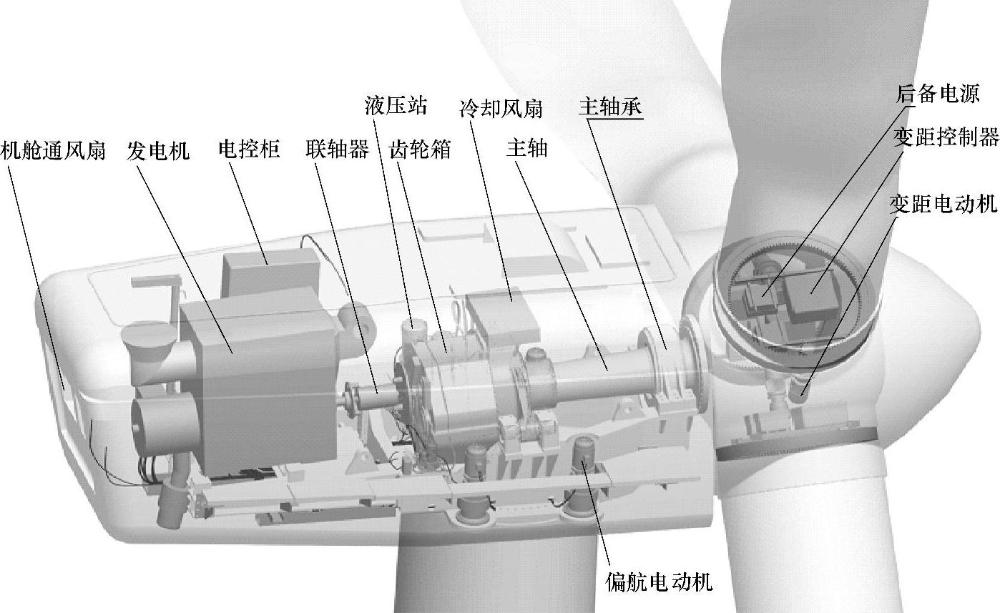

图1-2 双馈式风力发电机组的内部结构

双馈式风力发电机组风轮将风能转变为机械转动的能量，经过齿轮箱增速驱动双馈式异步发电机，应用励磁变流器励磁而将发电机的定子电能输入电网。如果超过发电机同步转速，转子也处于发电状态，通过变流器向电网馈电。

齿轮箱可以将较低的风轮转速变为较高的发电机转速。同时也使得发电机易于控制，实现稳定的频率和电压输出。

交流励磁变速恒频双馈发电机组的优点是，允许发电机在同步速上下30％转速范围内变速运行；变流器的功率仅是发电机额定容量的一部分，使变频装置体积减小，成本降低，投资减少；可以实现有功、无功功率的独立调节。

交流励磁变速恒频双馈式风力发电机组的缺点是，双馈式风力发电机组必须使用齿轮箱，然而随着发电机组功率的升高，齿轮箱成本变得很高，且易出现故障；发电机转子绕组带有集电环、电刷，增加维护和故障率；控制系统结构较复杂。

2.直驱式永磁风力发电机组

风力发电机组也可以用多极永磁发电机直接连接风力机，从而避免增速箱带来的诸多不利，这就是直驱式永磁风力发电机组。电力电子器件的发展也为直驱式永磁风力发电机的发展开辟了道路。直驱式永磁风力发电机组的结构如图1-3所示。

直驱式永磁风力发电机组的发电机轴直接连接到风轮上，转子的转速随风速而改变，其交流电的频率也随之变化，经过大功率电力电子变换器，将频率不定的交流电整流成直流电，再逆变成与电网同频率的交流电输出。变速恒频控制是在定子电路实现的，因此变频器的容量与系统的额定容量相同。

直驱式永磁风力发电机组相对于传统的异步发电机组优点是，由于传动系统部件的减少，提高了机组的可靠性，降低了噪声；永磁发电技术及变速恒频技术的采用提高了风力发电机组的效率；利用变速恒频技术可以进行无功功率补偿。

虽然直接驱动与采用交-直-交变流器相结合的变速恒频方式有一定的优势，但也存在如下缺点：采用的多极低速永磁同步发电机，电机直径大，制造成本高；随着机组设计容量的增大，给电机设计、加工制造带来困难；定子绕组绝缘等级要求较高；采用全容量逆变装置，功率变换器设备投资大，增加控制系统成本。

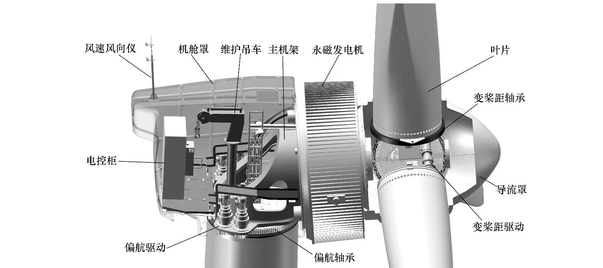

图1-3 直驱式永磁风力发电机组结构

### 第二节 风力发电机组设计工作规范

#### 一、设计依据

风力发电机组的设计依据是《风力发电机组的设计任务书》。《风力发电机组的设计任务书》是上级部门或用户为设计部门提供的设计条件，这些条件是设计计算的已知条件。一般包括风力发电机组的基本形式、基本参数和外部条件。

1.基本形式

首先应该明确风力发电机组的基本形式。例如，是设计水平轴还是垂直轴的；对于水平轴的风力发电机组是上风向还是下风向的；风力机是两叶片还是三叶片的，是定桨距还是变桨距的；发电系统是恒速恒频还是变速恒频的等。

目前，主流机型是水平轴、上风向、三叶片、变桨距、变速恒频风力发电机组。这一类机组也有不同的机型，主要区别是发电机转速的不同。可以分为应用高转速的双馈式异步发电机的双馈式机组；应用低转速的同步发电机的直驱式机组和应用中转速的同步发电机的混合式（半直驱）机组。

2.基本参数

基本参数主要是风力发电机组的额定功率、转速范围、总效率、设计寿命和生产成本等。

3.外部条件

风力发电机组的外部条件包括运行环境条件、电网条件和风场的地质情况。运行环境条件主要是风资源、湍流和阵风情况、气候情况等。有关风力发电机组的外部条件问题将在本书第三章详述。

#### 二、设计内容

风力发电机组的设计内容就是完成设计图样和相关的设计文件。设计图样包括外观图、部件图和零件图等；设计文件包括《设计计算书》、《用户手册》等。

1.外观图

风力发电机组的外观图（见图1-4）描述其整体结构并标注主要尺寸。同时，用文字注明设备的技术特征。如机组类型、功率调节方式、风轮旋转方向、额定功率、额定风速、风轮直径、风轮转速范围、风轮倾角、风轮锥角、变距最大角度、齿轮箱类型、齿轮箱增速比、发电机类型、塔架类型、轮毂中心高和各主要部件重量。

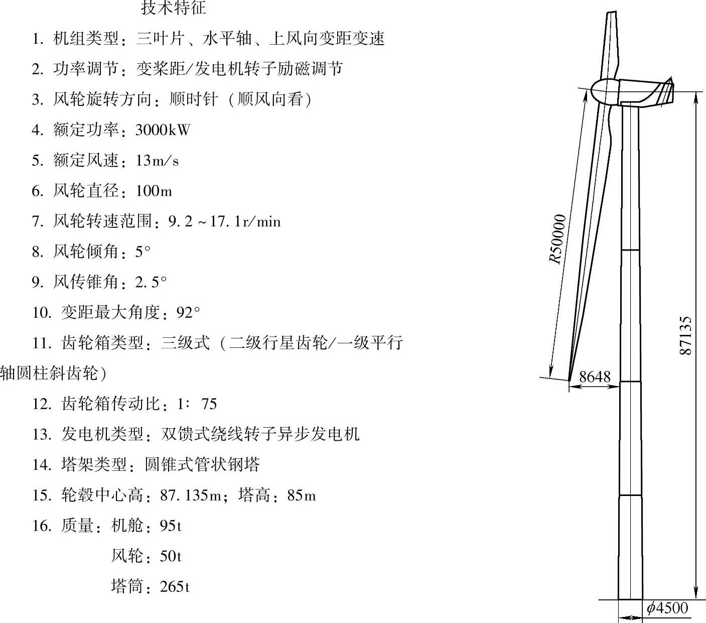

图1-4 外观图示例

2.部件图

部件图是各层次安装工作的指导图样。表示各零件之间的装配关系、配合公差、轮廓尺寸、装配技术条件、标题栏等。

部件可能是多层次的。例如机舱中还设有齿轮箱和发电机等部件。各级部件图以图号相区别。

3.零件图

零件图是生产零件的依据。包括零件的结构和形状、尺寸、粗糙度和形位公差、材料及表面处理、技术条件、标题栏等。

在设计零件时，要进行相应的载荷分析和强度校核。

4.电气图

电气图包括电气系统原理图和连线图等。

5.控制流程图及软件

风力发电机组的控制系统是一个综合性系统。应该在整体优化的基础上编制控制流程图及相应软件。

6.外购件和标准件明细表

外购件和标准件明细表用来说明外购件和标准件名称、规格、型号、数量和生产厂家，供采购部门使用。

7.设计文件

设计文件是与设计相关的文字材料。用于设计部门存档，指导装配和安装，指导用户的维护作业和提供维修人员使用。

#### 三、设计原则

风力发电机组的设计所涉及的知识、资料、信息是多方面的。为了保证风力发电机组设计成功，应遵循一定的设计原则。在设计前要确定设计所必须用到的参数及风力发电机组应达到的技术、经济指标。还应掌握国内外当时风力发电机组的水平，立足国情，结合用户需求及风力发电机组安装的地理、自然条件、几年的风速记录等，力争设计的起点高、技术先进、性能优越、成本低，达到国内外领先水平，才能使设计的风力发电机组在市场上具有竞争力。

下面介绍风力发电机组的设计一般应遵循的基本原则。

1.可靠性

如果在预计的服务寿命内得到正确的使用和维护，风力发电机组应该被设计制造成在预计的安全水平下承受假定的载荷并表现出足够的持久性和坚固性。风力发电机组配备了控制和保护系统，它规定了风力机将要经历的所有可能的设计状态。

可靠性表示系统、机器或零件等在规定时间内能够稳定工作的程度或性质。它是风力发电机组的基本质量标志，是产品质量的重要组成部分。可靠性来自设计、制造和使用维护。设计可靠性是影响产品可靠性的重要因素。

风力发电机组可靠性量化指标是机组运行可利用率，可利用率是固有可靠性和使用管理可靠性的综合度量指标。

风力发电机组可利用率A_(s)计算方法如下：

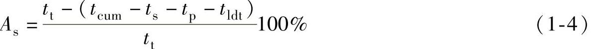

式中 t_(cum)——累积停机时间，单位为h；

t_(p)——计划维修时间，单位为h；

t_(s)——使用维护人员操作失误造成停机时间，单位为h；

t_(t)——总时间，例如1年，单位为h；

t_(ldt)——非维修时间，单位为h。

t_(ldt)=t₁+t₂+t₃ （1-5）

式中 t₁——电网故障的时间；

t₂——不可抗力造成停机的时间，如战争、地震、洪水等；

t₃——气候限制导致停机的时间，如覆冰、气温超过规定的运行极限温度等。

总体设计阶段，对重要零部件和系统应规定可靠性量化指标的要求，可以采用串联模型法，确定有关零部件的可靠性定量要求，即

式中 A_(c)——整机可利用率；

A_(i)——第i个零部件或系统可利用率。

对系统，包括电控系统、安全系统和液压系统等元器件的选择应考虑平均故障间隔时间（Mean Time Between Failure，MTBF）或平均维修间隔时间（Mean Time Between Maintenance，MTBM）和平均维修时间，以满足整机可靠性的要求。

对重要承力零部件，还应规定使用寿命，使用寿命是可靠性要求不可缺少的指标。

风力发电机组配备了控制和保护系统，它规定了风力发电机组将要经历的所有可能的设计状态。为了保证风力发电机组在这个限定的状态之内，保护系统应该提供足够高水平的可靠性，为保护风力发电机组的安全，对重要的安全系统可以采取冗余设计。

预计的安全等级的选择对不同的风力机部件有所不同。风轮通常至少设计成中等安全等级，其他的结构部件，如塔架、基础等经常根据其失效的可能后果确定其安全等级。

限制状态设计用于达到预计的安全水平。常用于确定风力发电机组安全性的限制状态如下：极限限制状态、服务性限制状态、事故限制状态。针对这个目的，设计载荷可以乘以几个部分的安全系数得到，而设计承载能力可以用特征能力除以几个其他部分的安全系数得到。部分安全系数主要考虑载荷和材料强度特征值的不确定性，结构安全性的确认通过保证设计载荷或者设计载荷的组合不超过设计能力来达到。在组合载荷的情况中，应该注意总是用一种极端载荷与一个或几个正常载荷进行组合。两个或几个极端载荷一般不进行组合，除非它们之间有一定的关联。

有关可靠性和安全性的设计问题，将在本章第三节具体介绍。

2.经济性

经济性包括风力发电机组制造企业的制造成本及其经济效益；用户的使用成本及发电成本；风力发电机组使用和制造的社会效益三个方面。

风力发电机组制造成本直接关系到风力发电机组市场的开拓和占有率，反过来又影响企业的经济效益。目前，世界工业发达的国家大型风力发电机组制造成本逐步下降，已接近火电成本。

经济性还包括用户的使用成本、发电成本。为使风力发电机发电低成本，在设计风力发电机组时必须保证风力发电机组技术性能和制造质量，并使风力发电机组的结构简单，维修费用少，安全可靠地运行才能达到低发电成本。

风力发电机组对制造企业来说是产品，在市场销售则是商品。作为商品的风力发电机组，用户购买的动机和目的是它的使用价值，应以为用户创造经济效益为先。在设计时，必须充分考虑风力发电机组的使用价值。

如果用户是风电场，并网发电售电，用户要求风力发电机发电电价至少要和常规电力电价相当。如果风电售价高于常规电价，除非政府支持并给予补贴，否则风电场就要亏损，无法经营。

设计风力发电机组时还必须考虑到它的社会效益。社会效益主要包括对环境的影响，劳动力就业，人民生活的改善和提高等。

总之，设计风力发电机组要考虑它的成本和市场，使之有良好的经济效益，也要有良好的社会效益。

3.先进性

在风力发电机组的设计中技术起点要高，应采用新技术、新材料、新工艺以保证风力发电机组既能达到设计要求的指标，又能兼顾经济性能。还应使风力发电机组结构简单、操作方便、易于维护、运行可靠、寿命长、安全性能好、成本低，各项技术、经济指标得到尽可能完美的实现。

但是，也要注意采取可靠技术，不能采用未经试验证明的不成熟技术，以避免造成损失和失败。

4.工艺性和易维修性

在设计中，应尽可能地使零部件易于加工和组装。整机组装之后，应易于检查和更换零部件，应该为维护和修理预留必要的空间。

注重外形设计，使整机和主要零部件造型美观。

5.标准化

国家有关部门针对风力发电机组提出了一系列标准，包括名词术语、安全要求、技术条件、试验方法、设计要求等，在设计过程中必须严格遵循这些标准。对于国标、部标中尚未涉及的设计内容，可以参照国际上公认的标准执行。

国内并网型风力发电机组部分标准目录如下：

GB/T 2900.53—2001《电工术语 风力发电机组》

GB/T 18451.1—2012《风力发电机组 设计要求》

GB/T 18451.2—2003《风力发电机组 功率特性试验》

GB/T 19960.1—2005《风力发电机组 第1部分：通用技术条件》

GB/T 19960.2—2005《风力发电机组 第2部分：通用试验方法》

GB/T 20319—2006《风力发电机组 验收规范》

GB/T 20320—2006《风力发电机组 电能质量测量和评估方法》

GB/T 19568—2004《风力发电机组 装配和安装规范》

GB/T 19069—2003《风力发电机组 控制器 技术条件》

GB/T 19070—2003《风力发电机组 控制器 试验方法》

GB/T 19071.1—2003《风力发电机组 异步发电机 第1部分：技术条件》

GB/T 19071.2—2003《风力发电机组 异步发电机 第2部分：试验方法》

GB/T 19073—2008《风力发电机组 齿轮箱》

GB/T 19072—2010《风力发电机组 塔架》

JB/T 10300—2001《风力发电机组 设计要求》

JB/T 10194—2000《风力发电机组 风轮叶片》

JB/T 10427—2004《风力发电机组 一般液压系统》

JB/T 10425.1—2004《风力发电机组 偏航系统 第1部分：技术条件》

JB/T 10425.2—2004《风力发电机组 偏航系统 第2部分：试验方法》

JB/T 10426.1—2004《风力发电机组 制动系统 第1部分：技术条件》

JB/T 10426.2—2004《风力发电机组 制动系统 第2部分：试验方法》

JB/T 10705—2007《滚动轴承 风力发电机轴承》

国际电工委员会（IEC）制定的风力发电机组部分标准目录见表1-1。

表1-1 国际电工委员会（IEC）制定的风力发电机组部分标准目录

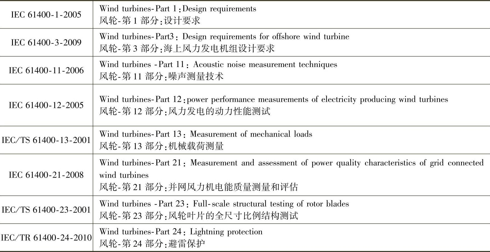

#### 四、设计步骤

一般说来，风力发电机组的设计可以分为三个阶段，即方案设计、技术设计和施工设计。

1.方案设计

首先要确定风力发电机组的主要参数、整体布局和结构形式；对机组的整体载荷及整机重量进行初步估计，选择主要部件的结构，完成机舱布局的计算机设计模型；同时给定控制策略。在此基础上撰写方案设计说明书。

2.技术设计

根据方案设计的资料，进行整机和部件结构设计并确定技术要求；初步选择外购件的型号。在此基础上提供初步设计图样和初步设计说明书。

在技术设计阶段必须多学科相互配合，考虑整体动力响应，有时要进行数次反复修改。

3.施工设计

根据技术设计结果，进行载荷计算，对零部件进行强度和刚度校核及失效分析，对关键零部件进行优化设计；对整机进行可靠性分析和动态分析。修改和审定加工图样和技术文件，填写标准件和外购件明细表，撰写装配和安装说明书及用户维修手册。

### 第三节 风力发电机组的可靠性和安全性设计

#### 一、整机的可靠性

1.保护系统

保护系统可以分为机械、电气和气动保护系统。当控制系统失效或者其他失效事件发生时，保护系统被激活，此时风力发电机组已经不在正常的运行范围内了，保护系统将把风力发电机组带回到安全条件并维持在这样的条件内。一般要求保护系统有能力把转子从任何一个运行状态带回到停机或空转状态。

为了确保在有人身安全危险时能够立即将机器停下来，在所有工作位置都必须有紧急制动按钮，它高于功能控制系统和其他保护系统。

保护系统的可靠性可以通过下述方法来保证：整个保护系统是失效安全设计；不能设计成失效安全模式的部件必须是冗余设计；经常检查保护系统的功能，用风险评估决定检查的间隔。

失效安全是设计原则，它通过对结构的冗余或充裕设计，确保在结构失效或电源失效的情况下，风力发电机组能够保持在无风险的状态。

2.制动系统

制动系统是保护系统的执行部分，制动系统包括机械制动、气动制动和发电机制动。

气动制动系统通常包括叶尖的转动部分或者通常看到的主动失速和变桨距控制风力发电机组，使整个叶片沿展向轴转动90°，从而导致气动力矩和转子力矩相互抵消。此外，副翼和降落伞也被用作气动制动。

制动系统的可靠性对于确保系统达到它的目的是极其重要的，基于此，对不同制动之间、不同制动零件之间的关联性应该十分清楚。比如，如果三个叶片都装有叶尖制动，可以预见三个叶尖制动之间有一定的关联，这些制动都具有共同的失效原因，这会影响三个叶尖制动系统抗失效的整体可靠性。

制动及其制动零件必须抗磨损，因此要求进行适时监测和维护。

3.在线监测和故障诊断

在线监测系统是因大型机组发展起来的一门新兴交叉性技术，这缘于近代机械工业向机电一体化方向发展，机械设备高度的自动化、智能化、大型化和复杂化。在许多情况下，都需要确保工作过程的安全运行和高可靠性，因此对其工作状态的监视日显重要。随着大型风力发电机组单机容量的迅猛增加，风力发电机组的机械结构也日趋复杂，不同部件之间的相互联系、耦合也更加紧密。一个部件出现故障，将可能引起整个发电过程中断。在这种环境下，在线监测在风力发电行业得到了飞速的发展。国外在线监测技术发展得比较成熟，有专门用于风力发电机组的监测设备。在监测服务方面，有专门的风力发电机组监测服务公司。

大型风力发电机组的故障主要集中在齿轮箱、发电机、低速轴、高速轴、叶片、电气系统、偏航系统、控制系统等关键部件。这些关键部件若发生故障将造成风力发电机组停机。由于风电场多建于远离城市的偏远地区或近海区域，交通不便，再加上风力发电机组处于空中，故对风力发电机组的维护非常困难；若需吊至地面做故障诊断、维修或更换，则需花费更多的人力和物力。迫于不断降低风力发电机组运行和维护成本的需求，基于在线状态监测系统维修方案的应用越来越广泛。常规的风力发电机组状态监测系统可在风力发电机组运行过程中实时监控各关键部件的运行状态，根据监测数据和状态类型，及时诊断部件存在的问题和隐患，检测非正常工作的零件或分析出现早期故障症状的零件，进而预测将来何时会出现何种故障；根据诊断结果及时采取处理措施，防止造成严重损失，提高风力发电机组运行的可靠性、使用效率和使用寿命。

在风力发电机组的实际状态监测过程中，齿轮箱、轴系、发电机、叶片、电气系统、控制系统、偏航系统和变桨距系统是重点关注的对象。

#### 二、零部件的可靠性

1.极限状态

在结构的寿命期内，结构要承受载荷和执行操作。这些载荷可能导致结构从完好无损状态到退化、损伤、失效状态。结构失效可能出现几种模式，它涵盖了所有导致结构损坏的失效可能性。虽然，从完好状态到失效状态的转变是连续的，但通常假定所有失效的特定模式划分成两类，分别是已经失效的状态和没有失效或安全的状态。安全状态和失效状态的边界可以归结为一系列的极限状态。结构可靠性或安全性关注的是：结构是如何达到极限状态从而进入失效状态的。

有几种形式的极限状态，其中两种形式最为常见，即强度极限状态和可靠性极限状态。强度极限状态对应于结构或结构零件承载能力的限制，如塑性屈服、脆断、疲劳断裂、不稳定、屈曲、倾覆。可靠性极限状态是指变形超过了间隙，而承载能力没有超。如裂纹、磨损、腐蚀永久变形及振动。疲劳有时被处理成一个独立的极限状态。还有其他形式的极限状态，如事故极限状态以及积累极限状态。

2.可靠性指标

在结构设计中，结构零件的可靠性根据一种或多种失效模式进行评估。其中一种失效模式假设如下：结构零件由一系列随机变量组成的矢量X来描述，包括强度、刚度、几何形状以及载荷。从拥有自然变化和其他可能的不确定性角度考虑，这些变量都是随机变量，可以根据一些概率分布处理成大小不等的定量值。为了考虑失效模式，可能的X真实值可以分解成对应结构零件是安全的和对应零件将失效两组。安全系列和失效系列之间的界面在基本变量空间中用极限状态界面表示，可靠性问题可以很方便地用所谓的极限状态函数g（X）来描述，它的定义为

对于所考虑的极限状态，极限状态函数通常基于一些数学工程模型，根据背后的物理原理，以控制载荷和抵抗变量来表示。

失效概率是失效系列的概率，即

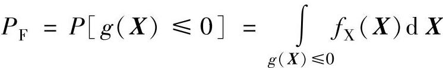

式中 f_(X)（X）——X的组合概率密度函数，表示控制变量X的不确定度和自然变化。

其余数P_(S)=1-P_(F)定义成可靠度，有时可以表示成生存概率。可靠性用可靠性指标β来表示如下：

β=-Φ⁻¹（P_(F)）

式中 Φ——标准正态分布函数。

失效概率、可靠性、可靠性指标是一套结构安全性的度量指标。

3.安全系数及其确定

结构设计标准中规定了在结构元件设计过程中应遵循的准则。设计标准中的设计准则总体框架就是所谓的标准格式。

在设计中最常用的标准格式是以控制载荷和强度变量的设计值来表示的，这些设计值定义成载荷和强度变量的特征值加上局部安全系数。这样的标准格式来源于简单而经济的设计要求，也就是设计值格式。按照设计值格式得到的设计有时被归结为载荷和强度系数设计（Load and Resistance Factor Design，LRFD）。

在最简单的形式中，标准要求可以表示成以不等式表示的设计规则，即

F_(d)＜f_(d)

式中 F_(d)——总内部载荷或载荷响应的设计值；

f_(d)——材料设计值。

局部安全系数考虑了载荷和材料的不确定性和易变性，分析方法的不确定性以及零件的重要性。载荷局部安全系数γ_(f)和材料局部安全系数γ_(m)的定义参见第三章中的式（3-24）和式（3-25）。

通常，几种不同的载荷必须组合进结果载荷中，一般是几种最大的不同载荷的组合作为设计规程中的载荷。这样的载荷组合例子如重力载荷与风载荷的组合。

特征值通常分别取自载荷及强度分布对应特定分位数的值。特征值常常是对应于死点载荷的名义值，即变化载荷（环境）年度最大值分布98％的分位数，强度分布2％或5％的分位数。标准也规定了用于载荷局部安全系数γ_(f)及材料局部安全系数γ_(m)的值。

4.失效概率的更新

设计过程仅仅是保证结构安全可靠性的一个环节。在制造以及服务过程中，也要引入诸如质量控制、轴对中控制、目测检查、仪器监视与载荷校验这样一些其他安全因素。每一项安全因素都提供了关于结构的信息，除了在设计阶段反映结构信息之外，还可以减少与结构有关的总体不确定度。设计中所用的概率模型可以对照实际情况，借助于这些附加信息进行更新、校验。

在制造和服务中获得的这些附加信息也可以直接作为控制变量的信息，如强度。或者间接通过观察替换变量来得到，此时替换变量是控制变量的函数，如裂纹或变形。

把设计阶段的失效概率更新成反映检查获得附加信息的概率值是很有意义的。经过检验更新的失效概率是建立在条件概率定义基础上的。

令F表示结构失效事件。在设计过程中，根据上述的程序可以对失效概率P_(F)=P\[F\]进行求解。令I表示这样的事件，结构在服役过程中，经过检查得到控制变量或者一个、几个控制变量函数的观测值。更新后的失效概率是以检验事件I发生为条件的失效概率，即

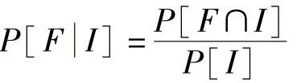

上式中的分子概率可以通过并联系统的可靠性分析求解。一旦定义了合适的限制状态函数，恰当考虑了测量不确定度及探测概率以后，便可以通过上述结构部件可靠性分析求解分母概率。测量不确定度及探测概率是与本章内容有关的不确定度的重要来源。

对于一些极限状态，如裂纹成长以及疲劳失效，失效概率P_(F)作为时间函数随之增加。对于这样的极限状态，以时间为函数的失效概率的预测可以用于预测失效概率超过关键临界点的时间，如最大可接受失效概率。预测的时间点是执行检查自然的选择。像上面概括的那样，根据检查发现及检查后可能进行的维修所带来的改进，失效概率可以被更新。失效概率再一次超过关键临界点从而触发新一轮检查的时间能提前预测，从而形成了检查间隔。上述方法可用于制定检查计划。

一些极限状态，如疲劳极限状态，按规定的时间间隔进行检查，实际上可能是设计寿命期内，维持要求的安全水平的先决条件。

#### 三、劳动安全

在设计风力发电机组时，应考虑风力发电机组上或附近工作的人员安全，至少应发布用于运输、安装、运行、维护和修理的程序以及作业指导书。

方便、安全地操作风力发电机组控制杆或按钮是必要的。控制杆和按钮的放置和布置，应该避免由于粗心或错误可能产生的危险误操作。一般地，风力发电机组应该确保不会发生危险状态。

### 第四节 风力发电机组设计软件简介

随着现代设计方法和风电技术的发展，国内外已经开发出一些分析和应用软件，对风力发电机组和风电场设计形成了必不可少的技术支持。除了风电场设计、风资源预测和综合解决方案等专用软件，还需要应用到很多其他的软件，如仿真建模软件和应用于叶片设计的空气动力相关软件等，它们都是风力发电机组设计的应用工具。虽然国外已经开发出不少功能多样的软件，对于我国风电事业来说，仍然应该自行开发出更加适合我国风电领域特色的软件，以快速提升我国风电开发实力。以下是部分常用软件的简介，以供参考。

#### 一、结构分析与设计软件

1.CATIA

CATIA是法国Dassault System公司旗下的CAD/CAE/CAM一体化软件，作为PLM协同解决方案的一个重要组成部分，它可以帮助制造厂商设计他们未来的产品，并支持从项目前阶段、具体的设计、分析、模拟、组装到维护在内的全部工业设计流程。模块化的CATIA系列产品旨在满足客户在产品开发活动中的需要，包括风格和外形设计、机械设计、设备与系统工程、管理数字样机、机械加工、分析和模拟。通过使企业能够重用产品设计知识，缩短开发周期，CATIA解决方案加快了企业对市场需求的反应。自1999年以来，市场上广泛采用它的数字样机流程，从而使之成为世界上最常用的产品开发系统。CATIA系列产品已经在七大领域里成为首要的3D设计和模拟解决方案：汽车、航空航天、船舶制造、厂房设计、电力与电子、消费品和通用机械制造。

CATIA软件拥有很强的Shape Design＆Styling曲面设计模块，可以用于风轮、叶片、轮毂等部件的设计，并为下一步的分析、制造提供三维模型。

2.ADAMS

ADAMS（机械系统动力学自动分析）软件是美国MDI公司（Mechanical Dynamics Inc.）开发的虚拟样机分析软件。ADAMS一方面是虚拟样机分析的应用软件，用户可以运用该软件非常方便地对虚拟机械系统进行静力学、运动学和动力学分析。另一方面是虚拟样机分析开发工具，其开放性的程序结构和多种接口可以成为特殊行业用户进行特殊类型虚拟样机分析的二次开发工具平台。ADAMS软件由基本模块、扩展模块、接口模块、专业领域模块及工具箱5类模块组成。用户不仅可以采用通用模块对一般的机械系统进行仿真，而且可以采用专用模块针对特定工业应用领域的问题进行快速有效的建模与仿真分析。

ADAMS软件中的ADAMS/WT模块，专门用于风力发电机组动力学问题的分析，由美国新能源实验室开发。针对叶片和风轮的分析过程，ADAMS/WT模块可模拟风力发电机组的运动过程，得到用户希望的载荷分布描述，并能较直观地展示其运动过程及力学特性。另外，ADAMS软件还包含了用于气动载荷分析的AeroDyn和YawDyn等子模块。

3.ANSYS

ANSYS软件是融结构、流体、电场、磁场、声场分析于一体的大型通用有限元分析软件。它能与多数CAD软件接口，实现数据的共享和交换，是现代产品设计中的高级CAE工具之一。软件主要包括三个部分：前处理模块，分析计算模块和后处理模块。

前处理模块提供了一个强大的实体建模及网格划分工具，用户可以方便地构造有限元模型。

分析计算模块包括结构分析（可进行线性分析、非线性分析和高度非线性分析）、流体动力学分析、电磁场分析、声场分析、压电分析以及多物理场的耦合分析，可模拟多种物理介质的相互作用，具有灵敏度分析及优化分析能力。

后处理模块可将计算结果以彩色等值线显示、梯度显示、矢量显示、粒子流迹显示、立体切片显示、透明及半透明显示（可看到结构内部）等图形方式显示出来，也可将计算结果以图表、曲线形式显示或输出。

在风力发电机组的设计中，可以通过ANSYS软件建立叶片、塔架等部件的结构分析模型，对其运行中的载荷、形变、位移及瞬态动力学特性和模态特性等进行分析。

4.Romax Designer

由英国Romax公司在传动领域积累了20多年经验开发的Romax Designer主要应用于齿轮传动系统虚拟样机的设计和分析，在传动系统设计领域享有盛誉，目前已成为齿轮传动领域事实上的行业标准。

Romax Designer软件作为齿轮传动系统和轴承系统设计开发平台工具。能够适用于平行轴系、相交轴系、行星齿轮传动等多种传动形式的传动系统产品设计与开发，能够完全覆盖系统概念设计，详细设计以及系统验证等阶段；Romax Designer采用系统建模与分析的思想计算传动系统变形及各部件上的载荷情况，进而能够进行齿轮强度，轴承寿命，轴疲劳，齿轮修形，齿轮接触应力，同步器尺寸计算，箱体柔性与强度，齿轮参数优化，系统振动噪声（NVH）预估等方面的设计分析内容。

#### 二、性能分析与仿真软件

1.GH Bladed

GH Bladed软件是一款整合的计算仿真工具，它适用于陆上和海上的多种尺寸和型式的水平轴机组，进行设计和认证所需的性能和载荷计算。目前，GH Bladed已被广泛应用于风电领域，用户包括机组及零部件制造商、大学和研究机构、认证机构。Bladed软件主要通过输入参数建立风力发电机组的分析模型，但要求能够提供详尽的风力发电机组各种技术参数。建模过程分为两部分，即风力发电机组建模和外部环境条件建模。

（1）Bladed软件的风力发电机组建模功能

Bladed软件的风力发电机组建模功能内容主要包括风轮模型、叶片模型、主传动链模型、发电机和电气模型、控制模型以及塔架和机舱模型等。

（2）外部环境条件建模

外部环境条件建模是对风力发电机组性能和载荷分析的重要依据。Bladed软件的外部环境条件建模包括风速、海浪/海流、地震模型等。风速模型可以产生稳态风速、IEC标准规定或用户定义的瞬态风速、湍流风速、极端风速模型和地面风剪切模型等；海浪/海流模型包括波浪谱模型、近海面/海面下/近海岸的海流模型、规则或随机的海浪模型、非线性的极端海浪模型等；地震模型是引入非标准的地震定义，产生地表加速度时间历程，用于风力发电机组的仿真。

（3）Bladed软件的计算功能

Bladed软件的计算功能主要有塔架和叶片的模态分析、叶片（风轮）空气动力学、风力发电机组性能参数、功率曲线、平均稳态载荷、风力发电机组各种状态（静止/空转/起动/停机/正常发电/故障）性能和载荷的细节模拟、MATLAB格式的全阶线性化模型、地震载荷模拟等。它可以输出用户感兴趣的部件位置数据，如平动和转动（变形/位移/速度/加速度）、载荷（力和转矩）、电功率、电流、电压等参数。

（4）Bladed软件的结构动力学分析功能

Bladed软件可以进行风力发电机组的动力学初步分析和计算，采用模态分析方法，计算各独立转动部件和非转动部件的模态，然后采用模态合成方法进行整机的模态分析。采用能量守恒原理和拉格朗日方程建立运动方程，方程中考虑了风轮的挥舞、摆振和塔架振动的模态，并包含初期与陀螺相关的非线性和气动弹性的影响，采用四阶变步长龙格-库塔方法求解。

（5）Bladed软件的后处理模块

用于生成项目计算报告、仿真结果处理、自动生成风力发电机组认证报告等。后处理模块可进行的计算主要包括风力发电机组年生产电能、动态功率、部件极端载荷预测、部件周期和随机载荷提取、部件载荷分量概率分布统计、谱分析、交叉谱、应力时间历程、疲劳分析、雨流计数、破坏等效载荷、极端载荷分析、基本统计学分析等。

2.HAWC

HAWC是丹麦RISϕ国家实验室研发的空气弹性仿真工具，计算风力发电机组结构的动态负载，主要应用于风力发电机空气动力学和机械部件的研究。

3.FAST

FAST（Fatigue，Aerodynamics，Structures and Turbulence，疲劳强度、空气动力学、结构和湍流分析）软件由美国国家可再生能源实验室（National renewable Energy Laboratory）和俄勒冈大学合作开发，是一种用于水平轴风轮叶片模型构建和性能分析的软件。

FAST软件包括多个功能模块，通过有关叶片模型构建的数据输入文件，如风况、叶片翼型文件和控制文件等，实现对风力发电机组工作状态的仿真。

FAST软件可以输出叶片各截面的载荷及其运行参数（如转速、叶尖速比、风轮功率、发电机功率等）的关系。一般而论，FAST软件的分析结果比较全面和可靠，但其结果和操作界面多为数据显示，不很直观。为解决此问题，FAST软件提供了可生成用于ADAMS动态分析的输出文件，对其功能是很好的扩展。

4.PROPID

PROPID程序是用于对水平轴风力机叶片进行逆向设计和分析的一种方法。它可以通过迭代相应变量，实现预期的风力机风轮性能和沿叶片展向的气动性能。PROPID耦合了Prandtl尖端损失模型和Corrigan Post-Stall模型，用来修正二维风洞翼型数据，如尖端损失、三维失速延迟模型等。在常速和变速叶轮操作中，PROPID的性能分析结果具有很好的精确性和准确性。

PROPID分析模块主要通过1D—SWEEP和2D—SWEEP命令实现。1D—SWEEP命令用来获得沿叶片展向的气动参数分布，如不同风速下叶片的升阻力系数等。2D—SWEEP命令用来获得整个风轮的气动性能，如功率与风速（包括安装角、转速等）关系，风能利用系数与叶尖速比关系等。PROPID设计模块能够通过自动迭代调整某个指定的变量，实现预期的输出值。对于目标函数为单值情况（如极值风轮功率），通过执行NEWT1—type命令实现；若目标函数为分布函数，则使用NEW T2—type命令。

## 第二章 能量转换和传输理论

风力发电机组能量转换和传输理论是风力发电机组设计计算的基础，本章仅介绍其核心部分。包括风能捕获理论、能量传递理论和机电能量转换理论。

### 第一节 风能捕获理论

流体的运动规律遵循物理学三大守恒定律，即质量守恒定律、动量守恒定律和能量守恒定律。流体动力学基本方程组就是这三大定律对运动流体的数学描述。但是，流体力学基本方程组是不封闭的，要使其封闭还需增加补充方程。研究这一方程组具有极其重要的意义，因为实际流体的流动过程遵循这一基本方程组。把风力机流场视为可压缩、有黏性的非定常空气流场。流场的数值解可通过求解流体力学的控制方程组完成。

#### 一、流体力学的基本方程

流体所流过的相对于某个坐标系来说是固定不变的任何体积称之为控制体。控制方程可通过对两种“控制体”应用基本物理规律导出，分别为固定在流场空间的控制体和随流体一起运动的控制体。常用的是前一种控制体得到的控制方程。

1.流体力学的控制方程

这里介绍的流体力学控制方程组中物理量符号含义如下：ρ为流体密度；V为流体速度矢量，u、v、w为速度矢量在三个方向的分量；P为压强；τ_(xx)、τ_(yy)、τ_(zz)、τ_(xy)（τ_(yx)）、τ_(yz)（τ_(zy)）、τ_(zx)（τ_(xz)）为切应力（下标规定：第一个下标代表应力所在平面的外法线方向，第二个下标代表应力的方向。例如，τ_(xy)表示作用在与X轴垂直的平面上沿Y方向的切应力）；f为单位质量流体的质量力，f_(x)、f_(y)、f_(z)为单位质量流体的质量力的分量；e为单位质量流体的微观分子运动的动能（内能）；T为流场绝对温度。

（1）连续方程

连续性方程是质量守恒定律在运动流体中的数学表达式。质量守恒定律表述如下：控制体内流体质量的减少量应等于从控制体净流出的流体质量。连续方程的矢量形式为

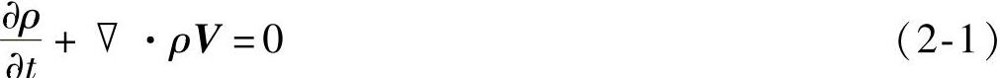

在直角坐标系中，连续性方程式为

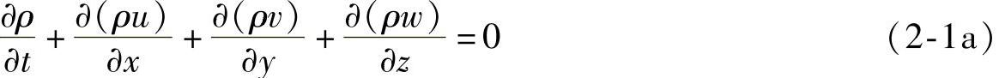

（2）运动方程（纳维-斯托克斯方程）

运动方程是动量守恒定律对于运动流体的表达式。运动方程的矢量形式为

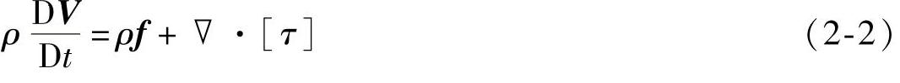

式中 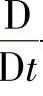——质点导数符号，且有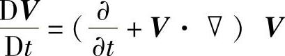，即为质点加速度；

\[τ\]——应力张量，其定义为

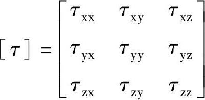

在直角坐标系中，运动方程可写成

根据广义牛顿定律，有下列关系式：

式中 μ——流体动力黏度；

λ——膨胀黏性系数，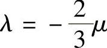。

将这些关系式代入式（2-2a）、（2-2b）、和（2-2c），运动方程变为

（3）能量方程

能量方程是能量守恒定律对于运动流体的表达式。用内能表示的能量方程的矢量形式为

式中 q——由于热幅射或其他原因在单位时间内传入单位质量流体的热量；

k——导热系数。

\[ε\]——变形率张量，其定义为

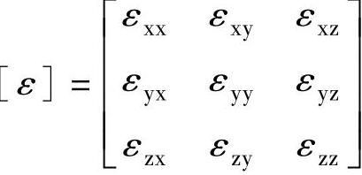

变形率张量的分量表示变形速度，在直角坐标系中，线变形速度为

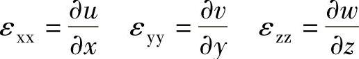

剪切变形速度为

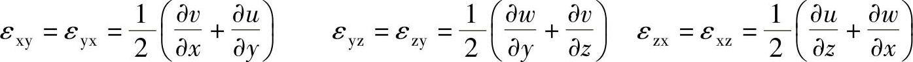

式（2-3）的物理意义是：在单位时间内，单位体积流体内能的增加等于单位体积内由于流体变形表面力所做的功\[τ\]·\[ε\]，加上热传导及由于热辐射等其他原因传入的热量\[∇·（k∇T）+ρq\]。

在直角坐标系中，能量方程可写成

2.补充方程

1）假设气体是完全气体，有状态方程

p=ρRT （2-4）

式中 R——气体常数。

2）流体的状态热力学关系式

式中 c_(v)——定容比热，且有

c_(v)=c_(v)（T） （2-6）

总之，上述共有7个独立方程（1个连续方程、3个运动方程、1个能量方程、2个补充方程），包含7个流场未知变量，即ρ、p、u、v、w、T、e，给定边界条件和初始条件后方程组有定解。

3.边界条件

如果给定边界条件和初始条件（初值），可以求得控制方程的特解。

（1）黏性流体边界条件

假定物面和气体直接接触表面无相对速度，叫无滑移边界条件。对静止物体有

u=v=w=0（在物面上）

（2）无黏流体边界条件

流动在物面有滑移，在物面上，流动一定与物面相切。

V·n=0（在物面上）

应该指出，为了更具一般性，上述基本方程的推导中把密度ρ视为变量。实际上，在风速范围内，是可以把ρ视为常数的。

4.控制方程组离散和有限差分解

有限差分法被广泛地应用在计算流体力学中。其原理是，用有限差分表达式来代替流体力学控制方程中出现的偏导数，从而生成控制方程的差分方程。用网格离散流场在网格单元应用差分形式的控制方程，最后生成一个与流场离散节点数相等的大型代数方程组（控制方程离散）。给定边界条件和初值条件，解大型代数方程组，就得到离散网格节点上流场变量的数值解。

#### 二、风力机的稳态数学模型

1.贝兹极限

贝兹极限是由德国的空气动力学家贝兹（Albert Betz）提出的。假定风轮是理想的，即

1）风轮可以简化成一个平面桨盘，没有轮毂，而叶片数无穷多，这个平面桨盘被称为致动盘；

2）风轮叶片旋转时不受摩擦阻力，是一个不产生损耗的能量转换器；

3）风轮前、风轮扫掠面、风轮后气流都是均匀的定常流，气流流动模型可简化成图2-1所示的流束；

4）风轮前未受扰动的气流静压和风轮后远方的气流静压相等；

5）作用在风轮上的推力是均匀的；

6）不考虑风轮后的尾流旋转。

此时，空气流过致动盘的瞬时能量转换可由图2-1表达。致动盘前部的远方来流通过致动盘时，受风轮阻挡被向外挤压，绕过致动盘的空气能量未被利用。只有通过致动盘截面的气流释放了所携带的部分动能。致动盘上游流束的横截面积比致动盘面积小，而下游的则比致动盘面积大。流束膨胀是因为要保证每处的质量流量相等。

由于风速远小于当地空气的声速，即运动气流的马赫数Ma＜＜1，空气的压缩性可被忽略。

图2-1 流经致动盘的流束

单位时间内通过特定截面的空气质量是ρAv，其中ρ为空气密度（kg/m³），A为横截面积（m²），v为流体速度（m/s）。沿流束方向的质量流量处处相等，可得

ρ^(A)_(∞)v_(∞)=ρA_(d)v_(d)=ρA_(w)v_(w) （2-7）

式中下角标的含义是∞——上游无穷远处的参数；

d——致动盘处的参数；

w——尾流远端的参数。

致动盘导致气流速度发生变化，该速度变化将叠加到自由流速率上。该诱导气流在气流方向的分量为-av_(∞)，其中a为轴向气流诱导因子。所以在致动盘上，气流方向的净速度为

v_(d)=v_(∞)（1-a） （2-8）

由此，在致动盘面处，轴向气流诱导因子

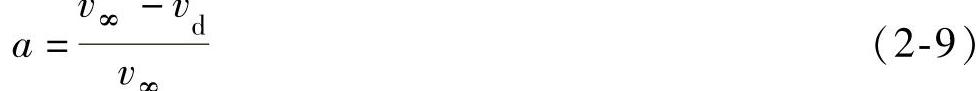

气流在经过致动盘时速度发生变化，总变化量为（v_(∞)-v_(w)），根据动量定理，气流所受的作用力等于动量变化率，动量变化率等于速度的变化乘以质量流量，即

F=（v_(∞)-v_(w)）ρA_(d)v_(d) （2-10）

式中 F——气流所受的作用力，单位为N。

引起动量变化的力完全来自于致动盘前后静压力的改变，所以有：

式中 p⁺_(d)——致动盘前气流静压，单位为Pa；

p⁻_(d)——致动盘后气流静压，单位为Pa。

对流束的上风向和下风向分别使用伯努利方程，可以求得压力差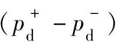。对上风向气流有

由于假设气体是不可压缩，ρ_(∞)=ρ_(d)，并且流束处于水平方向，高度h_(∞)=h_(d)，那么有

同样下风向气流有

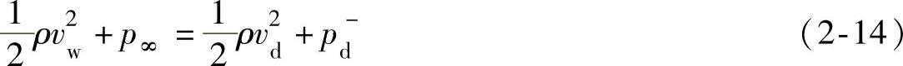

方程（2-13）和方程（2-14）相减得到：

把方程（2-15）代入（2-11）得到：

因此

v_(w)=（1-2a）v_(∞) （2-17）致动盘作用在气流上的力，可由方程（2-17）代入方程（2-10）导出：

F=（p⁺_(d)-p⁻_(d)）A_(d)=2ρA_(d)v²_(∞)a（1-a） （2-18）

这个力在数值上等于气流对致动盘的反作用力，因此气体输出功率

P=Fv_(d)=2ρA_(d)v³_(∞)a（1-a）² （2-19）

定义风能利用系数

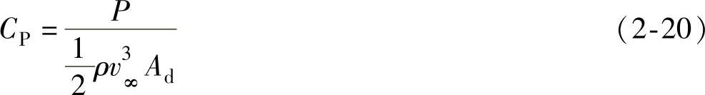

其中分母表示横截面积为A_(d)的自由流束所具有的风功率。将式（2-19）代入式（2-20）得

C_(P)=4a（1-a）² （2-21）

可以求出，当时，C_(P)的值最大。将代入方程（2-21）得

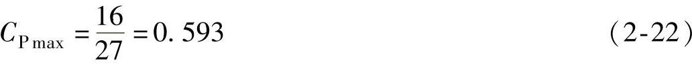

这个值称为贝兹极限。它是水平轴风机的风能利用系数的最大值。

由压力降产生的作用于致动盘的力T与致动盘作用在气流上的力大小相等，所以T可以由式（2-18）求得。定义无量纲的推力系数

将式（2-18）代入式（2-23），得

C_(T)=4a（1-a） （2-24）

尾流速度为（1-2a）v_(∞)，当a≥1/2时，将出现尾流速度变成零，甚至变成负数的问题。在这种情况下，上述模型将不再适用。

风能利用系数和推力系数随a的变化曲线如图2-2所示。

2.旋转尾流模型

贝兹极限所讨论的气流模型只考虑轴向流动。这里将进一步考虑旋转尾流问题。仍然沿用致动盘的基本假设，但更为具体的将致动盘描述为多个叶片扫过的区域，或称为风轮圆盘。

气流通过风轮圆盘时，圆盘所受转矩与作用在空气上的转矩大小相等、方向相反。反转矩作用的结果会导致空气逆着风轮转向旋转，从而获得角动量，这样会使风轮圆盘尾流的空气微粒在旋转面的切线方向和轴向上都获得了速度分量如图2-3所示。

图2-2 C_(P)、C_(T)随a的变化曲线

图2-3 空气微粒经过风轮圆盘的运动轨迹

图2-4 气流切向速度在通过圆盘的变化

进入圆盘的气流无任何转动，而离开圆盘的气流是旋转的。转动传递发生在整个圆盘的厚度处，如图2-4所示。切向速度的变化用切向气流诱导因子a′表示。圆盘上游气流的切向速度为零。设风轮旋转角速度为Ω，圆盘下游在距旋转轴径向距离为r的地方气流切向速度为2Ωra′。在圆盘厚度中部，切向诱导速度为Ωra′。

在所有的各个径向位置上，切向速度是不同的，轴向诱导速度也不一样。为了讨论圆盘的动力学特性，截取半径为r、径向宽度为δr的圆环（见图2-5），整个圆盘由多个圆环组成，并且假定每个环的作用力相互独立。

圆环反作用于空气的转矩，将使空气产生切向速度分量，而作用在圆环上的轴向力将会使空气轴向速度降低。

图2-5 叶素扫出的圆环

作用在圆环上的转矩与圆环反作用于空气的转矩大小相等，而作用于空气的转矩等于通过此环形区的空气的角动量的变化率，即

dM=2Ωra′rdṁ

式中 dṁ——单位时间流经圆环上的空气流量。

dṁ=ρv_(∞)（1-a）dA_(d) （2-25）

考虑到圆环的面积dA_(d)=2πrdr，可得作用在圆环上的转矩为

dM=4πρΩv_(∞)（1-a）a′r³dr（ 2-26）

所以风轮转轴输出的功率增量为

dP=ΩdM （2-27）

风速降低所输出的功率由式（2-19）给出。即

dP=2ρv³_(∞)a（1-a）²dA_(d) （2-28）

因此，由式（2-26）、式（2-27）和式（2-28）有

2ρv³_(∞)a（1-a）²dA_(d)=ρv_(∞)（1-a）2Ω²a′r²dA_(d)

和

v²_(∞)a（1-a）=Ω²r²a′ （2-29）

其中，Ωr为旋转圆环的切向速度，所以λ_(r)=Ωr/v_(∞)称为当地速度比。在圆盘r=R的边缘处，λ=ΩR/v_(∞)称为叶尖速度比。因此

a（1-a）=λ²_(r)a′ （2-30）

从式（2-26）、式（2-27）中可以得出：

式（2-31）右边括号里的部分表示通过圆环的功率流量，括号外的部分被称为捕获功率时叶片单元效率，即

η_(r)=4a′（1-a）λ²_(r) （2-32）

将式（2-30）代入式（2-32），得

η_(r)=4a（1-a）² （2-33）

风能利用系数变化率可表示为

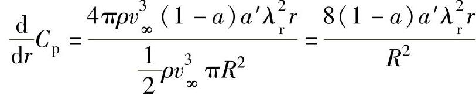

即

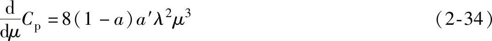

其中，μ=r/R。

如果知道a和a′沿径向的变化规律，那么对于给定的叶尖速度比λ，通过对式（2-34）进行积分可以确定总的风能利用系数。

能提供最大可能效率的a和a′值是通过求式（2-32）对a′的导数，并令其结果等于零而得到的。由此

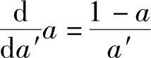

对于式（2-30）求导也有

得到

联立式（2-30）和式（2-35），可以求出使风能利用系数最大的a和a′的值为

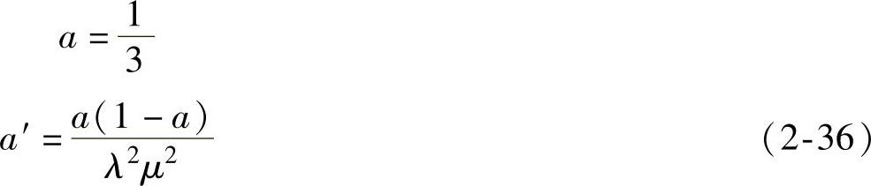

最大功率输出的轴流诱导因子也与非旋转尾流的情况一样，都是a=1/3，并且在整个圆盘上都是一致的。a′却随着径向位置的变化而变化。

从式（2-34）可以得到最大功率系数为

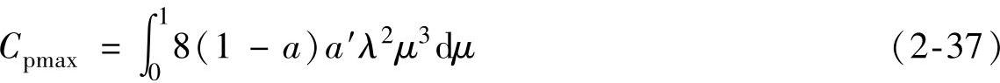

将式（2-36）代入式（2-37），得

这与非旋转尾流的模型正好相同。

传递给尾流的角动量增加了尾流的动能，但该能量被静压损失所平衡。即

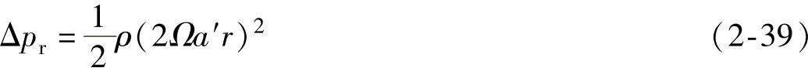

将式（2-36）代入式（2-39），得

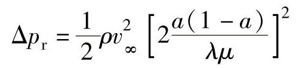

3.叶素—动量定理

在叶片上，取半径为r、长度为δr的微元，称为叶素（见图2-5）。在风轮旋转过程中，叶素将扫掠出一个圆环。

对于一个叶片数为N、风轮半径为R、弦长为c、叶素桨距角（叶素几何弦线与风轮旋转面间的夹角）为β的风力机，弦长和桨距角都沿着桨叶轴线变化。令风轮的旋转角速度为Ω，风速为v_(∞)。同时考虑到尾流旋转，圆盘下游在距旋转轴径向距离为r的地方气流以2Ωra′（a′为切向气流诱导因子）的切向速度旋转。叶素的切向速度Ωr与圆盘厚度中部气流的切向速度Ωra′之和为经过叶素的净切向流速度Ωr（1+a′）。图2-6示出了在半径为r处叶素上的速度和作用力。

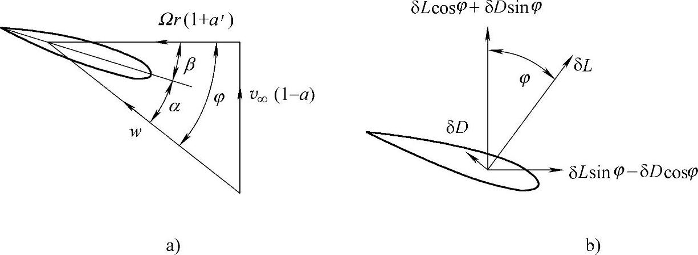

图2-6 叶素上的速度和作用力

a）速度 b）作用力

从图2-6中得到的叶片上的相对合速度为

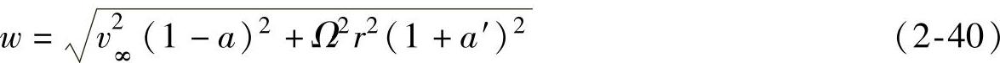

相对合速度与旋转面之间的夹角（气流倾角）是φ，则

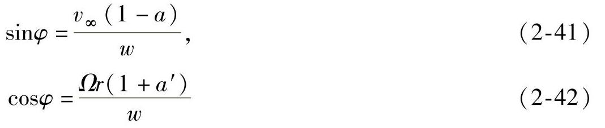

攻角α由下式给出

α=φ-β （2-43）

每个叶片在顺翼展方向长度为δr的升力

式中 ρ——空气密度，单位为kg/m²；

w——相对风速，单位为m/s；

c——几何弦长，单位为m；

C_(l)——翼型升力特征系数。

平行于w的阻力为

式中 C_(d)——翼型阻力特征系数。

假定作用于叶素上的力仅与通过叶素扫过的圆环的气体的动量变化有关。而通过邻近圆环的气流之间不发生径向相互作用。

N个叶素上的空气动力分量在轴向上分解为

通过扫掠圆环面积的轴向动量变化率为

2av_(∞)ρv_(∞)（1-a）2πrδr=4πρv²_(∞)a（1-a）rδr （2-47）

尾流旋转导致的尾流压力下降等于动力压头的增加，因此在圆环上附加的轴向力为

气流对扫掠圆环的作用力数值上等于圆环的反作用力，根据动量定理，这个反作用力等于气流动量的变化率。从式（2-46）、式（2-47）和式（2-48）可得

化简为

其中，μ=r/R，λ=ΩR/v_(∞)。

N个叶素上空气动力产生的风轮轴向转矩为

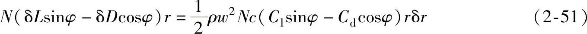

通过圆环的空气角动量变化率为

2a′Ωr²ρv_(∞)（1-a）2πrδr=4πρv_(∞)（Ωr）a′（1-a）r²δr （2-52）

根据动量定理，轴向转矩与角动量变化率相等，从式（2-51）和式（2-52）可得

化简为

设

C_(l)cosφ+C_(d)sinφ=C_(n) （2-55）

C_(l)sinφ-C_(d)cosφ=C_(t) （2-56）

由式（2-50）和式（2-54）可以得了气流诱导因子a和a′。利用二维翼型特性求解a和a′是需要有迭代过程的。迭代方程如下：

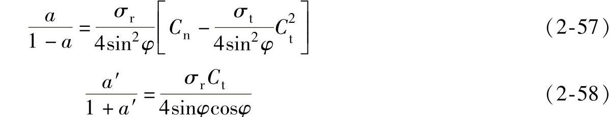

式中 σ_(r)——弦长实度。定义为给定半径下的总叶片弦长除以该半径的周长。即

从式（2-52）可以得到展向长度为δr的叶素产生的转矩为

δM=4πρv_(∞)（Ωr）a′（1-a）r²δr （2-60）

因此，整个转子产生的总转矩为

风轮产生的功率P=MΩ，风能利用系数是

4.风力机转矩计算流程

风力机转矩可以由上述各公式计算获得，其流程如图2-7所示。

图2-7 风力机转矩计算流程

图2-7中的Prandtl系数σ_(P)是考虑到在计算中叶素的个数是有限的，从而引入的一个修正系数。

### 第二节 能量传递理论

能量传递是由主传动链完成的，主传动链的零部件均为不同程度的弹性机构，其运动规律是由弹性力学的基本方程决定的。

#### 一、弹性力学的基本方程

在各向同性线性弹性力学中，为了求得应力、应变和位移，先对构成物体的材料以及物体的变形作了五条基本假设，即：连续性假设、均匀性假设、各向同性假设、完全弹性假设和小变形假设，然后分别从静力学、几何学和物理学方面出发，导得弹性力学的基本方程和边界条件的表达式。下列各式中，σ_(x)、σ_(y)、σ_(z)、τ_(xy)（τ_(yx)）、τ_(yz)（τ_(zy)）、τ_(zx)（τ_(xz)）为应力分量；u、v、w为位移矢量在三个方向的分量；ε_(x)、ε_(y)、ε_(z)、γ_(xy)、γ_(yz)、γ_(zx)分别为正应变和剪应变分量；F_(bx)、F_(by)、F_(bz)单位体积的体力在各方向的分量；μ为泊松比。

1.平衡微分方程

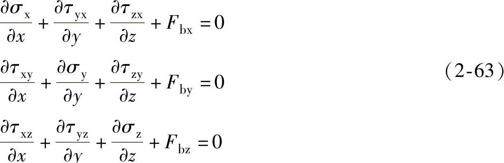

2.几何方程

物体受力后变形，其内部任一点的位移与应变的关系如下：

3.物理方程（广义虎克定律）

（1）应力表示应变

式中 E——拉压弹性模量，简称为弹性模量；

G——剪切弹性模量，简称为刚度模量，且有

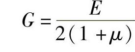

（2）应变表示应力

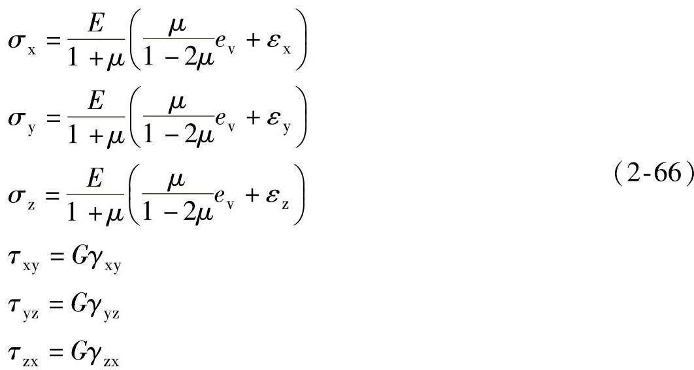

式中 e_(v)——体积应变，e_(v)=ε_(x)+ε_(y)+ε_(z)。

总之，上述共有15个独立方程（3个平衡微分方程、6个几何方程、6个物理方程），包含15个未知变量（3个位移分量u、v、w、6个应力分量σ_(x)、σ_(y)、σ_(z)、τ_(xy)（τ_(yx)）、τ_(yz)（τ_(zy)）、τ_(zx)（τ_(xz)）、6个形变分量ε_(x)、ε_(y)、ε_(z)、γ_(xy)、γ_(yz)、γ_(zx)）。给定边界条件后方程组有定解。

4.边界条件

若物体表面的面力分量为F_(sx)、F_(sy)和F_(sz)已知，则表面力边界条件为

F_(sx)=σ_(x)l+τ_(xy)m+τ_(xz)n

F_(sy)=τ_(xy)l+σym+τ_(zy)n

F_(sz)=τ_(xz)l+τ_(yz)m+σ_(z)n （2-67）

式中 l、m、n——物体表面外法线的三个方向余弦。

若物体表面的位移已知，则位移边界条件为

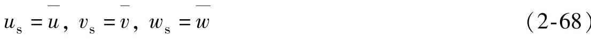

式中 u_(s)、v_(s)、w_(s)——位移的边界值；

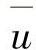、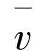、——在边界上是坐标的已知函数。

5.基本方程的求解

在求解弹性力学问题时，并不需要同时求解15个基本未知量，可以做必要的简化。为简化求解的难度，仅选取部分未知量作为基本未知量。在给定的边界条件下，求解偏微分方程组的问题，数学上称为偏微分方程的边值问题。

按照不同的边界条件，弹性力学有三类边值问题。

第一类边值问题：已知弹性体内的体力和其表面的面力分量为F_(sx)、F_(sy)和F_(sz)，边界条件为面力边界条件。

第二类边值问题：已知弹性体内的体力分量以及表面的位移分量，边界条件为位移边界条件。

第三类边值问题：已知弹性体内的体力分量，以及物体表面的部分位移分量和部分面力分量，边界条件在面力已知的部分，为面力边界条件，位移已知的部分为位移边界条件，称为混合边界条件。

以上三类边值问题，代表了一些简化的实际工程问题。若不考虑物体的刚体位移，则三类边值问题的解是唯一的。

#### 二、传动链数学模型

传动链是机械上连接空气动力子系统和电磁子系统的一套装置。因此风转矩和电磁转矩是输入量，而转速则是输出量。假定在整个变速范围内有着恒定的机械传动效率，可以认为结构特性（例如振动、齿轮种类、齿隙等）对其性能的影响可以忽略不计。

对于典型的风力发电机组来说，组成传动链的部件有风轮、齿轮箱和发电机转子。

增速器将传动链分为两部分：与风轮直接耦合的低速轴和与发电机相连的高速轴。高速轴和低速轴之间的连接部分可以是刚性的也可以是柔性的。刚性传动链模型认为传动系统的扭转刚度足够大，即低速轴、齿轮箱的传动轴、高速轴是刚性的，转子和发电机只有一个旋转自由度，高速轴与低速轴按定传动比变化。发电机和风力机转子的加速来自于气动转矩与发电机响应转矩的不平衡。柔性传动链模型认为低速轴和高速轴是柔性的。允许风力机转子和发电机转子有各自的旋转自由度。风力机转子的加速度依赖于气动转矩和低速轴转矩之间的不平衡。发电机转子的加速度依赖于高速轴扭矩和发电机响应转矩之间的不平衡。在柔性连接中，高速轴与低速轴具有不同的瞬间转速。这种解耦是用来减少由风速或电磁转矩变化而引起的机械应力。由此，它的兼容性和传动的可靠性都大大提高，不容易受暂态负载和机械疲劳的影响。下文将分别讨论刚性模型和柔性模型。

1.刚性模型

风力发电机组主传动链刚性模型如图2-8所示。

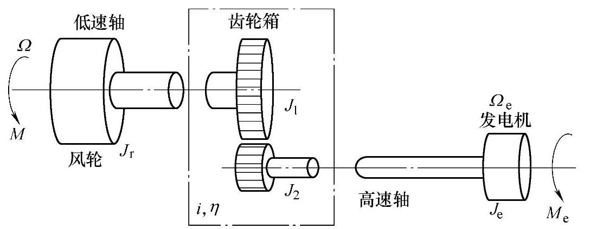

图2-8 主传动链刚性模型

刚性传动链模型的主要组成部分是单级耦合增速器，它的传动比为i，效率为η，在这种情况下，由于增速器的作用，发电机转矩减少i倍且速度增加i倍。在上述模型假设下，在高速轴或低速轴下的风能转换系统动态模型可以由下列两个方程表示：

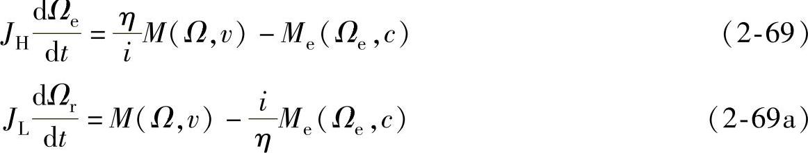

式中 Ω——风轮旋转角速度；

Ω_(e)——发电机转子机械角速度；

M（Ω，v）——空气动力转矩，以风速v作为参数；

M_(e)（Ω_(e)，c）——电磁转矩，一般以c表示的负载变量作为参数；

J_(H)、J_(L)——高速轴和低速轴处的等效转动惯量，计算如下：

式中 J₁、J₂——增速齿轮的转动惯量；

J_(r)、J_(e)——风轮和发电机转子的转动惯量。

由于传动链是刚性的，空气动力转矩仅由一阶线性转速变量给定。图2-9为转换到高速轴处的运动方程的仿真框图。此方程通常用于电机组传动链单自由度模型。

图2-10给出了当高速轴以Ω_(e)的角速度旋转时，风轮和发电机相互作用稳定运行的示意图。风力发电机组的稳定运行点是风轮和发电机机械特性曲线的交点。

图2-9 运动方程的仿真框图

2.柔性模型

风力发电机组主传动链柔性模型如图2-11所示。

图2-10 风力发电机组稳态曲线

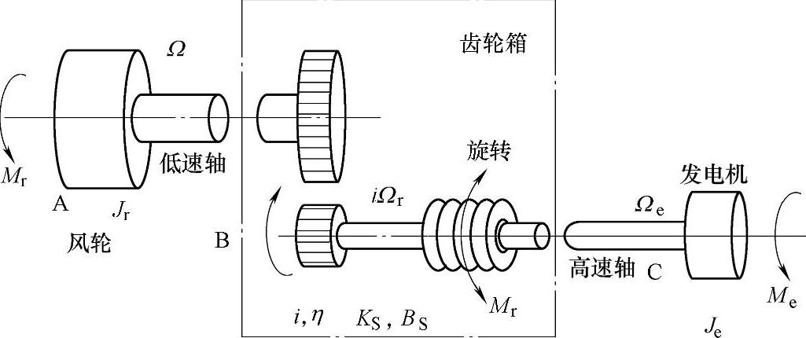

图2-11 主传动链柔性模型

高速轴的B和C两部分以不同的转速旋转，分别是iΩ_(r)和Ω_(e)，这里i是齿轮箱的传动比。弹性能变化量产生一个新的状态变化内转矩M。J_(e)表示C部分的惯量，J_(B)表示B部分的惯量，表达式为

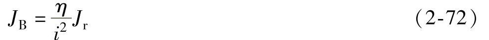

式中 η——传动效率；

J_(r)——低速部分（主要是风力机）的转动惯量。

传动装置柔性模型由B和C部分运动方程和内转矩动态方程构成：

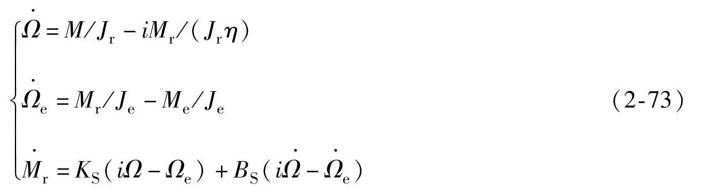

得到一个三阶线性模型，状态变量为x=\[Ω_(r)Ω_(e)M\]^(T)，输入矢量为u=\[MM_(e)\]^(T)，输出矢量为y=\[ΩΩ_(e)\]^(T)，则

式中 K_(S)、B_(S)——弹性系统的刚性系数和阻尼系数。

上述推导过程也适合于直驱式风力发电机组的传动链，这时，状态方程变为

### 第三节 机电能量转换理论

电机是用来实现机电能量转换的电磁机械，由其电系统、机械系统以及把二者联系成有机整体的耦合电磁场构成。定、转子绕组构成了电机的电系统，而各种转矩作用下的转轴则构成了电机的机械系统。电机的机电能量转换就是耦合电磁场和与之相对运动的载流导体之间相互作用的结果。

发电机是把机械能转换成电能的电磁机械。发电机的电系统通过感应电动势与外部电系统相联系，利用感应电动势的作用，向外部电系统输出电功率，这种联系的数学描述就是电压方程式。发电机的机械系统通过电磁转矩与外部机械系统相联系，利用电磁转矩的作用，从外部原动机吸收机械功率，这种联系的数学描述就是转矩方程式。发电机的机械能转换为电能的转换关系则由功率方程式来描述。上述方程式构成了描述发电机内部基本物理关系的基本方程式，是对电机性能进行分析和计算的理论基础。

电机磁场主要是指气隙磁场，电机的磁场能量基本上储存在气隙中。依靠气隙磁场的耦合作用，把电机的电系统和机械系统有机联系在一起，并实现机电能量的转换和传递。因此，电机的气隙虽小，但对电机性能的影响却很大。

本节将对风力发电机实现机电能量转换的基本原理作简要介绍。在对发电机中的基本能量关系和基本电磁关系进行分析的基础上，给出发电机的基本方程式，并对基本方程式在实际问题中的应用作简单介绍。

#### 一、发电机中的机电能量转换关系

1.机电能量转换过程中的能量关系

在原动机（例如风力机等）的驱动下，发电机从轴上输入机械功率，扣除耦合电磁场储能的增量和发电机内部的能量损耗后，其余能量转换为电能从电枢绕组的线端输出。发电机中的这种基本能量转换关系可表示成式（2-75）：

发电机内部的能量损耗可分为三类：一是电系统中通过电流时在绕组电阻上产生的I²R损耗，一般称为铜损耗；二是机械系统中的通风损耗和摩擦损耗，一般统称为风摩损耗（或机械损耗）；三是耦合电磁场的介质损耗，例如交变磁场在铁心中产生的磁滞损耗和涡流损耗，一般统称为铁损耗。

如果把铜损耗归并到电能中，把风摩损耗归并到机械能中，把铁损耗归并到磁场储能中，则式（2-75）可以改写成

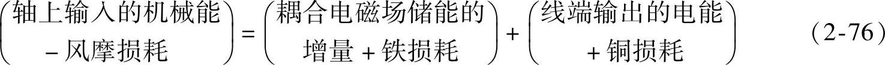

式中，等号左边为扣除风摩损耗后发电机输入的总机械能，也可称为发电机可供转换的总机械能。它将转换成等号右边的两项能量，即被耦合电磁场吸收的总能量（包括耦合电磁场储能的增量和介质的能量损耗）和转换成电能的全部能量（包括绕组电阻的铜损耗和线端输出的电能）。

式（2-75）和式（2-76）所描述的发电机机电能量转换过程中的能量关系可用图2-12描述如下：

图中，左侧为发电机的机械系统，右侧为电系统，由耦合场将从原动机（风力机）输入的机械能转换成电能并传递到电系统。把损耗分类并分别归并到机械系统、耦合场和电系统，是对发电机进行的“理想化”处理，目的是使其机电能量转换过程变得单值、可逆，同时突出了耦合场对发电机电系统和机械系统的耦合反应，便于导出机电耦合项。后面将会了解，机电耦合项是机电能量转换原理中最重要的概念之一。

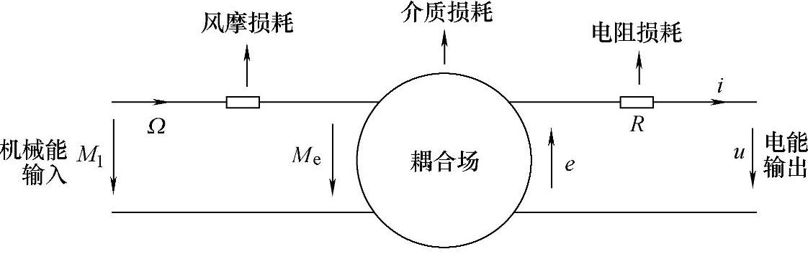

图2-12 发电机机电能量转换中的能量关系

式（2-76）所示能量关系的微分形式如下：

dW_(mec)=dW_(m)+dW_(e) （2-77）

式中 dW_(mec)——在dt时间内输入耦合场的净机械能；

dW_(m)——dt时间内耦合场吸收的总能量；

dW_(e)——在dt时间内转换成电能的总能量。

2.磁场储能

发电机以磁场作为耦合场，因此，在后面的分析中，耦合场储能均指磁场储能。

研究表明，发电机的磁场储能仅与其绕组电流（磁链）的大小以及转子位置有关。对于具有n个绕组的交流发电机，总的磁场储能W_(m)为

可以看出，第j个绕组的磁场储能（W_(m)）j可以写成，若该磁场的ψ-i曲线如图2-13所示，则面积oabo就代表了第j个绕组的磁场储能（W_(m)）_(j)。若以绕组电流i_(j)为自变量，对磁链ψ_(j)积分，则可得。式中，W_(m)′称为磁共能，可用图2-13中的面积oaco表示。在实际应用中，一般说来，利用磁共能进行分析计算较为方便。显然，磁场储能与磁共能之和为。

图2-13 磁场储能与磁共能

具有n个绕组的交流发电机，其总的磁共能W_(m)′为

磁场储能与磁共能的和为

如果所研究的磁场为线性，则其ψ-i曲线为直线，同时考虑到绕组磁链与电流的关系ψ=Li，则磁场储能W_(m)和磁共能W_(m)′可以写成如下形式：

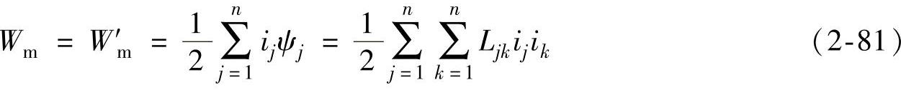

式中 L_(jk)——发电机第j个绕组与第k个绕组之间的互感；

L_(jj)——发电机第j个绕组的自感。

3.磁场储能的变化

前面已经指出，发电机的磁场储能仅与其绕组电流（或磁链）的大小以及转子位置有关，对于具有n个绕组的交流发电机，其总的磁场储能W_(m)和磁共能W′_(m)可以写成如下形式：

因此，在dt时间内，由绕组磁链和转子转角变化所引起的磁场储能变化dW_(m)应为

考虑到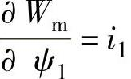，，…，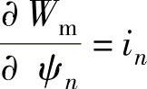，上式可改写成

相应地，在dt时间内，由绕组电流和转子转角变化所引起的磁共能变化dW_(m)′应为

考虑到，上式可改写成

对于线性系统，绕组的磁链方程为

可以看出，交流发电机的绕组电感均为转子转角θ的函数，而绕组磁链则既是各绕组电流的函数，又是转子转角θ的函数。把式（2-86）代入式（2-85），则在dt时间内，磁场储能的变化dW_(m)和磁共能的变化dW′_(m)可以改写成如下形式：

式（2-83）、式（2-85）和式（2-87）中，等号右边的前半部分为绕组电流（或磁链）所引起的磁场储能的变化；等号右边的后半部分是由转子的角位移变化使绕组电感变化所引起的磁场能量的变化，从后面的分析可知，这一项磁场能量变化对于发电机来说具有特殊重要的意义。

#### 二、感应电动势和电磁转矩

1.感应电动势

根据电磁感应定律并考虑到式（2-86），具有n个绕组的交流发电机的各绕组的感应电动势可表示为

观察上式可以看出，各绕组电动势右边的前n项是由电流变化所引起的电动势，一般称为变压器电动势；而各式的最后一项则是因转子旋转运动和磁链（电感）随转角变化而产生的电动势，通常称为运动电动势。因机械旋转运动而产生运动电动势，是发电机实现机电能量转换的必要条件之一。

对于线性系统，考虑到式（2-86）的关系后，式（2-88）可改写成如下形式：

在dt时间内，发电机转换成电能的总能量dW_(e)为

可见，发电机把机械能转换成电能是通过旋转运动使线圈内磁链发生变化，并在线圈内感应电动势来实现的。

根据基尔霍夫定律，按图2-12中所规定的正方向，可列写出各绕组的电压方程式如下：

2.电磁转矩

交流发电机的电磁转矩是一种电磁起因的转矩，是电机的旋转磁场与载流导体相互作用的结果。发电机利用电磁转矩吸收由原动机提供的机械功率，再通过磁场的耦合作用，把机械功率转换成电功率输出。那么，电磁转矩与磁场能量之间是否有着某种必然的联系呢？下面来分析这一问题。

现将式（2-77）所示的发电机能量关系的微分形式重写如下：

dW_(mec)=dW_(m)+dW_(e) （2-92）

对于具有n个绕组的交流发电机，当在dt时间内转子转过dθ角度时，输入耦合场的净机械能为dW_(mec)=M_(e)dθ（见图2-12）；耦合场吸收的总磁场能量为（见式（2-83））；转换成电能的总能量（见式（2-90）），于是，式（2-92）可改写成

可以看出，当发电机在dt时间内转子转过dθ角度时，输入耦合场的净机械能与耦合场吸收的总磁场能量中转换成电能的那部分能量无关，而只取决于磁场储能（或磁共能）对转子转角的变化率。

因此，以绕组磁链ψ和转子转角θ作为自变量时，发电机的电磁转矩为

当以绕组电流i和转子转角θ作为自变量时，通过类似的推导，可以得到用磁共能W′_(m)表示的电磁转矩公式如下：

以上两式表明，当转子的微小角位移引起发电机的磁场储能（或磁共能）发生变化时，就会产生电磁转矩，电磁转矩的大小等于单位微小角位移时磁场储能（或磁共能）的变化率。至于电磁转矩的方向，式（2-94）表明，在恒磁链下M_(e)的方向与磁场储能增加的方向一致；而式（2-95）则表明在恒电流下，M_(e)的方向与磁共能减小的方向一致，参照图2-13或式（2-80），这一结论是很容易理解的。

前面已经说明，式（2-87）右边最后一项的磁场能量变化对于发电机来说具有特殊重要的意义，这是因为这一项是由转子的角位移所引起的磁场能量变化。由式（2-94）和式（2-95）可知，发电机的电磁转矩恰好是由转子的角位移所引起的磁场能量变化而产生的，其特殊意义就在于此。进一步的分析表明，电磁转矩中应包括两种不同起因的转矩，一部分转矩是由定子电感和转子电感分别随转角θ变化所引起的电磁转矩，实际上，只有气隙磁导（磁阻）随转角变化而变化时，绕组电感才会随之变化，因此常把这部分转矩称为磁阻转矩，一般情况下，在发电机电磁转矩中，磁阻转矩只占很小一部分；另一部分是定、转子电流和定转子互感随转角变化而引起的电磁转矩，称为主电磁转矩，是发电机电磁转矩的主要部分。

对于线性系统，可以将式（2-81）的W_(m)′代入式（2-95），从而得到发电机电磁转矩的完整公式。为了简明起见，电磁转矩以矩阵形式表示如下：

至此，我们导出了发电机的运动电动势和电磁转矩。发电机因机械旋转运动而产生运动电动势，而转子角位移引起磁场能量变化将产生电磁转矩。运动电动势和电磁转矩是发电机系统中最重要的两个物理量，二者构成了发电机的一对机电耦合项。

3.机电能量转换与气隙磁场

现在可以完整地描述发电机中所发生的机电能量转换过程。为此，可仍然借助于式（2-83）来加以说明。根据式（2-83），可画出在时间dt内发电机的微分能量关系，如图2-14所示。

可以看出，磁场储能的增量dW_(m)包括两个分量，其中，由转子的角位移引起的磁场储能变化所引起的磁场储能的增量恰好等于发电机输入的微分净机械能，理想情况下，这部分能量与从风力机输入的机械能相平衡；另一部分由磁链变化所引起的磁场储能增量则恰好等于发电机转换成的微分电能的总能量，理想情况下，这部分能量与发电机的输出电能相平衡。

图2-14 发电机在dt时间内的微分能量关系

从以上分析可知，发电机在机电能量转换过程中，作为耦合场的磁场既可以从机械系统（例如风力机）吸收机械能，又可以向电系统（例如电网）输出电能。实际上，电机的这种机电能量转换过程是可逆的，当把机械能转换成电能时，这是一台发电机；当把电能转换成机械能时，这是一台电动机。二者的区别仅仅在于能量传递的方向不同。在介绍发电机结构时提到，发电机的磁场能量基本上都储存在气隙磁场中，气隙虽小，但对发电机的性能将产生重大影响，也就不足为怪了。这是因为，气隙长度及其在电枢圆周的分布情况的任何变化，都将引起气隙磁场的变化，从而影响机电耦合项（e_(Ω)，M_(e)）的变化，进而影响到发电机的机械能输入和电能输出。发电机设计的目的就在于选择合适的发电机尺寸（包括铁心尺寸、绕组尺寸、气隙尺寸等），优化设计出机电耦合项，从而使发电机获得优良的性能

#### 三、基本方程式

在以上分析的基础上，可以写出交流发电机的基本方程式，包括电压方程式、功率方程式和转矩方程式。基本方程式是分析计算发电机性能所依据的基本原理。为了使基本方程式形式简明且具有统一性，这里采用了矩阵形式。

1.电压方程式

根据式（2-89），交流发电机的感应电动势e包括两个分量，即运动电动势分量和变压器电动势分量，因此感应电动势的矩阵形式如下式：

式中 e_(Ω)——运动电动势矩阵，；

——变压器电动势矩阵。具有n个绕组的交流发电机的电压方程式（2-91）可用矩阵表示为

式中u，i——发电机绕组的相电压矩阵和相电流矩阵，即

其中 u_(s)、i_(s)——定子相电压和相电流矩阵，

u_(r)、i_(r)——转子相电压和相电流矩阵；

R——发电机绕组的电阻矩阵，这是一个对角矩阵，即

其中 R_(s)——定子绕组电阻矩阵；

R_(r)——转子绕组电阻矩阵。

L——发电机的绕组电感矩阵，一般说来，绕组电感是转角θ的函数。假定1～m为定子绕组，（m+1）～n为转子绕组，即

其中 L_(ss)——定子绕组电感矩阵；

L_(rr)——转子绕组电感矩阵；

L_(sr)和L_(rs)——定、转子绕组之间的互感矩阵。

2.功率方程式

重新观察图2-12可知，在发电机进行机电能量转换过程中，耦合场在吸收从原动机（风力机）输入的机械能并将其转变为磁场储能的变化之外，还将一部分机械能转换成电能并传递到电系统。下面就来定量讨论这一问题。

将式（2-93）所示的发电机能量关系的微分方程改写成功率方程：

式中Ω——发电机转子的机械角速度，；

e_(j)——第j个绕组的感应电动势，。

将上式改写成矩阵形式，即

由式（2-103）可以看出，发电机从原动机（风力机）吸收的净机械功率M_(e)Ω中，一部分转换成磁场储能功率，即，另一部分则转换成电功率i^(T)e输出，由机械功率直接转换成电功率的这部分功率称为发电机的转换功率。由式（2-103）还可看出，磁场储能功率包括两部分，由角位移的变化（即转子旋转运动）所引起的磁场储能功率恰好等于从原动机（风力机）吸收的净机械功率，即；而由磁链变化所引起的磁场储能功率i^(T)e则恰好等于输出电功率的负值。将式（2-98）等号两边同时乘以电流i的转置矩阵i^(T)，就可以得到发电机电系统的功率方程式，即

式中 i^(T)u——发电机线端输出的电功率；

i^(T)e_(Ω)——被绕组运动电动势吸收的电功率；

——被绕组变压器电动势吸收的电功率；

i^(T)Ri——绕组的电阻损耗。

3.转矩方程式

对于发电机来说，需要从原动机输入机械转矩，并带动发电机转子旋转，当磁场储能随转角发生变化时，发电机将产生电磁转矩，电磁转矩是一种制动性质的转矩。当发电机稳态运行时，电磁转矩将与轴上输入的机械转矩相平衡，维持机组以恒定的转速稳定运行；当发电机动态运行时，发电机的转速将会发生变化，由于旋转系统的惯性，发电机轴上除了承受稳态运行时的输入转矩和电磁转矩之外，还将承受一个动态转矩，转速变化率越大这一动态转矩的值越大。

因此，发电机稳态运行时，其机械系统的转矩方程式为

M₁=M_(e)+M₀ （2-105）

式中 M₁——来自原动机的输入转矩；

M_(e)——发电机的电磁转矩；

M₀——与发电机的风摩损耗相对应的损耗转矩，一般说来，这一损耗转矩是转子机械角速度Ω的函数。

发电机动态运行时的转矩方程式为

式中 J——发电机旋转系统的转动惯量，单位为N·m·s；

Ω——发电机转子旋转的机械角速度，单位为rad/s。显然，当M₁＞（M_(e)+M₀）时，，这时发电机升速；当M₁＜（M_(e)+M₀）时，，这时发电机降速。在风力发电系统中，由于风速变化的随机性，发电机组的转速将随风速的变化而变化，使风力发电机组经常处于动态运行过程中，这是风力发电机组运行的一个特点。试想，如果由于风速的突然变大，使机组出现较大的，这时，机组将出现一个较大的动态转矩，这一转矩可能是发电机额定转矩的几倍以上，可能使风力发电机组的风轮（叶片轮毂等）、传动系统（包括主轴、联轴器、齿轮箱等）以及发电机轴和底脚等受到损伤。因此，进行风力发电机组的机械系统设计时，必须充分考虑到这种动态转矩对机组安全性的影响。

## 第三章 风力发电机组设计要求

为了保证所设计的风力发电机组安全可靠，国内外的相关标准都规定了风力发电机组设计的技术要求。这些技术要求是设计中必须遵守的内容，设计人员应该掌握和应用。本章根据IEC 61400-1-2005和IEC 61400-3-2009介绍了风力发电机组的外部条件和结构设计的方法。

上述标准要求采用结构动力学模型，以预测设计载荷。应用本章第一节规定的湍流条件和其他风况条件以及第二节规定的设计工况，这个模型可用来确定风力发电机组在一定风速范围内的载荷。应对外部条件和设计工况的所有相关组合进行分析，本章规定了最少的相关组合作为设计载荷状态。

风力发电机组的全范围试验数据可用来提高预测设计值的可信度，并验证结构动力学模型和设计工况。应通过计算和/或试验来验证设计的合理性。如果用试验结果验证，则试验时的外部条件必须符合上述标准规定的特征值和设计工况。试验条件的选择，包括试验载荷在内，必须考虑相关的安全因素。

### 第一节 风力发电机组的外部条件

设计风力发电机组时，为了保证安全性和可靠性达到一定的水平，应当考虑机组的外部条件。包括环境、电网和地质条件。风力发电机组经受的环境和电网条件，会影响到它的负载和运行状态，进而影响其寿命。环境条件可进一步分为风况和其他外部条件；地质条件关系到风力发电机组的基础设计。

设计之前已知的外部条件应该反映在《风力发电机组的设计任务书》中，风力发电机组对外部条件的要求应在设计文件中加以说明。

每种类型的外部条件又可分为正常外部条件和极端外部条件。正常外部条件通常涉及的是长时期的结构载荷条件。而极端外部条件是少见的，但它可能是临界外部设计条件。设计载荷状态应由这些外部条件与风力发电机组运行模式组合构成。

#### 一、风力发电机组等级

设计中要考虑的外部条件由风力发电机组安装场地类型决定。风力发电机组等级是根据风速和湍流参数来划分的。划分等级的目的在于最大限度的利用风能。风速和湍流参数代表了相应风力发电机组安装场地的类型，而不是代表特定风场的详细参数。风力发电机组分级是指根据风速和湍流参数的不同，对风力发电机组安全等级进行一系列的明确定义。表3-1规定了风力发电机组安全等级的基本参数。

如果设计者或客户要求使用特定的条件，如特定风况、其他外部条件或特定安全等级，风力发电机组安全等级进一步划分出S级。风力发电机组S级安全等级的设计值通常由设计者选取，并在设计文件中详细说明（S级风力发电机组的设计参数见IEC 61400-1-2005附录A）。在特定设计中，选取的设计值所反映环境条件的恶劣程度至少要与用户预期使用环境相当。

Ⅰ、Ⅱ、Ⅲ级安全等级对应的特定外部条件中不包括海上环境，也不包括诸如飓风、龙卷风、台风之类热带风暴的风况，这类条件要求风力发电机组按S级设计。

表3-1 风力发电机组安全等级基本参数

在表3-1中所示参数值对应于轮毂高度。

v_(ref)——10min平均参考风速；

A——表示高湍流特性等级；

B——表示中湍流特性等级；

C——表示低湍流特性等级；

I_(ref)——风速为15m/s时湍流强度的期望值。

除了这些基本参数外，其他一些外部条件参数的确定在风力发电机组设计中也是必不可少的环节，这些参数将在本节后文中详细说明。风力发电机组等级Ⅰ_(A)～Ⅲ_(C)，后面将其称作标准风力发电机组等级，

安全等级Ⅰ到Ⅲ的风力发电机组设计寿命至少为20年。

对于S级安全等级的风力发电机组来说，制造厂应该在设计文件中说明机组设计过程中所使用的模型与设计参数。采用本章所述模型，对其参数要做充分说明。S级安全等级的风力发电机组设计文件应包含相关标准中所列内容。

#### 二、风况

风力发电机组应设计成能安全承受对应安全等级的风况。设计文件应对设计风况进行详细规定。

从载荷和安全方面考虑，风况可分为正常风况和极端风况，正常风况指在风力机正常运行期间频繁出现的风况条件，而极端风况是指1年一遇或50年一遇的风况条件。

在多数情况下，风况条件是由稳定的平均气流与变化的可确定的阵风或湍流结合而成。在所有情况下，应考虑平均气流与水平面夹角达8°时的影响。假定这个气流倾斜角不随高度变化。

湍流是指风速矢量相对于10min平均值的随机变化。在使用湍流模型时应该考虑风速、风向和风切变变化的影响，并允许通过变化的风切变旋转采样（旋转采样是指对机组旋转风轮上某一固定点的风速矢量采样）。湍流风速矢量的三个分量定义如下：

——纵向：沿着平均风速方向；

——横向：水平并且与纵向垂直的方向；

——竖向：与纵向和横向均垂直的方向。

对于标准的风力发电机组等级，湍流模型中的随机风速场应该满足以下要求：

1）假定由后文给出的湍流标准偏差σ₁的取值不随高度变化。垂直于主风向的分量应该具备下述最小标准偏差：

——横向分量：σ₂≥0.7σ₁

——竖直分量：σ₃≥0.5σ₁

2）在轮毂高度z_(hub)处纵向湍流尺度参数Λ₁的值为

三个正交分量的功率谱密度S₁（f），S₂（f），S₃（f），随着惯性副区（风速湍流谱的频率区间，此区间内涡流经逐步破碎达到均匀化）内频率的增加，渐近于下式：

3）应该采用公认的相干模型。该模型定义为联合谱的幅值除以垂直于纵向的平面内、空间离散点上风速矢量纵向分量的自谱。IEC 61400-1-2005附件B推荐的曼恩（Mann）均匀切变湍流模型满足上述条件，同时还给出了另外一种满足上述条件的常用模型。其他模型要慎重使用，因为模型的选择会对载荷产生显著的影响。

1.正常风况

（1）风速分布 风速分布对于风力发电机组的设计有着很大影响，因为它决定着常规设计工况每种载荷状态的出现频率。应假设轮毂高度10min时间周期内平均风速符合下式描述的瑞利（Rayleigh）分布：

P_(R)（v_(hub)）=1-exp\[-π（v_(hub)/2v_(ave)）²\] （3-4）

式中 v_(hub)——轮毂高度处年平均风速，单位为m/s。

在标准风力发电机组等级中，v_(ave)应根据下式选取：

v_(ave)=0.2v_(ref) （3-5）

（2）正常风廓线模型（NWP）风廓线v（z）是地表以上平均风速对垂直高度z的函数。在标准风力发电机组等级下，正常风廓线由指数律公式给出：

v（z）=v_(hub)（z/z_(hub)）^(α) （3-6）

式中 z_(hub)——轮毂高度，单位为m。

假定指数α等于0.2。风廓线是用来确定风轮扫掠面垂直高度风切变的。

（3）正常湍流模型（NTM）对于正常湍流模型，纵向湍流标准差的典型值σ₁应以给定轮毂高度处风速的90％概率的标准差确定。

对于标准风力发电机组等级，此值由下式给定：

σ₁=I_(ref)（0.75v_(hub)+b）；b=5.6m/s （3-7）

图3-1 正常湍流模型（NTM）

a）标准差与风速的关系 b）湍流强度与风速的关系

湍流标准差σ₁和湍流强度σ₁/v_(hub)如图3-1所示。I_(ref)的幅值在表3-1中给出。

2.极端风况

极端风况用于确定风力发电机组的极端风载荷，这些风况包括由暴风及风速和风向的迅速变化造成的风速峰值。

（1）极端风速模型（EWM）极端风速模型含稳态或湍流的风模型。风速模型应该基于参考风速v_(ref)和确定的湍流标准差σ₁。

对于稳态极端风速模型，50年一遇的极端风速v_(e50)和1年一遇的极端风速v_(e1)是高度z的函数，采用下面的公式计算：

在稳态极端风速模型中，一般假定与平均风向短期偏差为±15°。

对于湍流极端风速模型，50年和1年一遇情况下，10min平均风速为z的函数：

v_(e50)（z）=v_(ref)（z/z_(hub)）^(0.11) （3-10）

v_(e1)（z）=0.8v_(e50)（z） （3-11）

纵向湍流标准差为

σ₁=0.11v_(hub) （3-12）

（2）极端运行阵风（EOG）对于标准风力发电机组等级，轮毂高度处阵风风速v_(gust)由下式给出：

式中 σ₁——在式（3-7）中给出；

Λ₁——湍流尺度参数，见式（3-1）；

D——是风轮直径，单位为m。

风速由下式确定：

式中v（z）由式（3-6）确定，T为阵风持续时间，取T=10.5s。

【例3-1】 极端运行阵风实例：假设v_(hub)=25m/s，I_(A)级，D=42m。极端运行阵风如图3-2所示。

（3）极端湍流模型（ETM）极端湍流模型采用正常风廓线模型（NWP）和下式给出的纵向分量标准差来确定。

（4）极端风向变化（EDC）极端风向变化的幅值θ_(e)，由式（3-16）计算得出：

图3-2 极端运行阵风实例

式中 σ₁——正常湍流模型（NTM）中的湍流标准差，见式（3-7）；

Λ₁——湍流尺度参数，单位为m，见式（3-1）；

D——风轮直径，单位为m。

θ_(e)取值范围为±180°。

极端风向变化瞬时值θ（t），由式（3-17）计算得出：

其中，T=6s是极端风向变化持续时间。符号的选择取决于最恶劣瞬时载荷发生情况。风向变化瞬态过程结束时，假定风向保持不变。风速应该按照正常风廓线模型（NWP）确定。

【例3-2】 极端风向变化实例：设D=42m，z_(hub)=30m，湍流类型A的极端风向变化幅值随轮毂风速v_(hub)变化的曲线如图3-3所示；图3-4所示为轮毂风速为v_(hub)=25m/s时对应的极端风向变化曲线。

图3-3 极端风向幅值变化

图3-4 极端风向变化

（5）方向改变的极端相关阵风（ECD）方向改变的极端相关阵风的幅值为

v_(cg)=15m/s （3-18）

风速定义式为

其中，T=10s为上升时间，风速v（z）由正常风廓线模型（NWP）给出。

【例3-3】 极端相关阵风期间风速的上升实例：设轮毂风速v_(hub)=25m/s，极端相关阵风期间风速的上升曲线如图3-5所示。

假定风速的上升与风向的变化量θ从0°到θ_(cg)的变化是同时发生的，则变化量θ_(cg)的计算公式为

图3-5 方向改变的极端相关阵风（ECD）曲线

而风向同时变化角由下式给出：

此处上升时间T=10s。

【例3-4】 风向的变化实例：假设v_(hub)=25m/s，风向的变化量θ_(cg)与轮毂高度风速v_(hub)的关系，风向的变化与时间的关系，分别如图3-6和图3-7所示。

图3-6 ECD风向变化

图3-7 v_(hub)=25m/s时风向随时间的变化

（6）极端风切变（EWS）应用下列两种瞬时风速来计算极端风切变。

1）瞬时竖直方向切变（正向或逆向）

2）瞬时水平切变

式中 α=0.2，β=6.4，T=12s；

σ₁——正常湍流模型中的湍流标准差，见式（3-7）；

Λ₁——湍流尺度参数，单位为m，见式（3-1）；

D——风轮直径，单位为m。

水平风切变瞬态符号应由最恶劣瞬时载荷发生决定。两个极端风切变不能同时应用。

【例3-5】 极端竖直风切变和风轮顶部和底部风速随时间的变化实例：如果湍流种类为A，z_(hub)=30m，v_(hub)=25m/s，D=42m，极端竖直风切变如图3-8所示。在图3-8中虚线表示的是极端风速发生前（t=0s）的风廓线，实线表示的是最大风切变（t=6s）时的风廓线，点划线表示的是负风切变（t=6s）时的风廓线。在与图3-8同样假设下，风轮顶部和底部风速随时间的变化如图3-9所示。

图3-8 极端正负竖直风切变的风廓线，在开始前（t=0，虚线）和最大切变（t=6s，实线）

图3-9 风轮顶部及底部风速随时间的变化（瞬时正风切变）

#### 三、其他环境条件

除风况之外，其他环境（气候）条件如热、光、腐蚀、机械、电或其他物理作用，都会影响风力发电机组的安全性和整体性能。而且，综合的气候因素更会加剧这种影响。至少还应考虑下列环境条件，并且在设计文件中说明其影响：温度，湿度，空气密度，阳光辐射，雨、冰雹、雪和冰，化学活性物质，机械作用微粒，雷电，地震和盐雾。近海环境需要考虑附加特殊条件。

应根据典型值或气候条件变化范围，确定设计用的气候条件参数。选择设计值时，应考虑几种气候条件同时出现的可能性。一年一遇所对应的正常范围内气候条件的变化不应影响所设计的风力发电机组的正常运行。除非存在着相关性，下面所提到的“其他极端环境条件”应和前文的“正常风况”结合起来考虑。

1.其他正常环境条件

应考虑下列其他正常环境条件参数：机组正常运行环境温度范围-10～+40℃（位于北方的机组，低温为-20℃）；相对湿度不大于95％；大气成分相当于无污染的内陆大气（见IEC 60721-2-1）；阳光辐射强度1000W/m²；空气密度1.225kg/m³。

当由设计者规定附加外部条件参数时，应在设计文件中说明。

2.其他极端环境条件

风力发电机组设计应考虑的其他极端环境条件有温度、雷电、结冰和地震。

（1）温度 风力机必须在一定的温度范围内运行，不同的结构，不同的材料所对应的正常运行温度范围是不同的。对于标准等级的风力发电机组，极端温度范围至少应是-20～+50℃（位于北方的机组，低温为-30℃）。注意，沿海气候的极限温度并不与强风同时发生。

（2）雷电 当雷电击中风力发电机组时，电流必须传导到地面上，电流实际上会通过或绕过所有组件，使它们可能会受到损坏。对于标准等级的风力发电机组，应贯彻相关标准要求的雷电防护措施。

（3）结冰 风力发电机组暴露的外表面，都可能形成30mm厚的冰，冰的密度为700kg/m³。在风轮停止运行的情况下，应考虑风轮叶片在所有的侧面上结冰。在风轮旋转的情况下，也应考虑风轮叶片在所有的侧面上结冰以及除一个叶片外所有叶片的侧面上结冰。

对于海上风力发电机组，海水也可能会结冰，基础就有可能承受冰载荷。在确定冰载荷的幅值和方向时，应该考虑冰的性质、机械性能、冰结构接触面积、结构的形状、冰运动的方向等。由于浮动冰块的生长和破裂，还应该考虑冰载荷的波动特性。

冰载荷不仅由于冰块的横向运动引起，冰块重量引起的载荷以及冰块融化甩出可能造成的冲击载荷，也应该被考虑。在确定风载荷和波浪载荷时，还要考虑结冰引起的面积的增加。

（4）地震 如果风力发电机组被认为会受到可能的地震影响，那么就要对该区域和当地的地质情况进行评估，以确定相对于地质缺陷的位置、震中和焦点的距离、能量释放机理以及能量衰减特征。处于地震多发区的风力发电机组，必须设计为能够承受地震载荷，可以使用以所谓的准响应谱（Pseudo response spectra）表示的响应谱。

#### 四、电网条件

风力发电机组适用的正常电网条件如下：

1）电压，标称值±10％；

2）频率，标称值±2％；

3）三相电压不平衡度，电压负序分量的比率不超过2％；

4）自动重合周期，应考虑的自动重和周期为第一次重合时间0.1～5s，第二次重合时间10～90s，自动重合周期是指电网发生故障后，断路器断开到自动重合且线路重新接入电网的周期；

5）断电，假定电网一年内断电20次，一次断电6h为正常条件，断电一周为极端条件。

### 第二节 结构设计

在设计中，应验证风力发电机组承载部件的结构整体性能，并且应确保其具有可接受的安全等级。结构部件的极限强度和疲劳强度应通过计算和/或试验来验证。应以ISO 2394为基础进行结构分析。应采用适当的方法进行计算。设计文件中应提供计算方法的说明。说明应包括计算方法有效性证据或相应验证研究的参考文献。所有强度验证试验中的载荷水平应与本节中适用于特征载荷的安全系数相对应。

应验证风力发电机组的极限状态未超出设计范围。模型试验和样机试验也可以代替计算来验证结构设计的合理性。

#### 一、载荷

设计计算应考虑下列载荷。

1.重力和惯性力载荷

重力和惯性力载荷分别是静态和动态载荷，它们是由重力、振动、旋转以及地震作用产生的。

2.空气动力载荷

空气动力载荷也是静态和动态的载荷，它们是由气流作用、气流与风力发电机组的静止部件和运动部件相互作用所引起的。

气流由穿过风轮平面的平均风速和湍流、风轮转速、空气密度、风力发电机组零部件的空气动力外形以及他们之间的相互作用（包括气动弹性作用）确定。

3.驱动载荷

驱动载荷由风力发电机组的运行和控制所产生，它可以分为几类，包括发电机/变流器的转矩控制，偏航和变桨的驱动载荷，以及机械制动载荷。在计算响应和载荷时，考虑有效的驱动力范围是非常重要的，尤其对于机械制动器，在任何制动情况下，检查响应和载荷时都应考虑易受温度和老化影响的摩擦力、弹力或压力的范围。

4.其他载荷

其他载荷，如尾流载荷、冲击载荷、冰载荷都可能发生。这些载荷应适当考虑。

#### 二、设计工况和载荷状态

本小节描述了风力发电机组的设计工况和载荷状态，并规定了设计中需考虑的最少载荷状态要求。为了达到设计目的，风力发电机组寿命以风力发电机组可能经历的、包含各重要条件的设计工况来体现。载荷状态应由风力发电机组的运行模式或其他设计工况（如特定的装配、吊装或维护条件）与外部条件的组合确定。应将具有合理发生概率的各相关载荷情况与控制和保护系统动作放在一起考虑。用于验证风力发电机组结构整体性能的设计载荷状态应由下面的组合形式进行计算：正常设计工况和适当的正常或极端的外部条件；故障设计工况和适当的外部条件；运输、安装和维护设计工况和适当的外部条件；如果极端外部条件和故障状态存在相关性，可以将它们组合在一起，作为一种设计载荷状态考虑。

表3-2列出了需要考虑的设计载荷状态（DLC）。

表3-2 设计载荷状态

（续）

在表3-2中DLC——设计载荷状态；

EDC——极端风向变化；

EOG——极端运行阵风；

EWM——极端风速模型；

EWS——极端风切变；

ETM——极端湍流模型；

NTM——正常湍流模型；

NWP——正常风廓线模型；

F——疲劳载荷分析；

U——极限强度分析；

N——正常；

A——非正常的；

T——运输和安装；

∗——疲劳局部安全系数；

v_(hub)——轮毂高度处的平均风速；

v_(r)——额定风速；

v_(in)——切入风速；

v_(out)——切出风速；

v_(ref)——参考风速；

v_(e50)（z）——50年一遇极端风速；

v_(e1)（z）——1年一遇极端风速；

v_(maint)——维修、保养风速；

v_(r)±2m/s——应分析此风速范围内的所有风速的敏感性。

在每种设计工况中，应考虑几种设计载荷状态。至少应考虑表3-2规定的设计载荷状态。表3-2中，每种设计工况都通过对风况、电气和其他外部条件的描述，规定了设计载荷状态。

如果在有确定性风况模型的设计载荷状态下控制器能使风力发电机组在其达到最大偏航角和/或最大风速前停机，则必须表明在相同确定风况的湍流条件下，风力发电机组也能可靠地关机。

在特定的风力发电机组设计中，还应考虑与结构性能相关的其他设计载荷状态。

对每种设计载荷状态，在表3-2中用F和U规定了相应的分析类型。F表示疲劳载荷分析，用于疲劳强度评估；U表示极限载荷分析，如材料强度分析，叶尖挠度分析和结构稳定性分析等。

标有“U”的设计载荷状态，又分为正常（N），非正常（A），运输和吊装（T）等类别。在风力发电机组正常寿命期内，正常设计载荷状态是要频繁出现的，此时风力发电机组处于正常状态或仅出现短时的异常或轻微的故障。非正常设计载荷状态出现的可能性较小，它的出现往往对应导致系统保护功能起动的严重故障。设计载荷状态的类型N、A或T决定极限载荷使用的局部安全系数γ_(f)。这些安全系数将在表3-3中给出。

表3-2给出的风速范围，应考虑对风力发电机组设计造成最不利条件的风速。风速范围可用一组离散数值表示，为确保计算的精度，该组数据应有足够的分辨率。在确定设计载荷状态时，可参照本章第一节阐述的风况。

对于不同的设计工况，设计计算方法的具体要求概述如下：

1.发电（DLC1.1～1.5）

在此设计工况下，风力发电机组处于运行状态，并有电力负载。机组的总体布局应考虑风轮不平衡的影响。设计计算时应考虑风轮制造中所规定的最大不平衡质量和气动不平衡（如叶片桨距和扭角的偏差）。此外，在运行载荷分析中，应考虑实际运行同理论上最佳运行工况的偏差，如偏航误差和控制系统跟踪误差等。

设计载荷状态（DLC）1.1和1.2体现了由于风力发电机组寿命期内正常运行时由大气湍流所引起的载荷要求（NTM）。DLC1.3体现了极端湍流情况下所造成的极限载荷的要求。DLC1.4和1.5考虑的则是风力发电机组的寿命期内可能出现的危险事件的瞬态情况。

DLC1.1的仿真数据统计分析，至少要包括叶根面内和面外的弯矩以及叶尖挠度的极值计算。如果DLC1.3的极限设计值超出这些参数的极限设计值，DLC1.1的进一步分析可以省略。如果DLC1.3的极限设计值没有超出这些参数的极限设计值，可以增加DLC1.3所使用的极端湍流模型中参数c（见式（3-15）），直到由DLC1.3计算出的极限设计值等于或大于DLC1.1中所推算出的极限设计值。

2.发电兼有故障或电网失电（DLC2.1～2.4）

这种设计工况包括了在风力发电机组发电过程中由于故障或失去电网连接所触发的瞬时事件。控制和保护系统的任何故障或电气系统的内部故障（如发电机短路），对风力发电机组载荷有明显影响，应假设它们在风力发电机组发电期间有可能发生。对于DLC2.1控制功能或电网失电出现的故障可认为是正常事件。对于DLC2.2保护系统或内部电气系统出现的故障可认为是非正常事件。对于DLC2.3潜在的重要风况EOG，与内部或外部的电力系统故障（包括电网失电）的组合，被认为是非正常事件。在这种情况下，这两个事件发生顺序的选择应能得到最不利载荷。如果发生故障或电网失电后未能引起立刻关机，由此产生的载荷可导致严重疲劳损坏，这种情况可能持续的时间和正常湍流条件（NTM）下所造成的疲劳损伤，应在DLC2.4中进行评估。

3.起动（DLC3.1～3.3）

这种设计工况包括风力发电机组从静止或空转状态到发电状态过渡期间产生载荷的所有事件。发生的次数应根据控制系统行为进行估算。

4.正常关机（DLC4.1～4.2）

这种设计工况包括风力发电机组从发电状态到静止或空转状态过渡期间产生载荷的所有事件。发生的次数应根据控制系统的行为进行估算。

5.紧急关机（DLC5.1）

考虑由于紧急关机引起的载荷增量。

6.停机（静止或空转）（DLC6.1～6.2）

在这种设计工况下，风轮处在静止或空转状态。在DLC6.1，6.2和6.3中，考虑极端风速模型（EWM）。对于DLC6.4，考虑正常的湍流模型（NTM）。

对于风况由EWM确定的设计载荷状态，应采用稳态的极端风模型或极端湍流模型。如果采用极端湍流模型，应采用完全动态仿真或准稳态分析对响应结果进行评估，采用准稳态分析时应用ISO 4354中的公式对阵风和动态响应进行适当的修正。如果采用稳态极端风模型，共振响应的影响应采用上述的准稳态分析进行评估。如果共振与背景响应（R/B）之比小于5％，可以采用稳态极端风模型进行静态分析。如果在特征载荷下偏航系统出现滑动，最大可能的不利滑动应加到平均偏航误差中。如果风力发电机组中有偏航系统，并且在该系统中考虑了极端风况下的偏航运动（如自由偏航，被动偏航或半自由偏航），则应采用湍流风模型，并且偏航误差取决于湍流风向的变化和风力发电机组偏航的动态响应。如果随着风速的增加，风力发电机组由正常运行到极端情况的期间遭遇大幅度的偏航运动或平衡变化，这种情况也应纳入分析当中。

在DLC6.1中，对于有主动偏航系统的风力发电机组，如果可以确保偏航系统不产生滑动，那么采用稳定极端风模型时允许最大偏航误差为±15°，或采用极端湍流风模型时允许平均偏航误差为±8°。

在DLC6.2中，应考虑暴风早期阶段极端风况下电网发生断电的情况。除非能为控制和偏航系统提供备用电源，并且具有至少6h的偏航调节能力，否则必须分析风向变化±180°所产生的影响。

在DLC6.3中，1年一遇的极端风况应与极大偏航偏差相结合。采用稳态极端风模型时假定极大偏航偏差为±30°，采用湍流风模型时假定平均偏航偏差为±20°。

在DLC6.4中，对任何部件可能出现严重疲劳损伤（如源于空转叶片的质量）的各种风速条件，应考虑在这些风速所对应的波动载荷下预期的停机时间。

7.停机兼有故障（DLC7.1）

对由于电网或风力发电机组自身故障引起的停机中所出现的不正常现象，应进行分析。如果任何故障（除电网失电外）造成机组的不正常现象，则应分析可能产生的后果。故障状态应与1年一遇的极端风速模型（EWM）结合起来，应带有湍流或具有阵风和动态响应修正的准稳态条件。

对于偏航系统故障，应考虑±180°的偏航偏差。对于任何其他故障，偏航偏差应符合DLC6.1。在DLC7.1中特征载荷条件下，偏航系统里发生滑动，则应考虑可能的最不利滑动。

8.运输、组装、维护和修理（DLC8.1～8.2）

对于DLC8.1，制造厂应说明风力发电机组运输、现场组装、维护和修理中所假定的所有风况和设计工况。如果最大的限定风况在风力发电机组上产生很大的载荷，那么在设计中应考虑最大限定风况。制造厂应在限定风况和设计中所考虑的风况之间留有足够余量。足够的余量可以通过在限定风速上增加5m/s而得到。

此外，DLC8.2中应包括所有持续时间可能超过一周的运输、安装和维修情况。相应地，还包括未吊装完的塔架，或塔架上没有安装机舱以及风力发电机组上缺少一个或多个叶片的情况。可以假设所有的叶片同时安装。应假定在以上任何一种情况下都没有电网连接。应采取一些措施以减少其中任何一种状态下的载荷，只要这些措施不需要电网连接。

锁定装置应能承受由DLC8.1中相关工况引起的载荷，尤其要考虑最大设计驱动力。

#### 三、载荷计算

每种设计载荷状态都要考虑本节二中所描述的载荷，同时还要考虑下列情况：由风力发电机组自身引起的风场的微小扰动（尾流诱导速度、塔影效应等）；三维气流对叶片气动特性的影响（如三维失速和叶尖损失）；非定常空气动力影响；结构动力学及振动模态耦合；气动弹性效应；风力发电机组控制系统和保护系统动作。

通常采用结构动力学模型的动态仿真来计算风力发电机组的载荷。某些特定的载荷状态有湍流风输入，在这些情况下，载荷数据的总周期应足够长以确保对特征载荷估算的统计可靠性。在仿真中，对于每个轮毂高度处的平均风速，至少需要6个10min随机（或一个持续60min）风速。对于DLC2.1、2.2和5.1，给定风速下的每种情况则至少进行12次仿真。在仿真的初期，由于动态仿真的初始条件对载荷统计有影响，因此在任何涉及湍流风况输入的分析中，应剔除最初5s（或必要时剔除更长时间）的数据。

在许多情况下，所给风力发电机组的零部件关键位置的局部应变或应力取决于同时作用的多轴载荷。在这种情况下，仿真输出的正交载荷时间序列有时可用于确定设计载荷。当采用该正交载荷分量时间序列计算疲劳和极限载荷时，应将这些载荷分量结合在一起，以保持其相位和幅值。因此，直接的方法是基于时间序列主要应力的推导。极限和疲劳的预测方法则适用于此单个信号，避免了载荷合成的问题。

也可用保守的方法将极限载荷分量结合在一起，即假定各分量的极限值同时达到。

#### 四、最大极限状态分析

1.局部安全系数

局部安全系数考虑了载荷和材料的不确定性和易变性，分析方法的不确定性以及零件的重要性。

（1）载荷和材料的局部安全系数

为保证安全设计值，载荷与材料的不确定性和易变性可用式（3-24）与式（3-25）规定的局部安全系数进行补偿。

F_(d)=γ_(f)F_(k) （3-24）

式中 F_(d)——总内部载荷或载荷响应的设计值，它来自于给定的设计载荷状态的不同载荷源的多个同步性载荷分量；

γ_(f)——载荷局部安全系数；

F_(k)——载荷的特征值。

式中 f_(d)——材料设计值；

γ_(m)——材料局部安全系数；

f_(k)——材料特征值。

载荷局部安全系数还要考虑下列因素：载荷特征值出现不利偏差的可能性或不确定性；载荷模型的不确定性。

材料局部安全系数还要考虑下列因素：材料特征值出现不利偏差的可能性或不确定性；零件截面抗力或结构承载能力评估不准确的可能性；几何参数的不确定性；结构材料性能与试验样品所测性能之间的差别；换算误差。

这些不同的不确定性有时可通过单独分项安全系数来考虑，但通常将载荷的相关因素并入系数γ_(f)；材料的相关因素并入系数γ_(m)。

（2）失效影响和零件等级的局部安全系数

引入失效影响安全系数γ_(n)，以便区分以下几类零件：

一类零件：“失效-安全”结构件。结构件的失效不会引起风力发电机组重要零件的失效。例如监控下的可替换轴承；

二类零件：“非失效-安全”结构件。结构件的失效会迅速引起风力发电机组重要零件的失效；

三类零件：“非失效-安全”机械件。机械件把驱动机构和制动机构与主结构连接起来，以执行风力发电机组无冗余的保护功能。

对于风力发电机组的最大极限状态分析内容主要是极限强度分析、疲劳失效分析、稳定性分析（屈曲等）和临界挠度分析（叶片与塔架间机械干涉等）。

每种分析都需用不同的极限状态函数公式，并且通过安全系数的使用来处理不同的产生不确定性的根源。

（3）通用的材料设计规范的应用

在确定风力发电机组部件的结构整体性能时，可采用国内或国际的相关材料的设计规范。当国内或国际规范中的局部安全系数与本节的局部安全系数同时使用时，应特别注意，须确保最终的安全等级不低于本节的安全等级。

当考虑各种类型的不确定性时，如材料强度的固有变化、加工控制范围或加工方法等，不同的规范将材料局部安全系数γ_(m)分为若干材料系数。本节给出的材料系数即所谓“一般材料局部安全系数”仅考虑了强度参数的固有变化。如果规范采用给出的局部安全系数或使用材料特征值的折减安全系数来说明其他不确定性，要认真考虑这些不确定性。

在载荷和材料部件的设计认证时，某个规范可选择不同的局部安全系数的分解因子。这里采用的安全系数是ISO 2394中定义的安全系数。如果选择的安全系数偏离了ISO 2394，应根据本节对规范中的选择安全系数进行必要的调整。

2.极限强度分析

不超出最大极限状态的通用公式为

γ_(n)S（F_(d)）≤R（f_(d)） （3-26）

式中 γ_(n)——失效影响安全系数；

S（F_(d)）——载荷函数；

R（f_(d)）——许用函数。

一般来讲，许用函数R就是材料抗载能力的最大允许设计值，在此，R（f_(d)）=f_(d)。而极限强度分析用的载荷函数S通常定义为结构最大应力值，因此S（F_(d)）=F_(d)。公式（3-26）变为

对于每个风力发电机组部件的评估和表3-2中适用极限强度分析的每种载荷状态，最大极限状态应通过式（3-27）中的极限状态条件基于最小余量的原则确定。

对于包括给定风速范围湍流来流的载荷状态，考虑到本章第一节“二、风况”的“1.正常风况”中的风速分布，应计算特征载荷的超越概率。由于许多载荷计算只是有限持续时间内的随机仿真，根据要求的重现周期所决定的特征载荷可能大于仿真中的任何计算值。IEC 61400-1-2005附件F给出了采用湍流来流计算特征载荷的说明。

DLC 1.1中，载荷的特征值取决于统计的载荷外推值以及相应的超越概率。对于标准设计工况，特征载荷最大值在任意10min内的超越概率小于或等于3.8×10⁻⁷（50年一遇）。具体说明见IEC 61400-1-2005附件F。

对于指定确定性风场的载荷状态，载荷特征值应为最不利情况下计算的瞬时值。除DLC2.1、2.2和5.1外，当使用湍流来流时，载荷特征值应为不同的10min随机的、最不利情况的计算的载荷平均值。在DLC2.1、2.2和5.1中，载荷特征值为最大载荷中降序列前50％的平均值。

（1）载荷局部安全系数

载荷局部安全系数应不小于表3-3中的规定值。

表3-3 载荷局部安全系数γ_(f)

使用表3-3中规定的正常和非正常设计工况下的载荷局部安全系数，需要通过载荷测量验证载荷计算模型。这些测量应在风力发电机组上进行，该风力发电机组应与考虑空气动力学、控制和动态响应时所设计的风力发电机组相似。

（2）无通用设计规范的材料局部安全系数

材料安全系数应根据充分有效的材料性能试验数据确定。应考虑到材料强度的固有可变性。当使用95％置信度及95％存活率的典型材料性能时，一般材料局部安全系数γ_(m)应不小于1.1。

这个值适用于具有柔性特性的零件，这些零件的失效可能导致风力发电机组的重要部件的失效，例如焊接的塔筒、塔架法兰连接、焊接机座或叶片连接。失效模式包括：柔性材料的屈服；在单个螺栓失效后其他螺栓足以提供1/γ_(m)强度的螺栓连接中的螺栓断裂。

对于具有刚性特征的“非失效-安全”机械结构部件，它们的失效会导致风力发电机组的重要部件的迅速失效，通常材料安全系数一般不得少于下列数值：

——对于曲线外形壳体（如塔筒和叶片）的整体屈曲，为1.2；

——对于超过拉伸或压缩强度的断裂，为1.3。

为了从一般系数推导出材料整体安全系数，必须考虑由于外部作用（如紫外线辐射、湿度和通常探测不到的缺陷）所造成的尺度效应、公差和老化。

失效影响局部安全系数：一类零件：γ_(n)=1.0，二类零件：γ_(n)=1.0，三类零件：γ_(n)=1.3。

（3）有通用设计规范的材料安全系数

载荷、材料的安全系数和失效影响安全系数γ_(f)，γ_(m)和γ_(n)的合成局部安全系数应大于或等于本节2.（1）和2.（2）的规定。

3.疲劳失效分析

疲劳损伤应通过适当的疲劳损伤容限计算来评估。例如，根据迈因纳（Miner）准则，累积损伤超过1时达到极限状态。因此，在风力发电机组的寿命期内，累积损伤应小于或等于1。疲劳损伤计算需要考虑一些公式，包括循环范围和平均应变（或应力）水平的影响。为了评估与每个疲劳循环相关的疲劳损伤增加，所有局部安全系数（载荷、材料和失效影响）应适用于循环应变（或应力）范围。IEC 61400-1-2005附件G给出了迈因纳（Miner）准则的示例公式。

（1）载荷局部安全系数

正常和非正常设计工况载荷局部安全系数γ_(f)均为1.0。

（2）无通过设计规范的材料局部安全系数

如果S-N曲线是基于50％的存活率并且变化系数小于15％，那么材料的局部安全系数γ_(m)至少为1.5。对于疲劳强度变化系数大的零件，即变化系数为15％至20％（许多由复合材料制成的零部件，例如钢筋混凝土或纤维复合材料制成的部件），局部安全系数γ_(m)必须相应地增加，至少为1.7。

疲劳强度应从大量试验的统计数据中确定，而特性值的获得要考虑由于外部作用（如紫外线辐射、湿度和通常探测不到的缺陷所造成的尺度效应、公差和老化。

对于焊接的结构钢，传统上S-N曲线以97.7％的存活率为基础。在这种情况下，γ_(m)可取1.1。在有些情况下有可能通过定期检查程序，来检测临界裂纹发展，γ_(m)值可以取得更低。在无论什么情况下，γ_(m)应大于0.9。

对于纤维复合材料，应通过实际的材料测试数据来确定强度分布。S-N曲线以95％的存活率与95％的置信度为基础。在这种情况下，γ_(m)可取1.2。其他材料可采用同样的方法。

失效影响局部安全系数：一类零件：γ_(n)=1.0，二类零件：γ_(n)=1.15，三类零件：γ_(n)=1.3。

（3）有通用设计规范的材料局部安全系数

载荷、材料安全系数和失效影响局部安全系数应不小于（1）和（2）中的规定值。

4.稳定性分析

在设计载荷作用下，“非失效-安全”的承载件不应发生屈曲。对于其他零件在设计载荷下，允许发生弹性变形。在特征载荷下，任何零件都不应发生屈曲。

载荷局部安全系数γ_(f)的最小值应根据表3-3选取。材料局部安全系数应不小于表3-3中的规定值。

5.临界挠度分析

应验证表3-2所列的设计工况下没有产生影响风力发电机组结构整体性能的变形。特别需要验证叶片与塔架之间无机械干涉。

对于表3-2所列载荷状态，应使用特征载荷确定不利方向上的最大弹性变形，并将所得到的变形乘以载荷、材料和失效影响的合成局部安全系数，即得到合成的变形。

载荷局部安全系数γ_(f)的值应从表3-3中选取；材料弹性性能的局部安全系数γ_(m)的值应为1.1，除非通过全尺寸试验已经确定了弹性性能的情况下，γ_(m)的值可以减少到1.0。应特别注意几何形状不确定性和挠度计算方法的准确性。

失效影响安全系数：一类零件：γ_(n)=1.0，二类零件：γ_(n)=1.0，三类零件：γ_(n)=1.3。

应将弹性变形叠加到在最不利方向上不变形的部位，并将其最终位置与无干扰条件进行比较。也可使用直接动态变形分析。在这种情况下，确定特性变形的方法与表3-2中的每个载荷状态下确定特征载荷的方法一致。特征挠度和特征载荷在最不利方向上的超越概率应该相同。然后特征挠度乘以合成局部安全系数，再叠加到上述的不变形的部位上。

6.特殊局部安全系数

由测量或在测量基础上分析确认的载荷值，如果置信度较正常情况高，可以用较低的载荷局部安全系数。使用的所有局部安全系数值应该在设计文件中加以说明。

### 第三节 海上风力发电机组外部条件

本节简要介绍了海上风力发电机组不同于陆上风力发电机组的外部条件。关于海上风力发电机组设计要求的更多内容，可以参阅相关标准。

海上风力发电机组的载荷来源有惯性和重力载荷、空气动力载荷、运行载荷、流体动力载荷、海冰载荷和船舶冲击载荷等。海上风力发电机组的载荷工况标准为IEC 61400-3-2009（Design requirements for offshore wind turbines）。此外，还有Germanischer Lloyd（Guideline forthe certification of offshore wind turbines）和DNV-OS-J101（Design of offshore wind turbinestructures）等标准。

#### 一、海上风力发电机组外部条件的特点

图3-10所示为海上风力发电机组的组成。海上风力发电机组和陆上风力发电机组的载荷环境不同，主要为风特性不同，并且有额外的载荷来源。不同的风特性为，更高的年平均风速，更低的湍流，更低的风剪切，低层喷流影响等。额外的载荷来源有波浪、海流、海冰、船舶冲击等。破碎波和海冰载荷存在不确定性，还要考虑风和波浪同时作用时的载荷。

外部条件包括环境、电网和地质条件。环境条件可进一步分为风况、海洋状况（波浪、海流、水平面、海冰、海生物、海床运动和海浪冲刷）和其他环境条件。风况是主要外部条件，其他环境条件，比如控制系统功能，耐久性，腐蚀等，也影响设计。

地质条件包括海床运动，海浪冲刷和其他海床不稳定因素。

与陆上风力发电机组类似，每种类型的外部条件又可分为正常外部条件和极端外部条件。正常外部条件一般涉及的是长时期的结构载荷条件。而极端外部条件是少见的，但它可能是临界外部设计条件。设计载荷状态应由这些外部条件同风力发电机组运行模式组合构成。

图3-10 海上风力发电机组的组成

#### 二、海上风力发电机组等级

在设计中要考虑的外部条件由风力发电机组安装场地类型决定。在IEC 61400-1标准中，风力发电机组等级是根据风速和湍流参数来划分的，这些等级包括了绝大部分陆上应用。对于海上风力发电机组，根据风速和湍流参数分组作为风力机和机舱组合的设计基础仍然是合适的。

如果设计者或客户要求使用特定的条件，如特定风况、其他外部条件或特定安全等级，风力发电机组安全等级进一步划分出S级。S级安全等级的设计值通常由设计者选取。

除了风速和湍流参数，在设计海上风力发电机组时，还要指定其他重要参数，特别是海洋状况。

海上风力发电机组的设计寿命至少为20年。

#### 三、风况

海上风力发电机组应设计成能安全承受对应安全等级的风况。

从载荷和安全方面考虑，风况可分为正常风况和极端风况，正常风况指在风力机正常运行期间频繁出现的风况条件，而极端风况是指一年一遇或50年一遇的风况条件。

海上风力发电机组支撑结构的设计要根据典型的安装场地类型决定。对于风力机和机舱组合的设计，风况根据指定场地或IEC 61400-1-2005中的模型和参数假设。

风廓线v（z）是地表以上平均风速对垂直高度z的函数。在标准风力发电机组等级下，正常风廓线由幂指数律公式给出：

v（z）=v_(hub)（z/z_(hub)）^(α)

正常风况下，幂指数α为0.14。

假设极端风速（v_(e50)，v_(e1)）和极端波浪高度（H₅₀，H₁）的发生是非关联的，并且它们的组合是保守的，可以使用减少的极端风速。

v_(red50)（z）=1.1v_(ref)（z/z_(hub)）^(0.11) （3-28）

v_(red1)(z)=0.8v_(red50)(z) （3-29）

#### 四、海洋状况

海上风力发电机组支撑结构的设计基于环境状况，包括风力发电场地的海洋状况。海上风力发电机组应设计成能安全承受对应的海洋状况。海洋状况包括波浪、海流、水平面、海冰、海生物、海浪冲刷和海床运动。

设计者要考虑海洋状况对风力机和机舱组合的影响。大多数情况下，风力机和机舱组合并不是针对指定的场地设计，而是针对一定的范围。

从载荷和安全方面考虑，海洋状况可分为正常海洋状况和极端海洋状况，正常海洋状况是指在海上风力发电机组正常运行期间频繁出现的海洋状况，而极端海洋状况是指一年一遇或50年一遇的海洋状况。

1.波浪

波浪没有规则的形状，在传播时高度、长度和速度不时地发生变化，并且可能同时从不同方向靠近海上风力发电机组。通过一个随机的波浪模型能很好地描述波浪的特点。该模型由许多独立的不同频率的部分组成，每一周期的波浪有不同的振幅、频率和方向，各部分的相位关系也是随机的。具体的波浪模型请参考IEC 61400-3-2009附录B。

考虑到风和波浪的不确定性，一定要确保方向数据和风力发电机组技术的可靠性。根据规则波浪和随机海洋状况，IEC 61400-3-2009把波浪模型分为以下八种。

1）正常海洋状态（NSS）；

2）正常波浪高度（NWH）；

3）剧烈海洋状态（SSS）；

4）剧烈波浪高度（SWH）；

5）极端海洋状态（ESS）；

6）极端波浪高度（EWH）；

7）减少的波浪高度（RWH）；

8）破碎波（Breaking waves）。

2.海流

尽管海流大体上随空间和时间变化，但一般把它看作速度和方向恒定，只有深度变化的水平的流场。要考虑海流速度的下列分量：

——由潮汐、暴风雨和大气压力变化引起的水下海流；

——风产生的接近表面的海流；

——近岸的，波浪引起的平行于海岸的海浪流动。

海流的速度是这些分量的和。波浪引起的水粒子速度和流动速度将加快海流速度。波浪长度和周期对海流速度的影响忽略不计。

和波浪引起的水压相比，海流对海上风力发电机组水力疲劳负载的影响可能由于速度低而微不足道，设计者将决定是否忽略海流对特定场地的疲劳载荷计算的影响。

IEC 61400-3-2009中，海流模型分为以下几种。

1）水下海流；

2）风产生的接近表面的海流；

3）破碎波引起的海流；

4）正常海流模型（NCM）；

5）极端海流模型（ECM）。

3.水平面

为了计算海上风力发电机组所受的水力载荷，应该考虑水平面的变化。各种水平面的定义如图3-11所示。

4.海冰

有些地点的风力发电机组受海冰的载荷很严重。海冰载荷可以是坚固的冰层的静态载荷，也可以是风和海流引起的浮冰的动态载荷。长时间的浮冰冲击将对支撑结构产生疲劳载荷。海冰载荷的计算可参考IEC 61400-3-2009附录E。

5.海洋生物

海洋生物影响海上风力发电机组支撑结构的质量、表面形状和表面纹理，从而影响它的水力负载、动态响应和腐蚀性。

6.海床运动和海浪冲刷

设计海上风力发电机组的支撑结构时，要考虑海床运动和海浪冲刷。根据ISO 19901-4，分析海床运动和海浪冲刷，并采取适当的保护。

图3-11 各种水平面的定义

#### 五、其他环境条件

除风况和海洋状况之外，其他环境（气候）条件如热、光、腐蚀、机械、电气或其他物理作用，都会影响海上风力发电机组的安全性和完好性。而且，综合的气候因素更会加剧这种影响。至少还应考虑下列环境条件，并且在设计文件中说明其影响：温度，湿度，空气密度，阳光辐射，雨、冰雹、雪和冰，化学活性物质，机械作用微粒，雷电，地震，水密度，水温，交通。

应根据典型值或气候条件变化范围，确定设计用的气候条件参数。选择设计值时，应考虑几种气候条件同时出现的可能性。一年一遇所对应的正常范围内气候条件的变化不应影响所设计的风力发电机组的正常运行。

1.其他正常环境条件

应考虑下列其他正常环境条件参数：机组正常运行环境温度范围-10～+40℃；相对湿度不大于100％；阳光辐射强度1000W/m²；空气密度1.225kg/m³；水温范围0～+35℃。

当由设计者规定附加外部条件参数时，应在设计文件中说明。

2.其他极端环境条件

1）温度：对于标准等级的海上风力发电机组，极端温度范围至少应是-20～+50℃。

2）雷电：贯彻IEC61400-1-2005中相关标准要求的雷电防护措施。

3）结冰：海上风力发电机组的标准安全等级中，没有结冰的最低要求。可以从以下两个方面考虑：

温度低于0℃时，湿气和微粒；

温度低于0℃时，波浪的飞溅。

4）地震：贯彻IEC 61400-1-2005中相关标准要求的地震防护措施。

#### 六、电网条件

海上风力发电机组适用正常电网条件与陆上风力发电机组适用的正常电网条件相同。

#### 七、载荷计算

与陆上风力发电机组相同，海上风力发电机组也是正常载荷工况、极端载荷工况、特殊载荷工况及运输载荷工况，所不同之处在于，在陆地风机载荷工况基础上多加了海上特定的波浪、海流等工况载荷。

## 第四章 载荷

本章介绍了风力发电机组的载荷及其分析计算方法。包括载荷及其坐标系、坐标系的转换、载荷分类、载荷源、疲劳载荷分析、极限载荷分析和载荷叠加等。同时介绍了如何使用载荷计算软件。

### 第一节 载荷概述

#### 一、载荷及其坐标系

风力发电机组的载荷是指外部环境和操作系统作用在其部件上的力或力矩。风力发电机组载荷分析计算的目的是为了计算在特定工况下结构的应力和应变，进而进行极限强度校核和疲劳强度校核。大型风力发电机组所受载荷情况非常复杂，目前载荷分析计算需要借助于大型辅助设计软件进行。

风力发电机组的辅助设计软件是应用气体弹性力学来建立数学模型的。气体弹性力学是研究气动特性和弹性变形之间相互作用的学科。载荷计算的气弹模型主要建立在叶素-动量定理的基础上。叶素-动量定理把风流场转换成作用在风力机结构上的载荷。

风力发电机组结构的离散建模常用两种方法。一种是有限元法，另一种是模态分析方法。两种方法都已应用气弹模型编制出相应的应用软件。目前，已经有几种用于风力发电机组载荷及变形预测的软件得到广泛应用，本书前文已做了简要介绍。绝大多数软件提供时域解，少数软件提供频域解。

尽管应用计算机软件可以较为准确地预测风力发电机组的载荷及变形，但是在初步设计时，设计者还是需要一些简易的解析表达式计算结构载荷。本书在本章和以后各章将介绍一些常用关系式，供读者参考。同时，这些简易解析表达式计算结果还可以与应用软件的计算结果相互验证。

一般情况下，风力发电机组各个部件的负载是用不同的坐标系表示的。为了统一负载的表示方法，本书做了如下的规定。

1.塔架坐标系

塔架坐标系（O_(t)，x_(t)，y_(t)，z_(t)）的坐标原点O_(t)位于塔顶中心，x_(t)轴顺风向，z_(t)轴铅垂向上，x_(t)轴与y_(t)、z_(t)轴符合右手定则，如图4-1a所示。

2.机舱坐标系

机舱坐标系（O_(n)，x_(n)，y_(n)，z_(n)）的坐标原点O_(n)位于机舱中心，z_(n)轴与z_(t)轴同向，x_(n)轴与x_(t)轴成夹角γ（偏角），x_(n)轴与y_(n)、z_(n)轴符合右手定则，O_(n)与O_(t)之间的距离为z_(tn)，如图4-1a所示。

3.轮毂坐标系

轮毂坐标系（O_(h)，x_(h)，y_(h)，z_(h)）的坐标原点O_(h)位于轮毂中心，y_(h)轴与y_(n)轴同向，x_(h)轴与x_(n)轴成夹角_(η)（风轮仰角），x_(h)轴与y_(h)、z_(h)轴符合右手定则，O_(h)与O_(n)之间的距离为z_(nh)，如图4-1b所示。

4.风轮坐标系

风轮坐标系（O_(r)，x_(r)，y_(r)，z_(r)）的坐标原点O_(r)与O_(h)重合，x_(r)轴（为风轮旋转轴）与x_(h)轴重合，z_(h)轴与z_(r)轴成夹角ψ（方位角），x_(r)轴与y_(r)、z_(r)轴符合右手定则，风轮坐标系跟着风轮旋转，如图4-1c所示。

5.叶片坐标系

叶片坐标系（O_(b)，x_(b)，y_(b)，zb）的坐标原点O_(b)位于叶片轴线锥角起点处，z_(b)轴沿叶片轴线指向外，y_(b)轴与y_(r)轴同向，x_(b)轴与y_(b)、z_(b)轴符合右手定则，O_(b)与O_(r)之间的距离为z_(rb)，z_(b)轴与z_(r)轴成夹角χ（风轮锥角），叶片坐标系跟着叶片旋转，如图4-1d所示。

6.剖面坐标系

剖面坐标系（O_(s)，x_(s)，y_(s)，z_(s)）的坐标原点O_(s)位于叶片剖面与叶片轴线的交点处，y_(s)轴平行于剖面几何弦线指向后缘，z_(s)轴与z_(b)轴都沿叶片轴线指向外，x_(s)轴在剖面平面内垂直于y_(s)轴，x_(s)轴与y_(s)、z_(s)轴符合右手定则，O_(s)与O_(b)之间的距离为z_(bs)，如图4-1e、f所示。

图4-1 风力发电机组载荷坐标系

a）塔架坐标系 b）机舱坐标系 c）轮毂坐标系 d）风轮坐标系 e）叶片坐标系 f）剖面坐标系

力和力矩的表示方法规定：x_(t)方向的力表示为F_(xt)，x_(t)方向的力矩（按右手定则）表示为M_(xt)，以此类推。

#### 二、坐标系的转换

1.位移间的转换

塔架坐标系与机舱坐标系的转换为

机舱坐标系与轮毂坐标系的转换为

轮毂坐标系与风轮坐标系的转换为

风轮坐标系与叶片坐标系的转换为

叶片坐标系与剖面坐标系的转换为

2.速度间的转换

塔架坐标系与机舱坐标系的转换为

机舱坐标系与轮毂坐标系的转换为

轮毂坐标系与风轮坐标系的转换为

风轮坐标系与叶片坐标系的转换为

叶片坐标系与剖面坐标系的转换为

#### 三、载荷分类

载荷可以按载荷源、结构设计要求、时变特性等原则进行分类。

1.按载荷源分类

1）空气动力载荷：空气动力为负载的主要来源，它取决于风况、机组的气动特性、结构特性和运行条件等因素。

2）重力载荷。

3）惯性载荷：叶片旋转会产生离心力。叶片旋转时进行偏航会产生回转力矩。

4）操作载荷：来自于控制系统的驱动载荷。如发电机的速度调节、制动、偏航、变桨距等都会引起机组结构和部件上的负载变化。

5）其他载荷：如地震波、波浪、覆冰等。

2.按结构设计要求分类

1）最大极限载荷：风力发电机组可能承受的最大载荷。

2）疲劳载荷：疲劳载荷是作用于风力发电机组的交变循环载荷，它是寿命设计需要考虑的主要因素。

3.按载荷的时变特性分类

1）平稳载荷：指均匀风速、叶片离心力、塔架重力等载荷，包括静载荷。

2）循环载荷：指风剪力、偏角、重力等引起的周期性载荷。

3）随机载荷：如湍流引起的空气动力载荷。

4）瞬变载荷：由阵风、开机、关机、冲击、变桨距等操作引起的载荷。

#### 四、载荷源

1.叶片上的载荷

（1）空气动力载荷

作用在叶片上的包括摆振方向的剪力F_(yb)和弯矩M_(xb)、挥舞方向的剪力F_(xb)和弯矩M_(yb)以及变桨距时，与变桨距力矩平衡的叶片俯仰力矩M_(zb)。叶片上的空气动力载荷可根据第二章第一节中的叶素—动量定理计算，计算时先求出轴向诱导因子a和切向诱导因子a′，再求得叶素上的气流速度三角形以及作用在叶素上的法向力dF_(n)和切向力dF_(t)，然后通过积分求出作用在叶片上的空气动力载荷F_(xb)，F_(yb)，M_(xb)和M_(yb)：

式中 R——风轮半径；

r_(hub)——轮毂半径。

且有： C_(n)=C_(l)cosφ+C_(d)sinφ

C_(t)=C_(l)sinφ-C_(d)cosφ

一般翼型空气动力数据都是相对于翼型1/4弦线位置，因此其俯仰力矩可表示为

式中 C_(m)——翼型俯仰力矩系数。

当叶片变桨距轴线位于1/4弦线处时，通过积分得到叶片的变桨距空气动力力矩。当叶片变距轴线不在1/4弦线处时，则叶片变桨距力矩可表示为

式中 y——变桨距轴线到翼剖面前缘的距离与弦长的比值。

图4-2所示为风轮有/无风剪切和塔影效应时，叶片根部摆振方向变矩和挥舞方向弯矩随叶片方位角的变化曲线。由图可知：由于风剪切和塔影效应的影响，在不同方位角下流经叶片的气流速度发生变化，使风力机叶片承受交变载荷。

图4-2 有/无风剪切和塔影效应时弯矩随叶片方位角的变化

a）摆振方向 b）挥舞方向

图4-3所示为风轮有风剪切和偏角时，叶片根部摆振方向弯矩和挥舞方向弯矩随叶片方位角的变化曲线。由图可知，当风轮偏航时或风向角变化时，垂直于风轮旋转平面上的风速分量发生变化，因此作用在叶片上的空气动力载荷也相应产生变化。

图4-3 有风剪切和偏角时弯矩随叶片方位角的变化

a）摆振方向 b）挥舞方向

（2）重力载荷

作用在叶片上的重力载荷对叶片产生摆振方向的弯矩，它随着叶片方位角的变化呈现周期的变化，是叶片的主要疲劳载荷。

叶片上每个叶素有一个集中质量m_(i)，则由它产生的重力F_(g)为

或表示为

式中 A——叶素的面积。

重力载荷方向总是向下，所以可能在叶片上引起拉（压）力、剪力、弯矩和扭矩。

（3）惯性载荷

叶片上的惯性载荷包括离心力和回转力矩。

1）离心力：在叶根处，离心力

式中 m_(i)——第i个叶素的质量，单位为kg；

Ω_(r)——风轮角速度，单位为rad/s；

r_(i)——第i个叶素的半径，单位为m。

或表示为

一般说来，叶素的离心力不一定叶片轴共线，所以可能在叶片上引起拉力、剪力、弯矩和转矩。

由于风轮旋转而产生在叶片上的离心力总是与旋转轴垂直向外的。当由于作用在叶片上挥舞方向弯矩使柔性叶片偏离风轮旋转平面时，叶片上的离心力在挥舞方向产生的弯矩可以减小叶片的偏离，称之为离心力刚化叶片效应。

2）回转力矩：当风轮旋转并同时作偏航运动时，将产生垂直轴的偏航力矩M_(K)以及在风轮平面内绕水平轴的倾覆力矩M_(G)。

对三叶片风轮由于回转载荷的影响，偏航力矩的净效果为零，M_(K)=0，而倾覆力矩

式中 

对二叶片风轮，由于回转载荷的影响导致偏航力矩M_(K)和倾覆力矩M_(G)的周期性变化，即

M_(K)=2M₀cosΩ_(r)tsinΩ_(r)t （4-20）

M_(G)=2M₀cos²Ω_(r)t （4-21）

上述结论是忽略风轮倾角和锥角的前提下得到的。

（4）操纵载荷

作用在风力机上的操纵载荷是由于操纵风力机时，对其部件施加的附加载荷，并由该载荷引起风力机部件加速度响应而诱导产生的惯性载荷。叶片上的操纵载荷主要是在空气动力制动或变桨距时产生的。

2.轮毂上的载荷

作用在轮毂上的载荷包括转矩、轴向力、偏航力矩和俯仰力矩。一般来说，大型风力发电机组轮毂都是安置在整流罩内，因此作用在轮毂上的载荷主要是由叶片的载荷传递到轮毂上。作用在轮毂上的转矩是风轮轴功率的来源，它由叶片摆振力矩M_(xb)合成产生，与叶片挥舞力矩一样随叶片的方位角变化，如图4-4所示。失速型风力机和变速恒频型风力机风轮转矩随风速变化情况不同：在高风速区，失速型风力机靠叶片失速来控制转矩增加；而变速恒频型风力机靠变化叶片桨距角来控制转矩，使得其转矩比失速型风力机更平坦。

作用在轮毂上的轴向力（推力）主要由叶片挥舞方向剪力F_(xb)合成产生。由于风剪切较硬和塔影效应等影响，风轮轴向力（推力）随叶片方位角变化，如图4-5所示。失速型风力机和变速恒频型风力机风轮推力随风速变化情况不同：在高风速区，失速型风力机风轮推力随风速增大而增大；而变速恒频风力机则由于叶片桨距角的变化，使风轮推力随风速增大而减小，如图4-6所示。

图4-4 转矩随叶片方位角的变化

图4-5 轴向力随叶片方位角的变化

作用在轮毂上的偏航力矩和俯仰力矩是由于风力机运行时风轮叶片不对称，叶片在不同方位角时受到不均匀的载荷以及风轮偏航运动和风轮倾角等影响而产生的。图4-7所示为作用在轮毂上的偏航力矩随叶片方位角的变化情况。

3.主轴上的载荷

作用在主轴上的载荷主要是由轮毂上的载荷传递的。它包括转矩和两个方向（水平方向和垂直方向）的弯矩。主轴上的转矩与轮毂上的转矩相等；主轴上的水平方向弯矩与轮毂上的偏航力矩相等；主轴上的垂直方向弯矩由轮毂（风轮）的俯仰力矩与风轮系统的重力矩合成产生。

除上述载荷为，还有机械制动时作用在主轴上的摩擦力和因发电机并网和脱网时作用在主轴上的冲击载荷。

4.机舱上的载荷

机舱上的载荷包括作用在机舱罩上的载荷和作用在机舱底座上的载荷。作用在机舱罩上的载荷主要是空气动力载荷，作用在机舱底座上的载荷除了由风轮系统传递的载荷外，还包括机舱内传动系统传递的载荷。

图4-6 轴向力随风速的变化

a）300kW失速型机组 b）1500kW变速恒频机组

图4-7 偏航力矩随叶片方位角的变化

5.塔架上的载荷

作用在塔架上的载荷包括扭矩和两个方向（轴向和侧向）的弯矩以及塔顶上的重力载荷。塔架上的载荷除了由偏航系统传递的载荷外，还包括直接作用在塔架上的空气动力载荷和塔架自身的重力载荷。

机舱和塔架上的空气动力载荷F_(e)（N）可以由式（4-22）计算：

式中 C_(D)——阻力系数；

A——垂直于来流的投影面积，单位为m²；

v₁——来流速度，单位为m/s。

需要指出的是上面所述的风力机载荷计算方法是没有采用风力机气动弹性模型，当考虑风力机气动弹性时，由于风力机的一些部件，如叶片、塔架会产生动力响应，从而产生交变的载荷。目前，已有一些专用软件，可以计算风力机载荷。

### 第二节 载荷分析

风力发电机组的载荷种类多，作用形式复杂。而且多数载荷为随机载荷。本节介绍随机载荷的分析和合成方法。

#### 一、疲劳载荷

1.基本概念

在疲劳强度设计中，首先应该解决的问题就是确定作用在风力发电机组上的载荷。实际服役中的风力发电机组所承受的载荷，一般可分成两种：一种是有确定的规律变化的载荷；另一种是不确定的幅值和频率随时间变化而变化的载荷，这种载荷称为随机载荷，如图4-8所示。

风力发电机组承受的载荷，大都是一个连续的随机载荷。载荷的峰值和谷值随时间变化的过程称为“载荷-时间历程”。真实的载荷-时间历程是千变万化的，且容量大、时间长，看起来杂乱无章，但它可用概率和数理统计的方法来描述。

图4-8 随机载荷-时间历程

为了压缩时间，便于进行风力发电机组的疲劳试验和疲劳寿命估算，需要对实测的载荷-时间历程加以简化，简化成能反映真实情况，具有代表性的“典型载荷谱”。通常是将随机载荷简化成按一定程序施加不同幅值的“程序载荷谱”。该谱的每个周期由若干级恒幅载荷循环组成，同一级的载荷循环称为一个“程序块”，每一周期内的程序块按一定规则排列而成。图4-9所示为按低-高-低序列编成的载荷谱。

由实际的载荷-时间历程简化成典型载荷谱的过程，称为“编谱”。编谱时必须遵循损伤等效原则。即能把一个连续的随机载荷对零件所造成的损伤当量定量地反映出来。

由于载荷谱具有典型性、集中性和概括性的特点，因而成为疲劳试验的基础，也是疲劳寿命估算的依据。

载荷谱除了以载荷-时间历程给出外，还常用力矩-时间历程，转矩-时间历程等形式给出。

把载荷-时间历程简化成一系列的全循环或半循环的过程叫“计数法”。其实质是从构成疲劳损伤的角度，研究复杂应力波形中某些量值出现的次数，并对同类量值出现的次数加以累计。实践证明，同一载荷-时间历程，使用不同的计数法，编出的载荷谱差别很大。

图4-9 程序载荷谱

目前，已有十多种计数法，就其所计对象的特征而论，大体上可分为三大类；

1）峰值计数法；

2）穿级计数法；

3）振程计数法。

从统计参数多少，又可分为二大类：即单参数法和双参数法。

单参数法是指只考虑载荷循环中的一个变量，如变程（相邻的峰谷值之差）。双参数法则同时考虑两个变量，如变程和均值，这就把疲劳载荷的固有特性都描述出来了。

2.雨流计数法

当前国内外在处理疲劳载荷中，用得最多的是“雨流计数法”。该法在计数原则上有一定的力学依据，并具有较高的正确性，也易于实现自动化。

如图4-10a所示。对一个实际的载荷-时间历程，取一垂直向下的纵坐标轴表示时间，横坐标轴表示载荷。这样载荷-时间历程形同一座宝塔，雨点以峰值、谷值为起点向下流动，根据雨点向下流动的迹线，确定载荷循环，这就是雨流法（或称塔顶法）名称的由来。其技术规则为：

图4-10 雨流计数法原理

a）计数法 b）应力-应变回线

1）雨流的起点依次在每个峰（谷）值的内侧开始。

2）雨流在下一个峰（谷）值处落下，直到对面有一个比开始时的峰（谷）值更大（更小）值为止。

3）当雨流遇到来自上面屋顶流下的雨时就停止。

4）取出所有的全循环，并记下各自的振程。

5）按正、负斜率取出所有的半循环，并记下各自的振程。

6）把取出的半循环按雨流法第二阶段计数法则处理并计数。

根据上述规则，图4-10a中的第1个雨流应从O点开始，流到a点落下，经b与c之间的a′点继续流到c点落下，最后停止在比谷值O更小的谷值d的对应处。取出一个半循环o-a-a′-c。第2个雨流从峰值a的内侧开始，由b点落下，由于峰值c比a大，故雨流停止于c的对应处，取出半循环a-b。第3个雨流从b点开始流下，由于遇到来自上面的雨流o-a-a′，故止于a′点，取出半循环b-a′。因b-a′与a-b构成闭合的应力-应变回线，则形成一个全循环a′-b-a。一次处理，最后可以得到在图4-9a所示的载荷-时间历程中三个全循环：a′-b-a，d′-c-d，g′-h-g，和三个半循环：o-a-a′-c，c-d-d′-f，f-g-g′-i。

图4-10b所示为该载荷历程作用下的材料应力-应变回线，可见与雨流法计数所得结果是一致的。

一个实际的载荷-时间历程，经过雨流法计数并取出全循环之后，剩下的半循环构成了一个发散-收敛的载荷谱，按上述雨流法规则无法继续计数，借用技术方法既麻烦又增加了误差。如把它改造一下使之变一个收敛-发散谱后，就可继续用雨流法计数，这就是雨流法计数第二阶段。

图4-11a为一发散-收敛谱，从最高峰值a₁或最低谷值b₁处截成两段，使左段起点b_(n)和右段末点a_(n)相连接，构成如图4-10b样的发散-收敛谱，则继续用雨流法计数直到完毕。

图4-11 雨流法第二阶段计数原理

a）改造前 b）改造后

如果用双参数雨流法，其计数结果以矩阵形式给出最为方便和清楚。

图4-12示出了雨流法计数结果，表中峰值和谷值读数各分成11组，组距为2。在组限一栏内只标明了下限0、2、4、…、20。阵内的数值表示循环频数。例如，峰值（组中值）为11，谷值（组中值）为9的载荷循环，共发生45次。方阵内同一条“左上右下”对角线上的数值代表具有相同幅值的循环频数；同一条“左下右上”对角线上的数值，则代表具有相同均值的循环频数。这样，从表中可清楚看出任一幅值和均值发生的频数。一般以幅值和均值作为两个参数，图4-12对此双参数提供了充分的统计资料。

3.载荷谱编制

对随机载荷进行了雨流法统计处理之后，根据得到的幅值频率做出直方图判断属于某种分布，有正态分布、威布尔分布、瑞利分布和极值分布等，其中常用的有正态分布和威布尔分布两种。然后用相应的概率坐标纸检验，最终确定属于的分布形式。

正态频率分布函数形式为

图4-12 雨流法计数结果

式中 A——幅值；

σ——母体标准偏差；

μ——母体均值。

威布尔频率分布函数形式为

式中 A_(o)——最小幅值；

A_(a)——特征参数；

b——形状参数。

在疲劳研究中，为了便于试验和计算，常将随机载荷统计的结果以累积频数曲线表示。如图4-13中的光滑曲线。

编谱时，首先应该指定一个包括所有状态谱时间T_(s)。即所编典型谱代表多少工作小时。其次，应根据风力发电机组实际使用或计划使用的结果，给出各种载荷状态在整个寿命周期内所占的比例。据此推知在谱时间T_(s)内幅值发生总频数，再乘以对应状态的超值频数频率，即得超值累积频数。然后以幅值为纵坐标，超值累积频数为横坐标（对数坐标），由光滑曲线联结各点，即得累积频数曲线。

在目前所有的计数法中，都未计及载荷循环先后次序的影响。为此，将简化后的程序载荷谱周期取得短一些，则载荷先后次序的影响对试验结果会减至最小程度。表4-1给出了荷兰国家宇航试验室的试验结果。

图4-13 累积频数曲线

表4-1 载荷循环先后次序的影响

由表4-1可见，在长周期程序加载下，采用低-高-低加载序列，则裂纹扩展寿命为随机加载3倍，而在短周期程序加载下，对寿命扩展影响不大。

试验用程序载荷谱，一般分为8级左右。如图4-13可根据累积频数曲线求得各幅值A₁、A₂、…、A₈的频数n₁、n₂、…、n₈。最后简化成图4-14中的程序块。

图4-14 四种不同加载次序

a）低-高 b）高-低 c）低-高-低 d）高-低-高

正如图4-14所示，加载次序常分为四种，即a）低-高，b）高-低，c）低-高-低，d）高-低-高。试验证明，其中，c及d的加载次序较接近随机载荷情况。为了减少加载次序对试验结果造成的影响，应实行短周期加载，一般在试样寿命周期内重复10～20次。

4.等效载荷

一旦建立了风力机设计寿命期内各种运行模式下的载荷谱，便能方便地定义对应等效循环数n_(eq)的所谓等效损伤载荷范围S₀。这就是导致由各种循环次数n_(i)相应的应力范围S_(i)组成的真实载荷谱同样累积损伤的一个恒定载荷范围S₀。如果选定或规定等效循环数n_(eq)，等效载荷范围S₀可根据下式求得：

式中 m——材料S-N曲线的斜率。

#### 二、极限载荷

风力机在进行抗极载荷破坏设计时，需要得出其极限载荷响应，此时的极限载荷分布很有意义。通常考虑如下载荷工况：

1）切出风速附近10min平均风速下的正常运行；

2）50年一遇10min平均风速下的停机状态；

3）保护系统故障、高风速下的故障运行。

对于上述载荷工况，假定通过气弹仿真得到n个10min时间序列载荷响应X。下面的量与从n个时间序列中得到的载荷响应X有关：

1）均值μ；

2）标准偏差σ；

3）偏斜度α₃；

4）峰度α₄；

5）均值μ上的比率ν_(μ)；

6）10min最大值x_(m)。

10min载荷响应X最大值X_(m)不是一个固定值，但有其固有的可变性，可以由一个概率分布来表示。这种固有的可变性用n个仿真时间序列的不同x_(m)值来反应。10min最大载荷响应的均值由μ_(m)表示，标准偏差由σ_(m)表示。对于设计而言，特征载荷响应通常取10min最大载荷响应分布的某个分位数。

有两种不同的基本方法来预测最大载荷响应及其分布的特定分位数：

1）统计模型：它利用了从以n个仿真最大值x_(m)表示的n个仿真时间序列得到的最大载荷响应的信息。

2）半解析模型：基于随机过程理论，它利用了以4个统计矩μ、σ、α₃和α₄以及交叉比率ν_(μ)表示的载荷响应过程的信息。

在随后的内容中将对两种方法及其精度水平进行讨论。

1.统计模型

10min最大载荷响应X_(m)可以假定趋近于冈贝尔分布，即

式中 α——尺度参数；

β——位置参数。

n个仿真时间序列有n个最大载荷响应观察值X_(m)。为了估计α和β，n个值X_(m)按照从小到大的顺序排列，即X_(m，1)，…，X_(m，n)。利用这些数据可以计算得到两个系数b₀和b₁，即

而α和β可以由下式估计：

式中 γ_(E)——欧拉常数，γ_(E)=0.57722。

X_(m)的平均值和标准偏差通过下式分别进行估计：

X_(m)分布的θ分位数通过下式进行估计：

式中

θ分位数估计的标准误差通过下式进行估计：

对于θ分位数由均值μ_(m)取代的特殊情况，上式简化为

假定θ分位数估计为正态分布，则其1-α置信度下θ分位数的双边置信区间变成

式中 ——具有n-1个自由度的Student’s t分布的1-α/2分位数。

如果目的是得到指定置信度下的特征值，则通常取置信度的上限值，也就是说只考虑单边置信区间。带置信度1-α的特征参数变为

应该注意的是，为了获得足够精确的x_(m)，θ或_(μm)估计值，需要足够多的仿真次数n。

例如，考虑一个载荷响应过程X，它的10min极限值X_(max)根据n=5次的10min仿真时间序列进行估计。关于极值分布的估计如下：

求当分位数θ=95％时，即1-α=95％时的X_(max)估计。给定k_(θ)=1.866。95％分位数下X_(max)的中心估计值为

此估计下的标准误差为

Student’s t分布下的相关分位数t_(1-α/2，n-1)=2.78，x_(m，95％)的双边置信区间变成了4.673±2.78×0.413=4.673±1.148，这表示在中心估计值附近有很宽的区间。如果n由5次变为100次，则区间大大缩小为4.673±0.183。

2.半解析模型

半解析模型是由达文波特（1961）给出的，它利用了n个10min载荷响应时间序列更多的信息，而不仅仅是n个最大响应值x_(m)。载荷响应X可以看作10min序列的随机过程。过程X可以看作母标准高斯过程U的二次变换，即

X=ζ+η（U+εU²）ε＜＜1

下列表达式给出了系数的一阶近似：

其中用到了载荷响应过程X的均值_(μ)，标准差σ和偏斜度α₃。

X_(m)的均值和标准偏差的估计分别为

对应地，T表示持续时间，通常指仿真时间序列长度，也就是T=10min。对应地冈贝尔分布参数α和β的估计表示为

均值的标准误差为

式中 n——样本尺寸，也就是上式中估计_(μm)的10min序列个数。

如果认为通过式（4-29）可以准确确定，则1-α置信度下μ_(m)的双边置信区间为

式中 ——标准正态分布函数的1-α/2分位数。

3.两种模型的比较

半解析结果通常可以提供比统计结果更高精度的极值估计，这是因为半解析方法比统计方法利用了更多的信息。换句话说，为了获得同样精度的极值估计，半解析法比统计方法需要更小的采样尺寸n。因此建议，在预测极限载荷时，通常采用基于仿真载荷响应过程统计的半解析法，而不是仅仅采用最大观测值。

两个或更多随机选择的10min仿真时间序列可能给出十分不同的极限值。这就意味着如果只通过少数次仿真，选取平均极限载荷或最大载荷作为破断载荷，而不对极限载荷的统计特性进行恰当的考虑，将不会得到可重复的结果。进一步而言，该结果不能外推得到由分位数确定的特征值，也不能推广到持续时间不同于10min的载荷工况。半解析法考虑了极限载荷的随机特性，为通过载荷响应仿真时间序列对极限载荷进行分析提供了一种基本方法。

4.周期载荷的修正

前面介绍的半解析模型能够对不在运行状态的风力机的极限载荷提供十分准确的预测。对于运行状态下的载荷工况，必须考虑某些载荷其响应均值和标准偏差所具有的周期性。为此，可以采用一种基于方位“分仓（binning）”的方法。利用这种方法，风轮盘被划分为若干个扇区，每个扇区利用其方位角进行区分，当风轮盘被离散成m个等直径等角度的扇区时，载荷响应过程的扇区均值以及标准偏差就可以通过下面的式子建立：

式中 μ，σ——载荷响应X的平均值和标准偏差。

令α和β表示在时间历程T下正则化过程（X-μ）/α最大值的冈贝尔分布的分布参数，他们可以通过上述分析模型确定。时间历程T内所有扇区中X的最大极限值X_(max)的平均值μ_(m)的下限为

时间历程T内所有扇区中X的最大极限值X_(max)的平均值μ_(m)的上限为

关于此方法的详情参见Madsen等（1999）的相关研究。建议将风轮盘离散成m=36个扇区。

#### 三、载荷叠加

当几个载荷进程同时作用时，设计时就必须考虑结构的组合载荷效应。例如，海上风力机的基础结构会受到风载荷和波浪载荷的联合作用，由此所造成的结构响应支配着设计。另外一种可能的组合载荷是风载荷和覆冰载荷的组合以及潮汐载荷与前面提到的任何一种载荷的组合。

下面考虑风载荷与波浪载荷的组合。短期风气候通常用10min平均风速v₁₀来表示，而短期波浪气候通常用有效波浪高度H_(s)来表示。其中v₁₀和H_(s)分别理解为对应的风速强度和海面变化过程的强度。特定位置的风和波浪常常有共同的原因，譬如低气压。风推动波浪并且通常产生在局部地区，与此同时，由于波浪所造成的海平面粗糙度的变换又反过来影响风。海浪越高意味着风越大，反之亦然。

在设计中考虑风和浪同时发生时它们之间这种强烈的关联性是十分重要的。在进行随机分析时，这种相关性可以这样建立：将其中一个环境变量通过边际累积分布函数定义为独立变量，然后利用分布条件将其他变量用独立变量表示。就拿风和浪的例子来说，可以通过浪高的长期边界分布来表示有效波浪高度H_(s)，它是一个典型的威布尔分布，接着利用它来建立10min的平均风速v₁₀。在H_(s)条件下的v₁₀分布可以用一个典型的对数正态分布来表示，即

式中 Φ——标准正态分布函数；

b₁、b₂——有效波浪高度H_(s)的函数，即b₁=b₁（H_(s)），b₂=b₂（H_(s)）。

在某些情况下，其他一些分布形式可能会比对数正态分布更好地表示H_(s)条件下的v₁₀，如威布尔分布。

一旦风气候和波浪气候以特定并行的v₁₀和H_(s)值给定，以v₁₀为条件的风速过程和以H_(s)为条件的波浪过程便可以看成是相互独立的。因此，不能理所当然地认为最大风速和最大波浪高度同时发生。

设计时，合理的做法是考虑那些相对较为罕见的波浪气候和风气候的组合作为特征气候，然后找出这一时间内在该气候条件下发生的最大载荷响应。事实上，譬如可以考虑以50年重现周期的有效波浪高度作为波浪气候与在这个波浪气候下的风气候进行组合，如50年有效波浪高度下v₁₀的期望值或者较高分位数的v₁₀值。以上述罕见的特征波浪气候和风气候为基础，下面将讲述如何对载荷响应进行组合，如可以确定在这样的气候条件下，基础结构某些截面上的水平力。

对于线性载荷组合，Turkstra准则起着核心的作用。该准则指出两个独立随机过程联合作用的最大值发生在其中一个过程达到最大值时。对两个载荷过程的组合中应用Turkstra准则，如波浪载荷与风载荷，意味着当波浪载荷与风载荷之一达到最大时组合载荷便达到最大值。令Q₁和Q₂分别来表示两个载荷过程，则最大组合载荷Q_(max)在时间跨度T内的数字表示式为

Turkstra准则显示了在确定性设计中两个载荷的组合的既定格式，即

式中 q_(1k)、q_(2k)——Q₁和Q₂的特征值；

γ₁、γ₂——相关的部分安全因子；

ψ——载荷组合系数。

对于风力机结构，通常所用的最大载荷响应并不总是通过载荷的线性组合来给出的。气弹风载荷计算可能是非线性的，因此风载荷响应与波浪载荷响应的组合并不一定来源于单独计算的波浪载荷响应与单独计算的风载荷响应的线性组合。对于这样的非线性情况，组合响应将通过同时处于特征波浪载荷过程和风载荷过程下结构的恰当分析来计算，在计算过程中不考虑任何部分载荷因子。分析得到的最大载荷响应可以认为是特征载荷响应，它反映了波浪载荷和风载荷的组合作用。在这个特征载荷响应基础上采用一个共同的部分安全因子来给出设计值q_(design)，也就是说不再可能将风载荷和波浪载荷下的部分安全因子区分开来。

### 第三节 载荷的计算

在风力发电机组的载荷计算时，需要大量的计算和数据处理工作量，人工计算是无法完成的，必须使用专业的风力发电机组设计软件和载荷计算软件进行计算，尤其是风力发电机组的时域仿真，及后处理过程，专业的软件可以节省很多人力，也可以避免人为失误影响载荷计算结果的可靠性。另外当某些风力发电机组参数或工况参数发生改变时，可以很方便地重新计算。这里以沈阳工业大学开发的“大型风力发电机组设计软件-eWind”为例介绍风力发电机组载荷的计算过程。

“大型风力发电机组设计软件-eWind”是在863课题的基础上开发的针对大型风力发电机组设计领域的应用软件。在该系统中，根据风资源情况和不同类型实时设计风力发电机组整机参数和各个零部件的参数，校验参数是否满足设计模版中的约束条件，并结合整机设计技术参数模型，提供相应的分析计算，对大型风力发电机组系统控制逻辑的模拟仿真，实现了风流场计算、机组结构设计、电控系统设计的过程协同，圆满地解决了机组的结构布局优化、优质高效风电能转换和运行的安全可靠等问题。风流场计算是根据IEC61400.1-2005中规定的风力发电机组设计荷载工况的条件，对风力发电机组进行三维建模分析计算，模拟机组运行时的各种载荷工况需要的环境数据，得到计算数据从而对机组的设计进行校核优化。风轮载荷计算是基于叶素-动量理论编制的风轮功率特性及叶片载荷计算软件，根据叶片气动参数、整机参数和控制算法可以仿真出风轮功率特性和载荷分析。对于机组主要机械零部件根据通过初步校核的参数自动生成三维模型，通过零部件有限元计算分析子软件进行机组主要机械零部件应力和强度等计算分析。该系统主要实现项目管理、风力发电机组设计、零部件导入、参数设置、风流场计算、风轮载荷计算、电控系统设计仿真、主要机械零部件优化分析等功能。eWind软件由如下模块组成：

1）eWind.Design：根据风资源情况和不同类型实时设计风力发电机组整机参数和各个零部件的参数，校验参数是否满足设计模版中的约束条件，并结合整机设计技术参数模型，提供相应的分析计算。

2）eWind.AeroLoads：基于叶素-动量理论及其修正，可以计算风轮的气动特性和叶片各截面载荷，进一步计算叶根、轮毂中心、塔筒载荷。并且，可以结合外部控制程序进行气动特性和载荷的动态模拟计算。

3）eWind.LoadCase：辅助设置工况并生成批处理计算文件，根据工况设计表可以进行独立工况的设置，也可以进行多个工况的设置。对于相同的工况设计表可以使用模板进行工况设置，极大提高了风电机组载荷计算效率。

4）eWind.LoadPost：载荷后处理可以对eWind.AeroLoads软件的计算结果文件进行操作，进行后处理计算。可以输出多个变量随时间变化的图像、极限载荷图表、等效载荷图表，便于查看结果的正确性。

风力发电机组载荷的计算过程见下述。

#### 一、建立机组模型

1.数据采集

在载荷计算项目启动时，首先将载荷计算需要的参数输入eWind中，建立项目文件并进行校验。图4-15所示为输入界面。

图4-15 数据采集输入界面

2.模型建立

eWind根据《载荷计算参数采集表》把数据填入相应的模块中，也可以根据已有的项目文件导入，并有针对性的修改，使其与《载荷计算参数采集表》一致。验证不通过的数据，要重新确认并通过。图4-16所示为模型建立和验证数据界面。

3.模型校核

机组建模后生成的项目文件，提交相应人员校对审查，以确保机组模型准确无误。校核步骤如下：

1）对照机组模型参数及机组参数采集表。

2）进行试算，查看机组的性能：叶片的性能曲线，校核机组的最优桨距角；校核机组的功率曲线，查看机组的功率曲线是否平滑，功率大小是否为额定功率，桨距角变化是否平滑，最大风能利用系数的持续风速区间，包含风能分布最大的风速。机组的切入风速时是否有功率产生；校核风力发电机组的模态频率。

4.仿真调试

动态仿真机组参数的确定，主要包括：

（1）额定功率以下运行时的桨距角 利用eWind.AeroLoads软件中的稳态计算项，设置不同的桨距角，对叶片的性能计算。比较各条曲线，选择的桨距角对应的功率曲线应该综合考虑如下条件：最优尖速比在设计尖速比附近；最大风能利用系数在设计风能利用系数附近；在最优尖速比与切出风速对应的尖速比之间的尖速比范围内，当桨距角变大时，风能利用系数应变小。

（2）机械制动力矩 机械制动力矩的确定方法：选择应用机械制动的工况（检验制动器的工况），机械制动应能保证在应用机械制动的情况下，风轮的旋转满足如下条件：在应用机械制动的情况下，发电机转子的旋转速度小于1度/秒的概率大于90％，以确保人可以在大多数情况下可进行插销动作。

图4-16 模型建立和验证数据界面

（3）应用机械制动时的转速 应能保证在维修时，大部分的时间内都可以进行机械制动，假设应用机械制动时，机组处于空转状态，应能保证有故障的空转状态下，不能使用的机械制动的转速超越概率为一年一遇。

（4）额定转速 如果叶片厂家没有提供叶片的额定转速，利用eWind.AeroLoads软件，计算出机组的稳态功率曲线，然后根据稳态功率曲线结合发电机的转速确定。叶尖最大线速度不大于设计要求。

（5）额定风速 计算出机组的稳态功率曲线，然后根据稳态功率曲线确定额定风速。

（6）变桨距速率 变桨距最大速率的确定：变桨距速率引起的机舱水平方向加速度在限值范围内；变桨距最大速率应能使机组运行在最大转速以下；变桨距速率应满足正常发电时的所需的变桨距速率要求，应大于正常发电时超越概率为一年一遇的变桨距速率。

#### 二、工况设定

根据当前采用的载荷计算标准在eWind.LoadCase中选择相应的工况模版（见图4-17），对载荷计算所涉及的工况项目进行规定，以满足设计及认证的需要。具体工况设计依据相应《载荷工况设计表》。

#### 三、仿真计算

将eWind.LoadCase生成的项目批处理文件导入到eWind.bath中进行批量仿真计算，根据实际任务量和计算机的资源选择多进程和多台计算机进行计算。

#### 四、后处理

载荷计算的后处理，eWind.Loadpost涵盖了目前机组设计及认证对载荷报告的要求内容，对极限工况极限载荷的提取，寿命周期疲劳载荷的统计，以及对机组性能的评估结论。

图4-17 工况设定模版

塔架各个截面的极限载荷，塔架焊缝处的等效疲劳载荷，塔架门处、塔顶塔底塔架法兰处的时序载荷谱及疲劳载荷的极值。

1）极限载荷：形式为极限载荷及其同期值表，载荷对比柱状图的生成（见图4-18）；

2）疲劳载荷：内容为等效疲劳载荷，工况频率表，雨流计数图及表格（或马尔科夫矩阵），LDD，工况时序载荷文件；

3）基本统计；可以求出变量的最大值，最小值、平均值、方差；

4）概率统计：可以求出变量的概率分布；

图4-18 在叶根1.25m处载荷Fx

5）性能计算：动态功率曲线，年发电量；

6）动力学分析：整机坎贝尔图分析（塔架模态分析）；

7）其他：控制转矩表，推力系数等图表，净空计算。

## 第五章 总体设计

风力发电机组的总体设计是相对于局部设计的一个概念，总体设计是设计内容的一部分。主要包括总体参数设计、总体功能设计、总体布局设计、模型试验和总体成本模型等。

### 第一节 总体参数设计

总体参数是涉及风力发电机组总体结构和功能的基本参数。主要包括设计风速、风轮转速、发电机的额定转速和转速范围、重要几何尺寸、总质量与质心、年发电量等。

在总体参数设计之前，应该仔细阅读《风力发电机组设计任务书》和相关的设计标准，掌握足够的已知条件。如：风力发电机组的安全等级、额定功率、外部条件和设计寿命等。

额定功率是正常工作条件下，风力发电机组的设计要达到的最大连续输出电功率。它是风力发电机组设计最基础数据，单位为kW或MW。风力发电机组安全等级Ⅰ到Ⅲ的设计寿命至少为20年。

#### 一、设计风速

风电系统输出的电功率与风力发电机组设计风速密切相关，所谓设计风速一般包括额定风速v_(r)、切入风速v_(in)、切出风速v_(out)。

1.额定风速

额定风速是风力发电机组达到额定功率输出时规定的风速，用v_(r)表示，单位为m/s。大型风力发电机组额定风速一般为10～15m/s。

额定风速是风力发电机组的基本设计参数，且与风力发电机组额定功率相对应，直接影响到风力发电机组的总体构成和成本。

确定合理额定风速的基本原则是使风力发电机组产生尽可能多的有效功率。一般应根据最低单位功率成本来确定，或以单位投资获得最大风能量的原则来选取。

额定风速取决于风力发电机组所在区域的风能资源分布，需要事先掌握平均风速及其出现的频率。可以参照风速条件，按一定的原则评估额定风速。

2.切入风速

切入风速是风力发电机组开始发电时，轮毂高度处的最低风速，用v_(in)表示，单位为m/s。大型风力发电机组切入风速一般为3～4m/s。

3.切出风速

切出风速是风力发电机组达到设计功率时，轮毂高度处的最高风速，用v_(out)表示，单位为m/s。大型风力发电机组切出风速一般为25m/s（海上达30m/s）。风速达到切出风速时，需实施关机以保护风力发电机组。这种情况较少发生，对发电量没有太大影响。

风力发电机组的电功率一般从切入风速开始产生，克服传动系统和发电机的效率损失并产生有效功率。切入风速到额定风速间的电功率输出随风速大致呈指数变化，而在额定风速与切出风速之间的电功率需保持为常数，当风速达到切出风速时风力发电机组将实施制动关机。

4.设计风速的选择原则

实际上，对设计风速参数的分析过程，最重要的是合理选择额定风速，据此参数可以基本决定切入风速，并限定切出风速的范围。风速达到切入风速时风能才足以克服风力发电机组的系统损失，并输出有效电功率。从风力发电机组的利用角度考虑，当然希望切入风速更低些，以获得尽可能多的发电量，但设计还应综合考虑其他因素，比如过低的切入风速会导致风力发电机组相应部件的成本提高。同样，切出风速高，可以更有效地利用风能，但对结构强度和控制系统等方面的设计要求会随之提高，会导致风力发电机组制造成本的增加。因而，除非为了特定的目的取很小的额定风速，一般情况下取v_(out)＜2.5v_(r)。

出于扩大设备的生产规模和降低制造成本的考虑，以往欧美国家的风电制造企业一般选择两种额定风速作为设计值：11m/s，用于平均风速小于6m/s的风场；13或14m/s，用于平均风速较高的风场。此种选择对大批量生产很实用，但有鉴于目前风力发电场大型化的发展趋势，简单的估算和选择风力发电机组额定风速可能对风力发电机组的发电量产生较大影响。额定风速对平均功率往往起到决定性的作用，额定风速取值偏低，风力发电机组将损失掉高于额定风速时的很多额外功率；而过高的额定风速可能会使风力发电机组难以发挥出应有的能力，损失较多的低风速风能。有鉴于风力发电机组的设计目标往往是获得较低的单位发电成本，而不是单纯追求最大的功率输出。过大的额定功率设计取值，可能导致风力发电机组总体及其部件的成本构成不合理。综合来看，从经济性方面考虑，实际的工程设计中通常取稍小于理论可产出最大发电量的风速作为额定设计风速。

5.影响额定风速选择的其他因素

从降低风力发电机组成本角度考虑，偏高的额定风速将使风力发电机组很少能达到额定功率，传动系统、发电机等会经常出现大马拉小车现象，导致单位能量成本的偏高；但若额定风速偏低，则会加大风轮支撑部件的负载范围，使这些部件的成本相对发电量偏高。表5-1列出了额定风速与风力发电机组主要部件成本的统计关系（额定功率1.5MW，D=60m）。可见，风力发电机组额定风速的选择不仅与当地的平均风速有关，还应充分考虑风力发电机组构成形式对设计成本的影响。

设计风速的选择还要考虑到风力发电机组功率调节与控制形式，采用变桨距控制方式运行的风轮功率和相应的载荷较平稳，可选择较低的额定功率，以使风力发电机组能够在较大的风速范围工作；而采用失速方式调节功率的风力发电机组一般选择相对较高的额定风速，以更有效地利用其在失速风速前的额定区间工作。

表5-1 额定风速与风力发电机组主要部件成本的统计关系（额定功率1.5MW，D=60m）

#### 二、风轮转速

风轮的输出功率与其转矩和转速有关。由风轮转矩M=9550P_(N)/n可知，当额定功率P_(N)（kW）已选定时，风轮转速n（r/min）与转矩M（N·m）成反比，为降低转矩M，应提高风轮转速，但转速过高对风轮的设计不利。所以应选择一个合适的风轮转速。

1.风轮转速和实度的理想关系

可以推出，当忽略阻力和叶尖损失，且风轮叶片具有最佳性能时，其参数应满足的理想关系为

式中 λ——叶尖速比；

σ_(r)——叶素实度；

C₁——翼型升力系数；

μ=r/R；

R——风轮半径；

r——叶素到风轮中轴的距离。

因为叶片远离叶根的部分提供大部分功率，局部速比λ_(μ)较大，以至于可以近似的取式（5-1）的分母（平方根）为λμ，则式（5-1）变成

式中 N——叶片数；

c（μ）——半径r处的叶素弦长。

由式（5-2），有

式中 Ω——风轮旋转角速度，单位为1/s；

v_(∞)——风速，单位为m/s。

由式（5-3）可见，若N、R不变，通过变桨距使攻角不变，则升力系数C₁为定值，因此，半径r处的叶素弦长与风轮转速Ω的平方成反比。

应该指出，对于变桨距机组，如果在整个工作范围内发电状态最佳，则式（5-3）不适用。在这种情况下，半径r处的叶素弦长近似的反比于转速而不是转速的平方。

2.转速对于叶片质量的影响

假设叶片设计取决于平面外的疲劳弯矩和正比于风速波动、转速与弦长比例因子乘积的力矩波动。按式（5-3）弦长比例因子反比于转速的平方，故力矩波动的变化恰好与转速的变化成反比。

各个半径处的厚度对弦长的比与弦长变化没有关系，所以在给定的半径下对于平面外弯曲的叶片截面系数Z（r）正比于叶片外壳蒙皮厚度ω（r）以及局部弦长平方的乘积。因此，

Z（r）∝ω（r）\[c（r）\]²∝ω（r）/Ω⁴ （5-4）

为了将疲劳应力变化保持在同一个等级，需要叶片截面系数Z（r）随力矩波动变化，由于力矩波动的变化与转速的变化成反比。因此，Z（r）∝1/Ω所以ω（r）/Ω⁴∝1/Ω并且ω（r）∝Ω³。叶片质量正比于外壳厚度与弦长的乘积，因此它随转速而增加。

3.最佳风轮转速

经过上述分析得出，叶片质量的增加正比于风轮转速。另一方面，根据叶片平面外的疲劳弯矩设计机舱和塔架，而平面外的疲劳弯矩正比于风速波动、转速和弦长的乘积。而弦长和转速的平方成反比，所以转速和弦长的乘积的结果与转速成反比，也就是叶片平面外的疲劳弯矩与转速成反比。因此转速增加导致叶片重量增加、成本增加，同时转速增加导致叶片平面外的疲劳弯矩减小，机舱和塔架成本减少。两者之间的折中方案决定了最佳风轮转速的选择。

4.噪声控制与视觉考虑

风力发电机组产生的气动噪声正比于叶尖速度的5次方。通常将陆基风力发电机组的叶尖速度限制在65m/s左右。近海的海上风力发电机组叶尖速度可大些，例如74m/s。这是为了减小噪声对环境的污染。

另外，多数人认为，风力发电机组风轮转速越快，看起来越不舒服。这也是限制风轮转速的一个理由。

#### 三、发电机额定转速和转速范围

发电机额定转速是其在额定功率运行时的转速。用r/min表示。

根据发电机额定转速的不同，风力发电机组可以分为如下几种。

1.应用异步发电机的风力发电机组

如定速、多态定速和双馈等机型，均采用异步发电机。根据电机学的理论，当异步电机接入频率恒定的电网上时，由定子三相绕组中电流产生的旋转磁场的同步转速决定于电网的频率和电机绕组的极对数，三者的关系为

式中 n₁——同步转速，单位为r/min；

f₁——电网频率，单位为Hz；

p——发电机绕组的极对数。

由式（5-5）可求得，4极电机同步转速为1500r/min，6极电机同步转速为1000r/min。异步电机中旋转磁场和转子之间的相对转速为Δn=n₁-n，相对转速与同步转速的比值称为异步电机的转差率，用s表示，即

当异步发电机的转子在风力机的拖动下，以高于同步转速旋转时（n＞n₁），电机运行在发电状态，电机中的电磁转矩为制动转矩，阻碍电机旋转，此时发电机需从外部吸收无功电流建立磁场（如由电容提供无功电流），而将从风力机中获得的机械能转化为电能提供给电网。此时电机的转差率为负值，一般其绝对值在2％～5％之间，并网运行的较大容量异步发电机的转子转速一般在（1～1.05）n₁之间。

定桨距风力发电机组普遍采用双速发电机，分别设计成4极和6极。一般6极发电机的额定功率设计成4极发电机的1/4到1/5。例如1MW风力发电机组设计成6极200kW和4极1MW。

应用“优化转差”异步发电机，转子转速一般在（1±10％）n₁之间变化。

应用双馈式发电机，转子转速一般在（1±30％）n₁之间变化。

2.应用低速发电机的风力发电机组

直驱型风力发电机组应用多极同步风力发电机可以在低速下运行。由于采用全功率变流器，发电机转子变速范围为50％（约为10～20r/min）。

3.应用中速发电机（“半直驱”）的风力发电机组

“半直驱”型风力发电机组齿轮箱增速比约为1∶10，发电机转子变速范围约为40～150r/min。

#### 四、重要几何尺寸

1.风轮直径和扫掠面积

风轮直径决定机组能够在多大的范围内获取风中蕴含的能量。风轮直径应当根据不同的风况与额定功率匹配，以获得最大的年发电量和最低的发电成本。可以配置较大直径风轮供低风速区选用，配置较小直径风轮供高风速区选用。

风轮直径计算方法如下：

风力机风轮输出功率P_(r)，由以下公式给出：

式中 P_(r)——输出功率，单位为W；

ρ——空气密度；取ρ=1.225kg/m³；

C_(p)——风能利用系数；

A——风轮扫掠面积（m²），A=D²；

D——风轮直径，单位为m；

v——风速，单位为m/s。发电机额定功率P_(N)（W）

式中 v_(r)——额定风速，单位为m/s；

η_(m)——主传动系统的总效率，在全负载情况下典型值大约为0.95～0.97；

η_(e)——发电系统的总效率，在全负载情况下感应发电机配置大约为0.97～0.98，变流器效率为0.95～0.97。

风轮直径

式中 η=C_(p)η_(m)η_(e)为风力发电机组的总效率。

图5-1 风力发电机组额定功率与扫掠面积的关系

风轮的扫掠面积是风轮旋转时叶尖运动所生成的圆在垂直于风矢量平面上的投影面积。风力发电机组的额定功率与风轮的扫掠面积的比值称为风力发电机组的比功率。图5-1所示为实际风力发电机组的额定功率与扫掠面积的关系，由图可见风力发电机组的平均比功率接近一个常数值（约405W/m²）。

【例5-1】 设计风轮直径：假设额定输出功率为3MW，风能利用系数为0.487，额定风速v_(r)为12m/s，主传动系统的总效率η_(m)=0.97，在全负载情况下感应发电机效率为0.97，变流器效率为0.96，则由式（5-8）得

2.轮毂高度

轮毂高度是从地面到风轮扫掠面中心的高度，用z_(hub)表示，单位为m。其求法是

z_(hub)=z_(t)+z_(j)

式中 z_(j)——塔架高度，单位为m；

z_(t)——塔顶平面到风轮扫掠面中心的高度，单位为m。

由于风速的剪切效应影响，大气风速随地面高度的增高而增大，因此普遍希望增高机组的塔架高度，可是增加塔架高度将使其制造费用相应增加，随之也带来技术及吊装的难度，需要进行技术与经济的综合性考虑。

当风力发电机组处于偏离设计风速分布较大的风电场运行时，很有可能难以获得预期的发电效果，在机组的风轮一定的条件下，最佳的弥补方法是改变塔架的高度，使机组能获得满意的风速而运行，为此同一种风力发电机组中，经常配有不同高度的塔筒。

图5-2所示为由统计方法得出的塔架高度与风轮直径的关系。图中表明，风轮直径减小，塔架的相对高度增加。小型风力发电机组受到环境的影响较大，塔架相对高一些，可使它在风速较稳定的高度上运行。25m直径以上的风轮，其轮毂中心高与风轮直径的比基本为1∶1。随着塔架高度的增加，风力发电机组的安装费用会有很大的提高，大型风力发电机组更是如此。

图5-2 塔架高度与风轮直径的关系

#### 五、总质量、质心与转动惯量

通常，需要计算机舱（含风轮）的总质量、质心与转动惯量。计算质心的坐标系见第四章图4-1b。

机舱的总质量

m=∑m_(i) （5-9）

式中 m_(i)——第i个部件的质量。

机舱的质心的x轴坐标

式中 x_(i)——第i个部件质心的x轴坐标。机舱对x轴的转动惯量

类似地，可以求出机舱的质心的y_(n)轴、z_(n)轴坐标以及机舱对y_(n)轴、z_(n)轴的转动惯量。

六、年发电量

风力发电机设计研制中应尽可能多地发出最便宜价格的电能作为衡量其设计好坏的标准。为达此目标，一方面要降低风力发电机的制造成本、运行维护费用；另一方面要在当地风资源的情况下，尽可能使风力发电机的运行工况与风能资源匹配良好，以使风力发电机组获得最大的年度发电量。

已知风力发电机组安装所在地的年风速分布规律及其功率随风速变化的特性，就可方便地计算出该风力机的年度发电量。

1.风速频率的统计特性

风速分布一般均为正偏态分布，风力愈大的地区，分布曲线愈平缓，峰值降低右移。这说明风力大的地区，大风速所占比例也多。由于地理、气候特点的不同，各种风速所占的比例有所不同。

通常用威布尔分布双参数曲线描述风速的分布函数。即

其概率密度函数可表达为

k和c为威布尔分布的两个参数，k称作形状参数，c称作尺度参数。当c=1时，称为标准威布尔分布。形状参数k的改变对分布曲线型式有很大影响。当k=1时，分布呈指数型；k=2时，称为瑞利分布；k=3.5时，威布尔分布实际已很接近于正态分布了，如图5-3所示。

2.风力发电机组的功率曲线

风力发电机组的功率曲线如图5-4所示。曲线①为变速变距风力发电机组的功率曲线；曲线②为变桨距风力发电机组的功率曲线；曲线③为定桨距风力发电机组的功率曲线。

图5-3 威布尔分布双参数曲线

图5-4 风力发电机组的功率曲线

3.年度发电量计算公式

式中 P（u）——功率曲线函数，单位为W；

f_(w)（u）——风速分布函数；

v_(in)——切入风速，单位为m/s；

v_(out)——切出风速，单位为m/s；

N₀=8765h——每年小时数。

【例5-2】 风力发电机组年度发电量的计算：所设计的3MW变桨距风力发电机组，切入风速为4.5m/s，切出风速为25m/s，风速概率曲线如图5-3中的瑞利分布，功率曲线如图5-4中的曲线②所示，则由式（5-13），年发电量

4.图解法（见图5-5）

图5-5的第一象限中给出一台变桨距风力发电机输出功率随风速变化的规律；第四象限中的曲线则描述了各个风速的年累计出现天数；而在第二象限里，曲线的纵坐标仍然是风力发电机组实际发出的不同功率值，其横坐标值是产出对应功率的年统计天数。

所以，第二象限曲线与其横坐标所围成的面积就是该风力发电机组的年度发电量。

图5-5 年度发电量计算图解

### 第二节 总体功能设计

总体功能设计主要是确定风力发电机组的各种运行功能。如起动和关机功能，并网和脱网功能，功率调节功能，安全保护功能，对风功能等。同一功能可以用不同的方式实现。一个核心问题是功率调节功能设计，它涉及风力机和发电机的选型。

#### 一、基于风力机实现的功率调节

基于风力机实现的功率调节主要是在额定风速以上时保持输出功率稳定。基本上有三种方法来进行功率控制：

1）失速控制；

2）变桨控制；

3）主动失速控制。

对于失速控制风力机，叶片是通过螺栓以固定的角度安装在轮毂上的。失速现象用于在风速过高时限制功率输出。原理是通过设计叶片的几何形状来达到，在风速超过选定的临界值时，在叶片的下风向侧产生流动分离。风力机的失速控制要求风轮叶片的正确整形，以及正确设定相对于风轮平面的叶片角度。这种方法的缺点是，低风速时效率太低，并且由于空气密度及电网频率变化，造成不能起动和最大稳定功率状态点的变化。

对于变桨距控制风力机，叶片可以转动，调整叶片几何弦与平行风向的角度。系统随时监测功率输出，一旦太高，就改变叶片桨距角以减少所产生的功率。一旦风速降下来，叶片又被转回来。风力机的变桨距控制要求设计确保叶片被偏转精确的角度，以优化所有风速下的出力。现今，风力机的变桨距控制同风轮的变转速一起采用。这种控制形式的优点是有很好的功率控制，在高风速的情况下，出力的平均值保持在发电机的额定值附近，缺点是变桨距机构自身的复杂性以及在高风速下的功率波动。

主动失速控制风力机类似于变桨距风力机，也有可以变桨距的叶片。低风速时，主动失速控制风力机像变桨距控制风力机那样运行。高风速时，将向变桨控制风力机相反的方向转动叶片，强迫叶片失速。这样可以得到相当准确的出力控制。使得在所有高风速情况下，风力机在额定功率下运行成为可能。这种控制方式还有一个优点，就是可以补偿空气密度的变化。

图5-6所示为一台风力机的等功率曲线族，它是叶片桨距角和平均风速的函数。变桨距控制和主动失速控制的范围是以风轮平面的叶片桨距角为0°进行区分的。在低风速时，风力机的优化运行在0°附近。在高风速时，如果叶片桨距角不相应进行调整，风力机将出现过载。变桨距控制叶片是正向变桨距也就是进气边转向来风，而主动失速控制叶片是负向变桨距也就是出气边转向来风。功率控制，特别是高风速下的功率控制，两种控制方法的理想方式在图5-6中用虚线表示，虚线示出了一台额定功率为400kW的三叶片风力机如何从低风速0°叶片桨距角的运行状态过渡到高风速下沿等功率曲线族的功率限制状态。此例中，额定功率在风速约为12m/s时达到。

图5-6 风力机在一定转速下的等功率曲线族与桨距角和平均风速的关系

#### 二、基于发电机实现的功率调节

发电机主要通过变速实现功率调节功能。有如下几方面作用：

1）额定风速以上时保持输出功率稳定；

2）额定风速以下时使输出功率优化；

3）与变桨距风力机配合，增加功率控制过程的“柔性”。

前文已介绍，可以变速运行的风力发电机，大致有如下几种形式：

1）双速、多速笼型感应发电机，可以分级变速；

2）绕线型感应发电机，可部分变速；

3）电励磁同步发电机加全额变流器，可用于变速风力发电机组；

4）永磁同步发电机加全额变流器，可用于变速的直驱风力发电机组；

5）双馈发电机加部分功率变流器，多用于变桨距、变速的风力发电机组。

变速型机组的功率控制策略为低风速段，恒定C_(p)值运行，保持最佳叶尖速比，最大能量捕获效率，直到转速达到极限，然后按照恒定转速控制，直到功率最大，最后恒功率控制。

【例5-3】 设计1MW变速恒频机组变速运行方式（见图5-7）。对应的风速是

1）无负载区：小风挂机状态，0～4m/s；

2）部分负载区：最大转差低速运行区，4～6m/s；

3）最佳叶尖速比运行区：6～10m/s；

4）额定转速运行区：10～12m/s；

5）全负载区：限制功率输出区，12～25m/s。

图5-7 变速功率调节

### 第三节 总体布局设计

风力发电机组的总体布局包括整机各部件、各系统、附件和设备等布置。要求综合考虑，布局应合理、协调、紧凑，保证正常工作和便于维护等要求，并考虑有效合理的重心位置。最后绘制整机总体布置图，并编写有关报告和说明书。

#### 一、总体布置原则

风力发电机组的总体布置，关系到机组的性能、质量和整机的合理性，也关系到工作的安全和效率。因此，在决定风力发电机组的总体布置时，应注意以下几个问题：

1）保证风力发电机组的强度、刚度、抗震性、平衡和稳定性，支承部件要力求有足够的刚度。

2）整机各部件、各系统、附件和设备等，要考虑布置得合理、协调、紧凑。

3）保证正常工作和便于维护，并考虑有较合理的重心位置。

4）传动系统力求简短，达到结构紧凑、体积小、重量轻。

图5-8 分流式总体布置

1—轮毂 2—主轴 3—制动器 4—联轴器

5—增速箱6—联轴器7—发电机

#### 二、风力发电机组的典型布局

1.多态定速风力发电机组的布局

多态定速风力发电机组有两组以上的发电机，一般采用所谓分流的形式，如图5-8所示。

图5-9所示为4组发电机组成的多态定速风力发电机组。

2.双馈型风力发电机组的布局

双馈式风力发电机组总体布置多为一字形结构，一般为图5-10所示的偏置一字形布置。

图5-9 4组发电机组成的多态定速风力发电机组

这种布置形式，是风力发电机组中采用最多的形式，其主要特点是结构简单，对中性好，安装调试方便；其缺点是占轴线长，可能迫使主轴太短，主轴承载荷较大。主轴与发电机轴线间有一定的偏置主要是为了便于变桨距系统的布置。

另外，还有一种回流式布置方案（如图5-11所示），但比较少见。

图5-10 偏置一字形总体布置

1—轮毂 2—主轴 3—联轴器 4—增速箱 5—制动器 6—联轴器 7—发电机

3.直驱型风力发电机组的布局

图5-12所示为直接驱动风力发电机组结构剖面图。

图5-11 回流式总体布置

1—轮毂 2—主轴 3—联轴器 4—增速箱 5—制动器 6—联轴器 7—发电机

图5-12 直接驱动风力发电机组结构

#### 三、部件的集成化

上述只是基本布置形式。具体布置时，考虑经济和技术上的因素，局部布置还可采用组合式和集成式设计方案。所谓组合式的设计，就是采用标准组件的积木化的结构方案。而集成式的设计，就是将部分部件一体化。集成式的设计种类很多，这里仅举几个典型例子。

1.发电机与齿轮箱一体化

图5-13是一个把发电机与齿轮箱一体化的简图。

图5-13中，H—轮毂；RB—风轮轴承；C—联轴器；B—制动器；P行星齿轮；G—发电机。

图5-13 发电机与齿轮箱一体化

也有的集成式布置是将发电机用螺栓固定到齿轮箱后面，这样也可以得到较紧凑的结构，如图5-14所示。配合的表面必须仔细加工以保证同轴，而且要有合适的通道连接发电机和齿轮箱输出轴。

2.主轴与齿轮箱集成

这种集成式布置是将低速轴及前后轴承都集成在齿轮箱内，将其移到机舱前部使风轮悬臂距离最小，并且将齿轮箱外壳的载荷传递到机舱底板上。很明显，这种方法需要更结实的齿轮箱外壳，它不仅要承受风轮载荷，还要不能有削弱其功能的变形，而且必须增加其前后长度以缓和由轴弯矩传来轴承载荷。它的好处在于减小了底盘的面积，并避免了独立的轴承需要的润滑，其主要缺点是变速箱的重新安装需要移动风轮。

图5-15为风力发电机组主轴与齿轮箱集成结构，将主轴与齿轮箱集成为一体，并用前法兰固定在直角形底盘的竖直直角边上。

图5-14 发电机与齿轮箱连接

图5-15 风力发电机主轴与齿轮箱集成

a）齿轮箱方向 b）轮毂方向

3.齿轮箱整体集成

齿轮箱整体集成结构是将齿轮箱变成基本的组成部分，其他部件用法兰联结到齿轮箱上（见图5-16），这种设计不需要机架，并且结构紧凑。其缺点是不易安装，并且为了隔离传动链和塔筒之间的噪声，常常采用使机舱与塔筒隔开的方法，齿轮箱变成昂贵的专门的部分，并且风轮主轴的轴承也装入齿轮箱内，因此齿轮箱的外壳需要不同的壁厚。

图5-16中，SG—平行轴齿轮；其他字母含义同图5-13。

图5-16 齿轮箱整体集成

### 第四节 模型试验

风力发电机组的设计与研制中，相似理论的应用是非常重要的。作用于风轮上的空气动力十分复杂，如叶片相互间的干扰、叶尖与轮毂处气流的旋涡等，为了更确切的了解这些因素的影响，有必要在风洞里对实体模型进行实验（见图5-17）。又如，为了准确预测所研制的大型风力发电机组的特性，有必要在实验室里，以相似的小尺寸模型机进行性能实验。

相似理论主要应用于风力发电机组的相似设计及性能的换算。所谓相似设计，即根据实体研究出来的性能良好、运行可靠的模型来设计与模型相似的新风力发电机组。性能相似换算是用于试验条件不同于设计的现场条件时，将试验条件下的性能利用相似原理换算到设计条件下的性能。以下用风力机的模型试验加以说明。

风力机相似是指风轮与气体的能量传递过程以及气体在风力机内流动过程相似，他们在任一对应点的同名物理量之比保持常数，这些常数叫相似常数（或比例常数）。下面要讨论的是风力机的相似条件及相似结果。

图5-17 风洞实验室

#### 一、相似条件

根据相似理论，要保证气体流动过程相似，必须满足几何相似、运动相似、动力相似。

1.几何相似

几何相似是指模型与原型风力机的几何形状相同，对应的线性长度比为一定值。

式中 D_(h)——风轮轮毂直径；

D——风轮直径；

r——叶素到风轮中轴的距离；

c——叶素几何弦长；

δ——翼型厚度。

式（5-14）以及后文中，有下角标m的代表模型机，无下角标m的代表原型机。

严格来说，还应保证叶片表面的相对粗糙度相似。相对粗糙度会影响流动损失的大小，但是由于加工条件的限制，在尺寸小的情况下粗糙度成比例缩小是难以保证的，即

式中 Δ——表面粗糙度。

然而，对风力机来讲，表面粗糙度的相似与否影响不大，故一般不予考虑。

2.运动相似

空气流经几何相似的模型与原型机时，其对应点的速度方向相同、比例保持常数，称为运动相似，即

式中 v_(∞)，v_(∞m)——原型机、模型机前方的风速；

v_(d)，v_(dm)——通过风轮时的气流速度；

v_(w)，v_(wm)——风轮后方的气流速度；

w₀，w_(0m)——叶片尖部气流的相对速度；

w，w_(m)——原型机、模型机对应叶素上气流的相对速度；

u₀，u_(0m)——叶尖气流的切向速度；

u，u_(m)——原型机、模型机对应叶素上气流的切向速度。

模型和原型机空间对应点气流速度相似，则对应叶素上对应点的速度三角形相似，对应的气流倾角相等，对应叶素桨距角相等：

φ=φ_(m)β=β_(m)

攻角α是它们的差（α=φ-β），当然也相等，所以对应的C_(l)和C_(d)也具有相同的值。式（5-15）也表明了原型机和模型的叶尖速比λ必须相等。

3.动力相似

动力相似是指满足几何相似、运动相似的模型与原型机上，作用于对应点力的方向相同，大小之比应保持常数。这里所讲的作用于气体的力除了因压力分布形成的推力和切向力之外，还应包括惯性力、黏性力。下面分析满足几何相似、运动相似的惯性力、黏性力是否满足动力相似的条件。

参照叶素上推力dT、切向力dF的表达式：

以上各式中，dA=cdr。

则 

以l表示长度尺寸的量，由于加速度a的尺度等同于v²/l，根据理论力学，惯性力为

所以 

而黏性力F_(μ)，即内摩擦力，可由牛顿内摩擦定律得

式中 μ——流体的动力黏度；

dS′——内摩擦作用的面积；

δ——摩擦层的厚度；

——速度梯度。

若模型与原型机的惯性力与黏性力相似，即

则 

经变换后得 

或 

式中，Re为雷诺数，表示作用于流体上的惯性力与黏性力之比；ν为流体的运动黏度。式（5-18）也说明，只有黏性力相似时，模型与原模型机雷诺数才相等。

#### 二、相似结果

前面已经得知，由于两个风力机相似，对应叶素上的φ、α、β、C_(l)和C_(d)值均相等。对于模型和原型机上的对应叶素，下列关系式成立：

由于风轮总的推力、力矩和功率可以分别由所有叶片（N）各个叶素的推力、力矩和功率的总和得到，所以

式（5-22）可改写为

同理 

由于风轮的效率，所以

这表明，对于具有相同叶尖速比的相似模型和原型机，它们的效率也相等。这个结果有很大的用处，利用它能够从实验室风洞中试验的相似小风力机的性能推断出大型机的效率。式（5-26）中的叶尖速比λ=u₀/v_(∞)是指风轮的外缘切向速度与风轮前气流速度之比。以下的另外一些结论也以风轮前方的速度v_(∞)来表述，因为该处风速是未受干扰的。

两个风力机相似时，他们具有相同的下述无因次参数：

C_(T)、C_(M)、C_(P)分别为风轮的推力系数、转矩系数和风能利用系数。

式中 v_(∞)——风力机前方5～6倍风轮直径处的风速；

A——风轮扫掠面积；

R——风轮半径。

图5-18 风能利用系数C_(P)与叶尖速比λ的关系

这样，就可以在实验室里得到模型的C_(T)=f（λ）、C_(M)=f（λ）、C_(P)=f（λ）的一组特性曲线，模型的特性曲线对于与其相似的原型机或其他相似风轮都适用的。此后就可以利用这些无量纲系数及其f（λ）曲线来给出风轮特性的实验结果。图5-18给出的是不同叶片升阻比E、不同叶片数N条件下风力机风能利用系数C_(P)与叶尖速比λ的关系。

对于已知其特性曲线的风力机，即对应于每个叶尖速比λ的C_(T)、

C_(M)、C_(P)值已知，则该风力机在不同

的风速v_(∞)、不同的工作转速n（对应于u₀）下的T、M和P的值就可求出

这样就可以绘出风力机的推力、转矩和功率相对于风速v∞、工作转速n的关系曲线。这些性能曲线可用于分析风力机于其负载的特性匹配与否，即在研究用风轮驱动发电机等负载时，将起到非常重要的作用。

#### 三、模型机试验中的问题

相似模型和原型机的雷诺数定性尺寸用其直径、速度以风轮前风速代表时，式（5-18）表述为

分析发现，雷诺数相等的条件在大型风力机模化为实验风洞中的相似模型时，一般来说是不容易实现的。事实上，风洞里的模型试验是在普通大气压力和环境下进行的，因此模型和原型机的运动黏度相同，即ν=ν_(m)。即上式可以写成

v_(∞)D=v_(∞m)D_(m) （5-30）

和 uD=u_(m)D_(m) （5-31）

因u=πDn/60，式（5-31）还可写成

nD²=n_(m)D²_(m) （5-32）

式（5-30）说明模型必须在v_(∞m)=v_(∞)D/D_(m)的风速下试验，因而v_(∞m)比v_(∞)高。式（5-32）指出模型机转速必须满足n_(m)=nD²/D²_(m)，n_(m)也比n高。

现在来举例说明这个论断的后果。

【例5-4】 假设用1∶20的比例制作了一个模型机。原型机的主要参数为：风轮直径D=20m，叶尖速比λ=6，在8.7m/s的来流风速下转速为50r/min，求模型机的转速。

为了符合相似情形下雷诺数相等的条件，应有v_(∞m)=v_(∞)D/D_(m)，模型机就必须在风速v_(∞m)=174m/s的条件下做模型机的试验。并且模型机的转速应达到

n_(m)=20²×n=400×50=20000（r/min）

在这样高的风速和转速下，空气的可压缩性就不能被忽略，从而失去与原型机的动力相似性，因为真实尺寸的原型机空气的压缩性是可以被忽略的。

实际上，实验室风洞里试验的模型机风速被控制在比原型机真正的运行风速稍高一点的范围内，以达到模型机上空气的压缩性也可以被忽略的标准。这样一来，模型的雷诺数Re_(m)将比原型机上的Re要低。

由流体力学得知，如果雷诺数的值比临界雷诺数Re_(cr)高，惯性力远大于黏性力，雷诺数不同带来的影响可以被忽略。实验也说明，雷诺数高于Re_(cr)值时，对应的阻力系数变化不大，相同攻角下的模型和原型机的阻力系数相等。所以满足其他相似条件的模型和原型机，仅雷诺数不同，但雷诺数的值比临界雷诺数Re_(cr)高的情况下，由完全相似所获得的所有关系式对它们都是成立的。

另一方面，如果模型试验是在Re低于Re_(cr)的条件下进行的，虽模型和原型机的攻角相同，但由于黏性的影响大，模型上的阻力系数要比原型机的高，这时两机的相似性就差了。

需要注意的是，选择现代风轮叶片的翼型，总是既要效率比较高（即升阻比E=C_(l)/C_(d)值大），而又必须同时满足正常运转时，每个叶素上的雷诺数值都大于临界值Re_(cr)的条件。薄的曲线翼型的Re_(cr)值大约为10⁴，而相对较厚NACA翼型则在10⁵～10⁶范围之内。

### 第五节 设计成本模型

由式（5-8）可见，风轮的功率与风轮直径的平方成正比。而风轮质量与风轮直径的立方成正比。风轮直径越大，成本越高，但获得的能量越多。多大容量的风力发电机组其发电成本最少，这是个值得研究的问题。根据实践，可用一个成本模型来研究成本问题。

首先选一个风力发电机组作为基准，其各部件的成本是已知的，在结构相同的情况下，改变设计参数，则部件尺寸和质量发生变化。部件成本不会简单地与质量变化成正比，通常成本与质量的关系为

式中 C（x）——部件成本；

m（x）——部件质量；

x——设计参数；

C_(B)——成本的基准值；

m_(B)——质量的基准值；

μ_(a)——随质量变化的比例系数。

在产品开发的初期阶段，选择μ_(a)值具有一定局限性，应根据丰富的经验选择μ_(a)值，一般基于相似关系按比例得到，通常可取0.7～0.9。

【例5-5】 选用某风轮直径60m、1.5MW的风力发电机组作为基准机组，估计新开发机组成本，各部件成本占总成本的百分比可参照表5-1。

新开发风力发电机组的结构尺寸是根据基准机型将部件结构尺寸按相同比例缩放得到的（不包括齿轮箱、发电机、电网连接、控制器）。为保证在给定风速v下，叶尖速比λ值不变（λ=πDn/v），因为这时叶片空气动力性能良好，则风轮直径D和风轮转速n成反比例。遵守此反比例关系，则各机组的设计均可在相同额定风速下达到额定功率，因此额定功率正比于风轮直径的平方。

风轮转矩通过低速轴（主轴）传递给齿轮增速箱。齿轮箱根据风轮转矩M（N·m）设计，M=9550P/n，额定功率P的单位为kW，风轮转速n单位为r/min，由叶尖速比公式，当λ、v一定，则要求D·n=定值，故n与成正比，所以风轮转矩M与风轮直径D的立方成正比。也就是主轴以及齿轮箱的质量均与风轮直径的立方成正比。那么，除了发电机、控制器和电网连接以外，风轮直径为D的风力机成本为

式中，C_(T)（60）——基准风力发电机组的总成本。

发电机是根据额定功率设计的，发电机的额定功率和电网连接均与风轮直径的平方成正比例。假设式（5-33）适合这些部件成本的计算，但质量比m（x）/m_(B)可用直径的平方比代换，则发电机和并网设备的成本为

式（5-35）中的0.158是因发电机和并网成本占总成本的15.8％（见表5-1）。

假设控制器的成本仍占总成本的4.2％（见表5-1），则新的风力发电机组的总成本C_(T)（D）是新的风轮直径D的函数，即

如果取D=90，μ_(a)=0.8，则有C_(T)（D）=2.678C_(T)（60）。

若不考虑机组运行和维护费用，电能成本可用上述的风力发电机组成本除以年发电量表示，即

Q=C_(T)(D)/E_(y) （5-37）

式中 Q——电能成本指数，单位为元/（kW·h/年）；

E_(y)——年发电量，单位为kW·h/年。

## 第六章 风轮

风轮是风力机的核心部件，由叶片和轮毂组成。本章介绍风轮的设计问题。包括风轮设计概述、翼型介绍、叶片气动设计、叶片结构设计和轮毂的设计等。

### 第一节 风轮设计概述

风轮的设计关系到风力发电机组的技术、经济指标的全局。风轮的一般设计流程如图6-1所示。

图6-1 风轮的一般设计流程

从图6-1可见，风轮设计的重点是风轮叶片的设计。

风轮叶片（简称叶片）是风力发电机组的重要部件之一，其设计质量对风力发电机组整体及其零部件的性能和寿命有直接影响。随着风力发电机组容量和叶片尺寸的不断增大，叶片外形和结构也更加复杂，且由于叶片精度、性能和刚度要求高等特点，使叶片设计技术显得更为重要。

风轮叶片设计理论与方法是涉及多学科交叉的问题，需要应用空气动力学、机械设计理论、结构静力学与动力学、材料学等多方面的知识。

风轮叶片的主要设计目标包括：

1）良好的空气动力外形，能够充分利用风电场的风资源条件，获得尽可能多的风能；

2）可靠的结构强度，具备足够的承受极限载荷和疲劳载荷能力；

3）合理的叶片刚度、叶尖变形位移，避免叶片与塔架碰撞；

4）良好的结构动力学特性和气动稳定性，避免发生共振和颤振现象，振动和噪声小；

5）耐腐蚀、防雷击性能好，方便维护；

6）在满足上述目标的前提下，优化设计结构，尽可能减轻叶片重量、降低制造成本。

一般而论，叶片设计可分为空气动力学设计（以下简称气动设计）阶段和结构设计阶段。在气动设计阶段需要通过选择叶片几何最佳外形，实现年发电量最大的目标；结构设计阶段需要分析选择叶片材料、结构形式和其他设计参数，实现叶片强度、刚度、稳定性以及动态特性等目标，一般情况下设计需要首先从叶片的气动外形设计展开，然后再根据气动设计要求进行结构设计。

但实际上，这种设计流程并不是绝对的，亦即叶片结构设计不能也不可能完全处于从属地位。从叶片总体设计开始，往往就需要从结构设计角度对气动方案提出修改意见，甚至不得不改变某些截面的气动外形，以获得叶片气动与结构性能的合理匹配。因此，优良的叶片设计是在各种性能关系合理平衡的过程中形成的结果，如图6-2所示。

图6-2 叶片的设计流程

在长期的实践中，已经形成了很多种叶片翼型，应用于不同的场合。这些标准翼型可以在叶片设计中进行参照。

### 第二节 翼型介绍

风能转换效率与空气流过叶片翼型产生的升力、阻力有关，因此叶片的翼型性能直接影响风力机的风能转换效率。

叶片翼型也叫叶片剖面，它是指用垂直于叶片长度方向的平面去截叶片而得到的截面形状。翼型的长度趋于无限小，其几何特征如图6-3所示。

图6-3 叶片翼型的几何定义

1）中弧线：翼型表面内切圆圆心光滑连接起来的曲线（图6-3中的虚线）；

2）前缘：翼型中弧线的最前点（A点）；

3）后缘：翼型中弧线的最后点（B点）；

4）几何弦：连接前缘与后缘的直线。其长度为几何弦长，通常用c表示；

5）厚度：几何弦上各点垂直于几何弦的直线被翼型周线所截取的长度，用δ表示。最大厚度就是厚度最大值δ_(max)，通常以它作为翼型厚度的代表。最大厚度点离前缘的距离用x_(δ)表示，通常采用其相对值；

6）相对厚度：厚度的最大值与几何弦长的比值（）。它通常的取值范围为3％～20％（风轮叶片最常用的相对厚度为10％～15％）；

7）弯度：中弧线到几何弦的距离。显然，它也有一个最大值f_(max)。

传统的风轮叶片翼型多沿用航空翼型，随着风电技术的发展和广泛应用，国外一些研究机构开发了多种风电叶片专用翼型系列。以下作简要介绍。

#### 一、NACA翼型系列

NACA翼型系列是以往风轮叶片采用较多的翼型系列，如NACA44、NACA63-2翼型族等，该翼型系列于20世纪前期由美国国家宇航局（NASA）的前身，即国家航空咨询委员会（NACA）提出。NACA翼型系列的资料比较丰富，翼型型号是由其厚度和中弧线叠加而成。NACA翼型系列主要包括下列一些翼型族：

1.NACA 4位数字翼型族

这是最早建立的低速翼型族之一，4位数字翼型表达形式为

NACA XYZZ其中X表示翼型最大相对弯度f_(max)/c的一百倍数值，Y表示翼型最大弯度相对位置x_(f)/c的十倍数值，ZZ表示翼型最大相对厚度δ_(max)/c的一百倍数值，例如：NACA4412翼型最大相对弯度f_(max)/c=4％，最大弯度相对位置x_(f)/c=40％，翼型最大相对厚度δ_(max)/c=12％。

2.NACA 5位数字翼型族

该翼型族是在4位数字翼型族基础上发展而来。5位数字翼型族的中线有两种类型：一类是简单中线，其前端为三次曲线，后端为直线；另一类是S形中线，前后两段都是三次曲线。这族翼型的厚度分布与4位数字翼型族的相同。例如，NACA5位数字翼型表达形式为

NACA XYWZZ其中X同样表示弯度，但不是一个直接的几何参数，而是通过设计升力系数来表达的，这个数乘以3/2就等于设计升力系数的10倍，但第1位数字近似等于最大相对弯度f_(max)/c的一百倍数值；Y表示翼型最大弯度相对位置x_(f)/c的20倍数值；W表示中弧线后段类型：直线取0，其他取1；ZZ表示翼型最大相对厚度δ_(max)/c的一百倍数值，例如：NACA23012翼型升力系数为0.3，f_(max)/c≈2％，x_(f)/c=15％，中弧线后段为直线，δ_(max)/c=12％。

3.NACA4、5位数字修改翼型族

常见的NACA4、5为数字修改翼型族是改变前缘半径和最大厚度的弦向位置而得来的，主要有两组修改翼型。其表达形式为

NACA XXXX-YY或NACA XXXXX-YY其中，X为未修改的NACA4、5为数字翼型的表达式，横线后面的Y表示修改代号，第一个Y表示前缘半径的大小，第二个Y表示最大厚度相对位置x_(δ)/c的10倍数值。

4.NACA6位数字翼型族——层流翼型族

NACA 6位数字翼型族，是一种层流翼型族，其设计特点是使翼面上的最低压力点尽量后移，以增加层流附面层的长度，降低翼型的摩擦阻力。层流翼型的厚度分布和中弧线是分开设计的，最大厚度相对位置有0.35、0.40、0.50等几种。中弧线形状是按载荷分布设计的，从前缘到某点a载荷是常数，从a点到后缘载荷呈线性降低到0，a点位置一般在最大厚度点之后。

NACA层流翼型由6位数字表示，例如NACA653-218翼型，其中第一位数字6表示第6系列；第二位数字5表示在零升力时基本厚度翼型最低压强点位置在0.5弦长处；第三位数字3表示有利升力系数范围为±0.3；第四位数字2表示设计升力系数为0.2；而末两位数字18则表示翼型相对厚度为δ_(max)/c=18％。如图6-4所示。

图6-4 NACA 653-218翼型

#### 二、风轮叶片专用翼型系列

由于现代风力机发展的早期，尚无合适的翼型可用，故大多借用已经发展起来的航空翼型，如NACA翼型，但是这些航空翼型是为航空应用研制的，它们只是在更高雷诺数（Re），例如10⁷量级以上，才有好的性能，而大型风力机的工作雷诺数一般在10⁶量级，所以直接照搬NACA系列翼型作为风轮叶片翼型不能很好地满足使用要求，因而一些发达国家从20世纪80年代中期开始研究风力发电机组专用新翼型，并发展了一些翼型系列。其中有代表性的包括：美国的NREL翼型系列、丹麦的RISΦ翼型系列、荷兰的DU翼型系列及瑞典的FFA-W翼型系列等。

1.NREL（前身为SERI）翼型系列

NREL翼型系列是美国国家可再生能源实验室（NREL）研制，其前身为SERI，即太阳能研究院，共包括薄翼型族和厚翼型族9个翼型族，包括25个翼型，分别用于大中型叶片。图6-5所示为其中两个翼型族，左边三种为薄翼型族，右边三种为厚翼型族，从上到下分别为用于靠近叶片叶尖部分（95％半径处）、用于叶片主要外部区域（75％半径到叶尖段处）和用于靠近根部部分（40％半径处）的翼型。

图6-5 NREL翼型系列外形

图6-6所示为另一族NREL翼型外形。

NREL系列翼型的特点是具有较高的升阻比和较大的升力系数，对翼型前缘粗糙度不敏感，使得因叶片长期工作造成表面“污染”引起的性能下降大大减少，因而风力机的年发电量显著提高。该系列翼型主要适用于失速调节型的风力机。

2.RISΦ-A翼型系列

RISΦ-A翼型系列由丹麦RISΦ国家实验室设计，包括7种翼型，最大相对厚度为12％～30％，如图6-7所示。

RISΦ-A翼型系列的几何特征，是具有较尖锐的前缘，能够使流体迅速加速并产生负压峰值。气动性能方面，该翼型系列在接近失速时具有最大的升阻比，攻角为10°时的设计升力系数约为1.55，而最大升力系数为1.65。同时，RISΦ-A翼型系列具有对前缘粗糙度的不敏感性。

图6-6 NREL S828/S827/S818翼型外形

图6-7 RISΦ-A翼型系列外形

3.FFA-W翼型系列

FFA-W翼型系列由瑞典航空研究所研制，具有较高的最大升力系数和升阻比，且在失速工况下具有良好的气动性能。FFA-W包括了3个翼型系列，分别为FFA-W1、FFA-W2和FFA-W3。

FFA-W1系列有6种翼型，相对厚度为12.8％～27.1％。该翼型系列的设计升力系数较高，可以满足低叶尖速比风力发电机组的设计需求。翼型系列中，薄翼型在表面光滑和层流条件下具有高升力阻比，同时对昆虫残骸或制造误差造成的前缘粗糙不敏感；较厚翼型在前缘粗糙情况下具有较高的最大升力系数和较大的升阻比。

FFA-W2翼型系列含2种翼型，相对厚度分别为15.2％和21.1％。该翼型系列与FFA-W1翼型系列的设计要求和设计目标相同，只是设计升力系数稍低，以满足不同的使用要求。

FFA-W3翼型系列包括7种翼型，相对厚度为19.5％～36.0％。图6-8为FFA-W3系列三个典型的翼型外形。

4.DU翼型系列

20世纪90年代，Delft大学先后发展了相对厚度从15％到40％的DU翼型族，该系列包含约15种翼型。DU翼型族使用广泛，风轮直径从29m到100m以上，功率从350kW到3.5MW的风力机上均有使用。DU翼型族的设及注重外侧翼型的高升阻比、高的最大升力系数及和缓的失速特性、气动性能对前缘粗糙度不敏感和低噪声等，另外对内侧翼型也适当满足上述要求，并重点考虑几何兼容性及结构和强度要求，叶展中部的翼型兼顾气动和结构特性。与传统翼型相比，DU翼型族具有限制的上表面厚度、较小的前缘半径和一定的压力面后加载。部分DU系列的几何外形如图6-9所示。

图6-8 FFA-W3翼型外形

a）FFA-W3-211 b）FFA-W3-241 c）FFA-W3-301

图6-9 部分DU系列翼型的几何外形

#### 三、翼型的选择

在设计风轮叶片时，必须事先选择好翼型。表6-1给出了几种翼型数据。表中的坐标数据是对弦长的百分比。如果设计者确定了弦长，就可通过简单的计算作出正确的翼型图。

下面以NACN4412翼型为例。因表6-1中的每个数值是对弦长的百分比，假设翼型弦长为100cm，只要将NACN4412的数值乘上100就可得到相应的翼型表面坐标数据。

为了作图，准备好坐标纸。首先在坐标纸的中央画一条等于弦长的水平线。然后，以这条线的左端（前缘）为零点，向右侧标出各点的位置。在每个位置的上面和下面的尺寸是各自距水平线的距离，负值点在中心线的下面。

表6-1最下面一行的L_(R)表示前缘半径，这个值也是对弦长的百分比。对NACA4412翼型，L_(R)为1.58。如弦长为100cm，则前缘半径L_(R)=1.58cm。这样，利用曲线板和圆规就可描出此翼型曲线。

表6-1 几种翼型的位置和纵坐标（％）

\*L_(R)表示前缘半径

大型风轮叶片很长，且不同半径位置处的翼型工作雷诺数不同，对风力机功率的贡献不同，因此对翼型的气动要求也不同。因此，理论上叶片的各半径处应选择不同的翼型。叶片翼型选择，不仅需要研究相应气动性能，还应考虑相应的功率控制方式等问题。针对目前大型风力发电机组的功率控制方式，以下分别讨论定桨距和变桨距两类风轮叶片的翼型选择问题。

1.定桨距叶片的翼型选择

一般采用被动失速控制的风力发电机组多采用定桨距叶片，即叶片与轮毂为刚性连接，需要利用叶片翼型的失速特性实现对风轮功率的调节与控制。根据被动失速风力发电机组功率控制原理，要求定桨距风力发电机组在额定风速时，叶片的大部分截面应处于大攻角临界流动分离状态下工作。这样，对翼型的失速性能设计提出了较高要求。根据叶片气动特性分析和设计要求，一般在大功率叶片设计中，应优先选择风力发电机组专用翼型，如FFA-W翼型系列等。如果需要选择航空翼型，则应优选NACA等翼型系列中失速性能优异的翼型。

2.变桨距叶片的翼型选择

变桨距叶片是现阶段叶片发展的主流。对于一般要求的叶片设计，可以选择统一翼型方案。如选用气动特性优良的NACA翼型等作为设计翼型系列，并对相应的弦长和扭角进行优化。

一些大功率叶片采取了组合翼型的设计方案。即将叶片按照所处的半径部位分为根部、中部和尖部三部分。根据叶片气动性能和力学结构对不同部分的要求，选用几个不同翼型的组合设计，以使叶片的功率利用性能得到进一步优化。但应注意，针对叶片沿半径的变化，需要分别设计各翼型相应的弦长和扭角，同时需要在两邻接翼型的相接部位确定过渡段，以实现平滑连接。

#### 四、翼型的修正

实际应用中通常要根据需要对标准翼型进行修正。例如从气动性能、强度、刚度等方面考虑，在靠近叶根处需要厚度大的翼型，靠近叶尖处需要厚度小的翼型，而中间还需要有许多过渡翼型，既要保证叶片具有较好的气动性能，又要保证叶片具有良好的光滑曲线外形。

图6-10 叶片翼型的修正

在增加翼型厚度时，采用修厚因子k_(δ)为

式中 δ₁——原有翼型厚度；

δ₂——改后翼型厚度。

在保证中弧线不变时改变厚度，修改后翼型上下表面的坐标为

式中 y′_(u)、y′_(d)——修改后翼型的上表面和下表面纵向坐标；

δ₁——翼型的修正前厚度；

f——翼型的中弧线坐标，且有

f（x）=(y_(u)（x）+y_(d)（x）)/2 （6-3）

式中 y_(u)、y_(d)——修改前翼型的上表面和下表面纵向坐标。

如图6-10所示，采用这种方法修正后，中弧线和弯度不变，改后翼型相对原有翼型气动性能变化较小。但是如果修厚因子k_(δ)小于1，即减少翼型厚度时，有时会使翼型出现下凹，对气动性能影响较大。因此，在靠近叶尖处应使翼型厚度和弯度同时减小。做法如下：

设原有翼型的弯度为f₁，修改后翼型的弯度为f₂，则定义修弯因子k_(f)为

修改后中弧线坐标为

f′（x）=k_(f)f（x） （6-5）

修改后翼型上、下表面的坐标为

也就是说，在减小翼型厚度的同时减小弯度，这样对修改后翼型的气动性能产生的影响小，基本可以保留原有翼型的优良性能。

尽管如此，修改翼型后，翼型原有的性能也会有所变化。当翼型的弯度加大后，导致上、下弧的流速差加大，从而使压力差加大，故升力增加；与此同时，上弧的流速加大，摩擦阻力上升，并且由于迎流面积增加，故压差阻力也加大，导致阻力上升。因此在同一攻角时，随着弯度的加大，其升、阻力都会显著增加，最终可能会使升阻比有所下降。

翼型的厚度加大后，其影响与弯度增加类似。同一弯度的翼型。厚度加大后，对应于同一攻角的升力有所提高，但对应于同一升力的阻力也较大，使升阻比有所下降。

### 第三节 叶片气动设计

风轮叶片开发的首要任务是进行气动设计，设计内容主要包括气动外形的设计和气动性能分析计算等。

在确定额定风速（根据风力机预计工作的风电场的风况资料确定）后，叶片的气动设计过程大致如下，首先要根据风力发电机组的总体性能要求（如风力机的功率、各系统的效率等）以及当时的技术水平确定风轮的功率系数C_(P)，再确定叶片的初始参数，包括风轮直径D（叶片长度L_(b)）、叶片数N、风轮转速Ω、叶尖速比λ、选定翼型，并设计叶片翼型的弦长及扭角分布等。

气动设计的主要任务是确定叶片的气动外形，应用空气动力学基础理论并结合叶片的结构和工艺要求，形成沿叶片展向的截面形状。气动设计的基本思想是主要考虑叶片各叶素输出功率最大的外形设计原则。

气动设计通常需要确定以下设计参数或指标：

1）设计风速：设计风速是叶片设计的重要基础，包括额定风速、切入风速、切出风速以及相应的湍流条件等。

2）气动性能指标：气动设计需要确定叶片的气动特性，如风能利用系数C_(P)、推力系数C_(T)、力矩系数C_(M)等指标。

3）外形尺寸：气动设计应提供反映气动外形的结果，如翼型的弦长、扭角及其厚度沿叶片展向的分布，以及所用翼型的基本数据等。

4）气动载荷：根据气动设计结果，需要考虑各种载荷情况的定义，并提供叶片的气动载荷详细分析与计算数据。

5）使用条件：叶片的气动设计应明确规定叶片的适用条件，如风速和功率范围等参数。无论定桨距还是变桨距叶片，都要求其运行风速范围尽可能宽。对于变桨距叶片，还需要给出叶片的变桨距范围。

对于基本确定的叶片气动外形，还需要进行详细的气动性能分析计算。叶片的设计方法很多，以下介绍几种常用的方法。

#### 一、图解法

在叶片气动设计中，图解法是相对简单的一种设计方法。利用图解法首先要确定额定风速v_(r)，额定功率P_(N)，风轮半径R，额定叶尖速比λ_(N)，叶片数N等参数。这些参数已在总体设计中给出。图解法的设计步骤如下：

1.等分叶片

设计叶片时需要给定沿叶片展向各个横截面的几何参数，以便于加工制作。显然，截面数越多，设计和加工就越详细、越准确，但是，太多了反而使任务变得烦琐。因此，在设计中要根据实际情况选取截面数。一般来讲，总是把叶片按照一定长度或一定份数进行等分。假设把长度为L_(b)的叶片进行N₁等分，则每个截面之间的距离就是

d_(s)=L_(b)/N₁ （6-7）

如果轮毂半径为r_(hub)，则第i个截面距风轮旋转轴心，即距轮毂轴心的距离r_(i)为

r_(i)=r_(hub)+i×d_(s) （6-8）

式中，i=0，1，…，n₁；当i=0时，表示叶根截面；当i=n₁时，表示叶尖截面。

2.计算各个截面的周速比

周速比（或称当地速比）就是截面处的旋转线速度与风速的比值。第i个截面处的周速比就是

式中 λ_(i)——第i个截面处的周速比；

r_(i)——第i个截面距风轮旋转轴心的距离，即半径，单位为m；

R——风轮半径，单位为m；

n——风轮转速，单位为r/min；

v——风速，单位为m/s；

3.由图6-11找到周速比对应的安装角（即叶素桨距角）β

图6-11中所示的周速比和安装角的对应关系是由日本学者牛山泉总结出的基本规律，说明安装角只和周速比有关系，可以适用于任何叶片的简单设计。

图6-11 周速比与安装角的关系

4.计算倾角φ_(i)

倾角是指风速与风轮叶片旋转平面所夹的角。倾角也称为风向角或流动角。第i个截面的倾角可以由以下简化公式计算得出

φ_(i)=arctan(1/λ_(i)) （6-10）

从而得到各个截面的攻角α_(i)，通常用下式表示

α_(i)=φ_(i)-β_(i) （6-11）

5.计算雷诺数Re

由于各个翼型在不同雷诺数下升阻关系曲线是不同的，因此就需要计算出风轮在风电场运转时的雷诺数。雷诺数是表征流体惯性力和黏性力相对大小的一个无因次相似参数，对叶片翼型的气动性能有重要影响。

计算雷诺数时需要有风电场空气密度，根据实际测量或者按照前面给出计算密度的方法可以得到当地风电场空气密度，再利用关系式

就得到雷诺数。

6.根据所用翼型数据的攻角和升力系数对应关系得到每个截面处翼型的升力系数C_(l)。

7.计算各个截面的弦长

式中 N——叶片数。

把通过上述步骤计算出的各项参数列一个表即得到叶片外形的基本参数了。图解法是一种简单的叶片计算方法，可以初步了解叶片设计中涉及的主要技术参数；但是这种方法中用到的关系式是在特定情况下得到的简单关系，其他对风能转化有影响的参数不能表示出来。

在实际工程设计中，在采用某种理论设计方法进行设计后，还要对设计结果进行修正，直到达到实际需求为止。

图6-12 简化叶素-动量定理设计法图示

#### 二、简化叶素-动量定理设计法

简化叶素-动量定理设计法是从制动盘模型和叶素-动量定理演化而来，它不考虑了尾流的旋转效应（a′=0），并且认为风轮符合制动盘模型假设，运行在最佳条件下（a=1/3）。简化叶素-动量定理设计法的基本思路如下：

将图2-6a改画成图6-12的形式，对于图6-12所示的叶素，在最佳运行条件下，应有，从式（2-18）可以得到，在r～r+dr区间扫掠面上的推力

dF=2ρπrv²_(d)dr （6-14）

另外，长度为dr的叶素上所受的升力和阻力为

其合力为

dR=dL/cosε （6-17）

式中 ε——合力dR与阻力dL之间的夹角；

c——距转轴r处的翼型弦长。

由于w=v_(d)/sinφ，则

现将dR投影到转轴方向上，计算在r～r+dr区间扫掠面上的推力

式中 N——叶片数。

由式（6-14）和式（6-19）求得的推力应该相同，所以可得：

将cos（φ-ε）展开，可得

由图6-12可得

将此结果代入式（6-20），可以得到

在正常运行时的值一般都很小，对于普通的翼型，攻角接近最佳之时，tanε大约是0.02，忽略tanε后式（6-22）变成：

由于叶尖速比λ和当地速度比λ_(r)的关系为λ_(r)=λr/R，代入式（6-23），可得：

式（6-24）就是叶素在最佳状态运行时的参数关系。

利用简化叶素-动量定理设计法的设计步骤如下：

1）参考图解法等分叶片后，计算各截面的当地速度比。每个截面的半径r_(i)对应的当地

速度比λ_(i)为

λ_(i)=λr_(i)/R

2）参照式（6-21）计算叶素倾角。

3）按翼型升阻比最大的原则选定攻角，求得相应的升力系数C_(l)。

4）计算安装角（即叶素桨距角）。

β_(i)=φ_(i)-α_(i)

5）计算叶素弦长。

由于风力机一般并不是运行在贝兹极限的风能利用系数之下，这是造成简化叶素-动量定理设计法产生设计误差的原因之一。故此法只用于初步设计。

#### 三、葛劳渥方法

葛劳渥（Glauert）方法是从风轮圆盘模型和叶素-动量定理演化而来，它考虑了尾流的旋转效应。葛劳渥方法的基本思路如下：

将图2-6a改画成图6-13的形式，比较两图，有

，此时，式（2-18）变成

dF=ρπrv²_(∞)（1-k²）dr （6-25）式（2-26）变成

dM=ρπv_(∞)Ωr³(1+k)(h-1)dr （6-26）

相应的式（2-31）可写成

dP=ΩdM=ρπv_(∞)Ω²r³(1+k)(h-1)dr （6-27）

从图6-13可得

式中 λ_(r)=Ωr/v∞。

由于升力和阻力为

可知

假设tanε=C_(d)/C_(l)，则有

那么，在叶片上的r～r+dr环域内，气流所产生的轴向推力为

式中 c——叶素弦长；

N——风轮叶片数。

图6-13 叶素受力图

气流所产生的转矩为

由式（6-25）和（6-33）可有

由式（6-26）和（6-34）得

以上两式又可写成

G=（1-k）/（1+k）=\[C_(l)Nccos（φ-ε）\]/\[8πrsin²φcosε\] （6-37）

E=（h-1）/（h+1）=\[C_(l)Ncsin（φ-ε）\]/\[4πrcosεsin2φ\] （6-38）

由以上两式可得

G/E=cot（φ-ε）cotφ（6-39）

与简化叶素-动量定理设计法相同，忽略阻力，即认为ε=0，并且应用式（6-28），

则有

G/E=\[（1-k）（h+1）\]/\[（1+k）（h-1）\]=cot²φ=λ²_(r)\[（h+1）/（1+k）\]² （6-40）

从而得

由式（6-27），风能利用系数为

C_(P)=dP/ρπrv²_(∞)dr=λ²_(r)（1+k）（h-1） （6-43）

将式（6-42）代入式（6-43）则

从气动角度来看，最佳叶片应满足在叶片各处C_(P)都达到最大值，亦即对于给定的λ_(r)，使。

对C_(P)求导后可得

4k³-3k（λ²_(r)+1）+λ²_(r)+1=0 （6-45）

为了求解上式，可令

将其代入式（6-45），并将各项除以(λ²_(r)+1)3/2，得

即

从而可解得

这样，对于理想风轮，若给定叶尖速比λ和攻角沿叶片径向的变化规律α_(i)=α（r_(i)），则可利用上面一些公式进行优化设计。具体步骤如下：

1）给出r_(i)，攻角α_(i)已知，C_(l)也已知；

2）求当地速度比λ_(i)，λ_(i)=λr_(i)/R；

3）由式（6-49）求出ψ_(i)；

4）由式（6-46）求出k_(i)；

5）由式（6-42）求出h_(i)；

6）由式（6-43）求出φ_(i)，

7）求叶素桨距角，β_(i)=φ_(i)-α_(i)；

8）叶素弦长，

表6-2给出不同当地速度比λ_(i)时，计算得到的参数设计结果。

表6-2 随λ_(i)变化的设计参数

通过以上计算可得到沿叶片各径向位置r上的弦长c和叶素桨距角β，即可完成优化设计。葛劳渥方法是应用较广的方法之一。但要注意两点。一是对接近根部处的过大弦长和安装角要进行修正；二是对所设计的外形应计算其功率特性曲线，然后再根据结果对外形作必要的修正。

葛劳渥方法沿用诱导速度均匀的假设，忽略了叶尖损失和升阻比对叶片性能的影响，是产生设计误差的主要原因。

#### 四、维尔森方法

维尔森（Wilson）方法在葛劳渥方法基础上作出了改进，研究了叶尖损失和升阻比对叶片最佳性能的影响，并考虑了风轮在一些非设计工况下的性能，也是目前常用的叶片气动外形设计方法之一。

1.基本关系

与简化叶素-动量定理设计法和葛劳渥方法相同，忽略阻力，即认为ε=0，同时，考虑了叶尖部损失的影响，将式（6-35）改写为式（6-50）的形式：

式中 F_(t)——叶尖损失系数，由下式计算：

轴向诱导因子的关系：

由上几式可得到能量方程：

a(1-aF_(t))=a′(1+a′)λ²_(r) （6-53）

2.局部最佳分析

考虑叶尖部分损失时，局部风能利用系数可由下式确定：

为获得最大的风能利用系数C_(P)，应使各叶素的dC_(P)值达到最大。在满足能量方程式（6-53）的条件下，用迭代法计算出诱导因子a和a′和相应的叶尖损失系数F_(t)代入式（6-50），可得

由上式给出的关系，可得到各叶素剖面的NcC_(l)/r和入流角φ的优化设计值，并可进一步求得各剖面的弦长c和桨距角β。

设计的具体步骤与葛劳渥方法类似。下面进一步介绍考虑到轮毂影响的设计方法。轮毂对风轮设计参数的影响可以用轮毂损失系数来表示，且有其中

式中 F_(h)——轮毂损失系数；

φ——叶素倾角，单位为（°）；

r_(hub)——轮毂半径，单位为m。

考虑叶尖损失和轮毂损失的影响后，可以得到总的损失系数F

F=F_(t)×F_(h) （6-57）

式中F_(t)——叶尖损失系数。

把Wilson设计法中的叶尖损失系数F_(t)换成这里用叶尖损失系数和轮毂损失乘积得到的损失系数F，其他算法同Wilson设计法一样就可以得到动量-叶素理论设计法的结果。

动量-叶素理论设计法也属于Wilson设计法的改进，在考虑诱导因子的计算时又考虑了叶尖损失系数和轮毂损失系数的影响。相对于Wilson设计法主要加入了轮毂损失系数。对于轮毂半径较小的风轮来讲，两者设计结果几乎相同；但是如果轮毂半径较大，也就是说对于大功率的风力机叶片来讲，设计结果是不同的。

叶片气动设计除上述方法以外，还有等升力系数法、等弦长法等，由于大型风力机设计应用不多，故不赘述。

### 第四节 叶片的结构设计

#### 一、叶片的结构设计要求

结构设计的目的是根据叶片所受的各种载荷，并考虑风力发电机组实际运行环境因素的影响，使叶片具有足够的强度和刚度。在规定的使用环境条件下运行时，应保证叶片在使用寿命期内不发生破坏。另外，要求叶片的设计重量尽可能轻，并考虑叶片间的相互平衡措施。

叶片的强度通常需要通过静强度和疲劳强度分析校核，受压结构部分还应进行稳定性校核。强度分析应在足够多的截面上进行，需要分析校核的横截面数目可根据叶片类型和尺寸确定，但至少应分析4个以上的截面结构。同时，在叶片几何形状或材料不连续的位置，应考虑增加必要的附加截面分析。

叶片的强度分析可用相应的应变、应力等力学分析校核方法。对于应力分析，还应额外校验最大载荷点处的应变，以确认设计结构不超过材料破坏极限。

叶片的结构设计结果应通过可靠的分析方法和实验验证，证明所设计叶片能够满足这种设计工况下极限强度、疲劳强度和气动稳定性等方面的要求。

叶片的结构设计的具体要求如下：

1）极限强度要求：复合材料叶片的结构强度，应保证其在承受规定的极端风载情况下不产生破坏，避免由此造成风力发电机组灾难性的后果。

2）刚度要求：除满足风力发电机组的振动、气动弹性不稳定性、机械功能等设计目标的要求外，还应保证叶片在各种极限载荷情况下不产生过度变形。

3）动力学特性要求：叶片设计结构需要通过计算或实测方法确定相应的固有频率，应使叶片固有频率避开风力发电机组系统可能产生激振的频率。在所有设计状态下，应使叶片不产生有害的颤振及其他不稳定行为，并提供反映叶片的动态特性指标的数据或技术文件。

4）疲劳寿命要求：多数设计标准要求的叶片设计使用寿命应大于或等于20年，该要求是结构设计过程需要重点考虑的问题之一。叶片寿命需要通过结构疲劳分析，也可以通过疲劳试验方法确定。

5）可靠性要求：对叶片部件总体及其构件的可靠性要求，应参考相关设计标准，并根据具体风力发电机组的总体设计方案制定。

6）物理特性要求：作为叶片的结构设计结果，应给出下列设计数据或技术资料。

①叶片的质量及质量分布；

②叶片的质心位置；

③叶片的转动惯量；

④叶片的刚度及刚度分布；

⑤叶片的固有频率（包含挥舞、摆振和扭转等方向）。

7）接口尺寸：结构设计应给出同轮毂连接的详细结构与连接要求。

对叶片设计的要求不仅需要参考和选用设计标准，还应考虑风力发电机组的具体安装和使用情况。上述的叶片基本设计要求，主要参考了IEC 61400-1标准和德国GL的《风力发电风力发电机组认证规范》中的有关规定，此外，还应注意以下事项：

1）控制极限变形：由于复合材料的优良特性，大型风力发电机组风轮叶片的设计首先考虑叶片的刚度是否满足使用要求，然后进行强度校核。因此对叶片的极限变形要求极为重要：①避免风力发电机组运行过程中叶片与塔架碰撞，要限制叶片在最大设计风速时的极限变形；②在叶片变桨距时，应考虑气动弹性载荷对变形的影响。

2）叶片的几何位置特性：为保证叶片的气动弹性稳定性，应尽可能使叶片截面的质心接近气动中心。对于变桨距风力发电机组的叶片而言，应尽可能使其叶片各截面的质心、气动中心接近叶片的变桨距轴线（一般在1/4弦长位置处）。

3）防积水：叶片内部可能会产生凝结水，其他水分也可能直接进入叶片内部，对叶片造成危害。为清除叶片内部的水分，可以在叶尖和颈部等部位设计排水孔，并使叶片内部有良好的通风条件。但开孔应尽量小，以避免产生附加的气动噪声。

4）防雷击保护：运行实践表明，叶片的防雷击保护十分重要。需要考虑有效的避雷措施，确保可靠地将叶片受雷击产生的电流通过轮毂引出，避免雷击对叶片的破坏。

#### 二、叶片的常用材料

用于制造叶片的材料的选择原则，首先是要求其具有良好的力学、热学、化学特性，包括高强度、高刚度、低密度、长寿命、耐腐蚀等，同时要求性价比高、易于加工且较少产生对环境的污染。

1.叶片的常用材料

叶片的常用材料大致有以下几种。

（1）木材

采用木材制作的叶片，不易制造成扭曲型。此类叶片多由几层木板粘压而成，与轮毂连接用金属板法兰和螺栓形式。采用木制叶片需要用强度好的整体木方作为叶片纵梁，承担叶片在工作时的载荷。叶片肋梁木板与纵梁木板用胶和螺钉可靠地连接，其余叶片空间用轻木或泡沫塑料填充，用玻璃纤维覆面，外涂环氧树脂。木材一般不用于大型风力机叶片。

（2）钢材

一些叶片采用钢管或D型钢做纵梁、钢板做肋梁，内填充泡沫塑料，外覆玻璃钢蒙皮的结构形式。叶片纵梁的钢管及D型钢从叶根至叶尖的截面应逐渐变小，以满足扭曲叶片的要求，并减轻叶片重量。

（3）铝合金

铝合金用于等弦长挤压成形叶片。易于制造，可连续生产，将其截成需要的长度，又可按设计要求进行扭曲加工，叶根和轮毂连接轴及法兰通过焊接或螺栓连接实现。铝合金叶片重量较轻且易于加工，但难以制作从叶根至叶尖渐缩形式的叶片。

（4）玻璃纤维复合材料

玻璃纤维复合材料（Glass Fiber Reinforced Plastic，GFRP），是以环氧树脂、不饱和树脂等塑料为基体，掺入玻璃纤维而做成的增强材料。GFRP材料具有强度高、重量轻、耐老化、可加工性较好等特性，在目前的风轮叶片制造中得到广泛应用。GFRP材料可用于制造叶片的表面和内部结构，叶片的填充部分多为泡沫塑料。GFRP材料的表面还可以通过上浆和涂覆改进质量。

（5）碳纤维复合材料

随着叶片长度的不断增加，叶片刚度成为重要的设计指标。研究表明，碳纤维（CarbonFiber，CF）复合材料叶片刚度是玻璃钢复合材料叶片的2～3倍。目前，由于CF材料的价格因素影响了其在风轮叶片方面的应用，但随着国内外有关研究的进展，CF材料在大型叶片设计和制造方面有很好的应用前景。

目前，一些新型玻璃纤维增强复合材料因其重量轻、比强度高、可设计性强、性价比高等方面的因素，已成为目前大型风轮叶片的主流材料。在大型风轮叶片设计中，木材主要用于叶片内部的夹心结构，而钢材主要用于叶片结构的连接件，很少用于叶片的主体结构。

2.叶片材料的基本特性

表6-3给出了一些常用于叶片制造的材料及其相应的结构特性。为便于比较，表中给出了各种材料的耐压比强度、疲劳强度与比模量等结构特性指标，可供设计参考。

表6-3 各种材料的结构特性比较

①纤维体积含量为60％。

从表6-3中可以看出，虽然复合材料拉伸强度比金属低，但其比强度、比模量都比较高。表6-4反映了几种长度与不同材料叶片的重量的关系。

表6-4 叶片长度与不同材料叶片重量的关系

从上述分析可以看出，碳纤维复合材料的特性相对具有较多优势，但是由于其价格较高（约为玻璃纤维复合材料的10倍）在叶片制造中应用较少，目前广泛使用的仍是玻璃纤维复合材料。

#### 三、叶片的剖面结构

1.剖面的结构形式

在叶片剖面结构设计中，一般根据叶片具体技术要求，选择采用恰当的叶片截面类型。截面类型主要有实心截面、空心截面及空心薄壁复合截面等。当用玻璃钢材料来制造叶片时，必须注意到材料的强度和弹性模量与其他类型材料的差异和工艺上的多样性，并且最好选用较厚的叶型设计成空腹结构。但空腹薄壁结构在受载时容易引起失稳和局部变形过大，因此一般都在空腹内填充硬质泡沫塑料、蜂窝或设置加强肋，以提高叶片总体刚度。

叶片剖面由蒙皮与主梁组成。蒙皮的主要功能是提供叶片的气动外形，同时承担部分弯曲荷载与大部分剪切荷载。蒙皮的层状结构包括胶衣层、玻纤毡增强层、强度层。胶衣层提供光滑的气动表面，以提高叶片的气动性能，玻纤毡增强层提供了表面胶衣与强度层之间的缓冲层，强度层为蒙皮的承载层，由双向玻纤织物增强，以提高蒙皮的剪切强度。蒙皮的后缘部分采用夹层结构，内表层也有双向玻纤织物增强，以提高后缘空腹结构的屈曲失稳能力。主梁承载叶片的大部弯曲荷载，故为主要承力结构。主梁为箱型结构，与上下蒙皮胶接。箱型主梁把叶片剖面分成三室，主梁在中间一室。主梁采用单向程度较高的玻纤织物增强，以提高主梁的强度与刚度。通常可采用70％的单向玻纤织物加30％的双向织物，交替铺放，以加强层板的整体性。主梁的肋采用夹层结构，可提高肋的刚度，并可提高叶片弦向方向的刚度。叶片剖面的结构应根据叶片尺寸大小、荷载情况、制造工艺有所变化。如主梁较宽，主梁的上下缘应采用夹层结构，以免产生屈曲失稳。或主梁宽度设计得较窄，可不采用夹层结构，但要进行屈曲稳定验算。前缘空腹由于曲率较大，抗屈曲失稳能力较强，通常不需要采用夹层结构，但前缘空腹宽度较大时应考虑采用夹层结构。蒙皮的增强层也可采用纤维毡与织物交替铺设。

风力发电机组风轮叶片的结构主要有以下几种结构形式。

1）叶片主体采用硬质泡沫塑料夹芯结构，GFRP结构的大梁作为叶片的主要承载部件，大梁常用D形、O形、矩形和C形等形式，蒙皮GFRP结构较薄，仅2～3mm，主要保持翼型和承受叶片的扭转载荷；这种形式的叶片以丹麦Vestas公司和荷兰CTC公司（NOI制造的叶片）为代表，如图6-14、图6-15所示。其特点是重量轻，对叶片运输要求较高。由于叶片前缘强度和刚度较低，在运输过程中局部易于损坏。同时这种叶片整体刚度较低，运行过程中叶片变形较大，必须选择高性能的结构胶，否则极易造成后缘开裂。

D形、O形和矩形梁在缠绕机上缠绕成型；在模具中成型上、下两个半壳，再用结构胶将梁和两个半壳粘接起来。

图6-14 Vestas叶片剖面结构

另一种方法是先在模具中成型C（或I）形梁，然后在模具中成型上、下两个半壳，利用结构胶将C（或I）形梁和两半壳粘接。

图6-15 CTC叶片剖面结构

2）叶片壳体以GFRP层板为主，厚度在10～20mm之间；为了减轻叶片后缘重量，提高叶片整体刚度，在叶片上下壳体后缘局部采用硬质泡沫夹芯结构，叶片上下壳体是其主要承载结构。大梁设计相对较弱，为硬质泡沫夹芯结构，与壳体粘结后形成盒式结构，共同提供叶片的强度和刚度。这种结构形式叶片以丹麦LM公司为主，如图6-16所示。其优点是叶片整体强度和刚度较大，在运输、使用中安全性好。但这种叶片比较重，比同型号的轻型叶片重20％～30％，制造成本也相对较高。

图6-16 LM叶片剖面结构

C形梁用玻璃纤维夹芯结构，使其承受拉力和弯曲力矩达到最佳。叶片上、下壳体主要以单向增强材料为主，并适当铺设±45°层来承受扭矩，再用结构胶将叶片壳体和大梁牢固地粘接在一起。

在这两种结构中，大梁和壳体的变形是一致的。经过收缩，夹芯结构作为支撑，两半叶片牢固的粘接在一起。在前缘粘接部位常重叠，以便增加粘接面积。在后缘粘接缝，由于粘结角的产生而变坚固了。在有扭曲变形时，粘接部分不会产生剪切损坏。关键问题是叶根的连接，它将承受所有的力，并由叶片传递到轮毂，常用的有多种连接方式。

2.剖面几何特性

叶片剖面结构形式确定后，需要对叶片剖面的几何特性，如面积、质心坐标、质心的极惯性矩等进行计算。由于沿叶展方向各剖面的弦长、相对厚度δ_(max)/c以及截面形状不同，剖面几何特性会相应的发生变化。

参照图6-17所示的翼型剖面，其面积A可按下式计算：

式中 c——叶片剖面的弦长；

ϕ₁（x），ϕ₂（x）——剖面下、上表面y向坐标曲线函数。

图6-17 翼型剖面

剖面的质心坐标通过式（6-59）和式（6-60）计算：

对于实体叶片，设其材质均匀，即密度ρ（x，y）为常数，式（6-59）和式（6-60）可改写为

对质心的极惯性矩计算，如图6-17所示，设坐标原点位于剖面的前缘点，则对应坐标系的轴惯性矩为

对于质心为原点的坐标系（_(η)，O′，ζ）的轴惯性矩为

由式（6-63）～式（6-66），可求得相对质心的极惯性矩为

I_(P)=I_(ζ)+I_(η) （6-67）

#### 四、叶片的铺层设计

叶片的铺层的厚度是由叶片所受的外载荷决定的。无论是弯矩、扭矩和离心力都是从叶尖向叶根逐渐递增，所以叶片薄壁结构的壁厚也是从叶尖向叶根逐渐递增。由于玻璃钢材料具有较高的比强度和低弹性模量的特性，叶片除满足强度条件外，还需满足变形条件，特别是长的风力机叶片尤其要注意叶片和塔架之间的机械干扰。叶身设计尽可能按等强度布置，且在叶根部分需要有较大的安全系数。

1.铺层的设计原则

铺层设计原则是

1）均衡对称的铺设原则：铺层对中面对称，若有-45°层，则应用45°层与其平衡。

2）铺层定向原则：铺层方向数应尽可能少，以简化铺层工作量。设计中常采用0°，90°，45°和-45°四种铺层方向，如需设计成各向同性层合板，可用\[0°/45°/90°/-45°\]或\[60°/0°/60°\]。

3）按照内力方向的铺层取向原则：对于承受单轴拉伸或压缩载荷，纤维铺设方向应与载荷方向一致；对于承受双轴向拉伸或压缩载荷，纤维方向按90°或0°方向铺设；对于承受剪切载荷，45°和-45°层成对铺设；对于承受拉伸或压缩和剪切的复合载荷，0°，90°，45°，-45°多向铺设。

4）铺层最小比例原则：所有铺层中，最小铺层百分比应大于或等于6％～10％。

5）铺层顺序原则：应使各定向层尽量沿层合板均匀分布，既要使层合板的单层组数尽量地大，使每一单层数尽量小，一般不超过4层；若层合板中含有±45°层，0°层，90°层，应尽量在45°层和-45°层之间用0°层或90°层隔开；尽量在0°层和90°层之间用45°层或-45°层隔开。

6）抗局部屈曲设计原则：对于局部屈曲为临界设计情况的构件，应把±45°铺层尽量铺设在远离结构中性层的位置上，即两侧表面上。

7）变厚度设计原则：一般依据板件载荷的大小设定铺层厚度，载荷越大，铺层越厚；载荷越小，铺层越薄。

8）冲击载荷区设计原则：足够多的纤维铺设在冲击载荷方向。

2.铺层的设计步骤

在进行铺层设计时，首先假设一个铺层方案，根据这个方案，估算其弹性模量。参照已有叶片数据和积累的设计经验，可以初步假定叶片各剖面的壁厚分布和主要弹性模量E₁（沿叶片轴向）和剪切模量G₁₂，然后根据材料力学组合梁理论，计算各剖面的应力和叶尖最大变形（包括挠度和扭角），经过多次反复，初步符合要求。然后，安排各剖面的布层铺设，并计算其弹性性能使其接近所假定的E₁和G₁₂，然后再计算应力，并按此布层铺设进行强度、刚度校核，再调整布层铺设，直到满意要求为止。整个过程是一个反复迭代、修改的过程。

3.铺设的强度设计

由于叶片剖面尺寸远小于其长度，可将叶片简化为根端固定的悬臂梁考虑。如图6-18所示，在叶片壁取出一个单元体分析，作用在其上的应力包括：沿叶片轴向的正应力σ₁和沿叶片剖面周向的剪切力τ₁₂，考虑到相对σ₁另外两个方向的正应力很小，可以忽略不计。

图6-18 叶片应力分析示意图

根据上述铺层设计原则，叶片铺层主要由单向层和±45°层组成。单向层一般选用单向织物或单向纤维铺设，承受轴向应力σ₁；±45°层一般采用经纬纤维量相等平衡型织物铺设，承受剪切力τ₁₂。±45°层多铺设在单向层的外侧，单向层与±45°层纤维用量比例可按正应力与剪切力比例来确定。

由单向层和±45°层组成的复合材料层合板，随±45°层所占的比例增加，层合板的轴向弹性模量将减少，而剪切弹性模量将增大。为了简化设计，忽略单向层和±45°层间的相互影响，亦即假定各层为独立变形，则复合材料层合板的轴向弹性模量E₁及剪切弹性模量G₁₂可表示为

E₁=E₀（1-K）+E₄₅K （6-68）

G₁₂=G₀（1+K）+G₄₅K （6-69）

式中 E₀、G₀——单向层沿叶片轴向的拉伸弹性模量和剪切弹性模量；

E₄₅、G₄₅——45°层沿叶片轴向的拉伸弹性模量和剪切弹性模量；

K——45°层所占的比例。

利用式（6-68）、式（6-69），沿用各向同性材料的计算方法，可以计算叶片的变形和层合板的平均应力。

对于单向层和±45°层中的实际应力，可按正交各向异性层合板理论进行计算。用角标L、T分别表示层合板的径向和纬向，即层合板的主轴，其应力-应变关系为

复合层的应力可分解成如图6-19所示的形式。

图6-19 复合层应力的分解

叶片蒙皮是以层合板的形式出现的，层合板的失效首先从达到破坏应力的某个单层开始。由于该单层的失效，层合板总体的刚度和强度重新分配，在载荷作用下，可能继续导致其他层的破坏，直至层合板单层全部失效。

对于层合板的强度一般有以下两个指标：

1）在外载荷作用下，层合板最先层失效对应的层合板正则化应力，称为最先层的失效强度，一般作为层合板的强度下限，其对应载荷成为最先层的失效载荷。

2）层合板各单层全部失效时的层合板正则化应力，称为层合板的极限强度，一般作为层合板的强度上限，其对应载荷成为极限载荷。

叶片铺层强度设计流程如图6-20所示。

图6-20 叶片铺层强度设计流程

#### 五、叶片的校核

为了保证风力发电机组的可靠运行和使用寿命，需要对叶片总体结构性能进行分析，包括对其在极限载荷条件下的强度、变形、稳定性以及疲劳强度等进行校核计算。图6-21所示为叶片总体结构基本分析内容及其步骤。

1.极限强度分析

在校核叶片极限强度时，可将叶片视为一端固定的悬臂梁。将其截面简化为图6-22所示的三个基本的几何形状，图中的矩形代表主梁，半椭圆形和三角形分别代表翼型的前缘和后缘。

图6-21 叶片总体校核

图6-22 叶片主梁所受应力

为了简化计算，假设横截面对称于y轴，且从叶根到叶尖采用等强度截面设计。将作用在叶片上的载荷转换为截面坐标系上的等效载荷，则截面的应力公式为

式中 σ（x，y，z）——截面的应力，单位为Pa；

M_(x)（z）、M_(y)（z）——相对于x、y轴的弯曲力矩，单位为N·m；

I_(x)（z）、I_(y)（z）——相对于x、y轴的惯性矩，单位为m⁴。

由式（6-70）可求出叶片危险截面的最大应力，并根据对强度条件进行应力校核，从而判断叶片是否具有足够的静态强度。

强度条件为

γσ_(max)＜\[σ\] （6-71）

式中 \[σ\]——材料的许用应力；

σ_(max)——实际计算出的最大应力；

γ——为安全系数。

2.稳定性分析

大型风轮叶片为空腔结构形式，在弯曲气动载荷作用下，叶片局部受压区域可能发生突然损坏，成为失稳现象。由于叶片后缘空腔较宽，更容易发生失稳。因此，需要对叶片结构进行稳定性分析。

稳定性分析一般采用近似方法。对于O形、D形等主梁结构或空腹壳体，可近似应用曲板的轴压稳定公式：

式中 E——弹性模量；

R——剖面的曲率半径；

b——剖面宽度；

δ——为剖面壁厚。

对于后缘空腔采用泡沫夹层结构，应用相应的失稳临界应力方程：

式中 E_(f)——面板模量；

D——弯曲刚度；

H——拉伸刚度；

k——由板的长宽比和弯曲、剪切刚度决定的常数。

临界应力计算受计算方法、材料性能、制造工艺等因素影响，与实际临界应力值有比较大的误差，故需要有较大的安全系数。

通过稳定性分析，得到每一剖面的临界压应力。设计要求叶片的最大压应力低于临界压应力。初步设计计算可满足工程要求，但优化设计应采用有限元方法。

3.变形分析

由于载荷作用，叶片会发生弯曲和扭转变形，叶片越长变形越显著。运行于极端状态的风力发电机组，应避免叶片与塔架之间产生碰撞，相关的风电技术标准对此也有明确的规定。GL准则规定，在极限载荷条件下，叶片最大变形不超过叶尖与塔架间隙的50％。

叶片变形计算可采用如下办法计算。

（1）叶尖变形

在外力作用下，叶片微段dr的变形如图6-23所示。

图6-23 叶片微段dr的变形

假定只有dr段是柔性的，其他部分为刚性的，则由于dr段变形引起的叶尖变形可表示为

式中 M_(ys)、M_(xs)——dr段相对y_(s)、x_(s)轴的弯矩。且有：

M_(xs)=M_(xb)cosβ-M_(yb)sinβ

M_(ys)=M_(yb)cosβ+M_(xb)sinβ

式中 β——叶素桨距角。

由于I_(xs)的数值较大，通常可以不计叶片在y_(s)方向的变形。将式（6-74）表述的变形转换到叶片坐标系下，则在x_(b)、y_(b)方向的变形依次为

dx_(b)=dx_(s)cosβ （6-76）

dy_(b)=-dx_(s)sinβ （6-77）

沿叶片展向对式（6-76）、式（6-77）积分，可得到叶尖的位移为

叶尖的总变形：

叶片上任意位置的变形，可将上述积分上限R改为该位置的R_(i)值即可。

（2）叶素桨距角的变化

由z_(s)轴力矩M_(zs)引起的叶素桨距角的变化可采用闭口薄壁杆件的扭转公式计算。叶片的扭转角为

式中 M_(zs)——叶片承受的扭矩，单位为N·m；

G——剪切弹性模量，单位为Pa；

I_(zs)——截面极惯性矩，单位为m⁴。

#### 六、定桨距叶片叶柄结构设计

叶柄是风轮中连接叶片和轮毂的构件。叶柄承受的载荷相对很大，叶片所承受的载荷通过叶柄向轮毂传递。由于玻璃纤维复合材料的层间剪切强度较低，所以叶柄结构是叶片设计的关键环节之一。

目前，叶柄结构主要有以下几种形式。

1.法兰式

如图6-24所示，这种叶根连接形式设计为两个带法兰的筒状结构，采用金属材料制造，通过螺栓连接叶根和轮毂。

叶根处的玻璃纤维复合材料仍然主要承受剪切应力，为了提高叶根处的承载能力，叶根附近的铺层应加厚，以扩大承载面积。同时，金属筒与叶根的连接螺孔位置应尽量靠近法兰顶面。

2.螺纹件预埋式

如图6-25所示设计结构，在叶根部位预埋金属连接构件，构件与轮毂连接的端面设有连接螺纹孔。这种叶根结构形式要求螺纹连接件的定位必须准确，但可以避免对玻璃纤维复合结构层的加工损伤，并减轻了连接构件的重量。

3.钻孔组装式

如图6-26所示，此种设计形式在叶片成型后，沿叶根部位周向钻孔，将金属螺纹连接构件装入，再通过叶根端部的通孔装入与金属构件连接的双头螺柱，实现与轮毂的连接。此种设计形式的主要特点是能够大幅度减轻连接构件的重量。但由于要在叶根部的纤维复合结构层上加工多孔，会破坏叶片材料结构的整体性，降低叶根部的结构强度，且螺纹件的垂直度不易保证。

至于变桨距叶片和轮毂连接形式，将在后文详述。

图6-24 法兰式叶柄结构

图6-25 螺纹件预埋式叶柄结构

图6-26 钻孔组装式叶柄结构

### 第五节 叶片优化设计

在叶片优化设计中，可以根据不同的需要，构造出不同的优化设计数学模型。这里仅就外形设计举一个简单的例子。优化设计数学模型包括设计变量、目标函数和约束条件。确定数学模型以后，还要选择适当的寻优方法求解。

#### 一、设计变量

叶片的优化设计一般是在选定翼型的基础上进行的。设计变量应该是沿翼展方向翼型的弦长c、扭角θ、相对厚度δ_(max)/c等。

#### 二、目标函数

可以取风力发电机组的年发电量为目标函数。由式（5-13）可得目标函数

实际上，风力发电机组的年发电量由风电场特点和机组输出功率特性决定。

对于叶片设计而言，还要从叶片的气动性能来评价其优劣。当每个叶素的风能利用系数dC_(P)都最高时，就使得整个风轮的C_(P)值最高。由式（6-54）可得叶片气动参数所要达到的目标函数

式中 F——总损失系数，见式（6-57）。

从而得到叶片优化设计时要达到的目标函数有式（6-81）和式（6-82）两个函数。

#### 三、约束条件

1.风况约束

风电场风况是由自然环境决定的，准确地描述风电场风速分布是计算和评价风力发电机组发电量的基础和前提条件。

对于目标函数式（6-81）中的风速分布函数，常用的有RayLeigh分布和Weibull分布，而实际中主要采用Weibull分布。见式（5-12）。

2.功率控制约束

功率控制约束可以表达为

式中 v——风速，单位为m/s；

v_(in)、v_(out)、v_(r)——切入、切出、额定风速，单位为m/s；P_(N)——额定功率，单位为W；dP可以由式（2-60）推得，即

dP=ΩdM=4πρv_(∞)Ω²a′（1-a）Fr³dr

式中F——总损失系数，见式（6-57）。

3.气动约束

在求解上述气动优化目标时，要求满足式（6-53）所示的能量方程，用总损失系数F代替叶尖损失系数F_(t)，可得

a（1-aF）=a′（1+a′）λ²_(r) （6-84）

此外，气动优化目标函数中的各项参数还应满足如下关系式由图6-13可得

由式（6-55），用总损失系数F代替叶尖损失系数F_(t)得：

由图6-13可见：

β=φ-α （6-87）

4.攻角变化约束

由于叶片具有一定的厚度和宽度，使得轴向和周向速度都会发生改变，尤其在展弦比小、实度大的风力机中影响更大。叶栅理论给出了这种影响导致攻角的改变量：

式中 Δα₁、Δα₂——分别是由于宽度和厚度引起的攻角改变量；

δ_(max)——叶素处翼型的最大厚度。

总的攻角改变量

Δα=Δα₁+Δα₂ （6-90）

从式（6-83）到式（6-90）就构成了叶片气动优化设计中的约束条件。

5.修形约束条件

以展弦比为关键约束变量，以气动优化约束条件下得到的外形参数为初值，以一定展弦比要求修正弦长及其他参数。具体约束如下

式中 S_(prmin)、S_(prmax)——指定的最小的和最大展弦比；

β_(root)、β_(tip)、β_(i)——分别为叶根、叶尖和截面i处的安装角；

δ_(tbroot)、δ_(tbtip)、δ_(tbi)——分别为叶根、叶尖和截面i处的厚度；

D_(yb)——叶根处叶柄的直径；

δ_(ti)——第i个截面处满足许用应力要求的最小厚度。

#### 四、寻优算法

根据上述数学模型，即可选择适当的算法寻优。作为约束优化问题，可以用复合形算法、罚函数法、遗传算法等优化方法实现。

图6-27所示是某1.5MW风力机弦长、叶素桨距角、相对厚度优化设计结果。

图6-27 1.5MW风力机的叶片参数优化 a）弦长

图6-27 1.5MW风力机的叶片参数优化（续）

b）扭角 c）相对厚度

图6-27 所示优化设计结果的相关参数由表6-5给出。

表6-5 相关参数

### 第六节 轮毂

#### 一、轮毂的结构设计

风轮轮毂的作用是将风轮的力和力矩传递到后面的机械结构中去，轮毂承受风作用在叶片上的产生的推力、扭矩、弯矩和回转力矩等。

轮毂多为铸造结构，其材料可以是铸钢，也可以采用高强度球墨铸铁。由于高强度球墨铸铁力学性能好、易成形、应力集中敏感性低、成本较低，得到广泛应用。

一般常用的轮毂形式有以下几种：

1.刚性轮毂

刚性轮毂的制造成本低、维护少、没有磨损，三叶片风轮大部分采用刚性轮毂，也是目前使用最广泛的一种形式。但它要承受所有来自风轮的力和力矩，相对来讲承受风轮载荷高，后面的机械承载较大。

2.铰链式轮毂（柔性轮毂或跷跷板式轮毂）

铰链式轮毂常用于单叶片或二叶片风轮，铰链轴和叶片轴及风轮旋转轴互相垂直，叶片在挥舞方向、摆振方向和扭转方向上都可以自由活动，也可以称为柔性轮毂。由于铰链式轮毂具有活动部件，相对于刚性轮毂来说，制造成本高，可靠性相对较低，维护费用高；它与刚性轮毂比所受力和力矩较小。对于二叶片风轮，两个叶片之间是刚性连接的，可绕联轴节活动。当来流在上下有变化或阵风时，叶片上的载荷可以使叶片离开原风轮旋转平面。

三叶片机组所用的轮毂有三面圆柱体和球体两种。前者包括三个和叶片同轴的圆柱形外壳，它们彼此张开并在交汇的地方结合成一体；后者为一个球壳并在三个叶片安装处有法兰或轴承。这两种类型如图6-28所示。

图6-28 轮毂视图

a）三圆柱轮毂 b）球形轮毂

#### 二、轮毂的载荷分析

轮毂载荷包括作用于叶片上的气动、重力和惯性载荷，以及来自轴反作用力。

图6-28所示的轮毂抵抗三向载荷的作用力。

（1）对称的风轮推力载荷

对称的风轮推力载荷导致的叶片根部弯矩使轮毂前面靠近风轮轴的地方承受双向的拉力，后面承受双向的压力，而推力本身在轮毂壳体靠近低速轴法兰连接处产生面外的弯曲应力。

（2）一个叶片的推力载荷

这在轮毂壳体后部产生面外的弯曲应力，而在叶片轴承的引风面和远离叶片的低速轴接盘连接部分的弯曲载荷路径上产生面内拉伸应力（图6-28b中的虚线）。合成的横向载荷将引起面外的弯曲。

（3）叶片重力力矩

在三面圆柱体轮毂上，同向的和反向的叶片重力力矩通过圆柱形外壳传送到靠近风轮轴前面和后面的区域内，在那里它们相互抵消。球形轮毂的相应载荷路径就不是很直观，因为面外的弯曲是容易改变的。

后两种载荷的压力状态的复杂程度使对风轮轮毂的有限元分析变得十分必要。最多有六种载荷情况需要进行分析，分别对应于三个轴的转矩和在一个轮毂与叶片接口处的沿着三个轴向的分量。那么不同叶片上的载荷联合在轮毂上形成的应力分布可以通过叠加得到，类似地，一段时间内轮毂应力的波动可以通过输入由风模拟获得的叶片载荷时间历程推导出。

轮毂设计中的关键应力是内表面或外表面的表面应力，由于外壳变形，该应力达到了极限值。在轮毂的任意一个位置，它们都通过三个量在每个表面上进行定义：直角方向上的两个面内线应力和面内剪应力。总的来说，这些应力相互之间不会同时随时间而改变，所以总的应力方向将会改变，从而使疲劳评估复杂化。

因为轴应力波动，所以迄今为止还没有公认的方法来计算积累疲劳损伤。但是下面的方法已经被使用，它们只适合一个或多个系列重复的应力周期，而不适用于湍流载荷引起的随机应力波动。

1）最大剪切法：这里疲劳计算基于最大剪切应力幅，从（σ₁-σ₂）/2、σ₁/2或σ₂/2的时间历程计算得到。平均应力的影响可以使用Goodman关系：

式中 τ_(a)——交变剪应力；

τ_(m)——平均剪应力；

S_(SN)——从S-N曲线得到的N个载荷周期时的交变剪应力；

S_(Su)——最大剪切强度；

γ——安全系数。

利用式（6-94）来决定S_(SN)，此载荷幅的允许周期数可以从S-N曲线得到，从而可以计算出相应的疲劳损伤。

2）ASME锅炉和压力容器规则法：该方法和最大剪切法类似，但是其剪应力幅基于理论主应力，主应力可以通过σ_(x)、σ_(y)、σ_(z)、τ_(xy)、τ_(yz)和τ_(zx)的变化计算得到，以上这些数据可以在某个最大应力周期内取得。平均应力影响不包括在内。

3）变形能法：这种方法的疲劳计算基于应力的有效波动或Von Mises应力。对于轮毂壳体来说，垂直于壳体表面的应力（称之为第三种基本力）为零，所以有效应力为

因为有效应力是基于变形能，它是一个标量，所以它需要分配一个符号对应于理论主应力。除了式（6-94）中的应力为线应力而不是剪应力外。平均应力的影响允许像最大剪切法那样考虑。

## 第七章 风力发电机

### 第一节 风力发电机的基本工作原理及分类

#### 一、基本工作原理

发电机是风力发电机组的重要部件，它把风力机主轴输出的机械能转换成电能并输送给电网（或储存在蓄电池中）。与其他类型电机一样，风力发电机的工作原理基于电磁感应定律和电磁力定律。电磁感应定律指出，导体在磁场中切割磁力线运动时将感生电动势；电磁力定律指出，处于磁场中的载流导体将产生电磁力。正是依靠这两条定律，发电机才能实现机电能量转换。这两条定律的公式如式（7-1）和式（7-2），式中各物理量的正方向如图7-1所示。

图7-1

电磁感应定律 e=BLv （7-1）

电磁力定律 f=BLi （7-2）

式中 e——感应电动势（V）；

f——电磁力（N）；

B——磁感应强度（T）；

L——导体的有效长度（m）；

v——导体运动的线速度（m/s）；

i——导体电流（A）。

由式（7-1）和式（7-2）可以看出，发电机实现机电能量转换的必要条件是必须有磁场（磁极）和导体（绕组），这是构成发电机的物质基础。二者之间相对运动就产生了感应电动势，而一旦电枢导体中在感应电动势的作用下流过电流，就会产生电磁转矩。依靠电磁转矩，发电机从轴上吸收风力机产生的机械能；依靠感应电动势，发电机向电网（负载）输出电能，从而实现从机械能到电能的转换。电机磁场可以由永磁体产生，也可以由励磁绕组通以励磁电流产生，励磁电流可以是直流电流，也可以是交流电流；电机绕组的型式更是多种多样，如直流绕组、交流绕组、励磁绕组、短路绕组等。不同的磁场产生方式和不同的绕组结构型式，就构成了不同类型的发电机。可以说，发电机的工作原理就是有关发电机的磁场、绕组、感应电动势、电磁转矩以及能量转换关系在发电机中相互关联和相互作用的原理。

由以上分析可知，一台电机是由其电系统和机械系统两部分构成的，通过磁场的耦合作用而形成了一个有机的整体。电机的定、转子绕组构成了电机的电系统，而各种转矩作用下的转轴则构成了电机的机械系统。

电机的电系统通过感应电动势与外部电系统相联系，在感应电动势的作用下，向外部电系统输出电功率（发电机）或从电网吸收电功率（电动机）。这种联系的数学描述就是电压平衡方程式。

电机的机械系统通过电磁转矩与外部机械系统相联系，在电磁转矩的作用下，从外部机械系统吸收机械功率（发电机）或向外部机械系统输出机械功率（电动机）。这种联系的数学描述就是转矩平衡方程式。

电机的机械能-电能之间的转换关系则由功率平衡方程式来描述。上述方程式构成了描述电机内部基本物理关系的基本方程式，是对电机性能进行分析和计算的理论基础。

#### 二、分类

目前，风力发电机广泛采用笼型感应发电机、双馈感应发电机和同步发电机。由于直流风力发电机的运行可靠性差，维护成本高，已经很少应用，这里不作介绍。发电机的选型与风力机类型以及控制系统的控制方式直接有关。当采用定桨距风力机和恒速恒频控制方式时，应选用感应发电机。为了提高风电转换效率，感应发电机常采用双速型，可以采用双绕组双速型，也可采用单绕组双速型。采用变桨距风力机时，应采用笼型感应发电机或双馈感应发电机。采用变速恒频控制时，应选用双馈感应发电机或同步发电机，近年来也开始选用笼型感应发电机。同步发电机中，可以采用永磁同步发电机（用永磁体产生主磁场），也可采用电励磁同步发电机（在励磁绕组中通以励磁电流产生主磁场）。为了降低控制成本，提高系统的控制性能，人们正在研究混合励磁（既有电励磁、又有永磁）的同步发电机。对于直驱式风力发电机组，一般采用低速（多极）永磁同步发电机。

风力发电机的分类如图7-2所示。

图7-2 风力发电机的分类

不同类型风力发电机的结构特点、所使用的材料以及各主要零部件的作用等一并归纳在表7-1中，供读者对照参考。

表7-1 发电机的结构特点

（续）

### 第二节 发电机的设计基础

#### 一、设计的技术要求

1.设计依据

国家标准是发电机设计的基本依据。发电机设计时，应全面贯彻、执行有关国家标准。

电机的国家标准是国家有关部门在总结电机设计、制造和使用经验的基础上，从当前实际情况出发，并考虑今后的发展需要，对电机产品提出一系列技术要求的具有强制性或推荐性的技术文件。电机技术标准综合考虑了电机产品的实用性、技术上的先进性、经济上的合理性、使用上的可靠性以及生产上的可行性，是电机设计和生产的依据，也是评价电机性能优劣的准则。

电机的技术标准大体上可分为三大类：

（1）对电机提出一般性规定和基本技术要求的通用标准，例如GB 755《旋转电机 定额和性能》中，规定了旋转电机的名词术语、工作制、定额、现场运行条件、电气运行条件、热性能和试验、其他性能和试验、以及铭牌、容差、电磁兼容、安全和其他要求等；又如GB/T 4942.1《旋转电机 整体结构的防护等级（IP代码）分级》中，对各种旋转电机外壳防护结构以及对水和固体微粒进入电机内部的防护等级作出了规定。前者为强制性国家标准，后者为推荐性国家标准。

（2）规范某一类型电机基本技术要求的技术条件。例如GB/T 23479.1《风力发电机组 双馈异步发电机 第1部分：技术条件》中，对双馈异步发电机的名词术语、结构型式和定额、运行条件和技术要求、试验方法和验收规则、安全和警示标记等均作出了明确规定。

（3）电机的试验方法。例如GB/T 23479.2《风力发电机组 双馈异步发电机 第2部分：试验方法》中，对双馈异步发电机的试验要求及试验准备、试验项目及试验方法等均作出了具体规定和详细说明。

在设计和生产发电机时，发电机的电气和机械性能应全面满足有关技术标准的要求。表7-2为风力发电机的有关国家标准。

表7-2 风力发电机的有关国家标准

2.设计内容

发电机设计一般分为两个阶段，即电磁设计阶段和结构设计阶段。

电磁设计是根据相关国家标准和设计任务书的规定，选定材料，确定定、转子尺寸和绕组数据，通过磁路计算和参数计算，最终核定电机的电磁性能。电磁设计时，常常需要进行多方案比较，以便从中优选出最佳方案。

结构设计是根据相关国家标准和设计任务书的规定，在电磁设计所确定尺寸的基础上，确定电机的机械结构、零部件尺寸，材料规格、加工工艺等，有时，还需进行必要的机械计算、冷却通风计算和温升计算。

通常情况下，应先进行电磁设计，再进行结构设计，但有时二者也需要平行交叉地进行，以便相互调整。

3.额定数据

额定数据是记载发电机额定运行时的运行状态和主要运行条件的一组数据，也常称为额定值或铭牌数据。发电机按额定数据所规定的状态和条件运行时，称为发电机额定运行。

风力发电机设计时，通常需要给定以下额定数据：

1）额定功率，是指额定运行情况下发电机线端输出的电功率（W、kW、MW）。

2）额定电压，是指额定运行情况下发电机线端输出的线电压（V、kV）。

3）额定电流，是指额定运行情况下发电机电枢绕组（或定子绕组）的线电流（A）。

4）额定频率，是指额定运行情况下发电机电枢侧（或定子侧）的频率（Hz）。

5）额定转速，是指额定运行情况下发电机转子的转速（r/min）。

此外，额定数据中还应包括电机的定额（未标明定额时，则表明是S1工作制和连续工作制定额）、绝缘等级（风力发电机多为F级绝缘或H级绝缘但按F级考核）、A计权声功率级的噪声等级以及电枢绕组（或定子绕组）接法（一般为接法）等。对于同步发电机，还应包括额定励磁电压（V）和额定励磁电流（A）；对于双馈异步发电机，还应包括转子额定电压和转子额定电流。

对于变速运行的发电机，应给出其转速调节范围，依靠变频调速的，还应给出相应的频率调节范围，以便进行电磁设计时，对发电机在相应转速或频率下的运行状态和运行条件进行必要的校核计算，以利于对发电机的电磁性能作出全面评估。

发电机设计时，一般从确定额定数据开始。确定额定数据不能是随意的，而应依据相应的国家标准和相关基本原理来确定。例如，确定额定功率时，应依据国家标准GB/T 4772《旋转电机尺寸和输出功率等级》的规定；确定额定电压时，应依据国家标准GB 156《标准电压》的规定等。

额定同步转速n_(N)（r/min）的确定则严格遵循式（7-3）所确定的关系，

n_(N)=60f_(N)/p （7-3）

式中，f_(N)为额定频率；p为发电机的极对数。例如，当f_(N)=50Hz、p=2时，n_(N)=1500r/min。

额定电流应根据发电机输出的有功功率P_(N)（W）的计算公式来确定，即

P_(N)=mU_(N)I_(N)cosφ_(N) （7-4）

式中，m为发电机的相数；U_(N)为额定相电压（V）；I_(N)为额定相电流（A）；cosφ_(N)为额定功率因数。例如，当P_(N)=1500kW、m=6、U_(N)=690V、cosφ_(N)=1时，I_(N)=362A。

实际上，发电机的额定数据（铭牌数据）常常需要以试验数据为准，也就是说，需要待型式检验完成并合格后才能最后确定。

#### 二、主要尺寸

发电机的主要尺寸是指电枢（定子）铁心直径D和铁心轴向长度L。发电机设计时，额定数据确定后，需要首先确定主要尺寸。

经过100多年的发展，电机设计和制造技术已经相当成熟，有大量成功的经验和资料可以借鉴，因此，设计一台新型电机时，工程上经常采用的是所谓“类比法”。电机设计的“类比法”就是参考相同类型、相近规格的已制成电机的结构和尺寸数据，经校核计算，最终确定所设计电机的结构和尺寸。

如果没有相同类型、相近规格电机的数据可供参考时，则可依靠式（7-5）确定发电机的主要尺寸，常称该公式为电机设计的基本方程式。

式中 D——电枢（定子）铁心直径（m）；

L_(eff)——电枢计算长度（m）；

n——发电机转速，一般取额定转速（r/min）；

P′——计算功率（V·A），P′=mEI，对于异步电机，电枢绕组电动势E可用端电压

U代替，对于同步电机，则须利用电动势公式（E=4.44fNK_(dp1)Φ）进行估算，

其中N为每相绕组的串联匝数，Φ为每极磁通量（Wb）；

α′_(p)——计算极弧系数，α′_(p)=B_(δau)/B_(δ)，其中B_(δau)为气隙平均磁密（T）；

K_(Nm)——气隙磁场波形系数，当气隙磁场正弦分布时等于1.11；

K_(dp)——电枢绕组的绕组系数，通常取基波绕组系数K_(dp1)；

A——线负载（A），即电枢圆周单位长度的安培导体数；

B_(δ)——磁负载（T），也就是气隙磁密的最大值，简称气隙磁密。

仔细观察式（7-5），可以得出以下结论：

1）基本方程式的中间部分分母中各量的变化范围都很小，因此中间部分基本上是一个常数C_(A)，称为电机常数。电机常数的倒数K_(A)=1/C_(A)反映了电机有效材料的利用程度，称为电机的利用系数，进行电磁方案比较时，利用系数常常是一个重要的比较指标。

2）D²L_(eff)大体上反映了电机有效部分的体积和有效材料的用量。当D²L_(eff)不变时，转速与计算功率之比（n/P′）基本不变。也就是说，在电机体积相同的情况下，转速低时功率小，转速高时功率大，转速与功率基本上是成比例变化的。或者说，在功率相同的情况下，两台电机的体积可因转速的不同而相差极大（基本上为反比例关系）。例如，两台风力发电机的额定功率均为1500kW，一台的额定转速为1500r/min，另一台为15r/min（直驱式），转速相差100倍，则根据式（7-5），低转速电机的体积将是高转速电机体积的约100倍。

可见，对于直驱式风力发电机，由于额定转速很低，因此体积很大，不仅影响到发电机本身的结构设计（例如可以考虑采用永磁磁极和外转子结构等），也将在很大程度上影响到机舱和轮毂的结构设计。

3）当电机的电枢直径D不变，转速n也不变时，可通过改变铁心的轴向长度L_(eff)来改变电机的额定功率P_(N)。这一原理主要应用于系列电机的设计。系列电机设计时，同一个机座号的机壳，通过改变铁心长度，可以设计出2～3（甚至更多）种不同功率等级的电机，因而，给系列电机的设计和制造带来了很大方便。

4）电、磁负载（A和B_(δ)）的大小不仅直接影响到电机有效材料的用量和电机体积，而且直接影响到电机的热负载以及运行的可靠性和寿命。相同类型电机的电磁负载的变化范围一般都很小，而不同类型、不同工作制、容量等级相差很大电机的电磁负载的选取一般是有一定差别的。例如，短时工作制电机的电负载通常要比连续工作制电机的高些；大容量电机的电磁负载一般要比小容量电机的低些等。

5）D²L_(eff)确定后，还需要分别确定D和L_(eff)的具体大小，才有可能继续进行下一步的设计计算。D大而L_(eff)小，则电机为短粗形，反之为细长形。考虑到转速引起的离心力对电机结构的影响，对于高转速电机（例如双馈异步发电机），应为细长型；对于低转速电机（例如直驱式永磁同步发电机）则应为短粗形。为了反映电机的上述结构上的变化，电机设计中引入了主要尺寸比λ（也常称为细长比）这一概念，即

λ=L_(eff)/τ （7-6）

式中 τ——电机的极距。

由于极距τ与电枢直径D成正比，因此，主要尺寸比λ就反映了电枢长度与电枢直径之间的比例关系。对于同一种类型电机，其主要尺寸比λ的变动范围很小，因此，在根据式（7-5）确定了D²L_(eff)之后，再根据主要尺寸比λ的经验值，即可分别确定D和L_(eff)的大小了。

由于主要尺寸比λ对电机的参数和性能会产生一定的影响，因此，电机设计时，应经过多方案综合比较后，再最终确定之。

#### 三、电机绕组

1.电机绕组的分类

绕组构成了电机的电系统，是电机的重要部件。电机绕组可分为磁极绕组（或称为励磁绕组）、换向器绕组、交流绕组以及短路绕组等，如图7-3所示。

图7-3 电机绕组的分类

磁极绕组中通以直流励磁电流即可建立起电机的主极磁场。直流电机和凸极同步电机的磁极绕组为套装在磁极极身上的集中绕组，隐极同步电机的磁极绕组为嵌放在转子槽中的同心式绕组。因磁极绕组负责建立电机的主极磁场，因此常称为励磁绕组。

换向器绕组是一种闭合绕组，它的每一个线圈元件的首端和末端都按一定规律与换向器的换向片相连接，利用电刷将绕组截分成若干条并联支路，并通过电刷与外部电路相连接。直流电机的电枢绕组和交流换向器电机的电枢绕组均为换向器绕组。换向器绕组一般为双层绕组，有叠绕组、波绕组及蛙绕组等几种类型。

单相交流绕组主要用于单相感应电动机的定子绕组。为了解决单相感应电动机的自起动问题，单相交流绕组通常都做成两相绕组，两相绕组可以是对称绕组（正反转运行电机），也常常为不对称绕组。为了改善单相电机的性能，单相交流绕组又常常设计成正弦绕组。

多相交流绕组一般为多相对称绕组，主要是三相对称绕组，主要用于三相感应电机定子绕组和同步电机电枢绕组。多相交流绕组的对称性表现在两个方面，即多相绕组沿电机圆周分布的对称性和每相绕组在相邻磁极下分布的对称性。多相绕组沿电机圆周分布的对称性影响到合成磁场的椭圆度，从而直接影响电机的运行性能；每相绕组在相邻磁极下分布的对称性决定了电机磁场和绕组电动势波形是否满足镜对称特性。对称分布的绕组连同对称分布的磁路一起，构成了电机电磁结构上的对称性。

短路绕组是一种在电机内部被自行短路的绕组。例如，笼型感应电机的转子绕组，其所有导条被前后两个端环短路而构成了笼型短路绕组，笼型绕组导条与气隙磁场相互作用产生电磁转矩；同步电机的阻尼绕组也是短路绕组，其结构与笼型感应电机的转子笼型绕组相似，可用来提高同步电机运行的动态稳定性。

2.电机绕组的基本概念

在学习电机设计理论时，常常会遇到一些有关电机绕组的基本概念，这些基本概念不解决，电机设计理论的学习就会感到困难重重。这里将一些主要概念作了归纳。风力发电中主要使用交流电机，因此这里也主要介绍交流电机绕组的基本概念。

交流绕组可以有很多种。按相数可分为单相绕组和多相绕组；按相带可分为30°相带、60°相带、120°相带以及其他非正规相带绕组；按每极每相槽数可分为整数槽绕组和分数槽绕组；按槽内层数可分为单层绕组、双层绕组以及单双层绕组；按线圈连接方式可分为叠绕组和波绕组以及同心式、链式、交叉式等。

下面把有关交流绕组的一些基本概念作简要介绍。

（1）线圈

线圈是构成交流绕组的基本单元，分为叠绕线圈和波绕线圈，如图7-4所示。二者的主要区别是叠绕线圈的两个相连线圈距离很近（一般相差1个槽），下线时后面的线圈叠在前面的线圈上，而波绕线圈的两个相连线圈距离很远（一般接近2个极距），将其展开后形似波浪，故而得名。

图7-4 交流绕组的线圈

a）叠绕组线圈 b）波绕组线圈

（2）节距

交流绕组的节距分为前节距和后节距，一般用槽数表示。一个线圈的两个线圈边在电枢（定子）圆周所垮的距离称为绕组的前节距y₁；对于相互串联的两个线圈，第一个线圈的后线圈边与第二个线圈的前线圈边在电枢（定子）圆周所垮的距离称为绕组的后节距y₂；相互串联的两个线圈的对应线圈边之间的距离称为合成节距y，显然，合成节距y为前节距y₁与后节距y₂之和，即y=y₁+y₂，如图7-4所示。通常所说的绕组节距一般是指前节距y₁。为了获得较大的感应电动势，线圈节距y₁一般等于或接近一个极距τ，为了改善磁动势和电动势波形，交流电机大多采用短距绕组。

（3）机械角度和电角度

机械角度就是电枢铁心圆周的几何角度，显然，整个铁心圆周为360°机械角度。而电枢导体每经历（切割）了气隙磁场的一对N、S极，导体中的电动势和电流就将变化一个周期，这是360°电角度。电角度又有空间电角度和时间电角度之分。将一对磁极在空间占有的电角度称为360°空间电角度，将电动势或电流随时间变化一个周期所经历的电角度称为360°时间电角度。显然，对于极对数为p的电机，铁心圆周上总共有p360°电角度，因此，电角度是机械角度的p倍。进行电机的理论分析和设计计算时，常使用电角度。

（4）槽距角

两个相邻槽中心线之间所夹的电角度称为槽距角。若铁心的总槽数为Q、极对数为p，则槽距角α按下式计算：

（5）每极每相槽数

电机每极下每相绕组所占的槽数称为每极每相槽数。每极每相槽数q按下式计算：

式中 m——电机的相数。

显然，式（7-8）可能为整数，也可能为分数。当每极每相槽数q为整数时，称为整数槽绕组；每极每相槽数q为分数时，称为分数槽绕组。少极数高转速电机大多采用整数槽绕组，而多极数低转速电机一般采用分数槽绕组。例如，双馈异步发电机（4极、1500r/min）一般为整数槽绕组，而直驱式永磁同步发电机（88极、15r/min）则为分数槽绕组。

（6）相带

相对集中的每相绕组在电机圆周所占的电角度称为相带。电机中常用的相带为60°和120°相带，一般称为正规相带，此外的其他相带则统称为非正规相带。60°相带一般指每极下每相绕组所占的电角度；而120°相带则一般是指每对极下每相绕组所占的电角度。整数槽绕组一般采用60°相带，即qα=60°。采用60°相带绕组可以提高铜线的利用率，即获得较大的感应电动势。

双速笼型感应发电机大多采用4/6变极。做成双绕组双速电机时，4极和6极均可做成60°相带整数槽绕组；但做成单绕组双速电机时，若4极时做成60°相带整数槽绕组，则变为6极时将变成非正规相带绕组（例如变为180°相带）。非正规相带绕组电动势中的谐波成分较多，电动势波形较差。因此，双速笼型感应发电机大多做成双绕组双速电机。

（7）绕组系数

绕组系数k_(dp)是绕组分布系数k_(d)与绕组短距系数k_(p)的乘积。基波绕组系数k_(dp1)是表明绕组铜线利用率的一个参数。相绕组串联匝数N₁与k_(dp1)的乘积（k_(dp1)N₁）称为每相绕组有效串联匝数。显然，总有k_(dp1)≤1。

为了有效削弱绕组磁动势和电动势中的高次谐波，交流绕组一般都设计成分布绕组和短距绕组。绕组基波分布系数k_(d1)与基波短距系数k_(p1)如以下二式：

两个公式的中间部分分别表明了分布系数和短距系数的物理意义，适用于各种型式的绕组，而右侧的计算公式则只适用于60°相带整数槽绕组。

绕组基波分布系数k_(d1)与基波短距系数k_(p1)的乘积即为基波绕组系数，即

k_(dp1)=k_(d1)k_(p1) （7-11）

对于60°相带分数槽绕组，每极每相槽数可表示成如下分数：

式中 q′——等效每极每相槽数，q′=bd+c。

等效槽距角α′可用下式计算

α′=60/q′ （7-13）

60°相带分数槽绕组的基波分布系数仍可用式（7-9）表示，只是其中的q和α需要用q′和α′来代替，即

采用分布、短距绕组是削弱高次谐波，改善电动势和磁动势波形的有效方法。但电机中还存在一种叫做齿谐波的高次谐波，这种齿谐波是不能用分布、短距绕组来削弱的。这是因为齿谐波绕组系数与基波绕组系数相等，因此，在削弱齿谐波的同时，基波也将受到同样的削弱，这是不允许的。工程上常采用斜槽、斜极以及采用分数槽绕组等来抑制齿谐波，收到了很好的效果。

（8）感应电动势

感应电动势是电机中最重要的物理量之一。电动机依靠感应电动势从电网吸收电能，然后转换成机械能输出；发电机则从轴上吸收机械能，依靠感应电动势建立端电压并向负载输出电能。交流电机电枢相绕组基波电动势的有效值E₁为

E₁=4.44f₁N₁k_(dp1)Φ₁ （7-15）

式中 f₁——电动势的频率（Hz）；

N₁——绕组每相串联匝数；

k_(dp1)——基波绕组系数；

Φ₁——每极磁通量（Wb）。

对于60°相带整数槽绕组，可按下式确定每相串联匝数N₁：

式（7-15）是交流电机的一个重要公式。可以看出，电枢绕组感应电动势的大小与频率、每相有效串联匝数以及每极磁通量等有关。对于变速恒频风力发电机组，随着机组转速的变化，电动势频率成正比变化，电动势的有效值也将成比例变化。因此，发电机设计时，其额定频率的确定常可不必拘泥于某一特定频率，而应全面考虑发电机的综合性能以及经济性，适当加以确定。当发电机的主要尺寸和额定频率确定后，常通过调整每槽导体数（即调节每相串联匝数）来调节电动势的大小，尽管可供调整的范围很有限，而且会引起一系列参数和性能的重新计算。

（9）绝缘结构

绕组是电机的重要部件，也是电机中事故率较高的部件。绕组中最薄弱的部分是绕组的绝缘，人们常说的“电机烧毁”主要指的是绕组绝缘烧毁。实际上，电机的绝缘结构主要是指电机绕组的绝缘结构，主要包括：匝间绝缘、槽绝缘、层间绝缘、相间绝缘、槽楔、端部绑扎、引接线绝缘以及浸漬漆等。电机设计时，合理选择绝缘材料和绝缘结构，可以提高电机运行的可靠性和使用寿命，降低电机的制造成本。

电机的绝缘结构分级见表7-3。我国一般用途中小型电机常采用B级和F级绝缘。对于有特殊要求的电机及高温、频繁起制动、频繁正反转以及冲击性负载等场合使用的电机，多采用F级或H级绝缘。风力发电机的绝缘结构等级一般为F级，为了提高发电机的可靠性和使用寿命，常采用H级绝缘材料，但其温升一般仍按F级考核。

表7-3 绝缘结构分级及空气间接冷却交流绕组温升限值

#### 四、磁场与磁路

1.电机的磁场

磁场是电机实现机电能量转换的物质基础之一，磁场的波形和大小对电机性能影响极大。磁场是由磁动势产生的，电机绕组中流过电流时就会产生磁动势，因此，也常把磁动势称为安匝（安培匝数）或安导（安培导体数）。绕组中流过直流电流时产生直流绕组磁动势，将建立恒定磁场，恒定磁场的极性不变，磁场轴线与绕组轴线相互重合并且相对静止。交流绕组中流过交流电流时产生交流绕组磁动势，将建立交变磁场，交变磁场的极性随时间交替变化。单相交流绕组产生的是一个沿绕组轴线交变的脉振磁场，而多相交流绕组合成产生的是一个沿气隙圆周交变的旋转磁场。图7-5示出了几种常用电机的空载磁场波形。

图7-5 几种常用电机的空载磁场波形

a）凸极同步电机 b）隐极同步电机 c）感应电机 d）直流电机

电机中磁场的分布十分复杂，为了简化分析计算，常将电机中的磁场分为主磁场和漏磁场两部分。主磁场通过气隙，同时交链定、转子绕组，并直接参与机电能量转换。交流电机主磁场以同步转速旋转，“切割”电枢（定子）绕组并在其中感应电动势。由基波磁动势产生的基波主磁场的每极基波磁通称为电机的主磁通。

漏磁场一般不通过气隙（谐波漏磁场除外），只与产生漏磁场的绕组本身交链，不参与机电能量转换。交流电机分析计算时，常将漏磁场对电机性能的影响等效成绕组内部产生的一个漏阻抗压降来考虑，而有关漏阻抗的计算将在参数计算中完成。

2.电机的磁路

目前，电机电磁场分析计算的“有限元法”已经相当成熟，对于某些新型电机（例如永磁电机等）的磁场分析，只有借助于“有限元法”才能获得较高的计算精度。然而，大多数交流电机设计计算时，为了方便起见，常将在空间三维分布的磁场计算等效成简单的磁路计算，磁路计算方法与我们熟悉的电路计算十分相似。磁路计算的目的主要有两个，一是校验磁路各部分的磁密分布是否合理，从而校验各部分尺寸的合理性；二是计算励磁磁动势、励磁绕组参数以及电机的空载特性等。

电机设计时的磁路计算是针对主磁路进行的，主磁路就是主磁通所经过的闭合路径。交流电机的主磁路一般选择通过每对磁极中心线的闭合路径。图7-6所示为凸极同步电机主磁路的计算路径。

根据全电流定律，磁场强度沿闭合回路的线积分等于该回路所包围的全电流，即

如果积分路径沿磁场强度矢量取向，则上式左边为磁场强度H沿dl方向的线积分，等式右边为回路所包围的全电流，即为每对极励磁磁动势。这时，式（7-17）所示的线积分可用如下求和式来等效，即

式（7-18）表明，进行磁路计算时，可以将电机主磁路分成若干段，分别计算出各段磁路的磁场强度和磁路计算长度，他们的乘积即为各段磁路所需安匝数，各段磁路所需安匝数之和即为每对极励磁磁动势。

图7-6 凸极同步电机主磁路的计算路径

可根据电机磁路的结构特点，按以下方法进行分段：对于交流电机，应包括两个气隙、两个定子齿、一个定子轭、两个转子极身（或转子齿）、一个转子轭。各段磁路的磁场强度H_(j)可根据计算出的各磁通密度B_(j)，查取相应材料的磁化曲线求得。

由图7-6可以看出，每对极主磁路中，两个极的磁路基本上是以极间中心线为对称的，因此，只需计算闭合回路的一半（即每极磁路）就可以了，当然，计算结果为每极励磁磁动势。

工程实践证明，将复杂的磁场计算简化成简单的磁路计算，用于电机的稳态性能计算时，不会引起很大的误差。

图7-7示出了感应电机的主磁通与漏磁通所经路径的示意图。

图7-7 感应电机的主磁通与漏磁通

a）主磁通 b）槽漏磁和端部漏磁

3.磁路计算的一般步骤

发电机设计时，磁路计算一般按如下步骤进行：

1）假定满载气隙电动势；

2）计算每极磁通量；

3）计算气隙面积、定子齿部截面积、转子极身（或转子齿）部截面积、定子轭部截面积、转子轭部截面积；

4）假定波幅系数和饱和系数；

5）计算气隙磁密、定子齿磁密、转子极身（或齿）磁密、定子轭磁密、转子轭磁密；

6）根据计算出的磁密，查取相应铁心材料的磁化曲线，查得各部分磁路的单位长度所需安匝数（即磁场强度）；

7）计算各部分磁路的计算长度；

8）计算各部分磁路的所需安匝数；

9）计算饱和系数，与（4）不符时，重新假定饱和系数并重新计算有关项。

10）计算总安匝数（即每极（或每对极）励磁磁动势）；

11）计算励磁电流、励磁电抗及空载特性等。

实际上，不同类型发电机的磁路计算步骤不尽相同，应根据实际需要确定计算步骤和具体计算项目。例如，对于永磁同步发电机，除上述步骤（1）～（10）以外，还应计算主磁导和漏磁导等参数，以及确定永磁体的空载工作点等。不同类型发电机的磁路计算请参见第三节～第五节的有关内容。

#### 五、参数计算

所谓电机参数，就是电机等效电路中的电阻和电抗参数。电机设计时所涉及的主要是稳态等效电路中的稳态参数的计算。感应电机的稳态参数主要有定子漏阻抗Z₁（包括定子电阻R₁和定子漏电抗X₁）、转子漏阻抗Z₂（包括转子电阻R₁和转子漏电抗X₁）以及励磁阻抗Z_(m)（包括铁耗等值电阻R_(m)和励磁电抗X_(m)）。同步电机的稳态参数主要有交轴同步电抗（包括电枢漏电抗和交轴电枢反应电抗）和直轴同步电抗（包括电枢漏电抗和直轴电枢反应电抗）。同步电机电枢漏电抗的计算与感应电机定子漏电抗计算方法相同；同步电机电枢反应电抗的计算则与感应电机的励磁电抗计算相似，这是由于二者均与多相交流绕组电流在气隙中所产生的基波磁场相对应，也常常因此把二者统称为主电抗。显然，漏电抗也应与相应的漏磁场相对应。

电机参数对电机性能影响极大，对于感应发电机，主要影响其功率因数、短路电流以及过载能力等；对于同步发电机，主要影响电压调整率、稳态短路电流以及静态稳定性等。交流电机设计时，磁路计算和参数计算是基础性的计算，只有磁路计算和参数计算具有较高的精度，电机性能计算的精度才能有保障，按照所设计的方案制作出来的电机的质量也才能有保障。

绕组直流电阻R（Ω）的计算比较简单，可按下式进行：

式中 ρ——导体材料的电阻率（Ωm）；

L——绕组导体的长度（m）；

S——绕组导体的截面积（m²）。

电抗计算一般采用所谓“磁链法”。如所周知，线圈的电抗X可以写成如下形式：

X=ωL （7-20）

式中 ω——线圈电流交变的角频率，ω=2πf（rad/s），其中f为电流频率（Hz）；

L——线圈的电感（H）。可见，在电流频率f一定的情况下，电抗X与电感L成正比。

根据电工原理，当线圈媒质的磁导率不随磁场强度变化时，线圈电感L可表示成下式：

可见，电抗X的计算最终可归结为磁链Ψ的计算，这也是“磁链法”名称的由来。

下面采用“磁链法”简要介绍交流电机主电抗和漏电抗的计算。

1.主电抗计算

交流电机电枢（定子）基波磁场的每极基波磁通量Φ₁（Wb）按下式计算：

式中 B_(δ1)——电枢基波磁场磁密幅值（T）；

L_(ef)——电枢铁心计算长度（m）；

τ——极距（m）。

因此，电枢基波磁场交链电枢绕组的磁链Ψ₁（Wb）为

Ψ₁=Φ₁K_(dp1)N₁ （7-23）

式中 K_(dp1)N₁——电枢绕组每相有效串联匝数。

将式（7-22）代入式（7-23）并考虑到磁密幅值B_(δ1)的求取，可以导出磁链Ψ₁的计算公式，进而导出主电抗X_(m)的计算公式如下：

式中 μ₀——气隙磁导率，μ₀=4π×10⁻⁷（H/m）；

m——电机的相数；

p——电机的极对数；

δ_(ef)——有效气隙长度，δ_(ef)=K_(δ)δ（m），其中K_(δ)为卡特系数，δ为气隙长度（m）。

常将式（7-24）改写成如下形式：

式中λ_(m)——主磁路的比磁导，可表示成下式：

式（7-24）和式（7-25）适用于感应电机励磁电抗X_(m)和隐极同步电机电枢反应电抗X_(a)的计算。对于凸极同步电机，由于其交轴磁导与直轴磁导的差别很大，使交、直轴电枢反应电抗也有很大差别，一般应用双反应理论，将主电抗分为交轴电枢反应电抗X_(aq)和直轴电枢反应电抗X_(ad)分别进行计算，即

X_(aq)=k_(q)X_(m) （7-27）

X_(ad)=k_(d)X_(m) （7-28）

式中的系数k_(q)和k_(d)分别为电枢交、直轴磁场的基波磁密幅值与其磁密最大值之比，即

式中 B_(aq1)——交轴电枢磁场的基波磁密幅值；

B_(aq)——交轴电枢磁场磁密最大值；

B_(ad1)——直轴电枢磁场的基波磁密幅值；

B_(ad)——直轴电枢磁场磁密最大值。

2.漏电抗计算

从原理上说，漏磁场计算时，只需将式（7-22）中的电枢磁场基波磁密改成漏磁场磁密，相应的尺寸也改成漏磁场所经路径的尺寸，就可以计算出漏磁通和漏磁链，进而计算出漏电抗。然而，电机中漏磁场的分布十分复杂，不仅不同部位漏磁场的空间分布情况截然不同，而且，它们所经路径的磁导率也可能相差极大，这些都给漏电抗计算带来了困难。经过长期摸索，人们将电机漏磁场按照分布特点的不同分成了以下几种：槽漏磁、谐波漏磁以及端部漏磁等，对应的漏电抗也分成：槽漏抗、谐波漏抗以及端部漏抗等。分别计算出上述漏电抗后，它们之和即为总漏电抗。采用这种方法计算出来的漏电抗值一般能够满足工程上的精度要求。

漏电抗计算时，也可以写出与式（7-25）相似的形式，即

式中 ∑λ=λ_(s)+λ_(e)+λ_(d)，其中，λ_(s)为槽比漏磁导；λ_(e)为端部比漏磁导；λ_(d)为谐波比漏磁导。

从式（7-31）可以看出，交流电机漏电抗参数的计算可以归结为上述各比漏磁导的计算。下面对这几种漏电抗的比漏磁导计算作简要介绍，所介绍的方法适用于定子漏磁导的计算，也适用于转子漏磁导的计算。

（1）槽比漏磁导λ_(s)的计算

槽比漏磁导与槽形有关，电机槽形通常以槽口的形状来定义，大、中型风力发电机常采用开口槽和半开口槽，如图7-8所示，图中槽内的方格部分表示在槽中嵌放的线圈导体。图7-8a中同时示出了开口槽的槽漏磁分布情况。

显然，对于不同槽形来说，槽漏磁的分布情况是不同的，槽比漏磁导也不相同。从图7-8可以看出，槽漏磁的分布可以分成两种情况：在槽口部分的高度h₀范围内所通过的槽漏磁与槽中的全部电流相交链；而在槽下部的高度h_(s)范围内的槽漏磁所交链的槽电流，将随槽高度坐标的变化而变化，这部分槽漏磁的计算需要采用积分运算。因此，应分别计算这两部分的槽比漏磁导，可分别称为槽口比漏磁导λ_(U)和槽下部比漏磁导λ_(L)。

图7-8 风力发电机的常用槽形

a）开口槽 b）半开口槽

槽比漏磁导λ_(s)的计算可按下式进行：

λ_(s)=K_(U)λ_(U)+K_(L)λ_(L) （7-32）

式中 K_(U)、K_(L)——考虑绕组短距对槽口比漏磁导λ_(U)和槽下部比漏磁导λ_(L)的影响而引入的

节距漏抗系数。电机绕组的短距因数β一般都在2/3≤β≤1的范围内，

这时K_(U)和K_(L)可分别表示为

当β=1时，电机绕组为整距绕组，显然，这时有K_(U)=K_(L)=1。

式（7-32）中的槽口比漏磁导λ_(U)和槽下部比漏磁导λ_(L)的计算公式因槽形的不同而不同。对于开口槽：

对于半开口槽：

（2）谐波比漏磁导λ_(d)的计算

电枢电流在电机气隙中除了产生基波磁场外，还将产生一系列谐波磁场。这些谐波磁场所通过的磁路与基波磁场基本一样，因此，谐波比漏磁导λ_(d)的计算公式与主磁路比磁导λ_(m)相似。只是需要考虑到谐波磁场的极对数是基波磁场的v倍，即p_(v)=vp；谐波磁场的极距是基波磁场的1/v，即τ_(v)=τ/v；谐波绕组系数为K_(dpv)；以及谐波磁场在定子绕组中感应电动势的频率等于基波电动势频率，即f_(v)=f₁，即可模仿式（7-26），写出谐波比漏磁导λ_(d)的计算公式如下：

式中 可根据绕组谐波分析求出。

（3）端部比漏磁导λ_(e)的计算

绕组端部漏磁场的分布比较复杂，因此，要想准确计算端部比漏磁导是困难的，一般均采用半经验公式来计算。大、中型风力发电机大多采用双层绕组，其端部比漏磁导λ_(e)的计算公式如下：

式中 d——线圈直线部分伸出铁心的长度（m）；

f_(d)——双层线圈端部轴向投影长度（m）。

六、发电机的性能

1.损耗与效率

效率是电机的重要技术性能之一，效率是指其输出功率P₂与输入功率P₁之比，一般用百分数表示。输入功率P₁又可表示成

P₁=P₂+∑p （7-38）

式中 ∑p——电机的总损耗，即

∑p=p_(Cu)+p_(Fe)+p_(mec)+p_(f)+p_(ad) （7-39）

式中 p_(Cu)——铜损耗；

p_(Fe)——铁损耗；

p_(mec)——风摩损耗；

p_(f)——励磁损耗；

p_(ad)——杂散损耗。

因此，对于发电机，效率可表示如下式：

效率特性是指电机效率随输出功率变化的特性，即_(η)=f（P₂），可见，利用式（7-40）可以计算出（或测试出）发电机的效率特性。发电机的输出功率P₂是一个电功率，容易计算（或测试），因此，要想研究发电机的效率特性，关键在于如何准确地计算出（或测试出）发电机的各项损耗。

发电机中的损耗主要有铜损耗、铁损耗、风摩损耗、励磁损耗以及杂散损耗等，这些损耗最终都将变成热能散失到冷却介质中去，同时使发电机温度升高。因此，只有减小发电机内部产生的上述损耗，才能增加线端输出的电功率，提高发电机的效率。

下面对减小各项损耗的方法作简单讨论。

（1）铜损耗

发电机的铜损耗又称I²R损耗，是电流流过电机绕组时，绕组直流电阻产生的电损耗。减小铜损耗可以从以下几方面考虑：

1）在电流I不变的情况下，减小绕组电阻R。由于电阻与导线长度成正比、与导线截面积成反比，因此，减小导线长度或增大导线截面积是减小绕组电阻的有效方法。如果线圈的有效长度不能减小，就应尽量减小其端部长度。增大导线截面积可以明显减小绕组电阻R，但将导致槽面积增加，使齿磁密增大或电机体积增大，也使有效材料的用量增加，电机成本增加。

2）小容量低电压电机可考虑采用薄绝缘，以便提高槽的利用率，对减小铜耗是有利的。

3）电机工作温度对绕组电阻影响很大。绕组电阻具有正温度系数，温度越高，绕组电阻越大。因此，降低绕组温升可以明显减小铜损耗。

4）提高绝缘结构的耐热等级，以便适当提高电机的电负载和热负载能力。

（2）铁损耗

铁损耗是交变磁场在铁心中通过时产生的损耗，包括涡流损耗和磁滞损耗。不同的铁心材料，其单位体积的铁损耗是不同的。铁心材料相同时，铁损耗大体上与磁感应强度B的平方成正比，与磁场交变频率f的1.3～1.6次方成正比，即

P_(Fe)∝B²f^(1.3～1.6) （7-41）

因此，减小铁耗可从以下几方面考虑：

1）适当增大铁心体积，降低磁感应强度，以便减小铁损耗。

2）采用优质冷轧硅钢片，可明显降低铁损耗。表7-4示出了0.5mm厚的不同型号硅钢片的P_(10/50)损耗值。

表7-4 不同型号硅钢片的P_(10/50)损耗值

注：1.DR为热轧硅钢片，DW为冷轧无取向硅钢片。

2.P_(10/50)表示铁心材料在磁感应强度为1T，频率为50Hz时，单位质量的铁损耗（W/kg）

3）调整铁心冲片设计，使铁心齿部和轭部的磁密分布更趋合理，使电机的铁损耗最小化。采用有限元分析法可以解决这一问题。

（3）风摩损耗

风摩损耗是指电机的通风损耗和轴承摩擦损耗，其中通风损耗是主要的。

选择优质电机专用轴承和优质润滑油（脂）以及适当掌握润滑油（脂）的填充量，可以减小轴承摩擦损耗。

通风损耗主要与电机转速有关，大体上与转速的立方成比例变化。电机的转速越高、容量越大，通风损耗在总损耗中的比重越大。要想减小通风损耗，可从以下几方面考虑：

1）如果电机的温升余量较大，可适当减小冷却系统容量，例如，适当减小冷却风扇容量等。

2）作冷却系统优化设计。例如，优化冷却系统的阻尼，提高系统运行效率。

3）提高电机内部热媒的热传导能力和电机表面的散热能力等。

（4）励磁损耗

本质上说，励磁损耗也是一种铜损耗，因此，减小铜损耗的几种方法也适用于励磁损耗。

采用永磁磁极取代电励磁磁极，可以省去励磁损耗，提高电机效率，因此，永磁电机的温升比相同容量电励磁电机要低，较低的温升又进一步减小了电枢绕组的铜损耗，可以使永磁电机的效率进一步得到提高。

随着永磁材料的发展和永磁电机研究的不断深入，永磁电机的应用领域不断拓展，单机容量不断增大。目前，低速永磁同步发电机已经作为主流机种之一，在风力发电中得到广泛应用。

（5）杂散损耗

杂散损耗又称附加损耗，是除上述损耗以外的其他损耗的统称，主要包括电机漏磁场在金属构件中产生的涡流损耗，高次谐波磁场在定、转子铁心表面引起的表面损耗和脉振损耗，以及因趋肤效应使导体有效截面减小、交流电阻增大而在绕组中产生的附加损耗等。如果电机设计不当，可能产生较大的杂散损耗，使电机温升提高、效率降低，因此必须认真对待。

杂散损耗产生的原因比较复杂，准确计算有一定困难，试验测定也不易测准，而且试验结果具有一定的分散性。因此，考核电机效率时，为了简单起见，交流电机额定运行时的杂散损耗一般可按额定功率的0.5％计算，功率不等于额定值时，杂散损耗应按与负载电流的平方成比例来进行修正。

减小杂散损耗的方法主要有以下几种：

1）抑制高次谐波磁场，使气隙磁场尽可能成为正弦形。例如，采用合适的分布、短距绕组，改善凸极式电机的磁极形状等。由于高次谐波磁场也通过气隙，因此，适当增大气隙常是减小杂散损耗的有效措施。

2）注意抑制齿谐波磁场，以减小齿谐波磁场引起的附加损耗。例如，采用转子斜槽或斜极，采用磁性槽楔，以及采用分数槽绕组等。

3）增加线圈并绕根数，以减小因集肤效应而导致的附加损耗。

4）斜槽转子采用绝缘导体，以消除横向电流引起的损耗。

2.电压调整率

电励磁交流发电机的电压调整率是指在保持额定励磁电流和额定转速不变的条件下，调节发电机负载，使之从额定负载变化到空载时，端电压的升高相对额定电压的百分值，即

对于电励磁发电机来说，“保持额定励磁电流不变”实际上就是“保持额定励磁磁动势不变”，这一条件容易实现。但是，对于永磁发电机，由于永磁体的空载工作点与负载工作点不同，因此，“保持励磁磁动势不变”这一条件无法实现。为了与电励磁发电机区别起见，对永磁发电机，一般称为固有电压调整率，其计定义式仍为式（7-42）。

电压调整率是交流发电机的性能指标之一。现代风力发电机一般通过并网变流器与电网连接，因此，对电压调整率这一性能指标的要求程度有所放宽，但一般仍应控制在一定范围内。

3.稳态短路电流

交流发电机发生突然短路时，将产生很大的冲击电流，其峰值可达额定电流的十倍以上，因而将在发电机中产生很大的电磁力。如果设计或制造不良，就可能使定子绕组（特别是绕组端部）损坏，也可能使转轴、底脚等发生有害变形，对于永磁发电机，还可能引起永磁体的永久性退磁。发电机突然短路还将对电网的稳定性和正常运行产生不利影响。因此，发电机设计时，应对上述可能产生的冲击电流予以限制，以便将可能发生的损害降至最低。

然而，突然短路电流是一个瞬变电流，分析计算比较复杂。突然短路电流经过短暂的瞬变过程后，将很快衰减并进入稳定短路状态，而稳态短路电流的计算要相对容易些。风力发电机设计时，常常通过稳态短路电流计算，来对其耐短路冲击能力进行评估。稳态短路电流的具体计算方法请参照本章第三节～第五节的有关内容。

### 第三节 笼型感应发电机的设计

本节主要介绍笼型感应发电机电磁设计的原理与方法，编制了发电机的电磁设计程序，并给出了一台4极、额定电压690V、额定功率1500kW的发电机的算例。

#### 一、风力发电中应用的笼型感应发电机

20世纪70年代末～90年代初，笼型感应发电机是大中型风力发电机组的主流机型，这是因为当时只有笼型感应发电机组解决了运行的可靠性问题，同时，笼型感应发电机组还具有结构简单、控制方便等一系列优点。近年来，笼型感应发电机也开始在变速恒频风力发电机组中得到了应用。

1.笼型感应发电机的基本结构与运行原理

（1）基本结构

笼型感应发电机的结构与笼型感应电动机基本相同，主要由定子和转子两部分以及其他结构件构成，定子与转子之间有一个不大的气隙。定、转子又分别由各自的铁心和绕组构成。笼型感应发电机的转子绕组为短路绕组，由若干个铜（或铝）制导条和前后两个短路端环组成，由于形状像一个笼子，故而得名。笼型感应发电机的定、转子结构特点及其所起的作用如图7-9所示，笼型绕组与笼型转子结构如图7-10所示。

图7-9 感应发电机的结构特点

图7-10 笼型感应发电机的转子结构

a）笼型绕组（铜） b）铸铝转子

（2）运行原理

风力发电中使用的大中型感应发电机一般均与电网并联运行，这里只讨论感应发电机并网运行的情况。

由电工原理可知，转差率s是感应电机的一个重要参量，根据它的数值可以判定电机的运行状态。转差率的定义如下式：

式中 n₁——同步转速（r/min）；

n——电机转子的实际转速（r/min）

当原动机（风力机）驱动感应电机旋转，转速超过同步转速，即n＞n₁，s＜0时，感应电机进入发电机状态，这时，感应发电机把从风力机输入的机械功率转换成电功率输出给电网。同时，发电机产生的制动性质的电磁转矩与风力机驱动性质的机械转矩相平衡，以便维持风力发电机组的稳定运行。

有些风力机的自起动能力较差，这时，首先需要使感应电机作电动机运行，直至机组转速超过同步转速后，才转换为发电机运行。风力感应发电机从电动起动到发电运行的过程与起重机下放重物的过程非常相似。电动起动是指风力发电机组从静止状态起动时，首先把感应发电机当作电动机接到电网上驱动风力机起动旋转。起初，在电动机驱动转矩和风力机的双重作用下，风力发电机组快速起动，在感应电机转速加速到同步转速之前，始终处于电动机运行状态。随着机组转速的升高，感应电机转速很快超过了同步转速，这时，在风力机的作用下，感应电机从电动机状态自动转变为发电机状态。

风力感应发电机的上述基本运行状态归纳在表7-5中。

表7-5 风力感应发电机的基本运行状态

由上表中还可以看出，当发电机转速恰好等于同步转速，即n=n₀，转差率s=0时，由于转子导体与气隙旋转磁场之间相对静止，转子绕组的感应电动势和电流均为0，因此，根据电磁感应定律和电磁力定律，其电磁功率和电磁转矩也都为0，可见，同步运行状态实际上是一个不稳定运行状态。也就是说感应发电机或者因风力较大，使n＞n₁，而运行于发电状态；或者因风力过小，使n＜n₁，因运行于电动状态而使风力发电机组停机。

2.定桨距风力发电机组与笼型感应发电机

（1）定桨距风力发电机组

所谓定桨距就是风力机风轮的叶片与轮毂之间为刚性连接，叶片的迎风角不能随风速的变化而变化。定桨距风力发电机组由于结构简单、控制方便而得到了广泛应用。

定桨距风力发电机组需要配套的发电机具有恒转速特性，并网运行的感应发电机能够满足这一要求。采用感应发电机并网运行有一系列优点：笼型感应发电机的结构简单、价格便宜；不需要严格的并网装置，可以较容易地与电网联接；感应发电机并网运行时，转速近似是恒定的，但允许在一定范围内变化，因此可吸收瞬态阵风能量。

采用感应发电机的主要缺点是需要从电网吸收感性无功电流来励磁，加重了电网对感性无功功率的负担，因此，常需要对感应发电机进行无功补偿。

另外，在低风速运行段，定桨距风力发电机组还面临系统效率低下的问题。这种效率低下反映在两个方面，一方面是定桨距风力机的转速不能随风速的变化而自动调整，使风轮在低风速时的风能-机械能转换效率很低；另一方面，感应发电机轻载时的机械能-电能转换效率也很低，这样一来，使得整个风力发电机组在低风速段的效率十分低下。为了充分利用低风速段的风能，常采用双速感应发电机。双速感应发电机常做成4/6极，在高风速段，发电机在4极下运行；在低风速段，发电机切换成6极下运行。这种发电机变极运行方式不仅使风力机的风能-机械能转换效率大幅度提高，也使发电机效率能够保持在较高水平。

（2）双速感应发电机的结构特点

目前，笼型感应发电机大多采用双速型，可以制成双绕组双速型，也可制成单绕组双速型。所谓双绕组双速就是在定子铁心槽中嵌放两套相互独立的绕组，一套为4极绕组，另一套为6极绕组。在高风速段，4极绕组工作，发电机输出的功率较大；在低风速段，切换到6极绕组工作，发电机输出的功率较小。也就是说，表面上双绕组双速电机是一台发电机，实际上是两台额定功率和额定转速不同的发电机切换运行。显然，对于其中的每一个转速的发电机而言，其有效材料和空间都没有得到充分利用，因此，双绕组双速型感应发电机的经济性较差，也很难获得理想的运行特性。

所谓单绕组双速就是在定子铁心中只嵌放一套绕组，构成了一种极数的感应发电机，但是，当按照一定规律将其中一半线圈反向联结，而线圈在电机槽中的空间位置原封不动，就可以使这套绕组变成另一种极数的发电机。这种将一半线圈反向联结，因而将发电机从4极改变为6极（或反之）的变极方法称为反向法变极，可以方便地通过接触器的触点从外部来改变绕组的接线来实现。与双绕组双速发电机相比，单绕组双速发电机的有效材料利用率高，体积小、重量轻、变速特性良好，得到了广泛应用。单绕组双速感应发电机的缺点是6极时感应电动势的波形稍差，即电动势中的谐波含量稍大，因此供电质量稍差，这里不作详细分析。

下面以一个最简单的4/2变极的感应电机为例，来说明反向法单绕组变极的原理。

图7-11 4极时的U相绕组及其气隙磁场

a）U相绕组的联接 b）4极气隙磁场

图7-11所示为一台4极感应电机，定子为单层绕组，图中只画出了U相绕组的两个线圈组，为了清楚起见，每个线圈组用一个集中线圈来表示。

可以看出，当两个线圈组顺着电流方向如图7-11a所示串联联接时，在气隙中形成了一个4极磁场，这时，这台电机是4极的。

所有线圈在槽中的位置不变，通过外部接触器的切换，将线圈组2反接，使线圈组2中的电流反向，则气隙中的磁场从4极变成了2极，如图7-12所示。当然，这台感应电机也从4极变成了2极。图7-12中给出了使线圈组2中电流反向的两种接法，其变极效果是完全一样的。

定桨距风力发电机组中的感应发电机常采用的4/6变极，与上面介绍的4/2变极相比，实现单绕组4/6变极要稍微麻烦些，需要按照一定规则对绕组进行仔细排列，由于有关知识的专业性很强，绕组排列过程又比较繁琐，这里就不再一一说明。

双速发电机的转子均为笼型绕组，这是因为笼型绕组的极数是不固定的，能够随定子极数的改变而改变，当定子绕组进行极数切换时，转子的极数也随之自动进行了切换。

（3）运行特性

双速感应发电机的应用较为广泛，性能也更为优良。图7-13示出了双速感应发电机输出功率随风速变化的关系曲线。当发电机采用4/6变极时，图中的“大发电机”是指功率较大的4极发电机，而“小发电机”则是指功率较小的6极发电机。可以看出，根据风速适时进行变极切换，可以使低速段的风-电转换效率明显提高。

3.变速恒频控制的笼型感应发电机组

（1）变速恒频控制

近年来，随着电力电子技术和计算机控制技术的发展，变速恒频控制技术在风力发电中得到了广泛应用。风力发电机组实现变速控制的目的在于使机组获得最大功率输出。要想使风力发电机组实现变速运行，关键在于使发电机与电网解耦，也就是说，使发电机转速与电网频率无关。为此，可在发电机与电网之间接入并网变流器，如图7-14所示。

图7-12 2极时的U相绕组及其气隙磁场

a）U相绕组的联结 b）2极气隙磁场

图7-13 双速感应发电机的功率-风速特性

图7-14 变速恒频控制的笼型感应发电机组

由图7-14可见，并网变流器需要由两个变流器以及直流环节构成。发电机侧变流器主要用于发电机的转速控制，以便实现风力发电机组功率的优化控制；电网侧变流器则主要用于恒频恒压控制，以便使风力发电机组能够并网运行。由于连接两个变流器的是中间直流环节，使发电机的转速可以根据功率给定随意调节，而不必受电网频率的约束。

采用变速恒频控制的风力发电机可以采用感应发电机，也可采用同步发电机。如果采用低速多极发电机与风力机直接耦合，还可以取消齿轮箱，使风力发电机组的结构得以简化，运行的可靠性也大大增强。

（2）笼型感应发电机

变速恒频控制风力发电机组采用的笼型感应发电机，在结构上与普通笼型感应电机基本相同，只是发电机设计时，需要注意到变速（变频）运行对发电机性能的影响。

笼型感应发电机的输出电功率与转差率之间的关系如图7-15所示。可以看出，感应发电机的正常运行范围基本上是在OA范围内，在A点附近达到最大值后，随着转差率绝对值的增大，输出功率明显下降，这是因为发电机的无功电流和内部损耗增加得更快，使输出电功率不增反降。

图7-15 感应发电机的功率-转差率特性

#### 二、笼型感应发电机的电磁设计

1.电磁设计程序简介

电磁设计是电机设计的关键环节。电机的电磁设计通常是指根据有关国家标准和设计任务书的要求，参照生产实践经验，计算确定电机的主要尺寸、定转子槽配合及铁心冲片槽型尺寸、定转子绕组设计、进行磁路计算、参数计算以及运行性能计算等。一般情况下，只有电磁设计完成后，才能进行电机的结构设计。

（1）电磁设计程序所依据的主要原理

笼型感应发电机进行电磁设计程序编制时，所依据的原理就是感应电机的等效电路，一般依据Г型近似等效电路，如图7-16b所示，图中，C₁=1+X₁/X_(m)。实际上，笼型感应发电机的电磁设计程序就是围绕等效电路编制的。在选定铁心和绕组的基础上，通过磁路计算可以计算出励磁参数；通过参数计算可以计算出定转子漏阻抗参数；然后就可以利用等效电路计算出发电机的性能。与T型等效电路（见图7-16a）相比，利用Г型近似等效电路进行设计计算时，计算工作有了很大简化，转子电流也具有令人满意的精度，但励磁电流和定子电流稍稍偏大。如果励磁电流和定子电流的计算偏差已经明显影响到性能计算精度，则应考虑采用T型等效电路。

图7-16 感应发电机的等效电路

a）T型近似等效电路 b）Г型等效电路

要想根据等效电路计算发电机的性能，需要预先计算确定等效电路中的各个参数。其中励磁电流I_(m)和励磁阻抗Z_(m)=R_(m)+jX_(m)可通过磁路计算求出，定、转子漏阻抗参数Z₁=R₁+jX₁和Z₂=R₂+jX₂可利用磁链法通过参数计算求出。上述参数计算确定后，就可以根据等效电路计算出发电机额定运行情况下的定、转子电流，进而计算出发电机的各项运行性能。

进行定、转子电流计算时，常常首先计算出各电流额定运行时的有功分量和无功分量，然后再分别计算出各电流的实际值。图7-17所示为感应发电机的电流相量图。

图中，U为相绕组端电压；为定子电流；为转子电流；为励磁电流；为转子电流有功分量；为定子电流有功分量；为励磁电流铁耗分量；为定子电流无功分量；为励磁电流磁化分量；为转子电流无功分量。由图7-17可以看出上述电流之间具有如下关系：

图7-17 感应发电机的电流相量图

发电机磁路计算、参数计算和性能计算的原理请参照本章第二节的有关内容。

（2）电磁设计程序的结构与内容

根据以上原理分析，电磁设计程序应分为以下几个部分，并按以下顺序进行计算：

1）额定数据：可根据有关国家标准和设计任务书确定。包括额定功率、额定电压、频率调节范围和额定频率、转速调节范围和额定转速、绝缘等级、冷却方式、防护型式等。

2）定子铁心和绕组：包括确定主要尺寸、定子槽数和槽形尺寸，确定定子绕组结构、选择和计算线规、电流密度等。

3）转子铁心和绕组：包括确定转子槽数和槽形尺寸，确定转子笼型绕组结构和有关数据等。

4）磁路计算：计算每极磁通量，计算磁路各部分的磁密、空载磁压降、饱和系数，确定空载电流和励磁阻抗等。

5）参数计算：计算确定定、转子电阻和漏电抗参数（包括定、转子槽漏抗、谐波漏抗、端部漏抗等）。

6）性能计算：计算确定定子电动势和额定转差率，计算确定发电机各项损耗和效率、计算稳态短路电流以及电压调整率等。

（3）如何保证计算精度

进行感应发电机的电磁设计时，有些物理量只有计算到一定阶段后才能确定下来，然而，往往在设计计算的初始阶段就需要这些物理量参与运算，这时，常需要根据经验先给出一个假定值，通过返工计算来最后确定之。

本计算程序中设置了三处返工计算，以便保证电磁设计的计算精度。

1）饱和系数的返工计算；

2）满载电动势系数的返工计算；

3）额定效率的返工计算。

2.电磁设计程序和算例

本程序为笼型感应发电机电磁设计程序，共计100项，分为以下4个部分，即额定数据及主要尺寸、磁路计算、参数计算、性能计算。给出了一台4极、额定电压690V、额定功率1500kW的笼型感应发电机的电磁设计算例。本设计程序和算例只用来说明笼型感应发电机的电磁设计方法，并非笼型感应发电机的最佳设计，因此，仅供读者参考。

笼型感应发电机电磁设计程序计算例

（续）

（续）

（续）

（续）

（续）

（续）

（续）

### 第四节 双馈感应发电机的设计

#### 一、风力发电中应用的双馈感应发电机

在变速恒频控制的笼型感应发电机组的介绍中已知，为了实现风力发电机组的功率优化控制，必须使机组转速能够快速跟踪风速的变化。为此，只需在发电机与电网之间接入并网变流器，使发电机与电网之间解耦，就允许发电机变速运行了。这时，由于并网变流器通过的是发电机的全部输出功率，因此，变流器的容量较大、成本较高。

当变速恒频风力发电机组不需要大范围的变速运行，而只需要在一定的范围内实现变速控制时，可选择双馈感应发电机。双馈感应发电机的定子绕组直接与电网相连，用于变速恒频控制的变流器接到发电机转子绕组与电网之间。这时，需要对双馈感应发电机实行转数和转矩的四象限控制。采用双馈感应发电机的变速恒频风力发电机组的构成如图7-18所示。

图7-18 变速恒频控制的双馈感应发电机组

1.双馈感应发电机的基本结构

双馈感应发电机的定子结构与笼型感应发电机基本相同，读者请参见图7-9的定子部分。二者在结构上的区别主要表现在转子绕组结构的不同，前者为绕线型转子绕组，后者为笼型短路绕组。绕线型转子绕组的结构与定子绕组没有区别，也是用绝缘导线绕制成线圈后嵌入转子铁心槽中，其相数和极数都与定子绕组相同。为了改善转子的动、静平衡，常采用波绕组，三相绕组大多采用接法。

为了使三相转子绕组与外部控制电路（并网变流器等）相连接，需要在非轴伸端的轴上装设三个集电环，将转子绕组的三个出线端分别接到三个集电环上，再通过电刷引出。

双馈感应发电机的基本结构如图7-19所示。双馈感应发电机的定转子绕组的接线示意图如图7-20所示。

图7-19 双馈（绕线转子）感应发电机的结构特点

图7-20 双馈感应发电机绕组接线示意图

集电环和电刷是双馈感应发电机的薄弱环节，需要经常维护和检修。能否使双馈感应发电机实现无刷化呢？应该说，这是一个令人期待的课题。

2.双馈感应发电机运行原理

双馈（绕线转子）感应发电机的运行原理与笼型感应发电机相似，只是由于转子使用了绕线型绕组，才使之可以实现双馈运行。所谓双馈就是电机的定子和转子都可以馈电的一种运行方式，而馈电一般是指电能的有方向传送。对于双馈感应发电机来说，定、转子的馈电方向都是可逆的，在定子边，当电能的传送方向为电机→电网方向时，电机为发电机运行，反之则为电动机运行；在转子边，在电机侧变流器的控制下，电能传送的方向也是可逆的。因此，双馈感应发电机的运行状态可以用功率传递关系来加以说明，如图7-21所示。图中，P为发电机的输出功率、S为转差率、SP为转差功率，为变流器的电机侧电压。为了清楚起见，分析时不计发电机和变流器的损耗。

采用双馈发电机时，需要控制的只是转差功率SP，正常运行时，转差功率一般不超过发电机额定功率的30％，使变速恒频双馈感应发电机组的控制成本大为降低，这也是双馈感应发电机在大型发电机组中的应用日益广泛的主要原因。

图7-21 双馈感应发电机的运行状态和功率传递关系

可以看出，双馈感应发电机并网运行时，可以有5种运行状态。第Ⅰ象限的图①、②为电动机运行状态，其中，图①为亚同步电动机状态，在这种状态下，定子从电网输入电功率P，其中，大部分（1-s）P转换成机械功率从轴上输出，另一部分转差功率sP通过变流器馈入电网；图②为超同步电动机状态，在这种状态下，定子从电网输入电功率P，转子通过变流器从电网输入转差功率sP，二者之和（1+s）P都转换成机械功率从轴上输出。处于电动机运行状态的风力发电机组实际上变成了一台巨大的风扇，需要消耗电网的电能，风力发电机组不应运行在这一状态。

第Ⅱ象限的图③、④为发电机运行状态，其中，图③为超同步发电机状态，在这种状态下，发电机从风力机输入机械功率（1+s）P，其中，大部分转换成电功率P从定子馈入电网，另一部分转差功率sP通过变流器馈入电网；图④为亚同步发电机状态，在这种状态下，发电机从风力机输入机械功率（1-s）P，转子通过变流器从电网输入电功率sP，二者之和P都转换成电功率从定子端口馈入电网。

发电机的电磁制动状态应处于第Ⅳ象限（图中未画出），这种状态时，定子从电网输入电功率P，转子从轴上吸收机械功率（s-1）P，二者之和全部转换成转差功率sP通过变流器馈入电网。由于电磁制动运行时，转差率s＞1，要求变流器容量大于发电机的额定容量，因此，双馈感应发电机不允许运行在这一状态。

3.运行特性

双馈感应发电机的定子绕组直接与电网相连，转子绕组通过集电环、电刷和变流器与电网相连。转子绕组的等效电路如图7-22所示。

根据图7-22，可以写出双馈感应发电机的转子电流I₂的表达式如下：

式中 E_(2s)——转子的感应电动势（V），E_(2s)=sE₂，其中s为转差率；

E₂——转子绕组的开路电动势（V）；

R₂——转子绕组每相电阻（Ω）；

X_(2s)——转差率为s时的转子每相绕组漏电抗，X_(2s)=sX₂₀，其中X₂₀为s=1时的转子每

相漏电抗（Ω）。

图7-22 转子绕组等效电路

可以看出，转子电流I₂的大小和相位不仅取决于，而且与电机侧变流器提供的励磁电压有关。调节励磁电压的幅值或相位，就可以改变转子电流和电磁转矩，也就调节了发电机的转速，并使双馈发电机工作于任意有功无功组合状态。当时，双馈感应电机的特性与笼型感应电机完全相同，对应的机械特性称为自然特性（参见图7-23的曲线1），转差率s的大小完全取决于负载的大小。作电动机运行时，转差率为正值，在0＜s＜1的范围内变化。若减小电动机负载直至空载时，则空载运行时的转差率为s≈0，转子电流亦为I₂≈0，电机转速近似为同步速，即n≈n₀。这时，如果在电机旋转方向上施加一个外力（例如由风力机施加的机械转矩），电机的转速就会超过同步转速，这时的转差率变为负值，感应电机变为发电机运行。所施加的外力越大（例如风速越大），转差率的绝对值越大，发电机的负载也就越大。下面着重分析电机侧变流器的电压时的情况。

电机作电动机运行时，当减小U_(f)而使转子电流I₂减小时（参见式（7-46）），由于电磁转矩减小，电动机的转速将有所下降，由于此时的机械特性曲线低于自然特性曲线，因此电机处于亚同步电动机运行状态（参见图7-23的曲线2）。若减小电动机的负载直至空载，则空载转速n₀′＜n₀（亚同步）。这时，如果在电机旋转方向上施加一个外力（例如由风力机施加的机械转矩），电机的转速就会超过n₀′，虽然这时电机的转差率仍然在0＜s＜1的范围内，但由于机械特性曲线已经进入第Ⅱ象限，电机已经变为发电机运行，即运行于亚同步发电机状态。所施加的外力越大（例如风速越大），转差率越小，发电机的负载也就越大。改变U_(f)就改变了n₀′，也就改变了发电机的转速。U_(f)的幅值越大，则发电机的转速越低。

增大U_(f)而使转子电流I₂增大时，感应电动机的电磁转矩（驱动性质）将随之增大，使机组的转速上升，由于此时的机械特性曲线高于自然特性曲线，因此电机处于超同步电动机运行状态（参见图7-23曲线3）。若减小电动机的负载直至空载，则空载转速n₀″＞n₀（超同步）。这时，如果在电机旋转方向上施加一个外力（例如由风力机施加的机械转矩），电机的转速就会超过n₀″，这时，电机的机械特性曲线进入第Ⅱ象限，电机变为发电机运行，即运行于超同步发电机状态，此时的转差率为负值，即s＜0。所施加的外力越大（例如风速越大），转差率越小（绝对值越大），发电机的负载也就越大。改变U_(f)的幅值，就改变了n₀″，也就改变了发电机的转速。U_(f)的幅值越大，则发电机的转速越高。

显然，若改变变流器电压U_(f)的相位，也同样可以调节发电机转速，这里不再分析。

由于变流器容量（0.3P_(N)）的限制，使双馈感应发电机的转速调节范围受到了限制。然而，s=±0.3的调速范围已经基本满足了变速恒频风力发电机组对转速控制特性的要求，足够充分地体现出变速恒频机组的所有优点，正因如此，使变速恒频双馈感应发电机组的应用日益广泛。

图7-23所示为双馈感应发电机的机械特性曲线，其中，曲线1为自然特性，曲线2为亚同步特性，曲线3为超同步特性。

#### 二、电磁设计

1.电磁设计程序简介

（1）电磁设计所依据的基本原理

与笼型感应发电机一样，双馈感应发电机电磁设计所依据的基本原理仍然是其等效电路，如图7-24所示。

图7-23 双馈感应发电机的机械特性

图7-24 双馈感应发电机的等效电路

根据上图所示的等效电路，应用基尔霍夫定律，就可以列写出双馈感应发电机的基本方程式如下。显然二者是完全等效的。

双馈感应发电机的等效电路与笼型感应发电机的T型等效电路（图7-16b）极为相似，只是由于二者转子绕组结构的不同，才引起了等效电路有所不同。笼型感应发电机的转子绕组为笼型短路绕组，因此其输出端的短路电压为0；而双馈感应发电机的绕线型转子绕组与外部变流器相连接，其端电压即为变流器的励磁电压U_(f)。

等效电路中转子边的物理量已经折算到定子边，包括转子频率和转子绕组均已折算到定子边。关于频率折算可利用式（7-46）说明如下。

式（7-46）可改写如下：

将上式右边的分子、分母同时除以转差率s，则上式变为

比较式（7-47）和式（7-49）可以看出，从数学上来说，这种变换完全是等效的，然而，从物理概念上来说，变换前后却悄然发生了变化。也就是说，式（7-46）和图7-22中的频率为转差频率，而式（7-49）已经变换成与定子边相同的频率。再将式（7-49）中的各量折算到定子边，该式就与式（7-47）中的第2个公式完全一样了。

图7-24所示等效电路中的参数计算方法与笼型感应发电机完全相同。可通过磁路计算得到定子电动势和励磁阻抗Z_(m)参数，通过绕组设计和参数计算得到定、转子漏阻抗参数，然后，就可以利用图7-24所示的等效电路计算出双馈发电机的各项性能。显然，与笼型感应发电机相比，由于U_(f)的作用，使转子电流的计算变得复杂，也使双馈发电机的性能计算变得复杂了许多。详细情况请参照电磁设计程序的性能计算部分。

（2）电磁设计程序的结构与内容

根据以上原理分析，电磁设计程序应分为以下几个部分，并按以下顺序进行计算：

1）额定数据：可根据有关国家标准和设计任务书确定。包括额定功率、额定电压、频率调节范围和额定频率、转速调节范围和额定转速，额定励磁容量、额定励磁电压、额定励磁电流，绝缘等级、冷却方式、防护型式等。

2）定子铁心和绕组：包括确定主要尺寸、定子槽数和槽形尺寸，确定定子绕组结构、选择和计算线规、电流密度等。

3）转子铁心和绕组：包括确定转子槽数和槽形尺寸，确定转子绕线型绕组的结构和有关数据等。

4）磁路计算：计算每极磁通量，计算磁路各部分的磁密、空载磁压降、饱和系数，确定空载电流和励磁阻抗等。

5）参数计算：计算确定定、转子电阻和漏电抗参数（包括定、转子槽漏抗、谐波漏抗、端部漏抗等）。

6）性能计算：计算确定定子电动势和额定转差率；计算确定额定励磁电压、额定励磁电流和额定励磁容量；确定发电机各项损耗和效率、计算稳态短路电流以及电压调整率等。

（3）如何保证计算精度

进行双馈感应发电机的电磁设计时，同样需要在计算过程中设置若干返工计算来保证设计程序的计算精度。

本计算程序中设置了以下三处返工计算：

1）饱和系数的返工计算；

2）电动势系数的返工计算；

3）额定转差率的返工计算。

（4）设计程序的调试

即使按设计程序一丝不苟地计算下去，也不太可能一帆风顺地一次完成发电机的电磁设计。这是因为在设计过程中，有些物理量无法一次性选定，而是需要事先假定（或预估）一个值，才能使整个计算工作继续下去，待计算工作进行到一定阶段后，即可根据电机学原理计算出该物理量。然而，即使计算过程准确无误，该计算值也未必恰好与假定值相符，有经验的设计师一般经过1～2次返工计算，就可以满足程序规定的误差要求。对于经验不足的设计人员来说，不断积累设计经验，掌握电机的设计原理和设计程序调试规律是十分重要的。即使采用CAD设计，这些经验和调试规律也是非常宝贵的。下面就几种常见的设计程序调试问题作简要说明。

1）磁路计算发现磁密分布不够合理怎么办？

磁路计算的目的之一就是要校核电机磁密分布是否合理。如果发现磁密分布不够合理，显然是磁密过高（或过低）部分的磁路尺寸有问题。下面举例说明。

有一台发电机经磁路计算后，各部分的磁密分布情况如下：

可以看出，其他部分磁路的磁密分布均属正常，只有转子齿磁密有些偏高。显然，转子齿磁密高的原因是转子齿部截面偏小所致。如果增大齿宽，势必要减小槽宽，因此，有必要对槽内导体的尺寸、电流密度、绝缘厚度等重新进行调整，必要时还需调整转子槽深等。

可见，在确定定转子铁心内外径、铁心长度、槽数、槽型及其尺寸时，最好参考已有电机的成功经验，避免走弯路。

现代电机设计时，对磁密分布的合理性分析往往进一步细化，以便进一步提高电机的性能，这时，常采用有限元数值法来求得解答。

2）关于饱和系数和电动势系数的返工计算。

在电机电磁设计计算程序中，饱和系数的返工计算次数最多，这是因为饱和系数的返工计算包含在电动势系数的返工计算之中，不仅需要在饱和系数的小循环中进行迭代计算，当电动势系数需要进行返工计算时，由于每极磁通量的改变，导致气隙磁密和定转子齿磁密随之变化，必然使定转子齿部的饱和程度发生改变，因此，引起饱和系数小循环中的迭代计算将是不可避免的。如果这部分迭代计算的收敛比较困难，可预先设定一个稍大些的允许误差，待计算顺利通过后，再减小允许误差至规定值。

2.电磁设计程序和算例

本程序为双馈型感应发电机电磁设计程序，共计129项，分为以下6个部分，即额定数据、定子铁心与绕组、转子铁心与绕组、磁路计算、参数计算和性能计算等。给出了一台4极、额定电压690V、额定功率1500kW的双馈型感应发电机的电磁设计算例。本设计程序和算例只用来说明双馈型感应发电机的电磁设计方法，并非其最佳设计，因此，仅供读者参考。

双馈型感应发电机电磁设计程序计算例

（续）

（续）

（续）

（续）

（续）

（续）

（续）

（续）

（续）

（续）

### 第五节 永磁同步发电机的设计特点

#### 一、风力发电中应用的同步发电机

1.同步发电机与变速恒频风力发电机组

对于大、中容量的发电机，同步发电机的性能明显优于感应发电机，主要表现在以下几个方面：

1）感应发电机必须从电网吸收感性无功电流来励磁，加重了电网在无功功率上的负担，如果采用电力电容器作功率因数补偿，则需要经过精心的计算，否则存在发生谐振的可能，那是相当危险的；而同步发电机可以通过调节励磁来调节功率因数，功率因数可以等于1，也可以超前，甚至可以专门做调相机使用。

2）感应发电机的效率较低，除了励磁损耗较大（励磁电流占额定电流的20％以上）之外，转差率较大时转子的转差损耗很大（近似与转差率成比例）；而同步发电机的励磁损耗很小（占额定功率的1％～2％左右），特别是采用永磁体励磁时更是省去了励磁损耗，使发电机的效率明显提高。

3）作为并网运行的发电机，感应发电机供电质量的可控性不如同步发电机。例如，感应发电机的励磁电流不能调节，而同步发电机通过调节励磁电流可以实现电压调节、无功功率调节、强励等功能。

同步发电机在水轮发电机、汽轮发电机、核能发电等领域获得了广泛应用。然而，早期应用于风力发电时却并不理想。同步发电机直接并网运行时，转速必须严格保持在同步转速，否则就会引起发电机的电磁振荡甚至失步，同步发电机的并网技术也比感应发电机的要求严格得多。然而，由于风速的随机性，使发电机轴上输入的机械转矩很不稳定，风轮的巨大惯性也使发电机的恒速恒频控制十分困难，不仅并网后经常发生无功振荡和失步等事故，就是并网本身都很难满足并网条件的要求，而常发生较大的冲击甚至并网失败。这就是长时间以来，风力发电中很少应用同步发电机的原因。

近年来，随着电力电子技术和计算机控制技术的快速发展，全功率控制型风力发电机组开始使用同步发电机，特别是直驱式永磁同步发电机的应用日趋广泛。直驱式永磁同步发电机的特点是多极数、低转速，风力发电机组省去了中间变速机构，由风力机直接驱动发电机运行。采用变桨距技术可以使桨叶和风力发电机组的受力情况大为改善，然而，要想使变桨距控制的响应速度能够有效地跟踪风速的变化是困难的。为了使机组转速能够快速跟踪风速的变化，以便实行最佳叶尖速比控制，必须对发电机实施直接转矩控制。与全功率控制的感应发电机组一样，只需在同步发电机与电网之间接入变流器，使发电机与电网之间解耦，就允许发电机变速运行了。变速恒频控制的直驱式永磁同步发电机组的构成如图7-25所示。

图7-25 变速恒频控制的直驱式永磁同步发电机组

2.基本结构

同步发电机的定子结构与感应发电机基本相同，读者请参见第三节图7-9的定子部分。同步发电机的转子结构与感应发电机转子有明显不同，其基本结构如图7-26所示。

图7-26 同步发电机的结构特点

按励磁方式的不同，同步发电机可分为电励磁同步发电机和永磁同步发电机。电励磁同步发电机又可按转子磁极结构的不同分为隐极式和凸极式两类，如图7-27所示。隐极式转子为圆柱形，气隙均匀，励磁绕组为同心式绕组，嵌放在转子铁心槽内，在大齿部分形成磁极。凸极式转子因有明显凸出的磁极而得名，气隙一般不均匀，磁极中心线处的气隙最小，两个极尖处的气隙最大，励磁绕组为集中式绕组，直接套装在磁极铁心的极身上。高转速发电机宜采用隐极式磁极结构，低转速发电机一般采用凸极式磁极结构。

图7-27 电励磁同步发电机的基本磁极结构

a）隐极式 b）凸极式

永磁同步电机的永磁体磁极主要有表面式磁极结构（见图7-28）和内置式磁极结构（见图7-29）两类。所谓“表面式”就是将永磁体贴敷在转子铁心表面，构成磁极，永磁体的磁化方向为径向。所谓“内置式”是指将永磁体置于转子铁心内部预先开好的槽中，并构成磁极，永磁体的磁化方向可以为径向，也可以为切向，还可以采用既有径向、又有切向的所谓混合式磁极结构。表面式磁极结构主要适用于低转速的场合，例如直驱式风力发电机等，当应用于较高转速时，为了保证永磁体在磁力和离心力的作用下足够牢固和不发生位移，需要采取必要的紧固措施，图7-28（c）为加装了非磁性套筒的表面式磁极结构，有时也可采用无纬带绑扎等紧固措施。内置式磁路结构主要适用于高转速的场合，目前主要应用于各种类型的永磁同步电动机。

图7-28 表面式永磁磁极结构

a）凸出式 b）凹入式 c）有非磁性保护套筒

混合励磁同步发电机是一种既有电励磁磁极、又有永磁磁极的同步发电机，可以通过调节励磁电流来调节其主磁场的大小，因此，可以用来调节发电机的无功功率，也在一定程度上提高了发电机的过载能力。混合励磁同步发电机的磁极结构比较复杂，目前仍处于研究阶段。

图7-29 内置式永磁磁极结构

a）径向式 b）切向式 c）混合式 1—转轴 2—空气隔磁槽 3—永磁体 4—阻尼导条

低速永磁同步发电机的极数很多，可以考虑采用反装式结构，将电枢铁心和电枢绕组作为内定子，而永磁体磁极作为外转子。反装式结构可以使永磁磁极的安排空间有了一定程度的缓解。这时，由于电动机轴静止不动，也在一定程度上提高了发电机运行的可靠性。把风轮的轮毂与外转子设计成一体化结构，还可以使风力发电机组的结构更为紧凑合理。

采用低速永磁同步发电机的风力发电机组一般采用全功率变速恒频控制，由于发电机已经与电网解耦，发电机的转速不再受电网频率的约束，这就给发电机的设计增加了很大的自由度。例如，当风力发电机组采用直驱式结构，机组的额定转速为15r/min，如果将永磁同步发电机的额定频率设定为10Hz时，发电机的极数仅为80极，可以说，这是一个在技术上容易通过的方案。

由于低速永磁同步发电机的极数很多，而电枢圆周的尺寸有限，使电枢的槽数受到了限制，因此，低速同步发电机常采用分数槽绕组，即其每极每相槽数q为

式中 Q₁——电枢总槽数；

p——极对数；

m——相数。

3.运行原理与特性

同步发电机与感应发电机结构上的差别是由于他们的工作原理不同。感应电机（也称异步电机）的转子转速总是异于定子旋转磁场转速，这样一来，转子导体才能“切割”旋转磁场，发生电磁感应，产生感应电动势和电磁转矩，实现机电能量转换。这也是“异步电机”名称的由来。

同步电机则不同，为了使转子转速与定子旋转磁场的转速相同（同步），转子磁极必须是与定子具有相同极数的独立磁极。对于电励磁转子，这个磁极由励磁绕组中通入励磁电流产生；对于永磁转子，则直接由永磁体产生。

因此，同步发电机是一种双边激励的发电机。其定子（电枢）绕组接到电网以后，定子（电枢）电流流过定子绕组产生定子磁动势，并建立起定子（电枢）旋转磁场；转子励磁绕组中通入直流励磁电流建立转子主磁场，或者由永磁体直接产生主磁场。由于转子以同步速旋转，转子主磁场也将以同步速旋转。发电机稳定运行时，定、转子旋转磁场均以同步速旋转，二者是相对静止的，依靠定、转子磁极之间的磁拉力产生电磁转矩，传递电磁功率。

定、转子的N、S极之间的磁拉力是定子合成磁场B与转子主磁场B₀之间相互作用产生的。当发电机空载时，B与B₀的轴线重合，电磁功率为0；当发电机负载后，B与B₀的轴线之间就被拉开了一个角度，从而产生了电磁功率。负载越大，B与B₀的轴线之间被拉开的角度越大，同步发电机从机械功率转换成电功率的这部分功率就越大，这部分转换功率称为同步发电机的电磁功率P_(e)，与电磁功率P_(e)对应的转矩称为电磁转矩T_(e)。B与B₀之间的夹角称为功率角θ，是同步发电机的一个重要参数。发电机正常运行时，电磁功率P_(e)随功率角θ的增大而增大。然而，同步发电机电磁功率的增加将有一定的限度，超过了这个限度，发电机的工作就变得不稳定，甚至引起发电机失步。

隐极式同步发电机的等效电路如图7-30所示。与等效电路对应的相量图如图7-31所示。

图7-30 同步发电机的等效电路

图7-31 同步发电机的相量图

以上二图中，为励磁电动势，对永磁发电机也称为永磁电动势，是转子主磁场在电枢绕组中感应的电动势；为发电机的输出相电压；为发电机的输出相电流；X_(s)为同步电抗，是同步发电机的一个重要参数，它综合表征了同步发电机稳态运行时的电枢磁场效应（X_(a)）和电枢漏磁场效应（X_(σ)），并且有X_(s)=X_(a)+X_(σ)；R_(a)为电枢绕组的每相电阻。

前面介绍的电磁功率P_(e)随功率角θ变化的关系称为功角特性，是同步发电机并网运行时的重要特性。隐极式同步发电机的功角特性可表示成式（7-50）。对应的特性曲线如图7-32所示。

图7-32 隐极同步发电机的功角特性

可以看出，同步发电机的电磁功率P_(e)与功率角θ的正弦成比例变化，在θ=90°时，电磁功率出现最大值P_(em)，显然。进一步的分析可知，当θ＜90°时发电机的运行是稳定的，功率角θ越小，运行越稳定，功率角θ越接近90°，运行的稳定性越差；当θ＞90°时，发电机的运行变得不稳定，可能导致发电机失去同步。为了保证发电机运行的稳定性，一般取额定运行时的功率角约在30°～40°范围内，以便在任何情况下，发电机都能运行在稳定运行区域并具有足够的过载能力。

对于具有图7-28a所示磁极结构的永磁同步发电机，采用钕铁硼永磁材料（磁导率近似等于1）时，从电枢磁场的角度看，相当于隐极式磁极结构；而图7-28b和c则应看作为凸极式磁极结构，由于其交轴磁导大于直轴磁导，因此，交轴电枢反应电抗将大于直轴电枢反应电抗。显然，这种磁极结构上的差异将对发电机的性能产生影响。

#### 二、电磁设计特点

这里主要介绍低速永磁同步发电机的电磁设计问题

1.电磁设计所依据的基本原理

（1）等效磁路及永磁体工作点计算

永磁电机内部的磁场分布十分复杂，要想准确计算比较困难。近年来，利用有限元法直接求取电机磁场的数值解已经可以获得较为满意的结果。

为了简化电机磁场的分析计算，工程上也常常采用等效磁路的方法来进行求解。在永磁同步电机的等效磁路中，可以把永磁体等效成恒磁通源，也可等效成恒磁动势源。图7-33分别示出了两种情况下永磁同步发电机的等效磁路。

图7-33 永磁同步发电机的等效磁路

a）恒磁通源等效磁路 b）恒磁动势源等效磁路

图中，Φ_(r)为永磁体虚拟内禀磁通，当永磁体牌号和尺寸给定后，它是一个常数；Φ_(m)为永磁体向外磁路提供的每极总磁通；Φ₀为永磁体的虚拟内漏磁通；Φ_(σ)为外磁路的漏磁通；Φ_(δ)为每极气隙磁通；Λ₀为永磁体的内磁导；Λ_(σ)为外磁路的漏磁导；Λ_(δ)为气隙磁导；F_(m)为每对极磁路中永磁体两端向外磁路提供的磁动势；F_(a)为每对极磁路中的电枢磁动势；F_(c)为永磁体磁动势源的计算磁动势，当永磁体牌号和尺寸给定后，它是一个常数。显然，当电枢磁动势F_(a)=0时，图7-33所示即为永磁同步发电机的空载等效磁路。

根据等效磁路，可以导出永磁体空载工作点和负载工作点的计算公式如下：

空载工作点 

负载工作点

式中的物理量均为标幺值，其中，b_(m0)为空载时永磁体表面的磁密标幺值；φ_(m0)为空载时永磁体向外磁路提供的总磁通标幺值；h_(m0)为空载时永磁体去磁磁动势标幺值；f_(m0)为空载时永磁体向外磁路提供的磁动势标幺值；b_(mN)为负载时永磁体表面的磁密标幺值；φ_(mN)为负载时永磁体向外磁路提供的总磁通标幺值；h_(mN)为负载时永磁体去磁磁动势标幺值；f_(mN)为负载时永磁体向外磁路提供的磁动势标幺值；λ_(n)为外磁路合成磁导的标幺值；f′=f_(ad)/σ₀，其中，σ₀为空载漏磁系数，f_(ad)为每极直轴电枢磁动势标幺值。

实际上，空载工作点的确定是通过返工计算来实现的。在确定永磁体尺寸后，先根据经验假定一个空载工作点，经磁路计算计算出外磁路合成磁导λ_(n)后，利用式（7-52）计算出永磁体空载工作点的计算值，如果该计算值与假定的预估值不一致，则重新预估并按上述步骤返工重算，直至二者之间的误差满足设计要求。

空载时永磁体提供的总磁通：

Φ_(m0)=b_(m)0^(B)r^(A)m （7-54）

空载漏磁通：

Φ_(σ0)=h_(m0)λ_(σ)B_(r)A_(m) （7-55）

空载时的每极气隙磁通：

Φ_(δ0)=（b_(m0)-h_(m0)λ_(σ)）B_(r)A_(m) （7-56）

磁路计算和电枢反应磁动势计算完毕后，即可利用式（7-53）计算出永磁体的负载工作点。负载工作点（b_(mN)，h_(mN)）确定后，可以按以下公式计算出发电机中各个磁通：

负载时永磁体提供的总磁通：

Φ_(mN)=b_(mN)B_(r)A_(m) （7-57）

负载漏磁通：

Φ_(σN)=h_(mN)λ_(σ)B_(r)A_(m) （7-58）

负载时的每极气隙磁通：

Φ_(δN)=（b_(mN)-h_(mN)λ_(σ)）B_(r)A_(m) （7-59）

（2）同步电机的相量图

进行同步电机性能的分析计算时，可以利用同步电机的等效电路，但应用更多的还是相量图，这是因为相量图中各物理量的相位关系和大小关系更为清晰。隐极同步发电机的相量图已在图7-31中示出。然而，永磁同步发电机常常显现出凸极特性，也就是说，其交、直轴磁导一般是不对称的，因此，交轴电枢反应电抗X_(aq)与直轴电枢反应电抗X_(ad)也是不相等的，而且常常是X_(aq)＞X_(ad)，这是永磁同步电机与电励磁凸极同步电机的显著不同之处。凸极式永磁同步发电机的相量图如图7-34所示。

凸极式同步发电机性能计算时，常常需要首先将电枢电流分解成交轴和直轴两个分量，为此，需要首先计算出发电机额定运行时的内功率因数角ψ_(N)。所谓内功率因数角就是励磁电动势与电枢电流之间的相位差角，如图7-34所示。可根据图7-34所示的相量图导出如图7-35所示的相量图，再导出计算ψ_(N)的公式，如式（7-60）所示。

图7-34 凸极式同步发电机的相量图

图7-35 用来计算的相量图

计算出内功率因数角ψ_(N)后，就可以按以下二式计算出电枢电流I_(N)的交轴分量I_(q)和直轴分量I_(d)：

I_(q)=I_(N)cosψ_(N)

I_(d)=I_(N)sinψ_(N) （7-61）

根据图7-35可以计算出发电机的输出电压U

式中 E_(δ)——气隙电动势；

I_(N)——额定电枢电流；

X₁——电枢漏抗；

R₁——电枢电阻；

φ_(δ)——气隙电动势与电枢电流之间的相位差角。气隙电动势E_(δ)可按下式求出：

E_(δ)=4.44fNK_(dp1)Φ_(δN)k_(Φ) （7-63）

式中 Φ_(δN)——发电机额定运行时的每极气隙磁通量。

然后，就可以进一步计算出发电机的各项性能。

（3）发电机的性能计算

发电机的固有电压调整率可按下式计算：

式中 E₀——发电机的空载励磁电动势，可按下式求出：

E₀=4.44fNK_(dp1)Φ_(δ0)k_(Φ0) （7-65）

式中 Φ_(δ0)——发电机空载运行时的每极气隙磁通量；

k_(Φ0)——空载气隙电动势的波形系数。

发电机的短路电流倍数按下式计算：

式中 ψ_(k)——发电机发生稳态短路时的内功率因数角

发电机的永磁体最大去磁工作点校核可按下式计算：

式中 f′_(k)=I^(∗)_(k)f′。

发电机的损耗与效率计算与其他类型发电机相似，不再赘述。

2.电磁设计特点

（1）电磁设计程序的结构与内容

永磁同步发电机的电磁设计程序与电励磁同步发电机有很多相似之处，甚至与感应发电机也有一些相似之处。为了便于读者阅读和对照，与其他交流发电机相似的内容也重复列出，而对不同的内容作了重点说明。低速永磁同步发电机的电磁设计程序分为以下几个部分，并按以下顺序进行计算：

1）额定数据：可根据有关国家标准和设计任务书确定。包括额定功率、额定电压、频率调节范围和额定频率、转速调节范围和额定转速、绝缘等级、冷却方式、防护型式等。

2）永磁转子设计：包括确定主要尺寸、细长比、转子铁心尺寸，极弧系数以及永磁体磁极设计等。

3）定子铁心和绕组设计：包括定子槽数和槽形尺寸，确定定子绕组结构、选择和计算线规、电流密度等。

4）磁路计算：计算每极磁通量，计算磁路各部分的磁密、空载磁压降、漏磁系数，计算确定主磁导、漏磁导、永磁体空载工作点等。

5）参数计算：计算定子电阻和漏电抗参数（包括定、转子槽漏抗、谐波漏抗、端部漏抗、齿顶漏抗等），计算交、直轴电枢反应电抗和交、直轴同步电抗、内功率因数角，计算永磁体负载工作点等。

6）性能计算：计算永磁电动势、额定端电压以及固有电压调整率，计算损耗和效率、计算稳态短路电流以及最大去磁工作点校核计算等。

（2）如何保证计算精度

与感应发电机的电磁设计时一样，低速永磁同步发电机电磁设计时，有些物理量只有计算到一定阶段后才能确定下来，然而，往往在设计计算的初始阶段就需要这些物理量参与运算，这时，常需要根据经验先给出这些物理量的假定值，再通过返工计算来最后确定之。

本计算程序中设置了三处返工计算，以便保证电磁设计的计算精度。

1）空载工作点的返工计算；

2）空载磁通的返工计算；

3）输出电压的返工计算。

### 第六节 计算机辅助电磁设计

从本章第3节和第4节列举的电磁设计程序及算例中可知，电机电磁设计的手工计算是一件复杂而又繁重的工作。不要说首先需要搞清楚设计程序中所反映的发电机内部复杂的电磁关系，仅仅那100多个公式的计算要准确无误，再加上多次反复地查表、查曲线，还有可能让人心烦意乱的几个返工计算，能坚持到最后并计算出合格的电磁设计方案真的是很不容易。这时，人们想到了借助于计算机来完成电机电磁设计的计算工作。进行科学计算恰好是计算机的优势所在，它快速、准确的计算能力无与伦比。

本节将对风力发电机计算机辅助电磁设计源程序编制中的几个问题作简要说明，并给出了两个用Matlab语言编制的计算机辅助设计源程序。

#### 一、计算机辅助电磁设计源程序编制中的几个问题

1.程序语言的选择

在对风力发电机组进行系统测试或系统仿真时，需要已知发电机参数。正确的参数是发电机获得良好稳态特性和动态特性的前提。发电机参数可以通过试验测定，也可以通过电磁计算获得。

目前，应用最为广泛的系统仿真语言就是Matlab语言。为了与仿真语言相一致，发电机电磁设计程序采用了Matlab语言。

2.对标识符的处理

为了保证源程序计算结果的正确性，计算机程序必须严格反映手算程序的设计思路和过程，因此，编制计算机程序就是对手算程序的一个翻译过程，这种翻译过程不能照搬照抄手算程序，必须严格按照计算机语言的特点格式进行特殊的处理。设计出的计算机程序严格按照手算程序中的对应关系，并按照MATLAB的要求进行了局部的改动。对标识符的处理遵循了以下原则：

1）源程序中的标识符应尽可能与手算程序中的物理量符号相一致。

2）在MATLAB中，不能够识别希腊字母，必须改用能够识别的英文字母，表7-6中列出了程序中用到的希腊字母与英文标识符的对应关系。

表7-6 对应关系表

3）物理量的下脚标采用有短线隔开的英文字母或数字，例如：定子铁心内径D_(i1)的标识符为D_i1、气隙磁密B_(δ)的标识符为B_delta等。

3.对图表、曲线的处理

电机设计中所用到图表、曲线大体上可分为两种情况，一种是根据较复杂的计算公式绘制而成，例如：各种槽型的槽下部单位漏磁导λ_(L)，谐波单位漏磁导∑S等；另一种是根据试验数据或经验数据绘制而成，例如：电工钢板的磁化曲线和损耗曲线，永磁材料的退磁曲线等。在手算设计时，设计者可以方便地利用这些图表、曲线，快速准确地查取所需要的数据，因而避免了复杂的公式运算。

然而，在进行计算机辅助电磁设计时，大量的图表、曲线及其查取程序占用了计算机内部的大量资源，也降低了程序的运算速度，因此，需要对图表、曲线进行再处理。这时，一般也分为两种情况，一种情况是尽可能把图表、曲线恢复成原来的公式，例如：槽下部单位漏磁导λ_(L)、节距漏抗系数K_(U)、K_(L)等的计算；对于找不到或无法用数学公式表达的图表、曲线，查取时需要进行插值处理，例如：电工钢板的磁化曲线和损耗曲线等。

所谓插值就是首先把一条已知曲线离散化，用曲线上n个离散点的坐标构造一个多项式，以该多项式来近似代表原来的曲线。若以相邻两个离散点之间的直线来代替原来曲线时，称为一元线性插值；若以相邻三个离散点所构成的抛物线来代替原来曲线时，称为抛物线插值或一元二次插值。本文介绍的发电机电磁设计源程序中主要采用了线性插值。

一元线性插值函数的表达式如下：

式中 

4.对返工计算的处理

在手算程序中，当需要某些物理量参与运算时，这些物理量却是未知的，因此，需要假定或预估这些物理量的大小。预估的准确程度主要依靠设计者的经验，一般说来，一次搞定的可能性极小，因此，必须设置返工计算来对这些预估物理量进行校核，以便保证设计计算的精度要求。这些返工计算在计算机程序中就表现为循环计算。以下举例说明：

这是for循环开始语句，定义FS为循环变量用来代替bf进入循环。在Matlab中for循环是有限循环，所以必须给定循环次数，这里给定循环次数为10次。

这是循环体结束部分，这里定义计算值与给定值的差值，如果差值与原值的比例大于0.01则重新进入循环，再次进行查表计算，如果差值与原值的比例小于0.01，则可以进行下一步运算。

对于不同类型发电机，需要返工计算的物理量及其起始点并不完全相同，一般情况下，除需要对饱和系数和电动势系数进行返工计算以外，还需要对发电机功率的计算精度进行控制。对功率计算精度的控制也是以返工计算的形式来实现的，但具体形式多种多样，有的程序是直接校核发电机的输出功率，有的则通过发电机效率校核来实现，还有的通过电机转速或转差率的校核来间接实现对功率计算的精度控制。在计算机辅助电磁设计源程序中，上述返工计算都是利用for循环语句来实现的。

图7-36 双馈型发电机计算机辅助电磁设计源程序流程图

#### 二、计算机辅助电磁设计源程序

1.程序流程图

这里为读者提供了两个计算机辅助电磁设计源程序，即笼型感应发电机源程序和双馈型感应发电机源程序。由于笼型感应发电机的流程图相对简单些，又与双馈型发电机有很多相似之处，因此，这里只给出了双馈型发电机的源程序流程图，如图7-36所示。可以看出，源程序中设置了三个相互嵌套的返工计算，用来保证计算精度，每一个返工计算的允许计算精度均设定为不大于1％，读者应用时，也可将转差率返工计算的允许精度提高到0.5％，以便保证功率计算具有较高的精度。

2.源程序

这里为读者提供了笼型感应发电机源程序和双馈型感应发电机源程序，采用Matlab语言编制，详细请参见附录A、B。

## 第八章 主传动链

本章讨论风力发电机组中传递机械能所需的传动链主要部件设计。包括主轴、主轴承、主齿轮箱、联轴器和机舱。

### 第一节 主轴

主轴把来自风轮的旋转机械能传递给齿轮箱或直接传递给发电机。对于非直驱的风力发电机组，主轴安装在风轮和齿轮箱之间，前端通过螺栓与轮毂刚性连接，后端与齿轮箱低速轴连接；对于直驱的风力发电机组，主轴安装在风轮和发电机之间，前端通过螺栓与轮毂刚性连接，后端与发电机转子连接。

主轴除了承受来自风轮的气动载荷、自重载荷和轴承、齿轮箱的反作用力，还要承受传动链的扭转振动以及较大的瞬态载荷。

图8-1所示为某1.5MW风力发电机组主轴。

主轴通常带有轴向通孔，以使液压、电气的连接线路甚至变桨距调节的机械元件通过。为改善加工和装配工艺，当配合面长度较大时，配合面宜制成阶梯形（如轴头与齿轮箱胀套连接处）。

图8-1 1.5MW风力发电机组主轴

#### 一、主轴支撑方式

大型风力发电机组的主轴通常采用下述几种支撑方式。

1.独立轴承支撑

独立轴承支撑的主轴如图8-2所示，这种布局的主轴通过两个独立安装在机舱底盘上的轴承支撑，其中靠近风轮的轴承承受轴向载荷，两轴承都承受径向载荷，并将弯矩传递给机舱底盘和塔架。此种情况下，主轴只传递转矩到齿轮箱。

独立轴承支撑的主轴布局轴向结构较长，制造成本较高；但对于小批量生产而言，这种结构简单，便于采用标准齿轮箱和主轴支撑构件，重量大带来的不利影响可能处于次要地位。

2.三点支撑式

大型风力发电机组广泛采用将主轴后轴承集成在齿轮箱中的支撑形式。此时，由主轴前支撑和位于齿轮箱两侧的扭力臂支撑形成三点支撑布局形式（见图8-3）。

图8-2 独立轴承支撑的主轴

图8-3 三点支撑的主轴

三点支撑布局形式的优点是可以使主轴前后支撑间的结构紧凑，且可使载荷传递到机舱底盘的距离更短些；此外，三点支撑主轴的前轴承和齿轮箱可实现预装配，因而能有效提高机舱部件的安装效率。

3.集成在齿轮箱内

此种主轴集成在齿轮箱内（见图8-4），缩短了传动链长度，整机结构简单，纵向尺寸减小。但此种结构风轮载荷完全由齿轮箱承担，齿轮箱结构复杂，壁厚及尺寸均较大，维护性较差。

#### 二、主轴材料

绝大多数情况下采用合金钢作为主轴的材料，这一方面是因为合金钢有较高的强度，另一方面是其具有较好的防腐性能，除此之外，主轴材料还要求具有较好的抗低温性能。常用材料有40Cr、42CrMnTi、34CrNiMo6等，毛坯通常采用锻造工艺。合金钢材料的缺点是对应力集中较为敏感，结构设计时应注意减小应力集中，必要时可设计卸载槽，并对表面质量提出要求。

主轴是风力发电机组结构最为关键的部件之一，必须采用恰当的质量保证措施，确保材料质量得到保证。生产过程要避免导致表面裂纹及造成其他缺陷的扩展，最后要经过一些恰当的无损探伤程序如超声波探伤等对主轴材料的缺陷进行检查。

#### 三、主轴力学模型及设计载荷

图8-5给出三支点支撑主轴所受的载荷及反作用力。主要有轴向力、径向力、弯矩、转矩、剪切力以及来自支点的支反力。

图8-4 集成在齿轮箱内的主轴

图8-5 三支点支撑主轴力学模型

图8-5中：

F_(yr)——风轮上的横向力；

F_(xr)——风轮上的推力；

F_(zr)——风轮上的纵向力；

M_(yr)——风轮上的倾覆力矩；

M_(xr)——风轮上的驱动力矩；

M_(zr)——风轮上的纵向力矩；

G_(s)——主轴重力。

主轴的强度分析必须针对所有的载荷工况进行，应考虑包括结构载荷在内的所有轴载荷，载荷大小应按照既定的载荷谱进行。

疲劳载荷包含了应力幅值的历程。每一个载荷分量都存在一个时间历程。因此疲劳载荷的组合也就意味着应力历程的组合。除非知道各个载荷分量之间的相位差，一个载荷分量的最大应力幅值，必须加上每一个其他载荷分量的最大幅值。第二大的幅值加上其他载荷分量的第二大幅值，以此类推。

#### 四、主轴强度分析

1.仅考虑传递扭矩的主轴强度计算

风轮通过主轴将转矩传递给齿轮箱，根据主轴传递的功率要求，首先将功率转化为名义轴向转矩M_(xr)的表述

式中 M_(xr)——名义轴向转矩，单位是N·mm；

P——传递的功率，单位是kW；

n——主轴转速，单位是r/min。

该转矩作用在主轴，将产生扭剪应力τ（MPa），为了使主轴能承载给定转矩，应对其进行校核计算。最大扭剪应力应发生在轴外表面，即r=r₀处。强度条件为

式中 W_(T)——轴抗扭截面模量，单位是mm³，对圆截面轴

\[τ\]——轴的许用剪切应力，单位是MPa。

2.主轴直径初步估算

由式（8-2）可得轴径初步估算公式

式中 d——主轴直径，单位是mm。

式（8-3）计算结果可作为主轴上只承受转矩部位（如主轴轴头与齿轮箱连接处）的直径。

实际设计中，上述计算通常应考虑一定的安全系数，对不同的材料，一些机械设计手册给出了推荐最大应力。

【例8-1】 某机组主轴设计，已知风轮吸收的额定功率为3000kW，主轴转速为12.5r/min，所选主轴材料许用剪切应力\[τ\]=55MPa，试估算主轴直径。

解：该主轴传递的转矩为

所需主轴最小直径为 

3.考虑综合载荷作用的主轴强度计算

主轴的功用不仅是将转矩传递给齿轮箱，同时还要在轴端支撑巨大的风轮。因此，主轴承受的载荷情况比上述仅承受扭矩作用的情况要复杂得多，通常是在式（8-3）基础上做主轴的结构设计后，再对主轴做精确的强度计算。考虑载荷及主轴上零件的安装情况，主轴结构通常呈轴头处为细端的圆锥形，并且在前主轴承位置承受最大弯矩。在结构允许的条件下，可将主轴尽量设计得保守一些。根据设计实践，考虑全部载荷作用条件下，风轮主轴直径（主轴承处）通常取为风轮直径的1％左右，轴头直径按式（8-3）计算，按此设计参数一般可以保证其强度。

对于一般的轴，在弯扭应力共同作用下，初步设计时，可按第三强度理论计算其强度：

式中 σ_(c)——合成应力，单位是MPa；

σ_(b)——危险截面上的弯曲应力，单位是MPa；

τ——扭剪应力，单位是MPa；

\[σ_(b)\]——许用弯曲应力，单位是MPa。

按照图8-5所示支撑结构，显然主轴在主轴承处承受最大弯矩M，该处所受合成应力为

式中 W——抗弯断面模量，，单位是mm³；

W_(T)——抗扭断面模量，，单位是mm³；

M_(xr)——工作转矩，单位是N·mm；

M——前主轴承处主轴所承受的弯矩，M=M_(K)+G_(w)l₁；

G_(w)——风轮重力，单位是N；

l₁——风轮重心到轴计算截面距离，单位是mm；

M_(K)——偏航时风轮的回转力矩，单位是N·mm。

因此，其强度条件为

考虑到弯矩M作用下产生的正应力是对称循环应力，而转矩M_(xr)作用下产生的剪切应力可认为是脉动循环应力，应对上式做以修正

式中 \[σ_(-1b)\]——对称循环变应力下的许用弯曲应力，单位是MPa。

4.空心轴的强度计算

通常主轴都做成空心的，以便通过变桨距控制线缆或通过液压变桨距装置。对于空心主轴，式（8-4）可改写为

式中 β₁——空心轴内、外径之比，β₁=d₁/d。

5.疲劳强度计算

疲劳强度计算应首先确定在一定的应力幅值S下主轴失效的应力循环次数N，即N-S曲线。

N-S曲线可以由实验室小试样实验得出。但是，由于以下因素的影响，应该对小试样实验得出的N-S曲线进行修正。这些因素是技术尺寸效应、几何尺寸效应、表面质量和应力集中等。

（1）技术尺寸效应

试样通常具有较小的尺寸（直径一般为5～10mm），其力学性能通过锻造或轧制减少了横截面积得到提高。技术尺寸效应可以用技术尺寸系数ε₁来考虑（见图8-6）。在图8-6中，d表示所考虑主轴的直径。

（2）几何尺寸效应

不同尺寸的试样具有不同的疲劳性质，可以使用几何尺寸系数ε₂来考虑（见图8-7），如果纯拉压的疲劳强度可以作为计算的基础，其ε₂可以设定成等于1。

图8-6 技术尺寸系数ε₁

图8-7 几何尺寸系数ε₂

（3）表面质量的影响

疲劳裂纹常起源于不平整的表面或者细小的表面裂纹。试样的表面应该是抛光表面，表面粗糙度R_(a)=0.05～0.1μm，精机械加工的表面粗糙度R_(a)=0.4～16μm。表面质量的影响可用表面影响系数β来考虑（见图8-8），图中，R_(a)为表面粗糙度，σ_(b)为抗拉强度。

图8-8 表面质量系数β

（4）应力集中的影响

应力集中发生在几何形状发生变化的区域如轴肩、键槽等部位，也可以出现在锁紧盘连接及轴承过盈配合处。

常见的应力集中部位是轴肩等轴截面尺寸发生突变的部位，轴承附近常见结构如图8-9所示。图8-9中几何尺寸的数据见表8-1。

图8-9所示应力集中的影响可用有效应力集中系数（疲劳缺口系数）K_(f)来表示。有效应力集中系数主要取决于理论应力集中系数α，还与材料性质、缺口型式、缺口半径及深度有关。例如图8-10为阶梯轴弯曲的理论应力集中系数α，图中D为主轴轴肩处大径；d为主轴轴肩处小径；h为轴肩高度，h=（D-d）/2；r_(c)为过渡圆角半径。更多缺口型式的理论应力集中系数α参见《机械设计手册》（参考文献\[7\]，后同）。

图8-9 轴承附近的主轴结构

表8-1 几何尺寸的数据

由缺口敏感因子q和理论应力集中系数α可以得出有效应力集中系数K_(f)，即

K_(f)=1+q（α-1） （8-6）

式（8-6）中，缺口敏感因子

式中 r_(c)——缺口半径；

A——Neuber系数（见图8-11），图8-11中σ_(b)为材料的抗拉强度。

图8-10 理论应力集中系数α

图8-11 Neuber系数

由于轴承紧配合造成的应力集中，可以采用应力集中系数K_(f)=1.1～1.2。

对于胀套联轴器连接，连接处的应力集中系数采用K_(f)=1.7～2.0。

（5）材料的S-N曲线 当缺少实际材料可靠的疲劳性能的试验数据时，可采用人为构造的S-N曲线。人为构造的S-N曲线有多种方法。推荐采用德国劳氏船级社的标准《Guideline for the Certification of Wind Turbines Edition 2003》规范中给定的方法对轮毂的疲劳S-N性能曲线进行拟合。

以下介绍适用于材料为低碳钢或合金钢的小尺寸7～10mm的抛光试件人为构造的S-N曲线的方法。它基于材料的静强度数据结合在旋转及扭转条件下（也可能是拉压）的疲劳极限σ_(r)。如果对实际材料没有σ_(r)，对拉压情况可以采用下面基于50％失效可能性的S-N曲线估算的疲劳极限：

σ_(r50％)=0.436σ_(s)+77

式中 σ_(r50％)——基于50％失效可能性的疲劳极限，单位为MPa；

σ_(s)——材料的屈服强度极限，单位为MPa。

为了得到2.3％失效概率下的疲劳极限，可按下式计算：

σ_(r2.3％)=σ_(r50％)-2s

式中 s——标准偏差，对低碳钢和低合金钢，s可取为σ_(r50％)的6％。

（6）疲劳强度校核 如果以lgS-lgN作为坐标轴，S-N曲线可认为从（10，σ_(b)）到（10⁶，σ_(r)）线性减小。当N＞10⁶时，曲线可视作水平线S=σ_(r)。

主轴各危险截面的疲劳强度可按下式校核：

式中 γ_(f)——载荷安全系数；

γ_(m)——材料安全系数。

安全系数γ_(f)、γ_(m)的数值见本书第三章。

式（8-8）、（8-9）中的K_(f)要分别用弯曲和扭转工况下的有效应力集中系数。

6.极限强度

除了前述强度校核之外，对高强度极限的主轴材料，还应该考虑极限载荷工况同时可能兼有应力集中影响下的极限强度。应力集中对极限强度的影响可用系数γ_(e)来考虑

式中 σ_(b)——材料的抗拉强度，单位为MPa；

α——应力集中系数，查图8-10。

则极限强度校核式为

式中 σ_(s)——材料的屈服极限，单位为MPa；

γ_(f)——载荷安全系数；

γ_(m)——材料安全系数。

### 第二节 主轴承

风力发电机组主传动链中的主轴承支撑主轴（见图8-12），并通过轴承座将风轮作用力传递给底盘。主轴承通常采用滚动轴承。由于主轴易产生弯曲变形，同时主轴的轴向位移可能引起轴承的滚子磨损，因而在轴承和轴承座设计时应采取必要措施解决这一问题。

我国风电轴承标准（JB10705Y2007）推荐风轮主轴采用标准的圆柱滚子轴承、调心滚子轴承或深沟球轴承支撑。调心滚子轴承允许内外圈轴线偏斜量可达1.5°～2.5°，这足以补偿由于风轮载荷所导致的主轴、轴承座及底盘的变形，特别是三支点支撑的主轴，应允许风轮、齿轮箱绕主轴承中心摆动，因而这种轴承在风力发电机组中得到广泛的应用。

图8-12 主轴、主轴承和轴承座

#### 一、设计载荷

传统三支点支撑主轴受力图参见图8-5。主轴靠近风轮一端由一轴承固定支撑，另一端支撑在齿轮箱行星架上。前端主轴承的载荷可以根据简单的梁理论计算，即

轴向力 

径向力 

式中 

#### 二、额定寿命

无论主轴承还是齿轮箱轴承，通常需要计算其基本额定寿命L_(h10)。轴承的使用寿命采用扩展寿命计算方法进行，计算中所用的失效概率一般按10％设定。根据ISO 281标准推荐，L_(h10)以当量载荷、轴转速、轴承额定动态载荷和简化载荷分布为基础，主要考虑滚子轴承的动态载荷的影响，表达式为

式中 L_(h10)——基本额定寿命，单位是h；

n——转速，单位是r/min；

C——根据ISO 281确定的基本额定动载荷，单位是N；

P_(d)——当量动载荷，单位是N，P_(d)=XF_(r)+YF_(a)；

ε——寿命指数，对球轴承取3，对滚子轴承取10/3。

X、Y——与轴承有关的系数，见相关手册或样本。

表8-2给出了轴承最小基本额定寿命L_(h10)的推荐值。

表8-2 轴承最小基本额定寿命L_(h10)

使用实测载荷谱计算时，式（8-14）中当量动载荷P_(d)应以平均当量动载荷P_(m)计算。平均当量动载荷P_(m)计算公式为

式中 P_(m)——平均当量动载荷；

N——总循环次数；

L——载荷周期；

P_(d)——作用于轴承上的当量动载荷。

例如载荷谱中，轴承依次在当量动载荷P₁，P₂，P₃…作用下运转，其相应转速为n₁，n₂，n3，…，在每种工况下运转的时间分别为t₁，t₂，t₃…，则式（8-15）可以简化为下式：

若无实测载荷谱，一般轴承平均当量动载荷可按额定载荷的2/3进行计算。

对于像主轴轴承这样承受很大载荷且转速又不高的轴承，还应按极限载荷工况对其静强度进行验算。

轴承上作用的径向载荷F_(r)和轴向载荷F_(a)，应折合成一个当量静载荷P₀，即

P₀=X₀F_(r)+Y₀F_(a) （8-17）

式中 X₀、Y₀——当量静载荷的径向载荷系数和轴向载荷系数。

设计中应使静强度安全系数C₀/P₀≥4。C₀为额定静载荷。

#### 三、润滑及密封

1.主轴承的润滑

润滑的主要目的是为了在滚动部件间形成润滑油膜，避免金属与金属的直接接触，这就可以避免了磨损和滚动轴承的过早疲劳。此外，润滑减少了噪声和磨损的发展，因而改进了轴承的运行特性。另外它还防止了腐蚀，加强了轴承密封件的密封效果。

在选择润滑时，需要考虑的是黏度、运行温度范围，防腐能力和承载能力。

润滑剂中的水会导致腐蚀、润滑的退化，在油添加剂中形成杂质，会影响承载油膜的形成。

主轴承上最常用的润滑剂是油脂。油脂润滑的优点是油膜强度高；油脂粘附性好，不易流失，使用时间长；密封简单，能防止灰尘、水分和其他杂物进入轴承；不必使用昂贵的循环系统。

油脂包含油基稠化剂和可能的添加剂。各种油脂类型如下：

1）矿物油带金属发泡剂作为稠化剂；

2）矿物油带不发泡稠化剂；

3）合成油带不发泡稠化剂。

锂基油脂是防水的，可用于较宽的温度范围，即-35～130℃。

其他还有钠基油脂或钙基油脂。钠基油脂易溶于水，适于干燥、水分较少的工作环境，缺点是太软，很容易被挤出轴承。钙基油脂不易溶于水，适合于潮湿、水分较多的工作环境。

更换油脂类型时应特别注意，如果不相容的油脂混在一起，它们的结构可能彻底改变，油脂可能变得相当柔软。

关于所用油脂的数量，一般的原则是完全充满轴承，同时油池半满。

2.主轴承的密封

轴承需要密封，一则是为了保证润滑，二则是为了防止污染。主轴承通常位于缺少保护、非常靠近外部的地方，这就特别重要，因为杂质和雨水可能很容易进来与轴承接触。

接触式密封包括毛毡密封、皮碗密封等。此种密封装置中，密封件与主轴直接接触，工作中产生摩擦磨损，长期使用毛毡密封可能会把轴磨出沟槽。结构上无论毛毡密封还是皮碗密封都应便于更换，如采用剖分式皮碗密封圈等。

迷宫式密封无摩擦、无磨损，可作为其他密封的良好补充。

### 第三节 主齿轮箱

风力发电机组主传动齿轮箱位于风轮和发电机之间，是一种在无规律变向载荷和瞬间强冲击载荷作用下工作的重载齿轮增速传动装置，传动零件最多，是风力发电机组传动轴系中一个最重要而又是最脆弱的部件。由于机组通常安装在高山、荒野、海滩、海岛等偏远地区，且齿轮箱安装在塔顶的狭小空间内，一旦出现故障，维修将非常困难，故对其可靠性和使用寿命都提出了比一般机械高得多的要求。例如对构件材料的选择，除了常规状态下的机械性能外，还要有较好的抗低温冷脆性能；要保证齿轮箱平稳工作并减小噪声，齿轮要有较高的精度等级等。此外，完善的润滑、冷却和加热、监控系统，也是设计齿轮箱的必要要求，而寿命则一般要求在20年。很显然，在狭小的机舱空间内减小部件的尺寸和减轻重量十分重要，根据机组提供的参数，以最小体积或重量为目标，采用优化设计排定最佳传动方案，也为设计者常常采用。

#### 一、基本传动形式

风力发电机组齿轮箱的种类很多，按其传动形式大致可分为平行轴定轴传动、行星传动及它们的组合传动齿轮箱；按传动的级数可分为单级和多级齿轮箱；按布置形式可分为展开式、分流式和同轴式齿轮箱。兆瓦级齿轮箱由于增速比较大，通常采用行星与平行轴组合形式的齿轮传动，表8-3所示为几种常见的传动形式。

平行轴圆柱齿轮传动一般应用在100～500kW标准风力发电机组上。随机组功率的增大，为了节省空间，获得更大的速比，功率超过600kW的机组齿轮箱，通常使用外形更为紧凑的行星齿轮传动或行星与平行轴组合传动的结构。一般有两种传动形式：一级行星+两级平行轴圆柱齿轮传动，两级行星+一级平行轴圆柱齿轮传动。相对于平行轴圆柱齿轮传动，行星传动有以下优点：传动效率高，体积小，重量轻，制造方便，传递功率范围大，使功率分流；共轴线式的传动装置，使轴向尺寸大大缩小；运动平稳、抗冲击和振动能力较强。在具有上述优点同时，行星传动也存在一些缺点：结构形式比定轴齿轮传动复杂；对制造质量要求高；由于体积小、散热面积小容易导致油温升高，故要求可靠的润滑和冷却装置。

表8-3 几种常见的传动形式

图8-13所示为一级行星+二级圆柱（平行轴）齿轮箱，是目前应用较广的机组传动结构。为获得高功率密度和大速比，行星级的行星架将动力多分路分流到多个行星轮，再汇合到太阳轮上传至平行轴齿轮，常用功率在2MW以下。

两级行星和一级平行轴齿轮传动也有较多应用实例，功率可达3～3.6MW。

对于更大功率的机组，为了减小外形尺寸，节省机舱空间，齿轮箱倾向于应用行星、差动和平行轴齿轮组合传动的方式，行星轮常常多于三个，以缩小体积，获取更大的功率密度。

图8-14所示为行星差动和固定轴齿轮组合传动结构，已在国内的大型风力发电机组中得到应用。该结构采用3级齿轮传动：第一级是行星差动齿轮传动；第二级是固定轴齿轮分流传动；第三级是平行轴齿轮传动。

从主轴传来的功率分两路传递：一路经由与第一级行星架直连的第二级内齿圈，通过圆周分布的一组固定轴齿轮传至第二级中心轮，再通过与该中心轮相连的第一级内齿圈回传至行星架；另一路则直接由行星架传递，并在第一级行星轮上与前一路的功率汇合，通过第一级中心轮（太阳轮）传至第三级平行轴齿轮副。

图8-13 采用一级行星+二级定轴圆柱传动方式齿轮箱

采用四级行星差动平行轴传动的结构如图8-15所示。

图8-14 行星差动与固定轴齿轮功率分流传动结构

图8-15 四级行星差动平行轴传动

功率分两路传递：齿轮箱的主传动输入级由一级行星齿轮和固定在箱体上的齿圈组成。与传统的齿轮箱功率传递相反，动力并不完全汇合到太阳轮上，而是部分地通过行星架传到第二级旋转的内齿圈上。在第二级传动中，一组齿轮被支撑在箱体上，与相互啮合的内齿圈和太阳轮一起，用作速度分流和改变旋向，扭矩变化则通过太阳轮进行。

在第三级差动行星齿轮级上，来自第一级太阳轮和第二级太阳轮的功率流汇合。第一级的太阳轮驱动行星架，而第二级太阳轮驱动内齿圈。这第三级称为三轴行星差动传动，两路功率流在这里汇合到太阳轮上，再传至第四级平行轴主动齿轮，总增速比可达到200∶1以上，其中一到三级增速比可达40∶1，平行轴级5∶1。

齿轮箱末级传动采用定轴齿轮副，是遵循风力发电机组非同轴线设计的规则，这是为了在中心孔布置管路或电缆，以便控制风轮叶片变桨距。另外，产生必要的中心偏移则可以比较方便地调节不同的发电机速度输出。

#### 二、风电齿轮传动设计标准

在风电齿轮箱设计过程中，除通用标准外，还要参照相关的行业标准。

1.齿轮传动通用设计标准

（1）相关的中国国家标准

齿轮传动设计，需要参照通用设计标准GB/T 3480—1997《渐开线圆柱齿轮承载能力计算方法》。GB/T 3480—1997标准与国际标准ISO 6336—1～ISO 6336—3基本对应，主要用于齿轮的齿面点蚀和齿根抗弯承载能力的计算。对于胶合承载能力的计算，需要参照GB/Z6413—2003标准。

（2）相关的其他国家标准 国际标准（ISO）和德国标准（DIN）在齿轮传动设计中起到重要作用。其中有关圆柱齿轮承载能力的主要设计标准源于DIN3990。该标准包括6个子集（见表8-4），与国际标准ISO 6336基本对应。对于齿轮胶合能力计算，相关的参照标准为ISO/TR 13989—2000。

表8-4 齿轮承载能力计算的主要标准

2.风电齿轮箱专用标准

国家标准GB/T 19073—2008《风力发电机组—齿轮箱》（以下简称GB/T 19073国标），对风轮扫掠面积大于等于40m²的风电齿轮箱的技术要求、试验方法、检验规则及标志、包装、运输和储存提出了概括性要求。但由于我国在大型风电齿轮箱的设计技术领域涉足较晚，相关设计标准尚不完善，目前国内大型风电齿轮箱的设计，还需要参考国际标准或欧美标准

2003年10月，美国风能协会（AWEA）与齿轮协会（AGMA）联合制定了新的风电齿轮箱标准，该标准于2004年被确定为美国国家标准，亦即ANSI/AGMA 6006—2004（简称AGMA 6006标准）。

针对40kW～2MW的风电齿轮箱设计、制造与运行，AGMA 6006标准作了比较全面的规定，目前已被许多国家采用，是风电齿轮箱领域影响最大的一个标准。国际标准化组织2005年采用快速程序，直接将该标准作为国际标准（ISO 81400—4—2005）颁布。

#### 三、载荷及齿轮承载能力

1.计算载荷的确定

计算载荷的大小是齿轮强度及轴承寿命计算的依据，是齿轮箱整个设计中最重要的参数。设计时应充分注意增速传动与减速传动的区别。行星增速器的结构及性能有下列特点：

1）在传递功率相同情况下，增速传动的机械损耗大于减速传动，随着增速比的加大机械效率降低；

2）增速传动的内部动载荷大于减速传动，振动、噪声略有增加，许用工作功率低于减速传动，在强度计算时通常将使用系数加大10％～15％左右；

3）工作机械载荷的骤变对增速器内部的传动件有较大的冲击作用，尤其是工作载荷突然变小时有失速冲击现象。有些情况下，要经受工作转速2倍以上的“失速考验”，（如发电机突然掉电时），或者较大的突加制动力矩（如发电机出现短路时）等，内部结构方面要考虑对“失速”、冲击的适应能力，内部浮动件尽可能减少。

此外，机组故障（如发电机出现短路以及空气制动完全失效时紧急关机）时较大的突加制动力矩也会对齿轮箱有很大的破坏性。但鉴于这类载荷很少发生，为了降低制造成本，在确定设计载荷时难以考虑，一部分可通过在高速轴端设置具有过载保护功能的柔性联轴器来避免骤变载荷的影响。

AGMA 6006标准强调齿轮的计算应以载荷谱为基础，但由于我国目前缺乏相应的基础数据，往往载荷谱很难得到，因此齿轮的强度计算仍要依据使用系数和额定功率来进行。AGMA 6006标准未明确无实测载荷谱时的计算方法。考虑到机械效率，齿轮箱的额定功率一般为发电机的110％左右。19073标准允许在无载荷谱的情况下，对三叶风力发电机组齿轮强度计算取使用系数K_(A)=1.3。

表8-5给出齿轮强度计算载荷系数及材料安全系数。由于风电齿轮箱载荷的变化十分复杂，而且齿轮箱往往也不是常年连续工作，按GB/T 3480计算时，直接按1.1倍的电机额定功率再乘以K_(A)再乘以增速传动的1.1倍作为强度的计算功率所设计的齿轮箱尺寸往往偏大。因此，齿轮强度计算时应根据现场情况和设计经验，确定一个当量功率来作为强度校核的计算功率。按照K_(A)=1.3和S_(Hlim)=1.3，设计结果可能偏于保守。不过，在没有现场数据和经验支撑时，这样设计会偏于安全。

表8-5 齿轮强度计算载荷系数及材料安全系数

注：GB/T 3480等效采用ISO 6336；AGMA 2001的米制标准为AGMA 2101。

同时，AGMA6006标准规定动载系数K_(v)应不小于1.05，齿向载荷分布系数K_(Hβ)不小于1.15。

当给定载荷谱时，通常按等效载荷作为设计计算的依据。AGMA 6006标准附录H给出了根据载荷谱确定等效载荷的方法。

图8-16所示为某1.5MW齿轮箱正常工作状态下的载荷谱。图中的M_(eq)是按6006标准计算得到的该载荷谱的等效载荷（当量载荷），M_(e)为按额定功率得到的额定载荷（名义载荷）。载荷谱显示，在额定载荷以上工作时间仅占总时间（20年，约16.1万h）的7.8％，大于额定载荷的循环次数仅占总循环次数（13.8×10⁷）的9.3％。显然，按额定载荷设计将偏于保守。根据疲劳损伤累积理论（Minner法则），这种类型设计载荷应按当量载荷确定。

图8-17为以对数坐标的某齿轮的承载能力曲线与其整个工作寿命的载荷图谱，图中M₁、M2、M3…为经整理后的实测的各级载荷，N₁、N₂、N₃…为与M₁、M₂、M₃…相对应的应力循环次数。小于名义载荷M的50％的载荷（如图中M₅），认为对齿轮的疲劳损伤不起作用，故略去不计。则当量循环次数N_(Leq)为

N_(Leq)=N₁+N₂+N₃+N₄ （8-18）

式中 N_(i)——第i级载荷应力循环次数。

当量载荷为

式中 p——材料的试验指数

常用齿轮材料的特性数N₀、N∞及p值列于表8-6

图8-16 某1.5MW齿轮箱正常工作状态下的载荷谱

图8-17 承载能力曲线与载荷图谱

表8-6 常用齿轮材料的特性数N₀、N_(∞)及p值

（续）

2.齿轮承载能力计算

1）齿面接触疲劳强度计算：齿面接触疲劳强度条件为

σ_(H)≤σ_(HP) （8-21）

其中

式中各参数详见《机械设计手册》及表8-5。

2）齿根弯曲疲劳强度计算：齿根弯曲疲劳强度条件为

式中各参数详见《机械设计手册》及表8-5。

3）由于风力发电机组齿轮箱在工作中可能出现短时间超过额定载荷的工况，还应进行静强度核算，核算方法详见《机械设计手册》。

#### 四、齿轮传动主要参数的选择及设计实例

鉴于风力发电机组齿轮箱行星传动主要采用NGW型，以下内容主要针对NGW型传动。

1.传动比分配

目前兆瓦级风电齿轮箱大多采用或者一级行星加二级平行轴传动方式，或者二级行星加一级平行轴的传动方式，增速比最高可达100左右。

多级传动中，首先要进行的工作是传动比的合理分配。原则是：

1）尽可能获得较小的外形，或在外形尺寸一定的情况下获得较大的安全裕度；

2）各部分强度设计较为均衡，便于采用润滑等必要措施。

一级行星加二级平行轴传动方式每级传动比可按推荐单级传动比确定，但要避免后二级平行轴传动中大齿轮与轴相碰，同时为了减小尺寸，二级平行轴传动采用折叠式传动路线，太阳轮轴与输出轴的中心距要考虑制动盘不要与集电环相碰。

二级行星加一级平行轴的传动方式中，行星传动的传动比的许用范围受结构及强度两方面的影响。在结构方面，最大传动比受邻接条件的限制，即与行星轮的个数n_(p)有关，最小传动比受行星轮最小直径的限制，主要是行星轮的旋转支承即行星轮轴承，一般希望将轴承设置在行星轮轴孔中，因此行星轮采用滚动轴承时，行星轮的直径尽可能不要太小，即传动比不要过小，一般来说，传动比i≥4时，可在行星轮轴孔中放置滚动轴承。而在强度方面，过大的传动比将损失太多的承载能力，有分析表明，当传动比在4.5和5时具有较高的承载能力。因此，单级行星传动传动比一般在3.15～6.3之间。

在没有特殊要求的情况下，当各级传动均为行星传动时，可参照以下经验方法分配传动比：

两级传动低速级传动比：

三级传动低速级传动比：

三级传动中间级传动比：

为使行星减（增）速器使用更加合理，在下述传动比范围内，推荐采用派生型结构，即在高速端附加硬齿面平行轴定轴传动：对于单级派生型传动i₂=7.1～18；对于两级派生型传动i₂=40～125。一般情况下，每级的行星轮个数均为n_(p)=3。

在工程设计中，同一齿轮箱中相邻两级内齿圈直径的控制比例范围为：尺寸较大一级与尺寸较小一级的分度圆直径之比一般不大于1.5，通常将这个比例称作相邻齿圈的直径比或简称为级间直径比。相邻齿圈的直径比常用范围为K_(d)=1.2～1.4。

一般情况下低速级的承载能力决定了减（增）速器的额定传递功率，而较高转速一级的承载能力通常会富裕20％～40％。

【例8-2】 试确定某二级行星传动的传动比。已知低速轴转速n₂=14.25r/min，总传动比i=28.2。

解：低速级传动比 i₂=0.5+2～2.5=4.65～5.15

高速级传动比i₁=i/i₂=5.47～6.06

试取i₂=5.15，i₁=5.47，则i=i₁×i₂=28.17

2.齿数、模数、齿形角及变位系数

行星传动中，小齿轮的最大齿数z_(1max)在保证齿轮具有足够的弯曲强度条件下，可按图8-18选取。图8-18是根据接触与弯曲等强度条件推荐的z_(1max)值，图中硬度值是大齿轮的最低硬度，小齿轮的硬度等于或大于大齿轮的硬度，硬度200HBW、300HBW和45HRC是整体热处理硬度，60HRC是轮齿表面硬度。

图8-18 小齿轮最大齿数z_(1max)

a）一般齿轮 b）高速齿轮

当齿面硬度≤350HBW时，推荐z_(1min)≥17；当齿面硬度≥350HBW时，推荐z_(1min)≥12

内齿圈的常见齿数范围：70～125；太阳轮的常见齿数范围：16～35；行星轮的常见齿数范围：25～50。模数一般采用标准系列值，齿形角多采用20°。

一般采用变位传动，外啮合总变位系数为0.3～0.8，可参考下式选择太阳轮、行星轮的变位系数χ_(a)、χ_(c)：

式中 z_(a)、z_(g)——分别为太阳轮、行星轮齿数。

变位系数的选择除考虑强度及啮合情况外，还应有利于降低滑差。

初步设计时，下面各式可作为参数取值的参考：

行星传动中太阳轮齿数可按下式估算：

与上式对应的模数表达式为

式中 d_(b)——内齿圈分度圆直径，方案初选时按下式近似计算（行星轮个数为3，且按接触强度计算时），

；

M₂——低速轴（行星架）工作转矩；

K_(A)——使用系数；

ϕ_(d)——齿宽系数，对增速传动通常0.15≤ϕ_(d)≤0.25，一般情况均可按0.22：

\[σ_(H)\]——许用接触应力。

如各齿轮均为硬齿面，则模数m应由弯曲强度来确定。

参数选择要满足传动比条件、同心条件、邻接条件、装配条件，可根据这些条件编写配齿程序（见图8-19，对于未变位齿轮），根据配齿结果结合以上计算式初定各参数。最终的参数还要满足齿面接触和齿根弯曲强度条件。

【例8-3】 初步确定某发电机用三级行星-平行轴齿轮增速器低速级参数。要求该增速器在额定功率下工作20年，已知低速轴转速为n₂=14.25r/min，输出轴转速为n_(a)=1200r/min，功率P=3300kW，取使用系数K_(A)=1.4。内外齿轮为硬齿面，许用接触应力\[σ_(H)\]=1450MPa。

解：1）确定低速级传动比

本例总传动比为

i=1200/14.25=84.21

采用二级行星加一级平行轴传动方案，综合考虑各种因素后取低速级行星传动减速比为5.31，中间级行星传动减速比为5.32，高速级平行轴传动减速比为2.97。

图8-19 NGW型行星传动配齿程序框图

2）传动部分的机械效率在计算工作转矩时予以忽略，则低速轴的名义工作转矩M₂如下

3）内齿圈的规格

取ϕ_(d)=0.22，则

4）模数、齿数

模数m：

取m=20mm

齿数：

z_(b)=2036/20=101.8

另外，由于，查图8-18得z_(1max)=22左右，试取z_(a)=22，则z_(b)=z_(a)（i-1）=22×（5.31-1）=94.82，取z_(b)=95。不考虑变位时的同心条件为

取z_(c)=36（同心条件由变位后啮合角配凑可以满足）。

装配条件 （为整数，装配条件满足）

实际传动比 （误差不大，传动比条件满足）。

至此，初定低速级齿轮参数为

m=20mm，z_(a)=22，z_(b)=95，z_(c)=36。

通常采用变位齿轮传动，有关变位系数、啮合角及中心距等参数见参考资料。

3.齿轮箱设计实例——1MW风力发电机组齿轮箱行星齿轮副设计

已知条件：为1MW变速恒频风力发电机组配置一台增速箱，共三级传动，低速级为NGW型行星齿轮传动，传动方式如图8-20所示。增速比i_(X)=1∶6，设计功率为1100kW，输入转速为n_(x)=21.11112r/min，输出轴转速为n_(a)=126.6667r/min。要求24h连续工作，寿命为20年。

图8-20 传动机构简图

（续）

（续）

（续）

（续）

（续）

（续）

（续）

在相关尺寸确定以后，还要按本节第三款的介绍的方法进行强度校核，这里不再赘述。

#### 五、主要部件的设计与选型

1.箱体

箱体承受来自风轮的作用力和齿轮传动过程中的各种反力，必须具有足够的强度和刚度，防止变形和损坏，保证传动质量。箱体的设计应按照风力发电机组动力传动的布局、加工和装配、检查以及维护等要求来进行。应注意选取合适的支承结构和壁厚，增设必要的加强筋。一般采用铸铁作为箱体材料，一方面易于成型及切削加工，适于批量生产；另一方面还具有减振性好的优点。常用的材料有球墨铸铁和其他高强度铸铁。铸造箱体结构应尽量避免壁厚突变，减小壁厚差，以免产生缩孔和疏松等缺陷。单件、小批生产时，也可采用焊接或焊接与铸造相结合的箱体。为减小机械加工过程和使用中的变形，防止出现裂纹，无论是铸造或是焊接箱体均应进行退火、时效处理，以消除内应力。为了便于装配和定期检查齿轮的啮合情况，在箱体上应设有观察窗。机座旁一般设有连体吊钩，供起吊整台齿轮箱用。箱体支座的凸缘应具有足够的刚性，尤其是扭力臂结构（见图8-21）的支承座，其支承刚度要作仔细地校核计算。为了减小齿轮箱传到机舱机座的振动，齿轮箱通常安装在弹性减振器上，如图8-22所示。

箱盖上还应设有透气罩、油标或油位指示器。在相应部位设有注油器和放油孔。放油孔周围应留有足够的放油空间。采用强制润滑和冷却的齿轮箱，在箱体的合适部位设置进出油口和相关的液压件的安装位置。在寒冷北方应用的齿轮箱，还应设置油箱加热装置

箱体的应力情况十分复杂，通常要采用数值计算方法（如有限元法），才能较为准确地计算出应力分布的状况。

图8-21 扭力臂结构

图8-22 齿轮箱弹性支撑结构

a）矩形支撑 b）圆形支撑

2.行星架

行星架是行星机构中结构较为复杂的零件，当行星架作为基本构件时，它是机构中承受外力矩最大的零件，要求足够的强度与刚度，受载变形要小。大功率增速箱中通常采用整体双壁式结构，这种结构刚性好，因为尺寸较大且形状复杂，常采用铸造方法以得到结构和尺寸接近成品的毛坯，常用材料QT700-2、ZG34CrNiMo、ZG42CrMoA等铸造，应注意消除铸造缺陷和内应力。如行星架与输入轴为一体，且齿轮箱输入轴与主轴经胀套联轴器连接，则材料取合金铸钢为宜，如ZG34CrNiMo等，既有较高的强度、冲击韧性及弹性，又有较好的铸造性能。整体式铸造结构变形小，宜于批量生产。对于单件生产，也可采用焊接式行星架。单壁式行星架轴向尺寸小，刚性差，一般只适用于中小功率的传动。行星架一般需做动、静平衡试验。

整体双壁式行星架的两个侧板通过中间的连接板连接在一起，连接板的数量和尺寸与行星轮个数有关，两侧板壁厚，当不装轴承时可按经验选取：C₁=（0.25～0.3）a′，C₂=（0.2～0.25）a′（字母含义见图8-23）。尺寸L_(c)应比行星轮外径大10mm以上，连接板内圆半径R_(n)按R_(n)/R≤0.85～0.5确定。

图8-24所示为行星架、内齿圈、行星轮装配体。

3.齿轮

（1）材料及热处理

齿轮所用的材料除了要满足机械强度条件外，还应满足极端温差条件下所具有的材料特性，如抗低温冷脆性、冷热温差影响下的尺寸稳定性等。一般采用锻造方法制取毛坯，可获得良好的锻造组织纤维。为了提高承载能力，齿轮一般都采用优质合金钢制造。外齿轮推荐采用20CrMnMo、15CrNi6、17Cr2Ni2A、20CrNi2MoA、17CrNiMo6、17Cr2Ni2MoA等材料。内齿圈按其结构要求，可采用42CrMoA、34Cr2Ni2MoA等材料。合理的热处理工艺，可以保证材料的综合机械性能达到设计要求。一般外齿轮均采用渗碳淬火加磨齿工艺，齿表面硬度可达到HRC60±2。由于国内大型内斜齿制齿加工困难，内齿磨齿成本较高，通常采用直齿加氮化工艺或直齿加渗碳淬火加磨齿工艺。渗碳淬火后获得较理想的表面残余应力，它可以使轮齿最大拉应力区的应力减小，因此加工中对齿根部分通常保留热处理后的表面。表8-7给出齿轮部分材料力学性能。

图8-23 整体双壁式行星架

a）轴与行星架一体 b）轴与行星架为法兰式连接

图8-24 行星架、内齿圈、行星轮装配体

表8-7 齿轮部分材料力学性能

（续）

（2）精度等级

提高齿轮精度等级与提高齿轮强度、齿面耐磨性、啮合平稳性、提高润滑油油膜比厚及保持油膜稳定性有密切关系。按啮合速度选用精度等级时，增速传动的精度要求略高于减速传动；或在齿轮精度一定时，增速传动的许用工作速度低于减速传动。一般应将增速传动的许用工作转速降低20％～30％后使用。

较高的齿轮精度等级是相当必要的，对风电增速箱而言，外齿轮一般不低于5级（GB/T10095），内齿圈不低于6级（GB/T 10095）。

（3）必要的技术措施

对渗碳淬火齿轮来说，齿顶及齿端面的棱边倒角是必需的，一般在渗碳前即须做适度的预先倒角（最好是圆角），否则在渗碳过程中极易造成棱边处的氧化和脱碳，在淬火时存在尖角同样是不利的。

4.轴

轴的材料采用碳纲和合金钢。如40、45、50、40Cr、50Cr、42CrMoA等，常用的热处理方法为调质，而在重要部位作淬火处理。要求较高时可采用20CrMnTi、20CrMo、20MnCr5、17CrNi5、16CrNi等优质低碳合金钢，进行渗碳淬火处理，获取较高的表面硬度和心部较高的韧性。

由于制动器一般装于高速端，瞬间制动对高速轴的冲击较大，高速轴故隙频率较高，高速轴设计安全系数应适度加大。同时应考虑高速轴维修方便，以在机舱上能完成维修任务为佳。

轴的设计计算可参阅本章第一节相关内容。

5.滚动轴承

在风力发电机组齿轮箱上常采用的轴承有圆柱滚子轴承、圆锥滚子轴承、调心滚子轴承等。在所有的滚动轴承中，调心滚子轴承的承载能力最大，且能够广泛应用在承受较大负载或者难以避免同轴误差和挠曲较大的支承部位。原则上轴承设计承寿命为13万小时。

中小功率齿轮箱输入端大轴承采用单列满滚子轴承较为普遍，也有采用双列调心滚子轴承的。行星轮中间的轴承以采用短圆柱滚子轴承或双列调心滚子轴承为宜。随着风电齿轮箱向大功率方向发展，单一的双列调心滚子轴承已无法满足承载需要。通常采取单列滚子与四点接触轴承组合方式，四点接触轴承可以承受较大的轴向力。如750kW、1100kW、1300kW风力发电机组增速箱多用这种结构。

轴承基本额定寿命的计算参见本章第二节。

一般推荐在极端载荷下的静承载能力系数f_(s)应不小于2.0。对风力发电机组齿轮箱输入轴轴承的静强度计算时，需计入风轮的附加静负载。

6.均载机构

为补偿不可避免的制造和装配误差，行星轮系一般采用均载机构，以均衡各行星轮传递的载荷，提高齿轮的承载能力、啮合平稳性和可靠性，同时可降低对齿轮的精度要求，降低制造成本。NGW型行星传动常用的均载机构为基本构件浮动的均载机构。它是靠基本构件（太阳轮、内齿圈或行星架）没有固定的径向支撑，在受力不平衡的情况下作径向游动（又称浮动），以使各行星轮均匀分担载荷。由于太阳轮重量小，惯性小，浮动灵敏，结构简单，在风力发电机组增速箱中，常采用太阳轮浮动。太阳轮通过花键与下一级传动输入轴连接，为增加太阳轮的浮动量，配对外花键需加工为鼓形齿。为增加耐磨性，内外花键齿面需有较高的硬度。

#### 六、传动效率与噪声

1.传动效率

齿轮箱的效率可通过功率损失计算或在试验中实测得到。功率损失主要包括齿轮啮合、轴承摩擦、润滑油飞溅和搅油损失、风阻损失、其他机件阻尼等。齿轮传动的效率可按下列公式计算：

η=η₁η₂η₃η₄ （8-23）

式中 η₁——齿轮啮合摩擦损失的效率；

η₂——轴承摩擦损失的效率；

η₃——润滑油飞溅和搅油损失的效率；

η₄——其他摩擦损失的效率。

对于行星轮系齿轮机构，计算效率时还应考虑对应于均载机构的摩擦损失。行星齿轮轮系的效率可通用一般《机械设计手册》推荐的公式进行计算，其方法主要有啮合功率法、力矩法和传动比法。啮合功率法是普遍应用的方法。

风力发电机组齿轮箱的专业标准要求齿轮箱的机械效率大于97％，是指在标准条件下应达到的指标。一般情况下，风力发电机组齿轮箱的齿轮传动不超过三级，对于采用滚动轴承支承且精确制造的闭式圆柱齿轮传动，每一级传动的效率可概略定为99％，而行星轮每级约有1％的损失。当传递的功率小于额定功率时，齿轮箱效率会有所下降，这是因为整个齿轮箱的空载损失，即润滑油飞溅和搅动时的能量损失、轴承的摩擦以及密封等的损失，在传递功率减小时所占比重增大的缘故。

图8-25所示为不同类型齿轮箱的传动效率概略值。

图8-26是根据某1.5MW机组2级行星齿轮箱实测的传动效率与功率变化关系，图中P—实测功率；P_(N)—额定功率。

图8-25 齿轮箱效率

2.噪声

相关标准规定，1000kW～3000kW的风力发电机齿轮箱在1m距离测得的噪声应在100dB（A）～105dB（A）。

齿轮箱的噪声主要来自于个别齿之间的啮合以及制造安装质量。轮齿承载时会有轻微变形，如果没对齿形进行修正，轮齿进入啮合时就会产生一系列的撞击。要减小这种撞击，就应该在设计齿轮时对齿廓进行修形，使空载齿廓顶部在额定载荷时能够无侧隙地进入啮合。在齿轮设计计算时，应根据齿轮的弯曲强度和接触强度初步确定轮齿的变形量，再结合考虑轴的弯曲、扭转变形以及轴承和箱体的刚度，绘出齿形和齿向修形曲线，并在磨齿时进行修正。另外，按额定载荷修形的齿，在低于额定功率使用时，又会造成重合度的降低。因此，修形也要考虑一个适当的功率范围，即应该是在噪声影响水平较大且难以掩盖的载荷下进行。

斜齿轮具有平稳的啮合传动特性，经常被应用在平行轴传动上。行星级传动由于制造安装的复杂性，往往采用直齿轮，但由于齿轮较小，线速度较低，其噪声水平也比较小。

行星传动齿圈通常是固定件，可以很方便地与外壳制成一体，但这样很容易将本身啮合噪声通过外壳直接传出来，一种解决办法是将齿圈做成一个独立组件，并利用弹性支撑与机座相连。类似地，齿轮箱的弹性支座，也可以减小齿轮箱传递到机舱结构和塔架的噪声。

有多种途径把齿轮箱的噪声传递到周围环境：

1）从轴上直接传到叶片，这种方式传导效率很高；

2）从齿轮箱的弹性支座传到支撑结构，并由此传至塔架，这种方式在一些环境下传导效率也很高；

3）从齿轮箱的弹性支座传到支撑结构，并由此传到机舱内，再通过结构及空气传导到周围环境。

各种传导路径模态上往往比较密集，难以设计出选定的频率。提高制造质量、齿廓修形及弹性支撑等设计、提高轴和轴承的刚度、合理布置轴系和轮系传动并避免发生共振，是尽量减小噪声源的主要措施；再有就是在噪声传导路径上进行处理，如当叶片是主要传导源时，可在叶片中加入阻尼材料，以及在塔筒壁附加沙石或铺设沥青等。

图8-26 效率与比功率的关系

#### 七、齿轮箱的润滑、冷却和加热

除较小功率齿轮箱，如200kW、250kW风电增速箱的润滑采用飞溅润滑方式外，功率大于300kW的齿轮箱均需强制润滑，齿轮箱需外接一套润滑系统。系统需配备一定流量的油泵，冷却器（有风冷式和冷媒式两种），电磁换向阀，还需配备温度传感器、油位传感器等远程控制组件。齿轮箱中各级齿轮及各轴承均需强制润滑。

润滑油在整个预期寿命内都应保持良好的抗磨损和抗胶合性能，为提高齿轮的承载能力和抗冲击能力，可适当添加一些添加剂。油品宜采用美孚齿轮油SHC XM P320，既有较好的低温适应性（倾点为-38℃），有利于低温起动，又有较好的高温稳定性，保持较高的黏度等级，有利于油膜的形成，提高齿轮齿面承载能力。常用的还有MOBIL632，MOBIL630或L-CKC320，L-CKC220 GB5903-95等。

合成油也得到广泛应用。合成油的主要优点是：在极低温度状况下具有较好的流动性；在高温时的化学稳定性好并可抑制黏度降低。不同于普通矿物油，合成油不会出现遇高温会分解而在低温时易于凝结的情况，例如MobilgearXMP和SHC XMP以及德国的科宁EmgardWind 320就是专为风力发电齿轮箱研制的合成油品。

保持油液的清洁十分重要，即使是第一次使用的新油，也要经过过滤，系统中要有完善的滤油装置以确保油液的洁净。

润滑油系统中的散热器常用风冷式的，大型特别海上风力发电机组由于机舱密封的需要，目前较多采用风—水联合冷却方式，由系统中的温度传感器控制，在必要时通过电控旁路阀自动打开冷却回路，使油液先流经散热器散热，再进入齿轮箱。

为解决低温下起动时普通矿物油解冻问题，在高寒地区应给机组设置油加热装置。常见的油加热装置是电热管式的，装在油箱底部。

图8-27所示为一种大功率风机的齿轮箱润滑油净化和温控系统典型结构。

过滤器采用多级过滤精度的混合滤芯，在粗精度滤芯和高精度滤芯之间用单向阀（8）隔开，当油温较低时，由于油液黏度较高，通过高精度滤芯时产生的压降增大，当大于单向阀（8）的开启压力时，油液经过粗精度滤芯过滤后流过过滤器；随着温度的升高，通过高精度滤芯时产生压降逐渐减小，单向阀（8）开口逐渐减小直到完全关闭（大约10℃时），油液完全流过高精度滤芯。采用这种结构的过滤器能够保证在任何情况下，进入齿轮箱的油液都是经过过滤的油液。

油液经过过滤后，由单向阀（9）和（10）来分配其是直接进入齿轮箱或是经过冷却器（13）后进入齿轮箱。当油温较低时，由于黏度较大，通过冷却器的压差增大，当压差大于单向阀（9）的开启压力时，大部分油液通过单向阀（9）直接进入齿轮箱；同时仍有一小部分油液进入冷却器，这部分油液是从齿轮箱里流出的温度逐渐升高的油液，它逐渐将冷却器及连接管路中无法加热的油液替换出来，这就保证了冷却器里无论温度如何始终有油流过，避免了冷却器内冷热油流的突然切换，因为这样会导致冷却器内的压力出现剧烈升高。

润滑油净化和温控系统可以实现自动控制。机组每次起动，在齿轮箱运转前先起动润滑油泵，待各个润滑点都得到润滑后，间隔一段时间方可起动齿轮箱。当环境温度较低时，例如小于10℃，须先接通电热器加热机油，达到预定温度后才投入运行。若油温高于设定温度，如65℃时，机组控制系统将使润滑油进入系统的冷却管路，经冷却器冷却降温后再进入齿轮箱。润滑系统中的压力传感器和油位传感器监控润滑油的正常供应，如发生故障，监控系统立即发出报警信号，使操作者能迅速判定故障并加以排除。

图8-27 润滑油净化和温控系统

1—电动机 2、4—液压泵 3、5、8、9、10—单向阀 6—溢流阀 7—滤油器 11—截止阀 12—放气接头 13—冷却器

### 第四节 联轴器

为实现机组传动链部件间的扭矩传递，传动链的轴系还需要设置必要的连接构件（如联轴器等）。在风力发电机组中，常采用刚性联轴器、挠性联轴器两种方式。刚性联轴器常用于对中性好的二轴的连接，而挠性联轴器则常用于对中性较差的二轴的连接，最重要的是挠性联轴器可以提供一个弹性环节，该环节可以吸收轴系因外部负载的波动而产生的振动。

在风力发电机组中，通常在低速轴端（主轴与齿轮箱低速轴连接处）选用刚性联轴器，一般多选用胀套式联轴器。在高速轴端（发电机与齿轮箱高速轴连接处）选用柔性联轴器，例如膜片式联轴器，以弥补机组运行过程轴系的安装误差，解决主传动链轴系的不对中问题。同时，柔性联轴器还可以增加传动链的系统阻尼，减少振动的传递。除非集成式结构，一般不采用花键连接，因为键连接很难适应变载荷甚至是相反载荷的传递，安装和拆卸也是十分困难的。

齿轮箱与发电机之间的联轴器设计，需要同时考虑对机组的安全保护功能。由于机组运行过程可能产生异常情况下的传动链过载，如发电机短路导致的转矩甚至可以达到额定值的5～6倍，为了降低设计成本，不可能将该转矩值作为传动系统的设计参数。采用在高速轴上安装防止过载的柔性安全联轴器，不仅可以保护重要部件的安全，也可以降低齿轮箱的设计与制造成本。

图8-28 胀套式联轴器

#### 一、刚性胀套式联轴器

风力发电机组中广泛使用的Z10型胀套式联轴器结构如图8-28所示。它是依靠拧紧螺栓使外锥套楔入刚性较大的内锥套，压迫行星架空心轴套收缩，使轴套和主轴间产生压力及相伴产生的摩擦力来传递负载的一种无键连接方式，可传递转矩、轴向力或两者的复合载荷。胀套联接与一般过盈连接、无键连接相比，具有许多独特的优点：使主机零件制造和安装简单，定心性好，安装胀套的孔和轴的加工不像过盈配合那样要求高精度的制造公差，安装胀套也无需加热、冷却或加压设备，只需将螺栓按规定的扭矩拧紧即可，并且调整方便；有良好的互换性，便于拆卸，胀套的使用寿命长，强度高，因为它是靠摩擦传动，被连接件没有相对运动，工作中不会磨损，对被连接件没有键槽削弱；胀套在胀紧后，接触面紧密贴合，不易锈蚀；胀套在超载时将失去连接作用，可保护设备不受损坏。

1.胀套式联轴器的选用方法

按照负载选择胀套。选择胀套应满足式（8-24）～式（8-27）：

1）传递转矩时：

M_(t)≥M_(xr) （8-24）

式中 M_(t)——胀套的额定转矩，单位为kN·m；

M_(xr)——需传递的转矩，单位为kN·m；

2）承受轴向力时： F_(t)≥F_(xr) （8-25）

3）传递转矩及轴向力联合作用时：

4）承受径向力时：

F_(t)——胀套的额定轴向力，单位为kN；

F_(r)——需承受的径向力，单位为kN；

M_(t)——胀套的额定转矩，单位为kN·m；

d、l——胀套的内径及内环宽度，单位为mm；

P_(t)——胀套和轴结合面上的压力，单位为MPa；

2.胀套式联轴器结合面的公差与表面粗糙度

推荐与胀套结合的轴、孔公差带及表面微观不平度十点高度Rz值可参照表8-8。

表8-8 与胀套结合的轴、孔公差带及表面微观不平度Rz值

表8-9为部分Z10型胀套式联轴器参数。

表8-9 Z10型胀套式联轴器的基本尺寸及参数

（续）

【例8-4】 某风力发电机组单主轴承支撑主轴系设计，已知机组额定功率为1650kW，主轴转速为12.5r/min，所选主轴材料许用剪切应力\[τ\]为55MPa，试选择主轴与齿轮箱联接用胀套式联轴器。

解：该联轴器传递的转矩为

所需主轴最小直径为 

考虑此处主轴同时承受一些弯矩，将最小直径加大4％，因此所需胀套式联轴器的孔径为488.8×1.04=508.3mm。参照上表，选择内径为ϕ510的胀套式联轴器，其参数为：额定轴向力F_(t)=11300kN，额定转矩M_(t)=2900kN·m（远远大于风轮转矩，其他略）。

#### 二、膜片联轴器

膜片联轴器采用一种厚度很薄的弹簧件，制成各种形状，用螺栓分别与主、从动轴上的两半联轴器连接，图8-29为一种膜片联轴器的结构，其弹性元件为一叠很薄的多边形的膜片，在膜片的圆周上有若干螺栓孔。为了获得相对位移，常采用中间轴，其两端各有一组膜片组成两个膜片联轴器，分别与主、从动轴连接。采用的膜片有分离连杆形膜片（见图8-30）、连续多边环形膜片（见图8-31）等形式。

图8-29 多边形膜片式联轴器

1、6—半联轴器 2—衬套 3—膜片 4—垫圈 5—中间体

图8-30 分离连杆形膜片

图8-31 连续多边环形膜片

膜片联轴器结构比较简单，弹性元件的连接没有间隙，一般不需润滑，维护方便，平衡容易，重量轻，对环境适应性较强，缺点是扭转弹性较低，缓冲减振性能差。两轴的许用相对位移，轴向位移不超过2.5mm，径向位移与中间轴的长度有关，一般角位移不超过1°。

图8-32所示为德国KTR膜片式联轴器，其中间体采用高强度玻璃纤维材料，采用分离连杆形膜片，内设力矩限制器，可允许1000多次打滑无需维护。其轴向纠偏量可达±8mm，角向纠偏量可达1.5°～2°，可有效实现电绝缘，被广泛应用在风电机组高速轴的连接上。

连接高速轴端广泛应用的还有图8-33所示的连杆式联轴器，其电绝缘结构设计在连杆销处。

图8-32 KTR膜片式联轴器

图8-33 连杆式联轴器

### 第五节 机舱

机舱由底盘和机舱罩组成，机舱内部安装几乎所有的机械和电气零部件。为了适应瞬变的风向，机舱通过底盘回转支承与塔架相连。

#### 一、底盘

1.底盘的结构

对于双馈式机组，底盘上面布置有风轮、主轴、轴承座、齿轮箱、发电机、偏航驱动、起重机、塔顶控制柜甚至变压器、变流器等部件；对于直驱式机组，带有前法兰的底盘直接支撑发电机及风轮。机组运行过程中产生的大部分动、静载荷都通过机舱底盘平衡并传递给塔架，因此底盘需要有足够的强度、刚度及稳定性。

底盘按制造方法及材料可分为铸造机舱底盘、焊接机舱底盘二类；按结构形状可分为梁式机舱底盘、框架式机舱底盘、箱式机舱底盘等三类。图8-34所示为某1.5MW机舱底盘。

大功率双馈式风力发电机组机舱底盘通常由前后两部分组成，一般前底盘为铸造，后底盘为焊接结构，通过螺栓连接构成一个整体，连接方式如图8-35所示。为减小螺栓载荷，常采用凸台来承受剪切力。更大功率机组的前后底盘则应采用钢结构框架来加固连接。

图8-34 底盘

图8-35 前后底盘连接结构

图8-36 直驱式机组的机舱底盘

直驱式机组有的也具有一个较小的后底盘，主要安装塔顶控制柜及冷却装置等，与双馈式机组类似有的则只有一个完整的底盘，结构更为紧凑，如图8-36所示。

2.机舱底盘设计的一般要求

1）在满足强度及刚度的前提下，机舱底盘应尽量重量轻、成本低；

2）抗震性好；

3）结构设计合理，工艺性良好，便于铸造、焊接和机械加工；

4）结构力求便于安装与调整，方便修理和更换零部件；

5）造型好，使之即适用经济，又美观大方。

3.机舱底盘的常用材料及热处理

在风力发电机组中，铸造机舱底盘常用材料为球墨铸铁。例如QT400-15，该材料具有韧性高、低温性能较好的优点，且有一定的耐腐蚀性。铸造机舱底盘用的热处理方法为时效处理，目的是在不降低铸件力学性能的前提下使铸件内应力和机械加工切削应力得到消除或稳定，以减少长期使用中的变形，保证几何精度。

焊接机舱底盘具有强度和刚度高、重量轻、生产周期短以及施工简便等优点，多采用Q345板材，在高寒地区宜采用Q345D板材。为了保持尺寸稳定，焊接后必须进行热处理，第一次热处理安排在焊接完成后，第二次热处理安排在粗加工之后进行。

4.机舱底盘的设计步骤

1）初步确定机舱底盘的形状和尺寸：机舱底盘的结构形状与尺寸，取决于安装在它内部与外部的零件和部件的形状与尺寸、配置情况、安装与拆卸及在机舱底盘内维护及修理等要求。同时也取决于工艺所承受的载荷等情况。然后综合上述情况利用公式或有关资料提供的数据，同时结合设计人员的经验，并参考现有同类型机舱底盘，初步拟定机舱底盘的结构形状和尺寸。

2）底盘强度初步计算：可利用材料力学、弹性力学等固体力学理论和计算公式，对机舱底盘进行强度、刚度和稳定性等方面的初步校核，待结构设计完毕后再进行准确的计算、修改设计，以满足设计要求。

3）有限元静、动态分析和优化设计。

4）制造工艺性和经济性分析。

#### 二、机舱罩

为保护机组设备免受外界环境（如阳光、雨雪等）的影响，应在底盘上加装机舱罩（见图8-37）。对于安装在海上的机组，机舱罩还有密闭或舱内正气压的要求。

机舱罩通常支撑在底盘外伸的支架上。图8-38所示为机舱罩内壁上的支点。

图8-37 安装中的机舱罩

图8-38 机舱罩内壁上的支点

机舱罩一般用轻型材料制造，如玻璃钢等复合材料，重量轻，强度高，耐腐蚀，其抗拉及抗弯强度通常不小于230N/mm²，密度约1.7～1.9t/m³。大型机组机舱罩设计的要足够大，以便于设备的吊装和人员操作。通常在机舱罩内侧壁糊制矩形加强筋以提高其强度和刚度。

对中、大型风力发电机组，在下机舱罩的后半部最好要有吊孔，以运送小型零部件和工具等。为便于大型零部件的维修和更换，可在机舱罩盖上设置更大的开孔，大小至少要保证发电机转子和增速器的大齿轮等能由此进出，甚至可利用液压装置将整个机舱罩盖体向上掀开，这一点在机舱设计时务必注意，并设法尽量做到，另外机舱罩盖上还应有透明天窗和人孔以观察和维修窗外设备。

机舱罩后部的上方装有风速和风向传感器，舱壁上有保温隔音和通风装置等，底部开圆孔使塔架通过。

考虑到风力发电机组对环境和视觉的影响，还应对机舱整体进行造型设计。机舱要设计得轻巧、美观并尽量带有流线型，下风向布置的风力发电机组尤其需要这样。

## 第九章 塔架与基础

塔架与基础是风力发电机组的主要承载结构，要承受机舱重量、风轮作用力以及风作用在塔筒上的弯矩、剪力、转矩等作用，还要承受风轮引起的振动载荷。塔架的重量占风力发电机组总重的50％左右，其造价占风力发电机组造价的15％～50％。目前，国家已经发布了有关标准，如《GB/T 19072—2010风力发电机组 塔架》、《FD 003—2007风力发电机组地基基础设计规定》等。

本章主要论述塔架和基础的设计方法。

### 第一节 塔架的构造设计

#### 一、塔架的结构型式

目前，常见的塔架有锥筒或棱筒式、桁架式、拉索桅杆式、三角式、和混凝土式等几种结构型式，如图9-1所示。下风向布置的风力机多采用桁架式塔架，它由钢管或角钢焊接，其断面为正方形或者多边形。上风向布置的大型风力发电机组通常采用锥筒式塔架。这种形式的塔架由钢板卷制或轧制焊接而成，其形状为上小下大的几段圆筒（或棱筒）或锥筒，一般每段20～30m，中间用法兰连接而成，塔架由底向上直径逐渐减小，整体呈圆台状，因此也称为圆台式塔架。锥筒式塔架相对于桁架式塔架制作工艺简单，安全性能好，而且维修比较方便，所以应用很广泛。现阶段的使用较为广泛的1MW、1.5MW和3MW风力发电机组都采用锥筒式塔架。

图9-1 风力发电机组塔架的类型

桁架式塔架制造简单、成本低、运输方便，但也存在通向塔顶的上下梯子不好安排、上下时安全性差等缺点。钢筋混凝土塔架在早期风力发电机组中大量被应用，如福建平潭55kW风力发电机组（1980年）、丹麦Tvid 2MW风力发电机组（1980年）。随着风力发电机组大批量生产，被更易于批量生产、预制的钢结构塔架所取代。近年，随着风力发电机组容量的增加，塔架的体积增大，存在超高超大的钢塔架导致运输难、施工难等问题，在结构形式和材料上出现新型的塔架，对于一些更大功率机组的塔架如5MW的塔架采用钢管混凝土式或混合式，混合式的底部采用混凝土结构形式，上部采用钢锥筒式。

#### 二、塔架的细部构造

塔架包括塔筒、法兰、塔门部分等。塔筒内部主要包括安装维护用平台、爬梯、电缆固定架、塔底外部走梯、安全绳及固定点（或刚性防坠落导轨）、安全护栏、减振箱、照明灯具、底部电控设备、消防设施、防雷设施、人员（货物）提升设备等。此外还有与塔体焊接的平台支耳、爬梯支耳等，如图9-2所示。

塔筒内部设施的设计必须符合《GB17888.1—2008机械安全 进入机械的固定设施 第1部分：进入两级平面之间的固定设施的选择》、《GB 17888.2—2008机械安全 进入机械的固定设施 第2部分：工作平台和通道》、《GB 17888.3—2008机械安全 进入机械的固定设施 第3部分：楼梯、阶梯和护栏》和《GB 17888.4—2008机械安全 进入机械的固定设施 第4部分：固定式直梯》。

1.平台

为了安装相邻段塔筒、放置部分设备和便于安装维护内部设施，保护设备和人员的安全，塔筒中每层法兰处和必要的地方都需设置安装维护用平台。塔筒连接处平台距离法兰配合面1.4m左右，以方便安装塔筒连接用高强螺栓等操作。在塔筒进门处应该设置一个基础平台如图9-3所示，平台的高度应与塔门底部相等，为达到防滑的目的，平台一般都是由4mm或6mm花纹钢板制成，平台一般都是由4mm或6mm花纹钢板制成，圆板上有相应的电缆固定桥、爬梯或提升设备运行通道，并且每个平台一般不少于3个点通过螺栓与塔壁对应固定座连接。基础平台应设有支撑钢梁，使得各种电气设备能在梁上安全固定。

平台采用花纹钢板做成圆形面板，槽钢、角钢等型钢做支架。具体设计平台时，还须符合以下要求：

1）0.2m×0.2m区域内，承受1.5kN的集中载荷；

2）能够承受3kN/m²的均布载荷，整个平台承载的能力最大为10kN；

3）尺寸偏差不超过整个平台直径的1/200；

4）所有的平台横梁、防滑钢板、拼焊件，焊接螺栓和格栅，材料为Q235B，另外要求按GB 9793—1988的要求进行热镀锌（去除毛刺，镀锌前所有零件必须去油脂和焊渣）；

图9-2 风力发电机组塔架的内部构造

图9-3 塔底平台

5）平台和塔筒内壁间的缝隙最大为20mm；

6）如果平台开口大于0.1m×0.1m，开口周围必须安装平台围板（一般设置高度为50mm）防止东西掉落；

7）当平台开口过大时应设计平台盖板，盖板尺寸应稍大于平台开口尺寸。盖板打开后，应与平台表面夹角超过90°，达到稳定定位的目的；

8）平台盖板的最大总重量不应超过10kg。钢制、铝制或由夹板制作的隔栅和盖板，如有需要，要求安装加强件；

9）为保证维修人员通过的安全，平台开口处不允许有尖锐的边角，必须对边角采取保护措施；

平台盖板铰链安装，要求使用自锁螺母，以应对动载荷。

2.爬梯

攀爬装置如图9-4所示，爬梯采用带两侧主梁的竖直爬梯。用矩形管做主梁（可兼做提升器的导轨）、方形管做踏棍焊接而成，也可采用角钢、扁钢和方钢等型钢焊接，材质一般为Q235，爬梯长度分别与塔筒体各段相对应，在塔筒安装时，通过连接板用螺栓连接成一整体。爬梯须满足以下要求：

1）如果高度落差大于3m，必须安装安全装置；

2）爬梯第一段，应高于底部平台200～280mm；

3）爬梯应当比最高处平台高出1.10m；

4）爬梯和塔筒壁之间最少应保证0.2m的间距，留有一个脚可以自由活动的空间；

5）爬梯及其与筒壁的连接件，应按1.5kN的集中载荷，和1.5kN/m的均布载荷计算；

6）每个横挡踏板长至少需要2×200mm宽度，如安装刚性防坠落导轨还需再加上防坠落导轨的宽度；

7）爬梯踏板横梁间的平行距离为0.25m至0.30m，推荐的距离为0.28m。允许偏差值为15mm；

8）踏脚处表面应有防滑措施；

9）不允许爬梯主梁和踏板横梁存在尖锐边角；

10）爬梯只能选用钢材和铝材中的一种，不允许混合使用。钢质扶梯和其装配处，要求采取有效的防腐保护；

11）如果使用铝制扶梯，要求确保与钢质元件电绝缘，防止电腐蚀；

12）为应对动载荷，所有的螺栓连接要求使用自锁螺母。

3.外部走梯

在塔筒外部需要设置外部走梯如图9-5所示。外部走梯需要满足以下技术条件：

1）台阶距离要求满足以下关系式：0.6m≤g+2h≤0.66m，h指台阶竖直间距，g指台阶水平间距；

图9-4 爬梯

2）要求台阶距离均布，允许距离偏差为15mm；

3）台阶要有防滑面；

4）台阶强度要求能承受3kN/m的均布载荷；

5）楼梯要求有安全扶手，宽度大于或者等于1200mm是应有两个扶手；

6）只要楼梯的上升高度超过500mm就应安装护栏。当斜梁外侧有大于200mm的横向间隙时，为了提供保护，应在具有此间隙的楼梯侧面安装护栏；

7）楼梯上的扶手与梯段踏板前缘的垂直高度应在900mm与1000mm之间，在梯段平台上的垂直高度最小应为1100mm。扶手宜为直径25mm～50mm的圆形截面或便于用手抓握的等效截面；

8）楼梯的护栏应至少包括一根横栏或某一等效装置。扶手到横杆以及横杆到斜梁的净值不应超过500mm；

9）除安装固定支撑的下端面以外，在扶手长度方向上，扶手外廓100mm内应无障碍物；

10）要求楼梯台阶尺寸最小为0.5m×0.2m。

图9-5 外部走梯

#### 三、塔架的材料

1.对钢材的性能要求

用作塔架的钢材必须具有下列性能：

1）较高的抗拉强度和屈服点。抗拉强度高可以增加结构的安全储备，提高结构的可靠性。屈服点高可以减小构件截面，减轻结构自重，节约钢材。

2）良好的塑性、韧性及耐疲劳性能。较好的塑性可以使结构在破坏前产生较大的变形，给人以明显的破坏预兆，从而可使人们及时发现和采取补救措施，减少损失。较好的塑性还能调整局部高峰应力，使结构产生内力重分布，使结构或构件中某些原先受力不等部分的应力趋于均匀，提高结构的承载能力。较好的韧性可以使结构在动力冲击载荷作用下破坏时吸收比较多的能量，降低脆性破坏的危险程度。较好的耐疲劳性能可以使结构具有较好的抵抗重复载荷作用的能力。

3）良好的加工性能。良好的加工性能包括冷加工性能、热加工性能和可焊性。建筑钢结构所采用的钢材不但要易于加工成各种形式的结构或构件，而且不致因加工而对结构或构件的强度、塑性、韧性以及耐疲劳性能等造成过大的不利影响。

4）良好的耐久性能。根据结构的具体工作条件，在必要时还应该具有适应低温、高温和腐蚀性环境的能力。

2.钢材的选用

塔架钢材选用的原则是：既能使结构安全可靠地满足使用要求，又要尽最大可能节约钢材，降低造价。筒体、法兰、门框用钢的选择应考虑风电场环境极限温度、材料的焊接性能、塔架的制造工艺以及经济合理性等因素，可按GB/T 700—2006和GB/T 1591—2008选用，推荐选用热轧低合金高强度结构钢，如Q235B、Q235C、Q235D、Q345B、Q345C、Q345D、Q345E等材料；塔架内部附件可选用碳素结构钢等，见表9-1。内件安装所需的与塔体焊接的平台支耳、爬梯支耳、减振箱等用钢也应是与塔体材料相同或者与塔体材料性能相匹配的钢材。焊接材料牌号的选择，宜按表9-2要求选用。

表9-1 塔架部件材料

表9-2 焊接材料牌号

塔架所用紧固件均为钢结构用高强度大六角头螺栓（GB/T 1231—2006），采用达克罗（片状锌铬盐）防护涂层，产品应具备完整的质量证明书和合格证，M20以上高强度螺栓每种规格、每批次须有第三方检测机构出具的高强度螺栓机械性能检测报告，检测项目按GB/T 3098.1—2010标准执行。

#### 四、塔架的防腐

1.腐蚀环境

在塔架服役期间需采取一些防腐蚀保护措施，以避免大气、水和盐分对钢结构的腐蚀损坏。钢结构的腐蚀与环境密切相关，根据ISO 12944—1998《色漆和清漆 防护涂料体系对钢结构的防腐保护》，典型的腐蚀环境分类见表9-3。塔架的环境条件等级，一般的按下列原则选用：内陆塔架内外表面分别为C3、C4，沿海地区及海上塔架内外表面分别为C4、C5-M；特殊地区可适当提高防腐类别。

表9-3 ISO 12944-2—1998典型的腐蚀环境分类

2.防腐蚀措施

风力发电机组的设计使用年限一般为20～25年，《设计规定》要求塔架表面防腐必须达到15年以上。塔架的防腐蚀措施要在设计、材料、涂层等几方面考虑。

（1）结构设计

这是防腐第一步，不合理的设计会加速腐蚀的发生。设计时要考虑以下几个方面：

1）排水设计：在户外钢结构上不应出现存水湾，应设计成排水机构，否则积水区域会加快腐蚀速度；

2）边角设计：边角处不应存在利角，应将其打磨平滑，否则此处将最先出现锈蚀；

3）双金属设计：应尽量避免两种不同的金属直接接触，如铁管与铜连接器，由于电位差的存在，铁管会加速腐蚀。同样，应减少铆接，否则也会加速腐蚀；

4）焊接设计：焊接时应满焊，不应点焊，并且应将其表面打磨平滑，除去所有飞溅的焊渣，否则将不可避免的加速腐蚀。

（2）材料防腐

耐候钢的耐腐蚀性能优于一般结构用钢，一般含有磷、铜、镍、铬、钛等金属，使金属表面形成保护层，以提高耐腐蚀性。其低温冲击韧性也比一般的结构用钢好。

（3）涂层防腐

通常情况下涂层体系提供的有效保护期比结构的服役期要短，对海陆不同的环境，涂料体系可按表9-4选用。

1）内陆塔架采用的涂料体系

内表面：C3腐蚀环境：环氧富锌底漆+环氧中涂漆+聚氨酯漆面漆，总膜厚180μm。

外表面：C4腐蚀环境：无机富锌环氧底漆+环氧中涂漆+聚氨酯/聚硅氧烷面漆，总膜厚240μm。

表9-4 塔架采用的涂料体系

2）沿海地区及海上塔架采用的涂料体系

塔架在海洋环境中的腐蚀，因处在不同的区带呈现不同的腐蚀行为。根据腐蚀特征的不同，将海洋环境分为5个区带：海洋大气带、海洋飞溅带、海水潮差带、海水全浸带以及海泥带。在不同区带的腐蚀特点为：在海洋大气带影响腐蚀的主要因素是存在金属表面上的含盐量；飞溅带是海洋环境中一般钢铁材料遭受到腐蚀最严重的区带，影响腐蚀的主要环境因素是含盐粒子最大，因浪花飞溅的干湿交替和温度的相互作用，加之海水中的气泡冲击破坏材料表面及其保护层而加剧腐蚀。因此一般钢铁材料在海洋飞溅带的腐蚀都有一个腐蚀峰值。潮差带的金属表面也经常同充气的海水接触，潮汐、海流运动造成金属表面干湿交替，从而加剧腐蚀。全浸区的腐蚀与海水的含氧量、pH值、温度和盐度有关，海泥区与大陆上的土壤的情况相似，腐蚀比在海水中缓慢，而且由于氧气供应不足而易极化。

内表面：C4腐蚀环境：环氧富锌底漆+环氧中涂漆+聚氨酯/聚硅氧烷面漆，总膜厚200μm。

塔外面：C5-M腐蚀环境：环氧富锌底漆+环氧/云铁环氧中涂漆+聚氨酯/聚硅氧烷面漆，总膜厚300μm。

其他区带：可按表9-4选用。

3.防腐施工

塔架的防腐施工包括：钢材表面处理、底漆、中间漆和面漆施工。

1）表面预处理：要按照GB/T 11373—1989的规定对钢材表面作喷砂粗化处理。喷砂处理后的清洁度应达到GB/T 8923—1988第3章中规定的最高清洁度Sa2.5级，即完全除去氧化皮、锈、污垢和涂层等附着物，表面应显示均匀的金属色泽。粗糙度应达到Rz40～70μm。

2）漆涂饰：喷砂处理完后4小时内立即用相应防锈底漆涂饰。若喷砂完成后的存放过夜或者接触水，在上底漆前必须再次轻度喷砂。底漆用双组分复合环氧树脂漆在锌层上喷封。中间层、面层涂饰的阻抗为50％～75％。涂层的施工要有适当的温度（5°～38℃之间）和湿度（相对湿度不大于85％），涂层的施工环境粉尘要少，构件表面不能有结露。涂装后4小时之内不得淋雨。涂层一般做4～5遍。

#### 五、塔架的制造工艺过程

1.筒体

塔架的制作主要是塔身的焊接制作。一般塔身采用钢板卷板焊接分段制作，依据高度分三到四段，每段在20～30m左右，直径4～6m，因为有一定的锥度，所以分段筒体焊接一般采用机械防窜滚轮架托撑。每段筒体又由多节短筒焊接，内纵环缝焊接采用小车埋弧焊，外纵环缝采用十字操作机配埋弧焊焊接。各段连接法兰采用倾斜滚轮架焊接。图9-6所示为筒体制作的一般过程。

图9-6 筒体的制作过程

（1）放样划线

在选定的板材上划线，或编制数控切割程序。需要注意的是，钢板的边缘是倾斜的，如果不这样的话，塔架就不能做成上窄下宽的筒状。

（2）切割下料

用半自动或手动氧乙炔炬切割，也可用数控切割；

（3）小筒节成形

用卷板机卷制成环形，并焊对口纵缝；筒节卷制方向应和钢板的轧制方向一致。筒节卷制前及卷制过程中，应将钢板表面的氧化皮和其他杂物清理干净。卷制过程中板材表面应避免机械损伤，有严重伤痕的部分应修磨，并使其圆滑过度，筒壁最大缺陷深度不得超过公称壁厚的0.1t（t为钢板公称厚度），且不大于1mm。对接施焊前应清理焊缝周围氧化皮等杂物。焊缝两边20～30mm范围内可见板材金属光泽。

筒节卷制成型过程中，要应严格控制圆度、对口的错边量、局部凹凸度和筒节尺寸偏差：

1）环向错口量：对接板材间隙为0.5～2mm为宜，纵向错边量不大于0.1t，环向错口量最大不超出2mm。如图9-7所示。

图9-7 环向错口量和纵向错边量

δ_(b1)、δ_(b2)—环向错口量 δ_(b)—纵向错边量

2）筒节矫圆：筒节应严格控制圆度、棱角度，如图9-8所示。

式中 D_(max)——测量出的最大内径；

D_(min)——测量出的最小内径；

D_(nom)——所测量截面的公称内径。

3）筒节纵缝棱角和环向表面局部凹凸度：

钢板厚度t≤30mm时，用弦长L=1/6D_(nom)，且≥400mm的内或外样板检查，如图9-9a、b所示，其凹凸度E值应≤（0.1t+1）mm。

钢板厚度t＞30mm时，用弦长L=1/6D_(nom)，且≥600mm的内或外样板检查，如图9-9a、b所示，其凹凸度E值应≤（0.1t+1）mm。

图9-8 任意截面圆度示意图

图9-9 纵缝棱角及环向局部凹凸度测量示意图

4）筒节下料的尺寸偏差：大小口弦长偏差不大于±2mm；对角线长度偏差不大于±3mm。

小筒节成型后，如果两端有误差，可用电弧气刨或双面自定心平行切割以使端头平齐。

（4）对接筒体（环缝焊接）

筒节与筒节对接应采用外边对齐。不同厚度筒节对接时，应对较厚的板作削薄处理，削薄长度L按图9-10要求，等于4倍的厚度差，使内壁形成1/4的圆滑过渡。相邻筒节的纵焊缝宜相错180°。若因板材规格不能满足全部要求时，其相错量不得小于90°；基础环筒体的纵焊缝应与塔架底部第一个筒节的纵焊缝尽量相错180°；塔架门框中心线与筒体的纵缝至少相错90°以上。若不能满足，经设计方同意塔架门框中心线与筒体纵缝的间隔可适当放宽，且不得小于800mm。

图9-10 不同厚度筒节之间的圆滑过渡

（5）与法兰组对焊接

塔架法兰与筒节组对接时，螺栓孔应跨纵缝对中布置。

（6）无损探伤

2.法兰

1）毛坯成形（辊锻或拼焊）；

2）毛坯退火；

3）无损探伤；

4）车削到成品尺寸；

5）钻孔（钻模或划线钻孔）；

6）与筒体组对焊接；

7）法兰通常是采用钢坯整体锻造的制作工艺，在数控机床上进行连接面和安装孔的加工。因法兰的外形尺寸较大，这种方法存在制作周期长、材料利用率低、锻造和加工成本高等缺点。在对风力发电机组塔架的原材料力学性能、法兰连接的使用工况和承载力综合分析的基础上，提出了拼焊法兰的制作方法，对拼焊法兰的焊接过程、热处理工艺、焊缝和热影响区的力学性能和金相组织进行了分析。结果表明：采用合理的焊接工艺及焊后热处理工艺，拼焊法兰焊接接头的各项力学性能均能达到母材的标准要求。

3.直梯

1）下料（纵梁、横踏撑）；

2）校直；

3）纵梁端头钻连接孔；

4）组焊为成品。

4.平台

1）放线（面板、支撑梁）；

2）下料、去毛刺；

3）支撑梁圈成形；

4）支撑梁钻孔、焊接；

5）组装平台；

6）与筒体组合。

5.附件

1）下料（电缆支架、灯架）；

2）成形、钻孔；

3）焊接成形；

4）与筒体焊接。

6.防腐涂料

1）塔架喷砂；

2）塔架涂（喷）漆。

7.使用设备

在塔筒的制作过程中，主要使用的生产及检验设备包括：

1）卷板机（卷板厚度不小于30mm，宽度不小于2500mm）；

2）刨边机（9m以上）；

3）数控切割机、半自动切割机；

4）手工电弧焊机；

5）CO₂保护自动弧焊机；

6）滚轮架；

7）ϕ40以上摇臂钻床；

8）ϕ5000立式车床；

9）无损探伤设备（X射线探伤、超声波探伤、磁粉探伤）；

10）防腐喷砂设备；

11）喷涂设备。

### 第二节 锥筒式塔架的设计计算

目前，风力发电机组塔架的设计尚没有统一的方法。通常的经验设计法是类比→经验设计→制造样机→性能测试→样机尺寸修改→再制造样机→直至满意。这种方法对设计者经验要求高，且费用高、效率低。本节主要论述常用的锥筒式塔架的设计方法。

#### 一、塔架的设计内容与要求

塔架作为支撑结构，应在规定的设计使用年限内，在正常的外部条件、设计工况和载荷情况下稳定的支撑风轮和机舱，以保证风力发电机组安全正常运行。

1.设计内容

在设计中，需要对塔架的承载能力极限状态和正常使用极限状态进行分析。包括：

1）极限强度。塔架的强度分析可采用应力法，可采用传统的应力计算方法，也可采用有限元等数值计算方法。应考虑应力集中，比如门、法兰连接和管壁厚度变化处。

2）疲劳强度。塔架疲劳分析可采用简化疲劳验证法和循环载荷谱的损伤累计法。

3）稳定性。塔架的稳定性分析和力学分析可采用相关标准规定的方法进行。

4）变形限制。塔架变形限制分析可采用传统理论方法，也可采用有限元等数值计算方法。

5）塔架的动力学设计。

2.设计原则

在设计和生产中应坚持以下原则：

1）塔架应具有足够的强度承受作用在风轮和塔架上的静载和动载荷。应保证塔架能承受因运输和安装而引起的外加载荷。

2）应通过计算分析或试验确定塔架的固有特性和阻尼特性，并对塔架进行风轮旋转引起的振动、风引起的顺风向振动和横风向振动进行计算分析，使其在规定的设计工况下满足稳定性和变形限制的要求。

3）应根据安全等级确定载荷局部安全系数和材料局部安全系数。

4）塔架分段应考虑以下因素：运输能力；生产条件和批量；考虑上法兰与短节塔筒焊后进行二次机加工后与塔筒组焊，使法兰平面度提高。

5）通过塔架设计、材料选择和防护措施减少其外部条件对塔架安全性和完整性的影响。

3.设计流程

首先，进行载荷计算。通过计算叶片和机舱传到顶塔筒法兰载荷，将法兰载荷插值到筒壁上。其次，进行塔筒设计。初步确定的塔筒尺寸，根据极限强度确定各段壁厚，进行静强度和刚度校核，屈曲计算（DIN 18800 T4），验算塔筒焊缝疲劳强度；同时，还要考察塔筒门附近静强度和疲劳强度；其三，进行法兰设计。验算法兰螺栓结构的静强度和疲劳强度；塔筒顶部与主机偏航轴承连接部位的静强度和疲劳强度。其四，进行模态计算。考虑叶片-机舱-塔筒-基础的耦合，计算整机模态，并进行共振特性分析。在需要进行抗震设计的地区，还要进行抗震性能分析。还要进行优化设计，一般以塔架顶部直径和壁厚，塔架底部直径和壁厚、中间部位的壁厚为参数，以结构的应力、变形、疲劳、固有频率和经济性为目标，建立有限元模型进行分析，根据结果优化。

4.设计给出的数据

1）筒体尺寸。塔架顶部直径和壁厚，塔架底部直径和壁厚，中间筒节的壁厚，纵向和环向焊缝

2）塔架法兰上的螺栓分布，螺栓规格；力求螺栓受力均匀，而且较小，避免螺栓受附加载荷；同一圆周上的螺栓数目取偶数以便于加工时分度，最好有两个相互垂直的轴便于计算。螺栓应远离对称轴以减少螺栓受力；高强度螺栓连接宜按构件的内力设计值进行。

3）门的尺寸要求。在满足安装作业、维修人员及维护物件搬运要求后，尺寸宜小。门孔处必须足够补强，补强材质应与塔筒材质相同。

#### 二、塔筒设计

1.塔筒尺寸的初步设计

（1）塔架的高度

塔架高度的增加可从高空捕获更多风能，降低湍流所造成的影响，并提高年发电量从而为客户创造更多价值。风机的高度每增加一倍，风速增加10％，风能增加33％。相应的，塔架高度增加一倍，为避免塔架的局部屈曲，则塔筒直径和壁厚也要倍增，塔架总重则至少增加到四倍。

因此，塔架高度的选择首先需要考虑风力发电机的规格、风场的风速、安装的具体地理位置和地貌，同时要结合塔架载荷、寿命和制造成本等因素，综合考虑后选定塔架高度。塔架高度一般为叶轮直径的1～1.5倍，如图9-11所示。

综合考虑风力发电机组运作的要求、风场因素、塔架性能及经济方面的因素，塔架的最小高度为

对1MW以下塔架H=h+C+R

对1MW以上塔架H=（1～1.3）D （9-2）

式中 h——为接近风力发电机组的障碍物的高度；

C——为障碍物最高点到风轮扫掠面最低点的距离，一般最小取值1.5m到2.0m；对于MW级机组，叶尖离地距离（h+C）不得低于25m。

R、D——为风轮的半径与直径。

图9-11 塔架高度与风力发电机组功率

（2）塔架的直径

在已有的塔架设计中，根据1MW、1.5MW、2MW和3.0MW塔架的直径与高度的关系分析，高度H与底部直径D之比处于14.8～19.03范围内，见表9-5。

表9-5 高度与直径关系

在高耸结构中，如烟囱设计时采用的底部直径D与高度H之比的关系D≥H/20^(\[10\])。通过规范和实际工程实例分析，建议塔架的高度H与底部直径D之比为14～20范围内为宜，当不满足此条件时，塔架底部直径宜扩大。

对于塔架上部直径的确定，主要根据机舱所给定的底部直径来确定。根据以往的经验，高度H与顶部部直径D之比在24～34的范围内。

2.塔架的载荷

塔架的载荷要求在塔架的初步尺寸确定后进行计算。风力机塔架设计载荷包括惯性力和重力、气动载荷、运行载荷和其他载荷（如波动载荷、尾流载荷、冲击载荷、冰载荷等），其设计载荷计算按本书第四章确定，载荷和材料安全系数参见第三章相关内容。

3.塔架静强度计算

塔架静强度计算时，应首先确定危险截面及其截面力。塔架的危险截面一般在塔架的根部。在确定危险截面力时，一般按照刚体假设进行计算。塔架的截面力的计算还应考虑动载荷的影响。

塔架静强度设计时可采用悬臂梁的力学模型。假设受力在材料的弹性范围内，不考虑塔架的塑性变形。对于塔架设计来说首要满足塔架在静力情况下的强度验算，包括正应力、剪应力和扭转应力。

（1）正应力的计算

对于圆锥形塔架，从受到的载荷可以分析得到其应力分布规律是从塔顶到塔底应力逐渐增大，所以塔架最危险截面在塔架的根部。塔架根部的应力公式：

式中 W——塔架根部抗弯截面模量，单位为m³；

F_(xr)——风轮所受气动推力，单位为N；

F_(ts)——塔架所受风力，单位为N；

h₂——叶轮中心到塔架上部的距离，单位为m；

H——塔架的高度，单位为m；

A——塔架根部截面积，单位为m²；

G₁——塔架上方所受总重力，单位为N；

G₂——塔架自身所受重力，单位为N；

Ψ——锥形塔架的长度折减系数。

（2）扭应力的计算

工程中发现扭矩对于塔架顶部的强度和风力发电机组的运转影响很大，当塔架顶部的抗扭强度不足时，将会产生塔架的扭转角度过大而影响风力发电机组效率，严重的还会发生扭转破坏。所以，塔架设计时应该进行塔架顶部的抗扭强度和扭转角度的验算，保证塔架的安全。可以将塔架视为壁薄锥筒形式，采用薄壁圆筒扭转的理论方法计算。对于薄壁圆筒，横截面上各点处的切应力可认为与圆周中心处相同，即不沿径向变化，即认为，薄壁圆筒受扭时横截面上的切应力τ₁处处相等，方向则垂直于相应的半径。若塔筒的厚度用t表示，平均半径为r+t/2，则薄壁圆筒横截面上内力的剪应力的大小为

即 

得 

式中 τ₁——扭剪应力，单位为N/mm²；

r——圆筒的内半径，单位为mm；

M_(z)——扭矩，单位为N·mm；

A——圆筒截面面积，单位为mm²；

t——塔筒壁厚，单位为mm。

（3）剪应力的计算

塔架所受的剪力：V=F_(xr)+F_(ts)，塔顶处F_(ts)=0

式中 τ₂——剪应力，单位为N/mm²；

V——剪力，单位为N。

（4）静强度设计

对于塔架的强度验算应分两部分，第一满足抗弯、抗拉压和抗剪扭强度的验算；第二，满足折算应力，通过强度设计可以提出塔架底部及顶部的钢管厚度。

塔架的最大折算应力为

塔架的最大剪应力为

式中 τ——剪应力，单位为N/mm²，τ=τ₁+τ₂；

σ——正应力，单位为N/mm²；

\[τ\]——许用剪应力，单位为N/mm²，根据材料确定；

\[σ\]——许用应力，单位为N/mm²，根据材料确定；

f_(y)——屈服强度，单位为N/mm²，根据材料确定；

f_(v)——剪切强度，单位为N/mm²，根据材料确定；

γ_(m)——材料局部安全系数。

将前面初步确定的塔架底部直径和高度以及顶部直径、载荷带入上式中，便可求到塔架筒壁的厚度。

4.塔架的位移和截面倾角以及扭转的验算

对于塔架不仅要进行强度的计算，还要进行塔架的变形验算。如果变形使结构的整体稳定性受到影响，或出现最不利的情况，则计算时应考虑所有因素所引起的变形，包括塔架的弹性变形和由于土壤的柔性引起的倾斜等。塔架在风载作用下会产生变形，这不仅影响了塔架的工作性能，而且由于变形使得风轮与迎风面形成一定的角度，当角度不断增大，风轮与风的有效接触面积就不断地减小，进而影响风力发电机组的效率。所以，控制塔架的变形包括塔顶的水平位移、扭转角度和倾角。

（1）塔顶的水平位移

塔架受到的风载荷简化如图9-12所示。假设塔架变形在材料的弹性范围内，不考虑塔架的塑性变形。通过材料力学可知塔架的在风载的作用下的任意一点的变形。

塔架的弯矩为

图9-12 塔架的受力简图

塔架的近似挠度方程试中

以x为变量进行求解积分得

对于塔架的根部处的边界条件为在x=0=处，w=0于是得到C₁=0，C₂=0

带入上式得到塔架的挠度

塔架的最大位移出现在塔架的顶部，所以在塔架的变形验算最重要的位置应选择塔架的顶部，将塔架的参数带入上式中整理得到塔架的最大变形如下。

式中 F——风轮及机舱受到的风载荷；

H——塔架的高度；

q——风压；

E——塔架材料的弹性模量；

I——塔架的等效刚度。

对于等效刚度一般采用近似公式：

式中 H——塔筒总长；

I₁，I₂，I₃，…，I_(n)——各区段中点的截面的刚度；

H₁，H₂，H₃，…，H_(n)——划分的区段长度。

目前，国内的标准和规范尚没有规定塔架许用刚度条件。《高耸结构设计规范》（GB50135—2006）要求结构最大位移的顶点位移不大于总高的1/75，即1.3％H。根据设计和运行经验，确保风力发电机组正常运行的塔架许用挠度\[w\]一般可控制在（0.5％～0.8％）H的范围内。

（2）倾角

对于塔架来说，当受到风载荷后不但会产生水平的位移，而且还会因为位移造成塔架的横截面与水平方向产生夹角，进而使得风轮与风载荷在水平方向上产生夹角，导致风轮与风的有效接触面积减小，最终影响风力发电机组的效率，所以塔架设计中应该考虑塔架位移产生塔架截面与水平形成夹角造成风轮的有效面积减小，即在设计塔架时，

图9-13 塔架倾角与风力发电机组有效面积的关系

控制塔架的横截面与水平方向的夹角。在图9-13中可以看到塔架截面的水平倾角不断增大，风轮的有效接触面积不断地减小，当夹角达到8°时，风轮的有效面积减少到0.99，说明了塔架的倾角对风力发电机组的有效功率的有一定影响，所以在塔架设计时应控制塔架截面与水平倾角。

塔架受到的主要载荷是风载荷，在图9-12中可以看到塔架主要受到的载荷是塔架本身的均布载荷以及塔架顶端受到的风轮和机舱产生的集中载荷，在这两种载荷作用下利用材料力学可知，截面夹角方程是塔架的位移曲线方程的导数关系，对塔架位移曲线进行求导得到下方程：

将塔架的参数带入上式中整理得到塔架的最大角度如下：

塔架的许用挠度\[w\]控制在（0.5％～0.8％）H范围内，进行倾角换算后叶片的倾角范围为（0.24％～0.38％）H弧度。

（3）塔顶的扭转角度

在风力发电机组运行时，需要控制塔架顶部的扭转角度，因此也需要进行计算以保证塔架的安全。

对于扭转角度与扭转应变的关系如下：

即 

式中 γ——扭转应变；

φ——扭转角，单位为rad；

H——塔筒长度，单位为m；

r——塔筒内半径，单位为m；

t——塔筒壁厚，单位为m。

参考式（9-4），塔架的扭转角度φ计算公式如下：

式中 G——剪切弹性模量。

5.焊缝极限强度和疲劳强度验算

（1）筒体焊缝验算

塔架的每个法兰段由多个筒节段焊接组成，需要对焊缝的极限强度和疲劳强度进行计算。塔架所受集中载荷位置与焊缝位置的距离较远，内力可以采用静力等效方法进行计算，主要内力一般有弯矩M_(xy)、压力F_(z)、剪力F_(xy)和扭矩M_(z)，其受力简图见表9-6。

1）极限强度计算：环形焊缝的截面应力可以应用钢结构中的截面应力计算方法。需要分别验算正应力、剪应力和折算应力，如式（9-19）、（9-20）、（9-21）。需要注意的是，当

表9-6 筒体单元的载荷及应力

焊缝连接两种不同壁厚的焊接段时，要充分考虑不同截面的应力，需要全部满足强度要求。

式中 P——轴力，单位为N；

M——弯矩，单位为N·mm；

τ——受扭应力，单位为N/mm²；

maxτ——受剪应力，单位为N/mm²；

τ_(wf)——焊缝剪应力，单位为N/mm²，根据材料确定；

σ_(x)——轴力产生的正应力，单位为N/mm²；

maxσ_(x)——弯矩产生的正应力，单位为N/mm²；

σ_(wf)——焊缝正应力，单位为N/mm²，根据材料确定；

f^(w)_(c)——焊缝受压强度，单位为N/mm²，根据材料确定；

f^(w)_(v)——焊缝剪切强度，单位为N/mm²，根据材料确定；

2）疲劳强度验算：对于金属材料的疲劳强度或疲劳寿命的评估采用外加应力S和疲劳寿命N之间关系的曲线叫做S-N曲线，或称为Wohler曲线。对于S-N曲线可分为三部分即低疲劳区、高疲劳区和亚疲劳区。一般高疲劳区和亚疲劳区的S-N曲线按经验方程来取，根据不同的材料、工艺等因素，人们进行了多种多样的疲劳试验，获得了大量的实验数据。根据实验数据，材料的疲劳数据可以绘制出一条S-N曲线，即应力幅值与可循环次数的对数曲线图。当然，每条S-N曲线都有其特定的斜率（m）、疲劳等级（DC）和存活概率（Pu）。

图9-14是对焊缝和法兰螺栓的疲劳强度验算时常用的S-N曲线。为了计算的便捷，在满足德国GL规范要求的那前提下，对S-N曲线进行一定的简化。简化时，要保证简化后的S-N曲线比GL要求更保守，也要求要达到简化计算的目的。

图9-14 焊缝和螺栓正应力和剪应力S-N曲线

a）正应力S-N曲线 b）剪应力S-N曲线

风力发电机组的设计寿命为20年，外载荷对塔架冲击次数约为4.0×10⁷次。因此，焊缝和法兰螺栓的疲劳强度验算时可选重复次数为4.0×10⁷进行验算。这与按修正曲线上重复次数为10⁷的应力范围基本相同。

根据EC31-9的要求，计算焊缝的疲劳时综合考虑焊缝的正应力和切应力，判断焊缝的疲劳损伤：

对焊缝正应力 

对焊缝切应力 

对焊缝综合应力 

式中 γ_(M)——焊缝的材料安全系数，取1.1；

Δσ_(xS，d)——焊缝的许用疲劳正应力，由焊缝的疲劳等级确定，根据Eurocode 3 part 1，9-Annex B确定焊接等级分别为90，71级；

Δτ_(xyS，d)——焊缝的许用疲劳切应力，由焊缝的疲劳等级确定。

（2）门框焊缝验算

门框焊缝的形状不规则，存在门洞的缺口效应，其应力状态比较复杂，常用有限元方法进行精确分析。

进行门框焊缝的极限强度分析时，如果没有考虑材料非线性的话，由于应力集中，在焊缝位置不可避免的出现很大的Von Mises应力。当最大Von Mises应力大于许用应力\[σ\]时，意味着部分钢进入塑性状态。这时，需要满足以下两个条件：

1）超过\[σ\]区域不能大于壁厚的1/5；

2）这种极端工况必须发生概率极低（如50年一遇）。

进行门框焊缝的疲劳强度分析时，可参考欧洲EC31-9。门框焊缝的疲劳等级为100，工程计算的名义应力不可以继续使用，需要进行焊趾应力计算。焊趾应力外推的计算方法，可以参看国际焊接协会IIW的规定以及EC31-9中的论述。

#### 三、塔筒屈曲稳定性分析

塔架一般由2～3个法兰段连接而成，每个法兰段又由多个筒节段焊接组成。随着高度、承受载荷的变化，各个焊接段直径和壁厚也会有变化。一般来说，筒体壁厚随高度的增加而减小；但有两种情况例外：

1）在第三法兰段，可能为了保证顶法兰处需要的强度，而增加此焊接段的壁厚；

2）有时也会为了优化风力发电机组的动力学特性或稳定性而改变壁厚分布。塔架作为薄壁结构，需要进行屈曲稳定性分析。

屈曲稳定性分析时，取一个壁厚相同的法兰段作为分析单元，一个法兰相当于一个径向位移约束。计算作用载荷时，可以采用静力等效方法计算，包括弯矩M_(xy)、压力F_(z)、剪力F_(xy)和扭矩M_(z)等载荷。其受力简图如表9-6所示。

屈曲稳定性的计算方法与塔架焊缝极限强度计算方法一致，区别是破坏准则变为屈曲失稳破坏，许用应力变为许用屈曲应力。其计算过程为：由塔架的理想几何参数计算理想屈曲应力，其次考虑集合缺陷修正为实际屈曲应力，再考虑局部安全系数得到极限屈曲应力。下面以正应力为例予以说明。

1.理想屈曲应力

考虑塔架的锥角影响，正应力计算需要一定的改进。当塔架锥角Q很小时，可以忽略。

当时，需要计算筒体屈曲稳定性，其理想屈曲正应力为：

式中 f_(y，k)——钢材的屈服强度；

σ_(xsi)——理想屈曲正应力；

l——法兰段长度；

C_(x)——屈曲稳定系数，按下述方法取值：

当时，为中短筒，

当时，为长筒，，且C_(x)≥0.6，η=1。

当时，为超长筒，DIN18800-4不再适用，改用DIN18800-2进行屈曲计算。l₀为计算长度，两端铰支为l，一端固定、一端铰支为0.7l，两端固定为0.5l，一端固定、一端自由为2.0l。

2.实际屈曲应力

考虑实际几何缺陷、结构缺陷、非弹性材料行为，计算实际屈曲应力时，可用下面的修正法。

（1）发生规定范围内的缺陷时的修正

实际缺陷，一般考虑凹陷、圆度和偏心三种：

1）初始凹陷如图9-15所示，规定范围：t_(v)＜l_(mK)×1％

图9-15 初始凹陷示意图

2）圆度如图9-16所示，规定范围：

，

3）偏心量如图9-17所示，规定范围：偏心量e≤0.2t，且不大于3mm

图9-16 圆度缺陷示意图

图9-17 偏心缺陷示意图

发生上述范围内的缺陷时，轴向、环向和剪应力分别做如下修正：

轴向应力： σ_(xS，R，k)=x₂f_(y，k) （9-24）

式中 σ_(xS)，R，k——考虑缺陷的实际屈曲正应力；

x₂——实际屈曲正应力修正系数，计算方法如下：

环向应力： σ_(φS，R，k)=x₁f_(y，k) （9-25）

式中 σ_(φS，R，k)——考虑缺陷的实际屈曲环向应力；

σ_(xSi)——理想屈曲正应力；

x₁——实际屈曲环向应力修正系数，计算方法如下：

剪应力： ， (9-26)

式中 τ_(S，R，k)——考虑缺陷的实际剪应力；

σ_(φSi)——理想屈曲环向应力；

τ_(Si)——理想屈曲剪环向应力；

x₁——计算方法如下：

（2）发生超过（1）规定的缺陷时，可采取措施校正缺陷，或采用修正的x值：

当时，

当时，

3.许用屈曲应力

考虑局部安全系数，计算许用屈曲应力：

许用轴向应力： σ_(xS，R，d)=σ_(xS，R，k)/γ_(M) （9-27）

许用环向应力： σ_(φS，R，d)=σ_(φS，R，k)/γ_(M) （9-28）

许用剪应力： τ_(φ，R，d)=τ_(S，R，k)/γ_(M) （9-29）

对缺陷敏感性一般的圆度和偏心，实际屈曲应力由x₂获得时，材料安全系数γ_(M1)=1.1。

对缺陷敏感性高的凹陷，实际屈曲应力由x₁获得时，

需要注意的是，下段塔架门框开口处的许用屈服应力，因为门框开口形状不规则，存在应力集中效应，应力状态比较复杂，因此，计算时应该考虑其影响进行修正。如图9-18中的开口参数符合条件：筒体的径厚比r/t≤160、门洞的张角δ≤60°、门洞的尺寸h₁/b₁≤3时，可用式（9-31）进行修正：

图9-18 下段塔架门框开口示意图

σ′_(xS，R，d)=C1·σ_(xS，R，d) （9-31）

式中 C₁=A₁-B₁（r/t），A₁、B₁的取值见表9-7，中间值可用线性内插法计算。

表9-7 参数A₁、B₁的取值

4.屈曲稳定性分析准则

塔架处于不同的载荷工况时，屈曲变形不同，所以对所有的载荷工况都要进行屈曲验算。当单元的实际应力小于许用屈曲应力时，就不会发生屈曲破坏。

对承受单一应力的单元，屈服准则为：

对承受组合应力的单元，屈服准则为

#### 四、法兰的设计

塔架一般由多个法兰段连接而成，每个法兰段又由多个焊接筒节段组成。法兰的实际受力比较复杂，其内力精确计算可根据板块的支承情况采用有限元法进行。在设计中，要求按照GL德国DIN18800 Part 7进行计算，法兰连接的极限计算可采用Petersen方法，而疲劳计算采用Schmidt-Neuper方法。需要强调的是，塔顶法兰由于主机架结构和偏航轴承的影响，工程计算不再准确。塔底同样有门框的应力集中作用，工程计算应予以修正。

对于塔架的环形法兰螺栓连接，GL要求法兰应按照DIN18800 Part 7进行拧紧装配。在法兰的极限状态分析中，螺栓的预紧力可以不考虑，但是局部的塑性化应予以计算。在法兰连接的疲劳分析中，螺栓的疲劳计算应考虑安装预紧力作用。

1.极限强度计算——Petersen方法

Petersen方法只计算最危险螺栓，如图9-19所示。Petersen方法没有考虑螺栓预紧力作用对变形的影响。螺栓只用弹簧模拟，而且预变形为0，其简化模型如图9-20所示。由于弹簧不承受弯矩作用，自然Petersen

图9-19 Petersen计算方法模型

图9-20 Petersen方法的简化模型

方法计算的螺栓没有考虑弯矩的影响，计算模型是不够准确的。但是，Petersen法中对于螺栓采用很大的安全系数，以弥补模型的不足，其计算结果与实验数据基本相符。

（1）弹性设计理论

在Petersen方法中，将法兰假设为梁，采用两条3次曲线模拟法兰的变形挠度曲线，如图9-21所示。

图9-21 法兰的计算模型

其曲线方程如式（9-36）所示。

方程中的8个系数由边界条件决定。

1）o点挠度为0，弯矩为0；即x₁=0，w₁=0；x₁=0，M₁=0

2）连接点弯矩平衡，剪力平衡；即x₂=b，M₂-Kφ₂=0；x₂=b，Q₂-Z=0

3）螺栓点处的边界条件有，

挠度相等：x₁=a，x₂=0，w₁=w₂

角度相等：x₁=a，x₂=0，φ₁=φ₂

弯矩平衡：x₁=a，x₂=0，M₁-M₂=0

剪力平衡：x₁=a，x₂=0，Q₁-Q₂+F=0

将8个边界条件代入方程（9-36）中，联立求解曲线系数。

式中 ；；；；；

扭转弹簧的弹簧系数K=4EI_(s)/L_(s)，如图9-22所示，原始方法主要用于实验对比，对于塔筒结构不能适用。因此，在Petersen方法中特别的将其替换为式（9-38）。

由此，可以通过简化力学模型、法兰几何尺寸a、b、I、c、k等，求得螺栓、法兰内力值，从而进一步验算极限强度。

图9-22 弹簧系数

（2）塑性设计理论

上述弹性设计是趋于安全保守的，会造成建造成本的大幅增加。所以，在风力发电机组的设计中法兰连接还可以采用塑性设计原则。

当采用塑性设计时，法兰连接一般有三种破坏方式：螺栓直接拉断；“L”角点发生屈服，螺孔位置与“L”角点同时发生屈服，如图9-23所示。

图9-23 法兰的三种破坏形式

可以根据相关截面系数求取截面的塑性承载极限。并根据A、B和C三种破坏方式求取最大承载拉力Z。其中B种破坏方式需要进行收敛计算。

另外，通过等效静力学计算可以得到分度圆弧塔筒上载荷，如式（9-40），与式（9-39）的计算结果基本相同。

（3）计算实例

以图9-24为例具体叙述法兰的计算。螺栓为M16，夹紧长度l_(s)=4.8cm，a=b=3.0cm，垫片内外径分别为d=1.7cm、D=3.0cm，法兰厚度t=2.0cm，垫片厚度S_(s)=0.4cm，筒体壁厚s=1.0cm，分度圆弧长为c=16.0cm，假设固定端长L_(s)=16.0cm，Z=50kN。

图9-24 法兰计算实例

首先，求解螺栓与法兰的弹簧系数C。

第一步：求解螺栓的弹簧系数C_(s)。

第二步：求解法兰的弹簧系数C_(d1)和垫片的弹簧系数C_(d2)。

第三步：进行弹簧的串联和并联计算。

然后，求解扭转弹簧的弹簧系数K。

再次，求解截面惯性矩。

将上述参数代入公式，以法兰连接的几何尺寸参数求解所有的系数。挠度方程也有了明确的数值解。

：则

根据弹性理论，求解螺栓的最大拉应力与法兰的最小压应力，要求最大拉应力小于螺栓许用应力，法兰最小压应力应大于0。

求解螺栓孔位置的最大正应力与“L”形角点的最大正应力，要求两者应小于法兰材料的许用应力。

螺栓孔位置处，x₂=0

“L”形角点处，x₂=b

本分圆段筒体的截面积：A=s·L_(s)=1.0×16.0=16cm²

2.螺栓的疲劳计算——Schmidt-Neuper方法

在正常工作状态下，法兰螺栓承受的应力不断变化，由此引发疲劳问题，螺栓的疲劳计算采用Schmidt-Neuper方法，计算简图如图9-25所示。

Schmidt-Neuper方法基于Petersen方法，联合有限元计算分析，并对Petersen方法行了修正。认为螺栓所受载荷F_(s)与筒壁载荷Z是三段线关系，且与预紧力F_(v)有很大关系，如图9-26所示。

图9-25 螺栓与法兰的简化模型

图9-26 Schmidt-Neuper方法的螺栓应力-载荷曲线

当载荷Z一定时，预紧力F_(v)越小，螺栓受力F_(s)越大，即斜率越高。即当螺栓预紧力很小时，法兰连接容易开口，导致螺栓承受载荷的比例增大。

式中 ，，

与Petersen方法一样，适用于尺寸（a+b）/t≤3的法兰，且未考虑弯矩对螺栓的影响，因此螺栓要采用一个保守的计算方法。GL规范要求，如果未考虑螺栓所受弯矩影响的话，螺栓疲劳等级应取为36，按照许用疲劳应力验算螺栓的疲劳强度是否满足设计要求。实际设计时，一般采取对S-N曲线进行简化，保证简化后的S-N曲线比GL要求更为保守，如图9-14所示。

3.底法兰连接计算分析

底法兰连接与中间法兰连接计算基本相同，但是要考虑门框对底法兰的应力集中作用，增大法兰的应力。因此载荷Z不能用简单的等效静力学公式（9-39）求解，可以采用有限元计算，获得应力集中系数SCF，代入Petersen方法和Schmidt-Neuper方法进行计算即可。

4.偏航连接强度计算

偏航连接强度计算与变桨距连接强度计算是一致的，两者方法一样。只是主机架刚度对连接螺栓承载情况的影响十分明显，偏航连接强度计算时需要一个完整的主机架（机舱底座）模型参与计算。而轮毂属于厚壁结构，刚度很大，所以计算时可以采用1/3模型进行连接计算。

#### 五、塔架的固有频率计算

由风轮转动引起的塔架受迫振动中，既有风轮转子残余的旋转不平衡质量产生的塔架以每秒转数n为频率的振动，也有由塔架影响、不对称空气来流、风剪切、尾流等造成的频率为Bn的振动。恒定转速的风力机应保证塔架-机舱系统固有频率值在转速激励的受迫振动频率之外。一般要求塔架的一阶固有频率与受迫振动频率n、B_(n)的差值必须超过这些值的20％以上，才能避免共振。同时，还应注意避免高阶共振。变转速风电机可在较大的转速范围内变化输出功率，但不容许在风轮发生超速现象时转速的叶片数倍频下的冲击也不得产生对塔架的激励共振。当叶片与轮毂之间采用非刚性连接时，对塔架振动的影响可以减小。尤其在叶片与轮毂采用铰性连接（变锥度）或风轮叶片能在旋转平面前后5°范围内挥舞时，取这样的结构设计能减轻由阵风或风的切变在风轮轴和塔架上引起的振动疲劳，缺点是构造复杂。

1.规范要求

为了避免塔架与机组其他部分的共振，规范要求为

1）应对包括运动部件在内的所有风力机部件组成的扭转系统进行系统扭转振动特性计算，以确定系统扭转振动固有频率。计算时还应考虑基础和系统阻尼的影响。设计计算的固有频率值应比风轮叶片实际转动频率高20％。

2）对于因风轮旋转引起振动的情况，应证实塔架（包括基础）的固有频率f₀充分远离转动风轮的激励频率f_(R)；

对于f_(R)/f₀≤0.3和f_(R)/f₀≥1.4的情况，不必考虑动态放大的影响。

对于0.3＜f_(R)/f₀＜0.95和1.05＜f_(R)/f₀＜1.4的情况，应对塔架进行动态分析，其使用的载荷谱应乘以动态放大系数。动态放大系数的确定按有关规定。

当0.95≤f_(R)/f₀≤1.05时，必须对塔架进行动态分析，并在使用期间定期进行振动进行监控。否则，不允许塔架长期使用。

3）设计时还应对由阵风引起的沿风向的振动和湍流引起的横向振动加以考虑，其振动研究方法按有关规定。

2.经验公式

（1）对于高耸结构来说结构基本自振周期经验公式：

一般情况

T₁=（0.007～0.013）H （9-42）

（2）对于塔架壁厚不大于30mm圆柱或者圆筒基础塔

当H²/D₀＜700时

T₁=0.35+0.85×10⁻³H²/D₀ （9-43）

当H²/D₀≥700时

T₁=0.25+0.99×10⁻³H²/D₀ （9-44）

式中 H——从基础底板或柱基顶面至设备塔顶面的总高度，单位为m；

D₀——塔的外直径，单位为m；对于变直径塔，可以按照各段高度为权，取外直径的加权平均值。

3.固有频率测试

大型风力发电机组的塔架高度一般都在80m以上，动力学问题直接影响风力发电机组的工作性能和可靠性，其中必须考虑塔筒与叶轮是否会发生共振。设计时的频率计算模型与实际结构有一定差距，因此塔架完成后还需要实际测量塔架的频率和模态。

以某研究单位的一个实际工程为例说明测试方法。使用的试验仪器主要有：941B拾振器，INV3018C 24位便携式采集仪，INV1861A应变调理器和DASP V10分析软件。试验方法分别使用振动和应变两种测试方法进行测试，振动信号使用941B拾振器进行测试，传感器分别放置在塔筒的第二层和第三层；应变测试使用应变片进行，塔基均布4个测点，测点布置如图9-27所示，测试现场如图9-28所示。

图9-27 塔架固有频率测试的测点布置

图9-28 塔架固有频率测试现场

图9-29所示为塔架振动频谱分析图，图9-30所示为时域信号局部放大图，比较光滑的是第三层拾振器的信号，另一条为第二层拾振器信号。塔架的一阶固有频在叶轮旋转频率的1～3倍之间，与设计相符，另外，塔架的一阶固有频率与叶轮转频及三倍频的差值也符合要求，无共振隐患。

图9-29 塔架振动时域及频谱分析图

图9-30 塔架振动时域局部放大图

#### 六、塔架的计算实例

本文以某S级1.5MW变速恒频风力发电机组塔架为例对塔架进行计算。原始数据如下：风密度ρ=1.225Kg/m³，机舱及风轮重心高度Z_(hub)=64.876m，机舱重心位置（相对于塔架底部中心）：X=-0.61m，Y=0.0366m，Z=64.876m。塔架高度Z_(t)=63.1m，顶部直径d₁=2.56m，底部直径d₂=4.26m，塔筒的投影面积A_(t)=215.17m²。取暴风时最大风速v_(e50)=50m/s，基本风压ω₀=0.55，风轮直径D=70.5m，叶片的投影面积207m²，机舱顺风向迎风面积修正系数K₁=0.91，机舱顺风向迎风面积S₁=12.17×K₁=11.07m²，机舱侧风向迎风面积修正系数K₂=0.95，机舱侧风向迎风面积S₂=28×K₂=26.6m²。

1.在暴风风速时塔筒载荷

塔筒为圆锥体，可近似看作一个剖面形状为圆的二维柱体，筒体绕流阻力系数C_(D)=0.7，载荷集中作用于塔筒高度中心。

2.暴风时机舱气动载荷计算

风为顺风向时，机舱可近似视为一个三维的立方体，阻力系数取C_(D)=1.0，作用点位置为机舱外形顺风向投影的形状的形心。

风为侧向流时，机舱可近似看作一个剖面形状为正方形的二维柱体，阻力系数取C_(D)=2.0，作用点位置（相对于塔架底部中心）：X=1.3m，Y=0，Z=64.876m。

3.风轮产生的载荷

风力发电机正常工作时，切出风速ν_(out)=25m/s，则作用在风轮上的面载荷与风速、风的密度、风压高度变化系数、风载荷体型系数和风振系数有关。按《载荷规范》规定，垂直于结构表面上的风载荷标准值，应按下述公式计算

式中 ω_(k)——风载荷标准值，单位为kN/m²；

μ_(s)——风载荷体型系数；

μ_(z)——风压高度变化系数；

β_(z)——z高度处的风振系数；

C_(T)——推力系数，C_(T)=β_(z)μ_(s)μ_(z)；

ρ——为空气质点密度，单位为t/m³；

v——为风速，单位为m/s。

风能利用系数C_(p)在理论上的最大值为0.593，这个数值称为贝兹极限。传统风车的风能利用系数不到20％，低速风力机约30％，新式的高速风力机可达40％左右，目前最先进的风机的利用系数可达到0.45，风轮的迎风面积S=πD²/4，则作用在风轮上的风力标准值为

在暴风作用下，风轮已停止转动，此时作用在风轮上的风压力按1984年丹麦风电专家彼得森推荐的公式。其中推力系数取C_(T)=1.6，叶片的投影面积A_(b)，叶片数N_(b)取3，则

式中 C_(T)——推力系数，取1.6；

A_(b)——单个叶片的投影面积；

N_(b)——叶片数，一般为3；

γ_(s)——风载分项系数，取1.4；

v_(e50)——50年一遇最大风速；

ρ——叶轮中心处的空气密度。

4.风轮机舱自重

F_(r)=G₁+G₂=170×9.8=1666kN

5.塔架静力验算

F_(xr)=F_(S)+F_(顺)=955.9+16.95=972.85kN

塔架底部的水平剪力

F_(x)=F_(ts)+F_(顺)+F_(s)=230.635+16.95+955.9=1203.48kN

塔架底部的弯矩

代入公式

塔架的材料为Q345钢材，采用的安全系数为1.1，则许用应力为282MPa。满足要求。塔架的最大位移为

塔架的许用挠度\[w\]控制在（0.5％～0.8％）H，最大位移为0.112m，满足要求。塔架的最大倾角为

塔架的许用挠度\[w\]控制在（0.5％～0.8％）H范围内，进行倾角换算后叶片的倾角范围为（0.24％～0.38％）H弧度，本例的最大转角限制为0.217rad，满足要求。

#### 七、塔架的有限元分析

在完成塔架的设计以后，为了验证设计的可靠性、进一步优化结构设计，需要进行塔架的数值分析。这里介绍利用ANSYS有限元软件进行分析的方法和步骤。

1.塔架的静强度分析

建立有限元分析时，塔架需要进行简化处理：

1）不考虑塔架内部的附属结构等构件，可用等效质量代替。

2）在模型中建立法兰模型，但是不考虑法兰上的螺栓以及法兰之间的应力关系。

3）对于机舱、叶片和轮毂的模拟，可采用在塔架顶端创建一个质量单元节点，质量点的位置位于机舱、轮毂和叶片的重心上，质量为机舱、轮毂和叶片的质量并且对质量点三个方向X、Y、Z的转动惯量进行设置，转动惯量的大小为机舱轮毂和叶片的转动惯量在合重心位置。然后通过定义一个无质量刚性梁将质量单元节点与塔架顶部单元节点连接一起，这样可较好地考虑机舱轮毂和叶片质量及转动惯量对塔架模态的影响，塔架模型如图9-31所示。

4）单元的选择。塔筒选用Shell93，门洞选用solid95，无质量刚性梁选用MPC184，风轮和机舱选质量单元Mass21。

5）基础采用固结的方式。

分析在规定的载荷工况下的应力和变形，不超过规定的极限值。

2.塔架的固有频率

采用ANSYS有限元软件进行塔架的固有频率分析时，有限元建模过程与静力分析建模相似，考虑基础的对固有频率的影响时比不考虑基础的影响时要小，一般在5％以内。具体方法如下：

（1）建模

应注意模态分析只有线性行为是有效的，如果指定了非线性单元则应作线性处理。

（2）加载和求解

加载对于模态分析只有零位移约束是唯一有效地载荷。

指定分析类型：执行Main Menu｜Solutionl-Analysis Type-New Analysis，在对话框中选择分析类型为Modal。

模态分析设置：执行Main Menu｜Solutionl-Analysis Type-Analysis Options命令，在对话框中选择分析类型。在Number of modes to extact和Number of modes to expand输入所要提取的模态阶数和扩展模态。

求解：执行Main Menu｜Solution｜Current LS。

（3）扩展模态

执行Main Menu｜Solutionl｜Analysis Type｜ExpasionPass选择ExpasionPass。

执行Main Menu｜Solutionl｜Load step Opts｜ExpasionPass｜Single Expand｜ExpandModes，在对话框中输入扩展模态阶数。选择Calaculate elem results。

执行Main Menu｜Solutionl｜Load step Opts｜Output ctrls｜DB/Results Files，在对话框中选择Every substep。

执行执行Main Menu｜Solution｜Current LS。

（4）查看结果

执行Main Menu｜General Postproc｜Results Summary。

图9-31 塔架模型

3.塔架的抗震验算

抗震验算建议使用地震波瞬态动力分析，具体方法如下：

（1）建立地震波数据文件

按照需要需要分析的波的个数来建立文件个数，文件为（∗.txt）文件，注意文件的格式，可采用（e9.3，e11.3）的格式。第一列为时间，第二列为低着加速度。

（2）读入地震波数据

执行Utility｜Parameters｜Array Parameter｜Define｜Edit，单击“Add”按钮，令Par为文件名，Typ为Array，I，J，K=2，地震加速度个数，0。其他的地震波也按照同样方法输入。

执行Utility｜Parameters｜Array Parameters｜Read From File读取地震波文件，文件格式为（e9.3，e11.3）。

（3）设置分析类型

执行Main Menu｜Solution｜Analysis Type｜New Analysis，在对话框中选择分析类型为transient，在第二个瞬态分析对话框中选择求解方法。

（4）求解，求解按下面命令流

（5）查看结果

执行Main Menu｜TimeHistPostpro｜Variable Viewer，选择需要控制的变量。

4.稳定性分析

ANSYS提供了两种屈曲分析方法，即非线性屈曲分析和特征值屈曲分析方法。特征值屈曲分析是一般的弹性屈曲分析方法，非线性屈曲分析方法比特征值屈曲分析更加精确，但是相对于特征值分析来说费时和计算量大等缺点。特征值屈曲分析的具体方法如下。

1）建立模型。

2）加载获得静力解。对于载荷加载一般施加单位载荷，这样计算出来的特征值就是屈曲临界载荷，如果不这样施加的可以施加一个较大的值，那么临界载荷为施加载荷与特征值的乘积。

3）获得特征值屈曲解。指定分析的类型：执行Main Menu｜Solution｜Analysis Type｜New Analysis，在对话框中选择分析类型为Eigen Buckling。

指定分析的选项：执行Main Menu｜Solution｜Analysis Type｜Anslysis options，选择特征值的提取方法和提取的特征值个数。ANSYS提供了两种方法即Subspace法即子空间迭代法和Block Lanczos法即分块的索兰斯法。一般来说对于子空间迭代法精度高但速度慢，分块的索兰斯法精度低但是速度快。

定义载荷步数：执行Main Menu｜Solution｜Load step Opts｜Output Ctrls｜Solu Printout。

扩展模态执行Main Menu｜Solution｜Load step Opts｜Expansionpass｜Single Expandmodes，选择模态阶数。

4）求解。执行Main Menu｜Solution｜Solve｜Current LS。

5）查看结果。屈曲载荷系数执行Main Menu｜General Postproc｜Result Summary。

显示屈曲模态形状执行Main Menu｜General Postproc｜Plot Result｜Deformed Shape。

5.塔架的疲劳分析

塔架疲劳分析可采用简化疲劳验证法和循环载荷谱的损伤累计法。在ANSYS分析中常应用后者，具体分析方法如下：

1）建模；

2）加载求解；

3）疲劳计算。

输入S-N曲线：执行Main Menu｜General Postproc｜Fatigue｜S-N Table

在对话框中输入循环次数和应力值。

建立位置、事件和载荷：执行Utility Menu｜Parameters｜Scalar Parameters在对话框中输入节点位置。

执行Main Menu｜General Postproc｜Fatigue｜Stress Locations在对话框中输入位置编号和节点名称。

执行Main Menu｜General Postproc｜Fatigue｜Store Stresses｜From rst File在对话框中输入节点名称和事件编号以及位置编号。

执行Main Menu｜General Postproc｜Fatigue｜Store Stresses｜Specifiled Val在对话框中输入节点名称和时间编号和事件位置编号。

设置时间重复次数：执行Main Menu｜General Postproc｜Fatigue｜Assign Events在对话框中输入需要计算的事件个数、循环次数和事件名称。

疲劳计算：执行Main Menu｜General Postproc｜Fatigue｜Calculate Fatig

在计算完每种工况作用下疲劳寿命系数都小于1.0，说明塔架的危险点的疲劳强度满足要求。

### 第三节 基础设计

在我国，风力发电机组基础设计总体上经历了3个阶段。第一阶段为2003年以前，单机容量小，风力发电机组基础主要由国内业主或厂商委托勘测设计单位完成，设计的主要依据为建筑类的地基规范。第二阶段为2003～2007年，属于引进和消化阶段。国外MW级风力发电机组开始大规模进入我国，大部分基础设计都是按照厂商提出的参考图、国内设计院根据风电场地质勘探资料和国内建筑材料的具体情况进行设计调整、最后由国外厂商复核确认。2007年以后为第三阶段，属于MW机组基础的自主设计阶段。我国于2007年9月颁布了FD003—2007《风力发电机组地基基础设计规定》，并同期推出了配套的设计软件。

FD003—2007《风力发电机组地基基础设计规定》中考虑了方形扩展基础，方形承台桩基础，和岩石锚杆基础。除了方形基础外，常用的还有圆形、八边形扩展基础以及圆形、八边形承台桩基础。选用时应根据建设场地地基条件和风力发电机组上部结构对基础的要求确定，必要时需进行试算或技术经济比较。当地基土为软弱土层或高压缩性土层时，宜优先采用桩基础。对塔架基础而言，圆形扩展基础与方形扩展基础的混凝土工程量要十分接近，所以本节主要阐述应用较多的方形扩展基础的设计。

#### 一、风力发电机组基础的设计内容与要求

1.风力发电机组基础的设计级别

根据风力发电机组的单机容量、轮毂高度和地基复杂程度，地基基础分为三个设计级别，设计时应根据具体情况，按表9-8选用。

表9-8 地基基础设计级别

注：1.地基基础设计级别按表中指标划分分属不同级别时，按最高级别确定。

2.对1级地基基础，地基条件较好时，经论证基础设计级别可降低一级。

风力发电机组地基基础设计应符合下列规定：

1）所有风力发电机组地基基础，均应满足承载力、变形和稳定性的要求。

2）1级、2级风力发电机组地基基础，均应进行地基变形计算。

3）3级风力发电机组地基基础，一般可不作变形验算，如有下列情况之一时，仍应验算：

①地基承载力特征值小于130kPa或压缩模量小于8MPa；

②软土等特殊性的岩土。

2.基础的埋深

基础的埋深度对机组的安全运行，施工进度和工程造价等均有很大的影响，设计时应按下列因素确定基础埋置深度：

1）基础的形式；

2）作用在基础上的载荷大小和性质；

3）地层结构和地下水埋深；

4）地基土冻胀和融陷的影响；

5）基础的埋置深度应满足地基承载力、变形和稳定性要求。

3.风力发电机组地基基础设计内容

设计时应进行下列计算和验算：

1）地基承载力计算；

2）地基受力层范围内有软弱下卧层时应验算其承载力；

3）基础的抗滑稳定、抗倾覆稳定等计算；

4）基础沉降和倾斜变形计算；

5）基础的裂缝宽度验算，必要时对地基基础的动态刚度进行验算；

6）基础（桩）内力、配筋和材料强度验算；

7）有关基础安全的其他计算，如基础动态刚度和抗浮稳定等；

8）采用桩基础时，其计算和验算除应符合FD003—2007外，还应符合GB 50010和JGJ94等的规定。

9）抗震设防烈度为9度及以上，或参考风速超过50m/s（相当于50年一遇极端风速超过70m/s）的风电场，其地基基础设计应进行专门研究。

#### 二、基础设计载荷

1.基础载荷

根据GB 50223《建筑工程抗震设防分类标准》的有关规定，风力发电机组地基基础的抗震设防分类定为丙类，应能抵御对应于基本烈度的地震作用，抗震设防的地震动参数按GB 18306《中国地震动参数区划图》确定。

作用在风力发电机组地基基础上的载荷按随时间的变异可分为三类：

1）永久载荷，如上部结构传来的竖向力F_(zk)、基础自重G₁、回填土重G₂等。

2）可变载荷，如上部结构传来的水平力F_(xk)和F_(yk)、水平力矩M_(xk)和M_(yk)、扭矩M_(zk)，多遇地震作用F_(e1)等。当基础处于潮水位以下时应考虑浪压力对基础的作用。

3）偶然载荷，如罕遇地震作用F_(e2)等。

上部结构传至塔筒底部与基础环交界面的载荷效应宜用载荷标准值表示，为正常运行载荷、极端载荷和疲劳载荷三类。正常运行载荷为风力发电机组正常运行时的最不利载荷效应；极端载荷为GB 18451.1中除运输安装外的其他设计载荷状况（DLC）中的最不利载荷效应；疲劳载荷为GB 18451.1中需进行疲劳分析的所有设计载荷状况（DLC）中对疲劳最不利的载荷效应。对于有地震设防要求的地区，上部结构传至塔筒底部与基础环交界面的载荷还应包括风力发电机组正常运行时分别遭遇该地区多遇地震作用和罕遇地震作用的地震惯性力载荷。

地基基础设计时应将同一工况两个水平方向的力和力矩分别合成为水平合力F_(rk)、水平合力矩M_(rk)，并按单向偏心计算。

2.载荷工况与载荷效应组合

地基基础设计的载荷应根据极端载荷工况、正常运行载荷工况、多遇地震工况、罕遇地震工况和疲劳强度验算工况等进行设计。极端载荷工况为上部结构传来的极端载荷效应加上基础所承受的其他有关载荷；正常运行载荷工况为上部结构传来的正常运行载荷效应加上基础所承受的其他有关载荷；多遇地震工况为上部结构传来的正常运行载荷效应叠加多遇地震作用加上基础所承受的其他有关载荷；罕遇地震工况为上部结构传来的正常运行载荷效应叠加罕遇地震作用加上基础所承受的其他有关载荷；疲劳强度验算工况为上部结构传来的疲劳载荷效应加上基础所承受的其他有关载荷。

在进行承载能力极限状态计算时，应采用载荷效应基本组合：

1）计算基础（桩）内力、确定配筋和验算材料强度时，载荷效应应采用基本组合，上部结构传至塔筒底部与基础环交界面的载荷设计值由载荷标准值乘以相应的载荷分项系数。

2）基础抗倾覆和抗滑稳定的载荷效应应采用基本组合，但其分项系数均为1.0，且上部结构传至塔筒底部与基础环交界面的载荷标准值应采用经载荷修正安全系数（k₀=1.35）修正后的载荷修正标准值。

在进行正常使用极限状态计算时，应采用载荷效应标准组合：

1）按地基承载力确定扩展基础底面积及埋深或按单桩承载力确定桩基础桩数时，载荷效应应采用标准组合，且上部结构传至塔筒底部与基础环交界面的载荷标准值应采用经载荷修正安全系数（k₀=1.35）修正后的载荷修正标准值。扩展基础的地基承载力采用特征值，且可按基础有效埋深和基础实际受压区域宽度进行修正。桩基础单桩承载力采用特征值，并按JGJ 94确定。

2）验算地基变形、基础裂缝宽度和基础疲劳强度时，载荷效应应采用标准组合，上部结构传至塔筒底部与基础环交界面的载荷直接采用载荷标准值。

另外，多遇地震工况地基承载力验算时，载荷效应应采用标准组合；截面抗震验算时，载荷效应应采用基本组合。罕遇地震工况下，抗滑稳定和抗倾覆稳定验算的载荷效应应采用偶然组合。

总结地基基础设计内容、载荷效应组合、载荷工况和主要载荷的选取，可按表9-9采用。

表9-9 地基基础设计内容、载荷效应组合、载荷工况和主要载荷

注：∗多遇地震工况需考虑多遇地震作用；

∗∗仅当多遇地震工况为基础设计的控制载荷工况时才进行该项验算。

3.分项系数

载荷分项系数可按表9-10选用：

1）基础结构安全等级为一级、二级的结构重要性系数分别为1.1和1.0。

2）对于基本组合，载荷效应对结构不利时，永久载荷分项系数为1.2，可变载荷分项系数不小于1.5；载荷效应对结构有利时，永久载荷分项系数为1.0，可变载荷分项系数为0。疲劳载荷和偶然载荷分项系数为1.0。地震作用分项系数按GB 50011规定选取。

3）对于标准组合和偶然组合，载荷分项系数均为1.0。

材料分项系数：混凝土和钢筋的材料性能分项系数分别采用1.4和1.1。承载力抗震调整系数等未规定的其他材料性能分项系数，按所引用的规范采用。验算裂缝宽度时，混凝土抗拉强度和钢筋弹性模量等材料特性指标应采用标准值。

表9-10 主要载荷的分项系数

注：“/”—“载荷效应对结构不利/载荷效应对结构有利”；F_(H)—水平方向惯性力；F_(V)—竖向惯性力。

#### 三、扩展基础设计

1.扩展基础的设计步骤

对于扩展基础，设计步骤可分为三大步：

1）根据风力发电机组单机容量、轮毂高度、扫掠面积、风速、载荷大小和地基情况，参考类似经验，初步拟定基础埋深、底板尺寸和高度等。《设计规定》在一般构造要求中也提出了相应的要求。

2）根据《设计规定》和风力发电机组承受的载荷等相关资料，分别计算基础基底反力、基础沉降和倾斜率、基础整体稳定性、基底脱开面积等，分别复核地基承载力是否满足要求、沉降和倾斜率是否满足规范和厂商要求、整体稳定性和基底脱开面积比是否满足规范要求。如果4个条件同时满足要求，则说明拟定的基础底板尺寸合适，可进行下一步计算；如果4个条件不能同时满足要求，则需回到第一步，调整基础外形尺寸。

3）初选钢筋直径，进行截面抗弯计算，抗剪、抗冲切和疲劳强度验算，如果同时满足要求，则底板高度的拟定合适，否则，回到第一步，调整包括底板高度在内的外形尺寸，直至满足第二步和第三步的有关要求。

外形尺寸确定后，根据裂缝宽度验算结果、构造要求等确定配筋布置；如果设有台柱，还需对台柱进行配筋计算和强度验算；对穿越法兰筒和基础环底部的局部配筋进行验算。然后，计算基础的混凝土用量和钢筋用量。

2.地基承载力计算

（1）地基承载力特征值

岩石地基承载力特征值不进行深宽修正。对土质地基来说，当扩展基础宽度大于3m或埋置深度大于0.5m时，需要对特征值进行修正。可由载荷试验或其他原位测试、经验值等方法确定的地基承载力特征值，也可按式（9-45）修正：

f_(a)=f_(ak)+η_(b)γ_(s)（b-3）+η_(d)γ_(m)（h_(m)-0.5） （9-45）

式中 f_(a)——修正后土体的地基承载力特征值，单位为kPa；

f_(ak)——地基承载力特征值，可由载荷试验或其他原位测试、公式计算及结合实践经验等方法综合确定，单位为kPa；

η_(b)、η_(d)——扩展基础宽度和埋深的地基承载力修正系数，按表9-11确定；

γ_(s)——扩展基础底面以下土的重度，地下水位以下取浮重度，单位为kN/m³；

b_(s)——扩展基础底面力矩作用方向受压宽度，当底面受压宽度大于6m时按6m取值；

γ_(m)——扩展基础底面以上土的加权平均重度，地下水位以下取浮重度，单位为kN/m³；

h_(m)——扩展基础埋置深度，单位为m。

表9-11 承载力修正系数表

注：1.全风化岩石可参照所风化成的相应土类取值，其他状态下的岩石不修正。

2.地基承载力特征值按深层平板载荷试验确定时，η_(d)取0，深层平板载荷试验按GB 50007执行。

图9-32 基底面未脱开地基的基底压力示意图

采用上述方法确定地基承载力特征值，在一般地基土和载荷条件下，不仅能保证地基强度，也易于控制地基沉降量。

（2）地基土压力计算

地基土压力是指基础传递给地基持力层顶面处的压力。地基压力是分布力，它取决于地基与底板的相刚度，载荷大小，基础埋深和土的性质等多种因素。塔架基础底板，无论是刚性底板还是柔性的，其刚度均大大超过地基土的刚度，实际工程中，一般把基础看做绝对刚体，地基压力分布简化为线性进行计算。

1）当扩展基础承受轴心载荷和或者在核心区内（e≤b/6）承受偏心载荷，基底面未脱开地基时（见图9-32），扩展基础底面的压力可按式（9-46）～式（9-49）计算：

①矩（方）形扩展基础承受轴心载荷时：

式中 p_(k)——载荷效应标准组合下，扩展基础底面处平均压力，单位为kPa；

N_(k)——载荷效应标准组合下，上部结构传至扩展基础顶面竖向力修正标准值，N_(k)=k₀F_(zk)，单位为kN；

k₀——考虑风力发电机组载荷不确定性和载荷模型偏差等因素的载荷修正安全系数，取1.35；

G_(k)——载荷效应标准组合下，扩展基础自重和扩展基础上覆土重标准值，单位为kN；

A——扩展基础底面积，A=bl，单位为m²；

b、l——基底面宽度、长度，单位为m。

②矩（方）形扩展基础在核心区（e≤b/6）内，承受偏心载荷作用时：

式中 M_(k)——载荷效应标准组合下，上部结构传至扩展基础顶面力矩合力修正标准值，M_(k)=k₀M_(r)k，单位为kN·m；

H_(k)——载荷效应标准组合下，上部结构传至扩展基础顶面水平合力修正标准值，H_(k)=k₀F_(r)k，单位为kN；

p_(kmin)——载荷效应标准组合下，扩展基础底面边缘最小压力值，单位为kPa；

e——合力作用点的偏心距，单位为m；

h_(d)——基础环顶标高至基础底面的高度，单位为m。

2）当扩展基础在核心区（e＞b/6）以外承受偏心载荷，且基底脱开基土面积不大于全部面积的1/4，矩（方）形扩展基础单独承受偏心载荷（图9-33）时，基础底面压力可按下列公式计算：

式中 a——合力作用点至扩展基础底面最大压力边缘的距离，按（b/2）-e或（l/2）-e计算。

图9-33 基底面部分脱开地基的基底压力示意图

（3）地基承载力验算

地基土抗压计算应符合下列要求：

1）当承受轴心载荷时，应满足式（9-52）的要求：

p_(k)≤f_(a) （9-52）

式中 p_(k)——载荷效应标准组合下，扩展基础底面处平均压力，单位为kPa；

f_(a)——修正后地基承载力特征值，单位为kPa。

2）当承受偏心载荷时，除应满足式（9-52）的要求外，尚应满足式（9-53）的要求：

p_(kmax)≤1.2f_(a) （9-53）

式中 p_(kmax)——载荷效应标准组合下，扩展基础底面边缘最大压力值，单位为kPa。

3）当地基受力层范围内有软弱下卧层时，扩展基础宜按式（9-54）和式（9-55）验算软弱下卧层的承载力：

式中 p_(z)——载荷效应标准组合下，软弱下卧层顶面处附加压力，单位为kPa；

p_(cz)——软弱下卧层顶面处土自重压力，单位为kN；

f_(az)——软弱下卧层顶面处经深度等修正后的地基承载力特征值，单位为kPa；

p_(c)——扩展基础底面处土的自重压力，单位为kN；

z——扩展基础底面至软弱下卧层顶面的距离，单位为m；

θ——地基压力扩散线与垂直线的夹角，按表9-12采用。

表9-12 地基压力扩散角θ

注：1.E_(s1)为上层土压缩模量；E_(s2)为下层土压缩模量；

2.z/b＜0.25时取θ=0°，必要时宜由试验确定；z/b＞0.50时θ值不变。

3.地基变形计算

对于塔架基础，不仅承受竖向载荷，其横向载荷也很大。因此，基础变形应同时验算沉降值和倾斜率，保证其计算值不应大于地基变形允许值，见表9-13。

表9-13 地基变形允许值

倾斜率系指基础倾斜方向实际受压区域两边缘的沉降差与其距离的比值，按下式计算：

式中 S₁、S₂——基础倾斜方向实际受压区域两边缘的最终沉降值；

b_(s)——基础倾斜方向实际受压区域的宽度。

1）地基最终沉降量计算

计算地基沉降时，地基内的应力分布，可采用各向同性均质线性变形体理论假定。其最终沉降值可按式（9-56）计算：

式中 s——地基最终沉降值；

s′——按分层总和法计算出的地基沉降值；

n——地基沉降计算深度范围内所划分的土层数（见图9-34）；

φ_(s)——沉降计算经验系数，根据地区

沉降观测资料及经验确定，无地区经验时可采用表9-14的数值；

p_(0k)——载荷效应标准组合下，扩展基础底面处的附加压力，根据基底实际受压面积（A_(s)=b_(s)l）计算；

E_(si)——扩展基础底面下第i层土的压缩模量，应取土自重压力至土的自重压力与附加压力之和的压力段计算；

z_(i)、z_(i-1)——扩展基础底面至第i、i-1层土底面的距离；

扩展基础底面计算点至第i、i-1层土底面范围内平均附加应力系数。

图9-34 扩展基础沉降计算的分层示意图

表9-14 沉降计算经验系数φ_(s)

2）地基沉降计算深度z_(n)

作用于地基土的附加压力随深度的增加而减少，土的压缩量一般也随深度的增加而降低。当到某一深度时土的压缩量就小到可以忽略不计的程度，这个深度称为地基沉降计算深度z_(n)。z_(n)的计算可按沉降比确定。当考虑相邻载荷影响，某深度处符合下列条件时，该深度即为该压缩层的计算深度z_(n)（见图9-48）应符合式（9-58）要求：

式中 ΔS′_(i)——计算深度z_(n)范围内，第i层土的计算沉降值；

ΔS′_(n)——由计算深度向上取厚度为Δz的土层计算沉降值，Δz按表9-15确定。

表9-15 由计算深度z_(n)处向上取厚度Δz值

4.稳定性计算

扩展基础的稳定性应根据工程地质和水文地质条件进行抗滑、抗倾覆计算。抗滑稳定计算应根据地质条件分别进行沿基深层结构面的稳定计算。

（1）罕遇地震工况下的稳定计算

1）抗滑稳定最危险滑动面上的抗滑力与滑动力应满足式（9-59）要求：

式中 F′_(R)——载荷效应偶然组合下的抗滑力；

F′_(S)——载荷效应偶然组合下，滑动力修正值。

2）沿基础底面的抗倾覆稳定计算，其最危险计算工况应满足式（9-60）要求：

式中 M′_(R)——载荷效应偶然组合下的抗倾力矩；

M′_(S)——载荷效应偶然组合下，倾覆力矩修正值。

（2）非罕遇工况下的稳定性计算

1）抗滑稳定最危险滑动面上的抗滑动面上的抗滑力与滑动力应满足式（9-61）要求：

式中 F_(R)——载荷效应基本组合下的抗滑力；

F_(S)——载荷效应基本组合下，滑动力修正值。

2）沿基础底面的抗倾覆稳定计算，其最危险计算工况应满足式（9-62）要求：

式中 M_(R)——载荷效应基本组合下的抗倾力矩；

M_(S)——载荷效应基本组合下，倾覆力矩修正值。

5.抗冲切强度验算

风力发电机组基础是刚性基础，其抗剪强度一般均能满足要求，只需要进行抗冲切强度验算。如果基础的高度不够时，将会沿着塔架边缘或者台柱边缘大致成45°角的斜面发生冲切破坏，如图9-35所示。为保证不发生冲切破坏，必须使冲切力小于冲切面处混凝土的抗冲切强度。因此，基础环与基础交接处以及基础台柱边缘的受冲切承载力应符合下列规定：

式中 F_(l)——载荷效应基本组合下，作用在A_(l)上的地基净反力设计值，单位为kN；

A_(l)——中切验算时取用的部分基底面积（图9-35中的阴影面积ABCDEF），单位为m²；

p_(j)——扣除基础自重及其上土重后相应于载荷效应基本组合时的地基土单位面积净反力，对偏心受压基础可取基础边缘处最大地基土单位面积净反力，单位为kN；

β_(hp)——受冲切承载力截面高度影响系数，当h₀＜800mm时，取1.0；当h₀≥2000mm时，取0.9，其间按线性内插法取用；

f_(t)——混凝土轴心抗拉强度设计值，单位为kPa；

h₀——基础冲切破坏锥体的有效高度，单位为m；

a_(m)——冲切破坏锥体最不利一侧计算长度，单位为m；

a_(t)——受冲切破坏锥体最不利一侧斜截面的上边长，当计算基础环与基础交接处的受冲切承载力时，取基础环直径，当计算基础台柱边缘处的受冲切承载力时，取台柱宽，单位为m；

a_(b)——受冲切破坏锥体最不利一侧斜截面在基础

底面积范围内的下边长，当受冲切破坏锥体的底面落在基础底面以内，计算基础环与基础交接处的受冲切承载力时，取基础环直径加两倍基础有效高度，当计算基础台柱边缘受冲切承载力时，取台柱宽加两倍该处有效高度，单位为m。

图9-35 计算阶形基础的受冲切承载力截面位置

1—冲切破坏锥体最不利一侧的斜截面 2—冲切破坏锥体的底面线

6.基础底板配筋

基础底板的配筋应遵照GB 50010—2010《混凝土结构设计规范》按受弯构件进行计算，如图9-36所示。

（1）正截面承载力计算

1）在轴心载荷或单向偏心载荷作用下，对于方形基础，当台阶的宽高比小于或等于2.5（a₁/h）和偏心矩小于或等于1/6基础宽度时（见图9-36a），任意截面的底板受弯可按简化式（9-66）计算：

式中 M₁——载荷效应基本组合下，任意截面Ⅰ-Ⅰ处的弯矩设计值，单位为kN·m；

p_(max)——载荷效应基本组合下，基础底面边缘最大地基反力设计值，单位为kN；

p——载荷效应基本组合下，在任意截面Ⅰ-Ⅰ处基础底面地基反力设计值，单位为kN；

G——考虑载荷分项系数的基础自重及其上覆的土自重，单位为kN；

a_(I)——任意截面Ⅰ-Ⅰ至基底边缘最大反力处的距离，单位为m；

A——抗弯计算时的投影基底面积，单位为m²；

l——基础底面的边长，单位为m。

2）在单向偏心载荷作用下，对于方形基础，当台阶的宽高比小于或等于2.5（a₁/h）和偏心距大于1/6基础宽度时（见图9-36b），变高截面处的弯矩可按简化公式（9-67）

图9-36 矩形基础底板的计算示意图

a）偏心距小于或等于1/6基础宽度时 b）偏心距大于1/6基础宽度时

计算：

在求出板底弯矩的基础上，按混凝土结构设计规范进行正截面承载力计算和纵筋配置。

（2）斜截面受剪承载力

基础应按不配置箍筋和弯起钢筋的厚板受弯构件，验算斜截面受剪承载力。斜截面受剪承载力应按式（9-68）计算：

式中 V——载荷效应基本组合下，构件斜截面上最大剪力设计值，单位为kN；

β_(h)——受剪截面高度影响系数：当h₀＜800mm时，取h₀=800mm；当h₀＞2000mm时，取h₀=2000mm；

f_(t)——混凝土轴心抗拉强度设计值，单位为kPa；

h₀——截面的有效高度，单位为m；

b——矩形截面的宽度，单位为m。

（3）最大裂缝宽度验算

基础应按所处环境类别和设计工况确定相应的裂缝控制要求及最大裂缝宽度限值：

1）二类和三类环境中，基础混凝土裂缝宽度应满足下列规定：正常运行载荷工况：最大裂缝宽度不得超过0.2mm。极端载荷工况：最大裂缝宽度不得超过0.3mm。

2）四类和五类环境中的基础混凝土，其裂缝控制要求应符合专门标准的有关规定。

对于矩形截面的钢筋混凝土基础，按载荷效应的标准组合并考虑长期作用影响，其最大裂缝宽度w_(max)按下列公式计算

式中 α_(cr)——构件受力特征系数，取1.9；

——裂缝间钢筋应变不均匀系数；计算中，当ψ＜0.2时，取ψ=0.2；当ψ＞1.0时，取ψ=1.0。对直接承受重复载荷的构件，取ψ=1.0；

σ_(sk)——按载荷标准组合计算的构件纵向受拉钢筋应力，；

M_(k)——按载荷标准组合计算的弯矩值；

c——最外层纵向受力钢筋外边缘至受拉区底边的距离，单位为mm，当c＜20mm时，取c=20mm；当c＞65mm时，取c=65mm；

ρ_(te)——按有效受拉混凝土截面面积计算的纵向受拉钢筋配筋率，ρ_(te)=A_(s)/A_(te)。当ρ_(te)＜0.01时，取ρ_(te)=0.01；

A_(s)——纵向受拉钢筋截面面积；

A_(te)——有效受拉混凝土截面面积。对受弯构件，取腹板截面面积的一半，即

A_(te)=0.5bh；

d_(eq)——纵向受拉钢筋的等效直径，单位为mm；

d_(i)——第i种纵向受拉钢筋的直径，单位为mm；

n_(i)——第i种纵向受拉钢筋的根数；

υ_(i)——第i种纵向受拉钢筋的相对粘结特性系数，对带肋钢筋，取1.0；对光面钢筋，取0.7。

#### 四、海上风力发电机组的基础

1.海上风力发电机组基础的分类与特点

海上风电场的基础结构型式可分为重力式基础、单桩基础、多桩基础、吸力式基础等。基础的结构选型，需从基础结构特点、适用自然条件、海上施工技术与经验以及经济性方面进行比较。目前，世界上的近海风力发电机组大都采用重力式基础或单桩基础，也有采用多桩基础的，如江苏如东风电场的38台风机中有17台风机采用单桩基础形式，21台采用多桩导管架基础形式。

（1）重力式基础

重力式基础按材料分有混凝土制和钢制的，如图9-37所示。混凝土重力式基础依靠其自身巨大的重量来固定组机。这种基础造价低、安装简便、稳定性好，适合所有海床状况。缺点是需要进行海底准备，受冲刷影响较大，仅适用于浅水区域。钢制重力式基础像混凝土重力式基础一样，也是依靠自身重量固定风力发电机组的，但钢制基础重量较轻，可在基座固定之后，向其内部填充重矿石以增加重量。钢制基础易于安装及运输，但抗腐蚀性较差，需要长期保护。

（2）单桩基础

单桩基础目前已经成为安装海上风力发电机组的“半标准”方法，在Horns Rev、Samsϕ、Utgrunden、Arklow Bank、Scroby Sands及Kentish Flats风电场中有着广泛地应用，如图9-38a所示。目前单桩基础的直径一般为3～5m，适用于浅水及20～25m的中等水深水域。单桩基础的优点是安装简便，利用打桩或喷孔的方法将桩基安装在海底泥面以下一定深度，通过调整片或护套来补偿打桩过程中的微小倾斜，以保证基础的平正。缺点是移动困难，如果安装地点的海床是岩石，还要增加钻孔的费用。

（3）多桩基础

这种基础是由三根或多根单桩组成多支架模式构成的，如图9-38b、c所示，适用于水深30m以上的水域。与单桩基础相比，它更坚固，应用范围广泛，但成本较高，移动性差，并且像单桩基础一样，不太适合软海床。

图9-37 重力式基础

a）混凝土重力式基础 b）钢制重力式基础

图9-38 桩基础

a）单桩基础 b）三脚架基础 c）多桩基础

海上风机组基础与陆上机组基础相比，具有如下特征：

1）海上风机处于海洋环境中，承受波浪、潮流作用，具有海洋结构工程特性；

2）塔架高达几十米，其基础具有高耸结构基础的结构特性；

3）风力发电机组工作时动力学问题突出，其基础具有动力设备基础的结构特性。因此海上机组基础具有海洋工程、高耸结构基础、动力基础等结构特性。

2.基础设计载荷

设计基准期按50年考虑。波浪、水位按50年一遇考虑。建筑物等级按Ⅱ级考虑。设计高水位按高潮累积频率10％的潮位；设计低水位按低潮累积频率90％的潮位；极端高水位按重现期为50年的极值高潮位；极端低水位按重现期为50年的极值低潮位。基础顶高程应从设计水位、设计波高、结构受到的波浪力综合考虑，一般情况下，基础上方塔架与基础结合面，不受海水浸泡和波浪打击但顶面高程过高，不方便维护人员的上下。所以基础顶高程宜为：设计高水位+波浪超高+富裕高度，波浪超高可取50年一遇1％波浪的超高。

（1）设计载荷

永久载荷为结构自重，包括基础自重，上部机组自重。可变载荷包括风载荷、波浪和水流载荷。风载荷包括作用在塔架及风轮上的风载荷。波浪、水流载荷中，波浪力的波浪按重现期为50年，累计频率为1％的波高考虑。水流作用在桩基础、重力式圆形基础上可取垂线平均流速，作用在群桩基础上方墩台取表面流速，可参考《海港水文规范》JTJ213—98。

偶然载荷包括漂流物撞击力、船舶事故撞击、地震载荷。

1）漂流物撞击力：《公路桥涵设计通用规范》JTG D60—2004基于动量公式给出了船只和漂流物的撞击力估算公式：

式中 W——漂流物重量或船舶排水量，单位为kN；

v——水流速度，单位为m/s；

T——撞击持续时间，单位为s，应根据实际资料估计，在无实际资料时可取1s。

2）船舶事故撞击：船舶撞击力的计算目前国内外发展了很多经验公式其中比较常用的经验公式除式（9-71）外，还有《美国路桥规范（AASHTO 1994）》给出的船舶撞击力计算公式：

式中 P_(s)——船舶撞击力，单位为N；

v——船舶撞击速度，单位为m/s；

W_(b)——船舶载重量，单位为ton。

3）地震载荷：海上风力发电机组属于水运工程，在进行抗震计算时应遵守以下原则：

①水运工程建筑物抗震设计属于偶然状况，仅应进行抗震稳定和承载力等承载能力极限状态验算，不应进行正常使用极限状态验算。

②计算地震作用时，建筑物的重力载荷代表值应取结构和构配件自重标准值和各可变载荷组合值之和。

③水平向地震系数K_(H)，设计反应谱应根据场地类别和结构自振周期按《水运工程抗震设计规范》计算。

④海上风电结构建筑物水平向地震作用，应根据建筑物的形式，分别对纵、横两个方向或其中一个方向进行验算。

⑤海上风电结构建筑物的竖向惯性力，可按相应的水平地震惯性力算法，以竖向地震系数K_(V)代替水平向地震系数K_(H)进行计算，K_(V)取2/3K_(H)。对于重力式建筑物，当设计抗震烈度为8度、9度时，需同时计入水平向和竖向地震惯性力。此时竖向地震惯性力应乘以0.5的组合系数。

⑥当建筑物位于海啸易发区时，应考虑海啸对建筑物的作用，可按建筑物所在海域水深所能发生的最大海浪计算。

按照以上原则，当构筑物按多质点体系计算地震作用时，沿构筑物高度质点i的第j振型水平向的地震惯性力P_(ij)应当按下式计算：

P_(ij)=CK_(H)r_(j)φ_(ij)β_(j)W_(i) （9-73）

式中 C——综合影响系数，取0.35～0.5；

K_(H)——平向地震系数；

φ_(ij)——j振型在质点i处的相对水平位移，单位为m；

β_(j)——j振型在自振周期为T_(i)时的相应的动力放大系数；

W_(i)——堆聚在质点i的重量，单位为ton。

r_(j)——结构振型参与系数，按（9-74）式计算：

作用在重力墩式建筑物上总的动水压力，可以按《水运工程抗震设计规范》计算。

（2）载荷组合

1）结构承载能力极限状态，分别按持久组合、短暂组合、偶然组合考虑承载能力极限状态

①持久组合

S_(d)≤R_(d) （9-75）

式中 S_(d)——作用效应设计值R_(d)为结构抗力设计值。

式中 γ₀——结构构件的重要性系数，与安全等级对应，对安全等级为一级或设计使用年限为100年级以上的结构构件不应小于1.1；对安全等级为二级或设计使用年限为50年的结构构件不应小于1.0；对安全等级为三级或设计使用年限为5年的结构构件不应小于0.9；在抗震设计中，不考虑结构构件的重要性系数；

γ_(G)——永久载荷的分项系数，取1.25，当永久载荷对结构有利时，取1.0；

γ_(Qi)——第i个可变载荷分项系数，风载荷、水流力、波浪力、冰载荷等均取1.35；

C_(G)，C_(Q)1，C_(Qi)——永久载荷及可变载荷的作用效应系数；

G_(k)，Q_(1k)，Q_(ik)——永久载荷及可变载荷的标准值；

ψ——可变载荷Q_(ik)的组合值系数，按《港口工程载荷规范》JTS 144-1—2010有关规定，可取0.7；

n——参与组合的可变载荷数。

表9-16 可变载荷分项系数

（续）

注：1.除有关规范另作规定外，作用分项系数均按本表采用；

2.当两上可变作用完全相关时，其非主导可变作用应按主导可变作用考虑；

3.当永久荷载产生的作用效应对结构有利时，分项系数的取值不大于1.0；

4.结构自重、固定设备重力、土重等为主时，分项系数应增大为不小于1.3。

载荷组合为：恒载+风载荷+波浪、水流力。组合系数：考虑风与波浪、水流载荷同时发生，取1.0

②短暂组合

式中 可变载荷分项系数比持久组合时小0.1。

载荷组合为：永久载荷+施工载荷

③偶然组合

永久作用标准值效应与可变作用某种代表值效应、一种偶然作用标准值效应相组合：恒载+地震载荷+水流力；恒载+漂流物撞击+水流力。

式中 R——结构构件承载力设计值；

S——结构构件作用效应设计值；

γ_(RE)——抗震调整系数。

2）正常使用极限状态

对正常使用极限状态，分别按持久状况短期效应（频遇）组合，持久状况长期效应（准永久）组合，短暂状况来考虑：

①持久状况的短期效应（频遇）组合：

载荷组合为：永久载荷、风载荷、波浪、水流力

②持久状况的长期效应（准永久）组合：

载荷组合为：永久载荷、风载荷、波浪、水流力

③短暂状况

短暂状况需要考虑正常使用极限状态时的施工载荷

载荷组合为：永久载荷、施工载荷

目前，海上风力发电机组基础设计可参考国内外相关规范，有《风电机组地基基础设计规定》（FD 003—2007）、《海港水文规范》（JT J214—98）、《建筑桩基技术规程》（JGJ94—94）、《Design of off shore wind turbine structures》（DNV-OS-J101：2004）、《海上固定平台规划、设计和推荐作法工作应力设计法》（SY/T 10030—2004）和《海上钢结构疲劳强度分析推荐作法》（SY/T 10049—2004）等。根据风机设备商提供的基础载荷、基础设计要求分别进行承载极限状态、疲劳极限状态和系统模态计算。

## 第十章 控制系统

本章重点介绍风力发电机组控制系统的设计，包括制动机构、变桨距系统、偏航系统、主控系统和安全保障系统等。

### 第一节 控制系统概述

#### 一、控制系统的组成

风力发电机组的控制系统是一个综合性系统。尤其是对于并网运行的风力发电机组，控制系统不仅要监视电网、风况和机组运行数据，对机组进行并网与脱网控制，以确保运行过程的安全性和可靠性，还需要根据风速和风向的变化对机组进行优化控制，以提高机组的运行效率和发电质量。这正是风力发电机组控制中的关键技术，现代风力发电机组一般都采用微机控制，图10-1所示为一个大型风力发电机组控制系统的总体结构。

图10-1 控制系统的总体结构

#### 二、控制系统基本功能

控制系统基本功能包括基本运行控制、输出功率控制、运行状态监测、故障检测/记录/处理、与中央控制室远程通信和安全保护控制。

1）风力发电机组的基本运行控制：包括待机、起动、并网、脱网、关机、偏航对风、解缆、制动、升/降温、除湿、液压泵起/停、复位、照明等；

2）风力发电机组的输出功率控制：包括变桨距和变速。通过变速实现最大转差运行、最佳叶尖速比运行、恒转速运行；通过变桨距/变速实现恒功率运行；

3）风力发电机组的运行状态监测：包括各子系统的状态、电量参数、部件关键部位的温度、环境/气象参数等；

4）风力发电机组的故障检测/记录/处理：包括及时发现故障、储存规定数量的近期故障并以规定的方式报警；

5）风力发电机组的安全保护控制：包括紧急安全链保护、软件的安全保护和防雷击/接地保护等；

6）风力发电机组应具有与中央控制室上位计算机的远程通信功能，以便中央控制室上位计算机监控机组运行状态、进行参数显示、远程控制、数据存储等。

#### 三、控制系统设计要求

控制系统设计的基本要求主要有：

1）控制系统应能从风力发电机组配备的所有传感器获取信息；

2）控制系统通过输入的运行管理程序，对风力发电机组进行控制使其有效、安全地运行，尽可能避免故障，降低机组所承受的应力水平，使机组运行最佳化；

3）控制系统应设计成在规定的所有外部条件下都能使风力发电机组的运行参数保持在正常范围内；

4）控制系统应能检测风力发电机组运行故障（如超速、超功率、过热等），并进而采取适当的措施；

5）控制系统应能起动两套制动系统，当安全保护系统开启制动时，运行控制应自行降至服从地位。

### 第二节 制动系统

本节讨论风力发电机组整机制动系统的设计问题。包括空气动力制动和机械制动。

#### 一、风力发电机组关机过程的规划

制动系统用于风力发电机组的关机。在制动系统设计之初，首先应对关机过程进行规划。作为例子，一种1.5MW的变桨距变速风力发电机组的典型关机过程见表10-1。

表10-1 风力发电机组的典型关机过程

在表10-1的关机类型中，多数情况下以空气动力制动为主，而机械制动的介入，是为了使风轮固定不动。

#### 二、风力发电机组关机过程的运动方程

风力发电机组关机过程的运动方程如式（10-1）所示。

式中 M_(W)——折算到机械制动轴上的空气动力矩，单位为N·m；

M_(M)——机械制动力矩，单位为N·m；

M_(E)——折算到机械制动轴上的发电机电磁力矩，单位为N·m；

J——折算到机械制动轴上的等效转动惯量，单位为kg·m²；

ω——机械制动轴转动角速度，单位为rad/s。

式（10-1）中，规定制动力矩为负，驱动力矩为正。实现制动的必要条件为式（10-1）等号左边力矩之和为负值。机械制动力矩M_(M)在投入机械制动后期作用，发电机电磁力矩M_(E)在发电机脱网前起作用。此外，由于摩擦力矩相对较小，并且为制动力矩，故未列在式（10-1）之中。下面对力矩的求法分别加以讨论。

1.空气动力矩

在关机过程中，风力机所受的空气动力矩是时变的。开桨时空气动力矩为正，顺桨时空气动力矩为负。在关机时，随着桨距角的增加，空气动力矩很快由驱动力矩变为制动力矩。

作用在风轮上的空气动力矩可以由式（2-61）求出。

如果是低速轴制动，则

M_(W)=M （10-2a）

如果是高速轴制动，空气动力矩折算到高速轴上有

式中 Ω——风轮转动的角速度，单位为rad/s。

在额定功率下，风轮以额定转速旋转时，作用在风轮上的空气动力矩（N·m）为

式中 P_(N)——额定功率，单位为W；

Ω_(N)——风轮额定旋转角速度，单位为rad/s。

式（10-3）可以给出制动的初始条件。

2.机械制动力矩

M_(M)=-2μ_(f)F_(b)R₀n₀ （10-4）

式中 μ_(f)——摩擦系数，设计计算中一般取μ_(f)=0.4；

F_(b)——制动器单侧闸体对制动盘的压紧力，单位为N；

R₀——制动力臂，单位为m；

n₀——制动器数。

式（10-4）中的制动器单侧闸体对制动盘的压紧力

F_(b)=p_(h)A₀ （10-5）

式中 p_(h)——液压系统工作压力，单位为Pa；

A₀——制动活塞有效作用面积，单位为m²。

式（10-4）中的负号表示制动转矩。

3.发电机电磁力矩

发电机不同，在关机过程中，电磁力矩的变化也不同。对于双馈发电系统，无论转差率是正还是负，发电机电磁力矩都可以是制动力矩。双馈发电机电磁转矩为

式中 p——电机极对数；

ω₁——同步角速度（电角度），单位为rad/s；

P_(em)——双馈发电机的电磁功率，单位为W，且有

式中 m₁——电机定子相数；

U₁——定子相电压，单位为V；

U′₂——转子电压折算值，单位为V；

s——转差率；

R₁——定子绕组的电阻，单位为Ω；

X₁σ——定子绕组的漏抗，单位为Ω；

R′₂——折算到定子侧的转子每相电阻，单位为Ω；

X′₂σ——折算到定子侧的转子每相漏抗，单位为Ω；

X_(m)——励磁回路电抗，单位为Ω；

θ——与相差的电角度，单位为rad/s；且有C=A²+B²

其中。

如果是低速轴制动，空气动力矩折算到低速轴上有

式中 Ω_(e)——发电机转子旋转角速度，单位为rad/s。

如果是高速轴制动，则有

M_(E)=M_(e) （10-7b）

在式（10-1）中，折算到机械制动轴上的等效转动惯量

式中 J_(i)——第i个转动体转动惯量，单位为kg·m²；

ω_(i)——第i个转动体旋转角速度，单位为rad/s。

将式（10-2）、（10-4）、（10-7）代入式（10-1），积分可得

式中 ω_(a)——机械制动轴初始旋转角速度，单位为rad/s。

式（10-9）所示的系统是时变的，可以用数值积分的方法求解。

应该指出，式（10-9）为风力发电机组关机过程的一般运动方程，应用时还要考虑具体的机组关机类型。对于兆瓦级风电机组，按表10-1关机类型，在顺桨进行空气动力制动之前，通常不进行强制地机械制动关机，以免损坏齿轮等重要零件，除非发生飞车等严重事故。因此，式（10-9）左端机械制动力矩一项通常只在紧急关机中或机组即将完全停机时涉及。

#### 三、空气动力制动的设计

空气动力制动的可靠性与风力发电机组的安全直接相关，所以要注重空气动力制动的可靠性。

1.定桨距机组

定桨距机组空气动力制动主要由叶尖扰流器来实现（见图10-2）。叶尖扰流器一般由液压系统控制。叶尖扰流器的设计目标是扰流段的长度，作用在叶尖扰流器上的力矩可以由叶素-动量定理求出，运动方程服从式（10-1）。为了机组的安全，需要在液压系统中设置“突开阀”，在液压系统发生故障，风轮超过临界转速时，突开阀动作，叶尖扰流器弹开。

2.变桨距机组

变桨距机组空气动力制动主要由顺桨来实现。

在液压控制的统一变桨距系统中，液压系统的设计应该考虑到，即使控制动作失效，叶片也应该在空气动力的作用下自动顺桨，起到保护作用。

图10-2 叶尖扰流器制动位置

在液压控制的独立变桨距系统中，每个叶片都应具有自动顺桨功能。并且，如果有的叶片变桨距出现故障，只要有一个叶片正常顺桨，就可以避免事故发生。

在电气控制的独立变桨距系统中，出了顺桨的冗余设计外，还要有备用的变桨距蓄电池，以便紧急需要时应用。变桨距系统的设计详见本章第三节。

图10-3 机械制动器构造示意图

#### 四、机械制动的设计

对于大型的风力发电机组，机械制动多置于高速轴。原因是高速轴制动要求的制动力矩相对较低。图10-3为机械制动器构造示意图。

设计机械制动机构应考虑如下因素：

（1）离心应力的限制 当采用高速轴制动时，制动盘高速旋转，离心应力应受到限制。应根据材料的不同，进行离心应力校核。有资料表明，用球墨铸铁制造的制动盘安全轮缘速度大约为90m/s。

（2）摩擦速度的限制 一般用单位面积上的能量耗散率Q来限制摩擦速度，相当于摩擦学中的pv值限制。应根据摩擦面材料的不同，进行校核。有标准提出，对于树脂基摩擦片

Q=μ_(f)pv≤11.6MW/m² （10-10）

式中 μ_(f)——摩擦系数；

p——摩擦片上的压强，单位为kN/m²；

v——摩擦速度，单位为m/s。

（3）摩擦片温升的限制 树脂基材料的摩擦片常常选择300℃为温度上限；铜基粉末冶金材料的摩擦片耐热温度为400～600℃。

（4）制动盘温升限制 制动过程中，热量主要流向制动盘。制动盘的温升应该受到限制。否则，会造成摩擦片的损坏以及液压油温的超限。例如：球墨铸铁制造的制动盘温度不应高于600℃。制动盘上各点的温升与制动时间和该点到制动器的距离有关，微分方程如下：

式中 θ——制动盘温度，单位为℃；

t——制动时间，单位为s；

κ——导热率，单位为W/（m·K）；

ρ——密度，单位为kg/m³；

c_(t)——比热容，单位为J/（kg·K）；

x——微元到制动器的距离，单位为m。

方程（10-11）可以用数值积分法求解。

制动盘温升Δθ（℃）可以由经验公式（10-12）进行估算。

式中 E——总的能量消耗，单位为J；

D——制动盘直径，单位为m；

b——摩擦片宽度，单位为m；

T₀——制动总时间，单位为s。

### 第三节 变桨距系统

#### 一、变桨距系统功能与构成

变桨距是指安装在轮毂上的叶片绕自身轴线旋转的过程。

变桨距系统用于调节风轮从风中捕获的能量大小。这一过程通过调节叶片翼型上合成气流方向与翼型几何弦的夹角（攻角）来改变风力发电机组获得的空气动力转矩。机组的变桨距系统主要完成以下功能：

1）空气动力制动，保证机组在风速过高或遇到故障时能够安全关机；

2）在各工况下调节风轮捕获的风能大小，保证机组安全、稳定运行；

3）通过机组变桨距控制抑制风轮、塔筒的振动，减小机组的动态载荷；

4）机组起动控制，当风速高于起动风速时，使叶片桨距角变化到预定角度，使叶片转速逐步上升。

变桨距系统一般安装在风力发电机组的轮毂内，由于轮毂形式、变桨驱动类型及变桨距系统的设计差异，其组成和布局在不同的风电机组有明显的不同。按照驱动形式的不同变桨距系统可以分为电动变桨距系统和液压变桨距系统，本节内容均按照目前使用较多的电动变桨距系统讲述，液压变桨距系统将在最后部分介绍。

图10-4 变桨距系统的组成

图10-4所示为风轮叶片独立电动变桨距机构的组成，该机构主要由电动机、减速器、驱动齿轮、变桨距球轴承（其内环带内齿圈）、吊耳、连接件、支撑板、控制柜、编码器及蓄电池等构成。变桨距球轴承的内环或外环通过螺纹连接件分别与风轮叶片根部端面或轮毂的凸台相连，同轴的电动机和减速器插入轮毂的支撑件的孔中，通过螺纹连接件固定在该支撑件上，同时在减速器的输出轴端装配驱动齿轮，使其与变桨距球轴承的内齿圈啮合，从而实现调节风轮叶片的桨距角。

变桨距系统设计一般方案如下：

1）每个叶片配备一个独立的驱动装置，变桨距系统在风轮功率调节之外，还作为机组的第一安全制动使用，这一功能涉及机组的安全，所以其可靠性尤为重要。为了提高变桨距系统在安全保护时的可靠性，一般三个叶片配备相互独立的伺服系统控制变桨距电机。

2）为了提高机组可靠性，防止因传感器故障时发生意外，一般在变桨距电动机配备编码器的同时每个叶片配备冗余的位置传感器。

3）要求电池至少能满足一次顺桨过程。电网故障时的关机需要在电池供电的情况下完成桨距角的调节。

4）变桨距系统的设计需要满足风电机组在总装、运输、吊装及调试、运行过程中各种功能的需要。例如，需要考虑在风电机组吊装时需要旋转叶片的需求。

变桨距系统设计主要包括以下内容：

1）变桨距系统驱动力矩计算；

2）变桨距轴承设计与计算；

3）变桨距驱动装置设计与位置控制，包括减速机设计、变桨距电机选型和变桨距控制设计；

4）后备电源设计。

#### 二、变桨距系统驱动力矩计算

风力发电机组变桨距过程的运动方程如式（10-13）所示。

式中 M_(D)——驱动力矩，单位为N·m；

M_(W)——旋转轴上的空气动力矩，单位为N·m；

M_(G)——旋转轴上的重力矩，单位为N·m；

M_(R)——旋转轴上的摩擦力矩，单位为N·m；

J_(C)——叶片对旋转轴的转动惯量，单位为kg·m²；

ω_(C)——变桨距角速度，单位为rad/s。

式（10-13）中，规定驱动力矩方向为正，制动力矩为负。实现变桨距的必要条件为式（10-13）等号左边力矩之和为正值。下面对力矩的求法分别加以讨论。

1.空气动力矩

在变桨距过程中，空气动力矩的方向是变化的。一般说来，开桨时空气动力矩为制动力矩，顺桨时空气动力矩为驱动力矩（见图10-5）。

图10-5 变桨距时的空气动力矩

作用在风轮上的空气动力矩

式中 N₁——叶片上分段总数；

δM_(Wi)——展向长度为δr的叶素上产生的空气动力矩，单位为N·m；且有

δM_(Wi)=L_(W)δR （10-15）

式中 L_(W)——空气动力力臂，单位为m；

δR——微元空气动力合力，单位为N，且有：

式（10-16）中各参数见本书第二章第一节，空气动力矩求法另见式（4-15）和式（4-16）

2.重力矩

重力矩也是时变的。它与叶片的位置有关，叶片位于竖直向上或向下位置时，重力矩为零。叶片位于水平位置时，重力矩绝对值最大。重力矩

式中 N₁——叶片上分段总数；

δM_(Gi)——展向长度为δr的叶素上产生的重力矩，单位为N·m；且有

δM_(Gi)=L_(Gi)δf_(Gi)

式中 L_(Gi)——重力力臂，单位为m；

δf_(Gi)——微元重力，单位为N。

3.摩擦力矩

摩擦力矩总是制动力矩。摩擦力矩可以分为两部分，一部分为黏性摩擦力矩，它与变桨距转速有关。另一部分为库仑摩擦力矩，它与变桨距转速无关。即

M_(R)=-（Bω_(C)+M_(KL)） （10-18）

式中 B——黏性摩擦系数，单位为（N·m）s；

M_(KL)——库仑摩擦力矩，单位为N·m。

具体参数可由生产厂商提供。

由式10-13可得，变桨距系统驱动力矩为

#### 三、变桨距轴承的设计与计算

变桨距回转支承的主要功能是能够使叶片旋转，提供控制系统中所要求的不同桨距角；同时能够承受来自叶片的复杂载荷。图10-6所示为变桨距轴承及其安装形式。

在选择变桨距轴承时，主要根据《Guidelinefor the Certification of Wind Turbines Edition 2005》的要求进行设计。

1.变桨距轴承的计算原则与方法

1）轴承尺寸设计的静承载能力和额定寿命要达到最优化。

2）其中静承载能力为极限载荷。

图10-6 变桨距轴承安装形式

3）计算轴承的基本额定寿命应使用当量动载荷，提供载荷谱时，轴承的当量动载荷应为平均当量动载荷。平均当量动载荷P_(m)由式（10-20）计算。

式中 P_(m)——平均当量动载荷；

P_(d)——由设计载荷确定的轴承当量动载荷；

p——寿命指数，对滚子轴承ε=10/3，对球轴承ε=3；

n_(i)——P_(i)作用下的循环次数；

N——总循环次数。

4）变桨距轴承静承载能力f_(s)是指轴承的额定静载荷C₀和当量静载荷P₀的比值，即f_(s)=C₀/P₀；应不小于1.1。

5）变桨距轴承最大点接触应力最小安全系数γ_(m)=1.1。

6）计算轴承基本额定寿命和修正额定寿命可使用简化分析，失效率定为10％。寿命修正系数a_(DIN)应不大于3.8。如果修正系数小于1，则不能使用简化分析。计算得出的修正额定寿命应不小于130000h。

7）计算轴承修正额定寿命时，还需确定下列参数：

①轴承温度；

②润滑油添加剂和黏度；

③保持润滑油质量的措施（润滑油更换时间间隔、润滑油检查等）。

8）为方便数据处理，可按Miner准则对载荷谱进行简化折算，但简化后的载荷等级数不得少于10个，载荷谱折算时所用的寿命指数应与修正额定寿命计算时所用的相同。

9）变载荷下的修正额定寿命，应在载荷分布中的每个载荷等级对应的时间段分别按DIN ISO 281修订4计算轴承综合修正额定寿命。轴承综合修正额定寿命按下式计算

式中 L_(nmr)——轴承综合修正额定寿命，单位为h；

q_(i)——第i载荷等级上的时间份额；

L_(nmri)——第i载荷等级上的轴承修正额定寿命，单位为h。

10）计算轴承额定寿命时，除载荷之外，还要考虑以下影响：

①轴承的内部形貌；

②轴承的工作游隙；

③轴和轴承的变形；

④滚子之间的载荷分布；

⑤沿滚子长度方向的载荷分布，考虑滚子和滚道实际修形量；

⑥实际工作条件下的润滑油黏度和洁净度。

11）计算的轴承综合修正额定寿命应不小于175000小时或不小于风力发电机组的使用寿命。

12）进行轴承额定寿命计算时，若设有滤油系统，则润滑油洁净度按ISO 4406—1999取-/17/14级；若无滤油系统，则应假定润滑油洁净度为-/21/18级。

2.轴承齿轮负载能力计算

1）齿轮的轮齿强度分析依据ISO 6336进行分析；

2）疲劳负载的负载能力的计算根据ISO TR 10495标准来执行。使用Miner法则，并采用表10-2中的安全系数，计算出的疲劳累积损伤率D应满足D≤1。

表10-2 疲劳强度分析的安全系数

3）也可根据载荷/时间分布确定当量载荷（见DIN3990第六章方法三），采用表10-2中的安全系数进行疲劳分析。

4）进行抗齿根断裂、抗齿面点蚀的静强度分析，安全系数按表10-3选取。

表10-3 静态强度分析的安全系数

5）根据ISO TR 10495的要求，要考虑齿轮的交变负荷。

6）叶片轴承的齿轮只是非常小的一部分工作，变桨距系统最大的工作范围一般是90°，疲劳是按照整圆齿轮进行计算的，由此负载的循环周期需要至少乘以因数4。

至于变桨距轴承的具体设计计算方法，可参照本书第八章相关内容。

#### 四、电动变桨距驱动机构设计

1.电动变桨距驱动机构方案设计

电动变桨距是用电动机作为变桨距动力，通过伺服驱动器控制电动机驱动叶片进行变桨距。一般情况下，机组运行过程中功率调节桨距角的变化范围为0～30°，机组停机时需要将桨距角调整为90°。

电动变桨距驱动机构包括驱动电机、减速箱，如图10-7所示。主要零部件都安装在轮毂内，并跟随轮毂旋转。变桨距电动机带动减速机的输出轴小齿轮旋转，而且小齿轮与变桨距轴承的内圈（变桨距轴承带内齿）啮合，从而带动变桨距轴承的内圈与叶片一起旋转，实现改变桨距角的目的。由于不断变换方向的重力及离心力等载荷的作用，因此变桨距系统零部件需要更好的强度和可靠性。

2.变桨距驱动机构选型

变桨距电动机采用伺服电动机，实现变桨距角度的精确控制，根据极限工况下的载荷以及一定的安全系数，选用变桨距电动机额定功率。变桨距电动机带电磁制动，以实现叶片在不同桨距角下的制动，制动力矩参考变桨距力矩计算得出。

电动变桨距系统中，可以选择直流电动机或交流电动机。直流方案与交流方案在机械结构上无太大差别，只是所采用的变桨距电机有所不同。前者起动力矩大、低速特性好但电刷维护困难、电机体积较大（在出现问题时不易更换），后者结构简单、维护工作量小，但存在一旦变桨距驱动器全部失效无法进行紧急顺桨的风险。不过，随着矢量控制技术的不断成熟，交流系统的动态控制问题已经得到明显改善，其性能已经达到甚至超越直流系统，而且由于海上风力发电机组的变桨距系统采用“失效—安全”技术，即只要有一个叶片的变桨距驱动器正常工作即可完成整个机组的紧急顺桨动作，使风轮完全制动，而三个变桨距驱动器全部失效的可能性又微乎其微，因此对于更看重可靠性和免维护性的海上风力发电机组来说，选择交流变桨距系统更为合理。下面简述电动变桨距驱动机构设计计算。

（1）驱动功率计算

驱动功率（W）为驱动力矩和变桨距角速度的乘积，并考虑到安全余量。即：

P_(D)=M_(D)γ_(f)ω_(C) （10-22）

式中 γ_(f)——载荷安全系数，典型值为1.35。

（2）电动机的选择

电动机额定功率（W）

P_(N)≥P_(D)/η₃ （10-23）

式中 η₃——传动系统总效率，一般为0.95左右。

（3）确定变桨距轴承上齿轮副传动比

变桨距轴承上齿轮副传动比

图10-7 变桨距驱动机构

i_(G)=ω₁/ω_(C) （10-24）

式中 ω₁——小齿轮转动角速度，单位为rad/s。

通常根据叶片和轮毂的连接尺寸确定齿轮副的传动比，并进行极限强度和疲劳强度的校核。小齿轮所需的最大驱动力矩（N·m）

M₁=P_(N)η₄/ω₁ （10-25）

式中 η₄——减速箱传动效率，一般为0.98左右。

小齿轮所需的最大驱动力矩可以作为设计小齿轮轴的依据。

（4）减速箱基本参数的计算

减速箱传动比

i_(D)=ω_(M)/ω₁ （10-26）

式中 ω_(M)——电动机转子转动角速度，单位为rad/s。

减速箱的额定功率不小于P_(M)。

【例10-1】 设M_(D)=4×10⁴ N·m，最大开桨速度为5°/s，设计电力驱动机构。

解：1）驱动功率计算：变桨距角速度

由式（10-22），驱动功率

P_(D)=M_(D)γ_(f)ω_(C)=4×10⁴×1.35×0.0872=4709（W）

2）计算电动机额定功率

P_(M)≥P_(D)/η₃=4709/0.95=4957（W）

3）确定变桨距轴承上齿轮副传动比 根据叶片和轮毂的连接尺寸以及极限强度和疲劳强度的校核结果，选大齿轮齿数为135，小齿轮齿数为16，由式（10-24）变桨距轴承上齿轮副传动比

i_(G)=ω₁/ω_(C)=135/16=8.44

4）减速箱传动比 设电动机公称转速为1000r/min，则电动机转动角速度为

小齿轮转动角速度为

ω₁=ω_(C)i_(G)=0.0872×8.44=0.736（rad/s）

减速箱传动比

i_(D)=ω_(M)/ω₁=104.7/0.736=142.3

3.变桨距减速机设计校核

可以根据GL规范中的要求，对减速机选型及校核主要确定载荷并依据载荷对齿轮、轴及连接件等进行静强度和疲劳校核。

#### 五、电动变桨距位置控制

变桨距系统需要参照风力发电机组主控系统给定的信号精确地控制叶片的桨距角（叶片的相对位置）。每个叶片独立的位置控制系统能提高了变桨距系统的安全性和准确性。

1.变桨距位置控制系统的构成

变桨距位置控制系统包括变频器、控制器（或置于变频器内部）、变桨距电机、编码器和冗余叶片位置传感器。在叶片受到强大外部载荷的情况下，通过实时的叶片桨距角反馈和变桨距电动机转速控制组成了闭环控制系统，其结构图如图10-8所示。

图10-8 电动变桨距位置控制机构

（1）角度测量

PID（比例积分微分）控制回路需要输入在叶片上测量出的当前角度信号（见图10-8）。这可以从两个来源获得，或者从角度传感器，或者基于译码器脉冲的计算。使用基于角度的译码器可获得一个高精度相关角度，这个选择可通过键盘来设定，但是如果转换器/译码器或齿轮失效，这个选择将被驳回。

为了降低角度转换器的噪声，角度转换器的信号可以经过滤波器，滤波器可根据需要开启和关闭，它的强度适合范围是0～99％，非常重要的一点是滤波器仅仅应用于稳定时期，当叶片的角度改变时，滤波器不起任何作用，过滤器对PID控制回路也不起作用，PID的参数和过滤器可以独立的进行调整。

（2）限位开关

确切范围取决于每种风力机对MDS控制器的压力校准和极限开关的机械定位。当叶片达到它的使用范围时，机械限制开关将被起动。这可确保不会发生俯仰角超出限度。限位开关的布局位置如图10-9所示，安装效果如图10-10所示。

图10-9 限位开关位置示意图

2.通信设计

在变桨距系统运行过程中，变桨距控制器、变频器之间需要实时通信以交换控制信息、实时状态等数据。变桨距系统的通信设计是变桨距系统设计的重要部分。

变桨距控制器以通信方式从风力发电机组主控制器获得控制信号，并和所有的变桨距驱动变频器实时交换数据，以保证变桨距系统及时准确地跟踪主控的变桨距信号，一旦某一个变桨距变频器发现通信中断（规定的时间内不能正确收到数据包），将立即使叶片向安全位置（约90°）移动，这将有效地使风轮停止下来。与此同时变桨距系统控制器将系统置于安全模式，通知所有其他变桨距变频器使各叶片向安全位置移动。

图10-10 限位开关安装效果图

图10-11 电动变桨距系统通信结构

（1）变桨距控制器和主控通信

变桨距系统的通信接口，主要用于实现与主控系统的通信，接口一般采用CANopen或者ProfiBus现场总线方式。下面以CANopen总线为例说明变桨距控制器通信接口机线缆的要求。

1）通信物理接口要求

①通信信号线应采用屏蔽双绞铜缆，插接头应带屏蔽外壳，通信线两端屏蔽层应连接到外壳并接地。

②在总线的两个末端应接120Ω末端电阻，阻止信号反射。

③通信接口应考虑集电环运动对通信可靠性的影响并进行必要的测试，同时设计时对每根通信线应采用滑环双线接入，构成冗余。

④CANopen物理线路采用RS-485，通信线应包括CANH、CANL、GND，总线长度与波特率设置应满足表10-4的规定，其他要求应满足ISO 11898—2003的规定。

表10-4 通信线长与波特率要求

2）与主控系统交互信息要求：

①主控发送至变桨距：叶片的角度设定值或叶片的调节速度；

②主控系统的控制命令，包括心跳、故障复位、模式设定等；

③变桨距反馈回主控的信息，包括3个叶片的当前角度值，3个叶片冗余传感器的当前角度值，3个叶片的当前调节速度，3个叶片的当前调节加速度，3个电动机的转矩/电流，电动机的温度，所有柜体的温度及轮毂温度，系统状态信息。

（2）变桨距控制器和变桨距驱动变频器通信

为了提高安全性，在变桨距系统中变桨距控制器和变桨距驱动变频器的通信采用独立的总线进行，在该总线上可以包括变桨距控制器、三个变桨距驱动变频器，每个设备分配不同的站点号。通信回路可以实时读取变桨距驱动变频器的运行状态数据并给定控制目标，当故障发生时还可以去读变频器的故障信息。具体通信内容根据不同的驱动变频器差异较大。

3.各操作模式下的控制

一般变桨距系统有手动模式、自动模式和安全停止模式。手动模式主要为机组和变桨距系统调试设置，叶片位置、变桨距电动机速度和方向通过人机交互装置手动确定。在自动模式下，变桨距系统根据主控系统给定的目标控制变桨距电动机来调节叶片位置。

（1）手动模式

在人工模式下，变桨距控制器的速度和位置控制目标来自键盘和服务终端，在手动模式下不会进入安全速度模式。如果已处在安全速度，当转变为人工模式时它将停止。任何错误都可使电动机停止在安全状态下。

（2）自动模式

在自动模式下，Pitch Master有两种方法控制MDS控制器，在“Fieldbus Broadcast Posi-tion”模式下，MDS控制器使用设置点向所有节点发出信号，在“Fieldbus Individual Posi-tion”模式下，MDS控制器只向某一节点发出信号。

（3）安全模式

在人工模式下当叶片转动到安全停止的位置，MDS控制器将停止在安全模式下。在人工模式下，当有错误时MDS控制器将会转到安全模式。在安全停止状态下电动机经常停止。当所有错误都重新设置后才可继续运行。然而，在进入运行状态时，需要约200ms的时间来检查是否有错误。如果此时发现错误，MDS控制器将继续处在安全停止模式。

4.PID控制器

在变桨距系统中，桨距角一般根据主控系统给的控制目标采用PID控制器进行闭环控制。PID控制器的输入为桨距角的误差，桨距角误差可以通过来自主控的控制目标和测量所得的当前桨距角计算得到。PID控制器的输出为变桨距电动机的转速。控制器的结构如图10-12所示。

图10-12 变桨距位置PID控制器结构图

PID控制器运行中（无论自动还是手动），在叶片到达期望位置之后，机械制动起动，电动机停止。变桨距控制器持续监测桨距角目标值和实测桨距角误差，通过角度误差和误差时间来确定制动动作。在设定值变化没有超过设定的角度公差时，电动机制动始终保持抱闸状态。当上述任意条件不满足时，电动机制动立即松闸并启动位置控制。

在安全模式时，由于制动故障可能会导致电动机或齿轮锁死，并造成电动机过热。为了防止损坏电动机，变桨距控制器会暂停安全停止模式并停止电动机，避免变桨距电动机损坏，等到电动机温度低于设定值时再重起电机，驱动叶片至安全停机位置。

#### 六、后备电源设计

变桨距系统作为保证机组安全的关键零部件，当故障发生时，必须能够在任何情况下将叶片置于安全位置。当电网故障时，需要后备电源为驱动系统供电，以完成顺桨的过程。后备电源的可靠性十分重要，特别考虑到雷击及可能存在的故障，为了使三个叶片变桨距驱动机构能够独立的做到失效安全，必须为每个叶片配备独立的后备电源及供电回路。

变桨距系统中通常每个叶片独立组成一个后备电源柜。由于安装在轮毂内，维护和更换的成本很高，后备电源应该尽可能地选择长寿命和免维护的能量存储装置，一般采用铅酸胶体电池或超级电容。图10-13为变桨距系统的电池柜。相比之下超级电容充电时间短、寿命长、可靠性高，但价格昂贵、存储能量有限，应用范围有限。以下部分的后备电源设计以铅酸电池为例。

图10-13 变桨距系统电池柜

1.后备电源容量确定

采用铅酸电池，电池容量一般能保证5次以上顺桨动作，考虑到成本，采用超级电容时后备电源容量会小很多，一般只能满足1～2次顺桨动作。顺桨时间的计算按公式：

紧急顺桨时间（s）=90°/紧急顺桨速度（°/s）

2.电池充电

参考电池的充电要求，选择合适的充电电流使充电时间尽量减小，通常充电时间在6～10h。

电动变桨距系统一般具备电池充电及监控的充电控制装置，能够按要求控制要求对电池进行充电，在线监测电池及充电器故障，当出现故障时，能够停止充电，保护电池。

充电一般采用三个电池柜共用充电机轮循方式。充电机（见图10-14）的主要功能是为蓄电池充电并为变桨距系统提供直流电源。

3.电池监控要求

电池的状态监测内容有：过、欠电压、过温、充放电回路完好状态、充电器状态（过温、输出短路、过载、输入电压异常）、单元电池的故障或电压不平衡、电池的容量等。

#### 七、液压变桨距系统设计

液压变桨距又称电液伺服变桨距，变桨距系统由液压泵为动力源，液压油为介质，伺服阀/比例阀为控制元件，由推杆和连杆组成的机械机构将液压缸活塞杆的径向运动转变为叶片的圆周运动来实现叶片的变桨距。液压变桨距的结构和布局如图10-15所示。

图10-14 电池充电机

图10-15 液压变桨距系统组成及布局

1.液压变桨距系统的特点

1）液压变桨距系统与电动变桨距系统相比，液压传动的单位体积小、重量轻、动态响应好、扭矩大并且无需变速机构，在失电时将蓄能器作为备用动力源对叶片进行全顺桨作业而无需设计备用电源；

2）节能。液压泵在继电器的控制下保持液压系统压力，泵停止时可以有蓄能器维持系统压力。避免变频器待机等环节产生的能量损耗；

3）可以采用模块化设计，控制元件均可集成在各个阀块中；

4）安全性高。可以配备多个蓄能器起到多重安全冗余保护的作用，当机组出现紧急故障或电网失电时，系统能在蓄能器的作用下完成顺桨过程。

由于叶片是在不断旋转的，必须通过一个旋转接头将机舱内液压站的液压油管路引入旋转中的轮毂，液压油的压力高达20MPa左右，因此制造工艺要求较高，难度较大，管路也容易产生泄漏现象。旋转接头如图10-16所示。

2.液压驱动机构设计

当采用液压缸作为驱动元件时，驱动变桨距机构可以设计成偏心曲柄滑块机构，其工作原理如图10-17所示。

图10-16 旋转接头

图10-17 液压驱动变桨距机构工作原理

图10-17中 h——曲柄长度，单位为m；

l——连杆长度，单位为m；

e——偏心距，单位为m；

ϕ₁——变桨距行程角，单位为（°）；

图10-17所示的机构常用于统一变桨距系统，水平运动的液压缸活塞杆与同步盘连接，同步盘则与三组偏心曲柄滑块机构（图中只画一组）相连，分别驱动三个叶片同步旋转。偏心曲柄滑块机构的尺寸可以根据变桨距的极限角度用作图法或解析法确定。

（1）液压驱动力的计算

根据三个叶片的驱动力矩可以得到变桨距驱动力F_(D)（N）：

F_(D)=3M_(D)/h （10-27）

液压驱动力F_(p)（N）为

F_(p)=F_(D)/η_(D) （10-28）

式中 

从式（10-29）可见，当偏心曲柄滑块机构确定后，η_(D)是ϕ₁的函数，在式（10-28）中，η_(D)应取最小值。

（2）液压缸的设计

液压缸的有效工作面积（m²）

A_(h)=F_(p)/ph （10-30）

式中 p_(h)——液压系统工作压力，单位为Pa。

液压缸的行程H（m）根据变桨距的极限位置确定。

图10-18 蓄能器工作原理

（3）蓄能器的设计

在液压系统中，蓄能器一次收缩所压出的油液至少应该满足液压缸一次满行程的需要。蓄能器工作原理如图5-33所示。

图10-18中曲线abc表示充压过程，cd表示放油过程。a点是气体腔封入时的状态点，p₁为封入压力，即充气压力，V₁为封入容积，即初始充气容积。蓄能器充压时，其内部压力沿abc曲线上升，而气体容积则相应减小。b点是蓄能器参与工作的最低动作点，p₂为最低工作压力，V₂是与p₂相应的气体腔容积。c点是蓄能器参与工作的最高工作点。蓄能器的放油过程是气体腔的膨胀过程，此时，气体腔压力由p₃下降到p₂，容积则相应由V₃膨胀到V_(x)。

从图10-18可见，蓄能器有效输出容积（m³）为

ΔV=V_(x)-V₃ （10-31）

假定充压时状态方程的指数n=α，放油时状态方程的指数n=β，则根据状态方程可以求得

等温变化过程，α=β=1，绝热变化过程，α=β=1.4。变桨距过程可以视为等温过程，则式（10-32）可以写成

蓄能器有效输出容积可以由液压缸的参数决定，即

ΔV=H×A_(h)于是，式（10-33）变为

充气压力p₁推荐为

0.25p₃＜p₁＜0.9p₂

（4）液压泵主要参数 在蓄能器油液压力低到临界值时，液压泵进行供油。假设需要液压泵在Δt（s）时间里完成供油，则液压泵实际流量q_(p)（L/min）为

液压泵的额定压力p_(p)应该大于蓄能器最高压力p₃。

液压泵的理论排量（mL/r）

式中 V_(p)——泵的理论排量，单位为mL/r；

n——泵的转速，单位为r/min；

η_(q)——泵的容积效率。

液压泵的驱动功率（kW）

式中 P_(P)——液压泵的输出功率，单位为kW；

η_(P)——液压泵的总效率；

p_(p)——液压泵的出口压力，单位为MPa；

q_(p)——液压泵的实际流量，单位为L/min。

液压泵的驱动功率，即输入功率。也就是带动液压泵的电动机所需的输出功率。

### 第四节 偏航系统

水平轴风力发电机组的机舱绕塔架旋转叫做偏航，风力发电机组的偏航系统一般分为主动偏航系统和被动偏航系统。被动偏航系统指的是依靠风力通过相关机构完成机组对风动作的偏航方式，常见的有尾舵、舵轮和下风向三种；主动偏航指的是采用电力或液压拖动来完成机组对风动作的偏航方式，根据风向仪反馈信息由控制系统自动执行偏航，常见的有齿轮驱动和滑动两种方式。对于大型风力发电机组来说，通常都采用主动偏航的齿轮驱动形式。

#### 一、偏航系统的结构设计

偏航系统是一个自动控制系统，其结构如图10-19所示。由图可见偏航系统由控制器、执行机构、偏航计数器、传感器等部分组成。

图10-19 偏航系统结构

偏航计数器是记录偏航系统旋转圈数的装置，当偏航系统旋转的圈数达到规定的初级解缆和终极解缆圈数时，计数器则给控制系统发信号使机组自动进行解缆。计数器一般是一个带控制开关的蜗轮蜗杆装置。

风力发电机组无论处于运行状态还是待机状态均能主动对风。在风轮前部或机舱一侧，装有风向仪，当风力发电机组的航向（风轮主轴的方向）与风向仪指向偏离时，计算机开始计时。偏航时间达到一定值时，即认为风向已改变，计算机发出向左或向右调向的指令，直到偏差消除。

当机舱在待机状态已调向720°（根据设定），或在运行状态已调向1080°时，由机舱引入塔架的发电机电缆将处于缠绕状态，这时控制器会报告故障，风力发电机组将关机，并自动进行解缠处理（偏航系统按缠绕的反方向调向720°或l080°），解缠结束后，故障信号消除，控制器自动复位。

偏航系统还设有扭缆保护装置，它是出于失效保护的目的而安装在偏航系统中的。它的作用是在偏航系统的偏航动作失效后，电缆的扭绞达到威胁机组安全运行的程度而触发该装置，使机组进行紧急关机。一般情况下，这个装置是独立于主控系统的，一旦这个装置被触发，则机组必须进行紧急关机。扭缆保护装置一般由控制开关和触点机构组成，控制开关安装在机组的塔架内壁的支架上，触点机构一般安装在机组悬垂部分的电缆上。当机组悬垂部分的电缆扭绞到一定程度后，触点机构被提升或被松开而触发控制开关。

#### 二、偏航设计载荷的确定

作用到偏航轴承上的不仅有塔架上方所有设备与附属部件的重量，而且还有风轮作用于偏航轴承本身上的气动推力，因此偏航轴承选用的轴承应该既能承受轴向力又能承受径向力。

风力发电机组在偏航过程中的载荷分布如图10-20所示。

图10-20 偏航过程中的载荷分布

在图10-20中，载荷的方向是根据传统的坐标系画出的，如果实际方向与此相反，则代入负值。

在图10-20中：F_(xr)表示风轮上x轴力，单位为N；F_(yr)表示风轮上y轴力，单位为N；F_(zr)表示风轮上z轴力，单位为N；M_(xr)表示风轮上x轴力矩，单位为N·m；M_(yr)表示风轮上y轴力矩，单位为N·m；M_(zr)表示风轮上z轴力矩，单位为N·m；F_(N)表示机舱的重力，单位为N；x_(N)表示偏航轴到机舱重心的水平距离，单位为m；x_(R)表示偏航轴到风轮重心的水平距离，单位为N；z_(N)表示偏航轴承到机舱重心的垂直距离，单位为m；z_(R)表示偏航轴承到风轮重心的垂直距离，单位为m；M_(D)表示偏航轴上的驱动力矩，单位为N·m。

作用在风轮上的力和力矩可以根据稳定偏航风力机的空气动力学（参见本书第四章）进行计算，也可以应用专用软件求出。

作用在偏航轴承上的倾覆力矩（N·m）

式中 M₁=M_(xr)-F_(yr)z_(R)

M₂=M_(yr)+F_(zr)x_(R)+F_(xr)z_(R)-F_(N)x_(N)作用在偏航轴承上的径向力（N）

作用在偏航轴承上的轴向力（N）F_(a)=F_(zr)+F_(N) （10-37）

式（10-35）、（10-36）、（10-37）是设计偏航轴承的基础依据。

风力发电机组偏航过程的运动方程如式（10-38）所示。

式中 M_(W)——作用在机舱上的空气动力所产生的力矩，单位为N·m；

M_(M)——机械制动力矩，单位为N·m；

M_(R)——回转轴承上的摩擦力矩，单位为N·m；

M_(K)——回转效应（陀螺效应）所产生的力矩，单位为N·m；

J_(W)——偏航轴上的转动惯量，单位为kg·m²；

ω_(W)——偏航角速度，单位为rad/s。

式（10-38）中，规定偏航轴上的驱动力矩方向为正，制动力矩为负。实现偏航的必要条件为式（10-38）等号左边力矩之和大于零（达到稳态时等于零）。偏航轴上的驱动力矩是风轮偏角和风速的函数。如果偏角和风速增加，驱动力矩也增加。

下面对式（10-38）中的力矩的求法分别加以讨论。

1.作用在机舱上的空气动力矩（见图10-21）

图10-21 作用在机舱上的空气动力

在机组偏航状态下，作用在机舱上的空气动力（N）

式中 K₁——机舱表面形状系数，平面为1，曲面酌减，典型值为0.7；

ρ——空气密度，单位为kg/m³；

v_(W)——尾流风速，单位为m/s；

A——迎风面的面积，单位为m²；

γ——风轮偏角，单位为（°）。

假设作用在机舱上的空气动力作用点通过迎风面的中心点C，如图10-21所示。可以求出，空气动力的力臂

式中 L——图10-21中旋转轴O到C点的距离，单位为m；

m——旋转轴O到迎风面的距离，单位为m。

于是，作用在机舱上的空气动力矩（N·m）

2.机械制动力矩

机械制动力矩的求法见式（10-4）、（10-5）。由式（10-4）、（10-5）可见机械制动力矩的大小与液压系统工作压力有关。在偏航过程中，机械制动力矩作为阻尼力矩，液压系统工作压力较小；在偏航制动时，要求机械制动力矩足够大，所以，液压系统工作压力较大。

3.回转轴承上的摩擦力矩

不计黏性摩擦力矩，回转轴承上的摩擦力矩可以写成

M_(R)=-μ_(f)（aM_(t)+bF_(a)D_(r)+cF_(r)D_(r)） （10-42）

式中 μ_(f)——摩擦系数；

a、b、c——比例系数；

M_(t)——倾覆力矩，单位为N·m；

F_(r)——作用在偏航轴承上的径向力，单位为N；

F_(a)——作用在偏航轴承上的轴向力，单位为N；

D_(r)——轨道直径，单位为m。

对于4点球轴承，系数可以取：μ_(f)=0.006，a=2.2，b=0.5，c=1.9。

4.回转效应所产生的力矩

求法见第四章第一节。对于大型机组偏航速度一般小于1°/s，此时，回转效应所产生的力矩所占比例较小，可以忽略。对于三叶片风轮，回转效应所产生的偏航力矩为零。

#### 三、偏航执行机构设计

图10-22 偏航系统的执行机构

执行机构一般由偏航轴承、偏航电机、偏航减速机、偏航小齿轮、偏航齿圈、偏航制动器、偏航液压回路等组成。图10-22所示是偏航系统的执行机构。

1.偏航电动机选型

偏航驱动装置的马达可选用电动机或液压马达。偏航电动机的选型计算可以参照本章第三节相关内容。

2.偏航减速机设计

偏航减速机的设计要求：

1）偏航减速机的所有齿轮的齿面接触疲劳强度和弯曲疲劳强度的校核计算应符合GB/T3480—1997《渐开线圆柱齿轮承载能力计算方法》的有关规定。

2）偏航减速机的所有齿轮的静态强度计算应符合GB/T 3480标准的有关规定。

3）偏航减速机内太阳轮和行星轮的精度要求至少应满足GB 10095—2008《圆柱齿轮》所规定的6级，内齿圈及偏航输出齿轮至少应满足GB 10095标准所规定的8级以上。

4）螺纹连接部分的计算应按照GB/T 16823.1—1997《螺纹紧固件应力截面积和承载面积》的有关规定进行，螺栓的强度等级不低于8.8级。

5）对采用的轴承必须根据静态载荷和使用寿命来确定轴承的规格，轴承的计算按GB/T6391—2010《滚动轴承 额定动载荷和额定寿命》的有关规定进行。

偏航减速机的设计参数的选择见表10-5。

表10-5 偏航减速机的设计参数表

根据目前国内已安装的机型的实际状况，偏航系统的偏航转速的推荐值见表10-6。

表10-6 偏航转速

例如：SUT-3000风力发电机组偏航驱动装置传动比为1000±2％，采用4级行星变速箱。其特点为：结构紧凑、体积小、重量轻、传动比范围大、传动效率高、输入输出轴同轴、可以实现动力的分流和变速等。由于行星齿轮传动结构复杂，对设计、制造和使用维修要求高。在高速端的行星齿轮传动，在均载机构的动态特性、系统的振动特性、零件的结构和制造精度等方面要求更高。

一种由电动机、减速箱和小齿轮组成的偏航驱动机构总成如图10-23所示，与图10-22中的结构差别在于电动机偏置安装。

图10-23 偏航驱动机构总成

#### 四、轴承齿轮副

1.偏航轴承

偏航轴承由套圈（内圈、外圈、上下圈）、滚动体、隔离块、密封圈和油杯等组成。偏航轴承的选型计算应分别进行齿圈滚道选型计算和轮齿的强度计算。偏航轴承的选型计算方法参照DIN 281或JB/T2300—1999《回转支撑》来进行计算。

偏航轴承所承受的作用力包括：总轴向力F_(a)，总倾覆力矩M_(t)，在力矩作用平面的总径向力F_(r)。选型计算时，静态工况下偏航轴承所承受的作用力F_(a)、M_(t)、F_(r)和动态工况所承受的作用力F_(a)、M_(t)、F_(r)应分别计算。

2.偏航轴承齿圈

偏航齿圈的轮齿强度计算方法参照GB 3480—1997《渐开线圆柱齿轮承载能力计算方法》及GB6413—2003《渐开线圆柱齿轮胶合承载能力计算方法》进行计算。可以作为（JB/T 2300—1999）规定的选型计算的校核计算。

#### 五、偏航制动

1.制动器结构设计

偏航制动器一般采用液压拖动的钳盘式制动器（常闭式制动器），其结构如图10-24所示。制动器应在额定负载下，制动力矩稳定，其值应不小于设计值。在机组偏航过程中，制动器提供的阻尼力矩应保持平稳，与设计值的偏差应小于5％，制动过程不得有异常噪声。制动器在额定负载下闭合时，摩擦片和制动盘的贴合面积应不小于设计面积的50％；摩擦片周边与制动器体的配合间隙任一处应不大于0.5mm。制动器应设有自动补偿机构，以便在摩擦片磨损时进行自动补偿，保证制动力矩和偏航阻尼力矩的稳定。在偏航系统中，制动器可以采用常闭式和常开式两种结构形式，常闭式制动器是在有动力的条件下处于松开状态，常开式制动器在有动力的条件下则是处于锁紧状态。

一种偏航制动器的外形见图10-25。

图10-24 钳盘式制动器

2.制动器主要零部件

（1）制动器体

制动器体由可锻铸铁KTH370-12或球墨铸铁QT400-18制造，也有用轻合金制造的，可做成整体的，也可做成两半并由螺栓连接。其外缘留有开口，以便不必拆下制动器便可检查或更换摩擦片。制动器体应有高的强度和刚度。一般多在制动器体中加工出制动液压缸，也有将单独制造的液压缸装嵌入制动器体中的。为了减少传给制动液的热量，多将杯形活塞的开口端顶靠制动块的背板。有的活塞的开口端部切成阶梯状，形成两个相对且在同一平面内的小半圆环形端面。活塞由铸铝合金或钢制造。为了提高耐磨损性能，活塞的工作表面进行镀铬处理。当制动器体由铝合金制造时，减少传给制动液的热量成为必须解决的问题。为此，应减小活塞与制动块背板的接触面积，有时也可采用非金属活塞。

图10-25 偏航制动器外形

（2）制动块

制动块由背板和摩擦片构成，两者直接压嵌在一起。摩擦片多为扇面形，也有矩形、正方形或长椭形的。活塞应能压住尽量多的制动块面积，以免摩擦片发生卷角而引起尖叫声。制动块背板由钢板制成。许多盘式制动器装有摩擦片磨损达极限时的警报装置，以便及时更换摩擦片。

（3）摩擦材料

制动摩擦材料应具有高而稳定的摩擦系数，抗热衰退性能好，不能在温度升到某一数值后摩擦系数突然急剧下降；材料的耐磨性好，吸水率低，有较高的耐挤压和耐冲击性能；制动时不产生噪声和不良气味，应尽量采用少污染和对人体无害的摩擦材料。

目前，在制动器中广泛采用模压材料，它是以石棉纤维为主并与树脂黏合剂、调整摩擦性能的填充剂（由无机粉粒及橡胶、聚合树脂等配成）与噪声消除剂（主要成分为石墨）等混合后，在高温下模压成型的。另一种是编织材料，它是先用长纤维石棉与铜丝或锌丝的合丝编织成布，再浸以树脂黏合剂经干燥后辊压制成。在100～120℃温度下，它具有较高的摩擦系数（μ_(f)=0.4以上），冲击强度比模压材料高4～5倍。但耐热性差，在200℃或250℃以上即不能承受较高的单位压力，磨损加快。

粉末冶金摩擦材料是以铜粉或铁粉为主要成分（占质量的60％～80％），加上石墨、陶瓷粉等非金属粉末作为摩擦系数调整剂，用粉末冶金方法制成。其抗热衰退和抗水衰退性能好，但造价高。

各种摩擦材料摩擦系数的稳定值约为0.3～0.5，少数可达0.7。设计计算制动器时一般取0.3～0.4。选用摩擦材料时应注意，一般说来，摩擦系数愈高的材料其耐磨性愈差。

3.制动盘

制动盘通常位于塔架与偏航轴承中间，一般为环状，制动盘的材质应具有足够的强度和韧性，如果采用焊接连接，材质还应具有比较好的可焊性，此外，在机组寿命期内制动盘不应出现疲劳损坏。制动盘的连接、固定必须可靠牢固。制动盘的主要技术要求是：

1）制造方法和材料按表10-7规定；

表10-7 制动盘的制造方法和材料

2）制动盘的轴孔和键槽型式及尺寸应符合GB/T 3852—2008《联轴器轴孔和联结型式与尺寸》的规定；

3）按表10-7规定制造的制动盘，均应消除内应力。铸造的制动盘应无裂纹、砂眼、气孔等缺陷；

4）摩擦表面的表面粗糙度Ra为3.2μm；

5）对材料为钢的铸造和锻造制动盘进行调质处理时，硬度为273-302HBW。摩擦表面如需淬火，淬硬层深度为2～3mm，硬度为35-45HRC。

4.制动器间隙

制动盘与摩擦片之间在未制动的状态下应有工作间隙，以保证制动盘能自由转动。一般，鼓式制动器的设定间隙为0.2～0.5mm；盘式制动器的为0.1～0.3mm。考虑到在制动过程中摩擦副可能产生机械变形和热变形，因此制动器在冷却状态下应有的间隙应通过试验来确定。另外，制动器在工作过程中会因为摩擦片的磨损而加大，因此制动器必须设有间隙补偿机构。

#### 六、偏航系统的控制

偏航系统的控制由控制器来实现。由于风向瞬时波动频繁，但幅度不大，通常设置一定的允许偏差，如±8°，如果在此容差范围内，就可以认为是对风状态。机舱将保持既定方向。

1.偏航状态的转换程序

偏航控制共包含4种状态，分别是手动偏航、自动对风偏航、自动解缆、停止偏航。这4种状态应根据人机界面中的按键状态以及机组所执行的偏航程序进行转换，如图10-26所示。

图10-26 偏航状态转换

2.偏航操作控制功能：

（1）偏航初始化

偏航系统上电后，控制器开始初始化，将此时平均偏航误差读入控制器，等待偏航。

（2）偏航等待

偏航系统处于等待状态时，偏航电动机处于停止状态，此时若平均风速大于偏航所要求的最低风速（2.5m/s），而偏航误差大于8°（或小于-8°），则起动偏航电动机，进行偏航跟踪。

（3）自动偏航功能

控制器连续3min时间内检测风向情况，若风向确定，同时机舱不处于对风位置，控制器首先判断机舱位置是否处于0位右边，若是，则左偏航；若不是，则右偏航。控制器松开偏航制动，起动偏航电动机运转，开始偏航对风程序，同时偏航计时器开始工作，根据机舱所要偏转的角度，使风轮轴线方向与风向基本一致，如图10-27所示。

（4）手动偏航功能

手动偏航控制包括顶部机舱控制、面板控制和远程控制偏航3种方式。当有手动偏航请求时，进入手动偏航初始化程序，停止偏航，并取消扭缆报警信号，然后判断偏航方向。同时，控制器会判断风速是否允许手动偏航，若不允许，则停止偏航，等风速允许手动偏航后，并且仍然存在手动偏航请求时，则继续手动偏航；如果此时无手动偏航请求，则退出手动偏航状态，转入偏航等待状态。另外，如果出现偏航标定初始化信号，并且偏航零位开关失效，则进入手动状态下偏航标定。流程图如图10-28所示。

图10-28 手动偏航流程

（5）自动解缆功能

自动解缆功能是偏航控制器通过检测偏航角度、偏航时间及偏航传感器，使发生扭转的电缆自动解开的控制过程。当偏航控制器检测到扭缆达到2.5～3.5圈（可随意设置）时，若风力发电机组在暂停或起动状态，则进行解缆；若正在运行，则中心控制器将不允许解缆，偏航系统继续进行正常偏航对风跟踪。当偏航控制器检测到扭缆达到保护极限3～4圈时，偏航控制器请求中心控制器正常关机，此时中心控制器允许偏航系统强制进行解缆操作。在解缆完成后，偏航系统便发出解缆完成信号。解缆系统的工作流程如图2-29所示。

（6）偏航停止 停止偏航，取消解缆报警信号。

3.传感器

（1）风向仪

风向仪一般有机械旋转式风标或超声波共振风向测量仪，输出信号通常为4～20mA模拟电流信号。机组通常有两套风向仪，正常运行时，主控系统采用其中一套风向仪作为主风向测量源，另一套用于校验测量数据。当风向仪的信号被采集后，数据传输到主控系统，通过程序计算后进行判断是否应偏航。当确定需要偏航后，主控系统发出偏航动作信号驱动顺时针或逆时针偏航继电器，再由继电器驱动接触器吸合，通过偏航电机运行来完成顺时针或逆时针偏航对风，偏航系统的正、反向驱动电路互为闭锁回路。

风向仪所采集的4～20mA模拟电流信号经过处理变为主控系统所需的风向值，具体处理过程如下公式：

其中，最大输出风向=360°，最小输出风向=0°，最大模拟电流=20mA，最小模拟电流=4mA，偏移量=-180°，则

输出风向信号=22.5×（当前输入模拟电流-4）+0+（-180）

例如：当前输入电流为12 mA，则当前风向为0°（即风轮正对风向）。

（2）偏航位置传感器

风力发电机组是靠偏航位置传感器来进行扭缆测量的。这个装置由两个相距半个齿间隔的记数传感器组成，当偏航动作后，由这两个记数传感器记录偏航齿圈上的齿数，由PLC进行数据运算来识别偏航的圈数，并根据条件判断是否进行解缆操作。

例如：SUT3000风力发电机组的偏航系统采用电感式接近开关作为计数器，测量机舱当前位置。将两个接近开关A和B固定在偏航齿圈附近，传感器的探头距离齿圈齿顶面的距离保持在5～8mm，两个传感器之间的水平中心距保持在0.5倍的齿顶宽度（约6mm），而两个传感器之间的直线中心距必须保持在2倍外径以上（36mm左右），具体安装方式如图10-30所示。

主控系统不断接收偏航角度传感器A和B发送的脉冲信号，根据偏航齿圈一周的齿数可以计算出当前偏航的角度，同时以此脉冲信号排列成不同的数组序列，从而判断出机舱偏航方向，具体方法如图10-31所示。

图10-29 自动解缆流程

图10-30 偏航角度传感器安装方式

a）水平视图 b）垂直视图

图10-31 偏航传感器输出脉冲序列

由图10-29可知，当机舱顺时针方向偏航时，偏航角度传感器A和B输出为（0，0）、（1，0）、（1，1）、（0，1）；而当机舱逆时针方向偏航时，偏航角度传感器A和B输出为：（0，0）、（0，1）、（1，1）、（1，0）。如果在以上偏航过程中，出现其他数组序列，例如，直接由（0，0）跳变至（1，1），或者直接由（1，0）跳变至（0，1），则说明两个传感器的安装位置有误或者与齿顶的距离不符合要求。

（3）扭缆保护装置

扭缆保护装置（见图10-32）一般由凸轮控制器和扭缆开关组成，凸轮控制器由小齿轮与偏航盘相啮合，在偏航动作的同时也会带动凸轮控制器内部的齿轮转动，当转动一定圈后会触动机械开关动作。计算机接收到后就进行判断，是否需要解缆。一般凸轮控制器有三个开关：顺时针偏航位置开关、中间位置开关、逆时针偏航位置开关。

图10-32 扭缆保护装置

### 第五节 主控系统

#### 一、主控系统设计概述

对于大型风力发电机组，主控系统不仅要监视电网、风况、机组运行数据，对机组的并网和脱网控制，以确保机组在运行过程中的安全性和可靠性，还需要根据风速和风向的变化，对机组进行优化控制，以提高机组的运行效率和发电质量。

风力发电机组是一个复杂多变的非线性系统，具有不确定性和多干扰等特点。风力发电机组主控系统的目标主要有四个：保证机组的可靠运行，能量利用率最大，电能质量高，机组寿命长。

为了完成上述控制目标，主控系统必须根据风信号使机组自动进入起动状态、并网或脱网；根据功率及风速大小自动进行转速和功率控制；根据风向信号自动对风；当发生故障时，能确保机组安全平稳的关机；在运行过程中能对运行状态监测和记录，对异常情况作出迅速自行判断并采取相应的保护措施；对于机组的运行性能指标和统计数据，都可以完整的生成，并具有远程通信的能力。

#### 二、主控系统硬件结构设计

大型风力发电机组的主控系统硬件结构一般由两部分组成：塔底控制器模块组和机舱控制器模块组。塔底控制器模块组安装在塔底电气控制柜内，机舱控制器模块组安装在机舱电气控制柜内。两组模块之间一般使用多芯多模光纤组成的工业以太网等通信方式进行两个模块组之间的通信，而每组控制器模块之间使用CAN等通信总线协议进行内部通信。

塔底控制器模块组中的控制器模块一般包括：电源/通信模块、主控制器、电网测量模块、输入/输出模块、人机界面模块、现场总线通信接口等模块；机舱控制器模块组的控制器模块一般包括：电源/通信模块、输入/输出模块、人机界面模块、现场总线通信接口等模块。

大型风力发电机组的主控系统的硬件具体结构如图10-33所示。

图10-33 主控系统硬件结构示意图

电源/通信模块可以为本组所有模块提供模块内部电源，并提供人机界面（显示屏）或便携式电脑所需的通信接口及模块组之间通信所需的光纤端口。

主控制器是风力发电机组的大脑，作为主控系统的核心部分，负责整个风力发电机组的控制与协调各个部件之间的动作，并可以提供与风场通信的以太网口及监测控制器运行状态的安全继电器节点。

电网测量模块是与相关的电流互感器和电压互感器相连接，测量风力发电机组电网出口端的电压和电流，并经过计算得到所有电网信息，如电网电压、电网电流、有功功率、功率因数、无功功率、发电量等。

输入/输出模块是用于接收风力发电机组中各个数字和模拟信号，包括：风速信号、风向信号、转速脉冲信号、温度信号、压力信号、偏航角度计数脉冲信号、断路器和继电器通断状态信号、开关量信号等，并向所有执行机构控制继电器发出通断命令信号。

现场总线通信模块是以各种现场总线协议为基础，通过通信模块的内部转换单元，把外部部件的现场总线协议转换为主控制器可以识别的模块内部通信协议，这样主控系统就可以和任何现场总线通信协议的设备进行自由的交互数据和信息。例如，主控制器可以通过现场总线通信模块和变流器、变桨距系统进行现场总线通信，这样主控系统可以接收到变流器、变桨距系统的具体信息，也可以把命令发送到变流器、变桨距系统。

#### 三、主控系统信号采集及处理设计

1.风速、风向信号

风速信号是由安装在机舱顶部的风速仪传感器采集的信号，风力发电机组一般安装有两套风速仪，而风速仪大致可以分为采用机械旋转式风杯的风速仪和采用超声波共振风速仪两种，两者把瞬时风速转化为模拟信号或脉冲信号，输入到主控系统的输入/输出模块上。

当风力发电机组正常运行时，主控系统有时只采用其中一套风速仪作为风速测量源，只有当这套风速仪被检测出故障时，例如输出信号长时间无变化等，主控系统自动切换另一套风速仪作为风速测量源。

例如，风速仪所采集的4～20mA模拟电流信号经过处理变为主控系统所需的风速值，具体处理过程如公式（10-43）所示：

其中，最大测量风速=50m/s，最小测量风速=0m/s，最大模拟电流=20mA，最小模拟电流=4mA，则

输出风速信号=3.125×（当前输入模拟电流-4）

当前输入电流为8mA，则当前风速为12.5m/s。

风向信号采集及处理见本章第四节。

2.油压信号

在风力发电机组中一般存在两种油压信号：齿轮箱润滑油压力信号和液压站油压力信号。

油压信号是由安装在齿轮箱和液压站等风力发电机组部件上的油压传感器采集的信号，油压传感器把油压信号转化为模拟信号，输入到主控系统的输入/输出模块上。

例如，油压传感器所采集的4～20mA模拟电流信号经过处理变为主控系统所需的油压值，具体处理过程如式（10-44）所示：

其中，最大测量油压=25MPa，最小测量风速=0MPa，最大模拟电流=20mA，最小模拟电流=4mA，则

输出油压信号=15.625×（当前输入模拟电流-4）

当前输入电流为8 mA，则当前油压为62.5MPa。

3.振动加速度信号

在风力发电机组中一般有若干个振动加速度传感器去来测量振动加速度信号。

振动加速度传感器一般安装在机舱中的主要部件和机舱底盘上的不同角度上，并把振动加速度数值输入到主控系统的输入/输出模块上。

例如，安装在机舱底盘后部的传动链轴向振动加速度传感器测量的加速度信号，具体处理过程如公式（10-45）所示：

式中 a_(W)（t）——振动加速度瞬时值；

T₀——振动加速度测量周期；

a_(rms)W₀——周期时间内振动加速度均方根值，加速度信号测量频率范围为0.1～10Hz。

4.转速信号

在风力发电机组中一般有若干个转速测量传感器去来测量转速信号，而且一般采用电感式接近开关作为风轮或发电机的转速测量传感器。

风轮转速测量传感器一般安装在主轴承附近，感应探头正对前轴承螺纹环上的螺栓，且探头与螺栓头表面的距离保持在8mm左右，风轮旋转时依靠上述螺栓使接近开关感应出脉冲信号，再输入到主控系统的输入/输出模块上，即可将脉冲频率转换至风轮转速信号，具体数据处理过程如公式（10-46）所示：

例如，风轮每旋转一周的脉冲数为40个，则

输出转速=输入脉冲频率×1.5

当输入脉冲频率为9Hz，则输出风轮转速为13.5r/min。

发电机转速测量传感器一般安装在齿轮箱高速轴输出端附近，感应探头正对联轴器上预留的凹槽，且探头与凹槽表面的距离保持在8mm左右，发电机旋转时依靠上述凹槽使接近开关感应出脉冲信号，再输入到主控系统的输入/输出模块上，即可将脉冲频率转换至发电机转速信号，具体数据处理过程如公式（10-47）所示：

例如，发电机每旋转一周的脉冲数为3个，则

输出转速=输入脉冲数×20

当输入脉冲频率为60Hz，则输出发电机转速为1200r/min。

5.温度信号

风力发电机组的温度信号是一般是通过安装在机组各种部件不同位置上的温度传感器来测量的，再输入到主控系统的输入/输出模块上。

风力发电机组中采用的温度传感器主要有两种，分别是插入式热电阻和拧入式热电阻。插入式热电阻一般是安装在机舱罩外，可以用来测量户外温度；拧入式热电阻可以安装在主轴承内，用来测量主轴承温度，两种温度传感器的引出线一般都采用三线制。

#### 四、主控系统功能设计

1.数据采集与处理

风力发电机组主控系统应提供与控制和故障监测相关的数据信息通道及处理功能，例如：风速、风向、风轮转速、发电机转速、机舱位置、扭缆角度、桨距角、液压系统压力、振动、温度及电气量数据等；对于关键数据信息，例如：风速、风向、转速、关键点温度等，主控系统应提供冗余信息通道，这样就可以保证关键信息不会突然终断。

2.软件程序监视器（看门狗）功能

（1）关键设备看门狗

针对关键设备，如：风速仪、风向仪、转速传感器等，风力发电机组的主控系统应根据其特性启用对应软件看门狗安全监测功能，确保每一个参与机组控制的物理量都能真实反映被监测设备的状态。

（2）通信看门狗

大型风力发电机组的主控系统应能实时监控自身与各个子部件之间的通信状态，通信异常时应能及时形成相应的故障码信息，根据故障码对应的关机程序等级，执行警告或关机程序。

3.数据监视

风力发电机组的主控系统应能采集或生成下述数据信息，并能够通过人机界面或中央监控系统显示：

1）风速、风向、风轮转速、发电机转速、机舱位置、扭缆角度、桨距角；

2）机组当前状态（待机、并网、停机等）；

3）液压系统压力、机舱振动、机舱温度、发电机温度、齿轮箱油温度等；

4）三相电压、三相电流、有功功率、无功功率、功率因数、频率、发电量等电网信息。

5）机组当前的故障码或各个部件的故障情况。

4.故障监测

风力发电机组的主控系统对各个被控对象分单元监测，根据相应单元传感器采集量，经过看门狗功能处理后的物理量信息，形成若干能反映单元状态的故障码，故障码应做到故障信息定位准确、防误动作、维护简单，用户根据操作权限应能通过本地人机界面或远程监控系统启用和禁止任意一个故障码的监测。当其中任意一个故障码激活时，主控系统应能根据故障码属性，准确做出相应警告或关机操作。

5.机组起动

风力发电机组的起动模式应分为自动和手动两种，可以通过主控系统人机界面或远程监控系统自由切换。主控系统重新上电启动后，一般可以是手动模式。当风速过低（小于切入风速）自动脱网关机时，为了避免发生频繁起动和停止机组的现象，平均风速大于切入风速并持续一段时间，才能允许机组自动起动。具体起动功能的设计如下：

（1）自动起动机组功能

当风力发电机组的主控系统运行正常，机组无任何故障和警告产生，平均风速（一般为10min平均风速）大于切入风速且小于切出风速，则机组进入自动起动状态；当主控系统检查温度、油压等机组必备条件完毕并通过以后，通过转速控制，使发电机转速提升至并网允许的转速范围，然后向变流器发出起动并网命令，由变流器完成并网操作；主控系统接着实施转矩控制和变桨距控制，使输出功率平稳上升，达到机组的稳态平衡，这样机组就已经并网发电，同时自动起动功能完成。

（2）手动起动机组功能

当风力发电机组的主控系统运行正常，机组无任何故障和警告、平均风速（一般为10min平均风速）大于切入风速且小于切出风速，技术人员通过主控系统的手动起动按钮进行手动起动操作或者通过监控系统远程手动起动操作；当主控系统接收到上述手动起动命令后，机组进入自动起动机组阶段。

6.关机

风力发电机组的主控系统应采用多个级别关机控制程序，当风力发电机组的故障码激活时，根据故障码所对应的关机程序等级，执行相应的关机程序，在确保风力发电机组安全运行的前提下，尽可能地减小机组关机过程中的载荷，具体不同级别的关机功能设计如下：

（1）正常关机模式1

当主控系统接收到正常关机命令或者较低级别的故障码激活时，主控系统首先协调控制变流器和变桨距系统等相关部件，逐步降低机组的输出功率，降低发电机转速，待功率降至关机允许的功率设定值时，主控系统向变流器发出关机脱网命令，断开与电网的连接，3个叶片以正常关机模式1的变桨距速度顺桨至正常关机模式1的停机位置，风轮自由旋转，机组进入待机状态，正常关机模式1过程完成。

（2）正常关机模式2

当主控系统接收到较低级别的故障码激活并且发生电网故障时，主控系统应立即向变流器发出关机脱网命令，断开与电网的连接，同时协调控制变桨距系统，3个叶片以正常关机模式2的变桨距速度顺桨至正常关机模式2的停机位置，机组进入停机状态，正常关机模式2过程完成。

（3）紧急关机模式1

当主控系统接收到较高级别的故障码激活时，主控系统首先协调控制变流器和变桨距系统等相关部件，逐步降低机组的输出功率，降低发电机转速，待功率降至关机允许的功率设定值时，主控系统向变流器发出关机脱网命令，断开与电网的连接，3个叶片以紧急关机模式1的变桨距速度快速顺桨至紧急关机模式1的停机位置，机组进入停机状态，紧急关机模式1过程完成。

（4）紧急关机模式2

当主控系统接收到较高级别的故障码激活并且发生电网故障时，主控系统应立即向变流器发出关机脱网命令，断开与电网的连接，同时协调控制变桨距系统，3个叶片以紧急关机模式2的变桨距速度快速顺桨至紧急关机模式2的停机位置，机组进入停机状态，紧急关机模式2过程完成。

7.跟踪最大功率功能

风力发电机组在额定风速以下运行时，不能满功率发电，主控系统应能够根据机组控制策略协调控制变桨距系统、变流器等各个相关部件，使风轮转速始终跟踪最佳叶尖速比运行，风速-功率曲线与功率最优曲线保持一致，尽量捕捉最大风能。主控系统在跟踪最大功率的整个控制过程中，应避免传动链的载荷变化过大，并且机舱振动不应超过机组允许范围。

8.恒功率运行控制功能

风力发电机组在额定风速以上且切出风速以下运行时，主控系统应能够根据机组控制策略协调控制变桨距系统、变流器等各个相关部件，使机组输出功率的波动范围大约不超过额定功率的10％。主控系统在恒功率运行控制的整个过程中，应避免整个机组的载荷变化过大，并且机舱振动不应超过机组允许范围。

9.偏航控制

偏航控制功能设计详见本章第四节。

10.机组维护功能

风力发电机组的主控系统中一般应装有维护状态转换开关或按钮。当机组处于待机或停机状态下，维护转换开关切换至维护状态时，主控系统将进入维护模式状态。在机组维护模式下，起动、自动偏航、自动温度调节等自动控制功能一般都应该被禁止，但是主控系统可以实现手动变桨距、手动偏航、手动起动加热器等手动操作机组控制，这样可以保证相关维护人员对于机组进行一系列的维护工作。当维护工作结束时，需要把维护转换开关切换至非维护状态，也就是机组正常操作模式。

11.低电压穿越功能

风力发电机组主控系统一般都需要配合变桨距系统和变流器满足电网对风电场低电压穿越的要求，在低电压穿越期间应能保证机组不停机、不超速、不脱网。

12.有功功率调节功能

风力发电机组主控系统一般都需要通过机组本地或远程控制的方式对机组输出的有功功率进行手动调节，有功功率调节的设定值可以是具体输出有功功率的数值，也可以是机组最大有功功率输出值的百分比。

13.无功功率调节功能

风力发电机组主控系统一般都需要通过机组本地或远程控制的方式对机组输出的无功功率进行手动调节，无功功率调节的设定值可以是具体输出无功功率的数值，也可以是机组最大无功功率输出值的百分比。

14.备用电源功能

在电网失电的情况下，风力发电机组的主控系统配备的备用电源应能独立供电不少于30min，确保主控系统有充足的时间控制变流器和变桨距系统等相关部件，在一定时间内使机组安全关机，并完成相关故障数据的记录工作。

15.温度智能调节

风力发电机组的主控系统应配备有完备的智能温度调节功能，确保在主控制器的工作环境条件下正常运行，包括针对低温环境的自动加热系统控制和针对高温环境的自动散热系统控制。智能温度调节功能可以使主控系统工作在最佳的环境温度范围内，保持最好的工作效率。

16.故障信息记录

风力发电机组的主控系统应能对与故障相关的变量进行一段时间的记录，当故障触发或复位时便将此记录保存。故障触发记录应分为故障前和故障后两个时段，且两个时段的长短及采样间隔皆可进行调整。在信息记录中应该包含故障触发的详细信息，包括故障码，故障级别，故障原因，故障触发时间等信息。故障复位记录应包含故障复位的时间、复位方式、操作级别等信息。

17.时钟

风力发电机组的主控系统应设有硬件时钟电路，在失去电源的情况下，硬件时钟应能正常工作，精度应满足24h误差不大于±5s，并且支持校时功能。

18.人机交互界面

风力发电机组的主控系统应配备有人机交互界面，通过人机交互界面可以实现查看当前机组的运行状态或故障码信息、设置运行参数、手动起/关机组、手动偏航控制等功能，以上功能的操作权限应根据登录用户的等级而定。

19.通信要求

（1）与相关部件的总线通信

大型风力发电机组的主控系统应能提供与变流器、变桨距系统等部件的现场总线通信的CANopen、ProfiBus等接口，且通信周期不能过长，保持数据更新实时性。

（2）与远程监控系统通信

大型风力发电机组的主控系统应能提供与远程监控系统通信的100M/1000M单模光纤以太网等接口，并且支持下述通信协议的一种或多种：

1）IEC 61400-25；

2）IEC 60870-5-104；

3）Modbus TCP；

4）OPC。

#### 五、主控系统控制策略设计

图10-34 机组运行区域示意图

在大型风力发电机组主控系统中，控制策略的设计主要体现在：运行风速范围内，确保系统的稳定运行；低风速时，跟踪最佳叶尖速比，获得最大风能；高风速时，限制风能的捕获，保持机组的输出功率为最大值，并保持输出功率稳定；减小阵风引起的转矩波动峰值，减少风轮的机械应力和输出功率的波动，避免共振；减小功率变化对传动链的暂态响应；主控系统响应快速，对一些输入信号过滤，对一些输出信号限幅。

1.机组运行区域设计

在大型风力发电机组的主控系统控制策略设计中，机组的运行区域如图10-34所示，其中发电机转速-转矩轨迹曲线为A—B—C—D—E—F—G。

主控系统控制策略设计需要将曲线改为A—C₁—C—F₁—F—G，这样机组的性能会有很大的改善。由于机组会在很宽的风速范围内运行在最优尖速比附近，比同样最大运行转速时吸收更多的能量，而且也可以防止在机组额定点附近桨距控制器频繁动作。当机组在运行低风速风况时，即刚超过切入风速时，控制策略的设计需要使机组运行在接近恒定的转速状态下，此时机组运行更加平稳。

主控系统设计的大型风力发电机组的运行区域设计可以分为五个区域：启动阶段A—C₁，恒转速Ⅰ阶段C₁—C，最佳叶尖速比阶段C—F₁，恒转速Ⅱ阶段F₁—F，恒功率阶段F—G。

启动阶段A—C₁：这个运行阶段需要通过控制机组变桨距系统对发电机的转速做闭环控制，随着转速的增加，机组从A点运行到C₁点。控制目标是发电机并网转速。

恒转速Ⅰ阶段C₁—C：这个运行阶段是在并网后额定风速以下，通过对发电机转矩的调节控制发电机的转速在保持在C₁点附近，随着转矩的增加，机组从C₁点运行到C点。控制目标是C点发电机转速值，随着风速的变大，使机组运行在最佳叶尖速比曲线上。

最佳叶尖速比阶段C—F₁：这个运行阶段是在在并网后额定风速以下，为了保持机组在最佳叶尖速比下工作，必须根据风速的变化通过控制发电机转矩来调节发电机转速，随着风速的变大，机组从C点运行到F₁点。控制目标是发电机最佳转矩-转速曲线，也就是跟踪最佳叶尖速比，确保风能的最大捕获。

恒转速Ⅱ阶段F₁—F：这个运行阶段是随着风速继续变大，保持发电机转速在F点附近，并且F点转速大于额定转速E点。这是考虑到防止转矩控制器和桨距角控制器相互干扰，造成在额定风速以下桨距角控制器频繁动作的情况。随着转矩的增大，机组从F₁点运行到F点。控制目标是F点转速，随着风速的变大，机组达到额定功率的附近。

恒功率阶段F—G：这个运行阶段是机组达到额定功率以后，通过对发电机转矩和桨距角的双重调节，保持发电机的功率在额定值附近，利用风轮转速的变化，储存或释放部分能量，限制机组获得的风能，提高传动系统的柔性保证发电机输出功率平稳，避免变桨距频繁动作，获得更多的动态特性。

根据上面的主控系统运行区域的设计，五个阶段之间的转换条件依据图10-35所示的运行区域转换逻辑图：

2.转矩控制器和变桨距控制器设计

根据风力发电机组运行区域的五个阶段的设计，转矩控制器和变桨距控制器需要根据不同运行区域分别来设计。

当机组运行在起动阶段A—C₁时，不需要控制转矩，所以不用激活转矩控制器；对于变桨距控制器的设计，输入的是发电机转速反馈值和并网转速的差值，输出是桨距角的设定值。

当机组运行在恒转速Ⅰ阶段C₁—C时，对于转矩控制器的设计，输入的是发电机转速反馈值和C点转速差值，输出是发电机转矩的设定值；对于变桨距控制器的设计，桨距角设定值应当为机组运行最小桨距角。

当机组运行在最佳叶尖速比阶段C—F₁时，对于转矩控制器的设计，输入的是发电机转速反馈值，输出的是发电机转矩的设定值；对于变桨距控制器的设计，桨距角设定值应当为机组运行最小桨距角。

当机组运行在恒转速Ⅱ阶段F₁—F时，对于转矩控制器的设计，输入的是发电机转速反馈值和F点转速的差值，输出的是发电机转矩的设定值；对于变桨距控制器的设计，桨距角设定值应当为机组运行最小桨距角。

当机组运行在恒功率阶段F—G时，对于转矩控制器的设计，输入的是发电机转速反馈值，输出的是发电机转矩的设定值；对于变桨距控制器的设计，输入的是发电机转速反馈值和F点转速的差值，输出的是桨距角设定值。

综上所述，大型风力发电机组的主控系统控制策略的核心设计，可以由转矩控制器的设计和变桨距控制器的设计充分体现。

因此，主控系统控制策略的设计针对最佳叶尖速比阶段C—F₁运行区域时，转速-转矩最优增益K如式（10-48）所示：

K=πρR⁵C_(p)（λ）/2λ³i³ （10-48）

式中 ρ——空气密度；

R——风轮半径；

图10-35 运行区域转换逻辑图

λ——期望的叶尖速比；

C_(p)（λ）——此叶尖速比时的风能利用系数；

i——齿轮箱速比。

由式（10-52）就可以得出转速和转矩的对应关系，得到转矩的设定值。变桨距控制在额定风速以下主要是维持最大风能的捕捉。

除了上面提到的最佳叶尖速比阶段C—F₁，主控系统控制策略的设计主要是通过变化的转矩设定值来响应发电机转速的波动，PI控制器被用来用这种方法维持目标转速。变桨距控制器应用一个双PI控制器来调节变桨距动作。风力发电机组主控系统的控制策略框图如图10-36所示。

图10-36 风力发电机组主控系统控制策略框图

如果机组运行在不同的区域中，主控系统的参数随着区域和阶段的不同也在变化。

### 第六节 安全系统

#### 一、安全系统设计原则

1）由于风力发电机组的内部或外部发生故障，或监控的参数超过极限值而出现危险情况，或主控系统失效，风力发电机组不能保持在其正常运行范围内，则激活安全系统，使风力发电机组维持在安全状态。

2）安全系统的触发值不超过风力发电机组的设计极限值。

3）安全系统的设计以失效-安全（Fail-Safe）为原则，当安全系统内部电源或者非安全寿命部件发生单一失效或者其他故障时，安全系统能保护风力发电机组的安全不受这些故障的影响。

4）安全系统包含一套制动系统（气动制动），从而能够使风轮静止或者由运行状态变为空转状态，该制动系统直接作用于风轮。制动系统能够在小于一年一遇极端风速的任何风况下，使风轮由空转状态变为完全静止状态。

5）安全系统与主控系统相互独立，如果安全系统功能与主控系统功能发生冲突，就要以安全系统功能为前提。

6）如果安全系统已经触发，必须等待相关技术人员完成必要的维护并排除故障之后，才能让风力发电机组重新投入运行。任何与安全系统相关的故障都不能自动复位，也不能自动重新起动风力发电机组。

#### 二、安全系统控制功能设计

风力发电机组的运行管理一般由主控系统执行，其控制逻辑保证风力发电机组在规定的条件下安全、有效的运行。当主控系统不能使机组保持在正常运行范围内，或者超过有关安全系统设置的极限值时，将由安全系统执行安全保护方案。安全系统和主控系统控制功能关系如图10-37所示。

图10-37 安全系统和主控系统控制功能关系

#### 三、软件的安全保护设计

1.任务协调设计

多任务系统中，由于同时有多个任务工作，且任务间的进程是有相关性的。如果没有协调控制就容易造成任务间逻辑的冲突。设计风力发电机组控制软件时，一些重要任务的控制循环中都加入状态查询，以防止因其他任务执行相关操作而造成混乱。

多任务系统中资源同时只能被一个任务控制作为资源。在风力发电机组控制中，部分输出口属于临界资源，它们如果被多个任务同时控制，就可能出现故障或造成器件损坏。因此软件中应采用控制许可方式，通过一些状态参数的设置和判别，以保证所有临界资源在一个时刻只被一个任务控制。

2.容错性设计

为了防止用户误操作引起损失，在风力发电机组的任何状态下，非法的键盘及按键输入都应不被承认，或导致安全关机。

风力发电机组的运行参数多数是可以修改的。用户修改时，可能出现错误，还可能造成运行参数的破坏。软件应提供一份缺省参数，以备用户进行参数复位。

3.软件权限设计

软件权限设计中，风力发电机组控制软件提供三层权限限制：

最低的用户层权限供风电场值班人员使用，允许查询风力发电机组的状态参数、故障记录、运行参数累计值等，可以控制风力发电机组的起动，关机和左右偏航等。

高一级的维护层权限提供给风力发电机组维护人员使用，需要输入密码。它除了具有用户层的权限外，还可以修改风力发电机组运行参数。

最高层权限是设计层，它仅提供给设计人员使用，需要输入设计层密码，这样可以防止用户程序被非法修改，保护软件的版权。

4.提供软件本身的可靠性

软件本身的可靠性在很大程度上取决于设计人员的素质。为了提高软件的可靠性，具体可从下列方面来考虑：

1）认真进行软件规范设计，遵守软件编制的设计规范；

2）使用结构化、模块化的程序设计方法；

3）选择合适的程序设计语言；

4）细心编程，仔细地使用子程序、堆栈及中断系统；

5）提高软件设计人员的素质；

6）多使用，多实践，剔除错误，去除干扰。

图10-38 安全链控制流程图

#### 四、安全链设计

安全系统中最重要的部分是安全链，它是一个单信号触发即动作的控制系统，当风力发电机组触发安全链中的任何一个信号，安全链立即动作，使风力发电机组安全关机。

在风力发电机组中，安全链一般由紧急关机开关，主断路器结点，机舱振动开关，风轮超速开关，发电机超速开关，变流器结点，主控程序结点，变桨距系统结点等部分组成。

例如在风轮超速时，安全链中的超速开关触发，导致一级安全链断开，变桨距系统执行紧急关机程序，将叶片快速顺桨至安全停机位置，利用空气动力制动使风力发电机组关机，以保护机组的安全。安全链的控制流程如图10-38所示。

图10-39为某机组安全链逻辑框图。

安全链由四部分组成：紧急关机安全链、一级安全链和二级安全链，安全链控制继电器。

紧急关机安全链包含机舱柜紧急关机按钮、机舱紧急关机按钮、塔底柜紧急关机按钮、控制器紧急关机等四部分。

图10-39 安全链控制逻辑框图

一级安全链包含紧急关机安全链继电器、机舱柜手动安全关机按钮、塔底柜手动安全关机按钮、主电路断路器状态信号、机舱振动开关、风轮超速开关、发电机超速开关等七部分。

二级安全链包含一级安全链继电器、变流器安全链反馈信号、控制器安全链结点等三部分。

安全链控制继电器是用来控制和协调其他三条安全链的通断和安全功能的控制单元。通过安全链控制继电器的操作，其他三条安全链的优先级由高至低分别是紧急关机安全链、一级安全链和二级安全链，它们之间环环相扣，只有当紧急关机安全链、一级安全链和二级安全链中所有环节全部闭合时，即所有安全链监测部件均处于正常状态时，二级安全链继电器才能使能，从而使风力发电机组的执行机构才能正常工作。当在安全系统中存在任何安全问题时，安全链就会断开，主控系统和安全系统就会采取相应的安全措施，从而使风力发电机组安全关机。

#### 五、防雷功能设计

风力发电机组安全系统中防雷功能设计是指用于对需要防雷的空间作防雷电效应的系统，该系统由外部防雷系统和内部防雷系统两部分组成。其中，外部防雷系统包括接闪器、引下线和接地装置等防雷设备，其目的在于通过接闪器直接接受雷击，并将雷电流引至接地装置并最终流散入大地。除了上述防雷设备外的所有附加部件和措施均属于内部防雷系统，其目的在于减小雷电流在需要防雷的空间内所产生的电磁效应。

1.防雷等级（LPL）及其雷电流

根据相关规范中的要求，大型风力发电机组及其各个部件都应按照防雷等级Ⅰ（LPLⅠ）进行雷电保护。具体雷电流参数见表10-8和表10-9。

表10-8 根据LPLⅠ的雷电流参数最大值

表10-9 根据LPLⅠ的雷电流参数最小值及相应滚球半径

2.防雷区域（LPZ）

依据相关标准所规定的原则，将大型风力发电机组需要保护的空间划分为不同的防雷区域，分别是LPZ 0A、LPZ 0B、LPZ 1、LPZ 2等。各个防雷区域的具体定义详见表10-10。

表10-10 防雷区域定义

注1.总之，防雷区域的数字越大，其电磁场环境参数越低；

2.通过电流分担来限制电流指的是由于将初始雷电流分布到多个导体上，从而使防雷系统中单个导体的电流负载降低。

对于大型风力发电机组，防雷区域LPZ 0A和LPZ 0B通常包含以下区域：

1）风轮叶片，包括风轮轮毂导流罩及其内部设备，如传感器、驱动器等；

2）机舱罩外部部件；

3）在无金属外壳（金属网或金属梁）机舱罩内部的全部设备，如发电机、辅助传动设备、电缆、传感器和驱动器，金属开关柜的外部部件，非金属开关柜的内部部件；

4）风速、风向传感器；

5）塔架内部；

6）风力发电机组与监控室或升压站之间没有屏蔽措施的地埋电缆或架空电缆。

防雷区域LPZ 1通常包含以下区域：

1）采取有效的引雷、屏蔽及防浪涌措施的风轮轮毂内部；

2）完全金属外壳的机舱罩内部，或配有相应引雷措施和浪涌保护设备的金属屏蔽网内部；

3）所有装配金属外壳的设备内部，且这些设备都通过适当方式连接到等电位连接系统和浪涌保护装置，例如将机座作为等电位基准；

4）屏蔽电缆或敷设在金属管中的电缆，且屏蔽网或金属管的两端都连接在LPZ 1的等电位连接上；

5）安装有防雷笼或避雷针的测风装置，且金属屏蔽的两端都连接到机组接地系统或浪涌保护装置；

6）钢制塔筒或混凝土塔筒内部，塔筒应根据相应标准进行设计，且钢制塔筒或混凝土塔筒内部钢筋应连接至接地体或等电位连接上，或通过浪涌保护装置进行保护。

防雷区域LPZ 2包含安装在防雷区域LPZ 1内部的设备，且采取额外的保护措施进一步衰减了电磁场和过电压的影响。

在不同的保护区的交界处，必须通过SPD（防雷及电涌保护器）对有源线路（包括电源线、数据线、测控线、天线等）进行等电位连接，确保保护圈内的电子设备处在较为安全的范围内。其中在LPZ 0区和LPZ 1区的交界处，需采用通过Ⅰ类测试的B级SPD，将通过电流、电感耦合和电容耦合三种方式侵入到系统内部的大能量的雷电流（10/350μs波形）泄放，并将残压控制小于4kV的范围；而对于LPZ 1区与LPZ 2的交界处，需采用通过Ⅱ类测试的C级SPD并将残压控制在小于2.5kV的范围。

3.接地原则

在进行机组电气接地时应遵循以下原则：

1）机组的接地电阻值应不大于4Ω。

2）与机组结合在一起的所有金属件都应等电位连接在一起，并与防雷装置相连。

3）接地系统有直通大地的连接，等电位连接网不应设单独的接地装置。

4）防雷接地、交流工作接地、直流工作接地、安全保护接地、防静电接地共用一组接地装置。

5）接地装置应利用机组的自然接地体，当自然接地体的接地电阻达不到要求时必须增加人工接地体。

6）接地电缆的敷设应平直、整齐。若需要弯转时，弯曲半径应大于导线直径的10倍。

7）接地设计必须遵循国际标准和规范。

4.机组防雷功能设计举例

根据前面提到的对防雷区域的划分要求，某风力发电机组防雷功能设计总体结构如图10-40所示。

图10-40 机组防雷功能设计总体结构示意图

1—叶尖接闪器 2—变桨距轴承防雷电刷 3—变桨距电动机、减速机 4—变桨距电池柜 5—变桨距控制柜 6—发电机轴承防雷电刷 7—发电机 8—机舱等电位母线排 9—偏航发电机、液压站等执行机构 10—机舱柜 11—机舱罩屏蔽网 12—测风装置及换热器 13—机舱尾部引雷装置 14—偏航轴承防雷电刷 15—法兰跨接接地电缆 16—塔筒连接法兰 17—塔底柜 18—变流器 19—塔底等电位母线排 20—基础接地环

## 第十一章 状态监测及故障诊断

本章介绍了风力发电机组的常见故障及原因、状态监测及故障诊断的方法，叙述了以双馈式风力发电机组为监测对象的在线监测及故障诊断系统的结构组成、功能模块及应用。

### 第一节 常见故障及诊断方法

#### 一、常见故障

风力发电机组的故障多发生在主轴、齿轮箱、联轴器、发电机、变桨距机构及塔架部位。

表11-1列举了风力发电机组运行中容易出现的故障及其原因。

表11-1 风力发电机组常见故障及其原因

（续）

#### 二、状态监测及故障诊断的方法

设备故障诊断是根据设备运行时产生的信息变化规律的不同，识别设备运行状态是否正常，设备诊断过程主要有：获得被检测设备状态的特征信息；从所检测的特征信号中提取征兆；故障的模式识别和诊断决策。

1.特征信息获得与数据采集

故障诊断的首要任务是选择一组对系统状态十分敏感的参数作为故障识别的对象。对于风力发电机组检测诊断方法有：对振动、噪声、铁谱、声发射、电流，电压信号检测以及漏磁检测等。

通过传感器从被诊断的设备或系统中获得原始信息是设备诊断的第一步。在线监测是将传感器永久地安装在机器或设备某—固定部位。这样可以长期获得机器运行的状态参数，并将数据送入数据采集系统和分析系统进行处理。

（1）传感器的安装方式

主要有双头螺纹连接、胶粘单头螺纹连接、磁座连接、双面胶粘接、蜂蜡连接、手持式连接等。在可能的情况下选用双头螺纹连接不仅可靠而且可用于高频测量，是传感器安装方式的首选。但是很多结构上不允许打螺纹孔，则可考虑胶粘单头螺纹连接，这种胶一般为环氧树脂，试验结束后可能会给结构表面的清除工作带来一定的麻烦。但上述两种方法都可用于结构表面温度较高的情况下。双面胶粘接和蜂蜡连接则不适用于结构表面温度超过40℃的情况，当表面温度超过40℃时胶的黏接力很低，传感器无法可靠地安装在结构表面。磁座连接方式是用于导磁体结构，这种安装方式在换测点时非常方便，是进行结构探测（如模态分析试验）的理想安装方式。

（2）传感器的安装位置

由于振动结构各点的响应有很大差别，因此选择适当的安装位置非常重要。一般情况下传感器需避免安装在结构振动的节点或节线上，应尽可能安装在结构响应信号较大的位置，以提高信噪比，提高测试精度；在以测试结构总体模态特性为目的的试验中，传感器应该尽可能避免安装在局部模态贡献大的位置；传感器的选择要充分考虑传感器附加质量对安装结构局部的影响，如果安装局部较轻、较薄，则应该选用体积小、质量轻的传感器，或采用非接触式传感器进行测量。对于结构振动源进行监测的试验中，则应该使传感器安装的位置尽可能接近振动源的直接传递路径，安装方向也必须能够反映振动源振动的方向。测量时应在测量位置上作出标记，每次测量不要改变位置，并注意保持测量部分表面的光滑性。当被测对象是轴承时，测点的选择要实现可以安全、重复地采集数据，在轴承的水平、垂直和轴向三个正交方向上布置测点（见图11-1），测点尽可能靠近轴承的承载区，一个方向因偏离理想位置并不影响其他测点仍保持在理想位置，不在设备外壳、保护罩、轴承座剖分面、设备结构间隙上设置测点。测量时，由于设备构造和安全等方面的限制，有时三个方向不能同时进行测量，这时可在x与z或y与z两个平面方向上进行测量。对于高频振动，一般因无方向性，也可在一个方向上进行。径向（x）：在水平面内，其指向通过轴的轴心线；垂直方向（z）：在铅锤面内，其指向通过轴的轴心线。轴向（y）：在水平面内，其指向与轴的轴线平行，高度与水平测点相同。

图11-1 传感器测点布置

（3）测量参数的选择

滚动轴承所发生的振动，包含1kHz以下的低频振动和几kHz乃至几十kHz的高频振动。振动的频率范围与故障类型有关，所以用振动信号对轴承的故障进行诊断时，通常选用振动速度或振动加速度作为测量参数。但应注意，利用振动速度或振动加速度所能测出的故障种类是不同的。振动位移是研究强度和变形的重要依据；振动加速度与作用力或载荷成正比，是研究动力强度和疲劳的重要依据；振动速度决定了噪声的高低，人对机械振动的敏感程度在很大频率范围内是由速度决定的。速度又与能量和功率有关，并决定动量的大小。

（4）测量周期的确定

为发现初期异常，需要进行定期测量。测量周期确定的原则是根据劣化的速度，应不至于忽略严重的异常情况，并尽可能缩短。通常先确定一个基本的测量周期，当发现测量数据有变化征兆，就应缩短测量周期，以符合实际情况的需要。如果条件允许，也可采用连续测量。

2.信号处理与特征提取的方法

在线监测系统的信号处理与特征提取需要完成的工作是：利用信号处理手段从大量混杂的现场信号中准确分离故障信号，然后根据故障机理来判断故障的部位及程度。因此，为得到可靠的故障诊断结果，信号处理与故障数据的特征提取是相当重要的，而要取得良好的信号分析效果，所采用的信号分析方法也是非常重要的。对于能直接由仪器读出数据的缓变信号，如温度信号、油液参数等，读出的数据实际上就是特征值，因此它们不需要另外再提取特征了。而大多数由传感器上获得的信息往往都是各种物理量（应力、位移、速度、电流、噪声等）的动态波形，而这些动态波形往往又是由很多幅值、频率、相位不同的波形混叠而成，为了分解信号内的各种频率成分的有效值，全面地揭示动态波形中包含的信息，必须对信号进行加工处理。在信号的分析处理方面，除了时域分析、频域分析、幅值域分析等，近来又发展了时频域分析、时序模型分析、参数辨识、频率细化、倒谱分析、共振解调分析、三维全息谱分析、轴心轨迹分析以及基于非平稳信号假设的短时傅里叶变换，Wigner分布和小波变换等技术。

（1）在线监测特征信息的提取

风力发电机组在线监测的物理量主要有温度、振动、冲击、油液杂质等。

温度的监测是监测被测点（主要是轴承）温度和齿轮箱油温的变化，从而判断其本身或周边部件是否存在故障。主要使用铂电阻、数字测温器件等，有绝对温升报警和相对温升报警两种方式，目前风力发电机组在出厂时已在主要轴承位置均已安装温度传感器。

振动的监测可以分为机舱整体振动监测和部件振动监测。主要使用限位开关、加速度、速度或位移传感器。机舱整体振动监测是监测风力发电机组机舱整体振动，当其超过设定阈值后自动停机保护。此类监测属于重大故障监测，但其无法分清故障原因，并对倒塔这类重大事故预警不足。目前，风力发电机组在出厂时均已配备，最常用的是限位开关。部件振动监测是监测机组各部件的振动加速度、速度或位移等信息，其值超过设定阈值后即报警或提示，但无法自动定位到故障发生的具体部件和部位，需人工分析后方能确认。另外，轴不对中、转子不平衡以及设备共振等监测多用振动信息。目前，最常用的是振动加速度、速度或位移传感器以及电涡流位移传感器。常用的振动信号分析方法有振幅值诊断法、波形因素诊断法、波峰因素诊断法、概率密度诊断法、峭度系数诊断法、振平诊断法等。

冲击的监测是提取旋转机械（如轴承、齿轮）局部损伤激发的机械冲击信号，实现准确定位故障部件、部位和故障程度。主要使用冲击传感器或振动加速度、位移传感器。对于非旋转机械，如塔架，监测其由外部激励引起的冲击信号，实现对塔架等非旋转机械的裂纹、松动等故障诊断。但其对轴不对中、转子不平衡以及设备共振等监测能力不如振动信息。目前，最常用的是冲击传感器或振动加速度传感器。常用的冲击信号分析技术有：广义共振/共振解调技术、包络检测技术等。

油液监测是监测油液中的金属杂质，间接判断运转部件是否有故障。

从上述比较可以看出：仅用温度监测是不够的，振动、冲击监测互有优缺点。因此，为更全面的监测设备的状态，建议采用多物理量监测的方式。在监测过程中可以利用提取的信号（故障特征频率信号）波形直接对故障做出诊断，但这种分析对比较典型的信号或特别明显的信号以及较有经验的人员比较有效，除此可以利用指标因数进行监测、诊断，指标因数也是时域分析的一种。指标因数包括有量纲指标（如：均值、方均根值、有效值、方差、标准差、峰值）和无量纲指标（如：波形指标、峰值指标、脉冲指标、裕度指标和峭度指标）。有量纲指标往往是设备振动能量的反映，而无量纲指标则不受设备运行工况（包括负荷、转速、环境条件等）的影响，对早期故障具有很好的诊断能力。其中峭度指标、波形指标、峰值指标和裕度指标，以及功率谱重心指标广泛用于状态监测与故障诊断。

1）峭度指标： 

式中 N——数据长度；

σ——标准差。

峭度指标是反映信号偏离正态分布程度的一个指标，它对信号中的冲击成分特敏感，并且其值与输入轴转速、齿轮箱各零部件尺寸以及负载无关。这也是时域无量纲指标的一个共同特点。

2）波形指标： 

式中 X_(p)——峰值，表示某时刻振动幅值的最大值；

X_(rms)——有效值，反映了振动信号能量的大小，其表达式为

波形指标适用于点蚀类故障，能对早期故障进行预报，并能反映故障的发展趋势。当齿轮箱无故障时，波形指标为一较小的稳定值；一旦发生点蚀类故障，产生冲击信号，振动峰值增大，而有效值尚无明显增大，故波形指标增大；当故障不断扩展时，峰值逐步达到极限，有效值则开始增大，故波形指标逐步减小。

3）峰值指标： 

式中 X——振动信号经绝对值处理后的平均值。

4）裕度指标： 

式中 X_(r)——方根幅值，表达式为

5）功率谱重心指标： 

式中 f_(i)——功率谱所对应的频率值；

p_(i)——功率谱幅值。

功率谱重心指标反映了功率谱重心位置的变化程度。当故障出现时，某些频率的振动幅值将发生变化，会在很大程度上影响功率谱重心位置。当无故障时，频率成分主要集中在低频，F_(cx)小；当出现局部损伤时，由于冲击引起的共振，所以主频区右移，F_(cx)增加。

监测特征值除了具有反映机械部件工作是否出现异常的基本特性外，还应具备计算方便性，这是为了满足专家系统实时监测的需要，并且对转速、环境的变化不敏感。

（2）故障特征信息的提取

故障特征值的选取直接关系到各种故障的判别，所以对它们的要求比监测特征值更高，必须有很好的故障分离性。监测特征值与故障特征值最大的区别在于监测特征值只需要反映监测对象工作是否出现异常，而故障特征值则需要具有反映不同故障的特性。

然而，在实际测试工作中，实际测得的振动信号并非单纯反映某个机械部件状态，而是含有许多成分，例如齿轮箱本身的特征频率，工况状态及载荷信息等，这些成分往往掩盖了齿轮和轴承的特征频率成分，又由于调频调幅现象、共振现象、冲击现象、非线性因素以及耦合叠加等现象的存在。使得提取能够反映齿轮和轴承状态的特征参数极为困难，甚至不可能。很显然，所有的故障特征频率淹没在其他的频率成分之中。此外，由于功率谱的频率分辨率限制，使很多的特征值频率计算机根本识别不出来，从而也限制了使用特征频率进行故障精密诊断。

在信号的分析方法中分析处理的过程越细，计算工作量越大，则难以实现快速的信号提取及故障诊断。在工程实际应用中，在线监测系统的有效分析方法有：包络分析、能量谱分析。

1）包络分析：当齿轮或者轴承元件出现局部损伤时，运行过程中要撞击与之配合的元件表面，将产生脉冲力。由于冲击脉冲力的频带很宽，必然覆盖监测部件的固有频率，从而激起系统的高频固有振动。根据实际情况，可选择某一高频固有振动作为研究对象，通过中心频率等于该固有频率的带通滤波器把该固有振动分离出来，利用Hilbert变换进行包络解调，去除高频衰减振动的频率成分，得到只包含故障特征信息的低频包络信号，对这一包络信号进行频谱分析便可提取齿轮或滚动轴承的故障特征信息。包络分析的原理如图11-2、图11-3所示。

图11-2 包络分析法原理图

图11-3 Hilbert包络解调原理图

2）能量谱分析：能量谱分析同样是一种广泛应用于各种设备的故障诊断中的方法。当用一个含有丰富频率成分的信号作为输入对齿轮传动系统进行激励时，它会改变原来系统输出信号的频谱结构。同样，当故障发生时，它产生的冲击激励会对各频率成分起抑制或增强作用。通常，它会明显地对某些频率成分起抑制作用，而对另外一些频率成分起增强作用。因此，在各频率成分信号的能量谱中，包含着信号丰富的故障信息，从而可以从能量谱图上识别故障。

能量谱描述信号能量沿频率轴的分布情况。能谱的表达式如下：

E=∣FFT（x（t））∣² （11-8）

将频率域划分为N个频带，分别计算各频带能量。当能量较大时，对应的各频带能量值比较大，因此为了计算方便，需要将所有能量值进行归一化。归一化公式为

式中 x_(i)——各频带的能量值；

x_(max)——x_(i)中的最大值；

x_(min)——x_(i)中的最小值，i=1，2……16。

这样便可以将归一化后的值作为故障诊断特征值。

3.故障的模式识别和诊断决策过程

故障诊断就是根据对机器运行状态检测和监测所得的信息，进行趋势分析和故障识别，确定机器运行是否存在故障，以及故障性质和故障部位，做出诊断决策，制定设备维修计划，确定设备继续运行还是停机检修。故障诊断是一个典型的模式识别过程，而诊断文档中的各种故障样板模式就是进行技术状态识别的基础。所谓技术状态识别，是指将待检模式与诊断文档库中的样板模式进行对比，并将待检模式归属到某一已知的样板模式中去的过程。由此便可判定诊断对象所处的状态模式是否正常，并预测其可靠性和状态的发展趋势。

设备故障诊断近几十年来的发展日新月异，主要的诊断理论和方法有以下方面：

（1）基于专家系统的智能诊断方法

专家系统是人工智能的最活跃分支之一，其核心主要包括以下几部分：知识库、知识获取部分、推理机、解释部分。如图11-4所示，其中箭头方向为数据流动的方向。

图11-4 专家系统的基本结构图

1）知识库：用于存储专家系统的知识，供推理机推理使用。知识是以一定的结构存储在知识库中的，这种结构被称为知识表达。目前较为成熟的知识表达方法有：谓词逻辑、产生式规则、特征表、语义网络、框架、剧本。

2）知识获取部分：用于获取知识送到知识库中，并对知识库中知识进行管理和维护。对于经验知识，一般是通过人机对话的形式进行知识编辑，然后将知识转化为知识库的内部形式，较为高级的系统是通过编译实现知识转化的。列于可进行数据处理的数据信号知识，由于知识模式的确定性、还可进行知识的自动获取，一般是通过对样本的修正来实现的。

3）推理机：用于将知识库中的知识与当前状态知识进行匹配，即进行推理，然后给出推理结果。推理方式分为正向推理、反向推理从混合推理，正向推理也称数据驱动推理（见图11-5），是在已知外界初始信息（图11-5中的事实P1）的情况下，与知识库中的各个目标进行匹配，最后求出满意解（图11-5中的q3）；反向推理也称目标驱功推理（见图11-6），它依次假设知识库中的一个目标为待求目标（图11-6中的目标q3），然后不断地从外界获取知识进行验证、直到找到满意解为止（图11-6中的事实P1）；混合推理则是先进行正向推理缩小搜索空间，然后进行反向推理进行求解。

图11-5 正向推理过程示意图

图11-6 反向推理过程示意图

4）解释器：是用来对提出的问题和推理机推理的过程做出明确的解释。

5）专家系统开发环境目前主要分为以下四类：

①采用人工智能语言，如LISP、PROLOG等语言。LISP和PROLOG语言具有回溯递归的功能，可以简化程序的结构，在程序执行的过程中能够自动实现知识的匹配、回溯和搜索，但LISP和PROLOG语言的数值计算功能比较差，而且语言和知识的联系比较紧密，不了解此语言的开发人员很难对知识的实现进行扩充和修改；

②采用高级语言，如C、C++、FORTRAN、PASCAL等。采用这些高级语言开发专家系统，程序设计比较灵活，数值计算较强。但是开发工作量相对比较大，调试程序比较困难；

③采用专家系统开发工具，如EMYCIN等骨架型开发工具，开发成本比较高；

④采用数据库技术和可视化编程语言相结合方式进行开发，数据库采用SQ Server，ACCESS，ORACLE等，可视化编程语言采用VC++、VB、VF等。这种开发方式是随着数据库技术和可视化编程语言的逐步成熟发展起来的，是一种新型的专家系统开发技术。其优点是利用数据库技术可以快速地在知识库中查找知识，利用可视化编程语言能方便地实现递归和回溯功能，同时去除了大量的语句，工作量相对较小，调试程序比较容易，而且人机界面友好。

（2）基于故障树分析法的智能诊断方法

故障树分析法（FTA）是一种将系统故障形成原因按树枝状逐级细化的图形演绎方法，是20世纪60年代发展起来的用于大型系统可靠性、安全性分析和风险评价的一种方法。它通过对可能造成系统故障的各种因素（包括硬件、软件、环境、人为因素等）进行分析，画出逻辑框图（即故障树），再通过对系统故障事件作由总体到部分按树状逐级细化的分析，并对系统进行可靠性、安全性分析，常用于系统的故障分析、预测和诊断，找出系统的薄弱环节，以便在设计、制造和使用中采取相应的改进措施。

FTA以系统最不希望出现的故障状态作为分析的目标（顶事件），找出导致故障的全部因素（中间事件），再寻找出造成中间事件发生的全部因素，按照这种方式一直追溯到引起系统发生故障的全部原因（底事件）将系统的故障与中间事件和底层事件之间的逻辑关系用逻辑门联结起来，形成树形图，以表示系统与产生原因之间的关系；并通过计算找出系统发生故障和不发生故障的各种途径；利用概率论方法计算系统出现故障的概率，评价引起系统故障的各种因素的相关重要度。

1）故障树的建树方法：故障树的建造是FTA法的关键，故障树建造的完善程度将直接影响其定性分析和定量计算的准确型。实际上建树过程常常是一种反复的过程，应广泛吸取和掌握设计、使用等方面的知识和经验，对系统进行仔细、透彻地分析，多次讨论、修改，将会使建造的故障树更加完善。目前还没有一种有效的、统一的建树方法，通常采用演绎法建树。该方法是先选定系统中不希望发生的故障事件为顶事件，其后第一步是找出直接导致顶事件发生的各种可能因素或因素组合，如硬件故障、软件故障、环境因素、人为因素等；第二步再找出第一步中各因素的直接原因。遵循此方法逐级向下演绎，一直追溯到引起故障的全部原因，即分析到不需要继续原因的底事件为止。然后，把各级事件用相应的符号和适合于它们之间逻辑关系的逻辑门与顶事件相连接，就建成了一棵以顶事件为根，中间事件为节，底事件为叶的具体若干级倒置故障树。

2）建树步骤：故障树分析的过程是对系统更深入认识的过程，要求分析人员把握系统的内在联系，弄清各种潜在因素对故障发生影响的途径和程度，以便在分析过程中发现问题，找出零部件故障与系统的逻辑关系，以确定系统的薄弱环节。建树的步骤，如图11-7所示。

图11-7 故障树的建立步骤

3）建树规则：故障树分析法是故障事件在一定条件下的逻辑推理方法。在清晰的故障树图形下，显示出系统故障的内在联系，并反应零部件故障与系统之间的逻辑关系，便于围绕某些特定的故障树状态做层层深入的分析。所以，建树时应遵循：

①建树前应对所分析的系统有深刻的了解，广泛收集有关系统设计运行流程图、设备技术规范等描述系统的技术文件和资料，并进行深入细致的分析研究；

②对故障事件应精确定义，指明是什么故障，在何种条件下发生，即应有唯一解，切忌模棱两可，含糊不清；

③选好顶事件，选择的顶事件必须是能进一步分解的，即可以找出其发生的次级事件，并且能够用数值进行量度。否则，就有可能无法对事件进行分析和计算；

④合理确定系统的边界条件，边界条件包括：确定顶事件、确定初始条件、确定不许可条件以及做出一些必要的假设均可作为系统的边界条件。有了边界条件才能明确故障树建到何处为止；

⑤对系统的各事件的逻辑关系及限定条件必须分清楚，不能产生逻辑关系上的紊乱和限定条件之间的矛盾。

FAT使用的图形符号有事件符号、逻辑符号和转移符号三类，常用的图形符号见表11-2。

表11-2 FAT常用图形符号表

### 第二节 在线监测及故障诊断系统设计

#### 一、在线监测系统的功能

风力发电机组运行过程中作用在风轮上的气动载荷一部分以回转机械能的方式由主轴、齿轮箱传递给发电机，另一部分以位移的方式由轴承座传递给塔架。振动现象出现在载荷作用过程的始终。风力发电机组的轴承支撑系统、增速齿轮等传动系统是主要的承载部件，也是故障高发区，当机组零部件存在故障时，必有由故障引起的振动、冲击信号。利用风力发电机组在线监测系统对机组的故障实施监测及诊断，实现早期故障诊断。对将要危及安全的故障零部件发出早期报警，提请视情维修，以防止故障扩大而引起事故和损失。诊断系统功能如下：

1）能够连续监测风力发电机组运行过程中的冲击、振动、转速等参数，并自动存储；

2）在线监测风力发电机组运行时主传动链（主轴、齿轮箱、发电机）上各轴承、齿轮的运行状态，发现轴承、齿箱故障的早期征兆，精确定位故障部件、故障类型以及严重程度，并通过故障诊断专家系统软件自动报警或提示；

3）在线监测风力发电机组运行时主轴、齿轮箱、发电机等部件垂直与水平方向的振动，以及齿轮箱输出轴与发电机输入轴的动态不对中状态，实时绘制振动的时域、频域数据波形和不对中轴心轨迹图；

4）在线监测风力发电机组运行时联轴器的运行状态，发现联轴器的早期失效征兆；

5）具备冲击、振动原始和趋势数据分析功能；

6）具备报警结果与统计分析、报表输出功能；

7）具备机载系统的自检功能。自检内容主要包括机载系统的存储空间信息、网络通信状态、串口通信状态、传感网络状态及内部硬件信息。若自检存在异常，则给出提示信息；

在具备Internet网络条件的情况下，可实现远程监测、数据分析等功能。

#### 二、在线监测系统结构设计

这里结合某双馈式风力发电机组的在线监测系统来介绍监测系统的结构设计。风力发电机组诊断系统的机载设备安装在风机机舱与塔筒内，由传感器、前置处理器（传动链信息采集器、塔架和风轮信息采集器）、机载主机、传输网络、监控终端和故障专家诊断系统组成。各部分在风力发电机组上的安装示意图如图11-8所示，图11-9所示为机载诊断设备构成示意图。

在线监测及故障诊断系统工作环境条件：

工作温度范围：-25～75℃；存储温度范围：-40～85℃；相对湿度：5％～98％；防护等级：IP65。

图11-8 机载设备的安装

图11-9 机载诊断设备的构成

主机和传动链信息采集器安装在机舱内部的电气柜上，塔架叶轮信息采集器安装在偏航平台，安装时根据现场条件确定固定方式。

在风力发电机组传动系统的外部轴承座上安装16个振动冲击复合传感器2个电涡流位移传感器，监测传动系统振动信息、冲击故障信息和轴向位移信息；塔架叶轮子系统中有两个双坐标振动传感器，分别安装在偏航平台上的正东和正北两个方向。用于敏感塔筒晃动、塔筒裂纹、紧固螺栓松动以及叶片重大破损等信息。

图11-10 复合传感器

1.复合传感器的应用

为了准确提取故障冲击信息，采用振动冲击复合传感器布置在尽可能靠近理想测点的地方。复合传感器由温度敏感器件、振动冲击敏感器件、电子调理器、传感器壳体及传输导线组成。温度敏感器件安装在传感器螺钉头部，以保证可靠检测内部温度；振动冲击波通过螺钉传到“振动冲击敏感器件”，所测量到的信号经过“电子调理器”处理，通过电缆输出到“接线盒”。将复合传感器的二阶谐振体的谐振频率设计为远高于机械常规振动的频率，在低于此频率若干分之一的频带内，传感器以该频带的平坦的频率响应段来敏感常规振动，而以较高品质因数的谐振峰对冲击作响应实现广义共振变换，图11-10所示为“复合传感器”的原理结构及其安装方式。

振动冲击复合传感器具有两种型号：JKYD22-CH-2.0A型和JKYD22-CH-2.0B型，其振动灵敏度不同，具体技术参数见表11-3。

表11-3 传感器技术参数表

图11-11所示为传感器在风力发电机组传动系统上的布置示意图，与表11-4中Z1、Z2、C1～C10、F1、F2对应。它们的布点位置以就近为原则，传感器的安装方式选择用磁铁吸附连接，以便在保证不破坏设备的前提下准确采集数据。齿轮箱输入轴位置安装两个传感器C1、C2，监测轴承A、轴承B、行星轮和太阳轮以及齿轮箱输入端的垂直水平振动；齿轮箱行星轮壳体外安装3个传感器C3～C5，120度分布，监测3个行星轮的轴承B和行星轮系；太阳轮壳体外安装两个传感器C6、C7，C6安装在齿轮箱下方无空洞筋板处，监测轴承C、轴承D、一级传动的大齿轮和小齿轮，C7监测轴承F、轴承H、二级传动的大齿轮和小齿轮；太阳轮壳体后端位置安装一个传感器C8，监测轴承E、轴承G、一级传动的大齿轮和小齿轮；输出轴箱位置安装两个传感器C9、C10，要求在垂直和水平位置分别安装一个传感器，监测轴承I和齿轮箱输出端的垂直、水平振动。

诊断设备监测的是1MW风力发电机组，该机组机械传动部件转频范围为0.33～30Hz。因此，选用的振动冲击复合传感器振动监测频率范围有0.2～20Hz和0.2Hz～1kHz两种。冲击监测范围为100～10000Sv，冲击监测频率范围为5～25kHz。

表11-11 传感器布置示意图

表11-4 传感器布点

图11-12 前置处理器结构

2.前置处理器（数据采集器）

在风力发电机组机舱内安装前置处理器，接收传感器的模拟信息，进行切换、抗干扰处理，并将模拟信息通过处理器与机载主机之间的总线电缆传输到机载主机。图11-12所示为前置处理器结构，其中传感器采集的信号经过多路采样保持电路（S/H）接入多路模拟开关（MUX），经过预处理模块的抗干扰处理后的模拟信息送给机载主机。

技术参数：工作电源DC12V±5％；振动冲击复合传感器接口数量16个；位移传感器接口数量1个；通信接口RS485；外形尺寸280mm×259mm×109mm。

3.机载主机

（1）机载主机的结构

机载主机安装在风力发电机机舱内，机载主机由电源转换模块、PC104-CPU模块、USB—A-D模块、振动与共振解调信息处理模块、转速采集与逻辑控制模块、启动与系统自检模块、各种数据接口和机载数据采集与控制软件组成。机载主机结构框图如图11-13所示。

图11-13 机械主机结构框图

（2）机载主机的功能

机载主机的功能是对前置处理器实施控制，获取各传感器的信息以及风力发电机组的转速信息进行机载诊断，并通过无线或有线通信方式将获得的信息传输到风电场控制中心的中控计算机。

1）机载主机中的振动信息处理模块的主要任务：分离振动信号、进行转速跟踪抗混滤波，由机载计算机进行转速跟踪A-D转换（即采样）并存储该样本，对所获振动样本进行常规、初级分析和防止振动超限的应急报警申请。机载计算机与中控计算机根据预先设计的协议将所有样本传输到中控计算机。

一个机载的振动模块对应4个传感器，由机载计算机做调度，同时选择4个以下的传感器信号进行上述处理，经过一个循环，完成对所有传感器振动信号的检测、采集和初级处理。

2）机载主机中的共振解调信息处理模块的主要任务：从传感器信号中分离出冲击广义共振信号、将传感器的并不规范的机械广义共振信号变换为规范的电子广义共振信号并作实现解调，进行转速跟踪抗混滤波，由机载计算机进行转速跟踪A-D转换（即采样）并存储该样本；由于共振解调具有比真更早的预警能力而没有安排应急处理。机载计算机与中控计算机根据预先设计的协议将所有样本传输到中控计算机。

一个机载的共振解调模块对应4个传感器，由机载计算机做调度，同时选择4个以下的传感器信号进行上述处理，经过一个循环，完成对所有传感器广义共振信号的检测、采集和初级处理。

（3）机载主机的技术参数

工作电源AC220V±10％，50Hz；CPU 500MHz；内存板载256M；1个10M/100M自适应网口；2个USB2.0，传输速度达480Mbit/s；2个RS485；铝合金箱体，表面喷砂阳极氧化；外形尺寸300mm×250mm×107mm。

4.系统通信方案

为保证机载监测数据能可靠地传送到中控数据服务器，各风力发电机组上的机载主机与中控数据服务器通信采用光纤环网或备用光纤的方案，若选用备用光纤方案，需提供一对光纤。

诊断系统光纤环网组网是在利用每台风力发电机组机舱到塔底的光纤，将机载数据传送到塔底，在塔底接入风电场光纤环网交换机，到风电场机房再通过光纤环网交换机接入中控数据服务器。单台风力发电机组接入光纤环网示意如图11-14所示。

图11-14 系统网络连接示意图

图11-15 故障诊断系统结构

风电诊断系统发送数据所占用带宽的流量计算：每台机载主机10min左右发送一次监测数据，数据包的大小为400KB。假设在某一时刻，33台机载主机同时对中控发送数据，则占用的带宽为400K×33=13.2MB。光纤的带宽至少为100MB，则风电诊断系统占用光纤13.2％的带宽，这不会对风力发电机组控制系统的实时控制造成影响。若用户认为占用的光纤带宽过多或风力发电机组数量增加，可采用每台机载主机分时发送数据的方式，以减少占用的带宽。

5.故障诊断专家系统

故障专家诊断系统由中控计算机系统和其所安装的故障专家诊断系统软件组成如图11-15所示。中控计算机应用所安装的故障诊断专家系统，对所辖若干台风力发电机组各测点关联的传动系统进行自动故障诊断，发出故障报警，实现实时报警和高级诊断。中控计算机采用工业控制计算机，具有良好的防震、防尘性能。其技术参数：工作电源AC220V±10％，50Hz；操作系统WinXP；CPU 3.0GHz；内存1G DDR；硬盘160G；1个10M/100M自适应网口；4个USB2.0，传输速度达480Mbps；5个RS232和1个RS232/485；工作温度范围0～40℃；相对湿度5％～98％。

故障诊断专家系统软件的主要功能是获取各风力发电机组机载主机的监测信息，进行自动故障诊断，实现实时报警；进行信息管理、趋势研究，输出诊断报告；进行用户管理、参数设置；进行机载主机软件升级、维护。监测对象是风力发电机组的主轴轴承、增速齿轮箱轴承和各齿轮、发电机轴承等。监测内容是各轴系的振动；主轴轴承、增速齿轮箱轴承和齿轮、发电机轴承的故障冲击；高速轴的轴向窜动；主轴和发电机的转速。

诊断软件采用Dephile开发软件界面及数据库的构建，采用Microsoft Visual C语言进行算法编程。为解决诊断工作对诊断专家的依赖的问题，将诊断规则写入程序中，使诊断工作具有“主动诊断”的特点。图11-16所示为诊断软件的流程图。

图11-16 诊断软件流程

数据库结构形式采用三层Browser/Server，B/S结构（Browser/Server，浏览器/服务器模式）可以说是分布式的两层结构，其结构如图11-17所示。与C/S结构相比，B/S结构要多出一个“中间层”，即业务逻辑层（BLL）。业务逻辑层是针对具体问题的操作，也可以说是对数据层的操作，对数据业务逻辑处理。因此业务逻辑层无疑是系统架构中体现核心价值的部分。它的关注点主要集中在业务规则的制定、业务流程的实现等与业务需求有关的系统设计，所以三层架构更为详细。

专家系统知识库的构建：设备故障往往是多种原因对应多种结果。一种故障原因可能对应多种故障结果，而这些故障结果本身又可以作为故障原因对应不同的故障结果。因此构建知识库的思路如下：

1）列出所有的故障原因以及对应的故障结果，将不同的原因分为故障原因1、故障原因2、故障原因3……，故障原因1用于确定该故障信息属于哪一大类，故障原因2用于在已知故障类别的前提下，确定该故障信息属于该类别的哪一小类。依此类推，逐一细化故障原因类别。与故障原因相应的故障结果为故障结果1、故障结果2、故障结果3……

2）知识表按照故障原因有层次地分类存放，要尽量做到数据不出现冗余。将故障原因1和故障结果1存在同一知识表，将故障原因2和故障结果2存在另一知识表……。知识表与知识表之间通过键值相联系，例如故障原因代码（Code）等。按照这种方式构建知识库，可以使知识库中的知识有层次的存放在一起，为以后推理机的设计创造了有利的前提条件。

图11-18、图11-20、图11-21、图11-25所示为故障诊断界面。

图11-18所示为机组振动趋势分析界面，在趋势分析中有振动峰峰值、平均值、有效值；峭度因数、裕度因数、脉冲因数、峰值因数、波形因数等趋势分析。

图11-17 B/S结构图

图11-18 振动参数趋势分析

图11-20所示为故障冲击分析界面，在故障冲击分析中有时域分析、频域分析、故障类型分析，第一行谱线是时域波形，第二行是时域波形的频谱，第三行是特征理论指导谱；“诊断结果”等提示故障的对象、类型和程度等自动诊断信息。

图11-21所示为振动分析界面。

图11-25所示为轴向窜动分析界面，监测制动盘所在轴的轴向位移量和轴向振动。

机组采用二级报警策略，分别为预警和报警，对故障的类型和位置进行精确报警。此监测装置只需输入风力发电机组传动系统的轴承、齿轮参数，即可使用，即时报警；采用振动、冲击复合传感器进行信号的拾取，综合运用了共振解调技术和常规振动检测技术，提供风力发电机组传动系统的运行状态，指导设备的状态维修。

### 第三节 在线监测系统的工作过程及案例分析

#### 一、故障信息的分析与处理

监测系统中采用两种故障诊断技术。一种技术途径是直接检测机械的振动，振动监测所发现机械部件有损伤时，部件往往还有相当长的使用寿命，因此出现振动预警时机器不必在近期维修，可以为了防止日后引起破坏而调整机器；第二种技术途径是检测机械的冲击，检测冲击的共振解调报警时，表明故障部件必须在近期维修，这是一种特别适合作为安全警戒的方法。因此同时使用振动和冲击监测方法，使监测系统具有预警和报警的双重作用。

首先，复合传感器将机组的振动、冲击信息采集到，机载主机完成对复合传感器提取的信号进行共振解调分析、抗混滤波及采样工作。对所获数据样本进行常规、初级分析和应急报警申请。机载计算机与中控计算机根据预先设计的协议将所有样本传输到中控计算机。设备故障信息的处理流程如图11-19所示。

图11-19 信息的处理流程

共振解调分析有两种实现手段：基于软件的共振解调分析、基于硬件的共振解调分析。本监测系统采用了基于硬件的共振解调分析方法，共振解调技术通过传感器的硬件回路快速、准确地提取故障冲击信息，并剔除了低频振动成分。

为从以上信息中去除高频衰减振动成分，得到只包含故障特征信息的低频包络信号而进行检波和低通滤波。即采用检波—滤波法实现故障特征频率的识别。

检波—滤波法是先对信号进行绝对值处理，即将原广义共振的交变信号中负值信号“整流”成正值的信号，然后设置一个低通滤波器，对检波输出进行局部的平均平滑，提取广义共振波信号的包络，信号通过滤波器以后，载波信号被滤掉，得到代表故障信号的包络信号。

检波分析的过程如下：

x_(m)（t）为故障振动信号的第m阶幅值调制函数的第一阶分量（令其相位为0），可表示为：

x_(m)（t）=x_(m)\[1+A_(m，1)cos（2πf_(n)t）\]cos（2πmf_(z)t） （11-10）

式中 A_(m)，1——第m阶幅值调制函数的第1阶分量的幅值；

f_(n)——缺陷齿所在轴的转频；

f_(z)——齿轮啮合频率。

检波分析就是对信号x_(m)（t）的负半周置零，即

z_(a)（t）=0.5∣x_(m)（t）∣+0.5x_(m)（t）=0.5x_(m)∣1+A_(m，1)cos（2πf_(n)t）∣∣cos（2πmf_(z)t）∣+0.5x_(m)\[1+A_(m，1)cos（2πf_(n)t）\]cos（2πmf_(z)t） （11-11）

将∣1+A_(m，1)cos（2πf_(n)t）∣用傅里叶级数展开，当A_(m，1)＞1时得下式

∣1+A_(m，1)cos（2πf_(n)t）∣=E₀+E₁cos（2πf_(n)t）+E₂cos（2π2f_(n)t）+E₃cos（2π3f_(n)t）+… （11-12）

式中 E₀、E₁、E₂…E_(n)——直流分量、基波分量、二次谐波分量及N次谐波分量。

将∣cos（2πmf_(z)t）∣用傅里叶级数展开得下式

根据傅里叶性质可知，时域的乘积等于相应的频域卷积，对（11-11）式进行低通滤波（选择合适的截止频率），可得式（11-14）：

#### 二、故障诊断规则

在对故障的诊断中采用了五项诊断准则和三个相关判据。其中故障诊断五项诊断准则是：多个同类故障的归类诊断准则、规则抽取准则、信号的定常性准则、各周历经性加权准则和固定方位不定性加权准则。故障诊断的相关判据是多阶性判据、边频判据和半啮谱判据。

（1）多个同类故障的归类诊断准则

为了识别故障与干扰，首先要识别故障的特征。基于概率论，如果在同一个轴承或齿轮中有多个同类故障（内环的、外环的、滚动体的、轮齿上的），由于自然产生的这些故障不可能大小相同而间距均匀；或者由于存在工作方位所致的载荷差异和信号传递途径的差异，它们引发的共振解调波形就不可能在频谱上各自独立，而是共同组成一个波形集合，以一个共同的周期重复着。因此，它们必然使得分析谱中出现只有一个这类故障时也出现的那种基本谱线。或者说，它们的存在可由一个共同的故障基本频率描述，从而可以简化诊断。

（2）规则抽取准则

轴承滚子、内环这类零件的故障，与其他滚动工作面的冲击主要发生在承载区，当它们通过非承载区时，故障基本上不产生冲击，在理想条件下本来应当出现的共振解调波被“抽取”了一部分。若作少量的不规则抽取则故障基本频率一般等于不抽取时的故障基本频率。在信号采集中，许多客观规律都要影响信号的定常性——典型的是信号局部丢失。发现了不规则抽取后信号的识别方法自动填充。

（3）信号定常性准则

为了正确而又简化地诊断一种物理现象，则反映该物理现象的信号必须是定常的，即应是符合理想运行模式的，可以用简化理论模型进行分析诊断的。非定常信号的简化分析诊断必然引起错诊和漏诊。

一个正确的分析诊断，应当具有符合采样定理的完整的时域样本，其时域信号应当符合信号定常性准则。

1）该样本的时间长度，应当大于所应保留的最低频的信号的周期而采样频率应当为最高信号频率的2倍以上即符合采样定理。

2）正确的故障诊断还应当保证反映该故障的信号是定常性的，即不波动或尽量少波动的，更不能是在采样期间突然出现，又很快消失的。即应保证符合正确而又简化诊断所不可缺少的信号定常性准则。多传感器受感技术，是实现信号定常性准则的重要技术保证。

为了防止漏诊，对于不允许转动外圈的轴承定检，应当测定冲击信号的传递损失，然后在诊断确定故障类型之后实施加权。

（4）各周历经故障诊断的各周历经性加权准则

是克服那些能周而复始地通过传感器所在方位的故障的信号传递损失的加权准则，其权值是略大于1的数。

（5）固定方位不定性故障的固定方位不定性加权准则

是克服在试验诊断中相对于传感器不动的部件，如外圈等故障信号传递损失的加权准则，其权值为最大传递损耗的倒数。

（6）多阶性判据

多阶性判据的基本原理是：共振解调谱是由间隔相等（等于故障冲击的重复频率）的一组频谱构成，这就是共振解调频谱独有的多阶性，即——共振解调波的频谱是多阶的梳状谱线。如果存在单个故障，其共振解调频谱一定出现多阶频谱；如果存在多个同类故障，则其共振解调频谱将发生高阶减幅。

（7）边频判据

在共振解调故障诊断领域，有如下的定义：

1）各周历经性故障：所有相对传感器安装位置而言呈现周而复始地运动着的零件的故障，称为各周历经性故障；

2）方位固定性故障：所有相对传感器安装位置而言为相对固定的零件的故障，称为方位固定性故障。各周历经性故障可能存在调制、边频谱和调制谱。

在监测机械轴承、齿轮的故障时，由于投资的限制，或者出于结构强度的考虑，几乎不可能在机械的轴承座上安装多个传感器。如果仅在一个方向安装一个传感器检测外环固定的大口径轴承的故障，或者由于轴承单边承受载荷，只有在承载区才能发生故障冲击，或者因为故障冲击发生处与检测点的距离的差异导致信号传递损失的差异，都使得检测获得的故障冲击信号发生幅度调制，如果外环固定，滚子故障信号受到保持架公转频率调制，内环故障信号受到其所在轴转速频率调制。

（8）半啮谱判据

在监测齿轮传动系统的状态时，当轴系的广义共振频率等于齿轮啮合冲击频率的一半时，该广义共振频率具有最清晰的频谱（即幅值最高），称这个频谱为半啮谱。

当轴系产生疲劳或裂纹时，轴系的平均刚度会下降，当该轴上齿轮的啮合频率等于轴的当前横向固有频率的两倍时，将会激发轴的当前横向固有频率的振动，即将出现半啮谱。利用半啮谱出现的转速随着运行时间向低漂移的特征作为识别轴系疲劳或裂纹、刚度下降的考察点，即半啮谱判据。

#### 三、故障诊断案例分析

下面列举某风力发电机组的状态监测及故障诊断实例：

1.轴承故障诊断

某状态监测系统报13测点（发电机输入端轴承）轴承外环预警，滚子圆周一级预警（图11-20、图11-21分别显示该测点的冲击信息和振动信息）。产生此问题的原因主要有发电机轴与齿轮箱输出轴存在不对中、轴承润滑不良；于是维修人员上机调整对中，并给轴承增加润滑脂，之后，13测点的运行情况有所改善（图11-22、图11-23分别显示该测点的冲击信息和振动信息）。滚子冲击从53dB降低到44dB，尚可运行。但振动的常规指标并无明显改善，这也说明识别轴承故障，冲击比振动更为鲜明。

图11-20 13测点冲击频谱（5月8日）

2.齿轮箱轴向

风力发电机组的传动链与机舱底盘有一个5°的倾角，机组在运行过程中齿轮箱在惯性力的作用下会产生轴向位移，如果轴向位移超过极限，会造成联轴器膜片轴向变形量加大，降低联轴器寿命；还将使主轴与齿轮箱体之间的连接松动，风轮转速不能有效地传到齿轮箱输入轴上，从而降低发电效率。

风力发电机组的传动链合理的轴向位移量应包括：主轴轴承的轴向间隙、主轴齿轮箱系统摆动产生的轴向位移、齿轮箱高速轴轴承的轴向间隙、齿轮箱高速轴受热膨胀产生的轴向位移和机舱后底盘的挠度引起的轴向位移。

如图11-24所示，通过检测制动盘的轴向位移来检测齿轮箱输出轴位移，使用两个电涡流传感器安装在制动盘两侧，安装方向与输出轴轴向平行，传感器头平面与制动盘的间距为6mm。实现轴向窜动检测的同时还能实现制动盘厚度检测。

从图11-25中可以看到齿轮箱输出端的高速轴在机组工作过程中一边振动一边位移，并且高速轴每转一周就振动一次。其中在一个周期（高速轴转动周期）中振动波形的峰峰值表示由于齿轮箱高速轴的挠曲引起的轴向位移量；各个周期中振动波形的均值的变化值表示风力发电机组传动链的轴向窜动量，当这个值大于合理的轴向位移量时就表明有故障产生，可能是主轴承座松动，或主轴与齿轮箱的连接处松动，或齿轮箱高速轴轴向窜动。图11-26所示为齿轮箱高速轴轴向窜动的趋势，从趋势图中可以了解齿轮箱轴向窜动的全过程。为机组维护人员完成齿轮箱轴向位置的调整提供依据。

图11-21 13测点振动频谱（5月8日）

图11-22 13测点冲击频谱（6月29日）

图11-23 13测点振动频谱（6月29日）

图11-24 电涡流传感器

目前，市场上主要的风力发电机组在线监测产品有美国Bently Nevada Corporation（BNC）的产品Trendmaster Pro（风力发电机组传动链的状态监测系统），用System 1 DAQ软件对采集的数据进行分析，方法为时域分析、频域分析、包络分析；德国普鲁夫公司（pruftechnik）的智能型状态监测与诊断仪VIBROWEB®XP、VIBXPERT（风力发电机组传动链的状态监测系统），用ILEARN VIBRATION软件对采集的数据进行分析，方法为包络分析、阶次分析、倒谱分析；SKF公司MasCon系列（风力发电机组传动链的状态监测系统），应用ProCon软件对采集的数据进行分析，方法为时域分析、FFT分析、包络分析；新西兰的况得实（Commtest）的产品turningpoint^(TM)，采用专业的振动分析软件Ascent®来进行使用；德国flender公司的Winergy AG子公司应用FLENDER Service GmbH状态监测系统，持续地检验风力发电机组中各个传动元件的运行情况，在世界范围内提供服务的服务部门不仅负责状态监测系统的安装，而且承担传动系统的维护和保养。北京唐智科技发展有限公司的JK10460风力发电机组在线故障诊断系统已形成产品投放到市场，该产品采用共振解调技术实现故障的诊断。

图11-25 轴向窜动数据

以上产品有的采取在线状态监测和人工分析相结合的方式，即监测风力发电机组的振动、冲击、温度等物理量，并结合风力发电机组的输出功率、风速等信息，设定振动报警的阀值。一旦报警后，则依据软件提供的各种分析方法（如频域中的包络分析、倒谱分析；时域中的峭度分析、波形因素分析、振平分析等），人工分析数据，确定故障部件、部位及故障程度；或人工定期分析各风力发电机组数据，以发现存在的故障隐患。此方式要求有专业的数据分析人员，对人员能力要求较高，且数据分析人员工作量大，可能出现人为失误。目前，大部分在线状态监测与故障诊断厂家采用此方式。有的采取在线状态监测与智能故障诊断专家系统相结合的方式，即监测风力发电机组的冲击、振动、温度等物理量，并传递到安装有智能故障诊断专家系统（各种分析方法和判据已软件实现）的后台服务器中，软件实时分析数据，对于有故障的部件进行报警，且自动定位故障部件、部位及故障程度。对于某些疑难杂症，辅以人工分析加以确认。此方式大大降低了人员的劳动强度，提高了劳动效率，并减少了人为失误。目前，唐智科技风力发电机组在线状态监测与故障诊断产品采用了此方式。

图11-26 轴向窜动趋势

## 第十二章 强度分析

本章主要介绍以数值计算为主的风力发电机组强度分析方法。包括静强度分析、模态分析、疲劳强度分析和屈曲稳定性分析等。

### 第一节 强度分析概述

随着风力发电机组的功率不断提高，机组的主要结构件（例如塔架和叶片）尺寸相应加大，在外载荷和重力共同作用下，机组的弹性变形问题显得更加突出，结构弹性变形以及运行中产生的载荷已成为影响机组力学性能和稳定性的重要因素。从国内外风力发电机组的实际运行情况来看，对风力发电机组力学问题估计不足往往会造成风力发电机组不能正常运行，甚至失效损坏。力学问题没有处理好，不仅会造成严重的经济损失，而且将影响风力发电机组的应用推广。因此，有必要对整机、子系统及其关键结构件的力学特性进行深入的分析。机械强度分析就是其中一套非常有效的分析方法，它已成为风力发电机组设计过程中的主要内容。

所谓机械强度（简称强度）指的是物体抵抗外力的能力，风力发电机组的强度分析主要是研究机组结构件的强度是否能够保证和提高机组的质量，消除机组在使用中潜在的隐患，达到安全可靠、经济合理的要求。强度问题本来是固体力学的一个分支，但是由于风力发电机组特殊的工作原理，使得对风力发电机组强度分析的研究演变成了为以固体力学为基础，并与流体力学、材料科学、计算机科学、自动控制等学科相互交叉和渗透的一门学问。强度分析工作就是要在多组学科相互交织的复杂系统中，寻找到能够胜任机组全部运行工况的机械系统或结构件。

#### 一、强度分析的任务和对象

强度分析是本章主要讨论的内容，合格的强度分析不仅仅是针对结构件在特定条件下的校验计算，还要参与到结构件的设计与多系统仿真（试验）分析的工作中，寻求最佳解决办法，以便在考虑所列举的各项要求的同时，以尽可能小的结构重量保证必要的结构强度。也就是说，对机组的机械零部件既要求安全可靠，又要求重量轻、工艺性及经济性良好。所以对风力发电机组强度分析的任务是：在设计寿命内所有发生载荷的作用下，对机组整机、各个子系统及其结构件进行强度校核，以防止整机、各个子系统及其结构件出现任何形式的破坏（包括由极限载荷、疲劳载荷、共振激励以及屈曲失稳等引起的破坏），或尺寸外形的不可逆改变。在保证满足上述条件的前提下，参考安全裕度给出结构优化意见，实现结构件的轻量化、优良化、工艺性和经济性设计。

一般地强度分析工作分为首轮和终轮两组计算过程。首轮计算的目的为快速校核结构件的安全裕度，根据分析结果给出优化意见；终轮计算的目的是校核修改后的结构是否严格满足设计要求。两轮计算（有时也多达数轮）也可以看作为人工参与的优化分析过程。

满足强度条件是强度分析的核心，是量化分析的过程。主要涉及两个方面：强度判别准则和强度数值计算。

强度判别准则分为定性的判别准则和定量的判别准则。定性的判别准则主要是根据以往经验对结构件采用哪种力学性能为主的强度校核做出判断，并给出参考意见。例如，若结构件在某圆角处静应力数值偏高，而疲劳安全裕度很大，则可以断定该区域为以静应力为主的强度校核，可以通过修改圆角半径，或减小相邻区域的刚度等措施，降低应力峰值。若局部特征改变不大，后续分析工作以静强度校核即可。定量的判别准则是以某一参考值作为评估指标，校验分析结果是否满足限定要求的一种方法。在实际工程应用中，风力发电机组常用的定量判别准则多引用权威的标准规范。例如，在校核材料为QT400-18AL的轮毂的静强度分析流程中，定量判别准则可以引用参考文献\[45\]中的规定，确定判别准则为等效应力判别方法，校验参考值为屈服应力值。在静强度校核时，应用对比校验法即可判定轮毂是否满足设计规范要求。如果σ_(max)代表在极端载荷作用下，轮毂出现的最大等效应力，可以应用不等式（12-1）表述强度校验的定量判别准则。

式中 σ_(S)——材料屈服极限；

γ_(m)——材料局部安全系数。

一般地，上式可以用于校核任意结构件的静强度。即通常所说的“强度判别条件”。对于极限变形、振动问题、疲劳强度和屈曲稳定性等问题，也可以用类似的不等式来表达结构应满足的基本要求。

由判别准则可以看出，强度分析的数值计算就是在满足准则的条件下，通过计算获得一组极限值数据，并与限定值作对比分析，判定某系统或结构件是否设计要求，确保该系统或结构件具有足够的强度、刚度和稳定性。由力学常识可以推断，风力发电机组系统或结构件要达到满足判别准则的要求，必须要解决几个基本层面的问题：

1）静强度问题：直观地，对于风力发电机组某一具体零部件或系统，如果其上承受的载荷单调地增大，超过了指定的限定值，结构就会发生破坏，力学状态表现为应力超过了抗拉（压）极限，结构出现瞬间断裂。对于风力发电机组来说，几乎所有部件时时刻刻都在应对静强度问题，若结构设计不合理，会导致非常严重的后果。

2）振动问题：风力发电机组是一个具有转体动力特征的多体系统，机组在运行过程中易受到风载荷和自身激励的作用，不可避免地出现响应，产生各种各样的振动。由振动理论可知，当外界激振力的频率与系统自身的本征频率相近或重合时，系统的振幅和能量会急剧增大，达到一定程度会对系统造成破坏。对于风力发电机组来说，若其自身的本征频率与风载荷或自身激振力（特别是叶片旋转引起的周期性激振力）相近时，塔架的摆动位移会急剧增加，易造成机舱或风轮内部部件的破坏，严重的会造成塔架大范围变形或倒塌。

3）疲劳强度问题：在风力发电机组的实际运行中，机组承受的载荷非常复杂，呈现出载荷数值和方向时时变化的特点，由疲劳理论可知，如果机组长时间承受这类交变载荷作用，即使载荷数值较小，也会引起不可容许的后果。当载荷多次作用达到某一循环次数之后，可能会导致某些结构件发生疲劳断裂等严重的后果。为此，在设计过程中应该考虑疲劳强度问题。一般来说，风力发电机组中关键的承力结构容易出现疲劳破坏，如轮毂、主轴、底盘以及轮毂与主轴之间的连接螺栓、塔架底段的连接螺栓等。

4）屈曲稳定性问题：结构的屈曲稳定性主要是分析某类结构在特定载荷状态下的力学稳定性。这类结构表现为：在受压载荷作用下，当压力很小时能够保持原有的平衡形式，若压力增至某一数值时结构内力平衡状态会出现跳跃变化现象，这种变化可导致结构件承载形式的变化、造成承载能力下降，严重者会导致结构的失稳破坏。由屈曲稳定性理论可知，具有细长直杆、薄壁壳体等特征的结构容易出现失稳破坏。对比这类结构的几何特征可知，风力发电机组中锥筒式塔筒、液压变桨距系统中的推力杆符合此类结构件的特征，应对其进行屈曲稳定性分析。

5）极限变形问题：极限变形是指结构件在极端外力作用下，出现最大可能变形的状态。在某些情况下，结构件虽然不发生破坏，但是由于结构件的弹性变形超过了允许的限度，也会使机器设备不能正常工作。例如在风载荷作用下的叶片，即使有足够的强度，若变形过大，旋转时会与塔筒发生碰撞，导致严重的后果。又如主轴变形过大时，将使传动系统运转不良，并引起轴承的不均匀磨损及振动。为此，在机组设计流程中必须考虑极限变形问题。某些极限变形可在静强度分析中得到验证。

上述五个强度问题是在一般层面上通常考虑的主要方面。在个别情况下，环境温度变化可能对前面列举的强度问题产生一定的影响，例如结构件内部的温度分布可引起较大的应力或变形。对于风力发电机组来说，这种情况主要是由外界环境和齿轮箱、发电机等产生的热流引起的。对于复合材料结构，应该特别注意环境温度对强度的影响。此外，影响结构强度的其他因素还包括腐蚀、磨损、老化以及胶接强度随时间而降低等问题。特别地，疲劳强度对这些因素很敏感，所以在计算分析中应予充分考虑。

原则上，风力发电机组的所有系统和结构件都必须进行强度分析，但考虑到，计算周期性，经济性以及结构件受力形式的主次因素。通常选择若干个关键系统或结构件进行强度校核即可，目前风电行业内常规的分析对象见表12-1。

表12-1 风力发电机组常规分析对象一览表

#### 二、强度分析的一般流程

风力发电机组的强度分析涉及静力学、动力学、疲劳、屈曲稳定性四种力学范畴以及工程计算方法、数值计算方法（例如有限单元法）两种计算方法。分析工作与很多方面相关联，十分复杂。因此，划分分析流程，考虑各部分相互之间联系的简化，具有一定的实际意义。图12-1所示为风力发电机组强度分析的一般流程图。

图中，第一个方框——根据给定的机组状态特征C₁及结构特性C₂，确定载荷M，及位移Y；第二个方框——根据给定的载荷，确定应力σ，或应变ε；第三个方框——保证满足强度条件的有关准则。

关于第一个方框中的问题，有的涉及整机外载荷，有的涉及部件载荷，有的涉及气动弹性载荷，情况比较复杂，这部分内容已在相关章节中有比较详细的论述。第二个方程中的内容，主要包含用材料力学和弹性力学方法求σ-ε的一般公式。第三个方框取决于要解决的问题。当研究极端的一次性载荷的作用时，其研究方法是根据结构、材料的性能及结构力学的概念，确定容许的应力值。对疲劳强度来说，寿命计算是以材料及结构在给定载荷量值下的损伤度为基础的。对于有关振动的问题，判定容许的振动水平的方法是以不影响整机运转条件为基础的。对于某些涉及焊缝强度或屈曲稳定性的问题，判定方法是以结构件在给定的设计载荷条件下不发生破坏为基础的。

图12-1 处理强度问题的一般流程

#### 三、强度规范

风力发电机组可以运行在不同的风速、叶片旋转速度、桨距角以及它参数可变的状态。表现为多种状态的运行。一般来说，机组的运行状态和结构参数的组合存在无穷尽种可能，设计人员不可能对机组全部可能的运行状态进行繁重的计算工作，因此为了让设计人员摆脱繁重的计算工作，将注意力能集中到确定性的强度问题上，由权威机构出版一部设计规范是尤为必要的。

风力发电机组的设计规范包含了权威机构对机组的设计、制造、试验、使用和维护等方面提出的必须满足的条件和要求，是为了保证机组具有良好的性能，在运行中足够安全可靠。规范中关于强度问题的部分，称为“强度规范”。其中给出了保证强度的计算和试验工作的起始要求，规定了保证强度的工作范围以及载荷作用环境，此外，还提供了确定载荷数值的指令或指导。

强度规范的编写既纳入了以往的理论及实验成果以及设计与使用的经验，又考虑了科技的发展趋势和前景。不仅能够帮助分析人员梳理诸多不确定因素，给出了一套完整的执行准绳，而且在一些国家强度规范是强制执行的法则，类似于行政法规。因此分析人员必须了解和掌握规范的要求，在运用规范时，附加的理论研究及实验研究也是必不可少的。目前在风电行业业内正在使用的涉及强度规范的主要版本为

中国船级社颁布的《风力发电机组规范》2008版，其中第5、6章规定了风力发电机组关键结构件或连接件的强度计算准则。

德国Germanischer Lloyd颁布的《Guideline for the certification of Wind Turbines》2010版，其中第5、6章规定了风力发电机组关键结构件或连接件的强度计算准则。

丹麦Risϕ国家实验室与挪威船级社颁布的《Guide Lines for Design of Wind Turbines》。

此外，还有由风电行业规范推荐的适用于部件强度校核计算的规范例如：

英国标准委员会颁布的《Eurocode3：Design of steel structures-Part 1-9：Fatigue》，适用于焊接结构的疲劳强度计算。

《DIN18800 part 4：Structural steelwork Analysis of safety against buckling of shells》适用于计算钢筒式塔筒结构的屈曲稳定性计算。

《VDI 2230 part1：Systematic calculation of high duty bolted joints Joints with one cylindricalbolt》适用于计算螺栓强度或螺栓和被连接件刚度的计算。

应该值得我们注意的是，考虑到风力发电机组的设计要求不断提高，新材料、新结构、新工艺的发展，以及制造和使用经验的积累，强度规范要适时地进行修订或补充说明，因此必须使用适合的最新版本的规范，并注意与强度规范的条文有关的修改通知及咨询通报，以便使所设计的先进结构尽可能少受陈旧规范的影响。

### 第二节 静强度分析

#### 一、静强度分析方法

静强度分析是工程结构设计中使用最为频繁的分析，主要用来求解结构在与时间无关或者时间作用效果可以忽略的静力载荷（如集中/分布静力、温度载荷、强制位移、惯性力等）作用的响应，并得出所需的位移、应力和应变能等。

风力发电机组结构件的静强度问题，实际是考察机组的关键结构件在使用当中承受最大作用载荷的能力，分析结构承受极端载荷时的最大应变、应力和位移，进而讨论该结构的强度和刚度问题。分析方法及准则是风力发电机组结构件强度校核中最基本的分析原则，是机组结构设计活动中首先考虑的基本要求。

考虑到不同的载荷工况会导致结构件的受力状态不同，因此，必须全面考察机组在运行中所遇到的各种载荷状态（或称工况）。同一载荷分量，静强度仅考虑最大载荷值即可。通常风力发电机组结构静强度分析依据相关规范给定的设计载荷法，即计算载荷必须包含安全系数γ_(f)。

根据求解问题的复杂程度，风力发电机组结构件的静强度分析方法可分为两类：工程计算方法和有限元计算方法。

对于某类结构件来说，其结构尺寸单一，受载条件简单，并且有权威机构颁布的工程算法实例做参照，则此类结构件的静强度分析可应用工程算法计算。例如，锥筒式塔筒筒段间螺栓连接的静强度分析等。

对于载荷复杂或结构复杂的一类结构件（例如，轮毂、底盘等），工程算法或者传统强度分析办法无法给出合乎规范要求的精确解，必须借助数值计算完成这类结构件的静强度分析。有限元法就是其中发展较为成熟的数值计算方法之一，是解决复杂力学问题的一个有效的工具。图12-2为有限元静强度分析的一般流程。

图12-2 有限元静强度分析的一般流程

有限元静强度分析是求解近似解的过程，求解精度高度依赖建模策略，网格密度以及载荷或位移边界的施加方式，为保证计算结果安全可信，风力发电机组结构件的有限元静强度分析应满足下列基本原则。

1.建模及网格划分应遵循的原则

1）对于非重点考察区域的细小特征，例如圆孔、倒角、凸台等，在不影响整体刚度的前提下，可以适当简化；

2）采用构建相邻部件的部分模型（假体）的方法，增加模型的合理判别区域。结构件、假体模型的尺寸及其连接方式应与实际情况保持一致；

3）模型整体的网格规模和网格质量应适当，重点校验区域要加密网格，非重要的区域可适当增大网格尺寸，建议采用高阶单元划分模型；

4）对于呈现高应力状态、应力梯度变化较大的局部区域，要细分网格，追求高质量网格。建议出现高应力的倒圆特征至少划分三层单元；

5）含有对称结构特征的模型，可以考虑建立最小模型，降低计算复杂性。

2.施加载荷应遵循的原则

1）简化假设越少越好；

2）使施加的载荷与结构的实际承载状态保持吻合；

3）如必须作简化处理时，必须忽略“不合理”简化的边界附近一定区域内的应力；

值得注意的是，在结构分析中，集中载荷通常是梁、杆和弹簧等非连续性的模型施加载荷的一种途径。对于由平面单元或者三维实体单元等组成的连续性模型，集中载荷意味着存在应力奇异点。在静强度分析中，如果不关心集中载荷作用节点处的应力，根据圣维南原理，可以用等效集中载荷代替静力分布载荷，添加在模型上，虽然这样做会对载荷附近的局部特性有影响，但对整个结构的性能影响并不大。

无论采用工程算法还是数值算法，最后的工作都要归结为：静强度校验。对于风力发电机组结构件的静强度分析来说，就是通过应力（位移）比较，以校核结构件是否满足强度和刚度的要求。具体的做法是筛选出最大应力（最大位移）的载荷情况，并对该情况下所产生的最大应力（位移）进行检验。应力检验条件依据表达式（12-2）。

式中 γ_(m)——材料安全系数

σ_(y)——材料极限应力

σ_(S)——材料屈服极限

#### 二、实例：1.5MW机组轮毂静强度分析

1）结构简介：1.5MW机组的轮毂由球墨铸铁铸造成型，是风轮系统的主要承力结构，所有从叶片传来的外载荷，都要经过轮毂传递到传动系统。此外，轮毂还要承受因风轮旋转引起的周期性惯性力和偏航引起的离心力等。可见，轮毂受力非常复杂，本次分析旨在评估这些复杂载荷对轮毂静强度的影响，轮毂结构图如图12-3所示。

2）有限元建模：本次分析考察的重点为轮毂主体的强度，不计入轮毂与其他部件之间连接区域的非线性特征，为此在分析中构建了简化的模型。建立了轮毂整体模型，轴承、叶片以及主轴部分模型。有限元分网原则为：材料参数依据设计规范获得；轮毂以10节点4面体单元分网，叶片、主轴及变桨轴承以20节点6面体单元分网；细化轮毂外端突缘和变桨电机连接区域的网格，追求这些区域高质量的网格；对于属于不同结构的实体单元，采用绑定接触建立连接；叶片根部中心加载节点与承力结构之间以多点约束建立连接。有限元模型见图12-4。

3）边界条件：轮毂主要承受的载荷来源于叶片，为全面校验轮毂在极端载荷条件下的静强度，按照叶片编号和载荷方向分组提取极限载荷数值作校验分析是合理的。精简重复性载荷工况，本次静强度分析共执行13组。载荷数值见表12-2。位移边界为主轴端面约束全部自由度。

图12-3 轮毂结构三维图

图12-4 轮毂有限元图

表12-2 载荷数值表

（续）

4）计算结果：由有限元计算得到，各个极限载荷工况下轮毂出现的最大等效应力数值见表12-3，出现最大等效应力的工况下的应力分布云图和位移分布云图见图12-5和图12-6。

表12-3 应力计算结果

图12-5 第8种工况等效应力分布图

图12-6 第8种工况位移分布图

5）强度校核根据参考文献\[45\]对结构件的极限强度要求：轮毂在极限载荷条件下的静强度安全系数应大于1.1。由计算结果得到：在工况8的载荷作用下，轮毂与主轴连接处出现最大等效应力，数值为137.49MPa，强度安全系数为1.6。所以，轮毂的静强度满足设计标准要求。

### 第三节 模态分析

#### 一、模态分析基础理论

由动力学理论可知，在含有小阻尼的多自由度系统中，若周期性激励载荷的频率ω接近系统的任何一个固有频率都会使系统的振幅无限增大而引起共振。解决途径之一就是在设计初始阶段对整个系统及其关键结构件进行模态分析，获得固有频率和振型数据，进而通过改变几何特征，改变刚度等办法，在设计方案上避开外界激励载荷频率。

模态分析是研究结构动力特性一种近代方法，是系统辨别方法在工程振动领域中的应用。模态是机械结构的固有振动特性。在多自由度系统中，每个固有频率对应于系统的一种特定的振动形态称为模态。每一个模态具有特定的固有频率、阻尼比和模态振型。这些模态参数可以由计算或试验分析取得，这样一个计算或试验分析过程称为模态分析。这个分析过程如果是由有限元计算的方法取得的，则称为计算模态分析；如果通过试验将采集的系统输入与输出信号经过参数识别获得模态参数，称为试验模态分析。

模态分析的理论基础来源于动力学方程，可以应用拉格朗日力学推得：设系统具有n个广义自由度，以n个广义坐标q_(i)（i=1，2，…，n）表示系统的位形。系统的势能V（q₁，q₂，…，q_(n)）为广义坐标的函数，在平衡处满足：

当系统在平衡位置附近作近似振动时，广义坐标及其导数均为小量。设平衡位置处的势能V取零值，将平衡位置附近的势能V展成泰勒级数，仅保留广义坐标的二阶微量，则导出：

系数K_(ij)均为常数，定义为

系统动能T为广义速度的二次齐次函数：

系数m_(ij)均为常数，定义为

Q_(i)是与广义坐标q_(i)（i=1，2，…，n）对应的非保守广义力（包含阻尼力），L=T-V为拉格朗日函数，拉格朗日第二类方程的一般形式为

将式（12-4）和式（12-6）代入拉格朗日方程，导出多自由度系统的动力学方程组为：

写作矩阵形式为

式中 M——质量矩阵

K——刚度矩阵

q——位移矢量

——加速度矢量

Q——非保守力矢量，包含阻尼影响因素模态分析是确定结构在无阻尼、自由振动条件下的固有振动特性，则结构的固有频率和振型的求解可转化为

式（12-11）有以下特解：

q=Asin（ωt+θ） （12-12）

式中 A——振幅组成的n阶列阵

ω——角频率

θ——初相角

此特解表示系统内各个坐标偏离平衡值时均以同一频率ω和同一初相角θ作不同振幅的简谐运动。

将式（12-12）代入式（12-11），化作矩阵K和M的特征值问题，A有非零解的充分必要条件为系数行列式等于零：

｜K-ω²M｜=0 （12-13）

展开后得到ω²的n次代数方程，即系统的本征方程

ω^(2n)+a₁ω^(2（n-1）)+…+a_(n-1)ω²+a_(n)=0 （12-14）

ω_(i)（i=1，2，…，n）为系统的n个固有频率，对于平衡状态稳定的正定系统，方程（12-14）存在ω²的n个正实根。

每个本征值ω²_(i)对应于各自的本征向量A^(（i）)，n个本征向量均满足：

（K-ω_(i)M）A=0（i=1，2，…，n） （12-15）

由方程（12-15）得到的A（i）称为系统的第i阶主振型或第i阶模态。

#### 二、模态分析方法

风力发电机组一般运行在工况变化大、载荷复杂、工作条件恶劣的环境中，机组要承受循环载荷、瞬变载荷和随机载荷等多种类型动态载荷的激励作用。随着风力发电机组功率不断提高，整机结构尺寸（例如，叶片尺寸和塔架高度）不断增大，整体刚度随之降低，机组的固有频率也相应地下降到和激振频率相同的数量级，使得发生结构共振的危险性加大。因此，模态分析是风力发电机组设计过程中必须考虑的问题。

经过调研和分析后可以得出，风力发电机组中主要的弹性振动体为：

1.叶片和塔架振动

在特大型风力发电机组中，叶片和塔架具有尺寸大、质量重，刚度低的特点，一旦发生共振则振动振幅和惯性力也是较大的，对风力发电机组整机动态特性产生很大影响。

叶片振动包括挥舞、摆振和扭振三种主要形式。其中，挥舞是指叶片在垂直于旋转平面方向上的弯曲振动，也称为面外振动；摆振指叶片在旋转平面内的弯曲振动，也称为面内振动；扭振指叶片绕变桨距轴线的扭转振动。

塔架振动包括在风轮旋转轴线方向上的纵向弯曲振动，也称前后振动；与风轮轴线垂直平面内的横向弯曲振动，也称为左右振动，以及塔架的扭转振动。由于塔架的刚度和阻尼都比较小，如果叶片旋转频率接近塔架的固有频率，将产生较大幅度的振动。

2.传动系统振动

风力发电机组增速箱在运行中的振动形式复杂，包括齿轮及传动轴的扭转振动、弯曲振动和轴向振动，使得传动系统振动特性非常复杂，容易与外界激振力重合引起共振。目前，在传动系统动力学设计中，主要考虑主传动链及发电机转子构成系统的扭转振动。

3.机舱振动

机舱振动主要包括风轮旋转引起的纵向扭振和偏航系统引起的横向扭振。

4.风力发电机组整机振动

在外载荷作用下，风力发电机组会产生多个自由度的振动。机组整机振动分析要考虑风轮与塔架的耦合振动，这种耦合振动容易产生自激振动。但其相互之间只在一定的条件下会发生耦合振动，而其中也只有一小部分耦合振动产生实际作用，其他耦合振动仅限于理论探讨。

目前，在风电行业内多采用两款软件计算风力发电机组结构件的模态。

1）GH Bladed软件：GH Bladed软件作为风力发电机组的设计计算和认证软件之一，可以进行风力发电机组动力学分析计算。部件采用模态分析方法，独立计算转动部件和非转动部件的模态，然后采用模态叠加方法进行整机模态分析。采用能量守恒原理和拉格朗日方程建立运动方程，方程中考虑风轮挥舞和摆振的最大六阶模态、塔架前后、左右振动的最大五阶模态，方程中包含初期与陀螺相关的非线性项，方程考虑了气动弹性的影响，求解采用四阶变步长龙格-库塔法。

2）ANSYS软件：ANSYS软件的结构动力学分析功能可以进行模态分析，用于确定设计中的结构或设备部件的振动特性，既固有频率和振型，属于线性分析。ANSYS软件中提供了7种模态提取方法：子空间法（subspace）、分块兰索斯法（Block Lanczos）、PowerDynamic法、缩减法（Reduced）、非对称法（Unsymmetric）、阻尼法（Damp）、QR阻尼法。

对于风力发电机组的结构模态特性，通常采用坎贝尔（Campbell）图进行评估，如图12-7所示。坎贝尔图以风轮转速（r/min）作为横坐标，振动频率（Hz）作为纵坐标。图中可分别用垂直线，水平线和过原点的倾斜线表示风轮工作转速、风力发电机组各个部件或子系统的各阶固有频率、风轮旋转产生的周期性激励频率。周期性激励的倾斜线与固有频率水平线的交点对应的横坐标为发生共振的转速，风轮的工作转速范围应该避开这些共振转速，否则将引起共振损害。

#### 三、实例：1.5MW机组塔筒模态分析

1.结构简介

1.5MW机组的塔筒采用多段锥筒式结构，由Q345板材焊接成型。本次分析的主要对象为塔筒，风轮和机舱部分的几何形状对塔筒动态特性的影响很小，为此分析中采取塔筒实体建模，风轮和机舱部分等效质点建模的方法。塔筒三维结构图见图12-8。

图12-7 风力发电机组Campbell图例

图12-8 1.5MW机组塔筒整体结构

2.有限元建模

塔筒采用8节点6面体单元分网。在风轮和机舱的等效质点处建立质量单元，并赋予风轮和机舱等效惯性属性（质量和转动惯量），该单元与塔筒上端面节点采用刚性梁单元连接。塔筒底部下端面施加全位移约束。

3.计算方法及结果

分析中选用Block Lanczos法提取塔筒前6阶模态。塔筒各阶模态固有频率数值见表12-4。各阶模态振型见图12-9～图12-14。

表12-4 塔筒模态分析结果

4.模态校核

根据参考文献\[45\]对塔筒设计的规定：塔筒的固有频率f_(0，n)和激振频率f_(R)、f_(R，m)之间应确保适当的间隔。即：

图12-9 一阶模态振型

图12-10 二阶模态振型

图12-11 三阶模态振型

图12-12 四阶模态振型

图12-13 五阶模态振型

图12-14 六阶模态振型

式中 f_(R)——正常运行范围内风轮的最大旋转频率；

f_(0，1)——塔筒的第一阶固有频率；

f_(R，m)——m个风轮叶片的通过频率；

f_(0，n)——塔筒的第n阶固有频率。

由有限元计算得到：塔筒的第一阶固有频率为0.3511Hz，根据上式可以确定该机组风轮的转速在7.74～19.01r/min范围内可满足振动设计要求。

图12-15 1.5MW塔筒坎贝尔图

### 第四节 疲劳强度分析

#### 一、疲劳强度基础理论

疲劳破坏的特点是结构件在交变载荷多次作用下，尽管此交变载荷的量值远小于该结构件的静强度破坏载荷，但在结构件中的某点或某些点仍可能逐渐产生局部的永久性的结构变化，在一定循环次数后形成裂纹，并在载荷作用下继续扩展直到完全断裂。

由疲劳破坏的特点可以看出，它与静载破坏有着本质的区别，静载破坏是在高应力作用下结构件整体强度不足时瞬间发生的；疲劳破坏则是在满足静强度条件的较低应力多次作用下，结构件局部损伤积累的结果。局部应力集中对结构极限承载能力的影响不大，但对疲劳寿命影响很大。疲劳破坏与静载破坏的比较见表12-5。

表12-5 疲劳破坏与静载破坏的比较

疲劳破坏从本质讲是非常复杂的过程，涉及金属微观结构、断裂力学等基础理论，限于篇幅本节不做具体介绍，感兴趣的读者可查阅相关参考文献。

对于风力发电机组来说，运行状态随外界环境时刻变化，承受的风载荷和旋转离心力都在交替的变化，结构设计严重受约于随机载荷作用。因此，为确保风力发电机组在设计年限内平稳运行，必须对机组的关键结构件进行疲劳强度校核，检验其疲劳损伤度是否满足设计要求。

目前，在风力发电机组中，对关键结构件（除焊接和螺栓外）较为常用的疲劳分析方法为基于高周、多轴的疲劳分析方法，主要以有限元软件和疲劳分析软件辅助计算完成。

所谓高周疲劳是按照作用的循环应力的大小区分的。若最大循环应力σ_(max)小于屈服应力σ_(S)，作用的循环应力水平较低，寿命循环次数较高（疲劳寿命N_(f)一般大于10⁴次），则称为高周疲劳，反之称为低周疲劳；多轴疲劳是指疲劳损伤发生在多轴循环加载条件下，即至少有两个或三个方向施加的应力独立地随时间发生周期性变化。它们的变化可以是同位相、按比例的，也可以是非同位相、非比例的。

对于高周疲劳分析来说，疲劳强度基础理论主要涉及S-N曲线、雨流计数法、疲劳损伤法则等。

1.基本S-N曲线

材料的疲劳特性，可用作用应力S与到破坏时的寿命N之间的关系描述。经大量的实验验证，标准试件在最简单的对称恒幅载荷循环作用下，应力S与破坏时的寿命N存在幂函数关系式，即

S^(m)·N=C （12-18）

式中 m、C——与材料、应力比、加载方式等有关的参数。

图12-16表述了S-N曲线的基本形式。应用在风力发电机组结构件的S-N曲线参数，主要来源于标准规范指定的计算方法或数据。

应当注意的是，材料的S-N曲线数据是在恒幅对称循环应力作用下，对表面光滑的标准试件进行大量疲劳实验的基础上获得的。对于应力比不等于-1（即平均应力不为0）的情况，应当依据应力幅值S_(a)与平均应力S_(m)之间存在的关系，将一般应力水平转化为特定的应力水平。例如，转化为应力比等于-1时的应力水平。S_(a)-S_(m)之间的关系通常以无量纲形式的Haigh图绘出，如图12-17所示。此图例中给出了金属材料在循环次数N=10⁷时的S_(a)-S_(m)关系，坐标标尺分别用疲劳极限S₋₁和极限强度S_(u)进行了归一化。

图12-16 S-N曲线的一般形式

图12-17 Haigh图

由Haigh图可以看出，所有的实验点都介于直线和抛物线之间。抛物线称为Gerber曲线，表达式为

图中的直线称为Goodman直线，表达式为

利用上述关系，已知材料的极限强度S_(u)和S-N曲线，即可估计出在不同应力比或平均应力下的疲劳性能。鉴于所有的实验点基本都在Goodman直线的上方，直线形式简单，且在给定寿命下的估计偏于保守，所以在疲劳分析中推荐采用Goodman方法修正应力水平。

在实际情况中，因循环载荷，表面粗糙度等各种各样的因素会影响材料S-N的参数值，这些因素绝大多数都会导致材料S-N曲线的降低。因此，在引用S-N数据时，应适当修正参数值。

此外，像温度等是影响疲劳性能的重要因素。对于目前应用于风力发电机组上的材料，在使用中的温度都是远低于材料的蜕变温度，所以可以不用引入高温对寿命的影响；冷作硬化和残余应力对零部件疲劳强度也有相当大的影响。一般来说，零部件表面有一层均匀的残余压应力对疲劳强度是有利的。如果零部件表面的残余应力是拉应力，则会降低疲劳强度。腐蚀环境对结构的疲劳性能也会产生重要的影响作用，循环交变载荷和腐蚀介质联合作用要比其中一个单独因素的作用更加有害，会产生一个相互催化的作用，即腐蚀环境下会促进疲劳裂纹的发生与发展，而疲劳载荷也会有利于结构材料的腐蚀。另外，像疲劳载荷的作用顺序、噪音环境等都会影响到结构件的疲劳寿命，若在机组运行的环境容易这些因素影响，应特别注意。

2.疲劳损伤法则

1）Miner线性累积损伤理论疲劳累积损伤理论是疲劳分析的主要原理之一。也是估算交变应力幅下安全疲劳寿命的关键理论。在结构疲劳寿命计算中。Palmgren-Miner理论（简称Miner理论）是应用最广泛的线性累积损伤理论。该理论假定，材料在各个应力水平下的疲劳损伤是独立进行的，总损伤可以线性叠加。当累积损伤超过1时，就达到了限制状态，所以在使用寿命期限内，累积损伤应小于或等于1，即

式中 n_(i)——典型载荷谱的第i级载荷的计算疲劳循环次数；

S_(i)——与第i级载荷计算循环次数相对应的应力（或应变），包括平均应力和循环顺序的影响；

N（γ_(m)，γ_(n)，γ_(f)，S_(i)）——疲劳破坏循环次数，它是以应力（或应变）为自变量的函数；

γ_(m)——材料局部安全系数；

γ_(n)——破坏后局部安全系数；

γ_(f)——载荷安全系数；

2）疲劳损伤准则按照材料疲劳破坏参量，可将疲劳破坏准则划分为三类，应力准则、应变准则和能量准则。在单轴高周疲劳载荷作用下，通常采用S-N方法描述材料的疲劳寿命特性。对于给定的疲劳寿命N，可以通过S-N对应关系得到应力S_(N)，当作用应力S大于等于S_(N)时，材料发生疲劳破坏，即有准则：

S＜S_(N) （12-22）

上式是建立在单轴疲劳状态基础上的准则。在实际使用中，结构的裂纹最初在表面引起的。呈现的是二向应力状态，这与疲劳实验是有差别的。由于二向应力状态下应力、应变主轴不断旋转导致材料出现附加强化等现象，疲劳损伤性质与单轴状态明显不同，为此需要寻找适合的准则进行疲劳强度分析。目前，针对不同材料和不同加载方式，许多学者提出了若干个多轴应力准则，主要有：

1）Gough等早期研究者通过对圆试件进行弯扭疲劳试验后提出，对于脆性材料应采用最大拉应力理论，而对于韧性材料应采用Von Mises或Tresca准则，并给出椭圆方程准则：

式中 σ_(af)，τ_(af)——不同疲劳寿命时材料在单独拉伸和单独扭转下的疲劳强度；

σ_(a)，τ_(a)——拉伸与剪切应力幅值，在Gough的双轴疲劳实验中，拉伸和扭转是同相位的比例加载。

2）Marin以应力分量的第二不变量J₂的平方根的幅值和中值为参数，提出如下应力准则：

式中 ；

S——应力张量；

f₋₁——对称弯曲极限；

σ_(b)——材料抗拉极限，实际应用中Marin建议，取K=1，λ=μ=2。

3）Findley以临界面上的最大正应σ_(max)（φ_(c)，ϑ_(c)）和剪应力τ_(a)（φ_(c)，ϑ_(c)）为参数提出以下准则：

τ_(a)（φ_(c)，ϑ_(c)）+k·σ_(max)（φ_(c)，ϑ_(c)）≤λ （12-25）

式中 k，λ——材料常数

φ，ϑ——局部坐标轴与整体坐标轴间的夹角，下标c代表临界面，临界面定义为正应力和剪应力的线性组合达到最大值的面。

#### 二、疲劳强度分析方法

风力发电机组结构件疲劳分析的一般方法为：首先了解有关零部件的几何形状、材料性能、加工工艺和加载历史，应用结构分析技术判别可能发生破坏的位置，即危险点；然后计算外载荷条件下的局部应力-应变响应。对于复杂的加载历史，应用循环计数法对载荷分析处理得出统计规律；最后利用部件或材料疲劳S-N曲线对结构件进行疲劳损伤分析，获得疲劳寿命的预计值。其主要步骤如图12-18所示。

疲劳分析流程中，几个重要的环节如下。

图12-18 疲劳分析的主要步骤

1.设计载荷谱

风力发电机组的载荷谱来源可以是实际检测的数据，也可以是基于相关规范通过仿真计算获得的数据。一般来说，在风力发电机组初步设计阶段，疲劳分析使用的载荷谱主要是依据相关规范，通过软件仿真计算获得的一组数据。

应当注意的是用于疲劳分析的载荷谱，应能够包括机组运行中可能遇到的所有涉及疲劳损坏的工况；表征载荷谱数据的时间长度和时间间隔应能够体现载荷的瞬时变化程度；完整的载荷谱数据应包括若干组载荷-时间历程数据和载荷谱累计循环次数数据（即工况频率数据）。

2.S-N曲线参数

一般地，基于测试数据拟合的S-N曲线是首选方案。但是，这种方法存在测试周期长，制作成本高，有限的测试数据未必可靠等问题。目前，风电行业业内多采用设计疲劳S-N曲线进行疲劳分析。所谓设计疲劳S-N曲线是指考虑了生存概率，尺寸效应，材料局部安全系数，载荷安全系数等因素的一组S-N曲线参数数据。风力发电机组常用的设计疲劳S-N曲线参数是根据经验公式获得的，具体的对于每个零部件来说，参考文献\[45\]推荐了适用的计算方法。例如铸铁材料或锻件材料可采用《Leitfaden fureine Betriebsfestigkeitsberech-nung》中的拟合方法，相关参数须满足参考文献\[45\]的要求；螺栓或焊接结构件的S-N曲线参数推荐采用参考文献\[45\]\[56\]的计算方法，相关参数首先要满足参考文献\[45\]的要求。

3.应力数值计算

影响疲劳结果的一个关键因素是如何计算应力时间序列数据。风力发电机组结构件的应力数值计算主要有两种方法：一类是基于有限元法的外推法或内插值法，另一类是根据弹性力学或经验公式推导的工程计算方法。

基于有限单元法的外推法，通常也称为准静态分析方法是基于线性偏微分方程组满足叠加性的性质，即：一组不同方向载荷综合作用所产生的效果，等于这些载荷单独产生效果的累加。所以，预计算结构件的应力时间序列可以通过分别计算结构件在F_(x)～M_(z)六组单位载荷单独作用下的应力数值，再以载荷值作为加权因子，通过叠加计算得到。应当注意的是，准静态计算方法仅适用于线性或拟线性系统，且只能用作应力张量及其分量之间的线性叠加。

对于具有非线性特征的结构件。如轮毂与主轴之间的螺栓，因其应力状态受到端面边界非线性的影响，不适用于准静态计算方法。一种分析方法认为，对于载荷单独作用时的情况，可以将疲劳载荷时间序列中的极值加载至分析模型中，并按10％，20％，…，100％增量步输出应力数据，进而根据载荷与应力的关系构造分段线性函数。则要计算某载荷值作用下的应力，可根据此函数式获得。对于载荷综合作用的情况，鉴于疲劳载荷通常远小于极限工况的载荷极限值，分析模型在定常载荷作用下属于拟线性系统，所以由不同方向载荷综合作用下的应力，可通过加权叠加的方法获得。

工程计算方法一般适用于外形简单，受载简单的一类结构件。例如，可用于计算锥筒式塔筒环焊缝的疲劳强度以及“L”型或“T”型法兰螺栓连接的疲劳强度。风力发电机组中常用的疲劳工程算法计算流程可参考文献\[45\]中的规定。

#### 三、实例：1.5MW机组底盘疲劳强度分析

1.结构简介

1.5MW机组的底盘由球墨铸铁铸造成型，是机组的主要承力结构，所有从叶片传来的外载荷，都要经过主轴传递至底盘。此外，底盘还要承受发电机、变流器等部件的重力作用以及风轮旋转引起的周期性惯性力和偏航引起的离心力等。可见，底盘受力非常复杂，本次分析旨在评估这些复杂载荷对底盘疲劳强度的影响，底盘结构图如图12-19所示。

2.有限元建模

本次分析考察的重点为底盘主体的疲劳强度，不计入底盘与其他部件之间连接区域的非线性特征，为此在分析中构建了简化的模型。建立了底盘整体模型，主轴、偏航轴承模型以及塔筒部分模型。有限元分网原则为：材料参数依据设计规范获得；底盘、主轴、偏航轴承以及塔筒均以10节点4面体单元分网；细化底盘倒圆/倒角处的网格，根据静强度分析结果细化高应力区域的网格，追求这些区域高质量的网格；对于属于不同结构的实体单元，采用共节点匹配建立连接；轮毂中心加载节点与承力结构之间以多点约束建立连接。有限元模型见图12-20。

图12-19 底盘结构三维图

图12-20 分析有限元图

3.疲劳分析

1）应力计算：底盘疲劳分析模型属于线性模型，故应用准静态分析方法求解底盘的损伤度，为此先执行6组单位载荷分量下的静强度分析。加载点为轮毂中心节点。塔筒下端面约束全部方向自由度。

2）S-N曲线：参数底盘材料为QT400-18AL，故按照参考文献\[45\]得到表12-6的数据。

表12-6 底盘S-N曲线参数表

3）疲劳载荷谱：疲劳分析采用的载荷谱由GH bladed软件给出，共有70组工况，每个工况含6个载荷分量，仿真时间为600S的载荷-时间历程。6个载荷分量依次为轮毂中心对应的M_(x)～F_(z)六个载荷-时间历程，它们表示载荷随时间变化的关系。

4）疲劳计算方法及结果：底盘受载状态复杂，疲劳应力呈现非比例多轴状态，为此，本次分析基于疲劳分析软件，应用多轴疲劳理论中的关键平面法对底盘进行疲劳寿命评估。分析中设置最大主应力作为损伤等效应力，设置Goodman直线方法作为平均应力修正方法。考虑疲劳破坏特点和计算时间等因素，本次分析选取若干个高应力危险区域进行了疲劳强度校核。由疲劳计算软件得到底盘疲劳寿命为37.94年，疲劳分析结果如图12-21所示。

图12-21 底盘寿命分布云图（对数寿命）

4.疲劳分析结论

根据参考文献\[45\]的要求：1.5MW风力发电机组底盘在设计寿命年限内的疲劳损伤度D应小于等于1。经本次疲劳计算得到，底盘的最小寿命为37.94年，20年的损伤度为0.527，满足疲劳强度设计要求。

### 第五节 屈曲稳定性分析

#### 一、屈曲稳定性分析方法

屈曲稳定性是结构强度分析中较为特殊的问题。一般地，结构分析通常是根据内力和外力之间存在稳定性的平衡这一假定来求出应力的。这就是说，要达到这样的平衡状态，即：在一定范围内，载荷情况有任何微小的改变时，不会使系统中产生不按比例增加的应力或弹性变形。因此，结构件的安全性的保证依赖于某一定应力（称为许用应力）。而屈曲稳定性问题表现出一个完全不同的性质—要查出外界载荷与结构内部抗力之间可能发生的不稳定平衡。在发生不稳定平衡的瞬间，结构从一种形式的稳定平衡转变为另一种形式的稳定平衡，且伴随着能量的吸收或释放，这个过程中造成了结构件的破坏。例如，研究欧拉杆受轴向压载荷的屈曲稳定性会得到一临界载荷P_(cr)，当压力P＜P_(cr)时，杆的直线平衡形式是稳定的；当P＞P_(cr)时，直线平衡形式变为不稳定的，杆一旦受到干扰便将趋向于弯曲平衡形式。P=P_(cr)称为平衡的“分支点”，此时的载荷称为临界载荷。屈曲稳定性图例如图12-22所示。

通过基础理论研究和大量实验表明，细长杆、薄壁结构因为其抗弯刚度较低，容易在受压载荷或弯曲载荷状态下发生屈曲失稳。对比此类结构特征，不难看出在风力发电机组中，锥筒式塔筒必须进行屈曲稳定性分析。此外例如，液压变桨机构中的推力杆也应进行屈曲稳定性分析。

目前，应用于风力发电机组中的屈曲稳定性分析方法可分为两类：一类为非线性屈曲稳定性分析，一般流程为

1）在有限元软件中构建结构模型并分网；

2）执行特征值屈曲分析，得到特征值表示的屈曲载荷系数；

3）施加初始几何缺陷或初始扰动，执行非线性屈曲分析，获得临界载荷、屈曲变形以及相对应力分布。

图12-22 Euler杆屈曲稳定性图例

理论上，非线性屈曲稳定性分析可应用于任意复杂的结构件，因算法引入了几何缺陷和载荷扰动，与结构真实的受载状态相似，所以可以得到较好的结果。但是在实际分析中，结果容易受到有限单元质量，初值及非线性算法收敛性的影响，使得结果的可靠程度不高，在计算中应仔细考虑上述影响因素，必要时进行多组对比分析计算。

另一类为工程计算方法，主要针对某些几何特征简单的结构件制定的公式计算法。计算流程可参照相关规范。例如，塔筒屈曲稳定性分析可参照《DIN18800 part 4：Structuralsteelwork Analysis of safety against buckling of shells》。

#### 二、实例：1.5MW机组屈曲稳定性分析

1.结构简介

机组塔筒采用多段锥筒式结构，由Q345板材焊接成型。壁厚介于10mm～25mm区间。几何参数及载荷见表12-7，长度单位mm，载荷单位kN或kN·m。

表12-7 几何参数及载荷值

2.计算方法及计算结果

本次分析应用参考文献\[47\]中的方法对该塔筒进行屈曲稳定性分析，具体设置如下：

1）对各个塔筒截面进行纵向和环向及组合情况的屈曲强度计算；

2）采用rb2-rb2约束方案，以塔筒段作为截取段高度；

3）提取相同壁厚下沿位置的极限载荷值作为外载荷条件；

4）依据参考文献\[45\]对系数C_(x)进行修正；

由计算得到屈曲安全系数见表12-8。

3.结论

根据参考文献\[47\]对结构件的屈曲稳定性要求：

纵向压缩方向： 

环向剪切方向： 

组合工况： 

由计算屈曲安全系数得到该塔架满足屈曲稳定性设计要求。

表12-8 屈曲计算结果

## 附录

### 附录A 笼型感应发电机计算机辅助电磁设计源程序

### 附录B 双馈感应发电机计算机辅助电磁设计源程序

# 参考文献

\[1\] 姚兴佳，宋俊，等.风力发电机组原理与应用\[M\].2版.北京：机械工业出版社，2011.

\[2\] 宫靖远，等.风电场工程技术手册\[M\].北京：机械工业出版社，2010.

\[3\] 叶杭冶.风力发电机组的控制技术\[M\].2版.北京：机械工业出版社，2008.

\[4\] 贺德馨，等.风工程与工业空气动力学\[M\].北京：国防工业出版社，2006.

\[5\] 郭新生.风能利用技术\[M\].北京：化学工业出版社，2007.

\[6\] 张志英，等.风能与风力发电技术\[M\].2版.北京：化学工业出版社，2007.

\[7\] 徐灏，等.机械设计手册\[M\].北京：机械工业出版社，1991.

\[8\] Tony Burton，David Sharpe，Nich Jenkins，Ervin Bossanyi.Wind energy handbook\[M\].New York：JohnWiley＆Sons，Ltd，2001.

\[9\] 姚兴佳，等.可再生能源及其发电技术\[M\].北京：科学出版社，2010.

\[10\] Risϕ国家实验室，挪威船级社.风力发电机组设计导则\[M\].杨校生，等译.北京：机械工业出版社，2011.

\[11\] 赵丹平，等.风力机设计理论及方法\[M\].北京：北京大学出版社，2012.

\[12\] 芮晓明，等.风力发电机组设计\[M\].北京：机械工业出版社，2010.

\[13\] 汤蕴璆，等.电机学\[M\].西安：西安交通大学出版社，1993.

\[14\] 陈世坤，等.电机设计\[M\].北京：机械工业出版社，2005.

\[15\] 唐任远，等.现代永磁电机理论与设计\[M\].北京：机械工业出版社，1997.

\[16\] 唐任远，等.中国电气工程大典\[M\]，电机工程卷，第2篇，第9章.北京：中国电力出版社，2008.

\[17\] 王益全.电动机原理与实用技术\[M\].北京：科学出版社，2005.

\[18\] 刘忠明，等.风力发电齿轮箱设计制造技术的发展与展望\[J\].机械传动，2006，30（6）.

\[19\] 渐开线齿轮行星传动的设计与制造编委会.渐开线齿轮行星传动的设计与制造\[M\].北京：机械工业出版社，2002.

\[20\] 宋亦旭.风力发电机的原理与控制\[M\].北京：机械工业出版社，2012.

\[21\] 马人乐，黄冬平.风力发电结构的事故分析及其规避\[J\].特种结构，2010（3）：1-3.

\[22\] 王民浩，陈观福.我国风力发电机组地基基础设计\[J\].水力发电，2008，34（11）：88-97.

\[23\] 张斯迪，刘毅.我国风力发电的应用前景\[J\].商界，2006（10）：67-68.

\[24\] 陈耀财，安贞基.沿岸及内陆风机塔筒的防腐涂料与涂装体系\[J\].上海涂料，2010，48（2）：34-37.

\[25\] 王立，武小军，王进忠，等.风力发电机塔筒防腐涂料的研制与施工\[J\].现代涂料与涂装，2009，2（12）：11-14.

\[26\] 任翀，张巍，张富全.巨型风力发电机塔架静动力学性能分析与研究\[J\].机电工程技术，2009，9（3）：65-67.

\[27\] 水电水利规划设计总院.FD 003—2007风电机组地基基础设计规定\[S\].北京：中国水利水电出版社，2007.

\[28\] 甘肃省质量技术监督局.DB62/T 1938—2010风电塔架制造安装检验验收规范\[S\].2010.

\[29\] 李岗，朱增兵，方寒梅.风力发电机塔架制造工艺分析\[J\].西北水电，2010（6）：47-49.

\[30\] 中华人民共和国国家质量监督检验检疫总局，中国国家标准化管理委员会.GB/T 19072—2010风力发电机组 塔架\[S\].北京：中国标准出版社，2010.

\[31\] 潘文全.流体力学基础\[M\].北京：机械工业出版社，1983.

\[32\] 徐芝纶.弹性力学简明教程\[M\].北京：人民教育出版社，1980.

\[33\] 单光坤.兆瓦级风电机组状态监测及故障诊断\[D\].沈阳：沈阳工业大学，2010.

\[34\] 盛兆顺，尹琦岭.设备状态监测与故障诊断技术及应用\[M\].北京：化学工业出版社，2003.

\[35\] 杨海艳，孟彦京，李伟冰，等.振动传感器特性及其在风力发电机中的应用\[J\].传感器世界，2009（2）：27-31.

\[36\] Deter WT，Peng YH，Richard Y.Wavelet analysis and envelope detection for rolling element bearing faultdiagnosis-their effectiveness and flexibilities\[J\].ASMEJ.Vibr.Acoust.2001（123）：303-310.

\[37\] 龙泉，刘永前，杨勇平.状态监测与故障诊断在风电机组上的应用\[J\].现代电力，2008，25（6）：56-59.

\[38\] 刘静.同步齿轮箱初始故障在线监测与诊断专家系统的研究\[D\].武汉：武汉科技大学，2010.

\[39\] 张聘亭.旋转机械可组态在线监测诊断系统以及手持式离线系统的研究\[D\].武汉：华中科技大学，2010.

\[40\] Amirat Y，Benbouzid ME H，Bensaker B，et al.Condition Monitoring and Fault Diagnosis in Wind EnergyConversion Systems\[C\].A Review//Electric Machines＆Drives Conference，IEMDC’07，IEEE Internation-al，2007：1434-1439.

\[41\] 唐德尧.机械故障微冲击的共振解调定量检测技术\[J\].铁道技术监督，2009（9）：26-28.

\[42\] 唐德尧.广义共振、共振解调故障诊断与安全\[M\].北京：中国铁道出版社，2006：93-100.

\[43\] Garcia MC，Sanz-Bobi MA，Del Pico J.SIMAP：Intelligent System for Predictive Maintenance Applicationto the Health Condition Monitoring of a Wind Turbine Gearbox\[J\].Computers in Industry，2006，57（6）：552-558.

\[44\] 唐德尧，王平，王定晓，等.共振解调技术在设备故障诊断与维修中的应用\[J\].制造业设计技术，2000（5）：44-45.

\[45\] Germanischer Lloyd Rules and Guidelines.IV-Industri al Services，Part 1-Guideline for the Certification ofWind Turbines\[S\]，Edition 2010.

\[46\] IEC61400-1，Wind Turbines-Part1：Design requirement\[S\].Edition 3.0.October 2010.

\[47\] DIN EN 18800-4：Structural steelwork Analysis of safety against buckling of shells\[S\].November 1990.

\[48\] 时新红，张建宇，鲍蕊，等.材料多轴高低周疲劳失效准则的研究进展\[J\].机械强度，2008，30（3）：515-521.

\[49\] 王英玉，姚卫星.材料多轴疲劳破坏准则回顾\[J\].机械强度，2003，25（03）：246-250.

\[50\] 何玉林，阳豆思，彭小云.QT350-22U铸造风力机轮毂疲劳寿命分析\[J\].金属锻焊技术，2012，41（01）：19-22.

\[51\] 张展.实用齿轮设计计算手册\[M\].北京：机械工业出版社，2011.

\[52\] 中国机械工业联合会，中华人民共和国工业和信息化部.JB/T 2300—2011回转支撑\[S\].北京：机械工业出版社，2011.

\[53\] 中华人民共和国机械工业部.GB/T 3480—1997渐开线圆柱齿轮承载能力计算方法\[S\].北京：中国标准出版社，1997.

\[54\] 中国机械工业联合会.GB/Z 6413—2003圆柱齿轮、锥齿轮、准双曲面齿轮胶合承载能力计算方法\[S\].北京：中国标准出版社，2003.

\[55\] 齿轮手册编委会.齿轮手册\[M\].北京：机械工业出版社，2001.

\[56\] IIW document XIII-1965-03/XV-1127-03.Recommandations For Fatigue Design Of Welded Joints AndComponents\[S\].2005.
