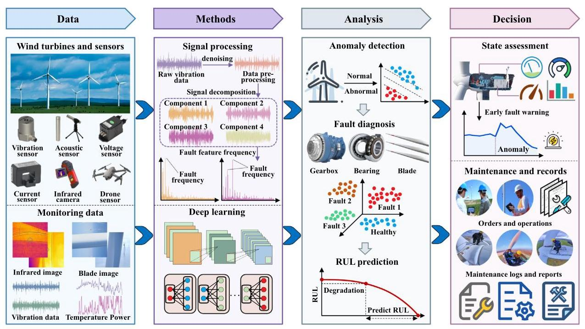

# 2. Prognostics and health management of wind turbines

The wind turbine is a complex mechanical system that integrates mechanical, electrical, and hydraulic components. The primary tasks of PHM for wind turbines include data acquisition, processing methods, fault diagnosis and prediction, and maintenance decision-making [31]. Fig. 1 illustrates the overview of wind turbine PHM. The following sections discuss the fault mechanisms of critical components, typical PHM methods, and publicly available datasets.

### 2.1.The fault mechanism of wind turbines

Understanding the fault mechanisms of wind turbines is crucial for developing a comprehensive fault knowledge base that supports accurate fault detection, diagnosis, and prognosis [32,33]. Wind turbines consist of various components, including blades, nacelle, tower, hub, pitch motor, yaw motor, gearbox, main bearing, pitch bearing, yaw bearing, and converter [34,35]. Among these, the blades, gearbox, and bearings are the most critical and prone to failure.

#### 2.1.1.The fault mechanism of blades

Wind turbine blades are subject to various types of damage, including surface erosion, cracking, delamination, and structural deformation. These failures are primarily caused by aerodynamic disturbances, material degradation, and structural stresses [36]. First, surface damage caused by erosion, icing, or contamination alters the aerodynamic profile of the blade, disrupting airflow and reducing lift efficiency. This aerodynamic imbalance lowers energy conversion efficiency and increases dynamic loads on the drivetrain and gearbox, accelerating wear and the risk of mechanical failures [37,38]. Second, material degradation due to prolonged exposure to UV radiation, sand, and temperature extremes induces fatigue-related damage such as cracks, delamination, and fiber breakage. These defects weaken structural stiffness and strength, reducing the blade's ability to withstand high wind loads and increasing the likelihood of catastrophic failure [39]. Third, structural stresses, including misalignment and uneven loading from localized damage or stiffness loss, cause abnormal vibrations and deformations during rotation. These dynamic effects propagate stress to adjacent components such as the main shaft and gearbox, compounding overall system degradation [40].

#### 2.1.2.The fault mechanism of gearboxes

The fault mechanisms of wind turbine gearboxes arise from the complex interaction between cyclic mechanical loads and harsh environmental conditions [41]. The inherently variable and intermittent nature of wind induces fluctuating torque and cyclic stresses on gearbox components. Over time, these mechanical loads, coupled with external factors such as temperature variations, humidity, and corrosion, result in typical failure modes including surface wear, pitting, fatigue cracking, and tooth breakage [42]. Surface wear and pitting are the most prevalent early-stage faults, primarily caused by repeated meshing impacts and insufficient lubrication. These deteriorations reduce contact efficiency, promote uneven load distribution, and can trigger more severe damage such as cracking [43]. Fatigue cracking develops under long-term cyclic loads, leading to stiffness degradation and altered dynamic responses, often manifested as abnormal vibrations. These cracks can propagate over time, ultimately leading to critical structural failures. Tooth breakage is typically the final stage of mechanical degradation. It causes immediate loss of gear engagement, imbalance, and high-amplitude vibrations, often resulting in secondary damage to the drivetrain. Dynamic modeling is critical for analyzing gearbox fault mechanisms. Compared to rigid or flexible models alone, rigid-flexible coupled models offer an effective trade-off between simulation accuracy and computational efficiency [44]. Tan et al. [45] demonstrated that rigid-flexible coupling models more accurately capture vibration responses in wind turbine planetary gear systems, revealing that rigid-body assumptions underestimate torque fluctuation effects.

Fig. 1. Overview diagram of wind turbine PHM.

#### 2.1.3.The fault mechanism of bearings

Wind turbine bearing faults are mainly caused by uneven loads and material fatigue, leading to surface damage and reduced operational stability [46]. Wind turbine bearing faults primarily manifest through four typical failure modes: wear, plastic deformation, corrosion, and fatigue-induced cracking. Wear is the most prevalent mode and includes abrasive wear-caused by contaminated or degraded lubricants that allow particles to grind bearing surfaces-and adhesive wear, which results from high contact stress leading to localized welding and tearing [31]. Plastic deformation occurs under transient overloading or impact forces, where uneven stress distribution leads to irreversible material distortion and accelerated wear [47]. Corrosion arises from moisture ingress, chemical attack, or lubricant failure, and is often exacerbated by metallic particle accumulation and electro-corrosion induced by shaft voltage differentials [48]. Fatigue cracking, induced by repetitive or excessive loads, begins at stress concentrations and propagates over time, often resulting in abrupt structural failure.

### 2.2.The PHM methods and publicly available datasets for wind turbines

### 2.2.1. Wind turbine PHM methods

Wind turbine data consist mainly of SCADA data, vibration data, acoustic data, and image data. PHM methods for wind turbines are generally classified into four categories: signal processing methods, traditional machine learning methods, deep learning methods, and expert system methods [49]. Table 1 provides a summary of key PHM methods commonly applied to wind turbines.

In Table 1, signal processing methods transform and analyze wind turbine data in the frequency and time-frequency domains to extract fault-related features. These features are then used for anomaly detection, fault identification, and early warnings. Common techniques include Fourier transform, wavelet transform, graph spectral analysis, and time-frequency analysis [50-61]. Traditional machine learning methods are extensively used in wind turbines for anomaly detection, fault diagnosis, and RUL prediction. The support vector machine (SVM), extreme learning machine (ELM), and Bayesian methods can analyze historical operational data to identify faults [126,127]. Deep learning methods, a subset of machine learning, automatically extract high-dimensional features and are well-suited for large-scale datasets. Common models include convolutional neural network (CNN), recurrent neural network (RNN), long short-term memory (LSTM), autoencoder (AE), generative adversarial network (GAN), graph neural network (GNN), Transformers, and You Only Look Once (YOLO). Deep learning methods typically employ end-to-end learning for fault diagnosis, early warning, and RUL prediction. Unlike traditional machine learning methods, deep learning methods excel at capturing complex nonlinear relationships in large-scale, high-dimensional data, making them highly effective for analyzing and processing such datasets [78-80]. Expert system methods rely on rule-based or knowledge-driven approaches, integrating domain expertise, historical data, and reasoning processes to assess wind turbine health. Expert systems typically consist of a knowledge base, a rule base, and an inference engine, simulating expert decision-making for fault diagnosis, anomaly detection, and maintenance planning [119,120].

#### 2.2.2.The publicly available wind turbine datasets

Wind turbines consist of key components, including blades, gearboxes, and bearings. The health of these components directly influences the performance and safety of the wind turbine. However, publicly available datasets for wind turbines are scarce in industrial contexts, as data from commercial wind turbines are typically proprietary. This limitation poses challenges for researchers studying wind turbine PHM. To address this, we reviewed relevant literature and online sources. As a result, we compiled 15 publicly available datasets related to wind turbine blades, gearboxes, and bearings. These datasets represent various wind turbine types and operational conditions, offering valuable resources for further research. The datasets are summarized in Table 2.

#### 2.2.3.The bibliometric analysis

In wind turbine PHM, machine learning methods, especially deep learning, have become a research hotspot due to their superior performance in fault diagnosis and RUL prediction. Therefore, this study conducts a bibliometric analysis of machine learning models for wind turbines using the Web of Science database. The search strategy combines keywords such as "wind turbine", "prognostic and health management", "fault diagnosis", "remaining useful life", and deep learning methods, including CNN, RNN, LSTM, AE, GAN, GNN, and Transformer. The query targets studies on PHM applications in wind turbines, focusing on areas like condition monitoring, anomaly detection, fault diagnosis, remaining useful life prediction, predictive maintenance, and health assessment. The search includes publications from 2015 to 2024 to capture the latest developments. Only peer-reviewed articles are considered, resulting in the selection of 585 relevant studies. The bibliometric analysis results are shown in Fig. 2.

This study extracted and analyzed high-frequency keywords using the modular clustering algorithm in VOSviewer software, as shown in Fig. 2. The co-occurrence network map generated revealed three major clusters, represented by distinct colors: blue, red, and green. By calculating keyword centrality and relevance, this study identified core keywords and their distribution patterns within each cluster. The green cluster focused on fault diagnosis, vibration signals, and bearings. The blue cluster centered on wind turbines, including keywords like "prediction" and "detection". The red cluster emphasized "classification", with topics such as "wind turbine blade" and "vibration". The map visually illustrates the co-occurrence relationships among keywords, highlighting research hotspots and interdisciplinary connections.

