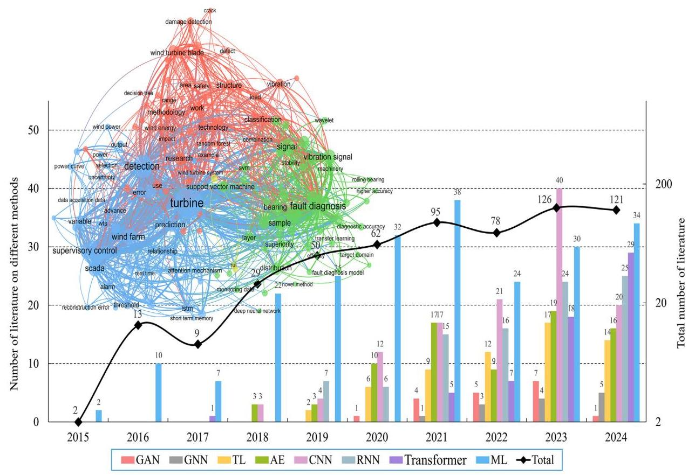
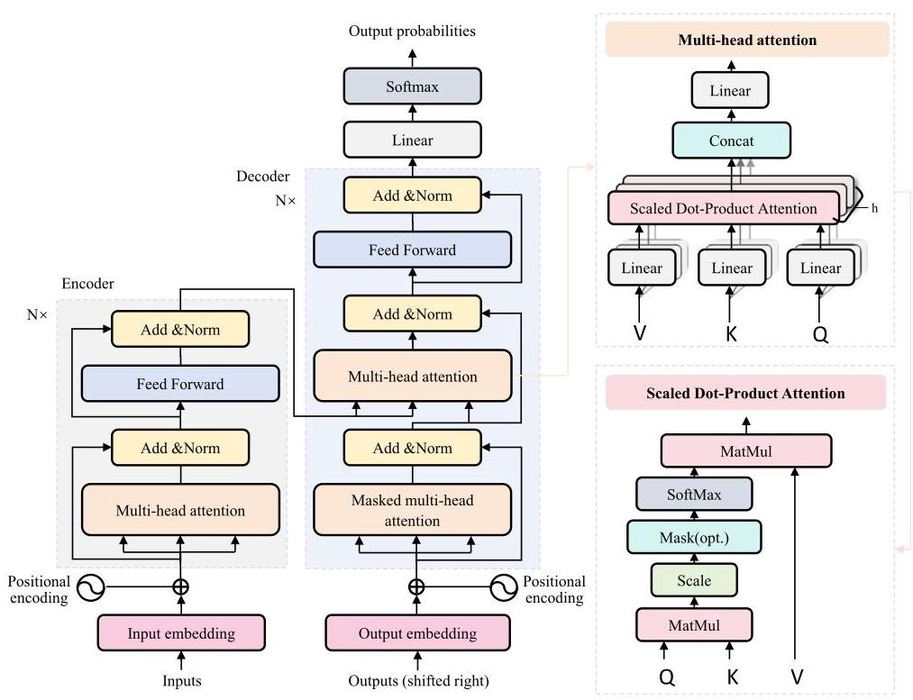
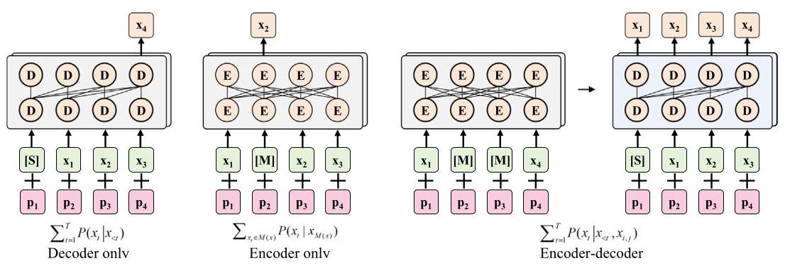

# 3. Overview of LSF-models

LSF-Models are primarily built upon the Transformer architecture [141], which offers distinct advantages over traditional data-driven methods such as CNNs and LSTMs. Transformer-based architectures overcome the locality limitations of CNNs and the sequential bottlenecks of LSTMs by enabling global dependency modeling via self-attention and supporting parallel computation. Their multi-head attention mechanism enhances long-range pattern learning, making them highly scalable and effective for large-scale multimodal data processing [19,20]. The following sections present the Transformer architecture, the pre-training frameworks of LSF-Models, and the types of LSF-Models.

Table 1

The PHM methods for wind turbines.

<table><tr><td>Categories</td><td>Models</td><td>Data</td><td>Faults</td><td>References</td></tr><tr><td rowspan="2">Signal processing methods</td><td>Spectral- based models</td><td>Vibration signals Acoustic signals</td><td>Blade faults Bearing faults Gearbox faults</td><td>Ma et al. [50], Xiang et al. [51], Zhu et al. [52], Naima et al. [53], Chen et al. [54], Liu et al. [55]</td></tr><tr><td>Time- frequency models</td><td>Vibration signals Acoustic signals</td><td>Blade faults Bearing faults Gearbox faults</td><td>Li et al. [56], Zhang et al. [57], Gu et al. [58], Zhao et al. [59], Zhang et al. [60], Meng et al. [61]</td></tr><tr><td rowspan="3">Traditional machine learning methods</td><td>SVM</td><td>Vibration signals SCADA data</td><td>Blade faults Bearing faults Gearbox faults</td><td>Tuerxun et al. [62], Li et al. [63], Zhang et al. [64], Wang et al. [65], Peng et al. [66], Wang et al. [67]</td></tr><tr><td>ELM</td><td>Vibration signals SCADA data</td><td>Blade faults Gearbox faults</td><td>Dong et al. [68], Tong et al. [69], Yu et al. [70], Isham et al. [71]</td></tr><tr><td>Bayesian</td><td>Vibration signals SCADA data</td><td>Blade faults Bearing faults Gearbox faults</td><td>Zhang et al. [72], Liu et al. [73], Zhang et al [74], Wu et al. [75], Zhang et al. [76], Tang et al. [77]</td></tr><tr><td rowspan="6">Deep learning methods</td><td>CNN</td><td>Vibration signals SCADA data</td><td>Gearbox faults Electrical faults Yaw faults Pitch faults Bearing faults</td><td>Qiao et al. [78], Huang et al. [79], Zhang et al. [80], Rahimilarki et al. [81], Xu et al. [82], Wang et al. [83], Liu et al. [84], Amin et al. [85], Guo et al. [86], Qi et al. [87]</td></tr><tr><td>LSTM</td><td>Vibration signals SCADA data</td><td>Gearbox faults Bearing fault Electrical faults</td><td>Yin et al. [88], Wu et al. [89], Li et al. [90], Yan et al. [91], Xiang et al. [92], Xiao et al. [93], Pandit et al. [94]</td></tr><tr><td>AE</td><td>Vibration signals SCADA data</td><td>Blade faults Generator faults</td><td>Liu et al. [95], Zhang et al. [96], Hoffmann et al. [97], Lu et al. [98]</td></tr><tr><td>GNN</td><td>Vibration signals SCADA data</td><td>Bearing faults Gearbox faults Electrical faults</td><td>Shao et al. [99], Jiang et al. [100] and [101]. Wang et al. [102], Zheng et al. [103], Yang et al. [104], Yu et al. [105]</td></tr><tr><td>Transformer</td><td>Acoustic signals Vibration signals SCADA data</td><td>Blade faults Gearbox faults Bearing faults</td><td>Li et al. [106], Trivino et al. [107], Wang et al. [108], Zhao et al. [109], Guo et al. [110], Cho et al. [111]</td></tr><tr><td>YOLO</td><td>Image data</td><td>Blade faults</td><td>Liu et al. [112], Ran et al. [113], Hang et al. [114], Zhu et al. [115]</td></tr><tr><td rowspan="2">Expert system methods</td><td>Rule-based models</td><td>Vibration signals SCADA data</td><td>Bearing faults Gearbox faults</td><td>Deng et al. [116], Li et al. [117], Xu et al. [118], Rajaoarisoa et al. [119]</td></tr><tr><td>Knowledge-driven models</td><td>Image data SCADA data</td><td>Blade faults Bearing faults Gearbox faults</td><td>Aguilera et al. [120], Liu et al. [121], Leite et al. [122], Jiang et al. [123], Tang et al. [124], Sun et al. [125</td></tr></table>

### 3.1.The transformer architecture

Transformer is composed of two core components: encoder and decoder [141]. Encoder transforms input sequences into contextual representations through stacked self-attention and feedforward layers. Decoder generates outputs by attending to encoder representations and its own previous predictions using masked self-attention. The Transformer architecture is shown in Fig. 3.

The Transformer architecture begins by converting the input token sequence into continuous vector representations. Each token is embedded into a high-dimensional space, and positional encodings are added to retain sequence order information. Next, the core component of the model, self-attention, transforms the input embeddings into queries (Q), keys (K), and values (V) through multiplication with learnable weight matrices:

\[
\mathbf{Q} = {\mathbf{{XW}}}^{Q},\;\mathbf{K} = {\mathbf{{XW}}}^{K},\;\mathbf{V} = {\mathbf{{XW}}}^{V} \tag{1}
\]

The attention scores are computed using scaled dot-product attention:

\[
\operatorname{Attention}\left( {\mathbf{Q},\mathbf{K},\mathbf{V}}\right)  = \operatorname{softmax}\left( \frac{\mathbf{Q}{\mathbf{K}}^{T}}{\sqrt{{d}_{k}}}\right) \mathbf{V} \tag{2}
\]

To enhance representational capacity, multi-head attention runs multiple attention mechanisms in parallel:

\[
\operatorname{MultiHead}\left( {\mathbf{Q},\mathbf{K},\mathbf{V}}\right)  = \operatorname{Concat}\left( {{\operatorname{head}}_{1},\ldots ,{\operatorname{head}}_{h}}\right) {\mathbf{W}}^{O} \tag{3}
\]

\[
{\operatorname{head}}_{i} = \operatorname{Attention}\left( {{\mathbf{{QW}}}_{i}^{Q},{\mathbf{{KW}}}_{i}^{K},{\mathbf{{VW}}}_{i}^{V}}\right) \tag{4}
\]

where \( {W}_{i}^{Q} \in  {\mathbb{R}}^{{d}_{\text{ model }} \times  {d}_{k}},{W}_{i}^{K} \in  {\mathbb{R}}^{{d}_{\text{ model }} \times  {d}_{k}},{W}_{i}^{V} \in  {\mathbb{R}}^{{d}_{\text{ model }} \times  {d}_{v}} \) , \( {W}^{O} \in  {\mathbb{R}}^{{\mathrm{{hd}}}_{\mathrm{v}} \times  {\mathrm{d}}_{\text{ model }}}. \)

Each attention block is followed by a position-wise feedforward network that applies two linear transformations with a non-linearity in between:

\[
\operatorname{FFN}\left( x\right)  = \max \left( {0, x{\mathbf{W}}_{1} + {b}_{1}}\right) {\mathbf{W}}_{2} + {b}_{2} \tag{5}
\]

Each sub-layer in the encoder and decoder applies residual connection and layer normalization, known as "Add & Norm", computed as LayerNorm \( \left( {x + \text{ Sublayer }\left( x\right) }\right) \) . This design stabilizes training and retains input information.

In the decoder, masked self-attention prevents information flow of information from future positions, and encoder-decoder attention allows the decoder to focus on relevant encoder outputs. The decoder output is finally transformed into the target sequence via a linear projection layer.

Table 2

The publicly available datasets for wind turbine PHM.

<table><tr><td>Source</td><td>Description</td><td>Data type</td><td>Amount of data</td><td>Fault types</td><td>Link</td></tr><tr><td>Industrial scenario</td><td>The dataset consists of 1302 drone images. These images are collected during wind turbine inspections across six different environments [128].</td><td>Image</td><td>1302 pictures</td><td>- Defects   - Corrosion</td><td>https://github.com/cong-yang/ Blade30</td></tr><tr><td>Industrial scenario</td><td>The dataset includes 589 ultrahigh-resolution images. These images are captured by drones in various environmental conditions [129].</td><td>Image</td><td>589 pictures</td><td>- Erosion   - Crack</td><td>https://data.mendeley.com/ datasets/hd96prn3nc/2</td></tr><tr><td>Industrial scenario</td><td>The dataset comprises images of defect-free wind turbine blades, as well as images of four types of defective wind turbine blades categorized into five defect types [130].</td><td>Image</td><td>299 pictures</td><td>- Edge-damaged   - Erosion   - Rough</td><td>https://data.mendeley.com/ datasets/jrmm82m4mv/1</td></tr><tr><td>Simulation</td><td>The dataset is collected from a Primus Air Max wind turbine, utilizing six blades to generate both healthy and faulty dataset. The dataset comprises 4000 indoor images and 2000 outdoor images [131].</td><td>Image</td><td>6000 pictures</td><td>- Healthy   - Cracks   - Holes   - Edge corrosion</td><td>https://www.kaggle.com/ datasets/mohammadshekaramiz/ small-wind-turbine-blade-dataset-cai-swtb</td></tr><tr><td>Simulation</td><td>The dataset comprises 1000 high-definition thermal images, divided into 500 healthy images and 500 defective images, all of which are properly labeled [132].</td><td>Thermal image</td><td>1000 pictures</td><td>- Holes   - Erosion   - Defects cracks</td><td>https://github.com/ MoShekaramiz/Small-WTB-Thermal1</td></tr><tr><td>Industrial scenario</td><td>The dataset comprises vibration data from wind turbines operating under varying load conditions induced by different wind speeds. The dataset is recorded at a sampling rate of \( 1\mathrm{{kHz}} \) , with 500 samples per channel [133].</td><td>Tabular data</td><td>17,500 samples</td><td>- Healthy   - Crack   - Surface erosion   - Imbalance</td><td>https://data.mendeley.com/ datasets/5d7vbdp8f7/4</td></tr><tr><td>Industrial scenario</td><td>The dataset contains raw time-domain vibration signals from six turbines in the same wind farm, recorded along the accelerometer axis on each bearing housing [134].</td><td>Tabular data</td><td>44,236,800 samples</td><td>- Healthy   - Inner and outer race faults</td><td>https://snd.se/en/catalogue/ dataset/2024-248</td></tr><tr><td>Industrial scenario</td><td>The dataset includes both healthy and damaged teeth, recorded across a load range from 0 to 90 %, applying four sensors in four directions.</td><td>Tabular data</td><td>2,021,119 samples</td><td>- Healthy   - Broken tooth</td><td>https://github.com/Gearboxdata/ Gear-Box-Fault-Diagnosis-Data-Set</td></tr><tr><td>Industrial scenario</td><td>The dataset spans three years of monitoring five Fuhrlander FL2500 2.5 MW wind turbines. It consists of 312 variables collected from 78 sensors [135].</td><td>Tabular data</td><td>2000 samples</td><td>- Turbine failure</td><td>https://github.com/alecuba16/ fuhrlander</td></tr><tr><td>Industrial scenario</td><td>The dataset, collected every 10 min, includes parameters such as the ambient temperature and power characteristics of wind turbine.</td><td>Tabular data</td><td>300,000 samples</td><td>- Normal   - Abnormal</td><td>https://github.com/GCShawn/WT_ fault_identification/tree/master/ data</td></tr><tr><td>Simulation</td><td>The dataset includes normal bearings, single-point defects in drive-end and fan-end bearings, with sampling rates of 12,000 and 48,000 Hz. The motor loads range from 0 to \( 3\mathrm{{HP}} \) , and the speeds vary from 1797 to 1720 rpm [136].</td><td>Tabular data</td><td>75,000 samples</td><td>- Rolling element, inner and outer race faults</td><td>https://engineering.case.edu/ bearingdatacenter/download-datafile</td></tr><tr><td>Simulation</td><td>The dataset contains data from a 750 W wind turbine. Accelerometers and tachometers record the structural response, bearing vibration, and speed [137].</td><td>Tabular data</td><td>360,000 samples</td><td>- Rolling element, inner and outer race faults</td><td>https://zenodo.org/records/ 11820598   (continued on next page)</td></tr></table>

Table 2 (continued)

<table><tr><td>Source</td><td>Description</td><td>Data type</td><td>Amount of data</td><td>Fault types</td><td>Link</td></tr><tr><td>Simulation</td><td>The dataset consists of simulated acceleration measurements from a 5 MW reference driveline model mounted on a spar-type floating wind turbine [138].</td><td>Tabular data</td><td>12,000 samples</td><td>- Fatigue damage</td><td>https://zenodo.org/records/ 7674842</td></tr><tr><td>Simulation</td><td>The dataset comes from a three-blade upwind turbine. The vibration data is recorded at \( {40}\mathrm{{kHz}} \) by eight accelerometers. The data is classified as normal and damaged [139].</td><td>Tabular data</td><td>240,000 samples</td><td>- Healthy   - Damaged</td><td>https://data.openei.org/ submissions/738</td></tr><tr><td>Simulation</td><td>The dataset includes five healthy states, eight rotational speeds, and various installation effects, with vibration data recorded by a Sinocera CA-YD-1181 accelerometer and speed pulses by an encoder [140].</td><td>Tabular data</td><td>35,000 samples</td><td>- Broken tooth   - Wear gear   - Crack   - Missing tooth</td><td>https://github.com/Liudd-BJUT/ WT-planetary-gearbox-dataset</td></tr></table>

Fig. 2. The bibliometric analysis of machine learning models for wind turbine PHM.

## 3.2. Pre-training frameworks of LSF-models

Based on the Transformer architecture and application scenarios, the pre-training frameworks of LSF-Models can be classified into three types: encoder-decoder, encoder-only, and decoder-only architectures, as illustrated in Fig. 4.

The encoder-decoder framework is widely used for tasks that require structured input-output mappings [143]. In this framework, the encoder processes and compresses the input sequence into a fixed-length latent representation that captures essential information. The decoder then uses this encoded representation to generate the output sequence, supporting tasks with a direct input-output relationship. Notable models using this encoder-decoder framework include Text-to-Text Transfer Transformer (T5) and Bidirectional and AutoRegressive Transformers (BART), which are optimized for sequence-to-sequence tasks [144].

The encoder-only framework focuses on understanding input data by generating contextualized representations, making it ideal for tasks like text classification and sentiment analysis [145]. It processes input sequences through stacked encoder layers to produce token-level embed-dings. Bidirectional Encoder Representations from Transformers (BERT) exemplifies this framework, utilizing bidirectional context to capture word relationships from both preceding and following tokens, thereby improving performance in analytical tasks without generating output sequences [146].

Fig. 3. The architecture of the Transformer model [141].

Fig. 4. The pre-training frameworks of LSF-Models [142]. E and D denote the encoder and decoder of transformer model. \( x \) represents the input sequence, consisting of \( T \) tokens \( {\left\{  {x}_{t}\right\}  }_{t = 1}^{T},{x}_{t} \) denotes the \( t \) -th token in the sequence. \( M\left( x\right) \) refers to the subset of tokens in \( x \) that are selected for masking. \( S \) indicates the special start token embedding used to initialize the sequence. \( {p}_{1},{p}_{2},{p}_{3},{p}_{4} \) denote the position embeddings corresponding to the first through fourth tokens, respectively. \( P \) stands for the conditional probability distribution used during prediction tasks. i and j mark the start and end indices of the encoder input span.

The decoder-only framework is designed for tasks involving text generation, such as language modeling, text completion, and dialogue systems [147]. This structure directly generates sequences by predicting the next word based on the context of previously generated words. It prioritizes fluency and coherence, making it effective for generating continuous, contextually relevant text. GPT-2 and GPT-3 are representative models of this decoder-only framework [148].

### 3.3.The types of LSF-models

The LSF-Models can be divided into four categories: large language models (LLMs), large vision models (LVMs), large time series models (LTSMs), and multimodal large language models (MLLMs). LLMs are particularly adept at processing unstructured textual data and have demonstrated strong performance across a wide range of natural language tasks, including translation, summarization, sentiment analysis, and question answering [149]. One of the key drivers of their success is model scale. For example, OpenAI's GPT series progressed from 117 million parameters in GPT-1 to 1.5 billion in GPT-2, and 175 billion in GPT-3, with each increase yielding notable performance gains [150]. Similarly, Google's LaMDA, with 137 billion parameters, has shown impressive capabilities across diverse language understanding tasks [151]. Beyond their general-purpose language understanding, LLMs have begun to exhibit reasoning abilities as their scale increases [149]. However, due to their reliance on publicly available internet text during training, LLMs often struggle with accuracy and consistency when applied to domain-specific or specialized technical content.

LVMs are extensively applied to tasks such as image classification, object detection, image segmentation, and visual recognition [152]. Their primary advantage lies in powerful feature extraction capabilities, which allow them to automatically learn rich and hierarchical representations from large volumes of visual data [153]. A notable strength of LVMs is their ability to transfer knowledge across domains. Models pre-trained on large-scale image datasets can be fine-tuned for downstream tasks in specific domains, retaining strong generalization performance even when only limited labeled data are available [154]. However, training LVMs typically requires enormous computational resources due to the large volume of image data and the complexity of their architectures.

Table 3

The comprehensive comparison of four categories of LSF-Models.

<table><tr><td>LSF-Models</td><td>Data type</td><td>Core mechanism</td><td>Advantages</td><td>Limitations</td><td>Typical tasks in wind turbine PHM</td></tr><tr><td>LLMs</td><td>Text data</td><td>Pretrained on large-scale corpora for contextual language modeling</td><td>- Linguistic representation learning   - Contextualized language understanding</td><td>- Outdated domain knowledge - Lack of multimodal support</td><td>- Abnormal semantic analysis   - Maintenance suggestion generation</td></tr><tr><td>LVMs</td><td>Image data</td><td>Pretrained on large-scale images with patch embedding and attention mechanisms to capture spatial semantics</td><td>- Fine-grained visual representation learning   - Accurate object detection and localization</td><td>- Performance sensitive to image quality - Lack of semantic interpretability</td><td>- Surface crack and corrosion detection   - Thermal image hotspot detection</td></tr><tr><td>LTSMs</td><td>Time-series data</td><td>Pretrained on long-range time-series to capture temporal dependencies and dynamic patterns</td><td>- Dynamic temporal representation learning   - Trend modeling and prediction</td><td>- Performance sensitive to irregular sampling and missing values   - Limited interpretability in long-range temporal modeling</td><td>- Time-series anomaly detection   - RUL prediction</td></tr><tr><td>MLLMs</td><td>Multimodal data</td><td>Pretrained on aligned text, image, and time-series data for unified cross-modal representation learning</td><td>- Joint representation learning across heterogeneous modalities   - Unified multimodal understanding and reasoning</td><td>- Potential inconsistency in cross-modal reasoning   - High resource demand in training and inference</td><td>- Cross-modal decision reasoning and analysis</td></tr></table>

LTSMs are specifically designed to process sequential data and have shown strong capability in capturing temporal dependencies and extracting meaningful features from time series inputs [155,156]. They offer three key advantages. First, LTSMs excel at modeling long-term dependencies by retaining and transmitting critical information across time steps, allowing them to capture trends, periodic patterns, and temporal correlations. Second, they handle high-dimensional time series data effectively through attention mechanisms. Third, LTSMs are robust to noise, which is important given that real-world time series data are often affected by environmental variations or sensor faults. However, LTSMs face data scarcity, especially in specialized domains, limiting large-scale training and generalization.

MLLMs integrate multiple data modalities, including text, images, audio, and video, enabling them to support a wide range of tasks such as question answering, video comprehension, speech generation, and cross-modal retrieval [157]. They demonstrate strong zero-shot and few-shot generalization capabilities. Representative models include GPT-40 (OpenAI), Flamingo (DeepMind), and DeepSeek [158]. However, due to the need to process and align multiple data types, MLLMs require significantly greater computational resources for both training and inference compared with single-modality models [159].

The comparative analysis of LLMs, LVMs, LTSMs, and MLLMs in terms of core mechanisms, advantages, limitations, and typical tasks in wind turbine PHM is presented in Table 3.

