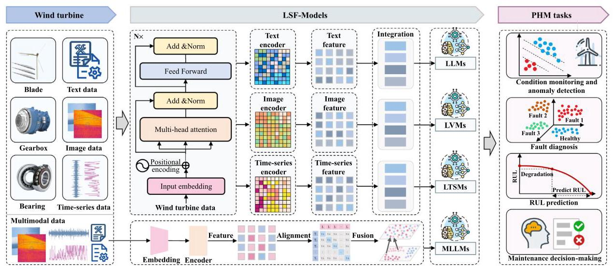
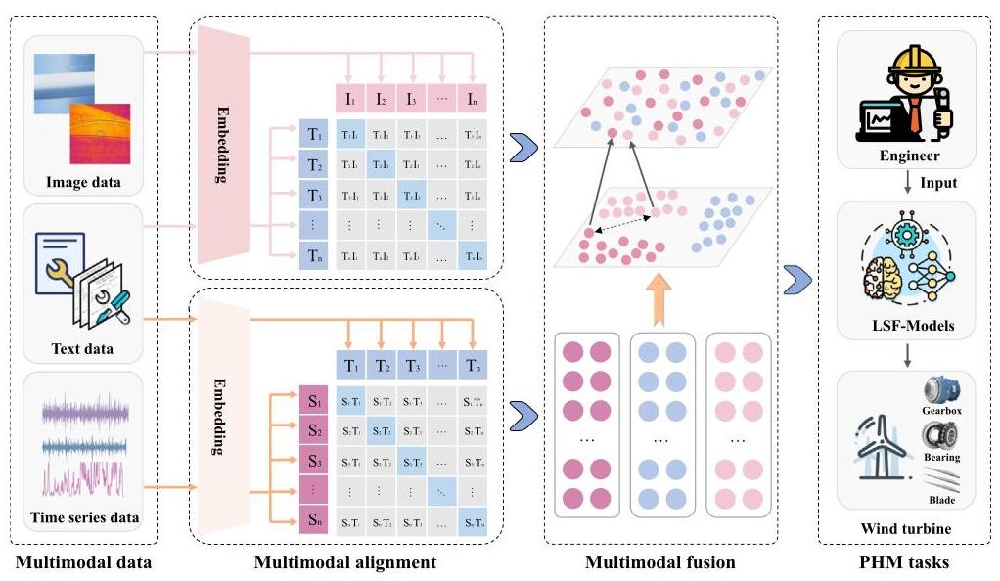
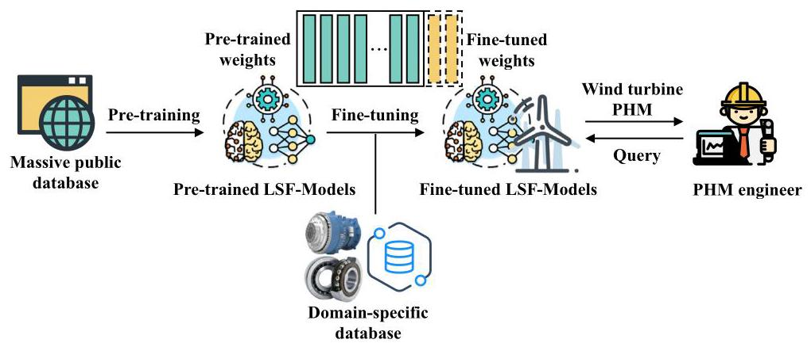
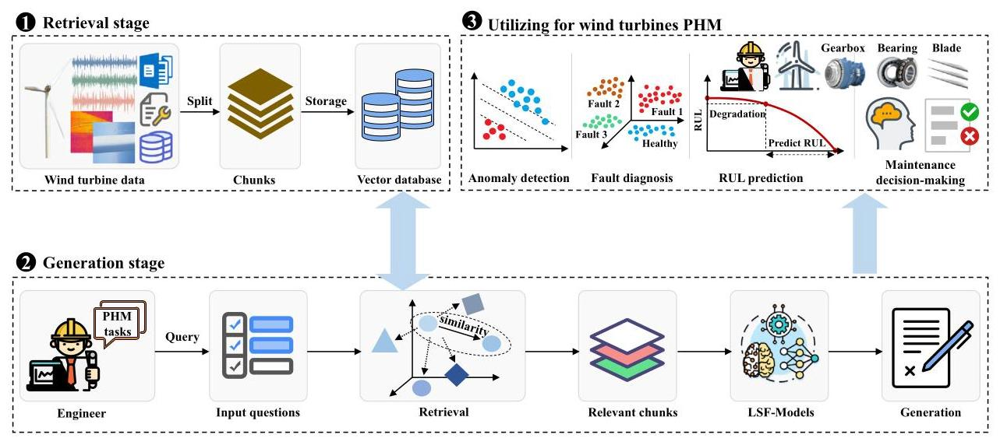

# 4. Wind turbine PHM based on LSF-models

This section analyzes the limitations of traditional wind turbine PHM methods. It then presents the application of LSF-Models in wind turbine PHM and outlines the associated technologies.

## 4.1. Limitations of traditional wind turbine PHM methods

The traditional wind turbine PHM methods face several key limitations, including dependence on data labeling, poor generalization capability, difficulty in detecting unknown faults, and reliance on expert experience. The specific limitations are outlined as follows.

### 4.1.1. Dependence on data labeling

Traditional PHM methods for wind turbines face significant challenges due to their reliance on large amounts of labeled data. One key obstacle is the complexity and expertise required for accurate labeling. Wind turbine fault data covers a wide range of fault types, each with distinct characteristics, necessitating specialized knowledge for accurate labeling. This process is time-consuming and labor-intensive [160]. Additionally, labeled data for wind turbine PHM is often scarce and costly to obtain. In industrial settings, the long-term collection and labeling of new fault data are difficult, limiting the adaptability of traditional PHM approaches [161-163].

### 4.1.2. Poor generalization capability

Traditional PHM methods for wind turbines suffer from limited generalization capabilities, which constrain their effectiveness in complex industrial scenarios. First, these methods are typically developed for specific components such as bearings, gearboxes, or blades, and focus on individual tasks like fault diagnosis or RUL prediction. This limits their ability to support integrated multi-task processing and multi-level system analysis, which are essential for comprehensive and efficient health perception of the entire wind turbine system. For example, they are unable to analyze various types of components across mechanical, electrical, and control systems, or handle multiple tasks such as diagnosis and prediction in an integrated manner [164-167]. Second, these methods are often designed for single-modality data with fixed sampling frequencies, rotational speeds, and signal types. They are not suitable for processing multimodal data such as vibration, acoustic, SCADA, images, and text, which are collected from different devices, under diverse operating conditions, and in various formats [32,33]. Third, traditional PHM methods lack adaptability to new or unseen fault types. They often fail to detect faults absent from training data and perform poorly under varying conditions and maintenance scenarios [168-170].

### 4.1.3. Reliance on expert experience

Traditional PHM methods for wind turbines heavily rely on expert knowledge and manual intervention, which present several inherent limitations. The selection of PHM methods is often guided by experts' familiarity with specific algorithms or component-level characteristics, limiting the adaptability of these methods to diverse wind turbine operating scenarios [171]. Furthermore, such methods typically require manual tuning of model parameters based on subjective experience, which may affect the model's ability to capture complex or evolving fault patterns [124,125]. In addition, fault severity assessment and maintenance planning are commonly performed through expert judgment, which can lead to delayed or inconsistent responses-particularly in the case of emerging or previously unseen faults.

Fig. 5. The application of LSF-Models in wind turbine PHM.

### 4.2.The principal tasks of LSF-models in wind turbine PHM

LSF-Models outperform traditional PHM methods by enabling unified, multimodal, and generalizable learning across diverse tasks without the need for handcrafted features or task-specific models. The applications of LSF-Models in wind turbine PHM are shown in Fig. 5.

### 4.2.1. Condition monitoring and anomaly detection for wind turbines based on LSF-models

Condition monitoring and anomaly detection in wind turbine PHM aim to identify early signs of degradation or faults in key components such as gearboxes, bearings, and blades. These components produce two primary types of data: time-series data and image data. LTSMs are widely employed to process time-series data, including vibration, acoustic, temperature, current, and power signals collected from gearboxes and bearings. Unlike traditional machine learning methods that rely on handcrafted features, LTSMs can learn directly from raw sequential inputs, capturing long-term temporal dependencies critical for identifying gradually developing faults. For instance, by feeding raw vibration signals into LTSMs, the models can extract trend patterns and detect subtle anomalies that deviate from normal operation baselines [156]. Zhang et al. [172] proposed a human-in-the-loop LLM framework for anomaly detection that inputs industrial time-series data and task prompts, and outputs interpretable detection results.

For components such as blades, where surface-level defects like cracks and corrosion are visually apparent, image-based monitoring is more suitable. LVMs are applied to process blade inspection images by extracting spatial features across different resolutions. These features capture structural variations in the image, enabling the model to learn visual patterns associated with normal and abnormal conditions and thereby identifying anomalies effectively [152]. Wang et al. [154] proposed DefectGLM, an LVM-based model that inputs industrial images and outputs defect labels along with textual descriptions, demonstrating its effectiveness in anomaly detection.

### 4.2.2. Fault diagnosis for wind turbines based on LSF-models

Fault diagnosis in wind turbine PHM aims to identify the fault type, location, and severity in key components such as gearboxes, bearings, and blades. LTSMs process raw time-series data such as vibration, acoustic, temperature, current, and power signals. For fault type identification, LTSMs extract temporal patterns and degradation trends that distinguish normal, and different fault states. Fault localization is achieved by mapping signal deviations to specific sensors or components, such as locating bearing inner-race faults based on frequency band signatures. For severity assessment, LTSMs model the amplitude, persistence, and growth rate of abnormal signals over time, enabling differentiation between early-stage degradation and critical failure conditions. LVMs operate on visual inspection data, such as blade images. They perform fault classification by learning visual patterns associated with defects like cracks, corrosion, and delamination. Localization is inherently supported through spatial attention mechanisms that highlight defect regions within the image. For severity analysis, LVMs capture geometric features such as crack length, depth, and edge sharpness, which correlate with damage levels [152].

MLLMs facilitate cross-modal fault diagnosis by integrating heterogeneous data sources, including time-series signals, visual images, and textual records. By constructing joint representations and applying cross-modal attention mechanisms, MLLMs enhance fault classification performance. Fault localization is achieved by aligning spatial information from image data with signal-based mappings of physical components. For severity assessment, MLLMs synthesize semantic cues from textual descriptions and quantitative patterns from time-series data, enabling interpretable and comprehensive severity estimation across multiple modalities.

Several recent studies have demonstrated the practical effectiveness of LSF-Models in fault diagnosis tasks. Jose et al. [173] proposed a novel LLM-based approach that integrates domain knowledge from unstructured text data such as technical documents and maintenance logs into diagnostic models, improving the accuracy of fault diagnosis. Gallmetzer et al. [174] investigated the use of GPT-4o for fault detection and classification in industrial systems, demonstrating its superior accuracy and adaptability compared to ResNet method. Wang et al. [175] proposed a large self-supervised time-series model for fault diagnosis in industrial systems, enabling knowledge transfer from mature to new scenarios and enhancing diagnostic accuracy.

#### 4.2.3.RUL prediction for wind turbines based on LSF-models

Accurately predicting the RUL of wind turbines is essential for implementing predictive maintenance and ensuring operational reliability. MLLMs integrate time-series, image, and textual data in a unified framework to jointly process and predict the RUL [176]. In MLLMs, time-series data such as vibration, acoustic, temperature, current, and power are input directly in their raw or segmented form. Image data, typically from blade inspections, capture visible degradation such as cracks or corrosion. Textual data, including maintenance logs or status reports, provide semantic context about component history and prior failures.

The MLLMs simultaneously receive time-series, image, and textual data, encode each modality through dedicated encoders, and align them using cross-modal attention [177]. They construct a unified representation that integrates temporal trends, spatial features, and semantic context. Based on the fused representation, the MLLM outputs an RUL prediction representing the estimated time-to-failure for specific components or systems, along with degradation states and confidence scores. Tao et al. [188] proposed LM4RUL, an LLM-based framework that takes tokenized vibration signals as input to predict long-term RUL. By integrating local degradation representations, the LM4RUL model improves cross-domain generalization, enabling accurate and robust RUL estimation without manual instructions. Cui et al. [178] proposed a GPT-based model that processes sensor time-series and operational data to generate accurate RUL predictions.

### 4.2.4. Maintenance decision-making for wind turbines based on LSF-models

The objective of maintenance decision-making in wind turbine PHM is to determine optimal repair strategies that reduce downtime, lower maintenance costs, and improve system reliability. Achieving this goal requires integrating health information from multiple diagnostic tasks and contextualizing it within operational and historical knowledge.

LLMs serve as intelligent decision engines by synthesizing inputs from preceding PHM tasks such as anomaly detection, fault diagnosis, and RUL prediction, along with unstructured textual sources including maintenance records, operational logs, and technical manuals. These inputs are encoded and processed by LLMs, which are further enhanced through retrieval mechanisms and domain-specific prompting to support complex reasoning and generate actionable maintenance decisions. The outputs typically include recommended maintenance actions, repair prioritization, scheduling plans, and automatically generated work orders. During inference, the LLM aligns structured diagnostic results with historical maintenance data and standardized procedures to propose context-aware and component-specific strategies [179]. Techniques such as retrieval-augmented generation (RAG) and multi-agent collaboration further enhance the model's interpretability and adaptability, particularly under conditions of uncertainty or incomplete information [22,180]. Tao et al. [181] proposed a maintenance decision-making method for wind turbines based on the fusion of maintenance knowledge with LLMs, enabling the generation of effective preventive maintenance plans while reducing dependence on expert experience. Angelopoulos et al. [182] developed a Large Language Model-Augmented Reality (LLM-AR) system that integrates equipment data and maintenance logs to provide real-time fault diagnostics, AR-based repair guidance, and maintenance operation recommendations. The system supports intuitive technician assistance and enables continuous model improvement through historical data feedback.

### 4.2.5. Summary of wind turbine PHM tasks and applicable LSF-models

Table 4 summarizes representative PHM tasks for wind turbines, along with their corresponding applicable LSF-Models, input modalities, and outputs.

## 4.3. Technologies of LSF-models for wind turbine PHM

To apply LSF-Models in wind turbine PHM, it is essential to research relevant technologies. Key technologies include multimodal alignment and fusion, fine-tuning techniques, integration with local knowledge bases, and intelligent agent technologies.

### 4.3.1. Multimodal alignment and fusion in LSF-models

In wind turbine PHM, achieving accurate and interpretable results across various tasks relies on the effective alignment and fusion of multimodal data, including time-series signals, visual inspection images, and unstructured textual information. The multimodal alignment and fusion techniques are illustrated in Fig. 6.

Multimodal alignment aims to systematically establish temporal, feature, and semantic correspondences across heterogeneous modalities, thereby facilitating unified representation and consistent cross-modal reasoning. Temporal alignment is applied to synchronize signals and events across modalities. For example, vibration signals, SCADA data, and unstructured logs are projected onto a common time axis, allowing joint analysis of data fragments within fixed time windows surrounding abnormal events. Feature alignment transforms heterogeneous data (e.g., high-frequency vibration and low-frequency SCADA data) into a shared embedding space using modality-specific encoders followed by projection into a unified latent feature space. Semantic alignment links extracted keywords or fault labels in maintenance logs with quantitative sensor patterns. For instance, the term "gearbox overheating" in a log is aligned with SCADA temperature readings and vibration spikes to form a composite interpretation of the event.

Table 4

Summary of wind turbine PHM tasks and applicable LSF-Models.

<table><tr><td>PHM tasks</td><td>Applicable LSF-Models</td><td>Input data</td><td>Output</td><td>Specific tasks</td></tr><tr><td rowspan="4">Condition monitoring and anomaly detection [154,172,183,184]</td><td>LLMs</td><td>Text (logs, maintenance records, anomaly descriptions)</td><td>Text (cause, suggestion)</td><td>Anomaly interpretation and maintenance suggestion generation</td></tr><tr><td>LVMs</td><td>Images (RGB, infrared thermal)</td><td>Health state and location</td><td>Industrial image-based anomaly detection</td></tr><tr><td>LTSMs</td><td>Time-series (vibration, acoustic, SCADA data)</td><td>Health state</td><td>Time series-based anomaly detection</td></tr><tr><td>MLLMs</td><td>Multimodal data (text, time-series, images)</td><td>Health state and interpretation</td><td>Cross-modal anomaly detection, semantic interpretation</td></tr><tr><td rowspan="4">Fault diagnosis [173-175, 185-187]</td><td>LLMs</td><td>Text (logs, maintenance records, fault descriptions)</td><td>Text (cause, suggestion)</td><td>Fault interpretation and maintenance suggestion generation</td></tr><tr><td>LVMs</td><td>Images (RGB, infrared thermal)</td><td>Fault type and location</td><td>Industrial image-based fault diagnosis</td></tr><tr><td>LTSMs</td><td>Time-series (vibration, acoustic, SCADA data)</td><td>Fault type</td><td>Time series-based fault diagnosis</td></tr><tr><td>MLLMs</td><td>Multimodal data (text, time-series, images)</td><td>Fault type and interpretation</td><td>Cross-modal fault diagnosis, semantic explanation</td></tr><tr><td rowspan="2">RUL prediction [178,188, 189]</td><td>LTSMs</td><td>Time-series (vibration, acoustic, SCADA data)</td><td>Time-series (prediction results)</td><td>Degradation modeling and RUL prediction</td></tr><tr><td>MLLMs</td><td>Multimodal data (text, time-series, images)</td><td>Time-series (prediction results) and interpretation</td><td>RUL prediction, semantic interpretation</td></tr><tr><td>Maintenance decision-making [181,182,190- 192]</td><td>LLMs</td><td>Text (logs, maintenance records, operational manuals, fault reports, RUL prediction reports)</td><td>Text (maintenance plans, work orders)</td><td>Maintenance strategy optimization, work order generation</td></tr></table>

Fig. 6. The multimodal alignment and fusion techniques for wind turbine PHM.

Multimodal fusion is performed to integrate the encoded modalities. Each modality \( {\mathbf{x}}^{\left( m\right) } \) is processed by a dedicated encoder \( {f}_{m}\left( \cdot \right) \) , yielding embeddings \( {\mathbf{z}}^{\left( m\right) } \in  {\mathbb{R}}^{d} \) . These embeddings are fused through transformer-based cross-attention networks, enabling effective integration across modalities.

\[
{\mathbf{z}}^{\left( m\right) } = {f}_{m}\left( {\mathbf{x}}^{\left( m\right) }\right) ,\;m \in  \{ t, v, s\} ,\;{\mathbf{z}}^{\text{ fused }} = \mathcal{F}\left( {{\mathbf{z}}^{\left( t\right) },{\mathbf{z}}^{\left( v\right) },{\mathbf{z}}^{\left( s\right) }}\right) \tag{6}
\]

Multimodal alignment and fusion in LSF-Models unify heterogeneous data into a shared latent space, enabling comprehensive and interpretable PHM tasks for wind turbines. For example, aligned sensor and image data help localize faults early. In RUL prediction, fused features integrate degradation trends, visual damage cues, and historical failure context for accurate lifespan estimation. In maintenance decision-making, the multimodal links diagnostic outcomes with prior repair records to suggest optimal actions. Lin et al. [186] proposed the MM-LLM-based approach that aligns time-series and textual modalities, integrates semantic features, and enhances the accuracy of fault diagnosis. Cao et al. [193] proposed AnomalyVLM, which performs multimodal alignment and fusion between product standards and images to enable zero-shot anomaly detection.

### 4.3.2. Fine-tuning LSF-models with domain-specific data

Fine-tuning LSF-Models with domain-specific data is crucial for improving their performance in wind turbine PHM. Although LSF-Models are trained on large, diverse internet datasets, they often lack specialized knowledge for wind turbine tasks [158]. Fine-tuning enables LSF-Models to adapt to the unique requirements of wind turbine PHM. The fine-tuning process, using wind turbine domain-specific data, is illustrated in Fig. 7.

The fine-tuning process involves training LSF-Models on data from actual wind turbines, including SCADA data, vibration signals, and historical maintenance records [195]. This process enhances the models' ability to perform PHM tasks, such as anomaly detection, fault diagnosis, and RUL prediction. By learning from historical fault and maintenance data, fine-tuned LSF-Models can detect anomalies, identify potential faults, and recommend predictive maintenance for wind turbines. A key advantage of fine-tuning is the models' ability to generalize across different wind turbines [196]. Knowledge gained from one wind turbine can be applied to others, facilitating cross-turbine diagnosis. If a maintenance strategy is effective for one set of wind turbines, the fine-tuned LSF-Models can adapt it to others operating under different conditions, improving operational efficiency. Incorporating domain-specific data ensures that LSF-Models handle specialized wind turbine knowledge [197]. Tao et al. [185] proposed a LLM-based framework for bearing fault diagnosis, which improves generalization across different conditions and limited data scenarios by integrating feature textual-ization with fine-tuning. Pang et al. [198] proposed LLaMA-HFT, an LLM-based fault diagnosis method with hybrid fine-tuning (HFT), and validated its effectiveness on the Paderborn University bearing dataset.

Fig. 7. Fine-tuning LSF-Models with domain-specific data [194].

Fig. 8. LSF-Models combined with local knowledge bases.

### 4.3.3. LSF-models combined with local knowledge bases

A key technology in LSF-Models is their ability to integrate with local knowledge bases through retrieval-augmented generation (RAG) [199]. By leveraging RAG, LSF-Models can retrieve and apply domain-specific knowledge, such as maintenance manuals, historical failure reports, technical standards, and operational data. As shown in Fig. 8, this integration enhances the efficiency of wind turbine PHM.

The dynamic connection between LSF-Models and local knowledge bases enables continuous updates information. As new information about wind turbines becomes available, such as updated maintenance reports or newly identified faults, LSF-Models can integrate this knowledge in real-time. The self-learning capability of LSF-Models, combined with local knowledge bases, improves wind turbine PHM performance and allows continuous learning of the latest domain-specific expertise. Consequently, diagnostic accuracy improves over time. Integration with local knowledge bases also enhances collaboration within the maintenance team. By providing a centralized, easily accessible information source, LSF-Models improve communication and coordination. Maintenance teams can quickly access relevant data and historical context, facilitating decision-making. Additionally, the integration allows for the analysis of vast amounts of historical data alongside real-time inputs. This enables LSF-Models to detect potential faults more effectively than traditional methods. For instance, when a fault occurs, LSF-Models can integrate relevant knowledge from the local knowledge base to detect similar faults in other turbines. In contrast, traditional PHM methods require retraining the model each time a new fault occurs. Ma et al. [199] proposed Fault Diagnostic Reasoning Knowledge Graph LLM (FDRKG-LLM), integrating LLMs with knowledge graphs to improve fault diagnosis accuracy and reliability. Men et al. [190] proposed Think on Fault Diagnosis Event Knowledge Graph (To-FD-EKG), integrating LLMs with event knowledge graphs to improve fault diagnosis interpretability, reduce hallucinations and enable traceable reasoning.

### 4.3.4. Intelligent agents based on LSF-models

Intelligent agents based on LSF-Models have been explored across various domains, including mathematical reasoning [200], biological protein design [201], and autonomous driving [202]. In engineering, intelligent agents have been applied to the design and optimization of complex systems such as buildings, bridges, dams, and roads [203]. The framework of intelligent agents consists of three key components: perception, brain, and action [204,205], as shown in Fig. 9.

In wind turbine PHM, intelligent agents based on LSF-Models enhance operational efficiency by automating four key tasks: condition monitoring and anomaly detection, fault diagnosis, RUL prediction, and maintenance decision-making [206]. First, the perception module of the intelligent agent collects multimodal input data from the wind turbine, including time series, images, and textual records, and passes them to the brain module. Next, the brain module (LSF-Models) leverages its embedded knowledge and reasoning capabilities to interpret, analyze, and infer from the collected data. Finally, the action module carries out specific PHM tasks. For instance, when abnormal vibration or temperature fluctuations are detected in the gearbox, it can identify the fault type, estimate the RUL, and recommend appropriate maintenance strategies, helping to reduce economic losses and safety risks. Liu et al. [207] proposed a multi-agent LLM approach enhanced by data, knowledge, and AR to improve fault reasoning and maintenance efficiency for complex mechanical equipment. Jeon et al. [208] leveraged RAG and multi-agent LLM collaboration to enable real-time industrial equipment monitoring and natural language interaction, supporting complex data queries in industrial scenarios.

### 4.3.5. Summary of technologies for LSF-models in wind turbine PHM

Table 5 summarizes the key technologies of LSF-Models and their roles in wind turbine PHM. These technologies help bridge the gap between general model capabilities and specific PHM task requirements.

