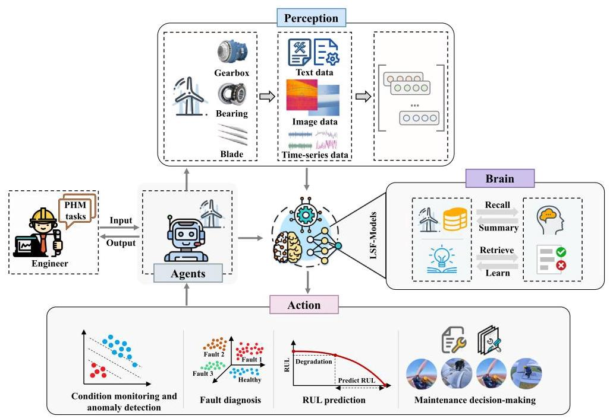
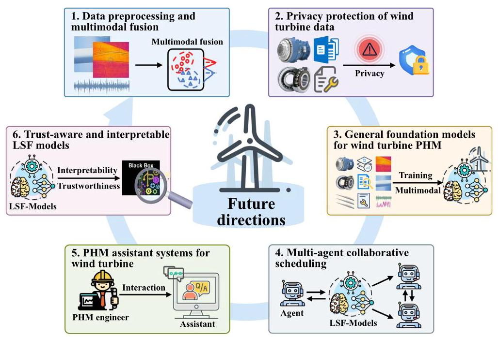
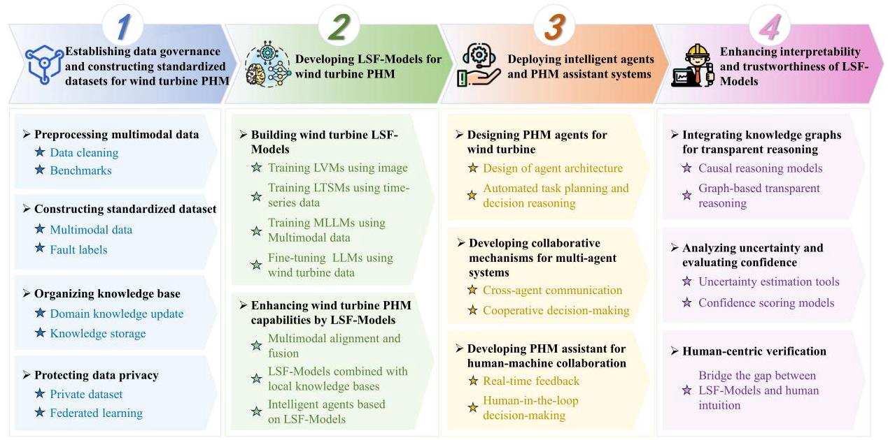

# 5. Challenges and future directions of wind turbine PHM utilizing LSF-models

## 5.1. Challenges of wind turbine PHM utilizing LSF-models

The application of LSF-Models in wind turbine PHM faces several key challenges, including multimodal data quality and fusion issues, privacy and security issues of wind turbine data, multi-agent collaborative issues based on LSF-Models, interpretability and trustworthiness issues of LSF-Models, computational resources and economic cost issues.

Fig. 9. Intelligent agents based on LSF-Models [204].

Table 5

Summary of technologies for LSF-Models in wind turbine PHM.

<table><tr><td>Technology</td><td>Description</td><td>Typical PHM tasks</td></tr><tr><td>Multimodal alignment and fusion</td><td>- Aligns and fuses modalities (sensor signals, images, textual logs) via shared latent space and cross-modal attention   - Enables unified reasoning for cross-modal wind turbine PHM tasks</td><td>Condition monitoring and anomaly detection [193], fault diagnosis [186], RUL prediction [173], maintenance decision-making [209]</td></tr><tr><td>Fine-tuning with domain-specific data</td><td>- Utilizes supervised fine-tuning on labeled wind turbine dataset   - Adapts general LSF-Model capabilities to wind turbine PHM tasks</td><td>Condition monitoring and anomaly detection [210], fault diagnosis [185,196, 198,211], RUL predictions [188,212], maintenance decision-making [213,214]</td></tr><tr><td>Integration with local knowledge bases</td><td>- Retrieves and integrates relevant PHM knowledge (logs, manuals, expert rules) via RAG and knowledge graphs   - Supports interpretable, rule-guided reasoning and decision-making</td><td>Condition monitoring and anomaly detection [215], fault diagnosis [190], RUL prediction [178], maintenance decision-making [199]</td></tr><tr><td>Intelligent agents</td><td>- Automates PHM tasks via coordinated multi-agent system   - Assists operation and maintenance engineers in decision-making</td><td>Condition monitoring and anomaly detection [208], fault diagnosis [207], RUL prediction [216], maintenance decision-making [217]</td></tr></table>

### 5.1.1. Multimodal data quality and fusion issues

Wind turbine PHM involves heterogeneous data sources, including time-series, image, and text data. However, low-quality data, such as severe noise contamination, missing values, and inconsistent sampling, can significantly degrade the performance of LSF-Models [218]. Although current LSF-Models possess multimodal alignment and fusion capabilities, practical industrial scenarios are often more complex. Specifically, LSF-Models lack robust mechanisms to associate localized visual anomalies in images with corresponding trends in sensor signals or descriptive cues in maintenance logs. In addition, the absence of standardized architectures for cross-modal alignment, especially under conditions of unstructured data formats and modality imbalance, poses a major challenge to the practical deployment of LSF-Models in wind turbine PHM [219].

### 5.1.2. Privacy and security issues of wind turbine data

Wind turbine operation and maintenance data often contain sensitive commercial information, including performance metrics, proprietary technologies, and enterprise-specific operational records. Sharing such data with external LSF-Models introduces critical privacy and security risks. Potential issues include unauthorized access, data breaches, and misuse, which can result in substantial economic loss and repu-tational damage [220]. Furthermore, the use of external LSF-Models necessitates secure mechanisms for data transmission, access control, and confidentiality assurance. Without robust safeguards, the confidentiality of wind turbine data cannot be guaranteed [221]. These concerns present a major barrier to the adoption of LSF-Models in practical PHM scenarios.

### 5.1.3. Multi-agent collaborative issues based on LSF-models

Wind turbine PHM involves diverse tasks such as anomaly detection, fault diagnosis, RUL prediction, and maintenance decision-making, which require coordination among agents operating on heterogeneous data (e.g., SCADA, vibration, images, logs). However, multi-agent systems based on LSF-Models face key challenges: inconsistent understanding due to asynchronous and multimodal data inputs; lack of dynamic scheduling mechanisms to adapt to evolving wind turbine states; and weak inter-agent communication, which often leads to conflicting decisions or redundant actions [206]. These challenges hinder the accuracy, efficiency, and reliability of PHM in complex wind turbines.

### 5.1.4. Interpretability and trustworthiness issues of LSF-models

In wind turbine PHM, the interpretability of LSF-Models remains a key challenge. These models are trained end-to-end on large-scale, heterogeneous data without embedding physical laws or causal relationships, making their internal decision logic opaque [222]. Their reasoning is distributed across millions of parameters, which prevents tracing outputs to meaningful engineering features. In multimodal settings, the integration of time-series, images, and text further complicates interpretation, as it is unclear how each modality influences the final decision. This lack of transparency makes it difficult to generate explanations that are both accurate and actionable for maintenance teams.

### 5.1.5. Computational resources and economic cost issues

Applying LSF-Models to wind turbine PHM presents substantial challenges related to computational demands and deployment costs. These models require intensive computing resources for training, fine-tuning, and inference, especially when processing large-scale, heterogeneous data. High-performance hardware is essential for supporting multimodal analysis and real-time reasoning, but such infrastructure incurs high capital and operational expenditures. This challenge is further amplified in remote or offshore wind farms, where limited connectivity and constrained on-site resources make it difficult to deploy and maintain computationally heavy LSF-Models. As a result, the economic feasibility of deploying LSF-Models at scale remains a critical barrier to practical adoption in the wind turbine industry.

## 5.2. Future directions of wind turbine PHM utilizing LSF-models

The key research directions include data preprocessing and multimodal fusion, privacy protection of wind turbine data, general foundation models for wind turbine PHM, multi-agent collaborative scheduling, PHM assistant systems for wind turbines, and trust-aware and interpretable LSF models, as illustrated in Fig. 10.

### 5.2.1. Data preprocessing and multimodal fusion

Improving the robustness and effectiveness of LSF-Models in wind turbine PHM requires advances in both data preprocessing and multimodal fusion. One critical research direction is the development of automated data cleaning methods tailored to the characteristics of wind turbine data, including noise filtering, missing value imputation, and consistency normalization across time-series, image, and text data [223]. In parallel, effective multimodal fusion strategies are essential for aligning semantically related information across heterogeneous modalities with varying structures and sampling rates. Future research should focus on learning unified representations from multimodal wind turbine data by leveraging techniques such as cross-modal attention and contrastive learning [224].

### 5.2.2. Privacy protection of wind turbine data

As wind turbine data often contains sensitive business and operational information, ensuring its security is essential for protecting intellectual property and maintaining competitive advantage. To safely leverage LSF-Models in wind turbine PHM, it is necessary to develop dedicated privacy-preserving learning frameworks that safeguard data while enabling effective model utilization. Future research should focus on enhancing secure learning capabilities of LSF-Models through techniques such as federated learning [225]. These methods allow model training or inference without directly exposing raw data. In addition, integrating differential privacy mechanisms into the training strategies can provide formal guarantees against information leakage. Ultimately, the goal is to establish scalable and secure LSF-Models deployment strategies tailored to industrial PHM scenarios involving sensitive wind turbine data.

### 5.2.3. General foundation models for wind turbine PHM

Current LSF-Models often lack domain-specific priors, leading to misinterpretations and suboptimal performance when applied to wind turbine PHM tasks. To address this, future research should aim to construct wind turbine-specific foundation models by pre-training on large-scale, heterogeneous datasets collected from wind turbines [142]. Building such models requires not only multimodal representation learning but also robust cross-modal alignment and fusion. Techniques such as cross-modal attention, and temporal correlation modeling can be used to capture dependencies and ensure semantic consistency across modalities. For LVMs, LTSMs, and MLLMs, end-to-end pre-training on wind turbine data is necessary to capture domain-specific patterns. In contrast, LLMs can be adapted by incorporating expert knowledge through supervised fine-tuning with task-specific reward signals.

Fig. 10. Future directions of wind turbine PHM utilizing LSF-Models.

### 5.2.4. Multi-agent collaborative scheduling

To address the growing complexity of wind turbine PHM tasks, future research should focus on developing coordinated multi-agent frameworks based on LSF-Models. A key direction is to design task-level orchestration mechanisms that assign and synchronize agent responsibilities across data modalities, wind turbine components, and decision stages [226]. Reinforcement learning or multi-agent planning algorithms can be used to learn optimal collaboration policies under dynamic and uncertain wind turbine conditions. In addition, agents should be able to share their analysis results or key features with each other. This can be achieved through mechanisms like shared memory, attention modules, or structured message passing [227]. Such communication helps maintain consistent understanding among agents and reduces the chance of conflicting decisions. Ultimately, coordinated multi-agent frameworks based on LSF-Models can greatly enhance wind turbine PHM by improving task allocation, reducing redundant processing, and ensuring consistent and efficient maintenance strategies.

#### 5.2.5.PHM assistant systems for wind turbines

The wind turbine PHM assistant, built upon LSF-Models, is designed as an interactive system that can adapt to different roles within the operation and maintenance workflow. It focuses on human-centered interaction and provides role-specific functions to support diverse engineering tasks [228]. For inspection engineers, it can summarize real-time wind turbine conditions, detect abnormal patterns in SCADA or image data, and generate adaptive inspection checklists. Diagnostic engineers can use it to correlate sensor signals, interpret multimodal inputs, and identify fault types based on evidence. For maintenance engineers, the assistant can suggest appropriate repair actions, estimate the RUL of components, and assist in scheduling by referencing historical records and part availability. In addition, it can support decision-makers by producing summary reports, assessing risks, and comparing maintenance strategies. To ensure effective use, the assistant should adjust its output format, technical level, and communication style according to different user roles, improving usability, reliability, and overall efficiency in PHM tasks.

### 5.2.6. Trust-aware and interpretable LSF-models

To ensure safe and reliable wind turbine PHM, enhancing the explainability of LSF-Models is a critical research direction. One effective approach is to incorporate domain-specific knowledge, such as physical degradation mechanisms, operational constraints, and expert-defined rules, into the model's reasoning process. This can improve the transparency and trustworthiness of model outputs, especially in key tasks such as anomaly detection, fault diagnosis, RUL prediction, and maintenance decision-making [229]. Additionally, designing interpretable output formats, such as attention maps, causal graphs, or rule-based justifications, can help maintenance teams understand and validate model decisions. Advancing these aspects is essential for developing reliable PHM systems that enable interpretable diagnostics and timely maintenance.

## 5.3. Technical roadmap for wind turbine PHM based on LSF-models

Based on the summarized challenges and research directions for applying LSF-Models to wind turbine PHM, together with the U.S. Department of Energy's roadmap for offshore wind turbine operations and maintenance [230], this work proposes a technical roadmap for wind turbine PHM using LSF-Models, as shown in Fig. 11.

The technical roadmap for wind turbine PHM based on LSF-Models is structured into four phases. The first phase focuses on establishing a robust data foundation, including preprocessing multimodal data, constructing standardized datasets, organizing structured knowledge base, and protecting data privacy. The second phase focuses on developing LSF-Models specifically for wind turbine PHM based on wind turbine data, thereby enhancing the models' capability and effectiveness in handling PHM tasks. The third phase addresses the deployment of intelligent PHM systems. Key components include designing PHM agents for wind turbines, building collaborative frameworks for multi-agent systems, and implementing interactive PHM assistants to support human-machine collaboration. The fourth phase aims to improve the interpretability and trustworthiness of LSF-Models. This is achieved by integrating knowledge graphs for transparent reasoning, conducting uncertainty analysis and confidence evaluation, and performing human-centered validation.

Fig. 11. Technical roadmap for wind turbine PHM based on LSF-Models.

