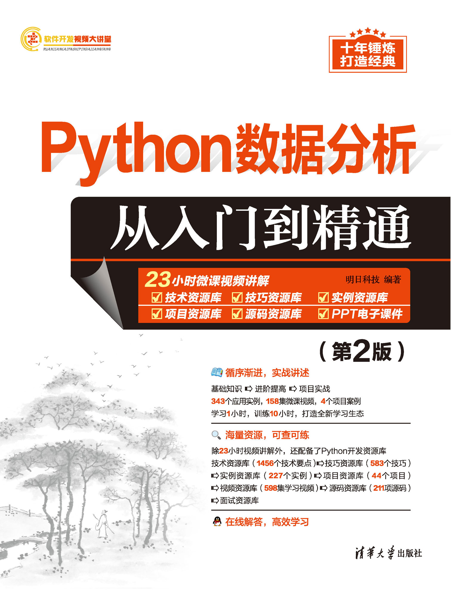
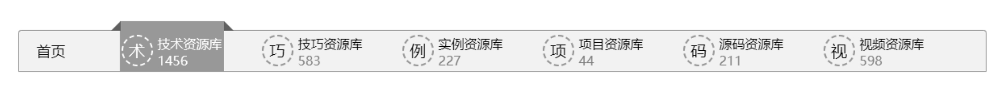
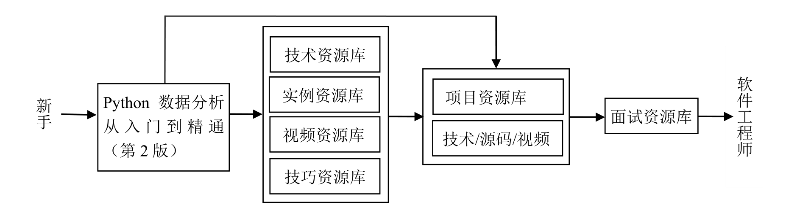
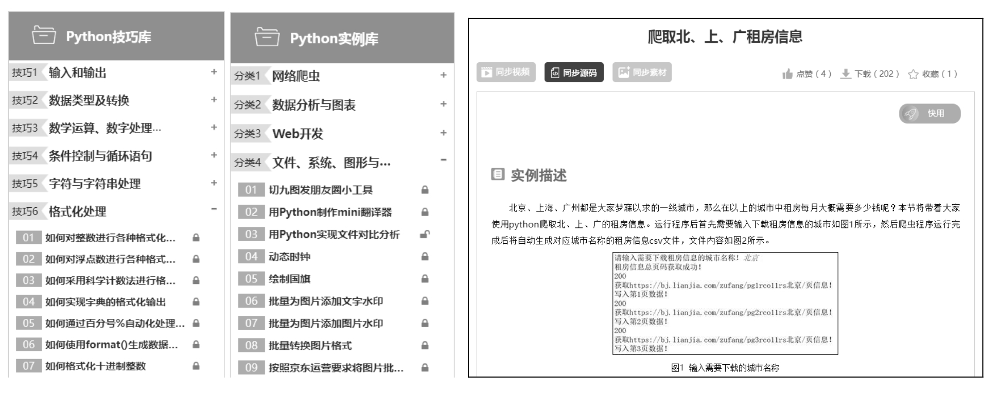
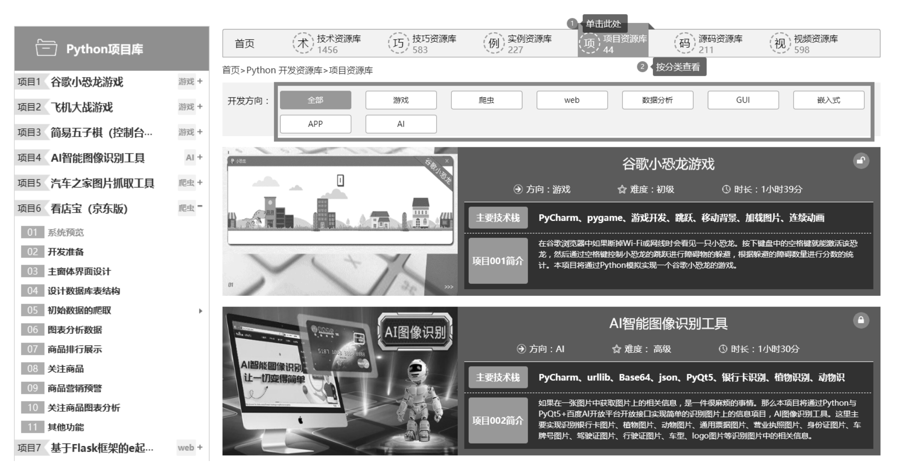
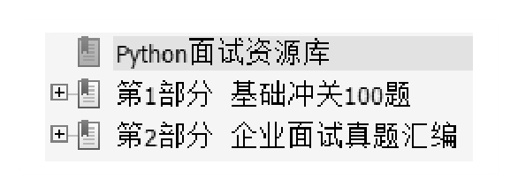
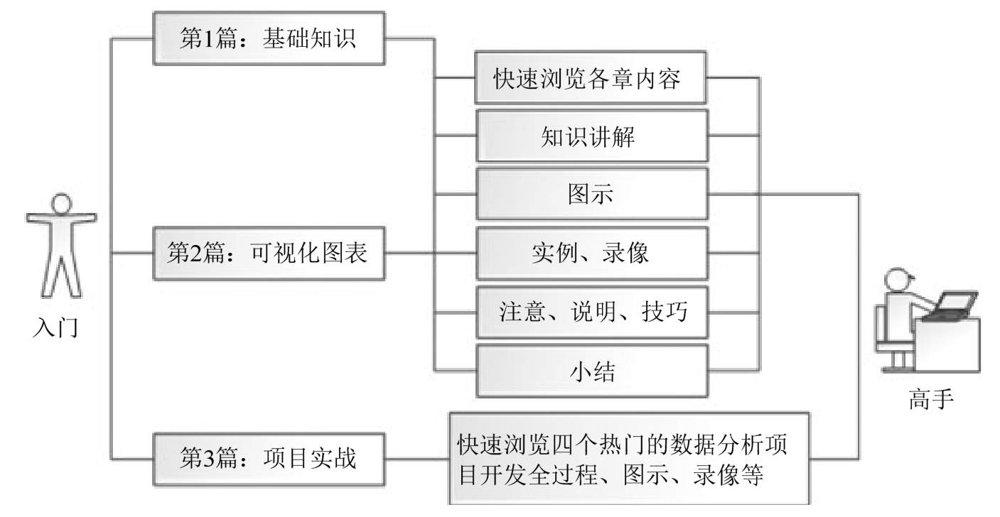
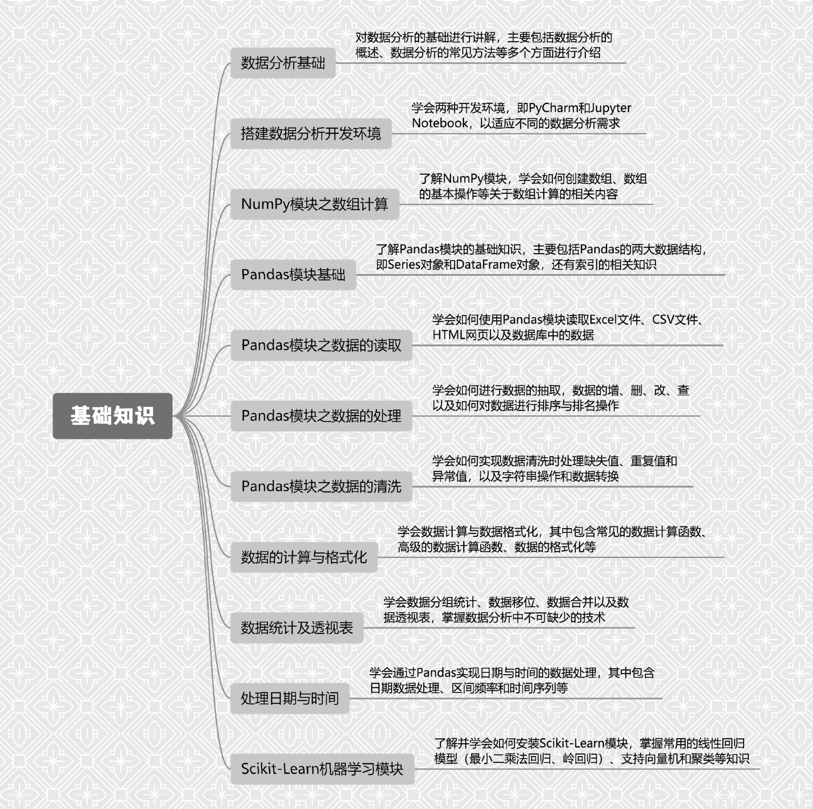

# 版权信息

**COPYRIGHT**

书名：Python数据分析从入门到精通（第2版）

作者：明日科技 编著

出版社：清华大学出版社

出版时间：2023年10月

ISBN：9787302646785

字数：293千字

本书由清华大学出版社有限公司授权得到APP电子版制作与发行

版权所有·侵权必究

# 内容简介

《Python数据分析从入门到精通（第2版）》从数据分析初学者角度出发，以通俗易懂的语言、丰富多彩的实例，详细介绍了使用Python进行数据分析程序开发应掌握的各方面技术。全书共分21章，包括数据分析基础、搭建数据分析开发环境、NumPy模块之数组计算、Pandas模块基础、Pandas模块之数据的读取、Pandas模块之数据的处理、Pandas模块之数据的清洗、数据的计算与格式化、数据统计及透视表、处理日期与时间、Scikit-Learn机器学习模块、Matplotlib模块入门、Matplotlib模块进阶、Seaborn图表、Plotly图表、Bokeh图表、Pyecharts图表等内容，以及4个项目实战综合案例。书中所有知识结合具体实例进行介绍，涉及的程序代码给出了详细的注释，读者可轻松领会Python数据分析程序开发的精髓，从而快速提升数据分析开发技能。

另外，本书除了纸质内容，还配备了Python在线开发资源库，主要内容如下： 

** 同步教学微课：共158集，时长23小时**  ** 技术资源库：1456个技术要点** 

** 技巧资源库：583个开发技巧**  ** 实例资源库：227个应用实例** 

** 项目资源库：44个实战项目**  ** 源码资源库：211项源代码** 

** 视频资源库：598集学习视频**  ** PPT电子教案**

本书可作为数据分析开发入门者的学习用书，也可作为高等院校相关专业的教学参考用书，还可供数据分析开发人员查阅、参考。

# 如何使用本书开发资源库

**1. VIP会员注册**

扫描图书的防盗码，先按提示绑定手机微信，然后扫描二维码，打开明日科技账号注册页面，填写注册信息后将自动获取一年（自注册之日起）的Python在线开发资源库的VIP使用权限。

读者在注册、使用开发资源库时有任何问题，均可拨打明日科技官网页面上的客服电话进行咨询。

**2. 纸质书和开发资源库的配合学习流程**

Python开发资源库中提供了技术资源库（1456个技术要点）、技巧资源库（583个开发技巧）、实例资源库（227个应用实例）、项目资源库（44个实战项目）、源码资源库（211项源代码）、视频资源库（598集学习视频），共计六大类、3119项学习资源。学会、练熟、用好这些资源，读者可在短时间内快速提升自己，从一名新手晋升为一名软件工程师。

《Python数据分析从入门到精通（第2版）》纸质书和“Python在线开发资源库”的配合学习流程如下。

**3. 开发资源库的使用方法**

读者在学习本书某一章节时，可利用实例资源库对应内容提供的大量热点实例和关键实例，巩固所学编程技能，提升编程兴趣和信心。

开发过程中，总有一些易混淆、易出错的地方，利用技巧资源库可快速扫除盲区，掌握更多实战技巧，精准避坑。需要查阅某个技术点时，可利用技术资源库锁定对应知识点，随时随地深入学习。

学习完本书后，读者可通过项目资源库中的44个经典项目，全面提升个人的综合编程技能和解决实际开发问题的能力，为成为Python软件开发工程师打下坚实的基础。

另外，利用页面上方的搜索栏，还可以对技术、技巧、实例、项目、源码、视频等资源进行快速查阅。

万事俱备后，读者该到软件开发的主战场上接受洗礼了。本书资源包中提供了Python的基础冲关100题以及企业面试真题，是求职面试的绝佳指南。读者可扫描图书的“文泉云盘”二维码获取。

# 前言

丛书说明：“软件开发视频大讲堂”丛书第1版于2008年8月出版，因其编写细腻、易学实用、配备海量学习资源和全程视频等，在软件开发类图书市场上产生了很大反响，绝大部分品种在全国软件开发零售图书排行榜中名列前茅，2009年多个品种被评为“全国优秀畅销书”。

“软件开发视频大讲堂”丛书第2版于2010年8月出版，第3版于2012年8月出版，第4版于2016年10月出版，第5版于2019年3月出版，第6版于2021年7月出版。十五年间反复锤炼，打造经典。丛书迄今累计重印680多次，销售400多万册，不仅深受广大程序员的喜爱，还被百余所高校选为计算机、软件等相关专业的教学参考用书。

“软件开发视频大讲堂”丛书第7版在继承前6版所有优点的基础上，进行了大幅度的修订。第一，根据当前的技术趋势与热点需求调整品种，拓宽了程序员岗位就业技能用书；第二，对图书内容进行了深度更新、优化，如优化了内容布置，弥补了讲解疏漏，将开发环境和工具更新为新版本，增加了对新技术点的剖析，将项目替换为更能体现当今IT开发现状的热门项目等，使其与时俱进，更适合读者学习；第三，改进了教学微课视频，为读者提供更好的学习体验；第四，升级了开发资源库，提供了程序员“入门学习→技巧掌握→实例训练→项目开发→求职面试”等各阶段的海量学习资源；第五，为了方便教学，制作了全新的教学课件PPT。

互联网的飞速发展为我们积累了庞大的数据，各行各业所产生的数据如今已经开始显露价值。但是，数据规模大，结构复杂，如果只靠人工处理是难以胜任的，寻求工具是必然的。

Python语言简单易学、数据处理简单高效，对于初学者来说容易上手。在科学计算、数据分析、数学建模和数据挖掘等方面，Python占据了越来越重要的地位。另外，Python第三方扩展库不断更新，在数据可视化方面也提供了大量的数据可视化工具。

本书侧重介绍Python数据分析的三大剑客（NumPy、Pandas、Matplotlib）以及多种第三方数据可视化工具（Seaborn、Plotly、Bokeh、Pyecharts），通过基础+实战，帮助您快速掌握Python数据分析技能，同时采用两种开发环境，即PyCharm和Jupyter Notebook，以适应不同的数据分析需求，既能完成大型项目，又能够适应数据分析报告。为保证读者能学以致用，本书在实践方面循序渐进地进行了3个层次的篇章介绍，即基础知识、可视化图表、项目实战。

**本书内容**

本书提供了从Python数据分析入门到高手所必需的各类知识，共分3篇。

**第1篇：基础知识。**本篇包括数据分析基础、搭建数据分析开发环境、使用NumPy模块实现数组计算、使用Pandas模块实现数据的处理、数据的格式化、数据的统计及透视表、日期与时间的处理以及Scikit-Learn机器学习模块等基础方面的知识。介绍这些基础知识时结合大量的图示、举例、视频，使读者能够快速掌握Python数据分析所需基础知识，并为以后编程奠定坚实的基础。

**第2篇：可视化图表。**本篇主要介绍数据分析中数据的可视化图表，其中包含Python原生模块Matplotlib的基础入门与进阶内容以及多种第三方数据可视化工具（Seaborn、Plotly、Bokeh、Pyecharts），学习完本篇内容，读者将可以实现数据分析后的可视化图表。

**第3篇：项目实战。**本篇介绍了4个热门的数据分析项目，其中包含股票数据分析、淘宝网订单分析、网站用户数据分析以及NBA球员薪资的数据分析。通过4个不同类型的数据分析项目，让读者快速掌握Python数据分析的精髓，并将学习到的数据分析技术应用到实践开发中，为以后的开发积累经验。

本书的大体结构如下图所示。

**本书特点** 

 **由浅入深，循序渐进。**本书以数据分析零基础入门读者和初、中级数据分析程序员为对象，先从Python数据分析基础学起，然后学习Python数据分析的可视化图表，最后学习开发4个完整的数据分析项目。在讲解过程中，其步骤详尽，版式新颖，读者在阅读中可以一目了然，从而快速掌握书中内容。 

 **微课视频，讲解详尽。**为便于读者直观感受程序开发的全过程，书中重要章节配备了视频讲解（共158集，时长23小时），使用手机扫描二维码，即可观看学习。初学者可轻松入门，体验编程的快乐和成就感，进一步增强学习的信心。 

 **基础示例**+**项目案例，实战为王。**通过例子学习是最好的学习方式，本书核心知识讲解通过“一个知识点、一个示例、一个结果、一段评析”的模式，详尽透彻地讲述了实际开发中所需的各类知识。全书共计343个应用实例，4个项目案例，致力为初学者打造“学习1小时，训练10小时”的强化实战学习环境。 

 **精彩栏目，贴心提醒。**本书根据需要在各章使用了很多“注意”“说明”等小栏目，有助于读者在学习过程中轻松地理解相关知识点及概念，进而快速掌握相应技术的应用技巧。

**读者对象** 

 初学数据分析编程的自学者   数据分析编程爱好者 

 大、中专院校的老师和学生   相关培训机构的老师和学员 

 做毕业设计的学生   初、中级数据分析程序开发人员 

 数据分析程序测试及维护人员   参加实习的“菜鸟”数据分析程序员

**本书学习资源**

本书提供了大量的辅助学习资源，读者需扫描防盗码，扫描并绑定微信后，即可获取学习权限。 

 同步教学微课

学习书中知识时，扫描二维码，可在线观看教学视频。 

 在线开发资源库

本书配备了强大的Python开发资源库，包括技术资源库、技巧资源库、实例资源库、项目资源库、源码资源库、视频资源库。扫描二维码，可登录明日科技网站，获取Python开发资源库一年的免费使用权限。 

 学习答疑

关注清大文森学堂公众号，可获取本书的源代码、PPT课件、视频等资源，加入本书的学习交流群，可参加图书直播答疑。

读者扫描图书“文泉云盘”二维码，或登录清华大学出版社网站（www.tup.com.cn），可在对应图书页面下查阅各类学习资源的获取方式。

文泉云盘

**致读者**

本书由明日科技Python程序开发团队组织编写。明日科技是一家专业从事软件开发、教育培训以及软件开发教育资源整合的高科技公司，其编写的教材非常注重选取软件开发中的必需、常用内容，同时也很注重内容的易学性以及相关知识的拓展性，深受读者喜爱。其教材多次荣获“全行业优秀畅销品种”“全国高校出版社优秀畅销书”等奖项，多个品种长期位居同类图书销售排行榜的前列。

在编写本书的过程中，我们始终本着科学、严谨的态度，力求精益求精，但书中难免有疏漏之处，敬请广大读者批评指正。

感谢您选择本书，希望本书能成为您编程路上的领航者。

“零门槛”编程，一切皆有可能。

祝读书快乐！

编者

2023年10月

本篇通过对数据分析基础、搭建数据分析开发环境、使用NumPy模块实现数组计算、使用Pandas模块实现数据的处理、数据的格式化等内容的介绍，并结合大量的图示、举例、视频，使读者能够快速掌握Python数据分析，并为以后编程奠定坚实的基础。

