# 1 数据分析基础

数据分析是数学、统计学理论结合科学的统计分析方法（如线性回归分析、聚类分析、方差分析、时间序列分析等）对数据库中的数据、Excel数据、收集的大量数据、网页抓取的数据等进行分析，从中提取有价值的信息形成结论并进行展示的过程。本章将对数据分析的基础知识进行讲解。

本章知识架构如下。

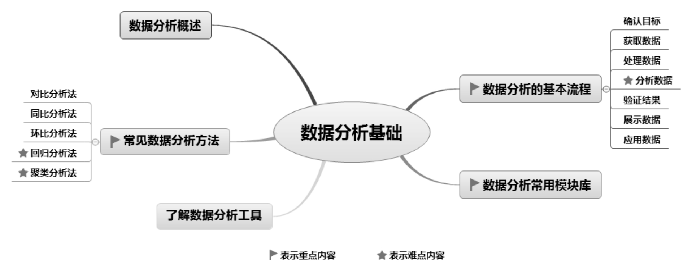

## 1.1 数据分析概述

数据分析是大数据技术中最重要的一部分，随着大数据技术的不断发展，数据分析将应用于各个行业，如互联网行业，通过数据分析，可以根据客户意向进行商品推荐以及针对性广告等。在医学方面，可以实现智能医疗、健康指数评估以及DNA对比等。在网络安全方面，可以通过数据分析建立一个潜在攻击性的分析模型，监测大量的网络访问数据与访问行为，可以快速识别可疑网络的访问，起到有效的防御作用。在交通方面，可以根据交通状况数据与GPS定位系统有效的预测交通实时路况信息。在通信方面，数据分析可以统计骚扰电话，进行骚扰电话的拦截与黑名单的设置。在个人生活方面，数据分析可以对个人生活习惯进行分类，为其提供更加周到的个性化服务。

## 1.2 常见数据分析方法

数据分析是从数据中提取有价值信息的过程，过程中需要对数据进行各种处理和归类，只有掌握了正确的数据分析方法，才能起到事半功倍的效果。

数据分析方法一般分为描述性数据分析、探索性数据分析和验证性数据分析，如图1.1所示。其中，探索性数据分析和验证性数据分析属于比较高级的数据分析。

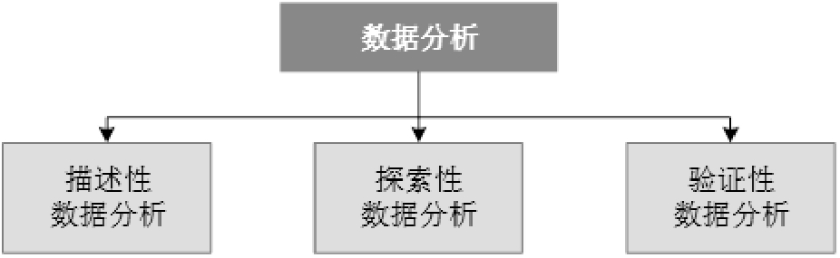

图1.1 数据分析方法的类别

 描述性数据分析是最基础、最初级的数据分析。例如，本月收入增加了多少、客户增加了多少、哪个单品销量好等，都属于描述性数据分析。 

 探索性数据分析侧重于发现数据规律和特征。例如，有一份数据，你对它完全陌生，又不了解业务情况，会无从下手。如果你什么都不管，直接把数据塞进各种模型，却发现效果并不好，这时就需要先进行数据探索，找到数据的规律和特征，知道数据里有什么，没有什么。 

 验证性数据分析就是已经确定使用哪种假设模型，通过验证性数据分析来对该假设模型进行验证。

数据分析方法从技术层面又可分为以下三种。 

 统计分析类，以基础的统计分析为主，包括对比分析、同比分析、环比分析、定比分析、差异分析、结构分析、因素分析、80/20分析等。 

 高级分析类，以建模理论为主，包括回归分析、聚类分析、相关分析、矩阵分析、判别分析、主成分分析、因子分析、对应分析、时间序列分析等。 

 数据挖掘类，以机器学习、数据仓库等复合技术为主。

下面重点介绍对比分析、同比分析、环比分析、回归分析、聚类分析等常用的数据分析方法。

### 1.2.1 对比分析法

对比分析法是把客观事物加以比较，以达到认识事物的本质和规律并做出正确的评价，通常是把两个相互联系的指标数据进行比较，从数量上展示和说明研究对象规模的大小、水平的高低、速度的快慢，以及各种关系是否协调。

对比分析一般包括纵向对比、横向对比、标准对比，以及实际与计划对比。例如，某淘宝店2023年上半年每月销售情况对比分析，如图1.2所示。

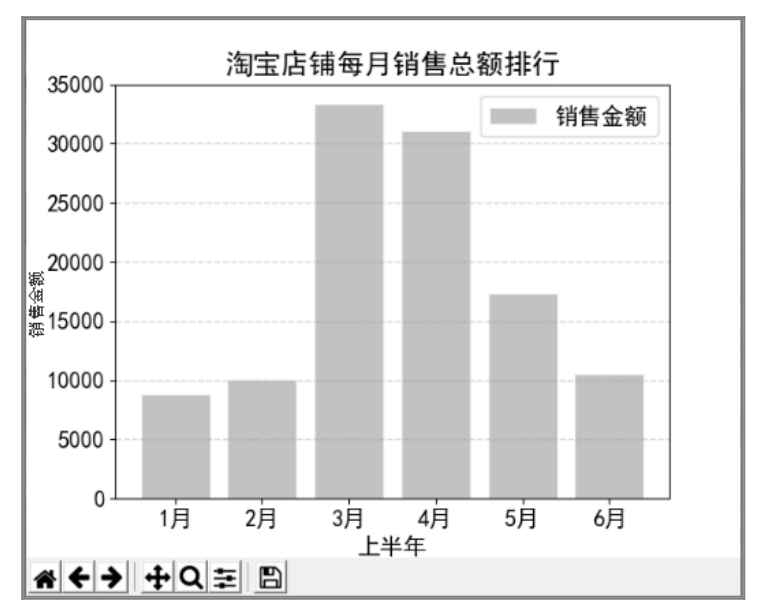

图1.2 每月销售情况对比分析图

### 1.2.2 同比分析法

按照时间，即年度、季度、月份、日期等进行扩展，用本期实际发生数与同口径历史数字相比，产生动态相对指标，用以揭示发展水平以及增长速度。

同比分析主要是为了消除季节变动的影响，用以说明本期水平与去年同期水平对比而达到的相对值。例如，本期1月比去年1月，本期2月比去年2月等。在实际工作中，经常使用这个指标，如某年、某季、某月与上年同期（年、同季度或同月）相比的发展速度，就是同比增长速度。

同比增长速度=（本期-同期）/同期×100%

例如，2022年和2023年1～6月销量情况对比如图1.3所示，同比增长速度如图1.4所示。

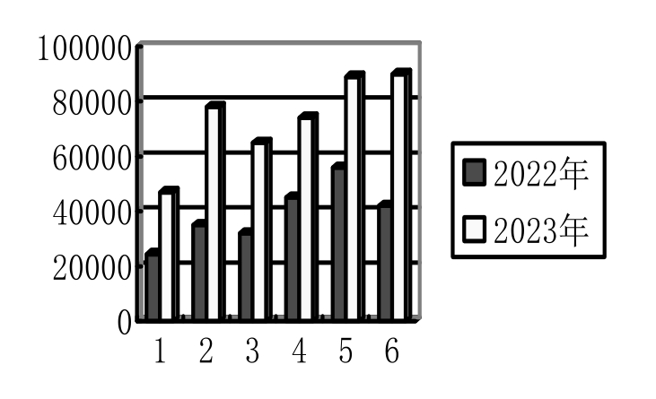

▲图1.3 本期、同期销量情况对比

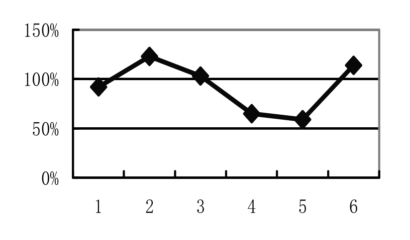

▲图1.4 同比增长速度图

### 1.2.3 环比分析法

环比分析是报告期水平与前一时期水平之比，表明现象逐期的变化趋势。如果计算一年内各月与前一个月对比，即1月比去年12月，2月比1月，3月比2月，……，6月比5月，则说明逐月的变化程度。本期数据与上期数据比较，形成时间序列图。

环比增长速度=（本期-上期）/上期×100%

例如，2023年1～6月本月（本期）与上个月（上期）销量情况对比如图1.5所示，按月环比增长速度如图1.6所示。

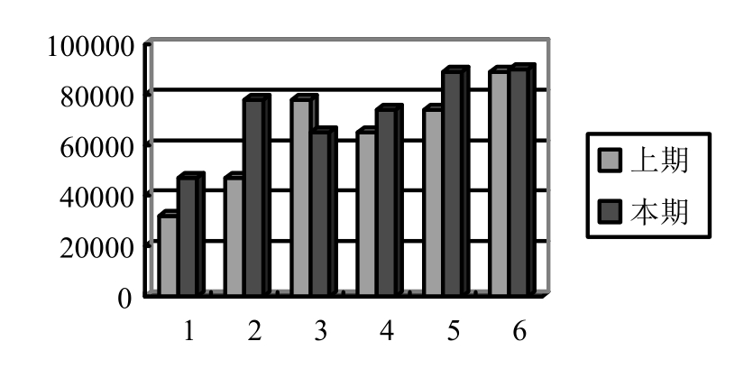

▲图1.5 本期与上期环比分析图

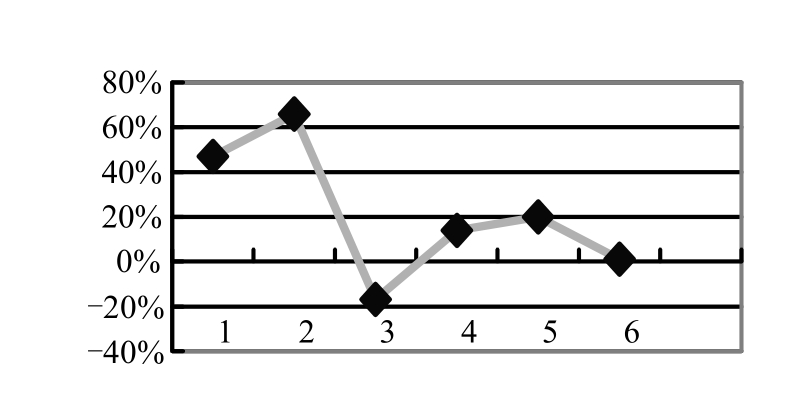

▲图1.6 环比增长速度图

### 1.2.4 回归分析法

回归分析主要用于统计分析和预测。回归分析研究的是变量之间的关系以及相互影响的程度，可通过建立自变量和因变量的方程，研究某个因素受其他因素影响的程度或用来预测。回归分析有线性和非线性回归、一元和多元回归之分。常用的回归方程有一元线性和多元线性回归方程。 

 一元线性回归方程：以X为自变量、Y为因变量的一元线性方程。例如，以广告费为因变量，以销售收入为自变量，分析广告费对销售收入的影响程度，以及对未来销售收入的预测。 

 多元线性回归方程：当自变量有两个或多个时，研究因变量Y和多个自变量1X，2X，…，nX之间的关系。例如，考虑当有多个因素影响销售收入时，销售收入为因变量，满减、打折、季节变化等指标为自变量，分析这些因素对销售收入的影响程度，以及对未来销售收入的预测。

建立回归分析一般要经历这样一个过程：先收集数据，再用散点图确认关系，利用最小二乘法或其他方法建立回归方程，检验统计参数是否合适，进行方差分析或残差分析，优化回归方程。

例如，通过预支广告费（50000元）预测销售收入，首先根据以往广告费（X实际）和销售收入（Y实际）形成散点图，然后使用最小二乘法建立一元线性回归方程，拟合出一条回归线来预测销售收入，如图1.7所示。

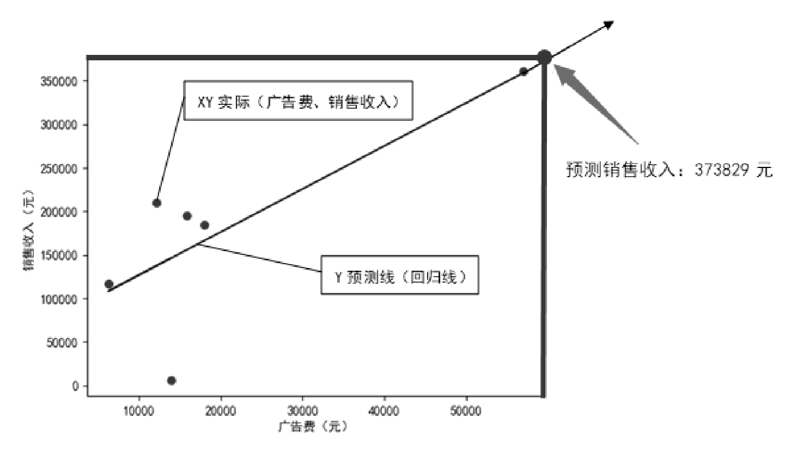

图1.7 一元线性回归分析图

### 1.2.5 聚类分析法

聚类分析多用于人群分类，如客户分类。所谓聚类，是指将数据集中某些方面相似的数据成员进行分类组织的过程。简单地说，就是将相似的数据合并成一组，是一种发现内在相似结构的技术。聚类可把一个大数据集按照某种距离计算方式，分成若干个分类，每个分类内的差异性比类与类之间的差异性要小很多。

聚类与分类分析不同，所划分的类是未知的。因此，聚类分析也称为无指导或无监督学习。它是静态数据分析的一门技术，在许多领域被广泛应用，包括机器学习、数据挖掘、模式识别、图像分析以及生物信息。

例如，客户价值分析中对客户进行分类（根据业务需要分为4类），其中的某类客户如图1.8所示。

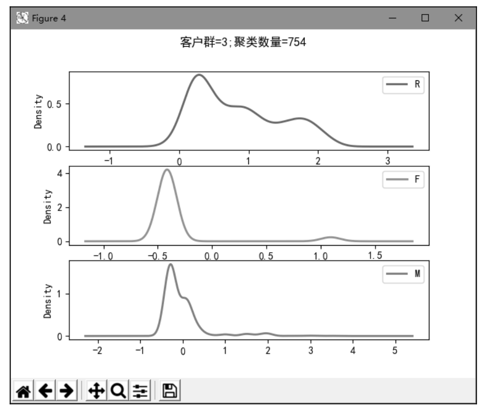

图1.8 聚类分析

## 1.3 了解数据分析工具

很多人使用Excel进行数据分析，但在数据量大、公式嵌套又多的情况下，Excel处理起来会很麻烦，处理速度也会变慢。Python提供了大量的第三方扩展模块，如NumPy、SciPy、Matplotlib、Pandas、Scikit-Lenrn、Keras和Gensim等，这些模块不仅可以对数据进行处理、挖掘，可视化展示，其自带的分析方法模型也使得数据分析变得简单高效，只需编写少量的代码就可以得到分析结果。

另外，Python简单易学，在科学领域占据着重要地位，是科学领域的主流编程语言。如图1.9所示为2023年5月的TIOBE编程语言排行榜，可以看到Python位列第一。

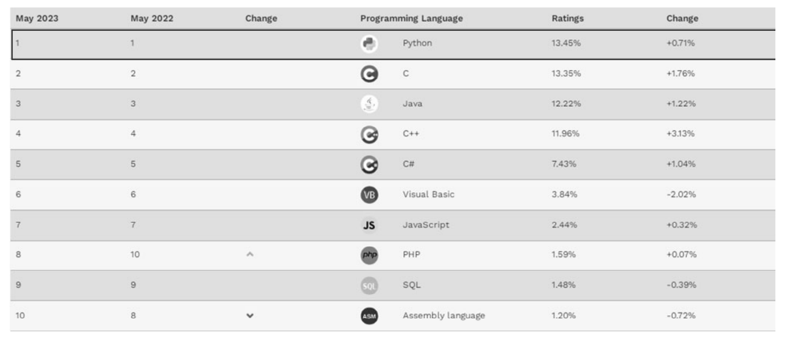

图1.9 TIOBE编程语言排行榜（2023年5月）

### 说明

图1.9中的数据来自TIOBE编程语言排行榜，网址：https://www.tiobe.com/tiobe-index。

综上所述，经过对比分析，Python作为首选数据分析工具，具有以下优势。 

 语法简单易学，数据处理简单高效，对于初学者来说非常容易上手。 

 Python第三方扩展模块不断更新，可用范围越来越广。 

 在科学计算、数据分析、数学建模和数据挖掘方面占据越来越重要的地位。 

 可以和其他语言进行对接，兼容性稳定。

## 1.4 数据分析的基本流程

数据分析的基本流程如图1.10所示，其中，明确分析目的和思路非常重要，这也是做数据分析最有价值的部分。

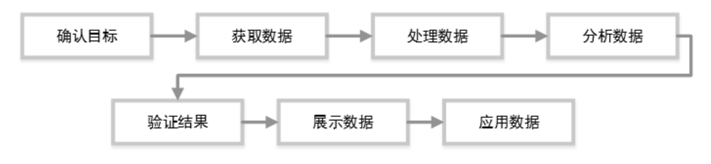

图1.10 数据分析基本流程图

### 1.4.1 确认目标

爱因斯坦有句名言：“如果给我1个小时解答一道决定我生死的问题，我会花55分钟来弄清楚这道题到底是在问什么。一旦清楚了它到底在问什么，剩下的5分钟足够回答这个问题。”在数据分析方面，首先要花些时间搞清楚要分析什么、要达到什么样的效果，明确分析目的和思路后考虑用哪种分析方法，然后进行数据处理和数据分析等后续工作。

### 1.4.2 获取数据

寻找合适的训练数据是一件非常重要的事。获取数据的方式有很多种，如使用公开的数据集，利用爬虫类数据采集工具等。下面介绍几个常用的数据网站和常见的数据获取方式。

**1. 使用公开的数据集**

（1）常用的数据公开网站如下。 

 UCI：经典的机器学习、数据挖掘数据集，包含分类、聚类、回归等问题下的多个数据集。 

 国家数据：数据来源于中华人民共和国国家统计局，包含了我国经济、民生等多个方面的数据。 

 CEIC：最完整的一套超过128个国家的经济数据，能够精确查找GDP、CPI、进口、出口、外资直接投资、零售、销售以及国际利率等深度数据。其中的“中国经济数据库”收编了几十万条时间序列数据，数据内容涵盖宏观经济数据、行业经济数据和地区经济数据。 

 万得：在金融业有着全面的数据覆盖，金融数据的类目更新非常快，很受国内的商业分析者和投资人的青睐。 

 搜数网：汇集了中国资讯自1992年以来收集的所有统计和调查数据。 

 中国统计信息网：国家统计局官方网站，汇集了海量的全国各级政府各年度的国民经济和社会发展等统计信息。 

 亚马逊：来自亚马逊的跨科学云数据平台，包含化学、生物、经济等多个领域的数据集。 

 figshare：研究成果共享平台，这里可以找到来自世界的高级学者、专家的研究成果数据。 

 github：一个非常全面的数据获取渠道，包含各个细分领域的数据库资源，自然科学和社会科学的覆盖都很全面，适合做研究和数据分析的人员使用。

（2）政府开放数据的网站如下。 

 北京市政务数据资源网：包含竞技、交通、医疗、天气等数据。 

 深圳市政府数据开放平台：包含交通、文娱、就业、基础设施等数据。 

 上海市政务数据服务网：包含经济建设、文化科技、信用服务、交通出行等多领域数据。

（3）数据竞赛网站如下。

竞赛的数据集通常干净，且科学研究性非常高。 

 DataCastle：专业的数据科学竞赛平台。 

 Kaggle：全球最大的数据竞赛平台。 

 天池：阿里旗下的数据科学竞赛平台。 

 Datafountain：中国计算机学会指定的大数据竞赛平台。

**2. 利用爬虫获取数据**

前面给出了一些网站平台，读者可以使用爬虫工具爬取这些网站上的数据。某些网站给出了获取这些数据的API接口，但需要付费。

**3. 数据交易平台**

由于数据需求的增大，现在涌现出很多数据交易平台，如优易数据、数据堂等。这些平台属于付费平台，但里面也会有些免费数据。

**4. 网络指数**

通过指数的变化，可以查看某个主题在各个时间段受关注的情况，从而进行趋势分析、行情分析和预测。例如，百度指数、阿里指数、友盟指数、爱奇艺指数等。

**5. 网络采集器**

网络采集器（如造数、爬山虎等）可通过软件形式简单、快捷地采集网络上分散的数据，具有很好的数据收集功能。

### 1.4.3 处理数据

处理数据是指从大量的、杂乱无章的、难以理解的、缺失的数据中，抽取并推导出对解决问题有价值、有意义的数据的过程。处理数据主要包括数据规约、数据清洗、数据加工等处理方法，如图1.11所示。

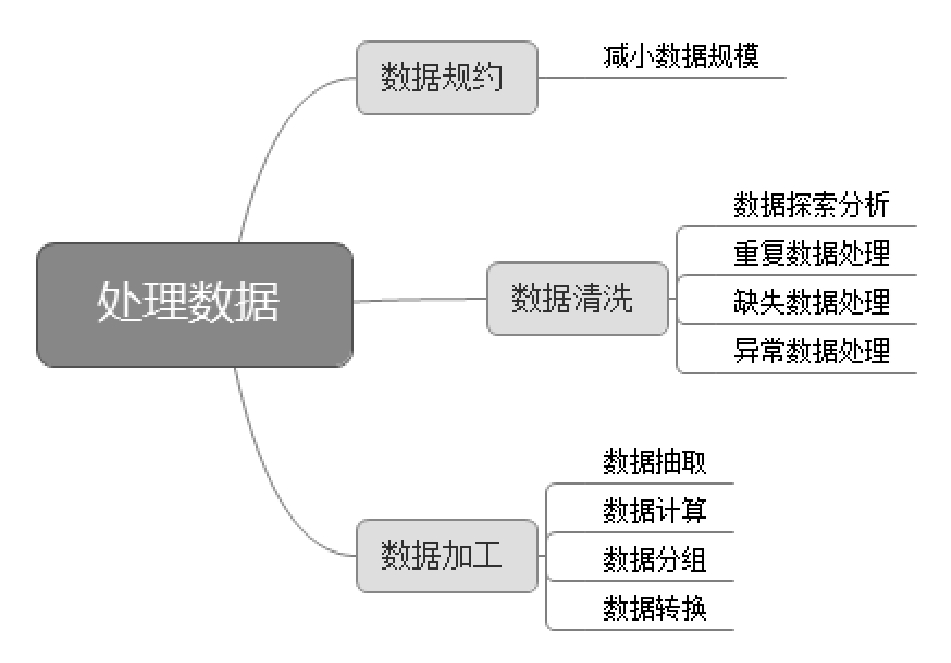

图1.11 处理数据

**1. 数据规约**

数据规约是指在接近或保持原始数据完整性的同时，将数据集规模减小，以提高数据处理的速度。

**2. 数据清洗**

获取原始数据后，会发现其中很多数据不符合数据分析要求，此时就要对其进行清洗，操作步骤如下。

（1）数据探索分析，即分析数据是否存在缺失、异常等情况，分析数据的规律。Python中，describe()函数可以自动计算非空值（count）、唯一值（unique）、最高值（top）、最高频值（freq）、平均值（mean）、方差（std）、最小值（min）、最大值（max）等，通过求得的值可以分析出有多少数据存在数据缺失和数据异常。

（2）重复数据处理。对于重复的数据，一般做删除处理，通常使用Python第三方模块Pandas中的drop_duplicates()方法。

（3）缺失数据处理。对于缺失的数据，如果比例高于30%，则可以选择放弃这个指标，删除即可；如果缺失比例低于30%，则可以将这部分缺失数据进行填充，以0或均值等。

（4）异常数据处理。需要对具体业务进行分析和处理，对于不符合常理的数据可直接删除。

**3. 数据加工**

数据加工包括数据抽取、数据计算、数据分组和数据转换。 

 数据抽取：选取数据中的部分内容。 

 数据计算：进行各种算术和逻辑运算，以便得到进一步的信息。 

 数据分组：按照有关信息进行有效的分组。 

 数据转换：数据标准化处理，以适应数据分析算法的需要，常用的有z-score标准化、最小／最大标准化和按小数定标标准化等。

经过上述标准化处理后，数据中各指标值将会处在同一个数量级别上，可以更好地对数据进行综合测评和分析。

### 1.4.4 分析数据

分析数据过程中，选择适合的分析方法和分析工具很重要，分析方法应兼具准确性、可操作性、可理解性和可应用性。对业务人员（如产品经理或运营）来说，数据分析过程中最重要的是形成数据分析思维。

### 1.4.5 验证结果

通过工具和方法分析的结果只是数据某个结果的体现，有时不一定准确，所以必须进行验证。

例如，一家淘宝电商销售业绩下滑，分析结果为两点：价格平平，客户不喜欢；产品质量不佳，和同期竞争对手比没有优势。但这只是现象，不是因素。具体为什么客户不喜欢，是宣传不到位，不吸引眼球，还是产品质量不佳？这才是真正的分析结果。

所以，只有将数据分析与业务思维相结合，才能找到真正可以落地的东西。

### 1.4.6 展示数据

展示数据就是指数据可视化，即把数据分析结果展示给业务层的过程。数据展现除应遵循各公司统一的规范、原则外，还要根据实际需求和场景决定展示方式。最常见的展示方式是图表方式，更清晰、更直观。

### 1.4.7 应用数据

应用数据是指将数据分析结果应用到实际业务当中，是数据产生实际价值的直接体现，这个过程需要操作人员具有数据沟通能力、业务推动能力和项目工作能力。

## 1.5 数据分析常用模块库

数据分析的常用模块库有NumPy、Pandas、Matplotlib、Scikit-Learn等。

**1. NumPy模块**

NumPy是一个运行速度非常快的数学模块，是进行科学计算和数据分析时必不可少的基础模块。NumPy模块不仅支持大量的维度数组与矩阵运算，还针对数组运算提供大量的数学函数模块。例如： 

 强大的N维数组对象ndarray()。 

 成熟的（广播）函数库。 

 整合C/C++/Fortran代码的工具。 

 实用的线性代数、傅里叶变换和随机数生成函数。

**2. Pandas模块**

Pandas是一个开源且通过BSD许可的模块，主要为Python提供高性能、易于使用的数据结构和数据分析工具。

Pandas的数据结构中有两大核心，分别是Series与DataFrame。其中，Series是一维数组，和NumPy中的一维数组类似。这两种一维数组与Python中的基本数据结构List很相近，Series可以保存多种数据类型的数据，如布尔值、字符串、数字类型等；DataFrame是一种二维的表格型数据结构，类似Excel表格。

**3. Matplotlib模块**

Matplotlib是一个Python绘图模块，不仅可以绘制2D图表，还可以绘制3D图表。其名称中，“plot”表示绘图，“lib”表示它是一个集合。

使用Matplotlib绘制图表非常简单，只需几行代码即可快速绘制条形图、折线图、散点图、饼图等。matplotlib.pyplot子模块提供了类似MATLAB的界面，尤其是与IPython结合使用时。其每个函数都可以对图形进行更改，如创建图形，在图形中创建绘图区域，绘制线条样式，设置字体属性、轴属性等。

**4. Scikit-Learn模块**

Scikit-Learn是一个简单、有效的数据挖掘和数据分析工具，可以在各种环境下重复使用。Scikit-Learn是基于NumPy、SciPy和Matplotlib的，它将很多机器学习算法进行了封装，即使是不熟悉算法的用户，也可以通过调用函数的方式轻松建模。其中的sklearn模块可以实现数据的预处理、分类、回归、PCA降维、模型选择等，是数据分析中必不可少的一个模块。

## 1.6 小结

本章主要介绍了数据分析概述、数据分析的常见方法、了解数据分析工具、数据分析的基本流程和Python数据分析的常用模块。重点需要理解数据分析的常用方法、数据分析的基本流程以及Python数据分析的常用模块。虽然本书使用的分析工具是Python，但它不是一本Python入门图书，因此Python基础知识本书不做介绍，接下来的章节将围绕Python数据分析的相关知识进行讲解。

