# 2 搭建数据分析开发环境

工欲善其事，必先利其器。Python提供的数据处理、绘图、数据可视化、数组计算、机器学习等模块，使得数据可视化工作变得简单、高效。而要使用Python，需要先安装IDE开发环境，以及适合数据分析、数据可视化的Anaconda、Jupyter Notebook、Pycharm等开发工具。本章将详细介绍几种开发环境的搭建过程，为Python数据可视化做好准备。

本章知识架构如下。

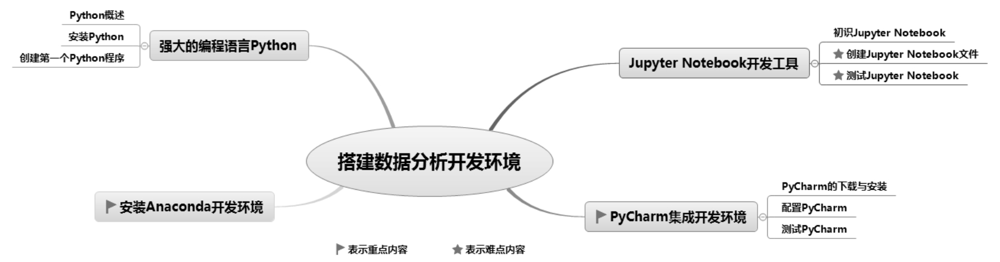

## 2.1 强大的编程语言Python

### 2.1.1 Python概述

Python是1989年由荷兰人Guido van Rossum发明的一种面向对象的解释型高级编程语言，其标志如图2.1所示。Python的设计理念是优雅、明确、简单，因此，网络上流传着“人生苦短，我用Python”的说法，从侧面也反映了Python简单易学、开发速度快、节省时间等特点。

Python提供了大量的第三方扩展模块，如Pandas、Matplotlib、NumPy、SciPy、Scikit-Lenrn、Keras、Gensim等，这些模块不仅可以对数据进行处理、挖掘、可视化展示，其自带的分析方法模型也使得数据分析变得简单高效，只需编写少量的代码就可以得到分析结果。

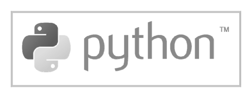

图2.1 Python标志

### 2.1.2 安装Python

**1. 查看计算机操作系统的位数**

为了提高开发效率，Python针对32位操作系统和64位操作系统分别做了优化，推出了不同的开发工具包。因此，在下载、安装Python前，需要先了解个人计算机操作系统的位数。

在桌面找到“此电脑”图标（笔者使用的Windows 10系统，在Windows 7系统中为“计算机”图标），右击该图标，在打开的菜单中选择“属性”命令（见图2.2），在弹出的“系统”窗体中查阅“系统类型”标签，此处将显示本机是64位操作系统还是32位操作系统，如图2.3所示。

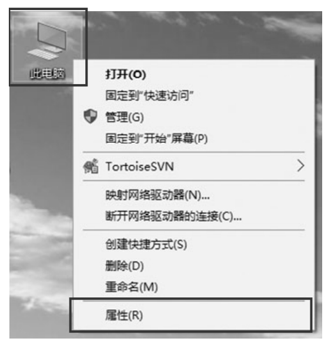

▲图2.2 选择“属性”命令

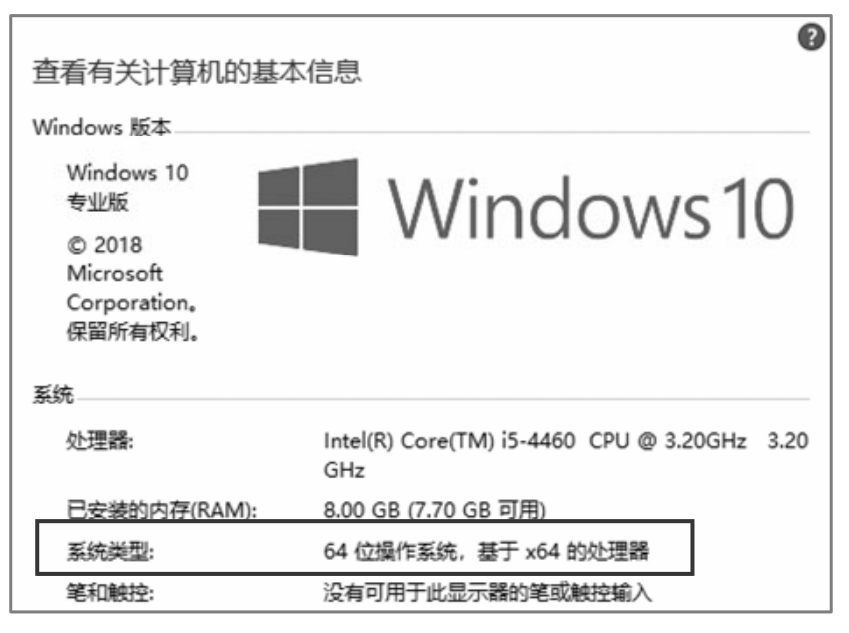

▲图2.3 查看系统类型

**2. 下载Python安装包**

在Python官方网站下载Python安装包，操作步骤如下。

（1）在浏览器（如Google Chrome）地址栏中输入Python官网地址https://www.python.org/，将光标移动到Downloads菜单上，选择Windows平台，如图2.4所示。

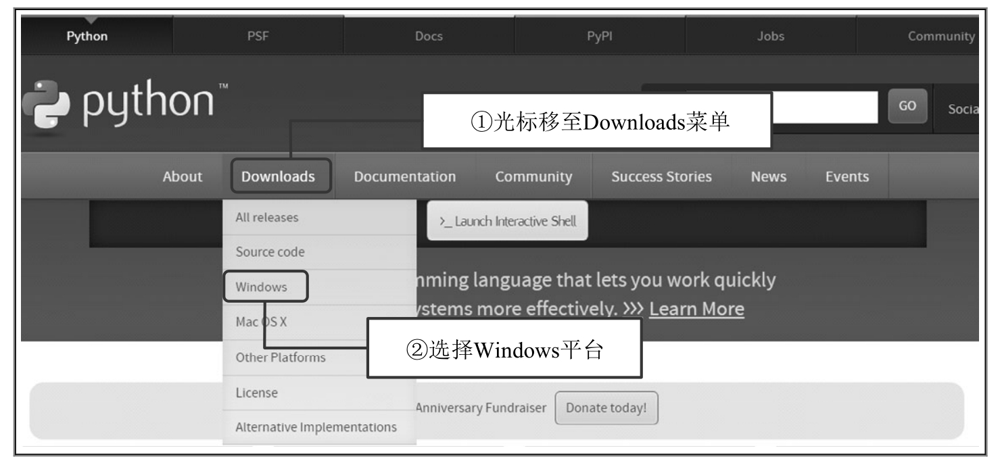

图2.4 Python官方网站首页

（2）进入下载页面，选择需要下载的Python 3.9.5安装包。由于笔者的计算机是64位Windows操作系统，所以这里选择下载64位系统安装包，如图2.5所示。

（3）弹出“新建下载任务”对话框，如图2.6所示，单击“下载”按钮，开始下载Python 3.9.5安装包。

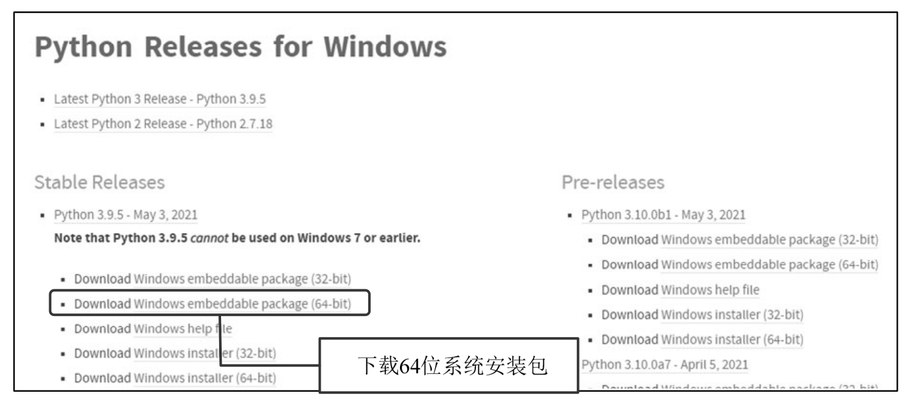

▲图2.5 适合Windows系统的Python下载列表

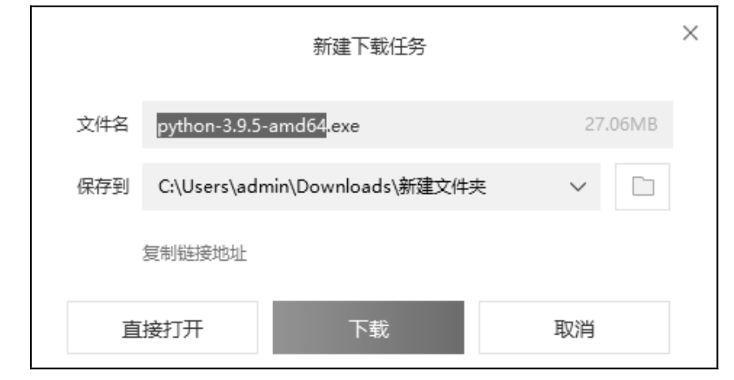

▲图2.6 下载Python

（4）下载完成后，在指定位置找到安装文件，准备安装Python。

**3. 安装Python**

在Windows 64位系统上安装Python，具体步骤如下。

（1）双击下载后得到的安装文件，如python-3.9.5-amd64.exe，将显示安装向导对话框，选中“Add Python 3.9 to PATH”复选框，让安装程序自动配置环境变量，如图2.7所示。

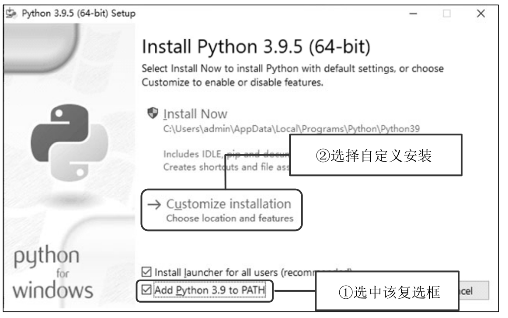

图2.7 Python安装向导

**注意**

一定要选中“Add Python 3.9 to PATH”复选框，否则在后面使用中会出现“×××不是内部或外部命令”的错误。

（2）单击Customize installation按钮进行自定义安装（可以修改安装路径），安装选项采用默认设置，如图2.8所示。

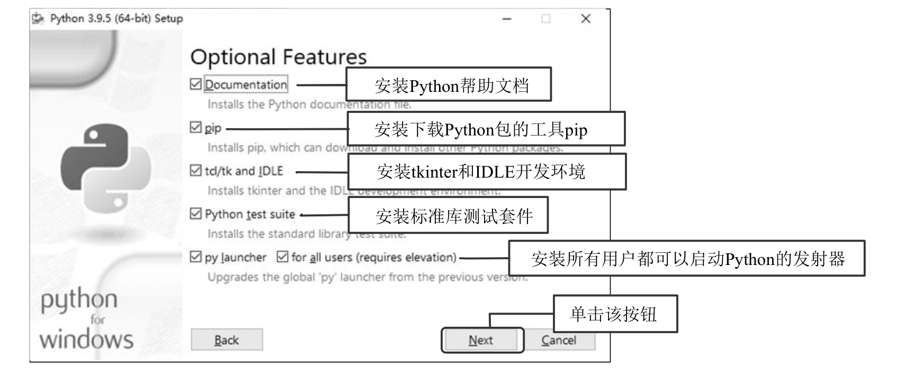

图2.8 设置安装选项

（3）单击Next按钮进行高级选项设置，设置安装路径，如“E:\Python\Python 3.9”，其他选项采用默认设置，如图2.9所示。注意，不要将Python安装在操作系统的安装路径下，否则一旦操作系统崩溃，Python编写的程序将非常危险。

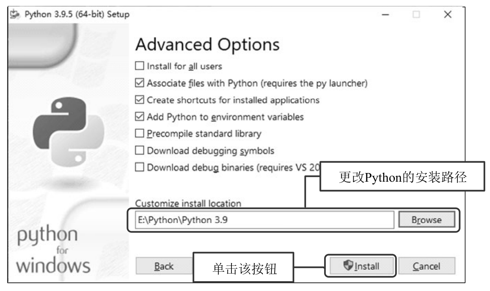

图2.9 设置高级选项

（4）单击Install按钮，开始安装Python，如图2.10所示。

（5）安装完成后将显示如图2.11所示的对话框。

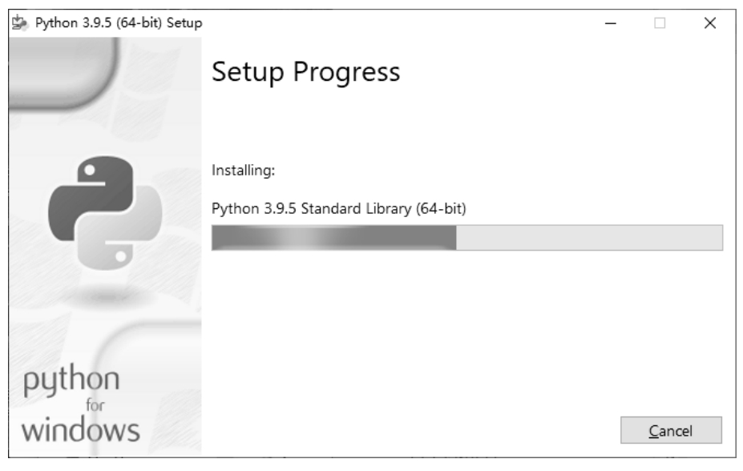

▲图2.10 开始安装

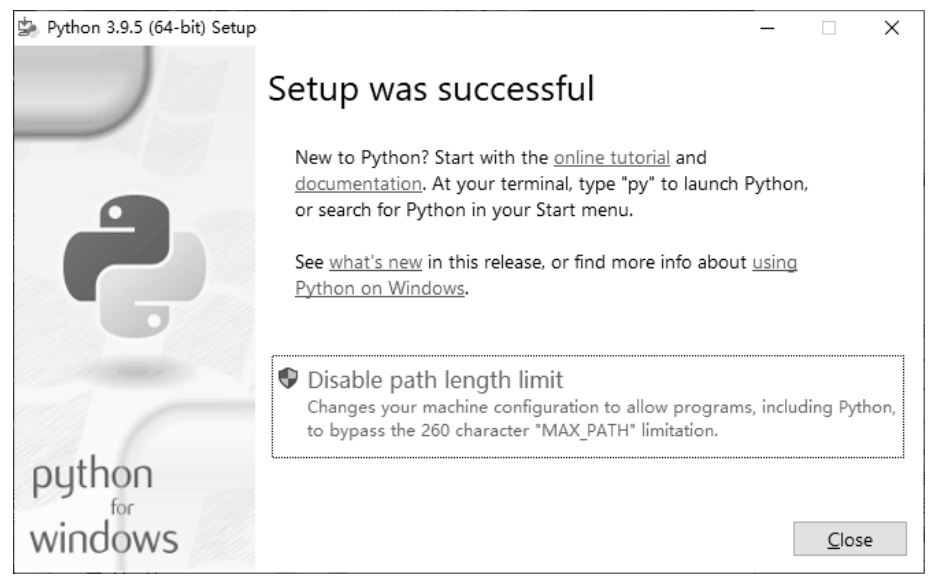

▲图2.11 安装完成

**4. 测试Python是否安装成功**

Python安装完毕后，需要检测是否成功安装。在Windows 10系统下可以单击开始菜单，在桌面左下角“搜索”文本框中输入cmd命令并按Enter键，启动“命令提示符”窗口，在当前命令提示符后输入python，按Enter键，如果出现如图2.12所示信息，则说明Python已安装成功，同时已进入交互式Python解释器中。

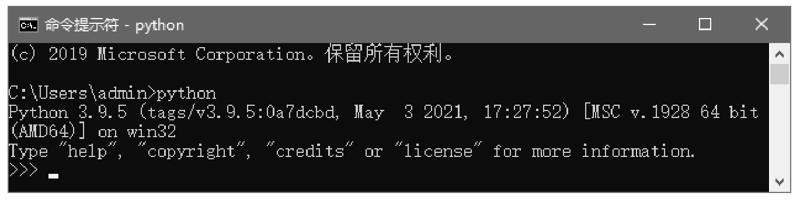

图2.12 在命令行窗口中运行的Python解释器

### 说明

图2.12中的信息是笔者计算机中安装的Python的相关信息，其中包括Python的版本、该版本发行的时间、安装包的类型等。因为选择的版本不同，这些信息可能会有所差异，但只要命令提示符变为\>\>\>，即说明Python已经安装成功，正在等待用户输入Python命令。

### 2.1.3 创建第一个Python程序

安装Python后，会自动安装一个IDLE，它是一个Python Shell（可在IDLE窗口标题栏中看到），开发人员利用它与Python交互。下面将详细介绍如何使用IDLE开发Python程序。

打开IDLE时，单击Windows 10系统的开始菜单，选择Python 3.9→IDLE （Python 3.9 64-bit）菜单项，即可打开IDLE窗口，如图2.13所示。

在Python提示符“＞＞＞”右侧输入代码时，每写完一条语句，按Enter键后就会执行该语句。在实际开发中，代码通常有很多行，建议单独创建一个文件来保存这些代码，最后统一执行全部代码。

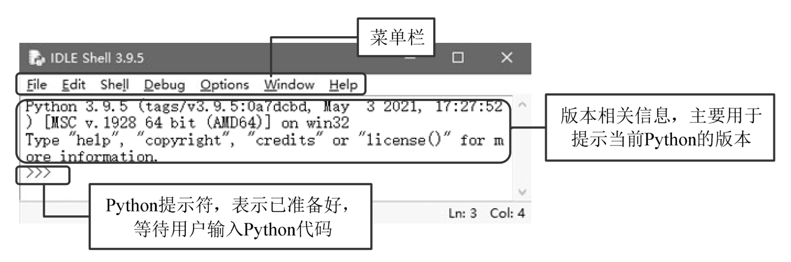

图2.13 IDLE主窗口

（1）在IDLE窗口中选择File→New File命令，打开一个新窗口，如图2.14所示。

（2）在代码编辑区编写“hello world”程序，输入一行代码后按Enter键。

print("hello world")

（3）编写完成的代码效果如图2.15所示。按Ctrl + S快捷键保存文件，这里将其保存为demo.py，其中，“.py”是Python文件的扩展名。

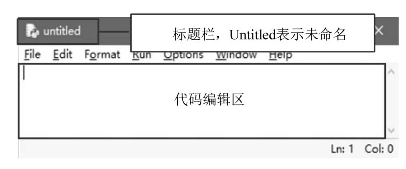

▲图2.14 新创建的Python文件窗口

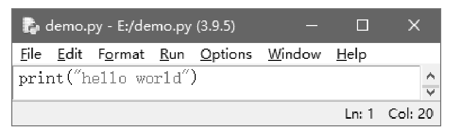

▲图2.15 编辑代码后的Python文件窗口

（4）运行“hello world”程序。选择Run→Run Module命令（或按F5键），运行结果如图2.16所示。

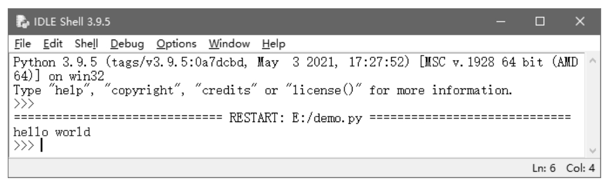

图2.16 运行结果

### 说明

程序运行结果会在IDLE中呈现，每运行一次程序，就在IDLE中呈现一次。

## 2.2 安装Anaconda开发环境

Anaconda是一个用于大规模数据处理、预测分析和科学计算的免费工具。该工具不仅集成了Python解析器，还有很多用于数据处理和科学计算的第三方模块，包含很多网络爬虫用到的模块，如requests、 Beautiful Soup、lxml等。

在Windows系统下安装Anaconda，具体步骤如下。

（1）在浏览器中打开Anaconda官网https://www.anaconda.com/，单击Download按钮，如图2.17所示。

图2.17 单击Download按钮

（2）系统将自动下载Anaconda，并显示下载进度，如图2.18所示。

图2.18 下载Anaconda

### 说明

下载Anaconda前，读者需要先查看个人计算机的系统版本与位数，然后下载系统支持的Anaconda。

下载完成后，浏览器会自动提示“此类型的文件可能会损害您的计算机。您仍然要保留Anaconda3-2022….exe吗？”，此时单击“保留”按钮，保留该文件即可。

（3）下载完毕后，双击运行下载的文件，打开安装向导，单击Next按钮，如图2.19所示。

（4）在License Agreement窗口中单击I Agree按钮，如图2.20所示。

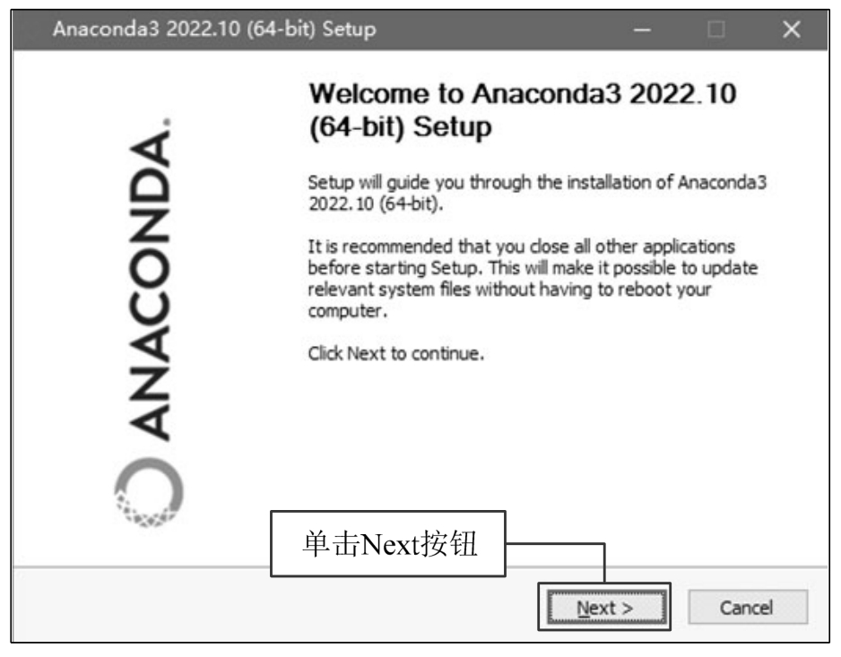

▲图2.19 安装向导

▲图2.20 License Agreement窗口

（5）在Select Installation Type窗口内先选择All Users选项，然后单击Next按钮，如图2.21所示。

（6）在Choose Install Location窗口中选择安装路径（不建议使用中文路径），然后单击Next按钮，如图2.22所示。

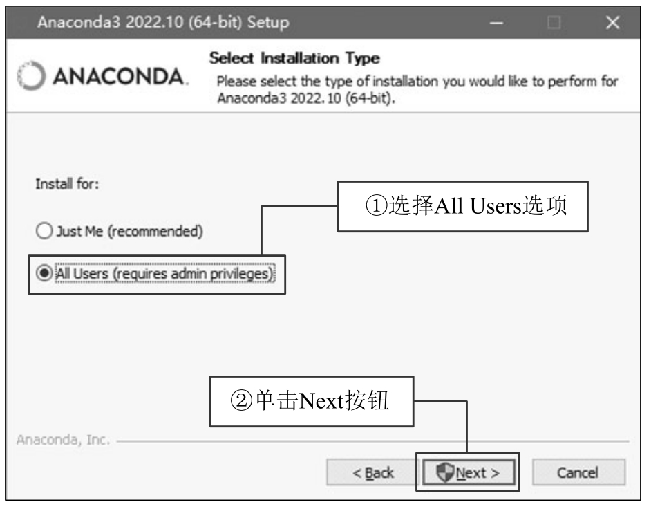

▲图2.21 选择All Users选项

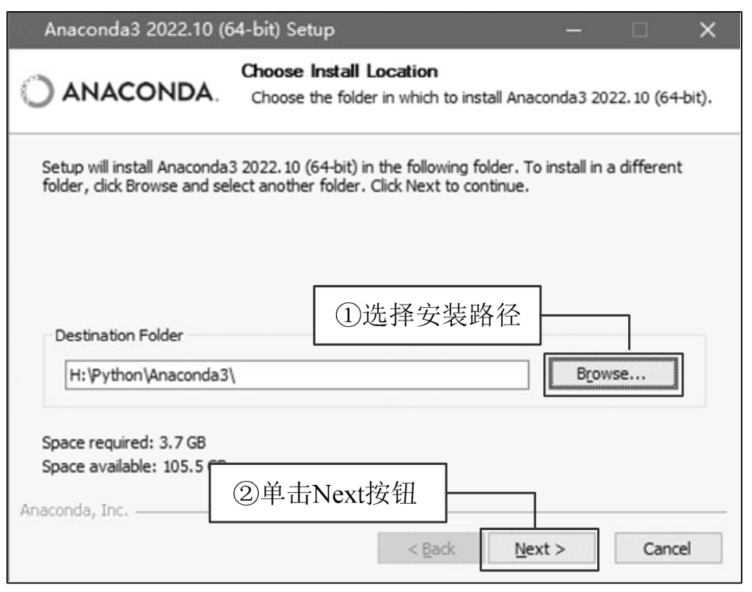

▲图2.22 选择安装路径

（7）在Advanced Installation Options窗口中，单击Install按钮进行安装，如图2.23所示。

（8）由于Anaconda中包含的模块较多，所以安装需要等待的时间较长。安装完成后，在Installation Complete窗口中单击Next按钮，如图2.24所示。

（9）Anaconda与JetBrains为合作关系，所以系统会推荐安装JetBrains开发工具，单击Next按钮即可，如图2.25所示。

（10）在安装完成对话框中不查阅，也不立即启动Anaconda，直接单击Finish按钮，如图2.26所示。

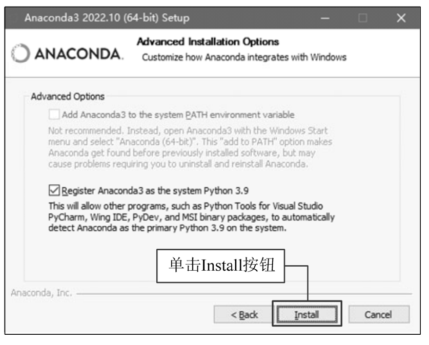

▲图2.23 开始安装

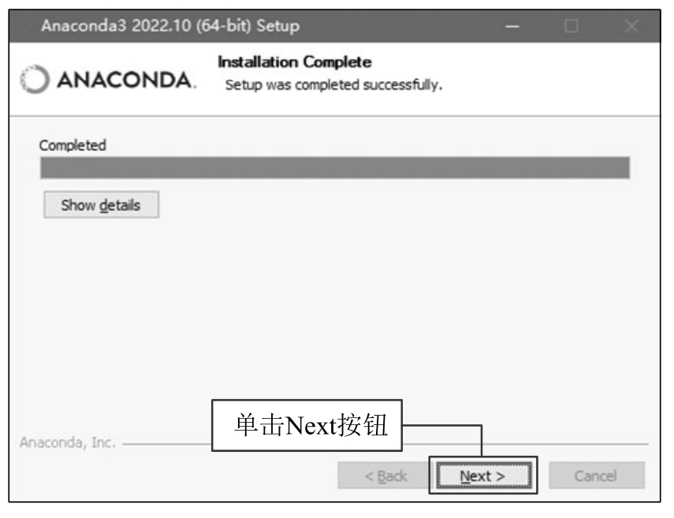

▲图2.24 安装完成

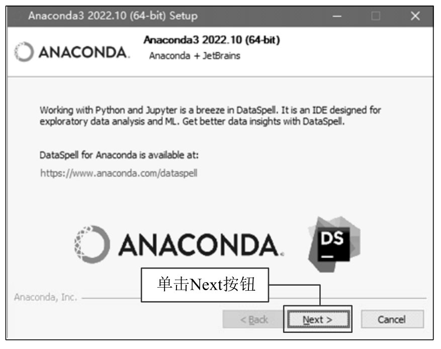

▲图2.25 安装JetBrains开发工具提示

▲图2.26 安装结束

（11）在保证已添加系统环境变量的情况下，打开Anaconda Prompt（Anaconda 3）命令行窗口，然后输入conda list并按Enter键，可查看当前Anaconda中已安装的所有模块，如图2.27所示。

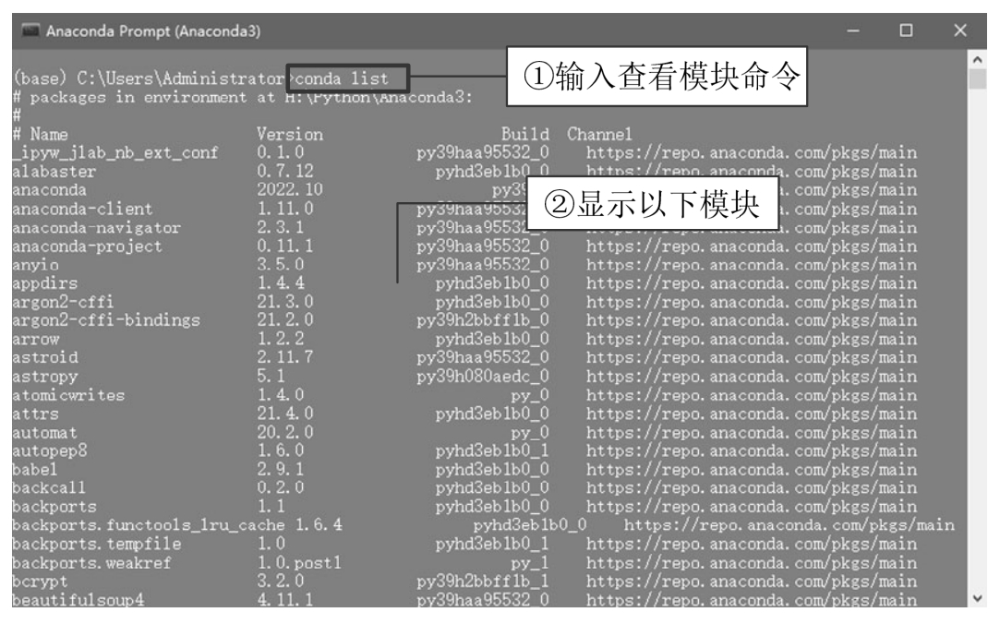

图2.27 查看当前Anaconda已经安装的所有模块

**注意**

如果此时提示不是内部或外部命令，说明未将Anaconda添加至系统环境变量中，可参考图2.28进行添加。

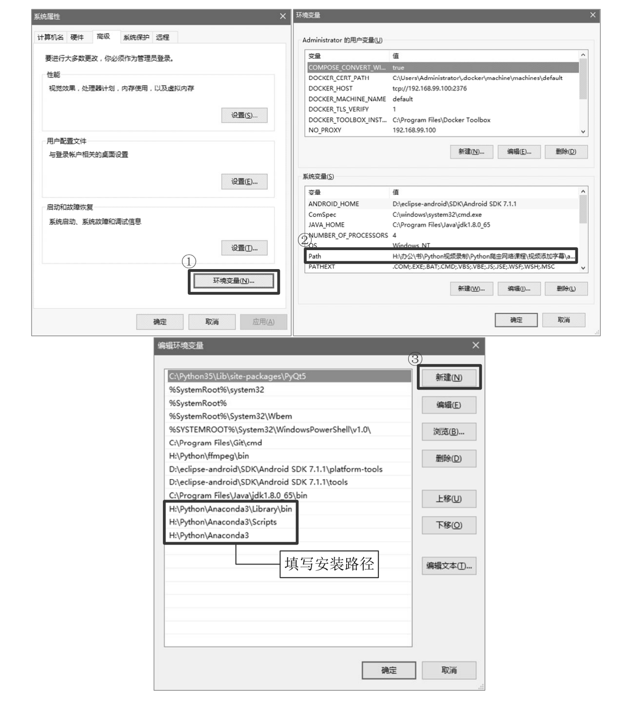

图2.28 配置Anaconda的环境变量

（12）安装完成后，系统“开始”菜单会显示增加的程序，如图2.29所示。

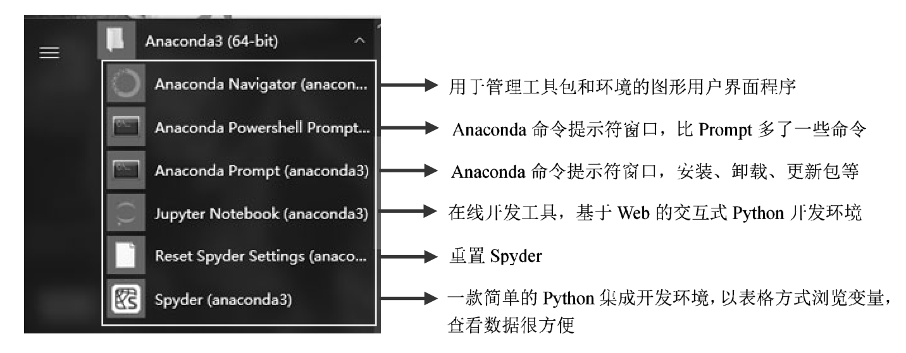

图2.29 安装完成后在“开始”菜单显示程序

（13）选择Jupyter Notebook命令，先弹出如图2.30所示窗口，然后打开如图2.31所示界面，这说明Anaconda开发环境已经配置好了。

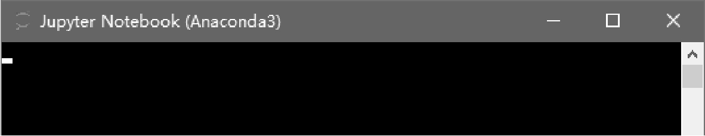

▲图2.30 准备运行Jupyter Notebook

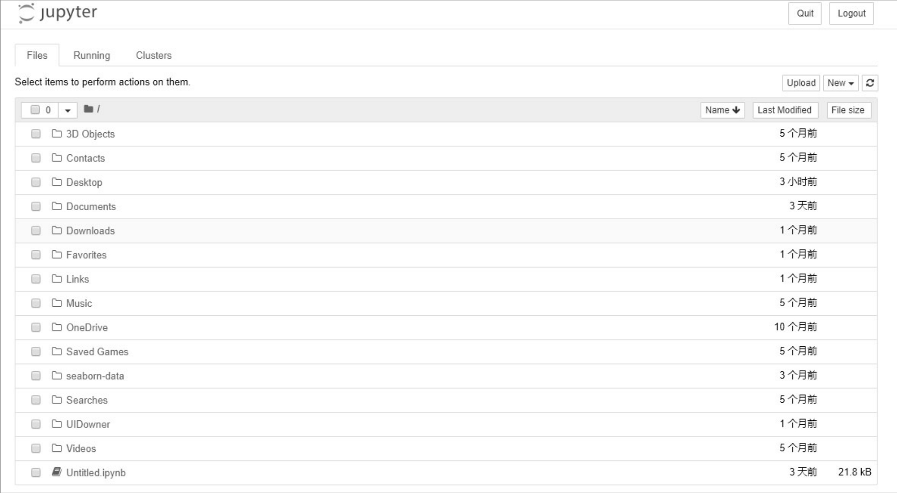

▲图2.31 Jupyter Notebook

## 2.3 JupyterNotebook开发工具

### 2.3.1 初识Jupyter Notebook

Jupyter Notebook是一款在线编辑器，可用于数据清理、数据转换、数值模拟、统计建模、机器学习等。目前，数据挖掘领域中最热门的比赛Kaggle里的资料都是Jupyter格式。对于机器学习新手来说，学会使用Jupyter Notebook非常重要。

使用Jupyter Notebook实现淘宝网订单分析，效果如图2.32所示。Jupyter Notebook可将编写的代码、说明文本和可视化数据分析图表组合在一起显示，非常直观，而且支持各种导出格式，如HTML、PDF、Python等。

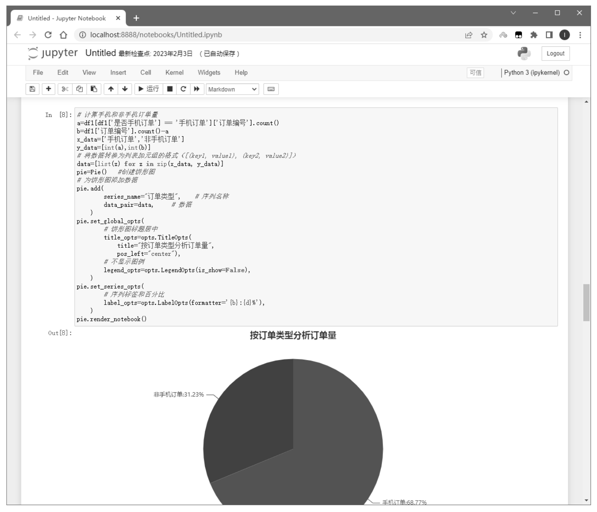

图2.32 Jupyter Notebook中编写代码

### 2.3.2 创建Jupyter Notebook文件

运行Jupyter Notebook，新建一个Jupyter Notebook文件，单击右上角的New下拉按钮，选择Python 3，如图2.33所示。

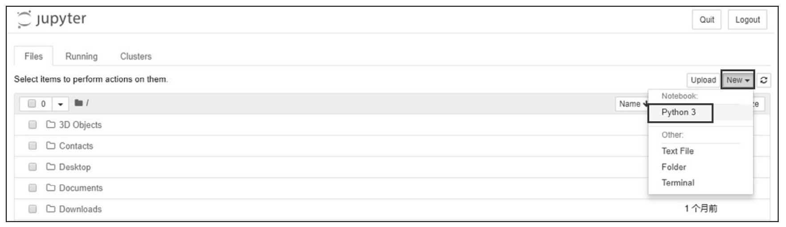

图2.33 新建Jupyter Notebook文件

### 2.3.3 测试Jupyter Notebook

Jupyter Notebook文件创建后会打开一个代码编辑窗口，输入代码，如print（'Hello World'），效果如图2.34所示。

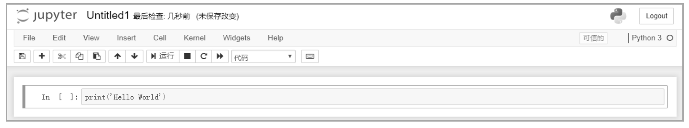

图2.34 编写代码

**1. 运行程序**

单击“运行”按钮，或按Ctrl+Enter组合键运行程序，将输出“Hello World”，如图2.35所示。

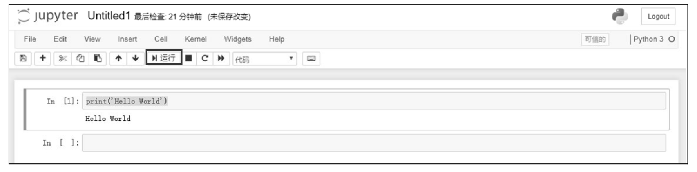

图2.35 运行程序

**2. 重命名Jupyter Notebook文件**

选择File→Rename命令，如图2.36所示，在“重命名”对话框中输入代码文件名称“hello world”，如图2.37所示，然后单击“重命名”按钮。

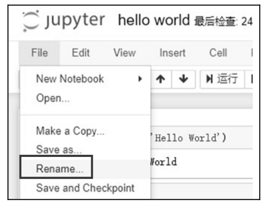

▲图2.36 选择Rename命令

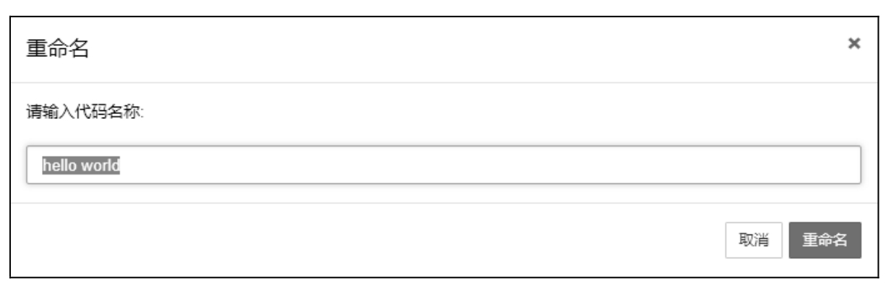

▲图2.37 “重命名”对话框

**3. 保存Jupyter Notebook文件**

Jupyter Notebook文件可保存为如下两种格式。 

 Jupyter Notebook专属格式：选择File→Save and Checkpoint命令，将文件保存在默认路径下，文件格式默认为ipynb。 

 Python格式：选择File→Download as→Python（.py）命令，如图2.38所示，打开“新建下载任务”对话框，选择文件保存位置后单击“下载”按钮，如图2.39所示，可将Jupyter Notebook文件保存为Python格式。

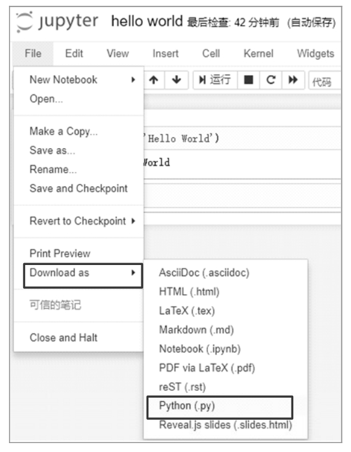

▲图2.38 选择Python菜单项

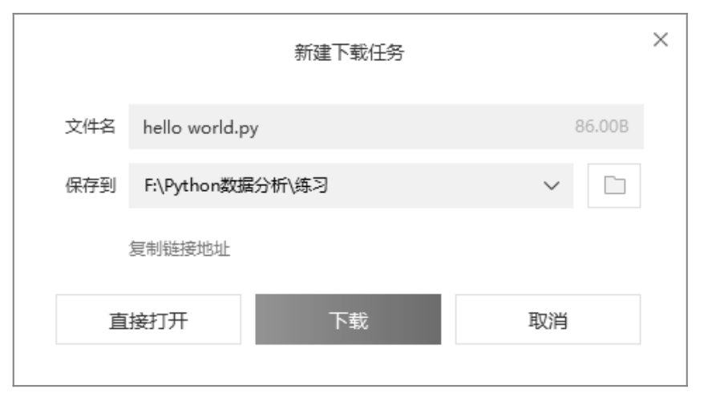

▲图2.39 指定保存路径

## 2.4 PyCharm集成开发环境

PyCharm是Jetbrains公司开发的Python集成开发环境，其具有智能代码编辑器，可实现自动代码格式化、代码完成、智能提示、重构、单元测试、自动导入、一键代码导航等功能，是Python专业开发人员和初学者使用的有力工具。

### 2.4.1 PyCharm的下载与安装

PyCharm的下载非常简单，可以直接到Jetbrains公司官网下载，具体步骤如下。

（1）在浏览器中打开PyCharm的官网http://www.jetbrains.com，在Developer Tools菜单下选择PyCharm工具，如图2.40所示。

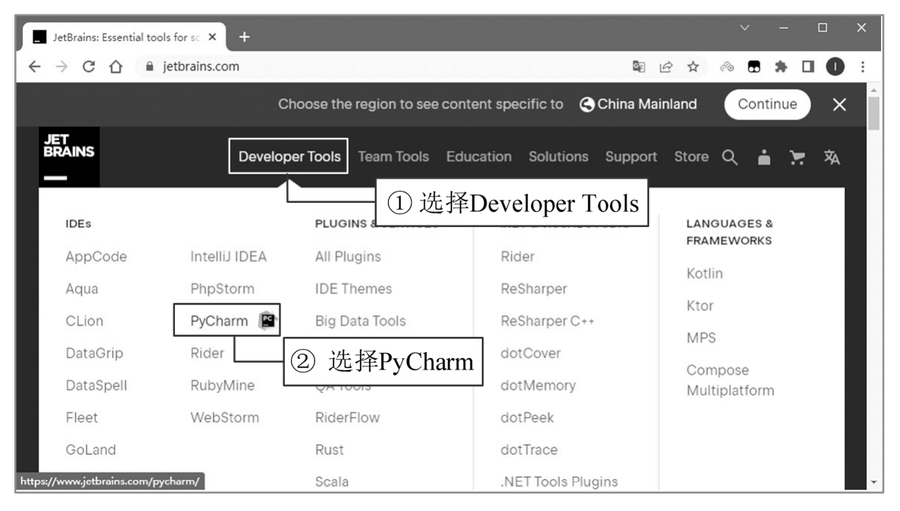

图2.40 PyCharm官网页面

（2）进入PyCharm下载页面，单击DOWNLOAD按钮，如图2.41所示。

图2.41 PyCharm下载页面

（3）在版本选择页面选择Windows操作系统，单击Download按钮，开始下载免费的社区版PyCharm（Community），如图2.42所示。

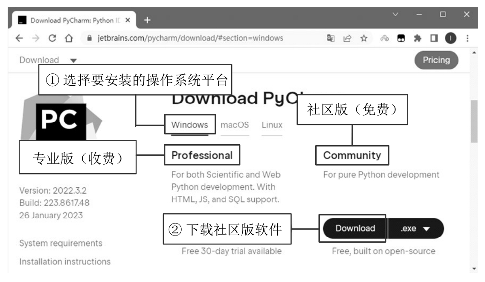

图2.42 PyCharm版本下载

（4）文件下载过程中，浏览器会提示“此类型的文件可能会损害您的计算机。您是否仍然要保留pycharm- comm....exe”，如图2.43所示。单击“保留”按钮，保留该文件。

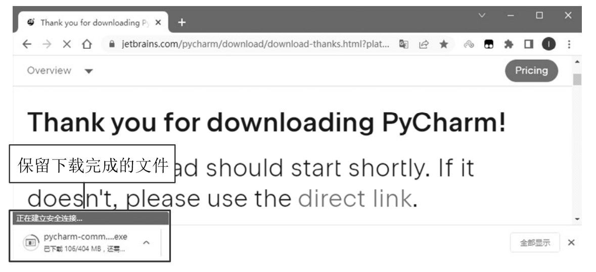

图2.43 PyCharm下载

（5）下载完毕后，找到PyCharm安装包，如图2.44所示，双击进行安装。

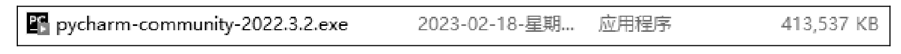

图2.44 下载完成的PyCharm安装包

（6）在欢迎界面中单击Next按钮，进入软件安装路径设置界面。PyCharm默认的安装路径为操作系统所在的路径，建议更改为其他位置（路径中不要出现中文字符），如图2.45所示，然后单击Next按钮，开始安装PyCharm。

（7）打开安装设置界面，在Create Desktop Shortcut栏中设置PyCharm快捷方式，这里选中PyCharm Community Edtion复选框；在Create Associations栏中设置关联文件，选中“.py”复选框，以后打开.py文件（即Python文件）时会默认调用PyCharm打开，如图2.46所示，然后单击Next按钮。

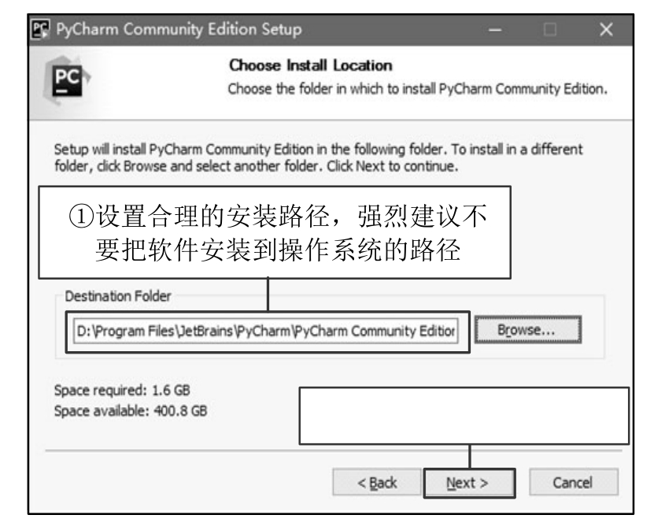

▲图2.45 设置PyCharm安装路径

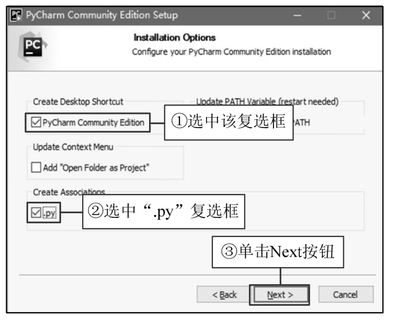

▲图2.46 设置快捷方式和关联

（8）进入选择开始菜单文件夹界面，如图2.47所示，保持默认设置，单击Install按钮开始安装PyCharm。整个安装过程需要10分钟左右，请耐心等待。

（9）安装完成后，单击Finish按钮，如图2.48所示。如果选中Run PyCharm Community Edition复选框后单击Finish按钮，将在安装后直接打开PyCharm。

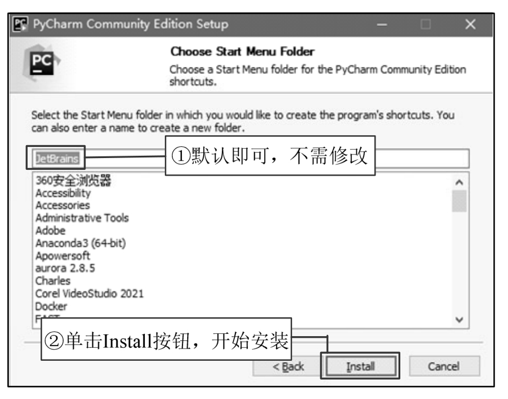

▲图2.47 选择开始菜单文件夹界面

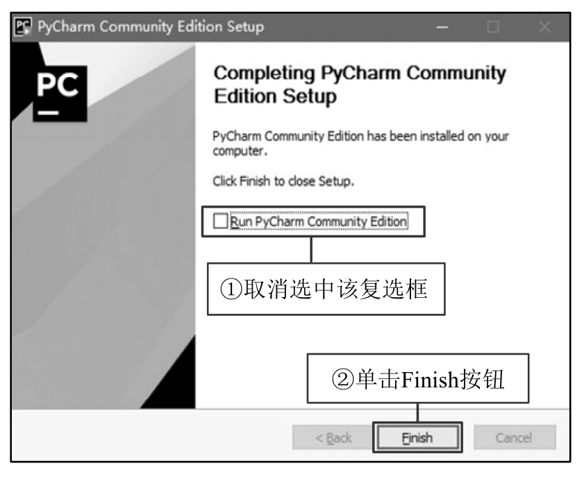

▲图2.48 完成安装

（10）PyCharm安装完成后，会在开始菜单中建立一个文件夹，如图2.49所示，单击“PyCharm Community Edition...”，启动PyCharm程序。另外，快捷打开PyCharm的方式是双击桌面快捷方式“PyCharm Community Edition2022.3.2”，图标如图2.50所示。

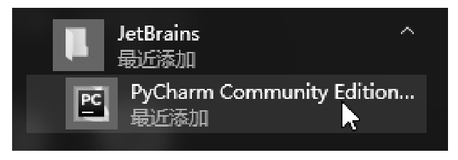

▲图2.49 PyCharm菜单

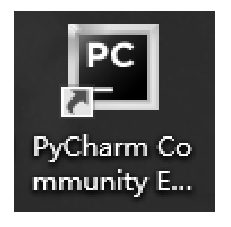

▲图2.50 PyCharm桌面快捷方式

### 2.4.2 配置PyCharm

配置PyCharm的具体步骤如下。

（1）双击PyCharm桌面图标，启动PyCharm程序，不导入开发环境配置文件，单击OK按钮，如图2.51所示。

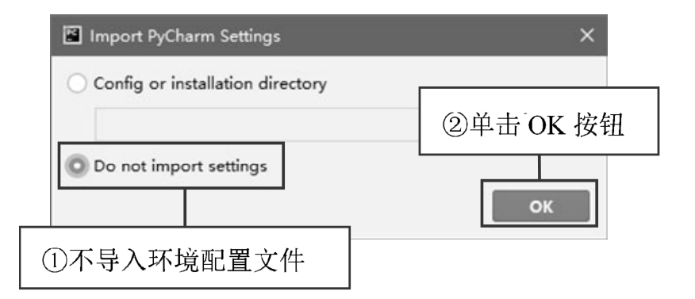

图2.51 不导入环境配置文件

（2）进入PyCharm欢迎页面，单击New Project选项，创建一个新项目，如图2.52所示。

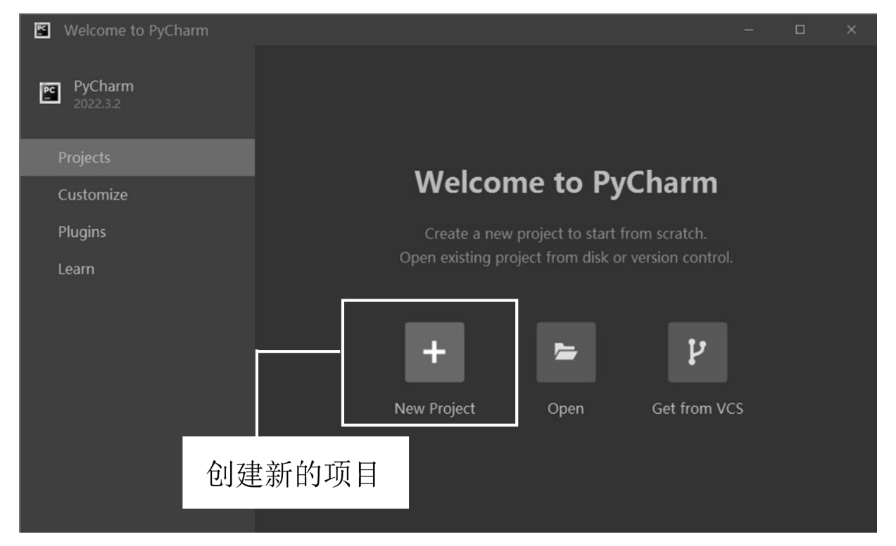

图2.52 PyCharm欢迎界面

（3）在New Project窗口中，选择项目保存的路径，然后配置解释器，最后单击Create按钮，如图2.53所示。

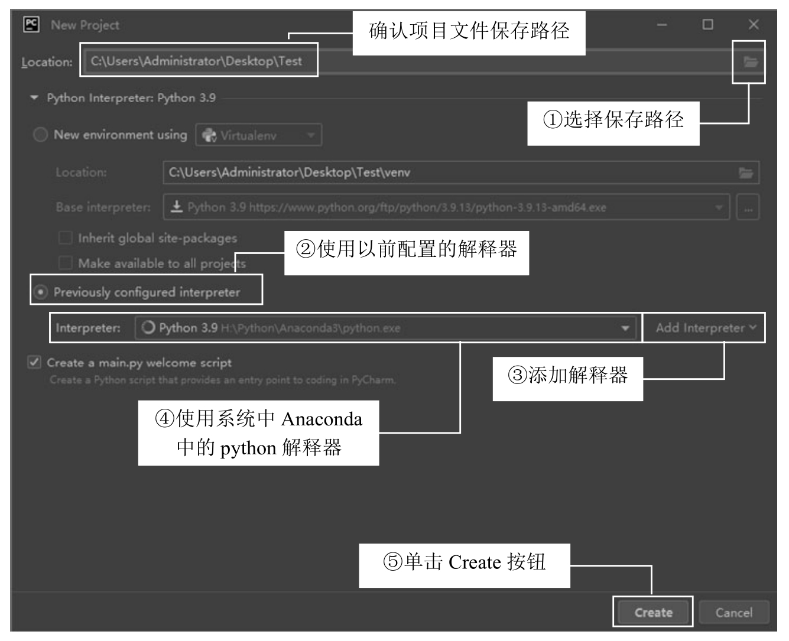

图2.53 创建项目

（4）项目创建完成以后，将显示如图2.54所示的界面。

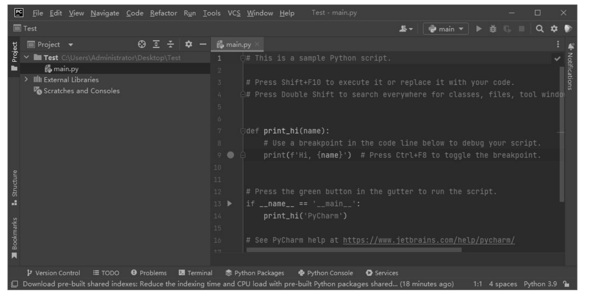

图2.54 成功创建项目

### 2.4.3 测试PyCharm

测试PyCharm的具体步骤如下。

（1）右击新建的Test项目，在弹出的快捷菜单中选择New →Python File命令，如图2.55所示。注意，这里一定要选择Python File，这个至关重要，否则无法进行后续学习。

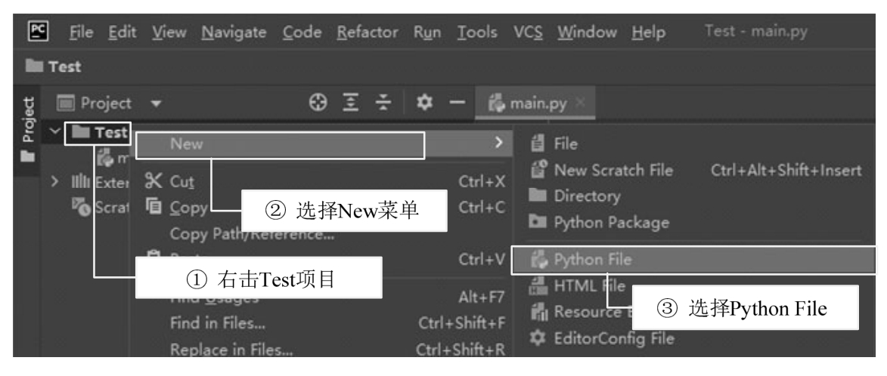

图2.55 新建Python文件

（2）在新建文件对话框输入Python文件名“hello world”，如图2.56所示，然后按Enter键。

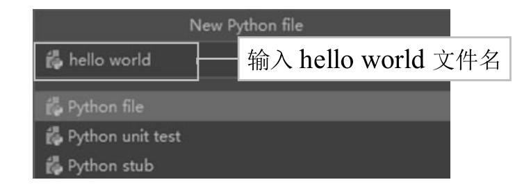

图2.56 输入新建Python文件名称

（3）在代码编辑区输入代码print （"hello world!"），如图2.57所示。

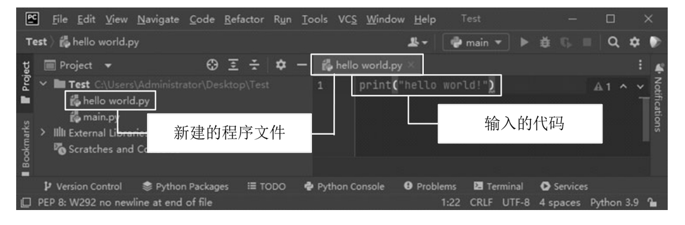

图2.57 输入代码

（4）在代码区右击，选择Run 'hello world'命令，运行测试代码，如图2.58所示。

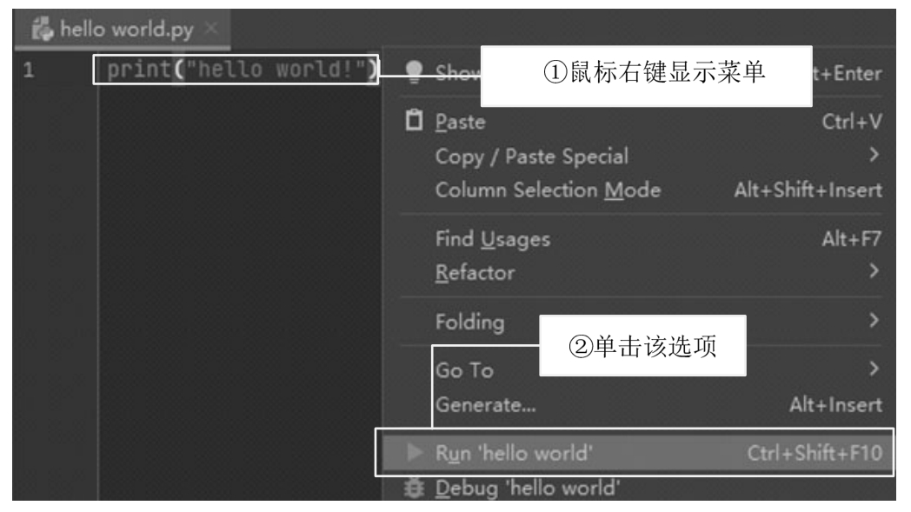

图2.58 运行Python代码

（5）如果程序代码没有错误，将显示运行结果，如图2.59所示。

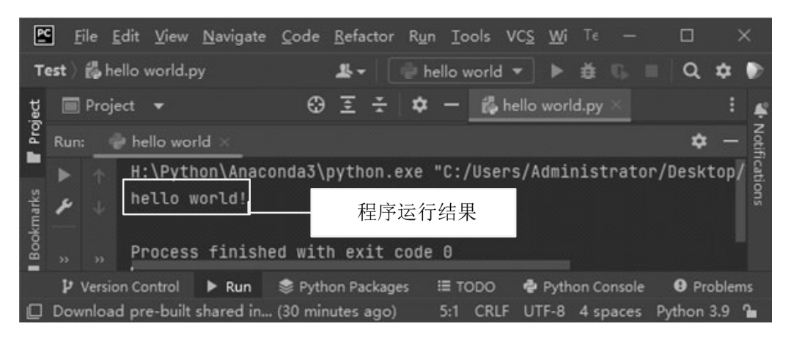

图2.59 显示程序运行结果

### 说明

PyCharm除了可使用默认的Darcula暗色主题，还可以使用亮丽的IntelliJ Light主题。

（1）在Pycharm菜单栏中选择File→Settings命令。

（2）在Settings窗口中依次单击Appearance & Behavior→Appearance，然后在Theme主题选项中选择IntelliJ Light主题，如图2.60所示。

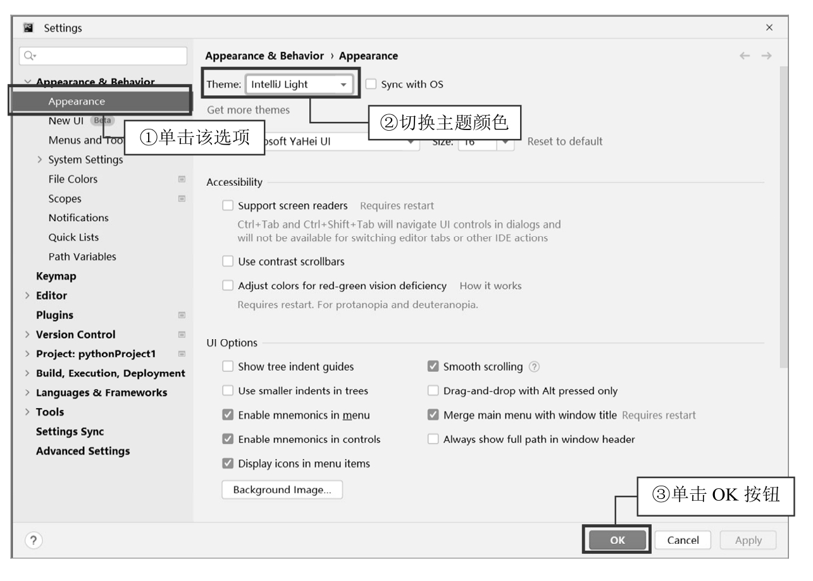

图2.60 切换PyChram主题

## 2.5 小结

本章介绍了多款开发工具，如Python自带的IDLE、适合数据分析的标准环境Anaconda和Jupyter Notebook以及Pycharm开发工具。但是，这里建议大家有选择性地学习，对于初学者来说，学会使用Python自带的IDLE和集成开发环境PyCharm即可。由于本书采用的开发环境是PyCharm，所以建议首先学习PyCharm，对于其他开发工具先了解即可。

