# 3 NumPy模块之数组计算

NumPy模块在数据处理、数据清洗、数据过滤、数据转换等方面可以快速实现数据计算，Pandas的底层也是基于NumPy的。因此，这一章内容将介绍NumPy的基础知识，使读者快速了解NumPy并将其应用到实际数据分析工作当中。

本章知识架构如下。

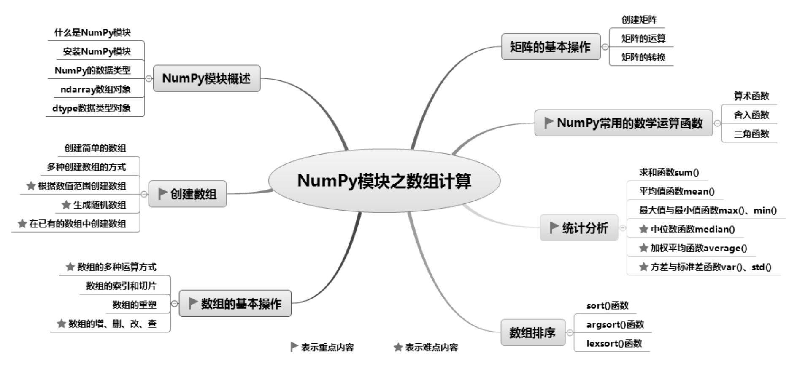

## 3.1 NumPy模块概述

### 3.1.1 什么是NumPy模块

Numeric是NumPy的前身，最早由Jim Hugunin开发。随后又出现了Numarray模块，该模块与Numeric模块相似，都用于数组计算，但有着不同的优势。2005年，Travis Oliphant在Numeric模块中揉和了Numarray模块的优点，并加入了其他扩展，开发出NumPy模块的第一个版本。NumPy为开源软件，使用了BSD许可证授权。

### 3.1.2 安装NumPy模块

NumPy模块为第三方模块，所以Python官网的发行版本中不包含该模块，需要单独安装。

### 说明

如果读者使用的是Anaconda集成开发环境，不需要单独安装该模块，因为Anaconda中已包含该模块。

在Windows系统下可以通过以下两种方式安装NumPy模块。

**1. 使用pip安装NumPy**

安装NumPy模块时，需要先进入cmd窗口，然后在cmd窗口中执行如下代码：

python -m pip install numpy

NumPy模块安装完成以后，在Python窗口中输入以下代码，测试是否可以正常导入已经安装的NumPy模块。

import numpy

**2. 使用第三方开发工具安装NumPy**

例如，使用Pycharm安装NumPy模块。打开Settings窗体，在左侧选择Python Interpreter选项，在右侧列表框中单击“+”按钮，如图3.1所示。

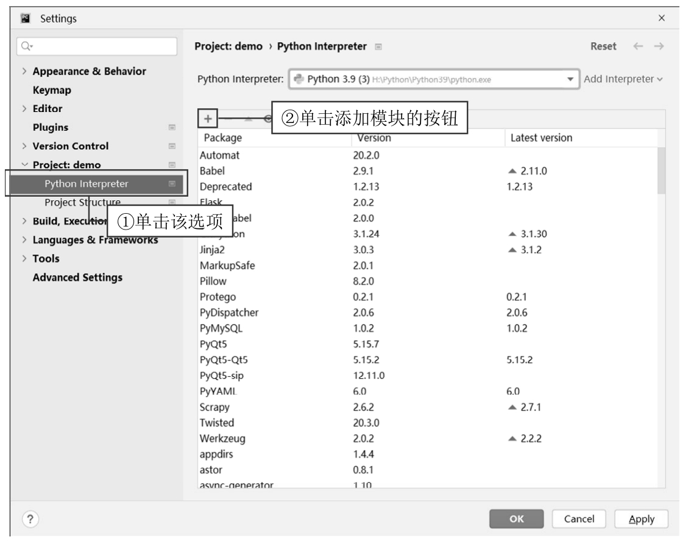

图3.1 单击添加模块的按钮

打开Available Packages对话框，先在搜索栏输入numpy查找numpy模块，选择numpy模块然后单击Install Package按钮进行安装，如图3.2所示。

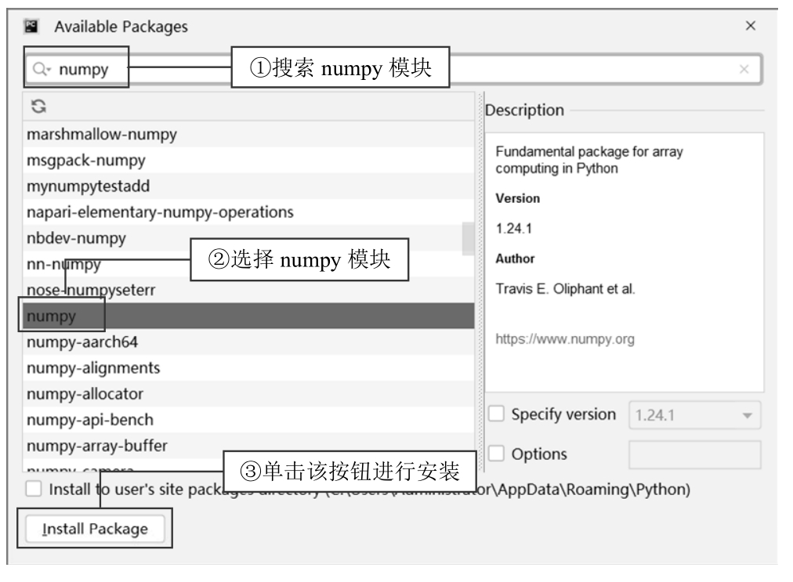

图3.2 使用Pycharm开发工具安装numpy模块

### 3.1.3 NumPy的数据类型

NumPy模块支持的数据类型非常多，比Python内置的数据类型还要多。表3.1中列举了NumPy模块支持的常用数据类型。

表3.1 NumPy模块支持的常用数据类型

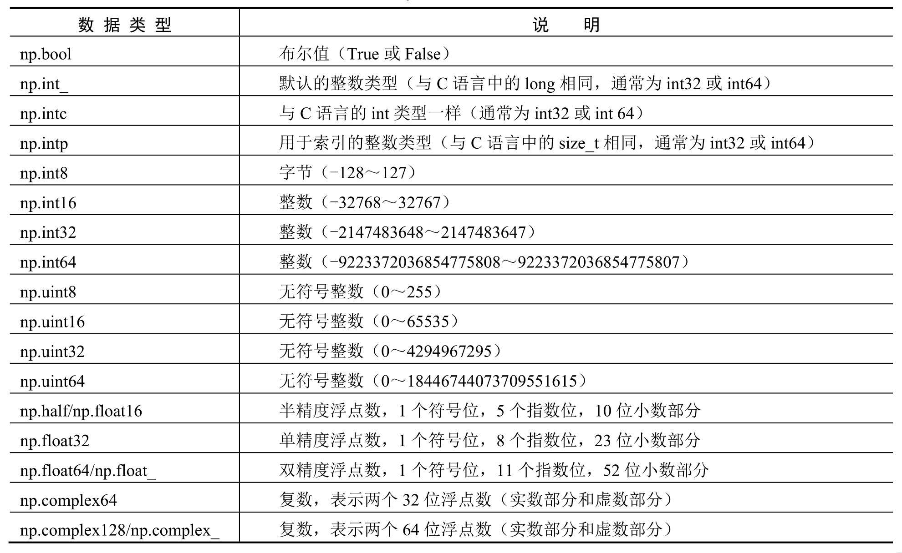

### 3.1.4 ndarray()数组对象

ndarray()数组对象是NumPy模块的基础对象，用于存放同类型元素的多维数组。ndarray中的每个元素在内存中都占有相同的存储空间，数据类型由dtype对象指定，每个ndarray只有一种dtype类型。

数组有一个比较重要的属性是shape，数组的维数与元素的数量就是通过shape来确定的。数组的形状（shape）是由N个正整数组成的元组来指定的，元组的每个元素对应每一维的大小。数组在创建时被指定大小后将不会再发生改变，而Python中的列表大小是可以改变的，这也是数组与列表区别较大的地方。

创建一个ndarray只需调用NumPy中的array()函数即可，语法格式如下：

numpy.array(object, dtype=None, copy=True, order='K', subok=False, ndmin=0)

array()函数的参数说明如表3.2所示。

表3.2 array()函数的参数说明

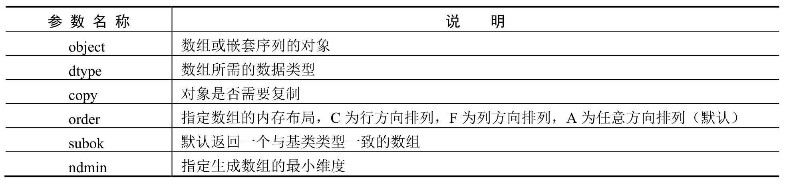

使用array()函数创建一个ndarray时，需要用Python列表作为参数，而列表中的元素即ndarray的元素。代码如下：

1  import numpy as np

2  a = np.array(\[1,2,3,4,5\])        # 定义ndarray

3  print('数组内容为：',a)          # 打印数组内容

4  print('数组类型为：',a.dtype)    # 打印数组类型

5  print('数组的形状为：',a.shape)  # 打印数组的形状

6  print('数组的维数为：',a.ndim)   # 打印数组的维数

7  print('数组的长度为：',a.size)   # 打印数组的长度

运行结果如下：

数组内容为： \[1 2 3 4 5\]

数组类型为： int32

数组的形状为： (5,)

数组的维数为： 1

数组的长度为： 5

NumPy的数组中除了以上实例所使用的属性，还有几个比较重要的属性，如表3.3所示。

表3.3 ndarray()数组对象的其他属性

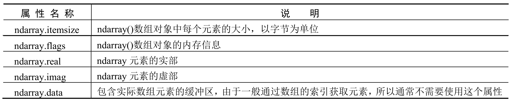

### 3.1.5 dtype数据类型对象

dtype数据类型对象是numpy.dtype类的实例，用来描述与数组对应的内存区域。dtype对象使用以下语法构造：

numpy. dtype(obj\[, align, copy\])

参数说明： 

 object：要转换为的数据类型对象。 

 align：如果为true，则填充字段使其类似C语言中的结构体。 

 copy：复制dtype()对象，如果为false，则是对内置数据类型对象的引用。

例如，查看数组类型时可以使用如下代码：

a = np.random.random(4)  # 生成随机浮点类型数组

print(a.dtype)           # 查看数组类型

运行结果如下：

float64

每个ndarray对象都有一个相关联的dtype()对象。例如，定义一个复数数组时，可通过数组相关联的dtype()对象指定数据类型，代码如下：

a = np.array(\[\[1,2,3,4,5\],\[6,7,8,9,10\]\],dtype=complex)     # 创建复数数组

print('数组内容为：',a)                                    # 打印数组内容

print('数组类型为：',a.dtype)                              # 打印数组类型

运行结果如下：

数组内容为： \[\[ 1.+0.j 2.+0.j 3.+0.j 4.+0.j 5.+0.j\]

 \[ 6.+0.j 7.+0.j 8.+0.j 9.+0.j 10.+0.j\]\]

数组类型为： complex128

## 3.2 创建数组

数组可分为一维数组、二维数组、三维数组等，如图3.3所示。 

 一维数组：类似Python列表，区别在于数组切片针对的是原始数组。也就是说，对数组进行修改，原始数组也会跟着更改。 

 二维数组：以数组为元素的数组。二维数组包括行和列，类似表格，又称为矩阵。

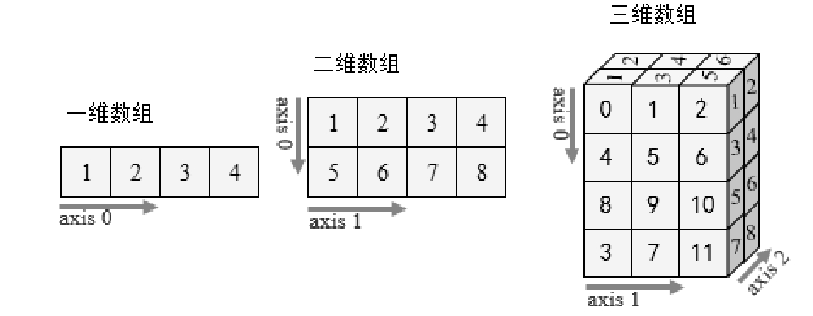

图3.3 数组示意图

 三维数组：维数为三的数组结构，也称矩阵列表。三维数组是最常见的多维数组，可以描述三维空间中的位置或状态，因此使用广泛。 

 轴：NumPy里的axis。指定axis后，将沿着对应轴做相关操作。二维数组中，两个axis的指向如图3.4所示；一维数组的轴是水平的，其axis=0，如图3.5所示。

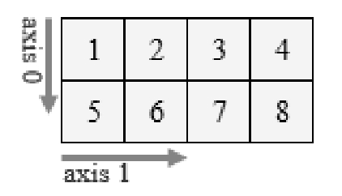

▲图3.4 二维数组两个轴

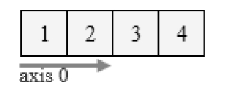

▲图3.5 一维数组一个轴

### 3.2.1 创建简单的数组

**【例3.1】**演示如何创建数组**（实例位置：资源包\\TM\\sl\\03\\01）**

NumPy创建简单数组主要使用array()函数，效果如图3.6所示。

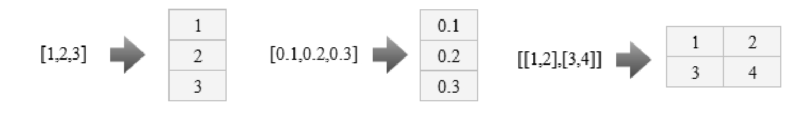

图3.6 简单数组

程序代码如下：

1 import numpy as np              # 导入numpy 模块

2 n1 = np.array(\[1,2,3\])          # 创建一个简单的一维数组

3 n2 = np.array(\[0.1,0.2,0.3\])    # 创建一个包含小数的一维数组

4 n3 = np.array(\[\[1,2\],\[3,4\]\])    # 创建一个简单的二维数组

**1. 为数组指定数据类型**

**【例3.2】**为数组指定数据类型**（实例位置：资源包\\TM\\sl\\03\\02）**

NumPy支持比Python更多种类的数据类型，通过dtype参数可以指定数组的数据类型，程序代码如下：

1   import numpy as np                            # 导入numpy 模块

2   list = \[1, 2, 3\]                              # 列表

3   n1 = np.array(list,dtype=np.float\_)           # 创建浮点型数组

4   # 或者

5   n1= np.array(list,dtype=float)

6   print(n1)

7   print(n1.dtype)

8   print(type(n1\[0\]))

运行程序，输出结果为：

\[1. 2. 3.\]

float64

\<class 'numpy.float64'\>

**2. 数组的复制**

**【例3.3】**复制数组**（实例位置：资源包\\TM\\sl\\03\\03）**

当运算和处理数组时，为了不影响原数组，就需要对原数组进行复制，而对复制后的数组进行修改、删除等操作都不会影响原数组。数组的复制可以通过copy参数来实现，程序代码如下：

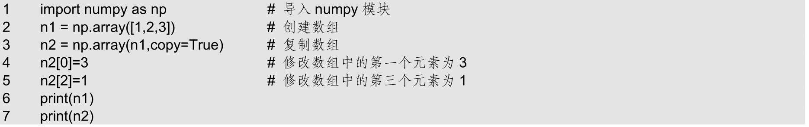

运行程序，输出结果为：

\[1 2 3\]

\[3 2 1\]

数组n2是数组n1的副本，从运行结果得知：虽然修改了数组n2，但是数组n1没有发生变化。

**3. 通过ndmin参数控制最小维数**

无论给出的数据维数是多少，ndmin参数都会根据最小维数创建指定数组。

**【例3.4】**修改数组的维数**（实例位置：资源包\\TM\\sl\\03\\04）**

假设ndmin=3，则即便给出的数组是一维的，仍会创建一个三维数组。程序代码如下：

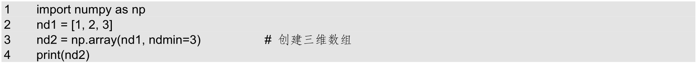

运行程序，输出结果为：

\[\[\[1 2 3\]\]\]

### 3.2.2 多种创建数组的方式

**1. 创建指定维度和数据类型未初始化的数组**

**【例3.5】**创建指定维度和未初始化的数组**（实例位置：资源包\\TM\\sl\\03\\05）**

创建指定维度和数据类型未初始化的数组主要使用empty()函数，程序代码如下：

1  import numpy as np

2  n = np.empty(\[2,3\])

3  print(n)

运行程序，输出结果为：

\[\[2.22519099e-307 2.33647355e-307 1.23077925e-312\]

 \[2.33645827e-307 2.67023123e-307 1.69117157e-306\]\]

这里的数组元素为随机值，因为它们未被初始化。如果要改变数组类型，可以使用dtype参数，如整型，即dtype=int。

**2. 创建指定维度（以0填充）的数组**

**【例3.6】**创建指定维度（以0填充）的数组**（实例位置：资源包\\TM\\sl\\03\\06）**

创建指定维度并以0填充的数组，主要使用zeros()函数，程序代码如下：

1  import numpy as np

2  n = np.zeros(3)

3  print(n)

运行程序，输出结果为：

\[0. 0. 0.\]

输出结果默认是浮点型（float）。

**3. 创建指定维度（以1填充）的数组**

**【例3.7】**创建指定维度并以1填充的数组**（实例位置：资源包\\TM\\sl\\03\\07）**

创建指定维度并以1填充的数组，主要使用ones()函数，程序代码如下：

1  import numpy as np

2  n = np.ones(3)

3  print(n)

运行程序，输出结果为：

\[1. 1. 1.\]

**4. 创建指定维度和类型的数组并以指定值填充**

**【例3.8】**创建以指定值填充的数组**（实例位置：资源包\\TM\\sl\\03\\08）**

创建指定维度和类型的数组并以指定值填充，主要使用full()函数，程序代码如下：

1  import numpy as np

2  n = np.full((3,3), 8)

3  print(n)

运行程序，输出结果为：

\[\[8 8 8\]

 \[8 8 8\]

 \[8 8 8\]\]

### 3.2.3 根据数值范围创建数组

**1. 通过arange()函数创建数组**

arange()函数同Python内置range()函数相似，区别在于返回值，arange()函数的返回值是数组，而range()函数的返回值是列表。arange()函数的语法如下：

arange(\[start,\] stop\[, step,\], dtype=None)

参数说明： 

 start：起始值，默认值为0。 

 stop：终止值（不包含）。 

 step：步长，默认值为1。 

 dtype：创建数组的数据类型，如果不设置数据类型，则使用输入数据的数据类型。

**【例3.9】**通过数值范围创建数组**（实例位置：资源包\\TM\\sl\\03\\9）**

使用arange()函数通过数值范围创建数组，程序代码如下：

1  import numpy as np

2  n=np.arange(1,12,2)

3  print(n)

运行程序，输出结果为：

\[ 1  3  5  7  9  11\]

**2. 使用linspace()函数创建等差数列**

等差数列是指从数列的第2项起，每一项与前一项的差等于一个常数。

例如，成年男性的鞋码就是一个等差数列，如图3.7所示。

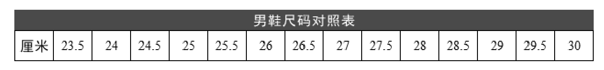

图3.7 男鞋尺码对照表

某马拉松运动员赛前一周每天的训练量（单位：m）也是一个等差数列，如图3.8所示。

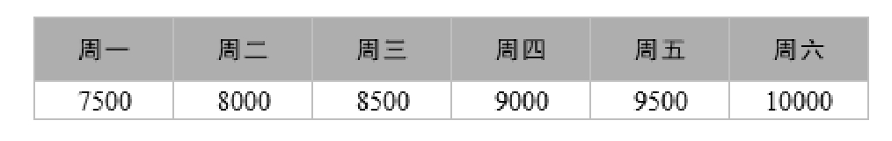

图3.8 训练计划

Python中，创建等差数列可以使用NumPy的linspace()函数。该函数用于创建一个一维的等差数列数组，它与arange()函数不同。arange()函数是从开始值到结束值的左闭右开区间（即包括开始值不包括结束值），第三个参数（如果存在）是步长；而linspace()函数是从开始值到结束值的闭区间（可以通过参数endpoint=False使结束值不是闭区间），并且第三个参数是值的个数。

linspace函数语法如下：

linspace(start,stop,num=50,endpoint=True,retstep=False,dtype=None)

参数说明： 

 start：序列的起始值。 

 stop：序列的终止值，如果endpoint参数的值为True，则该值包含于数列中。 

 num：要生成的等步长的样本数量，默认值为50。 

 endpoint：如果值为Ture，则数列中包含stop参数的值，反之则不包含，默认值为True。 

 retstep：如果值为True，则生成的数组中会显示间距，反之则不显示。 

 dtype：数组的数据类型。

**【例3.10】**创建马拉松赛前训练等差数列数组**（实例位置：资源包\\TM\\sl\\03\\10）**

创建马拉松赛前训练等差数列数组，程序代码如下：

1  import numpy as np

2  n1 = np.linspace(7500,10000,6)

3  print(n1)

运行程序，输出结果为：

\[ 7500.  8000.  8500.  9000.  9500. 10000.\]

**3. 使用logspace()函数创建等比数列**

等比数列是指从数列的第二项起，每一项与前一项的比值等于一个常数。

例如，在古印度，国王要重赏发明国际象棋的大臣，对他说：我可以满足你的任何要求。大臣说：请给我的棋盘的64个格子都放上小麦，第1个格子放1粒小麦，第2个格子放2粒小麦，第3个格子放4粒小麦，第4个格子放8粒小麦，如图3.9所示，后面每个格子放的小麦粒数都是前一个格子里放的2倍，直到第64个格子。

在Python中创建等比数列可以使用NumPy的logspace()函数，语法如下：

numpy.logspace(start, stop, num=50, endpoint=True, base=10.0, dtype=None)

参数说明： 

 start：序列的起始值。 

 stop：序列的终止值。如果endpoint参数值为True，则该值包含于数列中。 

 num：要生成的等步长的数据样本数量，默认值为50。 

 endpoint：如果值为Ture，则数列中包含stop参数值，反之则不包含，默认值为True。 

 base：对数log的底数。 

 dtype：数组的数据类型。

**【例3.11】**使用logspace()函数解决棋盘放置小麦的问题**（实例位置：资源包\\TM\\sl\\03\\11）**

通过logspace()函数计算棋盘中每个格子里放的小麦数是前一个格子里的2倍，直到第64个格子，每个格子里放多少小麦。程序代码如下：

1  import numpy as np

2  n = np.logspace(0,63,64,base=2,dtype='int')

3  print(n)

运行程序，输出结果如图3.10所示。

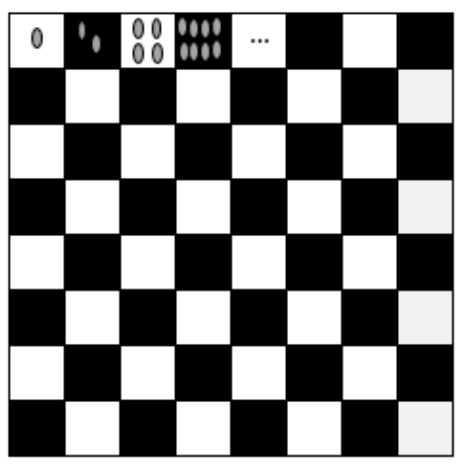

▲图3.9 棋盘示意图

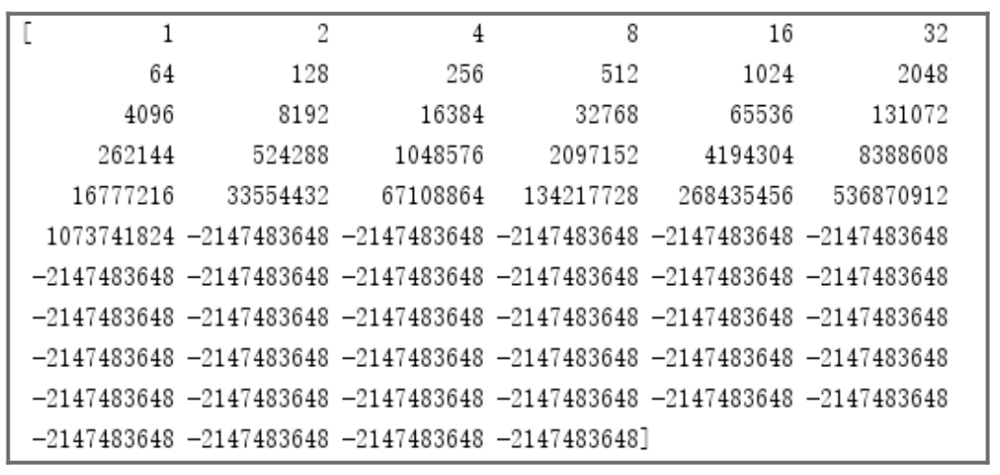

▲图3.10 每个格子里放的小麦数

例3.11的运行结果中出现了负数，而且都是一样的负数，这是因为程序中指定的数据类型是int，是32位的，数据范围在-2147483648～2147483647，而计算后的数据超出了该范围，产生了溢出现象。解决方式很简单，将数据类型设置为uint64（无符号整数，数据范围为0~18446744073709551615）即可。

n = np.logspace(0,63,64,base=2,dtype='uint64')

再次运行例3.11程序，输出结果如图3.11所示。

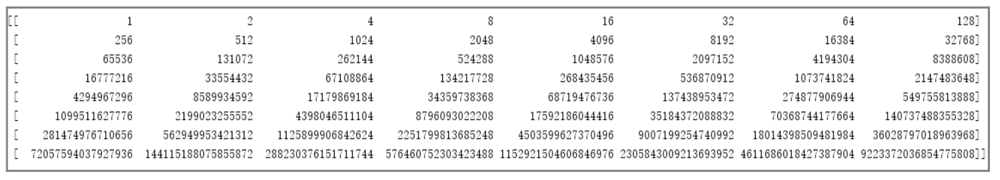

图3.11 每个格子里放的小麦数

以上就是每个格子里需要放的小麦数，可见发明国际象棋的大臣是多么的聪明。

### 3.2.4 生成随机数组

随机数组的生成主要使用NumPy的random模块，下面介绍几种常用的随机生成数组的函数。

**1. rand()函数**

rand()函数用于生成（0,1）之间的随机数组，传入一个值随机生成一维数组，传入一对值随机生成二维数组，语法如下：

numpy.random.rand(d0,d1,d2,d3....dn)

参数d0，d1，…，dn为整数，表示维度，可以为空。

**【例3.12】**随机生成0～1的数组**（实例位置：资源包\\TM\\sl\\03\\12）**

随机生成一维数组和二维数组，程序代码如下：

1  import numpy as np

2  n=np.random.rand(5)

3  print('随机生成0到1之间的一维数组：')

4  print(n)

5  n1=np.random.rand(2,5)

6  print('随机生成0到1之间的二维数组：')

7  print(n1)

运行程序，输出结果为：

随机生成0到1之间的一维数组：

\[0.61263942 0.91212086 0.52012924 0.98204632 0.31633564\]

随机生成0到1之间的二维数组：

\[\[0.82044812 0.26050245 0.57000398 0.6050845  0.50440925\]

 \[0.29113919 0.86638283 0.74161101 0.0728488  0.4466494 \]\]

**2. randn()函数**

randn()函数用于从正态分布中返回随机生成的数组，语法如下：

numpy.random.randn(d0,d1,d2,d3....dn)

参数d0，d1，…，dn为整数，表示维度，可以为空。

**【例3.13】**随机生成满足正态分布的数组**（实例位置：资源包\\TM\\sl\\03\\13）**

随机生成满足正态分布的数组，程序代码如下：

1  import numpy as np

2  n1=np.random.randn(5)

3  print('随机生成满足正态分布的一维数组：')

4  print(n1)

5  n2=np.random.randn(2,5)

6  print('随机生成满足正态分布的二维数组：')

7  print(n2)

运行程序，输出结果为：

随机生成满足正态分布的一维数组：

\[-0.05282077  0.79946288  0.96003714  0.29555332 -1.26818832\]

随机生成满足正态分布的二维数组：

\[\[ 1.6872899   1.62042986  2.69278922 -0.64467268 -1.75645902\]

 \[ 1.0973791  -0.22962313 -0.26965705  0.1225163  -1.89051741\]\]

**3. randint()函数**

randint()函数与NumPy中的arange()函数类似。randint()函数用于生成一定范围内的随机数组，左闭右开区间，语法如下：

numpy.random.randint(low,high=None,size=None)

参数说明： 

 low：低值（起始值），整数，且当参数high不为空时，参数low应小于参数high，否则程序会出现错误。 

 high：高值（终止值），整数。 

 size：数组维数，整数或者元组，整数表示一维数组，元组表示多维数组。默认值为空，如果为空，则仅返回一个整数。

**【例3.14】**生成一定范围内的随机数组**（实例位置：资源包\\TM\\sl\\03\\14）**

生成一定范围内的随机数组，程序代码如下：

1  import numpy as np

2   n1=np.random.randint(1,3,10)

3   print('随机生成10个1到3之间且不包括3的整数：')

4   print(n1)

5   n2=np.random.randint(5,10)

6   print('size数组大小为空随机返回一个整数：')

7   print(n2)

8   n3=np.random.randint(5,size=(2,5))

9   print('随机生成5以内二维数组')

10  print(n3)

运行程序，输出结果为：

随机生成10个1到3之间且不包括3的整数：

\[2 1 2 1 1 2 2 2 1 1\]

size数组大小为空随机返回一个整数：

随机生成5以内二维数组

\[\[2 2 2 4 2\]

 \[3 1 3 1 4\]\]

**4. normal()函数**

normal()函数用于生成正态分布的随机数，语法如下：

numpy.random.normal(loc,scale,size)

参数说明： 

 loc：正态分布的均值，对应正态分布的中心。loc=0说明是一个以*y*轴为对称轴的正态分布。 

 scale：正态分布的标准差，对应正态分布的宽度，scale值越大，正态分布的曲线越“矮胖”，scale值越小，曲线越“高瘦”。 

 size：表示数组维数。

**【例3.15】**生成正态分布的随机数组**（实例位置：资源包\\TM\\sl\\03\\15）**

生成正态分布的随机数组，程序代码如下：

1  import numpy as np

2  n = np.random.normal(0, 0.1, 10)

3  print(n)

运行程序，输出结果为：

\[ 0.08530096  0.0404147  -0.00358281  0.05405901 -0.01677737 -0.02448481

  0.13410224 -0.09780364  0.06095256 -0.0431846 \]

### 3.2.5 在已有的数组中创建数组

**1. asarray()函数**

asarray()函数用于创建数组，其与array()函数类似，语法如下：

numpy.asarray(a,dtype=None,order=None)

参数说明： 

 a：可以是列表、列表的元组、元组、元组的元组、元组的列表或多维数组。 

 dtype：数组的数据类型。 

 order：值为C和F，分别代表按行排列和按列排列，即数组元素在内存中的出现顺序。

**【例3.16】**使用asarray()函数创建数组**（实例位置：资源包\\TM\\sl\\03\\16）**

使用asarray()函数创建数组，程序代码如下：

1   import numpy as np                                     # 导入numpy模块

2   n1 = np.asarray(\[1,2,3\])                               # 通过列表创建数组

3   n2 = np.asarray(\[(1,1),(1,2)\])                   # 通过列表的元组创建数组

4   n3 = np.asarray((1,2,3))                           # 通过元组创建数组

5   n4 = np.asarray(((1,1),(1,2),(1,3)))         # 通过元组的元组创建数组

6   n5 = np.asarray((\[1,1\],\[1,2\]))                     # 通过元组的列表创建数组

7   print(n1)

8   print(n2)

9   print(n3)

10  print(n4)

11  print(n5)

运行程序，输出结果如下：

\[1 2 3\]

\[\[1 1\]

 \[1 2\]\]

\[1 2 3\]

\[\[1 1\]

 \[1 2\]

 \[1 3\]\]

\[\[1 1\]

 \[1 2\]\]

**2. frombuffer()函数**

NumPy模块中的ndarray数组对象不能像Python列表一样动态地改变其大小，在做数据采集时很不方便。下面介绍如何通过frombuffer()函数实现动态数组。frombuffer()函数接受buffer输入参数，以流的形式将读入的数据转换为数组。frombuffer()函数语法如下：

numpy.frombuffer(buffer,dtype=float,count=-1,offset=0)

参数说明： 

 buffer：实现了\_\_buffer\_\_的对象。 

 dtype：数组的数据类型。 

 count：读取的数据数量，默认值为-1，表示读取所有数据。 

 offset：读取的起始位置，默认值为0。

**【例3.17】**将字符串mingrisoft转换为数组**（实例位置：资源包\\TM\\sl\\03\\17）**

将字符串mingrisoft转换为数组，程序代码如下：

1  import numpy as np

2  n=np.frombuffer(b'mingrisoft',dtype='S1')

3  print(n)

当buffer参数值为字符串时，Python 3默认字符串是Unicode类型，所以要转换成Byte string类型，需要在原字符串前加上b。

**3. fromiter()函数**

fromiter()函数用于从可迭代对象中建立数组对象，语法如下：

numpy.fromiter(iterable,dtype,count=-1)

参数说明： 

 iterable：可迭代对象。 

 dtype：数组的数据类型。 

 count：读取的数据数量，默认值为-1，表示读取所有数据。

**【例3.18】**通过可迭代对象创建数组**（实例位置：资源包\\TM\\sl\\03\\18）**

通过可迭代对象创建数组，程序代码如下：

1  import numpy as np

2  iterable = (x \* 2 for x in range(5))  # 遍历0~5并乘以2，返回可迭代对象

3  n = np.fromiter(iterable, dtype='int')  # 通过可迭代对象创建数组

4  print(n)

运行程序，输出结果如下：

\[0 2 4 6 8\]

**4. empty\_like()函数**

empty_like()函数用于创建一个与给定数组具有相同维度和数据类型且未初始化的数组，语法如下：

numpy.empty_like(prototype,dtype=None,order='K',subok=True)

参数说明： 

 prototype：给定的数组。 

 dtype：覆盖结果的数据类型。 

 order：指定数组的内存布局，C为按行、F为按列、A为原顺序、K为数据元素在内存中出现的顺序。 

 subok：默认情况下，返回的数组被强制为基类数组。如果值为True，则返回子类。

**【例3.19】**创建未初始化的数组**（实例位置：资源包\\TM\\sl\\03\\19）**

下面使用empty_like()函数创建一个与给定数组具有相同维数、数据类型以及未初始化的数组，程序代码如下：

1  import numpy as np

2  n = np.empty_like(\[\[1, 2\], \[3, 4\]\])

3  print(n)

运行程序，输出结果如下：

\[\[ -431653634 -1179663557\]

 \[ 1944292251 -1787910175\]\]

**5. zeros\_like()函数**

**【例3.20】**创建以0填充的数组**（实例位置：资源包\\TM\\sl\\03\\20）**

zeros_like()函数用于创建一个与给定数组维度和数据类型相同，并以0填充的数组，程序代码如下：

1  import numpy as np

2  n = np.zeros_like(\[\[0.1,0.2,0.3\], \[0.4,0.5,0.6\]\])

3  print(n)

运行程序，输出结果如下：

\[\[0. 0. 0.\]

 \[0. 0. 0.\]\]

### 说明

zeros_like()函数的参数说明请参见empty_like()函数。

**6. ones\_like()函数**

**【例3.21】**创建以1填充的数组**（实例位置：资源包\\TM\\sl\\03\\21）**

ones_like()函数用于创建一个与给定数组维度和数据类型相同，并以1填充的数组，程序代码如下：

1  import numpy as np

2  n = np.ones_like(\[\[0.1,0.2,0.3\], \[0.4,0.5,0.6\]\])

3  print(n)

运行程序，输出结果如下：

\[\[1. 1. 1.\]

 \[1. 1. 1.\]\]

### 说明

ones_like()函数的参数说明请参见empty_like()函数。

**7. full\_like()函数**

full_like()函数用于创建一个与给定数组维度和数据类型相同，并以指定值填充的数组，语法如下：

numpy.full_like(a, fill_value, dtype=None, order='K', subok=True)

参数说明： 

 a：给定的数组。 

 fill_value：填充值。 

 dtype：数组的数据类型，默认值为None，指使用给定数组的数据类型。 

 order：指定数组的内存布局。C为按行、F为按列、A为原顺序、K为数组元素在内存中出现的顺序。 

 subok：默认情况下，返回的数组被强制为基类数组。如果值为True，则返回子类。

**【例3.22】**创建以指定值0.2填充的数组**（实例位置：资源包\\TM\\sl\\03\\22）**

创建一个与给定数组维度和数据类型相同，且以指定值0.2填充的数组，程序代码如下：

1  import numpy as np

2  a = np.arange(6)          # 创建一个数组

3  print(a)

4  n1 = np.full_like(a, 1)   # 创建一个与数组a维度和数据类型相同的数组，以1填充

5  n2 = np.full_like(a,0.2)  # 创建一个与数组a维度和数据类型相同的数组，以0.2填充

6  # 创建一个与数组a维度和数据类型相同的数组，以0.2填充，浮点型

7  n3 = np.full_like(a, 0.2, dtype='float')

8   print(n1)

9   print(n2)

10  print(n3)

运行程序，输出结果如下：

\[0 1 2 3 4 5\]

\[1 1 1 1 1 1\]

\[0 0 0 0 0 0\]

\[0.2 0.2 0.2 0.2 0.2 0.2\]

## 3.3 数组的基本操作

### 3.3.1 数组的多种运算方式

不用编写循环，即可对数据执行批量运算，这就是NumPy模块数组运算的特点。NumPy称之为矢量化，可以实现大小相等数组之间的任何算术运算。本节主要介绍简单的数组运算，如加、减、乘、除、求幂等。

下面创建两个简单的NumPy数组n1和n2，数组n1包括元素1、2，数组n2包括元素3、4，如图3.12所示，接下来实现这两个数组的运算。

**1. 加法运算**

加法运算是数组中对应位置的元素相加（即每行对应相加），如图3.13所示。

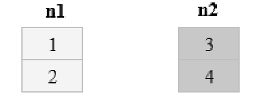

▲图3.12 数组示意图

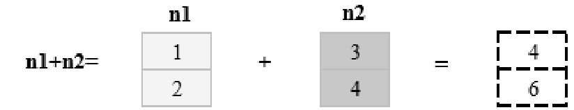

▲图3.13 数组加法运算示意图

**【例3.23】**数组加法运算**（实例位置：资源包\\TM\\sl\\03\\23）**

在程序中直接将两个数组相加即可，即n1+n2，程序代码如下：

1  import numpy as np

2  n1=np.array(\[1,2\])  # 创建一维数组

3  n2=np.array(\[3,4\])

4  print(n1+n2)        # 加法运算

运行程序，输出结果如下：

\[4 6\]

**2. 减法和乘除法运算**

除了加法运算，还可以实现数组的减法、乘法和除法运算，如图3.14所示。

**【例3.24】**数组的减法和乘除法运算**（实例位置：资源包\\TM\\sl\\03\\24）**

同样，在程序中直接将两个数组相减、相乘或相除即可，程序代码如下：

1  import numpy as np

2  n1=np.array(\[1,2\])  # 创建一维数组

3  n2=np.array(\[3,4\])

4  print(n1-n2)        # 减法运算

5  print(n1\*n2)        # 乘法运算

6  print(n1/n2)        # 除法运算

运行程序，输出结果如下：

\[-2 -2\]

\[3 8\]

\[0.33333333 0.5  \]

**3. 幂运算**

幂是数组中对应位置元素的幂运算，用两个“\*”表示，如图3.15所示。

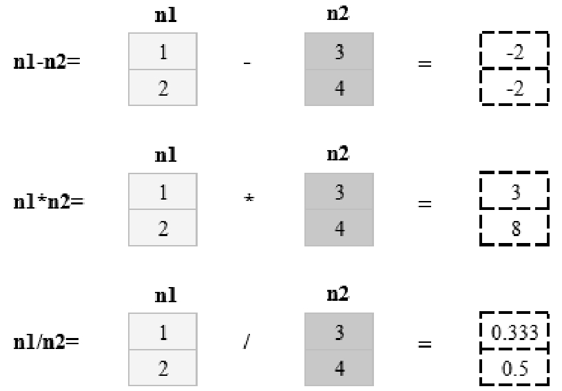

▲图3.14 数组减法和乘除法运算示意图

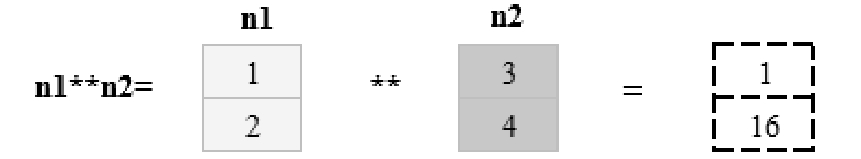

▲图3.15 数组幂运算示意图

**【例3.25】**数组的幂运算**（实例位置：资源包\\TM\\sl\\03\\25）**

从图3.15中得知：数组n1的元素1和数组n2的元素3，通过幂运算得到的是1的3次幂；数组n1的元素2和数组n2的元素4，通过幂运算得到的是2的4次幂，程序代码如下：

1  import numpy as np

2  n1=np.array(\[1,2\])  # 创建一维数组

3  n2=np.array(\[3,4\])

4  print(n1\*\*n2)       # 幂运算

运行程序，输出结果如下：

\[ 1 16\]

**4. 比较运算**

**【例3.26】**数组的比较运算**（实例位置：资源包\\TM\\sl\\03\\26）**

数组的比较运算是数组中对应位置元素的比较运算，比较后的结果是布尔值数组，程序代码如下：

1  import numpy as np

2  n1=np.array(\[1,2\])  # 创建一维数组

3  n2=np.array(\[3,4\])

4  print(n1\>=n2)       # 大于等于

5  print(n1==n2)       # 等于

6  print(n1\<=n2)       # 小于等于

7  print(n1!=n2)       # 不等于

运行程序，输出结果如下：

\[False False\]

\[False False\]

\[ True  True\]

\[ True  True\]

**5. 数组的标量运算**

首先了解两个概念，即标量和向量。标量其实就是一个单独的数；而向量是一组数，这组数是顺序排列的，这里我们理解为数组。那么，数组的标量运算也可以理解为是向量与标量之间的运算。

例如，马拉松赛前训练，一周里每天的训练量以“米”（m）为单位，下面将其转换为以“千米”为单位，如图3.16所示。

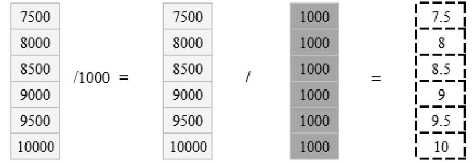

图3.16 数组的标量运算示意图

**【例3.27】**数组的标量运算**（实例位置：资源包\\TM\\sl\\03\\27）**

在程序中，米转换为千米直接输入n1/1000即可，程序代码如下：

1  import numpy as np

2  n1 = np.linspace(7500,10000,6,dtype='int') # 创建等差数列数组

3  print(n1)                                    # 输出数组

4  print(n1/1000)                             # 米转换为千米

运行程序，输出结果如下：

\[ 7500  8000  8500  9000  9500 10000\]

\[ 7.5  8.   8.5  9.   9.5 10. \]

上述运算过程，在NumPy中叫作“广播机制”，它是一个非常有用的功能。

### 3.3.2 数组的索引和切片

NumPy数组元素是通过数组的索引和切片来访问和修改的，因此索引和切片是NumPy中最重要最常用的操作。

**1. 索引**

所谓数组的索引，即用于标记数组当中对应元素的唯一数字，从0开始，即数组中的第一个元素的索引是0，以此类推。NumPy数组可以使用标准Python语法x\[obj\]语法对数组进行索引，其中*x*是数组，obj是索引。

**【例3.28】**获取一维数组中的元素**（实例位置：资源包\\TM\\sl\\03\\28）**

获取一维数组n1中索引为0的元素，程序代码如下：

1  import numpy as np

2  n1=np.array(\[1,2,3\])  # 创建一维数组

3  print(n1\[0\])          # 输出一维数组的第一个元素

运行程序，输出结果如下：

**【例3.29】**获取二维数组中的元素**（实例位置：资源包\\TM\\sl\\03\\29）**

通过索引获取二维数组中的元素，程序代码如下：

1  import numpy as np

2  n1=np.array(\[\[1,2,3\],\[4,5,6\]\])  # 创建二维数组

3  print(n1\[1\]\[2\])                 # 输出二维数组中第2行第3列的元素

运行程序，输出结果如下：

**2. 切片式索引**

数组的切片可以理解为对数组的分割，按照等分或者不等分，将一个数组切割为多个片段，它与Python中列表的切片操作一样。NumPy中的切片用冒号分隔切片参数来进行切片操作，语法如下：

\[start:stop:step\]

参数说明： 

 start：起始索引。 

 stop：终止索引。 

 step：步长。

**【例3.30】**实现简单的数组切片操作**（实例位置：资源包\\TM\\sl\\03\\30）**

实现简单的切片操作，对数组n1进行切片式索引操作，如图3.17所示。程序代码如下：

1  import numpy as np

2  n1=np.array(\[1,2,3\])  # 创建一维数组

3  print(n1\[0\])          # 输出第1个元素

4  print(n1\[1\])          # 输出第2个元素

5  print(n1\[0:2\])        # 输出第1个元素至第3个元素(不包括第3个元素)

6  print(n1\[1:\])         # 输出从第2个元素开始以后的元素

7  print(n1\[:2\])         # 输出第1个元素(0省略)至第3个元素(不包括第3个元素)

运行程序，输出结果如下：

\[1 2\]

\[2 3\]

\[1 2\]

切片式索引操作需要注意以下几点：

（1）索引是左闭右开区间，如上述代码中的n1\[0:2\]，只能取到索引从0到1的元素，而取不到索引为2的元素。

（2）当没有start参数时，代表从索引0开始取数，如上述代码中的n1\[:2\]。

（3）start、stop和step 3个参数都可以是负数，代表反向索引。以step参数为例，如图3.18所示。

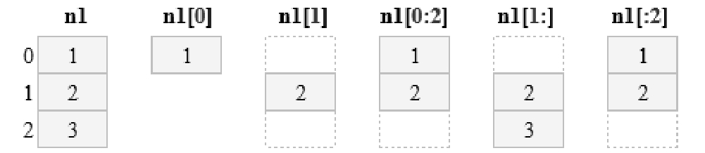

▲图3.17 切片式索引示意图

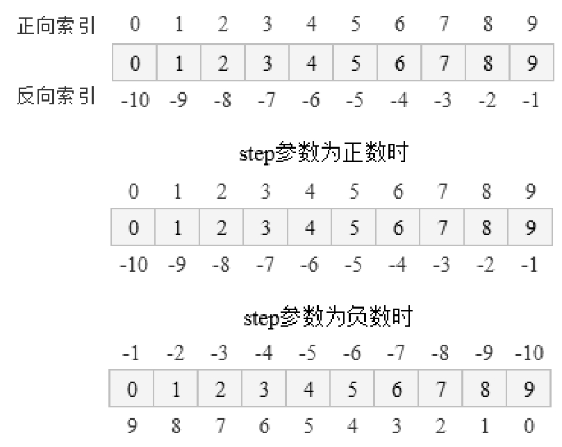

▲图3.18 反向索引示意图

**【例3.31】**常用的切片式索引操作**（实例位置：资源包\\TM\\sl\\03\\31）**

常用的切片式索引操作，程序代码如下：

1   import numpy as np

2   n = np.arange(10)         # 使用arange函数创建一维数组

3   print(n)                  # 输出一维数组

4   print(n\[:3\])              # 输出第1个元素(0省略)至第4个元素(不包括第4个元素)

5   print(n\[3:6\])             # 输出第4个元素至第7个元素(不包括第7个元素)

6   print(n\[6:\])              # 输出第7个元素至最后一个元素

7   print(n\[::\])              # 输出所有元素

8   print(n\[:\])               # 输出第1个元素至最后一个元素

9   print(n\[::2\])             # 输出步长是2的元素

10  print(n\[1::5\])            # 输出第2个元素至最后一个元素且步长是5的元素

11  print(n\[2::6\])            # 输出第3个元素至最后一个元素且步长是6的元素

12  #start、stop、step为负数时

13  print(n\[::-1\])            # 输出所有元素且步长是-1的元素

14  print(n\[:-3:-1\])          # 输出倒数第3个元素至倒数第1个元素(不包括倒数第3个元素)

15  print(n\[-3:-5:-1\])        # 输出倒数第3个元素至倒数第5个元素且步长是-1的元素

16  print(n\[-5::-1\])          # 输出倒数第5个元素至最后一个元素且步长是-1的元素

运行程序，输出结果如下：

\[0 1 2 3 4 5 6 7 8 9\]

\[0 1 2\]

\[3 4 5\]

\[6 7 8 9\]

\[0 1 2 3 4 5 6 7 8 9\]

\[0 1 2 3 4 5 6 7 8 9\]

\[0 2 4 6 8\]

\[1 6\]

\[2 8\]

\[9 8 7 6 5 4 3 2 1 0\]

\[9 8\]

\[7 6\]

\[5 4 3 2 1 0\]

**3. 二维数组索引**

二维数组索引可以使用array\[n,m\]的方式，以逗号分隔，表示第*n*个数组的第*m*个元素。

**【例3.32】**二维数组的简单索引操作**（实例位置：资源包\\TM\\sl\\03\\32）**

创建一个3行4列的二维数组，实现简单的索引操作，效果如图3.19所示。

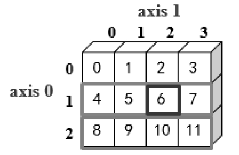

图3.19 二维数组索引示意图

程序代码如下：

1  import numpy as np

2  n=np.array(\[\[0,1,2,3\],\[4,5,6,7\],\[8,9,10,11\]\])  # 创建3行4列的二维数组

3  print(n\[1\])                                    # 输出第2行的元素

4  print(n\[1,2\])                                  # 输出第2行第3列的元素

5  print(n\[-1\])                                   # 输出倒数第1行的元素

运行程序，输出结果如下：

\[4 5 6 7\]

\[ 8  9 10 11\]

上述代码中，n\[1\]表示第2个数组，n\[1,2\]表示第2个数组第3个元素，它等同于n\[1\]\[2\]，表示数组*n*中第2行第3列的值，实际上n\[1\]\[2\]是先索引第一个维度得到一个数组，然后在此基础上再索引。

**4. 二维数组切片式索引**

**【例3.33】**二维数组的切片操作**（实例位置：资源包\\TM\\sl\\03\\33）**

创建一个二维数组，实现各种切片式索引操作，效果如图3.20所示。

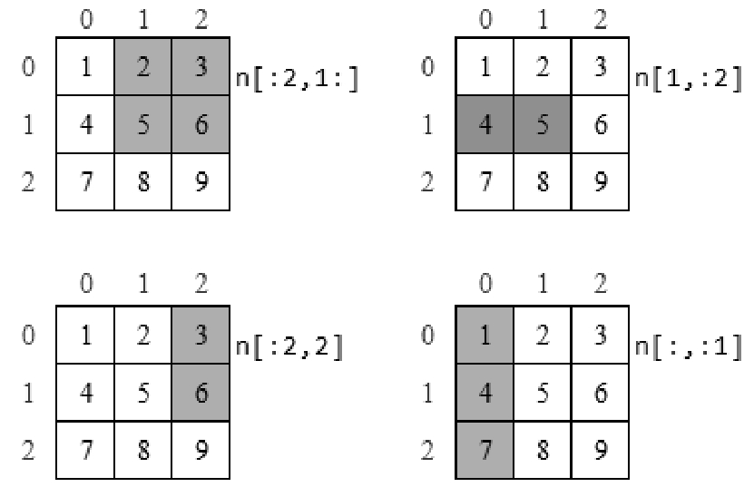

图3.20 二维数组切片式索引示意图

程序代码如下：

1  import numpy as np

2  n=np.array(\[\[1,2,3\],\[4,5,6\],\[7,8,9\]\]) # 创建3行3列的二维数组

3  print(n\[:2,1:\])                       # 输出第1行至第3行(不包括第3行)的第2列至最后一列的元素

4  print(n\[1,:2\])                        # 输出第2行的第1列至第3列(不包括第3列)的元素

5  print(n\[:2,2\])                        # 输出第1行至第3行(不包括第3行)的第3列的元素

6  print(n\[:,:1\])                        # 输出所有行的第1列至第2列(不包括第2列)的元素

运行程序，输出结果如下：

\[\[2 3\]

 \[5 6\]\]

\[4 5\]

\[3 6\]

\[\[1\]

 \[4\]

 \[7\]\]

### 3.3.3 数组的重塑

数组重塑实际是更改数组的形状，例如，将原来2行3列的数组重塑为3行4列的数组。在NumPy中主要使用reshape()函数来改变数组的形状。

**1. 一维数组重塑**

一维数组重塑就是将数组重塑为多行多列的数组。

**【例3.34】**将一维数组重塑为二维数组**（实例位置：资源包\\TM\\sl\\03\\34）**

创建一个一维数组，通过reshape()函数将其改为2行3列的二维数组，程序代码如下：

1  import numpy as np

2  n=np.arange(6)      # 创建一维数组

3  print(n)

4  n1=n.reshape(2,3)   # 将数组重塑为2行3列的二维数组

5  print(n1)

运行程序，输出结果如下：

\[0 1 2 3 4 5\]

\[\[0 1 2\]

 \[3 4 5\]\]

需要注意的是，数组重塑是基于数组元素不发生改变的情况，重塑后的数组所包含的元素个数必须与原数组元素个数相同，如果数组元素发生改变，程序就会报错。

**【例3.35】**将一行古诗转换为4行5列的二维数组**（实例位置：资源包\\TM\\sl\\03\\35）**

将一行20列的数据转换为4行5列的二维数组，效果如图3.21所示。

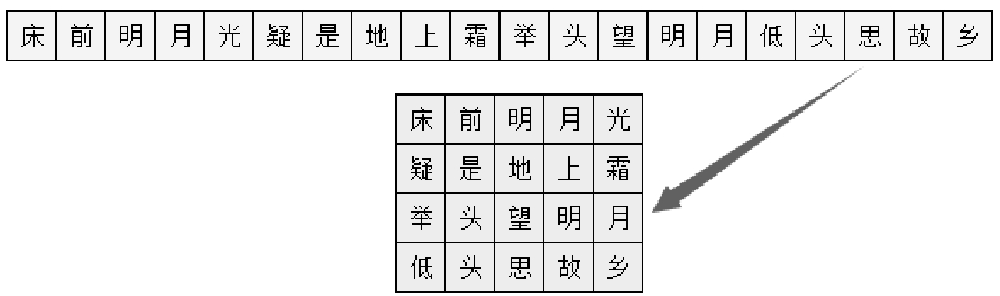

图3.21 数组重塑示意图

程序代码如下：

1  import numpy as np

2  n=np.array(\['床','前','明','月','光','疑','是','地','上','霜','举','头','望','明','月','低','头','思','故','乡'\])

3  n1=n.reshape(4,5)               # 将数组重塑为4行5列的二维数组

4  print(n1)

运行程序，输出结果如下：

\[\['床' '前' '明' '月' '光'\]

 \['疑' '是' '地' '上' '霜'\]

 \['举' '头' '望' '明' '月'\]

 \['低' '头' '思' '故' '乡'\]\]

**2. 多维数组重塑**

多维数组重塑同样使用reshape()函数。

**【例3.36】**将2行3列的数组重塑为3行2列的数组**（实例位置：资源包\\TM\\sl\\03\\36）**

将2行3列的二维数组重塑为3行2列的二维数组，程序代码如下：

1  import numpy as np

2  n=np.array(\[\[0,1,2\],\[3,4,5\]\])  # 创建二维数组

3  print(n)

4  n1=n.reshape(3,2)              # 将数组重塑为3行2列的二维数组

5  print(n1)

运行程序，输出结果如下：

\[\[0 1 2\]

\[3 4 5\]\]

\[0 1\]

\[2 3\]

\[\[4 5\]\]

**3. 数组转置**

数组转置是指数组的行列转换，可以通过数组的T属性和transpose()函数来实现。

**【例3.37】**将二维数组中的行列转置**（实例位置：资源包\\TM\\sl\\03\\37）**

通过T属性将4行6列的二维数组中的行变成列，列变成行，程序代码如下：

1  import numpy as np

2  n = np.arange(24).reshape(4,6)  # 创建4行6列的二维数组

3  print(n)

4  print(n.T)                      # 通过T属性使行列转置

运行程序，输出结果如下：

\[\[ 0  1  2  3  4  5\]

 \[ 6  7  8  9 10 11\]

 \[12 13 14 15 16 17\]

 \[18 19 20 21 22 23\]\]

\[\[ 0  6 12 18\]

 \[ 1  7 13 19\]

 \[ 2  8 14 20\]

 \[ 3  9 15 21\]

 \[ 4 10 16 22\]

 \[ 5 11 17 23\]\]

**【例3.38】**转换客户销售数据**（实例位置：资源包\\TM\\sl\\03\\38）**

上述举例可能不太直观，下面再举一个例子，转换客户销售数据，对比效果如图3.22所示。

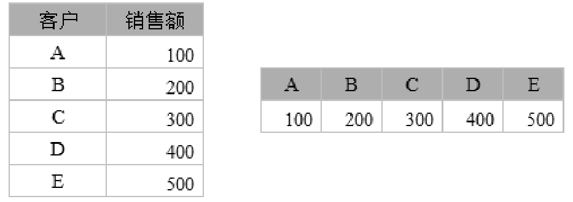

图3.22 客户销售数据转换对比示意图

程序代码如下：

1  import numpy as np

2  n = np.array(\[\['A',100\],\['B',200\],\['C',300\],\['D',400\],\['E',500\]\])

3  print(n)

4  print(n.T)                           # 通过T属性使行列转置

运行程序，输出结果如下：

\[\['A' '100'\]

 \['B' '200'\]

 \['C' '300'\]

 \['D' '400'\]

 \['E' '500'\]\]

\[\['A' 'B' 'C' 'D' 'E'\]

 \['100' '200' '300' '400' '500'\]\]

transpose()函数也可以实现数组转置。例如，上述举例用transpose()函数实现，关键代码如下：

n = np.array(\[\['A',100\],\['B',200\],\['C',300\],\['D',400\],\['E',500\]\])

print(n.transpose())                      # 通过transpose()函数使行列转置

运行程序，输出结果如下：

\[\['A' 'B' 'C' 'D' 'E'\]

 \['100' '200' '300' '400' '500'\]\]

### 3.3.4 数组的增、删、改、查

数组增、删、改、查的方法有很多种，下面介绍几种常用的方法。

**1. 数组的增加**

数组数据的增加可以按照水平方向增加数据，也可以按照垂直方向增加数据。水平方向增加数据主要使用hstack()函数，垂直方向增加数据主要使用vstack()函数。

**【例3.39】**为数组增加数据**（实例位置：资源包\\TM\\sl\\03\\39）**

创建两个二维数组，实现数组数据的增加，程序代码如下：

1  import numpy as np

2  # 创建二维数组

3  n1=np.array(\[\[1,2\],\[3,4\],\[5,6\]\])

4  n2=np.array(\[\[10,20\],\[30,40\],\[50,60\]\])

5  print(np.hstack((n1,n2)))  # 水平方向增加数据

6  print(np.vstack((n1,n2)))  # 垂直方向增加数据

运行程序，输出结果如下：

\[\[ 1  2 10 20\]

 \[ 3  4 30 40\]

 \[ 5  6 50 60\]\]

\[\[ 1  2\]

 \[ 3  4\]

 \[ 5  6\]

 \[10 20\]

 \[30 40\]

 \[50 60\]\]

**2. 数组的删除**

数组的删除主要使用delete()函数。

**【例3.40】**删除指定的数组**（实例位置：资源包\\TM\\sl\\03\\40）**

删除指定的数组，程序代码如下：

1  import numpy as np

2  n1=np.array(\[\[1,2\],\[3,4\],\[5,6\]\])  # 创建二维数组

3  print(n1)

4  n2=np.delete(n1,2,axis=0)       # 删除第3行

5  n3=np.delete(n1,0,axis=1)       # 删除第1列

6  n4=np.delete(n1,(1,2),0)        # 删除第2行和第3行

7  print('删除第3行后的数组：','\n',n2)

8  print('删除第1列后的数组：','\n',n3)

9  print('删除第2行和第3行后的数组：','\n',n4)

运行程序，输出结果如下：

\[\[1 2\]

 \[3 4\]

 \[5 6\]\]

删除第3行后的数组：

 \[\[1 2\]

 \[3 4\]\]

删除第1列后的数组：

 \[\[2\]

 \[4\]

 \[6\]\]

删除第2行和第3行后的数组：

 \[\[1 2\]\]

对于不想要的数组或数组元素，还可以通过索引和切片的方法只选取需要的数组或数组元素。

**3. 数组的修改**

需要修改数组或数组元素时，直接为数组或数组元素赋值即可。

**【例3.41】**修改指定的数组**（实例位置：资源包\\TM\\sl\\03\\41）**

修改指定的数组，程序代码如下：

1  import numpy as np

2  n1=np.array(\[\[1,2\],\[3,4\],\[5,6\]\])  # 创建二维数组

3  print(n1)

4  n1\[1\]=\[30,40\]                   # 修改第2行数组\[3,4\]为\[30,40\]

5  n1\[2\]\[1\]=88                     # 修改第3行第2个元素6为88

6  print('修改后的数组：','\n',n1)

运行程序，输出结果如下：

\[\[1 2\]

 \[3 4\]

 \[5 6\]\]

修改后的数组：

 \[\[ 1  2\]

 \[30 40\]

 \[ 5 88\]\]

**4. 数组的查询**

数组的查询同样可以使用索引和切片方法来获取指定范围的数组或数组元素，还可以通过where()函数查询符合条件的数组或数组元素。where()函数语法如下：

numpy.where(condition,x,y)

上述语法中，第一个参数为一个布尔数组，第二个参数和第三个参数可以是标量也可以是数组。满足条件（参数condition），输出参数*x*，不满足条件输出参数*y*。

**【例3.42】**按指定条件查询数组**（实例位置：资源包\\TM\\sl\\03\\42）**

数组查询，大于5输出2，不大于5输出0，程序代码如下：

1  import numpy as np

2  n1 = np.arange(10)         # 创建一个一维数组

3  print(n1)

4  print(np.where(n1\>5,2,0))  # 大于5输出2,不大于5输出0

运行程序，输出结果如下：

\[0 1 2 3 4 5 6 7 8 9\]

\[0 0 0 0 0 0 2 2 2 2\]

如果不指定参数*x*和*y*，则输出满足条件的数组元素的坐标。例如，上述举例不指定参数*x*和*y*，关键代码如下：

n2=n1\[np.where(n1\>5)\]

print(n2)

运行程序，输出结果如下：

\[6 7 8 9\]

## 3.4 矩阵的基本操作

在数学中经常会看到矩阵，而在程序中常用的是数组，可以简单地理解为矩阵是数学的概念，而数组是计算机程序设计领域的概念。在NumPy中，矩阵是数组的分支，数组和矩阵有些时候是通用的，二维数组也称矩阵。下面简单介绍矩阵的基本操作。

### 3.4.1 创建矩阵

NumPy模块中存在两种不同的数据类型（矩阵matrix和数组array），它们都可以用于处理行列表示的数组元素，虽然它们看起来很相似，但是在这两种数据类型上执行相同的数学运算，可能会得到不同的结果。

在NumPy中，矩阵应用十分广泛。例如，每个图像可以被看作像素值矩阵。假设一个像素值仅为0和1，那么5×5大小的图像就是一个5×5的矩阵，如图3.23所示，而3×3大小的图像就是一个3×3的矩阵，如图3.24所示。

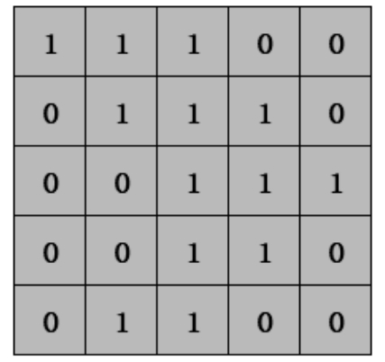

▲图3.23 5×5矩阵示意图

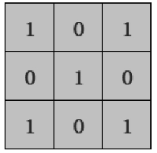

▲图3.24 3×3矩阵示意图

关于矩阵就简单了解到这里，下面介绍如何在NumPy中创建矩阵。

**【例3.43】**创建简单矩阵**（实例位置：资源包\\TM\\sl\\03\\43）**

使用mat()函数创建矩阵，程序代码如下：

1   import numpy as np

2   a = np.mat('5 6;7 8')

3   b = np.mat(\[\[1, 2\], \[3, 4\]\])

4   print(a)

5   print(b)

6   print(type(a))

7   print(type(b))

8   n1 = np.array(\[\[1, 2\], \[3, 4\]\])

9   print(n1)

10  print(type(n1))

运行程序，输出结果如下：

\[\[5 6\]

 \[7 8\]\]

\[\[1 2\]

 \[3 4\]\]

\<class 'numpy.matrix'\>

\<class 'numpy.matrix'\>

\[\[1 2\]

 \[3 4\]\]

\<class 'numpy.ndarray'\>

从运行结果得知：mat()函数创建的是矩阵类型，array()函数创建的是数组类型，而只有用mat()函数创建的矩阵才能进行一些线性代数的操作。

**【例3.44】**使用mat()函数创建常见的矩阵**（实例位置：资源包\\TM\\sl\\03\\44）**

（1）创建一个3×3的0（零）矩阵，程序代码如下：

1  import numpy as np

2  data1 = np.mat(np.zeros((3,3)))  # 创建一个3×3的零矩阵

3  print(data1)

运行程序，输出结果如下：

\[\[0. 0. 0.\]

 \[0. 0. 0.\]

 \[0. 0. 0.\]\]

（2）创建一个2×4的1矩阵，程序代码如下：

1  import numpy as np

2  data1 = np.mat(np.ones((2,4)))  # 创建一个2×4的1矩阵

3  print(data1)

运行程序，输出结果如下：

\[\[1. 1. 1. 1.\]

\[1. 1. 1. 1.\]\]

（3）使用random模块的rand()函数创建一个0～1随机产生的3×3二维数组，并将其转换为矩阵，程序代码如下：

1  import numpy as np

2  data1 = np.mat(np.random.rand(3,3))

3  print(data1)

运行程序，输出结果如下：

\[\[0.23593472 0.32558883 0.42637078\]

 \[0.36254276 0.6292572  0.94969203\]

 \[0.80931869 0.3393059  0.18993806\]\]

（4）创建一个1～8的随机整数矩阵，程序代码如下：

1  import numpy as np

2  data1 = np.mat(np.random.randint(1,8,size=(3,5)))

3  print(data1)

运行程序，输出结果如下：

\[\[4 5 3 5 3\]

 \[1 3 2 7 7\]

 \[2 7 5 4 5\]\]

（5）创建对角矩阵，程序代码如下：

1  import numpy as np

2  data1 = np.mat(np.eye(2,2,dtype=int))  # 2×2对角矩阵

3  print(data1)

4  data1 = np.mat(np.eye(4,4,dtype=int))  # 4×4对角矩阵

5  print(data1)

运行程序，输出结果如下：

\[\[1 0\]

 \[0 1\]\]

\[\[1 0 0 0\]

 \[0 1 0 0\]

 \[0 0 1 0\]

 \[0 0 0 1\]\]

（6）创建对角线矩阵，程序代码如下：

1  import numpy as np

2  a = \[1,2,3\]

3  data1 = np.mat(np.diag(a))  # 对角线1、2、3矩阵

4  print(data1)

5  b = \[4,5,6\]

6  data1 = np.mat(np.diag(b))  # 对角线4、5、6矩阵

7  print(data1)

运行程序，输出结果如下：

\[\[1 0 0\]

 \[0 2 0\]

 \[0 0 3\]\]

\[\[4 0 0\]

 \[0 5 0\]

 \[0 0 6\]\]

### 说明

mat()函数只适用于二维矩阵，维数超过2以后，mat()函数就不适用了，从这一点来看array()函数更具通用性。

### 3.4.2 矩阵的运算

矩阵运算是指可以使用算术运算符“+”“－”“\*”“/”对矩阵进行加、减、乘、除的运算。

**【例3.45】**矩阵加法运算**（实例位置：资源包\\TM\\sl\\03\\45）**

创建两个矩阵data1和data2，实现矩阵的加法运算，效果如图3.25所示。

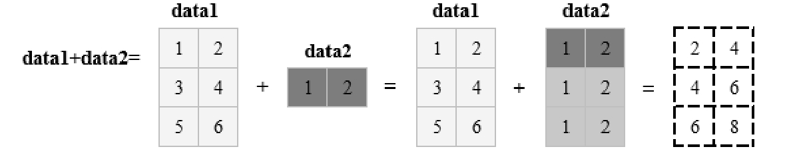

图3.25 矩阵运算示意图

程序代码如下：

1  import numpy as np

2  data1= np.mat(\[\[1, 2\], \[3, 4\],\[5,6\]\])   # 创建矩阵

3  data2=np.mat(\[1,2\])

4  print(data1+data2)                      # 矩阵加法运算

运行程序，输出结果如下：

\[\[2 4\]

 \[4 6\]

 \[6 8\]\]

**【例3.46】**矩阵减法、乘法和除法运算**（实例位置：资源包\\TM\\sl\\03\\46）**

除了加法运算，还可以实现矩阵的减法、乘法和除法运算。接下来实现上述矩阵的减法和除法运算，程序代码如下：

1  import numpy as np

2  data1= np.mat(\[\[1, 2\], \[3, 4\],\[5,6\]\])   # 创建矩阵

3  data2=np.mat(\[1,2\])

4  print(data1-data2)                      # 矩阵减法运算

5  print(data1/data2)                      # 矩阵除法运算

运行程序，输出结果如下：

\[\[0 0\]

 \[2 2\]

 \[4 4\]\]

\[\[1. 1.\]

 \[3. 2.\]

 \[5. 3.\]\]

当我们对上述矩阵进行乘法运算时，程序出现了错误，原因是矩阵的乘法运算要求左边矩阵的列数和右边矩阵的行数要一致。由于上述矩阵data2是一行，所以导致程序出错。

**【例3.47】**修改矩阵并进行乘法运算**（实例位置：资源包\\TM\\sl\\03\\47）**

将矩阵data2改为2×2矩阵，再进行矩阵的乘法运算，程序代码如下：

1  import numpy as np

2  # 创建矩阵

3  data1= np.mat(\[\[1, 2\], \[3, 4\],\[5,6\]\])

4  data2=np.mat(\[\[1,2\],\[3,4\]\])

5  print(data1\*data2)              # 矩阵乘法运算

运行程序，输出结果如下：

\[\[ 7 10\]

 \[15 22\]

 \[23 34\]\]

上述举例，是两个矩阵直接相乘，称之为矩阵相乘。矩阵相乘是第一个矩阵中与该元素行号相同的元素与第二个矩阵中与该元素列号相同的元素，两两相乘后再求和，运算过程如图3.26所示。例如，1×1+2×3=7，是第一个矩阵第1行元素与第二个矩阵第1列元素，两两相乘求和得到的。

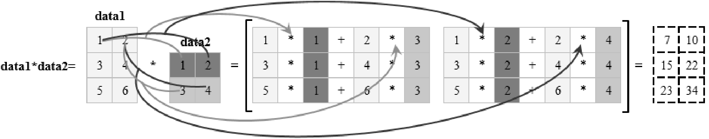

图3.26 矩阵相乘运算过程示意图

数组运算和矩阵运算的一个关键区别是矩阵相乘使用的是点乘。点乘，也称点积，是数组中元素对应位置一一相乘之后求和的操作，在NumPy中专门提供了点乘函数，即dot()函数，该函数返回的是两个数组的点积。

**【例3.48】**数组相乘与数组点乘比较**（实例位置：资源包\\TM\\sl\\03\\48）**

数组相乘与数组点乘运算，程序代码如下：

1  import numpy as np

2  # 创建数组

3  n1 = np.array(\[1, 2, 3\])

4  n2= np.array(\[\[1, 2, 3\], \[1, 2, 3\], \[1, 2, 3\]\])

5  print('数组相乘结果为：','\n',n1\*n2)            # 数组相乘

6  print('数组点乘结果为：','\n',np.dot(n1, n2)) # 数组点乘

运行程序，输出结果如下：

数组相乘结果为：

 \[\[1 4 9\]

 \[1 4 9\]

 \[1 4 9\]\]

数组点乘结果为：

 \[ 6 12 18\]

**【例3.49】**矩阵元素之间的相乘运算**（实例位置：资源包\\TM\\sl\\03\\49）**

实现矩阵对应元素之间的相乘可以使用multiply()函数，程序代码如下：

1  import numpy as np

2  n1 = np.mat('1 3 3;4 5 6;7 12 9')    # 创建矩阵，使用分号隔开数据

3  n2 = np.mat('2 6 6;8 10 12;14 24 18')

4  print('矩阵相乘结果为：\n',n1\*n2)      # 矩阵相乘

5  print('矩阵对应元素相乘结果为：\n',np.multiply(n1,n2))

运行程序，输出结果如下：

矩阵相乘结果为：

 \[\[ 68 108  96\]

 \[132 218 192\]

 \[236 378 348\]\]

矩阵对应元素相乘结果为：

 \[\[  2  18  18\]

 \[ 32  50  72\]

 \[ 98 288 162\]\]

### 3.4.3 矩阵的转换

**1. 矩阵转置**

**【例3.50】**使用T属性实现矩阵转置**（实例位置：资源包\\TM\\sl\\03\\50）**

矩阵转置与数组转置一样使用T属性实现，程序代码如下：

1  import numpy as np

2  n1 = np.mat('1 3 3;4 5 6;7 12 9')  # 创建矩阵，使用分号隔开数据

3  print('矩阵转置结果为：\n',n1.T)     # 矩阵转置

运行程序，输出结果如下：

矩阵转置结果为：

 \[\[ 1  4  7\]

 \[ 3  5 12\]

 \[ 3  6  9\]\]

**2. 矩阵求逆**

**【例3.51】**实现矩阵逆运算**（实例位置：资源包\\TM\\sl\\03\\51）**

矩阵要可逆，否则意味着该矩阵为奇异矩阵（即矩阵的行列式的值为0）。矩阵求逆主要使用I属性实现，程序代码如下：

1  import numpy as np

2  n1 = np.mat('1 3 3;4 5 6;7 12 9')    # 创建矩阵，使用分号隔开数据

3  print('矩阵的逆矩阵结果为：\n',n1.I)   # 逆矩阵

运行程序，输出结果如下：

矩阵的逆矩阵结果为：

 \[\[-0.9         0.3     0.1       \]

 \[ 0.2        -0.4     0.2       \]

 \[ 0.43333333  0.3    -0.23333333\]\]

## 3.5 NumPy常用的数学运算函数

NumPy包含大量的数学运算函数，包括三角函数、算术运算函数、复数处理函数等，如表3.4所示。

表3.4 数学运算函数

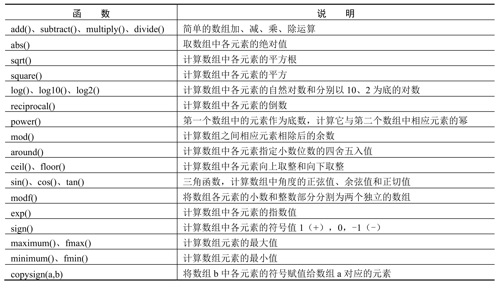

下面介绍几个常用的数学运算函数。

### 3.5.1 算术函数

**1. 加、减、乘、除函数add()、subtract()、multiply()、divide()**

NumPy算术函数包含简单的加、减、乘、除函数，如add()、subtract()、multiply()和divide()。这里要注意的是，数组必须具有相同的形状或符合数组广播规则。

**【例3.52】**数组加减乘除运算**（实例位置：资源包\\TM\\sl\\03\\52）**

创建数组，并进行加减乘除运算，程序代码如下：

1   import numpy as np

2   # 创建数组

3   n1 = np.array(\[\[1,2,3\],\[4,5,6\],\[7,8,9\]\])

4   n2 = np.array(\[10, 10, 10\])

5   print('两个数组相加：')

6   print(np.add(n1, n2))

7   print('两个数组相减：')

8   print(np.subtract(n1, n2))

9   print('两个数组相乘：')

10  print(np.multiply(n1, n2))

11  print('两个数组相除：')

12  print(np.divide(n1, n2))

运行程序，输出结果如下：

两个数组相加：

\[\[11 12 13\]

 \[14 15 16\]

 \[17 18 19\]\]

两个数组相减：

\[\[-9 -8 -7\]

 \[-6 -5 -4\]

 \[-3 -2 -1\]\]

两个数组相乘：

\[\[10 20 30\]

 \[40 50 60\]

 \[70 80 90\]\]

两个数组相除：

\[\[0.1 0.2 0.3\]

 \[0.4 0.5 0.6\]

 \[0.7 0.8 0.9\]\]

**2. 求倒数函数reciprocal()**

reciprocal()函数用于返回数组中各元素的倒数，如4/3的倒数是3/4。

**【例3.53】**计算数组元素的倒数**（实例位置：资源包\\TM\\sl\\03\\53）**

计算数组元素的倒数，程序代码如下：

1  import numpy as np

2  a = np.array(\[0.25, 1.75, 2, 100\])

3  print(np.reciprocal(a))

运行程序，输出结果如下：

\[4.  0.57142857 0.5  0.01  \]

**3. 求幂函数power()**

power()函数将第一个数组中的元素作为底数，计算它与第二个数组中相应元素的幂。

**【例3.54】**数组元素的幂运算**（实例位置：资源包\\TM\\sl\\03\\54）**

对数组元素进行幂运算，程序代码如下：

1  import numpy as np

2  n1 = np.array(\[10, 100, 1000\])

3  print(np.power(n1, 3))

4  n2= np.array(\[1, 2, 3\])

5  print(np.power(n1, n2))

运行程序，输出结果如下：

\[  1000  1000000 1000000000\]

\[    10    10000 1000000000\]

**4. 取余函数mod()**

mod()函数用于计算数组之间相应元素相除后的余数。

**【例3.55】**对数组元素取余**（实例位置：资源包\\TM\\sl\\03\\55）**

对数组元素取余，程序代码如下：

1  import numpy as np

2  n1 = np.array(\[10, 20, 30\])

3  n2 = np.array(\[4, 5, -8\])

4  print(np.mod(n1, n2))

运行程序，输出结果如下：

\[ 2  0  -2\]

Numpy负数取余的算法，公式如下：

r=a-n\*\[a//n\]

其中r为余数，a是被除数，n是除数，“//”为运算取商时保留整数的下界，即偏向于较小的整数。根据负数取余的三种情况，举例如下：

r=30-(-8)\*(30//(-8))=30-(-8)\*(-4)=30-32=-2

r=-30-(-8)\*(-30//(-8))=-30-(-8)\*(3)=-30-24=-6

r=-30-(8)\*(-30//(8))=-30-(8)\*(-4)=-30+32=2

### 3.5.2 舍入函数

**1. 四舍五入函数around()**

四舍五入在NumPy中应用比较多，主要使用around()函数实现。该函数返回指定小数位数的四舍五入值，语法如下：

numpy.around(a,decimals)

参数说明： 

 a：数组。 

 decimals：舍入的小数位数，默认值为0，如果为负，则整数将四舍五入到小数点左侧的位置。

**【例3.56】**将数组中的一组数字四舍五入**（实例位置：资源包\\TM\\sl\\03\\56）**

将数组中的一组数字四舍五入，程序代码如下：

1  import numpy as np

2  n = np.array(\[1.55, 6.823,100,0.1189,4.1415926,-2.345\])  # 创建数组

3  print(np.around(n))                                    # 四舍五入取整

4  print(np.around(n, decimals=2))                        # 四舍五入保留小数点后两位

5  print(np.around(n, decimals=-1))                       # 四舍五入取整到小数点左侧

运行程序，输出结果如下：

\[  2.   7. 100.   0.  4.  -2.\]

\[  1.55   6.82 100.    0.12   3.14  -2.35\]

\[  0.  10. 100.   0.  0.  -0.\]

**2. 向上取整函数ceil()**

ceil()函数用于返回大于或者等于指定表达式的最小整数，即向上取整。

**【例3.57】**对数组元素向上取整**（实例位置：资源包\\TM\\sl\\03\\57）**

对数组元素向上取整，程序代码如下：

1  import numpy as np

2  n = np.array(\[-1.8, 1.66, -0.2, 0.888, 15\])  # 创建数组

3  print(np.ceil(n))                        # 向上取整

运行程序，输出结果如下：

\[-1.  2. -0.  1. 15.\]

**3. 向下取整函数floor()**

floor()函数用于返回小于或者等于指定表达式的最大整数，即向下取整。

**【例3.58】**对数组元素向下取整**（实例位置：资源包\\TM\\sl\\03\\58）**

对数组元素向下取整，程序代码如下：

1  import numpy as np

2  n = np.array(\[-1.8, 1.66, -0.2, 0.888, 15\])  # 创建数组

3  print(np.floor(n))                       # 向下取整

运行程序，输出结果如下：

\[-2.  1. -1.  0. 15.\]

### 3.5.3 三角函数

NumPy提供标准三角函数，如sin()、cos()和tan()等。

**【例3.59】**计算数组元素的正弦值、余弦值和正切值**（实例位置：资源包\\TM\\sl\\03\\59）**

计算数组元素的正弦值、余弦值和正切值，程序代码如下：

1  import numpy as np

2  n= np.array(\[0, 30, 45, 60, 90\])

3  print('不同角度的正弦值：')

4  # 通过乘 pi/180 转化为弧度

5  print(np.sin(n \* np.pi / 180))

6  print('数组中角度的余弦值：')

7  print(np.cos(n \* np.pi / 180))

8  print('数组中角度的正切值：')

9  print(np.tan(n \* np.pi / 180))

运行程序，输出结果如下：

不同角度的正弦值：

\[0.         0.5        0.70710678 0.8660254  1.        \]

数组中角度的余弦值：

\[1.00000000e+00 8.66025404e-01 7.07106781e-01 5.00000000e-01

 6.12323400e-17\]

数组中角度的正切值：

\[0.00000000e+00 5.77350269e-01 1.00000000e+00 1.73205081e+00

 1.63312394e+16\]

arcsin()函数、arccos()函数和arctan()函数用于返回给定角度的sin()、cos()和tan()的反三角函数。这些函数的结果可以通过degrees()函数将弧度转换为角度。

**【例3.60】**将弧度转换为角度**（实例位置：资源包\\TM\\sl\\03\\60）**

首先计算不同角度的正弦值，然后使用arcsin()函数计算角度的反正弦，返回值以弧度为单位，最后使用degrees()函数将弧度转换为角度来验证结果，程序代码如下：

1   import numpy as np

2   n = np.array(\[0, 30, 45, 60, 90\])

3   print('不同角度的正弦值：')

4   sin = np.sin(n \* np.pi / 180)

5   print(sin)

6   print('计算角度的反正弦，返回值以弧度为单位：')

7   inv = np.arcsin(sin)

8   print(inv)

9   print('弧度转化为角度：')

10  print(np.degrees(inv))

运行程序，输出结果如下：

不同角度的正弦值：

\[0.         0.5        0.70710678 0.8660254  1.        \]

计算角度的反正弦，返回值以弧度为单位：

\[0.         0.52359878 0.78539816 1.04719755 1.57079633\]

弧度转化为角度：

\[ 0. 30. 45. 60. 90.\]

arccos()函数和arctan()函数的用法与arcsin()函数的用法类似，这里不再举例。

## 3.6 统计分析

统计分析函数是对整个NumPy数组或某条轴的数据进行统计运算，函数介绍如表3.5所示。

表3.5 统计分析函数

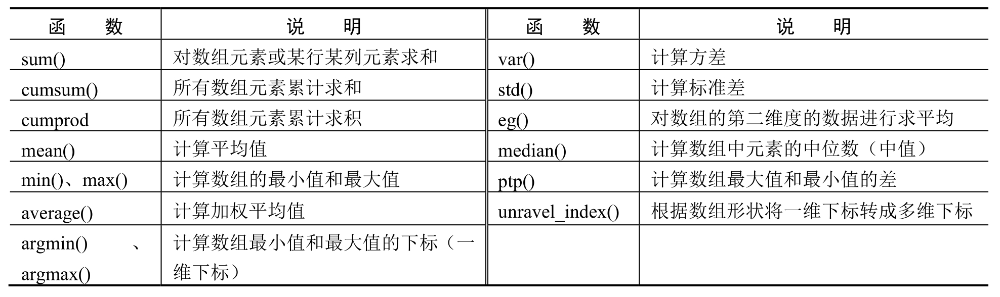

下面介绍几个常用的统计函数。首先创建一个数组，如图3.27所示。

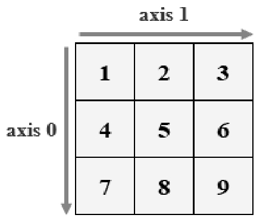

图3.27 数组示意图

### 3.6.1 求和函数sum()

**【例3.61】**对数组元素求和**（实例位置：资源包\\TM\\sl\\03\\61）**

对数组元素求和、对数组元素按行和按列求和，程序代码如下：

1  import numpy as np

2  n=np.array(\[\[1,2,3\],\[4,5,6\],\[7,8,9\]\])

3  print('对数组元素求和：')

4  print(n.sum())

5  print('对数组元素按行求和：')

6  print(n.sum(axis=0))

7  print('对数组元素按列求和：')

8  print(n.sum(axis=1))

运行程序，输出结果如下：

对数组元素求和：

45

对数组元素按行求和：

\[12 15 18\]

对数组元素按列求和：

\[ 6 15 24\]

### 3.6.2 平均值函数mean()

**【例3.62】**对数组元素求平均值**（实例位置：资源包\\TM\\sl\\03\\62）**

对数组元素求平均值，对数组元素按行求平均值和按列求平均值，关键代码如下：

1  print('对数组元素求平均值：')

2  print(n.mean())

3  print('对数组元素按行求平均值：')

4  print(n.mean(axis=0))

5  print('对数组元素按列求平均值：')

6  print(n.mean(axis=1))

运行程序，输出结果如下：

对数组元素求平均值：

5.0

对数组元素按行求平均值：

\[4. 5. 6.\]

对数组元素按列求平均值：

\[2. 5. 8.\]

### 3.6.3 最大值与最小值函数max()、min()

**【例3.63】**对数组元素求最大值和最小值**（实例位置：资源包\\TM\\sl\\03\\63）**

对数组元素求最大值和最小值，关键代码如下：

1   print('数组元素最大值：')

2   print(n.max())

3   print('数组中每一行的最大值：')

4   print(n.max(axis=0))

5   print('数组中每一列的最大值：')

6   print(n.max(axis=1))

7   print('数组元素最小值：')

8   print(n.min())

9   print('数组中每一行的最小值：')

10  print(n.min(axis=0))

11  print('数组中每一列的最小值：')

12  print(n.min(axis=1))

运行程序，输出结果如下：

数组元素最大值：

数组中每一行的最大值：

\[7 8 9\]

数组中每一列的最大值：

\[3 6 9\]

数组元素最小值：

数组中每一行的最小值：

\[1 2 3\]

数组中每一列的最小值：

\[1 4 7\]

对二维数组求最大值在实际应用中非常广泛。例如，统计销售冠军。

### 3.6.4 中位数函数median()

中位数用来衡量数据取值的中等水平或一般水平，可以避免极端值的影响。在数据处理过程中，当数据中存在少量异常值时，它不受其影响，基于这一特点，一般使用中位数来评价分析结果。

那么，什么是中位数？将各个变量值按大小顺序排列起来，形成一个数列，居于数列中间位置的那个数即为中位数。例如，1、2、3、4、5这5个数，中位数就是中间的数字3，而1、2、3、4、5、6这6个数，中位数则是中间两个数的平均值，即3.5。

**技巧**

中位数与平均数不同，它不受异常值的影响。例如，将1、2、3、4、5、6改为1、2、3、4、5、288，中位数依然是3.5。

**【例3.64】**计算电商活动价格的中位数**（实例位置：资源包\\TM\\sl\\03\\64）**

计算电商在开学季、6.18、双十一、双十二等活动价格的中位数，程序代码如下：

1  import numpy as np

2  n=np.array(\[34.5,36,37.8,39,39.8,33.6\])  # 创建“单价”数组

3  # 数组排序后，查找中位数

4  sort_n = np.msort(n)

5  print('数组排序：')

6  print(sort_n)

7  print('数组中位数为：')

8  print(np.median(sort_n))

运行程序，输出结果如下：

数组排序：

\[33.6 34.5 36. 37.8 39. 39.8\]

数组中位数为：

36.9

### 3.6.5 加权平均函数average()

日常生活中，常用平均数来表示一组数据的平均水平。但事实上，面对大量数据时，这样的平均方法很粗糙。一组数据里，一个数据出现的次数称为权。将一组数据与出现的次数相乘后再平均，得到的就是该组数据的加权平均数。加权平均能够反映一组数据中各数据的重要程度，以及对整体趋势的影响。加权平均在日常生活中应用非常广泛，如考试成绩、股票价格、竞技比赛等。

**【例3.65】**计算电商各活动销售的加权平均价**（实例位置：资源包\\TM\\sl\\03\\65）**

某电商在开学季、6.18、双十一、双十二等活动中的价格都不同，下面计算加权平均价，程序代码如下：

1  import numpy as np

2  price=np.array(\[34.5,36,37.8,39,39.8,33.6\])  # 创建“单价”数组

3  number=np.array(\[900,580,230,150,120,1800\])  # 创建“销售数量”数组

4  print('加权平均价：')

5  print(np.average(price,weights=number))

运行程序，输出结果如下：

加权平均价：

34.84920634920635

### 3.6.6 方差与标准差函数var()、std()

方差用于衡量一组数据的离散程度，即各组数据与它们的平均数的差的平方，用这个结果来衡量这组数据的波动大小，并把它叫作这组数据的方差，方差越小越稳定。通过方差可以了解一个问题的波动性。在NumPy中使用var()函数来计算方差。

标准差又称均方差，是方差的平方根，用来表示数据的离散程度。在NumPy中使用std()函数来计算标准差。

**【例3.66】**求数组的方差和标准差**（实例位置：资源包\\TM\\sl\\03\\66）**

在NumPy中实现方差和标准差的计算，程序代码如下：

1  import numpy as np

2  n=np.array(\[34.5,36,37.8,39,39.8,33.6\])  # 创建“单价”数组

3  print('数组方差：')

4  print(np.var(n))

5  print('数组标准差：')

6  print(np.std(n))

运行程序，输出结果如下：

数组方差：

5.168055555555551

数组标准差：

2.2733357771247853

## 3.7 数组排序

数组的排序涉及三个函数，下面分别举例说明。

### 3.7.1 sort()函数

使用sort()函数进行排序，直接改变原数组，参数axis用来指定按行排序还是按列排序。

**【例3.67】**对数组元素按行和列排序**（实例位置：资源包\\TM\\sl\\03\\67）**

对数组元素排序，程序代码如下：

1  import numpy as np

2  n=np.array(\[\[4,7,3\],\[2,8,5\],\[9,1,6\]\])

3  print('数组排序：')

4  print(np.sort(n))

5  print('按行排序：')

6  print(np.sort(n,axis=0))

7  print('按列排序：')

8  print(np.sort(n,axis=1))

运行程序，输出结果如下：

数组排序：

\[\[3 4 7\]

 \[2 5 8\]

 \[1 6 9\]\]

按行排序：

\[\[2 1 3\]

 \[4 7 5\]

 \[9 8 6\]\]

按列排序：

\[\[3 4 7\]

 \[2 5 8\]

 \[1 6 9\]\]

### 3.7.2 argsort()函数

使用argsort()函数对数组进行排序，返回升序排序之后数组值从小到大的索引值。

**【例3.68】**对数组元素升序排序**（实例位置：资源包\\TM\\sl\\03\\68）**

对数组元素进行升序排序，程序代码如下：

1  import numpy as np

2  x=np.array(\[4,7,3,2,8,5,1,9,6\])

3  print('升序排序后的索引值')

4  y = np.argsort(x)

5  print(y)

6  print('排序后的顺序重构原数组')

7  print(x\[y\])

运行程序，输出结果如下：

升序排序后的索引值：

\[6 3 2 0 5 8 1 4 7\]

排序后的顺序重构原数组：

\[1 2 3 4 5 6 7 8 9\]

### 3.7.3 lexsort()函数

lexsort()函数用于对多个序列进行排序。可以把它当作对电子表格进行排序，每一列代表一个序列，排序时优先照顾靠后的列。

**【例3.69】**排序解决成绩相同学生的录取问题**（实例位置：资源包\\TM\\sl\\03\\69）**

某重点高中的精英班录取学生是按照总成绩录取，由于名额有限，总成绩相同时，数学成绩高的优先录取，总成绩和数学成绩都相同时，按照英语成绩高的优先录取。下面使用lexsort()函数对学生成绩进行排序，程序代码如下：

1  import numpy as np

2  math=np.array(\[101,109,115,108,118,118\])        # 创建数学成绩

3  en=np.array(\[117,105,118,108,98,109\])           # 创建英语成绩

4  total=np.array(\[621,623,620,620,615,615\])       # 创建总成绩

5  sort_total=np.lexsort((en,math,total))

6  print('排序后的索引值')

7  print(sort_total)

8  print ('通过排序后的索引获取排序后的数组：')

9  print(np.array(\[\[en\[i\],math\[i\],total\[i\]\] for i in sort_total\]))

运行程序，输出结果如下：

排序后的索引值

\[4 5 3 2 0 1\]

通过排序后的索引获取排序后的数组：

\[\[ 98 118 615\]

 \[109 118 615\]

 \[108 108 620\]

 \[118 115 620\]

 \[117 101 621\]

 \[105 109 623\]\]

上述举例，按照数学、英语和总分进行升序排序，总成绩620分的2名同学，按照数学成绩高的优先录取原则进行第一轮排序，总分615分的2名同学，同时他们的数学成绩也相同，则按照英语成绩高的优先录取原则进行第二轮排序。

## 3.8 小结

本章主要介绍了功能比较强大的NumPy模块，该模块可以快速地解决多种数组问题，让比较烦琐的数组应用变得更加简单。本章不仅介绍了数组应用函数，还介绍了许多比较常用的数学函数以及数组排序相关的函数。本章内容与实例较多，希望读者多加练习，灵活运用NumPy模块中的各种函数。

