# 4 Pandas模块基础

Pandas是Python的核心数据分析支持库，它提供了大量快速处理表格数据的函数和方法。本章将讲解Pandas模块的基础知识，主要内容包括安装和了解Pandas模块，Pandas模块的两大数据结构，即Series()对象和DataFrame()对象，还有索引的相关知识。

本章知识架构如下。

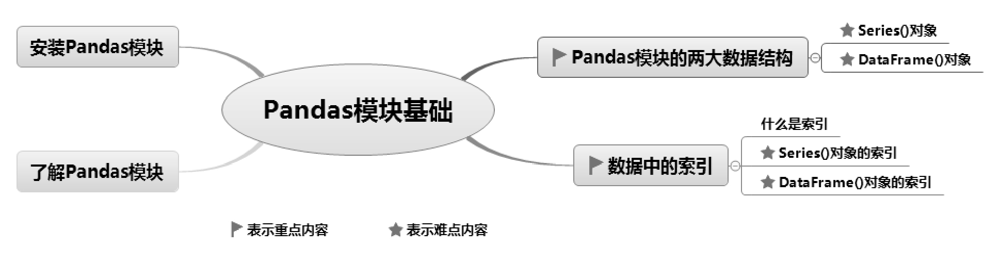

## 4.1 安装Pandas模块

安装Pandas模块有两种方法：使用pip命令安装和在Pycharm开发环境中安装。

**1. 使用pip命令安装**

在系统“搜索”文本框中输入cmd，按Enter键，打开“命令提示符”窗口，输入如下安装命令：

```text
pip install pandas
```

**2. 在Pycharm开发环境中安装**

（1）运行Pycharm，选择File→Settings命令，在Settings对话框的左侧列表中先选择Project Code→Python Interpreter选项，然后选择Python版本，最后单击添加模块按钮“+”，如图4.1所示。注意，在Python Interprter列表中应选择当前工程项目使用的Python版本。

### 说明

如果读者使用的是Anaconda集成开发环境，则不需要单独安装Pandas模块，因为Anaconda中已包含该模块。

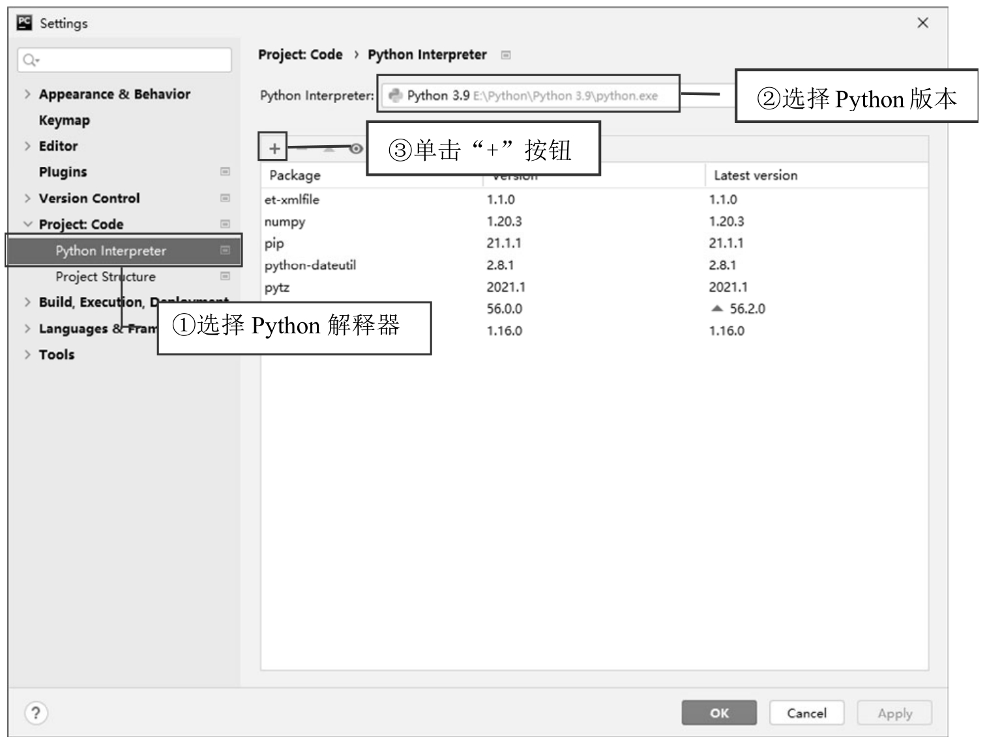

<p class="book-caption">图4.1 Settings对话框</p>

（2）在Available Packages对话框中搜索pandas，找到并选择该模块，然后单击Install Package按钮，如图4.2所示。

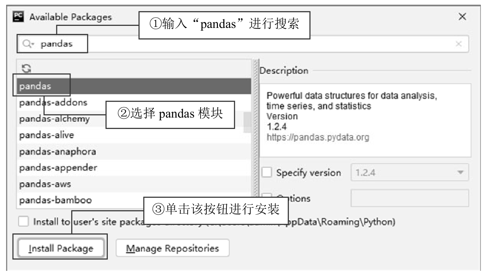

<p class="book-caption">图4.2 安装Pandas模块</p>

Pandas模块安装完成后，还需要安装xlrd、xlwt、openpyxl依赖模块。这三个模块主要用于读写Excel操作，本书后续内容对Excel的读写操作非常多，因此需要参照上面的步骤提前安装这三个模块（见图4.3）。

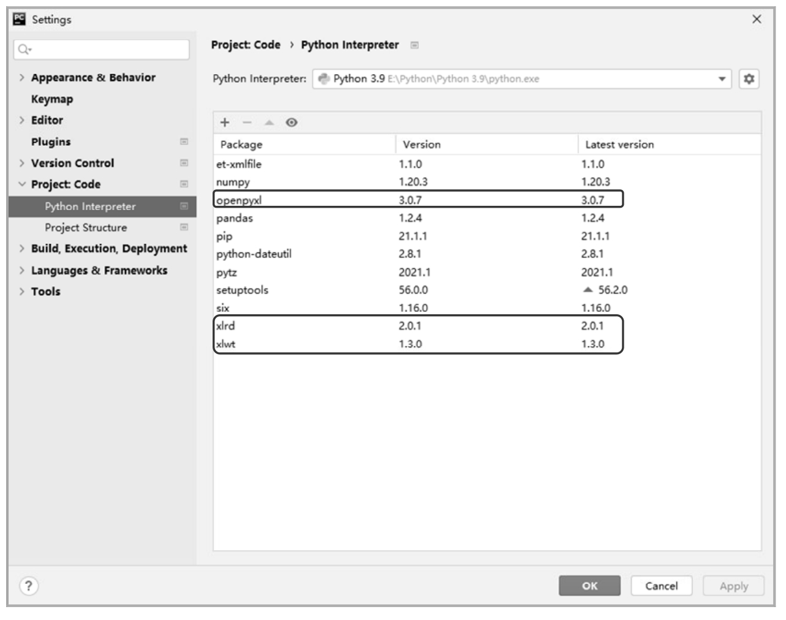

<p class="book-caption">图4.3 安装依赖模块</p>

## 4.2 了解Pandas模块

首先通过一个小示例快速了解Pandas。运行PyCharm，导入Pandas与NumPy模块，代码如下：

```text
import numpy as np
import pandas as pd
```

生成数据，代码如下：

```text
s = pd.Series([1, 3, 5,7,9,np.nan, 2,4,6])
print(s)
```

上述代码中，np.nan表示生成空值数据。如图4.4所示就是通过Pandas生成的一列浮点型数据，左侧为Pandas默认自动生成整数索引。

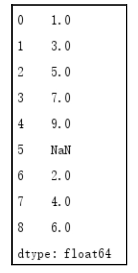

<p class="book-caption">图4.4 一列数据</p>

## 4.3 Pandas模块的两大数据结构

Pandas家族有两大核心成员：Series()对象和DataFrame()对象。 

 Series()对象：带索引的一维数组结构，也就是一列数据。 

 DataFrame()对象：带索引的二维数组结构，表格型数据，包括行和列，像Excel一样。

举个简单的例子，以“学生成绩表”为例，Series()对象和DataFrame()对象如图4.5所示。

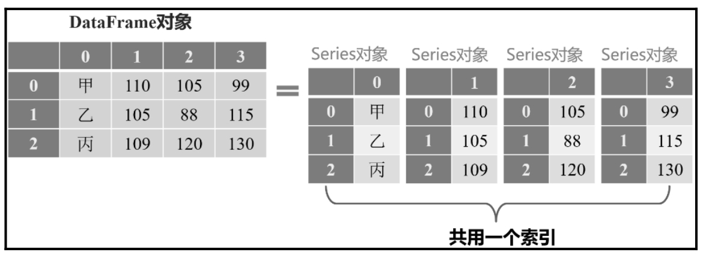

<p class="book-caption">图4.5 Series()对象和DataFrame()对象</p>

Series()对象的属性和函数主要对列数据中的字符串进行操作，如查找、替换、切分等。DataFrame()对象主要操作表格数据，如底层数据和属性（行数、列数、数据维数等），包括数据的输入输出、数据类型转换、缺失数据检测和处理、索引设置、数据选择筛选、数据计算、数据分组统计、数据重塑排序与转换、数据增加与合并、日期时间数据的处理，以及通过DataFrame实现绘制图表等。

### 4.3.1 Series()对象

Series()对象很像一维数组，由一组数据以及与这组数据相关的索引组成。仅有一组数据，没有索引，也可以创建一个简单的Series()对象。Series()对象可以存储整数、浮点数、字符串、Python对象等多种类型的数据。

Series()对象可通过Pandas的Series类创建，也可以是DataFrame()对象某些函数的返回值。

通过Pandas的Series类创建Series()对象，也就是创建一列数据，语法如下：

```text
pandas.Series(data,index=index)
```

参数说明： 

 data：数据，支持Python列表、字典、numpy数组、标量值（即只有大小，没有方向的量。如s=pd.Series（5））。 

 index：行标签（索引）。

### 说明

当data参数是多维数组时，index长度必须与data长度一致。如果没有指定index参数，自动创建数值型索引（从0到data数据长度－1）。

**【例4.1】**创建一列数据**（实例位置：资源包\\TM\\sl\\04\\01）**

下面分别使用列表和字典创建Series()对象，也就是一列数据。程序代码如下：

```text
1  import pandas as pd
2  # 使用列表创建Series()对象
3  s1=pd.Series([1,2,3])
4  print(s1)
5  # 使用字典创建Series()对象
6  s2 = pd.Series({"A":1,"B":2,"C":3})
7  print(s2)
```

运行程序，输出结果为：

```text
0    1
```

### 1    2

```text
2    3
dtype: int64
A    1
B    2
C    3
dtype: int64
```

**【例4.2】**创建一列“物理”成绩**（实例位置：资源包\\TM\\sl\\04\\02）**

下面创建一列“物理”成绩。程序代码如下：

```text
1  import pandas as pd
2  wl=pd.Series([88,60,75])
3  print(wl)
```

运行程序，输出结果为：

```text
0    88
1    60
2    75
dtype: int64
```

上述举例，如果通过Pandas模块引入Series()对象，就可以直接在程序中使用Series()对象。关键代码如下：

```text
1  from pandas import Series
2  wl=Series([88,60,75])
```

### 4.3.2 DataFrame()对象

DataFrame()对象是由多种类型的列组成的二维数组。它是一个二维表数据结构，由行、列数据组成，既有行索引，也有列索引，类似于Excel、SQL或Series()对象构成的字典，只不过这些Series()对象共用一个索引，如图4.6所示。DataFrame()是Pandas最常用的对象，与Series()对象一样支持多种类型的数据。

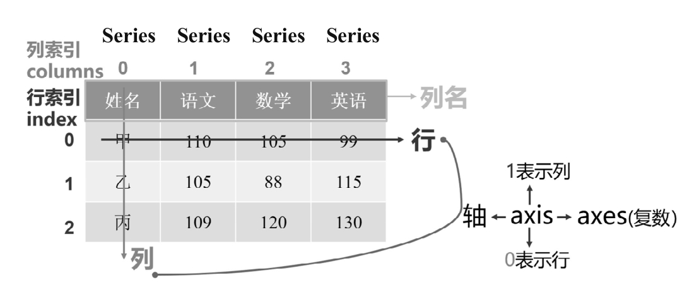

<p class="book-caption">图4.6 DataFrame()对象（成绩表）</p>

创建DataFrame()对象，也就是创建表格数据，使用的是Pandas中的DataFrame类。具体语法如下：

```text
pandas.DataFrame(data,index,columns,dtype,copy)
```

参数说明： 

 data：数据，可以是ndarray数组、Series()对象、列表、字典等。 

 index：行标签（索引）。 

 columns：列标签（索引）。 

 dtype：每列数据的数据类型。其与Python数据类型不同，如object数据类型对应的是Python的字符型。如表4.1所示为Pandas数据类型对应的Python数据类型。

<p class="book-caption">表4.1 数据类型对应表</p>

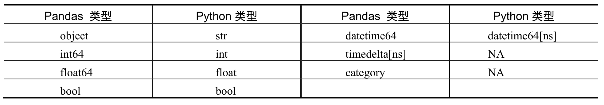


 copy：用于复制数据。

下面分别使用列表和字典创建DataFrame()对象，对比一下两种方法有什么区别。

**1. 通过列表创建DataFrame()对象**

**【例4.3】**通过列表创建成绩表**（实例位置：资源包\\TM\\sl\\04\\03）**

通过列表创建成绩表，包括语文、数学和英语，程序代码如下：

```text
1  import pandas as pd
2  pd.set_option('display.unicode.east_asian_width', True)  # 解决数据输出时列名不对齐的问题
3  # 创建数据
4  data = [['甲',110,105,99],
5         ['乙',105,88,115],
6         ['丙',109,120,130]]
7  columns = ['姓名','语文','数学','英语']                    # 指定列名
8  df = pd.DataFrame(data=data,columns=columns)               # 创建DataFrame数据
9  print(df)
```

运行程序，输出结果为：

```text
姓名  语文  数学  英语
0  甲    110   105    99
1  乙    105    88   115
2  丙    109   120   130
```

**2. 通过字典创建DataFrame()对象**

通过字典创建DataFrame()对象时，字典的value值只能是一维数组或单个简单数据类型。如果是数组，要求所有数组长度一致；如果是单个数据，则要求每行都添加相同数据。

**【例4.4】**通过字典创建成绩表**（实例位置：资源包\\TM\\sl\\04\\04）**

通过字典创建成绩表，包括语文、数学、英语，程序代码如下：

```text
1  import pandas as pd
2  # 解决数据输出时列不对齐的问题
3  pd.set_option('display.unicode.east_asian_width', True)
4  df = pd.DataFrame({
5      '姓名':['甲','乙','丙'],
6      '语文':[110,105,109],
7       '数学':[105,88,120],
8       '英语':[99,115,130]})
9  print(df)
```

运行程序，输出结果为：

```text
姓名  语文  数学  英语
0  甲    110   105    99
1  乙    105    88   115
2  丙    109   120   130
```

通过对比可知，使用字典创建DataFrame()对象，代码看上去更直观。

## 4.4 数据中的索引

### 4.4.1 什么是索引

前面学习了如何创建Series()对象（一列数据）和DataFrame()对象（表格数据），细心的读者可能会发现，运行结果中左侧出现了一列编号，如图4.7所示。这列编号是自动生成的，作用是帮助读者快速定位数据，我们称之为索引。除了自动生成索引，读者也可以自己设置索引。

**【例4.5】**设置“姓名”为索引**（实例位置：资源包\\TM\\sl\\04\\05）**

```text
1  df=df.set_index('姓名')
2  print(df)
```

运行程序，设置索引后“姓名”从原来的位置移到了最左边，如图4.8所示。此时，“姓名”列不再是普通的列，而是一个索引列。

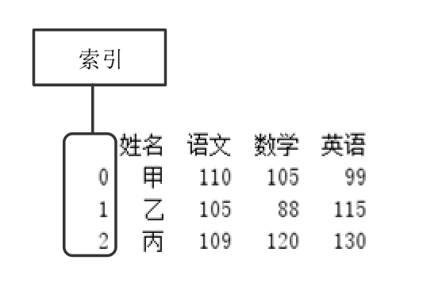

<p class="book-caption">▲图4.7 索引</p>

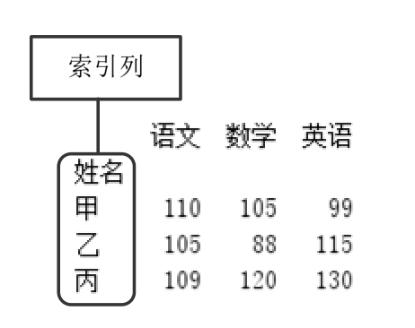

<p class="book-caption">▲图4.8 设置“姓名”为索引</p>

索引主要用于定位数据，它分为隐式索引和显示索引。 

 隐式索引：默认索引，也称为位置索引，是系统自动生成的索引，值为0，1，2，…，以此类推。 

 显示索引：手动设置的索引，也称为标签索引，主要通过index参数或者set_index()函数设置。例如，设置为“甲”“乙”“丙”。

索引类似于图书目录，可以帮助人们快速找到对应内容。Pandas中索引的主要作用如下： 

 方便定位数据和查找数据。 

 提升查询性能。 

 如果索引是唯一的，Pandas会使用哈希表优化，查找数据的时间复杂度为O（1）。 

 如果索引不是唯一的，但是有序，Pandas会使用二分查找算法，查找数据的时间复杂度为O（logn）。 

 如果索引是完全随机的，那么每次查询都要扫描数据表，查找数据的时间复杂度为O（n）。 

 自动数据对齐功能，示意图如图4.9所示。

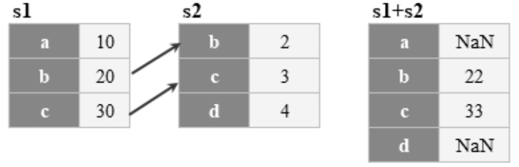

<p class="book-caption">图4.9 自动数据对齐示意图</p>

实现上述效果，程序代码如下：

```text
1  import pandas as pd
2  s1 = pd.Series([10,20,30],index= list("abc"))
3  s2 = pd.Series([2,3,4],index=list("bcd"))
4  print(s1 + s2) 
```

 强大的数据结构。 

 基于分类数的索引，可以提升性能。 

 多维索引，用于group by（分组）多维聚合结果等。 

 时间类型索引，强大的日期和时间的方法支持。

### 4.4.2 Series()对象的索引

**1. 设置索引**

创建Series()对象时会自动生成隐式索引，默认值从0开始，至数据长度减1，如0，1，2，…同样，可以通过index参数手动设置索引，得到显式索引。

**【例4.6】**手动设置索引**（实例位置：资源包\\TM\\sl\\04\\06）**

下面手动设置索引，将“物理”成绩的索引设置为1，2，3或“甲”“乙”“丙”。程序代码如下：

```text
1  import pandas as pd
2  s1=pd.Series([88,60,75],index=[1,2,3])
3  s2=pd.Series([88,60,75],index=['甲','乙','丙'])
4  print(s1)
5  print(s2)
```

运行程序，输出结果为：

```text
1    88
2    60
3    75
dtype: int64
甲    88
乙    60
丙    75
dtype: int64
```

**2. 重新设置索引**

Pandas有一个很重要的函数是reindex()，作用是创建一个适应新索引的对象。语法如下：

```text
DataFrame.reindex(labels = None,index = None,column = None,axis = None,method = None,copy = True,level = None,
fill_value = NaN,limit = None,tolerance = None)
```

常用参数说明： 

 labels：标签，可以是数组，默认值为None。 

 index：行索引，默认值为None。 

 columns：列索引，默认值为None。 

 axis：轴，0表示行，1表示列，默认值为None。 

 method：默认值为None，重新设置索引时选择插值函数（一种填充缺失数据的函数），其值可以是None、bfill/backfill（向后填充）、ffill/pad（向前填充）等。 

 fill_value：缺失值填充的数据。如缺失值不用NaN填充，用0填充，则设置fill_value=0即可。

**【例4.7】**重新设置物理成绩的索引**（实例位置：资源包\\TM\\sl\\04\\07）**

前面已经建立了一组学生物理成绩，下面使用Series()对象的reindex()函数重新设置索引，程序代码如下：

```text
1  import pandas as pd
2  s1=pd.Series([88,60,75],index=[1,2,3])
3  print(s1)
4  print(s1.reindex([1,2,3,4,5]))
```

运行程序，对比效果如图4.10和图4.11所示。

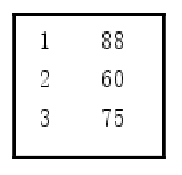

<p class="book-caption">▲图4.10 原数据</p>

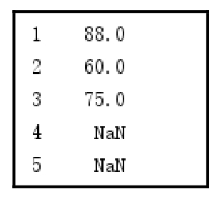

<p class="book-caption">▲图4.11 重新设置索引</p>

从运行结果得知：reindex()函数根据新索引进行了重新排序，并且对缺失值自动填充NaN。如果不想用NaN填充，可以为fill_value参数指定值，例如，指定0，关键代码如下：

```text
s1.reindex([1,2,3,4,5],fill_value=0)
```

对于有一定顺序的数据，可能需要通过插值（插值是一种填充缺失数据的函数）来填充缺失的数据，可以使用method参数。

**【例4.8】**向前和向后填充数据**（实例位置：资源包\\TM\\sl\\04\\08）**

向前填充（和前面数据一样）、向后填充（和后面数据一样），关键代码如下：

```text
1  print(s1.reindex([1,2,3,4,5],method='ffill'))  # 向前填充
2  print(s1.reindex([1,2,3,4,5],method='bfill'))  # 向后填充
```

**3. 通过索引获取数据**

通过索引获取数据，用\[\]表示，里面是位置索引或者是标签索引。例如，位置索引从0开始，那么，\[0\]是Series()对象的第一个数，\[1\]是Series()对象的第二个数，以此类推。如果需要获取多个索引值，则用\[\[ \]\]表示（相当于列表\[\]中包含一个列表）。

**【例4.9】**通过位置索引获取学生物理成绩**（实例位置：资源包\\TM\\sl\\04\\09）**

获取第一个学生的物理成绩。程序代码如下：

```text
1  import pandas as pd
2  wl=pd.Series([88,60,75])
3  print(wl[0])              # 通过一个位置索引获取索引值
4  print(wl[[0,2]])          # 通过多个位置索引获取索引值
```

运行程序，输出结果为：

```text
88
0    88
2    75
dtype: int64
```

**注意**

Series()对象不能使用\[-1\]定位索引。

**【例4.10】**通过标签索引获取学生物理成绩**（实例位置：资源包\\TM\\sl\\04\\10）**

通过“姓名”获取学生的物理成绩，程序代码如下：

```text
1  import pandas as pd
2  wl=pd.Series([88,60,75],index=['甲','乙','丙'])
3  print(wl['甲'])           # 通过一个标签索引获取索引值
4  print(wl[['甲','丙']])  # 通过多个标签索引获取索引值
```

运行程序，输出结果为：

```text
88
甲    88
丙    75
dtype: int64
```

获取数据还有两个重要的属性：loc属性和iloc属性。loc属性是通过显式索引（标签索引）获取数据，iloc属性是通过隐式索引（位置索引）获取数据。例如，下面的代码：

```text
1  print(wl.iloc[[0,2]])         # 使用iloc属性对隐式索引进行相关操作，跟wl[[0,2]]一样
2  print(wl.loc[["甲","丙"]])  # 使用loc属性对显式索引进行相关操作，跟wl[['甲','丙']])一样
```

**4. 通过切片获取数据**

切片就是将数据切分开，主要用于获取多条数据。例如，wl\[0:2\]就是一个切片操作，它取到的数据是索引从0到1的数据，而不包括索引为2的数据，官方说法叫作“左闭右开”，我们可以理解为顾头不顾尾，即包含索引开始位置的数据，不包含索引结束位置的数据。

**【例4.11】**通过标签切片获取数据**（实例位置：资源包\\TM\\sl\\04\\11）**

下面获取从“甲”至“戊”的数据。程序代码如下：

```text
1  import pandas as pd
2  wl=pd.Series([88,60,75,66,34],index=['甲','乙','丙','丁','戊'])
3  print(wl['甲':'戊'])
```

运行程序，输出结果为：

```text
甲    88
乙    60
丙    75
丁    66
戊    34
dtype: int64
```

用位置索引做切片，和list列表用法一样，顾头不顾尾。

**【例4.12】**通过位置切片获取数据**（实例位置：资源包\\TM\\sl\\04\\12）**

获取从0至4的数据，程序代码如下：

```text
1  wl=pd.Series([88,60,75,66,34])
2  print(wl[0:4])
```

运行程序，输出结果为：

```text
0    88
1    60
2    75
3    66
dtype: int64
```

从运行结果看，得到了4条数据，索引为4的数据没有获取到。这也是位置索引切片和标签索引切片的区别。

### 4.4.3 DataFrame()对象的索引

**1. 设置某列为索引**

设置某列为索引主要使用set_index()函数。

**【例4.13】**设置“姓名”为索引**（实例位置：资源包\\TM\\sl\\04\\13）**

首先创建学生成绩表，程序代码如下：

```text
1  import pandas as pd
2  pd.set_option('display.unicode.east_asian_width', True)  # 解决数据输出时列不对齐的问题
3  df = pd.DataFrame({
4        '姓名':['甲','乙','丙'],
5        '语文':[110,105,109],
6        '数学':[105,88,120],
7        '英语':[99,115,130]})
8  print(df)
```

运行程序，输出结果如图4.12所示。

此时默认行索引为0、1、2，下面将“姓名”作为索引，关键代码如下：

```text
df=df.set_index(['姓名'])
```

运行程序，输出结果如图4.13所示。

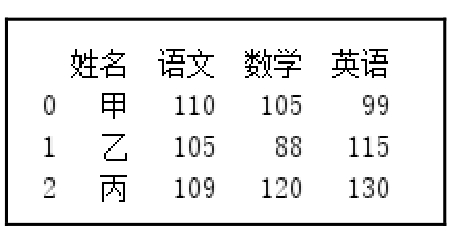

<p class="book-caption">▲图4.12 学生成绩表</p>

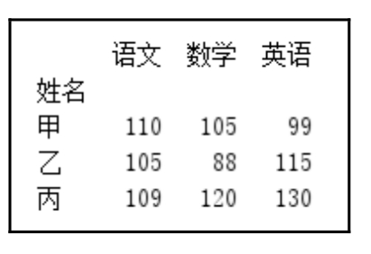

<p class="book-caption">▲图4.13 设置“姓名”为索引</p>

如果在set_index()函数中传入参数drop=True，则会删除“姓名”，如果传入drop=False，则会保留“姓名”，默认为False。

**2. 重新设置索引**

对于DataFrame()对象，reindex()函数用于修改行索引和列索引。

**【例4.14】**重新为学生成绩表设置索引**（实例位置：资源包\\TM\\sl\\04\\14）**

创建学生成绩表，程序代码如下：

```text
1  import pandas as pd
2  pd.set_option('display.unicode.east_asian_width', True)  # 解决数据输出时列对不齐的问题
3  df = pd.DataFrame({
4      '姓名':['甲','乙','丙'],
5      '语文':[110,105,109],
6      '数学':[105,88,120],
7      '英语':[99,115,130]})
8  df=df.set_index('姓名')                                  # 设置“姓名”为索引
9  print(df)
```

运行程序，输出结果如图4.14所示。

通过reindex()函数重新设置行索引，关键代码如下：

```text
df_row=df.reindex(['甲','乙','丙','丁','戊'])
```

运行程序，输出结果如图4.15所示。

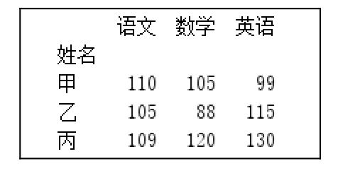

<p class="book-caption">▲图4.14 原始学生成绩表</p>

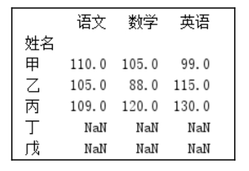

<p class="book-caption">▲图4.15 重新设置行索引</p>

通过reindex()函数重新设置列索引，关键代码如下：

```text
df_col=df.reindex(columns=['语文','物理','数学','英语'])
```

运行程序，输出结果如图4.16所示。

通过reindex()函数还可以同时对行索引和列索引进行设置，关键代码如下：

```text
df=df.reindex(index=['甲','乙','丙','丁','戊'],columns=['语文','物理','数学','英语'])
```

运行程序，输出结果如图4.17所示。

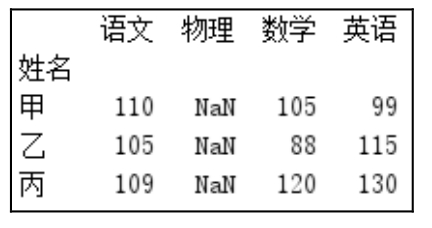

<p class="book-caption">▲图4.16 重新设置列索引</p>

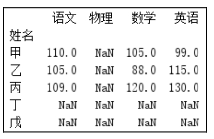

<p class="book-caption">▲图4.17 重新设置行索引和列索引</p>

通过上述举例，可以看出reindex()函数的作用不仅可以重新设置索引，还可以创建一个能够适应新索引的DataFrame()对象。

**3. 索引重置**

索引重置就是恢复默认索引的状态，即连续编号的索引。那么，在什么情况下需要进行索引重置呢？一般数据清洗后会重新设置连续的行索引。当我们对Dataframe()对象进行数据清洗之后，例如，删除包含空值的数据之后，行索引并不是连续的编号，对比效果如图4.18和图4.19所示。

**【例4.15】**删除数据后索引重置**（实例位置：资源包\\TM\\sl\\04\\15）**

删除含有空值的数据后，使用reset_index()函数重新设置连续的行索引，关键代码如下：

```text
df=df.dropna().reset_index(drop=True)
```

运行程序，输出结果如图4.20所示。

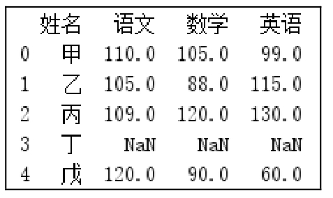

<p class="book-caption">▲图4.18 原始成绩表</p>

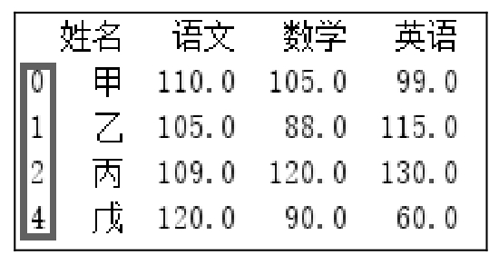

<p class="book-caption">▲图4.19 数据清洗后行索引不是连续编号</p>

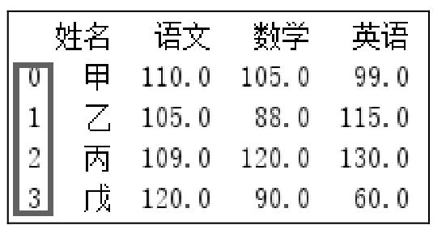

<p class="book-caption">▲图4.20 重新设置连续的行索引</p>

另外，对于分组统计后的数据，有时也需要进行索引重置，方法同上。

## 4.5 小结

本章介绍了Pandas模块的一些基础知识，其中包含Pandas模块中的两大数据结构（Series()与DataFrame()对象），还介绍了Pandas模块中数据的索引，如何通过索引获取相对应的数据。本章建议大家熟练掌握Pandas模块的基础知识，为接下来的学习做好铺垫。
