# 5 Pandas模块之数据的读取

在实现数据分析的过程中，数据读取与处理是首要任务。拿到数据后需要先读取数据才能对数据进行分析。本章将主要介绍如何读取Excel文件、CSV文件、HTML网页以及数据库中的数据。

本章知识架构如下。

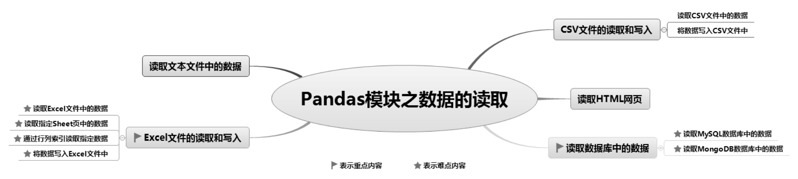

## 5.1 读取文本文件中的数据

读取文本文件（\*.txt），可通过Pandas的read_table()函数和read_csv()函数来实现。这两个函数的用法基本相同，区别在于：read_table()函数以“\t”分割文件中的数据，read_csv()函数以逗号（，）分割文件中的数据。

例如，文本文件原本就是以逗号为分隔符的，如图5.1所示，此时使用read_csv()函数可直接读取文件，因为read_csv()函数默认也使用逗号分隔数据。如果要使用read_table()函数，就需要设置sep参数为逗号（，）。无论使用哪种方法读取文本文件，都将返回一个DataFrame()对象，如图5.2所示。

**【例5.1】**读取文本文件**（实例位置：资源包\\TM\\sl\\05\\01）**

下面使用read_table()函数读取a1.txt文件，程序代码如下：

1  import pandas as pd

2  # 设置数据显示的编码格式为东亚宽度，以使列对齐

3  pd.set_option('display.unicode.east_asian_width', True)

4  df=pd.read_table('a1.txt',encoding='gb2312',sep='\t')

5  print(df.head())

运行程序，输出结果如图5.3所示。

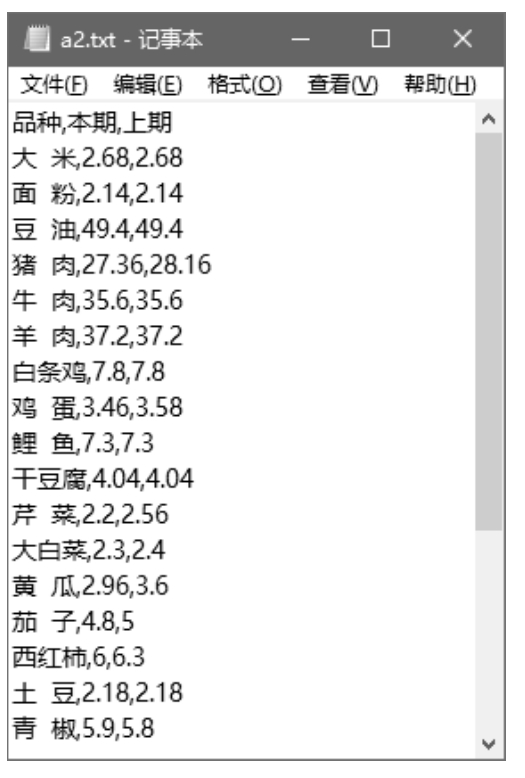

▲图5.1 文本文件（以逗号分隔数据）

▲图5.2 文本文件的形式

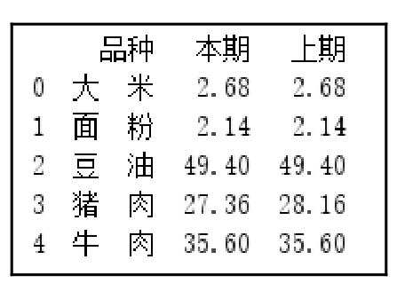

▲图5.3 读取文本文件

### 说明

文本数据中不同的分隔符主要通过sep参数读取。sep参数用于指定分隔符，如果文本文件中的数据是以其他分隔符来分隔数据的，那么需要设置sep参数为指定的分隔符。例如，文本文件中的分隔符既有空格又有制表符（/t），则需要指定sep参数为“/s+”，以匹配任何空格。另外，它还可以是一个正则表达式，一般在分析日志文件log时会用到。

## 5.2 Excel文件的读取和写入

### 5.2.1 读取Excel文件中的数据

Excel是大家熟知且应用广泛的办公软件，如果要对这一类型的数据进行处理和统计分析，首要任务是将它从Excel文件中读取出来，转换成Python能识别的数据。

Excel文件包括.xls和.xlsx两种，读取它主要使用Pandas的read_excel()函数，其语法格式如下：

pandas.read_excel(io,sheet_name=0,header=0,names=None,index_col=None,usecols=None,squeeze=False,dtype=None,e

ngine=None,converters=None,true_values=None,false_values=None,skiprows=None,nrow=None,na_values=None,keep_def

ault_na=True,verbose=False,parse_dates=False,date_parser=None,thousands=None,comment=None,skipfooter=0,conver_f

loat=True,mangle_dupe_cols=True,\*\*kwds)

主要参数说明： 

 io：字符串，xls或xlsx文件路径或类文件对象。 

 sheet_name：None、字符串、整数、字符串列表或整数列表，默认值为0。字符串用于工作表名称，整数为索引表示工作表位置，字符串列表或整数列表用于请求多个工作表，值为None时将获取所有工作表。参数值如表5.1所示。

表5.1 sheet_name参数值

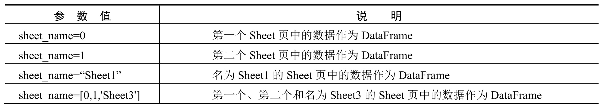

 header：指定作为列名的行，默认值为0，即取第一行的值为列名。数据为除列名以外的数据；若数据不包含列名，则设置header=None。 

 names：默认值为None，要使用的列名列表。 

 index_col：指定列为索引列，默认值为None，索引0是DataFrame的行标签。 

 usecols：int、list或字符串，默认值为None。 

 如果为None，则解析所有列。 

 如果为int，则解析最后一列。 

 如果为list列表，则解析列号列表的列。 

 如果为字符串，则表示以逗号分隔的Excel列字母和列范围列表（如“A：E”或“A，C，E：F”）。 

 squeeze：布尔值，默认值为False，如果解析的数据只包含一列，则返回一个Series()对象。 

 dtype：列的数据类型的名称，多列的数据类型的名称可以使用字典（如{'a'：np.float64，'b'：np.int32}），默认值为None。 

 engine：字符串，默认值为None。如果io参数值不是缓冲区或文件路径，则必须将其设置为标识io。可接受的值是None或xlrd。 

 converters：字典，默认值为None。转换函数，键是整数或列标签，值是一个函数。 

 true_values：列表，默认值为None，值为True。 

 false_values：列表，默认值为None，值为False。 

 skiprows：省略指定行数的数据，从第一行开始。 

 na_values：标量，字符串，列表或字典，默认值为None。某些字符串可能被识别为NA或NaN。默认情况下，以下值被视为NaN（空值）："、＃N/A、＃N/AN/A、#NA、-1.＃IND、1.＃QNAN、-NNN、-nan、1.＃IND、1.＃QNAN、N/A、NA、NULL、NaN、n/a、nan、null。 

 keep_default_na：布尔值，默认值为True。如果指定了na_values参数，并且keep_default_na参数值为False，那么默认的NaN值将被重写。 

 verbose：布尔值，默认值为False。显示数据中除去数字列，空值的数量。 

 parse_dates：将数据中的时间字符串转换成日期格式。 

 skipfooter：省略指定行数的数据，从最后一行开始。 

 convert_float：布尔值，默认值为True。将浮点数转换为整数（如1.0转换后为1）。如果值为False，则所有数字数据都将作为浮点数读取。read_excel()函数的返回值为一个DataFrame()对象。

下面通过示例的形式，详细介绍如何读取Excel文件。

**【例5.2】**读取Excel文件**（实例位置：资源包\\TM\\sl\\05\\02）**

读取文件名为“1月.xlsx”的Excel文件，程序代码如下：

1  import pandas as pd

2  pd.set_option('display.unicode.east_asian_width', True)  # 设置数据显示的编码格式为东亚宽度，以使列对齐

3  df=pd.read_excel('1月.xlsx')                             # 读取Excel文件

4  print(df.head())                                       # 输出前5条数据

运行程序，输出部分数据，结果如图5.4所示。

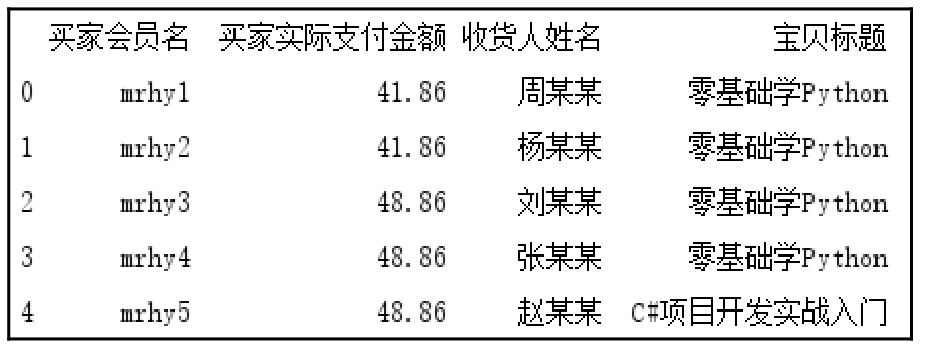

图5.4 1月淘宝销售数据（部分数据）

上述代码中，读取Excel文件涉及文件路径问题，也就是在程序中若要找到指定的文件就必须指定一个路径。细心的读者可能会发现，示例程序中并未指定文件路径，这是为什么呢？

文件路径分为相对路径和绝对路径。相对路径是指以当前文件所在目录为基准进行逐级目录定位，指向被引用的资源文件。 

 ../：表示当前程序文件所在目录的上一级目录。例如，程序文件在1.1文件夹中，Excel文件在data文件夹中，如图5.5所示，那么代码中的文件路径为pd.read_excel（'../data/1月.xlsx'）。 

 ./：表示当前程序文件所在的目录（可以省略）。例如，程序文件和Excel文件在同一路径下，如图5.6所示，那么代码中的文件路径为pd.read_excel（'1月.xlsx'） 

 /：表示当前程序文件的根目录（域名映射或硬盘目录）。例如，Excel文件在D盘根目录，如图5.7所示，那么代码中的文件路径为pd.read_excel（'/1月.xlsx'）

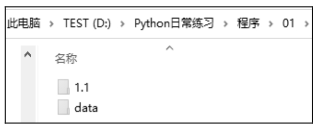

▲图5.5 文件夹

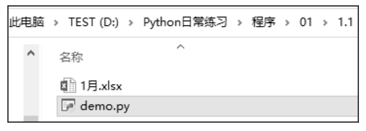

▲图5.6 当前程序所在文件夹

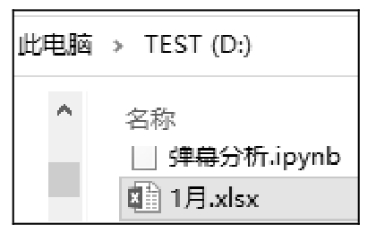

▲图5.7 根目录

绝对路径指文件真正存在的路径，是指硬盘中文件的完整路径，如“D:\Python日常练习\程序\01\1.1\1月.xlsx”。

**注意**

如果使用本地计算机默认文件路径“\\，那么在Python中需要在路径最前面加一个r，以避免路径里面的“\\被转义。

### 5.2.2 读取指定Sheet页中的数据

一个Excel文件包含多个Sheet页，通过设置sheet_name参数可读取指定Sheet页中的数据。

**【例5.3】**读取指定Sheet页中的数据**（实例位置：资源包\\TM\\sl\\05\\03）**

Excel文件中包含多家店铺的销售数据，读取其中一家店铺（莫寒）的销售数据，如图5.8所示。

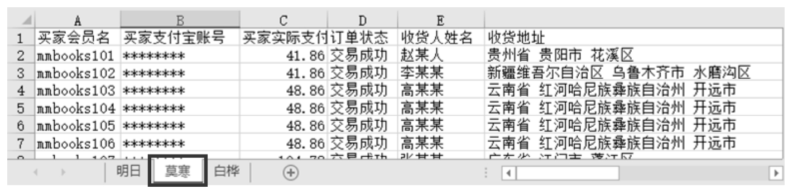

图5.8 原始数据

程序代码如下：

1  import pandas as pd

2  pd.set_option('display.unicode.east_asian_width', True)  # 设置数据显示的编码格式为东亚宽度，以使列对齐

3  df=pd.read_excel('1月.xlsx',sheet_name='莫寒')

4  print(df.head())                                       # 输出前5条数据

运行程序，输出部分数据，结果如图5.9所示。

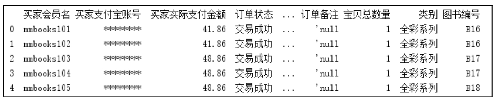

图5.9 读取指定Sheet页中的数据（部分数据）

除了指定Sheet页的名字，还可以指定Sheet页的顺序，从0开始。例如，sheet_name=0表示导入第一个Sheet页的数据，sheet_name=1表示导入第二个Sheet页的数据，以此类推。

如果不指定sheet_name参数，则默认导入第一个Sheet页的数据。

### 5.2.3 通过行列索引读取指定数据

**1. 通过行列索引读取指定行列数据**

由于DataFrame()对象是一个表格数据，因此它既有行索引又有列索引。当读取Excel文件时，行索引会自动生成，如0，1，2，而列索引则默认将第0行作为列索引，如A,B,…,J，如图5.10所示为示意图。

图5.10 DataFrame()对象行列索引示意图

**【例5.4】**读取Excel文件并指定行索引**（实例位置：资源包\\TM\\sl\\05\\04）**

通过指定行索引读取Excel数据，需要设置index_col参数。下面将“买家会员名”作为行索引（位于第0列）读取Excel文件，程序代码如下：

1  import pandas as pd

2  pd.set_option('display.unicode.east_asian_width', True) # 设置数据显示的编码格式为东亚宽度，以使列对齐

3  df1=pd.read_excel('1月.xlsx',index_col=0)               # 设置“买家会员名”为行索引

4  print(df1.head())                                     # 输出前5条数据

运行程序，输出结果如图5.11所示。

通过指定列索引读取Excel数据，需要设置header参数，关键代码如下：

df2=pd.read_excel('1月.xlsx',header=1)  # 设置第1行为列索引

运行程序，输出结果如图5.12所示。

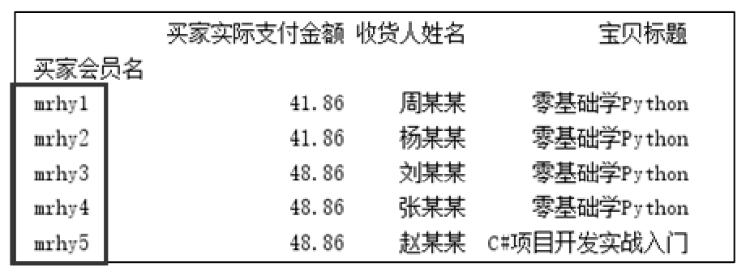

▲图5.11 通过设置行索引导入Excel数据

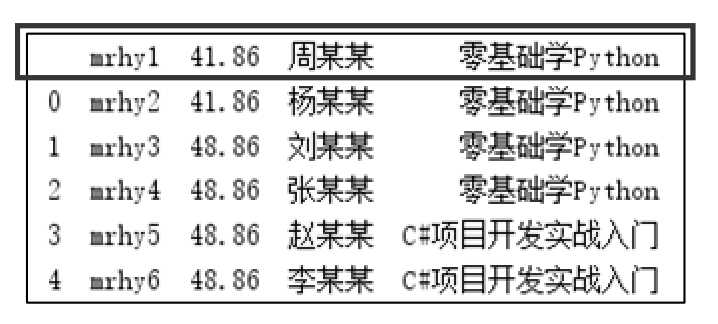

▲图5.12 通过设置列索引导入Excel数据

如果将数字作为列索引，则需要设置header参数为None，关键代码如下：

df3=pd.read_excel('1月.xlsx',header=None)  # 列索引为数字

运行程序，输出结果如图5.13所示。

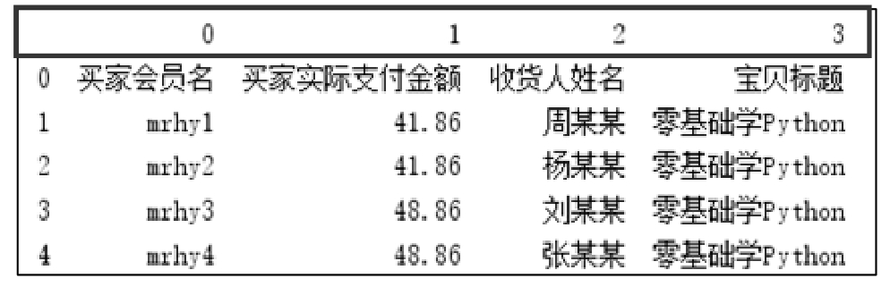

图5.13 将数字作为列索引

通过索引可以快速地定位数据，如df3\[0\]，就可以快速定位到“买家会员名”这一列数据。

**2. 读取指定列的数据**

一个Excel文件往往包含多列数据，如果只需要其中的几列，可以通过usecols参数指定需要的列，从0开始（表示第1列，以此类推）。

**【例5.5】**读取Excel文件中的第1列数据**（实例位置：资源包\\TM\\sl\\05\\05）**

下面读取Excel文件中的第1列数据（索引为0），即“买家会员名”，程序代码如下：

1  import pandas as pd

2  pd.set_option('display.unicode.east_asian_width', True)  # 设置数据显示的编码格式为东亚宽度，以使列对齐

3  df1=pd.read_excel('1月.xlsx',usecols=\[0\])                  # 读取第1列

4  print(df1.head())

运行程序，输出结果如图5.14所示。

如果读取多列数据，可以在列表中指定多个值。例如，导入第1列和第4列，关键代码如下：

df1=pd.read_excel('1月.xlsx',usecols=\[0,3\])

也可以指定列名称，关键代码如下：

df1=pd.read_excel('1月.xlsx',usecols=\['买家会员名','宝贝标题'\])

运行程序，输出结果如图5.15所示。

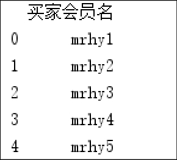

▲图5.14 读取第1列

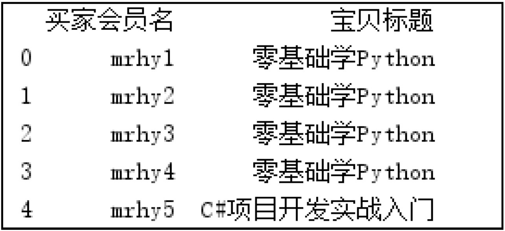

▲图5.15 导入第1列和第4列数据

### 5.2.4 将数据写入Excel文件中

处理后的数据，若要保留处理结果，可以将结果写入Excel文件中，主要使用DataFrame()对象的to_excel()函数实现，该函数主要用于将数据写入Excel文件中，语法格式如下：

DataFrame.to_excel(excel_writer,sheet_name='Sheet1',na_rep='',float_format=None,columns=None,header=True,index=Tru

e,index_label=None,startrow=0,startcol=0,engine=None,merge_cells=True,encoding=None,inf_rep='inf',verbose=True,freeze

\_panes=None)

主要参数说明： 

 excel_writer：字符串或ExcelWriter()对象。 

 sheet_name：字符串，默认值为“Sheet1”，将包含DataFrame的表名称。 

 na_rep：字符串，默认值为' '，表示缺失数据。 

 float_format：字符串，默认值为None。格式化浮点数的字符串。 

 columns：序列，可选参数，要编写的列。 

 header：布尔值或字符串列表，默认值为True。写出列名。如果给定字符串列表，则假定它是列名称的别名。 

 index：布尔值，默认值为True。行名（行索引）。 

 index_label：字符串或序列，默认值为None。如果需要，可以使用索引列的列标签。如果没有给出，标题和索引为True，则使用索引名称。如果数据文件使用多索引，则需使用序列。 

 startrow：从哪一行开始写入数据。 

 startcol：从哪一列开始写入数据。 

 engine：字符串，默认值为NaN。使用写引擎，也可以通过选项io.excel.xlsx.writer、io.excel.xls.writer和io.excel.xlsm.writer进行设置。 

 merge_cells：布尔值，默认值为True。编码生成的Excel文件。只有xlwt模块需要，其他编写者本地支持unicode。 

 inf_rep：字符串，默认值为“正”，表示无穷大。 

 freeze_panes：整数的元组（长度2），默认值为None。指定要冻结的基于1的最底部行和最右边的列。

**【例5.6】**将数据写入Excel文件中**（实例位置：资源包\\TM\\sl\\05\\06）**

下面读取Excel文件中需要的列，并设置“买家会员名”为索引，将处理后的数据保存到Excel文件中，程序代码如下：

1  import pandas as pd

2  pd.set_option('display.unicode.east_asian_width', True)  # 设置数据显示的编码格式为东亚宽度，以使列对齐

3  # 设置“买家会员名”为索引，并读取指定列的数据

4  df1=pd.read_excel('1月.xlsx',index_col='买家会员名',usecols=\['买家会员名','买家实际支付金额','宝贝标题'\])

5  print(df1.head())

6  df1.to_excel("data1.xlsx")                               # 将数据写入Excel文件

运行程序，程序所在文件夹将自动生成一个名为“data1.xlsx”的Excel文件，效果如图5.16所示。

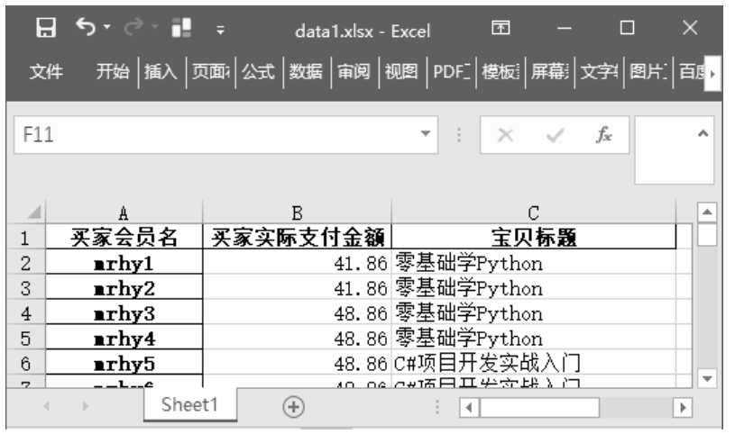

图5.16 将数据写入Excel文件中

## 5.3 CSV文件的读取和写入

CSV文件是以纯文本的形式存储表格数据（数字和文本）的文件类型，其简单通用，支持很多软件，而且适合在不同操作系统之间交换数据，因此一般网站上提供下载的数据大多数是CSV文件。

### 5.3.1 读取CSV文件中的数据

在Python中读取CSV文件，主要使用Pandas的read_csv()函数，语法格式如下：

pandas.read_csv(filepath_or_buffer,sep=',',delimiter=None,header='infer',names=None,index_col=None,usecols=None,sque

eze=False,prefix=None,mangle_dupe_cols=True,dtype=None,engine=None,converters=None,true_values=None,false_value

s=None,skipinitialspace=False,skiprows=None,nrows=None,na_values=None,keep_default_na=True,na_filter=True,verbose

=False,skip_blank_lines=True,parse_dates=False,infer_datetime_format=False,keep_date_col=False,date_parser=None,day

first=False,iterator=False,chunksize=None,compression='infer',thousands=None,decimal=b'.',lineterminator=None,quotechar

='"',quoting=0,escapechar=None,comment=None, encoding=None)

主要参数说明： 

 filepath_or_buffer：字符串，文件路径，也可以是URL链接。 

 sep：读取CSV文件时指定的分隔符，默认为逗号。需要注意的是，CSV文件的分隔符和我们读取的CSV文件时指定的分隔符必须是一致的，否则数据读取之后分隔符和数据便混为一体。 

 delimiter：用于指定分隔符，一般为逗号（，），但是由于操作系统的不同，CSV文件的分隔符也会有所不同，若要正确读取CSV文件就必须指定与其一致的分隔符。例如，Mac系统下的CSV文件的分隔符一般为分号（；），那么读取CSV文件时就必须指定分号作为分隔符。 

 header：指定作为列名的行，默认值为0，即取第一行的值为列名。数据为除列名以外的数据，若数据不包含列名，则设置header=None。 

 names：默认值为None，要使用的列名列表。 

 index_col：指定列为索引列，默认值为None，索引0是DataFrame的行标签。 

 usecols：int、list或字符串，默认值为None。 

 如果为None，则解析所有列。 

 如果为int，则解析最后一列。 

 如果为list列表，则解析列号列表的列。 

 如果为字符串，则表示以逗号分隔的Excel列字母和列范围列表（如“A：E”或“A，C，E：F”）。范围包括双方。 

 parse_dates：布尔类型值、int类型值的列表、列表或字典，默认值为False。可以通过parse_dates参数直接将某列转换成datetime64日期类型。例如，df1=pd.read_csv（'1月.csv'， parse_dates=\['订单付款时间'\]） 

 parse_dates为True时，尝试解析索引。 

 parse_dates为int类型值组成的列表时，如\[1,2,3\]，则解析1，2，3列的值作为独立的日期列。 

 parse_date为列表组成的列表，如\[\[1,3\]\]，则将1，3列合并，作为一个日期列使用。 

 parse_date为字典时，如{'总计'：\[1, 3\]}，则将1，3列合并，合并后的列名为“总计”。 

 encoding：字符串，默认值为None，用于指定CSV文件所使用的编码格式，编码格式一般包括utf-8、gb2312、gbk等。read_csv()函数的返回值为一个DataFrame()对象。

**【例5.7】**读取CSV文件**（实例位置：资源包\\TM\\sl\\05\\07）**

读取CSV文件，程序代码如下：

1  import pandas as pd

2  pd.set_option('display.unicode.east_asian_width', True) # 设置数据显示的编码格式为东亚宽度，以使列对齐

3  df1=pd.read_csv('1月.csv',encoding='gbk')               # 读取CSV文件，并指定编码格式

4  print(df1.head())                                     # 输出前5条数据

运行程序，输出结果如图5.17所示。

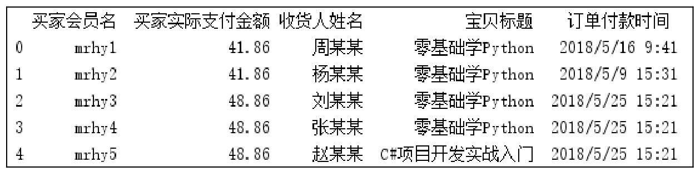

图5.17 读取CSV文件

**注意**

上述代码中指定了编码格式，即encoding='gbk'。Python常用的编码格式是utf-8和gbk，默认编码格式为utf-8。读取CSV文件时，需要通过encoding参数指定编码格式。当我们将Excel文件另存为CSV文件时，默认编码格式为gbk，此时编写代码读取CSV文件时，就需要设置编码格式为gbk，与原文件编码格式保持一致，否则会提示如下错误信息或出现乱码。

UnicodeDecodeError: 'utf-8' codec can't decode byte 0xd0 in position 0: invalid continuation byte

### 5.3.2 将数据写入CSV文件中

将数据写入CSV文件主要使用DataFrame()对象的to_csv()函数，写入过程中会涉及默认索引的问题，如果不需要默认的索引，可以在写入CSV文件时，设置index参数为False，即忽略索引。

下面介绍to_csv()函数常用功能，举例如下。

（1）相对位置，保存在程序所在路径下。

df1.to_csv('result.csv')

（2）绝对位置。

df1.to_csv('d:\result.csv')

（3）分隔符。使用问号（?）分隔符分隔需要保存的数据。

df1.to_csv('result.csv',sep='?')

（4）替换空值，缺失值保存为NA。

df1.to_csv('result.csv',na_rep='NA')

（5）格式化数据，保留两位小数。

df1.to_csv('result.csv',float_format='%.2f')

（6）保留某列数据，保存索引列和name列。

df1.to_csv('result.csv',columns=\['name'\])

（7）是否保留列名，不保留列名。

df1.to_csv('result.csv',header=0)

（8）是否保留行索引，不保留行索引。

df1.to_csv('result.csv',index=0)

## 5.4 读取HTML网页

读取HTML网页数据主要使用Pandas的read_html()函数，该函数用于读取带有table标签的网页表格数据，语法如下：

pandas.read_html(io,match='.+',flavor=None,header=None,index_col=None,skiprows=None,attrs=None,parse_dates=False,t

housands=',',encoding=None,decimal='.',converters=None,na_values=None,keep_default_na=True,displayed_only=True)

主要参数说明： 

 io：字符串，文件路径，也可以是URL链接。网址不接受https，可以尝试去掉https中的s后爬取，如http://www.mingribook.com。 

 match：正则表达式，返回与正则表达式匹配的表格。 

 flavor：解析器默认为lxml。 

 header：指定列标题所在的行，列表list为多重索引。 

 index_col：指定行标题对应的列，列表list为多重索引。 

 encoding：字符串，默认为None，文件的编码格式。

read_html()函数的返回值为一个DataFrame()对象。

使用read_html()函数前，首先要确定网页表格是否为table类型，因为只有这种类型的网页表格read_html()函数才能获取该网页中的数据。下面介绍如何判断网页表格是否为table类型，以NBA球员薪资网页（http://www.espn.com/nba/salaries）为例，右击该网页中的表格，在弹出的菜单中选择“检查”，查看代码中是否含有表格标签\<table\>…\</table\>的字样，如图5.18所示，确定后再使用read_html()函数。

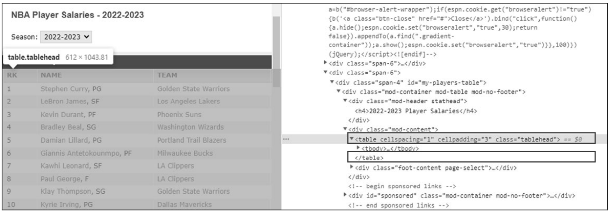

图5.18 \<table\>…\</table\>表格标签

**【例5.8】**Pandas也可以实现简单的爬虫**（实例位置：资源包\\TM\\sl\\05\\08）**

下面使用read_html()函数实现简单的爬虫，爬取“NBA球员薪资”数据，程序代码如下：

1  import pandas as pd

2  pd.set_option('display.unicode.east_asian_width', True)     # 设置数据显示的编码格式为东亚宽度，以使列对齐

3   df=pd.DataFrame()                                          # 创建空的DataFrame()对象

4   data_list = \[\]                                               # 保存数据的列表

5   url_list=\[\]                                                  # 创建空列表，以保存网页地址

6   # 获取网页地址，将地址保存在列表中

7   for i in range(1,14):

8       url='http://www.espn.com/nba/salaries/\_/page/'+str(i)  # 网页地址字符串，使用str()函数将整型变量i转换为字符串

9       url_list.append(url)

10  # 遍历列表读取网页数据

11  for url in url_list:

12      data_list.append(pd.read_html(url)\[0\])                   # 将每页数据添加至数据列表中

13  df = pd.concat(data_list,ignore_index=True)                  # 将每页数据进行组合

14  print(df)

运行程序，输出结果如图5.19所示。

图5.19 读取到的网页数据（部分数据）

从运行结果可以看出，数据中存在着一些无用的数据，如表头为数字0、1、2、3不能表明每列数据的作用。其次，数据中存在重复的表头，如RK、NAME、TEAM和SALARY。

接下来进行数据清洗，首先去掉重复的表头数据，主要使用字符串函数startswith()遍历DataFrame()对象的第4列（也就是索引为3的列），将以\$字符开头的数据筛出来，这样便去除了重复的表头，程序代码如下：

df=df\[\[x.startswith('\$') for x in df\[3\]\]\]

再次运行程序，会发现数据条数发生了变化，重复的表头被去除了。最后，重新赋予表头以说明每列的作用，方法是：在数据导出为Excel文件时，通过DataFrame()对象的to_excel()函数的header参数指定表头，程序代码如下：

df.to_excel('NBA.xlsx',header=\['RK','NAME','TEAM','SALARY'\],index=False)

运行程序，程序所在文件夹将自动生成一个名为NBA.xlsx的Excel文件，打开该文件，结果如图5.20所示。

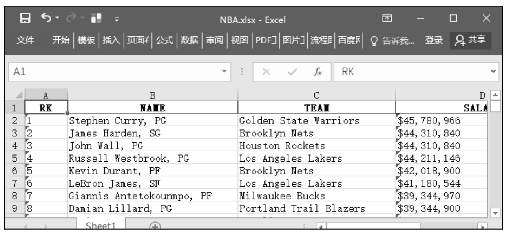

图5.20 导出后的NBA.xlsx文件

**注意**

运行程序，如果出现“ImportError: lxml not found, please install it”错误提示信息，则需要安装lxml模块。

## 5.5 读取数据库中的数据

大数据一般被保存在数据库当中，本节主要介绍如何通过Python读取MySQL数据库和MongoDB数据库中的数据。

### 5.5.1 读取MySQL数据库中的数据

**1. 导入MySQL数据库**

（1）安装MySQL数据库软件，设置密码（本项目密码为root，也可以是其他密码）。该密码一定要记住，连接MySQL数据库时会用到，其他设置采用默认设置即可。

（2）创建数据库。运行MySQL，在系统“开始”菜单中找到MySQL 8.0 Command Line Client命令，启动MySQL 8.0 Command Line Client，如图5.21所示。首先输入密码（如root），进入mysql命令提示符，如图5.22所示，然后使用CREATE DATABASE命令创建数据库。

例如，创建数据库test，命令如下：

CREATE DATABASE test;

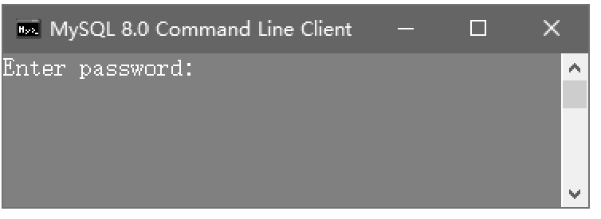

▲图5.21 密码窗口

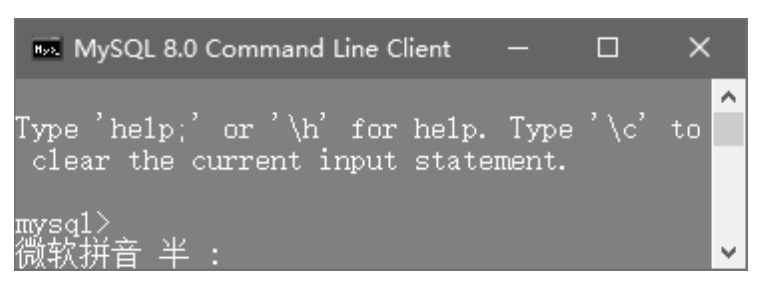

▲图5.22 mysql命令提示符

（3）导入SQL文件（user.sql）。在mysql命令提示符下通过use命名进入对应数据库。例如，进入数据库test，命令如下：

use test;

出现Database changed，说明已经进入数据库。接下来先使用source命令指定SQL文件，然后导入该文件。例如，导入user.sql，命令如下：

source D:/user.sql

下面预览导入的数据表，使用SQL查询语句（select语句）查询表中前5条数据，命令如下：

select \* from user limit 5;

运行结果如图5.23所示。

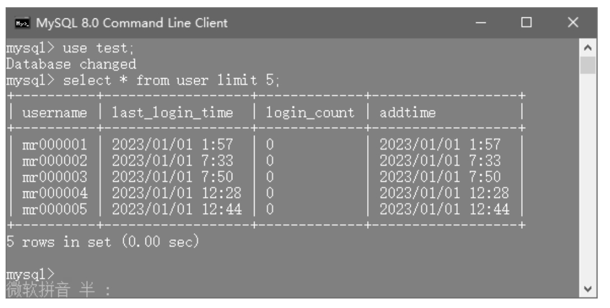

图5.23 查询导入后的MySQL数据

至此，导入MySQL数据库的任务就完成了。

**2. Python连接MySQL数据库**

Python连接MySQL数据库主要使用pymysql模块，该模块是一个用于操作MySQL数据库的模块，能够帮助实现数据的增、删、改、查等操作，是一个非常实用的模块。

pymysql模块的基本使用步骤如图5.24所示。

图5.24 pymysql模块的基本使用步骤

（1）安装pymysql模块。运行cmd命令打开提示符窗口并输入如下命令：

pip install pymysql

（2）使用connect()对象连接数据库。代码如下：

conn = pymysql.connect(host=“你的数据库地址”,user=“用户名”,password=“密码”,database=“数据库名”,charset=“utf8”)

（3）创建游标。通过cursor()函数得到一个可执行SQL语句的游标对象，代码如下：

cursor = conn.cursor()

（4）执行SQL语句。通过游标对象的execute()函数执行SQL语句，返回查询成功的记录数，代码如下：

cursor.execute(sql)

result=cursor.execute(sql)

（5）关闭连接。先关闭游标，然后关闭数据库连接，代码如下：

cursor.close()

conn.close()

**3. 读取MySQL数据库中的数据**

Pandas的read_sql()函数可通过SQL语句查询数据库中的数据，并以DataFrame的类型返回查询结果。语法格式如下：

pandas.read_sql(sql, con, index_col=None,  coerce_float=True, params=None,  parse_dates=None,  columns=None,

chunksize=None)

主要参数说明： 

 sql：SQL查询语句。 

 con：连接sql数据库的引擎，一般使用SQLalchemy连接池或者pymysql模块建立。 

 index_col：指定某一列作为索引列。 

 coerce_float：非常有用，将数字形式的字符串直接以float型读入。 

 parse_dates：将某一列日期型字符串转换为datetime型数据。 

 columns：要选取的列。很少用，因为在SQL语句里面一般就指定了要选择的列。 

 chunksize：块大小（每次输出的行数）。用于分块读取数据，以节约内存。

**【例5.9】**读取MySQL数据库中的数据**（实例位置：资源包\\TM\\sl\\05\\09）**

读取MySQL数据库中的数据，首先连接MySQL数据库，然后通过Pandas的read_sql()函数读取MySQL数据库中的数据，具体实现步骤如下。

（1）下载安装pymysql模块。运行cmd命令，进入提示符窗口，输入如下命令：

1  pip install pymysql

（2）导入pymysql模块和pandas模块，代码如下：

2  import pymysql

3  import pandas as pd

（3）连接MySQL数据库，代码如下：

4  conn = pymysql.connect(host = "localhost",user = 'root',passwd ='root',db = 'test',charset="utf8")

（4）使用pandas模块的read_sql()函数读取MySQL数据库中的数据，代码如下：

5  sql_query = 'SELECT \* FROM test.user'  #  SQL查询语句

6  df = pd.read_sql(sql_query, con=conn)  # 读取MySQL数据

7  conn.close()                         # 关闭数据库连接

8  print(df.head())                   # 显示部分数据

运行程序，输出结果如图5.25所示。

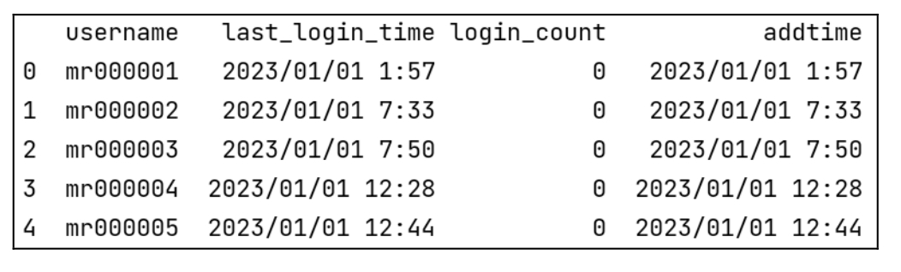

图5.25 读取MySQL数据库中的数据

### 5.5.2 读取MongoDB数据库中的数据

MongoDB是一个基于分布式文件存储的数据库，旨在为Web应用提供可扩展的高性能数据存储解决方案，它支持的数据结构非常松散，类似JSON格式，可以存储比较复杂的数据类型，因此很多Web应用使用MongoDB数据库。

读取MongoDB数据库中的数据主要使用PyMongo模块，该模块是Python专门用于操作MongoDB数据库的模块，主要功能包括连接MongoDB数据库、指定数据库、指定数据表、插入数据、查询数据、修改数据、删除数据、数据库导入导出、数据库备份与恢复等。

读取MongoDB数据库，基本流程如图5.26所示。

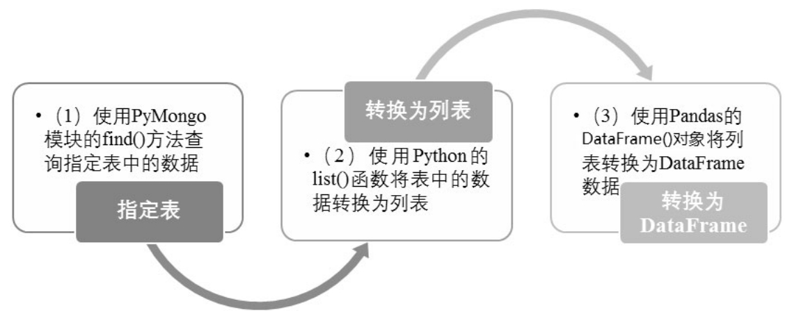

图5.26 读取MongoDB数据库的基本流程

**【例5.10】**读取MongoDB数据库中的数据**（实例位置：资源包\\TM\\sl\\05\\10）**

首先应导入MongoDB数据库，然后使用PyMongo模块连接MongoDB数据库，最后使用Pandas读取MongoDB数据库中的数据。

下载并导入MongoDB数据库的操作步骤如下。

（1）打开网址https://www.mongodb.com/try/download/community，下载MongoDB数据库，如图5.27所示。

（2）单击Download按钮，根据计算机操作系统的位数下载32位或64位的MSI文件到指定位置，下载后按提示操作，采用默认设置安装即可。

（3）安装过程中，单击Custom（自定义）按钮可选择安装路径，如图5.28所示。笔者选择安装在D盘指定位置，如图5.29所示。

（4）安装图形界面管理工具时，取消选中Install MongoDB Compass复选框，如图5.30所示。MongoDB Compass是一个图形界面管理工具，后期需要时可以到官网（https://www.mongodb.com/ try/download/ compass）上下载安装。

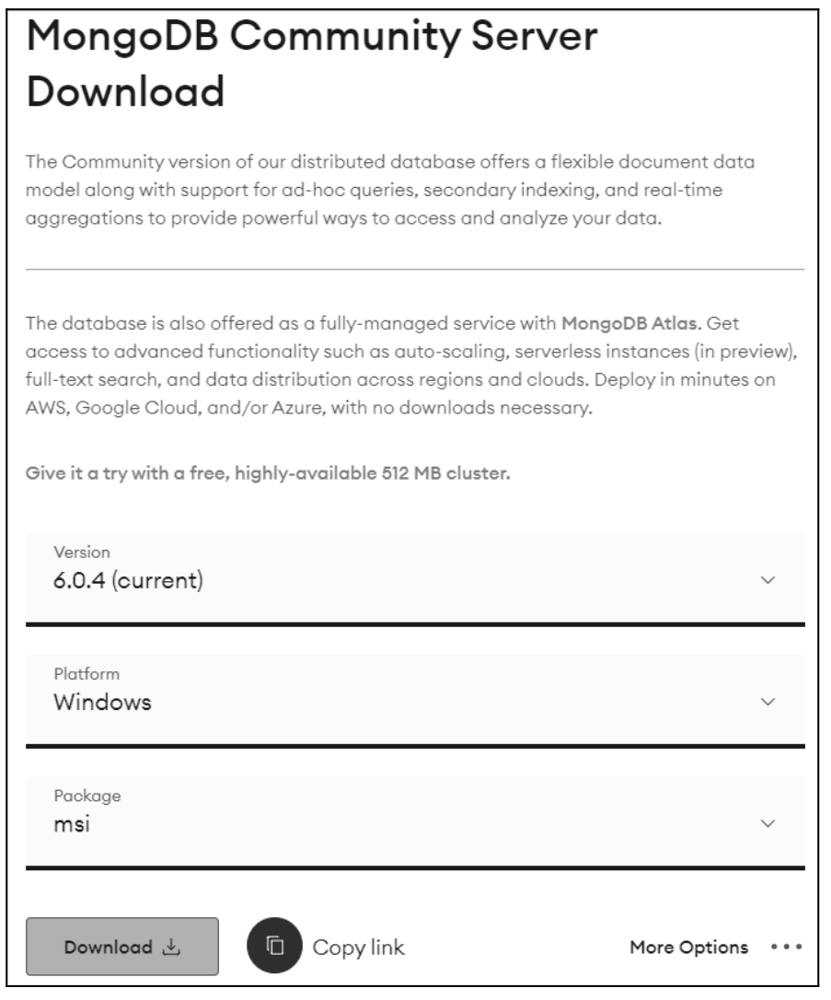

▲图5.27 打开MongoDB下载官网

▲图5.28 选择自定义安装

▲图5.29 选择安装路径

▲图5.30 安装图形界面管理工具

（5）单击Install按钮开始安装，安装完成后单击Finish按钮。

（6）打开下载Database工具的网址https://www.mongodb.com/try/download/database-tools，下载Database Tools，如图5.31所示。

（7）先将下载后的工具包解压，然后将bin文件夹中的文件复制并粘贴到MongoDB数据库的安装目录bin文件夹当中，如图5.32所示。

▲图5.31 下载Database工具包

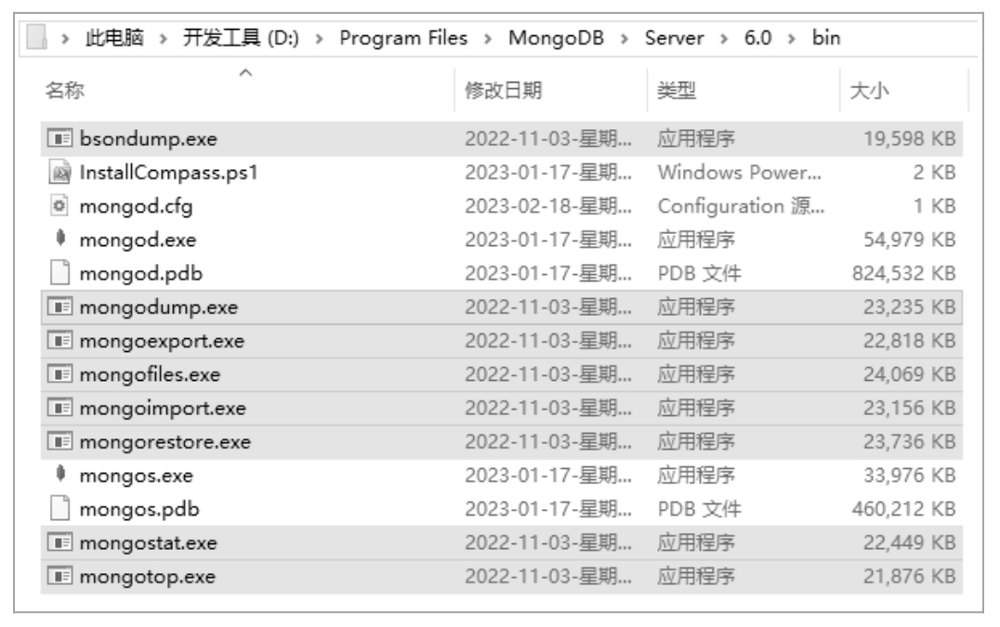

▲图5.32 复制工具文件到MongoDB数据库的安装目录

（8）导入数据库文件。以MongoDB数据库mrbooks为例，首先执行cmd命令打开“命令提示符”窗口，在命令提示符下进入MongoDB数据库安装目录，如笔者的安装目录为“D:\Program Files\\MongoDB\\Server\6.0\bin\>”，方法如下：

C:\Windows\system32\>d:

D:\\cd D:\Program Files\MongoDB\Server\6.0\bin

（9）在D:\Program Files\MongoDB\Server\6.0\bin\>目录下，使用MongoDB数据库的mongoimport命令导入数据库文件books.json。注意，这里应首先保证将源码文件夹中提供的数据库文件books.json复制到D盘根目录下。

导入命令如下：

mongoimport --db mrbooks --collection books --jsonArray d:\books.json

（10）导入成功后会出现类似如图5.33所示的提示信息，提示5个文档导入成功。

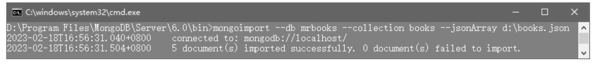

图5.33 提示信息

（11）查看数据。首先需要在https://www.mongodb.com/try/download/shell页面中下载mongosh工具包，如图5.34所示。然后将mongosh-1.7.1-win32-x64.zip工具包中bin目录下的文件解压到MongoDB安装目录的bin文件夹当中，如图5.35所示。

首先在命令提示符下输入如下命令，进入MongoDB数据库。

D:\Program Files\MongoDB\Server\6.0\bin\>mongosh

▲图5.34 下载mongosh工具包

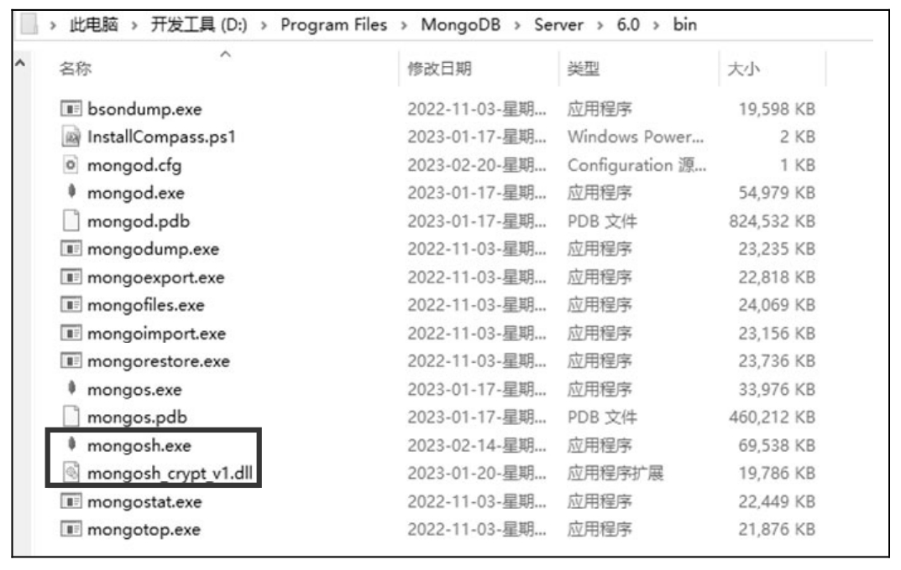

▲图5.35 解压文件

然后使用use mrbooks命令打开数据库，提示switched to db mrbooks（切换到mrbooks数据库），使用如下命令查看该数据库中的表books中的数据。

db.books.find();

结果如图5.36所示，这说明数据库mrbooks已经导入MongoDB数据库中。

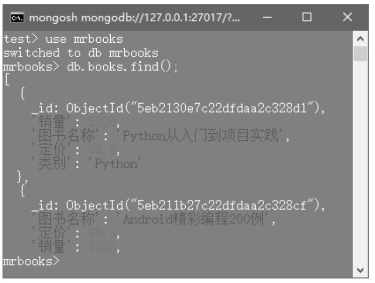

图5.36 查看数据

接下来通过Python读取MongoDB数据库中的数据。

（1）安装PyMongo模块。运行cmd命令，打开“命令提示符”窗口，输入如下命令：

pip install pymongo

（2）导入相关模块。代码如下：

1  import pymongo

2  import pandas as pd

（3）连接MongoDB数据库，指定数据库和表。代码如下：

3  client = pymongo.MongoClient('localhost', 27017)  # 连接MongoDB数据库

4  db = client\['mrbooks'\]                              # 指定数据库

5  table = db\['books'\]                                 # 指定数据表

（4）使用Pandas读取表books中的数据。代码如下：

6  df = pd.DataFrame(list(table.find()))  # 读取表books中的数据

7  print(df)

运行程序，输出结果如图5.37所示。

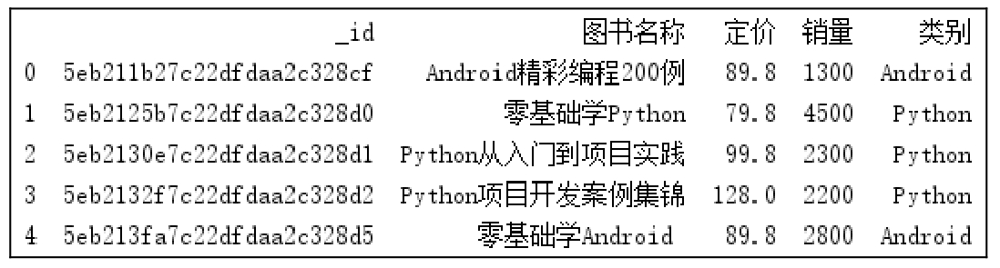

图5.37 Python读取MongoDB数据库汇中的数据

从上述结果得知：\_id列对于数据分析来说属于无用数据，下面通过Pandas进行简单的数据清洗，删除_id列，代码如下。

1  # 删除id列

2  del df\['\_id'\]

3  print(df)

## 5.6 小结

本章介绍了如何使用Pandas模块实现数据的读取，其中包含读取文本文件、Excel文件的读取与写入、CSV文件的读取与写入以及如何读取HTML网页，最后介绍了如何通过Python读取MySQL数据库和MongoDB数据库中的数据。本章所介绍的内容属于数据分析的第一步“读取数据”，只有完全掌握了读取数据的技术才可以进行下一步的分析，希望大家可以勤加练习，完全掌握本章内容。

