# 6 Pandas模块之数据的处理

数据读取后并不是所有的数据都是我们所需要的，因此还要对数据进行简单的处理，本章将主要介绍如何进行数据的抽取，数据的增、删、改、查以及如何对数据进行排序与排名操作。

本章知识架构如下。

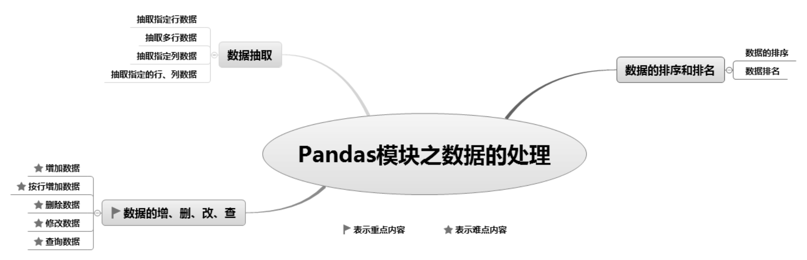

## 6.1 数据抽取

在数据分析的过程中，数据读取后，并不是所有的数据都是我们所需要的，此时可以抽取部分数据，主要使用DataFrame()对象的loc属性和iloc属性，示意图如图6.1所示。

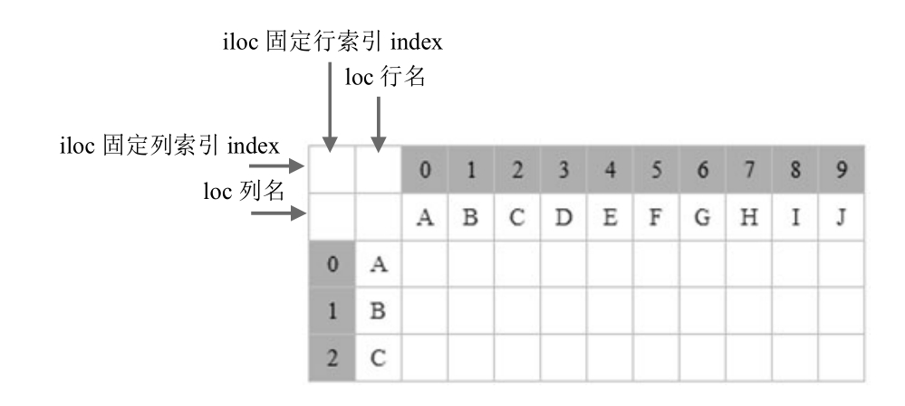

<p class="book-caption">图6.1 loc属性和iloc属性示意图</p>

DataFrame()对象的loc属性和iloc属性都可以抽取数据，区别如下： 

 loc属性：以列名（columns）和行名（index）作为参数，当只有一个参数时，默认是行名，即抽取整行数据，包括所有列，如df.loc\['A'\]。 

 iloc属性：以行和列位置索引（即0，1，2，…）作为参数，0表示第一行，1表示第二行，以此类推。当只有一个参数时，默认是行索引，即抽取整行数据，包括所有列。如抽取第一行数据，df.iloc\[0\]。

### 6.1.1 抽取指定行数据

实现抽取一行数据时可以使用loc属性。

**【例6.1】**抽取一行学生成绩数据**（实例位置：资源包\\TM\\sl\\06\\01）**

抽取一行名为“甲”的学生成绩数据（包括所有列），程序代码如下：

```text
1  import pandas as pd
2  # 设置数据显示的编码格式为东亚宽度，以使列对齐
3  pd.set_option('display.unicode.east_asian_width', True)
4  data = [[110,105,99],[105,88,115],[109,120,130],[112,115]]
5  name = ['甲','乙','丙','丁']
6  columns = ['语文','数学','英语']
7  df = pd.DataFrame(data=data, index=name, columns=columns)
8  print(df.loc['甲'])
```

运行程序，输出结果如图6.2所示。

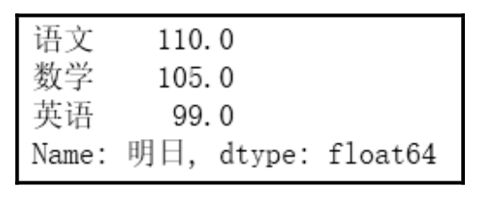

<p class="book-caption">图6.2 抽取一行数据</p>

使用iloc属性抽取第一行数据，指定行索引即可，如df.iloc\[0\]。

### 6.1.2 抽取多行数据

通过loc属性和iloc属性指定行名和行索引即可实现抽取任意多行数据。

**【例6.2】**抽取多行学生成绩数据**（实例位置：资源包\\TM\\sl\\06\\02）**

抽取行名为“甲”和“丙”（即第1行和第3行数据）的学生成绩数据，关键代码如下：

```text
1  print(df.loc[['甲','丙']])
2  print(df.iloc[[0,2]])
```

运行程序，输出结果如图6.3所示。

在loc属性和iloc属性中合理使用冒号（:），即可抽取连续任意多行数据。

**【例6.3】**抽取多个学生成绩数据**（实例位置：资源包\\TM\\sl\\06\\03）**

下面抽取连续任意多个学生成绩数据，关键代码如下：

```text
1  print(df.loc['甲':'丁'])  # 从“甲”到“丁”
2  print(df.loc[:'乙':])       # 第1行到“乙”
3  print(df.iloc[0:4])         # 第1行到第4行
4  print(df.iloc[1::])         # 第2行到最后1行
```

运行程序，输出结果如图6.4所示。

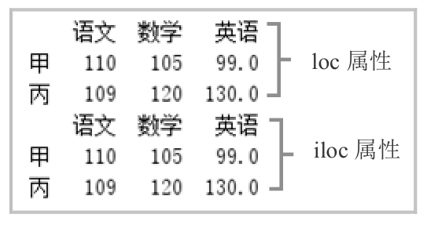

<p class="book-caption">▲图6.3 抽取多行数据</p>

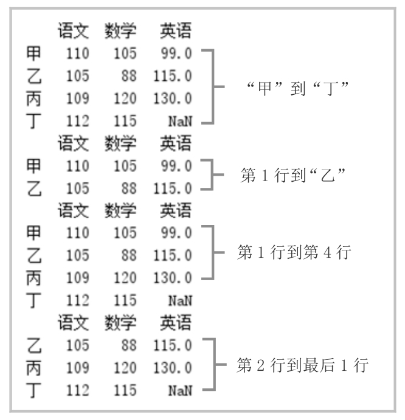

<p class="book-caption">▲图6.4 抽取连续任意多行数据</p>

### 6.1.3 抽取指定列数据

抽取指定列数据，可以直接使用列名，也可以使用loc属性和iloc属性。

**【例6.4】**抽取学生“语文”和“数学”成绩**（实例位置：资源包\\TM\\sl\\06\\04）**

抽取列名为“语文”和“数学”的学生成绩数据，程序代码如下：

```text
1  import pandas as pd
2  # 设置数据显示的编码格式为东亚宽度，以使列对齐
3  pd.set_option('display.unicode.east_asian_width', True)
4  data = [[110,105,99],[105,88,115],[109,120,130],[112,115]]
5  name = ['甲','乙','丙','丁']
6  columns = ['语文','数学','英语']
7  df = pd.DataFrame(data=data, index=name, columns=columns)
8  print(df[['语文','数学']])
```

运行程序，输出结果如图6.5所示。

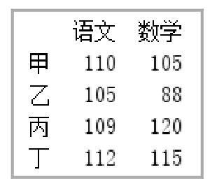

<p class="book-caption">图6.5 “语文”和“数学”成绩</p>

loc属性和iloc属性都有两个参数，第一个参数代表行，第二个参数代表列，抽取指定列数据时，行参数不能省略。

**【例6.5】**抽取指定学科的成绩**（实例位置：资源包\\TM\\sl\\06\\05）**

下面使用loc属性和iloc属性抽取指定列数据，关键代码如下：

```text
1  print(df.loc[:,['语文','数学']])  # 抽取“语文”和“数学”
2  print(df.iloc[:,[0,1]])             # 抽取第1列和第2列
3  print(df.loc[:,'语文':])            # 抽取从“语文”开始到最后一列
4  print(df.iloc[:,:2])                # 连续抽取从第1列开始到第3列，但不包括第3列
```

运行程序，输出结果如图6.6所示。

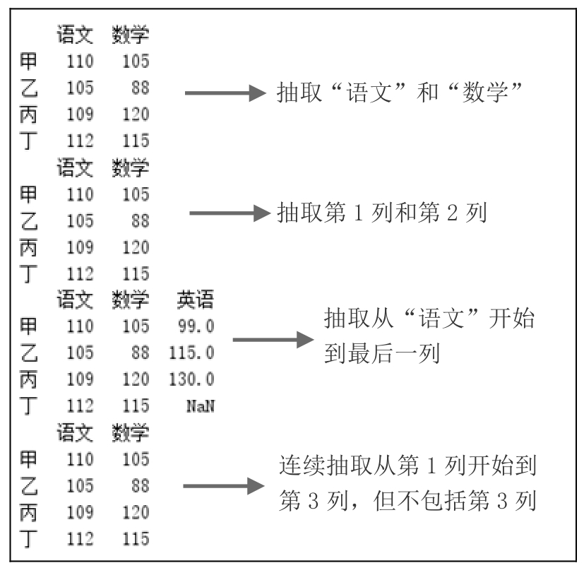

<p class="book-caption">图6.6 抽取指定学科的成绩</p>

### 6.1.4 抽取指定的行、列数据

抽取指定行、列数据主要使用loc属性和iloc属性，这两个属性的两个参数都指定就可以实现指定行列数据的抽取。

**【例6.6】**抽取指定学科和指定学生的成绩**（实例位置：资源包\\TM\\sl\\06\\06）**

使用loc属性和iloc属性抽取指定行、列数据，程序代码如下：

```text
1   import pandas as pd
2   # 设置数据显示的编码格式为东亚宽度，以使列对齐
3   pd.set_option('display.unicode.east_asian_width', True)
4   data = [[110,105,99],[105,88,115],[109,120,130],[112,115]]
5   name = ['甲','乙','丙','丁']
6   columns = ['语文','数学','英语']
7   df = pd.DataFrame(data=data, index=name, columns=columns)
8   print(df.loc['乙','英语'])            # 输出“乙”的 “英语”成绩
9   print(df.loc[['乙'],['英语']])          #  “乙”的“英语”成绩
10  print(df.loc[['乙'],['数学','英语']]) #  “乙”的“数学”和“英语”成绩
11  print(df.iloc[[1],[2]])                 # 第2行第3列
12  print(df.iloc[1:,[2]])                  # 第2行到最后一行的第3列
13  print(df.iloc[1:,[0,2]])                # 第2行到最后一行的第1列和第3列
14  print(df.iloc[:,2])                     # 所有行，第3列
```

运行程序，输出结果如图6.7所示。

在上述结果中，第一个输出结果是一个数，不是DataFrame类型的数据，这是由于“df.loc\['乙'，'英语'\]”没有使用方括号\[\]。

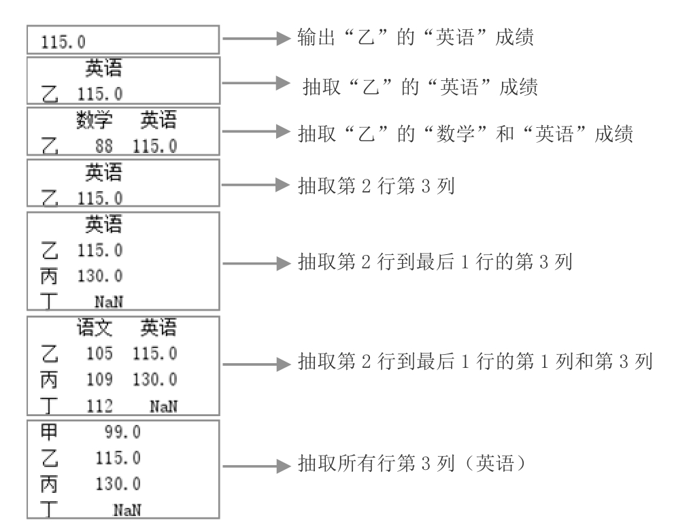

<p class="book-caption">图6.7 抽取指定学科和指定学生的成绩</p>

## 6.2 数据的增、删、改、查

### 6.2.1 增加数据

DataFrame()对象增加数据主要包括列数据增加和行数据增加。我们首先来看原始数据，如图6.8所示。

**1. 直接为DataFrame()对象赋值**

**【例6.7】**增加一列“物理”成绩**（实例位置：资源包\\TM\\sl\\06\\07）**

增加一列“物理”成绩，程序代码如下：

```text
1  import pandas as pd
2  # 设置数据显示的编码格式为东亚宽度，以使列对齐
3  pd.set_option('display.unicode.east_asian_width', True)
4  data = [[110,105,99],[105,88,115],[109,120,130],[112,115,140]]
5  name = ['甲','乙','丙','丁']
6  columns = ['语文','数学','英语']
7  df = pd.DataFrame(data=data, index=name, columns=columns)
8  df['物理']=[88,79,60,50]
9  print(df)
```

运行程序，输出结果如图6.9所示。

**2. 使用loc属性在DataFrame()对象的最后增加一列**

**【例6.8】**使用loc属性增加一列“物理”成绩**（实例位置：资源包\\TM\\sl\\06\\08）**

使用loc属性在DataFrame()对象的最后增加一列。例如，增加“物理”列，关键代码如下：

```text
df.loc[:,'物理'] = [88,79,60,50]
```

在DataFrame()对象最后增加一列“物理”，其值为等号右边数据。

**3. 在指定位置插入一列**

在指定位置插入一列，主要使用insert()函数实现。

**【例6.9】**在第一列后面插入“物理”成绩**（实例位置：资源包\\TM\\sl\\06\\09）**

例如，在第一列后面插入“物理”，其值为wl的数值，关键代码如下：

```text
1  wl =[88,79,60,50]
2  df.insert(1,'物理',wl)
3  print(df)
```

运行程序，输出结果如图6.10所示。

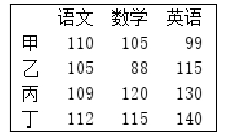

<p class="book-caption">▲图6.8 原始数据</p>

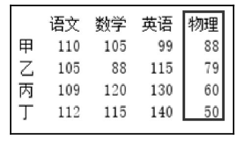

<p class="book-caption">▲图6.9 增加一列“物理”成绩</p>

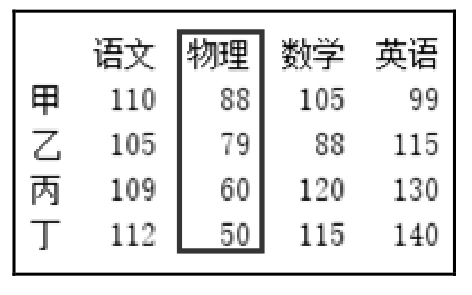

<p class="book-caption">▲图6.10 在第一列后插入“物理”成绩</p>

### 6.2.2 按行增加数据

**1. 增加一行数据**

增加一行数据主要使用loc属性实现。

**【例6.10】**在成绩表中增加一行数据**（实例位置：资源包\\TM\\sl\\06\\10）**

在成绩表中增加一行数据，即“戊”同学的成绩，关键代码如下：

```text
1  df.loc['戊'] = [100,120,99]
```

运行程序，输出结果如图6.11所示。

**2. 增加多行数据**

增加多行数据主要使用字典结合append()函数实现。

**【例6.11】**在成绩表中增加多行数据**（实例位置：资源包\\TM\\sl\\06\\11）**

在原有数据中增加“戊”“己”和“庚”3名同学的成绩，关键代码如下：

```text
1  df_insert=pd.DataFrame({'语文':[100,123,138],'数学':[99,142,60],'英语':[98,139,99]},index = ['戊','己','庚'])
2  df1 = df.append(df_insert)
```

运行程序，输出结果如图6.12所示。

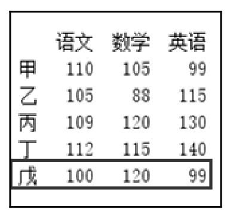

<p class="book-caption">▲图6.11 增加一行数据</p>

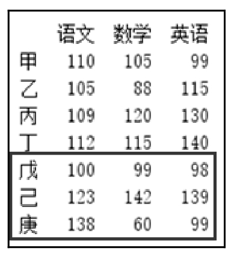

<p class="book-caption">▲图6.12 增加多行数据</p>

### 6.2.3 删除数据

删除数据主要使用DataFrame()对象的drop()函数。语法如下：

```text
DataFrame.drop(labels=None, axis=0, index=None, columns=None, level=None, inplace=False, errors='raise')
```

参数说明： 

 labels：表示行标签或列标签。 

 axis：axis = 0，表示按行删除；axis = 1，表示按列删除；默认值为0。 

 index：删除行，默认值为None。 

 columns：删除列，默认值为None。 

 level：针对有两级索引的数据。level = 0，表示按第1级索引删除整行；level = 1表示按第2级索引删除整行；默认值为None。 

 inplace：可选参数，对原数组做出修改并返回一个新数组。默认值为False，如果值为True，那么原数组直接就被替换。 

 errors：参数值为ignore或raise，默认值为raise。如果值为ignore（忽略），则取消错误。

**1. 删除行列数据**

**【例6.12】**删除学生成绩数据**（实例位置：资源包\\TM\\sl\\06\\12）**

删除指定的学生成绩数据，关键代码如下：

```text
1  df.drop(['数学'],axis=1,inplace=True)         # 删除某列
2  df.drop(columns='数学',inplace=True)          # 删除columns为“数学”的列
3  df.drop(labels='数学', axis=1,inplace=True) # 删除列标签为“数学”的列
4  df.drop(['甲','乙'],inplace=True)           # 删除某行
5  df.drop(index='甲',inplace=True)              # 删除index为“甲”的行
6  df.drop(labels='甲', axis=0,inplace=True)   # 删除行标签为“甲”的行
```

以上代码中的函数都可以实现删除指定的行列数据，读者选择一种就可以。

**2. 删除特定条件的行**

删除满足特定条件的行，首先找到满足该条件的行索引，然后使用drop()函数将其删除。

**【例6.13】**删除符合条件的学生成绩数据**（实例位置：资源包\\TM\\sl\\06\\13）**

删除“数学”中包含88的行、“语文”小于110的行，关键代码如下：

```text
1  df.drop(index=df[df['数学'].isin([88])].index[0],inplace=True)  # 删除“数学”包含88的行
2  df.drop(index=df[df['语文']\<110].index[0],inplace=True)         # 删除“语文”小于110的行
```

### 6.2.4 修改数据

修改数据包括行、列、标题和数据的修改，我们首先来看原始数据，如图6.13所示。

**1. 修改列标题**

修改列标题主要使用DataFrame()对象的cloumns属性，直接赋值即可。

**【例6.14】**修改“数学”的列名**（实例位置：资源包\\TM\\sl\\06\\14）**

将“数学”修改为“数学（上）”，关键代码如下：

```text
df.columns=['语文','数学(上)','英语']
```

上述代码中，即使我们只修改“数学”为“数学（上）”，但是也要将所有列的标题全部写上，否则将报错。

运行程序，输出结果如图6.14所示。

下面再介绍一种方法，使用DataFrame()对象的rename()函数修改列标题。

**【例6.15】**修改多个学科的列名**（实例位置：资源包\\TM\\sl\\06\\15）**

将“语文”修改为“语文（上）”、“数学”修改为“数学（上）”、“英语”修改为“英语（上）”，关键代码如下：

```text
df.rename(columns = {'语文':'语文(上)','数学':'数学(上)','英语':'英语(上)'},inplace = True)
```

上述代码中，参数inplace为True，表示直接修改df；否则，不修改df，只返回修改后的数据。

运行程序，输出结果如图6.15所示。

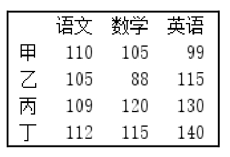

<p class="book-caption">▲图6.13 原始数据</p>

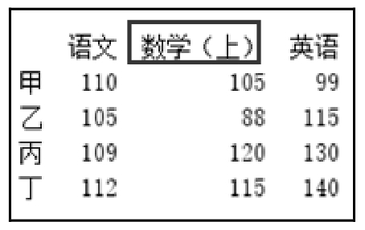

<p class="book-caption">▲图6.14 修改“数学”的列名</p>

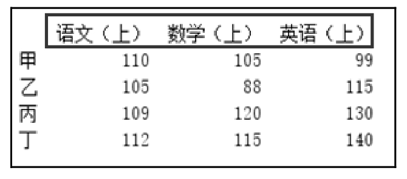

<p class="book-caption">▲图6.15 修改多个学科的列名</p>

**2. 修改行标题**

修改行标题主要使用DataFrame()对象的index属性，直接赋值即可。

**【例6.16】**将行标题统一修改为数字编号**（实例位置：资源包\\TM\\sl\\06\\16）**

将行标题统一修改为数字编号，关键代码如下：

```text
df.index=list('1234')
```

使用DataFrame()对象的rename()函数也可以修改行标题。例如，将行标题统一修改为数字编号，关键代码如下：

```text
df.rename({'甲':1,'乙':2,'丙':3,'丁':4},axis=0,inplace = True)
```

**3. 修改数据**

修改数据主要使用DataFrame()对象的loc属性和iloc属性。

**【例6.17】**修改学生成绩数据**（实例位置：资源包\\TM\\sl\\06\\17）**

（1）修改整行数据。例如，修改“甲”同学的各科成绩，关键代码如下：

```text
df.loc['甲']=[120,115,109]
```

如果各科成绩均加10分，可以直接在原有值加10，关键代码如下：

```text
df.loc['甲']=df.loc['甲']+10
```

（2）修改整列数据。例如，修改所有同学的“语文”成绩，关键代码如下：

```text
df.loc[:,'语文']=[115,108,112,118]
```

（3）修改某一数据。例如，修改“甲”同学的“语文”成绩，关键代码如下：

```text
df.loc['甲','语文']=115
```

（4）使用iloc属性修改数据。通过iloc属性指定行列位置实现修改数据，关键代码如下：

```text
1  df.iloc[0,0]=115                # 修改某一数据
2  df.iloc[:,0]=[115,108,112,118]  # 修改整列数据
3  df.iloc[0,:]=[120,115,109]      # 修改整行数据
```

### 6.2.5 查询数据

DataFrame()对象查询数据主要是通过运算符和函数对数据进行筛选。主要包括： 

 逻辑运算符：\>、\>=、\<、\<=、==（双等于）、!=（不等于）。 

 复合逻辑运算符：&（并且）、\|（或者）。 

 逻辑运算函数：query()、isin()和between()。其中query()函数主要用于简化查询代码，isin()函数表示包含，between()函数表示区间。

**【例6.18】**通过逻辑运算符查询数据**（实例位置：资源包\\TM\\sl\\06\\18）**

下面通过逻辑运算符查询学生成绩数据，程序代码如下：

```text
1   import pandas as pd
2   # 设置数据显示的编码格式为东亚宽度，以使列对齐
3   pd.set_option('display.unicode.east_asian_width', True)
4   df= pd.DataFrame({'姓名':['甲','乙','丙'],
5                     '语文':[110,105,109],
6                     '数学':[105,88,120],
7                     '英语':[99,115,130]})
8   print(df)
9   ''' 逻辑运算符号：\> 、\>=、 \<、 \<=、 == (双等于)、!=(不等于)'''
10  print(df[df['语文']\>105])
11  print(df[df['英语']\>=115])
12  print(df[df['英语']==115])
13  print(df[df['英语']!=115])
```

运行程序，输出结果如图6.16所示。

**【例6.19】**通过复合运算符查询数据**（实例位置：资源包\\TM\\sl\\06\\19）**

下面通过复合运算符分别查询“语文”大于105并且“数学”大于88的学生成绩和“语文”大于105或者数学大于88的学生成绩，程序代码如下：

```text
1   import pandas as pd
2   # 设置数据显示的编码格式为东亚宽度，以使列对齐
3   pd.set_option('display.unicode.east_asian_width', True)
4   df= pd.DataFrame({'姓名':['甲','乙','丙','丁'],
5                     '语文':[110,105,109,99],
6                     '数学':[105,88,120,90],
7                     '英语':[99,115,130,120]})
8   '''复合逻辑运算符：&(并且) 、\|(或者)'''
9   '''查询“语文”大于105并且“数学”大于88'''
10  print(df[(df['语文']\>105) & (df['数学']\>88)])
11  '''查询“语文”大于105或者数学大于88'''
12  print(df[(df['语文']\>105) \| (df['数学']\>88)])
```

运行程序，输出结果如图6.17所示。

下面重点介绍逻辑运算函数。

**1. query()函数**

**【例6.20】**使用query()函数简化查询代码**（实例位置：资源包\\TM\\sl\\06\\20）**

在前面的示例中，当查询“语文”大于105的学生成绩时，代码如下：

```text
df[df['语文']\>105]
```

下面使用query()函数进行简化，代码如下：

```text
df.query('语文\>105')
```

**2. isin()函数**

isin()函数不仅可以针对整个DataFrame()对象进行操作，也可以针对DataFrame()对象中的某一列（Series()对象）进行操作，而针对Series()对象的操作才是最常用的。

isin()函数的作用如下： 

 判断整个DataFrame()对象中是否包含某个值或某些值。 

 判断DataFrame()对象中的某一列（Series()对象）是否包含某个值或某些值。 

 利用一个DataFrame()对象中的某一列，对另一个DataFrame()对象中的数据进行过滤，这一点非常重要。

**【例6.21】**使用isin()函数查询数据**（实例位置：资源包\\TM\\sl\\06\\21）**

下面使用isin()函数查询两种数据：一是查询所有数据中包含45和60的数据；二是查询“化学”中包含45和60的数据，程序代码如下：

```text
1   import pandas as pd
2   # 设置数据显示的编码格式为东亚宽度，以使列对齐
3   pd.set_option('display.unicode.east_asian_width', True)
4   df= pd.DataFrame({'姓名':['甲','乙','丙'],
5                     '语文':[110,105,109],
6                     '数学':[105,60,120],
7                     '英语':[99,115,130],
8                     '物理':[60,89,99],
9                     '化学':[45,60,70]})
10  '''逻辑运算函数：isin()函数'''
11  '''判断所有数据中包含45和60的数据'''
12  df1=df[df.isin([45,60])]
13  print(df1)
14  '''判断“化学”中包含45和60的数据'''
15  df2=df[df['化学'].isin([45,60])]
16  print(df2)
```

运行程序，输出结果如图6.18所示。

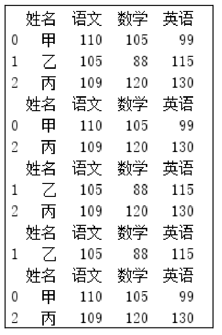

<p class="book-caption">▲图6.16 通过逻辑运算符查询数据</p>

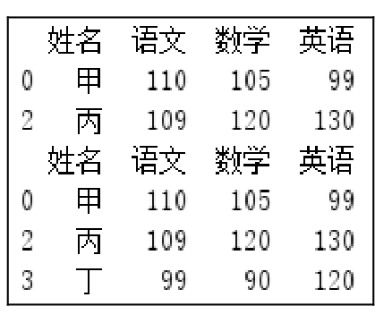

<p class="book-caption">▲图6.17 通过复合运算符查询数据</p>

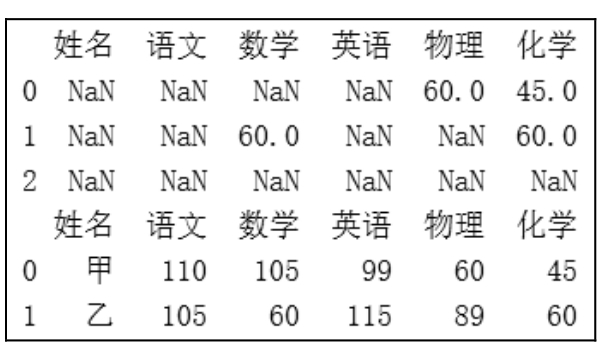

<p class="book-caption">▲图6.18 使用isin()函数查询数据</p>

isin()函数的另外一种用法是可以实现一个DataFrame()对象中的某一列对另一个DataFrame()对象中的数据进行过滤。

**【例6.22】**查询女生的学习成绩**（实例位置：资源包\\TM\\sl\\06\\22）**

通过学生基本信息数据（df2）中的“性别”，对学生成绩（df1）进行筛选，查询所有女生的学习成绩，程序代码如下：

```text
1   import pandas as pd
2   # 设置数据显示的编码格式为东亚宽度，以使列对齐
3   pd.set_option('display.unicode.east_asian_width', True)
4   df1= pd.DataFrame({'姓名':['甲','乙','丙'],
5                     '语文':[110,105,109],
6                     '数学':[105,60,120],
7                     '英语':[99,115,130],
8                     '物理':[60,89,99],
9                     '化学':[45,60,70]})
10  print(df1)
11  df2=pd.DataFrame({'姓名':['甲','乙','丙'],
12                    '性别':['男','女','女'],
13                    '年龄':[16,15,16]})
14  print(df2)
15  '''逻辑运算函数：isin()函数'''
16  '''利用df2中的性别一列，来对df1中的数据进行筛选'''
17  df1=df1[df2['性别'].isin(['女'])]
18  print(df1)
```

运行程序，输出结果如图6.19所示。

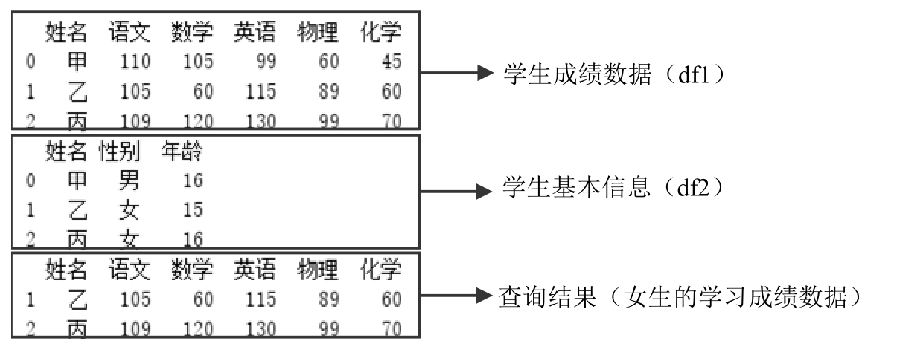

<p class="book-caption">图6.19 查询所有女生的学习成绩</p>

**3. between()函数**

between()函数用于查询指定范围内的数据，返回布尔值。

**【例6.23】**使用between()函数查询数据**（实例位置：资源包\\TM\\sl\\06\\23）**

下面使用between()函数查询“语文”100～120分的数据，程序代码如下：

```text
1   import pandas as pd
2   # 设置数据显示的编码格式为东亚宽度，以使列对齐
3   pd.set_option('display.unicode.east_asian_width', True)
4   df= pd.DataFrame({'姓名':['甲','乙','丙'],
5                     '语文':[110,105,109],
6                     '数学':[105,88,120],
7                     '英语':[99,115,130]})
8   '''逻辑运算函数：between()函数'''
9   df1=df[df['语文'].between(100,120)]
10  print(df1)
```

运行程序，输出结果如图6.20所示。

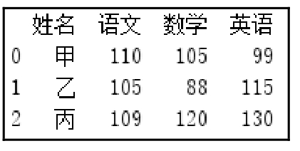

<p class="book-caption">图6.20 使用between()函数查询数据</p>

## 6.3 数据的排序和排名

### 6.3.1 数据的排序

DataFrame数据排序主要使用sort_values()函数，该函数类似于SQL中的order by语句。sort_values()函数可以根据指定的行或列进行排序，语法如下：

```text
DataFrame.sort_values(by,axis=0,ascending=True,inplace=False,kind='quicksort',na_position='last',ignore_index=False)
```

参数说明： 

 by：要排序的名称列表。 

 axis：轴，0表示行，1表示列，默认按行排序。 

 ascending：升序或降序排序，布尔值。指定多个排序时可以使用布尔值列表。默认值为True。 

 inplace：布尔值，表示是否修改原数据。默认值为False，表示不修改；如果值为True，则在原数据中进行排序。 

 kind：指定排序算法，值为quicksort（快速排序）、mergesort（混合排序）或heapsort（堆排），默认值为quicksort。 

 na_position：空值（NaN）的位置。值为first，表示空值在数据开头；值为last，表示空值在数据最后。默认值为last。 

 ignore_index：布尔值，表示是否忽略索引。值为True，标记索引（从0开始按顺序的整数值）；值为False，则忽略索引。

**1. 按一列数据排序**

**【例6.24】**按“销量”降序排序**（实例位置：资源包\\TM\\sl\\06\\24）**

按“销量”降序排序，排序对比效果如图6.21和图6.22所示。

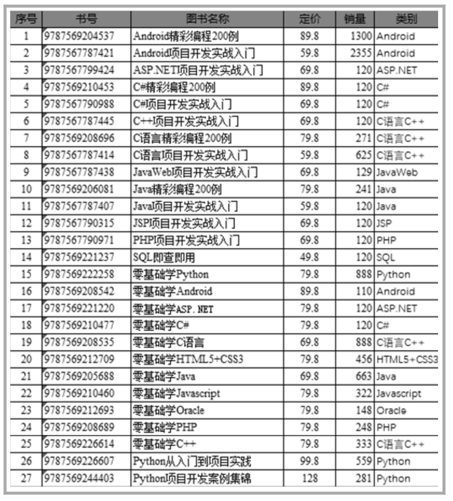

<p class="book-caption">▲图6.21 原始数据</p>

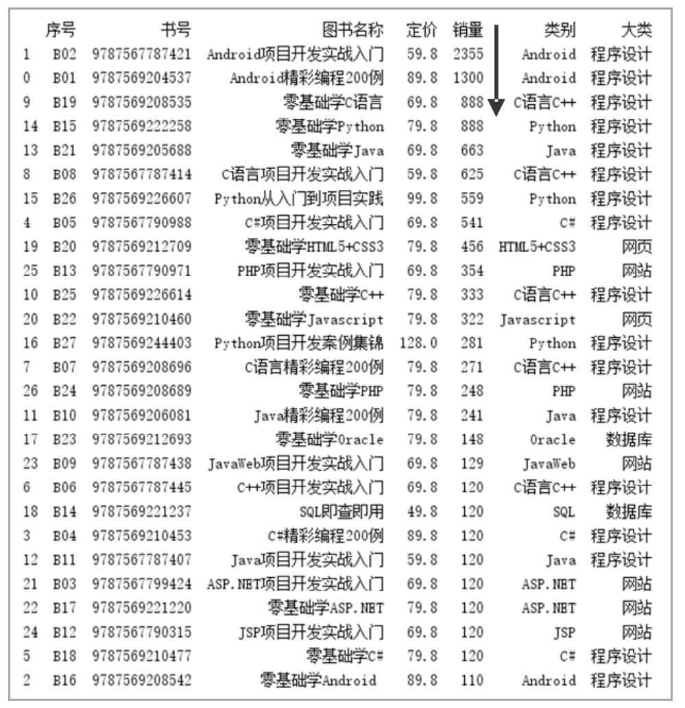

<p class="book-caption">▲图6.22 按“销量”降序排序</p>

程序代码如下：

```text
1  import pandas as pd
2  df =pd.read_excel('mrbook.xlsx')
3  # 设置数据显示的列数和宽度
4  pd.set_option('display.max_columns',500)
5  pd.set_option('display.width',1000)
6  # 设置数据显示的编码格式为东亚宽度，以使列对齐
7  pd.set_option('display.unicode.ambiguous_as_wide', True)
8  pd.set_option('display.unicode.east_asian_width', True)
9   # 按“销量”列降序排序
10  df=df.sort_values(by='销量',ascending=False)
11  print(df)
```

**2. 按多列数据排序**

多列排序是按照给定列的先后顺序进行排序的。

**【例6.25】**按照“图书名称”和“销量”降序排序**（实例位置：资源包\\TM\\sl\\06\\25）**

按照“图书名称”和“销量”降序排序，首先按“图书名称”降序排序，然后按“销量”降序排序，排序后的效果如图6.23所示。

关键代码如下：

```text
df.sort_values(by=['图书名称','销量'],ascending=[False,False])
```

**3. 对统计结果排序**

**【例6.26】**对分组统计数据进行排序**（实例位置：资源包\\TM\\sl\\06\\26）**

按“类别”分组统计销量并进行降序排序，统计排序后的效果如图6.24所示。

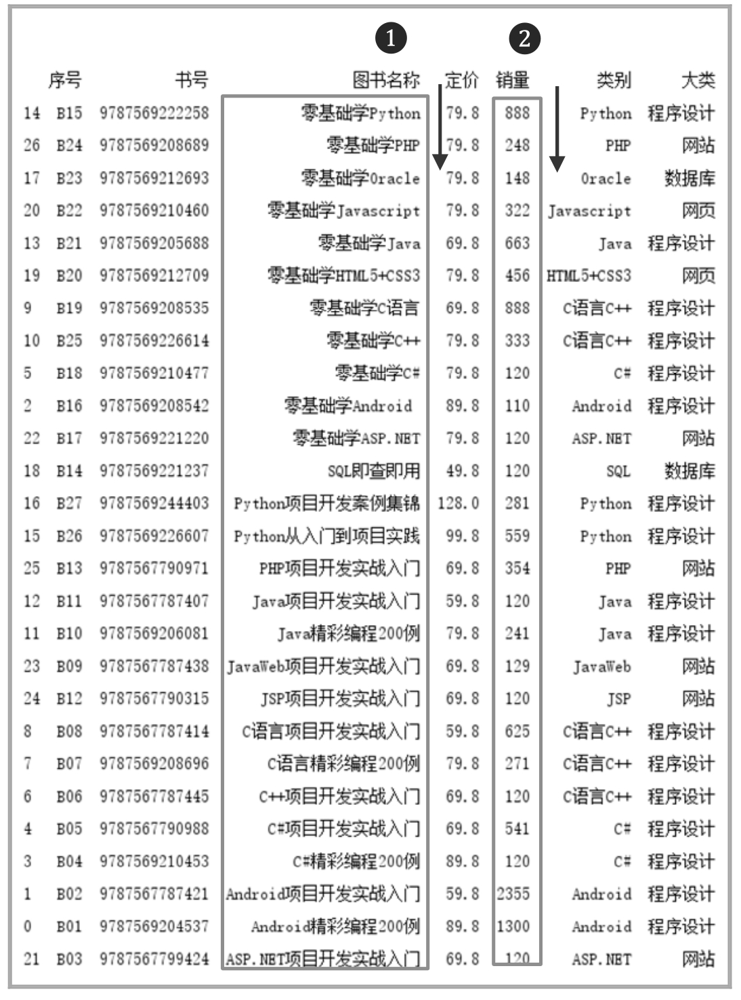

<p class="book-caption">▲图6.23 按照“图书名称”和“销量”降序排序</p>

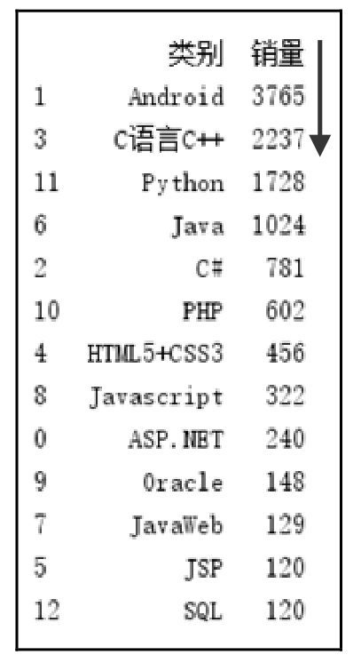

<p class="book-caption">▲图6.24 按“类别”分组统计销量并降序排序</p>

关键代码如下：

```text
1  df1=df.groupby(["类别"])["销量"].sum().reset_index()
2  df2=df1.sort_values(by='销量',ascending=False)
```

**4. 按行数据排序**

**【例6.27】**按行数据排序**（实例位置：资源包\\TM\\sl\\06\\27）**

按行排序，关键代码如下：

```text
dfrow.sort_values(by=0,ascending=True,axis=1)
```

**注意**

按行排序的数据类型要一致，否则会出现错误提示。

### 6.3.2 数据排名

排名是根据Series()对象或DataFrame()对象的某几列的值进行排名，主要使用rank()函数，语法如下：

```text
DataFrame.rank(axis=0,method='average',numeric_only=None,na_option='keep',ascending=True,pct=False)
```

参数说明： 

 axis：轴，0表示行，1表示列，默认按行排序。 

 method：表示在具有相同值的情况下所使用的排序函数。设置值如下： 

 average：默认值，平均排名。 

 min：最小值排名。 

 max：最大值排名。 

 first：按值在原始数据中出现的顺序分配排名。 

 dense：密集排名，类似最小值排名，但是排名每次只增加1，即排名相同的数据只占1个名次。 

 numeric_only：对于DataFrame()对象，如果设置值为True，则只对数字列进行排序。 

 na_option：空值的排序方式，设置值如下： 

 keep：保留，将空值等级赋值给NaN值。 

 top：如果按升序排序，则将最小排名赋值给NaN值。 

 bottom：如果按升序排序，则将最大排名赋值给NaN值。 

 ascending：升序或降序排序，布尔值。指定多个排序时可以使用布尔值列表。默认值为True。 

 pct：布尔值，表示是否以百分比形式返回排名。默认值为False。

**1. 顺序排名**

**【例6.28】**对产品销量按顺序进行排名**（实例位置：资源包\\TM\\sl\\06\\28）**

排名相同的，按照相同的值出现的顺序排名，程序代码如下：

```text
1  import pandas as pd
2   df = pd.read_excel('mrbook.xlsx')
3   # 设置数据显示的最大列数和宽度
4   pd.set_option('display.max_columns',500)
5   pd.set_option('display.width',1000)
6   # 设置数据显示的编码格式为东亚宽度，以使列对齐
7   pd.set_option('display.unicode.ambiguous_as_wide', True)
8   pd.set_option('display.unicode.east_asian_width', True)
9   df=df.sort_values(by='销量',ascending=False)                          # 按“销量”列降序排序
10  df['顺序排名'] = df['销量'].rank(method="first", ascending=False)   # 顺序排名
11  print(df[['图书名称', '销量', '顺序排名']])
```

**2. 平均排名**

**【例6.29】**对产品销量进行平均排名**（实例位置：资源包\\TM\\sl\\06\\29）**

排名相同的，以顺序排名的平均值作为平均排名，关键代码如下：

```text
df['平均排名']=df['销量'].rank(ascending=False)
```

运行程序，下面对比一下顺序排名与平均排名的不同，效果如图6.25和图6.26所示。

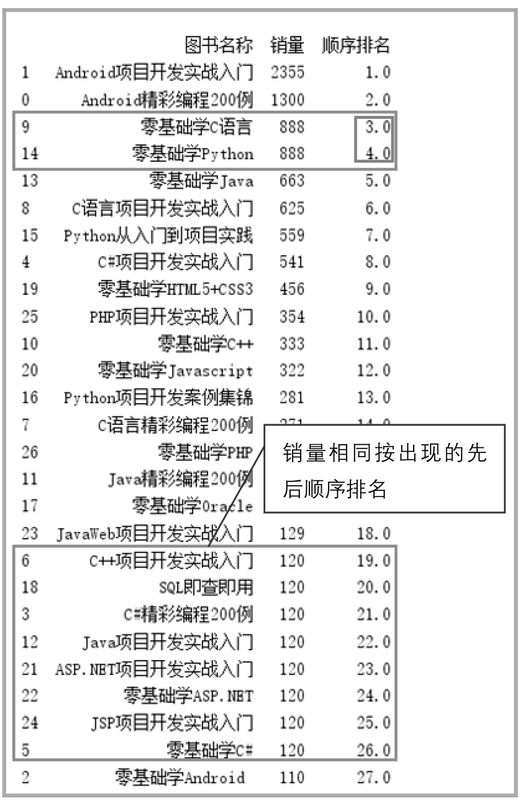

<p class="book-caption">▲图6.25 销量相同按出现的先后顺序排名</p>

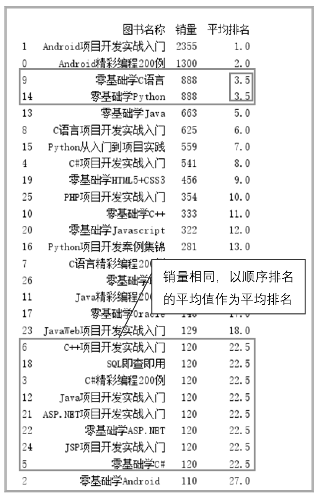

<p class="book-caption">▲图6.26 销量相同按顺序排名的平均值排名</p>

**3. 最小值排名**

排名相同的，以顺序排名取最小值作为排名，关键代码如下：

```text
df['销量'].rank(method="min",ascending=False)
```

**4. 最大值排名**

排名相同的，以顺序排名取最大值作为排名，关键代码如下：

```text
df['销量'].rank(method="max",ascending=False)
```

## 6.4 小结

本章介绍了如何使用Pandas模块实现数据的处理工作，其中包含数据抽取，数据的增、删、改、查操作，最后介绍了如何实现数据的排序以及数据的排名操作。本章所学习的内容都是数据分析中最为常见的技术，希望大家能够熟练掌握这些技术。
