# 7 Pandas模块之数据的清洗

数据清洗是数据分析的一个重要工作，因为数据的质量直接影响数据分析以及算法模型的结果。本章主要介绍在进行数据清洗时如何处理缺失值、重复值和异常值，以及字符串操作和数据转换。

本章知识架构如下。

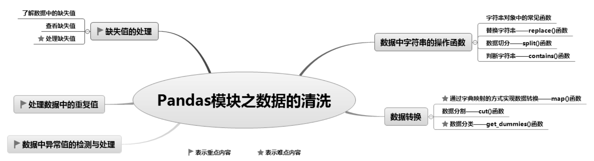

## 7.1 缺失值的处理

### 7.1.1 了解数据中的缺失值

缺失值就是空值，即因某种原因导致的数据为空。缺失值会使数据分析陷入混乱，从而导致不可靠的分析结果。以下3种情况可能会造成数据为空： 

 人为因素导致数据丢失。 

 数据采集过程中无法全面获取数据。如调查问卷，被调查者不愿意分享数据；医疗数据涉及患者隐私，患者不愿意提供等。 

 系统或设备出现故障。

在Python中，缺失值一般表现为NaN，英文全称是not a number（不是一个数），如图7.1所示。除此以外，还可能是None、NaT（日期型，Not a Time）等数据。

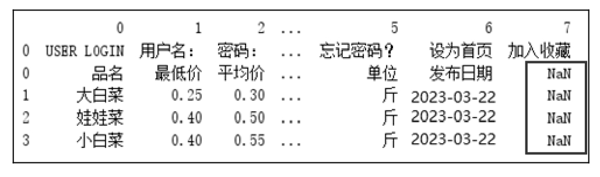

图7.1 Python中的缺失值

### 7.1.2 查看缺失值

在Python中查找数据中的缺失值，有以下3种方法： 

 info()函数：查看索引、数据有多少列、每一列的数据类型、非空值的数量和内存使用量。 

 isnull()函数：空值返回True，非空值返回False。 

 notnull()函数：与isnull()函数相反，空值返回False，非空值返回True。

**【例7.1】**查看数据概况**（实例位置：资源包\\TM\\sl\\07\\01）**

以淘宝销售数据为例，首先输出数据，然后使用info()函数查看数据，程序代码如下：

1  import pandas as pd

2  pd.set_option('expand_frame_repr', False)               # 关闭多个列的折叠状态，防止列太多时显示不清楚

3  pd.set_option('display.unicode.east_asian_width', True) # 设置输出右对齐

4  df=pd.read_excel('TB2023.xls')                          # 读取数据文件

5  print(df)                                                 # 打印数据

6  print(df.info())                                      # 打印数据详情信息

运行程序，输出结果如图7.2所示。

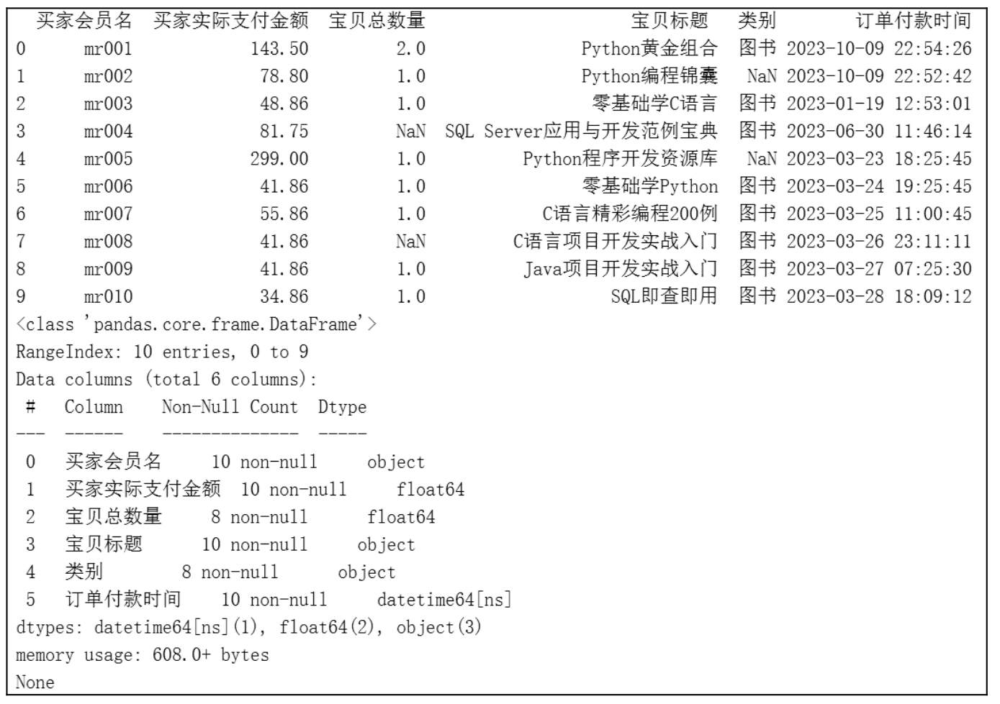

图7.2 缺失值查看

在Python中，缺失值一般以NaN表示，如图7.2所示，通过info()函数我们看到“买家会员名”“买家实际支付金额”“宝贝标题”和“订单付款时间”的非空数量是10，而“宝贝总数量”和“类别”的非空数量是8，那么说明这两项存在空值。

**【例7.2】**判断数据是否存在缺失值**（实例位置：资源包\\TM\\sl\\07\\02）**

判断数据是否存在缺失值还可以使用isnull()函数和notnull()函数实现，关键代码如下：

1  print(df.isnull())

2  print(df.notnull())

运行程序，输出结果如图7.3所示。

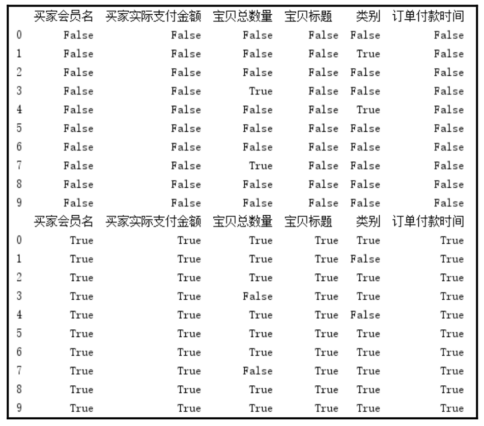

图7.3 判断缺失值

使用isnull()函数缺失值返回True，非缺失值返回False；notnull()函数正好相反，缺失值返回False，非缺失值返回True。

如果使用df\[df.isnull() == False\]，则会将所有不是缺失值的数据找出来，只针对Series()对象。

### 7.1.3 处理缺失值

通过前面的判断得知数据缺失的情况，下面我们将缺失值删除，主要使用dropna()函数，该函数用于删除含有缺失值的行，关键代码如下：

df.dropna()

运行程序，输出结果如图7.4所示。

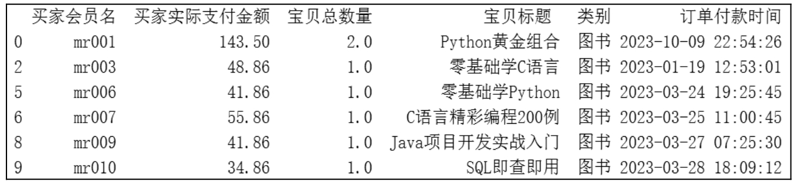

图7.4 缺失值删除处理（1）

### 说明

有些时候数据可能存在整行为空的情况，此时可以在dropna()函数中指定参数how='all'，删除所有空行。

从运行结果得知：dropna()函数将所有包含缺失值的数据全部删除了，而如果此时我们认为有些数据虽然存在缺失值，但是不影响数据分析，那么可以使用以下方法处理。例如，上述数据中只保留“宝贝总数量”不存在缺失值的数据，而类别是否缺失无所谓，则可以使用notnull()函数判断，关键代码如下：

df1=df\[df\['宝贝总数量'\].notnull()\]

运行程序，输出结果如图7.5所示。

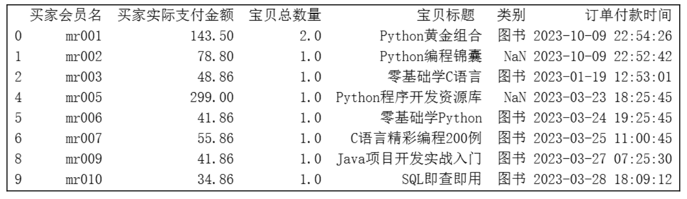

图7.5 缺失值删除处理（2）

对于缺失数据，如果比例高于30%，就可以选择放弃这个指标，做删除处理；如果比例低于30%，则尽量不要删除，而是选择将这部分数据填充，一般以0、均值、众数（大多数）填充。DataFrame()对象中的fillna()函数可以实现填充缺失数据，pad/ffill表示用前一个非缺失值去填充该缺失值；backfill/bfill表示用下一个非缺失值填充该缺失值；None用于指定一个值去替换缺失值。

**【例7.3】**将NaN填充为0**（实例位置：资源包\\TM\\sl\\07\\03）**

如果用于计算的数值型数据为空，可选择用0填充。例如，将“宝贝总数量”为空的数据填充0，关键代码如下：

df\['宝贝总数量'\] = df\['宝贝总数量'\].fillna(0)

运行程序，输出结果如图7.6所示。

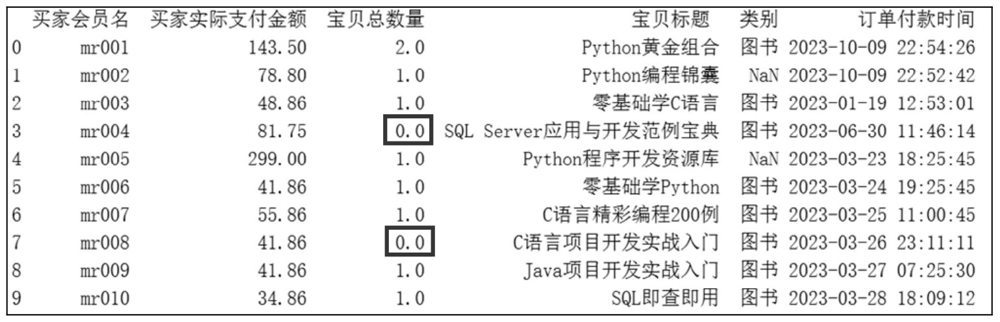

图7.6 缺失值填充处理

## 7.2 处理数据中的重复值

对于数据中存在的重复数据，包括重复的行或者几行中某几列的值重复一般做删除处理，主要使用DataFrame()对象的drop_duplicates()函数。

**【例7.4】**处理淘宝电商销售数据中的重复数据**（实例位置：资源包\\TM\\sl\\07\\04）**

下面以文件“1月.xlsx”中的淘宝销售数据为例，对其中的重复数据进行处理。关键代码如下：

（1）判断每一行数据是否重复（完全相同）。返回值为False，表示不重复；返回值为True，表示重复。代码如下：

df1.duplicated()

（2）去除全部的重复数据。代码如下：

df1.drop_duplicates()

（3）去除指定列的重复数据。代码如下：

df1.drop_duplicates(\['买家会员名'\])

（4）保留重复行中的最后一行。代码如下：

df1.drop_duplicates(\['买家会员名'\],keep='last')

### 说明

以上代码中参数keep的值有3个。当keep='first'时，表示保留第一次出现的重复行，是默认值。当keep为另外两个取值last和False时，分别表示保留最后一次出现的重复行和去除所有重复行。

（5）直接删除，保留一个副本。其中，inplace=True表示直接在原来的DataFrame上删除重复项，而默认值False表示删除重复项后生成一个副本。代码如下：

df1.drop_duplicates(\['买家会员名','买家支付宝账号'\],inplace=Fasle)

## 7.3 数据中异常值的检测与处理

数据分析中，异常值是指超出或低于正常范围的值，如年龄大于200、身高大于3米、宝贝总数量为负数等数据。这些异常数据该如何检测呢？主要有以下3种方法： 

 根据给定的数据范围进行判断，不在范围内的数据视为异常值。 

 根据均方差判断。统计学中，如果一组数据接近正态分布，那么将会有68%的数据处于均值的一个标准差范围内，95%的数据处于两个标准差范围内，99.7%的数据处于3个标准差范围内。 

 通过箱形图判断。箱形图是显示一组数据分散情况的统计图，将数据以四分位数的形式进行图形化描述。其中，上限和下限是数据分布的边界，高于上限或低于下限的数据都是异常值，如图7.7所示。

异常值的处理方式比较简单，主要有以下3种： 

 删除异常值。 

 将异常值当作缺失值处理，以某个值填充。 

 将异常值当作特殊情况，分析其出现的原因。

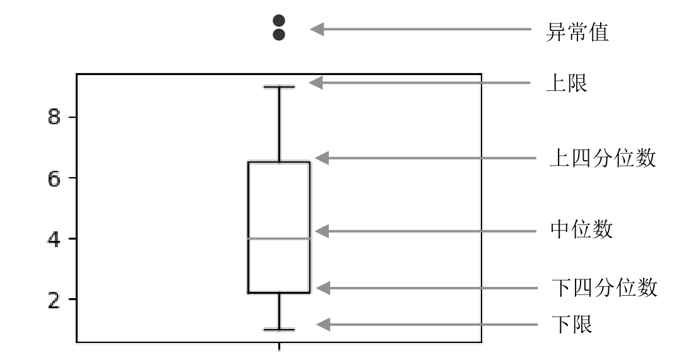

图7.7 箱形图

## 7.4 数据中字符串的操作函数

字符串操作也是数据清洗的一部分。商业数据表中经常需要处理字符型数据，而Pandas的Series.str字符串对象下有几十种函数可以处理。这些函数可通过str字符串对象访问，它们和Python内置的字符串处理函数名字相同。

### 7.4.1 字符串对象中的常见函数

Series()对象中的字符串对象str的内建函数可以实现大部分文本操作，简单快捷。字符串对象函数如表7.1所示。

表7.1 字符串对象函数

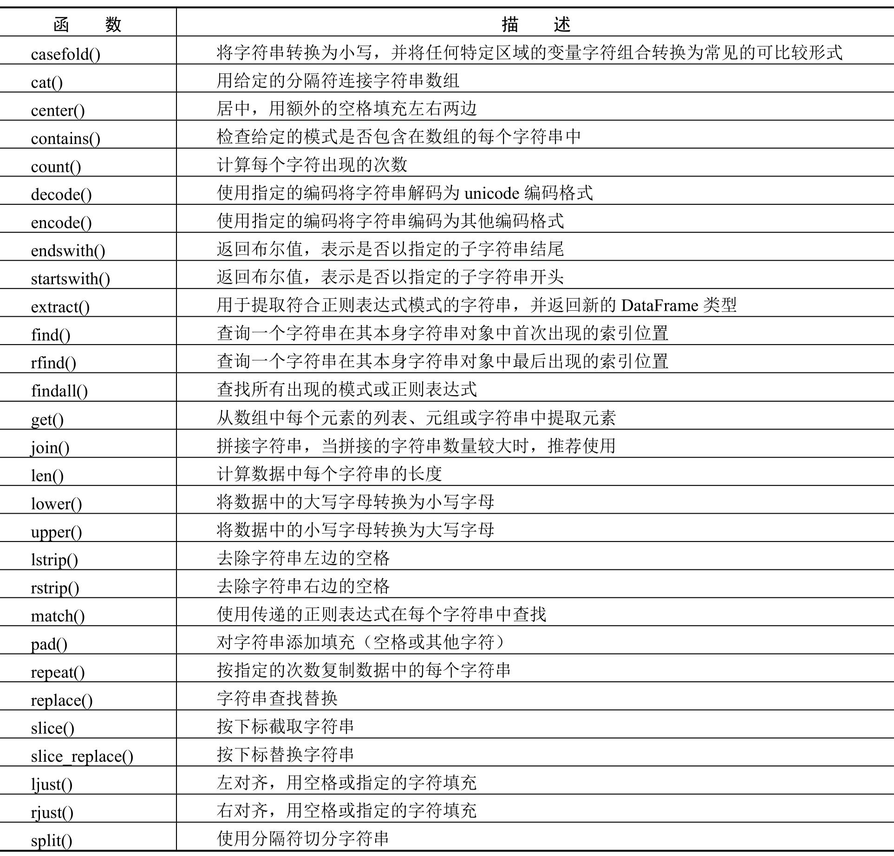

下面针对常用的字符串对象函数进行举例。

**【例7.5】**字符串大小写转换**（实例位置：资源包\\TM\\sl\\07\\05）**

下面分别实现将字符串中的大写字母转换为小写字母，小写字母转换为大写字母，程序代码如下：

1  import pandas as pd

2  s=pd.Series(\["mr","MR-soft","www.MINGRISOFT.COM"\])

3  # 原始数据

4  print('原始数据：')

5  print(s)

6  print('转换为小写：')

7  print(s.str.lower())

8  print('转换为大写：')

9  print(s.str.upper())

运行程序，输出结果如图7.8所示。

**【例7.6】**去掉字符串中的空格**（实例位置：资源包\\TM\\sl\\07\\06）**

下面实现去掉字符串中的空格，程序代码如下：

1   import pandas as pd

2   s=pd.Series(\["mr ","MR soft "," ww w.MINGRISOFT.COM "\])

3   # 通过长度检验是否去掉了空格

4   print('原始数据及数据长度：')

5   print(s)

6   print(s.str.len())

7   print('去掉两边空格后的长度：')

8   a=s.str.strip()

9   print(a.str.len())

10  print('去掉左边空格后的长度：')

11  a=s.str.lstrip()

12  print(a.str.len())

13  print('去掉右边空格后的长度：')

14  a=s.str.rstrip()

15  print(a.str.len())

运行程序，输出结果如图7.9所示。

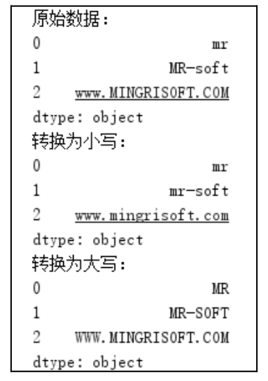

▲图7.8 字符串大小写转换

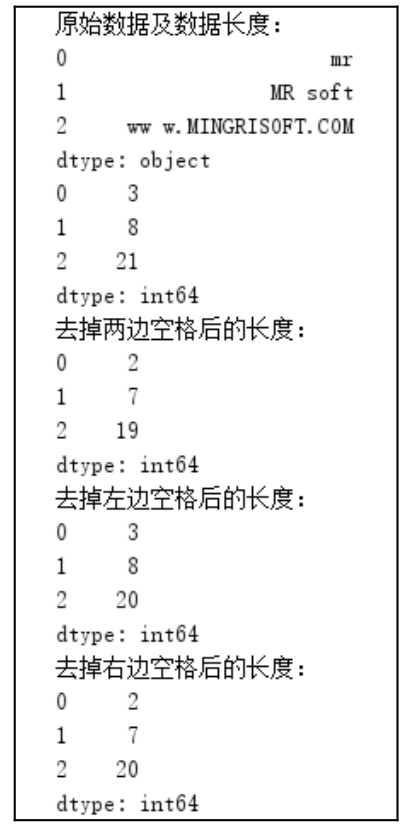

▲图7.9 去掉字符串中的空格

### 7.4.2 替换字符串—replace()函数

字符串替换函数replace()是最常用的函数之一，可以实现对字符串数据进行替换。在进行数据分析的过程中，数据可能有各种各样的问题，尤其是爬取到的数据，可能存在一些乱码，或者其他的操作符号，这个时候就可以使用replace()函数进行剔除。

例如，将“a”替换为“明日科技”，代码如下：

s=pd.Series(\['a','b','c'\])

s=s.str.replace('a','明日科技')

**【例7.7】**使用replace()函数替换数据中指定的字符**（实例位置：资源包\\TM\\sl\\07\\07）**

对爬取的二手房价信息进行清理，首先去除房价信息中的单位“万”和“平米”，程序代码如下：

1   import pandas as pd

2   # 设置数据显示的编码格式为东亚宽度，以使列对齐

3   pd.set_option('display.unicode.east_asian_width', True)

4   '''查找替换“总价”中的“万”'''

5   df=pd.read_csv("data.csv")

6   print(df.head())

7   # 删除无用的列

8   del df\['Unnamed: 0'\]

9   # 去除单位

10  df\['总价'\]=df\['总价'\].str.replace('万','')

11  df\['建筑面积'\]=df\['建筑面积'\].str.replace('平米','')

12  print(df.head())

运行程序，输出结果如图7.10和图7.11所示。

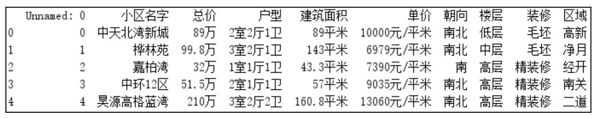

▲图7.10 原始数据

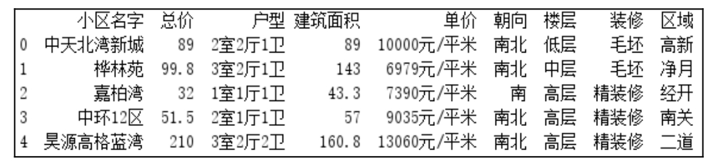

▲图7.11 清洗后的数据

replace()函数除了可以替换数据中的字符，还可以替换标题中的字符。

**【例7.8】**使用replace()函数替换标题中指定的字符**（实例位置：资源包\\TM\\sl\\07\\08）**

首先构建一组随机数据，然后使用replace()函数将标题中的空格替换掉，程序代码如下：

1   import pandas as pd

2   import numpy as np

3   # 设置数据显示的编码格式为东亚宽度，以使列对齐

4   pd.set_option('display.unicode.east_asian_width', True)

5   # 随机生成4行3列的数据

6   df=pd.DataFrame(np.random.randn(4,3),columns=\['高一年级 1班','高一年级 2班','高一年级 3班'\])

7   print(df)

8   # 替换标题中的空格

9   df.columns=df.columns.str.replace(' ','')

10  print(df)

运行程序，输出结果如图7.12和图7.13所示。

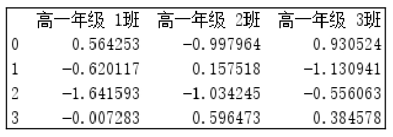

▲图7.12 随机生成的原始数据

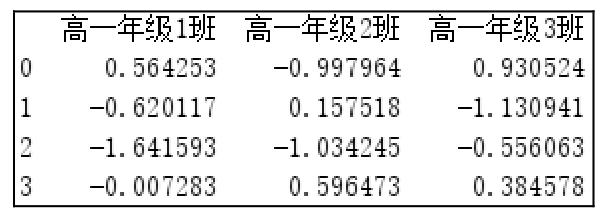

▲图7.13 去除空格后的标题

也可以将空格替换成其他字符，如“-”，代码如下：

df.columns=df.columns.str.replace(' ','-')

### 7.4.3 数据切分—split()函数

数据分析过程中，数据通常形式多样。例如，规格中的长、宽、高，地址中的省、市、区都是连在一起的，这时可以使用split()函数将规格中的长、宽、高或地址中的省、市、区切分出来。

Series()对象的str字符串对象中的split()函数可以实现字符串的切分，语法如下：

Series.str.split(pat=None, n=-1, expand=False)

参数说明： 

 pat：字符串、符号或正则表达式。是字符串切分的依据，默认以空格切分字符串。 

 n：整型，切分次数，默认值是-1，0或-1都将返回所有切分。 

 expand：布尔型，表示切分后的结果是否转换为DataFrame()对象，默认值是False。split()函数的返回值为Series()对象、DataFrame()对象、索引或多重索引。

**【例7.9】**使用split()函数切分地址**（实例位置：资源包\\TM\\sl\\07\\09）**

下面使用split()函数将“收货地址”切分为省、市、区地址，程序代码如下：

1   import pandas as pd

2   # 设置数据显示的最大列数和宽度

3   pd.set_option('display.max_columns',20)

4   pd.set_option('display.width',3000)

5   # 设置数据显示的编码格式为东亚宽度，以使列对齐

6   pd.set_option('display.unicode.east_asian_width', True)

7   # 读取Excel文件指定列数据(“买家会员名”和“收货地址”)

8   df = pd.read_excel('mrbooks.xls',usecols=\['买家会员名','收货地址'\])

9   print(df.head())

10  '''使用split()函数切分“收货地址”'''

11  s=df\['收货地址'\].str.split(' ',expand=True)

12  df\['省'\]=s\[0\]

13  df\['市'\]=s\[1\]

14  df\['区'\]=s\[2\]

15  df\['地址'\]=s\[3\]

16  print(df.head())

运行程序，输出结果如图7.14所示。

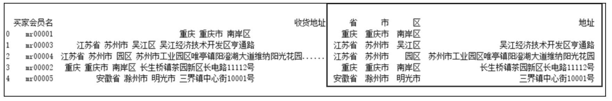

图7.14 使用split()函数切分地址

上述代码中，直接将特征数据切出来，即省、市、区和地址，并且“收货地址”被切分后直接转成了DataFrame()对象，设置expand参数为True。

### 7.4.4 判断字符串—contains()函数

当我们拿到一份数据时，经常会发现什么五花八门的数据都有。在处理这些数据的过程中，可以使用contains()函数判断其是否包含指定的字符，是否包含前缀、尾缀，或指定的值，这些都可以进行判断。contains()函数的返回值为布尔型。除此之外，使用contains()函数还可以对数据进行筛选归类。

**【例7.10】**使用contains()函数筛选数据并归类**（实例位置：资源包\\TM\\sl\\07\\10）**

在京东电商销售数据中，首先通过contains()函数筛选“商品名称”中包含“Python”的图书，其次实现按照“商品名称”中包含指定的字符串对商品进行归类，例如“商品名称”中包含“Python”，则类别为“Python”；包含“Java”，则类别为“Java”，以此类推，程序代码如下：

1  import pandas as pd

2  pd.set_option('display.unicode.east_asian_width', True)      # 设置数据显示的编码格式为东亚宽度，以使列对齐

3  # 设置数据显示的宽度和最大列数

4  pd.set_option('display.width', 1000)                         # 显示宽度

5   pd.set_option('display.max_columns', 20)                    # 显示列数

6   # 读取Excel文件

7   df = pd.read_excel('data1.xlsx', usecols=\['商品名称', '成交商品件数', '成交码洋'\])

8   print(df.head())

9   print(df\[df\['商品名称'\].str.contains('Python')\].head()) # 使用contains()函数筛选包含“Python”的数据

10  '''数据筛选并归类'''

11  # 筛选符合条件的行的索引，使用df.loc属性进行赋值

12  df.loc\[df \[df\['商品名称'\].str.contains('Python')\].index,'类别'\]='Python'

13  df.loc\[df \[df\['商品名称'\].str.contains('Java')\].index,'类别'\]='Java'

14  df.loc\[df \[df\['商品名称'\].str.contains('C#')\].index,'类别'\]='C#'

15  df.loc\[df \[df\['商品名称'\].str.contains('PHP')\].index,'类别'\]='PHP'

16  df.loc\[df \[df\['商品名称'\].str.contains('JavaWeb')\].index,'类别'\]='JavaWeb'

17  df.loc\[df \[df\['商品名称'\].str.contains('C语言')\].index,'类别'\]='C语言'

18  df.loc\[df \[df\['商品名称'\].str.contains('JSP')\].index,'类别'\]='JSP'

19  df.loc\[df\[df\['商品名称'\].str.contains('C\\+')\].index, '类别'\] = 'C++'

20  df.loc\[df\[df\['商品名称'\].str.contains('Android')\].index, '类别'\] = 'Android'

21  df.loc\[df\[df\['商品名称'\].str.contains('WEB前端')\].index, '类别'\] = 'WEB前端'

22  print(df.head())

运行程序，输出结果如图7.15所示。

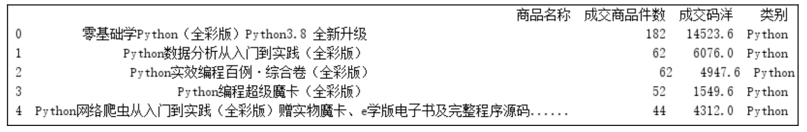

图7.15 使用contains()函数筛选数据并归类

在“df.loc\[df\[df\['商品名称'\].str.contains（'C\\+'）\].index, '类别'\] = 'C++'”这段代码中使用了反斜杠“\\，它的用法是转义，由于代码中的字符“++”是正则表达式中的符号，表示重复前面一个匹配字符一次或者多次，因此使用了反斜杠“\\进行转义。

## 7.5 数据转换

### 7.5.1 通过字典映射的方式实现数据转换—map()函数

在日常的数据处理中，经常需要对数据进行转换，例如，将性别“男”转换为1，“女”转换为2。使用Series()对象的map()函数可以很容易实现数据转换，它可以帮助我们解决绝大部分类似的数据处理需求。

map()函数可以接受一个函数或含有映射关系的字典型对象。使用map()函数实现元素级转换以及数据处理工作是一种非常便捷的方式。

**【例7.11】**使用map()函数将数据中的性别转换为数字**（实例位置：资源包\\TM\\sl\\07\\11）**

首先使用numpy创建一组数据，然后使用字典映射将性别“男”转换为1，“女”转换为2，程序代码如下：

1  import pandas as pd

2  import numpy as np

3  pd.set_option('display.unicode.east_asian_width', True)  # 设置数据显示的编码格式为东亚宽度，以使列对齐

4   # 创建数据

5   boolean=\[True,False\]

6   sex=\["男","女"\]

7   df=pd.DataFrame({

8       "身高":np.random.randint(150,190,100),

9       "体重":np.random.randint(35,90,100),

10      "是否接种疫苗":\[boolean\[x\] for x in np.random.randint(0,2,100)\],

11      "性别":\[sex\[x\] for x in np.random.randint(0,2,100)\],

12      "年龄":np.random.randint(18,70,100)

13  })

14  print(df.head())

15  sex_mapping={'男':1,'女':2}                          # 创建性别字典

16  df\['性别'\]=df\['性别'\].map(sex_mapping)               # 使用字典映射将性别转换为数字

17  print(df.head())

运行程序，输出结果如图7.16和图7.17所示。

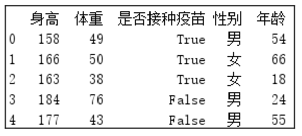

▲图7.16 原始数据

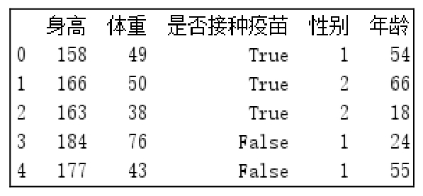

▲图7.17 转换性别后的数据

### 7.5.2 数据分割—cut()函数

Pandas的cut()函数的作用是将一组数据分割成离散的区间。例如，有一组年龄数据，可以使用cut()函数将这组数据分割成不同的年龄段并打上标签。cut()函数语法格式如下：

pandas.cut(x,bins,right=True, labels=None, retbins=False,precision=3, include_lowest=False, duplicates='raise')

参数说明： 

 x：被分割的类数组（array-like）数据，必须是一维的（不能是DataFrame()对象）。 

 bins：被分割后的区间（也被称作“桶”“箱”或“面元”）。有3种形式，一个int型的标量、标量序列（数组）或者pandas.IntervalIndex。 

 一个int型的标量：当bins为一个int型的标量时，代表将x分成bins份。x的范围在每侧扩展0.1%，以包括x的最大值和最小值。 

 标量序列：标量序列定义了被分割后每一个bin的区间边缘，此时x没有扩展。 

 pandas.IntervalIndex：定义要使用的精确区间。 

 right：布尔型，默认值为True，表示是否包含区间右边的值。例如，如果bins=\[1,2,3\]，right=True，则区间为（1,2\]（包括2）、（2,3\]（包括3）；right=False，则区间为（1,2）（不包括2）、（2,3）（不包括3）。 

 labels：给分割后的bins打标签。例如，将年龄x分割成年龄段bins后，可以给年龄段打上“未成年人”“青年人”“中年人”等标签。labels的长度必须和划分后的区间长度相等，例如，bins=\[1,2,3\]划分后有2个区间，即（1,2\]和（2,3\]，则labels的长度必须为2。如果指定labels=False，则返回x中的数据在第几个bin中（从0开始）。 

 retbins：布尔型，表示是否将分割后的bins返回，当bins为一个int型的标量时比较有用，这样可以得到划分后的区间，默认值为False。 

 precision：保留区间小数点的位数，默认值为3。 

 include_lowest：布尔型，表示区间的左边是开还是闭的，默认值为False，也就是不包含区间左边的值。 

 duplicates：表示是否允许重复区间。值为raise表示不允许，值为drop表示允许。cut()函数的返回值分为以下两种： 

 out：一个pandas.Categorical、Series()对象或者ndarray数组类型的值，代表分区后x中的每个值在哪个区间中，如果指定了labels参数，则返回对应的标签。 

 bins：分隔后的区间，当指定retbins参数为True时返回分隔后的区间。

**【例7.12】**分割成绩数据并标记为“优秀”“良好”“一般”**（实例位置：资源包\\TM\\sl\\07\\12）**

下面通过Pandas的cut()函数将学生的英语得分数据进行分割并标记为“优秀”“良好”和“一般”，0～59分为一般，60～69分为良好，70～100分为优秀。程序代码如下：

1  import pandas as pd

2  pd.set_option('display.unicode.east_asian_width', True)   # 设置数据显示的编码格式为东亚宽度，以使列对齐

3  df=pd.read_csv('英语成绩报告.csv',encoding='gbk')         # 读取CSV文件，指定编码格式为gbk

4  print(df.head())                                        # 输出前5条数据

5  # 使用cut()函数将数据分割成离散的区间并进行标记

6  scores = df\['得分'\]

7  df\['标记'\]=pd.cut(scores, \[0,60,70,100\], labels=\[u"一般",u"良好",u"优秀"\])

8  print(df.head())                                        # 输出前5条数据

运行程序，输出结果如图7.18和图7.19所示。

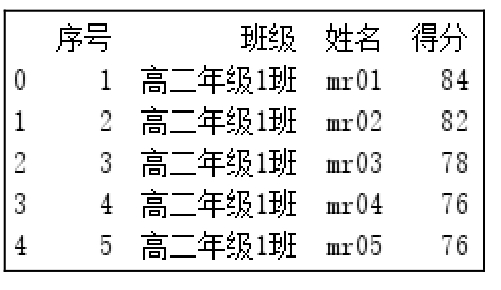

▲图7.18 原始数据

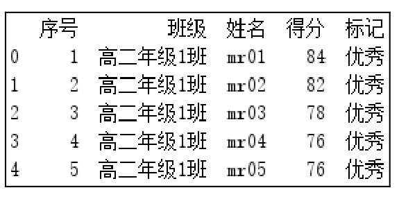

▲图7.19 分割后的数据

### 7.5.3 数据分类—get\_dummies()函数

数据分析过程中，经常会遇到用于分类的数据，例如，性别“男”“女”，颜色“红”“绿”“蓝”等。这些数据不是连续的，是离散的、无序的。如果对这种特征的数据进行分析，则需要将它们数字化，有以下两种方式。 

 如果分类数据的取值不区分大小，那么可以使用one-hot编码方式，主要通过Pandas的get_dummies()函数实现。 

 如果分类数据的取值区分大小，如尺码XS、S、M、L、XL是从小到大，那么需要使用数值的映射（如{'XL': 5，'L': 4，'M': 3，'S':2，'XS':1}），主要使用Series()对象的map()函数。

那么，什么时候可以用到分类数据转换呢？当我们在做关联分析的时候，例如，分析购物车，即不同人的购物车，先将当前购物表数字化，然后进行统计分析、关联分析。在购物车分析当中经常会用到get_dummies()函数。

**【例7.13】**将分类数据转换为数字**（实例位置：资源包\\TM\\sl\\07\\13）**

假设对购物车中的“连衣裙”进行分析，首先将分类数据“颜色”和“尺码”转换为数字，程序代码如下：

1   import pandas as pd

2   pd.set_option('display.unicode.east_asian_width', True)  # 设置数据显示的编码格式为东亚宽度，以使列对齐

3   df = pd.DataFrame(\[                                        # 创建数据

4       \['polo连衣裙','黑色', 'M', 778\],

5       \['polo连衣裙', '浅灰', 'S', 778\],

6       \['polo连衣裙', '粉色', 'L',778\],

7       \['polo连衣裙', '浅灰','S',778\],

8       \['polo连衣裙', '浅灰','XS',778\],

9       \['polo连衣裙', '浅灰', 'XL', 778\]

10  \])

11  df.columns = \['商品名称','颜色分类', '尺码', '单价'\]       # 设置列名

12  size_mapping = {'XL': 5,'L': 4,'M': 3,'S':2,'XS':1}        # 创建“尺码”字典

13  df\['尺码'\] = df\['尺码'\].map(size_mapping)                  # 将“尺码”映射为数字

14  df1=pd.get_dummies(df)                                   # 使用get_dummies()函数进行编码

15  print(df1)

运行程序，输出结果如图7.20和图7.21所示。

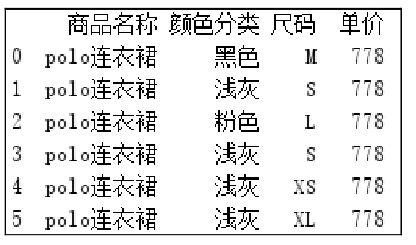

▲图7.20 原始数据

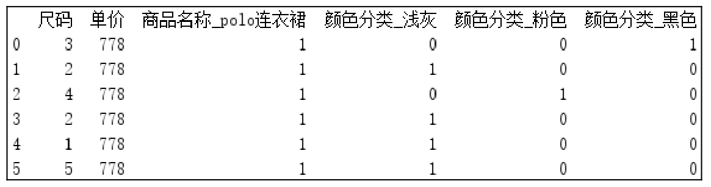

▲图7.21 数字化后的数据

### 说明

one-hot编码又称独热编码，是分类变量作为二进制向量的表示。首先将分类值映射为整数值，然后每个整数值被表示为二进制向量。one-hot编码就是保证每个样本中的单个特征只有1位处于状态1，其他位都是0。

## 7.6 小结

本章介绍了如何使用Pandas模块实现数据中缺失值的处理、重复值的处理、异常值的检测与处理，还介绍了数据中字符串的操作函数以及数据转换相关知识点。其中在实现数据分析时，处理数据中的缺失值、重复值以及数据中异常值的检测与处理是比较常见的一些操作，希望大家可以勤加练习。其中字符串的操作函数以及数据转换可以根据实际需求进行调用。

