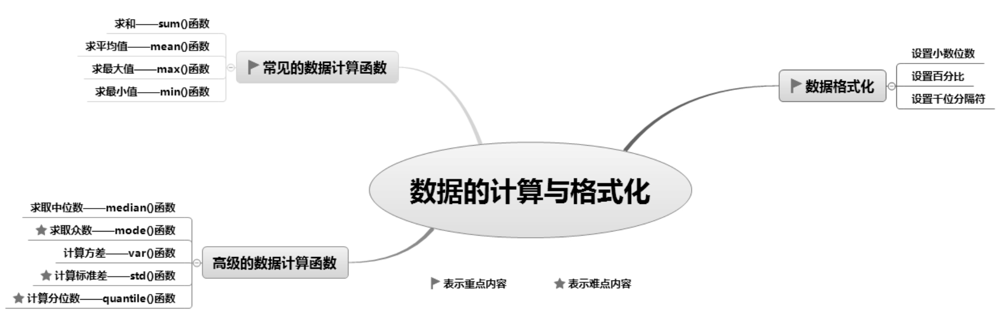
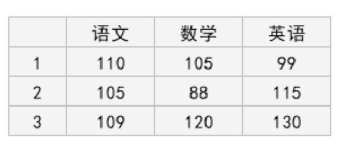
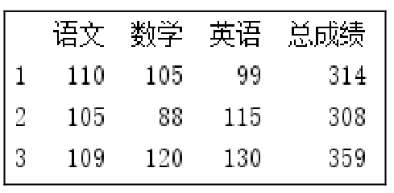
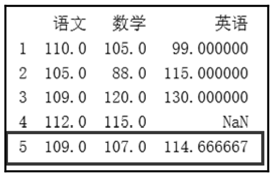
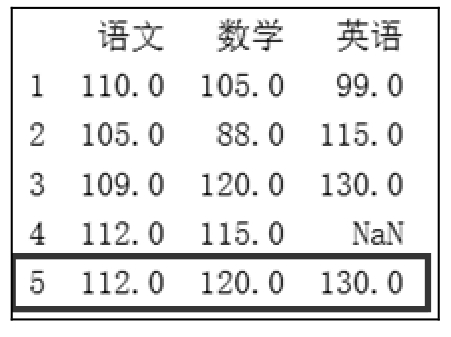
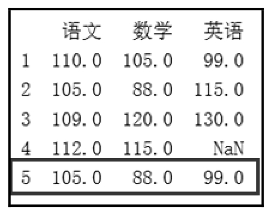
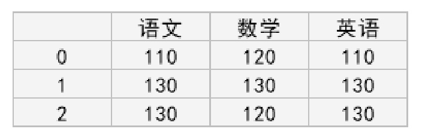
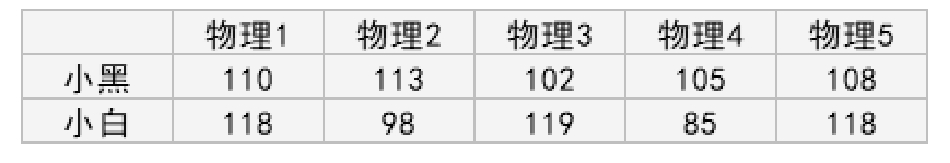
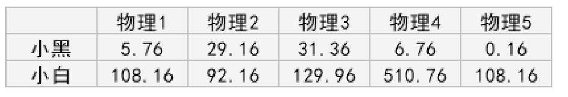
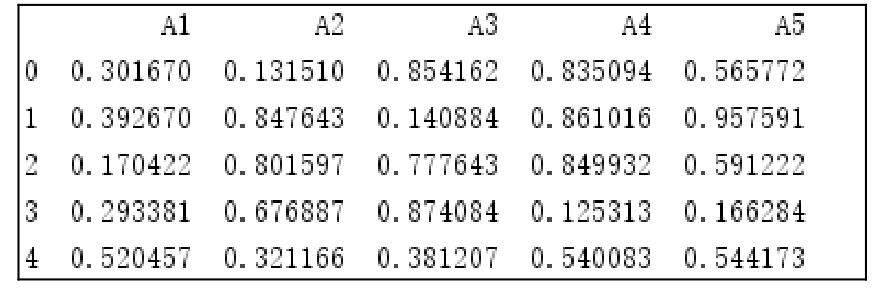

# 8 数据的计算与格式化

数据分析过程中少不了数据计算、数据的格式化。本章主要介绍数据计算与数据格式化，其中包含常见的数据计算函数（sum()、mean()、max()、min()）、高级的数据计算函数（median()、mode()、var()、std()、quantile()）以及数据的格式化等。

本章知识架构如下。



## 8.1 常见的数据计算函数

Pandas提供了一些常见的数据计算函数，可以实现求和、求平均值、求最大值、求最小值等运算，使数据统计工作变得简单、高效。

### 8.1.1 求和—sum()函数

在Python中调用DataFrame()对象的sum()函数，可实现行、列数据的求和运算。语法如下：

```text
DataFrame.sum([axis,skipna,level,…])
```

参数说明： 

 axis：axis=0表示逐行，axis=1表示逐列，默认逐行。 

 skipna：skipna=1表示NaN值自动转换为0，skipna=0表示NaN值不自动转换，默认NaN值自动转换为0。

### 说明

NaN表示非数值。在进行数据处理、数据计算时，Pandas会为缺少的值自动分配NaN值。 

 level：表示索引层级。

sum()函数的返回值为Series()对象，一组含有行／列小计的数据。

**【例8.1】**计算语文、数学和英语三科的总成绩**（实例位置：资源包\\TM\\sl\\08\\01）**

首先，创建一组数据，包括语文、数学和英语三科的成绩，如图8.1所示，然后使用sum()函数计算语文、数学和英语三科的总成绩。程序代码如下：

```text
1  import pandas as pd
2  # 设置数据显示的编码格式为东亚宽度，以使列对齐
3  pd.set_option('display.unicode.east_asian_width', True)
4  data = [[110,105,99],[105,88,115],[109,120,130]]
5  index = [1,2,3]
6  columns = ['语文','数学','英语']
7  df = pd.DataFrame(data=data, index=index, columns=columns)
8  df['总成绩']=df.sum(axis=1,skipna=True)
9  print(df)
```

运行程序，结果如图8.2所示。



<p class="book-caption">▲图8.1 DataFrame数据</p>



<p class="book-caption">▲图8.2 sum()函数计算三科的总成绩</p>

### 8.1.2 求平均值—mean()函数

调用DataFrame()对象的mean()函数，可求取行、列数据的平均值。语法如下：

```text
DataFrame.mean([axis,skipna,level,…])
```

参数说明： 

 axis：axis=0表示逐行，axis=1表示逐列，默认逐行。 

 skipna：skipna=1表示NaN值自动转换为0，skipna=0表示NaN值不自动转换，默认NaN值自动转换为0。 

 level：表示索引层级。

mean()函数的返回值为Series()对象，行／列平均值数据。

**【例8.2】**计算语文、数学和英语各科成绩的平均分**（实例位置：资源包\\TM\\sl\\08\\02）**

计算语文、数学和英语各科成绩的平均值，程序代码如下：

```text
1  import pandas as pd
2  # 设置数据显示的编码格式为东亚宽度，以使列对齐
3  pd.set_option('display.unicode.east_asian_width', True)
4  data = [[110,105,99],[105,88,115],[109,120,130],[112,115]]
5  index = [1,2,3,4]
6   columns = ['语文','数学','英语']
7   df = pd.DataFrame(data=data, index=index, columns=columns)
8   new=df.mean()
9   # 增加一行数据(语文、数学和英语的平均分，忽略索引)
10  df.loc[len(df)+1,:]=new
11  print(df)
```

运行程序，结果如图8.3所示。



<p class="book-caption">图8.3 mean()函数计算三科成绩的平均分</p>

从运行结果得知：语文平均分109，数学平均分107，英语平均分114.666667。

### 8.1.3 求最大值—max()函数

调用DataFrame()对象的max()函数，可求取行、列数据中的最大值。语法如下：

```text
DataFrame.max([axis,skipna,level,…])
```

参数说明： 

 axis：axis=0表示逐行，axis=1表示逐列，默认逐列。 

 skipna：skipna=1表示NaN值自动转换为0，skipna=0表示NaN值不自动转换，默认NaN值自动转换为0。 

 level：表示索引层级。max()函数的返回值为Series()对象，行／列最大值数据。

**【例8.3】**计算语文、数学和英语各科成绩的最高分**（实例位置：资源包\\TM\\sl\\08\\03）**

计算语文、数学和英语各科成绩的最高分，程序代码如下：

```text
1   import pandas as pd
2   # 设置数据显示的编码格式为东亚宽度，以使列对齐
3   pd.set_option('display.unicode.east_asian_width', True)
4   data = [[110,105,99],[105,88,115],[109,120,130],[112,115]]
5   index = [1,2,3,4]
6   columns = ['语文','数学','英语']
7   df = pd.DataFrame(data=data, index=index, columns=columns)
8   new=df.max()
9   # 增加一行数据(语文、数学和英语的最高分，忽略索引)
10  df.loc[len(df)+1,:]=new
11  print(df)
```

运行程序，结果如图8.4所示。



<p class="book-caption">图8.4 max()函数计算三科成绩的最高分</p>

从运行结果得知：语文最高分112分，数学最高分120分，英语最高分130分。

### 8.1.4 求最小值—min()函数

调用DataFrame()对象的min()函数，可求取行、列数据的最小值。语法如下：

```text
DataFrame.min([axis,skipna,level,…])
```

参数说明： 

 axis：axis=0表示逐行，axis=1表示逐列，默认逐行。 

 skipna：skipna=1表示NaN值自动转换为0，skipna=0表示NaN值不自动转换，默认NaN值自动转换为0。 

 level：表示索引层级。

min()函数的返回值为Series()对象，行／列最小值数据。

**【例8.4】**计算语文、数学和英语各科成绩的最低分**（实例位置：资源包\\TM\\sl\\08\\04）**

计算语文、数学和英语各科成绩的最低分，程序代码如下：

```text
1   import pandas as pd
2   # 设置数据显示的编码格式为东亚宽度，以使列对齐
3   pd.set_option('display.unicode.east_asian_width', True)
4   data = [[110,105,99],[105,88,115],[109,120,130],[112,115]]
5   index = [1,2,3,4]
6   columns = ['语文','数学','英语']
7   df = pd.DataFrame(data=data, index=index, columns=columns)
8   new=df.min()
9   # 增加一行数据(语文、数学和英语的最低分，忽略索引)
10  df.loc[len(df)+1,:]=new
11  print(df)
```

运行程序，结果如图8.5所示。



<p class="book-caption">图8.5 min()函数计算三科成绩的最低分</p>

从结果可知，语文最低分为105分，数学最低分为88分，英语最低分为99分。

## 8.2 高级的数据计算函数

### 8.2.1 求取中位数—median()函数

中位数又称为中值，是统计学专有名词，表示按顺序排列的一组数据中位于中间位置的数，其不受异常值的影响。当这组数为奇数个时，中位数就是排序后中间的那个数；当这组数为偶数个时，中位数就是排序后中间两个数的平均值。

例如，23、45、35、25、22、34、28这组数共包含7个数，排序后得到22、23、25、28、34、35、45，中间数字28就是这组数的中位数。另一组数23、45、35、25、22、34、28、27共8个数，排序后得到22、23、25、27、28、34、35、45，中位数就是中间两个数27和28的平均值，即28.5。

Python中，调用DataFrame()对象的median()函数，可求取一组数据的中位数。语法如下：

```text
DataFrame.median(axis=None,skipna=None,level=None,numeric_only=None,**kwargs)
```

参数说明： 

 axis：axis=0表示行，axis=1表示列，默认值为None（无）。 

 skipna：布尔型，表示计算结果是否排除NaN/Null值，默认值为True。 

 level：表示索引层级，默认值为None。 

 numeric_only：仅数字，布尔型，默认值为None。 

 \*\*kwargs：要传递给函数的附加关键字参数。

median()函数的返回值为Series()对象或DataFrame()对象。

**【例8.5】**计算学生各科成绩的中位数1**（实例位置：资源包\\TM\\sl\\08\\05）**

给出一组数据（3条记录），使用median()函数计算“语文”“数学”和“英语”3科成绩的中位数。程序代码如下：

```text
1  import pandas as pd
2  data = [[110,120,110],[130,130,130],[130,120,130]]
3  columns = ['语文','数学','英语']
4  df = pd.DataFrame(data=data,columns=columns)
5  print(df.median())        # 打印各科成绩中位数
```

运行程序，输出结果如下：

```text
语文  130.0
数学  120.0
英语  130.0
```

**【例8.6】**计算学生各科成绩的中位数2**（实例位置：资源包\\TM\\sl\\08\\06）**

给出一组数据（4条记录），使用median()函数计算“语文”“数学”和“英语”3科成绩的中位数。程序代码如下：

```text
1  import pandas as pd
2  data = [[110,120,110],[130,130,130],[130,120,130],[113,123,101]]
3  columns = ['语文','数学','英语']
4  df = pd.DataFrame(data=data,columns=columns)
5  print(df.median())        # 打印各科成绩中位数
```

运行程序，输出结果如下：

```text
语文  121.5
数学  121.5
英语  120.0
```

### 8.2.2 求取众数—mode()函数

顾名思义，众数就是一组数据中出现次数最多的数。众数代表了数据的一般水平。

Python中，调用DataFrame()对象的mode()函数，可以求取一组数据的众数。语法如下：

```text
DataFrame.mode(axis=0,numeric_only=False,dropna=True)
```

参数说明： 

 axis：axis=0或index，表示获取每一列的众数；axis=1或column，表示获取每一行的众数。默认值为0。 

 numeric_only：仅数字，布尔型，默认值为False。如果为True，则仅适用于数字列。 

 dropna：是否删除缺失值，布尔型，默认值为True。

mode()函数的返回值为DataFrame()对象。

首先看一组原始数据，如图8.6所示。



<p class="book-caption">图8.6 原始数据</p>

**【例8.7】**计算学生各科成绩的众数**（实例位置：资源包\\TM\\sl\\08\\07）**

计算语文、数学和英语3科成绩的众数、每一行的众数和“数学”的众数，程序代码如下：

```text
1  import pandas as pd
2  # 设置数据显示的编码格式为东亚宽度，以使列对齐
3  pd.set_option('display.unicode.east_asian_width', True)
4  data = [[110,120,110],[130,130,130],[130,120,130]]
5  columns = ['语文','数学','英语']
6  df = pd.DataFrame(data=data,columns=columns)
7  print(df.mode())          # 三科成绩的众数
8  print(df.mode(axis=1))    # 获取每一行的众数
9  print(df['数学'].mode())  #  “数学”的众数
```

运行程序，输出结果如下：

3科成绩的众数：

```text
语文  数学  英语
0  130   120   130
```

每一行的众数：

```text
0  110
1  130
2  130
```

“数学”的众数：

```text
0  120
```

### 8.2.3 计算方差—var()函数

方差用于衡量一组数据的离散程度，即各组数据与其平均数的差的平方。人们通常用方差来衡量一组数据的波动大小，方差越小，数据波动越小，即数据越稳定；反之，方差越大，数据波动越大，即数据越不稳定。大数据时代，方差能帮助我们解决很多身边的问题，协助做出合理的决策。

例如，某校两名同学的物理成绩都很优秀，而参加物理竞赛的名额只有一个，应该选谁去参加比赛呢？当然，可以根据历史数据计算两名同学的平均成绩，但假设两人仍然旗鼓相当，平均成绩都是107.6，这时该怎么办呢？不如让方差帮你决定，看看谁的成绩更稳定。

首先汇总物理成绩，如图8.7所示。通过方差对比两名同学物理成绩的波动，如图8.8所示。



<p class="book-caption">▲图8.7 物理成绩</p>



<p class="book-caption">▲图8.8 方差</p>

接着来看总体波动（方差和）。小黑的数据是73.2，小白的数据是949.2，很明显小黑的物理成绩波动较小，发挥更稳定。所以，应该选小黑去参加物理竞赛。

在Python中，调用DataFrame()对象的var()函数可以实现方差运算。语法如下：

```text
DataFrame.var(axis=None,skipna=None,level=None,ddof=1,numeric_only=None,**kwargs)
```

参数说明： 

 axis：axis=0表示行，axis=1表示列，默认值为None（无）。 

 skipna：布尔型，表示计算结果是否排除NaN/Null值，默认值为True。 

 level：表示索引层级，默认值为None（无）。 

 ddof：整型，默认值为1。自由度，计算中使用的除数是N-ddof，其中N表示元素的数量。 

 numeric_only：仅数字，布尔型，默认值为None（无）。 

 \*\*kwargs：要传递给函数的附加关键字参数。

var()函数的返回值为Series()对象或DataFrame()对象。

**【例8.8】**通过方差判断谁的物理成绩更稳定**（实例位置：资源包\\TM\\sl\\08\\08）**

计算“小黑”和“小白”物理成绩的方差，程序代码如下：

```text
1  import pandas as pd
2  # 设置数据显示的编码格式为东亚宽度，以使列对齐
3  pd.set_option('display.unicode.east_asian_width', True)
4  data = [[110,113,102,105,108],[118,98,119,85,118]]
5  index=['小黑','小白']
6  columns = ['物理1','物理2','物理3','物理4','物理5']
7  df = pd.DataFrame(data=data,index=index,columns=columns)
8  print(df.var(axis=1))     # 打印方差运算结果
```

运行程序，输出结果如下：

```text
小黑   18.3
小白  237.3
```

从运行结果得知：“小黑”的物理成绩波动较小，发挥更稳定。需要注意的是，Pandas中计算的方差为无偏样本方差（即方差和／样本数－1），NumPy中计算的方差就是样本方差本身（即方差和／样本数）。

### 8.2.4 计算标准差—std()函数

标准差又称为均方差，是方差的平方根，同样用来表示数据的离散程度。

调用DataFrame()对象的std()函数，可以求取一组数的标准差。语法如下：

```text
DataFrame.std(axis=None,skipna=None,level=None,ddof=1,numeric_only=None,**kwargs)
```

std()函数的参数与var()函数一样，这里不再赘述。

**【例8.9】**计算各科成绩的标准差**（实例位置：资源包\\TM\\sl\\08\\09）**

使用std()函数计算标准差，程序代码如下：

```text
1  import pandas as pd
2  # 设置数据显示的编码格式为东亚宽度，以使列对齐
3  pd.set_option('display.unicode.east_asian_width', True)
4  data = [[110,120,110],[130,130,130],[130,120,130]]
5  columns = ['语文','数学','英语']
6  df = pd.DataFrame(data=data,columns=columns)
7  print(df.std())      # 打印各科成绩的标准差
```

运行程序，输出结果如下：

```text
语文  11.547005
数学   5.773503
英语  11.547005
```

### 8.2.5 计算分位数—quantile()函数

分位数也称为分位点，它以概率依据将数据分割为几个等份，常用的有中位数（即二分位数）、四分位数、百分位数等。分位数是数据分析中常用的一个统计量，经过抽样得到一个样本值。例如，“这次考试有20%的同学不及格”这句话就体现了分位数的应用。

Python中，调用DataFrame()对象的quantile()函数，可以求取一组数的分位数。语法如下：

```text
DataFrame.quantile(q=0.5,axis=0,numeric_only=True, interpolation='linear')
```

参数说明： 

 q：浮点型或数组，默认为0.5（50%分位数），其值为0～1。 

 axis：axis=0表示行，axis=1表示列，默认值为0。 

 numeric_only：仅数字，布尔型，默认值为True。 

 interpolation：内插值，可选参数，用于指定要使用的插值方法，当期望的分位数位于两个数据点*i*和*j*之间时： 

 线性：*i*+（*j*-*i*）×分数，其中分数是指数被*i*和*j*包围的小数部分。 

 较低：*i*。 

 较高：*j*。 

 最近：*i*或*j*两者以最近者为准。 

 中点：（*i* + *j*） / 2。

quantile()函数的返回值为Series()对象或DataFrame()对象。

**【例8.10】**通过分位数淘汰35%的学生**（实例位置：资源包\\TM\\sl\\08\\10）**

数学成绩分别为120、89、98、78、65、102、112、56、79、45的10名同学，要求根据分数淘汰35%的学生。该如何处理？首先使用quantile()函数计算35%的分位数，然后将学生成绩与分位数比较，筛选出小于等于分位数的学生。程序代码如下：

```text
1  import pandas as pd
2  data = [120,89,98,78,65,102,112,56,79,45]   # 创建DataFrame数据(数学成绩)
3  columns = ['数学']
4  df = pd.DataFrame(data=data,columns=columns)
5  x=df['数学'].quantile(0.35)                 # 计算35%的分位数
6  print(df[df['数学']\<=x])                    # 输出淘汰学生
```

运行程序，输出结果如下：

## 数学

```text
3   78
4   65
7   56
9   45
```

从运行结果得知：被淘汰的学生共4名，分数分别为78、65、56和45。

**【例8.11】**计算日期、时间和时间的分位数**（实例位置：资源包\\TM\\sl\\08\\11）**

如果参数numeric_only=False，将计算日期、时间和时间增量数据的分位数，程序代码如下：

```text
1  import pandas as pd
2  df = pd.DataFrame({'A': [1, 2],
3                    'B': [pd.Timestamp('2022'),
4                        pd.Timestamp('2023')],
5                    'C': [pd.Timedelta('1 days'),
6                        pd.Timedelta('2 days')]})
7  print(df.quantile(0.5, numeric_only=False))
```

运行程序，输出结果如下：

```text
A                    1.5
B    2022-07-02 12:00:00
C        1 days 12:00:00
Name: 0.5, dtype: object
```

## 8.3 数据格式化

数据处理过程中，如应用mean()函数计算平均值，计算后我们会发现，计算结果的小数位数增加了许多。此时就需要对数据进行格式化，以增加数据的可读性。例如，保留小数点位数、百分号、千位分隔符等。

假设有一组数据，如图8.9所示，下面我们来学习如何对其进行格式化。



<p class="book-caption">图8.9 原始数据</p>

### 8.3.1 设置小数位数

设置小数位数主要使用DataFrame()对象的round()函数，该函数可以实现四舍五入，它的decimals参数用于设置保留小数的位数，设置后数据类型不会发生变化，依然是浮点型。语法如下：

```text
DataFrame.round(decimals=0, *args, **kwargs)
```

参数说明： 

 decimals：每一列四舍五入的小数位数，整型、字典或Series()对象。如果是整数，则将每一列四舍五入到相同的位置。否则，将dict和Series舍入到可变数目的位置。如果小数类似于字典，那么列名应该在键中。如果小数是级数，列名应该在索引中。没有包含在小数中的任何列都将保持原样。非输入列的小数元素将被忽略。 

 \*args：附加的关键字参数。 

 \*\*kwargs：附加的关键字参数。

round()函数的返回值为DataFrame()对象。

**【例8.12】**四舍五入保留指定的小数位数**（实例位置：资源包\\TM\\sl\\08\\12）**

使用round()函数四舍五入保留小数位数，程序代码如下：

```text
1  import pandas as pd
2  import numpy as np
3  df = pd.DataFrame(np.random.random([5, 5]),
4       columns=['A1', 'A2', 'A3','A4','A5'])
5  print(df)
6  print(df.round(2))                                   # 保留小数点后两位
7  print(df.round({'A1': 1, 'A2': 2}))                  #  A1列保留小数点后一位、A2列保留小数点后两位
8  s1 = pd.Series([1, 0, 2], index=['A1', 'A2', 'A3'])
9  print(df.round(s1))                                  # 设置Series()对象小数位数
```

运行程序，输出结果如下：

```text
A1    A2    A3        A4        A5
0  0.79  0.87  0.16      0.36      0.96
1  0.94  0.59  0.94      0.16      0.74
2  0.78  0.36  0.62      0.17      0.66
3  0.44  0.98  0.54      0.36      0.17
4  0.19  0.02  0.05      0.65      0.53
A1    A2    A3        A4        A5
0  0.8   0.87  0.157699  0.361039  0.963076
1  0.9   0.59  0.942715  0.160099  0.735882
2  0.8  0.36  0.620662  0.170067  0.657948
3  0.4  0.98  0.535800  0.361387  0.165886
4  0.2  0.02  0.047484  0.654962  0.526113
A1    A2    A3        A4        A5
0  0.8  1.0   0.16       0.361039  0.963076
1  0.9  1.0   0.94       0.160099  0.735882
2  0.8  0.0   0.62       0.170067  0.657948
3  0.4  1.0   0.54       0.361387  0.165886
4  0.2  0.0   0.05       0.654962  0.526113
```

当然，保留小数位数也可以用自定义函数。例如，为DataFrame()对象中的各个浮点值保留两位小数，关键代码如下：

```text
df.applymap(lambda x: '%.2f'%x)
```

**注意**

经过自定义函数处理过的数据将不再是浮点型而是对象型，如果后续计算有需要，应先进行数据类型转换。

### 8.3.2 设置百分比

数据分析的过程中，有时需要百分比数据。利用自定义函数将数据进行格式化处理，处理后的数据就可以从浮点型转换成带指定小数位数的百分比数据，主要使用apply函数与format函数实现。

**【例8.13】**将指定数据格式化为百分比数据**（实例位置：资源包\\TM\\sl\\08\\13）**

将A1列的数据格式化为百分比数据，程序代码如下：

```text
1   import pandas as pd
2   import numpy as np
3   df = pd.DataFrame(np.random.random([5, 5]),
4        columns=['A1', 'A2', 'A3','A4','A5'])
5   df['百分比']=df['A1'].apply(lambda x: format(x,'.0%'))   # 整列保留0位小数
6   print(df)
7   df['百分比']=df['A1'].apply(lambda x: format(x,'.2%'))   # 整列保留两位小数
8   print(df)
9   df['百分比']=df['A1'].map(lambda x:'{:.0%}'.format(x))   # 整列保留0位小数，也可以使用map函数
10  print(df)
```

运行程序，输出结果如下：

```text
A1        A2        A3        A4        A5  百分比
0  0.379951  0.538359  0.378131  0.361101  0.835820     38%
1  0.073634  0.147796  0.573301  0.290091  0.472903     7%
2  0.752638  0.634261  0.607307  0.582695  0.001692     75%
3  0.371832  0.872433  0.620207  0.942345  0.866435     37%
4  0.869684  0.341358  0.370799  0.724845  0.257434     87%
A1        A2        A3        A4        A5   百分比
0  0.379951  0.538359  0.378131  0.361101  0.835820     38.00%
1  0.073634  0.147796  0.573301  0.290091  0.472903     7.36%
2  0.752638  0.634261  0.607307  0.582695  0.001692     75.26%
3  0.371832  0.872433  0.620207  0.942345  0.866435     37.18%
4  0.869684  0.341358  0.370799  0.724845  0.257434     86.97%
A1        A2        A3        A4        A5  百分比
0  0.379951  0.538359  0.378131  0.361101  0.835820     38%
1  0.073634  0.147796  0.573301  0.290091  0.472903     7%
2  0.752638  0.634261  0.607307  0.582695  0.001692     75%
3  0.371832  0.872433  0.620207  0.942345  0.866435     37%
4  0.869684  0.341358  0.370799  0.724845  0.257434     87%
```

### 8.3.3 设置千位分隔符

数据分析的过程中，有时需要将数据格式化为带千位分隔符的数据，处理后的数据不再是浮点型，而是对象型。

**【例8.14】**将金额格式化为带千位分隔符的数据**（实例位置：资源包\\TM\\sl\\08\\14）**

将图书销售码洋格式化为带千位分隔符的数据，程序代码如下：

```text
1  import pandas as pd
2  # 设置数据显示的编码格式为东亚宽度，以使列对齐
3  pd.set_option('display.unicode.east_asian_width', True)
4  data = [['零基础学Python','1月',49768889],['零基础学Python','2月',11777775],['零基础学Python','3月',13799990]]
5  columns = ['图书','月份','码洋']
6  df = pd.DataFrame(data=data, columns=columns)
7  df['码洋']=df['码洋'].apply(lambda x:format(int(x),','))
8  print(df)
```

运行程序，输出结果如下：

```text
图书   月份     码洋
0  零基础学 Python  1月  49,768,889
1  零基础学 Python  2月  11,777,775
2  零基础学 Python  3月  13,799,990
```

**注意**

设置千位分隔符后，对于程序来说，这些数据将不再是数值型，而是数字和逗号组成的字符串，如果由于程序需要再变成数值型就会很麻烦，因此设置千位分隔符要慎重。

## 8.4 小结

本章介绍了如何使用Pandas模块实现数据的计算与格式化功能，其中包含了常见的数据计算函数、高级的数据计算函数以及数据格式化。调用计算函数可以快速获取数据计算的结果，大家可以根据需求调用。而数据格式化主要用于在进行数据分析时增加数据的可读性。
