# 9 数据统计及透视表

在实现数据分析的过程中，数据分组统计、数据移位、数据合并以及数据透视表都是不可缺少的数据分析技术。本章将通过各种实例来演示以上每种数据分析技术的实现方法。

本章知识架构如下。

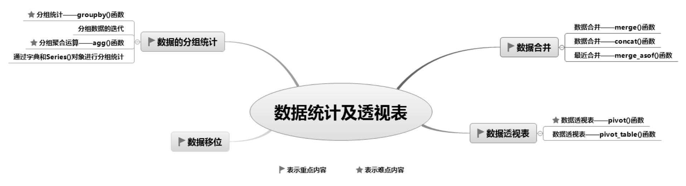

## 9.1 数据的分组统计

### 9.1.1 分组统计—groupby()函数

对数据进行分组统计，主要使用groupby()函数，其功能如下：

（1）根据给定的条件将数据拆分成组。

（2）各组分别应用函数求解，如使用求和函数sum()、求平均值函数mean()等。

（3）将结果合并到一个数据结构中。

groupby()函数用于将数据按照一列或多列进行分组，一般与计算函数结合使用，实现数据的分组统计，语法如下：

```text
DataFrame.groupby(by=None,axis=0,level=None,as_index=True,sort=True,group_keys=True,squeeze=False,observed=False)
```

参数说明： 

 by：映射、字典或Series()对象、数组、标签或标签列表。如果by是一个函数，则对象索引的每个值都调用它。如果传递了一个字典或Series()对象，则使用该字典或Series()对象值来确定组。如果传递了数组ndarray，则按原样使用这些值来确定组。 

 axis：axis=1表示行，axis=0表示列，默认值为0。 

 level：索引层级，默认为无。 

 as_index：布尔型，默认值为True，返回以组标签为索引的对象。 

 sort：对组进行排序，布尔型，默认值为True。 

 group_keys：布尔型，默认值为True，调用apply()函数时，将分组的键添加到索引以标识片段。 

 squeeze：布尔型，默认值为False，如果可能，减少返回类型的维度，否则返回一致类型。 

 observed：当以石斑鱼为分类时，才会使用该参数。如果参数值为True，则仅显示分类石斑鱼的观测值。如果为False，则显示分类石斑鱼的所有值。groupby()函数的返回值为DataFrameGroupBy，返回包含有关组的信息的groupby对象。

**1. 按照一列分组统计**

**【例9.1】**根据“一级分类”统计订单数据**（实例位置：资源包\\TM\\sl\\09\\01）**

按照图书“一级分类”对订单数据进行分组统计求和，程序代码如下：

```text
1   import pandas as pd                                  # 导入pandas模块
2   # 设置数据显示的最大列数和宽度
3   pd.set_option('display.max_columns',500)
4   pd.set_option('display.width',1000)
5   # 设置数据显示的编码格式为东亚宽度，以使列对齐
6   pd.set_option('display.unicode.east_asian_width', True)
7   df=pd.read_csv('JD.csv',encoding='gbk')
8   # 抽取数据
9   df1=df[['一级分类','7天点击量','订单预定']]
10  print(df1.groupby('一级分类').sum())           # 分组统计求和
```

运行程序，输出结果如图9.1所示。

**2. 按照多列分组统计**

多列分组统计，以列表形式指定列。

**【例9.2】**根据两级分类统计订单数据**（实例位置：资源包\\TM\\sl\\09\\02）**

按照图书“一级分类”和“二级分类”对订单数据进行分组统计求和，关键代码如下：

```text
1  df1=df[['一级分类','二级分类','7天点击量','订单预定']]   # 抽取数据
2  print(df1.groupby(['一级分类','二级分类']).sum())  # 分组统计求和
```

运行程序，输出结果如图9.2所示。

**3. 分组并按指定列进行数据计算**

前面介绍的分组统计是按照所有列进行汇总计算的，那么如何按照指定列汇总计算呢？

**【例9.3】**统计各编程语言的7天点击量**（实例位置：资源包\\TM\\sl\\09\\03）**

统计各编程语言的7天点击量，首先按“二级分类”分组，然后抽取“7天点击量”列并对该列进行求和运算，关键代码如下：

```text
print(df1.groupby('二级分类')['7天点击量'].sum())
```

运行程序，输出结果如图9.3所示。

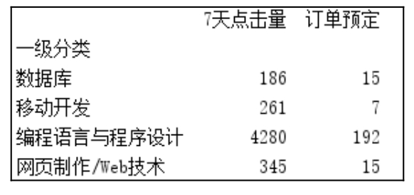

<p class="book-caption">▲图9.1 按照一列分组统计</p>

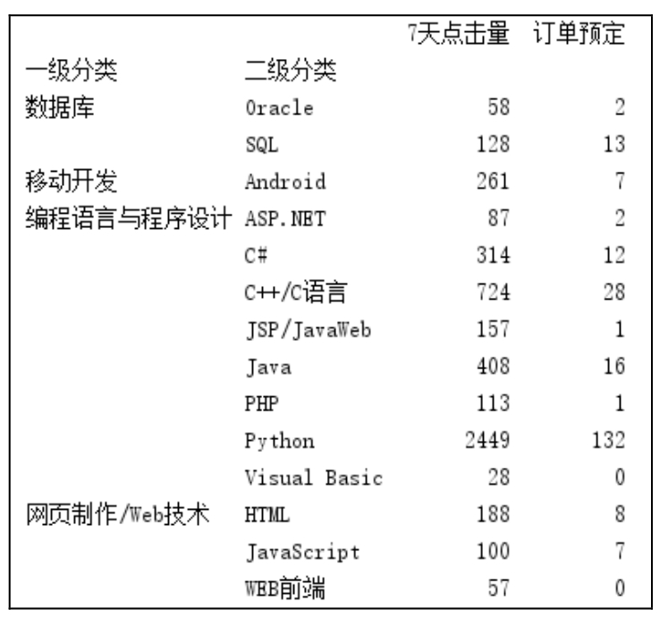

<p class="book-caption">▲图9.2 按照多列分组统计</p>

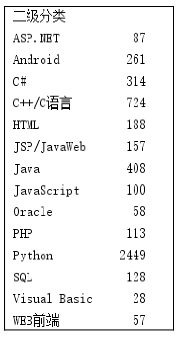

<p class="book-caption">▲图9.3 分组并按指定列进行计算</p>

### 9.1.2 分组数据的迭代

通过for循环，可对分组统计数据进行迭代（遍历分组数据）。

**【例9.4】**迭代一级分类的订单数据**（实例位置：资源包\\TM\\sl\\09\\04）**

按照“一级分类”分组，并输出每一分类中的订单数据，关键代码如下：

```text
1  # 抽取数据
2  df1=df[['一级分类','7天点击量','订单预定']]
3  for name, group in df1.groupby('一级分类'):
4      print(name)
5      print(group)
```

运行程序，输出结果如图9.4所示。

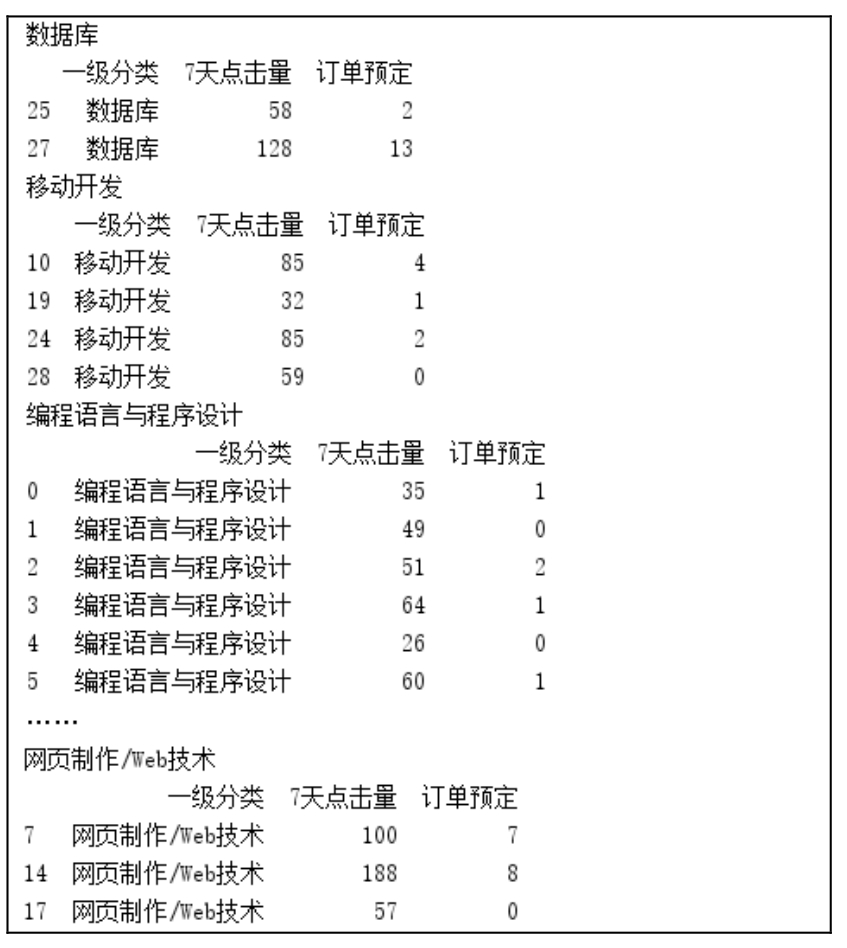

<p class="book-caption">图9.4 对分组数据进行迭代</p>

上述代码中name是groupby中“一级分类”的值，group是分组后的数据。如果groupby对多列进行分组，那么需要在for循环中指定多列。

**【例9.5】**迭代两级分类的订单数据**（实例位置：资源包\\TM\\sl\\09\\05）**

迭代“一级分类”和“二级分类”的订单数据，关键代码如下：

```text
1  # 抽取数据
2  df2=df[['一级分类','二级分类','7天点击量','订单预定']]
3  for (key1,key2),group in df2.groupby(['一级分类','二级分类']):
4      print(key1,key2)
5      print(group)
```

### 9.1.3 分组聚合运算—agg()函数

Python中使用groupby()函数与agg()函数，也可以像SQL一样进行分组聚合运算。

**【例9.6】**对分组统计结果使用聚合函数**（实例位置：资源包\\TM\\sl\\09\\06）**

按“一级分类”分组统计“7天点击量”“订单预定”的平均值和总和，关键代码如下：

```text
print(df1.groupby('一级分类').agg(['mean','sum']))
```

运行程序，输出结果如图9.5所示。

**【例9.7】**针对不同的列，使用不同的聚合函数**（实例位置：资源包\\TM\\sl\\09\\07）**

在上述示例中，还可以针对不同的列使用不同的聚合函数。例如，按“一级分类”分组统计“7天点击量”的平均值和总和，以及“订单预定”的总和，关键代码如下：

```text
print(df1.groupby('一级分类').agg({'7天点击量':['mean','sum'], '订单预定':['sum']}))
```

运行程序，输出结果如图9.6所示。

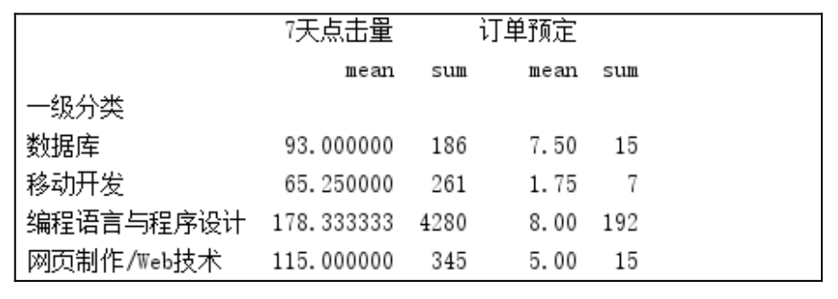

<p class="book-caption">▲图9.5 分组统计（1）</p>

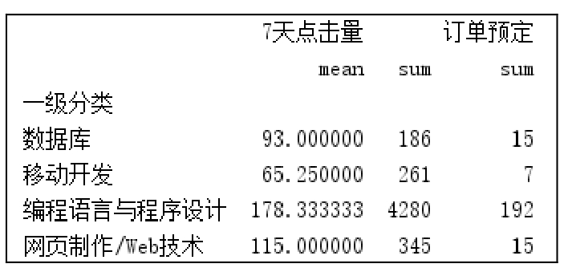

<p class="book-caption">▲图9.6 分组统计（2）</p>

**【例9.8】**通过自定义函数实现分组统计**（实例位置：资源包\\TM\\sl\\09\\08）**

通过自定义函数也可以实现数据分组统计。例如，统计1月份销售数据中购买次数最多的产品，关键代码如下：

```text
1  df=pd.read_excel('1月b.xlsx')        # 读取Excel文件
2  # x是“宝贝标题”对应的列
3  # value_counts()函数用于对Series()对象中的每个值进行计数并且排序
4  max1 = lambda x: x.value_counts(dropna=False).index[0]
5  df1=df.agg({'宝贝标题': [max1],
6             '数量': ['sum', 'mean'],
7             '买家实际支付金额': ['sum', 'mean']})
8  print(df1)
```

运行程序，输出结果如图9.7所示，“零基础学Python”是用户购买次数最多的产品。

在输出结果中，lambda函数名称\<lambda\>被显示出来，看上去不是很美观，那么如何去掉它？方法是使用\_\_name\_\_修改函数名称，关键代码如下：

```text
max1.__name__ = "购买次数最多"
```

运行程序，输出结果如图9.8所示。

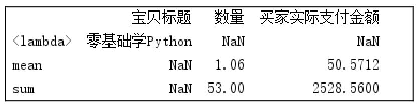

<p class="book-caption">▲图9.7 统计购买次数最多的产品</p>

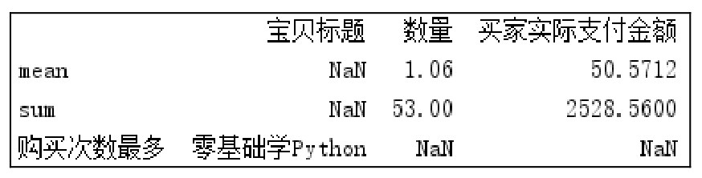

<p class="book-caption">▲图9.8 使用\_\_name\_\_修改函数名称</p>

### 9.1.4 通过字典和Series()对象进行分组统计

**1. 通过字典进行分组统计**

首先创建字典建立对应关系，然后将字典传递给groupby()函数，从而实现数据分组统计。

**【例9.9】**通过字典分组统计“北上广”销量**（实例位置：资源包\\TM\\sl\\09\\09）**

统计各地区销量，将“北京”“上海”和“广州”三个一线城市放在一起统计。首先创建一个字典，将“上海出库销量”“北京出库销量”和“广州出库销量”都对应“北上广”，然后使用groupby()函数进行分组统计。关键代码如下：

```text
1  df=pd.read_csv('JD1.csv',encoding='gbk')         # 读取csv文件
2  df=df.set_index(['商品名称'])                      # 创建字典
3  dict1={'上海出库销量':'北上广','北京出库销量':'北上广',
4        '广州出库销量':'北上广','成都出库销量':'成都',
5        '武汉出库销量':'武汉','西安出库销量':'西安'}
6  df1=df.groupby(dict1,axis=1)
7  print(df1.sum())
```

运行程序，输出结果如图9.9所示。

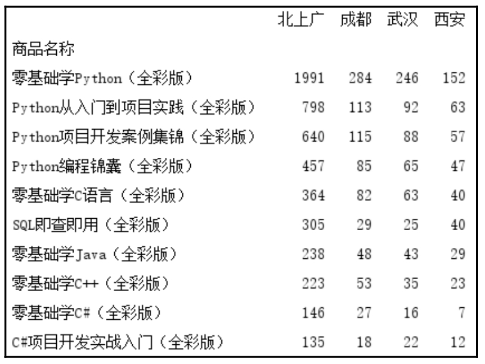

<p class="book-caption">图9.9 通过字典进行分组统计</p>

**2. 通过Series()对象进行分组统计**

通过Series()对象进行分组统计，与应用字典的方法类似。

**【例9.10】**通过Series()对象分组统计“北上广”销量**（实例位置：资源包\\TM\\sl\\09\\10）**

（1）创建一个Series()对象，关键代码如下：

```text
1  data={'北京出库销量':'北上广','上海出库销量':'北上广',
2        '广州出库销量':'北上广','成都出库销量':'成都',
3        '武汉出库销量':'武汉','西安出库销量':'西安',}
4  s1=pd.Series(data)
5  print(s1)
```

运行程序，输出结果如图9.10所示。

（2）将Series()对象传递给groupby()函数，实现数据分组统计。关键代码如下：

```text
6  df1=df.groupby(s1,axis=1).sum()
7  print(df1)
```

运行程序，输出结果如图9.11所示。

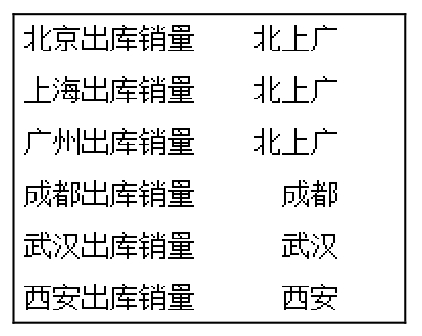

<p class="book-caption">▲图9.10 通过Series()对象进行分组统计</p>

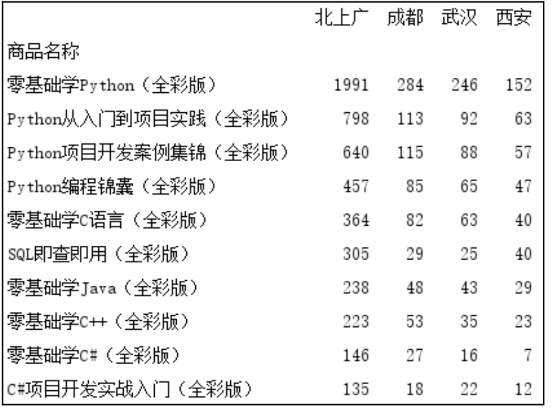

<p class="book-caption">▲图9.11 分组统计结果</p>

## 9.2 数据移位

分析数据时，如果需要上一条数据，我们会移动至上一条，以获取该数据，这就是数据移位。

Pandas中，使用shift()函数可返回向下移位后的结果，从而获得上一条数据。例如，获取某学生上一次的英语成绩，如图9.12所示。

shift()函数非常有用，与其他函数结合可实现很多功能。其语法格式如下：

```text
DataFrame.shift(periods=1, freq=None, axis=0)
```

参数说明： 

 periods：移动幅度，可以是正数，也可以是负数。默认值是1，表示移动一次。注意，这里移动的是数据，索引是不移动的，移动之后没有对应值的，赋值为NaN。 

 freq：可选参数，默认值为None，只适用于时间序列，如果这个参数存在，那么会按照参数值移动时间索引，而数据值没有发生变化。 

 axis：axis=0表示行，axis=1表示列，默认值为0。

**【例9.11】**统计学生英语周测成绩的升降情况**（实例位置：资源包\\TM\\sl\\09\\11）**

使用shift()函数统计学生每周英语测试成绩的升降情况，程序代码如下：

```text
1  import pandas as pd
2  data = [110,105,99,120,115]
3  index=[1,2,3,4,5]
4  df = pd.DataFrame(data=data,index=index,columns=['英语'])
5  df['升降']=df['英语']-df['英语'].shift()
6  print(df)
```

运行程序，输出结果如图9.13所示。从运行结果得知：第2次比第1次下降5分，第3次比第2次下降6分，第4次比第3次提升21分，第5次比第4次下降5分。

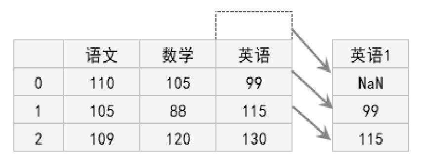

<p class="book-caption">▲图9.12 获取学生上一次英语成绩</p>

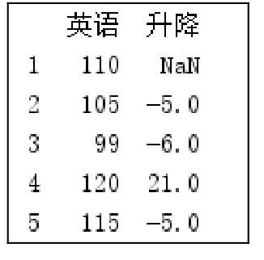

<p class="book-caption">▲图9.13 英语升降情况</p>

这里再扩展思考一下，通过10次周测来看学生整体英语成绩的升降情况，如图9.14、图9.15所示。

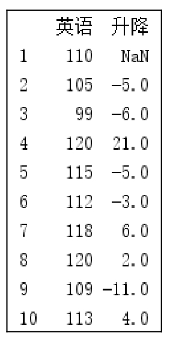

<p class="book-caption">▲图9.14 10次周测英语成绩升降情况</p>

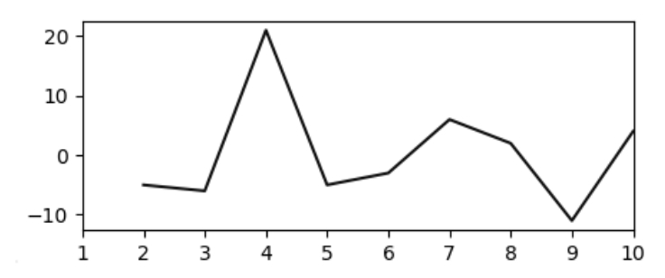

<p class="book-caption">▲图9.15 图表展示英语成绩升降情况</p>

shift()函数在实际数据分析中应用很广。例如，分析股票数据，获取股票的实时价格，如果需要将实时价格和上一个工作日的收盘价进行对比，就可以通过shift()函数实现。shift()函数还可以应用于时间序列，感兴趣的读者可以多进行尝试和探索。

## 9.3 数据合并

### 9.3.1 数据合并—merge()函数

Pandas模块的merge()函数可以按照两个DataFrame()对象列名相同的列进行连接合并，前提是两个DataFrame()对象必须具有同名的列。merge()函数的语法如下：

```text
pandas.merge(right,how='inner',on=None,left_on=None,right_on=None,left_index=False,right_index=False,sort=False,suffixe
s=('_x','_y'),copy=True,indicator=False,validate=None)
```

参数说明： 

 right：合并对象，DataFrame()对象或Series()对象。 

 how：合并类型，参数值可以是left（左合并）、right（右合并）、outer（外部合并）或inner（内部合并），默认值为inner。各个值的说明如下。 

 left：只使用来自左数据集的键，类似于SQL左外连接，保留键的顺序。 

 right：只使用来自右数据集的键，类似于SQL右外连接，保留键的顺序。 

 outer：使用来自两个数据集的键，类似于SQL外连接，按字典顺序对键进行排序。 

 inner：使用来自两个数据集的键的交集，类似于SQL内连接，保持左键的顺序。 

 on：标签、列表或数组，默认值为None。要连接的数据集的列或索引级别名称。也可以是数据集长度的数组或数组列表。 

 left_on：标签、列表或数组，默认值为None。要连接的左数据集的列或索引级名称，也可以是左数据集长度的数组或数组列表。 

 right_on：标签、列表或数组，默认值为None。要连接的右数据集的列或索引级名称，也可以是右数据集长度的数组或数组列表。 

 left_index：布尔型，默认值为False。使用左数据集的索引作为连接键。如果是多重索引，则其他数据中的键数（索引或列数）必须匹配索引级别数。 

 right_index：布尔型，默认值为False，使用右数据集的索引作为连接键。 

 sort：对结果DataFrame()对象中的连接键按字典顺序排序。如果为False，则连接键的顺序取决于连接类型（how参数）。 

 suffixes：元组类型，默认值为（'\_x'，'\_ y'）。当左侧数据集和右侧数据集的列名相同时，数据合并后列名将带上“\_x”和“\_ y”后缀。 

 copy：是否复制数据，默认值为True，如果为False，则不复制数据。 

 indicator：布尔型或字符串，默认值为False。如果值为True，则添加一个列以输出名为“\_Merge”的DataFrame()对象，其中包含每一行的信息。如果是字符串，将向输出的DataFrame()对象中添加包含每一行信息的列，并将列命名为字符型的值。 

 validate：字符串，检查合并数据是否为指定类型。可选参数，其值说明如下。 

 one_to_one或“1:1”：检查合并键在左右数据集中是否都是唯一的。 

 one_to_many或“1:m”：检查合并键在左数据集中是否唯一。 

 many_to_one或“m:1”：检查合并键在右数据集中是否唯一。 

 many_to_many或“m:m”：允许，但不检查。

merge()函数的返回值为DataFrame()对象，两个合并对象的数据集。

**1. 常规合并**

**【例9.12】**合并学生成绩表**（实例位置：资源包\\TM\\sl\\09\\12）**

假设一个DataFrame()对象包含了学生的“语文”“数学”和“英语”成绩，而另一个DataFrame()对象则包含了学生的“体育”成绩，现在将它们合并，示意图如图9.16所示。

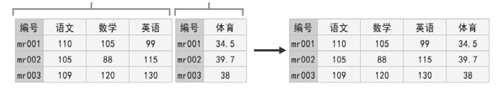

<p class="book-caption">图9.16 数据合并效果对比示意图</p>

程序代码如下：

```text
1   import pandas as pd
2   # 设置数据显示的编码格式为东亚宽度，以使列对齐
3   pd.set_option('display.unicode.east_asian_width', True)
4   df1 = pd.DataFrame({'编号':['mr001','mr002','mr003'],
5                      '语文':[110,105,109],
6                      '数学':[105,88,120],
7                      '英语':[99,115,130]})
8   df2 = pd.DataFrame({'编号':['mr001','mr002','mr003'],
9                      '体育':[34.5,39.7,38]})
10  df_merge=pd.merge(df1,df2,on='编号')
11  print(df_merge)
```

运行程序，输出结果如图9.17所示。

**【例9.13】**通过索引合并数据**（实例位置：资源包\\TM\\sl\\09\\13）**

如果通过索引列合并，则需要设置right_index参数和left_index参数值为True。例如，上述举例，通过列索引合并，关键代码如下：

```text
1  df_merge=pd.merge(df1,df2,right_index=True,left_index=True)
2  print(df_merge)
```

运行程序，输出结果如图9.18所示。

**【例9.14】**对合并数据去重**（实例位置：资源包\\TM\\sl\\09\\14）**

从图9.20所示的运行结果得知：数据中存在重复列（如编号），如果不想要重复列，可以设置按指定列和列索引合并数据，关键代码如下：

```text
df_merge=pd.merge(df1,df2,on='编号')
```

还可以通过how参数解决这一问题。例如，设置该参数值为left，就是让df1保留所有的行列数据，df2则根据df1的行列进行补全，关键代码如下：

```text
df_merge=pd.merge(df1,df2,on='编号',how='left')
```

运行程序，输出结果如图9.19所示。

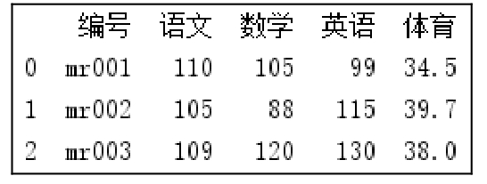

<p class="book-caption">▲图9.17 合并结果</p>

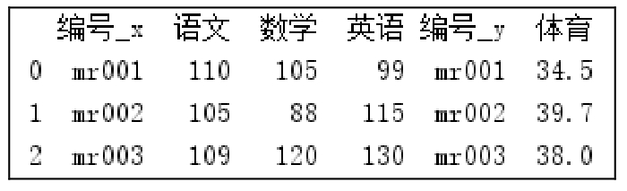

<p class="book-caption">▲图9.18 通过索引列合并</p>

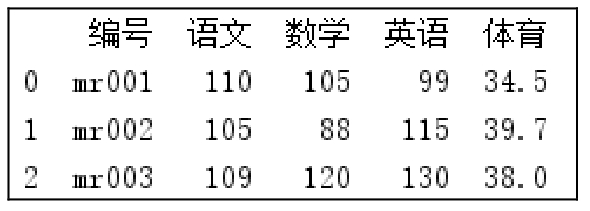

<p class="book-caption">▲图9.19 合并结果</p>

**2. 多对一的数据合并**

多对一是指两个数据集（df1、df2）的共有列中的数据不是一对一的关系，例如，df1中的“编号”是唯一的，而df2中的“编号”有重复的编号，类似这种就是多对一的关系，示意图如图9.20所示。

**【例9.15】**根据共有列进行合并数据**（实例位置：资源包\\TM\\sl\\09\\15）**

根据共有列中的数据进行合并，df2根据df1的行列进行补全，程序代码如下：

```text
1   import pandas as pd
2   # 设置数据显示的编码格式为东亚宽度，以使列对齐
3   pd.set_option('display.unicode.east_asian_width', True)
4   df1 = pd.DataFrame({'编号':['mr001','mr002','mr003'],
5                      '学生姓名':['明日同学','高小华','钱多多']})
6   df2 = pd.DataFrame({'编号':['mr001','mr001','mr003'],
7                      '语文':[110,105,109],
8                      '数学':[105,88,120],
9                      '英语':[99,115,130],
10                     '时间':['1月','2月','1月']})
11  df_merge=pd.merge(df1,df2,on='编号')
12  print(df_merge)
```

运行程序，输出结果如图9.21所示。

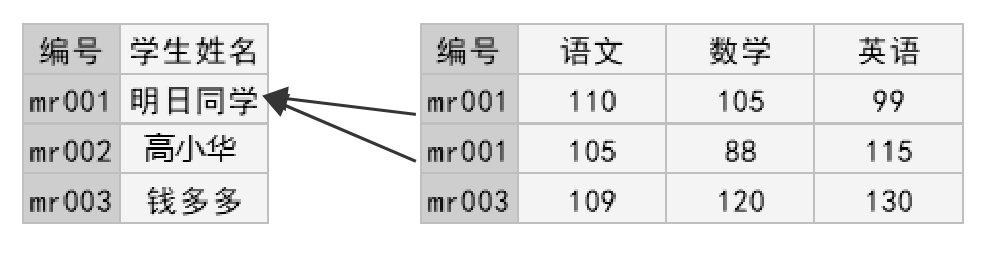

<p class="book-caption">▲图9.20 多对一合并示意图</p>

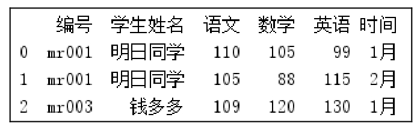

<p class="book-caption">▲图9.21 合并结果</p>

**3. 多对多的数据合并**

多对多是指两个数据集（df1、df2）的共有列中的数据不全是一对一的关系，都有重复数据，例如“编号”，示意图如图9.22所示。

**【例9.16】**合并数据并相互补全**（实例位置：资源包\\TM\\sl\\09\\16）**

根据共有列中的数据进行合并，df2、df1相互补全，程序代码如下：

```text
1   import pandas as pd
2   # 设置数据显示的编码格式为东亚宽度，以使列对齐
3   pd.set_option('display.unicode.east_asian_width', True)
4   df1 = pd.DataFrame({'编号':['mr001','mr002','mr003','mr001','mr001'],
5                      '体育':[34.5,39.7,38,33,35]})
6   df2 = pd.DataFrame({'编号':['mr001','mr002','mr003','mr003','mr003'],
7                      '语文':[110,105,109,110,108],
8                      '数学':[105,88,120,123,119],
9                      '英语':[99,115,130,109,128]})
10  df_merge=pd.merge(df1,df2)
11  print(df_merge)
```

运行程序，输出结果如图9.23所示。

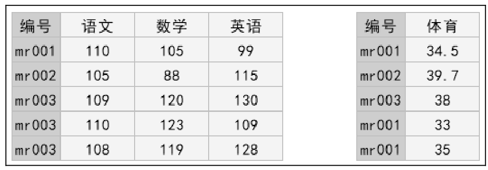

<p class="book-caption">▲图9.22 多对多示意图</p>

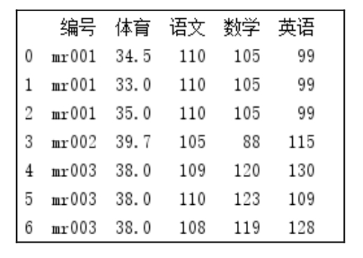

<p class="book-caption">▲图9.23 合并结果</p>

### 9.3.2 数据合并—concat()函数

concat()函数可以根据不同的方式将数据合并，语法如下：

```text
pandas.concat(objs,axis=0,join='outer',ignore_index: bool = False, keys=None, levels=None, names=None, verify_integrity:
bool = False, sort: bool = False, copy: bool = True)
```

参数说明： 

 objs：Series()、DataFrame()或Panel()对象的序列或映射。如果传递一个字典，则排序的键将用作键参数。 

 axis：axis=1表示行，axis=0表示列，默认值为0。 

 join：值为inner（交集）或outer（联合），处理其他轴上的索引方式。默认值为outer。 

 ignore_index：布尔值，默认值为False，表示是否忽略索引，值为True表示忽略索引。 

 keys：序列，默认值无。使用传递的键作为最外层构建层次索引。如果为多索引，应该使用元组。 

 levels：序列列表，默认值无。用于构建MultiIndex的特定级别（唯一值）。否则，它们将从键推断。 

 names：list列表，默认值为None。结果层次索引中级别的名称。 

 verify_integrity：布尔值，默认值为False。检查新连接的轴是否包含重复项。 

 sort：布尔值，默认值为True（1.0.0以后版本默认值为False，即不排序）。如果连接为外连接（join='outer'），则对未对齐的非连接轴进行排序；如果连接为内连接（join='inner'），该参数不起作用。 

 copy：表示是否复制数据，默认值为True，如果为False，则不复制数据。

下面介绍concat()函数不同的合并方式，其中dfs代表合并后的DataFrame()对象，df1、df2等代表单个DataFrame()对象，result代表合并后的结果（DataFrame()对象）。

**1. 相同字段的表首尾相接**

表结构相同的数据将直接合并，表首尾相接，关键代码如下：

```text
dfs= [df1, df2, df3]
result = pd.concat(dfs)
```

例如，表df1、df2和df3结构相同，如图9.24所示，合并后的效果如图9.25所示。如果想要在合并数据时标记源数据来自哪张表，则需要在代码中加入参数keys，例如，表名分别为“1月”“2月”和“3月”，合并后的效果如图9.26所示。

关键代码如下：

```text
result = pd.concat(dfs, keys=['1月', '2月', '3月'])
```

**2. 横向表合并（行对齐）**

当合并的数据列名称不一致时，可以先设置参数axis=1，Concat()函数将按行对齐，然后将不同列名的两组数据进行合并，缺失的数据用NaN填充，df1和df4合并前后效果如图9.27和图9.28所示。

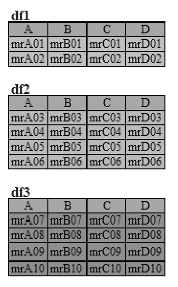

<p class="book-caption">▲图9.24 3个相同字段的表</p>

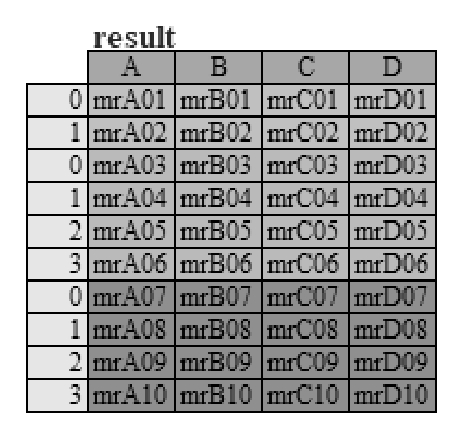

<p class="book-caption">▲图9.25 首尾相接合并后的效果</p>

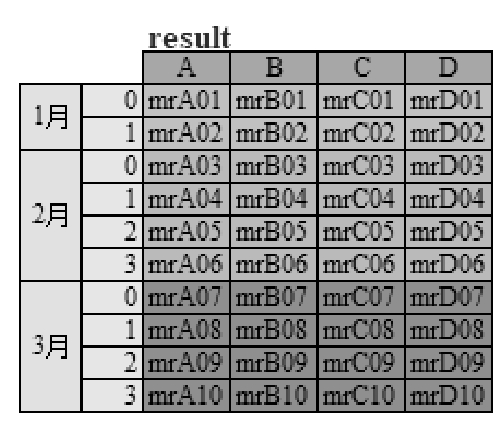

<p class="book-caption">▲图9.26 合并后带标记（月份）的效果</p>

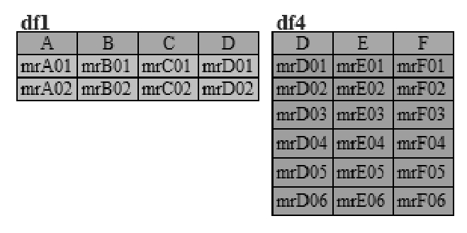

<p class="book-caption">▲图9.27 横向表合并前</p>

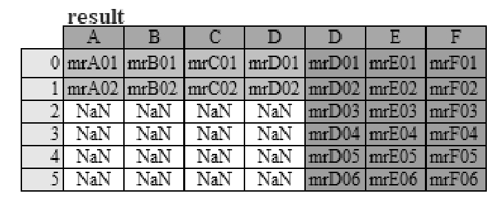

<p class="book-caption">▲图9.28 横向表合并后</p>

关键代码如下：

```text
result = pd.concat([df1, df4], axis=1)
```

**3. 交叉合并**

交叉合并，需要在代码中加上join参数。其值为inner，结果是两表的交集；其值为outer，结果是两表的并集。例如，求两表交集，表df1和df4合并前后的效果如图9.29和图9.30所示。

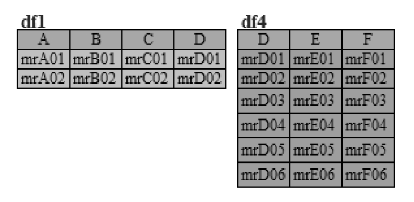

<p class="book-caption">▲图9.29 交叉合并前</p>

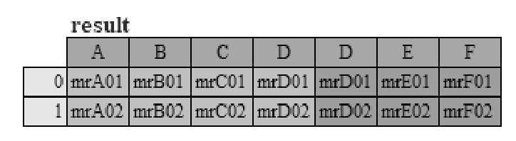

<p class="book-caption">▲图9.30 交叉合并后</p>

关键代码如下：

```text
result = pd.concat([df1, df4], axis=1, join='inner')
```

### 9.3.3 最近合并—merge\_asof()函数

最近合并类似于左合并，用于匹配最近的键而不是相等的键。两个DataFrame都必须按键排序。语法如下：

```text
pandas.merge_asof(left,right, on=None, left_on=None, right_on=None, left_index=False, right_index=False, by=None,
left_by=None, right_by=None, suffixes=('_x','_y'), tolerance=None, allow_exact_matches=True, direction='backward', )
```

主要参数说明： 

 left、right：DataFrame()对象。 

 on：标签，要加入的字段名称。必须在两个DataFrame()对象中都包括。 

 left_on：标签，要在左侧的DataFrame()对象中加入的字段名称。 

 right_on：标签，要在右侧的DataFrame()对象中加入的字段名称。 

 left_index：布尔值，使用左侧DataFrame()对象的索引作为连接键。 

 right_index：布尔值，使用右侧DataFrame()对象的索引作为连接键。

例如，将两个表实现最近合并，表df1和df2合并前后的效果如图9.31所示。<sub>9.31</sub>

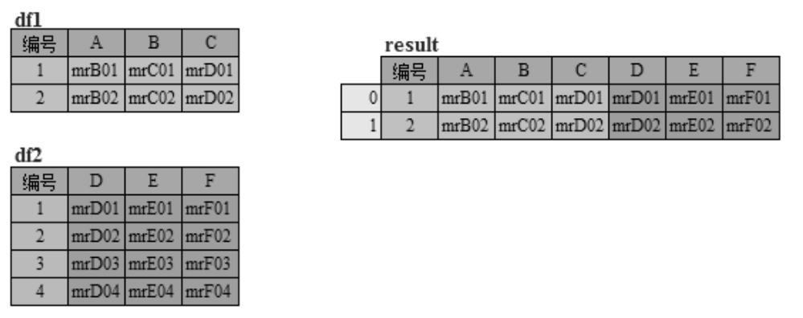

 最近合并前后效果对比图

**【例9.17】**通过“编号”合并数据**（实例位置：资源包\\TM\\sl\\09\\17）**

根据共有列“编号”实现最近合并，程序代码如下：

```text
1   import pandas as pd
2   # 设置数据显示的编码格式为东亚宽度，以使列对齐
3   pd.set_option('display.unicode.east_asian_width', True)
4   # 创建数据
5   df1 = pd.DataFrame({'编号':[1,2,3],
6                       '语文':[110,105,109],
7                       '数学':[105,88,120],
8                       '英语':[99,115,130]})
9   print(df1)
10  df2 = pd.DataFrame({'编号':[1,2,3,4,5],
11                      '体育':[34.5,39.7,38,43,10]})
12  print(df2)
13  # 最近合并
14  df_merge=pd.merge_asof(df1,df2,on='编号')
15  print(df_merge)
```

运行程序，原始数据如图9.32所示，合并后的数据如图9.33所示。

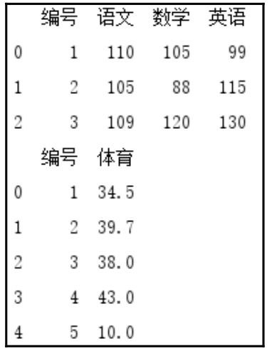

<p class="book-caption">▲图9.32 原始数据</p>

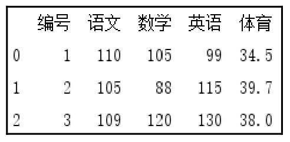

<p class="book-caption">▲图9.33 合并后的数据</p>

从运行结果得知：merge_asof()函数实现的最近合并，主要以匹配左边数据为主，原始左边数据为3条，右边数据为5条，合并后以左边数据为主，结果为3条数据。

## 9.4 数据透视表

Excel中的数据透视表相信大家都非常了解，Python也提供了类似功能。Python数据透视表具有以下优势： 

 更快，尤其在代码模块写好后和数据量较大时。 

 自我记录。通过查看代码，可快速了解每一步的作用。 

 易于使用，可以生成报告或电子邮件。 

 更加灵活，可以定义自定义聚合功能。

Python数据透视表主要使用DataFrame()对象的pivot()函数和pivot_table()函数实现，本节将介绍这两个函数，以及如何通过这两个函数进行数据分析。

### 9.4.1 pivot()函数

pivot()函数的语法格式如下：

```text
DataFrame.pivot(index=None, columns=None, values=None)[source]
```

参数说明： 

 index：指定重塑的新表的索引名称。 

 columns：指定重塑的新表的列名称。 

 values：指定生成新列的值，如果不指定，则会对剩下的未统计的列进行重新排列。

pivot()函数的返回值为DataFrame()对象。

例如，一组销售数据转换成数据透视表后看起来非常直观，对比效果如图9.34所示。

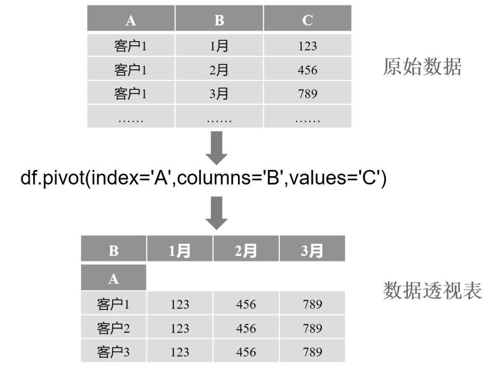

<p class="book-caption">图9.34 数据透视表转换过程</p>

**【例9.18】**通过数据透视表按年份统计城市GDP**（实例位置：资源包\\TM\\sl\\09\\18）**

按年份统计“北上广深”2020—2022年的GDP。数据集包含三个字段，分别是“地区”“年份”和“GDP”。程序代码如下：

```text
1  import pandas as pd
2  # 设置数据显示的编码格式为东亚宽度，以使列对齐
3  pd.set_option('display.unicode.east_asian_width', True)
4  # 读取Excel文件
5  df=pd.read_excel('gdp.xlsx')
6  print(df)
7  # 数据透视表
8  df_pivot=df.pivot(index='地区',columns='年份',values='GDP')
9  print(df_pivot)
```

运行程序，输出结果如图9.35和图9.36所示。

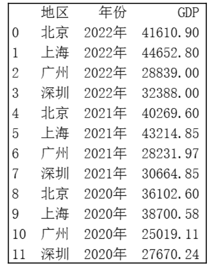

<p class="book-caption">▲图9.35 原始数据</p>

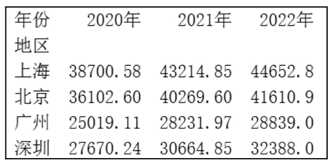

<p class="book-caption">▲图9.36 按年份统计“北上广深”GDP</p>

### 9.4.2 pivot\_table()函数

pivot_table()函数将列数据设定为行索引和列索引，并可以进行聚合运算。pivot_table()函数在统计分析上非常强大和便捷，一行代码就可以实现，默认求平均数。语法如下：

```text
DataFrame.pivot_table(values=None,index=None,columns=None,aggfunc='mean', fill_value=None, margins=False, dropna=
True, margins_name='All', observed=False)
```

主要参数说明： 

 values：被计算的数据项，可选参数，指定需要被聚合的列。 

 index：行分组键，用于分组的列名或其他分组键，作为结果DataFrame()对象的行索引。 

 columns：列分组键，用于分组的列名或其他分组键，作为结果DataFrame()对象的列索引。 

 aggfunc：聚合函数或函数列表，默认值为mean（平均值）。 

 fill_value：填充值，默认值为None。 

 margins：布尔型，表示是否添加行／列的总计。默认值为False时不添加，为True时添加。 

 margins_name：当参数margins=True时，指定总计的名称，默认值为All。

**【例9.19】**通过数据透视表统计各部门男女员工人数**（实例位置：资源包\\TM\\sl\\09\\19）**

统计每一个部门男员工和女员工各有多少人，程序代码如下：

```text
1  import pandas as pd
2   # 设置数据显示的编码格式为东亚宽度，以使列对齐
3   pd.set_option('display.unicode.east_asian_width', True)
4   # 设置数据显示的列数和宽度
5   pd.set_option('display.max_columns',20)
6   pd.set_option('display.width',3000)
7   # 读取Excel文件
8   df=pd.read_excel('员工表.xlsx')
9   print(df.head())
10  # 数据透视表，统计各部门男员工和女员工的人数
11  df_pivot=df.pivot_table(index='性别',columns='所属部门',values='姓名',aggfunc='count')
12  print(df_pivot)
13  # 空数据填充为0
14  df_pivot=df.pivot_table(index='性别',columns='所属部门',values='姓名',aggfunc='count',fill_value=0)
15  print(df_pivot)
```

运行程序，输出结果如图9.37和图9.38所示。

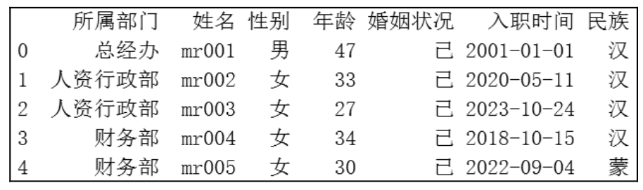

<p class="book-caption">▲图9.37 原始数据</p>

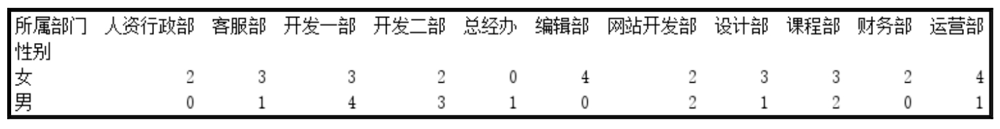

<p class="book-caption">▲图9.38 按部门统计男女员工人数</p>

## 9.5 小结

本章介绍了如何使用Pandas模块实现数据的分组统计、数据移位、数据合并以及数据透视表这些数据分析的常用技术。希望大家可以通过书中的实例进行练习，也可以自行寻找与实例类似的数据来进行练习，确保可以完全掌握本章所学习的内容。
