# 10 处理日期与时间

在对时间类型数据进行分析时，需要将字符串时间转换为标准时间类型，而Pandas有着强大的日期数据处理功能。本章主要介绍日期数据的处理，日期范围、频率和移位，时间区间与频率转换，重新采样与频率转换，移动窗口函数等。

本章知识架构如下。

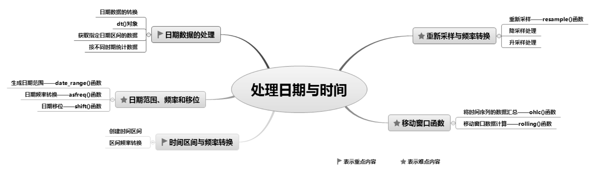

## 10.1 日期数据的处理

### 10.1.1 日期数据的转换

日常工作中，有一件非常麻烦的事情就是日期的格式可以有很多种表达，我们看到同样是2023年2月14日，可以有很多种日期格式，如图10.1所示。所以，我们需要先将这些格式统一后才能进行后续的工作。Pandas提供了to_datetime()函数可以帮助我们解决这一问题。

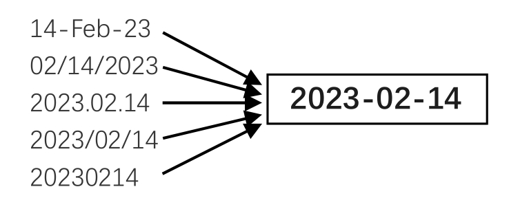

<p class="book-caption">图10.1 日期的多种格式转换</p>

to_datetime()函数可以实现批量日期数据转换，对于处理大数据非常实用和方便，它可以将日期数据转换成你需要的各种格式。例如，将2/14/23和14-2-2023转换为日期格式2023-02-14。 to_datetime()函数的语法如下：

```text
pandas.to_datetime(arg,errors='ignore',dayfirst=False,yearfirst=False,utc=None,box=True,format=None,exact=True,unit=Non
e,infer_datetime_format=False,origin='unix',cache=False)
```

参数说明： 

 arg：字符串、日期时间、字符串数组。 

 errors：值为ignore、raise或coerce，默认值为ignore忽略错误，具体说明如下。 

 ignore：无效的解析将返回原值。 

 raise：无效的解析将引发异常。 

 coerce：无效的解析将被设置为NaT，即将无法转换为日期的数据转换为NaT。 

 dayfirst：第一天，布尔型，默认值为False，如果为True，解析日期为第一天，如01/01/2023。 

 yearfirst：第一年，布尔型，默认值为False，如果为True则将年份放在前面。 

 utc：默认值为None。返回utc即协调世界时间。 

 box：布尔值，默认值为True。如果为True返回DatetimeIndex，如果为False返回值的ndarray。 

 format：格式化显示时间的格式。字符串，默认值为None。 

 exact：布尔值，默认值为True。如果为True，则要求格式完全匹配。如果为False，则允许格式与目标字符串中的任何位置匹配。 

 unit：默认值为None，参数的单位（D、s、ms、μs、ns）表示时间的单位。如Unix时间戳是整数／浮点数。 

 infer_datetime_format：默认值为False。如果没有格式，则尝试根据第一个日期时间字符串推断格式。 

 origin：默认值为unix。定义参考日期。数值将被解析为单位数。 

 cache：默认值为False。如果为True，则使用唯一、转换日期的缓存应用日期时间转换。在解析重复日期字符串，特别是带有时区偏移的字符串时，可能会产生明显的加速。只有在至少有50个值时才使用缓存。越界值的存在将使缓存不可用，并可能减慢解析速度。to_datetime()函数的返回值为日期时间。

**【例10.1】**将各种日期字符串转换为指定的日期格式**（实例位置：资源包\\TM\\sl\\10\\01）**

将2023年2月14日的各种格式转换为日期格式，程序代码如下：

```text
1  import pandas as pd
2  # 设置数据显示的编码格式为东亚宽度，以使列对齐
3  pd.set_option('display.unicode.east_asian_width', True)
4  df=pd.DataFrame({'原日期':['14-Feb-23', '02/14/2023', '2023.02.14', '2023/02/14','20230214']})
5  df['转换后的日期']=pd.to_datetime(df['原日期'])
6  print(df)
```

运行程序，输出结果如图10.2所示。

还可以实现从DataFrame()对象中的多列，如年、月、日各列组合成一列日期。键值是常用的日期缩略语。组合要求： 

 必选：year、month、day。 

 可选：hour、minute、second、millisecond（毫秒）、microsecond（微秒）、nanosecond（纳秒）。

**【例10.2】**将一组数据组合为日期数据**（实例位置：资源包\\TM\\sl\\10\\02）**

将一组数据组合为日期数据，关键代码如下：

```text
1   import pandas as pd
2   # 设置数据显示的编码格式为东亚宽度，以使列对齐
3   pd.set_option('display.unicode.east_asian_width', True)
4   df = pd.DataFrame({'year': [2021, 2022,2023],
5                      'month': [1, 3,2],
6                      'day': [4, 5,14],
7                      'hour':[13,8,2],
8                      'minute':[23,12,14],
9                      'second':[2,4,0]})
10  df['组合后的日期']=pd.to_datetime(df)
11  print(df)
```

运行程序，输出结果如图10.3所示。

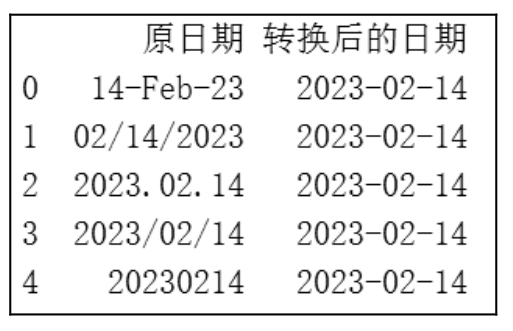

<p class="book-caption">▲图10.2 转换日期格式</p>

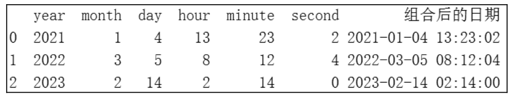

<p class="book-caption">▲图10.3 组合日期</p>

### 10.1.2 dt()对象

dt()对象是Series()对象中用于获取日期属性的一个访问器对象，通过它可以获取日期中的年、月、日、星期数、季节等，还可以判断日期是否处在年底。语法如下：

```text
Series.dt()
```

dt()对象返回与原始系列相同的索引系列。如果Series不包含类日期值，则将引发错误。

dt()对象提供了year、month、day、dayofweek、dayofyear、is_leap_year、quarter、weekday_name等属性和函数。例如，year可以获取“年”、month可以获取“月”、quarter可以直接得到每个日期分别是第几个季度，weekday_name可以直接得到每个日期对应的是周几。

**【例10.3】**获取日期中的年、月、日、星期数等数据**（实例位置：资源包\\TM\\sl\\10\\03）**

使用dt()对象获取日期中的年、月、日、星期数、季节等数据。

（1）获取年、月、日。代码如下：

```text
df['年'],df['月'],df['日']=df['日期'].dt.year,df['日期'].dt.month,df['日期'].dt.day
```

（2）从日期判断所处星期数。代码如下：

```text
df['星期几']=df['日期'].dt.day_name()
```

（3）从日期判断所处季度。代码如下：

```text
df['季度']=df['日期'].dt.quarter
```

（4）从日期判断是否为年底最后一天。代码如下：

```text
df['是否年底']=df['日期'].dt.is_year_end
```

运行程序，输出结果如图10.4所示。

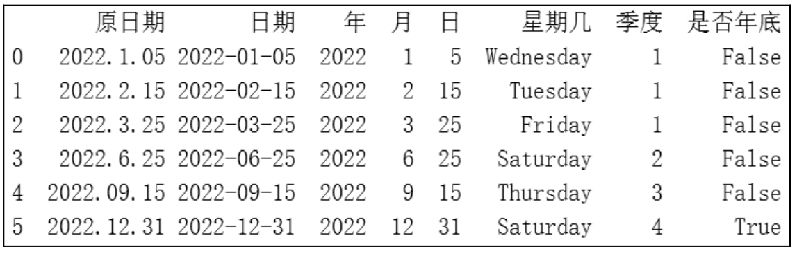

<p class="book-caption">图10.4 dt()对象日期转换</p>

### 10.1.3 获取指定日期区间的数据

获取日期区间的数据的方法是直接在DataFrame()对象中输入日期或日期区间，但前提是必须设置日期为索引。

（1）获取2022年的数据。代码如下：

```text
df1.loc['2022']
```

（2）获取2021—2022年的数据。代码如下：

```text
df1['2021':'2022']
```

（3）获取某月（2022年7月）的数据。代码如下：

```text
df1.loc['2022-07']
```

（4）获取具体某天（2022年5月6日）的数据。代码如下：

```text
df1['2022-05-06':'2022-05-06']
```

**【例10.4】**获取指定日期区间的订单数据**（实例位置：资源包\\TM\\sl\\10\\04）**

获取2022年5月11日到10月10日之间的订单，效果如图10.5所示。

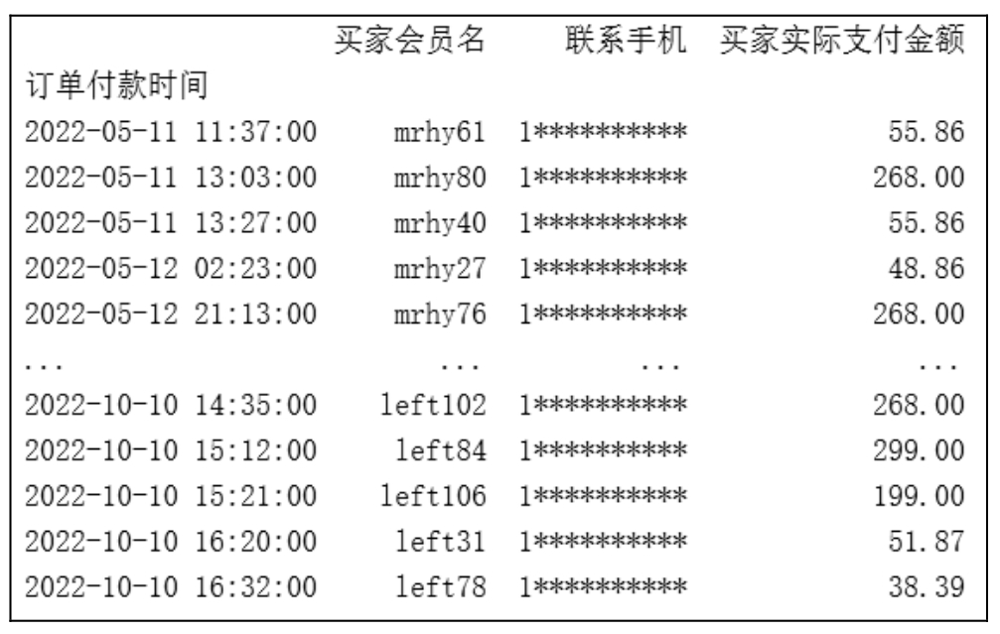

<p class="book-caption">图10.5 2022年5月11日到10月10日之间的订单（省略部分数据）</p>

程序代码如下：

```text
1  import pandas as pd
2  # 设置数据显示的编码格式为东亚宽度，以使列对齐
3  pd.set_option('display.unicode.ambiguous_as_wide', True)
4  pd.set_option('display.unicode.east_asian_width', True)
5  df = pd.read_excel('mingribooks.xls')
6  df1=df[['订单付款时间','买家会员名','联系手机','买家实际支付金额']]
7  df1=df1.sort_values(by=['订单付款时间'])
8  df1 = df1.set_index('订单付款时间')       # 将日期设置为索引
9  print(df1['2022-05-11':'2022-10-10'])     # 获取某个区间数据
```

### 10.1.4 按不同时期统计数据

**1. 按时期统计数据**

按时期统计数据主要通过DataFrame()对象的resample()函数结合数据计算函数实现。resample()函数主要应用于时间序列频率转换和重新采样，它可以从日期中获取年、月、日、星期、季节等数据，结合数据计算函数就可以实现按年、月、日、星期或季度等不同时期统计数据。举例如下：

（1）按年统计数据。代码如下：

```text
df1=df1.resample('AS').sum()
```

（2）按季度统计数据。代码如下：

```text
df2.resample('Q').sum()
```

（3）按月度统计数据。代码如下：

```text
df1.resample('M').sum()
```

（4）按星期统计数据。代码如下：

```text
df1.resample('W').sum()
```

（5）按天统计数据。代码如下：

```text
df1.resample('D').sum()
```

代码说明： 

 代码中的AS表示将每年第一天作为开始日期，如果将最后一天作为开始日期，则需要将AS改为A。 

 代码中的Q表示将每个季度最后一天作为开始日期，如果要改成将每个季度第一天作为开始日期，则需要将Q改为QS。 

 代码中的“M”表示将每个月最后一天作为开始日期，如果要改成将每个月第一天作为开始日期，则需要将M改为MS。

**技巧**

按日期统计数据过程中，可能会出现如图10.6所示的错误提示。

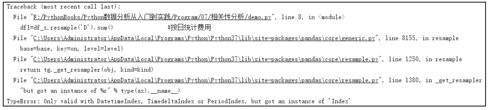

<p class="book-caption">图10.6 错误提示</p>

完整错误描述：

```text
TypeError: Only valid with DatetimeIndex, TimedeltaIndex or PeriodIndex, but got an instance of 'Index'
```

出现上述错误的原因是resample()函数要求索引必须为日期型。

解决方法：将数据的索引转换为datetime类型，关键代码如下：

```text
df1.index = pd.to_datetime(df1.index)
```

**2. 按时期显示数据**

DataFrame()对象的to_period()函数可以将时间戳转换为时期，从而实现按时期显示数据，前提是日期必须设置为索引。语法如下：

```text
DataFrame.to_period(freq=None, axis=0, copy=True)
```

参数说明： 

 freq：字符串，周期索引的频率，默认值为None。 

 axis：行列索引，0为行索引，1为列索引，默认值为0。 

 copy：是否复制数据，默认值为True，如果为False，则不复制数据。

to\_ period()函数的返回值为带周期索引的时间序列。

**【例10.5】**从日期中获取不同的时期**（实例位置：资源包\\TM\\sl\\10\\05）**

从日期中获取不同的时期，关键代码如下：

```text
1  df1.to_period('A')  # 按年
2  df1.to_period('Q')  # 按季度
3  df1.to_period('M')  # 按月
4  df1.to_period('W')  # 按星期
```

**3. 按时期统计并显示数据**

按时期统计并显示数据分为如下4种情况： 

 按年统计并显示数据，代码如下，运行结果如图10.7所示。

```text
df2.resample('AS').sum(numeric_only=True).to_period('A') 
```

 按季度统计并显示数据，代码如下，运行结果如图10.8所示。

```text
Q_df=df2.resample('Q').sum(numeric_only=True).to_period('Q')
```

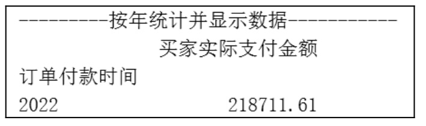

<p class="book-caption">▲图10.7 按年统计并显示数据</p>

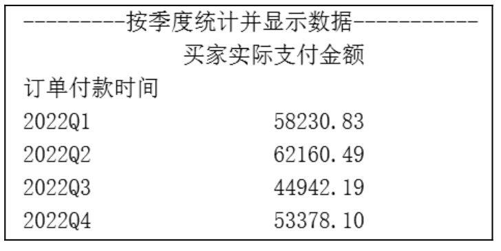

<p class="book-caption">▲图10.8 按季度统计并显示数据</p>


 按月统计并显示数据，代码如下，运行结果如图10.9所示。

```text
df2.resample('M').sum(numeric_only=True).to_period('M') 
```

 按星期统计并显示数据（前5条数据），代码如下，运行结果如图10.10所示。

```text
df2.resample('W').sum(numeric_only=True).to_period('W').head()
```

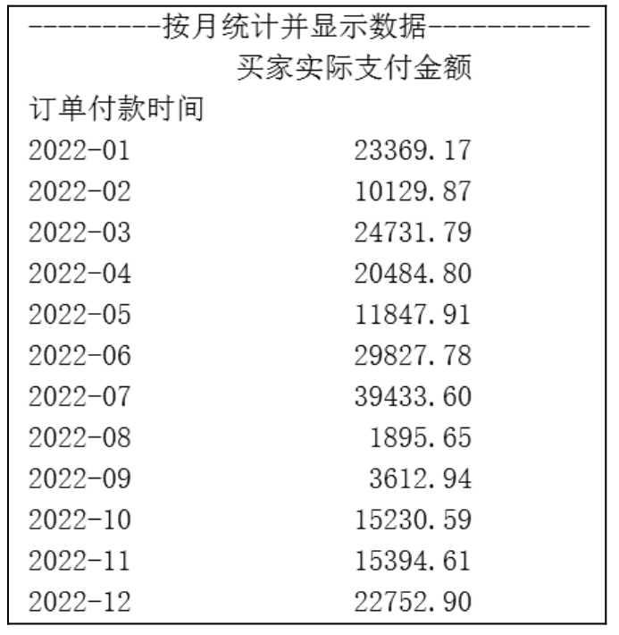

<p class="book-caption">▲图10.9 按月统计并显示数据</p>

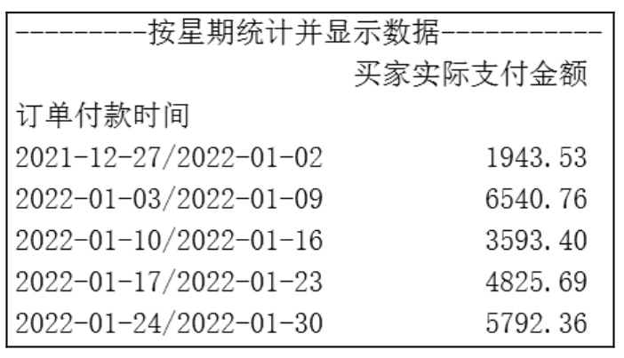

<p class="book-caption">▲图10.10 按星期统计并显示数据</p>

## 10.2 日期范围、频率和移位

### 10.2.1 生成日期范围—date\_range()函数

生成指定的日期范围可以使用Pandas的date_range()函数，该函数可以实现按指定的频率生成时间段或生成超前或滞后的日期范围等。语法如下：

```text
pandas.date_range(start=None, end=None, periods=None, freq=None, tz=None, normalize=False, name=None, closed=
None, **kwargs)
```

参数说明： 

 start：字符串或日期型，默认值为None，表示日期的起点。 

 end：字符串或日期型，默认值为None，表示日期的终点。 

 periods：整型或None，默认值为None，表示要生成多少个日期索引值；如果值为None，那么start和end两个参数必须不能为None。 

 freq：字符串或DateOffset，默认值为D，表示以自然日为单位，该参数用来指定计时单位，如“3H”表示每隔3个小时计算一次。 

 tz：字符串或None，表示时区。 

 normalize：布尔值，默认值为False。如果值为True，那么在生成时间索引值之前会先将start和end两个参数都转化为当日的午夜0点。 

 name：字符串，默认值为None，为返回的时间索引指定一个名字。 

 closed：字符串或None，默认值为None，表示start和end两个参数的日期是否包含在区间内，有3个值，left表示左闭右开区间（不包括日期的终点，即end参数值）；right表示左开右闭区间（不包括日期的起点，即start参数值）；None表示两边的日期都包括在内。date_range()函数的返回值为DatetimeIndex（日期时间索引）。

**【例10.6】**按频率生成时间段**（实例位置：资源包\\TM\\sl\\10\\06）**

使用Pandas的date_range()函数生成指定频率的时间段，程序代码如下：

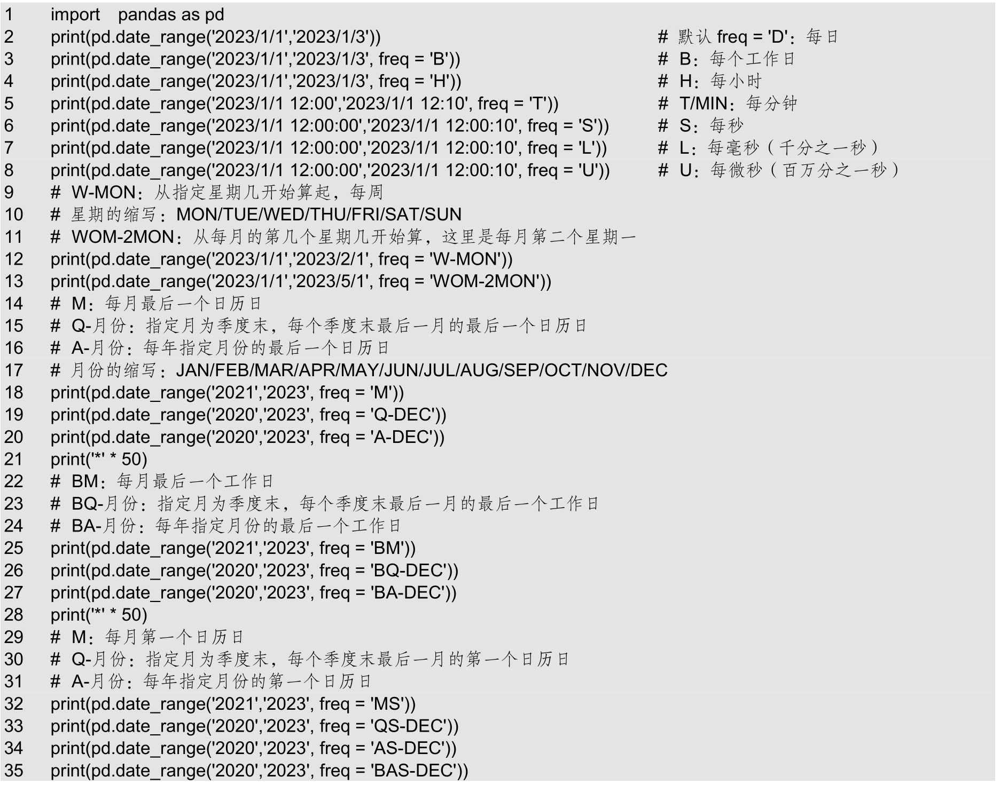

为了方便灵活使用date_range()函数，下面给出freq参数的详细解释。 

 B：工作日频率。 

 C：自定义工作日频率。 

 D：日历日频率。 

 W：每周频率。 

 M：月末频率。 

 SM：半月结束频率（15日和月末）。 

 BM：营业月结束频率。 

 CBM：自定义营业月结束频率。 

 MS：月开始频率。 

 SMS：半月开始频率（第1天和第15天）。 

 BMS：营业月开始频率。 

 CBMS：自定义营业月开始频率。 

 Q：四分之一结束频率。 

 BQ：业务季度结束频率。 

 QS：季度开始频率。 

 BQS：业务季度开始频率。 

 A, Y：年终频率。 

 BA, BY：业务年度结束频率。 

 AS, YS：年开始频率。 

 BAS, BYS：营业年度开始频率。 

 BH：营业时间频率。 

 H：小时的频率。 

 T：分钟的频率。 

 S：秒的频率。 

 L：毫秒的频率。 

 U：微妙的频率。 

 N：纳秒的频率。

**【例10.7】**按复合频率生成时间段**（实例位置：资源包\\TM\\sl\\10\\07）**

使用Pandas的date_range()函数按复合频率生成指定的时间段，程序代码如下：

```text
1  import pandas as pd
2  print(pd.date_range('2023/1/1','2023/2/1', freq = '7D'))         # 7天
3  print(pd.date_range('2023/1/1','2023/1/2', freq = '1h30min'))    # 1小时30分
4  print(pd.date_range('2022','2023', freq = '2M'))                 # 两个月，每月最后一个日历日
```

### 10.2.2 日期频率转换—asfreq()函数

日期操作过程中，当需要将日期时间索引更改为不同频率，同时在当前索引处保留相同的值时，可以使用asfreq()函数。

**【例10.8】**按天的频率转换为5小时的频率**（实例位置：资源包\\TM\\sl\\10\\08）**

将按天的频率转换为按5小时的频率，代码如下：

```text
1  import numpy as np
2  import pandas as pd
3  # 生成日期范围
4  ts = pd.Series(np.random.rand(5), index = pd.date_range('20230101','20230105'))
5  print(ts)
6  # 改变频率，将日改为5小时
7  # method：插值模式，None不插值，ffill用之前的值填充，bfill用之后的值填充
8  print(ts.asfreq('5H',method = 'ffill'))
```

运行程序，输出结果如图10.11和图10.12所示。

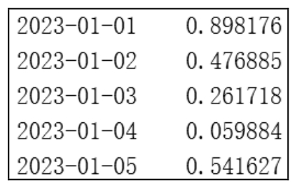

<p class="book-caption">▲图10.11 原始数据</p>

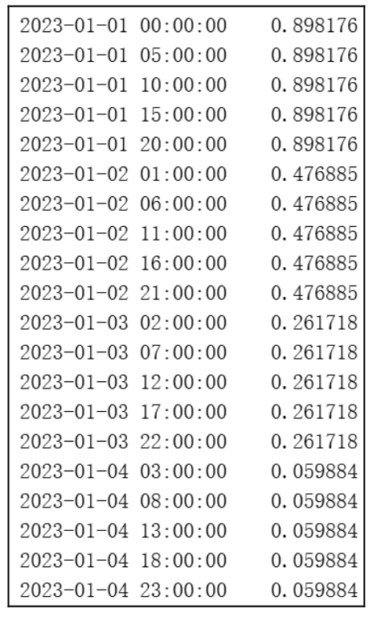

<p class="book-caption">▲图10.12 转换为5小时的频率后</p>

### 10.2.3 日期移位—shift()函数

移位是指将日期向前移动或向后移动。主要使用Series()对象和DataFrame()对象的shift()函数，该函数用于进行简单的向前或向后移动日期对应的数据，数据改变而日期索引不改变。正数表示向前移动，负数表示向后移动。

例如，有一组原始数据，将日期向前移动两次的数据如图10.13所示，从图中可以看出，日期索引没有改变，而数据改变了。

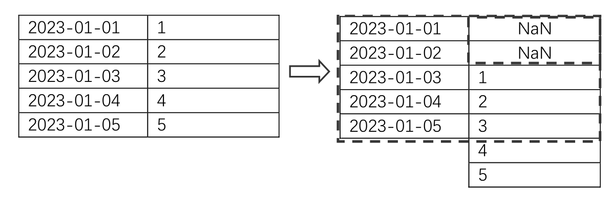

<p class="book-caption">图10.13 移位日期示意图</p>

shift()函数非常有用，在数据位移时与其他函数结合，能实现很多功能，语法如下：

```text
DataFrame.shift(periods=1, freq=None, axis=0)
```

部分参数说明： 

 periods：表示移动的幅度，可以是正数，也可以是负数，默认值是1，表示移动一次。注意，这里移动的都是数据，而索引是不移动的，移动之后没有对应值的，赋值为NaN。 

 freq：可选参数，默认值为None，只适用于时间序列。如果这个参数存在，那么会按照参数值移动日期索引，而数据值不会发生变化。 

 axis：axis=1表示行，axis=0表示列，默认值为0。

**【例10.9】**查看日期向前和向后移动两次后的数据**（实例位置：资源包\\TM\\sl\\10\\09）**

首先使用numpy和date_range()函数随机生成2023年1月1日—2023年1月5日的数据，然后查看日期向前和向后移动两次后的数据，程序代码如下：

```text
1  import numpy as np
2  import pandas as pd
3  # 随机生成日期数据
4  ts = pd.Series(np.random.rand(5),
5               index = pd.date_range('20230101','20230105'))
6  print(ts)
7  # 查看日期向前和向后移动两次后的数据
8  print(ts.shift(2))
9  print(ts.shift(-2))
```

运行程序，输出结果如图10.14、图10.15和图10.16所示。

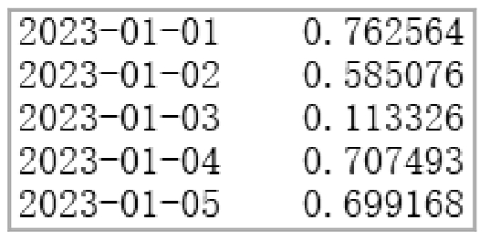

<p class="book-caption">▲图10.14 原始数据</p>

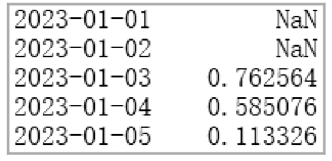

<p class="book-caption">▲图10.15 向前移动两次的数据</p>

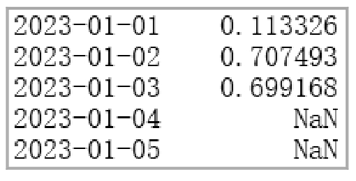

<p class="book-caption">▲图10.16 向后移动两次的数据</p>

在移位日期过程中，数据发生了变化，产生了缺失值（NaN）。如果只移动日期，数据不发生变化，可以通过freq参数指定频率。例如，日期向前移动两次，频率为日历日，关键代码如下：

```text
print(ts.shift(2,freq='D'))
```

运行程序，输出结果如图10.17所示。

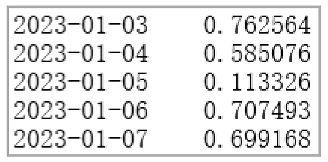

<p class="book-caption">图10.17 日期向前移动两次</p>

对比原始数据，会发现日期发生了变化，而数据没有变化。当然，这里也可以指定其他频率，例如，日期向前移动一次，频率为30分钟，关键代码如下：

```text
print(ts.shift(1,freq='30T'))
```

## 10.3 时间区间与频率转换

时间区间就是时间范围、时期，也就是一段时间，如一些天、一些月、一些年等。本节主要介绍创建时间区间和区间频率转换。

### 10.3.1 创建时间区间

创建时间区间可以使用Pandas的Period类和period_range()函数。

**1. Period类**

Period类用于定义一个时期，或者说具体的一个时间段，包括起始时间start_time、终止时间end_time、频率freq等参数，其中参数freq和之前的date_range()函数的freq参数类似，可以取D、M等值。其返回值是日期时间。

**【例10.10】**使用Period类创建不同的时间**（实例位置：资源包\\TM\\sl\\10\\10）**

下面使用Period类创建不同的时间区间，程序代码如下：

```text
1   import pandas as pd
2   # 创建时间区间
3   myperiod = pd.Period('2022-12-25', freq = "A")
4   print(myperiod)
5   print(myperiod.start_time, myperiod.end_time, myperiod + 1, myperiod)
6   print(pd.Period('2023-1-1 12:13:14', freq='S') + 1)  # 秒+1
7   print(pd.Period('2023-1-1 12:13:14', freq='T') + 1)  # 分+1
8   print(pd.Period('2023-1-1 12:13:14', freq='H') + 1)  # 时+1
9   print(pd.Period('2023-1-1 12:13:14', freq='D') + 1)  # 日+1
10  print(pd.Period('2023-1-1 12:13:14', freq='M') + 1)  # 月+1
11  print(pd.Period('2023-1-1 12:13:14', freq='A') + 1)  # 年+1
```

运行程序，输出结果如图10.18所示。

Period类的属性如下： 

 day：获取当前时间段所在月份的天数。 

 dayofweek：获取当前时间段所在月份的星期数。 

 dayofyear：获取当前时间段所在年份的天数。 

 days_in_month：获取当前时间段一个月内的天数。 

 daysinmonth：获取当前时间段所在月份的总天数。 

 hour：获取当前时间段的小时数。 

 minute：获取当前时间段的分钟数。 

 second：获取当前时间段的秒数。 

 start_time：起始时间。 

 end_time：终止时间。 

 week：获取当前时间段所在年份的星期数。

**2. period\_range()函数**

period_range()函数创建的时间序列可以作为Series()对象的索引，与Period类不同的是period_range()函数的返回值是日期索引序列。

**【例10.11】**使用period_range()函数创建时间段**（实例位置：资源包\\TM\\sl\\10\\11）**

使用period_range()函数创建2022年1月1日—2022年6月30日的时间段，程序代码如下：

```text
1  import pandas as pd
2  import numpy as np
3  # 创建时间段
4  prng=pd.period_range('2022-01-01','2022-06-30',freq='M')
5  ts=pd.Series(np.random.randn(6),index=prng)
6  print(ts)
```

运行程序，输出结果如图10.19所示。

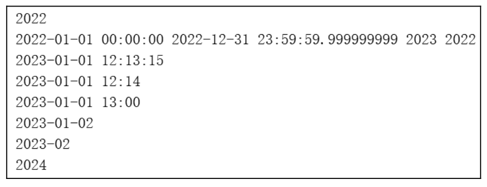

<p class="book-caption">▲图10.18 使用Period类创建时间区间</p>

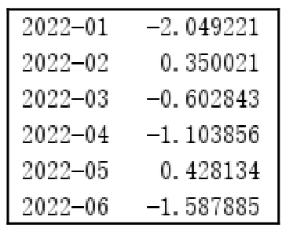

<p class="book-caption">▲图10.19 创建时间段</p>

### 10.3.2 区间频率转换

在统计数据过程中，可能会遇到这样的需求：将某年的报告转换为季报告或月报告。为了实现这个需求，Pandas提供了asfreq()函数来转换区间的频率，如将年度区间转换为月度区间。asfreq()函数的语法如下：

```text
Period.asfreq(freq，how='end')
```

参数说明： 

 freq：表示计时单位，可以是DateOffest对象或字符串。 

 how：可以取值为start或end，默认值为end，仅适用于时期索引。start包含区间开始，end包含区间结束。

**【例10.12】**区间频率转换**（实例位置：资源包\\TM\\sl\\10\\12）**

下面实现区间频率转换，程序代码如下：

```text
1   import pandas as pd
2   # 创建时间序列
3   myperiod = pd.Period('2023', freq = "A-DEC")
4   print(myperiod)
5   print('转换为月度区间：')
6   print(myperiod.asfreq('M',how='start'))
7   print(myperiod.asfreq('M',how='end'))
8   print('转换为日历日区间')
9   print(myperiod.asfreq('D',how='start'))
10  print(myperiod.asfreq('D',how='end'))
```

运行程序，输出结果如图10.20所示。

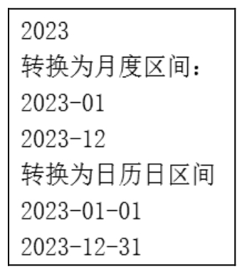

<p class="book-caption">图10.20 区间频率转换</p>

## 10.4 重新采样与频率转换

### 10.4.1 重新采样—resample()函数

通过前面的学习，我们学会了如何生成不同频率的时间索引，按小时、按天、按周、按月等。如果想对数据做不同频率的转换，该怎么办？在Pandas中对时间序列的频率的调整称为重新采样，即将时间序列从一个频率转换到另一个频率的处理过程。例如，将每天一个频率转换为每5天一个频率，如图10.21所示。

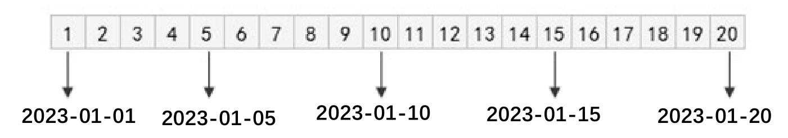

<p class="book-caption">图10.21 时间频率转换</p>

重新采样主要使用resample()函数，该函数用于对常规时间序列重新采样和频率转换，包括降采样和升采样两种。首先我们来了解resample()函数，语法如下：

```text
DataFrame.resample(rule,how=None,axis=0,fill_method=None,closed=None,label=None,convention='start',kind=None,loffset
=None,limit=None,base=0,on=None,level=None)
```

参数说明： 

 rule：字符串，偏移量表示目标字符串或对象转换。 

 how：用于产生聚合值的函数名或数组函数，如mean、ohlc、np.max等，默认值为mean，其他常用的值为first、last、median、max和min。 

 axis：整型，表示行列。0表示列，1表示行，默认值为0。 

 fill_method：升采样时所使用的填充函数，ffill()函数（用前值填充）或bfill()函数（用后值填充），默认值为None。 

 closed：降采样时表示时间区间的开和闭，与数学里区间的概念一样，其值为right或left，right表示左开右闭（即左边值不包括在内），left表示左闭右开（即右边值不包括在内），默认值为right，左开右闭。 

 label：降采样时设置聚合值的标签。例如，10：30—10：35会被标记成10：30或是10：35，默认值为None。 

 convention：当重新采样时，将低频率转换到高频率所采用的约定，其值为start或end，默认值为start。 

 kind：聚合到时期（period）或时间戳（timestamp），默认聚合到时间序列的索引类型，默认值为None。 

 loffset：聚合标签的时间校正值，默认值为None。例如，-1s或Second（-1）用于将聚合标签调早1秒。 

 limit：向前或向后填充时，允许填充的最大时期数，默认值为None。 

 base：整型，默认值为0。对于均匀细分1天的频率，聚合间隔的“原点”。例如，对于5min频率，base的范围可以是0～4。 

 on：字符串，可选参数，默认值为None。对DataFrame对象使用列代替索引进行重新采样。列必须与日期时间类似。 

 level：字符串或整型，可选参数，默认值为None。用于多索引，重新采样的级别名称或级别编号，级别必须与日期时间类似。resample()函数的返回值为重新采样对象。

**【例10.13】**将一分钟的时间序列转换为3分钟的时间序列**（实例位置：资源包\\TM\\sl\\10\\13）**

首先创建一个包含9个一分钟的时间序列，然后使用resample()函数将其转换为3分钟的时间序列并对索引列进行求和计算，如图10.22所示。

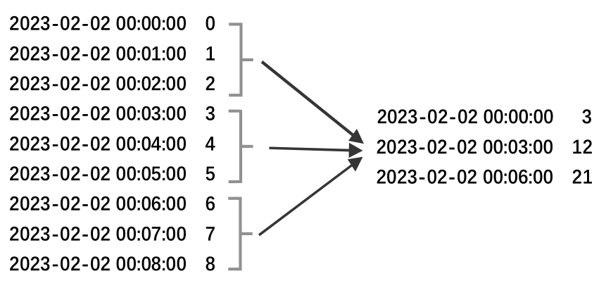

<p class="book-caption">图10.22 时间序列转换</p>

程序代码如下：

```text
1  import pandas as pd
2  index = pd.date_range('02/02/2023', periods=9, freq='T')   # 生成9组，每分钟的日期范围数据
3  series = pd.Series(range(9), index=index)                # 生成日期对应的数据
4  print(series)
5  print(series.resample('3T').sum())   # 打印3分钟的时间序列并对索引列进行求和计算的结果
```

### 10.4.2 降采样处理

降采样是指周期由高频率转向低频率。例如，将5min股票交易数据转换为日交易，按天统计的销售数据转换为按周统计。

数据降采样涉及数据聚合。例如，将天数据变成周数据，那么就要对1周7天的数据进行聚合，聚合的方式主要包括求和、求均值等。例如，淘宝店铺每天的销售数据（部分数据）如图10.23所示。

**【例10.14】**按周统计销售数据**（实例位置：资源包\\TM\\sl\\10\\14）**

使用resample()函数来做降采样处理，频率为“周”，也就是将上述销售数据每周（每7天）做一次求和，程序代码如下：

```text
1  import pandas as pd
2  df=pd.read_excel('time.xls')
3  df1 = df.set_index('订单付款时间')        # 设置“订单付款时间”为索引
4  print(df1.resample('W').sum(numeric_only=True).head())
```

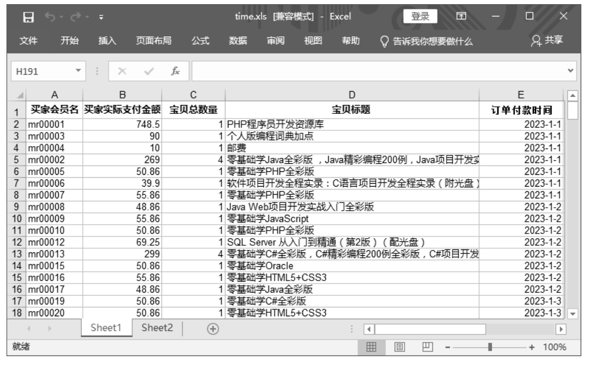

<p class="book-caption">图10.23 淘宝店铺每天销售数据（部分数据）</p>

运行程序，输出结果如图10.24所示。

在参数说明中，我们列出了closed参数的解释，如果把closed参数值设置为left，结果将是怎样的呢？如图10.25所示。

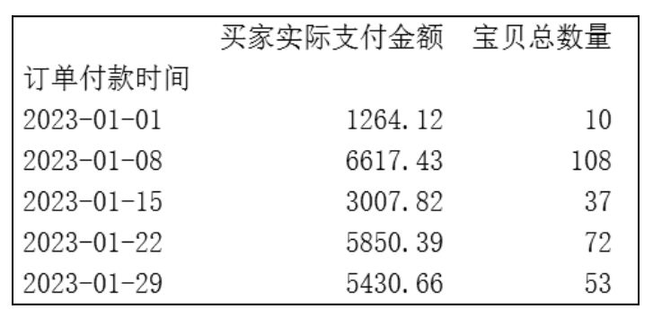

<p class="book-caption">▲图10.24 周数据统计（1）</p>

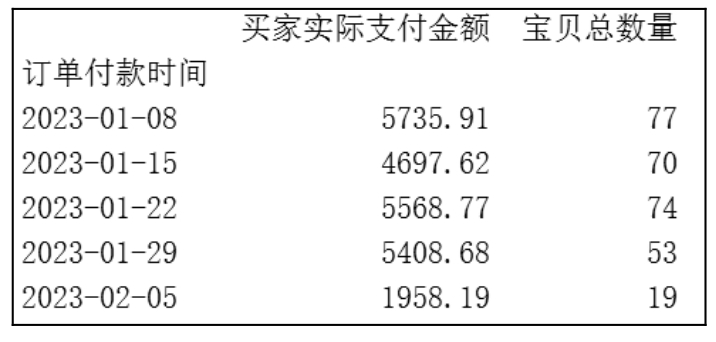

<p class="book-caption">▲图10.25 周数据统计（2）</p>

### 10.4.3 升采样处理

升采样是指周期由低频率转向高频率。将数据从低频率转换高频率时，就不需要聚合了，将其重新采样到日频率，默认会引入缺失值。

例如，原来是按周统计的数据，现在变成按天统计。升采样会涉及数据的填充，根据填充的方法不同，填充的数据也不同。下面介绍三种填充方法。 

 不填充。空值用NaN代替，使用asfreq()函数。 

 用前值填充。用前面的值填充空值，使用ffill()函数或者pad()函数。为了方便记忆，ffill()函数可以使用它的第一个字母f代替，代表forward，向前的意思。 

 用后值填充，使用bfill()函数，可以使用字母b代替，代表back，向后的意思。

**【例10.15】**每6小时统计一次数据**（实例位置：资源包\\TM\\sl\\10\\15）**

下面创建一个时间序列，起始日期是2023-02-02，一共2天，每天对应的数值分别是1和2，通过升采样处理为每6小时统计一次数据，空值以不同的方式填充，程序代码如下：

```text
1  import pandas as pd
2  import numpy as np
3   rng = pd.date_range('20230202', periods=2)    # 生成日期范围
4   s1 = pd.Series(np.arange(1,3), index=rng)   # 生成日期对应的数据
5   s1_6h_asfreq = s1.resample('6H').asfreq()   # 不填充
6   print(s1_6h_asfreq)
7   s1_6h_ffill = s1.resample('6H').ffill()     # 使用前值填充
8   print(s1_6h_ffill)
9   s1_6h_bfill = s1.resample('6H').bfill()     # 使用后值填充
10  print(s1_6h_bfill)
```

运行程序，输出结果如图10.26所示。

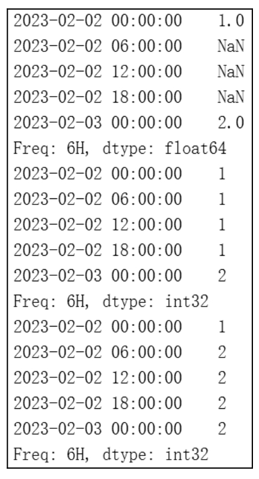

<p class="book-caption">图10.26 6小时数据统计</p>

## 10.5 移动窗口函数

### 10.5.1 将时间序列的数据汇总—ohlc()函数

在金融领域，我们经常会看到开盘（open）、收盘（close）、最高价（high）和最低价（low）数据，而在Pandas中经过重新采样的数据也可以得到这样的结果，就是通过调用ohlc()函数得到数据汇总结果，即开始值（open）、结束值（close）、最高值（high）和最低值（low）。ohlc函数的语法如下：

```text
resample.ohlc()
```

ohlc函数返回DataFrame()对象，包括每组数据的open、high、low和close值。

**【例10.16】**统计数据的open、high、low和close值**（实例位置：资源包\\TM\\sl\\10\\16）**

下面是一组5分钟的时间序列，通过ohlc()函数获取该时间序列中每组时间的开始值、最高值、最低值和结束值，程序代码如下：

```text
1  import pandas as pd
2  import numpy as np
3  rng = pd.date_range('2/2/2023',periods=12,freq='T')  # 生成12组每分钟的日期范围数据
4  s1 = pd.Series(np.arange(12),index=rng)                # 生成日期对应的数据
5  print(s1.resample('5min').ohlc())                # 打印间隔5分钟的open、high、low和close值
```

运行程序，输出结果如图10.27所示。

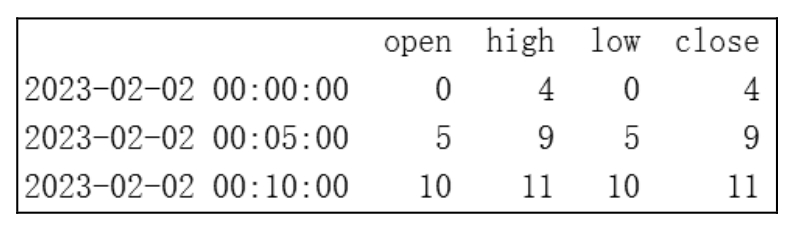

<p class="book-caption">图10.27 时间序列数据汇总</p>

### 10.5.2 移动窗口数据计算—rolling()函数

通过重新采样我们可以得到想要的任何频率的数据，但是这些数据也只是一个时间点的数据，那么就存在这样一个问题：时间点的数据波动较大，某一点的数据就不能很好地表现它本身的特性，于是就有了“移动窗口”的概念，简单地说，为了提升数据的可靠性，将某个点的取值扩大到包含这个点的一段区间，用区间来进行判断，这个区间就是窗口。

下面举例说明。如图10.28所示，其中时间序列代表1号到15号每天的销量数据，接下来以3天为一个窗口，将该窗口从左至右依次移动，统计出3天的销量数据的平均值作为这个点的值，如3号的销量是1号、2号和3号的平均值。

通过上述说明相信大家已经理解了移动窗口，在Pandas中可以通过rolling()函数实现移动窗口数据的计算，语法如下：

```text
DataFrame.rolling(window, min_periods=None, center=False, win_type=None, on=None, axis=0, closed=None)
```

参数说明： 

 window：时间窗口的大小，有两种形式（int或offset）。如果使用int形式，则数值表示计算统计量的观测值的数量，即向前几个数据。如果使用offset形式，则表示时间窗口的大小。 

 min_periods：每个窗口最少包含的观测值数量，小于这个值的窗口结果为NA。值可以是int，默认值为None。在offset情况下，默认值为1。 

 center：布尔型，表示是否从中间位置开始取数，默认值为False。 

 win_type：窗口的类型。 

 on：可选参数。对于DataFrame()对象，是指定要计算移动窗口的列，值为列名。 

 axis：整型或字符串。默认值为0，即对列进行计算。 

 closed：定义区间的开闭，支持int类型的窗口。

rolling()函数的返回值为特定操作而生成的窗口或移动窗口子类。

**【例10.17】**创建淘宝每日销量数据**（实例位置：资源包\\TM\\sl\\10\\17）**

首先创建一组淘宝每日销量数据，程序代码如下：

```text
1  import pandas as pd
2  index=pd.date_range('20230201','20230215')   # 生成指定日期范围数据
3  data=[3,6,7,4,2,1,3,8,9,10,12,15,13,22,14]     # 创建日期对应的数据列表
4  s1_data=pd.Series(data,index=index)            # 生成日期对应的数据
5  print(s1_data)                                 # 打印生成后的日期数据
```

运行程序，输出结果如图10.29所示。

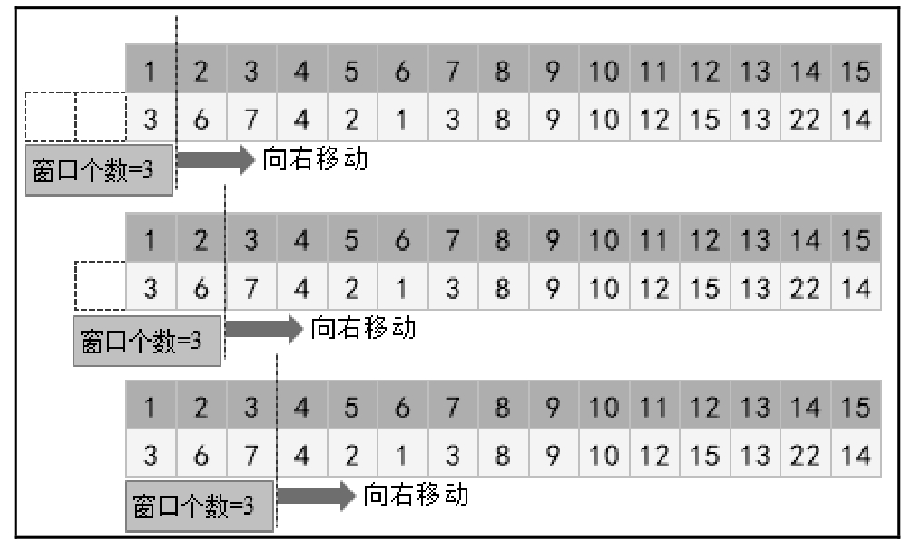

<p class="book-caption">▲图10.28 移动窗口数据示意图</p>

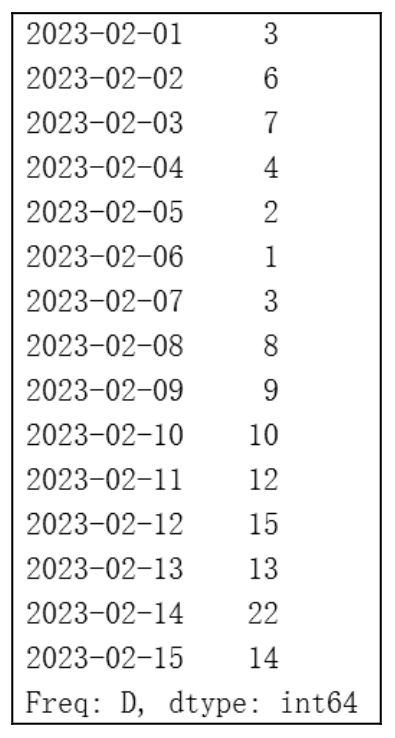

<p class="book-caption">▲图10.29 原始数据</p>

**【例10.18】**使用rolling()函数计算三天的均值**（实例位置：资源包\\TM\\sl\\10\\18）**

下面使用rolling()函数计算2023-02-01—2023-02-15中每三天的销量均值，窗口个数为3，代码如下：

```text
s1_data.rolling(3).mean()
```

运行程序，我们来看rolling()函数是如何计算的。如图10.30所示，当窗口开始移动时，第一个时间点2023-02-01和第二个时间点2023-02-02的数值为空，这是因为窗口个数为3，它们前面有空数据，所以均值为空；而到第三个时间点2023-02-03时，它前面的数据是2023-02-01—2023-02-03，所以三天的均值是5.333333，以此类推。

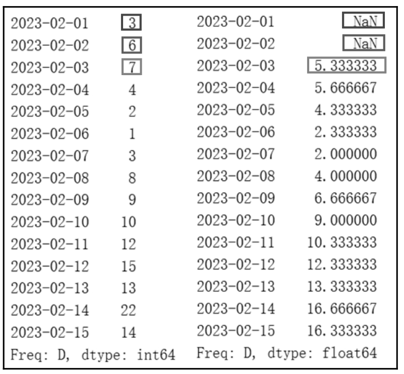

<p class="book-caption">图10.30 移动窗口均值（1）</p>

**【例10.19】**用当天的数据代表窗口数据**（实例位置：资源包\\TM\\sl\\10\\19）**

在计算第一个时间点2023-02-01的窗口数据时，虽然数据不够窗口长度3，但是至少有当天的数据，那么能否用当天的数据代表窗口数据呢？答案是肯定的，通过设置min_periods参数即可，它表示窗口最少包含的观测值，小于这个值的窗口长度显示为空，等于或大于时都有值，关键代码如下：

```text
s1_data.rolling(3,min_periods=1).mean()
```

运行程序，对比效果如图10.31所示。

上述举例，我们再扩展一下。通过图表观察原始数据与移动窗口数据的平稳性，如图10.32所示，其中实线代表移动窗口数据，其走向更平稳，这也是我们学习移动窗口rolling()函数的原因。

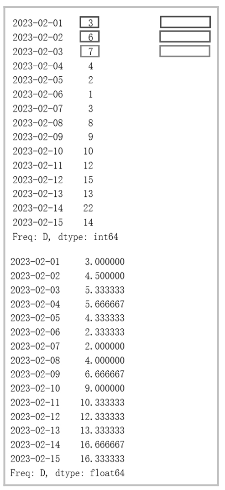

<p class="book-caption">▲图10.31 移动窗口均值（2）</p>

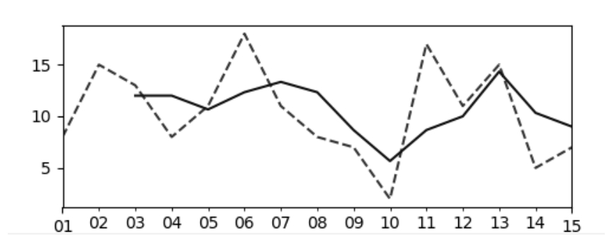

<p class="book-caption">▲图10.32 移动窗口数据的平稳性</p>

### 说明

虚线代表原始数据，实线代表移动窗口数据。

## 10.6 小结

本章介绍了如何使用Pandas模块实现在数据分析时处理数据中的日期与时间问题。其中包含日期数据的转换、获取指定日期区间的数据、按不同时期统计数据等多种在数据分析中比较常用的函数。

希望大家可以根据现有的实例进行拓展练习，掌握本章介绍的这些比较常用的日期时间数据的处理函数。
