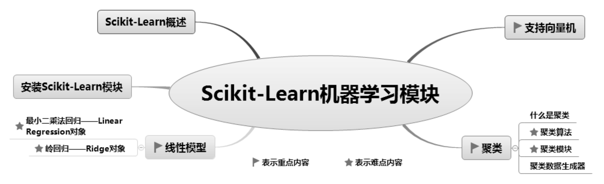
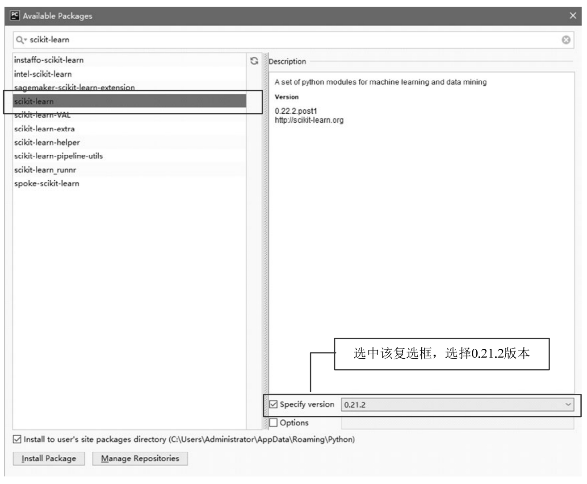
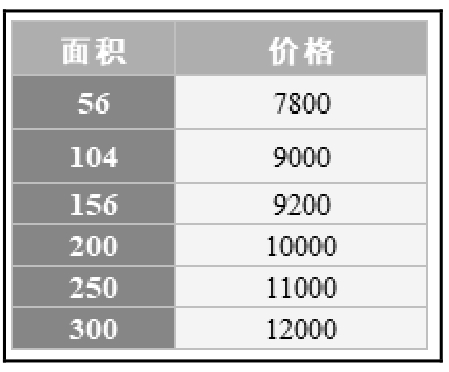
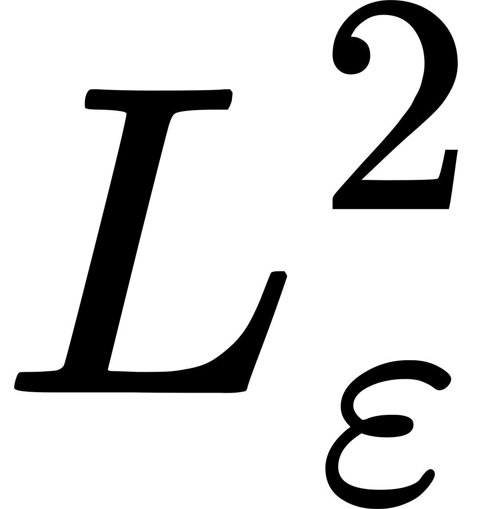
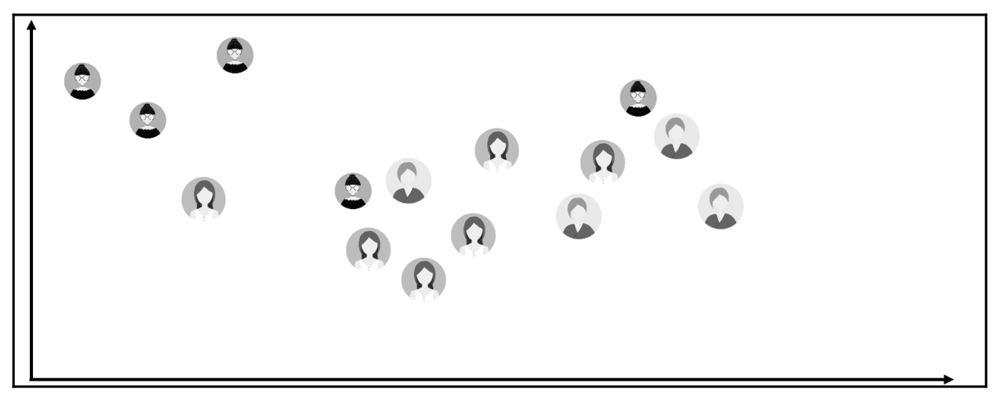
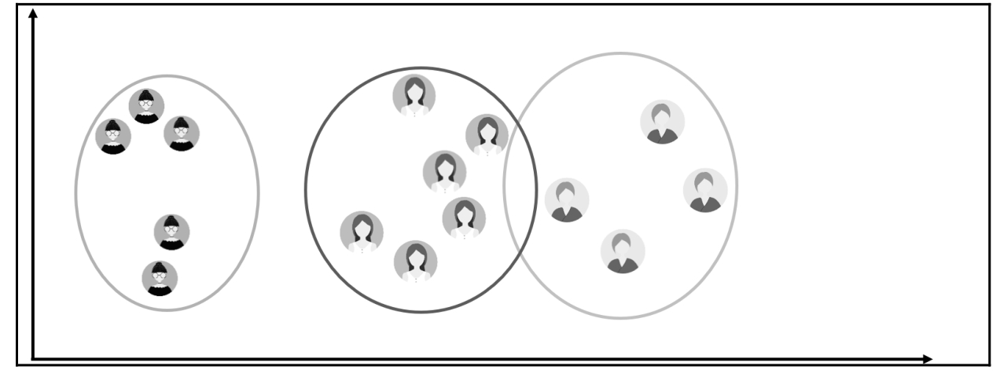
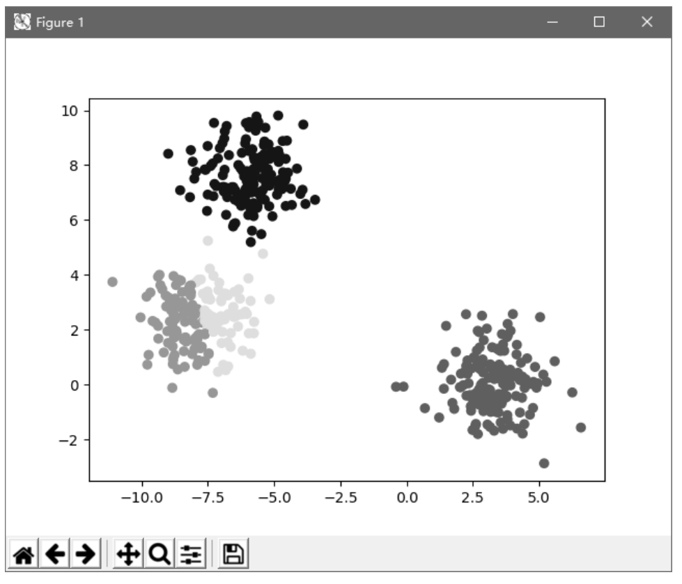
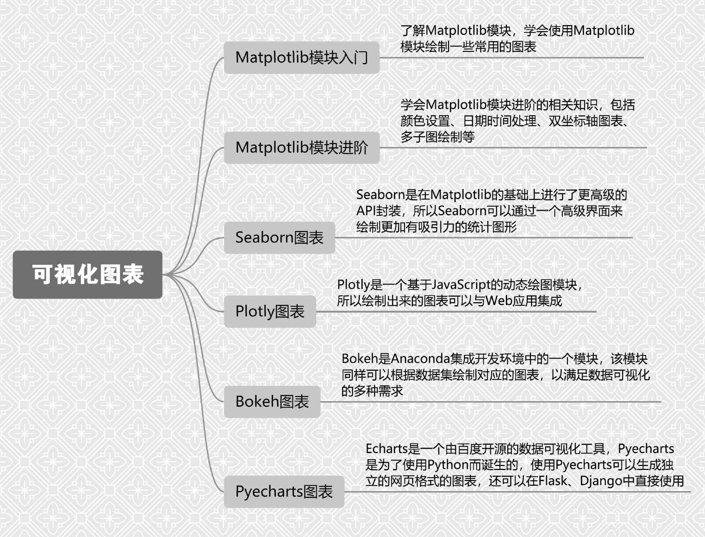

# 11 Scikit-Learn机器学习模块

机器学习，顾名思义就是让机器（计算机）模拟人类学习，从而有效提高工作效率。Python提供的第三方模块Scikit-Learn融入了大量的数学模型算法，使得数据分析、机器学习变得简单高效。本章主要内容包括Scikit-Learn概述、安装，常用的线性回归模型—最小二乘法回归、岭回归，以及支持向量机和聚类。

本章知识架构如下。



## 11.1 Scikit-Learn概述

Scikit-Learn（简称Sklearn）是Python的第三方模块，是机器学习领域的知名模块之一。它对常用的机器学习算法进行了封装，包括回归（Regression）、降维（Dimensionality Reduction）、分类（Classfication）和聚类（Clustering）四大机器学习算法。

Scikit-Learn具有以下特点： 

 拥有简单、高效的数据挖掘和数据分析工具。 

 让每个人能够在复杂环境中重复使用。 

 Scikit-Learn是Scipy模块的扩展，建立在NumPy和Matplotlib模块基础之上。利用这几大模块的优势，可以大大提高机器学习的效率。 

 开源，采用BSD协议，可用于商业。

## 11.2 安装Scikit-Learn模块

Scikit-Learn安装要求如下： 

 Python版本：高于2.7。 

 NumPy版本：高于1.8.2。 

 SciPy版本：高于0.13.3。

如果已经安装了NumPy和Scipy，则可直接使用pip命令安装Scikit-Learn，命令如下：

```text
pip install scikit-learn
```

还可以在PyCharm开发环境中安装Scikit-Learn，其安装过程类似于4.1节中Pandas模块的安装。运行Pycharm，选择File→Settings命令，在Settings对话框的左侧列表中选择Project Code→Project Interpreter选项，单击添加模块按钮“+”，打开Available Packages对话框，搜索并选中scikit-learn模块，如图11.1所示，单击Install Package按钮，进行Scikit-Learn模块的安装。



<p class="book-caption">图11.1 安装Scikit-Learn</p>

**注意**

尽量选择安装0.21.2版本，否则运行程序可能会因为模块版本不适合而导致程序出现错误提示—"找不到指定的模块"。

## 11.3 线性模型

Scikit-Learn模块已设计好线性模型（sklearn.linear_model），在程序中可以直接调用。读者无须编写过多代码，即可轻松实现线性回归分析。

还记得什么是线性回归吗？线性回归是利用数理统计中的回归分析来确定两种或两种以上变量间相互依赖的定量关系的一种统计分析与预测方法，应用非常广泛。线性回归分析中只包括一个自变量和一个因变量，二者的关系可用一条直线近似表示，这种回归分析称为一元线性回归分析。如果线性回归分析中包括两个或两个以上自变量，则称为多元线性回归分析。

Python中无须理会烦琐的线性回归求解数学过程，直接使用Scikit-Learn的linear_model子模块就可以实现线性回归分析。linear_model子模块提供了很多线性模型，包括最小二乘法回归、岭回归、Lasso、贝叶斯回归等。本节主要介绍最小二乘法回归和岭回归。

首先导入linear_model子模块，程序代码如下：

```text
from sklearn import linear_model
```

导入linear_model子模块后，在程序中就可以使用相关函数实现线性回归分析了。

### 11.3.1 最小二乘法回归—LinearRegression对象

线性回归是数据挖掘中的基础算法之一，线性回归的思想其实就是通过解一组方程来得到回归系数，不过在出现误差项之后，方程的解法就有了改变，一般使用最小二乘法进行计算，所谓“二乘”就是平方的意思，最小二乘法也称最小平方和，其目的是通过最小化误差的平方和，使得预测值与真值无限接近。

linear_model子模块的LinearRegression对象用于实现最小二乘法回归。LinearRegression对象拟合一个带有回归系数的线性模型，使得真实数据和预测数据（估计值）之间的残差平方和最小，与真实数据无限接近。LinearRegression对象的语法如下：

```text
linear_model.LinearRegression(fit_intercept=True,normalize=False,copy_X=True,n_jobs=None)
```

参数说明： 

 fit_intercept：布尔型，表示是否需要计算截距，默认值为True。 

 normalize：布尔型，表示是否需要标准化，默认值为False，和参数fit_intercept有关。当fit_intercept参数值为False时，将忽略该参数；当fit_intercept参数值为True时，则在回归前对回归量X进行归一化处理，取均值相减，再除以L2范数（L2范数是指向量各元素的平方和的开方）。 

 copy_X：布尔型，选择是否复制X数据，默认值为True，如果值为False，则覆盖X数据。 

 n_jobs：整型，代表CPU工作效率的核数，默认值为1，-1表示跟CPU核数一致。

主要属性说明： 

 coef\_：数组或形状，表示线性回归分析的回归系数。 

 intercept\_：数组，表示截距。

主要函数说明： 

 fit（X,y,sample_weight=None）：拟合线性模型。 

 predict（X）：使用线性模型返回预测数据。 

 score（X,y,sample_weight=None）：返回预测的确定系数R^2。

LinearRegression对象调用fit()函数来拟合数组*X*、*y*，并且将线性模型的回归系数存储在其成员变量coef_属性中。

**【例11.1】**智能预测房价**（实例位置：资源包\\TM\\sl\\11\\01）**

某地的房屋面积与价格之间的关系如图11.2所示。下面使用LinearRegression对象预测面积为170平方米的房屋的单价。程序代码如下：



<p class="book-caption">图11.2 房屋价格表</p>

```text
1   from sklearn import linear_model
2   clf=linear_model.LinearRegression(fit_intercept=True)    # 创建线性模型
3   # 创建房屋面积和价格数据
4   x=[[56],[104],[156],[200],[250],[300]]
5   y=[7800,9000,9200,10000,11000,12000]
6   clf.fit(x,y)                                             # 拟合线性模型
7   k=clf.coef_                                              # 获取斜率(回归系数)
8   b=clf.intercept_                                         # 获取截距
9   x0=[[170]]                                               # 创建新的房屋面积
10  # 预测价格，通过给定的x0预测y0，y0=截距+X值*回归系数
11  y0=b+x0*k
12  # 或者：
13  # y0=clf.predict(x0) # 预测值
14  print('回归系数：',k)
15  print('截距：',b)
16  print('预测值价格：',y0)
```

运行程序，输出结果为：

```text
回归系数： [16.32229076]
截距： 6933.406342099755
预测价格： [[9708.19577086]]
```

### 11.3.2 岭回归—Ridge对象

岭回归是在最小二乘法回归的基础上，加入了对表示回归系数的L2范数约束。岭回归是缩减法的一种，相当于对回归系数的大小施加了限制。岭回归主要使用linear_model子模块的Ridge对象实现。语法如下：

```text
linear_model.Ridge(alpha=1.0,fit_intercept=True,normalize=False,copy_X=True,
max_iter=None,tol=0.001,solver='auto',random_state=None)
```

主要参数说明： 

 alpha：权重。 

 fit_intercept：布尔型，表示是否需要计算截距，默认值为True。 

 normalize：输入的样本特征归一化，默认值为False。 

 copy_X：复制或者重写。 

 max_iter：最大迭代次数。 

 tol：浮点型，控制求解的精度。 

 solver：求解器，其值包括auto、svd、cholesky、sparse_cg和lsqr，默认值为auto。

主要属性说明： 

 coef\_：数组或形状，表示线性回归分析的回归系数。

主要函数说明： 

 fit（X,y）：拟合线性模型。 

 predict（X）：使用线性模型返回预测数据。

Ridge对象使用fit()函数将线性模型的回归系数存储在成员变量coef_属性中。

**【例11.2】**使用岭回归智能预测房价**（实例位置：资源包\\TM\\sl\\11\\02）**

使用岭回归Ridge对象智能预测房价，程序代码如下：

```text
1   from sklearn.linear_model import Ridge
2   # 创建房屋面积和价格数据
3   x=[[56],[104],[156],[200],[250],[300]]
4   y=[7800,9000,9200,10000,11000,12000]
5   # 创建线性模型(岭回归)
6   clf = Ridge(alpha=1.0)
7   clf.fit(x, y)             # 拟合线性模型
8   k=clf.coef_               # 回归系数
9   b=clf.intercept_          # 截距
10  x0=[[170]]                # 创建新的房屋面积
11  y0=b+x0*k                 # 预测价格，通过给定的x0预测y0，y0=截距+X值*斜率
12  # 或者：
13  #y0=clf.predict(x0)     # 预测值
14  print('回归系数：',k)
15  print('截距：',b)
16  print('预测价格：',y0)
```

运行程序，输出结果为：

```text
回归系数： [16.32189646]
截距： 6933.476394849786
预测价格： [[9708.19879377]]
```

从运行结果可以看出，不同的分析方法，预测结果略有差异。

## 11.4 支持向量机

支持向量机（SVMs）可用于监督学习算法，主要包括分类、回归和异常检测。支持向量分类的方法可以被扩展用作解决回归问题，这个方法被称作支持向量回归。

本节介绍支持向量回归函数的LinearSVR()对象。该对象不仅适用于线性模型，还可以用于对数据和特征之间的非线性关系的研究。语法如下：

```text
sklearn.svm.LinearSVR(epsilon = 0.0，tol = 0.0001，C = 1.0，loss ='epsilon_insensitive'，fit_intercept = True，intercept_scaling
= 1.0，dual = True，verbose = 0，random_state = None，max_iter = 1000 )
```

参数说明： 

 epsilon：float类型，默认值为0.1。 

 tol：float类型，终止迭代的标准值，默认值为0.0001。 

 C：float类型，罚项参数，该参数越大，使用的正则化越少，默认值为1.0。 

 loss：string类型，表示损失函数，该参数有两种选项： 

 epsilon_insensitive：默认值，损失函数为*Lε*（标准SVR）。 



 squared_epsilon_insensitive：损失函数为 。 

 fit_intercept：boolean类型，表示是否计算此模型的截距。如果设置为False，则不会在计算中使用截距（即数据预计已经居中）。默认值为True。 

 intercept_scaling：float类型，当fit_intercept参数为True时，实例X变成向量\[X, intercept_scaling\]。此时相当于添加了一个人工特征，该特征对所有实例都是常数值。 

 此时截距变成intercept_scaling\*人工特征的权重u。 

 此时人工特征也参与了罚项的计算。 

 dual：boolean类型，选择算法以解决对偶或原始优化问题。值设置为True时将解决对偶问题，值设置为False时解决原始问题，默认值为True。 

 verbose：int类型，表示是否开启verbose输出，默认值为True。 

 random_state：int类型，随机数生成器的种子，用于在清洗数据时使用。 

 max_iter：int类型，要运行的最大迭代次数。默认值为1000。

**【例11.3】**波士顿房价预测**（实例位置：资源包\\TM\\sl\\11\\03）**

通过Scikit-Learn自带的数据集“波士顿房价”，实现房价预测，程序代码如下：

```text
1   from sklearn.svm import LinearSVR                   # 导入线性回归类
2   import pandas as pd
3   # 将波士顿房价数据创建为DataFrame()对象
4   df = pd.read_excel('波士顿房价.xlsx')
5   # 抽取特征数据
6   feature_names=['CRIM','ZN','INDUS','CHAS','NOX','RM','AGE','DIS','RAD','TAX','PTRATIO','B','LSTAT']
7   data_mean = df.mean()                             # 获取平均值
8   data_std = df.std()                               # 获取标准偏差
9   data_train = (df - data_mean) / data_std          # 数据标准化
10  # print(data_train)
11  x_train = data_train[feature_names].values          # 特征数据
12  y_train = data_train['PRICE'].values                # 目标数据
13  linearsvr = LinearSVR(C=0.1)                      # 创建LinearSVR()对象
14  linearsvr.fit(x_train, y_train)                     # 训练模型
15  # 预测，并还原结果
16  x = ((df[feature_names] - data_mean[feature_names]) / data_std[feature_names]).values
17  # 添加预测房价的信息列
18  df[u'y_pred'] = linearsvr.predict(x) * data_std['PRICE'] + data_mean['PRICE']
19  print(df[['PRICE', 'y_pred']].head())           # 输出真实价格与预测价格
```

运行程序，输出结果为：

```text
PRICE   y_pred
0  24.0   28.413114
1  21.6  23.861538
2  34.7  29.944644
3  33.4  28.328018
4  36.2  28.140737
```

## 11.5 聚类

### 11.5.1 什么是聚类

聚类类似于分类，不同的是聚类所要求划分的类是未知的，也就是说不知道应该属于哪类，需要通过一定的算法自动分类。在实际应用中，聚类是一个将在某些方面相似的数据进行分类组织的过程（简单地说就是将相似数据聚在一起），示意图如图11.3和图11.4所示。



<p class="book-caption">▲图11.3 聚类前</p>



<p class="book-caption">▲图11.4 聚类后</p>

聚类主要应用领域： 

 商业：聚类分析被用来发现不同的客户群，并且通过购买模式刻画不同客户群的特征。 

 生物：聚类分析被用来对动植物和基因进行分类，以获取对种群固有结构的认识。 

 保险行业：聚类分析通过一个高的平均消费来鉴定汽车保险单持有者的分组。 

 因特网：聚类分析被用来在网上进行文档归类。 

 电子商务：聚类分析在电子商务的网站建设和数据挖掘中也是很重要的一个方面，通过分组聚类出具有相似浏览行为的客户，并分析客户的共同特征，可以更好地帮助电商了解自己的客户，向客户提供更合适的服务。

### 11.5.2 聚类算法

*k*-means算法是一种聚类算法，它是一种无监督机器学习算法，目的是将相似的对象归到同一个簇中。簇内的对象越相似，聚类的效果就越好。

传统的聚类算法包括划分方法、层次方法、基于密度方法、基于网格方法和基于模型方法。本节主要介绍*k*-means聚类算法，它是划分方法中较典型的一种，也可以称为*k*均值聚类算法。下面介绍什么是*k*均值聚类以及相关算法。

**1. *****k*****-means聚类**

*k*-means聚类也称*k*均值聚类，是著名的划分聚类的算法，由于简洁和效率高，它成为所有聚类算法中应用最为广泛的一种。*k*均值聚类是给定一个数据点集合和需要的聚类数目*k*，*k*由用户指定，*k*均值算法根据某个距离函数反复把数据分入*k*个聚类中。

**2. 算法**

先随机选取*k*个点作为初始质心（质心即簇中所有点的中心），然后将数据集中的每个点分配到一个簇中，具体来说，就是为每个点找距其最近的质心，并将其分配给该质心所对应的簇。这一步完成之后，每个簇的质心更新为该簇所有点的平均值。这个过程将不断重复直到满足某个终止条件。终止条件可以是以下任何一个：

（1）没有（或最小数目）对象被重新分配给不同的聚类。

（2）没有（或最小数目）聚类中心再发生变化。

（3）误差平方和局部最小。

伪代码：

```text
01  创建k个点作为起始质心，可以随机选择(位于数据边界内)
02  当任意一个点的簇分配结果发生改变时(初始化为True)
03      对数据集中每个数据点，重新分配质心
04          对每个质心
05            计算质心与数据点之间的距离
06          将数据点分配到距其最近的簇
07      对每一个簇，计算簇中所有点的均值并将均值作为新的质心
```

Scikit-Learn中已经写好了聚类算法，需要时直接调用即可。

### 11.5.3 聚类模块

Scikit-Learn的cluster子模块用于聚类分析，该模块提供了很多聚类算法，下面主要介绍KMeans()对象，该对象通过*k*-means聚类算法实现聚类分析。

首先导入sklearn.cluster子模块的KMeans()对象，程序代码如下：

```text
from sklearn.cluster import KMeans
```

接下来就可以在程序中使用KMeans()对象了，语法如下：

```text
KMeans(n_clusters=8,init=’k-means++’,n_init=10,max_iter=300,tol=1e-4,precompute_distances=’auto’,verbose=0,random_st
ate=None,copy_x=True,n_jobs=None,algorithm=’auto’)
```

参数说明： 

 n_clusters：整型，默认值为8，是生成的聚类数，即产生的质心（centroids）数。 

 init：参数值为k-means++、random或者传递一个数组向量。默认值为k-means++。 

 k-means++：用一种特殊的方法选定初始质心从而加速迭代过程的收敛。 

 random：随机从训练数据中选取初始质心。如果传递的是数组类型，则应该是shape（n_clusters,n_features）的形式，并给出初始质心。 

 n_init：整型，默认值为10，用不同的质心初始化值运行算法的次数。 

 max_iter：整型，默认值为300，每执行一次*k*-means算法的最大迭代次数。 

 tol：浮点型，默认值1e-4（科学记数法，即1乘以10的-4次方），控制求解的精度。 

 precompute_distances：参数值为auto、True或者False。用于预计算距离，计算速度更快，但占用更多内存。 

 auto：如果样本数乘以聚类数大于12e6（科学记数法，即12乘以10的6次方）则不预计算距离。 

 True：总是预先计算距离。 

 False：永远不预先计算距离。 

 verbose：整型，默认值为0，冗长的模式。 

 random_state：整型或随机数组类型。用于初始化质心的生成器（generator）。如果值为一个整数，则确定一个种子（seed）。默认值为NumPy的随机数生成器。 

 copy_x：布尔型，默认值为True。如果值为True，则原始数据不会被改变；如果值为False，则会直接在原始数据上做修改并在函数返回值时将其还原。但是在计算过程中，由于有对数据均值的加减运算，所以数据返回后，原始数据同计算前数据可能会有细小差别。 

 n_jobs：整型，指定计算所用的进程数。如果值为-1，则用所有的CPU进行运算；如果值为1，则不进行并行运算，这样方便调试；如果值小于-1，则用到的CPU数为n_cpus＋1＋n_jobs，例如，n_jobs值为-2，则用到的CPU数为总CPU数减1。 

 algorithm：表示*k*-means算法法则，参数值为auto、full或elkan，默认值为auto。

主要属性说明： 

 cluster_centers\_：返回数组，表示分类簇的均值向量。 

 labels\_：返回数组，表示每个样本数据所属的类别标记。 

 inertia\_：返回数组，表示每个样本数据距离它们各自最近簇的中心之和。

主要函数说明： 

 fit（X\[,y\]）：计算*k*-means聚类。 

 fit_predictt（X\[,y\]）：计算簇质心并给每个样本数据预测类别。 

 predict（X）：给每个样本估计最接近的簇。 

 score（X\[,y\]）：计算聚类误差。

**【例11.4】**对一组数据聚类**（实例位置：资源包\\TM\\sl\\11\\04）**

对一组数据聚类，程序代码如下：

```text
1  import numpy as np
2  from sklearn.cluster import KMeans
3  X=np.array([[1,10],[1,11],[1,12],[3,20],[3,23],[3,21],[3,25]])
4  kmodel = KMeans(n_clusters = 2)           # 调用KMeans对象实现聚类(两类)
5  y_pred=kmodel.fit_predict(X)              # 预测类别
6  print('预测类别：',y_pred)
7  print('聚类中心坐标值：','\n',kmodel.cluster_centers_)
8  print('类别标记：',kmodel.labels_)
```

运行程序，输出结果为：

```text
预测类别： [1 1 1 0 0 0 0]
```

聚类中心坐标值：

```text
[[ 3.   22.25]
[ 1.   11.  ]]
类别标记： [1 1 1 0 0 0 0]
```

### 11.5.4 聚类数据生成器

11.5.3节举了一个简单的聚类示例，但是聚类效果并不明显。本节生成了专门的聚类算法的测试数据，可以更好地诠释聚类算法，展示聚类效果。

Scikit-Learn的make_blobs()函数用于生成聚类算法的测试数据，直观地说，该函数可以根据用户指定的特征数量、中心点数量、范围等生成几类数据，这些数据可用于测试聚类算法的效果。语法如下：

```text
sklearn.datasets.make_blobs(n_samples=100,n_features=2,centers=3,cluster_std=1.0,center_box=(-10.0,10.0),shuffle=True,
random_state=None)
```

常用参数说明： 

 n_samples：待生成的样本的总数。 

 n_features：每个样本的特征数。 

 centers：类别数。 

 cluster_std：每个类别的方差。例如，生成两类数据，其中一类比另一类具有更大的方差，可以将cluster_std设置为\[1.0,3.0\]。

**【例11.5】**生成用于聚类的测试数据**（实例位置：资源包\\TM\\sl\\11\\05）**

生成用于聚类的数据（500个样本，每个样本有2个特征），程序代码如下：

```text
1  from sklearn.datasets import make_blobs
2  import matplotlib.pyplot as plt
3  x,y = make_blobs(n_samples=500, n_features=2, centers=3)
```

接下来，通过KMeans对象对测试数据进行聚类，程序代码如下：

```text
4  from sklearn.cluster import KMeans
5  y_pred = KMeans(n_clusters=4, random_state=9).fit_predict(x)
6  plt.scatter(x[:, 0], x[:, 1], c=y_pred)
7  plt.show()
```

运行程序，效果如图11.5所示。



<p class="book-caption">图11.5 聚类散点图</p>

从分析结果得知：相似的数据聚在一起，分成了4堆，也就是4类，并以不同的颜色显示，看上去清晰直观。

## 11.6 小结

本章介绍了如何使用Scikit-Learn模块实现数学计算与创建模型，其中包含线性模型、支持向量机以及聚类模型。由于本书以数据处理和数据分析为主，而非机器学习，所以对于Scikit-Learn模块的相关技术只做简单讲解，希望大家能够了解机器学习，并深入地学习机器学习的更多内容，从而提高数据分析的工作效率。

本篇主要介绍数据分析中数据的可视化图表，其中包含Python原生模块Matplotlib的基础入门与进阶内容以及多种第三方数据可视化工具（Seaborn、Plotly、Bokeh、Pyecharts），学习完本篇，读者将可以实现数据分析后的可视化图表。


