# 12 Matplotlib模块入门

在数据分析中，我们经常用到大量的可视化操作。一张精美的图表不仅能够展示大量的信息，更能够直观体现数据之间隐藏的关系。本章主要介绍Matpoltlib模块的入门知识。

本章知识架构如下。

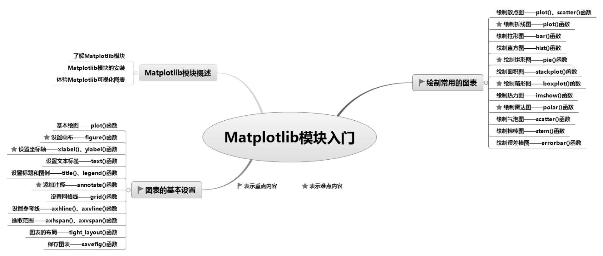

## 12.1 Matplotlib模块概述

Maplotlib是最基础的Python可视化模块。学习Python数据可视化，应首先从Maplotlib学起，然后学习其他模块作为拓展。

### 12.1.1 了解Matplotlib模块

Matplotlib是一个Python 2D绘图模块，常用于数据可视化，它能够以多种硬复制格式和跨平台的交互式环境生成出版物质量的图形。

Matplotlib功能非常强大，绘制各种各样的图表游刃有余，它将困难的事情变得容易，复杂的事情变得简单。只需几行代码就可以绘制折线图（见图12.1和图12.2）、柱形图（见图12.3）、直方图（见图12.4）、饼形图（见图12.5）、散点图（见图12.6）等。

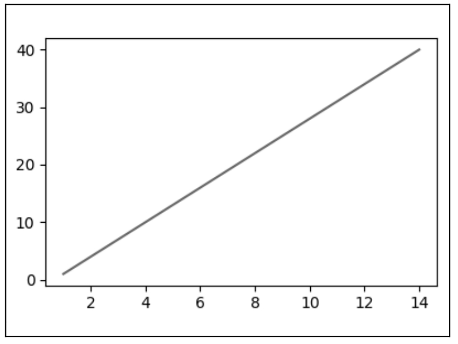

▲图12.1 折线图

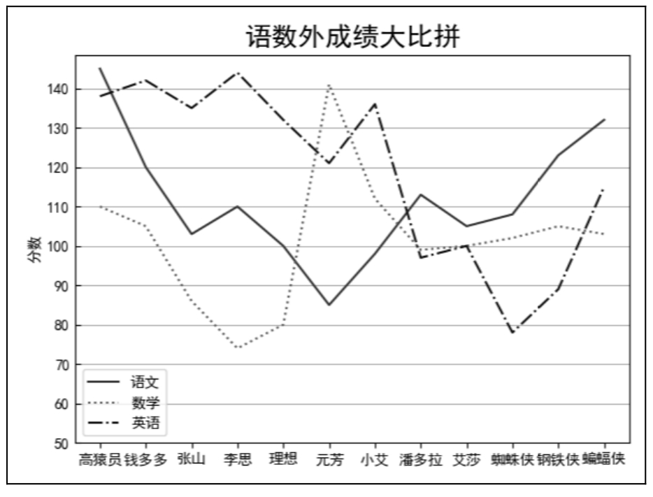

▲图12.2 多折线图

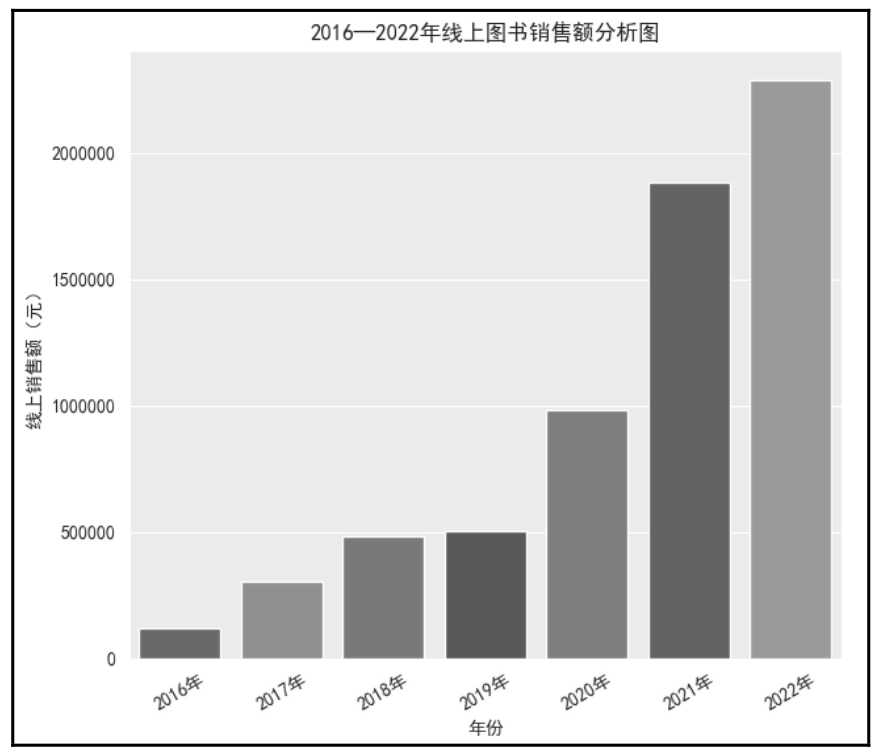

▲图12.3 柱形图

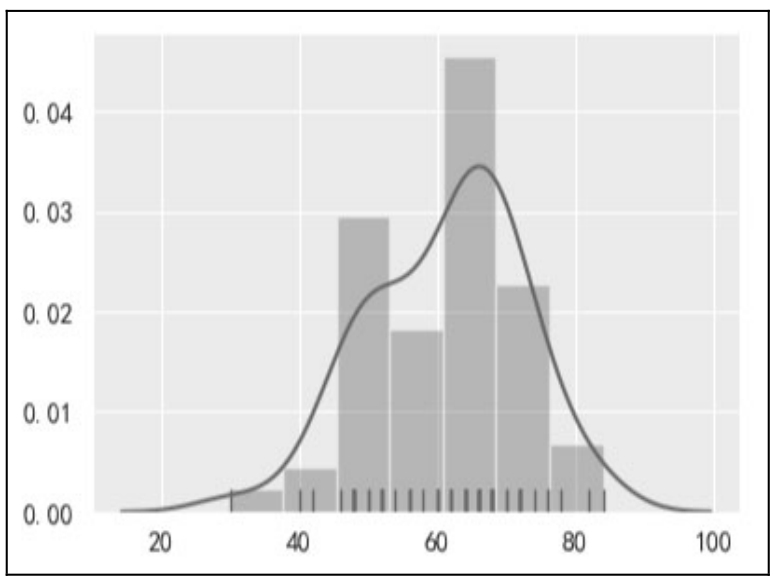

▲图12.4 直方图

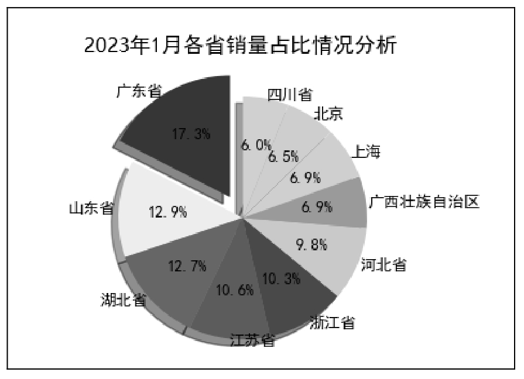

▲图12.5 饼形图

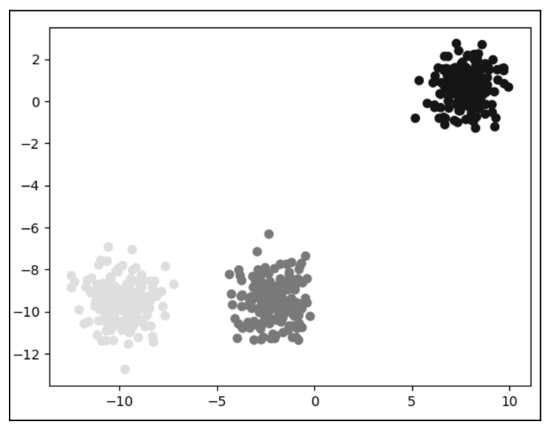

▲图12.6 散点图

Matpoltlib不仅可以绘制以上最基础的图表，还可以绘制一些高级图表，如双*y*轴可视化数据分析图表（见图12.7）、堆叠柱形图（见图12.8）、渐变饼形图（见图12.9）、等高线图（见图12.10）。

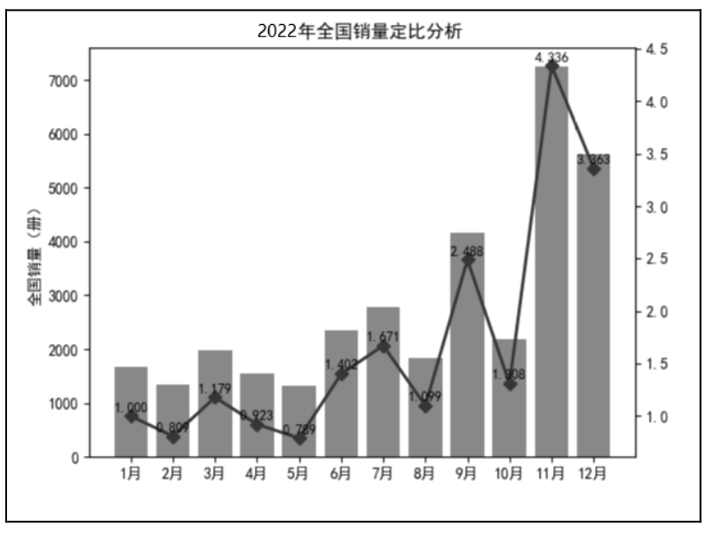

▲图12.7 双*y*轴可视化数据分析图表

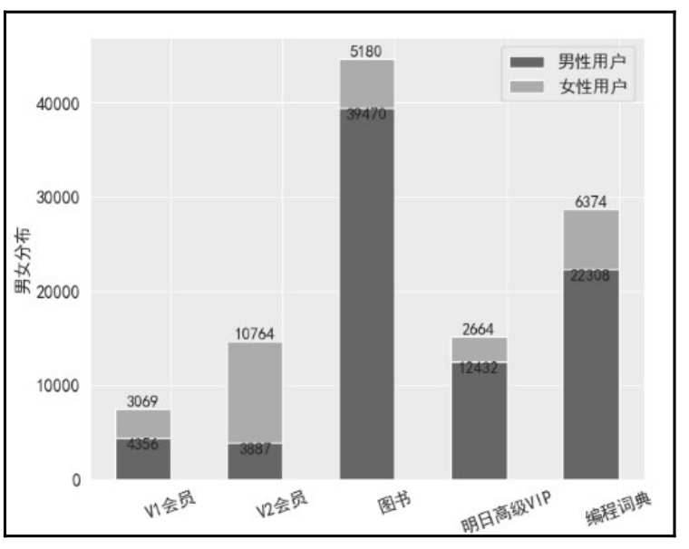

▲图12.8 堆叠柱形图

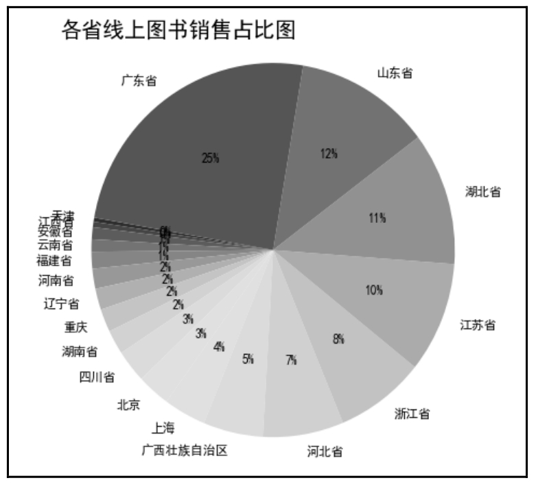

▲图12.9 渐变饼形图

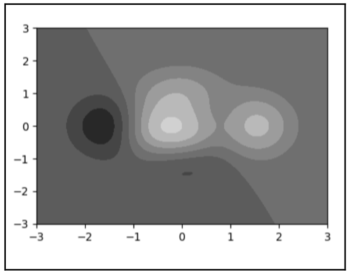

▲图12.10 等高线图

不仅如此，Matplotlib还可以绘制3D图表。例如，三维柱形图（见图12.11）、三维曲面图（见图12.12）。

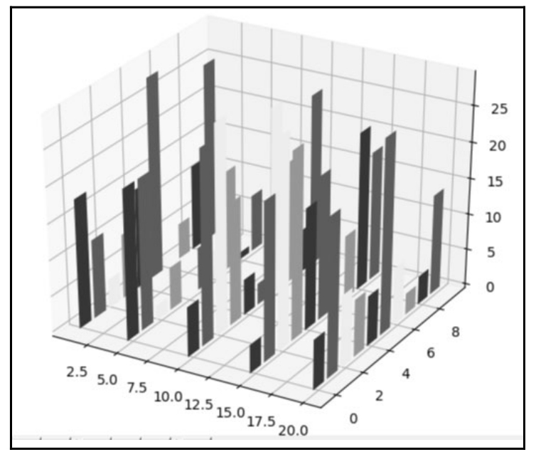

▲图12.11 三维柱形图

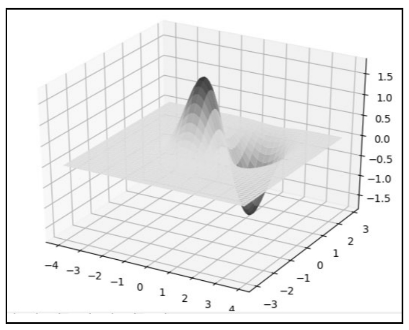

▲图12.12 三维曲面图

综上所述，只要熟练地掌握Matplotlib的函数以及各项参数的用法，就能够绘制各种出乎意料的图表，以满足数据分析的需求。

### 12.1.2 Matplotlib模块的安装

下面介绍如何安装Matplotlib，安装方法有以下两种。

**1. 通过pip工具安装**

在系统搜索框中输入cmd，在自动弹出的“最佳匹配”项目中单击“命令提示符”应用，打开“命令提示符”窗口，在命令提示符后输入安装命令：

pip install matplotlib

如果使用Jupyter NoteBook作为开发环境，则需要在系统搜索框中输入Anaconda Prompt，打开Anaconda Prompt窗口，在命令提示符后输入安装命令：

pip install matplotlib

**2. 通过Pycharm开发环境安装**

如果使用Pycharm作为开发环境，则首先运行Pycharm，选择File→Settings命令，在Settings对话框中选择Python Interpreter选项，选择Python版本，然后单击添加模块按钮“+”，如图12.13所示。

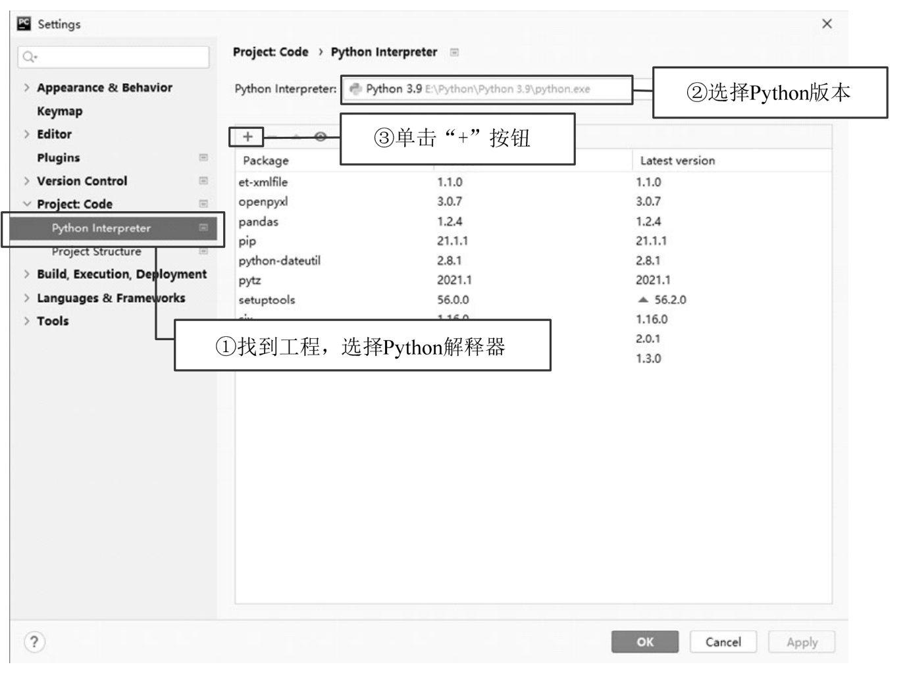

图12.13 Settings对话框

在Available Packages对话框中搜索并选中matplotlib模块，如图12.14所示，单击Install Package按钮，安装Matplotlib模块。

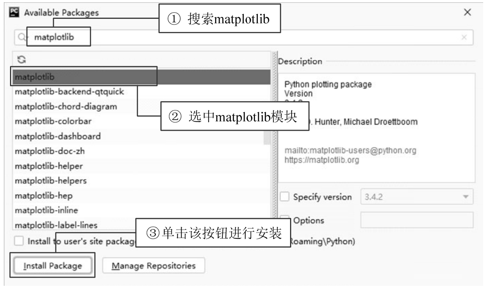

图12.14 在Pycharm开发环境中安装Matplotlib模块

### 12.1.3 体验Matplotlib可视化图表

创建Matplotlib图表简单的只需三步，下面开始绘制第一张图表。

**【例12.1】**在PyCharm中绘制图表**（实例位置：资源包\\Code\\12\\01）**

（1）导入matplotlib.pyplot子模块。

（2）使用plot()函数绘制图表。

（3）使用show()函数显示图表，如图12.15所示。

程序代码如下：

1  import matplotlib.pyplot as plt   # 导入matplotlib.pyplot子模块

2  plt.plot(\[1, 2, 3, 4,5\])        # 使用plot()函数绘制折线图

3  plt.show()                      # 显示图表

**【例12.2】**在Jupyter Notebook中绘制图表**（实例位置：资源包\\Code\\12\\02）**

在Jupyter Notebook中绘制图表，图表的显示没有单独的窗口，而是直接嵌入Jupyter Notebook中，效果如图12.16所示。

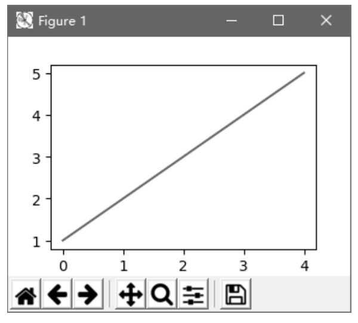

▲图12.15 在PyCharm中绘制图表

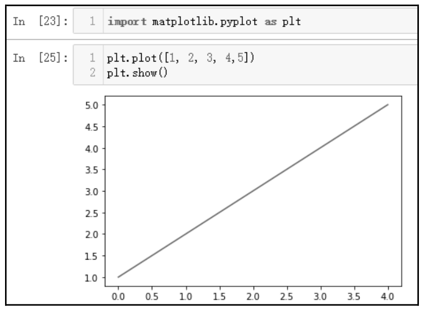

▲图12.16 在Jupyter Notebook中绘制图表

### 说明

在实际学习和工作中，可以根据自己的需求选择适合的开发环境。

## 12.2 图表的基本设置

本节主要介绍图表的基本设置，主要包括颜色设置、线条样式、标记样式、设置画布、坐标轴、添加文本标签、设置标题和图例、添加注释文本、调整图表与画布边缘间距以及其他相关设置等。

### 12.2.1 基本绘图—plot()函数

Matplotlib基本绘图主要使用plot()函数，语法如下：

matplotlib.pyplot.plot(x,y,format_string,\*\*kwargs)

参数说明： 

 x：*x*轴数据。 

 y：*y*轴数据。 

 format_string：控制曲线格式的字符串，包括颜色、线条样式和标记样式。 

 \*\*kwargs：键值参数，相当于一个字典，如输入参数为（1，2，3，4，k，a=1，b=2，c=3），\*args=（1，2，3，4，k），\*\*kwargs={'a':'1，'b':2，'c':3}。

**【例12.3】**绘制简单的折线图**（实例位置：资源包\\Code\\12\\03）**

绘制简单的折线图，程序代码如下：

1  import matplotlib.pyplot as plt   # 导入matplotlib.pyplot子模块

2  x=range(1,15,1)                 #  range()函数创建整数列表(*x*轴数据)

3  y=range(1,42,3)                 #  range()函数创建整数列表(*y*轴数据)

4  plt.plot(x,y)                   # 使用plot()函数绘制折线图

5  plt.show()                      # 显示图表

运行程序，输出结果如图12.17所示。

**【例12.4】**绘制体温折线图**（实例位置：资源包\\Code\\12\\04）**

例12.3的数据是通过range()函数随机创建的。下面导入Excel体温表数据，分析14天基础体温情况，程序代码如下：

1  import pandas as pd              # 导入数据处理pands模块

2  import matplotlib.pyplot as plt  # 导入matplotlib.pyplot子模块

3  df=pd.read_excel('体温.xls')   # 读取Excel文件

4  x =df\['日期'\]                    #  *x*轴数据

5  y=df\['体温'\]                     #  y轴数据

6  plt.plot(x,y)                    # 绘制折线图

7  plt.show()                     # 显示图表

运行程序，输出结果如图12.18所示。

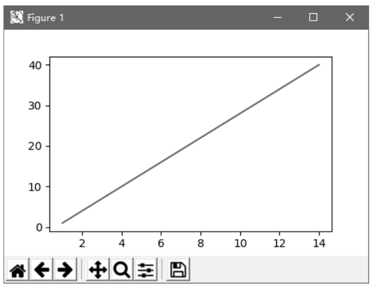

▲图12.17 简单折线图

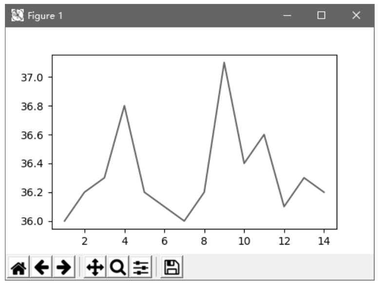

▲图12.18 体温折线图

至此，你可能还是觉得上面的图表不够完美，那么在接下来的学习中，我们将一步一步完善这个图表。下面介绍图表中线条颜色、线条样式和标记样式的设置。

**1. 颜色设置**

color参数可以设置线条颜色，通用颜色值如表12.1所示。

表12.1 通用颜色

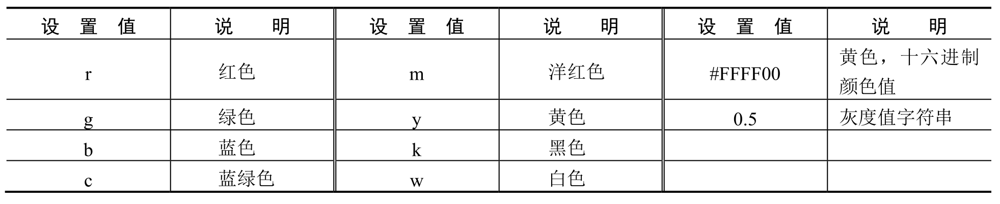

其他颜色可以通过十六进制字符串指定，或者指定颜色名称，示例如下： 

 浮点形式的RGB或RGBA元组，例如：（0.1, 0.2, 0.5）或（0.1, 0.2, 0.5, 0.3）。 

 16进制的RGB或RGBA字符串，例如：#0F0F0F或#0F0F0F0F。 

 0～1的小数作为的灰度值，例如：0.5。 

 {'b'， 'g'， 'r'， 'c'， 'm'， 'y'， 'k'， 'w'}，其中的一个颜色值。 

 X11/CSS4规定中的颜色名称。 

 Xkcd中指定的颜色名称，例如：xkcd:sky blue。 

 Tableau调色板中的颜色，例如：{'tab:blue'， 'tab:orange'， 'tab:green'， 'tab:red'， 'tab:purple'， 'tab:brown'， 'tab:pink'， 'tab:gray'， 'tab:olive'， 'tab:cyan'}。 

 CN格式的颜色循环，对应的颜色设置代码如下：

1  from cycler import cycler       # 从cycler模块导入cycler()函数

2  # 颜色列表

3  colors=\['#1f77b4', '#ff7f0e', '#2ca02c', '#d62728', '#9467bd', '#8c564b', '#e377c2','#7f7f7f', '#bcbd22', '#17becf'\]

4  # 获取特定颜色

5  plt.rcParams\['axes.prop_cycle'\] = cycler(color=colors)

**2. 线条样式**

linestyle的可选参数可以设置线条的样式，设置值如下，设置后的效果如图12.19所示。 

 “-”：实线，默认值。 

 “--”：双画线。 

 “-.”：点画线。 

 “:”：虚线。

**3. 标记样式**

marker的可选参数可以设置标记样式，设置值如表12.2所示。

表12.2 标记设置

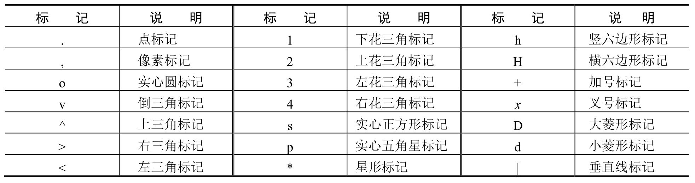

下面为“14天基础体温曲线图”设置颜色和样式，并在实际体温位置进行标记，关键代码如下：

plt.plot(x,y,color='m',linestyle='-',marker='o',mfc='w')

上述代码中的参数color为颜色，linestyle为线条样式，marker为标记样式，mfc为标记填充的颜色。运行程序，输出结果如图12.20所示。

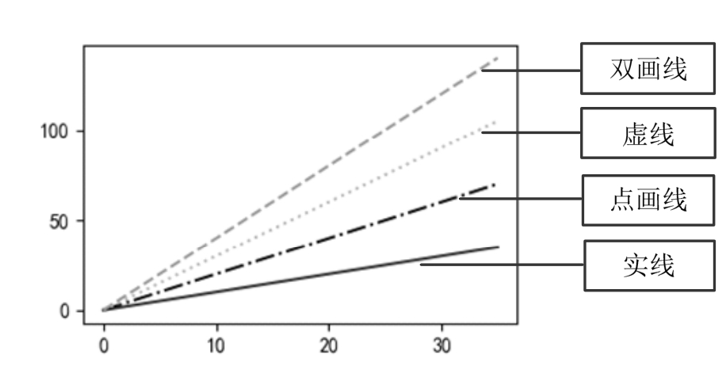

▲图12.19 线条样式

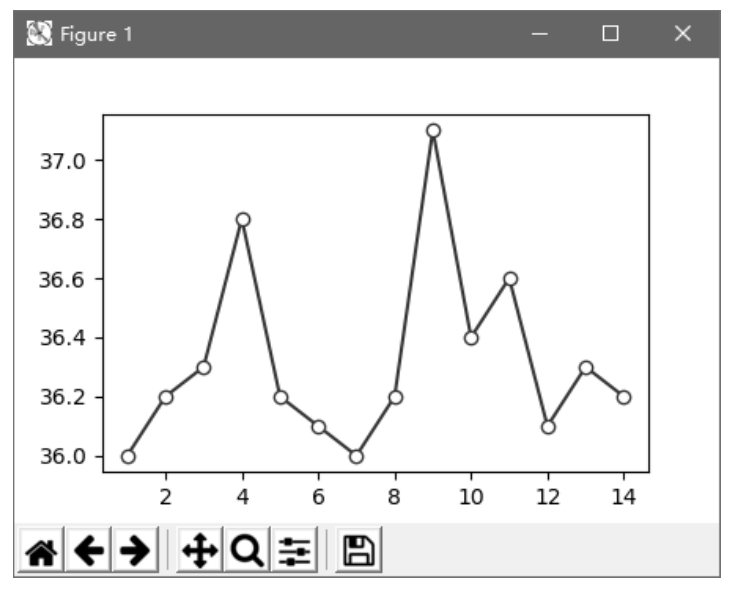

▲图12.20 带标记的折线图

### 12.2.2 设置画布—figure()函数

画布就像我们画画的画板一样，在Matplotlib中可以使用figure()函数设置画布大小、分辨率、颜色和边框等。语法如下：

matpoltlib.pyplot.figure(num=None, figsize=None, dpi=None, facecolor=None, edgecolor=None, frameon=True)

参数说明： 

 num：指图像编号或名称，数字为编号，字符串为名称，可以通过该参数激活不同的画布。 

 figsize：指定画布的宽和高，单位为英寸。 

 dpi：指定绘图对象的分辨率，即每英寸多少个像素，默认值为80。像素越大画布越大。 

 facecolor：前景颜色。 

 edgecolor：边框颜色。 

 frameon：是否绘制边框，默认值为True，绘制边框；如果为False，则不绘制边框。

**【例12.5】**自定义画布**（实例位置：资源包\\Code\\12\\05）**

自定义一个5×3的黄色画布，关键代码如下：

1  import matplotlib.pyplot as plt                       # 导入matplotlib.pyplot子模块

2  fig=plt.figure(figsize=(5,3),facecolor='yellow')  # 设置画布大小和前景色

运行程序，输出结果如图12.21所示。

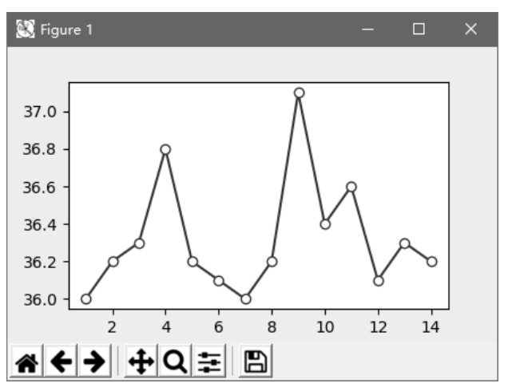

图12.21 设置画布

**注意**

设置figsize=（5,3），实际画布大小是500×300，所以，这里不要输入太大的数字。

### 12.2.3 设置坐标轴—xlabel()、ylabel()函数

一张精确的图表，其中不免要用到坐标轴，下面介绍Matplotlib中坐标轴的使用。

**1. *****x*****轴、*****y*****轴标题**

设置*x*轴和*y*轴标题主要使用xlabel()函数和ylabel()函数。

**【例12.6】**为体温折线图的轴设置标题**（实例位置：资源包\\Code\\12\\06）**

设置*x*轴标题为“2023年1月”，*y*轴标题为“基础体温”，程序代码如下：

1  import pandas as pd                                 # 导入pandas模块

2  import matplotlib.pyplot as plt                     # 导入matplotlib.pyplot子模块

3  plt.rcParams\['font.sans-serif'\]=\['SimHei'\]          # 解决中文乱码

4  df=pd.read_excel('体温.xls')                      # 读取Excel文件

5  # 绘制折线图

6  x=df\['日期'\]                                        #  *x*轴数据

7   y=df\['体温'\]                                       #  *y*轴数据

8   # color为线条颜色，linestyle为线型，marker为标记样式，mfc为标记填充颜色

9   plt.plot(x,y,color='m',linestyle='-',marker='o',mfc='w')

10  plt.xlabel('2023年1月')                          #  *x*轴标题

11  plt.ylabel('基础体温')                           #  *y*轴标题

12  plt.show()                                       # 显示图表

运行程序，输出结果如图12.22所示。

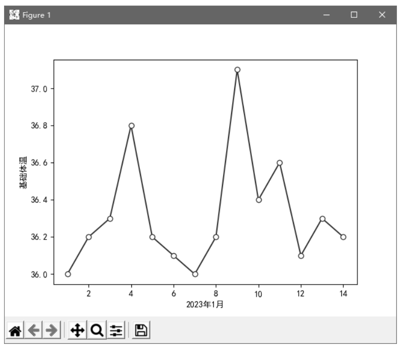

图12.22 带坐标轴标题的折线图

注意，有两个问题在实际编程中经常出现。

（1）中文乱码问题，解决方法如下：

plt.rcParams\['font.sans-serif'\]=\['SimHei'\]  # 解决中文乱码

（2）负号不显示问题，解决方法如下：

plt.rcParams\['axes.unicode_minus'\] = False  # 解决负号不显示

**2. 坐标轴刻度**

用Matplotlib画二维图像时，默认情况下的横坐标（*x*轴）和纵坐标（*y*轴）显示的值有时可能达不到我们的需求，需要借助xticks()函数和yticks()函数分别对*x*轴和*y*轴的值进行设置。

xticks()函数的语法如下：

xticks(locs, \[labels\], \*\*kwargs)

主要参数说明： 

 locs：数组，表示*x*轴上的刻度。例如，在“学生英语成绩分布图”中，*x*轴的刻度是2～14的偶数，如果想改变这个值，就可以通过locs参数设置。 

 labels：也是数组，默认值和locs相同。locs表示位置，而labels则决定该位置上的标签，如果赋予labels空值，则*x*轴将只有刻度而不显示任何值。

**3. 坐标轴的刻度线**

（1）设置4个方向的坐标轴上的刻度线是否显示，代码如下：

plt.tick_params(bottom=False,left=True,right=True,top=True)

（2）设置*x*轴和*y*轴的刻度线显示方向，in表示向内，out表示向外，在中间就是inout，默认刻度线向外。代码如下：

1  plt.rcParams\['xtick.direction'\] = 'in'    #  *x*轴的刻度线向内显示

2  plt.rcParams\['ytick.direction'\] = 'in'    #  *y*轴的刻度线向内显示

**4. 坐标轴相关属性设置** 

 axis()：返回当前axis范围。 

 axis（v）：通过输入v = \[xmin, xmax, ymin, ymax\]，设置*x*、*y*轴的取值范围。 

 axis（'off'）：关闭坐标轴轴线及坐标轴标签。 

 axis（'equal'）：使*x*、*y*轴长度一致。 

 axis（'scaled'）：调整图框的尺寸（而不是改变坐标轴取值范围），使*x*、*y*轴长度一致。 

 axis（'tight'）：改变*x*轴和*y*轴的限制，使所有数据被展示。如果所有的数据已经显示，它将移动到图形的中心而不修改（xmax ~ xmin）或（ymax ~ ymin）。 

 axis（'image'）：缩放axis范围（limits），等同于对data缩放范围。 

 axis（'auto'）：自动缩放。 

 axis（'normal'）：不推荐使用。恢复默认状态，轴线的自动缩放以使数据显示在图表中。

**【例12.7】**为折线图设置刻度1**（实例位置：资源包\\Code\\12\\07）**

在“14天基础体温折线图”中，*x*轴是从2到14之间的偶数，但实际日期是从1到14的连续数字，下面使用xticks()函数来解决这个问题，将*x*轴的刻度设置为1～14的连续数字，关键代码如下：

plt.xticks(range(1,15,1))

**【例12.8】**为折线图设置刻度2**（实例位置：资源包\\Code\\12\\08）**

例12.7的日期看起来不是很直观。下面将*x*轴刻度标签直接改为日，关键代码如下：

1  # 创建列表dates

2  dates=\['1日','2日','3日','4日','5日',

3         '6日','7日','8日','9日','10日',

4         '11日','12日','13日','14日'\]

5  plt.xticks(range(1,15,1),dates)      # 设置*x*轴刻度标签

运行程序，对比效果如图12.23和图12.24所示。

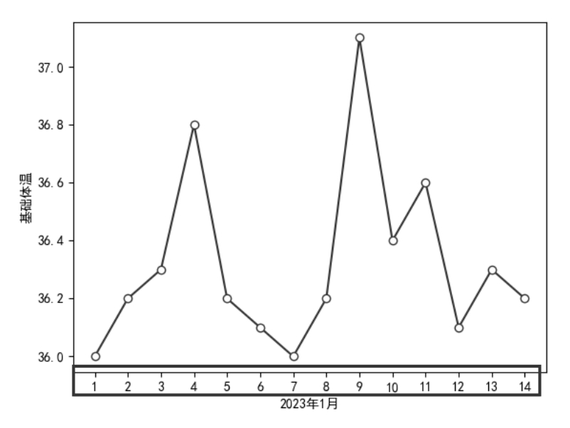

▲图12.23 更改*x*轴刻度

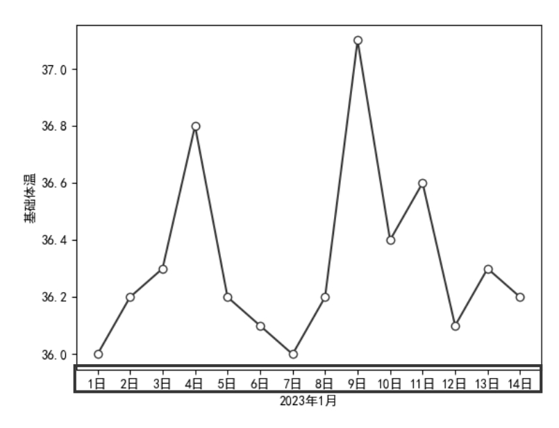

▲图12.24 更改*x*轴刻度为日

接下来，设置*y*轴刻度，主要使用yticks()函数。例如，设置体温为35.4～38，关键代码如下：

plt.yticks(\[35.4,35.6,35.8,36,36.2,36.4,36.6,36.8,37,37.2,37.4,37.6,37.8,38\])

**5. 坐标轴范围**

坐标轴范围是指*x*轴和*y*轴的取值范围。设置坐标轴范围主要使用xlim()函数和ylim()函数。

**【例12.9】**为折线图设置坐标范围**（实例位置：资源包\\Code\\12\\09）**

设置*x*轴（日期）范围为1～14，*y*轴（基础体温）范围为35～45，关键代码如下：

1  plt.xlim(1,14)

2  plt.ylim(35,45)

运行程序，输出结果如图12.25所示。

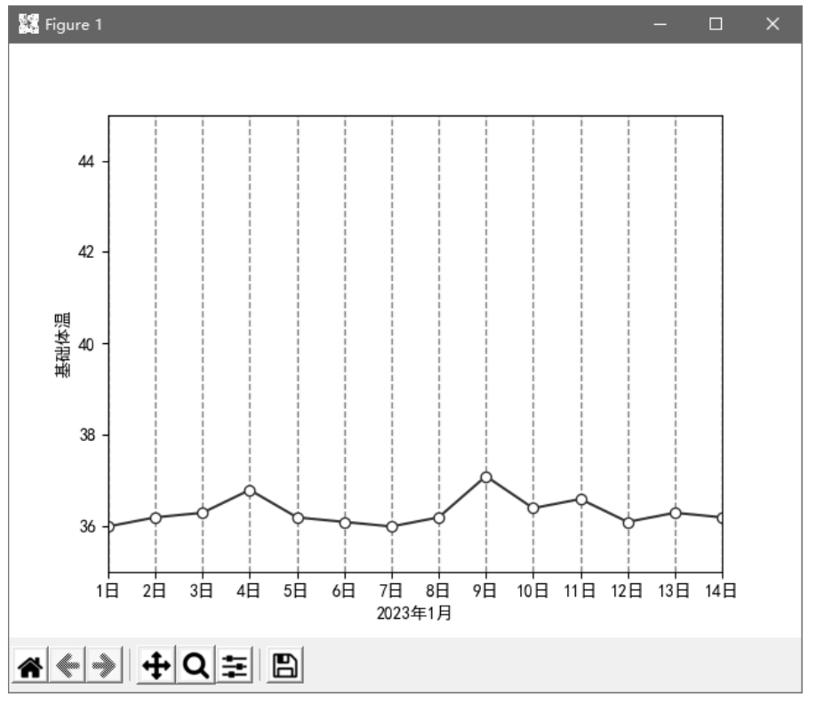

图12.25 坐标轴范围

### 12.2.4 设置文本标签—text()函数

绘图过程中，为了能够更清晰、直观地看到数据，有时需要给图表中指定的数据点添加文本标签。下面介绍细节之一—文本标签，主要使用text()函数，语法如下：

matplotlib.pyplot.text(x, y, s, fontdict=None, withdash=False, \*\*kwargs)

参数说明： 

 x：*x*坐标轴的值。 

 y：*y*坐标轴的值。 

 s：字符串，注释内容。 

 fontdict：字典，可选参数，默认值为None。用于重写默认文本属性。 

 withdash：布尔型，默认值为False，创建一个TexWithDash实例，而不是Text实例。 

 \*\*kwargs：其他参数。

**【例12.10】**为折线图添加基础体温文本标签**（实例位置：资源包\\Code\\12\\10）**

为图表中各个数据点添加文本标签，关键代码如下。

1  for a,b in zip(x,y):

2      # a,b+0.05对应的(x,y)，%.1f'%b对y值格式化，ha水平居中，va垂直底部对齐,fontsize字体大小

3      plt.text(a,b+0.05,'%.1f'%b,ha = 'center',va = 'bottom',fontsize=9)

运行程序，输出结果如图12.26所示。

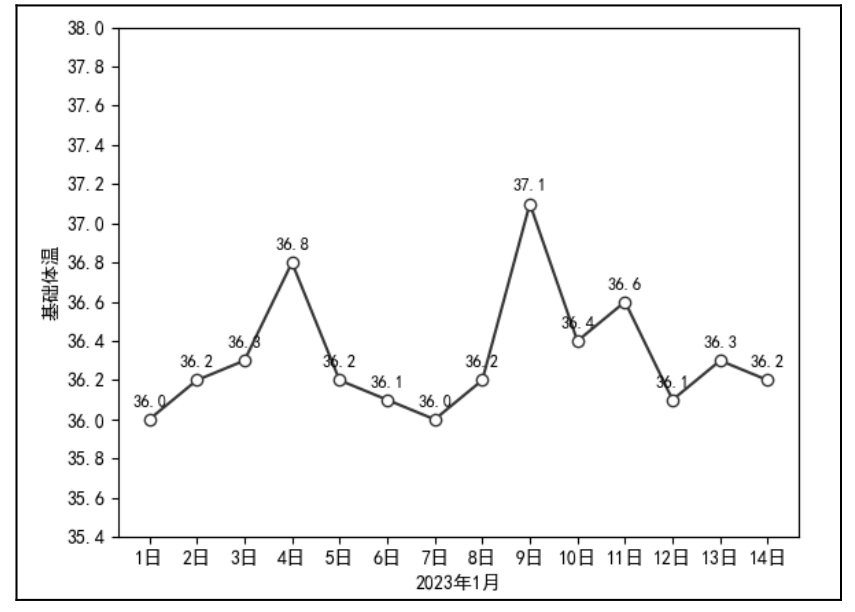

图12.26 带文本标签的折线图

上述代码中，首先，*x*、*y*是*x*轴和*y*轴的值，它代表了折线图在坐标中的位置，通过for循环找到每一个*x*、*y*值相对应的坐标赋值给*a*、*b*，再使用plt.text()函数在对应的数据点上添加文本标签，而for循环也保证了折线图中每一个数据点都有文本标签。其中，*a*，*b*+0.05表示每一个数据点（*x*值对应*y*值加0.05）的位置处添加文本标签，%.1f'%b是对*y*值进行的格式化处理，保留小数点1位；ha='center'、va='bottom'代表水平居中、垂直底部对齐，fontsize则是字体大小。

### 12.2.5 设置标题和图例—title()、legend()函数

数据是一个图表所要展示的东西，而有了标题和图例则可以帮助我们更好地理解这个图表的含义和要传递的信息。下面介绍图表细节之二—标题和图例。

**1. 图表标题**

为图表设置标题主要使用title()函数，语法如下：

matplotlib.pyplot.title(label, fontdict=None, loc='center', pad=None, \*\*kwargs)

参数说明： 

 label：字符串，图表标题文本。 

 fontdict：字典，用来设置标题字体的样式。如{'fontsize': 20，'fontweight':20，'va': 'bottom'，'ha': 'center'}。 

 loc：字符串，标题水平位置，参数值为center、left或right，分别表示水平居中、水平居左和水平居右，默认为水平居中。 

 pad：浮点型，表示标题离图表顶部的距离，默认值为None。 

 \*\*kwargs：关键字参数，可以设置一些其他文本属性。

例如，设置图表标题为“14天基础体温曲线图”，主要代码如下：

plt.title('14天基础体温曲线图',fontsize='18')

**2. 图表图例**

为图表设置图例主要使用legend()函数，下面介绍图例相关的设置。（1）自动显示图例，代码如下：

plt.legend()

（2）手动添加图例，代码如下：

plt.legend('基础体温')

注意，手动添加图例时，有时文本会显示不全，解决方法是在文本后加一个逗号。例如：

plt.legend(('基础体温',))

（3）通过loc参数设置图例的显示位置，代码如下：

plt.legend(('基础体温',),loc='upper right',fontsize=10)

具体图例显示位置设置如表12.3所示。

表12.3 图例位置参数设置值

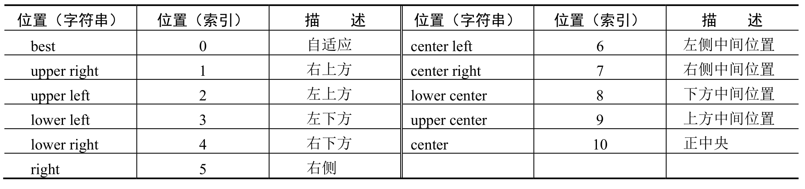

上述参数可以设置大概的图例位置，如果这样可以满足需求，那么第二个参数也可以不设置。第二个参数bbox_to_anchor是元组类型，包括两个值，num1用于控制legend的左右移动，值越大越向右边移动；num2用于控制legend的上下移动，值越大，越向上移动。用于微调图例的位置。

另外，通过该参数还可以设置图例位于图表外面，关键代码如下：

\# bbox_to_anchor微调图例位置，loc=1为右上方，borderaxespad为轴和图例边框之间的间距

plt.legend(('基础体温',),bbox_to_anchor=(1.05, 1),loc=1, borderaxespad=0)

上述代码中，参数borderaxespad表示轴和图例边框之间的间距，以字体大小为单位度量。

下面来看设置标题和图例后的“14天基础体温曲线图”，效果如图12.27所示。

（4）图例横向显示。图例横向显示主要使用ncol参数，通过该参数设置图例的列数，例如：

\# labels2标签文本变量，loc为下方中间位置，ncol为列数，bbox_to_anchor微调图例位置

plt.legend(labels2,loc="lower center",ncol=2,bbox_to_anchor=(0.3,-0.1))

运行程序，效果如图12.28所示。

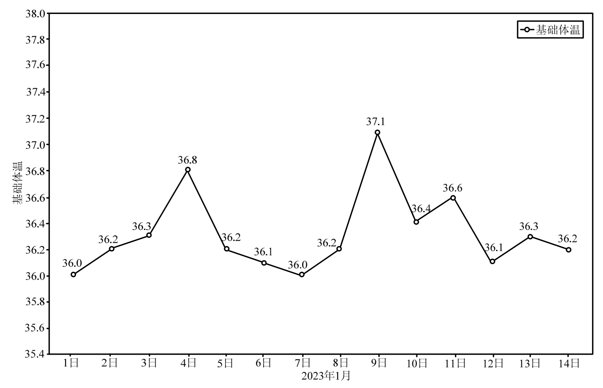

▲图12.27 14天基础体温曲线图

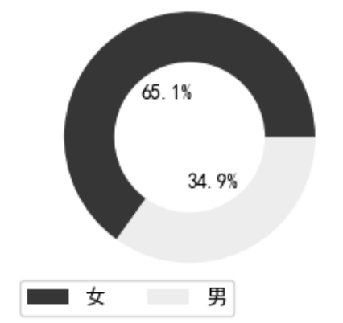

▲图12.28 图例横向显示

（5）去掉图例边框。如果不想要图例的边框，可以使用下面的代码进行设置：

plt.legend(frameon=False)

以上是图例的常用设置，更多设置可参考如下参数说明： 

 ncol：图例的列数，默认1列。 

 prop：字体设置。 

 fontsize：设置字体大小，需要未指定prop参数。数字字号或{'xx-small'， 'x-small'， 'small'， 'medium'， 'large'， 'x-large'， 'xx-large'}。 

 numpoints：为线条图图例条目创建的标记点数。 

 scatterpoints：为散点图图例条目创建的标记点数。 

 scatteryoffsets：为散点图图例条目创建的标记的垂直偏移量。 

 markerscale：图例标记与原始标记的相对大小。 

 markerfirst：布尔值，当值为True时，图例标记放在图例标签的左侧。 

 frameon：布尔值，表示是否启用边框。 

 fancybox：布尔值，控制是否在图例背景的FancyBboxPatch周围启用圆边。 

 shadow：布尔值，表示是否显示阴影。 

 framealpha：图例的透明度。 

 facecolor ：图例的面板颜色。 

 edgecolor ：图例的边框颜色。 

 mode：默认值为None，可选{"expand"}。为expand时图例将展开至整个坐标轴。 

 bbox_transform：从父坐标系到子坐标系的几何映射。 

 title：图例的标题。 

 title_fontsize：图例标题的字体大小。 

 borderpad：图例边框与标签的距离。 

 labelspacing：图例标签间的垂直空间。 

 handlelength：图例标记的长度。 

 handletextpad：图例标记与图例标签间的距离。 

 borderaxespad：轴与图例边框的距离。 

 columnspacing：列间距。

### 12.2.6 添加注释—annotate()函数

annotate()函数用于在图表上给数据添加文本注释，该函数支持带箭头的画线工具，可方便我们在合适的位置添加描述信息。语法如下：

plt.annotate(s, xy, xytext, xycoords)

重要参数说明： 

 s：注释文本的内容。 

 xy：被注释的坐标点，二维元组，如（x,y）。 

 xytext：注释文本的坐标点（也就是箭头的位置），也是二维元组，默认与xy相同。 

 xycoords：被注释点的坐标系属性，设置值如表12.4所示。

表12.4 xycoords参数设置值

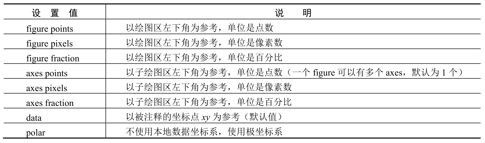

 textcoords：注释文本的坐标系属性，默认与xycoords参数值相同，也可以设置为不同的值，具体如表12.5所示。

表12.5 textcoords参数设置值

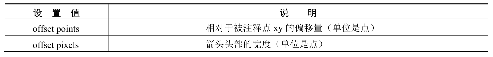

 arrowprops：箭头的样式，字典型数据，如果该属性非空，则会在注释文本和被注释点之间画一个箭头。如果不设置arrowstyle参数，则可以使用以下设置值，如表12.6所示。

表12.6 arrowprops参数设置值

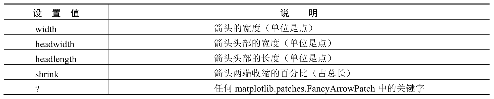

FancyArrowPatch的关键字如表12.7所示。

表12.7 FancyArrowPatch的关键字

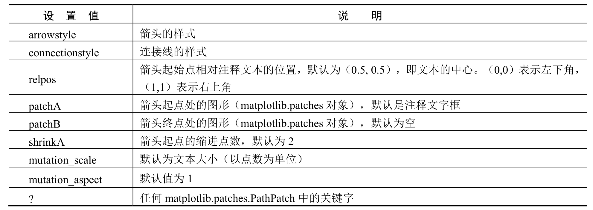

在arrowprops参数的字典中，如果设置arrowstyle参数，则需要使用以下设置值，如表12.8所示。

表12.8 arrowstyle参数设置值

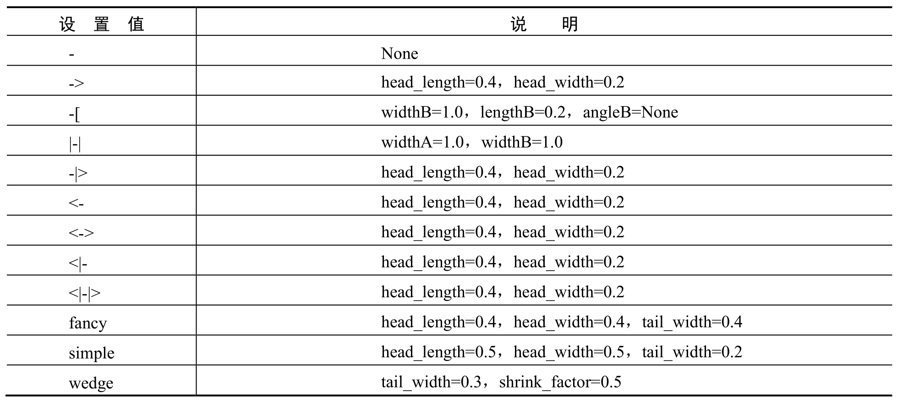

在arrowprops参数的字典中，还可以设置connectionstyle参数，该参数用于创建两个点之间的连接路径，其设置值如表12.9所示。

表12.9 connectionstyle参数设置值

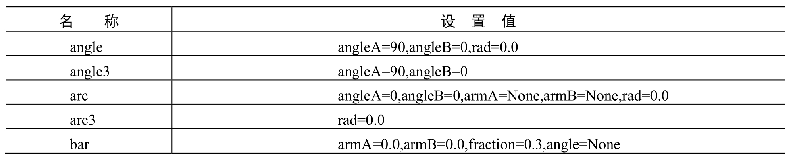

**【例12.11】**为图表添加注释**（实例位置：资源包\\Code\\12\\11）**

在“14天基础体温曲线图”中用箭头指示最高体温，效果如图12.29所示。

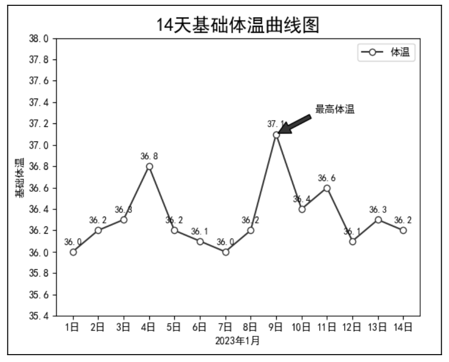

图12.29 用箭头指示最高体温

关键代码如下：

1  plt.annotate('最高体温', xy=(9,37.1),      #  *xy*值

2             xytext=(10.5,37.3),              # 文本内容

3             xycoords='data',                   # 以被注释的坐标点*xy*为参考

4             # 箭头的样式，颜色为红色，箭头两端收缩的百分比为0.05

5             arrowprops=dict(facecolor='r', shrink=0.05))

### 12.2.7 设置网格线—grid()函数

细节决定成败。很多时候为了图表的美观，不得不考虑细节。下面介绍图表细节之三—网格线，主要使用grid()函数实现。首先生成网格线，代码如下：

plt.grid()

grid()函数也有很多参数，如颜色、网格线的方向（参数axis='x'隐藏*x*轴网格线，axis='y'隐藏*y*轴网格线）、网格线样式和网格线宽度等。下面为图表设置网格线，关键代码如下：

plt.grid(color='0.5',linestyle='--',linewidth=1)

运行程序，输出结果如图12.30所示。

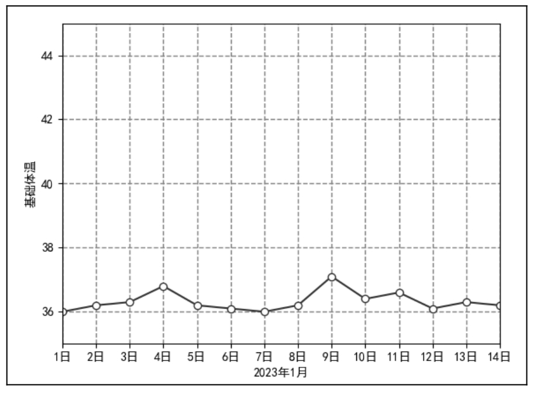

图12.30 带网格线的折线图

### 说明

网格线对于饼形图来说，直接使用并不显示，其需要与饼形图的frame参数配合使用，设置该参数值为True。详见12.3.5节绘制饼形图。

### 12.2.8 设置参考线—axhline()、axvline()函数

为了让图表更加清晰易懂，有时候需要为图表添加一些参考线，如平均线、中位数线等。在Matplotlib图表中，有两种绘制参考线的函数。

**1. 通过hlines()、vlines()函数绘制参考线**

hlines()函数用于绘制水平参考线，vlines()函数用于绘制垂直参考线。使用这两个函数绘制的参考线必须指定ymin、ymax参数或者xmin、xmax参数。

重要参数说明： 

 *x*：横向坐标。 

 *y*：纵向坐标。 

 ymin、ymax：vlines()函数的必选参数，用于设置参考线纵向坐标的最小值和最大值。 

 xmin、xmax：hlines()函数的必选参数，用于设置参考线横向坐标的最小值和最大值。 

 label：标签内容。

**2. 通过axhline()、axvline()函数绘制参考线**

axhline()函数用于绘制水平参考线，axvlline()函数用于绘制垂直参考线。使用这两个函数绘制的参考线两头纵坐标相对于整个图表的位置，无须指定ymin、ymax参数或者xmin、xmax参数。

重要参数说明： 

 *x*：横向坐标。 

 *y*：纵向坐标。 

 ymin、ymax：axvline()函数参考线两头纵向坐标，位于整个图表的位置，范围为0～1。 

 xmin、xmax：axhline()函数参考线两头横向坐标，位于整个图表的位置，范围为0～1。

这两个函数与hlines()、vlines()函数的区别在于： 

 ymin、ymax参数或xmin、xmax参数可以不指定。 

 ymin、ymax参数或xmin、xmax参数值不同，axhline()、axvline()函数做了归一化处理。 

 没有label参数，不能设置标签。

**【例12.12】**为图表添加水平参考线**（实例位置：资源包\\Code\\12\\12）**

下面为体温折线图图表添加水平参考线，用于显示体温平均值。首先计算体温的平均值，然后使用axhline()函数绘制水平参考线，主要代码如下：

1  # 计算体温平均值

2  mean=df\['体温'\].mean()

3  plt.axhline(mean,color='red',linestyle='--')

运行程序，输出结果如图12.31所示。

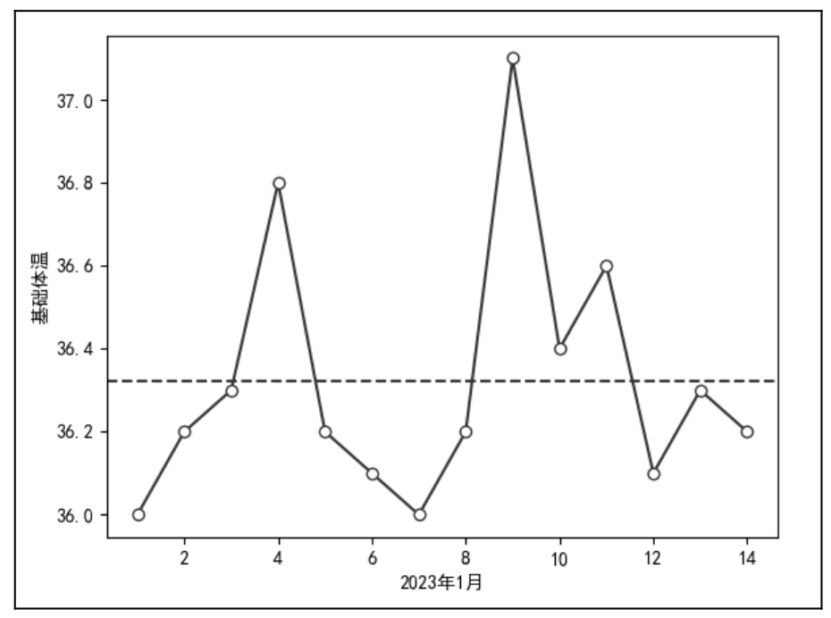

图12.31 水平参考线

### 12.2.9 选取范围—axhspan()、axvspan()函数

选取范围就是在图表上选取一定范围绘制数值的参考线，主要使用axhspan()和axvspan()函数实现。axhspan()函数用于绘制水平选取范围，axvspan()函数用于绘制垂直选取范围。

重要参数说明： 

 ymin、ymax：*y*轴范围的最小值和最大值。 

 xmin、xmax：*x*轴范围的最小值和最大值。 

 facecolor：前景色。 

 alpha：透明度。

**【例12.13】**为图表添加选取范围**（实例位置：资源包\\Code\\12\\13）**

选取体温在36.5～37度的数据和1～5号的数据，主要代码如下：

1  # 水平选取范围

2  # ymin/ymax：y轴范围的最小值和最大值,facecolor为前景色，alpha为透明度

3  plt.axhspan(ymin=36.5,ymax=37,facecolor='r',alpha=0.5)

4  # 垂直选取范围

5  plt.axvspan(xmin=1,xmax=5,facecolor='g',alpha=0.5)

运行程序，输出结果如图12.32所示。

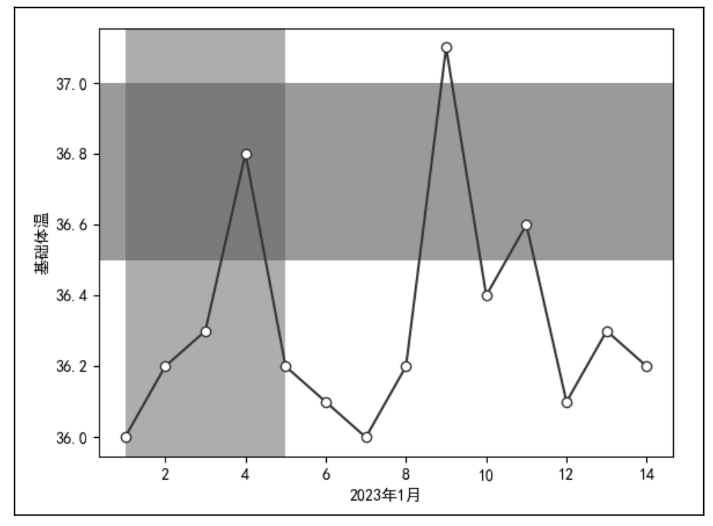

图12.32 选取范围

### 12.2.10 图表的布局—tight\_layout()函数

绘制的图表，如果*x*轴、*y*轴标题与画布边缘的距离太近，就会显示不全，如图12.33所示。遇到这种问题，通常调节对应元素的属性，如字体大小、位置等，使其适应画布的大小，有时还需要调整多次，非常麻烦。那么，有没有简单的方法呢？当然有，通过constrained_layout或tight_layout布局，可以使图形元素进行一定程度的自适应。

**1. constrained\_layout布局**

constrained_layout布局是Matplotlib的subplots()函数中的一个参数，在绘制图表前设置该参数值为True即可，主要代码如下：

plt.subplots(constrained_layout=True)

**2. tight\_layout布局**

tight_layout布局是Matplotlib的一个函数，在显示图表前直接使用即可，主要代码如下：

plt.tight_layout()

应用这两种布局可以解决显示不全的问题，效果如图12.34所示。

应用constrained_layout或tight_layout布局时，Matplotlib会自动调整图形元素，使其恰当显示。需要注意，只有调整标题、图例等常见图形元素时才可以如此操作。复杂图形的布局仍需要用户自己控制图形元素的位置。

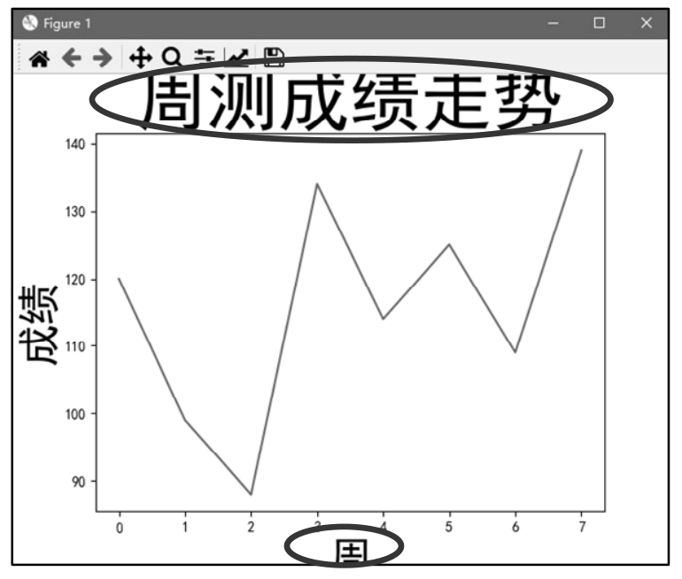

▲图12.33 图表显示不全的情况

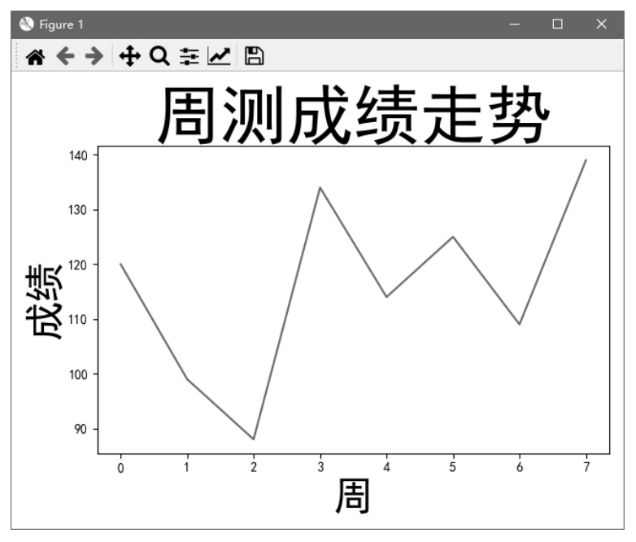

▲图12.34 正常显示的图表

### 12.2.11 保存图表—savefig()函数

实际工作中，有时需要将绘制的图表保存为图片以便放置到数据分析报告中。Matplotlib的savefig()函数可以实现这一功能，将图表保存为JPEG、TIFF或PNG格式的图片。

例如，保存之前绘制的折线图，关键代码如下：

plt.savefig('image.png')

需要注意的一个关键问题：保存代码必须在图表预览前，也就是在plt.show()代码前，否则保存后的图片是白色，图表无法保存。

运行程序，图表将被保存在程序所在路径下，名为image.png。

## 12.3 绘制常用的图表

常用的图表包括散点图、折线图、柱形图、直方图、饼形图、面积图、箱形图、热力图等，下面逐一介绍如何绘制这些图表。

### 12.3.1 绘制散点图—plot()、scatter()函数

散点图主要是用来查看数据的分布情况或相关性，一般在线性回归分析中用来查看数据点在坐标系平面上的分布情况。散点图表示因变量随自变量而变化的大致趋势，据此可以选择合适的函数对数据点进行拟合。

散点图与折线图类似，也是由一个个点构成的。但不同之处在于，散点图的各点之间不会按照前后关系以线条连接起来。

Matplotlib绘制散点图使用plot()函数和scatter()函数都可以实现，本节使用scatter()函数绘制散点图。scatter()函数被专门用于绘制散点图，使用方式和plot()函数类似，区别在于前者具有更高的灵活性，可以单独控制每个散点与数据匹配，并让每个散点都具有不同的属性。scatter()函数语法如下：

matplotlib.pyplot.scatter(x,y,s=None,c=None,marker=None,cmap=None,norm=None,vmin=None,vmax=None,alpha=None,lin

ewidths=None,verts=None,edgecolors=None,data=None, \*\*kwargs)

参数说明： 

 x，y：数据。 

 s：标记大小，以平方磅为单位的标记面积，设置值如下： 

 数值标量：以相同的大小绘制所有标记。 

 行或列向量：使每个标记具有不同的大小。以x、y和sz中的相应元素确定每个标记的位置和面积。sz的长度必须等于x和y的长度。 

 \[\]：使用36平方磅的默认面积。 

 c：标记颜色，可选参数，默认值为b，表示蓝色。 

 marker：标记样式，可选参数，默认值为o。 

 cmap：颜色地图，可选参数，默认值为None。 

 norm：可选参数，默认值为None。 

 vmin，vmax：标量，可选参数，默认值为None。 

 alpha：透明度，可选参数，0～1的数，表示透明度，默认值为None。 

 linewidths：线宽，标记边缘的宽度，可选参数，默认值为None。 

 verts：（x，y）的序列，可选参数，如果参数marker为None，则这些顶点将用于构建标记。标记的中心位置为（0，0）。 

 edgecolors：轮廓颜色，和参数c类似，可选参数，默认值为None。 

 data：data关键字参数。如果给定一个数据参数，则所有位置和关键字参数将被替换。 

 \*\*kwargs：关键字参数，其他可选参数。

**【例12.14】**绘制简单散点图**（实例位置：资源包\\Code\\12\\14）**

绘制简单散点图，程序代码如下：

1  import matplotlib.pyplot as plt  # 导入matplotlib.pyplot子模块

2  x=\[1,2,3,4,5,6\]                  #  *x*轴数据

3  y=\[19,24,37,43,55,68\]            #  *y*轴数据

4  plt.scatter(x, y)                # 绘制散点图

5  plt.show()                     # 显示图表

运行程序，输出结果如图12.35所示。

**【例12.15】**绘制散点图分析销售收入与广告费的相关性**（实例位置：资源包\\Code\\12\\15）**

接下来，绘制销售收入与广告费散点图，用以观察销售收入与广告费的相关性，关键代码如下：

1  #  x为广告费用，y为销售收入

2  x=pd.DataFrame(dfCar_month\['支出'\])

3  y=pd.DataFrame(dfData_month\['金额'\])

4  plt.title('销售收入与广告费散点图')   # 图表标题

5  plt.scatter(x, y,  color='red')       # 真实值散点图

运行程序，输出结果如图12.36所示。

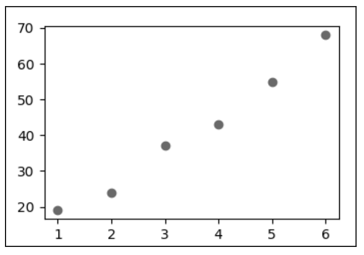

▲图12.35 简单散点图

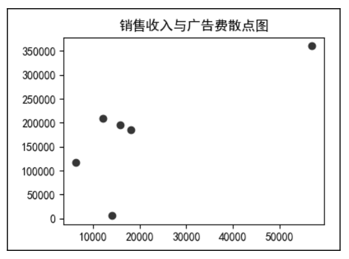

▲图12.36 销售收入与广告费散点图

### 12.3.2 绘制折线图—plot()函数

折线图可以显示随时间而变化的连续数据，因此非常适用于显示在相等时间间隔下数据的趋势。如基础体温曲线图，学生成绩走势图，股票月成交量走势图，月销售统计分析图，微博、公众号、网站访问量统计图等都可以用折线图体现。在折线图中，类别数据沿水平轴均匀分布，所有值数据沿垂直轴均匀分布。

Matplotlib绘制折线图主要使用plot()函数，相信通过前面的学习，你已经了解了plot()函数的基本用法，并能够绘制一些简单的折线图，下面尝试绘制多折线图。

**【例12.16】**绘制学生语文、数学、英语各科成绩分析图**（实例位置：资源包\\Code\\12\\16）**

下面使用plot()函数绘制多折线图。例如，绘制学生语文、数学、英语各科成绩分析图，程序代码如下：

1   import pandas as pd                                                   # 导入pandas模块

2   import matplotlib.pyplot as plt                                       # 导入matplotlib.pyplot子模块

3   df1=pd.read_excel('data.xls')                                       # 读取Excel文件

4   # 绘制多折线图

5   x1=df1\['姓名'\]

6   y1=df1\['语文'\]

7   y2=df1\['数学'\]

8   y3=df1\['英语'\]

9   plt.rcParams\['font.sans-serif'\]=\['SimHei'\]                            # 解决中文乱码

10  plt.rcParams\['xtick.direction'\] = 'out'                               #  *x*轴的刻度线向外显示

11  plt.rcParams\['ytick.direction'\] = 'in'                                #  *y*轴的刻度线向内显示

12  plt.title('语数外成绩大比拼',fontsize='18')                         # 图表标题

13  # 绘制语文成绩折线图,maker为标记样式

14  plt.plot(x1,y1,label='语文',color='r',marker='p')

15  # 绘制数学成绩折线图,maker标记为样式，mfc为标记填充颜色，ms为标记大小，alpha为透明度

16  plt.plot(x1,y2,label='数学',color='g',marker='.',mfc='r',ms=8,alpha=0.7)

17  # 绘制英语成绩折线图

18  plt.plot(x1,y3,label='英语',color='b',linestyle='-.',marker='\*')

19  plt.grid(axis='y')                                                    # 显示网格关闭*y*轴

20  plt.ylabel('分数')                                                    #  *y*轴标签

21  plt.yticks(range(50,150,10))                                        #  *y*轴刻度值范围

22  plt.legend(\['语文','数学','英语'\])                                    # 设置图例

23  plt.show()                                                            # 显示图表

运行程序，输出结果如图12.37所示。

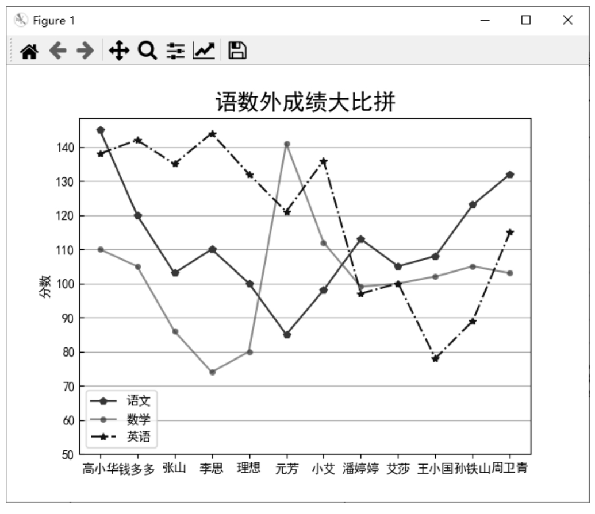

图12.37 多折线图

上述举例，用到了几个参数，下面进行说明。 

 mfc：标记的颜色。 

 ms：标记的大小。 

 alpha：透明度，设置该参数可以改变颜色的深浅。

### 12.3.3 绘制柱形图—bar()函数

柱形图，又称为长条图、柱状图、条状图等，是一种以长方形的长度为变量的统计图表。柱形图用来比较两个或两个以上的数据（不同时间或者不同条件），只有一个变量，通常用于较小的数据集分析。

Matplotlib绘制柱形图主要使用bar()函数，语法如下：

matplotlib.pyplot.bar(x,height,width,bottom=None,\*,align=’center’,data=None,\*\*kwargs)

参数说明： 

 x：*x*轴数据。 

 height：柱子的高度，也就是*y*轴数据。 

 width：浮点型，柱子的宽度，默认值为0.8，可以指定固定值。 

 bottom：标量或数组，可选参数，柱形图的*y*坐标，默认值为0。 

 \*：星号本身不是参数。星号表示其后面的参数为命名关键字参数，命名关键字参数必须传入参数名，否则程序会出现错误。 

 align：对齐方式，如center（居中）和edge（边缘），默认值为center。 

 data：data关键字参数。如果给定一个数据参数，所有位置和关键字参数都将被替换。 

 \*\*kwargs：关键字参数，其他可选参数，如color（颜色）、alpha（透明度）、label（每个柱子显示的标签）等。

**【例12.17】**用5行代码绘制简单的柱形图**（实例位置：资源包\\Code\\12\\17）**

用5行代码绘制简单的柱形图，程序代码如下：

1  import matplotlib.pyplot as plt  # 导入matplotlib.pyplot子模块

2  x=\[1,2,3,4,5,6\]                  #  *x*轴数据

3  height=\[10,20,30,40,50,60\]       # 柱子的高度

4  plt.bar(x,height)                # 绘制柱形图

5  plt.show()                     # 显示图表

运行程序，输出结果如图12.38所示。

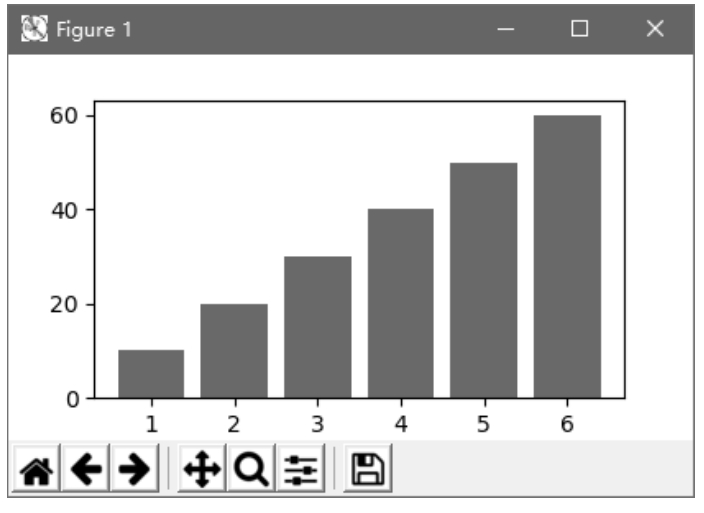

图12.38 简单柱形图

bar()函数可以绘制各种类型的柱形图，如基本柱形图、多柱形图、堆叠柱形图，只要将bar()函数的主要参数理解透彻，就会达到意想不到的效果。下面介绍几种常见的柱形图。

**1. 基本柱形图**

**【例12.18】**绘制线上图书销售额分析图**（实例位置：资源包\\Code\\12\\18）**

使用bar()函数绘制“2016—2022年线上图书销售额分析图”，程序代码如下：

1   import pandas as pd                              # 导入pandas模块

2   import matplotlib.pyplot as plt                  # 导入matplotlib.pyplot子模块

3   df = pd.read_excel('books.xlsx')               # 读取Excel文件

4   plt.rcParams\['font.sans-serif'\]=\['SimHei'\]       # 解决中文乱码

5   x=df\['年份'\]                                     #  *x*轴数据

6   height=df\['销售额'\]                              # 柱子的高度

7   plt.grid(axis="y", which="major")              # 生成虚线网格

8   #  *x**、**y*轴标签

9   plt.xlabel('年份')

10  plt.ylabel('线上销售额(元)')

11  plt.title('2016—2022年线上图书销售额分析图')  # 图表标题

12  # 绘制柱形图，width是柱子宽度，align为居中对齐,color为柱子颜色，alpha为透明度

13  plt.bar(x,height,width = 0.5,align='center',color = 'b',alpha=0.5)

14  # 设置每个柱子的文本标签,format(b,',')格式化销售额为千位分隔符，ha居中对齐，va垂直底部对齐，color为字体颜色，

    alpha为透明度

15  for a,b in zip(x,height):

16      plt.text(a, b,format(b,','), ha='center', va= 'bottom',fontsize=9,color = 'b',alpha=0.9)

17  plt.legend(\['销售额'\])                           # 设置图例

18  plt.show()                                     # 显示图表

运行程序，输出结果如图12.39所示。

上述举例，应用了前面所学习的知识，如标题、图例、文本标签，坐标轴标签等。

**2. 多柱形图**

**【例12.19】**绘制各平台图书销售额分析图**（实例位置：资源包\\Code\\12\\19）**

对于线上图书销售额的统计，如果要统计各个平台的销售额，可以使用多柱形图，不同颜色的柱子代表不同的平台，如京东、天猫、自营等，程序代码如下：

1   import pandas as pd                                                       # 导入pandas模块

2   import matplotlib.pyplot as plt                                           # 导入matplotlib.pyplot子模块

3   df = pd.read_excel('books.xlsx',sheet_name='Sheet2')                    # 读取Excel文件名为“Sheet2”的Sheet页

4   plt.rcParams\['font.sans-serif'\]=\['SimHei'\]                                # 解决中文乱码

5   # xy轴数据

6   x=df\['年份'\]

7   y1=df\['京东'\]

8   y2=df\['天猫'\]

9   y3=df\['自营'\]

10  width =0.25                                                                # 柱子宽度

11  plt.ylabel('线上销售额(元)')                                           #  *y*轴标题

12  plt.title('2016—2022年线上图书销售额分析图')                            # 图表标题

13  plt.bar(x,y1,width = width,color = 'darkorange')                         # 绘制第一个柱形图

14  plt.bar(x+width,y2,width = width,color = 'deepskyblue')                  # 绘制第二个柱形图

15  plt.bar(x+2\*width,y3,width = width,color = 'g')                          # 绘制第三个柱形图

16  # 设置每个柱子的文本标签,format(b,',')格式化销售额为千位分隔符，ha水平居中，va垂直底部对齐

17  for a,b in zip(x,y1):

18      plt.text(a, b,format(b,','), ha='center', va= 'bottom',fontsize=8)

19  for a,b in zip(x,y2):

20      plt.text(a+width, b,format(b,','), ha='center', va= 'bottom',fontsize=8)

21  for a, b in zip(x, y3):

22      plt.text(a + 2\*width, b, format(b, ','), ha='center', va='bottom', fontsize=8)

23  plt.legend(\['京东','天猫','自营'\])                                       # 图例

24  plt.show()                                                               # 显示图表

上述举例，柱形图中若显示*n*个柱子，则柱子宽度值需小于1/*n*，否则柱子会出现重叠现象。运行程序，输出结果如图12.40所示。

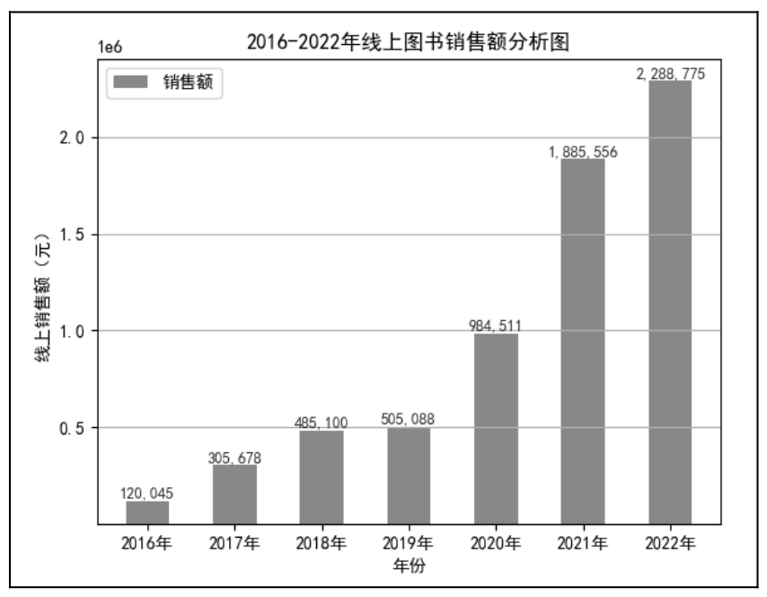

▲图12.39 基本柱形图

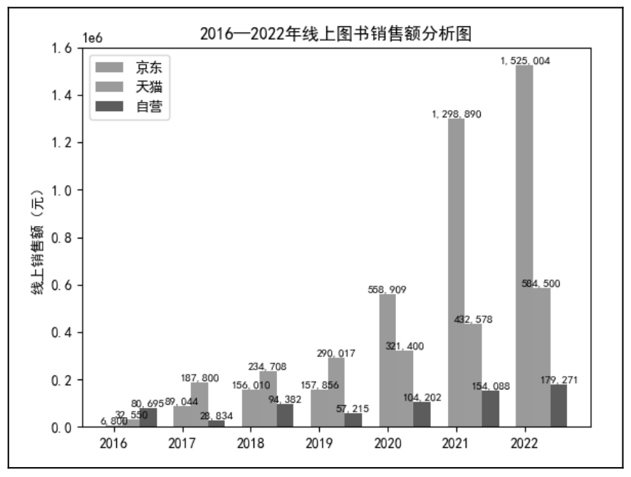

▲图12.40 多柱形图

### 12.3.4 绘制直方图—hist()函数

直方图，又称质量分布图，由一系列高度不等的纵向条纹或线段表示数据分布的情况。一般用横轴表示数据类型，纵轴表示分布情况。直方图是数值数据分布的精确图形表示，是一个连续变量（定量变量）的概率分布的估计。

绘制直方图主要使用hist()函数，语法如下：

matplotlib.pyplot.hist(x,bins=None,range=None, density=None, bottom=None,  histtype='bar', align='mid', log=False,

color=None, label=None, stacked=False, normed=None)

主要参数说明： 

 x：数据集，最终的直方图将对数据集进行统计。 

 bins：统计数据的区间分布。 

 range：元组类型，显示的区间。 

 density：布尔型，默认值为False，不显示频率统计结果，为True则显示频率统计结果。需要注意，频率统计结果=区间数目/（总数×区间宽度）。 

 histtype：可选参数，设置值为bar、barstacked、step或stepfilled，默认值为bar。推荐使用默认配置，step使用的是梯状，stepfilled则会对梯状内部进行填充，效果与bar类似。 

 align：可选参数，值为left、mid或right，默认值为mid。控制柱形图的水平分布，left或者right会有部分空白区域，推荐使用默认值。 

 log：布尔型，默认值为False，即*y*坐标轴是否选择指数刻度。 

 stacked：布尔型，默认值为False，是否为堆积状图。

**【例12.20】**绘制简单直方图**（实例位置：资源包\\Code\\12\\20）**

绘制简单直方图，程序代码如下：

1  import matplotlib.pyplot as plt                 # 导入matplotlib.pyplot子模块

2  x=\[22,87,5,43,56,73,55,54,11,20,51,5,79,31,27\]  #  *x*轴数据

3  plt.hist(x, bins = \[0,25,50,75,100\])            # 绘制直方图，bins为区间

4  plt.show()                                    # 显示图表

运行程序，输出结果如图12.41所示。

**【例12.21】**绘制直方图分析学生数学成绩分布情况**（实例位置：资源包\\Code\\12\\21）**

再举一个例子，通过直方图分析学生数学成绩分布情况，程序代码如下：

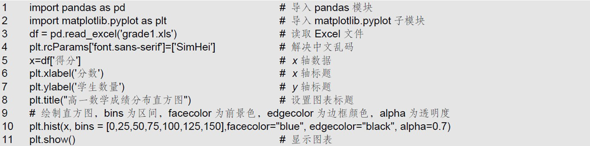

运行程序，输出结果如图12.42所示。

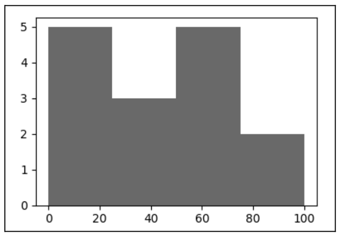

▲图12.41 简单直方图

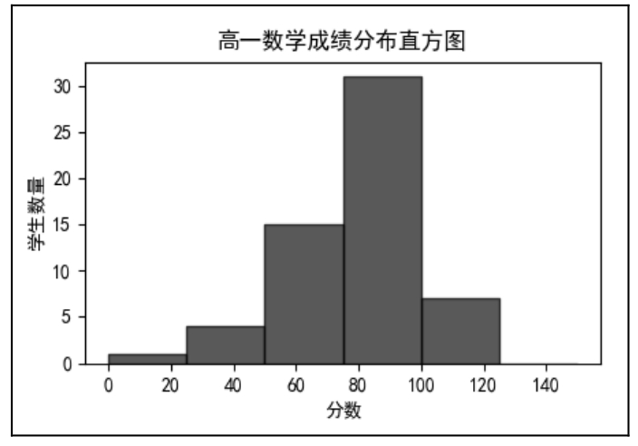

▲图12.42 数学成绩分布直方图

上述举例，通过直方图可以清晰地看到高一数学成绩分布情况。基本呈现正态分布，两边低中间高，高分段学生缺失，说明试卷有难度。那么，通过直方图还可以分析以下内容：

（1）对学生进行比较。呈正态分布的测验便于选拔优秀，甄别落后，通过直方图一目了然。

（2）确定人数和分数线。测验成绩符合正态分布可以帮助等级评定时确定人数和估计分数段内的人数，以及确定录取分数线、各学科的优生率等。

（3）测验试题难度。

### 12.3.5 绘制饼形图—pie()函数

饼形图常用来显示各个部分在整体所占的比例。例如，在工作中如果遇到需要计算总费用或金额的各个部分构成比例的情况，一般通过各个部分与总额相除来计算，而且这种比例表示方法很抽象，而通过饼形图将直接显示各个组成部分所占比例，一目了然。

Matplotlib绘制饼形图主要使用pie()函数，语法如下：

matplotlib.pyplot.pie(x,explode=None,labels=None,colors=None,autopct=None,pctdistance=0.6,shadow=False,labeldistance

=1.1,startangle=None,radius=None,counterclock=True,wedgeprops=None,textprops=None,center=(0, 0), frame=False,

rotatelabels=False, hold=None, data=None)

主要参数说明： 

 x：每一块饼形图的比例，如果sum（x）＞1，则会使用sum（x）归一化。 

 labels：每一块饼形图外侧显示的说明文字。 

 explode：每一块饼形图离中心的距离。 

 startangle：起始绘制角度，默认是从*x*轴正方向逆时针画起，如设置值为90，则从*y*轴正方向画起。 

 shadow：表示是否在饼形图下面画一个阴影，默认值为False，即不画阴影。 

 labeldistance：标记的绘制位置，相对于半径的比例，默认值为1.1，如值小于1则绘制在饼形图内侧。 

 autopct：设置饼形图百分比，可以使用格式化字符串或format函数。如%1.1f则保留小数点前后1位。 

 pctdistance：类似于labeldistance参数，指定百分比的位置刻度，默认值为0.6。 

 radius：饼形图半径，默认值为1，半径越大饼形图越大。 

 counterclock：指定指针方向，布尔型，可选参数。默认值为True表示逆时针；如果值为False，则表示顺时针。 

 wedgeprops：字典类型，可选参数，默认值为None。字典传递给wedge对象，用来画一个饼形图。例如，wedgeprops={'linewidth':2}设置wedge线宽为2。 

 textprops：设置标签和比例文字的格式，字典类型，可选参数，默认值为None。传递给text对象的字典参数。 

 center：浮点类型的列表，可选参数，默认值为（0，0），表示图表中心位置。 

 frame：布尔型，可选参数。默认值为False，不显示轴框架（也就是网格）；如果值为True，则显示轴框架，与grid()函数配合使用。实际应用中建议使用默认设置，因为显示轴框架会影响饼形图效果。 

 rotatelabels：布尔型，可选参数，默认值为False；如果值为True，则旋转每个标签到指定的角度。

**【例12.22】**绘制简单饼形图**（实例位置：资源包\\Code\\12\\22）**

绘制简单饼形图，程序代码如下：

1  import matplotlib.pyplot as plt  # 导入matplotlib.pyplot子模块

2  x = \[2,5,12,70,2,9\]              #  *x*轴数据

3  plt.pie(x,autopct='%1.1f%%')   # 绘制饼形图，autopct设置饼图百分比

4  plt.show()                     # 显示图表

运行程序，输出结果如图12.43所示。

饼形图也存在各种类型，主要包括基础饼形图、分裂饼形图、立体感带阴影的饼形图、环形图等。下面分别进行介绍。

**1. 基础饼形图**

**【例12.23】**通过饼形图分析各省销量占比情况**（实例位置：资源包\\Code\\12\\23）**

下面通过饼形图分析2023年1月各省销量占比情况，程序代码如下：

1   import pandas as pd                             # 导入pandas模块

2   from matplotlib import pyplot as plt            # 导入matplotlib.pyplot子模块

3   df1 = pd.read_excel('data3.xls')              # 读取Excel文件

4   plt.rcParams\['font.sans-serif'\]=\['SimHei'\]      # 解决中文乱码

5   plt.figure(figsize=(5,3))                   # 设置画布大小

6   labels = df1\['省'\]                              # 饼形图标签

7   sizes = df1\['销量'\]                             # 饼形图数据

8   # 设置饼形图每块的颜色

9   colors = \['red', 'yellow', 'slateblue', 'green','magenta','cyan','darkorange','lawngreen','pink','gold'\]

10  plt.pie(sizes,                                  # 饼形图数据

11          labels=labels,                          # 添加区域水平标签

12          colors=colors,                          # 设置饼形图的自定义填充色

13          labeldistance=1.02,                     # 设置各扇形标签(图例)与圆心的距离

14          autopct='%.1f%%',                       # 设置百分比的格式，这里保留一位小数

15          startangle=90,                          # 设置饼形图的初始角度

16          radius = 0.5,                           # 设置饼形图的半径

17          center = (0.2,0.2),                   # 设置饼形图的原点

18          textprops = {'fontsize':9, 'color':'k'},  # 设置文本标签的属性值

19          pctdistance=0.6)                        # 设置百分比标签与圆心的距离

20  # 设置*x**，**y*轴刻度一致，保证饼形图为圆形

21  plt.axis('equal')

22  plt.title('2023年1月各省销量占比情况分析')    # 图表标题

23  plt.show()                                    # 显示图表

运行程序，输出结果如图12.44所示。

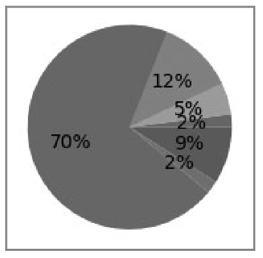

▲图12.43 简单饼形图

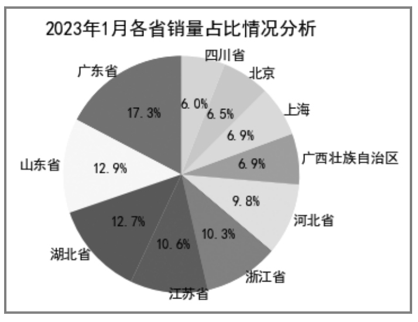

▲图12.44 基础饼形图

**2. 分裂饼形图**

分裂饼形图是将你认为主要的饼图部分分裂出来，以达到突出显示的目的。

**【例12.24】**绘制分裂饼形图**（实例位置：资源包\\Code\\12\\24）**

将销量占比最多的广东省分裂显示，效果如图12.45所示。分裂饼形图可以同时分裂多块，效果如图12.46所示。

分裂饼形图主要通过设置explode参数实现，该参数用于设置饼形图距中心的距离，我们需要将哪块饼形图分裂出来，就设置它与中心的距离即可。例如，图12.44有10块饼形图，我们将销量占比最多的“广东省”分裂出来，广东省在第一位，那么就设置第一位距中心的距离为0.1，其他位距中心的距离为0，关键代码如下。

explode = (0.1,0,0,0,0,0,0,0,0,0)

**3. 立体感带阴影的饼形图**

立体感带阴影的饼形图看起来更美观，效果如图12.47所示。

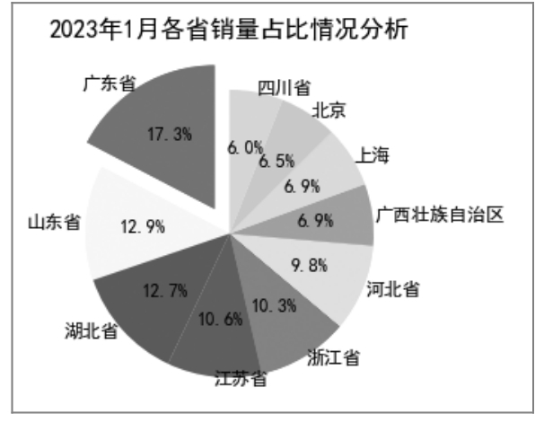

▲图12.45 分裂饼形图（1）

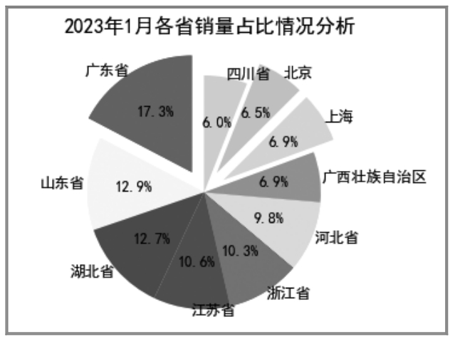

▲图12.46 分裂饼形图（2）

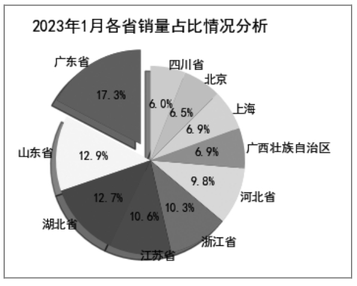

▲图12.47 立体感带阴影的饼形图

立体感带阴影的饼形图主要通过shadow参数实现，设置该参数值为True即可，关键代码如下：

shadow=True

**4. 环形图**

**【例12.25】**用环形图分析各省销量占比情况**（实例位置：资源包\\Code\\12\\25）**

环形图是由两个及两个以上大小不一的饼形图叠在一起，挖去中间的部分所构成的图形，效果如图12.48所示。

这里还是通过pie()函数实现，一个关键参数wedgeprops，字典类型，用于设置饼形图内外边界的属性，如环的宽度，环边界颜色和宽度，关键代码如下：

wedgeprops = {'width': 0.4, 'edgecolor': 'k'}

**5. 内嵌环形图**

**【例12.26】**用内嵌环形图分析各省销量占比情况**（实例位置：资源包\\Code\\12\\26）**

内嵌环形图是双环形图，绘制内嵌环形图需要注意以下三点：

（1）连续使用两次pie()函数。

（2）通过wedgeprops参数设置环形边界。

（3）通过radius参数设置不同的半径。

另外，由于图例内容比较长，为了使图例能够正常显示，图例代码中引入了两个主要参数，frameon参数用于设置图例有无边框，bbox_to_anchor参数用于设置图例位置。关键代码如下：

1  # 外环，autopct为百分比，radius为半径，pctdistance为百分比标签与圆心的距离，wedgeprops为字典类型，设置边

   框线宽，环的宽度，边框颜色

2  plt.pie(x1,autopct='%.1f%%',radius=1,pctdistance=0.85,colors=colors,wedgeprops=dict(linewidth=2,width=0.3,edgecolor='w'))

3  # 内环

4  plt.pie(x2,autopct='%.1f%%',radius=0.7,pctdistance=0.7,colors=colors,wedgeprops=dict(linewidth=2,width=0.4,edgecolor='w'))

5  # 图例

6  legend_text=df1\['省'\]

7  # 设置图例标签、图例标题，去掉图例边框，微调图例位置

8  plt.legend(legend_text,title='地区',frameon=False,bbox_to_anchor=(0.2,0.5))

运行程序，效果如图12.49所示。

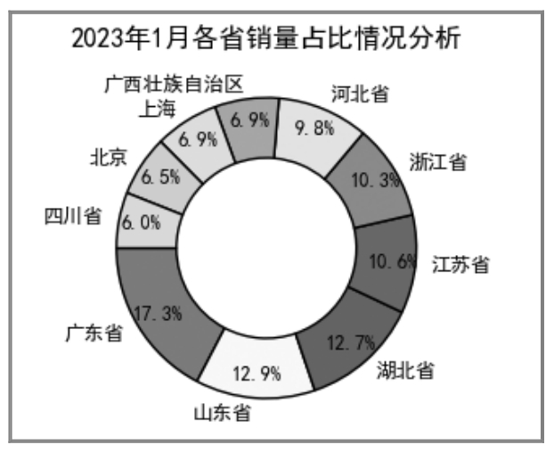

▲图12.48 环形图

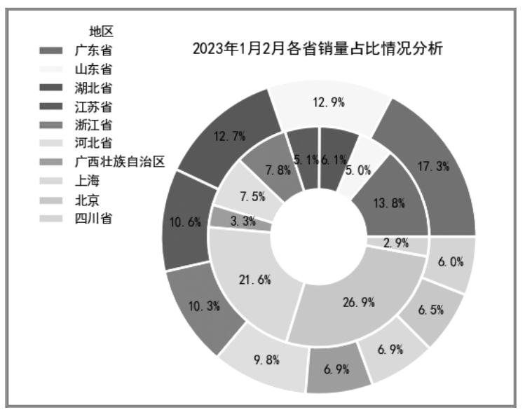

▲图12.49 内嵌环形图

### 12.3.6 绘制面积图—stackplot()函数

面积图用于体现数量随时间而变化的程度，也可用于引起人们对总值趋势的注意。例如，表示随时间而变化的利润的数据可以绘制在面积图中以强调总利润。

Matplotlib绘制面积图主要使用stackplot()函数，语法如下：

matplotlib.pyplot.stackplot()函数(x,\*args,data=None,\*\*kwargs)

参数说明： 

 x：*x*轴数据。 

 \*args：当传入的参数个数未知时使用\*args。这里指*y*轴数据可以传入多个*y*轴。 

 data：data关键字参数。如果给定一个数据参数，所有位置和关键字参数都将被替换。 

 \*\*kwargs：关键字参数，其他可选参数，如color（颜色）、alpha（透明度）等。

**【例12.27】**绘制简单面积图**（实例位置：资源包\\Code\\12\\27）**

绘制简单面积图，程序代码如下：

1  import matplotlib.pyplot as plt                                    # 导入matplotlib.pyplot子模块

2  #  *xy*轴数据

3  x = \[1,2,3,4,5\]

4  y1 =\[6,9,5,8,4\]

5  y2 = \[3,2,5,4,3\]

6  y3 =\[8,7,8,4,3\]

7  y4 = \[7,4,6,7,12\]

8  plt.stackplot()函数(x, y1,y2,y3,y4, colors=\['g','c','r','b'\])  # 绘制面积图，并设置不同的颜色

9  plt.show()                                                       # 显示图表

运行程序，输出结果如图12.50所示。

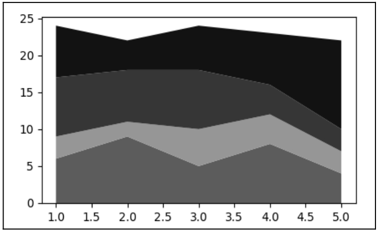

图12.50 简单面积图

面积图也有很多种，如标准面积图、堆叠面积图和百分比堆叠面积图等。下面主要介绍标准面积图和堆叠面积图。

**1. 标准面积图**

**【例12.28】**绘制标准面积图分析线上图书销售情况**（实例位置：资源包\\Code\\12\\28）**

通过标准面积图分析2016—2022年线上图书销售情况，程序代码如下：

1  import pandas as pd                           # 导入pandas模块

2  import matplotlib.pyplot as plt               # 导入matplotlib.pyplot子模块

3  df = pd.read_excel('books.xlsx')            # 读取Excel文件

4  plt.rcParams\['font.sans-serif'\]=\['SimHei'\]    # 解决中文乱码

5  #  *xy*轴数据

6  x=df\['年份'\]

7  y=df\['销售额'\]

8  plt.title('2016—2022年线上图书销售情况')   # 图表标题

9   plt.stackplot(x, y)                          # 绘制面积图

10  plt.show()                                 # 显示图表

通过该图可以看出每一年线上图书销售的趋势。运行程序，效果如图12.51所示。

**2. 堆叠面积图**

**【例12.29】**绘制堆叠面积图分析各平台图书销售情况**（实例位置：资源包\\Code\\12\\29）**

通过堆叠面积图分析2016—2022年线上各平台图书销售情况。堆叠面积图不仅可以看到各平台每年销售变化趋势，通过将各平台数据堆叠到一起还可以看到整体的变化趋势，效果如图12.52所示。

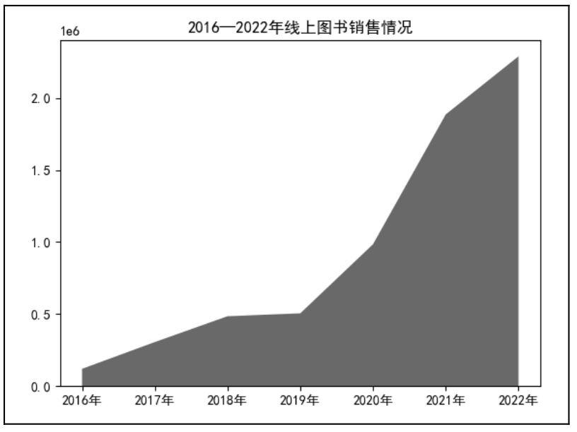

▲图12.51 标准面积图

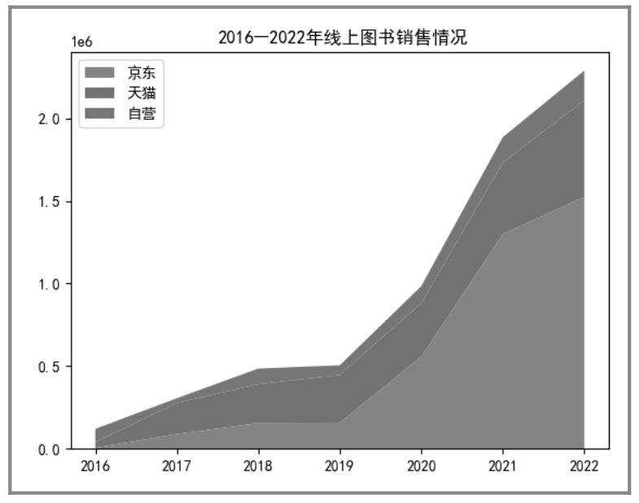

▲图12.52 堆叠面积图

实现堆叠面积图的关键在于增加*y*轴，通过增加多个*y*轴数据，形成堆叠面积图，关键代码如下：

1  x=df\['年份'\]

2  y1=df\['京东'\]

3  y2=df\['天猫'\]

4  y3=df\['自营'\]

5  plt.title('2016—2022年线上图书销售情况')                 # 图表标题

6  plt.stackplot(x, y1,y2,y3,colors=\['#6d904f','#fc4f30','#008fd5'\])  # 绘制堆叠面积图，并设置不同的颜色

7  plt.legend(\['京东','天猫','自营'\],loc='upper left')       # 设置图例，loc设置图例为左上方

8  plt.show()                                                # 显示图表

### 12.3.7 绘制箱形图—boxplot()函数

箱形图又称箱线图、盒须图或盒式图，它是一种用于显示一组数据分散情况的统计图。因形状像箱子而得名。箱形图最大的优点就是不受异常值的影响（异常值也称为离群值），可以以一种相对稳定的方式描述数据的离散分布情况，因此在各种领域也经常被使用。另外，箱形图也常用于异常值的识别。Matplotlib绘制箱形图主要使用boxplot()函数，语法如下：

matplotlib.pyplot.boxplot(x,notch=None,sym=None,vert=None,whis=None,positions=None,widths=None,patch_artist=None,m

eanline=None,showmeans=None,showcaps=None,showbox=None,showfliers=None,boxprops=None,labels=None,flierprops

=None,medianprops=None,meanprops=None,capprops=None,whiskerprops=None)

参数说明： 

 x：指定要绘制箱形图的数据。 

 notch：是否是凹口的形式展现箱形图，默认非凹口。 

 sym：指定异常点的形状，默认为加号“＋”显示。 

 vert：是否需要将箱形图垂直摆放，默认垂直摆放。 

 whis：指定上下限与上下四分位的距离，默认为1.5倍的四分位差。 

 positions：指定箱形图的位置，默认为\[0,1,2,…\]。 

 widths：指定箱形图的宽度，默认为0.5。 

 patch_artist：是否填充箱体的颜色。 

 meanline：是否用线的形式表示均值，默认用点来表示。 

 showmeans：是否显示均值，默认不显示。 

 showcaps：是否显示箱形图顶端和末端的两条线，默认显示。 

 showbox：是否显示箱形图的箱体，默认显示。 

 showfliers：是否显示异常值，默认显示。 

 boxprops：设置箱体的属性，如边框色、填充色等。 

 labels：为箱形图添加标签，类似于图例的作用。 

 filerprops：设置异常值的属性，如异常点的形状、大小、填充色等。 

 medianprops：设置中位数的属性，如线的类型、粗细等。 

 meanprops：设置均值的属性，如点的大小、颜色等。 

 capprops：设置箱形图顶端和末端线条的属性，如颜色、粗细等。 

 whiskerprops：设置须的属性，如颜色、粗细、线的类型等。

**【例12.30】**绘制简单箱形图**（实例位置：资源包\\Code\\12\\30）**

绘制简单箱形图，程序代码如下：

1  import matplotlib.pyplot as plt  # 导入matplotlib.pyplot子模块

2  x=\[1,2,3,5,7,9\]                  #  *x*轴数据

3  plt.boxplot(x)                   # 绘制箱形图

4  plt.show()                     # 显示图表

运行程序，输出结果如图12.53所示。

**【例12.31】**绘制多组数据的箱形图**（实例位置：资源包\\Code\\12\\31）**

上述举例是一组数据的箱形图，还可以绘制多组数据的箱形图，需要指定多组数据。例如，为三组数据绘制箱形图，程序代码如下：

1  import matplotlib.pyplot as plt    # 导入matplotlib.pyplot子模块

2  x1=\[1,2,3,5,7,9\]                   #  *x*轴数据

3  x2=\[10,22,13,15,8,19\]

4  x3=\[18,31,18,19,14,29\]

5  plt.boxplot(\[x1,x2,x3\])            # 绘制多组箱形图

6  plt.show()                       # 显示图表

运行程序，输出结果如图12.54所示。

箱形图将数据切割分离（实际上就是将数据分为4大部分），如图12.55所示。

下面介绍箱形图每部分的具体含义以及如何通过箱形图识别异常值。

（1）下四分位数：数据25%分位点所对应的值（Q1）。计算分位数可以使用Pandas的DataFrame()对象的quantile()函数。例如，Q1 = df\['总消费'\].quantile（q = 0.25）。

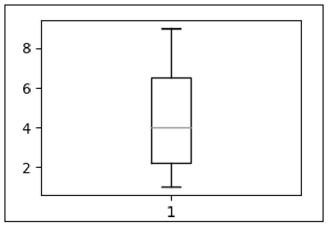

▲图12.53 简单箱形图

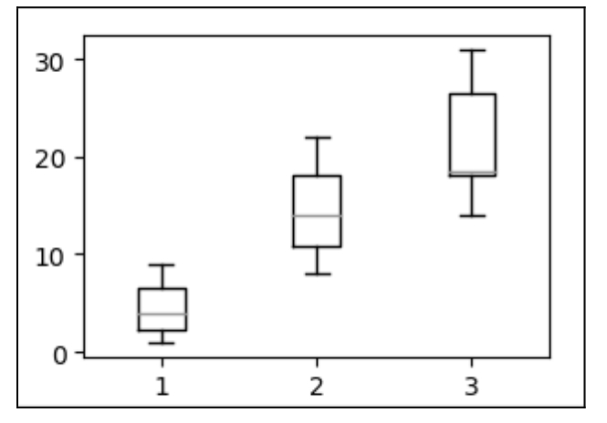

▲图12.54 多组数据的箱形图

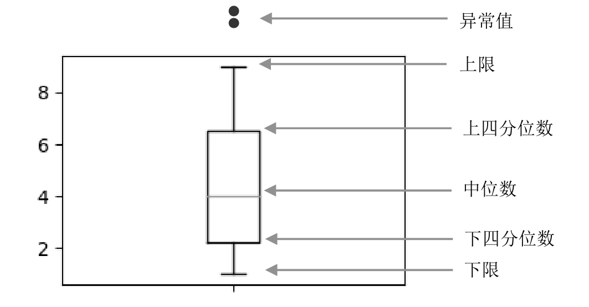

▲图12.55 箱形图组成

（2）中位数：数据50%分位点所对应的值（Q2）。

（3）上四分位数：数据75%分位点所对应的值（Q3）。

（4）上限：计算公式为Q3＋1.5（Q3－Q1）。

（5）下限：计算公式为Q1－1.5（Q3－Q1）。

其中，Q3－Q1表示四分位差。如果使用箱形图识别异常值，其判断标准是，当变量的数值大于箱形图的上限或者小于箱线图的下限时，就可以将这样的数据判定为异常值。

下面我们来了解一下判断异常值的算法，如图12.56所示。

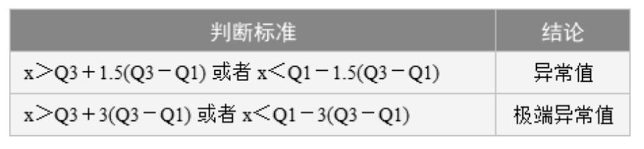

图12.56 异常值判断标准

**【例12.32】**通过箱形图判断异常值**（实例位置：资源包\\Code\\12\\32）**

通过箱形图查找客人总消费数据中存在的异常值，程序代码如下：

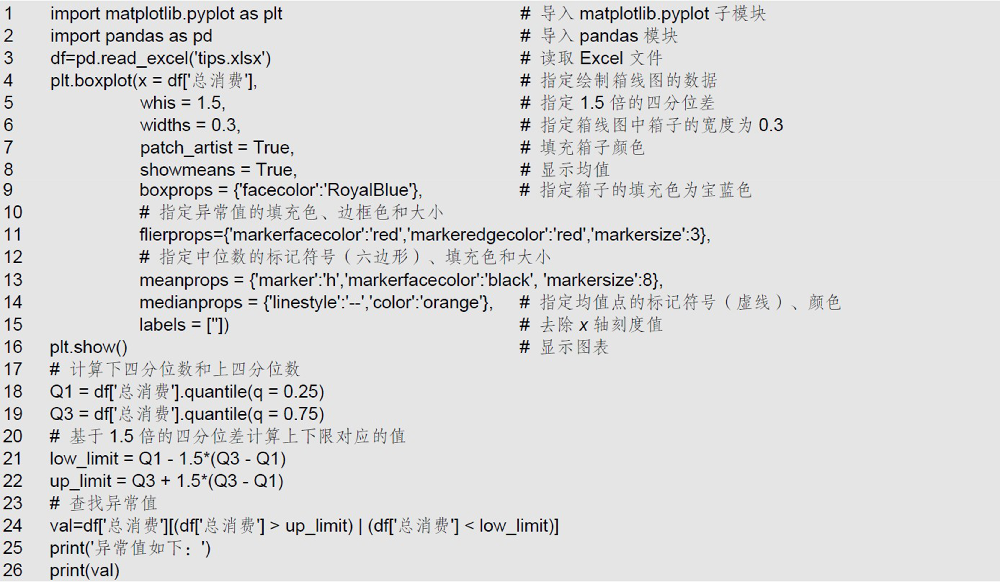

运行程序，输出结果如图12.57和图12.58所示。

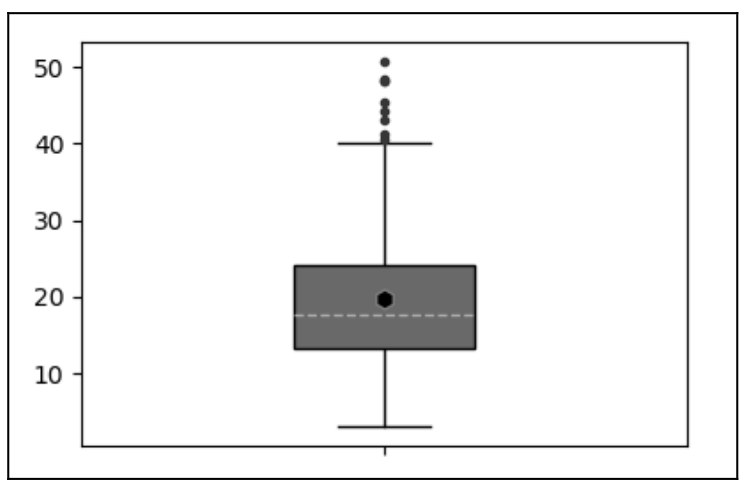

▲图12.57 箱形图

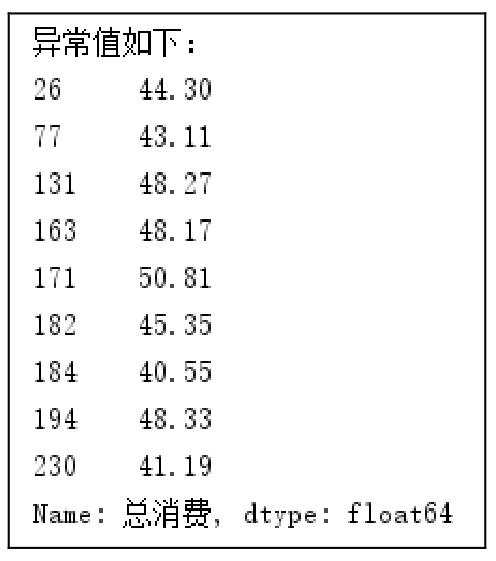

▲图12.58 异常值

### 12.3.8 绘制热力图—imshow()函数

热力图是通过密度函数进行可视化用于表示地图中点的密度的热图。它使人们能够独立于缩放因子而感知点的密度。热力图可以显示不可点击区域发生的事情。利用热力图可以看数据表里多个特征两两的相似度。例如，以特殊高亮的形式显示访客热衷的页面区域和访客所在的地理区域的图示。热力图在网页分析、业务数据分析等其他领域也有较为广泛的应用。

**【例12.33】**绘制简单热力图**（实例位置：资源包\\Code\\12\\33）**

热力图是数据分析的常用方法，通过色差、亮度来展示数据的差异，易于理解。下面绘制简单热力图，程序代码如下：

1  import matplotlib.pyplot as plt       # 导入matplotlib.pyplot子模块

2  X = \[\[1,2\],\[3,4\],\[5,6\],\[7,8\],\[9,10\]\]  # 绘图数据

3  plt.imshow(X)                         # 绘制热力图

4  plt.show()                          # 显示图表

运行程序，输出结果如图12.59所示。

上述代码中，plt.imshow（X）中传入的数组X=\[\[1,2\],\[3,4\],\[5,6\],\[7,8\],\[9,10\]\]是对应的颜色，按照矩阵X进行颜色分布，如左上角颜色为蓝色对应值为1，右下角颜色为黄色，对应值为10，具体如下：

\[1,2\] \[深蓝,蓝色\]

\[3,4\] \[蓝绿,深绿\]

\[5,6\] \[海藻绿,春绿色\]

\[7,8\] \[绿色,浅绿色\]

\[9,10\] \[草绿色,黄色\]

**【例12.34】**绘制热力图对比分析学生各科成绩**（实例位置：资源包\\Code\\12\\34）**

用学生成绩统计数据绘制热力图，对比每个学生各科成绩的高低。程序代码如下：

1   import pandas as pd                                  # 导入pandas模块

2   import matplotlib.pyplot as plt                      # 导入matplotlib.pyplot子模块

3   df = pd.read_excel('data4.xls',sheet_name='高二一班')  # 读取Excel文件名为“高二一班”的Sheet页中的数据

4   plt.rcParams\['font.sans-serif'\]=\['SimHei'\]           # 解决中文乱码

5   X = df.loc\[:,"语文":"生物"\].values                   # 抽取“语文”至“生物”的成绩

6   name=df\['姓名'\]                                      # 抽取“姓名”

7   plt.imshow(X)                                        # 绘制热力图

8   plt.xticks(range(0,6,1),\['语文','数学','英语','物理','化学','生物'\])   # 设置x轴刻度标签

9   plt.yticks(range(0,12,1),name)                       # 设置y轴刻度标签

10  plt.colorbar()                                     # 显示颜色条

11  plt.title('学生成绩统计热力图')                    # 设置图表标题

12  plt.show()                                         # 显示图表

运行程序，效果如图12.60所示。从图中得知：颜色越高亮成绩越高，反之则成绩越低。

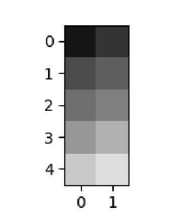

▲图12.59 简单热力图

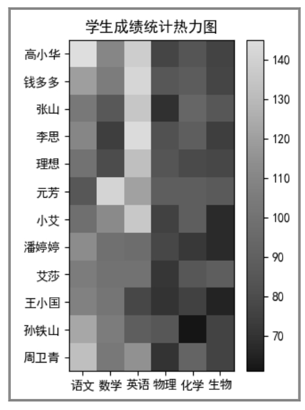

▲图12.60 学生成绩热力图

### 12.3.9 绘制雷达图—polar()函数

雷达图是一种常用的数据可视化与展示技术，可以把多个维度的数据在同一个图表上展示出来，使得各项指标一目了然。雷达图比较适合表现整体水平，以及反映各部分之间的关系。例如，一个老师想要了解同学是否偏科或偏科是否严重，就可以先将他的各科成绩绘制成雷达图，然后观察是否偏科。

绘制雷达图主要使用polar()函数，该函数用于在极坐标轴上绘制折线图，语法如下：

plt.polar(theta, r, \*\*kwargs)

参数说明： 

 theta：标量或标量序列，数据点的极径，必选参数。 

 r：标量或标量序列，数据点的极角，可选参数。 

 \*\*kwargs：可选参数，用于指定线的标签（用于自动图例）、线宽、标记面颜色等特性。

**【例12.35】**绘制雷达图分析男生女生各科成绩差异**（实例位置：资源包\\Code\\12\\35）**

男女生的思维方式有一定差异，体现在学习上，则为多数男生更偏向理科，多数女生更偏向文科。下面用数据说话，通过雷达图分析男生女生各科平均成绩的差异。程序代码如下：

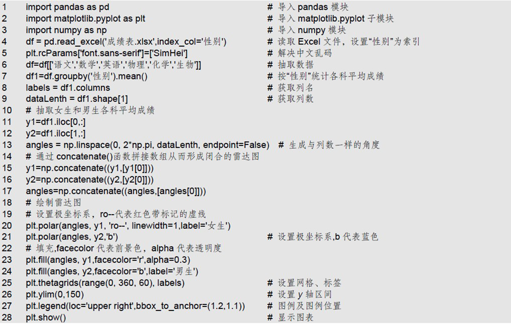

运行程序，效果如图12.61所示。

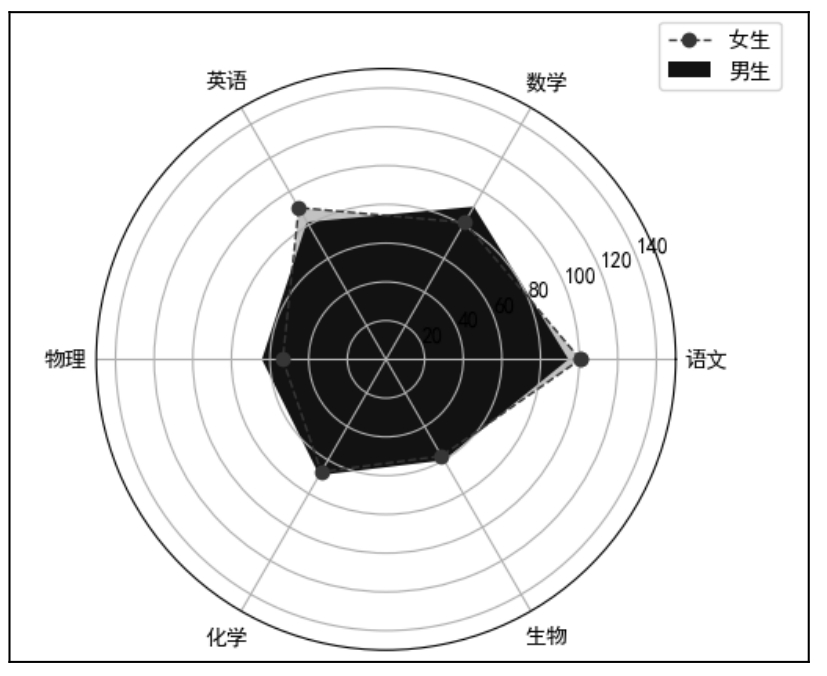

图12.61 雷达图分析男生女生各科成绩差异

### 12.3.10 绘制气泡图—scatter()函数

气泡图用于展示两个或两个以上变量之间的关系，与散点图类似，主要使用scatter()函数绘制。

**【例12.36】**绘制气泡图分析成交商品件数与访客数**（实例位置：资源包\\Code\\12\\36）**

通过气泡图观察成交商品件数与访客数的关系，程序代码如下：

1   import pandas as pd                             # 导入pandas模块

2   import matplotlib.pyplot as plt                 # 导入matplotlib.pyplot子模块

3   import numpy as np                              # 导入numpy模块

4   df=pd.read_excel('JD202301.xlsx') # 读取Excel文件

5   # *x,y*轴数据

6   x=df\['成交商品件数'\]

7   y=df\['访客数'\]

8   n=len(df)                                       # 数据行数

9   s=df\['成交商品件数'\]/5                          # 气泡大小

10  plt.rcParams\['font.sans-serif'\]=\['SimHei'\]      # 解决中文乱码

11  # 绘制气泡图

12  # c参数表示颜色

13  # cmap参数表示颜色地图，YlOrRd = yellow-orange-red

14  plt.scatter(x,y,s,c =np.random.rand(n),cmap='YlOrRd')

15  plt.show()                                      # 显示图表

运行程序，效果如图12.62所示。

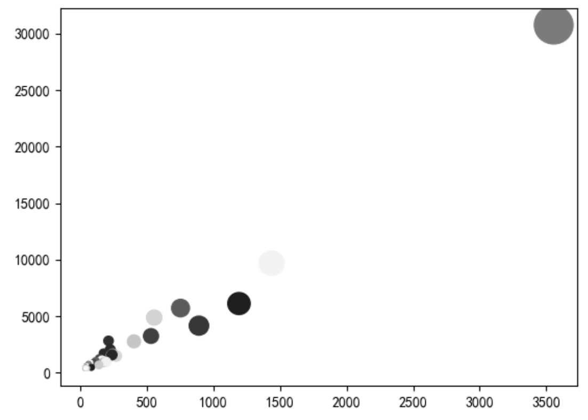

图12.62 气泡图分析成交商品件数与访客数

### 12.3.11 绘制棉棒图—stem()函数

棉棒图用于绘制离散有序的数据，即在每个*x*的位置绘制基准线到*y*的垂直线，并在*y*处绘制标记，主要使用stem()函数绘制，语法如下：

plt.stem(x,y,linefmt=None,markerfmt=None,basefmt=None,bottom=0,label=None, use_line_collection=True, orientation=

'vertical', data=None)

重要参数说明： 

 x：每根棉棒的*x*轴位置。 

 y：棉棒的长度。 

 linefmt：线条样式，其中'-'表示实线，'--'表示双画线，'-.'表示点画线，':'表示虚线。 

 markerfmt：棉棒末端的样式。 

 basefmt：指定基线的样式。 

 bottom：浮点型，默认值为0，基线的*y*轴或*x*轴位置（取决于方向）。 

 label：图例显示内容。

**【例12.37】**绘制简单的棉棒图**（实例位置：资源包\\Code\\12\\37）**

下面使用stem()函数绘制一款简单的棉棒图，程序代码如下：

1  import matplotlib.pyplot as plt      # 导入matplotlib.pyplot子模块

2  import numpy as np                   # 导入numpy模块

3  # 生成数据集

4  x = np.linspace(0,5,30)

5  y = np.random.randn(30)

6  # 绘制棉棒图，linefmt为线条样式，markerfmt为棉棒末端的样式，basefmt指定基线的样式

7  plt.stem(x, y,linefmt=':',markerfmt='o',basefmt='-')

8  plt.show()                           # 显示图表

运行程序，效果如图12.63所示。

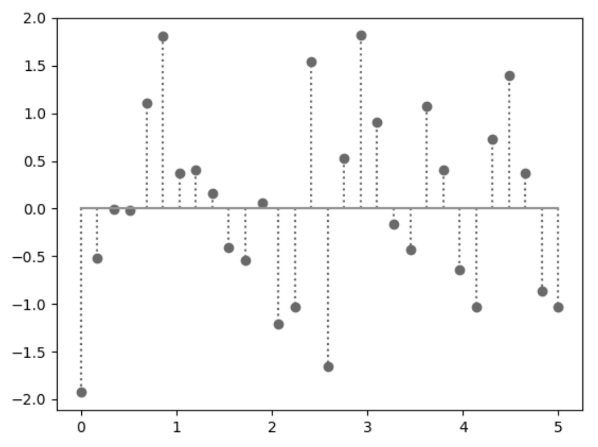

图12.63 简单的棉棒图

### 12.3.12 绘制误差棒图—errorbar()函数

误差棒图主要用于绘制带误差线的折线图，主要使用errorbar()函数绘制，语法如下：

plt.errorbar(x, y, yerr=None, xerr=None, fmt='', ecolor=None, elinewidth=None,  capsize=None, barsabove=False,

lolims=False, uplims=False, xlolims=False, xuplims=False, errorevery=1, capthick=None, \*, data=None, \*\*kwargs)

重要参数说明： 

 x：浮点型或数组，数据点的水平位置。 

 y：浮点型或数组，数据点的垂直位置。 

 yerr：浮点型或数组，指定*y*轴水平的误差。 

 xerr：浮点型或数组，指定*x*轴水平的误差。 

 fmt：字符型，数据点或数据线的格式，与plot()函数中指定点的颜色、形状和线条风格的缩写方式相同。 

 ecolor：误差条线的颜色。如果为None，则使用连接标记线的颜色。

**【例12.38】**绘制误差为1的误差棒图**（实例位置：资源包\\Code\\12\\38）**

下面使用errorbar()函数绘制*y*轴方向误差为1的误差棒图，程序代码如下：

1  import matplotlib.pyplot as plt      # 导入matplotlib.pyplot子模块

2  # 绘制误差棒图，yerr为*y*轴水平的误差，fmt标记形状与线条样式的缩写，ecolor误差棒的颜色

3  plt.errorbar(x=\[1,2,3,4,5\], y=\[2,4,6,8,10\], yerr=1, fmt='bo-', ecolor='r')

4  plt.show()                           # 显示图表

运行程序，效果如图12.64所示。

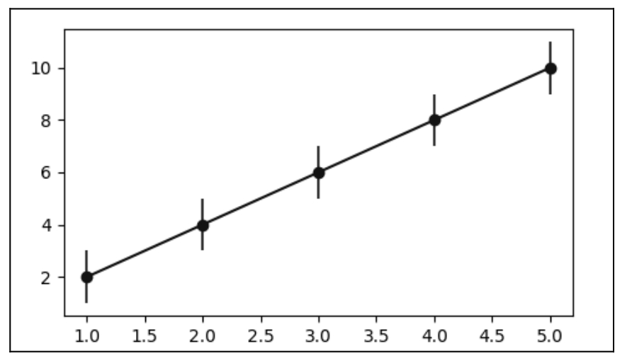

图12.64 误差棒图

## 12.4 小结

本章介绍了如何使用Matplotlib模块绘制一些常用的图表，主要从模块介绍与安装到各种类型图表的绘制，以及图表的常用设置，如图表标题、图例、文本标签、注释、网格线、参考线等。通过这些内容的学习，使读者全面掌握Matplotlib函数应用，为后面的进阶应用以及学习其他可视化工具奠定坚实的基础。

