# 13 Matplotlib模块进阶

相信通过上一章的学习，你已经掌握了Matplotlib的基础知识，学会了绘制各种类型的图表。本章是Matplotlib的进阶，包括图表的颜色设置、日期时间处理、次坐标轴图表、多个子图表绘制等内容。

本章知识架构如下。

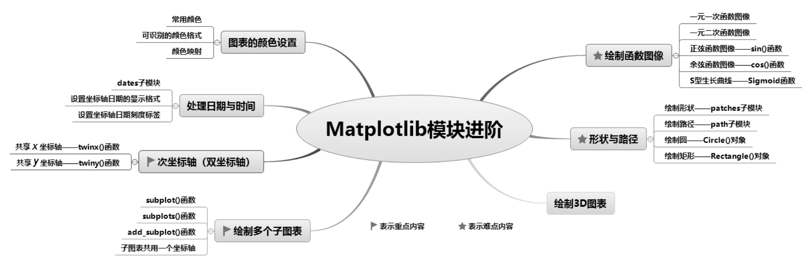

## 13.1 图表的颜色设置

数据可视化过程中，可以通过颜色区分数据、展示数据的变化等，从而增加用户对可视化图形的理解。Matplotlib支持使用各种颜色和颜色图来可视化信息。

### 13.1.1 常用颜色

Matplotlib常用颜色为蓝色（blue）、绿色（green）、红色（red）、蓝绿色（cyan）、洋红色（magenta）、黄色（yellow）、黑色（black）、白色（white），如表13.1所示。

表13.1 Matplotlib常用颜色

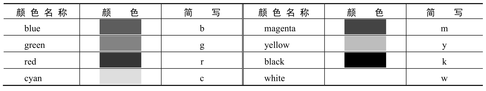

### 13.1.2 可识别的颜色格式

Matplotlib可以识别很多种颜色格式，具体如表13.2所示。

表13.2 颜色格式及举例说明

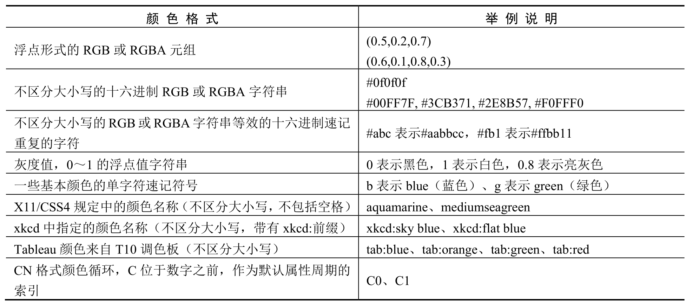

**【例13.1】**不同颜色格式的运用**（实例位置：资源包\\Code\\13\\01）**

下面通过具体的例子演示Matplotlib可识别的颜色格式的运用，程序代码如下：

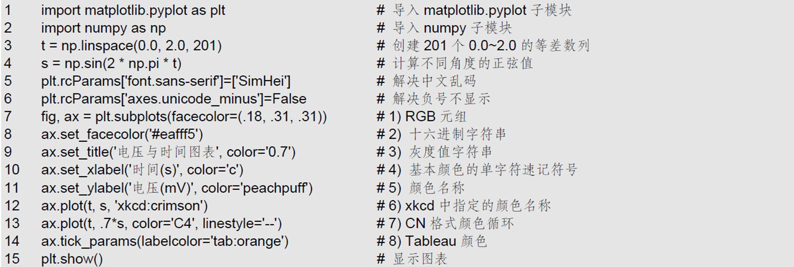

运行程序，效果如图13.1所示。

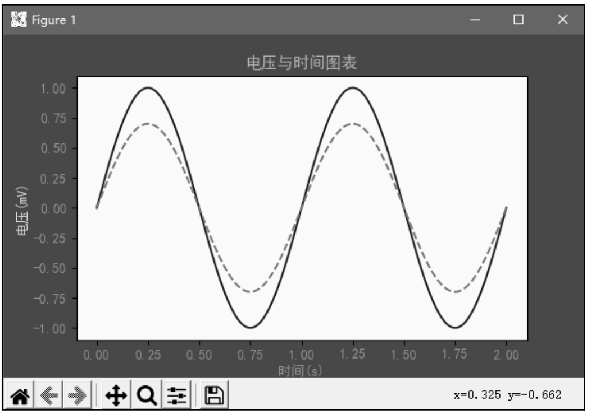

图13.1 不同颜色格式的运用

### 13.1.3 颜色映射

数据可视化过程中，有时我们希望图表的颜色与数据集中某个变量的值相关，颜色可以随着该变量值的变化而变化，以反映数据变化趋势、数据的聚集、分析者对数据的理解等信息。这时，我们就可以使用Matplotlib的颜色映射功能，即将数据映射到颜色。需要注意的是，Matplotlib颜色映射仅支持cmap参数和colormap参数的图表类型。下面介绍与Matplotlib颜色映射有关的颜色图。 

 连续化按顺序的颜色图：在两种色调之间近似平滑变化。通常是从低饱和度到高饱和度（如从白色到明亮的蓝色）。适用于大多数科学数据，可直观地看出数据从低到高的变化。 

 以中间值颜色命名。例如，第一个viridis（松石绿），如图13.2所示。 

 以色系名称命名，由低饱和度到高饱和度过渡。 

 以风格命名。 

 两端发散的颜色图：具有中间值（通常是浅色），并在高值和低值处平滑变化为两种不同的色调。适用于数据的中间值很大的情况（如0，正值和负值分别表示颜色图的不同颜色）。 

 循环颜色图：两种不同颜色在不饱和颜色的中间和开始／结束处相交的亮度变化，应用于端点周围的值，如相位角、风向或一天中的时间。 

 定性的颜色图：常为杂色，用于表示没有顺序或关系的数据信息。

**【例13.2】**颜色映射的运用**（实例位置：资源包\\Code\\13\\02）**

例如，一个简单的热力图，通过cmap参数设置颜色映射，使用连续化按顺序的颜色图，程序代码如下：

1  import matplotlib.pyplot as plt        # 导入matplotlib.pyplot子模块

2  X = \[\[1,2\],\[3,4\],\[5,6\],\[7,8\],\[9,10\]\]   # 创建*x*轴数据

3  plt.imshow(X,cmap='cool')            # 绘制热力图，设置cmap颜色映射为cool色图

4  plt.show()                           # 显示图表

运行程序，效果如图13.3所示。

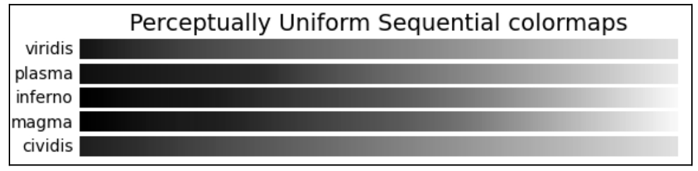

▲图13.2 以中间值颜色命名的颜色图

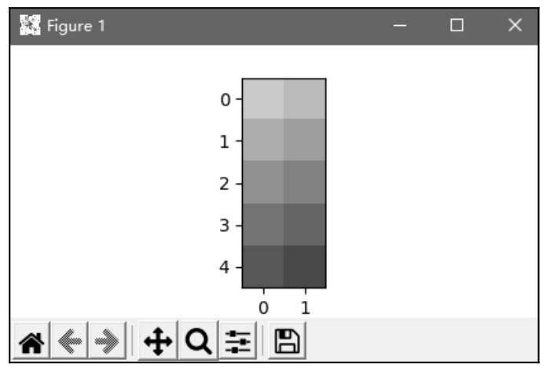

▲图13.3 颜色映射的运用

## 13.2 处理日期与时间

数据分析时经常会遇到日期类数据，图表中也经常需要在坐标轴上显示日期或将日期作为标签。本节就来介绍Matplotlib中是如何处理日期和时间的。

### 13.2.1 dates子模块

Matplotlib使用浮点数表示日期，浮点数指定从0001-01-01 UTC开始的天数，加上1。如0001-01-01，06:00是1.25，不是0.25。不支持小于1的值，即0001-01-01 UTC之前的日期。

Matplotlib的dates子模块提供了一些函数，可以在datetime对象和Matplotlib日期之间进行转换，如表13.3所示。

表13.3 dates子模块转换函数

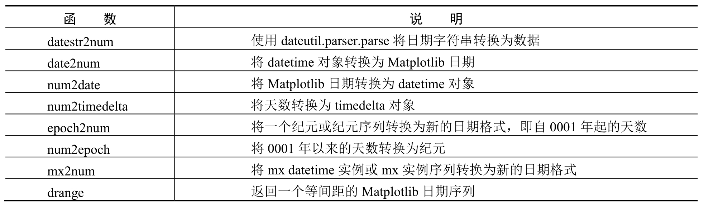

Matplotlib会自动管理刻度，尤其是刻度标签，导致可读性差、两个数据点之间的时间间隔不清晰、日期标签重叠等现象。dates子模块中提供了一些专门管理日期刻度的对象，如表13.4所示。

表13.4 dates子模块日期刻度对象

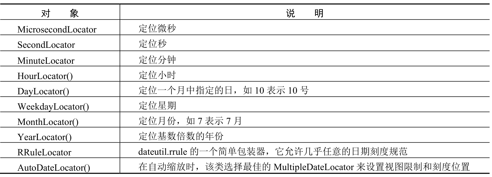

显示日期过程中，有时需要将日期格式化为需要的格式，dates子模块提供了一些关于格式化的对象，如表13.5所示。

表13.5 dates模块日期格式化对象

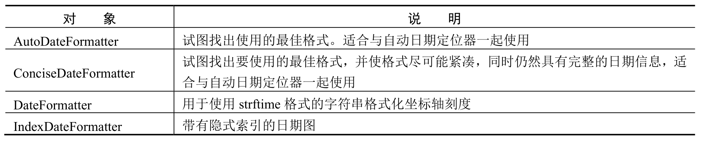

### 13.2.2 设置坐标轴日期的显示格式

绘制图表过程中，可能会出现由于日期显示过长而影响图表外观的情况。此时可以通过设置*x*轴日期的显示格式来解决这个问题，主要使用dates子模块的DateFormatter()对象，该对象可以将任意格式的日期按要求进行格式化。时间日期格式化符号如下： 

 %y：两位数的年份表示（00～99）。 

 %Y：四位数的年份表示（0000～9999）。 

 %m：月份（01～12）。 

 %d：月内的一天（0～31）。 

 %H：24小时制小时数（0～23）。 

 %I：12小时制小时数（01～12）。 

 %M：分钟数（00～59）。 

 %S：秒（00～59）。 

 %a：本地简化星期名称。 

 %A：本地完整星期名称。 

 %b：本地简化的月份名称。 

 %B：本地完整的月份名称。 

 %c：本地相应的日期表示和时间表示。 

 %j：年内的一天（001～366）。 

 %p：本地A.M.或P.M.的等价符。 

 %U：一年中的星期数（00～53）星期天为星期的开始。 

 %w：星期（0～6），星期天为星期的开始。 

 %W：一年中的星期数（00～53）星期一为星期的开始。 

 %x：本地相应的日期表示。 

 %X：本地相应的时间表示。 

 %Z：当前时区的名称。

**【例13.3】**设置日期显示格式**（实例位置：资源包\\Code\\13\\03）**

例如，日期为月、日、年的格式（如01/01/2023），下面使用DateFormatter()对象将其格式化为月日的格式（如01-01），程序代码如下：

1  import matplotlib.dates as mdates         # 导入matplotlib.dates子模块

2  import matplotlib.pyplot as plt           # 导入matplotlib.pyplot子模块

3  # 生成*xy*轴数据，*x*轴为日期字符串

4  x = \['01/02/2023', '01/03/2023', '01/04/2023'\]

5  y=\[12,22,45\]

6  print(x)

7  plt.gca().xaxis.set_major_formatter(mdates.DateFormatter('%m-%d'))  # 配置横坐标格式化日期

8  plt.plot(x,y)                             # 绘制图表

9  plt.show()                              # 显示图表

运行程序，效果如图13.4所示。

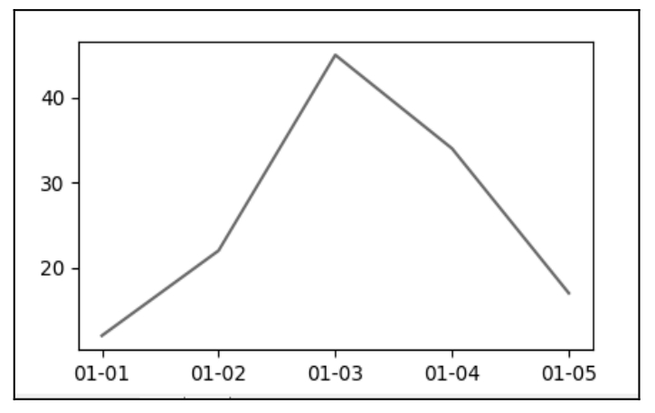

图13.4 设置日期显示格式

### 13.2.3 设置坐标轴日期刻度标签

dates子模块的日期刻度对象可以快速完成坐标轴日期刻度的设置，如YearLocator()以年为刻度、MonthLocator()以月为刻度、WeekdayLocator()以星期为刻度等。

**【例13.4】**设置*x*轴日期刻度为星期**（实例位置：资源包\\Code\\13\\04）**

在*x*轴上显示日期问题很多，尤其是用日期做标签时难以管理。如图13.5所示，*x*轴日期刻度自动显示为半个月一个刻度，这样不符合需求。下面将其设置为一个星期一个刻度，程序代码如下：

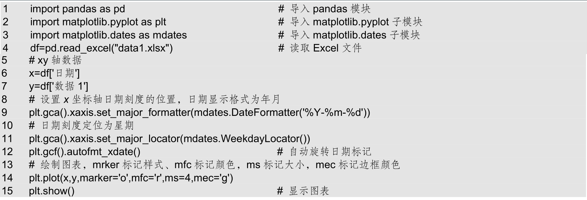

运行程序，效果如图13.6所示。

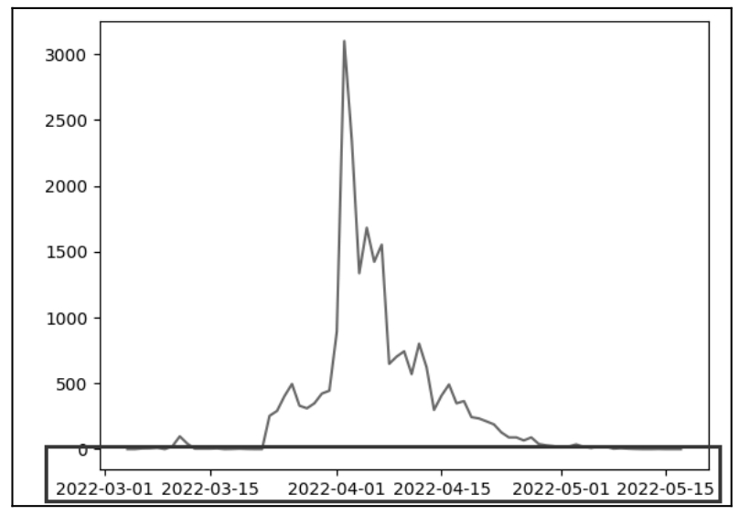

▲图13.5 原日期

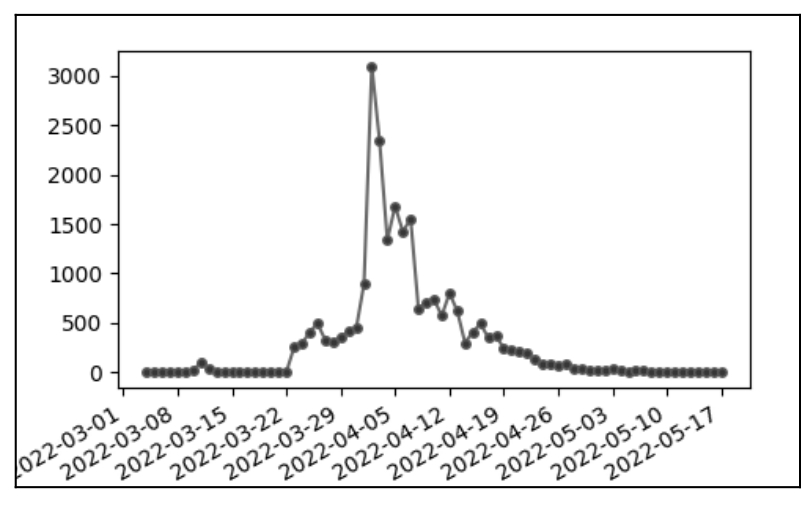

▲图13.6 设置*x*轴日期刻度为星期

## 13.3 次坐标轴（双坐标轴）

次坐标轴也被称为第二坐标轴或副坐标轴，用于在一个图表中显示两个不同坐标的图表。在Matplotlib模块中可以通过twinx()函数和twiny()函数实现。

### 13.3.1 共享*x*坐标轴—twinx()函数

twinx()函数用于创建并返回一个共享*x*轴、两个*y*轴且第二个*y*轴的刻度在子图的右侧显示，语法如下：

plt.twinx(ax=None)

参数说明： 

 ax：ax的值的类型为Axes()对象，默认值为None，即当前子图。 

 返回值：Axes()对象，即新创建的子图。

**【例13.5】**绘制双*y*轴图表**（实例位置：资源包\\Code\\13\\05）**

如果想看到商品每日销售数量和销售金额随日期的变化，可以使用双*y*轴图表。程序代码如下：

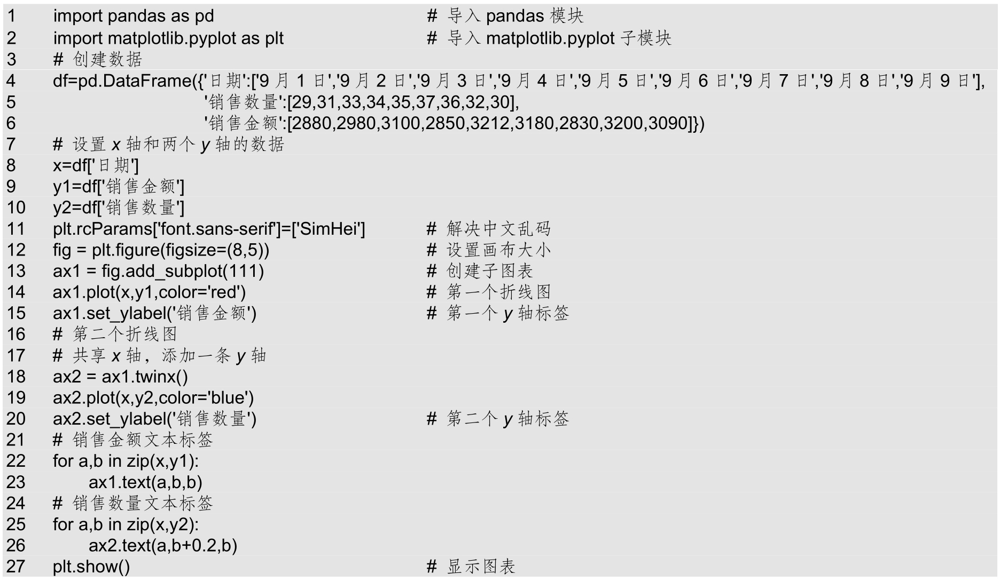

运行程序，效果如图13.7所示。

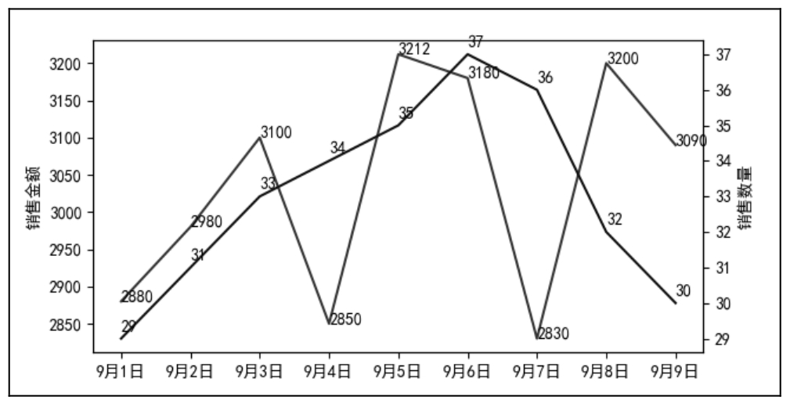

图13.7 双*y*轴图表

### 13.3.2 共享*y*坐标轴—twiny()函数

twiny()函数用于创建并返回一个共享*y*轴、两个*x*轴且第二个*x*轴的刻度在子图的顶部显示，语法如下：

plt.twiny(ax=None)

参数说明： 

 ax：ax的值的类型为Axes()对象，默认值为None，即当前子图。 

 返回值：Axes()对象，即新创建的子图。

**【例13.6】**绘制双*x*轴图表**（实例位置：资源包\\Code\\13\\06）**

下面绘制双*x*轴图表，程序代码如下：

1  import matplotlib.pylab as plt  # 导入matplotlib.pyplot子模块

2  # 创建*x*轴和*y*轴数据

3  x = \[1,2,3,4,5\]

4  y = \[10,20,30,40,50\]

5  fig = plt.figure()            # 创建画布

6  ax1 = fig.add_subplot(111)      # 创建子图

7  ax1.plot(x, y)                  # 绘制折线图

8  ax2 = ax1.twiny()             # 共享*y*轴添加一条*x*轴

9  plt.show()                    # 显示图表

运行程序，效果如图13.8所示。

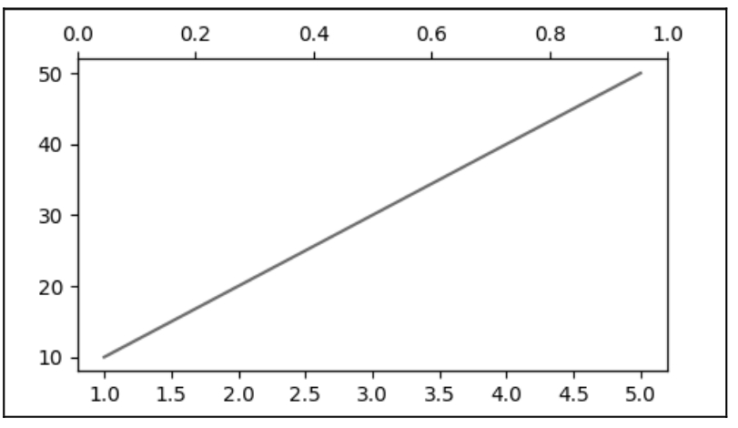

图13.8 双*x*轴图表

## 13.4 绘制多个子图表

Matplotlib可以实现在一张图上绘制多个子图表。Matplotlib提供了三种方法，一是subplot()函数，二是subplots()函数，三是add_subplot()函数，下面分别进行介绍。

### 13.4.1 subplot()函数

subplot()函数直接指定划分方式和位置，它可以将一个绘图区域划分为*n*个子图，每个subplot()函数只能绘制一个子图。语法如下：

plt.subplot(\*args,\*\*kwargs)

参数说明： 

 \*args：当传入的参数个数未知时使用\*args。 

 \*\*kwargs：关键字参数，其他可选参数。

例如，绘制一个2×3的区域，subplot（2,3,3），将画布分成2行3列在第3个区域中绘制，用坐标表示如下：

(1,1),(1,2),(1,3)

(2,1),(2,2),(2,3)

如果行列的值都小于10，那么可以把它们缩写为一个整数，例如，subplot（233）。

另外，subplot在指定的区域中创建一个轴对象时，如果新创建的轴和之前创建的轴重叠，那么之前的轴将被删除。

**【例13.7】**使用subplot()函数绘制多子图的空图表**（实例位置：资源包\\Code\\13\\07）**

绘制一个2×3包含6个子图的空图表，程序代码如下：

1  import matplotlib.pyplot as plt  # 导入matplotlib.pyplot子模块

2  # 绘制6个子图的空图表

3  plt.subplot(2,3,1)

4  plt.subplot(2,3,2)

5  plt.subplot(2,3,3)

6  plt.subplot(2,3,4)

7  plt.subplot(2,3,5)

8  plt.subplot(2,3,6)

9  plt.show()                       # 显示图表

运行程序，效果如图13.9所示。

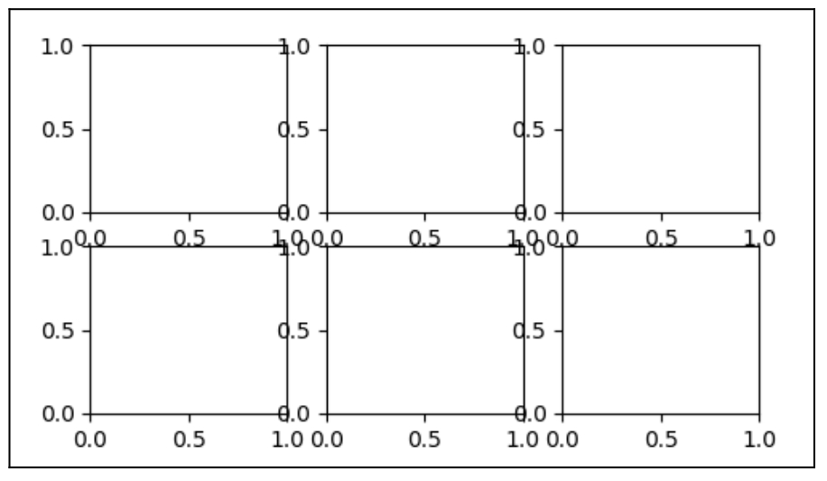

图13.9 6个子图的空图表

**【例13.8】**绘制包含多个子图的图表**（实例位置：资源包\\Code\\13\\08）**

将简单图表整合到一张图表中，程序代码如下：

1   import matplotlib.pyplot as plt      # 导入matplotlib.pyplot子模块

2   # 第1个子图表-折线图

3   plt.subplot(2,2,1)

4   plt.plot(\[1, 2, 3, 4,5\])

5   # 第2个子图表-散点图

6   plt.subplot(2,2,2)

7   plt.plot(\[1, 2, 3, 4,5\], \[2, 5, 8, 12,18\], 'ro')

8   # 第3个子图表-柱形图

9   plt.subplot(2,1,2)

10  x=\[1,2,3,4,5,6\]

11  height=\[10,20,30,40,50,60\]

12  plt.bar(x,height)

13  plt.show()                           # 显示图表

运行程序，效果如图13.10所示。上述举例，有两个关键点一定要掌握：

（1）每绘制一个子图表都要调用一次subplot()函数。

（2）绘图区域位置编号。

subplot()函数的前面两个参数指定的是一个画布被分割成的行数和列数，后面一个参数则指定的是当前绘制区域位置编号，编号规则是行优先。

例如，图13.10中有3个子图表，第1个子图表subplot（2,2,1），即将画布分成2行2列，在第1个子图中绘制折线图；第2个子图表subplot（2,2,2），即将画布分成2行2列，在第2个子图中绘制散点图；第3个子图表subplot（2,1,2），即将画布分成2行1列，由于第1行已经占用了，所以我们在第2行也就是第3个子图中绘制柱形图。示意图如图13.11所示。

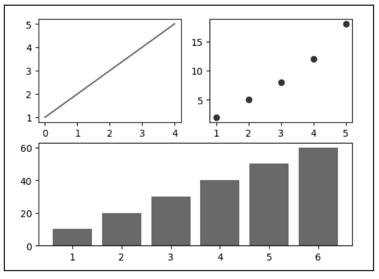

▲图13.10 多个子图

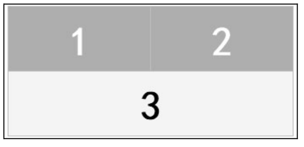

▲图13.11 多个子图示意图

### 13.4.2 subplots()函数

使用subpot()函数绘图时，每次都需要指定绘图区域，非常麻烦。subplots()函数则非常直接，它会事先把画布区域分割好。

subplots()函数用于创建画布和子图，语法如下：

matplotlib.pyplot.subplots(nrows,ncols,sharex,sharey,squeeze,subplot_kw,gridspec_kw,\*\*fig_kw)

参数说明： 

 nrows和ncols：表示将画布分割成几行几列。例如，nrows=2、ncols=2表示将画布分割为2行2列，起始值都为0。当调用画布中的坐标轴时，ax\[0，0\]表示调用左上角的，ax\[1，1\]表示调用右下角的。 

 sharex和sharey：布尔值，或者值为none、all、row、col，默认值为False。用于控制*x*轴或*y*轴之间的属性共享。具体参数值说明如下： 

 True或者all：表示*x*轴或*y*轴属性在所有子图中共享。 

 False或者none：每个子图的*x*轴或*y*轴都是独立的部分。 

 row：每个子图在一个*x*轴或*y*轴共享行（row）。 

 col：每个子图在一个*x*轴或*y*轴共享列（column）。 

 squeeze：布尔值，默认值为True。额外的维度从返回的Axes（轴）对象中挤出，对于n×1或1×n个子图，返回一个一维数组，对于n×m，n＞1和m＞1返回一个二维数组；如果值为False，则表示不进行挤压操作，返回一个元素为Axes实例的二维数组，即使它最终是1×1。 

 subplot_kw：字典类型，可选参数。把字典的关键字传递给add_subplot来创建每个子图。 

 gridspec_kw：字典类型，可选参数。把字典的关键字传递给GridSpec构造函数创建子图放在网格里（grid）。 

 \*\*fig_kw：把所有详细的关键字参数传给figure。

subplots()函数的返回值是一个元组，包括一个画布对象figure()和坐标轴对象axes()，其中axes()对象的数量等于nrows×ncols，且每个axes()对象都可以通过索引值访问。

**【例13.9】**使用subplots()函数绘制多子图的空图表**（实例位置：资源包\\13\\09）**

绘制一个2×3包含6个子图的空图表，使用subplots()函数只需3行代码。

1  import matplotlib.pyplot as plt  # 导入matplotlib.pyplot子模块

2  figure,axes=plt.subplots(2,3)    #  2行3列的子图

3  plt.show()                     # 显示图表

上述代码中，figure和axes是两个关键点。 

 figure：绘制图表的画布。 

 axes：坐标轴对象，可以理解为在figure（画布）上绘图坐标轴对象，它帮我们规划出了一个个科学作图的坐标轴系统。

通过图13.12很容易明白，灰色的是画布（figure），白色带坐标轴的是坐标轴对象（axes）。

**【例13.10】**使用subplots()函数绘制多子图图表**（实例位置：资源包\\Code\\13\\10）**

使用subplots()函数将前面所学的简单图表整合到一张图表中，效果如图13.13所示。

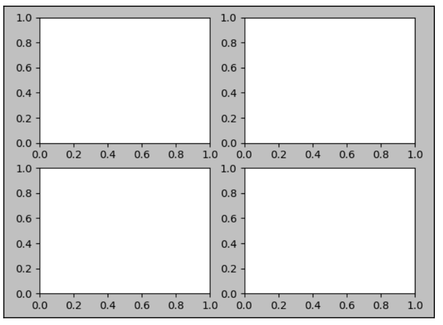

▲图13.12 坐标系统示意图

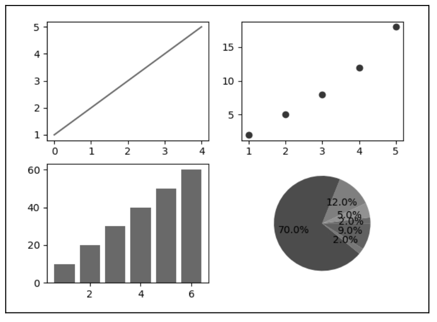

▲图13.13 多子图图表

程序代码如下：

1   import matplotlib.pyplot as plt                 # 导入matplotlib.pyplot子模块

2   figure,axes=plt.subplots(2,2)                   #  2行2列的子图

3   axes\[0,0\].plot(\[1, 2, 3, 4,5\])                # 第1个子图表-折线图

4   axes\[0,1\].plot(\[1, 2, 3, 4,5\], \[2, 5, 8, 12,18\], 'ro')  # 第2个子图表-散点图

5   # 第3个子图表-柱形图

6   x=\[1,2,3,4,5,6\]

7   height=\[10,20,30,40,50,60\]

8   axes\[1,0\].bar(x,height)

9   # 第4个子图表-饼形图

10  x = \[2,5,12,70,2,9\]

11  axes\[1,1\].pie(x,autopct='%1.1f%%')

12  plt.show()                                    # 显示图表

### 13.4.3 add\_subplot()函数

**【例13.11】**使用add_subplot()函数绘制多子图图表**（实例位置：资源包\\Code\\13\\11）**

add_subplot()函数也可以实现在一张图上绘制多个子图表，用法与subplot()函数基本相同。我们先来看一段代码：

1   import matplotlib.pyplot as plt    # 导入matplotlib.pyplot子模块

2   fig = plt.figure()               # 创建画布

3   # 绘制多子图图表

4   ax1 = fig.add_subplot(2,3,1)

5   ax2 = fig.add_subplot(2,3,2)

6   ax3 = fig.add_subplot(2,3,3)

7   ax4 = fig.add_subplot(2,3,4)

8   ax5 = fig.add_subplot(2,3,5)

9   ax6 = fig.add_subplot(2,3,6)

10  plt.show()                       # 显示图表

上述代码同样是绘制一个2×3包含6个子图的空图表。首先创建figure实例（画布），然后通过ax1 = fig.add_subplot（2,3,1）创建第1个子图表，返回Axes实例（坐标轴对象），第1个参数为行数，第2个参数为列数，第3个参数为子图表的位置。

以上我们用3种方法实现了在一张图上绘制多个子图表，3种方法各有所长。subplot()和add_subplot()函数比较灵活，定制化效果比较好，可以实现子图表在图中的各种布局（如一张图上3个图表或5个图表可以随意摆放），而subplots()函数则不那么灵活，但它可以用较少的代码实现绘制多个子图表。

### 13.4.4 子图表共用一个坐标轴

绘图过程中，经常会遇到几个子图共用一个坐标轴的情况，如共用横坐标轴（*x*坐标轴）或共用纵坐标轴（*y*坐标轴），此时可以通过sharex和sharey参数进行设置。

**【例13.12】**多个子图共用一个*y*轴**（实例位置：资源包\\Code\\13\\12）**

绘制两个子图，一个折线图，一个散点图，共用一个*y*轴。首先使用subplots()函数创建子图，然后设置sharey参数值为True，程序代码如下：

1   import matplotlib.pyplot as plt                   # 导入matplotlib.pyplot子模块

2   plt.rcParams\['font.sans-serif'\]=\['SimHei'\]        # 解决中文乱码

3   # 为*x*轴*y*轴指定数据

4   x=\[1, 2, 3, 4,5\]

5   y= \[2, 5, 8, 12,18\]

6   fig,ax=plt.subplots(nrows=1,ncols=2,sharey=True)  # 绘制1行两列的子图，sharey=True设置共用*y*轴

7   # 绘制第一个图(折线图)

8   ax1=ax\[0\]

9   ax1.plot(x,y)

10  ax1.set_title("折线图")

11  # 绘制第二个图(散点图)

12  ax2=ax\[1\]

13  ax2.scatter(x,y,color='red')

14  ax2.set_title("散点图")

15  plt.show()                                      # 显示图表

运行程序，效果如图13.14所示。

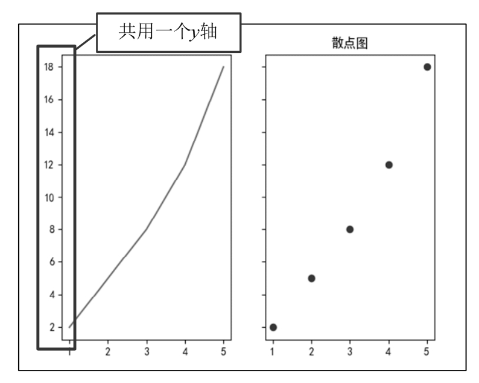

图13.14 多个子图共用一个*y*轴

## 13.5 绘制函数图像

在数学当中经常需要绘制函数图像，在Python中通过Matplotlib模块并结合NumPy数据计算模块也可以绘制出各种函数图像。

### 13.5.1 一元一次函数图像

形如y=kx+b（k≠0）的函数称为一元一次函数，而在平面直角坐标系中一元一次函数图像是一条直线。当k\>0时，函数是严格增函数；当k\<0时，函数是严格减函数。

**【例13.13】**绘制一元一次函数图像**（实例位置：资源包\\Code\\13\\13）**

首先使用NumPy创建*x*轴数据，然后根据一元一次函数计算*y*轴，最后绘制一元一次函数图像。程序代码如下：

1  import matplotlib.pyplot as plt  # 导入matplotlib.pyplot子模块

2  import numpy as np               # 导入numpy模块

3  x=np.arange(-5,5,0.1)            # 创建*x*轴数据

4  y=2\*x+1                          # 通过一元一次函数计算*y*轴数据

5  plt.plot(x,y)                    # 绘制图像

6  plt.show()                     # 显示图像

运行程序，效果如图13.15所示。

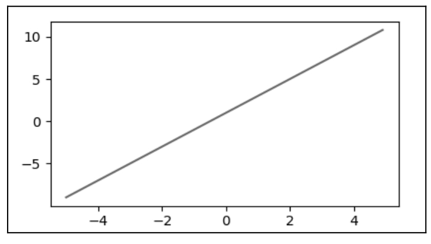

图13.15 一元一次函数图像

### 13.5.2 一元二次函数图像

一元二次函数的基本表示形式为y=ax²+bx+c（a≠0），该函数最高次必须为二次，它的图像是一条对称轴与*y*轴平行或重合于*y*轴的抛物线。

**【例13.14】**绘制一元二次函数图像**（实例位置：资源包\\Code\\13\\14）**

首先使用NumPy创建*x*轴数据，然后根据一元二次函数计算*y*轴，最后绘制一元二次函数图像。程序代码如下：

1  import matplotlib.pyplot as plt   # 导入matplotlib.pyplot子模块

2  import numpy as np                # 导入numpy模块

3  x=np.arange(-5,5,0.1)             # 创建*x*轴数据

4  y=x\*\*2+1                          # 通过一元二次函数计算*y*轴数据

5  plt.plot(x,y)                     # 绘制图像

6  plt.show()                      # 显示图像

运行程序，效果如图13.16所示。

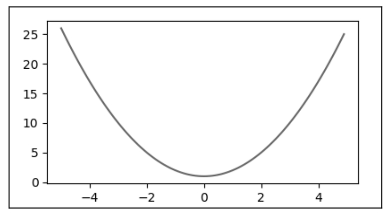

图13.16 一元二次函数图像

### 13.5.3 正弦函数图像—sin()函数

正弦函数和余弦函数都是三角函数，我们在高中数学中都曾经学过。Python中主要使用Matplotlib模块和NumPy模块中的sin()函数绘制正弦函数图像。

**【例13.15】**绘制正弦函数图像**（实例位置：资源包\\Code\\13\\15）**

首先使用sin()函数计算*y*轴，然后绘制图像。程序代码如下：

1  import numpy as np                          # 导入numpy模块

2  import matplotlib.pyplot as plt             # 导入matplotlib.pyplot子模块

3  x = np.arange(0, 360)                     #  *x*轴数据(0~360的数组，不包含360)

4  y = np.sin(x \* np.pi / 180)               # 通过sin()函数计算*y*轴

5  plt.rcParams\['font.sans-serif'\]=\['SimHei'\]  # 解决中文乱码

6  plt.rcParams\['axes.unicode_minus'\]=False    # 解决正常显示负号

7  plt.plot(x, y)                              # 绘制图像

8  plt.title("正弦函数图像")                 # 设置标题

9  plt.show()                                # 显示图像

运行程序，效果如图13.17所示。

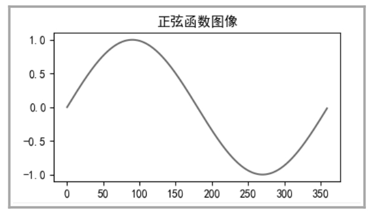

图13.17 正弦函数图像

### 13.5.4 余弦函数图像—cos()函数

Python中主要使用Matplotlib模块和NumPy模块的cos()函数来绘制余弦函数图像。

**【例13.16】**绘制余弦函数图像**（实例位置：资源包\\Code\\13\\16）**

首先使用NumPy的cos()函数计算*y*轴，然后绘制图像，程序代码如下：

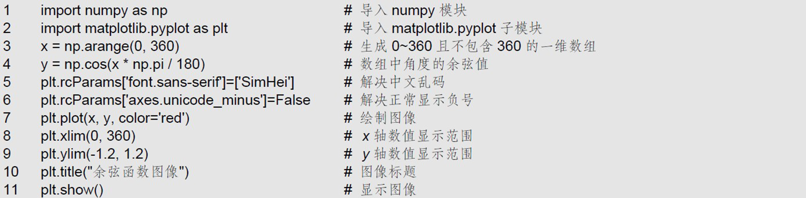

运行程序，效果如图13.18所示。

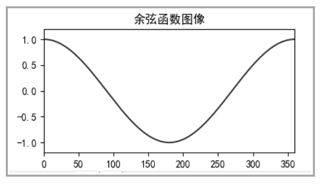

图13.18 余弦函数图像

### 13.5.5 S型生长曲线— Sigmoid()函数

在高中生物中，S型曲线和J型曲线是比较常见的。S型曲线指种群在一个有限环境中的增长过程，种群数量达到环境条件所允许的最大值（K值），有时会在最大容纳量上下保持相对稳定。下面我们来学习如何使用Matplotlib模块绘制S型生长曲线。

**【例13.17】**绘制高中生物S型曲线**（实例位置：资源包\\Code\\13\\17）**

绘制S型生长曲线，首先使用NumPy的linspace()函数生成等差数列表示*x*轴数据（即时间），使用指数函数exp()计算*y*轴数据（即种群数量），然后绘制图像。程序代码如下：

1  import numpy as np                     # 导入numpy模块

2  import matplotlib.pyplot as plt        # 导入matplotlib.pyplot子模块

3  x=np.linspace(-5,5,1000)             # 在-5到5之间生成1000个等差数列

4  y=\[1/(1+np.exp(-i)) for i in x\]    # 对生成的1000个数循环用Sigmoid函数求对应的y

5  plt.plot(x,y)                          # 绘制图像

6  plt.show()                           # 显示图表

运行程序，效果如图13.19所示。

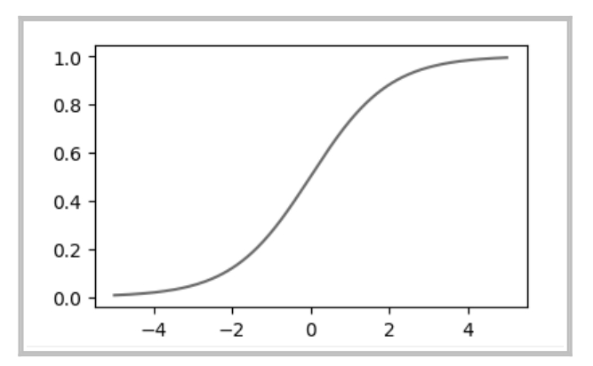

图13.19 S型曲线

## 13.6 形状与路径

除了绘制折线图、柱形图、饼形图、箱形图等，有时我们也需要绘制一些特殊的形状和路径，如绘制椭圆。当然，我们可以通过椭圆的函数表达式，选取一系列坐标值依次相连，但这样的绘制效率很低下，而且绘制出来的图表并不好看。本节介绍两个非常好用的子模块，通过它们可以快速绘制想要的图形。

### 13.6.1 绘制形状—patches子模块

形状指的是matplotlib.patches子模块里的一些对象，如圆、椭圆、矩形、多边形、弧、箭头等，也称为“块”。patches子模块框架图如图13.20所示。

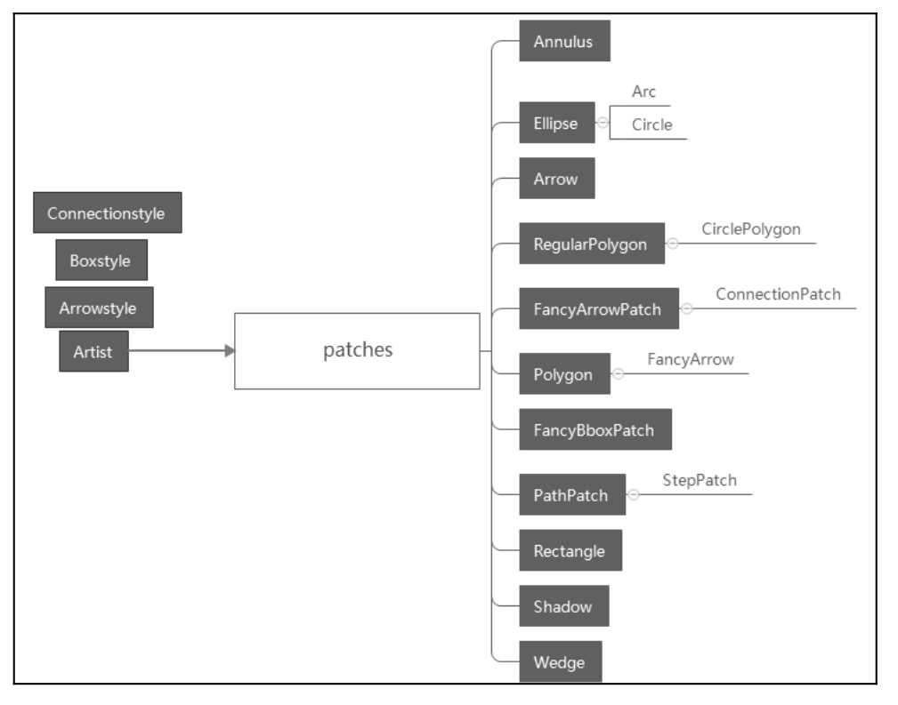

图13.20 patches子模块框架图

patches子模块中的对象语法及其说明如表13.6所示。

表13.6 patches子模块中对象语法及其说明

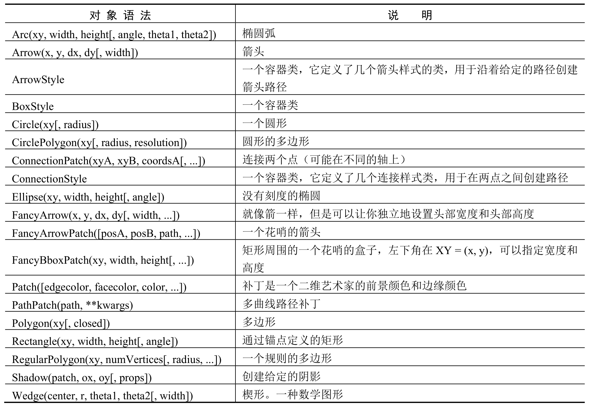

这些几何形状存在于Matplotlib的patches子模块中，若想画出想要的几何图形首先需要导入patches子模块，代码如下：

import matplotlib.patches as patches

绘制几何图形的具体步骤如下。

（1）导入patches子模块。

（2）利用图形模块产生一个几何图形。

（3）使用add_patch()函数在图像上添加“块”（也就是图形）。

### 13.6.2 绘制路径—path子模块

路径通常是一系列可能断开、可能关闭的线和曲线，这里指的是matplotlib.path子模块中Path对象的功能。例如，一条曲线、一个心形都是路径。绘制路径主要使用Path()对象，语法如下：

class matplotlib.path.Path(vertices,codes=None,\_interpolation_steps=1,closed=False,

readonly=False)

参数说明： 

 vertices：（N,2）维，float数组，指的是路径path所经过的关键点的一系列坐标（x,y）。 

 codes：N维数组，定点坐标类型，和vertices长度保持一致。指的是点与点之间到底是怎么连接的，是直线连接、曲线连接还是其他方式连接。codes的类型如下： 

 MOVETO：一个顶点，移动到指定的顶点。一般指的是“起始点”。 

 LINETO：从当前位置绘制直线到指定的顶点。 

 CURVE3：从当前位置（用指定控制点）画二次贝塞尔曲线到指定的端点（结束位置）。 

 CURVE4：从当前位置（用指定控制点）画三次贝塞尔曲线到指定的端点。 

 CLOSEPOLY：将线段绘制到当前折线的起始点。 

 STOP：整个路径末尾的标记，一个顶点，path的终点。 

 \_interpolation_steps：int型，可选参数。 

 closed：布尔值，可选参数，如果值为True，path将被当作封闭多边形。 

 readonly：布尔值，可选参数，表示是否不可变。

path路径模块所涉及的内容比较多，这里只介绍简单的应用。

**【例13.18】**使用path子模块绘制矩形路径**（实例位置：资源包\\Code\\13\\18）**

绘制一个简单的矩形路径，程序代码如下：

1   import matplotlib.pyplot as plt                           # 导入matplotlib.pyplot子模块

2   from matplotlib.path import Path                          # 导入matplotlib.path子模块

3   import matplotlib.patches as patches                      # 导入matplotlib.patches子模块

4   verts = \[

5          (0., 0.),                                        # 矩形左下角的坐标(left,bottom)

6          (0., 1.),                                        # 矩形左上角的坐标(left,top)

7          (1., 1.),                                        # 矩形右上角的坐标(right,top)

8          (1., 0.),                                        # 矩形右下角的坐标(right, bottom)

9          (0., 0.)\]                                        # 封闭到起点

10  codes = \[Path.MOVETO,

11          Path.LINETO,

12          Path.LINETO,

13          Path.LINETO,

14          Path.CLOSEPOLY\]

15  path = Path(verts, codes)                               # 创建一个路径Path()对象

16  # 创建画图对象以及创建子图对象

17  fig = plt.figure()

18  ax = fig.add_subplot(111)

19  patch = patches.PathPatch(path, facecolor='red', lw=2)  # 创建一个patch

20  ax.add_patch(patch)                                     # 将创建的patch添加到Axes()对象中

21  ax.axis(\[-1,2,-1,2\])                                      # 设置*x*轴*y*轴的坐标轴范围

22  plt.show()                                              # 显示图形

运行程序，效果如图13.21所示。

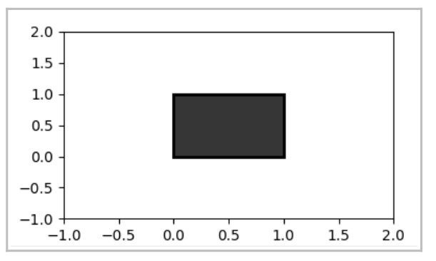

图13.21 绘制矩形路径

### 13.6.3 绘制圆—Circle()对象

绘制圆主要使用matplotlib.patches中的Circle()对象，语法如下：

class matplotlib.patches.Circle(xy, radius=5, \*\*kwargs)

在Matplotlib中绘制圆，xy=（x,y）为圆心，radius为半径，默认值为5。其他有效关键字参数如表13.7所示。

表13.7 Circle()对象关键字参数

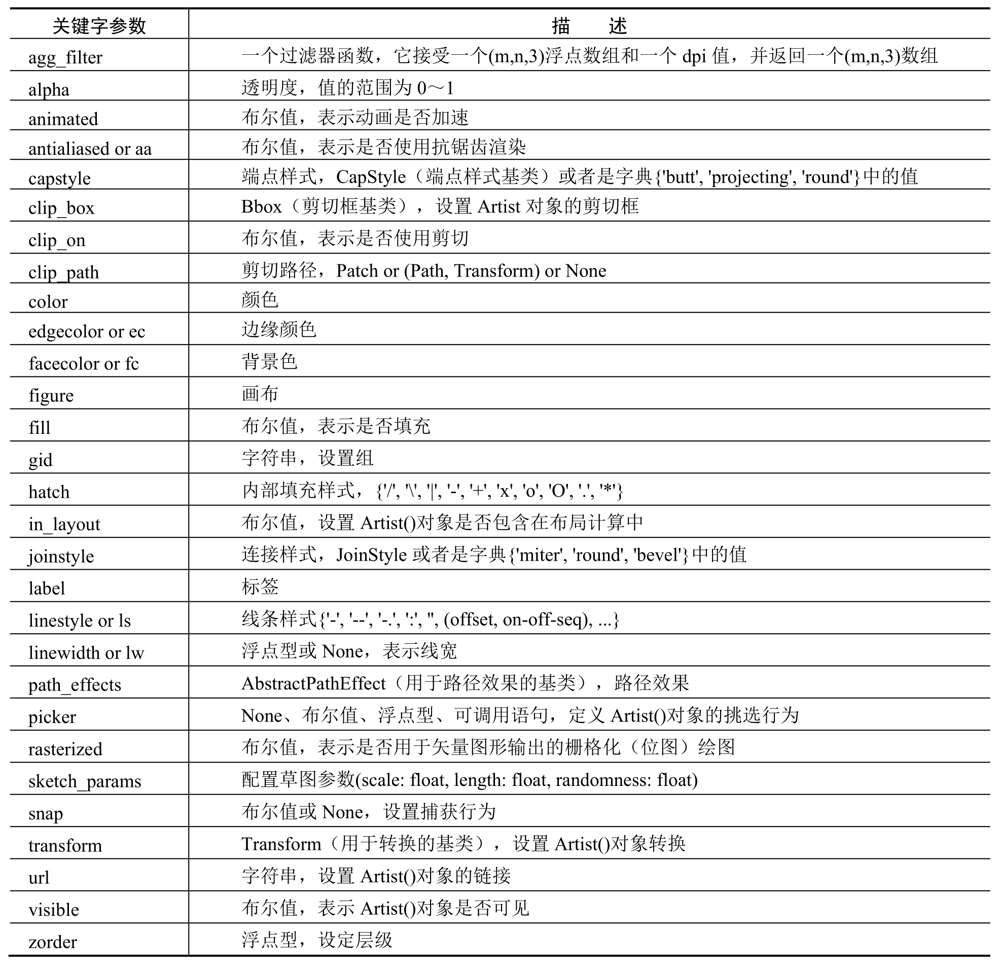

**【例13.19】**绘制圆形**（实例位置：资源包\\Code\\13\\19）**

使用内置的几何形状Circle()绘制圆形，程序代码如下：

1  import matplotlib.pyplot as plt             # 导入matplotlib.pyplot子模块

2  import matplotlib.patches as patches        # 导入matplotlib.patches子模块

3  # 使用subplots()函数创建子图，返回值是一个元组，包括一个图形对象和axes对象

4  fig, ax= plt.subplots()

5  circle = patches.Circle((0.5, 0.5), 0.25, alpha=0.5, color='green')   # 使用patches.Circle模块绘制圆

6  ax.add_patch(circle)                      # 使用add_patch()函数在axes对象中添加圆

7  plt.show()                                # 显示图形

运行程序，效果如图13.22所示。

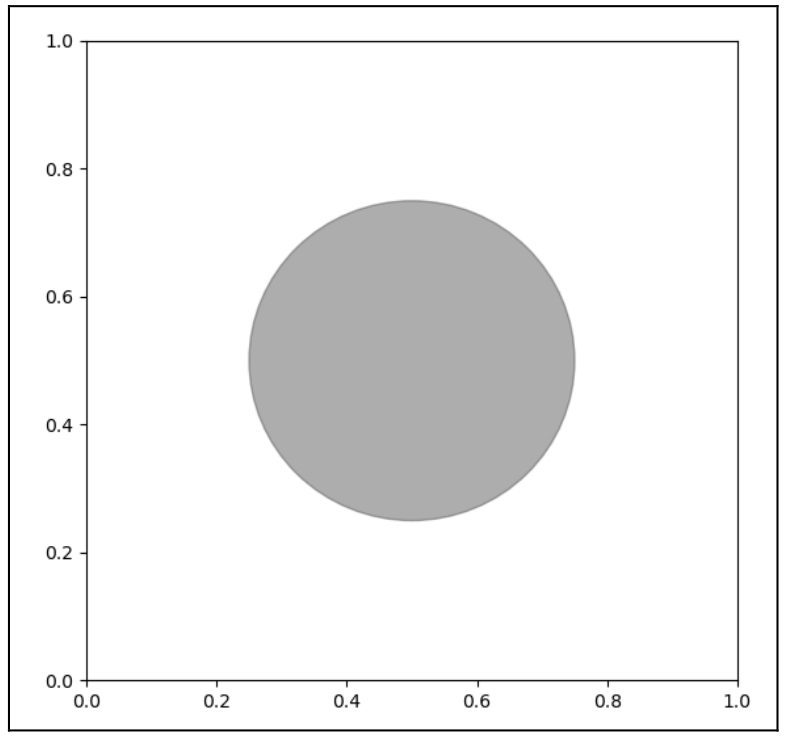

图13.22 绘制圆形

### 13.6.4 绘制矩形—Rectangle()对象

绘制矩形主要使用matplotlib.patches中的Rectangle()对象，该对象用于绘制一个由定位点xy及其宽度和高度定义的矩形。语法如下：

class matplotlib.patches.Rectangle(xy, width, height, angle=0.0, \*\*kwargs)

参数说明： 

 xy：浮点型，xy=（x,y），矩形在*x*方向从xy\[0\]扩展到xy\[0\] +宽度，在*y*方向从xy\[1\]扩展到xy\[1\] +高度。 

 width：浮点型，矩形的宽度。 

 height：浮点型，矩形的高度。 

 angle：浮点型，默认值为0.0，绕xy逆时针旋转的角度。

### 说明

其他关键字参数可以参考Circle()对象。

**【例13.20】**使用Rectangle()对象绘制矩形**（实例位置：资源包\\Code\\13\\20）**

本实例将使用内置的几何形状Rectangle()对象绘制矩形，程序代码如下：

1  import matplotlib.pyplot as plt                               # 导入matplotlib.pyplot子模块

2  import matplotlib.patches as patches                          # 导入matplotlib.patches子模块

3  # 使用subplots()函数创建子图，返回值是一个元组，包括一个图形对象和Axes()对象

4  fig, ax= plt.subplots()

5  ax.axis(\[0,5,0,5\])                                          # 使用axis()函数设置*x*轴和*y*轴的坐标轴范围

6  rectangle = patches.Rectangle((1, 1),2,3,color='green')   # 使用patches.Rectangle()对象绘制矩形

7  ax.add_patch(rectangle)                                     # 使用add_patch()函数在Axes()对象中添加矩形

8  plt.show()                                                  # 显示图形

运行程序，效果如图13.23所示。

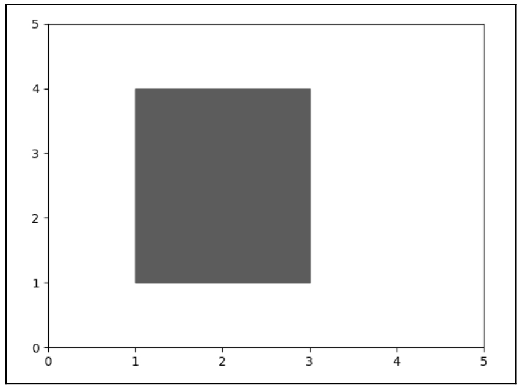

图13.23 绘制矩形

## 13.7 绘制3D图表

3D图表有立体感，也比较美观。下面介绍两种3D图表：三维柱形图和三维曲面图。

绘制3D图表依旧使用Matplotlib模块，但需要设置projection参数为3d，具体代码如下：

fig.add_subplot(projection='3d')

**【例13.21】**绘制3D柱形图**（实例位置：资源包\\Code\\13\\21）**

绘制3D柱形图，程序代码如下：

1   import matplotlib.pyplot as plt              # 导入matplotlib.pyplot子模块

2   import numpy as np                           # 导入numpy模块

3   fig = plt.figure()                         # 创建画布

4   zs = \[1, 5, 10, 15, 20\]                      # 创建*z*轴数据

5   ax = fig.add_subplot(projection='3d')      # 添加3D图表

6   # 绘制3D柱形图

7   for z in zs:

8       x = np.arange(0, 10)

9       y = np.random.randint(0, 30, size=10)

10      ax.bar(x, y, zs=z, zdir='x', color=\['r', 'green', 'yellow', 'c'\])

11  plt.show()                                 # 显示图表

运行程序，输出结果如图13.24所示。

**【例13.22】**绘制3D曲面图**（实例位置：资源包\\Code\\13\\22）**

绘制3D曲面图，程序代码如下：

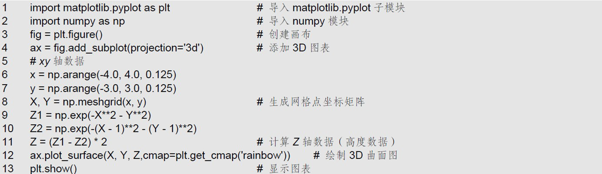

运行程序，输出结果如图13.25所示。

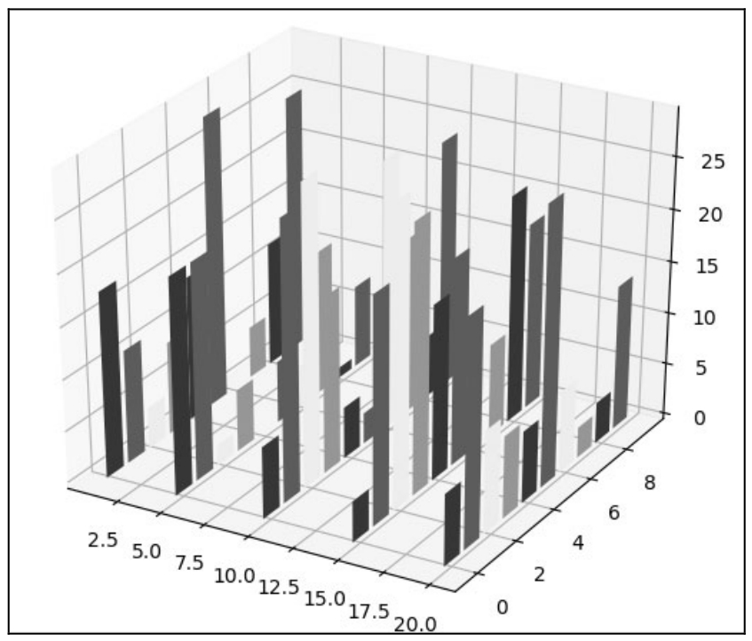

▲图13.24 3D柱形图

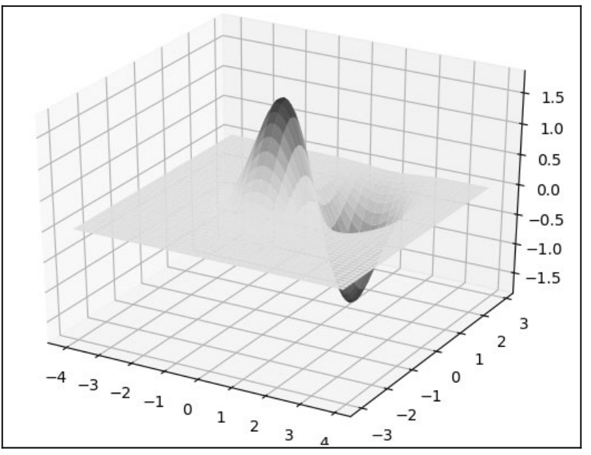

▲图13.25 3D曲面图

## 13.8 小结

本章内容是Matplotlib模块的进阶，包括许多不经常使用的知识和实例。本章应重点学习如何绘制多子图和次坐标轴的应用，这两部分内容在实际工作中还是非常实用的。其他内容可以有选择性地学习，或者作为查阅资料。

