# 14 Seaborn图表

Seaborn模块与Matplotlib模块相似，也是Python数据可视化分析的第三方模块。由于Seaborn在Matplotlib的基础上进行了更高级的API封装，所以Seaborn可以通过一个高级界面来绘制更加有吸引力的统计图形。

本章知识架构如下。

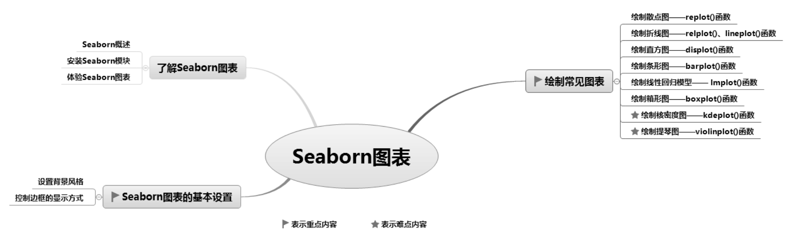

## 14.1 了解Seaborn图表

Seaborn是基于Matplotlib的Python高级可视化效果模块，偏向于统计图表，因此针对的主要是数据挖掘和机器学习中的变量特征选取。相比Matplotlib，它的优点是语法更简单，绘制图表不需要花很多功夫去修饰，它的缺点是绘图方式比较局限，不够灵活。

### 14.1.1 Seaborn概述

Seaborn在Matplotlib基础上进行了更高级的API封装，使得绘图更加容易。Seaborn主要包括以下功能： 

 计算多变量间关系的面向数据集接口。 

 可视化类别变量的观测与统计。 

 可视化单变量或多变量分布并与其子数据集比较。 

 控制线性回归的不同因变量并进行参数估计与绘图。 

 对复杂数据进行整体结构可视化。 

 对多表统计图的制作高度抽象并简化可视化过程。 

 提供多个主题渲染Matplotlib图表的样式。 

 提供调色板工具，可生动再现数据。

Seaborn是基于Matplotlib的图形可视化Python包，它提供了一种高度交互式的界面，便于用户绘制各种有吸引力的统计图表，如图14.1所示。

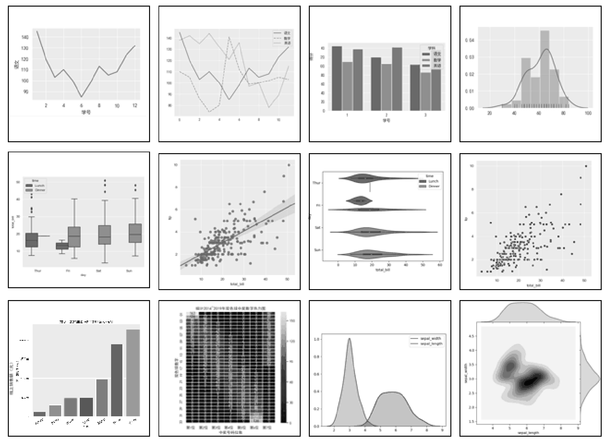

图14.1 Seaborn统计图表

### 14.1.2 安装Seaborn模块

安装Seaborn模块可以使用pip工具，安装命令如下：

pip install seaborn

也可以在PyCharm开发环境中安装。需要注意的是，如果安装时报错，可能是因为读者没有安装Scipy模块。Seaborn依赖Scipy，所以应首先安装Scipy。

### 14.1.3 体验Seaborn图表

**【例14.1】**绘制简单的柱形图**（实例位置：资源包\\Code\\14\\01）**

先来绘制一款简单的柱形图，程序代码如下：

1  import seaborn as sns

2  import matplotlib.pyplot as plt

3  sns.set_style('darkgrid')      # 设置图表风格

4  plt.figure(figsize=(4,3))    # 创建画布

5  x=\[1,2,3,4,5\]                    #  *x*轴数据

6  y=\[10,20,30,40,50\]               #  *y*轴数据

7  sns.barplot(x=x,y=y)             # 绘制柱形图

8  plt.show()                     # 显示图表

（1）首先导入Seaborn和Matplotlib模块，由于Seaborn模块是Matplotlib模块的补充，所以绘制图表前必须引用Matplotlib模块。

（2）设置Seaborn的背景风格为darkgrid。

（3）指定*x*轴、*y*轴数据。

（4）使用barplot()函数绘制柱形图。

运行程序，输出效果如图14.2所示。可见，Seaborn默认的灰色网格底色比Matplotlib更加柔和。

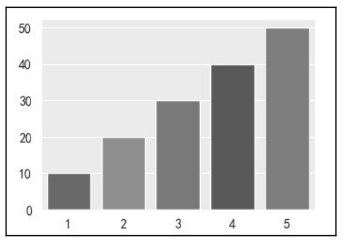

图14.2 简单柱形图

## 14.2 Seaborn图表的基本设置

### 14.2.1 设置背景风格

使用axes_style()和set_style()函数可以设置Seaborn背景风格。Seaborn有5个主题，可适用于不同的应用场景和人群偏好。 

 darkgrid：灰色网格（默认值）。 

 whitegrid：白色网格。 

 dark：灰色背景。 

 white：白色背景。 

 ticks：四周带刻度线的白色背景。

网格有助于查找图表中的定量信息，灰色网格主题中的白线能避免影响数据的表现，白色网格主题则更适合表达“重数据元素”。

### 14.2.2 控制边框的显示方式

控制边框的显示方式，主要使用despine()函数，具体用法如下。

（1）移除顶部和右边边框，代码如下：

sns.despine()

（2）使两坐标轴离开一段距离，代码如下：

sns.despine(offset=10, trim=True)

（3）移除左边边框，与set_style()的白色网格配合使用效果更佳。代码如下：

sns.set_style("whitegrid")

sns.despine(left=True)

（4）移除指定边框，值设置为True即可。代码如下：

sns.despine(fig=None, ax=None, top=True, right=True, left=True, bottom=False, offset=None, trim=False)

设置显示方式后的效果如图14.3所示。

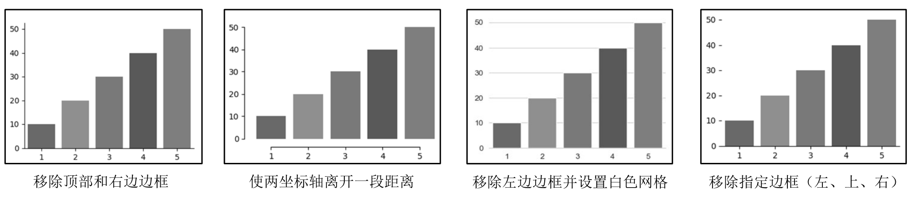

图14.3 设置显示方式后的效果

## 14.3 绘制常见图表

### 14.3.1 绘制散点图—replot()函数

Seaborn绘制散点图主要使用replot()函数，相关语法可参考14.3.2节“绘制折线图”相关说明。

**【例14.2】**绘制散点图分析“小费”**（实例位置：资源包\\Code\\14\\02）**

下面通过Seaborn提供的内置数据集tips（小费数据集）绘制散点图，程序代码如下：

1  import matplotlib.pyplot as plt

2  import seaborn as sns

3  sns.set_style('darkgrid')                                  # 灰色网格

4  # 加载内置数据集tips(小费数据集)，data_home参数表示数据集路径

5  tips=sns.load_dataset(name='tips',data_home='seaborn-data-master')

6  sns.relplot(x='total_bill',y='tip',data=tips,color='r')    # 绘制散点图

7  plt.show()                                                 # 显示图表

运行程序，输出结果如图14.4所示。

### 说明

在加载内置数据集tips数据时，需要在线访问网络资源，如果当前网络无法在线获取数据，则可以使用资源包中的离线数据tips.csv。

**技巧**

上述代码使用了内置数据集tips，该数据集通过tips.head()显示部分数据。tips数据结构如图14.5所示，各字段的说明如下。

total_bill：表示总消费。

tip：表示小费。

sex：表示性别。

smoker：表示是否吸烟。

day：表示周几。

time：表示用餐类型。如早餐（breakfast）、午餐（lunch）、晚餐（dinner）。

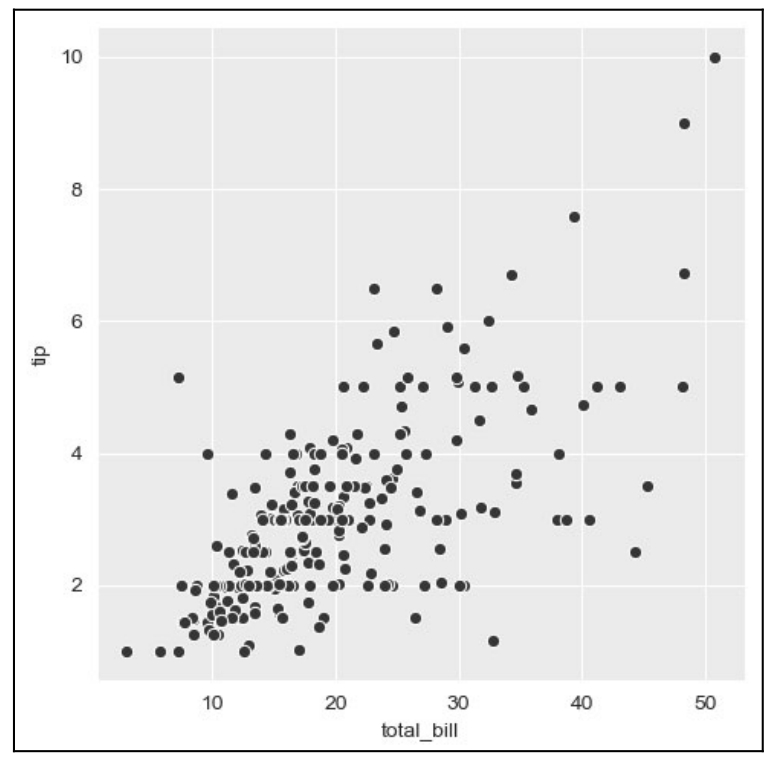

▲图14.4 散点图

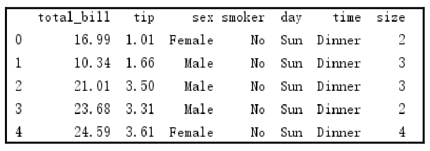

▲图14.5 tips部分数据

### 14.3.2 绘制折线图—relplot()、lineplot()函数

在Seaborn中绘制折线图有两种方法：一是在relplot()函数中通过设置kind参数为line；二是使用lineplot()函数直接绘制折线图。

**1. 使用relplot()函数**

**【例14.3】**绘制学生语文成绩折线图1**（实例位置：资源包\\Code\\14\\03）**

使用relplot()函数绘制学生语文成绩折线图，程序代码如下：

1  import pandas as pd

2  import matplotlib.pyplot as plt

3  import seaborn as sns

4  sns.set_style('darkgrid')                              # 灰色网格

5  plt.rcParams\['font.sans-serif'\]=\['SimHei'\]               # 解决中文乱码

6  df1=pd.read_excel('data5.xls')                         # 读取Excel文件

7  sns.relplot(x="学号", y="语文", kind="line", data=df1) # 绘制折线图

8  plt.show()                                             # 显示图表

运行程序，输出结果如图14.6所示。

**2. 使用lineplot()函数**

**【例14.4】**绘制学生语文成绩折线图2**（实例位置：资源包\\Code\\14\\04）**

使用lineplot()函数绘制学生语文成绩折线图，程序代码如下：

1  import pandas as pd

2  import matplotlib.pyplot as plt

3  import seaborn as sns

4  sns.set_style('darkgrid')                   # 灰色网格

5  plt.rcParams\['font.sans-serif'\]=\['SimHei'\]    # 解决中文乱码

6  df1=pd.read_excel('data5.xls')              # 读取Excel文件

7  sns.lineplot(x="学号", y="语文",data=df1)   # 绘制折线图

8  plt.show()                                  # 显示图表

**【例14.5】**绘制多折线图分析学生各科成绩**（实例位置：资源包\\Code\\14\\05）**

接下来，我们绘制多折线图，关键代码如下：

1  dfs=\[df1\['语文'\],df1\['数学'\],df1\['英语'\]\]

2  sns.lineplot(data=dfs)

运行程序，输出结果如图14.7所示。

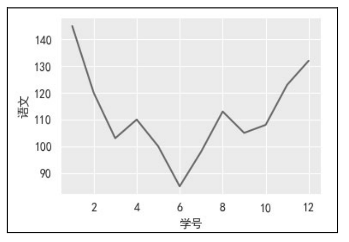

▲图14.6 折线图

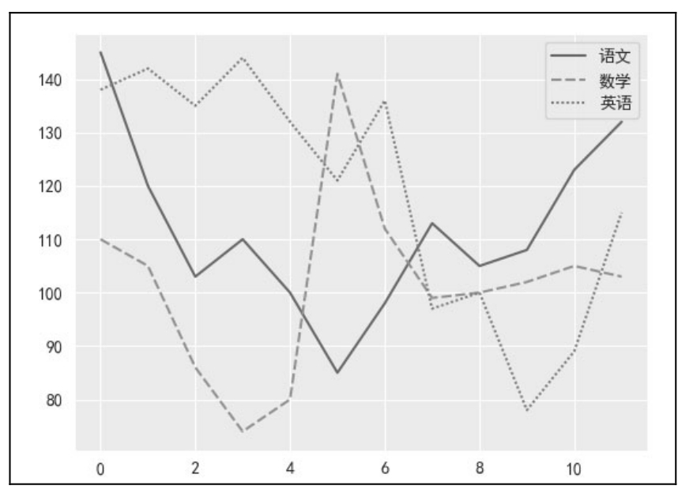

▲图14.7 多折线图

### 14.3.3 绘制直方图—displot()函数

Seaborn绘制直方图主要使用displot()函数，语法如下：

sns.distplot(data,bins=None,hist=True,kde=True,rug=False,fit=None,color=None,axlabel=None,ax=None)

常用参数说明： 

 data：数据。 

 bins：设置矩形图数量。 

 hist：是否显示条形图。 

 kde：是否显示核密度估计图，默认值为True，即显示核密度估计图。 

 rug：是否在*x*轴上显示观测的小细条（边际毛毯）。 

 fit：拟合的参数分布图形。

**【例14.6】**绘制简单直方图**（实例位置：资源包\\Code\\14\\06）**

下面绘制一个简单的直方图，程序代码如下：

1  import pandas as pd

2  import matplotlib.pyplot as plt

3  import seaborn as sns

4  sns.set_style('darkgrid')                 # 灰色网格

5  plt.rcParams\['font.sans-serif'\]=\['SimHei'\]  # 解决中文乱码

6  df1=pd.read_excel('data2.xls')            # 读取Excel文件

7  data=df1\[\['得分'\]\]                          # 绘图数据

8  sns.distplot(data,rug=True)                 # 直方图，显示观测的小细条

9  plt.show()                                # 显示图表

运行程序，输出结果如图14.8所示。

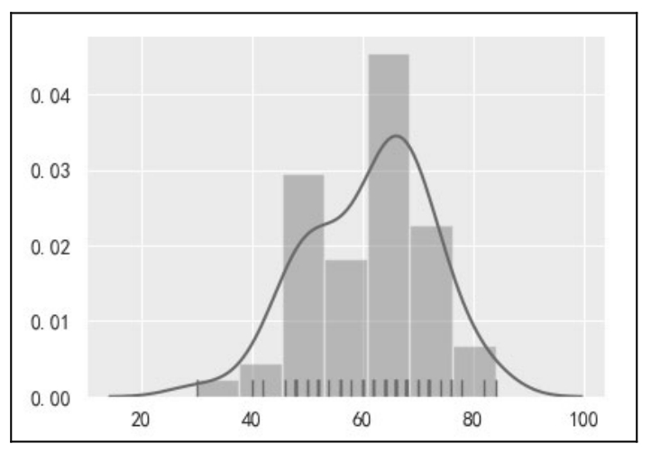

图14.8 直方图

### 14.3.4 绘制条形图—barplot()函数

Seaborn绘制条形图主要使用barplot()函数，语法如下：

sns.barplot(x=None,y=None,hue=None,data=None,order=None,hue_order=None,orient=None,color=None,

palette=None,capsize=None,estimator=mean)

常用参数说明： 

 x、y：*x*轴、*y*轴数据。 

 hue：分类字段。 

 order、hue_order：变量绘图顺序。 

 orient：条形图是水平显示还是垂直显示。 

 capsize：误差线的宽度。 

 estimator：每类变量的统计方式，默认值为平均值mean。

**【例14.7】**绘制多条形图分析学生各科成绩**（实例位置：资源包\\Code\\14\\07）**

通过前面的学习，我们已经能够绘制简单的条形图了。下面绘制学生成绩多条形图，程序代码如下：

1  import pandas as pd

2  import matplotlib.pyplot as plt

3  import seaborn as sns

4  sns.set_style('darkgrid')                           # 灰色网格

5  plt.rcParams\['font.sans-serif'\]=\['SimHei'\]            # 解决中文乱码

6  df1=pd.read_excel('data5.xls',sheet_name='sheet2')  # 读取Excel文件

7  sns.barplot(x='学号',y='得分',hue='学科',data=df1)    # 绘制条形图

8  plt.show()                                          # 显示图表

运行程序，输出结果如图14.9所示。

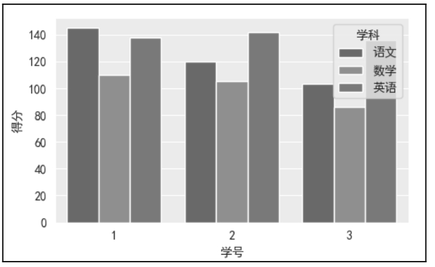

图14.9 条形图

### 14.3.5 绘制线性回归模型—lmplot()函数

Seaborn可以直接绘制线性回归模型，用以描述线性关系，主要使用lmplot()函数，语法如下：

sns.lmplot(x,y,data,hue=None,col=None,row=None,palette=None,col_wrap=3,size=5,markers='o')

常用参数说明： 

 hue：散点图中的分类字段。 

 col：列分类变量，构成子集。 

 row：行分类变量。 

 col_wrap：控制每行子图数量。 

 size：控制子图高度。 

 markers：点的形状。

**【例14.8】**绘制线性回归图表分析“小费”**（实例位置：资源包\\Code\\14\\08）**

同样使用tips数据集，绘制线性回归模型，关键代码如下：

sns.lmplot(x='total_bill',y='tip',data=tips)

运行程序，输出结果如图14.10所示。

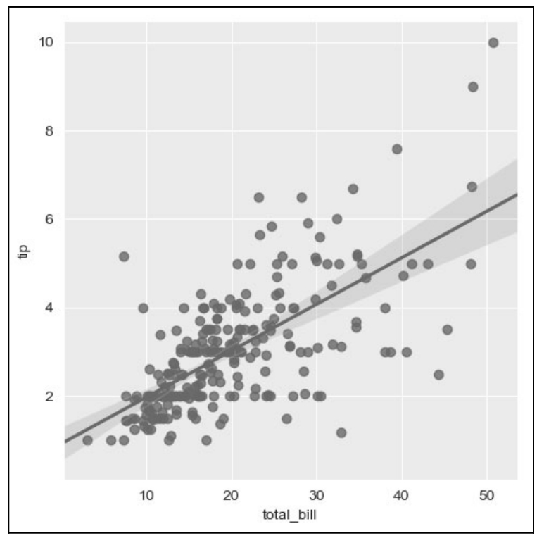

图14.10 绘制线性回归模型

### 14.3.6 绘制箱形图—boxplot()函数

Seaborn绘制箱形图主要使用boxplot()函数，语法如下：

sns.boxplot(x=None,y=None,hue=None,data=None,order=None,hue_order=None,orient=None,color=None,palette=None,

width=0.8,notch=False)

常用参数说明： 

 hue：分类字段。 

 width：箱形图宽度。 

 notch：中间箱体是否显示缺口，默认值为False。

**【例14.9】**绘制箱形图分析“小费”异常数据**（实例位置：资源包\\Code\\14\\09）**

下面绘制箱形图，使用数据集tips演示，关键代码如下：

sns.boxplot(x='day',y='total_bill',hue='time',data=tips)

运行程序，输出结果如图14.11所示。

从图14.11得知：数据存在异常值。箱形图实际上就是利用数据的分位数来识别数据的异常点，这一特点使得箱形图在学术界和工业界的应用都非常广泛。

### 说明

如果使用在线数据或离线数据，可能会出现运行效果与上述不一致的现象。

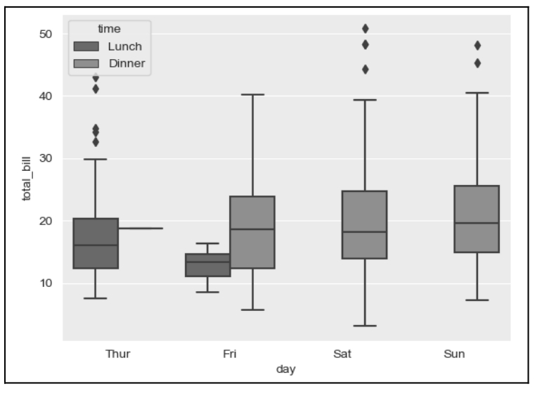

图14.11 箱形图

### 14.3.7 绘制核密度图—kdeplot()函数

核密度是概率论中用来估计未知的密度函数，属于非参数检验方法之一。通过核密度图可以比较直观地看出数据样本本身的分布特征。

Seaborn绘制核密度图主要使用kdeplot()函数，语法如下：

sns.kdeplot(data,shade=True)

参数说明： 

 data：数据。 

 shade：是否带阴影，默认值为True，即带阴影。

**【例14.10】**绘制核密度图分析鸢尾花**（实例位置：资源包\\Code\\14\\10）**

绘制核密度图，通过Seaborn自带的数据集iris演示，关键代码如下：

1  #调用seaborn自带数据集iris

2  df = sns.load_dataset('iris')

3  #绘制多个变量的核密度图

4  p1=sns.kdeplot(df\['sepal_width'\], shade=True, color="r")

5  p1=sns.kdeplot(df\['sepal_length'\], shade=True, color="b")

运行程序，输出结果如图14.12所示。

下面再介绍一种边际核密度图，该图可以更好地体现两个变量之间的关系，如图14.13所示。

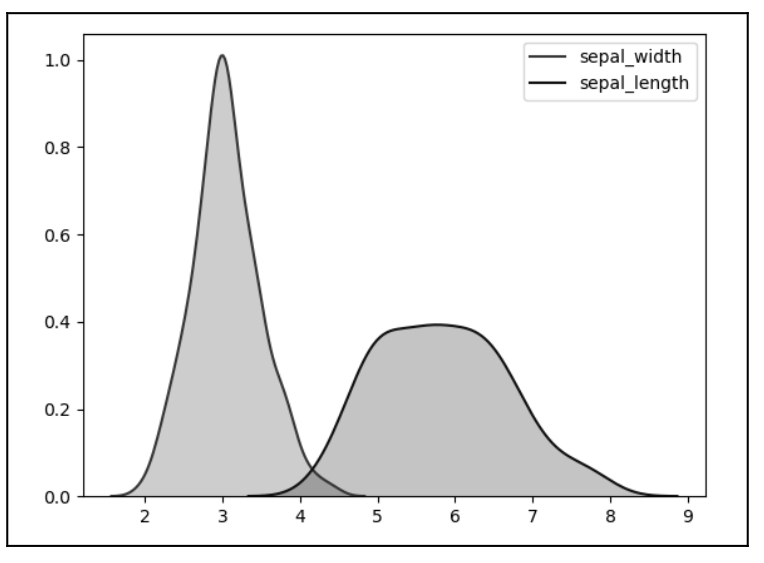

▲图14.12 核密度图

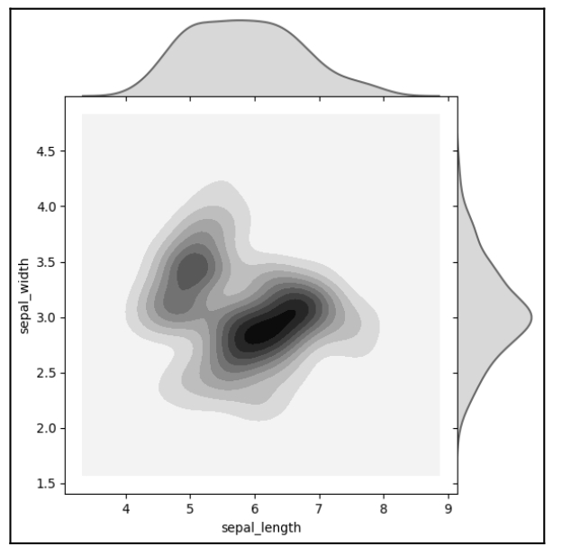

▲图14.13 边际核密度图

关键代码如下：

sns.jointplot(x=df\["sepal_length"\], y=df\["sepal_width"\], kind='kde',space=0)

### 说明

如果使用在线数据或离线数据，可能会出现与上述运行效果不一致的现象。

### 14.3.8 绘制提琴图—violinplot()函数

提琴图结合了箱形图和核密度图的特征，用于展示数据的分布形状。粗黑线表示四分数范围，延伸的细线表示95%的置信区间，白点为中位数，如图14.14所示。提琴图弥补了箱形图的不足，可以展示数据分布是双模还是多模。提琴图主要使用violinplot()函数绘制。

**【例14.11】**绘制提琴图分析“小费”**（实例位置：资源包\\Code\\14\\11）**

绘制提琴图，通过Seaborn自带的数据集tips演示，关键代码如下：

sns.violinplot(x='total_bill',y='day',hue='time',data=tips)

运行程序，输出结果如图14.14所示。

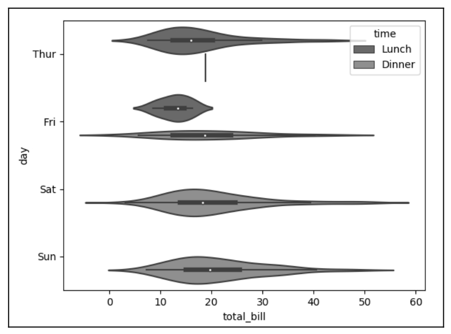

图14.14 提琴图

### 说明

如果使用在线数据或离线数据，可能会出现与上述运行效果不一致的现象。

## 14.4 小结

本章介绍了如何使用Seaborn模块实现数据图表的绘制，这个模块可以实现更高级的可视化效果。它偏向于统计图表，更多应用在数据挖掘和机器学习中的变量特征选取中。有这种需求的读者可以进行更深入的学习，而对于初学者了解即可。

