# 15 Plotly图表

Plotly是一个基于JavaScript的动态绘图模块，绘制出来的图表可以与Web应用集成。该模块不仅提供了丰富而又强大的绘图库，还支持各种类型的绘图方案，绘图的种类丰富、效果美观，方便保存和分享。

本章知识架构如下。

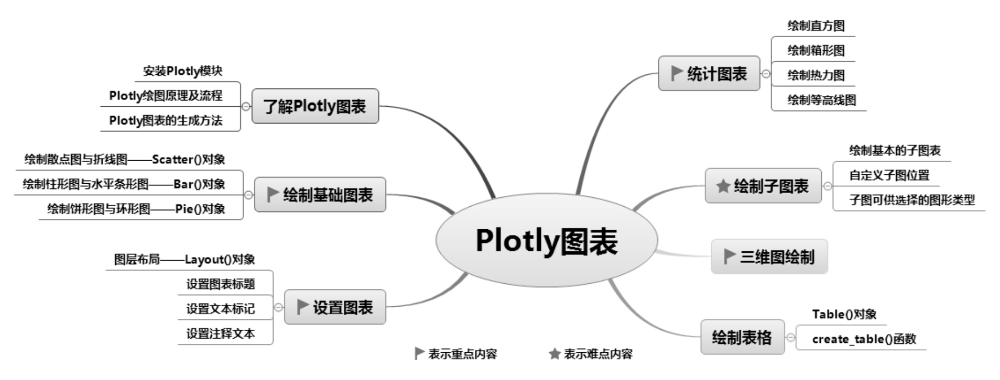

## 15.1 了解Plotly图表

Plotly是一个功能强大的数据可视化绘图模块，它基于JavaScript，可以为很多编程语言提供接口。交互、美观、便捷是Plotly的最大优势。Plotly可绘制的图表种类繁多，能够在线分享和离线绘图，而且是开源的。Plotly可以与Matplotlib、NumPy、Pandas等绘图模块无缝连接。

### 15.1.1 安装Plotly模块

安装Plotly模块非常简单，如果已经安装了Python，便可以在“命令提示符”窗口中使用pip命令进行安装。安装命令如下：

```text
pip install plotly
```

如果在Jupyter Notebook中使用Plotly图表，则需要安装Anaconda，并通过Anaconda Prompt提示符窗口安装Plotly模块，安装命令如下：

```text
conda install plotly
```

### 15.1.2 Plotly绘图原理及流程

Plotly中常用的两个绘图子模块是graph_objs和expression。其中，graph_objs子模块相当于Matplotlib，数据组织较麻烦，但绘图简单、好看；expression子模块相当于Seaborn，数据组织较容易。

graph_objs子模块常命名为go，即import plotly.graph_objs as go。expression子模块常命名为px，即import plotly.expression as px。

**1. graph\_objs（go）子模块**

使用graph_objs（go）子模块绘制图形的流程如下。

（1）导入绘图子模块。

（2）通过go.Scatter()、go.Bar()、go.Histogram()、go.Pie()等绘图对象建立图形轨迹（简称“图轨”），并返回图轨。在Plotly中，一个图轨是一个trace。

（3）将图轨转换成列表，形成一个图轨列表。一个图轨放在一个列表中，多个图轨也应放在一个列表中。

（4）通过go.Layout()对象设置图表标题、图例、图表画布大小，设置*x*、*y*坐标轴参数等。

（5）使用go.Figure()将图轨和图层合并。如果未使用go.Layout()对象，则直接将步骤（3）的图轨列表传入go.Figure()中；如果使用了go.Layout()对象为图表设置图表标题等，需将图轨列表和图层都传入go.Figure()当中。

（6）使用show()函数显示图表。

**注意**

如果网络不稳定，图表不显示，可使用如下代码在程序所在路径下自动生成一个名为temp-plot.html的网页，打开该网页可显示图表。

```text
import plotly as py
py.offline.plot(fig)
```

**【例15.1】**绘制第一张Plotly图表**（实例位置：资源包\\MR\\Code\\15\\01）**

在PyCharm中使用gragh_objs子模块的Scatter绘图对象，绘制一个简单的折线图，程序代码如下：

```text
1  import plotly.graph_objs as go
2  trace= go.Scatter(x=[1, 2, 3, 4], y=[12, 5, 8, 23])  # 绘制折线图
3  data=[trace]                                         # 将轨迹转换为列表
4  fig = go.Figure(data)                                # 创建画布
5  fig.show()                                         # 显示图形
```

运行程序，自动生成HTML网页图表，效果如图15.1所示。

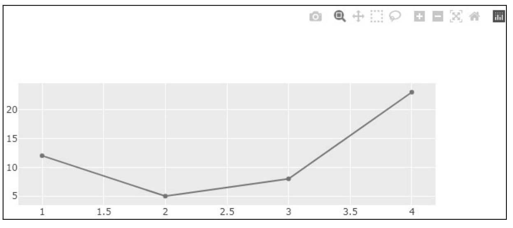

<p class="book-caption">图15.1 绘制第一张Plotly图表</p>

**2. expression（px）子模块**

使用expression（px）子模块绘制图形的原理及流程如下。

（1）直接使用px调用绘图函数时会自动创建画布，并画出图表。

（2）使用show()函数显示图表。

**【例15.2】**使用expression子模块绘制图表**（实例位置：资源包\\MR\\Code\\15\\02）**

通过expression子模块自带的“鸢尾花”数据集iris绘制散点图，*x*轴数据为鸢尾花花萼的宽度，*y*轴数据为鸢尾花花萼的长度，颜色为鸢尾花的种类。程序代码如下：

```text
1  import plotly.express as px
2  df = px.data.iris()  # 载入鸢尾花数据集
3  print(df)
4  # 使用scatter()函数绘制散点图，*x*为鸢尾花花萼宽度，*y*为鸢尾花花萼长度，color为鸢尾花种类
5  fig = px.scatter(df, x="sepal_width", y="sepal_length", color="species")
6  fig.show()           # 显示图表
```

运行程序，自动生成HTML网页图表，效果如图15.2所示。

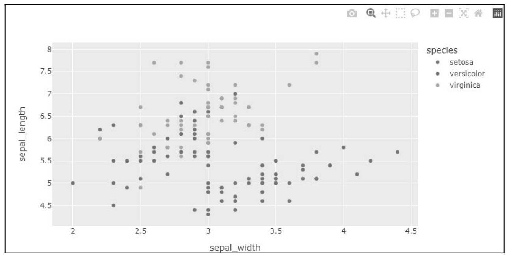

<p class="book-caption">图15.2 使用expression子模块绘制图表</p>

### 15.1.3 Plotly图表的生成方法

Plotly保存图表有三种方式：直接下载、在线保存和离线保存。由于在线绘图需要注册账号，获取API key，较为麻烦，所以本书只介绍直接下载和离线保存两种方式。

**1. 直接下载**

当图表显示出来以后，单击图表上方的“照相机”图标，如图15.3所示，下载图表并将其保存为.png格式的静态图片。

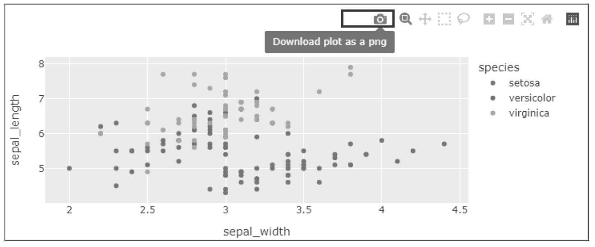

<p class="book-caption">图15.3 直接下载</p>

**2. 离线保存**

离线保存方式包括plotly.offline.plot()、plotly.offline.iplot()两个函数。前者以离线方式在当前程序所在目录下生成一个HTML格式的文件并自动打开；后者是Jupyter Notebook的专用函数，可将生成的图形嵌入ipynb文件中。

本节主要采用plotly.offline.plot()函数，下面介绍其主要参数。 

 figure_or_data：传入plotly.graph_objs.Figure、plotly.graph_objs.Data、字典或列表构成的能够描述一个graph的数据。 

 show_link：布尔型，用于调整输出的图像是否在右下角显示Export to plotly.com的链接标记。 

 link_text：字符型，用于设置图像右下角的链接说明文字内容（当show_link=True时），默认值为Export to plotly.com。 

 image：字符型或None，控制生成图像的下载格式，包括.png、.jpeg、.svg、.webp，默认值为None，即不会为生成的图像设置下载方式。 

 filename：字符型，控制保存HTML网页的文件名，默认值为temp-plot.html。 

 image_width：整型，控制下载图像宽度的像素值，默认值为800像素。 

 image_height：整型，控制下载图像高度的像素值，默认值为600像素。

**【例15.3】**生成HTML网页格式的图表文件**（实例位置：资源包\\MR\\Code\\15\\03）**

在PyCharm中使用plotly.offline.plot()函数生成HTML格式的图表文件，程序代码如下：

```text
1  import plotly as py
2  import plotly.graph_objs as go
3  trace= go.Scatter(x=[1, 2, 3, 4], y=[12, 5, 8, 23])  # 绘制折线图
4  data=[trace]                                         # 将图轨转换为列表
5  py.offline.plot(data,filename='line.html')         # 显示图表并生成HTML网页
```

如果要通过代码生成图像文件，需要先安装kaleido模块（该模块是生成图像文件的引擎），然后创建一个Figure()对象，通过该对象调用write_image()函数生成图像文件。关键代码如下：

```text
6  fig = go.Figure(data)                           # 创建画布
7  fig.write_image('abc.png', engine="kaleido")  # 将图表保存为静态图片
```

## 15.2 绘制基础图表

### 15.2.1 绘制散点图与折线图—Scatter()对象

Plotly绘制散点图和折线图主要使用Scatter()对象，语法如下：

```text
go.Scatter(x,y,mode,name,marker,line)：
```

参数说明： 

 x：*x*轴数据。 

 y：*y*轴数据。 

 mode：线条（lines）、散点（markers）、线条加散点（markers+lines） 

 name：图例名称。 

 marker/line：散点和线条的相关参数。

散点图同样使用Scatter()对象绘制，主要通过mode参数设置，将该参数设置为markers即可。

**【例15.4】**绘制散点图**（实例位置：资源包\\MR\\Code\\15\\04）**

下面使用Scatter()对象绘制散点图，程序代码如下：

```text
1   import plotly as py
2   import plotly.graph_objs as go
3   import numpy as np
4   # 生成500个符合正态分布的随机一维数组
5   n = 500
6   x = np.random.randn(n)
7   y = np.random.randn(n)
8   trace = go.Scatter(x=x, y=y, mode='markers',marker=dict(size=8, color='red'))  # 绘制图轨(散点图)
9   data = [trace]                                 # 将图轨放入列表
10  layout=go.Layout(title='散点图')
11  fig = go.Figure(data=data, layout=layout)      # 将图轨和图层合并
12  py.offline.plot(fig,filename='scatter.html') # 显示图表并生成HTML网页
```

运行程序，自动生成HTML网页图表，效果如图15.4所示。

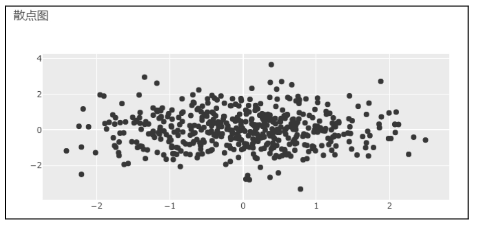

<p class="book-caption">图15.4 绘制散点图</p>

### 说明

关于Layout()布局对象的详细说明，将在15.3节中进行介绍。

**【例15.5】**绘制多折线图**（实例位置：资源包\\MR\\Code\\15\\05）**

绘制多折线图同样使用Scatter()对象，通过该对象绘制多个图轨并全部放在列表中，程序代码如下：

```text
1   import plotly as py
2   import plotly.graph_objects as go
3   month = ['1月', '2月', '3月','4月','5月','6月']   # 创建*x*轴数据
4   # 绘制图轨
5   trace1=go.Scatter(name='总店', x=month, y=[20,14,23,34,56,28])
6   trace2=go.Scatter(name='二道分店', x=month, y=[45,34,56,38,49,60])
7   trace3=go.Scatter(name='南关分店', x=month, y=[28,38,32,43,26,45])
8   trace4=go.Scatter(name='朝阳分店', x=month, y=[55,34,28,36,48,55])
9   data=[trace1,trace2,trace3,trace4]              # 将图轨放入列表
10  # 设置图层
11  layout = go.Layout(title='各门店上半年销量走势图', xaxis=dict(title='月份'), legend=dict(x=1, y=0.5), \\
12                   yaxis=dict(title='销量'), \\
13                   font=dict(size=15, color='black'))
14  fig = go.Figure(data=data, layout=layout)       # 将图轨和图层合并
15  py.offline.plot(fig,filename='lines.html')    # 显示图表并生成HTML网页
```

运行程序，自动生成HTML网页图表，效果如图15.5所示。

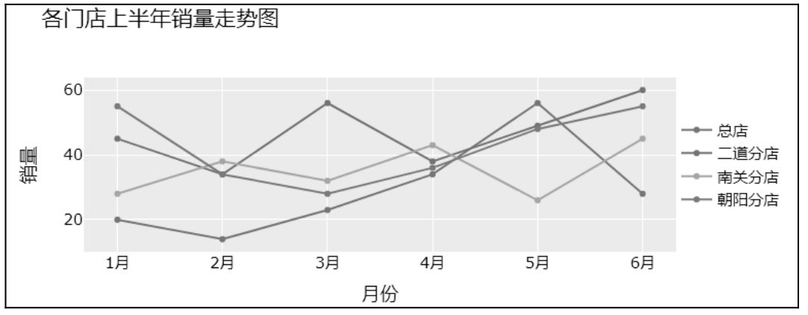

<p class="book-caption">图15.5 绘制多折线图</p>

### 15.2.2 绘制柱形图与水平条形图—Bar()对象

绘制柱形图与条形图主要使用Bar()对象，语法如下：

```text
go.Bar(x,y,marker,opacity)
```

参数说明： 

 x：*x*轴数据。 

 y：*y*轴数据。 

 marker：设置图形的参数，包括柱子的颜色、标记等。 

 opacity：透明度。

**【例15.6】**绘制简单的柱形图**（实例位置：资源包\\MR\\Code\\15\\06）**

下面使用go.Bar()对象绘制简单的柱形图，程序代码如下：

```text
1  import plotly as py
2   import plotly.graph_objects as go
3   month = ['1月', '2月', '3月','4月','5月','6月']   # 创建*x*轴数据
4   trace1=go.Bar(name='总店', x=month, y=[20,14,23,34,56,28])  # 绘制柱形图图轨
5   data=[trace1]                                     # 将图轨放入列表
6   # 设置图层
7   layout = go.Layout(title='上半年销量走势图', xaxis=dict(title='月份'), legend=dict(x=1, y=0.5), \\
8                    yaxis=dict(title='销量'), \\
9                    font=dict(size=15, color='black'))
10  fig = go.Figure(data=data, layout=layout)         # 将图轨和图层合并
11  py.offline.plot(fig,filename='bar.html')        # 显示图表并生成HTML网页
```

运行程序，自动生成HTML网页图表，效果如图15.6所示。

**【例15.7】**绘制多柱形图**（实例位置：资源包\\MR\\Code\\15\\07）**

下面使用go.Bar()对象绘制包含多条柱子的柱形图，各条柱子使用不同的颜色，主要通过maker参数设置，程序代码如下：

```text
1   import plotly as py
2   import plotly.graph_objects as go
3   month = ['1月', '2月', '3月','4月','5月','6月']   # 创建*x*轴数据
4   # 绘制柱形图图轨
5   trace1=go.Bar(name='总店', x=month, y=[20,14,23,34,56,28],marker=dict(color='red'))
6   trace2=go.Bar(name='二道分店', x=month, y=[45,34,56,38,49,60],marker=dict(color='green'))
7   trace3=go.Bar(name='南关分店', x=month, y=[28,38,32,43,26,45],marker=dict(color='blue'))
8   trace4=go.Bar(name='朝阳分店', x=month, y=[55,34,28,36,48,55],marker=dict(color='orange'))
9   data=[trace1,trace2,trace3,trace4]              # 将图轨放入列表
10  # 设置图层
11  layout = go.Layout(title='上半年销量走势图', xaxis=dict(title='月份'), legend=dict(x=1, y=0.5), \\
12                   yaxis=dict(title='销量'), \\
13                   font=dict(size=15, color='black'))
14  fig = go.Figure(data=data, layout=layout)       # 将图轨和图层合并
15  py.offline.plot(fig,filename='bars.html')     # 显示图表并生成HTML网页
```

运行程序，自动生成HTML网页图表，效果如图15.7所示。

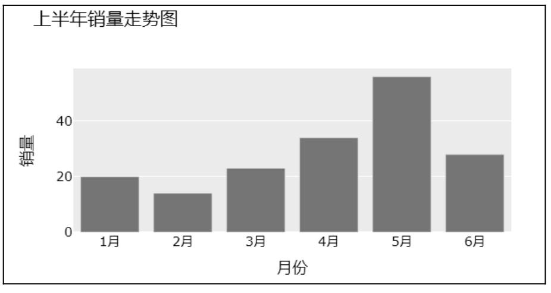

<p class="book-caption">▲图15.6 绘制简单的柱形图</p>

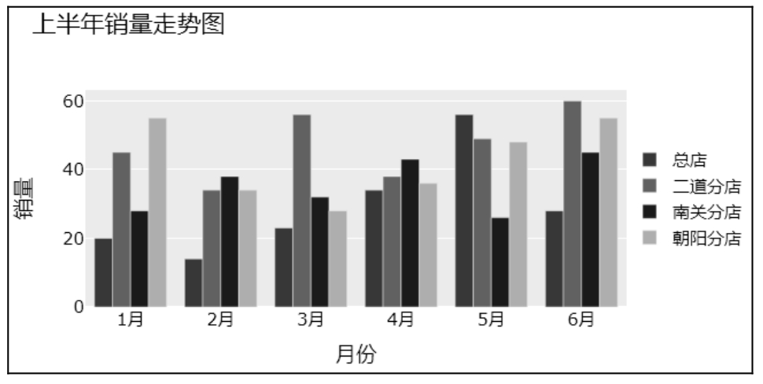

<p class="book-caption">▲图15.7 绘制多柱形图</p>

**【例15.8】**绘制堆叠柱形图**（实例位置：资源包\\MR\\Code\\15\\08）**

绘制堆叠柱形图非常简单，只需要在Layout图表布局中设置一个关键的参数barmode为stack，就可以轻松地实现堆叠柱形图，关键代码如下：

```text
1  layout = go.Layout(title='上半年销量走势图', xaxis=dict(title='月份'), legend=dict(x=1, y=0.5), \\
2                   yaxis=dict(title='销量'), \\
3                   font=dict(size=15, color='black'),barmode='stack')
```

运行程序，自动生成HTML网页图表，效果如图15.8所示。

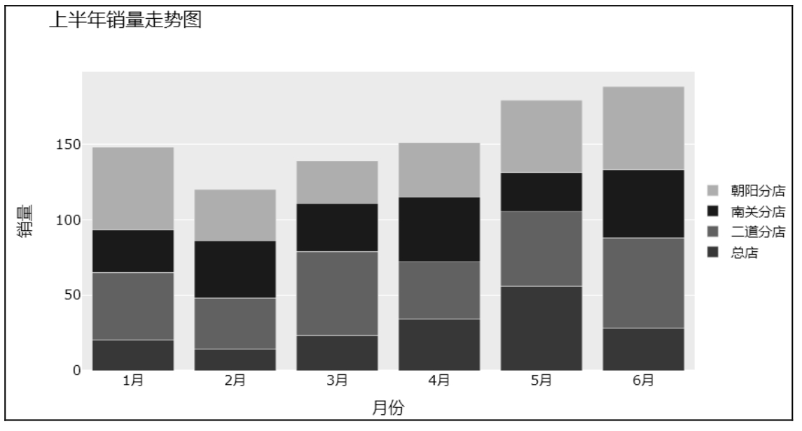

<p class="book-caption">图15.8 堆叠柱形图</p>

结论：通过堆叠柱形图不仅可以看出各个分店的销量走势，还可以看出总体销量走势。

**【例15.9】**绘制水平条形图**（实例位置：资源包\\MR\\Code\\15\\09）**

绘制水平条形图同样使用go.Bar()对象，只需要将orientation参数设置为h即可，关键代码如下：

```text
trace1=go.Bar(name='总店', x=[20,14,23,34,56,28],y=month,orientation='h')
```

运行程序，自动生成HTML网页图表，效果如图15.9所示。

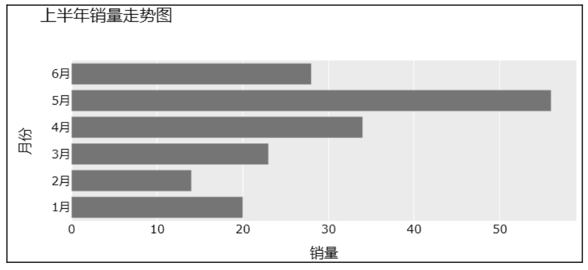

<p class="book-caption">图15.9 水平条形图</p>

### 15.2.3 绘制饼形图与环形图—Pie()对象

绘制饼形图与环形图主要使用Pie()对象，常用参数说明如下： 

 values：每个扇区的数值大小。 

 labels：列表，饼形图中每一个扇区的文本标签。 

 hole：设置环形图空白内径的半径，取值为0～1。默认值为0，参数是与外径的比值。 

 hoverinfo：当用户与图表交互时，鼠标指针显示的参数，参数值为label、text、value、percent、name、all、none或skip，这些参数可以任意组合，组合时用加号“+”连接，默认值为all。如果参数值设置为none或skip，则鼠标悬停时不显示任何信息；但如果参数值设置为none，则仍会触发单击和悬停事件。 

 pull：列表，元素为0～1的数值，默认值为0，用于设置各个扇区突出显示的部分。 

 sort：布尔变量，表示是否进行扇区排序。 

 rotation：扇区旋转角度，范围是0～360，默认值为0，即12点位置。 

 direction：设置饼形图的方向。clockwise表示顺时针，counterclockwise（默认值）表示逆时针。 

 domain：设置饼形图的位置，适用于有多个并列饼形图时。 

 name：有多个并列子饼形图时，设置子饼形图的名称。 

 type：声明图表类型，设置为pie。 

 pullsrc：各个扇区比例数组列表。 

 dlabel：设置饼形图图标的步进值，默认值为1。 

 label0：设置一组扇区图标的起点数字，默认值为0。

**【例15.10】**绘制饼形图**（实例位置：资源包\\MR\\Code\\15\\10）**

下面使用Pie()对象绘制一个简单的饼形图，程序代码如下。

```text
1  import plotly as py
2  import plotly.graph_objects as go
3  x = [70,35,12,22,16,9]                       # 创建*x*轴数据
4  # 绘制饼形图图轨
5  trace=go.Pie(values=x,labels=['总店','二道分店','南关分店','朝阳分店','经开分店','绿园分店'])
6  data=[trace]
7  py.offline.plot(data,filename='pie.html')   # 显示图表并生成HTML网页
```

运行程序，自动生成HTML网页图表，效果如图15.10所示。

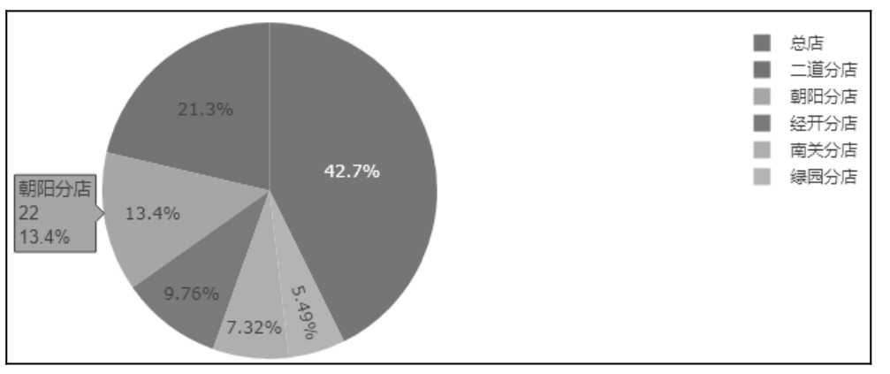

<p class="book-caption">图15.10 饼形图</p>

**【例15.11】**绘制环形图**（实例位置：资源包\\MR\\Code\\15\\11）**

环形图同样使用go.Pie()对象，实现方法就是将饼形图中间的圆部分设置为空白，即设置hole参数为0～1的值即可，关键代码如下。

```text
trace=go.Pie(values=x,labels=['总店','二道分店','南关分店','朝阳分店','经开分店','绿园分店'],hole=0.5)
```

运行程序，自动生成HTML网页图表，效果如图15.11所示。

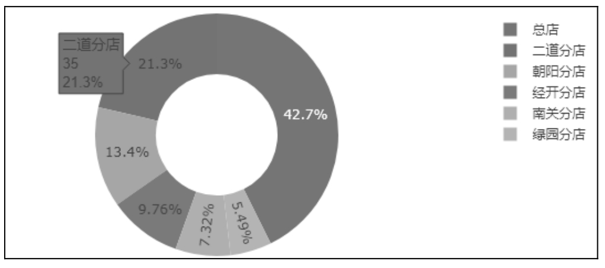

<p class="book-caption">图15.11 环形图</p>

## 15.3 设置图表

通过前面的学习，我们学会了常用图表的绘制，但这远远不够，一张能够表达数据意义的、完美的图表，需要在很多细节上下功夫，如为图表设置标题、图例、文本标记、标注等。

### 15.3.1 图层布局—Layout()对象

Layout()对象主要用于设置图形外观，如图表标题、xy坐标轴、图例、图形外边距等，这些属性包括字体、颜色、尺寸等。

Layout()对象是Plotly中graph_objects（go）子模块中的函数，它功能强大，是字典类型，可以使用help命令查看其参数，常用参数如表15.1所示。

<p class="book-caption">表15.1 Layout()对象的常用参数</p>

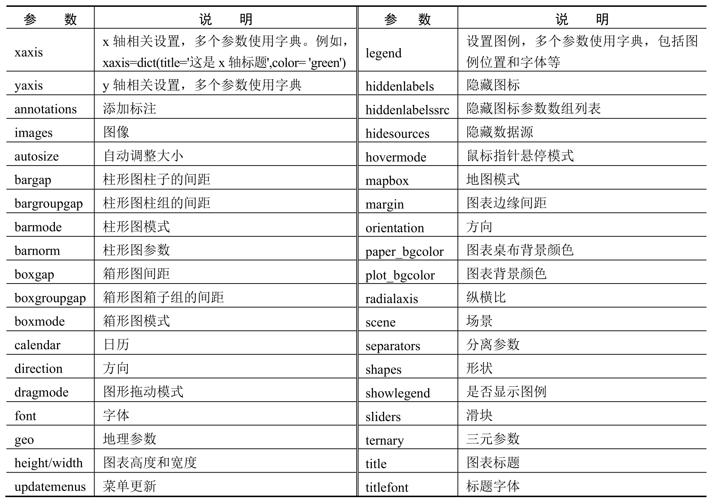

### 15.3.2 设置图表标题

一张精美的图表少不了标题，就像一篇文章需要标题一样。在Plotly中使用graph_objs（go）子模块绘图时，为图表添加标题主要使用图层布局对象Layout()中的title参数。例如：

```text
import plotly.graph_objects as go
go.Layout(title='上半年销量走势图')
```

如果使用expression（px）子模块绘图，则通过图表函数中的title参数来设置标题。例如：

```text
import plotly.express as px
fig = px.scatter(df, x="sepal_width", y="sepal_length", color="species",title="散点图分析鸢尾花")
```

### 15.3.3 设置文本标记

Plotly为折线图、散点图、柱形图添加文本标记text，相关参数如下。 

 text：为每个（x,y）坐标设置相关联的文本。如果是单个字符串，那么所有点都会显示该文本；如果为字符串列表，那么会按先后顺序一一映射到每个（x,y）坐标上。默认值为空字符串。 

 textposition：文本标记在*x*轴和*y*轴坐标的位置。字符串枚举类型，或字符串枚举类型数组。 

 对于scatter图表，设置值为top left、top center、top right、middle left、middle center（默认值）、middle right、bottom left、bottom center、bottom right。 

 对于bar图表，设置值为inside、outside、auto（默认值）、none。inside表示将文本放在靠近柱子顶部的内侧；outside表示将文本放在靠近柱子顶部的外侧；auto表示将文本放在柱子顶部的内侧，如果柱子太小，则会将文本放在外侧；none表示不显示文本。 

 textfont：设置文本标记的字体，字典类型，设置值如下。 

 color：字体颜色。 

 family：字体字符串，包括的字体为Arial、Balto、Courier New、Droid Sans、Droid Serif、Droid Sans Mono、Gravitas One、Old Standard TT、Open Sans、Overpass、PT Sans Narrow、Raleway、Times New Roman。 

 size：字体大小。

**【例15.12】**为折线图添加文本标记**（实例位置：资源包\\MR\\Code\\15\\12）**

为折线图添加文本标记主要使用文本标记text，但需要注意的是，为折线图添加文本标记，要求mode参数必须含有text，如mode='markers+lines+text'，否则文本标记将不显示，关键代码如下：

```text
1  trace= go.Scatter(x=x, y=y,                             #  *xy*轴数据
2                  mode='markers+lines+text',              # 模式为标记+线条+文本
3                  text=y,                                 # 标记文本
4                  textposition="top right",               # 标记文本的位置
5                  textfont=dict(color='red',size=12))  # 标记文本的字体颜色和大小
```

运行程序，效果如图15.12所示。

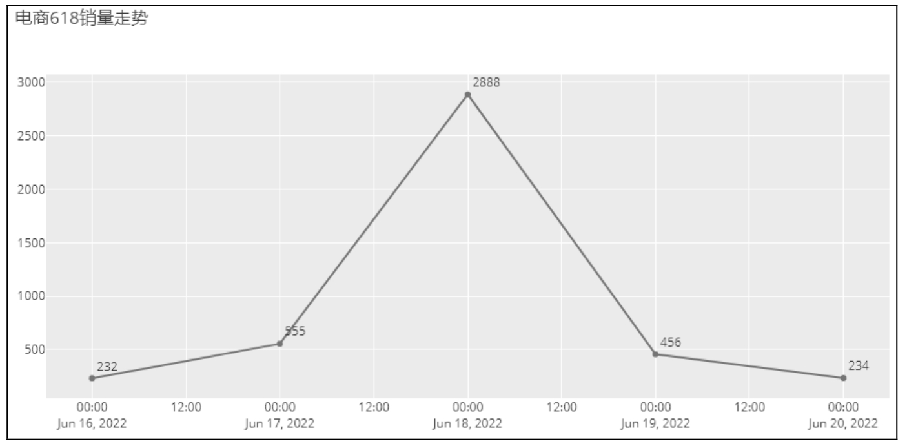

<p class="book-caption">图15.12 为折线图添加文本标记</p>

**【例15.13】**为散点图添加文本标记**（实例位置：资源包\\MR\\Code\\15\\13）**

为散点图添加文本标记，使用text就可以。关键代码如下：

```text
fig = px.scatter(df, x="sepal_width", y="sepal_length", color="species",text="sepal_length")
```

**【例15.14】**为柱形图添加文本标记**（实例位置：资源包\\MR\\Code\\15\\14）**

为柱形图添加文本标记同样使用文本标记text，不同的是文本标记位置textposition参数的设置，关键代码如下：

```text
1  trace1=go.Bar(x=month,y=counts,     #  *xy*轴数据
2               text=counts,           # 标记文本
3               textposition='auto')  # 标记文本的位置
```

运行程序，效果如图15.13所示。

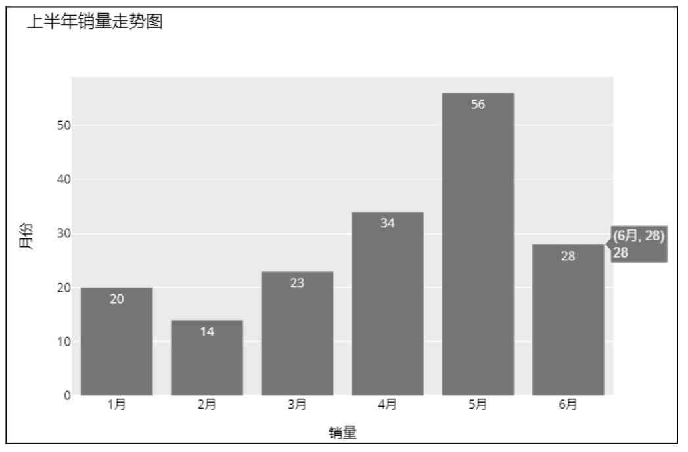

<p class="book-caption">图15.13 为柱形图添加标记</p>

### 15.3.4 设置注释文本

在Plotpy中，为图表添加注释文本主要使用Layout()对象的annotations参数，其常用参数如下。 

 x：浮点数、整数、字符串。设置annotations的*x*轴位置。如果坐标轴的类型是log，那么传入的*x*应该与取log后的值相对应；如果坐标轴的类型是date，那么传入的*x*也必须是日期字符串；如果坐标轴的类型是category，那么传入的*x*应该是一个整数，代表期望标记的第*x*个类别，需要注意的是类别从0开始，按照出现的顺序依次递增。 

 y：浮点数、整数、字符串。设置annotations的*y*轴位置。如果坐标轴的类型是log，那么传入的*y*应该与取log后的值相对应；如果坐标轴的类型是date，那么传入的*y*也必须是日期字符串；如果坐标轴的类型是category，那么传入的*y*应该是一个整数，代表期望标记的第*y*个类别，类别从0开始，按照出现的顺序依次递增。 

 text：字符串和可以转换为字符串的数字。设置与annotations相关联的文本。Plotly支持部分HTML标签，如换行符\<br\>、粗体\<b\>\</b\>、斜体\<i\>\</i\>、超链接\<a href='...'\>\</a\>等，也支持标签\<em\>、\<sup\>、\<sub\>、\。 

 textangle：文本角度。 

 opacity：设置annotations的不透明度，包括text和arrow。值为0～1的浮点数。 

 showarrow：布尔类型，表示是否显示指向箭头。如果为True，则text放置在箭头尾部；如果为False，则text会放在指定的（x, y）位置。 

 arrowcolor：设置整个箭头的颜色。 

 十六进制字符串，如#ff0000。 

 rgb/rgba字符串，如rgb（0,255,0）。 

 hsl/hsla字符串，如hsl（0,100%,50%）。 

 hsv/hsva字符串，如hsv（0,100%,100%）。 

 CSS颜色字符串，如darkblue、lightyellow等。 

 arrowhead：设置annotations箭头头部的样式。值是0～8的整数，但8不可用。 

 arrowside：设置箭头头部的位置，字符串。值为end、start或者end+start、none。end+start表示双向箭头。 

 arrowsize：设置箭头头部的大小，与arrowwidth属性有关（经测试，该值必须小于arrowwidth一定的范围，如果arrowwidth设置为3，那么该值不能超过2.3）。值是0.3~inf（任意值）的浮点数或整数，默认值为1。 

 arrowwidth：设置整个箭头的线条宽度。值为0.1~inf（任意值）的浮点数或整数。 

 font：设置text的字体。字典类型，支持如下3个属性。 

 color：设置字体颜色，字符串类型。 

 family：设置字体，字符串，可以为Arial、Balto、Courier New、Droid Sans、Droid Serif、Droid Sans Mono、Gravitas One、Old Standard TT、Open Sans、Overpass、PT Sans Narrow、Raleway、Times New Roman。 

 size：设置字体大小。 

 ax：*x*轴坐标参数。 

 ay：*y*轴坐标参数。 

 axref：*x*轴坐标辅助参数。 

 ayref：*y*轴坐标辅助参数。 

 bgcolor：背景颜色。 

 bordercolor：边框颜色。 

 borderpad：边框排列方式。 

 borderwidth：边框宽度。

**【例15.15】**标记股票最高收盘价**（实例位置：资源包\\MR\\Code\\15\\15）**

绘制股票收盘价走势图时，若想直观地看到最高收盘价，可以在最高收盘价处添加一个注释文本，主要使用Layout()对象的annotations参数。程序代码如下：

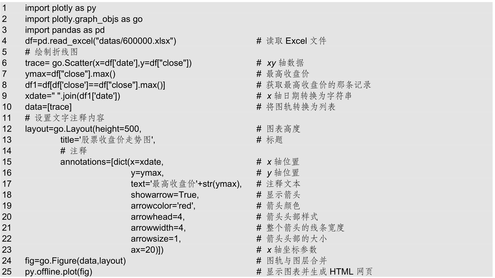

运行程序，效果如图15.14所示。

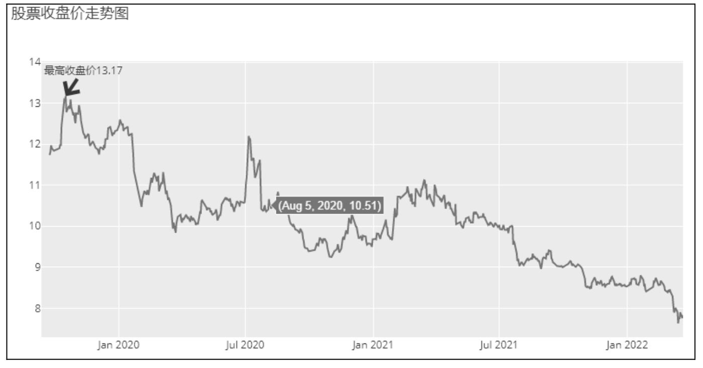

<p class="book-caption">图15.14 标记股票最高收盘价</p>

## 15.4 统计图表

很多统计学图表已预先定义在Plotly中，主要包括直方图、箱形图、热力图、等高线图等。

### 15.4.1 绘制直方图

直方图类似柱形图，却有着与柱形图完全不同的含义。统计图表中的直方图涉及统计学的概念，通过直方图可以观察数据的分布情况，即每个区间的统计数量。

Plotly绘制直方图主要使用go.Histogram()对象，将数据赋值给*x*变量，即*x*=data即可绘制基础直方图；若将数据赋值给*y*变量，则绘制水平直方图，详细参数说明如下。 

 histnorm：设置纵坐标显示格式，有如下设置项。 

 为空（""）时表示纵坐标显示落入区间的样本数目，所有矩形的高相加为总样本数量。 

 为percent时表示纵坐标显示落入区间的样本占总体样本的百分比，所有矩形的高相加为100%。 

 为probability时表示纵坐标显示落入区间的样本频率。 

 为density时表示每个小矩形的面积为落入区间的样本数量，所有面积值相加为样本总数。 

 为probability density时表示每个小矩形的面积为落入区间的样本占总体的比例，所有面积值相加为1。 

 histfunc：指定分组函数，可选参数有count、sum、avg、min、max，依次按照落入区间的样本进行计数、求和、求均值、求最小值和最大值。 

 orientation：设置图形的方向，有v和h两个可选参数，v表示垂直显示，h表示水平显示。 

 cumulative：累积直方图参数，有如下设置项。 

 enabled：布尔型，设置为True显示累积直方图，设置为False则不对频率或频数进行累积。 

 direction用于设置累积方向，确定频率是按1～0（降序），还是按0～1（升序）。 

 currentbin有三个选项，即include、exclude、half，为了防止偏差，一般选择half。 

 autobinx：布尔型，表示是否自动划分区间。 

 nbinsx：整型，最大显示区间数目。 

 xbins：设置划分区间。start设置起始坐标，end设置终止坐标，size设置区间长度。 

 barmode：设置图表的堆叠方式。设置为overlay时表示重叠直方图；设置为stack时表示层叠直方图。

**【例15.16】**绘制直方图**（实例位置：资源包\\MR\\Code\\15\\16）**

下面使用go.Histogram()对象绘制直方图，首先通过NumPy的random.randint()函数生成50个0～100的随机整数，然后绘制直方图，观察各个区间的数量，程序代码如下：

```text
1  import plotly as py
2  import plotly.graph_objs as go
3  import numpy as np
4  n=np.random.randint(0,101,50)              # 生成50个0～100的随机整数
5  trace = go.Histogram(x=n)                    # 绘制直方图图轨
6  data = [trace]                               # 将图轨放入列表
7  layout=go.Layout(title='学生成绩统计直方图')
8  fig = go.Figure(data=data, layout=layout)    # 将图轨和图层合并
9  py.offline.plot(fig,filename='h.html')     # 显示图表并生成HTML网页
```

运行程序，自动生成HTML网页图表，效果如图15.15所示。从随机生成的数据图中可以看出，学生的分数40～60分的居多。

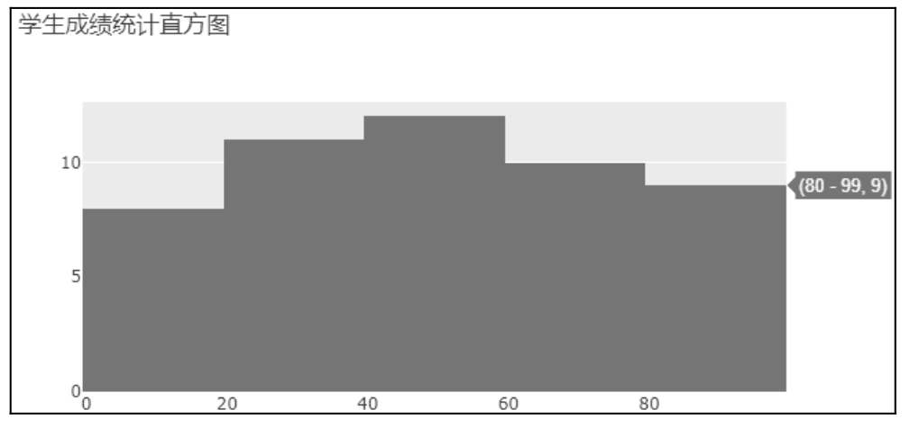

<p class="book-caption">图15.15 直方图</p>

### 15.4.2 绘制箱形图

箱形图的概念以及优点，我们在12.3.7节中已经介绍过了，这里不再赘述。Plotly绘制箱形图主要使用go.Box()对象。

**【例15.17】**绘制简单的箱形图**（实例位置：资源包\\MR\\Code\\15\\17）**

下面使用go.Box()对象绘制一个简单的箱形图，程序代码如下：

```text
1  import plotly as py
2  import plotly.graph_objs as go
3  y=[1,2,3,5,7,9,20]                          # 创建数据
4  trace = go.Box(y=y)                         # 绘制箱形图图轨
5  data = [trace]                              # 将图轨放入列表
6  layout=go.Layout(title='箱型图')
7  fig = go.Figure(data=data, layout=layout)   # 将图轨和图层合并
8  py.offline.plot(fig,filename='box.html')  # 显示图表并生成HTML网页
```

运行程序，自动生成HTML网页图表，效果如图15.16所示。

**【例15.18】**绘制多个箱子的箱形图**（实例位置：资源包\\MR\\Code\\15\\18）**

下面介绍多个箱子的箱形图的绘制，多个箱子通过创建多个图轨完成，程序代码如下：

```text
1   import plotly as py
2   import plotly.graph_objs as go
3   import numpy as np
4   np.random.seed(1)                            # 设置随机种子
5   # 随机生成50个数据
6   y1 = np.random.randn(50)
7   y2 = np.random.randn(50)
8   y3= np.random.randn(50)
9   # 绘制箱形图图轨
10  trace1 = go.Box(y=y1,name='箱子1',marker=dict(color='red'))
11  trace2 = go.Box(y=y2,name='箱子2',marker=dict(color='blue'))
12  trace3 = go.Box(y=y2,name='箱子3',marker=dict(color='yellow'))
13  data = [trace1,trace2,trace3]                # 将图轨放入列表
14  layout=go.Layout(title='这里是标题')
15  fig = go.Figure(data=data, layout=layout)    # 将图轨和图层合并
16  py.offline.plot(fig,filename='boxs.html')  # 显示图表并生成HTML网页
```

运行程序，自动生成HTML网页图表，效果如图15.17所示。

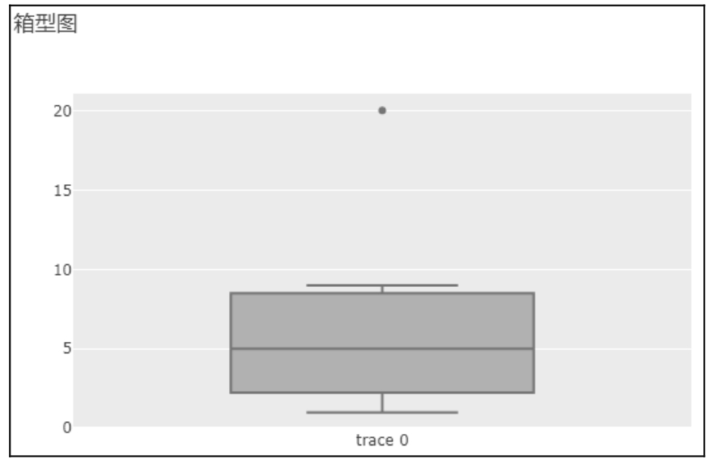

<p class="book-caption">▲图15.16 简单的箱形图</p>

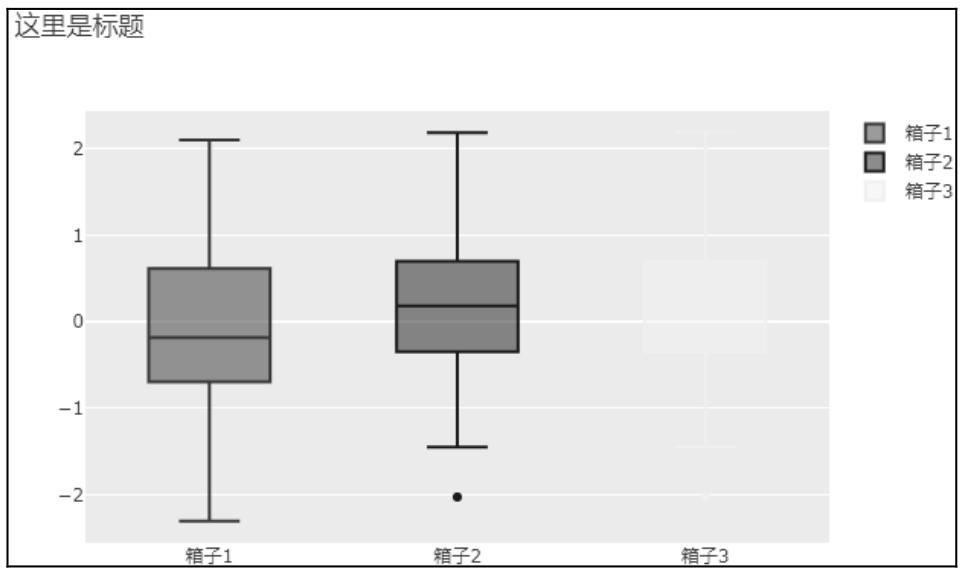

<p class="book-caption">▲图15.17 多个箱子的箱形图</p>

### 15.4.3 绘制热力图

Plotly绘制热力图有两种方法：一是使用px.imshow()函数；二是使用graph_objects子模块的go.Image（仅支持多通道的图像数据）对象和go.Heatmap（支持单通道的图像数据）对象。

px.imshow()函数可以用来展示图像数据，当然也可以用来显示热力图。

**【例15.19】**实现RGB图形数据**（实例位置：资源包\\MR\\Code\\15\\19）**

下面使用px.imshow()函数实现RGB图形数据，程序代码如下：

```text
1  import plotly as py
2  import plotly.express as px
3  import numpy as np
4  # 创建数据
5  rgb = np.array([[[99, 123, 0], [255, 255, 0], [0, 0, 35]],
6                [[0, 255, 0], [255, 0, 99], [0, 255, 0]]],
7                dtype=np.uint8)
8  fig = px.imshow(rgb)                      # 使用px.imshow()函数绘制热力图
9  py.offline.plot(fig)                        # 显示图表并生成HTML网页
```

运行程序，自动生成HTML网页图表，效果如图15.18所示。

**【例15.20】**绘制颜色图块**（实例位置：资源包\\MR\\Code\\15\\20）**

下面使用go.Image()对象绘制一个简单的颜色图块，程序代码如下：运行程序，自动生成HTML网页图表，效果如图15.19所示。

```text
1  import plotly as py
2  import plotly.graph_objects as go
3  # 创建颜色数组
4  rgb = [[[30, 255, 0], [255, 0, 0], [0, 78, 255]],
5        [[0, 0, 120], [0, 135, 0], [120, 0, 0]]]
6  trace = go.Image(z=rgb)                       # 绘制热力图图轨
7  data = [trace]                                # 将图轨放入列表
8  fig = go.Figure(data=data)                    # 将图轨和图层合并
9  py.offline.plot(fig,filename='image.html')  # 显示图表并生成HTML网页
```

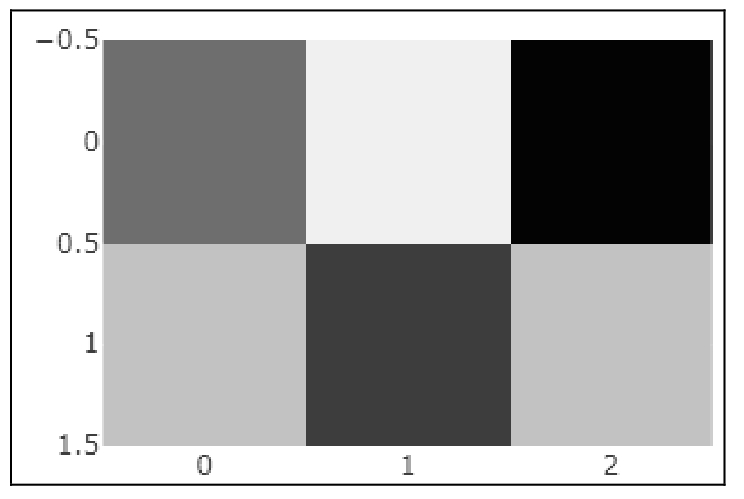

<p class="book-caption">▲图15.18 RGB图形数据</p>

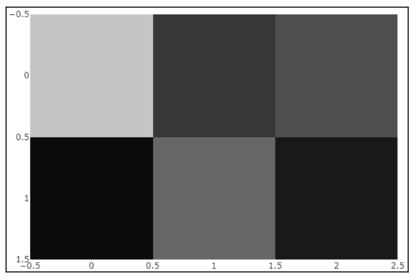

<p class="book-caption">▲图15.19 绘制颜色图块</p>

**【例15.21】**绘制简单热力图**（实例位置：资源包\\MR\\Code\\15\\21）**

下面使用go.heatMap()对象绘制一个简单的热力图，程序代码如下：

```text
1  import plotly as py
2  import plotly.graph_objects as go
3  aa=[[10, 20, 30],[20, 1, 60],[30, 60, 10]]     # 创建二维数组数据
4  trace=go.Heatmap(z=aa)                         # 绘制热力图图轨
5  data = [trace]                                 # 将图轨放入列表
6  fig = go.Figure(data=data)                     # 将图轨和图层合并
7  py.offline.plot(fig,filename='heatmap.html') # 显示图表并生成HTML网页
```

运行程序，自动生成HTML网页图表，效果如图15.20所示。

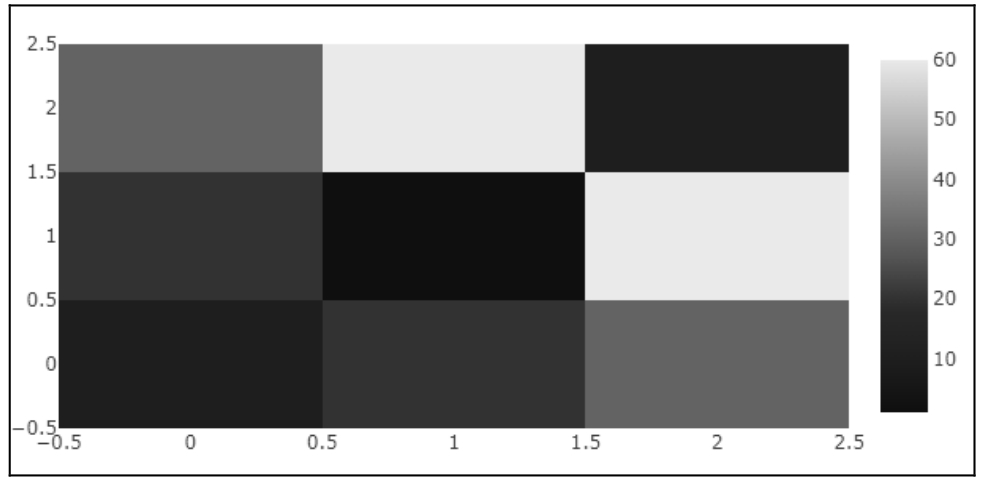

<p class="book-caption">图15.20 绘制简单热力图</p>

### 15.4.4 绘制等高线图

等高线图有二维、三维之分。在数据分析中，高度表示该点的数量或出现次数，该指标相同则在一条环线（或高度）处。在Plotly中主要使用go.Contour()对象实现。

**【例15.22】**绘制等高线图**（实例位置：资源包\\MR\\Code\\15\\22）**

下面使用go.Contour()对象绘制二维等高线图，程序代码如下：

```text
1  import plotly as py
2  import plotly.graph_objects as go
3  # 创建二维数组数据
4  z=[[9, 11.123,10.5, 15.625, 20],
5       [5.625, 6.25, 8.125, 11.25, 14.125],
6       [2.5, 3.125, 5., 8.125, 12.5],
7       [0.725, 1.25, 2.125, 7.25, 9.6],
8       [0, 0.555, 2.7, 5.6, 10]]
9   trace=go.Contour(z=z)           # 绘制等高线图图轨
10  data = [trace]                  # 将图轨放入列表
11  fig = go.Figure(data=data)      # 将图轨和图层合并
12  py.offline.plot(fig)            # 显示图表并生成HTML网页
```

运行程序，自动生成HTML网页图表，效果如图15.21所示。

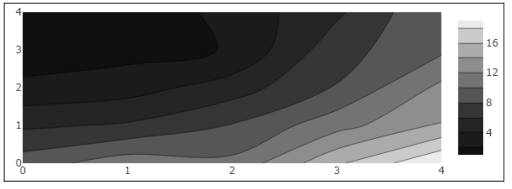

<p class="book-caption">图15.21 等高线图</p>

## 15.5 绘制子图表

### 15.5.1 绘制基本的子图表

使用plotly.subplots子模块的make_subplots()函数可在一张画布上绘制多个图表，这就是子图表。具体绘制流程如下：

（1）绘制多个子图，首先导入plotly.subplots子模块的make_subplots()函数。

```text
from plotly.subplots import make_subplots
```

（2）多子图需要设置subplot，主要使用make_subplots()函数，如make_subplots（rows=5 ,cols=3），其中rows和cols用于将画布布局分成5行3列。

（3）使用fig.append_trace()函数将各图轨（trace）绘制在不同位置上。

（4）根据需求，使用Layout()对象布局图表，如为图表添加标题、设置图表大小等。

（5）使用plotly.offline.plot()函数生成HTML格式的图表文件。

**【例15.23】**绘制一个简单的多子图表**（实例位置：资源包\\MR\\Code\\15\\23）**

下面使用make_subplots()函数绘制一个两行一列的多子图表，程序代码如下：

```text
1  import plotly as py
2  import plotly.graph_objs as go
3  from plotly.subplots import make_subplots
4  fig=make_subplots(rows=2,cols=1)     # 创建一个包含两行1列的画布
5  # 创建数据
6  x=[1, 2, 3, 4,5]
7  y1=[12, 5, 8, 23]
8  y2=[22, 5, 21, 23]
9  # 绘制图轨
10  trace1= go.Scatter(x=x, y=y1)
11  trace2 = go.Scatter(x=x, y=y2, mode='markers',marker=dict(size=8, color='red'))
12  # 创建子图表，第1行1列为折线图，第2行1列为散点图
13  fig.append_trace(trace1,1,1)
14  fig.append_trace(trace2,2,1)
15  py.offline.plot(fig)                 # 显示图表并生成HTML网页
```

运行程序，自动生成HTML网页图表，效果如图15.22所示。

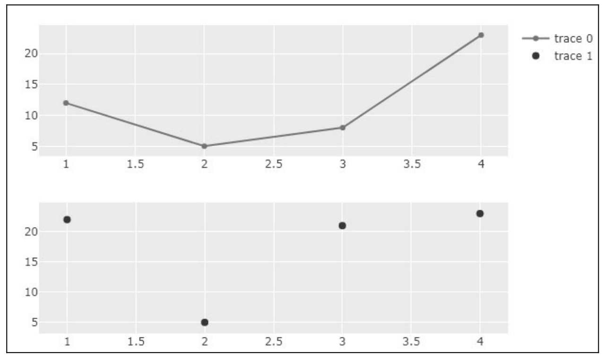

<p class="book-caption">图15.22 绘制简单的多子图表</p>

### 15.5.2 自定义子图位置

子图位置主要通过specs参数实现，它是一个二维的列表集合，列表中包含行和列（rows和cols）两个参数。通过该参数可以绘制包含多个且在不同位置的多子图表。

**【例15.24】**绘制一个包含3个子图的图表**（实例位置：资源包\\MR\\Code\\15\\24）**

下面绘制包含3个子图的多子图表，通过该实例了解specs参数的用法。首先创建2×2的画布，然后通过specs参数布局，第1行第1列一个图表，第1行第2列一个图表，第2行一个图表占据两列位置，程序代码如下：

```text
1   import plotly as py
2   import plotly.graph_objs as go
3   from plotly.subplots import make_subplots
4   fig = make_subplots(rows=2, cols=2,                  # 两行两列
5                      specs=[[{}, {}],                  # 第1行第1列；第1行第2列
6                             [{"colspan": 2}, None]],   # 在第2行占据两列，第2列的位置没有图
7                      subplot_titles=("图1","图2", "图3"))
8   # 第1个子图在第1行第1列的位置
9   fig.add_trace(go.Scatter(x=[1,2,3,4,5], y=[10,20,30,40,50]),row=1, col=1)
10  # 第2个子图在第1行第2列的位置
11  fig.add_trace(go.Scatter(x=[2,4,6,8], y=[10,20,30,40]),row=1, col=2)
12  # 第3个子图在第2行占据两列
13  fig.add_trace(go.Scatter(x=[1,3,5,7], y=[10,20,30,50]),row=2, col=1)
14  # 更新图层
15  fig.update_layout(showlegend=False,                  # 不显示图例
16                  title_text="多子图表标题")          # 标题
17  # 显示图表
18  py.offline.plot(fig)
```

运行程序，效果如图15.23所示。

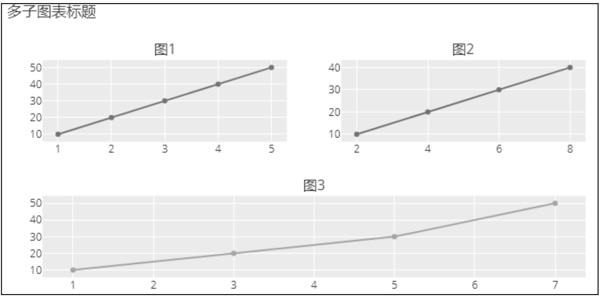

<p class="book-caption">图15.23 自定义子图位置</p>

### 15.5.3 子图可供选择的图形类型

在绘制多子图时，不同类型的图形组合在一起，需要设置图形类型，如柱形图与饼形图组合。设置图形类型主要使用specs参数，具体设置值如下： 

 xy：二维的散点图（scatter()）、柱形图（bar()）等。 

 scene：三维图，如scatter3d、球体cone。 

 polar：极坐标图形，如scatterpolar、barpolar等。 

 ternary：三元图，如scatterternary。 

 mapbox：地图，如scattermapbox。 

 domain：针对有一定域的图形，如pie、parcoords、parcats。

## 15.6 三维图绘制

Plotly的三维绘图不仅好看而且可以实现交互，非常方便。三维图一般包括3个轴，即*x*、*y*、*z*。下面介绍三维图中3D散点图的绘制方法。

**【例15.25】**绘制3D散点图**（实例位置：资源包\\MR\\Code\\15\\25）**

绘制3D散点图主要使用px.scatter_3d()函数。下面使用px.scatter_3d()函数绘制鸢尾花3D散点图，程序代码如下：

```text
1  import plotly as py
2  import plotly.express as px
3  # 载入plotly自带的数据集iris
4  iris=px.data.iris()
5  # 绘制3D散点图
6  fig = px.scatter_3d(iris,x="sepal_length", y="sepal_width", z="petal_width", color="species")
7  py.offline.plot(fig)
```

运行程序，自动生成HTML网页图表，效果如图15.24所示。

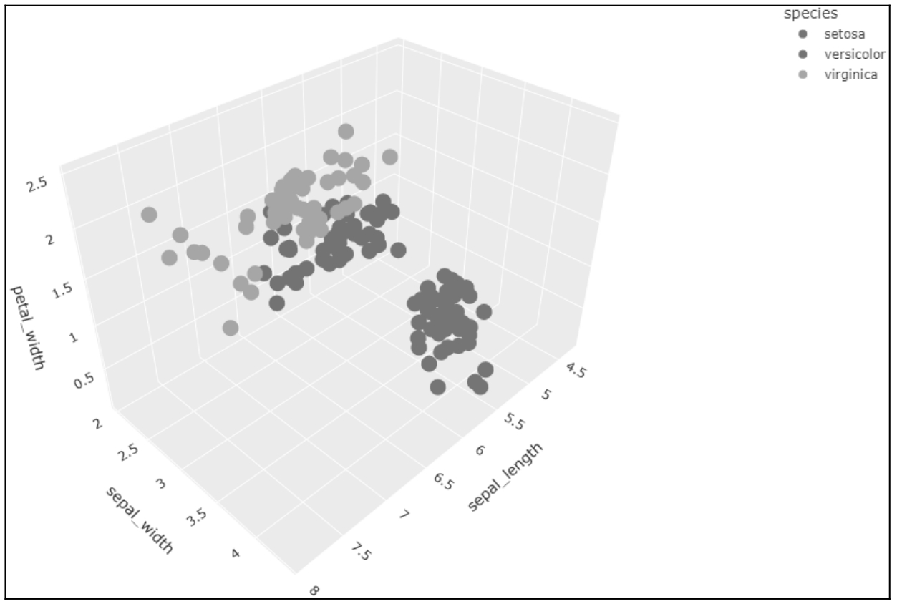

<p class="book-caption">图15.24 3D散点图</p>

## 15.7 绘制表格

Plotly支持绘制表格图表，而且绘图效果非常美观。在Plotly中，绘制表格有两种方法：创建Table()对象和使用create_table()函数。

### 15.7.1 Table()对象

在Plotly中，使用go.Table()对象可以实现绘制表格。下面介绍两个主要的参数：header和cells。 

 header：表格的表头，包括如下设置项。 

 values：列表，表头的文本内容。 

 format：设置单元格值格式规则，类似坐标轴的格式化参数tickformat。 

 prefix：单元格值的前缀。 

 suffix：单元格值的后缀。 

 height：单元格的高度，默认值为28。 

 align：字符串、字符串组成的列表，设置表格内文本的水平对齐方式，包括left、center、right，默认值为center。 

 line：设置边框的宽度和颜色，包括两个子参数width和color。 

 fill：设置单元格填充颜色，默认值为white。它接受特定颜色、颜色数组或2D颜色数组。常用颜色包括darkslategray、lightskyblue、lightcyan、paleturquoise、lavender、royalblue、paleturquoise、white、grey、lightgrey。 

 font：设置表头的文字格式，包括字体、大小、颜色。 

 cells：表格内容的单元格值，设置项与header参数基本一致。

**【例15.26】**绘制学生成绩表**（实例位置：资源包\\MR\\Code\\15\\26）**

下面使用go.Table()对象绘制学生成绩表，程序代码如下：

```text
1   import plotly as py
2   import plotly.graph_objects as go
3   # 创建表格数据
4   trace=go.Table(header=dict(values=['姓名','语文','数学','英语'],
5                            line_color="black",          # 表头线条颜色
6                            fill_color="#44cef6",        # 表头填充色
7                            align="center"),            # 文本居中
8                  cells=dict(values=[['甲','乙','丙'],  # 第1列数据
9                                   [105,88,120],         # 第2列数据
10                                  [99,115,130],         # 第3列数据
11                                  [130,108,110]],       # 第4列数据
12                           line_color = "black",        # 表格线条颜色
13                           fill_color = "#70f3ff",      # 表格填充色
14                           align = "center"))         # 文本居中
15  # 将图轨转换为列表
16  data=[trace]
17  layout=go.Layout(width=600,height=500)
18  # 将图轨和图层合并
19  fig = go.Figure(data=data, layout=layout)
20  py.offline.plot(fig)
```

运行程序，自动生成HTML网页表格，效果如图15.25所示。

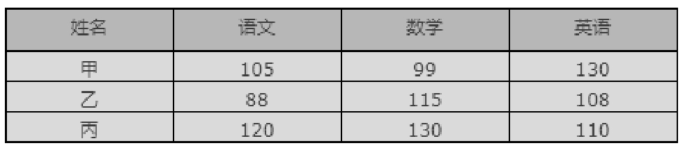

<p class="book-caption">图15.25 绘制学生成绩表</p>

**【例15.27】**将Excel数据绘制成网页表格**（实例位置：资源包\\MR\\Code\\15\\27）**

首先通过Pandas读取Excel文件中的数据，然后使用go.Table()对象将DataFrame数据直接绘制成表格，并且在数据较多的情况下，自动显示滚动条，程序代码如下：

```text
1   import plotly as py
2   import plotly.graph_objects as go
3   import pandas as pd
4   df=pd.read_excel('data3.xlsx')                       # 读取Excel文件
5   print(df)                                              # 输出数据
6   # 创建表格数据
7   trace=go.Table(header=dict(values=list(df.columns),
8                            line_color="black",           # 表头线条颜色
9                            fill_color="#44cef6",         # 表头填充色
10                           align="center"),             # 文本居中
11                # 加载DataFrame对象的数据
12                cells=dict(values=[df.商品名称,df.浏览量,df.访客数,df.人均浏览量,df.平均停留时长,df.成交商品件数,df.
加购人数],
13                         line_color = "black",           # 表格线条颜色
14                         fill_color = "#70f3ff",         # 表格填充色
15                         align = "center"))            # 文本居中
16  # 将图轨转换为列表
17  data=[trace]
18  layout=go.Layout(width=1000,height=500)
19  # 将图轨和图层合并
20  fig = go.Figure(data=data, layout=layout)
21  py.offline.plot(fig)
```

运行程序，自动生成HTML网页表格，数据较多的情况下自动显示滚动条，效果如图15.26所示。

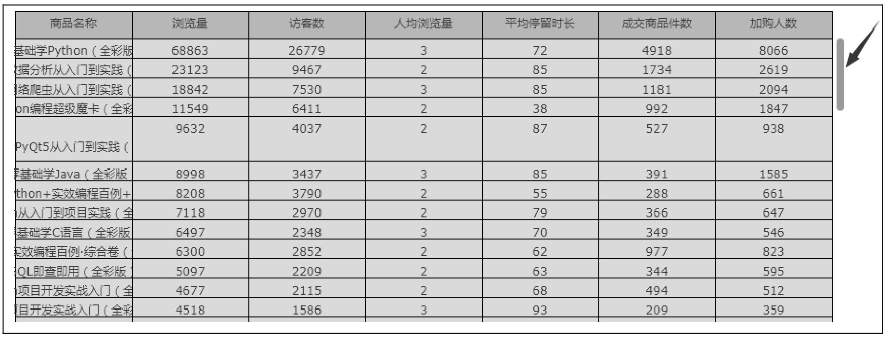

<p class="book-caption">图15.26 将Excel中的数据绘制成网页表格</p>

### 15.7.2 create\_table()函数

在Plotly中，使用plotly.figure_factory子模块的create_table()函数也可以实现绘制表格。下面介绍几个主要的参数。 

 table_text：表格数据，通常是一个DataFrame类型数据。 

 index：布尔型，默认值为False，设置是否显示索引列。 

 index_title：字符串，默认值为空，当index=True时，设置索引列的列名。 

 colorscale：列表，设置背景填充颜色，默认为\[\[0， '#66b2ff'\]， \[.5， '#d9d9d9'\]， \[1， '#ffffff'\]\]。第一个元素为0的子列表，用于设置第一行（即表头）和有索引时的第一列的背景填充颜色；第一个元素为0.5的子列表，用于设置表格内容中奇数行的背景填充颜色；第一个元素为1的子列表，用于设置表格内容中偶数行的背景填充颜色。 

 font_colors：单个或多个元素组成的列表，设置字体颜色，默认为\['#000000'\]。三个元素时，分别设置表头、奇数行、偶数行的字体颜色，也可以实现为每行设置不同的字体颜色。

**【例15.28】**将DataFrame类型的数据生成表格**（实例位置：资源包\\MR\\Code\\15\\28）**

下面使用create_table()函数将DataFrame类型的数据生成表格，程序代码如下：

```text
1  import plotly as py
2  import plotly.figure_factory as ff
3  import pandas as pd
4  df=pd.read_excel('data3.xlsx')      # 读取Excel文件
5  print(df)                             # 输出数据
6  fig=ff.create_table(df)               # 将DataFrame数据生成表格
7  py.offline.plot(fig)
```

运行程序，自动生成HTML网页表格，效果如图15.27所示。

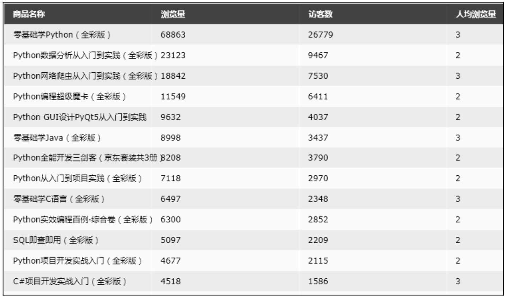

<p class="book-caption">图15.27 将DataFrame数据生成表格（部分数据）</p>

**【例15.29】**数据表格与折线图混合图表**（实例位置：资源包\\MR\\Code\\15\\29）**

数据分析过程中，有些时候需要同时以多种方式查看数据，如通过表格查看数据和通过折线图观察数据走势。下面就通过create_table()函数实现这一功能，程序代码如下：

```text
1   import plotly as py
2   import plotly.figure_factory as ff
3   import plotly.graph_objs as go
4   import pandas as pd
5   df=pd.read_excel('JD2022单品数据.xlsx')   # 读取Excel文件
6   print(df)                                   # 输出数据
7   fig=ff.create_table(df)                     # 将DataFrame类型的数据生成表格
8   # 绘制多折线图
9   fig.add_trace(go.Scatter(name='浏览量',y=df['浏览量'],marker=dict(color='red'),xaxis='x2', yaxis='y2'))
10  fig.add_trace(go.Scatter(name='访客数',y=df['访客数'],marker=dict(color='green'),xaxis='x2', yaxis='y2'))
11  fig.add_trace(go.Scatter(name='成交商品件数',y=df['成交商品件数'],marker=dict(color='blue'),xaxis='x2', yaxis='y2'))
12  # 布局图表
13  fig.update_layout(title_text="商品销售数据走势图表",
14                  width=900,
15                  height=400,
16                  margin={"t": 75, "b": 100},
17                  xaxis={'domain': [0, .45]},
18                  xaxis2={'domain': [0.5, 1.]},
19                  yaxis2={'anchor': 'x2'})
20  py.offline.plot(fig)
```

运行程序，自动生成HTML网页图表，效果如图15.28所示。

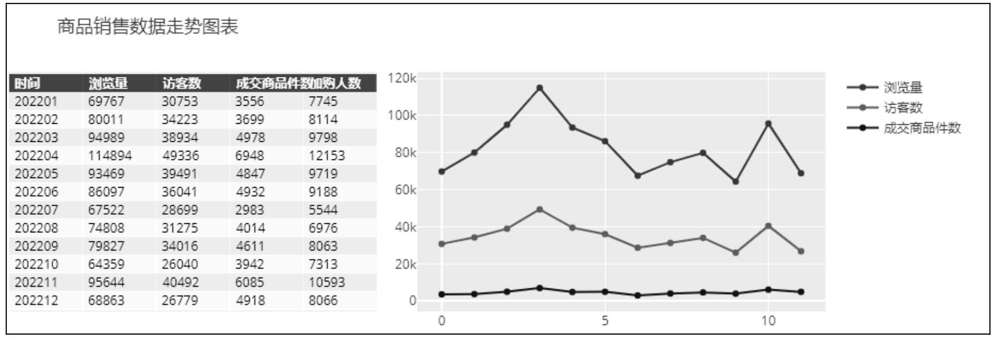

<p class="book-caption">图15.28 数据表格与折线图混合图表</p>

## 15.8 小结

本章介绍了如何使用Plotly模块实现数据图表的绘制。通过本章的学习，读者能够了解Plotly的绘图原理，掌握Plotly绘制图表的相关知识，通过图表细节设置让绘制的图表更加精彩，并应用到实际工作当中。通过综合数据的案例实现了Pandas数据处理与Plotly多子图表的综合应用，从而可提升读者数据分析、数据可视化综合应用的能力。
