# 16 Bokeh图表

Anaconda开发环境中还集成了一个叫作Bokeh的模块，该模块同样可以根据数据集绘制对应的图表，以满足数据可视化的多种需求。本章将介绍如何使用Bokeh模块绘制数据图表。

本章知识架构如下。

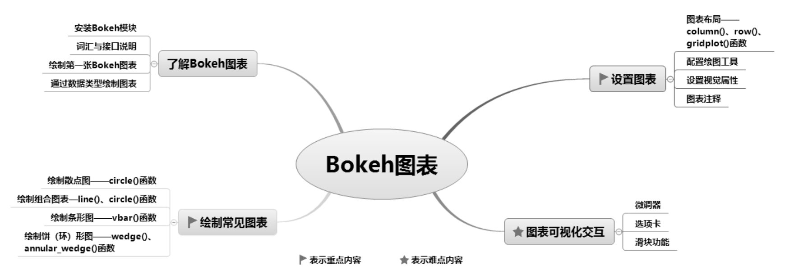

## 16.1 了解Bokeh图表

Bokeh是一个Python交互式可视化模块，支持Web浏览器，可提供完美的展示功能。Bokeh的目标是使用D3.js样式提供优雅、简洁、新颖的图形化风格，同时提供大型数据集的高性能交互功能。Bokeh可以快速创建交互式的绘图、仪表盘和数据应用。

### 16.1.1 安装Bokeh模块

在“命令提示符”窗口中安装Bokeh模块。在系统搜索框中输入cmd，打开“命令提示符”窗口，使用pip工具安装，命令如下：

```text
pip install bokeh
```

当然，也可以在PyCharm开发环境中安装。

### 16.1.2 词汇与接口说明

在学习如何使用Bokeh绘图模块时，我们需要先了解一下相关词汇说明，具体内容如表16.1所示。

<p class="book-caption">表16.1 Bokeh模块的词汇说明</p>

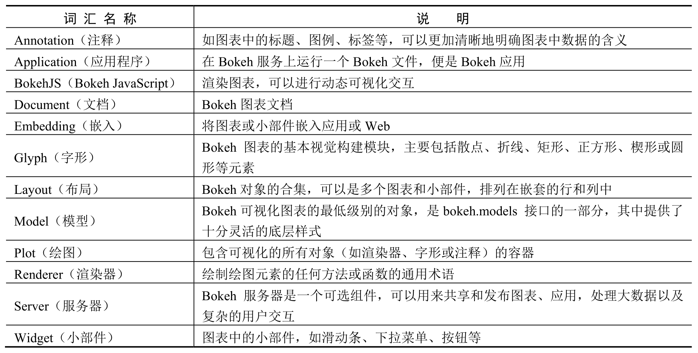

Bokeh的主要功能所对应的接口及其用途如表16.2所示。

<p class="book-caption">表16.2 Bokeh模块的主要接口及其用途</p>

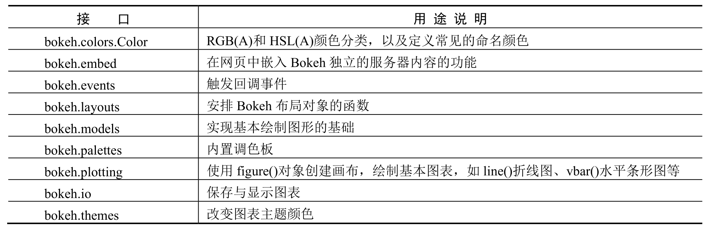

### 16.1.3 绘制第一张Bokeh图表

在使用Bokeh模块绘制一张简单的图表时，分为以下几个步骤：

（1）导入模块与函数。

（2）创建图形画布。

（3）准备数据。

（4）绘制图标。

（5）显示或保存图表文件。

**【例16.1】**绘制简单的折线图**（实例位置：资源包\\MR\\Code\\16\\01）**

以绘制折线图为例，调用line()函数来进行图表绘制，程序代码如下：

```text
1  from bokeh.plotting import figure, show  # 导入图形画布与显示
2  p = figure()                           # 创建图形画布
3  x = [1, 2, 3, 4, 5]                      #  *x*为横轴坐标，图表底部
4  y = [1, 5, 2, 6, 3]                      #  *y*为纵轴坐标，折线对应的数据位置
5  p.line(x,y,line_width = 2)               # 绘制折线图，线宽度为2
6  show(p)                                  # 显示图表
```

使用Bokeh模块绘制图表时，在运行程序后，首先将自动生成与当前.py文件相同名称的.html文件，然后通过浏览器自动打开这个.html图表文件，效果如图16.1所示。

line()函数中提供了多种参数，用于修改折线图的各种属性，常用参数及其说明如表16.3所示。

<p class="book-caption">表16.3 line()函数的参数说明</p>

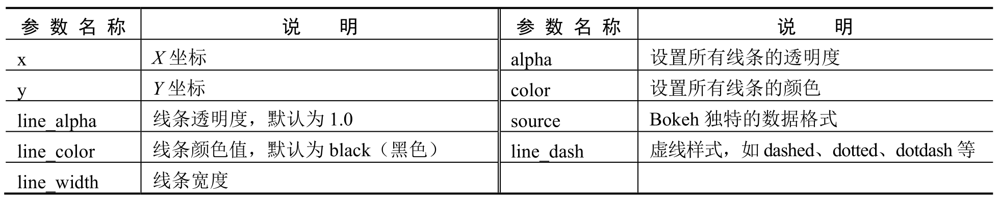

当需要在图表中绘制多条折线时，可通过多次调用line()函数实现。

**【例16.2】**绘制多折线图**（实例位置：资源包\\MR\\Code\\16\\02）**

使用line()函数绘制多折线图，程序代码如下：

```text
1   from bokeh.plotting import figure, show
2   # 创建*x*轴*y*轴数据
3   x = [1, 2, 3, 4, 5]
4   y1 = [6, 7, 2, 4, 5]
5   y2 = [2, 3, 4, 5, 6]
6   y3 = [4, 5, 5, 7, 2]
7   # 创建画布
8   p = figure(title="多折线图", x_axis_label="x", y_axis_label="y")
9   # 绘制多折线图
10  p.line(x, y1, legend_label="京东", color="blue", line_width=2)
11  p.line(x, y2, legend_label="天猫", color="red", line_width=2)
12  p.line(x, y3, legend_label="自营", color="green", line_width=2)
13  # 显示图表
14  show(p)
```

运行程序，效果如图16.2所示。

Bokeh模块还提供了一个可以直接绘制多个折线图的multi_line()函数，该函数只需要设置xs（轴）与ys（数据轴）的坐标参数即可，但两个参数的值必须是列表数据，其他参数与line()函数相同。

**【例16.3】**使用multi_line()函数绘制多折线图**（实例位置：资源包\\MR\\Code\\16\\03）**

本实例将使用multi_line()函数绘制多折线图，程序代码如下：

```text
1  from bokeh.plotting import figure, show                 # 导入图形画布与显示
2  p = figure()                                          # 创建图形画布
3  x = [[1, 2, 3], [4, 5, 6],[7,8,9]]                      #  *x*为横轴坐标，图表底部
4  # 三个子列表，代表三个折线点的数据值
5  y = [[1, 2, 1], [2, 3, 2],[3,4,3]]                      #  *y*为纵轴坐标，折线对应的数据位置
6  p.multi_line(xs=x, ys=y,color=['red','green','blue']) # 绘制折线图，并设置三个折线图的颜色
7  show(p)                                                 # 显示图表
```

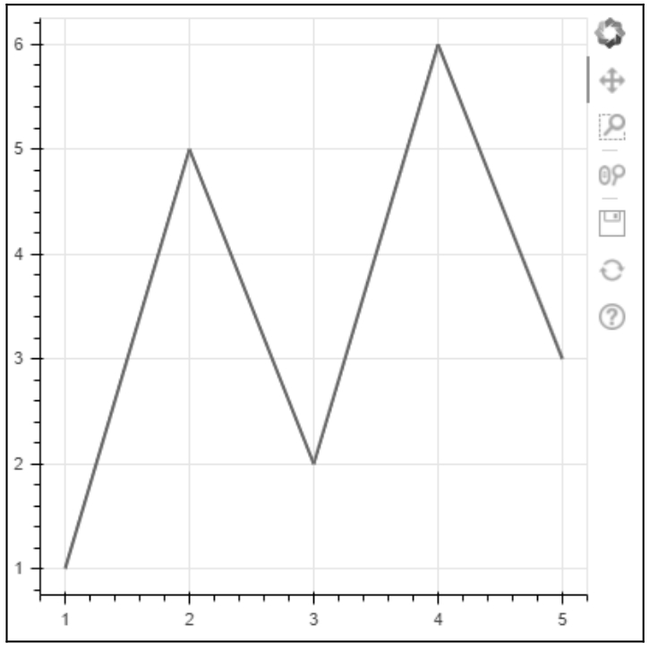

<p class="book-caption">▲图16.1 绘制第一个折线图</p>

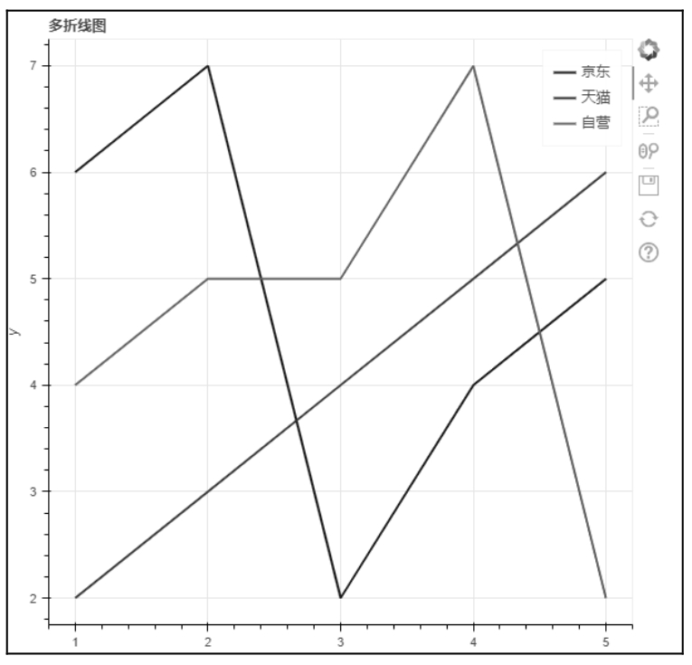

<p class="book-caption">▲图16.2 使用line()函数绘制多折线图</p>

运行程序，效果如图16.3所示。

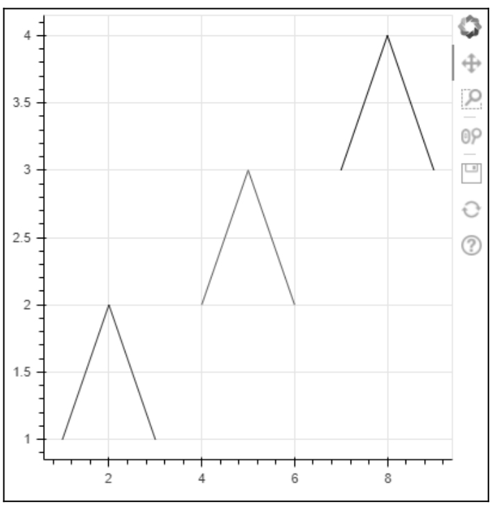

<p class="book-caption">图16.3 使用multi_line()函数绘制多折线图</p>

### 16.1.4 通过数据类型绘制图表

在使用Bokeh模块绘制图表时，可以使用多种数据类型的数据，如16.1.3小节中绘制的折线图就是使用了Python中的list（列表）数据，除了list（列表）数据，还可以使用dict（字典）类型的数据、NumPy中的Array（数组）数据、Pandas中的DataFrame以及Bokeh模块独特的ColumnDataSource数据类型，通过独特的数据类型可以很方便地在绘图函数中直接调用列名进行绘图。

**1. Python字典类型**

使用字典数据时，只需要直接获取键（key）所对应的值（value为列表数据），即可获取一个列表数据，此时便可以直接使用Bokeh模块实现图表的绘制了。

**【例16.4】**使用字典类型数据绘制图表**（实例位置：资源包\\MR\\Code\\16\\04）**

首先通过字典创建*x*轴和*y*轴数据，然后使用line()函数绘制折线图，程序代码如下：

```text
1  from bokeh.plotting import figure,show             # 导入图形画布与显示
2  p = figure()                                     # 创建图形画布
3  # 字典类型的数据
4  dict_data = {'x':[1, 2, 3, 4, 5],'y':[1,2,3,5,4]}
5  x = dict_data['x']                                 #  *x*为横轴坐标，图表底部
6  y = dict_data['y']                                 #  *y*为纵轴坐标，折线对应的数据位置
7  p.line(x,y,line_width = 2)                         # 绘制折线图，线宽度为2
8  show(p)                                            # 显示图表
```

运行程序，效果如图16.4所示。

### 说明

在使用字典数据绘制图表时，还可以先在绘制图表函数中填写source参数，然后将字典数据直接传递给source参数，即可实现图表的绘制。

**2. NumPy数组类型**

在使用NumPy中的数组数据绘制图表时，与使用Python中的list（列表）数据类似，直接指定数据值即可。

**【例16.5】**使用NumPy数组类型数据绘制图表**（实例位置：资源包\\MR\\Code\\16\\05）**

首先创建*x*轴和*y*轴数据，其中*x*轴数据通过列表创建，*y*轴数据则使用numpy数组随机创建，程序代码如下：

```text
1  from bokeh.plotting import figure,show  # 导入图形画布与显示
2  import numpy as np                      # 导入numpy模块
3  p = figure()                          # 创建图形画布
4  x = [1,2,3,4,5]                         #  *x*为横轴坐标，图表底部
5  y = np.random.randint(1,5,size=5)       #  *y*为纵轴坐标，numpy数组随机数据
6  p.line(x,y,line_width = 2)              # 绘制折线图，线宽度为2
7  show(p)                                 # 显示图表
```

运行程序，效果如图16.5所示。

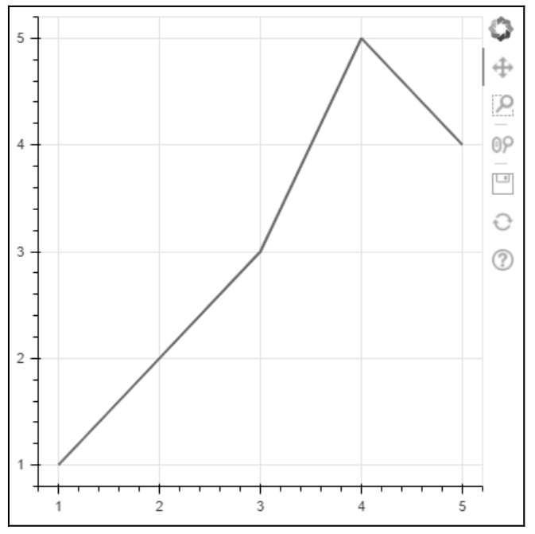

<p class="book-caption">▲图16.4 绘制字典数据的折线图</p>

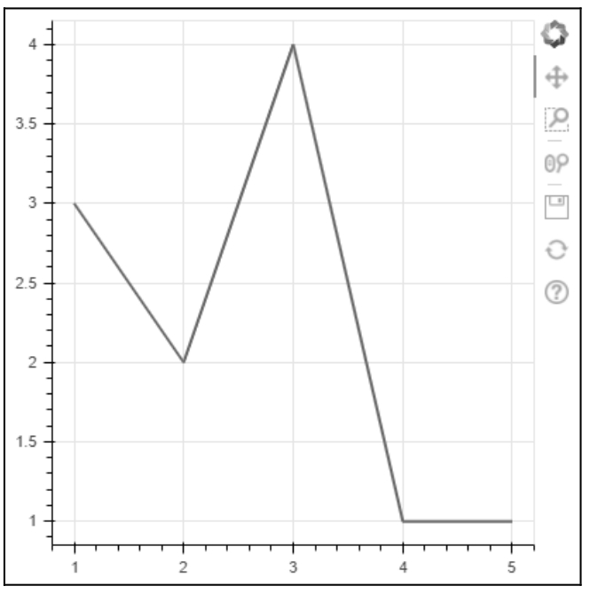

<p class="book-caption">▲图16.5 绘制NumPy数组数据的折线图</p>

**注意**

由于使用了NumPy中的随机生成数组，所以每次运行程序，图表中的*y*轴数据都是不同的。

**3. DataFrame类型**

Pandas是数据分析中最好用的一个模块，该模块有一个专属的数据类型DataFrame，而使用Bokeh模块绘图时，只需要将DataFrame数据传递给source参数即可。

**【例16.6】**使用DataFrame类型数据绘制图表**（实例位置：资源包\\MR\\Code\\16\\06）**

首先使用Pandas模块的DataFrame对象创建数据，然后使用multi_line()函数绘制图表，程序代码如下：

```text
1  from bokeh.plotting import figure,show                    # 导入图形画布与显示
2  import pandas as pd                                       # 导入pandas模块
3  # 创建数据
4  data = {'x':[[1,2,3,4,5],[6,7,8,9,10]],
5         'y':[[5,2,1,4,3],[9,6,8,7,10]]}
6  d_dataframe = pd.DataFrame(data=data)                     # 创建dataframe数据
7  p = figure()                                            # 创建图形画布
8  p.multi_line('x','y',source=d_dataframe,line_width = 2) # 绘制折线图，线宽度为2
9  show(p)                                                   # 显示图表
```

运行程序，效果如图16.6所示。

**4. ColumnDataSource类型**

ColumnDataSource是Bokeh模块独有的数据类型，其对象的data参数用于传递数据，该参数可以传递三种数据类型：dict（字典）、DataFrame和DataFrame中的groupdy（分组统计数据）。

**【例16.7】**通过ColumnDataSource传递字典数据绘制图表**（实例位置：资源包\\MR\\Code\\16\\07）**

首先使用字典创建数据，然后通过ColumnDataSource()对象的data参数传递数据并绘制图表，程序代码如下：

```text
1  from bokeh.plotting import figure,show               # 导入图形画布与显示
2  from bokeh.models import ColumnDataSource            # 导入ColumnDataSource类
3  p = figure()                                       # 创建图形画布
4  # 字典类型的数据
5  dict_data = {'x_values':[1, 2, 3, 4, 5],'y_values':[1,2,3,1,3]}
6  # 传递字典数据创建ColumnDataSource数据对象
7  source = ColumnDataSource(data=dict_data)
8  p.line(x='x_values',y='y_values',source=source)      # 绘制折线图
9  show(p)                                              # 显示图表
```

运行程序，效果如图16.7所示。

**【例16.8】**通过ColumnDataSource传递DataFrame数据绘制图表**（实例位置：资源包\\MR\\Code\\ 16\\08）**

首先使用DataFrame()对象创建数据，然后通过ColumnDataSource()对象的data参数传递数据并绘制图表，程序代码如下：

```text
1   from bokeh.plotting import figure, show              # 导入图形画布与显示
2   import pandas as pd                             # 导入pandas模块
3   from bokeh.models import ColumnDataSource       # 导入ColumnDataSource类
4   p = figure()                                  # 创建图形画布
5   data = {'x_values': [1, 2, 3, 4, 5],            # 字典数据
6          'y_values': [6, 7, 2, 3, 6]}
7   df = pd.DataFrame(data)                         # 转换DataFrame数据
8   # 传递DataFrame数据创建ColumnDataSource数据对象
9   source = ColumnDataSource(data=df)
10  p.line('x_values','y_values',source=source)   # 绘制折线图
11  show(p)                                         # 显示图表
```

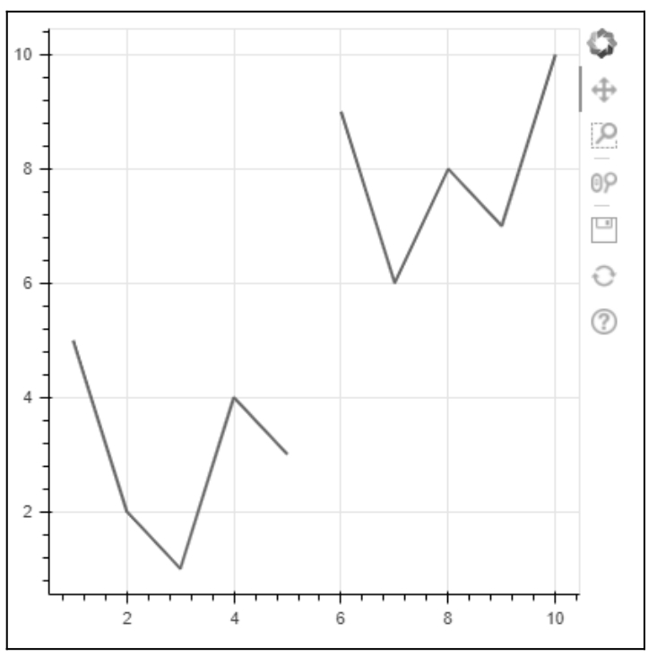

<p class="book-caption">▲图16.6 绘制DataFrame数据折线图</p>

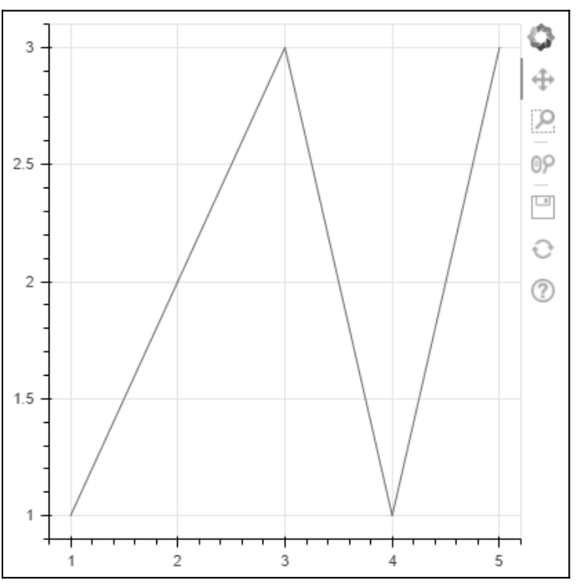

<p class="book-caption">▲图16.7 通过ColumnDataSource绘制字典数据折线图</p>

运行程序，效果如图16.8所示。

**【例16.9】**通过ColumnDataSource传递分组统计数据绘制图表**（实例位置：资源包\\MR\\Code\\ 16\\09）**

首先使用DataFrame()对象创建数据，然后使用groupby()函数统计每月数据，最后通过ColumnDataSource()对象的data参数传递数据并绘制图表，程序代码如下：

```text
1   import pandas as pd                             # 导入pandas模块
2   from bokeh.plotting import figure,show          # 导入图形画布与显示
3   from bokeh.models import ColumnDataSource       # 导入ColumnDataSource类
4   p = figure()                                  # 创建图形画布
5   # 创建字典数据，模拟1～3月商品销量
6   dict_data = {'month':[1,2,3,2,1,3,2,3,1],'data':[1,3,2,2,3,2,4,6,2]}
7   df = pd.DataFrame(dict_data)                    # 创建DataFrame数据
8   group = df.groupby('month').sum()           # 根据月份分组并对每月的数据求和
9   source = ColumnDataSource(data=group)           # 传递分组数据创建ColumnDataSource数据对象
10  p.line(x='month',y = 'data',source=source)      # 绘制折线图
11  show(p)                                         # 显示图表
```

运行程序，效果如图16.9所示。

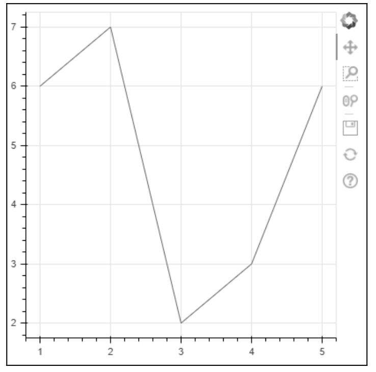

<p class="book-caption">▲图16.8 通过ColumnDataSource绘制DataFrame数据折线图</p>

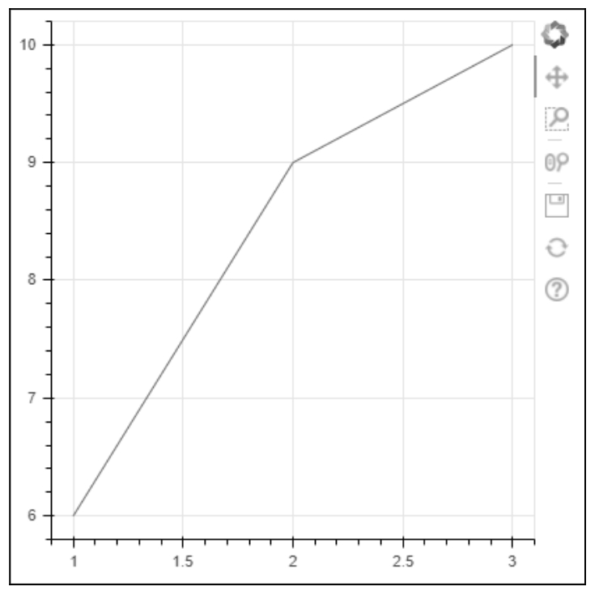

<p class="book-caption">▲图16.9 通过ColumnDataSource绘制groupby数据折线图</p>

## 16.2 绘制常见图表

### 16.2.1 绘制散点图—circle()函数

可以使用circle()函数绘制散点图。该函数的常用参数如表16.4所示。

<p class="book-caption">表16.4 circle()函数的常用参数及其说明</p>

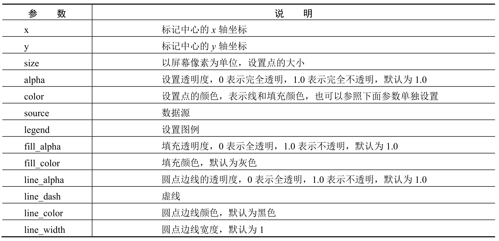

**【例16.10】**使用circle()函数绘制散点图**（实例位置：资源包\\MR\\Code\\16\\10）**

首先创建*x*轴和*y*轴数据，然后使用circle()函数绘制散点图，程序代码如下：

```text
1  from bokeh.plotting import figure,show                       # 导入图形画布与显示
2  p = figure()                                               # 创建图形画布
3  x = [1, 2, 3, 4, 5]                                          #  *x*轴数据
4  y = [2, 5, 3, 1, 4]                                          #  *y*轴数据
5  # 绘制散点图
6  p.circle(x = x,y = y , size=30, color="green",
7         alpha=0.8,line_color='black',line_dash = 'dashed',line_width = 2)
8  show(p)                                                      # 显示散点图
```

运行程序，效果如图16.10所示。

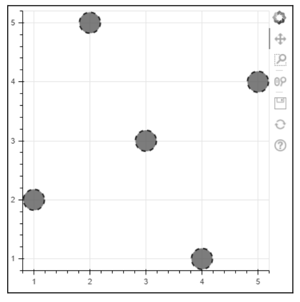

<p class="book-caption">图16.10 使用circle()函数绘制散点图</p>

### 16.2.2 绘制组合图表—line()、circle()函数

Bokeh也可以在一个画布上绘制多个不同类型的图表，如在折线图的数据点上绘制一个散点等。这样可以更加清晰地看出数据点所在的位置。

**【例16.11】**绘制折线图与散点图组合图表**（实例位置：资源包\\MR\\Code\\16\\11）**

首先创建*x*轴、*y*轴数据，然后绘制折线图与散点图组合图表，程序代码如下：

```text
1   from bokeh.plotting import figure, show                              # 导入图形画布与显示
2   p = figure()                                                       # 创建图形画布
3   x = [1, 2, 3, 4, 5]                                                  #  *x*为横轴坐标，图表底部
4   y = [1.1,1.2,2,1.4,1.7]                                              #  *y*为纵轴坐标，折线与散点对应的数据位置
5   y1 = [1.4,1.6,2.6,3.8,2.7]                                           # 第二条折线与散点数据
6   # 绘制折线图与散点图，并设置图例
7   p.line(x,y,legend_label='y',line_width = 2)
8   p.circle(x,y,legend_label='y',fill_color = 'white',line_color='red',size=10)
9   p.line(x,y1,legend_label='y1',line_width = 2)
10  p.circle(x,y1,legend_label='y1',fill_color = 'blue',line_color='red',size=10)
11  show(p)                                                              # 显示图表
```

运行程序，效果如图16.11所示。

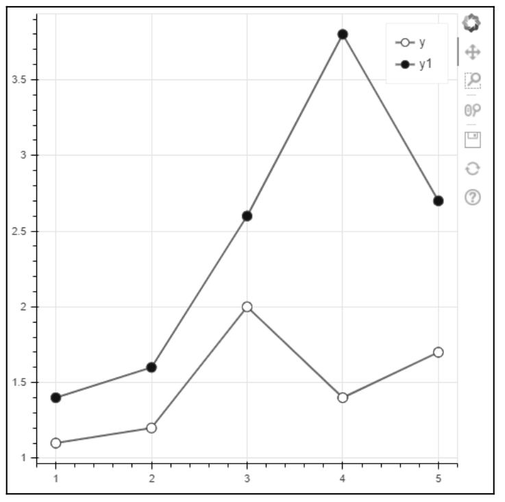

<p class="book-caption">图16.11 组合绘图</p>

### 16.2.3 绘制条形图—vbar()函数

在Bokeh模块中，绘制垂直条形图可以使用vbar()函数。该函数中，参数x表示横轴坐标，width表示条形宽度，bottom表示条形底部高度，top表示条形顶部的*y*轴坐标，其他边线等参数与绘制散点图类似。

**【例16.12】**绘制垂直条形图**（实例位置：资源包\\MR\\Code\\16\\12）**

下面使用vbar()函数绘制垂直条形图，程序代码如下：

```text
1  from bokeh.plotting import figure, show          # 导入图形画布与显示
2  p = figure()                                   # 创建图形画布
3  p.vbar(x=[1, 2, 3], width=0.5, bottom=0,        # 绘制垂直条形图
4        top=[1.8, 2.3, 4.6], color="firebrick",
5        line_width = 2,line_color = 'black',line_dash ='dashed')
6  show(p)                                          # 显示垂直条形图
```

运行程序，效果如图16.12所示。

绘制水平条形图可以使用hbar()函数，在该函数中，参数y为纵轴坐标，height为条形的高度（厚度），left为左边最小值，right为右边最大值。

**【例16.13】**绘制水平条形图**（实例位置：资源包\\MR\\Code\\16\\13）**

下面使用hbar()函数绘制水平条形图，程序代码如下：

```text
1  from bokeh.plotting import figure, show         # 导入图形画布与显示
2  p = figure()                                  # 创建图形画布
3  # 绘制水平条形图
4  p.hbar(y=[1, 2, 3], height=0.5, left=0,right=[1.6, 3.5, 4.3],
5        color = ['blue','green','red'],
6        line_width = 2,line_color = 'black',line_dash ='dashed')
7  show(p)                                         # 显示水平条形图
```

运行程序，效果如图16.13所示。

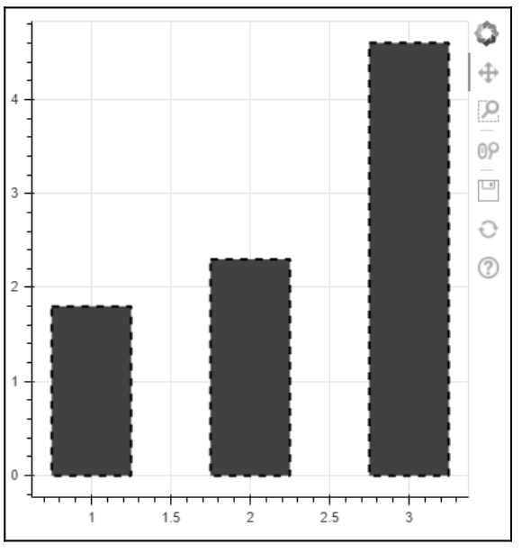

<p class="book-caption">▲图16.12 绘制垂直条形图</p>

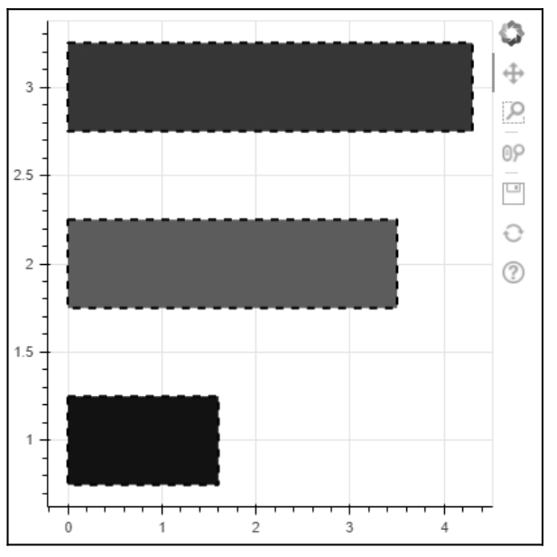

<p class="book-caption">▲图16.13 绘制水平条形图</p>

### 16.2.4 绘制饼（环）形图—wedge()、annular\_wedge()函数

饼形图一般用于表示不同分类的占比情况，主要使用wedge()函数绘制。该函数中，参数x表示圆心横轴的坐标，y表示圆心纵轴的坐标，radius表示圆的半径，start_angle表示从水平方向起始角度，end_angle表示水平方向结束角度，direction表示起始方向（默认逆时针），legend_field表示图例。

**【例16.14】**绘制饼形图**（实例位置：资源包\\MR\\Code\\16\\14）**

下面使用wedge()函数绘制饼形图，程序代码如下：

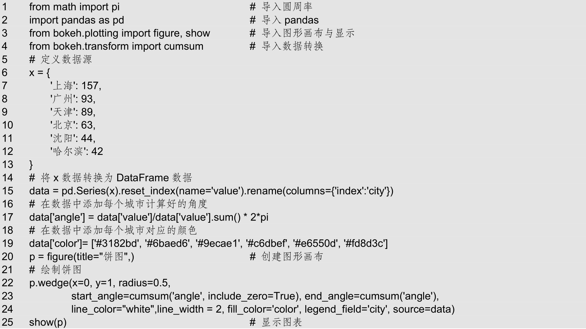

运行程序，效果如图16.14所示。

环形图与饼形图类似，只是将中间的区域挖空。绘制环形图主要使用annular_wedge()函数，其中参数x表示圆环中心的横轴坐标，y表示圆环中心的纵轴坐标，inner_radius表示内环半径，outer_radius表示外环半径。

**【例16.15】**绘制环形图**（实例位置：资源包\\MR\\Code\\16\\15）**

下面使用annular_wedge()函数绘制环形图，程序关键代码如下：

```text
1  p = figure(title="环图",)      # 创建图形画布
2  # 绘制环形图
3  p.annular_wedge(x=0, y=1, outer_radius=0.5,inner_radius=0.4,
4          start_angle=cumsum('angle', include_zero=True), end_angle=cumsum('angle'),
5          line_color="white",line_width = 2, fill_color='color', legend_field='city', source=data)
```

运行程序，效果如图16.15所示。

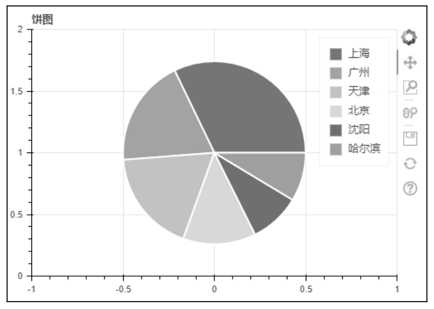

<p class="book-caption">▲图16.14 绘制饼形图</p>

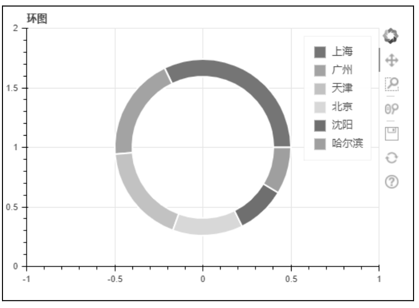

<p class="book-caption">▲图16.15 绘制环形图</p>

## 16.3 设置图表

### 16.3.1 图表布局—column()、row()、gridplot()函数

图表布局方式有3种，分别是列布局、行布局、网格布局。

**1. 列布局**

列布局就是垂直方向显示多个图表，实现这种布局方式主要使用column()函数，将绘制的图表作为参数传入column()函数中。

**【例16.16】**垂直方向布局多个图表**（实例位置：资源包\\MR\\Code\\16\\16）**

首先绘制图表，然后使用column()函数在垂直方向布局图表，程序代码如下：

```text
1  from bokeh.plotting import figure, show            # 导入图形画布与显示
2  from bokeh.layouts import column                   # 导入列布局
3  p1 = figure()                                    # 创建图形画布
4  x = [1, 2, 3, 4, 5]                                #  *x*为横轴坐标，图表底部
5  y = [1, 5, 2, 6, 3]                                #  *y*为纵轴坐标，折线对应的数据位置
6  p1.line(x,y,line_width = 2)                        # 绘制折线图，线宽度为2
7  p2 = figure()                                    # 创建图形画布
8  # 绘制散点图
9  p2.circle(x = x,y = y , size=30, color="green",
10          alpha=0.8,line_color='black',line_dash = 'dashed',line_width = 2)
11  show(column(p1, p2))                          # 列布局显示图表
```

运行程序，效果如图16.16所示。

**2. 行布局**

行布局与列布局类似，只是在水平方向显示多个图表，实现这种布局方式主要使用row()函数，将绘制的图表作为参数传入row()函数中。

**【例16.17】**水平方向布局多个图表**（实例位置：资源包\\MR\\Code\\16\\17）**

首先绘制图表，然后使用row()函数在水平方向布局多个图表，程序代码如下：

```text
1   from bokeh.plotting import figure, show                              # 导入图形画布与显示
2   from bokeh.layouts import row                                        # 导入行布局
3   p1 = figure()                                                      # 创建图形画布
4   x = [1, 2, 3, 4, 5]                                                  #  *x*为横轴坐标，图表底部
5   y = [1, 5, 2, 6, 3]                                                  #  *y*为纵轴坐标，折线对应的数据位置
6   p1.line(x,y,line_width = 2)                                          # 绘制折线图，线宽度为2
7   p2 = figure()                                                      # 创建图形画布
8   # 绘制散点图
9   p2.circle(x = x,y = y , size=30, color="green",
10          alpha=0.8,line_color='black',line_dash = 'dashed',line_width = 2)
11  show(row(p1, p2))                                                # 行布局显示图表
```

运行程序，效果如图16.17所示。

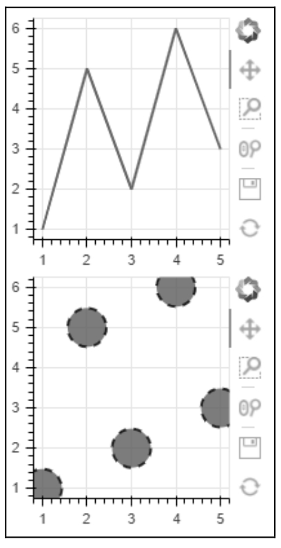

<p class="book-caption">▲图16.16 垂直方向布局图表</p>

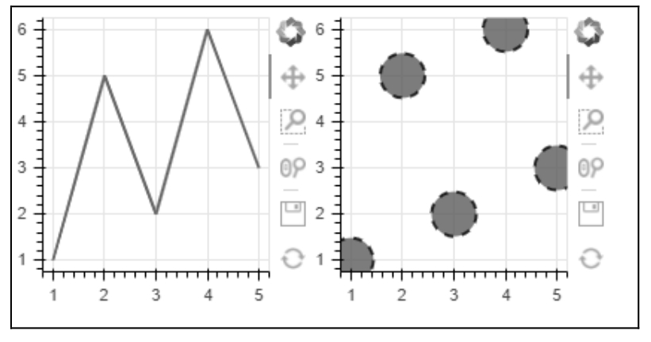

<p class="book-caption">▲图16.17 水平方向布局多个图表</p>

**3. 网格布局**

网格布局相对比较好理解，就是通过网格的方式显示多个图表，实现这种布局方式可以使用gridplot()函数，需要将相关参数传入gridplot()函数中。

**【例16.18】**通过网格布局多个图表**（实例位置：资源包\\MR\\Code\\16\\18）**

首先绘制图表，然后使用gridplot()函数实现将多个图表显示在网格中，程序代码如下：

```text
1  from bokeh.plotting import figure, show  # 导入图形画布与显示
2  from bokeh.layouts import gridplot       # 导入网格布局
3   x=[1,2,3,4,5]                           #  *x*为横轴坐标，图表底部
4   y = list(range(1,6))                #  *y*为纵轴坐标
5   p1 = figure()                         # 创建图形画布
6   # 绘制圆点散点图
7   p1.circle(x=x,y=y,size=10,color='red',line_color='black',line_width = 2)
8   p2 = figure()                         # 创建图形画布
9   # 绘制方形散点图
10  p2.square(x=x,y=y,size=10,color='black',line_color='red',line_width = 2)
11  p3 = figure()                         # 创建图形画布
12  # 绘制三角散点图
13  p3.triangle(x=x,y=y,size=10,color='yellow',line_color='red',line_width = 2)
14  p4 = figure()                         # 创建图形画布
15  # 绘制方形中pin散点图
16  p4.square_pin(x=x,y=y,size=10,color='yellow',line_color='red',line_width = 2)
17  # 使用网格布局显示多个图表
18  grid = gridplot([p1, p2, p3,p4], ncols=2)
19  show(grid)                              # 显示网格布局的图表
```

运行程序，效果如图16.18所示。

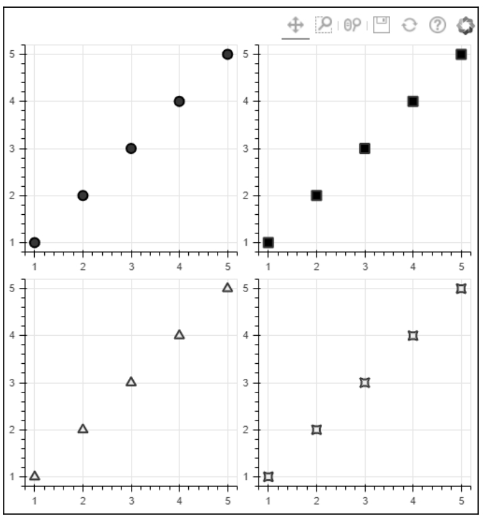

<p class="book-caption">图16.18 网格布局图表</p>

### 说明

gridplot()函数中的ncols参数表示网格布局需要以几列进行展示。

### 16.3.2 配置绘图工具

配置绘图工具包括两方面工作，分别是定位工具栏和指定工具，下面进行具体介绍。

**1. 定位工具栏**

工具栏的默认位置一般会显示在图表的右侧，如果需要调整工具栏位置，可以通过figure()对象的toolbar_location参数来修改。该参数提供了4个值，分别为above、below、left、right，表示工具栏显示在图表的上、下、左、右4个位置。

**【例16.19】**在图表上显示工具栏**（实例位置：资源包\\MR\\Code\\16\\19）**

将工具栏显示在图表上方，程序代码如下：

```text
1  from bokeh.plotting import figure, show                                      # 导入图形画布与显示
2  x=[1,2,3,4,5]                                                                #  *x*为横轴坐标，图表底部
3  y = list(range(1,6))                                                     #  *y*为纵轴坐标
4  p1 = figure(toolbar_location='above')                                      # 创建图形画布
5  p1.circle(x=x,y=y,size=10,color='red',line_color='black',line_width = 2)     # 绘制圆点散点图
6  show(p1)                                                                     # 显示图表
```

运行程序，效果如图16.19所示。

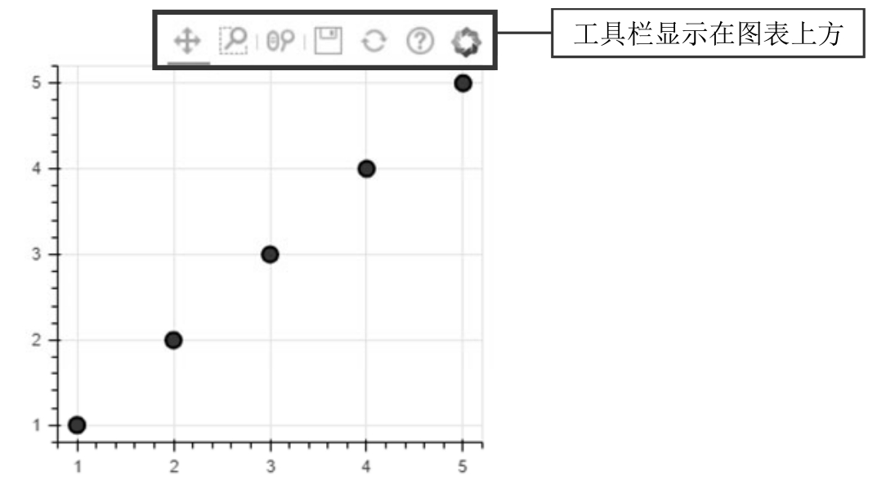

<p class="book-caption">图16.19 将工具栏设置在图表上方</p>

### 说明

如果需要隐藏图表中的工具栏，可以将toolbar_location参数设置为None。

**2. 指定工具**

指定工具就是指将需要的工具添加至工具栏当中，Bokeh模块提供了两种指定工具的方法，一种是先将需要添加的工具名称添加至字符串中，工具名称之间用逗号分隔，然后在创建figure()对象时将工具名称的字符串传递给tools参数。另一种添加工具的方式就是先创建figure()对象，然后通过该对象调用add_tools()函数，再将需要添加的工具对象作为参数传递至add_tools()函数中。

**【例16.20】**为图表指定平移、滑轮缩放和悬停工具**（实例位置：资源包\\MR\\Code\\16\\20）**

下面使用add_tools()函数为图表指定平移、滑轮缩放和悬停工具，程序代码如下：

```text
1  from bokeh.plotting import figure, show                                  # 导入图形画布与显示
2  from bokeh.models import WheelZoomTool                                   # 导入滑轮缩放工具类
3  tools = 'hover,pan'                                                      # 字符串方式添加悬停与平移工具名称
4  x=[1,2,3,4,5]                                                            #  *x*为横轴坐标，图表底部
5  y = list(range(1,6))                                                 #  *y*为纵轴坐标
6  p = figure()                                                           # 创建图形画布
7  p.circle(x=x,y=y,size=10,color='red',line_color='black',line_width = 2)  # 绘制圆点散点图
8  p.add_tools(WheelZoomTool())                                         # 在add_tools中添加滑轮缩放工具
9  show(p)                                                                  # 显示图表
```

运行程序，效果如图16.20所示。

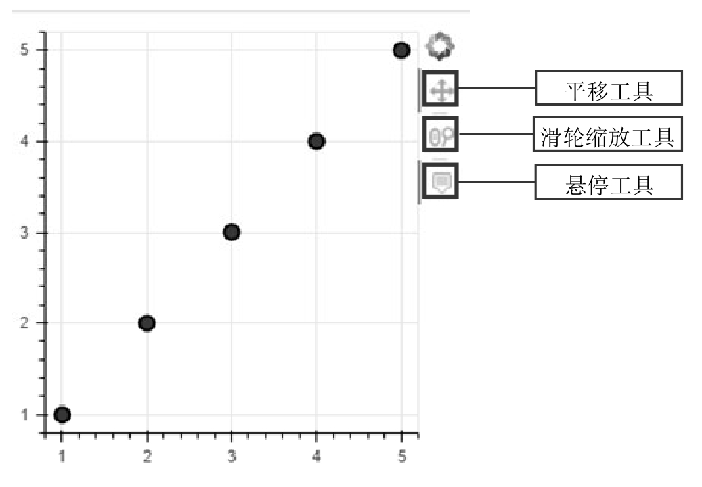

<p class="book-caption">图16.20 为图表指定平移、滑轮缩放和悬停工具</p>

### 说明

除了以上介绍的三种工具，还可以在bokeh.models.tools子模块中查找其他工具。

### 16.3.3 设置视觉属性

设置视觉属性包括三方面的内容，分别是切换主题、设置调色板、颜色映射器，下面进行具体介绍。

**1. 切换主题**

Bokeh为了让图表变得更加美观，一共内置了5种主题样式，分别为caliber、dark_minimal、light_minimal、night_sky和contrast，如图16.21所示。

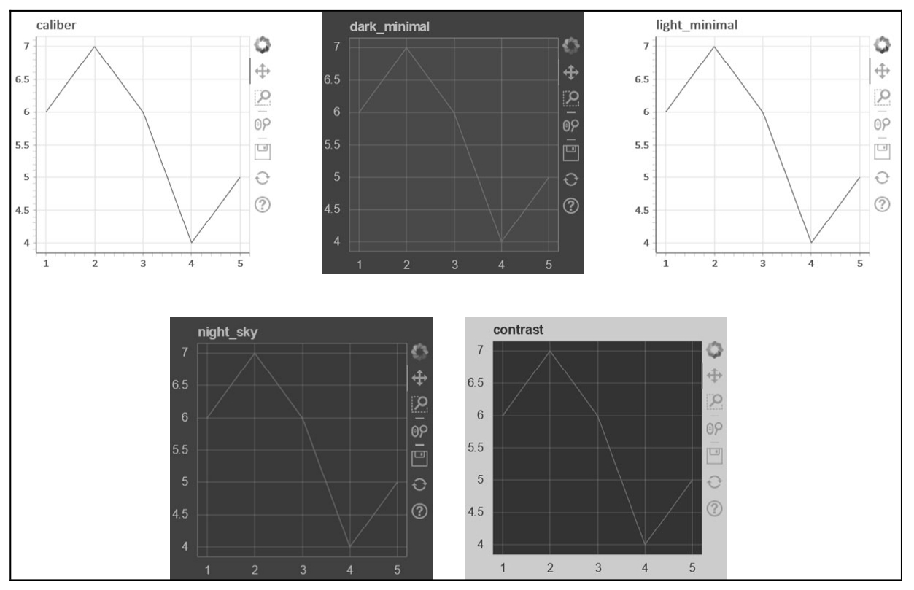

<p class="book-caption">图16.21 Bokeh图表的5种主题样式</p>

**【例16.21】**为图表设置主题样式**（实例位置：资源包\\MR\\Code\\16\\21）**

在Bokeh图表中设置主题样式非常简单，只需要调用curdoc().theme属性并为其赋值要使用的主题样式即可。切换主题样式的程序代码如下：

```text
1  from bokeh.io import curdoc                                      # 导入可以切换主题的函数
2  from bokeh.plotting import figure, show                          # 导入图形画布与显示
3  x=[1,2,3,4,5]                                                    #  *x*为横轴坐标
4  y = list(range(1,6))                                         #  *y*为纵轴坐标
5  curdoc().theme = 'caliber'                                     # 指定需要切换的主题样式
6  p = figure(title='caliber')                                    # 创建图形画布
7  p.circle(x=x,y=y,size=10,color='red',line_color='black',line_width = 2)   # 绘制散点图
8  show(p)                                                          # 显示图表
```

运行程序，效果如图16.22所示。

**2. 设置调色板**

Bokeh内置了非常实用的调色板，可以在bokeh.palettes子模块中找到。例如，Category20中有多达20种常用的颜色，Category20调色板对应多种颜色，如图16.23所示。

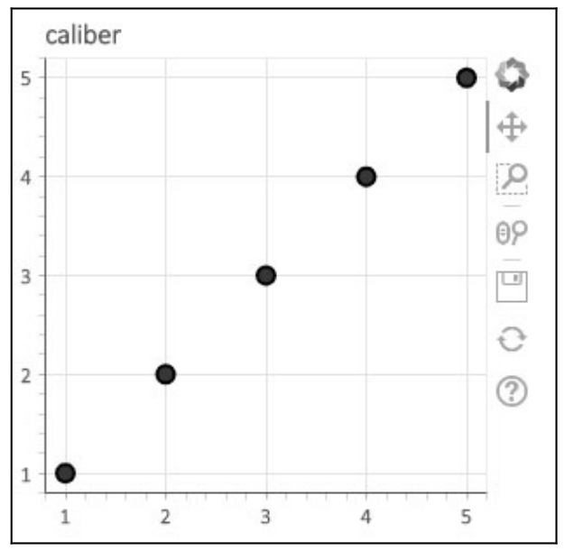

<p class="book-caption">▲图16.22 切换主题样式</p>

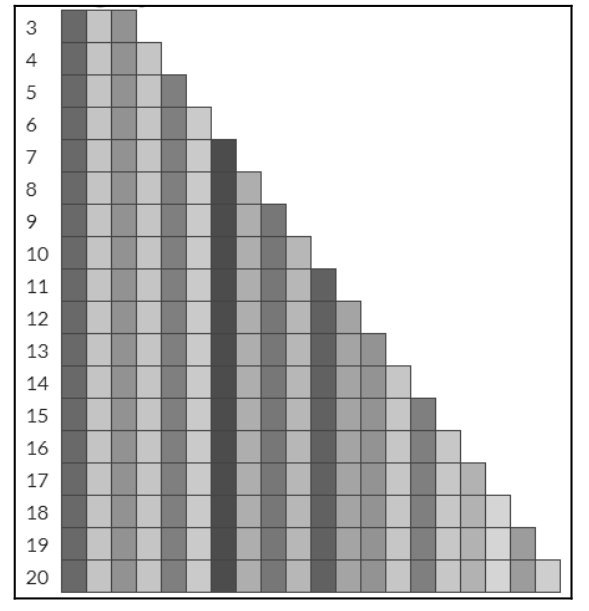

<p class="book-caption">▲图16.23 Category20调色板</p>

调色板是（十六进制）RGB颜色字符串，数据类型为字典类型，字典数据中的key为调色板前的数字（最小为3、最大为20），通过字典中的数字key即可获取对应数量的RGB颜色字符串。

**【例16.22】**使用调色板为图表设置颜色**（实例位置：资源包\\MR\\Code\\16\\22）**

下面先使用Category20设置调色板，然后为图表设置颜色，程序代码如下：

```text
1  from bokeh.palettes import Category20                                     # 导入Category20调色板
2  from bokeh.plotting import figure, show                                   # 导入图形画布与显示
3  x=[1,2,3,4,5]                                                             #  *x*为横轴坐标
4  y = list(range(1,6))                                                  #  *y*为纵轴坐标
5  colors=Category20[5]                                                      # 获取调色板5个颜色值
6  p = figure()                                                            # 创建图形画布
7  p.circle(x=x,y=y,size=10,color=colors,line_color='black',line_width = 2)  # 绘制散点图
8  show(p)                                                                   # 显示图表
```

运行程序，效果如图16.24所示。

**3. 颜色映射器**

颜色映射器就是将调色板中的颜色值映射为数据序列的编码。Bokeh拥有以下几种颜色映射器。 

 bokeh.transform.factor_cmap：将颜色映射到特定的分类元素。 

 bokeh.transform.linear_cmap：将颜色值从高到低映射可用颜色范围内的数值。 

 bokeh.transform.log_cmap：与linear_cmap类似，但使用自然对数比例来映射颜色。

**【例16.23】**使用颜色映射器为图表设置颜色**（实例位置：资源包\\MR\\Code\\16\\23）**

下面使用颜色映射器为图表设置颜色，程序代码如下：

```text
1   from bokeh.models import  ColumnDataSource                     # 导入数据类
2   from bokeh.palettes import Category20                          # 导入调色板
3   from bokeh.plotting import figure,show                         # 导入图形画布与显示
4   from bokeh.transform import linear_cmap                        # 导入线性颜色映射器
5   x = list(range(1,10))                                      # 创建横轴坐标
6   y = list(range(1,10))                                      # 创建纵轴坐标
7   # 创建颜色映射器
8   mapper = linear_cmap(field_name='y', palette=Category20[10] ,low=min(y) ,high=max(y))
9   source = ColumnDataSource(dict(x=x,y=y))                   # 转换数据类型
10  p = figure()                                                 # 创建图形画布
11  p.circle(x='x', y='y',color=mapper,size=12, source=source)   # 绘制散点图，传入颜色映射器
12  show(p)                                                        # 显示图表
```

运行程序，效果如图16.25所示。

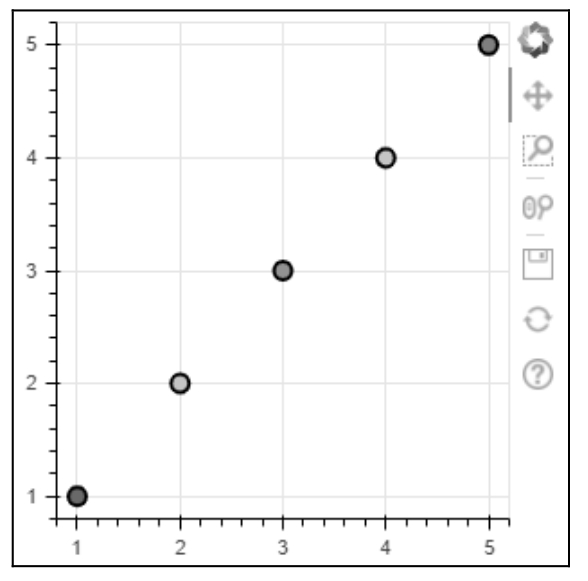

<p class="book-caption">▲图16.24 使用调色板为图表设置颜色</p>

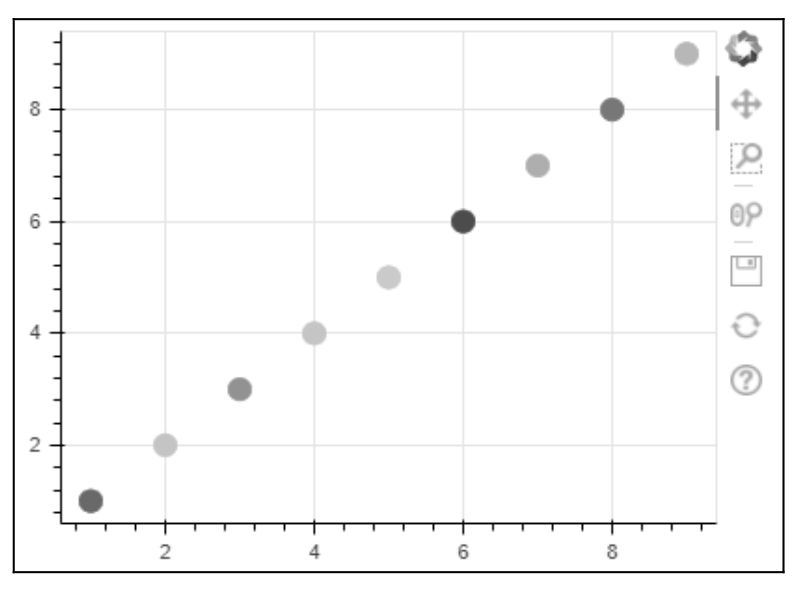

<p class="book-caption">▲图16.25 使用颜色映射器为图表设置颜色</p>

### 16.3.4 图表注释

图表注释包括添加标题、添加图例、图例自动分组三部分内容，下面进行具体介绍。

**1. 添加标题**

图表中最常见的注释就是图表的标题，从标题上可以很清楚地看出当前图表的名称以及图表的意义。在Bokeh中添加图表的标题只需要在创建画布对象（figure）时，添加title参数并指定对应的标题名称即可。

**【例16.24】**为图表设置标题**（实例位置：资源包\\MR\\Code\\16\\24）**

下面通过title参数为图表设置标题，程序代码如下：

```text
1  from bokeh.plotting import figure,show # 导入图形画布与显示
2  p = figure(title="我是图表标题")     # 创建图形画布
3  x = [1,2,3]                            # 横轴坐标
4  y = [1,2,1]                            # 纵轴坐标
5  p.circle(x,y,size=10)                # 绘制散点图
6  show(p)                                # 显示图表
```

运行程序，效果如图16.26所示。

在添加图表标题时，标题会默认显示在图表的左上方，如果在画布对象（figure）中设置title_location参数，便可以修改图表标题所显示的位置，如above（上）、below（下）、left（左）、right（右）。例如，设置图表标题位于图表下方，关键代码如下：

```text
p = figure(title="我是图表标题",title_location='below')
```

运行程序，效果如图16.27所示。

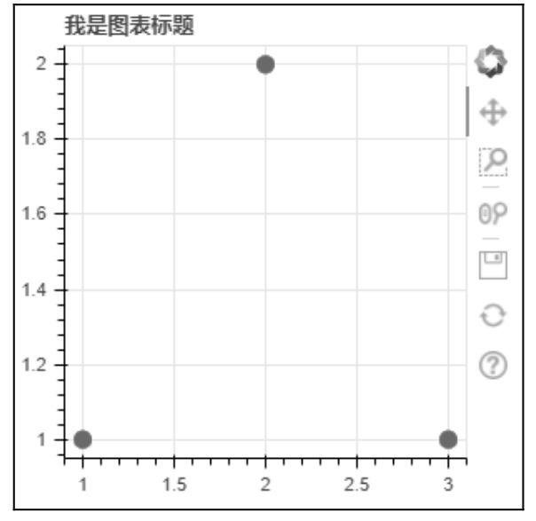

<p class="book-caption">▲图16.26 为图表设置标题</p>

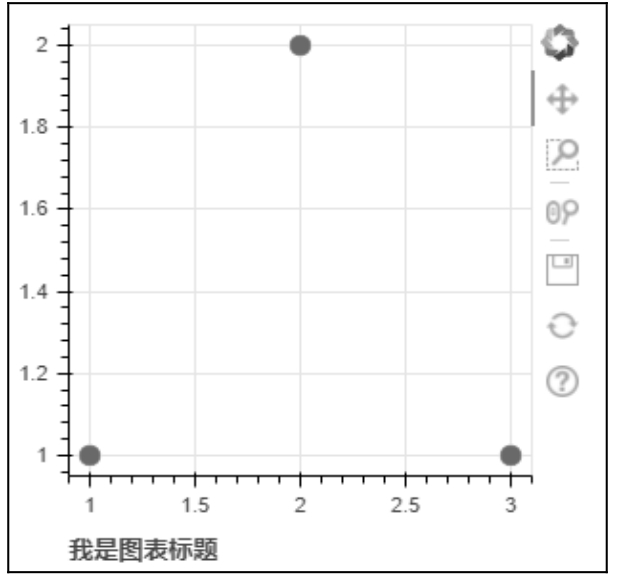

<p class="book-caption">▲图16.27 修改图表标题的位置</p>

除了设置标题位置，还可以通过画布对象（figure）调用title()对象，然后通过各种属性来自定义标题。

**【例16.25】**设置图表标题颜色和大小等**（实例位置：资源包\\MR\\Code\\16\\25）**

下面使用title()对象设置图表标题内容、文本方向、文字大小、文字颜色和标题背景颜色，程序代码如下：

```text
1   from bokeh.plotting import figure, show  # 导入图形画布与显示
2   p = figure()                           # 创建图形画布
3   x = [1, 2, 3]                            # 横轴坐标
4   y = [1, 2, 1]                            # 纵轴坐标
5   p.circle(x, y, size=10)                # 绘制散点图
6   # 设置图表标题属性
7   p.title.text = "我是图表标题"            # 设置标题内容
8   p.title.align = "center"                 # 设置标题相对于文本的方向
9   p.title.text_color = "white"             # 设置标题文字颜色
10  p.title.text_font_size = "25px"          # 设置标题文字大小
11  p.title.background_fill_color = "red"    # 设置标题背景颜色
12  show(p)                                  # 显示图表
```

运行程序，效果如图16.28所示。

在设置图表标题时，可能会出现需要多个标题的需求，这时就需要先单独创建一个标题（Title）对象，然后通过添加布局的方式，将新创建的标题对象添加到图表的指定位置。

**【例16.26】**为图表设置双标题**（实例位置：资源包\\MR\\Code\\16\\26）**

为图表设置双标题，程序代码如下：

```text
1  from bokeh.models import Title             # 导入标题类
2  from bokeh.plotting import figure, show    # 导入图形画布与显示
3  p = figure(title="我是上标题")           # 创建图形画布
4  x = [1, 2, 3]                              # 横轴坐标
5  y = [1, 2, 1]                              # 纵轴坐标
6  p.circle(x, y, size=10)                  # 绘制散点图
7  new_title = Title(text="我是下标题")     # 添加标题对象
8  p.add_layout(new_title, "below")         # 添加布局的方式，添加标题
9  show(p)                                    # 显示图表
```

运行程序，效果如图16.29所示。

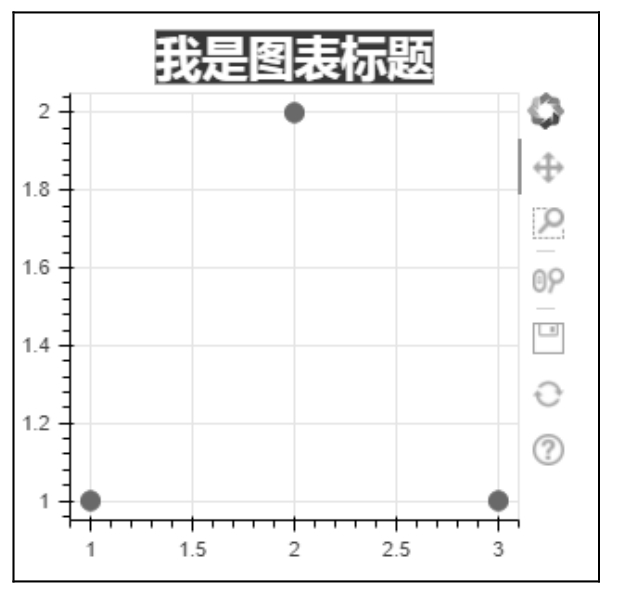

<p class="book-caption">▲图16.28 自定义图表标题</p>

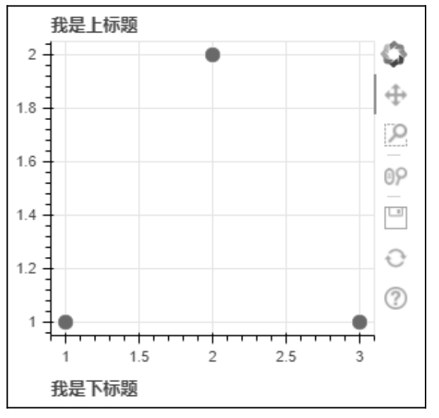

<p class="book-caption">▲图16.29 设置双标题</p>

**2. 添加图例**

如果图表中出现多个数据，就可以在绘图函数中添加图例参数（legend_label），这样可以更加清晰地区分每个数据。

**【例16.27】**为图表添加图例**（实例位置：资源包\\MR\\Code\\16\\27）**

绘制折线图并添加图例，程序代码如下：

```text
1   from bokeh.plotting import figure, show     # 导入图形画布与显示
2   x=[1,2,3,4,5]                               # 横轴坐标
3   # 纵轴坐标
4   y = [1,2,1,2,1]
5   y2 = [2,3,2,3,2]
6   y3 = [3,4,3,4,3]
7   p = figure()                              # 创建画布
8   # 绘制圆散点与对应折线
9   p.circle(x,y,size=10,color='yellow',legend_label='圆',line_color='red',line_width = 2)
10  p.line(x,y,color='yellow',legend_label='圆',line_color='red',line_width = 2)
11  # 绘制三角散点与对应折线
12  p.triangle(x=x,y=y2,size=10,color='yellow',legend_label='三角',line_color='red',line_width = 2)
13  p.line(x=x,y=y2,color='yellow',legend_label='三角',line_color='red',line_width = 2)
14  # 绘制方形散点与对应折线
15  p.square(x=x,y=y3,size=10,color='yellow',legend_label='方形',line_color='red',line_width = 2)
16  p.line(x=x,y=y3,color='yellow',legend_label='方形',line_color='red',line_width = 2)
17  show(p)                                     # 显示图表
```

运行程序，效果如图16.30所示。

在绘图函数中直接添加legend_label参数很方便，但经常出现图例遮挡部分图表的现象。此时可单独创建legend()对象，通过添加布局的方式指定图例显示的位置。这样既方便观看图表数据，又不会遮挡图表。

**【例16.28】**指定图例所显示的位置**（实例位置：资源包\\MR\\Code\\16\\28）**

通过添加布局的方式单独指定图例所显示的位置，程序代码如下：

```text
1   from bokeh.models import Legend             # 导入Legend类
2   from bokeh.plotting import figure, show     # 导入图形画布与显示
3   x=[1,2,3,4,5]                               # 横轴坐标
4   # 纵轴坐标
5   y = [1,2,1,2,1]
6   y2 = [2,3,2,3,2]
7   y3 = [3,4,3,4,3]
8   p = figure()                              # 创建画布
9   # 绘制圆散点与对应折线
10  c0=p.circle(x,y,size=10,color='yellow',line_color='red',line_width = 2)
11  c1=p.line(x,y,color='yellow',line_color='red',line_width = 2)
12  # 绘制三角散点与对应折线
13  t0=p.triangle(x=x,y=y2,size=10,color='yellow',line_color='red',line_width = 2)
14  t1=p.line(x=x,y=y2,color='yellow',line_color='red',line_width = 2)
15  # 绘制方形散点与对应折线
16  s0=p.square(x=x,y=y3,size=10,color='yellow',line_color='red',line_width = 2)
17  s1=p.line(x=x,y=y3,color='yellow',line_color='red',line_width = 2)
18  # 创建Legend对象
19  legend = Legend(location='center',items=[('圆',[c0,c1]),
20              ('三角',[t0,t1]),
21              ('方形',[s0,s1])])
22  p.add_layout(legend, 'right')             # 图例添加在图表右侧
23  show(p)                                     # 显示图表
```

运行程序，效果如图16.31所示。

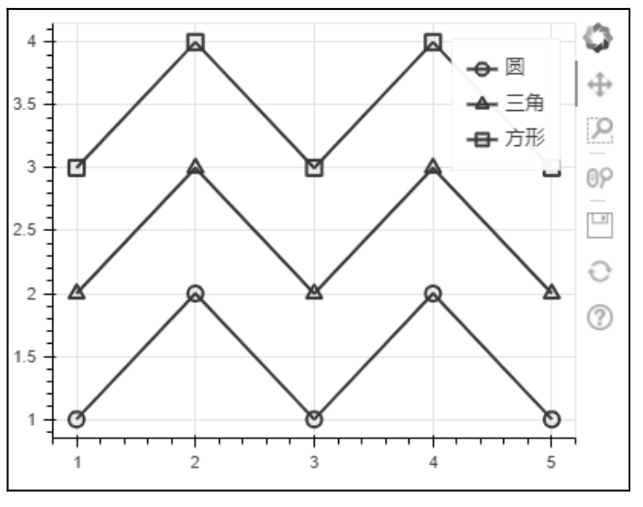

<p class="book-caption">▲图16.30 添加图例</p>

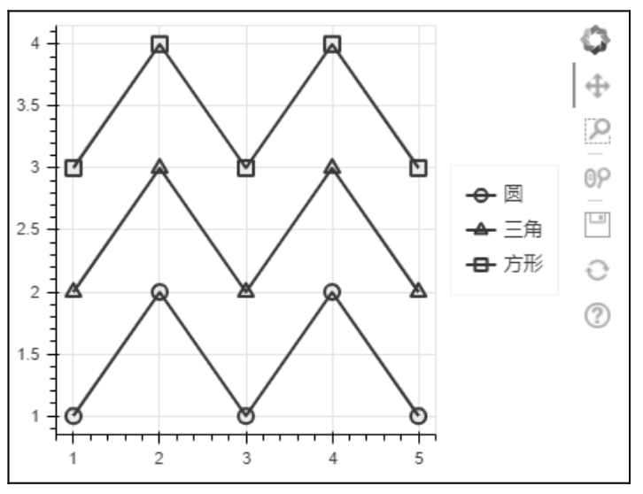

<p class="book-caption">▲图16.31 修改图例显示位置</p>

**3. 图例自动分组**

如果使用的数据是ColumnDataSource类，Bokeh可从ColumnDataSource数据中的label列生成对应的图例名称，从而实现图例的自动分组。

**【例16.29】**图例自动分组**（实例位置：资源包\\MR\\Code\\16\\29）**

下面实现图例自动分组，程序代码如下：

```text
1  from bokeh.models import ColumnDataSource      # 导入ColumnDataSource类
2   from bokeh.plotting import figure, show       # 导入图形画布与显示
3   # 创建数据
4   source = ColumnDataSource(dict(
5       x=[1, 2, 3, 4, 5, 6],
6       y=[2, 1, 2, 1, 2, 1],
7       color=['red', 'blue', 'red', 'blue', 'red', 'blue'],
8       label=['红', '蓝', '红', '蓝', '红', '蓝']
9   ))
10  # 创建画布
11  p = figure(x_range=(0, 7), y_range=(0, 3))
12  # 绘制散点图，图例通过数据中的label进行分组
13  p.circle(x='x', y='y', size = 15,color='color', legend_group='label', source=source)
14  show(p)                                        # 显示图表
```

程序运行，效果如图16.32所示。

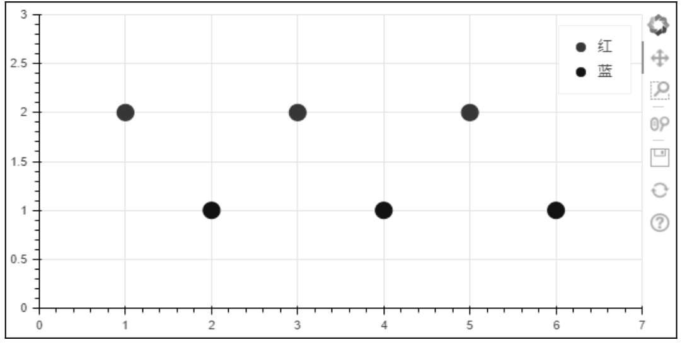

<p class="book-caption">图16.32 图例自动分组</p>

## 16.4 图表可视化交互

### 16.4.1 微调器

微调器是Bokeh中的一个小部件，通过它可以实现图表属性的调节。在图表中添加微调器需要先创建微调器对象Spinner()，再调用js_link()函数，当微调器数值修改时同时修改图表所对应的属性。

**【例16.30】**通过微调器调节散点图中散点的大小**（实例位置：资源包\\MR\\Code\\16\\30）**

下面实现使用微调器调节散点图中散点的大小，程序代码如下：

```text
1   from bokeh.layouts import column, row           # 导入行列布局
2   from bokeh.models import Spinner                # 导入微调器
3   from bokeh.plotting import figure,show          # 导入图形画布与显示
4   from bokeh.palettes import Category20           # 导入调色板
5   x = [1,2,3,4,5]                                 # 横轴坐标
6   y = [1,2,1,2,1]                                 # 纵轴坐标
7   colors = Category20[5]                          # 调色板中五个颜色
8   p = figure()                                  # 创建画布
9   points=p.circle(x,y,color=colors,size = 10)   # 绘制散点图
10  # 创建微调器对象
11  spinner = Spinner(title="微调器", low=1, high=40, step=2, value=10, width=80)
12  # 调用js事件处理，用于通过微调器值修改图表中散点大小
13  spinner.js_link('value', points.glyph, 'size')
14  # 使用行与列布局将微调器显示出来
15  show(row(column(spinner, width=100), p))
```

运行程序，将显示如图16.33所示的图表，然后将微调器数据调大，此时图表中的散点将同时变大，如图16.34所示。

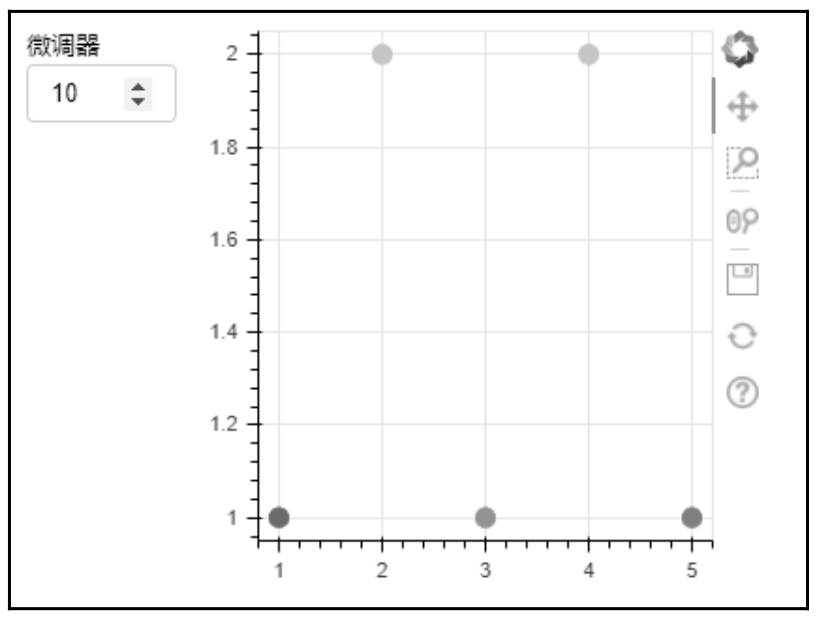

<p class="book-caption">▲图16.33 微调器默认值</p>

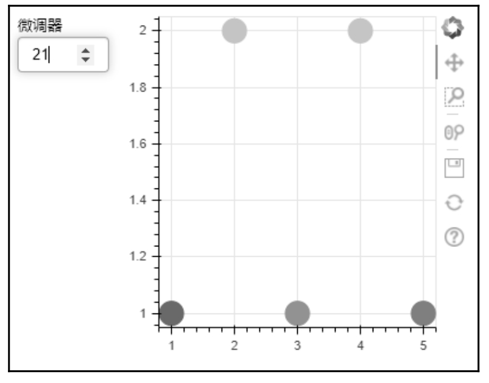

<p class="book-caption">▲图16.34 微调器值变大</p>

### 16.4.2 选项卡

当页面中需要显示多个图表时，可以使用选项卡小部件实现，这样既节省空间，还方便切换查看。例如，要实现两个图表之间的切换，需要创建两个选项卡对象TabPanel()，分别指定对应的图表，并将两个选项卡对象添加至Tabs()对象中。

**【例16.31】**为图表添加选项卡**（实例位置：资源包\\MR\\Code\\16\\31）**

在图表中添加选项卡，通过选项卡查看不同的图表，程序代码如下：

```text
1   from bokeh.plotting import figure, show                                # 导入图形画布与显示
2   from bokeh.models import Tabs, TabPanel                                # 导入选项卡
3   p_v = figure()                                                       # 创建画布
4   p_v.vbar(x=[1, 2, 3], width=0.5, bottom=0,                            # 绘制垂直条形图
5          top=[1.8, 2.3, 4.6], color="firebrick",
6          line_width = 2,line_color = 'black',line_dash ='dashed')
7   tab_v = TabPanel(child=p_v,title='垂直条形图')                       # 第一个选项卡
8   p_c = figure()                                                       # 创建画布
9   x = [1, 2, 3, 4, 5]                                                    #  *x*轴数据
10  y_c = [2, 5, 3, 1, 4]                                                  #  *y*轴散点数据
11  y_l = [1, 5, 2, 6, 3]                                                  #  *y*轴折线数据
12  # 绘制散点图
13  p_c.circle(x = x,y = y_c , size=30, color="green",
14           alpha=0.8,line_color='black',line_dash = 'dashed',line_width = 2)
15  tab_c = TabPanel(child=p_c,title='散点图')                           # 第二个选项卡
16  p_l = figure()                                                       # 创建画布
17  p_l.line(x,y_l,line_width = 2)                                         # 绘制折线图，线宽度为2
18  tab_l = TabPanel(child=p_l,title='折线图')                           # 第三个选项卡
19  tabs = Tabs(tabs = [tab_v,tab_c,tab_l])                                # 集中选项卡
20  show(tabs)                                                             # 显示选项卡及图表
```

运行程序，默认显示如图16.35所示的带选项卡的图表，通过选项卡依次切换到“散点图”“折线图”，效果如图16.36和图16.37所示。

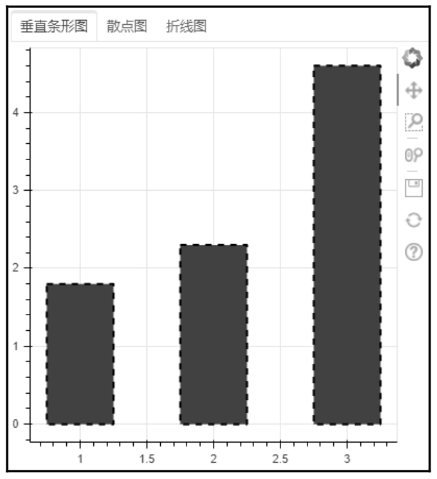

<p class="book-caption">▲图16.35 选项卡图表（1）</p>

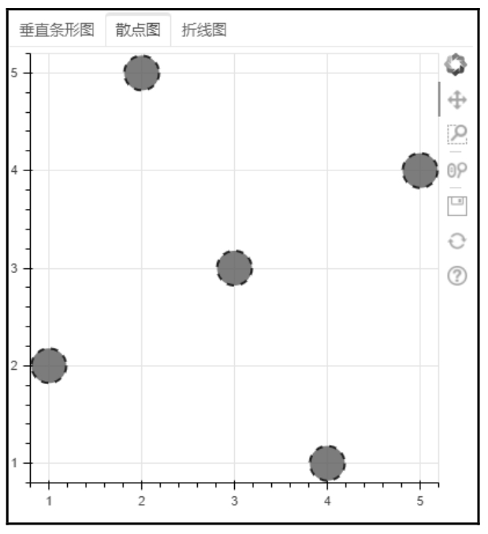

<p class="book-caption">▲图16.36 选项卡图表（2）</p>

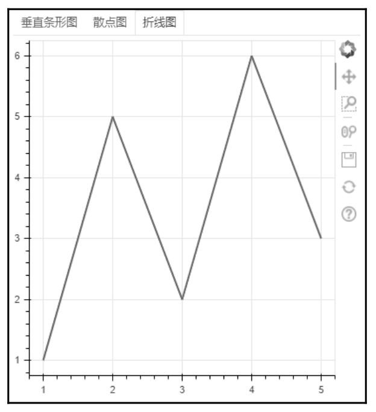

<p class="book-caption">▲图16.37 选项卡图表（3）</p>

### 16.4.3 滑块功能

除了可以使用微调器调节图表属性，还可以使用滑块来调节图表中的数据值，让图表根据滑块值改变自身形态。首先需要自定义一个JS回调函数，动态修改图表中的数据值，然后创建滑块对象Slider()并通过调用js_on_change()函数实现回调函数的执行。

**【例16.32】**通过滑块调整图表**（实例位置：资源包\\MR\\Code\\16\\32）**

下面使用滑块修改折线图的数值，程序代码如下：

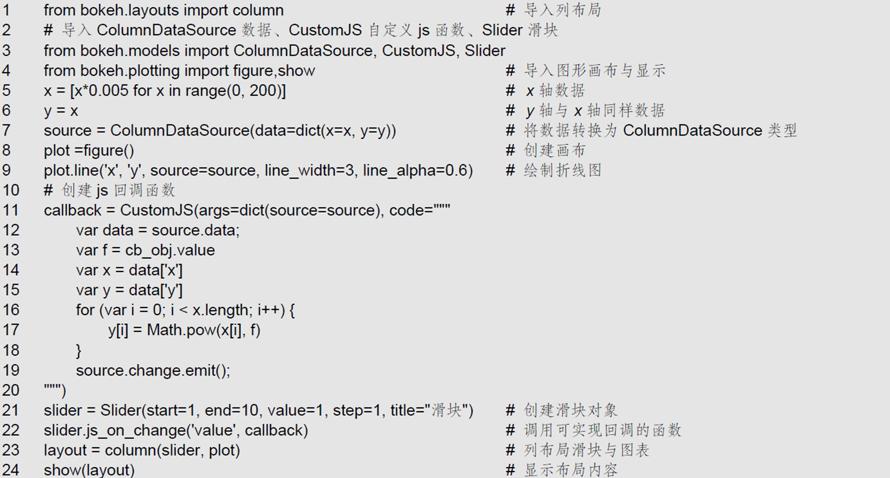

运行程序，默认显示如图16.38所示的图表，将图表上方的滑块滑动至右侧，图表数据将被动态修改，效果如图16.39所示。

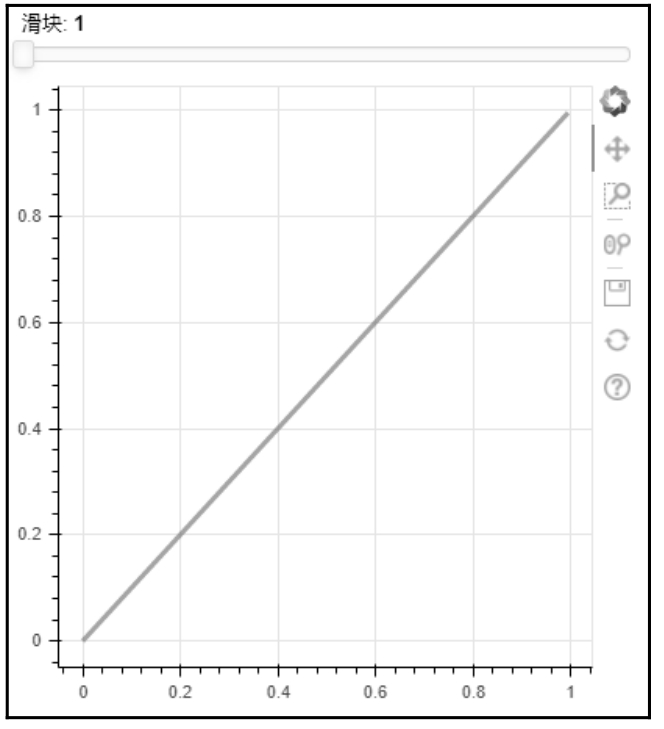

<p class="book-caption">▲图16.38 默认显示数据的图表</p>

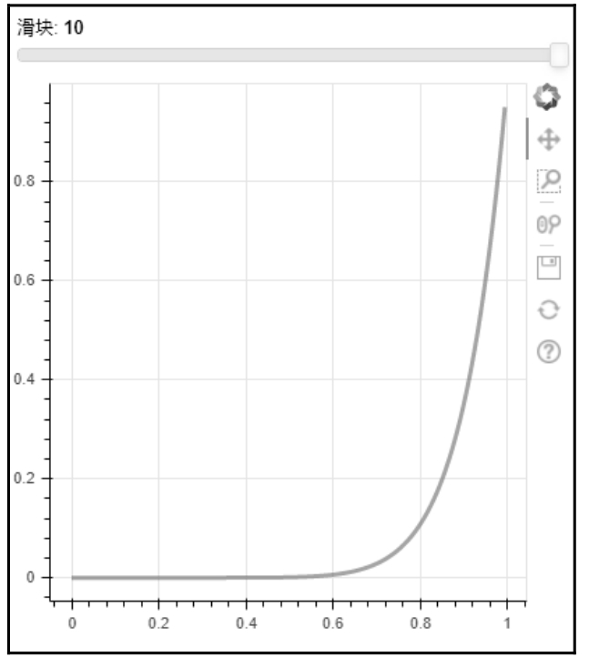

<p class="book-caption">▲图16.39 滑动滑块修改数据后的图表</p>

## 16.5 小结

本章介绍了如何使用Bokeh模块实现数据图表的绘制，Bokeh并未提供复杂的绘图功能，如各种三维曲线图和曲面图等。另外，Bokeh不是基于Python语言开发的交互工具，它实质上是用JavaScript实现在浏览器中绘图的工具，和Python常用的绘图工具并没有什么关系，Python中绝大多数的绘图工具都是基于Matplotlib实现的，是纯Python语言的绘图。所以，在实现Matplotlib和Bokeh交互时是比较困难的，而用JavaScript会容易一些，但同时也要求读者对JavaScript有一定的了解。
