# 17 Pyecharts图表

Echarts是一个由百度开发并开源的数据可视化工具，而Python是一门适用于数据处理和数据分析的语言，为了适应Python的需求，Pyecharts模块诞生了。本章以Pyecharts 2.0.3版本为载体，介绍Pyecharts的安装、链式调用、Pyecharts图表的组成以及如何绘制柱状图、折线图、饼形图等。

本章知识架构如下。

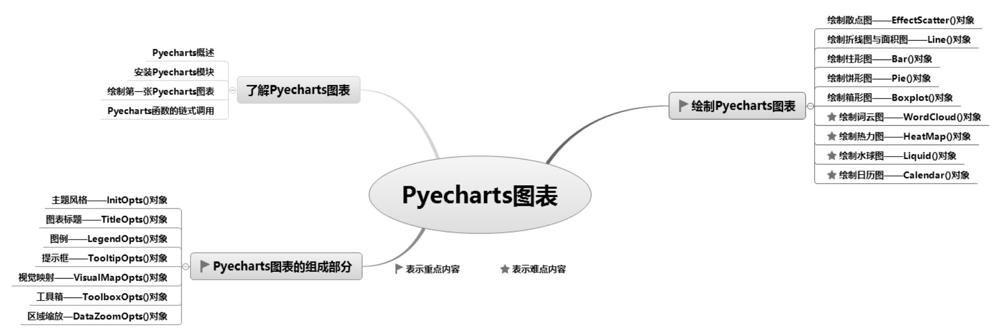

## 17.1 了解Pyecharts图表

### 17.1.1 Pyecharts概述

Pyecharts是一个生成Echarts图表的模块。Echarts是百度开源的一个数据可视化JS模块，其图表可视化效果非常好。Pyecharts是专门与Python衔接的可视化数据分析图表。使用Pyecharts可以生成独立的网页格式的图表，还可以在Flask、Django中使用，非常方便。

Pyecharts的图表类型非常多，而且效果非常好。如图17.1～图17.3所示为线性闪烁图、仪表盘图和水球图。

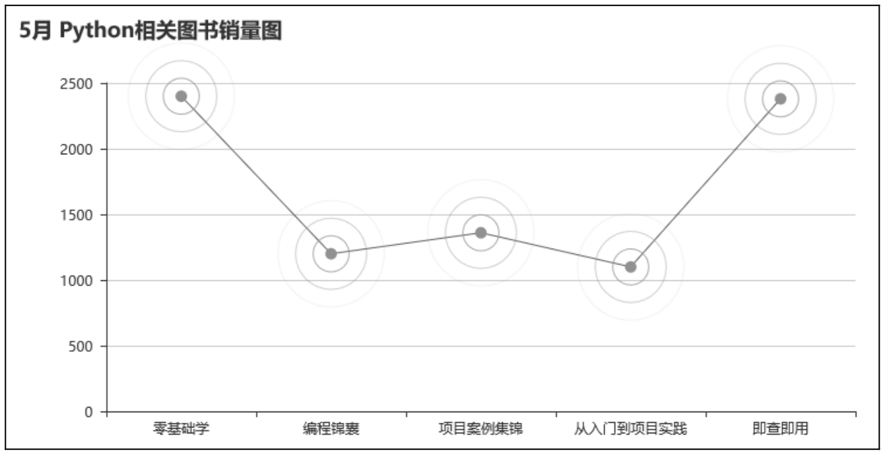

▲图17.1 线性闪烁图

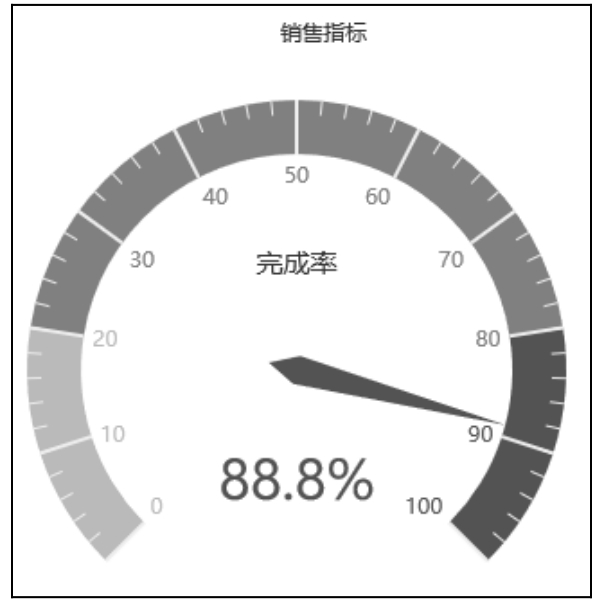

▲图17.2 仪表盘图

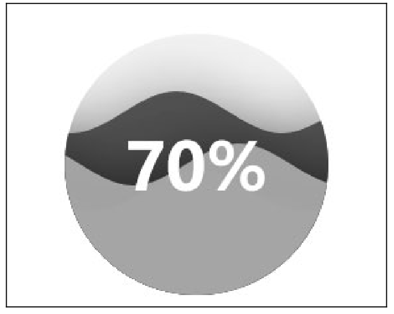

▲图17.3 水球图

Pyecharts的图表类型主要包括Bar（柱形图／条形图）、Boxplot（箱形图）、Funnel（漏斗图）、Gauge（仪表盘）、HeatMap（热力图）、Line（折线／面积图）、Line3D（3D折线图）、Liquid（水球图）、Map（地图）、Parallel（平行坐标系）、Pie（饼形图）、Polar（极坐标系）、Radar（雷达图）、Scatter（散点图）和WordCloud（词云图）等。

### 17.1.2 安装Pyecharts模块

在“命令提示符”窗口中安装Pyecharts模块。在系统搜索框中输入cmd，打开“命令提示符”窗口，使用pip工具安装。安装命令如下：

pip install pyecharts==2.0.3

安装成功后，将提示安装成功的信息，如“Successfully installed pyecharts-2.0.3”。

由于Pyecharts各版本的代码有一些区别，这里建议读者安装书中介绍的版本，以免造成不必要的麻烦。已安装过Pyecharts的读者，可使用如下方法查看Pyecharts的版本：

import pyecharts

print(pyecharts.\_\_version\_\_)

运行程序，控制台输出结果为2.0.3。

如果读者安装版本与笔者不同，建议卸载重新安装pyecharts-2.0.3。

### 17.1.3 绘制第一张Pyecharts图表

**【例17.1】**绘制简单的柱形图**（实例位置：资源包\\MR\\Code\\17\\01）**

下面使用Pyecharts绘制一张简单的柱形图，具体步骤如下。

（1）从Pyecharts.charts子模块中导入Bar类，代码如下：

from pyecharts.charts import Bar  # 导入Bar类

（2）创建一个空的Bar()对象（柱形图对象），代码如下：

bar = Bar()

（3）定义*x*轴和*y*轴数据，其中*x*轴为月份，*y*轴为销量。代码如下：

bar.add_xaxis(\["1月", "2月", "3月", "4月", "5月", "6月"\])

bar.add_yaxis("零基础学Python", \[2567, 1888, 1359, 3400, 4050, 5500\])

bar.add_yaxis("Python数据分析技术手册", \[1567, 988, 2270,3900, 2750, 3600\])

（4）渲染图表到HTML文件，并存放在程序所在目录下，代码如下：

bar.render("mycharts.html")

运行程序，将在程序所在路径下生成一个名为mycharts.html的HTML文件，打开该文件，效果如图17.4所示。

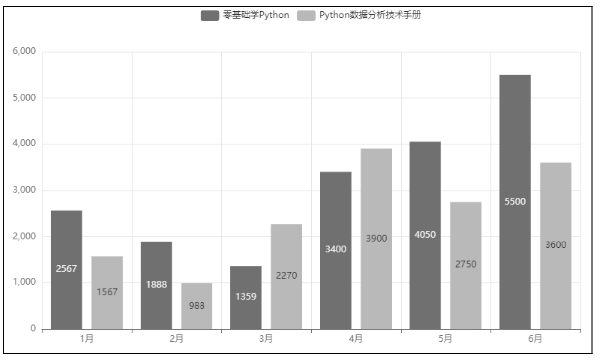

图17.4 绘制第一张Pyecharts图表

以上就是我们绘制的第一张Pyecharts图表。

### 17.1.4 Pyecharts函数的链式调用

函数的调用分为单独调用和链式调用。单独调用就是常规的逐个函数调用。链式调用的关键在于函数化，现在很多开源模块或代码都使用链式调用。链式调用将所有需要调用的函数写在一个函数里，代码看上去更简洁、易懂。

下面以17.1.3节绘制的“第一张Pyecharts图表”为例，在调用Bar()对象的各个函数时，将单独调用与链式调用进行简单对比，效果如图17.5所示。

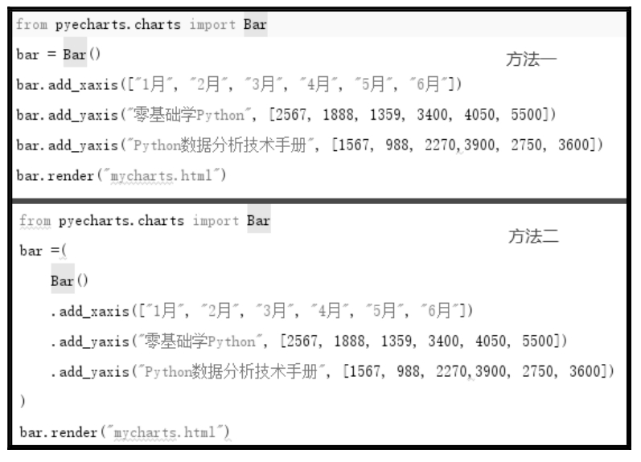

图17.5 单独调用与链式调用对比

从图17.5中可以看出，链式调用将所有需调用的函数写在一个函数里，代码更简洁。当然，如果不习惯使用链式调用，也可以使用单独调用。

## 17.2 Pyecharts图表的组成部分

Pyecharts不仅具备Matplotlib图表的一些常用功能，还提供了独有的、别具特色的功能，主要包括主题风格的设置、图例、视觉映射、工具箱和区域缩放等，如图17.6所示。这些功能使得Pyecharts能够绘制出各种各样、超乎想象的图表。

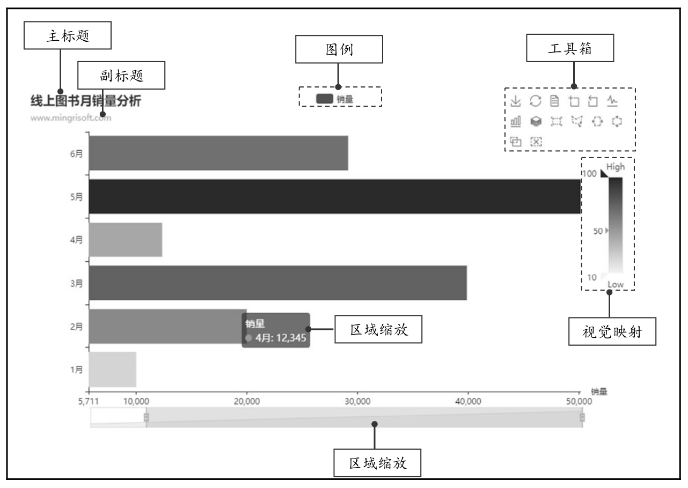

图17.6 Pyecharts图表的组成

### 17.2.1 主题风格—InitOpts()对象

Pyecharts内置了15种不同的主题风格，并提供了便捷的定制主题函数。通过options子模块的InitOpts()对象设置图表的主题风格。下面介绍InitOpts()对象的关键参数。 

 width：字符型，图表画布宽度，以像素为单位。例如，width='500px'。 

 height：字符型，图表画布高度，以像素为单位。例如，height='300px'。 

 chart_id：图表的ID，图表的唯一标识，主要用于多图表时区分每个图表。 

 page_title：字符型，网页标题。 

 theme：图表主题，其参数值主要由ThemeType类提供。 

 bg_color：字符型，图表背景颜色。例如，bg_color='black'或bg_color='#fff'。

ThemeType类提供的15种图表主题风格如表17.1所示。

表17.1 theme参数设置值

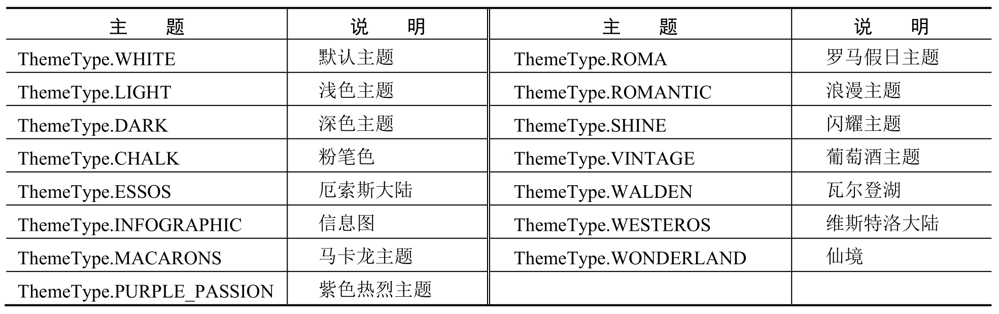

**【例17.2】**为图表更换主题**（实例位置：资源包\\MR\\Code\\17\\02）**

下面为“第一张Pyecharts图表”更换主题，具体步骤如下。

（1）从pyecharts.charts子模块中导入Bar类。代码如下：

1  from pyecharts.charts import Bar

（2）从pyecharts模块中导入options子模块。代码如下：

2  from pyecharts import options as opts

（3）从pyecharts.globals子模块中导入主题类型的ThemeType类。代码如下：

3  from pyecharts.globals import ThemeType

（4）设置画布大小、图表主题和图表背景颜色，代码如下：

4  bar =(

5      Bar(init_opts=opts.InitOpts(width='500px',height='300px',  # 设置画布大小

6                              theme=ThemeType.LIGHT,               # 设置主题

7                              bg_color='#fff'))                  # 设置图表背景颜色

8      #  *x*轴和*y*轴数据

9      .add_xaxis(\["1月", "2月", "3月", "4月", "5月", "6月"\])

10  .add_yaxis("零基础学Python", \[2567, 1888, 1359, 3400, 4050, 5500\])

11  .add_yaxis("Python数据分析技术手册", \[1567, 988, 2270,3900, 2750, 3600\])

12  )

（5）渲染图表到HTML文件，并将其存放在程序所在目录下，代码如下：

13  bar.render("mycharts1.html")  # 渲染图表到HTML文件

运行程序，将在程序所在路径下生成一个名为mycharts1.html的HTML文件，打开该文件，效果如图17.7所示。

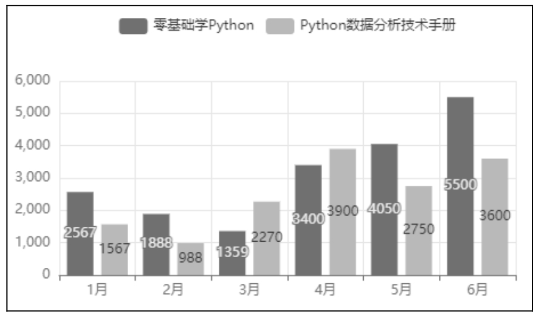

图17.7 设置主题风格

### 17.2.2 图表标题—TitleOpts()对象

图表标题主要通过set_global_options()函数的title_opts参数进行设置，该参数值参考options子模块的TitleOpts()对象，可实现主标题、副标题、距离以及文字样式等的设置。TitleOpts()对象的主要参数说明如下。 

 title：字符型，默认值为None。主标题文本，支持换行符“\n”。 

 title_link：字符型，默认值为None。主标题跳转URL链接。 

 title_target：字符型，默认值为None。主标题跳转链接的方式，默认值为blank，表示在新窗口打开。可选参数self，表示在当前窗口打开。 

 subtitle：字符型，默认值为None。副标题文本，支持换行符“\n”。 

 subtitle_link：字符型，默认值为None。副标题跳转URL链接。 

 subtitle_target：字符型，默认值为None。副标题跳转链接的方式，默认值为blank，表示在新窗口打开。可选参数self，表示在当前窗口打开。 

 pos_left：字符型，默认值为None。表示标题距左侧的距离。其值可以是具体像素值，可以是相对于容器的高和宽的百分比，也可以是left、center或right，标题将根据相应的位置自动对齐。 

 pos_right：字符型，默认值为None。表示标题距右侧的距离。其值可以是具体像素值，也可以是相对于容器的高和宽的百分比。 

 pos_top：字符型，默认值为None。表示标题距顶端的距离。其值可以是具体像素值，可以是相对于容器的高和宽的百分比，也可以是top、middle或bottom，标题将根据相应的位置自动对齐。 

 pos_bottom：字符型，默认值为None。表示标题距底端的距离。其值可以是具体像素值，也可以是相对于容器的高和宽的百分比。 

 padding：标题内边距，单位为像素。默认值为各方向（上、右、下、左）内边距为5，接受数组分别设定上、右、下、左边距。例如，padding=\[10,4,5,90\]。 

 item_gap：数值型，主标题与副标题之间的间距。例如，item_gap=3.5。 

 title_textstyle_opts：主标题文字样式配置项，参考options子模块的TextStyleOpts()对象。主要包括颜色、字体样式、字体的粗细、字体的大小以及对齐方式等。例如，设置标题颜色为红色，字体大小为18，代码如下：

title_textstyle_opts=opts.TextStyleOpts(color='red',font_size=18) 

 subtitle_textstyle_opts：副标题文字样式配置项，参数配置同主标题。

**【例17.3】**为图表设置标题**（实例位置：资源包\\MR\\Code\\17\\03）**

下面为“第一张Pyecharts图表”设置标题，具体步骤如下。

（1）从pyecharts.charts子模块中导入Bar类。代码如下：

1  from pyecharts.charts import Bar

（2）从pyechartsm模块中导入options子模块。代码如下：

2  from pyecharts import options as opts

（3）从pyecharts.globals子模块中导入主题类型的ThemeType类。代码如下：

3  from pyecharts.globals import ThemeType

（4）生成图表，设置图表标题，包括主标题、主标题字体颜色和大小、副标题、标题内边距以及主标题与副标题的间距。代码如下：

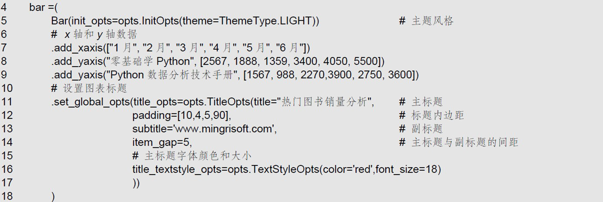

（5）渲染图表到HTML文件，并将其存放在程序所在目录下。代码如下：

19  bar.render("mycharts2.html")

运行程序，将在程序所在路径下生成一个名为mycharts2.html的HTML文件，打开该文件，效果如图17.8所示。

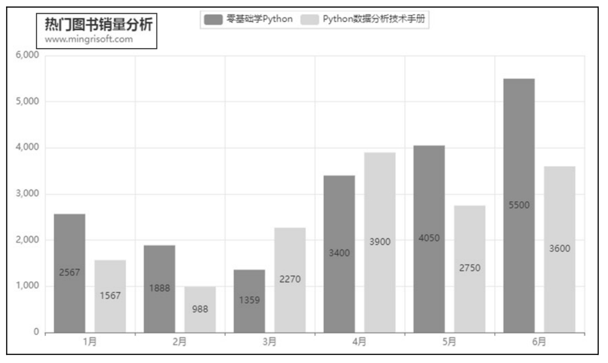

图17.8 设置图表标题

### 17.2.3 图例—LegendOpts()对象

图例主要通过set_global_opts()函数的legend_opts参数进行设置，该参数值参考options子模块的LegendOpts()对象。LegendOpts()对象的主要参数说明如下。 

 is_show：布尔值，表示是否显示图例，True为显示图例，False为不显示图例。 

 pos_left：字符串或数字，默认值为None。表示图例离容器左侧的距离，其值可以是具体像素值，可以是相对于容器高和宽的百分比，也可以是left、center或right，图例将根据相应的位置自动对齐。 

 pos_right：字符串或数字，默认值为None。表示图例离容器右侧的距离，其值可以是具体像素值，也可以是相对于容器高和宽的百分比。 

 pos_top：字符串或数字，默认值为None。表示图例离容器顶端的距离，其值可以是具体像素值，可以是相对于容器高和宽的百分比，也可以是top、middle或bottom，图例将根据相应的位置自动对齐。 

 pos_bottom：字符串或数字，默认值为None。表示图例离容器底端的距离，其值可以是具体像素值，也可以是相对于容器高和宽的百分比。 

 orient：字符串，默认值为None。表示图例列表的布局朝向，其值为horizontal（横向）或vertical（纵向）。 

 align：字符串。表示图例标记和文本的对齐，其值为auto、left或right，默认值为auto（自动）。根据图表的位置和orient参数（图例列表的朝向）决定。 

 padding：整型，图例内边距，单位为像素（px），默认值为各方向内边距为5。 

 item_gap：图例之间的间隔。横向布局时为水平间隔，纵向布局时为纵向间隔。默认间隔为10。 

 item_width：图例标记的宽度。默认宽度为25。 

 item_height：图例标记的高度。默认高度为14。 

 textstyle_opts：图例的字体样式。参考options子模块的TextStyleOpts()对象，主要包括颜色、字体样式、字体的粗细、字体的大小以及对齐方式等。 

 legend_icon：图例标记的样式。其值为circle（圆形）、rect（矩形）、roundRect（圆角矩形）、triangle（三角形）、diamond（菱形）、pin（大头针）、arrow（箭头）或none（无）。也可以设置为图片。

**【例17.4】**为图表设置图例**（实例位置：资源包\\MR\\Code\\17\\04）**

下面为“第一张Pyecharts图表”设置图例，具体步骤如下。

（1）从pyecharts.charts子模块中导入Bar类。代码如下：

1  from pyecharts.charts import Bar

（2）从pyecharts模块中导入options子模块。代码如下：

2  from pyecharts import options as opts

（3）生成图表，设置图表标题和图例。其中，图例主要包括图例离容器右侧的距离、图例标记的宽度和图例标记的样式，代码如下：

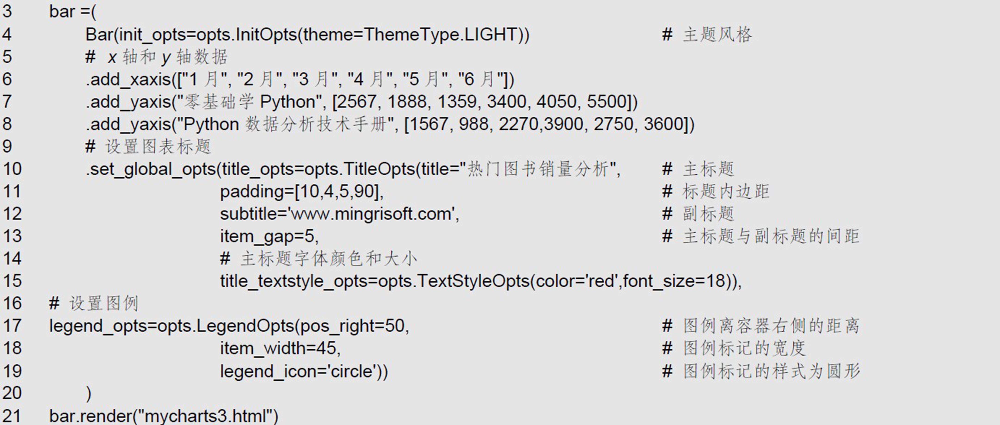

运行程序，在程序所在路径下生成一个名为mycharts3.html的HTML文件，打开该文件，效果如图17.9所示。

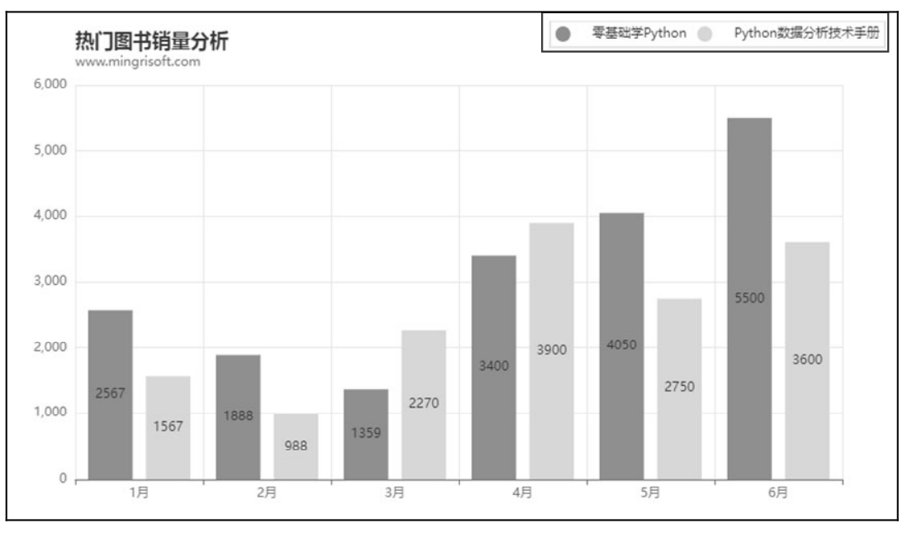

图17.9 设置图例

### 17.2.4 提示框—TooltipOpts()对象

提示框主要通过set_global_options()函数的tooltip_opts参数进行设置，该参数值参考options子模块的TooltipOpts()对象。TooltipOpts()对象的主要参数说明如下。 

 is_show：布尔值，表示是否显示提示框。 

 trigger：提示框触发的类型，可选参数。其中，item数据项图形触发，主要在散点图和饼形图等无类目轴的图表中使用。axis坐标轴触发，主要在柱形图和折线图等使用类目轴的图表中使用。None不触发，即无提示框。 

 trigger_on：提示框触发的条件，可选参数。其中，mousemove为鼠标移动时触发，click为鼠标点击时触发，mousemove\|click为鼠标移动和点击同时触发，none为鼠标不移动或不点击时触发。 

 axis_pointer_type：指示器类型，可选参数，其值如下。 

 line：直线指示器。 

 shadow：阴影指示器。 

 cross：十字线指示器。 

 none：无指示器。 

 background_color：提示框的背景颜色。 

 border_color：提示框边框的颜色。 

 border_width：提示框边框的宽度。 

 textstyle_opts：提示框中文字的样式。参考options子模块的TextStyleOpts()对象，主要包括颜色、字体样式、字体的粗细、字体的大小以及对齐方式等。

**【例17.5】**为图表设置提示框**（实例位置：资源包\\MR\\Code\\17\\05）**

下面为图表设置提示框的样式，具体步骤如下。

（1）导入相关模块，代码如下：

1  from pyecharts import options as opts

2  from pyecharts.charts import Bar

3  from pyecharts.globals import ThemeType

（2）设置图表标题和图例。其中，图例主要包括图例离容器右侧的距离、图例标记的宽度和图例标记的样式，代码如下：

4   bar =(

5       Bar(init_opts=opts.InitOpts(theme=ThemeType.LIGHT))                    # 主题风格

6       #  *x*轴和*y*轴数据

7       .add_xaxis(\["1月", "2月", "3月", "4月", "5月", "6月"\])

8       .add_yaxis("零基础学Python", \[2567, 1888, 1359, 3400, 4050, 5500\])

9       .add_yaxis("Python数据分析技术手册", \[1567, 988, 2270,3900, 2750, 3600\])

10      # 设置图表标题

11      .set_global_opts(title_opts=opts.TitleOpts(title="热门图书销量分析",      # 主标题

12                     padding=\[10,4,5,90\],                                         # 标题内边距

13                     subtitle='www.mingrisoft.com',                               # 副标题

14                     item_gap=5,                                                  # 主标题与副标题的间距

15                     # 主标题字体颜色和大小

16  title_textstyle_opts=opts.TextStyleOpts(color='red',font_size=18)),

17  # 设置图例

18  legend_opts=opts.LegendOpts(pos_right=50,       # 图例离容器右侧的距离

19             item_width=45,                        # 图例标记的宽度

20             legend_icon='circle'),               # 图例标记的样式为圆形

（3）生成图表，设置鼠标点击时触发提示框，设置提示框为十字线指示器，设置背景色、边框宽度和边框颜色，代码如下：

21                     # 提示框

22                     tooltip_opts=opts.TooltipOpts(trigger="axis",  # 坐标轴触发

23                                trigger_on='click',                  # 鼠标点击时触发

24                                axis_pointer_type='cross',           # 十字线指示器

25                                background_color='blue',             # 背景色为蓝色

26                                border_width=2,                      # 边框宽度

27                                border_color='red')                 # 边框颜色为红色

28                     )

29      )

30  bar.render("mycharts5.html")                                     # 生成图表

运行程序，在程序所在路径下生成一个名为mycharts5.html的HTML文件，打开该文件，效果如图17.10所示。

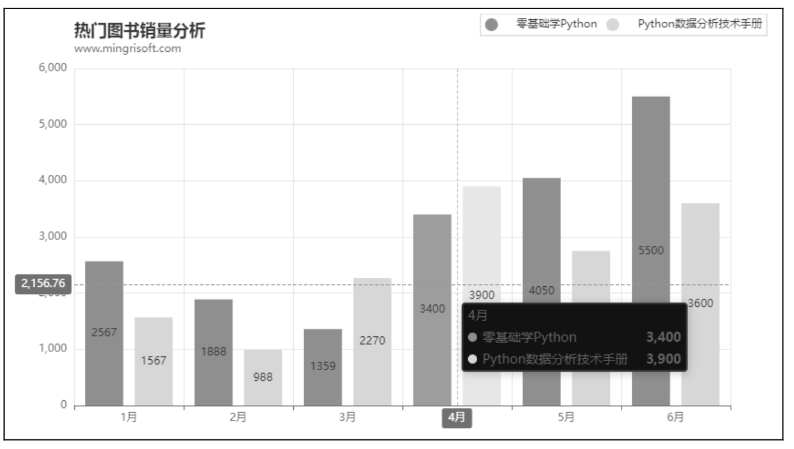

图17.10 设置提示框

### 17.2.5 视觉映射—VisualMapOpts()对象

视觉映射主要通过set_global_options()函数的title_opts参数进行设置，该参数值参考options子模块的VisualMapOpts()对象。VisualMapOpts()对象的主要参数说明如下。 

 is_show：布尔型，表示是否显示视觉映射配置。 

 type\_：映射过渡类型，可选参数。其值为color或size。 

 min\_：整型或浮点型，颜色条的最小值。 

 max\_：整型或浮点型，颜色条的最大值。 

 range_text：颜色条两端的文本。例如，High或Low。 

 range_color：序列。颜色范围（过渡颜色），例如，range_color=\["#FFF0F5"， "#8B008B"\] 

 orient：颜色条放置方式，水平（horizontal）或者竖直（vertical）。 

 pos_left：颜色条离左侧的距离。 

 dimension：颜色条映射的维度。 

 is_piecewise：布尔型，表示是否分段显示数据。

**【例17.6】**为图表添加视觉映射**（实例位置：资源包\\MR\\Code\\17\\06）**

下面为图表添加视觉映射，具体步骤如下。

（1）导入相关模块，代码如下：

1  from pyecharts import options as opts

2  from pyecharts.charts import Bar

（2）为柱形图添加数据，代码如下：

3   bar=Bar()

4   # 为柱形图添加数据

5   bar.add_dataset(source=\[

6               \["val", "销量","月份"\],

7               \[24, 10009, "1月"\],

8               \[57, 19988, "2月"\],

9               \[74, 39870, "3月"\],

10              \[50, 12345, "4月"\],

11              \[99, 50145, "5月"\],

12              \[68, 29146, "6月"\]

13              \]

14          )

15  bar.add_yaxis(

16          series_name="销量",                       # 系列名称

17          y_axis =\[\],                               # 系列数据

18          encode={"x": "销量", "y": "月份"},        # 对*x*轴*y*轴数据进行编码

19          label_opts=opts.LabelOpts(is_show=False)  # 不显示标签文本

20          )

（3）设置图表标题和视觉映射，并生成图表，代码如下：

21  bar.set_global_opts(

22          title_opts=opts.TitleOpts(title="线上图书月销量分析",   # 主标题

23                                 subtitle='www.mingrisoft.com'),  # 副标题

24          xaxis_opts=opts.AxisOpts(name="销量"),                 #  *x*轴名称

25          yaxis_opts=opts.AxisOpts(type\_="category"),            #  *y*轴类型为“类目”

26          # 视觉映射

27          visualmap_opts=opts.VisualMapOpts(

28              orient="horizontal",                                 # 水平放置颜色条

29              pos_left="center",                                   # 居中

30              min\_=10,                                             # 颜色条最小值

31              max\_=100,                                            # 颜色条最大值

32              range_text=\["High", "Low"\],                          # 颜色条两端的文本

33              dimension=0,                                         # 颜色条映射的维度

34              range_color=\["#FFF0F5", "#8B008B"\]                   # 颜色范围

35                           )

36          )

37  bar.render("mycharts6.html")                                   # 生成图表

运行程序，在程序所在路径下生成一个名为mycharts6.html的HTML文件，打开该文件，效果如图17.11所示。

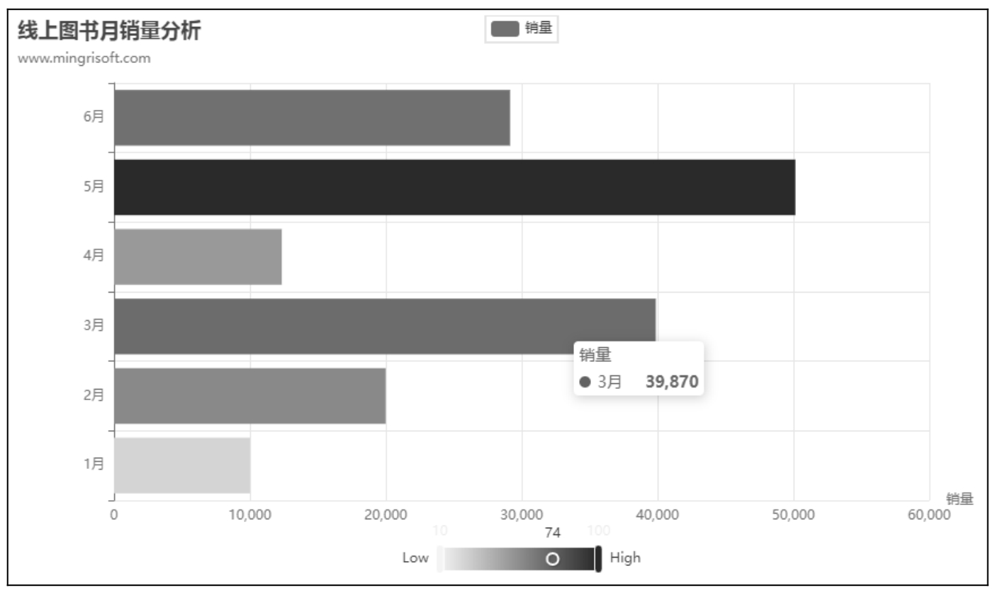

图17.11 视觉映射

### 17.2.6 工具箱—ToolboxOpts()对象

工具箱主要通过set_global_options()函数的title_opts参数进行设置，该参数值参考options子模块的ToolboxOpts()对象。ToolboxOpts()对象的主要参数说明如下。 

 is_show：布尔值，表示是否显示工具箱。 

 orient：工具箱的布局朝向。可选参数，水平（horizontal）或竖直（vertical）。 

 pos_left：工具箱离容器左侧的距离。 

 pos_right：工具箱离容器右侧的距离。 

 pos_top：工具箱离容器顶端的距离。 

 pos_bottom：工具箱离容器底端的距离。 

 feature：工具箱中每个工具的配置项。

**【例17.7】**为图表添加工具箱**（实例位置：资源包\\MR\\Code\\17\\07）**

下面为图表添加工具箱，具体步骤如下。

（1）导入相关模块，代码如下：

1  from pyecharts import options as opts

2  from pyecharts.charts import Bar

（2）绘制柱形图，代码如下：

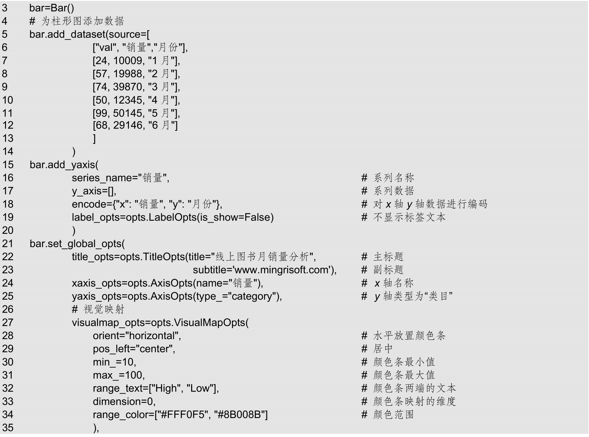

（3）添加工具箱，并生成图表，代码如下：

36          # 工具箱

37          toolbox_opts=opts.ToolboxOpts(is_show=True,    # 显示工具箱

38                                       pos_left=700)    # 工具箱离容器左侧的距离

39          )

40  bar.render("mycharts7.html")                         # 生成图表

运行程序，在程序所在路径下生成一个名为mycharts7.html的HTML文件，打开该文件，效果如图17.12所示。

图17.12 工具箱

### 17.2.7 区域缩放—DataZoomOpts()对象

区域缩放工具条主要通过set_global_options()函数的datazoom_opts参数进行设置，该参数值参考options子模块的DataZoomOpts()对象。DataZoomOpts()对象的主要参数说明如下： 

 is_show：布尔值，表示是否显示区域缩放工具条。 

 type\_：区域缩放工具条的类型，可选参数，其值为slider或inside。 

 is_realtime：布尔值，表示是否实时更新图表。 

 range_start：数据窗口范围的起始百分比。其值为0~100，表示0%~100%。 

 range_end：数据窗口范围的结束百分比。其值为0~100，表示0%~100%。 

 start_value：数据窗口范围的起始数值。 

 end_value：数据窗口范围的结束数值。 

 orient：区域缩放工具条的布局方式。可选参数，其值为horizontal（水平）或vertical（竖直）。 

 pos_left：工具箱离容器左侧的距离。 

 pos_right：工具箱离容器右侧的距离。 

 pos_top：工具箱离容器顶端的距离。 

 pos_bottom：工具箱离容器底端的距离。

**【例17.8】**为图表添加区域缩放**（实例位置：资源包\\MR\\Code\\17\\08）**

下面为图表添加区域缩放工具条，具体步骤如下。

（1）导入相关模块，代码如下：

1  from pyecharts import options as opts

2  from pyecharts.charts import Bar

（2）绘制柱形图，代码如下：

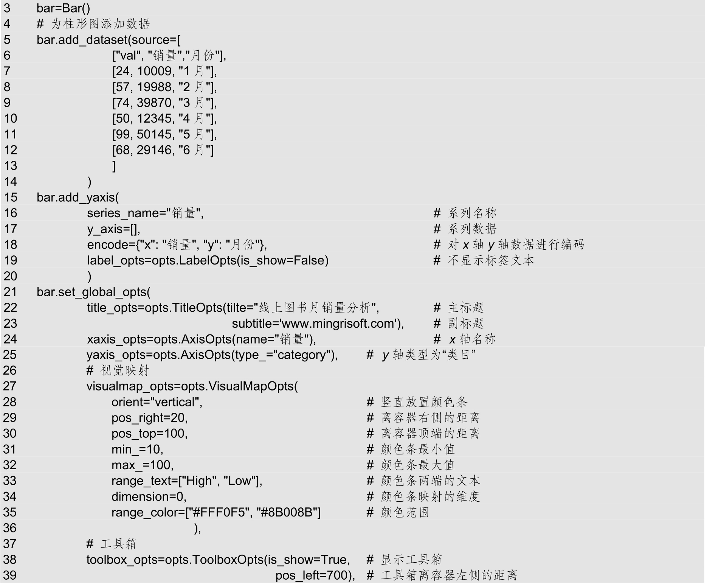

（3）添加区域缩放工具条，并生成图表，代码如下：

40          # 区域缩放工具条

41          datazoom_opts=opts.DataZoomOpts()

42          )

43  bar.render("mycharts8.html")               # 生成图表

运行程序，在程序所在路径下生成一个名为mycharts8.html的HTML文件，打开该文件，效果如图17.13所示。

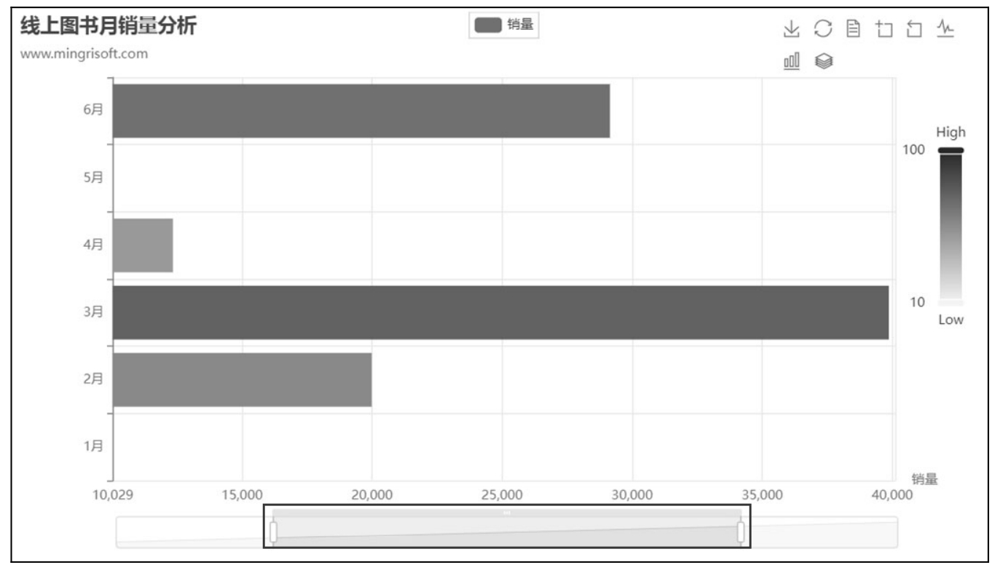

图17.13 区域缩放

## 17.3 绘制Pyecharts图表

### 17.3.1 绘制散点图—EffectScatter()对象

**【例17.9】**绘制简单的散点图**（实例位置：资源包\\MR\\Code\\17\\09）**

绘制涟漪特效散点图主要使用EffectScatter()对象的add_xaxis()、add_yaxis()函数实现。下面绘制一个简单的涟漪特效散点图，程序代码如下：

1   import pandas as pd

2   from pyecharts.charts import EffectScatter

3   df = pd.read_excel('books.xlsx',sheet_name='Sheet2')       # 读取Excel文件

4   #  *x*轴和*y*轴数据

5   x=list(df\['年份'\])

6   y1=list(df\['京东'\])

7   y2=list(df\['天猫'\])

8   y3=list(df\['自营'\])

9   # 绘制涟漪散点图

10  scatter=EffectScatter()

11  scatter.add_xaxis(x)

12  scatter.add_yaxis("",y1)

13  scatter.add_yaxis("",y2)

14  scatter.add_yaxis("",y3)

15  scatter.render("myscatter.html")                     # 渲染图表到HTML文件，存放在程序所在目录下

运行程序，在程序所在路径下生成名为myscatter.html的HTML文件，打开该文件，效果如图17.14所示。

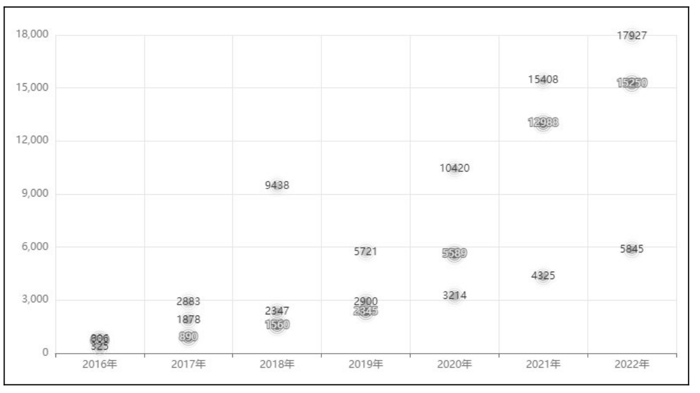

图17.14 涟漪特效散点图

### 17.3.2 绘制折线图和面积图—Line()对象

绘制折线图和面积图主要使用Line对象的add_xaxis()和add_yaxis()函数。

add_yaxis()函数的主要参数如下： 

 series_name：系列名称，用于提示文本和图例标签。 

 y_axis：*y*轴数据。 

 color：标签文本的颜色。 

 symbol：标记，包括circle、rect、roundRect、triangle、diamond、pin、arrow或none，也可以设置为图片。 

 symbol_size：标记大小。 

 is_smooth：布尔值，表示是否为平滑曲线。 

 is_step：布尔值，表示是否显示为阶梯图。 

 linestyle_opts：线条样式。参考series_options.LineStyleOpts类。 

 areastyle_opts：填充区域配置项，主要用于绘制面积图。该参数值需参考options子模块的AreaStyleOpts()对象。例如，areastyle_opts=opts.AreaStyleOpts（opacity=1）。

**【例17.10】**绘制折线图**（实例位置：资源包\\MR\\Code\\17\\10）**

绘制折线图，分析近7年各个电商平台的销量情况，具体步骤如下。

（1）导入相关模块，代码如下：

1  import pandas as pd

2  from pyecharts.charts import Line

（2）绘制折线图，代码如下：

3   df = pd.read_excel('books.xlsx',sheet_name='Sheet2')  # 读取Excel文件

4   x=list(df\['年份'\])

5   y1=list(df\['京东'\])

6   y2=list(df\['天猫'\])

7   y3=list(df\['自营'\])

8   line=Line()                                           # 创建折线图

9   # 为折线图添加x轴和y轴数据

10  line.add_xaxis(xaxis_data=x)

11  line.add_yaxis(series_name="京东",y_axis=y1)

12  line.add_yaxis(series_name="天猫",y_axis=y2)

13  line.add_yaxis(series_name="自营",y_axis=y3)

14  line.render("myline1.html")                           # 渲染图表到HTML文件，存放在程序所在目录下

运行程序，在程序所在路径下生成myline1.html文件，打开该文件，效果如图17.15所示。

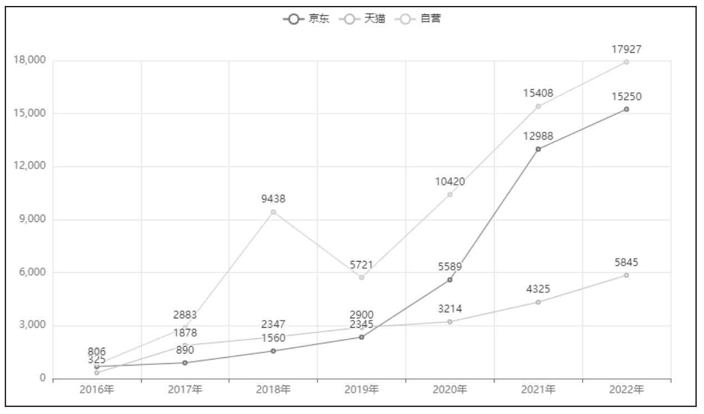

图17.15 折线图

**注意**

*x*轴数据必须为字符串，否则图表不显示。如果数据为其他类型，需要使用str()函数将数据转换为字符串，如x_data=\[str（i） for i in x\]。

**【例17.11】**绘制面积图**（实例位置：资源包\\MR\\Code\\17\\11）**

使用Line()对象还可以绘制面积图，主要通过在add_yaxis()函数中指定areastyle_opts参数，该参数值由options子模块的AreaStyleOpts()对象提供。

（1）导入相关模块，代码如下：

1  import pandas as pd

2  from pyecharts.charts import Line

3  from pyecharts import options as opts

（2）绘制面积图，代码如下：

4   df = pd.read_excel('books.xlsx',sheet_name='Sheet2')  # 读取Excel文件

5   x=list(df\['年份'\])

6   y1=list(df\['京东'\])

7   y2=list(df\['天猫'\])

8   y3=list(df\['自营'\])

9   line=Line()                                          # 创建面积图

10  # 为面积图添加x轴和y轴数据

11  line.add_xaxis(xaxis_data=x)

12  line.add_yaxis(series_name="自营",y_axis=y3,areastyle_opts=opts.AreaStyleOpts(opacity=1))

13  line.add_yaxis(series_name="京东",y_axis=y1,areastyle_opts=opts.AreaStyleOpts(opacity=1))

14  line.add_yaxis(series_name="天猫",y_axis=y2,areastyle_opts=opts.AreaStyleOpts(opacity=1))

15  line.render("myline2.html")                          # 渲染图表到HTML文件，存放在程序所在目录下

运行程序，在程序所在路径下生成myline2.html文件，打开该文件，效果如图17.16所示。

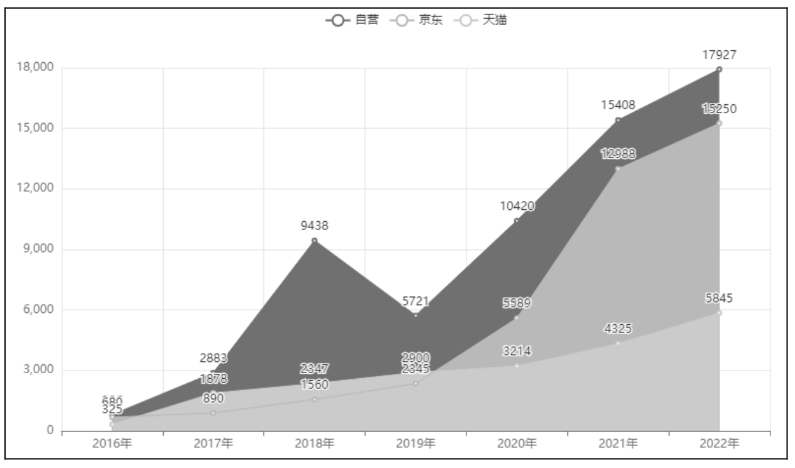

图17.16 面积图

### 17.3.3 绘制柱形图—Bar()对象

绘制柱形图／条形图主要使用Bar()对象实现，其主要函数如下： 

 add_xaxis()：*x*轴数据。 

 add_yaxis()：*y*轴数据。 

 reversal_axis()：翻转*xy*轴数据。 

 add_dataset()：原始数据。一般来说，原始数据表达的是二维表。

**【例17.12】**绘制多柱形图**（实例位置：资源包\\MR\\Code\\17\\12）**

前述简单介绍了柱形图的绘制，下面先通过Pandas读取Excel文件中的数据，然后绘制多柱形图表，分析近7年各个电商平台的销量情况，具体步骤如下。

（1）导入相关模块，代码如下：

1  import pandas as pd

2  from pyecharts.charts import Bar

3  from pyecharts import options as opts

4  from pyecharts.globals import ThemeType

（2）读取Excel文件，代码如下：

5   pd.set_option('display.unicode.east_asian_width', True)  # 设置数据显示的编码格式为东亚宽度，以使列对齐

6   df = pd.read_excel('books.xlsx',sheet_name='Sheet2')     # 读取Excel文件

7   print(df)

8   #  *x*轴和*y*轴数据

9   x=list(df\['年份'\])

10  y1=list(df\['京东'\])

11  y2=list(df\['天猫'\])

12  y3=list(df\['自营'\])

（3）绘制多柱形图，代码如下：

13  bar = Bar(init_opts=opts.InitOpts(theme=ThemeType.LIGHT))  # 创建柱形图并设置主题

14  # 为柱状图添加*x*轴和*y*轴数据

15  bar.add_xaxis(x)

16  bar.add_yaxis('京东',y1)

17  bar.add_yaxis('天猫',y2)

18  bar.add_yaxis('自营',y3)

19  bar.render("mybar1.html")       # 渲染图表到HTML文件，存放在程序所在目录下

运行程序，两种数据展示方式对比效果如图17.17和图17.18所示。

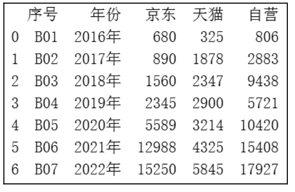

▲图17.17 Excel数据展示

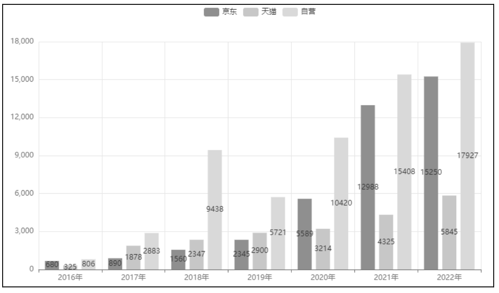

▲图17.18 图表数据展示

### 17.3.4 绘制饼形图—Pie()对象

绘制饼形图主要使用Pie()对象的add()函数实现。下面介绍add()函数的几个主要参数： 

 series_name：系列名称，用于提示文本和图例标签。 

 data_pair：数据项，格式为\[（key1， value1）， （key2， value2）\]。可使用zip()函数先将可迭代对象打包成元组，再转换为列表。 

 color：系列标签的颜色。 

 radius：饼形图的半径，数组的第一项是内半径，第二项是外半径。默认设置为百分比，相对于容器高和宽中较小的一项的一半。 

 rosetype：表示是否展开为南丁格尔图（也称玫瑰图），通过半径区分数据大小。其值为radius或area，radius表示用扇区圆心角展现数据的百分比，用半径展现数据的大小；area表示所有扇区圆心角相同，仅通过半径展现数据的大小。 

 is_clockwise：饼形图的扇区是否以顺时针显示。

**【例17.13】**绘制饼形图分析各地区销量占比情况**（实例位置：资源包\\MR\\Code\\17\\13）**

下面绘制饼形图，分析各地区销量占比情况，具体步骤如下。

（1）导入相关模块，代码如下：

1  import pandas as pd

2  from pyecharts.charts import Pie

3  from pyecharts import options as opts

（2）读取Excel文件，并将数据处理为列表加元组的格式，代码如下：

4   df = pd.read_excel('data2.xls')      # 读取Excel文件

5   x_data=df\['地区'\]

6   y_data=df\['销量'\]

7   # 将数据转换为列表加元组的格式(\[(key1, value1), (key2, value2)\])

8   data=\[list(z) for z in zip(x_data, y_data)\]

9   data.sort(key=lambda x: x\[1\])          # 数据排序

10  print(x_data)

11  print(data)

（3）创建饼形图，代码如下：

12  pie=Pie()                            # 创建饼形图

13  # 为饼形图添加数据

14  pie.add(

15          series_name="地区",            # 序列名称

16          data_pair=data,                # 数据

17      )

18  pie.set_global_opts(

19          # 饼形图标题居中

20          title_opts=opts.TitleOpts(

21              title="各地区销量情况分析",

22              pos_left="center"),

23          # 不显示图例

24          legend_opts=opts.LegendOpts(is_show=False),

25      )

26  pie.set_series_opts(

27          label_opts=opts.LabelOpts(), # 序列标签

28      )

29  pie.render("mypie1.html")            # 渲染图表到HTML文件，存放在程序所在目录下

运行程序，在程序所在路径下生成名为mypie1.html的HTML文件，打开该文件，效果如图17.19所示。

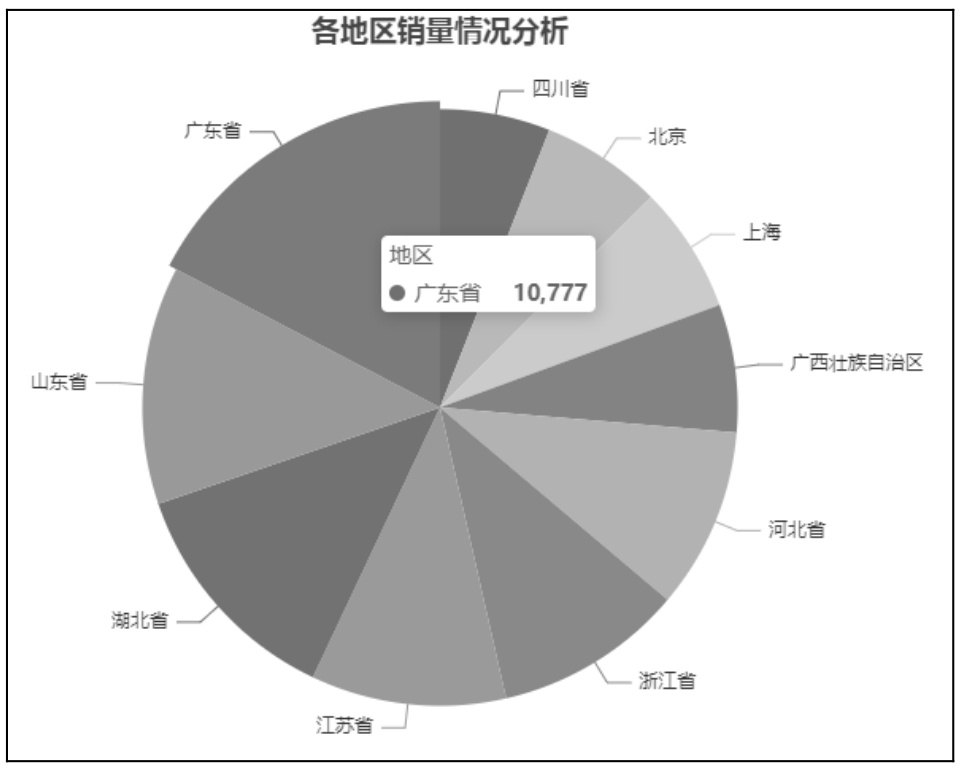

图17.19 饼形图

### 17.3.5 绘制箱形图—Boxplot()对象

**【例17.14】**绘制简单的箱形图**（实例位置：资源包\\MR\\Code\\17\\14）**

绘制箱形图主要使用Boxplot()对象的add_xaxis()和add_yaxis()函数实现。下面绘制一个简单的箱形图，程序代码如下：

1  import pandas as pd

2  from pyecharts.charts import Boxplot

3  df = pd.read_excel('Tips.xlsx')  # 读取Excel文件

4  y_data=\[list(df\['总消费'\])\]

5  boxplot=Boxplot()                # 创建箱形图

6  # 为箱形图添加数据

7  boxplot.add_xaxis(\[""\])

8  boxplot.add_yaxis('',y_axis=boxplot.prepare_data(y_data))

9  boxplot.render("myboxplot.html") # 渲染图表到HTML文件，存放在程序所在目录下

运行程序，在程序所在路径下生成myboxplot.html文件，打开该文件，效果如图17.20所示。

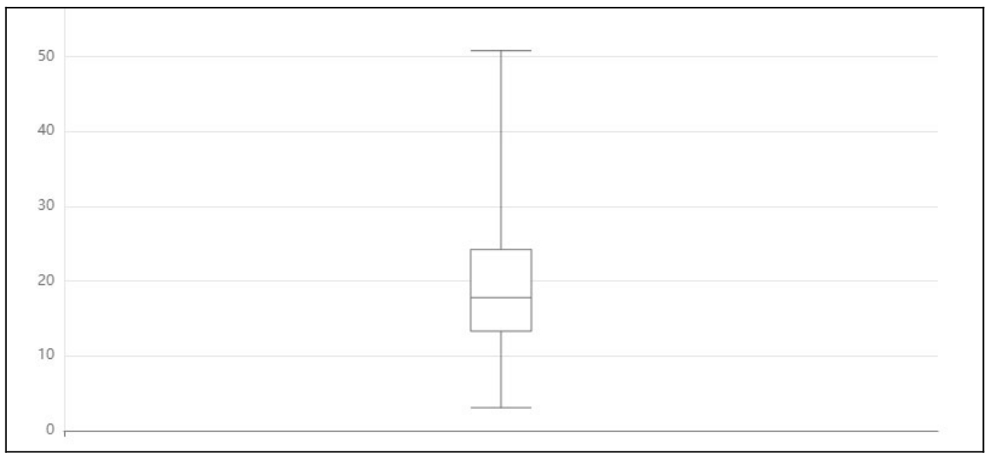

图17.20 箱形图

### 17.3.6 绘制词云图—WordCloud对象

绘制词云图主要使用WordCloud()对象的add()函数实现。下面介绍add()函数的几个主要参数。 

 series_name：系列名称，用于提示文本和图例标签。 

 data_pair：数据项，格式为\[（word1，count1）， （word2， count2）\]。可使用zip()函数先将可迭代对象打包成元组，再转换为列表。 

 shape：字符型，词云图的轮廓。其值为circle、cardioid、diamond、triangle-forward、triangle、pentagon或star。 

 mask_image：自定义图片，支持的图片格式为jpg、jpeg、png和ico。该参数支持base64（一种基于64个可打印字符来表示二进制数据的方法）和本地文件路径（相对或者绝对路径都可以）。 

 word_gap：单词间隔。 

 word_size_range：单词字体大小范围。 

 rotate_step：旋转单词角度。 

 pos_left：距离左侧的距离。 

 pos_top：距离顶部的距离。 

 pos_right：距离右侧的距离。 

 pos_bottom：距离底部的距离。 

 width：词云图的宽度。 

 height：词云图的高度。

要实现词云图，首先需要通过jieba模块的textrank算法从文本中提取关键词。textrank是一种文本排序算法，基于著名的网页排序算法pagerank改动而来。textrank不仅能进行关键词提取，也能做自动文摘。

根据某个词连接所有词汇的权重，重新计算该词汇的权重，并把重新计算的权重传递下去。直到这种变化达到均衡态，权重数值不再发生改变。根据最后权重值，取排列靠前的词汇作为关键词。

**【例17.15】**绘制词云图分析用户评论内容**（实例位置：资源包\\MR\\Code\\17\\15）**

下面绘制词云图，分析用户的评论内容。具体步骤如下。

（1）安装jieba模块。打开“命令提示符”窗口，通过pip命令安装jieba模块，安装命令如下：

1  pip install jieba

当然，也可以在PyCharm开发环境中安装。（2）导入相关模块，代码如下：

2  from pyecharts.charts import WordCloud

3  from jieba import analyse

（3）使用textrank算法从文本中提取关键词，代码如下：

4  textrank = analyse.textrank

5  text = open('111.txt','r',encoding='gbk').read()

6  keywords = textrank(text,topK=30)

7  list1=\[\]

8  tup1=()

（4）关键词列表，代码如下：

9   for keyword, weight in textrank(text,topK=30, withWeight=True):

10      print('%s %s' % (keyword, weight))

11      tup1=(keyword,weight)       # 关键词权重

12      list1.append(tup1)          # 添加到列表中

（5）绘制词云图，代码如下：

13  mywordcloud=WordCloud()

14  mywordcloud.add('',list1,word_size_range=\[20,100\])

15  mywordcloud.render('wordclound.html')

运行程序，在程序所在路径下生成名为wordclound.html的HTML文件，打开该文件，效果如图17.21所示。

图17.21 词云图

### 17.3.7 绘制热力图—HeatMap()对象

**【例17.16】**绘制热力图统计双色球中奖数字出现的次数**（实例位置：资源包\\MR\\Code\\17\\16）**

绘制热力图主要使用HeatMap()对象的add_xaxis()和add_yaxis()函数。下面通过绘制热力图统计2007—2023年双色球中奖数字出现的次数，具体步骤如下。

（1）导入相关模块，代码如下：

1  import pyecharts.options as opts

2  from pyecharts.charts import HeatMap

3  import pandas as pd

（2）读取Excel文件，并进行数据处理，代码如下：

4   df=pd.read_csv('data.csv')                       # 读取Excel文件

5   series=df\['中奖号码'\].str.split('  ',expand=True)  # 提取中奖号码

6   # 统计每一位中奖号码出现的次数

7   df1=df.groupby(series\[0\]).size()

8   df2=df.groupby(series\[1\]).size()

9   df3=df.groupby(series\[2\]).size()

10  df4=df.groupby(series\[3\]).size()

11  df5=df.groupby(series\[4\]).size()

12  df6=df.groupby(series\[5\]).size()

13  df7=df.groupby(series\[6\]).size()

14  # 横向表合并(行对齐)

15  data = pd.concat(\[df1,df2,df3,df4,df5,df6,df7\], axis=1,sort=True)

16  data=data.fillna(0)                               # 将空值NaN替换为0

17  data=data.round(0).astype(int)                  # 将浮点数转换为整数

（3）将数据转换为HeatMap支持的列表格式，代码如下：

18  # 将数据转换为HeatMap支持的列表格式

19  value1=\[\]

20  for i in range(7):

21      for j in range(33):

22          value1.append(\[i,j,int(data.iloc\[j,i\])\])

（4）绘制热力图，代码如下：

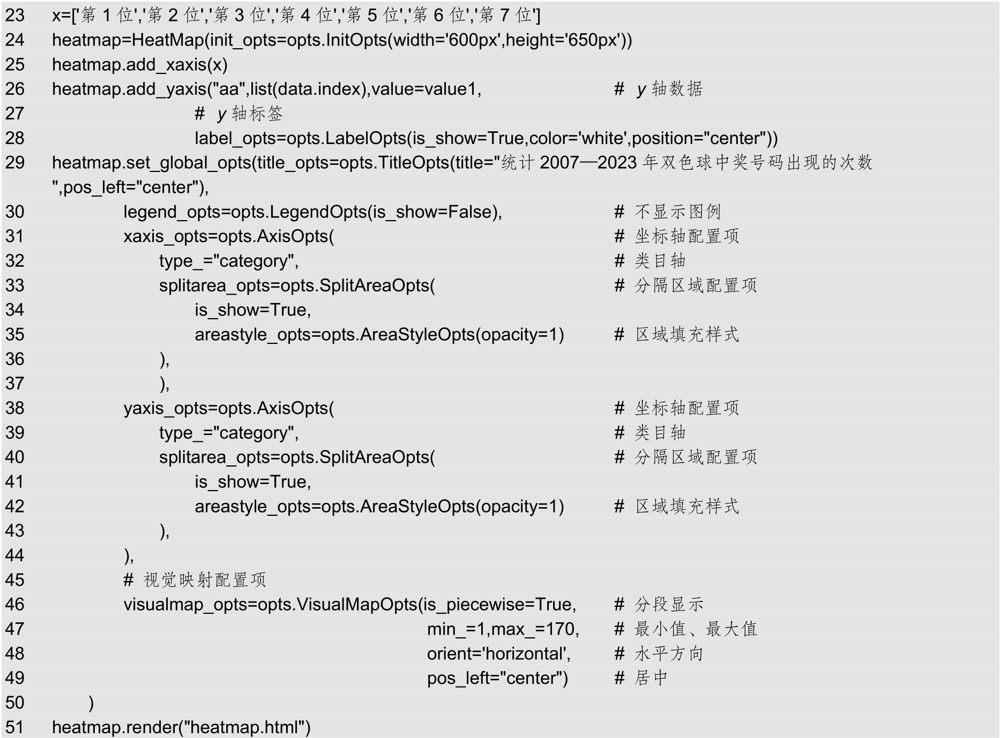

运行程序，在程序所在路径下生成heatmap.html文件，打开该文件，效果如图17.22所示。

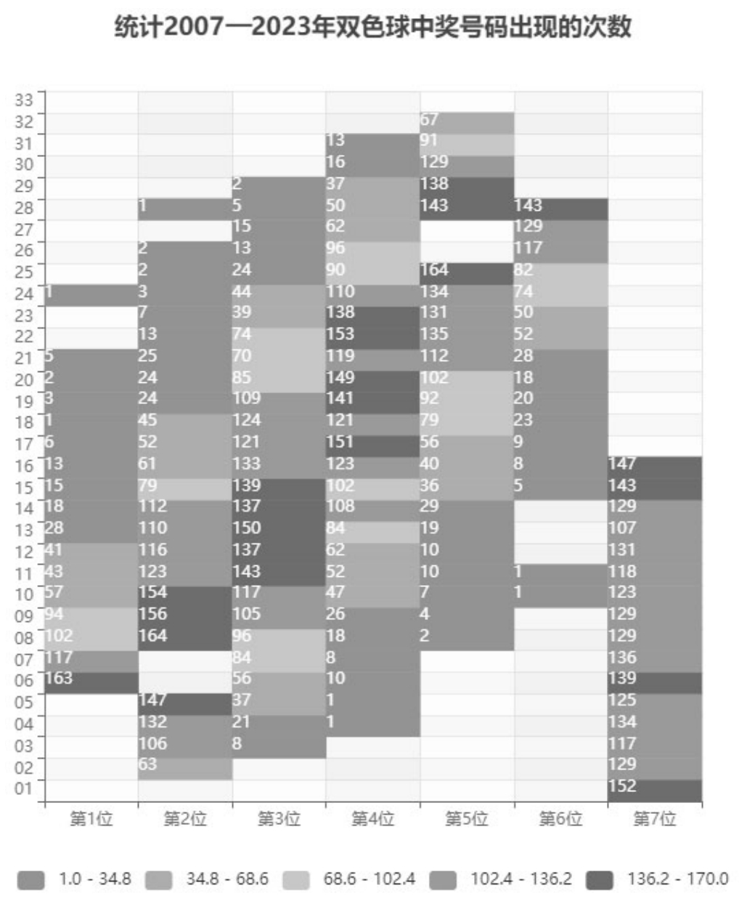

图17.22 热力图

### 17.3.8 绘制水球图—Liquid()对象

**【例17.17】**绘制水球图**（实例位置：资源包\\MR\\Code\\17\\17）**

绘制水球图主要使用Liquid()对象的add()函数实现。下面绘制一个简单的涟漪特效散点图，程序代码如下：

1  from pyecharts.charts import Liquid

2  # 绘制水球图

3  liquid=Liquid()

4  liquid.add('',\[0.7\])

5  liquid.render("myliquid.html")

运行程序，在程序所在路径下生成myliquid.html文件，打开该文件，效果如图17.23所示。

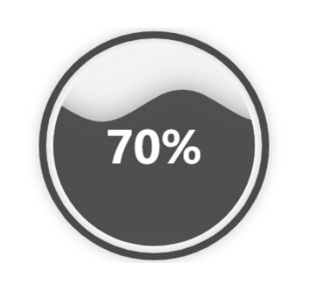

图17.23 水球图

### 17.3.9 绘制日历图—Calendar()对象

**【例17.18】**绘制加班日历图**（实例位置：资源包\\MR\\Code\\17\\18）**

绘制日历图主要使用Calendar()对象的add()函数实现。下面绘制一个简单日历图，通过该日历图分析6月份的加班情况，程序代码如下：

1   import pandas as pd

2   from pyecharts import options as opts

3   from pyecharts.charts import Calendar

4   df=pd.read_excel('202306.xls')                  # 读取Excel文件

5   data=df.stack()                                 # 行列转换

6   # 求最大值和最小值

7   mymax=round(max(data),2)

8   mymin=round(min(data),2)

9   index=pd.date_range('20230601','20230630')      # 生成日期

10  data_list=list(zip(index,data))                 # 合并列表

11  calendar=Calendar()                             # 生成日历图

12  calendar.add("",

13               data_list,

14               calendar_opts=opts.CalendarOpts(range\_=\['2023-06-01','2023-06-30'\]))

15  calendar.set_global_opts(

16          title_opts=opts.TitleOpts(title="2023年6月加班情况",pos_left='center'),

17          visualmap_opts=opts.VisualMapOpts(

18              max\_=mymax,

19              min\_=mymin+0.1,

20              orient="horizontal",

21              is_piecewise=True,

22              pos_top="230px",

23              pos_left="70px",

24          ),

25      )

26  calendar.render("mycalendar.html")

运行程序，在程序所在路径下生成calendar.html文件，打开该文件，效果如图17.24所示。

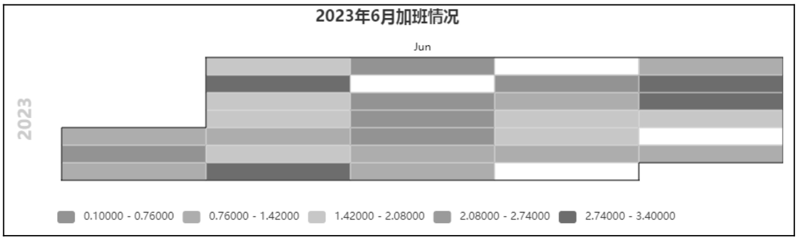

图17.24 日历图

## 17.4 小结

本章介绍了如何使用Pyecharts模块实现数据图表的绘制，相比Matplotlib和Seaborn，Pyecharts绘制的图表更加令人惊叹，其动感效果更是Matplotlib和Seaborn无法比拟的。但Pyecharts也存在不足之处，其生成的图表为网页格式，不能够随时查看，需要打开文件进行浏览。Pyecharts更适合Web程序。

Pyecharts还有很多功能，由于篇幅有限不能一一进行介绍，希望读者在学习过程中能够举一反三，绘制出更多精彩的数据分析图表。

本篇介绍了四个热门的数据分析项目，其中包含股票数据分析、淘宝网订单分析、网站用户数据分析以及NBA球员薪资的数据分析，通过四个不同类型的数据分析项目，让读者快速掌握Python数据分析的精髓，以将学习到的数据分析技术应用到实践开发中，并为以后的开发积累经验。

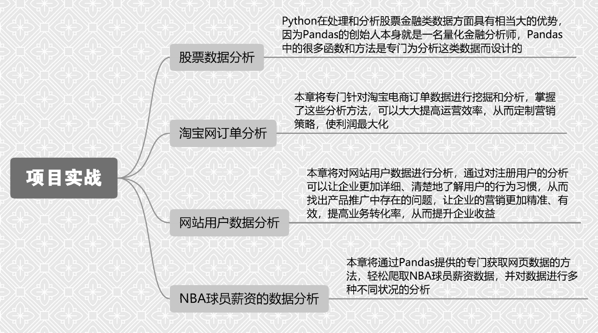

