# 18 综合案例：股票数据分析

Python在处理和分析股票金融类数据时具有其他语言不可比拟的优势，这是因为Pandas的创始人就是一名量化金融分析师，所以Pandas中的很多函数是专门为分析金融数据而设计的。本章介绍如何通过Python获取并分析股票行情数据。

本章知识架构及重难点如下。

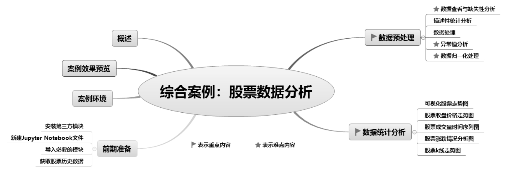

## 18.1 概述

Python获取并分析股票行情数据的过程：首先通过Tushare模块获取股票数据，然后对数据进行归一化处理，通过Matpoltlib模块绘制股票走势图、收盘价格走势图、成交量时间序列图、涨跌情况分析图，最后通过Mplfinance模块绘制股票k线图。

## 18.2 案例效果预览

Python股票数据分析包括可视化股票走势图，如图18.1所示；股票收盘价格走势图，如图18.2所示；股票成交量时间序列图，如图18.3所示；股票涨跌情况分析图，如图18.4所示；股票k线走势图，如图18.5所示。

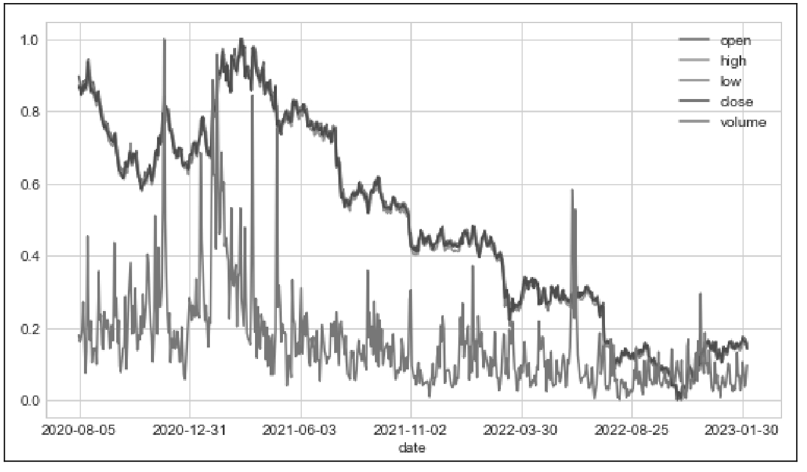

▲图18.1 可视化股票走势图

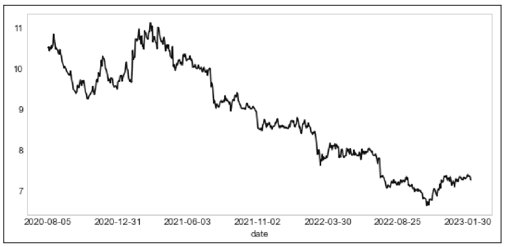

▲图18.2 股票收盘价格走势图

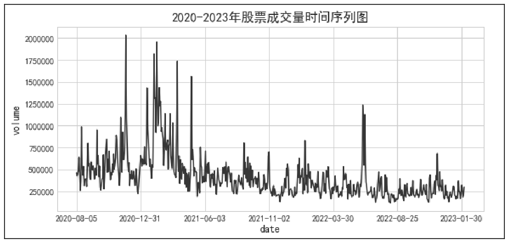

▲图18.3 股票成交量时间序列图

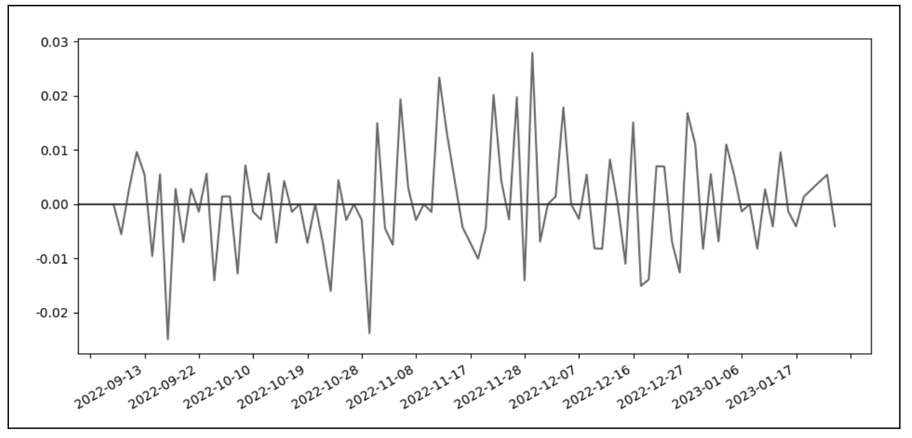

▲图18.4 股票涨跌情况分析图

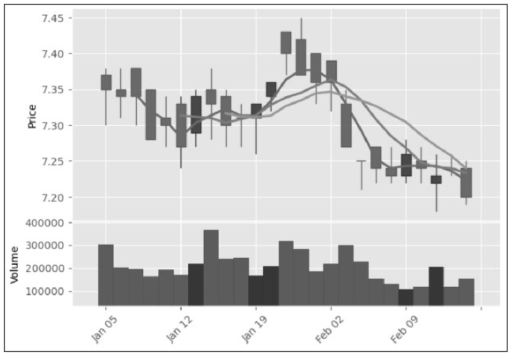

▲图18.5 股票k线走势图

## 18.3 案例环境

本章案例运行环境及所需模块具体如下。 

 操作系统：Windows 10。 

 Python版本：Python 3.9及以上。 

 开发工具：Anaconda3、Jupyter Notebook。 

 第三方模块：Pandas、Openpyxl、Xlrd、Xlwt、NumPy、Matplotlib、Tushare、Mplfinance。

## 18.4 前期准备

### 18.4.1 安装第三方模块

本案例涉及了两个比较特殊的模块，即Tushare模块和Mplfinance模块。Tushare模块用于获取股票数据，Mplfinance模块用于绘制k线图。下面介绍Tushare模块和Mplfinance模块的安装方法。

**1. Tushare模块**

Tushare是一个开源的Python财经数据模块，主要可实现对股票等金融数据从数据采集、清洗加工到数据存储的过程，能够为金融分析人员提供快速、整洁和多样的便于分析的数据，为他们在数据获取方面极大地减轻工作量。Tushare返回的绝大部分数据的数据格式都是Pandas DataFrame对象，非常适合用Pandas、NumPy、Matplotlib进行数据分析和可视化。

在Anaconda中安装Tushare模块，单击系统“开始”菜单，选择Anaconda3（64-bit）→Anaconda Prompt（anaconda3），打开Anaconda Prompt（anaconda3）命令提示符窗口，使用pip命令安装，命令如下：

pip install tushare

**2. Mplfinance模块**

由于Matplotlib的finance停止了更新，因此本案例将使用Mplfinance模块来绘制k线图。Mplfinance模块更加简单易用，增加了很多新功能，如renko砖形图、volume柱形图、ohlc图等。支持多种风格，可以定制多种颜色、线条（默认线条较粗，影响观感）等。

安装Mplfinance模块，在Anaconda Prompt（anaconda3）命令提示符窗口，使用pip命令安装，命令如下：

pip install mplfinance

### 18.4.2 新建Jupyter Notebook文件

下面介绍如何新建Jupyter Notebook文件夹和Jupyter Notebook文件，具体步骤如下。

（1）在系统“搜索”文本框输入Jupyter Notebook，运行Jupyter Notebook。

（2）新建一个Jupyter Notebook文件夹，单击右上角的New按钮，在弹出的下拉菜单中选择Folder，如图18.6所示，此时会在当前页面列表中默认创建一个名称类似Untitled Folder的文件夹。接下来重命名该文件夹，先选中该文件夹前面的复选框，然后单击Rename按钮，如图18.7所示。打开“重命名路径”对话框，在“请输入一个新的路径”文本框中输入“Python股票数据分析”，如图18.8所示，最后单击“重命名”按钮。

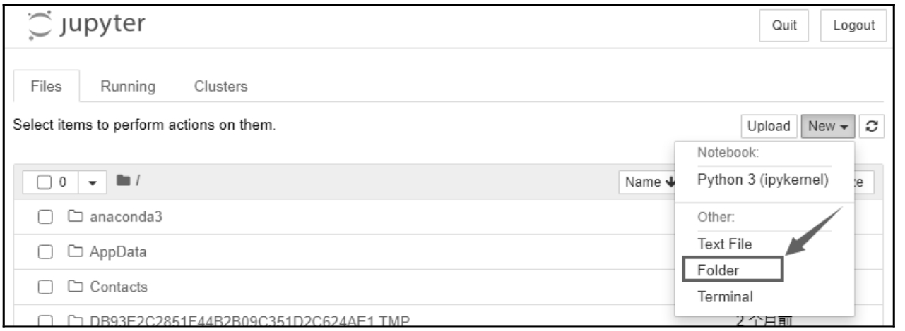

▲图18.6 新建Jupyter Notebook文件夹

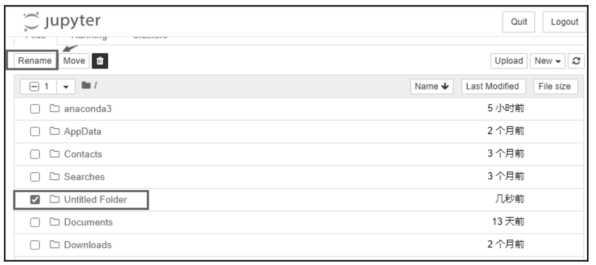

▲图18.7 选中Untitled Folder文件夹前面的复选框

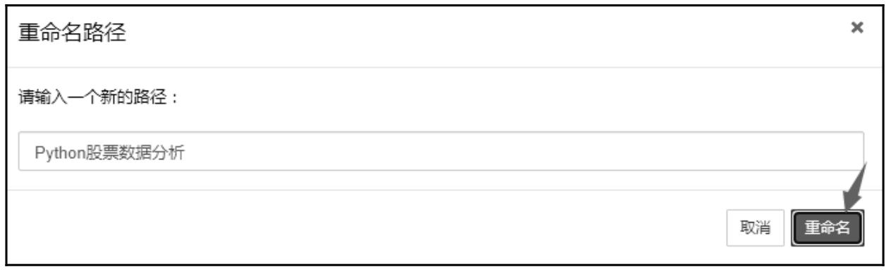

▲图18.8 重命名Untitled Folder文件夹

（3）新建Jupyter Notebook文件。单击“Python股票数据分析”文件夹，进入该文件夹，单击右上角的New按钮，由于我们创建的是Python文件，因此在弹出的下拉菜单中选择Python 3（ipykernel），如图18.9所示。

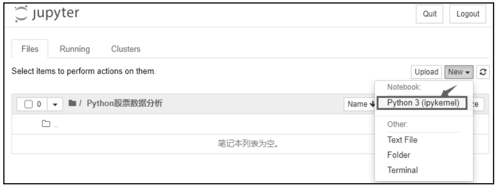

图18.9 新建Jupyter Notebook文件

文件创建完成后，会打开如图18.10所示的窗口，通过该窗口就可以编写代码了。至此，新建Jupyter Notebook文件的工作就完成了，接下来介绍编写代码的过程。

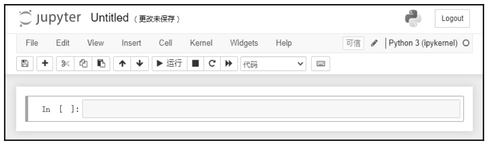

图18.10 代码编辑窗口

### 18.4.3 导入必要的模块

本案例主要使用Pandas、Tushare、Matplotlib、Mplfinance、NumPy模块和matplotlib.dates子模块，下面在Jupyter Notebook中导入案例所需要的模块，代码如下：

import pandas as pd

import tushare as ts

import matplotlib.pyplot as plt

import mplfinance as mpf

import numpy as np

import matplotlib.dates as mdates

### 18.4.4 获取股票历史数据

Python获取股票历史数据的方法有很多，这里主要使用Tushare模块。

下面使用Tushare模块先获取股票代码为“600000”的股票历史数据，然后将该数据导出为Excel文件，以方便日后使用，代码如下：

\# 通过股票代码获取股票历史数据

df=ts.get_hist_data('600000')

\# 显示前10条数据

df.head(10)

运行程序，单击工具栏中的运行按钮 或者按快捷键Ctrl+Enter运行本单元，效果如图18.11所示。

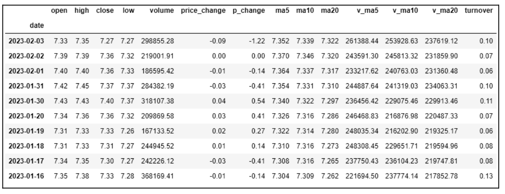

图18.11 获取股票历史数据（前10条）

上述程序，通过head()函数显示前10条数据，下面来了解一下各个字段的含义。 

 date：日期，索引列。 

 open：开盘价。每个交易日开市后的第一笔每股买卖成交价格。 

 high：最高价，是好的卖出价格。 

 low：最低价，是好的买进价格，可根据价格极差判断股价的波动程度和是否超出常态范围。 

 close：收盘价。最后一笔交易前一分钟所有交易的成交量加权平均价，无论当天股价如何振荡，最终将定格在收盘价上。 

 volume：成交量。指一个时间单位内对某项交易成交的数量，可根据成交量的增加幅度或减少幅度来判断股票趋势，预测市场供求关系和活跃程度。 

 price_change：价格变动。 

 p_change：涨跌幅度。 

 ma5：5日均价。 

 ma10：10日均价。 

 ma20：20日均价。 

 v_ma5：5日均量。 

 v_ma10：10日均量。 

 v_ma20：20日均量。 

 turnover：换手率。也称“周转率”，指在一定时间内市场中股票转手买卖的频率，是反映股票流通性强弱的指标之一。

## 18.5 数据预处理

### 18.5.1 数据查看与缺失性分析

数据查看与缺失性分析的具体步骤如下。

（1）查看数据集形状，即行数和列数，代码如下：

\# 查看数据集的形状

df.shape

运行程序，返回元组结果为（605, 14），也就是说该数据集包含605行14列。注意，由于数据不断更新，读者运行代码后返回的结果可能不同。

（2）查看摘要信息和数据是否缺失。

在进行数据统计分析前，首先要清晰地了解数据，查看数据中是否有缺失值、列数据类型是否正常。下面使用info()函数查看数据的数据类型、非空值情况以及内存使用量等，代码如下：

\# 查看摘要信息

df.info()

运行程序，结果如图18.12所示。

从运行结果得知：数据有605行，索引是时间格式，日期从2020年8月5日至2023年2月3日。总共有14列，并列出了每一列的名称和数据类型，而且数据中没有缺失值。

另外，还有一个函数可以查看缺失值，即查看列数据是否包含空值，代码如下：

\# 检查数据中的空值

df.isnull().any()

运行程序，结果如图18.13所示。

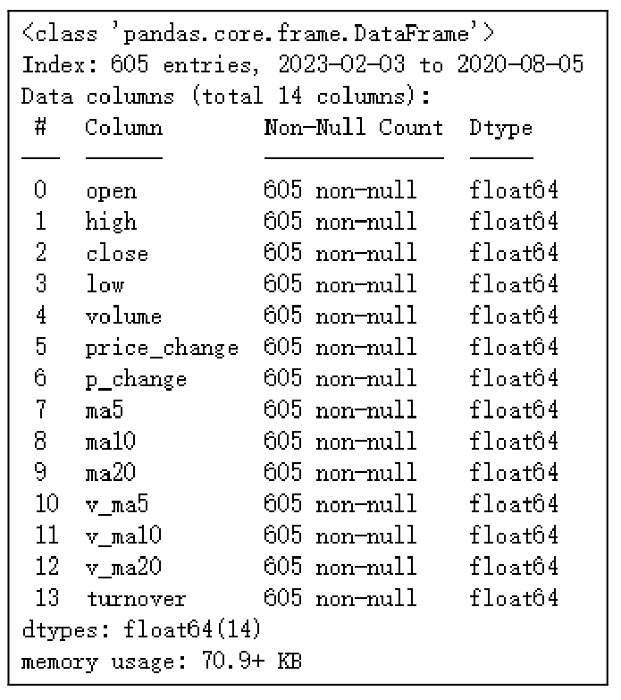

▲图18.12 查看摘要信息

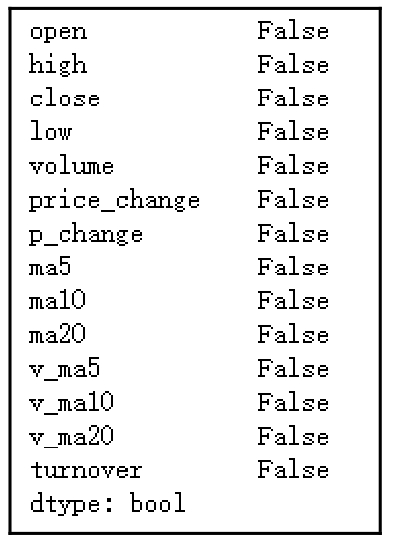

▲图18.13 查看列数据是否包含空值

从运行结果得知：每一列数据都不包含空值，即没有缺失值。

### 18.5.2 描述性统计分析

描述性统计分析主要查看数据的统计信息，如最大值、最小值、平均值等。同时，也可以从中洞察异常数据，如空数据和值为0的数据。下面使用DataFrame()对象的describe()函数快速查看统计信息，代码如下：

\# 描述性统计分析

df.describe()

运行程序，结果如图18.14所示。

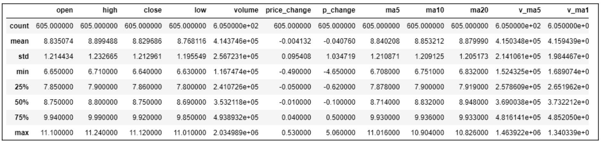

图18.14 描述性统计分析

从运行结果得知：数据整体统计分布情况包括总计数值、均值、标准差、最小值、1/4分位数（25%）、1/2分位数（50%）、3/4分位数（75%）和最大值。例如，开盘价7.85的占25%，开盘价8.75的占50%，开盘价9.94的占75%。

### 18.5.3 数据处理

由于本案例仅分析open（开盘价）、high（最高价）、close（收盘价）、low（最低价）和volume（成交量），因此首先抽取这部分数据作为特征数据。另外，通过前面显示的数据，我们发现数据是按日期升序方式进行排序的，这里一并进行处理，将数据按日期进行升序排序，代码如下：

\# 抽取数据

feature_data=df\[\['open','high','low','close','volume'\]\].sort_values(by='date')

print(feature_data)

运行程序，结果如图18.15所示。

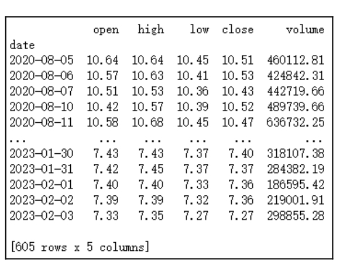

图18.15 数据处理

### 18.5.4 异常值分析

异常值是与其他数据点明显不同的值，它们的存在可能会在数据分析过程中产生问题。因此，在数据分析前应首先检测异常值。异常值的检测方法有很多种，下面我们通过箱形图来检测异常值，主要使用Pandas内置的绘图工具来绘制，这样比较方便快捷，代码如下：

feature_data.boxplot()  # 绘制箱形图

plt.show()              # 显示图表

然后使用DataFrame()对象的boxplot()函数绘制箱形图，观察异常值。运行程序，结果如图18.16所示。

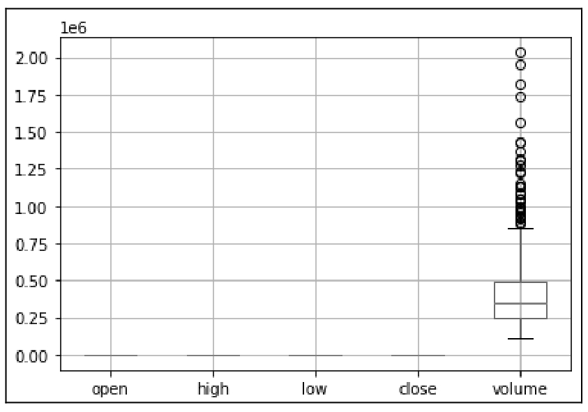

图18.16 箱形图分析异常值

从运行结果得知：volume（成交量）存在异常值。异常值的处理方法有多种，这里根据实际情况，我们选择不处理，直接在数据集上进行数据分析。

### 18.5.5 数据归一化处理

经过前面显示的数据我们发现，volume（成交量）数据相对于open（开盘价）、high（最高价）、close（收盘价）、low（最低价）数值非常大。这种情况下如果单独分析成交量，数据是没有问题的。但是，如果对多个指标数据进行分析与可视化时，就会出现数值较小的数据被数值较大的数据淹没的情况，而导致数值较小的数据在数据分析图表中看不出来，如图18.17所示。

那么，这种情况应该怎么处理呢？

数据归一化，也称“数据标准化”，它可以将数据处理成都在一条水平线上。数据归一化有多种方法，下面使用0-1标准化方法，该方法非常简单，通过遍历特征数据里的每一个数值，将Max（最大值）和Min（最小值）记录下来，然后以Max－Min作为基数（即Min=0，Max=1）进行数据的归一化处理，公式如下：

x = (x - Min) / (Max - Min)

下面就对上述数据进行数据归一化处理，代码如下：

1  # 数据归一化(采用0-1标准化方法)

2  normalize_data=(feature_data-feature_data.min())/(feature_data.max()-feature_data.min())

3  print(normalize_data)

运行程序，结果如图18.18所示。

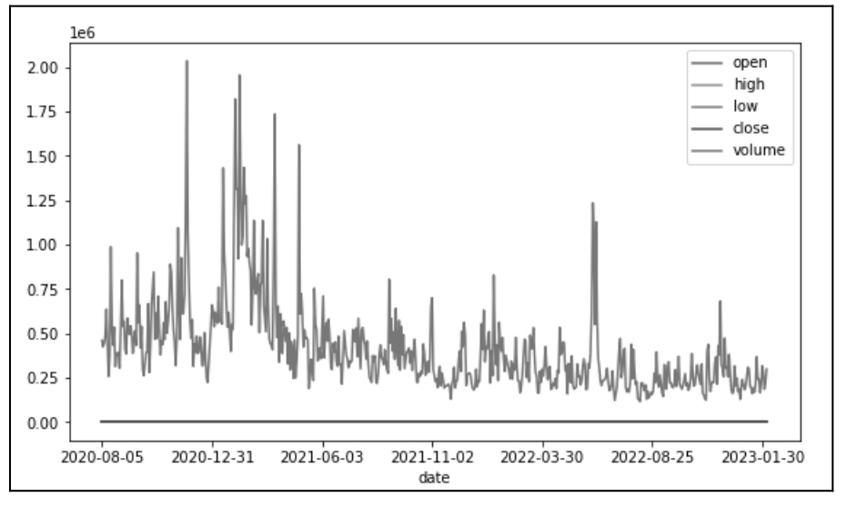

▲图18.17 数据归一化处理前的股票走势图

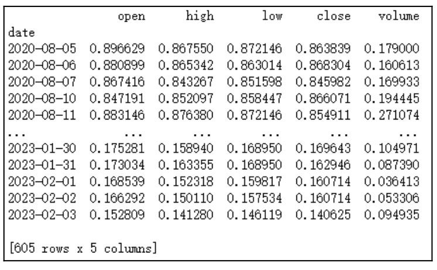

▲图18.18 数据归一化处理

从运行结果得知：数据发生了变化，所有数据都在一条水平线上。那么，有的读者可能会问，数据归一化后，会不会影响数据的走势？答案是不影响，因为它没有改变原始数据。

## 18.6 数据统计分析

### 18.6.1 可视化股票走势图

数据处理完成后，接下来对数据进行可视化，观察股票走势。这里直接使用DataFrame()对象自带的绘图工具，该绘图工具能够快速出图，并自动优化图形输出形式。数据为归一化处理后的数据，以时间作为横坐标，以每日的open（开盘价）、high（最高价）、low（最低价）、close（收盘价）和volume（成交量）作为纵坐标，绘制多折线图，通过该多折线图观察股票随时间的变化情况。代码如下：

1  # 绘制股票走势图

2  # 使用DataFrame()对象的plot()函数绘制折线图

3  normalize_data.plot(figsize=(9,5))

4  plt.show()

运行程序，结果如图18.19所示。

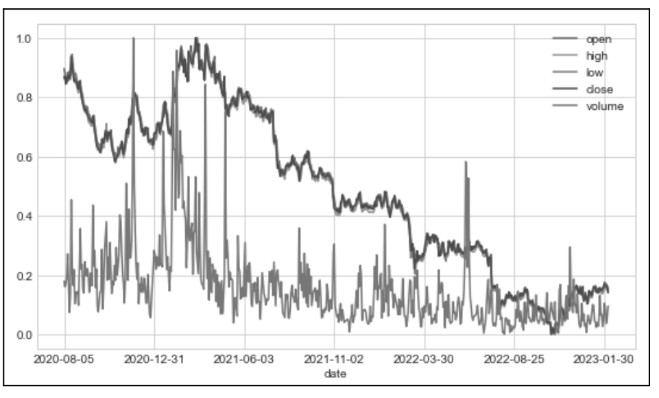

图18.19 股票走势图

### 18.6.2 股票收盘价格走势图

绘制股票2020—2023年的日收盘价格走势图，只需要一个字段，即colse（收盘价）。以时间作为横坐标，以每日的收盘价作为纵坐标，绘制折线图，通过该折线图观察股票收盘价随时间的变化情况。代码如下：

1  # 设置画布大小

2  plt.subplots(figsize=(9,4))

3  # 绘制股票收盘价格走势图

4  feature_data\['close'\].plot(grid=False,color='blue')

5  # 显示图表

6  plt.show()

运行程序，结果如图18.20所示。

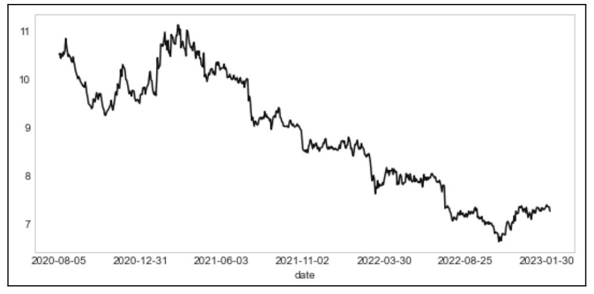

图18.20 股票收盘价格走势图

### 18.6.3 股票成交量时间序列图

绘制股票2020—2023年的日成交量的时间序列图。以时间为横坐标，以每日的成交量为纵坐标，绘制折线图，通过该折线图观察股票成交量随时间的变化情况。代码如下：

1   # 设置画布大小

2   plt.subplots(figsize=(9,4))

3   # 解决中文乱码

4   plt.rcParams\['font.sans-serif'\]=\['SimHei'\]

5   # 取消科学记数法

6   plt.gca().get_yaxis().get_major_formatter().set_scientific(False)

7   # 成交量折线图

8   feature_data\['volume'\].plot(color='red')

9   # 设置图表标题和字体大小

10  plt.title('2020—2023年股票成交量时间序列图', fontsize='15')

11  # 设置*xy*轴标签

12  plt.ylabel('volume', fontsize='10')

13  plt.xlabel('date', fontsize='10')

14  # 显示图表

15  plt.show()

运行程序，结果如图18.21所示。

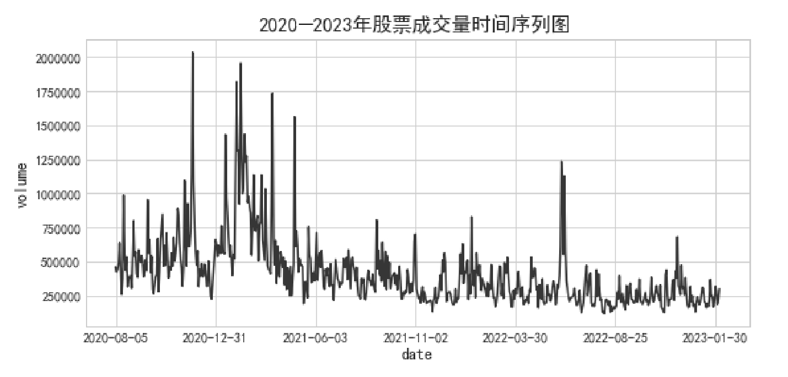

图18.21 股票成交量时间序列图

### 18.6.4 股票涨跌情况分析图

股票涨跌情况分析主要分析“收盘价”，收盘价的分析常常是基于股票收益率的，股票收益率又可以分为简单收益率和对数收益率。 

 简单收益率：是指相邻两个价格之间的变化率。 

 对数收益率：是指所有价格取对数后两两之间的差值。

下面通过对数收益率分析股票涨跌情况，并绘制成图表，具体步骤如下。

（1）抽取指定日期范围的收盘价数据。

（2）使用NumPy模块的log()函数计算对数收益率。log()函数用于计算x的自然对数。

（3）绘制图表，同时绘制水平分割线，标记股票涨跌情况。

程序代码如下：

1   # 抽取指定日期范围的“收盘价”数据

2   mydate1=feature_data.loc\['2022-09-05':'2023-01-31'\]

3   ydate_close=mydate1.close

4   # 对数收益率= 当日收盘价取对数-昨日收盘价取对数

5   log_change=np.log(mydate_close)-np.log(mydate_close.shift(1))

6   plt.rcParams\['axes.unicode_minus'\] = False  # 用来正常显示负号

7   # 设置画布和画板

8   fig,ax=plt.subplots(figsize=(11,5))

9   # 绘制图表

10  ax.plot(log_change)

11  # 绘制水平分割线，标记股票收盘价相对于y=0的偏离程度

12  ax.axhline(y=0,color='red')

13  # 日期刻度定位为星期

14  plt.gca().xaxis.set_major_locator(mdates.WeekdayLocator())

15  # 自动旋转日期标记

16  plt.gcf().autofmt_xdate()

17  plt.show()

这里需要注意一个问题。数据抽取过程中，如果数据是升序排序的，则小日期在前，大日期在后；如果数据是降序排序的，则大日期在前，小日期在后。否则，将出现空数据，即找不到指定范围内的数据。

使用Numpy模块的log()函数计算对数。对数收益率公式：对数收益率=当日收盘价取对数-昨日收盘价取对数运行程序，结果如图18.22所示。

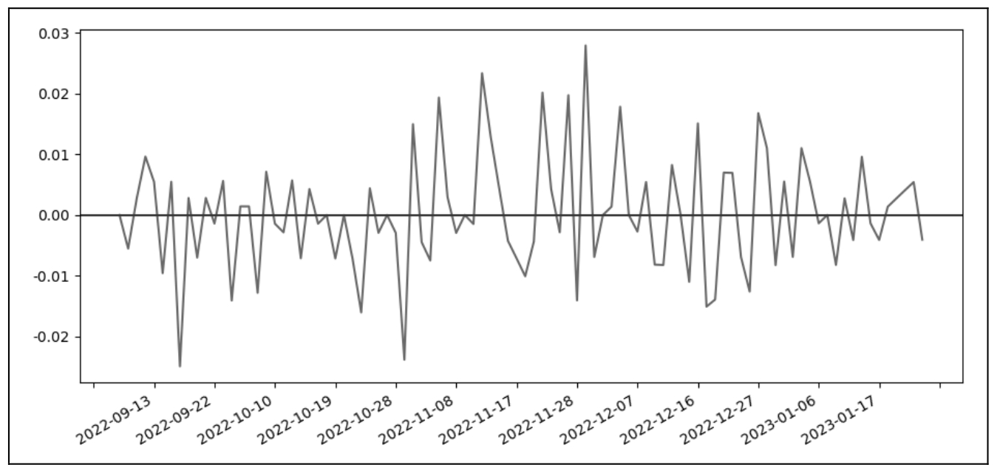

图18.22 股票涨跌情况分析图

在图18.22中，值在上面表示今天相对于昨天的股票涨了，值在下面表示今天相对于昨天的股票跌了。

### 18.6.5 股票k线走势图

相传k线图起源于日本德川幕府时代，当时的商人用此图来记录米市的行情和价格波动，后来k线图被引入股票市场。每天的四项指标数据（即“最高价”“收盘价”“开盘价”和“最低价”）用蜡烛形状的图表进行标记，不同的颜色代表涨跌情况，如图18.23所示。

在Python中主要使用Mplfinance模块绘制k线图，具体步骤如下。

（1）抽取“最高价”“收盘价”“开盘价”“最低价”和“成交量”数据。

（2）抽取指定日期范围的数据。

（3）自定义颜色和图表样式。

（4）绘制k线图。

程序代码如下：

1   # 抽取指定日期范围的数据

2   mydate2=feature_data\['2023-01-05':'2023-02-15'\]

3   mydate2.index=pd.to_datetime(mydate2.index)   # 将数据索引类型转换为datetime

4   # 绘制k线图

5   # 自定义颜色

6   mc = mpf.make_marketcolors(

7       up='red',        # 上涨k线柱子的颜色为红色

8       down='green',    # 下跌k线柱子的颜色为绿色

9       edge='i',        #  k线图柱子边缘的颜色(i代表继承自up和down的颜色),下同

10      volume='i',      # 成交量直方图的颜色

11      wick='i'         # 上下影线的颜色

12  )

13  # 调用make_mpf_style()函数，自定义k线图样式

14  mystyle = mpf.make_mpf_style(base_mpl_style="ggplot", marketcolors=mc)

15  # 自定义样式mystyle

16  # 显示成交量

17  # 添加移动平均线mav(即3、6、9日的平均线)

18  mpf.plot(mydate2,type='candle',style=mystyle,volume=True,mav=(3,6,9))

19  plt.show()

运行程序，结果如图18.24所示。

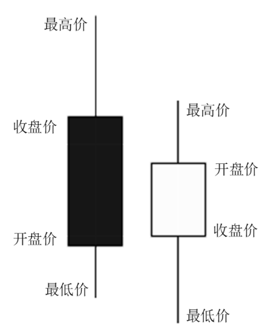

▲图18.23 k线图示意图

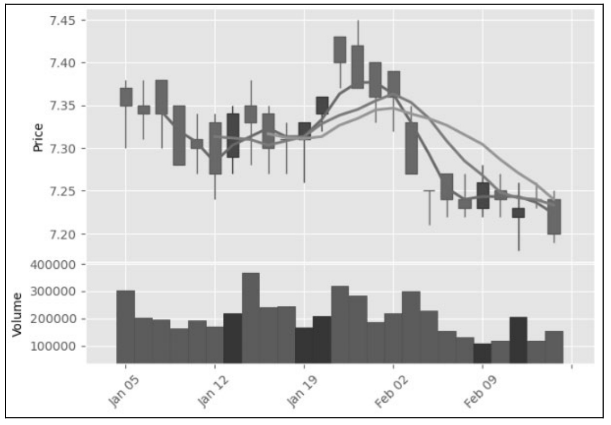

▲图18.24 股票k线走势图

