# 19 综合案例：淘宝网订单分析

淘宝电商每时每刻都会产生大量的订单数据，虽然淘宝后台也提供了数据分析功能，但是很多时候无法满足用户的需求，用户不能按照自己的想法挖掘更有价值的信息进行分析。本章将专门针对淘宝电商订单数据进行挖掘和分析，包括从数据预处理到数据分析的完整过程，掌握了这些分析方法，不但可以大大提高运营效率，还可以定制营销策略，使利润最大化。

本章知识架构及重难点如下。

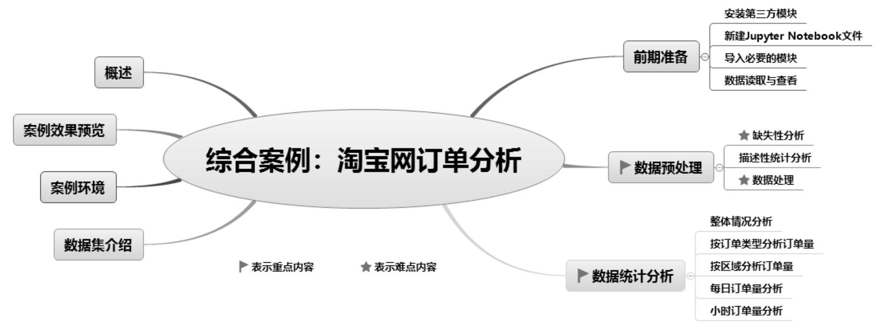

## 19.1 概述

淘宝电商订单分析系统主要包括数据读取与查看、数据缺失性分析、描述性统计分析、数据处理，这些预处理工作完成后，再对数据进行统计分析，包括数据整体情况分析、按订单类型分析订单量、按区域分析订单量、每日订单量分析和小时订单量分析，主要使用Pandas结合第三方图表模块Pyecharts实现。

## 19.2 案例效果预览

淘宝网订单分析主要包括整体情况分析，如图19.1所示；按订单类型分析订单量，如图19.2所示；按区域分析订单量，如图19.3所示；每日订单量分析，如图19.4所示；小时订单量分析，如图19.5所示。

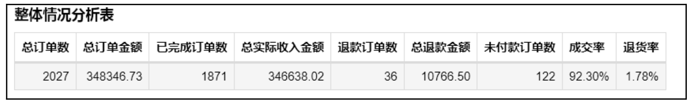

▲图19.1 整体情况分析

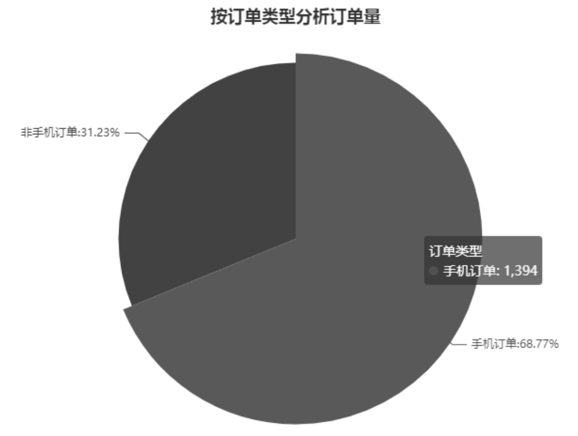

▲图19.2 按订单类型分析订单量

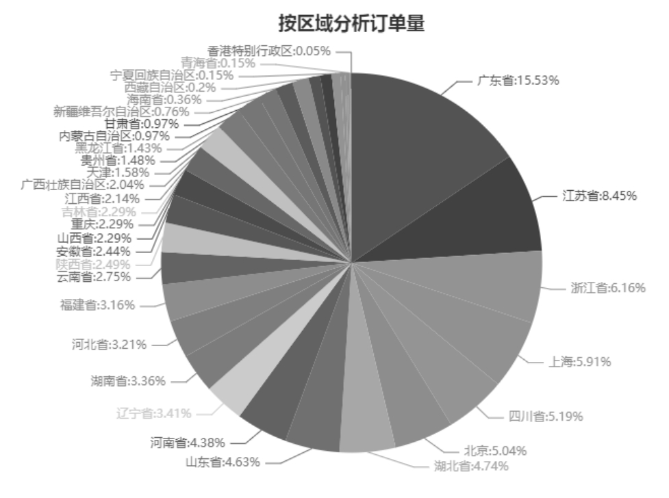

▲图19.3 按区域分析订单量

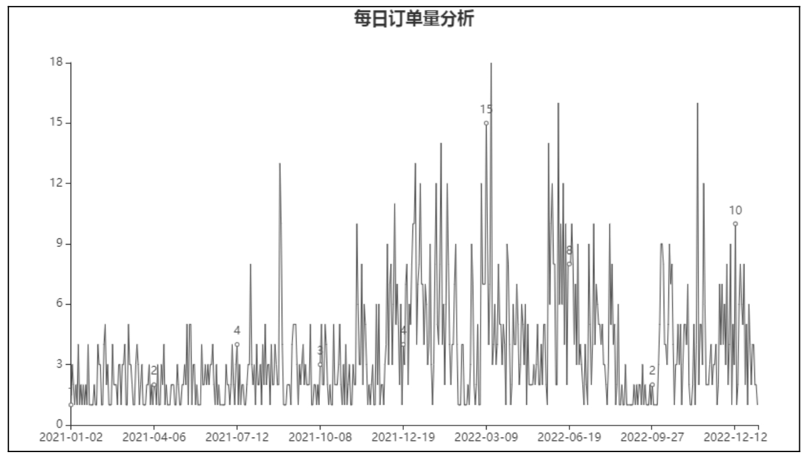

▲图19.4 每日订单量分析

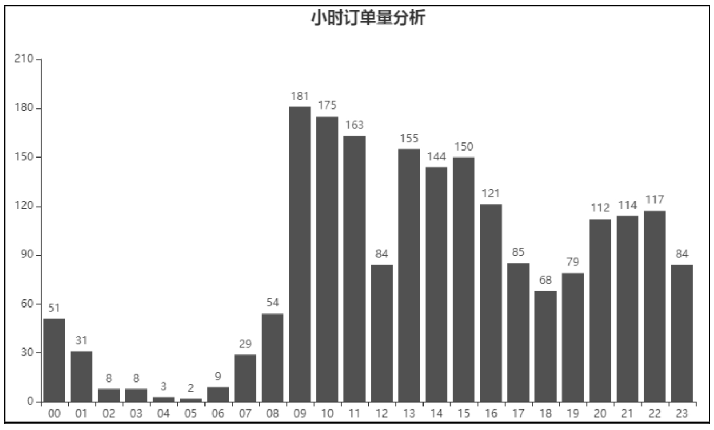

▲图19.5 小时订单量分析

## 19.3 案例环境

本章案例运行环境及所需模块具体如下。 

 操作系统：Windows 10。 

 Python版本：Python 3.9及以上。 

 开发工具：Anaconda3、Jupyter Notebook。 

 第三方模块：Pandas、Openpyxl、xlrd、xlwt、NumPy、Pyecharts。

## 19.4 数据集介绍

淘宝电商订单分析系统要用到的数据集为TB_data.xlsx，如图19.6所示，该数据集为淘宝店铺导出的订单数据，其中的一些敏感数据已经进行处理，同时也删除了一些无用的数据。

接下来我们就从这些数据中挖掘出有效的信息来分析淘宝电商订单数据。

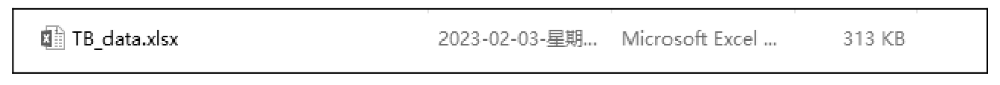

图19.6 数据集TB_data.xlsx

**注意**

获取该数据集可以在本书提供的“资源包”中复制。

## 19.5 前期准备

### 19.5.1 安装第三方模块

本案例中涉及了比较重要的模块，即Pyecharts模块，该模块是一个用于生成Echarts图表的模块。Echarts是百度开源的一个数据可视化JS模块，用Echarts生成的图表可视化效果非常好，而Pyecharts则是专门为了与Python衔接的，方便在Python中直接使用可视化数据分析图表。使用Pyecharts可以生成独立的网页格式的图表，还可以在Flask、Django中直接使用，非常方便。

在Anaconda中安装Pyecharts模块，单击系统“开始”菜单，选择Anaconda3（64-bit）→Anaconda Prompt（anaconda3），打开Anaconda Prompt（anaconda3）命令提示符窗口，使用pip命令安装，命令如下：

pip install pyecharts

安装成功后，将提示安装成功的字样，如“Successfully installed pyecharts-2.0.3”。

### 说明

由于Pyecharts各个版本的相关代码有一些区别，因此这里建议读者安装与笔者相同的版本，以免造成不必要的麻烦。

### 19.5.2 新建Jupyter Notebook文件

下面新建Jupyter Notebook文件夹和Jupyter Notebook文件，具体步骤如下。

（1）在系统“搜索”文本框中输入Jupyter Notebook，运行Jupyter Notebook。

（2）新建一个Jupyter Notebook文件夹，命名为“淘宝电商订单分析系统”。

（3）新建Jupyter Notebook文件。单击“淘宝电商订单分析系统”文件夹，进入该文件夹，单击右上角的New按钮，由于我们创建的是Python文件，因此选择Python 3（ipykernel）。文件创建完成后就可以编写代码了。

### 说明

具体步骤可以参考18.4.2节。

### 19.5.3 导入必要的模块

本项目主要使用了Pandas、NumPy、Pyecharts模块，下面在Jupyter Notebook中导入项目所需要的模块，代码如下：

import pandas as pd

import numpy as np

from pyecharts.components import Table

from pyecharts.options import ComponentTitleOpts

from pyecharts.charts import Pie

from pyecharts.charts import Line

from pyecharts.charts import Bar

from pyecharts import options as opts

### 19.5.4 数据读取与查看

使用Pandas的read_excel()函数读取数据，显示前5条数据，并使用Pandas的样式函数高亮显示指定值，此处显示缺失值，代码如下：

df=pd.read_excel('TB_data.xlsx')

df.head(5).style.highlight_null()

运行程序，单击工具栏中的运行按钮 ，或者按快捷键Ctrl+Enter运行本单元，效果如图19.7所示。

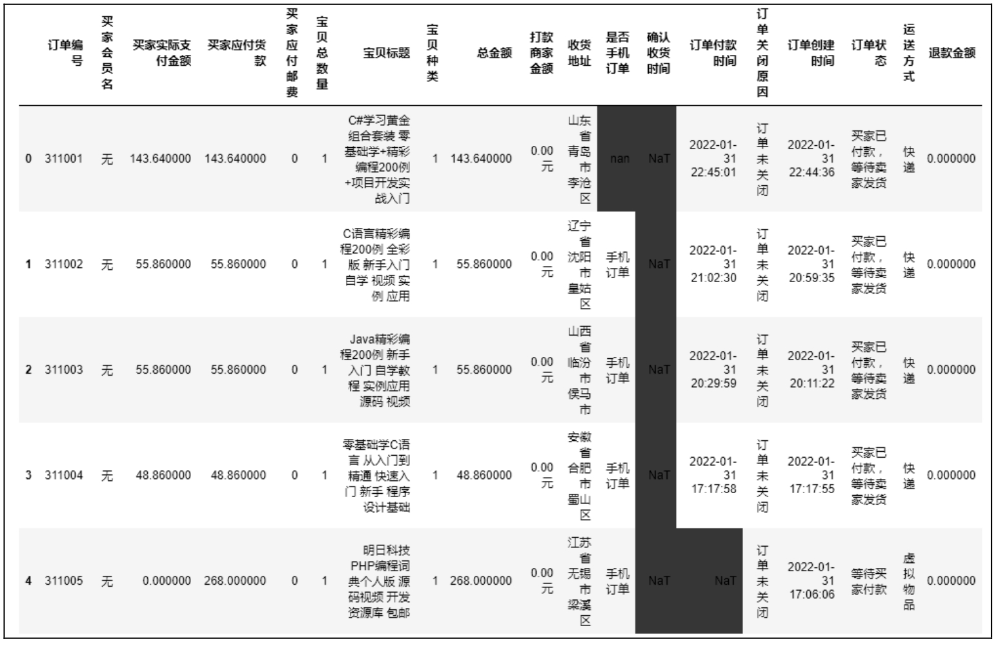

图19.7 数据读取（前5条）

图19.7中的数据通过高亮显示，缺失值数据一目了然。数据的高亮显示主要使用了Pandas的style属性，它主要用来美化DataFrame和Series数据的输出格式，能够更加直观地显示数据结果。

style属性可以对输出数据格式化，突出显示特殊值，像Excel一样的条件格式中的数据条样式，或者类似Excel的条件格式中的显示色阶样式，用颜色深浅来直观表示数据大小等。感兴趣的读者可以通过官网查阅。

## 19.6 数据预处理

### 19.6.1 缺失性分析

查看摘要信息和数据是否缺失。在进行数据统计分析前，首先要清晰地了解数据，查看数据中是否有缺失值、列数据类型是否正常。下面使用info()函数查看数据的类型、非空值情况以及内存使用量等，代码如下：

\# 查看摘要信息

df.info()

运行程序，结果如图19.8所示。

从运行结果得知：数据有2660行19列，并列出了每一列的名称和数据类型，部分数据包含缺失值，如宝贝标题、收货地址、是否手机订单、确认收货时间、订单付款时间。

另外，还有一个函数可以查看缺失值，即查看列数据是否包含缺失值，代码如下：

\# 检查数据中的空值

df.isnull().any()

运行程序，结果如图19.9所示。

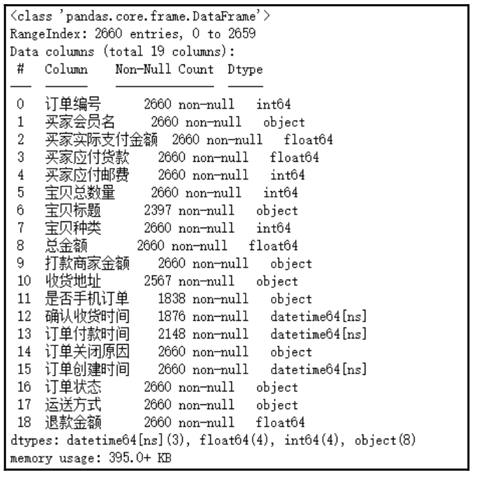

▲图19.8 查看摘要信息

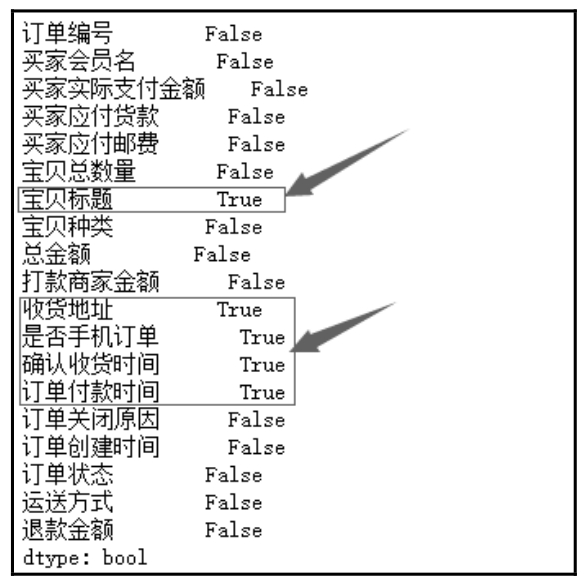

▲图19.9 查看列数据是否包含空值

因此，通过该函数也可以清晰地看出包含缺失值的列。

### 19.6.2 描述性统计分析

描述性统计分析主要查看数据的统计信息，如最大值、最小值、平均值等。同时，也可以从中洞察异常数据，如空数据和值为0的数据。下面使用DataFrame()对象的describe()函数快速查看统计信息，代码如下：

\# 描述性统计分析

df.describe()

运行程序，结果如图19.10所示。

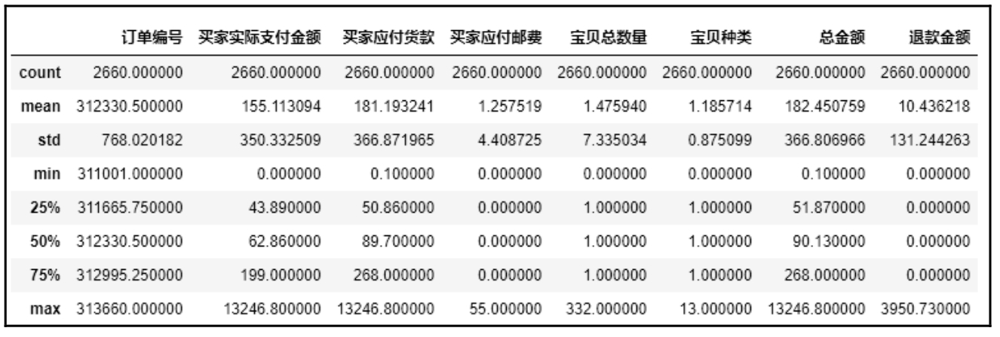

图19.10 描述性统计分析

从运行结果得知：数据整体统计分布情况，包括总计数值、均值、标准差、最小值、1/4分位数（25%）、1/2分位数（50%）、3/4分位数（75%）和最大值。其中“买家实际支付金额”为43.89的占25%，62.86的占50%，199的占75%，说明大概率有75%的用户购买了编程词典个人版产品。

### 19.6.3 数据处理

通过缺失性分析和描述性统计分析，发现数据中存在异常，如宝贝标题为空、订单付款时间为空、买家实际支付金额为0等。下面对异常数据进行删除处理，代码如下：

\# 去除空值，订单付款时间和宝贝标题非空值才保留

\# 去除买家实际支付金额为0的记录

df1=df\[df\['订单付款时间'\].notnull() & df\['宝贝标题'\].notnull() & df\['买家实际支付金额'\] !=0\]

print(df1.head(10))

运行程序，结果如图19.11所示。

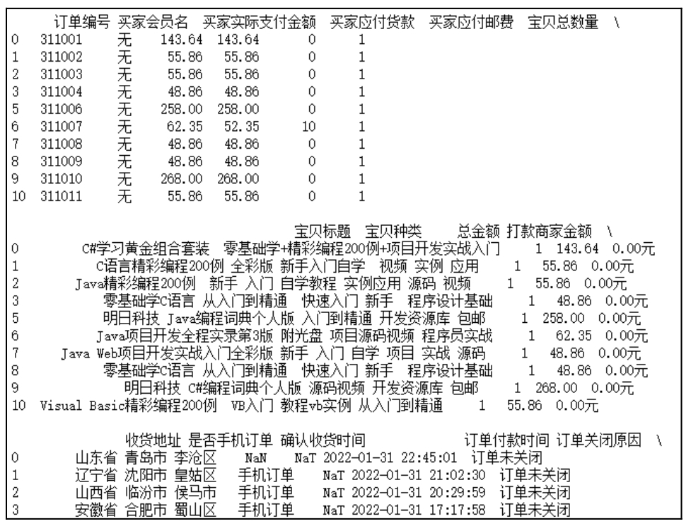

图19.11 数据处理（部分数据）

## 19.7 数据统计分析

### 19.7.1 整体情况分析

数据处理完成后，接下来对淘宝电商订单数据进行整体分析，主要包括总订单数、总订单金额、已完成订单数、总实际收入金额、退款订单数、总退款金额、未付款订单数、成交率和退货率。程序代码如下：

1   # 创建表格对象

2   table=Table()

3   # 设置表头

4   headers=\['总订单数','总订单金额','已完成订单数','总实际收入金额','退款订单数','总退款金额','未付款订单数','成交率','退

    货率'\]

5   # 行数据

6   rows=\[\[df1\['订单编号'\].count(),

7          df1\['总金额'\].sum(),

8          df1\[df1\['订单状态'\] == '交易成功'\]\['订单编号'\].count(),

9          df1\['买家实际支付金额'\].sum(),

10         df1\[df1\['订单关闭原因'\] == '退款'\]\['订单编号'\].count(),

11         f"{df1\['退款金额'\].sum():.2f}",

12         df1\[df1\['订单关闭原因'\] == '买家未付款'\]\['订单编号'\].count(),

13         f"{df1\[df1\['订单状态'\] == '交易成功'\]\['订单编号'\].count()/df1\['订单编号'\].count():.2%}",

14         f"{df1\[df1\['订单关闭原因'\] == '退款'\]\['订单编号'\].count()/df1\['订单编号'\].count():.2%}"\]\]

15  # 增加表格

16  table.add(headers,rows)

17  # 设置表格标题

18  table.set_global_opts(title_opts=ComponentTitleOpts(title='整体情况分析表'))

19  # 显示表格

20  table.render_notebook()

运行程序，结果如图19.12所示。

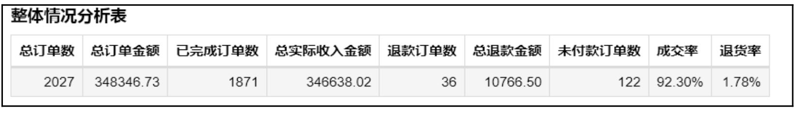

图19.12 整体情况分析表

### 19.7.2 按订单类型分析订单量

淘宝电商订单大多数为手机订单，下面通过饼形图分析手机订单占比情况，程序代码如下：

1  # 计算手机和非手机订单量

2  a=df1\[df1\['是否手机订单'\] == '手机订单'\]\['订单编号'\].count()

3  b=df1\['订单编号'\].count()-a

4  x_data=\['手机订单','非手机订单'\]

5  y_data=\[int(a),int(b)\]

6   # 将数据转换为列表加元组的格式(\[(key1, value1), (key2, value2)\])

7   data=\[list(z) for z in zip(x_data, y_data)\]

8   pie=Pie()                                 # 创建饼形图

9   # 为饼形图添加数据

10  pie.add(

11          series_name="订单类型",             # 序列名称

12          data_pair=data,                     # 数据

13      )

14  pie.set_global_opts(

15          # 饼形图标题居中

16          title_opts=opts.TitleOpts(

17              title="按订单类型分析订单量",

18              pos_left="center"),

19          # 不显示图例

20          legend_opts=opts.LegendOpts(is_show=False),

21      )

22  pie.set_series_opts(

23          # 序列标签和百分比

24          label_opts=opts.LabelOpts(formatter='{b}:{d}%'),

25      )

26  # 显示图表

27  pie.render_notebook()

运行程序，结果如图19.13所示。

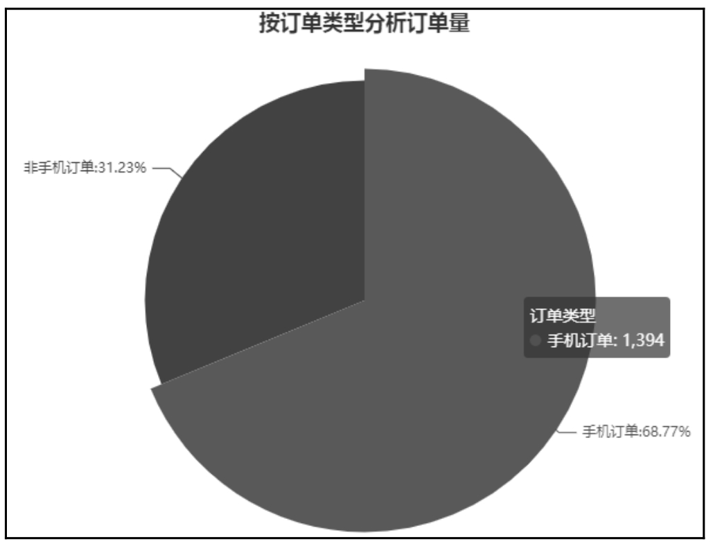

图19.13 按订单类型分析订单量

从图19.13中可以看出，手机订单占据所有订单类型的69%，可见大多数用户都使用手机购买支付。

### 说明

由于模块版本不同，运行的图表可能会出现颜色、样式等不同的显示效果。

### 19.7.3 按区域分析订单量

通过饼形图统计分析不同区域的订单量，可实现按区域分析订单量，不同区域主要来源于“收货地址”。而在导出的订单数据中，我们发现“收货地址”是复合组成的（即由多项内容组成）。例如，“收货地址”由省、市、区、街道门牌号等信息组成。那么，如果要按区域分析订单量，则首先需要使用split()函数将“收货地址”信息中的“省”“市”和“区”进行拆分，然后实现按区域统计分析订单量，程序代码如下：

1   df2=df1.copy()                                            # 复制数据

2   series=df2\['收货地址'\].str.split(' ',expand=True)           # 拆分收货地址

3   df2\['省'\]=series\[0\]

4   df2\['市'\]=series\[1\]

5   df2\['区'\]=series\[2\]

6   # 按区域统计订单量并降序排序

7   df_groupby=df2.groupby('省')\['订单编号'\].count().sort_values(ascending=False)

8   print(df_groupby)

9   # 获取区域和订单量

10  x_data=df_groupby.index

11  y_data=df_groupby.values.astype(str)

12  # 将数据转换为列表加元组的格式(\[(key1, value1), (key2, value2)\])

13  data=\[list(z) for z in zip(x_data, y_data)\]

14  pie=Pie()                                                 # 创建饼形图

15  # 为饼形图添加数据

16  pie.add(

17          series_name="区域",                                 # 序列名称

18          data_pair=data,                                     # 数据

19      )

20  pie.set_global_opts(

21          # 饼形图标题居中

22          title_opts=opts.TitleOpts(

23              title="按区域分析订单量",

24              pos_left="center"),

25          legend_opts=opts.LegendOpts(is_show=False),       # 不显示图例

26      )

27  pie.set_series_opts(

28          label_opts=opts.LabelOpts(formatter='{b}:{d}%'),  # 序列标签和百分比

29      )

30  pie.render_notebook()                                     # 显示图表

运行程序，结果如图19.14所示。

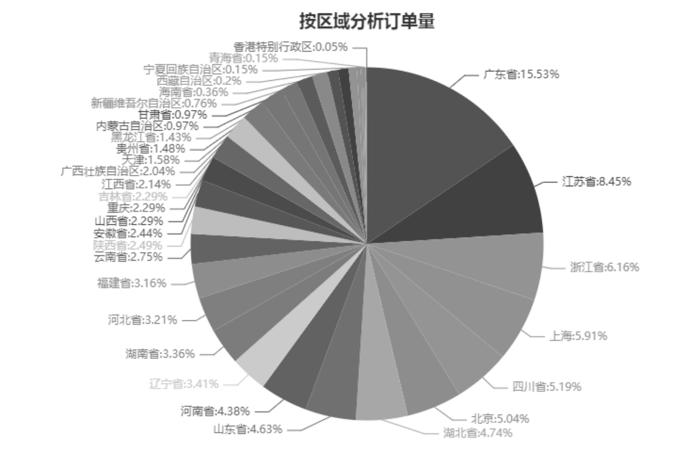

图19.14 按区域分析订单量

从图19.14中可以看出，广东省订单量最多，是购买力较强的区域。

### 19.7.4 每日订单量分析

通过折线图分析每日订单量，由于“订单付款时间”为日期时间格式，因此首先需要对“订单付款时间”进行处理，从中提取日期，然后按日期统计订单量，程序代码如下：

1   # 复制数据

2   df3=df1.copy()

3   # 格式化“订单付款时间”为日期格式

4   df3\['日期'\]=df3\['订单付款时间'\].dt.strftime('%Y-%m-%d')

5   # 按日期统计订单量

6   df3=df3.groupby('日期')\['订单编号'\].count()

7   # 创建折线图

8   line=Line()

9   # 为折线图添加*x*轴和*y*轴数据

10  line.add_xaxis(list(df3.index))

11  line.add_yaxis("订单量",list(df3.values.astype(str)))

12  line.set_global_opts(

13          # 折线图标题居中

14          title_opts=opts.TitleOpts(

15              title="每日订单量分析",

16              pos_left="center"),

17          # 不显示图例

18          legend_opts=opts.LegendOpts(is_show=False),

19      )

20  # 显示图表

21  line.render_notebook()

运行程序，结果如图19.15所示。

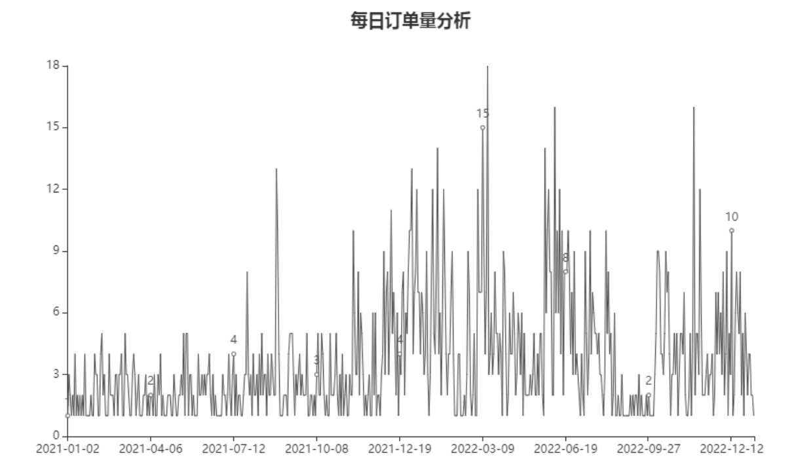

图19.15 每日订单量分析

### 19.7.5 小时订单量分析

通过柱形图分析小时订单量，由于“订单付款时间”为日期时间格式，因此首先需要对“订单付款时间”进行处理，从中提取小时，然后按小时统计订单量，程序代码如下：

1   df4=df1.copy()                                       # 复制数据

2   df4\['小时'\]=df4\['订单付款时间'\].dt.strftime('%H')    # 格式化“订单付款时间”为小时格式

3   df4=df4.groupby('小时')\['订单编号'\].count()        # 按小时统计订单量

4   bar = Bar()                                          # 创建柱形图并设置主题

5   # 为柱形图添加*x*轴和*y*轴数据

6   bar.add_xaxis(list(df4.index))

7   bar.add_yaxis('订单量',list(df4.values.astype(str)))

8   bar.set_global_opts(

9           # 柱形图标题居中

10          title_opts=opts.TitleOpts(

11              title="小时订单量分析",

12              pos_left="center"),

13          legend_opts=opts.LegendOpts(is_show=False),   # 不显示图例

14      )

15  bar.render_notebook()                                 # 显示图表

运行程序，结果如图19.16所示。

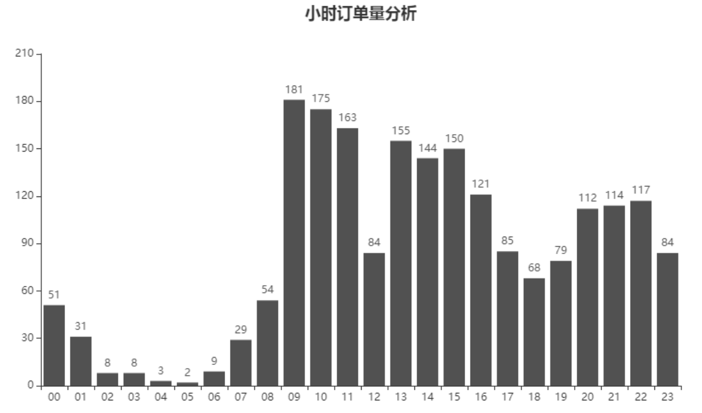

图19.16 小时订单量分析

从图19.16中可以看出，上午9点—11点这个时间段订单付款较多。

