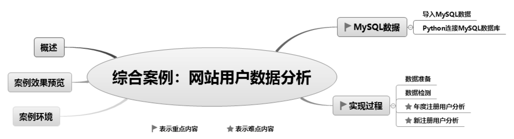
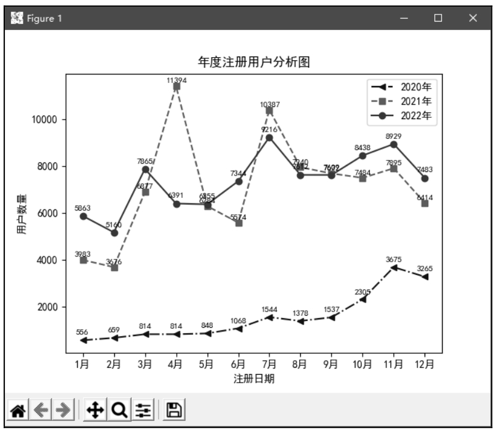
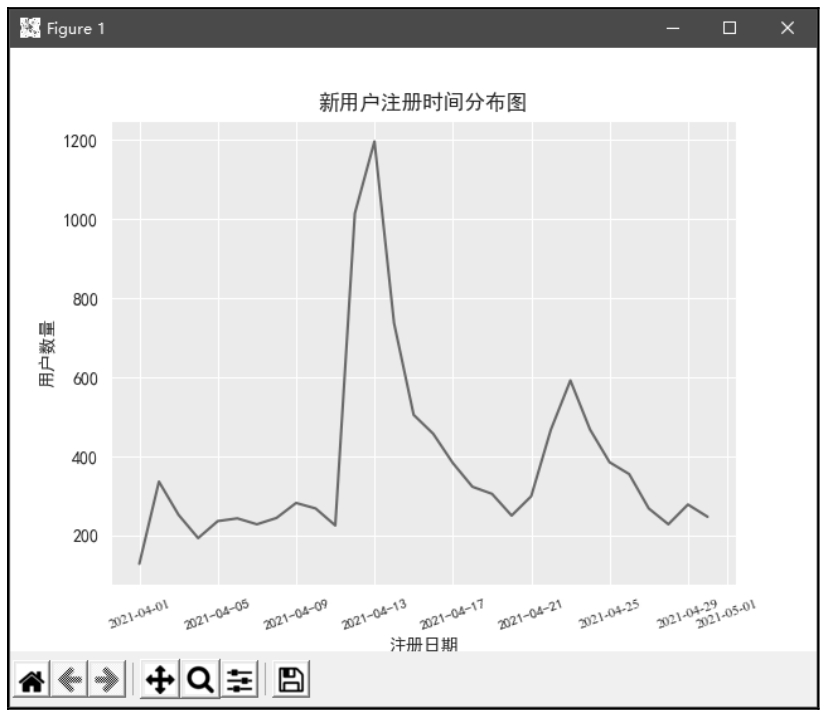
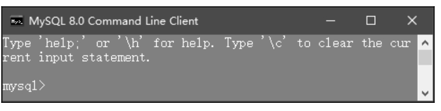
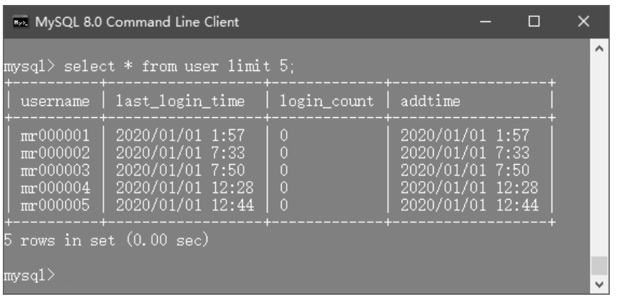
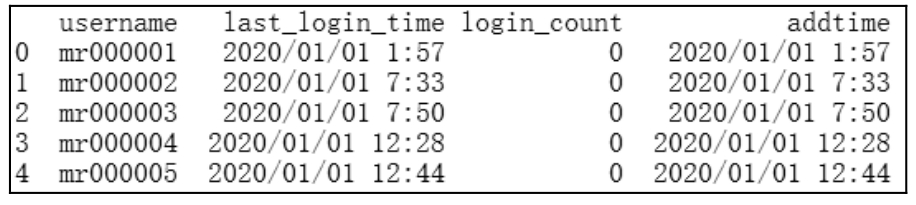
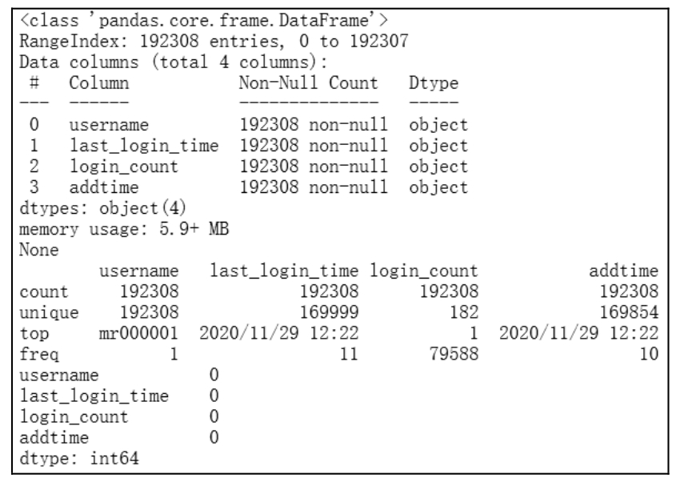
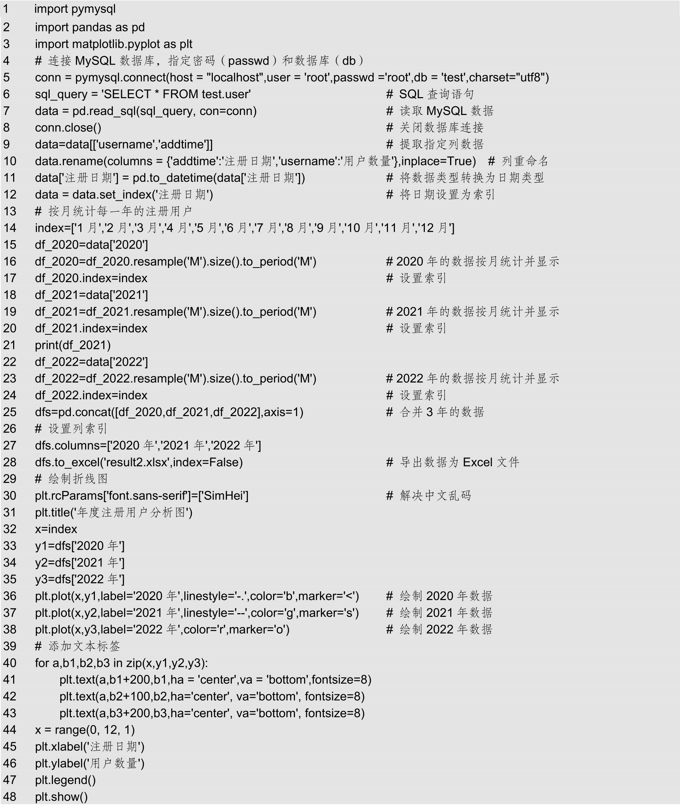
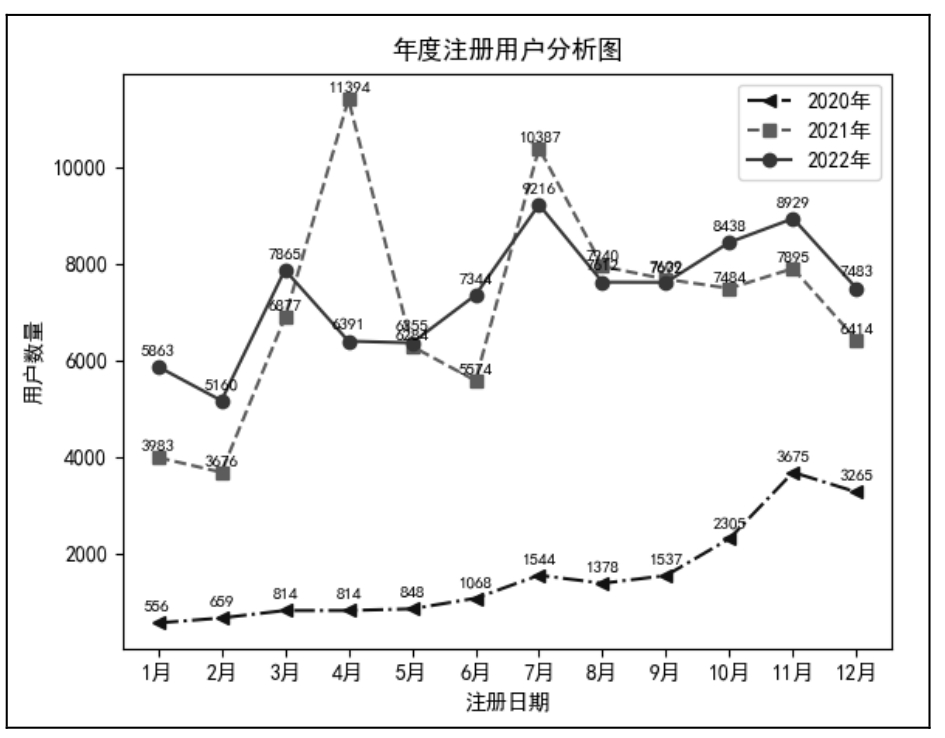
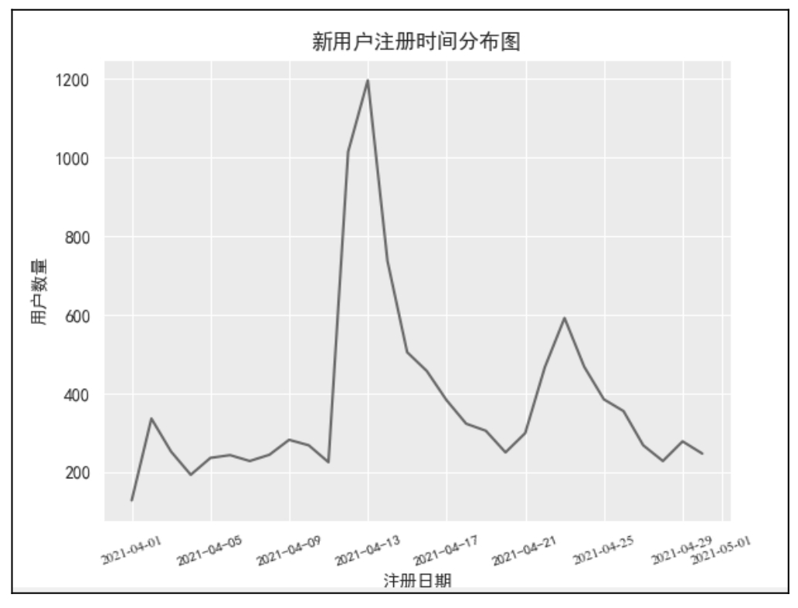

# 20 综合案例：网站用户数据分析

网站App平台注册用户分析，是指获得网站或App等平台用户的注册数据，并对用户注册数据进行统计、分析，从中发现产品推广对新注册用户的影响，以及目前的营销策略中可能存在的问题，为进一步修正或重新制定营销策略提供有效的依据。

通过对注册用户的分析可以让企业更加详细、清楚地了解用户的行为习惯，从而找出产品推广中存在的问题，让企业的营销更加精准、有效，从而提高业务转化率，提升企业收益。

本章知识架构及重难点如下。

## 20.1 概述

网站App平台注册用户分析主要包括年度注册用户分析和新注册用户分析。其中，新注册用户分析对于新品推广尤为重要。网站App平台注册用户分析是对平台的注册用户数据进行统计和分析，可从中发现目前营销策略中存在的问题。由于平台使用了MySQL数据库，因此在进行数据统计与分析前，首要任务是通过Python连接MySQL数据库，并获取MySQL数据库中的数据。

## 20.2 案例效果预览

网站用户数据分析包括年度注册用户分析，如图20.1所示；新用户注册时间分布，如图20.2所示。

▲图20.1 年度注册用户分析图

▲图20.2 新用户注册时间分布图

## 20.3 案例环境

本案例运行环境及所需模块具体如下： 

 操作系统：Windows 10。 

 语言：Python 3.9。 

 开发环境：PyCharm。 

 第三方模块：PyMySQL、Pandas、xlrd、xlwt、Scipy、NumPy、Matplotlib。

## 20.4 MySQL数据

### 20.4.1 导入MySQL数据

导入MySQL数据具体步骤如下。

（1）安装MySQL软件，设置密码（本项目密码为root，也可以是其他密码），该密码一定要记住，连接MySQL数据库时会用到，其他设置采用默认设置即可。

（2）创建数据库。运行MySQL，首先输入密码，进入mysql命令提示符，如图20.3所示，然后使用CREATE DATABASE命令创建数据库。例如，创建数据库test，命令如下：

CREATE DATABASE test;

（3）导入SQL文件（user.sql）。在mysql命令提示符下通过use命令进入对应的数据库。例如，进入数据库test，命令如下：

use test;

出现“Database changed”说明已经进入数据库。接下来使用source命令指定SQL文件，并导入该文件。例如，导入user.sql，命令如下：

source D:/user.sql

下面预览导入的数据，使用SQL查询语句（select语句）查询表中前5条数据，命令如下：

select \* from user limit 5;

运行结果如图20.4所示。

▲图20.3 mysql命令提示符

▲图20.4 导入成功后的MySQL数据

至此，导入MySQL数据的任务就完成了，接下来在Python中安装PyMySQL模块，连接MySQL数据库。

### 20.4.2 Python连接MySQL数据库

首先在PyCharm开发环境中安装PyMySQL模块，然后导入需要的模块，并使用连接语句连接MySQL数据库，程序代码如下：

import pymysql

import pandas as pd

\# 连接MySQL数据库

conn=pymysql.connect(host="localhost",user='root',passwd = password,db = database_name,

charset="utf8")

上述语句中，需要修改的参数是passwd和db，即指定MySQL密码和项目使用的数据库。本项目连接代码如下：

conn = pymysql.connect(host = "localhost",user = 'root',passwd ='root',db = 'test',charset="utf8")

接下来，使用Pandas模块的read_sql()函数读取MySQL数据，程序代码如下：

1  sql_query = 'SELECT \* FROM test.user'        #  SQL查询语句

2  data = pd.read_sql(sql_query, con=conn)      # 读取MySQL数据

3  conn.close()                               # 关闭数据库连接

4  print(data.head())                       # 输出部分数据

运行程序，输出结果如图20.5所示。

图20.5 读取MySQL数据（部分数据）

## 20.5 实现过程

### 20.5.1 数据准备

本案例分析了近3年的网站用户注册数据，即2020年1月1日至2022年12月31日，主要包括用户名、最后访问时间、访问次数和注册时间。

### 20.5.2 数据检测

鉴于数据量非常大，下面使用DataFrame()对象提供的函数对数据进行检测。

（1）使用info()方法查看每个字段的情况，如类型、是否为空等，程序代码如下：

data.info()

（2）使用describe()函数查看数据描述信息，程序代码如下：

data.describe()

（3）统计每列的空值情况，程序代码如下：

data.isnull().sum()

运行程序，输出结果如图20.6所示。

图20.6 数据检测结果

从运行结果得知：用户注册数据表现非常好，不存在异常数据和空数据。

### 20.5.3 年度注册用户分析

按月统计每一年注册用户的增长情况，程序代码如下：

运行程序，输出结果如图20.7所示。

通过折线图（图20.7）分析可知：2020年注册用户增长比较平稳，2021年、2022年比2020年注册用户增长约6倍。2021年和2022年数据每次的最高点都在同一个月，存在一定的趋势变化。

图20.7 年度注册用户分析图

### 20.5.4 新注册用户分析

通过年度注册用户分析情况，我们观察新注册用户的时间分布，近三年新用户的注册量最高峰值出现在2021年4月。下面以2021年4月1日至4月30日数据为例，对新注册用户进行分析，程序代码如下：

1   import pymysql

2   import pandas as pd

3   import seaborn as sns

4   import matplotlib.pyplot as plt

5   from pandas.plotting import register_matplotlib_converters

6   register_matplotlib_converters()                     #解决图表显示日期出现警告信息

7   #连接MySQL数据库，指定密码(passwd)和数据库(db)

8   conn = pymysql.connect(host = "localhost",user = 'root',passwd ='root',db = 'test',charset="utf8")

9   sql_query = 'SELECT \* FROM test.user'                                               #SQL查询语句

10  data = pd.read_sql(sql_query, con=conn)                                             #读取MySQL数据

11  conn.close()                                                                      #关闭数据库连接

12  data=data\[\['username','addtime'\]\]                                                   #提取指定列数据

13  data.rename(columns = {'addtime':'注册日期','username':'用户数量'},inplace=True)  #列重命名

14  data\['注册日期'\] = pd.to_datetime(data\['注册日期'\])                                 #将数据类型转换为日期类型

15  data = data.set_index('注册日期')                                                 #将日期设置为索引

16  data=data\['2021-04-01':'2021-04-30'\]                                                #提取指定日期数据

17  #按天统计新注册用户

18  df=data.resample('D').size().to_period('D')

19  df.to_excel('result1.xlsx',index=False)# 导出数据为Excel文件

20  x=pd.date_range(start='20210401', periods=30)

21  y=df

22  #绘制折线图

23  sns.set_style('darkgrid')

24  plt.rcParams\['font.sans-serif'\]=\['SimHei'\]                                          #解决中文乱码

25  plt.title('新用户注册时间分布图')                                                 #图表标题

26  plt.xticks(fontproperties = 'Times New Roman', size = 8,rotation=20)              # x轴字体大小

27  plt.plot(x,y)

28  plt.xlabel('注册日期')

29  plt.ylabel('用户数量')

30  plt.show()

运行程序，输出结果如图20.8所示。

图20.8 新用户注册时间分布图

通过图20.8，首先观察新用户注册的时间分布，可以发现在此期间内新用户的注册量有3次小高峰，并且在4月13日迎来最高峰。此后新用户注册量逐渐下降。

经过研究发现，这个期间推出了新品，同时开放了新品并纳入了开学季活动，致使新用户人数达到新高峰。

