# 21 综合案例：NBA球员薪资的数据分析

互联网时代，随处可见的网页表格数据对于数据分析和数据挖掘来说是很好的资源，但如果直接复制和粘贴网页上的数据，不仅费时费力，而且容易漏掉有用的数据或复制了其他没用的数据。Pandas提供了专门获取网页数据的方法，可以轻松地解决这一问题。本案例将使用Pandas实现简单爬虫，爬取NBA球员薪资数据并进行分析。

本章知识架构及重难点如下。

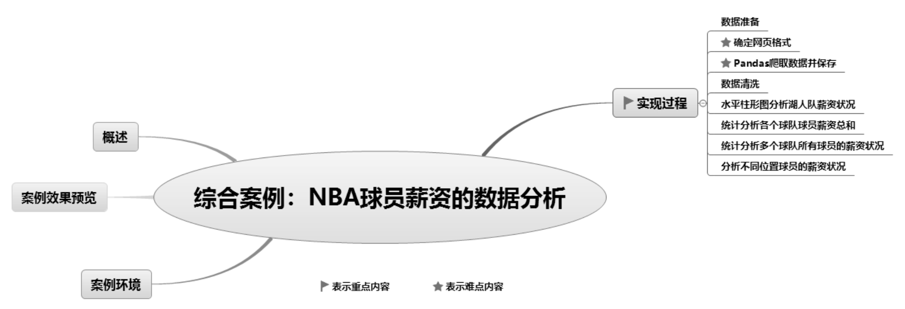

## 21.1 概述

本案例将实现使用Pandas爬取NBA球员薪资数据并进行分析，主要使用Pandas模块和Matplotlib模块，爬取数据前首先确定网页格式，然后爬取数据，再对爬取的数据进行简单的清洗，最后绘制水平柱形图并分析NBA湖人队薪资状况。

## 21.2 案例效果预览

通过Pandas爬取分析NBA球员薪资数据，爬取后的NBA球员薪资数据将保存到Excel文件中，效果如图21.1所示。通过水平柱形图分析NBA湖人队薪资状况，效果如图21.2所示。

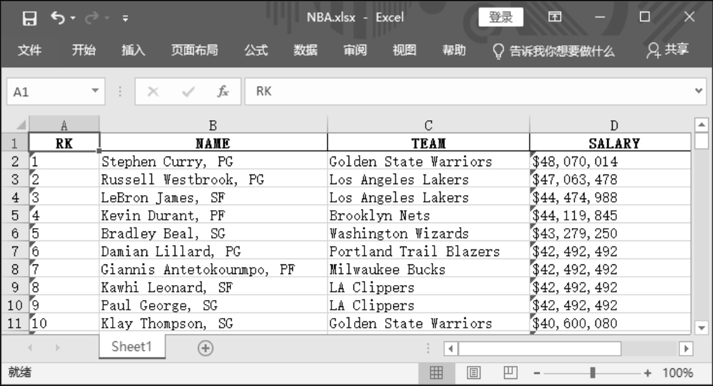

▲图21.1 处理后保存到Excel中的NBA球员薪资数据

▲图21.2 水平柱形图分析NBA湖人队薪资状况

通过柱形图统计分析各个球队球员薪资总和，如图21.3所示。

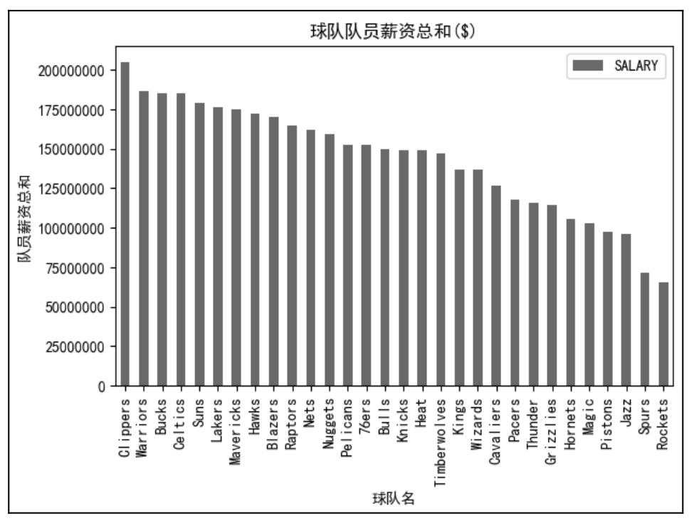

图21.3 柱形图统计分析各个球队球员薪资总和

通过箱形图统计分析多个球队所有球员的薪资状况，如图21.4所示。

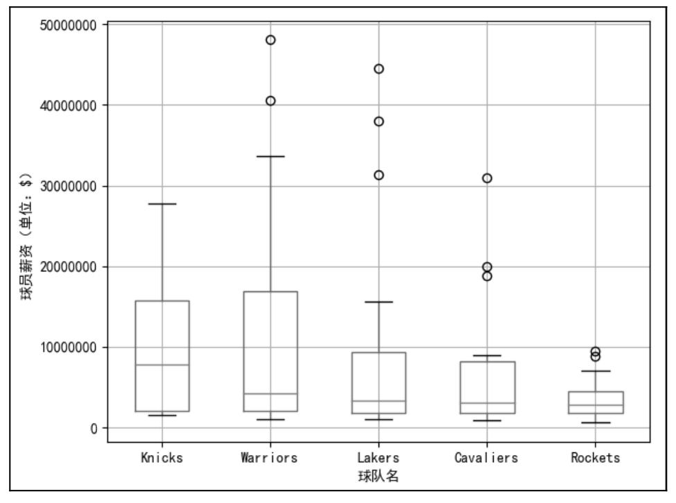

图21.4 箱形图统计分析多个球队所有球员的薪资状况

统计分析不同位置球员的薪资状况，如图21.5所示。

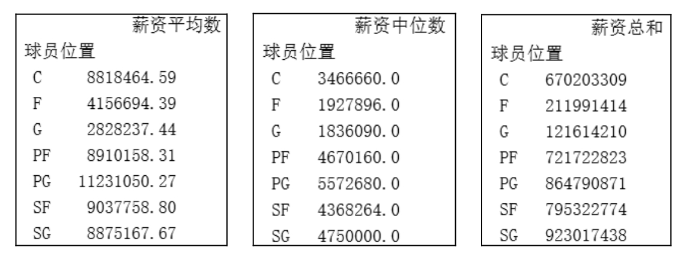

图21.5 统计分析不同位置球员的薪资状况

## 21.3 案例环境

本章案例运行环境及所需模块具体如下： 

 操作系统：Windows 10。 

 Python版本：Python 3.9及以上。 

 开发工具：PyCharm。 

 第三方模块：Pandas、Openpyxl、xlrd、xlwt、Matplotlib。

## 21.4 实现过程

### 21.4.1 数据准备

本案例主要实现的是通过Pandas爬取NBA球员薪资数据，因此数据来源于NBA球员薪资网页，网页地址为http://www.espn.com/nba/salaries。

### 21.4.2 确定网页格式

Pandas爬取NBA球员薪资数据主要使用read_html()函数。那么，在使用该函数前首先要确定网页表格是否为table类型，因为只有这种类型的网页表格，read_html()函数才能获取该网页中的数据。

下面介绍如何判断网页表格是否为table类型。以NBA球员薪资网页为例，在浏览器中输入网址打开网页，右击该网页中的表格，在弹出的菜单中选择“检查”（或者“检查元素”，不同浏览器显示的菜单项不同），如图21.6所示，打开对应的代码，查看代码中是否含有表格标签\<table\>…\</table\>的字样，如图21.7所示。确定网页表格为table类型后才能使用read_html()函数爬取数据。

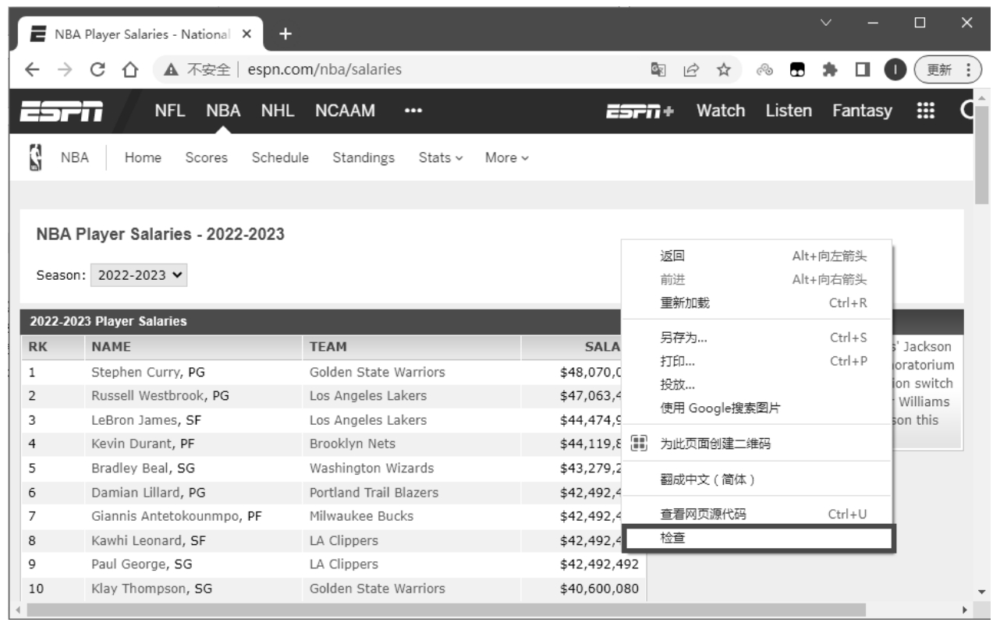

▲图21.6 选择“检查”

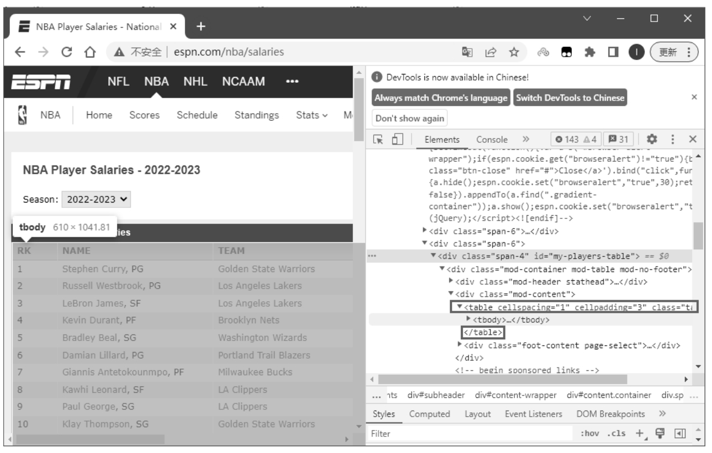

▲图21.7 \<table\>…\</table\>表格标签

### 21.4.3 Pandas爬取数据并保存

确定网页格式后，即可使用Pandas的read_html()函数爬取数据，具体实现步骤如下。

（1）创建一个空的DataFrame()对象，用于存储数据。创建一个空列表，用于存放网页地址，代码如下：

1  import pandas as pd

2  import matplotlib.pyplot as plt

3  df=pd.DataFrame()               # 创建一个空的DataFrame

4  url_list=\[\]                       # 创建一个空列表

5  data_list = \[\]                    # 保存数据的列表

（2）查看NBA网页薪资数据，其中包括13页数据（见图21.8），虽然每一页的网址都不相同，但是有一定的规律性，即翻到哪一页，网址中只有中间的数字发生变化，而其他内容不变，如图21.9所示，该数字代表页码。

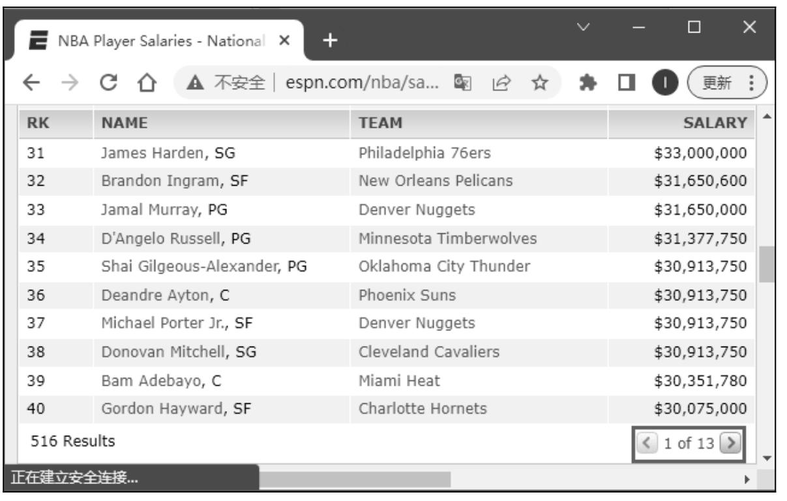

▲图21.8 NBA网页数据

▲图21.9 网页地址

发现这一规律后，便可以使用for循环先来获取每一个网页的地址，其中变量i为页码，然后将获取的网页地址保存到列表中，代码如下：

1  # 获取网页地址，将地址保存到列表中

2  for i in range(1,14):

3      # 网页地址字符串，使用str函数将整型变量i转换为字符串

4      url='http://www.espn.com/nba/salaries/\_/page/'+ str(i)

5      url_list.append(url)

（3）获取网页地址后就可以轻松获取数据了。首先使用for循环遍历网页地址，并使用read_html()函数读取每一个网页中的数据，然后将数据添加到DataFrame()对象中，代码如下：

1  for url in url_list:                         # 遍历列表读取网页数据

2      data_list.append(pd.read_html(url)\[0\])   # 将每页数据添加至数据列表中

3  df = pd.concat(data_list,ignore_index=True)  # 将每页数据进行组合

4  print(df)

### 21.4.4 数据清洗

经过以上步骤，即可爬取NBA球员的薪资数据，效果如图21.10所示，从此图可以看出，数据并不完美。首先，表头为数字0、1、2、3，不能表明每列数据的作用，其次数据存在重复的表头，如RK、NAME、TEAM和SALARY。

接下来进行数据清洗。首先去掉重复的表头数据，主要使用字符串函数startswith()遍历DataFrame()对象的第4列（索引为3的列），筛出以子字符串\$开头的数据，这样便可去除重复的表头，主要代码如下：

df=df\[\[x.startswith('\$') for x in df\[3\]\]\]

再次运行程序，数据从568条变成了516条，重复的表头被去除了，如图21.11所示。

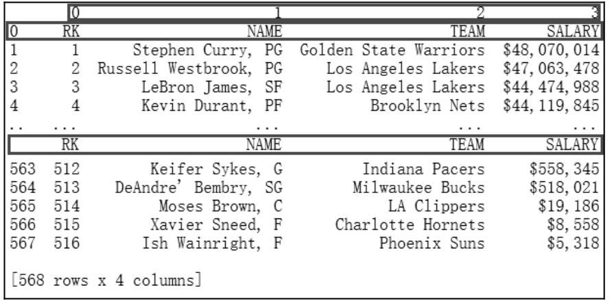

▲图21.10 获取的NBA球员薪资数据

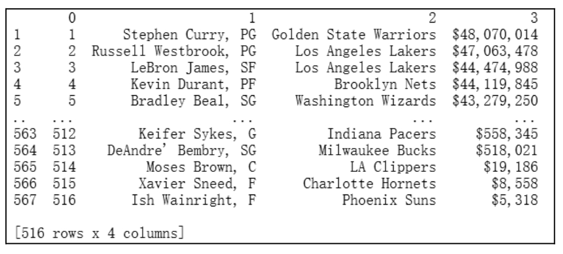

▲图21.11 清洗后的NBA球员薪资数据

最后，重新赋予表头以说明每列的作用。在数据导出为Excel文件时，通过DataFrame()对象的to_excel()函数的header参数指定表头，主要代码如下：

df.to_excel('NBA.xlsx',header=\['RK','NAME','TEAM','SALARY'\],index=False)

### 21.4.5 水平柱形图分析湖人队薪资状况

**【例21.1】**绘制水平柱形图分析湖人队薪资状况。**（实例位置：资源包\\TM\\sl\\21\\01）**

通过水平柱形图分析湖人队薪资状况，效果如图21.12所示。

从图21.12中可以清晰地看出，湖人队各球员之间薪资的差距非常大，其中薪资榜首勒布朗·詹姆斯是湖人队的一名老将。

通过水平柱形图分析湖人队薪资状况，主要使用Matplotlib模块。在绘制图表前，需要对数据进行筛选和简单的清洗，具体过程如下。

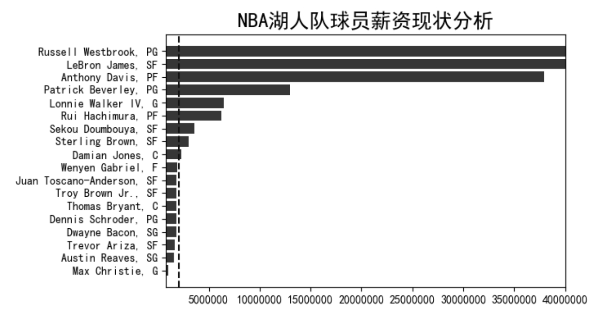

图21.12 水平柱形图分析湖人队薪资状况

（1）筛选“湖人队”数据，先去掉薪资中的“\$”和“，”两个符号，然后按照薪资由高到低降序排序，主要代码如下：

1  df_hr=df\[df\[2\]=='Los Angeles Lakers'\]                                       # 筛选“湖人队”

2  df_hr_new=df_hr.copy()                                                    # 复制一个副本

3  df_hr_new\[3\]=df_hr_new\[3\].map(lambda a: a.replace('\$', ''))             # 去掉薪资中的“\$”

4  df_hr_new\[3\]=df_hr_new\[3\].apply(lambda x: float(x.replace(",", "")))  # 去掉薪资中的“,”

5  df_hr_new=df_hr_new.sort_values(by=3,ascending=True)                        # 按照“薪资”降序排序

6  print(df_hr_new)

（2）绘制图表，主要代码如下：

1   # 绘制图表

2   fig=plt.figure(figsize=(8,4))                       # 设置画布大小

3   plt.subplots_adjust(left=0.3)                           # 调整图表空白处

4   plt.rcParams\['font.sans-serif'\]=\['SimHei'\]              # 解决中文乱码

5   plt.ticklabel_format(useOffset=False, style='plain')  # 禁止科学记数法

6   plt.title('NBA湖人队球员薪资现状分析',fontsize='18')  # 图表标题

7   plt.xlim(800000,40000000)                             # 设置*x*轴坐标范围

8   x=df_hr_new\[1\]                                          # 球员

9   y=df_hr_new\[3\]                                          # 薪资

10  median=df_hr_new\[3\].median()                          # 薪资中位数

11  plt.barh(x,y,label='薪资',color='r')                  # 绘制水平柱形图

12  plt.axvline(median,color='blue',linestyle='--',)      # 薪资中位数参考线

13  plt.show()                                            # 显示图表

### 说明

由于NBA球员薪资数据不断更新，所以读者的运行结果和图表可能与书中的运行结果不同。

### 21.4.6 统计分析各个球队队员薪资总和

**【例21.2】**绘制柱形图统计分析各个球队队员薪资总和**（实例位置：资源包\\TM\\sl\\21\\02）**

通过柱形图统计分析各个球队队员薪资总和，效果如图21.13所示。

图21.13 柱形图统计分析各个球队队员薪资总和

从图21.13中可以清晰地看出，Clippers（快船队）支付球员的薪资最多，是最舍得花钱的球队。

下面通过柱形图统计分析各个球队队员薪资总和，主要使用Pandas内置的绘图功能。在绘制图表前，需要对数据进行简单的处理，具体过程如下。

（1）导入相关模块，代码如下：

1  import numpy as np

2  import pandas as pd

3  import matplotlib.pyplot as plt

（2）读取Excel文件，抽取指定列，然后去掉薪资数据中的“\$”和“，”两个符号，提取球队名称中最后一组字符串（即球队简称），代码如下：

1  plt.rcParams\['font.sans-serif'\]=\['SimHei'\]                # 解决中文乱码

2  money= lambda x: "".join(filter(str.isdigit, x))      # 提取字符串中的数字字符

3  team = lambda x: x.split()\[-1\]                            # 以空格分隔字符串并提取最后一组字符串

4  # 读取Excel文件

5  # 使用usecols参数抽取指定列

6  # 使用converters参数转换函数，键是整数或列标签，值是一个函数

7  df = pd.read_excel('NBA.xlsx', usecols=\['NAME', 'TEAM', 'SALARY'\], converters={'SALARY': money, 'TEAM': team})

8  df\['SALARY'\] = df\['SALARY'\].astype(np.int32)              # 将薪资转换为整型

（3）按球队名称分组统计并进行降序排序，代码如下：

1  # 按球队分组统计求和并降序排序

2  df = df.groupby(\['TEAM'\], as_index=False).sum().sort_values('SALARY',ascending=False)

3  df.index = df\['TEAM'\]                                     # 设置球队为索引

（4）绘制柱形图，代码如下：

1  df.plot(kind='bar', align='center', title='球队队员薪资总和(\$)')         # 绘制柱形图

2  plt.gca().get_yaxis().get_major_formatter().set_scientific(False)    # 取消科学记数法

3  # 设置*xy*轴标题

4  plt.xlabel('球队名')

5  plt.ylabel('队员薪资总和')

6  plt.tight_layout()                                                         # 解决图形元素显示不全的问题

7  plt.show()                                                                 # 显示图表

### 21.4.7 统计分析多个球队所有球员的薪资状况

**【例21.3】**绘制箱形图统计分析多个球队所有球员的薪资状况**（实例位置：资源包\\TM\\sl\\21\\03）**

下面选出5个球队，即尼克斯（Knicks）、勇士（Warriors）、湖人（Lakers）、骑士（Cavaliers）和火箭（Rockets）队，通过箱形图分析这5个球队的所有队员的薪资状况，效果如图21.14所示。

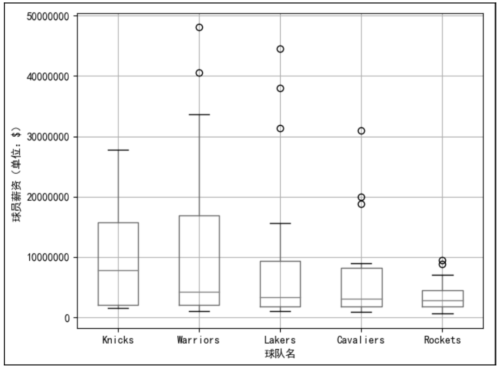

图21.14 箱形图统计分析5个球队所有球员的薪资状况

从图21.14中可以看出，尼克斯队（Knicks）的薪资比较平均，勇士队（Warriors）和火箭队（Rockets）的薪资跨度比较大。

下面通过多个箱形图统计分析5个球队所有球员的薪资状况，主要使用Pandas内置的绘图功能。在绘制图表前，需要对数据进行简单的处理，具体实现过程如下。

（1）导入相关模块，代码如下：

1  import numpy as np

2  import pandas as pd

3  import matplotlib.pyplot as plt

（2）读取Excel文件，抽取指定列，然后去掉薪资数据中的“\$”和“，”两个符号，提取球队名称中最后一组字符串（即球队简称），代码如下：

1  money = lambda x: "".join(filter(str.isdigit, x))   # 提取字符串中的数字字符

2  team = lambda x: x.split()\[-1\]                          # 以空格分隔字符串并提取最后一组字符串

3  # 读取Excel文件

4  # 使用usecols参数抽取指定列

5  # 使用converters参数转换函数，键是整数或列标签，值是一个函数

6  df = pd.read_excel('NBA.xlsx', usecols=\['TEAM', 'SALARY'\],converters={'SALARY': money,'TEAM': team})

7  df\['SALARY'\] = df\['SALARY'\].astype(np.int32)            # 将薪资转换为整型

（3）创建新数据集，由各个球队和薪资组成，代码如下：

1  # 创建由各个球队和薪资组成的数据集

2  data = pd.DataFrame({"Knicks": df\[df\['TEAM'\] == 'Knicks'\]\['SALARY'\],

3                     "Warriors": df\[df\['TEAM'\] == 'Warriors'\]\['SALARY'\],

4                     "Lakers": df\[df\['TEAM'\] == 'Lakers'\]\['SALARY'\],

5                     "Cavaliers": df\[df\['TEAM'\] == 'Cavaliers'\]\['SALARY'\],

6                     "Rockets": df\[df\['TEAM'\] == 'Rockets'\]\['SALARY'\]})

7  print(data)  # 输出数据

运行程序，结果如图21.15所示。

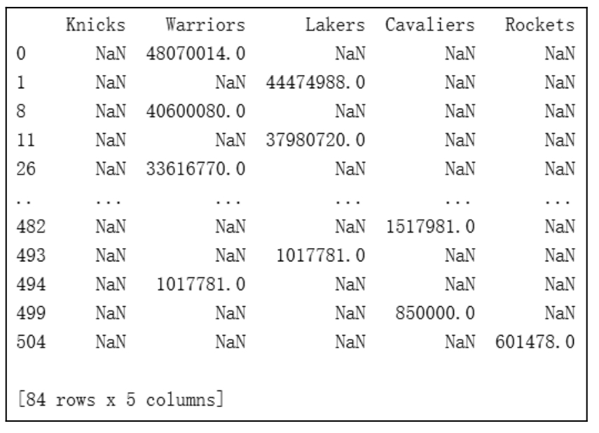

图21.15 统计各个球队的薪资

（4）绘制箱形图，代码如下：

1  plt.rcParams\['font.sans-serif'\] = \['SimHei'\]                # 用来正常显示中文标签

2  # 设置*xy*轴标题

3  plt.ylabel("球员薪资(单位：\$)")

4  plt.xlabel("球队名")

5  data.boxplot()                                            # 绘制箱形图

6  plt.gca().get_yaxis().get_major_formatter().set_scientific(False)  # 取消科学记数法

7  plt.tight_layout()                                        # 解决图形元素显示不全的问题

8  plt.show()                                                # 显示图表

### 21.4.8 分析不同位置球员的薪资状况

**【例21.4】**分组统计分析不同位置球员的薪资状况**（实例位置：资源包\\TM\\sl\\21\\04）**

薪资数据的NAME字段中包含了球员位置，并用逗号进行分割，如图21.16所示。

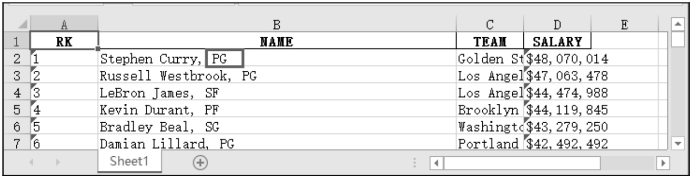

图21.16 NBA球员薪资数据

从图21.16中可以看出，球员位置都采用了英文简称。其代表的含义：C为中锋，F为前锋，G为后卫，SF为小前锋，PF为大前锋，SG表示得分后卫／攻击后卫，PG表示控球后卫／组织后卫。

接下来需要先将球员位置从NAME字段中拆分出来，然后按球员位置分析球员的薪资，具体实现过程如下。

（1）导入相关模块，代码如下：

1  import numpy as np

2  import pandas as pd

（2）读取Excel文件，抽取指定列，然后去掉薪资数据中的“\$”和“，”两个符号，提取球队名称中最后一组字符串（即球队简称）。代码如下：

1  money = lambda x: "".join(filter(str.isdigit, x))   # 提取字符串中的数字字符

2  team = lambda x: x.split()\[-1\]                          # 以空格分隔字符串并提取最后一组字符串

3  # 读取Excel文件

4  # 使用usecols参数抽取指定列

5  # 使用converters参数转换函数，键是整数或列标签，值是一个函数

6  df = pd.read_excel('NBA.xlsx', usecols=\['NAME', 'TEAM', 'SALARY'\],converters={'SALARY': money, 'TEAM': team})

7  df\['SALARY'\] = df\['SALARY'\].astype(np.int32)            # 将薪资转换为整型

（3）拆分NAME字段，从中提取球员位置简称。代码如下：

1  # 按逗号拆分NAME字段，提取球员位置

2  s=df\['NAME'\].str.split(',',expand=True)

3  df\['球员位置'\]=s\[1\]

（4）按球员位置分组统计薪资，代码如下：

1  # 按“球员位置”分组统计薪资数据

2  # 求薪资平均值，保留小数点后两位

3  print(df.groupby('球员位置').mean().applymap(lambda x: '%.2f'%x).rename(columns={'SALARY': '薪资平均数'}))

4  # 求薪资中位数

5  print(df.groupby('球员位置').median().rename(columns={'SALARY': '薪资中位数'}))

6  # 求薪资总和

7  print(df.groupby('球员位置').sum().rename(columns={'SALARY': '薪资总和'}))

运行程序，统计结果如图21.17、图21.18和图21.19所示。

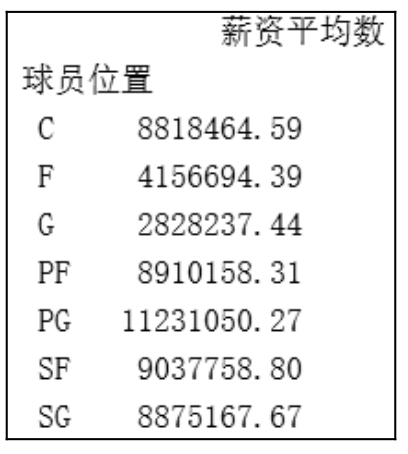

▲图21.17 薪资平均数

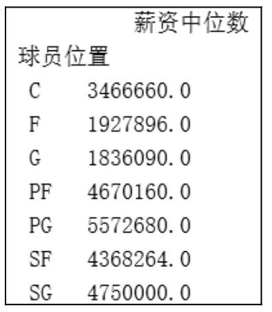

▲图21.18 薪资中位数

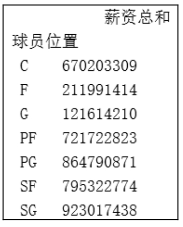

▲图21.19 薪资总和

从运行结果可以看出，控球后卫／组织后卫（PG）薪资最高。

\*文中代码字体版权说明 [^1]

[^1]: Copyright Copyright 2010, 2012 Adobe Systems Incorporated (http://www.adobe.com/), with Reserved Font Name ‘Source’. License This Font Software is licensed under the SIL Open Font License, Version 1.1. This license is copied below, and is also available with a FAQ at: http://scripts.sil.org/OFL SIL OPEN FONT LICENSE Version 1.1 - 26 February 2007 PREAMBLE The goals of the Open Font License (OFL) are to stimulate worldwide development of collaborative font projects, to support the font creation efforts of academic and linguistic communities, and to provide a free and open framework in which fonts may be shared and improved in partnership with others. The OFL allows the licensed fonts to be used, studied, modified and redistributed freely as long as they are not sold by themselves. The fonts, including any derivative works, can be bundled, embedded, redistributed and/or sold with any software provided that any reserved names are not used by derivative works. The fonts and derivatives, however, cannot be released under any other type of license. The requirement for fonts to remain under this license does not apply to any document created using the fonts or their derivatives. DEFINITIONS "Font Software" refers to the set of files released by the Copyright Holder(s) under this license and clearly marked as such. This may include source files, build scripts and documentation. "Reserved Font Name" refers to any names specified as such after the copyright statement(s). "Original Version" refers to the collection of Font Software components as distributed by the Copyright Holder(s). "Modified Version" refers to any derivative made by adding to, deleting, or substituting — in part or in whole — any of the components of the Original Version, by changing formats or by porting the Font Software to a new environment. "Author" refers to any designer, engineer, programmer, technical writer or other person who contributed to the Font Software. PERMISSION & CONDITIONS Permission is hereby granted, free of charge, to any person obtaining a copy of the Font Software, to use, study, copy, merge, embed, modify, redistribute, and sell modified and unmodified copies of the Font Software, subject to the following conditions: 1) Neither the Font Software nor any of its individual components, in Original or Modified Versions, may be sold by itself. 2) Original or Modified Versions of the Font Software may be bundled, redistributed and/or sold with any software, provided that each copy contains the above copyright notice and this license. These can be included either as stand-alone text files, human-readable headers or in the appropriate machine-readable metadata fields within text or binary files as long as those fields can be easily viewed by the user. 3) No Modified Version of the Font Software may use the Reserved Font Name(s) unless explicit written permission is granted by the corresponding Copyright Holder. This restriction only applies to the primary font name as presented to the users. 4) The name(s) of the Copyright Holder(s) or the Author(s) of the Font Software shall not be used to promote, endorse or advertise any Modified Version, except to acknowledge the contribution(s) of the Copyright Holder(s) and the Author(s) or with their explicit written permission. 5) The Font Software, modified or unmodified, in part or in whole, must be distributed entirely under this license, and must not be distributed under any other license. The requirement for fonts to remain under this license does not apply to any document created using the Font Software. TERMINATION This license becomes null and void if any of the above conditions are not met. DISCLAIMER THE FONT SOFTWARE IS PROVIDED "AS IS", WITHOUT WARRANTY OF ANY KIND, EXPRESS OR IMPLIED, INCLUDING BUT NOT LIMITED TO ANY WARRANTIES OF MERCHANTABILITY, FITNESS FOR A PARTICULAR PURPOSE AND NONINFRINGEMENT OF COPYRIGHT, PATENT, TRADEMARK, OR OTHER RIGHT. IN NO EVENT SHALL THE COPYRIGHT HOLDER BE LIABLE FOR ANY CLAIM, DAMAGES OR OTHER LIABILITY, INCLUDING ANY GENERAL, SPECIAL, INDIRECT, INCIDENTAL, OR CONSEQUENTIAL DAMAGES, WHETHER IN AN ACTION OF CONTRACT, TORT OR OTHERWISE, ARISING FROM, OUT OF THE USE OR INABILITY TO USE THE FONT SOFTWARE OR FROM OTHER DEALINGS IN THE FONT SOFTWARE.
