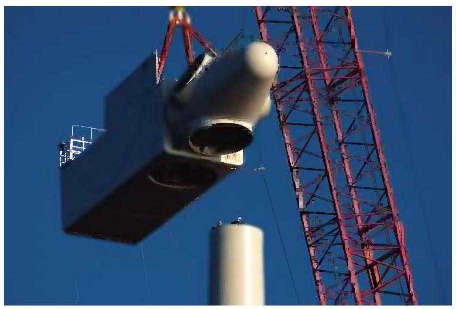
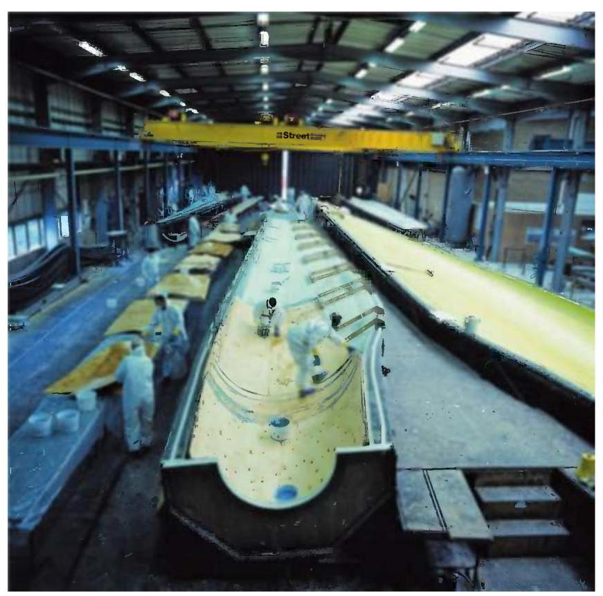
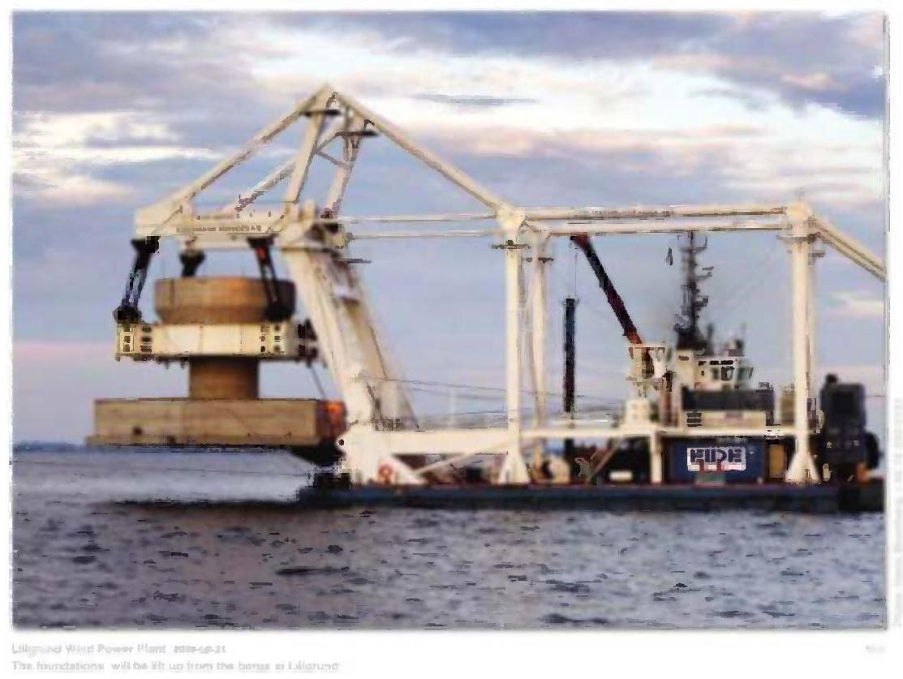
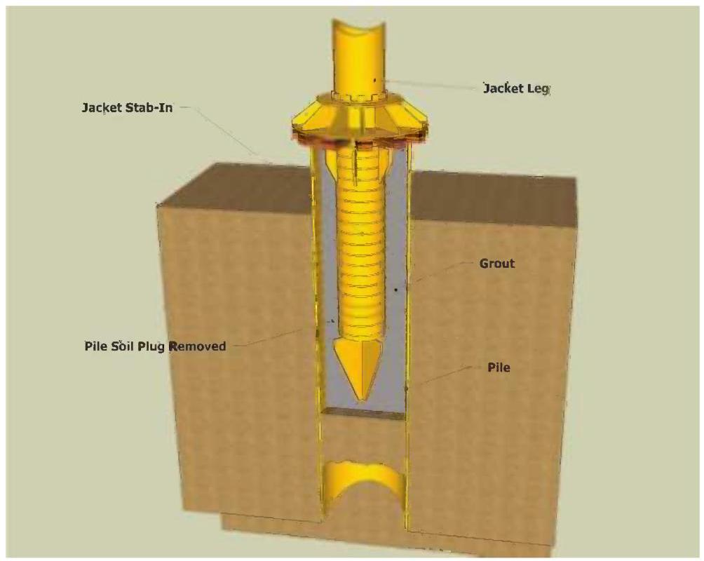
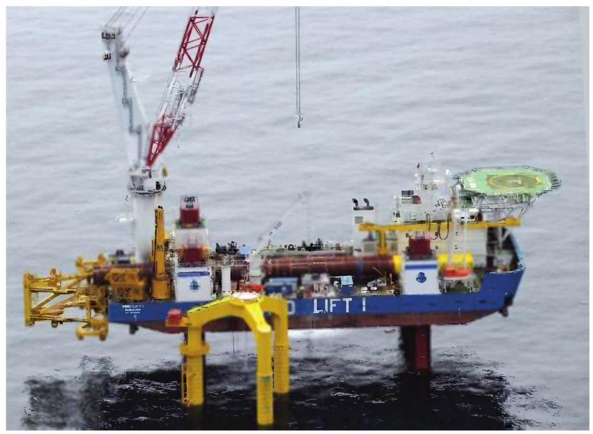
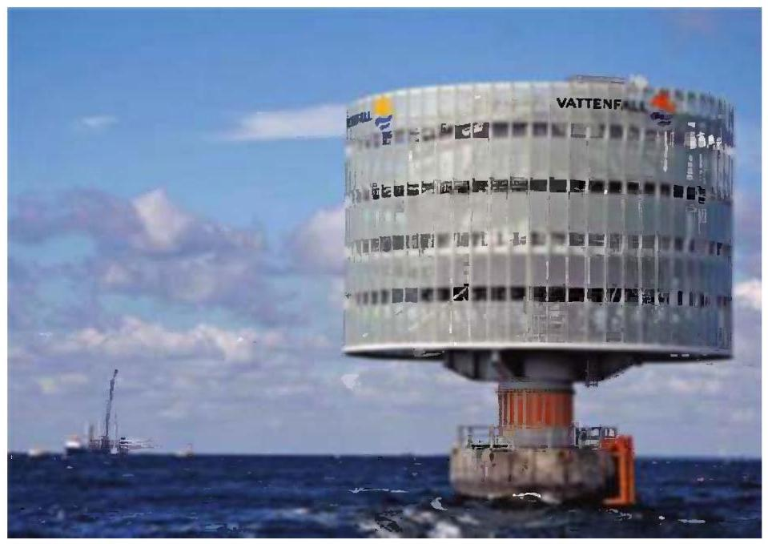

Wind Energy Handbook

# Wind Energy Handbook Second Edition

Tony Burton

Wind Energy Consultant, Powys, UK

Nick Jenkins

Cardiff University, UK

David Sharpe

Wind Energy Consultant, Essex, UK

Ervin Bossanyi

GL Garrad Hassan, Bristol, UK

This edition first published 2011

© 2011, John Wiley & Sons, Ltd

First Edition published in 2001

## Registered office

John Wiley & Sons Ltd, The Atrium, Southern Gate, Chichester, West Sussex, PO19 8SQ, United Kingdom

For details of our global editorial offices, for customer services and for information about how to apply for permission to reuse the copyright material in this book please see our website at www.wiley.com.

The right of the author to be identified as the author of this work has been asserted in accordance with the Copyright, Designs and Patents Act 1988.

All rights reserved. No part of this publication may be reproduced, stored in a retrieval system, or transmitted, in any form or by any means, electronic, mechanical, photocopying, recording or otherwise, except as permitted by the UK Copyright, Designs and Patents Act 1988, without the prior permission of the publisher.

Wiley also publishes its books in a variety of electronic formats. Some content that appears in print may not be available in electronic books.

Designations used by companies to distinguish their products are often claimed as trademarks. All brand names and product names used in this book are trade names, service marks, trademarks or registered trademarks of their respective owners. The publisher is not associated with any product or vendor mentioned in this book. This publication is designed to provide accurate and authoritative information in regard to the subject matter covered. It is sold on the understanding that the publisher is not engaged in rendering professional services. If professional advice or other expert assistance is required, the services of a competent professional should be sought.

## Library of Congress Cataloguing-in-Publication Data

Wind energy handbook / Tony Burton ... [et al.]. - 2nd ed.

p. cm.

Includes bibliographical references and index.

ISBN 978-0-470-69975-1 (hardback)

1. Wind power-Handbooks, manuals, etc. I. Burton, Tony, 1947-

TJ820.H35 2011

621.31'2136-dc22

2010053397

A catalogue record for this book is available from the British Library.

Print ISBN: 978-0-470-69975-1

E-PDF ISBN: 978-1-119-99272-1

O-book ISBN: 978-1-119-99271-4

E-Pub ISBN: 978-1-119-99392-6

mobi ISBN: 978-1-119-99393-3

Typeset in 10/12pt Times by Aptara Inc., New Delhi, India.

## Contents

About the Authors xvii

Preface to Second Edition xix

Acknowledgements for First Edition xxi

Acknowledgements for Second Edition xxiii

List of Symbols XXV

Figures C1 and C2 - Co-ordinate Systems XXXV

1 Introduction 1

1.1 Historical development 1

1.2 Modern wind turbines 4

1.3 Scope of the book 6

References 7

Further reading 8

2 The wind resource 9

2.1 The nature of the wind 9

2.2 Geographical variation in the wind resource 10

2.3 Long-term wind speed variations 11

2.4 Annual and seasonal variations 12

2.5 Synoptic and diurnal variations 14

2.6 Turbulence 14

2.6.1 The nature of turbulence 14

2.6.2 The boundary layer 16

2.6.3 Turbulence intensity 18

2.6.4 Turbulence spectra 20

2.6.5 Length scales and other parameters 22

2.6.6 Asymptotic limits 24

2.6.7 Cross-spectra and coherence functions 25

2.6.8 The Mann model of turbulence 28

2.7 Gust wind speeds 28

2.8 Extreme wind speeds 29

2.8.1 Extreme winds in standards 30

2.9 Wind speed prediction and forecasting 32

2.9.1 Statistical methods 32

2.9.2 Meteorological methods 33

2.10 Turbulence in wakes and wind farms 33

2.11 Turbulence in complex terrain 36

References 36

3 Aerodynamics of horizontal axis wind turbines 39

3.1 Introduction 39

3.2 The actuator disc concept 40

3.2.1 Simple momentum theory 41

3.2.2 Power coefficient 42

3.2.3 The Lanchester-Betz limit 43

3.2.4 The thrust coefficient 43

3.3 Rotor disc theory 44

3.3.1 Wake rotation 44

3.3.2 Angular momentum theory 46

3.3.3 Maximum power 48

3.4 Vortex cylinder model of the actuator disc 49

3.4.1 Introduction 49

3.4.2 Vortex cylinder theory 50

3.4.3 Relationship between bound circulation and the induced velocity 51

3.4.4 Root vortex 51

3.4.5 Torque and power 53

3.4.6 Axial flow field 53

3.4.7 Tangential flow field 53

3.4.8 Axial thrust 55

3.4.9 Radial flow field 56

3.4.10 Conclusions 57

3.5 Rotor blade theory (blade-element/momentum theory) 57

3.5.1 Introduction 57

3.5.2 Blade element theory 57

3.5.3 The blade-element/momentum (BEM) theory 59

3.5.4 Determination of rotor torque and power 62

3.6 Breakdown of the momentum theory 64

3.6.1 Free-stream/wake mixing 64

3.6.2 Modification of rotor thrust caused by flow separation 64

3.6.3 Empirical determination of thrust coefficient 65

3.7 Blade geometry 66

3.7.1 Introduction 66

3.7.2 Optimal design for variable speed operation 66

3.7.3 A simple blade design 70

3.7.4 Effects of drag on optimal blade design 73

3.7.5 Optimal blade design for constant speed operation 74

3.8 The effects of a discrete number of blades 75

3.8.1 Introduction 75

3.8.2 Tip-losses 75

3.8.3 Prandtl's approximation for the tip-loss factor 81

3.8.4 Blade root losses 83

3.8.5 Effect of tip-loss on optimum blade design and power 85

3.8.6 Incorporation of tip-loss for non-optimal operation 88

3.8.7 Alternative explanation for tip-loss 89

3.9 Stall delay 92

3.10 Calculated results for an actual turbine 95

3.11 The performance curves 97

3.11.1 Introduction 97

3.11.2 The ${C}_{P} - \lambda$ performance curve 98

3.11.3 The effect of solidity on performance 98

3.11.4 The ${C}_{Q} - \lambda$ curve 100

3.11.5 The ${C}_{T} - \lambda$ curve 101

3.12 Constant rotational speed operation 101

3.12.1 Introduction 101

3.12.2 The ${K}_{P} - 1/\lambda$ curve 101

3.12.3 Stall regulation 102

3.12.4 Effect of rotational speed change 103

3.12.5 Effect of blade pitch angle change 105

3.13 Pitch regulation 105

3.13.1 Introduction 105

3.13.2 Pitching to stall 106

3.13.3 Pitching to feather 106

3.14 Comparison of measured with theoretical performance 107

3.15 Variable speed operation 108

3.16 Estimation of energy capture 109

3.17 Wind turbine aerofoil design 114

3.17.1 Introduction 114

3.17.2 The NREL aerofoils 114

3.17.3 The Risø aerofoils 116

3.17.4 The Delft aerofoils 117

References 119

Websites 120

Further reading 120

Appendix A3 lift and drag of aerofoils 120

A3.1 Definition of drag 121

A3.2 Drag coefficient 123

A3.3 The boundary layer 124

A3.4 Boundary layer separation 124

A3.5 Laminar and turbulent boundary layers 125

A3.6 Definition of lift and its relationship to circulation 127

A3.7 The stalled aerofoil 130

A3.8 The lift coefficient 131

A3.9 Aerofoil drag characteristics 131

A3.10 Cambered aerofoils 134

4 Further aerodynamic topics for wind turbines 137

4.1 Introduction 137

4.2 The aerodynamics of turbines in steady yaw 137

4.2.1 Momentum theory for a turbine rotor in steady yaw 138

4.2.2 Glauert's momentum theory for the yawed rotor 140

4.2.3 Vortex cylinder model of the yawed actuator disc 144

4.2.4 Flow expansion 146

4.2.5 Related theories 152

4.2.6 Wake rotation for a turbine rotor in steady yaw 152

4.2.7 The blade element theory for a turbine rotor in steady yaw 154

4.2.8 The blade element - momentum theory for a rotor in steady yaw 155

4.2.9 Calculated values of induced velocity 158

4.3 The method of acceleration potential 163

4.3.1 Introduction 163

4.3.2 The general pressure distribution theory of Kinner 165

4.3.3 The axi-symmetric pressure distributions 168

4.3.4 The anti-symmetric pressure distributions 171

4.3.5 The Pitt and Peters model 174

4.3.6 The general acceleration potential method 175

4.3.7 Comparison of methods 175

4.4 Unsteady flow 176

4.4.1 Introduction 176

4.4.2 Adaptation of the acceleration potential method to unsteady flow 177

4.4.3 Unsteady yawing and tilting moments 180

4.5 Quasi-steady aerofoil aerodynamics 183

4.5.1 Introduction 183

4.5.2 Aerodynamic forces caused by aerofoil acceleration 184

4.5.3 The effect of the wake on aerofoil aerodynamics in unsteady flow 185

4.6 Dynamic stall 189

4.7 Computational fluid dynamics 190

References 191

Further reading 192

5 Design loads for horizontal axis wind turbines 193

5.1 National and international standards 193

5.1.1 Historical development 193

5.1.2 IEC 61400-1 193

5.1.3 GL rules 194

5.2 Basis for design loads 194

5.2.1 Sources of loading 194

5.2.2 Ultimate loads 195

5.2.3 Fatigue loads 195

5.2.4 Partial safety factors 195

5.2.5 Functions of the control and safety systems 197

5.3 Turbulence and wakes 197

5.4 Extreme loads 199

5.4.1 Operational load cases 199

5.4.2 Non-operational load cases 202

5.4.3 Blade/tower clearance 204

5.4.4 Constrained stochastic simulation of wind gusts 204

5.5 Fatigue loading 205

5.5.1 Synthesis of fatigue load spectrum 205

5.6 Stationary blade loading 205

5.6.1 Lift and drag coefficients 205

5.6.2 Critical configuration for different machine types 206

5.6.3 Dynamic response 206

5.7 Blade loads during operation 213

5.7.1 Deterministic and stochastic load components 213

5.7.2 Deterministic aerodynamic loads 213

5.7.3 Gravity loads 222

5.7.4 Deterministic inertia loads 222

5.7.5 Stochastic aerodynamic loads: analysis in the frequency domain 225

5.7.6 Stochastic aerodynamic loads: analysis in the time domain 235

5.7.7 Extreme loads 238

5.8 Blade dynamic response 241

5.8.1 Modal analysis 241

5.8.2 Mode shapes and frequencies 244

5.8.3 Centrifugal stiffening 245

5.8.4 Aerodynamic and structural damping 247

5.8.5 Response to deterministic loads: step-by-step dynamic analysis 249

5.8.6 Response to stochastic loads 254

5.8.7 Response to simulated loads 256

5.8.8 Teeter motion 256

5.8.9 Tower coupling 261

5.8.10 Aeroelastic stability 266

5.9 Blade fatigue stresses 267

5.9.1 Methodology for blade fatigue design 267

5.9.2 Combination of deterministic and stochastic components 269

5.9.3 Fatigue prediction in the frequency domain 269

5.9.4 Wind simulation 271

5.9.5 Fatigue cycle counting 272

5.10 Hub and low speed shaft loading 273

5.10.1 Introduction 273

5.10.2 Deterministic aerodynamic loads 274

5.10.3 Stochastic aerodynamic loads 275

5.10.4 Gravity loading 276

5.11 Nacelle loading 277

5.11.1 Loadings from rotor 277

5.11.2 Cladding loads 278

5.12 Tower loading 278

5.12.1 Extreme loads 278

5.12.2 Dynamic response to extreme loads 279

5.12.3 Operational loads due to steady wind (deterministic component) 282

5.12.4 Operational loads due to turbulence (stochastic component) 283

5.12.5 Dynamic response to operational loads 285

5.12.6 Fatigue loads and stresses 287

5.13 Wind turbine dynamic analysis codes 288

5.14 Extrapolation of extreme loads from simulations 294

5.14.1 Derivation of empirical cumulative distribution function of global extremes 295

5.14.2 Fitting an extreme value distribution to the empirical distribution 296

5.14.3 Comparison of extreme value distributions 301

5.14.4 Combination of probability distributions 302

5.14.5 Extrapolation 303

5.14.6 Fitting probability distribution after aggregation 303

5.14.7 Local extremes method 304

5.14.8 Convergence requirements 305

References 306

Appendix 5: dynamic response of stationary blade in turbulent wind 308

A5.1 Introduction 308

A5.2 Frequency response function 309

A5.2.1 Equation of motion 309

A5.2.2 Frequency response function 309

A5.3 Resonant displacement response ignoring wind variations along the blade 310

A5.3.1 Linearisation of wind loading 310

A5.3.2 First mode displacement response 311

A5.3.3 Background and resonant response 311

A5.4 Effect of across-wind turbulence distribution on resonant displacement response 313

A5.4.1 Formula for normalised co-spectrum 314

A5.5 Resonant root bending moment 316

A5.6 Root bending moment background response 318

A5.7 Peak response 319

A5.8 Bending moments at intermediate blade positions 322

A5.8.1 Background response 322

A5.8.2 Resonant response 322

References 323

6 Conceptual design of horizontal axis wind turbines 325

6.1 Introduction 325

6.2 Rotor diameter 325

6.2.1 Cost modelling 326

6.2.2 Simplified cost model for machine size optimisation an illustration 326

6.2.3 The NREL cost model 329

6.2.4 Machine size growth 331

6.2.5 Gravity limitations 332

6.3 Machine rating 332

6.3.1 Simplified cost model for optimising machine rating in relation to diameter 332

6.3.2 Relationship between optimum rated wind speed and annual mean 334

6.3.3 Specific power of production machines 335

6.4 Rotational speed 336

6.4.1 Ideal relationship between rotational speed and solidity 336

6.4.2 Influence of rotational speed on blade weight 337

6.4.3 Optimum rotational speed 338

6.4.4 Noise constraint on rotational speed 338

6.4.5 Visual considerations 338

6.5 Number of blades 338

6.5.1 Overview 338

6.5.2 Ideal relationship between number of blades, rotational speed and solidity 339

6.5.3 Some performance and cost comparisons 339

6.5.4 Effect of number of blades on loads 343

6.5.5 Noise constraint on rotational speed 345

6.5.6 Visual appearance 345

6.5.7 Single-bladed turbines 345

6.6 Teetering 346

6.6.1 Load relief benefits 346

6.6.2 Limitation of large excursions 347

6.6.3 Pitch-teeter coupling 348

6.6.4 Teeter stability on stall-regulated machines 348

6.7 Power control 349

6.7.1 Passive stall control 349

6.7.2 Active pitch control 349

6.7.3 Passive pitch control 354

6.7.4 Active stall control 354

6.7.5 Yaw control 355

6.8 Braking systems 356

6.8.1 Independent braking systems: requirements of standards 356

6.8.2 Aerodynamic brake options 356

6.8.3 Mechanical brake options 358

6.8.4 Parking versus idling 358

6.9 Fixed speed, two speed or variable speed 358

6.9.1 Two speed operation 359

6.9.2 Variable slip operation (see also Chapter 8, Section 8.3.8) 360

6.9.3 Variable speed operation 361

6.9.4 Other approaches to variable speed operation 363

6.10 Type of generator 365

6.10.1 Historical attempts to use synchronous generators 365

6.10.2 Direct drive generators 367

6.10.3 Evolution of generator systems 368

6.11 Drive train mounting arrangement options 369

6.11.1 Low speed shaft mounting 369

6.11.2 High speed shaft and generator mounting 372

6.12 Drive train compliance 373

6.13 Rotor position with respect to tower 375

6.13.1 Upwind configuration 375

6.13.2 Downwind configuration 376

6.14 Tower stiffness 376

6.14.1 Stochastic thrust loading at blade passing frequency 376

6.14.2 Tower top moment fluctuations due to blade pitch errors 378

6.14.3 Tower top moment fluctuations due to rotor mass imbalance 378

6.14.4 Tower stiffness categories 379

6.15 Personnel safety and access issues 379

References 381

7 Component design 383

7.1 Blades 383

7.1.1 Introduction 383

7.1.2 Aerodynamic design 384

7.1.3 Practical modifications to optimum design 384

7.1.4 Form of blade structure 385

7.1.5 Blade materials and properties 386

7.1.6 Properties of glass/polyester and glass/epoxy composites 390

7.1.7 Properties of wood laminates 395

7.1.8 Blade loading overview 398

7.1.9 Blade resonance 409

7.1.10 Design against buckling 414

7.1.11 Blade root fixings 418

7.2 Pitch bearings 419

7.3 Rotor hub 422

7.4 Gearbox 425

7.4.1 Introduction 425

7.4.2 Variable loading during operation 425

7.4.3 Drive train dynamics 427

7.4.4 Braking loads 427

7.4.5 Effect of variable loading on fatigue design of gear teeth 429

7.4.6 Effect of variable loading on fatigue design of bearings and shafts 432

7.4.7 Gear arrangements 433

7.4.8 Gearbox noise 435

7.4.9 Integrated gearboxes 436

7.4.10 Lubrication and cooling 436

7.4.11 Gearbox efficiency 437

7.5 Generator 437

7.5.1 Fixed-speed induction generators 437

7.5.2 Variable slip induction generators 439

7.5.3 Variable speed operation 440

7.5.4 Variable speed operation using a Doubly Fed Induction Generator (DFIG) 442

7.5.5 Variable speed operation using a Full Power Converter (FPG) 445

7.6 Mechanical brake 446

7.6.1 Brake duty 446

7.6.2 Factors governing brake design 447

7.6.3 Calculation of brake disc temperature rise 448

7.6.4 High speed shaft brake design 450

7.6.5 Two level braking 452

7.6.6 Low speed shaft brake design 453

7.7 Nacelle bedplate 453

7.8 Yaw drive 453

7.9 Tower 456

7.9.1 Introduction 456

7.9.2 Constraints on first mode natural frequency 456

7.9.3 Steel tubular towers 457

7.9.4 Steel lattice towers 466

7.10 Foundations 467

7.10.1 Slab foundations 467

7.10.2 Multi-pile foundations 468

7.10.3 Concrete monopile foundations 468

7.10.4 Foundations for steel lattice towers 469

7.10.5 Foundation rotational stiffness 469

References 471

8 The controller 475

8.1 Functions of the wind turbine controller 476

8.1.1 Supervisory control 476

8.1.2 Closed loop control 477

8.1.3 The safety system 477

8.2 Closed loop control: issues and objectives 478

8.2.1 Pitch control (See also Chapter 3, Section 3.13 and Chapter 6, Section 6.7.2) 478

8.2.2 Stall control 480

8.2.3 Generator torque control (see also Chapter 6, Section 6.9 and Chapter 7, Section 7.5) 480

8.2.4 Yaw control 481

8.2.5 Influence of the controller on loads 481

8.2.6 Defining controller objectives 482

8.2.7 PI and PID controllers 483

8.3 Closed loop control: general techniques 484

8.3.1 Control of fixed speed, pitch regulated turbines 484

8.3.2 Control of variable speed pitch regulated turbines 485

8.3.3 Pitch control for variable speed turbines 488

8.3.4 Switching between torque and pitch control 488

8.3.5 Control of tower vibration 490

8.3.6 Control of drive train torsional vibration 492

8.3.7 Variable speed stall regulation 494

8.3.8 Control of variable slip turbines 495

8.3.9 Individual pitch control 496

8.3.10 Multivariable control - decoupling the wind turbine control loops 497

8.3.11 Two-axis decoupling for individual pitch control 499

8.3.12 Load reduction with individual pitch control 501

8.3.13 Individual pitch control implementation 503

8.3.14 Further extensions to individual pitch control 505

8.3.15 Commercial use of individual pitch control 505

8.3.16 Feedforward control using lidars 505

8.4 Closed loop control: analytical design methods 506

8.4.1 Classical design methods 506

8.4.2 Gain scheduling for pitch controllers 511

8.4.3 Adding more terms to the controller 511

8.4.4 Other extensions to classical controllers 512

8.4.5 Optimal feedback methods 513

8.4.6 Pros and cons of model-based control methods 516

8.4.7 Other methods 517

8.5 Pitch actuators (see also, Chapter 6 Section 6.7.2) 518

8.6 Control system implementation 519

8.6.1 Discretisation 520

8.6.2 Integrator desaturation 521

References 522

9 Wind turbine installations and wind farms 525

9.1 Project development 526

9.1.1 Initial site selection 526

9.1.2 Project feasibility assessment 528

9.1.3 The Measure-Correlate-Predict (MCP) technique 529

9.1.4 Micrositing 530

9.1.5 Site investigations 530

9.1.6 Public consultation 530

9.1.7 Preparation and submission of the planning application 531

9.2 Landscape and visual impact assessment 533

9.2.1 Landscape character assessment 534

9.2.2 Design and mitigation 537

9.2.3 Assessment of impact 538

9.2.4 Shadow flicker 540

9.2.5 Sociological aspects 541

9.3 Noise 542

9.3.1 Terminology and basic concepts 542

9.3.2 Wind turbine noise 546

9.3.3 Measurement, prediction and assessment of wind farm noise 548

9.4 Electromagnetic Interference 551

9.4.1 Modelling and prediction of EMI from wind turbines 553

9.4.2 Aviation radar 557

9.5 Ecological assessment 558

9.5.1 Impact on birds 559

References 562

10 Wind energy and the electric power system 565

10.1 Introduction 565

10.1.1 The electric power system 565

10.1.2 Electrical distribution networks 566

10.1.3 Electrical generation and transmission systems 568

10.2 Wind farm power collection systems 569

10.3 Earthing (grounding) of wind farms 572

10.4 Lightning protection 575

10.5 Connection of wind generation to distribution networks 578

10.6 Power system studies 581

10.7 Power quality 582

10.7.1 Voltage flicker 586

10.7.2 Harmonics 587

10.7.3 Measurement and assessment of power quality characteristics of grid connected wind turbines 589

10.8 Electrical protection 590

10.8.1 Wind farm and generator protection 592

10.8.2 Islanding and self-excitation of induction generators 594

10.8.3 Interface protection for wind turbines connected to distribution networks 596

10.9 Distributed generation and the Grid Codes 598

10.9.1 Grid Code - continuous operation 599

10.9.2 Grid Code - voltage and power factor control 599

10.9.3 Grid Code - frequency response 601

10.9.4 Grid Code - fault ride through 601

10.9.5 Synthetic inertia 602

10.10 Wind energy and the generation system 602

10.10.1 Capacity credit 603

10.10.2 Wind power forecasting 604

References 607

Appendix A10 Simple calculations for the connection of wind turbines 609

A10.1 The Per-unit system 609

A10.2 Power flows, slow voltage variations and network losses 609

11 Offshore wind turbines and wind farms 613

11.1 Development of offshore wind energy 613

11.2 The offshore wind resource 616

11.2.1 The structure of winds offshore 616

11.2.2 Site wind speed assessment 616

11.2.3 Wakes and array losses in offshore wind farms 617

11.3 Design loads 620

11.3.1 International Standards 620

11.3.2 Wind conditions 621

11.3.3 Marine conditions 622

11.3.4 Wave spectra 623

11.3.5 Ultimate loads: operational load cases and accompanying wave climates 624

11.3.6 Ultimate loads: non-operational load cases and accompanying wave climates 632

11.3.7 Fatigue loads 634

11.3.8 Wave theories 636

11.3.9 Wave loading on support structure 644

11.3.10 Constrained waves 657

11.3.11 Analysis of support structure loads 660

11.4 Machine size optimisation 661

11.5 Reliability of offshore wind turbines 663

11.6 Support structures 667

11.6.1 Monopiles 667

11.6.2 Monopile fatigue analysis in the frequency domain 674

11.6.3 Gravity bases 690

11.6.4 Jacket structures 695

11.6.5 Tripod structures 702

11.6.6 Tripile structures 702

11.7 Environmental assessment of offshore wind farms 704

11.8 Offshore power collection and transmission 707

11.8.1 Offshore wind farm transmission 708

11.8.2 Submarine AC cable systems 712

11.8.3 HVDC transmission 715

11.9 Operation and access 717

References 719

Appendix A11 723

References for table A11.1 723

Index 729

## About the Authors

Tony Burton: After an early career in long-span bridge design and construction, Tony Burton joined the Wind Energy Group in 1982 to co-ordinate Phase IIB of the Offshore Wind Energy Assessment for the UK Department of Energy. This was a collaborative project involving British Aerospace, GEC and the CEGB, which had the task of producing an outline design and costing of a ${100}\mathrm{\;m}$ diameter wind turbine in a large offshore array. Following this, he worked on the design development for the UK prototype 3 MW turbine, before moving to Orkney to supervise its construction and commissioning. Later he moved to Wales to be site engineer for the construction and operation of Wind Energy Group's first wind farm at Cemmaes and he now works as a wind energy consultant.

Nick Jenkins was at the University of Manchester (UMIST) from 1992 to 2008. He then moved to Cardiff University where he is now Professor of Renewable Energy. His previous career had included 14 years industrial experience, of which five years were in developing countries. He is a Fellow of the IET, IEEE and Royal Academy of Engineering and for three years was the Shimizu Visiting Professor at Stanford University.

David Sharpe has worked in the aircraft industry for the British Aircraft Corporation as a structural engineer. From 1969 to 1995 he was a Senior Lecturer in aeronautical engineering at Kingston Polytechnic and at Queen Mary College, University of London. Between 1996 and 2003 he was at Loughborough University as a Senior Research Fellow at the Centre for Renewable Energy Systems Technology. David is a member of the Royal Aeronautical Society and was a member of the British Wind Energy Association at its inception. He has been active in wind turbine aerodynamics research since 1976.

Ervin Bossanyi: After graduating in theoretical physics and completing a PhD in energy economics at Cambridge University Ervin Bossanyi has been working in wind energy since 1978. He was a research fellow at Reading University and then Rutherford Appleton Laboratory before moving into industry in 1986 where he worked on advanced control methods for the Wind Energy Group. Since 1994 he has been with international consultants Garrad Hassan where he is a principal engineer.

## Preface to Second Edition

The second edition of the Wind Energy Handbook seeks to reflect the evolution of design rules and the principal innovations in the technology that have taken place in the ten years since the first edition was published. A major new direction in wind energy development in this period has been the expansion offshore and so the opportunity has been taken to add a new chapter on offshore wind turbines and wind farms.

The offshore chapter begins with a survey of the present state of offshore wind farm development, before consideration of resource assessment and array losses. Then wave loading on support structures is examined in depth, including a summary of the combinations of wind and wave loading specified in the load cases of the IEC standard and descriptions of applicable wave theories. Linear (Airy) wave theory and Dean stream function theory are explained, together with their translation into wave loadings by means of Morison's equation. Diffraction and breaking wave theories are also covered.

Consideration of wave loading leads to a survey of the different types of support structure deployed to date. Monopile, gravity bases, jacket structures, tripods and tripiles are described in turn. In view of their popularity, monopiles are accorded the most space and, after an outline of the key design considerations, monopile fatigue analysis in the frequency domain is explained.

Another major cost element offshore is the undersea cable system needed to transmit power to land. This subject is considered in depth in the section on the power collection and transmission cable network. Machine reliability is also of much greater importance offshore, so developments in turbine condition monitoring and other means of increasing reliability are discussed. The chapter is completed by sections covering the assessment of environmental impacts, maintenance and access, and optimum machine size.

The existing chapters in the first edition have all been revised and brought up to date, with the addition of new material in some areas. The main changes are as follows:

Chapter 1: Introduction This chapter has been brought up to date and expanded.

Chapter 2: The wind resource Descriptions of the high frequency asymptotic behaviour of turbulence spectra and the Mann turbulence model have been added.

Chapters 3 and 4: Aerodynamics of horizontal axis wind turbines The contents of Chapters 3 and 4 of the first edition have been rearranged so that the fundamentals are covered in Chapter 3 and more advanced subjects are explored in Chapter 4. Some material on field-testing and performance measurement has been omitted to make space for a survey of wind turbine aerofoils and new sections on dynamic stall and computational fluid dynamics.

Chapter 5: Design loads for horizontal axis wind turbines The description of IEC load cases has been brought up to date and a new section on the extrapolation of extreme loads from simulations added. The size of the 'example' wind turbine has been doubled to ${80}\mathrm{\;m}$ , in order to be more representative of the current generation of turbines.

Chapter 6: Conceptual design of horizontal axis wind turbines The initial sections on choice of machine size, rating and number of blades have been substantially revised, making use of the NREL cost model. Variable speed operation is considered in greater depth. The section on tower stiffness has been expanded to compare tower excitation at rotational frequency and blade passing frequency.

Chapter 7: Component design New rules for designing towers against buckling are described and a section on foundation rotational stiffness has been added.

Chapter 8: The Controller Individual blade pitch control is examined in greater depth.

Chapter 9: Wind turbine installations and wind farms A survey of recent research on the impact of turbines on birds has been added.

Chapter 10: Electrical systems New sections covering (a) Grid Code requirements for the connection of large wind farms to transmission networks and (b) the impact of wind farms on generation systems have been added.

Acknowledgements for First Edition

A large number of individuals have assisted the authors in a variety of ways in the preparation of this work. In particular, however, we would like to thank David Infield for providing some of the content of Chapter 4, David Quarton for scrutinising and commenting on Chapter 5, Mark Hancock, Martin Ansell and Colin Anderson for supplying information and guidance on blade material properties reported in Chapter 7, and Ray Hicks for insights into gear design. Thanks are also due to Roger Haines and Steve Gilkes for illuminating discussions on yaw drive design and braking philosophy, respectively, and to James Shawler for assistance and discussions about Chapter 3.

We have made extensive use of ETSU and Risø publications and record our thanks to these organisations for making documents available to us free of charge and sanctioning the reproduction of some of the material therein.

While acknowledging the help we have received from the organisations and individuals referred to above, the responsibility for the work is ours alone, so corrections and/or constructive criticisms would be welcome.

Extracts from British Standards reproduced with the permission of the British Standards Institution under licence number 2001/SK0281. Complete Standards are available from BSI Customer Services. (Tel +44 (0) 20 8996 9001).

## Acknowledgements for Second Edition

The second edition benefited greatly from the continuing help and support provided by many who had assisted in the first edition. However, the authors are also grateful to the many individuals not involved in the first edition who provided advice and expertise for the second, especially in relation to the new offshore chapter. In particular the authors wish to acknowledge the contribution of Rose King to the discussion of offshore electric systems, based on her PhD thesis, and of Tim Camp to the discussion of offshore support structure loading. Thanks are also due to Bieshoy Awad for the drawings of electrical generator systems, Rebecca Barthelmie and Wolfgang Schlez for advice on offshore wake effects, Joe Phillips for his contribution to the offshore wind resource, Sven Eric Thor for provision of insights and illustrations from the Lillgrund wind farm, Marc Seidel for information on jacket structures, Jan Wienke for discussion of breaking wave loads and Ben Hendricks for his input on turbine costs in relation to size.

In addition, several individuals took on the onerous task of scrutinising sections of the draft text. The authors are particularly grateful to Tim Camp for examining the sections on design loading, on- and offshore, Colin Morgan for providing useful comments on the sections dealing with support structures and Graeme McCann for vetting sections on the extrapolation of extreme loads from simulations and monopile fatigue analysis in the frequency domain. Nevertheless, responsibility for any errors remains with the authors. (In this connection, thanks are due to those who have pointed out errors in the first edition).

Tony Burton would also like to record his thanks to Martin Kuhn and Wim Bierbooms for providing copies of their PhD theses - entitled respectively 'Dynamics and design optimisation of offshore wind energy conversion systems' and 'Constrained stochastic simulation of wind gusts for wind turbine design' - both of which proved invaluable in the preparation of this work.

## List of Symbols

Note: This list is not exhaustive, and omits many symbols that are unique to particular chapters.

$a$ axial flow induction factor; flange projection beyond bolt centre

${a}^{\prime }\;$ tangential flow induction factor

${a}_{\mathrm{t}}^{\prime }$ tangential flow induction factor at the blade tip

two-dimensional lift curve slope, $\left( {\mathrm{d}{C}_{1}/\mathrm{d}\alpha }\right)$

constant defining magnitude of structural damping

$A,{A}_{\mathrm{D}}\;$ rotor swept area

upstream and downstream stream-tube cross-sectional areas

${A}_{\mathrm{c}}$

$b$ face width of gear teeth; eccentricity of bolt to tower wall in bolted flange joint

${b}_{r}\;$ unbiased estimator of ${\beta }_{r}$

$B\;$ Number of blades

blade chord; Weibull scale parameter; dispersion of distribution; flat plate half width; half of cylinder immersed width

half of cylinder immersed width at time ${t}^{ * }$

$\widehat{c}\;$ damping coefficient per unit length

generalised damping coefficient with respect to the $i$ th mode

decay constant; wave celerity, L/T; constrained wave crest elevation

Theodorsen’s function, where $v$ is the reduced frequency: $C\left( v\right)  = F\left( v\right)  + \; {iG}\left( v\right)$

${C}_{\mathrm{d}}\;$ sectional drag coefficient

${C}_{\mathrm{D}}\;$ drag coefficient in Morison's equation

${C}_{\mathrm{{DS}}}\;$ steady flow drag coefficient in Morison's equation

sectional force coefficient (i.e. ${C}_{d}$ or ${C}_{1}$ as appropriate)

${C}_{1},{C}_{\mathrm{L}}\;$ sectional lift coefficient

${C}_{\mathrm{M}}\;$ inertia coefficient in Morison’s equation

${C}_{n}^{m}\;$ coefficient of a Kinner pressure distribution

${C}_{p}\;$ pressure coefficient

${C}_{P}\;$ power coefficient

${C}_{Q}\;$ torque coefficient

${C}_{T}$ thrust coefficient; total cost of wind turbine

${C}_{\mathrm{{TB}}}$ total cost of baseline wind turbine

${C}_{x}$ coefficient of sectional blade element force normal to the rotor plane

${C}_{y}$ coefficient of sectional blade element force parallel to the rotor plane

$C\left( {{\Delta r}, n}\right)$ coherence - i.e. normalised cross spectrum - for wind speed fluctuations at points separated by distance ${\Delta r}$ measured in the across wind direction

${C}_{jk}\left( n\right)$ coherence - i.e. normalised cross spectrum - for longitudinal wind speed fluctuations at points $j$ and $k$

d streamwise distance between vortex sheets in a wake; water depth

${d}_{1}$ pitch diameter of pinion gear

${d}_{\mathrm{{PL}}}$ pitch diameter of planet gear

$D$

drag force; tower diameter; rotor diameter; flexural rigidity of plate; constrained wave trough elevation

$E$ energy capture, i.e. energy generated by turbine over defined time period; modulus of elasticity

E \{\} time averaged value of expression within brackets

$E\left\lbrack  {{H}_{s} \mid  \bar{U}}\right\rbrack$ expected value of significant wave height conditional on a hub-height mean wind speed $\bar{U}$

$f$ tip loss factor; Coriolis parameter; wave frequency; source intensity

$f\left( \right)$ probability density function

${f}_{1}\left( t\right)$ support structure first mode hub displacement

${f}_{j}\left( t\right)$ blade tip displacement in $j$ th mode

${f}_{in}\left( t\right)$ blade tip displacement in $i$ th mode at the end of the $n$ th time step

${f}_{J}\left( t\right)$ blade $j$ first mode tip displacement

${f}_{p}$ wave frequency corresponding to peak spectral density

${f}_{\mathrm{T}}\left( t\right)$ hub displacement for tower first mode

$F$ force; force per unit length

${F}_{X}$ load in $x$ (downwind) direction

${F}_{Y}$ load in $y$ direction

${F}_{\mathrm{t}}$ force between gear teeth at right angles to the line joining the gear centres

$F\left( \mu \right)$ function determining the radial distribution of induced velocity normal to the plane of the rotor

$F\left( \right)$ cumulative probability distribution function

$F\left( {x \mid  {U}_{k}}\right)$ cumulative probability distribution function for variable $x$ conditional on $U = \; {U}_{k}$

$g$

acceleration due to gravity; vortex sheet strength; peak factor, defined as the number of standard deviations of a variable to be added to the mean to obtain the extreme value in a particular exposure period, for zero-up-crossing frequency, $v$

${g}_{0}$ peak factor as above, but for zero upcrossing frequency ${n}_{0}$

$G$ geostrophic wind speed; shear modulus; gearbox ratio

$G\left( f\right)$ transfer function divided by dynamic magnification ratio

$G\left( t\right) \; t$ second gust factor

$h$ height of atmospheric boundary layer; duration of time step; thickness of thin-walled panel; maximum height of single gear tooth contact above critical root section

$H$ hub height; wave height; hub height above mean sea level

${H}_{1}\;1$ year extreme wave height

${H}_{50}\;{50}$ year extreme wave height

${H}_{jk}\;$ elements of transformational matrix, $\mathbf{H}$ , used in wind simulati

${H}_{i}\left( n\right)$

$H\left( f\right) \;$ frequency dependant transfer function

${H}_{s}\;$ significant wave height

${H}_{s1}$ 1 year extreme significant wave height based on 3 hour reference period

${H}_{s50}$ 50 year extreme significant wave height based on 3 hour reference period

${H}_{B}$

turbulence intensity; second moment of area; moment of inertia; electrical current (shown in bold when complex)

${I}_{B}\;$ blade inertia about root

${I}_{0}\;$ ambient turbulence intensity

${I}_{15}$ expected value of hub height turbulence intensity at reference mean wind speed of ${15}\mathrm{\;m}/\mathrm{s}$

${I}_{ + }\;$ added turbulence intensity

${I}_{+ + }\;$ added turbulence intensity above hub height

${I}_{\mathrm{R}}\;$ inertia of rotor about horizontal axis in its plane

${I}_{u}\;$ longitudinal turbulence intensity

${I}_{v}\;$ lateral turbulence intensity

${I}_{w}\;$ vertical turbulence intensity

${I}_{\text{ wake }}$ total wake turbulence intensity

$j \; \sqrt{-1}$

$k$ shape parameter for Weibull function; shape parameter for GEV distribution; integer; reduced frequency, $\left( {{\omega c}/{2W}}\right)$ ; wave number, ${2\pi }/\mathrm{L}$ ; surface roughness

generalised stiffness with respect to the $i$ th mode, defined as ${m}_{i}{\omega }_{i}^{2}$

${k}_{1},{k}_{2}$ marine conditions reference period conversion factors

$K$ constant on right hand side of Bernouilli equation

${K}_{C}\;$ Keulegan-Carpenter number

${K}_{P}\;$ power coefficient based on tip speed

${K}_{\mathrm{{SMB}}}$ size reduction factor accounting for the lack of correlation of wind fluctuations over structural element or elements

size reduction factor accounting for the lack of correlation of wind fluctuations at resonant frequency over structural element or elements

modified Bessel function of the second kind and order $v$

$K\left( \chi \right)$ function determining the induced velocity normal to the plane of a yawed rotor

Llength scale for turbulence (subscripts and superscripts according to context); lift force; wave length

integral length scale for the along wind turbulence component, $u$ , measured in the longitudinal direction, $x$

mass per unit length, integer; depth below seabed of effective monopole fixity; inverse slope of log-log plot of S-N curve

${m}_{i}$ generalised mass with respect to the $i$ th mode

${m}_{\mathrm{{T1}}}$ generalised mass of tower, nacelle and rotor with respect to tower first mode

$\frac{M}{M}$ moment; integer; tower top mass

mean bending moment

${M}_{0}$ peak quasi-static mudline moment

${M}_{1}\left( t\right)$ fluctuating cantilever root bending moment due to excitation of first mode ${M}_{\mathrm{T}}$ teeter moment

${M}_{X}$ blade in-plane moment (i.e. moment causing bending in plane of rotation); tower side-to-side moment

${M}_{Y}$ blade out-of-plane moment (i.e. moment causing bending out of plane of rotation); tower fore-aft moment

${M}_{Z}$ blade torsional moment; tower torsional moment

${M}_{YS}$ low-speed shaft moment about rotating axis perpendicular to axis of blade 1

${M}_{ZS}$ low-speed shaft moment about rotating axis parallel to axis of blade 1

${M}_{\mathrm{{YN}}}$ moment exerted by low-speed shaft on nacelle about (horizontal) $y$ -axis

${M}_{\mathrm{{ZN}}}$ moment exerted by low-speed shaft on nacelle about (vertical) $z$ -axis

$n$ frequency (Hz); number of fatigue loading cycles; integer; distance measured normal to a surface

${n}_{0}$ zero up-crossing frequency of quasistatic response

${n}_{1}$ frequency (Hz) of 1st mode of vibration

Nnumber of blades; number of time steps per revolution; integer; design fatigue life in number of cycles for a given constant stress range

$N\left( r\right)$ centrifugal force

$N\left( S\right)$ number of fatigue cycles to failure at stress level S

$p$ static pressure

$p\left( \right)$ probability density function

$P$ aerodynamic power; electrical real (active) power

${P}_{n}^{m}\left( \right)$ associated Legrendre polynomial of the first kind

$q\left( {r, t}\right)$ fluctuating aerodynamic lift per unit length

$Q$ rotor torque; electrical reactive power

${Q}_{\mathrm{a}}$ aerodynamic torque

Q rate of heat flow

Q mean aerodynamic lift per unit length

${Q}_{\mathrm{D}}$ dynamic factor defined as ratio of extreme moment to gust quasistatic moment

${Q}_{g}$ load torque at generator

${Q}_{L}$ loss torque

${Q}_{n}^{m}\left( \right)$ associated Legrendre polynomial of the second kind

${Q}_{1}\left( t\right)$ generalised load, defined in relation to a cantilever blade by Equation (A5.13)

$r$ radius of blade element or point on blade; correlation coefficient between power and wind speed; radius of tubular tower; radius of monopile

${r}^{\prime }$ radius of point on blade

${r}_{1},{r}_{2}$ radii of points on blade or blades

Rblade tip radius; ratio of minimum to maximum stress in fatigue load cycle; electrical resistance

Re Reynold's number

${R}_{u}\left( n\right)$ normalised power spectral density, $n.{S}_{u}\left( n\right) /{\sigma }_{u}^{2}$ , of longitudinal wind-speed fluctuations, $u$ , at a fixed point

$S$ distance inboard from the blade tip; distance along the blade chord from the leading edge; separation between two points; Laplace operator; slip of induction machine

${s}_{1}$ separation between two points measured in the along-wind direction

$S$ wing area; autogyro disc area; fatigue stress range; surface area

$S$ electrical complex (apparent) power (bold indicates a complex quantity)

$S\left( \right)$ uncertainty or error band

${S}_{jk}\left( n\right)$ cross spectrum of longitudinal wind-speed fluctuations, $u$ , at points $j$ and $k$ (single-sided)

${S}_{\mathrm{M}}\left( n\right)$ single-sided power spectrum of bending moment

${S}_{\mathrm{Q}1}\left( n\right)$ single-sided power spectrum of generalised load

${S}_{u}\left( n\right)$ single-sided power spectrum of longitudinal wind-speed fluctuations, $u$ , at a fixed point

${S}_{u}^{0}\left( n\right)$ single-sided power spectrum of longitudinal wind-speed fluctuations, $u$ , as seen by a point on a rotating blade (also known as rotationally sampled spectrum)

${S}_{u}^{0}\left( {{r}_{1},{r}_{2}, n}\right)$ cross spectrum of longitudinal wind-speed fluctuations, $u$ , as seen by points at radii ${r}_{1}$ and ${r}_{2}$ on a rotating blade or rotor (single-sided)

${S}_{v}\left( n\right)$ single-sided power spectrum of lateral wind speed fluctuations, $v$ , at a fixed point

${S}_{w}\left( n\right)$ single-sided power spectrum of vertical wind-speed fluctuations, $w$ , at a fixed point

${S}_{\eta \eta }\left( n\right)$ single-sided power spectrum of sea surface elevation

$t$ time; gear tooth thickness at critical root section; tower wall thickness; monopole wall thickness

Trotor thrust; duration of discrete gust; wind-speed averaging period; wave period for regular waves

${T}_{c}$ mean period between wave crests

${T}_{p}$ peak wave period, $1/{\mathrm{f}}_{p}$

${T}_{z}$ mean zero crossing wave period

$u$ fluctuating component of wind speed in the $x$ -direction; induced velocity in $x$ -direction; in-plane plate deflection in $x$ -direction; gear ratio; water particle velocity in x-direction

${u}^{ * }$ friction velocity in boundary layer

${U}_{\infty }$ free stream velocity

$\underset{\overline{}}{U}, U\left( t\right)$ instantaneous wind speed in the along-wind direction

mean component of wind speed in the along-wind direction - typically taken over a period of ${10}\mathrm{\;{min}}$ or $1\mathrm{\;h}$

${U}_{\mathrm{{ave}}}$ annual average wind speed at hub height

${U}_{\mathrm{d}}$ streamwise velocity at the rotor disc

${U}_{\mathrm{w}}$ streamwise velocity in the far wake

${U}_{\mathrm{e}1}$ extreme $3\mathrm{\;s}$ gust wind speed with 1 year return period

${U}_{\mathrm{e}{50}}$ extreme $3\mathrm{\;s}$ gust wind speed with 50 year return period

${U}_{0}$ turbine upper cut-out speed

${U}_{\mathrm{r}}$ turbine rated wind speed, defined as the wind speed at which the turbine's rated power is reached

${U}_{\mathrm{{ref}}}$ reference wind speed defined as ${10}\mathrm{\;{min}}$ mean wind speed at hub height with 50 year return period

${U}_{1}$ strain energy of plate flexure

${U}_{2}$ in-plane strain energy

fluctuating component of wind speed in the $y$ -direction; induced velocity in $y$ -direction; in-plane plate deflection in $y$ -direction

airspeed of an autogyro; longitudinal air velocity at rotor disc, ${U}_{\infty }\left( {1 - a}\right)$ (Section 7.1.9); voltage (shown in bold when complex)

$V\left( t\right) \;$ instantaneous lateral wind speed

VA electrical volt-amperes

${V}_{\mathrm{f}}$ fibre volume fraction in composite material

${V}_{\mathrm{t}}\;$ blade tip speed

fluctuating component of wind speed in the $z$ -direction; induced velocity in $z$ -direction; out-of-plane plate deflection; weighting factor; water particle velocity in z-direction

$w\left( r\right)$ blade shell skin thickness (Section 6.4.2)

$W$ wind velocity relative to a point on rotating blade; electrical power loss

$x$ downwind co-ordinate - fixed and rotating axis systems; downwind displacement

$x\left( t\right) \;$ stochastic component of a variable

${x}_{\mathrm{n}}$ length of near wake region

${x}_{0}$

$\overline{{x}_{1}}$ first-mode component of steady tip displacement

$X$ electrical inductive reactance

${X}_{\mathrm{n}}\;$ coefficient of $n$ th term in Dean’s stream function

$y$ lateral co-ordinate with respect to vertical axis (starboard positive) - fixed-axis system

$y$ lateral co-ordinate with respect to blade axis - rotating-axis system

lateral displacement; reduced variate of distribution; height above seabed

vertical co-ordinate (upwards positive) - fixed-axis system

radial co-ordinate along blade axis - rotating-axis system

section modulus; externally applied load on flanged joint

electrical impedance (bold indicates a complex quantity)

${z}_{0}\;$ ground roughness length

${z}_{1}\;$ number of teeth on pinion gear

$z\left( t\right) \;$ periodic component of a variable

Greek

angle of attack - i.e. angle between air flow incident on the blade and the blade

chord line; wind-shear power law exponent; exponent of reduced variate in

3 parameter Weibull distribution; exponent of Jonswap spectrum peak shape parameter

${\alpha }_{x}$ Meridional elastic imperfection reduction factor

inclination of local blade chord to rotor plane (i.e. blade twist plus pitch angle, if any); radius of environmental contour

${\beta }_{r}\;$ probability weighted moment to power $r$

wake skew angle: angle between the axis of the wake of a yawed rotor and the axis of rotation of rotor; buckling strength reduction factor

${\chi }_{M1}$ weighted mass ratio defined in Section 5.8.6

${\delta }_{\mathrm{a}}$ logarithmic decrement of aerodynamic damping

${\delta }_{\mathrm{s}}$ logarithmic decrement of structural damping

$\delta$ logarithmic decrement of combined aerodynamic and structural damping; width of tower shadow deficit region; depth of surface irregularity

${\delta }_{3}$ angle between axis of teeter hinge and the line perpendicular to both the rotor axis and the low-speed shaft axis

$\varepsilon$ proportion of axial stress to total stress

${\varepsilon }_{1},{\varepsilon }_{2},{\varepsilon }_{3}$ proportion of time in which a variable takes the maximum, mean or minimum values in a three-level square wave

$\phi$ flow angle of resultant velocity $\mathrm{W}$ to rotor plane; velocity potential

$\Phi \left( \right)$ standard normal distribution function

$\Phi \left( {x, y, z, t}\right)$ velocity potential due to unit source

y yaw angle; Euler's constant (= 0.5772); Jonswap spectrum peak shape parameter

${\gamma }_{\mathrm{L}}$ load factor

${\gamma }_{\mathrm{{mf}}}$ partial safety factor for material fatigue strength

${\gamma }_{\mathrm{{mu}}}$ partial safety factor for material ultimate strength

$\Gamma$ blade circulation; vortex strength

$\Gamma \left( \right)$ gamma function

$\eta$ ellipsoidal parameter; shaft tilt; one eighth of Lock number (defined in Section 5.8.8); skewness parameter; water surface elevation

${\eta }_{b}$ crest elevation above still water level for a breaking wave

$\kappa$ von Karman's constant

$\kappa \left( {t - {t}_{0}}\right)$ auto correlation function

${\kappa }_{\mathrm{L}}\left( s\right)$ cross-correlation function between velocity components at points in space a distance $s$ apart, in the direction parallel to the line joining them

${\kappa }_{\mathrm{T}}\left( s\right)$ cross-correlation function between velocity components at points in space a distance $s$ apart, in the direction perpendicular to the line joining them

${\kappa }_{u}\left( {r,\tau }\right)$ auto-correlation function for along-wind velocity component at radius $r$ on stationary rotor

${\kappa }_{u}^{0}\left( {r,\tau }\right)$ auto-correlation function for along-wind velocity component as seen by a point at radius $r$ on a rotating rotor

${\kappa }_{u}\left( {{r}_{1},{r}_{2},\tau }\right)$ cross-correlation function between along-wind velocity components at radii ${r}_{1}$ and ${r}_{2}$ (not necessarily on same blade), for stationary rotor

${\kappa }_{u}^{0}\left( {{r}_{1},{r}_{2},\tau }\right)$ cross-correlation function between along-wind velocity components as seen by points (not necessarily on same blade) at radii ${r}_{1}$ and ${r}_{2}$ on a rotating rotor

$\lambda$ tip speed ratio; latitude; ratio of longitudinal to transverse buckle half wavelengths; relative shell slenderness; curling factor of breaking wave

${\lambda }_{r}$ tangential speed of blade element at radius $r$ divided by wind speed: local speed ratio

$\lambda \left( d\right)$ ratio measuring influence of loading near cantilever root on first mode resonance

${\lambda }^{ * }\left( d\right)$ approximate value of $\lambda \left( d\right)$

Λ yaw rate

$\mu$ non-dimensional radial position, $r/R$ ; viscosity; coefficient of friction

${\mu }_{i}\left( r\right)$ mode shape of $i$ th blade mode

${\mu }_{1}\left( y\right)$ mode shape of first mode of offshore support structure

${\mu }_{i}\left( z\right)$ mode shape of $i$ th tower mode

${\mu }_{\mathrm{T}}\left( z\right)$ tower first mode shape

normalized rigid body deflection of blade $j$ resulting from excitation of tower first mode

${\mu }_{z}$ mean value of variable $z$

$\nu$ ellipsoidal co-ordinate; mean zero up-crossing frequency; rank in series of data points; kinematic viscosity

$\theta$

wind-speed direction change; random phase angle; cylindrical panel coordinate; brake disc temperature

$\rho$ air density; water density

${\rho }_{u}^{0}\left( {{r}_{1},{r}_{2},\tau }\right)$ normalized cross-correlation function between along-wind velocity components as seen by points (not necessarily on same blade) at radii ${r}_{1}$ and ${r}_{2}$ on a rotating rotor (i.e, ${\kappa }_{u}^{0}\left( {{r}_{1},{r}_{2},\tau }\right) /{\sigma }_{u}^{2}$ )

$\sigma$ blade solidity; standard deviation; stress

$\overline{\sigma }$ mean stress

${\sigma }_{cr}$ elastic critical buckling stress

${\sigma }_{M}$ standard deviation of bending moment

${\sigma }_{M1}$ standard deviation of first-mode resonant bending moment, at blade root for blade resonance, and at tower base for tower resonance

${\sigma }_{MB}$ standard deviation of quasistatic bending moment (or bending moment background response)

${\sigma }_{Mh}$ standard deviation of hub dishing moment

${\sigma }_{MT}$ standard deviation of teeter moment for rigidly mounted, two-bladed rotor

${\sigma }_{\bar{M}}$ standard deviation of mean of blade root bending moments for two-bladed rotor

${\sigma }_{Q1}$ standard deviation of generalized load with respect to first mode

${\sigma }_{r}$

${\sigma }_{u}$ standard deviation of fluctuating component of wind in along-wind direction

${\sigma }_{v}$ standard deviation of wind speed in across-wind direction

${\sigma }_{w}$ standard deviation of wind speed in vertical direction

standard deviation of first-mode resonant displacement, referred to blade tip for blade resonance, and to nacelle for tower resonance

time interval; non-dimensional time; shear stress

Poisson's ratio

angular frequency (rad/s)

demanded generator rotational speed

natural frequency of $i$ th mode (rad/s)

generator rotational speed

induction machine rotor rotational speed

${\omega }_{\mathrm{s}}$ induction machine stator field rotational speed

Ω rotational speed of rotor; earth's rotational speed

$\xi$ damping ratio

$\psi$ blade azimuth

$\psi$ angle subtended by cylindrical plate panel; stream function parameter with respect to fixed reference frame; wake amplification factor

$\overline{\psi }$ stream function parameter with respect to frame of reference moving at same speed as wave crests and troughs

${\psi }_{\mathrm{{uu}}}\left( {r,{r}^{\prime }, n}\right)$ real part of normalised cross spectrum (see Appendix 1, section A1.4)

$\zeta$ teeter angle

Subscript

a aerodynamic

B baseline

C compressive

d disc; drag; design

e1 extreme value with return period of 1 year

e50 extreme value with return period of 50 years

ext extreme

f fibre

$i$ mode $i$

$j$ mode $j$

$J$ blade $J$

$k$ characteristic

1 lift

m matrix

$M$ moment

$\max$ maximum value of variable

min minimum value of variable

$n$ value at end of $n$ th time step

$Q$ generalised load

$R$ value at tip radius, $R$

S structural

t tensile

T thrust

$u$ downwind; ultimate

$v$ lateral

w vertical

w wake

$x$ deflection in along-wind direction

Superscripts

0 rotationally sampled (applied to wind-speed spectra)

Figures C1 and C2 - Co-ordinate

Systems

Figure C1 Co-ordinate System for Blade Loads, Positions and Deflections (rotates with blade)

Figure C2 Fixed Co-ordinate System for Hub Loads and Deflections, and Positions with Respect to Hub

Plate 1 Figure 1.2(a) Rhyl Flats Offshore Wind Farm: 25 × 3.6 MW Siemens wind turbines. Rhyl Flats was built and is operated by RWE npower renewables. Photographer: Guy Woodland. Photos reproduced courtesy of RWE npower renewables.

Plate 2 Figure 1.2(c) Assembly of Siemens 3.6 MW wind turbine. Photographer: Guy Woodland. Photos reproduced courtesy of RWE npower renewables.

Plate 3 Figure 7.8 Blade Production. View of veneer lay-up in mould to make one blade skin. The blade is completed by glueing face and camber skins together. Reproduced by permission of NEG-Micon

Plate 4 Figure 11.48 Gravity bases for Lillgrund under construction on barge at quayside at Swinoujscie. (Lillgrund Pilot Project, 2008). Reproduced by permission of Vattenfall

Plate 5 Figure 11.49 Lowering of gravity base by floating crane during installation at Lillgrund windfarm. (Lillgrund Pilot Project, 2008). Reproduced by permission of Vattenfall

Plate 6 Figure 11.52 Anchorage of jacket leg to pile using concentric jacket stab-in and grouted joint-Ormonde windfarm. Reproduced by permission of Offshore Design Engineering Ltd (ode)

Plate 7 Figure 11.55 Tripile structure after installation. The yellow pile tops, which sport circumferential stripe markings, extend up to platform level with the cylinders above forming part of the three-arm transition structure. Reproduced by permission of BARD Group/Scheer

Plate 8 Figure 11.59 Offshore sub-station at Lillgrund. Lillgrund Pilot Project, 2008. Reproduced by permission of Vattenfal

