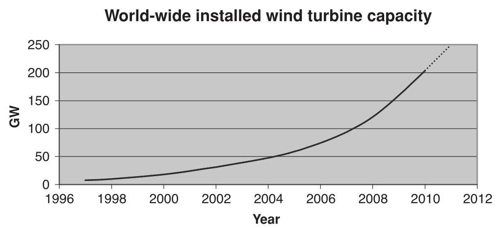

# 1 Introduction

## 1.1 Historical development

Windmills have been used for at least 3000 years, mainly for grinding grain or pumping water; while in sailing ships the wind has been an essential source of power for even longer. From medieval times, horizontal axis windmills were an integral part of the rural economy and only fell into disuse with the advent of cheap fossil-fuelled stationary engines and then the spread of rural electrification (Musgrove, 2010). The use of windmills (or wind turbines) to generate electricity can be traced back to the late nineteenth century with the ${12}\mathrm{\;{kW}}$ direct current windmill generator constructed by Charles Brush in the USA and the research undertaken by Poul la Cour in Denmark. However, for much of the twentieth century there was little interest in using wind energy for electricity generation, other than for battery charging for remote dwellings; and these low power systems were quickly removed once access to the electricity grid became available. One notable development was the 1250 kW Smith-Putnam wind turbine constructed in the USA in 1941. This remarkable machine had a steel rotor ${53}\mathrm{\;m}$ in diameter, full span pitch control and flapping blades to reduce loads. Although a blade spar failed catastrophically in 1945, it remained the largest wind turbine constructed for some 40 years (Putnam, 1948).

Golding (1955) and Shepherd and Divone in Spera (1994) provide a fascinating history of early wind turbine development. They record the ${100}\mathrm{\;{kW}}{30}\mathrm{\;m}$ diameter Balaclava wind turbine in the then USSR in 1931 and the Andrea Enfield ${100}\mathrm{{kW}}{24}\mathrm{\;m}$ diameter pneumatic design constructed in the UK in the early 1950s. In this turbine, hollow blades, open at the tip, were used to draw air up through the tower where another turbine drove the generator. In Denmark the ${200}\mathrm{{kW}}{24}\mathrm{\;m}$ diameter Gedser machine was built in 1956, while Electricite de France tested a 1.1 MW 35 m diameter turbine in 1963. In Germany, Professor Ulrich Hutter constructed a number of innovative, lightweight turbines in the 1950s and 1960s. In spite of these technical advances and the enthusiasm of Golding at the Electrical Research Association in the UK, among others, there was little sustained interest in wind generation until the price of oil rose dramatically in 1973.

---

Wind Energy Handbook, Second Edition. Tony Burton, Nick Jenkins, David Sharpe and Ervin Bossanyi.

© 2011 John Wiley & Sons, Ltd. Published 2011 by John Wiley & Sons, Ltd. ISBN: 978-0-470-69975-1

---

The sudden increase in the price of oil stimulated a number of substantial, government funded programmes of research, development and demonstration. In the USA this led to the construction of a series of prototype turbines starting with the ${38}\mathrm{\;m}$ diameter ${100}\mathrm{\;{kW}}$ Mod-0 in 1975 and culminating in the ${97.5}\mathrm{\;m}$ diameter ${2.5}\mathrm{{MW}}$ Mod-5B in 1987. Similar programmes were pursued in the UK, Germany and Sweden. There was considerable uncertainty as to which architecture might prove most cost-effective and several innovative concepts were investigated at full scale. In Canada, a 4 MW vertical axis Darrieus wind turbine was constructed and this concept was also investigated in the ${34}\mathrm{\;m}$ diameter Sandia Vertical Axis test facility in the USA. In the UK, an alternative, vertical axis design using straight blades to give an 'H' type rotor was proposed by Dr Peter Musgrove and a ${500}\mathrm{{kW}}$ prototype constructed (Musgrove, 2010). In 1981 an innovative horizontal axis 3 MW wind turbine was built and tested in the USA. This used hydraulic transmission and, as an alternative to a yaw drive, the entire structure was orientated into the wind. The best choice for the number of blades remained unclear for some while and large horizontal axis turbines were constructed with one, two or three blades.

Much important scientific and engineering information was gained from these government funded research programmes and the prototypes generally worked as designed. However, the problems of operating very large wind turbines, unmanned and in difficult wind climates, were often underestimated and the reliability of the prototypes was not good. At the same time as the multi-megawatt prototypes were being constructed private companies, often with considerable state support, were manufacturing much smaller, often simpler, turbines for commercial sale. In particular the financial support mechanisms in California in the mid-1980s resulted in installation of a very large number of quite small (<100 kW) wind turbines. A number of these designs also suffered from various problems but, being smaller, they were generally easier to repair and modify. The Danish wind turbine concept emerged of a three-bladed, upwind stall regulated rotor and a fixed-speed, induction generator drive train. This deceptively simple architecture proved to be remarkably successful and was implemented on turbines as large as ${60}\mathrm{\;m}$ in diameter and at ratings of up to 1.5 MW. However, at large rotor diameters and generator ratings, the architecture ceases to be effective as aerodynamic stall is increasingly difficult to predict, an induction generator no longer easily provides enough damping and torsional compliance in the drive train and the requirements of the electrical Transmission System Operators for connection to the network, the Grid Codes become difficult to meet. Hence, as the size of commercially available turbines approached or exceeded that of the large prototypes of the 1980s the concepts investigated then of variable speed operation, full-span control of the blade pitch and advanced materials were used increasingly by designers.

In 1991 the first offshore wind farm was constructed at Vindeby consisting of eleven, ${450}\mathrm{\;{kW}}$ wind turbines located up to $3\mathrm{\;{km}}$ offshore. Throughout the 1990s small numbers of offshore wind turbines were placed close to shore, while in 2002 the Horns Rev, 160 MW wind farm, some ${20}\mathrm{\;{km}}$ off the western coast of Denmark, was constructed. This was the first project to use an offshore substation that increased the power collection voltage of ${30}\mathrm{{kV}}$ to ${150}\mathrm{{kV}}$ for transmission to shore. At the time of writing (2010) a ${500}\mathrm{{MW}}$ wind offshore wind farm (Greater Gabbard) is under construction off the coast of England with 1000 MW projects under development. The wind turbines that have been installed in these offshore wind farms have been marinised versions of 3-bladed, upwind terrestrial designs. However, the possibility of higher blade tip-speeds, because of more relaxed noise constraints and a reduced emphasis on visual appearance in sites far from land, are leading to an interest in the development of very large, lower solidity rotors with two or even one blade.

The stimulus for the development of wind energy in 1973 was the increase in the price of oil and concern over limited fossil fuel resources. From around 1990, the main driver for use of wind turbines to generate electrical power was the very low ${\mathrm{{CO}}}_{2}$ emissions (over the entire life cycle of manufacture, installation, operation and de-commissioning) and the potential of wind energy to help mitigate climate change. Then from around 2006 the very high oil price and concerns over security of energy supplies led to a further increase of interest in wind energy and a succession of policy measures were put in place in many countries to encourage its use. In 2007 the European Union declared a policy that ${20}\%$ of all energy should be from renewable sources by 2020. Because of the difficulty of using renewable energy for transport and heat, this implies that in some countries 30-40% of electrical energy should come from renewables, with wind energy likely to play a major part. Energy policy continues to develop rapidly with many countries adopting ambitions to reduce greenhouse gas emissions of up to 80% by 2050 in order to mitigate climate change.

The development of wind energy in some countries has been more rapid than in others and this difference cannot be explained simply by differences in the wind speeds. Important factors include the financial support mechanisms for wind generated electricity, access to the electrical network, the process by which the local authorities give permission for the construction of wind farms and the perception of the general population, particularly with respect to visual impact. The development of offshore sites, although at considerably increased cost, is in response to these concerns over the environmental impact of wind farms.

As a relatively new generation technology, wind energy requires financial support to encourage its development and stimulate investment from private companies. Such support is provided in many countries and recognises the contribution wind generation makes to climate change mitigation and security of national energy supplies. There is presently an active debate as to the best mechanism of providing such support so that it stimulates the development of wind energy at minimum cost and without distorting the electricity market.

Feed-in-Tariffs are offered in a number of countries, most notably Germany and Spain. A fixed price is paid for each kWh generated from renewable sources with different rates for wind energy, photovoltaic solar energy and other renewable energy technologies. This support mechanism has the benefit of giving certainty of the revenue stream from a successful project and is credited by its supporters for the very rapid development of wind energy, and other renewables, in these countries. An alternative approach is a quota or Renewable Portfolio Standard system where a government places an obligation on electricity suppliers to source a certain fraction of the energy they supply from renewable sources. An example is the UK Renewable Obligation Certificate system where renewable energy generators are awarded green certificates for energy generated from renewable sources. These green certificates are traded independently from the electrical energy and electricity suppliers who fail to acquire their quota pay a buy-out price. With this support mechanism risk is transferred to the project developer and only the most commercially attractive renewable technologies are developed. Historically, Capacity Auctions have also been used, such as the earlier UK NFFO mechanism and similar examples in Ireland and France. A national government determines the volume of wind energy required and conducts an auction for capacity on price. Capacity Auctions suffered from some wind farm developers bidding low to secure agreements and then not constructing projects.

Although the form of these support mechanisms, and particularly their stability, is important, it may be argued that other factors including access to the electricity grid, speed of the planning/permitting system and public acceptability play a critical role in determining the rate of deployment of wind energy. It is also likely that more general support measures for low carbon electricity generation, for example the European Union Emissions Trading Scheme or wider carbon taxes, will provide significant support for the development of wind energy in the future.

## 1.2 Modern wind turbines

The power output from a wind turbine is given by the well-known expression:

$$
P = \frac{1}{2}{C}_{p}{\rho A}{U}^{3} \tag{1.1}
$$

where

$\rho$ is the density of air $\left( {{1.25}\mathrm{\;{kg}}/{\mathrm{m}}^{3}}\right)$

${C}_{p}$ is the power coefficient

$A$ is the rotor swept area

$U$ is the wind speed

The density of air is rather low, 800 times less than water which powers hydro plant, and this leads directly to the large size of a wind turbine. Depending on the design wind speed chosen, a $3\mathrm{{MW}}$ wind turbine may have a rotor that is more than ${90}\mathrm{\;m}$ in diameter. The power coefficient describes that fraction of the power in the wind that may be converted by the turbine into mechanical work. It has a theoretical maximum value of 0.593 (the Betz limit) and rather lower peak values are achieved in practice (see Chapter 3). The power coefficient of a rotor varies with the tip speed ratio, (the ratio of rotor tip speed to free wind speed) and is only a maximum for a unique tip speed ratio. Incremental improvements in the power coefficient are continually being sought by detailed design changes of the rotor and by operating at variable speed it is possible to maintain the maximum power coefficient over a range of wind speeds. However, these measures will give only a modest increase in the power output. Major increases in the output power can only be achieved by increasing the swept area of the rotor or by locating the wind turbines on sites with higher wind speeds.

Hence, over the last 40 years there has been a continuous increase in the rotor diameter of commercially available wind turbines from less than ${30}\mathrm{\;m}$ to more than ${100}\mathrm{\;m}$ . A tripling of the rotor diameter leads to a nine times increase in power output. The influence of the wind speed is, of course, more pronounced with a doubling of wind speed leading to an eight fold increase in power. Thus, there have been considerable efforts to ensure that wind farms are developed in areas of the highest wind speeds and the turbines optimally located within wind farms. In certain countries very high towers are being used (more than ${100}\mathrm{\;m}$ high) to take advantage of the increase of wind speed with height.

In the past a number of studies were undertaken to determine the 'optimum' size of a wind turbine by balancing the complete costs of manufacture, installation and operation of various sizes of wind turbines against the revenue generated (Molly et al., 1993). The results indicated a minimum cost of energy would be obtained with wind turbine diameters in the range of ${35} - {60}\mathrm{\;m}$ , depending on the assumptions made. However, these estimates would now appear to be too low and there is no obvious point at which rotor diameters and, hence, output power will be limited particularly for offshore wind turbines where the very large components can be transported by ship directly from the factory to site.

Figure 1.1 Wind power capacity world-wide (World Wind Energy Association, 2009)

All modern electricity generating wind turbines use the lift force derived from the blades to drive the rotor. A high rotational speed of the rotor is desirable in order to reduce the gearbox ratio required and this leads to low solidity rotors (the ratio of blade area/rotor swept area). The low solidity rotor acts as an effective energy concentrator and as a result the energy generated over a wind turbine's life is much less than that used for its manufacture and installation. An energy balance analysis of a 3 MW wind turbine showed that the expected average time to generate a similar quantity of energy to that used for its manufacture, operation, transport, dismantling and disposal was 6-7 months (European Wind Energy Association (EWEA), 2009). A similar time was calculated for installation both onshore and offshore.

Until around 2000, the installed wind turbine generating capacity was so low that its output was viewed by electricity Transmission System Operators simply as negative load that supplied energy but played no part in supporting the operation of the power system and maintaining its stability. Since then, with the very much increased capacity of wind generation (Figure 1.1), turbines are required to contribute to the operation of the power system. The requirements for their performance are defined through the Grid Codes, issued by the Transmission System Operators. Compliance is mandatory before connection to the network is allowed. The Grid Codes specify operational requirements so that in addition to contributing energy, or real power, ${}^{1}$ the wind turbines provide ancillary services particularly for voltage and frequency control. At present the Grid Codes differ in detail from country to country but generally specify that wind turbines must remain stable and connected to the network in case of electrical faults on the network, define their performance in terms of reactive power for voltage control and their ability to vary real power for frequency support. As wind turbines become an ever increasing fraction of electricity generating capacity, it is likely that further requirements will be placed on them to replicate the ancillary services previously provided by conventional synchronous generators. Compliance with the Grid Code requirements is difficult to achieve with simple fixed speed induction generators using the Danish concept and these regulations are a major driver for the use of variable speed generators.

---

${}^{1}$ In a large interconnected electric power transmission system, real power controls system frequency while reactive power determines the voltages of the network.

---

## 1.3 Scope of the book

The use of wind energy to generate electricity is now well accepted with a large industry manufacturing and installing tens of GWs of new capacity each year. Although there are exciting new developments, particularly in very large wind turbines, and many challenges remain, there is a considerable body of established knowledge concerning the science and technology of wind turbines. This book records some of this knowledge and presents it in a form suitable for use by students (at final year undergraduate or post-graduate level) and by those involved in the design, manufacture or operation of wind turbines. The overwhelming majority of wind turbines presently in use are horizontal axis connected to a large electricity network. These turbines are the subject of this book.

Chapter 2 discusses the wind resource. Particular reference is made to wind turbulence due to its importance in wind turbine design. Chapter 3 sets out the basis of the aerodynamics of horizontal axis wind turbines, while Chapter 4 discusses aspects of their performance. Any wind turbine design starts with establishing the design loads and these are discussed in Chapter 5. Chapter 6 sets out the various design options for horizontal axis wind turbines with approaches to the design of some of the important components examined in Chapter 7. The functions of the wind turbine controller and some of the possible analysis techniques described are discussed in Chapter 8. In Chapter 9 wind farms and the development of wind energy projects are reviewed with particular emphasis on environmental impact. Chapter 10 considers how wind turbines interact with the electrical power system while Chapter 11 deals with the important topic of offshore wind energy.

The book attempts to record well-established knowledge that is relevant to wind turbines which are currently commercially significant. Thus, it does not discuss a number of interesting research topics or areas where wind turbine technology is still evolving. Although they were investigated in considerable detail in the 1980s, large vertical axis wind turbines have not proved to be commercially competitive and are not currently manufactured in significant numbers. Hence, the particular issues of vertical axis turbines are not dealt with in this text.

There are presently some 2 billion people in the world without access to mains electricity and, in conjunction with other generators (e.g. diesel engines), wind turbines may in the future be an effective means of providing some of them with power. However, autonomous power systems are extremely difficult to design and operate reliably, particularly in remote areas of the world and with limited budgets. A small autonomous AC power system has all the technical challenges of a large national electricity system but, due to the low inertia of the generators, requires a very fast, sophisticated control system to maintain stable operation. Over the last 30 years there have been a number of attempts to operate autonomous wind-diesel systems on islands or for other remote communities throughout the world, but with only limited success. This class of installation has its own particular problems and again, given the very limited size of the market at present, this specialist area is not dealt with in this book.

Installations of offshore wind turbines are now commencing in significant numbers (Figure 1.2). The first offshore wind farms were installed in rather shallow waters and used marinised terrestrial designs. A number of larger offshore wind farms used offshore substations to increase the transmission voltage, while prototype floating wind turbines for deeper waters have been deployed. Very large wind farms with multi-megawatt turbines many kilometres offshore are now being planned and will be constructed over the coming years.

Figure 1.2 (a) Rhyl Flats Offshore Wind Farm. See Plate 1 for the colour figure. (b) 3.6 MW nacelle prior to lifting. (c) Assembly of 3.6 MW wind turbine. Rhyl Flats Offshore Wind Farm consists of ${25} \times  {3.6}\mathrm{{MW}}$ Siemens wind turbines. Hub height $- {80}\mathrm{\;m}$ above mean sea level (MSL). Height to blade tip - 134 m above MSL. Rhyl Flats Offshore Wind Farm was built and is operated by RWE npower renewables. Photographer: Guy Woodland. Photos reproduced courtesy of RWE npower renewables. See Plate 2 for the colour figure

## References

European Wind Energy Association (EWEA) (2009) Wind energy the facts. Earthscan, London.

Golding, E.W. (1955) 'The generation of electricity from wind power', E & F.N. Spon, London (reprinted R.I. Harris, London 1976).

8 INTRODUCTION

Molly, J.P., Keuper, A. and Veltrup, M. (1993) 'Statistical WEC Design and Cost Trends', Proceedings of the European Wind Energy Conference, Travemunde 8-12 March 1993, pp. 57-59.

Musgrove, P. (2010) 'Wind Power', Cambridge University Press, Cambridge.

Putnam, G.C. (1948) 'Power from the Wind', Van Nostrand Rheinhold, New York.

Spera, D.A. (1994) 'Wind Turbine Technology, Fundamental Concepts of Wind Turbine Engineering', ASME Press, New York.

World Wind Energy Association (2009), 'World wind energy report 2009'. www.wwindea.org.

## Further Reading

Eggleston, D.M. and Stoddard, F.S. (1987) 'Wind Turbine Engineering Design', Van Nostrand Rhein-hold, New York.

Freris, L.L. (ed.) (1990) 'Wind Energy Conversion Systems', Prentice-Hall, New York.

Gipe, P. (1995) 'Wind Energy Comes of Age', John Wiley & Sons Inc., New York.

Harrison, R., Hau, E., and Snel, H. (2000) 'Large Wind Turbines, Design and Economics', John Wiley & Sons Ltd., Chichester.

Hau, E. (2006) 'Wind Turbines: Fundamentals, Technologies, Application, Economics, 2nd edition', Springer, Heidelberg.

Johnson, L. (1985) 'Wind Energy Systems', Prentice-Hall, New York.

Le Gourieres, D. (1992) 'Wind Power Plants Theory and Design', Pergamon Press, Oxford.

Manwell, J.W., McGowan, J.G. and Rogers, A.L. (2009) 'Wind Energy Explained, Theory, Design and Application, 2nd edition', Wiley-Blackwell, Oxford.

Twiddell, J.W. and Weir, A.D. (1986) 'Renewable Energy Resources', E & F.N. Spon, London.

Twidell, J.W. and Gaudiosi, G. (eds) (2009) 'Offshore Wind Power', Multi-science Publishing Co., Brentwood.

