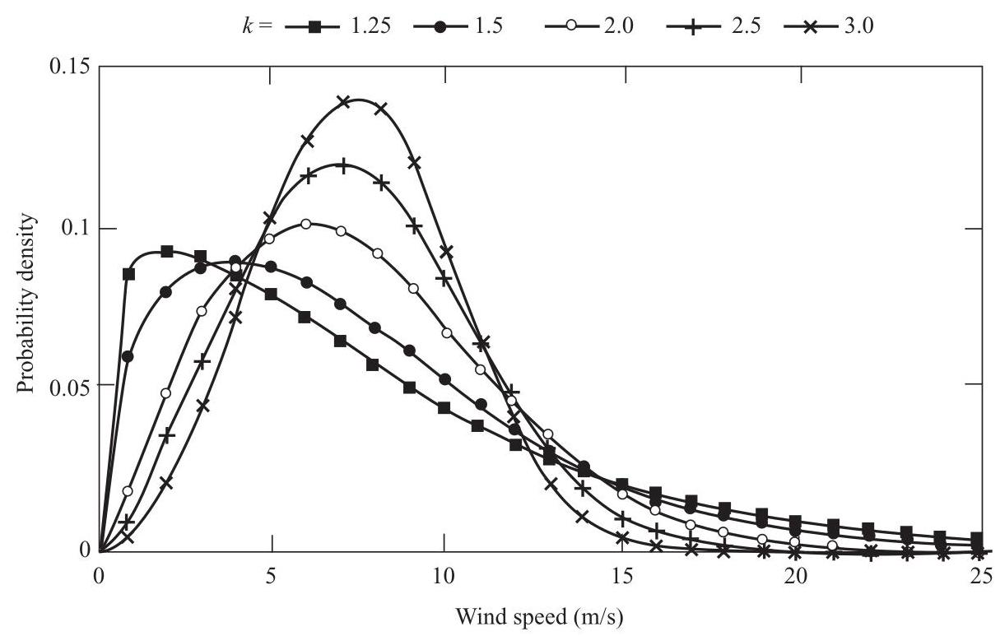
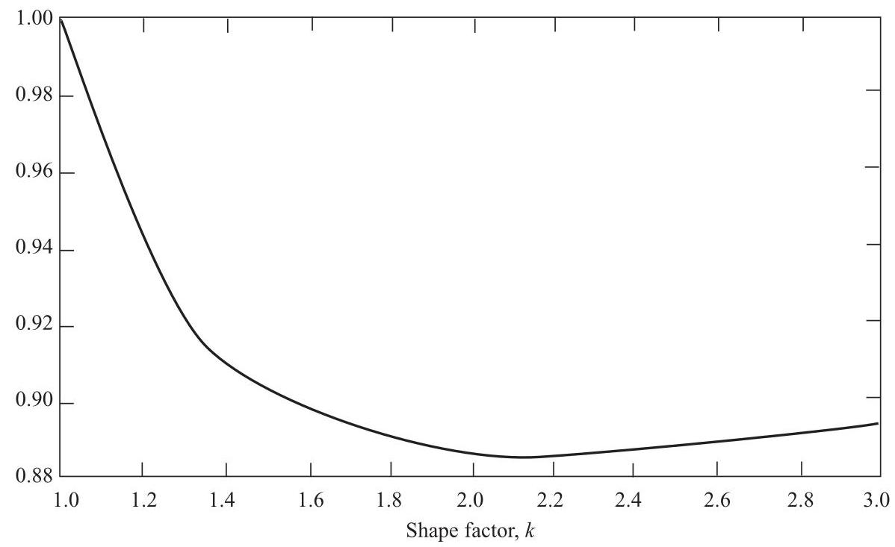
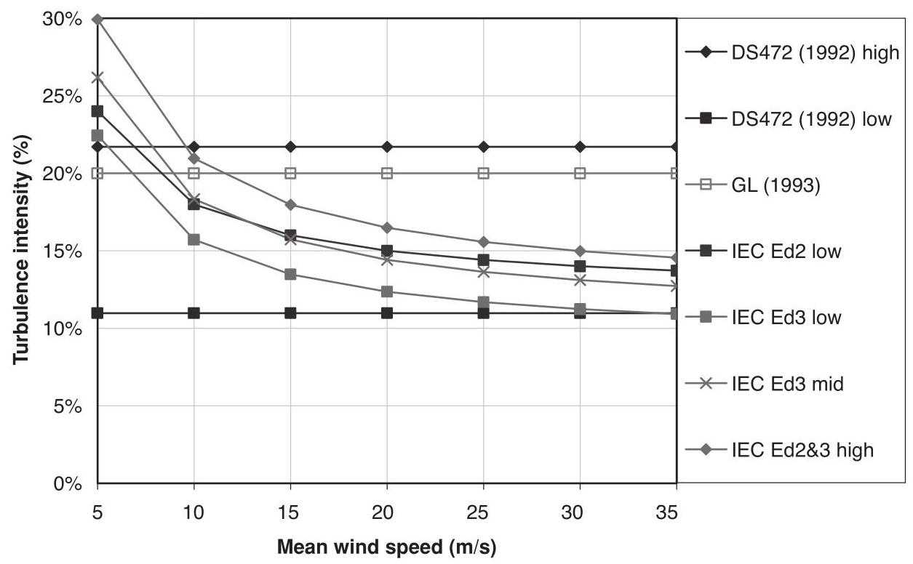
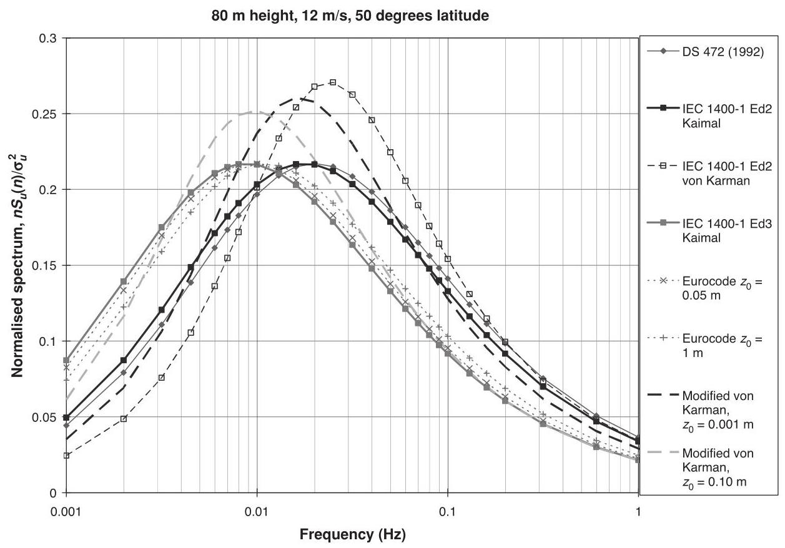
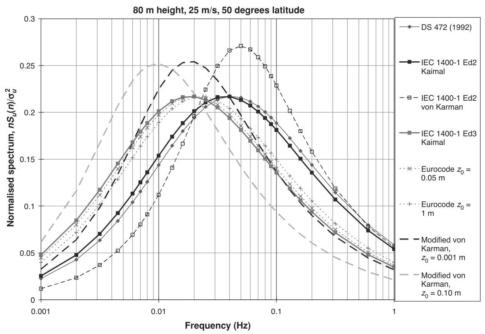

# 2 The wind resource

## 2.1 The nature of the wind

The energy available in the wind varies as the cube of the wind speed, so an understanding of the characteristics of the wind resource is critical to all aspects of wind energy exploitation, from the identification of suitable sites and predictions of the economic viability of wind farm projects through to the design of wind turbines themselves, and understanding their effect on electricity distribution networks and consumers.

From the point of view of wind energy, the most striking characteristic of the wind resource is its variability. The wind is highly variable, both geographically and temporally. Furthermore this variability persists over a very wide range of scales, both in space and time. The importance of this is amplified by the cubic relationship to available energy.

On a large scale, spatial variability describes the fact that there are many different climatic regions in the world, some much windier than others. These regions are largely dictated by the latitude, which affects the amount of insolation. Within any one climatic region, there is a great deal of variation on a smaller scale, largely dictated by physical geography - the proportion of land and sea, the size of land masses and the presence of mountains or plains, for example. The type of vegetation may also have a significant influence through its effects on the absorption or reflection of solar radiation, affecting surface temperatures, and on humidity.

More locally, the topography has a major effect on the wind climate. More wind is experienced on the tops of hills and mountains than in the lee of high ground or in sheltered valleys, for instance. More locally still, wind velocities are significantly reduced by obstacles such as trees or buildings.

At a given location, temporal variability on a large scale means that the amount of wind may vary from one year to the next, with even longer scale variations on a scale of decades or more. These long-term variations are not well understood, and may make it difficult to make accurate predictions of the economic viability of particular wind farm projects, for instance.

On timescales shorter than a year, seasonal variations are much more predictable, although there are large variations on shorter timescales still, which although reasonably well understood are often not very predictable more than a few days ahead. Depending on location, there may also be considerable variations with the time of day (diurnal variations) which again are usually fairly predictable. On these timescales, the predictability of the wind is important for integrating large amounts of wind power into the electricity network, to allow the other generating plant supplying the network to be organised appropriately.

---

Wind Energy Handbook, Second Edition. Tony Burton, Nick Jenkins, David Sharpe and Ervin Bossanyi.

© 2011 John Wiley & Sons, Ltd. Published 2011 by John Wiley & Sons, Ltd. ISBN: 978-0-470-69975-1

---

Figure 2.1 Wind spectrum from Brookhaven based on work by van der Hoven (1957)

On still shorter timescales of minutes down to seconds or less, wind speed variations known as turbulence can have a very significant impact on the design and performance of the individual wind turbines, as well as on the quality of power delivered to the network and its effect on consumers.

Van der Hoven (1957) constructed a wind speed spectrum from long and short-term records at Brookhaven, New York, showing clear peaks corresponding to the synoptic, diurnal and turbulent effects referred to above (Figure 2.1). Of particular interest is so-called 'spectral gap' occurring between the diurnal and turbulent peaks, showing that the synoptic and diurnal variations can be treated as quite distinct from the higher frequency fluctuations of turbulence. There is very little energy in the spectrum in the region between two hours and ten minutes. As indicated in the next section, the nature of the wind regime in different geographical locations can vary widely, so the Van der Hoven spectrum cannot be assumed to be universally applicable. Nevertheless the concept of a spectral gap at frequencies below ten minutes is very often used, often implicitly, when making assumptions about the wind regime.

## 2.2 Geographical variation in the wind resource

Ultimately the winds are driven almost entirely by the sun's energy, causing differential surface heating. The heating is most intense on land masses closer to the equator, and obviously the greatest heating occurs in the daytime, which means that the region of greatest heating moves around the earth's surface as it spins on its axis. Warm air rises and circulates in the atmosphere to sink back to the surface in cooler areas. The resulting large scale motion of the air is strongly influenced by Coriolis forces due to the earth's rotation. The result is a large-scale global circulation pattern. Certain identifiable features of this are well known, such as the trade winds and the 'roaring forties'.

The non-uniformity of the earth's surface, with its pattern of land masses and oceans, ensures that this global circulation pattern is disturbed by smaller-scale variations on continental scales. These variations interact in a highly complex and non-linear fashion to produce a somewhat chaotic result, which is at the root of the day-to-day unpredictability of the weather in particular locations. Clearly though, underlying tendencies remain which lead to clear climatic differences between regions. These differences are tempered by more local topographical and thermal effects.

Hills and mountains result in local regions of increased wind speed. This is partly a result of altitude - the boundary layer flow over the earth's surface means that wind speed generally increases with height above the ground, and hill tops and mountain peaks may 'project' into the higher wind speed layers. It is also partly a result of the acceleration of the wind flow over and around hills and mountains, and funnelling through passes or along valleys aligned with the flow. Equally, topography may produce areas of reduced wind speed, such as sheltered valleys, areas in the lee of a mountain ridge or where the flow patterns result in stagnation points.

Thermal effects may also result in considerable local variations. Coastal regions are often windy because of differential heating between land and sea. While the sea is warmer than the land, a local circulation develops in which surface air flows from the land to the sea, with warm air rising over the sea and cool air sinking over the land. When the land is warmer the pattern reverses. The land will heat up and cool down more rapidly than the sea surface, and so this pattern of land and sea breezes tends to reverse over a 24-hour cycle. These effects were important in the early development of wind power in California, where an ocean current brings cold water to the coast, not far from desert areas which heat up strongly by day. An intervening mountain range funnels the resulting air flow through its passes, generating locally very strong and reliable winds (which are well correlated with peaks in the local electricity demand caused by air conditioning loads).

Thermal effects may also be caused by differences in altitude. Thus, cold air from high mountains can sink down to the plains below, causing quite strong and highly stratified 'downslope' winds.

The brief general descriptions of wind speed variations in Sections 2.1-2.5 are illustrative, and more detailed information can be found in standard meteorological texts. Section 9.1.3, in Chapter 9, describes how the wind regimes at candidate sites can be assessed, while wind forecasting is covered in Section 2.9.

Section 2.6 presents a more detailed description of the high frequency wind fluctuations known as turbulence, which are crucial to the design and operation of wind turbines and have a major influence on wind turbine loads. Extreme winds are also important for the survival of wind turbines, and these are described in Section 2.8.

## 2.3 Long-term wind speed variations

There is evidence that the wind speed at any particular location may be subject to very slow long-term variations. Although the availability of accurate historical records is a limitation, careful analysis by, for example, Palutikoff et al. (1991) has demonstrated clear trends. Clearly these may be linked to long-term temperature variations for which there is ample historical evidence. There is also much debate at present about the likely effects of global warming, caused by human activity, on climate, and this will undoubtedly affect wind climates in the coming decades.

Apart from these long-term trends there may be considerable changes in windiness at a given location from one year to the next. These changes have many causes. They may be coupled to global climate phenomena such as el niño, changes in atmospheric particulates resulting from volcanic eruptions, and sunspot activity, to name a few.

These changes add significantly to the uncertainty in predicting the energy output of a wind farm at a particular location during its projected lifetime.

## 2.4 Annual and seasonal variations

While year-to-year variation in annual mean wind speeds remains hard to predict, wind speed variations during the year can be well characterised in terms of a probability distribution. The Weibull distribution has been found to give a good representation of the variation in hourly mean wind speed over a year at many typical sites. This distribution takes the form

$$
F\left( U\right)  = \exp \left( {-{\left( \frac{U}{c}\right) }^{k}}\right) \tag{2.1}
$$

where $F\left( U\right)$ is the fraction of time for which the hourly mean wind speed exceeds $U$ . It is characterised by two parameters: a ’scale parameter’ $c$ and a ’shape parameter’ $k$ which describes the variability about the mean. $c$ is related to the annual mean wind speed $\bar{U}$ by the relationship

$$
\bar{U} = {c\Gamma }\left( {1 + 1/k}\right) \tag{2.2}
$$

where $\Gamma$ is the complete gamma function. This can be derived by consideration of the probability density function

$$
f\left( U\right)  =  - \frac{{dF}\left( U\right) }{dU} = k\frac{{U}^{k - 1}}{{c}^{k}}\exp \left( {-{\left( \frac{U}{c}\right) }^{k}}\right) \tag{2.3}
$$

since the mean wind speed is given by

$$
\bar{U} = {\int }_{0}^{\infty }{Uf}\left( U\right) {dU} \tag{2.4}
$$

A special case of the Weibull distribution is the Rayleigh distribution, with $k = 2$ , which is actually a fairly typical value for many locations. In this case, the factor $\Gamma \left( {1 + 1/k}\right)$ has the value $\sqrt{\pi }/2 = {0.8862}$ . A higher value of $k$ , such as 2.5 or 3, indicates a site where the variation of hourly mean wind speed about the annual mean is small, as is sometimes the case in the trade wind belts, for instance. A lower value of $k$ , such as 1.5 or 1.2, indicates greater variability about the mean. A few examples are shown in Figure 2.2. The value of $\Gamma \left( {1 + 1/k}\right)$ varies little, between about 1.0 and 0.885: see Figure 2.3.

Figure 2.2 Example Weibull distributions

The Weibull distribution of hourly mean wind speeds over the year is clearly the result of a considerable degree of random variation. However, there may also be a strong underlying seasonal component to these variations, driven by the changes in insolation during the year as a result of the tilt of the earth's axis of rotation. Thus, in temperate latitudes the winter months tend to be significantly windier than the summer months. There may also be a tendency for strong winds or gales to develop around the time of the spring and autumn equinoxes. Tropical regions also experience seasonal phenomena, such as monsoons and tropical storms, which affect the wind climate. Indeed the extreme winds associated with tropical storms may significantly influence the design of wind turbines intended to survive in these locations.

Figure 2.3 The factor $\Gamma \left( {1 + 1/k}\right)$

Although a Weibull distribution gives a good representation of the wind regime at many sites, this is not always the case. For example, some sites showing distinctly different wind climates in summer and winter can be represented quite well by a double-peaked 'bi-Weibull' distribution, with different scale factors and shape factors in the two seasons, that is,

$$
F\left( U\right)  = {F}_{1}\exp \left( {-{\left( \frac{U}{{c}_{1}}\right) }^{{k}_{1}}}\right)  + \left( {1 - {F}_{1}}\right) \exp \left( {-{\left( \frac{U}{{c}_{2}}\right) }^{{k}_{2}}}\right) \tag{2.5}
$$

Certain parts of California are good examples of this.

## 2.5 Synoptic and diurnal variations

On shorter timescales than the seasonal changes described in Section 2.4, wind speed variations are somewhat more random and less predictable. Nevertheless, these variations contain definite patterns. The frequency content of these variations typically peaks at around four days or so. These are the 'synoptic' variations which are associated with large-scale weather patterns such as areas of high and low pressure and associated weather fronts as they move across the earth's surface. Coriolis forces induce a circular motion of the air as it tries to move from high to low pressure regions. These coherent large-scale atmospheric circulation patterns may typically take a few days to pass over a given point, although they may occasional 'stick' in one place for longer before finally moving on or dissipating.

Following the frequency spectrum to still higher frequencies, many locations will show a distinct diurnal peak, at a frequency of 24 hours. This is usually driven by local thermal effects. Intense heating in the daytime may cause large convection cells in the atmosphere, which die down at night. This process is described in more detail in Section 2.6 as it also contributes significantly to turbulence, on timescales representative of the size of the convection cells. Land and sea breezes, caused by differential heating and cooling between land and sea, also contribute significantly to the diurnal peak. The daily direction reversal of these winds would be seen as a 12-hour peak in the spectrum of wind speed magnitude.

## 2.6 Turbulence

### 2.6.1 The nature of turbulence

Turbulence refers to fluctuations in wind speed on a relatively fast timescale, typically less than about ten minutes. In other words it corresponds to the highest frequency spectral peak in Figure 2.1. It is useful to think of the wind as consisting of a mean wind speed determined by the seasonal, synoptic and diurnal effects described above, which varies on a timescale of one to several hours, with turbulent fluctuations superimposed. These turbulent fluctuations then have a zero mean when averaged over about ten minutes. This description is a useful one as long as the 'spectral gap' as illustrated in Figure 2.1 is reasonably distinct.

Turbulence is generated mainly from two causes: 'friction' with the earth's surface, which can be thought of as extending as far as flow disturbances caused by topographical features such as hills and mountains; and thermal effects which can cause air masses to move vertically as a result of variations in temperature and, hence, in the density of the air. Often these two effects are interconnected, such as when a mass of air flows over a mountain range and is forced up into cooler regions where it is no longer in thermal equilibrium with its surroundings.

Turbulence is clearly a complex process, and one which cannot be represented simply in terms of deterministic equations. Clearly it does obey certain physical laws, such as those describing the conservation of mass, momentum and energy. However, in order to describe turbulence using these laws it is necessary to take account of temperature, pressure, density and humidity as well as the motion of the air itself in three dimensions. It is then possible to formulate a set of differential equations describing the process, and in principle the progress of the turbulence can be predicted by integrating these equations forward in time starting from certain initial conditions and subject to certain boundary conditions. In practice of course, the process can be described as 'chaotic' in that small differences in initial conditions or boundary conditions may result in large differences in the predictions after a relatively short time. For this reason it is generally more useful to develop descriptions of turbulence in terms of its statistical properties.

There are many statistical descriptors of turbulence which may be useful, depending on the application. These range from simple turbulence intensities and gust factors to detailed descriptions of the way in which the three components of turbulence vary in space and time as a function of frequency.

The turbulence intensity is a measure of the overall level of turbulence. It is defined as

$$
I = \frac{\sigma }{\bar{U}} \tag{2.6}
$$

where $\sigma$ is the standard deviation of wind speed variations about the mean wind speed $\bar{U}$ , usually defined over ten minutes or an hour. Turbulent wind speed variations can be considered to be roughly Gaussian, meaning that the speed variations are normally distributed, with standard deviation $\sigma$ , about the mean wind speed $\bar{U}$ . However, the tails of the distribution may be significantly non-Gaussian, so this approximation is not reliable for estimating, say, the probability of a large gust within a certain period.

The turbulence intensity clearly depends on the roughness of the ground surface and the height above the surface. However, it also depends on topographical features such as hills or mountains, especially when they lie upwind, as well as more local features such as trees or buildings. It also depends on the thermal behaviour of the atmosphere: for example, if the air near to the ground warms up on a sunny day it may become buoyant enough to rise up through the atmosphere, causing a pattern of convection cells which are experienced as large-scale turbulent eddies.

Clearly as the height above ground increases, the effects of all these processes which are driven by interactions at the earth's surface become weaker. Above a certain height, the air flow can be considered largely free of surface influences. Here it can be considered to be driven by large scale synoptic pressure differences and the rotation of the earth. This air flow is known as the geostrophic wind. At lower altitudes, the effect of the earth's surface can be felt. This part of the atmosphere is known as the boundary layer. The properties of the boundary layer are important in understanding the turbulence experienced by wind turbines.

### 2.6.2 The boundary layer

The principal effects governing the properties of the boundary layer are the strength of the geostrophic wind, the surface roughness, Coriolis effects due to the earth's rotation and thermal effects.

The influence of thermal effects can be classified into three categories: stable, unstable and neutral stratification. Unstable stratification occurs when there is a lot of surface heating, causing warm air near the surface to rise. As it rises, it expands due to reduced pressure and, therefore, cools adiabatically. If the cooling is not sufficient to bring the air into thermal equilibrium with the surrounding air then it will continue to rise, giving rise to large convection cells. The result is a thick boundary layer with large-scale turbulent eddies. There is a lot of vertical mixing and transfer of momentum, resulting in a relatively small change of mean wind speed with height.

If the adiabatic cooling effect causes the rising air to become colder than its surroundings, its vertical motion will be suppressed. This is known as stable stratification. It often occurs on cold nights when the ground surface is cold. In this situation, turbulence is dominated by friction with the ground and wind shear (the increase of mean wind speed with height) can be large.

In the neutral atmosphere, adiabatic cooling of the air as it rises is such that it remains in thermal equilibrium with its surroundings. This is often the case in strong winds, when turbulence caused by ground roughness causes sufficient mixing of the boundary layer. For wind energy applications, neutral stability is usually the most important situation to consider, particularly when considering the turbulent wind loads on a turbine, since these are largest in strong winds. Nevertheless, unstable conditions can be important as they can result in sudden gusts from a low level, and stable conditions can give rise to significant asymmetric loadings due to high wind shear. There can also be rapid changes in wind direction with height in this situation.

In the following sections, a series of relationships are presented which describe the properties of the atmospheric boundary layer, such as turbulence intensities, spectra, length scales and coherence functions. These relationships are partly based on theoretical considerations and partly on empirical fits to a wide range of observations from many researchers taken in various conditions and in various locations.

In the neutral atmosphere, the boundary layer properties depend mainly on the surface roughness and the Coriolis effect. The surface roughness is characterised by the roughness length ${z}_{o}$ . Typical values of ${z}_{o}$ are shown in Table 2.1.

The Coriolis parameter $f$ is defined as

$$
f = {2\Omega }\sin \left( \left| \lambda \right| \right) \tag{2.7}
$$

where $\Omega$ is the angular velocity of the earth’s rotation, and $\lambda$ is the latitude. In temperate latitudes, the height of the boundary layer is given by

$$
h = {u}^{ * }/\left( {6f}\right) \tag{2.8}
$$

but it is clear from the division that this and the subsequent derivations cannot be valid at the equator, where $h = 0$ , so a pragmatic recommendation is to use a latitude of ${22.5}^{ \circ  }$ for all tropical regions. Here ${u}^{ * }$ is known as the friction velocity, given by

$$
{u}^{ * }/\bar{U}\left( z\right)  = \kappa /\left\lbrack  {\ln \left( {z/{z}_{\mathrm{o}}}\right)  + \Psi }\right\rbrack \tag{2.9}
$$

Table 2.1 Typical surface roughness lengths

<table><tr><td>Type of Terrain</td><td>Roughness length ${z}_{\mathrm{o}}\left( \mathrm{m}\right)$</td></tr><tr><td>Cities, forests</td><td>0.7</td></tr><tr><td>Suburbs, wooded countryside</td><td>0.3</td></tr><tr><td>Villages, countryside with trees and hedges</td><td>0.1</td></tr><tr><td>Open farmland, few trees and buildings</td><td>0.03</td></tr><tr><td>Flat grassy plains</td><td>0.01</td></tr><tr><td>Flat desert, rough sea</td><td>0.001</td></tr></table>

where $\kappa$ is the von Karman constant (approximately 0.4 ), $z$ is the height above ground and ${z}_{\mathrm{o}}$ is the surface roughness length. $\Psi$ is a function which depends on stability: it is negative for unstable conditions, giving rise to low wind shear; and positive for stable conditions, giving high wind shear. For neutral conditions, ESDU (1985) gives $\Psi  = {34.5fz}/{u}^{ * }$ , which is small compared to $\ln \left( {z/{z}_{\mathrm{o}}}\right)$ for situations of interest here. If $\Psi$ is ignored, the wind shear is then given by a logarithmic wind profile:

$$
\bar{U}\left( z\right)  \propto  \ln \left( {z/{z}_{0}}\right) \tag{2.10}
$$

A power law approximation,

$$
\bar{U}\left( z\right)  \propto  {z}^{\alpha } \tag{2.11}
$$

is often used, where the exponent $\alpha$ is typically about 0.14, but varies with the type of terrain. However, the value of $\alpha$ should also depend on the height interval over which the expression is applied, making this approximation less useful than the logarithmic profile.

However, the wind turbine design standards typically specify that a given exponent should be used; the IEC and GL standards, for example, specify an exponent of $\alpha  = {0.20}$ for normal wind conditions onshore and $\alpha  = {0.14}$ for normal wind conditions offshore. Both standards specify an exponent of $\alpha  = {0.11}$ for extreme wind conditions (onshore and offshore).

If there is a change in the surface roughness, the wind shear profile changes gradually downwind of the transition point, from the original to the new profile. Essentially, a new boundary layer starts, and the height of the boundary between the new and old boundary layers increases from zero at the transition point until the new boundary layer is fully established. The calculation of wind shear in the transition zone is covered by, for example, Cook (1985).

By combining Equations 2.8 and 2.9, we obtain the wind speed at the top of the boundary layer as

$$
\bar{U}\left( h\right)  = \frac{{u}^{ * }}{\kappa }\left( {\ln \left( \frac{{u}^{ * }}{f{z}_{0}}\right)  - \ln 6 + {5.75}}\right) \tag{2.12}
$$

This is similar to the so-called geostrophic wind speed, G, which is the notional wind speed driving the boundary layer as calculated from the pressure field. The geostrophic wind speed is given by

$$
G = \frac{{u}^{ * }}{\kappa }\sqrt{{\left\lbrack  \ln \left( \frac{{u}^{ * }}{f{z}_{0}}\right)  - A\right\rbrack  }^{2} + {B}^{2}} \tag{2.13}
$$

where, for neutral conditions, $A = \ln 6$ and $B = {4.5}$ . This relationship is often referred to as the geostrophic drag law.

The effect of surface roughness is not only to cause the wind speed to decrease closer to the ground. There is also a change in direction between the 'free' pressure-driven geostrophic wind and the wind close to the ground. Although the geostrophic wind is driven by the pressure gradients in the atmosphere, Coriolis forces act to force the wind to flow at right angles to the pressure gradient, causing a characteristic circulating pattern. Thus, in the northern hemisphere, wind flowing from high pressure in the south to low pressure in the north will be forced eastwards by Coriolis effects, in effect to conserve angular momentum on the rotating earth. The result is that the wind circulates anti-clockwise around low-pressure areas and clockwise around high-pressure areas, or the other way round in the southern hemisphere. Close to the ground, these flow directions are modified due to the effect of surface friction. The total direction change, $\alpha$ , from the geostrophic to the surface wind is given by

$$
\sin \alpha  = \frac{-B}{\sqrt{{\left\lbrack  \ln \left( \frac{{u}^{ * }}{f{z}_{0}}\right) \right\rbrack  }^{2} + {B}^{2}}} \tag{2.14}
$$

### 2.6.3 Turbulence intensity

The turbulence intensity in the neutral atmosphere clearly depends on the surface roughness. For the longitudinal component, the standard deviation ${\sigma }_{u}$ is approximately constant with height, so the turbulence intensity decreases with height. More precisely, the relationship ${\sigma }_{u} \approx  {2.5}{u}^{ * }$ may be used to calculate the standard deviation, with the friction velocity ${u}^{ * }$ calculated as in the previous section. More recent work (ESDU, 1985) suggests a variation given by

$$
{\sigma }_{u} = \frac{{75\eta }{\left( {0.538} + {0.09}\ln \left( z/{z}_{0}\right) \right) }^{p}{u}^{ * }}{1 + {0.156}\ln \left( {{u}^{ * }/f \cdot  {z}_{0}}\right) } \tag{2.15}
$$

where

$$
\eta  = 1 - {6fz}/{u}^{ * } \tag{2.16}
$$

$$
p = {\eta }^{16} \tag{2.17}
$$

This approximates to ${\sigma }_{u} = {2.5}{u}^{ * }$ close to the ground, but gives larger values at greater heights. The longitudinal turbulence intensity is then

$$
{I}_{u} = {\sigma }_{u}/\bar{U} \tag{2.18}
$$

The lateral $\left( v\right)$ and vertical $\left( w\right)$ turbulence intensities are given (ESDU,1985) by

$$
{I}_{v} = \frac{{\sigma }_{v}}{\bar{U}} = {I}_{u}\left( {1 - {0.22}{\cos }^{4}\left( \frac{\pi z}{2h}\right) }\right) \tag{2.19}
$$

$$
{I}_{w} = \frac{{\sigma }_{w}}{\bar{U}} = {I}_{u}\left( {1 - {0.45}{\cos }^{4}\left( \frac{\pi z}{2h}\right) }\right) \tag{2.20}
$$

Note that specific values of turbulence intensity for use in design calculations are prescribed in some of the standards used for wind turbine design calculations, and these may not always correspond with the above expressions. For example, the now superseded Danish standard (DS472, 1992) specified

$$
{I}_{u} = {1.0}/\ln \left( {z/{z}_{0}}\right) \tag{2.21}
$$

with ${I}_{v} = {0.8}{I}_{u}$ and ${I}_{w} = {0.5}{I}_{u}$ .

The IEC edition 2 standard (IEC, 1999) gives

$$
{I}_{u} = {I}_{15}\left( {a + {15}/\bar{U}}\right) /\left( {a + 1}\right) \tag{2.22}
$$

where ${I}_{15} = {0.18}$ for ’higher turbulence sites’ and 0.16 for ’lower turbulence sites’, with corresponding values of $a$ of 2 and 3 respectively. For the lateral and vertical components, a choice is allowed: either ${I}_{v} = {0.8}{I}_{u}$ and ${I}_{w} = {0.5}{I}_{u}$ , or an isotropic model with ${I}_{u} = {I}_{v} = {I}_{w}$ .

The IEC edition 3 standard (IEC, 2005) specifies

$$
{I}_{u} = {I}_{\text{ ref }}\left( {{0.75} + {5.6}/\bar{U}}\right) \tag{2.23}
$$

where ${I}_{ref} = {0.16},{0.14}$ or 0.12 depending on the wind class. For lateral and vertical components, ${I}_{v}$ must be at least ${0.7}{I}_{u}$ , and ${I}_{w}$ at least ${0.5}{I}_{u}$ . Standard deviations are assumed constant with height, so the turbulence intensity will change with height as the mean wind speed changes due to wind shear.

The earlier Germanischer Lloyd rules (GL, 1993) simply specified 20% turbulence intensity, but the later edition (GL, 2003) follows IEC edition 2.

Figure 2.4 shows example longitudinal turbulence intensities for the GL, IEC and Danish standards. The low value for the Danish standard is for ${90}\mathrm{\;m}$ height with roughness length ${0.01}\mathrm{\;m}$ ; the high value is for ${30}\mathrm{\;m}$ height with roughness length ${0.3}\mathrm{\;m}$ . The high values for IEC editions 2 and 3 are the same, but the low value is significantly lower in edition 3.

Figure 2.4 Turbulence intensities according to various standards

### 2.6.4 Turbulence spectra

The spectrum of turbulence describes the frequency content of wind speed variations. According to the Kolmogorov law, the spectrum must approach an asymptotic limit proportional to ${n}^{-5/3}$ at high frequency (here $n$ denotes the frequency, in Hz). This relationship is based on the decay of turbulent eddies to higher and higher frequencies as turbulent energy is dissipated as heat.

Two alternative expressions for the spectrum of the longitudinal component of turbulence are commonly used, both tending to this asymptotic limit. These are the Kaimal and the von Karman spectra, which take the following forms:

$$
\text{ Kaimal: }\frac{n{S}_{u}\left( n\right) }{{\sigma }_{u}^{2}} = \frac{{4n}{L}_{1u}/\bar{U}}{{\left( 1 + 6n{L}_{1u}/\bar{U}\right) }^{5/3}} \tag{2.24}
$$

$$
\text{ von Karman: }\frac{n{S}_{u}\left( n\right) }{{\sigma }_{u}^{2}} = \frac{{4n}{L}_{2u}/\bar{U}}{{\left( 1 + {70.8}{\left( n{L}_{2u}/\bar{U}\right) }^{2}\right) }^{5/6}} \tag{2.25}
$$

where ${S}_{u}\left( n\right)$ is the autospectral density function for the longitudinal component and ${L}_{1u}$ and ${L}_{2u}$ are length scales. In order for these two forms to have the same high frequency asymptotic limit, these length scales must be related by the ratio ${\left( {36}/{70.8}\right) }^{-5/4}$ , that is, ${L}_{1u} = {2.329}{L}_{2u}$ . The appropriate length scales to use are discussed in the next section.

According to Petersen et al. (1998), the von Karman spectrum gives a good description for turbulence in wind tunnels, although the Kaimal spectrum may give a better fit to empirical observations of atmospheric turbulence. Nevertheless the von Karman spectrum is often used for consistency with analytical expressions for the correlations. The length scale ${L}_{2u}$ is identified as the integral length scale of the longitudinal component in the longitudinal direction, denoted ${}^{x}{L}_{u}$ and defined as ${\int }_{0}^{\infty }\kappa \left( {r}_{x}\right) d{r}_{x}$ where $\kappa \left( {r}_{x}\right)$ is the cross-correlation function between the turbulence component $u$ at two points separated longitudinally by a distance ${r}_{x}$ and measured simultaneously (similar definitions apply to the integral length scales of the longitudinal component of turbulence in the lateral and vertical directions, ${}^{y}{L}_{u}$ and ${}^{z}{L}_{u}$ , which are used in the definitions of cross spectra below, and also to the integral length scales of the lateral and vertical components in the three directions). It is important to recognise that the power spectra and accompanying length scales are theoretical constructs, and attempts to fit them to real atmospheric data result in semi-empirical models in which the length scales may not be fully consistent with theory.

The Kaimal spectrum has a lower, broader peak than the von Karman spectrum: see Figures 2.5 and 2.6. More recent work suggests that the von Karman spectrum gives a good representation of atmospheric turbulence above about ${150}\mathrm{\;m}$ , but has some deficiencies at lower altitudes. Several modifications have been suggested (Harris, 1990) and a modified von Karman spectrum of the following form is recommended (ESDU, 1985):

$$
\frac{n{S}_{u}\left( n\right) }{{\sigma }_{u}^{2}} = {\beta }_{1}\frac{{2.987n}{L}_{3u}/\bar{U}}{{\left( 1 + {\left( 2\pi n{L}_{3u}/\bar{U}\right) }^{2}\right) }^{5/6}} + {\beta }_{2}\frac{{1.294n}{L}_{3u}/\bar{U}}{{\left( 1 + {\left( \pi n{L}_{3u}/\bar{U}\right) }^{2}\right) }^{5/6}}{F}_{1} \tag{2.26}
$$

Figure 2.5 Comparison of spectra at ${12}\mathrm{\;m}/\mathrm{s}$

Figure 2.6 Comparison of spectra at ${25}\mathrm{\;m}/\mathrm{s}$

All three of these spectra have corresponding expressions for the lateral and vertical components of turbulence. The Kaimal spectra have the same form as for the longitudinal component but with different length scales, ${L}_{1v}$ and ${L}_{1w}$ respectively. The von Karman spectrum for the $i$ component $\left( {i = v\text{ or }w}\right)$ is

$$
\frac{n{S}_{i}\left( n\right) }{{\sigma }_{i}^{2}} = \frac{4\left( {n{L}_{2i}/\bar{U}}\right) \left( {1 + {755.2}{\left( n{L}_{2i}/\bar{U}\right) }^{2}}\right) }{{\left( 1 + {283.2}{\left( n{L}_{2i}/\bar{U}\right) }^{2}\right) }^{{11}/6}} \tag{2.27}
$$

where ${L}_{2v} = {}^{x}{L}_{v}$ and ${L}_{2w} = {}^{x}{L}_{w}$ . For the modified von Karman spectrum of equation 2.26 it is

$$
\frac{n{S}_{i}\left( n\right) }{{\sigma }_{i}^{2}} = {\beta }_{1}\frac{{2.987}\left( {n{L}_{3i}/\bar{U}}\right) \left( {1 + \frac{8}{3}{\left( 4\pi n{L}_{3i}/\bar{U}\right) }^{2}}\right) }{{\left( 1 + {\left( 4\pi n{L}_{3i}/\bar{U}\right) }^{2}\right) }^{{11}/6}} + {\beta }_{2}\frac{{1.294n}{L}_{3i}/\bar{U}}{{\left( 1 + {\left( 2\pi n{L}_{3i}/\bar{U}\right) }^{2}\right) }^{5/6}}{F}_{2i} \tag{2.28}
$$

### 2.6.5 Length scales and other parameters

To use the spectra defined above, it is necessary to define the appropriate length scales. Additional parameters ${\beta }_{1},{\beta }_{2},{F}_{1}$ , and ${F}_{2}$ are also required for the modified von Karman model.

The length scales are dependent on the surface roughness ${z}_{0}$ , as well as on the height above ground $\left( z\right)$ : proximity to the ground constrains the size of turbulent eddies and, thus, reduces the length scales. If there are many small obstacles on the ground of typical height ${z}^{\prime }$ , the height above ground should be corrected for the effect of these by assuming that the effective ground surface is at a height ${z}^{\prime } - {2.5}{z}_{0}$ (ESDU,1975). Far enough above the ground (i.e. for $z$ greater than some height ${z}_{i}$ ) the turbulence is no longer constrained by the proximity of the surface and becomes isotropic. According to ESDU (1975), ${z}_{i} = {1000}{z}_{0}{}^{0.18}$ and above this height ${}^{x}{L}_{u} = {280}\mathrm{\;m}$ , and ${}^{y}{L}_{u} = {}^{z}{L}_{u} = {}^{x}{L}_{v} = {}^{z}{L}_{v} = {140}\mathrm{\;m}$ . Even for very small roughness lengths ${z}_{0}$ , the isotropic region is well above the height of a wind turbine and the following corrections for $z < {z}_{i}$ should be applied:

$$
{}^{x}{L}_{u} = {280}{\left( z/{z}_{i}\right) }^{0.35}
$$

$$
{}^{y}{L}_{u} = {140}{\left( z/{z}_{i}\right) }^{0.38}
$$

$$
{}^{z}{L}_{u} = {140}{\left( z/{z}_{i}\right) }^{0.45} \tag{2.29}
$$

$$
{}^{x}{L}_{v} = {140}{\left( z/{z}_{i}\right) }^{0.48}
$$

$$
{}^{z}{L}_{v} = {140}{\left( z/{z}_{i}\right) }^{0.55}
$$

together with ${}^{x}{L}_{w} = {}^{y}{L}_{w} = {0.35z}$ (for $z < {400}\mathrm{\;m}$ ). Expressions for ${}^{y}{L}_{v}$ and ${}^{z}{L}_{w}$ are not given. The length scales ${}^{x}{L}_{u},{}^{x}{L}_{v}$ and ${}^{x}{L}_{w}$ can be used directly in the von Karman spectra. For the Kaimal spectra we already have ${L}_{1u} = {2.329}^{x}{L}_{u}$ , and to achieve the same high frequency asymptotes for the other components we also have ${L}_{1v} = {3.2054}^{x}{L}_{v},{L}_{1w} = {3.2054}^{x}{L}_{w}$ .

Later work based on measurements for a greater range of heights (Harris, 1990; ESDU, 1985) takes into account an increase in length scales with the thickness of the boundary layer, h, which also implies a variation of length scales with mean wind speed. This yields more complicated expressions for the nine length scales in terms of $z/h,{\sigma }_{u}/{u}^{ * }$ and the Richardson number ${u}^{ * }/\left( {f{z}_{0}}\right)$ .

Note that some of the standards used for wind turbine loading calculations prescribe that certain turbulence spectra and/or length scales are to be used. These are often simplified compared to the expressions given above. Thus, the Danish standard (DS 472, 1992) specifies a Kaimal spectrum with

$$
{L}_{1u} = {150}\mathrm{\;m}\text{ , or }{5z}\text{ for }z < {30}\mathrm{\;m}
$$

$$
{L}_{1v} = {0.3}{L}_{1u} \tag{2.30}
$$

$$
{L}_{1w} = {0.1}{L}_{1u}
$$

while the IEC edition 2 standard (IEC, 1999) gives a choice between a Kaimal model with

$$
{\Lambda }_{1} = {21}\mathrm{\;m},\;\text{ or }{0.7z}\text{ for }z < {30}\mathrm{\;m}
$$

$$
{L}_{1u} = {8.1}{\Lambda }_{1} = {170.1}\mathrm{\;m},\;\text{ or }\;{5.67z}\text{ for }z < {30}\mathrm{\;m} \tag{2.31}
$$

$$
{L}_{1v} = {2.7}{\Lambda }_{1} = {0.3333}{L}_{1u}
$$

$$
{L}_{1w} = {0.66}{\Lambda }_{1} = {0.08148}{L}_{1u}
$$

and an isotropic von Karman model with

(2.32)

$$
{}^{x}{L}_{u} = {73.5}\mathrm{\;m},\;\text{ or }\;{2.45z}\;\text{ for }\;z < {30}\mathrm{\;m}
$$

$$
{}^{x}{L}_{v} = {}^{x}{L}_{w} = {0.5}^{x}{L}_{u}
$$

The IEC edition 3 standard (IEC, 2005) gives a choice between a slightly different Kaimal model and the Mann model. The Kaimal model has the same form (equation 2.24) but with

$$
{\Lambda }_{1} = {42}\mathrm{\;m},\;\text{ or }\;{0.7z}\;\text{ for }\;z < {60}\mathrm{\;m}
$$

(2.33)

$$
{L}_{1u} = {8.1}{\Lambda }_{1} = {340.2}\mathrm{\;m},\;\text{ or }\;{5.67z}\text{ for }z < {60}\mathrm{\;m}
$$

$$
{L}_{1v} = {2.7}{\Lambda }_{1} = {0.3333}{L}_{1u}
$$

$$
{L}_{1w} = {0.66}{\Lambda }_{1} = {0.08148}{L}_{1u}
$$

The Mann model has a rather different form and is described below in Section 2.6.8.

The Eurocode (2005) standard for wind loading specifies a longitudinal spectrum of Kaimal form with ${L}_{1u} = {1.7}{L}_{i}$ , where

$$
{L}_{i} = {300}{\left( z/{200}\right) }^{\alpha } \tag{2.34}
$$

for $z < {200}\mathrm{\;m}$ , with $\alpha  = {0.67} + {0.05}\ln \left( {z}_{0}\right)$ . This standard is used for buildings, but not usually for wind turbines.

With so many variables, it is difficult to present a concise comparison of the different spectra, so a few examples are presented in the figures below. These are plots of the normalised longitudinal spectrum $n{S}_{u}\left( n\right) /{\sigma }_{u}^{2}$ against frequency, which means that the area under the curve is representative of the fraction of total variance in any given frequency range. A typical hub height of ${80}\mathrm{\;m}$ has been used, with ${50}^{ \circ  }$ latitude assumed for the modified von Karman model.

Figure 2.5 shows spectra for a typical rated wind speed of ${12}\mathrm{\;m}/\mathrm{s}$ . The IEC edition 2 Kaimal spectrum is clearly very similar to DS 472, while the IEC edition 3 spectrum has clearly moved to lower frequencies, being now more consistent with Eurocode (in fact identical for ${80}\mathrm{\;m}$ height and ${z}_{0} = {0.01}\mathrm{\;m}$ ). Note the characteristic difference between the Kaimal and von Karman spectra, the latter being rather more sharply peaked. The modified von Karman spectrum is intermediate in shape; with a very small roughness length the peak is at a similar frequency to the IEC edition 2 spectra, but with higher roughness length it comes closer to edition 3.

Figure 2.6 shows a similar figure for a typical cut-out wind speed of ${25}\mathrm{\;m}/\mathrm{s}$ . All peaks have moved to higher frequency as expected, but the modified von Karman now matches IEC edition 3 better with the very small roughness length.

### 2.6.6 Asymptotic limits

Other spectra may also be used, but to comply with the IEC standard the high frequency asymptotic behaviour must tend to the following relationship:

$$
\frac{{S}_{u}\left( n\right) }{{\sigma }_{u}^{2}}\underset{n = \infty }{ \rightarrow  }{.005}{\left( \frac{{\Lambda }_{1}}{\bar{U}}\right) }^{-2/3}{n}^{-5/3} \tag{2.35}
$$

with ${\Lambda }_{1}$ defined as above: it is a function only of height above ground, but differs between edition 2 and edition 3 for heights above ${30}\mathrm{\;m}$ . Expressing this as

$$
\frac{{S}_{u}\left( n\right) }{{\sigma }_{u}^{2}}\underset{n = \infty }{ \rightarrow  }A{\bar{U}}^{2/3}{n}^{-5/3} \tag{2.36}
$$

the asymptotic parameter A can then be compared for different spectra, as in Figure 2.7. This shows how the DNV asymptote is similar to IEC edition 2 (both Kaimal and von Karman spectra in that standard have the same asymptote), but the asymptote becomes much lower for IEC edition 3 above ${30}\mathrm{\;m}$ height, and is now more comparable with Eurocode. The ESDU modified von Karman spectrum is more difficult to characterise because the asymptote now varies also with wind speed, surface roughness and geographical latitude. Figure 2.7 shows the results for ${20}\mathrm{\;m}/\mathrm{s}$ wind speed and ${50}^{ \circ  }$ latitude for two different roughness lengths. The asymptote can be made to match the IEC edition 3 specification, but only by choosing a very small roughness length - even smaller to match edition 2. However, if such a low roughness length is selected, the turbulence intensity implied by the ESDU model will be much smaller than that required by the standards. It is common practice when using the ESDU model to adjust the surface roughness at each wind speed until the turbulence intensity matches the standard, although this clearly makes little physical sense. Obviously it is not possible to adjust the roughness to match both the required asymptote and the required turbulence intensity at the same time. Compared to the physical model, therefore, the standards are probably conservative, which is surely to be expected. It can also be argued that the physical model is valid for flat terrain, while many wind farms are built in complex terrain where the turbulence intensities will indeed be higher, and the length scales shorter.

Figure 2.7 Some asymptotic limits

Note also that the IEC edition 3 standard further specifies that ${S}_{v}\left( n\right)  = {S}_{w}\left( n\right)  = \frac{4}{3}{S}_{u}\left( n\right)$ in the high frequency limit.

### 2.6.7 Cross-spectra and coherence functions

The turbulence spectra presented in the preceding sections describe the temporal variation of each component of turbulence at any given point. However, as the wind turbine blade sweeps out its trajectory, the wind speed variations it experiences are not well represented by these single-point spectra. The spatial variation of turbulence in the lateral and vertical directions is clearly important, since this spatial variation is 'sampled' by the moving blade and, thus, contributes to the temporal variations experienced by it.

In order to model these effects, the spectral description of turbulence must be extended to include information about the cross-correlations between turbulent fluctuations at points separated laterally and vertically. Clearly these correlations decrease as the distance separating two points increases. The correlations are also smaller for high frequency than for low frequency variations. They can, therefore, be described by 'coherence' functions, which describe the correlation as a function of frequency and separation. The coherence $C\left( {{\Delta r}, n}\right)$ is defined by

$$
C\left( {{\Delta r}, n}\right)  = \frac{\left| {S}_{12}\left( n\right) \right| }{\sqrt{{S}_{11}\left( n\right) {S}_{22}\left( n\right) }} \tag{2.37}
$$

where $n$ is frequency, ${S}_{12}\left( n\right)$ is the cross-spectrum of variations at the two points separated by ${\Delta r}$ , and ${S}_{11}\left( n\right)$ and ${S}_{22}\left( n\right)$ are the spectra of variations at each of the points (usually these can be taken as equal).

Starting from von Karman spectral equations, and assuming Taylor's frozen turbulence hypothesis, an analytical expression for the coherence of wind speed fluctuations can be derived. Accordingly for the longitudinal component at points separated by a distance ${\Delta r}$ perpendicular to the wind direction, the coherence ${C}_{u}\left( {{\Delta r}, n}\right)$ is:

$$
{C}_{u}\left( {{\Delta r}, n}\right)  = {0.994}\left( {{A}_{5/6}\left( {\eta }_{u}\right)  - \frac{1}{2}{\eta }_{u}^{5/3}{A}_{1/6}\left( {\eta }_{u}\right) }\right) \tag{2.38}
$$

Here ${A}_{j}\left( x\right)  = {x}^{j}{K}_{j}\left( x\right)$ where $K$ is a fractional order modified Bessel function, and

$$
{\eta }_{u} = {\Delta r}\sqrt{{\left( \frac{0.747}{{L}_{u}}\right) }^{2} + {\left( c\frac{2\pi n}{\bar{U}}\right) }^{2}} \tag{2.39}
$$

with $c = 1.{L}_{u}$ is a local length scale which can be defined as:

$$
{L}_{u}\left( {{\Delta r}, n}\right)  = 2{f}_{u}\left( n\right) \sqrt{\frac{{\left( {}^{y}{L}_{u}\Delta y\right) }^{2} + {\left( {}^{z}{L}_{u}\Delta z\right) }^{2}}{\Delta {y}^{2} + \Delta {z}^{2}}} \tag{2.40}
$$

where ${\Delta y}$ and ${\Delta z}$ are the lateral and vertical components of the separation ${\Delta r}$ , and ${}^{y}{L}_{u}$ and ${}^{z}{L}_{u}$ are the lateral and vertical length scales for the longitudinal component of turbulence. Normally ${f}_{u}\left( n\right)  = 1$ , but ESDU (1975) suggests a modification at low frequencies where the wind becomes more anisotropic, with ${f}_{u}\left( n\right)  = \operatorname{MIN}\left( {{1.0},{0.04}{n}^{-2/3}}\right)$ .

The IEC (1999) edition 2 standard allows only an isotropic turbulence model to be used if the von Karman spectrum is used, in which ${}^{x}{L}_{u} = {2}^{y}{L}_{u} = {2}^{z}{L}_{u}$ , and then ${L}_{u} = {}^{x}{L}_{u}$ , and ${f}_{u}\left( n\right)  = 1$ .

The modified von Karman model described in Equation 2.26 also uses ${f}_{u}\left( n\right)  = 1$ , but the factor $c$ in Equation 2.39 is modified instead (ESDU,1985).

For the lateral and vertical components, the corresponding equations are as follows. The analytical derivation for the coherence, based as before on the von Karman spectrum and Taylor's hypothesis, is

$$
{C}_{i}\left( {{\Delta r}, n}\right)  = \frac{0.597}{{2.869}{\gamma }_{i}^{2} - 1}\left\lbrack  {{4.781}{\gamma }_{i}^{2}{A}_{5/6}\left( {\eta }_{i}\right)  - {A}_{{11}/6}\left( {\eta }_{i}\right) }\right\rbrack \tag{2.41}
$$

for $i = u$ or $v$ , where ${\eta }_{i}$ is calculated as in Equation 2.39 but with ${L}_{u}$ replaced by ${L}_{v}$ or ${L}_{w}$ respectively, and with $c = 1$ . Also

$$
{\gamma }_{i} = \frac{{\eta }_{i}{L}_{i}\left( {{\Delta r}, n}\right) }{\Delta r} \tag{2.42}
$$

and ${L}_{v}$ and ${L}_{w}$ are given by expressions analogous to equation 2.40.

The expressions for spatial coherence in Equations 2.38 and 2.41 above are derived theoretically from the von Karman spectrum, although there are empirical factors in some of the expressions for length scales, for example. If a Kaimal rather than a von Karman spectrum is used as the starting point, there are no such relatively straightforward analytical expressions for the coherence functions. In this case a simpler, and purely empirical, exponential model of coherence is often used. The IEC (1999) edition 2 standard, for example, gives the following expression for the coherence of the longitudinal component of turbulence:

$$
{C}_{u}\left( {{\Delta r}, n}\right)  = \exp \left( {-{H\Delta r}\sqrt{{\left( \frac{0.12}{{L}_{c}}\right) }^{2} + {\left( \frac{n}{\bar{U}}\right) }^{2}}}\right) \tag{2.43}
$$

where $H = {8.8}$ and ${L}_{c} = {L}_{u}$ . This can also be written

$$
{C}_{u}\left( {{\Delta r}, n}\right)  = \exp \left( {-{1.4}{\eta }_{u}}\right) \tag{2.44}
$$

with ${\eta }_{u}$ as in Equation 2.39.

The standard also states that this may also be used with the von Karman model, as an approximation to Equation 2.38. The standard does not specify the coherence of the other two components to be used in conjunction with the Kaimal model, so the following expression is often used:

$$
{C}_{v}\left( {{\Delta r}, n}\right)  = {C}_{w}\left( {{\Delta r}, n}\right)  = \exp \left( {-{H\Delta r}\frac{n}{U}}\right) \tag{2.45}
$$

In the IEC (2004) edition 3 standard a slightly modified form is specified, in which $H = {12}$ and ${L}_{c} = {L}_{1u}$ .

The three turbulence components are usually assumed to be independent of one another. This is a reasonable assumption, although it ignores the effect of Reynolds stresses which result in a small correlation between the longitudinal and vertical components near to the ground, an effect which is captured by the Mann model described in Section 2.6.8.

Clearly there are significant discrepancies between the various recommended spectra and coherence functions. Also these wind models are applicable to flat sites, and there is only limited understanding of the way in which turbulence characteristics change over hills and in complex terrain. Given the important effect of turbulence characteristics on wind turbine loading and performance, this is clearly an area in which there is scope for further research.

### 2.6.8 The Mann model of turbulence

Alongside the Kaimal model, edition 3 of the IEC standard (IEC, 2005) gives the option to use a rather different form of turbulence model developed by Mann (1994, 1998). The other models described above make use of a one-dimensional fast Fourier transform (FFT) to generate time histories from spectra, applied to each turbulence component independently. In contrast, the Mann model is based on a three-dimensional spectrum tensor representation of the turbulence, and one three-dimensional FFT is then used to generate all three components of turbulence simultaneously. The three-dimensional spectrum tensor is derived from rapid distortion of isotropic turbulence by a uniform mean vertical velocity shear, and the method, therefore, does not treat the three turbulence components as independent, but embodies in particular the correlation between the longitudinal and vertical components resulting from Reynolds stresses. The spectral density for any three-dimensional wavenumber vector is derived, and all three components of turbulence are then generated simultaneously by summing a set of such wavenumber vectors, each with the appropriate amplitude and a random phase.

This is in many ways a rather elegant approach, but in practice there are some computational limitations which can make it difficult to use. The summation requires a three-dimensional FFT to achieve reasonable computation time. The number of points in the longitudinal, lateral and vertical directions must be a power of two for efficient FFT computation. In the longitudinal direction, the number of points is determined by the length of time history required and the maximum frequency of interest, and is, therefore, typically at least 1024. The maximum wavelength used is the length of the turbulence history to be generated (i.e. the mean wind speed multiplied by duration of the required time series) and the minimum wavelength is twice the longitudinal spacing of points (which is the mean wind speed divided by the maximum frequency of interest). In the lateral and vertical directions, a much smaller number of points must be used, perhaps as low as 32, depending on available computer memory. The maximum wavelength must be significantly greater than the rotor diameter, since the solution is spatially periodic, with period equal to the maximum wavelength in each direction. The number of FFT points then determines the minimum wavelength in these directions. With a realistic number of points, the resulting turbulence spectra are deficient at the high frequency end (Veldkamp, 2006). Mann (1998) suggests that this may be realistic, because it represents averaging of the turbulence over finite volumes of space which is appropriate for practical engineering applications. However, a practical simulation tool will perform all necessary spatial averaging in any case, and so the high frequency variations are really lost. Mann (1998) does suggest a remedy for this, but in practice it is extremely intensive computationally.

## 2.7 Gust wind speeds

It is often useful to know the maximum gust speed which can be expected to occur in any given time interval. This is usually represented by a gust factor $G$ , which is the ratio of the gust wind speed to the hourly mean wind speed. $G$ is obviously a function of the turbulence intensity, and it also clearly depends on the duration of the gust - thus, the gust factor for a one-second gust will be larger than for a three-second gust, since every three-second gust has within it a higher one-second gust.

While it is possible to derive expressions for gust factors starting from the turbulence spectrum (Greenway, 1979; ESDU, 1983), an empirical expression due to Weiringa (1973)

Figure 2.8 Gust factors calculated from equation 2.46

is often used as it is much simpler, and agrees well with theoretical results. Accordingly the $t$ -second gust factor is given by

$$
G\left( t\right)  = 1 + {0.42}{I}_{u}\ln \frac{3600}{t} \tag{2.46}
$$

where ${I}_{u}$ is the longitudinal turbulence intensity. Figure 2.8 shows the gust factors for several different turbulence intensities and gust durations calculated according to this expression.

## 2.8 Extreme wind speeds

In addition to the foregoing descriptions of the average statistical properties of the wind, it is clearly of interest to be able to estimate the long-term extreme wind speeds which might occur at a particular site.

A probability distribution of hourly mean wind speeds such as the Weibull distribution will yield estimates of the probability of exceedance of any particular level of hourly mean wind speed. However, when used to estimate the probability of extreme winds, an accurate knowledge of the high wind speed tail of the distribution is required, and this will not be very reliable since almost all of the data which was used to fit the parameters of the distribution will have been recorded at lower wind speeds. Extrapolating the distribution to higher wind speeds cannot be relied upon to give an accurate result.

Fisher and Tippett (1928) and Gumbel (1958) have developed a theory of extreme values which is useful in this context. If a measured variable (such as hourly mean wind speed $\bar{U}$ ) conforms to a particular cumulative probability distribution $F\left( \bar{U}\right)$ , that is, $F\left( \bar{U}\right)  \rightarrow  1$ as $\bar{U}$ increases, then the peak values of hourly mean wind speed in a given period (a year, for example) will have a cumulative probability distribution of ${F}^{N}$ , where $N$ is the number of independent peaks in the period. In the UK, for example, according to Cook (1982) there are about 100 independent wind speed peaks per year, corresponding to the passage of individual weather systems. Thus, if $F\left( \bar{U}\right)  = 1 - \exp \left( {-{\left( \bar{U}/c\right) }^{k}}\right)$ as for a Weibull distribution, the wind speed peaks in one year will have a cumulative probability distribution given approximately by ${\left\lbrack  1 - \exp \left( -{\left( \bar{U}/c\right) }^{k}\right) \right\rbrack  }^{100}$ . However, as indicated above, this is unlikely to give accurate estimates for extreme hourly means, since the high-wind tail of the distribution cannot be considered to be reliably known. However, Fisher and Tippett (1928) demonstrated that for any cumulative probability distribution function which converges towards unity at least exponentially (as is usually the case for wind speed distributions, including the Weibull distribution), the cumulative probability distribution function for extreme values $\widehat{U}$ will always tend towards an asymptotic limit

$$
F\left( \widehat{U}\right)  = \exp \left( {-\exp \left( {-a\left( {\widehat{U} - {U}^{\prime }}\right) }\right) }\right)
$$

as the observation period increases. ${U}^{\prime }$ is the most likely extreme value, or the mode of the distribution, while $1/a$ represents the width or spread of the distribution and is termed the dispersion.

This makes it possible to estimate the distribution of extreme values based on a fairly limited set of measured peak values, for example a set of measurements of the highest hourly mean wind speeds $\widehat{U}$ recorded during each of $N$ storms. The $N$ measured extremes are ranked in ascending order, and an estimate of the cumulative probability distribution function is obtained as

$$
\widetilde{F}\left( \widehat{U}\right)  \cong  \frac{m\left( \widehat{U}\right) }{N + 1}
$$

where $m\left( \widehat{U}\right)$ is the rank, or position in the sequence (starting with the lowest), of the observation $\widehat{U}$ . Then a plot of $- \ln \left( {-\ln \left( {\widetilde{F}\left( \widehat{U}\right) }\right) }\right)$ against $\widehat{U}$ is used to estimate the mode ${U}^{\prime }$ and dispersion $1/a$ by fitting a straight line to the data points. This is the method due to Gumbel. Lieblein (1974) has developed a numerical technique which gives a less biased estimate of ${U}^{\prime }$ and $1/a$ than a simple least squares fit to a Gumbel plot.

Having made an estimate of the cumulative probability distribution of extremes $F\left( \widehat{U}\right)$ , the $M$ -year extreme hourly mean wind speed can be estimated as the value of $\widehat{U}$ corresponding to the probability of exceedance $F = 1 - 1/M$ .

According to Cook (1985), a better estimate of the probability of extreme winds is obtained by fitting a Gumbel distribution to extreme values of wind speed squared. This is because the cumulative probability distribution function of wind speed squared is closer to exponential than the distribution of wind speed itself, and it converges much more rapidly to the Gumbel distribution. Therefore, by using this method to predict extreme values of wind speed squared, more reliable estimates can be obtained from a given number of observations.

### 2.8.1 Extreme winds in standards

The design of wind turbines must allow them to withstand extremes of wind speed, as well as respond well to the more 'typical' conditions described above. Therefore, the various standards also specify the extremes of wind speed which must be designed for. This includes extreme mean wind speeds as well as various types of severe gust.

Extreme conditions may be experienced with the machine operating, parked or idling with or without various types of fault or grid loss, or during a particular operation such as a shut-down event. The extreme wind conditions may be characterised by a 'return time': for example, a 50-year gust is one which is so severe that it can be expected to occur on average only once every 50 years. It would be reasonable to expect a turbine to survive such a gust, provided there was no fault on the turbine.

It is always possible that the turbine happens to be shut down on account of a fault when a gust occurs. If the fault impairs the turbine's ability to cope with a gust, for example if the yaw system has failed and the turbine is parked at the wrong angle to the wind, then the turbine may have to withstand even greater loads. However, the probability of the most extreme gusts occurring at the same time as a turbine fault is very small, and so it is usual to specify that a turbine with a fault need only be designed to withstand, for example, the annual extreme gust and not the 50-year extreme gust.

For this to be valid, it is important that the faults in question are not correlated with extreme wind conditions. Grid loss is not considered to be a fault with the turbine, and is actually quite likely to be correlated with extreme wind conditions.

Clearly the extreme wind speeds and gusts (both in terms of magnitude and shape) may be quite site-specific. They may differ considerably between flat coastal sites and rugged hill tops, for example.

The IEC standard, for example, specifies a 'reference wind speed' Vref which is five times the annual mean wind speed. The 50-year extreme wind speed is then given by 1.4 times ${V}_{\text{ ref }}$ at hub height, and varying with height using a power law exponent of 0.11 . The annual extreme wind speed is taken as 75% of the 50-year value in the 1999 edition 2 standard, or 80% in the 2004 edition 3 standard.

The IEC edition 2 standard goes on to define a number of transient events which the turbine must be designed to withstand. These include:

- Extreme operating gust (EOG): a decrease in speed, followed by a steep rise, a steep drop and a rise back to the original value. The gust amplitude and duration vary with the return period.

- Extreme direction change (EDC): this is a sustained change in wind direction, following a cosine-shaped curve. The amplitude and duration of the change once again depend on the return period.

- Extreme coherent gust (ECG): this is a sustained change in wind speed, again following a cosine-shaped curve with the amplitude and duration depending on the return period.

- Extreme coherent gust with direction change (ECD): simultaneous speed and direction transients similar to EDC and ECG.

- Extreme wind shear (EWS): a transient variation in the horizontal and vertical wind gradient across the rotor. The gradient first increases and then falls back to the initial level, following a cosine-shaped curve.

These transient events are deterministic gusts intended to represent the extreme turbulent variations which would be expected to occur at the specified return period. They are not intended to occur in addition to the normal turbulence described previously. Such deterministic coherent gusts, however, have little basis in terms of actual measured or theoretical wind characteristics. Therefore, in edition 3 of the standard, some of the extreme loads are estimated instead by carrying out a large number of simulations and applying statistical extrapolation methods to the peak loads from each simulation. Appropriate probability distributions are fitted to the simulated peaks, and the 50-year extreme load is estimated from the tail of the distribution - see Section 5.14.

## 2.9 Wind speed prediction and forecasting

Because of the variable nature of the wind resource, the ability to forecast wind speed some time ahead is often valuable. Such forecasts fall broadly into two categories: predicting short-term turbulent variations over a time scale of seconds to minutes ahead, which may be useful for assisting with the operational control of wind turbines or wind farms, and longer-term forecasts over periods of a few hours or days, which may be useful for planning the deployment of other power stations on the network.

Short-term forecasts necessarily rely on statistical techniques for extrapolating the recent past, whereas the longer-term forecasts can make use of meteorological methods. A combination of meteorological and statistical forecasts can give very useful predictions of wind farm power output.

### 2.9.1 Statistical methods

The simplest statistical prediction is known as a 'persistence' forecast: the prediction is set equal to the last available measurement. In other words the last measured value is assumed to persist into the future without any change:

$$
{\widehat{y}}_{k} = {y}_{k - 1}
$$

where ${y}_{k - 1}$ is the measured value at step $k - 1$ and ${\widehat{y}}_{k}$ is the prediction for the next step.

A more sophisticated prediction might be some linear combination of the last $n$ measured values, that is,

$$
{\widehat{y}}_{k} = \mathop{\sum }\limits_{{i = 1}}^{n}{a}_{i}{y}_{k - i}
$$

This is known as an ${n}^{\text{ th }}$ order autoregressive model, or $\operatorname{AR}\left( n\right)$ . We can now define the prediction error at step $k$ by

$$
{e}_{k} = {\widehat{y}}_{k} - {y}_{k}
$$

and then use the recent prediction errors to improve the prediction:

$$
{\widehat{y}}_{k} = \mathop{\sum }\limits_{{i = 1}}^{n}{a}_{i}{y}_{k - i} + \mathop{\sum }\limits_{{j = 1}}^{m}{b}_{j}{e}_{k - j}
$$

This is known as an ${n}^{\text{ th }}$ order autoregressive, ${m}^{\text{ th }}$ order moving average model, or $\operatorname{ARMA}\left( {n, m}\right)$ . This can be further extended to an ARMAX model, where the X stands for an 'exogenous' variable: another measured variable which is included in the prediction because it influences $y$ .

The model parameters ${a}_{i},{b}_{j}$ can be estimated in various ways. A useful technique is the method of recursive least squares, or RLS (Ljung & Söderström, 1983). Estimates of the model parameters are updated on each timestep in such a way as to minimise the expected value of the sum of squares of the prediction errors. By including a so-called 'forgetting factor', the influence of older observations can be progressively reduced, leading to an adaptive estimation of the parameters, which will gradually change to accommodate variations in the statistical properties of the variable $y$ .

Bossanyi (1985) investigated the use of ARMA models for wind speed predictions from a few seconds to a few minutes ahead, obtaining reductions in rms prediction errors of up to 20% when compared to a persistence forecast. The best results were obtained when predicting ten minutes ahead from one-minute data.

Kariniotakis et al. (1997) compare ARMA methods against a selection of more recent techniques such as neural network, fuzzy logic and wavelet-based methods. The fuzzy logic method is tentatively selected as giving the best predictions over periods of ten minutes to two hours, with improvements of 10-18% compared to persistence.

Nielsen and Madsen (1999) use an ARX model with recursive least squares to predict wind farm power output based on previous values of power output, and measured wind speed as an exogenous variable, supplemented by a function describing the diurnal variations of wind speed and by meteorogical forecasts of wind speed and direction. Predictions up to 48 hours ahead are considered, and the inclusion of meteorological forecasts is shown to improve the predictions significantly, especially for the longer period forecasts.

### 2.9.2 Meteorological methods

As indicated in the previous section, much better predictions can be made by using meteorological forecasts than by using purely statistical methods, when predictions over timescales of a few hours or days are considered. Very sophisticated meteorological forecasts are available from highly detailed simulation models of the atmosphere, fed by many recorded observations of pressure, temperature, wind speed, etc. over wide areas of land and sea.

Landberg (1997, 1999) describes the use of such models to predict wind farm output, by extrapolating the large-scale wind predictions produced by these models down to the specific wind farm site. The geostrophic drag law and the logarithmic wind shear profile (Section 2.6.2) are used to extrapolate the wind forecasts down to ground level. Modifications to the flow resulting from the topography, the physical geography and surface roughness conditions in the area surrounding the wind farm are then modelled by the WA ${}^{\mathrm{s}}\mathrm{P}$ programme (Mortensen et al., 1993). A turbine wake interaction model PARK (Sanderhoff, 1993) then takes account of wind direction in relation to the actual turbine positions to calculate wake losses, and finally a statistical model (as described in the previous section) combines the meteorological forecasts with recent measurements on the wind farm to give predictions of the energy output which are good enough to be useful in planning the deployment of other power stations on the network.

## 2.10 Turbulence in wakes and wind farms

As it extracts energy from the wind, a turbine leaves behind it a wake characterised by reduced wind speeds and increased levels of turbulence. Another turbine operating in this wake, or deep inside a wind farm where the effects of a number of wakes may be felt simultaneously, will therefore produce less energy and suffer greater structural loading than a turbine operating in the free stream.

Immediately behind a turbine, its wake can crudely be considered as a region of reduced wind speed slightly larger in diameter than the turbine itself (Vermeulen, 1980). The reduction in velocity is directly related to the thrust coefficient of the turbine, since this determines the momentum extracted from the flow. As this reduced wind speed region convects downstream, the wind speed gradient between the wake and the free flow outside the wake results in additional shear-generated turbulence, which assists the transfer of momentum into the wake from the surrounding flow. Thus, the wake and the surrounding flow start to mix, and the region of mixing spreads inwards to the centre of the wake, as well as outwards to make the width of the wake increase. In this way, the velocity deficit in the wake is eroded and the wake becomes broader but shallower until the flow has fully recovered far downstream. The rate at which this occurs is dependent on the ambient turbulence level.

In addition to this shear-generated turbulence, the turbine itself generates additional turbulence directly, as a result of the tip vortices shed by the blades and the general disturbance to the flow caused by the blades, nacelle and tower. This 'mechanical' component of turbulence is of relatively high frequency and decays relatively quickly. Bossanyi (1983) develops a theoretical model which describes how this additional turbulence might decay: large eddies give rise to smaller ones, and so the turbulent energy moves to higher and higher frequencies until it is eventually dissipated as heat. The model predicts a faster rate of decay in low winds and in high ambient turbulence intensities.

Beyond the near wake region, once the shear-generated turbulence has reached the centre of the wake and started to erode the centreline velocity deficit, the mean velocity variation in the wake can be described well by an axisymmetric profile with a Gaussian cross-section. The development of the wake profile downstream of this point can be reasonably well predicted, for example using an eddy viscosity model (Ainslie, 1988). This is partly theoretical, derived from the Navier-Stokes equation of fluid flow, but with some empirical terms.

Theoretical models capable of predicting turbulence levels in the wake are less well developed. Quarton and Ainslie (1989) examined a number of different sets of wake turbulence measurements, both in wind tunnels using small wind turbine models or gauze simulators and behind full-size turbines in the free stream. An empirical formula for added turbulence ${I}_{ + }$ at a downstream distance $\mathrm{x}$ from the turbine was found to give a good fit to the various measurements:

$$
{I}_{ + } = {4.8}{C}_{T}^{0.7}{I}_{0}^{0.68}{\left( x/{x}_{n}\right) }^{-{0.57}}
$$

where ${C}_{T}$ is the turbine thrust coefficient, ${I}_{0}$ the ambient turbulence intensity and ${x}_{n}$ the length of the near wake region. Here ${I}_{0}$ and ${I}_{ + }$ are expressed as percentages. On the basis of further work, an improved expression was subsequently proposed by Hassan (1992):

$$
{I}_{ + } = {5.7}{C}_{T}^{0.7}{I}_{0}^{0.68}{\left( x/{x}_{n}\right) }^{-{0.96}}
$$

The added turbulence is defined as the square root of the additional wind speed variance normalised by the mean wind speed, that is,

$$
{I}_{ + } = \sqrt{{I}_{\text{ wake }}^{2} - {I}_{0}^{2}}
$$

where ${I}_{\text{ wake }}$ is the total wake turbulence intensity, at any given downstream distance.

The length of the near wake region, ${x}_{n}$ , is calculated according to Vermeulen (1980) in terms of the rotor radius $R$ and the thrust coefficient ${C}_{T}$ as

$$
{x}_{n} = \frac{n{r}_{0}}{\left( \frac{dr}{dx}\right) }
$$

where

$$
{r}_{0} = R\sqrt{\frac{m + 1}{2}}
$$

$$
m = \frac{1}{\sqrt{1 - {C}_{T}}}
$$

$$
n = \frac{\sqrt{{0.214} + {0.144m}}\left( {1 - \sqrt{{0.134} + {0.124m}}}\right) }{\left( {1 - \sqrt{{0.214} + {0.144m}}}\right) \sqrt{{0.134} + {0.124m}}}
$$

and ${dr}/{dx}$ is the wake growth rate:

$$
\frac{dr}{dx} = \sqrt{{\left( \frac{dr}{dx}\right) }_{\alpha }^{2} + {\left( \frac{dr}{dx}\right) }_{m}^{2} + {\left( \frac{dr}{dx}\right) }_{\lambda }^{2}}
$$

$$
{\left( \frac{dr}{dx}\right) }_{\alpha } = {2.5}{I}_{0} + {0.005}
$$

is the growth rate contribution due to ambient turbulence,

$$
{\left( \frac{dr}{dx}\right) }_{m} = \frac{\left( {1 - m}\right) \sqrt{{1.49} + m}}{\left( {1 + m}\right) {9.76}}
$$

is the contribution due to shear-generated turbulence, and

$$
{\left( \frac{dr}{dx}\right) }_{\lambda } = {0.012B\lambda }
$$

is the contribution due to mechanical turbulence, where $B$ is the number of blades and $\lambda$ is the tip speed ratio.

Deep inside a wind farm, the reduction in wind speed and the increase in turbulence intensity are the result of the superposition of wakes from many upwind turbines. Frandsen and Thøgersen (1999) and Frandsen (2003) propose a model based on the geostrophic drag law which takes into account the additional 'surface roughness' caused by the turbines themselves. This leads to a formula for added turbulence above hub height:

$$
{I}_{+ + } = \frac{0.36}{1 + {0.2}\sqrt{{s}_{1}s/{C}_{T}}}
$$

where ${s}_{1}$ and $s$ are the inter-turbine spacings, normalised by rotor diameter, within a row and between rows. Since this does not apply below hub height, the average added turbulence intensity ${I}_{ + }$ is then calculated as

$$
{I}_{ + } = \frac{1}{2}\left( {{I}_{0} + \sqrt{{I}_{0}^{2} + {I}_{+ + }^{2}}}\right)
$$

This approach has been included in the IEC (2005) edition 3 standard as an informative Annex. However, this approach has not been thoroughly validated against measurements and no consensus has yet emerged on a sufficiently well validated formula for turbulence intensity within a wind farm for use in wind turbine design calculations.

## 2.11 Turbulence in complex terrain

Predicting the turbulence intensity and spectrum at a given point within an area of complex terrain is not straightforward. Hilly terrain upwind of the site in question will lead to generally higher turbulence levels, and some authors have suggested that this can be calculated from a 'regional roughness length' which takes the topography into account as well as the surface roughness (Tieleman, 1992). On the other hand, distortion of the flow by the local terrain may reduce the turbulence intensity. At heights above ground which are of importance for wind turbines, rapid distortion theory applies, which means that the variance of the turbulent fluctuations will not change much as the flow passes over terrain features such as hills. Therefore, if there is acceleration of the flow as it passes over a hill, the turbulence intensity will decrease, and the length scale will increase, resulting in a shift of the turbulence spectrum towards lower frequencies, without any change of shape (Schlez, 2000). This effect is, therefore, easily estimated once a model such as ${\mathrm{{WA}}}^{\mathrm{S}}\mathrm{P}$ has been used to calculate the speed-up factor at a particular point. However, the effect is also accompanied by a shift of turbulent energy from the longitudinal to the lateral and vertical components of turbulence, causing the turbulence on hill tops to be more isotropic (Petersen et al., 1998).

## References

Ainslie (1988) Calculating the flowfield in the wake of wind turbines, Journal of Wind Engineering and Industrial Aerodynamics, 27, 213-224.

Bossanyi (1983): Windmill wake turbulence decay - a preliminary theoretical model, E.A. Bossanyi, SERI/TR-635-1280, Solar Energy Research Institute, Golden, Colorado.

Bossanyi, E.A. (1985) Short-term stochastic wind prediction and possible control applications. In Proceedings of the Delphi Workshop on Wind Energy Applications.

Cook, N.J. (1982) Towards a better estimation of extreme wind speeds. Journal of Wind Engineering and Industrial Aerodyamics 9, 295-323.

Cook, N.J. (1985) The Designer's Guide to Wind Loading of Building Structures, Part 1, Butterworths, London.

DS 472 (1992) Code of practice for loads and safety of wind turbine constructions, DS 472, The Danish Society of Engineers and the Federation of Engineers.

ESDU (1975) Characteristics of atmospheric turbulence near the ground. Part III: Variations in space and time for strong winds (neutral atmosphere), ESDU 75001, Engineering Sciences Data Unit, London.

ESDU (1983) Strong winds in the atmospheric boundary layer. Part 2: Discrete gust speeds, ESDU 83045, Engineering Sciences Data Unit, London.

ESDU (1985) Characteristics of atmospheric turbulence near the ground. Part II: Single point data for strong winds (neutral atmosphere), ESDU 85020 (amended 1993), Engineering Sciences Data Unit, London.

Eurocode (2005) EN 1991-1-4:2005 Eurocode 1: Actions on structures - Part 1-4: General actions - Wind actions.

Fisher, R.A. and Tippett, L.H.C. (1928) Limiting forms of the frequency distribution of the largest or smallest member of a sample. In R.A. Fisher and L.H.C. Tippett, Mathematical Proceedings of the Cambridge Philosophical Society, 24, 180-190, Cambridge.

Frandsen, S. and Thøgersen, M. (1999) Integrated fatigue loading for wind turbines in wind farms by combining ambient turbulence and wakes. Wind Engineering, 23, 6, 327-339.

Frandsen (2003) Turbulence and turbulence-generated structural loading in wind turbine clusters, Risø report R-1188, (updated 2007).

GL (1993) Rules and regulations IV - Non-marine technology, Part 1. - Wind Energy (supplemented 1994, 1998). Germanischer Lloyd, Hamburg.

GL (2003) Rules and Guidelines, IV Industrial Services, 1 Guideline for the Certification of Wind Turbines (Edition 2003 with supplement 2004). Germanischer Lloyd, Hamburg.

Greenway, M.E. (1979) An analytical approach to wind velocity gust factors. Journal of Industrial Aerodynamics, 5, 61-91.

Gumbel, E.J. (1958) Statistics of Extremes. Columbia University Press, New York.

Harris, R.I. (1990) Some further thoughts on the spectrum of gustiness in strong winds. Journal of Wind Engineering and Industrial Aerodynamics, 33, 461-477.

Hassan, U. (1992) A wind tunnel investigation of the wake structure within small wind turbine farms. E/5A/CON/5113/1890, UK Department of Energy, ETSU.

Kariniotakis, G., Norgaret, E. and Stravrakakis, G. (1997) Advanced short-term forecasting of wind power production. In the Proceedings of the European Wind Energy Conference, Dublin 1997, pp. 751-754.

IEC (1999) Wind turbine generator systems - Part 1: Safety requirements, International Standard 61400-1 edition 2, International Electrotechnical Commission.

IEC (2005) Wind turbines - Part 1: Design requirements, International Standard 61400-1 (3rd edition), International Electrotechnical Commission.

Landberg, L. (1997) Predicting the power output from wind farms. In the Proceedings of the European Wind Energy Conference, Dublin 1997, pp. 747-750.

Landberg, L. (1999) Operational results from a physical power prediction model. In the Proceedings of the European Wind Energy Conference, Nice 1999, pp. 1086-1089.

Lieblein, J. (1974) Efficient methods of extreme-value methodology, J. Lieblein, NBSIR 74-602, National Bureau of Standards, Washington, 1974.

Ljung, L. and Söderström, T. (1983) Theory and Practice of Recursive Identification. MIT Press, Cambridge, MA.

Mann, J. (1994) The spatial structure of neutral atmospheric surface-layer turbulence. Journal of Fluid Mechanics, 273, 141-168.

Mann, J. (1998) Wind field simulation. Journal of Probabilistic Engineering Mechanics, 13, n. 4, 269-282.

Mortensen, N.G., Landberg, L. Troen, I. and Petersen, E.L. (1993) Wind Atlas Analysis and Application Program (WA'SP), User's guide, Risø-I-666-(EN)(v.2) Risø National Laboratory, Roskilde, Denmark.

Nielsen, T.S. and Madsen, H. (1999) Experiences with statistical methods for wind power prediction. In the Proceedings of the European Wind Energy Conference, Nice 1999, pp. 1066-1069.

Palutikoff, J.P., Guo, A. and Halliday, J.A. (1991) The reconstruction of long wind speed records in the UK. In the Proceedings of the ${13}^{\text{ th }}$ British Wind Energy Association Conference, Swansea, April 1991. Mechanical Engineering Publications, London.

Petersen, E.L., Mortensen, N.G., Landberg, L., Højstrup, J. and Frank, H.P. (1998) Wind power meteorology. Part I: Climate and turbulence, Wind Energy 1, 1, 2-22.

Quarton, D.C. and Ainslie, J.F. (1989) Turbulence in wind turbine wakes. In the Proceedings of the European Wind Energy Conference 1989, BWEA/EWEA. Peter Peregrinus, London.

Sanderhoff, P. (1993) PARK - User's guide, Risø-I-668(EN). Risø National Laboratory, Roskilde, Denmark.

Schlez, W. (2000) Voltage fluctuations caused by groups of wind turbines. PhD thesis, Loughborough University.

Tieleman, H.W. (1992) Wind characteristics in the surface layer over heterogeneous terrain, Journal of Wind Engineering and Industrial Aerodynamics, 41-44, 29-340.

van der Hoven, I. (1957) Power spectrum of horizontal wind speed in the frequency range from 0.0007 to 900 cycles per hour, Journal of Meteorology, 14, 160-164.

Veldkamp (2006) Chances in wind energy: a probabilistic approach to wind turbine fatigue design. PhD dissertation, Delft University of Technology.

Vermeulen, P.E.J. (1980) An experimental analysis of wind turbine wakes. ${3}^{\text{ rd }}$ International Symposium on Wind Energy Systems, Copenhagen, August 1980 ( BHRA).

Weiringa, J. (1973) Gust factors over open water and built-up country, Boundary Layer Meteorology, 3, 424-441.

