# 3 Aerodynamics of horizontal axis wind turbines

## 3.1 Introduction

A wind turbine is a device for extracting kinetic energy from the wind. By removing some of its kinetic energy the wind must slow down but only that mass of air which passes through the rotor disc is affected. Assuming that the affected mass of air remains separate from the air which does not pass through the rotor disc and does not slow down, a boundary surface can be drawn containing the affected air mass and this boundary can be extended upstream as well as downstream forming a long stream-tube of circular cross-section. No air flows across the boundary and so the mass flow rate of the air flowing along the stream-tube will be the same for all stream-wise positions along the stream-tube. Because the air within the stream-tube slows down, but does not become compressed, the cross-sectional area of the stream-tube must expand to accommodate the slower moving air (see Figure 3.1).

Although kinetic energy is extracted from the airflow, a sudden step change in velocity is neither possible nor desirable because of the enormous accelerations and forces this would require. Pressure energy can be extracted in a step-like manner, however, and all wind turbines, whatever their design, operate in this way.

---

*To study the aerodynamics of wind turbines some knowledge of fluid dynamics in general is necessary and, in particular, aircraft aerodynamics. Excellent text books on aerodynamics are readily available, a bibliography is given, as Further Reading, at the end of this chapter, and any abbreviated account of the subject that could have been included in these pages would not have done it justice; recourse to text books would have been necessary anyway. Some direction on which aerodynamics topics are necessary for the study of wind turbines would, however, be useful to the reader and a brief introduction is given in Appendix 3A. For Sections 3.2 and 3.3 a knowledge of Bernoulli's theorem for steady, incompressible flow is required together with the concept of continuity. For Section 3.4, which may be omitted at first reading, an understanding of vortices is desirable and the flow field induced by vortices. The Biot-Savart law, which will be familiar to those with knowledge of electric and magnetic fields, is used to determine velocities induced by vortices. The Kutta-Joukowski theorem for determining the force on a bound vortex should also be studied. For Sections 3.5, 3.6 and 3.7 a knowledge of the lift and drag of aerofoils is essential, including stalled flow.

Wind Energy Handbook, Second Edition. Tony Burton, Nick Jenkins, David Sharpe and Ervin Bossanyi.

© 2011 John Wiley & Sons, Ltd. Published 2011 by John Wiley & Sons, Ltd. ISBN: 978-0-470-69975-1

---

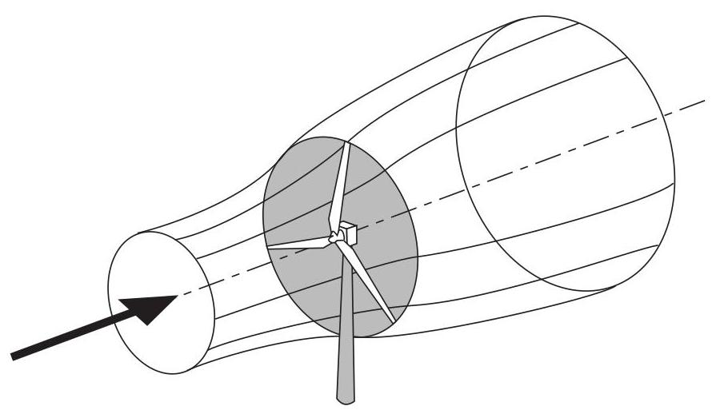

Figure 3.1 The energy extracting stream-tube of a wind turbine

The presence of the turbine causes the approaching air, upstream, gradually to slow down such that when the air arrives at the rotor disc its velocity is already lower than the free-stream wind speed. The stream-tube expands as a result of the slowing down and, because no work has yet been done on, or by, the air, its static pressure rises to absorb the decrease in kinetic energy.

As the air passes through the rotor disc, by design, there is a drop in static pressure such that, on leaving, the air is below the atmospheric pressure level. The air then proceeds downstream with reduced speed and static pressure: this region of the flow is called the 'wake'. Eventually, far downstream, the static pressure in the wake must return to the atmospheric level for equilibrium to be achieved. The rise in static pressure is at the expense of the kinetic energy and so causes an additional slowing down of the wind. Thus, between the far upstream and far wake conditions, no change in static pressure exists but there is a reduction in kinetic energy.

## 3.2 The actuator disc concept

The mechanism described above accounts for the extraction of kinetic energy but in no way explains what happens to that energy: it may well be put to useful work but some may be spilled back into the wind as turbulence and eventually be dissipated as heat.

Nevertheless, we can begin an analysis of the aerodynamic behaviour of wind turbines without any specific turbine design just by considering the energy extraction process. The general device that carries out this task is called an actuator disc (see Figure 3.2).

Upstream of the disc the stream-tube has a cross-sectional area smaller than that of the disc and an area larger than the disc downstream. The expansion of the stream-tube is because the mass flow rate must be the same everywhere. The mass of air which passes through a given cross-section of the stream-tube in a unit length of time is ${\rho AU}$ , where $\rho$ is the air density, $A$ is the cross-sectional area and $U$ is the flow velocity. The mass flow rate must be the same everywhere along the stream-tube and so

$$
\rho {A}_{\infty }{U}_{\infty } = \rho {A}_{D}{U}_{D} = \rho {A}_{W}{U}_{W} \tag{3.1}
$$

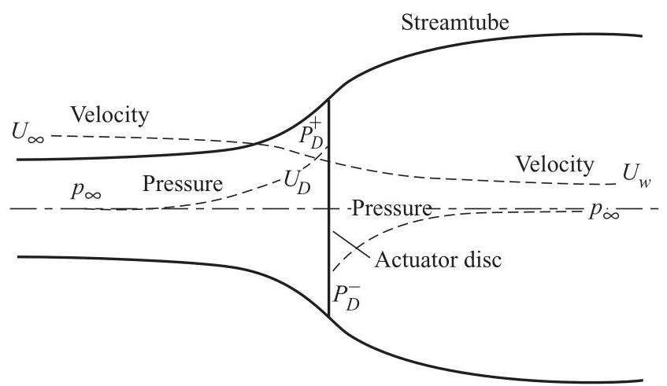

Figure 3.2 An energy extracting actuator disc and stream-tube

The symbol $\infty$ refers to conditions far upstream, $D$ refers to conditions at the disc and $W$ refers to conditions in the far wake.

It is usual to consider that the actuator disc induces a velocity variation which must be superimposed on the free stream velocity. The stream-wise component of this induced flow at the disc is given by $- a{U}_{\infty }$ , where $a$ is called the axial flow induction factor, or the inflow factor. At the disc, therefore, the net stream-wise velocity is

$$
{U}_{D} = {U}_{\infty }\left( {1 - a}\right) \tag{3.2}
$$

### 3.2.1 Simple momentum theory

The air that passes through the disc undergoes an overall change in velocity, ${U}_{\infty } - {U}_{W}$ and a rate of change of momentum equal to the overall change of velocity times the mass flow rate:

$$
\text{ Rate of change of momentum } = \left( {{U}_{\infty } - {U}_{W}}\right) \rho {A}_{D}{U}_{D} \tag{3.3}
$$

The force causing this change of momentum comes entirely from the pressure difference across the actuator disc because the stream-tube is otherwise completely surrounded by air at atmospheric pressure, which gives zero net force.

Therefore,

$$
\left( {{p}_{D}^{ + } - {p}_{D}^{ - }}\right) {A}_{D} = \left( {{U}_{\infty } - {U}_{W}}\right) \rho {A}_{D}{U}_{\infty }\left( {1 - a}\right) \tag{3.4}
$$

To obtain the pressure difference $\left( {{p}_{D}^{ + } - {p}_{D}^{ - }}\right)$ Bernoulli’s equation is applied separately to the upstream and downstream sections of the stream-tube: separate equations are necessary because the total energy is different upstream and downstream. Bernoulli's equation states that, under steady conditions, the total energy in the flow, comprising kinetic energy, static pressure energy and gravitational potential energy, remains constant provided no work is done on or by the fluid. Thus, for a unit volume of air,

$$
\frac{1}{2}\rho {U}^{2} + p + {\rho gh} = \text{ const } \tag{3.5}
$$

Upstream, therefore, we have

$$
\frac{1}{2}{\rho }_{\infty }{U}_{\infty }^{2} + {p}_{\infty } + {\rho }_{\infty }g{h}_{\infty } = \frac{1}{2}{\rho }_{D}{U}_{D}^{2} + {p}_{D}^{ + } + {\rho }_{D}g{h}_{D} \tag{3.6}
$$

Assuming the flow to be incompressible $\left( {{\rho }_{\infty } = {\rho }_{D}}\right.$ ) and horizontal $\left( {{h}_{\infty } = {h}_{D}}\right)$ then,

$$
\frac{1}{2}\rho {U}_{\infty }^{2} + {p}_{\infty } = \frac{1}{2}\rho {U}_{D}^{2} + {p}_{D}^{ + } \tag{3.6a}
$$

Similarly, downstream,

$$
\frac{1}{2}\rho {U}_{W}^{2} + {p}_{\infty } = \frac{1}{2}\rho {U}_{D}^{2} + {p}_{D}^{ - } \tag{3.6b}
$$

Subtracting these equations we obtain

$$
\left( {{p}_{D}^{ + } - {p}_{D}^{ - }}\right)  = \frac{1}{2}\rho \left( {{U}_{\infty }^{2} - {U}_{W}^{2}}\right) \tag{3.6c}
$$

Equation 3.4 then gives

$$
\frac{1}{2}\rho \left( {{U}_{\infty }^{2} - {U}_{W}^{2}}\right) {A}_{D} = \left( {{U}_{\infty } - {U}_{W}}\right) \rho {A}_{D}{U}_{\infty }\left( {1 - a}\right) \tag{3.7}
$$

and so,

$$
{U}_{W} = \left( {1 - {2a}}\right) {U}_{\infty } \tag{3.8}
$$

That is, half the axial speed loss in the stream-tube takes place upstream of the actuator disc and half downstream.

### 3.2.2 Power coefficient

The force on the air becomes, from Equation 3.4

$$
T = \left( {{p}_{D}^{ + } - {p}_{D}^{ - }}\right) {A}_{D} = {2\rho }{A}_{D}{U}_{\infty }^{2}a\left( {1 - a}\right) \tag{3.9}
$$

As this force is concentrated at the actuator disc the rate of work done by the force is $T{U}_{D}$ and hence the power extraction from the air is given by

$$
\text{ Power } = T{U}_{D} = {2\rho }{A}_{D}{U}_{\infty }^{3}a{\left( 1 - a\right) }^{2} \tag{3.10}
$$

A power coefficient is then defined as

$$
{C}_{P} = \frac{\text{ Power }}{\frac{1}{2}\rho {U}_{\infty }^{3}{A}_{D}} \tag{3.11}
$$

where the denominator represents the power available in the air, in the absence of the actuator disc.

Therefore,

$$
{C}_{P} = {4a}{\left( 1 - a\right) }^{2} \tag{3.12}
$$

### 3.2.3 The Lanchester-Betz limit

The maximum value of ${C}_{P}$ occurs when

$$
\frac{d{C}_{P}}{da} = 4\left( {1 - a}\right) \left( {1 - {3a}}\right)  = 0
$$

that gives a value of $a = \frac{1}{3}$

Hence,

$$
{C}_{{P}_{\max }} = \frac{16}{27} = {0.593} \tag{3.13}
$$

The maximum achievable value of the power coefficient is known as the Lanchester-Betz limit after Frederic Lanchester (1915), a British aeronautical pioneer, and Albert Betz (1919) the German aerodynamicist. To date, no wind turbine has been designed that is capable of exceeding the Lanchester-Betz limit. The limit is caused not by any deficiency in design because, as yet in our discussion, we have no design. However, because the stream-tube has to expand upstream of the actuator disc the cross-section of the tube where the air is at the full, free-stream velocity is smaller than the area of the disc.

${C}_{P}$ could, perhaps, more fairly be defined as

$$
{C}_{P} = \frac{\text{ Power } \cdot  \text{ extracted }}{\text{ Power } \cdot  \text{ available }} = \frac{\text{ Power } \cdot  \text{ extracted }}{\frac{16}{27}\left( {\frac{1}{2}\rho {U}_{\infty }^{3}{A}_{D}}\right) } \tag{3.14}
$$

but this not the accepted definition of ${C}_{P}$ .

### 3.2.4 The thrust coefficient

The force on the actuator disc caused by the pressure drop, given by Equation 3.9, can also be non-dimensionalised to give a coefficient of thrust ${C}_{T}$

$$
{C}_{T} = \frac{\text{ Thrust }}{\frac{1}{2}\rho {U}_{\infty }^{2}{A}_{D}} \tag{3.15}
$$

$$
{C}_{T} = {4a}\left( {1 - a}\right) \tag{3.16}
$$

Figure 3.3 Variation of ${C}_{P}$ and ${C}_{T}$ with axial induction factor $a$

A problem arises for values of $a \geq  \frac{1}{2}$ because the wake velocity, given by $\left( {1 - {2a}}\right) {U}_{\infty }$ , becomes zero, or even negative: in these conditions the momentum theory, as described, no longer applies and an empirical modification has to be made (Section 3.6).

The variation of power coefficient and thrust coefficient with $a$ is shown in Figure 3.3.

## 3.3 Rotor disc theory

The manner in which the extracted energy is converted into usable energy depends upon the particular turbine design. Most wind energy converters employ a rotor with a number of blades rotating with an angular velocity $\Omega$ about an axis normal to the rotor plane and parallel to the wind direction. The blades sweep out a disc and, by virtue of their aerodynamic design, develop a pressure difference across the disc, which, as discussed in the previous section, is responsible for the loss of axial momentum in the wake. Associated with the loss of axial momentum is a loss of energy that can be collected by, say, an electrical generator attached to the rotor shaft. As well as a thrust, the rotor experiences a torque in the direction of rotation that will oppose the torque that the generator exerts. The work done by the aerodynamic torque on the generator is converted into electrical energy. The required aerodynamic design of the rotor blades to provide a torque as well as a thrust is discussed in Section 3.5.

### 3.3.1 Wake rotation

The exertion of a torque on the rotor disc by the air passing through it requires an equal and opposite torque to be imposed upon the air. The consequence of the reaction torque is to cause the air to rotate in a direction opposite to that of the rotor; the air gains angular momentum and so in the wake of the rotor disc the air particles have a velocity component in a direction which is tangential to the rotation as well as an axial component (see Figure 3.4).

The acquisition of the tangential component of velocity by the air means an increase in its kinetic energy that is compensated for by a fall in the static pressure of the air in the wake in addition to that which is described in the previous section.

The flow entering the actuator disc has no rotational motion at all. The flow exiting the disc does have rotation and that rotation remains constant as the fluid progresses down the wake. The transfer of rotational motion to the air takes place entirely across the thickness of the disc (see Figure 3.5). The change in tangential velocity is expressed in terms of a tangential flow induction factor ${a}^{\prime }$ . Upstream of the disc the tangential velocity is zero. Immediately downstream of the disc the tangential velocity is ${2r\Omega }{a}^{\prime }$ . At the middle of the disc thickness, a radial distance $r$ from the axis of rotation, the induced tangential velocity is ${r\Omega }{a}^{\prime }$ . Because it is produced in reaction to the torque the tangential velocity is opposed to the motion of the rotor.

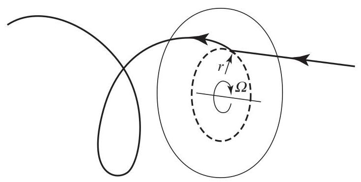

Figure 3.4 The trajectory of an air particle passing through the rotor disc

An abrupt acquisition of tangential velocity cannot occur in practice and must be gradual. Figure 3.5 shows the flow accelerating in the tangential direction as it is 'squeezed' between the blades: the separation of the blades has been reduced for effect, but it is the increasing solid blockage that the blades present to the flow close to the blade roots that causes high values of tangential velocity.

Figure 3.5 Tangential velocity grows across the disc thickness

### 3.3.2 Angular momentum theory

The tangential velocity will not be the same for all radial positions and it may well also be that the axial induced velocity is not the same. To allow for variation of both induced velocity components consider only an annular ring of the rotor disc which is of radius $r$ and of radial width ${\delta r}$ .

The increment of rotor torque acting on the annular ring will be responsible for imparting the tangential velocity component to the air, whereas the axial force acting on the ring will be responsible for the reduction in axial velocity. The whole disc comprises a multiplicity of annular rings and each ring is assumed to act independently in imparting momentum only to the air that actually passes through the ring.

The torque on the ring will be equal to the rate of change of angular momentum of the air passing through the ring.

Thus, torque $=$ rate of change of angular momentum $=$ mass flow rate $\times$ change of tangential velocity $\times$ radius

$$
{\delta Q} = {\rho \delta }{A}_{D}{U}_{\infty }\left( {1 - a}\right) {2\Omega }{a}^{\prime }{r}^{2} \tag{3.17}
$$

where $\delta {A}_{D}$ is taken as being the area of an annular ring.

The driving toque on the rotor shaft is also ${\delta Q}$ and so the increment of rotor shaft power output is

$$
{\delta P} = {\delta Q\Omega }
$$

The total power extracted from the wind by slowing it down is, therefore, determined by the rate of change of axial momentum given by Equation 3.10 in Section 3.2.2

$$
{\delta P} = {2\rho \delta }{A}_{D}{U}_{\infty }^{3}{\left( 1 - a\right) }^{2}
$$

Hence,

$$
{2\rho \delta }{A}_{D}{U}_{\infty }^{3}a{\left( 1 - a\right) }^{2} = {\rho \delta }{A}_{D}{U}_{\infty }\left( {1 - a}\right) 2{\Omega }^{2}{a}^{\prime }{r}^{2}
$$

and

$$
{U}_{\infty }^{2}a\left( {1 - a}\right)  = {\Omega }^{2}{r}^{2}{a}^{\prime }
$$

$r$ is the tangential velocity of the spinning annular ring and so ${\lambda }_{r} = {r\Omega }/{U}_{\infty }$ is called the local speed ratio. At the edge of the disc $r = R$ and $\lambda  = {R\Omega }/{U}_{\infty }$ is known at the tip speed ratio.

Thus,

$$
a\left( {1 - a}\right)  = {\lambda }_{r}^{2}{a}^{\prime } \tag{3.18}
$$

The area of the ring is $\delta {A}_{D} = {2\pi r\delta r}$ , therefore, the incremental shaft power is, from Equation 3.17,

$$
{\delta P} = {\delta Q\Omega } = \left( {\frac{1}{2}\rho {U}_{\infty }^{3}{2\pi r\delta r}}\right) 4{a}^{\prime }\left( {1 - a}\right) {\lambda }_{r}^{2}
$$

The term in brackets represents the power flux through the annulus, the term outside the brackets, therefore, is the efficiency of the blade element in capturing the power.

Blade element efficiency

$$
{\eta }_{r} = 4{a}^{\prime }\left( {1 - a}\right) {\lambda }_{r}^{2} \tag{3.19}
$$

In terms of power coefficient

$$
\frac{d{C}_{P}}{dr} = \frac{{4\pi \rho }{U}_{\infty }^{3}\left( {1 - a}\right) {a}^{\prime }{\lambda }_{r}^{2}r}{\frac{1}{2}\rho {U}_{\infty }^{3}\pi {R}^{2}} = \frac{8\left( {1 - a}\right) {a}^{\prime }{\lambda }_{r}^{2}r}{{R}^{2}}
$$

$$
\frac{d{C}_{P}}{d\mu } = 8\left( {1 - a}\right) {a}^{\prime }{\lambda }^{2}{\mu }^{3} \tag{3.20}
$$

where $\mu  = r/R$ .

Knowing how $a$ and ${a}^{\prime }$ vary radially, Equation 3.20 can be integrated to determine the overall power coefficient for the disc for a given tip speed ratio $\lambda$ .

It was argued by Glauert (1935b) that the rotation in the wake required energy that is taken from the flow and is unavailable for extraction; but this can be shown not to be the case. The lift forces on the blades forming the rotor disc are normal to the resultant velocity relative to the blades and so no work is done on or by the fluid. Therefore, Bernoulli's theorem can be applied to the flow across the disc, relative to the disc spinning at angular velocity $\Omega$ , to give

$$
\frac{1}{2}\rho {U}_{\infty }^{2}{\left( 1 - a\right) }^{2} + \frac{1}{2}\rho {\Omega }^{2}{r}^{2} + \frac{1}{2}\rho {w}^{2} + {p}_{D}^{ + }
$$

$$
= \frac{1}{2}\rho {U}_{\infty }^{2}{\left( 1 - a\right) }^{2} + \frac{1}{2}\rho {\Omega }^{2}{\left( 1 + 2{a}^{\prime }\right) }^{2}{r}^{2} + \frac{1}{2}\rho {w}^{2} + {p}_{D}^{ - }
$$

Consequently,

$$
\Delta {p}_{d} = {2\rho }{\Omega }^{2}\left( {1 + {a}^{\prime }}\right) {a}^{\prime }{r}^{2}
$$

The pressure drop across the disc clearly has two sources. The first source

$$
\Delta {p}_{d1} = {2\rho }{\Omega }^{2}{a}^{\prime }{r}^{2} \tag{3.21}
$$

is shown to be, from Equation 3.18, the same as that given by Equation 3.9 in the simple momentum theory in which rotation plays no part. The second source is

$$
\Delta {p}_{d2} = {2\rho }{\Omega }^{2}{a}^{\prime 2}{r}^{2} \tag{3.22}
$$

$\Delta {p}_{d2}$ can be shown to be caused by a radial, static pressure gradient in the rotating wake that balances the centrifugal force on the rotating fluid.

$$
\frac{dp}{dr} = \rho {\left( 2\Omega {a}^{\prime }\right) }^{2}r
$$

The kinetic energy per unit volume of the rotating fluid in the wake is also equal to the drop in static pressure of Equation 3.22; and so the two are in balance and there is no loss of available kinetic energy.

The question arises, however, does the pressure drop of Equation 3.22 cause an additional thrust on the rotor disc? The answer is no, because whereas the pressure drop of Equation 3.21 applies only to points immediately downstream of the disc, with a positive axial pressure gradient between the disc and the fully developed wake (Figure 3.2), the pressure drop of Equation 3.22 applies to the entire wake and there is no pressure gradient causing a further slowing down of the axial velocity. If there is no change of axial momentum of the fluid there can be no corresponding force on the rotor because that would violate Newton's third law of motion! There appears to be an anomaly and it is probable that this is caused by the concept of an actuator disc itself because an actuator disc is not physically realisable.

However, the concept does produce useful results and is not to be dismissed.

### 3.3.3 Maximum power

The values of $a$ and ${a}^{\prime }$ which will provide the maximum possible efficiency can be determined by differentiating Equation 3.19 by either factor and putting the result equal to zero.

Whence

$$
\frac{da}{d{a}^{\prime }} = \frac{1 - a}{{a}^{\prime }} \tag{3.23}
$$

From Equation 3.18

$$
\frac{da}{d{a}^{\prime }} = \frac{{\lambda }_{r}^{2}}{1 - {2a}}
$$

giving

$$
{a}^{\prime }{\lambda }_{r}^{2} = \left( {1 - a}\right) \left( {1 - {2a}}\right) \tag{3.24}
$$

The combination of Equations 3.18 and 3.21 gives the required values of $a$ and ${a}^{\prime }$ which maximise the incremental power coefficient.

$$
a = \frac{1}{3}
$$

and

$$
{a}^{\prime } = \frac{a\left( {1 - a}\right) }{{\lambda }_{r}^{2}} \tag{3.25}
$$

The axial flow induction for maximum power extraction is the same as for the non-rotating wake case, that is, $a = \frac{1}{3}$ and is uniform over the entire disc. On the other hand ${a}^{\prime }$ varies with radial position.

From Equation 3.20 the maximum power is

$$
{C}_{P} = 8{\int }_{0}^{1}\left( {1 - a}\right) {a}^{\prime }{\lambda }^{2}{\mu }^{3}{d\mu }
$$

Substituting for the expressions in Equation 3.23

$$
{C}_{P} = 8{\int }_{0}^{1}\left( {1 - a}\right) \frac{a\left( {1 - a}\right) }{{\lambda }^{2}{\mu }^{2}}{\lambda }^{2}{\mu }^{3}{d\mu } = {4a}{\left( 1 - a\right) }^{2} = \frac{16}{27} \tag{3.26}
$$

Which is precisely the same as for the non-rotating wake case.

## 3.4 Vortex cylinder model of the actuator disc

### 3.4.1 Introduction

The momentum theory of Section 3.1 uses the concept of the actuator disc across which a pressure drop develops constituting the energy extracted by the rotor. In the rotor disc theory of Section 3.3 the actuator disc is depicted as being swept out by a multiplicity of aerofoil blades each with radially uniform bound circulation ${\Delta \Gamma }$ . From the tip of each blade a helical vortex of strength ${\Delta \Gamma }$ convects downstream with the local flow velocity. If the number of blades is assumed to be very large but the solidity of the total is finite and small then the accumulation of helical tip vortices will form the surface of a tube. As the number of blades approaches infinity the tube surface will become a continuous tubular vortex sheet (see Figure 3.6).

Figure 3.6 Helical vortex wake shed by rotor with three blades each with uniform circulation ${\Delta \Gamma }$

Figure 3.7 Simplified helical vortex wake ignoring wake expansion

From the root of each blade, assuming it reaches to the axis of rotation, a line vortex of strength ${\Delta \Gamma }$ will extend downstream along the axis of rotation contributing to the total root vortex of strength $\Gamma$ . The vortex tube will expand in radius as the flow of the wake inside the tube slows down. Vorticity is confined to the surface of the tube, the root vortex and to the bound vortex sheet swept by the multiplicity of blades to form the rotor disc; elsewhere in the wake and everywhere else in the entire flow field the flow is irrotational (see Figure 3.7).

The nature of the tube's expansion cannot be determined by means of the momentum theory and so, as an approximation, the tube is allowed to remain cylindrical. The Biot-Savart law is used to determine the induced velocity at any point in the vicinity of the actuator disc. The cylindrical vortex model allows the whole flow field to be determined and is accurate within the limitations of the non-expanding cylindrical wake.

### 3.4.2 Vortex cylinder theory

The vortex cylinder has surface vorticity which follows a helical path with a helix angle ${\phi }_{t}$ or, as it has been termed previously, the flow angle at the outer edge of the disc. The strength of the vorticity is $g = {d\Gamma }/{dn}$ , where $n$ is a direction in the tube surface normal to the direction of ${\Delta \Gamma }$ , and has a component ${g}_{\theta } = g\cos {\phi }_{t}$ parallel to the rotor disc. Due to ${g}_{\theta }$ the axial (parallel to the axis of rotor rotation) induced velocity at the rotor plane is uniform over the rotor disc and can be determined by means of the Biot-Savart law as

$$
{u}_{d} =  - \frac{{g}_{\theta }}{2} =  - a{U}_{\infty } \tag{3.27}
$$

In the far wake the axial induced velocity is also uniform within the cylindrical wake and is

$$
{u}_{w} =  - {g}_{\theta } =  - {2a}{U}_{\infty } \tag{3.28}
$$

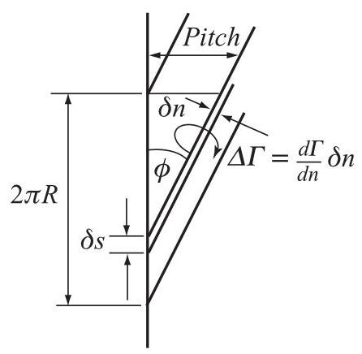

Figure 3.8 The geometry of the vorticity in the cylinder surface

The ratio of the two induced velocities corresponds to that of the simple momentum theory and justifies the assumption of a cylindrical vortex sheet.

### 3.4.3 Relationship between bound circulation and the induced velocity

The total circulation on all of the multiplicity of blades is $\Gamma$ which is shed at a uniform rate into the wake in one revolution. So, from Figure 3.8 in which the cylinder has been slit longitudinally and opened out flat,

$$
g = \frac{\Gamma }{{2\pi R}\sin {\phi }_{t}} \tag{3.29}
$$

hence,

$$
{g}_{\theta } = \frac{\Gamma }{2\pi R}\frac{\cos {\phi }_{t}}{\sin {\phi }_{t}} = \frac{\Gamma }{2\pi R}\frac{\Omega R}{{U}_{\infty }\left( {1 - a}\right) } \tag{3.30}
$$

therefore,

$$
{2a}{U}_{\infty } = \frac{\Gamma }{2\pi R}\frac{\Omega R}{{U}_{\infty }\left( {1 - a}\right) } \tag{3.31}
$$

So, the total circulation is related to the induced velocity factors

$$
\Gamma  = \frac{{4\pi }{U}_{\infty }^{2}a\left( {1 - a}\right) }{\Omega } \tag{3.32}
$$

### 3.4.4 Root vortex

Just as a vortex is shed from each blade tip a vortex is also shed from each blade root. If it is assumed that the blades extend to the axis of rotation, obviously not a practical option, then the root vortices will each be a line vortex running axially downstream from the centre of the disc. The direction of rotation of the all the root vortices will be the same forming a core, or root, vortex of total strength $\Gamma$ . The root vortex is primarily responsible for inducing the tangential velocity in the wake flow and in particular the tangential velocity on the rotor disc.

On the rotor disc surface the tangential velocity induced by the root vortex, given by the Biot-Savart law, is

$$
{a}^{\prime }{r\Omega } = \frac{\Gamma }{4\pi r}
$$

so

$$
{a}^{\prime } = \frac{\Gamma }{{4\pi }{r}^{2}\Omega } \tag{3.33}
$$

This relationship can also be derived from the momentum theory: the rate of change of angular momentum of the air which passes through an annulus of the disc of radius $r$ and radial width ${\delta r}$ is equal to the torque increment imposed upon the annulus

$$
{\delta Q} = \rho {U}_{\infty }\left( {1 - a}\right) {2\pi r2}{a}^{\prime }{r}^{2}{\Omega \delta r} \tag{3.34}
$$

The torque per unit span acting on all the blades is given by the Kutta-Joukowski theorem. The lift per unit radial width, $L$ , is

$$
L = \rho \left( {W \times  \Gamma }\right)
$$

where $\left( {W \times  \Gamma }\right)$ is a vector product

$$
{\delta Q} = {\rho W} \times  {\Gamma r}\sin {\phi }_{t}{\delta r} = {\rho \Gamma r}{U}_{\infty }\left( {1 - a}\right) {\delta r} \tag{3.35}
$$

Equating the two expressions for ${\delta Q}$ gives

$$
{a}^{\prime } = \frac{\Gamma }{{4\pi }{r}^{2}\Omega }
$$

Hence,

$$
{a}^{\prime } = \frac{{U}_{\infty }^{2}a\left( {1 - a}\right) }{{\lambda }_{r}^{2}} = \frac{a\left( {1 - a}\right) }{{\lambda }_{r}^{2}}
$$

At the outer edge of the disc the tangential induced velocity is

$$
{a}_{t}^{\prime } = \frac{a\left( {1 - a}\right) }{{\lambda }^{2}} \tag{3.36}
$$

Equation 3.36 is exactly the same as Equation 3.23 of Section 3.3.3.

### 3.4.5 Torque and power

The torque on an annulus of radius $r$ and radial width ${\delta r}$ is

$$
\frac{dQ}{dr}{\delta r} = {\rho W\Gamma r}\sin {\phi }_{t}{\delta r} = \frac{{\rho 4\pi r}{U}_{\infty }^{3}a{\left( 1 - a\right) }^{2}}{\Omega }{\delta r}
$$

$$
\frac{dQ}{dr} = \frac{\frac{1}{2}\rho {U}_{\infty }^{3}{2\pi r4a}{\left( 1 - a\right) }^{2}}{\Omega } \tag{3.37}
$$

The radial distribution of power is

$$
\frac{dP}{dr} = \Omega \frac{dQ}{dr} = \frac{1}{2}\rho {U}_{\infty }^{3}{2\pi r4a}{\left( 1 - a\right) }^{2} \tag{3.38}
$$

and, therefore, the total power is

$$
P = \frac{1}{2}\rho {U}_{\infty }^{3}\pi {R}^{2}{4a}{\left( 1 - a\right) }^{2} \tag{3.39}
$$

Power coefficient

$$
{C}_{P} = {4a}{\left( 1 - a\right) }^{2} = 4{a}_{t}^{\prime }\left( {1 - a}\right) {\lambda }^{2} \tag{3.40}
$$

Again a result that is identical to that predicted by the simple momentum theory.

What is particularly interesting is that the rotational flow in the wake makes no difference at all to the efficiency of the power extraction.

### 3.4.6 Axial flow field

The induced velocity in the wind-wise (axial) direction can be determined both upstream of the disc and downstream in the developing wake, as well as on the disc itself. The flow field (net velocity) is axi-symmetric and a radial cross-section is shown in Figure 3.9. Both radial and axial distances are divided by the disc radius with the axial distance being measured downstream from the disc and the radial distance being measured from the rotational axis. The velocity is divided by the wind speed.

The axial velocity within the wake is sharply lower than without and is radially uniform at the disc and in the far wake, just as the momentum theory predicts. There is a small acceleration of the flow immediately outside of the wake. The induced velocity on the wake cylinder itself is $\frac{1}{4}a$ at the disc and $\frac{1}{2}a$ in the far wake.

### 3.4.7 Tangential flow field

The tangential induced velocity is determined not only by the root vortex but also by the component of vorticity $g\sin {\phi }_{t}$ on the wake cylinder and the bound vorticity on the rotor disc. At a radial distance equal to half the disc radius, as an example, the axial variation of the three contributions are shown in Figure 3.10.

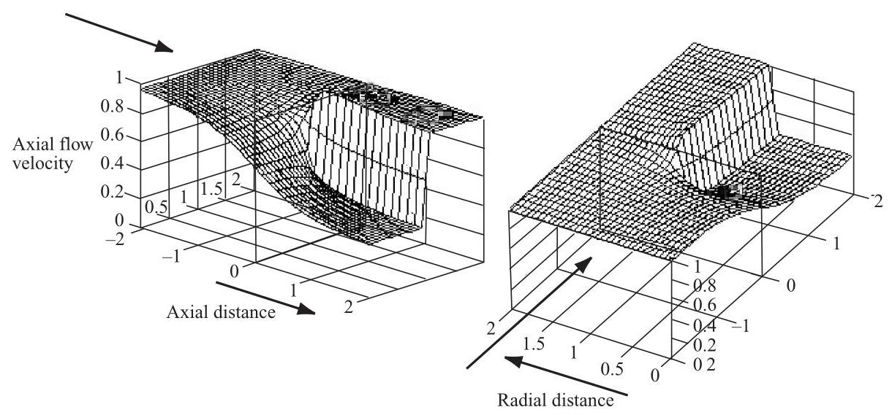

Figure 3.9 The radial and axial variation of axial velocity in the vicinity of an actuator disc, $a = \frac{1}{3}$

The bound vorticity causes rotation in opposite senses upstream and downstream of the disc with a step change across the disc. The upstream rotation, which is in the same sense as the rotor rotation, is nullified by the root vortex, which induces rotation in the opposite sense to that of the rotor. The downstream rotation is in the same sense for both the root vortex and the bound vorticity the stream-wise variations of the two summing to give a uniform velocity in the stream-wise sense. The vorticity located on the surface of the wake cylinder makes a small contribution.

Figure 3.10 The axial variation of tangential velocity in the vicinity of an actuator disc at 50% radius, $a = \frac{1}{3},\lambda  = 6$

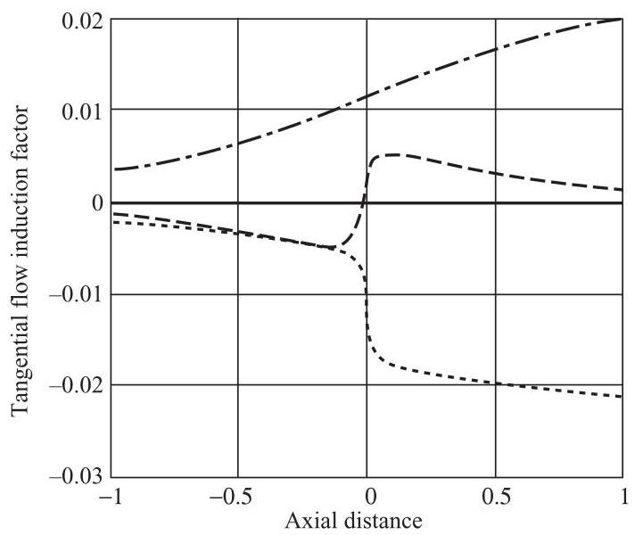

Figure 3.11 The axial variation of tangential velocity in the vicinity of an actuator disc at 101% radius, $a = \frac{1}{3},\lambda  = 6$

At the disc itself the bound vorticity induces no rotation, the wake cylinder induces no rotation either and so it is only the root vortex which does induce rotation and that value is half the total induced generally in the wake. It is now clear why only half the rotational velocity is used to determine the flow angle at the disc.

The rotational flow is confined to the wake, that is, inside the cylinder. There is no rotational flow anywhere outside of the wake, neither upstream of the disc or outside the cylinder. The rotational flow within the cylinder falls with increasing radius but is not zero at the outer edge of the wake; therefore, there is an abrupt fall of rotational velocity across the cylindrical surface.

The cylinder itself, therefore, rotates with angular velocity ${a}_{t}^{\prime }\Omega$ and so the rotation of the flow relative to the disc is $\left( {1 + {a}^{\prime }}\right) \Omega$ . It would seem that the flow angle ${\phi }_{t}$ should take the additional rotation into account but it is determined by the flow relative to the moving cylindrical surface for which the relative rotational velocity is just $\Omega {.}^{1}$

The contributions of the three vorticity sources to the rotational flow at a radius of 101% of the disc radius are shown in Figure 3.11: the total rotational flow is zero at all axial positions but the individual components are not zero.

### 3.4.8 Axial thrust

The axial thrust $T$ on the disc can be determined using the Kutta-Joukowski theorem

$$
\frac{dT}{dr} = {\rho \Gamma V}
$$

---

${}^{1}$ In the first edition of the Wind Energy Handbook the flow angle was determined, mistakenly, by including the rotation of the cylinder in the relative rotational velocity.

---

Figure 3.12 Flow field through an actuator disc for $a = \frac{1}{3}$

where $V$ is the tangential velocity component at the disc. If $V = {r\Omega }$ , then, using Equation 3.30

$$
\frac{dT}{dr} = {\rho 4\pi r}{U}_{\infty }^{2}a\left( {1 - a}\right) \tag{3.41}
$$

Integration of Equation 3.41 over the entire disc gives the thrust coefficient as

$$
{C}_{T} = {4a}\left( {1 - a}\right) \tag{3.42}
$$

That is, the same as for the simple momentum theory and so is in balance with the rate of change of axial momentum. However, if the induced tangential velocity ${a}^{\prime }{r\Omega }$ is included in $V$ , as might be assumed, the resulting thrust becomes infinite, or very much greater than the rate of change of axial momentum, and the necessary balance is lost.

### 3.4.9 Radial flow field

Although the vortex cylinder model has been simplified by not allowing the cylinder to expand, the theory nevertheless predicts flow expansion. A radial velocity distribution is predicted by the theory as shown in Figure 3.12 which shows a longitudinal section of the flow field through the rotor disc.

The radial velocity, as calculated, is greatest as the flow passes through the rotor disc and, although not shown in Figure 3.12, it is infinite at the edge of the disc. The situation is very similar to the determination of the potential flow field around a flat, solid, circular disc which is normal to the oncoming flow; an infinite radial velocity is predicted at the disc edge for the flow to pass around and continue radially inwards on the downstream side. In practice, there would be insufficient static pressure available to fuel an infinite, or even a very high, velocity and so some discontinuity in the flow must occur. The presence of even the smallest amount of viscosity would produce a thick boundary layer towards the disc edge because of the high radial velocity. The viscosity in the boundary layer would absorb much of the available energy and dissipate it as heat so that, as the flow accelerated around the disc edge, the maximum velocity attainable would be limited by the static pressure approaching zero. Instead of the flow moving around the edge it would separate from the edge and continue downstream leaving a very low pressure region behind the disc with very low velocity: a stagnant region.

In the case of the permeable rotor disc there would be some flow through the disc, which would behave as described above, but the separation of the flow at the disc edge would produce an additional low pressure in the wake.

The problem of the infinite radial velocity at the rotor disc edge arises because of the assumption of an infinite number of rotor blades. If the theory is modified such that there are only a few blades the infinite radial velocity disappears. However, if, for a given rotor, the tip speed ratio is increased, with a consequent increase of the axial flow induction factor, the radial velocity at the tip rises sharply and the problem of edge separation returns, which is what actually occurs (see Section 3.6).

### 3.4.10 Conclusions

Despite the exclusion of wake expansion the vortex theory produces results exactly in agreement with the momentum theory and enlightens understanding of the flow through an energy extracting actuator disc. However, the infinite radial velocity predicted at the outer edge of the disc is further evidence that the actuator disc is physically unrealisable.

## 3.5 Rotor blade theory (blade-element/momentum theory)

### 3.5.1 Introduction

The aerodynamic lift (and drag) forces on the span-wise elements of radius $r$ and length ${\delta r}$ of the several blades of a wind turbine rotor are responsible for the rate of change of axial and angular momentum of all of the air which passes through the annulus swept by the blade elements. In addition, the force on the blade elements caused by the drop in pressure associated with the rotational velocity in the wake must also be provided by the aerodynamic lift and drag. As there is no rotation of the flow approaching the rotor, the reduced pressure on the downwind side of the rotor caused by wake rotation appears as a step pressure drop just as is that which causes the change in axial momentum. Because the wake is still rotating in the far wake the pressure drop that caused the rotation is still present and so does not contribute to the axial momentum change.

### 3.5.2 Blade element theory

It is assumed that the forces on a blade element can be calculated by means of two-dimensional aerofoil characteristics using an angle of attack determined from the incident resultant velocity in the cross-sectional plane of the element; the velocity component in the span-wise direction is ignored. Three-dimensional effects are also ignored.

The velocity components at a radial position on the blade expressed in terms of the wind speed, the flow factors and the rotational speed of the rotor will determine the angle of attack. Having information about how the aerofoil characteristic coefficients ${C}_{l}$ and ${C}_{d}$ vary with the angle of attack, the forces on the blades for given values of $a$ and ${a}^{\prime }$ can be determined.

Figure 3.13 A blade element sweeps out an annular ring

Consider a turbine with B blades of tip radius $R$ each with chord $c$ and set pitch angle $\beta$ measured between the aerofoil zero lift line and the plane of the disc. Both the chord length and the pitch angle may vary along the blade span. Let the blades be rotating at angular velocity $\Omega$ and let the wind speed be ${U}_{\infty }$ . The tangential velocity experienced by the blade element shown in Figure 3.13 is, by the argument offered in Section 3.4.8 is ${r\Omega }$ . However, despite the validity of the reasoning in Section 3.4.8, it appears logical to combine the tangential velocity with that of the wake ${a}^{\prime }{r\Omega }$ giving a net tangential flow velocity experienced by the blade element as $\left( {1 + {a}^{\prime }}\right) {r\Omega }$ . In all of the literature available, particularly Glauert, it is the combined tangential velocity that is assumed to be correct and so it will be in this text, even though it has been demonstrated to be invalid in the case of the actuator disc. The actuator disc is infinitesimally thin and the change in tangential velocity is abrupt. The rotor blade 'disc', on the other hand has axial depth and the tangential velocity develops in a gradual manner, as demonstrated in Figure 3.5.

Figure 3.14 shows all the velocities and forces relative to the blade chord line at radius $r$ .

From Figure 3.14 the resultant relative velocity at the blade is

$$
W = \sqrt{{U}_{\infty }^{2}{\left( 1 - a\right) }^{2} + {r}^{2}{\Omega }^{2}{\left( 1 + {a}^{\prime }\right) }^{2}} \tag{3.43}
$$

that acts at an angle $\phi$ to the plane of rotation such that

$$
\sin \phi  = \frac{{U}_{\infty }\left( {1 - a}\right) }{W}\;\text{ and }\;\cos \phi  = \frac{{r\Omega }\left( {1 + {a}^{\prime }}\right) }{W} \tag{3.44}
$$

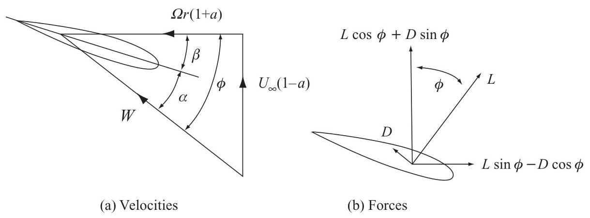

Figure 3.14 Blade element velocities and forces

The angle of attack $\alpha$ is then given by

$$
\alpha  = \phi  - \beta \tag{3.45}
$$

The basic assumption of the blade element theory is that the aerodynamic lift and drag forces acting upon an element are the same as those acting on an isolated, identical element at the same angle of attack in two-dimensional flow.

The lift force on a span-wise length ${\delta r}$ of each blade, normal to the direction of $W$ , is, therefore,

$$
{\delta L} = \frac{1}{2}\rho {W}^{2}c{C}_{l}{\delta r}
$$

and the drag force parallel to $W$ is

$$
{\delta D} = \frac{1}{2}\rho {W}^{2}c{C}_{d}{\delta r}
$$

The axial thrust on an annular ring of the actuator disc is

$$
{\delta T} = {\delta L}\cos \phi  + {\delta D}\sin \phi  = \frac{1}{2}\rho {W}^{2}{Bc}\left( {{C}_{l}\cos \phi  + {C}_{d}\sin \phi }\right) {\delta r} \tag{3.46}
$$

The torque on an annular ring is

$$
{\delta Q} = \left( {{\delta L}\sin \phi  - {\delta D}\cos \phi }\right) r = \frac{1}{2}\rho {W}^{2}{Bcr}\left( {{C}_{l}\sin \phi  - {C}_{d}\cos \phi }\right) {\delta r} \tag{3.47}
$$

where $B$ is the number of blades.

### 3.5.3 The blade-element/momentum (BEM) theory

The basic assumption of the BEM theory is that the force of a blade element is solely responsible for the change of axial momentum of the air which passes through the annulus swept by the element. It is, therefore, to be assumed that there is no radial interaction between the flows through contiguous annuli: a condition that is, strictly, only true if the axial flow induction factor does not vary radially. In practice, the axial flow induction factor is seldom uniform, but experimental examination of flow through propeller discs by Lock (1924) shows that the assumption of radial independence is acceptable.

Equating the axial thrust on all blade elements, given Equation 3.46 with the rate of change of axial momentum of the air that passes through the annulus swept out by the elements, given by Equation 3.9 with ${A}_{D} = {2\pi r\delta r}$

$$
{\delta T} = \frac{1}{2}\rho {W}^{2}{Bc}\left( {{C}_{l}\cos \phi  + {C}_{d}\sin \phi }\right) {\delta r} = {2\pi r\delta r\rho }{U}_{\infty }\left( {1 - a}\right) {2a}{U}_{\infty } \tag{3.48}
$$

Also equating the torque on the elements, given by Equation 3.47, with the rate of change of angular momentum of the air passing through the swept annulus, given by Equation 3.34,

$$
{\delta Q} = \frac{1}{2}\rho {W}^{2}{Bcr}\left( {{\delta L}\sin \phi  - {\delta D}\cos \phi }\right) {\delta r} = {2\pi r\delta r\rho }{U}_{\infty }\left( {1 - a}\right) 2{a}^{\prime }{r}^{2}\Omega \tag{3.49}
$$

If drag is eliminated from the above two equations, to make a comparison with the results of the vortex theory of Section 3, the flow angle $\phi$ can be determined

$$
\tan \phi  = \frac{{a}^{\prime }{r\Omega }}{a{U}_{\infty }} = \frac{{a}^{\prime }}{a}\frac{r}{R}\lambda
$$

However, from the velocity triangle at a blade element given by Equation 3.44 the flow angle is also

$$
\tan \phi  = \frac{1 - a}{{\lambda }_{r}\left( {1 + {a}^{\prime }}\right) }
$$

Equating the two above expressions for $\tan \phi$

$$
\frac{{a}^{\prime }}{a}\frac{r}{R}\lambda  = \frac{1 - a}{{\lambda }_{r}\left( {1 + {a}^{\prime }}\right) }
$$

$$
a\left( {1 - a}\right)  = {\lambda }_{r}^{2}{a}^{\prime }\left( {1 + {a}^{\prime }}\right) \tag{3.50}
$$

At the outer edge of the rotor $\mu  = 1$ and ${a}^{\prime } = {a}_{t}^{\prime }$ , so

$$
a\left( {1 - a}\right)  = {\lambda }^{2}{a}_{t}^{\prime }\left( {1 + {a}_{t}^{\prime }}\right) \tag{3.50a}
$$

Equation 3.50a differs from Equation 3.36 by the additional term $\left( {1 + {a}_{t}^{\prime }}\right)$ . By the argument put forward in the last paragraph of Section 3.4.8 the inclusion of the additional term would result in an infinite thrust but, as previously stated, the inclusion of the term is the usual practice.

With drag included, the thrust Equation 3.48 can be reduced to

$$
\frac{{W}^{2}}{{U}_{\infty }^{2}}B\frac{c}{R}\left( {{C}_{l}\cos \phi  + {C}_{d}\sin \phi }\right)  = {8\pi a}\left( {1 - a}\right) \mu \tag{3.51}
$$

where the parameter $\mu  = r/R$ the torque Equation 3.49 simplifies to

$$
\frac{{W}^{2}}{{U}_{\infty }^{2}}N\frac{c}{R}\left( {{C}_{l}\sin \phi  - {C}_{d}\cos \phi }\right)  = {8\pi \lambda }{\mu }^{2}{a}^{\prime }\left( {1 - a}\right) \tag{3.52}
$$

It is convenient to put

$$
{C}_{l}\cos \phi  + {C}_{d}\sin \phi  = {C}_{x} \tag{3.53}
$$

and

$$
{C}_{l}\sin \phi  - {C}_{d}\cos \phi  = {C}_{y}
$$

Solving Equations 3.51 and 3.52 to obtain values for the flow induction factors $a$ and ${a}^{\prime }$ using two-dimensional aerofoil characteristics requires an iterative process for which the following equations, derived from 3.51, 3.52 and 3.53, are convenient; in which the right hand sides are evaluated using existing values of the flow induction factors yielding simple equations for the next iteration of the flow induction factors.

$$
\frac{a}{1 - a} = \frac{{\sigma }_{r}}{4{\sin }^{2}\phi }{C}_{x}
$$

${\left( {3.54}\right) }^{2}$

$$
\frac{{a}^{\prime }}{1 + {a}^{\prime }} = \frac{{\sigma }_{r}{C}_{y}}{4\sin \phi \cos \phi } \tag{3.55}
$$

Blade solidity $\sigma$ is defined as total blade area divided by the rotor disc area and is a primary parameter in determining rotor performance. Chord solidity ${\sigma }_{r}$ is defined as the total blade chord length at a given radius divided by the circumferential length at that radius.

$$
{\sigma }_{r} = \frac{B}{2\pi r}\frac{c}{R} = \frac{B}{2\pi \mu }\frac{c}{R} \tag{3.56}
$$

It is argued by Wilson and Lissaman (1974) that the drag coefficient should not be included in Equations 3.54 and 3.55 because the velocity deficit caused by drag is confined to the narrow wake which flows from the trailing edge of the aerofoil. Furthermore, Wilson and Lissaman reason, the drag based velocity deficit is only a feature of the wake and does not contribute to the velocity deficit upstream of the rotor disc. The basis of the argument for excluding drag in the determination of the flow induction factors is that, for attached flow, drag is caused only by skin friction and does not affect the pressure drop across the rotor. Clearly, in stalled flow the drag is overwhelmingly caused by pressure. In attached flow it has been shown by Young and Squire (1938) that the modification to the inviscid pressure distribution around an aerofoil caused by the boundary layer has an effect both on lift and drag. The ratio of pressure drag to total drag at zero angle of attack is approximately the same as the thickness to chord ratio of the aerofoil and increases as the angle of attack increases.

---

${}^{2}$ Equation 3.54 is changed from that given in the first edition because the flow rotation is now properly accounted for.

---

One last point about the blade element-momentum theory: the theory is strictly only applicable if the blades have uniform circulation, that is, if $a$ is uniform. For non-uniform circulation there is a radial interaction and exchange of momentum between flows through adjacent elemental annular rings. It cannot be stated that the only axial force acting on the flow through a given annular ring is that due to the pressure drop across the disc.

However, in practice, it appears that the error involved in relaxing the above constraint is small for tip speed ratios greater than three.

### 3.5.4 Determination of rotor torque and power

The calculation of torque and power developed by a rotor requires knowledge of the flow induction factors, which are obtained by solving Equations 3.54 and 3.55. The solution is usually carried out iteratively because the two-dimensional aerofoil characteristics are nonlinear functions of the angle of attack.

To determine the complete performance characteristic of a rotor, that is, the manner in which the power coefficient varies over a wide range of tip speed ratio, requires the iterative solution.

The iterative procedure is to assume $a$ and ${a}^{\prime }$ to be zero initially, determining $\phi ,{C}_{l}$ and ${C}_{d}$ on that basis, and then to calculate new values of the flow factors using Equations 3.54 and 3.55. The iteration is repeated until convergence is achieved.

From Equation 3.51 the torque developed by the blade elements of span-wise length ${\delta r}$ is

$$
{\delta Q} = {4\pi \rho }{U}_{\infty }{\Omega r}{a}^{\prime }\left( {1 - a}\right) {r}^{2}{\delta r}
$$

If drag, or part of the drag, has been excluded from the determination of the flow induction factors then its effect must be introduced when the torque is calculated, see Equation 3.51,

$$
{\delta Q} = {4\pi \rho }{U}_{\infty }{\Omega r}{a}^{\prime }\left( {1 - a}\right) {r}^{2}{\delta r} - \frac{1}{2}\rho {W}^{2}{Bc}{C}_{d}\cos {\phi r\delta r}
$$

The complete rotor, therefore, develops a total torque $Q$ .

$$
Q = \frac{1}{2}\rho {U}_{\infty }^{2}\pi {R}^{3}\lambda {\int }_{0}^{R}{\mu }^{2}\left( {8{a}^{\prime }\left( {1 - a}\right) \mu  - \frac{W}{{U}_{\infty }}\frac{B\frac{c}{R}}{\pi }{C}_{d}\left( {1 + {a}^{\prime }}\right) }\right) {d\mu } \tag{3.57}
$$

The power developed by the rotor is

$$
P = {Q\Omega }
$$

Figure 3.15 Power coefficient - tip speed ratio performance curve

The power coefficient is, therefore,

$$
{C}_{P} = \frac{P}{\frac{1}{2}\rho {U}_{\infty }^{3}\pi {R}^{2}}
$$

Solving the blade element-momentum Equations 3.54 and 3.55 for a given, suitable blade geometrical and aerodynamic design yields a series of values for the power and torque coefficients which are functions of the tip speed ratio. A typical performance curve for a modern, high speed wind turbine is shown in Figure 3.15.

The maximum power coefficient occurs at a tip speed ratio for which the axial flow induction factor $a$ , which in general varies with radius, approximates most closely to the Lanchester-Betz limit value of $\frac{1}{3}$ . At lower tip speed ratios the axial flow induction factor can be much less than $\frac{1}{3}$ and aerofoil angles of attack are high leading to stalled conditions. For most wind turbines stalling is much more likely to occur at the blade root because, from practical constraints, the built-in pitch angle $\beta$ of a blade is not large enough in that region. At low tip speed ratios blade stalling is the cause of a significant loss of power, as demonstrated in Figure 3.15. At high tip speed ratios $a$ is high, angles of attack are low and drag begins to predominate. At both high and low tip speed ratios, therefore, drag is high and the general level of $a$ is non-optimum so the power coefficient is low. Clearly, it would be best if a turbine can be operated at all wind speeds at a tip speed ratio close to that which gives the maximum power coefficient.

## 3.6 Breakdown of the momentum theory

### 3.6.1 Free-stream/wake mixing

For heavily loaded turbines, when $a$ is high, the momentum theory predicts a reversal of the flow in the wake. Such a situation cannot actually occur, so, what happens is that the wake becomes turbulent and, in doing so, entrains air from outside the wake by a mixing process which re-energises the slow moving air that has passed through the rotor.

A rotor operating at increasingly high tip speed ratios presents a decreasingly permeable disc to the flow. Eventually, when $\lambda$ is high enough for the axial flow factor to be equal to one, the disc effectively becomes a solid plate.

The flow past a solid disc, because of viscosity, separates at the disc's edge. A boundary layer develops as the flow over the front of the disc spreads out radially and by the time it reaches the edge viscosity has sapped much of the kinetic energy. As the boundary layer flows around the disc edge it accelerates causing a large drop in static pressure (Bernoulli). To flow around the disc edge would require very high velocity and there is insufficient static pressure to provide the necessary kinetic energy. The flow, therefore, separates from the disc and continues in the general stream-wise direction. In the region directly behind the disc there is slow moving, almost stagnant, air at low static pressure of the flow separating at the disc edge. At the front of the disc, at the very centre, the flow is brought to rest and so there is a large increase in static pressure as the kinetic energy is converted to pressure energy. Elsewhere on the front surface the flow moves radially with a velocity, outside the boundary layer, which increases towards the disc edge. The static pressure is generally higher on the front of the disc than on the rear and so the disc experiences a pressure drag force.

A similar process happens with a spinning rotor at high tip speed ratios. The air which does not pass through the rotor disc moves radially outwards and separates at the disc edge causing a low static pressure to develop behind the disc: the drop in static pressure caused by the separation increases as the tip speed ratio rises and the axial flow factor increases. The air which does pass through the rotor emerges into a low pressure region and is moving slowly. There is insufficient kinetic energy to provide the rise in static pressure necessary to achieve the ambient atmospheric pressure that must exist in the far wake. The air can only achieve atmospheric pressure by gaining energy from the mixing process in the turbulent wake. The shear layer in the flow between the free-stream air and the wake air is what becomes of the boundary layer that develops on the front of the disc. The shear layer is unstable and breaks up into the turbulence that causes the mixing and re-energisation of the wake air.

### 3.6.2 Modification of rotor thrust caused by flow separation

The low static pressure downstream of the rotor disc caused by the separation of the free-stream flow at the edge of the disc and the high static pressure at the stagnation point on the upstream side causes a large thrust on the disc, much larger than that predicted by the momentum theory. Some experimental results reported by Glauert (1926), for a whole rotor, can be seen in Figure 3.16 where the simple expression for the thrust force coefficient, as derived from the momentum theory ${C}_{T} = {4a}\left( {1 - a}\right)$ , is given for comparison.

The thrust (or drag) coefficient for a simple, flat circular plate is given by Hoerner (1965) as 1.17 but, as demonstrated in figure 3.16, the thrust on the rotating disc is higher. It might have been expected that when $a = 1$ the rotor would have the same thrust coefficient as the circular plate. The principal difference between the circular plate and the rotor is that the latter is rotating and, as Hoerner also describes, this causes energy to be dissipated in a thicker, rotating boundary layer on the upstream surface of the rotor disc giving rise to an even lower pressure on the downstream side.

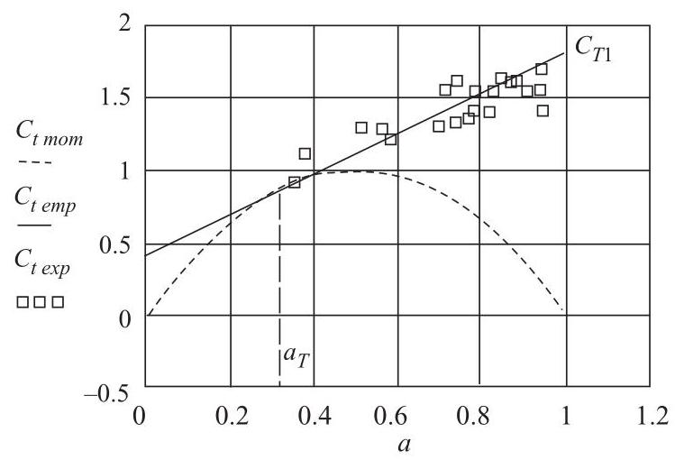

Figure 3.16 Comparison of theoretical and measured values of ${C}_{T}$

It would follow from the above arguments that for high values of the axial induction factor most of the pressure drop across the disc is not associated with blade circulation, just as it is absent in the case of the circular plate. Circulation would cause a small pressure drop similar to that given by the momentum theory because it would be determined by the very low axial velocity of the flow which actually permeates the disc.

### 3.6.3 Empirical determination of thrust coefficient

A suitable straight line through the experimental points would appear to be possible, although Glauert proposed a parabolic curve, and provides an empirical solution to the problem of the thrust on a heavily loaded turbine (a rotor operating at a high value of the axial flow induction factor).

Most authors assume that the entire thrust on the rotor disc is associated with axial momentum change. Therefore, for the empirical line to be useful it must be assumed that it applies not only to the whole rotor but also to each separate stream-tube. Let ${C}_{T1}$ be the empirical value of ${C}_{T}$ when $a = 1$ . Then, as the straight line must be a tangent to the momentum theory parabola at the transition point, the equation for the line is

$$
{C}_{T} = {C}_{T1} - 4\left( {{\sqrt{C}}_{T1} - 1}\right) \left( {1 - a}\right) \tag{3.58}
$$

and the value of $a$ at the transition point is

$$
{a}_{T} = 1 + \frac{1}{2}\sqrt{{C}_{T1}}
$$

By inspection, ${C}_{T1}$ must lie between 1.6 and 2: ${C}_{T1} = {1.816}$ would appear to be the best fit to the experimental data of Figure 3.16, whereas Wilson and Lissaman (1974) favour the lower value of ${C}_{T1} = {1.6}$ . Glauert fits a parabolic curve to the data giving much higher values of ${C}_{T1}$ at high values of $a$ but he was considering the case of an airscrew in the windmill brake state where the angles of attack are negative.

The flow field through the turbine under heavily loaded conditions cannot be modelled easily and the results of this empirical analysis must be regarded as being only approximate at best. They are, nevertheless, better than those predicted by the momentum theory. For most practical designs the value of axial flow induction factor rarely exceeds 0.6 and for a well designed blade will be in the vicinity of 0.33 for much of its operational range.

For values of $a$ greater than ${a}_{T}$ it is common to replace the momentum theory thrust in Equation 3.9 with Equation 3.58, in which case Equation 3.54 is replaced by

$$
{\left( 1 - a\right) }^{2}\frac{{\sigma }_{r}}{{\sin }^{2}\phi }{C}_{x} + 4\left( {\sqrt{{C}_{T1}} - 1}\right) \left( {1 - a}\right)  - {C}_{T1} = 0 \tag{3.54a}
$$

However, as the additional pressure drop is caused by edge flow separation then this course of action is questionable and it may be more appropriate to retain Equation 3.53.

## 3.7 Blade geometry

### 3.7.1 Introduction

The purpose of most wind turbines is to extract as much energy from the wind as possible and each component of the turbine has to be optimised for that goal. Optimal blade design is influenced by the mode of operation of the turbine, that is, fixed rotational speed or variable rotational speed and, ideally, the wind distribution at the intended site. In practice engineering compromises are made but it is still necessary to know what would be the best design.

Optimising a blade design means maximising the power output and so a suitable solution to blade element-momentum equations (3.54 and 3.55) is necessary.

### 3.7.2 Optimal design for variable speed operation

A turbine operating at variable speed can maintain the constant tip speed ratio required for the maximum power coefficient to be developed regardless of wind speed. To develop the maximum possible power coefficient requires a suitable blade geometry the conditions for which will now be derived.

For a chosen tip speed ratio $\lambda$ the torque developed at each blade station is maximised if

$$
{8\pi \lambda }{\mu }^{2}\frac{d}{d{a}^{\prime }}{a}^{\prime }\left( {1 - a}\right)  = 0
$$

giving

$$
\frac{da}{d{a}^{\prime }} = \frac{1 - a}{{a}^{\prime }} \tag{3.59}
$$

From Equations 3.51 and 3.53a a relationship between the flow induction factors can be obtained.

Dividing Equations 3.51 and 3.53a

$$
\frac{\frac{{C}_{l}}{{C}_{d}}\tan \phi  - 1}{\frac{{C}_{l}}{{C}_{d}} + \tan \phi } = \frac{{\lambda \mu }{a}^{\prime }\left( {1 - a}\right) }{a\left( {1 - a}\right)  + {\left( {a}^{\prime }\lambda \mu \right) }^{2}} \tag{3.60}
$$

The flow angle $\phi$ is given by

$$
\tan \phi  = \frac{1 - a}{{\lambda \mu }\left( {1 + {a}^{\prime }}\right) } \tag{3.61}
$$

Substituting Equation 3.61 into Equation 3.60 gives

$$
\frac{\frac{{C}_{l}}{{C}_{d}}\frac{1 - a}{{\lambda \mu }\left( {1 + {a}^{\prime }}\right) } - 1}{\frac{{C}_{l}}{{C}_{d}} + \frac{1 - a}{{\lambda \mu }\left( {1 + {a}^{\prime }}\right) }} = \frac{{\lambda \mu }{a}^{\prime }\left( {1 - a}\right) }{a\left( {1 - a}\right)  + {\left( {a}^{\prime }\lambda \mu \right) }^{2}}
$$

Simplifying,

$$
\left\lbrack  {\frac{{C}_{l}}{{C}_{d}}\left( {1 - a}\right)  - {\lambda \mu }\left( {1 + {a}^{\prime }}\right) }\right\rbrack  \left\lbrack  {a\left( {1 - a}\right)  + {\left( {a}^{\prime }\lambda \mu \right) }^{2}}\right\rbrack
$$

$$
= \left\lbrack  {{\lambda \mu }\left( {1 + {a}^{\prime }}\right) \frac{{C}_{l}}{{C}_{d}} + \left( {1 - a}\right) }\right\rbrack  {\lambda \mu }{a}^{\prime }\left( {1 - a}\right) \tag{3.62}
$$

At this stage the process is made easier to follow if drag is ignored, Equation 3.62 then reduces to

$$
a\left( {1 - a}\right)  - {\lambda }^{2}{\mu }^{2}{a}^{\prime } = 0 \tag{3.62a}
$$

Differentiating Equation 3.62a with respect to ${a}^{\prime }$ gives

$$
\left( {1 - {2a}}\right) \frac{da}{d{a}^{\prime }} - {\lambda }^{2}{\mu }^{2} = 0 \tag{3.63}
$$

and substituting Equation 3.59 into 3.63

$$
\left( {1 - {2a}}\right) \left( {1 - a}\right)  - {\lambda }^{2}{\mu }^{2}{a}^{\prime } = 0 \tag{3.64}
$$

Equations 3.62a and 3.64, together, give the flow induction factors for optimised operation

$$
a = \frac{1}{3}\;\text{ and }\;{a}^{\prime } = \frac{a\left( {1 - a}\right) }{{\lambda }^{2}{\mu }^{2}} \tag{3.65}
$$

that agree exactly with the momentum theory prediction because no losses, such as aerodynamic drag, have been included and the number of blades is assumed to be large: every fluid particle which passes through the rotor disc interacts with a blade resulting in a uniform axial velocity over the area of the disc.

To achieve the optimum conditions the blade design has to be specific and can be determined from either of the fundamental Equations 3.51 and 3.53. Choosing Equation 3.53, because it is the simpler, and ignoring the drag the torque developed in optimised operation is

$$
{\delta Q} = {4\pi \rho }{U}_{\infty }{\Omega r}{a}^{\prime }\left( {1 - a}\right) {r}^{2}{\delta r} = {4\pi \rho }\frac{{U}_{\infty }^{3}}{\Omega }a{\left( 1 - a\right) }^{2}{r\delta r}
$$

The component of the lift per unit span in the tangential direction is, therefore,

$$
L\sin \phi  = {4\pi \rho }\frac{{U}_{\infty }^{3}}{\Omega }a{\left( 1 - a\right) }^{2}
$$

By the Kutta-Joukowski theorem the lift per unit span is

$$
L = {\rho W\Gamma }
$$

where $\Gamma$ is the sum of the individual blade circulations and $W$ is the component of incident velocity mutually perpendicular to both $\Gamma$ and $L$ .

Consequently,

$$
{\rho W\Gamma }\sin \phi  = {\rho \Gamma }{U}_{\infty }\left( {1 - a}\right)  = {4\pi \rho }\frac{{U}_{\infty }^{3}}{\Omega }a{\left( 1 - a\right) }^{2} \tag{3.66}
$$

so

$$
\Gamma  = {4\pi }\frac{{U}_{\infty }^{2}}{\Omega }a\left( {1 - a}\right) \tag{3.67}
$$

The circulation is therefore uniform along the blade span and this is a condition for optimised operation.

To determine the blade geometry, that is, how should the chord size vary along the blade and what pitch angle $\beta$ distribution is necessary, we must return to Equation 3.53a.

$$
\frac{{W}^{2}}{{U}_{\infty }^{2}}B\frac{c}{R}{C}_{l}\sin \phi  = {8\pi \lambda }{\mu }^{2}{a}^{\prime }\left( {1 - a}\right)
$$

substituting for $\sin \phi$ gives

$$
\frac{W}{{U}_{\infty }}B\frac{c}{R}{C}_{l}\left( {1 - a}\right)  = {8\pi \lambda }{\mu }^{2}{a}^{\prime }\left( {1 - a}\right) \tag{3.68}
$$

From which is derived

$$
\frac{B}{2\pi }\frac{c}{R} = \frac{{4\lambda }{\mu }^{2}{a}^{\prime }}{\frac{W}{{U}_{\infty }}{C}_{l}}
$$

The only unknown on the right hand side of the above equation is the value of the lift coefficient ${C}_{l}$ and so it is common to include it on the left side of the equation with the chord solidity as a blade geometry parameter. The lift coefficient can be chosen as that value which corresponds to the maximum lift/drag ratio ${C}_{l}/{C}_{d}$ as this will minimise drag losses: even though drag has been ignored in the determination of the optimum flow induction factors and blade geometry it cannot be ignored in the calculation of torque and power. Blade geometry also depends upon the tip speed ratio $\lambda$ so it is also included in the blade geometry parameter.

Hence,

$$
{\sigma }_{r}\lambda {C}_{l} = \frac{B}{2\pi }\frac{c}{R}\lambda {C}_{l} = \frac{4{\lambda }^{2}{\mu }^{2}{a}^{\prime }}{\sqrt{{\left( 1 - a\right) }^{2} + {\left( \lambda \mu \left( 1 + {a}^{\prime }\right) \right) }^{2}}} \tag{3.69}
$$

Introducing the optimum conditions of Equation 3.65

$$
{\sigma }_{r}\lambda {C}_{l} = \frac{\frac{8}{9}}{\sqrt{{\left\lbrack  1 - \frac{1}{3}\right\rbrack  }^{2} + {\lambda }^{2}{\mu }^{2}{\left\lbrack  1 + \frac{2}{9{\lambda }^{2}{\mu }^{2}}\right\rbrack  }^{2}}} \tag{3.69a}
$$

The parameter ${\lambda \mu }$ is called the local speed ratio and is equal to the tip speed ratio where $\mu  = 1$ .

If, for a given design, ${C}_{l}$ is held constant then Figure 3.17 shows the blade plan-form for increasing tip speed ratio. A high design tip speed ratio would require a long, slender blade (high aspect ratio) whilst a low design tip speed ratio would need a short, fat blade. The design tip speed ratio is that at which optimum performance is achieved. Operating a rotor at other than the design tip speed ratio gives a less than optimum performance, even in ideal drag free conditions.

In off-optimum operation the axial inflow factor is not uniformly equal to $\frac{1}{3}$ , in fact it is not uniform at all.

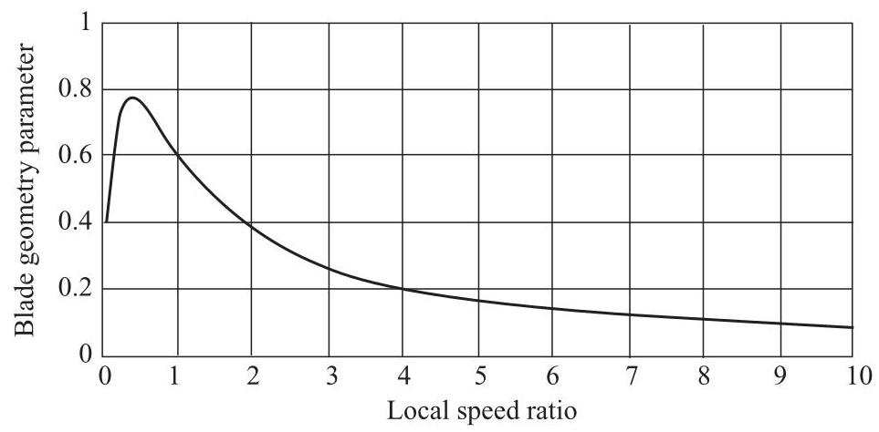

Figure 3.17 Variation of blade geometry parameter with local speed ratio

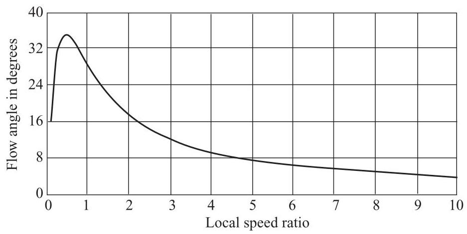

Figure 3.18 Variation of inflow angle with local speed ratio

The local inflow angle $\phi$ at each blade station also varies along the blade span as shown in Equation 3.70 and Figure 3.18.

$$
\tan \phi  = \left\lbrack  \frac{1 - a}{{\lambda \mu }\left( {1 + {a}^{\prime }}\right) }\right\rbrack \tag{3.70}
$$

which, for optimum operation, is

$$
\tan \phi  = \left\lbrack  \frac{1 - \frac{1}{3}}{{\lambda \mu }\left( {1 + \frac{2}{9{\lambda }^{2}{\mu }^{2}}}\right) }\right\rbrack \tag{3.70a}
$$

Close to the blade root the inflow angle is large which could cause the blade to stall in that region. If the lift coefficient is to be held constant such that drag is minimised everywhere then the angle of attack $\alpha$ also needs to be uniform at the appropriate value. For a prescribed angle of attack variation the design pitch angle $\beta  = \phi  - \alpha$ of the blade must vary accordingly.

As an example, suppose that the blade aerofoil is NACA 4412, popular for hand-built wind turbines because the bottom (high pressure) side of the profile is almost flat which facilitates manufacture. At a Reynolds number of about $5 \cdot  {10}^{5}$ the maximum lift/drag ratio occurs at a lift coefficient of about 0.7 and an angle of attack of about ${3}^{ \circ  }$ . Assuming that both ${C}_{l}$ and $\alpha$ are to be held constant along each blade and there are to be three blades operating at a tip speed ratio of 6 then the blade design in plan-form and pitch (twist) variation are shown in Figures 3.19a, b, respectively.

### 3.7.3 A simple blade design

The blade design of Figure 3.19 is efficient but complex to build and, therefore, costly. Suppose the plan-form was prescribed to have a uniform taper such that the outer part of the blade corresponds closely to Figure 3.19a. A straight line drawn through the 70% and 90% span points as shown in Figure 3.20 not only simplifies the plan-form but removes a lot of material close to the root.

Figure 3.19 Optimum blade design for three blades and $\lambda  = 6$

The expression for the new plan-form is

$$
{c}_{u} = \frac{8}{9 \cdot  {0.8\lambda }}\left( {2 - \frac{\lambda \mu }{0.8\lambda }}\right) \frac{2\pi }{{C}_{l}{\lambda B}} \tag{3.71}
$$

The 0.8 in Equation 3.71 refers to the 80% point, midway between the target points.

Equations 3.69a and 3.71 can be combined to give the required span-wise variation of ${C}_{l}$ for optimal operation.

$$
{C}_{l} = \frac{8}{9}\frac{1}{\frac{B{c}_{u}\lambda }{2\pi }\sqrt{{\left( 1 - \frac{1}{3}\right) }^{2} + {\lambda }^{2}{\mu }^{2}{\left( 1 + \frac{2}{9{\lambda }^{2}{\mu }^{2}}\right) }^{2}}}
$$

Figure 3.20 Uniform taper blade design for optimal operation

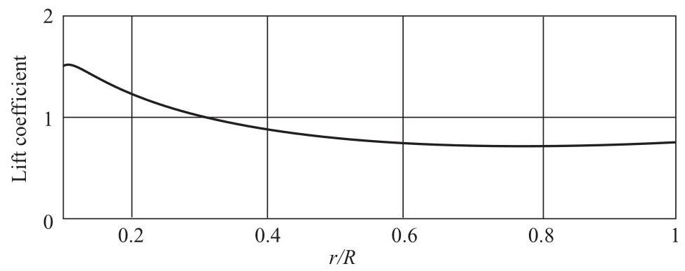

Figure 3.21 Span-wise distribution of the lift coefficient required for the linear taper blade

Close to the blade root the lift coefficient approaches the stalled condition and drag is high but the penalty is small because the adverse torque is small in that region (see Figure 3.21).

Assuming that stall does not occur and that for the aerofoil in question, which has a 4% camber (this approximates to a zero lift angle of attack of $- {4}^{ \circ  }$ ) the lift coefficient is given approximately by

$$
{C}_{l} = {0.1}\left( {\alpha  + {4}^{ \circ  }}\right)
$$

where $\alpha$ is in degrees and 0.1 is a good approximation to the gradient of the ${C}_{l}$ vs. $\alpha$ for most aerofoils, so

$$
\alpha  = \frac{{C}_{l}}{0.1} - {4}^{ \circ  }
$$

The blade twist distribution can now be determined from Equations 3.70a and 3.45.

The twist angle close to the root is still high but lower than for the constant ${C}_{l}$ blade (see Figure 3.22).

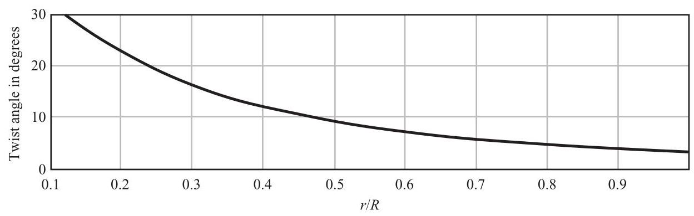

Figure 3.22 Span-wise distribution of the twist required for the linear taper blade

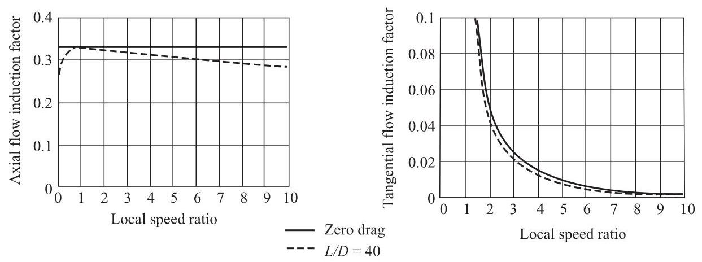

Figure 3.23 Radial variation of the flow induction factors with and without drag

### 3.7.4 Effects of drag on optimal blade design

If, despite the views of Wilson and Lissaman (1974) (see Section 3.5.3), the effects of drag are included in the determination of the flow induction factors we must return to Equation 3.48 and follow the same procedure as described for the drag free case.

In the current context the effects of drag are dependent upon the magnitude of the lift/drag ratio which, in turn, depends on the aerofoil profile but largely on Reynolds number and on the surface roughness of the blade. A high value of lift/drag ratio would be about 150 , whereas a low value would be about 40.

Unfortunately, with the inclusion of drag, the algebra of the analysis is complex. Polynomial equations have to be solved for both $a$ and ${a}^{\prime }$ . The details of the analysis are left for the reader to discover.

In the presence of drag, the axial flow induction factor for optimal operation is not uniform over the disc as it is in the hypothetical drag free situation. However, the departure of the axial flow distribution from uniformity is not great, even when the lift/drag ratio is low provided the flow around a blade remains attached.

The radial variation of the axial and tangential flow induction factors is shown in Figure 3.23 for zero drag and for a lift/drag ratio of 40 . The tangential flow induction factor is lower in the presence of drag than without because the blade drags the fluid around in the direction of rotation, opposing the general rotational reaction to the shaft torque.

From the torque/angular momentum Equation 3.53 the blade geometry parameter becomes

$$
\frac{B}{2\pi }\frac{c}{R}\lambda {C}_{l} = \frac{4{\lambda }^{2}{\mu }^{2}{a}^{\prime }\left( {1 - a}\right) }{\frac{W}{{U}_{\infty }}\left\lbrack  {\left( {1 - a}\right)  - \frac{{C}_{l}}{{C}_{d}}{\lambda \mu }\left( {1 + {a}^{\prime }}\right) }\right\rbrack  } \tag{3.72}
$$

Figure 3.24 compares the blade geometry parameter distributions for zero drag and a lift/drag ratio of 40 and, as is evident, drag has very little effect on blade optimal design.

A similar result is apparent in Figure 3.25 for the inflow angle, Figure 3.25, distribution where drag also has little influence.

As far as blade design for optimal operation is concerned drag can be ignored, greatly simplifying the process.

Figure 3.24 Span-wise variation of the blade geometry parameter with and without drag

The results of Equation 3.57 showing the maximum power coefficients for a range of design tip speed ratios and several lift/drag ratios is shown in Figure 3.26. The flow induction factors have been determined without drag (Equations 3.54 and 3.55) but the torque has been calculated using Equation 3.57, which includes drag. The losses caused by drag are significant and increase with increasing design tip speed ratio. As will be shown later, when tip-losses are also taken into account, the losses at low tip speed ratios are even greater.

### 3.7.5 Optimal blade design for constant speed operation

If the rotational speed of a turbine is maintained at a constant level then the tip speed ratio is continuously changing and a blade optimised for a fixed tip speed ratio would not be appropriate.

Figure 3.25 Variation of inflow angle with local speed ratio with and without drag.

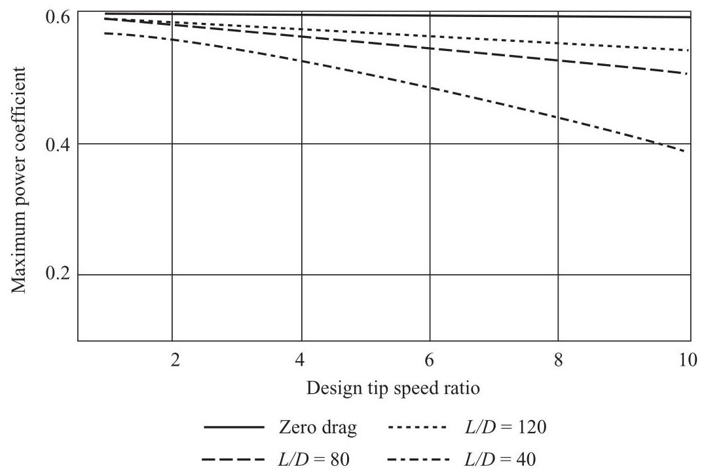

Figure 3.26 The variation of maximum ${C}_{P}$ with design $\lambda$ for various lift/drag ratios.

No simple technique is available for the optimal design of a blade operating at constant rotational speed. A non-linear programming method could be applied by maximising energy capture at a site with a specified wind speed distribution. Alternatively, a design tip speed ratio could be chosen which corresponds to the wind speed at the specified site which contains the most energy or, more practically, the pitch angle for the whole blade can be adjusted to maximise energy capture.

## 3.8 The effects of a discrete number of blades

### 3.8.1 Introduction

The analysis described in all prior sections assumes that there is a sufficient number of blades on the rotor for every fluid particle passing through the rotor disc to interact with a blade, that is, that all fluid particles undergo the same loss of momentum. With a small number of blades some fluid particles will interact with them but most will pass between the blades and, clearly, the loss of momentum by a particle will depend on its proximity to a blade as the particle passes through the rotor disc. The axial induced velocity will, therefore, at any instant, vary around the disc, the average value determining the overall axial momentum of the flow and the larger value local to a blade determining the forces on the blade.

### 3.8.2 Tip-losses

If the axial flow induction factor $a$ is large at the blade position then, by Equation 3.44, the inflow angle $\phi$ will be small and the lift force will be almost normal to the rotor plane. The component of the lift force in the tangential direction will be small and so will be its contribution to the torque. A reduced torque means reduced power and this reduction is known as tip-loss because the effect occurs only at the outermost parts of the blades.

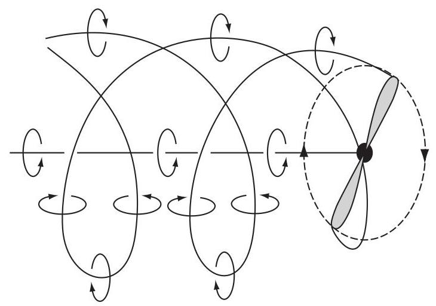

Figure 3.27 Helical trailing tip vortices of a horizontal axis turbine wake

In order to account for tip-losses, the manner in which the axial flow induction factor varies azimuthally needs to be known but, unfortunately, this requirement is beyond the abilities of the blade element-momentum theory.

Just as a vortex trails from the tip of an aircraft wing so does a vortex trail from the tip of a wind turbine blade. Because the blade tip follows a circular path it leaves a trailing vortex as a helical structure which convects downstream with the wake velocity. For a two blade rotor, unlike an aircraft wing, the bound circulations on the two blades shown in Figure 3.27 are opposite in sign and so combine to shed a straight line vortex along the rotational axis with strength equal to the blade circulation times the number of blades.

For a single vortex to be shed from the blade tip the circulation strength along the blade span must be uniform and, as has been shown, uniform circulation is a requirement for optimised operation. However, the uniform circulation requirement assumes that the axial flow induction factor is uniform across the disc and, as has been argued above, with discrete blades rather than a uniform disc the flow factor is not uniform.

In the case of Figure 3.27, close to the blade tips the tip vortex causes very high values of the flow factor $a$ such that, locally, the net flow past the blade is in the upstream direction. The average value of $a$ , azimuthally, is radially uniform which means that if high values occur in the vicinity of the blades then low values occur elsewhere. The azimuthal variation of $a$ for a number of radial positions is shown in Figure 3.28 for a three blade rotor operating at a tip speed ratio of six. The calculation for Figure 3.28 assumes a discrete vortex for each blade with a constant pitch and constant radius helix.

At a particular radial position the ratio of the azimuthal average of $a$ to the value at the azimuthal position where the blade is centred is shown in Figure 3.29, being unity for most of the blade span and only near the tip does it begin to fall to zero. The ratio is called 'the tip-loss factor'.

From Equation 3.20 and in the absence of tip-loss and drag the contribution of each blade element to the overall power coefficient is

$$
\delta {C}_{P} = 8{\lambda }^{2}{\mu }^{3}{a}^{\prime }\left( {1 - a}\right) {\delta \mu } \tag{3.73}
$$

Figure 3.28 Azimuthal variation of $a$ for various radial positions for a three blade rotor with uniform blade circulation operating at a tip speed ratio of six. The blades are at ${120}^{ \circ  },{240}^{ \circ  }$ and ${360}^{ \circ  }$ .

Substituting for ${a}^{\prime }$ from Equation 3.25 gives

$$
\delta {C}_{P} = {8\mu a}{\left( 1 - a\right) }^{2}{\delta \mu } \tag{3.74}
$$

Whereas, from the Kutta-Joukowski theorem, the circulation $\Gamma$ on the blade, which is uniform, provides a torque per unit span of

$$
\frac{dQ}{dr} = \rho \left( {W \times  \Gamma }\right) \sin {\phi }_{r}r
$$

where the angle ${\phi }_{r}$ is determined by the flow velocity local to the blade.

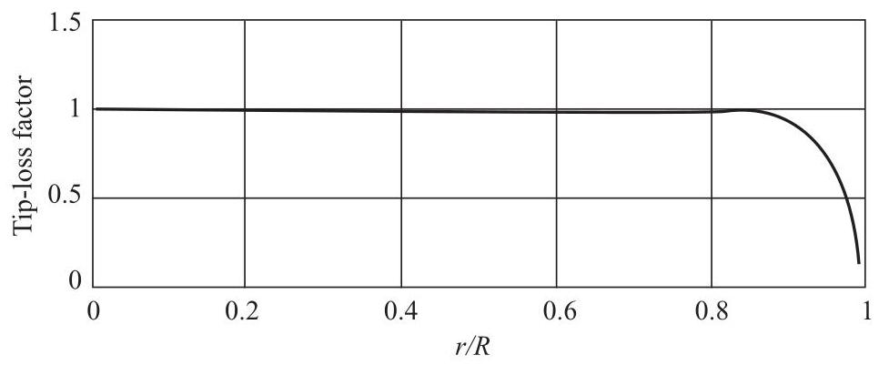

Figure 3.29 Span-wise variation of the tip-loss factor for a blade with uniform circulation

Figure 3.30 Span-wise variation of power extraction in the presence of tip-loss for a blade with uniform circulation on a three-blade turbine operating at a tip speed ratio of six

The strength of the total circulation for all three blades is given by Equation 3.67 and so, in the presence of tip-loss, the increment of power coefficient from a blade element is

$$
\delta {C}_{P} = {8\mu a}\left( {1 - a}\right) \left( {1 - {a}_{r}}\right) {\delta \mu } \tag{3.75}
$$

where $a = \frac{1}{3}$ is the average axial flow induction factor and ${a}_{r}$ is the value local to the blade, as described in Figure 3.33. In Equation 3.75 the term $\left( {1 - a}\right)$ refers to the mass flow through the annulus swept by a blade element and the term $\left( {1 - {a}_{r}}\right)$ refers to the loss of momentum experienced by the flow.

The results from Equations 3.73 and 3.74 are plotted in Figure 3.30 and clearly show the effect of tip-loss. Equation 3.70 assumes that $a = \frac{1}{3}$ uniformly over the whole disc, Equation 3.72 recognises that $a$ is not uniform. The azimuthally averaged value of $a$ is equal to $\frac{1}{3}$ at every radial position but the azimuth variation gives rise to the tip-loss. The blade does not extract energy from the flow efficiently because $a$ varies. Imagine the disc comprising a myriad of elemental discs, each with its own independent stream-tube, and not all of them operating at the Lanchester-Betz limit. Note that the power loss to the wind is exactly the same as that extracted by the blades, there is no effective drag associated with tip-loss.

With uniform circulation the azimuthal average value of $a$ is also radially uniform, but that implies a discontinuity of axial velocity at the wake boundary with a corresponding discontinuity in pressure. Whereas such discontinuities are acceptable in the idealised actuator disc situation, they will not occur in practice with a finite number of blades. If it is assumed that $a$ is zero outside of the wake then $a$ must fall to zero in a regular fashion towards the blade tips and, consequently, the bound circulation must also fall to zero. The manner in which the circulation varies at the tip will be governed by the blade tip design, that is, the chord and pitch variation, and there will be a certain design which will minimise the tip-loss.

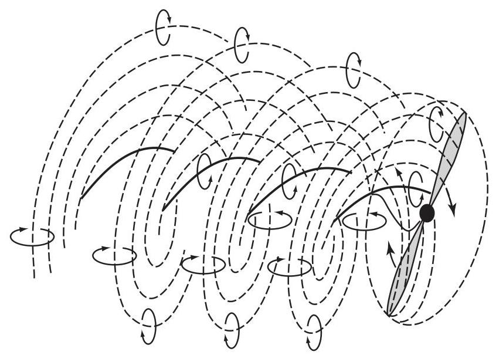

Figure 3.31 A helicoidal vortex sheet wake for a two-blade rotor

If the circulation varies along the blade span vorticity is shed into the wake in a continuous fashion from the trailing edge.

Therefore, each blade sheds a helicoidal sheet of vorticity, as shown in Figure 3.31, rather than a single helical vortex as shown in Figure 3.27. The helicoidal sheets convect with the wake velocity and so there can be no flow across the sheets, which can therefore be regarded as impermeable. The intensity of the vortex sheets is equal to the rate of change of bound circulation along the blade span and so increases rapidly towards the blade tips. There is flow around the blade tips because of the pressure difference between the blade surfaces, which means that on the upwind surface of the blades the flow moves towards the tips and on the downwind surface the flow move towards the root. The flows from either surface leaving the trailing edge of a blade will not be parallel to one another and will form a surface of discontinuity of velocity in a radial sense within the wake; the axial velocity components will be equal. The surface of discontinuity is called a vortex sheet. A similar phenomenon occurs with aircraft wings and a textbook of aircraft aerodynamics will explain it in greater detail.

A deeper understanding of the mechanism of tip-loss can be obtained by following the path of air particles. An air particle approaches the spinning rotor, 'senses' high pressure ahead and slows down accordingly. The high pressure on the upwind side of the rotor blades is effectively smeared around the whole disc. Slowing down also causes the particle to move outwards to maintain the mass flow rate. When the particle reaches the rotor plane it will either be close to a blade or not and its axial velocity will be affected accordingly, as shown in Figure 3.28. If the particle passes through the rotor plane close to blade then it will also be strongly affected by the blade's pressure field.

As a particle passes close to and in front of a blade it will leave the trailing edge having accelerated in the tangential direction; it will then pass downstream, on the upwind side of the vortex sheet being shed from the trailing edge and so will also be moving radially outwards. The particle, therefore, migrates outward to the edge of the vortex sheet around which it is swept on to the downwind side and migrates inward with a radial velocity which reduces to zero at a radial point on the sheet where the shed vorticity is zero. The particle then continues downstream with the velocity of the axial and tangential velocities of the vortex sheet.

A second particle which passes a blade close to the downwind, low pressure, surface is accelerated tangentially in the opposite direction to the blade motion and then slows down, leaving the trailing edge with the same axial and tangential velocity components as the first particle but on the downwind side of the vortex sheet so it will have, in addition, a radially inwards velocity. The second particle will, depending on its radial position, migrate inwards until the radial velocity becomes zero.

A third particle which passes between two blades will be moving axially at a greater velocity than the first two particles, will not be strongly affected by the pressure fields of the blades but, because of the solid blockage presented by the blades (see Figure 3.5) will be directed into a helical path. Being faster than the vortex sheet ahead, the particle will begin to catch it up and as it does so the influence of the vortex sheet will move it outwards, around the edge of the sheet and then inwards, just like the first particle. Unlike the first particle, however, the third particle will still be moving faster than the vortex sheet and so will move axially away from the sheet, approaching the next sheet downstream and repeating the motion around the edge of that sheet. The particle will proceed downstream overtaking and hopping around each vortex sheet in turn.

The third particle does not lose as much axial momentum as particles one and two and is, therefore, affected by the so-called tip loss. The affect is greater the closer the third particle is to the edge of the rotor disc as it passes through the disc.

A fourth particle passes between the blades but at a radial position, closer to the axis of rotation, where its axial velocity is equal to that of the vortex sheets. If the particle passes midway, say, between two blades then it remains midway between the two corresponding vortex sheets as it moves downstream and does not undergo any radial motion other than the general expansion caused by the slowing down of the flow.

The fourth particle is totally unaffected by the fact that there is a finite number of blades and follows the same progress as if it were passing through a uniform actuator disc.

The axial flow induction factor varies, therefore, not only azimuthally but also radially, is a function of both $r$ and $\theta$ . The azimuthally averaged value of $a\left( r\right)  = {a}_{b}\left( r\right) f\left( r\right)$ , where $f\left( r\right)$ is known as the tip-loss factor, has a value of unity inboard (particle four) and falls to zero at the edge of the rotor disc. The value ${a}_{b}\left( r\right)$ is the level of axial flow induction factor that occurs locally at a blade element and is the velocity with which the vortex sheet convects downstream. If ${a}_{b}\left( r\right)$ can be held radially uniform then the vortex sheets will be radially flat, as shown in Figure 3.31, but if ${a}_{b}\left( r\right)$ is not uniform the vortex sheets will warp.

In the application of the blade element-momentum theory it is argued that the rate of change of axial momentum is determined by the azimuthally averaged value of axial flow induction factor, whereas the blade forces are determined by the value of the flow factor which occurs locally at the blade element, that experienced by the first and second particles.

The mass flow rate through an annulus $= \rho {U}_{\infty }\left( {1 - {a}_{b}\left( r\right) f\left( r\right) }\right) {2\pi r\delta r}$ .

The azimuthally averaged overall change of axial velocity $= 2{a}_{b}\left( r\right) f\left( r\right) {U}_{\infty }$ .

The rate of change of axial momentum $= {4\pi r\rho }{U}_{\infty }^{2}\left( {1 - {a}_{b}\left( r\right) f\left( r\right) }\right) {a}_{b}\left( r\right) f\left( r\right) {\delta r}$ .

The blade element forces are $\frac{1}{2}\rho {W}^{2}{Bc}{C}_{l}$ and $\frac{1}{2}\rho {W}^{2}{Bc}{C}_{d}$ where $W$ and ${C}_{l}$ are determined using ${a}_{b}\left( r\right)$ .

The pressure force caused by the rotation of the wake is also calculated using an azimuthally averaged value of the tangential flow induction factor $2{a}_{b}^{\prime }\left( r\right) f\left( r\right)$ .

### 3.8.3 Prandtl's approximation for the tip-loss factor

The function for the tip-loss factor $f\left( r\right)$ is shown in Figure 3.29 for a blade with uniform circulation operating at a tip speed ratio of six and is not readily obtained by analytical means for any desired tip speed ratio. Sidney Goldstein (1929) did analyse the tip-loss problem for application to propellers and achieved a solution in terms of Bessel functions, but neither that nor the Biot-Savart solution used above is suitable for inclusion in the blade element-momentum theory. Fortunately, in 1919, Ludwig Prandtl, reported by Betz (1919), had already developed an ingenious approximate solution which does yield a relatively simple analytical formula for the tip-loss function.

Prandtl's approximation was inspired by the fact that, being impermeable (particles one and three in the above description pass around the outer edge of a sheet but not through it), the vortex sheets could be replaced by material sheets which, provided they move with the velocity dictated by the wake, would have no effect upon the wake flow. The theory applies only to the developed wake. In order to simplify his analysis Prandtl replaced the helicoidal sheets with a succession of discs, moving with the uniform, central wake velocity ${U}_{\infty }\left( {1 - a}\right)$ and separated by the same distance as the normal distance between the vortex sheets. Conceptually, the discs, travelling axially with velocity ${U}_{\infty }\left( {1 - a}\right)$ would encounter the unattenuated free-stream velocity ${U}_{\infty }$ at their outer edges. The fast flowing free-stream air would tend to weave in and out between successive discs. The wider apart successive discs the deeper, radially, the free-stream air would penetrate. Taking any line parallel to the rotor axis at a radius $r$ , somewhat smaller than the wake radius (rotor radius), the average axial velocity along that line would be greater than ${U}_{\infty }\left( {1 - a}\right)$ and less than ${U}_{\infty }$ . Let the average velocity be ${U}_{\infty }\left( {1 - {af}\left( r\right) }\right)$ , where $f\left( r\right)$ is the tip-loss function, has a value less than unity and falls to zero at the wake boundary. At a distance from the wake edge the free-stream fails to penetrate and there is little or no difference between the induced velocity at the blade and that in the wake, that is, $f\left( r\right)  = 1$ .

A particle path, as shown in Figure 3.32, is very similar to that described for particle three, above, and may be interpreted as that of the average particle passing through the rotor disc at a given radius in the actual situation: the azimuthal variations of particle velocities at various radii are shown in Figure 3.28 and a 'Prandtl particle' would have a velocity equal to the average of a variation. Figure 3.32 depicts the developed wake.

Figure 3.32 Prandtl's wake-disc model to account for tip-losses

Prandtl's approximation defines quite well the downstream behaviour of particle three above, which passes the rotor plane between two blades.

The mathematical detail of Prandtl's analysis (see Glauert, 1935a) is beyond the scope of this text but, unlike Goldstein's theory, the result can be expressed in closed solution form; the tip-loss factor is given by

$$
f\left( r\right)  = \frac{2}{\pi }{\cos }^{-1}\left( {e}^{-\pi \left( \frac{{R}_{w} - r}{d}\right) }\right) \tag{3.76}
$$

${R}_{w} - r$ is a distance measured from the wake edge. Distance $d$ between the discs should be that of the distance travelled by particle three between successive vortex sheets. Glauert (1935a) takes $d$ as being the normal distance between successive helicoidal vortex sheets.

The helix angle of the vortex sheets is the flow angle ${\phi }_{s}$ and so with $B$ sheets intertwining from $B$ blades

$$
d = \frac{{2\pi }{R}_{w}}{B}\sin {\phi }_{s} = \frac{{2\pi }{R}_{w}}{B}\frac{{U}_{\infty }\left( {1 - a}\right) }{{W}_{s}} \tag{3.77}
$$

Prandtl's model has no wake rotation but the discs may spin at the rotor speed without affecting the flow at all, as it is inviscid, thus, ${a}^{\prime }$ is zero and ${W}_{s}$ is the resultant velocity (not including the radial velocity) at the edge of a disc. Glauert (1935a) argues that ${R}_{w}/{W}_{s} \approx  r/W$ , which is more convenient to use.

$$
W = \sqrt{{\left\lbrack  {U}_{\infty }\left( 1 - a\right) \right\rbrack  }^{2} + {\left( r\Omega \right) }^{2}}
$$

so

$$
\pi \left( \frac{{R}_{w} - r}{d}\right)  = \frac{B}{2}\left( \frac{R - r}{r}\right) \sqrt{1 + \frac{{\left( r\Omega \right) }^{2}}{{\left\lbrack  {U}_{\infty }\left( 1 - a\right) \right\rbrack  }^{2}}}
$$

and

$$
f\left( \mu \right)  = \frac{2}{\pi }{\cos }^{-1}\left( {{e}^{-\frac{B}{2}\left( \frac{1 - \mu }{\mu }\right) }\sqrt{1 + \frac{{\left( \lambda \mu \right) }^{2}}{{\left( 1 - a\right) }^{2}}}}\right) \tag{3.78}
$$

The Prandtl tip-loss factor for a three-blade rotor operating at a tip speed ratio of six is compared with the tip-loss factor of the helical vortex wake in Figure 3.33.

It should be pointed out that the vortex theory of Figure 3.28 also predicts that the tip-loss factor should be applied to the tangential flow induction factor.

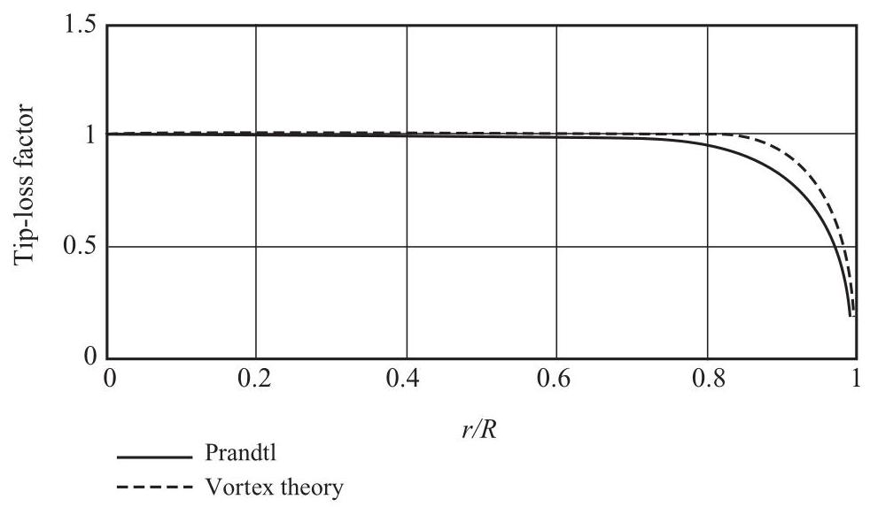

Figure 3.33 Comparison of the Prandtl tip-loss factor with that predicted by a vortex theory for a three blade turbine optimised for a tip speed ratio of six

It is now useful to know what is the variation of circulation along the blade. For the previous analysis, which disregarded tip-losses, the blade circulation was uniform (Equation 3.65).

Following the same procedure from which Equation 3.66 was developed:

$$
\rho \left( {W \times  \Gamma }\right) \sin \phi  = {\rho \Gamma }{U}_{\infty }\left( {1 - {a}_{b}\left( r\right) }\right)  = {4\pi }\frac{{U}_{\infty }^{3}}{\Omega }a\left( r\right) {\left( 1 - a\left( r\right) \right) }^{2}
$$

Recall that ${a}_{b}\left( r\right)$ is the flow factor local to the blade at radius $r$ , which is equal to $a$ , and $a\left( r\right)$ is the average value of the flow factor at radius $r$ .

Therefore,

$$
\Gamma \left( r\right)  = \frac{4\pi }{\lambda \left( {1 - a}\right) }{af}\left( r\right) {\left( 1 - af\left( r\right) \right) }^{2} \tag{3.79}
$$

$\Gamma \left( r\right)$ is the total circulation for all blades and is shown in Figure 3.34; and, as can be seen, it is almost uniform except near to the tip. The dashed vertical line shows the effective blade length (radius) ${R}_{ef} = {0.975}$ if the circulation is assumed to be uniform at the level that pertains at the inboard section of the blade.

The Prandtl tip-loss factor appears to offer an acceptable, simple solution to a complex problem; not only does it account for the effects of discrete blades but it also allows the induction factors to fall to zero at the edge of the rotor disc.

### 3.8.4 Blade root losses

At the root of a blade the circulation must fall to zero as it does at the blade tip, and so it can be presumed that a similar process occurs. The blade root will be at some distance from the rotor axis and the airflow through the disc inside the blade root radius will be at the free-stream velocity. Actually, the vortex theory of Section 3.4 can be extended to show that the flow through the root disc is somewhat higher than the free-stream velocity. It is usual, therefore, to apply the Prandtl tip loss function at the blade root as well as at the tip (see Figure 3.35).

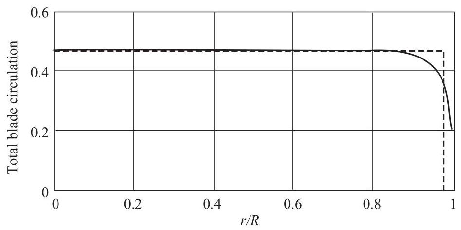

Figure 3.34 Span-wise variation of blade circulation for a three-blade turbine optimised for a tip speed ratio of six

If ${\mu }_{R}$ is the normalised root radius then the root loss factor can be determined by modifying the tip loss factor of Equation 3.78.

$$
{f}_{R}\left( \mu \right)  = \frac{2}{\pi }{\cos }^{-1}\left( {{e}^{-\frac{B}{2}\left( \frac{\mu  - {\mu }_{R}}{\mu }\right) }\sqrt{1 + \frac{{\left( \lambda \mu \right) }^{2}}{{\left( 1 - a\right) }^{2}}}}\right) \tag{3.80}
$$

If Equation 3.78 is now termed ${f}_{T}\left( r\right)$ the complete tip/root loss factor is

$$
f\left( \mu \right)  = {f}_{T}\left( \mu \right) {f}_{R}\left( \mu \right) \tag{3.81}
$$

Figure 3.35 Span-wise variation of combined tip/root loss factor for a three-blade turbine optimised for a tip speed ratio of six and with a blade root at ${20}\%$ span

### 3.8.5 Effect of tip-loss on optimum blade design and power

With no tip-loss the optimum axial flow induction factor is uniformly $\frac{1}{3}$ over the whole swept rotor. The presence of tip-loss changes the optimum value of the average value of $a$ which reduces to zero at the edge of the wake, but, local to the blade tends to increase in the tip region.

If $a\left( r\right)$ is taken as the azimuthal average at radius $r$ then locally, at the blade at that radius, the flow factor will be $a\left( r\right) /f\left( r\right)$ . The inflow angle $\phi$ , at the blade is then, from Equation 3.61,

$$
\tan \phi  = \frac{1}{\lambda \mu }\left( \frac{1 - \frac{a}{f}}{1 + \frac{{a}^{\prime }}{f}}\right) \tag{3.82}
$$

but Equation 3.60, which is the ratio of the non-dimensional rate of change of angular momentum to the non-dimensional rate of change of axial momentum, is not changed because it deals with the whole flow through the disc and so uses average values. If drag is ignored for the present, Equation 3.61 becomes

$$
\tan \phi  = \frac{{\lambda \mu }{a}^{\prime }\left( {1 - a}\right) }{a\left( {1 - a}\right)  + {\left( {a}^{\prime }\lambda \mu \right) }^{2}} \tag{3.83}
$$

Hence,

$$
\frac{\left( {1 - a}\right) {\lambda \mu }{a}^{\prime }}{a\left( {1 - a}\right)  + {\left( {a}^{\prime }\lambda \mu \right) }^{2}} = \frac{\left( 1 - \frac{a}{f}\right) }{{\lambda \mu }\left( {1 + \frac{{a}^{\prime }}{f}}\right) }
$$

which becomes

$$
{\lambda }^{2}{\mu }^{2}\frac{\left( f - 1\right) }{f}{a}^{\prime 2} - {\lambda }^{2}{\mu }^{2}\left( {1 - a}\right) {a}^{\prime } + a\left( {1 - a}\right) \left( {1 - \frac{a}{f}}\right)  = 0 \tag{3.84}
$$

A great simplification can be made to Equation 3.84 by ignoring the first term because, clearly, it disappears for much of the blade, where $f = 1$ , and for the tip region the value of ${a}^{\prime 2}$ is very small. For tip speed ratios greater than three neglecting the first term makes negligible difference to the result.

$$
{\lambda }^{2}{\mu }^{2}{a}^{\prime } = a\left( {1 - \frac{a}{f}}\right) \tag{3.85}
$$

As before, Equation 3.59 still applies

$$
\frac{da}{d{a}^{\prime }} = \frac{1 - a}{{a}^{\prime }}
$$

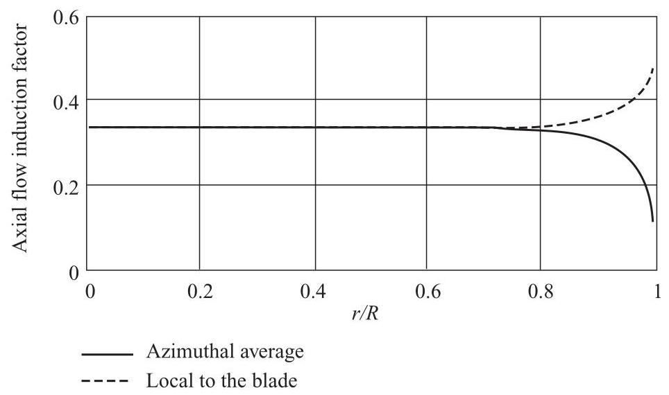

Figure 3.36 Axial flow factor variation with radius for a three blade turbine optimised for a tip speed ratio of six

From 3.85

$$
\frac{d{a}^{\prime }}{da} = \frac{1}{{\lambda }^{2}{\mu }^{2}}\left( {1 - 2\frac{a}{f}}\right)
$$

Consequently,

$$
\left( {1 - a}\right) \left( {1 - 2\frac{a}{f}}\right)  = {\lambda }^{2}{\mu }^{2}{a}^{\prime }
$$

Which, combined with Equation 3.85, gives

$$
{a}^{2} - \frac{2}{3}\left( {f + 1}\right) a + \frac{1}{3}f = 0
$$

so

$$
a = \frac{1}{3} + \frac{1}{3}f - \frac{1}{3}\sqrt{1 - f + {f}^{2}} \tag{3.86}
$$

The radial variation of the average value of $a$ , as given by Equation 3.86, and the value local to the blade $a/f$ , is shown in Figure 3.36. An exact solution would also have the local induced velocity falling to zero at the blade tip.

Clearly, the required blade design for optimal operation would be a little different to that which corresponds to the Prandtl tip-loss factor because $a/f$ , the local flow factor does not fall to zero at the blade tip. The use of the Prandtl tip-loss factor leads to an approximation, but that was recognised from the outset.

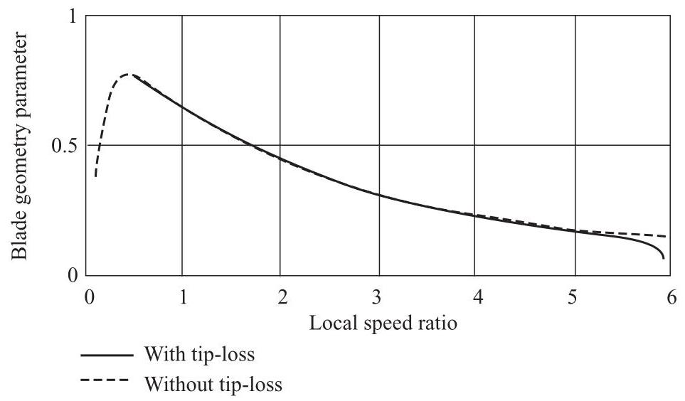

Figure 3.37 Variation of blade geometry parameter with local speed ratio, with and without tip-loss for a three-blade rotor with a design tip speed ratio of six

The blade design, which gives optimum power output, can now be determined by adapting Equations 3.68 and 3.69 accordingly:

$$
{\sigma }_{r}\lambda {C}_{l} = \frac{4{\lambda }^{2}{\mu }^{2}{a}^{\prime }}{\sqrt{{\left( 1 - \frac{a}{f}\right) }^{2} + {\left\lbrack  \lambda \mu \left( 1 + \frac{{a}^{\prime }}{f}\right) \right\rbrack  }^{2}}}\left( \frac{1 - a}{1 - \frac{a}{f}}\right)
$$

Introducing Equation 3.85 gives

$$
{\sigma }_{r}\lambda {C}_{l} = \frac{{4a}\left( {1 - a}\right) }{\sqrt{{\left( 1 - \frac{a}{f}\right) }^{2} + {\left\lbrack  \lambda \mu \left( 1 + \frac{a\left( {1 - \frac{a}{f}}\right) }{{\lambda }^{2}{\mu }^{2}f}\right) \right\rbrack  }^{2}}} \tag{3.87}
$$

The blade geometry parameter given by Equation 3.85 is shown in Figure 3.37 compared with the design which excludes tip-loss. As can be seen, only in the tip region is there any difference between the two designs.

Similarly, the inflow angle distribution, shown in Figure 3.38, can be determined by suitably modifying Equation 3.68

$$
\tan \phi  = \frac{1 - \frac{a}{f}}{{\lambda \mu }\left( {1 + \frac{a\left( {1 - \frac{a}{f}}\right) }{{\lambda }^{2}{\mu }^{2}f}}\right) } \tag{3.88}
$$

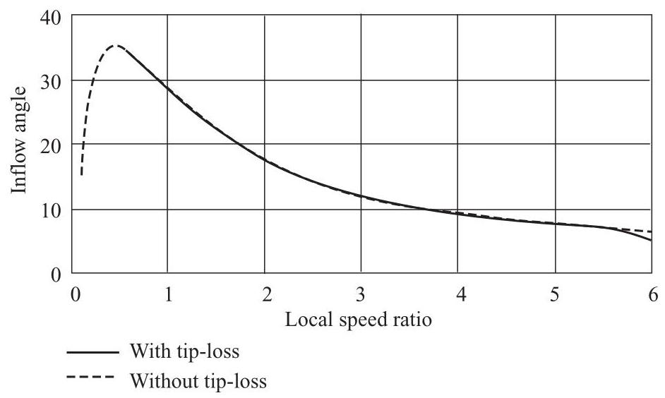

Figure 3.38 Variation of inflow angle with local speed ratio, with and without tip-loss for a three-blade rotor with a design tip speed ratio of six

Again, the effects of tip-loss are confined to the blade tip.

The power coefficient for an optimised rotor, operating at the design tip speed ratio, without drag and tip-losses, is equal to the Lanchester-Betz limit 0.593; but with tip-loss there is obviously a reduced optimum power coefficient. Equation 3.20 determines the power coefficient, see Figure 3.39.

$$
{C}_{P} = \frac{P}{\frac{1}{2}\rho {U}_{\infty }^{3}\pi {R}^{2}} = 8{\lambda }^{2}{\int }_{0}^{1}{a}^{\prime }\left( {1 - a}\right) {\mu }^{3}{d\mu } \tag{3.89}
$$

for which ${a}^{\prime }$ and $a$ are obtained from Equations 3.85 and 3.86.

The maximum power coefficient that can be achieved in the presence of both drag and tip-loss is significantly less than the Lanchester-Betz limit at all tip speed ratios. As is shown in Figure 3.40, drag reduces the power coefficient at high tip speed ratios but the effect of tip-loss is most significant at low tip speed ratios because the separation of the helicoidal vortex sheets is large.

### 3.8.6 Incorporation of tip-loss for non-optimal operation

The blade element-momentum Equations 3.52, 3.52a and 3.53 are used to determine the flow induction factors for non-optimal operation. With tip-loss included, the BEM equations have to be modified. The necessary modification depends upon whether the azimuthally averaged values of the flow factors are to be determined or the maximum (local to a blade element) values. If the former alternative is chosen then, in the momentum terms the flow factors remain unmodified but in the blade element terms the flow factors must appear as the average values divided by the tip-loss factor. Choosing to determine the maximum values of the flow factors means that they are not modified in the blade element terms but are multiplied by the tip-loss factor in the momentum terms. The latter choice allows the simplest modification of Equations 3.54 and 3.55.

$$
\frac{af}{1 - a} = \frac{{\sigma }_{r}}{4{\sin }^{2}\phi }{C}_{x}\frac{1 - a}{1 - {af}} \tag{3.54b}
$$

$$
\frac{{a}^{\prime }f}{1 + {a}^{\prime }} = \frac{{\sigma }_{r}}{4\sin \phi \cos \phi }{C}_{y}\frac{1 - a}{1 - {af}} \tag{3.55a}
$$

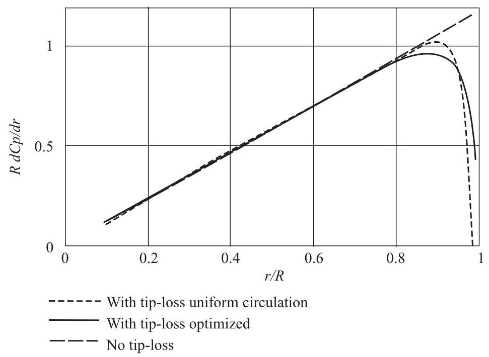

Figure 3.39 Span-wise variation of power extraction in the presence of tip-loss for three blades with uniform circulation and of optimised design for a tip speed ratio of six

There remains the problem of the breakdown of the momentum theory when wake mixing occurs. The helicoidal vortex sheets may not exist and so Prandtl's approximation is not physically appropriate. Nevertheless, particles which pass between blades will no doubt still lose less momentum than those which interact with a blade and so the application of a tip-loss factor is necessary. Prandtl's approximation is the only practical method available and so is commonly used. In view of the manner in which the experimental results of Figure 3.16 were gathered, it is the average value of $a$ which should determine at which stage the momentum theory breaks down.

### 3.8.7 Alternative explanation for tip-loss

The flow approaching the rotor is expanding because it is slowing down and so is not axial, that is, it is not parallel to the rotation axis, or the undisturbed flow direction. Consequently, there is a radial flow velocity component at the upwind side of the rotor that arises because there is a radial pressure gradient with lower pressure (atmospheric) in the tip region than in the inner region. The change of radial momentum at a point on the rotor disc is balanced by the equal and opposite radial momentum at the diametrically opposite point. The magnitude of the radial velocity increases with radius and so its effects will be greatest at the tip region. The kinetic energy associated with the radial flow is not available for energy capture because it does not influence the aerodynamic force on the blade. The axial component of velocity in the approaching flow is, therefore, depleted but not by an axial force.

Figure 3.40 The variation of maximum ${C}_{P}$ with design $\lambda$ for various lift/drag ratios and including tip-losses for a three-bladed rotor

For a well designed blade the tip chord length will be zero and so would not exert any axial force at all on the airflow, which means that the static pressure will be atmospheric and the resultant approach velocity will be equal in magnitude to the undisturbed wind speed. But, at the tip, there will be a relatively large radial flow velocity component causing a significant reduction in the axial flow component that is not associated with a corresponding axial force caused by a rotor blade. If, for example, the axial velocity component is $\frac{2}{3}$ of the undisturbed wind speed then the angle of inclination of the wind velocity at the tip will be

$$
{\cos }^{-1}\left( \frac{2}{3}\right)  = {48.19}\text{ degrees }
$$

that is, $a = \frac{1}{3}$ but there is no associated axial force.

If $a$ is redefined as a reduction in the stream-wise flow velocity, as shown in Figure 3.41, then at the blade tip $a$ would be zero but would steadily rise towards the central section of the blade, reach a maximum and then fall to zero once more at the blade root.

Applying the same arguments as for the simple momentum theory of Section 3.2.1, Equation 3.7 can be modified thus,

$$
\frac{1}{2}\rho \left( {{U}_{\infty }^{2} - {U}_{W}^{2}}\right) {A}_{D} = \left( {{U}_{\infty } - {U}_{W}}\right) \rho {A}_{D}{U}_{\infty }\left( {1 - a}\right) \cos \psi \tag{3.7a}
$$

and the axial velocity in the wake becomes

$$
{U}_{W} = {U}_{\infty }\left( {1 - {2a}\cos \psi }\right) \tag{3.8a}
$$

Figure 3.41 The flow geometry at the rotor disc with flow expansion

where $\psi$ is the angle of the resultant stream-wise flow direction to the axial direction at the rotor disc.

The retarding force on the air flowing through an elemental area of the disc $\delta {A}_{D}$ , from Equation 3.9, is

$$
{\delta T} = \left( {{p}_{D}^{ + } - {p}_{D}^{ - }}\right) \delta {A}_{D} = {2\rho \delta }{A}_{D}{U}_{\infty }^{2}a\left( {1 - a}\right) {\cos }^{2}\psi \tag{3.9a}
$$

and the power extracted from that air is

$$
\delta \text{ Power } = {\delta T}{U}_{D} = {2\rho }{A}_{D}{U}_{\infty }^{3}a{\left( 1 - a\right) }^{2}{\cos }^{3}\psi \tag{3.10a}
$$

Both $a$ and $\psi$ will vary radially and will change according to how the circulation on the disc varies radially. Disc circulation, or the bound vorticity on the disc, must also rise and fall from blade root to blade tip, as shown in Figure 3.42.

Figure 3.42 The variation of circulation along the length of a blade

Using just the momentum theory it is not possible to determine the manner of the variation of $a$ and $\psi$ but it is clear that the integration with respect to radius $r$ of Equation 3.10a would result in a value for the optimised power coefficient that would be less than the Lanchester-Betz limit.

The process of flow expansion used here takes place entirely in the region of flow that is upstream of the rotor disc and shows that there is a consequent loss of efficiency in the tip and root regions of a blade. The tip/root-loss mechanism described by Prandtl, on the other hand, takes place entirely in the flow region downstream of the rotor disc so the two loss processes are distinct.

## 3.9 Stall delay

A phenomenon first noticed on propellers by Himmelskamp (1945) is that of lift coefficients being attained at the inboard section of a rotating blade which are significantly in excess of the maximum value possible in two-dimensional static tests. In other words the angle of attack at which stall occurs is greater for a rotating blade than for the same blade tested statically. The power output of a rotor is measurably increased by the stall delay phenomenon and, if included, improves the comparison of theoretical prediction with measured output. It is noticed that the effect is greater near the blade root and decreases with radius.

The reason for the stall delay has been the cause of much discussion, but a convincing physical process has not yet been established. What is agreed is that, for whatever reason, the adverse pressure gradient experienced by the flow passing over the downwind surface of the blade is reduced by the blade's rotation. The adverse pressure gradient slows down the flow as it approaches the trailing edge of the blade after the velocity peak reached close to the leading edge. In the boundary layer viscosity also slows down the flow and the combination of the two effects, if sufficiently large, can bring the boundary layer flow to a standstill (relative to the blade surface) or even cause a reversal of flow direction. When flow reversal takes place the flow separates from the blade surface and stall occurs, giving rise to loss of lift and a dramatic increase in pressure drag.

Aerodynamic analyses (Wood, 1991; Snel et al., 1993) of rotating blades using computational fluid dynamic techniques, which include the effects of viscosity, do show a decrease in the adverse pressure gradient but it is not obvious from these numerical calculations as to what exactly is occurring physically.

It is also agreed that the parameter that influences stall delay predominantly is the local blade solidity $c\left( r\right) /r$ .

The evidence which does exist shows that for attached flow conditions, below what would otherwise be the static (non-rotating) stall angle of attack, there is little difference between two-dimensional flow conditions and rotating conditions. When stall does occur, however, the air in the separated region, which is moving very slowly with respect to the blade surface, is rotating with the blade and so is subject to centrifugal force causing it to flow radially outwards. Prior to stalling taking place, centrifugal forces on the fluid in the boundary layer, again causing radial flow, may reduce the displacement thickness and so increase the resistance to separation.

Figure 3.43 Pressure measurements on the surface of a wind turbine blade while rotating and while static by Ronsten (1991)

Blade surface pressures have been measured by Ronsten (1991) on a blade while static and while rotating. Figure 4.43 shows the comparison of surface pressure coefficients for similar angles of attack in the static and rotating conditions (tip speed ratio of 4.32) for three span-wise locations. At the 30% span location the estimated angle of attack at 30.410 is well above the static stall level which is demonstrated by the static pressure coefficient distribution. The rotating pressure coefficient distribution at ${30}\%$ span shows a high leading edge suction pressure peak with a uniform pressure recovery slope over the rear section of the upper surface of the chord. The gradual slope of the pressure recovery indicates a reduced adverse pressure gradient with the effect on the boundary layer that it is less likely to separate. The level of the leading edge suction peak, however, is very much less than it would be if, in the non-rotating situation, it were possible for flow still to be attached at ${30.41}^{ \circ  }$ .

The situation at the 55% span-wise location is similar to that at 30%; the static pressures indicate that the section has stalled but the rotating pressures show leading edge suction peak which is small but significant. At the 75% span location there is almost no difference between static and rotating blade pressure coefficient distributions at an angle of attack of ${12.94}^{ \circ  }$ , which is below the static stall level: the leading edge suction pressure peak is little higher than that at ${30}\%$ span, much higher than that at ${55}\%$ , but the pressure recovery slope is much steeper. The flow appears to be attached at the ${30}\%$ and ${55}\%$ span locations on the rotating blade, but the suction pressures are too low for that actually to be the case, so stall appears to be greatly delayed and the low adverse pressure gradient shown by the gentle slope of the pressure recovery appears to indicate the reason for the delay. At ${30}\%$ span the ratio $c/r = {0.374}, c/r = {0.161}$ at ${55}\%$ span and at the ${75}\%$ location $c/r = {0.093}$ . The increased lift also occurs in the post stall region and is attributed to the radial flow in the separated flow regions.

Snel et al. (1993) have proposed a simple, empirical modification to the usually available two dimensional, static aerofoil lift coefficient data which fits the measured lift coefficients by Ronsten (1991) and computed results using a three-dimensional computational fluid dynamics code.

Table 3.1 Summary of Ronsten's measurements of lift coefficient and lift coefficients corrected to rotating conditions using Equation 3.90

<table><tr><td>$r/{R}^{ * }{100}$</td><td>30%</td><td>55%</td><td>75%</td></tr><tr><td>c/r</td><td>0.374</td><td>0.161</td><td>0.093</td></tr><tr><td>Angle of attack $\Delta$</td><td>30.41°</td><td>18.12°</td><td>${12.94}^{ \circ  }$</td></tr><tr><td>${C}_{l}$ static (measured)</td><td>0.8</td><td>0.74</td><td>1.3</td></tr><tr><td>${C}_{l}$ rotating (measured)</td><td>1.83</td><td>0.93</td><td>1.3</td></tr><tr><td>${C}_{l}$ rotating (Snel)</td><td>1.87</td><td>0.84</td><td>1.3</td></tr></table>

If the linear part of the static,2-D, ${C}_{l} - \alpha$ curve is extended beyond the stall then let $\Delta {C}_{l}$ be the difference between the two curves. Then the correction to the 2-D curve to account for the rotational,3-D, effects is $3{\left( c/r\right) }^{2}\Delta {C}_{l}$ .

$$
{C}_{l.3D} = {C}_{l.3D} + 3{\left( \frac{c}{r}\right) }^{2}\Delta {C}_{l} \tag{3.90}
$$

Table 3.1 compares the measured static $\left( {C}_{l,{2D}}\right) \left( {C}_{{l}_{2D}}\right)$ and rotating $\left( {C}_{l,{3D}}\right)$ lift coefficients with the calculated values for the rotating values using Snel's correction of Equation 3.90. The correction is quite good and is very simple to apply. An example of the correction is given by Snel in (1993) and is shown in Figure 3.44.

Figure 3.44 A comparison of measured and Snel's predicted power curves for a NORDTANK 300 kW turbine

Table 3.2 Blade design of a ${17}\mathrm{\;m}$ -diameter rotor

<table><tr><td>Radius $r\mathrm{\;{mm}}$</td><td>$\mu  = \frac{r}{R}$</td><td>Chord $c\mathrm{\;{mm}}$</td><td>Pitch $\beta$ deg</td><td>Thickness/Chord ratio of blade %</td></tr><tr><td>1700</td><td>0.20</td><td>1085</td><td>15.0</td><td>24.6</td></tr><tr><td>2125</td><td>0.25</td><td>1045</td><td>12.1</td><td>22.5</td></tr><tr><td>2150</td><td>0.30</td><td>1005</td><td>9.5</td><td>20.7</td></tr><tr><td>2975</td><td>0.35</td><td>965</td><td>7.6</td><td>19.5</td></tr><tr><td>3400</td><td>0.40</td><td>925</td><td>6.1</td><td>18.7</td></tr><tr><td>3825</td><td>0.45</td><td>885</td><td>4.9</td><td>18.1</td></tr><tr><td>4250</td><td>0.50</td><td>845</td><td>3.9</td><td>17.6</td></tr><tr><td>4675</td><td>0.55</td><td>805</td><td>3.1</td><td>17.1</td></tr><tr><td>5100</td><td>0.60</td><td>765</td><td>2.4</td><td>16.6</td></tr><tr><td>5525</td><td>0.65</td><td>725</td><td>1.9</td><td>16.1</td></tr><tr><td>5950</td><td>0.70</td><td>685</td><td>1.5</td><td>15.6</td></tr><tr><td>6375</td><td>0.75</td><td>645</td><td>1.2</td><td>15.1</td></tr><tr><td>6800</td><td>0.80</td><td>605</td><td>0.9</td><td>14.6</td></tr><tr><td>6375</td><td>0.85</td><td>565</td><td>0.6</td><td>14.1</td></tr><tr><td>7225</td><td>0.90</td><td>525</td><td>0.4</td><td>13.6</td></tr><tr><td>8075</td><td>0.95</td><td>485</td><td>0.2</td><td>13.1</td></tr><tr><td>8500</td><td>1.00</td><td>445</td><td>0.0</td><td>12.6</td></tr></table>

## 3.10 Calculated results for an actual turbine

The blade design of a turbine operating at constant uniform rotational speed and fixed pitch is given in Table 3.2 below and the aerofoil characteristics are shown in Figure 3.45.

Using the above data the results shown in Figure 3.46 were obtained.

The blade is designed for optimum performance at a tip speed ratio of about six and, ideally, the angle of attack uniform along the span at the level for which the lift/drag ratio is a maximum, about ${7}^{ \circ  }$ for the aerofoil concerned. At the lowest tip speed ratio shown in Figure 3.44 the entire blade is stalled and for a rotational speed of 60 rpm the corresponding wind speed will be ${26}\mathrm{\;m}/\mathrm{s}$ , which is the cut-out speed. For the highest tip speed ratio shown the corresponding wind speed will be ${4.5}\mathrm{\;m}/\mathrm{s}$ , the cut-in speed. Maximum power is developed at a tip speed ratio of four at a wind speed of ${13}\mathrm{\;m}/\mathrm{s}$ and, clearly, much of the blade is stalled.

The axial flow induction factor is not uniform along the span at any tip speed ratio, indicating that the blade design is an engineering compromise, but at the tip speed ratio of six there is value a little higher than $\frac{1}{3}$ . The flow factors shown in Figure 3.47 are those local to the blade and so average value of axial flow factor will be close to $\frac{1}{3}$ at a tip speed ratio of six.

Generally, the axial flow factor increases with tip speed ratio while the tangential flow factor decreases with tip speed ratio. The angular velocity of the wake increases sharply with decreasing radius because it is determined by the root vortex.

The importance of the outboard section of the blade is clearly demonstrated in Figure 3.48. The dramatic effect of stall is shown in the difference in torque distribution between the tip speed ratio of four and the tip speed ratio of two. Note, also, the flat distribution of torque at the high tip speed ratio of 12; this is caused by the effect of drag which reduces torque as the square of the local speed ratio and with the low angle of attack at $\lambda  = {12}$ drag causes a significant loss of power.

Figure 3.45 The aerodynamic characteristics of the NACA632XX aerofoil series The complete ${C}_{P} - \lambda$ curve for the design is given in Figure 3.15.

Although the blade axial force coefficient increases with tip speed ratio it must be remembered that the actual thrust force increases with wind speed as is demonstrated in Figure 3.49.

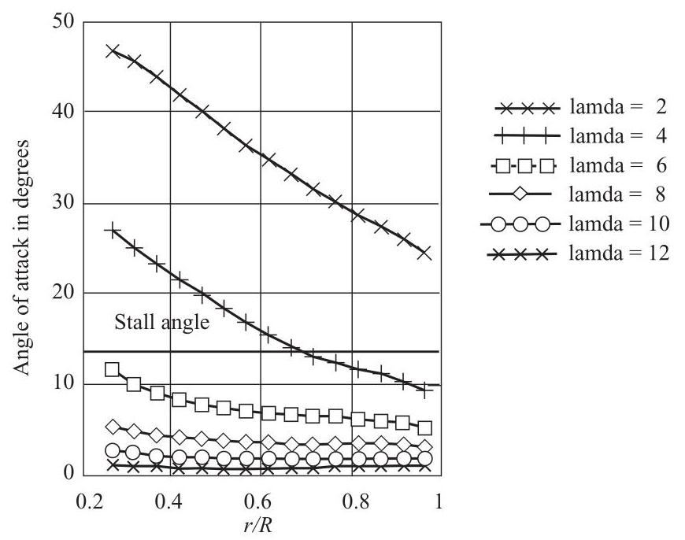

Figure 3.46 Angle of attack distribution for a range of tip speed ratios

Figure 3.47 Distribution of the flow induction factors for a range of tip speed ratios

## 3.11 The performance curves

### 3.11.1 Introduction

The performance of a wind turbine can be characterised by the manner in which the three main indicators, power, torque and thrust, vary with wind speed. The power determines the amount of energy captured by the rotor, the torque developed determines the size of the gear box and must be matched by whatever generator is being driven by the rotor. The rotor thrust has great influence on the structural design of the tower. It is usually convenient to express the performance by means of non-dimensional, characteristic performance curves from which the actual performance can be determined regardless of how the turbine is operated, for example, at constant rotational speed or some regime of variable rotor speed. Assuming that the aerodynamic performance of the rotor blades does not deteriorate the non-dimensional aerodynamic performance of the rotor will depend upon the tip speed ratio and, if appropriate, the pitch setting of the blades. It is usual, therefore, to display the power, torque and thrust coefficients as functions of tip speed ratio.

Figure 3.48 Distribution of blade loads for a range of tip speed ratios

Figure 3.49 Axial force coefficient and the variation of the actual force with wind speed

### 3.11.2 The ${C}_{P} - \lambda$ performance curve

The theory described in this chapter gives the wind turbine designer a means of examining how the power developed by a turbine is governed by the various design parameters. The usual method of presenting power performance is the non-dimensional ${C}_{P} - \lambda$ curve and the curve for a typical, modern, three-blade turbine is shown in Figure 3.50.

The first point to notice is that the maximum value of ${C}_{P}$ is only 0.47, achieved at a tip speed ratio of seven, which is much less than the Betz limit for that tip speed ratio. The discrepancy is caused, in this case, by drag and tip-losses but the stall also reduces the ${C}_{P}$ at low values of the tip speed ratio.

Even with no losses included in the analysis the Lanchester-Betz limit is not reached because the blade design is not perfect (see Figure 3.51).

### 3.11.3 The effect of solidity on performance

At this stage, the other principal parameter to consider is the solidity, defined as total blade area divided by the swept area. For the three-blade machine, above, the solidity is 0.0345 but this can be altered readily by varying the number of blades as shown in Figure 3.52.

The solidity could also have been changed by changing the blade chord.

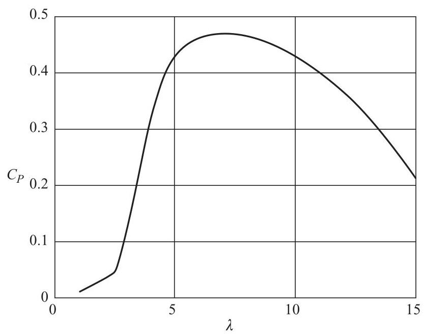

Figure 3.50 ${C}_{P} - \lambda$ performance curve for a modern three-blade turbine

The main effects to observe of changing solidity are:

1. Low solidity produces a broad, flat curve which means that the ${C}_{P}$ will change very little over a wide tip speed ratio range, but the maximum ${C}_{P}$ is low because the drag losses are high (drag losses are roughly proportional to the cube of the tip speed ratio).

2. High solidity produces a narrow performance curve with a sharp peak making the turbine very sensitive to tip speed ratio changes and, if the solidity is too high, has a relatively low maximum ${C}_{P}$ . The reduction in ${C}_{P}$ max is caused by stall losses.

Figure 3.51 ${C}_{P} - \lambda$ performance curve for a modern three-blade turbine showing losses

Figure 3.52 Effect of changing solidity

3. An optimum solidity appears to be achieved with three blades, but two blades might be an acceptable alternative because although the maximum ${C}_{P}$ is a little lower the spread of the peak is wider and that might result in a larger energy capture.

It might be argued that a good solution would be to have a large number of blades of small individual solidity but this greatly increases production costs and results in blades which are structurally weak and very flexible.

There are applications which require turbines of relatively high solidity, one is the directly driven water pump and the other is the very small turbine used for battery charging. In both cases it is the high starting torque (high torque at very low tip speed ratios) which is of importance and this also allows small amounts of power to be developed at very low wind speeds, ideal for trickle charging batteries.

### 3.11.4 The ${C}_{Q} - \lambda$ curve

The torque coefficient is derived from the power coefficient simply by dividing by the tip speed ratio and so it does not give any additional information about the turbine's performance. The principal use of the ${C}_{Q} - \lambda$ curve is for torque assessment purposes when the rotor is connected to a gear box and generator.

Figure 3.53 shows how the torque developed by a turbine rises with increasing solidity. For modern high speed turbines designed for electricity generation, as low a torque as possible is desirable in order to reduce gearbox costs. On the other hand the multi-bladed, high solidity turbine, developed in the nineteenth century for water pumping, rotates slowly and has a very high starting torque coefficient necessary for overcoming the torque required to start a positive displacement pump.

Figure 3.53 The effect of solidity on torque

The peak of the torque curve is caused by stall and occurs at a lower tip speed ratio than the peak of the power curve.

### 3.11.5 The ${C}_{T} - \lambda$ curve

The thrust force on the rotor is directly applied to the tower on which the rotor is supported and so considerably influences the structural design of the tower.

Generally, the thrust on the rotor increases with increasing solidity, as shown in Figure 3.54.

## 3.12 Constant rotational speed operation

### 3.12.1 Introduction

The majority of wind turbines currently installed generate electricity. Whether or not these turbines are grid connected they need to produce an electricity supply which is of constant frequency, or else many common appliances will not function properly. Consequently, a mode favoured in the early years of wind turbine development is operation at constant rotational speed. Connected to the grid a constant speed turbine is automatically controlled, whereas a stand-alone machine needs to have speed control and a means of dumping excess power.

### 3.12.2 The ${K}_{P} - 1/\lambda$ curve

An alternative performance curve can be produced for a turbine controlled at constant speed. The ${C}_{P} - \lambda$ curve shows, non-dimensionally, how the power would vary with rotational speed

Figure 3.54 The effect of solidity on thrust

if the wind speed was held constant. The ${K}_{P} - 1/\lambda$ curve describes, again non-dimensionally, how the power would change with wind speed when constant rotational speed is enforced. ${K}_{P}$ is defined as

$$
{K}_{p} = \frac{\text{ Power }}{\left( \frac{1}{2}\right)  \cdot  \rho  \cdot  {\left( \Omega  \cdot  R\right) }^{3}{A}_{d}} = \frac{{C}_{p}}{{\lambda }^{3}} \tag{3.91}
$$

The ${C}_{P} - \lambda$ and ${K}_{P} - 1/\lambda$ curves for a typical fixed pitch wind turbine are shown in Figure 3.55. The ${K}_{P} - 1/\lambda$ curve, as stated above, has the same form as the power-wind speed characteristic of the turbine. The efficiency of the turbine (given by the ${C}_{P} - \lambda$ curve) varies greatly with wind speed, a disadvantage of constant speed operation, but it should be designed such that the maximum efficiencies are achieved at wind speeds where there is the most energy available.

### 3.12.3 Stall regulation

An important feature of this ${K}_{P} - 1/\lambda$ curve is that the power, initially, falls off once stall has occurred and then gradually increases with wind speed. This feature provides an element of passive power output regulation, ensuring that the generator is not overloaded as the wind speed increases. Ideally, the power should rise with wind speed to the maximum value and then remain constant regardless of the increase in wind speed: this is called perfect stall regulation. However, stall regulated turbines do not exhibit the ideal, passive stall behaviour.

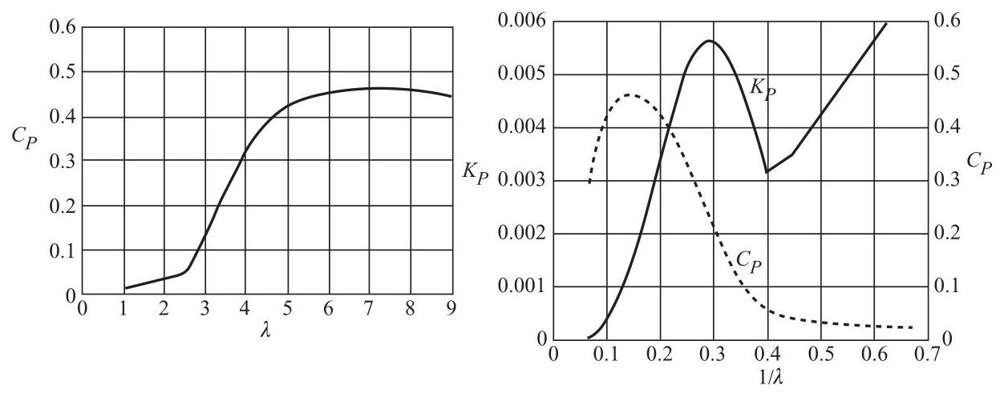

Figure 3.55 Non-dimensional performance curves for constant speed operation

Stall regulation provides the simplest means of controlling the maximum power generated by a turbine to suit the sizes of the installed generator and gearbox. The principal advantage of stall control is simplicity but there are significant disadvantages. The power versus wind speed curve is fixed by the aerodynamic characteristics of the blades, in particular the stalling behaviour. The post stall power output of a turbine varies very unsteadily and in a manner which, so far, defies prediction, see Figure 3.60, for example. The stalled blade also exhibits low vibration damping because the flow about the blade is unattached to the low pressure surface and blade vibration velocity has little effect on the aerodynamic forces. The low damping can give rise to large vibration displacement amplitudes which will inevitably be accompanied by large bending moments and stresses, causing fatigue damage. When parked in high, turbulent winds the fixed pitch, stationary blade may well be subject to large aerodynamic loads which cannot be alleviated by adjusting (feathering) the blade pitch angle. Consequently, the blades of a fixed pitch, stall regulated turbine must be very strong, involving an appropriate cost penalty.

### 3.12.4 Effect of rotational speed change

The power output of a turbine running at constant speed is strongly governed by the chosen, operational rotational speed. If a low rotation speed is used the power reaches a maximum at a low wind speed and consequently it is very low. To extract energy at wind speeds higher than the stall peak the turbine must operate in a stalled condition and so is very inefficient. Conversely, a turbine operating at a high speed will extract a great deal of power at high wind speeds but at moderate wind speeds it will be operating inefficiently because of the high drag losses. Figure 3.56 demonstrates the sensitivity to rotation speed of the power output - a 33% increase in rpm from 45 to 60 results in a 150% increase in peak power, reflecting the increased wind speed at which peak power occurs at 60 rpm.

At low wind speeds, on the other hand, there is a marked fall in power with increasing rotational speed as shown in Figure 3.57. In fact, the higher power available at low wind speeds if a lower rotational speed is adopted has led to two speed turbines being built. Operating at one fixed speed which maximises energy capture at wind speeds at, or above, the average level will result in a rather high cut-in wind speed, the lowest wind speed at which generation is possible. Employing a lower rotational speed at low wind speeds reduces the cut-in wind speed and increases energy capture. The increased energy capture is, of course, offset by the cost of the extra machinery.

Figure 3.56 Effect on extracted power of rotational speed

Figure 3.57 Effect on extracted power of rotational speed at low wind speeds

Figure 3.58 Effect on extracted power of blade pitch set angle

### 3.12.5 Effect of blade pitch angle change

Another parameter which affects the power output is the pitch setting angle of the blades ${\beta }_{s}$ . Blade designs almost always involve twist but the blade can be set at the root with an overall pitch angle. The effects of a few degrees of pitch are shown in Figure 3.58.

Small changes in pitch setting angle can have a dramatic effect on the power output. Positive pitch angle settings increase the design pitch angle and so decrease the angle of incidence. Conversely, negative pitch angle settings increase the angle of incidence and may cause stalling to occur as shown in Figure 3.58. A turbine rotor designed to operate optimally at a given set of wind conditions can be suited to other conditions by appropriate adjustments of blade pitch angle and rotational speed.

## 3.13 Pitch regulation

### 3.13.1 Introduction

Many of the shortcomings of fixed pitch/passive stall regulation can be overcome by providing active pitch angle control. Figure 3.58 shows the sensitivity of power output to pitch angle changes.

The most important application of pitch control is for power regulation, but pitch control has other advantages. By adopting a large positive pitch angle a large starting torque can be generated as a rotor begins to turn. A ${90}^{ \circ  }$ pitch angle is usually used when the rotor is stationary because this will minimise forces on the blades such that they will not sustain damage in high winds. At ${90}^{ \circ  }$ of positive pitch the blade is said to be 'feathered'. The blades need not be as strong, therefore, as for a stall-regulated turbine, which reduces blade costs. Only a small change of pitch angle is needed to provide an assisted start-up.

The principle disadvantages of pitch control are lower reliability and cost but the latter is offset by lower blade costs.

Power regulation can be achieved either by pitching to promote stalling or pitching to feather, which reduces the lift force on the blades by reducing the angle of attack.

### 3.13.2 Pitching to stall

Figure 3.58 shows the power curves for a turbine rated at ${60}\mathrm{{kW}}$ , which is achieved at ${12}\mathrm{\;m}/\mathrm{s}$ . At wind speeds below the rated level the blade pitch angle is kept at ${0}^{ \circ  }$ . As rated power is reached only a small negative pitch angle, initially of about ${2}^{ \circ  }$ , is necessary to promote stalling and so to limit the power to the rated level. As the wind speed increases small adjustments in both the positive and negative directions are all that are needed to maintain constant power.

The small size of the pitch angle adjustments make pitching to stall very attractive to designers, but the blades have the same damping and fatigue problems as fixed pitch turbines.

### 3.13.3 Pitching to feather

By increasing the pitch angle as rated power is reached the angle of attack can be reduced. A reduced angle of attack will reduce the lift force and the torque. The flow around the blade remains attached. Figure 3.59 is for the same turbine as Figure 3.58 but only the ${0}^{ \circ  }$ power curve is shown below the rated level. Above the rated level fragments of power curves for higher pitch angles are shown as they cross the rated power line: the crossing points give the necessary pitch angles to maintain rated power at the corresponding wind speeds. As can be seen in Figure 3.57, the required pitch angles increase progressively with wind speed and are generally much larger than is needed for the pitching to stall method. In gusty conditions large pitch excursions are needed to maintain constant power and the inertia of the blades will limit the speed of the control system's response.

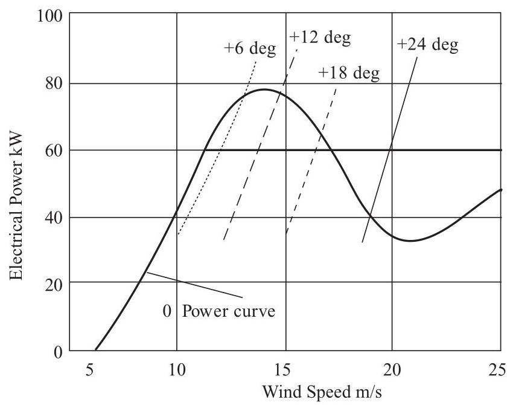

Figure 3.59 Pitching to feather power regulation requires large changes of pitch angle

Because the blades remain un-stalled if large gusts occur at wind speeds above the rated level large changes of angle of attack will take place with associated large changes in lift. Gust loads on the blades can, therefore, be more severe than for stalled blades.

The advantages of the pitching to feather method are that the flow around the blade remains attached, and so well understood, and provides good, positive damping. Feathered blade parking and assisted starting are also available.

Pitching to feather has been the preferred pitch control option mainly because the blade loads can be predicted with more confidence than for stalled blades.

## 3.14 Comparison of measured with theoretical performance

The turbine considered in this section is run at constant rotational speed. More detail about this method of operation will be discussed in the next section but the main feature is that there is, theoretically, a unique power output for a given wind speed.

When the turbine was under test the chosen rotational speed was 44 rpm. Energy output and wind speed were measured over one minute time intervals and the average power and wind speed determined. The test was continued until a sufficient range of wind speeds had been covered. The 16 minute average results were then sorted in 'bins' ${0.5}\mathrm{\;m}/\mathrm{s}$ of wind speed wide and a fairly smooth power versus wind speed curve was obtained, as shown in Figure 3.60.

The turbine has a diameter of ${17}\mathrm{\;m}$ and would be expected to produce rather more power than shown above if operated at a higher rotational speed.

Figure 3.60 Power versus wind speed curve from the binned measurements of a three-blade stall regulated turbine

Figure 3.61 Comparison of measured and theoretical performance curves

From the data in Figure 3.58 the ${C}_{P} - \lambda$ curve can be derived. The tip speed of the blades is ${44} \times  \pi /{30}\mathrm{{rad}}/\mathrm{s} \times  {8.5}\mathrm{\;m} = {39.2}\mathrm{\;m}/\mathrm{s}$ , the swept area is $\pi  \times  {8.5}^{2} = {227}{\mathrm{\;m}}^{2}$ and the air density was measured (from air pressure and temperature readings) at ${1.19}\mathrm{\;{kg}}/{\mathrm{m}}^{3}$ . Therefore,

$$
\lambda  = \frac{39.2}{\text{ wind speed }}\text{ and }{C}_{P} = \frac{\text{ Power } \cdot  {\lambda }^{3}}{\frac{1}{2} \cdot  {1.19} \cdot  {39.2}^{3} \cdot  {227}}
$$

The mechanical and electrical losses were estimated at ${5.62}\mathrm{\;{kW}}$ and this value was used to adjust the theoretical values of ${C}_{P}$ . The resulting comparison of measured and theoretical results is shown in Figure 3.61.

This comparison looks reasonable and shows that the theory is reliable but the quality of the theoretical predictions really relies upon the quality of the aerofoil data. The blade and aerofoil design are the same as given in Section 3.10.

One last point should be made before classifying the theory as complete: it would be as well to look at the raw, one minute average data, before it was reduced down by a binning process and is shown in Figure 3.62. In the post stall region there seems to be a much more complex process taking place than the simple theory predicts and this could be caused by unsteady aerodynamic effects.

## 3.15 Variable speed operation

If the speed of the rotor can be continuously adjusted such that the tip speed ratio remains constant at the level which gives the maximum ${C}_{P}$ , then the efficiency of the turbine will be significantly increased. The pitch angle is kept constant and the generator torque is adjusted to increase speed. Pitch control regulation is required in conditions above the rated wind speed when the rotational speed is kept constant.

Figure 3.62 Measured raw results of a three-blade wind turbine

## 3.16 Estimation of energy capture

The quantity of energy that can be captured by a wind turbine depends upon the power versus wind speed characteristic of the turbine and the wind speed distribution at the turbine site.

The wind speed distribution at a site can be represented by the Weibull function: the probability that the wind speed will exceed a value $U$ is

$$
F\left( U\right)  = {e}^{-{\left( \frac{U}{c}\right) }^{k}} \tag{3.92}
$$

where $c$ , called the scale factor, is a characteristic speed related to the average wind speed at the site by

$$
c = \frac{\bar{U}}{\Gamma \left( {1 + \frac{1}{k}}\right) } \tag{3.93}
$$

( $\Gamma$ being the gamma function and $k$ a shape parameter). Let $U/\bar{U} = u$ a normalised wind speed.

Figure 3.63 ${C}_{P} - \lambda$ curve for a design tip speed ratio of seven

The wind speed distribution density is then the modulus of the derivative of Equation 3.92 with respect to $u$ .

$$
f\left( u\right)  = k{\left( \frac{\bar{U}}{c}\right) }^{k}{u}^{k - 1}{e}^{-{\left( \frac{\bar{U}}{c}u\right) }^{k}} \tag{3.94}
$$

That is, the probability that the wind speed lies between $u$ and $u + {\delta u}$ is $f\left( u\right) {\delta u}$ .

The performance curve shown in Figure 3.63 is for a turbine designed with an optimum tip speed ratio of seven.

As an example, assume that the turbine is stall regulated and operates at a fixed rotational speed at a site where the average wind speed is $6\mathrm{\;m}/\mathrm{s}$ and the Weibull shape factor $k = {1.8}$ then, from Equation 3.93, the scale factor $c = {6.75}\mathrm{\;m}/\mathrm{s}$ .

Figure 3.64 shows the ${K}_{P} - 1/\lambda$ curve for the turbine: from inspection of that curve the tip speed ratio at which stall (maximum power) occurs is 3.7 and the corresponding ${C}_{P}$ is 0.22 .

The required maximum electrical power of the machine is ${500}\mathrm{\;{kW}}$ , the transmission loss is ${10}\mathrm{\;{kW}}$ , the mean generator efficiency is ${90}\%$ and the availability of the turbine (amount of time for which it is available to operate when maintenance and repair time is taken into account) is 98%.

The maximum rotor shaft power (aerodynamic power) is then

$$
{P}_{s} = \left( {{500} + {10}}\right) /{0.9} = {567}\mathrm{\;{kW}}
$$

The wind speed at which maximum power is developed is ${13}\mathrm{\;m}/\mathrm{s}$ ; therefore, the rotor swept area must be, assuming an air density of ${1.225}\mathrm{\;{kg}}/{\mathrm{m}}^{3}$ ,

$$
{567000}/\left( {1/2 \times  {1.225} \times  {13}^{3} \times  {0.22}}\right)  = {1.92} \times  {10}^{3}{\mathrm{\;m}}^{2}
$$

The rotor radius is, therefore, ${24.6}\mathrm{\;m}$ .

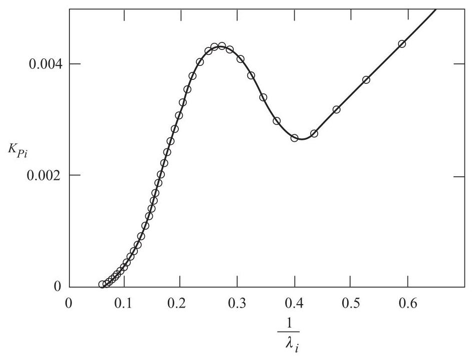

Figure 3.64 ${K}_{P} - 1/\lambda$ curve for the example fixed speed, stall regulated turbine

The tip speed of the rotor will be ${3.7} \times  {13}\mathrm{\;m}/\mathrm{s} = {48.1}\mathrm{\;m}/\mathrm{s}$ and so the rotational speed will be ${48.1}/{24.6}\mathrm{{rad}}/\mathrm{s} = {1.96}\mathrm{{rad}}/\mathrm{s}$ , which is ${1.96} \times  {60}/{2\pi }\mathrm{{rev}}/\mathrm{{min}} = {18.7}\mathrm{{rev}}/\mathrm{{min}}$ .

The power versus wind speed curve for the turbine can then be obtained from Figure 3.64 and is shown in Figure 3.65.

$$
\text{ Power (electrical) } = \left( {{K}_{\mathrm{P}} \times  \frac{1}{2} \times  {1.225}\mathrm{\;{kg}}/{\mathrm{m}}^{3} \times  {\left( {48.1}\mathrm{\;m}/\mathrm{s}\right) }^{3}}\right.
$$

$$
\left. {\times {1.92} \times  {10}^{3}{\mathrm{\;m}}^{2} - {10} \times  {1000}\mathrm{\;W}}\right)  \times  {0.9}
$$

$$
\text{ Wind speed } = {48.1}\mathrm{\;m}/\mathrm{s}/\lambda
$$

The resulting power curve is shown in Figure 3.65.

To determine the energy capture of the turbine over a time period $T$ multiply the power by $f\left( u\right)  \times  T$ (Equation 3.95); because $w\left( u\right)$ is the proportion of time $T$ spent at a normalised wind speed $u$ .

$$
f\left( u\right)  \cdot  {\delta u} = \frac{\delta T}{T} \tag{3.95}
$$

and

$$
{\int }_{0}^{\infty }f\left( u\right)  \cdot  {du} = 1 \tag{3.96}
$$

Plot against $u$ (Figure 3.66) and integrate over the operational wind speed range of the turbine to give the energy capture.

Figure 3.65 Power versus wind speed for the example fixed speed, stall regulated turbine

The operational speed range will be between the cut-in speed and the cut-out speed. The cut-in speed is determined by the transmission losses: at what wind speed does the turbine begin to generate power? The cut-in speed is usually chosen to be somewhat higher than the zero power speed, in the present case, say $4\mathrm{\;m}/\mathrm{s}$ .

The cut-out speed is chosen to protect the turbine from high loads, usually about ${25}\mathrm{\;m}/\mathrm{s}$ .

The total energy captured $\left( E\right)$ by the turbine in a time period $T$ is

$$
T{\int }_{\frac{{U}_{ci}}{\bar{U}}}^{\frac{{U}_{co}}{\bar{U}}}P\left( u\right) f\left( u\right) {du} = E \tag{3.97}
$$

which is the area under the curve of Figure 3.66 times the time $T$ . Unfortunately, the integral does not have a closed mathematical form in general and so a numerical integration is required, such as the trapezoidal rule or, for better accuracy, Simpson's rule.

Figure 3.66 Energy capture curve

Figure 3.67 Energy capture curve for numerical integration

For time period of one year $T = {365} \times  {24}$ hours then for the ten data points shown in Figure 3.67 the energy capture will be, using the trapezoidal rule,

$$
E = {0.98} \cdot  T\mathop{\sum }\limits_{{i = 1}}^{9}\left( {{P}_{i + 1}f\left( {u}_{i + 1}\right)  + {P}_{i}f\left( {u}_{i}\right) }\right) \frac{\left( {U}_{i + 1} - {U}_{i}\right) }{2\bar{U}} \tag{3.98}
$$

where

$$
E = {4.5413} \cdot  {10}^{8} \cdot  {kWh}
$$

Even though the upper limit of integration ${u}_{co} = {4.17}$ is greater than highest value of $u$ shown in Figure 3.67 it is clear that almost no energy is captured between those speeds.

A turbine which has pitch control would be able to capture more energy but at the expense of providing the control system and the concomitant reduction in reliability. A turbine operating at variable speed (constant tip speed ratio) until maximum power is reached and then at constant speed with pitch control at higher wind speeds would capture the maximum possible amount of energy in a given time. The power curve for such a machine is shown in Figure 3.68.

The annual energy capture would be, see Figure 3.68,

$$
E = {4.8138} \cdot  {10}^{8} \cdot  {kWh}
$$

which is a 6% increase in energy capture compared with the fixed speed, stall regulated machine. Whether or not the increase in energy captured is economically worthwhile is a matter for debate. However, variable speed operation has a number of other advantages - see Section 6.9.3.

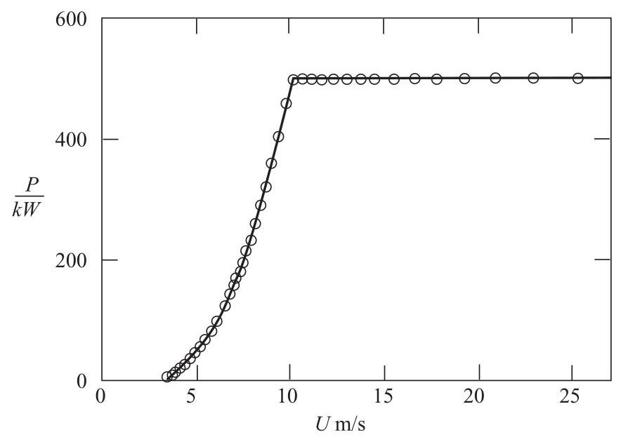

Figure 3.68 Power vs. wind speed variable speed, pitch regulated turbine

## 3.17 Wind turbine aerofoil design

### 3.17.1 Introduction

For many years the wind turbine industry relied on aeronautical experience for the aerodynamic design of turbine blades but it became clear that aerofoil sections that were right for aircraft wings were not necessarily right for wind turbine blades.

There were reports of turbines in the 1970s having to be regularly hosed with water to clear accumulated debris on the blades in order to restore power levels that had fallen dramatically. An aerofoil that was tolerant to leading edge roughness was required.

Most early turbines of rated power greater than about ${50}\mathrm{\;{kW}}$ operated at constant rotational speed and relied upon passive stall for power control. With most aircraft aerofoil sections the stall produced a sudden sharp loss of power output that was not recovered until the wind speed increased. The stalling resulted in significant losses of energy capture. Thus, another requirement for a wind turbine aerofoil was a gentle stall.

A popular range of aerofoil designs was, and still is, the NACA 6 digit series, an example of which is discussed in Section 3.9. Although more tolerant to leading edge grime the NACA 6 digit series is no better than the NACA 4 digit series described in Appendix A3. The main reason for the popularity of the NACA aerofoils is because high quality experimental data is available from tests that were carried out in the 1930s in the pressurised wind tunnel built by NACA (National Advisory Committee for Aeronautics, superseded by NASA in 1959). The NACA technical reports are available free of charge on the NASA website.

### 3.17.2 The NREL aerofoils

The development of special-purpose aerofoils for horizontal-axis wind turbines began in 1984 jointly between the National Renewable Energy Laboratory (NREL), formerly the Solar Energy Research Institute (SERI), and Airfoils, Incorporated, Tangler and Somers (1995). Since that time nine aerofoil families have been designed for various size rotors with a principal requirement that they have a maximum lift coefficient that is maintained in the presence of leading edge surface roughness.

Table 3.3 Summary of the NREL aerofoils and their applications

<table><tr><td>Diameter</td><td>Type</td><td>Aerofoil thickness</td><td>Primary</td><td>Tip</td><td>Root</td></tr><tr><td>$3 - {10}\mathrm{\;m}$</td><td>Variable speed Variable pitch</td><td>Thick</td><td>-</td><td>S822</td><td>S823</td></tr><tr><td>10-20 m</td><td>Variable speed</td><td>Thin</td><td>S802</td><td>S802</td><td>S804</td></tr><tr><td></td><td>Variable pitch</td><td></td><td></td><td>S803</td><td></td></tr><tr><td>${10} - {20}\mathrm{\;m}$</td><td>Stall regulated</td><td>Thin</td><td>S805</td><td>S806</td><td>S807</td></tr><tr><td></td><td></td><td></td><td>S805A</td><td>S806A</td><td>S808</td></tr><tr><td>${10} - {20}\mathrm{\;m}$</td><td>Stall regulated</td><td>Thick</td><td>S819</td><td>S820</td><td>S821</td></tr><tr><td>20-30 m</td><td>Stall regulated</td><td>Thick</td><td>S809</td><td>S810</td><td>S811</td></tr><tr><td>20–30 m</td><td>Stall regulated</td><td>Thick</td><td>S812</td><td>S813</td><td>S814</td></tr><tr><td></td><td></td><td></td><td></td><td></td><td>S815</td></tr><tr><td>20–40 m</td><td>Variable speed</td><td>-</td><td>S825</td><td>S826</td><td>S814</td></tr><tr><td></td><td>Variable pitch</td><td></td><td></td><td></td><td>S815</td></tr><tr><td>30–50 m</td><td>Stall regulated</td><td>Thick</td><td>S816</td><td>S817</td><td>S818</td></tr><tr><td>40–50 m</td><td>Stall regulated</td><td>Thick</td><td>S827</td><td>S828</td><td>S818</td></tr><tr><td>40–50 m</td><td>Variable speed</td><td>Thick</td><td>S830</td><td>S831</td><td>S818</td></tr><tr><td></td><td>Variable pitch</td><td></td><td></td><td>S832</td><td></td></tr></table>

The primary design tool was based on the work of Eppler (1990, 1993) who developed a method of determining the nature of the two-dimensional viscous flow around an aerofoil of any profile. The Eppler method includes flow separation at the stall and has proved to be very successful.

In addition, the several different aerofoil families have been designed for stall-regulated, variable-pitch and variable-rpm wind turbines.

For stall-regulated rotors, improved post-stall power control is achieved through the design of aerofoils for the outer sections of a blade that limit the maximum lift coefficient. The same aerofoils have a relatively high thickness to chord ratio in order to accommodate over-speed control devices.

For variable-pitch and variable-rpm rotors, outer section aerofoils have a high maximum lift coefficient allowing low blade solidity.

Generally, aerofoil cross-sections with a high thickness to chord ratio, structural designs of high stiffness and strength without causing a large weight penalty and aerofoils of low thickness result in less drag.

Annual energy capture improvements that are claimed for the NREL airfoil families are of the order of 23%-35% for stall-regulated turbines, 8%-20% for variable-pitch turbines, and 8%-10% for variable-rpm turbines. The improvement for stall-regulated turbines has been verified in field tests.

The aerofoil shape co-ordinates for some of the NREL aerofoils are available on the website of the National Wind Technology Center (NWTC) at Golden Colorado; measured aerofoil data for some aerofoils is also available. A licence must be purchased for information about those aerofoils that are restricted.

Some of the NREL large blade aerofoil profiles are illustrated in Figure 3.69.

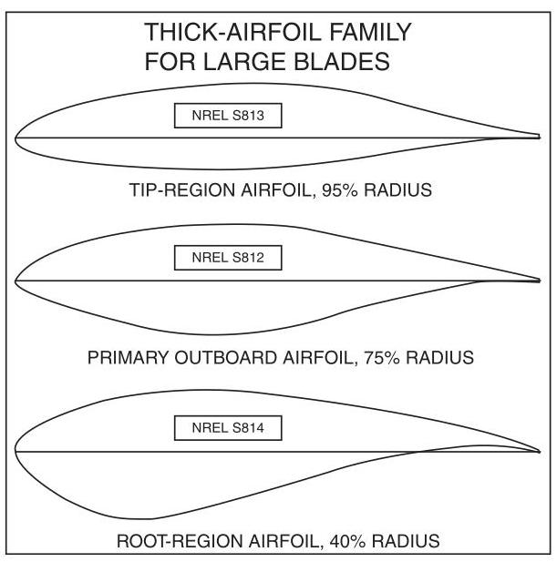

Design Specifications Design Specifications

<table><tr><td>Airfoil</td><td>r/R</td><td>Rs. No. (x106)</td><td>t/c</td><td>Cimax</td><td>${\mathrm{C}}_{\text{ dmin }}$</td><td>${\mathrm{C}}_{\mathrm{{mp}}}$</td></tr><tr><td>S810</td><td>0.95</td><td>2.0</td><td>0.180</td><td>0.9</td><td>0.006</td><td>-0.05</td></tr><tr><td>S809</td><td>0.75</td><td>2.0</td><td>0.210</td><td>1.0</td><td>0.007</td><td>-0.05</td></tr><tr><td>S814</td><td>0.40</td><td>1.5</td><td>0.240</td><td>1.3</td><td>0.012</td><td>-0.15</td></tr><tr><td>S815</td><td>0.30</td><td>1.2</td><td>0.260</td><td>1.1</td><td>0.014</td><td>-0.15</td></tr></table>

<table><tr><td>Airfoil</td><td>r/R</td><td>Rs. No. (x106)</td><td>t/c</td><td>Cimax</td><td>${\mathrm{C}}_{\text{ dmin }}$</td><td>${\mathrm{C}}_{\mathrm{{mp}}}$</td></tr><tr><td>S813</td><td>0.95</td><td>2.0</td><td>0.150</td><td>1.1</td><td>0.007</td><td>-0.07</td></tr><tr><td>S812</td><td>0.75</td><td>2.0</td><td>0.210</td><td>1.2</td><td>0.008</td><td>-0.07</td></tr><tr><td>S814</td><td>0.40</td><td>1.5</td><td>0.240</td><td>1.3</td><td>0.012</td><td>-0.15</td></tr><tr><td>S815</td><td>0.30</td><td>1.2</td><td>0.260</td><td>1.1</td><td>0.014</td><td>-0.15</td></tr></table>

Thick-Airfoil Family for Large Blades (lower tip ${c}_{1,\max }$ ) Thick-Airfoil Family for Large Blades (low tip ${\mathrm{c}}_{1,\max }$ )

Figure 3.69 NREL aerofoil profiles for large blades. Reproduced from Tangler and Somers (1995)

### 3.17.3 The Risø aerofoils

The Risø National Laboratory in Denmark have also developed families of aerofoil designs for wind turbines with similar objectives to the NREL series, Fugslang and Bak (2004). Although the aerodynamic design techniques of the two laboratories were different there is, perhaps not surprisingly, a significant similarity between the actual designs.

The design tools for the Risø aerofoils were the X-FOIL code developed by Drela, a development of the work of Eppler (1990, 1993) and the Ellipsys-2D CFD code developed at the Technical University of Denmark by Sørensen (1995).

Three families of aerofoils have been developed at Risø, Risø-A, Risø-P and Risø-B. See Tables 3.4-3.6. The Risø-A family, Figure 3.70 and Table 3.4, was designed in the 1990s and was intended for stall controlled turbines, however, sensitivity to surface roughness was found to be higher than expected in field tests. The Risø-A family of aerofoil profiles are illustrated in Figure 3.70.

The Risø-P family of just four aerofoils, Figure 3.71 and Table 3.5, was designed to replace the corresponding profiles in the Risø-A series for use on variable pitch and variable speed rotors. The Risø-P family of aerofoil profiles are illustrated in Figure 3.71.

The Risø-B family was designed as six separate aerofoils with an extended range of thickness to chord ratio from 15-36%, see Figure 3.72 and Table 3.6. The aerofoils, generally, have high maximum lift coefficients for use on multi-megawatt size rotors with low solidity, flexible blades having variable speed pitch control. The Risø-B family of aerofoil profiles are illustrated in Figure 3.72.

Figure 3.70 The Risø-A series of aerofoil profiles

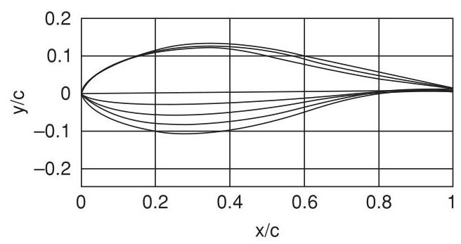

Figure 3.71 The Risø-P series of aerofoil profiles

In Tables 3.4-3.7 the ’design ${c}_{1}$ ’ is the value of the lift coefficient that corresponds to the maximum lift to drag ratio. It is a design feature of the Risø aerofoils that the design ${c}_{1}$ is high so that a blade will be most efficient at low solidity.

### 3.17.4 The Delft aerofoils

The Delft University of Technology in the Netherlands has also developed a number of aerofoils for wind turbine rotors (Timmer and van Rooij, 2003), see Figure 3.73 and Table 3.7. As with the NREL and Risø aerofoils, the principal feature driving the designs was surface roughness insensitivity but more emphasis was placed upon seeking designs for thick aerofoils in order to gain a structural advantage. The Delft University series of aerofoil profiles are illustrated in Figure 3.73.

Table 3.4 The principal characteristics of the Risø-A series

<table><tr><td>Aerofoil</td><td>Max t/c %</td><td>x/c at max t/c</td><td>y/c at T.E.</td><td>Re $\times \; {10}^{-6}$</td><td>${\alpha }^{ \circ  }$</td><td>${\mathrm{c}}_{1}$ Max</td><td>Design $\alpha$</td><td>Design ${\mathrm{C}}_{1}$</td><td>Max ${\mathrm{C}}_{\mathrm{l}}/{\mathrm{c}}_{\mathrm{d}}$</td></tr><tr><td>Risø-A1- 15</td><td>15</td><td>0.325</td><td>0.0025</td><td>3.00</td><td>-4.0</td><td>1.50</td><td>6.0</td><td>1.13</td><td>168</td></tr><tr><td>Risø-A1- 18</td><td>18</td><td>0.336</td><td>0.0025</td><td>3.00</td><td>-3.6</td><td>1.53</td><td>6.0</td><td>1.15</td><td>167</td></tr><tr><td>Risø-A1- 21</td><td>21</td><td>0.298</td><td>0.005</td><td>3.00</td><td>-3.3</td><td>1.45</td><td>7.0</td><td>1.15</td><td>161</td></tr><tr><td>Risø-A1- 24</td><td>24</td><td>0.302</td><td>0.01</td><td>2.75</td><td>-3.4</td><td>1.48</td><td>7.0</td><td>1.19</td><td>157</td></tr><tr><td>Risø-A1- 27</td><td>27</td><td>0.303</td><td>0.01</td><td>2.75</td><td>-3.2</td><td>1.44</td><td>7.0</td><td>1.15</td><td>N/A</td></tr><tr><td>Riso-A1- 30</td><td>30</td><td>0.300</td><td>0.01</td><td>2.50</td><td>-2.7</td><td>1.35</td><td>7.0</td><td>1.05</td><td>N/A</td></tr><tr><td>Risø-A1- 33</td><td>30</td><td>0.304</td><td>0.01</td><td>2.50</td><td>-1.6</td><td>1.20</td><td>7.0</td><td>0.93</td><td>N/A</td></tr></table>

Table 3.5 The principal characteristics of the Risø-P series

<table><tr><td>Aerofoil</td><td>Max t/c %</td><td>x/c at max t/c</td><td>y/c at T.E.</td><td>Re $\times \; {10}^{-6}$</td><td>$\alpha$</td><td>${\mathrm{c}}_{1}$ Max</td><td>Design $\alpha$</td><td>Design ${\mathrm{C}}_{1}$</td><td>Max ${\mathrm{C}}_{1}/{\mathrm{c}}_{\mathrm{d}}$</td></tr><tr><td>Risø-P- 15</td><td>15</td><td>0.328</td><td>0.0025</td><td>3.00</td><td>- 3.5</td><td>1.49</td><td>6.0</td><td>1.12</td><td>173</td></tr><tr><td>Risø-P- 18</td><td>18</td><td>0.328</td><td>0.0025</td><td>3.00</td><td>-3.7</td><td>1.50</td><td>6.0</td><td>1.15</td><td>170</td></tr><tr><td>Risø-P- 21</td><td>21</td><td>0.323</td><td>0.005</td><td>3.00</td><td>-3.5</td><td>1.48</td><td>6.0</td><td>1.14</td><td>159</td></tr><tr><td>Risø-P- 24</td><td>24</td><td>0.320</td><td>0.01</td><td>2.75</td><td>-3.7</td><td>1.48</td><td>6.0</td><td>1.17</td><td>156</td></tr></table>

Table 3.6 The principal characteristics of the Risø-B series

<table><tr><td>Aerofoil</td><td>Max t/c %</td><td>x/c at max t/c</td><td>y/c at T.E.</td><td>Re $\times \; {10}^{-6}$</td><td>$\alpha$</td><td>${\mathrm{c}}_{1}$ Max</td><td>Design $\alpha$</td><td>Design ${\mathrm{C}}_{1}$</td><td>Max ${\mathrm{C}}_{1}/{\mathrm{c}}_{\mathrm{d}}$</td></tr><tr><td>Risø-B1- 15</td><td>15</td><td>0.278</td><td>0.006</td><td>6.00</td><td>-4.1</td><td>1.92</td><td>6.0</td><td>1.21</td><td>157</td></tr><tr><td>Risø-B1- 18</td><td>18</td><td>0.279</td><td>0.004</td><td>6.00</td><td>-4.0</td><td>1.87</td><td>6.0</td><td>1.19</td><td>166</td></tr><tr><td>Risø-B1- 21</td><td>21</td><td>0.278</td><td>0.005</td><td>6.00</td><td>-3.6</td><td>1.83</td><td>6.0</td><td>1.16</td><td>139</td></tr><tr><td>Risø-B1- 24</td><td>24</td><td>0.270</td><td>0.007</td><td>6.00</td><td>-3.1</td><td>1.76</td><td>6.0</td><td>1.15</td><td>120</td></tr><tr><td>Risø-B1- 30</td><td>30</td><td>0.270</td><td>0.01</td><td>6.00</td><td>-2.1</td><td>1.61</td><td>5.0</td><td>0.90</td><td>N/A</td></tr><tr><td>Riso-B1- 36</td><td>36</td><td>0.270</td><td>0.012</td><td>6.00</td><td>-1.3</td><td>1.15</td><td>5.0</td><td>0.90</td><td>N/A</td></tr></table>

Figure 3.72 The Risø-B series of aerofoil profiles

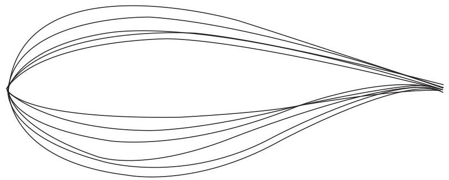

Figure 3.73 The DU series of aerofoil profiles

Table 3.7 The principal characteristics of the DU series

<table><tr><td>Aerofoil</td><td>Max t/c %</td><td>x/c at max t/c</td><td>$\mathrm{y}/\mathrm{c}$ at T.E.</td><td>Re $\times \; {10}^{-6}$</td><td>$\alpha$</td><td>${\mathrm{c}}_{1}$ Max</td><td>Design $\alpha$</td><td>Design ${\mathrm{C}}_{1}$</td><td>Max ${\mathrm{C}}_{1}/{\mathrm{c}}_{\mathrm{d}}$</td></tr><tr><td>DU 96-W-180</td><td>18</td><td>0.3</td><td>0.0018</td><td>3.00</td><td>-2.7</td><td>1.26</td><td>6.59</td><td>1.07</td><td>145</td></tr><tr><td>DU 00-W-212</td><td>21.2</td><td>0.3</td><td>0.0023</td><td>3.00</td><td>-2.7</td><td>1.29</td><td>6.5</td><td>1.06</td><td>132</td></tr><tr><td>DU 91-W2-250</td><td>25</td><td>0.3</td><td>0.0054</td><td>3.00</td><td>-3.2</td><td>1.37</td><td>6.68</td><td>1.24</td><td>137</td></tr><tr><td>DU 97-W-300</td><td>30</td><td>0.3</td><td>0.0048</td><td>3.00</td><td>-2.2</td><td>1.56</td><td>9.3</td><td>1.39</td><td>98</td></tr><tr><td>DU 00-W-350</td><td>35</td><td>0.3</td><td>0.01</td><td>3.00</td><td>-2.0</td><td>1.39</td><td>7.0</td><td>1.13</td><td>81</td></tr><tr><td>DU 00-W-401</td><td>40.1</td><td>0.3</td><td>0.01</td><td>3.00</td><td>-3.0</td><td>1.04</td><td>5.0</td><td>0.82</td><td>54</td></tr></table>

The design tool for the Delft aerofoils was the R-FOIL code a modification made at Delft of the X-FOIL code to include the effects of stall delay.

The two thickest aerofoils have not been tested in a wind tunnel and the characteristics have been determined by calculation.

## References

Betz, A. (1919) Schraubenpropeller mit geringstem Energieverlust. Gottinger Nachrichten, Delft.

Drela, M. (1989) X-Foil: An Analysis and Design System for low Reynolds Number Airfoils. Low Reynolds Number Aerodynamics, Vol. 54 (1989), Springer-Verlag Lecture Notes in Engineering. Springer-Verlag, Godalming.

Eppler, R. (1990) Airfoil Design and Data. Springer-Verlag, Berlin.

Eppler, R. (1993) Airfoil Program System. User's Guide. Eppler, R. Airfoil Program System, User's Guide; Institut A fuer Mechanik, Universitate Stuttgart (1988).

Fugslang, P. and Bak, C. (2004) Development of the Risø Wind Turbine Airfoils. Wind Energy, 7, 145-162.

Glauert, H. (1926) The Analysis of Experimental Results in the Windmill Brake and Vortex Ring States of an Airscrew., ARCR R&M No. 1026.

Glauert, H. (1935a) Airplane Propellers. In: Aerodynamic Theory, (ed. W.F. Durand), Vol. 4, Division L, pp. 169-360. Julius Springer, Berlin.

Glauert, H. (1935b) Windmills and Fans. In: Aerodynamic Theory, (ed. W.F. Durand), Vol. 4, Division L, pp. 169-360. Julius Springer, Berlin.

Goldstein, S. (1929) On the Vortex Theory of Screw Propeller. Royal Society Proceedings (A) 123, p. 440.

Himmelskamp, H. (1945) Profile investigations on a rotating airscrew. PhD thesis, University of Göttingen.

Hoerner, S.F. (1965) Pressure drag on rotating bodies. In: Fluid-Dynamic Drag (S.F. Hoerner) pp. 3-13, 14.S.F Hoerner, New Jersey.

Lanchester, F.W. (1915) A Contribution to the Theory of Propulsion and the Screw Propeller, Transactions of the Institution of Naval Architects, 57, 98.

Lock, C.N.H. (1924) Experiments to Verify the Independence of the Elements of an Airscrew Blade, ARCR R&M, No. 953.

Ronsten, G. (1991) Static pressure measurements in a rotating and a non-rotating 2.35 m wind turbine blade. Comparison with 2D calculations. Proceedings of the EWEC '91 conference, Amsterdam.

Snel, H., Houwink, R., Bousschers, Piers, W.J., van Bussel, G.J.W. and Bruining, A. (1993) Sectional Prediction of 3-D Effects for Stalled Flow on Rotating Blades and Comparison with Measurements. Proceedings of the EWEC '93 conference, Lübeck-Travemünde.

Sørensen, N.N. (1995) General Purpose Flow Solver Applied to Flow over Hills, Risø-R-827(EN). Risø National Laboratory, Denmark.

Tangler, J.L. and Somers, D.M. (1995) NREL Airfoil Families for HAWTs. AWEA '95. Washington, D.C.

Timmer, W.A. and van Rooij, R.P.J.O.M. (2003) Summary of the Delft University Wind Turbine Dedicated Airfoils. Journal of Solar Energy Engineering, 125, 488-496.

Wilson, R.E. and Lissaman, P.B.S. (1974) Applied Aerodynamics of Wind Power-Machines. NTIS: PB-238-595. Oregon State University, Oregon.

Wood, D.H. (1991) A three-dimensional analysis of stall-delay on a horizontal-axis wind turbine. Journal of Wind Engineering and Industrial Aerodynamics, 37, 1-14.

Young, A.D. and Squire, H.B. (1938) The Calculation of the Profile Drag of Aerofoils. R. & M. NO. 1838, British A.R.C., 1938.

## Websites

http://www.nrel.gov/wind/

http://www.nrel.gov/wind/publications.html

https://wind.nrel.gov/airfoils/Shapes/S809_Shape.html.

http://www.windpower.org/en/

http://www.lr.tudelft.nl/live/pagina.jsp?id=9e2f503f-3b65-44bc-aba4-a30033400ea7&lang=en

## Further Reading

Duncan, W.J., Thom, A.S. and Young, A.D. (1970) Mechanics of Fluids, 2nd edition. Edward Arnold, London.

Barnard, R.H. and Philpott, D.R. (1989) Aircraft Flight. A description of the physical principles of aircraft flight. Longman, Singapore.

Anderson, J.D. (1991) Fundamentals of Aerodynamics, 2"d edition. McGraw-Hill, Singapore.

Prandtl, L. and Tietjens, O.G. (1957) Applied Hydro- and Aeromechanics. Dover, New York.

Katz, J. and Plotkin, A. (1991) Low Speed Aerodynamics. From wing theory to panel methods. McGraw-Hill, Singapore.

Abbott, I.H. and von Doenhoff, A.E. (1959) Theory of Wing Sections. Dover, New York.

Stepniewski, W.Z. and Keys, C.N. (1984) Rotary-Wing Aerodynamics. Dover, New York.

Johnson, W. (1980) Helicopter Theory. Dover, New York.

Fung, Y.C. (1969) An Introduction to the Theory of Aeroelasticity. Dover, New York.

Eggleston, D.M. and Stoddard, F.S. (1987) Wind Turbine Engineering Design. Van Nostrand Reinhold Co., New York.

Manwell, J.F., McGowan, J.G. and Rogers, A.L. (2002) Wind Energy Explained. John Wiley & Sons Ltd., Chichester.

Hansen, M.O.L. (2000) Aerodynamics of Wind Turbines. James & James, London.

## Appendix A3 lift and drag of aerofoils

The forces acting on a body immersed in a fluid moving fluid can be resolved into stream-wise (drag) and normal (lift) components. Neglecting buoyancy, the fluid mechanics which give rise to lift and drag are associated with the boundary layer of slow moving fluid close to the body's surface. The fluid force on the surface of the body can be either parallel to the surface (viscous or skin friction force) or normal to the surface (pressure force).

For a thorough understanding of the phenomena of lift and drag an aerodynamics text should be consulted but for the purposes of wind turbine aerodynamics the basic results are given below.

## A3.1 Definition of drag

The drag on a body immersed in an oncoming flow is defined as the force on the body in a direction parallel to the flow direction.

In a very slowly moving fluid the drag on a body may be directly attributable to the viscous, frictional shear stresses set up in the fluid due to the fact that, at the body wall, there is no relative motion.

This type of flow is known as Stokes flow after Sir George Stokes.

A century and a half before Stokes, Isaac Newton showed that that the shear stress $\tau$ at a boundary wall, or between two layers of fluid moving relative to one another, is proportional to the transverse velocity gradient at the boundary, or between the two layers.

$$
\tau  = \mu \frac{du}{dy} \tag{A3.1}
$$

where the constant of proportionality is $\mu$ the fluid viscosity.

Using Newton's theory, Stokes determined the drag force on a sphere in creeping flow (Figure A3.1).

$$
\text{ Drag } = {3\pi \mu Ud} \tag{A3.2}
$$

where $d$ is the sphere diameter and $U$ is the general flow velocity.

The inviscid flow pattern around a cylinder, Figure A3.2, appears very similar to that of creeping flow but the nature of the flow is very different indeed. By definition inviscid flow causes no viscous drag but it also causes no pressure drag, that is, drag caused by a pressure force aggregated over the whole surface area. The pressure distribution for the inviscid flow past a cylinder is shown in Figure A3.3, where the atmospheric pressure ${p}_{\infty }$ has been subtracted from the pressure around the surface. The symmetry of the pressure distribution fore and aft shows clearly that no pressure drag arises. At the nose of the body the flow is brought exactly to rest and this is called the stagnation point. Another stagnation point occurs at the rear of the body.

Figure A3.1 Creeping flow past a circular cylinder

Figure A3.2 Inviscid flow pattern around a cylinder

In a real fluid, when the viscosity is low and the velocity is relatively high, the drag force that exists is due primarily to an asymmetric pressure distribution, fore and aft, Figure A3.5.

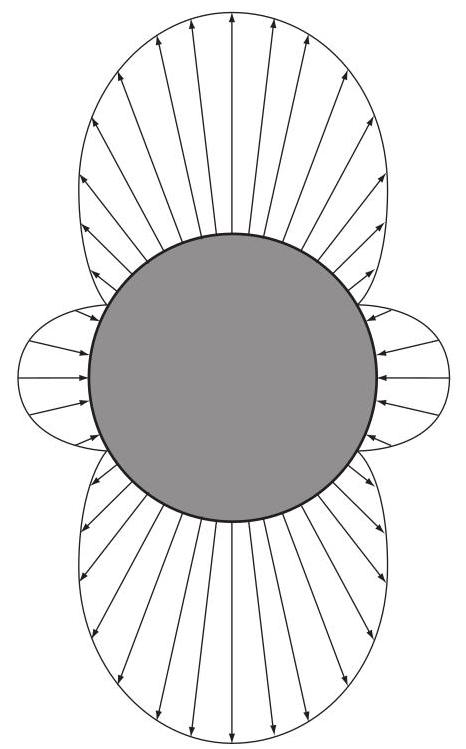

Figure A3.3 Inviscid flow pressure distribution around a cylinder

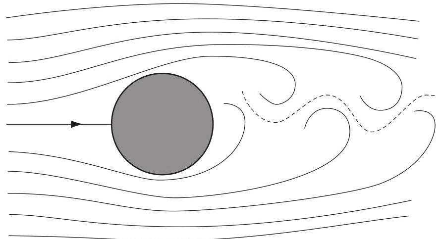

Figure A3.4 Separated flow pattern around a cylinder

This is caused by the fact that the fluid does not follow the boundary of the body but separates from it leaving low pressure, stagnant fluid in the wake, Figure A3.4. On the upstream side the flow remains attached and the pressure is high.

## A3.2 Drag coefficient

If Stokes' drag equation (Equation A3.2) for the sphere is re-arranged, giving

$$
\text{ Drag } = {3\pi \mu Ud} = \left( {{24}\left( \frac{\mu }{\rho Ud}\right) }\right) \left( {\frac{1}{2}\rho {U}^{2}}\right) \left( \frac{\pi {d}^{2}}{4}\right) \tag{A3.3}
$$

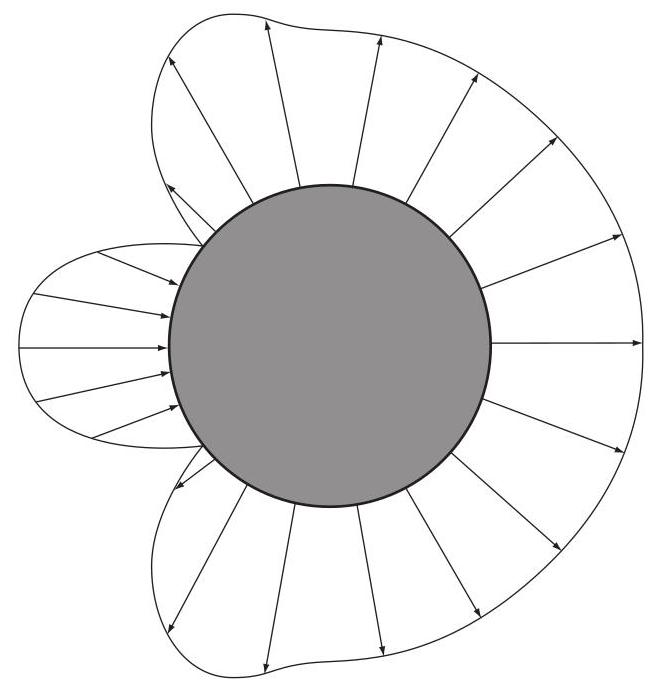

Figure A3.5 Separated flow pressure distribution around a cylinder

Figure A3.6 Boundary layer showing the velocity profile

it is then in the standard form of drag coefficient $\left( {C}_{D}\right)  \times$ dynamic pressure $\left( {\frac{1}{2}\rho {U}^{2}}\right)  \times$ frontal area (A). The drag coefficient is then defined as

$$
{C}_{D} = \frac{\text{ Drag }}{\frac{1}{2}\rho {U}^{2}A} \tag{A3.4}
$$

Note that, ${\rho Ud}/\mu$ is known as the Reynolds number $\left( {Re}\right)$ and represents the ratio of the inertia force acting on a unit volume of fluid, as it is accelerated by a pressure gradient, and the viscous force on the same volume of fluid which is resisting the motion of the fluid. For high Reynolds numbers viscous forces are low and vice versa. The drag coefficient term in Equation A3.3 is ${C}_{D} = {24}/{Re}$ and is clearly a function only of the Reynolds number: this turns out to be valid for all bodies in incompressible flow but the functional relationship is not usually as simple as in the above case. However, it can be stated, generally, that ${C}_{D}$ falls with increasing Reynolds number.

## A3.3 The boundary layer

The reason for the separated flow at the higher Reynolds numbers is the existence of a thin boundary layer of slow moving fluid, close to the body surface, within which viscous forces predominate. See Figure A3.6. Outside of this layer the flow behaves almost inviscidly. The drag on the body caused directly by viscosity is quite small but the effect on the flow pattern is profound.

The drag on an aerofoil can be attributed both to pressure and viscous sources and the drag coefficient varies significantly with both angle of attack and Reynolds number.

## A3.4 Boundary layer separation

Referring to Figure A3.3, the inviscid flow pressure distribution around a cylinder, fore and aft the pressure is high; above and below the pressure is low. The fluid on the downstream side is slowing down against an adverse pressure gradient and, at the wall boundary, it slows down exactly to a standstill at the rear stagnation point.

In the real flow the fluid the boundary layer (Figure A3.6), which has already been slowed down by viscosity, comes to a halt well before the stagnation point is reached and the flow begins to reverse under the action of the adverse pressure. At this point, where the pressure is still low, the boundary layer separates from the body surface forming a wake of stagnant, low pressure fluid (Figure A3.7), the resulting pressure distribution is thereby dramatically altered as shown in Figure A3.5. The high pressure acting at and around the forward stagnation point is no longer balanced by the high pressure at the rear and so a drag-wise pressure force is exerted.

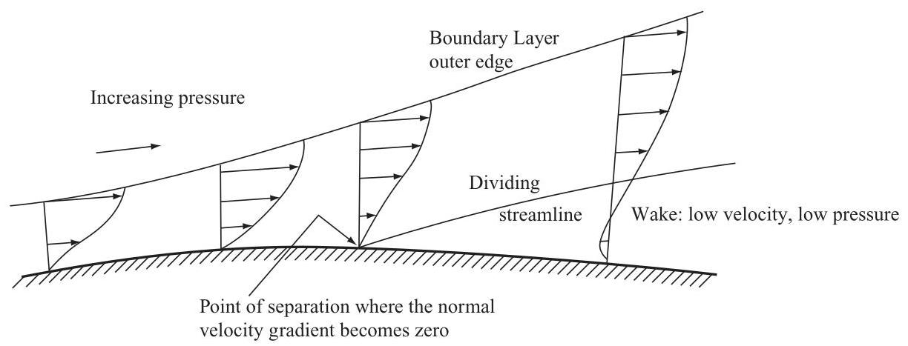

Figure A3.7 Separation of a boundary layer

## A3.5 Laminar and turbulent boundary layers

A boundary layer grows in thickness from the forward stagnation point, or leading edge. Initially, the flow in the layer is ordered and smooth (laminar) but, at a critical distance $l$ from the stagnation point, characterised by $R{e}_{\text{ crit }} = {\rho Ul}/\mu$ , the flow begins to become turbulent, (Figure A3.8). This turbulence causes mixing of the boundary layer with the faster moving fluid outside resulting in re-energisation and delaying of the point of separation. The result is to reduce the pressure drag, because the low pressure stagnant rear area is reduced, to increase the viscous (frictional) drag, because the velocity gradient at the surface is increased, and increase the boundary layer thickness.

The coefficient of drag, therefore, varies with Re in a complex fashion, Figure A3.9. For small bodies at low speeds the critical Re is never reached and so separation takes place early. For large bodies, or high speeds, turbulence develops quickly and separation is delayed.

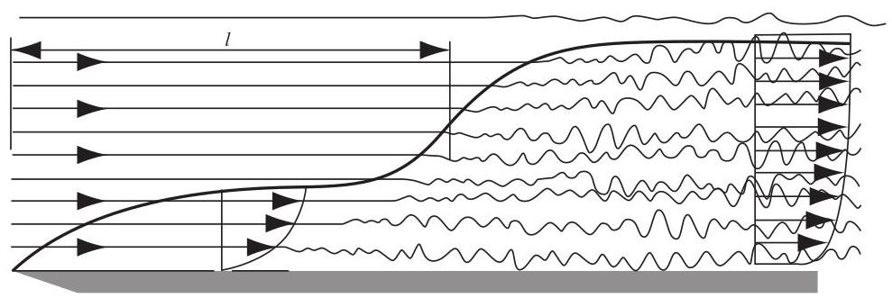

Figure A3.8 Laminar and turbulent boundary layers

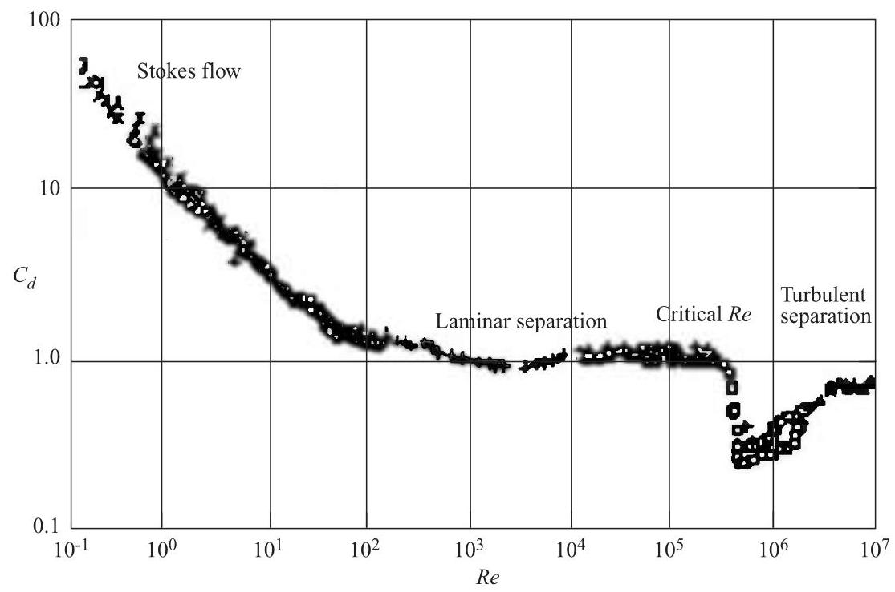

Figure A3.9 Variation of ${C}_{D}$ with ${Re}$ for a long cylinder

Turbulence can be artificially triggered by roughening the body surface or simply by using a 'trip wire'. General flow turbulence tends to produce turbulent boundary layers at Reynolds numbers ostensibly below the critical value and this certainly seems to happen in the case of wind turbine blades. A sharp edge on a body will always cause separation. For a flat plate broad side on to the flow, Figure A3.10, the boundary layer separates at the sharp edges and ${C}_{D}$ is almost independent of ${Re}$ , but is dependent upon the plate’s aspect ratio.

So-called streamlined bodies such as an aerofoil taper gently in the aft region so that the adverse pressure gradient is small and separation is delayed until very close to the trailing edge, (Figure A3.11). This produces a very much narrower wake and a very low drag because it is largely caused by skin friction rather than pressure.

Figure A3.10 Separated flow past a flat plate

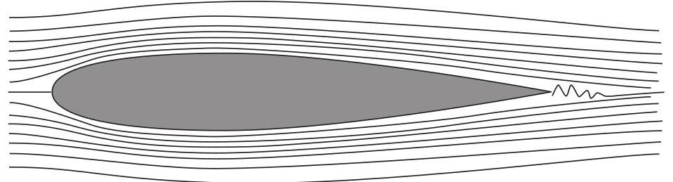

Figure A3.11 Flow past a streamlined body

## A3.6 Definition of lift and its relationship to circulation

The lift on a body immersed is defined as the force on the body in a direction normal to the flow direction.

Lift will only be present if the flow incorporates a circulatory flow about the body such as that which exists about a spinning circular cylinder. If the fluid also has a uniform velocity $U$ past the cylinder, the resulting flow field is as shown in Figure A3.12. The velocity above the cylinder is increased, and so the static pressure there is reduced. Conversely, the velocity beneath is slowed down, giving an increase in static pressure. There is clearly a normal force upwards on the cylinder, a lift force.

The phenomenon is known as the Magnus effect after its original discoverer and explains, for example, why spinning tennis balls veer in flight. The circulatory flow, shown in Figure A3.13, is generated by skin friction and has the same structure as that of a vortex.

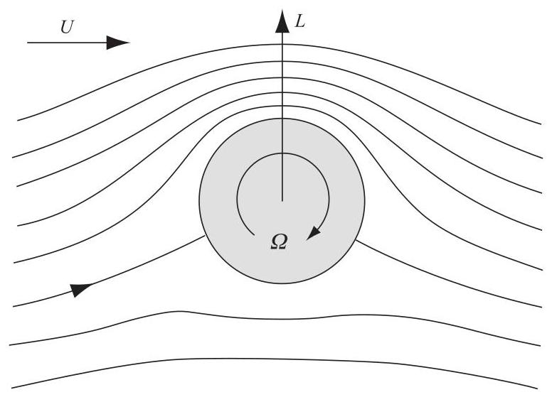

Figure A3.12 Flow past a rotating cylinder

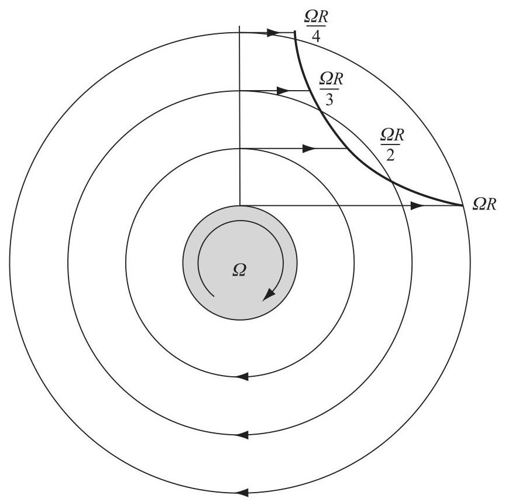

Figure A3.13 Circulatory flow round a rotating cylinder

The lift force is given by the Kutta-Joukowski theorem named after the two pioneering aerodynamicists who, independently, realised that this was the key to the understanding of the phenomenon of lift.

$$
L = \rho \left( {\Gamma  \times  U}\right) \tag{A3.5}
$$

where $\Gamma$ is the circulation, or vortex strength, around the cylinder, defined as the integral

$$
\Gamma  = \oint {vds} \tag{A3.6}
$$

around any path enclosing the cylinder and $v$ is the velocity tangential to the path $s$ . For convenience, choosing a circular path of radius $r$ around the cylinder, and ignoring the general flow velocity $U$ , then it can be shown that $v = k/r$ , where $k$ is a constant.

At the cylinder wall $r = R$ , so ${v}_{R} = {\Omega R} = k/R$ . Therefore, $k = \Omega {R}^{2}$ .

The circulation $\Gamma$ , which is the same for every path enclosing the cylinder, is given by

$$
\Gamma  = \oint \frac{\Omega {R}^{2}}{r}{ds} = {\int }_{0}^{2\pi }\Omega {R}^{2}{d\theta } = {2\pi \Omega }{R}^{2} \tag{A3.7}
$$

To achieve a circulatory flow about a non-rotating body it must have a sharp trailing edge like an aerofoil cross-sectional shape or a thin plate. An aerofoil works in a similar manner to the spinning cylinder and does so because of its sharp trailing edge. Consider an aerofoil at a small angle of attack $\alpha$ to the oncoming flow. The inviscid flow pattern around the aerofoil, in which no boundary layer forms, is as shown in Figure A3.14a. The theoretical inviscid flow condition is such that no force on the aerofoil exists at all.

Figure A3.14 Flow past an aerofoil at a small angle of attack

In real flow, Figure A3.14c, boundary layer separation occurs at the sharp trailing edge, causing the flow to leave the edge smoothly. The separation leaves no low pressure wake so the flow remains attached everywhere else and the flow pattern is now altered such that there is a net circulation around the aerofoil (Figure A3.14b) increasing the velocity over the top and reducing it below, resulting in a lift force. There can be no flow around the sharp trailing edge because this would require very high local velocities that are precluded by the boundary layer. The drag is very low because, in the absence of a wake, it is attributable largely to skin friction caused by the shearing stresses in the boundary layer. The situation, which is imposed by the sharp trailing edge, is known as the Kutta condition.

In a manner similar to the Magnus effect, a pressure difference occurs across the aerofoil and the overall circulation $\Gamma$ can be shown to be ${\pi Uc}\sin \alpha$ , where $c$ is the chord length of the aerofoil and $\alpha$ is termed the angle of attack. Although the velocities and pressures above and below the aerofoil at the trailing edge must be the same, the particles which meet there are not the same ones that parted company at the leading edge; the particle which travelled above the aerofoil reaches the trailing edge first because it is speeded up by the circulatory flow.

The pressure variation (minus the ambient static pressure of the undisturbed flow) around an aerofoil is shown in Figure A3.15. The upper surface is subject to suction (with the ambient pressure subtracted) and is responsible for most of the lift force. The pressure distribution is calculated without the presence of the boundary layer.

Figure A3.16 shows the same distribution with the pressure coefficient $\left( {{C}_{p} = p - {p}_{\infty }/}\right. \; \left. {\left( {1/2}\right) \rho {U}^{2}}\right)$ plotted against the chord-wise co-ordinate of the aerofoil profile: the full line shows the pressure distribution if the effects of the boundary layer are ignored and the dashed line shows the actual distribution.

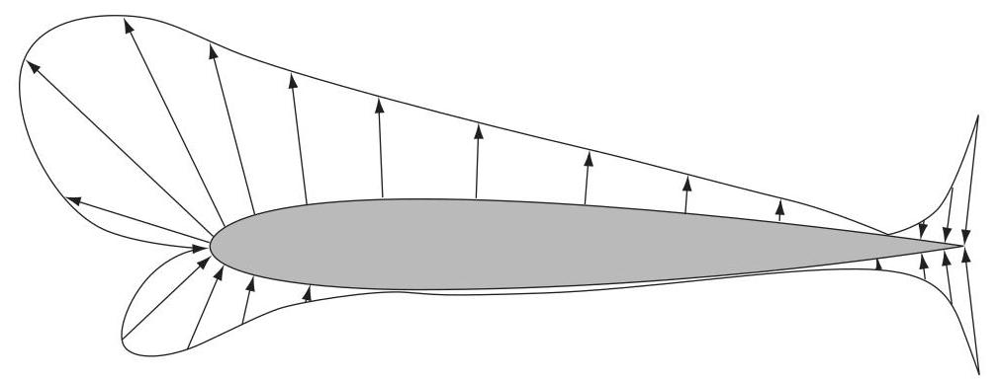

Figure A3.15 The pressure distribution around the NACA0012 aerofoil at $\alpha  = {5}^{ \circ  }$

The effect of the boundary layer is to modify the pressure distribution at the rear of the aerofoil such that lower pressure occurs there rather than if the boundary is ignored. The modified pressure distribution gives rise to pressure drag that is added to the skin friction drag, also caused by the boundary layer.

## A3.7 The stalled aerofoil

If the angle of attack exceeds a certain critical value $\left( {{10}^{ \circ  } - {16}^{ \circ  }}\right.$ , depending on the ${Re}$ ), separation of the boundary layer on the upper surface takes place, (Figure A3.17). This causes a wake to form from above the aerofoil, reduces the circulation, reduces the lift and increases the drag. The flow past the aerofoil has then stalled. A flat plate will also develop circulation and lift but will stall at a very low angle of attack because of the sharp leading edge. Arching the plate will improve the stalling behaviour but a much greater improvement can be obtained by giving thickness to the aerofoil together with a well rounded leading edge.

Figure A3.16 The pressure distribution around the NACA0012 aerofoil at $\alpha  = {5}^{ \circ  }$

## A3.8 The lift coefficient

The lift coefficient is defined as

$$
{C}_{L} = \frac{\text{ Lift }}{\frac{1}{2}\rho {U}^{2}A} \tag{A3.8}
$$

$U$ is the flow speed and $A$ is the plan area of the body. For a long body, such as an aircraft wing or a wind turbine blade, the lift per unit span is used in the definition and the plan area is replaced by the chord length.

$$
{C}_{l} = \frac{\text{ Lift/unit span }}{\frac{1}{2}\rho {U}^{2}c} = \frac{\rho \left( {\Gamma  \times  U}\right) }{\frac{1}{2}\rho {U}^{2}c} = \frac{{\rho \pi Uc}\sin {\alpha U}}{\frac{1}{2}\rho {U}^{2}c} = {2\pi }\sin \alpha \tag{A3.9}
$$

In practice,

$$
{C}_{l} = {a}_{0}\sin \alpha \tag{A3.10}
$$

where ${a}_{0}$ , called the lift-curve slope $d{C}_{l}/{d\alpha }$ , is about 5.73 (0.1/deg.), rather than ${2\pi }$ . Note that ${a}_{0}$ should not be confused with the flow induction factor.

Lift, therefore, depends on two parameters, the angle of attack $\alpha$ and the flow speed $U$ . The same lift force can be generated by different combinations of $\alpha$ and $U$ .

The variation of ${C}_{l}$ with the angle of attack $\alpha$ is shown in Figure A3.18 for a typical symmetrical aerofoil (NACA0012). Notice that the simple relationship of Equation A3.10 is only valid for the pre-stall region, where the flow is attached, and because the angle of attack is small $\left( { < {16}^{ \circ  }}\right)$ the equation is often written as

$$
{C}_{l} = {a}_{0}\alpha \tag{A3.10a}
$$

## A3.9 Aerofoil drag characteristics

The definition of the drag coefficient for an aircraft wing or a wind turbine blade is based not on the frontal area but on the plan area, for reasons that will become clear later. The flow past a body which has a large span normal to the flow direction is basically two-dimensional and in such cases the drag coefficient can be based upon the drag force per unit span using the stream-wise chord length for the definition.

$$
{C}_{d} = \frac{\text{ Drag }/\text{ unit span }}{\frac{1}{2}\rho {U}^{2}c} \tag{A3.11}
$$

Figure A3.17 Stalled flow around an aerofoil

For a wing of large span the value of ${C}_{d}$ is roughly 0.01, at moderate Reynolds numbers.

The drag coefficient of an aerofoil also varies with angle of attack. Figure A3.16 shows that on the upper surface pressure is rising as the flow moves towards the trailing edge, this is called an adverse pressure gradient and seeks to slow the air down. If the air is slowed to a standstill stall will occur and the pressure drag will rise sharply. The strength of the adverse pressure gradient increases with angle of attack and so it can be expected that the drag will rise with angle of attack. Figure A3.19 shows the variation of ${C}_{d}$ with $\alpha$ also for the symmetrical NACA0012 aerofoil.

Figure A3.18 ${C}_{l} - \alpha$ curve for a symmetrical aerofoil

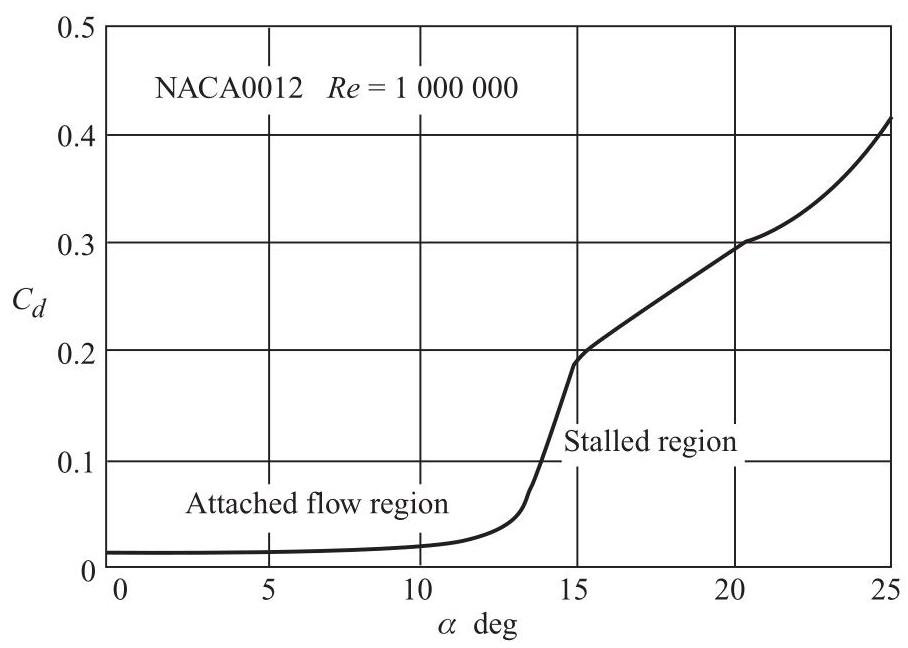

Figure A3.19 Variation of ${C}_{d}$ with $\alpha$ for the NACA0012 aerofoil

The lift/drag ratio (shown in Figure A3.20) has a significant effect upon the efficiency of a wind turbine and it is desirable that a turbine blade operates at the maximum ratio.

The nature of the flow pattern around an aerofoil is determined by the Reynolds number and this significantly affects the values of the lift and drag coefficients. The general level of the drag coefficient increases with decreasing Reynolds number and below a critical Reynolds number of about 200000 the boundary layer remains laminar causing a sharp rise in the coefficient. The effect on the lift coefficient is largely concerned with the angle of attack at which stall occurs. As the Reynolds number rises so does the stall angle and, because the lift coefficient increases linearly with angle of attack below the stall, the maximum value of the lift coefficient also rises.

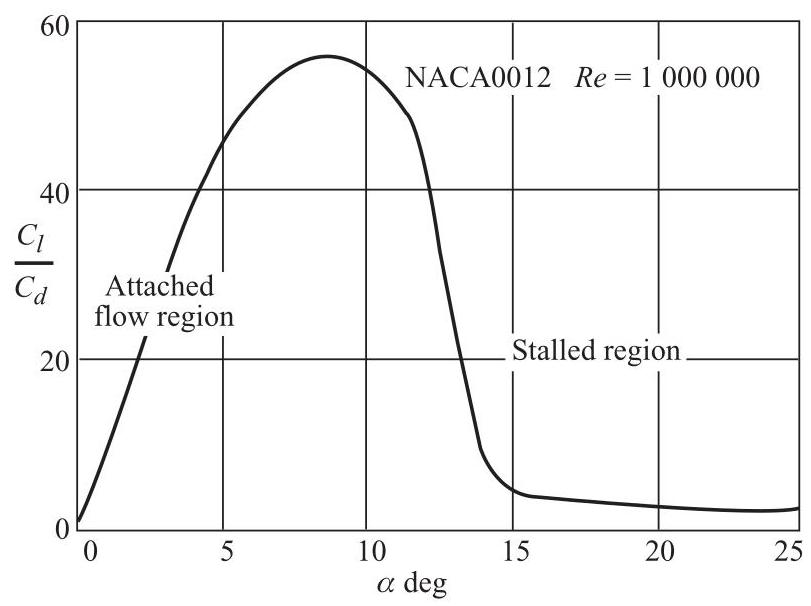

Figure A3.20 Lift/drag ratio variation for the NACA0012 aerofoil

Figure A3.21 Variation of the drag coefficient with Reynolds number at low angles of attack

Characteristics for the NACA0012 aerofoil are shown in Figures A3.21 and A3.22.

## A3.10 Cambered aerofoils

Cambered aerofoils, such as the NACA4412, shown in Figure A3.23, have curved chord lines and this allows them to produce lift at zero angle of attack.

Generally, cambered aerofoils have higher maximum lift/drag ratios than symmetrical aerofoils for positive angles of attack and this is the reason for their use.

The classification of the NACA 4-digit range of aerofoils, which were commonly used on wind turbines, is very simple and is illustrated in Figure A3.24: from left to right, the first digit represents the amount of camber as a percentage of the chord length, the second digit represents the percentage chord position, in units of 10%, at which the maximum camber occurs and the last two digits are the maximum thickness to chord ratio, as a percentage of the chord length, which, in this family of aerofoils, is at the 30% chord position. The cambered chord line, now called the camber line, comprises two parabolic arcs that join smoothly at the point of maximum camber. For other ranges of aerofoils the reader should refer to Theory of Wing Sections by Abbott and von Doenhoff (1959).

The angle of attack $\alpha$ is measured form the chord line which is now defined as the straight line joining the ends of the camber line.

Note that the lift at zero angle of attack is no longer zero; zero lift occurs at a small negative angle of attack. With most cambered aerofoils the zero lift line is approximately at $- {\mathrm{A}}^{ \circ  }$ where $\mathrm{A}$ is the percentage camber.

The behaviour of the NACA4412 aerofoil is shown in Figure A3.25 for angles of attack below and just above the stall. Note that the lift at zero angle of attack is no longer zero; zero lift occurs at a small negative angle of attack of approximately ${4}^{ \circ  }$ .

Figure A3.22 Variation of the drag and lift coefficients with Reynolds number in the stall region

Figure A3.23 The profile of the NACA4412 aerofoil

The centre of pressure, which is at the $\frac{1}{4}$ chord position on symmetrical aerofoils lies aft of the $\frac{1}{4}$ chord position on cambered aerofoils and moves towards the trailing edge with increasing angle of attack. However, if a fixed chordwise position is chosen then the resultant force through that point is accompanied by a pitching moment (nose-up positive, by convention). If a pitching moment coefficient is defined as

$$
{C}_{m} = \frac{\text{ Pitching }/\text{ unit span }}{\frac{1}{2}\rho {U}^{2}c} \tag{A3.12}
$$

then there will be a position, called the ’aerodynamic centre’, for which $d{C}_{m}/d{C}_{l} = 0$ . Theoretically, the aerodynamic centre lies at the $\frac{1}{4}$ chord position and is close to this point for most practical aerofoils.

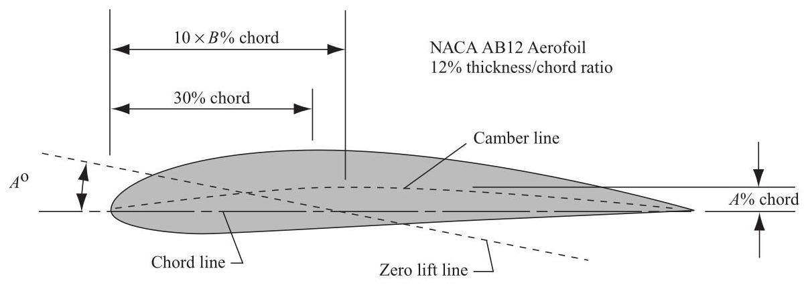

Figure A3.24 Classification of the NACAXXXX aerofoil range

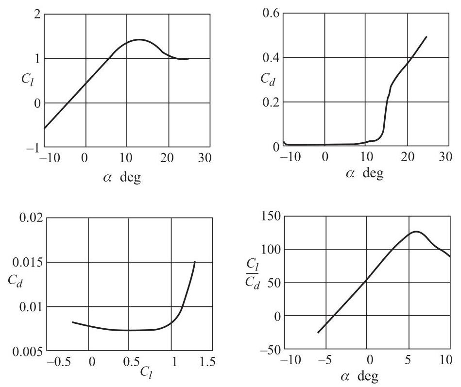

Figure A3.25 The Characteristics of the NACA4412 Aerofoil for $\operatorname{Re} = {1.5} \cdot  {10}^{6}$

The value of ${C}_{m}$ depends upon the degree of camber but for the NACA4412 the value is -0.1, note that pitching moments are always negative in practice (nose down) despite the sign convention.

Above the stall there is no aerodynamic centre, as defined, and so the pre-stall position continues to be used to determine the pitching moment coefficient, which then becomes dependent upon $\alpha$ .

