# 4 Further aerodynamic topics for wind turbines

## 4.1 Introduction

Chapter 3 deals with the aerodynamic behaviour of wind turbines in steady wind conditions and with the rotor aligned with the wind direction but, of course, real wind conditions are never steady and a turbine will always operate with some degree of yaw.

## 4.2 The aerodynamics of turbines in steady yaw

The rotor axis of a wind turbine rotor is usually not aligned with the wind because the wind is continuously changing direction: the rotor is not capable of following this variability and so spends most of its time in a yawed condition (Figure 4.1). The yawed rotor is less efficient than the non-yawed rotor and so it is vital to assess the efficiency for purposes of energy production estimation.

In the yawed condition, even in a steady wind, the angle of attack on each blade is continuously changing as it rotates and so the loads on the rotor blades are fluctuating, causing fatigue damage.

The changes in angle of attack mean that the blade forces cause not only a thrust in the axial direction but also moments about the yaw $\left( z\right)$ axis and the tilt axis.

Even if the rotor is operating with a uniform induced velocity over the rotor disc when aligned with a steady wind, once the rotor is mis-aligned the induced velocity varies both azimuthally and radially which makes its determination much more difficult.

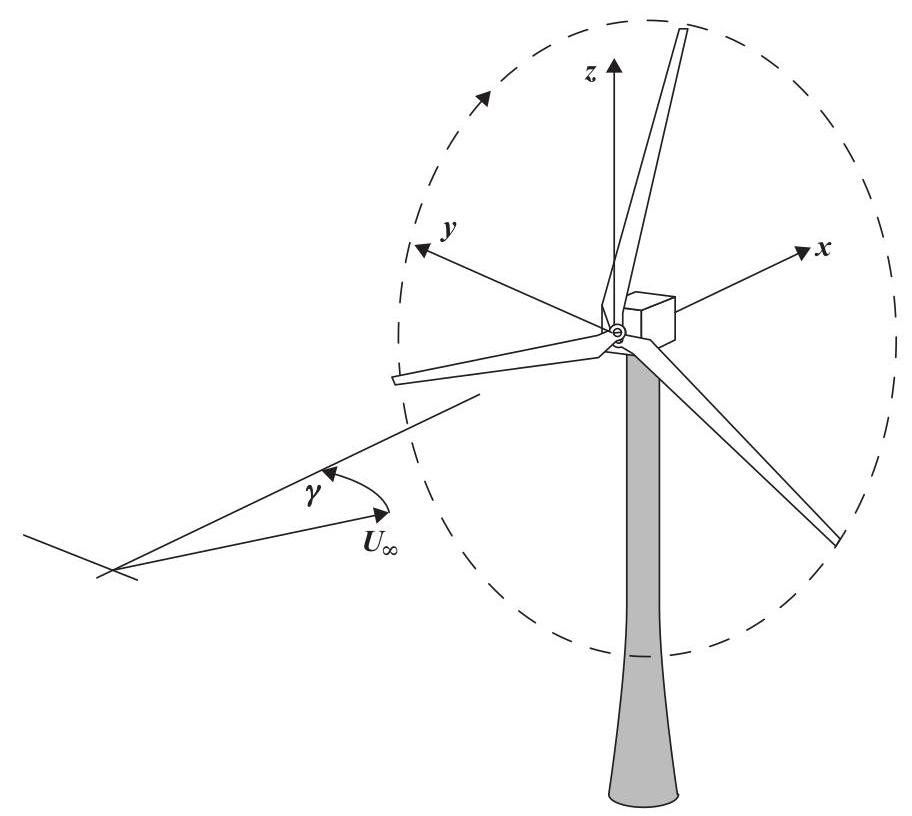

Figure 4.1 A wind turbine yawed to the wind direction

### 4.2.1 Momentum theory for a turbine rotor in steady yaw

The application of the momentum theory to an actuator disc representing a yawed rotor is somewhat problematical. The momentum theory is only capable of determining an average induced velocity for the whole rotor disc but, although in the non-yawed case the restriction was relaxed to allow some radial variation, it would not be appropriate to do this in the yawed case because the blade circulation is also changing with azimuth position. If it is assumed that the force on the rotor disc, which is a pressure force and so normal to the disc, is responsible for the rate of change of momentum of the flow then the average induced velocity must also be in a direction at right angles to the disc plane, that is, in the axial direction. The wake is therefore deflected to one side because a component of the induced velocity is at right angles to the wind direction. As in the non-yawed case the average induced velocity at the disc is half that in the wake.

Let the rotor axis be held at an angle of yaw $\gamma$ to the steady wind direction (Figure 4.2) then, assuming that the rate of change of momentum in the axial direction is equal to the mass flow rate through the rotor disc times the change in velocity normal to the plane of the rotor

$$
T = \rho {A}_{D}{U}_{\infty }\left( {\cos \gamma  - a}\right) {2a}{U}_{\infty } \tag{4.1}
$$

Therefore, the thrust coefficient is

$$
{C}_{T} = {4a}\left( {\cos \gamma  - a}\right) \tag{4.2}
$$

and the power developed is

$$
T{U}_{\infty }\left( {\cos \gamma  - a}\right) \text{ , giving }{C}_{P} = {4a}{\left( \cos \gamma  - a\right) }^{2} \tag{4.3}
$$

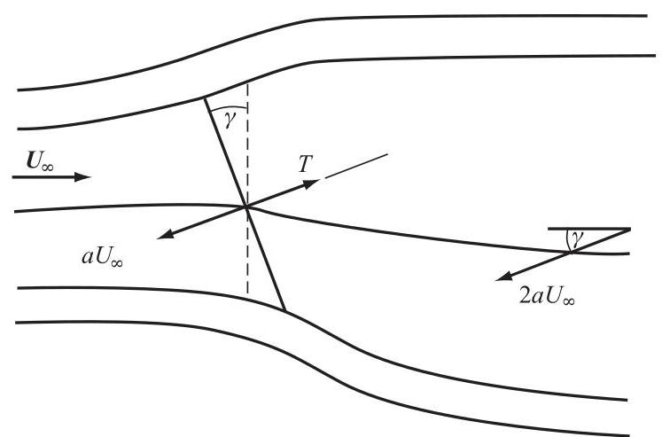

Figure 4.2 Deflected wake of a yawed turbine and induced velocities

To find the maximum value of ${C}_{P}$ differentiate Equation 4.3 with respect $a$ and set equal to zero, whence

$$
a = \frac{\cos \gamma }{3}\text{ and }{C}_{P\max } = \frac{16}{27}{\cos }^{3}\gamma \tag{4.4}
$$

This ${\cos }^{3}\gamma$ rule is commonly adopted for power assessment in yawed flow.

Figure 4.3 shows decrease in power as the yaw angle increases.

A question remains: is it legitimate to apply the momentum theory in the above manner to the yawed rotor? Transverse pressure gradients which cause the wake to skew sideways may well also contribute to the net force on the flow in the axial direction, influencing the axial induced velocity. The above analysis might be satisfactory for determining the average axial induced velocity but there is even less justification to apply the momentum theory to each blade element position than there is in the non-yawed case. If a theory is going to be of any use in design it must be capable of determining the induced velocity at each blade element position to a satisfactory accuracy. The satisfactory calculation of blade forces is as important as the estimation of power.

Figure 4.3 Power coefficient variation with yaw angle and axial flow factor

### 4.2.2 Glauert's momentum theory for the yawed rotor

Glauert (1926) was primarily interested in the autogyro, which is an aircraft with a freely windmilling rotor to provide lift and a conventional propeller to provide forward thrust. The lifting rotor has a rotational axis which inclines backwards from the vertical and by the virtue of the forward speed of the aircraft air flows through the rotor disc causing it to rotate and to provide an upward thrust. Thus, the autogyro rotor is just like a wind turbine rotor in yaw, when in forward flight. At high forward speeds the yaw angle is large but in a power-off vertical descent the yaw angle is zero.

Glauert maintained that at high forward speed the rotor disc, which is operating at a high tip speed ratio, is like a wing of circular plan-form at a small angle of attack (large yaw angle) and so the thrust on the disc is the lift on the circular wing. Simple lifting line wing theory (see Prandtl and Tiejens, 1957) states that the down-wash (induced velocity) at the wing, caused by the trailing vortex system, is uniform over the wing span (transverse diameter of the disc) for a wing with an elliptical plan-form and this would include the circular plan-form of the autogyro rotor.

The theory gives the uniform (average) induced velocity as

$$
u = \frac{2L}{\pi {\left( 2R\right) }^{2}{\rho V}} \tag{4.5}
$$

where $L$ is the lift and $V$ is the forward speed of the aircraft.

The lift is in a direction normal to the effective incident velocity $W$ , see Figure 4.4, and so is not vertical but leans backwards. The vertical component of the lift supports the weight of the aircraft and the horizontal component constitutes drag. In horizontal flight the vertical component of the lift doesn't do any work but the drag does.

Figure 4.4 Velocities and forces on an autogyro in fast forward flight

The vector triangles of Figure 4.4 show that

$$
\frac{D}{L} = \frac{u}{V} \tag{4.6}
$$

In the wake of the aircraft the induced velocity ${u}_{w}$ caused by the trailing vortices is greater than that at the rotor. A certain mass flow rate of air, ${\rho VS}$ , where $S$ is an area, normal to velocity $V$ , yet to be determined, undergoes a downward change in velocity ${u}_{w}$ in the far wake. By the momentum theory the rate of change of downward momentum is equal to the lift, therefore,

$$
L = {\rho VS}{u}_{w} \tag{4.7}
$$

The rate of work done by the drag ${DV}$ must be equal to the rate at which kinetic energy is created in the wake $\frac{1}{2}\rho {u}_{w}^{2}{VS}$ , because the ambient static pressure in the wake of the aircraft is the same as the pressure ahead of the aircraft.

$$
{DV} = \frac{1}{2}\rho {u}_{w}^{2}{VS} \tag{4.8}
$$

Combining Equations 4.6, 4.7 and 4.8 gives

$$
D = \frac{{L}^{2}}{{2\rho }{V}^{2}S} \tag{4.9}
$$

and

$$
{u}_{w} = {2u} \tag{4.10}
$$

Equation 4.10 should look familiar. Combining Equation 4.5, the lifting line theory's assessment of the induced velocity at the rotor, with Equation 4.6 gives

$$
D = \frac{2{L}^{2}}{\rho {V}^{2}\pi {\left( 2R\right) }^{2}} \tag{4.11}
$$

Comparing Equations 4.9 and 4.11 leads to an estimate of the required area $S$

$$
S = \pi {R}^{2} \tag{4.12}
$$

$S$ has the same area as the rotor disc but is normal to the flight direction.

Note that the above analysis has been simplified by assuming that the angle of attack is small. Actually, the trailing vortices from the rotor are influenced by their own induced velocity and so trail downwards behind the rotor. The induced velocity must, therefore, have a forward component, which means that the air undergoes a rate of change of momentum in the forward direction as well, thus balancing the drag. The drag is termed induced drag as it comes about by the backward tilting of the lift force caused by the induced velocity and has nothing to do with viscosity, it is entirely a pressure drag. Equation 4.5 should also be modified to replace $V$ by $W$ , the resultant velocity at the disc, and the area $S$ will be in a plane normal to $W$ . Also $W$ has a direction which lies close to the plane of the rotor and so the lift force $L$ will be almost the same as the thrust force $T$ , which is normal to the plane of the rotor, and by the same argument the induced velocity is almost normal to the plane of the rotor

$$
u = \frac{2T}{\pi {\left( 2R\right) }^{2}{\rho W}} \tag{4.13}
$$

It can be assumed that a wind turbine rotor at high angles of yaw behaves just like the autogyro rotor.

At zero yaw the thrust force on the wind turbine rotor disc, given by the momentum theory, is

$$
T = \pi {R}^{2}\frac{1}{2}{\rho 4u}\left( {{U}_{\infty } - u}\right) \tag{4.14}
$$

where ${U}_{\infty }$ now replaces $V$ .

So the induced velocity is

$$
u = \frac{2T}{\pi {\left( 2R\right) }^{2}\rho \left( {{U}_{\infty } - u}\right) } \tag{4.15}
$$

The area $S$ now coincides in position with the rotor disc.

Putting $W = {U}_{\infty } - u$ to represent the resultant velocity of the flow at the disc in Equation 4.15 then gives exactly the same Equation as 4.13 which is for a large angle of yaw. On the basis of this argument Glauert assumed that Equation 4.13, which is the simple momentum theory, could be applied at all angles of yaw, area $S = \pi {R}^{2}$ , through which the mass flow rate is determined, always lying in a plane normal to the resultant velocity. The rotation of the area $S$ is a crucially different assumption to that of the theory of Section 4.1.1 (which will now be referred as the axial momentum theory) and allows for part of the thrust force to be attributable to an overall lift on the rotor disc.

Thus,

$$
T = {\rho \pi }{R}^{2}{W2u} \tag{4.16}
$$

where

$$
W = \sqrt{{U}_{\infty }^{2}{\sin }^{2}\gamma  + {\left( {U}_{\infty }\cos \gamma  - u\right) }^{2}} \tag{4.17}
$$

Thrust is equal to the mass flow rate times the change in velocity in the direction of the thrust. Both $T$ and $u$ are assumed to be normal to the plane of the disc.

Noting that $u = a{U}_{\infty }$ , the thrust coefficient is then

$$
{C}_{T} = {4a}\sqrt{1 - a\left( {2\cos \gamma  - a}\right) } \tag{4.18}
$$

The power developed is a scalar quantity and so is the scalar product of the thrust force and the resultant velocity at the disc $W$ . Hence, the power coefficient is

$$
{C}_{P} = {4a}\left( {\cos \gamma  - a}\right) \sqrt{1 - a\left( {2\cos \gamma  - a}\right) } \tag{4.19}
$$

However, as some of the thrust is attributable to lift on the rotor disc acting as a circular wing that lift will not extract power from the wind because the net velocity field associated with the lift does not give rise to a flow through the rotor disc. Only that proportion of the thrust which arises from net flow through the disc will extract energy from the flow. Consequently, the axial momentum theory is more likely to estimate the power extraction correctly, whereas the Glauert theory is more likely to estimate the thrust correctly.

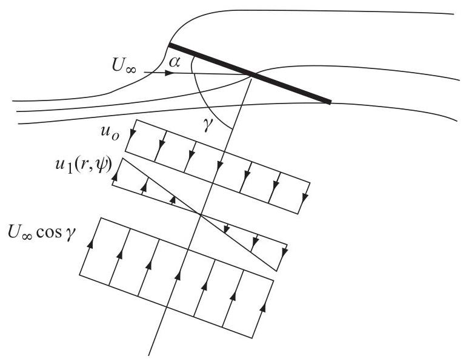

Figure 4.5 Velocities normal to the yawed rotor

One very useful concept that emerges from Glauert's autogyro theory is his prediction that the induced velocity through the rotor would not be uniform. The flow through the yawed rotor is depicted in Figure 4.5 and a simplification of the contributions to the velocity normal to the plane of the rotor along the rotor diameter parallel to the flight direction are shown. The mean induced velocity through the rotor, as determined by Equation 4.13, is shown as ${u}_{0}$ , the normal component of the forward velocity of the aircraft is ${U}_{\infty }\cos \gamma$ , also uniform over the disc, but, to account for the flow pattern shown, there needs to be a non-uniform component which decreases the normal induced velocity at the leading edge of the rotor disc and increases it at the rear. From symmetry, the induced velocity along the disc diameter normal to the flight direction (normal to the plane of the diagram) is uniform. The simplest form of the non-uniform component of induced velocity would be

$$
{u}_{1}\left( {r,\psi }\right)  = {u}_{1}\frac{r}{R}\sin \psi \tag{4.20}
$$

where $\psi$ is the blade azimuth angle measured in the direction of rotation, ${0}^{ \circ  }$ being when the blade is normal to the flight direction (or when the wind turbine blade is vertically upwards), and ${u}_{1}$ is the amplitude of the non-uniform component which is dependent on the yaw angle. There would, of course need to be induced velocities parallel to the plane of the rotor disc but these are of secondary importance; the normal induced velocity has a much greater influence on the blade angle of attack than the in-plane component and, therefore, a much greater influence on blade element forces.

The value of ${u}_{1}$ in Equation 4.20 cannot be determined from momentum theory but Glauert suggested that it would be of the same order of magnitude as ${u}_{0}$ . The total induced velocity, normal to the rotor plane, may then be written as

$$
u = {u}_{0}\left( {1 + K\frac{r}{R}\sin \psi }\right) \tag{4.21}
$$

The value of $K$ must depend upon the yaw angle.

### 4.2.3 Vortex cylinder model of the yawed actuator disc

The vortex theory for the non-yawed rotor given in Section 3.4 is demonstrated to be equivalent to the momentum theory in its main results but, in addition, was shown to give much more detail about the flow-field. As the momentum theories of Sections 4.2.1 and 4.2.2 yield very limited results, using the vortex approach for the yawed rotor may also prove to be useful, giving more flow structure detail than the momentum theory and, perhaps, a means of allying it with the blade element theory.

The wake of a yawed rotor is skewed to one side because the thrust $T$ on the disc is normal to the disc plane and so has a component normal to the flow direction. The force on the flow, therefore, is in the opposite sense to $T$ causing the flow to accelerate both upwind and sideways. The centre line of the wake will be at an angle $\chi$ to the axis of rotation (axis normal to the disc plane) known as the wake skew angle. The skew angle will be greater than the yaw angle. The same basic theory as in Section 3.4 can be carried out for an actuator disc with a wake skewed to the rotor axis by an angle $\chi$ . There is an important proviso however; it must be assumed that the bound circulation on the rotor disc is radially and azimuthally uniform. As will be demonstrated, the angle of attack of the blades is changing cyclically and so it would be impossible for the uniform circulation condition ever to be valid. What must be assumed is that the variation of circulation around a mean value has but a small effect on the induced velocity and the wake is therefore dominated by the vorticity shed from the blade tips by the mean value of circulation(see Figure 4.6).

The expansion of the wake again imposes a difficulty for analysis and so, as before, it will be ignored (Figure 4.7).

The analysis of the yawed rotor was first carried out for purposes of understanding a helicopter rotor in forward flight by Coleman et al. (1945) but it can readily be applied to a wind turbine rotor by reversing the signs of the circulation and the induced velocities. An infinite number of blades is assumed as in the analysis of Section 3.4. The vorticity ${g}_{\psi }$ has a direction which remains parallel to the yawed disc and assuming it to be uniform (not varying with the azimuth angle), using the Biot-Savart law, induces a time average velocity at the disc of $a{U}_{\infty }\sec \left( {\chi /2}\right)$ in a direction which bisects the skew angle, as shown in Figure 4.8. The average axial induced velocity, normal to the rotor plane, is $a{U}_{\infty }$ , as in the non-yawed case. In the fully developed wake the induced velocity is twice that at the rotor disc.

Because the average induced velocity at the disc is not in the rotor's axial direction, as is assumed for the momentum theory of Sections 4.1.1 and 4.1.2, the force $T$ on the disc, which must be in the axial direction, cannot be solely responsible for the overall rate of change of momentum of the flow; there is a change of momentum in a direction normal to the rotor axis.

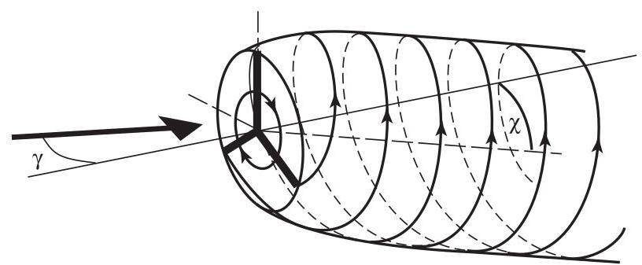

Figure 4.6 The deflected vortex wake of a yawed rotor showing the shed vortices of three blades

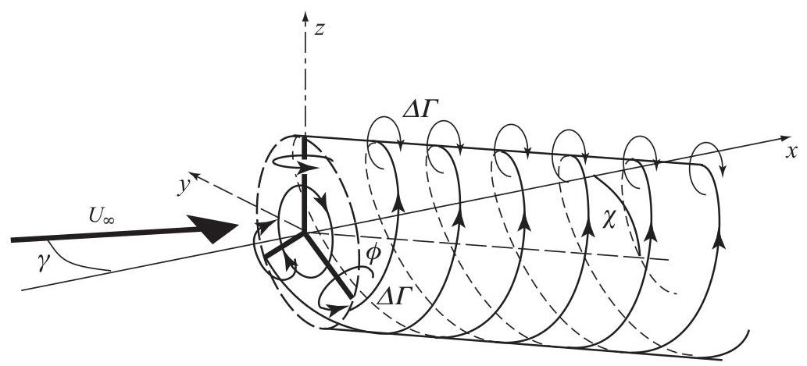

Figure 4.7 A yawed rotor wake without wake expansion

The velocity components at the rotor disc define the skew angle:

$$
\tan \chi  = \frac{{U}_{\infty }\left( {\sin \gamma  - a \cdot  \tan \frac{\chi }{2}}\right) }{{U}_{\infty }\left( {\cos \gamma  - a}\right) } = \frac{2\tan \frac{\chi }{2}}{1 - {\tan }^{2}\frac{\chi }{2}} \tag{4.22}
$$

From which it can be shown that a close, approximate relationship between $\chi ,\gamma$ and $a$ is

$$
\chi  = \left( {{0.6a} + 1}\right) \gamma \tag{4.23}
$$

Using the velocities shown in Figure 4.9 a fresh analysis can be made of the flow. The average force on the disc can be determined by applying Bernoulli's Equation to both the upwind and downwind regions of the flow:

$$
\text{ Upwind }{p}_{\infty } + \frac{1}{2}\rho {U}_{\infty }^{2} = {p}_{D}^{ + } + \frac{1}{2}\rho {U}_{D}^{2}
$$

Downwind ${p}_{D}^{ - } + \frac{1}{2}\rho {U}_{D}^{2} = {p}_{\infty } + \frac{1}{2}\rho {U}_{\infty }^{2}\left\lbrack  {{\left( \cos \gamma  - 2a\right) }^{2} + {\left( \sin \gamma  - 2a\tan \frac{\chi }{2}\right) }^{2}}\right\rbrack$

Figure 4.8 A yawed actuator disc and the skewed vortex cylinder wake

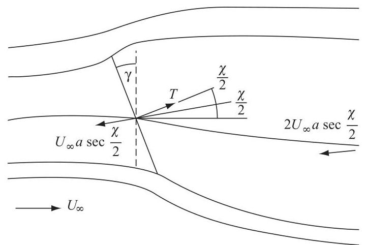

Figure 4.9 Average induced velocities caused by a yawed actuator disc

where ${U}_{D}$ is the resultant velocity at the disc.

Subtracting the two Equations to obtain the pressure drop across the disc

$$
{p}_{D}^{ + } - {p}_{D}^{ - } = \frac{1}{2}\rho {U}_{\infty }^{2}{4a}\left( {\cos \gamma  + \tan \frac{\chi }{2}\sin \gamma  - a{\sec }^{2}\frac{\chi }{2}}\right)
$$

The coefficient of thrust on the disc is therefore,

$$
{C}_{T} = {4a}\left( {\cos \gamma  + \tan \frac{\chi }{2}\sin \gamma  - a{\sec }^{2}\frac{\chi }{2}}\right) \tag{4.24}
$$

and the power coefficient is

$$
{C}_{P} = {4a}\left( {\cos \gamma  - a}\right) \left( {\cos \gamma  + \tan \frac{\chi }{2}\sin \gamma  - a{\sec }^{2}\frac{\chi }{2}}\right) \tag{4.25}
$$

In a similar manner to the Glauert theory, it is not clear how much of the thrust in Equation 4.24 is capable of extracting energy from the flow and so the expression for power in Equation 4.25 will probably be an over estimate. A comparison of the maximum ${C}_{P}$ values derived from the three theories, as a function of the yaw angle, is shown in Figure 4.10.

### 4.2.4 Flow expansion

The induced velocity component parallel to the skewed axis of the wake is uniform over the disc with a value $a{U}_{\infty }$ , as can be deduced from Figure 4.9. The induced horizontal velocity, normal to the skewed axis of the wake is also uniform over the area of the disc with a value $a{U}_{\infty }\tan \left( {\chi /2}\right)$ .

In addition to the uniform induced velocities of Figure 4.9 the expansion of the flow gives rise to velocities in the $y$ and $z$ directions, respectively (i.e. directions in a vertical plane at the skew angle $\chi$ to the rotor plane, see Figure 4.11). When resolved into the rotor plane the flow expansion velocities will give rise to a normal induced velocity of the type predicted by Glauert in Equation 4.21. Note that the positive direction for $u$ (and ${u}^{\prime \prime }$ ) is now defined as downwind (see Figure 4.11), whereas it was upwind in Section 4.2.2.

Figure 4.10 Maximum power coefficient variation with yaw angle, comparison of momentum and vortex theories

At a point on the disc at radius $r$ and azimuth angle $\psi$ , defined in Figure 4.11, the induced flow expansion velocities are non-simple functions of $r$ and $\psi$ . Across the horizontal diameter, where $\psi  =  \pm  {90}^{ \circ  }$ , Coleman et al. obtained an analytical solution for the flow expansion velocity in the $y$ direction that involves complete elliptic integrals: the solution is not very practicable because numerical evaluation requires calculating the difference between two large numbers. Simplification of the analytical solution leads to the following expression for the horizontal flow expansion velocity which removes the evaluation difficulty but it is not in closed form:

$$
v\left( {\chi ,\psi ,\mu }\right)  = \frac{-{2a}{U}_{\infty }\mu \sin \psi }{\pi }{\int }_{0}^{\frac{\pi }{2}}\frac{{\sin }^{2}{2\varepsilon }}{\sqrt{{\left( 1 + \mu \right) }^{2} - {4\mu }{\sin }^{2}\varepsilon }}\frac{1}{{\left( \mu  + \cos 2\varepsilon \right) }^{2}{\cos }^{2}\chi  + {\sin }^{2}{2\varepsilon }}{d\varepsilon }
$$

(4.26)

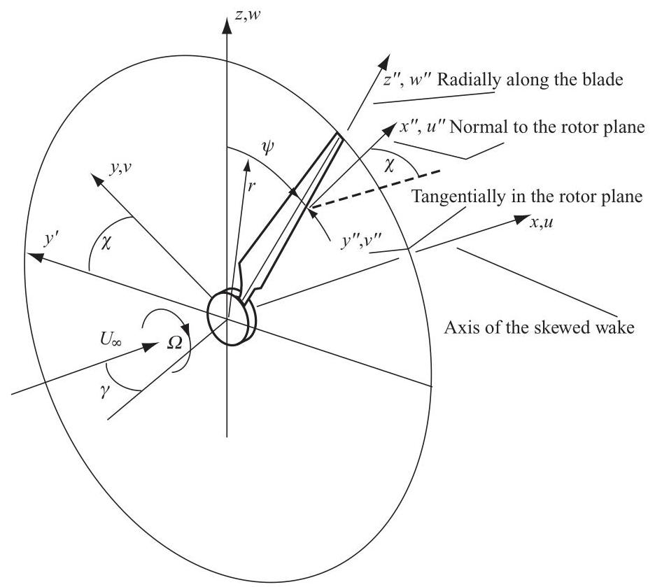

Figure 4.11 Axis system for a yawed rotor

Figure 4.12 Flow expansion function variation with radial position and skew angle

where $\mu  = r/R,\varepsilon$ is a parameter arising from the elliptic integrals, which is eliminated from the function by the definite integral, and $a{U}_{\infty }$ is the average induced velocity as previously defined. An important feature of Equation 4.26 is that the flow expansion velocity is proportional to the average axial flow induction factor. Furthermore, if Equation 4.26 is divided by ${\sec }^{2}\left( {\chi /2}\right)$ the result is almost independent of the skew angle $\chi$ and is as shown in Figure 4.12, which clearly demonstrates how little it changes over a range of skew angle of ${0}^{ \circ  } - {60}^{ \circ  }$ .

At all skew angles the value of the flow expansion function is infinite at the edge of the rotor disc, indicating a singularity in the flow which, of course, does not occur in practice but is a result of assuming uniform blade circulation. Circulation must fall to zero at the disc edge in a smooth fashion.

No analytical expressions for the flow expansion velocity components for values of $\psi$ other than $\pm  {90}^{ \circ  }$ were developed by Coleman et al. but numerical evaluations of the flow expansion velocities can be made using the Biot-Savart law.

The radial variation of the vertical flow expansion velocity across the vertical diameter of the rotor disc is much the same as $F\left( \mu \right)$ for skew angles between $\pm  {45}^{ \circ  }$ but outside of this range the vertical velocity increases more sharply than the horizontal velocity at the disc edge. As will be shown, the vertical expansion velocity is of less importance than the horizontal velocity in determining the aerodynamic behaviour of the yawed rotor.

The variation of the horizontal and vertical flow expansion velocities along radial lines on the rotor disc surface at varying azimuth angles (a radius sweeping out the disc surface as it rotates about the yawed rotor axis) shows that some further simplifications can be made for small skew angles.

Figure 4.13 Azimuthal and radial variation of horizontal $\left( v\right)$ and vertical $\left( w\right)$ velocities on the rotor plane for a skew angle of ${30}^{ \circ  }$

Figure 4.13 shows the variation of the flow expansion velocities across the rotor disc for a skew angle of ${30}^{ \circ  }$ . It should be emphasised that the velocity components lie in planes that are normal to the skewed axis of the wake. Inspection of the variations leads to simple approximations for the two velocity components.

$$
v\left( {\chi ,\psi ,\mu }\right)  =  - a{U}_{\infty }F\left( \mu \right) \sin \psi \tag{4.27}
$$

$$
w\left( {\chi ,\psi ,\mu }\right)  = a{U}_{\infty }F\left( \mu \right) \cos \psi \tag{4.28}
$$

where

$$
F\left( \mu \right)  = \frac{2\mu }{\pi }{\int }_{0}^{\frac{\pi }{2}}\frac{{\sin }^{2}{2\varepsilon }}{\sqrt{{\left( 1 + \mu \right) }^{2} - {4\mu }{\sin }^{2}\varepsilon }}\frac{1}{{\left( \mu  + \cos 2\varepsilon \right) }^{2}{\cos }^{2}\chi  + {\sin }^{2}{2\varepsilon }}{d\varepsilon } \tag{4.29}
$$

The drawback of Equations 4.27 and 4.28 is the singularity in the flow expansion function Equation 4.29 at the outer edge of the disc. If the actuator disc is replaced with rotor which has a small number of blades then the flow expansion function changes very significantly. Conducting a calculation using the Biot-Savart law for a non-yawed, single bladed rotor represented by a lifting line vortex of radially uniform strength the flow expansion function can be determined numerically. It is found that the flow expansion velocity along the radial lifting line is a function of the helix (flow) angle of the discrete line vortex shed from the tip of the lifting line (blade). The vortex wake is assumed to be rigid in that the helix angle and the wake diameter are fixed everywhere at the values that pertain at the rotor. The solutions for a single blade rotor can be used to determine the flow fields for multi-blade rotors by a simple process of superposition. The resulting flow expansion functions $F{\left( \mu \right) }_{N}$ are depicted in Figure 4.14 for one-, two- and three-blade rotors.

The radial variations in Figure 4.14 have been extended beyond the rotor radius to show the continuity which exists for the discrete blade situation as compared with the singularity that occurs for the actuator disc. There are two striking features of the flow expansion functions of Figure 4.14: the function is heavily modified by the value of the helix angle ${\phi }_{t}$ , at which the tip vortex is shed from the blade tips, and the negative values (flow contraction) that can occur for the single-blade rotor.

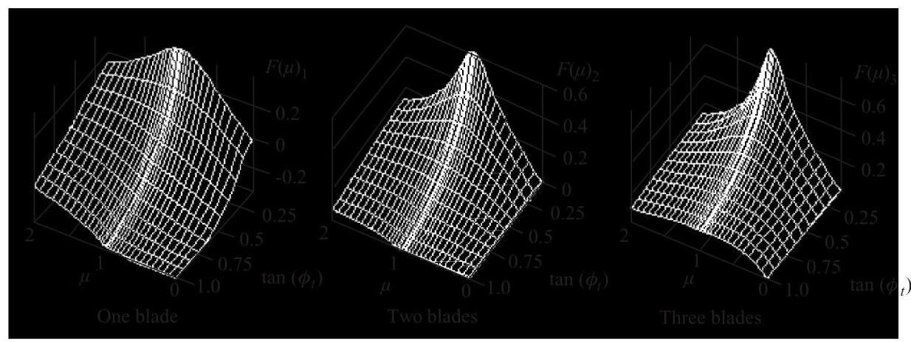

Figure 4.14 Flow expansion functions for one-, two- and three-blade rotors by lifting line theory

An analytical expression that approximates the form of the diagrams shown in Figure 4.14 for two- and three-bladed rotors is

$$
{F}_{a}\left( {\mu ,{\phi }_{t}, B}\right)  = \frac{F\left( \mu \right) }{\sqrt{1 + {50}\frac{{\tan }^{2}{\phi }_{t}}{{B}^{2}}\left( {\frac{1}{\tan {\phi }_{t}} + 8}\right) F{\left( \mu \right) }^{2}\left\lbrack  {\mu \left( {2 - \mu }\right) F\left( \mu \right) }\right\rbrack  \frac{0.05}{\tan {\phi }_{t}}}} \tag{4.30}
$$

where $\tan {\phi }_{t} = \left( {1 - a}\right) /\left( {\lambda \left( {1 + {a}^{\prime }}\right) }\right)$ is the tangent of the flow angle. The results of Equation 4.30 are shown in Figure 4.15 for two and three blade rotors.

When transformed as components of velocity with respect to axes rotating about the rotor axis $\left( {{x}^{\prime \prime },{y}^{\prime \prime }}\right.$ and ${z}^{\prime \prime }$ axes as shown in Figure 4.11), the flow expansion velocities of Equations 4.27 and 4.28 are resolved into the components that are normal and tangential to the blade element (see Figure 4.18).

The normal component is

$$
{u}^{\prime \prime } =  - a{U}_{\infty }\left( {1 + 2\sin \psi \tan \frac{\chi }{2}F\left( \mu \right) }\right) \tag{4.31}
$$

and the tangential component is

$$
{v}^{\prime \prime } = a{U}_{\infty }\cos \psi \tan \frac{\chi }{2}\left( {1 + 2\sin \psi \tan \frac{\chi }{2}F\left( \mu \right) }\right) \tag{4.32}
$$

to which must be added the components of the wind velocity ${U}_{\infty }$ the normal component

$$
{U}^{\prime \prime } = {U}_{\infty }\cos \gamma \tag{4.33}
$$

and the tangential component

$$
{V}^{\prime \prime } = {U}_{\infty }\cos \psi \sin \gamma \tag{4.34}
$$

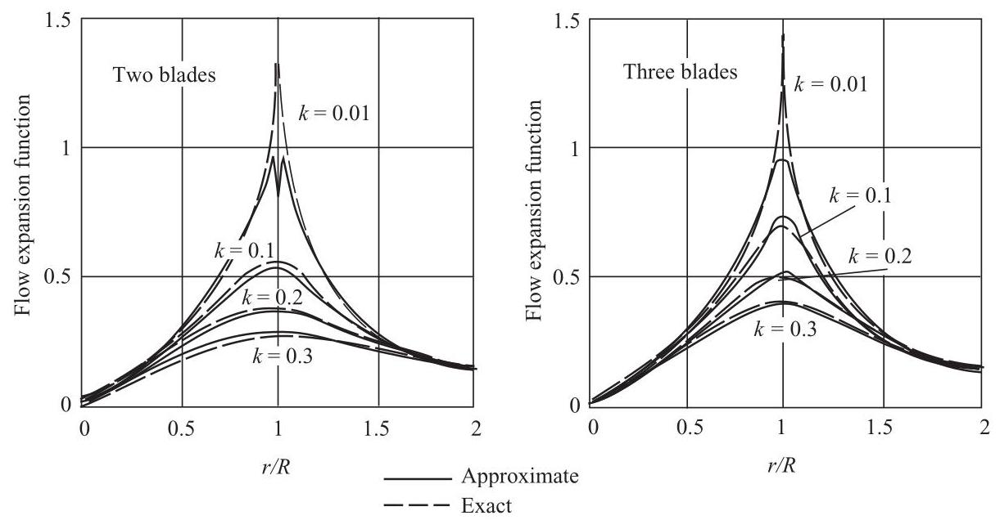

Figure 4.15 Approximate flow expansion functions for two- and three-blade rotors $\left( {k = \tan {\phi }_{t}}\right)$

There is a radial (span-wise) velocity component but this will not influence the angle of attack so can be ignored.

Clearly, from Equation 4.31, the Coleman theory determines the influence of skew angle (the factor $K$ in Equation 4.21) as being

$$
K\left( \chi \right)  = 2\tan \frac{\chi }{2} \tag{4.35}
$$

In addition there is the tangential velocity ${\Omega r}$ caused by blade rotation and also the induced wake rotation, but the latter will be ignored initially.

The velocities of Equations 4.31-4.34 will produce a lower angle of attack when the azimuth angle $\psi$ is positive, see Figure 4.16, than when it is negative and so the angle of attack will vary cyclically. When $\psi$ is positive the incident flow velocity lies closer to the radial axis of the blade than when $\psi$ is negative. The difference in angle of attack can be attributed to flow expansion as depicted in Figure 4.16.

The variation of the angle of attack makes the flow about a blade aerofoil unsteady and so the lift will have a response of the kind discussed in Section 4.4. The blade circulation will, therefore, vary during the course of a revolution, which means that the vortex model is incomplete because it is derived from the assumption that the circulation is constant.

There is clearly additional vorticity in the wake being shed from the blades' trailing edges influencing the induced velocity, which is not accounted for in the theory. The additional induced velocity would be cyclic so would probably not affect the average induced velocity normal to the rotor disc but would affect the amplitude and phasing of the angle of attack.

Further numerical analysis of the Coleman vortex theory reveals that at skew angles greater than $\pm  {45}^{ \circ  }$ higher harmonics than just the one per revolution term in Equation 4.21 become significant in the flow expansion induced velocities. Only odd harmonics are present, reflecting the anti-symmetry about the yaw axis.

Figure 4.16 Flow expansion causes a differential angle of attack

### 4.2.5 Related theories

A number of refinements to the Glauert and Coleman theories have been proposed by other researchers: mostly addressing helicopter aerodynamics but some have been directed specifically at wind turbines. In particular, Øye (1992) undertook the same analysis as Coleman and proposed a simple curve-fit to Equation 4.29

$$
{F}_{\varnothing }\left( \mu \right)  = \frac{1}{2}\left( {\mu  + {0.4}{\mu }^{3} + {0.4}{\mu }^{5}}\right) \tag{4.36}
$$

See Figure 4.17. $\varnothing$ ye has clearly avoided the very large values that Equation 4.29 produces close to the outer edge of the disc and Equation 4.36 is in general accordance with the flow expansion functions shown in Figure 4.14.

Meijer Drees (1949) has extended the Coleman et al. vortex model to include a cosinusoidal variation of blade circulation. The main result is a modification to the function $K\left( \chi \right)$ but Meijer Drees retained Glauert's assumption of linear variation of normal induced velocity with radius

$$
{u}^{\prime \prime } =  - a{U}_{\infty }\left\lbrack  {1 + \frac{4}{3}\mu \left( {1 - {1.8}{\left( \frac{\sin \gamma }{\lambda }\right) }^{2}}\right) \sin \psi \tan \frac{\chi }{2}}\right\rbrack \tag{4.37}
$$

(see Schepers and Snel, 1995).

### 4.2.6 Wake rotation for a turbine rotor in steady yaw

Wake rotation is, of course, present in the wake flow but cannot be related only to the torque. The vortex theory needs also to include a root vortex, which will lie in the wake along the skewed wake axis. The rotation in the wake will, therefore, be about the skewed wake axis and not about the axis of rotation, and the wake rotation velocity will lie in a plane normal to the skewed wake axis.

To determine the wake rotation velocity the rate of change of angular momentum about skewed wake axis will be equated to the moment about the axis produced by blade forces.

If the wake rotation velocity is described, as before, in terms of the angular velocity of the rotor then

$$
{v}^{\prime \prime \prime } = \Omega {r}^{\prime \prime \prime }{a}^{\prime }h\left( \psi \right) \tag{4.38}
$$

where the triple prime denotes an axis system rotating about the wake axis and $h\left( \psi \right)$ is a function which determines the intensity of the root vortex's influence. In the non-yawed case the root vortex induces a velocity at the rotor which is half of that it induces in the far wake at the same radial distance and the same would apply to a disc normal to the skewed axis with a centre located at the same position as the actual rotor disc. The distance upstream or downstream of a point on actual rotor disc from the plane of the disc normal to the wake axis determines the value of root vortex influence function $h\left( \psi \right)$ . The value of $h\left( \psi \right)$ will lie between 0.0 and 2.0, being equal to 1.0 at points on the vertical diameter.

The velocity induced by a semi-infinite line vortex of strength $\Gamma$ lying along the x-axis from zero to infinity at a point with cylindrical co-ordinates $\left( {{x}^{\prime \prime \prime },{\psi }^{\prime \prime \prime },{r}^{\prime \prime \prime }}\right)$ is, using the Biot-Savart law,

$$
{\overrightarrow{V}}^{\prime \prime \prime } = \frac{\Gamma }{{4\pi }{r}^{\prime \prime \prime }}\left\lbrack  \begin{matrix} 0 \\  1 + \frac{{x}^{\prime \prime \prime }}{\sqrt{{x}^{\prime \prime \prime 2} + {r}^{\prime \prime \prime 2}}} \\  0 \end{matrix}\right\rbrack   = \left\lbrack  \begin{matrix} 0 \\  {v}^{\prime \prime \prime } \\  0 \end{matrix}\right\rbrack \tag{4.39}
$$

The induced velocity when ${x}^{\prime \prime \prime } = \infty$ is twice that when ${x}^{\prime \prime \prime } = 0$ and is zero when ${x}^{\prime \prime \prime } =  - \infty$ .

For a point on the rotor disc $\left( {0,\psi , r}\right)$ the corresponding co-ordinates $\left( {{x}^{\prime \prime \prime },{\psi }^{\prime \prime \prime },{r}^{\prime \prime \prime }}\right)$ in the wake cylindrical co-ordinate system are

$$
{x}^{\prime \prime \prime } =  - {y}^{\prime }\sin \chi  = r\sin {\psi }^{\prime \prime \prime }\sin \chi ,{r}^{\prime \prime \prime } = r\sqrt{{\cos }^{2}\psi  + {\cos }^{2}\chi {\sin }^{2}\psi }
$$

$$
\text{ and }\cos {\psi }^{\prime \prime \prime } = \frac{r}{{r}^{\prime \prime \prime }}\cos \psi ,\sin {\psi }^{\prime \prime \prime } = \frac{r}{{r}^{\prime \prime \prime }}\sin \psi \cos \chi \tag{4.40}
$$

Hence, substituting ${4\pi }{r}^{\prime \prime \prime 2}\Omega {a}^{\prime }$ for the circulation (Equation 3.33) the induced velocity at the same point is

$$
{v}^{\prime \prime \prime } = \Omega {r}^{\prime \prime \prime }{a}^{\prime }\left( {1 + \frac{{x}^{\prime \prime \prime }}{\sqrt{{x}^{\prime \prime \prime 2} + {r}^{\prime \prime \prime 2}}}}\right) \tag{4.41}
$$

So, transforming the velocity of Equation 4.39 to the rotating axes in the plane of the rotor disc

$$
{\overrightarrow{V}}^{\prime \prime } = \left\lbrack  \begin{matrix} 1 & 0 & 0 \\  0 & \cos \psi & \sin \psi \\  0 &  - \sin \psi & \cos \psi  \end{matrix}\right\rbrack  \left\lbrack  \begin{matrix} \cos \chi & \sin \chi & 0 \\   - \sin \chi & \sin \chi & 0 \\  0 & 0 & 1 \end{matrix}\right\rbrack  \left\lbrack  \begin{matrix} 1 & 0 & 0 \\  0 & \cos {\psi }^{\prime \prime \prime } &  - \sin {\psi }^{\prime \prime \prime } \\  0 & \sin {\psi }^{\prime \prime \prime } & \cos {\psi }^{\prime \prime \prime } \end{matrix}\right\rbrack  \left\lbrack  \begin{matrix} 0 \\  {v}^{\prime \prime \prime } \\  0 \end{matrix}\right\rbrack
$$

(4.42)

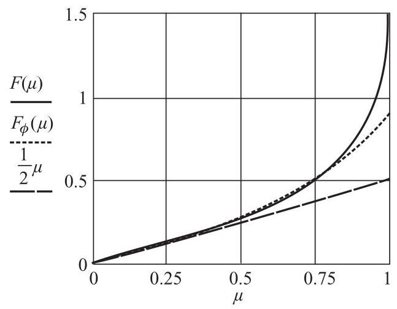

Figure 4.17 Øye's curve-fit to Coleman's flow expansion function

Substituting Equations 4.40 and 4.41 into Equation 4.42 gives

$$
{\overrightarrow{V}}^{\prime \prime } = \left\lbrack  \begin{matrix} \cos \psi \sin \chi \\  \cos \chi \\  0 \end{matrix}\right\rbrack  {\Omega r}{a}^{\prime }\left( {1 + \sin \psi \sin \chi }\right) \tag{4.43}
$$

Thus, the wake rotation produces two velocity components, one in the rotor plane and one normal to the rotor plane; there is no radial component.

### 4.2.7 The blade element theory for a turbine rotor in steady yaw

There is doubt about the applicability of the blade element theory in the case of a yawed turbine because the flow, local to a blade element, is unsteady and because the theory representing the vortex half of the equation, which replaces the momentum theory, is incomplete in this respect. However, it is not clear how large or significant are the unsteady forces. In a steady yawed condition the flow velocities at a point on the rotor disc do not change with time, if an infinity of blades is assumed, and so there is no effect to consider. However, the change of angle of attack with time at a point on the blade does mean that the two dimensional lift force should really be modified by a lift deficiency function similar to that determined by Theodorsen (14) for the rectilinear wake of a sinusoidally pitching aerofoil.

Neglecting the effects of shed vorticity the net velocities in the plane of a local blade element are shown in Figure 4.18. The radial (span-wise) velocity component is not shown in Figure 4.18 but it is neglected as it is not considered to have any influence on the angle of attack and, therefore, on the lift force.

The flow angle $\phi$ is then determined by the components of velocity shown in Figure 4.18.

$\tan \phi$

$$
= \frac{{U}_{\infty }\left( {\cos \gamma  - a\left( {1 + F\left( \mu \right) K\left( \chi \right) \sin \psi }\right) }\right)  + {\Omega r}{a}^{\prime }\cos \psi \sin \chi \left( {1 + \sin \psi \sin \chi }\right) }{{\Omega r}\left( {1 + {a}^{\prime }\cos \chi \left( {1 + \sin \psi \sin \chi }\right) }\right)  + {U}_{\infty }\cos \psi \left( {a \cdot  \tan \frac{\chi }{2}\left( {1 + F\left( \mu \right) K\left( \chi \right) \sin \psi }\right)  - \sin \gamma }\right) }
$$

(4.44)

where $\mu  = r/R$ is measured radially from the axis of rotor rotation.

$$
{\Omega r}\left( {1 + {a}^{\prime }\cos \chi \left( {1 + \sin \psi \sin \chi }\right) }\right)
$$

Figure 4.18 The velocity components in the plane of a blade cross-section

The angle of attack $\alpha$ is found from

$$
\alpha  = \phi  - \beta \tag{4.45}
$$

Lift and drag coefficients taken from two dimensional experimental data, just as for the non-yawed case, are determined from the angle of attack calculation for each blade element (each combination of $\mu$ and $\psi$ ).

### 4.2.8 The blade element - momentum theory for a rotor in steady yaw

The forces on a blade element can be determined via Equations 4.44 and 4.45 for given values of the flow induction factors.

The thrust force will be calculated using Equation 3.46 in Section 3.5.3, which is for a complete annular ring of radius $r$ and radial thickness ${\delta r}$ .

$$
{\delta T} = {\delta L}\cos \phi  + {\delta D}\sin \phi  = \frac{1}{2}\rho {W}^{2}{Bc}\left( {{C}_{l}\cos \phi  + {C}_{d}\sin \phi }\right) {\delta r} \tag{3.46}
$$

For an elemental area of the annular ring swept out as the rotor turns through an angle ${\delta \psi }$ the proportion of the force is

$$
\delta {T}_{b} = \frac{1}{2}\rho {W}^{2}{Bc}\left( {{C}_{l}\cos \phi  + {C}_{d}\sin \phi }\right) {\delta r}\frac{\delta \psi }{2\pi }
$$

then, putting ${C}_{x} = {C}_{l}\cos \phi  + {C}_{d}\sin \phi$ and ${\sigma }_{r} = {Bc}/{2\pi r}$

$$
\delta {T}_{b} = \frac{1}{2}\rho {W}^{2}{\sigma }_{r}{C}_{x}{r\delta r\delta \psi } \tag{4.46}
$$

The values of ${C}_{l}$ and ${C}_{d}$ should really include unsteady effects because of the ever changing blade circulation with azimuth angle which will depend upon the level of the reduced frequency of the circulation fluctuation.

If it is chosen to ignore drag, or use only that part of the drag attributable to pressure, then Equation 4.46 should be modified accordingly.

The rate of change of momentum will use either Equation 4.18, Glauert's theory, or Equation 4.24, the vortex cylinder theory: in both Equations the flow induction factor $a$ should be replaced by af to account for Prandtl tip-loss.

For Glauert's theory,

$$
\delta {T}_{m} = \frac{1}{2}\rho {U}_{\infty }^{2}{4af}\sqrt{1 - {af}\left( {2\cos \gamma  - {af}}\right) }{r\delta \psi \delta r} \tag{4.47a}
$$

Or, for the vortex theory,

$$
\delta {T}_{m} = \frac{1}{2}\rho {U}_{\infty }^{2}{4af}\left( {\cos \gamma  + \tan \frac{\chi }{2}\sin \gamma  - {af}{\sec }^{2}\frac{\chi }{2}}\right) {r\delta \psi \delta r} \tag{4.47b}
$$

The algebraic complexity of estimating the wake rotation velocities is great and even then fluctuation of bound circulation is ignored. The drop in pressure caused by wake rotation, however, is shown to be small in the non-yawed case and so it is assumed that it can safely be ignored in the yawed case.

The moment of the blade element force about the wake axis is

$$
\delta {M}_{b} = \frac{1}{2}\rho {W}^{2}{Bc}\left( {{C}_{y}\cos \chi  - {C}_{x}\cos \psi \sin \chi }\right) {r\delta r}\frac{\delta \psi }{2\pi }
$$

where

$$
{C}_{y} = {C}_{l}\sin \phi  - {C}_{d}\cos \phi
$$

therefore

$$
\delta {M}_{b} = \frac{1}{2}\rho {W}^{2}{\sigma }_{r}\left( {{C}_{y}\cos \chi  - {C}_{x}\cos \psi \sin \chi }\right) {r}^{2}{\delta r\delta \psi } \tag{4.48}
$$

The rate of change of angular momentum is the mass flow rate through an elemental area of the disc times the tangential velocity times radius.

$$
\delta {M}_{m} = \rho {U}_{\infty }\left( {\cos \gamma  - {af}}\right) {r\delta \psi \delta r2}{a}^{\prime }{f\Omega }{r}^{\prime \prime \prime 2}
$$

where

$$
{r}^{\prime \prime \prime 2} = {r}^{2}\left( {{\cos }^{2}\psi  + {\cos }^{2}\chi {\sin }^{2}\psi }\right)
$$

therefore,

$$
\delta {M}_{m} = \frac{1}{2}\rho {U}_{\infty }^{2}{\lambda \mu 4}{a}^{\prime }f\left( {\cos \gamma  - {af}}\right) \left( {{\cos }^{2}\psi  + {\cos }^{2}\chi {\sin }^{2}\psi }\right) {r}^{2}{\delta r\delta \psi } \tag{4.49}
$$

The momentum theory, as developed, applies only to the whole rotor disc where the flow induction factor $a$ is the average value for the disc. However, it may be argued that it is better to apply the momentum equations to an annular ring, as in the non-yawed case, to determine a distribution of the flow induction factors varying with radius, reflecting radial variation of circulation. Certainly, for the angular momentum case the tangential flow factor ${a}^{\prime }$ will not vary with azimuth position because it is generated by the root vortex and although, in fact, the axial flow factor $a$ does vary with azimuth angle it is consistent to use an annular average for this factor as well.

To find an average for an annular ring the elemental values of force and moment must be integrated around the ring.

For the axial momentum case, taking the vortex method as an example,

$$
{\int }_{0}^{2\pi }\frac{1}{2}\rho {U}_{\infty }^{2}{4af}\left( {\cos \gamma  + \tan \frac{\chi }{2}\sin \gamma  - {af}{\sec }^{2}\frac{\chi }{2}}\right) {\delta \psi rk\delta r} = {\sigma }_{r}{\int }_{0}^{2\pi }\frac{1}{2}\rho {W}^{2}{C}_{x}{\delta \psi r\delta r}
$$

Therefore,

$$
{8\pi af}\left( {\cos \gamma  + \tan \frac{\chi }{2}\sin \gamma  - {af}{\sec }^{2}\frac{\chi }{2}}\right)  = {\sigma }_{r}{\int }_{0}^{2\pi }\frac{{W}^{2}}{{U}_{\infty }^{2}}{C}_{x}{d\psi } \tag{4.50}
$$

The resultant velocity $W$ and the normal force coefficient ${C}_{x}$ are functions of $\psi$ .

And for the angular momentum case,

$$
{\int }_{0}^{2\pi }\frac{1}{2}\rho {U}_{\infty }^{2}{\lambda \mu 4}{a}^{\prime }f\left( {\cos \gamma  - {af}}\right) \left( {{\cos }^{2}\psi  + {\cos }^{2}\chi {\sin }^{2}\psi }\right) {d\psi }{r}^{2}{\delta r}
$$

$$
= {\sigma }_{r}{\int }_{0}^{2\pi }\frac{1}{2}\rho {W}^{2}\left( {{C}_{y}\cos \chi  - {C}_{x}\sin \chi \cos \psi }\right) {d\psi }{r}^{2}{\delta r}
$$

which reduces to

$$
4{a}^{\prime }f\left( {\cos \gamma  - {af}}\right) {\lambda \mu \pi }\left( {1 + {\cos }^{2}\chi }\right)
$$

$$
= {\sigma }_{r}{\int }_{0}^{2\pi }\frac{{W}^{2}}{{U}_{\infty }^{2}}\left( {{C}_{y}\cos \chi  - {C}_{x}\sin \chi \cos \psi }\right) {d\psi } \tag{4.51}
$$

The non-dimensionalised resultant velocity relative to a blade element is given by

$$
\frac{{W}^{2}}{{U}_{\infty }^{2}} = {\left\lbrack  \cos \gamma  - a + \lambda \mu {a}^{\prime }\sin \chi \cos \psi \left( 1 + \sin \chi \sin \psi \right) \right\rbrack  }^{2}
$$

$$
+ {\left\lbrack  \lambda \mu \left( 1 + {a}^{\prime }\cos \chi \left( 1 + \sin \chi \sin \psi \right) \right)  + \cos \psi \left( a.\tan \frac{\chi }{2} - \sin \gamma \right) \right\rbrack  }^{2} \tag{4.52}
$$

Note that the flow expansion terms, those terms that involve $F\left( \mu \right) K\left( \chi \right)$ , have been excluded from the velocity components in Equation 4.52 because flow expansion is not present in the wake and so there is no associated momentum change. The blade force, which arises from the flow expansion velocity, is balanced in the wake by pressure forces acting on the sides of the stream-tubes, which have a stream-wise component because the stream-tubes are expanding.

Equations 4.50 and 4.51 can be solved by iteration, the integrals being determined numerically. Initial values are chosen for $a$ and ${a}^{\prime }$ , usually zero. For a given blade geometry, at each blade element position $\mu$ and at each blade azimuth position $\psi$ , the flow angle $\phi$ is calculated from Equation 4.44, suitably modified to remove the flow expansion velocity, in accordance with Equation 4.52. Then, knowing the blade pitch angle $\beta$ at the blade element, the local angle of attack can be found. Lift and drag coefficients are obtained from tabulated aerofoil data. Once an annular ring (constant $\mu$ ) has been completed the integrals are calculated. The new value of axial flow factor $a$ is determined from Equation 4.50 and then the tangential flow factor ${a}^{\prime }$ is found from Equation 4.51. Iteration proceeds for the same annular ring until a satisfactory convergence is achieved before moving to the next annular ring (value of $\mu$ ).

Although the theory supports only the determination of azimuthally averaged values of the axial flow induced velocity, once the averaged tangential flow induction factors have been calculated the elemental form of the momentum equations (Equation 4.47) and the blade element forces (Equation 4.46) can be employed to yield values of $a$ which vary with azimuth.

For the determination of blade forces the flow expansion velocities must be included. The total velocity components, normal and tangential to a blade element, are then as shown in Figure 4.18 and the resultant velocity is

$$
\frac{{W}^{2}}{{U}_{\infty }^{2}} = {\left\lbrack  \cos \gamma  - a\left( 1 + F\left( \mu \right) K\left( \chi \right) \sin \psi \right)  + \lambda \mu {a}^{\prime }\sin \chi \cos \psi \left( 1 + \sin \chi \sin \psi \right) \right\rbrack  }^{2}
$$

$$
+ \left\lbrack  {{\lambda \mu }\left( {1 + {a}^{\prime }\cos \chi \left( {1 + \sin \chi \sin \psi }\right) }\right) }\right. \tag{4.52a}
$$

$$
{\left. +\cos \psi \left( a \cdot  \tan \frac{\chi }{2}\left( 1 + F\left( \mu \right) K\left( \chi \right) \sin \psi \right)  - \sin \gamma \right) \right\rbrack  }^{2}
$$

### 4.2.9 Calculated values of induced velocity

The measurement of the induced velocities of a wind turbine rotor in yaw has been undertaken at Delft University of Technology, (Schepers and Snel, 1995). The tests were carried out using a small wind tunnel model so that a steady yaw could be maintained in a steady wind with no tower shadow and no wind shear. The rotor had two blades of ${1.2}\mathrm{\;m}$ diameter which were twisted but had a uniform chord length of ${80}\mathrm{\;{mm}}$ . The blade root was at a radius of ${180}\mathrm{\;{mm}}$ and the blade twist was ${9}^{ \circ  }$ at the root varying linearly with radius to ${4}^{ \circ  }$ at ${540}\mathrm{\;{mm}}$ radius and remaining at ${4}^{ \circ  }$ from there to the tip. The blade aerofoil profile was NACA 0012. The rotor speed was kept constant at 720 rev/minute and the wind speed was held constant at ${6.0}\mathrm{\;m}/\mathrm{s}$ . Tests were carried out at ${10}^{ \circ  },{20}^{ \circ  }$ and ${30}^{ \circ  }$ of yaw angle.

Calculated induced velocities using the momentum equations for the Delft turbine are shown in Figure 4.19: these are the average values for each annulus obtained using Equations 4.50 and 4.51.

Figure 4.19 Azimuthally averaged induced velocity factors for the Delft turbine

The component velocities at each blade element, as defined in Figure 4.18, are shown in Figure 4.20. Because of the rotational speed of the blades the tangential velocity is much greater than the normal velocity but it is the latter which most influences the variation in angle of attack at the important, outboard sections of the blades, shown in Figure 4.21.

At the inboard sections of the blades it is the variation in tangential velocity which mostly influences the angle of attack variation and this is largely as a result of the changing geometry with azimuth angle rather than the effect of induced velocity.

### 4.2.10 Blade forces for a rotor in steady yaw

Once the flow induction factors have been determined blade forces can then be calculated. Although the flow expansion velocity is excluded from the determination of the flow induction factors, on the grounds that the consequent blade forces do not cause any change in the momentum of the flow because flow expansion is not present in the developed wake, it must be included when the blade forces are calculated. The flow expansion velocity should be dependent on an overall average value of the axial flow induction factor but it is more convenient to use the annular average value as determined by Equation 4.50.

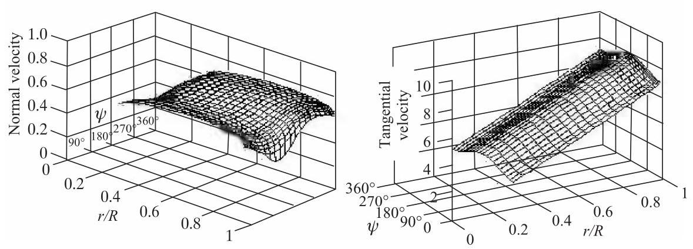

Figure 4.20 Component velocities, normalised with wind speed, at ${30}^{ \circ  }$ of yaw

Figure 4.21 Angle of attack variation at ${30}^{ \circ  }$ of yaw

The flow angle and the angle of attack need to be determined anew at each blade element position $\mu$ and at each blade azimuth position $\theta$ because the flow expansion velocity must now be included, so Equation 4.44 is used in its unmodified form. Drag must also be included in the determination of forces even if it was not in the calculation of the induced velocities.

The blade force per unit span normal to the plane of rotation is

$$
\frac{d{F}_{x}}{dr} = \frac{1}{2}\rho {W}^{2}c{C}_{x} \tag{4.53}
$$

which will vary with the azimuth position of the blade. The total force normal to the rotor plane can be obtained by integrating Equation 4.53 along the blade length for each of the blades, taking account of their azimuthal separation, and summing the results. The total normal force will also vary with rotor azimuth.

Similarly, the tangential blade force per unit span is

$$
\frac{d{F}_{y}}{dr} = \frac{1}{2}\rho {W}^{2}c{C}_{y}
$$

and the blade torque contribution about the axis of rotation is

$$
\frac{dQ}{dr} = \frac{1}{2}\rho {W}^{2}\operatorname{cr}{C}_{y} \tag{4.54}
$$

The total torque is found by integrating along each blade and summing over all the blades, just as for the normal force. Again, the torque on the rotor will vary with azimuth position so to find the average torque will require a further integration with respect to azimuth.

### 4.2.11 Yawing and tilting moments in steady yaw

The asymmetry of the flow through a yawed rotor, caused by the flow expansion, means that a blade sweeping upwind has a higher angle of attack than when it is sweeping downwind, as shown in Figure 4.16. The blade lift upwind will, therefore, be greater than the lift downwind and a similar differential applies to the forces normal to the rotor plane. It can be seen, therefore, that there is a net moment about the yaw (vertical axis) in a direction which will tend to restore the rotor axis to a position aligned with the wind direction. The yawing moment is obtained from the normal force of Equation 4.53

$$
\frac{d{M}_{z}}{dr} = \frac{1}{2}\rho {W}^{2}\operatorname{cr}{C}_{x}\sin \psi \tag{4.55}
$$

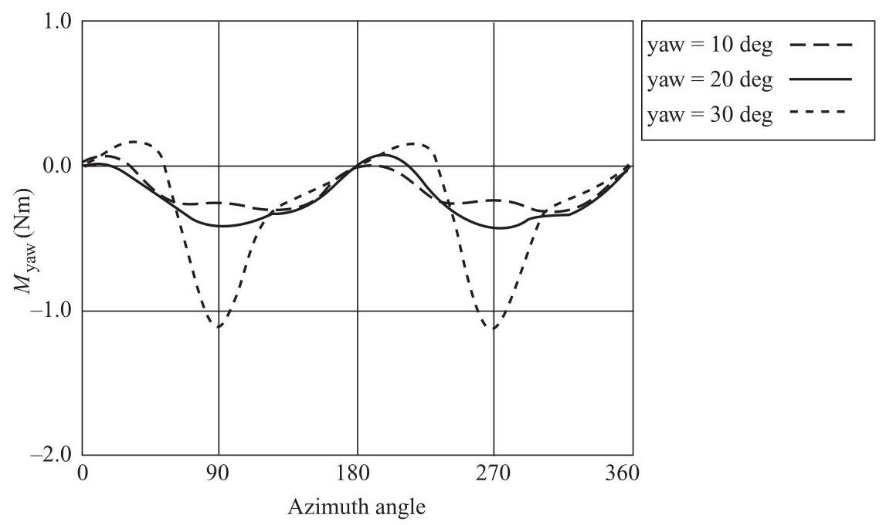

Figure 4.22 Measured yaw moments on the Delft turbine

which will also vary with the azimuth position of the blade. The total single-blade yawing moment at each azimuth position is obtained by integrating Equation 4.55 along the length of the blade. Summing the moments for all blades, suitably separated in phase, will result in the yawing moment on the rotor.

A similar calculation can be made for the tilting moment, the moment about the horizontal diametral axis ( $y$ axis) of the rotor.

$$
\frac{d{M}_{y}}{dr} = \frac{1}{2}\rho {W}^{2}\operatorname{cr}{C}_{x}\cos \psi \tag{4.56}
$$

The existence of yawing and tilting moments predicted by the blade element theory is inconsistent with the momentum and vortex theories because they predict only a uniform pressure distribution on the rotor disc. Actually, the momentum and vortex theories predict velocities from which it is only possible to deduce a uniform pressure distribution.

Measured results of rotor yaw moment for the Delft turbine are shown in Figure 4.22 and the corresponding calculated yawing moments are shown in Figure 4.23.

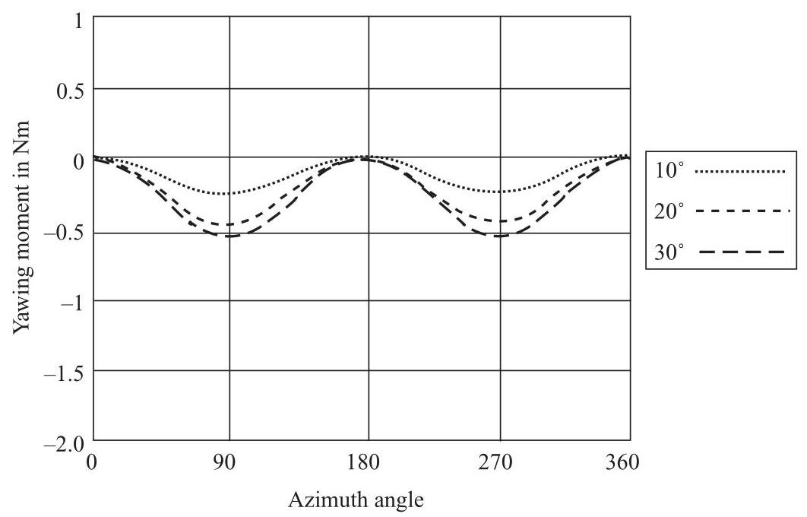

Figure 4.23 Calculated yaw moments on the Delft turbine

The measured yawing moments were derived from strain gauge readings of the flat-wise bending strain close to the root of the blade at ${129}\mathrm{\;{mm}}$ radius. Flat-wise, or flap-wise bending causes only displacements normal to the rotor plane. The calculated yawing moments are determined at the same radial position on the blade and are, therefore, not the true yawing moments about the actual yaw axis.

The comparison between the measured and calculated yaw moments is quite good taking into account the limitations of the theory. At ${30}^{ \circ  }$ of yaw the calculated values underestimate the measurements significantly whereas at the two lower angles the correspondence is much closer.

It should be noted that the mean yawing moment is not zero and that the sign of the moment, being negative, means that it endeavours to restore the rotor axis to alignment with the wind direction.

The yawing moment comparison is a test of the usefulness of the theory developed in this section and it would seem that for general engineering purposes it passes the test.

The measured tilting moments (Figure 4.24) appear to be of about the amplitude for all three yaw angles whereas the calculated moments (Figure 4.25) increase with yaw angle.

For ${30}^{ \circ  }$ of yaw the magnitudes of the measured and calculated tilting moments are comparable. The measured mean tilting moment is quite definitely non-zero and positive but the calculated mean moment is much smaller although still positive. A positive tilt rotation would displace the upper part of the rotor disc in the downwind direction. In the theory the small mean tilting moment is caused by the wake rotation velocities.

A theory based upon computational fluid mechanics should provide a much more accurate prediction of the aerodynamics of a wind turbine in yaw. However, the severe computational time limitations associated with CFD solutions precludes their use in favour of the simple theory outlined in these pages.

Figure 4.24 Measured tilt moments on the Delft turbine

## 4.3 The method of acceleration potential

### 4.3.1 Introduction

An aerodynamic model that is applied to the flight performance of helicopter rotors, and which can also be applied to wind turbine rotors that are lightly loaded, is that based upon the idea of acceleration potential. The method allows distributions of the pressure drop across an actuator disc that are more general than the, strictly, uniform pressure distribution of the momentum theory. The model has been expounded by Kinner (1937), inspired by Prandtl, who has developed expressions for the pressure field in the vicinity of an actuator disc, treating it as a circular wing. To regard a rotor as a circular wing requires an infinity of very slender blades so that the solidity remains small.

Figure 4.25 Calculated tilt moments on the Delft turbine

Kinner's theory, which is derived from the Euler Equations, assumes that the induced velocities are small compared with the general flow velocity. If $u, v$ and $w$ are the velocities induced by the actuator disc in the $x, y$ and $z$ directions, respectively, and which are very much smaller than the free-stream velocity in the $x$ direction ${U}_{\infty }$ , then the rate of change of momentum in the $x$ direction of a unit volume of air will be in response to the pressure gradient in that direction

$$
\rho \left( {\left( {{U}_{\infty } + u}\right) \frac{\partial \left( {{U}_{\infty } + u}\right) }{\partial x} + v\frac{\partial \left( {{U}_{\infty } + u}\right) }{\partial y} + w\frac{\partial \left( {{U}_{\infty } + u}\right) }{\partial z}}\right)  =  - \frac{\partial p}{\partial x} \tag{4.57}
$$

The free-stream velocity ${U}_{\infty }$ does not change with position, therefore, for example, $\partial {U}_{\infty }/\partial x = 0$ . Also, ${U}_{\infty } \gg  \left( {u, v, w}\right)$ and so, for example, $v\left( {\partial u/\partial y}\right)$ can be ignored in comparison with ${U}_{\infty }\left( {\partial u/\partial x}\right)$ . The momentum equation in the $\mathrm{x}$ direction then simplifies to

$$
\rho {U}_{\infty }\frac{\partial u}{\partial x} =  - \frac{\partial p}{\partial x} \tag{4.58a}
$$

Similarly, in the $y$ and $z$ directions, the momentum equations are also simplified

$$
\rho {U}_{\infty }\frac{\partial v}{\partial x} =  - \frac{\partial p}{\partial y} \tag{4.58b}
$$

and

$$
\rho {U}_{\infty }\frac{\partial w}{\partial x} =  - \frac{\partial p}{\partial z} \tag{4.58c}
$$

Differentiating each momentum equation with respect to its particular direction and adding together the results gives

$$
\rho {U}_{\infty }\frac{\partial }{\partial x}\left( {\frac{\partial u}{\partial x} + \frac{\partial v}{\partial y} + \frac{\partial w}{\partial z}}\right)  =  - \left( {\frac{{\partial }^{2}p}{\partial {x}^{2}} + \frac{{\partial }^{2}p}{\partial {y}^{2}} + \frac{{\partial }^{2}p}{\partial {z}^{2}}}\right)
$$

but, for continuity of the flow, $\left( {\partial u/\partial x + \partial v/\partial y + \partial w/\partial z}\right)  = 0$ ,

Therefore,

$$
\frac{{\partial }^{2}p}{\partial {x}^{2}} + \frac{{\partial }^{2}p}{\partial {y}^{2}} + \frac{{\partial }^{2}p}{\partial {z}^{2}} = 0 \tag{4.59}
$$

which is the Laplace Equation governing the pressure field on and surrounding the actuator disc. Given the boundary conditions at the actuator disc, Equation 4.59 can be solved for the pressure field and, in particular, the pressure distribution at the disc. The pressure is continuous everywhere except across the disc surfaces where there is the usual pressure discontinuity, or pressure drop, in the wind turbine case.

In Coleman's analysis the pressure drop distribution across the disc is uniform (it is only as a result of combining the theory with the blade element theory that a non-uniform pressure distribution can be achieved) but falls to zero, abruptly, at the disc edge. Kinner assumes that the pressure drop is zero at the disc edge and changes in a continuous manner as radius decreases.

The simplified Euler Equations 4.58 allow pressure to be regarded as the potential field from which the acceleration field can be obtained, by differentiation, and thence the velocity field, by integration. Commencing upstream where the known free-stream conditions apply the velocity components can be determined by progressive integration towards the disc.

The pressure discontinuity across the rotor disc will be as shown in Figure 3.2, Chapter 3. The magnitude of the step in pressure will be twice the pressure level (above the far field level) that occurs just upstream of the disc. The pressure gradient, however, normal to the rotor disc, will be continuous.

### 4.3.2 The general pressure distribution theory of Kinner

Kinner's solution (1937) of Equation 4.59 is mathematically complex and is achieved by means of a co-ordinate transformation. The Cartesian co-ordinates centred in the rotor plane $\left( {{x}^{\prime \prime },{y}^{\prime }, z}\right)$ , as defined in Figure 4.11, are transformed to, what is termed, an ellipsoidal coordinate system $\left( {v,\eta ,\psi }\right)$ , where $\psi$ is the azimuth angle.

$$
\frac{{x}^{\prime \prime }}{R} = {v\eta },\frac{{y}^{\prime }}{R} = \sqrt{1 - {v}^{2}}\sqrt{1 + {\eta }^{2}}\sin \psi \;\text{ and }\;\frac{z}{R} = \sqrt{1 - {v}^{2}}\sqrt{1 + {\eta }^{2}}\cos \psi \tag{4.60}
$$

On the surface of the rotor disc $\eta  = 0$ and $r/R = \mu  = \sqrt{1 - {v}^{2}}$ or, conversely, $v = \sqrt{1 - {\mu }^{2}}$

The transformation separates the variables and allows the pressure field to be expressed as the product of three functions

$$
p\left( {v,\eta .\psi }\right)  = {\Phi }_{1}\left( v\right) {\Phi }_{2}\left( \eta \right) {\Phi }_{3}\left( \psi \right) \tag{4.61}
$$

each separate function being the solution of a separate, ordinary differential equation,

$$
\frac{d}{dv}\left( {\left( {1 - {v}^{2}}\right) \frac{d{\Phi }_{1}\left( v\right) }{dv}}\right)  + \left( {n\left( {n - 1}\right)  - \frac{{m}^{2}}{1 - {v}^{2}}}\right) {\Phi }_{1}\left( v\right)  = 0 \tag{4.62a}
$$

$$
\frac{d}{d\eta }\left( {\left( {1 + {\eta }^{2}}\right) \frac{d{\Phi }_{2}\left( \eta \right) }{d\eta }}\right)  + \left( {\frac{{m}^{2}}{1 + {\eta }^{2}} - n\left( {n + 1}\right) }\right) {\Phi }_{2}\left( \eta \right)  = 0 \tag{4.62b}
$$

$$
\frac{{d}^{2}{\Phi }_{3}\left( \psi \right) }{d{\psi }^{2}} + {m}^{2}{\Phi }_{3}\left( \psi \right)  = 0 \tag{4.62c}
$$

where $m$ and $n$ are positive integers.

Equations 4.62a and 4.62b have the form of Legendre's associated differential equation which has solutions called associated Legendre polynomials of the first and second kinds, respectively, see Pipes and Harvill (1970) and van Bussel (1995).

If $m = 0$ then Equation 4.62a is reduced to Legendre’s differential equation, the two solutions for which are:

$$
{\Phi }_{1}\left( v\right)  = {P}_{n}\left( v\right) \tag{4.63a}
$$

and

$$
{\Phi }_{1}\left( v\right)  = {Q}_{n}\left( v\right) \tag{4.63b}
$$

where ${P}_{n}\left( v\right)$ is a Legendre polynomial of the first kind and ${Q}_{n}\left( v\right)$ is a Legendre polynomial of the second kind.

$$
{P}_{n}\left( v\right)  = \frac{1}{{2}^{n}n!}\frac{{d}^{n}}{d{v}^{n}}{\left( {v}^{2} - 1\right) }^{n} \tag{4.64}
$$

Although the polynomials extend beyond the range ${v}^{2} \leq  1$ , over that interval the polynomials are mutually orthogonal

$$
{\int }_{-1}^{1}{P}_{n}\left( v\right) {P}_{k}\left( v\right) {dv} = 0\;n \neq  k \tag{4.65}
$$

For $n = 0$ the Legendre polynomial of the second kind is

$$
{Q}_{0}\left( v\right)  = \frac{1}{2}\ln \left( \frac{1 + v}{1 - v}\right) \tag{4.66}
$$

For $n > 0$ the Legendre polynomials of the second kind ${Q}_{n}\left( v\right)$ can be obtained from the polynomials of the first kind. For $n = 1$ to 4

$$
{Q}_{1}\left( v\right)  = {P}_{1}\left( v\right) {Q}_{0}\left( v\right)  - 1
$$

$$
{Q}_{2}\left( v\right)  = {P}_{2}\left( v\right) {Q}_{0}\left( v\right)  - \frac{3}{2}v \tag{4.67}
$$

$$
{Q}_{3}\left( v\right)  = {P}_{3}\left( v\right) {Q}_{0}\left( v\right)  - \frac{5}{2}{v}^{2} + \frac{2}{3}
$$

$$
{Q}_{4}\left( v\right)  = {P}_{4}\left( v\right) {Q}_{0}\left( v\right)  - \frac{35}{8}{v}^{3} + \frac{55}{24}v
$$

The solutions for Equation 4.62b, with $m = 0$ , are the same as for 4.62a but with imaginary arguments, that is,

$$
{\Phi }_{2}\left( \eta \right)  = {P}_{n}\left( {i\eta }\right) \tag{4.68a}
$$

and

$$
{\Phi }_{2}\left( \eta \right)  = {Q}_{n}\left( {i\eta }\right) \tag{4.68b}
$$

where ${Q}_{0}\left( {i\eta }\right)  = i{\tan }^{-1}\eta$ for $\eta  < 1$ and ${Q}_{0}\left( {i\eta }\right)  = i\left( {\pi /2 - {\tan }^{-1}\eta }\right)$ for $\eta  > 1$ .

For non-zero values of the integer $m$ the solutions of Equation 4.62a become

$$
{P}_{n}^{m}\left( v\right)  = {\left( 1 - {v}^{2}\right) }^{m/2}\frac{{d}^{m}}{d{v}^{m}}{P}_{n}\left( v\right) \tag{4.69}
$$

If $m > n$ then ${P}_{n}^{m}\left( v\right)  = 0$ .

$$
{Q}_{n}^{m}\left( v\right)  = {\left( 1 - {v}^{2}\right) }^{m/2}\frac{{d}^{m}}{d{v}^{m}}{Q}_{n}\left( v\right)
$$

But, from Equation 4.66, ${Q}_{n}^{m}\left( v\right)  = \infty$ at ${v}^{2} = 1$ , which is considered physically unapplicable, and these functions are excluded from the solution.

For solutions of Equation 4.62b for non-zero values of $m$ ,

$$
{P}_{n}^{m}\left( {i\eta }\right)  = {\left( 1 + {\eta }^{2}\right) }^{m/2}\frac{{d}^{m}}{d{\left( i\eta \right) }^{m}}{P}_{n}\left( {i\eta }\right)
$$

Inspection reveals that ${P}_{n}^{m}\left( {i\eta }\right)  \rightarrow  \infty$ as $\eta  \rightarrow  \infty$ which means that pressure would be infinite in the far field which is not physically acceptable, therefore, these terms will also not be included.

$$
{Q}_{n}^{m}\left( {i\eta }\right)  = {\left( 1 + {\eta }^{2}\right) }^{m/2}\frac{{d}^{m}}{d{\left( i\eta \right) }^{m}}{Q}_{n}\left( {i\eta }\right) \tag{4.70}
$$

Equations 4.69 and 4.70 are known as associated Legendre polynomials.

The solution to differential Equation 4.62c is more straight forward than for the other two governing equations and has the two solutions

$$
{\Phi }_{3}\left( \psi \right)  = \cos {m\psi },{\Phi }_{3}\left( \psi \right) \sin {m\psi } \tag{4.71}
$$

The complete solution, therefore, for the pressure field surrounding a rotor disc is

$$
p\left( {v,\eta ,\psi }\right)  = \mathop{\sum }\limits_{{m = 0}}^{M}\mathop{\sum }\limits_{{n = m}}^{N}{P}_{n}^{m}\left( v\right) {Q}_{n}^{m}\left( {i\eta }\right) \left( {{C}_{n}^{m}\cos {m\psi } + {D}_{n}^{m}\sin {m\psi }}\right) \tag{4.72}
$$

The upper limits $M$ and $N$ can have any positive integer value.

The polynomial ${Q}_{n}^{m}\left( {i\eta }\right)$ is imaginary for odd values of $m$ and real for even values therefore the arbitrary constants ${C}_{n}^{m}$ and ${D}_{n}^{m}$ must be real or imaginary, accordingly, in order that the pressure field be real.

Any combination of terms in Equation 4.72 can be used, whatever suits the conditions. For there to be a pressure discontinuity across the disc, but continuously varying pressure elsewhere, the solutions must be restricted to those for which $n + m$ is odd. Of course, limiting the number of terms, other than has been described, may result in an approximate solution.

The pressure discontinuity across the rotor disc will be as shown in Figure 3.2. The magnitude of the step in pressure will be twice the pressure level (above the far field level) that occurs just upstream of the disc. The pressure gradient, however, normal to the rotor disc, will be continuous.

### 4.3.3 The axi-symmetric pressure distributions

For the wind turbine rotor disc the simplest situation is for $m = 0$ which means that the pressure distribution is axi-symmetric. The permitted values of $n$ must be odd.

For $n = 1$ the polynomials are

$$
{P}_{1}^{0}\left( v\right)  = v = \sqrt{1 - {\mu }^{2}} \tag{4.73a}
$$

and

$$
{Q}_{1}^{0}\left( {i\eta }\right)  = \eta  \cdot  {\tan }^{-1}\frac{1}{\eta } - 1 \tag{4.73b}
$$

So, on the disc, where $\eta  = 0$ ,

$$
{Q}_{1}^{0}\left( {i0}\right)  =  - 1
$$

Therefore, the pressure distribution is

$$
p\left( \mu \right)  =  - {C}_{1}^{0}\sqrt{1 - {\mu }^{2}} \tag{4.74}
$$

If the pressure in Equation 4.74 is non-dimensionalised using the free-stream dynamic pressure $\frac{1}{2}\rho  \cdot  {U}_{\infty }^{2}$ the value of ${C}_{1}^{0}$ can be related to the thrust coefficient by integrating the pressure distribution of Equation 4.74 over the disc area

$$
\pi {R}^{2}{C}_{T} =  - {R}^{2}{C}_{1}^{0}{\int }_{0}^{2\pi }{\int }_{0}^{1}\sqrt{1 - {\mu }^{2}}{\mu d\mu d\psi } =  - \frac{2}{3}\pi {R}^{2}{C}_{1}^{0}
$$

Therefore,

$$
{C}_{1}^{0} =  - \frac{3}{2}{C}_{T} \tag{4.75}
$$

and so the pressure step across the disc is

$$
{p}_{1}\left( \mu \right)  = \frac{3}{2}{C}_{T}\sqrt{1 - {\mu }^{2}} \tag{4.76}
$$

All the remaining polynomials (for $m = 0$ and odd values of $n > 1$ ) produce zero thrust.

To modify the pressure distribution to suit the boundary conditions an appropriate linear combination of solutions can be added to that of Equation 4.76.

The application to helicopter rotors leads to a requirement for the pressure and the radial pressure gradient to be zero at the rotor axis as these conditions correspond to the pressure on actual rotors. The above pressure distribution does not have zero pressure at the rotor axis and so needs to be combined with at least one other solution. The second axi-symmetric solution, $n = 3$ , is

$$
{P}_{3}^{0}\left( v\right)  = \frac{1}{2}v\left( {5{v}^{2} - 3}\right)  = \frac{1}{2}\sqrt{1 - {\mu }^{2}}\left( {2 - 5{\mu }^{2}}\right) \tag{4.77a}
$$

and

$$
{Q}_{3}^{0}\left( {i\eta }\right)  =  - \frac{\eta }{2}\left( {5{\eta }^{2} + 3}\right) {\tan }^{-1}\frac{1}{\eta } + \frac{5}{2}{\eta }^{2} + \frac{2}{3},\text{ so }{Q}_{3}^{0}\left( {i0}\right)  = \frac{2}{3} \tag{4.77b}
$$

The second pressure distribution is, therefore,

$$
{p}_{2}\left( \mu \right)  = \frac{1}{3}{C}_{3}^{0}\sqrt{1 - {\mu }^{2}}\left( {2 - 5{\mu }^{2}}\right) \tag{4.78}
$$

The sum of the two pressure distributions must be zero where $\mu  = 0$ , so

$$
{C}_{3}^{0} =  - \frac{9}{4}{C}_{T}
$$

and the combination of the two distributions is

$$
{p}_{1 - 2}\left( \mu \right)  = \frac{15}{4}{C}_{T}{\mu }^{2}\sqrt{1 - {\mu }^{2}} \tag{4.79}
$$

Note that the pressure distributions given in Equations (4.76), (4.78) and (4.79) are normalised by the free stream dynamic pressure, ${0.5\rho }{U}_{\infty }^{2}$ , in each case. The three normalised distributions are shown in Figure 4.26.

As most modern wind turbines are designed to achieve as uniform a pressure distribution as practicable, to maximise efficiency, the form chosen for the helicopter rotor might need to be modified. A uniform pressure distribution can be formed by combining solutions but, because the pressure discontinuity must itself be discontinuous at the disc edge, it would mean that a great many solutions would be required. Tip-loss effects would require zero pressure at both the blade tips and at the hub, but for most of the blade span the pressure should be uniform. It should be pointed out that the blade loading caused by uniform pressure does increase linearly with radius.

Figure 4.26 Radial pressure distributions of the first two solutions and their combination to satisfy the requirements at the rotor axis

The induced velocity field caused by the axi-symmetric pressure distribution has to be obtained from the pressure field by integrating Equations 4.58 commencing far upstream where free-stream conditions are assumed to apply. The upstream conditions also depend upon the angle of yaw of the disc. The integration continues until a point on the disc is reached where the induced velocity is to be determined.

The particular induced velocity component that is most important for determining the angle of attack on a blade element is normal to the rotor disc, that is, the axial induced velocity. Mangler and Squire (1950) calculated the axial induced velocity distribution as a function of yaw angle by expressing the velocity as a Fourier series of the azimuth angle $\psi$ .

$$
\frac{u}{{U}_{\infty }} = {C}_{T}\left( {\frac{{A}_{0}\left( {\mu ,\gamma }\right) }{2} + \mathop{\sum }\limits_{{k = 1}}^{\infty }{A}_{k}\left( {\mu ,\gamma }\right) \sin {k\psi }}\right) \tag{4.80}
$$

For the pressure distribution of Equation 4.79 the Fourier coefficients are

$$
{A}_{0}\left( {\mu ,\gamma }\right)  =  - \frac{15}{8}{\mu }^{2}\sqrt{1 - {\mu }^{2}} \tag{4.81a}
$$

$$
{A}_{1}\left( {\mu ,\gamma }\right)  =  - \frac{15}{256}\mu \left( {9{\mu }^{2} - 4}\right) \tan \frac{\gamma }{2} \tag{4.81b}
$$

$$
{A}_{3}\left( {\mu ,\gamma }\right)  =  - \frac{45\pi }{256}{\mu }^{3}{\tan }^{3}\frac{\gamma }{2} \tag{4.81c}
$$

Higher order odd terms are zero. There are also even terms which have the general form

$$
{A}_{k} =  - {\left( -1\right) }^{\frac{k - 2}{2}}\frac{3}{4}\left\lbrack  {\frac{k + v}{{k}^{2} - 1}\left( \frac{9{v}^{2} + {k}^{2} - 6}{{k}^{2} - 9}\right)  + \frac{3v}{{k}^{2} - 9}}\right\rbrack  {\left( \frac{1 - v}{1 + v}\right) }^{\frac{k}{2}}{\tan }^{\frac{k}{2}}\frac{\gamma }{2}
$$

where ${v}^{2} = 1 - {\mu }^{2}$ and $k$ is an even integer greater than zero.

The average value of the axial induced velocity is independent of yaw angle and is given by

$$
{a}_{0} = \frac{{u}_{0}}{{U}_{\infty }} = \frac{1}{4}{C}_{T}
$$

where ${u}_{0}$ is the average axial induced velocity.

Thus, the average value of the axial flow induced velocity is related to the thrust coefficient by

$$
{C}_{T} = 4{a}_{0} \tag{4.82}
$$

compared with the momentum theory ${C}_{T} = 4{a}_{0}\left( {1 - {a}_{0}}\right)$ or compared with any of the expressions developed for yawed conditions, Equations 4.2, 4.18 and 4.24.

Because of the assumption that the induced velocity is small compared with the flow velocity, ${a}_{0}$ is small compared with 1 .

Clearly, the acceleration potential method only applies if the value of ${C}_{T}$ is much less than 1.

The once per revolution term in Equation 4.80 will cause an angle of attack variation and, hence, a lift variation that will cause a yawing moment on the disc. However, the pressure distribution, being axi-symmetric, cannot cause a yawing moment. The situation is much the same as for the vortex theory of Coleman et al. (1945).

Pitt and Peters (1981) use, or rather impose, Glauert's assumption (Equation 4.21) for the variation of the axial induced flow factor.

$$
a = {a}_{0} + {a}_{s}\mu \sin \psi \tag{4.83}
$$

The value of ${a}_{s}$ is obtained by equating the first moment about the yaw axis of Equation 4.83 with the first moment of Equation 4.80 using the Mangler and Squire velocity distributions of Equations 4.81.

$$
{\int }_{0}^{2\pi }{\int }_{0}^{1}\mu \sin \psi \left( {{a}_{0} + {a}_{s}\mu \sin \psi }\right) {\mu d\mu d\psi }
$$

$$
= {\int }_{0}^{2\pi }{\int }_{0}^{1}{C}_{T}\mu \sin \psi \left( {\frac{{A}_{0}\left( {\mu ,\gamma }\right) }{2} + \mathop{\sum }\limits_{{k = 1}}^{\infty }{A}_{n}\left( {\mu ,\gamma }\right) \sin {k\psi }}\right) {\mu d\mu d\psi } \tag{4.84}
$$

All terms, apart from that containing ${A}_{1}$ , vanish on integration, giving

$$
{a}_{s} = \frac{15\pi }{128}{C}_{T}\tan \frac{\gamma }{2} \tag{4.85}
$$

Hence, using Equation 4.82, the axial induced velocity becomes

$$
a = {a}_{0}\left( {1 + \frac{15\pi }{32}\mu \tan \frac{\gamma }{2}\sin \psi }\right) \tag{4.86}
$$

which, apart from the use of the yaw angle instead of the wake skew angle, has the same form as Equations 4.21 and 4.31 and so there is some consistency in the various methods for dealing with yawed flow.

### 4.3.4 The anti-symmetric pressure distributions

As has been determined in Section 4.1.11, there is a moment about the vertical diameter of a yawed wind turbine rotor disc, the restoring yaw moment. An axi-symmetric pressure distribution, however, is not capable of producing a yaw moment so more terms from the series solution of Equation 4.72 need to be included.

The only terms in Equation 4.72 which will yield a yawing moment are those for which $m = 1$ and for which ${D}_{n}^{1} \neq  0$ . Terms for which $m = 1$ and ${C}_{n}^{1} \neq  0$ will cause a tilting moment. Recalling that $m + n$ must be odd to achieve a pressure discontinuity across the disc the values of $n$ that may be combined with $m = 1$ must be even.

Figure 4.27 The form of the pressure distribution which yields a yawing moment

Because of the nature of the Legendre polynomials only one term in the series of Equation 4.72 will produce a net thrust and only one term will produce a yawing moment, which is a first moment. Similarly only one term will produce a second moment, and so on.

The unique term in Equation 4.72 which yields a yawing moment is that for which $m = 1$ , $n = 2$ and ${C}_{n}^{1} \neq  0$ , therefore,

$$
{P}_{2}^{1}\left( v\right)  = {3v}\sqrt{1 - {v}^{2}} = {3\mu }\sqrt{1 - {\mu }^{2}} \tag{4.87}
$$

and

$$
{Q}_{2}^{1}\left( {i\eta }\right)  = {3i\eta }\sqrt{1 + {\eta }^{2}}{\tan }^{-1}\frac{1}{\eta } - {3i}\sqrt{1 + {\eta }^{2}} + \frac{i}{\sqrt{1 + {\eta }^{2}}} \tag{4.88}
$$

so, at the disc,

$$
{Q}_{2}^{1}\left( {i0}\right)  =  - {2i} \tag{4.88a}
$$

A zero pressure gradient at the rotor axis is not appropriate in this case because the pressure distribution is anti-symmetric about the yaw axis, therefore,

$$
p\left( {\mu ,\psi }\right)  = {P}_{2}^{1}\left( \mu \right) {Q}_{2}^{1}\left( {i0}\right) {D}_{2}^{1}\sin \psi  =  - {6i}{D}_{2}^{1}\mu \sqrt{1 - {\mu }^{2}}\sin \psi \tag{4.89}
$$

The pressure distribution is shown in Figure 4.27.

The yawing moment coefficient is defined by

$$
{C}_{mz} = \frac{{M}_{z}}{\frac{1}{2}\rho  \cdot  {U}_{\infty }^{2}\pi  \cdot  {R}^{3}} \tag{4.90}
$$

As before, if the pressure in Equation 4.89 is non-dimensionalised by the free-stream dynamic pressure $\frac{1}{2}\rho  \cdot  {U}_{\infty }^{2}$ , then

$$
{C}_{mz} = \frac{1}{\pi }{\int }_{0}^{2\pi }{\int }_{0}^{1}\mu \sin \psi  \cdot  p\left( {\mu ,\psi }\right) \mu  \cdot  {d\mu d\psi } =  - \frac{1}{\pi }{6i}{D}_{2}^{1}{\int }_{0}^{1}{\mu }^{3}\sqrt{1 - {\mu }^{2}}{d\mu }{\int }_{0}^{2\pi }{\sin }^{2}\psi  \cdot  {d\psi }
$$

(4.91)which gives

$$
i{D}_{2}^{1} =  - \frac{5}{4} \cdot  {C}_{mz} \tag{4.92}
$$

To establish a relationship between the yawing moment coefficient and the axial velocity induced by the pressure distribution of Equation 4.89 the velocity distribution has to be obtained by integrating Equations 4.58. Unfortunately, no analytical solution has been determined for the anti-symmetric case, as Mangler and Squire have done for the symmetric case. Numerical values of induced velocities need to be calculated from Equations 4.58 using the pressure distribution defined by Equations 4.87 and 4.88.

Pitt and Peters (1981) have determined the axial velocity distribution for values of the yaw angle from ${0}^{ \circ  }$ to ${90}^{ \circ  }$ : the yaw angle fixes the far upstream conditions where the integration commences. The velocity distribution found corresponds to that of Equation 4.80 for the axi-symmetric case. Pitt and Peters again impose the form of Equation 4.83 and determine the average value of the axial induced velocity ${a}_{0}$ and the value of ${a}_{s}$ , using the same method of Equation 4.84: in both cases, of course, numerical integration is necessary.

The values of ${a}_{0}$ are not zero, as might have been expected from the anti-symmetric pressure distribution, but are equal and opposite to the values of ${a}_{s}$ found for the corrected axi-symmetric pressure distribution of Equation 4.79. The variation of the two coefficients ${a}_{0}$ and ${a}_{s}$ with yaw angle $\gamma$ is determined numerically but, using the Mangler and Squire analytical forms for guidance, analytical variations can be inferred. Pitt and Peters found that the linearised axial induced velocity distribution is

$$
{a}_{0} =  - \frac{15}{128}\pi \tan \frac{\gamma }{2}{C}_{mz} \tag{4.93}
$$

and

$$
{a}_{s} =  - \left( {1 - {\tan }^{2}\frac{\gamma }{2}}\right) {C}_{mz} \tag{4.94}
$$

Pitt and Peters also include a cosine term in the linearised axial induced flow factor representation of Equation 4.83 which will only arise if ${C}_{2}^{1} \neq  0$

$$
a = {a}_{0} + {a}_{s}\mu \sin \psi  + {a}_{c}\mu \cos \psi \tag{4.95}
$$

In which case there will be an additional pressure distribution given by

$$
p\left( {\mu ,\psi }\right)  = {P}_{2}^{1}\left( \mu \right) {Q}_{2}^{1}\left( {i0}\right) {C}_{2}^{1}\cos \psi  =  - {6i}{C}_{2}^{1}\mu \sqrt{1 - {\mu }^{2}}\cos \psi \tag{4.96}
$$

The tilting moment coefficient is given by

$$
{C}_{my} = \frac{1}{\pi }{\int }_{0}^{2\pi }{\int }_{0}^{1}\mu \cos {\psi p}\left( {\mu ,\psi }\right) \mu  \cdot  {d\mu } \cdot  {d\psi } =  - \frac{1}{\pi }{6i}{C}_{2}^{1}{\int }_{0}^{1}{\mu }^{3}\sqrt{1 - {\mu }^{2}}{d\mu }{\int }_{0}^{2\pi }{\cos }^{2}\psi  \cdot  {d\psi }
$$

(4.97)

Therefore,

$$
i{C}_{2}^{1} =  - \frac{5}{4}{C}_{my} \tag{4.98}
$$

The axial induced velocity distribution resulting from the pressure field of Equation 4.96 is calculated by numerical integration of Equations 4.58 and is then matched with the linear velocity distribution of Equation 4.95 using again the same method for Equation 4.84.

$$
{\int }_{0}^{2\pi }{\int }_{0}^{1}\mu \cos \psi \left( {{a}_{0} + {a}_{c}\mu \cos \psi }\right) {\mu d\mu d\psi }
$$

$$
= {\int }_{0}^{2\pi }{\int }_{0}^{1}\mu \cos \psi {C}_{T}\left( {\frac{1}{2}{A}_{0}\left( {\mu ,\gamma }\right)  + \mathop{\sum }\limits_{{k = 1}}^{\infty }{A}_{k}\left( {\mu ,\gamma }\right) \cos {k\psi }}\right) {\mu d\mu d\psi } \tag{4.99}
$$

The functions ${A}_{n}\left( {\mu ,\gamma }\right)$ are determined numerically. Again, using the Mangler and Squire results as guidance, an expression for ${a}_{c}$ is found.

$$
{a}_{c} =  - {\sec }^{2}\frac{\gamma }{2} \cdot  {C}_{my} \tag{4.100}
$$

### 4.3.5 The Pitt and Peters model

Pitt and Peters (1981) have developed the linear theory that relates the axial induced flow factors to the thrust and moment coefficients given in Equations 4.82, 4.85, 4.93, 4.94 and 4.100, which collect together in matrix form

$$
\left\lbrack  \begin{array}{l} {a}_{0} \\  {a}_{c} \\  {a}_{s} \end{array}\right\rbrack   = \left\lbrack  \begin{matrix} \frac{1}{4} & 0 &  - \frac{15}{128}\pi \tan \frac{\gamma }{2} \\  0 &  - {\sec }^{2}\frac{\gamma }{2} & 0 \\  \frac{15}{128}\pi \tan \frac{\gamma }{2} & 0 &  - \left( {1 - {\tan }^{2}\frac{\gamma }{2}}\right)  \end{matrix}\right\rbrack  \left\lbrack  \begin{array}{l} {C}_{T} \\  {C}_{my} \\  {C}_{mz} \end{array}\right\rbrack \tag{4.101a}
$$

$$
\left( a\right)  = \left\lbrack  L\right\rbrack  \left( C\right) \tag{4.101b}
$$

The solution procedure is to assume initial values for $\left( a\right)$ from which the values of $\left( C\right)$ can be calculated from the blade element theory. New values of $\left( a\right)$ are then found from Equation 4.101 and an iteration proceeds.

For the wind turbine the value of ${a}_{0}$ may not be small compared with 1 and so the above procedure will converge on values of ${a}_{0}$ which are too small compared with what the momentum theory would deliver.

To produce more realistic results, that is, results in line with Glauert's momentum theory, the expression for ${C}_{T}$ could be

$$
{C}_{T} = {4a}\sqrt{1 - a\left( {2\cos \gamma  - a}\right) } = {4a}{A}_{G}\left( a\right) \tag{4.18a}
$$

Or, to use the Coleman theory,

$$
{C}_{T} = {4a}\left( {\cos \gamma  + \tan \frac{\chi }{2}\sin \gamma  - a{\sec }^{2}\frac{\chi }{2}}\right)  = {4a}{A}_{C}\left( a\right) \tag{4.24a}
$$

Also, it is usual for the wake skew angle to be used in matrix $\left\lbrack  L\right\rbrack$ instead of the yaw angle.

The matrix $\left\lbrack  L\right\rbrack$ should then be modified to become

$$
\left\lbrack  L\right\rbrack   = \left\lbrack  \begin{matrix} \frac{1}{{4A}\left( {a}_{0}\right) } & 0 &  - \frac{15}{128}\pi \tan \frac{\chi }{2} \\  0 &  - {\sec }^{2}\frac{\chi }{2} & 0 \\  \frac{15}{{128A}\left( {a}_{0}\right) }\pi \tan \frac{\chi }{2} & 0 &  - \left( {1 - {\tan }^{2}\frac{\chi }{2}}\right)  \end{matrix}\right\rbrack \tag{4.102}
$$

where $A\left( {a}_{0}\right)$ is chosen according to which momentum theory is to be used.

The Pitt and Peters method does not include any determination of induced velocities in the plane of the rotor disc and as a consequence it is not possible to account for wake rotation. However, it is possible that the Kinner solutions ${Q}_{n}^{m}\left( v\right)$ that were excluded from the analysis because they give infinite pressure at ${v}^{2} = 1$ , which lies along the axis of rotation, may give velocity distributions which provide for wake rotation; the momentum theory of Section 3.3 also predicts an infinite pressure at the axis of rotation because of wake rotation. In practice, of course, the rotor disc would not extend to the axis of rotation and the singularity would not occur.

With or without wake rotation a flow angle $\phi$ can be determined from which a torque can be found. If the normal force on an element of the rotor disc is equal to ${\delta L}\cos \phi$ then the tangential force will be ${\delta L}\sin \phi$ .

### 4.3.6 The general acceleration potential method

Peters, with a number of associates, has developed the theory further and a reading of references (Pitt and Peters, 1981; Goanker and Peters, 1988; HaQuang and Peters, 1988) is recommended.

The acceleration potential method has been developed specifically for wind turbines by van Bussell (1995), where a much more comprehensive account of the theory is given.

If the velocity field at the rotor disc associated with any chosen Kinner pressure distribution, including the in-plane induced velocity components, was available then a solution could be determined for any rotor by matching the forces given by the combined pressure fields of a sufficient number of Kinner distributions with those forces given by the blade element theory.

### 4.3.7 Comparison of methods

A project to compare existing methods of predicting yaw behaviour, among other aspects of the aerodynamic behaviour of wind turbines, was reported upon (Snel and Schepers, 1995). Figure 4.28 shows results obtained by various methods for predicting the yawing moment of the 2 MW, three blade turbine at Tjæreborg in Denmark at a yaw angle of ${32}^{ \circ  }$ and a wind speed of ${8.5}\mathrm{\;m}/\mathrm{s}$ .

Most of the theoretical predictions in Figure 4.28 have the correct phasing and about the correct mean yawing moment but the amplitude of the yawing moment varies. In this example the second method bears the closest comparison with the measured data. Generally, the amplitude of the yawing moment variation is under-estimated by the theoretical predictions, whereas the mean yawing moment is quite well predicted.

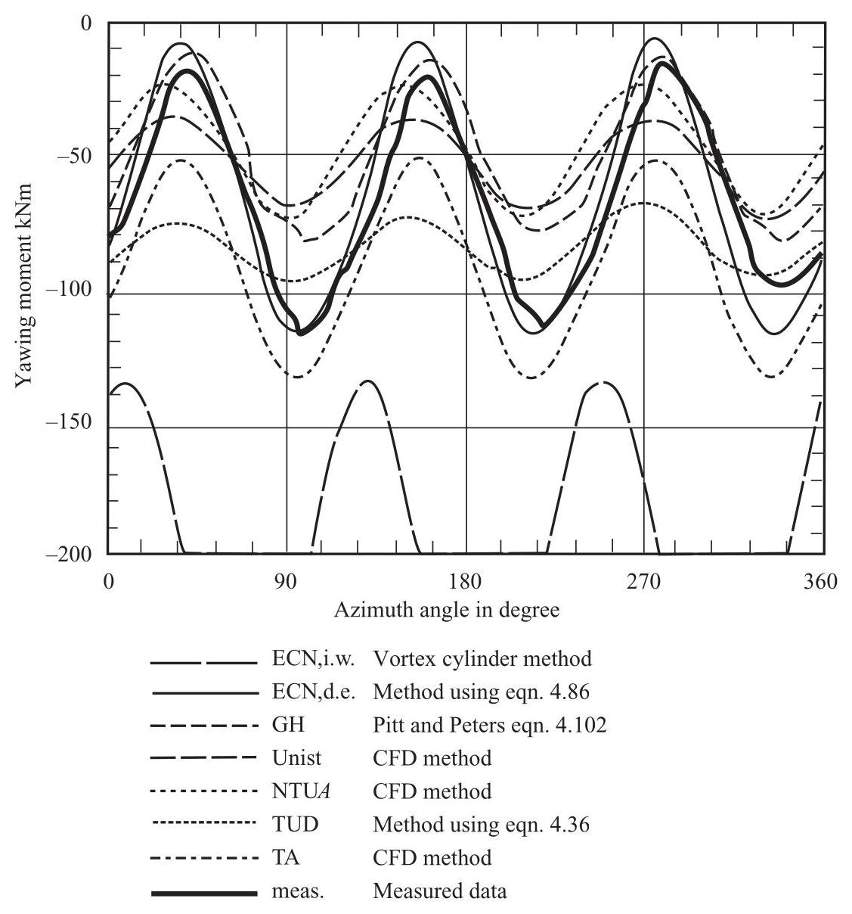

Figure 4.28 Yawing Moment on the Tjæreborg Turbine at ${32}^{ \circ  }\mathrm{Y}$ aw and ${8.5}\mathrm{\;m}/\mathrm{s}$

## 4.4 Unsteady flow

### 4.4.1 Introduction

Natural winds are almost never steady in either strength or direction and so it is seldom that the conditions for the momentum theory apply. It takes a finite time for the wind to travel from far upwind of a rotor to far downwind and in that time wind conditions will change so an equilibrium state is never achieved. Even if the 'average' wind speed changes only slowly, small scale turbulence will cause a continuous unsteadiness in the velocities impinging on a rotor blade.

Several approximate solutions offer themselves for the determination of the dynamic flow conditions at the rotor disc. It could be assumed that the induced velocity remains fixed at the level determined by the average wind speed blowing over a set period of time, that may be quite short. The wake remains frozen while the unsteady component of the wind passes through the rotor disc unattenuated by the presence of the rotor. The unsteady forces would be determined by the blade element theory. Alternatively, the induced velocity through the rotor disc could be determined from the instantaneous wind velocity as if that velocity was steady. The induced velocity will change as the wind speed changes but it must be assumed that the entire wake changes instantaneously to remain in step. Equilibrium in the wake is maintained at all times.

The truth lies somewhere between the two scenarios given above, both of which rely on simple assumptions about the state of the wake.

The acceleration potential method avoids reference to the wake and allows the flow conditions at the rotor disc to be determined by the upwind flow field, which is much simpler to determine than that of the wake.

In steady flow conditions the velocity at a fixed point in the upwind flow field is constant; acceleration of the flow from point to point takes place (e.g. ${U}_{\infty }\left( {\partial u/\partial x}\right)$ in the $x$ -direction, assuming $u$ , the induced velocity, is much smaller than ${U}_{\infty }$ ) but no rate of change of velocity with time (e.g. $\partial u/\partial t$ ) occurs at a single point. In unsteady flow, conditions at a fixed point do change with time and the total acceleration in the $x$ -direction is then $\partial u/\partial t + {U}_{\infty }\left( {\partial u/\partial x}\right)$ . The additional acceleration requires an additional inertia force, the reaction to which will change the force on the rotor disc. The additional force is often termed the added mass force because if the unsteadiness in the relative flow past a blade can be attributed not to flow turbulence but to an unsteady motion of the blade itself some of the air will be forced to move (accelerate) with the blade, effectively adding to the mass of the blade.

### 4.4.2 Adaptation of the acceleration potential method to unsteady flow

If the unsteady acceleration terms are added to equations (Equation 4.58), which are simplified to account for the induced velocities being very much smaller than the wind velocity, then those equations become

$$
\rho \left( {\frac{\partial u}{\partial t} + {U}_{\infty }\frac{\partial u}{\partial x}}\right)  =  - \frac{\partial p}{\partial x}
$$

$$
\rho \left( {\frac{\partial v}{\partial t} + {U}_{\infty }\frac{\partial v}{\partial x}}\right)  =  - \frac{\partial p}{\partial y} \tag{4.103}
$$

$$
\rho \left( {\frac{\partial w}{\partial t} + {U}_{\infty }\frac{\partial w}{\partial x}}\right)  =  - \frac{\partial p}{\partial z}
$$

As before, differentiating each equation with respect to its particular direction and adding together the results gives

$$
\rho \left\lbrack  {\frac{\partial }{\partial t}\left( {\frac{\partial u}{\partial x} + \frac{\partial v}{\partial y} + \frac{\partial w}{\partial z}}\right)  + {U}_{\infty }\frac{\partial }{\partial x}\left( {\frac{\partial u}{\partial x} + \frac{\partial v}{\partial y} + \frac{\partial w}{\partial z}}\right) }\right\rbrack   =  - \left( {\frac{{\partial }^{2}p}{\partial {x}^{2}} + \frac{{\partial }^{2}p}{\partial {y}^{2}} + \frac{{\partial }^{2}p}{\partial {z}^{2}}}\right)
$$

but, for continuity of the flow,

$$
\frac{\partial u}{\partial x} + \frac{\partial v}{\partial y} + \frac{\partial w}{\partial z} = 0
$$

Therefore, the condition

$$
\frac{{\partial }^{2}p}{\partial {x}^{2}} + \frac{{\partial }^{2}p}{\partial {y}^{2}} + \frac{{\partial }^{2}p}{\partial {z}^{2}} = 0
$$

applies together with the Kinner pressure distributions of Section 4.3.2.

The accelerations $\left( {\partial u/\partial t,\partial v/\partial t,\partial w/\partial t}\right)$ can be determined directly from Equations 4.103 without integration being necessary, but it is only the component $\partial u/\partial t$ that is required because it is normal to the rotor disc and so will give rise to a normal force.

The solutions for $\rho {U}_{\infty }\left( {\partial u/\partial x}\right)  =  - \partial p/\partial x$ have already been obtained in Sections 4.3.2, 4.3.3 and 4.3.4 and so it remains to determine the solutions for

$$
\rho \frac{\partial u}{\partial t} =  - \frac{\partial p}{\partial x} \tag{4.104}
$$

Equation 4.104 cannot be solved for the velocity $u$ because that is the solution of the complete equation that is the first of Equations 4.103. What can be determined from Equation 4.104 is the acceleration $\partial u/\partial t$ for which it is necessary to differentiate the chosen pressure distribution. The Kinner pressure distributions, that are solutions of Equations 4.62, are given as functions of the ellipsoidal co-ordinates $\left( {v,\eta ,\psi }\right)$ , so to obtain the derivative with respect to $x$ a co-ordinate transformation is required.

The relationships between the ellipsoidal co-ordinates and the Cartesian co-ordinates $\left( {x, y, z}\right)$ are given in Equations 4.60 from which can be obtained the derivatives $\partial x/\partial v$ , $\partial x/\partial \eta ,\partial x/\partial \psi$ but what are really needed are the inverses of these derivatives.

We can find by appropriate differentiations of Equations 4.60

$$
\frac{\partial }{\partial v} = \frac{\partial {x}^{\prime \prime }}{\partial v}\frac{\partial }{\partial {x}^{\prime \prime }} + \frac{\partial {y}^{\prime }}{\partial v}\frac{\partial }{\partial {y}^{\prime }} + \frac{\partial z}{\partial v}\frac{\partial }{\partial z},
$$

for example, and so the complete Jacobian can be determined:

$$
\left\lbrack  \begin{matrix} \frac{\partial }{\partial v} \\  \frac{\partial }{\partial \eta } \\  \frac{\partial }{\partial \psi } \end{matrix}\right\rbrack   = \left\lbrack  \begin{matrix} \frac{\partial {x}^{\prime \prime }}{\partial v} & \frac{\partial {y}^{\prime }}{\partial v} & \frac{\partial z}{\partial v} \\  \frac{\partial {x}^{\prime \prime }}{\partial \eta } & \frac{\partial {y}^{\prime }}{\partial \eta } & \frac{\partial z}{\partial \eta } \\  \frac{\partial {x}^{\prime \prime }}{\partial \psi } & \frac{\partial {y}^{\prime }}{\partial \psi } & \frac{\partial z}{\partial \psi } \end{matrix}\right\rbrack  \left\lbrack  \begin{matrix} \frac{\partial }{\partial {x}^{\prime \prime }} \\  \frac{\partial }{\partial {y}^{\prime }} \\  \frac{\partial }{\partial z} \end{matrix}\right\rbrack \tag{4.105}
$$

the inverse of which is what is required.

$$
\left\lbrack  \begin{matrix} \frac{\partial }{\partial {x}^{\prime \prime }} \\  \frac{\partial }{\partial {y}^{\prime }} \\  \frac{\partial }{\partial z} \end{matrix}\right\rbrack   = \left\lbrack  \begin{matrix} \frac{\partial v}{\partial {x}^{\prime \prime }} & \frac{\partial \eta }{\partial {x}^{\prime \prime }} & \frac{\partial \psi }{\partial {x}^{\prime \prime }} \\  \frac{\partial v}{\partial {y}^{\prime }} & \frac{\partial \eta }{\partial {y}^{\prime }} & \frac{\partial \psi }{\partial {y}^{\prime }} \\  \frac{\partial v}{\partial z} & \frac{\partial \eta }{\partial z} & \frac{\partial \psi }{\partial z} \end{matrix}\right\rbrack  \left\lbrack  \begin{matrix} \frac{\partial }{\partial v} \\  \frac{\partial }{\partial \eta } \\  \frac{\partial }{\partial \eta } \end{matrix}\right\rbrack \tag{4.106}
$$

The Jacobian matrix of Equation 4.105 can be determined algebraically from Equations 4.60 and this can then be inverted algebraically to give the inverse Jacobian of Equation 4.106. From the inverse Jacobian it is found that

$$
\frac{\partial }{\partial {x}^{\prime \prime }} = \frac{\eta \left( {1 - {v}^{2}}\right) }{R\left( {{\eta }^{2} + {v}^{2}}\right) }\frac{\partial }{\partial v} + \frac{v\left( {1 + {\eta }^{2}}\right) }{R\left( {{\eta }^{2} + {v}^{2}}\right) }\frac{\partial }{\partial \eta } \tag{4.107}
$$

However, only the acceleration at the rotor disc itself is required and there the value of $\eta$ is zero, so

$$
\frac{\partial }{\partial {x}^{\prime \prime }} = \frac{1}{Rv}\frac{\partial }{\partial \eta } \tag{4.108}
$$

If the corrected axi-symmetric pressure drop distribution of Equation 4.79 is chosen, to conform with the steady flow case then, for the whole flow field, the normalised pressure at any point is given by

$$
p\left( {v,\eta }\right)  = \frac{15}{32}v{C}_{TD}\left\lbrack  {-{7\eta }{\tan }^{-1}\frac{1}{\eta } + 4\left( {1 - {v}^{2}}\right)  + {15}{v}^{2}{\eta }^{2}\left( {\eta {\tan }^{-1}\frac{1}{\eta } - 1}\right) }\right.
$$

$$
\left. {+{9\eta }\left( {\eta  + \left( {{v}^{2} - {\eta }^{2}}\right) {\tan }^{-1}\frac{1}{\eta }}\right) }\right\rbrack \tag{4.109}
$$

in which the pressure is normalised by $\frac{1}{2}\rho {U}_{\infty }^{2}$ . The term ${C}_{TD}$ is the contribution to the total thrust coefficient of the dynamic acceleration $\partial u/\partial t$ . Note that, as explained at the end of Section 4.3.1, the pressure level just upwind of the rotor disc, as given by Equation 4.109, is half the magnitude of the pressure drop across the disc given by Equation 4.79.

By means of Equation 4.108, at the rotor plane, where $\eta  = 0$ , the pressure gradient is found to be

$$
\frac{\partial p}{\partial {x}^{\prime \prime }} = \frac{1}{R}\frac{15\pi }{64}{C}_{TD}\left( {9{v}^{2} - 7}\right)
$$

Therefore, in terms of parameter $\mu$ , from Equation 4.104,

$$
\rho \frac{\partial u}{\partial t} =  - \frac{\partial p}{\partial {x}^{\prime \prime }}\frac{1}{2}\rho {U}_{\infty }^{2} = \frac{1}{R}\frac{15\pi }{64}{C}_{TD}\left( {9{\mu }^{2} - 2}\right) \frac{1}{2}\rho {U}_{\infty }^{2} \tag{4.110}
$$

It should be noted that the axial acceleration distribution is axi-symmetric and independent of the yaw angle.

The mean value of axial acceleration over the area of the disc is

$$
\frac{\partial {u}_{0}}{\partial t} = \frac{75\pi }{256}\frac{{U}_{\infty }^{2}}{R}{C}_{TD} \tag{4.111}
$$

The non-dimensional form of the acceleration can be expressed as

$$
\frac{\partial {a}_{\mathrm{o}}}{\partial \tau } = \frac{R}{{U}_{\infty }^{2}}\frac{\partial {u}_{\mathrm{o}}}{\partial t} = \frac{75\pi }{256}{C}_{TD} \tag{4.112}
$$

where ${a}_{o} = {u}_{o}/{U}_{\infty }$ , axial flow factor and $\tau  = t{U}_{\infty }/R$ which is called non-dimensional time.

The axial force on the disc is

$$
{T}_{x} = \frac{1}{2}\rho {U}_{\infty }^{2}\pi {R}^{2}{C}_{TD}
$$

Substituting for ${C}_{TD}$ from Equation 4.112 gives

$$
{T}_{x} = \frac{128}{75}\rho {R}^{3}\frac{\partial {u}_{\mathrm{o}}}{\partial t} \tag{4.113}
$$

The added mass is, therefore, $\frac{128}{75}\rho {R}^{3}$

The added mass term associated with a solid disc given by (Tuckerman, 1925) is $\frac{8}{3}$ , compared with $\frac{128}{75}$ given in Equation 4.113, and is in agreement with the value that is given by the uncorrected axi-symmetric Kinner pressure distribution of Equations 4.73. Although Pitt and Peters (1981) determine the value $\frac{128}{75}$ , in subsequent papers by Peters and other workers the value $\frac{8}{3}$ is recommended and has come to be generally accepted. The use of the so-called 'corrected' pressure distribution for wind turbines has already been questioned in Section 4.3.3; there is no need to impose a zero pressure difference on the rotor disc at the rotation axis.

### 4.4.3 Unsteady yawing and tilting moments

For unsteady flow in yaw the normal unsteady acceleration distribution on the disc is required to have the same form of linear variation as the velocity, given in Equation 4.95. In terms of flow factors,

$$
\frac{\partial a}{\partial \tau } = \frac{\partial {a}_{0}}{\partial \tau } + \frac{\partial {a}_{s}}{\partial \tau }\mu \sin \psi  + \frac{\partial {a}_{c}}{\partial \tau }\mu \cos \psi \tag{4.114}
$$

The condition that causes a yawing moment arises from the anti-symmetric pressure distribution of Section 4.3.4 can be obtained from Equations 4.87, 4.88. For the whole field surrounding the rotor disc the pressure distribution is

$$
p\left( {v,\eta ,\psi }\right)  = 3{D}_{2}^{1}v\sqrt{1 - {v}^{2}}\left( {{3i\eta }\sqrt{1 + {\eta }^{2}}{\tan }^{-1}\frac{1}{\eta } - {3i}\sqrt{1 + {\eta }^{2}} + \frac{i}{\sqrt{1 + {\eta }^{2}}}}\right) \sin \psi
$$

which, on the disc, produces the pressure shown in Figure 4.27. The coefficient ${D}_{2}^{1}$ is related to the yawing moment coefficient in Equation 4.92

$$
i{D}_{2}^{1} =  - \frac{5}{4}{C}_{mz} \tag{4.92}
$$

Therefore,

$$
p\left( {v,\eta ,\psi }\right)  =  - \frac{15}{4}\pi  \cdot  {C}_{mz}v\sqrt{1 - {v}^{2}}\left( {{3\eta }\sqrt{1 + {\eta }^{2}}{\tan }^{-1}\frac{1}{\eta } - 3\sqrt{1 + {\eta }^{2}} + \frac{1}{\sqrt{1 + {\eta }^{2}}}}\right) \sin \psi
$$

(4.115)

As before, the pressure in Equation 4.115 is non-dimensionalised by the free-stream dynamic pressure $\frac{1}{2}\rho  \cdot  {U}_{\infty }^{2}$ .

Applying the differential operator given in Equation 4.108 to Equation 4.115, from Equation 4.104 we get at the rotor disc, where $\eta  = 0$ ,

$$
\frac{\partial {u}_{s}}{\partial t} = \frac{45}{16}\pi \frac{{U}_{\infty }^{2}}{R}{C}_{mzD}\mu \sin \psi \tag{4.116}
$$

In terms of non-dimensional time and velocity

$$
\frac{\partial {a}_{s}}{\partial \tau } = \frac{45}{16}\pi {C}_{mzD} \tag{4.117}
$$

Similarly, if there is a tilting moment then the corresponding acceleration is

$$
\frac{\partial {a}_{c}}{\partial \tau } = \frac{45}{16}\pi {C}_{myD} \tag{4.118}
$$

The radial variation is linear and so no linearisation adjustment is necessary as there is in the case of the velocity distribution. Again, the acceleration is independent of yaw angle. The mean acceleration is zero and so there is no coupling between the cases.

The relationship between accelerations and force coefficients is, therefore,

$$
\left\lbrack  \begin{matrix} \frac{16}{3\pi } & 0 & 0 \\  0 & \frac{16}{45\pi } & 0 \\  0 & 0 & \frac{16}{45\pi } \end{matrix}\right\rbrack  \left\lbrack  \begin{matrix} \frac{\partial {a}_{0}}{\partial \tau } \\  \frac{\partial {a}_{c}}{\partial \tau } \\  \frac{\partial {a}_{s}}{\partial \tau } \end{matrix}\right\rbrack   = {\left\lbrack  \begin{matrix} {C}_{T} \\  {C}_{my} \\  {C}_{mz} \end{matrix}\right\rbrack  }_{D} \tag{4.119a}
$$

$$
\left\lbrack  M\right\rbrack  \left\{  \frac{\partial a}{\partial \tau }\right\}   = \{ C{\} }_{D} \tag{4.119b}
$$

The complete equation of motion combines Equation 4.119 and the steady yaw Equation 4.101. The combination is achieved by adding the corresponding force coefficients, which means that both equations must be inverted.

$$
\left\lbrack  M\right\rbrack  \left\{  \frac{\partial a}{\partial \tau }\right\}   + {\left\lbrack  L\right\rbrack  }^{-1}\{ a\}  = \{ C{\} }_{D} + \{ C{\} }_{S} \tag{4.120}
$$

The right hand side of Equation 4.120 can also be determined from blade element theory and will be a time dependent function of the axial induction factor. The blade forces will vary in a manner determined by the time-varying velocity of the oncoming wind and consequent dynamic structural deflections of the necessarily elastic rotor. Equation 4.120 applies to the whole rotor disc and the blade element forces need to be integrated along the blade lengths.

Numerical solutions to Equation 4.120 require a procedure for dealing with first order differential equations and the tried and tested fourth order Runge-Kutta method is recommended. Starting with a steady state solution the progress in time of the induced velocity as an unsteady flow passes through the rotor can be tracked. However, non-dimensionalising with respect to wind speed is not very useful if wind speed is changing dynamically and it is common to work directly in terms of induced velocity rather than flow factors.

Equation 4.120 really applies to the whole rotor and the only spatial variation of the induced velocity and acceleration that is permitted is as defined in Equations 4.95 and 4.114. However, a relaxation of the strict approach has been adopted by several workers, see, for example, Schepers and Snel (1995), where the induced velocities are determined for separate annular rings, as described in Section 4.1.8. The added mass term for an annular ring can be taken as a proportion of the whole added mass according to the appropriate acceleration distribution, Equations 4.112, 4.117 and 4.118.

Figure 4.29 shows measured and calculated flap-wise (out of the rotor plane) blade root bending moments for the Tjæreborg turbine caused by a pitch change from ${0.070}^{ \circ  }$ to ${3.716}^{ \circ  }$ with the reversed change 30 seconds later. The turbine was not in yaw and the wind speed was ${8.7}\mathrm{\;m}/\mathrm{s}$ . The calculated results were made both according to the equilibrium wake method and with a differential equation method similar to that of Equation 4.120.

The comparison with the measured results clearly shows that the dynamic analysis predicts the initial overshoot in bending moment whereas the equilibrium wake method does not. Neither theory predicts the steady state bending moment achieved between the pitch changes. Figure 4.29 is taken from Lindenburg (1996), which describes the PHATAS III aero-elastic code developed at ECN in the Netherlands. Details of the Tjæreborg turbine, which is sited near Esbjerg in Denmark, can be obtained from Snel and Schepers (1995).

The solution procedure requires the time varying blade element force to determine the right hand side of Equation 4.120, but calculating the lift and drag forces on a blade element in unsteady flow conditions is not a straight forward process. The lift force on a blade element is dependent upon the circulation around the element but after a change in conditions the circulation takes time to settle at a new level (see Section 4.5.3) and in the interim the instantaneous lift cannot be determined via the instantaneous angle of attack. In a continuously changing situation the lift is not in phase with the angle of attack and does not have a magnitude that can be determined using static, two-dimensional aerofoil lift versus angle of attack data.

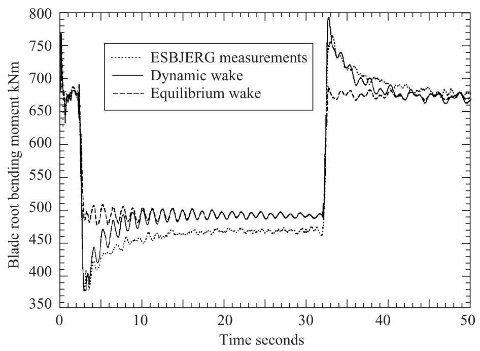

Figure 4.29 Measured and calculated blade root bending moment responses to blade pitch angle changes on the Tjæreborg turbine (from Lindenburg, 1996)

## 4.5 Quasi-steady aerofoil aerodynamics

### 4.5.1 Introduction

When the oncoming flow relative to an aerofoil is unsteady the angle of attack is continuously changing and so the lift also is changing with time. The simple, but incorrect, way of dealing with this problem is to assume that the instantaneous angle of attack corresponds to the same lift coefficient as if that angle of attack were to be constantly applied. The angle of attack is determined by the oncoming flow velocity and the velocity of the blade's motion. If the blade motion includes a torsional (pitching) component then the angle of attack will vary along the chord length: thin aerofoil theory (see J.D. Anderson,1991) shows that the point $\frac{3}{4}$ of the chord length from the leading edge is where the angle of attack must be determined.

The velocities that determine the quasi-steady angle of attack for a rotor blade element are shown in Figure 4.30, the dot represents differentiation with respect to time $t$ .

The flow velocity $W\left( t\right)$ , which includes the rotational speed of the blade element, varies in magnitude and direction ${\alpha }_{w}\left( t\right)$ with the unsteady wind. $W\left( t\right)$ also includes the induced velocities caused by the rotor disc as might be determined by Equation 4.120. The elastic deflection velocities (subscript $e$ ) caused by blade vibration also influence the quasi-steady angle of attack, which is

$$
\alpha \left( t\right)  = {\alpha }_{w}\left( t\right)  - \left( {{v}_{e}\left( t\right)  - \frac{\partial {\beta }_{e}}{\partial t}\left( {\frac{3}{4} - h}\right) c}\right) \frac{1}{W\left( t\right) } \tag{4.121}
$$

Figure 4.30 Unsteady flow and structural velocities adjacent to a rotor blade

The structural velocity caused by chord-wise (edge-wise) deflections of the blade will also influence the angle of attack but by a very small amount. The non-dimensional parameter $h$ defines the position of the pitching axis (flexural axis, shear centre position) of the blade element.

Assuming the structural deflection velocities to be small the lift force is then

$$
{L}_{c}\left( t\right)  = \frac{1}{2}\rho {W}^{2}\left( t\right) \frac{d{C}_{l}}{d\alpha }\sin \alpha \left( t\right) \tag{4.122}
$$

The lift-curve slope $d{C}_{l}/{d\alpha }$ is assumed to be the same as for the static case.

### 4.5.2 Aerodynamic forces caused by aerofoil acceleration

In addition to the circulatory forces there are forces on the aerofoil caused by the inertia of the surrounding air that is accelerated as the aerofoil accelerates in its motion. The additional terms are added mass forces. The added mass per unit span of blade can be shown to be that of a circular cylinder of air of diameter equal to the aerofoil chord $\left( {\pi {c}^{2}/4}\right) \rho$ . There are two components to the added mass force, see Fung (1969).

1. A lift force with the centre of pressure at the mid-chord point of an amount equal to the apparent mass times the normal acceleration of the mid-chord point.

$$
{L}_{m1}\left( t\right)  =  - \frac{1}{4}\pi {c}^{2}\rho \left( {\frac{\partial {v}_{e}}{\partial t} - c\left( {\frac{1}{2} - h}\right) \frac{{\partial }^{2}{\beta }_{e}}{\partial {t}^{2}}}\right) \tag{4.123}
$$

2. A lift force with the centre of pressure at the $\frac{3}{4}$ chord point, of the nature of a centrifugal force, of an amount equal to the apparent mass times $W\left( t\right) \left( {\partial {\beta }_{e}/\partial t}\right)$

$$
{L}_{m2}\left( t\right)  =  - \frac{1}{4}\pi {c}^{2}{\rho W}\left( t\right) \frac{\partial {\beta }_{e}}{\partial t} \tag{4.124}
$$

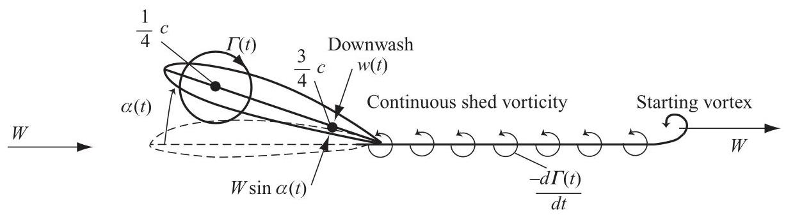

Figure 4.31 Wake development after an impulsive change of angle of attack

There is also a nose-down pitching moment equal to the apparent moment of inertia $\left( {\pi /{128}}\right) {c}^{4}\rho$ (which, actually, is only a quarter of the moment of inertia per unit length of the cylinder of air of diameter $c$ ) times the pitching acceleration ${\partial }^{2}{\beta }_{e}/\partial {t}^{2}$

$$
{M}_{m} = \frac{\pi }{128}{c}^{4}\rho \frac{{\partial }^{2}{\beta }_{e}}{\partial {t}^{2}} \tag{4.125}
$$

The added masses are determined by a process similar to that of Section 4.4.2.

### 4.5.3 The effect of the wake on aerofoil aerodynamics in unsteady flow

If the angle of attack of the flow relative to an aerofoil changes, the strength of the circulation also changes, but the process is not instantaneous because the circulation can only develop gradually. To determine how the lift on an aerofoil actually develops with time after an impulsive change of angle of attack occurs it is necessary to include the wake in the analysis. The sudden change of $\alpha$ causes a build up of circulation around the aerofoil that is matched by an equal and opposite vorticity being shed into the wake.

The bound circulation on an aerofoil is actually distributed along the chord but, for simplicity, can be assumed to be a concentrated vortex $\Gamma$ at the aerodynamic centre ( $\frac{1}{4}$ chord point). In steady flow conditions, the velocity induced by the vortex, normal to the chord-line, at the $\frac{3}{4}$ chord point is exactly equal and opposite to the component of the flow velocity normal to the chord-line. The two opposed velocities ensure that no flow passes through the aerofoil at the $\frac{3}{4}$ chord point, a condition which, of course, must be true everywhere along the chord-line but the $\frac{3}{4}$ chord point is used as a control point. The simplified situation assumes that the aerofoil can be represented geometrically by its chord-line, this is known as thin aerofoil representation.

In unsteady flow conditions the velocity induced at the $\frac{3}{4}$ chord point (often referred to as downwash) is caused jointly by the bound vortex and the wake vorticity, see Figure 4.31, but must still be equal and opposite to the component of the flow velocity normal to the chord-line.

After the impulsive change of angle of attack there is a sudden change in upwash $\left( {W\sin \alpha }\right)$ which must be matched by a sudden change of downwash. The change of upwash implies an impulsive acceleration of the mass of the air that causes an added mass force on the aerofoil. The sudden change of downwash must come from a sudden increase in circulation that must be matched by an equal and opposite starting vortex being shed into the wake and then convects downstream. The influence of the starting vortex on the downwash gets gradually weaker as the vortex moves away so the bound vortex must increase in strength to maintain that the downwash matches the upwash. The increasing strength of the bound vortex means that, to keep the overall angular momentum contained in the vorticity zero (there was none before the impulse), continuous vorticity of the opposite sense must be shed into the wake and this also contributes to the downwash.

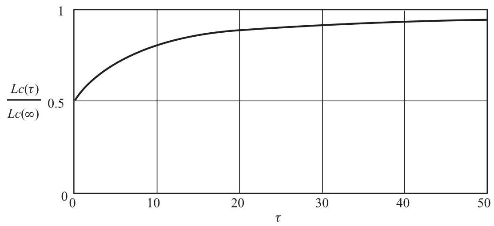

Figure 4.32 Lift development after an impulsive change of angle of attack

The rate of increase of the bound vortex strength gradually reduces with a corresponding reduction of the strength of the shed vorticity and eventually, asymptotically, the steady state bound circulation strength is developed.

The analytical solution to the problem was developed by Wagner (1925), it is complex and expressed in terms of Bessel functions but several approximations to the Wagner function exist, the most accurate of which is given by Jones (1945).

$$
\frac{\Delta {L}_{c}\left( \tau \right) }{\frac{1}{2}\rho {W}^{2}c\frac{d{C}_{l}}{d\alpha }\sin \left( {\Delta \alpha }\right) } = \Phi \left( \tau \right)  = 1 - {0.165}{e}^{-{0.0455\tau }} - {0.335}{e}^{-{0.30\tau }} \tag{4.126}
$$

where $\tau  = {2Wt}/c$ is the non-dimensional time based upon the half chord length $c/2$ of the aerofoil and $d{C}_{l}/{d\alpha }$ is the slope of the static lift versus angle of attack characteristic of the aerofoil. Non-dimensional time $\tau$ can also be regarded as the number of half-chord lengths travelled down-stream by the starting vortex after a time $t$ has elapsed since the impulsive change of angle of attack. Equation 4.126 is an example of an indicial equation.

Figure 4.32 shows the progression of the growth of the lift as time proceeds from the original impulsive change of angle of attack. The added mass lift gradually dies away as the circulatory lift develops. Eventually, the steady state, full circulatory lift is achieved.

In the situation where the angle of attack is continuously changing, which is the case for the wind turbine blade, the circulation never reaches an equilibrium state and the added mass lift never dies away.

In an unsteady wind, if for each change of wind velocity over an increment of time ${\delta t}$ there is a corresponding impulsive angle attack change then the lift on the aerofoil will subsequently be influenced by that change in the manner of Equation 4.126 and Figure 4.32. The accumulation of all such changes in a continuous manner will determine the unsteady lift force on the aerofoil.

Assume the flow has been in progress for a long time ${t}_{\mathrm{o}}$ and let $t$ be any time prior to $t$ o, the lift at time $t$ is then given by

$$
{L}_{c}\left( \tau \right)  = {L}_{c}\left( 0\right)  + \frac{1}{2}\rho \frac{d{C}_{l}}{d\alpha }c{\int }_{0}^{\tau }W\left( {\tau }_{0}\right) \Phi \left( {\tau  - {\tau }_{0}}\right) \frac{{dw}\left( {\tau }_{0}\right) }{d{\tau }_{0}}d{\tau }_{0} \tag{4.127}
$$

Where ${\delta w} = \left( {{dw}\left( {\tau }_{0}\right) /d{\tau }_{0}}\right) \delta {\tau }_{0}$ is the change in upwash (downwash) determined by the change in $W\left( \tau \right)$ and the changes in blade motion during the time interval.

The use of non-dimensional time in the above equation poses a problem and it is more convenient to use actual time in a numerical integration.

Theodorsen (1935) solved Equation 4.127 for the case of an aerofoil oscillating sinusoidally in pitch and heave (flapping motion) at fixed frequency $\omega$ and immersed in a steady on-coming wind $U$ . The unsteady lift on the aerofoil is also sinusoidal but not in phase with the angle of attack variation, nor is the amplitude of the lift variation related to the amplitude of the angle of attack by static aerofoil characteristics.

Theodorsen's solution shows that the circulatory lift on the aerofoil equals the quasi-steady lift of Equation 4.121 multiplied by Theodorsen’s function $C\left( k\right)$ that has both real and imaginary parts. $k = {\omega c}/{2U}$ is called the reduced frequency and ${\omega t} = {k\tau }$ . In addition there is the added mass lift given by Equations 4.123 and 4.124.

$$
C\left( k\right)  = \frac{1}{1 + A\left( k\right) } = \frac{1}{1 + \left( \frac{{Y}_{0}\left( k\right)  + i{J}_{0}\left( k\right) }{{J}_{1}\left( k\right)  - i{Y}_{1}\left( k\right) }\right) } \tag{4.128}
$$

where ${J}_{n}\left( k\right)$ and ${Y}_{n}\left( k\right)$ are Bessel functions of the first and second kind, respectively, and $n$ is an integer. Like the Legendre polynomials the Bessel functions are the solutions to a second order ordinary differential equation called Bessel's equation,

$$
{k}^{2}\frac{{d}^{2}y}{d{k}^{2}} + k\frac{dy}{dk} + \left( {{k}^{2} - {n}^{2}}\right)  = 0
$$

Unlike the Legendre polynomials, the Bessel functions cannot be expressed in closed form but only as an infinite series.

Theodorsen's function is often divided into two functions, one describing the real part and the other the imaginary part.

$$
C\left( k\right)  = F\left( k\right)  + {iG}\left( k\right) \tag{4.129}
$$

From Jones' approximation to the Wagner function, Equation 4.126, an approximation to Theodorsen's function is obtained

$$
C\left( k\right)  = 1 - \frac{0.165}{1 - i\frac{0.0455}{k}} - \frac{0.335}{1 - i\frac{0.30}{k}} = F\left( k\right)  + {iG}\left( k\right) \tag{4.130}
$$

The exact and approximate parts of $C\left( k\right)$ are shown in Figures 4.33a and 4.33b.

The real part of $C\left( k\right)$ gives the lift that is in phase with the angle of attack defined in Equation 4.122 and the imaginary part gives the lift that is ${90}^{ \circ  }$ out of phase with the angle of attack.

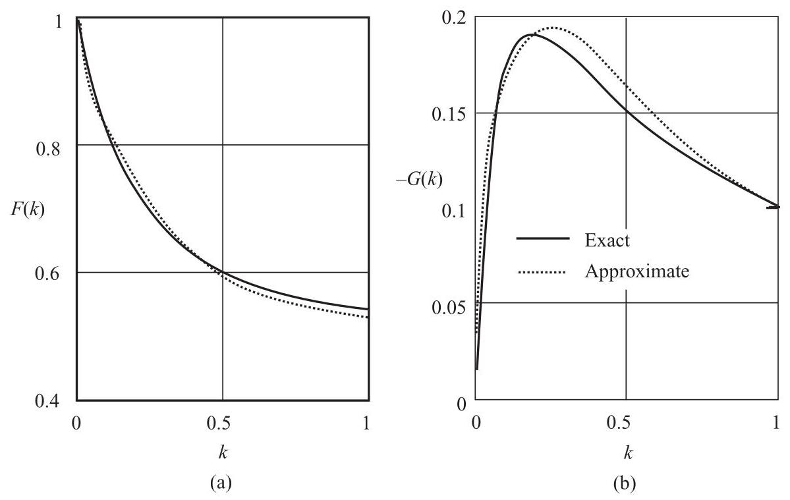

Figure 4.33 The real (a) and imaginary (b) parts of Theodorsen's function

The drawback of the Theodorsen function for rotor blade application is that the wake streams away from the blade in a straight line whereas the rotor blade wake is helical and the wakes of other blades will also be present. Loewy (1957) developed a theory for a rotor blade that accounts for the repeated wake in a similar manner to Prandtl (see Section 3.8.3). As Theodorsen had done, Loewy used two-dimensional, thin aerofoil theory and produced a modification to Theodorsen's function. In Equation 4.128 the Bessel function of the first kind ${J}_{n}\left( k\right)$ is multiplied by $\left( {1 + W\left( k\right) }\right)$ where $W\left( k\right)$ is called the Loewy wake-spacing function.

$$
W\left( k\right)  = \frac{1}{{e}^{\left( 2\frac{d}{c}k + i2\pi \right) } - 1} \tag{4.131}
$$

$d$ is the wake spacing defined in Equation 3.77 and $c$ is the chord of the aerofoil.

Miller (1964) arrived at a very similar result to Loewy by using a discrete vortex wake model.

Loewy's and Miller's theories apply only to the non-yawed rotor but Peters, Boyd and He (1989) have developed a much more extensive theory based upon the method of acceleration potential. A sufficient number of Kinner pressure distributions are required to model both the radial and azimuthal pressure distribution on a helicopter rotor such that the pressure spikes of individual blades are present. The theory obviates the use of blade element theory and includes automatically unsteady effects and tip-losses: modelling of the blade geometry by this method does present some problems, however. Suzuki and Hansen (1999) have applied the theory of Peters, Boyd and He to wind turbine rotors and make comparisons with the blade-element/momentum theory. Van Bussel's theory (1995) is very similar to that of Peters, Boyd and He but is intended for application to wind turbines.

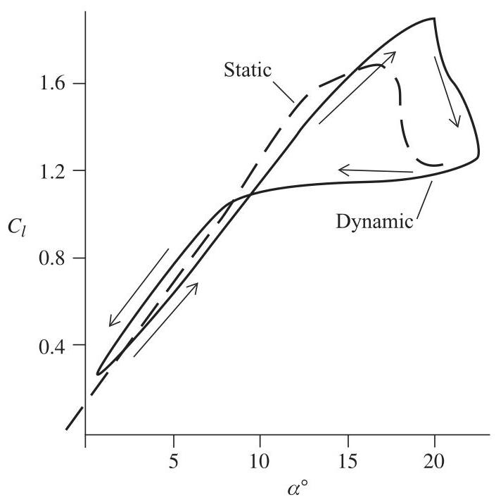

Figure 4.34 Typical dynamic stall behaviour

## 4.6 Dynamic stall

At high wind speeds, and often when a rotor is yawed to the wind, all, or part, of a blade will have separated flow on the downwind surface, that is, the flow will be stalled. Because of unsteadiness in the ambient flow, or because of the changing angle of attack that occurs with a yawed rotor, the flow about a blade may go into and out of stall. In such circumstances the nature of the stalling process is dynamic and experience shows that it is significantly different to so-called static stall. Actually, the very process of stalling is always dynamic.

In the case of static, leading-edge stall an increase in angle of attack beyond the stall angle initially gives rise to an adverse pressure gradient just behind the leading edge on the upper surface of the aerofoil sufficient to cause separation. The separation is not complete over the upper surface instantaneously. The separated flow forms a vortex which moves towards the trailing edge. While the vortex is still above the aerofoil the flow on the upper surface upstream of the vortex is separated but downstream the flow remains attached. Viscosity causes the vortex to dissipate rapidly and, although the low pressure in the vicinity of the vortex maintains some lift on the aerofoil, by the time the vortex reaches the trailing edge and leaves the aerofoil the stall is complete and the circulation has fallen. The process is transient. The pressure distribution on the aerofoil changes dramatically because there is a rear-ward movement of the centre of pressure causing a rise in the nose-down pitching moment and a rise in pressure drag.

If the angle of attack is changing continuously as the static stall angle is reached, during the finite time for the separated vortex to progress towards the trailing edge, the angle of attack is still increasing causing a further increase in lift and in the strength of the vortex, see Figure 4.34. Lift can, therefore, rise to values well above the static stall level. Once the vortex has passed the trailing edge the lift falls suddenly, even though the angle of attack may still be increasing. Once the flow is fully stalled and with the angle of attack now decreasing the lift remains low and fairly constant until re-attachment of the flow. Re-attachment does not take place until the angle of attack is significantly lower than the static stall level.

Dynamic stall will occur on a wind turbine when the rotor is yawed and at a low tip speed ratio (high wind speed), when the rotor encounters a gust and on emerging from tower shadow. The loads experienced by a blade during dynamic stall can be large and can cause significant fatigue damage.

Various models have been developed to predict dynamic stall notably those of Gormont (1973) and Beddoes (1975). More recently Leishman and Beddoes (1989) have improved the original theory of Beddoes and this is now the preferred method for use with wind turbines and helicopter rotors. A study of the dynamic stall behaviour of a NREL wind turbine aerofoil is given by Gupta and Leishman (2006). A report from the Risø National Laboratory in Denmark by Hansen, Gaunaa and Madsen (2004) adapts the Leishmann and Beddoes model for wind turbines.

## 4.7 Computational fluid dynamics

The methods for analysing the flow through a wind turbine in various conditions developed in Chapter 3 and this chapter are all simplifications necessary to facilitate the calculations; to obtain accurate solutions to the flow conditions a much more complex method is required.

The analysis of the flow approaching a turbine rotor can be undertaken, with little loss of accuracy, by using the equations of potential flow known as the Euler equations, developed in the eighteenth century, and given in Section 4.4.2 as Equation 4.103. The Euler equations, together with the continuity equation, can form the basis of a numerical procedure to obtain a solution to the flow conditions. However, during the course of the flow through the rotor, and in the wake, the Euler equations are no longer adequate because they cannot deal with boundary layer flow close to a blade surface and with the separated flow conditions in the wake. In the nineteenth century the fully viscous flow equations of Navier and Stokes were developed and are used today to predict turbulent flows, a method generally known as computational fluid dynamics (CFD). The additional terms introduced in the Navier-Stokes equations include the effect of viscosity and are basically given by Newton's theory of viscous flow - Equation A3.1, in the Appendix to Chapter 3.

CFD is essentially a numerical solution of the equations. For the analysis of a wind turbine rotor the area (volume) around is divided into a mesh, two or three dimensional. At the rotor surfaces the mesh needs to be very fine in order to model attached flow boundary layers whereas in the wake a coarser mesh will suffice. Especial care needs to be taken in regions of high shear such as the wake boundary and close to the vicinity of shed vortices. The number of unknowns to be solved in most three dimensional problems is enormous and, because the solution process is iterative, the solution times are of long duration. The wind turbine rotor requires a further complication because the mesh must rotate but still, at each stage, match the non-rotating mesh that is used at a sufficient distance. Much of the skill and effort required to carry out an analysis is invested in the mesh generation. A principal advantage of the CFD method for wind turbine blades is that no experimentally based aerofoil data is required because the method calculates the flow conditions surrounding a blade surface.

CFD methods are currently used mainly for research but they are used by wind turbine designers to confirm the analyses using simpler, faster methods.

CFD packages called Ellipsys 3D and Ellipsys 2D have been specifically developed at Risø for application to wind turbines: Sørensen (2002) and Bertagnolio, Sørensen and Johansen (2006) give instructive accounts of the results that are achievable.

Commercial CFD packages can be used for wind turbine applications but they require the specialist skills of the wind turbine aerodynamicist and it is often found to be difficult to achieve both the high Reynolds number attached flow conditions and, elsewhere in the wake, the large eddy conditions.

## References

Anderson, J.D. (1991) Fundamentals of Aerodynamics, 2" edition. McGraw-Hill, Singpore.

Bertagnolio, F., Sørensen, N.N. and Johansen, J. (2006) Profile Catalogue for Airfoil Sections Based on 3D Computations. Risø-R-1581(EN).

Beddoes, T.S. (1975) A Synthesis of Unsteady Aerodynamic Effects Including Stall Hysteresis. Proceedings of ${1}^{\text{ st }}$ European Rotorcraft Forum, Southampton.

van Bussel, G.J.W. (1995) The aerodynamics of horizontal axis wind turbine rotors explored with asymptotic expansion methods. PhD thesis, Delft University of Technology.

Coleman, R.P., Feingold, A.M. and Stempin, C.W. (1945) Evaluation of the Induced Velocity Field of an Idealised Helicopter Rotor. N.A.C.A.A.R.R, No. L5E10.

Glauert, H. (1926) A General Theory of the Autogyro. ARCR R&M No. 1111.

Goankar, G.H. and Peters, D.A. (1988) Review of Dynamic Inflow Modelling for Rotorcraft Flight Dynamics. Vertica, 2, No.3, 213-242.

Gormont, R.E. (1973) A Mathematical Model of Unsteady Aerodynamics and radial Flow for Application to Helicopter Rotors. USAAMRDL, technical report.

Gupta, S. and Leishman, J.G. (2006) Dynamic Stall Modelling of the S809 Aerofoil and Comparison with Experiments. Wind Energy, 9, 521-547.

Hansen M.H., Gaunaa, M. and Madsen, H.A. (2004) A Beddoes-Leishman type dynamic stall model in state-space and indicial formulation. Risø-R-1354(EN).

HaQuang, N. and Peters, D.A. (1988) Dynamic Inflow for Practical Applications. Technical Note, Journal of the American Helicopter Society.

Himmelskamp, H. (1945) Profile investigations on a rotating airscrew. PhD thesis, University of Göttingen.

Jones, W.P. (1945) Aerodynamic forces on wings in non-uniform motion. ARCR R&M 2117.

Kinner, W. (1937) The Principle of the Potential Theory Applied to the Circular Wing. (Translated by M. Flint, R.T.P. Translation No 2345) Ingenieur Archiv, VIII, 47-80.

Leishman, J.G. and Beddoes, T.S. (1989) A Semi-empirical Model for Dynamic Stall. Journal of the American Helicopter Society, 34(3), 3-17.

Lindenburg, C. (1996) Results of the PHATAS-III Development. International Energy Agency 28 ${}^{\mathrm{{th}}}$ Meeting of Experts, Lyngby, Denmark.

Loewy, R.G. (1957) A two-dimensional approach to the unsteady aerodynamics of rotary wings. Journal of Aerospace Sciences, 24(2).

Mangler, K.W. and Squire, H.B. (1950) The Induced Velocity Field of a Rotor. ARCR R&M No. 2642.

Meijer Drees, J. (1949) A Theory of Airflow through Rotors and its application to some Helicopter Problems. The Journal of the Helicopter Association of Great Britain, 3(2), 79-104.

Miller, R.H. (1964) Rotor blade harmonic air loading. AIAA Journal, 2(7).

Øye, S. (1992) Induced velocities for rotors in yaw. Proceedings of the ${6}^{\text{ th }}$ IEA Symposium on the Aerodynamics of Wind Turbines, ECN, Petten, Holland.

Peters, D.A., Boyd, D.D. and He, C.J. (1989) Finite state induced flow model for rotors in hover and forward flight. Journal of the American Helicopter Society, 34(4), 5-17.

Pipes, L.A. and Harvill, L.R. (1970) Applied Mathematics for Engineers and Physicists, Appendix B, Special Functions for Applied Mathematics, McGraw-Hill Kogakusha Ltd.

Pitt, D.M. and Peters, D.A. (1981) Theoretical Prediction of Dynamic Inflow Derivatives., Vertica, 5, 21-34.

Prandtl, L. and Tietjens, O.G. (1957) Applied Hydro- and Aeromechanics. Dover, New York.

Schepers, J.G. and Snel, H. (1995) Joint Investigation of Dynamic Inflow Effects and Implementation of an Engineering Method. ECN report: ECN-C-94-107, Petten, Holland.

Sørensen, N.N. (2002) 3D Background Aerodynamics using CFD. Risø-R-1376(EN).

Suzuki, A. and Hansen, A.C. (1999) Generalized dynamic wake model for YawDyn. AIAA-99-0041, AIAA Wind Symposium, Reno, Nevada.

Theodorsen, T. (1935) General Theory of Aerodynamic Instability and the Mechanism of Flutter. NACA report No. 496.

Tuckerman, L.B. (1925) Inertia factors of ellipsoids for use in airship design. NACA report No. 210.

Wagner, H. (1925) Über die Entstahung des dynamischen Auftriebes von Tragflügel. Zeischrift für angewandte Mathematik und Mechanik, 5(1).

## Further Reading

Fung, Y.C. (1969) An Introduction to the Theory of Aeroelasticity. Dover, New York.

Johnson, W. (1980) Helicopter Theory. Dover, New York.

Leishman, G.J. (2000) Principles of Helicopter Aerodynamics. Cambridge University Press, Cambridge.

Stepniewski, W.Z. and Keys, C.N. (1984) Rotary-Wing Aerodynamics. Dover, New York.

Thwaites, B. (1987) Incompressible Aerodynamics. Dover, New York.

