# 5 Design loads for horizontal axis wind turbines

## 5.1 National and international standards

### 5.1.1 Historical development

The preparation of national and international standards containing rules for the design of wind turbines began in the 1980s. The first publication was a set of regulations for certification drawn up by Germanischer Lloyd in 1986. These initial rules were subsequently considerably refined as the state of knowledge grew, leading to the publication by Germanischer Lloyd of the 'Regulation for the Certification of Wind Energy Conversion Systems' in 1993. Revised editions were published in 1999 and 2003. Meanwhile national standards were published in The Netherlands (NEN 6096) and Denmark (DS 472) in 1988 and 1992 respectively.

The International Electrotechnical Commission (IEC) began work on the first international standard in 1988, leading to the publication of IEC 1400-1 'Wind Turbine Generator Systems - Part 1: Safety Requirements' in 1994. Second and third editions, each containing some significant changes and bearing the new number IEC 61400-1, appeared in 1999 and 2005 respectively. IEC 61400-1 has now superseded the national standards referred to above.

The following sections describe the scope of the IEC 61400-1 and Germanischer Lloyd requirements in outline.

### 5.1.2 IEC 61400-1

IEC 61400-1 'Wind Turbines - Part 1: Design Requirements' identifies three different classes of wind turbines to suit differing site wind conditions, with increasing class designation number corresponding to reducing average and extreme wind speeds. The wind speed parameters for each class are given in Table 5.1, where the reference wind speed is defined as the 10 minute mean wind speed at hub height with a 50-year return period. Rigorous procedures are laid down for demonstrating that the wind conditions at a particular wind turbine site conform to those of the designated wind turbine class. To allow for sites where conditions do not conform to any of these classes, a fourth class (Class S) is provided, in which the basic wind speed parameters are to be specified by the manufacturer.

Table 5.1 Wind speed parameters for wind turbine classes

<table><tr><td></td><td>Class I</td><td>Class II</td><td>Class III</td></tr><tr><td>Reference wind speed, ${U}_{\text{ ref }}\left( {\mathrm{m}/\mathrm{s}}\right)$</td><td>50</td><td>42.5</td><td>37.5</td></tr><tr><td>Annual average wind speed, ${U}_{\text{ ave }}\left( {\mathrm{m}/\mathrm{s}}\right)$</td><td>10</td><td>8.5</td><td>7.5</td></tr><tr><td>50-year return gust speed, ${1.4}{U}_{\text{ ref }}\left( {\mathrm{m}/\mathrm{s}}\right)$</td><td>70</td><td>59.5</td><td>52.5</td></tr><tr><td>1-year return gust speed, ${1.12}{U}_{\text{ ref }}\left( {\mathrm{m}/\mathrm{s}}\right)$</td><td>56</td><td>47.6</td><td>42.0</td></tr></table>

The standard identifies a total of 22 different load cases (17 ultimate, 5 fatigue), which, as a minimum, require consideration in the design of the turbine. Each load case is defined in terms of a different combination of wind conditions and machine state - for example, extreme wind shear during power production. The standard does not extend to the prescription of particular methods of loading analysis.

Subsequent sections cover requirements for the control and protection systems, the various mechanical systems, the electrical system, installation, commissioning, operation and maintenance.

### 5.1.3 GL rules

Germanischer Lloyd's 'Guidelines for the Certification of Wind Turbines', commonly referred to as the GL rules, adopts the same classification of wind turbines as IEC 61400-1, apart from the addition of a low wind speed Class IV with a reference wind speed of ${30}\mathrm{\;m}/\mathrm{s}$ . A larger number of load cases are specified, but most of them parallel cases in IEC 61400-1.

The GL rules then go on to describe the design processes required for each component of the turbine in turn - beginning with the blades and ending with the foundation. This includes design load definition, analysis methods, material strengths and fatigue properties. The level of detail provided here sets the GL rules apart from the IEC standard, and is a consequence of their role in defining the design documentation required for certification.

There is a rigorous treatment of the requirements for the control and safety systems, and for the associated protection and monitoring devices. The centrality of these systems to the overall design process is emphasised by placing them at the start of the document. Final sections deal with lightning protection, operation and maintenance manuals, and wind turbine testing.

## 5.2 Basis for design loads

### 5.2.1 Sources of loading

The sources of loading to be taken into account may be categorised as follows:

- Aerodynamic loads.

- Gravitational loads.

- Inertia loads (including centrifugal and gyroscopic effects).

- Operational loads arising from actions of the control system (e.g. braking, yawing, blade pitch control, generator disconnection).

### 5.2.2 Ultimate loads

The load cases selected for ultimate load design must cover realistic combinations of a wide range of external wind conditions and machine states. It is common practice to distinguish between normal and extreme wind conditions on the one hand, and between normal machine states and fault states on the other. The load cases for design are then chosen from:

- Normal wind conditions in combination with normal machine states.

- Extreme wind conditions in combination with normal machine states.

- Machine fault states in combination with appropriate wind conditions.

Extreme wind conditions are generally defined in terms of the worst condition occurring with a 50-year return period. It is assumed that machine fault states arise infrequently, and are uncorrelated with extreme wind conditions, so that the occurrence of a machine fault in combination with the 50-year return wind condition is an event with such a high return period that it need not be considered as a load case. However, IEC 61400-1 wisely stipulates that if there is some correlation between an extreme external condition and a fault state, then the combination should be considered as a design case.

### 5.2.3 Fatigue loads

A typical wind turbine is subjected to a severe fatigue loading regime. The rotor of a $2\mathrm{{MW}}$ machine will rotate some ${10}^{8}$ times during a 20-year life, with each revolution causing a complete gravity stress reversal in the low speed shaft and in each blade, together with a cycle of blade out-of-plane loading due to the combined effects of wind shear, yaw error, shaft tilt, tower shadow and turbulence. It is, therefore, scarcely surprising that the design of many wind turbine components is often governed by fatigue rather than by ultimate load.

The design fatigue load spectrum should be representative of the loading cycles experienced during power production over the full operational wind speed range, with the numbers of cycles weighted in accordance with the proportion of time spent generating at each wind speed. For completeness, load cycles occurring at start-up and shut-down, and, if necessary, during shut-down, should also be included.

It is generally assumed that the extreme load cases occur so rarely that they will not have a significant effect on fatigue life.

### 5.2.4 Partial safety factors

## Partial safety factors for loads

Limit state design requires characteristic loads to be multiplied by appropriate partial safety factors when calculating the design loads. Although, traditionally, different partial safety factor values have been assigned to different kinds of load in static analyses, IEC 61400-1 Edition 3 specifies a single partial safety factor for aerodynamic, operational, gravity and inertia loads for each class of load case. This avoids the pitfalls inherent in any attempt to formulate equations of motions for a dynamic analysis in which different terms have been distorted relative to one another by the application of different load factors.

Table 5.2 Partial safety factors for loads, IEC 61400-1 Edition 3

<table><tr><td colspan="3">Unfavourable loads</td><td rowspan="2">Favourable loads</td></tr><tr><td colspan="3">Class of design load case</td></tr><tr><td>Normal   1.35*</td><td>Abnormal   1.1</td><td>Transport & erection   1.5</td><td>0.9</td></tr></table>

*Exceptionally, the partial factor for Design Load Case 1.1 (see Section 5.4.1) is set at 1.25, because, in this case, the loads are determined using statistical load extrapolation

Ultimate load cases are divided into three classes, normal, abnormal and transport/erection, with a different partial safety factor for each, as set out in Table 5.2. Most load cases are assigned to the normal class, with the abnormal class reserved for the more unlikely fault conditions.

The partial factor for fatigue loads is unity.

## Partial safety factors for the consequences of failure

In addition to the partial safety factors for loads and materials intrinsic to limit state design, IEC 61400-1 also specifies the use of a partial safety factor for the consequences of failure, which varies according to the nature of the component under consideration. Three classes of component are identified, as follows:

- Component class 1 - used for 'fail-safe' structural components whose failure does not result in the failure of a major part of a wind turbine.

- Component class 2 - used for 'non fail-safe' structural components whose failure may lead to the failure of a major part of a wind turbine.

- Component class 3 - used for 'non fail-safe' mechanical components that link non-redundant actuators and brakes required for turbine protection to main structural components.

Recommended minimum values for the partial safety factor for the consequences of failure are given in Table 5.3 below.

Table 5.3 Partial safety factors for the consequences of failure, IEC 61400-1 Edition 3

<table><tr><td>Type of strength assessment</td><td>Ultimate strength</td><td>Fatigue strength</td></tr><tr><td>Component class 1</td><td>0.9</td><td>1.0</td></tr><tr><td>Component class 2</td><td>1.0</td><td>1.15</td></tr><tr><td>Component class 3</td><td>1.3</td><td>1.3</td></tr></table>

IEC 61400-1 requires the partial safety factor for the consequences of failure to be introduced at the stage of assessing component design strength, but as it could equally well have been applied in the derivation of the design load, it is instructive to introduce the concept here.

### 5.2.5 Functions of the control and safety systems

A primary function of the control system is to maintain the machine operating parameters within their normal limits. The purpose of the safety system (referred to as 'protection system' in IEC 61400-1) is to ensure that, should a critical operating parameter exceed its normal limit as a result of a fault or failure in the wind turbine or the control system, the machine is maintained in a safe condition. Normally the critical operating parameters are:

- Turbine rotational speed.

- Power output.

- Vibration level.

- Twist of pendant cables running up into nacelle.

For each parameter it is necessary to set an activation level at which the safety system is triggered. This has to be set at a suitable margin above the normal operating limit to allow for overshooting by the control system, but sufficiently far below the maximum safe value of the parameter to allow scope for the safety system to rein it in. The rotor speed at which the safety system is activated is a key input to the design load case involving rotor overspeed.

## 5.3 Turbulence and wakes

Fluctuation of the wind speed about the short-term mean, or turbulence, naturally has a major impact on the design loadings, as it is the source of both the extreme gust loading and a large part of the blade fatigue loading. The latter is exacerbated by the gust slicing effect, in which a blade will slice through a localised gust repeatedly in the course of several revolutions.

The nature of free-stream turbulence, and its mathematical description in statistical terms, form the subject of Section 2.6. IEC 61400-1 Edition 3 addresses the variation in turbulence intensity from site to site arising from different terrain types by defining three turbulence categories, according to the expected value, ${I}_{15}$ , of the hub height turbulence intensity at a reference mean wind speed, $\bar{U}$ , of ${15}\mathrm{\;m}/\mathrm{s}$ . These are categories A, B and C for ${I}_{15}$ values of 0.16, 0.14 and 0.12 respectively.

Measurements have shown (see, for example, Risø paper R-1111 (1999) by Larsen et al) that there is significant variability in turbulence intensity at a particular site, even at a particular mean wind speed. Accordingly, IEC 61400-1 specifies that the design value is to be taken as the 90% quantile (i.e. the value with a 10% exceedance probability), defined as

$$
{I}_{u} = {\sigma }_{u}/\bar{U} = {I}_{15}\left( {{0.75} + {5.6}/\bar{U}}\right) \tag{5.1}
$$

where ${\sigma }_{u}$ is the standard deviation of the turbulent wind speed fluctuations, $\bar{U}$ is the hub height mean wind speed and ${I}_{15}$ is defined above. This relationship results in reducing turbulence intensity with increasing wind speed, as illustrated in Figure 5.1, and is termed the 'Normal Turbulence Model’. Note that ${\sigma }_{u}$ does not vary with height, so ${I}_{u}$ reduces with increasing height, because of wind shear.

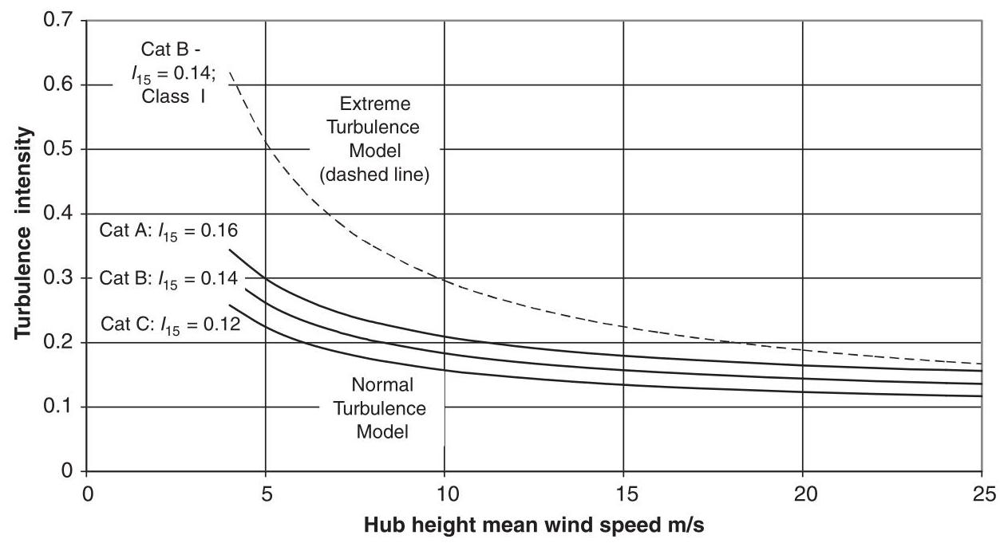

Figure 5.1 Variation of turbulence intensity with wind speed for the normal and extreme turbulence models

There is also a requirement to consider the maximum turbulence expected to occur, in load case 1.3 - see Section 5.4.1. This is defined by the extreme turbulence model, in which the turbulence intensity is given by

$$
{I}_{u} = {\sigma }_{u}/\bar{U} = {I}_{15}\left( {{0.036}\left( {{U}_{\text{ ave }} + 6}\right) \left( {1 - 8/\bar{U}}\right)  + {20}/\bar{U}}\right) \tag{5.2}
$$

where ${U}_{\text{ ave }}$ is the hub height annual average wind speed in $\mathrm{m}/\mathrm{s}$ . This relationship is shown by the dashed line on Figure 5.1.

For any particular candidate wind farm site, ambient turbulence levels have to be determined from site wind speed measurements and used to derive an estimate of the augmented turbulence levels including wake effects at each turbine location - for example, using the method suggested in IEC 61400-1 Annex D. An appropriate design turbulence category (A, B or C) may then be identified by showing that the ${90}\%$ quantile of the estimated turbulence intensity including wake effects is less than the ${90}\%$ quantile value given by Equation 5.1 for that category, for all wind speeds between 60% of turbine rated speed and the cut-out speed.

Computer simulation of the turbulent wind field also requires the definition of the power spectra of the fluctuations of the three orthogonal velocity components and their spatial correlation, which comprise the turbulence model. Edition 2 of the standard details two spectra - those due to Von Karman (1948) and Kaimal (1972) - and their corresponding coherence functions (see Sections 2.6.4 and 2.6.7). However, the Von Karman spectrum is omitted from Edition 3 and replaced by the Mann (1994) uniform shear turbulence model (see Section 2.6.8), although the use of the Von Karman spectrum is still permitted, as is the use of other spectra, provided the power spectral density is asymptotic to ${n}^{-5/3}$ at high frequencies.

## 5.4 Extreme loads

### 5.4.1 Operational load cases

A variety of load cases have to be investigated in this category, so that the effects of extremes of gust loading, wind direction change and wind shear - with or without faults - can be evaluated in turn. The IEC 61400-1 load cases can be divided into two distinct types, depending on whether the wind field is specified in deterministic or stochastic terms. In the deterministic load cases, simple mathematical expressions are used to define the wind speed variation over time, direction changes and wind shears. In the stochastic load cases the statistical properties of the wind are defined and the cases have to be analysed using repeated time domain simulations of the wind field incident on the rotor.

The deterministic load cases have the merit of simplicity, but are open to the criticism that they fail to model the behaviour of the real wind accurately. Accordingly, the number of load cases defined by deterministic discrete gusts or sudden direction changes has been reduced in IEC 61400-1 Edition 3 compared with earlier editions, in favour of greater reliance on cases requiring simulation of the turbulent wind field. In the longer term it may be possible to eliminate more deterministic load cases in favour of stochastic ones, by constraining the turbulent wind simulations to model a particular gust profile - see Section 5.4.3.

IEC 61400-1 Edition 3 requires account to be taken of the following in all operational load cases:

- Wind shear according to the power law $U\left( z\right)  \propto  {z}^{0.2}$ , which is termed the ’normal wind profile model'.

- Tower shadow (described in Section 5.7.2).

- Inclination of the mean air flow of up to ${8}^{ \circ  }$ with respect to the horizontal plane.

- Rotor aerodynamic imbalance (e.g. due to blade pitch and twist deviations) and rotor mass imbalance.

- Yaw tracking errors.

Air density is to be taken as ${1.225}\mathrm{\;{kg}}/{\mathrm{m}}^{3}$ .

The individual ultimate load cases defined in Edition 3 of IEC 61400-1 are described below in turn. Note that, except where indicated otherwise, the full range of mean wind speeds between cut-in and cut-out are to be investigated in each case. (The annotated acronyms in capitals are those used by the code to identify the different wind conditions.)

## Power production load cases - normal machine state

Load case 1.1: Operation in turbulent wind field defined by the normal turbulence model [NTM] - see Section 5.3. Wind speeds at $2\mathrm{\;m}/\mathrm{s}$ intervals between cut-in wind speed and cut-out wind speed, ${U}_{\mathrm{o}}$ , to be investigated. Normal partial load factor (exceptionally 1.25).

A minimum of 15 10-minute simulations are required for each wind speed between $2\mathrm{\;m}/\mathrm{s}$ below the rated wind speed, ${U}_{r}$ , and the cut-out wind speed. (The rated wind speed is defined as the uniform, steady wind speed at which the turbine's rated power is reached.) The characteristic load, that is, that having a 50-year recurrence period, in each element of the structure is to be determined by statistical extrapolation of the extreme value distribution. See Section 5.14.

## [Load case 1.2 is a fatigue load case]

Load case 1.3: Operation in turbulent wind field defined by the extreme turbulence model [ETM]. Normal partial load factor.

As this load case is intended to capture the loading arising from the maximum anticipated turbulence intensity, no extrapolation is required. In practice the case will rarely be critical, as the variability in loading resulting at 'typical' turbulence intensities over the long term is likely to be greater than that resulting from an extreme value of turbulence intensity over a short period.

Load case 1.4: Gust and direction change [ECD]. Hub height wind speed equal to the rated wind speed, ${U}_{r}, \pm  2\mathrm{\;m}/\mathrm{s}$ plus a ${15}\mathrm{\;m}/\mathrm{s}$ rising gust, in conjunction with a simultaneous wind direction change of ${720}/{U}_{r}{}^{ \circ  }$ , that is,60degrees for a rated wind speed of ${12}\mathrm{\;m}/\mathrm{s}$ , for example. The gust rise time and the period over which the direction change takes place are both specified as ten seconds. Normal partial load factor.

Load case 1.5: Extreme wind shear [EWS]. Additional vertical or horizontal transient wind shear superimposed on the 'normal wind profile model'. Normal partial load factor. The additional wind shears are specified as:

$$
\left( \frac{z - {z}_{\text{ hub }}}{D}\right) \left( {{2.5} + {0.2\beta }{\sigma }_{u}{\left( \frac{D}{{\Lambda }_{1}}\right) }^{0.25}}\right) \left( {1 - \cos \left( \frac{2\pi t}{T}\right) }\right) \mathrm{m}/\mathrm{s}\text{ for }0 < t < T\text{ , for vertical shear }
$$

(5.3a)

$$
\left( \frac{y}{D}\right) \left( {{2.5} + {0.2\beta }{\sigma }_{u}{\left( \frac{D}{{\Lambda }_{1}}\right) }^{0.25}}\right) \left( {1 - \cos \left( \frac{2\pi t}{T}\right) }\right) \mathrm{m}/\mathrm{s}\text{ for }0 < t < T\text{ , for horizontal shear }
$$

(5.3b)

where

$z$ is the height above ground

$y$ is the lateral co-ordinate with respect to the hub

$D$ is the rotor diameter

$\beta  = {6.4}{\sigma }_{u}$ is as defined in Section 5.3

${\Lambda }_{1}$ is the longitudinal turbulence scale parameter of ${0.7}{z}_{\mathrm{{hub}}}$ , or ${42}\mathrm{\;m}$ , whichever is the lesser

$T$ is the duration of the transient wind shear, set at 12 seconds.

The two shears are to be applied independently as separate cases, not simultaneously. In the case of a ${60}\mathrm{\;m}$ hub height, ${80}\mathrm{\;m}$ dia machine operating in a ${25}\mathrm{\;m}/\mathrm{s}$ wind speed, the resulting maximum additional wind speed at the tip of a blade is ${8.36}\mathrm{\;m}/\mathrm{s}$ , assuming category A turbulence.

## Fault occurrence during power production

This group of load cases covers faults both internal and external to the machine, including grid loss. If the connection to the grid is lost, then the aerodynamic torque will no longer meet with any resistance from the generator - which, therefore, experiences 'loss of load' - and so the rotor will begin to accelerate until the braking systems are brought into action. Depending on the speed of braking response, grid loss may well result in critical rotor loadings. The fault cases are as follows:

Load case 2.1: Operation in turbulent wind field defined by the normal turbulence model [NTM], together with control system fault or loss of the electrical network. Normal partial load factor.

Twelve ten-minute simulations are to be carried out, with the characteristic load defined as the mean of the six largest ten-minute extremes.

Load case 2.2: Operation in turbulent wind field defined by the normal turbulence model [NTM], together with protection system fault or preceding internal electrical fault. These faults are considered to be rare events, so the abnormal partial load factor is applied. The characteristic load is to be calculated as for load case 2.1.

Load case 2.3: Extreme operating gust [EOG], superimposed on hub height wind speed of ${U}_{r} \pm  2\mathrm{\;m}/\mathrm{s}$ or the cut-out wind speed, ${U}_{\mathrm{o}}$ , in conjunction with external or internal electrical system fault, including loss of electrical network. The wind speed variation is defined as

$$
U\left( {z, t}\right)  = \bar{U}\left( z\right)  - \frac{{1.221}{\sigma }_{u}}{1 + {0.1}\left( {D/{\Lambda }_{1}}\right) }\sin \left( {{3\pi t}/T}\right) \left\lbrack  {1 - \cos \left( {{2\pi t}/T}\right) }\right\rbrack \tag{5.4}
$$

where $t$ is the time elapsed since the onset of the gust and $T$ is the gust duration, specified at 10.5 seconds. Although termed an extreme operating gust, the gust magnitude is only about 70% of the one-year return extreme operating gust defined in IEC 61400-1 Edition 2, so the return period of the current EOG is likely to be only a few days. The gust profile, which incorporates a dip in the wind speed both before and after the main gust, is illustrated in Figure 5.2 for a hub height wind speed of ${25}\mathrm{\;m}/\mathrm{s}$ , Class A turbulence, a turbine diameter of ${80}\mathrm{\;m}$ and a turbulence length scale of ${42}\mathrm{\;m}$ . The combination of the gust and the electrical system fault is considered to be a rare event, so the abnormal partial load factor is to be applied.

[Load case 2.4 is a fatigue load case]

## Start-up load cases

## [Load case 3.1 is a fatigue load case]

Load case 3.2: Extreme operating gust [EOG, as defined for load case 2.3, above] during start-up, superimposed on hub height wind speed of ${U}_{r} \pm  2\mathrm{\;m}/\mathrm{s}$ or ${U}_{\mathrm{o}}$ . Normal partial safety factor.

The magnitude of the gust has been chosen so that its recurrence period in conjunction with a start-up or shut-down is one in 50 years.

Load case 3.3: Extreme direction change [EDC] during start-up, for steady hub height wind speed of ${U}_{r} \pm  2\mathrm{\;m}/\mathrm{s}$ or ${U}_{\mathrm{o}}$ . The direction change, ${\theta }_{e}$ , is defined as:

$$
{\theta }_{e} =  \pm  4\arctan \left( \frac{{\sigma }_{u}}{{U}_{\text{ hub }}\left\lbrack  {1 + {0.1}\left( {D/{\Lambda }_{1}}\right) }\right\rbrack  }\right) \tag{5.5a}
$$

with the direction varying over time according to the relation:

$$
\theta \left( t\right)  = {0.5}{\theta }_{e}\{ 1 - \cos \left( {{\pi t}/T}\right) \} \;\text{ for }0 < t < T \tag{5.5b}
$$

Figure 5.2 IEC 61400-1 Extreme rising and falling gust with 50-year return period for steady wind speed of ${25}\mathrm{\;m}/\mathrm{s}$ and Category A turbulence

The direction change takes place over a period $T$ of six seconds. Normal partial safety factor.

For a hub-height wind speed of ${12}\mathrm{\;m}/\mathrm{s}$ , Class A turbulence, a turbine diameter of ${80}\mathrm{\;m}$ and a turbulence length scale of ${42}\mathrm{\;m}$ , the direction change is ${37}^{ \circ  }$ , with a lower value applying at the cut-out wind speed because of the reduced turbulence intensity.

## Shut-down load cases

[Load case 4.1 is a fatigue load case]

Load case 4.2: Extreme operating gust [EOG - as defined for load case 2.3, above] during shut-down, superimposed on hub-height wind speed of ${U}_{r} \pm  2\mathrm{\;m}/\mathrm{s}$ or ${U}_{\mathrm{o}}$ . Normal partial safety factor.

Load case 5.1: Emergency shut down during operation in turbulent wind field defined by the normal turbulence model [NTM], for steady hub height wind speed of ${U}_{r} \pm  2\mathrm{\;m}/\mathrm{s}$ or ${U}_{\mathrm{o}}$ . Normal partial safety factor.

The characteristic load is to be calculated as for load case 2.1.

### 5.4.2 Non-operational load cases

## Normal machine state

When non-operational, a turbine is either stationary, that is, 'parked', or idling. In this condition it is exposed to the full range of wind speeds and is therefore required to survive the extreme wind conditions defined for the applicable wind class. IEC 61400-1 permits these wind conditions to be described in terms of either a steady wind speed corresponding to the three second gust with a 50-year return period or a turbulent wind with a ten minute mean equal to the 50-year return value (the 'reference wind speed') and a fixed turbulence intensity of 0.11 .

The 50-year return gust value is defined as 1.4 times the 50-year return ten minute mean. Both gust and ten minute mean are specified at hub height, and are to be used in conjunction with a reduced wind shear exponent of 0.11 .

The magnitude of the 50-year return gust depends on the gust duration chosen, which in turn should be based on the size of the loaded area. For example, the withdrawn British Standard CP3, Chapter V, Part 2 'Code of basic data for the design of buildings: wind loading', states that a three second gust can envelope areas up to ${20}\mathrm{\;m}$ , but advises that for larger areas up to ${50}\mathrm{\;m}$ across, a five second gust is appropriate. However, IEC 61400-1 and the GL rules specify the use of gust durations of three seconds regardless of the turbine size.

Recognising that the turbulent wind speed fluctuations are likely to excite blade and tower natural frequencies, IEC 61400-1 requires turbine dynamic response to be accounted for, whether using the deterministic or turbulent extreme wind models.

It is worth noting that Eurocode 1, Part 1-4 (2005) bases extreme loads on the dynamic pressure resulting from the extreme ten minute mean wind speed rather than a three second gust. The loads resulting from the extreme ten minute mean wind speed are augmented by a factor which takes into account both wind gusting and the excitation of resonant oscillations thereby.

The IEC 61400-1 non-operational load cases in the absence of faults or grid loss cater for varying yaw misalignments and may be summarised as follows:

Load case 6.1: Extreme wind with 50-year return period $\left\lbrack  {\mathrm{{EWM}}}_{50}\right\rbrack$ Yaw misalignment up to $\pm  {15}^{ \circ  }$ using the steady wind model, or up to $\pm  {8}^{ \circ  }$ using the turbulent model, provided resistance against yaw slippage can be guaranteed. Normal partial safety factor.

Load case 6.3: Extreme wind with one-year return period $\left\lbrack  {\mathrm{{EWM}}}_{1}\right\rbrack$ and extreme yaw misalignment of up to $\pm  {30}^{ \circ  }$ using the steady wind model, or up to $\pm  {20}^{ \circ  }$ using the turbulent model. The extreme wind speed with a return period of one year is to be taken as ${80}\%$ of the 50-year return value. Normal partial safety factor.

Loss of grid connection can prevent the yaw system tracking any subsequent changes in wind direction, unless back-up is provided for the operation of the yaw system. Accordingly, IEC 61400-1 specifies loss of grid connection as a separate load case, which is summarised below. The use of the abnormal safety factor indicates that the combination of extreme wind and grid loss is considered rare.

Load case 6.2: Extreme wind with 50-year return period $\left\lbrack  {\mathrm{{EWM}}}_{50}\right\rbrack$ and loss of grid connection. Yaw misalignment due to wind direction change up to $\pm  {180}^{ \circ  }$ unless back-up power for yawing provided. Abnormal partial safety factor.

The consequences of yaw slippage should be investigated in all non-operational load cases, if this is a possibility.

[Load Case 6.4 is a fatigue load case]

## Machine fault state

Examples of faults in this category are ones involving the failure of the yaw or pitch mechanisms. On the assumption that there is no correlation between such a failure and extreme winds, the design wind condition for this load case is normally taken as the extreme wind condition with a return period of one year.

The load case in this category is summarised below.

Load case 7.1: Extreme wind with one-year return period $\left\lbrack  {\mathrm{{EWM}}}_{1}\right\rbrack$ and machine fault. Yaw misalignment up to $\pm  {180}^{ \circ  }$ in case of yaw system fault. Abnormal partial safety factor.

### 5.4.3 Blade/tower clearance

In addition to checking the acceptability of stresses arising from the above load cases, the designer is also required to check that none can result in a collision between the blade and the tower, even after multiplying the blade tip deflection by the appropriate partial load factor and the partial safety factor for elasticity of the blade material. For load case 1.1 the characteristic blade tip deflection is to be determined by extrapolation in the same manner as the characteristic load.

### 5.4.4 Constrained stochastic simulation of wind gusts

Although time domain simulations of the turbulent wind field are able to accurately model the behaviour of the wind, very long simulations indeed are required if the extreme events required for design purposes are to be encountered by chance. Rather than select the desired extreme event from an extremely long wind speed time series, it is clearly desirable to 'precipitate' the desired event by constraining the time series in such a way that the statistical properties of the time series are unaffected.

A method of constraining gusts in wind simulations has been set out by Bierbooms (2009). In its simplest form, it consists in superposing a gust profile having the form of the wind speed autocorrelation function on a local maximum of the simulated wind time series. This is illustrated in Figure 5.3.

In this example, the gust magnitude of ${19.5}\mathrm{\;m}/\mathrm{s}$ approximates to the 50-year return value for a Class 1A site, based on exposure to a ${24} - {26}\mathrm{\;m}/\mathrm{s}$ wind speed for about four hours per annum. (The peak factor of five is calculated using Equation A5.42 in the Appendix, taking $v = {0.25}\mathrm{\;{Hz}}$ ) The wind speed auto correlation function, derived from the power spectrum, is multiplied by the desired peak wind speed increment and added to the initial simulated wind speed time series, with the peak of the auto correlation function centred on the selected maximum of the initial time series.

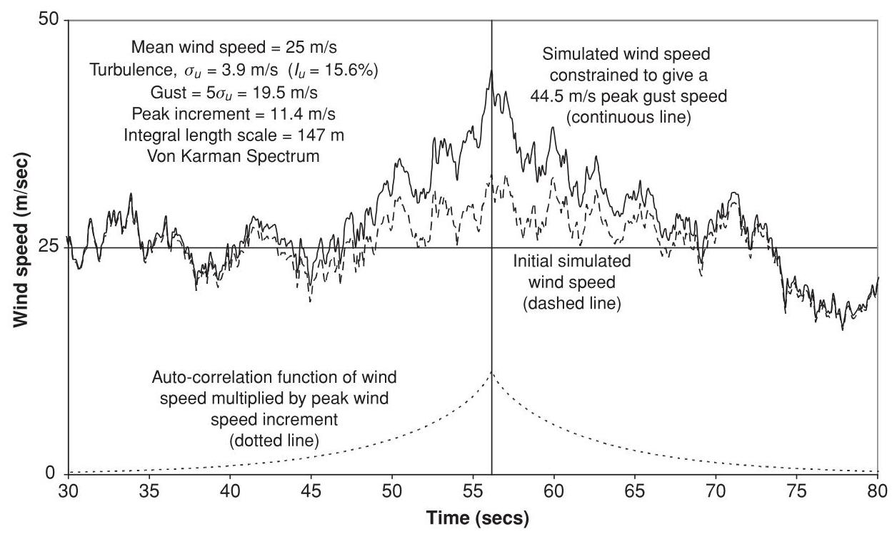

Figure 5.3 Simulated wind speed time series constrained to give a ${44.5}\mathrm{\;m}/\mathrm{s}$ peak wind speed

There is no need for the timing of the peak of the constrained gust to coincide with a maximum of the initial time series. In the general case, the time series of the constrained gust, ${u}_{c}\left( t\right)$ , can be obtained from the initial time series, $u\left( t\right)$ as follows:

$$
{u}_{c}\left( t\right)  = u\left( t\right)  + \kappa \left( {t - {t}_{0}}\right) \left( {A - u\left( {t}_{0}\right) }\right)  - \frac{\dot{\kappa }\left( {t - {t}_{0}}\right) }{\ddot{\kappa }\left( 0\right) }\dot{u}\left( {t}_{0}\right) \tag{5.6}
$$

where $\kappa \left( {t - {t}_{0}}\right)$ is the wind speed autocorrelation function and A the desired peak wind speed at time $t = {t}_{0}$ .

The method can also be extended to gusts constrained to rise by a prescribed amount within a certain time (Bierbooms, 2009). Such gusts are important in relation to the design of pitch-controlled machines.

Although constrained stochastic stimulation appears to be a promising method of modelling extreme events, it is not, as yet, recognised by design standards.

## 5.5 Fatigue loading

### 5.5.1 Synthesis of fatigue load spectrum

The complete fatigue load spectrum for a particular wind turbine component has to be built up from separate load spectra derived for turbine operation at different wind speeds and from the load cycles experienced at start-up, normal shut-down and while the machine is parked or idling. Firstly the cycle counts for each stress range for one hour's operation in a particular wind speed band are calculated and scaled up by the predicted number of hours of operation in that band over the machine lifetime. This prediction can be based on the Weibull distribution (see Section 2.4), with the annual mean wind speed set according to the turbine class (see Section 5.1.2). Finally, the lifetime cycle counts obtained for operation in the different wind speed bands are combined and added to those calculated for start-ups, shut-downs and periods of non-operation.

## 5.6 Stationary blade loading

### 5.6.1 Lift and drag coefficients

Maximum blade loadings are in the out-of-plane direction and occur when the wind direction is either approximately normal to the blade, giving maximum drag, or at an angle of between ${12}^{ \circ  }$ and ${16}^{ \circ  }$ to the plane of the blade when the angle of attack is such as to give maximum lift.

In the absence of data on drag coefficients for airflow normal to the blade, designers formerly utilised the drag coefficient for an infinitely long flat plate of 2.0, with an adjustment downwards based on the aspect ratio. Thus, on a typical blade with a mean chord equal to one fifteenth of the radius, the length to width ratio would be taken as 30, because free flow cannot take place around the inboard end of the blade. Following EN 1991-1-4: 2005

'Eurocode 1: Actions on structures - Part 1-4: Wind actions', this would give a drag coefficient of 1.64. However, field measurements have shown that such an approach is unduly conservative, with drag coefficients of 1.24 being reported for the LM 17.2 m blade (Risø) and 1.25 for the Howden HWP-300 blade (Jamieson and Hunter, 1985). The 1992 edition of DS 472 'Loads and Safety of Wind Turbine Construction' stipulated a minimum value of 1.3 for the drag coefficient.

The choice of lift coefficient value is more straightforward, because aerofoil data for low angles of attack is more generally available, and is, in any case, required for assessing rotor performance. The maximum lift coefficient rarely exceeds 1.6, but values down to as low as 1.1 will obtain on the thicker, inboard portion of the blade. The minimum value of lift coefficient of 1.5 specified in the 1992 edition of DS 472 for the calculation of blade out-of-plane loads is, therefore, probably conservative.

### 5.6.2 Critical configuration for different machine types

It was shown in the preceding section that the maximum lift coefficient is likely to exceed the maximum drag coefficient for a wind turbine blade, so consequently the maximum loading on a stationary blade will occur when the air flow is in a plane perpendicular to the blade axis and the angle of attack is such as to produce maximum lift. For a stall regulated machine, this will be the case when the blade is vertical and the wind direction is ${75}^{ \circ  } - {80}^{ \circ  }$ to the nacelle axis, whereas for a pitch regulated machine the blade only needs to be approximately vertical with a wind direction at ${10}^{ \circ  } - {20}^{ \circ  }$ to the nacelle axis.

### 5.6.3 Dynamic response

## Tip displacement

Wind fluctuations at frequencies close to the first flapwise mode blade natural frequency excite resonant blade oscillations and result in additional, inertial loadings over and above the quasistatic loads that would be experienced by a completely rigid blade. As the oscillations result from fluctuations of the wind speed about the mean value, the standard deviation of resonant tip displacement can be expressed in terms of the wind turbulence intensity and the normalised power spectral density at the resonant frequency, ${R}_{u}\left( {n}_{1}\right)  = n \cdot  {S}_{u}\left( {n}_{1}\right) /{\sigma }_{u}^{2}$ , as follows:

$$
\frac{{\sigma }_{x1}}{{\bar{x}}_{1}} = 2\frac{{\sigma }_{u}}{\bar{U}}\frac{\pi }{\sqrt{2\delta }}\sqrt{{R}_{u}\left( {n}_{1}\right) }\sqrt{{K}_{Sx}\left( {n}_{1}\right) }. \tag{5.7}
$$

Here ${\bar{x}}_{1}$ is the first mode component of the steady tip displacement, $\bar{U}$ is the mean wind speed (usually averaged over ten minutes), $\delta$ is the logarithmic decrement of damping and ${K}_{Sx}\left( {n}_{1}\right)$ is a size reduction factor, which results from the lack of correlation of the wind along the blade at the relevant frequency. Note that the dynamic pressure, $\frac{1}{2}\rho {U}^{2} = \frac{1}{2}\rho {\left( \bar{U} + u\right) }^{2} = \; \frac{1}{2}\rho \left( {{\bar{U}}^{2} + 2\bar{U}u + {u}^{2}}\right)$ , is linearised to $\frac{1}{2}\rho \bar{U}\left( {\bar{U} + {2u}}\right)$ to simplify the result. See Sections A5.2 in Appendix 5 for the derivations of Equation 5.7 and the expression for ${K}_{Sx}\left( {n}_{1}\right)$ .

## Damping

It is evident from Equation 5.7 that a key determinant of resonant tip response is the level of damping present. Generally the damping consists of two components, aerodynamic and structural. In the case of a vibrating blade flat on to the wind, the aerodynamic force per unit length is given by $\frac{1}{2}\rho {\left( \bar{U} - \dot{x}\right) }^{2}{C}_{D} \cdot  c\left( r\right)  \cong  \rho \bar{U}\dot{x}{C}_{D} \cdot  c\left( r\right)$ , where $\dot{x}$ is the blade flatwise velocity, ${C}_{D}$ the drag coefficient and $c\left( r\right)$ the local blade chord. Hence, the aerodynamic damping per unit length, ${\widehat{c}}_{a}\left( r\right)$ , is $\rho \bar{U}{C}_{D}c\left( r\right)$ and the first mode aerodynamic damping ratio,

$$
{\xi }_{a1} = {c}_{a1}/2{m}_{1}{\omega }_{1} = {\int }_{0}^{R}\frac{{\widehat{c}}_{a}\left( r\right) {\mu }_{1}^{2}\left( r\right) {dr}}{2{m}_{1}{\omega }_{1}}
$$

is given by

$$
{\xi }_{a1} = \rho \bar{U}{C}_{D}{\int }_{0}^{R}\frac{{\mu }_{1}^{2}\left( r\right) c\left( r\right) {dr}}{2{m}_{1}{\omega }_{1}}.
$$

Here ${\mu }_{1}\left( r\right)$ is the first mode shape,

$$
{m}_{1} = {\int }_{0}^{R}m\left( r\right) {\mu }_{1}^{2}\left( r\right) {dr}
$$

is the generalised mass, and ${\omega }_{1}$ is the first mode natural frequency in radians per second. The logarithmic decrement is obtained by multiplying the damping ratio by ${2\pi }$ .

When the wind direction is angled to the blade so as to generate maximum lift, the blade will be approaching stall, with the result that the aerodynamic damping is effectively zero. In this situation tip deflections are limited only by the blade structural damping. Structural damping is discussed in Section 5.8.4, and values for typical blade materials given.

## Root bending moment

The standard deviation of tip displacement in combination with the blade mode shape yields an inertial loading distribution from which the standard deviation of the resulting bending moment at any position along the blade may be calculated. In particular, the standard deviation of the root bending moment may be expressed in terms of the mean root bending moment as follows:

$$
\frac{{\sigma }_{M1}}{\bar{M}} = 2\frac{{\sigma }_{u}}{\bar{U}}\frac{\pi }{\sqrt{2\delta }}\sqrt{{R}_{u}\left( {n}_{1}\right) }\sqrt{{K}_{Sx}\left( {n}_{1}\right) } \cdot  {\lambda }_{M1} = \frac{{\sigma }_{x1}}{{\bar{x}}_{1}} \cdot  {\lambda }_{M1} \tag{5.8a}
$$

where

$$
{\lambda }_{M1} = \frac{{\int }_{0}^{R}m\left( r\right) {\mu }_{1}\left( r\right) {rdr}}{{m}_{1} \cdot  {\int }_{0}^{R}c\left( r\right) {rdr}} \cdot  {\int }_{0}^{R}c\left( r\right) {\mu }_{1}\left( r\right) {dr} \tag{5.8b}
$$

See section A5.5 in the Appendix for the derivation of the expression for ${\lambda }_{M1}$ .

The standard deviation of the quasistatic root bending moment fluctuation, or root bending moment background response is expressed in terms of the mean root bending moment by

$$
\frac{{\sigma }_{MB}}{\bar{M}} = 2\frac{{\sigma }_{u}}{\bar{U}}\sqrt{{K}_{SMB}} \tag{5.9}
$$

where ${K}_{SMB}$ is a size reduction factor to take account of lack of correlation of wind fluctuations along the blade. As shown in Section A5.6 of the Appendix, ${K}_{SMB}$ is usually only slightly less than unity because the blade length is small compared with the integral length scale of longitudinal turbulence measured in the across wind direction.

The variance of the total root bending moment fluctuations is equal to the sum of the resonant and background response variances, that is,

$$
{\sigma }_{M}^{2} = {\sigma }_{M1}^{2} + {\sigma }_{MB}^{2}
$$

Hence,

$$
\frac{{\sigma }_{M}}{\bar{M}} = 2\frac{{\sigma }_{u}}{\bar{U}}\sqrt{{K}_{SMB} + \frac{{\pi }^{2}}{2\delta }{R}_{u}\left( {n}_{1}\right) {K}_{Sx}\left( {n}_{1}\right)  \cdot  {\lambda }_{M1}^{2}} \tag{5.10}
$$

The design extreme root bending moment is typically calculated as that due to the 50-year return, ten minute mean wind speed plus the number of standard deviations of the root bending moment fluctuations corresponding to the likely peak excursion in a ten minute period. Thus,

$$
{M}_{\max } = \bar{M} + g \cdot  {\sigma }_{M} \tag{5.11}
$$

where $g$ is known as the peak factor, and depends on the number of cycles of root bending moment fluctuations in ten minutes, according to the formula

$$
g = \sqrt{2\ln \left( {600v}\right) } + \frac{0.577}{\sqrt{2\ln \left( {600v}\right) }} \tag{5.12}
$$

Here, $v$ is the mean zero-upcrossing frequency of the root bending moment fluctuations, which will be intermediate between that of the quasistatic wind loading and the blade natural frequency, ${n}_{1}$ - see Section A5.7 of the Appendix. (Note that, as $g$ varies relatively slowly with frequency, it is a reasonable approximation to set $g$ at an upper limit of 3.9, which corresponds to a frequency of about ${1.9}\mathrm{\;{Hz}}$ .)

Substituting Equation 5.10 into Equation 5.11 yields

$$
{M}_{\max } = \bar{M}\left\lbrack  {1 + g\frac{{\sigma }_{M}}{\bar{M}}}\right\rbrack   = \bar{M}\left\lbrack  {1 + g\left( {2\frac{{\sigma }_{u}}{\bar{U}}}\right) \sqrt{{K}_{SMB} + \frac{{\pi }^{2}}{2\delta }{R}_{u}\left( {n}_{1}\right) {K}_{Sx}\left( {n}_{1}\right)  \cdot  {\lambda }_{M1}^{2}}}\right\rbrack \tag{5.13}
$$

The expression in square brackets is similar to the numerator of the structural factor, ${c}_{s}{c}_{d}$ , in EN 1991-1-4: 2005

$$
{c}_{s}{c}_{d} = \frac{1 + 2{k}_{p}{I}_{v}\left( {z}_{s}\right) \sqrt{{B}^{2} + {R}^{2}}}{1 + 7{I}_{v}\left( {z}_{s}\right) } \tag{5.14}
$$

in which ${R}^{2} = \left( {{\pi }^{2}/{2\delta }}\right) {R}_{u}\left( {n}_{1}\right) {K}_{Sx}\left( {n}_{1}\right)$ .

It is often necessary to express the maximum moment in terms of the quasistatic moment due to the 50-year return gust speed, ${U}_{e50}$ . In order to do this, we equate the latter quantity to the quasistatic component of Equation 5.13, obtaining

$$
{C}_{f} \cdot  \frac{1}{2}\rho {U}_{e50}^{2}{\int }_{0}^{R}c\left( r\right)  \cdot  r \cdot  {dr} = \bar{M}\left( {1 + {g}_{0} \cdot  2\frac{{\sigma }_{u}}{\bar{U}}\sqrt{{K}_{SMB}}}\right) \tag{5.15}
$$

Here, the peak factor $g$ takes a lower value, ${g}_{0,}$ corresponding to the lower frequency of the quasistatic root bending moment fluctuations. Equation 5.15 can then be combined with Equation 5.13 to yield

$$
{M}_{\max } = {C}_{f} \cdot  \frac{1}{2}\rho {U}_{e50}^{2}{\int }_{0}^{R}c\left( r\right)  \cdot  r \cdot  {dr} \cdot  {Q}_{D} \tag{5.16}
$$

where ${Q}_{D}$ is a dynamic factor given by

$$
{Q}_{D} = \frac{1 + g\left( {2\frac{{\sigma }_{u}}{\bar{U}}}\right) \sqrt{{K}_{SMB} + \frac{{\pi }^{2}}{2\delta }{R}_{u}\left( {n}_{1}\right) {K}_{Sx}\left( {n}_{1}\right)  \cdot  {\lambda }_{M1}^{2}}}{1 + {g}_{0}\left( {2\frac{{\sigma }_{u}}{\bar{U}}}\right) \sqrt{{K}_{SMB}}} \tag{5.17}
$$

The dynamic factor ${Q}_{D}$ equates to the EN 1991-1-4 dynamic factor, ${c}_{d}$ , if ${g}_{0}$ is 3.5 and the ratio ${\lambda }_{M1}$ is unity. The EN 1991-1-4 structural factor, ${c}_{s}$ , given in Equation 5.14 is the product of the dynamic factor, ${c}_{d}$ , and the size factor, ${c}_{s}$ , given by ${c}_{s} = \left( {1 + 7 \cdot  {I}_{v}\left( {z}_{s}\right) \sqrt{{B}^{2}}}\right) /\left( {1 + 7 \cdot  {I}_{v}\left( {z}_{s}\right) }\right)$ .

There is considerable advantage in starting with the extreme gust speed and calculating the extreme root moment as the product of ${C}_{f} \cdot  \frac{1}{2}\rho {U}_{e50}^{2}{\int }_{0}^{R}c\left( r\right)  \cdot  r \cdot  {dr}$ and ${Q}_{D}$ , because it eliminates most of the error associated with linearising the formula for dynamic pressure. For example, if the extreme gust is 1.4 times the extreme ten minute mean wind speed, as postulated in IEC 61400-1 (which implies that the product ${g}_{0}\left( {{\sigma }_{u}/\bar{U}}\right)$ is 0.4 ), then the dynamic pressure due to the gust will be ${1.4}^{2} = {1.96}$ times that due to the ten minute mean, rather than 1.8 times as given by the formula $1 + {g}_{0}\left( {2\left( {{\sigma }_{u}/\bar{U}}\right) }\right)$ .

## Example 5.1

Evaluate the dynamic factor, ${Q}_{D}$ , for the blade root bending moment for a ${40}\mathrm{\;m}$ long stationary blade under extreme loading.

Consider a trial ${40}\mathrm{\;m}$ long blade design (designated Blade T40) utilising NACA 632XX aerofoil sections with the chord and thickness distributions shown in Figure 5.4a. The thickness distribution has a pronounced knee near mid span to minimise the thickness to chord ratio in the outer half of the span. Assuming a uniform skin thickness along the blade, apart from local thickening at the root, the resulting mass and stiffness distributions are as shown in Figure 5.4b. Modal analysis as described in Section 5.8.2 yields the first and second mode shapes shown in Figure 5.4c. The first mode shape for a blade of constant cross-section (i.e. a uniform cantilever) is also shown for comparison purposes, and it is evident that the high stiffness of the inboard portion of the tapered blade results in dramatically reduced deflections there as a proportion of tip deflection. For a fibreglass blade, typical values of the Young's modulus and material density would be 40,000 N/sqmm and 1.7 Tonnes $/{\mathrm{m}}^{3}$ respectively, resulting in a first mode natural frequency of ${0.824}\mathrm{\;{Hz}}$ , and a second mode natural frequency of ${2.86}\mathrm{\;{Hz}}$ .

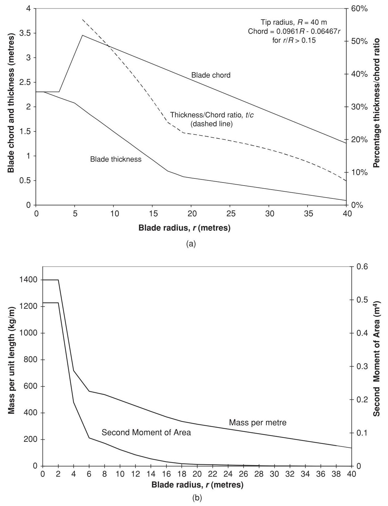

Figure 5.4 (a) Blade 'T40' chord and thickness distributions; (b) Blade 'T40' mass and stiffness distribution; (c) Blade ’T40’ ${1}^{\text{ st }}$ and ${2}^{\text{ nd }}$ mode shapes

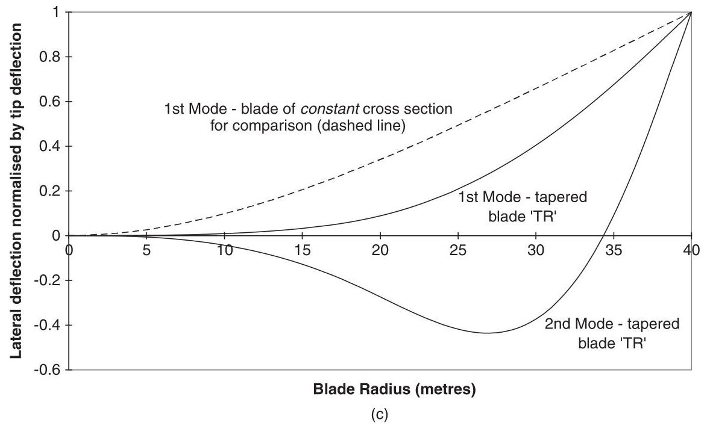

Figure 5.4 (Continued)

Values of the other parameters assumed are:

Blade height, $z$ 70 metres

50 year return ten minute mean wind speed at blade height, $\bar{U} \; {50}\mathrm{\;m}/\mathrm{s}$

Eurocode 1 terrain category

Turbulence intensity,

$$
I\left( z\right)  = 1/\ln \left( {z/{z}_{0}}\right)
$$

0.113

The corresponding integral length scale for longitudinal turbulence is ${189}\mathrm{\;m}$ according to EN 1991-1-4: 2005.

The values of the parameters in Equation 5.7 governing the resonant tip response are determined as follows:

(a) The aerodynamic damping is assumed to be zero, so the damping logarithmic decrement is taken as 0.05 , corresponding to the structural damping value for fibreglass.

(b) The non-dimensional power spectral density of longitudinal wind turbulence, ${R}_{u}\left( n\right)  = n \cdot  {S}_{u}\left( {n}_{1}\right) /{\sigma }_{u}^{2}$ , is calculated at the blade first mode natural frequency of 0.824 Hz according the Kaimal power spectrum defined in EN 1991-1-4 (Equation A5.8 in the Appendix) as 0.0631.

(c) A value of ten is taken for the non-dimensional decay constant, $C$ , in the exponential expression for the normalised co-spectrum used in the derivation of the size reduction factor, ${K}_{Sx}\left( {n}_{1}\right)$ , in Equation A5.25.

The various stages in the derivation of the extreme root bending moment and the dynamic factor, ${Q}_{D}$ , are set out below. The figures in square brackets are the corresponding values obtained using the method of Annex C of EN1991-1-4: 2005, which are included for comparison.

Size reduction factor for resonant response, ${K}_{Sx}\left( {n}_{1}\right)$ 0.431 (Equation [0.322]

A5.25)

tio of standard deviation of resonant tip displacement to (Equation the first mode component of steady tip displacement, [N/A]

A5.7)

$$
\frac{{\sigma }_{y1}}{{\bar{y}}_{1}} = 2\frac{{\sigma }_{u}}{\bar{U}}\frac{\pi }{\sqrt{2\delta }}\sqrt{{R}_{u}\left( {n}_{1}\right) }\sqrt{{K}_{Sx}\left( {n}_{1}\right) }
$$

$$
= 2 \times  {0.113} \times  {9.935} \times  \sqrt{0.0631} \times  \sqrt{0.431}
$$

$$
= 2 \times  {0.113} \times  {9.935} \times  {0.251} \times  {0.657}
$$

$$
= 2 \times  {0.113} \times  {1.638}
$$

0.370

Root moment factor, ${\lambda }_{\mathrm{M}1}$ 0.584 (Equation [N/A]

5.8b)

Ratio of standard deviation of resonant root moment to mean value,

$$
\frac{{\sigma }_{M1}}{\bar{M}} = \frac{{\sigma }_{x1}}{{\bar{x}}_{1}}{\lambda }_{M1}
$$

0.216 (Equation [0.320]

5.8a)

Size reduction factor for quasistatic or background response, ${K}_{SMB}$ 0.829 (Equation [0.871]

A5.40)

Ratio of standard deviation of quasistatic root moment response to mean value,

$$
\frac{{\sigma }_{MB}}{\bar{M}} = 2\frac{{\sigma }_{u}}{\bar{U}}\sqrt{{K}_{SMB}} = 2 \times  {0.113} \times  {0.910}
$$

0.206 (Equation 5.9) [0.197]

Ratio of standard deviation of total root moment response to mean value,

$$
\frac{{\sigma }_{M}}{\bar{M}} = \sqrt{{\left( \frac{{\sigma }_{MB}}{\bar{M}}\right) }^{2} + {\left( \frac{{\sigma }_{M1}}{\bar{M}}\right) }^{2}} = \sqrt{{0.206}^{2} + {0.216}^{2}}
$$

0.298[0.376]

Zero up-crossing frequency of quasistatic response, ${n}_{0}$ 0.343 (Equation [N/A]

$\mathrm{{Hz}}\;$ A5.57)

Zero up-crossing frequency of total root moment response, $v$ 0.642 (Equation[N/A]

Hz A5.54)

Peak factor, $g$ , based on $v$ 3.62 (Equation[3.64]

5.12)

Ratio of extreme moment to mean value,

$$
\frac{{M}_{\max }}{\bar{M}} = 1 + g\left( \frac{{\sigma }_{M}}{\bar{M}}\right)  = 1 + {3.62}\left( {0.298}\right)
$$

2.08 (Equation[2.57]

5.13)

Peak factor, ${g}_{0}$ , based on ${n}_{0}$ 3.44[3.5]

Ratio of quasistatic component of extreme moment to mean value

$$
= 1 + {g}_{0}\frac{{\sigma }_{MB}}{\bar{M}} = 1 + {3.44}\left( {0.206}\right)
$$

1.708 (Equation[1.79]

5.15)

Dynamic factor, ${Q}_{D} = {2.08}/{1.708}$ 1.218 (Equation[1.40]

5.17)

It is apparent that the EN 1991-1-4 method yields a significantly larger value of the extreme root bending moment. However, the EN 1991-1-4 ratio of extreme to mean bending moment is intended to apply at all points along the blade, so a conservative value at the root is inescapable, as is shown in the next section which examines the variation of bending moment along the blade.

## Spanwise variation of bending moment

The resonant and quasistatic components of bending moments at intermediate positions along the blade can be related to those at the root in a straightforward way.

As far as the quasistatic bending moment fluctuations are concerned, the variation along the blade follows closely the bending moment variation due to the steady loading, although slight changes in the size reduction factor have a small effect. The bending moment diagram for the resonant oscillations is, however, of a very different shape, because of the dominance of the inertia loading on the tip. An expression for the resonant bending moment variation along the blade is given in section A5.8 of the Appendix, and it is plotted out for the example above in Figure 5.5a, with the quasistatic bending moment variation alongside for comparison. It is seen that the resonant bending moment diagram is closer to linear than the quasistatic one, which approximates to a parabola.

A consequence of the much slower decay of the resonant BM out towards the tip is an increase in the ratio of the resonant bending moment standard deviation to the local steady moment with radius. This results in an increase in the dynamic magnification factor, ${Q}_{D}$ , from 1.22 at the root to 1.96 near the tip for the example above (see Figure 5.5b).

## 5.7 Blade loads during operation

### 5.7.1 Deterministic and stochastic load components

It is normal to separate out the loads due to the steady wind on the rotating blade from those due to wind speed fluctuations and analyse them in different ways. The periodic loading on the blade due to the steady spatial variation of wind speed over the rotor swept area is termed the deterministic load component, because it is uniquely determined by a limited number of parameters, that is, the hub-height wind speed, the rotational speed, the wind shear and so on. On the other hand, the random loading on the blade due to wind speed fluctuations (i.e. turbulence) has to be described probabilistically, and is therefore termed the stochastic load component.

In addition to wind loading, the rotating blade is also acted on by gravity and inertial loadings. The gravity loading depends simply on blade azimuth and mass distribution, and is thus deterministic, but the inertial loadings will be affected by turbulence - as, for example, in the case of a teetering rotor, or a flexing blade - and so will contain stochastic as well as deterministic components.

### 5.7.2 Deterministic aerodynamic loads

## Steady, uniform flow perpendicular to plane of rotor

The application of momentum theory to a blade element, which is described in Section 3.5.3, enables the aerodynamic forces on the blade to be calculated at different radii. Equations 3.54 and 3.55 are solved iteratively for the flow induction factors, $a$ and ${a}^{\prime }$ , at each radius, enabling the flow angle, $\phi$ , the angle of attack, $\alpha$ , and hence the lift and drag coefficients to be determined.

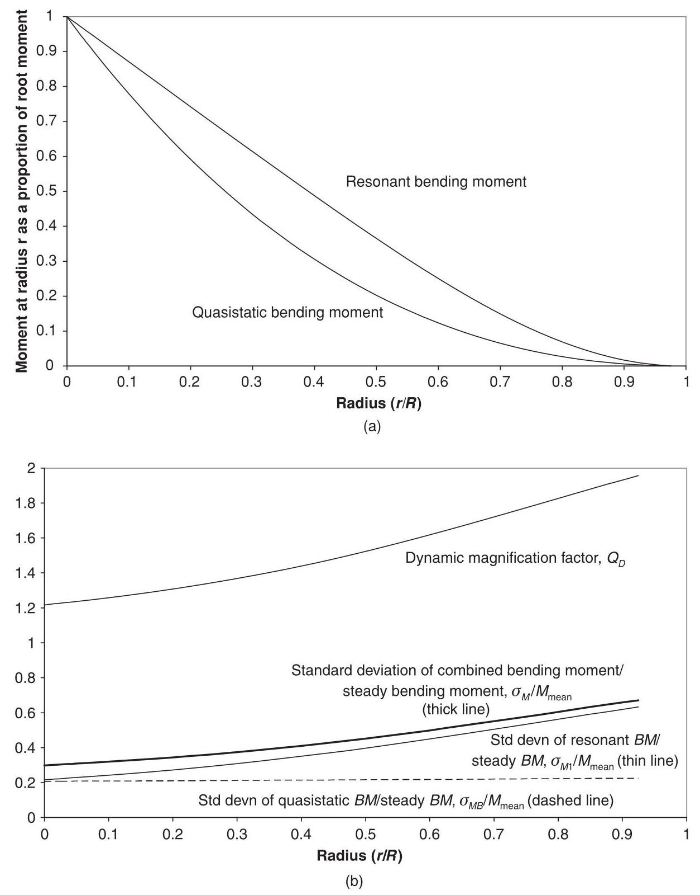

Figure 5.5 (a) Spanwise variation of resonant and quasistatic moments - Blade 'T40'; (b) Spanwise variation of (i) fluctuating bending moment distributions in terms of local steady bending moment and (ii) dynamic magnification factor - for Blade 'T40'

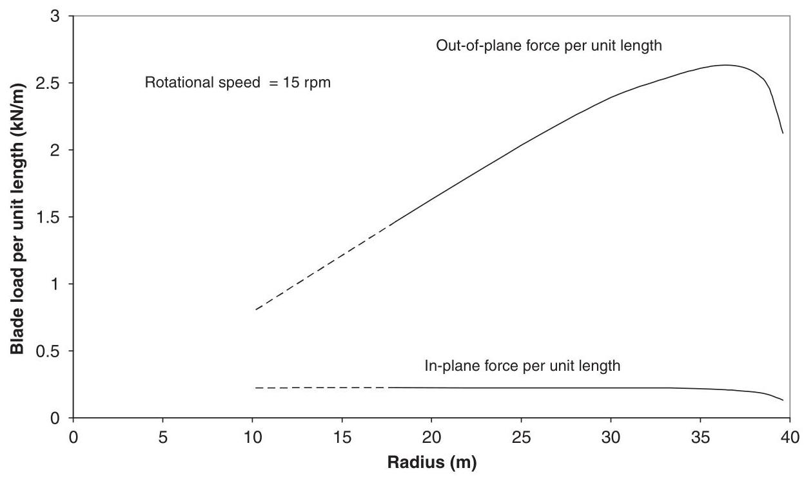

Figure 5.6 Distribution of blade in-plane and out-of-plane aerodynamic loads during operation of typical ${80}\mathrm{\;m}$ diameter stall-regulated machine in a steady, uniform $8\mathrm{\;m}/\mathrm{s}$ wind

For loadings on the outboard portion of the blade, allowance for tip loss must be made, so Equations 3.54 and 3.55 are replaced by Equations 3.54b and 3.55a in Section 3.8.6. These equations can be arranged to give the following expressions for the forces per unit length on an element perpendicular to the plane of rotation and in the direction of blade motion, known as the out-of-plane and in-plane forces respectively:

Out-of-plane force per unit length,

$$
{F}_{X} = {C}_{x} \cdot  \frac{1}{2}\rho {W}^{2} \cdot  c = {4\pi \rho } \cdot  {U}_{\infty }^{2}\left( {1 - {af}}\right) a \cdot  \frac{f}{N}r \tag{5.18}
$$

In-plane force per unit length,

$$
{F}_{Y} = {C}_{y} \cdot  \frac{1}{2}\rho {W}^{2} \cdot  c = {4\pi \rho } \cdot  \Omega {U}_{\infty }\left( {1 - {af}}\right) {a}^{\prime } \cdot  \frac{f}{N}{r}^{2} \tag{5.19}
$$

The parameters in the expressions are as defined in Chapter 3. $f$ is the tip loss factor, and $N$ is the number of blades.

The variation of the in-plane and out-of-plane forces with radius is shown in Figure 5.6 for a typical machine operating in a steady $8\mathrm{\;m}/\mathrm{s}$ wind speed. The ${80}\mathrm{\;m}$ stall-regulated turbine considered in this example is fitted with three 'T40' blades as described in Example 5.1 and rotates at 15 rpm. The blade twist distribution is linear, and selected to produce the maximum energy yield for an annual mean wind speed of ${7.5}\mathrm{\;m}/\mathrm{s}$ . It is evident that the out-of-plane load per unit length increases approximately linearly with radius, in spite of the reducing blade chord until the effects of tip loss are felt beyond about ${80}\%$ of tip radius. Note that the form of the variation would be the same for any combination of rotational speed, wind speed and tip radius yielding the same tip speed ratio, because it is the tip speed ratio that determines the radial distribution of flow angle $\phi$ , and of the induction factors $a$ and ${a}^{\prime }$ .

Figure 5.7 Distribution of blade in-plane and out-of-plane aerodynamic bending moments during operation of typical ${80}\mathrm{\;m}$ diameter stall-regulated machine in a steady, uniform $8\mathrm{\;m}/\mathrm{s}$ wind

Integration of these forces along the blade then yields in-plane and out-of-plane aerodynamic blade bending moments. The variation of these moments with radius is shown in Figure 5.7 for the example above. The blade bending moments effectively decrease linearly with increasing radius over the inboard third of the blade because of the concentration of loading outboard.

The variation of the blade root out-of-plane bending moment with wind speed is illustrated in Figure 5.8 for the ${80}\mathrm{\;m}$ diameter example machine described above. As explained in Section 3.9, the phenomenon of stall delay results in significantly increased values of the lift coefficient at higher wind speeds on the inboard section of the rotating blade than predicted by static aerofoil data, such as that reproduced in Figure 3.45. Accordingly, Figure 5.8 and the other figures referred to in this section have been derived using realistic aerofoil data for a rotating LM-19.0 blade reported in Petersen et al. (1998), which is based on an empirical modification of static or 2D aerofoil data. The modified data is reproduced in Figure 5.9, and displays much higher lift coefficients for the thicker, inboard blade sections at high angles of attack than for the thinner, outboard blade sections because of stall delay at the inboard sections.

Figure 5.8 shows the blade root out-of-plane bending moment increasing nearly linearly with wind speed at first and then levelling off, becoming almost constant for winds between ${12}\mathrm{\;m}/\mathrm{s}$ and ${16}\mathrm{\;m}/\mathrm{s}$ , as the blade goes into stall. Thereafter the root moment increases again, but much more gently than before.

Also shown in Figure 5.8 is the variation of blade root out-of-plane bending moment with wind speed for the same machine with pitch regulation to limit the power output to ${1600}\mathrm{{kW}}$ . It is evident that the bending moment drops away rapidly at wind speeds above rated.

Figure 5.8 Blade out-of-plane root bending moment during operation is steady, uniform wind - variation with wind speed for similar stall-regulated and pitch-regulated machines

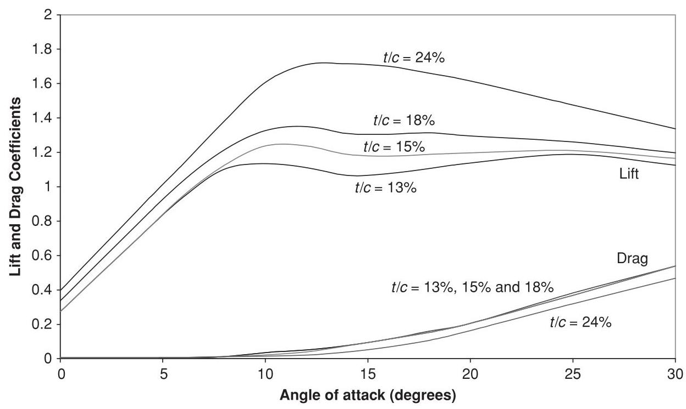

Figure 5.9 Aerofoil data for LM 19.0 blade for various thickness/chord ratios (from Petersen et al. (1998))

Figure 5.10 Variation of blade root bending moment with azimuth, for typical ${80}\mathrm{\;m}$ diameter stall-regulated machine operating at a steady ${30}^{ \circ  }$ yaw

## Yawed flow

The application of blade-element momentum theory to steady yawed flow is described in Section 4.2.8. This methodology has been used to derive Figure 5.10, which shows the variation of the blade root out-of-plane and in-plane moments with azimuth for the ${80}\mathrm{\;m}$ diameter stall-regulated machine described above, operating at a steady yaw angle of $+ {30}^{ \circ  }$ . Note that the blade azimuth is measured in the direction of blade rotation, from a zero value at top dead centre, and the yaw angle is defined as positive when the lateral component of air flow with respect to the rotor disc is in the same direction as the blade movement at zero azimuth.

Figure 5.10 reveals a distinct difference between the behaviour at ${10}\mathrm{\;m}/\mathrm{s}$ and ${20}\mathrm{\;m}/\mathrm{s}$ . In the latter case, the bending moment variation is sinusoidal with a maximum value at ${180}^{ \circ  }$ azimuth, indicating that the variation is dominated by the effect of the fluctuation of the air velocity relative to the blade, $W$ . At ${10}\mathrm{\;m}/\mathrm{s}$ , however, the maximum out-of-plane bending moment occurs at about ${240}^{ \circ  }$ azimuth, suggesting that the non-uniform component of induced velocity, ${u}_{1}$ (Equation 4.20) is also significant. As wind speed increases, of course, the induction factor, a, becomes small, reducing the impact of ${u}_{1}$ .

## Shaft tilt

Upwind machines, that is, wind turbines with the rotor positioned between the tower and the oncoming wind, - normally have the rotor shaft tilted upwards by several degrees in order to increase the clearance between the rotor and the tower. Thus, as for the case of yaw misalignment, the flow is inclined to the rotor shaft axis, but tilted upwards rather than sideways, so the treatment of shaft tilt mirrors that of yawed flow.

Figure 5.11 Variation of blade root bending moments with azimuth due to wind shear, for typical ${80}\mathrm{\;m}$ diameter stall-regulated machine operating in steady hub height winds of ${10}\mathrm{\;m}/\mathrm{s}$ and ${15}\mathrm{\;m}/\mathrm{s}$ (shear exponent $= {0.2}$ )

## Wind shear

The increase of wind speed with height is known as wind shear. The theoretical logarithmic profile, $U\left( z\right)  \propto  \ln \left( {z/{z}_{0}}\right)$ , is usually approximated by the power law, $U\left( z\right)  \propto  {\left( z/{z}_{\text{ ref }}\right) }^{\alpha }$ for wind turbine design purposes. The appropriate value of the exponent $\alpha$ increases with the surface roughness, ${z}_{0}$ , with a figure of 0.14 typically quoted for level countryside, although the speed up of airflow close to the ground over rounded hills usually results in a lower value at hill tops. As already noted, IEC 61400-1 specifies a conservative value of 0.20.

In applying momentum theory to this case, the velocity component at right angles to the plane of rotation is expressed as ${U}_{\infty }{\left( 1 + r\cos \psi /{z}_{\text{ hub }}\right) }^{\alpha }\left( {1 - a}\right)$ . The variation of blade root bending moments with azimuth due to wind shear is illustrated in Figure 5.11 for the example ${80}\mathrm{\;m}$ diameter stall regulated machine, taking the exponent as 0.20, the hub-height as ${70}\mathrm{\;m}$ and considering hub-height wind speeds of ${10}\mathrm{\;m}/\mathrm{s}$ and ${15}\mathrm{\;m}/\mathrm{s}$ . In the former case, the variation is nearly sinusoidal, but in the latter case the root bending moments are effectively constant, as the blade is in stall.

## Tower shadow

The blocking of the air flow by the tower results in regions of reduced wind speed both upwind and downwind of the tower. This reduction is more severe for tubular towers than for lattice towers and, in the case of tubular towers, is larger on the downwind side because of flow separation. As a consequence, designers of downwind machines usually position the rotor plane well clear of the tower to minimise the interference effect.

Figure 5.12 Tower shadow parameters

The velocity deficits upwind of a tubular tower can be modelled using potential flow theory. The flow around a cylindrical tower is derived by superposing a doublet, that is, a source and sink at very close spacing, on a uniform flow, ${U}_{\infty }$ , giving the stream function:

$$
\psi  = {U}_{\infty }y\left( {1 - \frac{{\left( D/2\right) }^{2}}{{x}^{2} + {y}^{2}}}\right) \tag{5.20}
$$

where $D$ is the tower diameter, and $x$ and $y$ are the longitudinal and lateral co-ordinates with respect to the tower centre - see Figure 5.12. Differentiation of $\psi$ with respect to $y$ yields the following expression for the flow velocity in the $x$ direction:

$$
U = {U}_{\infty }\left( {1 - \frac{{\left( D/2\right) }^{2}\left( {{x}^{2} - {y}^{2}}\right) }{{\left( {x}^{2} + {y}^{2}\right) }^{2}}}\right) \tag{5.21}
$$

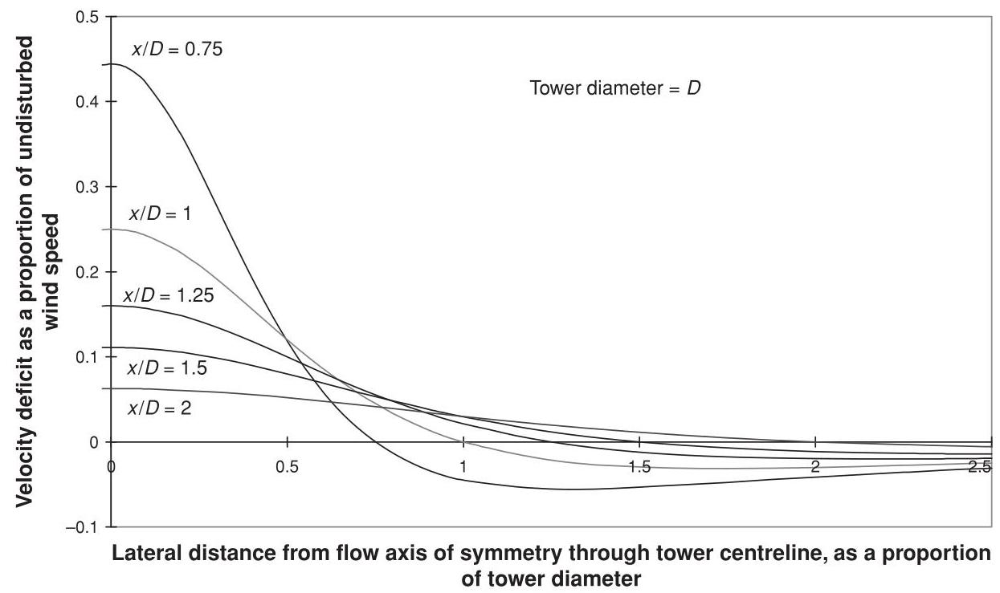

Figure 5.13 Profile of velocity deficit due to tower shadow at different distances $x/D$ upwind of tower centreline

The second term within the brackets, which is the velocity deficit as a proportion of the undisturbed wind speed, is plotted out against the lateral co-ordinate, $y$ , divided by tower diameter, for a range of upwind distances, $x$ , in Figure 5.13. The velocity deficit on the flow axis of symmetry is equal to ${U}_{\infty }{\left( D/2x\right) }^{2}$ and the total width of the deficit region is twice the upwind distance. Consequently the velocity gradient encountered by a rotating blade decreases rapidly as the upwind distance, $x$ , increases.

The effect of tower shadow on blade loading can be estimated by setting the local velocity component at right angles to the plane of rotation equal to $U\left( {1 - a}\right)$ in place of ${U}_{\infty }\left( {1 - a}\right)$ , and applying blade element theory as usual. Results for blade root bending moments for the example ${80}\mathrm{\;m}$ diameter stall-regulated machine are given in Figure 5.14, assuming a tower diameter of $4\mathrm{\;m}$ and ignoring dynamic effects. The plots show the variation of in-plane and out-of-plane root moments with azimuth during operation in wind speeds of ${10}\mathrm{\;m}/\mathrm{s}$ and ${20}\mathrm{\;m}/\mathrm{s}$ , for a blade-tower clearance equal to the tower radius, that is, for $x/D = 1$ . Note that the dip in out-of-plane bending moment is more severe at the lower wind speed. Also shown are ${10}\mathrm{\;m}/\mathrm{s}$ plots for $x/D = {1.5}$ , which exhibit a much less severe disturbance.

In the case of downwind turbines, the flow separation and generation of eddies which take place are less amenable to analysis, so empirical methods are used to estimate the mean velocity deficit. Commonly the profile of the velocity deficit is assumed to be of cosine form, so that

$$
U = {U}_{\infty }\left( {1 - k{\cos }^{2}\left( \frac{\pi y}{\delta }\right) }\right) \tag{5.22}
$$

where $\delta$ is the total width of the deficit region. The slight enhancement of velocities beyond the deficit region is usually ignored. See also Section 6.13.2.

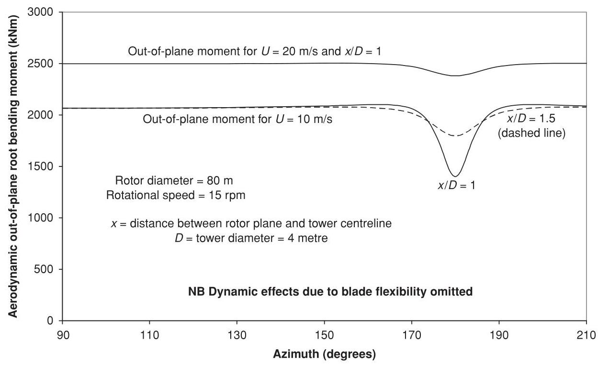

Figure 5.14 Variation of blade root out-of-plane bending moment with azimuth due to tower shadow, for typical ${80}\mathrm{\;m}$ diameter stall-regulated upwind machine operating in steady, uniform winds of ${10}\mathrm{\;m}/\mathrm{s}$ and ${20}\mathrm{\;m}/\mathrm{s}$

The sharp dip in blade loading caused by tower shadow is more prone to excite blade oscillations than the smooth variations in load due to wind shear, shaft tilt and yaw, and this aspect is considered in the section on blade dynamic response.

## Wake effects

Within a wind farm it is common for one turbine to be operating wholly or partly in the wake of another. In the latter case, which is more severe, the downwind turbine is effectively subjected to horizontal wind shear, and the blade load fluctuations can be analysed accordingly.

### 5.7.3 Gravity loads

Gravity loading on the blade results in a sinusoidally varying edgewise bending moment which reaches a maximum when the blade is horizontal, and which changes sign from one horizontal position to the other. It is, thus, a major source of fatigue loading. For the blade ’T40’ (see Example 5.1), the maximum gravity moment, ${\int }_{0}^{R}m\left( r\right) {rdr}$ is ${2140}\mathrm{{kNm}}$ , so the edgewise bending moment range due to gravity is ${4280}\mathrm{{KNm}}$ . This dwarfs the variations in edgewise moment due to yaw or wind shear, which are typically one tenth this value or less. The spanwise distribution of gravity bending moment is shown in Figure 5.15 for blade 'T40'.

### 5.7.4 Deterministic inertia loads

## Centrifugal loads

For a rigid blade rotating with its axis perpendicular to the axis of rotation, the centrifugal forces generate a simple tensile load in the blade which at radius ${r}^{ * }$ is given by the expression ${\Omega }^{2}{\int }_{r * }^{R}m\left( r\right) {rdr}$ . As a result the fluctuating stresses in the blade arising from all loading sources always have a tensile bias during operation. For blade 'T40' rotating at 15 rpm, the centrifugal force at the root amounts to ${540}\mathrm{{KN}}$ - approximately three and a half times its weight.

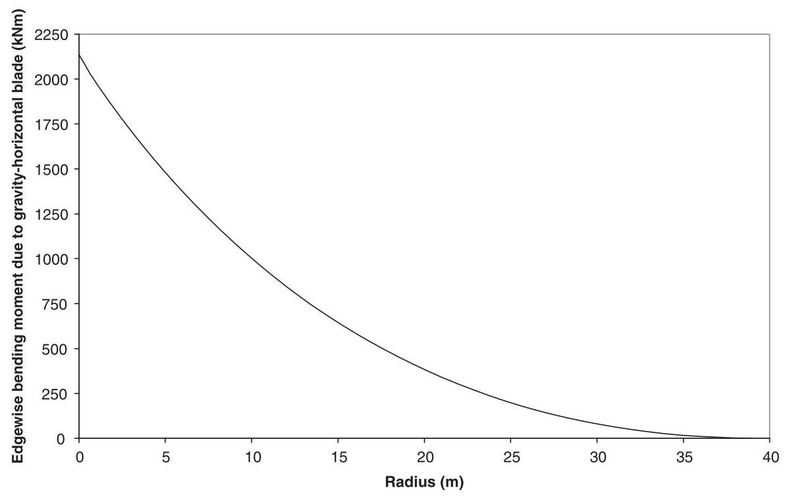

Figure 5.15 Blade 'T40' gravity bending moment distribution

Thrust loading causes flexible blades to deflect downwind, with the result that the centrifugal forces generate blade out-of-plane moments in opposition to those due to the thrust. This reduction of the moment due to thrust loading is known as centrifugal relief. The phenomenon is non-linear, so iterative techniques are required to arrive at a solution. Greater centrifugal relief can be obtained by coning the rotor so that the blades are inclined downwind in the first place. A balance can be struck so that the maximum forward out-of-plane moment due centrifugal loads in very low wind is approximately equal to the maximum rearward out-of-plane moment due to the thrust loading in combination with centrifugal loads during operation in rated wind.

## Gyroscopic loads

When an operating machine yaws, the blades experience gyroscopic loads perpendicular to the plane of rotation. Consider the point A on a rotor rotating clockwise at a speed of $\Omega$ rad/sec, as illustrated in Figure 5.16. The instantaneous horizontal velocity component of point A due to rotor rotation is ${\Omega z}$ , where $z$ is the height of the point above the hub. If the machine is yawing clockwise in plan at a speed of $\Lambda \mathrm{{rad}}/\mathrm{{sec}}$ , then it can be shown that point A accelerates at ${2\Omega \Lambda z}$ towards the wind, assuming the rotor is rigid. Integrating the resulting inertial force over the blade length gives the following expression for blade root out-of-plane bending moment:

$$
{M}_{Y} = {\int }_{0}^{R}{2\Omega \Lambda zr} \cdot  m\left( r\right) {dr} = {2\Omega \Lambda }\cos \psi {\int }_{0}^{R}{r}^{2}m\left( r\right) {dr} = {2\Omega \Lambda }\cos \psi  \cdot  {I}_{B} \tag{5.23}
$$

where ${I}_{B}$ is the blade inertia about the root.

Figure 5.16 Gyroscopic acceleration of a point on a yawing blade

As an example, consider an ${80}\mathrm{\;m}$ diameter machine with ’T40’ blades yawing at ${1}^{ \circ  }$ per second during operation at ${15}\mathrm{{rpm}}$ . The blade root inertia is ${4910}{\mathrm{\;{Tm}}}^{2}$ , so the maximum value of ${M}_{Y}$ is $2\left( {\pi /2}\right) \left( {0.0175}\right) {4910} = {270}\mathrm{{KNm}}$ . This is only about ${10}\%$ of the maximum out-of-plane moment due to aerodynamic loads.

## Braking loads

Rotor deceleration due to mechanical braking introduces edgewise blade bending moments which are additive to the gravity moments on a descending blade.

## Teeter loads

Blade out-of-plane root bending moments can be eliminated entirely by mounting each blade on a hinge so that it is free to rotate in the fore-aft direction. Although centrifugal forces are effective in controlling the cone angle of each blade at normal operating speeds, the need for alternative restraints during start-up and shut-down means that such hinges are rarely used. However, in the case of two-bladed machines, it is convenient to mount the whole rotor on a single shaft hinge allowing fore-aft rotation or 'teetering', and this arrangement is frequently adopted in order to reduce out-of-plane bending moment fluctuations at the blade root, and to prevent the transmission of blade out-of-plane moments to the low speed shaft. As teetering is essentially a dynamic phenomenon, consideration of teeter behaviour is deferred to Section 5.8.

### 5.7.5 Stochastic aerodynamic loads: analysis in the frequency domain

As noted in Section 5.7.1, the random loadings on the blade due to short-term wind speed fluctuations are known as stochastic aerodynamic loads. The wind speed fluctuations about the mean at a fixed point in space are characterised by a probability distribution - which, for most purposes, can be assumed to be normal - and by a power spectrum which describes how the energy of the fluctuations is distributed between different frequencies (see Sections 2.6.3 and 2.6.4).

The stochastic loads are most conveniently analysed in the frequency domain, but in order to facilitate this, it is usual to assume a linear relation between the fluctuation, $u$ , of the wind speed incident on the aerofoil and the resultant loadings. This is a reasonable assumption for an unstalled blade at high tip speed ratio, as will be shown. The fluctuating aerodynamic lift per unit length, $L$ , is $\frac{1}{2}\rho {W}^{2}{C}_{L}c$ , where $W$ is the air velocity relative to the blade, ${C}_{L}$ is the lift coefficient and the drag term is ignored. Because the flow angle, $\phi$ , is small at high tip-speed ratio, $\lambda$ , the relative air velocity, $W$ , can be assumed to be changing much more slowly with the wind speed than ${C}_{L}$ , so that ${dW}/{du}$ can be ignored. As a result,

$$
\frac{dL}{du} = \frac{1}{2}\rho {W}^{2}c\frac{d{C}_{L}}{d\alpha }\frac{d\alpha }{du}\;\text{ where }\alpha \text{ , the angle of attack } = \phi  - \beta \tag{5.24}
$$

If the blades are not pitching, then the local blade twist, $\beta$ , is constant, so that ${d\alpha }/{du} = {d\phi }/{du}$ . To preserve linearity, it is necessary to assume that the rate of change of lift coefficient with angle of attack, $d{C}_{L}/{d\alpha }$ is constant, which is tenable only if the blade remains unstalled. Assuming for simplicity that the wake is frozen, that is, that the induced velocity, $\bar{U}a$ , remains constant, despite the wind speed fluctuations, $u$ , we obtain

$$
\tan \phi  \cong  \left( {\bar{U}\left( {1 - a}\right)  + u}\right) /{\Omega r},
$$

so that, for $\phi$ small,

$$
\frac{d\phi }{du} \cong  \frac{1}{\Omega r}\text{ and }W \cong  {\Omega r},
$$

leading to

$$
{\Delta L} = L - \bar{L} = u\frac{dL}{du} = \frac{1}{2}\rho {\left( \Omega r\right) }^{2}c\frac{d{C}_{L}}{d\alpha }\frac{u}{\Omega r} = \frac{1}{2}{\rho \Omega rc}\frac{d{C}_{L}}{d\alpha }u \tag{5.25}
$$

Hence,

$$
{\sigma }_{L} = \left( {\frac{1}{2}{\rho \Omega }\frac{d{C}_{L}}{d\alpha }}\right) {rc}{\sigma }_{u}
$$

Theoretically $d{C}_{L}/{d\alpha }$ is equal to ${2\pi }$ , but see Section A3.8 in Appendix A3.

If the turbulence integral length scale is large compared to the blade radius, then the expression for the standard deviation of the blade root bending moment - assuming a completely rigid blade - approximates to

$$
{\sigma }_{M} = {\int }_{0}^{R}{\sigma }_{L}{rdr} = \frac{1}{2}{\rho \Omega }\frac{d{C}_{L}}{d\alpha }{\sigma }_{u}{\int }_{0}^{R}c\left( r\right)  \cdot  {r}^{2}{dr} \tag{5.26}
$$

where ${\sigma }_{u}$ is the standard deviation of the wind speed incident on the rotor disc, which, by virtue of the 'frozen wake' assumption, equates to the standard deviation of the wind speed in the undisturbed flow. If, as will be the case in practice, the longitudinal wind fluctuations are not perfectly correlated along the length of the blade, then

$$
{\sigma }_{M}^{2} = {\left( \frac{1}{2}\rho \Omega \frac{d{C}_{L}}{d\alpha }\right) }^{2}{\int }_{0}^{R}{\int }_{0}^{R}{\kappa }_{u}\left( {{r}_{1},{r}_{2},0}\right) c\left( {r}_{1}\right) c\left( {r}_{2}\right) {r}_{1}^{2}{r}_{2}^{2}d{r}_{1}d{r}_{2} \tag{5.27}
$$

where ${\kappa }_{u}\left( {{r}_{1},{r}_{2},0}\right)$ is the cross correlation function ${\kappa }_{u}\left( {{r}_{1},{r}_{2},\tau }\right)$ between the wind fluctuations at radii ${r}_{1}$ and ${r}_{2}$ with the time lag $\tau$ set equal to zero, that is,

$$
{\kappa }_{u}\left( {{r}_{1},{r}_{2},0}\right)  = \left\lbrack  {\frac{1}{T}{\int }_{0}^{T}u\left( {{r}_{1}, t}\right) u\left( {{r}_{2}, t}\right) {dt}}\right\rbrack \tag{5.28}
$$

In reality, of course, the blade will not be completely rigid, so the random wind loading will excite the natural modes of blade vibration. In order to quantify these excitations, it is first necessary to know the energy content of the incident wind fluctuations as seen by each point on the rotating blade at the blade natural frequencies - information which is provided by the 'rotationally sampled spectrum'. This spectrum is significantly different from the fixed point spectrum, because a rotating blade will often slice through an individual gust (defined as a volume of air travelling at above average speed) several times, as the gust dimensions are frequently large compared with the distance travelled by the air in one turbine revolution. This phenomenon, known as 'gust slicing', considerably enhances the frequency content at the rotational frequency and, to a lesser extent, at its harmonics also.

The method for deriving the rotational spectrum is described below. The dynamic response of a flexible blade to random wind loading is explored in Section 5.8.

## Rotationally sampled spectrum

The derivation of the power spectrum of the wind seen by a point on a rotating blade is based on the Fourier transform pairs:

$$
{S}_{u}\left( n\right)  = 4{\int }_{0}^{\infty }{\kappa }_{u}\left( \tau \right) \cos {2\pi n\tau d\tau } \tag{5.29}
$$

$$
{\kappa }_{u}\left( \tau \right)  = {\int }_{0}^{\infty }{S}_{u}\left( n\right) \cos {2\pi n\tau dn} \tag{5.30}
$$

where ${S}_{u}\left( n\right)$ is the single sided spectrum of wind speed fluctuations in terms of frequency in Hz. Firstly, the latter equation is used to obtain the autocorrelation function, ${\kappa }_{u}\left( \tau \right)$ , for the along wind turbulent fluctuations at a fixed point in space from the corresponding power spectrum. Secondly, ${\kappa }_{u}\left( \tau \right)$ is used to derive the related autocorrelation function, ${\kappa }_{u}^{0}\left( {r,\tau }\right)$ , for a point on the rotating blade at radius $r$ . Finally this function is transformed using Equation 5.29 to yield the rotationally sampled spectrum. The three steps are set out in more detail below. Note that three key simplifying assumptions are made - that the turbulence is homogeneous and isotropic, and that the flow is incompressible.

Step 1 - Derivation of the autocorrelation function at a fixed point: The von Karman spectrum is chosen as the input spectrum, because it is isotropic and homogeneous. The power spectrum of the along-wind wind speed fluctuations at a fixed point in space is given by Equation 2.25:

$$
\frac{{S}_{u}\left( n\right) }{{\sigma }_{u}^{2}} = \frac{{4L}/\bar{U}}{{\left( 1 + {70.8}{\left( nL/\bar{U}\right) }^{2}\right) }^{\frac{5}{6}}} \tag{5.31}
$$

where $L$ is the isotropic integral length scale of turbulence. It can be shown that Equation 5.30 yields the following expression for the corresponding auto correlation function:

$$
{\kappa }_{u}\left( \tau \right)  = \frac{2{\sigma }_{u}^{2}}{\Gamma \left( \frac{1}{3}\right) }{\left( \frac{\tau /2}{{T}^{\prime }}\right) }^{\frac{1}{3}}{K}_{1/3}\left( \frac{\tau }{{T}^{\prime }}\right) \tag{5.32}
$$

where ${T}^{\prime }$ is related to the integral length scale, $L$ , by the formula

$$
{T}^{\prime } = \frac{\Gamma \left( \frac{1}{3}\right) }{\Gamma \left( \frac{5}{6}\right) \sqrt{\pi }}\frac{L}{U} \cong  {1.34}\frac{L}{U} \tag{5.33}
$$

$\Gamma \left( \right)$ is the gamma function and ${K}_{1/3}\left( x\right)$ is a modified Bessel function of the second kind and order $v = \frac{1}{3}$ . The general definition of ${K}_{v}\left( x\right)$ is as follows:

$$
{K}_{v}\left( x\right)  = \frac{\pi }{2\sin {\pi v}}\mathop{\sum }\limits_{{m = 0}}^{\infty }\frac{{\left( x/2\right) }^{2m}}{m!}\left\lbrack  {\frac{{\left( x/2\right) }^{-v}}{\Gamma \left( {m - v + 1}\right) } - \frac{{\left( x/2\right) }^{v}}{\Gamma \left( {m + v + 1}\right) }}\right\rbrack \tag{5.34}
$$

Step 2 - Derivation of the autocorrelation function at a point on the rotating blade: This derivation makes use of Taylor's 'frozen turbulence' hypothesis, by which the instantaneous wind speed at point $\mathrm{C}$ at time $t = \tau$ is assumed to be equal to that at a point $\mathrm{B}$ a distance $\bar{U}\tau$ upwind of $\mathrm{C}$ at time $t = 0,\bar{U}$ being the mean wind speed. Thus, referring to Figure 5.17, the autocorrelation function ${\kappa }_{u}^{o}\left( {r,\tau }\right)$ for the along-wind wind fluctuations seen by a point $Q$ at radius $r$ on the rotating blade is equal to the cross correlation function ${\kappa }_{u}\left( {\overrightarrow{s},0}\right)$ between the simultaneous along-wind wind fluctuations at points A and B. Here A and C are the positions of point $\mathrm{Q}$ at the beginning and end of time interval $\tau$ respectively, $\mathrm{B}$ is $\bar{U}\tau$ upwind of $\mathrm{C}$ and $\overrightarrow{s}$ is the vector BA. (Note that the superscript ${}^{ \circ  }$ denotes that the autocorrelation function relates to a point on a rotating blade rather than a fixed point. The same convention will be adopted in relation to power spectra.)

Figure 5.17 Geometry for the derivation of the velocity autocorrelation function for a point on a rotating blade

Batchelor (1953) has shown that, if the turbulence is assumed to be homogeneous and isotropic, the cross correlation function, ${\kappa }_{u}\left( {\overrightarrow{s},0}\right)$ , is given by:

$$
{\kappa }_{u}\left( {\overrightarrow{s},0}\right)  = \left( {{\kappa }_{L}\left( s\right)  - {\kappa }_{T}\left( s\right) }\right) {\left( \frac{{s}_{1}}{s}\right) }^{2} + {\kappa }_{T}\left( s\right) \tag{5.35}
$$

where ${\kappa }_{L}\left( s\right)$ is the cross correlation function between velocity components at points A and B, $s$ apart, in a direction parallel to AB $\left( {v}_{I}^{A}\right.$ and ${v}_{I}^{B}$ in Figure 5.17), and ${\kappa }_{T}\left( s\right)$ is the corresponding function for velocity components $\left( {v}_{T}^{A}\right.$ and $\left. {v}_{T}^{B}\right)$ in a direction perpendicular to AB. ${s}_{1}$ is the separation of points A and B measured in the along wind direction, that is, $\bar{U}\tau$ . Noting that the distance between points $\mathrm{A}$ and $\mathrm{C}$ on the rotor disc is ${2r}\sin \left( {{\Omega \tau }/2}\right)$ , we have

$$
{s}^{2} = {\bar{U}}^{2}{\tau }^{2} + 4{r}^{2}{\sin }^{2}\left( {{\Omega \tau }/2}\right) \tag{5.36}
$$

Hence,

$$
{\kappa }_{u}\left( {\overrightarrow{s},0}\right)  = {\kappa }_{L}\left( s\right) {\left( \frac{\bar{U}\tau }{s}\right) }^{2} + {\kappa }_{T}\left( s\right) \left\lbrack  {1 - {\left( \frac{\bar{U}\tau }{s}\right) }^{2}}\right\rbrack   = {\kappa }_{L}\left( s\right) {\left( \frac{\bar{U}\tau }{s}\right) }^{2} + {\kappa }_{T}\left( s\right) {\left( \frac{{2r}\sin \left( {{\Omega \tau }/2}\right) }{s}\right) }^{2}
$$

(5.37)For incompressible flow, it can also be shown (Batchelor 1953) that

$$
{\kappa }_{T}\left( s\right)  = {\kappa }_{L}\left( s\right)  + \frac{s}{2}\frac{d{\kappa }_{L}\left( s\right) }{ds} \tag{5.38}
$$

Substitution of Equation 5.38 in Equation 5.37 gives

$$
{\kappa }_{u}\left( {\overrightarrow{s},0}\right)  = {\kappa }_{L}\left( s\right)  + \frac{s}{2}\frac{d{\kappa }_{L}\left( s\right) }{ds}{\left( \frac{{2r}\sin \left( {{\Omega \tau }/2}\right) }{s}\right) }^{2} \tag{5.39}
$$

When the vector $\overrightarrow{s}$ is in the along-wind direction, ${\kappa }_{L}\left( s\right)$ translates to ${\kappa }_{u}\left( {s}_{1}\right)$ , which, by Taylor's 'frozen turbulence' hypothesis, equates to the autocorrelation function at a fixed point, ${\kappa }_{u}\left( \tau \right)$ (Equation 5.32), with $\tau  = {s}_{1}/\bar{U}$ . Thus,

$$
{\kappa }_{L}\left( {s}_{1}\right)  = \frac{2{\sigma }_{u}^{2}}{\Gamma \left( \frac{1}{3}\right) }{\left( \frac{{s}_{1}/2}{{T}^{\prime }\bar{U}}\right) }^{\frac{1}{3}}{K}_{1/3}\left( \frac{{s}_{1}}{{T}^{\prime }\bar{U}}\right) \tag{5.40}
$$

Because the turbulence is assumed to be isotropic, ${\kappa }_{L}\left( s\right)$ is independent of the direction of the vector $\overrightarrow{s}$ , so we can write, with the aid of Equation 5.33:

$$
{\kappa }_{L}\left( s\right)  = \frac{2{\sigma }_{u}^{2}}{\Gamma \left( \frac{1}{3}\right) }{\left( \frac{s/2}{{T}^{\prime }\bar{U}}\right) }^{\frac{1}{3}}{K}_{1/3}\left( \frac{s}{{T}^{\prime }\bar{U}}\right)  = \frac{2{\sigma }_{u}^{2}}{\Gamma \left( \frac{1}{3}\right) }{\left( \frac{s/2}{1.34L}\right) }^{\frac{1}{3}}{K}_{1/3}\left( \frac{s}{1.34L}\right) \tag{5.41}
$$

Noting that $\left( {d/{dx}}\right) \left\lbrack  {{x}^{v}{K}_{v}\left( x\right) }\right\rbrack   =  - {x}^{v}{K}_{\left( 1 - v\right) }\left( x\right)$ , the following expression for the autocorrelation function for the along-wind fluctuations at a point at radius $r$ on the rotating blade is obtained by substituting Equation 5.41 in Equation 5.39:

$$
{\kappa }_{u}^{\mathrm{o}}\left( {r,\tau }\right)  = {\kappa }_{u}\left( {\overrightarrow{s},0}\right)  = \frac{2{\sigma }_{u}^{2}}{\Gamma \left( \frac{1}{3}\right) }{\left( \frac{s/2}{1.34L}\right) }^{\frac{1}{3}}\left\lbrack  {{K}_{1/3}\left( \frac{s}{1.34L}\right)  - \frac{s}{2\left( {1.34L}\right) }{K}_{2/3}\left( \frac{s}{1.34L}\right) }\right.
$$

$$
\left. {\times {\left( \frac{{2r}\sin \left( {{\Omega \tau }/2}\right) }{s}\right) }^{2}}\right\rbrack \tag{5.42}
$$

where $s$ is defined in terms of $\tau$ by Equation 5.36 above.

Step 3 - Derivation of the power spectrum seen by a point on the rotating blade: the rotationally sampled spectrum is obtained by taking the Fourier transform of ${\kappa }_{u}^{\mathrm{o}}\left( {r,\tau }\right)$ from Equation 5.42:

(5.43)

$$
{S}_{u}^{\mathrm{o}}\left( n\right)  = 4{\int }_{0}^{\infty }{\kappa }_{u}^{o}\left( {r,\tau }\right) \cos {2\pi n\tau d\tau }
$$

$$
= 2{\int }_{-\infty }^{\infty }{\kappa }_{u}^{o}\left( {r,\tau }\right) \cos {2\pi n\tau d\tau }\;\text{ as }{\kappa }_{u}^{o}\left( {r,\tau }\right)  = {\kappa }_{u}^{o}\left( {r, - \tau }\right)
$$

As no analytical solution has been found for the integral, a solution has to be obtained numerically using a discrete Fourier transform (DFT). First the limits of integration are reduced to $- T/2, + T/2$ , as ${\kappa }_{u}^{o}\left( {r,\tau }\right)$ tends to zero for large $\tau$ . Then the limits of integration are altered to $0, T$ with ${\kappa }_{u}^{o}\left( {r,\tau }\right)$ set equal to ${\kappa }_{u}^{o}\left( {r, T - \tau }\right)$ for $\tau  > T/2$ , as ${\kappa }_{u}^{o}\left( {r,\tau }\right)$ is now assumed to be periodic with period $T$ . Thus,

$$
{S}_{u}^{o}\left( n\right)  = 2{\int }_{0}^{T}{\kappa }_{u}^{*o}\left( {r,\tau }\right) \cos {2\pi n\tau d\tau } \tag{5.44}
$$

where the asterisk denotes that ${\kappa }_{u}^{o}\left( {r,\tau }\right)$ is ’reflected’ for $T > T/2$ . The discrete Fourier transform then becomes

$$
{S}_{u}^{o}\left( {n}_{k}\right)  = {2T}\left\lbrack  {\frac{1}{N}\mathop{\sum }\limits_{{p = 0}}^{{N - 1}}{\kappa }_{u}^{*o}\left( {r,{pT}/N}\right) \cos \left( {{2\pi kp}/N}\right) }\right\rbrack \tag{5.45}
$$

Here, $N$ is the number of points taken in the time series of ${\kappa }_{u}^{*o}\left( {r,{pT}/N}\right)$ , and the power spectral density is calculated at the frequencies ${n}_{k} = k/T$ for $k = 0,1,2\ldots N - 1$ . The expression in square brackets can be evaluated using a standard fast Fourier transform (FFT), provided $N$ is chosen equal to a power of 2 . Clearly $N$ should be as large as possible if a wide range of frequencies is to be covered at high resolution. Just as ${\kappa }_{u}^{*o}\left( {r,\tau }\right)$ is symmetrical about $T/2$ , the values of ${S}_{u}^{o}\left( {n}_{k}\right)$ obtained from the FFT are symmetrical about the mid-range frequency of $N/{2T}$ , and the values above this frequency have no real meaning. Moreover, the values of power spectral density calculated by the DFT at frequencies approaching $N/\left( {2T}\right)$ will be in error as a result of aliasing, because these are falsely distorted by frequency components above $N/{2T}$ which contribute to the ${\kappa }_{u}^{*o}\left( {r,{pT}/N}\right)$ series. Assuming that the calculated spectral densities are valid up to a frequency of $N/{4T}$ , then the selection of $T = {200}\mathrm{{sec}}$ and $N = {4096}$ would enable the FFT to give useful results up to a frequency of about $5\mathrm{\;{Hz}}$ at a frequency interval of ${0.005}\mathrm{\;{Hz}}$ .

## Example 5.2

As an illustration, results have been derived for points on a 40 m radius T40 blade rotating at ${15}\mathrm{{rpm}}$ in a mean wind speed of $8\mathrm{\;m}/\mathrm{s}$ . Following the recommendations for the use of the Von Karman isotropic turbulence model in IEC 61400-1 Edition 2 (1999), the isotropic integral length scale, $L$ , is taken as 3.5 times the IEC 61400-1 turbulence scale parameter, ${\Lambda }_{1}$ . However, ${\Lambda }_{1}$ is taken as ${42}\mathrm{\;m}$ , as recommended in Edition 3 (2005) for a hub height exceeding ${60}\mathrm{\;m}$ , giving $L = {147}\mathrm{\;m}$ . (These values compare with ${\Lambda }_{1} = {21}\mathrm{\;m}$ and $L = {73.5}\mathrm{\;m}$ recommended in Edition 2). Figure 5.18 shows how the normalised autocorrelation function, ${\rho }_{u}^{o}\left( {r,\tau }\right) \left( { = {\kappa }_{u}^{o}\left( {r,\tau }\right) /{\sigma }_{u}^{2}}\right)$ , for the longitudinal wind fluctuations varies with the number of rotor revolutions at ${40}\mathrm{\;m},{20}\mathrm{\;m}$ and $0\mathrm{\;m}$ radii. For $r = {20}\mathrm{\;m}$ , and even more so for $r = {40}\mathrm{\;m}$ , these curves display pronounced peaks after each full revolution, when the blade may be thought of as encountering the initial gust or lull once more.

Figure 5.19a shows the corresponding rotationally sampled power spectral density function, ${R}_{u}^{o}\left( {r, n}\right) \left( { = n{S}_{u}^{o}\left( {r, n}\right) /{\sigma }_{u}^{2}}\right)$ , plotted out against frequency, $n$ , using a logarithmic scale for the latter. It is clear that there is a substantial shift of the frequency content of the spectrum to the frequency of rotation and, to a lesser degree to its harmonics, with the extent of the shift increasing with radius. Figure 5.19b is a repeat of Figure 5.19a, but with a logarithmic scale used on both axes.

Figure 5.18 Normalised autocorrelation and cross correlation functions for along-wind wind fluctuations as seen by points on a rotating blade at different radii

It is instructive to consider how the various input parameters affect the shift of energy to the rotational frequency. As ${\kappa }_{u}^{o}\left( {r,\tau }\right)  = {\kappa }_{u}\left( {\overrightarrow{s},0}\right)$ decreases monotonically with increasing s, Equation 5.36 indicates that the depth of the troughs in this function - and hence the transfer of energy to the rotational frequency - increases roughly in proportion to the tip speed ratio, ${\Omega r}/\bar{U}$ , and will thus be most significant for fixed-speed two-bladed machines (which generally rotate faster than three-bladed ones) in low wind speeds.

## Effect of reduced length scale

The effect of adopting a reduced isotropic integral length scale, $L$ , of ${73.5}\mathrm{\;m}$ as opposed to ${147}\mathrm{\;m}$ on the auto correlation function and the rotationally sampled power spectrum is illustrated for a radius of ${40}\mathrm{\;m}$ in Figures 5.18 and 5.20 respectively.

It is seen that, despite the more rapid attenuation of auto-correlation function, the reduction of length scale has negligible effect on the spectral peak at the rotational frequency.

## Rotationally sampled cross spectra

The expressions for the spectra of blade bending moments and shears are normally functions of entities known as rotationally sampled cross spectra for pairs of points along the blade, which are analogous to the rotationally sampled ordinary spectra for single points described above. The cross spectrum for a pair of points at radii ${r}_{1}$ and ${r}_{2}$ on a rotating blade is thus related to the corresponding cross correlation function by the Fourier transform pair

$$
{S}_{u}^{o}\left( {{r}_{1},{r}_{2}, n}\right)  = 4{\int }_{0}^{\infty }{\kappa }_{u}^{o}\left( {{r}_{1},{r}_{2},\tau }\right) \cos {2\pi n\tau d\tau } \tag{5.46a}
$$

$$
{\kappa }_{u}^{o}\left( {{r}_{1},{r}_{2},\tau }\right)  = {\int }_{0}^{\infty }{S}_{u}^{o}\left( {{r}_{1},{r}_{2}, n}\right) \cos {2\pi n\tau dn} \tag{5.46b}
$$

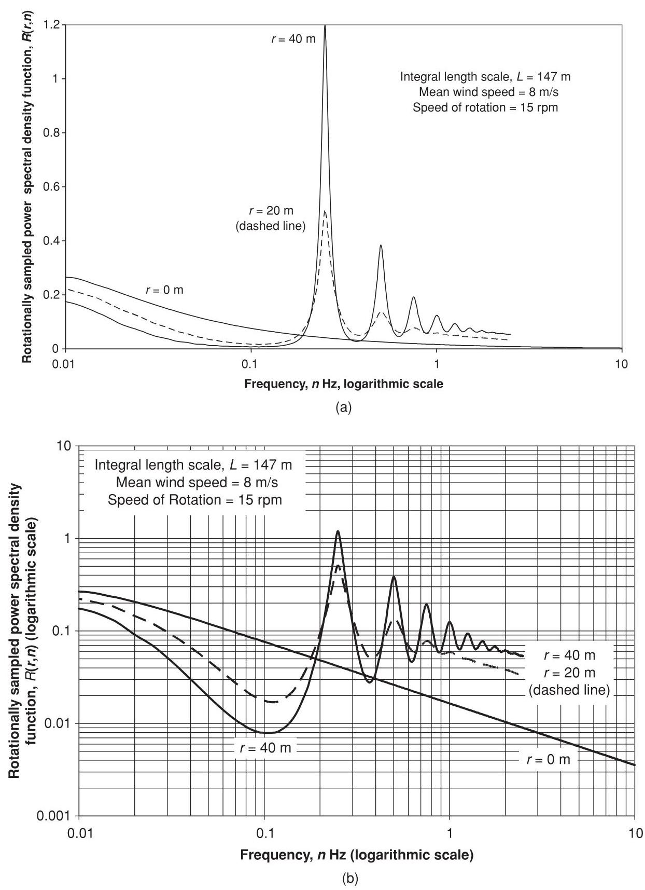

Figure 5.19 (a) Rotationally sampled power spectra of longitudinal wind speed fluctuations at different radii; (b) Rotationally sampled power spectra of longitudinal wind speed fluctuations at different radii: log-log plot

Figure 5.20 Comparison of rotationally sampled power spectra at ${40}\mathrm{\;m}$ radius for different integral length scales

Setting $\tau  = 0$ in Equation 5.46b gives

$$
{\kappa }_{u}^{o}\left( {{r}_{1},{r}_{2},0}\right)  = {\int }_{0}^{\infty }{S}_{u}^{o}\left( {{r}_{1},{r}_{2}, n}\right) {dn} \tag{5.47}
$$

which, when substituted into the expression for the standard deviation of the blade root bending moment in Equation 5.27 gives

$$
{\sigma }_{M}^{2} = {\left( \frac{1}{2}\rho \Omega \frac{d{C}_{L}}{d\alpha }\right) }^{2}{\int }_{0}^{R}{\int }_{0}^{R}\left\lbrack  {{\int }_{0}^{\infty }{S}_{u}^{o}\left( {{r}_{1},{r}_{2}, n}\right) {dn}}\right\rbrack  c\left( {r}_{1}\right) c\left( {r}_{2}\right) {r}_{1}^{2}{r}_{2}^{2}d{r}_{1}d{r}_{2} \tag{5.48}
$$

From this, it can be deduced that the power spectrum of the blade root bending moment is

$$
{S}_{M}\left( n\right)  = {\left( \frac{1}{2}\rho \Omega \frac{d{C}_{L}}{d\alpha }\right) }^{2}{\int }_{0}^{R}{\int }_{0}^{R}{S}_{u}^{o}\left( {{r}_{1},{r}_{2}, n}\right) c\left( {r}_{1}\right) c\left( {r}_{2}\right) {r}_{1}^{2}{r}_{2}^{2}d{r}_{1}d{r}_{2} \tag{5.49}
$$

The derivation of the rotationally sampled cross spectrum, ${S}_{u}^{o}\left( {{r}_{1},{r}_{2}, n}\right)$ , exactly parallels the derivation of the rotationally sampled single point spectrum given above, with the cross correlation function ${\kappa }_{u}^{o}\left( {{r}_{1},{r}_{2},\tau }\right)$ between the longitudinal wind fluctuations at points at radii ${r}_{1}$ and ${r}_{2}$ on the rotating blade replacing the autocorrelation function in step 2 . Here the expression for the separation distance, $s$ , given in Equation 5.36, is replaced by

$$
{s}^{2} = {\bar{U}}^{2}{\tau }^{2} + {r}_{1}^{2} + {r}_{2}^{2} - 2{r}_{1}{r}_{2}\cos {\Omega \tau } \tag{5.50}
$$

The expression for the cross correlation function thus becomes:

$$
{\kappa }_{u}^{o}\left( {{r}_{1},{r}_{2},\tau }\right)  = \frac{2{\sigma }_{u}^{2}}{\Gamma \left( \frac{1}{3}\right) }{\left( \frac{s/2}{1.34L}\right) }^{\frac{1}{3}}\left\lbrack  {{K}_{1/3}\left( \frac{s}{1.34L}\right)  - \frac{s}{2\left( {1.34L}\right) }{K}_{2/3}\left( \frac{s}{1.34L}\right) }\right.
$$

$$
\left. {\times \left( \frac{{r}_{1}^{2} + {r}_{2}^{2} - 2{r}_{1}{r}_{2}\cos \left( {\Omega \tau }\right) }{{s}^{2}}\right) }\right\rbrack \tag{5.51}
$$

with $s$ defined by Equation 5.50.

The form of the resulting normalised cross correlation function, ${\rho }_{u}^{o}\left( {{r}_{1},{r}_{2},\tau }\right)  = \; {\kappa }_{u}^{o}\left( {{r}_{1},{r}_{2},\tau }\right) /{\sigma }_{u}^{2}$ , is illustrated in Figure 5.18 for the case considered in Example 5.2, taking ${r}_{1} = {20}\mathrm{\;m}$ and ${r}_{2} = {40}\mathrm{\;m}$ . In Figure 5.21, the rotationally sampled cross spectrum for this case is compared with the rotationally sampled single point spectra or 'autospectra' at these radii. It can be seen that the form of the cross spectrum curve is similar to that of the autospectra with a pronounced peak at the rotational frequency roughly midway between the peaks of the two autospectra. At higher frequencies, however, the cross spectrum falls away much more rapidly.

Figure 5.21 Rotationally sampled cross spectrum of longitudinal wind speed fluctuations at ${20}\mathrm{\;m}$ and ${40}\mathrm{\;m}$ radii compared with auto spectra: log-log plot

The evaluation of the power spectrum of the blade root bending moment is, in practice, carried out using summations to approximate to the integrals in Equation 5.49, as follows:

$$
{S}_{M}\left( n\right)  = {\left( \frac{1}{2}\rho \Omega \frac{d{C}_{L}}{d\alpha }\right) }^{2}\mathop{\sum }\limits_{j}\mathop{\sum }\limits_{k}{S}_{u}^{o}\left( {{r}_{j},{r}_{k}, n}\right) c\left( {r}_{j}\right) c\left( {r}_{k}\right) {r}_{j}^{2}{r}_{k}^{2}{\left( \Delta r\right) }^{2} \tag{5.52}
$$

## Limitations of analysis in the frequency domain

As noted at the beginning of this section, analysis of stochastic aerodynamic loads in the frequency domain depends for its validity on a linear relationship between the incident wind speed and the blade loading. Thus, the method becomes increasingly inaccurate for pitch regulated machines as winds approach the cut-out value and breaks down completely for stall-regulated machines once the wind speed is high enough to cause stall. In order to avoid these limitations, it is necessary to carry out the analysis in the time domain.

### 5.7.6 Stochastic aerodynamic loads: analysis in the time domain

## Wind simulation

The analysis of stochastic aerodynamic loads in the time domain requires, as input, a simulated wind field extending over the area of the rotor disc and over time. Typically, this is obtained by generating simultaneous time histories at points over the rotor disc, which have appropriate statistical properties both individually, and in relation to each other. Thus, the power spectrum of each time history should conform to one of the standard power spectra (e.g. Von Karman or Kaimal), and the normalised cross spectrum (otherwise known as the coherence function) of the time histories at two different points should equate to the coherence function corresponding to the chosen power spectrum and the distance separating the points. For example, the coherence of the longitudinal component of turbulence corresponding to the Kaimal power spectrum for points $j$ and $k$ separated by a distance $\Delta {s}_{jk}$ perpendicular to the wind direction is:

$$
{C}_{jk}\left( n\right)  = C\left( {\Delta {s}_{jk}, n}\right)  = \frac{{S}_{jk}\left( n\right) }{{S}_{u}\left( n\right) } = \exp \left( {-H.\Delta {s}_{jk}\sqrt{{\left( \frac{n}{\bar{U}}\right) }^{2} + {\left( \frac{0.12}{L}\right) }^{2}}}\right) \tag{5.53}
$$

The constant $H$ was specified as 8.8 in IEC 61400-1 Edition 2, but increased to 12 in Edition 3. The $\left( {{0.12}/L}\right)$ term is negligible except at frequencies below ${0.01}\mathrm{\;{Hz}}$ . (Note that coherence is sometimes termed coherency, and that some authors define coherence as the square of the normalised cross spectrum). See Section 2.6.6 for details of the coherence corresponding to the Von Karman spectrum.

Three distinct approaches have been developed for generating simulation time histories as follows:

1. The transformational method, based on filtering Gaussian white noise signals.

2. The correlation method, in which the velocity of a small body of air at the end of a time step is calculated as the sum of a velocity correlated with the velocity at the start of the time step and a random, uncorrelated increment.

3. The harmonic series method, involving the summation of a series of cosine waves at different frequencies with amplitudes weighted in accordance with the power spectrum.

This last method is probably now the one in widest use, and is described in more detail below. The description is based on that given in Veers (1988).

## Wind simulation by the harmonic series method

The spectral properties of the wind speed fluctuations at $N$ points can be described by a spectral matrix, $\mathbf{S}$ , in which the diagonal terms are the double-sided single point power spectral densities at each point, ${S}_{kk}\left( n\right)$ , and the off-diagonal terms are the cross-spectral densities, ${S}_{jk}\left( n\right)$ , also double sided. This matrix is equated to the product of a triangular transformation matrix, $\mathbf{H}$ , and its transpose, ${\mathbf{H}}^{T}$ , as follows:

$$
\left\lbrack  \begin{matrix} {S}_{11} & {S}_{21} & {S}_{31} & \ldots \ldots \\  {S}_{21} & {S}_{22} & {S}_{32} & \ldots \ldots \\  {S}_{31} & {S}_{32} & {S}_{33} & \ldots \ldots \\  \ldots & \ldots \ldots & \ldots \ldots & {S}_{NN} \end{matrix}\right\rbrack   = \left\lbrack  \begin{matrix} {H}_{11} & & & \\  {H}_{21} & {H}_{22} & & \\  {H}_{31} & {H}_{32} & {H}_{33} & \\  \ldots & \ldots \ldots & \ldots \ldots & {H}_{NN} \end{matrix}\right\rbrack  \left\lbrack  \begin{matrix} {H}_{11} & {H}_{21} & {H}_{31} & \ldots \ldots \\   & {H}_{22} & {H}_{32} & \ldots \ldots \\   & & {H}_{33} & \ldots \ldots \\   & & & {H}_{NN} \end{matrix}\right\rbrack
$$

resulting in a set of $N\left( {N + 1}\right)$ equations linking the elements of the $\mathbf{S}$ matrix to the elements of the $\mathbf{H}$ matrix as follows:

$$
{S}_{11} = {H}_{11}^{2}{S}_{21} = {H}_{21} \cdot  {H}_{11}\;{S}_{22} = {H}_{21}^{2} + {H}_{22}^{2}\;{S}_{31} = {H}_{31} \cdot  {H}_{11}
$$

$$
{S}_{32} = {H}_{31} \cdot  {H}_{21} + {H}_{32} \cdot  {H}_{22}{S}_{33} = {H}_{31}^{2} + {H}_{32}^{2} + {H}_{33}^{2}
$$

$$
{S}_{jk} = \mathop{\sum }\limits_{{l = 1}}^{k}{H}_{jl} \cdot  {H}_{kl}\;{S}_{kk} = \mathop{\sum }\limits_{{l = 1}}^{k}{H}_{kl}^{2} \tag{5.54}
$$

As with the elements of the $\mathbf{S}$ matrix, the elements of the $\mathbf{H}$ matrix are all double-sided functions of frequency, $n$ .

Noting that the expression for the power spectral density ${S}_{kk}$ resembles that for the variance of the sum of group of $k$ independent variables, it is apparent that the elements of the $\mathbf{H}$ matrix can be considered as the weighting factors for the linear combination of $N$ independent, unit magnitude, white noise inputs to yield $N$ correlated outputs with the correct spectral matrix. Thus, the elements in the $j$ th row of $\mathbf{H}$ are the weighting factors for the inputs contributing to the output at point $j$ . The formula for the linear combination is

$$
{u}_{j}\left( n\right)  = \mathop{\sum }\limits_{{k = 1}}^{j}{H}_{jk}\left( n\right)  \cdot  {\Delta n} \cdot  \exp \left( {-i{\theta }_{k}\left( n\right) }\right) \tag{5.55}
$$

where ${u}_{j}\left( n\right)$ is the complex coefficient of the discretised frequency component at $n\mathrm{\;{Hz}}$ of the simulated wind speed at point $j$ . The frequency bandwidth is ${\Delta n}.{\theta }_{k}\left( n\right)$ is the phase angle associated with the $n\mathrm{\;{Hz}}$ frequency component at point $k$ , and is a random variable uniformly distributed over the interval $0 - {2\pi }$ .

The values of the weighting factors, ${H}_{jk}$ , which are $N\left( {N + 1}\right)$ in number are derived from the Equations 5.54, giving:

$$
{H}_{11} = \sqrt{{S}_{11}}\;{H}_{21} = {S}_{21}/{H}_{11}\;{H}_{22} = \sqrt{{S}_{22} - {H}_{21}^{2}}\;{H}_{31} = {S}_{31}/{H}_{11}\;\text{ etc. } \tag{5.56}
$$

Hence

$$
{u}_{1}\left( n\right)  = \sqrt{{S}_{11}\left( n\right) } \cdot  {\Delta n} \cdot  \exp \left( {-i{\theta }_{1}\left( n\right) }\right)
$$

$$
{u}_{2}\left( n\right)  = \sqrt{{S}_{22}\left( n\right) } \cdot  {\Delta n}\left\lbrack  {{C}_{21}\left( n\right)  \cdot  \exp \left( {-i{\theta }_{1}\left( n\right) }\right)  + \sqrt{1 - {C}_{21}^{2}\left( n\right) } \cdot  \exp \left( {-i{\theta }_{2}\left( n\right) }\right) }\right\rbrack  \;\text{ etc. }
$$

(5.57)

Time series for the wind speed fluctuations are obtained by taking the inverse discrete Fourier transform of the coefficients ${u}_{j}\left( n\right)$ at each point $j$ . Lateral and vertical wind speed fluctuations can also be simulated, if desired, using the same method. As an illustration, examples of time series derived by this method for two points ${10}\mathrm{\;m}$ apart are shown in Figure 5.22, based on the Von Karman spectrum. The mean wind speed and integral length scale ${}^{x}{L}_{u}$ in this example are taken as ${10}\mathrm{\;m}/\mathrm{s}$ and ${73.5}\mathrm{\;m}$ respectively, giving an integral time scale, ${}^{x}{L}_{u}/\bar{U}$ of 7.35 seconds.

In his 1988 paper, Veers pointed out that computation time required can be reduced by arranging for the simulated wind speed to be calculated at each point only at those times when a blade is passing - i.e. at a frequency of ${\Omega B}/{2\pi }$ , where $B$ is the number of blades. This is achieved by applying a phase shift to each frequency component at each point of ${\psi }_{j} \cdot  n \cdot  {2\pi }/\Omega$ , where ${\psi }_{j}$ is the azimuth angle of point $j$ .

Figure 5.22 Simulated time series of wind speed fluctuations at two points ${10}\mathrm{\;m}$ apart for mean wind speed of ${10}\mathrm{\;m}/\mathrm{s}$

## Blade load time histories

Once the simulated wind speed time histories have been generated across the grid, the calculation of blade load histories at different radii can begin. If the wake is assumed to be 'frozen', then the axial induced velocity, $a\bar{U}$ , and the tangential induced velocity, ${a}^{\prime }{\Omega r}$ , are taken as remaining constant over time, at each radius, at the values calculated for a steady wind speed of $\bar{U}$ . The instantaneous value of the flow angle, $\phi$ , and, hence, the values of the lift and drag coefficients, may then be calculated directly from the instantaneous value of the wind speed fluctuation (including lateral and vertical components, if calculated) by means of the velocity diagram.

Alternatively, an equilibrium wake may be assumed. In this case, the induced velocities are taken to vary continuously so that the momentum equations are satisfied at each blade element at all times. Obviously, this requires that these equations are solved afresh at each time step, which is computationally much more demanding.

Neither the equilibrium wake model nor the frozen wake model provide an accurate description of wake behaviour. A better model is provided by unsteady flow theory, which assumes that there is some delay before induced velocities react to changes in the incident wind field. See Section 4.4.

Note that, if desired, the spatial wind variations causing deterministic loading can be included in the simulated wind field, enabling the combined deterministic and stochastic loading on the blade to be calculated in a single operation.

### 5.7.7 Extreme loads

The derivation of extreme loads should properly take into account dynamic effects, which form the subject of the next section. However, in the interests of clarity, this section will be restricted to the consideration of extreme loads in the absence of dynamic effects.

As described in Section 5.4.1, it was customary for wind turbine design codes to specify extreme operating load cases in terms of deterministic gusts. The extreme blade loadings are then evaluated at intervals over the duration of the gust, using blade element and momentum theory as described in Section 5.7.2.

Although deterministic gusts have the advantage of clarity of definition, they are essentially arbitrary in nature. The alternative approach of employing a stochastic representation of the wind provides a much more realistic description of the wind itself, and has been adopted to a greater extent in IEC 61400-1 Edition 3. Although stochastic representation of the wind lends itself to analysis in the frequency domain, non-linearities introduced by stall invalidate the method, so the standard specifies analysis in the time domain using simulations. Nevertheless, analysis in the frequency domain can provide useful insights in the absence of stall and is considered further in the paragraphs which follow.

Normally the loading under investigation, for example the blade root bending moment, will contain both periodic and random components. Although it is straightforward to predict the extreme values of each component independently, the prediction of the extreme value of the combined signal is quite involved. Madsen et al. (1984) have proposed the following simple, approximate approach, and have demonstrated that it is reasonably accurate.

The periodic component, $z\left( t\right)$ , is considered as an equivalent 3 level square wave, in which the variable takes the maximum, mean $\left( {\mu }_{z}\right)$ , and minimum values of the original waveform, for proportions ${\varepsilon }_{1},{\varepsilon }_{2}$ and ${\varepsilon }_{3}$ of the wave period respectively. It is easy to show that:

$$
{\varepsilon }_{1} = \frac{{\sigma }_{z}^{2}}{\left( {{z}_{\max } - {\mu }_{z}}\right) \left( {{z}_{\max } - {z}_{\min }}\right) }\;{\varepsilon }_{3} = \frac{{\sigma }_{z}^{2}}{\left( {{\mu }_{z} - {z}_{\min }}\right) \left( {{z}_{\max } - {z}_{\min }}\right) } \tag{5.58}
$$

Extreme values of the combined signal are only assumed to occur during the proportion of the time, ${\varepsilon }_{1}$ , for which the square wave representation of the periodic component is at the maximum value, ${z}_{\max }$ .

Davenport (1964) gives the following formula for the extreme value of a random variable over a time interval $T$ :

$$
\frac{{x}_{\max }}{{\sigma }_{x}} = \sqrt{2\ln \left( {vT}\right) } + \frac{\gamma }{\sqrt{2\ln \left( {vT}\right) }} \tag{5.59}
$$

where $v$ is the zero up-crossing frequency (i.e. the number of times per second the variable changes from negative to positive) given by Equation A5.46 and $\gamma  = {0.5772}$ (Euler’s constant). Thus, the extreme value of the combined periodic and random components is taken to be

$$
{z}_{\max } + {x}_{\max } = {z}_{\max } + {\sigma }_{x}\left( {\sqrt{2\ln \left( {v{\varepsilon }_{1}T}\right) } + \frac{\gamma }{\sqrt{2\ln \left( {v{\varepsilon }_{1}T}\right) }}}\right)  = {z}_{\max } + {g}_{1} \cdot  {\sigma }_{x} \tag{5.60}
$$

where ${g}_{1}$ is termed the peak factor.

The variation of ${x}_{\max }/{\sigma }_{x}$ with exposure time, $\mathrm{T}$ , is shown in Table 5.4 for a zero up-crossing frequency of $1\mathrm{\;{Hz}}$ . The periodic component is assumed to be a simple sinusoid, giving ${\varepsilon }_{1} = {0.25}$ .

The method for determining the extreme load described above has to be applied with caution when the wind fluctuations exceed the rated wind speed. In the case of a stall-regulated machine, the linearity assumption breaks down completely, invalidating the method. With pitch-regulated machines, however, the blade pitch will respond to wind fluctuations at frequencies below, say, half the rotor rotational frequency in order to limit power, causing a parallel reduction in blade loading. This will modify the spectrum of blade loading dramatically, effectively removing the frequency components below the pitch system cut-off frequency, and consequently reducing the magnitude of ${\sigma }_{x}$ to be substituted in Equation 5.60.

Table 5.4 Extreme values of random component for different exposure times

<table><tr><td>$T$</td><td>1 minute</td><td>10 minutes</td><td>1 hour</td><td>10 hours</td><td>100 hours</td><td>1000 hours</td><td>1 year</td></tr><tr><td>$T$ (secs)</td><td>60</td><td>600</td><td>3,600</td><td>36,000</td><td>360,000</td><td>3,600,000</td><td>31,536,000</td></tr><tr><td>${\varepsilon }_{1}T$ (secs)</td><td>15</td><td>150</td><td>900</td><td>9,000</td><td>90,000</td><td>900,000</td><td>7,884,000</td></tr><tr><td>${x}_{\max }/{\sigma }_{x}$</td><td>2.57</td><td>3.35</td><td>3.84</td><td>4.40</td><td>4.90</td><td>5.35</td><td>5.74</td></tr></table>

To illustrate the method, the procedure for calculating the extreme flapwise blade root bending moment of a pitch regulated machine operating at rated wind speed is described below:

1) Equation 5.48 for the standard deviation of the random component of blade root bending moment is first modified to eliminate the contribution of frequencies below half the rotational speed to account for the blade pitching response, and then discretised to give:

$$
{\sigma }_{M}^{2} = {\left( \frac{1}{2}\rho \Omega \frac{d{C}_{L}}{d\alpha }\right) }^{2}\mathop{\sum }\limits_{{j = 1}}^{m}\mathop{\sum }\limits_{{k = 1}}^{m}\left\lbrack  {{\int }_{\Omega /2}^{\infty }{S}_{u}^{o}\left( {{r}_{j},{r}_{k}, n}\right) {dn}}\right\rbrack  c\left( {r}_{j}\right) c\left( {r}_{k}\right) {r}_{j}^{2}{r}_{k}^{2} \cdot  {\left( \Delta r\right) }^{2} \tag{5.61}
$$

Here the blade is assumed to be divided up into $m$ sections of equal length ${\Delta r} = R/m$ .

2) After evaluation of the integrals of the $m\left( {m + 1}\right) /2$ different curtailed rotational spectra, the standard deviation of the blade root bending moment is obtained from Equation 5.61.

3) The time, $T$ , that the machine spends in a wind speed band centred on the rated wind speed is estimated using the Weibull curve, and multiplied in turn by the factor ${\varepsilon }_{1}$ appropriate to the waveform of the periodic component of blade root bending moment and by the zero up-crossing frequency of the random root bending moment fluctuations, to give the effective number of peaks, $v{\varepsilon }_{1}T$ .

4) The predicted extreme value of the total moment is calculated by substituting the standard deviation of the blade root bending moment, ${\sigma }_{M}\left( { = {\sigma }_{x}}\right)$ , the effective number of peaks, $v{\varepsilon }_{1}T$ , and the extreme value of the periodic moment into Equation 5.60.

In the case of a machine with a rated wind speed of ${13}\mathrm{\;m}/\mathrm{s}$ operating at a site with an annual mean of $7\mathrm{\;m}/\mathrm{s}$ , the expected proportion of the time spent operating within a $2\mathrm{\;m}/\mathrm{s}$ wide band centred on the rated wind speed is ${5.6}\%$ . Taking the machine lifetime as 20 years, a zero up-crossing frequency equal to the rotational speed of ${15}\mathrm{{rpm}}\left( {{0.25}\mathrm{\;{Hz}}}\right)$ and ${\varepsilon }_{1} = {0.25}$ , this results in a peak factor, ${g}_{1}$ , of 5.5 . For the ${80}\mathrm{\;m}$ diameter machine considered in Section 5.7.2, a turbulence intensity of ${20}\%$ and a turbulence isotropic length scale of ${147}\mathrm{\;m}$ , the standard deviation of the random component of blade root bending moment given by Equation 5.60 is ${315}\mathrm{{kNm}}$ , resulting in a peak value of about ${1730}\mathrm{{KNm}}$ . This compares with the extreme value of the periodic component, including wind shear, of about 1830 KNm. It should be emphasised that the peak value of the random component quoted is a theoretical one - that is, it assumes the linearity assumptions are maintained even for the large wind speed fluctuation needed to generate this moment. In practice, a machine operating in a steady wind speed equal to rated is usually not all that far from stall, so the larger fluctuations may induce stall. In this example, the square root of the weighted mean of the integrals of all the curtailed rotational spectra is about ${0.5}{\sigma }_{u}$ , so the idealised uniform wind speed fluctuation equivalent to the extreme root moment is about ${0.20} \times  {13} \times  {0.5} \times  {5.5} = {7.2}\mathrm{\;m}/\mathrm{s}$ .

The method outlined above has more validity at higher wind speeds, when the blades are pitched back, and are operating further away from stall. However, it is important to note that the other linearity assumption used in deriving Equation 5.26, namely that $\phi$ is small, becomes increasingly in error.

It will be now be evident that the calculation of stochastic extreme loads is fraught with difficulties because non-linearities are likely to arise as the extremes are approached. In so far as lift forces 'saturate' due to stall, or even drop back, as wind speed increases, a crude and simple approach to extreme out-of-plane operational loads is to calculate an upper bound based on the maximum lift coefficient for the local aerofoil section and the relative air velocity, $W$ . The induction factors will be small, and can be ignored.

The most sophisticated approach, however, is to analyse the loads generated by a simulated wind field. As computing costs normally restrict the length of simulated 'campaigns' to a few hundred seconds or less, statistical methods have to be used to extrapolate from the extreme values of loadings calculated during the campaign to the extreme values to be expected over the machine design life.

One method, which is discussed by Thomsen and Madsen (1997), is to use Equation 5.60 with $T$ set equal to the appropriate exposure period over the machine design life, and values of ${z}_{\max }$ and ${\sigma }_{x}$ , abstracted from the simulation time history with the aid of azimuthal binning to separate the periodic and stochastic components. The danger of this approach with simulations of short duration is that the azimuthal binning process treats some load fluctuations due to the slicing of low frequency gusts as periodic rather than stochastic, so that the standard deviation of the stochastic component, ${\sigma }_{x}$ , is underestimated.

Extrapolation techniques are considered further in Section 5.14.

## 5.8 Blade dynamic response

### 5.8.1 Modal analysis

Although dynamic loads on the blades will, in general, also excite the tower dynamics, tower head motion will initially be excluded from consideration in order to focus on the blade dynamic behaviour itself. The treatment is further limited to the response of blades in unstalled flow because of the inherent difficulty in predicting stalled behaviour.

The equation of motion for a blade element at radius $r$ subject to a time varying load $q\left( {r, t}\right)$ per unit length in the out-of-plane direction is

$$
m\left( r\right) \ddot{x} + \widehat{c}\left( r\right) \dot{x} + \frac{{\partial }^{2}}{\partial {r}^{2}}\left\lbrack  {{EI}\left( r\right) \frac{{\partial }^{2}x}{\partial {r}^{2}}}\right\rbrack   = q\left( {r, t}\right) \tag{5.62}
$$

where the terms on the left hand side are the loads on the element due to inertia, damping and flexural stiffness respectively. $I\left( r\right)$ is the second moment of area of the blade cross-section about the weak principal axis (which for this purpose is assumed to lie in the plane of rotation) and $x$ is the out-of-plane displacement. The expressions $m\left( r\right)$ and $\widehat{c}\left( r\right)$ denote mass per unit length and damping per unit length respectively.

The dynamic response of a cantilever blade to the fluctuating aerodynamic loads upon it is most conveniently investigated by means of modal analysis, in which the excitations of the various different natural modes of vibration are computed separately and the results superposed, as follows:

$$
x\left( {t, r}\right)  = \mathop{\sum }\limits_{{j = 1}}^{\infty }{f}_{j}\left( t\right) {\mu }_{j}\left( r\right) \tag{5.63}
$$

where ${\mu }_{j}\left( r\right)$ is the $j$ th mode shape, arbitrarily assumed to have a value of unity at the tip, and ${f}_{j}\left( t\right)$ is the variation of tip displacement with time. Equation 5.62 then becomes

$$
\mathop{\sum }\limits_{{j = 1}}^{\infty }\left\{  {m\left( r\right) {\mu }_{j}\left( r\right) {\ddot{f}}_{j}\left( t\right)  + \widehat{c}\left( r\right) {\mu }_{j}\left( r\right) {\dot{f}}_{j}\left( t\right)  + \frac{{d}^{2}}{d{r}^{2}}\left\lbrack  {{EI}\left( r\right) \frac{{d}^{2}{\mu }_{j}\left( r\right) }{d{r}^{2}}}\right\rbrack  {f}_{j}\left( t\right) }\right\}   = q\left( {r, t}\right) \tag{5.64}
$$

For low levels of damping the beam natural frequencies are given by

$$
m\left( r\right) {\omega }_{j}^{2}{\mu }_{j}\left( r\right)  = \frac{{d}^{2}}{d{r}^{2}}\left\lbrack  {{EI}\left( r\right) \frac{{d}^{2}{\mu }_{j}\left( r\right) }{d{r}^{2}}}\right\rbrack \tag{5.65}
$$

so Equation 5.64 becomes

$$
\mathop{\sum }\limits_{{j = 1}}^{\infty }\left\{  {m\left( r\right) {\mu }_{j}\left( r\right) {\ddot{f}}_{j}\left( t\right)  + \widehat{c}\left( r\right) {\mu }_{j}\left( r\right) {\dot{f}}_{j}\left( t\right)  + m\left( r\right) {\omega }_{j}^{2}{\mu }_{j}\left( r\right) {f}_{j}\left( t\right) }\right\}   = q\left( {r, t}\right) \tag{5.66}
$$

Multiplying both sides by ${\mu }_{i}\left( r\right)$ , and integrating over the length of the blade, $R$ , gives:

$$
\mathop{\sum }\limits_{{j = 1}}^{\infty }\left\{  {{\int }_{0}^{R}m\left( r\right) {\mu }_{i}\left( r\right) {\mu }_{j}\left( r\right) {\ddot{f}}_{j}\left( t\right) {dr} + {\int }_{0}^{R}\widehat{c}\left( r\right) {\mu }_{i}\left( r\right) {\mu }_{j}\left( r\right) {\dot{f}}_{j}\left( t\right) {dr}}\right.
$$

$$
\left. {+{\int }_{0}^{R}m\left( r\right) {\omega }_{j}^{2}{\mu }_{i}\left( r\right) {\mu }_{j}\left( r\right) {f}_{j}\left( t\right) {dr}}\right\}   = {\int }_{0}^{R}{\mu }_{i}\left( r\right) q\left( {r, t}\right) {dr} \tag{5.67}
$$

The undamped mode shapes are orthogonal as a result of Bettis's law, so they satisfy the orthogonality condition:

$$
{\int }_{0}^{R}m\left( r\right) {\mu }_{i}\left( r\right) {\mu }_{j}\left( r\right) {dr} = 0\;\text{ for }i \neq  j \tag{5.68}
$$

If we assume that the variation of the damping per unit length along the blade, $\widehat{c}\left( r\right)$ , is proportional to the variation in mass per unit length, $m\left( r\right)$ , i.e. $\widehat{c}\left( r\right)  = a \cdot  m\left( r\right)$ , then

$$
{\int }_{0}^{R}\widehat{c}\left( r\right) {\mu }_{i}\left( r\right) {\mu }_{j}\left( r\right) {dr} = 0\;\text{ for }i \neq  j \tag{5.69}
$$

As a result, all the cross terms on the left hand side of Equation 5.67 drop out, and it reduces to

$$
{m}_{i}{\ddot{f}}_{i}\left( t\right)  + {c}_{i}{\dot{f}}_{i}\left( t\right)  + {m}_{i}{\omega }_{i}^{2}{f}_{i}\left( t\right)  = {\int }_{0}^{R}{\mu }_{i}\left( r\right) q\left( {r, t}\right) {dr} \tag{5.70}
$$

where ${m}_{i} = {\int }_{0}^{R}m\left( r\right) {\mu }_{i}^{2}\left( r\right) {dr}$ and is known as the generalised mass, ${c}_{i} = {\int }_{0}^{R}\widehat{c}\left( r\right) {\mu }_{i}^{2}\left( r\right) {dr}$ and ${\int }_{0}^{R}{\mu }_{i}\left( r\right) q\left( {r, t}\right) {dr} = {Q}_{i}\left( t\right)$ is termed the generalised fluctuating load with respect to the $i$ th mode. Equation 5.70 is the fundamental equation governing modal response to time varying loading.

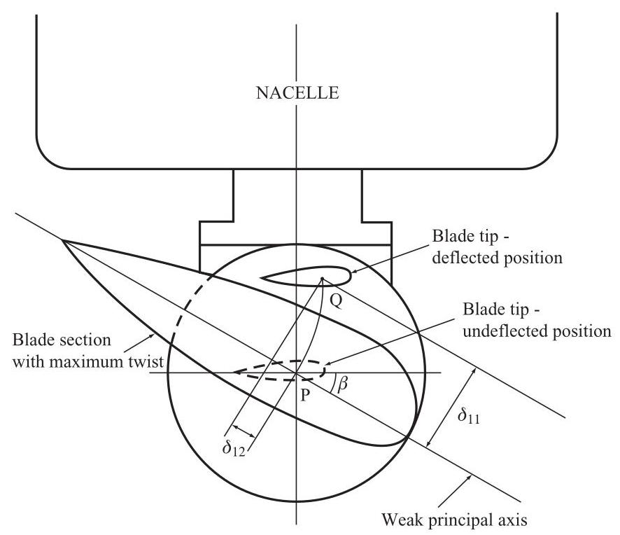

Figure 5.23 Deflection of tip due to flapwise bending of twisted blade (viewed along blade axis)

Blade flexural vibrations occur in both the flapwise and edgewise directions (i.e. about the weak and strong principal axes respectively). Blades are typically twisted some ${15}^{ \circ  }$ , so the weak principal axis does not, in general, lie in the plane of rotation as assumed above. Consequently blade flexure about one principal axis inevitably results in some blade movement perpendicular to the other. This is illustrated in Figure 5.23, in which the maximum blade twist near the root has been exaggerated for clarity. Point P represents the undeflected position of the blade tip, point Q represents the deflected position as a result of flexure about the weak principal axis, and the line between them is built up of the contributions to the tip deflection made by flexure of each element along the blade, $M\left( {R - r}\right) {\Delta r}/{EI}$ .

The interaction between flexure about the two principal axes can be explored with the help of some simplifying assumptions. If $M$ varies as $\left( {R - r}\right)$ for the first mode and $I$ varies as ${\left( R - r\right) }^{2}$ , then each of the tip deflection contributions referred to above are equal, so that, for a linear twist distribution, the line PQ is the arc of a circle. If the twist varies between zero at the tip and a maximum value of $\beta$ towards the root then the tip deflection, ${\delta }_{12}$ , in the direction of the weak principal axis, at the blade section with maximum twist, is $\beta /2$ times the tip deflection, ${\delta }_{11}$ , perpendicular to this axis. Hence in the case of $\beta  = {15}^{ \circ  }$ , the ratio ${\delta }_{12}/{\delta }_{11}$ approximates to 0.13 , with the result that blade first mode flapwise oscillations will result in some relatively small simultaneous edgewise inertia loadings. These will not excite significant edgewise oscillations, because the edgewise first mode natural frequency is typically about double the flapwise one.

It can be seen from the above that the effects of interaction between flapwise and edgewise oscillations are generally minor, so they will not be considered further.

Blades will also be subject to torsional vibrations. In the past, it has generally been possible to ignore these, both because the exciting loads were small and because the high torsional stiffness of a typical hollow blade placed the torsional natural frequencies well above the exciting frequencies. However, with the development of larger, more flexible blades, this is no longer always the case. Blade torsion, which can accompany flapwise bending due to offset of the cross-section centre of mass from the shear centre, for example, may significantly alter the angle of attack in the tip region.

Finally, in the case of a blade hinged at the root, the whole blade will experience oscillations involving rigid body rotation about the hinge. This phenomenon is considered in the section headed 'Teeter motion' below.

### 5.8.2 Mode shapes and frequencies

The mode shape and frequency of the first mode can be derived by an iterative technique called the Stodola method after its originator. Briefly, this consists of assuming a plausible mode shape, calculating the inertia loads associated with it for an arbitrary frequency of one radian per second, and then computing the beam deflected profile resulting from these inertia loads. This profile is then normalised, typically by dividing the deflections by the tip deflection, to obtain the input mode shape for the second iteration. The process is repeated until the mode shape converges. Then, in view of the fact that the inertia loads calculated for the input tip deflection combined with a frequency of 1 radian per second must be the same as those calculated for the output tip deflection combined with the actual frequency, the first mode natural frequency can be obtained from the formula:

$$
{\omega }_{1} = \sqrt{\frac{\text{ Tip deflection input to last iteration }}{\text{ Tip deflection output from last iteration }}}
$$

If the mode shapes are orthogonal, advantage can be taken of this property to simplify the derivation of the mode shapes and frequencies of the higher modes, provided this is carried out in ascending order. A trial mode shape is assumed as before, but before using it to calculate the inertia loadings, it is 'purified' so that it does not contain any lower mode content. For example,’purification’ of a second mode trial mode shape, ${\mu }_{2T}\left( \mathrm{r}\right)$ , of first mode content is achieved by subtracting

$$
{\mu }_{2C}\left( r\right)  = {\mu }_{1}\left( r\right) \frac{{\int }_{0}^{R}{\mu }_{1}\left( r\right) {\mu }_{2T}\left( r\right) m\left( r\right) {dr}}{{\int }_{0}^{R}{\mu }_{1}^{2}\left( r\right) m\left( r\right) {dr}} = {\mu }_{1}\left( r\right) \frac{{\int }_{0}^{R}{\mu }_{1}\left( r\right) {\mu }_{2T}\left( r\right) m\left( r\right) {dr}}{{m}_{1}} \tag{5.71}
$$

from it. The modified second mode trial mode shape, ${\mu }_{2M}\left( r\right)  = {\mu }_{2T}\left( r\right)  - {\mu }_{2C}\left( r\right)$ , then satisfies the orthogonality condition

$$
{\int }_{0}^{R}{\mu }_{1}\left( t\right) {\mu }_{2M}\left( r\right) {dr} = 0
$$

After 'purification' of the trial mode shape, the Stodola method can be applied exactly as before. Further 'purification' before succeeding iterations should not be necessary if the lower mode shapes used for the initial 'purification' are accurate enough. See Clough and Penzien (1993) for a rigorous treatment of the method.

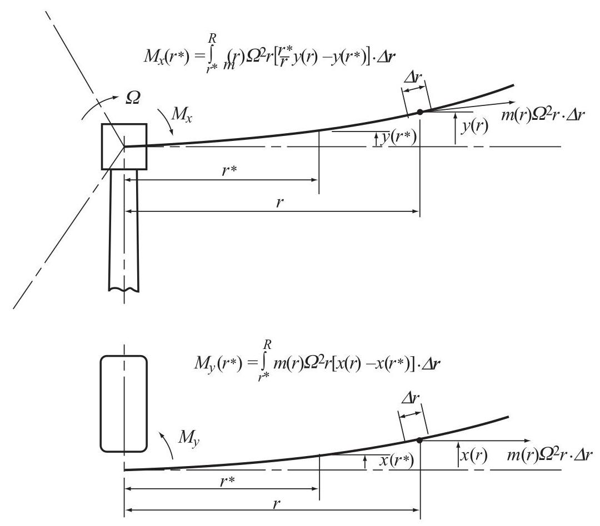

Figure 5.24 Restoring moments due to centrifugal force for in-plane and out-of-plane blade deflections

### 5.8.3 Centrifugal stiffening

When a rotating blade deflects either in its plane of rotation or perpendicular to it, the centrifugal force on each blade element exerts a restoring force which has the effect of stiffening the blade and thereby increasing the natural frequency compared with the stationary value. The centrifugal forces act radially outwards perpendicular to the axis of rotation, so in the case of an out-of-plane blade deflection, they are parallel to the undeflected blade axis and act at greater lever arms to the inboard part of the blade than they do in the case of in-plane blade deflection. This is illustrated in Figure 5.24.

In order to take account of the effects of centrifugal loads, the equation of motion for a blade element loaded in the out-of-plane direction is modified by the addition of an extra term to become

$$
m\left( r\right) \ddot{x} + \widehat{c}\left( r\right) \dot{x} - \frac{\partial }{\partial r}\left\lbrack  {N\left( r\right) \frac{\partial x}{\partial r}}\right\rbrack   + \frac{{\partial }^{2}}{\partial {r}^{2}}\left\lbrack  {{EI}\frac{{\partial }^{2}x}{\partial {r}^{2}}}\right\rbrack   = q\left( {r, t}\right) \tag{5.72}
$$

where the centrifugal force at radius $r, N\left( r\right)$ , is the summation of the forces acting on each blade element outboard of radius $r$ , that is $N\left( r\right)  = \mathop{\sum }\limits_{{r = r}}^{{r = R}}m\left( r\right) {\Omega }^{2}r \cdot  {\Delta r}$ .

The Stodola method for deriving blade mode shapes and frequencies described in the preceding section can be modified to take account of centrifugal effects. In the case of out-of-plane modes, the procedure is as follows:

1) Assume plausible trial out-of-plane mode shape, $\mu \left( r\right)$ .

2) 'Purify' trial mode shape of any lower mode content.

3) Assume trial value for frequency, ${\omega }_{j}^{2}$ .

4) Calculate bending moment distribution due to lateral inertia forces according to:

$$
{M}_{Y \cdot  \text{ Lat }}\left( {r}^{ * }\right)  = {\int }_{{r}^{ * }}^{R}m\left( r\right) {\omega }_{j}^{2}\mu \left( r\right) \left\lbrack  {r - {r}^{ * }}\right\rbrack  {dr} \tag{5.73}
$$

5) Calculate bending moment distribution due to centrifugal forces according to:

$$
{M}_{Y \cdot  {CF}}\left( {r}^{ * }\right)  =  - {\int }_{{r}^{ * }}^{R}m\left( r\right) {\Omega }^{2}r\left\lbrack  {\mu \left( r\right)  - \mu \left( {r}^{ * }\right) }\right\rbrack  {dr} \tag{5.74}
$$

6) Calculate combined bending moment distribution.

7) Calculate new deflected profile resulting from this bending moment distribution.

8) Calculate revised estimate of natural frequency from:

$$
{\omega }_{j}^{\prime } = {\omega }_{j}\sqrt{\frac{\text{ Trial tip deflection }}{\text{ Tip deflection calculated for new deflected profile }}}
$$

9) Repeat steps 2-8 with revised mode shape and frequency until calculated mode shape converges.

It is important to note that the lateral loads and deflections of a centrifugally loaded beam do not conform to Bettis's Law, so, as a consequence, the mode shapes are not orthogonal. It is for this reason that the 'purification' stage has been included in each cycle of iteration. When convergence of the calculated mode shape has occurred, it will be found that it differs significantly from the 'purified' mode shape input into each iteration, indicating that a true solution has not been obtained. It is then necessary to use a trial and error approach to modify the magnitudes of the 'purifying' corrections applied until the output mode shape and input 'purified' mode shape match. A few further iterations will be required until the natural frequency settles down.

A quick estimate of the first mode frequency of a rotating blade can be derived using the Southwell formula for a uniform rotating beam reported by Putter and Manor (1978) as follows

$$
{\omega }_{1} = \sqrt{{\omega }_{1,0}^{2} + {\phi }_{1}{\Omega }^{2}} \tag{5.75}
$$

in which ${\omega }_{1,0}$ is the corresponding frequency for the non-rotating blade. The value of ${\phi }_{1}$ depends on the blade mass and stiffness distribution, and Madsen et al. (1984) suggest the value 1.73 for wind turbine blade out-of-plane oscillations. In the case of Blade T40 rotating at 15 rpm, this yields a percentage increase in first mode frequency due to centrifugal stiffening of 7.7% compared to the correct value of 8.1%. Typically, centrifugal stiffening results in an increase of the first mode frequency for out-of-plane oscillations of between 5% and 10%. For higher modes, the magnitude of the centrifugal forces is less in proportion to the lateral inertia forces, so the percentage increase in frequency due to centrifugal stiffening becomes progressively less.

The procedure for deriving the blade first mode shape and frequency in the case of in-plane oscillations is the same as that described above for out-of-plane vibrations, except that the formula for the bending moment distribution due to the centrifugal forces has to be modified to:

$$
{M}_{X \cdot  {CF}}\left( {r}^{ * }\right)  = {\int }_{{r}^{ * }}^{R}m\left( r\right) {\Omega }^{2}r\left\lbrack  {\frac{{r}^{ * }}{r}\mu \left( r\right)  - \mu \left( {r}^{ * }\right) }\right\rbrack  {dr} \tag{5.76}
$$

where $\mu \left( r\right)$ is now the trial in-plane mode shape.

The first mode frequency for in-plane oscillations of Blade T40 in the absence of centrifugal force is ${1.56}\mathrm{\;{Hz}}$ . This is approximately double the corresponding frequency for out-of-plane oscillations of ${0.824}\mathrm{\;{Hz}}$ , and so the relative effect of the centrifugal loads is much reduced, even before allowance is made for the smaller lever arms at which they act (Figure 5.24). In fact the increase in the first mode frequency for in-plane oscillations due to centrifugal force is only ${0.5}\%  -$ probably small enough to be ignored.

### 5.8.4 Aerodynamic and structural damping

Blade motion is generally resisted by two forms of viscous damping, aerodynamic and structural, which are considered in turn.

An approximate expression for the aerodynamic damping per unit length in the flapwise direction can be derived by a method analagous to that used in Section 5.7.5 to derive the linear relation

$$
q = \frac{1}{2}{\rho \Omega rc}\left( r\right) \frac{d{C}_{L}}{d\alpha }u \tag{5.25}
$$

between blade load fluctuations per unit length, $q$ , and fluctuations in the incident wind, $u$ . The wind speed fluctuation, $u$ , is simply replaced by the blade flapwise velocity, $- \dot{x}$ , giving

$$
{\widehat{c}}_{a}\left( r\right)  = \frac{q}{-\dot{x}} = \frac{1}{2}{\rho \Omega rc}\left( r\right) \frac{d{C}_{L}}{d\alpha } \tag{5.77}
$$

The rate of change of lift coefficient with angle of attack, $d{C}_{L}/{d\alpha }$ , is constant and equal to ${2\pi }$ before the blade goes into stall, but can become negative post-stall, leading to the risk of instability - see Section 7.1.9.

It can be seen that the aerodynamic damping per unit length, ${\widehat{c}}_{a}\left( r\right)$ , varies spanwise as the product of radius and blade chord, and is therefore not very close to being proportional to the mass per unit length, as is required to satisfy the orthogonality condition. This will result in some aerodynamic coupling of modes, which is not accounted for in normal modal analysis.

The aerodynamic damping ratio for the $i$ th mode is defined as

$$
{\xi }_{ai} = {c}_{ai}/2{m}_{i}{\omega }_{i} = {\int }_{0}^{R}{\widehat{c}}_{a}\left( r\right) {\mu }_{i}^{2}\left( r\right) {dr}/2{m}_{i}{\omega }_{i} \tag{5.78}
$$

Substituting the expression for ${\widehat{c}}_{a}\left( r\right)$ given in Equation 5.77 leads to:

$$
{\xi }_{ai} = \frac{\frac{1}{2}{\rho \Omega }\frac{d{C}_{L}}{d\alpha }{\int }_{0}^{R}{rc}\left( r\right) {\mu }_{i}^{2}\left( r\right) {dr}}{2{\omega }_{i}{\int }_{0}^{R}m\left( r\right) {\mu }_{i}^{2}\left( r\right) {dr}} \tag{5.79}
$$

In the case of fibreglass Blade T40 described in Example 5.1, this yields values of 0.16 and 0.04 for the first and second modes respectively. These high values are a consequence of the lightness of the blade in relation to its width in the vicinity of the tip, an area which dominates the integrals thanks to the mode shape weighting. The corresponding first mode logarithmic decrement $\left( { = {2\pi }{\xi }_{a}}\right)$ is thus 1.0 .

At a weight of about 16 tonnes, Blade T40 is very much at the heavy end of the range, with blades for ${40}\mathrm{\;m}$ tip radius of half this weight or less now being typical. The aerodynamic damping ratio is inversely proportional to blade mass, so the first and second mode values would rise to 0.32 and 0.08 respectively for an 8 tonne blade weight.

Structural damping arises from the conversion of mechanical energy to thermal energy during oscillatory motion, as a result of frictional resistance within the flexing material. Denoting the strain energy at peak displacement for the $n$ th cycle as ${S}_{n}$ and the loss per cycle as $\Delta {S}_{n}$ , it can be shown that

$$
\frac{\Delta {S}_{n}}{{S}_{n}} = \frac{{2\Delta }{\sigma }_{n}}{{\sigma }_{n}} \tag{5.80}
$$

where ${\sigma }_{n}$ is the peak stress for the $n$ th cycle, $\Delta {\sigma }_{n} = {\sigma }_{n} - {\sigma }_{n + 1}$ and ${S}_{n} = \oint \left( {{\sigma }_{n}^{2}/{2E}}\right)$ , with the integral taken over the whole volume of the beam. Hence the logarithmic decrement of damping, defined as the natural logarithm of the ratio of successive peak displacements in the same direction - that is, as $\ln \left( {{\sigma }_{n}/{\sigma }_{n + 1}}\right)$ for elastic behaviour - approximates to $\Delta {\sigma }_{n}/{\sigma }_{n} = {0.5}\left( {\Delta {S}_{n}/{S}_{n}}\right) .$

Test results on fibreglass (see, for example, Gibson, 1982) indicate that the energy loss per cycle is unaffected by frequency. However, the percentage energy loss per cycle increases quite rapidly with stress range (Creed, 1993), although it is usual to treat it as independent of stress range for analysis purposes.

Values for the structural damping logarithmic decrement, ${\delta }_{\mathrm{s}} = {2\pi }{\xi }_{s}$ at the fundamental natural (i.e. first mode) frequency were given in the 1992 edition of Danish Standard DS 472 'Loads and Safety of Wind Turbine Construction' for several different materials, and these are reproduced in Table 5.5 below, together with corresponding values from EN 1991-1-4 (2005). Equivalent values of the structural damping ratio are also shown. Note that the first mode structural damping ratio for a fibreglass blade is much smaller than the aerodynamic damping ratio for Blade T40 derived above.

Table 5.5 Values of first mode structural damping logarithmic decrements for different materials

<table><tr><td>Standard</td><td>DS 472 (1992)</td><td>EN 1991-1-4 (2005)</td><td>DS 472</td><td>EN 1991-1-4</td></tr><tr><td>Material</td><td>Logarithmic Decrement, ${\delta }_{s}$</td><td>Logarithmic Decrement, ${\delta }_{s}$</td><td>Structural damping ratio, ${\xi }_{s}$</td><td>Structural damping ratio, ${\xi }_{s}$</td></tr><tr><td>Concrete</td><td>0.05</td><td>0.03 (towers and chimneys)</td><td>0.008</td><td>0.005</td></tr><tr><td>Steel-welded</td><td>0.02</td><td>0.012 (chimney)</td><td>0.003</td><td>0.002</td></tr><tr><td>Steel-bolted</td><td>0.05</td><td>0.03 (high strength   bolts)</td><td>0.008</td><td>0.005</td></tr><tr><td></td><td></td><td>0.05 (ordinary   bolts)</td><td></td><td>0.008</td></tr><tr><td>GRP</td><td>0.05</td><td>0.04-0.08 (bridges)</td><td>0.008</td><td>0.006-0.012</td></tr><tr><td>Timber</td><td>0.05</td><td>0.06-0.12 (bridges)</td><td>0.008</td><td>0.01-0.02</td></tr></table>

Damping ratios for the first and second flapwise modes of ${40}\mathrm{\;m}$ tip radius blades are presented in Table 5.6.

It is seen that the damping ratio for the second mode is about one third of that for the first.

### 5.8.5 Response to deterministic loads: step-by-step dynamic analysis

As set out in Section 5.8.1, blade dynamic response to time varying loading is best analysed in terms of the separate excitation of each blade mode of vibration, for which, under the assumptions of unstalled flow and mass-proportional aerodynamic damping, the governing equation is

$$
{m}_{i}{\ddot{f}}_{i}\left( t\right)  + {c}_{i}{\dot{f}}_{i}\left( t\right)  + {m}_{i}{\omega }_{i}^{2}{f}_{i}\left( t\right)  = {\int }_{0}^{R}{\mu }_{i}\left( r\right) q\left( {r, t}\right) {dr} \tag{5.70}
$$

where ${f}_{i}\left( t\right)$ and ${\mu }_{i}\left( r\right)$ are the tip displacement and mode shape for the $i$ th mode respectively. Starting with the initial tip displacement, velocity and acceleration arbitrarily set at zero, this equation can be used to derive values for these quantities at successive time steps over a complete blade revolution by numerical integration. The procedure is then repeated for several more revolutions until the cyclic blade response to the periodic loading becomes sensibly invariant from one revolution to the next.

Table 5.6 Comparison of ${40}\mathrm{\;m}$ radius blade damping ratios for first two flapwise modes

<table><tr><td colspan="2"></td><td>First mode</td><td>Second mode</td></tr><tr><td colspan="2">Natural frequency including centrifugal stiffening</td><td>0.89 Hz</td><td>2.94 Hz</td></tr><tr><td>Structural damping ratio</td><td></td><td>0.008</td><td>0.008</td></tr><tr><td>Blade T40 weighing 16 tonne</td><td>Aerodynamic damping ratio</td><td>0.16</td><td>0.04</td></tr><tr><td></td><td>Combined damping ratio</td><td>0.17</td><td>0.05</td></tr><tr><td>Lightweight ${40}\mathrm{\;m}$ tip radius</td><td>Aerodynamic damping ratio</td><td>0.32</td><td>0.08</td></tr><tr><td>blade weighing 8 tonne</td><td>Combined damping ratio</td><td>0.33</td><td>0.09</td></tr></table>

## Linear acceleration method

The precise form of the equations linking the tip displacement, velocity and acceleration at the end of a time step to those at the beginning depends on how the acceleration is assumed to vary over the time step. Newmark has classified alternative assumptions in terms of a parameter $\beta$ which measures the relative weightings placed on the initial and final accelerations in deriving the final displacement. The simplest assumption is that the acceleration takes a constant value equal to the average of the initial and final values $\left( {\beta  = \frac{1}{4}}\right)$ . Clough and Penzien (1993), however, recommend that the acceleration is assumed to vary linearly between the initial and final values, as this will be a closer approximation to the actual variation. Step-by-step integration with this assumption is known as either the linear acceleration method or the Newmark $\beta  = \frac{1}{6}$ method.

Expressions for the tip displacement, velocity and acceleration at the end of the first time step $- {f}_{i1},{\dot{f}}_{i1}$ and ${\ddot{f}}_{i1}$ respectively - are derived in terms of the initial values - ${f}_{i0},{\dot{f}}_{i0}$ and ${\ddot{f}}_{i0}$ - as follows. The acceleration at time $t$ during the time step of total duration $h$ is

$$
{\ddot{f}}_{i}\left( t\right)  = {\ddot{f}}_{i0} + \left( \frac{{\ddot{f}}_{i1} - {\ddot{f}}_{i0}}{h}\right) t \tag{5.81}
$$

This can be integrated to give the velocity at the end of the time step as

$$
{\dot{f}}_{i1} = {\dot{f}}_{i0} + {\ddot{f}}_{i0}h + \left( {{\ddot{f}}_{i1} - {\ddot{f}}_{i0}}\right) h/2 \tag{5.82}
$$

Equation 5.81 can be integrated twice to give an expression for the displacement at the end of the time step, which, after rearrangement yields the following expression for the corresponding acceleration:

$$
{\ddot{f}}_{i1} = \frac{6}{{h}^{2}}\left( {{f}_{i1} - {f}_{i0}}\right)  - \frac{6}{h}{\dot{f}}_{i0} - 2{\ddot{f}}_{i0} \tag{5.83}
$$

Substituting Equation 5.83 into Equation 5.82 yields

$$
{\dot{f}}_{i1} = \frac{3}{h}\left( {{f}_{i1} - {f}_{i0}}\right)  - 2{\dot{f}}_{i0} - {\ddot{f}}_{i0}h/2 \tag{5.84}
$$

Equation 5.70 can be written as

$$
{m}_{i}{\ddot{f}}_{in} + {c}_{i}{\dot{f}}_{in} + {m}_{i}{\omega }_{i}^{2}{f}_{in} = {\int }_{0}^{R}{\mu }_{i}\left( r\right) {q}_{n}\left( r\right) {dr} = {Q}_{in} \tag{5.85}
$$

where the suffix $n$ refers to the state at the end of the $n$ th time step. Substituting Equations 5.83 and 5.84 into Equation 5.85 with $n = 1$ and collecting terms yields the displacement at the end of the first time step as follows:

$$
{f}_{i1} = \frac{{Q}_{i1} + {m}_{i}\left( {\frac{6}{{h}^{2}}{f}_{i0} + \frac{6}{h}{\dot{f}}_{i0} + 2{\ddot{f}}_{i0}}\right)  + {c}_{i}\left( {\frac{3}{h}{f}_{i0} + 2{\dot{f}}_{i0} + \frac{h}{2}{\ddot{f}}_{i0}}\right) }{{m}_{i}{\omega }_{i}^{2} + \frac{3{c}_{i}}{h} + \frac{6{m}_{i}}{{h}^{2}}} \tag{5.86}
$$

The velocity and acceleration at the end of the first time step are then obtained by substituting ${f}_{i1}$ in Equations 5.84 and 5.83 respectively.

The full procedure for obtaining the blade dynamic response to a periodic loading using the Newmark $\beta  = \frac{1}{6}$ method (which is just one of many available) may be summarised as follows:

1) Calculate the blade mode shapes, ${\mu }_{i}\left( r\right)$ .

2) Select the number of time steps, $N$ , per complete revolution. Then the time step, $h = {2\pi }/{N\Omega }.$

3) Calculate the blade element loads, $q\left( {r,{\psi }_{n}}\right)  = {q}_{n}\left( r\right)$ , at blade azimuth positions corresponding to each time step (i.e. at ${2\pi }/N$ intervals) using momentum theory. (Here, the suffix $n$ denotes the number of the time step).

4) Calculate the generalised load with respect to each mode, ${Q}_{in} = {\int }_{0}^{R}{\mu }_{i}\left( r\right) {q}_{n}\left( r\right) {dr}$ , for each time step.

5) Assume initial values of blade tip displacement, velocity and acceleration.

6) Calculate first mode blade tip displacement, velocity and acceleration at end of first time step, using Equations 5.86,5.84 and 5.83 respectively (with $i = 1$ ).

7) Repeat stage 6 for each successive time step over several revolutions until convergence is achieved.

8) Calculate cyclic blade moment variation at radii of interest by multiplying the cyclic tip displacement variation by appropriate factors derived from the modal analysis.

9) Repeat stages 6-8 for higher modes.

10) Combine the responses from different modes to obtain the total response.

Figure 5.25 shows some results of the application of the above procedure to the derivation of the out-of-plane root bending moment response of Blade T40 to tower shadow loading. The case chosen is for a mean wind speed of ${12}\mathrm{\;m}/\mathrm{s}$ , uniform across the rotor disc, and an $x/D$ ratio of 1 (where $x$ is the distance between the blade and the tower centreline, and $D$ is the tower diameter), giving a maximum reduction in the blade root bending moment for a rigid blade of 600 KNm (see Figure 5.26). Centrifugal stiffening is included in the derivation of the mode shapes and frequencies. It is evident from Figure 5.25 that the tower shadow gives the blade a sharp 'kick' away from the tower, but the duration is too short in relation to the duration of the first mode half cycle for Blade T40 to 'feel' the root bending moment reduction that would be experienced by a completely rigid blade. The blade oscillations have largely died away after a complete revolution because of the relatively high levels of damping.

Figure 5.25 Blade T40 out-of-plane root bending moment dynamic response to tower shadow

The response of the Blade T40 out-of-plane root bending moment to tower shadow combined with wind shear is shown in Figure 5.26 for a hub height wind speed of ${12}\mathrm{\;m}/\mathrm{s}$ . Also plotted is the corresponding bending moment for a completely rigid blade.

The wind shear loading is approximately sinusoidal (see Figure 5.11) and, consequently, the response is also. However, it is worth noting that the amplitude of the dominating first mode response to wind shear is the result of two effects working against each other - in other words the increase due to the dynamic magnification factor of about $9\%$ is largely cancelled out by the reduction due to centrifugal stiffening.

Figure 5.26 Blade T40 out-of-plane root bending moment dynamic response to tower shadow and wind shear

## Avoidance of resonance: the Campbell diagram

In the course of blade design, it is important to avoid the occurrence of a resonant condition, in which a blade natural frequency equates to the rotational frequency or a harmonic with a significant forcing load. This is often done with the aid of a Campbell diagram, in which the blade natural frequencies are plotted out against rotational frequency together with rays from the origin representing integer multiples of the rotational frequency. Then any intersections of the rays with a blade natural frequency over the turbine rotational speed operating range represent possible resonances. An example of a Campbell diagram is shown in Figure 5.27.

Clearly blade periodic loading is dominated by the loading at rotational frequency from wind shear, yawed flow and shaft tilt (Section 5.7.2), gravity (Section 5.7.3) and gust slicing (Section 5.7.5). However, the short lived load relief resulting from tower shadow will be dominated by higher harmonics.

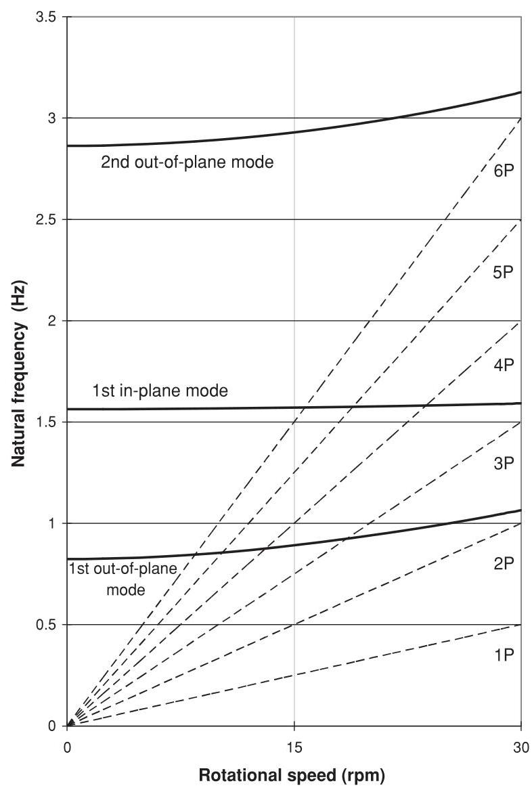

Figure 5.27 Campbell Diagram for Blade T40

### 5.8.6 Response to stochastic loads

The analysis of stochastic loads in the frequency domain has already been described in Section 5.7.5 for a rigid blade, and this will now be extended to cover the dynamic response of the different vibration modes of a flexible blade using the governing equation, Equation 5.70. Note that the restriction to an unstalled blade operating at a relatively high tip speed ratio still applies.

## Power spectrum of generalised blade loading

The generalised fluctuating load with respect to the $i$ th mode is ${Q}_{i} = {\int }_{0}^{R}{\mu }_{i}\left( r\right) q\left( r\right) {dr}$ , where

$$
{\Delta L} = L - \bar{L} = u\frac{dL}{du} = \frac{1}{2}\rho {\left( \Omega r\right) }^{2}c\frac{d{C}_{L}}{d\alpha }\frac{u}{\Omega r} = \frac{1}{2}{\rho \Omega rc}\frac{d{C}_{L}}{d\alpha }u \tag{5.25}
$$

Hence

$$
{Q}_{i} = \frac{1}{2}{\rho \Omega }\frac{d{C}_{L}}{d\alpha }{\int }_{0}^{R}{\mu }_{i}\left( r\right) u\left( {r, t}\right) c\left( r\right) {rdr} \tag{5.87}
$$

An expression for the standard deviation of ${Q}_{i},{\sigma }_{Qi}$ can be derived by a method analogous to that given in Section A5.4 of Appendix A for a non-rotating blade, yielding

$$
{\sigma }_{Qi}^{2} = {\left( \frac{1}{2}\rho \Omega \frac{d{C}_{L}}{d\alpha }\right) }^{2}{\int }_{0}^{R}{\int }_{0}^{R}\left\lbrack  {{\int }_{0}^{\infty }{S}_{u}^{o}\left( {{r}_{1},{r}_{2}, n}\right) {dn}}\right\rbrack  {\mu }_{i}\left( {r}_{1}\right) {\mu }_{i}\left( {r}_{2}\right) c\left( {r}_{1}\right) c\left( {r}_{2}\right) {r}_{1}{r}_{2}d{r}_{1}d{r}_{2}
$$

(5.88)

Here ${S}_{u}^{0}\left( {{r}_{1},{r}_{2}, n}\right)$ is the rotationally sampled cross spectrum for a pair of points on the rotating blade at radii ${r}_{1}$ and ${r}_{2}$ . Equation 5.88 is parallel to Equation A5.16 in the Appendix with $r$ and ${r}^{\prime }$ replaced by ${r}_{1}$ and ${r}_{2}$ and ${\left( \rho \bar{U}{C}_{F}\right) }^{2}$ replaced by ${\left( \frac{1}{2}\rho \Omega r\left( d{C}_{L}/d\alpha \right) \right) }^{2}$ . From this it can be deduced that the power spectrum of the generalised load with respect to the $i$ th mode is

$$
{S}_{Qi}\left( n\right)  = {\left( \frac{1}{2}\rho \Omega \frac{d{C}_{L}}{d\alpha }\right) }^{2}{\int }_{0}^{R}{\int }_{0}^{R}{S}_{u}^{o}\left( {{r}_{1},{r}_{2}, n}\right) {\mu }_{i}\left( {r}_{1}\right) {\mu }_{i}\left( {r}_{2}\right) c\left( {r}_{1}\right) c\left( {r}_{2}\right) {r}_{1}{r}_{2}d{r}_{1}d{r}_{2} \tag{5.89}
$$

In practice, this expression is evaluated using summations to approximate to the integrals.

## Power spectrum of tip deflection

The expression for the amplitude of the $i$ th mode blade tip response in response to excitation by a harmonically varying generalised load is given by Equation A5.4 in the Appendix. Hence the power spectrum of the tip displacement is related to the power spectrum of the generalised load by

$$
{S}_{xi}\left( n\right)  = \frac{{S}_{Qi}\left( n\right) }{{k}_{i}^{2}}\frac{1}{\left\lbrack  {\left( 1 - {n}^{2}/{n}_{i}^{2}\right) }^{2} + 4{\xi }_{i}^{2}{n}^{2}/{n}_{i}^{2}\right\rbrack  } \tag{5.90}
$$

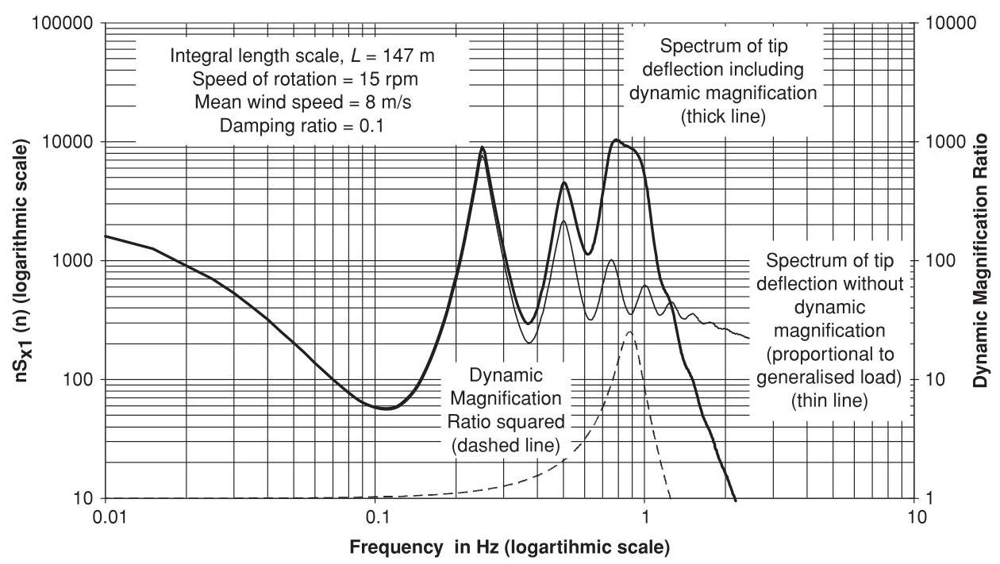

Figure 5.28 Power Spectrum of Blade T40 first out-of-plane mode tip deflection

This can be written ${S}_{xi}\left( n\right)  = \left( {{S}_{Qi}\left( n\right) /{k}_{i}^{2}}\right) {\left\lbrack  DMR\right\rbrack  }^{2}$ where ${DMR}$ stands for the dynamic magnification ratio. ${n}_{i}$ is the $i$ th mode natural frequency in $\mathrm{{Hz}}$ .

Figure 5.28 shows the power spectrum of first mode tip deflection, ${S}_{x1}\left( n\right)$ , for Blade T40 operating at ${15}\mathrm{{rpm}}$ in a mean wind of $8\mathrm{\;m}/\mathrm{{sec}}$ . A lower damping ratio of 0.1 has been selected so that the effect of dynamic magnification is emphasised and the turbulence intensity has been arbitrarily set at ${12.5}\%$ , so that ${\sigma }_{u} = 1\mathrm{\;m}/\mathrm{s}$ . Also shown is the first mode tip deflection spectrum ignoring dynamic magnification, ${S}_{Q1}\left( n\right) /{k}_{i}^{2}$ , which, when multiplied by the square of the dynamic magnification ratio (also plotted), yields the ${S}_{x1}\left( n\right)$ curve. The standard deviation of first mode tip deflection, ${\sigma }_{x1} = {\int }_{0}^{\infty }{S}_{x1}\left( n\right) {dn}$ , comes to ${103}\mathrm{\;{mm}}$ , a 23% increase compared with the value without dynamic magnification. The former is at a minimum, because the blade T40 first mode natural frequency of ${0.89}\mathrm{\;{Hz}}$ is approximately midway between the third and fourth harmonics of the rotational frequency. However, it is found that, even if the first mode natural frequency coincided with the third harmonic of the rotational frequency, ${\sigma }_{x1}$ would only increase by $5\%$ . This increase is small, because the peak of ${S}_{x1}\left( n\right)$ at the third harmonic is not very pronounced, and because the peak in the dynamic magnification ratio is relatively broad.

## Power spectrum of blade root bending moment

If the amplitude of tip deflection due to excitation of the blade resonant frequency is defined as ${x}_{R}\left( {n}_{1}\right)$ , the amplitude of the corresponding blade root bending moment, ${M}_{Y}\left( {n}_{1}\right)$ is given by

$$
{M}_{Y}\left( {n}_{1}\right)  = {\omega }_{1}^{2}{x}_{R}\left( {n}_{1}\right) {\int }_{0}^{R}m\left( r\right) {\mu }_{1}\left( r\right) {rdr} \tag{5.91a}
$$

Noting that ${\omega }_{1}^{2} = {k}_{1}/{m}_{1}$ , this becomes

$$
\frac{{M}_{Y}\left( {n}_{1}\right) }{{x}_{R}\left( {n}_{1}\right) } = {k}_{1}R\frac{{\int }_{0}^{R}m\left( r\right) {\mu }_{1}\left( r\right) \left( {r/R}\right) {dr}}{{m}_{1}} = {k}_{1}R{\chi }_{M1} \tag{5.91b}
$$

This relationship applies at all exciting frequencies, because the right hand side is essentially a function of mode shape. Hence the power spectrum of blade root bending moment due to excitation of the first mode is given by

$$
{S}_{My1}\left( n\right)  = {\left( {k}_{1}R{\chi }_{M1}\right) }^{2} \cdot  {S}_{x1}\left( n\right)  = {\left( R{\chi }_{M1}\right) }^{2} \cdot  {S}_{Q1}\left( n\right)  \cdot  \frac{1}{\left\lbrack  {\left( 1 - {n}^{2}/{n}_{1}^{2}\right) }^{2} + 4{\xi }_{1}^{2}{n}^{2}/{n}_{1}^{2}\right\rbrack  } \tag{5.91c}
$$

For Blade T40, the ratio ${\chi }_{M1}$ takes a value of 1.40.

### 5.8.7 Response to simulated loads

The blade dynamic response to time varying loading derived from wind simulation (Section 5.7.6) can be obtained by a step-by-step dynamic analysis such as that described for use with deterministic loads in Section 5.8.5. The procedure is essentially the same, except that it is more important to select realistic values for the initial blade tip displacement, velocity and acceleration, unless the results from the first few rotation cycles are to be discarded.

### 5.8.8 Teeter motion

When the rotor is rigidly mounted on the shaft, out-of-plane aerodynamic loads on the blades result in fluctuating bending moments in the low speed shaft additional to those due to gravity. In the case of two-bladed machines, the transfer of blade out-of-plane aerodynamic moments to the shaft can be eliminated and blade root bending moments reduced by mounting the rotor on a hinge with its axis perpendicular to both the low speed shaft and the axis of the rotor. This allows the rotor to teeter to and fro in response to differential aerodynamic loads on each blade.

The restoring moment acting on a rotor rotating at a constant teeter angle is generated by the lateral components of the centrifugal force acting on each blade element (see Figure 5.29). For small teeter angles - up to, say 5 degrees - it may be approximated by

$$
{M}_{R} = {\int }_{0}^{R}r \cdot  m\left( r\right) {\Omega }^{2}r \cdot  \zeta  \cdot  {dr} = I{\Omega }^{2}\zeta \tag{5.92}
$$

where $\zeta$ is the teeter angle, $\Omega$ is the rotational speed and $I$ is the rotor moment of inertia about its centre. The equation of motion for small free teeter oscillations thus becomes, $I\ddot{\zeta } + I{\Omega }^{2}\zeta  = 0$ (omitting the aerodynamic damping term for the moment), indicating that the natural frequency of the teeter motion with the teeter hinge perpendicular to the rotor axis is equal to the rotational frequency. Since both the deterministic and stochastic components of the exciting moment are dominated by this frequency, it is clear that the system operates at resonance, with aerodynamic damping alone controlling the magnitude of the teeter excursion. In the absence of stochastic wind loads, a teetering rotor can be thought of as rotating in a fixed plane at an angle ${\zeta }_{\mathrm{o}}$ to the plane perpendicular to the shaft axis (with ${\zeta }_{\mathrm{o}}$ equal to the maximum teeter angle), because the teetering frequency is equal to the rotational frequency.

Figure 5.29 Teeter geometry

The magnitude of teeter excursions would clearly be reduced if the teeter natural frequency were moved away from the rotational frequency. This can be done by rotating the teeter hinge axis relative to the rotor in the plane of rotation, as illustrated in Figure 5.29, so that teeter motion results in a change of blade pitch - positive in one blade and negative in the other - known as Delta 3 coupling. Consider the case of blade A slicing through a gust. The increased thrust on the blade will cause it to move in the downwind direction, by rotating about the teeter hinge. If the teeter angle, defined as the rotation of the blade in its own radial plane, is $\zeta$ , then the increase in blade A’s pitch angle will be $\zeta$ tan ${\delta }_{3}$ , where ${\delta }_{3}$ is as defined in Figure 5.29. The increase in the pitch angle of blade A will reduce the angle of attack, $\alpha$ , and thereby reduce the thrust loading on it. The net result of this and a simultaneous increase in the thrust loading on blade B is to introduce an additional restoring moment which will further help to reduce the teeter motion.

The first stage for the exploration of teeter response to different loadings is the derivation of the complete equation of motion. It is assumed that the blades are unstalled and are operating at a relatively high tip speed, so that the linear relations adopted in the derivation of Equation 5.25 in Section 5.7.5 can be retained. The various contributions to the change in the aerodynamic force on a blade element relative to the steady state situation are therefore:

$$
\frac{1}{2}{\rho \Omega rc}\frac{d{C}_{L}}{d\alpha }\left( {u - \dot{\zeta }r}\right)  - \frac{1}{2}\rho {\left( \Omega r\right) }^{2}c\frac{d{C}_{L}}{d\alpha } \cdot  {\Delta \theta } \tag{5.93}
$$

where the three terms result from the fluctuation of the incident wind, teeter motion and Delta 3 coupling respectively. Multiplication of these terms by radius, integration over the length of the blade and addition of the centrifugal and inertia hub moment terms yields the following equation of motion for the teeter response:

$$
I\ddot{\zeta } + \frac{1}{2}{\rho \Omega }\frac{d{C}_{L}}{d\alpha }\left\lbrack  {{\int }_{-R}^{R}{r}^{3}c\left( r\right) {dr}}\right\rbrack   \cdot  \dot{\zeta } + \frac{1}{2}{\rho \Omega }\frac{d{C}_{L}}{d\alpha }\left\lbrack  {{\int }_{-R}^{R}{r}^{3}c\left( r\right) {dr}}\right\rbrack  \Omega \tan {\delta }_{3}\zeta  + I{\Omega }^{2}\zeta
$$

$$
= \frac{1}{2}{\rho \Omega }\frac{d{C}_{L}}{d\alpha }{\int }_{-R}^{R}u\left( {r, t}\right) c\left( r\right)  \cdot  r \cdot  \left| r\right| {dr} \tag{5.94}
$$

assuming a frozen wake. By dividing through by the moment of inertia and writing

$$
\eta  = \frac{1}{2}\frac{\rho }{I}\frac{d{C}_{L}}{d\alpha }\left\lbrack  {{\int }_{-R}^{R}{r}^{3}c\left( r\right) {dr}}\right\rbrack \tag{5.95}
$$

this can be simplified to

$$
\ddot{\zeta } + {\eta \Omega }\dot{\zeta } + \left( {1 + \eta \tan {\delta }_{3}}\right) {\Omega }^{2}\zeta  = \frac{1}{2}\rho \frac{\Omega }{I}\frac{d{C}_{L}}{d\alpha }{\int }_{-R}^{R}u\left( {r, t}\right) c\left( r\right)  \cdot  r \cdot  \left| r\right| {dr} \tag{5.96}
$$

$\eta$ is a measure of the ratio of aerodynamic to inertial forces acting on the blade, and is one eighth of the Lock number.

Delta 3 coupling thus raises the natural frequency, ${\omega }_{\mathrm{n}}$ , of the teeter motion from $\Omega$ to $\Omega \sqrt{1 + \eta \tan {\delta }_{3}}$ . For an ${80}\mathrm{\;m}$ diameter rotor consisting of two T40 blades mounted on a teeter hinge set at a ${\delta }_{3}$ angle of ${30}^{ \circ  },\eta  = {0.89}$ and $\tan {\delta }_{3} = {0.577}$ , so the increase in natural frequency due to the ${\delta }_{3}$ angle is ${23}\%$ . The corresponding damping ratio, given by $\xi  = \eta /\left( {2\sqrt{1 + \eta \tan {\delta }_{3}}}\right)$ is quite high at 0.36 .

## Teeter response to deterministic loads

The teeter response to deterministic loads can be found using the same step-by-step integration procedure set out in Section 5.8.5. However, as the loadings due to wind shear and yaw are both approximately sinusoidal, an estimate of the maximum teeter angle for these cases may be obtained by using the standard solution for forced oscillations. For a harmonically varying teeter moment, ${M}_{T} = {M}_{To}\cos {\Omega t}$ due to wind shear, the teeter angle is given by

$$
\zeta  = \frac{{M}_{To}}{I{\omega }_{n}^{2}}\frac{\cos \left( {{\Omega t} - \vartheta }\right) }{\sqrt{{\left( 1 - {\left( \Omega /{\omega }_{n}\right) }^{2}\right) }^{2} + {\left( 2\xi \Omega /{\omega }_{n}\right) }^{2}}} \tag{5.97}
$$

where $\vartheta  = {\tan }^{-1}\left( {\left( {{2\xi \Omega }/{\omega }_{n}}\right) /\left( {1 - {\left( \Omega /{\omega }_{n}\right) }^{2}}\right) }\right)  = {90}^{ \circ  } - {\delta }_{3}$ is the phase lag with respect to the excitation.

For the two-bladed turbine described above, rotating at 15 rpm in a wind with a hub-height mean of ${10}\mathrm{\;m}/\mathrm{s}$ and a shear exponent of 0.2, the teeter moment amplitude, ${M}_{\mathrm{o}}$ , is approximately 360 KNm (see Figure 5.11, which gives the blade root bending moment variation with azimuth for a fixed hub machine, based on momentum theory). Taking the rotor moment of inertia as $9,{822},{000}\mathrm{\;{kg}}{\mathrm{\;m}}^{2}$ for T40 blades, and ${\omega }_{n} = {1.23\pi }/2\mathrm{{rad}}/\mathrm{{sec}}$ , the maximum teeter angle comes to ${0.83}^{ \circ  }$ for ${\delta }_{3} = {30}^{ \circ  }$ . This increases by about ${15}\%$ to ${0.96}^{ \circ  }$ if the ${\delta }_{3}$ angle is reduced to zero.

If the wind speed variation due to wind shear experienced by a vertical blade is assumed to be linear with height, that is, $u = \bar{U}\left( {{kr}/R}\right)$ , and the teeter moment is calculated from the expression on the right hand side of Equation 5.94, which assumes a frozen wake instead of the equilibrium wake resulting from momentum theory, a very simple expression for the teeter angle results in the case of zero ${\delta }_{3}$ angle. The teeter moment becomes

$$
{M}_{T} = {M}_{TO} \cdot  \cos {\Omega t} = \frac{1}{2}{\rho \Omega }\frac{d{C}_{L}}{d\alpha }\frac{\bar{U}k}{R}{\int }_{-R}^{R}c\left( r\right) {r}^{3}{dr} \cdot  \cos {\Omega t} \tag{5.98}
$$

Substitution of Equation 5.98 in Equation 5.97, with ${\omega }_{n}$ set equal to $\Omega$ for the case of a zero ${\delta }_{3}$ angle, results in the following expression for the teeter angle

$$
\zeta  = \frac{\bar{U}k}{\Omega R}\cos \left( {{\Omega t} - \pi /2}\right) \tag{5.99}
$$

Thus, the magnitude of the teeter excursion is simply equal to the velocity gradient divided by the rotational speed. For a hub height of ${70}\mathrm{\;m}$ , the equivalent uniform velocity gradient over the rotor disc for the case above is ${0.125}\bar{U}/R = {0.03125}\mathrm{\;m}/\mathrm{{sec}}$ per $\mathrm{m}$ , giving a teeter excursion of 0.020 radians or ${1.14}^{ \circ  }$ . This differs from the earlier value of ${0.96}^{ \circ  }$ because of the frozen wake assumption.

## Teeter response to stochastic loads

As usual, it is convenient to analyse the response to the stochastic loads in the frequency domain. The teeter moment providing excitation is given by the right hand side of Equation 5.94. By following a similar method to that used for the generalised load in Section 5.8.6, the following expression for the power spectrum of the teeter moment can be derived:

$$
{S}_{MT}\left( n\right)  = {\left( \frac{1}{2}\rho \Omega \frac{d{C}_{L}}{d\alpha }\right) }^{2}{\int }_{-R}^{R}{\int }_{-R}^{R}{S}_{u}^{o}\left( {{r}_{1},{r}_{2}, n}\right) c\left( {r}_{1}\right) c\left( {r}_{2}\right)  \cdot  {r}_{1}{r}_{2}\left| {r}_{1}\right| \left| {r}_{2}\right| d{r}_{1}d{r}_{2} \tag{5.100}
$$

where ${S}_{u}^{o}\left( {{r}_{1},{r}_{2}, n}\right)$ is the rotationally sampled cross spectrum. In practice, ${S}_{u}^{o}\left( {{r}_{1},{r}_{2}, n}\right)$ is evaluated for a few discrete radius values, and the integrals replaced by summations.

The power spectrum of the teeter angle response is related to the teeter moment power spectrum by a formula analogous to Equation 5.90, as follows:

$$
{S}_{\zeta }\left( n\right)  = \frac{{S}_{MT}\left( n\right) }{{\left( I{\omega }_{n}^{2}\right) }^{2}}\frac{1}{\left\lbrack  {\left( 1 - {\left( 2\pi n/{\omega }_{n}\right) }^{2}\right) }^{2} + {\left( 2\xi  \cdot  2\pi n/{\omega }_{n}\right) }^{2}\right\rbrack  } \tag{5.101}
$$

Figure 5.30 Teeter angle power spectrum for two-bladed rotor with T40 blades

This can be written ${S}_{\zeta }\left( n\right)  = \left( {{S}_{MT}\left( n\right) /{\left( I{\omega }_{n}^{2}\right) }^{2}}\right) {\left\lbrack  DMR\right\rbrack  }^{2}$ where ${DMR}$ stands for the dynamic magnification ratio.

Figure 5.30 shows the teeter angle power spectrum, ${S}_{\zeta }\left( n\right)$ , for a two-bladed rotor with T40 blades and zero ${\delta }_{3}$ angle operating at 15 rpm in a mean wind of ${12}\mathrm{\;m}/\mathrm{{sec}}$ . The turbulence intensity is taken as ${17}\%$ , for a Class B site, and the damping ratio, $\xi  = \eta /2$ , is 0.444, calculated from Equation 5.95. Also shown in the figure is the teeter angle power spectrum ignoring dynamic magnification, ${S}_{MT}\left( n\right) /{\left( I{\omega }_{n}^{2}\right) }^{2}$ , which, when multiplied by the square of the dynamic magnification ratio (also plotted), yields the ${S}_{\zeta }\left( n\right)$ curve. The resulting teeter angle standard deviation, obtained by taking the square root of the area under the power spectrum, is ${0.93}^{ \circ  }$ .

Having calculated the teeter angle standard deviation, the extreme value over any desired exposure period can be predicted from Equation 5.59. As is evident from Figure 5.30, the teeter angle power spectrum is all concentrated about the rotational frequency, $\Omega$ , so the zero upcrossing frequency, $v$ , can be set equal to it. Thus, for a machine operating at ${15}\mathrm{{rpm}}$ , a one hour exposure period gives, ${vT} = {900}$ and ${\zeta }_{\max }/{\sigma }_{\zeta } = {3.84}$ . The predicted maximum teeter angle due to stochastic loading over a one hour period for the case above is, thus, ${3.84} \times  {0.93}^{ \circ  } = {3.6}^{ \circ  }$ . This reduces to ${3.0}^{ \circ  }$ if a ${\delta }_{3}$ angle of ${30}^{ \circ  }$ is introduced.

As already mentioned, teetering relieves blade root bending moments as well as those in the low speed shaft. The reduction of the stochastic component of root bending moment can be derived in terms of the standard deviations of blade root bending moment and hub teeter moment for a rigid hub two blade machine. Integration of Equation 5.100 yields the following expression for the latter:

$$
{\sigma }_{MT}^{2} = {\left( \frac{1}{2}\rho \Omega \frac{d{C}_{L}}{d\alpha }\right) }^{2}{\int }_{-R}^{R}{\int }_{-R}^{R}{\kappa }_{u}^{o}\left( {{r}_{1},{r}_{2},0}\right) c\left( {r}_{1}\right) c\left( {r}_{2}\right)  \cdot  {r}_{1}{r}_{2}\left| {r}_{1}\right| \left| {r}_{2}\right| d{r}_{1}d{r}_{2} \tag{5.102}
$$

where, for convenience of notation, ${r}_{1}$ and ${r}_{2}$ , take negative values on the second blade. ${\kappa }_{u}^{o}\left( {{r}_{1},{r}_{2},0}\right)$ is the cross correlation function between the longitudinal wind fluctuations between points at radii ${r}_{1}$ and ${r}_{2}$ on the rotating rotor and is given by the right hand side of Equation 5.51, with ${\Omega \tau }$ set equal to zero when ${r}_{1}$ and ${r}_{2}$ define points on the same blade, and replaced by $\pi$ when ${r}_{1}$ and ${r}_{2}$ define points on different blades. Defining ${\rho }_{u}^{o}\left( {{r}_{1},{r}_{2},0}\right)$ as the normalised cross correlation function, ${\kappa }_{u}^{o}\left( {{r}_{1},{r}_{2},0}\right) /{\sigma }_{u}^{2}$ , Equation 5.102a can be rewritten as:

$$
{\sigma }_{MT}^{2} = {\sigma }_{u}^{2}{\left( \frac{1}{2}\rho \Omega \frac{d{C}_{L}}{d\alpha }\right) }^{2}{\int }_{-R}^{R}{\int }_{-R}^{R}{\rho }_{u}^{o}\left( {{r}_{1},{r}_{2},0}\right) c\left( {r}_{1}\right) c\left( {r}_{2}\right)  \cdot  {r}_{1}{r}_{2}\left| {r}_{1}\right| \left| {r}_{2}\right| d{r}_{1}d{r}_{2} \tag{5.102a}
$$

The corresponding expression for the standard deviation of the mean of the two blade root bending moments is:

$$
{\sigma }_{M}^{2} = \frac{1}{4}{\sigma }_{u}^{2}{\left( \frac{1}{2}\rho \Omega \frac{d{C}_{L}}{d\alpha }\right) }^{2}{\int }_{-R}^{R}{\int }_{-R}^{R}{\rho }_{u}^{o}\left( {{r}_{1},{r}_{2},0}\right) c\left( {r}_{1}\right) c\left( {r}_{2}\right)  \cdot  {r}_{1}^{2}{r}_{2}^{2}d{r}_{1}d{r}_{2} \tag{5.103}
$$

By inspection of the integrals, it is easily shown that:

$$
\frac{1}{4}{\sigma }_{MT}^{2} + {\sigma }_{M}^{2} = {\sigma }_{u}^{2}{\left( \frac{1}{2}\rho \Omega \frac{d{C}_{L}}{d\alpha }\right) }^{2}{\int }_{0}^{R}{\int }_{0}^{R}{\rho }_{u}^{o}\left( {{r}_{1},{r}_{2},0}\right) c\left( {r}_{1}\right) c\left( {r}_{2}\right)  \cdot  {r}_{1}^{2}{r}_{2}^{2}d{r}_{1}d{r}_{2} = {\sigma }_{M}^{2}
$$

(5.104)

where ${\sigma }_{M}$ is the standard deviation of root bending moment for a rigidly mounted blade. Thus, if the rotor is allowed to teeter, the standard deviation of the blade root bending moment will drop from ${\sigma }_{M}$ to ${\sigma }_{M}^{ - }$ where ${\sigma }_{M}$ is given by the equation above. The extent of the reduction is driven primarily by the ratio of rotor diameter to the integral length scale of the wind turbulence. For a two-bladed rotor with T40 blades and an integral length scale of ${147}\mathrm{\;m}$ , the reduction is ${11}\%$ .

### 5.8.9 Tower coupling

In the preceding sections, consideration of the dynamic behaviour of the blade has been based on the assumption that the nacelle is fixed in space - that is, that the tower is rigid. In practice, of course, no tower is completely rigid, so fluctuating loads on the rotor will result in fore-aft flexure of the tower, which, in turn, will affect the blade dynamics. This section explores the effect the coupling of the blade and tower motions has on blade response.

The application of standard modal analysis techniques to the dynamic behaviour of the system comprising the tower and rotating rotor treated as a single entity is complicated by the system's continually changing geometry, which means that the mode shapes and frequencies of the structure taken as a whole would have to be re-evaluated at each succeeding rotor azimuth position.

An alternative approach is to base the analysis on the mode shapes and frequencies of the different elements of the structure considered separately, with the displacements arising from each set of modes superposed. Thus, the tower modes are calculated on the basis of a completely rigid rotor, and the blade modes are calculated as if the blades were cantilevered from a rigidly mounted shaft - that is, in the same way as before. The blade modes are not orthogonal to the tower modes, so the equations of motion for the different modes are no longer independent of each other, but contain coupled terms. Furthermore, the blade deflections arising from excitation of the tower modes vary with blade azimuth, so a step-by-step solution is required. The treatment which follows is limited to the fundamental blade and tower modes, but could be extended to encompass higher modes.

The equation of motion of the blade is given by Equation 5.62. The blade deflection for blade J may be written

$$
x\left( {r, t}\right)  = \mu \left( r\right)  \cdot  {f}_{J}\left( t\right)  + {\mu }_{TJ}\left( r\right)  \cdot  {f}_{T}\left( t\right) \tag{5.105}
$$

where $\mu \left( r\right)$ is the first blade mode shape for a rigid tower and, ${\mu }_{TJ}\left( r\right)$ is the normalised rigid body deflection of blade J resulting from excitation of the tower first mode. Assuming the normalisation is carried out with respect to hub deflection,

$$
{\mu }_{TJ}\left( r\right)  = 1 + \frac{r}{L}\cos {\psi }_{J} \tag{5.106}
$$

where $L$ is the depth below the hub of the intercept between the tangent to the top of the deflected tower and the undeflected tower axis, as illustrated in Figure 5.31.

Substitution of Equation 5.105 into Equation 5.62 yields, with the aid of Equation 5.65:

$$
m\left( r\right) \mu \left( r\right) {\ddot{f}}_{J}\left( t\right)  + \widehat{c}\left( r\right) \mu \left( r\right) {\dot{f}}_{J}\left( t\right)  + m\left( r\right) {\omega }^{2}\mu \left( r\right) {f}_{J}\left( t\right)  = q\left( {r, t}\right)  - m\left( r\right) {\mu }_{TJ}\left( r\right) {\ddot{f}}_{T}\left( t\right)
$$

$$
- \widehat{c}\left( r\right) {\mu }_{TJ}\left( r\right) {\dot{f}}_{T}\left( t\right) \tag{5.107}
$$

where the coupled terms have been transferred to the right hand side. Multiplying through by $\mu \left( r\right)$ and integrating over the length of the blade gives:

$$
{m}_{1}{\ddot{f}}_{J}\left( t\right)  + {c}_{1}{\dot{f}}_{J}\left( t\right)  + {m}_{1}{\omega }^{2}{f}_{J}\left( t\right)  = {\int }_{0}^{R}\mu \left( r\right) q\left( {r, t}\right) {dr} - {\int }_{0}^{R}m\left( r\right) \mu \left( r\right) {\mu }_{TJ}\left( r\right) {dr} \cdot  {\ddot{f}}_{T}\left( t\right)
$$

$$
- {\int }_{0}^{R}\widehat{c}\left( r\right) \mu \left( r\right) {\mu }_{TJ}\left( r\right) {dr} \cdot  {\dot{f}}_{T}\left( t\right) \tag{5.108}
$$

Figure 5.31 Fundamental mode shapes of blade and tower

By analogy with Equation (5.70), the equation of motion of the tower is

$$
{m}_{T1}{\ddot{f}}_{T}\left( t\right)  + {c}_{T1}{\dot{f}}_{T}\left( t\right)  + {m}_{T1}{\omega }_{T}^{2}{f}_{T}\left( t\right)  = {\int }_{0}^{H}{\mu }_{T}\left( z\right) q\left( {z, t}\right) {dz} \tag{5.109}
$$

Here ${\mu }_{T}$ is the tower first mode shape and ${m}_{T1}$ is the generalised mass of the tower, nacelle and rotor (including the contribution of rotor inertia), with respect to the first mode, given by

$$
{m}_{T1} = {\int }_{0}^{H}{m}_{T}\left( z\right) {\mu }_{T}^{2}\left( z\right) {dz} + {m}_{N} + {m}_{R} + {I}_{R}/{L}^{2} \tag{5.110}
$$

Here ${m}_{T}\left( z\right)$ is the mass per unit height of the tower, ${m}_{N}$ and ${m}_{R}$ are the nacelle and rotor masses, and ${I}_{R}$ is the inertia of the rotor about the horizontal axis in its plane, which is constant over time for a three-bladed rotor. For a two-bladed, fixed hub rotor it varies with rotor azimuth, and for a teetering rotor it is omitted altogether.

The major component of the loading on the tower, $q\left( {z, t}\right)$ , is the load fed in at hub height, $H$ , from the blades. The inertia forces on the blades due to rigid body motion associated with the tower first mode have been accounted for by including rotor mass and inertia in ${m}_{T1}$ , and the corresponding damping forces can be accounted for in the calculation of the damping coefficient, ${c}_{T1}$ . However, the aerodynamic loads on the blades and the inertia and damping forces associated with blade flexure - all of which are transmitted to the tower top - have to be included in the right hand side of Equation 5.109 as

$$
{\mu }_{T}\left( H\right)  \cdot  F + {\left( \frac{d{\mu }_{T}}{dz}\right) }_{H} \cdot  M = F + M/L \tag{5.111}
$$

where

$$
F = \mathop{\sum }\limits_{N}{\int }_{0}^{R}{q}_{J}\left( {r, t}\right) {dr} - \mathop{\sum }\limits_{N}{\int }_{0}^{R}{m}_{1}\left( r\right) \mu \left( r\right) {dr} \cdot  {\ddot{f}}_{J}\left( t\right)  - \mathop{\sum }\limits_{N}{\int }_{0}^{R}\widehat{c}\left( r\right) \mu \left( r\right) {dr} \cdot  {\dot{f}}_{J}\left( t\right)
$$

(5.112)

and

$$
M = \mathop{\sum }\limits_{N}{\int }_{0}^{R}r\cos {\psi }_{J}{q}_{J}\left( {r, t}\right) {dr} - \mathop{\sum }\limits_{N}{\int }_{0}^{R}r\cos {\psi }_{J}{m}_{1}\left( r\right) \mu \left( r\right) {dr} \cdot  {\ddot{f}}_{J}\left( t\right)
$$

$$
- \mathop{\sum }\limits_{N}{\int }_{0}^{R}r\cos {\psi }_{J}\widehat{c}\left( r\right) \mu \left( r\right) {dr} \cdot  {\dot{f}}_{J}\left( t\right) \tag{5.113}
$$

The suffix $J$ refers to the $J$ th blade, and $N$ in the summations is the total number of blades.

Hence

$$
F + M/L = \mathop{\sum }\limits_{N}{\int }_{0}^{R}{\mu }_{TJ}{q}_{J}\left( {r, t}\right) {dr} - \mathop{\sum }\limits_{N}{\int }_{0}^{R}{m}_{1}\left( r\right) \mu \left( r\right) {\mu }_{TJ}\left( r\right) {dr} \cdot  {\ddot{f}}_{J}\left( t\right)
$$

$$
- \mathop{\sum }\limits_{N}{\int }_{0}^{R}\widehat{c}\left( r\right) \mu \left( r\right) {\mu }_{TJ}\left( r\right) {dr} \cdot  {\dot{f}}_{J}\left( t\right)
$$

and Equation 5.109 becomes

$$
{m}_{T1}{\ddot{f}}_{T}\left( t\right)  + {c}_{T1}{\dot{f}}_{T}\left( t\right)  + {m}_{T1}{\omega }_{T}^{2}{f}_{T}\left( t\right)  = \mathop{\sum }\limits_{N}{\int }_{0}^{R}{\mu }_{TJ}{q}_{J}\left( {r, t}\right) {dr}
$$

$$
- \mathop{\sum }\limits_{N}{\int }_{0}^{R}{m}_{1}\left( r\right) \mu \left( r\right) {\mu }_{TJ}\left( r\right) {dr} \cdot  {\ddot{f}}_{J}\left( t\right)  - \mathop{\sum }\limits_{N}{\int }_{0}^{R}\widehat{c}\left( r\right) \mu \left( r\right) {\mu }_{TJ}\left( r\right) {dr} \cdot  {\dot{f}}_{J}\left( t\right) \tag{5.114}
$$

omitting the term for loading on the tower itself.

Equations 5.108 and 5.114 provide $\left( {N + 1}\right)$ simultaneous equations of motion with periodic coefficients ${\mu }_{TJ}$ corresponding to the $\left( {N + 1}\right)$ degrees of freedom assumed. The procedure for the step-by-step dynamic analysis which is based on these equations may be summarised as follows:

1. Substitute the displacements, velocities and aerodynamic loads at the beginning of the first time step into Equations 5.108 and 5.114, and solve for the initial accelerations.

2. Formulate the incremental equations of motion for the time step, based on Equations 5.108 and 5.114, retaining the coupled terms on the right hand side - i.e. as pseudo forces.

3. Assume initially that the coupled terms are constant over the duration of the time step, so that they disappear from the incremental equations of motion altogether, rendering them uncoupled.

4. Solve the uncoupled incremental equations of motion to obtain the increments of displacement and velocity over the time step. Adopting the linear acceleration method (Section 5.8.5), the expressions for the displacement and velocity increments at the tip of blade $J$ are as follows:

$$
\Delta {f}_{J} = \frac{\Delta {Q}_{J} + {m}_{1}\left( {\frac{6}{h}{\dot{f}}_{J0} + 3{\ddot{f}}_{J0}}\right)  + {c}_{1}\left( {3{\dot{f}}_{J0} + \frac{h}{2}{\ddot{f}}_{J0}}\right) }{{m}_{1}{\omega }^{2} + \frac{3{c}_{1}}{h} + \frac{6{m}_{1}}{{h}^{2}}} \tag{5.115}
$$

$$
\Delta {\dot{f}}_{J} = \frac{3}{h}\Delta {f}_{J} - 3{\dot{f}}_{J0} - \frac{h}{2}{\ddot{f}}_{J0} \tag{5.116}
$$

The derivation of these expressions parallels that for the absolute values of displacement and velocity at the end of the time step, given in Section 5.8.5. Similar expressions obtain for the displacement and velocity increments at the hub due to tower flexure.

5. Solve Equations 5.108 and 5.114 for the accelerations at the end of the time step.

6. Solve the incremental equations of motion again - this time including the changes in the coupled terms on the right hand side over the time step - to obtain revised increments of displacement and velocity over the time step.

7. Repeat step 5 and step 6 until the increments of displacement and velocity converge.

8. Repeat steps 1-7 for the second and subsequent time steps.

If the analysis is being carried out to obtain the response to deterministic loads, advantage may be taken of the fact that the behaviour of each blade mirrors that of its neighbours with an appropriate phase difference. This means that the number of equations of motion can be reduced to two, and the analysis iterated over a number of revolutions until a steady state response is achieved. For example, in the case of a machine with three blades, A, B and C, the values of blade B and blade C tip velocities and accelerations, which are required on the right hand side of Equation 5.114, would be equated to the corresponding values for blade A occurring $T/3$ and ${2T}/3$ earlier ( $T$ being the period of blade rotation).

Figure 5.32 shows the results from the application of the above procedure to the derivation of blade tip and hub displacements in response to tower shadow loading, considering only the blade and tower fundamental modes. The machine is three-bladed and the parameters chosen are, as far as the rotor is concerned, generally the same as for the rigid tower example in Section 5.8.5 illustrated in Figure 5.25. The tower natural frequency is ${0.58}\mathrm{\;{Hz}}$ , and the tower damping ratio (which is dominated by the aerodynamic damping of the blades) is taken as 0.022 .

Figure 5.32 Tower top and blade tip deflections resulting from tower shadow, considering fundamental mode responses only

It can be seen that the tower response is sinusoidal at blade passing frequency, which is the forcing frequency. The amplitude is only about one fiftieth of the maximum blade tip displacement of about ${60}\mathrm{\;{mm}}$ , reflecting the large generalised mass associated with the tower mode relative to that associated with the blade mode. The tower shadow effect causes the blade to accelerate rapidly upwind as it passes the tower, with the maximum deflection occurring at an azimuth of about ${205}^{ \circ  }$ . Also plotted on Figure 5.32 is the deflection that would occur if the nacelle were fixed, and it is seen from the comparison that one effect of tower flexibility is to slightly reduce the peak deflection. However, a more significant effect of the tower motion is the maintenance of the amplitude of the subsequent blade oscillations at a higher level prior to the next tower passing.

The modal analysis method outlined above forms the basis for a number of codes for wind turbine dynamic analysis, such as the Garrad Hassan BLADED code (Garrad Hassan, 2010). Typically these codes allow at least the first few blade modes including fllapwise, edgewise and torsional degrees of freedom and several tower modes (fore-aft, side-to-side and torsional) to be represented together with drive train dynamics. See Section 5.13.

Rather than use modal analysis, the dynamic behaviour of coupled rotor/tower systems can also be investigated using finite elements. Standard finite element dynamics packages are, however, inappropriate to the task, because they are only designed to model the displacements of structures with fixed geometry. Lobitz (1984) has pioneered the application of the finite element method to the dynamic analysis of wind turbines with two-bladed, teetering rotors, and Garrad (1987) has extended it to three-bladed, fixed hub machines. In both cases, equations of motion are developed in matrix form for the blade and tower displacement vectors and then amalgamated using a connecting matrix which is a function of blade azimuth and satisfies the compatibility and equilibrium requirements at the tower/rotor interface. Solution of the equations is carried out by a step-by-step procedure. The finite element method is more demanding of computing power, so the modal analysis method is generally preferred.

### 5.8.10 Aeroelastic stability

Aeroelastic instability can arise when the change in aerodynamic loads resulting from a blade displacement is such as to exacerbate the displacement rather than diminish it, as is normally the case. A theoretical example would be a teetering rotor operating in stalled flow, where the rate of change of lift coefficient with angle of attack is negative, so that the aerodynamic damping is negative likewise. In such circumstances, teeter excursions would be expected to grow until the limits of the negative damping band or of the teeter stops were reached. In practice, this phenomenon can be avoided if the blade is designed so that the blade root flapwise bending moment increases monotonically with wind speed over the full wind speed operational range (Armstrong and Hancock, 1991).

A real instance of incipient aeroelastic instability was the development of an edgewise blade resonance under stalled conditions on some larger three-bladed machines. A negative rate of change of lift coefficient with angle of attack is believed to have been the prime cause - see Section 7.1.9.

Another potential instance of aeroelastic instability is classical flutter, encountered in the design of helicopter rotors, in which the blade structure is such that out-of-plane flexure in the downwind direction results in blade twisting, causing an increase in the angle of attack.

During the development of some of the early large machines, the dangers of aeroelastic instability were considered to be a real concern, and much analysis work was directed to demonstrating that individual turbine designs would not be susceptible to it. However, partly no doubt because of the high torsional rigidity of the closed cell hollow structure adopted for most wind turbine blades, aeroelastic instability was not found to be critical in practice.

With the recent development of some very flexible blade designs for large machines, stability analyses are once again becoming important in the design process.

## 5.9 Blade fatigue stresses

### 5.9.1 Methodology for blade fatigue design

The verification of the adequacy of a blade design in fatigue requires knowledge of the fatigue loading cycles expected over the lifetime of the machine at different radii, derivation of the resultant stress cycles and calculation of the corresponding fatigue damage number in relation to known fatigue properties of the material. The procedure is less or more complicated, depending upon whether blade loading in one or two planes is taken into account. If bending about only the weaker principal axis is taken into account, considering only aerodynamic lift forces, the steps involved are as follows:

1. Derive the individual fatigue load spectra for each mean wind speed and for each radius. This is a non-trivial task, because, unless wind simulation is used, the information on the periodic and stochastic load components is available in different forms, that is, as a time history and a power spectrum respectively. Sections 5.9.2 and 5.9.3 consider methods of addressing this difficulty.

2. Synthesise the complete fatigue load spectrum at each radius from the separate load spectra for each mean wind speed, including start-ups and shutdowns (see Section 5.5.1).

3. Convert the fatigue load cycles (expressed as bending moments) to fatigue stresses by dividing by the appropriate section modulus. (The section modulus with respect to a particular principal axis is defined as Second Moment of Area of the cross-section about that axis divided by the distance of the point under consideration from the axis).

4. Sum the fatigue damage numbers, ${n}_{i}/{N}_{i}$ , according to Miner’s rule, for each moment range ’bin’ in the fatigue load spectrum, according to the appropriate $S - N$ curve for the material. $S - N$ curves for different blade materials are considered in Sections 7.1.6 and 7.1.7, together with the allowance necessary for mean stress.

Sections 5.9.2 and 5.9.3 are concerned with the first step of the sequence above. For a given mean wind speed, the periodic component of blade loading will be invariant over time, and the stochastic component will be stationary. As noted in Section 5.7.5, the stochastic component can be analysed either in the frequency domain (provided that a linear relationship between incident wind speed and blade loadings can be assumed) or in the time domain - that is, by using wind simulation. Section 5.9.2 considers how the deterministic and stochastic components may be combined if the latter have been analysed in the frequency domain, while Section 5.9.3 looks in detail at the option of assessing fatigue damage completely in the frequency domain.

If the fatigue damage resulting from both in-plane and out-of-plane loading is to be computed, it is necessary to revise the ordering of the steps above, in order to derive the periodic and stochastic components of the stress variation for each point under consideration and for each mean wind speed. For a chosen point, the procedure becomes:

A1. For a given mean wind speed, calculate the time histories of the bending moments about the principal axes resulting from the periodic load components over one blade rotation. The derivation of aerodynamic moments from blade element loads is illustrated in Figure 5.33.

Figure 5.33 Derivation of blade bending stresses at radius ${r}^{ * }$ due to aerodynamic loads

A2. Convert these bending moment time histories to stress time histories by dividing by the appropriate section modulus, and adding them together.

B. For the same mean wind speed, convert the power spectrum of the stochastic bending moment component (which, because of the linearity assumption, arises from fluctuating lift only) to a power spectrum of stress at the chosen point.

C. Calculate the fatigue damage resulting from the combined periodic and stochastic stress components, using the methods of Sections 5.9.2 and 5.9.3.

D. Repeat the above steps for the other mean wind speeds.

E. Add together the fatigue damages arising at each mean wind speed to obtain the total fatigue damage during normal running.

### 5.9.2 Combination of deterministic and stochastic components

Previous sections have shown how the deterministic (i.e. periodic) and stochastic components of blade bending moments can be characterised in terms of time histories and power spectra respectively. Unfortunately the spectral description of the stochastic loading is not in a suitable form to be combined with the time history of the periodic loading, but this difficulty can be resolved by one of two methods, as follows:

1. The power spectrum of the stochastic component can be transformed into a time history by inverse Fourier transform, which can then be added directly to the time history of the periodic component. Applications of this method have been reported by Garrad and Hassan (1986) and Warren et al. (1988). With the subsequent development of wind simulation techniques, this method is no longer commonly used, because the use of transformations to generate time-histories of wind speed rather than of wind loading avoids the need to assume that wind speed and wind loading are linearly related when deriving the power spectrum of the stochastic load component.

2. A probability density function for the load cycle ranges can be derived empirically, based on the spectral properties of the power spectrum of the stochastic and periodic components of loading combined.

The second approach is considered in the next section.

### 5.9.3 Fatigue prediction in the frequency domain

The probability density function (pdf) of peaks of a narrow band, Gaussian process are given by the well-known Rayleigh distribution. As each peak is associated with a trough of similar magnitude, the pdf of cycle ranges is Rayleigh likewise.

Wind turbine blade loading cannot be considered as narrow band, despite the concentration of energy at the rotational frequency by 'gust slicing' (Section 5.7.5), and neither can it be considered as Gaussian because of the presence of periodic components. Dirlik (1985) produced an empirical pdf of cycle ranges applicable to both wide and narrow band Gaussian processes, in terms of basic spectral properties determined from the power spectrum. This was done by considering 70 power spectra of various shapes, computing their rainflow cycle range distributions and fitting a general expression for the cycle range pdf in terms of the first, second and fourth spectral moments. Dirlik's expression for the cycle range pdf is:

$$
p\left( S\right)  = \frac{\frac{{D}_{1}}{Q}{e}^{-Z/Q} + \frac{{D}_{2}Z}{{R}^{2}}{e}^{-\left( {{Z}^{2}/2{R}^{2}}\right) } + {D}_{3}Z{e}^{-\left( {{Z}^{2}/2}\right) }}{2\sqrt{{m}_{0}}} \tag{5.117}
$$

where

$$
Z = \frac{S}{2\sqrt{{m}_{0}}},\;{D}_{1} = \frac{2\left( {{x}_{m} - {\gamma }^{2}}\right) }{1 + {\gamma }^{2}}\;{D}_{2} = \frac{\left( 1 - \gamma  - {D}_{1} + {D}_{1}^{2}\right) }{1 - R}\;{D}_{3} = 1 - {D}_{1} - {D}_{2}
$$

$$
Q = \frac{{1.25}\left( {\gamma  - {D}_{3} - {D}_{2}R}\right) }{{D}_{1}}\;R = \frac{\gamma  - {x}_{m} - {D}_{1}^{2}}{\left( 1 - \gamma  - {D}_{1} + {D}_{1}^{2}\right) }\;{x}_{m} = \frac{{m}_{1}}{{m}_{0}}\sqrt{\frac{{m}_{2}}{{m}_{4}}}\;\gamma  = \frac{{m}_{2}}{\sqrt{{m}_{0}{m}_{4}}}
$$

$$
{m}_{i} = {\int }_{0}^{\infty }{n}^{i}{S}_{\sigma }\left( n\right) {dn}
$$

${S}_{\sigma }\left( n\right)$ is the power spectrum of stress and $S$ is the cycle stress range.

Although the Dirlik cycle range pdf was not intended to apply to signals containing periodic components, several investigations (Hoskin et al., 1989; Morgan and Tindal; 1990; Bishop et al., 1991) have been carried out to determine its validity for wind turbine fatigue damage calculations, using monitored data for flapwise bending from the MS1 wind turbine on Orkney. Cycle range pdfs were calculated from power spectra of monitored strains using the Dirlik formula and fatigue damage rates derived from these pdfs compared with damage rates derived directly from the monitored signal by rainflow cycle counting. The ratio of damage calculated by the Dirlik method to damage calculated by the rainflow method ranged from 0.84 to 1.46, from 1.01 to 2.48 and from 0.73 to 2.34 in the three investigations listed above, using an $S/N$ curve exponent of 5 in each case, as the blade structure was of steel. In view of the fact that the calculated damage rates vary as the fifth power of the stress ranges, these results indicate that the Dirlik method is capable of giving quite accurate results, despite the presence of the periodic components.

There are two main drawbacks to the application of the Dirlik formula to power spectra containing periodic components. Firstly the presence of large spikes in the spectra due to the periodic components renders them very different from the smooth distributions Dirlik originally considered, and secondly information about the relative phases of the periodic components is lost when they are transformed to the frequency domain. Morgan and Tindal (1990) illustrate the effect of varying phase angles by a comparison of plots of (cos ${\omega t} + \; {0.5}\cos {3\omega t})$ and $\left( {\cos {\omega t} - {0.5}\cos {3\omega t}}\right)$ which is reproduced in Figure 5.34. For a material with an S/N curve exponent of 5 , stresses conforming to the first time history would result in 5.25 times as much fatigue damage as stresses conforming to the second.

Bishop, Wang and Lack (1995) developed a modified form of the Dirlik formula to include a single periodic component, using a neural network approach to determine the different parameters in the formula from computer simulations.

Madsen et al. (1984) adopted a different approach to the problem of determining fatigue damage resulting from combined stochastic and periodic loading, involving the derivation of a single equivalent sinusoidal loading that would produce the same fatigue damage as the actual loading. The method applies a reduction factor, $g$ , which is dependent on bandwidth, to account for the reduced cycle ranges implicit in a wide band as opposed to a narrow band process, and utilises Rice's pdf for the peak value of a single sinusoid combined with a narrow band stochastic process, substituting half the maximum range of the periodic signal, including harmonics, for the amplitude of the sinusoid. A fuller summary is given in Hoskin et al. (1989). They concluded, along with Morgan and Tindal (1990), that the Madsen method yielded slightly less accurate fatigue damage values than the Dirlik method for the MS1 monitored data for flapwise bending referred to above.

Figure 5.34 Effect of variation of phase angle between harmonics on combined signal

Ragan and Manuel (2007) used about 2500 datasets of blade in-plane and out-of-plane bending moments from a 1.5 MW turbine in Colorado to compare fatigue damage equivalent loads calculated in the frequency domain by the Dirlik method with corresponding values calculated in the time domain. They concluded that the Dirlik method performed reasonably well for out-of-plane moments but very poorly for blade in-plane bending moments, which have a large periodic component.

### 5.9.4 Wind simulation

Wind simulation, which was introduced in Section 5.7.6, has two significant advantages over the methods described above for fatigue damage evaluation. Firstly it can handle nonlinear relationships between wind speed fluctuations and blade loadings in the calculation of stochastic loads, and secondly it avoids the difficulty of deriving the fatigue stress ranges arising from combined periodic and stochastic load components. It is therefore currently the favoured method for detailed fatigue design. The procedure is essentially as follows:

1) Generate a 3D 'run of wind' for the chosen mean wind speed, with the desired shear profile and tower shadow correction.

2) Perform a step-by-step dynamic analysis on the turbine operating in this wind field, to obtain in-plane and out-of-plane bending moment time histories at different radii.

3) Convert these bending moment time histories to time histories of bending moments about the principal axes.

4) Compute stress time histories at chosen points on each cross-section.

5) Derive the number of cycles in each stress range 'bin' by Rainflow Cycle Counting (see Section 5.9.5 below).

6) Scale up the cycle numbers in line with the predicted number of hours of operation at the chosen mean wind speed.

7) Calculate corresponding fatigue damage numbers based on the applicable S-N curve.

8) Repeat above steps for different mean wind speeds, and total the resulting fatigue damages at each point.

A computationally simpler alternative is to generate a 1D 'run of wind' (in which only the longitudinal component of turbulence is modelled), and run a number of simulations at different, fixed yaw angles.

The duration of wind simulations is limited by available computing power, with a time history length of 600 seconds being frequently chosen. A consequence of this is that a single simulation will not provide an accurate picture of the infrequent high stress range fatigue cycles, which can have a disproportionate effect on fatigue damage for materials with high $m$ value, such as those used for blades. However, this inaccuracy can be reduced (and quantified) by running several simulations with different random number seeds at each wind speed - see Thomsen (1998).

### 5.9.5 Fatigue cycle counting

As noted in Section 5.9.4, the dynamic analysis of turbine behaviour in a simulated wind field yields time histories of loads or stresses which then need to be processed to abstract details of the fatigue cycles. There are two established methods of fatigue cycle counting: the reservoir method and the rainflow method, both of which yield the same result.

In the reservoir method, the load or stress history (with time axis horizontal) is imagined as the cross-section of a reservoir, which is successively drained from each low point, starting at the lowest and working up. Each draining operation then yields a load or stress cycle. See BS 5400 (1980) for a full description.

The rainflow method was first proposed by Matsuishi and Endo in 1968, and its title derives from the concept of water flowing down the 'rooves' formed when the time history is rotated so that the time axis is vertical. However, the following description not involving the rainflow analogy may be easier to understand.

The first step is to reduce the time history to a series of peaks and troughs, which are then termed extremes. Then, each group of four successive extremes is examined in turn to determine whether the values of the two intermediate extremes lie between the values of the initial and final extremes. If so, the two intermediate extremes are counted as defining a stress cycle, which is then included in the cycle count, and the two intermediate extremes are deleted from the time history. The process is continued until the complete series of extremes forming the time history has been processed in this way. Then the sequence remaining will consist simply of a diverging and a converging part from which the final group of stress ranges can be extracted. See 'Fatigue Characteristics' in the IEA series of Recommended Practices for Wind Turbine Testing and Evaluation for a full description of the method and for details of algorithms that can be used for automating the process.

Although, in principle, the fatigue cycles obtained from, say, a 600 second time history could be listed individually, it is normal to reduce the volume of data by allocating individual cycles to a series of equal load or stress ranges known as 'bins' - for example, 0-2, 2-4, 4-6 $\mathrm{N}/{\mathrm{{mm}}}^{2}$ etc. The fatigue spectrum is then presented in terms of the number of cycles falling into each 'bin'.

## 5.10 Hub and low speed shaft loading

### 5.10.1 Introduction

The loadings on the hub consist of the aerodynamic, gravity and inertia loadings on the blades and the equal and opposite (discounting hub self-weight) reaction from the shaft. For fixed hub machines, the loading on the shaft will include a significant moment arising from blade aerodynamic loads, but in the case of teetered two-bladed rotors this moment will be virtually eliminated. In either case, however, the cantilevered low-speed shaft will experience large fluctuating moments due to rotor weight as it rotates. Figure 5.35 shows a low-speed shaft and front bearing in a factory prior to assembly.

The shaft moments due to out-of-plane loads on the blades can be expressed as moments about a pair of rotating axes, one perpendicular to blade and the other parallel to it. In the case of a three bladed rotor, these moments are respectively as follows:

$$
{M}_{YS} = \Delta {M}_{Y1} - \frac{1}{2}\left( {\Delta {M}_{Y2} + \Delta {M}_{Y3}}\right) \;{M}_{ZS} = \frac{\sqrt{3}}{2}\left( {\Delta {M}_{Y3} - \Delta {M}_{Y2}}\right) \tag{5.118}
$$

Figure 5.35 Low-speed shaft and front bearing before assembly. The hub mounting flange at the right-hand end is bolted to a temporary support to allow the bearing to be threaded on the shaft. Reproduced by permission of NEG Micon

Figure 5.36 Shaft bending moments with rotating axis system referred to blade 1

Here $\Delta {M}_{\mathrm{Y}1},\Delta {M}_{Y2}$ and $\Delta {M}_{Y3}$ are the fluctuations of the blade out-of-plane moments about the hub centre $\left( {{M}_{Y1},{M}_{Y2}\text{ and }{M}_{Y3}}\right)$ about the mean value. See Figure 5.36.

### 5.10.2 Deterministic aerodynamic loads

The deterministic aerodynamic loads on the rotor may be split up into a steady component, equal for each blade, and a periodic component, also equal for each blade, but with differing phase angles. The blade root out-of-plane bending moments due to the first component will be in equilibrium, and will apply a 'dishing' moment to the hub which will result in tensile stresses in the front and compression stresses in the rear. These stresses will be uniaxial for a two-bladed rotor, and biaxial for a three-bladed rotor.

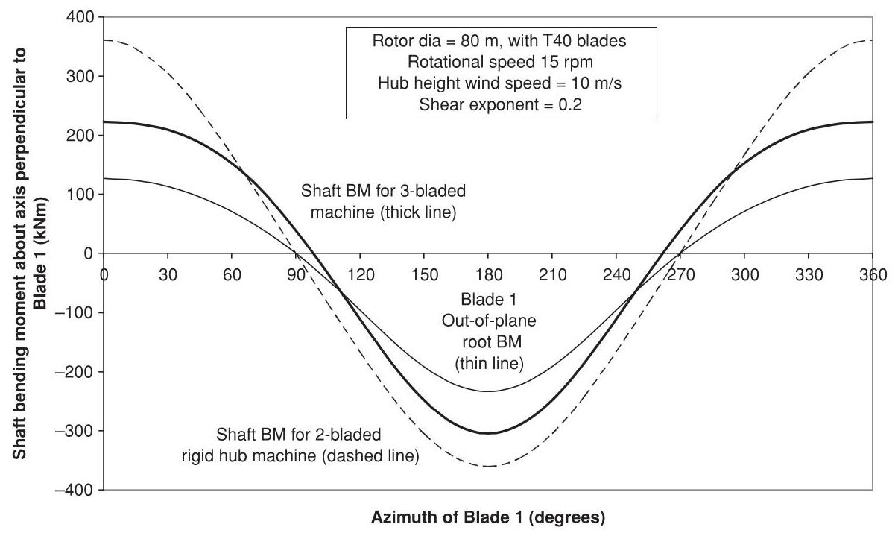

Figure 5.37 Shaft bending moment fluctuations due to wind shear

The fluctuations in out-of-plane blade root bending moment due to wind shear, shaft tilt and yaw misalignment will often be approximately sinusoidal, with a frequency equal to the rotational frequency. Using Equations 5.118, it is easily shown that, for a sinusoidally varying blade root bending moment with range ${\Delta M}$ , the range of the resulting shaft bending moment is ${1.5\Delta M}$ for a three-bladed machine and ${2\Delta M}$ for a rigid hub two-bladed machine.

In the case of wind shear conforming to a power law, the loading on a horizontal blade is always greater than the average of the loadings on blades pointing vertically upwards and downwards, so the loading departs significantly from sinusoidal. The shaft bending moment fluctuations due to wind shear with a 0.2 exponent are compared in Figure 5.37 for two- and three-bladed rigid hub machines operating at ${15}\mathrm{{rpm}}$ in a hub-height wind speed of ${10}\mathrm{\;m}/\mathrm{s}$ . The ratio of moment ranges is still close to 2:1.5.

### 5.10.3 Stochastic aerodynamic loads

The out-of-plane blade root bending moments arising from stochastic loads on the rotor will result in both a fluctuating hub 'dishing' moment (see above) and fluctuating shaft bending moments. For a two-bladed, rigid hub rotor, the shaft moment is equal to the difference between the two out-of-plane blade root bending moments, or teeter moment, the standard deviation of which is given by Equation 5.102a. Similarly, the standard deviation of the mean of these two moments (i.e. the 'dishing' moment) is given by Equation 5.103.

The derivation of the standard deviation of the shaft moment for a three-bladed machine is at first sight more complicated, as the integration has to be carried out over three blades instead of two. However, if the shaft moment about an axis parallel to one of the blades,

${M}_{ZS}$ (Figure 5.36), is chosen, the contribution of loading on that blade disappears, and the expression for the shaft moment standard deviation becomes

$$
{\sigma }_{Mzs}^{2} = {\left( \frac{1}{2}\rho \Omega \frac{d{C}_{L}}{d\alpha }\right) }^{2}{\int }_{-R}^{R}{\int }_{-R}^{R}{\kappa }_{u}^{o}\left( {{r}_{1},{r}_{2},0}\right) c\left( {r}_{1}\right) c\left( {r}_{2}\right) \frac{\sqrt{3}}{2}{r}_{1}\frac{\sqrt{3}}{2}{r}_{2}\left| {r}_{1}\right| \left| {r}_{2}\right| d{r}_{1}d{r}_{2} \tag{5.119}
$$

where the limits of the integrations refer to the other two blades. ${\kappa }_{u}^{o}\left( {{r}_{1},{r}_{2},0}\right)$ is given by Equation 5.51, with ${\Omega \tau }$ set equal to zero when ${r}_{1}$ and ${r}_{2}$ are radii to points on the same blade, and replaced by ${2\pi }/3$ when ${r}_{1}$ and ${r}_{2}$ are radii to points on different blades. Note that, compared with the two bladed case, the cross correlation function, ${\kappa }_{u}^{o}\left( {{r}_{1},{r}_{2},0}\right)$ will be increased when ${r}_{1}$ and ${r}_{2}$ relate to different blades, because of the reduced separation between the two blade elements resulting from the ${120}^{ \circ  }$ angle between the blades. Equation 5.119a can be rewritten in terms of the normalised cross correlation function, ${\rho }_{u}^{o}\left( {{r}_{1},{r}_{2},0}\right)  = {\kappa }_{u}^{o}\left( {{r}_{1},{r}_{2},0}\right) /{\sigma }_{u}^{2}$ , as follows:

$$
{\sigma }_{Mzs}^{2} = {\sigma }_{u}^{2}{\left( \frac{1}{2}\rho \Omega \frac{d{C}_{L}}{d\alpha }\right) }^{2}{\int }_{-R}^{R}{\int }_{-R}^{R}{\rho }_{u}^{o}\left( {{r}_{1},{r}_{2},0}\right) c\left( {r}_{1}\right) c\left( {r}_{2}\right) \frac{\sqrt{3}}{2}{r}_{1}\frac{\sqrt{3}}{2}{r}_{2}\left| {r}_{1}\right| \left| {r}_{2}\right| d{r}_{1}d{r}_{2}
$$

(5.119a)

In the case of ${80}\mathrm{\;m}$ diameter turbines with T40 blades operating in wind with a turbulence length scale of ${147}\mathrm{\;m}$ , the standard deviation of shaft moment due to stochastic loading for a three-bladed machine is ${82}\%$ of that for a two-bladed, fixed hub machine rotating at the same speed. This ratio would rise to $\sqrt{3}/2$ if the effect on the cross correlation function of the ${120}^{ \circ  }$ blade spacing were ignored.

It is worth noting that, for a three-bladed machine, the standard deviation of the shaft moment ${M}_{YS}$ due to stochastic loading is the same as that of ${M}_{ZS}$ .

By analogy with the derivation of the shaft moment above, the standard deviation of the hub 'dishing' moment for a three bladed machine due to stochastic loading is given by:

$$
{\sigma }_{Mh}^{2} = \frac{1}{4}{\sigma }_{u}^{2}{\left( \frac{1}{2}\rho \Omega \frac{d{C}_{L}}{d\alpha }\right) }^{2}{\int }_{-R}^{R}{\int }_{-R}^{R}{\rho }_{u}^{o}\left( {{r}_{1},{r}_{2},0}\right) c\left( {r}_{1}\right) c\left( {r}_{2}\right) \frac{\sqrt{3}}{2}{r}_{1}^{2}\frac{\sqrt{3}}{2}{r}_{2}^{2}d{r}_{1}d{r}_{2} \tag{5.120}
$$

where the integrations are carried out over two blades only, and the cross correlation function is modified as before to account for the ${120}^{ \circ  }$ angle between the blades.

It can be shown that

$$
\frac{1}{4}{\sigma }_{Mzs}^{2} + {\sigma }_{Mh}^{2} = \frac{3}{4}{\sigma }_{My1}^{2} \tag{5.121}
$$

### 5.10.4 Gravity loading

An important component of shaft loading is the cyclic cantilever bending moment due to rotor weight, which usually has a dominant effect on shaft fatigue design. As an illustration, a rotor consisting of three 8 tonne blades, and a 24 tonne hub cantilevered ${1.7}\mathrm{\;m}$ beyond the shaft main bearing, will produce a maximum shaft gravity moment of about ${800}\mathrm{{KNm}}$ . This compares with a shaft moment range due to wind shear of ${360}\mathrm{{KNm}}$ for a hub-height wind of ${10}\mathrm{\;m}/\mathrm{s}$ and a shear exponent of 0.2, and a shaft moment standard deviation of ${350}\mathrm{{KNm}}$ due to turbulence, taking a turbulence intensity of 21% and the same hub-height mean wind speed. Note that the shaft moment due to wind shear relieves that due to gravity, so it would be wise to adopt a smaller wind shear exponent for shaft fatigue calculations.

## 5.11 Nacelle loading

### 5.11.1 Loadings from rotor

The previous section considered the moments applied to the shaft by the rotor hub using an axis system rotating with the shaft. In addition to these moments, the shaft also experiences an axial load due to rotor thrust, and radial forces arising from differential blade edgewise loadings and any out-of-balance centrifugal force.

In order to calculate loadings on the elements of the nacelle structure, it is first necessary to transform the shaft loads (or the constituent blade loads) defined in terms of the rotating axis system into nacelle loads expressed in terms of a fixed axis system. Here the conventional system, in which the $x$ -axis is downwind, the $y$ -axis is horizontal to starboard and the $z$ -axis is vertically upwards, will be adopted. Thus, the moments acting on the nacelle about the $y$ - and $z$ -axes as a result of the blade root out-of-plane bending moments are as follows for a three-bladed machine with shaft tilt $\eta$ :

$$
{M}_{YN} = {M}_{Y1}\cos \psi  + {M}_{Y2}\cos \left( {\psi  - {120}^{ \circ  }}\right)  + {M}_{Y3}\cos \left( {\psi  - {240}^{ \circ  }}\right) \tag{5.122}
$$

$$
{M}_{ZN} = \left( {{M}_{Y1}\sin \psi  + {M}_{Y2}\sin \left( {\psi  - {120}^{ \circ  }}\right)  + {M}_{Y3}\sin \left( {\psi  - {240}^{ \circ  }}\right) }\right) \cos \eta \tag{5.123}
$$

where $\psi$ is the azimuth of blade 1. See Figure 5.38.

It is instructive to compare the moments acting on the nacelle due to deterministic loading for three-bladed and two-bladed machines. The fluctuations of out-of-plane root bending moment due to wind shear and yaw misalignment are approximately proportional to the cosine of blade azimuth for an unstalled blade. Substituting ${M}_{Y1} = {M}_{0}\cos \psi$ , ${M}_{Y2} = {M}_{0}\cos \left( {\psi  - {2\pi }/N}\right)$ etc. into Equations 5.122 and 5.123 yields ${M}_{YN} = {1.5}{M}_{0}$ and ${M}_{ZN} = 0$ for a three-bladed machine, whereas the corresponding results for a rigid hub two-bladed machine are ${M}_{YN} = {M}_{0}\left( {1 + \cos {2\psi }}\right)$ and ${M}_{ZN} = {M}_{0}\sin {2\psi }\cos \eta$ . Thus, the moments on the nacelle are constant for a three-bladed machine, but continually fluctuating with amplitude ${M}_{0}$ for a rigid hub two-bladed machine. Parallel results are obtained for ${M}_{Y1} = {M}_{0}\sin \psi$ which approximates to the out-of-plane root bending moment due to shaft tilt - again for an unstalled blade. The full comparison is given in Table 5.7.

Figure 5.38 Components of blade 1 out-of-plane root bending moment about fixed set of axes

Table 5.7 Comparison between nacelle moments due to deterministic loads for two- and three-bladed machines

<table><tr><td rowspan="2"></td><td colspan="2">Nacelle moments resulting from out-of-plane blade root bending moment fluctuations due to wind shear and yaw misalignment approximated by:   ${M}_{Y1} = {M}_{0}\cos \psi ,{M}_{Y2} = {M}_{0} \; \cos \left( {\psi  - {2\pi }/N}\right)$ etc.</td><td colspan="2">Nacelle moments resulting from out-of-plane blade root bending moment fluctuations due to shaft tilt approximated by:   ${M}_{Y1} = {M}_{0}\sin \psi ,{M}_{Y2} = {M}_{0} \; \sin \left( {\psi  - {2\pi }/N}\right)$ etc.</td></tr><tr><td>Nacelle nodding moment, ${M}_{YN}$</td><td>Nacelle yaw moment, ${M}_{ZN}$</td><td>Nacelle nodding moment, ${M}_{YN}$</td><td>Nacelle yaw moment, ${M}_{ZN}$</td></tr><tr><td>Three-bladed machine</td><td>${1.5}{M}_{0}$</td><td>Zero</td><td>Zero</td><td>${1.5}{M}_{0}\cos \eta$</td></tr><tr><td>Two-bladed, rigid hub machine</td><td>${M}_{0}\left( {1 + \cos {2\psi }}\right)$</td><td>${M}_{0}\sin {2\psi } \; \cos \eta$</td><td>${M}_{0}\sin {2\psi }$</td><td>${M}_{0}\left( {1 - \cos {2\psi }}\right) \; \cos \eta$</td></tr></table>

It is clear that the moments acting on the nacelle due to deterministic loading are much more benign for a three-bladed rotor than for a two-bladed rotor with rigid hub.

In the case of three-bladed machines, the standard deviation of shaft bending moment due to stochastic rotor loading is independent of the rotating axis chosen (Section 5.10.3), so the standard deviation of the resulting moment on the nacelle will take the same value about both the nacelle $y$ - and $z$ -axes.

### 5.11.2 Cladding loads

Except in the case of sideways wind loading, cladding loads are not usually of great significance. They may be calculated according to the rules given in standard wind loading codes. For sideways wind loading, a drag factor of 1.2 will generally be found to be conservative.

## 5.12 Tower loading

### 5.12.1 Extreme loads

It is customary to base the calculation of extreme loads on a non-operational turbine on the 50 year return three second gust. Several loading configurations may need to be considered, and the critical load case for the tower base will generally differ from that for the tower top. In addition, it is necessary to investigate the extreme operational load cases, as these can sometimes govern instead if the tip speed is high in relation to the design gust speed.

In the case of non-operational, stall-regulated machines, the critical case for the tower base occurs when the wind is blowing from the front and inducing maximum drag loading on the blades. By contrast, sideways wind loading to produce maximum lift on a blade pointing vertically upwards or rear wind loading on the rotor with one blade shielded by the tower will produce the maximum tower top bending moment.

One of the benefits of pitch-regulation of three-bladed machines is that blade feathering at shut down considerably reduces non-operational rotor loading. The critical configuration as far as tower base bending moment is concerned is sideways wind loading, with two of the blades inclined at ${30}^{ \circ  }$ to the vertical. The horizontal component of the loading on these blades is ${\cos }^{3}{30}^{ \circ  }$ of the loading on a vertical blade, so that the total rotor loading is only 43.3% $\left( { = {100} \cdot  \sqrt{3}/4\% }\right)$ of the maximum experienced by a stall regulated machine.

The cases of sideways wind loading on a wind turbine referred to above can only arise if the yaw drive is disabled by grid loss for sufficient time for a ${90}^{ \circ  }$ wind direction change to take place, so IEC 61400-1 Edition 3 treats this case (DLC 6.2) as an abnormal load case with a reduced load factor of 1.1 (in place of 1.35 for normal load cases). As a result of this, the load case causing extreme tower base overturning moment on pitch-regulated machines is not always clear cut. If the rotor is braked with one blade vertically upwards and the yaw angle is small (corresponding to IEC 61400-1 Edition 3 DLC 6.1), the loading on the top blade could approach maximum lift. Loads on the other blades would be smaller and their horizontal components would probably act in the opposite direction. The maximum loading on the top blade would be $\left( {{0.5\rho }{V}^{2}}\right) {1.5}{A}_{B}$ , ignoring wind shear, where ${A}_{B}$ is the blade area. On the other hand, DLC 6.2 gives a drag loading of $2{\cos }^{3}{30}^{ \circ  }\left( {{0.5\rho }{V}^{2}}\right) {1.3}{A}_{B} = \left( {{0.5\rho }{V}^{2}}\right) {1.69}{A}_{B}$ , again ignoring wind shear, which becomes $\left( {{0.5\rho }{V}^{2}}\right) {1.86}{A}_{B}$ after inclusion of the load factor. This is somewhat less than the factored load on a vertical blade experiencing maximum lift of ${2.025}\left( {{0.5\rho }{V}^{2}}\right) {A}_{B}$ . However, the drag loading on the blades in DLC 6.2 acts in the same direction as the drag loading on the tower, whereas the lift load on the vertical blade in DLC 6.1 acts at right angles to the drag loading on the tower.

Information on the drag factors appropriate for cylindrical and lattice towers is to be found in - EN 1991-1-4: 2005 'Eurocode 1: Actions on structures - Part 1-4: Wind actions', and in national codes such as BS 8100 (1986) or DS 410 (1983). The drag factor for a cylindrical tower is typically 0.6-0.7. Rotor loading is generally the dominating component of tower base moment for stall-regulated machines, but with pitch-regulated machines the contributions of tower loading and rotor loading are often of similar magnitude.

### 5.12.2 Dynamic response to extreme loads

Just as in the case of the single, stationary cantilevered blade considered in Section 5.6.3, the quasistatic bending moments in the tower calculated for the extreme gust speed will be augmented by inertial moments resulting from the excitation of resonant tower oscillations by turbulence. As before, it is convenient to express this augmentation in terms of a dynamic factor, ${Q}_{D}$ , defined as the ratio of the peak moment over a ten minute period, including resonant excitation of the tower, to the peak quasistatic moment over the same period. Thus,

$$
{M}_{Max} = \frac{1}{2}\rho {U}_{e50}^{2}H\oint {C}_{f}{\left( \frac{z}{H}\right) }^{1 + {2\alpha }}{dA} \cdot  {Q}_{D} \tag{5.124}
$$

where

${U}_{\mathrm{e}{50}}$ is the 50 year return gust speed at hub-height

$z$ is height above ground

$H$ is the hub height

${C}_{f}$ is the force factor (lift or drag) for the element under consideration

$\alpha$ is the shear exponent, taken as 0.11 in IEC 61400-1

and

$$
{Q}_{D} = \frac{1 + g\left( {2\frac{{\sigma }_{u}}{\bar{U}}}\right) \sqrt{{K}_{SMB} + \frac{{\pi }^{2}}{2\delta }{R}_{u}\left( {n}_{1}\right) {K}_{Sx}\left( {n}_{1}\right)  \cdot  {\lambda }_{M1}^{2}}}{1 + {g}_{0}\left( {2\frac{{\sigma }_{u}}{\bar{U}}}\right) \sqrt{{K}_{SMB}}} \tag{5.17}
$$

The integral sign $\oint$ signifies that the integral is to be undertaken over each blade, the nacelle and the tower. The derivation of Equation 5.17 is explained in Section 5.6.3 and the Appendix in relation to a cantilevered blade.

The essentially similar procedure for a tower supporting a braked rotor and nacelle is as follows:

1) Calculate the resonant size reduction factor, ${K}_{Sx}\left( {n}_{1}\right)$ , which reflects the effect of the lack of correlation of the wind fluctuations at the tower natural frequency along the blades and tower. Adopting an exponential expression for the normalised co-spectrum as before, Equation A5.25 becomes:

$$
{K}_{Sx}\left( {n}_{1}\right)  = \frac{\oint \oint \exp \left\lbrack  {-{Cs}{n}_{1}/\bar{U}}\right\rbrack  {C}_{f}^{2}c\left( r\right) c\left( {r}^{\prime }\right) {\mu }_{1}\left( r\right) {\mu }_{1}\left( {r}^{\prime }\right) {drd}{r}^{\prime }}{{\left( \oint {C}_{f}c\left( r\right) {\mu }_{1}\left( r\right) dr\right) }^{2}} \tag{5.125}
$$

where

- the integral sign $\oint$ denotes integration over the blades and the tower;

- $r$ and ${r}^{\prime }$ denote radius in the case of the blades and depth below the hub in the case of the tower;

- $s$ denotes the separation between the elements ${dr}$ and $d{r}^{\prime }$ ;

- ${C}_{f}$ is the relevant force coefficient;

- $c\left( r\right)$ denotes chord in the case of the blades and diameter in the case of the tower;

- ${\mu }_{1}\left( r\right)$ denotes the tower first mode shape.

This expression can be considerably simplified by setting ${\mu }_{1}\left( r\right)$ to unity for the rotor and ignoring the tower loading contribution entirely. This is not unreasonable, as only loading near the top of the tower is of significance, and this does not add much to the spatial extent of the loaded area.

2) Calculate the damping logarithmic decrement, $\delta$ , for the tower first mode. The aerodynamic component is given by

$$
{\delta }_{a} = {2\pi }{\xi }_{a} = {2\pi }\frac{{c}_{a1}}{2{m}_{T1}{\omega }_{1}} = \frac{\oint {\widehat{c}}_{a}\left( r\right) {\mu }_{1}^{2}\left( r\right) {dr}}{2{m}_{T1}{n}_{1}} \tag{5.126}
$$

where ${m}_{T1}$ is the generalised mass of the tower, nacelle and rotor (including the contribution of rotor inertia) with respect to the first mode given by (Equation 5.110), and ${n}_{1}$ is the tower natural frequency in Hz. For a stall-regulated machine facing the wind, the rotor contribution to aerodynamic damping is simply $\rho \bar{U}{C}_{D}{A}_{R}/2{m}_{T1}{n}_{1}$ where ${\mathrm{A}}_{\mathrm{R}}$ is the rotor area.

3) Calculate the standard deviation of resonant nacelle displacement according to

$$
\frac{{\sigma }_{x1}}{{\bar{x}}_{1}} = 2\frac{{\sigma }_{u}}{\bar{U}}\frac{\pi }{\sqrt{2\delta }}\sqrt{{R}_{u}\left( {n}_{1}\right) }\sqrt{{K}_{Sx}\left( {n}_{1}\right) } \tag{5.7}
$$

4) Calculate the ratio ${\lambda }_{M1}$ , which relates the ratio of the standard deviation of resonant tower base moment to the mean value to the corresponding ratio for nacelle displacement as follows:

$$
\frac{{\sigma }_{M1}}{\bar{M}} = {\lambda }_{M1}\frac{{\sigma }_{x1}}{{\bar{x}}_{1}} \tag{5.8a}
$$

If ${\mu }_{1}\left( r\right)$ is set to unity for the rotor, ${\lambda }_{M1}$ is given by:

$$
{\lambda }_{M1} = \frac{{\int }_{0}^{H}m\left( z\right) {\mu }_{1}\left( z\right)  \cdot  {zdz}\left\{  {{C}_{D}{A}_{R} + {\int }_{0}^{H}{C}_{f}{\left\lbrack  \frac{U\left( z\right) }{\bar{U}}\right\rbrack  }^{2}d\left( z\right) {\mu }_{1}\left( z\right) {dz}}\right\}  }{{m}_{T1}H\left\{  {{C}_{D}{A}_{R} + {\int }_{0}^{H}{C}_{f}{\left\lbrack  \frac{U\left( z\right) }{\bar{U}}\right\rbrack  }^{2}d\left( z\right) \frac{z}{H}{dz}}\right\}  } \tag{5.127}
$$

where $z$ is the height up the tower measured from the base, $d\left( z\right)$ is the tower diameter at height $z$ and $H$ is the hub-height. If the loading on the tower is relatively small, this approximates to

$$
{\lambda }_{M1} = \frac{{\int }_{0}^{H}m\left( z\right) {\mu }_{1}\left( z\right)  \cdot  {zdz}}{{m}_{T1} \cdot  H} \tag{5.127a}
$$

which is close to unity because the tower head mass dominates the integral.

5) Calculate the size reduction factor for the root bending moment quasistatic or background response, ${K}_{SMB}$ , which reflects the lack of correlation of the wind fluctuations along the blades and tower. ${K}_{SMB}$ may be derived from a similar expression to that for the resonant size reduction factor given in Equation 5.125, but with the exponential function modified to $\exp \left\lbrack  {-s/{0.3}{L}_{u}^{x}}\right\rbrack$ .

6) Calculate the peak factors for the combined (i.e. resonant plus quasistatic) and qua-sistatic responses in terms of the respective zero up-crossing frequencies. In estimating the zero up-crossing frequency of the quasistatic response, the blade area should be replaced by the rotor area in Equation A5.57.

7) Substitute the parameter values derived in steps 1-6 into Equation 5.17 to obtain the dynamic factor, ${Q}_{D}$ .

In the case of a rotor which is allowed to idle when shutdown, turbine geometry is continually changing as the rotor rotates to and fro in response to wind gusts, so the calculation of resonant tower excitation, should it occur, becomes a complex undertaking.

### 5.12.3 Operational loads due to steady wind (deterministic component)

Tower fore and aft bending moments result from rotor thrust loading and rotor moments. The moments acting on the nacelle due to deterministic rotor loads have already been described in Section 5.11.1. Although the thrust loads on individual blades vary considerably with azimuth as a result of yaw misalignment, shaft tilt or wind shear, the fluctuations on different blades balance each other, so that the total rotor thrust shows negligible azimuthal variation as a result of these effects. For example, on two-bladed machines, a wind shear exponent of 0.2 results in a rotor thrust variation of about $\pm  1\%$ . Tower shadow loading results in a sinusoidal tower top displacement at blade passing frequency - see Figure 5.32.

Figure 5.39 illustrates the variation of rotor thrust with wind speed for stall and pitch regulated ${80}\mathrm{\;m}$ diameter three-bladed machines.

Figure 5.39 Rotor thrust during operation in steady, uniform wind: variation with wind speed for similar stall-regulated and pitch-regulated machines

### 5.12.4 Operational loads due to turbulence (stochastic component)

## Analysis in the frequency domain

Except near the top of the tower, the dominant source of fore-aft stochastic tower bending moments is rotor thrust. The standard deviation of rotor thrust can be expressed in terms of the turbulence intensity and the cross correlation function between wind fluctuations at different points on the rotor, following the method used for deriving the standard deviation of stochastic blade root bending moment in Section 5.7.5. As before, a linear relation between the wind fluctuations and the resultant load fluctuations is assumed, so that the perturbation of loading per unit length of blade, $q$ , at radius $r$ is given by

$$
q = \frac{1}{2}{\rho \Omega rc}\left( r\right) \frac{d{C}_{L}}{d\alpha }u \tag{5.25}
$$

and the perturbation of rotor thrust by

$$
{\Delta T} = \left( {\frac{1}{2}{\rho \Omega }\frac{d{C}_{L}}{d\alpha }}\right) \oint {uc}\left( r\right) {rdr} \tag{5.128}
$$

where the integral sign $\oint$ signifies that the integration is carried out over the whole rotor. Hence the following expression for the variance of the rotor thrust is obtained:

$$
{\sigma }_{T}^{2} = {\left( \frac{1}{2}\rho \Omega \frac{d{C}_{L}}{d\alpha }\right) }^{2}{\sigma }_{u}^{2}\oint \oint {\rho }_{u}^{o}\left( {{r}_{1},{r}_{2},0}\right) c\left( {r}_{1}\right) c\left( {r}_{2}\right) {r}_{1}{r}_{2}d{r}_{1}d{r}_{2} \tag{5.129}
$$

where ${\rho }_{u}^{o}\left( {{r}_{1},{r}_{2},0}\right)$ is the normalised cross correlation function, ${\kappa }_{u}^{o}\left( {{r}_{1},{r}_{2},0}\right) /{\sigma }_{u}^{2}$ for points at radii ${r}_{1}$ and ${r}_{2}$ on the same or on different blades. ${\kappa }_{u}^{o}\left( {{r}_{1},{r}_{2},0}\right)$ is given by Equation 5.51, with ${\Omega \tau }$ replaced by the phase angle between the two blades on which ${r}_{1}$ and ${r}_{2}$ are measured. For a three-bladed, ${80}\mathrm{\;m}$ diameter rotor and an integral length scale of ${147}\mathrm{\;m}$ , the reduction in the standard deviation of the stochastic rotor thrust fluctuations is about ${20}\%$ due to the lack of correlation of the wind speed variations over the rotor. If the machine is rotating at ${15}\mathrm{{rpm}}$ in an $8\mathrm{\;m}/\mathrm{s}$ wind and the turbulence intensity is ${20}\%$ , the rotor thrust standard deviation will be about ${38}\mathrm{{KN}}$ - that is, ${22}\%$ of the steady value.

The derivation of the expression for the power spectrum of rotor thrust parallels that for the power spectrum of blade root bending moment (Section 5.7.5), yielding:

$$
{S}_{T}\left( n\right)  = {\left( \frac{1}{2}\rho \Omega \frac{d{C}_{L}}{d\alpha }\right) }^{2}\oint \oint {S}_{{uJ}, K}^{o}\left( {{r}_{1},{r}_{2}, n}\right) c\left( {r}_{1}\right) c\left( {r}_{2}\right) {r}_{1}{r}_{2}d{r}_{1}d{r}_{2} \tag{5.130}
$$

where ${S}_{{uJ}, K}^{o}\left( {{r}_{1},{r}_{2}, n}\right)$ is the rotationally sampled cross spectrum for points at radii ${r}_{1}$ and ${r}_{2}$ on blades $J$ and $K$ respectively. Note that on a machine with three blades, $A, B$ and $C$ , ${S}_{{uJ}, K}^{o}\left( {{r}_{1},{r}_{2}, n}\right)$ is complex when $J$ and $K$ are different, but ${S}_{{uA}, B}^{o}\left( {{r}_{1},{r}_{2}, n}\right)$ and ${S}_{{uA}, C}^{o}\left( {{r}_{1},{r}_{2}, n}\right)$ are complex conjugates, so the double integral in Equation 5.130 is still real. An example power spectrum of rotor thrust for an ${80}\mathrm{\;m}$ diameter three-bladed machine is shown in Figure 5.40. It can be seen that there is some concentration of energy at the blade passing frequency of ${0.75}\mathrm{\;{Hz}}$ due to gust slicing, but that the effect is not large. The concentration effect is significantly greater for two-blade machines - see Figure 5.41. This shows the power spectrum of rotor thrust for a two-bladed machine with the same blade platform, but rotating 22.5% faster to give comparable performance.

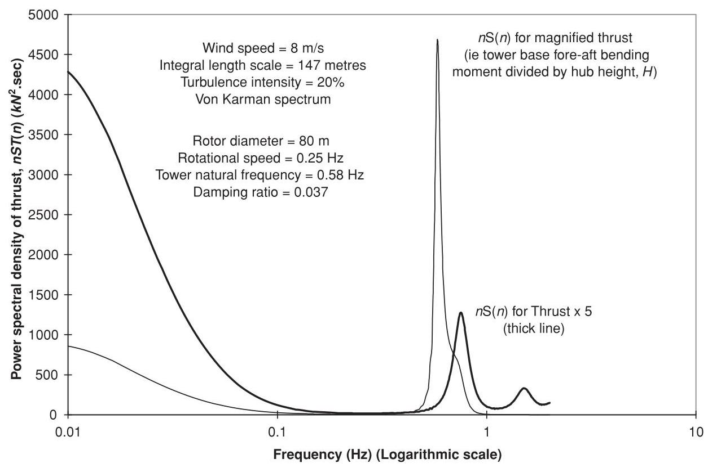

Figure 5.40 Power spectra of rotor thrust and resultant tower base fore-aft bending moment for three-bladed, ${80}\mathrm{\;m}$ diameter turbine

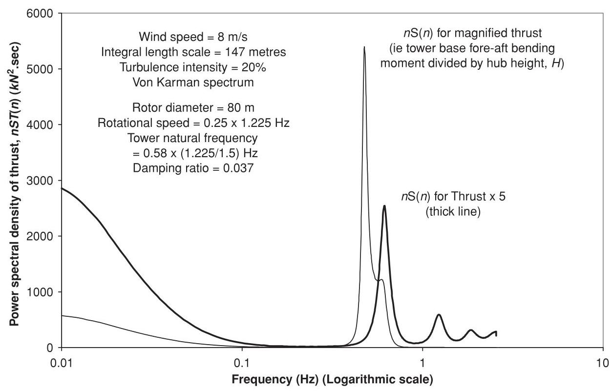

Figure 5.41 Power spectra of rotor thrust and resultant tower base fore-aft bending moment for two-bladed, ${80}\mathrm{\;m}$ diameter turbine

In addition to thrust fluctuations, longitudinal turbulence will also cause rotor torque fluctuations and in-plane rotor loads due to differential loads on different blades, both of which will result in tower sideways bending moments. The expression for the in-plane component of aerodynamic lift per unit length, $- {F}_{Y}\left( r\right)  = \frac{1}{2}\rho {W}^{2}{C}_{L}c\left( r\right) \sin \phi$ , can be differentiated with respect to the wind fluctuation as follows:

$$
- \frac{d{F}_{Y}}{du} = \frac{1}{2}{\rho c}\left( r\right) \frac{d}{du}\left\lbrack  {{W}^{2}\sin \phi  \cdot  {C}_{L}}\right\rbrack   = \frac{1}{2}{\rho c}\left( r\right) \frac{d}{du}\left\lbrack  {W\left\{  {{U}_{\infty }\left( {1 - a}\right)  + u}\right\}  {C}_{L}}\right\rbrack
$$

$$
\cong  \frac{1}{2}{\rho c}\left( r\right) W\left\lbrack  {{C}_{L} + \sin \phi \frac{d{C}_{L}}{d\alpha }}\right\rbrack
$$

so, approximately,

$$
\frac{-d{F}_{Y}}{du} = \left( {\frac{1}{2}{\rho \Omega }\frac{d{C}_{L}}{d\alpha }}\right) c\left( r\right)  \cdot  r\left\lbrack  {\frac{{C}_{L}}{d{C}_{L}/{d\alpha }} + \sin \phi }\right\rbrack \tag{5.131a}
$$

Thus, the standard deviation of rotor torque is approximately given by

$$
{\sigma }_{Q} = \left( {\frac{1}{2}{\rho \Omega }\frac{d{C}_{L}}{d\alpha }}\right) {\sigma }_{u}\left\{  {\oint {r}^{2}c\left( r\right) \left\lbrack  {\frac{{C}_{L}}{d{C}_{L}/{d\alpha }} + \sin \phi }\right\rbrack  {dr}}\right\} \tag{5.131b}
$$

(which parallels Equation 5.26) provided the relationship between blade loading and wind speed fluctuation remains linear and the turbulence length scale is large compared with rotor diameter. Equation 5.131b can be used to derive an expression for the variance of the rotor torque in the same way as for rotor thrust above. At the top of the tower the stochastic ${M}_{X}$ (i.e. side-to-side) moment due to rotor torque fluctuations is typically of the same order of magnitude as the stochastic ${M}_{Y}$ (i.e. fore-aft) moment due to differential out-of-plane loads on the rotor, but at the tower base the dominant effect of rotor thrust loading means that the stochastic side-to-side moments are usually significantly less than the stochastic fore-aft moments before the excitation of tower resonance is taken into account.

## Analysis in the time domain

As noted in Section 5.7.5, there are situations, such as operation in stalled flow, when the linear relationship between blade loading and wind speed fluctuations required for analysis in the frequency domain does not apply. In these cases, recourse must be made to analysis in the time domain using wind simulation techniques such as described in Section 5.7.6.

### 5.12.5 Dynamic response to operational loads

The power spectrum of rotor thrust will usually contain some energy at the tower natural frequency, leading to dynamic magnification of deflections and, hence, of tower bending moments. The power spectrum of hub deflection, ${\mathrm{S}}_{x1}\left( n\right)$ , resulting from the excitation of the tower first fore-aft flexural mode, is related to the power spectrum of rotor thrust by

$$
{S}_{x1}\left( n\right)  = \frac{{S}_{T}\left( n\right) }{{k}_{1}^{2}}\frac{1}{\left\lbrack  \left( 1 - {n}^{2}/{n}_{1}^{2}\right)  + 4{\xi }_{1}^{2}{n}^{2}/{n}_{1}^{2}\right\rbrack  } \tag{5.132}
$$

This relation is analogous to Equation 5.90, and derived in the same way.

The amplitude of tower base fore-aft moment at resonance in the first mode, ${M}_{Y1}$ , can be derived from the corresponding amplitude of hub deflection, ${x}_{H1}$ , as follows

$$
{M}_{Y1} = {\omega }_{1}^{2}{x}_{H1}{\int }_{0}^{H}m\left( z\right) \mu \left( z\right) {zdz} = {\omega }_{1}^{2}{x}_{H1}{m}_{T1}H\frac{{\int }_{0}^{H}m\left( z\right) \mu \left( z\right) {zdz}}{H{\int }_{0}^{H}m\left( z\right) {\mu }^{2}\left( z\right) {dz}} \tag{5.133}
$$

The quotient on the right hand side is close to unity because of the dominance of the tower head mass, so, substituting ${k}_{1}$ for ${\omega }_{1}^{2}{m}_{T1}$ , the equation reduces to ${M}_{Y1} = {x}_{H1}{k}_{1}H$ , which applies at any exciting frequency. Hence the power spectrum for the tower base fore-aft bending moment due to rotor thrust loading is given by

$$
{S}_{My1}\left( n\right)  = {S}_{T}\left( n\right)  \cdot  {H}^{2}\frac{1}{\left\lbrack  \left( 1 - {n}^{2}/{n}_{1}^{2}\right)  + 4{\xi }^{2}{n}^{2}/{n}_{1}^{2}\right\rbrack  } \tag{5.134}
$$

The aerodynamic damping is almost entirely provided by the rotor, the damping ratio for the first tower mode being approximately

$$
{\xi }_{a1} = N\frac{\frac{1}{2}{\rho \Omega }{\int }_{0}^{R}\frac{d{C}_{l}}{d\alpha }{rc}\left( r\right) {dr}}{2{m}_{T1}{\omega }_{1}} \tag{5.135}
$$

where $N$ is the number of blades (see Section 5.8.4). The overall damping ratio is obtained by adding this to the structural damping ratio for the tower (see Table 5.5), and is generally low compared to the blade first mode damping because of the large tower head mass. The effect of a low damping ratio is illustrated by the power spectrum of fore-aft tower bending moment shown in Figure 5.40, which has a very high peak at the tower natural frequency of ${0.58}\mathrm{\;{Hz}}$ , despite this frequency being somewhat removed from the blade passing frequency of ${0.75}\mathrm{\;{Hz}}$ . The damping ratio is calculated as 0.037, consisting of 0.035 due to aerodynamic damping (based on a tower head mass of 120 tonnes) and 0.002 due to structural damping (for a welded steel tower).

In the example shown in Figure 5.40, the tower dynamic response increases the standard deviation of the tower base fore-aft bending moment by 9%. However, the effect of tower dynamic response results in a larger increase of ${15}\%$ in the case of the two-bladed machine featured in Figure 5.41, despite the reduction in tower natural frequency to maintain the same tower natural frequency to blade passing frequency ratio.

It is important to note that the rotor provides negligible aerodynamic damping in the side-to-side direction, so that effectively the only damping present is the structural damping.

This means that, even though the side-to-side loadings are small in relation to the fore-aft loads, the side-to-side tower moment fluctuations can sometimes approach the fore-aft ones in magnitude.

### 5.12.6 Fatigue loads and stresses

The tower moments at height $z$ are related to the hub height loads as follows, omitting the tower inertial loads:

$$
{M}_{Y}\left( {z, t}\right)  = {F}_{X}\left( {H, t}\right)  \cdot  \left( {H - z}\right)  + {M}_{Y}\left( {H, t}\right)
$$

$$
{M}_{X}\left( {z, t}\right)  =  - {F}_{Y}\left( {H, t}\right)  \cdot  \left( {H - z}\right)  + {M}_{X}\left( {H, t}\right) \tag{5.136}
$$

$$
{M}_{Z}\left( {z, t}\right)  = {M}_{Z}\left( {H, t}\right)
$$

For three-bladed machines, the five hub-height fatigue loads are almost entirely stochastic, because the deterministic load component is either constant (for a given mean wind speed) or negligible, and it is instructive to consider how they relate to one another. Recognising that the centre of any gust lying off the rotor centre will be located at a random azimuth, then it is clear that the rotor out-of-plane loads - that is, the moment about the horizontal axis, ${M}_{Y}\left( {H, t}\right)$ , the hub moment about the vertical axis, ${M}_{Z}\left( {H, t}\right)$ , and the rotor thrust, ${F}_{X}\left( {H, t}\right)  -$ will all be statistically independent of each other. The same will apply to the rotor in-plane loads - the rotor torque, ${M}_{X}\left( {H, t}\right)$ , and the sideways load, ${F}_{Y}\left( {H, t}\right)$ . However, as the out-of-plane and in-plane loads on a blade element are both assumed to be proportional to the local wind speed fluctuation, $u$ , it follows that the rotor torque fluctuations will be in phase with the rotor thrust fluctuations, and the rotor sideways load fluctuations will be in phase with the fluctuations of the hub moment about the horizontal axis, ${M}_{Y}\left( {H, t}\right)$ .

The above relationships have implications for the combination of fatigue loads. Clearly the power spectrum of the fore-aft tower moment at height $z,{S}_{My}\left( {z, n}\right)$ , can be obtained by simply adding the power spectrum of the hub moment about the horizontal axis to ${\left( H - z\right) }^{2}$ times the power spectrum of the rotor thrust. Similarly the power spectrum of the side-to-side tower moment at height $z,{S}_{Mx}\left( {z, n}\right)$ , can be obtained by adding the power spectrum of the rotor torque to ${\left( H - z\right) }^{2}$ times the power spectrum of the rotor sideways load.

Having obtained power spectra for the ${M}_{X},{M}_{Y}$ and ${M}_{Z}$ moments at height $z$ , the corresponding fatigue load spectra can be derived with reasonable accuracy by means of the Dirlik method described in Section 5.9.3. As the tower stress ranges will be enhanced by tower resonance, the input power spectra should incorporate dynamic magnification, as outlined in Section 5.12.5. Ragan and Manuel (2007) compared fatigue loads calculated in the frequency and time domains (see Section 5.9.3) and concluded that the Dirlik method performed very well in estimating tower fatigue bending moments for the case investigated.

Fatigue stress ranges due to bending about the two axes can easily be calculated separately from the ${M}_{X}\left( z\right)$ and ${M}_{Y}\left( z\right)$ fatigue spectra, but the stress ranges due to the two fatigue spectra combined cannot be calculated precisely because of lack of information about phase relationships. However, as noted above, the ${M}_{X}\left( H\right)$ component of the ${M}_{X}\left( z\right)$ fluctuations is in phase with the ${F}_{X}\left( H\right)$ component of the ${M}_{Y}\left( z\right)$ fluctuations, and the ${F}_{Y}\left( H\right)$ component of the ${M}_{X}\left( z\right)$ fluctuations is in phase with the ${M}_{Y}\left( H\right)$ component of the ${M}_{Y}\left( z\right)$ fluctuations so the stress ranges due to the ${M}_{X}\left( z\right)$ and ${M}_{Y}\left( z\right)$ fatigue spectra combined can be conservatively calculated as if they were in phase too. Theoretically this means pairing the largest ${M}_{X}\left( z\right)$ and ${M}_{Y}\left( z\right)$ loading cycles, the second largest, the third largest and so on, right through the fatigue spectra, and calculating the stress range resulting from each pairing. In practice, of course, the ${M}_{X}\left( z\right)$ and ${M}_{Y}\left( z\right)$ load cycles are distributed between two sets of equal size ’bins’, so they have to be reallocated to bins in a two-dimensional matrix of descending load ranges, as shown in the grossly simplified example given in Tables 5.8 and 5.9 below.

Table 5.8 Example ${M}_{X}$ and ${M}_{Y}$ fatigue spectra

<table><tr><td>$\Delta {M}_{Y}\left( \mathrm{{KNm}}\right)$</td><td>No. of $\Delta {M}_{Y}$ cycles</td><td>$\Delta {M}_{X}\left( \mathrm{{KNm}}\right)$</td><td>No. of $\Delta {M}_{X}$ cycles</td></tr><tr><td>200-300</td><td>5</td><td>100-150</td><td>10</td></tr><tr><td>100-200</td><td>15</td><td>50-100</td><td>40</td></tr><tr><td>0-100</td><td>80</td><td>0-50</td><td>50</td></tr></table>

For a circular tower, the stress ranges would have to be computed at several points around the circumference in order to identify the location (with respect to the nacelle axis) where the fatigue damage was maximum.

A simpler but potentially cruder approach to the combination of the two fatigue spectra is to use the 'Damage Equivalent Load' method. This involves the calculation of constant amplitude fatigue loadings, ${M}_{X,{Del}}$ and ${M}_{Y,{Del}}$ , of, say ${10}^{7}$ cycles each, that would respectively produce the same fatigue damages as the ${M}_{X}$ and ${M}_{Y}$ spectra, using the $S - N$ curve appropriate to the fatigue detail under consideration. If the ${M}_{X}$ and ${M}_{Y}$ fluctuations are treated as being in-phase as before, the combined ’Damage Equivalent Load’ moment is, $\sqrt{{M}_{X.{Del}}^{2} + {M}_{Y.{Del}}^{2}}$ .

## 5.13 Wind turbine dynamic analysis codes

A large modern turbine is a complex structure. Relatively sophisticated methods are required in order to predict the detailed performance and loading of a wind turbine. These methods should take into account:

- the aerodynamics of the rotating blade, including induced flows (i.e. the modification of the flow field caused by the turbine itself), three-dimensional flow effects and dynamic stall effects when appropriate;

- structural analysis of the blades, drive train and tower, allowing their vibrational dynamics to be modelled;

Table 5.9 Joint ${M}_{X}$ and ${M}_{Y}$ cycle distribution

<table><tr><td rowspan="2">$\Delta {M}_{\mathrm{X}}\left( \mathrm{{KNm}}\right)$</td><td colspan="3">$\Delta {M}_{Y}\left( \mathrm{{KNm}}\right)$</td><td rowspan="2">Total No. of ${M}_{X}$ cycles</td></tr><tr><td>200-300</td><td>100-200</td><td>0-100</td></tr><tr><td>100-150</td><td>5</td><td>5</td><td></td><td>10</td></tr><tr><td>50–100</td><td></td><td>10</td><td>30</td><td>40</td></tr><tr><td>0-50</td><td></td><td></td><td>50</td><td>50</td></tr><tr><td>Total No. of ${M}_{\mathrm{Y}}$ cycles</td><td>5</td><td>15</td><td>80</td><td></td></tr></table>

- aeroelastic feedback, i.e. the modification of the aerodynamic forces due to the vibrational velocities of the structure;

- dynamic response of subsystems such as the generator, yaw system and blade pitch control system;

- control algorithms used during normal operation, start-up and shut-down of the turbine; and

- temporal and spatial variations of the wind field impinging on the turbine, including the three-dimensional structure of the turbulence itself.

For offshore wind turbines, this should be extended to include:

- hydrodynamic forces on the submerged structure; and

- hydroelastic feedback, i.e. the modification of the hydrodynamic forces due to the vibrational velocities of the structure.

Starting from a wind turbulence spectrum, it is possible to develop techniques in the frequency domain which account for many of these aspects, including rotational sampling of the turbulence by the blades, the response of the structure, and the control system. These techniques are set out in Sections 5.7.5, 5.8.6, 5.12.4 and elsewhere. However, although frequency domain methods are elegant and computationally efficient, they can only be applied to linear time-invariant systems and, therefore, cannot deal with some important aspects of wind turbine behaviour, such as:

- stall aerodynamics and hysteresis;

- non-linearities in subsystems such as bearing friction and pitch rate limits;

- nonlinear aspects of control algorithms;

- variable speed operation; and

- start-up and shut-down.

As a result, time-domain methods almost exclusively are now used for wind turbine design calculations. The ready availability of computing power means that the greater computational efficiency of frequency domain methods is no longer such an important consideration.

A number of codes are available commercially for the calculation of wind turbine performance and loads using time-domain simulations. These simulations use numerical techniques to integrate the equations of motion over time, by subdividing the time into short timesteps, as described in Section 5.8.5. In this way, all the non-linearities and non-stationary aspects of the system, such as those listed above, can be dealt with to any desired level of accuracy. A useful early comparative survey of such codes was given by Molenaar and Dijkstra (1999).

As explained in Section 5.8.5, there are a number of different algorithms or solvers for integrating the equations of motion. Some use a fixed timestep $h$ (which has to be short enough to account for all modal frequencies which are considered important), while others use a variable timestep which is continually adjusted during the simulation, keeping it as long as possible to maximise simulation speed while still keeping all the integrated states within a certain error tolerance.

The use of variable timestep methods also allows accurate modelling of discontinuities, because close to a discontinuity the timestep can be adjusted to find the exact moment when the characteristics of the system change. Discontinuities can occur for many reasons: for example stick-slip friction (of pitch and yaw bearings, shaft brake, slipping clutch etc.), grid loss, faults, controller or safety system actions etc. Note that the equations of motion and structural resonant frequencies change at the moment when a friction element like a brake changes from slipping to sticking.

On the other hand these codes can provide a valuable way to test turbine controllers, linking the real controller to the simulation model which acts as a 'virtual turbine', and in this case a fixed timestep may be more appropriate, to allow regular communication with the controller running in real time, and to ensure that the calculations for each timestep are completed within that real time interval. Necessarily this may mean a loss of accuracy in predicting the effect of higher frequency modes and discontinuities. As an example, the Bladed code mentioned below normally uses a variable timestep, but also provides a fixed step option for real-time applications such as controller testing.

Two principal approaches to the modelling of structural dynamics are embodied in time-domain simulation packages. Some use a full finite-element representation of the structure, which is broken down into small elements. The equations of motion are solved for each element, with boundary conditions matched at the interfaces between elements. An example of such a code is Adams-WT (Hansen, 1998), which consists of a general purpose finite-element code (Adams) interfaced to an aerodynamic module.

The other main approach is the modal analysis method as described in Section 5.8.1, in which simple finite-element methods are used to predict just the first few modes of vibration of the main components, such as the rotor blades and the tower. These are typically modelled as beam elements, but it is important to include geometric stiffening effects so that, for example, the centrifugal stiffening of the blades is taken into account - that is, the increase in apparent stiffness with rotational speed due to the effect of centrifugal force on the element mass. Additional degrees of freedom are added as required, for example for the drive train rotation and torsion, pitch and yaw motion etc. The equations of motion are then derived for the entire coupled system. Traditionally this can be done by constructing the Lagrangian for the system including all degrees of freedom. With full rotation of the yaw bearing on top of a flexible tower, and then full rotation of the rotor (also flexible) about the shaft axis, the co-ordinate transformations involved mean that the equations rapidly become very large, usually requiring some form of symbolic processing to derive them in an automated way. More recently, methods based on the approach of Multi-body Dynamics (see for example Shabana, 1998) have been used, which provides a generalised way to link together the separate equations of motion of each rigid or flexible component by means of defined linking elements, which can include rigid links, revolute hinges, sliding joints etc. This provides a very powerful technique which is readily extended to structures of arbitrary complexity. Using a technique originally proposed by Craig and Bampton (1968), the mode shapes of each modal component can be defined in a way which is independent of any other component to which it is attached.

One example of a widely-used commercial code based on the component mode approach is Bladed (Garrad Hassan, 2010). Originally built using a Lagrangian approach, this code has recently been converted to use a multi-body approach. Beam element models for the blades and tower are combined with elements representing other components of the transmission system, the yaw and pitch actuators etc. The control system, which has a major influence on the performance as well as the loads, can be modelled in full detail. The code can also model the electrical generator and power converter, allowing detailed calculations of turbine response to network faults, generator short-circuit faults etc. in a fully integrated way. Interfaces are provided to link in more detailed models of subcomponents such as gearboxes. For most calculations this level of detail is not required, but where certain load cases are critical for the particular component it may be useful to be able to run a more detailed model.

By using a limited number of modes, the modal approach results in rapid calculations, so that a complete set of design or certification load cases, typically amounting to several hundred load cases each consisting of a ten-minute simulation, can be run in a few hours on a standard desktop computer. A small number of modes is generally adequate for predicting the loads: the higher frequency modes generally have little effect. However, to model the deflections accurately it would be necessary to model more modes, because the modelled deflection is a linear combination of the mode shapes used, and a small number of mode shapes may not be sufficient to model the actual deflected shape. Rather than using more modes, the static improvement technique can be used (Barltrop and Adams, 1991): effectively the calculated loading is used as if it were a static load, and combined with the stiffness matrix to recalculate the deflections.

The modal approach generally assumes that all deflections of the flexible bodies remain small. More complex non-linear beam-element models are being developed to help increase accuracy in case of larger defections, such as may be found with very flexible blades. Alternatively, the non-linearity can be captured by modelling the blade as a number of shorter linear beam elements joined end to end.

For the aerodynamics, all these codes generally use BEM (blade element momentum theory) as described in Chapter 3, as this is currently the only way to achieve rapid enough simulations for the standard sets of calculations which are normally needed. More advanced aerodynamic methods such as vortex wake and panel methods are starting to be used to examine specific cases where BEM is not sufficiently accurate. This might include highly yawed flow, tip vanes, ducted rotors or the need to understand the aerodynamic interaction between the blades and the nacelle, for instance. Ultimately CFD (computerised fluid dynamics) methods based on direct solution of the Navier-Stokes equation could be used, and some general commercial CFD codes are now available, but these methods are still far too slow and cumbersome to be useful except perhaps to examine very special cases in detail.

It is important to be able to simulate three-dimensional turbulent wind fields because the dynamic wind speed variations across the rotor are of major importance in determining the loads. The Veers method (Veers, 1988) as described in Section 5.7.6 is a convenient way to do this: a random number sequence is filtered using a representation of the spectrum and spatial coherence of the turbulence to generate a three-dimensional wind field which is consistent with the chosen spectral model. This method is used by the codes mention above. Bladed also incorporates a different technique, due to Mann (1998), which generates a turbulence field by means of a three-dimensional inverse fast Fourier transform of the three-dimensional wavenumber spectrum (see Chapter 2). For offshore turbines, Bladed uses a related method to generate stochastic wave time histories impacting on the submerged part of the structure, in addition to the loading from water currents. As with the effect of aerodynamics, the effect of the vibrational velocities of the structure on the hydrodynamic forces is significant. This leads to considerable interactions between the wind and wave loading. Jamieson et al. (2000) have demonstrated that if wind and wave loading are treated in isolation from each other, an over-conservative design is likely to result.

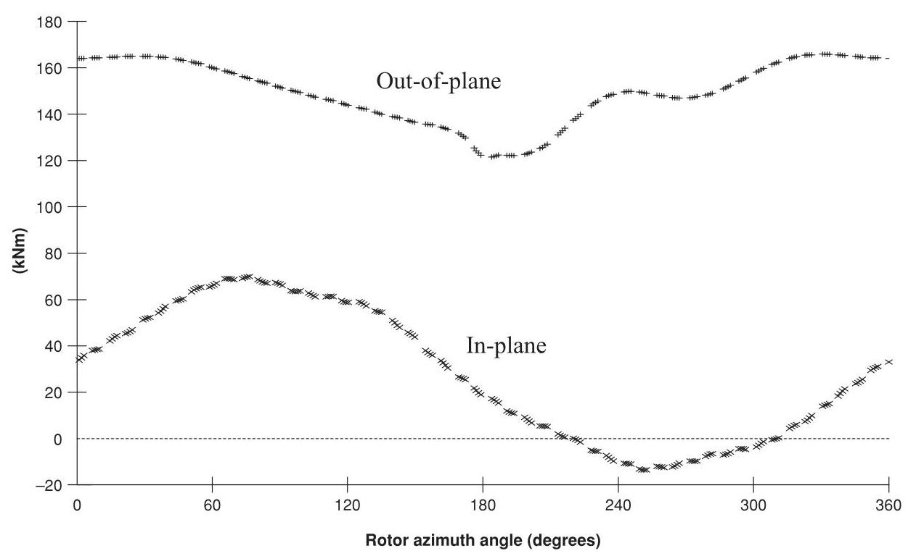

Figure 5.42 Blade root bending moment in steady wind

The use of sophisticated calculation methods such as those described above are now mandatory for the certification of wind turbines, particularly at the larger sizes. A few illustrative examples of results obtained with Bladed are described below.

Figure 5.42 shows a Bladed simulation of the in- and out-of-plane bending moments at the root of one of the blades, during operation in steady, sheared wind. The in-plane moment is almost a sinusoidal function of azimuth, being dominated by the gravity loading due to the self-weight of the blade which, relative to the blade, changes direction once per revolution. The mean is offset from zero because of the mean positive aerodynamic torque developed by the blade. There is a slight distortion of the sinusoid, partly because of the variation of aerodynamic torque due to wind shear and the effect of tower shadow, and partly because of the effect of structural vibrations.

The out-of-plane moment is always positive, the mean value being dominated by the aerodynamic thrust on the blade. There is a systematic variation with azimuth resulting from the wind shear, giving a lower load at ${180}^{ \circ  }$ azimuth (bottom dead centre) than at ${0}^{ \circ  }$ . A sharp dip at ${180}^{ \circ  }$ is also visible, and this is the effect of the tower shadow (the reduction in wind speed in the vicinity of the tower). The blade out-of-plane vibrational dynamics contribute a significant higher-frequency variation.

In turbulent wind, the loads take on a much more random appearance, as shown in Figure 5.43. The out-of-plane load in particular is varying with wind speed and, as this is a pitch-controlled machine, with pitch angle. The in-plane load is more regular, as it is always dominated by the reversing gravity load.

Spectral analysis provides a useful means of understanding these variations. Figure 5.44 shows auto-spectra of the blade root out-of-plane bending moment and the hub thrust force. The out-of-plane bending moment is dominated by peaks at all multiples of the rotational frequency of ${0.8}\mathrm{\;{Hz}}$ . These are caused mainly by the rotational sampling of turbulence by the blade as it sweeps around, repeatedly passing through turbulent eddies. Wind shear and tower shadow also contribute to these peaks. A small peak due to the first out-of-plane mode of vibration at about ${3.7}\mathrm{\;{Hz}}$ is just visible. There is also a significant effect of the first tower fore-aft mode of vibration at about ${0.4}\mathrm{\;{Hz}}$ .

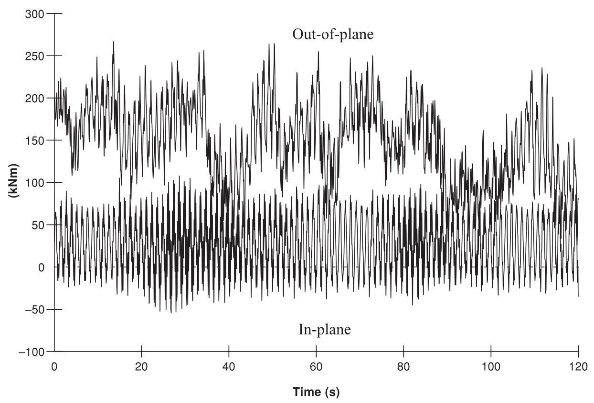

Figure 5.43 Blade root bending moment in turbulent wind

Figure 5.44 Spectra of out-of-plane loads in turbulent wind

Figure 5.45 Spectra of in-plane loads in turbulent wind

This tower effect is also visible in the spectrum of the hub thrust force. However, this force is the sum of the shear forces at the roots of the three blades. These forces are ${120}^{ \circ  }$ out of phase with each other, with the result that the peak at the rotational frequency (1P) is eliminated; as are the peaks at multiples of this frequency such as 2P, 4P etc. Only the peaks at multiples of 3P remain, since at these frequencies the three blades act in phase with each other.

This effect is even more significant in the in-plane load spectra (Figure 5.45). Of the blade load peaks at multiples of 1P, only the relatively small peaks at 3P and 6P come through to the hub torque. The 1P peak in the blade load, which is dominated by gravity, is particularly large, but it is completely eliminated from the hub torque. The tower peak at ${0.4}\mathrm{\;{Hz}}$ is visible in both loads. A large blade load peak at the first in-plane blade vibrational mode at ${4.4}\mathrm{\;{Hz}}$ is also seen, but this is a mode which does not include any rotation at the hub, and consequently is not seen in the hub torque. Some higher frequency blade modes (not shown) will be coupled with hub rotation.

## 5.14 Extrapolation of extreme loads from simulations

In the case of Load Case 1.1 (normal operation in a turbulent wind) IEC 61400-1 Edition 3 requires the characteristic blade root out-of-plane and in-plane bending moments and the characteristic tip deflection to be determined by statistical extrapolation of the extreme values of the load time series output from the simulations. For simulations of ten minutes duration, the characteristic value is defined as that with a ${3.8} \times  {10}^{-7}$ probability of exceedance - that is, the load with a return period of 50 years. This section considers ways in which the load exceedance probability distribution can be derived from the simulations and extrapolated to the ${3.8} \times  {10}^{-7}$ value. As it is more convenient to work with load non-exceedance probability distributions - otherwise known as cumulative distribution functions - the discussion below is in these terms, using the notation $P\left( {X \leq  x}\right)  = F\left( x\right)$ .

There are two sequences that can be followed in order to assemble a single load probability distribution from simulation data from different wind speed bins:

- Derivation of load non-exceedance probability distributions for each wind speed bin followed by combination of the these distributions in proportion to the operating time in each bin ('Fitting before aggregation').

- Aggregation of results from all wind speed bins, with the number of simulations per bin proportional to the hours of operation in each bin, followed by the derivation of a single load non-exceedance probability distribution ('Aggregation before fitting').

It is also necessary to decide how many extreme values from each simulation are to be utilised. In the 'global extremes' method, only the largest extreme value in each ten-minute simulation - that is, the global extreme - is used in the construction of the load non-exceedance probability distribution, but in the 'local extremes' method all extreme values that can be considered independent are utilised. The 'local extremes' method would appear to be more attractive, because it uses much more of the available data, but it throws up the problem of establishing a criterion for independence.

The various stages of the 'Fitting before aggregation' sequence using the 'global extremes' method are considered first.

### 5.14.1 Derivation of empirical cumulative distribution function of global extremes

Each ten-minute time series will yield a maximum value of the load under investigation and, for $n$ ten-minute simulations at a particular wind speed, there will be $n$ such global extremes, which can be ranked $1,2,\ldots i,\ldots ,{n}_{k}$ from smallest to largest. An empirical non-exceedance probability distribution for the ten-minute extreme load, ${x}_{k}$ , at wind speed ${U}_{k}$ can then be constructed as

$$
F\left( {{x}_{ki} \mid  {U}_{k}}\right)  = \frac{i}{{n}_{k} + 1},\;i = 1,2,\ldots ,{n}_{k} \tag{5.137}
$$

Harris (1996) has shown that, if $F\left( x\right)$ is a known function of $x$ , the mean of the $L$ non-exceedance probabilities $F\left( {x}_{i}\right)$ for the $i$ th extremes from $L$ sets of $n$ ten-minute simulations, derived from the ${x}_{i}$ simulation results, tends to the value $i/\left( {n + 1}\right)$ for $L$ large.

### 5.14.2 Fitting an extreme value distribution to the empirical distribution

There are several extreme value distributions which can be fitted to the empirical probability distributions obtained from the simulations. These include the Gumbel distribution (also known as the Fisher-Tippett I distribution), which was introduced in the context of extreme wind speeds in Section 2.8, the log-normal distribution, the three parameter Weibull distribution and the generalised extreme value distribution, which are described in turn below.

## a) Gumbel distribution

The probability that the variable $X$ will not exceed the value $x$ is given by

$$
P\left( {X \leq  x}\right)  = F\left( x\right)  = \exp \left\lbrack  {-\exp \left( {-\frac{x - {x}_{o}}{c}}\right) }\right\rbrack \tag{5.138}
$$

where ${x}_{o}$ is the most likely extreme value or the mode of distribution, $c$ is the dispersion and $y = \left( {x - {x}_{o}}\right) /c$ is termed the reduced variate.

This relationship is a straight line if $y =  - \ln \left\lbrack  {-\ln \left( {F\left( x\right) }\right) }\right\rbrack$ is plotted against $x$ , so a Gumbel distribution can be fitted to the empirical distribution by the method of least squares and the parameters ${x}_{o}$ and $c$ thereby determined. However, Harris (1996) has pointed out two defects of the classical least squares method.

First of all, the mean of the function which is plotted, $- \ln \left\lbrack  {-\ln \left( {F\left( {x}_{i}\right) }\right) }\right\rbrack$ , is not the same as the double natural logarithm of the mean of $F\left( {x}_{i}\right)$ itself, given by Equation 5.137. Harris provides a formula by which the mean of $- \ln \left\lbrack  {-\ln \left( {F\left( {x}_{i}\right) }\right) }\right\rbrack$ , that is, ${\bar{y}}_{i}$ , may be evaluated when the data should conform to a Gumbel distribution - as follows:

$$
{\bar{y}}_{v} = \frac{N!}{\left( {v - 1}\right) !\left( {N - v}\right) !}{\int }_{0}^{1} - \ln \left\lbrack  {-\ln \left( z\right) }\right\rbrack  {z}^{N - v}{\left( 1 - z\right) }^{v - 1}{dz} \tag{5.139}
$$

In this formula, $N$ is the number of data points $\left( { = {n}_{k}}\right) , v$ is the rank of data points with the largest first, so that $v = \left( {N + 1}\right)  - i$ and $z = F\left( {x}_{y}\right)$ .

Secondly, the classical least squares method assumes that the variability of each plotted ordinate is of similar magnitude, whereas, for extreme value data, the variability of the reduced variate, $y$ , is much greater for the largest values than for the others. Accordingly, Harris proposes weighting the data points in inverse proportion to the variance of the $y$ values, before the least squares fitting is carried out.

Values of ${\bar{y}}_{v}$ and its standard deviation are given in Table 5.10 for the case of $N = {15}$ , consistent with the IEC 61400-1 Edition 3 requirement for at least 15 ten-minute simulations for wind speeds above rated. Values of y calculated by the standard Gumbel method are also included for comparison and it is seen that the differences are significant for the largest of the extremes. The Harris weighting factor is included in the table in the last column. It is seen that, in general, the Harris method will result in a steeper straight line which is less influenced by the largest extremes.

An alternative method of fitting a straight line to the $- \ln \left\lbrack  {-\ln \left( {F\left( x\right) }\right) }\right\rbrack$ plot is the method of statistical moments (Moriarty et al., 2004), in which the first two statistical moments of the data - defined as the mean and the variance respectively - are equated to analytical expressions for these moments. Thus, for the standard Gumbel distribution, $F\left( y\right)  = \exp \left\lbrack  {-\exp \left( {-y}\right) }\right\rbrack$ , the probability density function is $f\left( y\right)  = {dF}\left( y\right) /{dy} = \exp \left\lbrack  {-y - \exp \left( {-y}\right) }\right\rbrack$ and the mean is

$$
{\mu }_{y} = {\int }_{-\infty }^{\infty }y \cdot  f\left( y\right) {dy} = {\int }_{-\infty }^{\infty }y \cdot  \exp \left\lbrack  {-y - \exp \left( {-y}\right) }\right\rbrack  {dy} = \gamma  = {0.5772} \tag{5.140}
$$

Table 5.10 Table of mean values of the reduced variate, ${y}_{y} =  - \ln \left\lbrack  {-\ln \left( {F\left( {x}_{y}\right) }\right. }\right.$ , its standard deviation and the Harris weighting factor, ${w}_{y}$

<table><tr><td>Rank, $v$ (Largest first)</td><td>Rank, $i$ (Smallest first)</td><td>${y}_{y} = \; - \ln \left\lbrack  {-\ln \left( {\left( {N + 1 - v}\right) /\left( {N + 1}\right) }\right) }\right\rbrack \; =  - \ln \left\lbrack  {-\ln \left( {i/\left( {N + 1}\right) }\right) }\right\rbrack$ (Gumbel method)</td><td>${\bar{y}}_{v}$ - Equation 5.139 (Harris method)</td><td>${\sigma }_{y} -$ Standard Deviation of ${\bar{y}}_{v}$</td><td>Harris Weighting factor, ${w}_{y}$</td></tr><tr><td>1</td><td>15</td><td>2.7405</td><td>3.2853</td><td>1.2825</td><td>0.0064</td></tr><tr><td>2</td><td>14</td><td>2.0134</td><td>2.2504</td><td>0.8031</td><td>0.0164</td></tr><tr><td>3</td><td>13</td><td>1.572</td><td>1.7133</td><td>0.6291</td><td>0.0266</td></tr><tr><td>4</td><td>12</td><td>1.2459</td><td>1.3404</td><td>0.5341</td><td>0.037</td></tr><tr><td>5</td><td>11</td><td>0.9816</td><td>1.0478</td><td>0.4726</td><td>0.0472</td></tr><tr><td>6</td><td>10</td><td>0.755</td><td>0.8019</td><td>0.4291</td><td>0.0573</td></tr><tr><td>7</td><td>9</td><td>0.5528</td><td>0.5852</td><td>0.3965</td><td>0.0671</td></tr><tr><td>8</td><td>8</td><td>0.3665</td><td>0.3873</td><td>0.3714</td><td>0.0765</td></tr><tr><td>9</td><td>7</td><td>0.1903</td><td>0.201</td><td>0.3518</td><td>0.0852</td></tr><tr><td>10</td><td>6</td><td>0.0194</td><td>0.0206</td><td>0.3366</td><td>0.0931</td></tr><tr><td>11</td><td>5</td><td>-0.1511</td><td>-0.1595</td><td>0.3254</td><td>0.0996</td></tr><tr><td>12</td><td>4</td><td>-0.3266</td><td>-0.3458</td><td>0.3184</td><td>0.104</td></tr><tr><td>13</td><td>3</td><td>-0.5152</td><td>-0.5884</td><td>0.317</td><td>0.1049</td></tr><tr><td>14</td><td>2</td><td>-0.7321</td><td>-0.7884</td><td>0.3257</td><td>0.0994</td></tr><tr><td>15</td><td>1</td><td>-1.0198</td><td>-1.1326</td><td>0.3648</td><td>0.0793</td></tr></table>

Similarly the variance is

$$
{\sigma }_{y}^{2} = {\int }_{-\infty }^{\infty }{\left( y - {\mu }_{y}\right) }^{2} \cdot  f\left( y\right) {dy} = {\int }_{-\infty }^{\infty }{\left( y - {\mu }_{y}\right) }^{2} \cdot  \exp \left\lbrack  {-y - \exp \left( {-y}\right) }\right\rbrack  {dy} = \frac{{\pi }^{2}}{6} \tag{5.141}
$$

Denoting the mean and the standard deviation of the dataset of extreme values as ${\mu }_{x}$ and ${\sigma }_{x}$ respectively, and noting that $y = \left( {x - {x}_{o}}\right) /c$ , we obtain ${\mu }_{y} = \left( {{\mu }_{x} - {x}_{o}}\right) /c = {0.5772}$ and ${\sigma }_{y} = {\sigma }_{x}/c = {1.2825}$ .

Hence

$$
c = {\sigma }_{x}/{1.2825}\text{ and }{x}_{o} = {\mu }_{x} - c{\mu }_{y} = {\mu }_{x} - {0.5772}\frac{{\sigma }_{x}}{1.2825} = {\mu }_{x} - {0.450}{\sigma }_{x}.
$$

Figure 5.46 compares the three methods described above for fitting a straight line to empirical data on a Gumbel plot, for a dataset consisting of 15 global extremes of out-of-plane blade root bending moment, taken from 15 ten-minute simulations of operation in a ${12}\mathrm{\;m}/\mathrm{s}$ wind speed. Note that the straight lines derived using the Harris method and the method of moments appear less influenced by the largest values than that based on the least squares method.

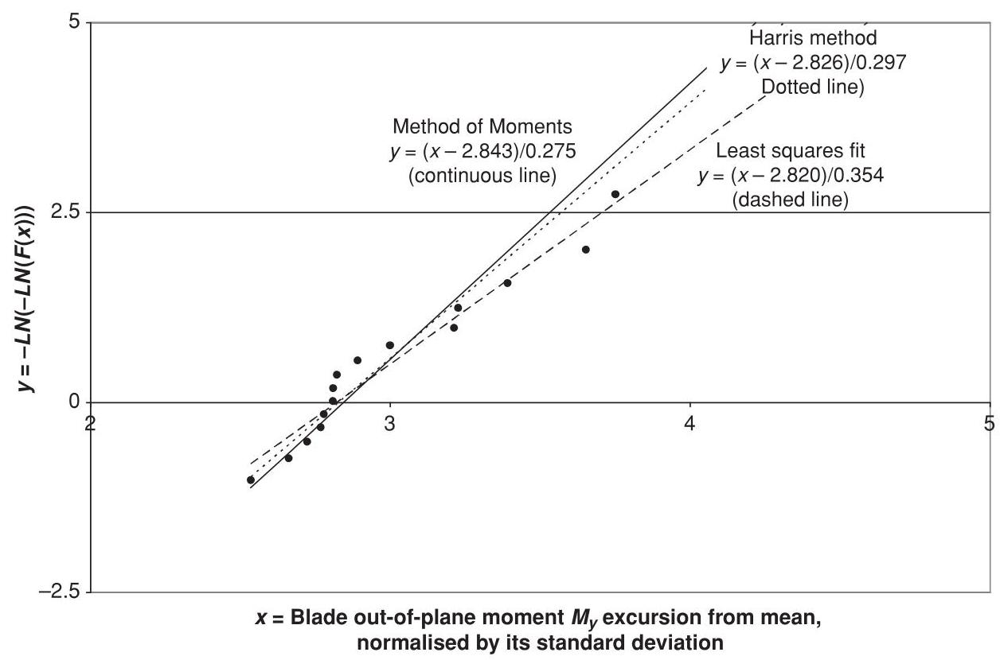

Figure 5.46 Comparison of techniques for fitting a straight line to empirical data on a Gumbel plot

## b) Log-normal distribution

In the log-normal distribution, the logarithm of the variable is normally distributed, so the probability distribution function of the variable $x$ is

$$
f\left( x\right)  = \frac{1}{\sqrt{2\pi }{\sigma }_{z}x}\exp \left\lbrack  {-\frac{1}{2}{\left( \frac{\ln \left( x\right)  - {\mu }_{z}}{{\sigma }_{z}}\right) }^{2}}\right\rbrack \tag{5.142}
$$

where ${\mu }_{z}$ and ${\sigma }_{z}$ are the mean and standard deviation respectively of $z = \ln \left( x\right)$ . The mean and standard deviation of the variable $x$ itself, ${\mu }_{x}$ and ${\sigma }_{x}$ , are given in terms of ${\mu }_{z}$ and ${\sigma }_{z}$ as follows:

$$
{\mu }_{x} = \exp \left\lbrack  {{\mu }_{z} + {\sigma }_{z}^{2}/2}\right\rbrack  \;{\sigma }_{x} = \exp \left\lbrack  {{\mu }_{z} + {\sigma }_{z}^{2}/2}\right\rbrack  \sqrt{\exp \left( {\sigma }_{z}^{2}\right)  - 1} = {\mu }_{x}\sqrt{\exp \left( {\sigma }_{z}^{2}\right)  - 1}
$$

(5.143)

The log-normal distribution parameters, ${\mu }_{z}$ and ${\sigma }_{z}$ , can again be fitted to the extreme value data by the method of statistical moments, using

$$
{\sigma }_{z} = \sqrt{\ln \left( {1 + {\left( {\sigma }_{x}/{\mu }_{x}\right) }^{2}}\right) }\;\text{ and }\;{\mu }_{z} = \ln \left( {\mu }_{x}\right)  - {\sigma }_{z}^{2}/2 \tag{5.144}
$$

derived from Equation 5.143.

## c) Three parameter Weibull distribution

The three parameter Weibull distribution is defined as $P\left( {Y \leq  y}\right)  = F\left( y\right)  = 1 - \exp \left\lbrack  {-{y}^{\alpha }}\right\rbrack$ , where $y = \left( {x - {x}_{o}}\right) /c$ as before, and $F\left( y\right)$ only applies to positive values of $y$ . Hence the probability density function, $f\left( y\right)$ , is given by $\alpha {y}^{\alpha  - 1}\exp \left\lbrack  {-{y}^{\alpha }}\right\rbrack$ . The three parameters, ${x}_{\mathrm{o}}, c$ and $\alpha$ can be fitted to the data by the method of statistical moments described above, but in this case using the first three moments instead of the first two.

Using the shorthand ${G}_{m}\left( \alpha \right)  = \left( {m/\alpha }\right) \Gamma \left( {m/\alpha }\right)$ where $\Gamma$ is the Gamma function, the first three statistical moments are as follows:

$$
{\mu }_{y} = {G}_{1}\left( \alpha \right) ,\;{\sigma }_{y}^{2} = {G}_{2}\left( \alpha \right)  - {G}_{1}^{2}\left( \alpha \right) ,
$$

$$
{\eta }_{y}{\sigma }_{y}^{3} = {\int }_{-\infty }^{\infty }{\left( y - {\mu }_{y}\right) }^{3}f\left( y\right) {dy} = {G}_{3}\left( \alpha \right)  - 3{G}_{2}\left( \alpha \right) {G}_{1}\left( \alpha \right)  + 2{G}_{1}^{3}\left( \alpha \right) \tag{5.145}
$$

Note that ${\eta }_{y}$ , the skewness parameter, is the third statistical moment normalised by the cube of the standard deviation.

## d) Generalised extreme value (GEV) distribution

The generalised extreme value distribution was introduced by Jenkinson in 1955 and is more versatile than the Gumbel distribution, as it allows the skewness of extreme value distributions to be modelled as well as their spread. It is defined as $P\left( {Y \leq  y}\right)  = F\left( y\right)  = \exp \left\lbrack  {-\{ 1 - {ky}{\} }^{1/k}}\right\rbrack$ , where $y = \left( {x - {x}_{o}}\right) /c$ as before, and $k$ is the shape parameter, which determines the curvature of the distribution when it is plotted as $- \ln \left\lbrack  {-\ln \left( {F\left( x\right) }\right) }\right\rbrack$ against $x$ . If $k$ is positive, the curve is concave upwards and has an upper bound of ${x}_{o} + c/k$ , whereas if $k$ is negative, the curve is concave downwards and has a lower bound of ${x}_{o} + c/k$ .

Hosking, Wallis and Wood (1985) advocate the use of the method of probability weighted moments (PWMs) for fitting a GEV distribution to empirical data. For a probability distribution $F = F\left( x\right)$ , with an inverse distribution function $x\left( F\right)$ , probability weighted moments ${\beta }_{0},{\beta }_{1}$ and ${\beta }_{2}$ are defined by ${\beta }_{r} = {\int }_{0}^{1}x\left( F\right) {F}^{r}{dF}$ , and the parameters ${x}_{\mathrm{o}}, c$ and $k$ of the GEV are determined by equating the PWMs of the empirical data to the PWM's of the GEV.

The PWM's of the GEV are given by the formula

$$
{\beta }_{r} = \frac{1}{r + 1}\left\lbrack  {{x}_{0} + \frac{c}{k}\left\{  {1 - \frac{\Gamma \left( {1 + k}\right) }{{\left( r + 1\right) }^{k}}}\right\}  }\right\rbrack \tag{5.152}
$$

for $k >  - 1$ , where $\Gamma$ is the Gamma function. This gives:

$$
{\beta }_{0} = {x}_{0} + \frac{c}{k}\{ 1 - \Gamma \left( {1 + k}\right) \} ,\;2{\beta }_{0} - {\beta }_{1} = \frac{c}{k}\Gamma \left( {1 + k}\right) \left( {1 - {2}^{-k}}\right) \text{ and }
$$

$$
\frac{3{\beta }_{2} - {\beta }_{0}}{2{\beta }_{1} - {\beta }_{0}} = \frac{1 - {3}^{-k}}{1 - {2}^{-k}} \tag{5.146}
$$

Solution of the last equation requires iterative methods, but Hosking et al. (1985) have shown that a good approximation for $k$ is ${7.8590C} + {2.9554}{C}^{2}$ , where $C = \; \left( {2{\beta }_{1} - {\beta }_{0}}\right) /\left( {3{\beta }_{2} - {\beta }_{0}}\right)  - \left( {\log 2/\log 3}\right)$ . This value of $k$ can then be substituted in the first two Equations 5.146 to obtain ${x}_{0}$ and $c$ .

The PWM's of the empirical data can be estimated from the formula:

$$
{\beta }_{r}\left\lbrack  {p}_{i, n}\right\rbrack   = \frac{1}{n}\mathop{\sum }\limits_{{i = 1}}^{n}{p}_{i, n}^{r}{x}_{i} \tag{5.147}
$$

where ${p}_{i, n}$ is the probability assigned to the $i$ th global extreme, with ranking from smallest to largest. Hosking et al. propose two alternative expressions for use in estimating ${p}_{i, n}$ as follows:

$$
{p}_{i, n} = \left( {i - a}\right) /n,\;0 < a < 0\;{p}_{i, n} = \left( {i - a}\right) /\left( {n + 1 - {2a}}\right) ,\; - {0.5} < a < {0.5}
$$

Another approach is to estimate the PWM’s directly from the unbiased estimators ${b}_{r}$ given by:

$$
{b}_{r} = \frac{1}{n}\mathop{\sum }\limits_{{i = 1}}^{n}\frac{\left( {i - 1}\right) \left( {i - 2}\right) \cdots \left( {i - r}\right) }{\left( {n - 1}\right) \left( {n - 2}\right) \cdots \left( {n - r}\right) }{x}_{i} \tag{5.148}
$$

Figure 5.47 compares two GEV distributions fitted to the dataset of 15 global extremes described above and extrapolated to a 50-year return period. In one case unbiased estimators of the PWM’s are used for the fitting and, in the other, the formula ${p}_{i, n} = \left( {i - a}\right) /n$ with $a = {0.35}$ was employed for the probabilities, as this was found to give the best overall results in a computer simulation by Hosking et al. Also shown for comparison is the Gumbel distribution fitted to the dataset using the method of statistical moments.

Figure 5.47 Comparison of GEV distributions fitted to empirical data on a Gumbel plot

It is seen that there is poor agreement between the two GEV distributions. This is likely to be due - at least in part - to the small size of the dataset, which results in coarse estimates of the PWMs. It should also be noted that the use of different datasets for the same load case results in considerable variation in the shape parameter, suggesting that a dataset of 15 extreme values is not large enough to yield a meaningful result.

### 5.14.3 Comparison of extreme value distributions

Gumbel, 3 parameter Weibull and log-normal distributions have been fitted to the dataset of 15 global extremes of out-of-plane blade root bending moment introduced above, using the method of statistical moments in each case, and compared on a Gumbel plot of $- \ln \left\lbrack  {-\ln \left( {F\left( x\right) }\right) }\right\rbrack$ against the normalised bending moment excursion, $x$ , in Figure 5.48.

Figure 5.48 shows the three extreme value distribution extrapolated to the 50-year return period exceedance probability of ${3.8} \times  {10}^{-7}$ (for which, $- \ln \left\lbrack  {-\ln \left( {F\left( x\right) }\right) }\right\rbrack$ is 14.78 ) to illustrate their behaviour. It is seen that there is a wide variation in the predicted value of the 50-year return load.

Although the loadings on wind turbine components are generally not narrow-banded, it is instructive to investigate how well the above three extreme value distributions and the GEV distribution can be fitted to the distribution of global extremes arising from a narrow banded process. Consider a blade rotating at ${15}\mathrm{{rpm}}$ , which experiences 150 loading cycles in ten minutes. Assuming that the extreme loads in adjacent three-cycle blocks are independent of one another, there are 50 independent maxima in the ten-minute time interval, and the cumulative probability distribution of the global maximum is

$$
F\left( x\right)  = {\left\{  1 - \exp \left\lbrack  -\frac{{x}^{2}}{2}\right\rbrack  \right\}  }^{50} \tag{5.149}
$$

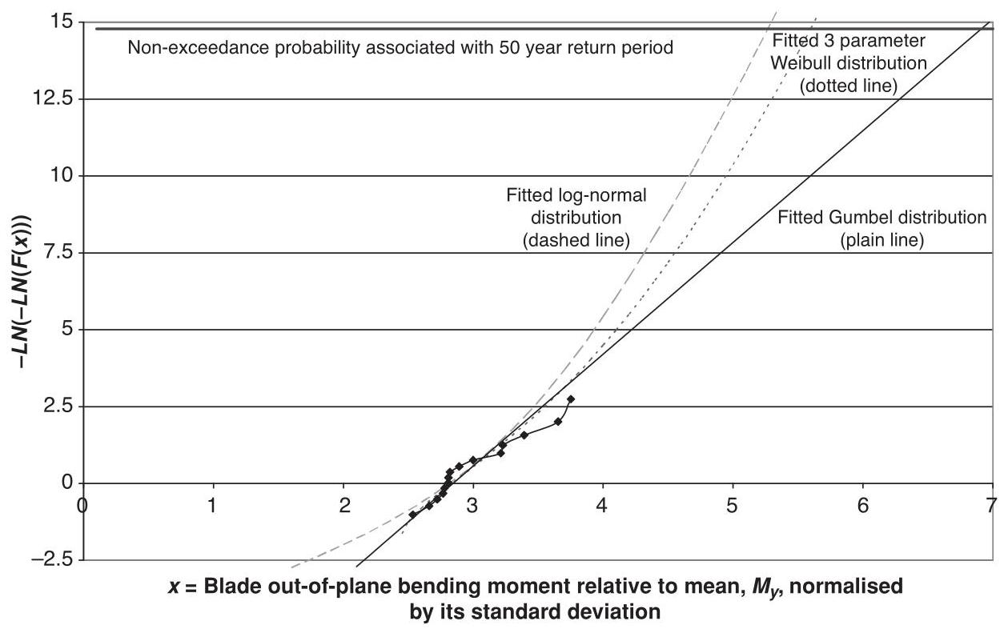

Figure 5.48 Gumbel plot comparison of three extreme value distributions fitted to empirical data

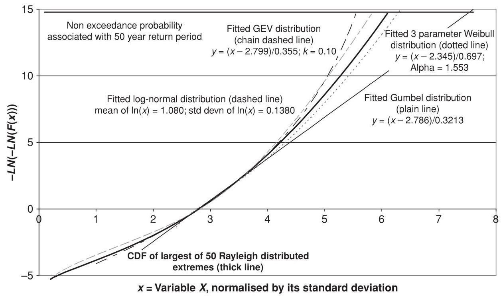

Figure 5.49 Gumbel plot comparison of four extreme value distributions fitted to the distribution of the largest of 50 Rayleigh distributed extremes

Gumbel, 3 parameter Weibull, log-normal and GEV distributions have been fitted to this distribution using the method of statistical moments, and Gumbel plots of the fitted distributions are presented on Figure 5.49, together with their defining parameters.

It is seen that the log-normal and the 3 parameter Weibull distributions fit the distribution of global maxima of a narrow banded process better than the other two.

Freudenreich and Argyriadis (2008) compared extrapolations made using the above four extreme value distributions by reference to five one-year simulations for a 5 MW pitch-regulated turbine. Using the extreme values from 30 ten-minute time histories per wind speed bin as input, they concluded that the extrapolations of blade flapwise root bending moment made with the 3 parameter Weibull and log-normal distributions were the most accurate, whereas the Gumbel extrapolation was significantly conservative.

### 5.14.4 Combination of probability distributions

The procedure outlined above yields a family of load non-exceedance probability distributions conditional upon wind speed for the extreme load in the simulation period, $F\left( {x \mid  {U}_{k}}\right)$ - one for each wind speed bin. These are combined to yield a single distribution for all operating wind speeds by weighting each one according to the number of hours of operation applicable to the wind speed bin and summing the results. Mathematically, the summation is expressed as follows:

$$
{F}_{\text{ Long } - \text{ term }}\left( x\right)  \approx  \mathop{\sum }\limits_{{k = 1}}^{M}F\left( {x \mid  {U}_{k}}\right) {p}_{k} \tag{5.150}
$$

where ${p}_{k}$ is the proportion of operating hours in the wind speed bin with mean wind speed ${U}_{k}$ and the operating range of wind speeds is divided into $M$ bins.

### 5.14.5 Extrapolation

The load with a 50-year return period is found by extrapolating ${F}_{\text{ Long-term }}\left( x\right)$ to the requisite non-exceedance probability - that is, $\left( {1 - {3.8} \times  {10}^{-7}}\right)$ for a ten-minute simulation period. As ${F}_{\text{ Long-term }}\left( x\right)$ is the summation of several mathematically defined distributions, this is straightforward. Figure 5.48 illustrates how the extrapolation might look if a single wind speed bin dominated the extreme loads for the three extreme value distributions considered.

### 5.14.6 Fitting probability distribution after aggregation

With this sequence, the first step is to aggregate the data points from the simulations from all the wind speed bins. If the number of simulations from each wind speed bin is proportional to the number of hours of operation in that bin and there are $m$ ten-minute simulations in all, then the $m$ global extremes can be ranked $1,2,\ldots i,\ldots m$ from smallest to largest and the long-term empirical load non-exceedance probability distribution for the ten-minute extreme load, $x$ , can be constructed according to the formula

$$
{F}_{\text{ Long-term }}\left( {x}_{i}\right)  = \frac{i}{m + 1},\;i = 1,2,\ldots m
$$

In cases where the number of simulations in each wind speed bin is not proportional to the actual likelihood of that bin, then different weights need to be assigned to the global extremes in different bins, and the probability distribution becomes

$$
{F}_{\text{ Long-term }}\left( x\right)  = \mathop{\sum }\limits_{{k = 1}}^{b}\left( {\mathop{\sum }\limits_{{i = 1}}^{{n}_{k}}\frac{I\left\lbrack  {{x}_{i, k} \leq  x}\right\rbrack  }{m + 1}}\right) {w}_{k} = \mathop{\sum }\limits_{{k = 1}}^{b}\left( {\mathop{\sum }\limits_{{i = 1}}^{{n}_{k}}\frac{I\left\lbrack  {{x}_{i, k} \leq  x}\right\rbrack  }{m + 1}}\right) \frac{m{p}_{k}}{{n}_{k}} \tag{5.151}
$$

where

${x}_{i, k}$ is the $i$ th extreme in the $k$ th wind speed bin

$I\left\lbrack  {{x}_{i.k} \leq  x}\right\rbrack  1$ if ${x}_{i.k} \leq  x$ and 0 otherwise

${n}_{k}$ is the number of simulations in the $k$ th wind speed bin

$b$ is the number of wind speed bins

${w}_{k}$ is the weighting factor for $k$ th wind speed bin

${p}_{k}$ is the proportion of operating hours in the $k$ th wind speed bin

The second step is the fitting of an extreme value distribution to the long-term empirical load distribution to permit extrapolation to the 50-year return load. Clearly, the 'aggregation before fitting' approach is simpler than the 'fitting before aggregation' approach in that only one fitting operation is required, although the inherent complexity of the long-term empirical distribution may make a close fit more difficult to achieve.

### 5.14.7 Local extremes method

The local extremes method is the same as the global extremes method, except that several independent extreme values in each ten-minute simulation are utilised in constructing the empirical load non-exceedance probability distribution(s) instead of just the single largest value - that is, the 'global extreme' - from each simulation.

If there are $n$ independent extreme values in each ten-minute simulation, then the empirical non-exceedance probability distribution for the ten-minute extreme load, ${x}_{k}$ , at wind speed ${U}_{k}$ can be constructed from the non-exceedance probability distribution of the local extremes using

$$
F\left( {{x}_{k} \mid  {U}_{k}}\right)  = {\left\lbrack  {F}_{\text{ local }}\left( {x}_{k} \mid  {U}_{k}\right) \right\rbrack  }^{n}
$$

To ensure independence of the local extremes, Annex F of IEC 61400-1 Edition 3 suggests that individual extremes should be separated by at least three response cycles. A less rigorous but computationally simpler approach is to divide the ten-minute simulation period into $n$ segments or 'blocks' of equal duration and use the maximum value from each. This method of extracting the local extremes is illustrated in Figure 5.50 for a turbine rotating at ${15}\mathrm{{rpm}}$ with a block size of 12 seconds, corresponding to three cycles of rotation.

Fogle et al. (2008) have applied statistical tests for independence to block maxima obtained from 200 simulated load time histories for a 5 MW turbine model developed by NREL, and concluded that a block duration of 30 seconds is required to ensure independence. However, they also found that the use of block durations as short as five seconds made negligible difference to the tail of the empirical probability distribution.

Figure 5.50 Local extremes derived from blocks of 12 seconds duration

### 5.14.8 Convergence requirements

IEC 61400-1 Edition 3 imposes a limit on the uncertainty of extrapolated loads by requiring that sufficient simulations are carried out so that the ${90}\%$ confidence interval on the ${84}\%$ quantile load (that is, the extreme load in a ten-minute simulation likely to be exceeded 16% of the time) is less than ${15}\%$ of that load. This requirement is expressed as

$$
\frac{{\widehat{S}}_{{0.84},{0.05}} - {\widehat{S}}_{{0.84},{0.95}}}{{\widehat{S}}_{0.84}} < {0.15} \tag{5.152}
$$

where the confidence bounds ${\widehat{S}}_{{0.84},{0.05}}$ and ${\widehat{S}}_{{0.84},{0.95}}$ are the empirical estimates of the 84% quantile load with a 5% and 95% probability of not being exceeded respectively.

One approach to estimating the confidence bounds utilises the binomial expansion to obtain the probability, $C\left( {j;m,{0.84}}\right)$ , of $j$ or fewer occurrences of the non-exceedance of the 84% quantile load in $m$ simulations. This is given by:

$$
C\left( {j;m,{0.84}}\right)  = \mathop{\sum }\limits_{{i = 0}}^{j}\frac{m!}{i!\left( {m - i}\right) !}{0.84}^{i}{0.16}^{m - i} \tag{5.153}
$$

As an example, this probability is plotted against $j$ for the case of $m = {15}$ simulations in Figure 5.51. It is seen that the 5% and 95% confidence bounds on the number of trials in which the 84% quantile load is not exceeded are 9.5 and 14.3 respectively. The confidence bounds on the 84% quantile load, ${\widehat{S}}_{{0.84},{0.05}}$ and ${\widehat{S}}_{{0.84},{0.95}}$ , required for the inequality (Equation 5.152) can then be derived by interpolating between the ninth and tenth and fourteenth and fifteenth ranked extremes respectively. The ranking is from smallest to largest as usual.

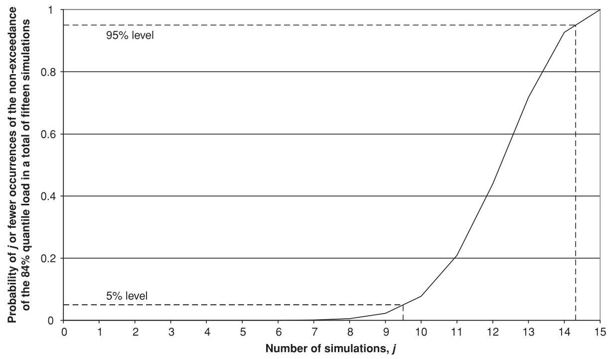

Figure 5.51 Probability of $j$ or fewer occurrences of the non-exceedance of the 84% quantile load in a total of 15 simulations

Table 5.11 Table of confidence bounds on the number of simulations in which the 84% load is not exceeded for different numbers of simulations in total

<table><tr><td>Total no. of simulations, $m$</td><td>No. of occurrences of the non-exceedance of the 84% quantile load with 5% probability of not being exceeded</td><td>No. of occurrences of the non-exceedance of the 84% quantile load with 95% probability of not being exceeded</td></tr><tr><td>15</td><td>9.5</td><td>14.32</td></tr><tr><td>20</td><td>13.35</td><td>18.83</td></tr><tr><td>25</td><td>17.23</td><td>23.39</td></tr><tr><td>30</td><td>21.18</td><td>27.83</td></tr><tr><td>35</td><td>25.13</td><td>32.32</td></tr></table>

Annex F of IEC 61400-1 Edition 3 provides a table of 5% and 95% confidence bounds on the number of simulations in which the 84% quantile load is not exceeded for each value of $m$ , the total number of simulations, from 15 to 35 . Selected values are given in Table 5.11 above.

## References

Armstrong, J.R.C. and Hancock, M. (1991) Feasibility study of teetered, stall-regulated rotors. ETSU Report No. WN 6022.

Barltrop, N.D.P. and Adams, A.J. (1991) Dynamics of Fixed Marine Structures, 3rd edition., Butterworth-Heinemann, Oxford.

Batchelor, G.K. (1953) The Theory of Homogeneous Turbulence. Cambridge University Press, Cambridge.

Bierbooms, W.A.A.M. (2006) Constrained stochastic simulation - generation of time series around some specific event in a normal process. Extremes 8, 20-224.

Bishop, N.W.M., Zhihua, H. and Sheratt, F. (1991) The Analysis of Non-Gaussian Loadings from Wind Turbine Blades Using Frequency Domain Techniques. Proceedings of the 1991 BWEA Conference, pp. 317-323.

Bishop, N.W.M., Wang, R. and Lack, L. (1995) A Frequency Domain Fatigue Predictor for Wind Turbine Blades Including Deterministic Components. Proceedings of the 1995 BWEA Conference, pp. 53-58.

British Standard Institution (1980). BS 5400: Part 10: 1980 Steel, concrete and composite bridges - Code of practice for fatigue. British Standard Institution, London.

British Standard Institution (1986). BS 8100: Part 1: 1986 Lattice towers and masts - Code of practice for loading. British Standard Institution, London.

Clough, R.W. and Penzien, J. (1993) Dynamics of Structures. Mc Graw Hill, New York.

Craig, Jr., R.R. and Bampton, M.C.C. (1968) Coupling of substructures for dynamic analysis, AIAA Journal, 6(7), 1313-1319.

Creed, R.F. (1993) High cycle tensile fatigue of unidirectional fiberglass composite tested at high frequency. PhD thesis, Montana State University.

Danish Standards (1992). DS 472: Loads and Safety of Wind Turbine Construction, 1st edition. Danish Standard Foundation, Denmark.

Danish Standards (1983). DS 410: Loads for the design of structures, 3rd edition. Danish Standard Foundation, Denmark.

Davenport, A.G. (1964) Note on the distribution of the largest value of a random function with application to gust loading. Proceedings of the Institute of Civil Engineering Conference, 28, pp. 187-196.

Dirlik, T. (1985) Application of computers in fatigue analysis. PhD thesis, University of Warwick.

Eurocode 1 (2005). Actions on structures - Part 1.4: Actions on structures - Wind actions. (EN 1991-1-4:2005).

Fogle, J. et al. (2008). Towards an improved understanding of statistical extrapolation for wind turbine extreme loads. Wind Energy, 11, 613-635. (Expanded version published by American Institute of Aeronautics and Astromatics).

Freudenreich, K. and Argyriadis, K. (2008). Wind turbine load level based on extrapolation and simplified methods. Wind Energy, 11, 589-600.

Garrad, A.D. and Hassan, U. (1986) The Dynamic Response of Wind Turbines for Fatigue Life and Extreme Load Prediction. Proceedings of the EWEA 1986 Conference, pp. 401-406.

Garrad, A.D. (1987) The Use of Finite Element Methods for Wind Turbine Dynamics. Proceedings of the EWEA 1987 Conference, pp. 79-83.

Garrad Hassan (2010) Bladed Theory Manual, Version 4.0. Garrad Hassan, Bristol.

Germanischer Lloyd (2003) Rules and Guidelines: IV - Industrial Services: Part 1 - Guideline for the Certification of Wind Turbines. Germanischer Lloyd, Hamburg.

Gibson, R.F. et al. (1982) Vibration characteristics of automotive composite materials. In: Short Fiber Reinforced Composite Materials (ed. B.A. Sanders), pp. 133-150, STP 772. ASTM, West Conshohocken, PA.

Hansen, A.C. (1998) User's guide to the Wind Turbine Dynamics Computer Programs YawDyn and AeroDyn for Adams, Version 11.0. University of Utah, Utah.

Harris, R.I. (1996) Gumbel re-visited - a new look at extreme value statistics applied to wind speeds. Journal of Wind Engineering and Industrial Aerodynamics, 59, 1-22.

Hoskin, R.E., Warren, J.G. and Draper, J. (1989) Prediction of fatigue damage in wind turbine rotors. In: Proceedings of the EWEC 1989 Conference, pp. 389-394.

Hosking, J.R.M., Wallis, J.R. and Wood, E.F. (1985) Estimation of the generalized extreme value distribution by the method of probability-weighted moments. Technometrics, 27(3), 251-261.

International Electrotechnical Commission (2005) IEC 61400-1: Wind turbines - Part 1: Design Requirements, 3rd edition. International Electrotechnical Commission, Geneva.

Jamieson, P. and Hunter, C. (1985) Analysis of data from Howden 300 kW wind turbine on Burgar Hill Orkney. In: Proceedings of the BWEA 1985 Conference, pp. 253-258.

Jamieson et al. (2000) Wind turbine design for offshore. In: P. Jamieson, T.R. Camp and D.C. Quar-ton, Proceedings of the Offshore Wind Energy in Mediterranean and European Seas Conference, pp. 405-414. CEC/EWEA/IEA, Sicily.

Jenkinson, A.F. (1955) The frequency distribution of the annual maximum (or minimum) of meteorological elements. Quarterly Journal of the Royal Meteorological Society. 81, 158-171.

Kaimal, J.C. et al. (1972) Spectral characteristics of surface-layer turbulence. Quarterly Journal of The Meteorological Society, 98, 563-598.

Larsen, G.C., Ronold, K., Jorgensen, H.E., Argyriadis, K. and de Boer, J. (1999) Ultimate Loading of Wind Turbines. No R-1111, Riso National Laboratory.

Lobitz, D.W.A. (1984) NASTRAN based computer program for structural dynamic analysis of HAWT's. Proceedings of the EWEA 1984 Conference.

Madsen, P.H., Frandsen, S., Holley, W.E. and Hansen, J.C. (1984) Dynamics and fatigue damage of wind turbine rotors during steady operation. No. R-512, Risø National Laboratory.

Mann, J. (1994): The spatial structure of neutral atmospheric surface-layer turbulence. Journal of Fluid Mechanics, 273, 141-168.

Mann, J. (1998) Wind field simulation. Journal of Probability Engineering Mechanics, 13(4), 269- 282.

Matsuishi, M. and Endo, T. (1968) 'Fatigue of metals subject to varying stress' Japan Society of Mechanical Engineers, Jukvoka.

Molenaar, D.P. and Dijkstra, S. (1999) State-of-the-art of wind turbine design codes: main features overview for cost-effective generation. Wind Engineering, 23(5), 295-311.

Morgan, C.A. and Tindal, A.J. (1990) Further analysis of the Orkney MS-1 data. In: Proceedings of the BWEA 1990 Conference, pp. 325-330.

Moriaty, P.J., Holley, W.E. and Butterfield, S.P. (2004) Extrapolation of extreme and fatigue loads using probabilistic methods. NREL Report TP-500-34421.

Petersen, J.T., Madsen, H.A., Björck, A., Enevoldsen, P., Øye, S., Ganander, H. and Winkelaar, D. (1998) Prediction of dynamic loads and induced vibrations in stall. No. R-1045, Risø National Laboratory.

Putter, S. and Manor, H. (1978) Natural frequencies of radial rotating beams. Journal of Sound and Vibration 56(2), 175-185.

Ragan, P. and Manuel, L. (2007) Comparing estimates of wind turbine fatigue loads using time-domain and spectral methods. Wind Engineering 31(2), 83-99.

Shabana, A.A. (1998) Dynamics of Multibody Systems, 2nd edition. Cambridge University Press, Cambridge.

Thomsen, K. and Madsen, P.H. (1997) Application of statistical methods to extreme loads for wind turbines. In: Proceedings of the 1997 EWEC Conference, pp. 595-598.

Thomsen, K. (1998) The statistical variation of wind turbine fatigue loads, No. R-1063. Risø National Laboratory.

Veers, P.S. (1988) Three-dimensional wind simulation, SAND88-0152. Sandia National Laboratory.

Von Karman, T. (1948) Progress in the statistical theory of turbulence. In: Proceddings of The National Academy of Sciences. Vol. 34, pp. 530-539.

Warren, J.G., Quarton, D.C., Lack, L. and Draper, J. (1988) Prediction of Fatigue Damage in Wind Turbine Rotors. Proceedings of the 1988 BWEA Conference.

## Appendix 5: Dynamic response of stationary blade in turbulent wind

## A5.1 Introduction

As described in Chapter 2, the turbulent wind contains wind speed fluctuations over a wide range of frequencies, as described by the power spectrum. Although the bulk of the turbulent energy is normally at frequencies much lower than the blade first mode out-of-plane frequency, which is typically over $1\mathrm{\;{Hz}}$ , the fraction close to the first mode frequency will excite resonant blade oscillations. This appendix describes the method by which the resonant response may be determined. Working in the frequency domain, expressions for the standard deviations of both the tip displacement and root bending moment responses are derived, and then the method of deriving the peak value in a given period is described. Initially the wind is assumed to be perfectly correlated along the blade, but subsequently the treatment is extended to include the effect of spatial variation.

## A5.2 Frequency response function

### A5.2.1 Equation of motion

The dynamic response of a cantilever blade to the fluctuating aerodynamic loads upon it is most conveniently investigated by means of modal analysis, in which the excitations of the various different natural modes of vibration are computed separately and the results superposed. Thus, the deflection $x\left( {r, t}\right)$ at radius $r$ is given by:

$$
x\left( {r, t}\right)  = \mathop{\sum }\limits_{{i = 1}}^{\infty }{f}_{i}\left( t\right) {\mu }_{i}\left( t\right)
$$

Normally, in the case of a stationary blade, the first mode dominates and higher modes do not need to be considered. The equation of motion for the $i$ th mode, which is derived in Section 5.8.1, is as follows:

$$
{m}_{i}{\ddot{f}}_{i}\left( t\right)  + {c}_{i}{\dot{f}}_{i}\left( t\right)  + {m}_{i}{\omega }_{i}^{2}{f}_{i}\left( t\right)  = {\int }_{0}^{R}{\mu }_{i}\left( r\right) q\left( {r, t}\right) {dr} \tag{A5.1}
$$

where

$q\left( {r, t}\right)$ is the applied loading

${f}_{i}\left( t\right)$ is the tip displacement

${\mu }_{i}\left( r\right)$ is the non-dimensional mode shape of the $i$ th mode, normalised to give a tip displacement of unity

${\omega }_{i}$ is the natural frequency in radians per second

${m}_{i}$ is the generalised mass, ${\int }_{0}^{R}m\left( r\right) {\mu }_{i}^{2}\left( r\right) {dr}$

and ${c}_{i}$ is the generalised damping, ${\int }_{0}^{R}\widehat{c}\left( r\right) {\mu }_{i}^{2}\left( r\right) {dr}$ .

### A5.2.2 Frequency response function

If $q\left( {r, t}\right)$ varies harmonically, with frequency $\omega$ and amplitude ${q}_{0}\left( r\right)$ , then it can be shown that:

(A5.2)

$$
{f}_{i}\left( t\right)  = \frac{1}{{m}_{i}}\frac{{\int }_{0}^{R}{\mu }_{i}\left( r\right) {q}_{0}\left( r\right) {dr}}{\sqrt{{\left( {\omega }_{i}^{2} - {\omega }^{2}\right) }^{2} + {\left( {c}_{i}/{m}_{i}\right) }^{2}{\omega }^{2}}}\cos \left( {{\omega t} + {\phi }_{i}}\right)
$$

$$
= \frac{1}{{m}_{i}{\omega }_{i}^{2}}\frac{{\int }_{0}^{R}{\mu }_{i}\left( r\right) {q}_{0}\left( r\right) {dr}}{\sqrt{{\left( 1 - {\omega }^{2}/{\omega }_{i}^{2}\right) }^{2} + {\left( {c}_{i}/{m}_{i}{\omega }_{i}^{2}\right) }^{2}{\omega }^{2}}}\cos \left( {{\omega t} + {\phi }_{i}}\right)
$$

Defining ${k}_{i} = {m}_{i}{\omega }_{i}^{2}$ , and noting that the damping ratio ${\xi }_{i} = {c}_{i}/2{m}_{i}{\omega }_{i}$ , this becomes:

$$
{f}_{i}\left( t\right)  = \frac{1}{{k}_{i}}\frac{{\int }_{0}^{R}{\mu }_{i}\left( r\right) {q}_{0}\left( r\right) {dr}}{\sqrt{{\left( 1 - {\omega }^{2}/{\omega }_{i}^{2}\right) }^{2} + 4{\xi }_{i}^{2}{\omega }^{2}/{\omega }_{i}^{2}}}\cos \left( {{\omega t} + {\phi }_{i}}\right)  = {A}_{i}\cos \left( {{\omega t} + {\phi }_{i}}\right) \tag{A5.3}
$$

The numerator ${\int }_{0}^{R}{\mu }_{i}\left( r\right) {q}_{0}\left( r\right) {dr}$ is the amplitude of the equivalent harmonic loading at the tip of the cantilever that would result in the same tip displacement as the loading $q\left( {r, t}\right)$ , and is known as the generalised load with respect to the $i$ th mode, ${Q}_{i}\left( t\right)$ . Thus, the ratio between the tip displacement amplitude and the amplitude of the generalised load is

$$
\frac{{A}_{i}}{{\int }_{0}^{R}{\mu }_{i}\left( r\right) {q}_{0}\left( r\right) {dr}} = \frac{1}{{k}_{i}\sqrt{{\left( 1 - {\omega }^{2}/{\omega }_{i}^{2}\right) }^{2} + 4{\xi }_{i}^{2}{\omega }^{2}/{\omega }_{i}^{2}}} \tag{A5.4}
$$

$$
= \frac{1}{{k}_{i}\sqrt{{\left( 1 - {n}^{2}/{n}_{i}^{2}\right) }^{2} + 4{\xi }_{i}^{2}{n}^{2}/{n}_{i}^{2}}} = \left| {{H}_{i}\left( n\right) }\right|
$$

The ratio $\left| {{H}_{i}\left( n\right) }\right|$ is the modulus of the complex frequency response function, ${H}_{i}\left( n\right)$ , and its square can be used to transform the power spectrum of the wind incident on the blade into the power spectrum of the $i$ th mode tip displacement. Thus, in the case of the dominant first mode, the tip displacement in response to a harmonic generalised loading, ${Q}_{1}\left( t\right)$ , of frequency $n$ is given by

$$
{x}_{1}\left( {R, t}\right)  = {f}_{1}\left( t\right)  = {Q}_{1}\left( t\right) \left| {{H}_{1}\left( n\right) }\right|
$$

and the power spectrum of the first mode tip deflection is ${S}_{1x}\left( n\right)  = {S}_{Q1}\left( n\right) {\left| {H}_{1}\left( n\right) \right| }^{2}$ .

In what follows, the simplifying assumption is made initially that the wind is perfectly correlated along the blade.

## A5.3 Resonant displacement response ignoring wind variations along the blade

### A5.3.1 Linearisation of wind loading

For a fluctuating wind speed $U\left( t\right)  = \bar{U} + u\left( t\right)$ , the wind load per unit length on the blade is $\frac{1}{2}{C}_{f}\rho {U}^{2}\left( t\right) c\left( r\right)  = \frac{1}{2}{C}_{f}\rho \left\lbrack  {{\bar{U}}^{2} + 2\bar{U}u\left( t\right)  + {u}^{2}\left( t\right) }\right\rbrack  c\left( r\right)$ , where ${C}_{f}$ is the lift or drag coefficient, as appropriate, and $c\left( r\right)$ is the local blade chord dimension. In order to permit a linear treatment, the third term in the square brackets, which will normally be small compared to the first two, is ignored, so that the fluctuating load $q\left( {r, t}\right)$ becomes ${C}_{f}\rho \bar{U}u\left( t\right) c\left( r\right)$ .

### A5.3.2 First mode displacement response

Setting $q\left( {r, t}\right)  = {C}_{f}\rho \bar{U}u\left( t\right) c\left( r\right)$ , the first mode tip displacement response to a sinusoidal wind fluctuation of frequency $n\left( { = \omega /{2\pi }}\right)$ and amplitude ${u}_{\mathrm{o}}\left( n\right)$ given by Equation A5.3 becomes

(A5.5)

$$
{f}_{1}\left( t\right)  = {\int }_{0}^{R}{\mu }_{1}\left( r\right) {C}_{f}\rho \bar{U}c\left( r\right) {dr}{u}_{o}\left( n\right) \left| {{H}_{1}\left( n\right) }\right| \cos \left( {{2\pi nt} + {\phi }_{1}}\right)  = {C}_{f}\rho \bar{U}
$$

$$
{\int }_{0}^{R}{\mu }_{1}\left( r\right) c\left( r\right) {dr}{u}_{\mathrm{o}}\left( n\right) \left| {{H}_{1}\left( n\right) }\right| \left( {\cos {2\pi nt} + {\phi }_{1}}\right)
$$

Hence, the power spectrum of first mode tip displacement is

$$
{S}_{1x}\left( n\right)  = {\left\lbrack  {C}_{f}\rho \bar{U}{\int }_{0}^{R}{\mu }_{1}\left( r\right) c\left( r\right) dr\right\rbrack  }^{2}{S}_{u}\left( n\right) {\left| {H}_{1}\left( n\right) \right| }^{2} \tag{A5.6}
$$

where ${S}_{u}\left( n\right)$ is the power spectrum for the along wind turbulence. Thus, the standard deviation of the first mode tip displacement is given by

$$
{\sigma }_{1x}^{2} = {\left\lbrack  {C}_{f}\rho \bar{U}{\int }_{0}^{R}{\mu }_{1}\left( r\right) c\left( r\right) dr\right\rbrack  }^{2}{\int }_{0}^{\infty }{S}_{u}\left( n\right) {\left| {H}_{1}\left( n\right) \right| }^{2}{dn} \tag{A5.7}
$$

### A5.3.3 Background and resonant response

Normally the bulk of the turbulent energy in the wind is at frequencies well below the frequency of the first out-of-plane blade mode. This is illustrated in Figure A5.1, where a typical power spectrum for wind turbulence is compared with the square, ${\left| {H}_{1}\left( n\right) \right| }^{2}$ , of an example frequency response function for a $1\mathrm{\;{Hz}}$ resonant frequency.

The power spectrum is that due to Kaimal (and adopted in Eurocode 1, 2005):

$$
n{S}_{u}\left( n\right)  = {\sigma }_{u}^{2}\frac{{6.8n}{L}_{u}^{x}/\bar{U}}{{\left( 1 + {10} \cdot  2n{L}_{u}^{x}/\bar{U}\right) }^{\frac{5}{3}}} \tag{A5.8}
$$

and is plotted as the non dimensional power-spectral density function, ${R}_{u}\left( n\right)  = n\underline{c}{S}_{u}\left( n\right) /{\sigma }_{u}^{2}$ , against a logarithmic frequency scale. The time scale, ${L}_{u}^{x}/\bar{U}$ , chosen is four seconds, based on a mean wind speed, $\bar{U}$ , of ${50}\mathrm{\;m}/\mathrm{s}$ and an integral length scale, ${L}_{u}^{x}$ , of ${200}\mathrm{\;m}$ .

In view of the fact that the resonant response usually occurs over a narrow band of frequencies on the tail of the power spectrum, it is normal to treat it separately from the quasistatic response at lower frequencies, and to ignore the variation in $n \cdot  {S}_{u}\left( n\right)$ on either side of the resonant frequency, ${n}_{1}$ . (See for example Wyatt,1980). The variance of total tip displacement then becomes:

$$
{\sigma }_{x}^{2} = {\sigma }_{B}^{2} + {\sigma }_{x1}^{2}
$$

in which the variance of the first mode resonant response, ${\sigma }_{x1}$ , is given by

$$
{\sigma }_{x1}^{2} = {\left\lbrack  {C}_{f}\rho \bar{U}{\int }_{0}^{R}{\mu }_{1}\left( r\right) c\left( r\right) dr\right\rbrack  }^{2}{S}_{u}\left( {n}_{1}\right) {\int }_{0}^{\infty }{\left| {H}_{1}\left( n\right) \right| }^{2}{dn} \tag{A5.9}
$$

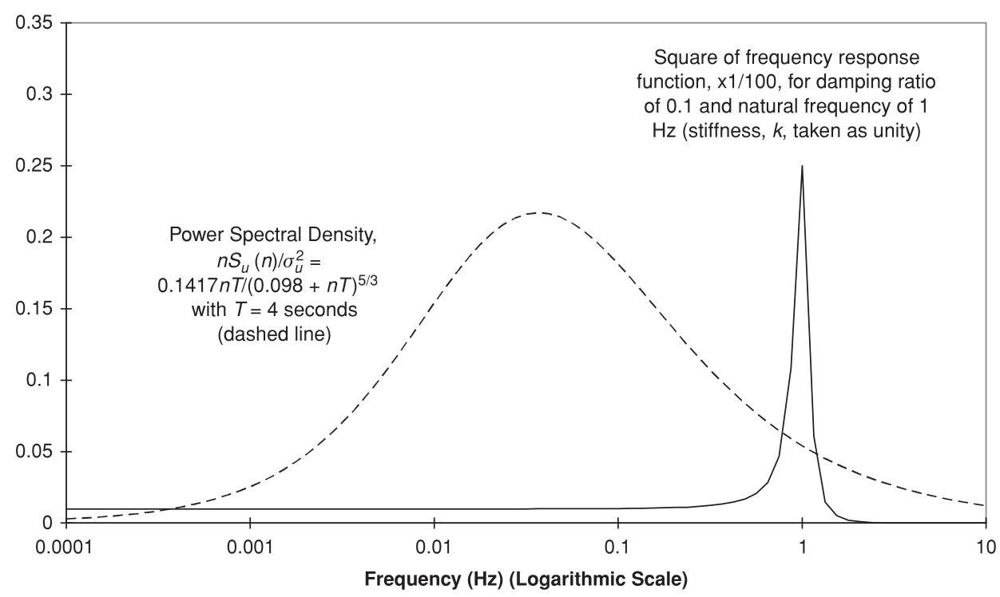

Figure A5.1 Power spectrum of wind turbulence and frequency response function

and the resonant response of higher modes, ${\sigma }_{x2}^{2},{\sigma }_{x3}^{2}$ etc. are ignored. The non-resonant response, ${\sigma }_{B}$ , is termed the background response, and can be derived from simple static beam theory.

It has been shown by Newland (1984) that ${\int }_{0}^{\infty }{\left| {H}_{1}\left( n\right) \right| }^{2}{dn}$ reduces to $\left( {{\pi }^{2}/{2\delta }}\right) \left( {{n}_{1}/{k}_{1}^{2}}\right)$ , where $\delta$ is the logarithmic decrement of damping. The logarithmic decrement, $\delta$ is ${2\pi }$ times the damping ratio, ${\xi }_{1}$ , defined as ${\xi }_{1} = {c}_{1}/2{m}_{1}{\omega }_{1}$ . Hence Equation A5.9 becomes

$$
{\sigma }_{x1}^{2} = {\left\lbrack  {C}_{f}\rho \bar{U}{\int }_{0}^{R}{\mu }_{1}\left( r\right) c\left( r\right) dr\right\rbrack  }^{2}{S}_{u}\left( {n}_{1}\right) \frac{{\pi }^{2}}{2\delta }\frac{{n}_{1}}{{k}_{1}^{2}} \tag{A5.10}
$$

For comparison, the first mode component, ${\bar{x}}_{1}$ , of the steady response is obtained by setting $\omega  = 0$ and ${q}_{0}\left( r\right)  = \frac{1}{2}\rho {\bar{U}}^{2}{C}_{f}c\left( r\right)$ in Equation A5.3, yielding

$$
{\bar{x}}_{1} = \frac{1}{2}\rho {\bar{U}}^{2}{C}_{f}\frac{1}{{k}_{1}}{\int }_{0}^{R}{\mu }_{1}\left( r\right) c\left( r\right) {dr} \tag{A5.11}
$$

Hence, the ratio of the standard deviation of the first mode resonant response to the first mode component of the steady response is

$$
\frac{{\sigma }_{x1}}{{\bar{x}}_{1}} = 2\frac{{\sigma }_{u}}{\bar{U}}\frac{\pi }{\sqrt{2\delta }}\sqrt{\frac{{n}_{1}{S}_{u}\left( {n}_{1}\right) }{{\sigma }_{u}^{2}}} = 2\frac{{\sigma }_{u}}{\bar{U}}\frac{\pi }{\sqrt{2\delta }}\sqrt{{R}_{u}\left( {n}_{1}\right) } \tag{A5.12}
$$

Note that towards the upper tail of the upper tail of the power spectrum of along wind turbulence, where ${n}_{1}$ is likely to be located, $\sqrt{{R}_{u}\left( {n}_{1}\right) }$ tends to $\sqrt{{0.1417}/{\left( n{L}_{u}^{x}/\bar{U}\right) }^{\frac{2}{3}}}$ .

## A5.4 Effect of across-wind turbulence distribution on resonant displacement response

In the foregoing treatment, the wind was assumed to be perfectly correlated along the blade. The implications of removing this simplifying assumption will now be examined.

The fluctuating load on the blade, $q\left( {r, t}\right)$ , becomes ${C}_{f}\rho \bar{U}u\left( {r, t}\right) c\left( r\right)$ per unit length, and the generalised fluctuating load with respect to the first mode becomes

$$
{Q}_{1}\left( t\right)  = {\int }_{0}^{R}{\mu }_{1}\left( r\right) q\left( {r, t}\right) {dr} = {C}_{f}\rho \bar{U}{\int }_{0}^{R}u\left( {r, t}\right) c\left( r\right) {\mu }_{1}\left( r\right) {dr} \tag{A5.13}
$$

The standard deviation, ${\sigma }_{\mathrm{Q}}$ , of ${Q}_{1}\left( t\right)$ is given by

$$
{\sigma }_{Q1}^{2} = \frac{1}{T}{\int }_{0}^{T}{Q}_{1}^{2}\left( t\right) {dt} = {\left( \rho \bar{U}{C}_{f}\right) }^{2}\frac{1}{T}{\int }_{0}^{T}\left\lbrack  {{\int }_{0}^{R}u\left( {r, t}\right) c\left( r\right) {\mu }_{1}\left( r\right) {dr}}\right\rbrack
$$

$$
\times  \left\lbrack  {{\int }_{0}^{R}u\left( {{r}^{\prime }, t}\right) c\left( {r}^{\prime }\right) {\mu }_{1}\left( {r}^{\prime }\right) d{r}^{\prime }}\right\rbrack  {dt} \tag{A5.14}
$$

$$
= {\left( \rho \bar{U}{C}_{f}\right) }^{2}{\int }_{0}^{R}{\int }_{0}^{R}\left\lbrack  {\frac{1}{T}{\int }_{0}^{T}u\left( {r, t}\right) u\left( {{r}^{\prime }, t}\right) {dt}}\right\rbrack  c\left( r\right) c\left( {r}^{\prime }\right) {\mu }_{1}\left( r\right) {\mu }_{1}\left( {r}^{\prime }\right) {drd}{r}^{\prime }
$$

Now the expression within the square brackets is the cross correlation function, ${\kappa }_{u}\left( {r,{r}^{\prime },\tau }\right)  = E\{ u\left( {r, t}\right) u\left( {{r}^{\prime }, t + \tau }\right) \}$ with $\tau$ set equal to zero. The cross correlation function is related to the cross spectrum, ${S}_{uu}\left( {r,{r}^{\prime }, n}\right)$ , as follows:

(A5.15)

$$
{\kappa }_{u}\left( {r,{r}^{\prime },\tau }\right)  = \frac{1}{2}{\int }_{-\infty }^{\infty }{S}_{uu}\left( {r,{r}^{\prime }, n}\right) \exp \left( {i2\pi n\tau }\right) {dn}\text{ , giving }
$$

$$
{\kappa }_{u}\left( {r,{r}^{\prime },0}\right)  = \left\lbrack  {\frac{1}{T}{\int }_{0}^{T}u\left( {r, t}\right) u\left( {{r}^{\prime }, t}\right) {dt}}\right\rbrack   = {\int }_{0}^{\infty }{S}_{uu}\left( {r,{r}^{\prime }, n}\right) {dn}\;\text{ for }\tau  = 0
$$

Hence,

$$
{\sigma }_{Q1}^{2} = {\left( \rho \bar{U}{C}_{f}\right) }^{2}{\int }_{0}^{R}{\int }_{0}^{R}\left\lbrack  {{\int }_{0}^{\infty }{S}_{uu}\left( {r,{r}^{\prime }, n}\right) {dn}}\right\rbrack  c\left( r\right) c\left( {r}^{\prime }\right) {\mu }_{1}\left( r\right) {\mu }_{1}\left( {r}^{\prime }\right) {drd}{r}^{\prime } \tag{A5.16}
$$

The normalised cross spectrum is defined as ${S}_{uu}^{N}\left( {r,{r}^{\prime }, n}\right)  = {S}_{uu}\left( {r,{r}^{\prime }, n}\right) /{S}_{u}\left( n\right)$ , and like ${S}_{uu}\left( {r,{r}^{\prime }, n}\right)$ , is in general a complex quantity, because of phase differences between the wind speed fluctuations at different heights. As only in-phase wind speed fluctuations will affect the response, we consider only the real part of the normalised cross spectrum, known as the normalised co-spectrum, and denoted by ${\psi }_{uu}^{N}\left( {r,{r}^{\prime }, n}\right)$ . Substituting in Equation A5.16, we obtain:

$$
{\sigma }_{Q1}^{2} = {\left( \rho \bar{U}{C}_{f}\right) }^{2}{\int }_{0}^{R}{\int }_{0}^{R}\left\lbrack  {{\int }_{0}^{\infty }{S}_{u}\left( n\right) {\psi }_{uu}^{N}\left( {r,{r}^{\prime }, n}\right) {dn}}\right\rbrack  c\left( r\right) c\left( {r}^{\prime }\right) {\mu }_{1}\left( r\right) {\mu }_{1}\left( {r}^{\prime }\right) {drd}{r}^{\prime } \tag{A5.17}
$$

From this, it can be deduced that the power spectrum of the generalised load with respect to the first mode is

$$
{S}_{Q1}\left( n\right)  = {\left( \rho \bar{U}{C}_{f}\right) }^{2}{\int }_{0}^{R}{\int }_{0}^{R}{S}_{u}\left( n\right) {\psi }_{uu}^{N}\left( {r,{r}^{\prime }, n}\right) c\left( r\right) c\left( {r}^{\prime }\right) {\mu }_{1}\left( r\right) {\mu }_{1}\left( {r}^{\prime }\right) {drd}{r}^{\prime } \tag{A5.18}
$$

Note that the power spectrum for the along wind turbulence shows some variation with height, and so should strictly be written ${S}_{u}\left( {n, z}\right)$ instead of ${S}_{u}\left( n\right)$ . However, the variation along the length of a vertical blade is small, and is ignored here.

As for the initial case when wind loadings along the blade were assumed to be perfectly correlated, the power spectrum for first mode tip displacement is equal to the product of the power spectrum of the generalised load (with respect to the first mode) and the square of the frequency response function, that is,

$$
{S}_{1x}\left( n\right)  = {S}_{Q1}\left( n\right) {\left| {H}_{1}\left( n\right) \right| }^{2} \tag{A5.19}
$$

As before, ${S}_{Q1}\left( n\right)$ is assumed constant over the narrow band of frequencies straddling the resonant frequency, and the standard deviation of resonant tip response becomes

$$
{\sigma }_{x1}^{2} = {S}_{Q1}\left( {n}_{1}\right) {\int }_{0}^{\infty }{\left| {H}_{1}\left( n\right) \right| }^{2}{dn} = {S}_{Q1}\left( {n}_{1}\right) \frac{{\pi }^{2}}{2\delta }\frac{{n}_{1}}{{k}_{1}^{2}} \tag{A5.20}
$$

### A5.4.1 Formula for normalised co-spectrum

It remains to evaluate ${S}_{Q1}\left( {n}_{1}\right)  = {\left( \rho \bar{U}{C}_{f}\right) }^{2}{S}_{u}\left( {n}_{1}\right) {\int }_{0}^{R}{\int }_{0}^{R}{\psi }_{uu}^{N}\left( {r,{r}^{\prime }, n}\right) c\left( r\right) c\left( {r}^{\prime }\right) {\mu }_{1}\left( r\right) {\mu }_{1}\left( {r}^{\prime }\right) {drd}{r}^{\prime }$ . The normalised co-spectrum, ${\psi }_{uu}^{N}\left( {r,{r}^{\prime }, n}\right)$ must decrease as the spacing $\left| {r - {r}^{\prime }}\right|$ between the two points considered increases, and intuitively it is to be expected that the decrease would be more rapid for the higher frequency components of wind fluctuation. On an empirical basis, Davenport (1962) has proposed an exponential expression for the normalised co-spectrum as follows:

$$
{\psi }_{uu}^{N}\left( {r,{r}^{\prime }, n}\right)  = \exp \left\lbrack  {-C\left| {r - {r}^{\prime }}\right| n/\bar{U}}\right\rbrack \tag{A5.21}
$$

where $C$ is a non-dimensional decay constant. Davenport noted that measurements by Cramer (1958) indicated values of $C$ ranging from 7 in unstable conditions to 50 in stable conditions, but recommended the use of the lower figure as being the more conservative despite the likelihood of stable conditions in high winds. Dyrbye and Hansen (1997) quote Risø measurements reported by Mann (1994) which indicate a value of $C$ of 9.4, and they recommend a value of 10 for use in design. A value of 11.5 is implicitly assumed in Eurocode 1.

There is an obvious inconsistency in the exponential expression for the normalised co-spectrum - when it is integrated up over the plane perpendicular to the wind direction, the result is positive instead of zero as it should be. This has led to the development of more complex expressions by Harris (1971) and Krenk (1995). However, the Davenport formulation will be used here, giving

(A5.22)

$$
{\sigma }_{x1}^{2} = {\mathrm{\;S}}_{Q1}\left( {n}_{1}\right) \frac{{\pi }^{2}}{2\delta }\frac{{n}_{1}}{{k}_{1}^{2}} = {\left( \rho \bar{U}{C}_{f}\right) }^{2}{S}_{u}\left( {n}_{1}\right)
$$

$$
\times  {\int }_{0}^{R}{\int }_{0}^{R}\exp \left\lbrack  {-C\left| {r - {r}^{\prime }}\right| {n}_{1}/\bar{U}}\right\rbrack  c\left( r\right) \left( {c{r}^{\prime }}\right) {\mu }_{1}\left( r\right) {\mu }_{1}\left( {r}^{\prime }\right) {drd}{r}^{\prime }\left\lbrack  {\frac{\pi }{2\delta }\frac{{n}_{1}}{{k}_{1}^{2}}}\right\rbrack
$$

The resonant response can be expressed in terms of the first mode component, ${\bar{x}}_{1}$ , of the steady response, $\frac{1}{2}\rho {\bar{U}}^{2}{C}_{f}\left( {1/{k}_{1}}\right) {\int }_{0}^{R}{\mu }_{1}\left( r\right) c\left( r\right) {dr}$ , from Equation A5.11, giving

$$
\frac{{\sigma }_{x1}^{2}}{{\bar{x}}_{1}^{2}} = 4\frac{{\sigma }_{u}^{2}}{{\bar{U}}^{2}}\frac{{\pi }^{2}}{2\delta }{R}_{u}\left( {n}_{1}\right)
$$

$$
\times  \frac{{\int }_{0}^{R}{\int }_{0}^{R}\exp \left\lbrack  {-C\left| {r - {r}^{\prime }}\right| {n}_{1}/\bar{U}}\right\rbrack  c\left( r\right) c\left( {r}^{\prime }\right) {\mu }_{1}\left( r\right) {\mu }_{1}\left( {r}^{\prime }\right) {drd}{r}^{\prime }}{{\left( {\int }_{0}^{R}c\left( r\right) {\mu }_{1}\left( r\right) dr\right) }^{2}} \tag{A5.23}
$$

Hence

$$
\frac{{\sigma }_{x1}}{{\bar{x}}_{1}} = 2\frac{{\sigma }_{u}}{\bar{U}}\frac{\pi }{\sqrt{2\delta }}\sqrt{{R}_{u}\left( {n}_{1}\right) }\sqrt{{K}_{Sx}\left( {n}_{1}\right) } \tag{A5.24}
$$

where

$$
{K}_{Sx}\left( {n}_{1}\right)  = \frac{{\int }_{0}^{R}{\int }_{0}^{R}\exp \left\lbrack  {-C\left| {r - {r}^{\prime }}\right| {n}_{1}/\bar{U}}\right\rbrack  c\left( r\right) c\left( {r}^{\prime }\right) {\mu }_{1}\left( r\right) {\mu }_{1}\left( {r}^{\prime }\right) {drd}{r}^{\prime }}{{\left( {\int }_{0}^{R}c\left( r\right) {\mu }_{1}\left( r\right) dr\right) }^{2}} \tag{A5.25}
$$

is denoted the size reduction factor, which results from the lack of correlation of the wind along the blade. As an example, the size reduction factor, ${K}_{Sx}\left( {n}_{1}\right)$ , is plotted out against frequency in Figure A5.2 for the case of a ${40}\mathrm{\;m}$ blade with chord $c\left( r\right)  = {0.0961}\mathrm{R} - {0.06467r}$ (Blade TR), assuming a decay constant $\mathrm{C}$ of 10, and a mean wind speed $\bar{U}$ of ${50}\mathrm{\;m}/\mathrm{s}$ . The mode shape taken is the same as for the example in Section 5.6.3 (see Figure 5.4). Also shown for comparison is the corresponding parameter for a uniform cantilever.

Figure A5.2 Size reduction factors for the first mode resonant response due to lack of correlation of wind loading along the blade: variation with frequency for ${40}\mathrm{\;m}$ blade

## A5.5 Resonant root bending moment

For design purposes it is the augmentation of blade bending moments due to dynamic effects that is of principal significance. The ratio of the standard deviation of the first mode resonant root bending moment to the steady root bending moment (allowing for the lack of correlation of wind fluctuations along the blade) is derived below.

Defining ${M}_{1}\left( t\right)$ as the fluctuating root bending moment due to wind excitation of the first mode, we have

$$
{M}_{1}\left( t\right)  = {\int }_{0}^{R}m\left( r\right) {\ddot{x}}_{1}\left( {t, r}\right) {rdr} = {\int }_{0}^{R}m\left( r\right) {\omega }_{1}^{2}{x}_{1}\left( {t, r}\right) {rdr} = {\omega }_{1}^{2}{f}_{1}\left( t\right) {\int }_{0}^{R}m\left( r\right) {\mu }_{1}\left( r\right) {rdr}
$$

(A5.26)

Hence the standard deviation of ${M}_{1}\left( t\right)$ ,

$$
{\sigma }_{M1} = {\omega }_{1}^{2}{\sigma }_{x1}{\int }_{0}^{R}m\left( r\right) {\mu }_{1}\left( r\right) {rdr} \tag{A5.27}
$$

The steady root bending moment,

$$
\bar{M} = {\int }_{0}^{R}\frac{1}{2}\rho {\bar{U}}^{2}{C}_{f}c\left( r\right) {rdr} = \frac{1}{2}\rho {\bar{U}}^{2}{C}_{f}{\int }_{0}^{R}c\left( r\right) {rdr} \tag{A5.28}
$$

Hence the ratio

$$
\frac{{\sigma }_{M1}}{\bar{M}} = \frac{{\omega }_{1}^{2}{\sigma }_{x1}{\int }_{0}^{R}m\left( r\right) {\mu }_{1}\left( r\right) {rdr}}{\frac{1}{2}\rho {\bar{U}}^{2}{C}_{f}{\int }_{0}^{R}c\left( r\right) {rdr}} \tag{A5.29}
$$

Substituting the expression for ${\sigma }_{x1}$ from Equation A5.22, we obtain

$$
\frac{{\sigma }_{M1}}{\bar{M}}
$$

$$
= \frac{{\omega }_{1}^{2}\rho \bar{U}{C}_{f}\frac{\pi }{\sqrt{2\delta }}\frac{\sqrt{{n}_{1}{S}_{u}\left( {n}_{1}\right) }}{{k}_{1}}{\int }_{0}^{R}m\left( r\right) {\mu }_{1}\left( r\right) {rdr}\sqrt{{\int }_{0}^{R}{\int }_{0}^{R}\exp \left\lbrack  {-C\left| {r - {r}^{\prime }}\right| {n}_{1}/\bar{U}}\right\rbrack  c\left( r\right) c\left( {r}^{\prime }\right) {\mu }_{1}\left( r\right) {\mu }_{1}\left( {r}^{\prime }\right) {drd}{r}^{\prime }}}{\frac{1}{2}\rho {\bar{U}}^{2}{C}_{f}{\int }_{0}^{R}c\left( r\right) {rdr}}
$$

(A5.30)

Noting that ${R}_{u}\left( n\right)  = n{S}_{u}\left( n\right) /{\sigma }_{u}^{2}$ , and that ${k}_{1} = {m}_{1}{\omega }_{1}^{2}$ , this simplifies to

$$
\frac{{\sigma }_{M1}}{\bar{M}} = 2\frac{{\sigma }_{u}}{\bar{U}}\frac{\pi }{\sqrt{2\delta }}\sqrt{{R}_{u}\left( n\right) }\frac{{\int }_{0}^{R}m\left( r\right) {\mu }_{1}\left( r\right) {rdr}}{{m}_{1}{\int }_{0}^{R}c\left( r\right) {rdr}}
$$

$$
\times  \sqrt{{\int }_{0}^{R}{\int }_{0}^{R}\exp \left\lbrack  {-C\left| {r - {r}^{\prime }}\right| {n}_{1}/\bar{U}}\right\rbrack  c\left( r\right) c\left( {r}^{\prime }\right) {\mu }_{1}\left( r\right) {\mu }_{1}\left( {r}^{\prime }\right) {drd}{r}^{\prime }} \tag{A5.31}
$$

where ${m}_{1} = {\int }_{0}^{R}m\left( r\right) {\mu }_{1}^{2}\left( r\right) {dr}$ is the generalised mass with respect to the first mode, and the exponential expression within the double integral allows for the lack of correlation of wind fluctuations along the blade. Substituting $\left( {{\int }_{0}^{R}c\left( r\right) {\mu }_{1}\left( r\right) {dr}}\right) \sqrt{{K}_{Sx}\left( {n}_{1}\right) }$ for the square root of the double integral, using Equation A5.25, leads to

$$
\frac{{\sigma }_{M1}}{\bar{M}} = 2\frac{{\sigma }_{u}}{\bar{U}}\frac{\pi }{\sqrt{2\delta }}\sqrt{{R}_{u}\left( n\right) }\frac{{\int }_{0}^{R}m\left( r\right) {\mu }_{1}\left( r\right) {rdr}}{{m}_{1}{\int }_{0}^{R}c\left( r\right) {rdr}}\left( {{\int }_{0}^{R}c\left( r\right) {\mu }_{1}\left( r\right) {dr}}\right) \sqrt{{K}_{Sx}\left( {n}_{1}\right) } \tag{A5.32}
$$

Defining the ratio of the integrals,

$$
\frac{{\int }_{0}^{R}m\left( r\right) {\mu }_{1}\left( r\right) {rdr}}{{m}_{1}{\int }_{0}^{R}c\left( r\right) {rdr}}\left( {{\int }_{0}^{R}c\left( r\right) {\mu }_{1}\left( r\right) {dr}}\right)  = \frac{\frac{{\sigma }_{M1}}{M}}{\frac{{\sigma }_{x1}}{{\bar{x}}_{1}}},\;\text{ as }\;{\lambda }_{M1} \tag{A5.33}
$$

we obtain

$$
\frac{{\sigma }_{M1}}{\bar{M}} = 2\frac{{\sigma }_{u}}{\bar{U}}\frac{\pi }{\sqrt{2\delta }}\sqrt{{R}_{u}\left( {n}_{1}\right) }\sqrt{{K}_{Sx}\left( {n}_{1}\right) }{\lambda }_{M1} \tag{A5.34}
$$

## A5.6 Root bending moment background response

The root bending moment background response can be expressed in terms of the standard deviation of the root bending moment excluding resonant effects. If the wind is perfectly correlated along the blade, this is given by

$$
{\sigma }_{MB} = {C}_{f}\rho \bar{U}{\sigma }_{u}{\int }_{0}^{R}c\left( r\right) {rdr} \tag{A5.35}
$$

However, if the lack of correlation of wind fluctuations along the blade is taken into account,

$$
{\sigma }_{MB} = {C}_{f}\rho \bar{U}{\sigma }_{u}\sqrt{{\int }_{0}^{R}{\int }_{0}^{R}{\rho }_{u}\left( {r - {r}^{\prime }}\right) c\left( r\right) c\left( {r}^{\prime }\right) r{r}^{\prime }{drd}{r}^{\prime }} \tag{A5.36}
$$

where ${\rho }_{\mathrm{u}}\left( {r - {r}^{\prime }}\right)$ is the normalised cross correlation function between simultaneous wind speed fluctuations at two different blade radii, and is defined as

$$
{\rho }_{u}\left( {r - {r}^{\prime }}\right)  = \frac{1}{{\sigma }_{u}^{2}}E\left\{  {u\left( {r, t}\right) u\left( {{r}^{\prime }, t + \tau }\right) }\right\}  \;\text{ with }\tau \text{ set equal to zero. } \tag{A5.37}
$$

Measurements indicate that the normalised cross correlation function decays exponentially, so it can be expressed as

$$
{\rho }_{u}\left( {r - {r}^{\prime }}\right)  = \exp \left\lbrack  {-\left| {r - {r}^{\prime }}\right| /{L}_{u}^{r}}\right\rbrack \tag{A5.38}
$$

where ${L}_{u}^{r}$ is the integral length scale for the longitudinal turbulence component measured in the across wind direction along the blade, and is thus defined as ${\int }_{0}^{\infty }{\rho }_{u}\left( {r - {r}^{\prime }}\right) d\left( {r - {r}^{\prime }}\right)$ . As the integral length scale for longitudinal turbulence measured vertically in the across wind direction $\left( {L}_{u}^{z}\right)$ , is, if anything, less than that measured horizontally $\left( {L}_{u}^{y}\right)$ , it is conservative to treat it as being equal to that measured horizontally, with the result that ${L}_{u}^{r}$ can be taken as equal to ${L}_{u}^{y}$ also. Typically ${L}_{u}^{y}$ is approximately equal to ${30}\%$ of ${L}_{u}^{x}$ , the integral length scale for longitudinal turbulence measured in the along wind direction. Observing that

$$
\bar{M} = \frac{1}{2}\rho {\bar{U}}^{2}{C}_{f}{\int }_{0}^{R}c\left( r\right) {rdr}
$$

we can therefore write

$$
\frac{{\sigma }_{MB}}{\bar{M}} = 2\frac{{\sigma }_{u}}{\bar{U}}\sqrt{{K}_{SMB}} \tag{A5.39}
$$

where ${K}_{SMB}$ , the size reduction factor for the root bending moment background response, is defined as

$$
{K}_{SMB} = \frac{{\int }_{0}^{R}{\int }_{0}^{R}\exp \left\lbrack  {-\left| {r - {r}^{\prime }}\right| /{0.3}{L}_{u}^{x}}\right\rbrack  c\left( r\right) c\left( {r}^{\prime }\right) r{r}^{\prime }{drd}{r}^{\prime }}{{\left( {\int }_{0}^{R}c\left( r\right) rdr\right) }^{2}} \tag{A5.40}
$$

For a blade with a uniform chord, the integral is straightforward, giving

$$
{K}_{SMB} = 4\left\lbrack  {\frac{2}{3\phi } - \frac{1}{{\phi }^{2}} + \frac{2}{{\phi }^{4}} - \exp \left( {-\phi }\right) \left\{  {\frac{2}{{\phi }^{3}} + \frac{2}{{\phi }^{4}}}\right\}  }\right\rbrack  \;\text{ where }\phi  = \frac{R}{{0.3}{L}_{u}^{x}} \tag{A5.41}
$$

As an example, ${K}_{SMB}$ comes to 0.837 for the case of $R = {40}\mathrm{\;m}$ and ${L}_{u}^{x} = {189}\mathrm{\;m}$ indicating that the lack of correlation of the wind fluctuations reduces the root bending moment appreciably.

For blades with a normal tapering chord, ${K}_{SMB}$ can be evaluated numerically. In the case of a blade with a tip chord equal to ${33}\%$ of the maximum chord, ${K}_{SMB}$ is 0.829 for the same value of $\phi$ as before. It is seen that the taper has an almost negligible effect on the end result.

## A5.7 Peak response

One of the key parameters required in blade design is the extreme value of the out-of-plane bending moment. The 50-year return moment is defined as the expected maximum moment occurring during the mean wind averaging period when the mean takes the 50-year return value. Treating the moment as a Gaussian process, Davenport (1964) has shown that the expected value of the maximum departure from the mean is the standard deviation multiplied by the peak factor, $g$ , where

$$
g = \sqrt{2\ln \left( {vT}\right) } + \frac{0.5772}{\sqrt{2\ln \left( {vT}\right) }} \tag{A5.42}
$$

In this formula, $v$ is the mean zero-upcrossing frequency of the root moment fluctuations, and $T$ is the mean wind speed averaging period. The variance of the root bending moment is, in the same way as for the tip displacement, equal to the sum of the variances of the background and resonant root bending moment responses, that is,

$$
{\sigma }_{M}^{2} = {\sigma }_{MB}^{2} + {\sigma }_{M1}^{2} \tag{A5.43}
$$

Hence, from Equations A5.39 and A5.34, we obtain

$$
{\sigma }_{M}^{2} = {\sigma }_{MB}^{2} + {\sigma }_{M1}^{2} = 4{\bar{M}}^{2}\frac{{\sigma }_{u}^{2}}{{\bar{U}}^{2}}\left\lbrack  {{K}_{SMB} + \frac{{\pi }^{2}}{2\delta }{R}_{u}\left( {n}_{1}\right) {K}_{Sx}\left( {n}_{1}\right) {\lambda }_{M1}^{2}}\right\rbrack \tag{A5.44}
$$

Thus,

$$
{M}_{\max } = \bar{M} + g{\sigma }_{M} = \bar{M}\left( {1 + {2g}\frac{{\sigma }_{u}}{\bar{U}}\sqrt{{K}_{SMB} + \frac{{\pi }^{2}}{2\delta }{R}_{u}\left( {n}_{1}\right) {K}_{Sx}\left( {n}_{1}\right) {\lambda }_{M1}^{2}}}\right) \tag{A5.45}
$$

The mean zero up-crossing frequency of the root moment fluctuations, $v$ , is defined as

$$
v = \sqrt{\frac{{\int }_{0}^{\infty }{n}^{2}{S}_{M}\left( n\right) {dn}}{{\int }_{0}^{\infty }{S}_{M}\left( n\right) {dn}}} \tag{A5.46}
$$

where ${S}_{M}\left( n\right)$ is the power spectrum of the root moment fluctuations. If we separate the power spectrum of the background response from the first mode resonant response at frequency ${n}_{1}$ , then the above expression can be written

$$
v = \sqrt{\frac{\left( {{\int }_{0}^{\infty }{n}^{2}{S}_{MB}\left( n\right) {dn}}\right)  + {n}_{1}^{2}{\sigma }_{M1}^{2}}{{\sigma }_{MB}^{2} + {\sigma }_{M1}^{2}}} \tag{A5.47}
$$

Now

$$
{S}_{MB}\left( n\right)  = {\left( {C}_{f}\rho \bar{U}\right) }^{2}{S}_{u}\left( n\right) {\int }_{0}^{R}{\int }_{0}^{R}{\psi }_{uu}^{N}\left( {r,{r}^{\prime }, n}\right) c\left( r\right) c\left( {r}^{\prime }\right) r{r}^{\prime }{drd}{r}^{\prime } \tag{A5.48}
$$

and

$$
\bar{M} = {C}_{f}\frac{1}{2}\rho {\bar{U}}^{2}{\int }_{0}^{R}c\left( r\right) {rdr} \tag{A5.49}
$$

so

$$
{S}_{MB}\left( n\right)  = 4\frac{{\bar{M}}^{2}}{{\bar{U}}^{2}}\frac{{S}_{u}\left( n\right) {\int }_{0}^{R}{\int }_{0}^{R}{\psi }_{uu}^{N}\left( {r,{r}^{\prime }, n}\right) c\left( r\right) c\left( {r}^{\prime }\right) r{r}^{\prime }{drd}{r}^{\prime }}{{\left( {\int }_{0}^{R}c\left( r\right) rdr\right) }^{2}} \tag{A5.50}
$$

Defining

$$
{K}_{SMB}\left( n\right)  = \frac{{\int }_{0}^{R}{\int }_{0}^{R}{\psi }_{uu}^{N}\left( {r,{r}^{\prime }, n}\right) c\left( r\right) c\left( {r}^{\prime }\right) r{r}^{\prime }{drd}{r}^{\prime }}{{\left( {\int }_{0}^{R}c\left( r\right) rdr\right) }^{2}} \tag{A5.51}
$$

we obtain

$$
{S}_{MB}\left( n\right)  = 4\frac{{\bar{M}}^{2}}{{\bar{U}}^{2}}{S}_{u}\left( n\right) {K}_{SMB}\left( n\right) \tag{A5.52}
$$

Substituting into Equation A5.47 gives

$$
v = \sqrt{\frac{4\frac{{\bar{M}}^{2}}{{\bar{U}}^{2}}\left( {{\int }_{0}^{\infty }{n}^{2}{S}_{u}\left( n\right) {K}_{SMB}\left( n\right) {dn}}\right)  + {n}_{1}^{2}{\sigma }_{M1}^{2}}{{\sigma }_{MB}^{2} + {\sigma }_{M1}^{2}}} \tag{A5.53}
$$

Noting from Equation A5.52 that ${\sigma }_{MB}^{2} = 4\left( {{\bar{M}}^{2}/{\bar{U}}^{2}}\right) {\int }_{0}^{\infty }{S}_{u}\left( n\right) {K}_{SMB}\left( n\right) {dn}$ , the expression for $v$ becomes

$$
v = \sqrt{\frac{{n}_{0}^{2}{\sigma }_{MB}^{2} + {n}_{1}^{2}{\sigma }_{M1}^{2}}{{\sigma }_{MB}^{2} + {\sigma }_{M1}^{2}}} \tag{A5.54}
$$

where

$$
{n}_{0} = \frac{{\int }_{0}^{\infty }{n}^{2}{S}_{u}\left( n\right) {K}_{SMB}\left( n\right) {dn}}{{\int }_{0}^{\infty }{S}_{u}\left( n\right) {K}_{SMB}\left( n\right) {dn}} \tag{A5.55}
$$

Substituting ${\psi }_{uu}^{N}\left( {r,{r}^{\prime }, n}\right)  = \exp \left\lbrack  {-C\left( {r - {r}^{\prime }}\right) n/\bar{U}}\right\rbrack$ into the expression for ${K}_{SMB}\left( n\right)$ in the numerator of Equation A5.55 gives

$$
{\int }_{0}^{\infty }{n}^{2}{S}_{u}\left( n\right) {K}_{SMB}\left( n\right) {dn} = {\int }_{0}^{\infty }{n}^{2}{S}_{u}\left( n\right) \frac{{\int }_{0}^{R}{\int }_{0}^{R}\exp \left\lbrack  {-C\left( {r - {r}^{\prime }}\right) n/\bar{U}}\right\rbrack  c\left( r\right) c\left( {r}^{\prime }\right) r{r}^{\prime }{drdr}{d}^{\prime }}{{\left( {\int }_{0}^{R}c\left( r\right) rdr\right) }^{2}}{dn} \tag{A5.56}
$$

For high frequencies, the double integral is, in the limit, inversely proportional to frequency, so the integrand ${n}^{2}{S}_{u}\left( n\right) {K}_{SMB}\left( n\right)$ is proportional to ${n}^{2}{n}^{-\frac{5}{3}}{n}^{-1} = {n}^{-\frac{2}{3}}$ and the integral does not converge. Consequently it is necessary to take account of the chordwise lack of correlation of wind fluctuation at high frequencies, and if this is done, it is found that, in the limit, the integrand is proportional to ${n}^{-\frac{5}{3}}$ for which the integral is finite. The evaluation of the integral ${\int }_{0}^{\infty }{n}^{2}{S}_{u}\left( n\right) {K}_{SMB}\left( n\right) {dn}$ taking chordwise lack of correlation into account is a formidable task, so the use of an approximate formula for the frequency, ${n}_{0}$ , is preferable, especially as the influence of ${n}_{0}$ on the peak factor, $g$ , is slight. Dyrbye and Hansen (1997) give an approximate formula for a uniform cantilever is as follows:

$$
{n}_{0} = {0.3}\frac{\bar{U}}{\sqrt{{L}_{u}^{x}\sqrt{Rc}}} \tag{A5.57}
$$

Here $R$ is the blade tip radius and $c$ is the blade chord, assumed constant. For a tapering chord, the mean chord, $\bar{c}$ , can be substituted.

## A5.8 Bending moments at intermediate blade positions

### A5.8.1 Background response

Denoting the standard deviation of the quasistatic or background bending moment fluctuations at radius ${r}^{ * }$ as ${\sigma }_{MB}\left( {r}^{ * }\right)$ , it is apparent that

$$
\frac{{\sigma }_{MB}\left( {r}^{ * }\right) }{{\sigma }_{MB}\left( 0\right) } = \sqrt{\frac{{K}_{SMB}\left( {r}^{ * }\right) }{{K}_{SMB}\left( 0\right) }}\frac{{\int }_{{r}^{ * }}^{R}c\left( r\right) \left\lbrack  {r - {r}^{ * }}\right\rbrack  {dr}}{{\int }_{0}^{R}c\left( r\right) {rdr}} \tag{A5.58}
$$

The ratio of the steady moment at radius ${r}^{ * }$ to that at the root is $\left( {{\int }_{{r}^{ * }}^{R}c\left( r\right) \left\lbrack  {r - {r}^{ * }}\right\rbrack  {dr}}\right) /\left( {{\int }_{0}^{R}c\left( r\right) {rdr}}\right)$ , so the ratio of the standard deviation of the quasistatic fluctuations at radius ${\mathrm{r}}^{ * }$ to the steady value there is

$$
\frac{{\sigma }_{MB}\left( {r}^{ * }\right) }{\bar{M}\left( {r}^{ * }\right) } = \frac{{\sigma }_{MB}\left( {r}^{ * }\right) }{{\sigma }_{MB}\left( 0\right) }\frac{{\sigma }_{MB}\left( 0\right) }{\bar{M}\left( 0\right) }\frac{\bar{M}\left( 0\right) }{\bar{M}\left( {r}^{ * }\right) } = \frac{{\sigma }_{MB}\left( 0\right) }{\bar{M}\left( 0\right) }\sqrt{\frac{{K}_{SMB}\left( {r}^{ * }\right) }{{K}_{SMB}\left( 0\right) }} \tag{A5.59}
$$

Generally, the square root will be close to unity, so ${\sigma }_{MB}\left( {r}^{ * }\right) /\bar{M}\left( {r}^{ * }\right)$ will be nearly constant.

### A5.8.2 Resonant response

In section A5.5 it was shown that the standard deviation of the first mode resonant root bending moment is equal to ${\omega }_{1}^{2}{\sigma }_{x1}{\int }_{0}^{R}m\left( r\right) {\mu }_{1}\left( r\right) {rdr}$ (Equation A5.27). The corresponding quantity at other radii can be derived similarly, giving

$$
{\sigma }_{M1}\left( {r}^{ * }\right)  = {\omega }_{1}^{2}{\sigma }_{x1}{\int }_{{r}^{ * }}^{R}m\left( r\right) {\mu }_{1}\left( r\right) \left\lbrack  {r - {r}^{ * }}\right\rbrack  {dr} \tag{A5.60}
$$

Hence, the ratio of the standard deviation of the first mode resonant root bending moment at radius ${r}^{ * }$ to the steady value there is

$$
\frac{{\sigma }_{M1}\left( {r}^{ * }\right) }{\bar{M}\left( {r}^{ * }\right) } = \frac{{\sigma }_{M1}\left( {r}^{ * }\right) }{{\sigma }_{M1}\left( 0\right) }\frac{{\sigma }_{M1}\left( 0\right) }{\bar{M}\left( 0\right) }\frac{\bar{M}\left( 0\right) }{\bar{M}\left( {r}^{ * }\right) } = \frac{{\int }_{{r}^{ * }}^{R}m\left( r\right) {\mu }_{1}\left( r\right) \left\lbrack  {r - {r}^{ * }}\right\rbrack  {dr}}{{\int }_{0}^{R}m\left( r\right) {\mu }_{1}\left( r\right) {rdr}}\frac{{\int }_{0}^{R}c\left( r\right) {rdr}}{{\int }_{{r}^{ * }}^{R}c\left( r\right) \left\lbrack  {r - {r}^{ * }}\right\rbrack  {dr}}\frac{{\sigma }_{M1}\left( 0\right) }{\bar{M}\left( 0\right) }
$$

(A5.61)

## References

Cramer, H.E. (1958) Use of power spectra and scales of turbulence in estimating wind loads, Second National Conference on Applied Meteororlogy, Ann Arbor, Michigan, USA.

Davenport, A.G. (1962) The response of slender, line-like structures to a gusty wind. Proc. Inst. Civ. Eng., 23, 389-408.

Davenport, A.G. (1964) Note on the distribution of the largest value of a random function with application to gust loading. Proc. Inst. Civ. Eng., 28, 187-196.

Dyrbye, C., and Hansen, S.O (1997) Wind loads on structures. John Wiley and Sons.

Eurocode 1 (2005) Actions on structures - Part 1-4: General actions - Wind actions (EN 1991-1-4: 2005)

Harris, R.I. (1971) The nature of the wind. Proceedings of the CIRIA Conference, pp 29-55.

Krenk, S. (1995) Wind field coherence and dynamic wind forces. Symposium on the advances in Non-linear Stochastic Mechanics. Kluwer, Dordrecht, Germany.

Mann, J. (1994) The spatial structure of neutral atmospheric surface-layer turbulence. J. Ind. Aerodyn., 1, 167-175.

Newland, D.E. (1984) Random vibrations and spectral analysis. Longman, UK.

Wyatt, T.A. (1980). The dynamic behaviour of structures subject to gust loading. Proceedings of the CIRIA Conference, "Wind engineering in the eighties" pp. 6-1-6-22.

