# 6 Conceptual design of horizontal axis wind turbines

## 6.1 Introduction

Within the general category of horizontal axis wind turbines for grid applications there exists a great variety of possible machine configurations, power control strategies and braking systems. This chapter looks at the different areas where design choices have to be made, and considers the advantages and disadvantages of the more conventional options in each case. Inevitably there are situations in which decisions in one area can impact those in another, and some of these are noted.

Alongside these discrete design choices there are several fundamental design parameters, such as rotor diameter, machine rating and rotational speed, which also have to be established at the start of the design process. Continuous variables such as these lend themselves to mathematical optimisation, as described in the opening sections of the chapter.

An illuminating overview of the evolution of turbine design, including the power control strategies and drive train configurations adopted by particular manufacturers, is provided in Wind Energy - The Facts (2009) published by the European Wind Energy Association.

## 6.2 Rotor diameter

The issue of what size of turbine produces energy at minimum cost has been fiercely debated for a long time. Protagonists of large machines cite economies of scale and the increase in wind speed with height in their favour. From the other camp, the 'square-cube law', whereby energy capture increases as the square of the diameter, whereas rotor mass (and therefore cost) increases as the cube, is advanced as an argument against.

In reality, both arguments are correct, and there is a trade-off between economies of scale and a variant of the 'square-cube law' which takes into account the wind shear effect. This trade-off can be examined with the help of simple cost modelling, which is considered next.

---

Wind Energy Handbook, Second Edition. Tony Burton, Nick Jenkins, David Sharpe and Ervin Bossanyi.

© 2011 John Wiley & Sons, Ltd. Published 2011 by John Wiley & Sons, Ltd. ISBN: 978-0-470-69975-1

---

### 6.2.1 Cost modelling

The sensitivity of the cost of energy to changes in the values of parameters governing turbine design can be examined with the aid of a model of the way component costs vary in response. The normal procedure is to start with a baseline design, for which the costs of the various components are known. In a rigorous analysis, the chosen parameter is then assigned a different value and a fresh design developed, leading to revised component weights, based on which new component costs can be assigned.

In general, the cost of a component will not simply increase pro rata with its mass, but will contain elements that increase more slowly. Examples are the tower surface protective coating and tower longitudinal welds (assuming the number required is constant), the costs of which increase approximately as the square of the tower height, if all dimensions are proportional to this height. If the design parameter variation considered is only about $\pm  {50}\%$ , it is usually sufficiently accurate to represent the relationship between component cost and mass as a linear one with a fixed component, as follows:

$$
C\left( x\right)  = {C}_{B}\left( {\mu \frac{m\left( x\right) }{{m}_{B}} + \left( {1 - \mu }\right) }\right) \tag{6.1}
$$

where $C\left( x\right)$ and $m\left( x\right)$ are the cost and mass of the component respectively when the design parameter takes the value $x$ , and ${C}_{B}$ and ${m}_{B}$ are the baseline values. $\mu$ is the proportion of the cost that varies with mass, which will obviously differ for different baseline machine sizes and for different components.

The choice of the value of $\mu$ inevitably requires considerable expertise as regards the way manufacturing costs vary with scale, which may be limited in the case of products at the early stage of development. In view of this, the effort of developing fresh designs for different design parameter values may well not be justified, so resort is often made to scaling ratios based on similarity relationships. This approach is adopted in the investigation of optimum machine size which follows.

### 6.2.2 Simplified cost model for machine size optimisation: an illustration

The baseline machine design is taken as a ${60}\mathrm{\;m}$ diameter, ${1.5}\mathrm{{MW}}$ turbine, with the costs of the various components taken from the Risø publication 'Cost optimisation of wind turbines for large-scale offshore windfarms' (Risø-R-1000) by Fuglsang and Thomsen (1998). These are given in Table 6.1 as a percentage of the total.

Machine designs for other diameters are obtained by scaling all dimensions of all components in the same proportion, except in the case of the gearbox, generator, grid connection and controller. Rotational speed is kept inversely proportional to rotor diameter to maintain constant tip speed, and hence constant tip speed ratio at a given wind speed. As a result, the maximum rotor aerodynamic thrust increases with the square of rotor diameter and the peak aerodynamic bending moment in each structural element, which is assumed to govern its design, increases with rotor diameter cubed. Given the assumption that all cross-sectional dimensions increase in proportion to rotor diameter, the bending section moduli increase as diameter cubed, so each critical stress remains invariant with diameter.

Table 6.1 Component costs expressed as a percentage of total machine cost for a 1.5 MW, ${60}\mathrm{\;m}$ diameter, fixed speed, stall-regulated wind turbine on land (from Risø-R-1000, Fuglsang and Thomsen, 1998)

<table><tr><td>Component</td><td>Cost as a percentage of total</td><td>Component</td><td>Cost as a percentage of total</td></tr><tr><td>Blades</td><td>18.3%</td><td>Controller</td><td>4.2%</td></tr><tr><td>Hub</td><td>2.5%</td><td>Tower</td><td>17.5%</td></tr><tr><td>Main shaft</td><td>4.2%</td><td>Brake system</td><td>1.7%</td></tr><tr><td>Gearbox</td><td>12.5%</td><td>Foundation</td><td>4.2%</td></tr><tr><td>Generator</td><td>7.5%</td><td>Assembly</td><td>2.1%</td></tr><tr><td>Nacelle</td><td>10.8%</td><td>Transport</td><td>2.0%</td></tr><tr><td>Yaw system</td><td>4.2%</td><td>Grid connection</td><td>8.3%</td></tr><tr><td></td><td></td><td>TOTAL</td><td>100%</td></tr></table>

Maintenance of constant tip speed also means that all machine designs reach rated power at the same wind speed, so that rated power is proportional to diameter squared. However, the low speed shaft torque increases as diameter cubed, which is the basis for assuming the gearbox mass increases as the cube of rotor diameter, even though the gearbox ratio changes. In the following illustration a blanket value of $\mu$ of 0.9 for all components is adopted for simplicity. Accordingly, the cost of all components apart from generator, controller and the grid connection, for a machine of diameter $D$ , is given by:

$$
{C}_{1}\left( D\right)  = {0.8}{C}_{T}\left( {60}\right) \left( {{0.9}{\left( \frac{D}{60}\right) }^{3} + {0.1}}\right) \tag{6.2}
$$

where ${C}_{T}\left( {60}\right)$ is the total cost of the ${60}\mathrm{\;m}$ diameter baseline machine.

The rating of the generator and the grid connection is proportional only to the diameter squared. It is assumed that Equation 6.1 applies to the cost of these components, but with mass replaced by rating. Thus, the cost of the generator and grid connection are given by:

$$
{C}_{2}\left( D\right)  = {0.158}{C}_{T}\left( {60}\right) \left( {{0.9}{\left( \frac{D}{60}\right) }^{2} + {0.1}}\right) \tag{6.3}
$$

The controller cost is assumed to be fixed, regardless of turbine size. Hence, the resulting turbine cost as a function of diameter is:

$$
{C}_{T}\left( D\right)  = {C}_{T}\left( {60}\right) \left( {{0.8}\left\{  {{0.9}{\left( \frac{D}{60}\right) }^{3} + {0.1}}\right\}   + {0.158}\left\{  {{0.9}{\left( \frac{D}{60}\right) }^{2} + {0.1}}\right\}   + {0.042}}\right)
$$

$$
= {C}_{T}\left( {60}\right) \left( {{0.72}{\left( \frac{D}{60}\right) }^{3} + {0.1422}{\left( \frac{D}{60}\right) }^{2} + {0.1378}}\right) \tag{6.4}
$$

Figure 6.1 Variation of optimum turbine size with wind shear based on simplified cost model (assuming hub height equal to diameter)

As the tower height, along with all other dimensions, is assumed to increase in proportion to rotor diameter, the annual mean wind speed (amws) at hub height will increase with rotor diameter because of wind shear. This has a significant effect on energy yield, as the energy yield per unit of swept area is found to vary as the amws raised to the power of 1.9 for perturbations about the amws central value of $8\mathrm{\;m}/\mathrm{s}$ taken in this example. The cost of energy (excluding operation and maintenance costs) can then be calculated in $\text{ € }/\mathrm{{kWh}}/$ annum by dividing the turbine cost by the annual energy yield. The variation of energy cost with diameter, calculated according to the assumptions described above, is plotted in Figure 6.1 for two levels of wind shear corresponding to roughness lengths, ${z}_{0}$ , of ${0.001}\mathrm{\;m}$ and ${0.05}\mathrm{\;m}$ , the hub height wind speed being scaled according to the relation $\bar{U}\left( z\right)  \propto  \ln \left( {z/{z}_{0}}\right)$ (see Section 2.6.2). Also included is a plot for the case of zero wind shear.

It is apparent that the level of wind shear has a noticeable effect on the optimum machine diameter, which varies from ${44}\mathrm{\;m}$ for zero wind shear to ${52}\mathrm{\;m}$ for the wind shear corresponding to a surface roughness length of ${0.05}\mathrm{\;m}$ , which is applicable to farmland with boundary hedges and occasional buildings. Strictly, the impact of the increased annual mean wind speed with hub height on the fatigue design of the rotor and other components should also be taken into account, which would reduce the optimum machine size slightly.

It should be emphasised that the optimum sizes derived above depend critically on the value of $\mu$ adopted. For example, if $\mu$ were taken as 0.8 instead of 0.9, the optimum diameter would increase to ${64}\mathrm{\;m}$ for the wind shear corresponding to a surface roughness length of ${0.05}\mathrm{\;m}$ , although the minimum cost of energy would alter by only ${0.9}\%$ . The correct approach would be to allocate different values of $\mu$ to different components, as is done in Fuglsang and Thomsen (1998). Ideally these would be based on cost data on components of the same design but different sizes.

Figure 6.2 Variation of specific blade mass with diameter for LM blades available in 2004

The cost model outlined and illustrated above provides a straightforward means of investigating scale effects on machine economics for a chosen machine design. In practice, the use of different materials or different machine configurations may prove more economic at different machine sizes, and will yield a series of alternative cost versus diameter curves.

An example of the impact technological developments can have on simple scaling rules is provided by the trajectory of specific blade mass - defined as blade mass divided by turbine diameter cubed - as longer blade designs have evolved over time. Figure 6.2 shows a plot of specific blade mass against diameter for blades manufactured by LM Glasfiber that were available in 2004.

It is seen that the specific blade mass is approximately inversely proportional to diameter - that is, the blade mass has increased with diameter squared rather than with diameter cubed. The decline in specific blade mass is partly due to a lower practical limit on skin thicknesses, which made the smaller blades heavier than they would otherwise need to be.

The blade cost scaling rule adopted in the cost model obviously has a decisive effect on the optimum rotor diameter, which (for the case of wind shear corresponding to a surface roughness of ${0.05}\mathrm{\;m}$ ) increases from ${52}\mathrm{\;m}$ to ${59}\mathrm{\;m}$ when the blade cost is scaled as the square of diameter, as indicated by the dotted line in Figure 6.1.

### 6.2.3 The NREL cost model

Research at NREL, reported in 'Wind Turbine Design Cost and Scaling Model' NREL (2006), has resulted in a useful set of mass and cost scaling rules for several wind turbine configurations, which serve as benchmarks against which innovations in the design of individual components can be judged. It is intended that the scaling rules are updated over time as additional data becomes available.

The baseline turbine design is a ${70}\mathrm{\;m}$ diameter, ${1.5}\mathrm{{MW}}$ variable speed pitch regulated machine, fitted with a three stage planetary gearbox. Many of the scaling rules are similar to those set out in the preceding section, with the main differences being as follows:

- Blade cost split into material and labour costs of similar magnitudes, with the former scaling as diameter cubed $\left( {\mathrm{D}}^{3}\right)$ and the latter scaling as ${\mathrm{D}}^{2.5}$ .

- Gearbox cost scaled as ${\mathrm{D}}^{2.5}$ rather than ${\mathrm{D}}^{3}$ .

- Nacelle cost scaled as ${\mathrm{D}}^{1.95}$ rather than ${\mathrm{D}}^{3}$ .

- Foundation cost scaled as ${\mathrm{D}}^{1.2}$ rather than ${\mathrm{D}}^{3}$ .

- An element of transport cost increasing as the sixth power of diameter.

Table 6.2 presents the component costs of the baseline turbine in 2005 dollars and the respective percentages of the total. Also shown are the corresponding percentages for the ${60}\mathrm{\;m}$ diameter ${1.5}\mathrm{{MW}}$ machine of the preceding section, where applicable. Caution should be exercised in making comparisons, however, as component definitions may vary.

Table 6.2 Component costs and percentages for NREL 1.5 MW 70 m diameter baseline machine

<table><tr><td>Component</td><td>Component costs for 1.5 MW, 70 m dia NREL baseline turbine (with 70 m hub height) \$1000 (2005)</td><td>Percentage component costs for NREL baseline turbine</td><td>Percentage component costs for Risø-R-1000 1.5 MW, 60 m dia turbine</td></tr><tr><td>Blades</td><td>151</td><td>11.4%</td><td>18.3%</td></tr><tr><td>Hub</td><td>47</td><td>3.6%</td><td>2.9%</td></tr><tr><td>Pitch bearings and mechanism</td><td>56</td><td>4.3%</td><td>N/A</td></tr><tr><td>Low speed shaft and main bearings</td><td>33</td><td>2.5%</td><td>4.2%</td></tr><tr><td>Gearbox</td><td>152</td><td>11.6%</td><td>12.9%</td></tr><tr><td>Generator</td><td>98</td><td>7.4%</td><td>7.5%</td></tr><tr><td>Variable speed electronics</td><td>119</td><td>9.0%</td><td>N/A</td></tr><tr><td>Nacelle</td><td>119</td><td>8.9%</td><td>10.8%</td></tr><tr><td>Yaw drive & bearing</td><td>20</td><td>1.5%</td><td>4.2%</td></tr><tr><td>Control system</td><td>35</td><td>2.7%</td><td>4.2%</td></tr><tr><td>Tower</td><td>158</td><td>12.0%</td><td>17.5%</td></tr><tr><td>Brake & HS coupling</td><td>3</td><td>0.2%</td><td>1.7%</td></tr><tr><td>Foundation</td><td>47</td><td>3.6%</td><td>4.2%</td></tr><tr><td>Assembly & installation</td><td>42</td><td>3.2%</td><td>2.1%</td></tr><tr><td>Transportation</td><td>51</td><td>3.9%</td><td>2.0%</td></tr><tr><td>Electrical connections</td><td>187</td><td>14.2%</td><td>8.3%</td></tr><tr><td>inc grid connection</td><td>1317</td><td>100%</td><td>100%</td></tr></table>

Figure 6.3 Variation of cost of energy with turbine diameter for NREL baseline machine-capital cost component only

Figure 6.3 presents the variation of the cost of energy capital component with turbine diameter, based on the NREL cost model for the machine described above. The annual mean wind speed at ${50}\mathrm{\;m}$ height is taken as ${7.25}\mathrm{\;m}/\mathrm{s}$ and wind speed is assumed to vary with hub height according to the power law $\bar{U}\left( z\right)  = \bar{U}\left( {50}\right)  \cdot  {\left( z/{50}\right) }^{0.14}$ . Hub height is taken as equal to turbine diameter as before and the rated wind speed in all cases is ${11.55}\mathrm{\;m}/\mathrm{s}$ . Turbine life is taken as 20 years and a discount rate of ${10}\%$ is used.

It is seen that the model indicates that the optimum turbine diameter is just over ${70}\mathrm{\;m} -$ rather greater than that given by the cost model in the preceding section. This is to be expected in view of the reduced diameter exponents of the scaling rules for some components.

### 6.2.4 Machine size growth

During the 1980s and 1990s, the size of the largest turbines in commercial production doubled about every seven years. More recently the driver to increased diameters has undoubtedly been the extension of wind farm development offshore, where substantial fixed elements of support structure and undersea cable installation costs favour the deployment of much larger machines than on land. However, 'Wind Energy - The Facts' (2009) points out that the diameter of the largest commercially available wind turbine did not increase between 2004 and 2008 - a striking pause in the rapid growth in machine size hitherto.

The increasing popularity of ${80}\mathrm{\;m}$ and ${90}\mathrm{\;m}$ turbines for sites on land begs the question of why sizes larger than the apparent optimum are being chosen. Part of the answer may lie in imperfections of the cost models. However, a significant factor encouraging the selection of larger turbines is undoubtedly that their use enables better exploitation of sites of limited area.

For example, the total rated capacity that can be installed on a narrow ridge increases roughly linearly with turbine diameter, assuming (as is normally the case) that the minimum spacing permitted by the manufacturer is specified in terms of a fixed number of turbine diameters. Given that some site development costs, such as permitting and grid connection, do not vary significantly with wind farm rated capacity, there is always an incentive to maximise the installed capacity.

### 6.2.5 Gravity limitations

The simplified cost model described above was based on the assumption that blade design is governed solely by aerodynamic loads. However, as diameters increase, it is inevitable that edgewise moments due to blade self-weight will become increasingly important. For a family of blade designs derived from a baseline design by simply scaling the diameter and all other dimensions by the same amount, the blade root gravity moment will increase as the fourth power of diameter while the section modulus only increases by the third power. Although there will initially be some scope for catering for the increased gravity moment by redeployment of material closer to the leading and trailing edges, a limit on the practicable diameter for any particular blade material must eventually be reached.

## 6.3 Machine rating

The machine rating determines the wind speed (known as rated wind speed) at which rated power is reached. If the rating is too high for a given rotor diameter, the rated power will only be reached rarely, so the cost of the drive train and generator will not be justified by the energy yield. On the other hand, if the rating is reduced below the optimum then the cost of the rotor and its supporting structure will be excessive in relation to energy yield.

The investigation of the optimum relationship between rotor diameter and rated power can be carried out with the help of the cost modelling technique described in the previous section.

### 6.3.1 Simplified cost model for optimising machine rating in relation to diameter

The way in which the design of the various wind turbine components is influenced by changes in the rated speed is critically dependent on the nature of any accompanying changes in rotational speed. However, in view of the fact that the maximum rotational speed of land-based machines is generally restricted in order to limit noise emission (see Section 6.4), it is assumed here that the maximum tip speed is limited to ${80}\mathrm{\;m}/\mathrm{s}$ , regardless of the rated wind speed.

The simplified cost model is applied to a pitch regulated, variable speed machine, as these are increasingly the turbine of choice. It is assumed that the machine is designed for optimum performance at a tip speed ratio of 8 and that it operates at this tip speed ratio up to a wind speed of ${10}\mathrm{\;m}/\mathrm{s}$ , with the nominal tip speed remaining at ${80}\mathrm{\;m}/\mathrm{s}$ at higher wind speeds.

Assuming that the blade planform and twist distribution are fixed, the annual energy yield can be calculated for a number of rated wind speeds, for a given annual mean wind speed and Weibull shape factor. The aim of the optimisation is to obtain the minimum cost of energy, which requires knowledge of how the costs of the various turbine components would be affected by the rating change. Although, in theory, this could only be rigorously derived by carrying out a series of detailed turbine designs, in practice it is possible to obtain a useful indication of cost trends by identifying the parameters driving the design of each component category and investigating their dependence on the rated wind speed. If the cost split between various components is known for a baseline machine, these cost trends can then be applied to it in order to determine the optimum rating. In this case the cost shares given in Table 6.2 for the ${70}\mathrm{\;m}$ diameter, ${1.5}\mathrm{{MW}}$ NREL machine are used.

The manner in which the design of each of the major components is influenced by rated wind speed is set out below.

1. Blade weight: the following assumptions are made:

- The blade planform is constant.

- The blade design is governed by out-of-plane bending moments in fatigue.

- The out-of-plane bending moment fluctuations are proportional to the product of the wind speed fluctuation and the rotational speed (see Equation 5.25 in Section 5.7.5).

- The rotational speed is a function of prevailing wind speed, but is independent of rated wind speed as already stated.

- The blade skin thickness is independent of rated wind speed.

Hence the blade skin thickness and, therefore, the blade weight are unaffected by changes in the rated wind speed.

2. Hub and pitch system weights: it is assumed that each is proportional to the blade out-of-plane bending moments in fatigue - that is, independent of rated wind speed.

3. Low speed shaft weight: this is assumed to be governed by the shaft bending moment due to the cantilevered rotor and hub weights, which are unaffected by changes in rated wind speed.

4. Gearbox and brake: gearbox and brake design are governed by the rated torque, $P/\Omega$ . The rated power is proportional to the cube of the rated wind speed, and the maximum rotational speed is fixed, so the rated torque varies as the power rating. The weights of the gearbox and brake are therefore taken to be proportional to the rated power.

5. Generator and variable speed electronics: the design of the generator and the variable speed electronics are governed by rated power and the weight is assumed to be proportional to rated power in each case.

6. Nacelle structure, yaw system, tower and foundation: the design of these is governed principally by either extreme or fluctuating loads on the rotor, both of which are assumed to be independent of rated wind speed. The weights are therefore taken to be unaffected by rated wind speed.

7. Grid connection: the weight of cables, switchgear and transformers are assumed to be proportional to rated power.

8. Controller, assembly and transport: the costs of these items are taken as independent of rated speed.

Table 6.3 Percentage contribution of different components to machine cost for the ${70}\mathrm{\;m}$ dia, 1.5 MW NREL baseline machine, classified according to whether their cost varies with rated power or not

<table><tr><td colspan="2">Components for which the weight/cost is independent of rated wind speed</td><td colspan="2">Components for which the weight varies as rated power</td></tr><tr><td>Component</td><td>Cost</td><td>Component</td><td>Cost</td></tr><tr><td>Blades</td><td>11.4%</td><td>Gearbox</td><td>11.6%</td></tr><tr><td>Hub and Spinner</td><td>3.6%</td><td>Generator</td><td>7.4%</td></tr><tr><td>Pitch bearings and mechanism</td><td>4.3%</td><td>Variable speed electronics</td><td>9%</td></tr><tr><td>Low speed shaft and bearings</td><td>2.5%</td><td>Brake & HS coupling</td><td>0.2%</td></tr><tr><td>Nacelle</td><td>8.9%</td><td>Internal cables and grid connection</td><td>14.2%</td></tr><tr><td>Yaw drive & bearing</td><td>1.5%</td><td></td><td></td></tr><tr><td>Control System</td><td>2.7%</td><td></td><td></td></tr><tr><td>Tower</td><td>12%</td><td></td><td></td></tr><tr><td>Foundation</td><td>3.6%</td><td></td><td></td></tr><tr><td>Assembly</td><td>3.2%</td><td></td><td></td></tr><tr><td>Transport</td><td>3.9%</td><td></td><td></td></tr><tr><td>TOTAL</td><td>57.6%</td><td>TOTAL</td><td>42.4%</td></tr></table>

The various components listed above are classified into two categories in Table 6.3, according to whether their weights are fixed or vary with the rated power. Also tabulated are the component costs as a percentage of the total for the baseline machine, together with the sum for each category.

Accordingly the following expression is obtained for machine cost as a function of the ratio of the rated power to that of the baseline machine, ${P}_{R}/{P}_{RB}$ :

$$
{C}_{T} = {C}_{TB}\left( {{0.576} + {0.424}\left( {{P}_{R}/{P}_{RB}}\right) }\right) \tag{6.5}
$$

The capital component of the cost of energy is obtained by dividing the machine cost from Equation 6.5 by the discounted lifetime annual energy yield, which is calculated for each rated wind speed by combining the corresponding power curve with the Weibull distribution of wind speeds. This exercise has been carried out using the ${70}\mathrm{\;m}$ diameter, ${1.5}\mathrm{{MW}}$ pitch regulated, variable speed NREL machine as baseline, assuming an annual mean wind speed of ${7.5}\mathrm{\;m}/\mathrm{s}$ , and taking the rated wind speed of the baseline machine as ${11.55}\mathrm{\;m}/\mathrm{s}$ . The results are presented in Figure 6.4, which indicates that the optimum machine rating is very close to the 1.5 MW baseline. The variation in cost of energy with rated power on either side of the optimum is very small; with the maximum increase in the cost of energy over the range 1100-2000 kW being only 3%.

### 6.3.2 Relationship between optimum rated wind speed and annual mean

The optimum power rating is of course heavily dependent on the annual mean wind speed, ${U}_{\text{ ave }}$ . The optimum rated wind speed, ${U}_{\mathrm{{Ro}}}$ for the above ${70}\mathrm{\;m}$ diameter pitch regulated machine is given for a range of annual mean wind speeds in Table 6.4. The ratio ${U}_{\mathrm{{Ro}}}/{U}_{\mathrm{{ave}}}$ is in the range 1.6-1.4, decreasing with increasing wind speed.

Figure 6.4 Variation in cost of energy with rated power for a ${70}\mathrm{\;m}$ diameter, pitch regulated variable speed machine for an annual mean wind speed of ${7.5}\mathrm{\;m}/\mathrm{s}$ , based on simplified cost model

A similar exercise can be carried out to determine the optimum rated power of a stall regulated machine, and would yield similar results. However, because stall regulated machines reach rated power at a substantially higher wind speed than pitch regulated machines of the same rating, the ${U}_{\mathrm{{Ro}}}/{U}_{\mathrm{{ave}}}$ ratio for stall regulated machines is typically about 2 .

### 6.3.3 Specific power of production machines

It is instructive to investigate the relationship between rated power and swept area for production machines, and these quantities are plotted against each other in Figure 6.5 for

Table 6.4 Variation of optimum rated wind speed with annual mean for pitch regulated machines

<table><tr><td>Annual mean wind speed, ${U}_{\text{ ave }}\left( {\mathrm{m}/\mathrm{s}}\right)$</td><td>Optimum rated wind speed, ${U}_{\mathrm{{Ro}}}\left( {\mathrm{m}/\mathrm{s}}\right)$</td><td>Ratio ${U}_{\mathrm{{Ro}}}/{U}_{\mathrm{{ave}}}$</td><td>Optimum rated power (kW)</td><td>Specific power, defined as rated power per unit swept area (kW/sqm)</td><td>Cost index, with cost of energy for amws of ${7.5}\mathrm{\;m}/\mathrm{s}$ taken as 100</td></tr><tr><td>7</td><td>11.1</td><td>1.59</td><td>1340</td><td>349</td><td>113</td></tr><tr><td>7.5</td><td>11.5</td><td>1.54</td><td>1495</td><td>388</td><td>100</td></tr><tr><td>8</td><td>11.9</td><td>1.49</td><td>1535</td><td>425</td><td>90</td></tr><tr><td>8.5</td><td>12.3</td><td>1.445</td><td>1770</td><td>460</td><td>81</td></tr><tr><td>9</td><td>12.65</td><td>1.41</td><td>1905</td><td>495</td><td>75</td></tr></table>

Figure 6.5 Rated power versus swept area for turbines in production in 2008

79 machines in production in 2008. Although different machines will have been designed for different annual mean wind speeds, the degree of scatter is not large, and a clear trend is apparent, with the line of best fit being close to a straight line passing through the origin. The mean specific power, defined as rated power divided by swept area, is 380 Watts/sq m for the 79 machines - close to the optimum value in Table 6.3 for an annual wind speed of ${7.5}\mathrm{\;m}/\mathrm{s}$ .

## 6.4 Rotational speed

The aim of the wind turbine designer is the production of energy at minimum cost, subject to constraints imposed by environmental impact considerations. However, blade designs optimised for a number of different rotational speeds but the same rated power produce substantially the same energy yield, so the choice of rotational speed is based on machine cost rather than energy yield.

One of the key cost drivers is the rotor torque at rated power, as this is the main determinant of the drive train cost. For a given tip radius and machine rating, the rotor torque is inversely proportional to rotational speed, which argues for the adoption of a high rotational speed. However, increasing the rotational speed has adverse effects on the rotor design, which are explored in the following sections.

### 6.4.1 Ideal relationship between rotational speed and solidity

Equation 3.69a in Section 3.7.2 gives the chord distribution of a blade optimised to give maximum power at a particular tip speed ratio in terms of the lift coefficient, ignoring drag and tip loss:

$$
{\sigma }_{r}\lambda {C}_{l} = \frac{\frac{8}{9}}{\sqrt{{\left( 1 - \frac{1}{3}\right) }^{2} + {\lambda }^{2}{\mu }^{2}{\left\lbrack  1 + \frac{2}{9{\lambda }^{2}{\mu }^{2}}\right\rbrack  }^{2}}} \tag{3.69a}
$$

where $\lambda$ is the tip speed ratio, ${\sigma }_{r}$ is the solidity and $\mu  = r/R$ . Over the outboard half of the blade, which produces the bulk of the power, the local speed ratio, ${\lambda \mu }$ , will normally be large enough to enable the denominator to be approximated as ${\lambda \mu }$ , giving:

$$
{\sigma }_{r}\lambda {C}_{l} = \frac{{Nc}\left( \mu \right) }{2\pi R}\lambda {C}_{l} = \frac{8}{9\lambda \mu } \tag{6.6}
$$

where $N$ is the number of blades.

After rearrangement, this gives

$$
c\left( \mu \right) {\left( \frac{\Omega R}{{U}_{\infty }}\right) }^{2} = \frac{16\pi R}{9{C}_{l}N} \cdot  \frac{1}{\mu } \tag{6.7}
$$

Hence it can be seen that, for a family of designs optimised for different rotational speeds at the same wind speed, the blade chord at a particular radius is inversely proportional to the square of the rotational speed, assuming that $N$ and $R$ are fixed and the lift coefficient is maintained at a constant value by altering the local blade pitch to maintain a constant angle of attack.

Note that Equation 6.7 does not apply if energy yield is optimised over the full range of operating wind speeds for a fixed speed pitch regulated machine. In this case, it has been demonstrated that the blade chord at a particular radius is approximately inversely proportional to rotational speed rather than to the square of it (Jamieson and Brown, 1992).

### 6.4.2 Influence of rotational speed on blade weight

The effect of rotational speed on blade weight can be explored with reference to the family of blade designs just described. As in Section 6.3.1, it is assumed that the blade design is governed by out-of-plane bending moments in fatigue and that the moment fluctuations are proportional to the product of the wind speed fluctuation, the rotational speed and the chord scaling factor (see Equation 5.25 in Section 5.7.5). By Equation 6.7 the chord scaling factor is inversely proportional to the square of the rotational speed, so the moment fluctuations simply vary inversely as the rotational speed.

The thickness to chord ratios at each radius are assumed to be unaffected by the chord scaling, so the blade section modulus for out-of-plane bending at a given radius is proportional to the product of the blade shell skin thickness, $w\left( r\right)$ , and the square of the local chord. Thus,

$$
Z\left( r\right)  \propto  w\left( r\right)  \cdot  {\left( c\left( r\right) \right) }^{2} \propto  w\left( r\right) /{\Omega }^{4} \tag{6.8}
$$

In order to maintain the fatigue stress ranges at the same level, we require the blade section modulus, $Z\left( r\right)$ , to vary as the moment fluctuations, which, as shown above, vary inversely as rotational speed. Thus,

$$
Z\left( r\right)  \propto  1/\Omega \text{ so }w\left( r\right) /{\Omega }^{4} \propto  1/\Omega \text{ and }w\left( r\right)  \propto  {\Omega }^{3} \tag{6.9}
$$

Blade weight is proportional to the skin thickness times chord, and thus varies as rotational speed.

### 6.4.3 Optimum rotational speed

On the basis of the assumptions of Section 6.4.2 (which will by no means always apply), blade weight increases in proportion to rotational speed. However, the blade out-of-plane fatigue loads, which may govern the design of the nacelle structure and tower, vary inversely as the rotational speed. It is therefore likely that, as rotational speed is increased, there will be a trade-off between reducing costs of the drive train, nacelle structure and tower on the one hand and increasing rotor cost on the other, which will determine the optimum value.

### 6.4.4 Noise constraint on rotational speed

The aerodynamic noise generated by a wind turbine is approximately proportional to the fifth power of the tip speed. It is therefore highly desirable to restrict turbine rotational speed, especially when the wind speed and, therefore, ambient noise levels are low. Consequently manufacturers of turbines to be deployed at normal sites on land generally limit the tip speed of fixed speed machines to about ${65}\mathrm{\;m}/\mathrm{s}$ .

In the case of variable speed machines the maximum tip speed is usually significantly higher - typically in the range ${70} - {85}\mathrm{\;m}/\mathrm{s}$ , but of course these tip speeds are only reached at higher wind speeds, when ambient noise levels are higher also.

Offshore machines are not subject to the noise constraints on maximum tip speeds that apply on land, so machines designed primarily for offshore siting typically have somewhat higher tip speeds. However, Jamieson (2009) investigated a more substantial increase in tip speed to ${120}\mathrm{\;m}/\mathrm{s}$ in order to realise savings in drive train cost, and proposed a downwind configuration in order to avoid the risk of tower strike by the resulting flexible, low solidity blades.

### 6.4.5 Visual considerations

There is a consensus that turbines are more disturbing to look at the faster they rotate.

## 6.5 Number of blades

### 6.5.1 Overview

European windmills traditionally had four sails, perhaps because pre-industrial techniques for attaching the sail stocks to the shaft lent themselves to a cruciform arrangement in which the stocks for opposite sails formed a continuous wooden beam. By contrast the vast majority of horizontal axis wind turbines manufactured today have either two or three blades, although at least one manufacturer used to specialise in one-bladed machines. As the latter are now only of theoretical or historical interest, consideration of them will be restricted to Section 6.5.7, and the rest of Section 6.5 will concentrate on two- and three-bladed machines.

In comparing the relative merits of machines with differing numbers of blades, the following factors need to be considered:

- performance;

- loads;

- cost of rotor;

- impact on drive train cost;

- noise emission; and

- visual appearance.

Some of these factors are strongly influenced by rotational speed and rotor solidity, and the ideal relationship between these parameters and the number of blades is considered in the next section. Section 6.5.3 investigates alternative two-bladed derivatives of a realistic three-bladed variable speed baseline design and compares their relative energy yields and notional costs. Section 6.5.4 reviews the differences in loading imposed by two- and three-bladed rotors on the supporting structure, and Section 6.5.5 considers the constraint on rotational speed imposed by noise emission. Visual appearance is considered briefly in Section 6.5.6.

### 6.5.2 Ideal relationship between number of blades, rotational speed and solidity

The effect of the number of blades on the blade chord and rotational speed of a machine optimised for a particular wind speed is given by Equation 6.7:

$$
{Nc}\left( \mu \right) {\left( \frac{\Omega R}{{U}_{\infty }}\right) }^{2} = \frac{16\pi R}{9{C}_{l}} \cdot  \frac{1}{\mu }
$$

Hence it can be seen that, if the number of blades is reduced from three to two, increasing the chord by ${50}\%$ or the rotational speed by ${22.5}\%$ are two of the options for preserving optimised operation at the selected wind speed. (It is assumed that the lift coefficient is maintained at a constant value by altering the local blade pitch to maintain a constant angle of attack.)

### 6.5.3 Some performance and cost comparisons

Clear-cut comparisons between two- and three-bladed machines are notoriously difficult because of the impossibility of establishing equivalent designs. Conceptually, the simplest option is to increase the chord by ${50}\%$ at all radii and leave everything else - including rotational speed - unchanged. In the absence of tip-loss, the induction factors, and hence the annual energy yield, remain the same, but when tip-loss is included, the annual energy yield of a stall regulated machine drops by about 2.5%. However, retention of the same rotor solidity largely negates one of the main benefits of reducing the number of blades, namely reduction in rotor cost, and so this option will not be pursued further. Instead it is proposed to take a realistic blade design for a three-bladed machine and look at the performance and cost implications of using the same blade on a two-bladed machine rotating at different speed.

Performance comparisons are affected both by the power rating in relation to swept area (Section 6.3) and by the aerofoil data used. In this case a 70 m diameter, 1.5 MW, pitch-regulated variable speed three-bladed turbine operating at a tip speed ratio of 8 for wind speeds below ${10}\mathrm{\;m}/\mathrm{s}$ and constant tip speed above is adopted as the baseline machine. The maximum rotational speed is thus ${80}/{35} = {2.29}\mathrm{{rad}}/\mathrm{s}$ or 21.8 rpm. The blade planform and thickness distribution are scaled down from those for the T40 blade given in Figure 5.4(a). Empirical 3D aerofoil data for a LM 19.0 blade is used (see Figure 5.9), with maximum lift coefficient increasing from blade tip to blade root, as this results in more accurate power curve predictions. The data is taken from the Risø publication 'Prediction of dynamic loads and induced vibrations in stall' by Petersen, Madsen et al. (1998). The blade twist distribution is set to give maximum energy yield at a site where the annual mean wind speed is ${7.5}\mathrm{\;m}/\mathrm{s}$ , resulting in an annual energy yield at 100% availability of 4937 MWh. The performance curve for the baseline turbine is shown in Figure 6.6.

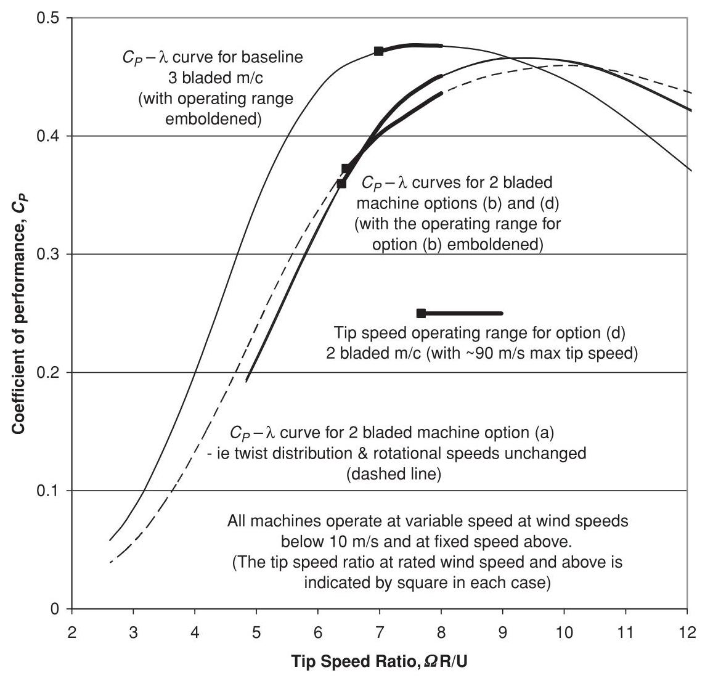

Figure 6.6 Comparison of ${C}_{P} - \lambda$ curves for three-bladed baseline machine and two-bladed options (a), (b) and (d)

Four options for a corresponding ${70}\mathrm{\;m}$ diameter pitch-regulated, variable speed, two bladed design at a site with the same annual mean wind speed are examined and the notional energy costs compared with that for the baseline three-bladed machine. The costs of the two bladed design options in relation to the baseline three-bladed machine are considered with reference to changes in the weights of the components, using the cost shares for the NREL baseline machine given in Table 6.2.

Blade design is assumed to be governed by out-of-plane fatigue bending moments, with the moment fluctuations increasing in proportion to rotational speed (see Equation 5.25 in Section 5.7.5). Accordingly the blade weight is assumed to increase linearly with rotational speed, but the total blade weight for the two-bladed machine at the baseline rotational speed is, of course, reduced by one third. The weights of the hub, pitch system, shaft and yaw system are also assumed to increase with rotational speed, but no account is taken of the increased loads on these components for a fixed-hub, two-bladed machine.

It is assumed initially that the design of the nacelle structure is fatigue driven and governed by the fluctuating moment on the nacelle due to differential blade out-of-plane root bending moment, which increases with rotational speed. Tower design is also assumed to be governed by fatigue in the first instance, so tower weight is similarly taken as proportional to rotational speed. The cyclic thrust loads on the rotor due to turbulence are virtually the same for two-and three-bladed machines rotating at the same speed if the blade planforms are the same, so the tower cost element at the baseline rotational speed is left unchanged.

The weights of the gearbox and brake are taken to be proportional to the rated torque, ${P}_{R}/\Omega$ , while those of the generator, the variable speed electronics and of the cables and equipment forming the grid connection are taken as proportional to rated power, ${P}_{R}$ .

The various components are classified into different categories according to the way in which their costs vary with rotational speed and rated power in Table 6.5. Also tabulated are the two-bladed machine component costs as a percentage of the total for the baseline three-bladed machine, together with the sum for each category.

The following expression is obtained for machine cost as a function of rotational speed and rated power:

$$
{C}_{T} = {C}_{TB}\left( {{0.134} + {0.4047}\left\{  {\Omega /{\Omega }_{B}}\right\}   + {0.118}\left\{  {{\Omega }_{B}/\Omega }\right\}  \left( {{P}_{R}/{P}_{RB}}\right)  + {0.305}\left( {{P}_{R}/{P}_{RB}}\right) }\right) \tag{6.10}
$$

Here, ${P}_{RB}$ and ${\Omega }_{B}$ are the baseline values of rated power and maximum nominal rotational speed, 1500 kW and 21.8 rpm respectively. The three design options can now be examined:

## (a) Planform, twist and rotational speed unchanged from baseline

The reduction in the number of blades reduces the coefficient of performance at the tip speed ratio of 8, which applies at wind speeds less than ${10}\mathrm{\;m}/\mathrm{s}$ , by ${8.4}\%$ , but the energy yield reduction is less at ${6.3}\%$ . The corresponding ${C}_{P} - \lambda$ curve is shown over the full range of tip speed ratios by the dashed line on Figure 6.6, with the much more limited operating range shown emboldened, and it is evident that the optimum tip speed ratio has increased from about 7.7 for the baseline three-bladed machine to about 10. Clearly the limit on the upper tip speed of ${80}\mathrm{\;m}/\mathrm{s}$ imposes a significant penalty on performance.

Combination of the reduced energy yield with the machine capital cost saving of 3.8% due to the elimination of one blade results in an increased cost of energy of 2.6%.

Table 6.5 Contribution of different components to the cost of a two-bladed machine (expressed as percentages of three-bladed baseline machine cost) and classified according to the relationship assumed between the component cost and rotational speed/rated torque/ rated power

<table><tr><td colspan="2">Components for which the weight/cost is independent of rated power or rotational speed</td><td colspan="2">Components for which the weight/cost varies as rotational speed, $\Omega$</td><td colspan="2">Components for which the weight/cost varies as rated torque, ${P}_{R}/\Omega$</td><td colspan="2">Components for which the weight/cost varies as rated power, ${P}_{R}$</td></tr><tr><td>Component</td><td>Cost</td><td>Component</td><td>Cost</td><td>Component</td><td>Cost</td><td>Component</td><td>Cost</td></tr><tr><td>Foundation</td><td>3.6%</td><td>Blades</td><td>7.7%</td><td>Gearbox</td><td>11.6%</td><td>Generator</td><td>7.4%</td></tr><tr><td>Controller</td><td>2.7%</td><td>Hub</td><td>3.6%</td><td>Brake</td><td>0.2%</td><td>Variable</td><td>9.0%</td></tr><tr><td>Assembly</td><td>3.2%</td><td>Pitch</td><td>4.3%</td><td>system</td><td></td><td>speed</td><td></td></tr><tr><td>Transport</td><td>3.9%</td><td>system</td><td></td><td></td><td></td><td>electronics</td><td></td></tr><tr><td></td><td></td><td>Low speed   shaft &   bearings</td><td>2.5%</td><td></td><td></td><td>Grid connection</td><td>14.1%</td></tr><tr><td></td><td></td><td>Nacelle</td><td>8.9%</td><td></td><td></td><td></td><td></td></tr><tr><td></td><td></td><td>Yaw system</td><td>1.5%</td><td></td><td></td><td></td><td></td></tr><tr><td></td><td></td><td>Tower</td><td>12.0%</td><td></td><td></td><td></td><td></td></tr><tr><td>TOTAL</td><td>13.4%</td><td>TOTAL</td><td>40.5%</td><td>TOTAL</td><td>11.8%</td><td>TOTAL</td><td>30.5%</td></tr></table>

(b) As option (a), but twist distribution re-optimised

Re-optimisation of the twist distribution reduces the energy yield penalty compared with the baseline three-bladed machine to ${4.6}\%$ . As a result the increase in the cost of energy is reduced to ${0.8}\%$ . The corresponding ${C}_{P} - \lambda$ curve is shown over the full range of tip speed ratios in Figure 6.6, with the much more limited operating range shown emboldened.

(c) Tip speed ratio schedule scaled in conjunction with twist distribution optimisation to obtain minimum cost of energy based on machine cost function of Equation 6.10 (with tower and nacelle cost increasing with maximum rotational speed)

The tip speed at each wind speed can be scaled up by the same ratio so as to produce maximum energy yield, with simultaneous re-optimisation of the twist distribution. This enables the energy yield penalty compared with the baseline three-bladed machine to be reduced to only ${1.3}\%$ , for a tip speed scaling factor of 1.21 . However, application of Equation 6.10 results in a capital cost increase of 2.5% relative to the baseline machine, resulting in a cost of energy increase - again relative to the baseline machine - of 3.8%.

Minimisation of the cost of energy, on the other hand, leads to a much lower tip speed scaling factor of 1.035. The energy yield penalty and capital cost reduction relative to the baseline machine are now ${3.3}\%$ and ${2.8}\%$ respectively, resulting in an increase in the cost of energy of only ${0.5}\%$ .

(d) Tip speed ratio schedule scaled in conjunction with twist distribution optimisation to obtain minimum cost of energy based on machine cost function of Equation 6.10 modified so that tower and nacelle cost are fixed

It is apparent that, with the weight of nacelle and tower assumed to increase in proportion to rotational speed the two-bladed variant c) considered above results in a small increase in the cost of energy relative to the three-bladed machine. However, if the weight of the nacelle structure is driven by the size of the enclosure required to accommodate the gearbox, generator and other equipment, rather than by fatigue loading, it will be constant for machines of fixed rating. If it is also assumed that the tower design is governed by extreme loads rather than fatigue loads, the expression for machine cost as a function of rotational speed and rated power becomes:

$$
{C}_{T} = {C}_{TB}\left( {{0.254} + {0.2847}\left\{  {\Omega /{\Omega }_{B}}\right\}   + {0.118}\left\{  {{\Omega }_{B}/\Omega }\right\}  \left( {{P}_{R}/{P}_{RB}}\right)  + {0.305}\left( {{P}_{R}/{P}_{RB}}\right) }\right)
$$

(6.11)

The tip speed scaling factor resulting in the minimum cost of energy then increases to 1.12 and the cost of energy reduces to 1.1% below that of the baseline machine. As shown in Figure 6.6, the corresponding ${C}_{P} - \lambda$ curve over the full range of tip speed ratios is almost identical to that for option (b), but the tip speed ratio operating range differs.

The above results are summarised in Table 6.6.

The results shown in Table 6.6 indicate that two-bladed, rigid hub machines have the potential to yield marginal cost benefits vis-à-vis three-bladed machines, if nacelle and tower design are not impacted by increases in rotational speed. However, the results should be treated with caution, because no account has been taken of increased component costs due to the increased loadings on the hub, low-speed shaft, yaw drive and nacelle inherent in a rigid hub two-bladed turbine. (Loads on rigid hub two-bladed machines are compared with those on three-bladed machines in more detail in the next section.)

The loadings on the nacelle of a two-bladed machine can be reduced significantly by the introduction of a teeter hinge between the rotor and the low speed shaft, with consequent potential cost benefits. The hinge eliminates the transfer of out-of-plane aerodynamic moments from the rotor to the low speed shaft, resulting in large reductions in the operational loadings on the shaft, nacelle and yaw drive. The dependence of these loads on rotational speed is also largely removed, with the result that the optimum rotational speed for a two bladed machine in energy cost terms is increased, approaching the value giving maximum energy yield.

Although teetering provides scope for significant cost savings on the shaft, nacelle and yaw drive (which account for nearly 20% of the baseline machine cost), these savings are offset by the additional costs associated with the teeter hinge and teeter restraint system.

### 6.5.4 Effect of number of blades on loads

Moment loadings on the low speed shaft and nacelle structure from three-bladed and rigid-hub two-bladed machines were examined in Sections 5.10 and 5.11, and are compared in Table 6.7 below for machines of the same diameter and rotational speed. The stochastic loading comparison is based on a turbulence length scale to rotor diameter ratio of 1.84.

Table 6.6 Comparison of two-bladed design variants on a ${70}\mathrm{\;m}$ diameter, ${1.5}\mathrm{{MW}}$ three-bladed variable speed, pitch regulated baseline machine, using blades of same planform and thickness/chord ratio distribution

<table><tr><td>Two-bladed 70 m diameter, 1.5 MW, machine design options</td><td>Maximum nominal speed and tip speed</td><td>Annual energy yield (MWh)</td><td>Reduction in annual energy yield cf baseline m/c</td><td>Reduction in overall machine cost cf three-bladed baseline</td><td>Increase/ reduction in cost of energy</td></tr><tr><td>a) Same blade and tip speed schedule</td><td>21.8 rpm 80 m/s</td><td>4625</td><td>6.3%</td><td>3.8%</td><td>+2.6%</td></tr><tr><td>b) As above, but with optimisation of blade twist distribution</td><td>21.8 rpm 80 m/s</td><td>4709</td><td>4.6%</td><td>3.8%</td><td>+0.8%</td></tr><tr><td>c) Tip speeds & twist distribution varied to give minimum C of E as per Equation 6.10</td><td>22.6 rpm 83 m/s</td><td>4775</td><td>3.3%</td><td>2.8%</td><td>+0.5%</td></tr><tr><td>d) Tip speeds & twist distribution varied to give minimum C of E assuming nacelle and tower costs fixed - i.e. using Equation 6.11</td><td>24.5 rpm 90 m/s</td><td>4857</td><td>1.6%</td><td>2.7%</td><td>-1.1%</td></tr></table>

Table 6.7 Comparison of loads on shaft and nacelle for three-bladed and rigid-hub two-bladed machines ( $\psi$ is blade azimuth)

<table><tr><td rowspan="2">Location of moment loading</td><td colspan="2">Deterministic loading arising from wind shear and/or yaw misalignment, in terms of blade root out-of-plane bending moment amplitude, ${M}_{o}$</td><td rowspan="2">Stochastic loading   % increase for rigid-hub two-bladed machine compared with three-bladed $\mathrm{m}/\mathrm{c}$</td></tr><tr><td>Three-bladed machine</td><td>Right-hub two-bladed machine</td></tr><tr><td>Shaft bending moment amplitude</td><td>${1.5}{M}_{\mathrm{o}}$</td><td>$2{M}_{\mathrm{o}}$</td><td>22%</td></tr><tr><td>Nacelle nodding moment</td><td>${1.5}{M}_{\mathrm{o}}$</td><td>${M}_{\mathrm{o}}\left( {1 + \cos {2\psi }}\right)$</td><td>22%</td></tr><tr><td>Nacelle yaw moment</td><td>Zero</td><td>${M}_{\mathrm{o}}\sin {2\psi }$</td><td>22%</td></tr></table>

It is seen that loadings from a rigid-hub two-bladed rotor are significantly larger than from a three-bladed rotor. However, in most two-bladed machine designs, the rotor is allowed to teeter instead of being rigidly mounted, with the result that aerodynamic moments on the shaft and nacelle structure quoted in Table 6.7 are eliminated, and the blade out-of-plane root bending moments reduced. The benefits and drawbacks of teetering the rotor are examined in Section 6.6.

The rotor thrust variations at blade passing frequency due to stochastic loading, which are a dominant factor in tower fatigue design, are very similar for two- and three-bladed machines rotating at the same speed. However, two-bladed machines usually rotate faster than three-bladed machines of the same diameter, so the cyclic rotor thrust variations are higher.

### 6.5.5 Noise constraint on rotational speed

As noted in Section 6.5.3, there may be significant cost benefits to be gained from a two-bladed design with increased rotational speeds, because, in addition to the blade saving, the cost of the whole of the drive train is reduced because of the reduced torque. However, as noted in Section 6.4.4, it is normal to restrict the tip speeds of fixed speed and variable speed machines to about ${65}\mathrm{\;m}/\mathrm{s}$ or ${85}\mathrm{\;m}/\mathrm{s}$ respectively, in order to limit aerodynamic noise emission. At ${80}\mathrm{\;m}/\mathrm{s}$ , the tip speed of the baseline machine discussed in Section 6.5.3 is within this limit, but the tip speed of option d) of ${90}\mathrm{\;m}/\mathrm{s}$ would be less likely to be acceptable, except at remote sites or offshore. This subject is considered further in Section 6.9.

### 6.5.6 Visual appearance

Although the assessment of visual appearance is essentially subjective, there is an emerging consensus that three-bladed machines are more restful to look at than two-bladed ones. One possible reason for this is that the apparent 'bulk' of a three-bladed machine changes only slightly over time, whereas a two-bladed machine appears to contract down to a one-dimensional line element, when the rotor is vertical, twice per revolution. A secondary factor is that two-bladed machines generally rotate faster, which an observer can also find more disturbing.

### 6.5.7 Single-bladed turbines

Apart from the saving in rotor cost itself, the single-bladed turbine concept is an attractive one because of the reduction in drive train cost realisable through increased rotational speed (Section 6.5.2). An obvious disadvantage is the resulting increased noise emission resulting from the faster rotation, but this would not be an issue offshore. Another consideration is the reduced yield due to increased tip loss. For example, a single-bladed version of the ${70}\mathrm{\;m}$ diameter, 1.5 MW pitch regulated, variable speed three-bladed baseline design considered in Section 6.5.3, with the rotational speed at each wind speed scaled up by $\sqrt{3}$ in accordance with Equation 6.7 and with the twist distribution reoptimised to give maximum energy yield, would produce an annual energy output 5.5% less than the baseline machine.

The single blade must be counterweighted to eliminate torque fluctuations and any whirling tendency due to centrifugal loads. Furthermore, as a rigid hub would expose the nacelle to very large nodding and yawing moments in comparison with two- or three-bladed machines, it is customary to mount the rotor on a teeter hinge, so that the unbalanced aerodynamic out-of-plane moment can be resisted by a centrifugal couple, thereby reducing the hub moment. However, the teeter motion of the blade is significantly greater than that of a two-bladed machine, so it is normal to mount the rotor downwind. Morgan (1994) reports that particular difficulties have been encountered in predicting teeter excursions after grid loss and emergency stops, leading to excessive risk of teeter stop impacts.

## 6.6 Teetering

### 6.6.1 Load relief benefits

Two-bladed rotors are often mounted on a teeter hinge - with hinge axis perpendicular to the shaft axis, but not necessarily perpendicular to the longitudinal axis of the blades - in order to prevent differential blade root out-of-plane bending moments arising during operation. Instead, differential aerodynamic loads on the two blades result in rotor angular acceleration about the teeter axis, with large teeter excursions being prevented by the restoring moment generated by centrifugal forces, as described in Section 5.8.8. However, when the machine is shutdown, the centrifugal restoring moment is absent, so differential blade loading will cause the rotor to teeter until it reaches the teeter end stops which need to be suitably buffered. Consequently the teeter hinge is unlikely to provide any amelioration of extreme blade root out-of-plane moments when the machine is shutdown.

The load relief afforded by the teeter hinge benefits the main structural elements in the load path to the ground in varying degrees, as outlined below:

(a) Blade: The main benefit is the elimination of the cyclic variations in out-of-plane bending moment due to yaw (Figure 5.10), shaft tilt, wind shear (Figure 5.11) and tower shadow (Figure 5.14). By contrast, there is only a small reduction in blade root out-of-plane bending moment due to stochastic loadings - see the example in Section 5.8.8, where an 11% reduction is quoted. Thus, teetering results in a large overall reduction in out-of-plane fatigue loading, although the significance of this will be tempered by the influence of the unaltered edgewise gravity moment.

(b) Low speed shaft: Low speed shaft design is governed by fatigue loading, which is normally dominated by the cyclic gravity moment due to the cantilevered rotor mass. On a rigid hub machine, the shaft moment Damage Equivalent Load or DEL (defined in Section 5.12.6) due to deterministic and stochastic rotor out-of-plane loadings combined can be of similar magnitude, so the insertion of a teeter hinge can produce a substantial reduction in overall shaft moment DEL. It should be noted, however, that the cyclic shaft moment due to wind shear relieves that due to gravity on a rigid hub machine, so teetering is not beneficial in respect of this load component.

A rough estimate of the overall shaft moment DEL on a rigid hub machine, excluding yaw error and tower shadow effects, can be obtained by taking the square root of the sum of the squares of the shaft moment DEL due to stochastic loads and that due to the combined cyclic loads due to gravity, wind shear and shaft tilt.

(c) Nacelle structure: The provision of a teeter hinge should eliminate nodding and yawing moments on the nacelle completely during operation, leaving only rotor torque, thrust and in-plane loadings. This will benefit the fatigue design of the nacelle structure considerably, but not the extreme load design, for the reasons already explained.

(d) Yaw bearing and yaw drive: Rigid hub machines experience severe yaw moments due to both deterministic and stochastic loads, which were underestimated on many early designs. The introduction of a teeter hinge dramatically reduces yaw moments during operation by eliminating rotor out-of-plane moments on the hub, but yaw moments due to in-plane loads on the rotor still remain.

The relative magnitude of the yaw moments due to in-plane as opposed to out-of-plane loads on a rigid hub rotor can be appreciated by comparing the effect of wind speed fluctuation, $u$ , on the in-plane and out-of-plane loads on a blade element. Assuming that the blade is not stalled and that $\phi$ is small, the in-plane load per unit length is, from Equation 5.131a, given approximately by:

$$
- {F}_{Y} = \left( {\frac{1}{2}{\rho \Omega }\frac{d{C}_{l}}{d\alpha }}\right) c\left( r\right)  \cdot  r \cdot  u\left\lbrack  {\frac{{C}_{l}}{d{C}_{l}/{d\alpha }} + \sin \phi }\right\rbrack \tag{6.12}
$$

Whereas the out-of-plane load per unit length is, from Equation 5.25 approximately

$$
{F}_{X} = \left( {\frac{1}{2}{\rho \Omega }\frac{d{C}_{l}}{d\alpha }}\right) c\left( r\right)  \cdot  r \cdot  u \tag{6.13}
$$

Defining the distance between the hub centre and the tower centre-line as $e$ , it is seen that the yaw moment due to the in-plane rotor load is $\left( {e/r}\right) \left\lbrack  {{C}_{l}/\left( {d{C}_{l}/{d\alpha }}\right)  + \sin \phi }\right\rbrack$ times the maximum yaw moment due to out-of-plane load. As $e$ is typically about one tenth of the tip radius, it is seen that the yaw moments due to in-plane loads are at least an order of magnitude smaller than those due to out-of-plane moments, so that the introduction of the teeter hinge results in a very significant reduction.

(e) Tower: The fatigue loadings due to the ${M}_{Y}$ moment and ${M}_{Z}$ torque will clearly be significantly reduced at the top of the tower if the rotor is teetered, but the effect will be negligible towards the base where thrust loads dominate the moments.

### 6.6.2 Limitation of large excursions

Some limitation on teeter excursions has to be provided, if only to prevent collision between the blade and the tower. If the teeter hinge is located close to the axis of the blades, with the low speed shaft passing through an aperture in the wall of the hub shell (see Figure 6.7), then the maximum teeter excursion is governed by the size of the aperture.

The teeter response to deterministic and stochastic loads is considered in Section 5.8.8. Although it is evident that a permitted teeter angle range of the order of + or $- {5}^{ \circ  }$ will accommodate the vast majority of teeter excursions during normal operation, it is usually impracticable to accommodate the largest that can occur. Hence, in order to minimise the occurrence of metal-to-metal impacts on the teeter end stops, buffers incorporating spring and/or damping elements normally have to be fitted. These also perform an important role in limiting the much larger teeter excursions that would otherwise arise during start-up and shut-down, when the centrifugal restoring moment is reduced.

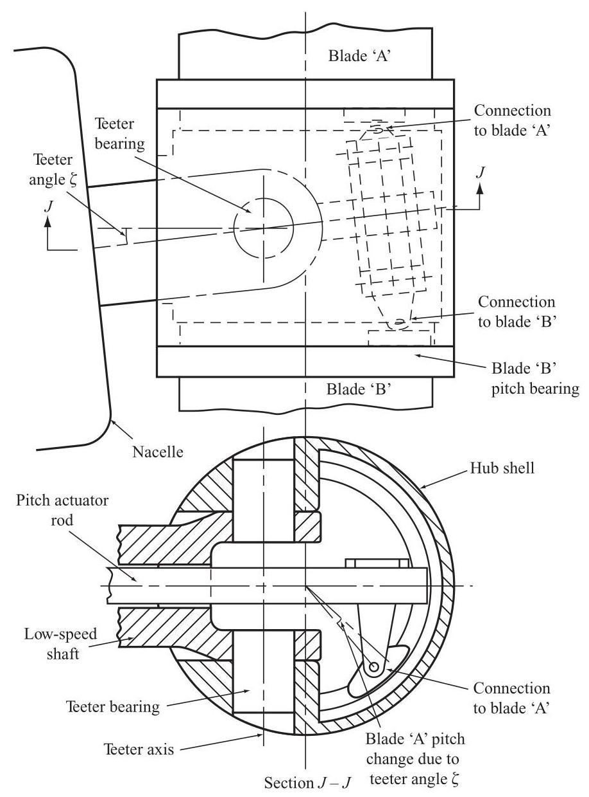

Figure 6.7 Pitch-teeter coupling

### 6.6.3 Pitch-teeter coupling

As described in Section 5.8.8, the magnitude of teeter excursions can be reduced by coupling blade pitch to teeter angle, in order to generate an aerodynamic restoring moment proportional to the teeter angle. This can be done simply by setting the teeter hinge at an angle, known as the Delta 3 angle, to the perpendicular to the rotor axis. Alternatively, on pitch-controlled machines, pitch-teeter coupling can be introduced by actuating the blade pitch by the fore-aft motion of a rod passing through a hollow low speed shaft. See Figure 6.7.

### 6.6.4 Teeter stability on stall-regulated machines

At first sight, it might be thought that the teeter motion of a stalled rotor would be unstable because of negative damping resulting from the negative slope of the ${C}_{1} - \alpha$ curve post-stall.

However, two-dimensional aerodynamic theory is a poor predictor of post-stall behaviour, and it has proved possible to design teetered rotors that are stable in practice, such as the Gamma 60 (Falchetta et al., 1996) and Nordic 1000 (Engstrom et al., 1997). The concept is explored in detail in investigations by Armstrong and Hancock (1991) and Rawlinson-Smith (1994).

## 6.7 Power control

### 6.7.1 Passive stall control

The simplest form of power control is passive stall control, which makes use of the post-stall reduction in lift coefficient and associated increase in drag coefficient to place a ceiling on output power as wind speed increases, without the need for any changes in blade geometry. The fixed blade pitch is chosen so that the turbine reaches its maximum or rated power at the desired wind speed.

Stall regulated machines suffer from the disadvantage of uncertainties in aerodynamic behaviour post-stall which can result in inaccurate prediction of power levels and blade loadings at rated wind speed and above. These aspects are considered in greater detail in Section 3.12.3.

### 6.7.2 Active pitch control

Active pitch control achieves power limitation above rated wind speed by rotating all or part of each blade about its axis in the direction which reduces the angle of attack and hence the lift coefficient - a process known as blade feathering. The main benefits of active pitch control are increased energy capture, the aerodynamic braking facility it provides and the reduced extreme loads on the turbine when shut-down. See also Sections 3.13 and 8.2.1.

The pitch change system has to act rapidly - that is, to give pitch change rates of ${5}^{ \circ  }$ per second or better - in order to limit power excursions due to gusts enveloping the whole rotor to an acceptable value. However, it is not normally found practicable to smooth the cyclic power fluctuations at blade passing frequency due to blades successively slicing through a localised gust (Section 5.7.5), with the result that the large power swings of up to about 100% can sometimes occur in the case of fixed speed machines.

The extra energy obtainable with pitch control is not all that large. A pitch-regulated machine with the same power rating as a stall-regulated machine, utilising the same blades and rotating at the same speed will operate at a larger pitch angle below rated wind speed than the stall-regulated machine, in order to reduce the angle of attack and hence increase the power output at wind speeds approaching rated. For example, if the ${1500}\mathrm{{kW}},{70}\mathrm{\;m}$ diameter variable speed machine described in Section 6.5.3 were operated at a fixed speed of 17.1 rpm (corresponding to a tip speed of 62.8 m/s), a pitch regulated version would produce about ${2.7}\%$ more energy than a stall regulated version for a ${7.5}\mathrm{\;m}/\mathrm{s}$ annual mean wind speed, assuming optimisation of the blade twist distribution in each case. The power curves of the two fixed speed machines are compared in Figure 6.8. Also shown is the power curve for the variable speed pitch regulated machine described in Section 6.5.3. This would produce 5% more energy than the fixed speed, pitch regulated machine. Note that the knees in the power curves of the pitch regulated machines at rated speed will be more rounded in practice because the pitch control will not keep pace with the higher frequency components of turbulence.

Figure 6.8 Comparison of power curves for (i) stall regulated, fixed speed; (ii) pitch regulated, fixed speed; and (iii) pitch regulated, variable speed 1.5 MW rated machines

Figure 6.9 shows a family of power curves for a range of positive pitch angles for the ${1500}\mathrm{{kW}},{70}\mathrm{\;m}$ diameter pitch controlled machine rotating at 17.1 rpm. The intersections of these curves with the ${1500}\mathrm{\;{kW}}$ ordinate define the relationship between steady wind speed and pitch angle required for power control (Figure 6.10). It is readily apparent from the power curve gradients at the intersection points that rapid changes of wind speed will result in large power swings when the mean wind speed is high.

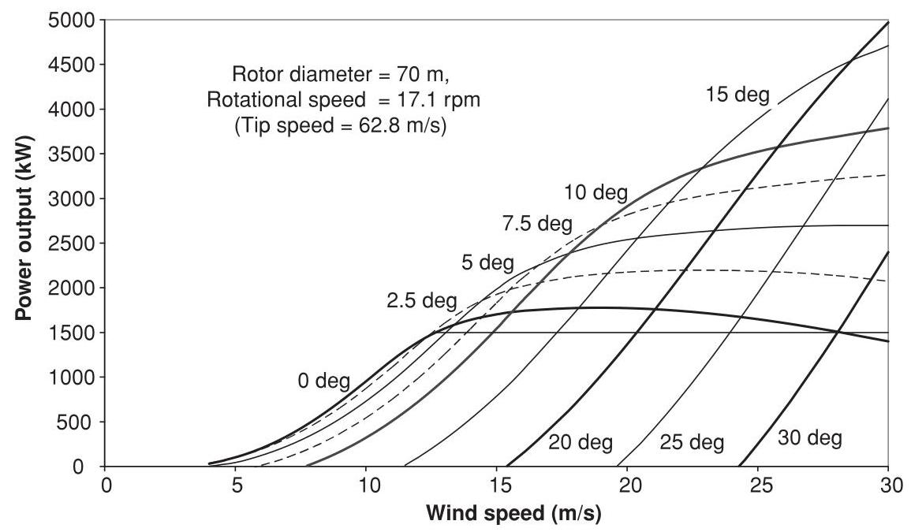

Figure 6.9 Power curves for different positive pitch angles: ${70}\mathrm{\;m}$ diameter three-bladed rotor rotating at 17.1 rpm

Figure 6.10 Schedule of pitch angles versus wind speed for limiting the power output of the machine featured in Figure 6.9 to ${1.5}\mathrm{{MW}}$

The range of blade pitch angles required for power control is typically from ${0}^{ \circ  }$ (often referred to as 'fine pitch'), at which the tip chord is in the plane of rotation or very close to it, and about ${35}^{ \circ  }$ . However, for effective aerodynamic braking, the blades have to be pitched to ${90}^{ \circ  }$ or full feather, when the tip chord is parallel to the rotor shaft with the leading edge into the wind.

A variety of pitch actuation systems have been adopted (see also Section 8.5). They are divided between those in which each blade has its own actuator and those in which a single actuator pitches all the blades. The former arrangement has the advantage that it provides two or three independent aerodynamic braking systems to control overspeed, and the disadvantage that it requires very precise control of pitch on each blade in order to avoid unacceptable pitch angle differences during normal operation. An advantage of the latter arrangement is that the pitch actuator - for example, a hydraulic cylinder - can be located in the nacelle, producing fore-aft motion of the pitch linkages in the hub by means of a rod passing down the middle of a hollow low speed shaft (see Figure 6.11). Alternatively, the axial position of the rod can be controlled by means of a ball-screw and ball-nut arrangement, in which the ball-nut is driven by a servomotor. Normally the ball-nut is driven at the same speed as the rotor, but when a change of pitch is required the ball-nut rotational speed is altered temporarily. This system is arranged to be fail-safe, so that should the servomotor or its control system fail, the servomotor is braked automatically and the ball-nut drives the blade pitch to feather.

Where hydraulic cylinders are used to pitch blades individually, they are mounted within the hub and each piston rod is usually connected directly to an attachment on the blade bearing (see Figure 6.12). The attachment point follows a circular path as the blade pitches, so the cylinder has to be allowed to pivot. The alternative solution of employing an electric motor to drive a pinion engaging with teeth on the inside of the blade bearing consequently appears rather neater (see Figure 6.13). Both systems require a hollow shaft to accommodate either hydraulic hoses or power cables for pitch actuation together with signal cables for pitch angle sensing. In addition, appropriate slip rings are required at the rear end of the shaft.

Figure 6.11 Pitch linkage system used in conjunction with a single hydraulic actuator located in the nacelle. (The central triangular 'spider' is connected to the actuator by a rod passing through the hollow low-speed shaft. Links from the spider drive the blade pitch via braced arms cantilevering into the hub from each blade. Each arm is parallel to its blade axis, but eccentric to it.)

Methods of providing back-up power supplies to ensure blade feathering in the event of grid-loss are considered in Section 8.5.

Although full-span pitch control is the option favoured by the overwhelming majority of manufacturers, power control can still be fully effective even if only the outer 15% of the blade is pitched. The principal benefits are that the duty of the pitch actuators is significantly reduced, and that the inboard portion of the blade remains in stall, significantly reducing the blade load fluctuations. On the other hand partial-span pitch control has several disadvantages as follows:

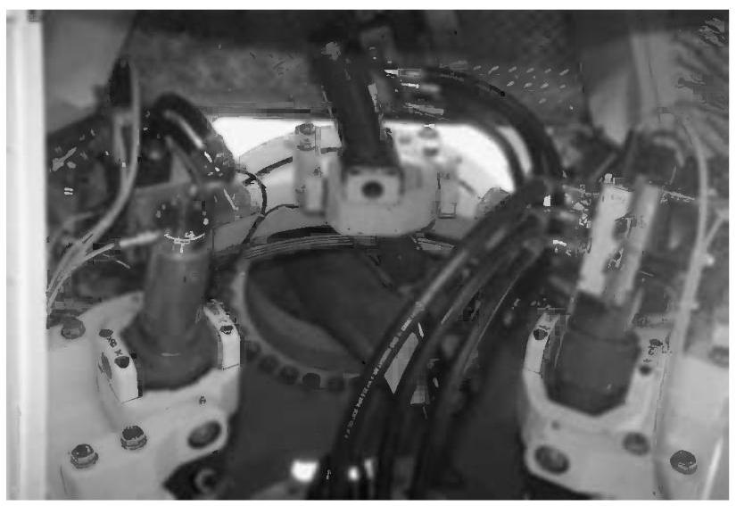

Figure 6.12 Blade pitching system using separate hydraulic actuators for each blade. (Each actuator cylinder is supported on a gimbal-type mounting bolted to the hub and its piston applies a pitching torque to the blade via a cantilevered conical tube eccentric to the blade axis. The blade is attached to the outer ring of the pitch bearing.)

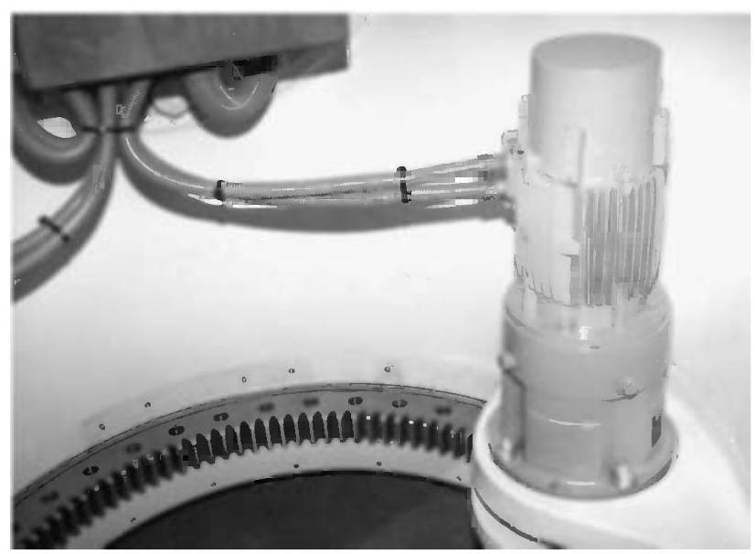

Figure 6.13 Blade pitching system using a separate electric motor for each blade. (A pinion, driven by the motor via a planetary gearbox, engages with gear teeth on the inside of the inner ring of the pitch bearing, to which the blade is bolted. The blade is not attached to the bearing in this photograph, so the fixing holes are visible.)

- the introduction of extra weight near the tip;

- the difficulty of physically accommodating the actuator within the blade profile;

- the high bending moments to be carried by the tip-blade shaft;

- the need to design the equipment for the high centrifugal loadings found at large radii; and

- the difficulty of access for maintenance.

It should be apparent from the above brief survey of pitch actuation systems that the design of the hardware required for pitch-regulation is a significant task. Moreover, as regards the controller, pitch-regulation introduces the need for fast response closed loop control, which is not required for the supervisory functions on a stall-regulated machine. Thus, the benefits of pitch control have to be weighed carefully against all the additional costs involved, including the cost of maintenance.

Another factor that needs to be considered is fatigue loading. This increases significantly on full-span pitch-regulated machines, because the rate of change of lift coefficient with angle of attack remains at about ${2\pi }$ (see Equation A3.9 in Appendix A3) instead of reducing to zero as the blade goes into stall, with the result that rapid changes in wind speed above rated will cause bigger thrust load changes.

Pitch system controller design is considered in detail in Chapter 8.

Figure 6.14 Passive control of tip blade, using screw on tip shaft and spring

### 6.7.3 Passive pitch control

An attractive alternative to active control of blade pitch to limit power is to design the blade and/or its hub mounting to twist under the action of loads on the blades in order to achieve the desired pitch changes at higher wind speeds. Unfortunately, although the principle is easy to state, it is difficult to achieve it in practice, because the required variation in blade twist with wind speed generally does not match the corresponding variation in blade load. In the case of stand-alone wind turbines, the optimisation of energy yield is not the key objective, so passive pitch control is sometimes adopted, but the concept has not been utilised as yet for many grid-connected machines.

Corbet and Morgan (1991) give a survey of how different types of blade loads might be utilised. Harnessing the centrifugal load is obviously promising in the case of variable speed machines, and this has been demonstrated using a screw cylinder and preloaded spring to passively control each tip blade, within the Dutch FLEXHAT programme. When the centrifugal load on the tip exceeds the preload, the tip blade is driven outwards against the spring and pitches (see Figure 6.14 for illustration of the concept).

Joose and Kraan (1997) have proposed replacing this mechanism by a maintenance-free 'Tentortube', which would twist under tension loading. This tube would be carbon-fibre reinforced with all the fibres set at an angle to the axis, so that centrifugal loading induced twist. It would be placed inside a hollow steel tip shaft, which would carry the aerodynamic loading on the tip blade.

### 6.7.4 Active stall control

Active stall control achieves power limitation above rated wind speed by pitching the blades initially into stall - that is, in the opposite direction to that employed for active pitch control, and is thus sometimes known as negative pitch control. At higher wind speeds, however, it is usually necessary to pitch the blades back towards feather in order to maintain power output at rated.

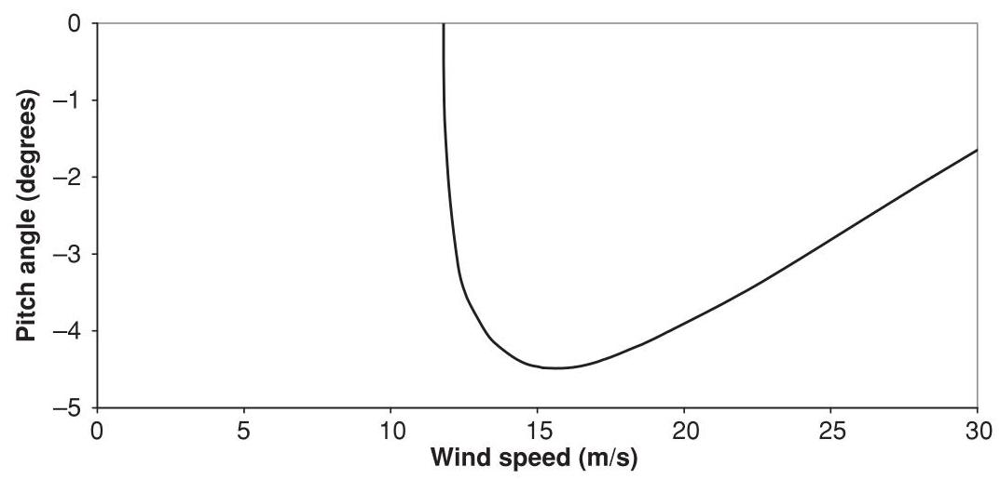

Figure 6.15 Schedule of pitch angles required to limit ${70}\mathrm{\;m}$ diameter turbine output to 1.5 MW at different wind speeds using active stall control

A significant advantage of active stall control is that the blade remains essentially stalled above the rated wind speed, so that gust slicing (see Section 6.7.2) results in much smaller cyclic fluctuations in blade loads and power output. It is found that only small changes of pitch angle are required to maintain the power output at rated, so pitch rates do not need to be as large as for positive pitch control. Moreover, full aerodynamic braking requires pitch angles of only about $- {20}^{ \circ  }$ , so the travel of the pitch mechanism is very much reduced compared with positive pitch control.

Figure 6.15 shows a schedule of pitch angle against wind speed for active stall control. The active stall control schedule is derived from the intersection of the family of power curves for different negative pitch angles for the ${70}\mathrm{\;m}$ diameter machine considered above with the ${1500}\mathrm{{kW}}$ ordinate in Figure 6.16. Note that the rotational speed has been increased by ${10}\%$ so that the machine operates further away from stall below rated wind speed - otherwise the range of negative pitch angles utilised would be very small.

The principal disadvantage of active stall control is the difficulty in predicting aerodynamic behaviour accurately in stalled flow conditions. Active stall control is considered further in Section 8.2.1, Chapter 8.

### 6.7.5 Yaw control

As most horizontal axis wind turbines employ a yaw drive mechanism to keep the turbine headed into the wind, the use of the same mechanism to yaw the turbine out of wind to limit power output is obviously an attractive one. However, there are two factors which militate against the rapid response of such a system to limit power - firstly, the large moment of inertia of the nacelle and rotor about the yaw axis and, secondly, the cosine relationship between the component of wind speed perpendicular to the rotor disc and the yaw angle. The latter factor means that, at small initial yaw angles, yaw changes of, say, ${10}^{ \circ  }$ only bring about reductions in power of a few percent, whereas blade pitch changes of this magnitude can easily halve the power output. Thus, active yaw control is only practicable for variable speed machines where the extra energy of a wind gust can be stored as rotor kinetic energy until the yaw drive has made the necessary yaw correction. This design philosophy has been exploited successfully in Italy on the ${60}\mathrm{\;m}$ diameter Gamma 60 prototype, which has an impressive maximum yaw rate of ${8}^{ \circ  }$ per second (Coiante et al.,1989).

Figure 6.16 Power curves for different negative pitch angles: ${70}\mathrm{\;m}$ diameter three-bladed rotor rotating at ${18.9}\mathrm{{rpm}}$

## 6.8 Braking systems

### 6.8.1 Independent braking systems: requirements of standards

The GL rules require that a wind turbine shall have two independent braking systems. On the other hand, IEC 61400-1 does not explicitly require the provision of two braking systems, but it does require the protection system to remain effective even after the failure of any non-safe-life protection system component.

IEC 61400-1 and the GL rules require that at least one of the braking systems should act on the rotor or low speed shaft.

Normal practice is to provide both aerodynamic and mechanical braking. However, if independent aerodynamic braking systems are provided on each blade, and each has the capacity to decelerate the rotor after the worst-case grid loss, then the mechanical brake will not normally be designed to do this as well. The function of the mechanical brake in this case is solely to bring the rotor to rest - that is, to park it - as aerodynamic braking is unable do this.

### 6.8.2 Aerodynamic brake options

## Active pitch control

Blade pitching to feather (i.e. to align the blade chord with the wind direction) provides a highly effective means of aerodynamic braking. Blade pitch rates of ${10}^{ \circ  }$ per second are generally found adequate, and this is of the same order as the pitch rate required for power control. The utilisation of the blade pitch system for start-up and power control means that it is regularly exercised with the result that the existence of a dormant fault is highly unlikely.

In machines relying solely on blade pitching for emergency braking, independent actuation of each blade is required, together with fail-safe operation should power or hydraulic supplies passing through a hollow low speed shaft from the nacelle be interrupted. In the case of hydraulic actuators, oil at pressure is commonly stored in accumulators in the hub for this purpose.

## Pitching blade tips

Blade tips which pitch to feather have become the standard form of aerodynamic braking for stall-regulated turbines. Typically the tip blade is mounted on a tip shaft, as illustrated in Figure 6.14, and held in against centrifugal force during normal operation by a hydraulic cylinder. On release of the hydraulic pressure (which is triggered by the control system, or directly by an overspeed sensor), the tip blade flies outwards under the action of centrifugal force, pitching to feather simultaneously on the shaft screw. The length of the tip blade is commonly some 15% of the tip radius.

The ability of the control system to trigger blade tip activation is of crucial importance. On a number of early machine designs, the blade tips were centrifugally activated only, so there could be long periods without overspeed events when they did not operate. As a result there was a risk of seizure when operation was eventually required. With the now commonplace arrangement enabling the control system to activate the tip as well, the system can be routinely tested automatically. The penalty is that the low speed shaft needs to be hollow to accommodate the feed to the hydraulic cylinder.

## Spoilers

Spoilers are hinged flaps, which conform to the aerofoil profile when retracted, and stick out at right angles to it when deployed. However, although such devices have been used in the past, they have to be of considerable length in order to decelerate the rotor adequately (Jamieson and Agius, 1990). Moreover, unless the design allows for their operation to be regularly tested, there is a risk that they will fail to deploy when actually needed.

## Other devices

Various other devices have been suggested, such as:

- Ailerons.

- The sliding leading edge device or SLEDGE, in which a length of leading edge at the tip slides radially outwards.

- The flying leading edge device or FLEDGE, in which the whole leading edge together with an adjacent section of the camber face is pitched towards feather.

Jamieson and Agius (1990) and Armstrong and Hancock (1991) give useful surveys of these and other aerodynamic braking devices, and note that the SLEDGE device, which utilises only 2% or 3% of the blade area, is highly effective aerodynamically. Derrick (1992) examines the capabilities of the SLEDGE and FLEDGE devices for both braking and power control in more detail. Despite their promise, these devices have not yet found commercial application.

### 6.8.3 Mechanical brake options

As noted in Section 6.8.1, the duty of the mechanical brake need only be that of a parking brake on machines where the aerodynamic brakes can be actuated independently. However, on pitch-regulated machines where blade position is controlled by a single actuator, full independent braking capability has to be provided by the mechanical brake. It is worth noting that several manufacturers of stall-regulated machines fitted with independent tip brakes ensure that the mechanical brake can stop the rotor unassisted. This may be to satisfy requirements in certain countries that two independent braking systems of a different type are provided.

A wind turbine brake typically consists of a steel brake disc acted on by one or more brake calipers. The disc can be mounted on either the rotor shaft (known as the low speed shaft) or on the shaft between the gearbox and the generator (known as the high speed shaft). The latter option is much the more common because the braking torque is reduced in inverse proportion to the shaft speeds, but it carries with it the significant disadvantage that the braking torques are experienced by the gear train. This can increase the gearbox torque rating required by as much as ca ${50}\%$ , depending on the frequency of brake application - see Section 7.4.5, Chapter 7. Another consideration is that the material quality of brake discs mounted on the high-speed shaft is more critical, because of the magnitude of the centrifugal stresses developed.

The brake calipers are almost always arranged so that the brakes are spring applied and hydraulically retracted - that is, fail-safe.

Aerodynamic braking is much more benign than mechanical braking as far as loading of the blade structure and drive train is concerned, so it is always used in preference for normal shut-downs.

### 6.8.4 Parking versus idling

Although a mechanical parking brake is essential for bringing the rotor to rest for maintenance purposes, many manufacturers allow their machines to idle in low winds and some do so during high wind shutdowns. The idling strategy has two clear advantages - it reduces the frequency of imposition of braking loads on the gear train and gives the impression to members of the public that the turbine is operating even when it is not generating. On the other hand, gearbox and bearing lubrication must be maintained throughout.

## 6.9 Fixed speed, two speed or variable speed

Wind turbine rotors operate most effectively only at the one particular tip speed ratio that gives the maximum Power Coefficient (see Figure 3.15, Chapter 3). Hence, fixed rotational speed turbines operate sub-optimally except at the wind speed corresponding to this tip speed ratio. Energy capture can be increased by varying the rotational speed so that the turbine runs at optimum tip speed ratio over a range of wind speeds. A slightly reduced improvement can be obtained by running the turbine at one of two fixed speeds so that the tip speed ratio is closer to the optimum more often than with a single fixed speed.

Noise considerations are often of significance in the decision to opt for variable or two speed operation. As noted in Section 6.4.4, the aerodynamic noise generated by a wind turbine is approximately proportional to the fifth power of the tip speed. Both variable speed and two speed operation allow the rotational speed to be reduced in low winds, thus reducing turbine aerodynamic noise dramatically when it could otherwise be objectionable because of low background ambient noise.

Variable speed operation leads to a reduction in turbine mechanical loads as the control system gains can be reduced to allow small variations in the rotor speed in response to wind turbulence and cyclic torque variations (e.g. those caused by tower shadow). Also, larger wind farms are required by the electrical Transmission System Operators to comply with the Grid Code regulations that specify the electrical performance required. These regulations are designed to ensure that wind farms support the electrical power system by, for example, controlling their output voltage and continuing to operate when electrical network faults occur. These requirements are difficult to meet with fixed or two-speed induction generators.

### 6.9.1 Two speed operation

Two speed operation is implemented using two fixed speed induction generators. In low wind speeds, a smaller (lower power and speed) electrical generator is used to operate over a range of low wind speeds. When the wind speed rises and the power limit of this generator is reached the smaller generator is disconnected and a full power, higher speed, generator connected. Similarly when the wind speed drops the full power generator is disconnected and the smaller generator used. A hysteresis control system, measuring power, is used, to restrict the number of switching operations (Figure 6.17).

Either generators of differing numbers of poles (giving different speeds of rotation) are connected to gearbox output shafts rotating at the same speed, or generators with the same number of poles are connected to output shafts rotating at differing speeds. The power rating of the generator for low speed operation is normally around a third of the turbine rotor rating.

The development of induction generators with two sets of windings has allowed the number of poles within a single generator to be varied by connecting the windings together in different ways. Either two separate windings or a technique known as Pole Amplitude Modulation is used. Standard generators of this type are available which can be switched between four and six pole operation, giving a speed ratio of 1.5 (1800 and 1200 rpm for a ${60}\mathrm{\;{Hz}}$ system). Given correct selection of the gearbox ratio, this ratio produces close to the optimum increase of energy capture.

In the case of stall regulated wind turbines, only limited energy gains are to be had by converting from single fixed speed to two speed operation. The maximum rotational speed of the two speed machine is restricted to the rotational speed of the fixed speed machine in order to limit the aerodynamic power through aerodynamic stall. Energy gains are only of the order of 2 or 3%, but, nevertheless, two speed operation can be considered worthwhile on stall regulated machines because of noise considerations.

In the case of pitch regulated machines, the energy gain obtainable by moving to two speed operation depends on the power rating and rotational speed of the baseline fixed speed machine. Where these parameters have been chosen to be close to the optimum, in relation to rotor diameter and rotor chord, an energy gain of only about 3% is attainable. However, energy gains of up to ${10}\%$ are possible when the baseline design is sub-optimal. Control of the rotor rotational speed during the transition from the low speed to the high speed generator

Figure 6.17 Locus of operation of two speed wind turbine

(and back) is much easier with rotor pitch control as the rotor speed can be controlled easily during the transitions.

Some disadvantages of two speed operation are as follows:

- Additional generator cost.

- Extra switchgear is required, which is subjected to a demanding duty in terms of frequency of operation.

- Control of turbine speed is required during each speed change.

- Energy is lost while the generator is disconnected during each speed change.

### 6.9.2 Variable slip operation (see also Chapter 8, Section 8.3.8)

Variable slip represents a compromise between fixed and variable speed operation (Pedersen, 1995). The variable slip generator is an induction generator with a variable resistor in series with the rotor circuit, controlled by a high frequency semiconductor switch. Below rated torque or power the external resistor is short-circuited and the generator acts as a conventional fixed speed induction machine. Above rated torque, however, varying the resistance allows the generator torque to be controlled and the generator speed to increase, so the behaviour is then similar to a variable speed system. A speed increase of up to about ${10}\%$ is typical.

This arrangement is cheaper than a variable speed system, and gives some of the advantages, in particular the control of torque in the drive train and the smoothing of aerodynamic torque variations above rated power. It does not offer increased aerodynamic efficiency below rated (although it does not suffer from frequency converter losses), and it does not allow any control of the power factor. Electrical flicker will, however, be reduced above rated power as the power output is smoothed.

The entire power circuit of the generator rotor can be mounted on the shaft including the variable resistors and electronic control switch (Heier, 2006). This avoids the use of slip rings carrying the rotor current. The signal controlling the power electronic switch is transmitted to the rotating shaft using a non-contact optical device.

An advantage of mounting the resistors externally connected via slip rings is that it is then easier to dissipate the extra heat which is generated above rated, and which may otherwise be a limiting factor with large generators.

### 6.9.3 Variable speed operation

By interposing a frequency conversion between the generator (which may be synchronous or induction type) and the network, it is possible to decouple the rotational speed of the generator and turbine from the network frequency. As well as allowing the rotor speed to vary and so maximise energy capture, the generator air-gap torque may be controlled and mechanical loads reduced. An alternative approach to varying the speed of a synchronous or induction electrical machine is to use a wound rotor induction generator, as with variable slip, and replace the external resistors in the rotor circuit with a frequency converter. This is known as the Doubly Fed Induction Generator (DFIG) and has become widely used.

Variable speed operation has a number of advantages:

- Below rated wind speed, the rotor torque and, hence, speed can be made to vary to maintain peak aerodynamic efficiency $\left( {Cp}\right)$ .

- The reduced rotor speed in low winds results in a significant reduction in aerodynamically generated acoustic noise. Noise is especially important in low winds, where ambient wind noise is less effective at masking the turbine noise.

- The rotor can act as a flywheel, smoothing out aerodynamic torque fluctuations before they enter the drive train. This is particularly important at the blade passing frequency.

- Direct control of the air-gap torque allows gearbox torque variations above the mean rated level to be kept small.

- Both active and reactive power can be controlled, so that either any particular power factor can be maintained or the terminal voltage controlled. In principle, it is possible to use a variable speed wind farm as a source of reactive power to compensate for the poor power factor of other consumers on the network. For large wind farms, it is much easier to meet the Grid Code requirements of the Transmission System Operators with variable speed wind turbines than with fixed speed turbines.

- Variable speed turbines will also give higher power (voltage) quality due to the smoother output power they develop. The use of power electronic converters to connect the generators gradually to the network minimises electrical transients on connection.

In practice, losses in the frequency converters may be several per cent of their rated power, counteracting the increased aerodynamic efficiency below rated wind speed. The load reduction possibilities, however, mean that most large MW-scale turbines now are variable speed. Variations in aerodynamic torque at blade passing frequency are particularly significant in larger turbines, because of the size of the rotor compared to the lateral and vertical length scales of turbulence, and these are not translated into output power variations in variable speed turbines. The turbine control system is tuned to allow the aerodynamic power variations to be absorbed as slight changes in rotational speed, that is, as variations in kinetic energy.

There is a significant cost associated with the variable speed equipment, which must be weighed against the advantages. Other drawbacks include increased complexity and the generation of electrical noise and harmonics by the inverter system. Modern Pulse Width Modulated (PWM) inverters operating at high switching frequency using Insulated Gate Bipolar Transistors (IGBTs) produce much lower levels of lower order undesirable harmonics (e.g. fifth, seventh, eleventh, thirteenth etc.) than earlier, naturally commutated designs that used Thyristors. Electrical noise can be a problem for control signals within the turbine if insufficient care is taken to shield cables. Fibre optic transmission is increasingly being used, and this is not affected by induced currents from adjacent cables.

There are two principal methods of achieving variable speed operation. In 'broad range' or 'full power conversion' (FPC) variable speed, the generator stator is connected to the network via two fully rated frequency converters. In 'narrow range' variable speed using a Doubly Fed Induction Generator (DFIG) both the generator stator and rotor are connected to the network, the stator directly, and the rotor through slip rings and smaller frequency converters.

Broad range variable speed allows the speed to vary from close to zero to the full rated speed, but all the power of the wind turbine has to pass through the two frequency converters. Narrow range variable speed uses smaller, cheaper frequency converters, since only a fraction of the power passes through them, but the speed can only vary by a more limited amount, typically 20-40%, either side of synchronous speed. ${}^{1}$ In practice, this is enough to achieve almost all the advantages of variable speed operation. A disadvantage is the need to use a wound rotor induction machine with a small air-gap and the maintenance requirements of the slip rings.

In both broad and narrow speed range wind turbines, the frequency conversion is made by two back-back voltage source converters connected through a direct current (DC) link. These rectify the power into the DC link and then invert it to network frequency or to feed the generator. This rectification into direct current and inversion isolates the network frequency from either the generator speed, in the case of broad range, or the rotor frequency in the case of a DFIG wind turbine. In both cases the control system works by measuring the generator rotational speed and applying the torque required to keep the aerodynamic rotor at optimum tip speed ratio over a wide a range of wind speeds.

Figure 6.18 shows the control objective of a variable speed wind turbine. The rotor speed is measured and, once cut-in speed is reached, a torque is applied by the variable speed generator to stay close to the optimum curve (O-A). At maximum rotational speed (point A), this is maintained by the converter until the blades are pitched to control incoming power.

Figure 6.19 (a-e) shows the commonly used wind turbine generator systems.

- Figure 6.19 (a) shows a fixed speed (squirrel cage) induction generator with shunt capacitors to improve the output power factor. These capacitors may be switched to provide more reactive power as the wind power increases.

---

${}^{1}$ Synchronous speed is fixed by the frequency of the network (50 or ${60}\mathrm{\;{Hz}}$ ) and the number of magnetic poles of the generator construction

---

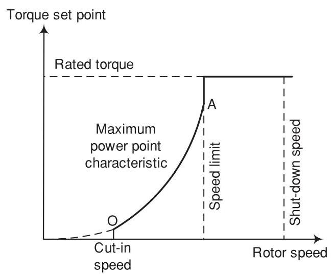

Figure 6.18 Control objective of a variable speed wind turbine. (See also Figure 8.3, Chapter 8)

- Similar power factor correction capacitors are connected to the stator of the wound rotor induction machine in Figure 6.19 (b). However the rotor circuit has additional rotor resistance controlled by a Pulse Width Modulated (PWM) switch to give variable slip operation.

- In Figure 6.19 (c) the controllable rotor resistance is replaced by back-back voltage source converters (using Insulated Gate Bipolar Transistors - IGBT) to connect the rotor to the network. This gives variable speed operation over a restricted speed range depending on the direction of power flow in the rotor circuit. Although there are switching losses in the converters, this arrangement avoids energy being dissipated in an external rotor resistance. Control of the generator speed and power factor is by the rotor side converter while the network side converter maintains the DC link voltage. The crow-bar circuit is to protect the generator side converter when faults occur on the AC network and to assist in ensuring continuous operation of the wind turbine during these faults.

- All the power from the generator (that may be synchronous or induction type) is rectified to DC in the arrangement of Figure 6.19 (d). Again control of the generator torque (and hence speed) and excitation is by the machine side converter while the network side converter maintains the DC link voltage. The network side converter can be used to control the network voltage or reactive power flow into the network.

- An alternative arrangement is shown in Figure 6.19 (e) with the network side converter controlling the output power of the generator (and hence the wind turbine speed) while the machine side is a simple diode rectifier followed by a DC:DC voltage converter. The generator must then be of the synchronous type, either wound rotor or permanent magnet, but the diode rectifier has lower losses than a controllable IGBT converter.

### 6.9.4 Other approaches to variable speed operation

There are other possible approaches to variable speed operation, although none of these has found wide-spread commercial application. They include:

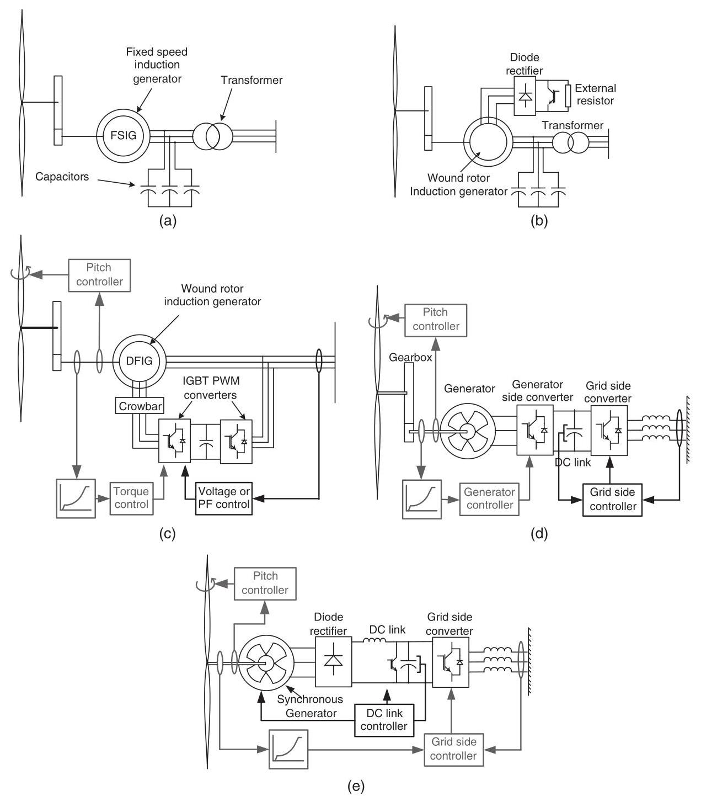

Figure 6.19 Wind turbine architectures. (a) Fixed speed induction generator. (b) Variable slip generator. (c) Doubly fed induction generator. (d) Full power converter wind turbine. (e) Full power converter wind turbine (diode rectifier). (Anaya Lara, 2009)

- Use of a differential gearbox, with the third shaft controlled by a variable speed electric motor/generator (Law et al., 1984; Burton et al., 1990) or by a hydraulic pump/motor (Henderson et al., 1990).

- Mechanical continuously variable transmission systems such as have been developed for automotive applications.

## 6.10 Type of generator

Fixed speed wind turbines differ from almost all conventional generating plant by using induction rather than synchronous generators. This choice is driven by the need for significant torsional compliance and extraction of damping energy in the drive train due to the cyclic variations in the torque developed by the aerodynamic rotor.

Both synchronous and induction generators have similar winding arrangements on the stator which, when connected to the three-phase network voltage, produce a fixed speed, rotating magnetic field. However, the rotors of the two machines are quite different (Hind-marsh, 1984; McPherson, 1990). A synchronous machine has magnets mounted on its rotor and the rotor magnetic field then locks into that produced by the stator leading to operation at synchronous speed. For large scale power generation applications, electro-magnets are used on the rotor excited by an externally applied direct current. Although the rotor operates at the same speed as the stator magnetic field it leads the stator field by an angle depending on the applied torque. In contrast the rotor of a conventional induction machine has a 'squirrel cage' winding into which currents are induced as the rotor bars cut the magnetic field produced by the stator. Hence, an induction generator can only develop torque at a rotational speed slightly greater than that of the stator field. This 'slip speed' is proportional to the applied torque.

Therefore, to a first approximation, the behaviour of a synchronous machine may be considered to be analogous to a torsional spring. The torque is proportional to the angle between the rotor and the stator field. This angle is known as the load or power angle. In contrast an induction generator can be thought of as a torsional damper where the torque is proportional to the difference in speed between the rotor and the stator field (the slip speed). This is illustrated in simple schematic form in Figure 6.20. It may be seen that if the simple model of a fixed speed wind turbine, equipped with a synchronous generator, is excited by the cyclic torque from the wind turbine rotor then there is no damping energy extracted by the drive train to control the torsional oscillations. It is a simple two spring, two mass system. In contrast, with an induction generator, the connection of the generator to the network is represented by a torsional damper. The main cyclic torque of the wind turbine rotor will be at blade passing frequency and it is an unfortunate coincidence that this often matches quite closely the natural frequency of oscillation of a small synchronous generator connected to an electrical distribution network.

In practice, synchronous generators are often fitted with cage damper windings but it is not practical to provide the degree of damping required for wind turbine applications. Also at higher ratings (above, say, 1 MW) second order effects tend to reduce the damping energy that can be extracted by an induction generators (Saad-Saoud and Jenkins, 1999). However, the basic principle remains that the damping energy extracted from the drive train by induction generators is necessary for operation of fixed speed wind turbines.

In contrast, the generator of a variable speed wind turbine is not connected directly to the network but is de-coupled through the DC link of the frequency converters. Hence either synchronous or induction generators may be used with full power conversion variable speed systems.

### 6.10.1 Historical attempts to use synchronous generators

All large hydro, fossil fired or nuclear power stations use synchronous generators. Induction generators are much less useful than synchronous generators for large-scale power generation.

- The damping action results in higher energy losses in the rotor than with synchronous

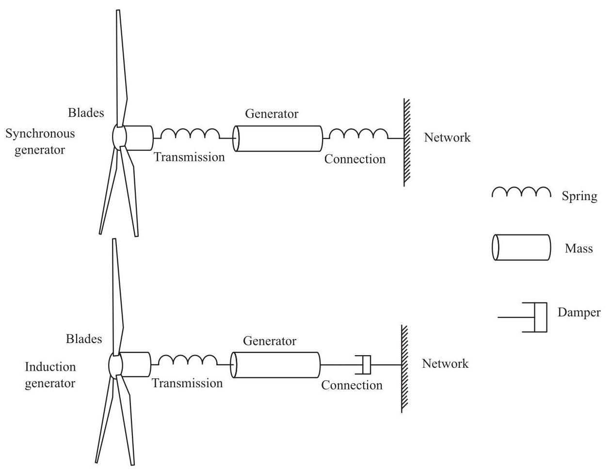

Figure 6.20 Mechanical analogues of directly connected generators

generators. It is then, of course, necessary to arrange for the removal of the heat dissipated in the rotor.

- All the reactive power necessary to energise the magnetic circuits must be supplied from the network (or by local capacitors). If local capacitors are used then there is the danger of self-excitation.

- There is no direct control over the terminal voltage or reactive power flow.

- Induction generators do not produce sustained fault current for three-phase faults on the network.

- They suffer from problems of voltage instability. This was not an important issue with limited wind generation but with large wind farms on weak networks can be of concern.

Hence, in the early development of wind turbines considerable efforts were made to use synchronous generators. These involved a number of innovative solutions to the provision of damping. For example, both Westinghouse in the USA and Howden in the UK used fluid couplings in the drive train to provide damping. The Wind Energy Group in the UK mounted a ${250}\mathrm{\;{kW}}$ synchronous generator flexibly using a spring-damper system and connected a 3 MW synchronous generator through a sophisticated variable speed mechanical gearbox (Law et al., 1984). These and other similar approaches using synchronous generators on large wind turbines are now mainly of historical interest but such concepts continue to be pursued by some designers.

### 6.10.2 Direct drive generators

There has been considerable development of generators driven directly by the wind turbine rotor without a speed increasing gearbox and a number of manufacturers offer such wind turbines. The obvious advantage is the elimination of the gearbox. However, the power output of any rotating electrical machine may be described generally by (Laithwaite and Freris, 1980):

$$
P = K{D}^{2}{Ln}
$$

where

$D$ is the rotor diameter

$L$ is the length

$n$ is the rotational speed

$K$ is a constant

Thus, it may be seen that if the rotational speed is reduced then it is necessary either to lengthen the generator in proportion or to increase the diameter. It is cheaper to increase the diameter as this raises the power by the square rather than linearly. Thus, direct drive generators for wind turbines tend to have rather large diameters, and hence weights, but with limited length.

Induction generators require a small radial distance between the surface of the rotor and the stator (known as the air-gap). This is necessary to ensure an adequate air-gap magnetic flux density as all the excitation is provided from the stator. In contrast, synchronous generators have excitation systems on the rotor and so can operate with larger air-gaps. It is difficult to manufacture large diameter electrical machines with small air gaps for mechanical and thermal reasons. Hence, direct drive wind turbines use synchronous generators (either with permanent magnet excitation or with a wound rotor and electro-magnets providing the field). The use of a synchronous generator, in turn, leads to the requirement for solid-state frequency conversion equipment to de-couple the generator from the network and full power conversion variable speed operation. If permanent magnets are used, then there is no control over the excitation of the synchronous machine and its output voltage will vary with rotational speed. Then it may be necessary to use an additional power electronic converter to control the DC link voltage. The manufacture of very large, permanent magnet generators can be difficult as the forces developed by the magnets can be very great.

Direct drive, radial flux synchronous generators (Figure 6.27) with electrical excitation are used at up to the highest ratings. Generators with permanent magnet excitation may be either radial or axial flux designs but in order to limit the cost of the rare earth permanent magnets the air gap between the stator and rotor is kept as small as possible and so very high forces can develop. Double air-gap designs are used to balance the forces of the permanent magnets (Heier, 2006).

An alternative to complete elimination of the gearbox is a hybrid approach with a gearbox of one or two stages and a medium-speed generator connected through a full power converter. This allows a simpler and more reliable gearbox to be used with the generator of a similar size (EWEA, 2009). A further alternative design approach is to use multiple high speed shafts from the gearbox and multiple generators. This again leads to a compact and balanced drive train but multiple power converters are required in parallel. The medium-speed generators are generally permanent magnet synchronous machines.

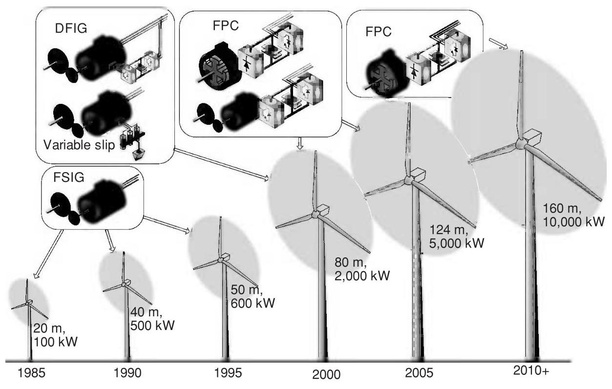

Figure 6.21 Evolution of wind turbine generator systems

### 6.10.3 Evolution of generator systems

Figure 6.21 shows the evolution of wind turbine generator systems. Early wind turbines used Fixed Speed Induction Generators (FSIG) either single or two speed. These operated at effectively constant speed (with slip less than 3%) using either stall regulation of the aerodynamic rotor or pitch regulation of the blades. The arrangement was applied to wind turbines as large as 1.5 MW but above this rating there are increasing difficulties in controlling drive train oscillations and limiting mechanical loads. In addition FSIG wind turbines have difficulties meeting the requirements of the Grid Codes that are applied to large wind farms. Variable slip wind turbines using rotor resistors were then developed but these have significant losses when the rotor resistance is used.

From around 2000, Doubly-Fed Induction Generators (DFIG) became increasingly common in large wind turbines where the benefits of limited variable-speed operation were required but at the reduced cost of controlling only a fraction of the output power. However, slip rings are required on the generator rotor and the air-gap of a wound rotor induction generator must be kept small. A possible future development is the use of the brushless doubly-fed generator where rather than use slip rings the rotor is excited by a second controlled stator winding. This approach eliminates the requirement for slip-rings and brushes but is not yet widely used commercially.

At the same time as the DFIG architecture was being implemented widely, Full Power Conversion (FPC) equipment was being used with both generators driven through a gearbox and those driven directly by the aerodynamic rotor. Both wound rotor and permanent magnet low speed, large diameter synchronous generators have been used for direct drive applications. At present, there is little consensus on the architecture of future electrical generator systems for very large wind turbines.

## 6.11 Drive train mounting arrangement options

### 6.11.1 Low speed shaft mounting

The functions of the low speed shaft are the transmission of drive torque from the rotor hub to the gearbox, and the transfer of all other rotor loadings to the nacelle structure. Traditionally the mounting of the low speed shaft on fore and aft bearings has allowed these two functions to be catered for separately: the gearbox is hung on the rear end of the shaft projecting beyond the rear bearing and the drive torque is resisted by a torque arm. The front bearing is positioned as close as possible to the shaft/hub flange connection, in order to minimise the gravity moment due to the cantilevered rotor mass, which usually governs shaft fatigue design. The spacing between the two bearings will normally be greater than that between front bearing and rotor hub in order to moderate the bearing loads due to shaft moment. See Figure 6.22 for an illustration of a typical arrangement.

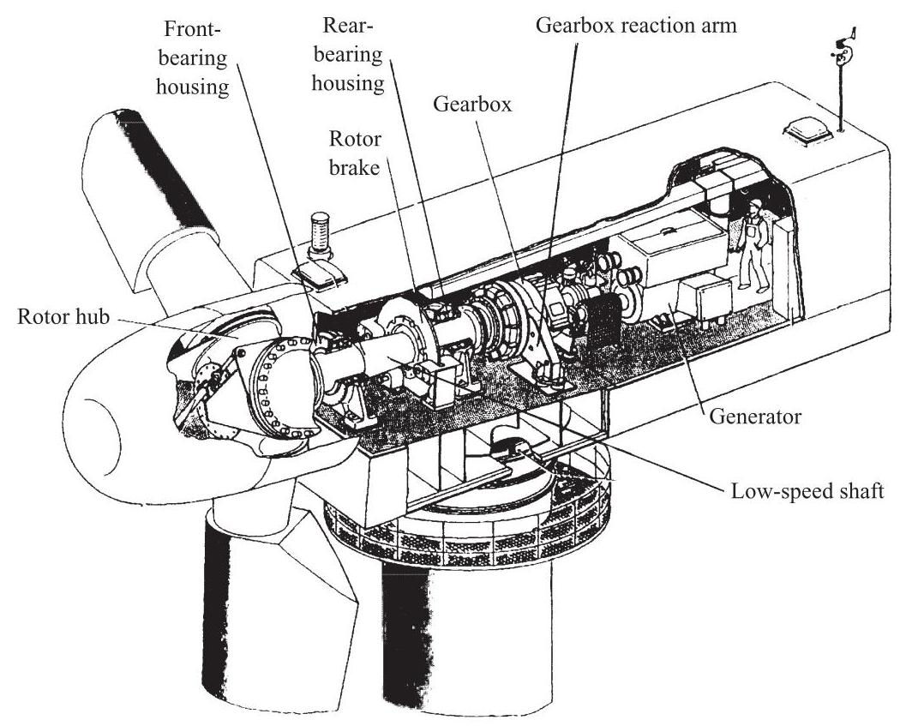

Figure 6.22 View of nacelle showing traditional drive shaft arrangement

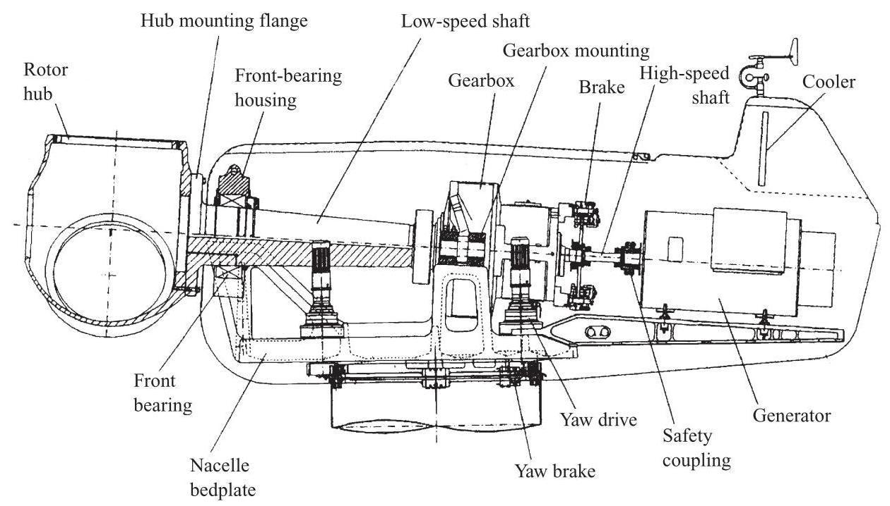

Figure 6.23 Nacelle arrangement for the Nordex N60 turbine. Reproduced by permission of Nordex

The opposite approach is to make the gearbox an integral part of the load path between the low speed shaft and tower top, that is, an 'integrated gearbox'. The fore and aft low speed shaft bearings are absorbed within the gearbox, which moves to the front of the nacelle in order to minimise the rotor cantilever distance, and the gearbox casing then transmits the loads to the nacelle bedplate (Figure 6.28). Clearly this approach requires a much more robust gearbox casing, which must not merely resist the rotor loads, but do so without deflecting sufficiently to impair its functioning. Moreover its fore-aft length has to be increased in order to moderate the bearing loads due to shaft moment. The benefits lie in the reduced extent of the bedplate and the elimination of separate bearings requiring separate provision for lubrication, but a significant disadvantage is that gearbox replacement requires the removal of the rotor.

A configuration which is becoming increasingly popular is one intermediate between the two extremes described above, in which only the rear low speed shaft bearing is absorbed into the gearbox. The gearbox is usually set well back from the front bearing in order to reduce the rear bearing loads, and is rigidly fixed to supporting pedestals positioned on either side of the nacelle. Typical arrangements are shown in Figure 6.23, which shows a cross-section through the nacelle of the Nordex N-60 turbine, and in Figure 6.24. Note that the shaft tapers down in diameter towards the rear reflecting the reducing bending moment. The advantage of this arrangement is that the gearbox casing is not called upon to carry any moments due to cantilevered rotor mass or rotor out-of-plane loadings.

Figures 6.25 and 6.26 are aerial views of the nacelle of a NEG-Micon 1.5 MW machine with a similar drive train arrangement, after installation of the low speed shaft.

In the case of wind turbines with direct drive generators, the low speed shaft arrangement is dramatically different. The low speed shaft, which now connects the rotor hub to the rotor of the generator, is hollow, so that it can be mounted on a concentric fixed shaft cantilevered out from the nacelle bedplate. See Figure 6.27.

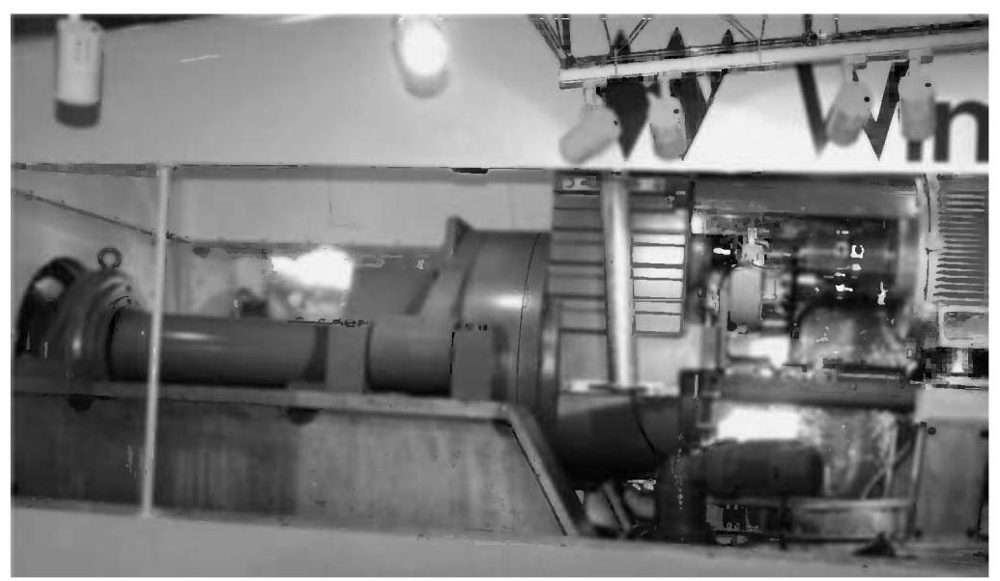

Figure 6.24 Drive train side view. From left to right the components visible through the cutout in the nacelle wall are: (1) low-speed shaft front bearing, (2) low speed shaft, (3) gearbox mountings, (4) gearbox, (5) high-speed shaft with brake, (6) generator. The fabricated bedplate is also visible.

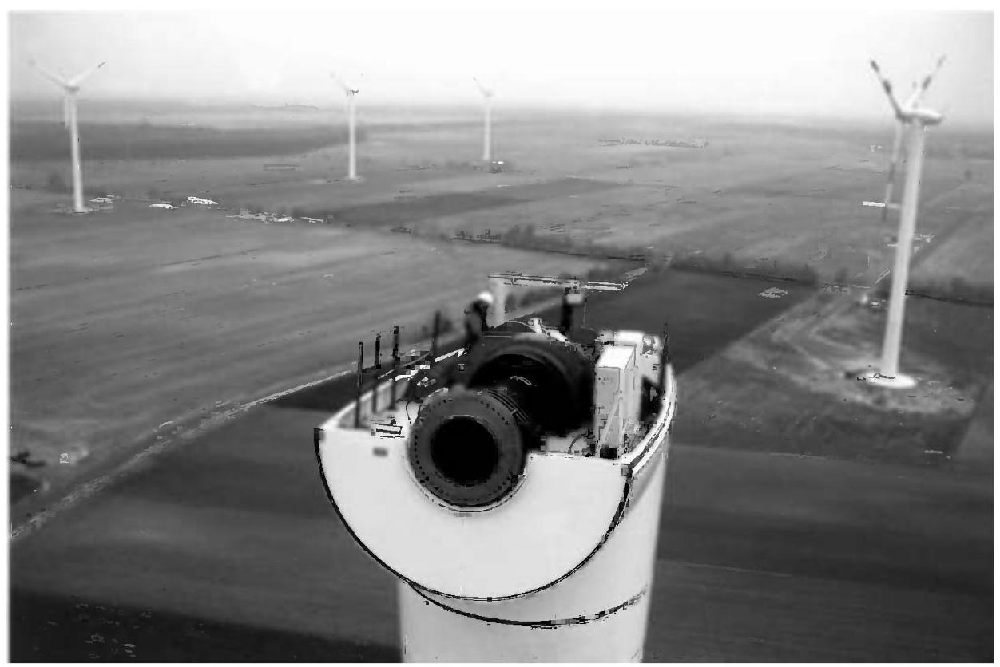

Figure 6.25 Turbine assembly in the air (1); View of nacelle of 1.5 MW NEG Micon turbine after installation of low-speed shaft (front) and gearbox. The ring of bolt holes in the low-speed shaft for hub mounting are clearly visible. Reproduced by permission of NEG Micon

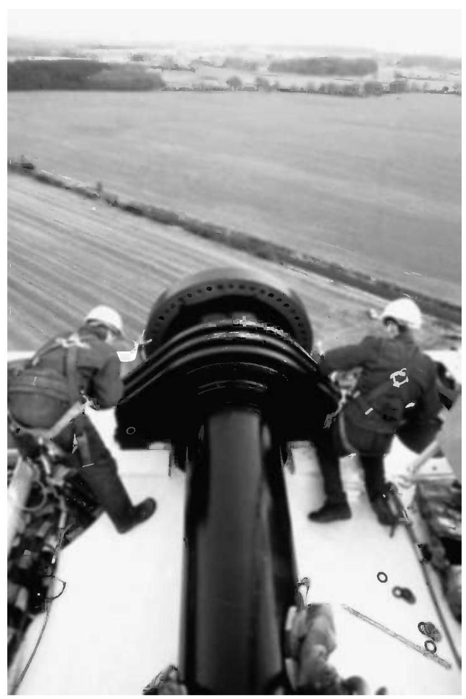

Figure 6.26 Turbine assembly in the air (2); View of low-speed shaft and front bearing after installation on 1.5 MW NEG Micon turbine. Reproduced by permission of NEG Micon

### 6.11.2 High speed shaft and generator mounting

The generator is normally mounted to the rear of the gearbox on an extension of the nacelle bedplate and the connecting drive shaft - the 'high speed shaft' - is fitted with flexible couplings at each end, to cater for small misalignments between the generator and gearbox.

The generator axis is normally offset from the low speed shaft axis. This is because, except in the case of machines fitted with a mechanical brake acting on the rotor, access is required to the rear end of the low speed shaft for hydraulic pipes, electrical cables or an actuator rod passing through the shaft, which is made hollow for the purpose, for blade pitch control or the activation of tip brakes. Usually the generator is either offset to one side of the nacelle, which introduces asymmetry into the nacelle bedplate, or it is offset vertically upwards, which requires a vertical step in the bedplate.

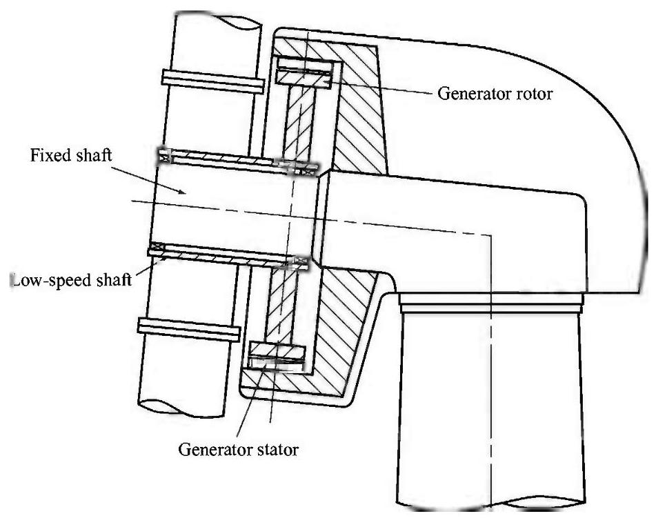

Figure 6.27 Radial flux direct-drive generator arrangement

A much more compact arrangement can be obtained by bolting the generator rigidly onto the rear of the gearbox via an adaptor tube (see Figure 6.28). The surfaces of the mating interfaces have to be carefully machined to ensure shaft alignment, and suitable access has to be provided to the coupling between the generator and gearbox output shafts. Despite the neatness of this layout, it has only been adopted by one or two manufacturers.

One consequence of locating the generator in the nacelle is that power cables running down the tower are required to twist as the nacelle yaws. On some large machines, the problems associated with the twisting of heavy cables have been avoided by mounting the generator vertically in the top of the tower, and driving the high speed shaft via a bevel gear. An alternative solution to the problem of heavy twisting cables, however, is to leave the generator in the nacelle and to transform to a higher voltage there as well.

## 6.12 Drive train compliance

The rotational dynamics of the drive train can have a major effect on loading. The effect is very different in fixed and variable speed turbines, but in each case the consequence of ignoring drive train dynamics at the design stage can be very severe.

In the variable speed case, the dynamics may be quite simple: the drive train may be modelled as a rotor and a generator inertia, separated by a torsional spring. Typically the natural frequency of this resonant system is quite high, of the order of 3-4 Hz. However, this mode is subject to very little damping, especially above rated where the generator torque is held constant. (Below rated the torque will be varied as a function of rotational speed, thus providing a small amount of damping.) There is very little aerodynamic damping from the rotor; and this mode of vibration can potentially generate very large gearbox torque oscillations. Chapter 8 explains how the control system can be used to damp this mode by appropriate control of the generator torque, but it is important to ensure that the resonant frequency does not coincide with a significant forcing frequency such as 6P, which can make it very difficult to achieve sufficient damping through the control system.

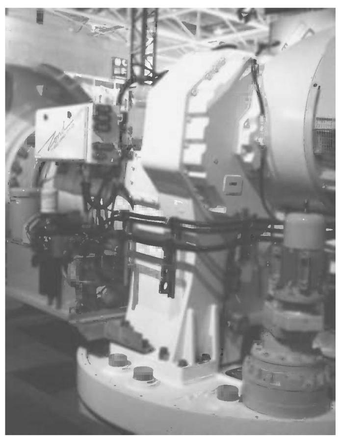

Figure 6.28 Integrated gearbox on Zond Z-750 turbine. (The gearbox is mounted on a circular nacelle bedplate, with the hub to the left and generator at the rear. An electrically driven yaw drive can be seen beneath the generator)

In the fixed speed case, the directly-coupled induction generator provides a lot of damping since the air-gap torque increases steeply with generator speed. The smaller the slip, the greater this damping. This might be expected to be beneficial, but in practice the reverse is likely to be true. Consider the drive train as a two degree of freedom system, with four elements in series: the rotor inertia, the shaft torsional spring, the generator inertia and, finally, the damper representing the slip curve, connected to ground (the constant-frequency grid). If the damping is very large, the generator can almost be considered to be locked (i.e. rotating at nearly constant speed), and the dynamics are dominated by the degree of freedom represented by the rotor inertia and the torsional spring, which has very little damping as in the variable speed case. With higher generator slip, the lower generator damping allows more movement of the generator inertia, causing more coupling between the two degrees of freedom. This gives a system in which there are two coupled torsional modes, each involving some movement of both rotor and generator inertias, and involving both the spring and the damper. Effectively the generator damping now affects both modes significantly: instead of a very lightly damped spring mode and a very heavily damped damper mode, we now have two modes with intermediate damping, so the peak dynamic magnification is much lower. Thus, 0.5% rated generator slip can give a peak dynamic magnification of perhaps 2-5 at the resonant frequency, whereas with 2% slip the peak magnification may be no more than 1-1.5. The position of the peak with respect to blade passing frequency is critical - if the blade passing frequency is close to the peak, very large gearbox torque and electrical power oscillations will occur at this frequency, and it is very difficult to reduce these significantly using pitch control. Ideally the blade passing frequency should be well above the resonant frequency so that the dynamic amplification will be less than one, but it is not uncommon for power and torque oscillations at the blade passing frequency to be as large as $\pm  {50} - {100}\%$ of rated in high winds.

The use of a high slip generator greatly improves the situation, but there are two main drawbacks: Firstly each $1\%$ of slip corresponds to $1\%$ of extra losses, which significantly reduces the energy yield below rated wind speed. Secondly, these extra losses equate with heat dissipation in the generator, making it more difficult to keep the generator cool, especially in large machines.

An alternative to high generator slip which has occasionally been used is a fluid coupling between the gearbox and the generator. This is also a device which generates a torque proportional to slip speed, and it suffers from the same drawbacks as a high slip generator.

Another technique which has sometimes been used is to reduce the resonant frequency by introducing additional torsional flexibility into the drive train. This can be done by means of a quill shaft, a flexible low-speed coupling, or flexible mounts for the gearbox or even for the whole bedplate. The frequency reduction is, however, accompanied by a further loss of damping, and it may therefore be necessary to incorporate additional mechanical damping with the torsional flexibility, which is not always easy to engineer. Torsional flexibility in the high speed shaft is not usually practical because of the large angular movement required to achieve the necessary flexibility - half a revolution may be necessary, compared to just one or two degrees at the low speed shaft. An interesting variant (Leithead and Rogers, 1995) is to mount the generator on flexible mounts. This system can be tuned to absorb energy at the blade passing frequency through an additional mode of vibration of the generator casing against its mountings. This mode also affects the generator slip speed (the difference between rotor and casing speeds) and is, therefore, damped by the slip curve. Nevertheless, generator casing displacements would still need to be of the order of ${10} - {15}^{ \circ  }$ , which is still not easy to engineer.

## 6.13 Rotor position with respect to tower

### 6.13.1 Upwind configuration

The upwind configuration is the one most commonly chosen. The principal advantage is that the tower shadow effect is much less for the same blade-tower spacing, reducing both dynamic loads on the blade and rhythmic noise effects. Set against this is the need to take great care to avoid the risk of blade-tower strikes with upwind machines, requiring accurate prediction of blade deflections under turbulent wind loading.

The clearance between the undeflected blade and the tower can be increased by tilting the low speed shaft upwards or by increasing the rotor overhang. It is desirable to keep the rotor overhang small in order to minimise low speed shaft and nacelle bedplate bending moments, so the low speed shaft is normally tilted upwards by ${5}^{ \circ  }$ or ${6}^{ \circ  }$ to provide the necessary blade-tower clearance, at the cost of a very small reduction in power output.

### 6.13.2 Downwind configuration

The wind velocity deficit behind a wind turbine tower is much greater than that in front of it, to the extent that Powles (1983) has reported a turbulent region with essentially no forward velocity extending up to four tower diameters downstream of an octagonal tower. Beyond this distance, recovery is relatively rapid, with the deficit reduced to about 25% at seven tower diameters downstream.

In addition to the mean wind speed velocity deficit behind the tower, vortex shedding results in additional wind speed fluctuations over and above those already present due to turbulence. The two effects combine to present a harsh environment to the blades immediately behind the tower. The blades are subjected to a large negative impulsive load each time they pass the tower, which contributes significantly to blade fatigue damage, and the audible tower 'thump' that results is liable to be unwelcome. Designers usually mitigate both effects by positioning the rotor plane well clear of the tower, but this inevitably increases nacelle costs somewhat.

An important benefit of the downwind configuration is that it allows the use of very flexible blades without the risk of tower strike. Such blades benefit by being less severely unloaded by the tower shadow, because wind loading deflects them further from the tower in the first place.

## 6.14 Tower stiffness

A key consideration in wind turbine design is the avoidance of resonant tower oscillations excited by rotor thrust fluctuations at rotational or blade passing frequency. The damping ratio may be only 2-3% for tower fore-aft oscillations and an order of magnitude less for side-to-side motion, so unacceptably large stresses and deflections could develop if the blade passing frequency or rotational frequency coincided with tower natural frequency. This section begins by looking at the relative magnitudes of some of the excitations.

### 6.14.1 Stochastic thrust loading at blade passing frequency

Whereas the deterministic variations in blade loading due to wind shear, yaw etc. largely cancel out when the loadings on three blades are added together, the stochastic loadings due to turbulence do not, resulting in a significant rotor thrust load component at blade passing frequency. The magnitude of this quantity can be estimated fairly easily by assuming a linear relationship between fluctuations in the incident wind speed and the resultant load fluctuations according to Equation 5.25.

For the example three-bladed machine considered in Section 5.12.4, the total variance of rotor thrust is only about ${20}\%$ less than it would be if the wind speed variations across the rotor were fully correlated. Thus, from Equation 5.129:

$$
{\sigma }_{T} = \left( {\frac{1}{2}{\rho \Omega }\frac{d{C}_{l}}{d\alpha }}\right) {\sigma }_{u}\oint {crdr}\left( {0.8}\right) \tag{6.14}
$$

where the integral sign $\oint$ signifies that the integration is carried out over the whole rotor. Using the expression for the power spectrum of rotor thrust in Equation 5.130, it can be shown that the variance of the thrust fluctuations within $\pm  {10}\%$ of blade passing frequency is about 1.4% of the total for the case considered. Although this is a small proportion (as can be seen from inspection of Figure 5.40), the standard deviation of thrust fluctuations in this frequency range is a much higher proportion of ${\sigma }_{T}$ , that is, $\sqrt{0.014} \cong  {12}\%$ . Denoting the standard deviation of thrust fluctuations within $\pm  {10}\%$ of blade passing frequency as ${\sigma }_{T.3p}$ , we have

$$
{\sigma }_{T.3p} \cong  {0.1}\left( {\frac{1}{2}{\rho \Omega }\frac{d{C}_{l}}{d\alpha }}\right) {\sigma }_{u}\oint {crdr} \tag{6.15}
$$

How does this compare with the maximum steady operational thrust load? Considering a pitch-regulated machine operating at rated wind speed, the rotor thrust is approximately

$$
T = \frac{1}{2}\rho {\Omega }^{2}\oint {C}_{l}\left( r\right)  \cdot  c{r}^{2}{dr}
$$

and its maximum steady value can be estimated by setting ${C}_{l}\left( r\right)$ equal to 1.5, giving

$$
{T}_{\operatorname{Max}} = \frac{1}{2}\rho {\Omega }^{2}{1.5}\oint c{r}^{2}{dr} \tag{6.16}
$$

Hence the ratio of thrust fluctuations within $\pm  {10}\%$ of blade passing frequency to the maximum steady thrust is

$$
\frac{{\sigma }_{T.{3p}}}{{T}_{Max}} \cong  \frac{{0.1}\left( {\frac{1}{2}{\rho \Omega }\frac{d{C}_{l}}{d\alpha }}\right) {\sigma }_{u}\oint {crdr}}{\frac{1}{2}\rho {\Omega }^{2}{1.5}\oint c{r}^{2}{dr}} = \frac{{0.1}\left( \frac{d{C}_{l}}{d\alpha }\right) {\sigma }_{u}}{1.5\Omega }\frac{\oint {crdr}}{\oint c{r}^{2}{dr}} \tag{6.17}
$$

Setting $d{C}_{l}/{d\alpha }$ equal to ${2\pi }$ and noting that $\oint c{r}^{2}{dr}/\oint {crdr}$ is approximately equal to 0.6R, one obtains:

$$
\frac{{\sigma }_{T.3p}}{{T}_{\operatorname{Max}}} \cong  \frac{{0.1}\left( {2\pi }\right) {\sigma }_{u}}{{1.5\Omega }\left( {0.6R}\right) } \cong  {0.7}\frac{{\sigma }_{u}}{\Omega R} \tag{6.18}
$$

If the standard deviation of turbulence, ${\sigma }_{u}$ , is ${1.8}\mathrm{\;m}/\mathrm{s}$ and the tip speed is ${65}\mathrm{\;m}/\mathrm{s}$ , the moment ratio approximates to 0.02 .

Noting that the damage equivalent fatigue stress range for a material with an $S - N$ curve log-log plot inverse slope of $m = 4$ is 3.36 times the standard deviation of stress for a narrow banded process (see Equation 11.68 in Chapter 11), it is seen that, in relation to the design of the tower against fatigue, the damage equivalent load range of the thrust fluctuations close to blade passing frequency is about 6.5% of the maximum thrust in the case considered.

### 6.14.2 Tower top moment fluctuations due to blade pitch errors

Unintended differences between the pitches of the three blades will cause a permanent difference in the blade root moments ${M}_{Y1},{M}_{Y2}$ and ${M}_{Y3}$ (see Figure 5.36), which will translate into a rotating moment applied to the nacelle. This in turn will impose a sinusoidal ${M}_{Y}$ moment on the tower top at the rotational frequency.

Consider a turbine with blade pitch errors of ${\Delta \theta }, - {\Delta \theta }$ and zero on blades one, two and three. The angle of attack is reduced by ${\Delta \theta }$ on blade one, changing the blade root moment by

$$
\Delta {M}_{Y1} = \frac{1}{2}\rho {\Omega }^{2}\frac{d{C}_{l}}{d\alpha }\{  - {\Delta \theta }\} {\int }_{0}^{R}c{r}^{3}{dr} \tag{6.19}
$$

The fluctuating tower top moment reaches its maximum and minimum when blades one and two are at ${30}^{ \circ  }$ to the vertical and its amplitude is

$$
\Delta {M}_{Y} = \frac{1}{2}\rho {\Omega }^{2} \cdot  {2\pi }\{ {\Delta \theta }\} {\int }_{0}^{R}c{r}^{3}{dr}\left( {2\cos {30}^{ \circ  }}\right) \tag{6.20}
$$

It is instructive to compare this moment with the average value in the tower due to the maximum steady thrust. At a depth of $R$ below the hub, the moment ratio is

$$
\frac{\Delta {M}_{Y}}{{T}_{Max}R} = \frac{\frac{1}{2}\rho {\Omega }^{2} \cdot  {2\pi }\{ {\Delta \theta }\} {\int }_{0}^{R}c{r}^{3}{dr}\left( \sqrt{3}\right) }{\frac{1}{2}\rho {\Omega }^{2}{1.5}\oint c{r}^{2}{drR}} \cong  \frac{{2\pi }\{ {\Delta \theta }\} {0.7}\left( \sqrt{3}\right) }{{1.5}\left( 3\right) } \cong  {1.7}\{ {\Delta \theta }\} \tag{6.21}
$$

as ${\int }_{0}^{R}c{r}^{3}{dr}/\oint c{r}^{2}{dr}$ is approximately equal to ${0.7}\mathrm{R}/3$ .

The moment ratio equates to ${0.9}\%$ if the default blade pitch error of ${0.3}^{ \circ  }$ specified in the 2003 edition of the GL 'Guidelines for the certification of wind turbines' is used. Thus, the moment range at rotational frequency due to this blade pitch error is about ${1.8}\%$ of that due to rated thrust at a depth $R$ below the hub - that is, significantly less than the damage equivalent moment range at this location due to stochastic thrust loading at blade passing frequency of about 6.5%.

### 6.14.3 Tower top moment fluctuations due to rotor mass imbalance

Unintended differences between the masses of the three blades will result in a sinusoidal gravitational moment about the low speed shaft axis, which will be transmitted to the tower. While IEC 61400-1 Edition 3 and the 2003 edition of the GL 'Guidelines for the certification of wind turbines' stipulate that the rotor mass imbalance taken into account should be based on the manufacturer's specification, the 1999 edition of the latter specified a rotor mass eccentricity of ${0.005}\mathrm{R}$ in the case of a 'balanced' rotor, which will be considered here.

In the case of an ${80}\mathrm{\;m}$ diameter turbine, the blade mass is typically about 7.5 tonnes, so, taking the hub mass equal to the that of three blades, the total rotor mass comes to 45 tonnes. With an eccentricity of ${0.005} \times  {40} = {0.2}\mathrm{\;m}$ , the tower top side-to-side moment range comes to about ${180}\mathrm{{kN}}$ m.

As before, it is instructive to compare this moment with the average value in the tower due to the maximum steady thrust. Taking the latter as ${250}\mathrm{{kN}}$ (Figure 5.39), the moment in the tower at a depth of $R$ below the hub is ${10},{000}\mathrm{{kNm}}$ . Hence the tower moment range at rotational frequency due to rotor mass imbalance is about ${1.8}\%$ of that due to rated thrust at a depth $R$ below the hub.

Based on the above it would appear that the impact of mass imbalance is much the same as that of blade pitch error for the mass eccentricity and pitch error considered. However, when dynamic magnification is taken into account, the effects of mass imbalance are potentially much more damaging, because the damping ratio for side-to-side tower oscillations may be an order of magnitude less than for fore-aft oscillations. This is because aerodynamic damping makes a negligible contribution to the damping of side-to-side motion.

### 6.14.4 Tower stiffness categories

Wind turbine towers are customarily categorised according to the relationship between the tower natural frequency and the exciting frequencies. Towers with a natural frequency greater than the blade passing frequency are said to be stiff, while those with a natural frequency lying between rotational frequency and blade passing frequency are said to be soft. If the natural frequency is less than rotational frequency, the tower is described as soft-soft.

If the tower is designed to meet strength requirements and no more, its frequency category is primarily determined by the ratio of tower height to turbine diameter, with the higher ratios producing the softer towers. The principal benefits of stiff towers are modest - they allow the turbine to run up to speed without passing through resonance, and tend to radiate less sound. However, since stiff towers usually require the provision of extra material not otherwise required for strength, soft towers are generally preferred.

## 6.15 Personnel safety and access issues

An integral part of wind turbine design is the inclusion of the necessary safety equipment for operation and maintenance staff. Minimum requirements include the following:

- Provision of 'Emergency Stop' push buttons located at key locations in the tower, nacelle and hub to enable personnel to stop the turbine and its systems operating in the event of an emergency.

- Provision of a 'Remote/Local' switch placed at the bottom of each tower. This enables a technician to take full control of the turbine when entering to carry out maintenance by changing the switch to the 'Local' position. This eliminates the risk of a third party trying to command the turbine to restart remotely.

- Provision of a fall-arrest system on the tower ladder(s). This consists of a fall arrester that slides on either a steel cable running the full length of the ladder in the middle or on a rigid rail bolted to the ladder in sections. In normal use the fall arrester is pulled up or lowered down by the anchor line attached to the climber. The tension in this anchor line releases a clamp, which locks onto the cable or rail again in the event of a fall.

- Provision of intermediate landings or smaller rest platforms in the tower to allow personnel to rest while climbing.

- An alternative means of egress from the nacelle, for use in case of fire in the tower. This can take the form of an inertia reel device, enabling personnel to lower themselves through a hatch in the nacelle floor.

- Locking devices for immobilising the rotor and the yawing mechanism. Rotor brakes and yaw brakes are not considered sufficient, because of the risk of accidental release and the occasional need to deactivate them for maintenance purposes. Ideally, the rotor locking device should act on the low speed shaft, so that its effectiveness is not dependent on the integrity of the gearbox. However, it is usually physically easier to engage a rotor lock acting on the high speed shaft. Typically the device consists of a pin mounted in a fixed housing, which can be engaged in a hole in a shaft-mounted disc.

- Guards to shield any rotating parts within the nacelle.

- Suitable fixtures for the attachment of safety harnesses for personnel working outside the nacelle.

Careful attention needs to be paid to the route between the tower top and nacelle to avoid hazards arising from sudden yawing movements. Some modern turbines have safety systems in place that only allow access to the nacelle in the event that the turbine has been shut down.

The designer needs to assess the requirement for all weather access to the nacelle at an early stage. Lattice towers afford no protection from the weather when climbing, so the number of days on which access for maintenance is possible will be restricted. Similar restrictions will arise if the nacelle cover has to be opened to the elements in order to provide space for personnel to enter.

Consideration also needs to be given to the means of raising and lowering tools and spares. If the interior of the tower is interrupted by intermediate platforms, these operations have to be performed outside, with consequent weather limitations. Many wind turbines are equipped with lifting hoists and/or cranes for this purpose.

With the increase of turbine diameters and, consequently, of tower heights, unassisted climbing of towers is becoming a physically demanding activity. Accordingly, EN 50308:2004 'Wind turbines - Protective measures: Requirements for design, operation and maintenance' stipulates lifts as the preferred method of turbine access as opposed to ladders. However, the reduced diameter at the top of tapering towers usually means it is impracticable for a lift to extend right to the top of the tower and, in any case, a significant number of ladder climbs are still required during lift installation and maintenance. In larger turbines, generally over ${60}\mathrm{\;m}$ hub height, the provision of lifts are a legislative requirement in some countries with a ladder only used in the event of an emergency.

An alternative approach to reducing the physical demands on maintenance personnel is the use of a climb assist device, whereby a cable attached to a powered hoist bears a significant proportion of the climbers bodyweight during ascent.

A TUV/NEL report (2007) provides a useful review of turbine access options.

Standard rules for electrical safety apply to all electrical equipment. However, particular care must be taken with the routing of electrical cables between tower and nacelle, in order to avoid potential damage due to chafing when they twist. If the power transformer is located in the tower base or nacelle instead of in a separate enclosure at ground level, it should be partitioned off to minimise the fire risk to personnel.

## References

Anaya-Lara et al. (2009) Wind Energy Generation, Modelling and Control 2009, John Wiley & Sons, Ltd, Chichester.

Armstrong, J.R.C. and Hancock, M. (1991) Feasibility study of teetered, stall-regulated rotors. ETSU Report No. WN 6022.

Bossanyi, E.A. and Gamble, C.R. (1991) Investigation of torque control using a variable slip induction generator. ETSU WN-6018, Energy Technology Support Unit, Harwell, UK.

Burton, A.L., Mill, P.W. and Simpson, P.B. (1990) LSI post-synchronization commissioning. In: Proceedings of the 12th BWEA Conference, pp. 183-193. Mechanical Engineering Publications, Bury St Edmunds, UK.

Coiante, D. et al. (1989) Gamma 60 1.5 MW wind turbine generator. In: Proceedings of the European Wind Energy Conference, pp. 1027-1032. Glasgow.

Corbet, D.C. and Morgan, C.A. (1991) Passive control of horizontal axis wind turbines. In: Proceedings of the ${13}^{\text{ th }}$ BWEA Annual Conference, pp. 131-136. Mechanical Engineering Publications, Bury St Edmunds, UK.

Derrick, A. (1992) Aerodynamic characteristics of novel tip brakes and control devices for HAWTs. In: Proceedings of the 14th BWEA Annual Conference, pp. 73-78. Mechanical Engineering Publications, Bury St Edmunds, UK.

Engstrom et al. (1997) Evaluation of the Nordic 1000 Prototype. In: Proceedings of the European Wind Energy Conference, pp. 213-216. Dublin.

EWEA (2009) Wind energy, the facts. Earthscan, London.

Falchetta et al. (1996) Structural behaviour of the Gamma 60 prototype. In: Proceedings of the European Union Wind Energy Conference, pp. 269-271. Göteborg.

Fuglsang, P. and Thomsen, K. (1998) Cost optimisation of wind turbines for large-scale offshore wind farms. Riso National Laboratory Report No. R-1000.

Jamieson, P. and Agius (1990) A comparison of aerodynamic devices for control and overspeed protection of HAWTs. In: Proceedings of the ${12}^{\text{ th }}$ BWEA Annual Conference, pp. 205-213. Mechanical Engineering Publications, Bury St Edmunds, UK.

Jamieson, P. and Brown, C.J. (1992) The optimisation of stall regulated rotor design. In: Proceedings of the ${14}^{\text{ th }}$ BWEA Annual Conference, pp. 79-84. Mechanical Engineering Publications, Bury St Edmunds, UK.

Joose, P.A. and Kraan, I. (1997) Development of a tentortube for blade tip mechanisms. In: Proceedings of the European Wind Energy Conference, pp. 638-641. Dublin.

Heier, S. (2006) Grid Integration of Wind Energy Conversion Systems, 2" Edition. John Wiley & Sons, Ltd, Chichester.

Henderson, G.M. et al. (1990) Synchronous wind power generation by means of a torque limiting gearbox. In: Proceedings of the ${12}^{\text{ th }}$ BWEA Conference, pp. 41-46. Mechanical Engineering Publications, Bury St Edmunds.

Hindmarsh, J. (1984) Electrical machines and their applications. Butterworth Heinemann, London.

Laithwaite, E.R. and Freris, L.L. (1980) Electric energy: its generation, transmission and use. McGraw-Hill, Maidenhead.

Law, H., Doubt, H.A. and Cooper, B.J. (1984) Power control systems for the Orkney wind turbine generators. GEC Engineering, No 2.

Leithead, W.E. and Rogers, M.C. (1995) Improving damping by a simple modification to the drive train. In: Proceedings of the ${17}^{\text{ th }}$ BWEA Annual Conference. Mechanical Engineering Publications, Bury St Edmunds, UK.

McPherson, G. (1990) An Introduction to Electrical Machines and Transformers, 2nd edition. John Wiley & Sons, Inc., New York.

Morgan, C. (1994) The prospects for single-bladed horizontal axis wind turbines. ETSU Report No. W/45/00232/REP.

Muller, S., Deicke, M. and De Doncker, R. (2002) Doubly fed induction generator systems for wind turbines, Industry Applications Magazine, IEEE, May- 8(3), 26-33.

NREL, Fingersh, L., Hand, M. and Laxson, A. (2006) Wind turbine design cost and scaling model. Technical Report NREL/TP-500-40566.

Pedersen, T.K. (1995) Semi-variable speed - a compromise? In: Proceedings of the Wind Energy Conversion, 17th BWEA Conference, pp. 249-260. Mechanical Engineering Publications, Bury St Edmunds.

Petersen, J.T., Madsen, H.A., Bkörk, A., Enevoldsen, P., Øye, S., Ganander, H. and Winkelaar, D. (1998) Prediction of dynamic loads and induced vibrations in stall. Riso National Laboratory Report No. R-1045.

Powles, S.J.R. (1983) The effects of tower shadow on the dynamics of horizontal axis wind turbines. Wind Engineering 7(1), 26-42.

Rawlinson-Smith, R.I. (1994) Investigation of the teeter stability of stalled rotors. ETSU Report No. W.43/00256/REP.

Saad-Saoud, Z. and Jenkins, N. (1999) Models for predicting flicker induced by large wind turbines. IEEE Transactions on Energy Conversion, 14(3), 743-748.

TUV NEL Ltd (East Kilbride) and Risktec (2007) Safe wind turbine tower access: a decision making framework. Report No. 2007/219.

