# 7 Component design

## 7.1 Blades

### 7.1.1 Introduction

A successful blade design must satisfy a wide range of objectives, some of which are in conflict. These objectives can be summarised as follows:

1. Maximise annual energy yield for the specified wind speed distribution.

2. Limit maximum power output (in the case of stall regulated machines).

3. Resist extreme and fatigue loads.

4. Restrict tip deflections to avoid blade/tower collisions (in the case of upwind machines).

5. Avoid resonances.

6. Minimise weight and cost.

The design process can be divided into two stages: the aerodynamic design, in which objectives 1 and 2 are satisfied, and the structural design. The aerodynamic design addresses the selection of the optimum geometry of the blade external surface - normally simply referred to as the blade geometry - which is defined by the aerofoil family and the chord, twist and thickness distributions. The structural design consists of blade material selection and the determination of a structural cross section or spar within the external envelope that meets objectives 4-6. Inevitably there is interaction between the two stages, as the blade thickness needs to be large enough to accommodate a spar which is structurally efficient.

The focus of Section 7.1 is on blade structural design. After a brief consideration of the aerodynamic design in Section 7.1.2, practical constraints on the optimum design are noted in Section 7.1.3 and forms of blade structure surveyed in Section 7.1.4. An overview of the properties of some potential blade materials is given in Section 7.1.5 and the properties of glass fibre reinforced plastic (GFRP) and laminated wood are considered in more detail in

---

Wind Energy Handbook, Second Edition. Tony Burton, Nick Jenkins, David Sharpe and Ervin Bossanyi.

© 2011 John Wiley & Sons, Ltd. Published 2011 by John Wiley & Sons, Ltd. ISBN: 978-0-470-69975-1

---

Sections 7.1.6 and 7.1.7. Governing load cases are considered in Section 7.1.8 with reference to both stall and pitch regulated machines. Subsequent sections touch upon blade resonance, panel buckling design and blade root fixings.

### 7.1.2 Aerodynamic design

The aerodynamic design encompasses the selection of aerofoil family and optimisation of the chord and twist distributions. The variation of thickness to chord ratio along the blade also has to be considered, but this ratio is usually set at the minimum value permitted by structural design considerations, as this minimises drag losses.

A survey of aerofoil families designed for wind turbine use is given in Section 3.17.

The process for optimising the blade design of machines operating at a fixed tip speed ratio is described in Section 3.7.2, where analytical expressions for the blade geometry parameter,

$$
{\sigma }_{r}\lambda {C}_{l} = \frac{{Nc}\left( \mu \right) }{2\pi R}\lambda {C}_{l}
$$

and the local inflow angle, $\phi$ , are derived as a function of the local tip speed ratio, ${\lambda \mu } = {\lambda r}/R$ (Equations 3.69a and 3.70a). If ${\lambda \mu } \gg  1$ , the expressions can be approximated by

$$
{\sigma }_{r}\lambda {C}_{l} = \frac{{Nc}\left( \mu \right) }{2\pi R}\lambda {C}_{l} = \frac{8}{9\lambda \mu }\;\text{ and }\;\phi  = \frac{2}{3\lambda \mu } \tag{7.1}
$$

If it is decided to maintain the angle of attack, $\alpha$ , and hence the lift coefficient, ${C}_{1}$ , constant along the blade, then these relations translate to

$$
c\left( \mu \right)  = \frac{16\pi R}{9{C}_{l}N{\lambda }^{2}} \cdot  \frac{1}{\mu }\;\text{ and }\;\theta  = \frac{2}{3\lambda \mu } - \alpha \tag{7.2}
$$

so that both the chord and twist are inversely proportional to radius.

In the case of machines operating at constant rotational speed, and hence at varying tip speed ratio, no parallel analytical solution for the optimum blade geometry exists. Instead resort must be made to numerical methods based on Blade Element - Momentum theory - for example, using Equations 3.54b and 3.55a in Section 3.8.6.

For pitch regulated machines, the annual energy capture attributed to the annular ring swept out by each blade element is determined for the chosen wind speed distribution, and the variation of energy capture with blade chord and twist at each 'blade station' computed. In this way the values of blade chord and twist at each 'blade station' yielding maximum energy capture are identified.

For stall regulated machines, the method is similar, but the total annual energy capture has to be maximised within the constraint of limiting the maximum total power output to the machine rating. The results of such an investigation are reported in 'A design study of a 1 MW stall regulated rotor' by Fuglsang and Madsen (1995).

### 7.1.3 Practical modifications to optimum design

The result of the optimisation described in the previous section is typically a blade geometry in which both blade chord and blade twist vary approximately inversely with radius, as illustrated in Figure 3.19, Chapter 3. However, because the inboard section of the blade makes only a small contribution to total power output (Figure 3.39, Chapter 3), the aerofoil section is generally not continued inboard of about 15% radius in practice, and the chord at this radius is substantially reduced, to perhaps half the theoretical optimum. It is then often found expedient to taper the chord uniformly over the active length of the blade, with the tip chord and chord taper set so that the chord distribution approximates closely to the optimum over the outboard half of the blade (Figure 3.20, Chapter 3).

The blade root area is normally circular in cross-section in order to match up with the pitch bearing in the case of pitchable blades, or to allow pitch angle adjustment at the bolted flange (to compensate for non-standard air density) in the case of stall regulated blades. The transition from the root section to the aerofoil section outboard of ${15}\%$ radius should be a smooth one for structural reasons, with the result that the latter section will have a high thickness to chord ratio of up to about ${50}\%$ .

### 7.1.4 Form of blade structure

A hollow shell corresponding to the defined blade envelope clearly provides a simple, efficient structure to resist flexural and torsional loads and some blade manufacturers adopt this form of construction (see Figure 7.1). However, in the case of small and medium size machines, where the out-of-plane loads dominate, there is greater benefit in concentrating skin material in the forward half of the blade, where the blade thickness is a maximum, so that it acts more efficiently in resisting out-of-plane bending moments (see Figures 7.2 and 7.3). The weakened areas of the shell towards the trailing edge are then typically stiffened by means of sandwich construction utilising a PVC foam filling.

The hollow shell structure defined by the aerofoil section is not very efficient at resisting out-of-plane shear loads, so these are catered for by the inclusion of one or more shear webs oriented perpendicular to the blade chord.

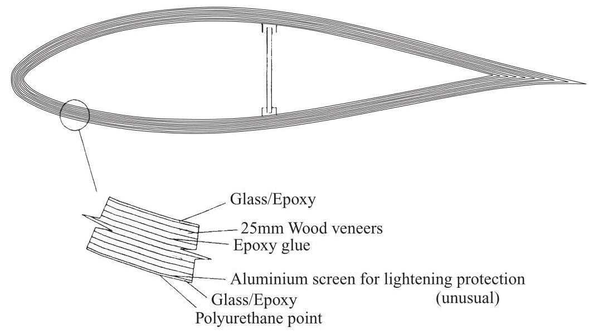

Figure 7.1 Wood/epoxy blade construction utilizing full blade shell. Reproduced from Corbet (1991) by permission of the DT1 Renewable Energy R&D Programme

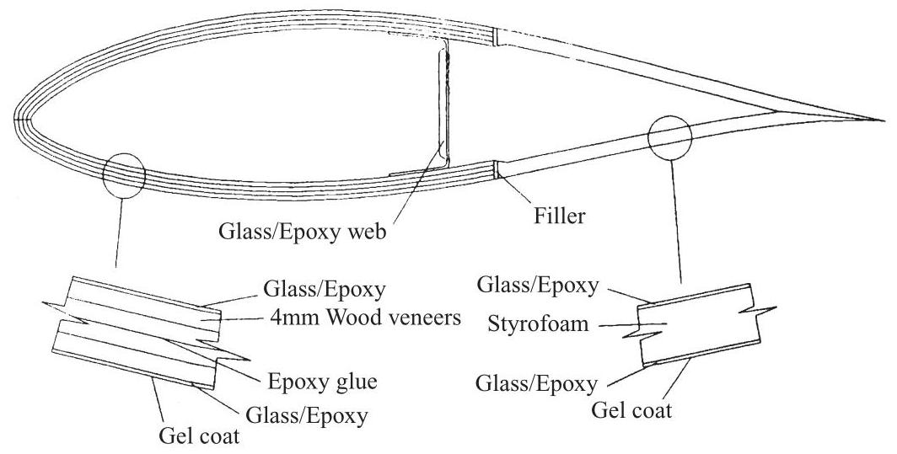

Figure 7.2 Wood/epoxy blade construction utilizing forward half of blade shell. Reproduced from Corbet (1991) by permission of the DT1 Renewable Energy R&D Programme

If the load-bearing structure is limited to a compact closed hollow section spar, consisting of two shear webs and the skin sections between them (see Figure 7.4), then a GFRP blade lends itself to semi-automatic lay-up on a rotating mandrel which can be withdrawn after curing.

### 7.1.5 Blade materials and properties

The ideal material for blade construction will combine the necessary structural properties - namely high strength to weight ratio, fatigue life and stiffness - with low cost and the ability to be formed into the desired aerofoil shape.

Table 7.1 lists the structural properties of the materials in general use for blade manufacture and those of some other candidate materials. For comparative purposes, values are also presented of:

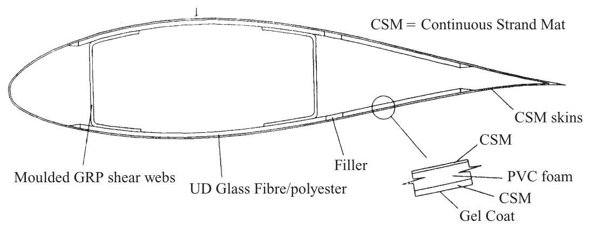

Figure 7.3 Glass-fibre blade construction using blade skins in forward portion of blade cross section and linking shear webs. Reproduced from Corbet (1991), by permission of the DT1 Renewable Energy, R&D Programme

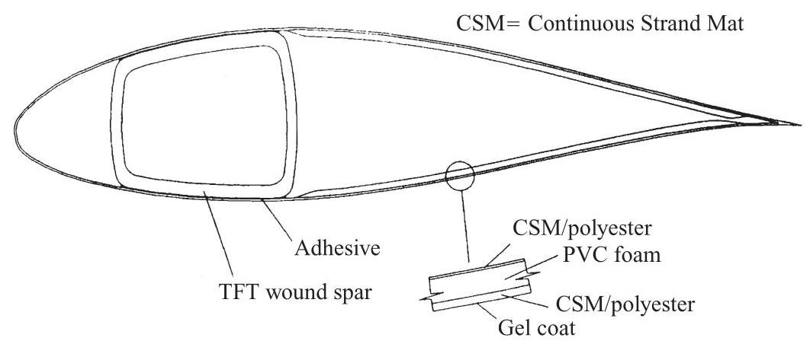

Figure 7.4 Glass-fibre blade construction using compact spar wound with transverse filament tape (TFT) on mandrel. Reproduced from Corbet (1991), by permission of the DT1 Renewable Energy R&D Programme

- compressive strength to weight ratio;

- fatigue strength as a percentage of compressive strength;

- stiffness to weight ratio; and

- a panel stability parameter, $E/{\left( \mathrm{{UCS}}\right) }^{2}$ .

It is evident that glass and carbon fibre composites (GFRP and CFRP) have a substantial higher compressive strength to weight ratio compared with the other materials. However, this apparent advantage is not as decisive as it appears, for two reasons. First of all, the fibres of some of the plies making up the laminated blade shell have to be aligned off-axis (typically at $\pm  {45}^{ \circ  }$ ) to resist shear loads, giving reduced strengths in the axial direction. Secondly, the relatively low Young's modulus of these composites means that resistance to buckling of the thin skins governs the design rather than simple compression yielding. The likelihood that buckling will govern is inversely related to the panel stability parameter, $E/{\left( \mathrm{{UCS}}\right) }^{2}$ , given in the last column of Table 7.1, so that materials with high values, such as wood composites will be least sensitive to buckling. As a result wood composite blades are generally lighter than equivalent glass fibre composite blades. Design against buckling is considered in Section 7.1.10.

It should be noted that the low strength of wood laminate compared with other materials renders it unsuitable for blades with slender chords operating at high tip speed, where the flapwise bending moments during operation are inevitably high in relation to blade thickness. For example, Jamieson and Brown (1992) have shown that, in the case of a family of stall-regulated machines, the blade stress is highly sensitive to rotational speed, increasing as the fourth power, if the skin thickness to chord ratio is maintained constant. Although stresses can be reduced by increasing the skin thickness, this represents a less and less efficient use of the additional material beyond a skin thickness to chord ratio of 3-4%, especially in the outboard part of the blade, where the blade thickness to chord ratio is low.

Fatigue performance is conveniently measured by mean fatigue strength at ${10}^{7}$ cycles, as a percentage of ultimate compressive strength. Clearly, carbon fibre and khaya/epoxy perform best with a value of about ${30}\%$ . The low value for welded steel (10%), combined with steel's low strength to weight ratio, renders it uncompetitive for large diameter machines where gravity fatigue loading becomes important, although it was chosen for some of the early prototype megawatt scale machines when the fatigue properties of composite materials were less well understood.

Table 7.1 Structural properties of materials for wind turbine blades

<table><tr><td rowspan="2">Material (NB: UD denotes unidirectional fibres - i.e., all fibres running longitudinally)</td><td>Ultimate tensile strength (UTS) (MPa)</td><td>Ultimate compressive strength (UCS) (MPa)</td><td rowspan="2">Specific gravity (s.g.)</td><td rowspan="2">Compressive strength to weight ratio UCS/s.g.</td><td rowspan="2">Mean fatigue strength at ${10}^{7}$ cycles (amplitude) (MPa)</td><td rowspan="2">Mean fatique strength as percentage of UCS</td><td rowspan="2">Young's Modulus, $E$ (GPa)</td><td rowspan="2">Stiffness to weight ratio $E/$ s.g. (GPa)</td><td rowspan="2">Panel stability parameter $E/{\left( \mathrm{{UCS}}\right) }^{2}$ (MPa) ${}^{-1}$</td></tr><tr><td colspan="2">(mean for composites, minimum for metals)</td></tr><tr><td>1. Glass/polyester ply with 50% fibre volume fraction and UD lay-up</td><td>860-900 [1][2]</td><td>~720 [1]</td><td>1.85</td><td>390</td><td>140 [3]</td><td>19%</td><td>38 [2]</td><td>20.5</td><td>0.07</td></tr><tr><td>2. Glass/epoxy ply with 50% fibre volume fraction and UD lay-up</td><td></td><td></td><td></td><td></td><td></td><td></td><td></td><td></td><td></td></tr><tr><td>3. Glass/polyester laminate with 50% fibre volume fraction and 80% of fibres running longitudinally</td><td>690-720</td><td>~580</td><td>1.85</td><td>310</td><td>120</td><td>21%</td><td>33.5</td><td>18</td><td>0.1</td></tr><tr><td>4. Carbon fibre/epoxy ply with 60% fibre volume fraction and UD lay-up</td><td>1830 [4]</td><td>1100 [4]</td><td>1.58</td><td>700</td><td>350 [5]</td><td>32%</td><td>142 [4]</td><td>90</td><td>0.12</td></tr></table>

<table><tr><td>5. Khaya ivorensis/epoxy laminate</td><td>82 [6]</td><td>50 [6]</td><td>0.55</td><td>90</td><td>15 [7]</td><td>30%</td><td>10 [8]</td><td>18</td><td>4</td></tr><tr><td>6. Birch/epoxy laminate</td><td>117 [9]</td><td>81 [10]</td><td>0.67</td><td>121</td><td>16.5 [7]</td><td>20%</td><td>15 [10]</td><td>22.5</td><td>2.3</td></tr><tr><td>7. High Yield Steel (Grade Fe 510)</td><td>510</td><td>510</td><td>7.85</td><td>65</td><td>50 [11]</td><td>10%</td><td>210</td><td>27</td><td>0.81</td></tr><tr><td>8. Weldable aluminium alloy AA6082 (formerly) H30</td><td>295 [12]</td><td>295 [12]</td><td>2.71</td><td>109</td><td>17 [13]</td><td>6%</td><td>69 [12]</td><td>25.5</td><td>0.79</td></tr></table>

Sources:

[1] Mayer (1996) Figure 2.4.

[2] Barbero (1998) Table 1.1.

[3] Mayer (1996) Fig. 14.4.

[4] Carbon fibres exhibit a wide range of properties; figures given here are for one example only, taken from [2].

[5] Based on $S - N$ curve index of $m = {14}$ , taken from GL rules.

[6] Bonfield and Ansell (1991) Moisture content = 10%

[7] Based on $S - N$ curve index of $m = {13.4}$ for scarf-jointed wood laminates, taken from Hancock and Bond (1995).

[8] Bonfield et al. (1992).

[9] Mayer (1996) Table 7.3.

[10] Hancock (Personal Communication). Moisture content = 10%.

[11] Mean value for butt-welded joints with weld profile ground smooth (Class C), taken from BS 5400, Part 10 (1980).

[12] CP 118: 1969 'Code of practice for structural aluminium'.

[13] Mean value estimated from mean minus two standard deviations value for ground butt welded joint with shallow thickness transition, Detail Cat 221, in IIW 'Fatigue design of welded joints and components'

The stiffness to weight ratio determines blade natural frequency. Apart from CFRP, the values in the table are all in a relatively small range (18-27 GPa), indicating that material choice will generally only have a marginal effect on dynamic behaviour.

From the above brief survey, it is apparent that the material with the best all-round structural properties is carbon fibre composite. However, it has not found common use, because it is an order of magnitude more costly than other materials. Instead, the most popular material is glass/polyester, followed by glass/epoxy and wood/epoxy.

Steel is the cheapest material in the raw state, and can be formed into tapering, curved panels following the aerofoil profile, except in the sharply curved region near the leading edge. However, it is much harder to introduce a twist into such panels, and this consideration, together with the poor fatigue properties, means that steel is rarely used. By contrast, glass and carbon fibre composites lend themselves to wet lay-up in half-moulds profiled to give the correct aerofoil shape, planform and twist. Laminated wood composite blades are built up in a similar way, but the veneer thickness has to be restricted to enable the veneers to flex to the required curvature during lay-up.

In the following paragraphs, the properties of the materials in most common use for blade manufacture are considered in more detail.

### 7.1.6 Properties of glass/polyester and glass/epoxy composites

As noted in Table 7.1, the properties of glass/polyester and glass/epoxy plies with the same fibre volume fraction and lay-up are generally very similar - that is, the influence of the matrix is slight. They will, therefore, be treated as the same material in the discussion that follows, except in relation to fatigue where some differences have been noted. The glass used in blade construction is E-glass, which has good structural properties in relation to its cost.

The plate elements forming the spar of a GFRP blade are normally laminates consisting of several plies, with fibres in different orientations to resist the design loads. Within a ply (typically 0.5-1.0 mm in thickness), the fibres may all be arranged in the same direction - that is, UD or unidirectional - or they may run in two directions at right angles in a wide variety of woven or non-woven fabrics.

Although the strength and stiffness properties of the fibres and matrix are well defined, only some of the properties of a ply can be derived from them using simple rules. Thus, for a ply reinforced by UD fibres, the longitudinal stiffness modulus, ${E}_{1}$ , can be derived accurately from the rule of mixtures formula

$$
{E}_{1} = {E}_{f}{V}_{f} + {E}_{m}\left( {1 - {V}_{f}}\right) \tag{7.3}
$$

where ${E}_{f}$ is the fibre modulus (72.3 GPa for E-Glass), ${E}_{m}$ is the matrix modulus (in the range 2.7-3.4 GPa) and ${V}_{f}$ is the fibre volume fraction. On the other hand, the inverse form of this formula - for example,

$$
\frac{1}{{E}_{2}} = \frac{\left( 1 - {V}_{f}\right) }{{E}_{m}} + \frac{{V}_{f}}{{E}_{f}} \tag{7.4}
$$

significantly underestimates the transverse modulus, ${E}_{2}$ , and the in-plane shear modulus, ${G}_{12}$ . More accurate formulae based on more sophisticated models are given in Barbero (1998).

The longitudinal tensile strength of a ply reinforced by UD fibres, ${\sigma }_{1t}$ , can be estimated from

$$
{\sigma }_{1t} = {\sigma }_{fu}\left\lbrack  {{V}_{f} + \frac{{E}_{m}}{{E}_{f}}\left( {1 - {V}_{f}}\right) }\right\rbrack \tag{7.5}
$$

where ${\sigma }_{fu}$ is the ultimate tensile strength of the fibres. However, the tensile strengths of E-glass single fibres (3.45 GPa) cannot be realised in a composite, where fibre strength reductions of up to ${50}\%$ have been measured. Accordingly, a value of ${\sigma }_{fu}$ of 1750 MPa should be used in Equation 7.5.

The longitudinal compressive strength of a ply reinforced by UD fibres is always significantly less than the tensile strength because of microbuckling of the fibres, which is governed by the shear strength of the matrix and the degree of fibre misalignment. A strength reduction of at least 15% should be allowed for, assuming minimum fibre misalignment.

Clearly, longitudinal stiffness and strength are both limited by the fibre volume fraction obtainable. For hand lay-up, fibre volume contents of 30-40% are typical, but the use of 'vacuum bagging', in which trapped air and excess volatile compounds, such as residual solvent, are extracted, consolidates the composite and allows a volume fraction of 50% or more to be achieved. The use of pre-pregs, which are unidirectional fibres or woven fabric pre-impregnated with partially cured epoxy resin, results in similar increased fibre volume fractions.

## Fatigue properties

When expressed in terms of stress, the fatigue properties of composite laminates extend over a wide range, depending on fibre volume fraction and the number of plies with fibres in the longitudinal direction. However, data from constant stress amplitude fatigue test results becomes much more intelligible if stress ranges are converted into initial strain ranges, allowing the fatigue properties of composites with different lay-ups to be compared. (The Young's modulus of a composite reduces over time during a fatigue test - hence the need to specify that the strain range is measured at the start of the test).

The fatigue behaviour of composites depends on both the stress range and the mean stress level, which can both be described in terms of the maximum stress, ${\sigma }_{\max }$ , and the ratio of minimum to maximum stress, $R$ . It is convenient initially to consider fatigue behaviour under reverse loading, that is, with $R =  - 1$ , for which the mean stress is zero, and then relate behaviour at other $R$ ratios to it.

The constant amplitude fatigue behaviour of glass fibre composites can best be characterised by a linear relationship between the logarithm of the number of cycles and the logarithm of the stress or strain amplitude, viz:

$$
\varepsilon  = {\varepsilon }_{0}{N}^{-1/m}\;\text{ or, }\;N = K{\varepsilon }^{-m}\;\text{ where }\;K = {\left( {\varepsilon }_{0}\right) }^{m}\;\text{ or, }\;\log N = \log K - m\log \varepsilon
$$

(7.6)

Echtermeyer, Hayman and Ronold (1996) carried out a regression analysis on a total of 111 constant amplitude, reverse loading fatigue test results for ten different laminates tested at DnV, assuming that they all conformed to the same $\varepsilon  - N$ curve, and obtained values for ${\varepsilon }_{0}$ , $\log K$ and $m$ of ${2.84}\% ,{3.552}$ and 7.838 respectively, with a standard deviation of $\log N$ of 0.437. The DnV regression line is compared with another derived from 19 tests on a ${0}^{ \circ  }/ + {45}^{ \circ  }$ , $- {45}^{ \circ  }$ laminate at ECN, giving ${\varepsilon }_{0} = {2.34}\% ,\log K = {3.775}$ and $m = {10.204}$ , in Figure 7.5. The researchers did not constrain the regression lines to pass through the strain value at either UTS or UCS at log $N = 0$ (ca 2.4% and 2.0%): had they done so the DnV line would have had a shallower slope - that is, a larger value of $m$ . After comparison with regressions on other fatigue test datasets, they concluded that the DnV line provided a reasonable basis for initial design.

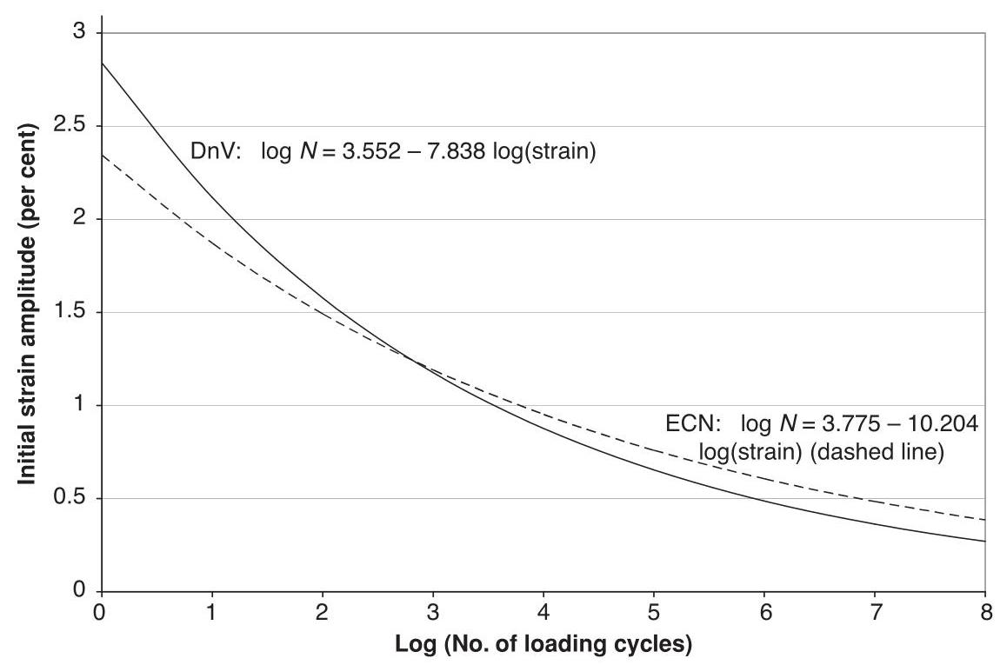

Figure 7.5 Strain-life regression lines fitted to results of constant amplitude, reverse loading fatigue tests on GFRP composites

Constant amplitude tests at other $R$ ratios generally show reducing fatigue lives as the mean stress increases above zero - whether in tension or in compression. It is customary to represent the results on a constant life diagram (also known as a Goodman diagram), in which the stress range to failure is plotted against mean stress for different fatigue lives. Regression analyses can be carried out on families of test results at different $R$ ratios to give a series of $\varepsilon  - N$ relations in the form of Equation 7.6 which can be used to plot the constant life diagram. Such an exercise was carried out on the Dutch 'FACT' database of fatigue tests on composites for wind turbines (Joose and van Delft, 1996), and some results of this work have been reproduced in Figure 7.6 (dashed lines).

In the preparation of design rules, it is common practice to make the simplifying assumption that the strain amplitude reduces linearly with increasing mean strain for a given fatigue life, reaching zero at a mean strain corresponding to either the ultimate tensile or compressive strength. Such linear constant life lines are shown in Figure 7.6 as heavy lines. Constant life lines for design are obtained from characteristic material properties divided by appropriate partial safety factors, as opposed to the characterisitc properties used in Figure 7.6. Thus, the design strain amplitude when the mean stress is compressive becomes

$$
{\varepsilon }_{d}\left( {\overline{\sigma }, N}\right)  = {\varepsilon }_{0d}{N}^{-\frac{1}{m}}\left( {1 - \frac{\overline{\sigma }}{{\sigma }_{cd}}}\right) \tag{7.7}
$$

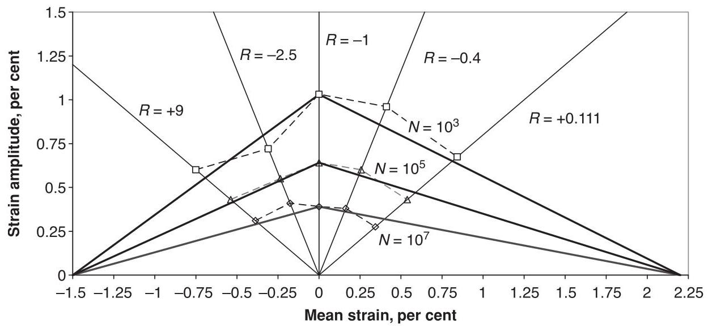

Figure 7.6 Constant life diagram showing variation in fatigue strain amplitude with mean strain for lives of ${10}^{3},{10}^{5}$ and ${10}^{7}$ cycles for GFRP composites. Dashed lines show experimental results and full lines show linearised formulations for design

where ${\varepsilon }_{0d} = {\varepsilon }_{0k}/{\gamma }_{mf},{\sigma }_{cd} = {\sigma }_{ck}/{\gamma }_{mu},{\varepsilon }_{0}$ is the value of $\varepsilon$ given by the $\varepsilon  - N$ curve when $\log N$ is zero, $\overline{\sigma }$ is the mean stress for the loading cycles under consideration, and ${\sigma }_{cd}$ is the design compressive stress. ${\gamma }_{mf}$ is the partial safety factor for fatigue strength, ${\gamma }_{mu}$ is the partial safety factor for ultimate strength, and the suffices $d$ and $k$ signify design and characteristic values respectively.

Equation 7.7, together with its equivalent for mean tensile loading, can be used to calculate the permissible number of load cycles, ${N}_{i}$ , for each strain range in the fatigue loading spectrum for the point in the blade cross section under examination - incorporating the appropriate partial safety factor for the consequences of failure. These are then combined with the predicted number of cycles for each strain range, ${n}_{i}$ , to yield Miner’s damage sum, $\mathop{\sum }\limits_{i}\left( {{n}_{i}/{N}_{i}}\right)$ , which is normally required to be less than unity.

In the GL rules, under the ’simplified assumptions’, the $\varepsilon  - N$ curve for design takes the same form as Equation 7.6, but the constant life diagram is symmetrical about a strain level midway between the ultimate tensile and compressive strains, with ${\varepsilon }_{0}$ set equal to half the difference between the ultimate tensile and compressive strains. Partial materials safety factors are included. GL specifies different values of the index, $m$ , for composites with polyester and epoxy matrixes - 9 and 10 respectively - although opinion is divided as to whether the difference is justified. The constant life diagram is illustrated in Figure 7.7 for $m = {10}$ .

The small circle on Figure 7.7 indicates that the number of cycles permitted for a strain range of ${0.6}/{\gamma }_{M}\%$ and a factored mean strain of $1\%$ would be 1000, where ${\gamma }_{M}$ is the appropriate partial safety factor for material strength in fatigue and the mean strain is factored by the partial safety factor for material strength under extreme loads.

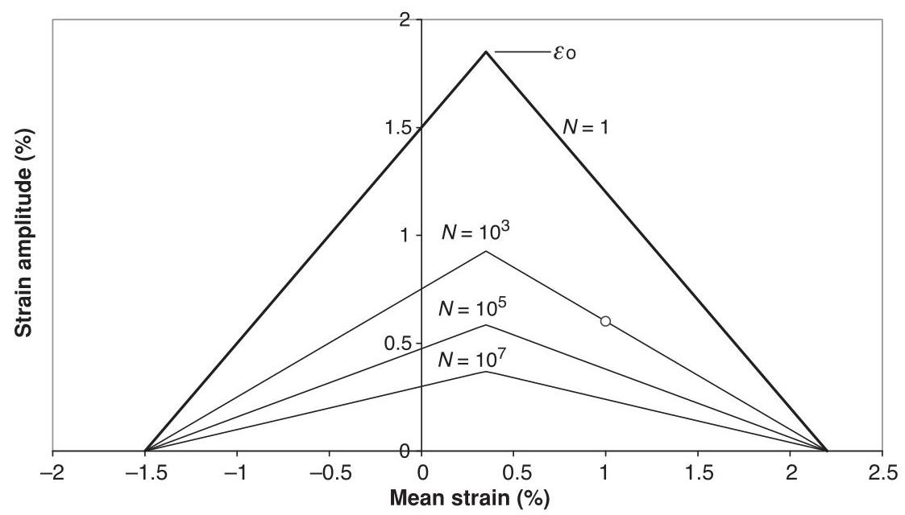

Figure 7.7 Constant life diagram based on GL rules (simplified assumptions) showing variation in fatigue strain amplitude with mean strain for lives of one, ${10}^{3},{10}^{5}$ and ${10}^{7}$ cycles for GFRP composites

There is inevitably a degree of uncertainty as regards the accuracy of Miner's rule in predicting the fatigue damage due to variable amplitude loading from constant amplitude test data. In order to investigate this, fatigue test programmes have been carried out using the WISPER (Wind SPEctrum Reference) and WISPERX variable amplitude fatigue load spectra, which have been devised to be representative of those experienced by wind turbine blades. (WISPERX is a modification of WISPER in which the large number of small cycles, accounting for approximately 90% of the total, are omitted to reduce test durations.) For each test specimen, the WISPER (or WISPERX) load sequence is scaled to give a chosen maximum stress level and is applied repeatedly until the specimen fails.

Van Delft et al. (1996) analysed the results of a series of tests carried out at ECN and Delft Technical University on a ${0}^{ \circ  }, \pm  {45}^{ \circ  }$ laminate and found that, for a maximum stress of about 150 MPa, the actual fatigue lives of specimens subjected to repetitions of the WISPER or WISPERX load sequences were about one hundred times less than predicted for these sequences on the basis of constant amplitude, reverse loading test data and Miner's rule, with the effect of mean stress allowed for using the linear relation described above. The $R =  - 1$ test data led to an $S - N$ curve given by $N = {\left( \sigma /{\sigma }_{tu}\right) }^{-{10}}$ , where $\sigma$ is the amplitude of the stress cycles and ${\sigma }_{\mathrm{{tu}}}$ is the ultimate tensile strength, so the number of cycles to failure for constant amplitude loading at other $R$ values was taken as $N = {\left( \sigma /{\sigma }_{tu}\left( 1 - \overline{\sigma }/{\sigma }_{tu}\right) \right) }^{-{10}}$ for a tensile mean and $N = {\left( \sigma /{\sigma }_{tu}\left( 1 - \overline{\sigma }/{\sigma }_{cu}\right) \right) }^{-{10}}$ for a compressive mean in calculating the Miner’s damage sum. The difference in fatigue lives at the stated maximum stress level quoted above translates to an approximate ratio of 1:1.5 between actual and predicted maximum stress levels of the WISPER sequence to cause failure over the design fatigue life, which would clearly use up a substantial proportion of the safety factors used in design. However, other investigators working with different laminates have found reasonable agreement between measured and predicted fatigue lives under WISPER loading.

## Material safety factors

Limit state design requires that the characteristic strength of a material be divided by a partial safety factor for material strength. In the case of GFRP, this factor needs to take account of degradation of the material over time, as well as the material's inherent variability.

The GL rules lay down that the material safety factor for calculating the design strength of GFRP under extreme loads is to be calculated as the product of:

- a basic factor, ${\gamma }_{\mathrm{{MO}}}$ , of 1.35;

- a factor, ${C}_{2\mathrm{a}} = {1.35}$ , to account for the influence of ageing;

- a factor, ${C}_{3\mathrm{a}} = {1.1}$ to account for strength reduction at higher temperatures;

- a factor, ${C}_{4\mathrm{a}} = {1.2}$ for hand lay-up laminates or 1.1 where manufacture is partially automated;

- a factor, ${C}_{5\mathrm{a}} = {1.1}$ if the laminate is not post cured.

These rules result in a material safety factor in the range 2.2-2.65.

In the case of fatigue loads, the ageing factor of 1.35 is omitted and the factor accounting for lay-up is replaced by one taking account of the type of fibre reinforcement.

### 7.1.7 Properties of wood laminates

Although laminated wood/epoxy is classed as a composite, it is markedly different in form from GFRP. Individual plies are made up of large sheets of wood veneer (Figure 7.8) instead of a multiplicity of fibres laid up in a matrix, and the epoxy behaves as an adhesive rather than a matrix, bonding the sheets together at the longitudinal and transverse joints and bonding each ply to its neighbour. Thus, the fibre volume fraction is close to ${100}\%$ and the anisotropic properties of the wood laminate derive principally from the anisotropic properties of the wood itself.

Wood strength properties are much greater in the direction parallel to the grain, so all the veneers are orientated with the grain parallel to the blade axis, in order to resist blade bending loads efficiently. However, the veneers cannot be produced in lengths much greater than 2.5 m, so transverse joints have to be included, which introduce lines of weakness not normally found in GFRP blades. The effect is minimised by staggering the joints, and by using scarf joints in preference to butt joints.

The epoxy adhesive has a secondary function of sealing the veneers against moisture ingress; additional moisture protection is provided by a layer of glass/epoxy on both the external and internal surfaces. It is important to maintain moisture content at a low level, because veneer strength decreases about $6\%$ for every $1\%$ rise in moisture content.

A comparison of some of the properties of wood laminates used, or considered for use, in wind turbine blades is given in Table 7.2. Khaya ivorensis, an African mahoghany and Douglas fir used to be the main species used for blade manufacture in the UK and US respectively, but environmental pressures have led to the phasing out of Khaya in favour of European species such as poplar and birch.

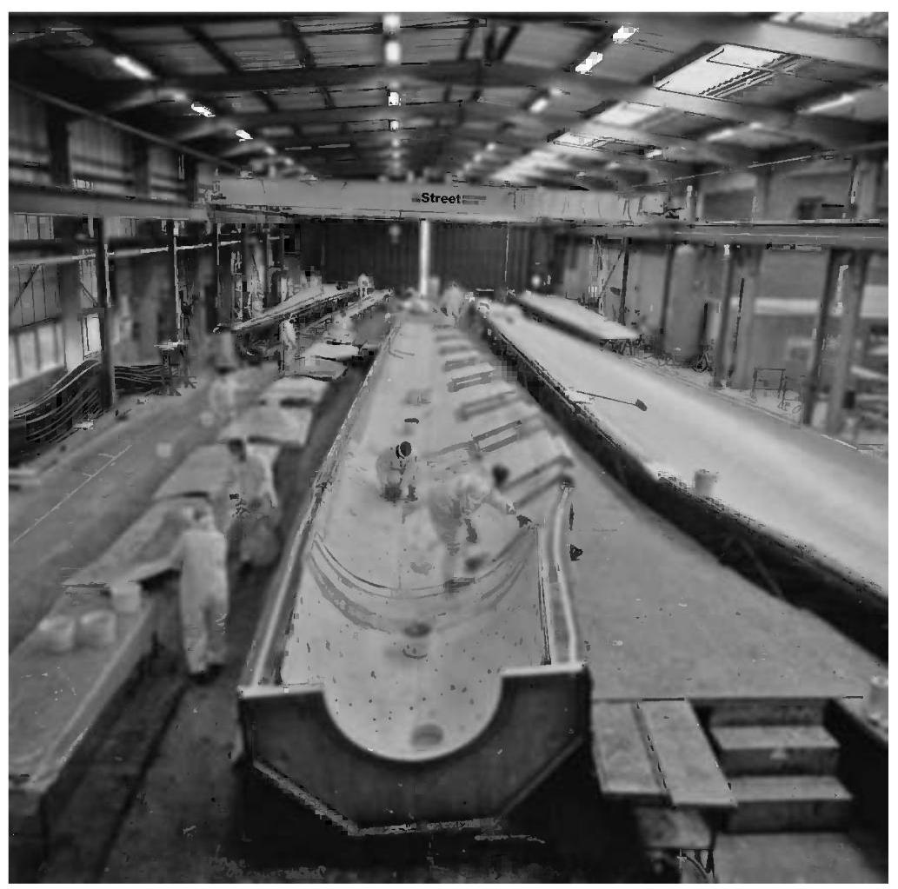

Figure 7.8 Blade Production. View of veneer lay-up in mould to make one blade skin. The blade is completed by glueing face and camber skins together. Reproduced by permission of NEG-Micon. See Plate 3 for the colour figure

Table 7.2 gives tensile strengths of unjointed specimens. Bonfield et al. (1992) report the results of tests on jointed specimens, which showed a significant reduction in tensile strength to 50 MPa for butt jointed Khaya. Scarf jointed Khaya specimens, with a 1:6 length to thickness ratio, performed much better, achieving a tensile strength of 75 MPa. In all cases the joints in the different veneers making up the laminate were staggered.

An important consideration for design is the variability of strength properties, particularly as wood is an inherently variable material. Strength tends to increase with density, and density varies according to the growing conditions of the tree and the part of the tree from which the wood is taken. Such variability can be reduced by careful grading and the rejection of damaged veneers before laminating. Bonfield and Ansell (1991) report compression tests on 32 carefully selected Khaya samples which yielded the compression strength of 50 MPa given in the table with a standard deviation of only 3 MPa. It should be noted that the lack of annual growth rings in equatorially grown wood may reduce the degree of scatter. Wood strengths perpendicular to the grain are typically much less than those along the grain - for example, the compressive strength of transversely loaded Khaya is only 12.6 MPa.

Table 7.2 Properties of unjointed wood/epoxy laminates

<table><tr><td>Species</td><td>Specific gravity</td><td>Mean tensile strength along the grain (MPa)</td><td>Mean compression strength along the grain (MPa)</td><td>Young's modulus along the grain (GPa)</td><td>Shear strength (MPa)</td></tr><tr><td>Khaya ivorensis</td><td>0.55</td><td>82</td><td>50</td><td>10</td><td>9.5</td></tr><tr><td>Poplar</td><td>0.45</td><td>63</td><td>52</td><td>10</td><td>9</td></tr><tr><td>Baltic pine</td><td>0.55</td><td>105</td><td>40</td><td>16</td><td></td></tr><tr><td>Birch</td><td>0.67</td><td>117</td><td>81</td><td>15</td><td>16</td></tr><tr><td>Beech</td><td>0.72</td><td>103</td><td>69</td><td>10</td><td>16</td></tr><tr><td>Douglas fir</td><td>0.58</td><td>100</td><td>61</td><td>15</td><td>12</td></tr></table>

## Fatigue properties

The fatigue properties of wood laminates have been the subject of a sustained programme of work at Bath University, starting with Khaya and then extending to other species (Bonfield et al., 1992). A useful summary of this work appears in Bond and Ansell (1998). The general conclusion is that wood performs very well in fatigue with a shallow $S - N$ curve slope, and that fatigue strengths at high cycles do not vary greatly between species.

If the $S - N$ curve for constant amplitude, reverse loading $\left( {R =  - 1}\right)$ fatigue is normalised with respect to the ultimate compressive strength, ${\sigma }_{cu}$ - that is, $\sigma  = {\sigma }_{cu}{N}^{-1/m}$ , then the results of tests on unjointed Khaya indicate a value of the index $m$ of about 20. However the value of $m$ reduces to about 16 for scarf jointed khaya, poplar and beech, and to about 13 for butt-jointed specimens. Hancock and Bond (1995) have proposed the use of an index of 13.4 for design purposes for scarf jointed wood laminates in general.

Testing at other $R\left( { = {\sigma }_{\min }/{\sigma }_{\max }}\right)$ ratios allows constant life diagrams to be plotted - see, for example, the diagram for scarf jointed poplar in Figure 7.9, taken from Bond and Ansell (1998). Note the relatively low stress ranges at $R =  - {0.84}\left( { = \mathrm{{UCS}}/\mathrm{{UTS}}}\right)$ , which may be due to simultaneous occurrence of compressive and tensile damage. Despite this, the simplification of the constant life diagram to a series of straight lines between the $R =  - 1$ stress range for each fatigue life and either the UTS or UCS is reasonably accurate.

## Material safety factors

The material safety factor applied when timber is used in building construction is normally high - for example, about 3-4. However, there are a number of reasons for adopting a much lower value in blade design - as follows:

1. Laminated construction is used, so any defects are very localised.

2. The moisture content is carefully controlled during manufacture, and the blade skin is then very effectively sealed against further moisture ingress.

3. Creep effects are negligible as the gravity loads change direction because of blade rotation and the wind loads are temporary in nature.

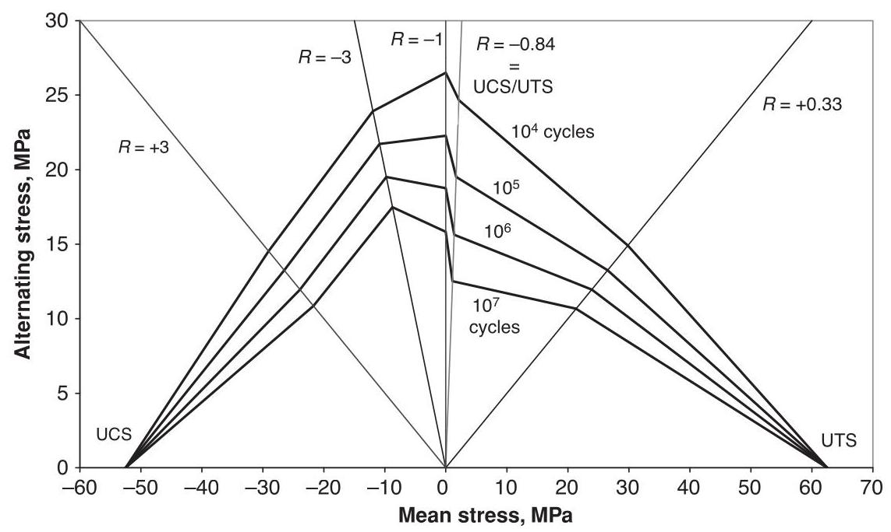

Figure 7.9 Constant life diagram for scarf jointed poplar derived from 50% median regression lines on $S - N$ fatigue test data

Accordingly a partial safety factor of only about 1.5 is normal for design against extreme loads.

### 7.1.8 Blade loading overview

This section explores the variation of extreme and fatigue loading with wind speed and yaw angle, focussing on flapwise bending at 60% radius by way of example. The turbine considered is a ${40}\mathrm{\;m}$ diameter ${500}\mathrm{\;{kW}}$ machine, with the ${20}\mathrm{\;m}$ radius blades scaled down from the ${40}\mathrm{\;m}$ radius T40 blade shown in Figure 5.4(a).

## Extreme loading during operation: stall-regulated machines

The stall-regulated machine considered operates at a single rotational speed of ${30}\mathrm{{rpm}}$ , with rated wind speed, ${V}_{r}$ , and cut out speed, ${V}_{o}$ , of ${16}\mathrm{\;m}/\mathrm{s}$ and ${25}\mathrm{\;m}/\mathrm{s}$ respectively. The shaft tilt with respect to the horizontal is taken as ${5}^{ \circ  }$ , so, allowing for a ${8}^{ \circ  }$ inclination of the flow to the horizontal, as specified in the code, the maximum shaft tilt with respect to the flow is ${13}^{ \circ  }$ .

The blade loadings are calculated using empirical 3D data taken from Petersen, Madsen et al. (1998), with extrapolation of the lift and drag coefficient curves beyond ${30}^{ \circ  }$ angle of attack (the upper limit of the data). The 3D data displays a gentler stall than typical 2D data, so there is no significant reduction in blade out-of-plane bending moment as the blade goes into stall. Above about ${20}\mathrm{\;m}/\mathrm{s}$ , the out-of-plane bending moment begins to increase progressively once again as drag begins to become significant. The predicted variation of blade ${12}\mathrm{\;m}$ radius out-of-plane bending moment with wind speed is plotted out for a 0.2 shear exponent, zero shaft tilt and a range of yaw angles on Figure 7.10, with the yaw direction defined as positive when the lateral component of air flow with respect to the rotor disc is in the same direction as the blade movement at zero azimuth (i.e. at ${12}\mathrm{o}$ ’clock). The effect of this increase in relative velocity outweighs that of the reduction of angle of attack at wind speeds beyond stall, so the bending moment at ${0}^{ \circ  }$ azimuth is increased by negative yaw. Maximum moments occur at negative yaw angles and ${0}^{ \circ  }$ azimuth rather than at positive yaw angles and ${180}^{ \circ  }$ azimuth, because wind shear augments the wind speed in the former case. Also plotted is the variation of bending moment with wind speed for a ${13}^{ \circ  }$ shaft tilt with respect to the air flow and ${90}^{ \circ  }$ azimuth, which is the critical configuration for load cases not involving a change in wind direction. The ${13}^{ \circ  }$ shaft tilt with respect to the flow is made up of ${5}^{ \circ  }$ shaft tilt relative to horizontal and an ${8}^{ \circ  }$ inclination of the flow to the horizontal, as specified in IEC 61400-1.

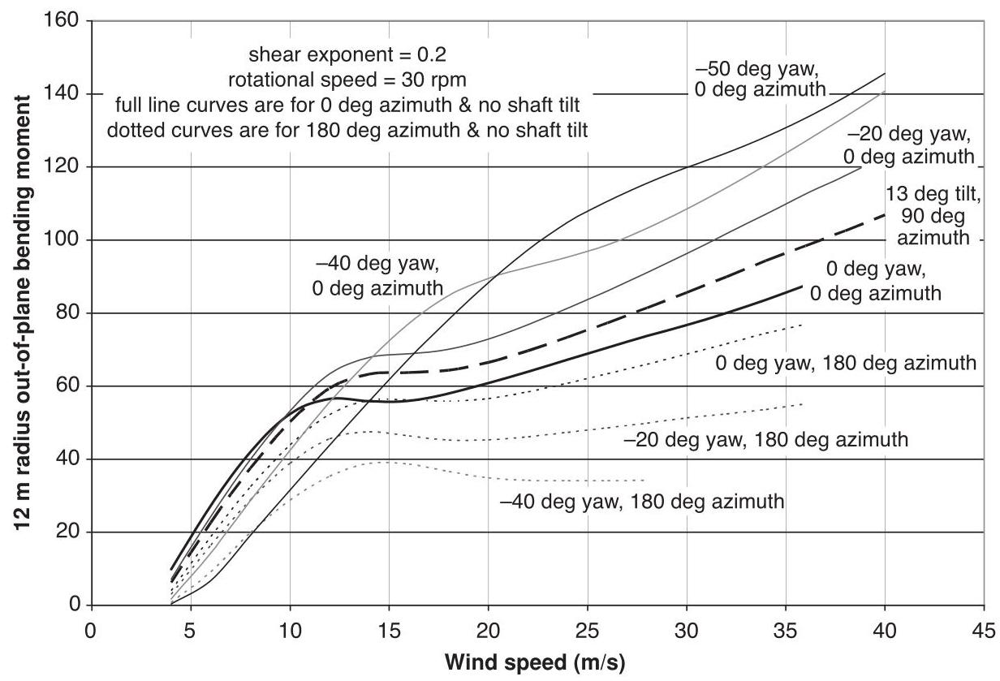

Figure 7.10 Variation of ${12}\mathrm{\;m}$ radius out-of-plane bending moment with wind speed at various yaw angles for an example ${40}\mathrm{\;m}$ diameter stall regulated machine

The plots of the extreme ${12}\mathrm{\;m}$ radius out-of-plane bending moment in Figure 7.10 are conservative on three counts, because no allowance is made for the following:

- Lack of correlation of the wind over the outer ${40}\%$ of the blade.

- Limitation on maximum wind speed seen during operation by high wind cut-out.

- Limitation on maximum yaw angle by yaw control.

The alleviation of extreme loadings by high wind cut-out and yaw control depend on the averaging times applied to the wind speed and direction signals by the control system.

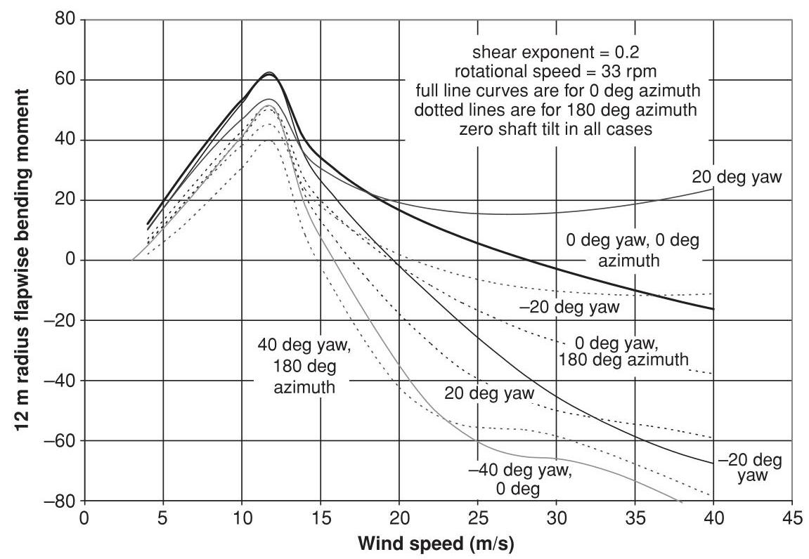

Figure 7.11 Variation of ${12}\mathrm{\;m}$ radius flapwise bending moment with short-term mean wind speed at various yaw angles, for an example ${40}\mathrm{\;m}$ diameter pitch regulated $\mathrm{m}/\mathrm{c}$

## Extreme loading during operation: pitch-regulated machines

The characterisation of extreme operational loadings on pitch-regulated machines is inevitably more complicated than for stall-regulated machines, although at the same time it should be more accurate because of the avoidance of uncertainties associated with stall. It is instructive to focus comparisons on the blade bending moment about the weak axis at ${60}\%$ radius once again. This time it is referred to as the flapwise bending moment rather than the out-of-plane (of rotation) moment because of blade pitching.

Figure 7.11 presents the variation of ${60}\%$ radius flapwise bending moment with short-term mean wind speed at several yaw angles for a ${500}\mathrm{\;{kW}},{40}\mathrm{\;m}$ diameter pitch-regulated machine rotating at ${33}\mathrm{{rpm}}$ . The rated speed, ${V}_{R}$ , is ${12}\mathrm{\;m}/\mathrm{s}$ and other parameters, including the wind shear exponent, are the same as in the stall-regulated example above. The blade loadings are calculated using empirical 3D data taken from Petersen, Madsen et al. (1998) as before, with extrapolation of the lift and drag coefficient curves to negative angle of attack. The figure only shows the bending moments resulting from slow variations in wind speed - that is, those which can be followed by the pitch control system - so moments arising from faster wind speed fluctuations must be added to obtain the total.

The curves are very different in shape from those obtained for the stall-regulated machine. The ${12}\mathrm{\;m}$ radius flapwise bending moment reaches a peak at rated wind speed, and then drops off sharply, becoming negative by about ${24}\mathrm{\;m}/\mathrm{s}$ in the case of zero yaw and zero wind shear. This is because the blade has pitched to such an extent that the outboard section of the blade is providing a braking torque to counteract the increased torque from the inboard section. At high wind speeds and yaw angles, large negative bending moments are developed, which approach the magnitude of the peak positive moment at rated speed. Note that the bending moment reduces with negative yaw angle at zero azimuth, instead of increasing as it does for stall-regulated operation. This is because blade pitching renders angle of attack, which is reduced under these conditions, more critical than relative velocity. Plots of the variation of flapwise bending moment with short-term mean wind speed at inboard blade cross sections are essentially similar to those in Figure 7.11, because moments are dominated by loadings on the outboards portion of the blade.

To the extent that the pitch control system can keep pace with the wind speed transients, the curves in Figure 7.11 can be used to provide an approximate indication of the extreme BMs arising from some of the IEC 61400-1 deterministic load cases. It is seen that the extreme moments are only about one half of the maximum value for the stall-regulated machine.

The spectrum of the longitudinal wind speed fluctuations will contain significant energy at frequencies above the level at which the pitch control system can respond, and these have to be considered in the analysis of the 'Normal turbulence model' load case. Figure 7.12 illustrates the perturbations in the ${12}\mathrm{\;m}$ radius flapwise bending moment for the above machine, as a result of such high frequency wind speed fluctuations, with respect to a sharp rise above rated wind speed $\left( {{12}\mathrm{\;m}/\mathrm{s}}\right)$ and sharp falls below steady winds of24and ${28}\mathrm{\;m}/\mathrm{s}$ . In the first case considered, the yaw angle is $- {20}^{ \circ  }$ and the azimuth ${0}^{ \circ  }$ , as this configuration yields the largest positive bending moment at rated wind speed. In the second case, the yaw angle is $- {40}^{ \circ  }$ , which exceeds the maximum value predicted over the design life, and provides an upper bound on the largest negative moment at short-term mean wind speeds around the cut-out value.

It is apparent from Figure 7.12 that rapid wind speed increases above rated wind speed will produce a significant increase in bending moment, but rapid reductions in wind speed below, say, a 24 m/s steady value will not, as in this case the blade goes into negative stall. Over the machine lifetime, the maximum increase in wind speed above rated that does not produce a blade pitch response can be estimated using

$$
{u}_{\max } = {\sigma }_{u}\left\lbrack  {\frac{{\int }_{\Omega /2}^{\infty }{S}_{u}\left( n\right) }{{\int }_{0}^{\infty }{S}_{u}\left( n\right) }\left\lbrack  {\sqrt{2\ln \left( {\Omega T}\right) } + \frac{\gamma }{\sqrt{2\ln \left( {\Omega T}\right) }}}\right\rbrack  }\right\rbrack
$$

$$
= {\left( {\sigma }_{u}\right) }_{n > \Omega /2}\left\lbrack  {\sqrt{2\ln \left( {\Omega T}\right) } + \frac{0.5772}{\sqrt{2\ln \left( {\Omega T}\right) }}}\right\rbrack \tag{7.8}
$$

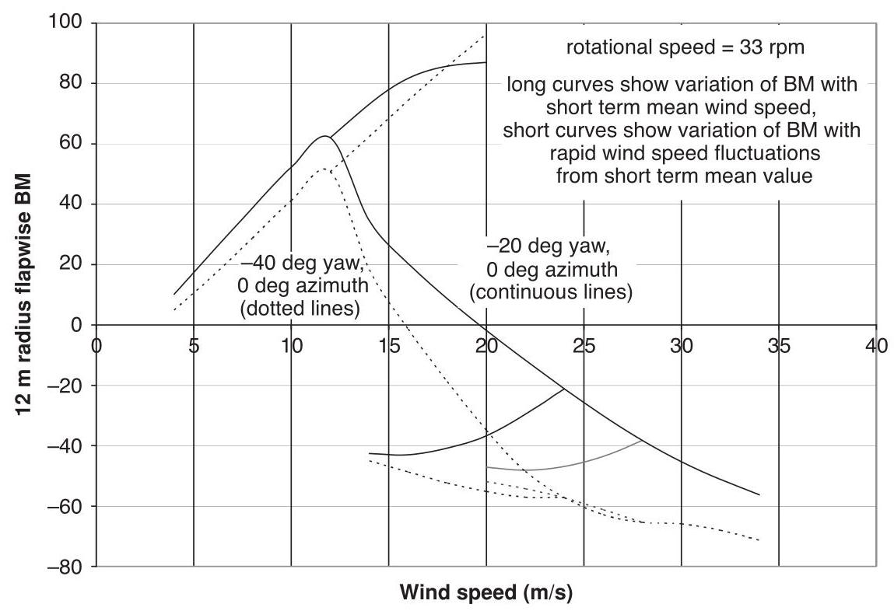

Figure 7.12 Effect of rapid wind speed fluctuations on ${12}\mathrm{\;m}$ radius flapwise BM for the example ${40}\mathrm{\;m}$ diameter pitch regulated machine

where ${\left( {\sigma }_{u}\right) }_{n > \Omega /2}$ is the standard deviation of wind speed fluctuations above the pitch response cut-off frequency (assumed to be half the rotational frequency) and $T$ is the total period of operation in the wind speed band centred on the rated speed at the yaw angle under consideration. For the IEC 61400-1 Edition 3 normal turbulence model the turbulence is given by

$$
{\sigma }_{u} = {I}_{15}\left( {{0.75}\bar{U} + {5.6}}\right) \tag{7.9}
$$

For a ${12}\mathrm{\;m}/\mathrm{s}$ rated wind speed, with ${I}_{15} = {0.16}$ for a Class A site, ${\sigma }_{u} = {2.34}\mathrm{\;m}/\mathrm{s}$ and ${\left( {\sigma }_{u}\right) }_{n > \Omega /2} = {2.34}.{\left( {0.4}\right) }^{0.5} = {1.48}\mathrm{\;m}/\mathrm{s}$ . Taking a wind speed band of $2\mathrm{\;m}/\mathrm{s}$ and yaw angles between $- {20}^{ \circ  }$ and $- {40}^{ \circ  }$ , the expression in square brackets (i.e. the peak factor) comes to 5.5, so that the lifetime extreme value of the wind speed increase without pitch response is about $8\mathrm{\;m}/\mathrm{s}$ . If the wind speed fluctuations over the outer $8\mathrm{\;m}$ of blade are treated as perfectly correlated, this results in a maximum value of ${12}\mathrm{\;m}$ radius flapwise bending moment of 96 KNm (see Figure 7.12), which is over ${50}\%$ greater than that occurring in a steady ${12}\mathrm{\;m}/\mathrm{s}$ wind. Thus, the extreme flapwise bending moment during operation occurs at winds around rated rather than around the upper cut-out speed - a phenomenon which is a normal feature of pitch-regulated machines. Also, the extreme flapwise bending moment is less than for the similarly rated stall regulated machine considered above.

## Fatigue loading

The importance of fatigue loading relative to extreme loading is very much a function of material properties. As the vast majority of blades are manufactured from composite materials with similar fatigue properties, discussion in this sub-section will be based on these.

As set out in Sections 7.1.6 and 7.1.7, composite materials are characterised by a very shallow $S - N$ curve - that is, the reciprocal index $m$ in the relation $\sigma  \propto  {N}^{-1/m}$ for constant amplitude, reversed loading $\left( {R =  - 1}\right)$ is typically 10 or more. As a result, fatigue damage can be dominated by the small number of high range stress cycles associated with unusual wind conditions, rather than by the routine medium range cycles.

The other significant property of composite materials is the increase in fatigue damage with mean stress level, which is usually accounted for by scaling up the stress amplitude entered in the $R =  - 1\mathrm{\;S} - N$ curve formulation by the factor $1/\left( {1 - \overline{\sigma }/{\sigma }_{d}}\right)$ , where ${\sigma }_{d}$ is the design strength in compression for a compression mean or in tension for a tension mean. This increases the relative importance of stress cycles with a high mean.

## Behaviour of stall regulated machines in fatigue

For stall-regulated machines, the highest out-of-plane bending moment ranges and means normally occur at high wind speeds and yaw angles. This is illustrated in Figure 7.10, which shows the variation in this moment with wind speed and yaw angle at ${60}\%$ radius for a 40 m diameter machine, based on the 3D data referred to above. Note that above rated wind speed, the bending moment plots level off, so that a given departure of the lateral wind component from the zero mean, sustained over half a revolution, results in a larger bending moment fluctuation than a change in the longitudinal component of twice this magnitude. For example, if the mean wind speed is ${24}\mathrm{\;m}/\mathrm{s}$ , a lateral component of $6\mathrm{\;m}/\mathrm{s}$ (corresponding to a yaw angle of ${14}^{ \circ  }$ ) causes a bending moment variation of ${20}\mathrm{{KNm}}$ when the blade rotates from ${0}^{ \circ  }$ to ${180}^{ \circ  }$ azimuth, compared to a variation of ${17}\mathrm{{KNm}}$ as a result of a $\pm  6\mathrm{\;m}/\mathrm{s}$ fluctuation in longitudinal wind speed (which, in any case, could only occur after many blade rotations).

Similar comments apply to vertical wind speed fluctuations, but here there is a built-in initial tilt angle between the air flow and the shaft axis because of shaft angle tilt and updraft. Thus, bending moment plots derived from 3D wind simulations above rated are dominated by fluctuations at blade passing frequency which bloom and decay as the angle between the air flow and the shaft axis rises and falls. Superimposed on these are lower frequency fluctuations caused by changes in the longitudinal wind speed.

Clearly high wind/high yaw cycles will be a major source of fatigue damage, although the contribution of cycles at wind speeds below stall may also be important, because of the more rapid variation of moment with wind speed there, and the much increased number of cycles.

Thomsen (1998) has investigated for blade root out-of-plane bending on a ${1.5}\mathrm{{MW}}$ , ${64}\mathrm{\;m}$ diameter three-bladed machine, taking a constant turbulence intensity of ${15}\%$ and an $S - N$ curve index of 12. The results, including allowance for mean stress, are plotted in Figure 7.13 (dotted), and indicate that the damage is concentrated at wind speeds of ${20}\mathrm{\;m}/\mathrm{s}$ and above. Figure 7.13 also shows the effect of adopting a steeper $S - N$ curve (with $m = {10}$ ) and the IEC Class A turbulence distribution (with increasing intensities as mean wind speed decreases). In each case, the relative damage contribution at high wind speeds is reduced, but the switch to the IEC turbulence distribution causes the more significant change.

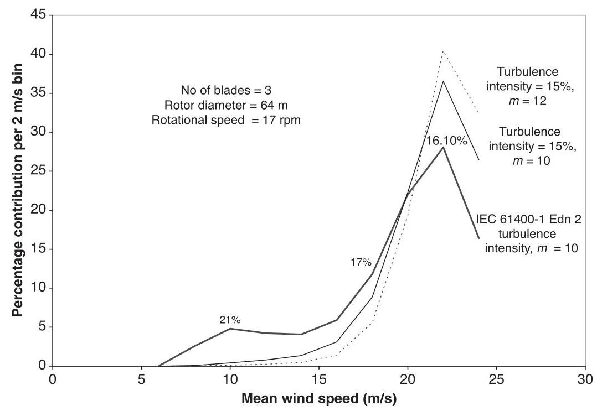

Figure 7.13 Relative contribution to life time fatigue damage for different wind speeds for a 1.5 MW stall regulated machine, including effect of mean load, after Thomsen (1998)

It should be noted that the relative contributions of different wind speeds to life time fatigue damage are also dependent on the shape of the bending moment/wind speed characteristics. Thus, for the machine with the bending moment/wind speed characteristics at 60% radius presented in Figure 7.10, the peak damage occurs at ${10}\mathrm{\;m}/\mathrm{s}$ , if the IEC Class A turbulence intensity distribution is assumed - see Figure 7.15.

## Behaviour of pitch regulated machines in fatigue

For pitch-regulated machines, the highest out-of-plane bending moment ranges occur at high wind speeds and yaw angles, but the largest mean values occur around rated wind speed. Moreover, blade pitching results in a rapid fall-off in bending moment with short-term mean wind speed just above rated. This behaviour is illustrated in Figure 7.11, which shows the variation in out-of-plane moment with short-term mean wind speed and yaw angle at ${60}\%$ radius for a ${40}\mathrm{\;m}$ diameter machine. It transpires that the combination of the steep bending moment/short-term wind speed characteristic, high mean bending moment and large number of loading cycles just above rated wind speed results in more fatigue damage at this wind speed than at higher wind speeds, where the increasing bending moment fluctuations due to yaw offset are mitigated by reducing mean loads and numbers of cycles.

The nature of the bending moment fluctuations at a mean wind speed just above rated is shown in Figure 7.14, which is a time history obtained from a 3D wind speed simulation, for the machine with the bending moment/short-term mean wind speed characteristics presented in Figure 7.11 (with the response to high frequency wind speed fluctuations allowed for separately). As with the case of a stall regulated machine operating at high wind speed discussed above, there are considerable bending moment fluctuations at the rotational speed, but this time they are largely due to spatial variations in longitudinal wind speed across the disc (that is, 'gust slicing') rather than due to yaw or tilt offset. In addition, there are large low frequency bending moment fluctuations as a result of short-term mean wind speed changes - indeed, inspection of the bending moment and short-term mean wind speed plots reveals an inverse relationship between the two.

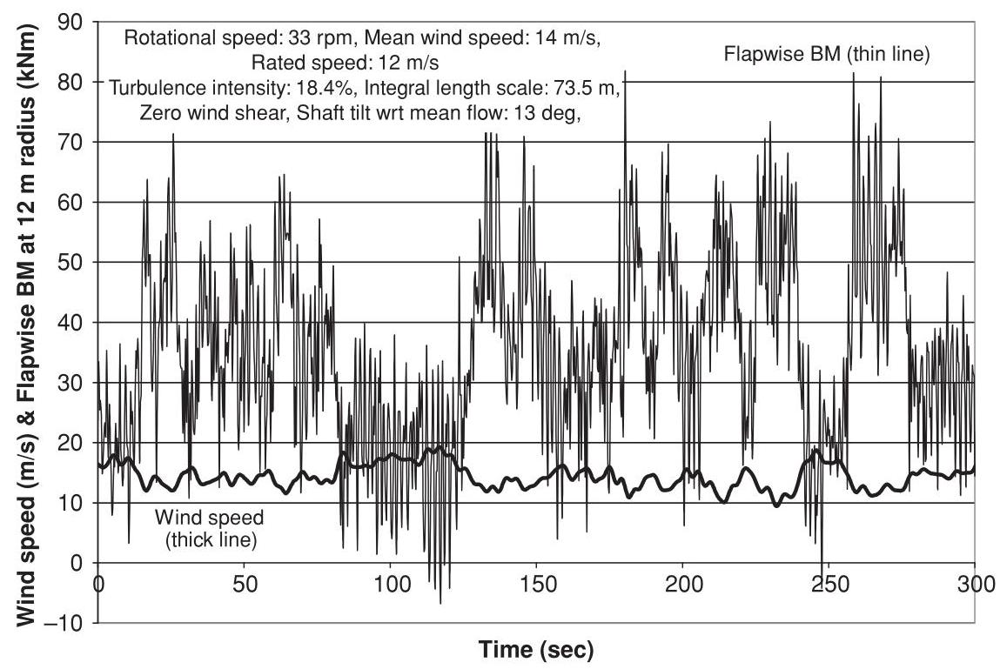

Figure 7.14 Time history of flapwise BM at ${12}\mathrm{\;m}$ radius and short-term mean wind speed for ${40}\mathrm{\;m}$ diameter pitch regulated $\mathrm{m}/\mathrm{c}$ , based on $3\mathrm{D}$ wind simulation with ${14}\mathrm{\;m}/\mathrm{s}$ mean

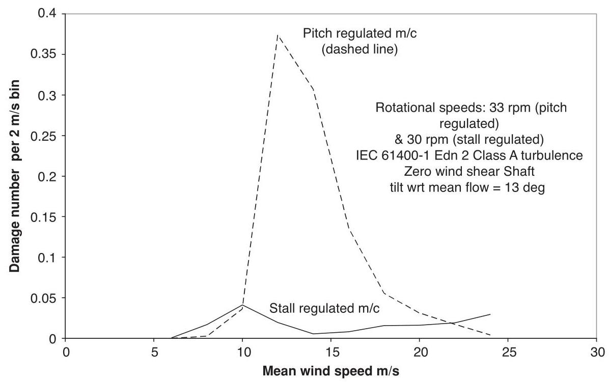

Figure 7.15 Variation of blade fatigue damage in flapwise bending at ${12}\mathrm{\;m}$ radius with mean wind speed, for similar ${40}\mathrm{\;m}$ diameter pitch and stall regulated machines, ignoring dynamics

The fatigue damage in flapwise bending at ${12}\mathrm{\;m}$ radius arising from operation of the above machine at different mean wind speeds ignoring dynamics is plotted out in Figure 7.15, and is compared with that for a similar stall regulated machine having the same section modulus. The cross-section is designed to resist the extreme bending moment for the stall regulated machine of ${130}\mathrm{{KNm}}$ . In both cases the $S - N$ curve index is taken as 10, and the IEC 61400-1 Edition 2 Class A turbulence intensity assumed. It is apparent that the pitch regulated machine fatigue damage is concentrated around rated speed, and that the total damage is an order of magnitude greater than the total for the stall regulated machine. As the ${12}\mathrm{\;m}$ radius section modulus to resist the extreme flapwise moment is likely to be less for the pitch regulated machine, fatigue loading is likely to be more critical than indicated by the comparison in the figure.

## Factors affecting fatigue criticality

The relative criticality of fatigue and extreme loading is determined by the material properties and safety factors adopted, as well as by the loadings themselves. As an aid to comparison, the fatigue loading can be described in terms of the notional one cycle equivalent load, ${\sigma }_{{eq}\left( {n = 1}\right) }$ , which is defined as the stress range of the single reverse loading cycle that would cause the same total fatigue damage as the actual fatigue loading on the basis of the design $S - N$ curve. Then fatigue is critical if

$$
\frac{{\sigma }_{{eq}\left( {n = 1}\right) }}{2{\sigma }_{0d}} > {\gamma }_{L}\frac{{\sigma }_{\text{ ext }}}{{\sigma }_{cd}} \tag{7.10}
$$

where ${\sigma }_{0d}$ is the stress amplitude given by the reverse loading fatigue design curve at $N = 1$ , ${\sigma }_{ext}$ is the stress resulting from the extreme loading case, ${\gamma }_{L}$ is the load factor and ${\sigma }_{cd}$ is the design compression stress (which is assumed not to be governed by buckling considerations). The condition may be rewritten in terms of characteristic stress values as follows:

$$
\frac{{\sigma }_{{eq}\left( {n = 1}\right) }}{{\sigma }_{\text{ ext }}} > 2{\gamma }_{L}\frac{{\gamma }_{mu}}{{\gamma }_{mf}}\frac{{\sigma }_{0k}}{{\sigma }_{ck}} \tag{7.11}
$$

or as ${\sigma }_{{eq}\left( {n = 1}\right) }/{\sigma }_{ext} > {2.7}\left( {\left( {{\gamma }_{mu}/{\gamma }_{mf}}\right) \left( {{\sigma }_{0k}/{\sigma }_{ck}}\right) }\right)$ with ${\gamma }_{L}$ set to 1.35 .

As is implicit from the survey of GFRP and wood laminate properties in Sections 7.1.6 and 7.1.7, the value of ${\sigma }_{0k}/{\sigma }_{ck}$ can vary between about 1.0 and 1.4. The IEC rules indicate that the partial materials safety factors for ultimate compression strength and fatigue strength should be taken as 1.3 and 1.2 respectively (assuming the fatigue strength is based on 95% survival probability at 95% confidence level), whereas, as noted in Section 7.1.6, the GL rules for GFRP lay down a value of ca 1.35 for the ${\gamma }_{mu}/{\gamma }_{mf}$ ratio. Thus, in principal the parameter $2{\gamma }_{L}\left( {\left( {{\gamma }_{mu}/{\gamma }_{mf}}\right) \left( {{\sigma }_{0k}/{\sigma }_{ck}}\right) }\right)$ governing fatigue criticality can take a wide range of values of between about 2.9 and 5.1.

In deriving the fatigue damage plots in Figure 7.15, a mid-range value of 4 has been adopted, resulting in total damages of 0.96 and 0.17 for the pitch and stall regulated machines respectively. However, if, the minimum value of 2.9 were adopted, corresponding to ${\sigma }_{0k} = {\sigma }_{ck}$ and ${\gamma }_{mu} = {1.08}{\gamma }_{mf}$ , the fatigue damages would rise by a factor of about 25 for $m = {10}$ .

The other important material property governing the criticality of fatigue loading is, of course, the slope index of the $\log  - \log S - N$ curve, $m$ , which affects the value of the notional one cycle equivalent load, ${\sigma }_{{eq}\left( {n = 1}\right) }$ . With the high values applicable to wood laminates, fatigue is much less likely to govern.

## Other sources of variability

There are a number of other sources of variability in fatigue damage calculations, apart from uncertainty about the material properties themselves, some of which are detailed below.

1. Two alternative stochastic turbulence models are in common use - those due to Von Karman and Kaimal. The Von Karman model is isotropic, whereas in the Kaimal model, which is more realistic in this respect, the standard deviations of lateral and vertical turbulences are ${80}\%$ and ${50}\%$ of the longitudinal turbulence respectively. In the case of stall regulated machines, where wind misalignment at high wind speeds is often the main source of fatigue damage, the choice of turbulence model could clearly have a decisive effect.

2. When the fatigue assessment is based on simulations of limited duration (typically 300-600 seconds), the damage is often dominated by a few extreme cycles, which are subject to significant statistical variation from one simulation to another. Accordingly several simulations at a given mean wind speed are necessary to obtain an accurate result. See 'The statistical variation of wind turbine fatigue loads' by Thomsen (1998).

3. In allowing for the reduction in fatigue strength due to mean stress (e.g. according to Equation 7.7), the mean stress can either be calculated over each stress range obtained by rain-flow cycle counting or over the length of the simulation.

## Fatigue due to gravity loading

In-plane fatigue loads arise from gravity loading and fluctuations in the in-plane aerodynamic loadings, but gravity loadings dominate for machines large enough to be grid connected, rendering the loading calculation relatively straightforward.

In order to compare the approximately constant amplitude in-plane fatigue loading with the spectrum of out-of-plane fatigue loading, it is convenient to express both as equivalent loads at a specified number of cycles, ${n}_{eq}$ . Often the $1\mathrm{\;{Hz}}$ equivalent load is used, in which case the number of cycles, ${n}_{eq}$ , is equal to the number of seconds in the machine lifetime during which the machine operates. For machines of ${40}\mathrm{\;m}$ diameter and above, the fatigue equivalent load for in-plane bending at the blade root is typically greater than that for out-of-plane bending.

Over most of the blade length, the chord dimension is much larger than the blade thickness, so the section modulus for edgewise bending will generally exceed that for flapwise bending. However, for blades attached to the hub or pitch bearing by a circular ring of bolts, which is the normal arrangement, the blade structure adjacent to the root is a cylindrical shell, which will have the same section modulus about both axes if the wall thickness is uniform. As a consequence, the blade root is the first area that should be checked for in-plane fatigue loading.

The procedure can be illustrated for a ${20}\mathrm{\;m}$ tip radius blade in GFRP, designed for an extreme static root moment of ${750}\mathrm{{KNm}}$ at ${0.5}\mathrm{\;m}$ radius. Taking the gravity moment at the root as 124 KNm, and assuming ${2.6} \times  {10}^{8}$ revolutions over the machine lifetime, the notional one cycle in-plane bending equivalent load range, ${M}_{{eq}\left( {n = 1}\right) }$ , becomes ${248}{\left( {2.6} \times  {10}^{8}\right) }^{0.1} = \; {1720}\mathrm{{KNm}}$ and ${\sigma }_{{eq}\left( {n = 1}\right) }/{\sigma }_{ext} = {1720}/{750} = {2.3}$ . This is less than the minimum value of 2.9 of the right hand expression in the inequality (Equation 7.11), so in-plane fatigue loading does not govern. In practice, the cylinder wall thickness would have to be increased significantly to prevent buckling, rendering fatigue less critical still at this diameter.

It may be concluded from the above example that in-plane fatigue loadings are not a significant consideration in the design of stall-regulated blades constructed in GFRP or wood laminates, until much larger diameters are reached. They cannot be ignored entirely, because of blade twist and because they add to the fatigue stress ranges due to flapwise bending at points on the cross-section away from the neutral axis for edgewise bending.

In-plane fatigue loadings are of more significance for pitch-regulated machines because gravity loadings will contribute increasingly to flapwise loadings as the pitch angle increases.

## Tip deflection

Under extreme operating conditions, tip deflections of up to about 10% of blade radius can occur, so care is needed to avoid the risk of blade/tower collisions in the case of upwind machines. GL specify that the quasi-static tip deflection under the extreme unfactored operational loading is not to exceed 50% of the clearance without blade deflection, which implies a safety factor of 2. IEC, on the other hand, require no blade/tower contact when the extreme dynamic tip deflection for each load case is multiplied by the combined partial safety factor for loads and blade elastic modulus.

Table 7.3 Design strength to stiffness ratios for different wind turbine blade materials

<table><tr><td>Material</td><td>Ultimate compression strength, ${\sigma }_{cu}$ (MPa)</td><td>Partial safety factor for material strength, Ymu</td><td>Compression design strength, ${\sigma }_{cd}$ (MPa)</td><td>Young's modulus, $E$ (GPa)</td><td>Strength to stiffness ratio, $\left( {{\sigma }_{cd}/E}\right)  \times \; {10}^{3}$</td></tr><tr><td>Glass/polyester laminate with 50% fibre volume fraction and 80% UD</td><td>580</td><td>2.65</td><td>219 (ignoring buckling)</td><td>32.5</td><td>6.7</td></tr><tr><td>Carbon fibre/epoxy ply with 60% fibre volume fraction and UD lay-up</td><td>1100</td><td>2.65</td><td>415</td><td>142</td><td>2.9</td></tr><tr><td>Khaya/epoxy laminate</td><td>50</td><td>1.5</td><td>33</td><td>10</td><td>3.3</td></tr><tr><td>Birch/epoxy laminate</td><td>81</td><td>1.5</td><td>54</td><td>15</td><td>3.6</td></tr><tr><td></td><td>Yield strength, ${\sigma }_{v}$</td><td>Ymy</td><td></td><td></td><td></td></tr><tr><td>High Yield Steel (Grade Fe 510)</td><td>355</td><td>1.1</td><td>323</td><td>210</td><td>1.54</td></tr><tr><td>Weldable aluminium alloy AA6082</td><td>240</td><td>1.1</td><td>218</td><td>69</td><td>3.2</td></tr></table>

It is instructive to compare the tip deflections for similar blades designed in different materials. If the skin thickness distributions are chosen so that the design compression strength of each material is fully mobilised under the extreme load case, then the tip deflection will be proportional to the design compression strength to Young’s modulus ratio, ${\sigma }_{cd}/E$ , of the blade material. These ratios are compared for different materials in Table 7.3.

It is clear from Table 7.3 that a GFRP blade will be about twice as flexible as blades in the other materials (apart from steel), provided that the spar is stocky enough for buckling not to govern the design - for example, as in Figure 7.4. In the case of thin walled cross sections, however, such as that in Figure 7.3, the GFRP compressive design stress has to be reduced significantly to guard against buckling, with the result that blade flexibility is reduced. For example, in the case of the ${20}\mathrm{\;m}$ tip radius blade, the compressive design stress is reduced to about ${90}\mathrm{{MPa}}$ , resulting in a tip deflection of about $2\mathrm{\;m}$ under extreme loading, and a strength to stiffness ratio less than that for wood/epoxy. In this connection, it is noteworthy that Hancock et al. (1997) record a 130% proof load test on a 31.2 m birch/epoxy blade which resulted in a tip deflection of ${3.4}\mathrm{\;m}$ .

### 7.1.9 Blade resonance

One of the most important objectives of blade design is the avoidance of resonant oscillations, which, in a mild form, exacerbate fatigue damage and in an extreme form can lead to rapid failure. The excitation of blade resonance can be minimised by maximising the damping and ensuring that the blade flapwise and edgewise natural frequencies are well separated from the exciting frequencies - that is, the rotational frequency and its harmonics, particularly the blade passing frequency - and from the frequencies of other vibration modes with which there is an identifiable risk of coupled oscillations.

## Vibrations in stall

On stall regulated machines, the lift curve slope, $d{C}_{l}/{d\alpha }$ , goes negative when a section of the blade goes into stall, resulting in local negative aerodynamic damping of blade motion in the lift direction. If the overall aerodynamic damping for a particular mode shape is negative, and exceeds the modal structural damping in magnitude, then divergent oscillations can develop from any initial disturbance, regardless of the relationship between the mode natural frequency and exciting frequencies. The first mode in each direction is most susceptible to such behaviour because the structural damping increases with frequency while the aerodynamic damping diminishes. If conditions favouring first mode oscillations are to be avoided, the factors affecting the aerodynamic damping of both edgewise and flapwise oscillations need to be understood, so these are explored below.

Consider a turbine operating in steady conditions in a perpendicular airflow. If a blade cross section at radius $r$ experiences out-of-plane and in-plane perturbations with velocities $\dot{x}$ in the downwind direction and $\dot{y}$ in the direction opposite to that of blade rotation (assumed clockwise), then the relative velocity triangle is as in Figure 7.16(a).

The lift and drag forces per unit length on a blade element can be resolved into out-of-plane and in-plane forces ${F}_{X}$ and ${F}_{Y}$ (see Figure 7.16(b)), leading to Equations 5.18 and 5.19. Ignoring the small rotational induction factor, which is very small, these may be rewritten as:

$$
{F}_{Y} = W\left\lbrack  {-{C}_{l}\left( {{U}_{\infty }\left( {1 - a}\right)  - \dot{x}}\right)  + {C}_{d}\left( {{\Omega r} - \dot{y}}\right) }\right\rbrack  \frac{1}{2}{\rho c} \tag{7.12}
$$

$$
{F}_{X} = W\left\lbrack  {{C}_{l}\left( {{\Omega r} - \dot{y}}\right)  + {C}_{d}\left( {{U}_{\infty }\left( {1 - a}\right)  - \dot{x}}\right) }\right\rbrack  \frac{1}{2}{\rho c} \tag{7.13}
$$

Here ${U}_{\infty }$ is the free stream wind speed and ${U}_{\infty }\left( {1 - a}\right)$ the reduced wind speed at the rotor plane as usual. The damping coefficients per unit length for vibrations in the in-plane and out-of-plane directions are then given by

$$
{\widehat{c}}_{Y}\left( r\right)  =  - \frac{\partial {F}_{Y}}{\partial \dot{y}} \tag{7.14a}
$$

$$
{\widehat{c}}_{X}\left( r\right)  =  - \frac{\partial {F}_{X}}{\partial \dot{x}} \tag{7.14b}
$$

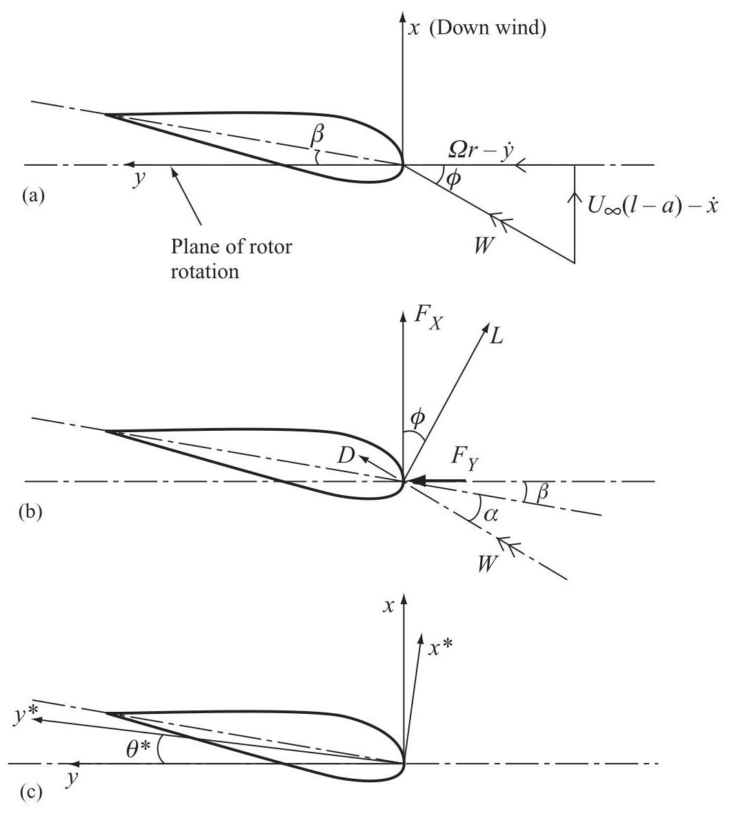

Figure 7.16 (a) Velocity diagram for vibrating blade (looking towards hub); (b) Out-of-plane and in-plane components of lift and drag forces; (c) Directions of vibrations ${x}^{ * }$ and ${y}^{ * }$

Analagous 'cross' coefficients relating the in-plane force to the out-of-plane velocity and vice versa can also be defined as:

$$
{\widehat{c}}_{YX}\left( r\right)  =  - \frac{\partial {F}_{Y}}{\partial \dot{x}} \tag{7.15a}
$$

$$
{\widehat{c}}_{XY}\left( r\right)  =  - \frac{\partial {F}_{X}}{\partial \dot{y}} \tag{7.15b}
$$

Substituting $V$ for ${U}_{\infty }\left( {1 - a}\right)$ for brevity, the in-plane damping coefficient is derived as follows:

$$
{\widehat{c}}_{Y}\left( r\right)  =  - \frac{\partial {F}_{Y}}{\partial \dot{y}} =  - \frac{1}{2}{\rho c}\left\{  {\frac{\partial W}{\partial \dot{y}}\left\lbrack  {-{C}_{l}V + {C}_{d}{\Omega r}}\right\rbrack   + W\left\lbrack  {-\frac{\partial {C}_{l}}{\partial \dot{y}}V + \frac{\partial {C}_{d}}{\partial \dot{y}}{\Omega r} - {C}_{d}}\right\rbrack  }\right\}
$$

(7.16)

Noting that $\partial W/\partial \dot{y} =  - {\Omega r}/W$ and $\partial {C}_{l}/\partial \dot{y} = \left( {\partial {C}_{l}/\partial \alpha }\right) \left( {\partial \alpha /\partial \dot{y}}\right)  = \left( {\partial {C}_{l}/\partial \alpha }\right) \; \left( {\partial \phi /\partial \dot{y}}\right)  = \left( {\partial {C}_{l}/\partial \alpha }\right) \left( {V/{W}^{2}}\right)$ , this equation becomes:

$$
{\widehat{c}}_{Y}\left( r\right)  = \frac{1}{2}{\rho c}\frac{\Omega r}{W}\left\{  {-V{C}_{l} + \frac{{V}^{2}}{\Omega r}\frac{\partial {C}_{l}}{\partial \alpha } + \frac{2{\Omega }^{2}{r}^{2} + {V}^{2}}{\Omega r}{C}_{d} - V\frac{\partial {C}_{d}}{\partial \alpha }}\right\} \tag{7.17}
$$

The 'cross' coefficients and the out-of-plane damping coefficient and are derived by a similar procedure:

$$
{\widehat{c}}_{YX}\left( r\right)  = \frac{1}{2}{\rho c}\frac{\Omega r}{W}\left\{  {-\frac{{\Omega }^{2}{r}^{2} + 2{V}^{2}}{\Omega r}{C}_{l} - V\frac{\partial {C}_{l}}{\partial \alpha } + V{C}_{d} + {\Omega r}\frac{\partial {C}_{d}}{\partial \alpha }}\right\} \tag{7.18}
$$

$$
{\widehat{c}}_{XY}\left( r\right)  = \frac{1}{2}{\rho c}\frac{\Omega r}{W}\left\{  {+\frac{2{\Omega }^{2}{r}^{2} + {V}^{2}}{\Omega r}{C}_{l} - V\frac{\partial {C}_{l}}{\partial \alpha } + V{C}_{d} - \frac{{V}^{2}}{\Omega r}\frac{\partial {C}_{d}}{\partial \alpha }}\right\} \tag{7.19}
$$

$$
{\widehat{c}}_{X}\left( r\right)  = \frac{1}{2}{\rho c}\frac{\Omega r}{W}\left\{  {+V{C}_{l} + {\Omega r}\frac{\partial {C}_{l}}{\partial \alpha } + \frac{{\Omega }^{2}{r}^{2} + 2{V}^{2}}{\Omega r}{C}_{d} + V\frac{\partial {C}_{d}}{\partial \alpha }}\right\} \tag{7.20}
$$

It is apparent from inspection of the expressions for the two damping coefficients, ${\widehat{c}}_{Y}$ and ${\widehat{c}}_{X}$ , that the choice of an aerofoil with a gentler stall - that is, with a smaller lift curve slope after stall onset - will increase the damping coefficient in both cases. Note that the modal damping coefficient is dominated by the damping per unit length over the outboard part of the blade, so it is important to select an aerofoil with a gentle stall in this area only.

The choice of aerofoil also affects performance, so there is merit in expressing the damping coefficients in terms of the power output in order to investigate possible trade-offs between them. It transpires that the damping and 'cross' coefficients per unit length can be formulated quite simply in terms of the power output per unit length of blade, ${P}^{\prime }\left( {r, V}\right)  = {\Omega r}\left( {-{F}_{Y}}\right)$ , and the blade thrust per unit length, ${F}_{X}$ , as follows:

$$
{\widehat{c}}_{Y} =  - \frac{2}{{\Omega }^{2}{r}^{2}}{P}^{\prime } + \frac{V}{{\Omega }^{2}{r}^{2}}\frac{\partial {P}^{\prime }}{\partial V} = \frac{1}{{\Omega }^{2}{r}^{2}}\left( {-2{P}^{\prime } + V\frac{\partial {P}^{\prime }}{\partial V}}\right) \tag{7.21}
$$

$$
{\widehat{c}}_{YX} =  - \frac{\partial {F}_{Y}}{\partial \dot{x}} = \frac{\partial {F}_{Y}}{\partial V} = \frac{1}{\Omega r}\frac{\partial }{\partial V}\left( {{\Omega r}{F}_{Y}}\right)  =  - \frac{1}{\Omega r}\frac{\partial {P}^{\prime }}{\partial V} \tag{7.22}
$$

$$
{\widehat{c}}_{XY} = \frac{1}{\Omega r}\left( {2{F}_{X} - V\frac{\partial {F}_{X}}{\partial V}}\right) \tag{7.23}
$$

$$
{\widehat{c}}_{X} =  - \frac{\partial {F}_{X}}{\partial \dot{x}} = \frac{\partial {F}_{X}}{\partial V} \tag{7.24}
$$

Equations 7.21 and 7.23 are derived from the equations ${\Omega r}{\widehat{c}}_{Y} + V{\widehat{c}}_{YX} = 2{F}_{Y} =  - 2{P}^{\prime }/{\Omega r}$ and ${\Omega r}{\widehat{c}}_{XY} + V{\widehat{c}}_{X} = 2{F}_{X}$ which may be verified using Equations 7.17-7.20.

From Equation 7.21 it is clear that the damping coefficient in the in-plane direction, ${\widehat{c}}_{Y}$ , will always be negative unless $\partial {P}^{\prime }/\partial V$ exceeds $2\left( {{P}^{\prime }/V}\right)$ , and that a negative power curve slope should be avoided if the size of the negative damping is to be kept small.

## Effect of blade twist

In the discussion so far, damping of vibrations in the out-of-plane and in-plane directions only has been considered. In practice blade twist will result in the flapwise and edgewise vibrations taking place in directions rotated from the out-of-plane and in-plane directions in the same sense as the blade twist, but by a lesser amount (see Chapter 5, Section 5.8.1). If we define ${x}^{ * }$ and ${y}^{ * }$ axes in the directions of the flapwise and edgewise displacements, each making an angle of ${\theta }^{ * }$ to the $x$ and $y$ axes respectively, as shown in Figure 7.16(c), then the edgewise damping coefficient per unit length is given by:

$$
{\widehat{c}}_{Y}^{ * } = {\widehat{c}}_{Y}{\cos }^{2}{\theta }^{ * } - \left( {{\widehat{c}}_{YX} + {\widehat{c}}_{XY}}\right) \sin {\theta }^{ * }\cos {\theta }^{ * } + {\widehat{c}}_{X}{\sin }^{2}{\theta }^{ * } \tag{7.25}
$$

Substitution of Equations 7.21-7.24 in Equation 7.25 yields:

$$
{\widehat{c}}_{Y}^{ * } = {\cos }^{2}{\theta }^{ * }\left\lbrack  {\frac{1}{{\Omega }^{2}{r}^{2}}\left( {-2{P}^{\prime } + V\frac{\partial {P}^{\prime }}{\partial V}}\right) }\right\rbrack   + \cos {\theta }^{ * }\sin {\theta }^{ * }\left\lbrack  {\frac{1}{\Omega r}\left( {-\frac{\partial {P}^{\prime }}{\partial V} + 2{F}_{X} - V\frac{\partial {F}_{X}}{\partial V}}\right) }\right\rbrack
$$

$$
+ {\sin }^{2}{\theta }^{ * }\left( \frac{\partial {F}_{X}}{\partial V}\right) \tag{7.26}
$$

This expression also gives the flapwise damping coefficient per unit length if ${\theta }^{ * }$ is replaced by ${\theta }^{ * } + {90}^{ \circ  }$ throughout.

The variation of the damping coefficient ${\widehat{c}}_{{Y}^{ * }}$ per unit length at ${14}\mathrm{\;m}$ radius with vibration direction, ${\theta }^{ * }$ , at three different wind speeds is illustrated in Figure 7.17 for a specimen aerofoil section on a ${20.5}\mathrm{\;m}$ tip radius blade rotating at ${29}\mathrm{{rpm}}$ . The data is taken from Petersen et al. (1998) and does not include allowance for the axial induction factor. It can be seen that negative damping is worst at ${20}\mathrm{\;m}/\mathrm{s}$ , and that negative edgewise damping is ameliorated by increasing ${\theta }^{ * }$ at the expense of increasing negative flapwise damping.

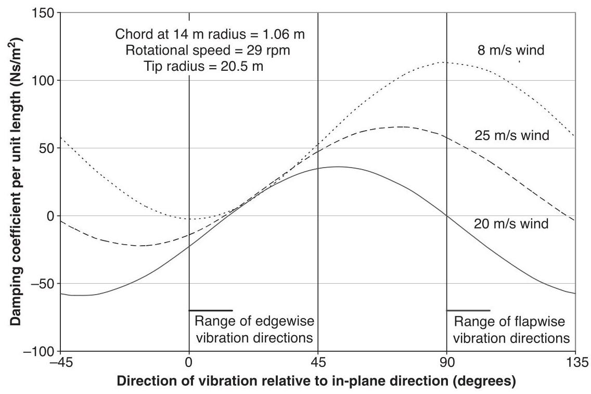

Figure 7.17 Variation in damping coefficient at ${14}\mathrm{\;m}$ radius with vibration direction for example aerofoil

Although a plot of the local damping coefficient at ca 70% radius can provide a useful indication of trends, the best guide to the likelihood of divergent oscillations is provided by the modal damping coefficient for the mode under consideration. This is obtained by multiplying the right hand side of Equation 7.26 by the square of the local modal amplitude and integrating over the length of the blade.

If comparison of the first mode edgewise and flapwise modal damping coefficients shows there is a benefit to be gained from altering the direction of vibration, small changes can be made by redistributing material within the blade cross-section. Alternatively the blade pitch could be altered in conjunction with a compensatory change in aerofoil camber so that the aerodynamic properties for any given inflow angle are unchanged.

The prediction of edgewise vibrations in stall is examined in detail by Petersen et al. (1998), whose work provides the basis of the introductory survey given here. They concluded that the fundamental cause of edgewise blade oscillations that had been observed on some stall-regulated machines of ${40}\mathrm{\;m}$ diameter and over was negative aerodynamic damping, but found that the use of dynamic stall models improved the level of agreement with measurements.

## Coupling of edgewise blade mode and rotor whirl modes

A further important finding was that, on one machine subject to stall-induced vibrations which was investigated in detail, there was coupling between the blade first edgewise mode and one of the second rotor whirl modes. The rotor whirl modes arise from the combination of simultaneous nodding and yawing oscillations of the rotor shaft, which occur at the same frequency during operation due to gyroscopic effects. As a result, the rotor hub traces out a circular or elliptical path, running either in the same direction as rotor rotation or in reverse, which explains the existence of two first and second modes.

The explanation for the coupling was as follows. When a pair of blades vibrate in the edgewise direction in anti-phase, they impart a sinusoidally varying in-plane force to the rotor hub even though their edgewise root bending moments cancel out. The direction of this oscillating force rotates with the rotor, so it has horizontal and vertical components of the form $\sin \left( {{\omega }_{1}t + \eta }\right)  \cdot  \sin {\Omega t}$ and $\sin \left( {{\omega }_{1}t + \eta }\right)  \cdot  \cos {\Omega t}$ , where ${\omega }_{1}$ is the frequency of the blade first edgewise mod, and $\Omega$ is the speed of rotor rotation. With respect to stationary axes the in-plane loads on the hub therefore act at two frequencies - namely ${\omega }_{1} + \Omega$ and ${\omega }_{1} - \Omega$ . In the case of the machine investigated by Petersen et al., the upper frequency of ${2.9} + {0.5} = {3.4}\mathrm{\;{Hz}}$ coincided with the backward second rotor whirl mode, allowing interaction between this mode and the blade first edgewise mode.

Simulations were carried out on an aeroelastic model of the turbine at various wind speeds and satisfactory agreement obtained between simulated and measured behaviour. In particular, the simulation at ${23.2}\mathrm{\;m}/\mathrm{s}$ predicted the build up of large blade root edgewise moment oscillations at the first mode frequency, as observed on the real machine at this wind speed. Significantly, when the latter simulation was repeated with the rotor shaft stiffness increased sufficiently to increase the backward second rotor whirl mode frequency to ${3.6}\mathrm{\;{Hz}}$ , the predicted blade root edgewise moment oscillations were negligible by comparison.

## Mechanical damping

An alternative strategy for preventing damaging edgewise vibrations is the incorporation of a tuned mass damper inside the blade towards the tip. The performance of such a damper on a ${22}\mathrm{\;m}$ tip radius blade is reported by Anderson et al. (1998). It was found that the fitting of a damper tuned to the first mode edgewise frequency, and weighing only 0.4% of the total blade weight, effectively suppressed the edgewise vibrations which had previously been observed during high wind speed operation.

### 7.1.10 Design against buckling

The stress at which a slender plate element without imperfections buckles under compression loading is known as the critical buckling stress. The derivation of the critical buckling stresses for thin walled curved panels bounded by stiffeners, which typically form the blade load-bearing structure, is relatively straightforward when the panel material is isotropic and solutions are provided in Timoshenko and Gere (1961). These do not apply to composite materials such as the GFRP and wood laminates commonly used in blade manufacture, however, as these are anisotropic, but solutions can be derived for a symmetric laminate using the energy method, as outlined below.

Consider a long cylindrical panel of length $L$ , radius $r$ and thickness $h$ , supported along two generators and subtending an angle $\psi$ at the cylinder axis, which is axially loaded in compression. If it deflects to form $n$ half-waves around the circumference between supports and $m$ half-waves along its length, then its out-of-plane deflection can be written as:

$$
w = C\sin \frac{n\pi \theta }{\psi }\sin \frac{m\pi x}{L} \tag{7.27}
$$

where $\theta$ and $x$ are the co-ordinates of the deflected point with respect to one of the long edges and one end respectively. In the absence of in-plane direct strains in the plate, this out-of-plane deflected profile will result in circumferential deflections

$$
{v}_{0} = \frac{C\psi }{n\pi }\cos \frac{n\pi \theta }{\psi }\sin \frac{m\pi x}{L} \tag{7.28}
$$

These deflections will result in in-plane shear stresses, which reach a maximum at the corners of each rectangular buckled panel. In practice, additional in-plane deflections occur to moderate these shear stresses, as follows:

(7.29)

$$
u = A\sin \frac{n\pi \theta }{\psi }\cos \frac{m\pi x}{L}\text{ in the axial direction }
$$

$$
v = B\cos \frac{n\pi \theta }{\psi }\sin \frac{m\pi x}{L}\text{ in the circumferential direction }
$$

The in-plane strain energy is calculated as

$$
{U}_{2} = \frac{1}{2}h\iint \left( {{\sigma }_{1}{\varepsilon }_{1} + {\sigma }_{2}{\varepsilon }_{2} + {\tau \gamma }}\right) {rd\theta dx} \tag{7.30}
$$

with the suffices 1 and 2 denoting the axial and circumferential directions respectively, so that

$$
{\varepsilon }_{1} = \frac{\partial u}{\partial x},\;{\varepsilon }_{2} = \frac{\partial v}{r\partial \theta },\;\gamma  = \frac{\partial u}{r\partial \theta } + \frac{\partial \left( {{v}_{0} + v}\right) }{\partial x} \tag{7.31}
$$

Substituting ${\sigma }_{1} = {E}_{x}\left( {{\varepsilon }_{1} + {v}_{y}{\varepsilon }_{2}}\right) /\left( {1 - {v}_{x}{v}_{y}}\right) ,{\sigma }_{2} = {E}_{y}\left( {{\varepsilon }_{2} + {v}_{x}{\varepsilon }_{1}}\right) /\left( {1 - {v}_{x}{v}_{y}}\right)$ and $\tau  = {G}_{xy}\gamma$ , where ${E}_{x},{E}_{y}$ and ${G}_{xy}$ are the longitudinal, transverse and shear moduli of the laminate respectively (obtained by averaging the corresponding moduli of the individual plies) and ${v}_{x}$ and ${v}_{y}$ are the effective Poisson’s ratios, the in-plane strain energy becomes:

$$
{U}_{2} = \frac{h}{2\left( {1 - {\upsilon }_{x}{\upsilon }_{y}}\right) }\iint \left\lbrack  {{E}_{x}{\varepsilon }_{1}^{2} + {E}_{y}{\varepsilon }_{2}^{2} + 2{E}_{x}{\upsilon }_{y}{\varepsilon }_{1}{\varepsilon }_{2} + \left( {1 - {\upsilon }_{x}{\upsilon }_{y}}\right) {\gamma }^{2}{G}_{xy}}\right\rbrack  {rd\theta dx} \tag{7.32}
$$

Substituting the expressions for ${\varepsilon }_{1},{\varepsilon }_{2}$ , and $\gamma$ from Equation 7.31 and integrating over the width of the panel, ${\psi r}$ , and the length of one half wave, $L/m$ , we obtain

$$
{U}_{2} = \frac{{E}_{x}h}{1 - {v}_{x}{v}_{y}}{\psi r}\frac{L}{m}{\left( \frac{m\pi }{L}\right) }^{2}\frac{{C}^{2}}{8}
$$

$$
\times  \left\lbrack  {{\alpha }^{2} + {\beta }^{2}\frac{{E}_{y}}{{E}_{x}}{\left( \frac{n}{\lambda }\right) }^{2} + 2{v}_{y}{\alpha \beta }\left( \frac{n}{\lambda }\right)  + \left( {1 - {v}_{x}{v}_{y}}\right) \frac{{G}_{xy}}{{E}_{1}}{\left\{  \alpha \left( \frac{n}{\lambda }\right)  + \beta  + \frac{\psi }{n\pi }\right\}  }^{2}}\right\rbrack
$$

(7.33)

where $\lambda  = {m\psi r}/L$ and the ratios $\alpha  = A/C$ and $\beta  = B/C$ are yet to be determined.

The expression for the strain energy of curvature is derived as follows. Replacing the angular coordinate $\theta$ by the linear coordinate $y\left( { = {r\theta }}\right)$ , the bending energy absorbed in an area ${dx}$ . ${dy}$ is:

$$
d{U}_{b} =  - \frac{1}{2}\left( {{M}_{x}\frac{{\partial }^{2}w}{\partial {x}^{2}} + {M}_{y}\frac{{\partial }^{2}w}{\partial {y}^{2}}}\right) {dx} \cdot  {dy}
$$

where ${M}_{x} =  - {D}_{x}\left( {{\partial }^{2}w/\partial {x}^{2}}\right)  - {D}_{xy}\left( {{\partial }^{2}w/\partial {y}^{2}}\right)$ and ${M}_{y} =  - {D}_{y}\left( {{\partial }^{2}w/\partial {y}^{2}}\right)  - {D}_{xy}\left( {{\partial }^{2}w/\partial {x}^{2}}\right)$ for a specially orthotropic laminate - that is, one in which the reinforcement in each layer is either oriented at ${0}^{ \circ  }$ or ${90}^{ \circ  }$ , or is bi-directional with the same amount of fibres at $+ {\theta }^{ \circ  }$ and $- {\theta }^{ \circ  }.{D}_{x}$ and ${D}_{y}$ are the flexural rigidities of the laminate when flat, for bending about the $y$ axis and $x$ axis respectively, and ${D}_{xy}$ is the ’cross flexural rigidity’ - that is, the moment per unit width about one axis generated by unit curvature about the other. Hence,

$$
d{U}_{b} = \frac{1}{2}\left( {{D}_{x}{\left( \frac{{\partial }^{2}w}{\partial {x}^{2}}\right) }^{2} + 2{D}_{xy}\frac{{\partial }^{2}w}{\partial {x}^{2}}\frac{{\partial }^{2}w}{\partial {y}^{2}} + {D}_{y}{\left( \frac{{\partial }^{2}w}{\partial {y}^{2}}\right) }^{2}}\right) {dxdy} \tag{7.34}
$$

The twisting energy absorbed in an area ${dxdy}$ is:

$$
d{U}_{t} = \frac{1}{2}\left( {{M}_{xy} + {M}_{yx}}\right) \frac{{\partial }^{2}w}{\partial x\partial y}{dxdy}
$$

where

$$
{M}_{xy} = 2\left\lbrack  {{\int }_{-h/2}^{h/2}{G}_{xy}\left( z\right)  \cdot  {z}^{2}{dz}}\right\rbrack  \frac{{\partial }^{2}w}{\partial x\partial y}
$$

in which $z$ is the distance measured from the mid-plane of the laminate, ${G}_{xy}\left( z\right)$ is the in-plane shear modulus at that distance and $h$ is the laminate thickness. Denoting the torsional rigidity, $\left\lbrack  {{\int }_{-h/2}^{h/2}{G}_{xy}\left( z\right)  \cdot  {z}^{2}{dz}}\right\rbrack$ , by ${D}_{T,}$ then

$$
d{U}_{t} = \frac{1}{2} \cdot  4{D}_{T}{\left( \frac{{\partial }^{2}w}{\partial x\partial y}\right) }^{2}{dxdy} \tag{7.35}
$$

The total strain energy of curvature over the width of the panel and the length of one half wave is found by substituting the out-of-plane deflection given by Equation 7.27 in Equations 7.34 and 7.35 and integrating over this area, which gives:

$$
{U}_{1} = {U}_{b} + {U}_{t} = \frac{{C}^{2}}{8}\frac{\psi rL}{m}{D}_{x}{\left( \frac{m\pi }{L}\right) }^{4}\left\lbrack  {1 + {\left( \frac{n}{\lambda }\right) }^{4}\frac{{D}_{y}}{{D}_{x}} + {\left( \frac{n}{\lambda }\right) }^{2}\left\{  {2\frac{{D}_{xy}}{{D}_{x}} + 4\frac{{D}_{T}}{{D}_{x}}}\right\}  }\right\rbrack \tag{7.36}
$$

The energy absorbed by the panel during buckling as a result of in-plane strains and out-of-plane curvature is equal to the work done by the critical axial load as the panel shortens. The shortening of the panel over one half wave length is given by

$$
{\int }_{o}^{L/m}\frac{1}{2}{\left( \frac{\partial w}{\partial x}\right) }^{2}{dx} = \frac{{\pi }^{2}}{4}{C}^{2}\frac{m}{L}{\sin }^{2}\frac{n\pi \theta }{\psi } \tag{7.37}
$$

so the work done by the axial force of ${N}_{x}$ per unit width over the panel width is

$$
{T}_{1} = \frac{{\pi }^{2}}{8}{C}^{2}\frac{m}{L}{\psi r}{N}_{x} \tag{7.38}
$$

The equality ${T}_{1} = {U}_{1} + {U}_{2}$ yields the critical value of the axial force as follows:

$$
{\left( {N}_{x}\right) }_{cr} = {D}_{x}{\left( \frac{m\pi }{L}\right) }^{2}\left\lbrack  {1 + {\left( \frac{n}{\lambda }\right) }^{4}\frac{{D}_{y}}{{D}_{x}} + {\left( \frac{n}{\lambda }\right) }^{2}\left\{  {2\frac{{D}_{xy}}{{D}_{x}} + 4\frac{{D}_{T}}{{D}_{x}}}\right\}  }\right\rbrack   + \frac{{E}_{x}h}{1 - {v}_{x}{v}_{y}}
$$

$$
\times  \left\lbrack  {{\alpha }^{2} + {\beta }^{2}\frac{{E}_{y}}{{E}_{x}}{\left( \frac{n}{\lambda }\right) }^{2} + {2\alpha \beta }{v}_{y}\frac{n}{\lambda } + \left( {1 - {v}_{x}{v}_{y}}\right) \frac{{G}_{xy}}{{E}_{x}}{\left\{  \alpha \frac{n}{\lambda } + \beta  + \frac{\psi }{n\pi }\right\}  }^{2}}\right\rbrack
$$

(7.39)

Noting that ${m\pi }/L = \left( {{m\psi r}/{nL}}\right) \left( {{n\pi }/{\psi r}}\right)  = \left( {\lambda /n}\right) \left( {{n\pi }/{\psi r}}\right)$ , this equation becomes

$$
{\left( {\sigma }_{x}\right) }_{cr} = \frac{{D}_{x}}{h}{\left( \frac{\lambda }{n}\frac{n\pi }{\psi r}\right) }^{2}\left\lbrack  {1 + {\left( \frac{n}{\lambda }\right) }^{4}\frac{{D}_{y}}{{D}_{x}} + {\left( \frac{n}{\lambda }\right) }^{2}\left\{  {2\frac{{D}_{xy}}{{D}_{x}} + 4\frac{{D}_{T}}{{D}_{x}}}\right\}  }\right\rbrack   + \frac{{E}_{x}}{1 - {v}_{x}{v}_{y}}
$$

$$
\times  \left\lbrack  {{\alpha }^{2} + {\beta }^{2}\frac{{E}_{y}}{{E}_{x}}{\left( \frac{n}{\lambda }\right) }^{2} + {2\alpha \beta }{v}_{y}\frac{n}{\lambda } + \left( {1 - {v}_{x}{v}_{y}}\right) \frac{{G}_{xy}}{{E}_{x}}{\left\{  \alpha \frac{n}{\lambda } + \beta  + \frac{\psi }{n\pi }\right\}  }^{2}}\right\rbrack
$$

(7.40)

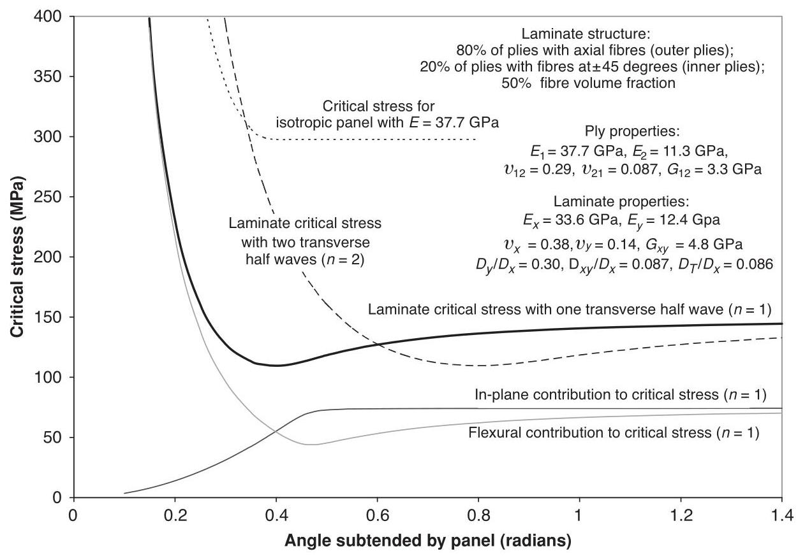

Figure 7.18 Variation of axial critical buckling stress with panel width for specimen curved anisotropic panel with radius ${1150}\mathrm{\;{mm}}$ and thickness ${15}\mathrm{\;{mm}}$

The right hand side of Equation 7.40 contains four unknowns, the number of transverse half waves, $n$ , the ratio of longitudinal to transverse half wave length, $n/\lambda$ , and the factors $\alpha$ and $\beta$ . Assuming that there is only one transverse half wave, as is normally the case, the expression is minimised with respect to $\alpha$ , and $\beta$ for each value of $n/\lambda$ , and then with respect to $n/\lambda$ to obtain the critical stress.

The results of this exercise are illustrated for a particular curved laminate panel in Figure 7.18. The radius of curvature, $r$ , of ${1150}\mathrm{\;{mm}}$ and thickness, $h$ , of ${15}\mathrm{\;{mm}}$ are chosen to be representative of the values likely to obtain at ${70}\%$ radius on a blade with ${20}\mathrm{\;m}$ tip radius. The laminate has ${80}\%$ of its plies with fibres oriented axially and ${20}\%$ with fibres at $\pm  {45}^{ \circ  }$ to resist shear loads. In each case, the fibre volume fraction is ${50}\%$ . The $\pm  {45}^{ \circ  }$ plies are concentrated about the laminate mid-plane so that they do not detract significantly from the longitudinal flexural rigidity. Thus, if the longitudinal modulus of the UD plies is denoted by ${E}_{1}$ , and the Poisson’s ratios by ${v}_{12}$ and ${v}_{21}$ , the longitudinal flexural rigidity is given approximately by:

$$
{D}_{x} = \frac{{E}_{1}{h}^{3}}{{12}\left( {1 - {v}_{12}{v}_{21}}\right) } \tag{7.41}
$$

The other ply and laminate properties required for evaluation of the critical stress are detailed on the figure. Note that in the derivation of the laminate in-plane stiffness properties it is necessary to transform the in-plane stiffness properties of the $\pm  {45}^{ \circ  }$ plies obtained initially in relation to the ply axes (which are parallel to the fibre directions) to the set of properties in relation to the global $x$ and $y$ axes of the laminate as a whole. See, for example, Barbero (1998) for the requisite formulae.

The heavy curve in Figure 7.18 shows the variation in axial critical stress with panel width (in terms of subtended angle) when the buckled shape has only a single half wave in the transverse direction and the fine lines below show the separate in-plane and flexural contributions. The minimum stress of 110 MPa occurs when the angle subtended by the panel is about ${20}^{ \circ  }$ , but there is only a gradual increase in critical stress as the angle increases above this. When the subtended angle exceeds about ${35}^{ \circ  }$ , buckling with two half waves in the transverse direction takes over as the critical mode - see dashed line.

Also shown for comparison is the critical buckling stress variation for an isotropic plate with Young's modulus equal to the longitudinal modulus of the UD plies of the laminate - see dotted line. The minimum critical stress in this case is ${298}\mathrm{{MPa}}$ - about 2.7 times as big.

### 7.1.11 Blade root fixings

The fixing of the blade root to the hub is one of the most critical areas of blade design, because the order of magnitude difference between the relative stiffnesses of the steel hub and the blade material - usually GFRP or wood - militates against a smooth load transfer. The connection is usually made by steel bolts, which can either be embedded in the blade material in the axial direction or aligned radially to pass through the blade skin, but in either case stress concentrations are inevitable.

Figure 7.19 illustrates four different types of blade root fixings in section. The blade structure is usually a cylindrical shell at the root, in which case the stud or bolt fixings are arranged in a circle. Figure 7.19(a) shows the carrot connector, which is the standard fixing for laminated wood blades. The connector consists of a tapered portion carbon-epoxy grouted into a stepped hole drilled into the end of the blade, together with a projecting threaded stud for attachment to the hub or pitch bearing. Connectors are either machined from high strength steel or cast from spheroidal graphite iron (SGI). They are normally preloaded to reduce fatigue loading. A similar connector, in which the embedded portion is cylindrical rather than tapered, is in common use on GFRP blades.

Figures 7.19(b)-(d) show three further fixing arrangements used on GFRP blades. The T-bolt connector, shown in Figure 7.19(b), consists of a steel stud inserted into a longitudinal hole in the blade skin, which engages with a cylindrical nut held in a transverse hole. The stud is preloaded to reduce fatigue loading.

The 'pin-hole flange' arrangement in Figure 7.19(c) uses the same method of load transfer between the GRP and the steel - that is, bearing on a transverse rod - but the interface does not lend itself to preloading. Moreover the bolts attaching the flange to the hub are eccentric to the blade skin, so the flange has to resist the resultant bending moment as well.

In the trumpet flange detailed in Figure 7.19(d), the blade root is splayed out in the form of a trumpet mouth and clamped between inner and outer flanges by the ring of bolts which attach the flange to the hub. These bolts also pass through the GFRP skin to provide positive anchorage. Again the flange has to resist bending moments arising from the eccentricity of the fixing bolts to the blade skin where it emerges from the flange. The pin-hole and trumpet flange arrangements are rarely used for larger blades.

The stress distributions calculated for blade root fixings are subject to significant levels of uncertainty, so it is normal to conduct both static and fatigue tests on them to verify the suitability of the design. Static pull-out failures of carrot connectors occur as a result of shearing of the wood surrounding the grout, but fatigue failures can also occur in the connector itself or the grout. However, SGI studs subjected to $R = {0.1}$ fatigue loading at over ${60}\%$ of the UTS have survived for approximately ${10}^{6}$ cycles.

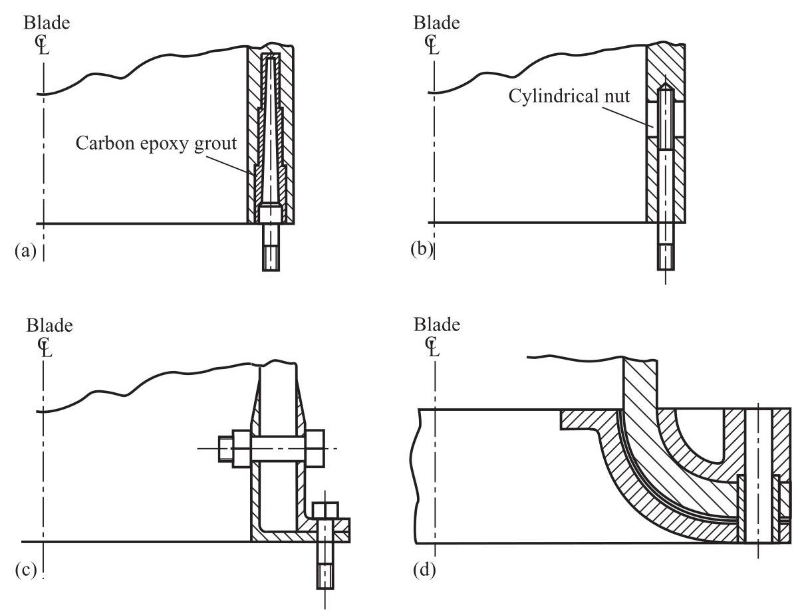

Figure 7.19 (a) Carrot connector; (b) T-bolt connector; (c) Pin-hole flange; (d) Trumpet flange

Mayer (1996) records the results of fatigue tests on the other blade root fixings featured in Figure 7.19, but in no case did failure occur as a result of fatigue of the GFRP in the region of the root fixing. In the case of the T-bolt fixing arrangement, failure occurred in the studs rather than in the GFRP. The pin-hole flange specimens developed fatigue cracks in the GFRP in areas remote from the root fixings and the trumpet flange specimens developed cracks in the flanges themselves.

## 7.2 Pitch bearings

On pitch-regulated machines a bearing similar to a crane slewing ring is interposed between each blade and the hub to allow the blade to be rotated or 'pitched' about its axis. A typical arrangement is as shown in Figure 7.20, in which the inner and outer rings of the bearing are bolted to the blade and hub respectively.

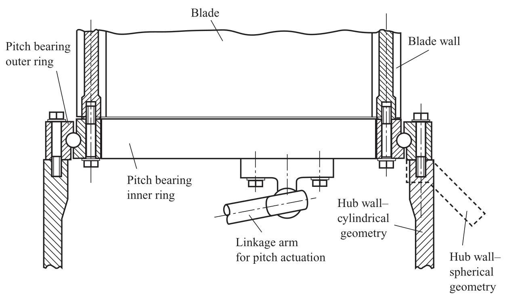

Figure 7.20 Typical pitch-bearing arrangement

The different types of bearings available can be classified according to the rolling elements used and their arrangement, in order of increasing moment capacity, as follows:

(a) Single-row roller bearings, with alternate rollers inclined at $+ {45}^{ \circ  }$ and - ${45}^{ \circ  }$ to the plane of the bearing.

(b) Single-row ball bearings.

(c) Double-row ball bearings.

(d) Three-row roller bearings.

These are shown in cross-section in Figure 7.21. The single-row ball bearing slewing rings are normally designed to transmit axial loads in both directions and are, therefore, known as four point contact bearings. Low contact stresses are achieved by making the radii on each side of the grooves only slightly larger than that of the balls.

At low wind speeds, the cyclic in-plane bending moment at the blade root due to gravity is of similar magnitude to the out-of-plane moment due to blade thrust, so bearing loads will alternate in direction over portions of the bearing circumference. Accordingly it is desirable to avoid the risk of play by preloading the bearing. This can be achieved relatively easily on bearings in which one of the rings is split on a plane normal to the axis, such as types (c) and (d), but is more difficult when both rings are solid. In this case it is necessary to force the rolling elements into the races one by one during manufacture.

The bearing selected for a particular application needs to have sufficient moment capacity to both resist the extreme blade root bending moments and provide adequate fatigue life. Manufacturers catalogues typically specify both the extreme moment capacity and the steady moment loading that will give a life of, say, 30,000 bearing revolutions, so the wind turbine designer's chief task is to convert the anticipated pitch bearing duty into the equivalent constant loading at the appropriate number of revolutions. If the rolling elements are ball bearings, the bearing life is inversely proportional to the cube of the bearing loading, so the equivalent loading at $N$ revolutions of the pitch bearing can be calculated according to the formula

$$
{M}_{\text{ eqt }} = {\left\lbrack  \frac{\mathop{\sum }\limits_{i}{n}_{i}{M}_{i}^{3}}{N}\right\rbrack  }^{1/3} \tag{7.42}
$$

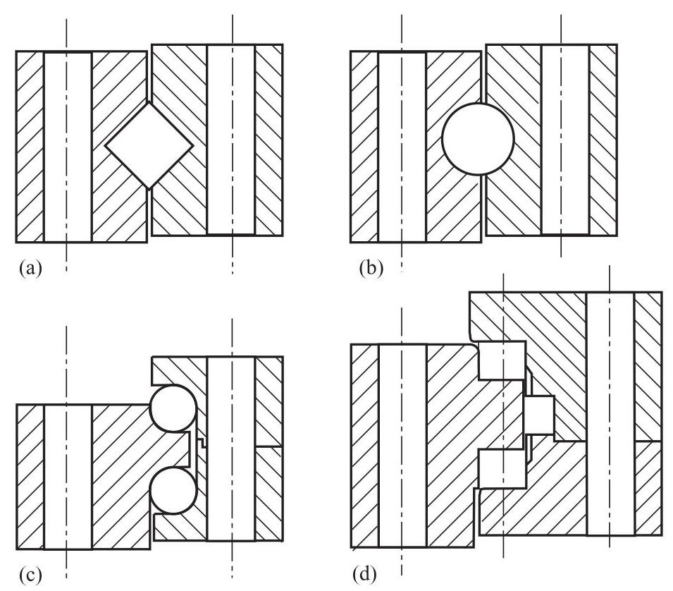

Figure 7.21 (a) Single-row crossed roller bearings; (b) Single-row ball bearings; (c) Double-row ball bearings; (d) Three-row roller bearings

where ${n}_{i}$ is the total pitch bearing movement anticipated over the design life at moment loading ${M}_{i}$ , expressed as a number of revolutions. In the case of roller bearings, the index of the $S - N$ curve is ${10}/3$ instead of 3, so the above formula should be modified accordingly. As the blade root out-of-plane moment drops as the wind speed increases above rated, the fatigue damage will be concentrated at wind speeds near rated.

The total pitch bearing movement over a period of operation at a particular wind speed is a function of the turbulence intensity and the pitch control algorithm, and is best predicted by means of a wind simulation. The mean blade pitching rate during operation above rated wind speed is found to be of the order of ${1}^{ \circ  }/\mathrm{s}$ , assuming the pitch system only responds to wind speed fluctuations at a frequency less than the speed of rotation.

The performance of slewing ring bearings such as those employed as pitch bearings is critically dependent on the extent of bearing distortion under load, so manufacturers normally specify a maximum axial deflection and tilt of the bolted contact surfaces. For example, the limiting values given by Rothe-Erde for a single-row ball bearing slewing ring with a ${1000}\mathrm{\;{mm}}$ track diameter were ${0.6}\mathrm{\;{mm}}$ and ${0.17}^{ \circ  }$ respectively. Local tilting of the bearing rings could clearly be minimised if the blade wall, bearing track and hub wall were all positioned in the same plane. However, this would necessitate the provision of flanges, so the simpler arrangement shown in Figure 7.20, in which the fixing bolts are inserted centrally into the blade and hub walls, is generally preferred. The designer must then ensure that the blade and hub structures are of sufficient stiffness to limit the bearing distortion due to the eccentric loading to acceptable values.

It is standard practice to preload the bearing fixing bolts in order to minimise bolt fatigue loading. Grade 10.9 bolts are commonly used so that the preload can be maximised.

## 7.3 Rotor hub

The relatively complex three dimensional geometry of rotor hubs favours the use of casting in their manufacture, with spheroidal graphite iron being the material generally chosen.

Two distinct shapes of hub for three-bladed machines can be identified: tri-cylindrical or spherical. The former consists of three cylindrical shells concentric with the blade axes, which flare into each other where they meet, while the latter consists simply of a spherical shell with cut-outs at the three blade mounting positions. Diagrams of both types are shown in Figure 7.22, while an actual spherical hub is illustrated in Figure 7.23. The structural action of the hub in resisting three loadings is discussed in the following paragraphs.

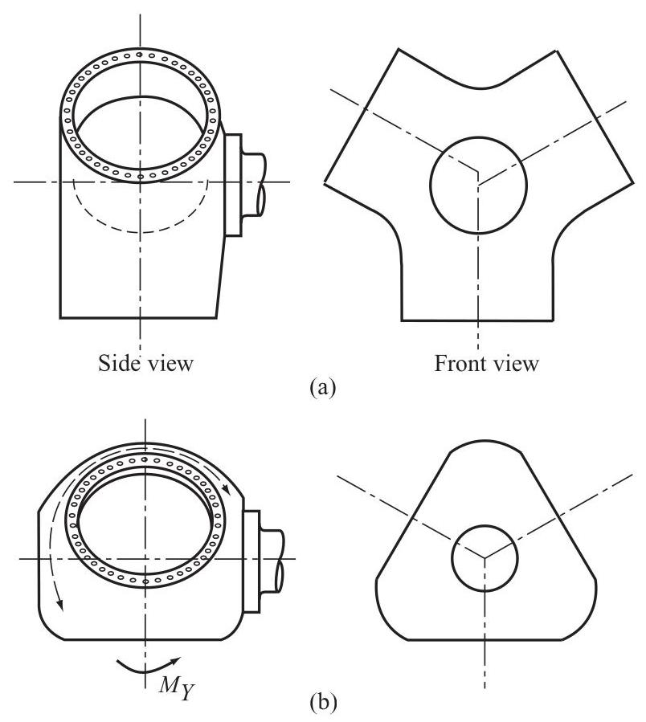

Figure 7.22 (a) Tri-cylindrical hub; (b) Spherical hub

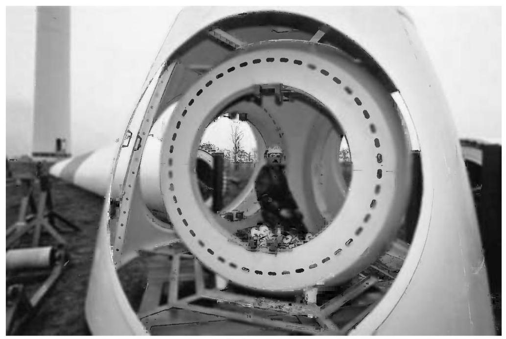

Figure 7.23 Rotor Hub. View of spherical-shaped rotor hub for the 1.5 MW NEG Micon turbine awaiting installation. The hub and spinner are temporarily oriented with the rotor shaft axis vertical. The turbine is stall-regulated, so slotted blade fixing holes are provided to allow for fine adjustment of blade pitch to suit the site. Reproduced by permission of NEG-Micon

1. Symmetric rotor thrust loading: The blade root bending moments due to symmetric rotor thrust loading put the front of the hub in bi-axial tension near the rotor axis and the rear in bi-axial compression, while the thrust itself generates out-of-plane bending stresses in the hub shell adjacent to the low speed shaft flange connection. The load paths are easy to visualise in this case.

2. Thrust loading on a single blade: This generates out-of-plane bending stresses in the hub shell at the rear, and in-plane tensile stresses around a curved load path between the upwind side of the blade bearing and the portion of the low speed shaft flange connection remote from the blade (see dashed line in Figure 7.22b). The resultant lateral loads will result in out-of-plane bending.

3. Blade gravity moments: On the tri-cylindrical hub, equal and opposite blade gravity moments are communicated via the cylindrical shells to areas near the rotor axis at front and rear where they cancel each other out. It is less straightforward to visualise the corresponding load paths on the spherical hub, as out-of-plane bending is likely to be mobilised.

The complexity of the stress states arising from the latter two types of loading renders finite element analysis of rotor hubs more or less mandatory. At the most, six load cases need to be analysed, corresponding to the separate application of moments about the three axes and forces along the three axes at a single hub/blade interface. Then the distribution of hub stresses due to combinations of loadings on different blades can be obtained by superposition. Similarly the fluctuation of hub stresses over time can be derived by inputting the time histories of the blade loads obtained from a wind simulation.

The critical stresses for hub design are the in-plane stresses at the inner or outer surface, where they reach a maximum because of shell bending. For any one location on the hub, these are defined by three quantities at each surface - the in-plane direct stresses in two directions at right angles and the in-plane shear stress. In general, these stresses will not vary in-phase with each other over time, so the principal stress directions will change, complicating the fatigue assessment.

There is, as yet, no generally recognised procedure for calculating the fatigue damage accumulation due to multi-axial stress fluctuations, although the following methods have been used, despite their acknowledged imperfections. They all cater for one or more series of repeated stress cycles rather than the random stress fluctuations resulting from turbulent loading.

1. Maximum shear method: Here the fatigue evaluation is based on the maximum shear stress ranges, calculated from either the $\left( {{\sigma }_{1} - {\sigma }_{2}}\right) /2,{\sigma }_{1}/2$ or ${\sigma }_{2}/2$ time histories. The effect of mean stress is allowed for using the Goodman relationship:

$$
\frac{{\tau }_{a}}{{S}_{SN}} + \frac{{\tau }_{m}}{{S}_{Su}} = \frac{1}{\gamma } \tag{7.43}
$$

where

${\tau }_{a}$ is the alternating shear stress

${\tau }_{m}$ is the mean shear stress

${S}_{SN}$ is the alternating shear stress for $N$ loading cycles from the material $S - N$ curve

${S}_{Su}$ is the ultimate shear strength

$\gamma$ is the safety factor

Having used Equation 7.43 to determine ${S}_{SN}$ , the permitted number of cycles for this loading range can be derived from the $S - N$ curve, enabling the corresponding fatigue damage to be calculated.

2. ASME Boiler and pressure vessel code method: This is similar to the maximum shear method, but the shear stress ranges are based on notional principal stresses calculated from the changes in the values of ${\sigma }_{x},{\sigma }_{y},{\sigma }_{z},{\tau }_{xy},{\tau }_{yz}$ and ${\tau }_{zx}$ from datum values occurring at one of the extremes of the stress cycle. Mean stress effects are not included.

3. Distortion energy method: In this method, the fatigue evaluation is based on the fluctuations of the effective or Von Mises stress. In the case of the hub shell, the stress perpendicular to the hub surface (and hence the third principal stress) is zero, so the effective stress is given by:

$$
{\sigma }^{\prime } = \sqrt{\frac{{\left( {\sigma }_{1} - {\sigma }_{2}\right) }^{2} + {\sigma }_{1}^{2} + {\sigma }_{2}^{2}}{2}} \tag{7.44}
$$

As the effective stress is based on the distortion energy, it is a scalar quantity, so it needs to be assigned a sign corresponding to that of the dominant principal stress. The effect of mean stress is allowed for in the same way as for the maximum shear method, except that the stresses in Equation 7.43 are now direct stresses instead of shear stresses.

$S - N$ curves for spheroidal graphite iron are given in Hück (1983).

## 7.4 Gearbox

### 7.4.1 Introduction

The function of the gearbox is to step up the speed of rotor rotation to a value suitable for standard induction generators, which, in the case of fixed speed machines or two speed machines operating at the higher speed, is usually 1500 rpm plus the requisite slip. For machines rated between ${300}\mathrm{\;{kW}}$ and $5\mathrm{{MW}}$ , with upper rotational speeds between 48 and 12 rpm, overall gear ratios of between about 1:31 and 1:125 are therefore required. Normally these large step-ups are achieved by three separate stages with ratios of between 1:3 and 1:5 each.

The design of industrial fixed ratio gearboxes is a large subject in itself and well beyond the scope of the present work. However, it is important to recognise that the use of such gearboxes in wind turbines is a special application, because of the unusual environment and load characteristics, and the sections which follow focus on these aspects. Sections 7.4.2-7.4.6 consider variable loading, including drive train dynamics and the impact of emergency braking loads, and examine how gear fatigue design is adapted to take account of it. The relative benefits of parallel and epicyclic shaft arrangements are discussed in Section 7.4.7, while subsequent sections deal with noise reduction measures and lubrication and cooling. A useful reference is the American Gear Manufacturers Association Information Sheet entitled 'Recommended practices for design and specification of gearboxes for wind turbine generator system' published in 1996 in conjunction with the American Wind Energy Association, which covers the special requirements of wind turbine gearboxes in some detail. This has now been expanded into the standard 'Design and specification of gearboxes for wind turbines', ANSI/AGMA/AWEA 6006-A03.

### 7.4.2 Variable loading during operation

The torque level in a wind turbine gearbox will vary between zero and rated torque according to the wind speed, with excursions above rated on fixed speed pitch regulated machines due to slow pitch response. The short-term torque fluctuations will be subject to dynamic magnification to the extent that they excite drive train resonances (see Section 7.4.3 below). In addition there will be occasional much larger torques of short duration due to braking events, unless the brake is fitted to the low speed shaft. Figure 7.24 shows example load-duration curves (excluding dynamic effects and braking) for two 500 kW, two-bladed fixed speed machines - one stall and the other pitch regulated. The curve for the former is calculated by simply combining the power curve with the distribution of instantaneous wind speeds, which is obtained by superposing the turbulent variations about each mean wind speed on the Weibull distribution of hourly means. Excursions above rated power are not included.

In the case of a pitch regulated machine, the pitch control system is not normally designed to respond to wind speed fluctuations at blade passing frequency or above, as this would impose excessive loads on the control mechanism. Thus, there is no attenuation of the significant power fluctuations that occur at blade passing frequency due to turbulence, which are illustrated for the example two-bladed, ${500}\mathrm{\;{kW}}$ machine operating in a ${20}\mathrm{\;m}/\mathrm{s}$ mean wind with ${16.5}\%$ turbulence intensity in Figure 7.25.

The load duration curve for a fixed speed pitch regulated machine can be derived approximately from the distribution of instantaneous wind speeds below rated wind speed, and the distribution of short-term mean wind speeds (i.e. those to which the pitch system can respond) above. The former can be combined with the power curve to give the power distribution due to instantaneous winds below rated directly, while the winds above rated are assumed to produce Gaussian spreads of power outputs about the rated value, with the standard deviation depending on the short-term mean wind. The standard deviation of power fluctuations when the pitch control system is operational can be related to that portion of the wind fluctuations above the pitch control system cut off frequency as follows:

$$
{\sigma }_{P}^{2} = \frac{1}{{N}^{2}}\mathop{\sum }\limits_{j}\mathop{\sum }\limits_{k}\left\lbrack  {{\int }_{\Omega }^{\infty }{S}_{u}^{o}\left( {{r}_{j},{r}_{k}, n}\right) {dn}}\right\rbrack  {\left( \frac{dp}{du}\right) }_{j}{\left( \frac{dp}{du}\right) }_{k} \tag{7.45}
$$

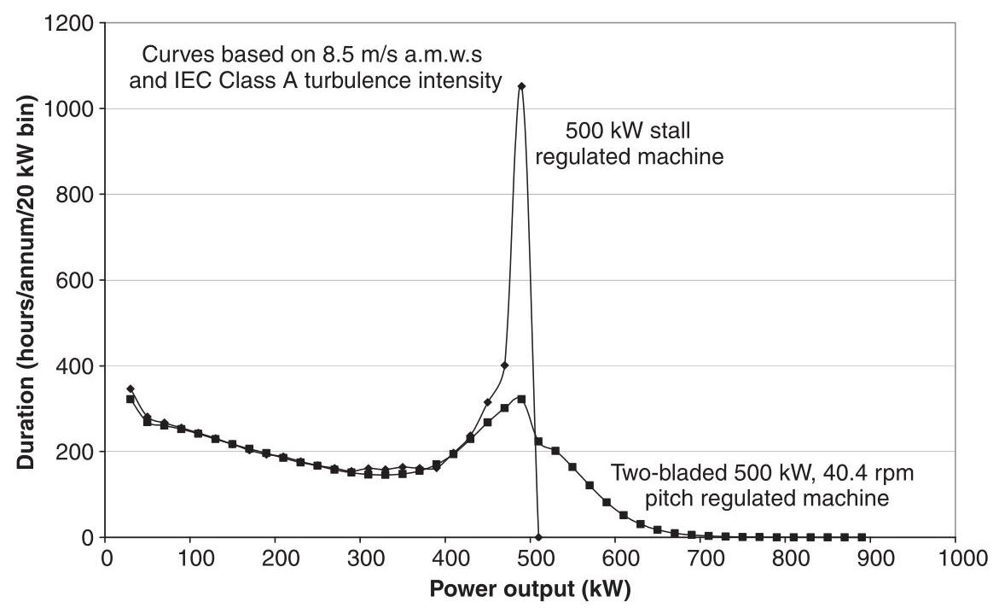

Figure 7.24 Load duration curves for ${500}\mathrm{\;{kW}},2$ bladed pitch regulated and ${500}\mathrm{\;{kW}}$ , stall regulated fixed speed machines

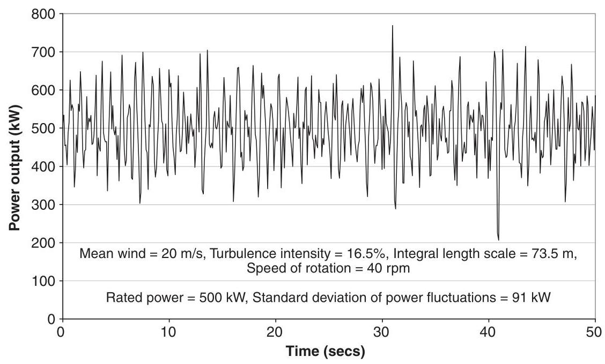

Figure 7.25 Simulated power output for two-bladed, ${40}\mathrm{\;m}$ diameter pitch regulated $\mathrm{m}/\mathrm{c}$ operating in above rated wind speed

where ${S}_{u}^{o}\left( {{r}_{i},{r}_{k}, n}\right)$ is the rotationally sampled cross spectrum of the wind speed fluctuations at a pair of points, $j$ and $k$ , on the rotor (see Section 5.7.5) and, ${\left( dp/du\right) }_{j}$ is the rate of change with wind speed of the power generated by the blade elements at ${r}_{j}$ on all $N$ blades if the pitch does not change. The summations are carried out over the whole rotor, and give ${\sigma }_{P} = {0.213}\left( {{dP}/{du}}\right) {\sigma }_{u} = {91}\mathrm{\;{kW}}$ for the example two-bladed machine operating at ${40.4}\mathrm{{rpm}}$ in a ${20}\mathrm{\;m}/\mathrm{s}$ mean wind with ${16.5}\%$ turbulence intensity. Here ${dP}/{du}$ is the rate of change of turbine power with wind if the pitch does not change. The standard deviation of the power fluctuations for a three-bladed machine of similar size would be about one third less.

### 7.4.3 Drive train dynamics

All wind turbines experience aerodynamic torque fluctuations at blade passing frequency and multiples thereof because of the 'gust slicing' phenomenon, and these fluctuations will inevitably interact with the dynamics of the drive train, modifying the torques transmitted. In the case of fixed speed wind turbine with an induction generator, the resulting drive train torque fluctuations can be assessed by dynamic analysis of a drive train model consisting of the following elements connected in series:

- a body with rotational inertia and damping (representing the turbine rotor);

- a torsional spring (representing the gearbox);

- a body with rotational inertia (representing the generator rotor);

- a torsional damper (modelling the resistance produced by slip on the induction generator);

- a body of infinite rotational inertia rotating at constant speed (the mechanical equivalent of the electrical grid).

The inertias, spring stiffness and damping must all be referred to the same shaft.

### 7.4.4 Braking loads

Most turbines have the mechanical brake located on the high speed shaft, with the result that braking loads are transmitted through the gearbox. If, as is sometimes the case, the mechanical brake is one of the two independent braking systems required, then it must be capable of decelerating the rotor to a standstill from an overspeed - for example, after a grid loss. This typically requires a torque of about three times rated torque.

The mechanical brake is only required to act alone during emergency shutdowns, which are comparatively rare. During normal shutdowns the rotor is decelerated to a much lower speed by aerodynamic braking, so the duration of mechanical braking is much less, but the braking torque is the same, unless there is provision for two different braking torque levels.

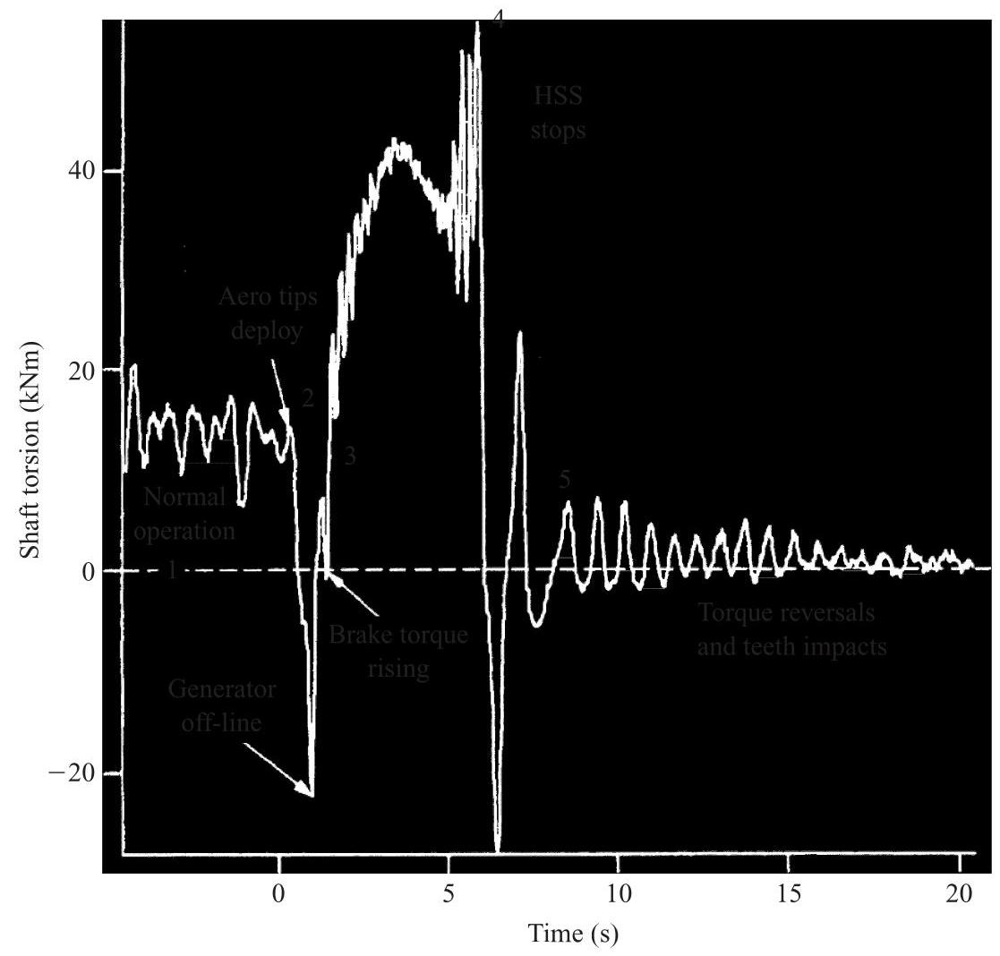

Figure 7.26 Low-speed shaft torque during braking at normal shut-down. Extracted from AGMA/AWEA 921-A97, Recommended practices for design and specification of gearboxes for wind-turbine generator systems, with permission of the publisher, the American Gear Manufacurers Association, 1500 King Street, Suite 201, Alexandria, Virginia 22314, USA

Figure 7.26 is a typical record of low speed shaft torque during a normal shutdown, in which the mechanical brake is applied as soon as the generator has been taken off-line. It is apparent that the braking torque is far from constant, taking a couple of seconds to reach its first maximum and then falling off slightly before reaching a higher maximum just before the high speed shaft stops. Following this, there are significant torque oscillations due to the release of wind-up in the drive train. These result in torque reversals accompanied by tooth impacts and take some time to decay.

Although braking loads are infrequent and of short duration, their magnitude means that they can have a decisive effect on fatigue damage. The AGMA/AWEA document recommends that the time histories of braking and other transient events are simulated with the aid of a dynamic model of the drive train for input into both the gear extreme load design calculations and the fatigue load spectrum.

### 7.4.5 Effect of variable loading on fatigue design of gear teeth

Gear teeth must be designed in fatigue to achieve both acceptable contact stresses on the flanks and acceptable bending stresses at the roots. In non wind turbine applications, gearboxes typically operate at rated torque throughout their lives, so the gear strengths are traditionally modified by 'life factors' which are derived from the material $S - N$ curves on the basis of the predicted number of tooth load cycles for the gear in question. The British code for determining permissible gear contact stresses, BS 436: Part 3:1986 (since replaced by BS ISO 6336), recognises an endurance limit for both contact stress and bending stress, so that the life factors are unity when the number of tooth load cycles exceeds ${10}^{9}$ and $3 \times  {10}^{6}$ respectively, but increase for lesser numbers of cycles.

The Hertzian compression stress between a pair of spur gear teeth in contact at the pitch point (i.e. at the point on the line joining the gear centres) is given by

$$
{\sigma }_{C} = \sqrt{\frac{{F}_{t}}{b{d}_{1}}\frac{E}{\pi \left( {1 - {\upsilon }^{2}}\right) }\frac{u + 1}{u}\frac{1}{\sin \alpha \cos \alpha }} \tag{7.46}
$$

where

${F}_{t}$ is the force between the gear teeth at right angles to the line joining the gear centres

$b$ is the gear face width

${d}_{1}$ is the pinion pitch diameter

$u$ is the gear ratio (greater than unity)

$\alpha$ is the pressure angle - that is, the angle at which the force acts between the gears - usually ${20}^{ \circ  } - {25}^{ \circ  }$

Note that the contact stress increases only as the square root of the force between the teeth because the area in contact increases with the force as well.

The maximum bending stress at the tooth root is given by

$$
{\sigma }_{B} = \frac{{F}_{t}h}{\frac{1}{6}b{t}^{2}}{K}_{S} \tag{7.47}
$$

where

$h$ is the maximum height of single tooth contact above the critical root section

$t$ is the tooth thickness at the critical root section

${K}_{S}$ is a factor to allow for stress concentration at the root

For gearing operating at rated torque only, the designer needs to show that the resultant bending stress multiplied by an appropriate safety factor is less than the endurance limit multiplied by the life factor, ${Y}_{N}$ , and a number of stress modifying factors, as follows:

$$
{\sigma }_{B} \cdot  \gamma  \leq  {\sigma }_{B\lim } \cdot  {Y}_{N} \cdot  {Y}_{R} \cdot  {Y}_{X}\ldots \ldots \tag{7.48}
$$

A similar calculation is required in relation to the contact stress.

Given the predicted turbine load spectrum (Section 7.4.2), which should include dynamic effects (see Section 7.4.3), it is then necessary to establish the required design torque at the endurance limit. Normally this is done by invoking Miner's rule and determining the infinite life torque for which the design torque spectrum yields unity fatigue damage in conjunction with the prescribed $S - N$ curve. ${Y}_{N}$ in Equation 7.48 can then be set to unity, as the life factor has been accounted for in the derivation of the required infinite life torque.

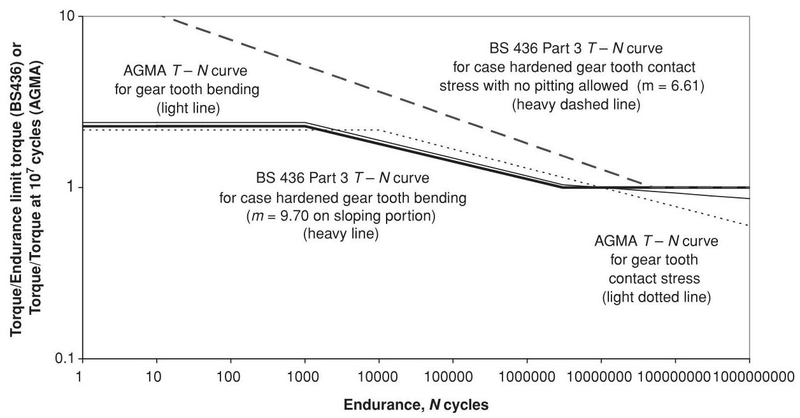

Figure 7.27 Specimen torque - endurance curves for gear tooth design

Figure 7.27 shows specimen torque - endurance curves laid down by BS 436 for case hardened gears for tooth bending and tooth contact stress (with no pitting allowed) plotted in terms of the torque at the endurance limit. Hence in each case the design infinite life torque, ${T}_{\infty }$ , is calculated according to:

$$
{T}_{\infty } = {\left\lbrack  \mathop{\sum }\limits_{i}\left( \frac{{N}_{i}}{{N}_{\infty }}{T}_{i}^{m}\right) \right\rbrack  }^{1/m} \tag{7.49}
$$

where ${N}_{i}$ is the number of cycles at torque level ${T}_{i}$ , and torques less than ${T}_{\infty }$ are omitted from the summation. The number of cycles at the lower knee of the torque - endurance curve, ${N}_{\infty }$ , is always $3 \times  {10}^{6}$ cycles for tooth bending but is generally higher for contact stress, varying according to the material. Note that the slope index, $m$ , of the torque - endurance curve for contact stress is half that of the contact stress - endurance curve because contact stress only increases as the square root of torque (Equation 7.46).

Leaving braking loads out of consideration to begin with, the design infinite life torque will be equal to the rated torque if there are no power fluctuations above rated, because the number of gear tooth loading cycles at rated torque will be well above ${N}_{\infty }$ . For example, in the case of the ${500}\mathrm{{kW}}$ stall regulated machine featured in Figure 7.24, the teeth on the critical pinion driven by the ${30}\mathrm{{rpm}}$ low speed shaft will experience $3 \times  {30} \times  {60} \times  {1050} \times  {20} = \; {1.13} \times  {10}^{8}$ load cycles at rated torque over 20 years, assuming a first stage gear ratio of 3 . On the other hand, for the 500 kW, two-bladed pitch regulated machine, the power fluctuations above rated detailed in the Figure 7.24 load-duration curve result in a design infinite life torque for the first stage pinion tooth bending stress of 1.36 times the rated torque, with most of the damage coming from torques just above this value. (The first stage gear ratio is assumed to be three as before and the turbine rotational speed is taken as ${40.4}\mathrm{{rpm}}$ ). The design infinite life torque for tooth contact stress is only ${1.17} \times$ rated torque - significantly less than for bending, as expected from comparison of the BS 436 Part 3 torque - endurance curves in Figure 7.27.

Figure 7.27 also shows specimen torque - endurance curves derived from $S - N$ curves in the ANSI/AGMA standard 2001-C95 'Fundamental rating factors and calculation methods for involute spur and helical gear teeth' plotted in terms of the torque at ${10}^{7}$ cycles. The torque - endurance curve for tooth bending stress, which is based on a middle of the range Brinell Hardness value of 250 HB, closely parallels the selected BS 436 Part 3 curve, except that the curve continues with a very shallow slope beyond $3 \times  {10}^{6}$ cycles instead of displaying an endurance limit. The design torques at ${10}^{7}$ cycles for tooth bending for the example 500 kW machines featured in Figure 7.24 are similar to the design infinite life torques obtained using the BS 436 Part 3 torque - endurance curves.

The ANSI/AGMA 2001-C95 torque - endurance curves for tooth contact stress are significantly more conservative than the selected BS 436 Part 3 curve. This is particularly so in the case of the ANSI/AGMA curve selected, which is the one recommended for wind turbine applications, in view of the elimination of the lower knee. The absence of the lower knee increases the design torque at ${10}^{7}$ cycles for tooth contact to 1.4 times the rated torque for the stall regulated machine, but the figure for the pitch regulated machine is only about 10% higher.

From the above discussion, the general conclusion can be drawn that tooth bending fatigue usually governs the increased gearbox rating required to take care of load excursions above rated.

The effect of braking loads on the design infinite life torque according to BS 436 Part 3 can be illustrated with respect to the example machines discussed in Section 7.4.2. Although the mechanical brake must be capable of decelerating an overspeeding rotor unassisted, a shutdown under these conditions will be a very rare event. Accordingly the typical emergency shut-down considered for fatigue design purposes is deceleration from normal rotational speed under the action of mechanical and aerodynamic braking combined, with an assumed stopping time of three seconds. An emergency shut-down frequency of 20 per annum is assumed. Normal shut-downs are assumed to occur on average twice a day, with a stopping time of 1.5 seconds, because of the reduced rotational speed at which mechanical braking is initiated for parking. In each case the braking torque is assumed to remain constant at three times rated torque throughout the brake application for simplicity. Based on these assumptions, the percentage increases in design infinite life torque for gear tooth bending in fatigue, due to the inclusion of braking loads in the load spectrum, are shown in Table 7.4 for emergency braking alone on the one hand and normal plus emergency shut-downs on the other.

Also shown in Table 7.4 are the percentage increases in the AGMA design infinite life torque for gear tooth bending at ${10}^{7}$ cycles due to the inclusion of braking loads. It is seen that the inclusion of emergency braking loads alone makes very little difference to design torques in the case of the pitch regulated machine, but is significant in the case of the stall regulated machine. The addition of braking loads at normal shut-downs incurs a much greater penalty in both cases because of the large number of stops involved, indicating that provision for brake application at reduced torque on these occasions would probably be worthwhile. Note that the larger percentage increases in design torques due to braking indicated by BS 436 Part 3 are a consequence of the assumption that there is an endurance limit.

Table 7.4 Illustrative increases in design torques for gear tooth bending due to inclusion of braking loads in fatigue load spectrum, according to BS 436 and AGMA rules

<table><tr><td rowspan="2"></td><td colspan="2">500 kW stall regulated machine</td><td colspan="2">500 kW two-bladed pitch regulated machine</td></tr><tr><td>Percentage increase in BS 436 design infinite life torque for tooth bending</td><td>Percentage increase in ANSI/AGMA 250 HB design torque at 107 cycles for tooth bending</td><td>Percentage increase in BS 436 design infinite life torque for tooth bending</td><td>Percentage increase in ANSI/AGMA 250 HB design torque at ${10}^{7}$ cycles for tooth bending</td></tr><tr><td>Emergency braking at $3 \times$ FLT</td><td>30%</td><td>16%</td><td>4%</td><td>3%</td></tr><tr><td>Emergency plus normal braking, each at $3 \times$ FLT</td><td>65%</td><td>47%</td><td>25%</td><td>21%</td></tr></table>

### 7.4.6 Effect of variable loading on fatigue design of bearings and shafts

Bearing lives are approximately inversely proportional to the cube of the bearing loading. Applying Miner's rule, the equivalent steady bearing loading over the gearbox design life can thus be calculated from the load duration spectrum according to the formula:

$$
{F}_{\text{ eqt }} = {\left\lbrack  \frac{\mathop{\sum }\limits_{i}{N}_{i}{F}_{i}^{3}}{\mathop{\sum }\limits_{i}{N}_{i}}\right\rbrack  }^{1/3} \tag{7.50}
$$

where ${N}_{i}$ is the number of revolutions at bearing load level ${F}_{i}$ . Gravity often dominates the loading on the low speed shaft bearings, but on the other shafts the bearing loads result from drive torque only, so the bearing load duration spectrum can be scaled directly from the torque duration spectrum. Note that the $S - N$ curve for bearings is much steeper than those for gear tooth design, so that occasional large braking loads will be of less significance.

The nature of the fatigue loading of intermediate shafts is essentially different from that of gear teeth, as the former is governed by the torque fluctuations as opposed to the absolute torque magnitude. Consequently the fatigue load spectrum for shaft design should be derived from rain-flow cycle counts on simulated torque time histories rather than on the load duration curve used for gear tooth design.

### 7.4.7 Gear arrangements

Parallel axis gears may be arranged in one of two ways in each gear stage. The simplest arrangement within a stage consists of two external gears meshing with each other and is commonly referred to as 'parallel shaft'. The alternative 'epicyclic' arrangement consists of a ring of planet gears mounted on a planet carrier and meshing with a sun gear on the inside and an annulus gear on the outside. The sun and planets are external gears and the annulus is an internal gear as its teeth are on the inside. Usually either the annulus or planet carrier are held fixed, but the gear ratio is larger if the annulus is fixed.

The epicyclic arrangement allows the load to be shared out between the planets, reducing the load at any one gear interface. Consequently the gears and gearbox can be made smaller and lighter, at the cost of increased complexity. The scope for material savings are greatest in the input stages of the gear train, so it is common to use the epicyclic arrangement for the first two stages and the parallel shaft arrangement for the output stage. A further advantage of epicyclic gearboxes is greater efficiency as a result of the reduced sliding that takes place between the annulus and planet teeth.

The derivation of the optimum gear ratio in a series of parallel shaft stages is fairly straightforward and is described below. Equation 7.47 for tooth bending stress can be modified as follows:

$$
{\sigma }_{B} = \frac{{F}_{t}h}{\frac{1}{6}b{t}^{2}}{K}_{S} = {F}_{t}\frac{6\left( {h/m}\right) }{{bm}{\left( t/m\right) }^{2}} \cdot  {K}_{S} = {F}_{t}\frac{6{z}_{1}\left( {h/m}\right) }{b{d}_{1}{\left( t/m\right) }^{2}} \cdot  {K}_{S} \tag{7.47a}
$$

where $m$ is the module, defined as ${d}_{1}/{z}_{1}$ for spur gears and ${z}_{1}$ is the number of pinion teeth. If the ratios $h/m$ and $t/m$ are treated as constants, then the bending stress is proportional to the number of teeth for a given size of gear. Hence the design of the gears is governed by contact stress because, in principle, the bending stress can always be reduced by reducing the number of pinion teeth. Thus, based on Equation 7.46, the permitted tangential force, ${F}_{t}$ , is proportional to $b{d}_{1}u/\left( {u + 1}\right)$ so that the permitted low speed shaft torque, ${T}_{LSS} = {F}_{t}{d}_{2}/2$ is given by

$$
{T}_{LSS} \propto  {d}_{2}b{d}_{1}u/\left( {u + 1}\right)  = b{d}_{2}^{2}/\left( {u + 1}\right) \tag{7.51}
$$

Hence the volumes of the low speed shaft gear wheel and the meshing pinion can be expressed as ${V}_{2} = k{T}_{LSS}\left( {u + 1}\right)$ , where $k$ is a constant, and, ${V}_{1} = {V}_{2}/{u}^{2}$ respectively. These can be used to derive an expression for the volume of gears in a drive train with an infinite number of stages each with the same ratio. It is found that the total gear volume is a minimum for a gear stage ratio of 2.9, but increases by only 10% when the ratio drops to 2.1 or rises to 4.3.

The gear teeth of parallel shaft gear stages are only loaded in one direction, so the permitted alternating bending stress amplitude in fatigue, ${\sigma }_{alt}$ , is modified to account for the non-zero mean value in accordance with the Goodman relation:

$$
\frac{{\sigma }_{\text{ alt }}}{{\sigma }_{\text{ lim }}} = 1 - \frac{\overline{\sigma }}{{\sigma }_{\text{ ult }}} \tag{7.52}
$$

where ${\sigma }_{lim}$ is the permitted alternating bending stress amplitude with zero mean, $\overline{\sigma }$ is the mean bending stress and ${\sigma }_{ult}$ is the ultimate tensile strength. Setting $\overline{\sigma } = {\sigma }_{alt}$ results in:

$$
{\sigma }_{\text{ alt }} = \frac{{\sigma }_{\text{ lim }}{\sigma }_{\text{ ult }}}{\left( {\sigma }_{\text{ ult }} + {\sigma }_{\text{ lim }}\right) } \tag{7.53}
$$

If the ${\sigma }_{\text{ lim }}/{\sigma }_{\text{ ult }}$ ratio is 0.2, then ${\sigma }_{\text{ alt }} = {0.833}{\sigma }_{\text{ lim }}$ and the permitted peak bending stress at the endurance limit is ${1.667}{\sigma }_{lim}$ . In epicyclic gearboxes, by contrast, the gear teeth on the planets' wheels are loaded in both directions, so the permitted peak bending stress at the endurance limit is only ${\sigma }_{lim}$ . As the number of teeth on the smallest gear cannot be reduced indefinitely, this means that tooth bending is more likely to govern in the case of epicyclic gearing.

The minimum total gear volume for an infinite series of epicyclic gear stages with fixed annuli is obtained for a gear stage ratio of two, which implies that the radius of the sun gear is the same as that of the annulus gear and that there are an infinite number of planets! This is not realistic, and the annulus radius is in practice typically double the sun radius, giving a gear ratio of three. It is instructive to compare the volume of gears for an epicyclic and parallel gear stages with this ratio, assuming that tooth bending stress governs in each case.

For the parallel stage, it can be shown using Equation 7.47a that the volume of the pinion is:

$$
\frac{\pi }{4}b{d}_{1}^{2} = {k}_{B}{F}_{t}{d}_{1}{z}_{1}/{\sigma }_{B} = {k}_{B}\frac{{F}_{t}{d}_{2}{z}_{1}}{2{\sigma }_{\text{ alt }}u} = {k}_{B}\frac{2{T}_{LSS}{z}_{1}}{{1.667}{\sigma }_{\text{ lim }}u} \tag{7.54}
$$

where ${k}_{B}$ is a constant. This gives a volume for gear wheel and pinion of ${1.2}{\mathrm{\;k}}_{B}{T}_{LSS}{z}_{1} \; \left( {1 + 1/{u}^{2}}\right) u/{\sigma }_{lim} = 4{k}_{B}{T}_{LSS}{z}_{1}/{\sigma }_{lim}$ for $u = 3$ .

For the epicyclic stage, the volume of the planet, which is assumed to have the same number of teeth as the pinion of the parallel stage - that is, the minimum permissible - is:

$$
\frac{\pi }{4}b{d}_{Pl}^{2} = {k}_{B}{F}_{t}{d}_{PL}{z}_{1}/{\sigma }_{B} = {k}_{B}{F}_{t}{d}_{PL}{z}_{1}/{\sigma }_{lim} \tag{7.55}
$$

If the low speed shaft drives the planet carrier and the $N$ planets are spaced at 1.15 diameters, then the low speed shaft torque is:

${T}_{\mathrm{{LSS}}} = {F}_{t}N\left( {{r}_{A} + {r}_{S}}\right)$ where $N = \pi \left( {{r}_{A} + {r}_{S}}\right) /\left( {{1.15}\left( {{r}_{A} - {r}_{S}}\right) }\right) ,{r}_{A}$ is the annulus radius and ${r}_{S}$ is the sun radius.

Hence, putting $a = {r}_{A}/{r}_{S}$ , the volume of a planet is ${k}_{B}{T}_{LSS}{1.15}\left( {a - 1}\right) / \; \left( {\pi {\left( a + 1\right) }^{2}{r}_{S}}\right)  \times  \left( {{d}_{PL}{z}_{1}/{\sigma }_{lim}}\right)$ and the volume of the sun is $4/{\left( a - 1\right) }^{2}$ times as big. The total volume of planets and sun becomes:

$$
V = {k}_{B}{T}_{LSS}\frac{1}{a + 1}\frac{{d}_{PL}{z}_{1}}{{r}_{S}{\sigma }_{lim}}\left( {1 + \frac{4}{{\left( a - 1\right) }^{2}N}}\right) \tag{7.56}
$$

Substituting $a = 2$ , we obtain:

$d{P}_{L} = {r}_{s}$ and $N = {3\pi }/{1.15} = {8.195}$ which is rounded down to 8, giving

$$
V = {k}_{B}{T}_{\mathrm{{LSS}}}\frac{{z}_{1}}{3{\sigma }_{\lim }}\left( {1 + \frac{4}{8}}\right)  = {0.5}{k}_{B}{T}_{\mathrm{{LSS}}}{z}_{1}/{\sigma }_{\lim }
$$

Hence the volume of the sun and planets of the epicyclic stage is only one eighth of the volume of the gearwheel and pinion of the equivalent parallel stage, assuming the designs are governed by gear tooth bending stress. If contact stress were to govern, the relative volume of the epicyclic stage would be even less.

The dramatic materials savings obtainable with epicyclic gearboxes depend on equal sharing of loads between the planets. Although this is theoretically achievable through accuracy of manufacture, it is in practice desirable to introduce some flexibility in the planet mountings to take up any planet position errors - for example, by supporting the planets on slender pins cantilevered out from the planet carrier. Note that the fatigue design of such pins is, like the design of intermediate shafts, governed by torque fluctuations rather than by torque absolute magnitude.

### 7.4.8 Gearbox noise

The main source of gearbox noise arises from the meshing of individual teeth. Loaded teeth deflect slightly, so that if no tooth profile correction is made, unloaded teeth are misaligned when they come into contact, resulting in a series of impacts at the meshing frequency. It is, therefore, standard practice to adjust the tooth profile - usually by removing material from the tip area of both gears, referred to as 'tip relief' - to bring the unloaded teeth back into alignment at the rated gear loading. In the case of wind turbines, the gear loading is variable, so it is necessary to select the load level at which the tip relief provides the correct compensation. If the tip relief load level is too high, there will be excessive loss of tooth contact near the tips at low powers, while if it set too low the noise level at rated power will be too high. However, if gearbox noise is expected to be more intrusive at low wind speeds, when it is less likely to be masked by aerodynamic noise, then a low compensation load level should be selected.

Helical gears are usually quieter than spur gears (with teeth parallel to the gear axis) because the width of the tooth comes into mesh over a finite time interval rather than all at once. Moreover, the peak tooth deflections of helical gears are less than those of spur gears because there are always at least two teeth in contact rather than one, and because the varying bending moment across the tooth width means that the less heavily loaded portions of the tooth can provide restraint to the part that is most heavily loaded. As a result, the tooth misalignments due to insufficient/excessive tip relief at a particular load level will be reduced.

Epicyclic gears are normally quieter than parallel shaft gears because the reduced gear size results in lower pitch line velocities. However, this benefit is lost if spur gears are used rather than helical gears, in order to avoid problems with planet alignment. One way of maintaining the alignment of helical planet gears is to provide thrust collars on the sun and annulus.

As the annulus of an epicyclic gear stage is often fixed, it would be convenient to integrate it with the gearbox casing. However, this would enable annulus gear meshing noise to be radiated directly from the casing, so it is preferable to make the annulus a separate element, supported on resilient mountings. Similarly, resilient gearbox mountings should be used to attenuate the transmission of gearbox noise to the nacelle structure and tower.

The noise produced by gear tooth meshing can reach the environment outside the wind turbine by a variety of routes, as follows:

- through the shaft directly to the blades, which may radiate efficiently;

- through the resilient mounts of the gearbox to the support structure and thereby to the tower, which can radiate efficiently under some circumstances;

- through the resilient mounts of the gearbox to the support structure and thereby to the nacelle structure, which can also radiate;

- through the casing wall to the nacelle air and then via air intake and exhaust ducts;

- through the casing wall to the nacelle air and then via the nacelle structure.

All these paths are modally dense and it is virtually impossible to design out a selected frequency. If noise is a problem then the options are to reduce the source sound level, perhaps by improving the tip relief as described above, or to modify the major path to reduce transmission. Identification of the major path is not straightforward, but one way of doing so is to use Statistical Energy Analysis (SEA), which combines a theoretical model with extensive field measurements. The path may not be simple, as non-linearity in the system can make one path the predominant one at low wind speeds and another path critical at higher wind speeds. Treatment of a radiating path can involve damping treatment such as shear layer damping or even just sand or bitumen layers added to the tower wall, for instance. In some cases the treatment can have more than one effect. When blades are the major source of radiation and damping material is added inside the blades then this material can act as a stiffening material as well as a damping mechanism. Sometimes it is useful to add tuned absorbers to parts of the structure to damp out one particular frequency. An alternative use of such tuned absorbers is to design them to raise the impedance at the tuned frequency so that the offending vibration does not pass that point on the structure.

### 7.4.9 Integrated gearboxes

As noted in Section 6.11.1, Chapter 6, the cases of integrated gearboxes must be very robust, in order to transmit the rotor loads to the nacelle structure without experiencing deflections which would impair the proper functioning of the gears. In view of the complex shape of the casing, stress distributions due to each load vector usually have to be determined using Finite Element (FE) analysis - these can then be superposed in line with the different extreme load combinations. The fatigue analysis will require the superposition of stress histories resulting from simultaneous time histories of rotor thrust, yaw moment and tilt moment derived from simulations at different wind speeds.

### 7.4.10 Lubrication and cooling

The function of the lubrication system is to maintain an oil film on gear teeth and the rolling elements of bearings, in order to minimise surface pitting and wear (abrasion, adhesion and scuffing). Varying levels of the elastohydrodynamic lubrication provided by the oil film can be identified, depending on oil film thickness. These range from full hydrodynamic lubrication, which exists when the metal surfaces are separated by a relatively thick oil film, to boundary lubrication when the asperities of the metal surfaces may be separated by lubricant films only a few molecular dimensions in thickness. Scuffing, which is a severe form of adhesive wear involving localized welding and particle transfer from one gear to the other, can occur under boundary lubrication conditions, which are promoted by high loading and low pitch line velocity and oil viscosity.

Two alternative methods of lubrication are available - splash lubrication and pressure fed. In the former, the low speed gear dips into an oil bath and the oil thrown up against the inside of the casing is channelled down to the bearings. In the latter, oil is circulated by a shaft driven pump, filtered and delivered under pressure to the gears and bearings. The advantage of splash lubrication is its simplicity and hence reliability, but pressure fed lubrication is usually preferred for the following reasons:

- oil can be positively directed to the locations where it is required by jets;

- wear particles are removed by filtration;

- the churning of oil in the bath, which can result in a net efficiency loss, is avoided;

- the oil circulation system enables heat to be removed much more effectively from the gearbox by passing the oil through a cooler mounted outside the nacelle;

- it allows for intermittent lubrication when the machine is shutdown if a standby electric pump is incorporated.

With a pressure fed system, it is normal practice to fit temperature and pressure switches downstream of the filter to trip the machine for excessive temperature or insufficient pressure.

Guidance on the selection of lubricant, which has to take into account the ambient temperatures at the site in question, is given in the AGMA/AWEA document. Sump heaters may be needed to enable oil to be circulated when the turbine starts up at low temperatures.

### 7.4.11 Gearbox efficiency

Gearbox efficiency can vary between about ${95}\%$ and ${98}\%$ , depending on the relative number of epicyclic and parallel shaft stages and on the type of lubrication.

## 7.5 Generator

### 7.5.1 Fixed-speed induction generators

The induction generators commonly used in fixed-speed wind turbines are very similar to conventional industrial induction motors. In principle the only differences between an induction machine operating as a generator and as a motor are the direction of power flow in the connecting wires, whether torque is applied to or taken from the shaft and if the rotor speed is slightly above or below synchronous. The size of the market for induction motors is very large and so, in many cases, an induction generator design will be based on the same stator and rotor laminations as a range of induction motors in order to take advantage of high manufacturing volumes. Some detailed design modifications, for example, changes in rotor bar material, may be made by the machine manufacturers to reflect the different operating regime of wind turbine generator, particularly the need for high efficiency at part load, but the principles of operation are those of conventional induction machines. The synchronous speed, which is determined by the number of magnetic poles, and network frequency will be 1500 rpm. (4 pole), 1000 rpm (6 pole) or 750 rpm (8 pole) for connection to a 50 Hz network. For commercial and safety reasons it is common to use a voltage of less than 1000 V (usually ${690}\mathrm{\;V}$ in Europe or ${575}\mathrm{\;V}$ in the USA) even for large generators and in some large wind turbines the resulting high currents have led to the decision to locate the turbine transformer in the nacelle or at the top of the tower. The physical protection of the generator windings is arranged to avoid the ingress of moisture, that is, a totally enclosed design, and in some wind turbines liquid cooling is used to reduce air-borne noise. A high slip (in some cases up to 2% at rated output power) is often requested by the wind turbine designer as this increases torsional compliance and damping in the wind turbine drive train and helps limit torsional oscillations in the drive train induced by the periodic torque variations of the aerodynamic rotor. However, this is at the expense of electrical losses in the rotor and the consequent generation of heat.

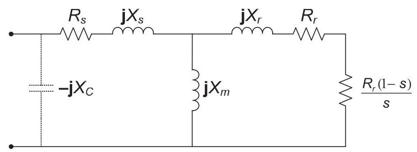

Figure 7.28 Steady state equivalent circuit of an induction machine with power factor correction capacitors. ${R}_{s}$ : stator resistance, ${X}_{s}$ : stator reactance, ${R}_{r}$ : rotor resistance, ${X}_{r}$ : rotor reactance, ${X}_{m}$ : magnetising reactance, ${X}_{c}$ : power factor correction reactance. $j$ is the imaginary operator

Figure 7.28 shows the conventional equivalent circuit of an induction machine that may be used to analyse its steady-state behaviour (Anaya Lara, 2009; Hindmarsh, 1984; McPherson, 1990). The rotor loss term is shown separated from the term representing mechanical power, which is a function of slip. The slip (s) is the difference between the angular velocity of the stator field and rotor:

$$
s = \frac{{\omega }_{s} - {\omega }_{r}}{{\omega }_{s}} \tag{7.57}
$$

For motor operation, the rotor runs slightly slower than the stator field and the slip is positive. For generator operation the rotor runs slightly faster than the stator field and the slip is negative.

Figure 7.29 shows how the active power varies with slip for a 1 MW induction machine. A convention has been chosen with the current flowing into the induction machine and so the normal operating region for a generator is between 0 and $- 1\mathrm{{MW}}$ . In this example, at 1 MW generation the slip is around $- 1\%$ (-0.01 per unit) with the rotor rotating faster than the synchronous speed of the stator field. It may be seen that the maximum power that can be generated before the peak of the curve is reached is ${2.6}\mathrm{{MW}}$ . If the generator is connected to a distribution network with a low short-circuit level (and hence a high source impedance) the maximum power which may be exported before the peak of the curve is reached is reduced.

Figure 7.30 shows how the reactive power drawn by the generator varies with slip. The normal generating operating region is again shown. At 1 MW output the generator draws some 500 kVAr. It may be seen that the reactive power requirement increases very rapidly if the output power, and hence slip, rises above its rated value.

Figures 7.29 and 7.30 may be combined to give the conventional circle diagram representation of an induction machine shown in Figure 7.31. Again the normal generating region is shown. Fixed power factor correction capacitors $\left( {X}_{c}\right)$ are useful to reduce the requirement for reactive power and so translate the circle diagram along the y-axis towards the origin (but not all the way otherwise there is a danger of self-excitation, see Chapter 10, Section 10.6.2). The equations used to describe the steady-state performance of induction generators are given in any standard undergraduate textbook (e.g. Hindmarsh, 1984; McPherson, 1990). Dynamic analysis is more complex but is dealt with by Krause (1986).

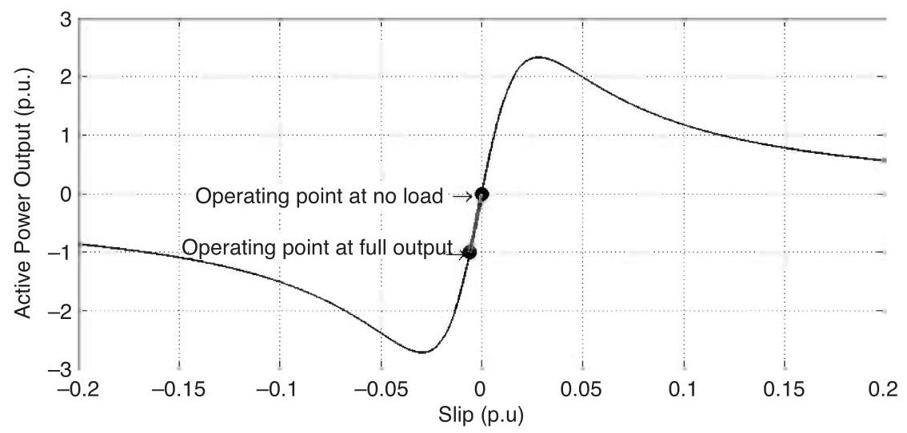

Figure 7.29 Variation of active power with slip for an induction machine

### 7.5.2 Variable slip induction generators

Variable slip operation is achieved by introducing an external resistance into the rotor circuit, as shown in Figure 7.32.

The external resistance is controlled by a semi-conductor switch. Below rated torque the switch short-circuits the external resistor to give no effect on the generator. Above rated torque,

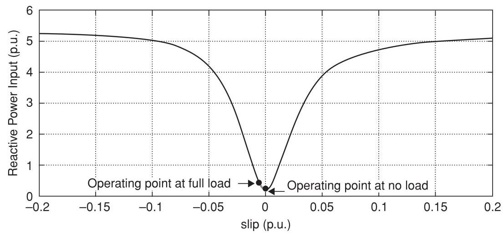

Figure 7.30 Variation of reactive power with slip for a 1 MW induction machine equipped with no-load power factor correction capacitors

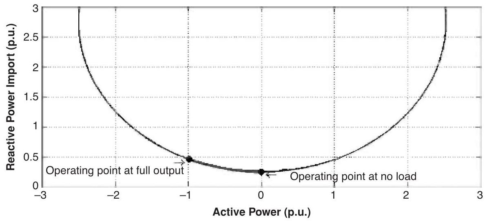

Figure 7.31 Circle diagram of 1 MW induction machine

Pulse Width Modulation control is used to introduce the external resistance progressively into the rotor circuit. The alteration of the torque-slip curve is shown in Figure 7.33. As more external resistance is added, the slope of the torque slip curve is reduced, for example to O-B. Below-rated operation along O-A is just like a fixed speed generator, but above rated the external resistor is varied continuously to maintain constant reaction torque, resulting in variable speed operation along A-B. Operation at point B, -2.8% slip (1542 rpm for a four-pole, ${50}\mathrm{\;{Hz}}$ generator) would result in losses of approximately ${28}\mathrm{\;{kW}}$ in a $1\mathrm{{MW}}$ generator. Increasing the rotor resistance ${R}_{r}$ still further gives a greater speed range but beyond about -10% slip it becomes more difficult to dissipate the heat caused by the losses.

As in the fixed speed case, power factor correction capacitors are used to reduce the reactive power requirement.

### 7.5.3 Variable speed operation

There are two main approaches to electrical variable-speed operation. Either all the output power of the wind turbine is passed through two back-to-back frequency converters to give a wide range of variable speed operation, or a restricted speed range is achieved by converting only that fraction of the output power flowing in the rotor of a wound rotor induction machine.

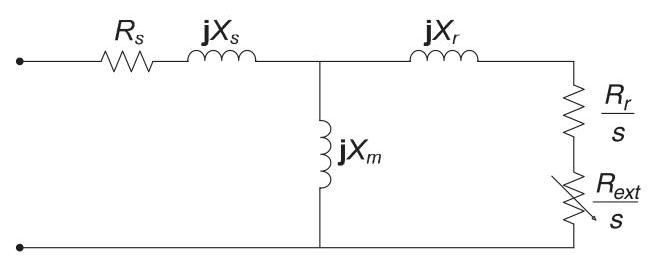

Figure 7.32 Steady state equivalent circuit of variable slip induction generator showing addition of external resistor ${R}_{\text{ ext }}$

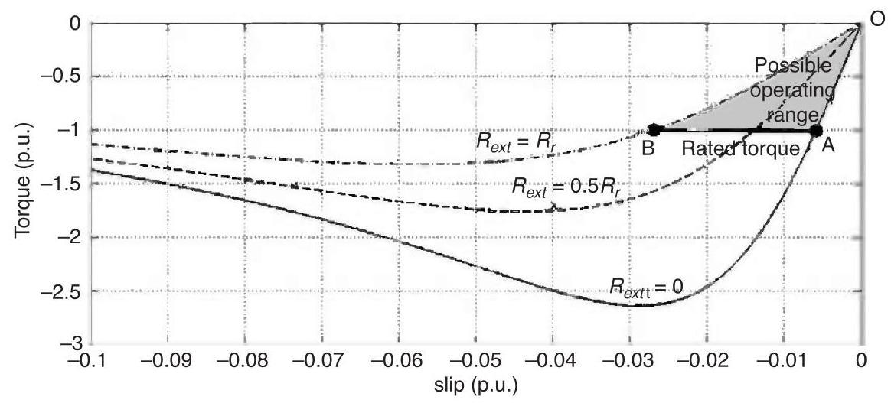

Figure 7.33 Effect of external resistance on the torque slip curve of an induction generator

In both cases, Graetz Bridge, voltage source converters are used with Insulated Gate Bipolar Transistors (IGBT) as the switching devices (Figure 7.34). The IGBTs are switched rapidly, typically at between $2 - 6\mathrm{{kHz}}$ with Pulse Width Modulation (PWM), to produce a close approximation to a sine wave voltage. Common techniques used to synthesize the sine wave voltage include carrier modulated (sine-triangular) PWM, hysteresis control and space vector modulation. All these modulation techniques produce quite similar results but space vector control is easier to implement in a digital control system. With rapid switching the voltage wave form approximates closely to a sine wave but at the expense of increased switching losses. The generator side converter rectifies all the power to DC, which is then inverted by the network side converter. Operation of this type of voltage source converter is described in Mohan, Undeland and Williams (1995) and Anaya Lara et al. (2009).

The IGBTs are switched to produce an approximation to a sine wave (Figure 7.35). Hence the fundamental function of the voltage source converters is as shown in Figure 7.36. Within their operating limits, the voltage source converters can create a voltage of any frequency, phase or magnitude. They can be used to interface to the 50 or ${60}\mathrm{\;{Hz}}$ power system as well as the variable speed generator. In addition they can be used to apply a voltage at the slip frequency of a wound rotor induction machine in the Doubly Fed Induction Generator.

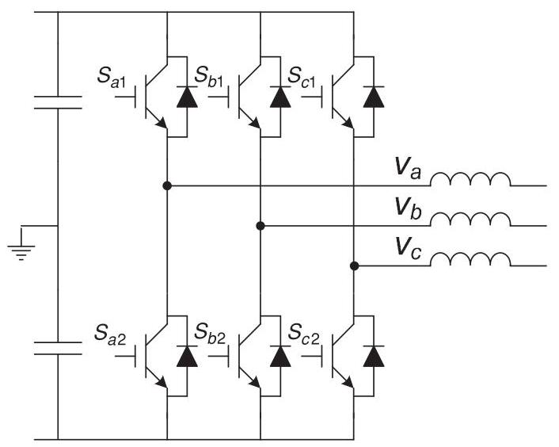

Figure 7.34 Voltage source converter

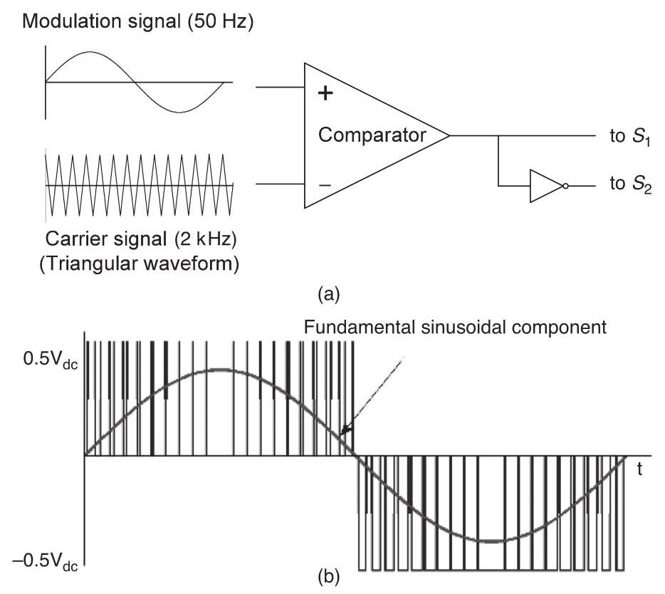

Figure 7.35 Carrier modulated (sine-triangular) Pulse Width Modulation (a) Sine-triangular modulation circuit (b) Pulse Width Modulation (PWM) output of sine-triangular modulation

### 7.5.4 Variable speed operation using a Doubly Fed Induction Generator (DFIG)

In a variable slip generator, a speed increase, of the wound rotor induction generator, is achieved by adding resistance into the rotor circuit using an external resistor. The power consumed in the external resistor is directly proportional to slip speed. Thus, a 10% speed increase leads to losses in the external resistor of approximately 10% of the generator stator output power.

These additional losses do not compromise energy production because they occur only above rated, where surplus wind energy is being discarded anyway. However, this high level of losses is undesirable in large wind turbines because of the high cooling requirement to dispose of the resulting heat. Hence a development of the variable slip system has been to replace the external controlled resistance with a pair of back-to-back voltage source converters. These apply a variable voltage (and hence inject current) at the rotor slip frequency and so allow operation above and below the synchronous speed of the stator field. The synchronous speed of the stator field is determined by the network frequency and number of poles of the stator winding (e.g. 1500 rpm for a four-pole winding on a ${50}\mathrm{\;{Hz}}$ system) and a $\pm  {30}\%$ speed variation around this will require the power rating of rotor circuit converters to be approximately 30% of rated power.

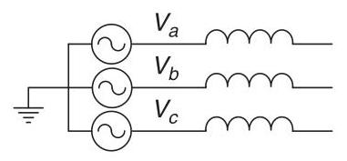

Figure 7.36 Ideal voltage sources from voltage source converters

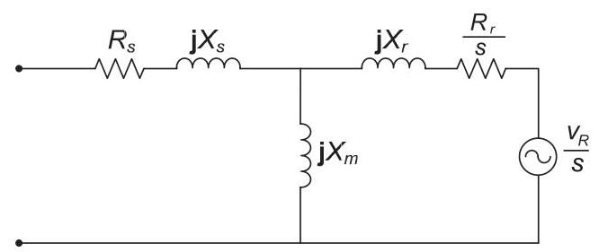

Figure 7.37 Steady state equivalent circuit of the DFIG

The steady state equivalent circuit of the DFIG is shown in Figure 7.37. The external resistor of the variable slip generator is replaced by a voltage source. This applies a voltage to the slip rings of the wound rotor at slip frequency. The equivalent circuit has the rotor circuit referred to the stator and so the injected rotor voltage is divided by slip in the equivalent circuit.

The effect of injecting a voltage into the rotor is shown in Figure 7.38. The applied rotor voltages are quite small because, as shown in the equivalent circuit, the rotor voltage is divided by the slip.

Thus, with rated applied torque (-1 per unit), the speed may be varied by adjusting the injected voltage into the rotor circuit. Point B gives super-synchronous operation with power flowing out of the generator rotor. Point A gives sub-synchronous operation with power flowing into the generator rotor.

These power flows are shown in Figure 7.39.

The power relationships of the DFIG illustrate how the power flows in the rotor circuit vary with slip.

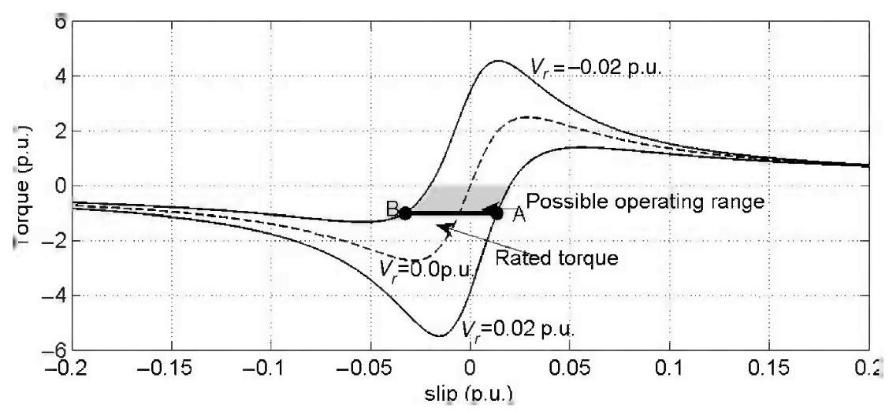

Figure 7.38 Steady-state torque slip curves of a DFIG

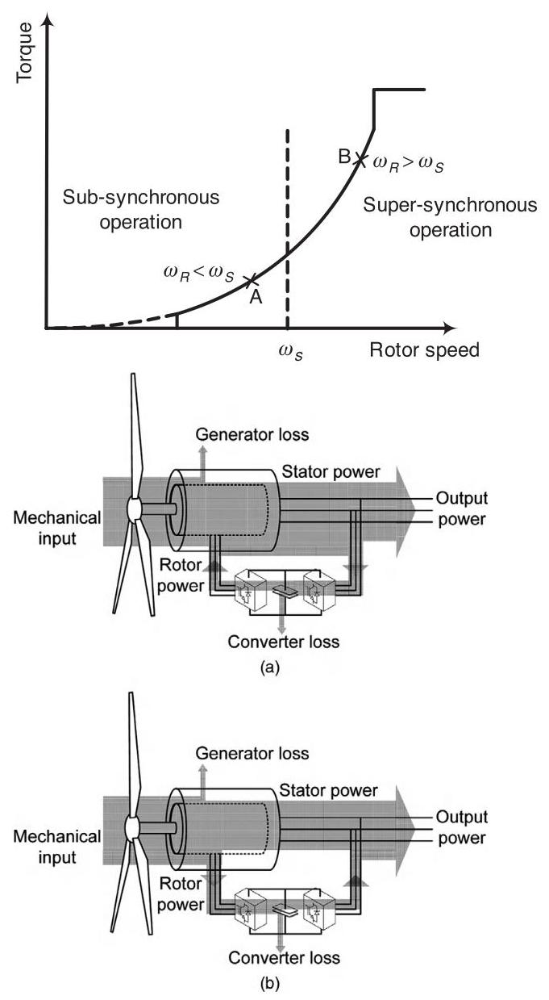

Figure 7.39 Power flows in a DFIG (a) Sub-synchronous operation (b) Super-synchronous operation

If the stator and rotor generator losses are neglected, the power transferred across the air gap of the generator is the same as the power in the stator. This is the mechanical input power minus the power flowing in the rotor circuit.

$$
{P}_{\text{ air } - \text{ gap }} = {P}_{\text{ stator }} = {P}_{\text{ mech }} - {P}_{\text{ rotor }}
$$

$$
T{\omega }_{s} = T{\omega }_{r} - {P}_{\text{ rotor }}
$$

$$
{P}_{\text{ rotor }} =  - T\left( {{\omega }_{s} - {\omega }_{r}}\right)
$$

$$
=  - {Ts}{\omega }_{s} =  - s{P}_{\text{ air } - \text{ gap }}
$$

$$
=  - s{P}_{\text{ stator }}
$$

where $T$ is torque on the generator shaft, ${\omega }_{s}$ is synchronous speed and ${\omega }_{r}$ is rotor speed, s: slip.

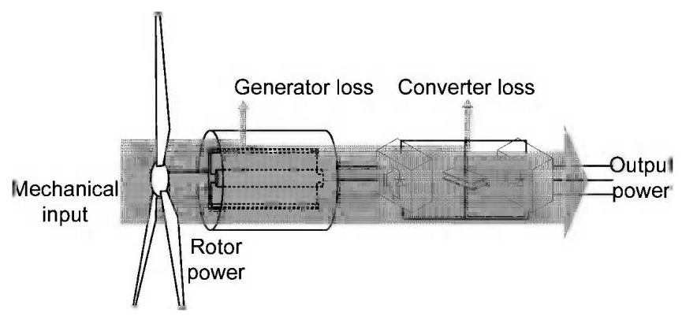

Figure 7.40 Power flows in a Full Power Converter

Thus, for a negative slip (super-synchronous operation) power flows out of the generator rotor while for positive slip (sub-synchronous operation) power flows into the generator rotor.

This 'doubly fed' concept was used in early large prototype wind turbines, for example, the 3 MW Growian constructed in Germany in the early 1980s and the Boeing MOD 5B in the USA at the same time. Then, cyclo-converters were used to change the frequency of the rotor circuit, but modern practice is to use two back-to-back voltage source converters. Control techniques vary but one approach is to use vector control techniques on the machine side converter to adjust torque and the excitation of the generator independently. The network side bridge maintains the voltage of the DC link (Pena, Clare and Asher, 1996; Muller et al., 2002).

### 7.5.5 Variable speed operation using a Full Power Converter

Figure 7.40 shows the power flows in a full power converter, variable-speed generation system. All the power from the generator is rectified to DC and then inverted to the network voltage. This arrangement can be used with a range of generators. Induction generators with a gearbox mechanical transmission may be used in a configuration that is the inverse of the variable speed drives used for large mechanical loads, for example, pumps and fans. Wound rotor or permanent magnet synchronous generators may be used, either with a high speed generator coupled to the aerodynamic rotor through a gearbox, or with a slow speed multi-pole direct drive generator which avoids the need for a gearbox.

Early broad range variable-speed wind turbines used a diode rectifier bridge in the generator converter and a naturally commutated, thyristor, current source, converter on the network side (Freris, 1990). However, naturally commutated thyristor converters always consume reactive power and generate considerable characteristic harmonic currents. On weak distribution systems it is difficult to provide suitable filtering and power factor correction for this type of equipment.

Hence modern practice is to use two voltage source converters (Heier, 2006) in a manner similar to the arrangement of the rotor circuit of the DFIG although all the equipment must be rated at the full power of the wind turbine. The generator converter rectifies all the power to DC, which is then inverted by the network converter.

Control strategies vary but one approach is to use the two degrees of freedom of the generator converter output (magnitude and angle of the output voltage, or direct and quadrature axis voltages) to control the torque and excitation of the generator. Vector control is used to control the torque to a set-point obtained from the optimal wind turbine speed characteristic (Figure 6.14, Chapter 6) while the reactive power flow is used to supply excitation. The network converter then maintains the DC link voltage and exchanges reactive power with the network.

An alternative is to control the generator converter to maintain the DC link voltage at a constant value and then use the network converter to control the power flowing out of the system and hence the torque on the generator (Jones and Smith, 1993). A power bandwidth of 200-500 radians/s is quoted in this paper indicating the very fast control possible with such equipment with an overall efficiency of 92.1% consisting of 95.9% for the generator and 96% for the power electronics. The network side converter may be arranged to operate at any power factor within the rating of the equipment with very low harmonic distortion.

## 7.6 Mechanical brake

### 7.6.1 Brake duty

As indicated in Section 6.8.3, Chapter 6, a mechanical brake can be called on to fulfil a variety of roles, according to the braking philosophy adopted for the machine in question. The minimum requirement is for the mechanical brake to act as a parking brake, so that the machine can be stopped for maintenance purposes. The brake will also be used to bring the rotor to a standstill during high wind shutdowns for the majority of machine designs, and during low speed shutdowns as well in some cases. Aerodynamic braking is used to decelerate the rotor initially, so the mechanical brake torque can be quite low. However, IEC 61400-1 requires that the mechanical brake be capable of bringing the rotor to a complete stop from a hazardous idling state in any wind speed less than the one year return period three second gust (see Table 5.1).

If the mechanical brake is required to arrest the rotor in the event of a complete failure of the aerodynamic braking system, then there are two deployment options to consider. Either the mechanical brake can be actuated when an overspeed resulting from the failure of the aerodynamic system is detected, or actuated simultaneously with the aerodynamic brake as part of the standard emergency shut-down procedure. The advantage of the former strategy is that the mechanical brake will rarely, if ever, have to be deployed in this way, so that some pad or even disc damage can be tolerated when deployment actually occurs. In addition, fatigue loading of the gearbox will be reduced if the brake is mounted on the high speed shaft. On the other hand, if the mechanical brake is actuated before significant overspeed has developed, then the aerodynamic torque to be overcome by the mechanical brake in the event of aerodynamic braking failure will be less.

The most severe emergency braking case will arise following a grid loss during generation in winds above rated. In the case of pitch-regulated machines, the maximum overspeed will occur after grid loss at rated wind speed because the rate of change of aerodynamic torque with rotational speed decreases and soon becomes negative at higher wind speeds. Conversely, if the pitch mechanism should jam, the braking duty becomes more severe at wind speeds at or above cut-out, because much higher aerodynamic torques are developed as the rotor slows down and the angle of attack increases. For stall-regulated machines the critical wind speed is generally at an intermediate value between rated and cut-out.

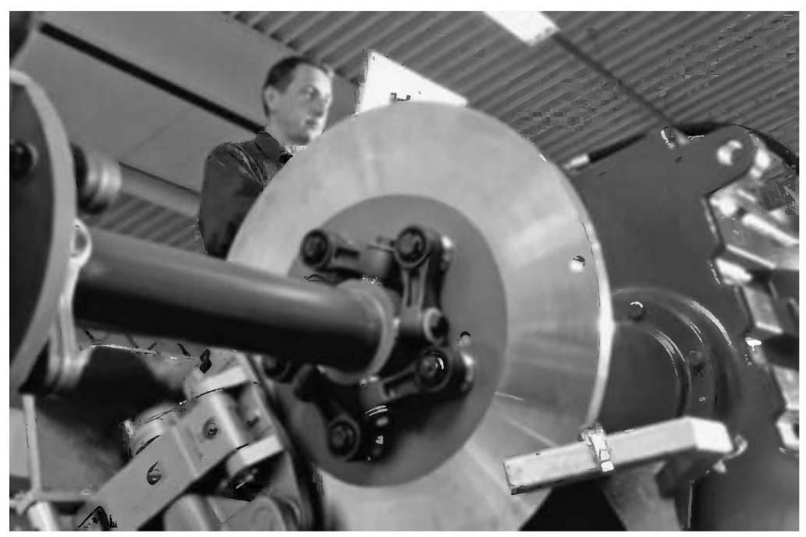

Figure 7.41 High-speed shaft brake disc and calliper. Reproduced by permission of NEG-Micon

### 7.6.2 Factors governing brake design

The braking torque provided by callipers gripping a disc brake (Figure 7.41) is simply the product of twice the calliper force, the coefficient of friction (typically 0.4), the number of callipers and the effective pad radius. Callipers providing clamping forces of up to ${500}\mathrm{{KN}}$ are available. However the brake design is also limited by:

- Centrifugal stresses in the disc.

- Pad rubbing speed.

- Power dissipation per unit area of pad.

- Disc temperature rise.

The nature of these constraints is described below.

The critical stress generated by centrifugal stresses is in the tangential direction at the inner radius of the brake disc, but it is governed principally by the disc rim speed according to the following formula:

$$
{\sigma }_{\theta }\left( a\right)  = \frac{3 + v}{4}\rho {\omega }^{2}{b}^{2}\left( {1 + \frac{1 - v}{3 + v}\frac{{a}^{2}}{{b}^{2}}}\right) \tag{7.58}
$$

where $a$ and $b$ are the inner and outer disc radii respectively and $\omega$ is the disc rotational speed. One brake manufacturer, Twiflex, quotes a maximum safe disc rim speeds of around ${90}\mathrm{\;m}/\mathrm{s}$ for their discs manufactured in spheroidal graphite cast iron.

Brake pads are generally made from sintered metal or a cheaper, resin based material. The former can accept rubbing speeds of up to ${100}\mathrm{\;m}/\mathrm{s}$ , but some manufacturers quote permitted rubbing speeds for the latter of only about ${30}\mathrm{\;m}/\mathrm{s}$ . However, Wilson (1990) reports satisfactory performance of resin based pads at a rubbing speed of up to ${105}\mathrm{\;m}/\mathrm{s}$ if the power dissipation rate per unit area, $Q$ , is kept low enough. The criterion, ascribed to Ferodo, is that $Q = {\mu PV} \leq  {11.6}\mathrm{{MW}}/{\mathrm{m}}^{2}$ , where $\mu$ is the coefficient of friction, $P$ is the brake pad pressure in ${KN}/{\mathrm{m}}^{2}$ and $V$ is the rubbing speed in $\mathrm{m}/\mathrm{s}$ . This requires the pad pressure to be reduced to ${275}\mathrm{{KN}}/{\mathrm{m}}^{2}$ , assuming a friction coefficient of 0.4 .

During braking the kinetic energy of the rotor and drive train together with the additional energy fed in by the aerodynamic torque are dissipated in the brake disc and pads as heat, resulting in rapid initial temperature rise near the surface of the brake disc. The rate of energy dissipation is equal to the product of the braking torque and the disc rotational speed, so in the latter stages of braking the rate of energy dissipation cannot sustain the high surface temperatures and they begin to fall again.

The coefficient of friction for pads of resin based materials is sensibly constant at a level of about 0.4 at temperatures up to ${250}^{ \circ  }\mathrm{C}$ , but begins to drop thereafter, reaching 0.25 at ${400}^{ \circ  }\mathrm{C}$ . Although in theory the brake can be designed to reach the latter temperature, in practice the varying torque complicates the calculations and leaves little margin of error against a runaway loss of brake torque. Accordingly ${300}^{ \circ  }\mathrm{C}$ is often taken as the upper temperature limit for resin based pads.

Sintered metal pads have a constant coefficient of friction of about 0.4 up to a temperature of at least ${400}^{ \circ  }\mathrm{C}$ , but manufacturers indicate that the material can perform satisfactorily at temperatures up to ${600}^{ \circ  }\mathrm{C}$ on a routine basis, or up to ${850}^{ \circ  }\mathrm{C}$ intermittently. Wilson (1990) reports a reduced friction coefficient of 0.33 at ${750}^{ \circ  }\mathrm{C}$ . Such temperatures cannot be realised in practice because the temperature of the disc itself is limited to ${600}^{ \circ  }\mathrm{C}$ in the case of spheroidal graphite cast iron or to a much smaller value in the case of steel (op cit).

Clearly the use of the more expensive sintered brake pads allows the brake disc to absorb much more energy. However, the sintered metal is a much more effective conductor of heat than resin based material, so it is often necessary to incorporate heat insulation into the calliper design to prevent overheating of the oil in the hydraulic cylinder.

A method of calculating brake disc temperature rise is given in the next section.

### 7.6.3 Calculation of brake disc temperature rise

The build up in temperature across the width of a brake disc over the duration of the stop can be calculated quite easily if a number of assumptions are made. Firstly, the heat generated is assumed to be fed into the disc at a uniform intensity over the areas swept out by the brake pads as the disc rotates. This is a reasonable approximation for a high speed shaft mounted brake and for a low speed shaft mounted brake with several callipers until rotation has almost ceased, but the energy input by this stage is much lower. Within the disc heat flow is assumed to be perpendicular to the disc faces only - that is, radial flows are ignored.

Consider a brake disc slice at a distance $x$ from the nearest braking surface, of thickness ${\Delta x}$ and cross sectional area $A$ . The rate of heat flow away from the nearest braking surface entering the slice is, $\dot{Q} =  - {kA}\left( {{d\theta }/{dx}}\right)$ (where $\theta$ is the temperature and $k$ the thermal conductivity) and the rate of heat flow leaving it on the far side is $\dot{Q} + d\dot{Q}/{dx}$ . The temperature rise of an element of thickness ${\Delta x}$ over a time interval ${\Delta t}$ is given by:

$$
{\Delta \theta } \cdot  A \cdot  {\Delta x\rho }{C}_{p} = {\Delta Q} =  - \frac{d\dot{Q}}{dx}{\Delta x\Delta t} = {kA}\frac{{d}^{2}\theta }{d{x}^{2}}{\Delta x\Delta t}
$$

where $\rho$ is the density and ${C}_{p}$ is the specific heat, so that:

$$
\frac{d\theta }{dt} = \frac{k}{\rho {C}_{p}}\frac{{d}^{2}\theta }{d{x}^{2}} \tag{7.59}
$$

Adopting a finite element approach, Equation 7.59 can be written:

$$
\theta \left( {x, t + {\Delta t}}\right)  = \theta \left( {x, t}\right)  + \frac{k}{\rho {C}_{p}}\frac{\Delta t}{{\left( \Delta x\right) }^{2}}\left\lbrack  {\theta \left( {x + {\Delta x}, t}\right)  + \theta \left( {x - {\Delta x}, t}\right)  - {2\theta }\left( {x, t}\right) }\right\rbrack \tag{7.60}
$$

Substituting values of $k = {36}\mathrm{\;W}/\mathrm{m}$ per ${}^{ \circ  }\mathrm{K},{C}_{p} = {502}\mathrm{\;J}/\mathrm{{kg}}$ per ${}^{ \circ  }\mathrm{K}$ and $\rho  = {7085}\mathrm{\;{kg}}/{\mathrm{m}}^{3}$ for Grade 450 spheroidal graphite cast iron yields a value for the thermal diffusivity $\alpha  = k/\left( {\rho {C}_{p}}\right)$ of ${1.01} \times  {10}^{-5}{\mathrm{\;m}}^{2}/\mathrm{s}$ . If the time increment, ${\Delta t}$ , is selected at 0.025 seconds and the element thickness is taken as ${1.005}\mathrm{\;{mm}}$ , then Equation 7.60 simplifies to

$$
\theta \left( {x, t + {\Delta t}}\right)  = \theta \left( {x, t}\right)  + {0.25}\left\lbrack  {\theta \left( {x + {\Delta x}, t}\right)  + \theta \left( {x - {\Delta x}, t}\right)  - {2\theta }\left( {x, t}\right) }\right\rbrack \tag{7.61}
$$

This equation can be used to calculate the temperature distribution across the brake disc, starting with a uniform distribution and imposing suitable increments at the braking surfaces at the boundaries. The behaviour at the boundaries is simpler to follow through if they are treated as planes of symmetry like the disc mid-plane, with imagined discs flanking the real one. The temperature increment at the boundary at each time step, which is added to that calculated from Equation 7.61, is given by:

$$
\Delta {\theta }_{0} = \frac{{2T\omega }\left( t\right) {\Delta t}}{{\Delta x\rho }{C}_{p}S} \tag{7.62}
$$

where $T$ is the braking torque (assumed constant), $\omega \left( t\right)$ is the disc rotational speed at time $t$ , and $S$ is the area swept out by the brake pad (or pads) on one side of the disc. For a disc diameter $D$ and pad width $w, S$ is $\pi \left( {D - w}\right) w$ . The factor 2 is required because heat is assumed to flow into the imagined disc as well as into the real one. Hence the initial temperature build up can be calculated as illustrated in Table 7.5, taking an arbitrary value of $\Delta {\theta }_{0}$ of ${40}^{ \circ  }\mathrm{C}$ . (The gradual reduction in $\Delta {\theta }_{0}$ over time due to deceleration is ignored here for simplicity.)

The brake disc surface temperature rise is found to be a minimum when the ratio of the braking torque to the maximum aerodynamic torque is about 1.6. As the ratio is reduced below this value, the extended stopping time results in more energy being abstracted from the wind, so temperatures begin to rise rapidly. On the other hand the maximum brake temperature is relatively insensitive to increases in the ratio above 1.6. The variation in maximum brake disc surface temperature with braking torque is illustrated for the emergency braking of a stall regulated machine following an overspeed in Figure 7.42, where the continuous line gives the surface temperature rise calculated by the finite element method outlined above.

Table 7.5 Illustrative example of calculation of brake disc temperature rise using finite element model

<table><tr><td rowspan="2">Time step</td><td rowspan="2">Time (sec)</td><td>Element</td><td>0</td><td>1</td><td>2</td><td>3</td><td>4</td><td>5</td></tr><tr><td>Distance from braking surface (mm)</td><td>0</td><td>1.0</td><td>2.0</td><td>3.0</td><td>4.0</td><td>5.0</td></tr><tr><td rowspan="3">1</td><td rowspan="2"></td><td>Initial temperature</td><td>0</td><td>0</td><td>0</td><td>0</td><td>0</td><td>0</td></tr><tr><td>Boundary temperature increment</td><td>40</td><td></td><td></td><td></td><td></td><td></td></tr><tr><td rowspan="3">0.025</td><td>Temperature at end of time step</td><td>20</td><td>10</td><td>0</td><td>0</td><td>0</td><td>0</td></tr><tr><td rowspan="3">2</td><td>Boundary temperature increment</td><td>40</td><td></td><td></td><td></td><td></td><td></td></tr><tr><td>Sum</td><td>60</td><td>10</td><td>0</td><td>0</td><td>0</td><td>0</td></tr><tr><td rowspan="3">0.05</td><td>Temperature at end of time step</td><td>35</td><td>20</td><td>2.5</td><td>0</td><td>0</td><td>0</td></tr><tr><td rowspan="3">3</td><td>Boundary temperature increment</td><td>40</td><td></td><td></td><td></td><td></td><td></td></tr><tr><td>Sum</td><td>75</td><td>20</td><td>2.5</td><td>0</td><td>0</td><td>0</td></tr><tr><td rowspan="3">0.075</td><td>Temperature at end of time step</td><td>47.5</td><td>29.4</td><td>6.3</td><td>0.6</td><td>0</td><td>0</td></tr><tr><td rowspan="3">4</td><td>Boundary temperature increment</td><td>40</td><td></td><td></td><td></td><td></td><td></td></tr><tr><td>Sum</td><td>87.5</td><td>29.4</td><td>6.3</td><td>0.6</td><td>0</td><td>0</td></tr><tr><td>0.1</td><td>Temperature at end of time step</td><td>58.5</td><td>38.2</td><td>10.6</td><td>1.9</td><td>0.1</td><td>0</td></tr></table>

It transpires that the maximum temperature rise can be estimated quite accurately by the following empirical formula:

$$
{\theta }_{\max } - {\theta }_{0} = \frac{E}{\sqrt{t}}\frac{1}{{64600w}\left( {D - w}\right) } = \frac{E}{\sqrt{t}}\frac{\pi }{64600S} \tag{7.63}
$$

where $E$ is the total energy dissipated in Joules, $t$ is the duration of the stop in seconds and $S$ is the area of the disc surfaces swept by the brake pads. The temperature derived using this formula is plotted as a dotted line in Figure 7.42 for comparison.

### 7.6.4 High speed shaft brake design

A key parameter to be chosen in brake design is the design braking torque. The coefficient of friction can vary substantially above and below the design value due to such factors as bedding in of the brake pads and contamination, so the design braking torque calculated on the nominal friction value must be increased by a suitable materials factor. The 1993 edition of the Germanischer Lloyd 'Regulation for the certification of Wind Energy Conversion Systems' specified a materials factor of 1.2 for the coefficient of friction, and added in another factor of 1.1 for possible loss of calliper spring force. If these factors are adopted, the minimum design braking moment is 1.78 times the maximum aerodynamic torque, after including the aerodynamic load factor of 1.35. A small additional margin of, say, 5% should be added to ensure that the rotor is still brought to rest without a very large temperature rise should the 1.78 safety factor be completely eroded.

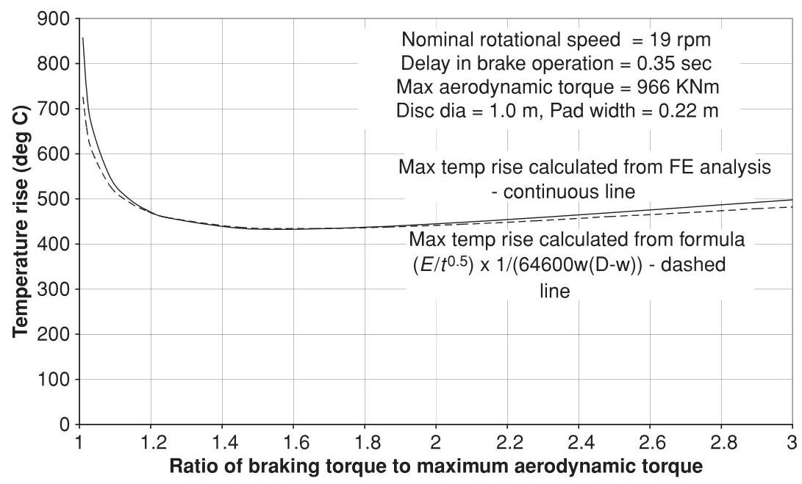

Figure 7.42 Brake disc surface maximum temperature rise for emergency braking of ${60}\mathrm{\;m}$ diameter,1.3 MW stall regulated turbine from ${10}\%$ overspeed in ${20}\mathrm{\;m}/\mathrm{s}$ wind with HSS brake acting alone

The procedure to be followed for the design of a brake on the high speed shaft (HSS) can conveniently be illustrated by an example.

## Example 7.1

Design a HSS brake for a ${60}\mathrm{\;m}$ diameter, ${1.3}\mathrm{{MW}}$ stall-regulated machine capable of shutting the machine down in a ${20}\mathrm{\;m}/\mathrm{s}$ wind from a ${10}\%$ overspeed occurring after a grid loss, with or without assistance from the aerodynamic braking system. The nominal LSS and HSS rotational speeds are 19 rpm and 1500 rpm respectively, ignoring generator slip. Assume that the brake application delay time is 0.35 seconds, and that the inertia of the turbine rotor, drive train, brake disc and generator rotor - all referred to the low speed shaft - totals ${2873}{\mathrm{{Tm}}}^{2}$ .

a) Derivation of the brake design torque: The peak aerodynamic torque occurs when the maximum rotational speed is reached just prior to brake application. The first step is to determine the relationship between rotational speed and aerodynamic torque for the stated wind speed of ${20}\mathrm{\;m}/\mathrm{s}$ . From this the acceleration of the rotor and build-up of aerodynamic torque during the 0.35 seconds delay before the brake comes on can be determined. The speed increase in this case is $1\mathrm{{rpm}}$ , giving a maximum rotor speed of ${19} \times  {1.1} + 1 = {21.9}\mathrm{{rpm}}$ and peak aerodynamic torque of ${966}\mathrm{{KNm}}$ . Hence the brake design torque is ${966} \times  {1.78} \times \; {1.05} = {1800}\mathrm{{KNm}}$ referred to the low speed shaft, or ${1800} \times  {19}/{1500} = {22.8}\mathrm{{KNm}}$ at the brake.

b) Brake disc diameter selection: The maximum rotor speed corresponds to a high speed shaft speed of ${21.9} \times  \left( {{1500}/{19}}\right)  = {1729}\mathrm{{rpm}} = {181}\mathrm{{rad}}/\mathrm{{sec}}$ , so the maximum permissible brake disc radius as regards centrifugal stresses is about ${90}/{181} = {0.497}\mathrm{\;m}$ . It is advisable to choose the largest permitted size in order to minimise temperature rise, so ${1.0}\mathrm{\;m}$ diameter is selected in this case. The pad rubbing speed will be quite acceptable if sintered pads are used.

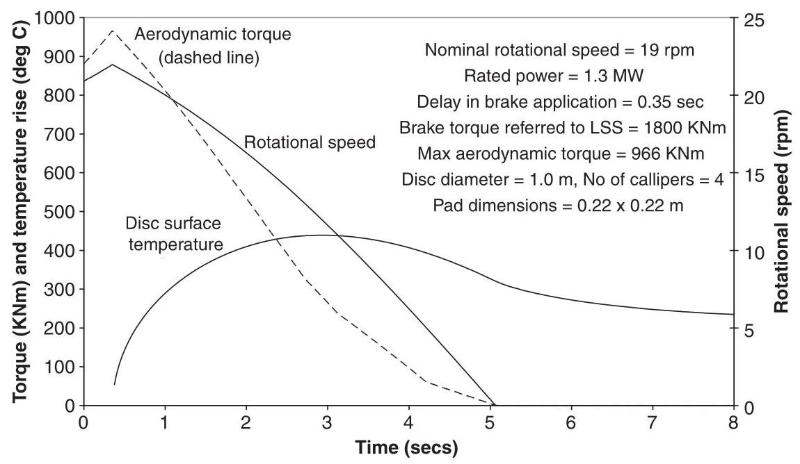

Figure 7.43 Emergency braking of stall regulated ${60}\mathrm{\;m}$ diameter turbine from ${10}\%$ overspeed in ${20}\mathrm{\;m}/\mathrm{s}$ wind with HSS mechanical brake acting alone

c) Selection of number and size of brake pads: The total brake pad area is governed by the need to keep the maximum power dissipation per unit pad area below ${11.6}\mathrm{{MW}}/{\mathrm{m}}^{2}$ . The power dissipation is equal to the product of the braking torque and the rotational speed, so it is at a maximum at the onset of braking - that is, ${22.8} \times  {181} = {4128}\mathrm{\;{kW}}$ , giving a required total area of the brake pads of ${4128}/{11600} = {0.356}{\mathrm{\;m}}^{2}$ . This area can be provided by four callipers fitted with ${0.22} \times  {0.22}\mathrm{\;m}$ pads, giving ${0.387}{\mathrm{\;m}}^{2}$ in all.

d) Maximum brake disc temperature check: The variation in disc surface temperature over the duration of the stop can be calculated using the finite element method outlined in the preceding section. The resulting variation in this case is plotted in Figure 7.43. The surface temperature reaches a maximum of ${440}^{ \circ  }\mathrm{C}$ , just after halfway through the stop, which lasts 4.7 seconds from the time the brake comes on. This temperature is well below the limit for sintered pads.

e) Calliper force: The braking friction force required is ${58.5}\mathrm{{KN}}$ , calculated from the torque divided by the effective pad radius of ${0.39}\mathrm{\;m}$ . Hence the required calliper force is ${58.5}/\left( {8 \times  {0.4}}\right)  = {18.3}\mathrm{{KN}}$ which is rather low for a calliper sized for a ${0.22} \times  {0.22}\mathrm{\;m}$ brake pad.

The design process outlined above results in an excessive number of lightly loaded callipers, because of the limitation on power dissipation per unit area. If the relative infrequency of emergency braking events allowed this limitation to be relaxed, then a more economic solution would result.

### 7.6.5 Two level braking

During normal as opposed to emergency shut-downs, the rotor is decelerated to a much lower speed by aerodynamic braking before the brake is applied, so the brake torque required is much reduced. In view of the benefit of reduced loads on the braking system, and on the gearbox in particular, some manufacturers arrange for a reduced braking torque for normal shut-downs. This is achieved on the usual 'spring applied, hydraulically released' brake callipers by allowing oil to discharge from the hydraulic cylinder via a pressure relief valve when the brake is applied, so that the hydraulic pressure drops to a reduced level. After the rotor has come to rest, the remaining hydraulic pressure can be released, so that the brake torque rises to the full level.

### 7.6.6 Low speed shaft brake design

The procedure for designing a low speed shaft disc brake is much simpler than that for the high speed shaft brake, because the limits on disc rim speed, pad rubbing speed, power dissipation per unit area and temperature rise do not influence the design, which is solely torque driven. The large braking torque required means that a brake placed on the low speed shaft will be much bulkier than one with the same duty placed on the low speed shaft. For example, the design LSS braking torque of ${1800}\mathrm{{KNm}}$ from the example above would require a ${1.8}\mathrm{\;m}$ diameter disc fitted with seven callipers.

A study by Corbet et al. (1993), which investigated a range of machine diameters, concluded that the brake cost would double or treble if the brake were placed on the low speed shaft rather than on the high speed shaft. However, when the extra gearbox costs associated with a high speed brake were taken into account, the cost advantage of the high speed shaft brake disappeared.

## 7.7 Nacelle bedplate

The functions of the nacelle bedplate are to transfer the rotor loadings to the yaw bearing and to provide mountings for the gearbox and generator. Normally it is a separate entity, although in machines with an integrated gearbox, the gearbox casing and the nacelle bedplate could, in principle, be a single unit. The bedplate can either be a welded fabrication consisting of longitudinal and transverse beam members or a casting sculpted to fit the desired load paths more precisely. One fairly common arrangement is a casting in the form of an inverted frustum which supports the low speed shaft main bearing at the front and the port and starboard gearbox supports towards the rear, with the generator mounted on a fabricated platform projecting to the rear and attached to the main casting by bolts.

Although conventional methods of analysis can be used to design the bed plate for extreme loads, the complicated shape renders a finite element analysis essential for calculating the stress concentration effects needed for fatigue design. Fatigue analysis is complicated by the need to take into account up to six rotor load components. However, given stress distributions for each load component obtained by separate FE analyses, the stress time history at any point can be obtained by combining appropriately scaled load component time histories previously obtained from a load case simulation.

## 7.8 Yaw drive

The yaw drive is the name given to the mechanism used to rotate the nacelle with respect to the tower on its slewing bearing, in order to keep the turbine facing into the wind and to unwind the power and other cables when they become excessively twisted. It usually consists of one or more electric or hydraulic motors mounted on the nacelle each of which drives a pinion mounted on a vertical shaft via a reducing gearbox. The pinion engages with gear teeth on the fixed slewing ring bolted to the tower, as shown in Figure 7.44. These gear teeth can either be on the inside or the outside of the tower, depending on the bearing arrangement, but they are generally located on the outside on smaller machines so that the gear does not present a safety hazard in the restricted space available for personnel access.

The yaw moments on rigid hub machines arise from differential loading on the blades, which may be broken down into deterministic and stochastic components. On a three bladed machine, the dominant cyclic yaw loading is at 3P, but it is generated by 2P blade loading, as is demonstrated below. Defining blade out-of-plane root bending moments containing harmonics of the rotational frequency, $\omega /{2\pi }$ , as follows:

$$
{M}_{Yj} = \mathop{\sum }\limits_{n}{a}_{n}\sin \left( {n\left\{  {{\omega t} + \frac{{2\pi }\left( {j - 1}\right) }{3}}\right\}   + {\phi }_{n}}\right) \tag{7.64}
$$

Hence, the yaw moment from all three blades is given by

$$
{M}_{ZT} = \sin {\omega t}\mathop{\sum }\limits_{n}{a}_{n}\sin \left( {{n\omega t} + {\phi }_{n}}\right)  + \sin \left( {{\omega t} + \frac{2\pi }{3}}\right) \mathop{\sum }\limits_{n}{a}_{n}\sin \left( {n\left\{  {{\omega t} + \frac{2\pi }{3}}\right\}   + {\phi }_{n}}\right)
$$

$$
+ \sin \left( {{\omega t} - \frac{2\pi }{3}}\right) \mathop{\sum }\limits_{n}{a}_{n}\sin \left( {n\left\{  {{\omega t} - \frac{2\pi }{3}}\right\}   + {\phi }_{n}}\right) \tag{7.65}
$$

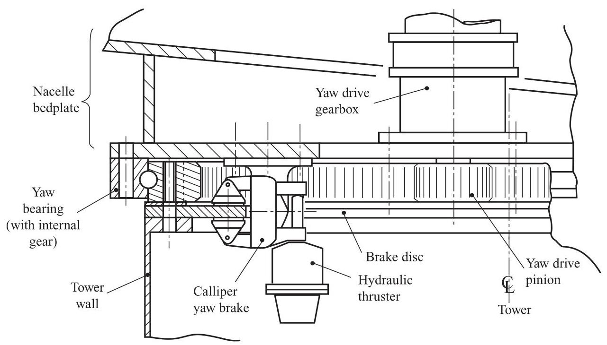

Figure 7.44 Typical arrangement of yaw bearing, yaw drive and yaw brake

that is,

$$
{M}_{ZT} = \mathop{\sum }\limits_{n}{a}_{n}\left\lbrack  {\sin {\omega t}\sin \left( {{n\omega t} + {\phi }_{n}}\right) \left\{  {1 - \cos \frac{2\pi n}{3}}\right\}   + \sqrt{3}\cos {\omega t}\cos \left( {{n\omega t} + {\phi }_{n}}\right) \sin \frac{2\pi n}{3}}\right\rbrack
$$

(7.66)

For the first four harmonics this gives:

$$
{M}_{ZT} = {1.5}\left\{  {{a}_{1}\cos {\phi }_{1} - {a}_{2}\cos \left( {{3\omega t} + {\phi }_{2}}\right)  + {a}_{4}\cos \left( {{3\omega t} + {\phi }_{4}}\right) }\right\} \tag{7.67}
$$

Thus, it is seen that the blade out-of-plane bending harmonics at 2P and 4P produce yaw moment at 3P, while those at 1P and 3P produce steady and zero yaw moments respectively.

As turbine size increases, the turbine diameter becomes larger in relation to gust dimensions, and the scope for differential loading on the blades due to turbulence increases. The expression for the standard deviation of the stochastic yawing moment on a three-bladed machine is the same as that for the shaft moment standard deviation - see Equation 5.119.

Anderson et al. (1993) investigated yaw moments on two sizes of Howden three-bladed turbines - (33 m diameter, ${330}\mathrm{\;{kW}}$ and ${55}\mathrm{\;m}$ diameter $1\mathrm{{MW}}$ ) and concluded that the major source of cyclic yaw loading is stochastic at 3P. Yaw error, on the other hand, was not found to make a significant contribution. Given that yaw error results in a blade out-of-plane load fluctuation at rotational frequency, this result is in accordance with Equation 7.67.

Several different strategies have been evolved for dealing with the large cyclic yaw moments that arise on rigid hub machines due to turbulence, as follows.

1. Fixed yaw: A yaw brake is provided in the form of one or more callipers acting on an annular brake disc and is designed to prevent unwanted yaw motion under all circumstances. See Figure 7.44. This can require 6 callipers on a ${60}\mathrm{\;m}$ diameter machine. During yawing, the yaw motors drive against the brake callipers, which are partly released, so that the motion is smooth.

2. Friction damped yaw: Yaw motion is damped by friction in one of three different ways. In the first, the nacelle is supported on friction pads resting on a horizontal annular surface on the top of the tower. The yaw drive has to work against the friction pads, which also allow slippage under extreme yaw loads. This system was employed on the 500 kW Vestas V39 and the 3 MW WEG LS1.

In the second, the nacelle is mounted on a conventional rolling element slewing bearing, and the friction is provided by a permanently applied brake, using the same configuration as for fixed yaw. Optionally, the pressure on the brake pads can be increased when the machine is shutdown for high winds.

In the third, the nacelle is supported on a three row roller type slewing bearing (see Figure 7.21(d)), but with the rollers replaced by pads of elastomer composite to generate friction.

3. Soft yaw: This is hydraulically damped fixed yaw. The oil lines to each side of the hydraulic yaw motor are each connected to an accumulator via a choke valve, allowing limited damped motion to and fro to alleviate sudden yaw loads. This system is used on the ${300}\mathrm{{kW}}$ WEG MS3, which has a two bladed, teetered rotor, but experiences significant yaw loads when teeter impacts occur.

4. Damped free yaw: A hydraulic yaw motor is used as before, but the oil lines to each side of the motor are connected together in a loop via a check valve, rather than being connected to a hydraulic power pack. This arrangement prevents sudden yaw movements in response to gusts, but depends on yaw stability over the full range of wind speeds. Unfortunately, yaw stability in high winds is rare.

5. Controlled free yaw: This is the same as damped free yaw, except that provision is made for yaw corrections when necessary. This strategy was adopted successfully on several Windmaster machines, including the two-bladed, fixed hub 750 kW machine.

Friction damped yaw is the strategy most commonly adopted.

## 7.9 Tower

### 7.9.1 Introduction

The vast majority of wind turbine towers are constructed from steel. Concrete towers are a perfectly practicable alternative, but, except at the smaller sizes, they require the transfer of a substantial element of work from the factory to the turbine site, which has not normally proved economic. Accordingly, this section concentrates on the two types of steel towers - tubular and lattice. The restrictions on first mode natural frequency are considered first.

### 7.9.2 Constraints on first mode natural frequency

As noted in Section 6.14, Chapter 6, it is important to avoid the excitation of resonant tower oscillations by rotor thrust fluctuations at blade passing frequency or, to a lesser extent, at rotational frequency. Dynamic magnification impacts directly on fatigue loads, so the further the first mode tower natural frequency is from the exciting frequencies, the better.

In the case of machines operating at one of two fixed speeds, the latitude available for the selection of the tower natural frequency is more restricted. Figure 7.45 shows the variation of dynamic magnification factor with tower natural frequency for excitation at upper and lower blade passing and rotational frequencies for a three bladed machine with a 3:2 ratio between the upper and lower speeds. The curves are plotted for a damping ratio of zero, but the difference if the curves were plotted for a realistic damping ratio of about $2\%$ would be imperceptible. The figure also shows the tower natural frequency bands available if the dynamic magnification ratio were to be limited to 4 for all four sources of excitation. It is apparent that the minimum dynamic magnification ratio obtainable with a tower natural frequency between the upper rotational frequency and lower blade passing frequency is 1.65, for a tower natural frequency of 0.79 times the lower blade passing frequency.

Once a satisfactory tower design - in terms of strength and natural frequency - has been evolved for a given turbine, it is a straightforward matter to scale up the machine to larger rotor sizes, provided all the tower dimensions are scaled similarly, the hub height wind speed is unchanged, and the tip speed is maintained constant. It can be shown that in these circumstances the tower natural frequency varies inversely with rotor diameter, as does the rotational speed of the rotor, so that the dynamic magnification factors are unchanged. Similarly, tower stresses due to extreme wind loading are the same as before.

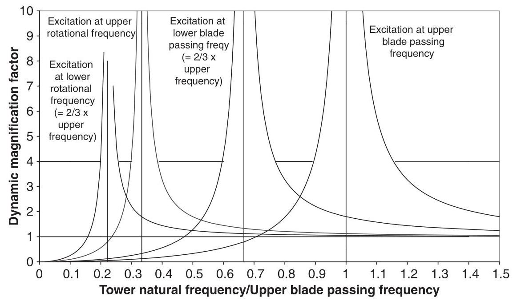

Figure 7.45 Variation of dynamic magnification factors with tower natural frequency for a two speed, three-bladed m/c

The situation is less straightforward if the tower height is to be varied for a particular turbine. Assuming, as before, that the extreme hub height wind speed remains the same, and that the wind loading on the tower is negligible compared with the wind loading on the rotor, then the tower base overturning moment is simply proportional to hub height, $H$ . Constant stresses can be maintained at the tower base by scaling all cross section dimensions up in proportion to the cube root of the hub height. If the same scaling is maintained all the way up the tower, then the tower natural frequency will vary as $\sqrt{{I}_{B}/{H}^{3}} = \sqrt{{H}^{4/3}/{H}^{3}} = 1/{H}^{5/6}$ , neglecting tower mass, where ${I}_{B}$ is the second moment of area of the tower base cross section. Thus, doubling the tower height would result in a 44% reduction in natural frequency. Alternatively, if the tower base overturning moment were assumed to vary as ${H}^{1.5}$ to allow for the effect of wind shear on hub height wind speed and the contribution of wind loading on the tower, then constant tower base stresses could be maintained by scaling the cross section dimensions up by $\sqrt{H}$ . On this basis, tower natural frequency would vary as $1/\sqrt{H}$ .

The practical consequences of 'tuning' the tower natural frequency are discussed with respect of tubular towers in the next section.

### 7.9.3 Steel tubular towers

In the absence of buckling, a waisted conical shell, with a semi angle of ${45}^{ \circ  }$ below the critical zone for tip clearance, would be the most efficient structure for transferring a horizontal rotor thrust acting in any direction to ground level. However, apart from the practicalities of transport and erection, instability of thin walled shells in compression precludes such a design solution, and the steel tubular towers in common use have a very modest taper. It can be noted in passing that the manufacture of gently tapering towers has only been made possible by the development of increasingly sophisticated rolling techniques, and that early tubular towers were constructed from a series of cylindrical tubes of decreasing diameter with short 'adaptor' sections welded between them.

A tapered tower is generally fabricated from a series of pairs of plates rolled into half frusta and joined by two vertical welds. The height of each frustum so formed is limited to two or three metres by the capacity of the rolling equipment. Care has to be taken in the execution of the horizontal welds to minimise local distortion, which weakens the tower under compression loading.

Assuming that a tower design with a uniform taper is to be adopted, the key design parameters to establish are the diameter and wall thickness at the tower base. The tower top diameter, on the other hand, is governed by the size of the yaw bearing.

The main considerations determining the tower dimensions at the base are buckling of the shell wall in compression, strength under fatigue loading and stiffness requirements for 'tuning' the natural frequency. These are dealt with in separate sub-sections below.

As machines get larger, another important consideration is the maximum tower base diameter that can be accommodated on the highway when tower sections are transported overland. In the flat terrain of North Germany and Denmark, this limit is generally 4.0-4.2 m, but elsewhere it will often be less.

## Design against buckling

Given perfect geometry, the strength of a cylindrical steel tube in axial compression is the lesser of the yield strength and the elastic critical buckling stress, given by

$$
{\sigma }_{cr} = {0.605Et}/r \tag{7.68}
$$

where $r$ is the cylinder radius and $t$ is the wall thickness. Yield strength governs for $r/t$ less than ${0.605E}/{f}_{y}$ , which equates to 506 for mild steel, with ${f}_{y} = {245}\mathrm{{MPa}}$ . However, the presence of imperfections, particularly those introduced by welding, means that the tower wall compression resistance is significantly reduced, even at the relatively low tower wall radius to thickness ratios normally adopted. There is quite a wide disparity between the provisions of different national codes, with some making an explicit link between compression resistance and tolerances on imperfections and others not.

The provisions of EN 1993-1-6:2007 - 'Eurocode 3 - Design of steel structures - Strength and stability of shell structures' will be described here.

The first step is to decide the fabrication tolerance quality class, based on the imperfection tolerances that can be realistically achieved in the production facility.

The limits on the out-of-plane deviations, $w$ , of the cylinder, or ’dimples’, measured with

(a) a rod of length $L = 4\sqrt{rt}$ placed vertically, away from welds,

(b) a circular template of the same length placed horizontally, away from welds or

(c) a rod of length $L = {25t}$ placed vertically across horizontal welds

as a percentage of the requisite gauge lengths are given for different fabrication tolerance quality classes in Table 7.6, which also gives corresponding values of the fabrication quality parameter, $Q$ .

Table 7.6 Recommended dimple tolerance and corresponding value of the fabrication quality parameter for different fabrication tolerance quality classes

<table><tr><td>Fabrication tolerance quality class</td><td>Description</td><td>Recommended limit on percentage deviation</td><td>Fabrication quality parameter, $Q$</td></tr><tr><td>Class A</td><td>Excellent</td><td>0.6%</td><td>40</td></tr><tr><td>Class B</td><td>High</td><td>1.0%</td><td>25</td></tr><tr><td>Class C</td><td>Normal</td><td>1.6%</td><td>16</td></tr></table>

Having determined the appropriate fabrication quality parameter, the meridional elastic imperfection reduction factor, ${\alpha }_{x}$ , and the plastic limit relative slenderness, ${\lambda }_{p}$ , can be determined according to

$$
{\alpha }_{x} = \frac{0.62}{1 + {1.91}{\left( \frac{1}{Q}\sqrt{\frac{r}{t}}\right) }^{1.44}} \tag{7.69}
$$

and

$$
{\lambda }_{p} = \sqrt{\frac{{\alpha }_{x}}{0.4}} \tag{7.70}
$$

The buckling strength reduction factor, $\chi$ , is then given by

$$
\chi  = 1 - {0.6}\left( \frac{\lambda  - {\lambda }_{0}}{{\lambda }_{p} - {\lambda }_{0}}\right) \tag{7.71}
$$

where $\lambda$ is the relative shell slenderness, $\sqrt{{f}_{y}/{\sigma }_{cr}},{\sigma }_{cr}$ is the elastic critical meridional buckling stress and ${\lambda }_{0}$ is the squash limit relative slenderness. Both the latter parameters depend on the proportion, $\varepsilon$ , the axial stress forms of the total, as follows:

$$
{\sigma }_{cr} = {0.605E}\frac{t}{r}\left( {1 - {0.4\varepsilon }}\right) \tag{7.72}
$$

and

$$
{\lambda }_{0} = {0.3} - {0.1\varepsilon } \tag{7.73}
$$

As wind turbine tower stresses are dominated by bending stress, $\varepsilon$ is small and can be ignored for preliminary design. Figure 7.46 shows how the buckling strength reduction factor varies with the shell radius to thickness ratio for the different fabrication tolerance quality classes under the assumption that axial stress is negligible. Note that the plot shows the buckling strength reduction factor divided by the partial safety factor for materials strength of 1.2 specified in IEC 61400-1 for global buckling of curved shells. Also plotted (as a dashed line) is the corresponding curve specified in the GL rules (2005) for a 1% limit on dimple depth. In this case the buckling strength reduction factor is divided by partial safety factor for materials strength given by the GL rules/DIN (which varies with relative shell slenderness, $\lambda$ ), allowing the comparison of the design strengths obtained by the two methods.

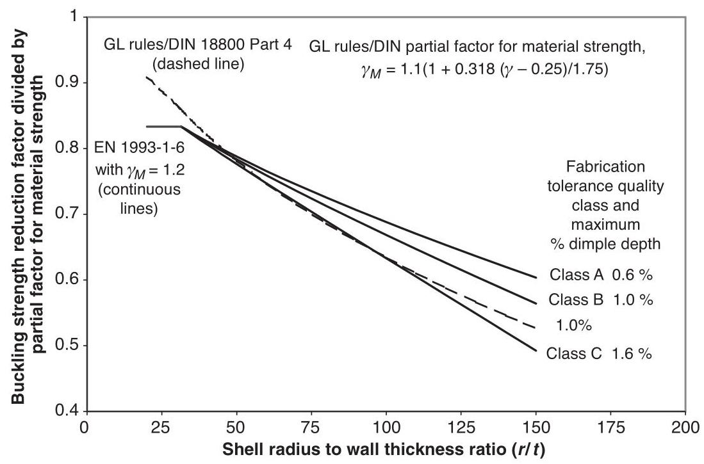

Figure 7.46 Variation of buckling strength reduction factor, divided by partial safety factor for material strength, with shell radius to thickness ratio, for zero axial stress

The effect of the choice of tower base diameter on total tower weight is best illustrated by reference to a concrete example. Consider the design of a ${50}\mathrm{\;m}$ hub height tower in mild steel for a ${60}\mathrm{\;m}$ diameter, three-bladed, stall regulated turbine at a site with a ${60}\mathrm{\;m}/\mathrm{s}$ extreme wind speed. The tower base wall thickness required to resist the overturning moment produced by this wind speed has been calculated for a range of tower base diameters with the aid of Equation 7.71 and plotted on Figure 7.47. Corresponding tower weights have also been plotted, based on a tower top diameter and wall thickness of ${2.25}\mathrm{\;m}$ and ${11}\mathrm{\;{mm}}$ respectively and assuming an idealised linear wall thickness variation between tower top and tower base. It can be seen that the tower weight reaches a minimum value at about ${4.5}\mathrm{\;m}$ diameter, indicating that beyond this point the reduction in cross-sectional area for constant section modulus is offset by the effects of the reducing buckling strength and the increasing wind loading on the tower itself. The weight penalty resulting from restricting the tower base diameter to ${4.0}\mathrm{\;m}$ for transport purposes would, in this case, be negligible.

## Fatigue design

Clear rules for the fatigue design of steel welded structures are given in EN 1993-1-9:2005 'Eurocode 3: Design of steel structures - Part 1-9: Fatigue', where a family of $S - N$ curves is defined for different weld details. On a log-log plot these curves in fact consist of two straight lines, with slopes of $\frac{1}{5}$ and $\frac{1}{3}$ for numbers of cycles above and below $5 \times  {10}^{6}$ respectively. In addition, there is a cut-off limit at $N = {10}^{8}$ cycles, so that stress cycles with a stress range smaller than that defined at ${10}^{8}$ cycles are deemed not to cause any fatigue damage at all.

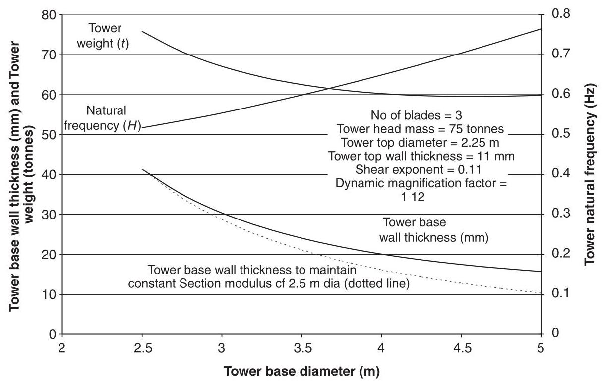

Figure 7.47 Variation in tower base wall thickness with diameter required for support of ${60}\mathrm{\;m}$ diameter stall regulated wind turbine at ${50}\mathrm{\;m}$ hub height in ${70}\mathrm{\;m}/\mathrm{s}$ extreme wind speed

Excluding the tower doorway (which is considered later) the critical weld details on a steel tubular tower are likely to be at welded attachments for intermediate platform and cable support members and the horizontal welds to the tower base flange and intermediate bolted flanges. Assuming a full penetration butt weld is provided (Figure 7.49, top) and that the flange thickness is between ${50}\mathrm{\;{mm}}$ and ${80}\mathrm{\;{mm}}$ , the detail category number for the horizontal welds is 71 (where the number 71 indicates the stress range applicable at $2 \times  {10}^{6}$ cycles in MPa). The detail category number for longitudinal welded attachments reduces as the length of the attachment increases, but if the attachment length can be restricted to ${80}\mathrm{\;{mm}}$ , the detail category number of 71 applies here as well. The $S - N$ curve for this detail category is shown in Figure 7.48.

Where tower design is governed by fatigue, tower weight can be reduced by selecting weld details corresponding to higher detail categories. This has led to the introduction of 'weld-neck' flanges, where the 'neck' constitutes a short section of the tower wall (Figure 7.49, lower half), so that the weld is a standard transverse butt weld (detail category 90) rather than a tee-butt weld (detail category 71). Similarly the length of welded attachments can be reduced to ${50}\mathrm{\;{mm}}$ , to raise the detail category to 80 .

Eurocode 3 recommends different partial safety factors for fatigue strength, ${\gamma }_{Mf}$ , according to the consequences of failure and the assessment method. If load redistribution can occur in the event of fatigue damage, then the component concerned can be assessed by the 'damage tolerant method', with ${\gamma }_{Mf}$ taken as 1.0 and 1.15, for low and high consequence of failure respectively. On the other hand, if local formation of cracks in a structural element could rapidly lead to its failure, assessment should be by the 'safe-life method', with increased values of ${\gamma }_{Mf}$ of 1.15 and 1.35 . In a welded tubular structure, there is no barrier to the propagation of a fatigue crack that has reached a critical length, so the designer must decide whether an inspection regime can be designed to detect incipient cracks before they become critical. Otherwise the tower needs to be assessed by the 'safe-life' method.

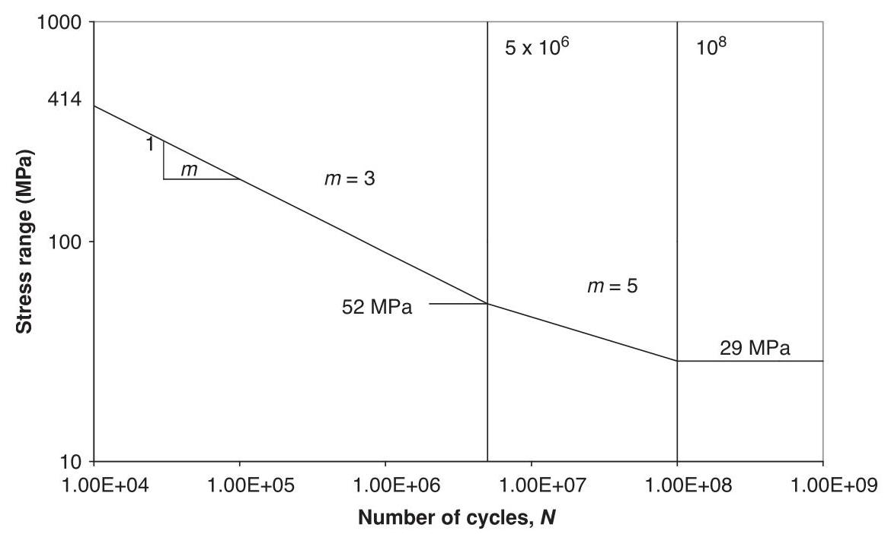

Figure 7.48 Eurocode 3 fatigue strength curve for detail category 71 (butt welded $T$ joint)

IEC 61400-1 adopts a similar approach, but some of the partial safety factors for fatigue strength are less conservative.

The derivation of fatigue load spectra and the combination of stress ranges due to ${M}_{X}$ and ${M}_{Y}$ load spectra are discussed in Section 5.12.6, Chapter 5.

## Relative criticality of extreme and fatigue loads

The relative criticality of buckling failure (under extreme loads) and fatigue loads depends on a variety of factors. However, fatigue is more likely to be critical on pitch regulated machines than on stall regulated ones, because of the increased rotor thrust fluctuations above rated and the reduced extreme loading at standstill. Fatigue is also more likely to be critical at low wind speed sites, because the percentage reduction in extreme loads is less than the percentage reduction in fatigue equivalent load.

## Tuning of tower natural frequency

Considerable scope exists, at least in theory, for adjusting the tower natural frequency to a suitable value by varying the base diameter, while maintaining the necessary strength against extreme and fatigue loading. The effect on natural frequency of varying tower base diameter by a factor of two, for a case where extreme loading governs, is illustrated for a ${60}\mathrm{\;m}$ diameter stall regulated machine at ${50}\mathrm{\;m}$ hub height in Figure 7.47. The frequency increases from ${0.517}\mathrm{\;{Hz}}$ for a ${2.5}\mathrm{\;m}$ base diameter to ${0.765}\mathrm{\;{Hz}}$ for a ${5.0}\mathrm{\;m}$ diameter. Now the rotational speed of a ${60}\mathrm{\;m}$ diameter turbine to yield a ${60}\mathrm{\;m}/\mathrm{s}$ tip speed is about ${19}\mathrm{{rpm}}$ . If we assume that the machine is two speed, with a lower rotational speed of ${19} \times  2/3 = {12.67}\mathrm{{rpm}}$ , then the lower blade passing frequency will be ${0.633}\mathrm{\;{Hz}} -$ right in the middle of the available tower natural frequency range. Adopting a +15%/-15% frequency exclusion zone, the tower natural frequency is required to be less than ${0.538}\mathrm{\;{Hz}}$ or more than ${0.728}\mathrm{\;{Hz}}$ . However, a frequency of ${0.728}\mathrm{\;{Hz}}$ would require a diameter of about ${4.7}\mathrm{\;m}$ (without making the tower wall thicker than necessary for the strength requirement), which is likely to be ruled out by transport considerations. Thus, the only strength limited design option is one with a base diameter of ${2.75}\mathrm{\;m}$ , with a weight penalty of about 10 tonnes compared with the 60 tonne optimum design, giving a natural frequency of about ${0.535}\mathrm{\;{Hz}}$ . Alternatively a $4\mathrm{\;m}$ base diameter could be chosen and the wall thickness increased by ${37}\%$ to ${27.5}\mathrm{\;{mm}}$ to give a frequency of about ${0.728}\mathrm{\;{Hz}}$ . However, the weight penalty in this case is over 15 tonnes.

The above case study illustrates the fact that it is not always economic to satisfy the natural frequency requirements for a particular combination of turbine and hub height. In these circumstances it may well be preferable to change the hub height. For example, a hub height of ${55}\mathrm{\;m}$ would work much better for the case described, with a tower base diameter of ${3.5}\mathrm{\;m}$ yielding a natural frequency of ${0.535}\mathrm{\;{Hz}}$ and a tower weight of 74 Tonnes.

## Joints between tower sections

Towers are normally fabricated in several sections for transport reasons, so joints are required. Welding on site is an expensive operation, so bolted joints are almost always used, although sleeved joints, in which each tapered tower section is threaded over the one beneath and forced into place by jacking, have been used successfully.

The structurally most effective joint is made with friction grip bolted splice plates oriented vertically and sandwiching the walls of the abutting tower sections between them. Provided the grip force is adequate, the joint will not slip even under the extreme load, with the result that the bolts are not subject to fatigue loads. Unfortunately, apart from the effect of splice plates on the external appearance, there are practical difficulties of joint assembly, because bolting requires the provision of some form of personnel access on the outside of the tower. Nevertheless splice plates have been used on some towers.

The most widely used bolted arrangement is the internal flanged joint as illustrated in Figure 7.49. The flanges are butt welded to the ends of the mating sections, with the flange outer edge flush with the tower wall. Alternatively the flange may be formed with a stub section of tower wall already attached. Such flanges, which are termed weld neck flanges, provide a smoother transition from wall to flange (as illustrated in the lower half of figure 7.49) and result in a higher butt weld detail category.

After assembly, each bolt is torqued or tensioned to induce a preload between the flanges in order to minimise in-service bolt fatigue stresses. The bolt should be initially sized to resist the prying force induced by the extreme tower wall tensile stresses - taking the fulcrum adjacent to the flange inner edge - and then checked for fatigue.

The fatigue calculation for the bolts in a flanged joint depends on the relationship between the bolt load and tower wall stress, which only remains linear while contact is maintained over the full flange width. The VDI Guideline for 'The Systematic Calculation of High Duty Bolted Joints', VD1 2230, gives a method for calculating the bolt load increment as a proportion of the load increment in the 'tributary' width of tower wall under these conditions. The axial loading on the flanged joint and the effect of the moment due to the eccentricity of loading are considered separately. The axial load is assumed to be shared between the bolt and the preloaded flanges in proportion to the stiffnesses of the load paths, which, in the case of the flanges, is based on a reduced cross-sectional area related to the volume compressed by the preload according to:

$$
{A}_{ers} = \frac{\pi }{4}\left( {{d}_{w}^{2} - {d}_{h}^{2}}\right)  + \frac{\pi }{8}{d}_{w}\left( {{D}_{A} - {d}_{w}}\right) \left\lbrack  {{\left( k + 1\right) }^{2} - 1}\right\rbrack  \;\text{ where }\;k = \sqrt[3]{\frac{{l}_{k}{d}_{w}}{{D}_{A}^{2}}} \tag{7.74}
$$

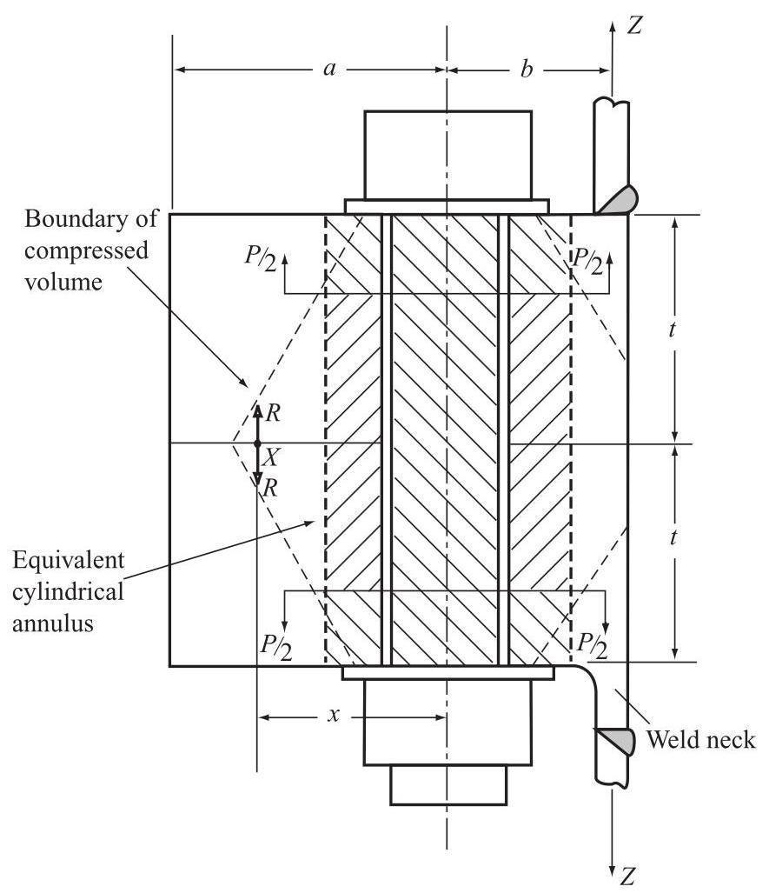

Figure 7.49 Bolted flange joint

and

${d}_{w}$ is the washer face diameter on the bolt head and nut

${d}_{h}$ is the bolt hole diameter

${l}_{k}$ is the clamping length between bolt head and nut

${D}_{A}$ is twice the distance from the bolt centreline to the nearest flange edge, or the bolt spacing whichever is the less.

The Guideline recognises that the effective plane of introduction of the external load will not necessarily be immediately under the bolt head or nut, but may lie nearer the flange mid-plane, giving the load paths distinguished by different cross hatching in Figure 7.49. Stresses due to the eccentricity of the tower wall load to the flange contact area are dealt with by ordinary bending theory applied to the whole contact area.

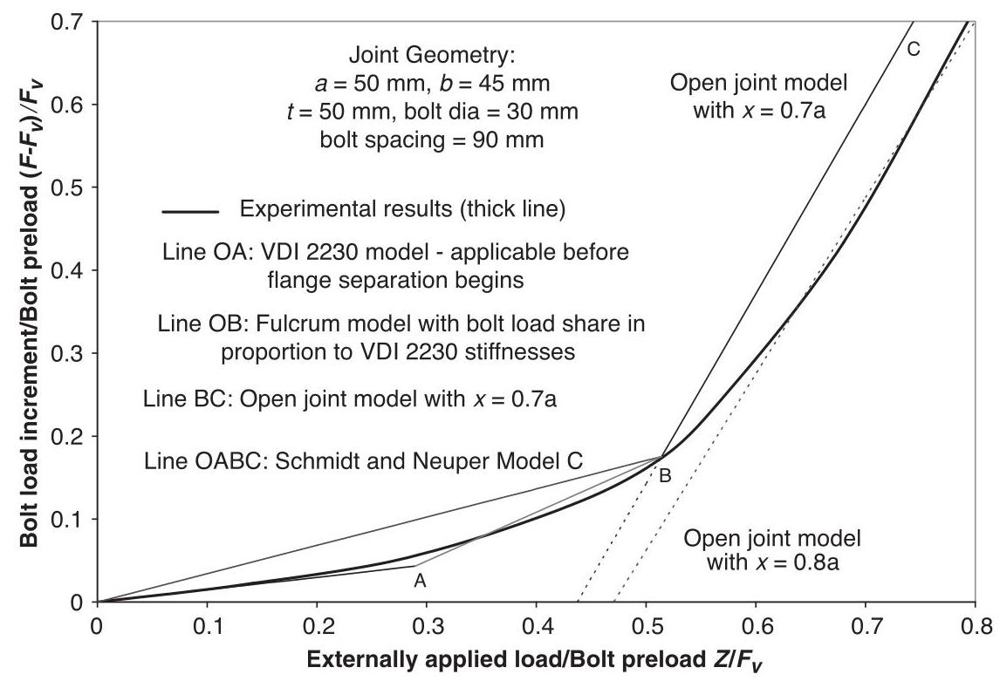

Figure 7.50 Flange joint bolt load variation with externally applied load - experimental results and engineering models compared

The VDI 2230 method outlined above no longer applies once a gap has opened up between the flanges at the outer edge. For larger fluctuations in the externally applied load, $Z$ , the fulcrum model can be used, although it is inevitably conservative at low loads. The axial load, $P$ , applied to the bolt/flange combination is calculated on the basis that a fulcrum exists at $\mathrm{X}$ , a distance $x$ from the bolt, so that $P = Z\left( {1 + b/x}\right)$ , and the load share between the bolt and the compressed volume of flange is calculated according to the relative stiffnesses as before.

In Figure 7.50, the two linear relationships between bolt load increment and externally applied load are compared with experimental results for a particular test specimen with a single flange bolt. It is assumed that the planes of introduction of the load on the bolt/flange combination are immediately under the bolt head and nut in each case. Line OA shows the VDI 2230 model, with the point A representing the limit of its validity. Line OB shows the fulcrum model, with B representing the point at which the preload between the flanges at the position of the bolts disappears. Thereafter, the bolt load varies as $Z\left( {1 + b/x}\right)$ - That is, along line BC for $x/a = {0.7}$ . It may be noted from Figure 7.50 that a value of $x/a$ of 0.8 results in better agreement with the test results at high loads, but these are not of interest for design purposes.

Schmidt and Neuper (1997) have proposed a more sophisticated model identified as 'Model C', which combines aspects of the two models already described and gives a bolt load characteristic consisting of the three straight lines OA, AB and BC (see Figure 7.50). Clearly this agrees much better with the experimental results, but it adds to the complexity of the fatigue load calculation.

Uniformity of bolt loading around the tower clearly depends on the accuracy of the mating flange surfaces. Schmidt et al. (1999) have investigated the effects of various imperfections using a finite element model and made tentative suggestions regarding permitted tolerance levels.

## Tower tie-down

The tower is normally fitted with a base flange, which can either be attached to the foundation by screwed rods cast into the concrete or bolted to an embedded tower stub. This sub section is concerned with the former arrangement.

The screwed rods are normally anchored in some way at their base, and their capacity to resist overturning moment is determined by the pull-out resistance of the semi-circle of bolts on the upwind side. As this is governed by the concrete shear strength, the rods have to be anchored quite deep into the concrete, so that their length is typically similar to the tower base radius.

The fatigue loads in the tie-down rods can be considerably reduced by pre-tensioning. The share of tower wall uplift loads taken by the rods can be based on an estimate of the relative stiffnesses of the rod and the loaded volume of the concrete, assuming a dispersion angle of about ${30}^{ \circ  }$ in the radial direction. The screwed rods should be sheathed, so that the pre-tension is applied over the full length.

## Tower doorways

A doorway is required for access at or near the tower base, and additional doorways are sometimes required for a transformer in the tower base or for maintenance access to the blade tip mechanism. Often they have vertical sides with semi-circular ends at top and bottom. Vertical stiffeners have to be provided as standard down each side to compensate for the missing section of wall and to resist compression buckling, but attention has to be paid to the weld detail at the stiffener ends, where stress concentration due to the opening is likely to be an additional factor.

The weld detail at the stiffener end can be eliminated by reinforcing the inside edge of the doorway with a continuous flange all the way round. The detail category of the flange to tower wall butt weld under transverse loading is then 71, but there is no stress concentration factor to contend with at the top and bottom of the doorway.

### 7.9.4 Steel lattice towers

Steel lattice towers are usually assembled from angle sections, with bolting used for attaching the bracing members to the legs and splicing the leg sections together. Typically the towers are square in plan with four legs, facilitating the attachment of the bracing members.

One of the advantages of lattice towers is that material savings can be obtained by splaying the legs widely apart at the base, without jeopardising stability or posing transport problems. The latitude for doing this higher up is limited by tip clearance considerations, so waisted tower designs are common. A more elegant tower design results if the legs are rolled to a gentle concave curve, however.

The loads in the legs (or 'chords') result from the tower bending moments, while the loads in the bracing (or 'web') members result from a combination of tower shear and torsional loads. In each case member buckling under extreme loads has to be considered, and fatigue loading at the joints. Two devices are employed to improve member stability - the web members are arranged as pairs of intersecting diagonals rather than adopting a single triangulated system, so that the tension diagonal can stabilise the compression diagonal at each intersection, and the web/chord intersection points on either side of each chord member are staggered vertically to reduce the spacing of chord supports restraining flexure about the minor axis. Note that care with detailing is needed at the waist, if present, in order to ensure adequate lateral restraint for the chords at the change of direction.

Fatigue loading of bolts is avoided by the use of friction grip bolts. Accordingly galvanising is normally used for corrosion protection rather than painting, in order to achieve an adequate coefficient of friction.

## 7.10 Foundations

The design of wind turbine foundations is largely driven by the tower base overturning moment under extreme wind conditions. A variety of slab, multi-pile and monopile solutions have been adopted for tubular towers, and these are discussed in turn below.

### 7.10.1 Slab foundations

Slab foundations are chosen when competent material exists within a few metres of the surface. The overturning moment is resisted by an eccentric reaction to the weight of the turbine, tower, foundation and overburden (allowing for buoyancy, if the water table can rise above the base of the slab). The eccentricity of the reaction, and hence the magnitude of the restoring moment, is limited by the load carrying capacity of the sub-strata, which determines the width of the area at the edge of the slab required to carry the gravity loads. Brinch Hansen (1970) provides straightforward rules for calculating the slab bearing capacity under these conditions, based on the simplifying assumption of uniform loading over the loaded area. However, if the substrata behave elastically, tilting of the slab foundation is likely to result in a linear distribution of bearing stress over the loaded area, so an alternative approach is to base the design on the maximum rather than the average value. The GL rules additionally require that positive bearing stress exists over the whole width of the foundation when the turbine is operating, which limits the maximum overturning moment under these conditions to ${WB}/6$ , where $W$ is the gravity load and $B$ is the slab width. This requirement can add significantly to the required foundation size.

Four alternative slab foundation arrangements are shown in Figure 7.51. Figure 7.51(a) shows a slab of uniform thickness, with its upper surface just above ground level, which is chosen when bedrock is near the ground surface. The main reinforcement consists of top and bottom mats to resist slab bending and the slab is made thick enough for shear reinforcement not to be required. The second variant shown in Figure 7.51(b) is a slab surmounted by a pedestal. This is used when the bedrock is at a greater depth than the slab thickness required to resist the slab bending moments and shear loads. The gravity load on the substrata is increased by virtue of the overburden, so the overall slab plan dimensions can be reduced somewhat.

The third variant, shown in Figure 7.51(c) is similar to the second, but embodies two possible modifications which can be applied independently - replacement of the pedestal by a stub tower embedded in the slab and introduction of a tapering slab depth. The stub tower has to be perforated near the top of the slab to allow radial top face reinforcement to pass through it, and reinforcement to resist punching shear loads from the tower stub bottom flange must be incorporated. Tapering the slab depth has the merit of saving material, but is slightly more difficult to execute.

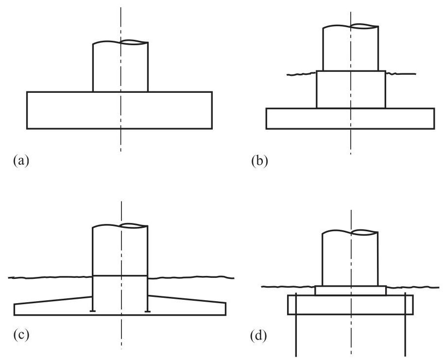

Figure 7.51 (a) Plain slab; (b) Slab and pedestal; (c) Stub tower embedded in tapered slab; (d) Slab held down by rock anchors

Rock anchors eliminate the need to add weight to a gravity foundation for counterbalance purposes, and thus enable the foundation size to be significantly reduced, provided bearing capacities are sufficiently high. See Figure 7.51(d). Specialist contractors are needed for rock anchor installation, so they only find occasional use.

The ideal shape of gravity foundation in plan is a circle, but in view of the complications of providing circular formwork, an octagonal shape is usually chosen instead. Sometimes slabs are square in plan to simplify the shuttering and reinforcement further.

### 7.10.2 Multi-pile foundations

In weaker ground, a piled foundation often makes more efficient use of materials than a slab. Figure 7.52(a) illustrates a foundation consisting of a pile cap resting on eight cylindrical piles arranged in a circle. Overturning is resisted by both pile vertical and lateral loads, the latter being generated by moments applied to the head of each pile. Consequently the reinforcement must be arranged to provide full moment continuity between the piles and the pile cap. Holes for the piles can be auger drilled and the piles cast in situ after the positioning of the reinforcement cage.

### 7.10.3 Concrete monopile foundations

A concrete monopile foundation consists of a single large diameter concrete cylinder, which resists overturning by mobilising soil lateral loads alone. See Figure 7.52(b). These lateral loads can be calculated conservatively for sand by using either simple Rankine theory for passive pressures on retaining walls, which ignores soil/wall friction, or Coulomb theory, which includes it. However, in the case of a monopile, friction on the sides of the soil wedge notionally displaced when the pile begins to tilt provides further resistance, and this is accounted for in the solution due to Brinch Hansen (1961).

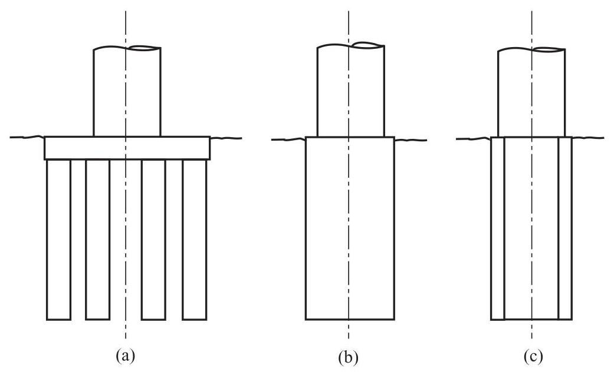

Figure 7.52 (a) Pile group and cap; (b) Solid monopile; (c) Hollow monopole

This type of foundation is an attractive option when the water table is low and the soil properties enable a deep hole to be excavated from above without the sides caving in. However, while simple, the concept is relatively expensive in terms of materials.

The hollow cylinder variant illustrated in Figure 7.52(c) uses materials much less extravagantly by replacing the concrete in the body of the cylinder, which has no structural role to play, with fill.

### 7.10.4 Foundations for steel lattice towers

The legs of steel lattice towers are relatively widely spaced, and lend themselves to separate foundations. Bored cast in-situ piles are commonly used - see Figure 7.53. The mechanism for resisting overturning is simply uplift and downthrust on the piles, but the piles must also be designed for the bending moments induced by the horizontal shear load. Pile uplift is resisted by friction on the surface of the piles, which depends on both the soil/pile friction angle and the lateral soil pressure. Considerable uncertainty surrounds the magnitude of these quantities, so Eurocode 7 recommends the use of pile testing to establish pile capacity.

The angle sections forming the base of the tower legs are cast in place when the concrete for the piles is poured. A framework is assembled in advance, incorporating the leg base sections, so that the legs can be set at the correct spacing and inclination before concreting.

### 7.10.5 Foundation rotational stiffness

The assessment of foundation rotational stiffness is an important part of the design process because of the effect it has on tower natural frequency, and hence on fatigue loading. Figure 7.54 illustrates the effect of varying the foundation rotational stiffness for a tower supporting a 45 tonne turbine at ${70}\mathrm{\;m}$ hub height. Manufacturers normally specify a minimum foundation rotational stiffness to ensure that the tower natural frequency is high enough for the fatigue loadings on which the tower design is based to be valid. It is then the task of the foundation designer to ensure that the foundation footprint (or depth, in the case of a monopile foundation) is sufficiently large to achieve this rotational stiffness.

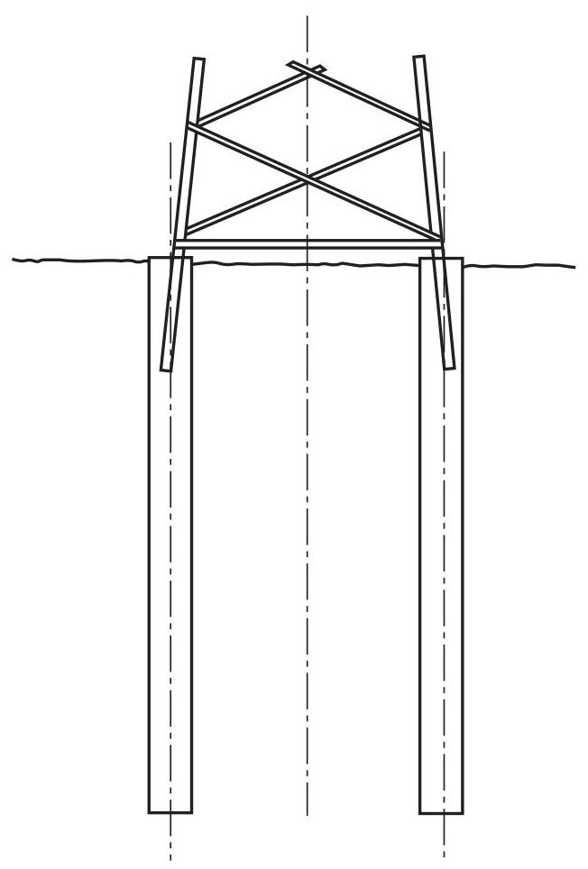

Figure 7.53 Piled foundation for steel lattice tower,

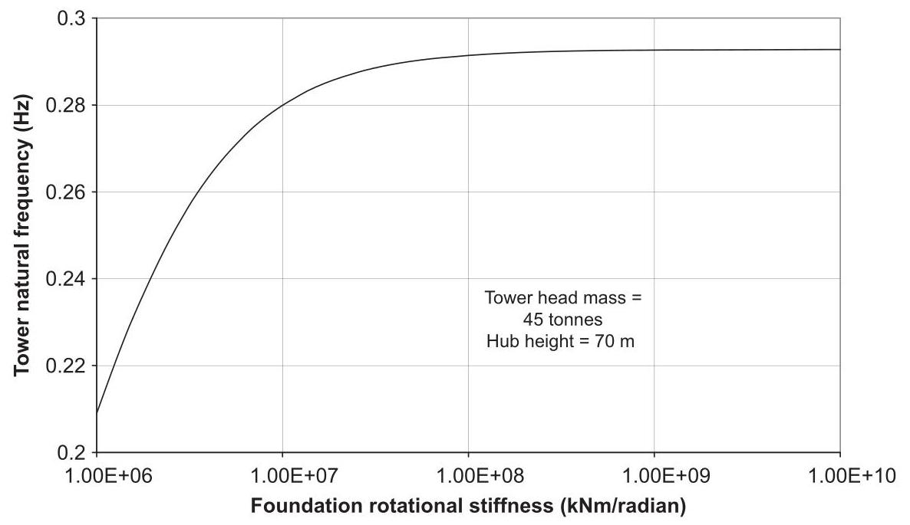

Figure 7.54 Example of variation of tower natural frequency with foundation rotational stiffness

A closed form solution exists for the rotational stiffness, ${K}_{\theta }$ of a rigid disc resting on an elastic half space, as follows:

$$
{K}_{\theta } = \frac{{8G}{R}^{3}}{3\left( {1 - v}\right) } \tag{7.75}
$$

where $G$ is the shear modulus of the soil, $R$ is the disc radius and $v$ is Poisson’s ratio. The DNV/Risø 'Guidelines for design of wind turbines' (2002) give modified versions of this formula that account for foundation embedment and soil layers with different shear moduli.

Tower base rotation will be increased by flexibility of the foundation itself and this may need to be accounted for as well.

## References

American Gear Manufacturers Association/American Wind Energy Association (1996) AGMA/AWEA 921-A97: Recommended practices for design and specification of gearboxes for wind turbine generator systems'

American National Standards Institute/American Gear Manufacturers Association/American Wind Energy Association (2003) ANSI/AGMA/AWEA 6006-A03: Standard for design and specification of gearboxes for wind turbines.

American National Standards Institute/ American Gear Manufacturers Association (1995) ANSI/AGMA 2001-C95: Fundamental rating factors and calculation methods for involute spur and helical gear teeth.

Anaya-Lara et al. (2009) Wind Energy Generation, Modeling and Control. John Wiley & Sons, Inc., New York.

Anderson CG et al (1993)Yaw system loads of HAWTS. ETSU Report No W/42/00195/REP

Anderson, C.G., Heerkes, H. and Yemm, R (1998) Prevention of edgewise vibration on large stall regulated blades. In: Proceedings of the BWEA Conference, pp. 95-102.

Barbero EJ (1998) Introduction to composite materials design. Taylor and Francis.

Bond, I.P. and Ansell, M.P. (1998) Fatigue properties of jointed wood composites. Part I 'Statistical analysis, fatigue master curves and constant life diagrams'. Journal of Materials Science 33, 2751-2762, & Part II 'Life prediction analysis for variable amplitude loading' Journal of Materials Science 33, 4121-4129.

Bonfield, P.W., Bond, I.P., Hacker, C.L. and Ansell, M.P. (1992) Fatigue testing of wood composites for aerogenerator blades. Part VII. Alternative wood species and joints. In: Proceedings of the BWEA Conference, pp. 243-249.

Brinch Hansen, J. (1961) The ultimate resistance of rigid piles against transverse forces. Danish Geotech-nical Institute Report No. 12.

Brinch Hansen, J. (1970) A revised an extended formula for bearing capacity. Danish Geotechnical Institute Bulletin No 28.

British Standards Institution (1986) BS436: Spur and helical gears - Part 3 Method for calculation of contact and root bending stress limitations for metallic involute gears.

British Standards Institution (2006) BS ISO 6336: Calculation of load capacity of spar and helical gears.

Corbet, D.C., Brown, C. and Jamieson, P. (1993) The selection and cost of brakes for horizontal axis stall regulated wind turbines. ETSU Report No. WN 6065.

Det Norske Veritas/Risø National Laboratory (2002) Guidelines for design of wind turbines.

Echtermeyer, A.T., Hayman, E. and Ronold, K.O. (1996) Comparison of fatigue curves for glass composite laminates. In: Mayer, R.M. (ed.), Design of Composite Structures Against Fatigue. Mechanical Engineering Publications, Suffolk.

Eurocode 3 (2007) Design of steel structures - Part 1.6: Strength and stability of shell structures. (EN 1993-1-6:2007)

Eurocode 3 (2005) Design of steel structures - Part 1.9: Fatigue. (EN 1993-1-9:2005)

Freris, L. (ed.) (1990) Wind Energy Conversion Systems. Prentice Hall, London.

Fuglsang, P.L. and Madsen, H.A. (1995) A design study of a 1 MW stall regulated rotor. Riso National Laboratory Report No. R-799.

Germanischer Lloyd (1993) Rules and Regulations: IV - Non-Marine Technology: Part 1 - Wind Energy: Regulation for the Certification of Wind Energy Conversion Systems.

Hancock, M. and Bond, I.P. (1995) The new generation of wood composite wind turbine rotor blades - design and verification. In: Proceedings of the BWEA Conference, pp. 47-52.

Hancock, M., Sonderby, O. and Schubert, M.A.(1997) Design, development and testing of a ${31}\mathrm{\;m}$ wood composite stall regulated blade for serial production. In: Proceedings of the European Wind Energy Conference,

pp. 206-212. Dublin.

Heier, S. (2006) Grid Integration of Wind Energy Conversion Systems, 2"d Edition. John Wiley & Sons, Inc., New York.

Hindmarsh, J. (1984) Electrical Machines and Their Applications. Butterworth Heinemann, London.

Hück (1983) Calculation of S/N curves for Steel, Cast Steel and Cast Iron - Synthetic S/N curves.

Verein Deutsher Eisenhüttenleute Report No. ABF 11, Verlag Stahleisen, Düsseldorf, July 1983.

Jamieson, P. and Brown, C.J. (1992). The optimisation of stall regulated rotor design. In: Proceedings of the BWEA Conference, pp. 79-84.

Jones, R. and Smith, G.A. (1993) High quality mains power from variable-speed wind turbines. IEE Conference, Renewable Energy - Clean Power 2001.

Krause, P.C. (1986) Analysis of Electric Machinery. McGraw Hill, New York.

Mayer, R.M. (1996) Design of Composite Structures Against Fatigue. Mechanical Engineering Publications, Suffolk.

McPherson, G. (1990) An Introduction to Electrical Machines and Transformers, 2nd edition. John Wiley & Sons, Inc., New York.

Mohan, N., Undeland, T.M. and Williams, W.P. (1995) Power Electronics, Converters Application and Design, ${2}^{\text{ nd }}$ edition. John Wiley & Sons, Inc., New York.

Muller, S., Deicke, M. and De Doncker, R. (2002) Doubly fed induction generator systems for wind turbines. Industry Applications Magazine, IEEE, 8(3), 26-33.

Pena, R., Clare, J.C. and Asher, G.M. (1996) Doubly ed induction generator using back-back PWM converters and its application to variable speed wind energy generators. In: IEE Proceedings on Electric Power Applications, 143, 231-241.

Petersen, J.T., Madsen, H.A., Björck, A., Enevoldsen, P., Øye, S., Ganander, H. and Winkelaar, D. (1998) Prediction of dynamic loads and induced vibrations in stall. Riso National Laboratory Report No. R-1045.

Schmidt, H. and Neuper, M. (1997) Zum elastostatischen Tragverhalten exzentrisch gezogener L-Stöße mit vorgespannten Scrauben. ('On the elastostatic behaviour of an eccentrically tensioned L-joint with prestressed bolts'), Stahlbau 66, 163-168.

Schmidt, H., Winterstetter, T.A. and Kramer, M. (1999). Non-linear elastic behaviour of imperfect, eccentrically tensioned L-flange ring joints with prestressed bolts as basis for fatigue design. In: Proceedings of the European Conference on Computational Mechanics.

Thomsen, K. (1998) The statistical variation of wind turbine fatigue loads. Riso National Laboratory Report No. R-1063.

Timoshenko, S.P. and Gere, J.M. (1961) Theory of Elastic Stability.2nd Edition. Mc Graw-Hill.

Van Delft, D.R.V., de Winkel, G.D., Joose, P.A. (1996) Fatigue behaviour of fibreglass wind turbine blade material under variable amplitude loading. In: Proceedings of the EUWEC, pp. 914-918. Göteborg.

Verein Deutscher Ingenieure (1986/1988) VDI 2230 Part 1: Systematic calculation of high duty bolted joints - Joints with one cylindrical bolt.

Wilson, R.A. (1990) Implementation and optimisation of mechanical brakes and safety systems. In: Proceedings of a DEn/BWEA Workshop. Mechanical systems for wind turbines. 26 June 1990.

