# 8 The controller

In the most general sense, the wind turbine control system consists of a number of sensors, a number of actuators and a system consisting of hardware and software which processes the input signals from the sensors and generates output signals for the actuators.

The sensors might include, for example:

- an anemometer;

- a wind vane;

- at least one rotor speed sensor;

- an electrical power sensor;

- accelerometers;

- load sensors;

- pitch position sensors;

- various limit switches;

- vibration sensors;

- temperature and oil level indicators;

- hydraulic pressure sensors;

- operator switches, push buttons, etc.

The actuators might include hydraulic or electric pitch actuators, an electrical generator which can be considered to be a torque actuator, generator contactors, switches for activating shaft brakes, yaw motors etc.

The system that processes the inputs to generate outputs usually consists of a computer or microprocessor based controller which carries out the normal control functions needed to operate the turbine, supplemented by a highly reliable hard-wired safety system. The safety system must be capable of overriding the normal controller in order to bring the turbine to a safe state if a serious problem occurs.

## 8.1 Functions of the wind turbine controller

### 8.1.1 Supervisory control

Supervisory control can be considered as the means whereby the turbine is brought from one operational state to another. The operational states might, for example, include the following:

- standby, when the turbine is available to run if external conditions permit;

- start-up;

- power production;

- shut-down;

- stopped with fault.

It is possible to envisage other states, or it may be useful to further subdivide some of these states. As well as deciding when to initiate a switch from one state to another, the supervisory controller will carry out the sequence control required. As an example, the sequence control for start-up of a pitch regulated wind turbine might consist of the following steps:

- Power up the pitch actuators and other subsystems.

- Release the shaft brake.

- Ramp the pitch position demand at a fixed rate to some starting pitch.

- Wait until the rotor speed exceeds a certain small value.

- Engage the closed loop pitch control of speed.

- Ramp the speed demand up to the generator minimum speed.

- Wait until the speed has been close to the target speed for a specified time.

- Close the generator contactors.

- Engage power or torque controller.

- Ramp the power/torque/speed set points up to the rated level.

The supervisory controller must check that each stage is successfully completed before moving on to the next. If any stage is not completed within a certain time, or if any faults are detected, the supervisory controller should change to shut-down mode.

### 8.1.2 Closed loop control

The closed loop controller is usually a software-based system that automatically adjusts the operational state of the turbine in order to keep it on some pre-defined operating curve or characteristic. Some examples of such control loops are:

- Control of blade pitch in order to regulate the power output or rotational speed of the turbine to a fixed or slowly-varying set point (for example, the rated level in above-rated wind speeds, or a predetermined speed ramp during start-up or shut-down of the turbine).

- Control of generator torque in order to regulate the rotational speed of a variable speed turbine.

- Control of yaw motors in order to minimise the yaw tracking error.

Some of these control loops may require very fast response in order to prevent the turbine wandering far from its correct operating curve. Such controllers may need to be designed very carefully if good performance is to be achieved without detrimental effects on other aspects of the turbine's operation. Others, such as yaw control, are typically rather slow acting, and careful design is then much less critical.

This chapter examines the main issues behind closed loop controller design, and presents some of the techniques that can be used to effect a successful design.

### 8.1.3 The safety system

It is helpful to consider the safety system as quite distinct from the main or 'normal' control system of the turbine. Its function is to bring the turbine to a safe condition in the event of a serious or potentially serious problem. This usually means bringing the turbine to rest or to a slow idling speed with the blades feathered and the generator switched off.

The normal wind turbine supervisory controller should be capable of starting and stopping the turbine safely in all foreseeable 'normal' conditions, including extreme winds, loss of the electrical network, and most fault conditions which are detected by the controller. The safety system acts as a backup to the main control system, and takes over if the main system appears to be failing to do this. It may also be activated by an operator-controlled emergency stop button.

Thus, the safety system must be independent from the main control system as far as possible, and must be designed to be fail-safe and highly reliable. Rather than utilising any form of computer or microprocessor based logic, the safety system would normally consist of a hard-wired fail-safe circuit linking a number of normally open relay contacts that are held closed when all is healthy. Then if any one of those contacts is lost, the safety system trips, causing the appropriate fail-safe actions to operate. This might include disconnecting all electrical systems from the supply and allowing fail-safe pitching to the feather position, for example.

The safety system might, for example, be tripped by any one of the following:

- Rotor overspeed, that is, reaching the hardware overspeed limit. This is set higher that the software overspeed limit, which would cause the normal supervisory controller to initiate a shut-down. Figure 8.1 shows a typical arrangement of rotor speed sensing equipment on the low speed shaft.

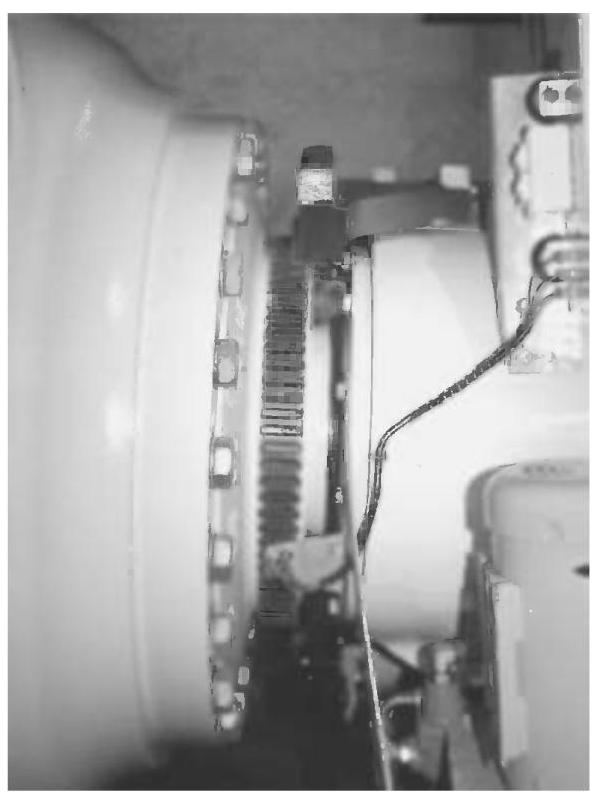

Figure 8.1 Low speed shaft sensing system. Three proximity sensors mounted on a bracket attached to the front of the (integrated) gearbox register the passage of the teeth on the shaft circumference, and provide an independent speed signal for the control and safety systems. The flange onto which the hub is bolted is immediately to the left of the teeth

- Vibration sensor trip, which might indicate that a major structural failure has occurred.

- Controller watchdog timer expired: the controller should have a watchdog timer which it resets every controller timestep. If it is not reset within this time, this indicates that the controller is faulty and the safety system should shut down the turbine.

- Emergency stop button pressed by an operator.

- Other faults indicating that the main controller might not be able to control the turbine.

In some cases the safety system may involve more than one circuit. For example, any safety system trip would normally cause the blades to pitch, but it may be feasible for the relay which disconnects the generator system to be on a different circuit which omits certain sensors, so that in the event of certain faults unrelated to the electrical system the braking action of the generator can be maintained to assist the shut-down.

## 8.2 Closed loop control: issues and objectives

### 8.2.1 Pitch control (See also Chapter 3, Section 3.13 and Chapter 6, Section 6.7.2)

Pitch control is the most common means of controlling the aerodynamic power generated by the turbine rotor. Pitch control also has a major effect on all the aerodynamic loads generated by the rotor.

Below rated wind speed, the turbine should simply be trying to produce as much power as possible, so there is generally no need to vary the pitch angle since the optimum pitch angle does not change much with wind speed. The aerodynamic loads below rated wind speed are generally lower than above rated, so again there is no need to modulate these using pitch control, although some pitch action to reduce fatigue loads is possible as explained below. However, for turbines operating below rated at constant speed, the optimum pitch angle for aerodynamic efficiency varies slightly with tip speed ratio, and therefore with wind speed. In this case the pitch angle can be varied slowly (by no more than a few degrees) to maintain optimum power production as the mean wind speed changes. This applies also to variable speed turbines when operating on a constant-speed portion of the operating curve.

Above rated wind speed, pitch control provides a very effective means of regulating the aerodynamic power and loads produced by the rotor so that design limits are not exceeded. In order to achieve good regulation, however, the pitch control needs to respond very rapidly to changing conditions. This highly active control action needs very careful design as it interacts strongly with the turbine dynamics.

One of the strongest interactions is with the tower dynamics. As the blades pitch to regulate the aerodynamic torque, the aerodynamic thrust on the rotor also changes substantially, and this feeds into the tower vibration. As the wind increases above rated, the pitch angle increases to maintain constant torque, but the rotor thrust decreases. This allows the downwind tower deflection to decrease, and as the tower top moves upwind the relative wind speed seen by the rotor increases. The aerodynamic torque increases further, causing more pitch action. Clearly if the pitch controller gain is too high this positive feedback can result in instability. It is therefore vital to take the tower dynamics into account when designing a pitch controller.

Below rated wind speed, the pitch setting should be at its optimum value to give maximum power. It follows that when the wind speed rises above rated, either an increase or a decrease in pitch angle will result in a reduction in torque. An increase in pitch angle, defined as turning the leading edge into wind, reduces the torque by decreasing the angle of attack and hence the lift. This is known as pitching towards feather. A decrease in pitch, that is, turning the leading edge downwind, reduces the torque by increasing the angle of attack towards stall, where the lift starts to decrease and the drag increases. This is known as pitching towards stall.

Although pitching towards feather is the more common strategy, some turbines pitch towards stall. This is commonly known as active stall or assisted stall (see Chapter 6, Section 6.7.4). Pitching to feather requires much more dynamic pitch activity than pitching to stall: once a large part of the blade is in stall, very small pitch movements suffice to control the torque. Pitching to stall results in significantly greater thrust loads because of the increased drag. On the other hand, the thrust is much more constant once the blade is stalled, so thrust-driven fatigue loads may well be smaller.

A further problem with pitching to stall is that the lift curve slope at the start of the stalled region is negative, that is, the lift coefficient decreases with increasing angle of attack. This results in negative aerodynamic damping, which can cause instability of the blade bending modes, both in-plane and out-of-plane. This can be a problem also with fixed pitch stall-regulated turbines.

Most pitch controlled turbines use full-span pitch control, in which the pitch bearing is close to the hub. It is also possible, though not common, to achieve aerodynamic control by pitching only the blade tips, or by using ailerons, flaps, air-jets or other devices to modify the aerodynamic properties. These strategies will result in most of the blade being stalled in high winds. If only the blade tips are pitched, it may be difficult to fit a suitable actuator into the outboard portion of the blade, and accessibility for maintenance is problematic.

### 8.2.2 Stall control

Many smaller and older turbines are stall-regulated, which means that the blades are designed to stall in high winds without any pitch action being required. This means that pitch actuators are not required, although some means of aerodynamic braking is likely to be required, if only for emergencies (see Chapter 6, Section 6.8.2).

In order to achieve stall regulation at reasonable wind speeds, the turbine must operate closer to stall than its pitch regulated counterpart, resulting in lower aerodynamic efficiency below rated. This disadvantage may be mitigated in a variable speed turbine, when the rotor speed can be varied below rated in order to maintain peak power coefficient.

In order for the turbine to stall rather than accelerate in high winds, the rotor speed must be restrained. In a fixed speed turbine the rotor speed is restrained by the generator, and is linked to the network frequency, as long as the torque remains below the pull-out torque. In a variable speed turbine, the speed is maintained by ensuring that the generator torque is varied to match the aerodynamic torque. A variable speed turbine offers the possibility to slow the rotor down in high winds in order to bring it into stall. This means that the turbine can operate further from the stall point in low winds, resulting in higher aerodynamic efficiency. However, this strategy means that when a gust hits the turbine, the load torque not only has to rise to match the wind torque but also has to increase further in order to slow the rotor down into stall. This removes one of the main advantages of variable speed operation, namely that it allows very smooth control of torque and power above rated.

The benefits of pitch control as a means of braking mean that stall control is now rarely used for large commercial turbines.

### 8.2.3 Generator torque control (see also Chapter 6, Section 6.9 and Chapter 7, Section 7.5)

The torque developed by a fixed speed (i.e. directly connected) induction generator is determined purely by the slip speed. As the aerodynamic torque varies, the rotor speed varies by a very small amount such that the generator torque changes to match the aerodynamic torque. The generator torque cannot, therefore, be actively controlled.

However, if a frequency converter is interposed between the generator and the network, the generator speed will be able to vary. The frequency converter can be actively controlled to maintain constant generator torque or power output above rated wind speed. Below rated, the torque can be controlled to any desired value, for example with the aim of varying the rotor speed to maintain maximum aerodynamic efficiency.

There are several means of achieving variable speed operation. One is to connect the generator stator to the network through a frequency converter, which must then be rated for the full power output of the turbine. An alternative and very common arrangement is the doubly-fed induction generator, a wound-rotor machine in which the stator is connected directly to the network and the rotor is connected to the network through slip rings and a frequency converter. This means that the frequency converter need only be rated to handle a fraction of the total power, although the larger this fraction, the larger the achievable speed range will be.

A special case is the variable slip induction generator, where active control of a resistance in series with the rotor windings allows the torque/speed relationship to be modified. By means of closed loop control based on measured currents, it is possible to maintain constant torque above rated, effectively allowing variable speed operation in this region. Below rated it behaves just like a normal induction generator (Bossanyi et al., 1991; Pedersen, 1995).

### 8.2.4 Yaw control

Turbines, whether upwind or downwind, can be designed to be stable in yaw (see also Chapter 4, Section 4.11), in the sense that if the nacelle is free to yaw, the turbine will naturally remain pointing into the wind. However, it may not point exactly into wind, in which case some active control of the nacelle angle may be needed to maximise the energy capture. Since a yaw drive is usually required anyway, for example for start-up and for unwinding the pendant cable, it may as well be used for active yaw tracking. Free yaw has the advantage that it does not generate any yaw moments at the yaw bearing. However, it is usually necessary to have at least some yaw damping, in which case there will be a yaw moment at the bearing.

In practice, most turbines use active yaw control. A yaw error signal from the nacelle-mounted wind vane is then used to calculate a demand signal for the yaw actuator. Frequently the demand signal will simply be a command to yaw at a slow fixed rate in one or the other direction. The yaw vane signal must be heavily averaged, especially for upwind turbines where the vane is behind the rotor. Because of the slow response of the yaw control system, a simple dead-band controller is often sufficient. The yaw motor is switched on when the averaged yaw error exceeds a certain value, and switched off again after a certain time or when the nacelle has moved through a certain angle. A yaw brake is usually applied when the turbine is not yawing, and often even while yawing, to prevent frequent load reversals at the yaw pinion due to the highly variable nature of the yawing moments.

More complex control algorithms are sometimes used, but the control is always slow-acting, and does not demand any special closed-loop design analysis; in fact rapid yawing is unnecessary, and can generate large gyroscopic loads. Because of this, yaw control is often classed as part of the supervisory controller; also because it remains active in standby mode to keep the turbine pointing into wind (except in very low winds when the wind direction becomes too variable).

One exception is the case of active yaw control to regulate aerodynamic power in high winds, as used on the variable speed Gamma 60 turbine referred to in Section 6.7.5, Chapter 6. This clearly requires very rapid yaw rates, and results in large yaw loads and gyroscopic and asymmetric aerodynamic loads on the rotor. This method of power regulation would be too slow for a fixed speed turbine, and even on the Gamma 60 the speed excursions during above-rated operation were quite large.

Instead of a yaw actuator, it is possible to use individual pitch control to generate a yawing moment - see Section 8.3.14.

### 8.2.5 Influence of the controller on loads

As well as regulating the turbine power in high winds and optimising it in low winds, it is clear that the action of the control system can have a major impact on the loads experienced by the turbine. The design of the controller must take into account the effect on loads, and at least ensure that excessive loads will not result from the control action. It is possible to go further than this, and explicitly design the controller with the reduction of certain loads as an additional objective.

The reduction of certain loads is clearly compatible with the primary objective of limiting power in high winds. For example, the limitation of power output is clearly compatible with limitation of gearbox torque. In other cases however, there may be a conflict, in which case the controller design is bound to be a compromise involving a trade-off between competing goals. For example, there is a clear trade-off between good control of power output and pitch actuator loads. The more actuator activity can be tolerated, the better the power control can be. Of course it is always possible to reduce loads by reducing energy capture (after all the loads are minimised with the turbine switched off), but economic optimisation generally implies that reduced capital cost due to reduced loading is often only justified if it causes very little or no loss of energy production.

The interaction between pitch control and tower vibration referred to in Section 8.2.1 is another important example, since the amount of tower vibration has a major effect on tower base loads. The tighter the control of rotor speed by means of pitch control, the greater the tower vibration is likely to be. Blade, hub and other structural loads will also be influenced by pitch control activity. Generator torque control can have a major impact on gearbox loads, as described below.

### 8.2.6 Defining controller objectives

The primary objective of the closed loop controller can usually be stated fairly simply. For example, the primary objective of the pitch controller may be to limit power or rotor speed in high winds. There may be more than one 'primary' objective, as in the case where the pitch controller is also used to optimise energy capture in low winds.

However, since the controller can also have a major effect on structural loads and vibrations, it is vital to consider these when designing the control algorithm. Thus, a fuller description of the pitch controller objectives might be:

- to optimise power production in below-rated wind speeds;

- to regulate or limit aerodynamic torque in above-rated wind speeds;

- to minimise peaks in gearbox torque;

- to avoid excessive pitch activity;

- to minimise tower base loads as far as possible by controlling tower vibration; and

- to avoid exacerbating hub and blade root loads.

Especially with individual pitch control (Section 8.3.12) the last of these should be replaced by a much more positive objective:

- To actively reduce the loading on the rotor and the rest of the system.

Clearly some of these objectives may conflict with others, so the control design process will inevitably involve some degree of trade-off or optimisation. In order to do this, it is necessary to be able to quantify the different objectives. It is usually almost impossible to do this with any precision, because the various loads may affect not only the costs of different components (sometimes in complex ways) but also their reliability. Even the tradeoff between energy capture and component cost is not straightforward, as it will depend on the wind regime, the discount rate, and knowledge of future prices for the sale of electricity. Therefore, some degree of judgement will always be required in arriving at an acceptable controller design.

### 8.2.7 PI and PID controllers

A brief general description is given here of PI and PID controllers, since they will be referred to a number of times in the subsequent sections.

The proportional and integral (PI) controller is an algorithm which is very widely used for controlling all kinds of equipment and processes. The control action is calculated as the sum of two terms, one proportional to the control error, which is the difference between the desired and actual values of the quantity to be controlled, and one proportional to the integral of the control error. The integral term ensures that in the steady state the control error tends to zero, because if it did not, the control action would continue to increase indefinitely. The proportional term makes the algorithm more responsive to rapid changes in the quantity being controlled.

A differential term is often added, which gives a contribution to the control action proportional to the rate of change of the control error. This is then known as a PID controller. In terms of the Laplace operator $s$ , which can usefully be thought of as a differentiation operator, the PID controller from measured signal $x$ to control signal $y$ can be written as follows:

$$
y = \left( {{K}_{p} + \frac{{K}_{i}}{s} + \frac{{K}_{d}s}{1 + s{T}_{d}}}\right) x \tag{8.1}
$$

where ${K}_{p},{K}_{i}$ and ${K}_{d}$ are the proportional, integral and derivative gains respectively. The denominator of the differential term is essentially a low-pass filter, and is needed to ensure that the gain of the algorithm does not increase indefinitely with frequency, which would make the algorithm very sensitive to signal noise. Setting ${K}_{d} = 0$ results in a PI controller.

It is often the case that the control action is subject to limits. For example, if the control action represents the blade pitch used to control power above rated, then when the power drops below rated the pitch will be limited to the fine pitch setting, and will not be allowed to drop further. In this situation the integral term of the PI or PID controller will grow more and more negative as the power remains below rated. Then when the wind speed rises again and the power rises above rated, the integral term will start to grow again towards zero, but until it gets close to zero it will more than compensate for the proportional and derivative terms. Therefore, the pitch may remain 'stuck' at fine pitch for a considerable time, depending on how long the power has been below rated, until the integral term has come back close to zero. This is known as integrator wind-up, and clearly it must be prevented. This is done in effect by disabling the integrator when the pitch is on the limit. This is known as 'integrator desaturation', which is described more fully in Section 8.6.

The design of PI and PID controllers, including the choice of gains, is described in more detail in Section 8.4.

## 8.3 Closed loop control: general techniques

This section outlines the principles behind many of the types of closed loop controllers to be found in wind turbines. Mathematical methods for designing the closed loop algorithms are covered in Section 8.4.

### 8.3.1 Control of fixed speed, pitch regulated turbines

A fixed speed pitch regulated turbine usually means a turbine that has an induction generator connected directly to the AC network, and which, therefore, rotates at a nearly constant speed. As the wind speed varies, the power produced will vary roughly as the cube of the wind speed. At rated wind speed, the electrical power generated becomes equal to the rating of the turbine, and the blades are then pitched in order to reduce the aerodynamic efficiency of the rotor and limit the power to the rated value. The usual strategy is to pitch the blades in response to the power error, defined as the difference between the rated power and the actual power being generated, as measured by a power transducer. The primary objective is then to devise a dynamic pitch control algorithm that minimises the power error, although as explained above, this may not be the only objective.

The main elements of the control loop are shown in Figure 8.2. A PI or PID algorithm is often used for the controller.

When the power falls below rated, the pitch demand saturates at the fine pitch limit, maximising the aerodynamic efficiency of the rotor. Since the optimum pitch angle depends on the tip speed ratio, it is possible to increase energy capture below rated by a small percentage if the fine pitch limit is varied in response to the wind speed. The measured power itself is the best available measure of wind speed over the whole turbine (effectively using the whole turbine as an anemometer). However, the fine pitch limit should be varied relatively slowly compared to the control loop dynamics. Good performance can be obtained by changing the fine pitch limit in response to a moving average of the measured power, using the calculated steady-state relationship between power output and optimum pitch angle at each wind speed. The moving average time constant can be quite long since the underlying wind speed (averaged over the rotor swept area) varies relatively slowly. Of course it should be significantly slower than the blade passing frequency and the lowest structural frequency (generally the first tower mode) in order to avoid unnecessary pitch activity below rated.

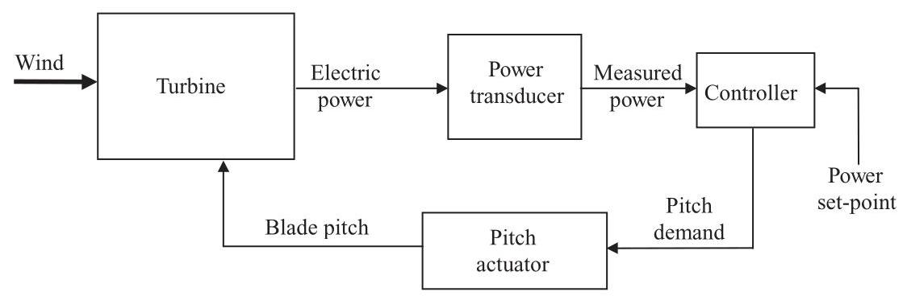

Figure 8.2 Main control loop for a fixed speed pitch regulated turbine

### 8.3.2 Control of variable speed pitch regulated turbines

A variable speed generator is decoupled from the grid frequency by a power converter, which can control the load torque at the generator directly, so that the speed of the turbine rotor can be allowed to vary between certain limits. An often-quoted advantage of variable speed operation is that below rated wind speed, the rotor speed can be adjusted in proportion to the wind speed so that the optimum tip speed ratio is maintained. At this tip speed ratio the power coefficient, ${C}_{p}$ , is a maximum, which means that the aerodynamic power captured by the rotor is maximised. This is often used to suggest that a variable speed turbine can capture much more energy than a fixed speed turbine of the same diameter. In practice it may not be possible to realise all of this gain, partly because of losses in the power converter and partly because it is not possible to track optimum ${C}_{p}$ perfectly.

Maximum aerodynamic efficiency is achieved at the optimum tip speed ratio $\lambda  = {\lambda }_{\text{ opt }}$ , at which the power coefficient ${C}_{p}$ has its maximum value ${C}_{p\left( \max \right) }$ . Since the rotor speed $\Omega$ is then proportional to wind speed $U$ , the power increases with ${U}^{3}$ and ${\Omega }^{3}$ , and the torque with ${U}^{2}$ and ${\Omega }^{2}$ . The aerodynamic torque is given by

$$
{Q}_{a} = \frac{1}{2}{\rho A}{C}_{q}{U}^{2}R = \frac{1}{2}{\rho \pi }{R}^{3}\frac{{C}_{p}}{\lambda }{U}^{2} \tag{8.2}
$$

Since $U = {\Omega R}/\lambda$ we have

$$
{Q}_{a} = \frac{1}{2}{\rho \pi }{R}^{5}\frac{{C}_{p}}{{\lambda }^{3}}{\Omega }^{2} \tag{8.3}
$$

In the steady state, therefore, the optimum tip speed ratio can be maintained by setting the load torque at the generator, ${Q}_{g}$ , to balance the aerodynamic torque, that is,

$$
{Q}_{g} = \frac{1}{2}\frac{{\pi \rho }{R}^{5}{C}_{p}}{{\lambda }^{3}{G}^{3}}{\omega }_{g}^{2} - {Q}_{L} \tag{8.4}
$$

Here ${Q}_{L}$ represents the mechanical torque loss in the drive train (which may itself be a function of rotational speed and torque), referred to the high speed shaft. The generator speed is ${\omega }_{g} = {G\Omega }$ , where $G$ is the gearbox ratio.

This torque-speed relationship is shown schematically in Figure 8.3 as the curve B1-C1. Although it represents the steady-state solution for optimum ${C}_{p}$ , it can also be used dynamically to control generator torque demand as a function of measured generator speed. In many cases, this is a very benign and satisfactory way of controlling generator torque below rated wind speed.

For tracking peak ${C}_{p}$ below rated in a variable speed turbine, the quadratic algorithm of Equation 8.4 works well and gives smooth, stable control. However, in turbulent winds, the large rotor inertia prevents it from changing speed fast enough to follow the wind, so rather than staying on the peak of the ${C}_{p}$ curve it will constantly fall off either side, resulting in a lower mean ${C}_{p}$ . This problem is clearly worse for heavy rotors, and also if the ${C}_{p} - \lambda$ curve has a sharp peak. Thus, in optimising a blade design for variable speed operation, it is not only important to try to maximise the peak ${C}_{p}$ , but also to ensure that the ${C}_{p} - \lambda$ curve is reasonably flat-topped.

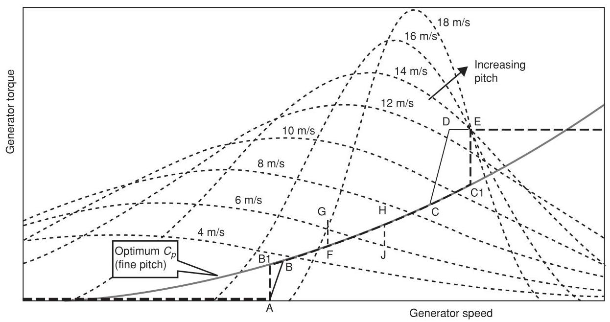

Figure 8.3 Schematic torque-speed curve for a variable speed pitch regulated turbine

It is possible to manipulate the generator torque to cause the rotor speed to change faster when required, so staying closer to the peak of the ${C}_{p}$ curve. One way to do this is to modify the torque demand by a term proportional to rotor acceleration (Bossanyi, 1994):

$$
{Q}_{g} = \frac{1}{2}\frac{{\pi \rho }{R}^{5}{C}_{p}}{{\lambda }^{3}{G}^{3}}{\omega }_{g}^{2} - {Q}_{L} - B{\dot{\omega }}_{g} \tag{8.5}
$$

For a stiff drive train, and ignoring frequency converter dynamics, the torque balance gives:

$$
I\dot{\Omega } = {Q}_{a} - G{Q}_{g} \tag{8.6}
$$

where $I$ is the total inertia (of rotor, drive train and generator) and $\Omega$ is the rotational speed of the rotor. Hence,

$$
\left( {I - {G}^{2}B}\right) \dot{\Omega } = {Q}_{a} - \frac{1}{2}\frac{{\pi \rho }{R}^{5}{C}_{p}}{{\lambda }^{3}{G}^{2}}{\omega }_{g}^{2} + G{Q}_{L} \tag{8.7}
$$

Thus, the effective inertia is reduced from $I$ to $I - {G}^{2}B$ , allowing the rotor speed to respond more rapidly to changes in wind speed.

Another possible method is to use available measurements to make an estimate of the wind speed, calculate the rotor speed required for optimum ${C}_{p}$ , and then use the generator torque to achieve that speed as rapidly as possible. The aerodynamic torque can be expressed as

$$
{Q}_{a} = \frac{1}{2}{\rho A}{C}_{q}R{U}^{2} = \frac{1}{2}{\rho \pi }{R}^{5}{\Omega }^{2}{C}_{q}/{\lambda }^{2} \tag{8.8}
$$

where $R$ is the turbine radius, $\Omega$ the rotational speed, and ${C}_{q}$ the torque coefficient. If drive train torsional flexibility is ignored, a simple estimator for the aerodynamic torque is

$$
{Q}_{a}^{ * } = G{Q}_{g} + I\dot{\Omega }\; = G{Q}_{g} + {IG}{\dot{\omega }}_{g} \tag{8.9}
$$

where $I$ is the total inertia. A more sophisticated estimator could take into account drive train torsion, etc. From this it is possible to estimate the value of the function $F\left( \lambda \right)  = {C}_{q}\left( \lambda \right) /{\lambda }^{2}$ as

$$
{F}^{ * }\left( \lambda \right)  = \frac{{Q}_{a}^{ * }}{\frac{1}{2}{\rho \pi }{R}^{5}{\left( G{\omega }_{g}\right) }^{2}} \tag{8.10}
$$

Knowing the function $F\left( \lambda \right)$ from steady state aerodynamic analysis, one can then deduce the current estimated tip speed ratio ${\lambda }^{ * }$ . The desired generator speed for optimum tip speed ratio can then be calculated as

$$
{\omega }_{d} = {\omega }_{g}\widehat{\lambda }/{\lambda }^{ * } \tag{8.11}
$$

where $\widehat{\lambda }$ is the optimum tip speed ratio to be tracked. A simple PI controller can then be used, acting on the speed error ${\omega }_{g} - {\omega }_{d}$ , to calculate a generator torque demand which will track ${\omega }_{d}$ . The higher the gain of PI controller, the better will be the ${C}_{p}$ tracking, but at the expense of larger power variations. Simulations for a particular turbine showed that a below-rated energy gain of almost $1\%$ could be achieved, with large but not unacceptable power variations.

Holley et al. (1999) demonstrated similar results with a more sophisticated scheme, and also showed that a perfect ${C}_{p}$ tracker could capture $3\%$ more energy below rated, but only by demanding huge power swings of plus and minus three to four times rated power, which is totally unacceptable.

Since such large torque variations are required to achieve only a modest increase in power output, it is usual simply to use the simple quadratic law, possibly augmented by some inertia compensation as in Equation 8.5 if the rotor inertia is large enough to justify it.

As turbine diameters increase in relation to the lateral and vertical length scales of turbulence, it becomes more difficult to achieve peak ${C}_{p}$ anyway because of the non-uniformity of the wind speed over the rotor swept area. Thus, if one part of a blade is at its optimum angle of attack at some instant, other parts will not be.

In most cases, it is actually not practical to maintain peak ${C}_{p}$ from cut-in all the way to rated wind speed. Although some variable speed systems can operate all the way down to zero rotational speed, this is not the case with limited range variable speed systems based on the widely-used doubly-fed induction generators. These systems only need a power converter rated to handle a fraction of the turbine power, which is a major cost saving. This means that in low wind speeds, just above cut-in, it may be necessary to operate at an essentially constant rotational speed, with the tip speed ratio above the optimum value.

At the other end of the range, it is usual to limit the rotational speed to some level, usually determined by aerodynamic noise constraints, which is reached at a wind speed which is still some way below rated. It is then cost-effective to increase to torque demand further, at essentially constant rotational speed, until rated power is reached. Figure 8.3 illustrates some typical torque-speed trajectories, which are explained in more detail below. Turbines designed for noise-insensitive sites may be designed to operate along the optimum- ${C}_{p}$ trajectory all the way until rated power is reached. The higher rotational speed implies lower torque and in-plane loads, but higher out of plane loads, for the same rated power. This strategy might be of interest for offshore wind turbines.

### 8.3.3 Pitch control for variable speed turbines

Once the rated torque has been reached, no further increase in load torque can occur, so the turbine will start to speed up. Pitch control is then used to regulate the rotor speed, with the load torque held constant. A PI or PID controller is often satisfactory for this application. In some situations it may be useful to include notch filters on the speed error to prevent excessive pitch action at, for example, the blade passing frequency or significant structural resonant frequencies, for example the drive train torsional frequency.

Rather than maintain a constant torque demand while the pitch control is regulating the rotational speed, it is possible to vary the torque demand in inverse proportion to the measured speed in order to keep the power output, rather than the torque, at a constant level. Provided the pitch controller is able to maintain the speed close to the set point, there will be little difference between these two approaches. The reduction of load torque with increasing speed has a slight destabilising effect on the pitch controller, but this is often not serious, and provided the gearbox torque and rotor speed variations are not greatly affected, the constant power approach is attractive from the perspective of power quality.

### 8.3.4 Switching between torque and pitch control

In practice, acoustic noise, loads or other design constraints usually mean that the maximum allowable rotor speed is reached at a relatively low wind speed. As the wind speed increases further, it is desirable to increase the torque and power without any further speed increase, in order to capture more energy from the wind. The simplest strategy is to implement a torque-speed ramp: line CD in Figure 8.3. Once rated power or torque is reached, pitch control is used to maintain the rotor speed at its rated value. In order to prevent the torque and pitch controllers from interfering with one another, the speed set-point for the pitch controller is set a little higher, at point E in Figure 8.3. If the speed set-point were at D then there would constantly be power dips in above-rated winds, whenever the speed fell transiently below D. Furthermore the pitch controller would act below rated, as the pitch and torque controllers would both be trying to control the speed.

It would be an improvement if the torque-speed trajectory A-B-C-D-E in Figure 8.3 could be changed to A-B1-C1-E. The turbine would then stay close to optimum ${C}_{p}$ over a wider range of wind speeds, giving slightly higher energy capture for the same maximum operating speed (Bossanyi, 1994). The vertical sections A-B1 and C1-E can be achieved by using a PI controller for the torque demand, in response to the generator speed error with the set point at A or C1. Transitions between constant speed and optimum ${C}_{p}$ operation are conveniently handled by using the optimum- ${C}_{p}$ curve as the upper torque limit of the PI controller when operating at A, or the lower limit when at C1. The set point flips between A and C1 when the measured speed crosses the mid-point between A and C1. Despite this step change in set point the transition is completely smooth because the controller will be saturated on the optimum- ${C}_{p}$ limit curve both before and after the transition.

This logic can easily be extended to implement 'speed exclusion zones', to avoid speeds at which blade passing frequency would excite, for example, the tower resonance, by introducing additional speed set points and some logic for switching between them - see lines FG, HJ in Figure 8.3. When the torque demand exceeds $\mathrm{G}$ for a certain time, the set point ramps smoothly from F to H. Then if it falls below J, the set point ramps back again.

Another advantage of PI control of the torque is that the 'compliance' of the system can be controlled. Controlling to a steep ramp (CD in Figure 8.3) can be quite harsh in that the torque demand will be varying rapidly up and down the slope. A PI controller, on the other hand, can be tuned to achieve a desired level of 'softness'. With high gain, the speed will be tightly controlled to the set point, requiring large torque variations. Lower gains will result in more benign torque variations, while the speed is allowed to vary more around the set point.

In order to use point $\mathrm{C}1$ as the speed set point for both the torque and the pitch controllers, it is necessary to decouple the two. One technique is to arrange some switching logic which ensures that only one of the control loops is active at any one time. Thus, below rated the torque controller is active and the pitch demand is fixed at fine pitch, while above rated the pitch controller is active and the torque demand is fixed at the rated value. This can be done with fairly simple logic, although there will always be occasions when the controller is caught briefly in the 'wrong' mode. For example, if the wind is just below rated but rising rapidly, it might be useful to start pitching the blades a little before the torque demand reaches rated. If the pitch does not start moving until the torque reaches rated, it then has to move some way before it starts to control the acceleration, and a small overspeed may result.

A more satisfactory approach is to run both control loops together, but to couple them together with terms which drive one or the other loop into saturation when far above or below the rated wind speed. Thus, most of the time only one of the controllers is active, but they can be made to interact constructively when close to the rated point.

A useful method is to include a torque error term in the pitch PID in addition to the speed error. Above rated, since the torque demand saturates at rated, the torque error will be zero, but below rated it will be negative. An integral term will bias the pitch demand towards fine pitch, preventing the pitch controller from acting in low winds, while a proportional term may help to start the pitch moving a little before the torque reaches rated if the wind speed is rising rapidly.

It is also necessary to prevent the torque demand from dropping when operating well above rated wind speed. Here a useful strategy is a 'ratchet' which prevents the torque demand from falling while the pitch is not at fine. This can also smooth over brief lulls in the wind around rated, using the rotor kinetic energy to avoid transient power drops.

An alternative approach is to introduce separate bias terms to the speed errors for the two control loops, effectively modifying the set-points of both loops, which remain active throughout. When the torque is below rated, the pitch controller sees a higher speed set-point, forcing the pitch towards fine. As the torque approaches rated, the set-point is reduced to the nominal value so that the pitch control gradually takes over. As the pitch rises above fine, the torque controller set point is pushed down, forcing the torque up to the rated power limit. As the pitch comes down again the torque controller set-point rises back to the nominal value, allowing the torque controller to resume its duties by the time fine pitch is reached, and as the torque falls further the pitch controller set point rises again to keep the pitch at the fine limit. The movement of the set-points is decoupled from the control loop dynamics by introducing first-order lags with appropriate time constants. Shorter time constants are appropriate for rising set-points than for falling set-points. This helps prevent overspeeds, and also prevents the pitch angle from falling too sharply during a temporary wind lull which could cause unnecessary tower vibration.

### 8.3.5 Control of tower vibration

For both fixed and variable speed machines the influence of the pitch controller on tower vibration and loading, described in Section 8.2.1, is one of the major constraints on the design of the control algorithm. The first tower fore-aft vibrational mode is essentially very lightly damped, exhibiting a strong resonant response which can be maintained at quite a high level even by a small amount of excitation which is naturally present in the wind. The strength of the response depends critically on the small amount of damping which is present, mostly aerodynamic damping from the rotor. The pitch control action modifies the effective damping of that mode. In designing the pitch controller, it is therefore important to avoid further reducing the already small level of damping, and if possible to increase it.

The design of control algorithms is covered in Section 8.4. This includes the choice of PID gains, as well as the addition of further terms to the controller which modify the overall dynamics in such a way as to help increase the tower damping. The use of modern control methods such as optimal state feedback is also discussed. This technique can help to achieve a suitable compromise between the competing objectives of speed or power control (achieved by regulating the in-plane loading) and tower vibration control (which depends on modifying the out-of-plane loading).

There is, however, only a certain amount of information in the measured speed or power signal. State estimators such as Kalman filters (Section 8.4.5) can be used to try to distinguish between the effects of wind speed changes and tower motion on the measured signal. However, it is also possible to enhance the information available to the controller by using an accelerometer mounted in the nacelle, which provides a very direct measure of tower fore-aft motion. By using this extra signal, it is in fact possible to reduce tower loads significantly without adversely affecting the quality of speed or power regulation.

The tower dynamics can be modelled approximately as a second order system exhibiting damped simple harmonic motion, that is,

$$
M\ddot{x} + D\dot{x} + {Kx} = F + {\Delta F} \tag{8.12}
$$

where $x$ is tower displacement and $F$ is the applied force, which in this case is predominantly the rotor thrust. ${\Delta F}$ is the additional thrust caused by pitch action. We can equate $M$ with the tower modal mass and $K$ with the modal stiffness, such that the tower frequency is $\sqrt{K/M}\mathrm{{rad}}/\mathrm{s}$ . The damping term $D$ is small. The effective damping can clearly be increased if ${\Delta F}$ is proportional to $- \dot{x}$ . Clearly it is easier to measure acceleration than velocity, so the tower acceleration would have to be integrated to provide a measure of $\dot{x}$ . A suitable gain for ${\Delta F}$ can be estimated from the partial derivative from pitch to thrust, $\partial F/\partial \beta$ where $\beta$ is the pitch angle, in order to achieve any particular additional damping ${D}_{p}$ :

(8.13)

$$
{\delta F} = \frac{\partial F}{\partial \beta }{\delta \beta } =  - {D}_{p}\dot{x}
$$

$$
{\delta \beta } = \frac{-{D}_{p}}{\partial F/\partial \beta }\dot{x}
$$

It may sometimes be necessary to place a notch filter in series with this feedback term to prevent unwanted feedback from other components of tower acceleration, for example at blade passing frequency. Lead-lag or other loop-shaping filters may also help to adjust the phase of the feedback to ensure maximum damping, taking into account the full dynamics of the system which are actually more complex than Equation 8.12. For example, the dynamic response of the pitch actuator should be taken into account, as well as other modes of vibration which couple to the tower dynamics. Figure 8.4 shows the results of a simulation with and without such an acceleration feedback term, in combination with a PID controller to control rotational speed. The simulations were driven with a realistic three-dimensional turbulent wind input. The speed control was hardly affected, and although there is a significant increase in pitch actuator activity, the additional pitch rates required are modest. Clearly this technique is capable of increasing the tower damping substantially, almost eliminating the resonant response and significantly reducing tower base loads. Although it requires an accelerometer, this is usually present anyway to trigger a shut-down in the event of excessive vibration. Accelerometers are also relatively cheap, robust and reliable devices.

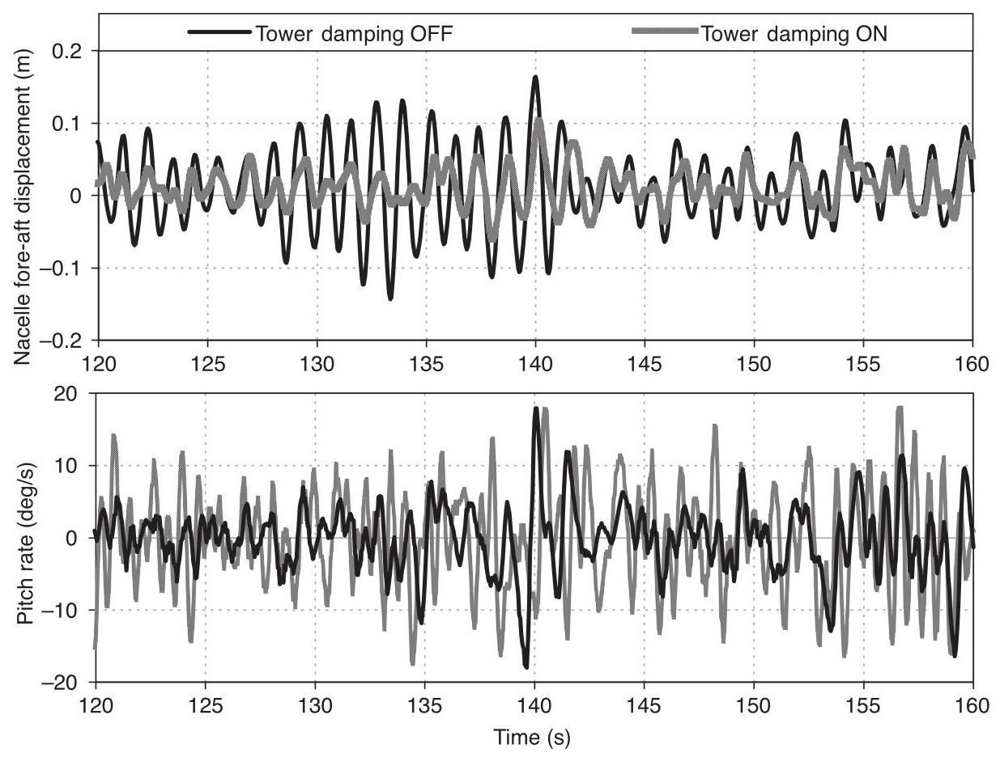

Figure 8.4 Use of a tower accelerometer to help control tower vibration

Field test results demonstrating the effectiveness of this tower damping action have been published by Rossetti et al. (2004) and Bossanyi et al. (2010).

Because rotor thrust varies rapidly with pitch angle close to fine pitch, a common cause of fore-aft tower excitation is the case of short-lived lull in wind speed starting a little above rated wind speed. The pitch responds by falling rapidly towards fine pitch, causing a rapid thrust reduction and large consequent tower vibration. This can be avoided by preventing the rapid decrease in pitch: if the wind picks up again quickly, as is often the case, little energy is lost. Various algorithms can be used for this. Simply limiting the negative pitch rate when close to fine pitch is a possibility, although this will generally reduce the effectiveness of speed regulation in this region, and the asymmetrical rate limits will result in loss of energy (restoring symmetry by similarly decreasing the positive rate limit is not advisable, as transient overspeeds will result). These disadvantages can be mitigated to some extent by limiting the downward pitch rate only after a large negative rate has already been sustained for a short time. However, a particularly effective technique is to use a dynamically varying fine pitch angle: whenever the pitch angle is above fine pitch, the fine pitch limit is increased, but always staying below the actual pitch by at least a certain margin, so that it is always well below the actual pitch in high winds. The dynamic fine pitch is allowed to decrease only slowly, so during a wind lull the pitch may decrease to the level of the dynamic fine pitch, which then continues to fall slowly to ensure that the true fine pitch is reached if the lull is prolonged. The generator torque control can act while the pitch is on the dynamic fine pitch limit, preventing any significant reduction in rotor speed during a short wind lull.

Tower loading is generally dominated by the fore-aft vibration, but side-side vibration can be significant in some situations, for example in offshore turbines operating during periods of wind-wave misalignment. The side-side vibration is even more lightly damped than fore-aft, because there is even less aerodynamic damping from the rotor in this direction. When the principal wave direction is coming from the side, therefore, the excitation of the side-side vibrations can be considerable, and may even become more significant than the fore-aft vibration at such times. In principle, the damping of the side-side vibration can be increased by appropriate control of the generator torque, adding a component of torque demand derived from the measured side-side acceleration, in addition to the torsional damping described in the next section (Markou et al., 2009; Fischer, 2010).

### 8.3.6 Control of drive train torsional vibration

A typical drive train can be considered to consist of a large rotor inertia and a (smaller) high speed shaft inertia (mainly the generator and brake disc), separated by a torsional spring which represents twisting of shafts and couplings, bending of gear teeth and deflection of any soft mountings. It is important to consider also the coupling of the torsional mode of vibration with the first rotor in-plane collective mode, in which case the drive train can be approximated by three inertias and two torsional springs (Ramtharan et al., 2007). In some cases the coupling to the second tower side-to-side mode, which has a lot of rotation at the tower top, is also important.

In a fixed speed turbine, the induction generator slip curve (Section 7.5) essentially acts like a strong damper, with the torque increasing rapidly with speed - see Figure 7.29, Chapter 7. Therefore, the torsional mode of the drive train is well damped and generally does not cause a problem. In a variable speed turbine operating at constant generator torque however, there is very little damping for this mode, since the torque no longer varies with generator speed. The aerodynamic damping due to the rotor is small because the blades are vibrating in the in-plane direction. There is a small amount of structural damping in shafts and couplings, and some damping from the gearbox, but these effects contribute typically only a small fraction of $1\%$ of critical damping. The very low damping can lead to large torque oscillations at the gearbox, effectively negating one of the principal advantages of variable speed operation, the ability to control the torque.

Although it may be possible to provide some further damping mechanically, for example by means of appropriately designed rubber mounts or couplings, it is difficult to provide enough damping and there is a cost associated with this. A widely-used solution, which has been successfully adopted on many variable speed turbines, is to modify the generator torque control to provide some damping. Instead of demanding a constant generator torque above rated, (or a torque varying slightly in inverse proportion to speed in the case of the constant power algorithm described in Section 8.3.3), a small ripple at the drive train frequency is added on to this basic torque demand, with the phase adjusted to counteract the effect of the resonance and effectively increase the damping. A band-pass filter of the form

$$
G\frac{{2\zeta \omega s}\left( {1 + {s\tau }}\right) }{{s}^{2} + {2\zeta \omega s} + {\omega }^{2}} \tag{8.14}
$$

(where $G$ is a gain) acting on the measured generator speed can be used to generate this additional ripple. The frequency $\omega$ must be close to the resonant frequency which is to be damped. The time constant $\tau$ modifies the phase and contributes more of a high-pass filter characteristic, and can sometimes be used to compensate for time lags or other dynamics in the system. A root locus plot (Section 8.4) is very useful for tuning the filter parameters.

Although a very effective filter can be made by tuning it to give a frequency response with a very broad peak (large $\zeta$ ), this may be detrimental to the overall performance in that more low frequency variations in torque and power are then introduced. Even with a narrow peak, there can be sufficient response at multiples of blade passing frequency such as 3P or 6P to disturb the system, in which case a notch filter (Section 8.4) can be cascaded with the filter of Equation 8.14. Of course if the resonant frequency nearly coincides with an excitation frequency such as 6P then the resonance will be very difficult to control because it will be strongly excited.

Figure 8.5 shows some simulation results for a variable speed turbine operating in simulated three-dimensional turbulence. A large drive train resonance can be seen to be building up. Although the power and generator torque are smooth, the gearbox would be very badly affected. The effect of introducing a damping filter as described above is also shown. It almost completely damps out the resonance without increasing the electrical power variations. This is because the torque ripple needed to damp the resonance is actually very small, because the amount of excitation is small.

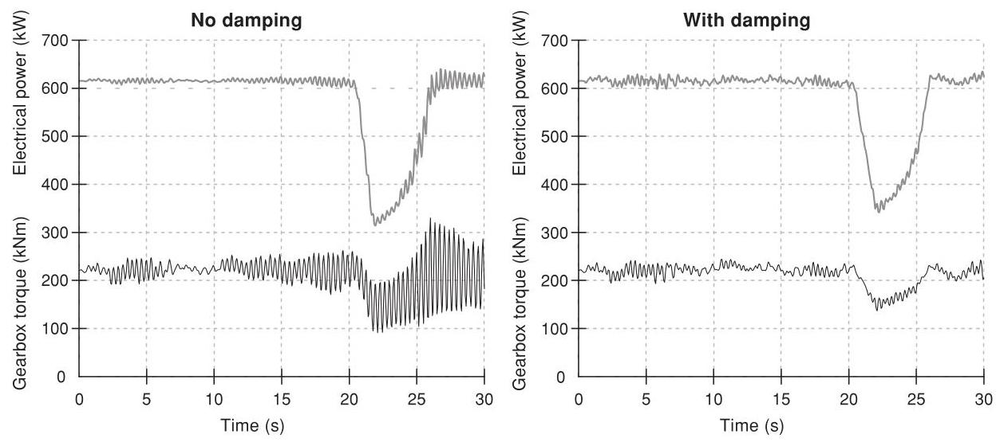

Figure 8.5 Effect of a drive train damping filter

In many cases the drive train damping can be further improved by using an input signal representative of the 'twisting speed' rather than just the generator speed: the twisting speed is just the difference between the generator speed and the rotor speed (scaled by gearbox ratio). However, this requires two speed measurements, and the low speed shaft sensor in particular sometimes has insufficient resolution and may need to be upgraded. Care is needed to ensure that the required difference between the two signals is not too susceptible to noise on the signals.

These torsional vibrations are typically much less of a problem on direct drive systems, where in some cases a damping filter of this sort may not even be required at all.

### 8.3.7 Variable speed stall regulation

Figure 8.6 shows two power curves for the same rotor, one running as a ${600}\mathrm{\;{kW}}$ fixed speed pitch regulated turbine and one adjusted to run as a fixed speed stall regulated turbine with the same rating. The rotational speed of the stall regulated turbine has been reduced in order to limit the power to the same rated level. Therefore, although the stall regulated turbine generates slightly more energy at very low wind speeds, as the blades approach stall above $8\mathrm{\;m}/\mathrm{s}$ there is a large loss of output compared to the pitch regulated machine. (In practice of course, if the turbine was designed to operate in stall, the blade design, solidity and rotor speed could be reoptimised, reducing this difference.)

By making use of variable speed, it is quite possible to correct this loss of energy by operating either turbine at the optimum tip speed ratio up to rated, or until the maximum rpm is reached. At rated power, it is then possible to reduce the speed of the rotor to bring it into stall, although this has rarely been done to date on commercial machines. This can be done by closed loop control of the generator torque in response to power error, allowing the turbine to follow exactly the same power curve as the pitch regulated turbine. Thus, the variable speed stall regulated turbine can achieve the same energy output as the variable speed pitch regulated turbine, but without the need for an active pitch mechanism. As explained in Section 8.2.2, however, significant torque and power transients will result from this strategy. The smooth torque and power, which are one of the main advantages of variable speed systems, will therefore not be realised.

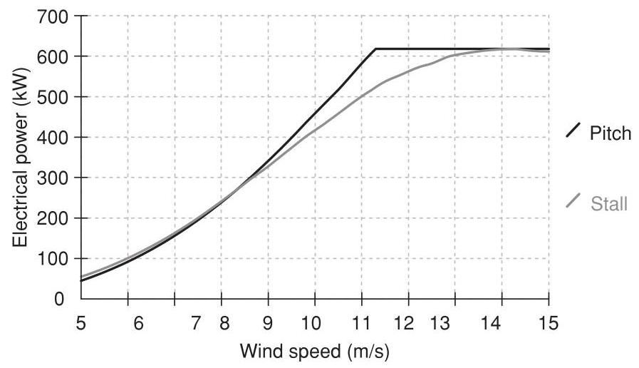

Figure 8.6 Comparison of pitch and stall control

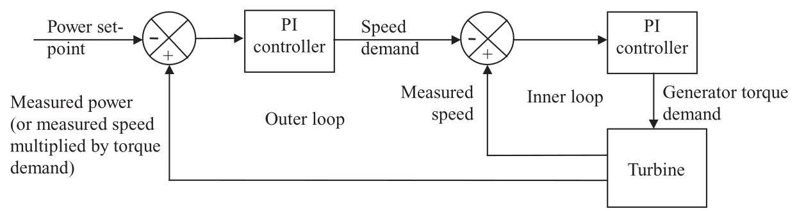

Figure 8.7 A simple control algorithm for variable speed stall regulation

One simple and effective control algorithm for this case is illustrated in Figure 8.7. It consists of two nested loops, an outer power loop which demands a generator speed, and an inner speed loop which demands a generator torque. As in Section 8.3.4, a PI controller can be used for the inner loop. This is the same controller as for sections A-B1 and C1-E of Figure 8.3, making it particularly easy to arrange the transition between control modes at the rated point since the inner loop is always active.

### 8.3.8 Control of variable slip turbines

The operating envelope for a variable slip generator is shown in Figure 8.8. Note that the slip speed represents the increase in speed above synchronous (conventionally for motors this would be a negative slip). Below rated, the generator acts just like a conventional induction machine, with the torque related to the slip speed according to the slip curve AB. Once point B is reached, a resistor in series with the rotor circuit, previously short-circuited by a semiconductor switch, is progressively brought into play by switching the semiconductor switch on and off at several $\mathrm{{kHz}}$ , and varying the mark-space ratio to change the average resistance. As the average resistance increases, the generator slip curve changes so that its slope varies inversely with the total resistance of the rotor circuit. Figure 8.8 shows a typical example in which the rotor resistance can increase by a factor 10, changing the slip curve from AB to AD. By controlling the resistance, therefore, the generator can operate anywhere within the shaded region. The resistance is usually varied by a closed loop algorithm which seeks to regulate the torque to any desired value. For example, this might be PI algorithm with torque error input and the mark-space ratio of the switch as output.

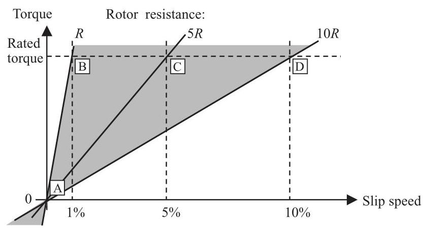

Figure 8.8 Operating envelope for a variable slip generator

In practice, it is usual to keep the torque demand at the rated value. Then the generator will simply act as a conventional induction generator following the slip curve AB until rated torque is reached, at which point it will accelerate along the constant torque line BCD just like a variable speed system. If the speed increases beyond D the torque is forced to increase again. Pitch control is used to regulate the speed to a chosen set-point such as point C. The higher the speed $\mathrm{C}$ , the higher the mechanical power input for the same output power. Thus, the power dissipated in the rotor circuit corresponds exactly to the slip. Therefore, C should be chosen as low as possible to minimise the cooling requirements (as well as turbine loads which increase with speed). However, if C is too close to B then the torque will occasionally dip down the slope AB as the speed varies around the set point, causing power dips even when operating well above rated wind speed. How small the interval between B and C can be made depends on the rotor inertia and the responsiveness of the pitch control algorithm. As for a variable speed system, the latter can be a PI or PID algorithm. It is possible to change the rate limits of the PID to force the pitch towards fine at maximum rate if the speed gets too close to B, or to feather at maximum rate if it gets too close to D.

As with a variable speed system, it may be desirable to modify the torque demand as in Section 8.3.6 to control drive train torsional vibrations. However, in order to do this, it is necessary to be able to update the torque demand at relatively high frequency, at least five and preferably ten times the drive train frequency which is typically of the order of 3-5 Hz.

### 8.3.9 Individual pitch control

Large pitch-regulated turbines invariably have a separate pitch actuator for each blade, since these can be used to provide effectively independent aerodynamic braking systems on the rotor. This means that no shaft brake is required, other than a small parking brake, because if one pitch actuator fails, the remaining actuator(s) should still be capable of stopping the rotor. Given that each blade has its own independent actuator, it is possible to send different pitch demands to each blade, and this can be used to reduce the asymmetrical aerodynamic loadings across the rotor, which are responsible for a significant contribution to fatigue loads (Donham et al., 1979; Caselitz et al., 1997; Bossanyi, 2004).

The simplest concept is cyclic pitch control based on the rotor azimuth. There are a number of effects which cause a systematic azimuthal variation of loading on each blade, in particular the wind speed variations caused by wind shear and tower shadow, and changes in angle of attack due to yaw misalignment, shaft tilt and upflow. In principle it should be possible to impose an azimuth-dependent change to the demanded pitch for each blade to compensate for these effects.

The tower shadow is very systematic and predictable, but to have any effect would require a very rapid and short-lived 'blip' in pitch demand as each blade passes the tower, which could have other adverse consequences. The effect of shaft tilt is also very predictable, and possibly upflow too in some situations, but these will affect only the angle of attack and not the local wind speed. Yaw misalignment also affects just the angle of attack, and to compensate for it would require an additional sensor to measure it, since the magnitude and direction of the misalignment will vary continuously. Wind shear does cause a significant difference in wind speed across the rotor, and therefore causes large blade load variations at the rotational frequency (1P), but again it is not a constant effect and would require one or more additional sensors to detect it. Furthermore, the wind shear can only be regarded as a mean effect, and because of turbulence the instantaneous variation in wind speed across the rotor may be very different: in fact the highest wind speed could occur instantaneously anywhere on the rotor disc, not always at the top.

Indeed it is the turbulent variations in wind speed across a large wind turbine rotor which usually dominate the asymmetrical loading, since the size of a large rotor is comparable to the scale of turbulent eddies. Therefore, azimuth-dependent cyclic pitch control tends not to be very successful: while on average some reduction in loading ought to be achievable by compensating for the mean wind shear, this is insignificant compared to the stochastic effects of turbulence. An exception might be for a turbine operating in highly stratified flow with low turbulence.

Normally though, to achieve any significant reduction in these asymmetrical loads requires some additional measurement of the instantaneous turbulence, so that the individual pitch angles can be adjusted to compensate for these effects.

One possibility is actually to measure the incident wind flow just in front of each blade, for example using a set of pitot tubes along the blades, or to use pressure taps at appropriate locations, and then to adjust the pitch of each blade in response to the measurements on that blade. Such sensors have also been proposed to control 'smart' blades, which have actuators distributed along the span of the blade to alter its aerodynamic properties locally, such as flaps or ailerons, deformable trailing edges, or possibly air jets to modify the boundary layer flow. Such ideas are the subject of ongoing research and are currently a long way from any commercial deployment.

A more realistic possibility is to use load sensors to measure the blade bending moments at the root, or possibly at various points along the blade. It makes some sense to measure the very loads which we wish to reduce. With full-span pitch control, it would seem to make sense to measure the blade root loads on each blade and use the measurements to adjust the pitch of each blade in a feedback loop. Such a scheme could be called 'independent pitch control', although there is no definite consensus on nomenclature.

The possibility then arises to use the load measurement on each blade root as a predictor of the load which will be seen by the next blade when it sweeps past that position. This provides a degree of anticipation which should allow a further improvement in the control of each blade, and it works because turbulent eddies tend to be large enough so that as they pass through the rotor, each blade will slice through the same turbulence structure, perhaps even several times, before it has passed. Since the pitch of each blade is now calculated from the load measurements on all the blades, this can no longer be called 'independent' pitch control, and the term 'individual pitch control' may be more appropriate.

### 8.3.10 Multivariable control - decoupling the wind turbine control loops

The wind turbine controller is now a multivariable controller, with a number of inputs and outputs:

Inputs (measured signals):

- Generator speed (for speed regulation and drive train damping).

- Two tower accelerations (for tower damping).

- Three blade root loads (for a three-bladed turbine).

Outputs (demanded signals):

- Generator torque.

- Three pitch angles or rates (for a three-bladed turbine).

There are modern control methods which are appropriate to the design of controllers for such MIMO (Multiple Input, Multiple Output) systems - see Section 8.4.5. However, a MIMO system can sometimes be 'diagonalised' or transformed into a set of independent SISO (Single Input, Single Output) systems, in which case the controller for each SISO system can be optimised in isolation from the others. In fact this is possible to some extent for a wind turbine controller, and so all the control loops mentioned above can be designed using classical SISO design methods (Section 8.4.1). Actually the SISO loops are not quite independent, but the dynamic coupling between them can be small enough to make this a very successful approach in many cases.

It is relatively straightforward to decouple the pitch control from the torque control, as implied in the discussions above. In fact it is also possible to decouple the individual pitch control from the collective pitch control - the latter provides a collective pitch demand for speed regulation and tower damping, while the individual pitch control generates a separate pitch demand increment for each blade for minimising asymmetrical rotor loads. The pitch demand increments are all zero-mean, in such a way that the collective pitch control is not affected.

The main independent turbine control loops can now be summarised as follows:

1) Speed regulation loop using torque (using generator speed error to calculate the torque demand).

2) Drive train damping loop (using generator speed to calculate a modification to the torque demand).

3) Side-side tower damping loop (using side-side nacelle acceleration to calculate a further modification to the torque demand).

4) Speed regulation loop (using generator speed error to calculate the collective pitch demand).

5) Fore-aft tower damping loop (using fore-aft nacelle acceleration to calculate a modification to the collective pitch demand).

6) Individual pitch loop (using blade root loads to calculate individual pitch demand increments).

Loop 3 is not generally used but may become more interesting for offshore turbines which can be excited by wave action when this is misaligned with the wind direction.

There is actually some interaction between some of these loops; for example, loops 1 and 4 sometimes require notch filters tuned to the drive train resonant frequency to suppress coupling which would otherwise arise through the control action itself. Also loops 4 and 5 must be coupled in principle, since any change in pitch angle affects both the torque and the thrust, but because loop 5 acts only in a restricted frequency range close to the first tower frequency it is usually possible to tune the loops independently; although a better result can be obtained with one or two iterations: one of the loops is tuned first using the open-loop plant model, then the plant is redefined by closing this loop while the other loop is tuned, and so on.

Loop 6 is still a MIMO loop, with as many inputs and outputs as there are blades. However, this can also be decoupled, as explained in the next section, by exploiting the symmetry which exists between the blades.

### 8.3.11 Two-axis decoupling for individual pitch control

To first order, the asymmetrical wind field across the rotor swept area can be linearised and described by two orthogonal components, for example as wind speed shear gradients in the horizontal vertical directions. Blade loading is closely related to wind speed, so this representation can also be used for a 'blade load field' (the 'blade load field' can be considered to include the effects of all three components of the local wind speed on the blade load). This description is independent of the number of blades or their speed of rotation, and the actual load seen by a blade at any instant can be thought of as the value of that field as sampled by the blade at its instantaneous position.

Furthermore, the pitch action needed to compensate for this variation in loading can also be described by a 'field' covering the swept area, and at any instant the pitch required by each blade is obtained by sampling that field at the instantaneous position of the blade.

Since each field is described by just two orthogonal components, a two-input, two-output controller is required to generate the pitch action 'field' from the load 'field'. Again this is independent of the number of blades.

Thus for a three-bladed rotor, the three measured blade root loads can be used to calculate the two components of the 'load field' at that instant. These are used to calculate the two components of the 'pitch field', from which the three individual pitch increments are calculated. The transformation between the three rotating blades and the two (non-rotating) field components is identical to Park's transformation for three-phase electrical machines (Park, 1929), which relates the currents or voltages in each phase winding to two notional orthogonal currents or voltages in the 'direct' and 'quadrature' axes. For this reason it is known as the $d - q$ axis transformation. The same concept has also been used for helicopter rotors, where it is known as the Coleman transformation. The transformation from three rotating blade root loads ${L}_{1},{L}_{2},{L}_{3}$ to the non-rotating $d$ and $q$ axes can be written as follows:

$$
\left\lbrack  \begin{array}{l} {L}_{d} \\  {L}_{q} \end{array}\right\rbrack   = \frac{2}{3}\left\lbrack  \begin{matrix} \cos \left( \varphi \right) & \cos \left( {\varphi  + {2\pi }/3}\right) & \cos \left( {\varphi  + {4\pi }/3}\right) \\  \sin \left( \varphi \right) & \sin \left( {\varphi  + {2\pi }/3}\right) & \sin \left( {\varphi  + {4\pi }/3}\right)  \end{matrix}\right\rbrack  \left\lbrack  \begin{array}{l} {L}_{1} \\  {L}_{2} \\  {L}_{3} \end{array}\right\rbrack
$$

where $\varphi$ is the azimuth angle. The reverse transformation is:

$$
\left\lbrack  \begin{array}{l} {\theta }_{1} \\  {\theta }_{2} \\  {\theta }_{3} \end{array}\right\rbrack   = \left\lbrack  \begin{matrix} \cos \left( \varphi \right) & \sin \left( \varphi \right) \\  \cos \left( {\varphi  + {2\pi }/3}\right) & \sin \left( {\varphi  + {2\pi }/3}\right) \\  \cos \left( {\varphi  + {4\pi }/3}\right) & \sin \left( {\varphi  + {4\pi }/3}\right)  \end{matrix}\right\rbrack  \left\lbrack  \begin{array}{l} {\theta }_{d} \\  {\theta }_{q} \end{array}\right\rbrack
$$

where $\theta$ would represent pitch angle in this case. This can be extended to any number of blades $B$ , as follows:

$$
\left\lbrack  \begin{array}{l} {L}_{d} \\  {L}_{q} \end{array}\right\rbrack   = \frac{2}{B}\left\lbrack  \begin{matrix} \cos \left( \varphi \right) & \cos \left( {\varphi  + {2\pi }/B}\right) & \cos \left( {\varphi  + {4\pi }/B}\right) & \ldots \\  \sin \left( \varphi \right) & \sin \left( {\varphi  + {2\pi }/B}\right) & \sin \left( {\varphi  + {4\pi }/B}\right) & \ldots  \end{matrix}\right\rbrack  \left\lbrack  \begin{array}{l} {L}_{1} \\  {L}_{2} \\  {L}_{3} \\  \ldots  \end{array}\right\rbrack
$$

$$
\left\lbrack  \begin{matrix} {\theta }_{1} \\  {\theta }_{2} \\  {\theta }_{3} \\  \ldots  \end{matrix}\right\rbrack   = \left\lbrack  \begin{matrix} \cos \left( \varphi \right) & \sin \left( \varphi \right) \\  \cos \left( {\varphi  + {2\pi }/B}\right) & \sin \left( {\varphi  + {2\pi }/B}\right) \\  \cos \left( {\varphi  + {4\pi }/B}\right) & \sin \left( {\varphi  + {4\pi }/B}\right) \\  \ldots & \ldots  \end{matrix}\right\rbrack  \left\lbrack  \begin{matrix} {\theta }_{d} \\  {\theta }_{q} \end{matrix}\right\rbrack
$$

For a two-bladed machine this reduces simply to:

$$
{L}_{d} = \left( {{L}_{1} - {L}_{2}}\right) \cos \left( \varphi \right)
$$

$$
{L}_{q} = \left( {{L}_{1} - {L}_{2}}\right) \sin \left( \varphi \right)
$$

and

$$
{\theta }_{1} =  - {\theta }_{2} = {\theta }_{d}\cos \left( \varphi \right)  + {\theta }_{q}\sin \left( \varphi \right)
$$

In practice it is important to introduce an azimuthal phase shift into the reverse $d - q$ axis transformation, by adding an offset to the rotor azimuth angle to compensate for the controller timestep and any other time delays in the control loop. In other words the pitch angle is calculated for the azimuth angle which will be reached by the time the pitch demand has been fully realised.

All that remains is to design a two-input, two-output controller $\left\lbrack  C\right\rbrack$ to calculate the $d - q$ axis pitch demands from the $d - q$ axis loads:

$$
\left\lbrack  \begin{array}{l} {\theta }_{d} \\  {\theta }_{q} \end{array}\right\rbrack   = \left\lbrack  C\right\rbrack  \left\lbrack  \begin{array}{l} {L}_{d} \\  {L}_{q} \end{array}\right\rbrack
$$

In the steady state there is clearly a one-to-one correspondence between the load and the pitch angle needed to compensate for it. It seems logical, therefore, to suppose that $\left\lbrack  C\right\rbrack$ can be diagonal matrix, and furthermore because the rotor is rotationally symmetrical, the two diagonal terms should be identical. The design of the controller, therefore, boils down to designing a single SISO controller, and using two independent instances of it for the $d$ and $q$ axes. Since the wind field in the non-rotating frame varies relatively slowly, a straightforward, fairly low-bandwidth PI controller can be used for this.

Taking into account the dynamics, rotational sampling at the blade passing frequency means that there will be a certain speed variation at that frequency, resulting in corresponding variations in ${L}_{d}$ and ${L}_{q}$ . A notch filter at the blade passing frequency is, therefore, added in series with each PI controller. As for other PI loops, further notch or loop-shaping filters can be added if required.

Once the dynamics are taken into account, the rotor is no longer symmetrical because of its interaction with the tower dynamics. In principle this could lead to some asymmetry between the $d$ and $q$ axes, and possibly also a small amount of dynamic coupling. Therefore, in principle there might be some advantage in designing in a coupled two-input, two-output controller (Bossanyi, 2003). In practice however, any advantage is likely to be small, and two independent and identical SISO controllers have been found to work extremely well. Furthermore, these simple controllers have been found to be very robust: they tend to be rather insensitive to the turbine dynamics, and also to load sensor calibration errors or drift.

The inverse $d - q$ transformation converts the relatively slowly-varying $d - q$ pitch demands into near-sinusoidal individual pitch demand increments for each blade. The near-sinusoids are of frequency 1P and phase-shifted between the blades, for example, by ${120}^{ \circ  }$ for a three-bladed turbine. This form of control is, therefore, sometimes referred to as cyclic pitch control, but this is not correct: the controller is responding dynamically to the changing loads, so the pitch action is not actually sinusoidal, although it could be interpreted as sinusoidal with constantly changing amplitudes and phases. With PI controllers it is easy to limit the controller output to a maximum level, which corresponds to an upper limit on the amplitude of the sinusoids, and given the frequency (1P) this also determines the maximum additional pitch rate which would be demanded. This upper limit can be ramped down to zero in low winds, preventing any individual pitch action when the loads are small enough to contribute little to lifetime fatigue damage, so that the additional pitch action would not be worthwhile. It can also be used to ensure that the pitch demand does not fall below any physical pitch limit if this is close to the collective pitch demand in low winds. Another use is to prevent individual pitch action when it is more important to use the available pitch rates for collective pitch control, for example if the rotor is accelerating rapidly towards an overspeed trip (Savini et al., 2010).

### 8.3.12 Load reduction with individual pitch control

The main effect of the once-per-revolution (1P) individual pitch control is to reduce the 1P out of plane loading on the blades, and hence also the rotating hub or shaft moments. Figure 8.9 shows spectra of the blade root out of plane and shaft bending moments in simulations with and without individual pitch control. In fact the spectral peak in these loads at the

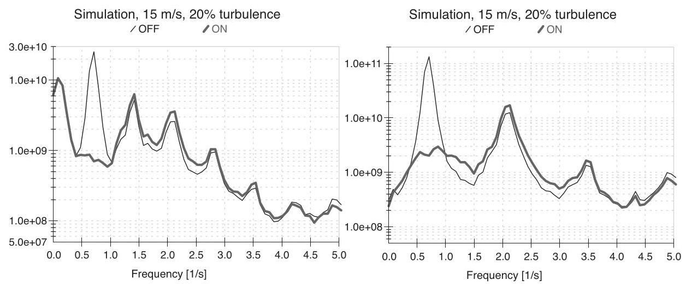

Figure 8.9 Effect of individual pitch control on rotating out of plane loads: blade root out of plane moment (left) and shaft bending moment (right)

1P frequency is virtually eliminated, an effect which has been confirmed also in field tests on an actual turbine (Bossanyi, 2010). Since the 1P load component dominates the fatigue, significant fatigue load reductions are obtained: typically of the order of ${20}\%$ for blade root out of plane bending moment, and more for shaft bending moments (30-40%) because the low frequency variations cancel out between the blades so the 1P peak is even more significant.

On a two-bladed turbine, therefore, the use of individual pitch control represents a good alternative to the use of a teetered hub (Bossanyi et al., 2009). Although it does not eliminate the teetering moment completely, a teetered hub often needs some kind of teeter restraint, which re-introduces a moment, and it is almost certainly necessary to consider the possibility of a teeter end-stop impact which can generate huge loads.

The 1P loading component on the rotor, when transformed to the non-rotating reference frame, results in loading contributions at 0P and 2P, so it is these load components which are reduced by individual pitch control. Hence the low frequency variation of nacelle nodding and yawing moments is removed, resulting in a reduction in peak loading - Figure 8.10 shows the effect on yaw moment, which may be of significant benefit in reducing the required yaw motor rating and duty. The nodding moment is reduced in a very similar way.

On a three-bladed turbine, there is no significant 2P component in the non-rotating loads, so only the low frequency load reduction is important here - the dominant source of fatigue loading on the non-rotating components is at $3\mathrm{P}$ , and so is largely unaffected by the individual pitch control. However, for a two-bladed turbine, where this fatigue loading is dominated by 2P, the individual pitch control does significantly reduce the non-rotating fatigue loading. Again this has been confirmed in field tests (Bossanyi et al., 2010).

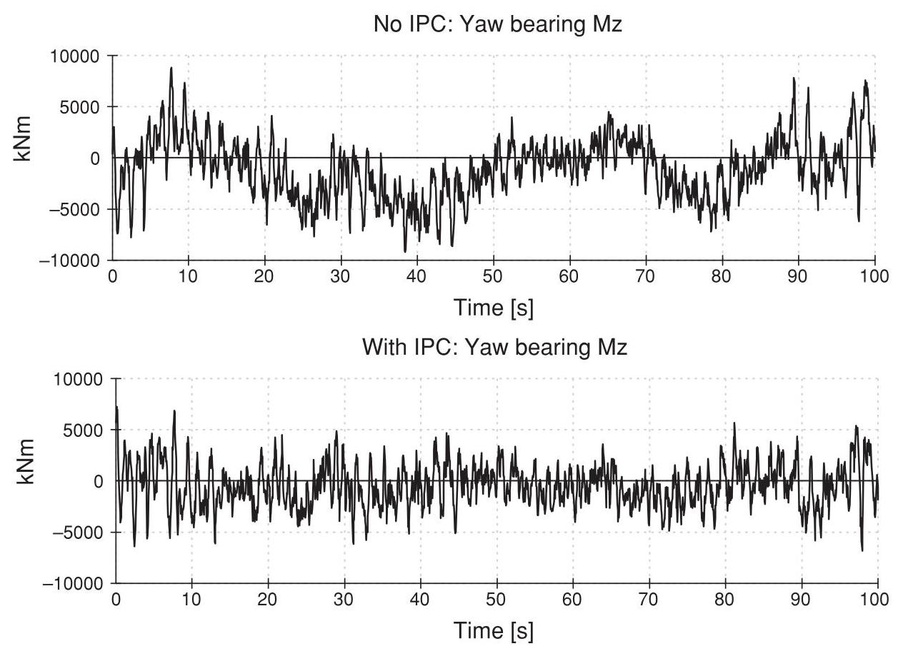

Figure 8.10 Effect of individual pitch control on yaw moment of a three-bladed turbine

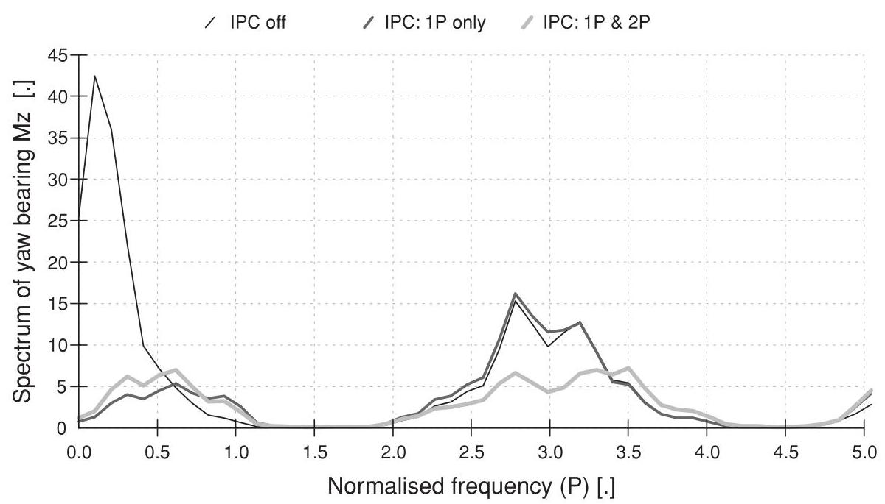

Figure 8.11 Effect of 1P and 2P individual pitch control on non-rotating loads

However, even for a three-bladed turbine it is possible to reduce these non-rotating fatigue loads by making use of second-harmonic individual pitch control. Taking 1P as the first harmonic, second-harmonic individual pitch control is achieved in exactly the same way but with the arguments to the sine and cosine functions in the rotational transformations multiplied by two, or by $n$ for the ${n}^{\text{ th }}$ harmonic (although it may not be worthwhile to use more than the second harmonic in practice). Second-harmonic control results in 2P pitch action - hence, any 2P loading in the rotating components is reduced - but also the 1P and 3P loading in the non-rotating components (van Engelen et al., 2005; Bossanyi et al., 2009). On a three-bladed turbine, therefore, the dominant 3P non-rotating fatigue loads are reduced by this means, as shown in Figure 8.11.

Any number of harmonics may be used together as shown in Figure 8.12, simply by using parallel control loops.

### 8.3.13 Individual pitch control implementation

Individual pitch control requires additional sensors, so it is important to ensure that these are very reliable, otherwise the overall reliability of the turbine would be compromised. Conventional strain gauges are notoriously unreliable, although they certainly can last well

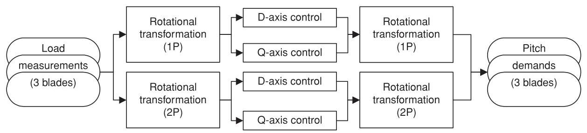

Figure 8.12 Adding higher harmonic individual pitch control loops

if very carefully installed. However, strain sensors based on fibre Bragg gratings are now available which have the potential to be sufficiently reliable for this application. Pulses of laser light are directed along an optical fibre, and a fine grating 'burnt' into the fibre at certain location reflects light of the same wavelength as the grating. The frequency of the reflected light is detected, and gives a direct measure of the strain at the position of the grating. Many gratings can be burnt into the same fibre, so strains at multiple locations can be measured at little extra cost: the time delay between sending the pulse and detecting the reflected signal determines the position of each grating. The components required are based on communications technology and are therefore becoming readily available. Furthermore, the special optical fibres can easily be included as part of the GRP layup during construction of a wind turbine blade.

Individual pitch control could equally be implemented using shaft bending sensors or even other sensors in the nacelle or tower top (Bossanyi, 2003), but it may be difficult to find suitable sensor locations. On the other hand if blade root sensors are used, they can also provide a measure of hub torque and rotor thrust. Although not currently used in this way, they might be useful as additional or alternative inputs to the other control loops described above, for example for damping tower fore-aft or drive train torsional vibrations.

If there is any failure of the strain sensors, there is the potential for individual pitch control to increase rather than reduce loading, which could be serious. Some failures are readily detected in a well-designed sensor system, but it is always possible that some types of failure may be hard to detect without some analysis of the signals by the controller, for example by comparing the sensor signals between different blades. If any failure is detected or suspected, the individual pitch control (being completely decoupled from the other control loops) can simply be switched off without the necessity to shut down the turbine, at least for a limited period or at a reduced power level until the fault can be rectified.

Below rated, the individual pitch control would normally be phased out since the loads are already smaller and so the additional pitch activity may not be justified. Also in principle there should be a small loss of energy output since the pitch angles are constantly moving either side of the optimum, although in practice this loss of output is usually very small. Above rated there is no loss of output, as the pitch angles are already well away from the optimum, and the collective pitch control loop ensures that rated output is maintained.

Clearly individual pitch control results in additional pitch actuator duty. The additional pitch action is concentrated around the 1P frequency. As turbines grow larger, the pitch rates required will diminish, since the rotational frequency will decrease as rotor diameter increases. If higher harmonic individual pitch control is used, for example at 2P, then there will also be additional pitch action at that frequency. Because the pitch action is near-sinusoidal, the maximum pitch rate required can be estimated as the product of the maximum amplitude limit and the frequency; this should be multiplied by $\sqrt{}2$ in case the $d$ and $q$ axis demands are simultaneously at the limit. The required actuator torque is no greater than normal (and may even be slightly reduced because the lower blade root bending moment implies lower bearing friction), but the actuators will be working harder because of the increased pitch rates. This will have implications for the thermal rating of the actuators.

The total lifetime pitch travel will increase, typically by a factor of around 3 (Bossanyi, 2003), which must be taken into account in the design of the pitch bearings.

Although fatigue loads can be significantly reduced by individual pitch control, there remains the possibility of increased extreme loads in the event of a forced shutdown by the safety system: if the pitch angles are all different by several degrees and that difference is maintained as the pitch angles are ramped to feather, large asymmetrical loads, sometimes design-driving, can be generated. Where possible the individual pitch control is ramped out during the shutdown, but the safety system is unlikely to be allowed the sophistication required to do this. However, by reducing the individual pitch control amplitude as a function of rotor acceleration, this situation can effectively be avoided since the pitch angles are then likely to be much closer together when a safety system trip occurs (Savini et al., 2010). The fatigue load reduction is hardly affected because these situations occur only rarely.

### 8.3.14 Further extensions to individual pitch control

Another theoretical possibility for individual pitch control is for actually generating yawing loads in response to measured yaw misalignment, in order to keep the turbine pointing into the wind without the use of a yaw motor. A yaw moment can easily be generated, simply by setting a non-zero set-point for one of the PI controllers. However, it is unlikely that the yaw motor can be dispensed with completely, as it will probably be needed to yaw the nacelle while the rotor is not turning, and also for cable unwinds, etc., so it may be better simply to use the individual pitch control with zero set-point to minimise the yaw moment which the yaw actuator has to overcome.

It is also possible that the $d - q$ axis loads could help to infer rotor-averaged yaw misalignment, conceivably leading to better yaw control than just using the wind vane.

Nodding moments can be generated in the same way as yaw moments by setting a nonzero set-point: this could possibly be used for damping of higher fore-aft tower modes, or to help stabilise floating turbines (Namik and Stol, 2010). Some damping of side-side tower vibration is also possible by means of azimuth-dependent individual pitch control responding to side-side acceleration (Fischer et al., 2010). Any of these applications would of course compromise the reduction of blade fatigue loads.

### 8.3.15 Commercial use of individual pitch control

Individual pitch control is now starting to be used on commercial turbines. While it makes little sense to retrofit this to an existing design, new commercial designs are starting to benefit from the reduced loads in two main ways:

- Some existing designs have been uprated or the rotor diameter increased, with individual pitch control being added at the same time to keep the loads within the existing design envelope, resulting in higher energy capture with minimal redesign of components and hence minimal change in capital cost.

- Some completely new turbines are now designed with individual pitch control from the start, leading to lower component costs. The significant change in the loading regime gives scope to reoptimise the whole design.

### 8.3.16 Feedforward control using lidars

In recent years, the development of lidar (laser Doppler anemometry) systems has reached the point where these devices can be used effectively for wind speed measurements at a distance, and their potential for site wind speed assessment and possibly power curve measurements is clear. The possibility to use a nacelle-mounted lidar to scan the approaching wind field in front of the turbine for the purposes of improving the control has been suggested many times over the years, and is perhaps now becoming a possibility. The cost of these devices is still substantial, but may yet decrease enough to justify their use on large turbines, provided sufficient benefits can be found in terms of reduced loading or increased energy capture. Measuring the wind far upstream gives the control system time to take action in anticipation; but the further ahead the measurement is, the more the wind will have changed by the time it reaches the turbine. Nevertheless, this could be useful for anticipating rare extreme gusts: extreme loads can be reduced, for example by pitching the blades. Some promising results using simulations have been reported by Schlipf et al. (2010). However, it would be difficult to detect approaching wind direction changes, which are responsible for some extreme loading, because only the wind speed component in the direction of the beam is measured. For the same reason it would be difficult to scan the longitudinal wind speed at a very close distance in front of the whole rotor.

## 8.4 Closed loop control: analytical design methods

Clearly the choice of controller gains is crucial to the performance of the controller. With too little overall gain, the turbine will wander around the set point, while too much gain can make the system completely unstable. Inappropriate combinations of gains can cause structural responses to become excited. This section outlines some of the techniques which have been found to be useful in designing closed loop control algorithms for wind turbines, such as the gains of a PI or PID controller, for example. Clearly it is only appropriate here to give some useful hints and pointers. There are many standard texts on control theory and controller design methods, to which the reader should refer for more detailed information, for example D'Azzo and Houpis (1981), Anderson and Moore (1979), Astrom and Wittenmark (1990).

### 8.4.1 Classical design methods

A linearised model of the turbine dynamics is an essential starting point for controller design. This allows various techniques to be used for rapidly evaluating the performance and stability of the control algorithm. Detailed non-linear simulations using a three-dimensional turbulent wind input should then be used to verify the design before it is implemented on the real turbine.

For a variable speed turbine below rated wind speed, a PI speed controller using demanded torque can be quite slow and gentle, and the linearised model can be very simple. It must include the rotational dynamics of the drive train, but other dynamics are not usually important. For pitch control, however, the aerodynamics of the rotor and some of the structural dynamics can be critical. The linearised model for pitch controller design should contain at least the following dynamics:

- Rotor and generator rotation.

- Tower fore-aft vibration.

- Power or speed transducer response.

- Pitch actuator response.

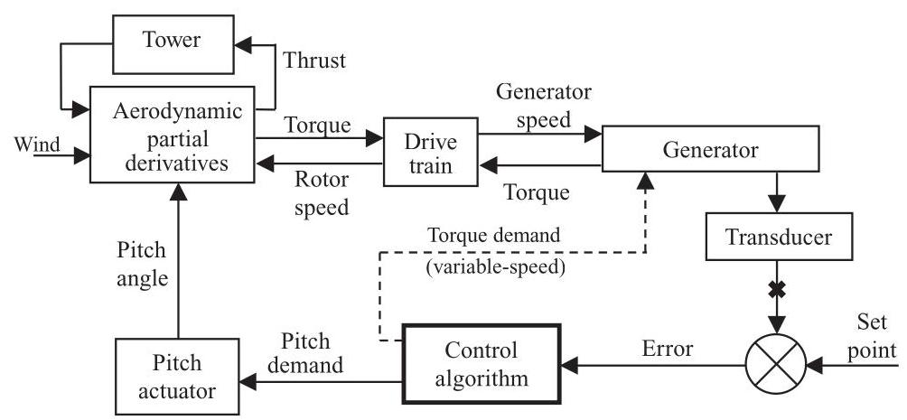

Figure 8.13 Typical linearised turbine model

The generator characteristics are also necessary for fixed speed systems, and drive train torsion is particularly important for variable speed turbines. In all cases a linearised description of the aerodynamics of the rotor is required, for example as a set of partial derivatives of torque and thrust with respect to pitch angle, wind speed and rotor speed. The thrust is important as it affects the tower dynamics, which couple strongly with pitch control.

A typical linear model is shown in Figure 8.13. With such a linear model, it is then possible to vary the gains and other parameters, and then rapidly carry out a number of tests which help to evaluate the performance of the controller with those gain settings. Some of these tests are open loop tests, which means they are applied to the open loop system obtained by breaking the feedback loop, for example at the symbol X in Figure 8.13. Other tests are carried out on the closed loop system. Before describing some of these tests, some basic theory on open and closed loop dynamics is outlined.

Figure 8.14 shows a simplified general model in which the turbine (i.e. from pitch actuator to transducer in Figure 8.13) is represented by the 'plant model' with transfer function $G\left( s\right)$ , and the control algorithm is represented by the controller transfer function $k \cdot  C\left( s\right)$ , where $s$ is the Laplace variable and $k$ an overall controller gain.

Now the open loop system can be represented by the transfer function $k \cdot  C\left( s\right)  \cdot  G\left( s\right)  = H\left( s\right)$ . If the input to the transfer function is denoted $x$ and the output is $y$ , then $Y\left( s\right)  = H\left( s\right)  \cdot  X\left( s\right)$ , where $X\left( s\right)$ and $Y\left( s\right)$ are the Laplace transforms of $x$ and $y$ . When the loop is closed at $\mathbf{X}$ the closed loop dynamics can be derived as

$$
{Y}^{\prime }\left( s\right)  = H\left( s\right) \left( {X\left( s\right)  - {Y}^{\prime }\left( s\right) }\right) \tag{8.15}
$$

where ${Y}^{\prime }\left( s\right)$ is the Laplace transform of the closed loop output ${y}^{\prime }$ . This can be rewritten as

$$
{Y}^{\prime }\left( s\right)  = \frac{H\left( s\right) }{1 + H\left( s\right) }X\left( s\right) \tag{8.16}
$$

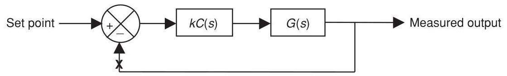

Figure 8.14 Simplified general model of plant and controller

In other words if the open loop system is $H\left( s\right)$ , the closed loop system will have dynamics represented by ${H}^{\prime }\left( s\right)  = H\left( s\right) /\left( {1 + H\left( s\right) }\right)$ .

Now a linear transfer function can be expressed as the ratio of two polynomials in $s$ . Thus, for the open loop system, $A\left( s\right) Y\left( s\right)  = B\left( s\right) X\left( s\right)$ , and so $H\left( s\right)  = B\left( s\right) /A\left( s\right)$ , where $A\left( s\right)$ and $B\left( s\right)$ are polynomials in $s$ . The roots of the polynomial $A\left( s\right)$ give important information about the system response. Consider for example a first order system

$$
\tau {\dot{y}}_{1} = x - {y}_{1} \tag{8.17}
$$

representing a first order lagged response of ${y}_{1}$ with respect to $x$ . This system can be represented by the transfer function

$$
H\left( s\right)  = \frac{B\left( s\right) }{A\left( s\right) },\;\text{ where }\;B\left( s\right)  = 1\;\text{ and }\;A\left( s\right)  = 1 + {\tau s} \tag{8.18}
$$

The single root of $A\left( s\right)$ is given by $\sigma  =  - 1/\tau$ , while Equation 8.17 has solutions of the form $y = a + b{e}^{\sigma t}$ , with $\sigma  =  - 1/\tau$ again. These solutions are stable if $\tau$ is positive, in other words if the root of $A\left( s\right)$ is negative. A second order system will have solutions of the form $y = a + b{e}^{{\sigma }_{1}t} + c{e}^{{\sigma }_{2}t}$ , where once again ${\sigma }_{1}$ and ${\sigma }_{2}$ are the roots of the second order polynomial which forms the denominator of the transfer function. Now ${\sigma }_{1}$ and ${\sigma }_{2}$ may be real numbers or they may form a complex conjugate pair $\sigma  \pm  {j\omega }$ . The solutions are stable if ${\sigma }_{1}$ and ${\sigma }_{2}$ are both negative, or if $\sigma$ is negative. In general, it can be stated that a linear system is stable if all the roots of the denominator polynomial have negative real parts. These roots are known as the poles of the system, and they represent values of the Laplace variable which make the transfer function infinite. The roots of the numerator polynomial are known as the zeros of the system, since the transfer function is zero at these points.

Now let us rewrite Equation 8.16 in terms of the polynomials $\mathrm{A}$ and $\mathrm{B}$ :

$$
Y\left( s\right)  = \frac{B\left( s\right) }{A\left( s\right)  + B\left( s\right) }X\left( s\right)  = \frac{k \cdot  {B}^{\prime }\left( s\right) }{A\left( s\right)  + k \cdot  {B}^{\prime }\left( s\right) }X\left( s\right) \tag{8.19}
$$

where we have reintroduced the overall controller gain $k$ such that $B\left( s\right)  = k \cdot  {B}^{\prime }\left( s\right)$ . Clearly when the gain $k$ is small, the closed loop transfer function tends towards the open loop transfer function $k \cdot  {B}^{\prime }/A$ . However, when the gain is large, $A$ can be neglected and so the poles will tend towards the roots of ${B}^{\prime }$ . In other words as the gain increases from zero to infinity, the poles of the closed loop system move from the open loop poles and end up at the open loop zeros. They move along complicated trajectories in the complex plane. A plot of these trajectories is known as a root locus plot, and is very useful for helping to select the feedback gain $k$ . The gain is selected such that all the closed loop poles are in the left half-plane, making the system stable, and preferably as well damped as possible. The damping factor for a pole pair at $\sigma  \pm  {j\omega } = r{e}^{j\theta }$ is given by $- \cos \left( \theta \right)  =  - \sigma /r$ , as shown in Figure 8.15.

Figure 8.16 shows an example of a root locus plot for a variable speed pitch controller. As the gain increases, the closed loop poles $\left( +\right)$ move from the open loop poles $\left( x\right)$ , corresponding to zero feedback gain, to the open loop zeros (O). (Actually there are usually more poles than zeros; the 'missing' zeros can be considered to be equally spaced around a circle of infinite radius.) In this example, the gain has been chosen to maximise the damping of the lightly-damped tower poles (B). Any further increase in gain would exacerbate tower vibration, eventually leading to instability as the poles cross the imaginary axis. At the chosen gain, the controller poles (A) are well damped. The poles at (C) result from the pitch actuator dynamics. They remain sufficiently well damped, although again, excessive gain would drive them to instability.

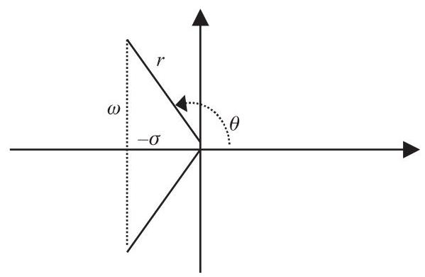

Figure 8.15 Damping ratio for a complex pole pair

Although a root locus plot is useful for helping to select the overall controller gain, this can only be done once the other parameters defining the controller have been fixed. A PI controller (Equation 8.1 with ${k}_{d} = 0$ ) is characterised by only two parameters, ${K}_{p}$ and ${K}_{i}$ . It can be re-written as

$$
y = {K}_{p}\left( {1 + \frac{1}{s{T}_{i}}}\right) x \tag{8.20}
$$

where ${T}_{i} = {K}_{p}/{K}_{i}$ is known as the integral time constant. The root locus plot can be used to select ${K}_{p}$ once ${T}_{i}$ has been defined, but the shape of the loci will change with different ${T}_{i}$ .

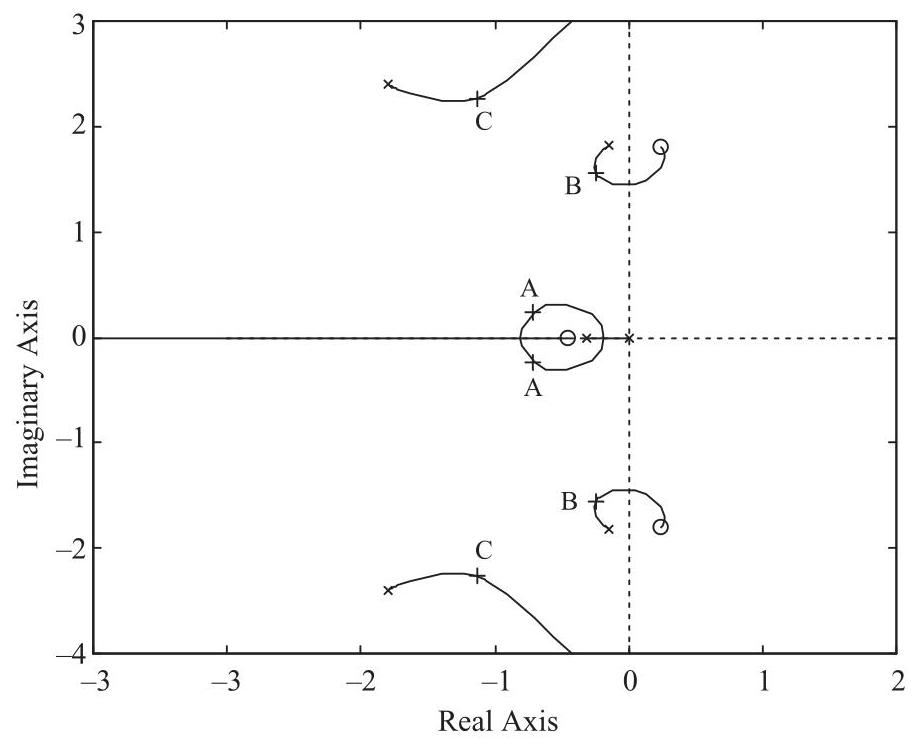

Figure 8.16 Example root locus plot for a variable speed pitch controller

However, it is relatively straightforward to iterate on the value of ${T}_{i}$ , using the root locus plot each time to select ${K}_{p}$ , until a suitable overall performance is achieved, using criteria such as those listed below. In the case of PID and more complex controllers, where more than two parameters must be selected, other ways must be found to select the parameters, although it is always possible to use a root locus plot for the final choice of the overall gain.

The choice of parameters will usually be an iterative process, often using a certain amount of trial and error, and on each iteration the performance of the resulting controller must be assessed. Useful measures of performance include:

- Gain and phase margins: these are calculated from the open-loop frequency response, and give an indication of how close the system is to instability. If the margins are too narrow, the system may tend to become unstable. The system will be unstable if the open loop system displays a ${180}^{ \circ  }$ phase lag with unity gain. The phase margin represents the difference between the actual phase lag and ${180}^{ \circ  }$ at the point where the open loop gain crosses unity. A phase margin of at least ${45}^{ \circ  }$ is usually recommended, although there is no firm rule. Similarly, the gain margin represents the amount by which the open loop gain is less than unity where the open loop phase lag crosses ${180}^{ \circ  }$ . A gain margin of at least a few decibels is recommended.

- The cross-over frequency, which is the frequency at which the open loop gain crosses unity, gives a useful measure of the responsiveness of the controller.

- The positions of the closed loop poles of the system indicate how well various resonances will be damped.

- Closed loop step responses, for example the response of the system to a step change in wind speed, give a useful indication of the effectiveness of the controller. For example, in tuning a pitch controller, the rotor speed and power excursions should return rapidly and smoothly to zero, the tower vibration should damp out reasonably fast, and the pitch angle should change smoothly to its new value, without too much overshoot and without too much oscillation.

- Frequency responses of the closed loop system also give some very useful indications. For example, in the case of pitch controller:

- The frequency response from wind speed to rotor speed or electrical power should die away at low frequencies, as the low frequency wind variations are controlled away.

- The frequency response from wind speed to pitch angle must die away at high frequencies, and must not be too great at critical disturbance frequencies such as the blade passing frequency, or the drive train resonant frequency in variable speed systems.

- The frequency response from wind speed to tower velocity should not have too large a peak at the tower resonant frequency.

and so forth.

With experience it is possible, by examining measures such as these, to converge rapidly on a controller tuning which will work well in practice.

### 8.4.2 Gain scheduling for pitch controllers

Close to rated, since the fine pitch angle is selected to maximise power, it follows that the sensitivity of aerodynamic torque to pitch angle is very small. Thus, a much larger controller gain is required here than at higher wind speeds, where small change in pitch can have a large effect on torque. Frequently the torque sensitivity changes almost linearly with pitch angle, and so can be compensated for by varying the overall gain of the controller linearly in inverse proportion to the pitch angle. Such a modification of gain with operating point is termed a 'gain schedule'. However, the sensitivity of thrust to pitch angle varies in a different way, and because of its effect on tower dynamics, which couples strongly with the pitch controller, it may be necessary to modify the gain schedule further to ensure good performance in all winds. In some cases just varying the overall gain may not be sufficient to achieve satisfactory response at all operating points, in which case it may be necessary to change the proportional and integral gains separately, each as a different function of pitch angle.

It is therefore important to generate linearised models of the system corresponding to several different operating points between rated and cut-out wind speed, and to choose a gain schedule which ensures that the above performance measures are satisfactory over the whole range.

For an active stall controller, the pitch angle may not change much with operating point; a gain schedule may not be required, but if it is, it may have to be a direct function of wind speed rather than pitch angle. This is one of the few occasions when the nacelle anemometer signal may have to be used as an input to the controller.

### 8.4.3 Adding more terms to the controller

It is often possible to improve the performance of a basic PI or PID controller by adding extra terms to modify the behaviour in a particular frequency range.

For example, a pitch control algorithm may be found to cause a large amount of pitch actuator activity at a relatively high frequency, which is of little benefit in controlling the turbine and may be quite counter-productive. This may occur if some dynamic mode was not taken into account in the linearised model which was used to design the turbine. An example of this is the drive train torsional resonance in a variable speed turbine, which can feed through to the measured generator speed and hence to the pitch control, causing high frequency pitch activity which is of no benefit. Another likely cause is the pitch response to a major external forcing frequency, such as the blade passing frequency. While a low pass filter in series with the controller will certainly reduce high frequency response, the resulting phase shift at lower frequencies may significantly impair the overall performance of the controller. A better 'cure' for excessive activity at some well-defined frequency is to include a notch filter in series with the controller. A simple second-order notch filter tuned to filter out a particular frequency of $\omega$ rad/s has a transfer function

$$
\frac{1 + {s}^{2}/{\omega }^{2}}{1 + {2\zeta s}/\omega  + {s}^{2}/{\omega }^{2}} \tag{8.21}
$$

where the 'damping' parameter $\zeta$ represents the width or 'strength' of the notch filter. This should be increased until the filtering effect is sufficient at the target frequency, without too much detriment to the control performance at lower frequencies.

Another useful filter is the phase advance or phase lag filter,

$$
\frac{\left( 1 + s/{\omega }_{1}\right) }{\left( 1 + s/{\omega }_{2}\right) } \tag{8.22}
$$

which increases the open loop phase lag between frequencies ${\omega }_{1}$ and ${\omega }_{2}\left( {{\omega }_{1} < {\omega }_{2}}\right)$ , or decreases it if ${\omega }_{1} > {\omega }_{2}$ . Phase advance can sometimes be useful for improving the stability margins. Open loop gain and phase plots can, therefore, be useful for helping to select ${\omega }_{1}$ and ${\omega }_{2}$ . A PID controller can be rewritten as a PI controller in series with a phase advance (or phase lag) filter.

A general second-order filter of the form

$$
\frac{1 + 2{\zeta }_{1}s/{\omega }_{1} + {s}^{2}/{\omega }_{1}^{2}}{1 + 2{\zeta }_{2}s/{\omega }_{2} + {s}^{2}/{\omega }_{2}^{2}} \tag{8.23}
$$

can sometimes be useful for modifying the frequency response in a particular area. With ${\omega }_{1} = {\omega }_{2}$ and ${\zeta }_{1} = 0$ this is just a notch filter, as described above. With ${\zeta }_{1} > {\zeta }_{2}$ the filter has a band-pass effect, which can be used to increase control action at a particular frequency. With different ${\omega }_{1}$ and ${\omega }_{2}$ there is also a high-pass or low-pass effect, since the high-frequency gain tends towards ${\left( {\omega }_{2}/{\omega }_{1}\right) }^{2}$ .

A root locus plot is often useful for investigating the effect of such filters. With experience, the effect on the loci of placing the filter poles and zeros in particular ways can be anticipated. Such techniques can help to see how, for example, a pair of lightly damped poles due to a structural resonance can be dragged further away from the imaginary axis, so as to increase the damping.

### 8.4.4 Other extensions to classical controllers

Other extensions to classical controllers have sometimes been used in order to further improve the performance in particular ways, for example the use of non-linear gains, and variable or asymmetrical limits.

Non-linear gains are sometimes used to penalise large peaks or excursions in controlled variables. For example, the gain of a PI pitch controller can be increased as the power or speed error increases; or, rather than changing the gain, an additional term can be added to the demanded pitch rate which may be a function of the error, its rate of change, or both. Often the additional term would be normally zero, increasing only in case of large deviations from the desired operating condition. The extra term can conveniently be added before the PI integrator (see Section 8.6.2). Such techniques should be used with caution, however, as too much non-linearity will drive the system towards instability, in much the same way as if the linear gain is too high. This technique requires a trial-and-error approach since it is very difficult to analyse the closed loop behaviour of non-linear systems using standard methods. Any asymmetry in the additional term, for example, if used only when the power or speed is above the set-point to help reduce peaks, will cause a reduction in the mean power or speed relative to the set-point.

Asymmetrical pitch rate limits can also be used to reduce peaks. By allowing the blades to pitch faster towards feather than towards fine, power or speed peaks will be reduced. Once again the mean level will also be reduced by introducing this asymmetry. However, this technique is somewhat more 'comfortable' than the use of non-linear gains because it is less likely to lead to instability.

There is often a desire to reduce the set-point in high winds, to reduce the infrequent but highly-damaging loads experienced in those conditions at the expense of a small loss of output. It is straightforward to reduce the set-point as a function of wind speed (the pitch angle is usually used as a measure of the rotor-averaged wind speed, as for gain scheduling). However, the most damaging loads occur during high turbulence, and so it would be better to reduce the set-point in high winds only when the turbulence is also high. Rather than actually reducing the set-point, asymmetrical rate limits provide a simple but effective means of achieving this effect, since the rate limits will only be reached when the turbulence is high.

A further extension of this technique is to modify the rate limits dynamically, even to the extent of changing the sign of a rate limit in order to force the pitch in one direction during certain conditions such as large power or speed excursions. A useful application of this is in the control of variable slip systems, where it is important to keep the speed above the minimum slip point (point B in Figure 8.8). If the speed falls below this point, it then ceases to vary much as it is constrained by the minimum slip curve, and so the proportional term in the PI controller ceases to respond. Modifying the rate limits as a function of speed error as in Figure 8.17 is a useful technique to prevent this happening. Another useful application is to force some temporary pitch action such as a pitch ramp in response to a severe gust: by ramping the pitch rate limits, perhaps in response to an unusually large rate of generator acceleration, the PI controller can continue to act, albeit constrained by the rate limits, so that it resumes normal duty seamlessly when the rate limits are relaxed again.

Another case for set-point modification in high winds is to prevent a sudden loss of power arising from high wind cut-out. If an increase in wind speed can cause all the turbines in a large wind farm to shut down suddenly within a few minutes, the network will have to cope with this by providing spinning reserve. Instead of shutting down suddenly at ${25}\mathrm{\;m}/\mathrm{s}$ , ramping the power output down smoothly from full power to zero between, say,24and ${35}\mathrm{\;m}/\mathrm{s}$ will result in a much lower probability of a sudden shortfall, and the wind farm output can be considered more predictable (Bossanyi, 1982), both effects leading to lower spinning reserve requirements and, hence, a higher value for the generated power. This will have little effect on fatigue loading and energy yield because of the small number of hours involved, but the effect on extreme loads will need to be considered. For offshore turbines, where wave-induced tower vibration is better damped if the turbine is operating, extending the operating range to higher wind speeds may help to reduce tower loading (Markou et al., 2009).

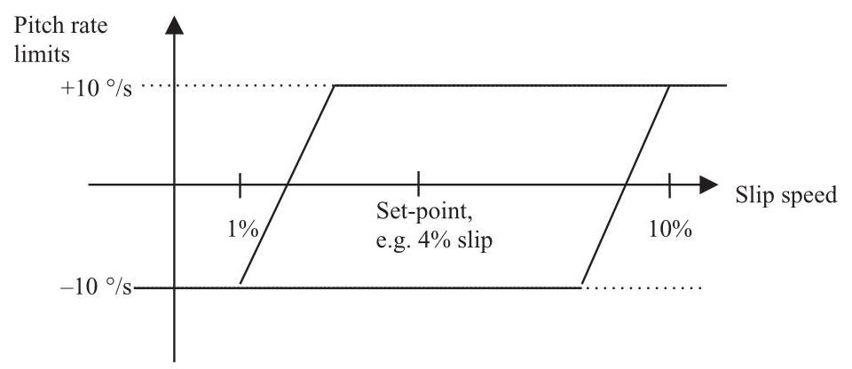

Figure 8.17 Pitch rate limit modification for a variable slip wind turbine

### 8.4.5 Optimal feedback methods

The controller design methods described above are based on classical design techniques, and often result in relatively simple PI or PID algorithms together with various filters in series or in parallel, such as phase shift, notch or band-pass filters, and sometimes using additional sensor inputs. These methods can be used to design fairly complex high-order controllers, but only with a considerable amount of experience on the part of the designer.

There is, however, a huge body of theory (and practice, although to a lesser extent) relating to more advanced controller design methods, some of which have been investigated to some extent in the context of wind turbine control, for example:

- Self-tuning controllers.

- Model-based controllers such as LQG/optimal feedback and ${H}_{\infty }$ .

- Fuzzy logic controllers.

- Neural network methods.

Self-tuning controllers (Clarke and Gawthrop, 1975) are generally fixed-order controllers defined by a set of coefficients, which are based on an empirical linear model of the system. The model is used to make predictions of the sensor measurements, and the prediction errors are used to update the coefficients of the model and the feedback law.

If the system dynamics are known, then some very similar mathematical theory can be used, but applied in a different way. Rather than fitting an empirical model, a linearised physical model is used to predict sensor outputs, and the prediction errors are used to update estimates of the system state variables. These variables may include rotational speeds, torques, deflections, etc., as well as the actual wind speed, and so their values can be used to calculate appropriate control actions even though those particular variables are not actually measured.

Observers. A subset of the known dynamics may be used to make estimates of a particular variable: for example, some controllers use a wind speed observer to estimate the wind speed seen by the rotor from the measured power and/or rotational speed and the pitch angle. The estimated wind speed can then be used to define the appropriate desired pitch angle.

State estimators. Alternatively, using a full model of the dynamics, a Kalman filter can be used to estimate all the system states from the prediction errors (Bossanyi, 1987). This technique can explicitly use knowledge of the variance of any stochastic contributions to the dynamics, as well as noise on the measured signals, in a mathematically optimum way to generate the best estimates of the states. This relies on an assumption of Gaussian characteristics for the stochastic inputs. Thus, it is possible explicitly to take account of the stochastic nature of the wind input by formulating a wind model driven by a Gaussian input. This can even be extended to include blade passing effects.

The Kalman filter can readily take account of more than one sensor input in generating its 'optimal' state estimates. Thus, it is ideal for making use of, for example, an accelerometer measuring tower fore-aft motion as well as the normal power or speed transducer. It would be straightforward to add other sensors, if available, to improve the state estimates further.

Optimal feedback. Knowing the state estimates, it is then possible to define a cost function, which is a function of the system states and control actions. The controller objective can then be defined mathematically: the objective is to minimise the selected cost function. If the cost function is defined as a quadratic function of the states and control actions (which is actually a rather convenient formulation), then it is relatively straightforward to calculate the 'optimal' feedback law. This is defined as the feedback law which generates control signals as a linear combination of the states such that the cost function will be minimised. Since a Linear model is required, with a Quadratic cost function and Gaussian disturbances, this is known as an LQG controller.

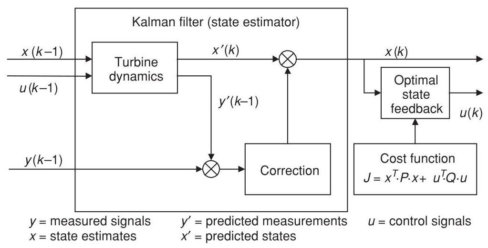

Figure 8.18 Structure of the LQG controller

This cost function approach means that the trade-off between a number of partially competing objectives is explicitly defined, by selecting suitable weights for the terms of the cost function. This makes such a method ideal for a controller which attempts to reduce loads as well as achieving its primary function of regulating power or speed. Although it is not practical to calculate the weightings in the cost function rigorously, they can be adjusted in a very intuitive way. This approach is also readily configured for multiple inputs and outputs, so, for example, as well as using generator speed and tower acceleration inputs, it can in principle simultaneously produce the pitch demand and torque demand outputs which will minimise the cost function.

Figure 8.18 illustrates the structure of the LQG controller, showing the state estimator and the optimal state feedback. For implementation, the entire controller can be reduced to a set of difference equations connecting the measured outputs $\left( y\right)$ to the new control signals $\left( u\right)$ . This means that once the design is completed, the algorithm is easy to implement and does not require massive processing power.

The linearised dynamics of the system are expressed in discrete state-space form:

$$
{x}^{\prime }\left( k\right)  = {Ax}\left( {k - 1}\right)  + {Bu}\left( {k - 1}\right)
$$

The Kalman gain $L$ is calculated taking into account the stochastic disturbances affecting the system, and allows the state estimates to be improved by comparing the predicted sensor outputs $y$ ’ to the actual outputs $y$ :

$$
x\left( k\right)  = {x}^{\prime }\left( k\right)  + L\left( {y\left( {k - 1}\right)  - {y}^{\prime }\left( {k - 1}\right) }\right)
$$

where

$$
{y}^{\prime }\left( {k - 1}\right)  = {Cx}\left( {k - 1}\right)  + {Du}\left( {k - 1}\right)
$$

The optimal state feedback gain $K$ generates the control actions

$$
u\left( k\right)  =  - {Kx}\left( k\right)
$$

where $K$ is calculated such that the quadratic cost function $J$ is minimised. The cost function is

$$
J = {x}^{T}{Px} + {u}^{T}{Qu}
$$

(actually the integral, or the mean value over time, or the expected value of this quantity). $P$ and $Q$ are the state and control weighting matrices. It is usually more useful to define the cost function in terms of other quantities, $v$ , which can be considered as extra (often un-measured) outputs of the system:

$$
v = {C}_{v}x + {D}_{v}u
$$

Hence the cost function is

$$
J = {v}^{T}{Rv} + {u}^{T}{Su} = {x}^{T}{C}_{v}^{T}R{C}_{v}x + {u}^{T}{D}_{v}^{T}R{D}_{v}u + {u}^{T}{Su}
$$

so that $P = {C}_{v}^{T}R{C}_{v}$ and $Q = {D}_{v}^{T}R{D}_{v} + S$ .

Another possibility is to generate optimal control signals directly as a function of the sensor outputs. This is known as optimal output feedback (Steinbuch, 1989). However, the mathematical solution of this problem is based on necessary conditions for optimality which are not always sufficient for optimality. Therefore, the solutions generated can be, and in practice often are, non-optimal and potentially very far from optimal. This variation is therefore rather problematic.

As turbines become larger and the requirements placed on the controller become more demanding, advanced control methods such as LQG are likely to become increasingly used, although as yet there are few published examples of the practical application of these techniques in commercial wind turbines. However, this approach was used to design a controller for a ${300}\mathrm{{kW}}$ fixed speed two-bladed teetered turbine in the UK in 1992. After testing on a prototype turbine in the field, this controller was shown to give significant reductions in pitch activity and power excursions compared to the original PI controller, and it was subsequently adopted for the production machine and successfully used on over 70 turbines (Bossanyi, 2000). Stol et al. (2004) reported tests with a similar control scheme on a ${600}\mathrm{\;{kW}}$ research turbine.

LQG controllers are not necessarily robust, which means that they can be sensitive to errors in the turbine model. A similar approach is the ${\mathrm{H}}_{\infty }$ controller, in which uncertainties in the turbine and wind models can explicitly be taken into account. Such a controller was evaluated in the field on a ${400}\mathrm{{kW}}$ fixed speed pitch regulated turbine by (Knudsen et al., 1997), who reported a reduction in pitch activity and some potential for reduced fatigue loads compared to a PI controller.

### 8.4.6 Pros and cons of model-based control methods

The methods of Section 8.4.5 are appealing as they use mathematical rigour to calculate an 'optimal' controller in the sense that it minimises a pre-defined and reasonably intuitive cost function, suggesting that the tuning could be an automatic process, whereas the classical approach relies on the skill and experience of the designer for each new tuning. They are also ideal for designing MIMO controllers, which could require a cumbersome iterative approach using classical design methods.

There are also some disadvantages, however, which may explain the continuing prevalence of classically-designed controllers in commercial wind turbines.

In practice, however, 'tuning' the cost function may end up being just as difficult as tuning a classical controller, and the tuning may need to be repeated for each new turbine even though in principle this ought to be unnecessary. The cost function needs to include terms for any states or outputs which should be minimised, but the choice of such variables is not as straightforward as it might appear. For example, for a variable speed controller it would be logical to include a term to minimise the speed error; but in practice a term is also required to minimise the integral of the speed error, and adjusting the relative weights for these two terms is very similar to adjusting the proportional and integral gains in a classical design.

Also the cost function is defined as a quadratic function of the states and other variables, and this may not be appropriate for minimisation of fatigue loads, for example, as fatigue is a highly non-linear process. Even for speed regulation, one could argue that minimising the speed error is not important (this may even contradict the need to minimise loads) but minimising extreme speed excursions to avoid any overspeed trips is all that matters. A quadratic cost function is not ideal for this, as the true 'cost' increases dramatically at the overspeed trip limit.

Classical controllers are simpler to implement; they can easily deal with non-linearities through techniques such as gain scheduling, and simple adjustments such as the addition of notch filters are straightforward, as is the imposition of fixed or variable rate limits. Model-based controllers require further sophistication such as extended Kalman filters or fuzzy transitions in order to deal with non-linearities, and any adjustment requires a complete recalculation of the controller. Integration with the supervisory control is also much less straightforward; for example it might be desirable to modify the tower acceleration feedback and/or the individual pitch control during a shutdown in order to reduce extreme loads. With a classical controller it is easy to impose variable schedules or limits to achieve this, but it is much more difficult to do this with model-based controllers.

As explained in Section 8.3.10, most of the wind turbine control problem can be decomposed into separate, almost uncoupled SISO loops. This makes it perfectly feasible to use straightforward classical tuning techniques. The only significant coupling between these loops is between speed regulation and tower damping, but this is easily dealt with by means of just one or two iterations, tuning each loop on its own with the other loop implemented as part of the plant.

Nevertheless, as turbines become larger, lighter and more flexible, it is possible that model-based multivariable methods, perhaps in conjunction with additional sensors, will increasingly find a role.

### 8.4.7 Other methods

Rule-based or 'fuzzy logic' controllers are useful when the system dynamics are not well known or when they contain important non-linearities. Control actions are calculated by weighting the outcomes of a set of rules applied to the measured signals. Although there has been some work on fuzzy controllers for wind turbines, there is no clear evidence of benefits.

In practice, quite a good knowledge of the system dynamics is usually available, and the dynamics can reasonably be linearised at each operating point, so there is no clear motivation for such an approach.

The same could be said of controllers based on neural networks. These are learning algorithms, which are 'trained' to generate suitable control actions using a particular set of conditions, and then allowed to use their learnt behaviour as a general control algorithm. While this is potentially a powerful technique, it is difficult to be sure that such a controller will generate acceptable control actions in all circumstances.

Nevertheless, there may be some potential for such methods where significant nonlinearities or non-stationary dynamics are involved. These might be in the turbine itself (stall hysteresis might be one example), in the driving disturbances (the wind characteristics are not stationary), or in the controller objectives. For example, the controller objectives might change around rated wind speed, or non-linear effects such as fatigue damage might be included in the cost function.

## 8.5 Pitch actuators (see also, Chapter 6 Section 6.7.2)

An important part of the control system of a pitch-controlled turbine is the pitch actuation system. Both hydraulic and electric actuators are commonly used, each type having its own particular advantages and disadvantages which should be considered at the design stage.

Smaller machines might have a single pitch actuator to control all the blades simultaneously, but larger turbines usually have individual pitch actuators for each blade. This has the advantage that it is then possible to dispense with the large and expensive shaft brake which would otherwise be needed. This is because of the requirement for a turbine to have at least two independent braking systems capable of bringing the turbine from full load to a safe state in the event of a failure. Provided the individual pitch actuators can be made independently failsafe, and as long as the aerodynamic braking torque is always sufficient to slow the rotor down to a safe speed even if one pitch actuator has failed at the working pitch angle, then multiple actuators may be considered to be independent braking systems for this purpose. There may still be a need for a parking brake, at least for the use of maintenance crews, but this may then be fairly small. It must at least be capable of bringing the rotor to a complete stop from a low speed, not necessarily in high or extreme wind speeds, for long enough to allow a rotor lock to be inserted.

A collective pitch actuation system commonly consists of an electric or hydraulic actuator in the nacelle, driving a push-rod which passes through the centre of the gearbox and hollow main shaft. The push-rod is attached to the pitchable blade roots through mechanical linkages in the hub. The actuator in the nacelle is often a simple hydraulic cylinder and piston. A charged hydraulic accumulator ensures that the blades can always be feathered even if the hydraulic pump loses power. An alternative arrangement is to use an electric servo motor to drive a ballnut which engages with a ballscrew on the push-rod. Since the push-rod turns with the rotor, loss of power to the motor causes the ballscrew to wind the pitch to feather, giving failsafe pitch action. This requires a failsafe brake on servo motor to ensure that the ballnut stops turning if power is lost.

Individual pitch control requires separate actuators in the hub for each blade. Therefore, there must be some means of transmitting power to the rotating hub to drive the actuators. This can be achieved by means of slip rings in the case of electric actuators; or a rotary hydraulic joint for hydraulic actuators if the hydraulic power pack is located in the nacelle. A rotary transformer could be used to transmit electrical power to the hub without the inconvenience of slip rings, which require maintenance.

The need to ensure a backup power supply on the hub to enable the blades to pitch even in the event of power loss can be a source of problems. A hydraulic system needs an accumulator for each blade, while electric actuators usually have battery packs in the hub for this purpose. Such battery packs are large, heavy and expensive, and alternative methods such as the use of hub-mounted generators, which can always generate power as long as the hub is turning, have been proposed. If a battery is used, the actuator motors must either be DC motors or (more commonly) AC motors with a frequency converter, with the batteries on the DC link. Since this will form part of the safety system, the reliability of the inverter between the DC link and the pitch motor is important. A hub-mounted generator would produce either DC or variable frequency AC, and once again the reliability of the connection to the pitch motor is important. Since the pitch actuators have to be independently failsafe, separate battery packs or generators and frequency converters etc. must be provided for each blade.

The friction in the pitch bearing is often a significant factor in the design of the pitch actuation system. The bearing friction depends on the loading applied to the bearing, and the large overturning moment acting on the bearing can lead to very high levels of friction: often most of the actuator torque is required to overcome the bearing friction.

A hydraulic actuator would usually be controlled by means of a proportional valve controlling the flow of oil to the actuator cylinder. The valve opening, and hence the oil flow rate, would be set in proportion to the required pitch rate. The demanded pitch rate may come directly from the turbine controller, or it might come from a pitch position feedback loop. In this case the turbine controller generates a pitch position demand. This is compared to the measured pitch position, and the pitch position error is turned into a pitch rate demand through a fast PI or PID control loop, implemented either digitally or by means of a simple analogue circuit.

In the case of an electric actuator, the motor controller usually requires a torque demand signal. This may be derived from a speed controller, which uses a fast PI or PID controller acting on speed error to generate a torque demand. Once again the speed demand may come directly from the turbine controller or from a position feedback loop.

Simpler actuators could be used if a fast pitch response is not important, for example in a turbine which is controlled by pitching to stall rather than to feather. In this case an actuator which merely pitches at a fixed rate in either direction may be adequate.

## 8.6 Control system implementation

Previous sections have explained some of the techniques whereby control algorithms can be designed. The system and controller dynamics have been described in continuous time in terms of the Laplace operator, $s$ . While it is possible to implement a continuous-time controller, for example using analogue circuitry, the use of digital controllers is now almost universal. The greater flexibility of digital systems is a factor here: simply by making software changes, the control logic can be changed completely.

A consequence of using digital control is that the control actions are calculated and updated on a discrete time step, rather than in continuous time. Control algorithms designed in continuous time must, therefore, be converted to discrete time for implementation in a digital controller. It is also possible to design controllers in discrete time, if the linearised model of the turbine is first discretised.

The following sections briefly describe some of the practical issues involved in implementing a control algorithm in a real digital controller. Once again, the reader is referred to standard control theory texts for more detailed treatments.

### 8.6.1 Discretisation

Supposing a control algorithm has been designed in continuous time as a transfer function (such as Equation 8.1 for a PID controller, for example), it must be discretised before it can be implemented in a digital controller. Discretised transfer functions are usually represented in terms of the delay operator, $z$ , where ${z}^{-k}x$ represents the value of $x$ sampled $k$ timesteps ago. As a simple example, a moving average or lag filter from $x$ to $y$ is often implemented as

$$
{y}_{k} = F{y}_{k - 1} + \left( {1 - F}\right) {x}_{k}
$$

This is a difference equation which can readily be implemented in code in a discrete controller. In terms of the delay operator, it can be written as

$$
\left( {1 - F{z}^{-1}}\right) y = \left( {1 - F}\right) x
$$

or alternatively as a transfer function consisting of a ratio of polynomials in ${z}^{-1}$ :

$$
y = \frac{\left( 1 - F\right) }{\left( 1 - F{z}^{-1}\right) }x
$$

Now the Laplace operator can be considered as a differentiation operator, and so as a simple approximation, it might be possible to convert a continuous transfer function into discrete form by replacing $s$ by $\left( {1 - {z}^{-1}}\right) /T$ , where $T$ is the timestep.

In fact by simple algebraic manipulation, it is straightforward to show that with this substitution, the above discrete transfer function is in fact equivalent to the continuous transfer function representation of a first order lag with time constant $\tau$ , namely

$$
y = \frac{1}{1 + {s\tau }}x
$$

with the factor $F$ being given by $\tau /\left( {T + \tau }\right)$ .

Clearly any discretised equation can only be an approximation to the continuous-time behaviour. There are other discretisation methods, and the so-called bilinear or 'Tutsin' approximation often works better in practice. In this case the Laplace operator is replaced by

$$
\frac{2}{T}\frac{\left( 1 - {z}^{-1}\right) }{\left( 1 + {z}^{-1}\right) }
$$

Discretisation results in a phase shift compared to the continuous time process. This phase shift increases with frequency. If the algorithm performance is particularly sensitive to the phase shift at a certain frequency, then the discretisation can be 'pre-warped' to this frequency. Pre-warping modifies the phase shift so that the phase of the discrete transfer function is correct at the chosen frequency, but deviates at lower and higher frequencies. An example of a situation where pre-warping may be important is in the case of a drive train resonance damper in a variable speed turbine (Section 8.3.5). The resonant frequency which is being targeted is usually fairly high, typically around 3 or $4\mathrm{\;{Hz}}$ , and unless the controller timestep is very short the phase lag caused by discretisation may significantly affect the performance of the damping algorithm.

The approximation for s used for discretisation with pre-warping about a frequency $\omega$ is

$$
\frac{\omega }{\tan \left( {{\omega T}/2}\right) }\frac{\left( 1 - {z}^{-1}\right) }{\left( 1 + {z}^{-1}\right) }
$$

### 8.6.2 Integrator desaturation

Controllers containing integral terms, such as PI or PID controllers, experience a particular problem known as integrator wind-up when the control action saturates at a limiting value. A common example is in pitch control, where the pitch angle is limited to the fine pitch position when the wind is below rated. For example, a PI pitch controller for a variable speed turbine can be represented as:

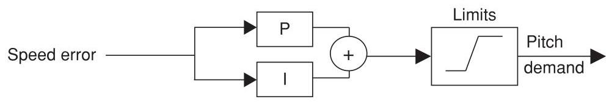

Above rated, the speed error will be zero on average because of the integral term. Below rated, the pitch saturates at the fine pitch position, and the speed error will remain negative. The integral of the error will, therefore, grow more and more negative, and only the application of the limits prevents the actual pitch demand from doing the same. However, when the wind speed reaches rated again and the speed error becomes positive, it will take a long time before the integrated power error climbs back up to zero and starts to demand a positive pitch angle. To prevent this problem of integrator wind-up, the integral term must be prevented from integrating when the pitch is at the limit. This is easily implemented by separating out the integrator, $I\left( z\right)$ , from the rest of the controller, $R\left( z\right) .R\left( z\right)$ generates a change in demanded pitch angle and $I\left( z\right)$ then integrates this by adding it to the previous pitch demand after the limits have been applied.

As an example, a PI controller (Equation 8.20) discretised using the bilinear approximation would be:

$$
y = {K}_{p}\left\lbrack  {\left( {T/2{T}_{i} + 1}\right)  + \left( {T/2{T}_{i} - 1}\right) {z}^{-1}}\right\rbrack   \cdot  \frac{1}{\left\lbrack  1 - {z}^{-1}\right\rbrack  } \cdot  x = R\left( z\right)  \cdot  I\left( z\right)  \cdot  x
$$

To avoid integrator wind-up, this can be implemented as follows:

$$
\Delta {y}_{k} = {K}_{p}\left\lbrack  {\left( {T/2{T}_{i} + 1}\right) {x}_{k} + \left( {T/2{T}_{i} - 1}\right) {x}_{k - 1}}\right\rbrack  \text{ . (implementation of }R\left( z\right) \text{ ) }
$$

${y}_{k}^{ * } = {y}_{k - 1} + \Delta {y}_{k}$ (integrator $I\left( z\right)$ using previous limited output ${y}_{k - 1}$ )

${y}_{k} = \lim \left( {y}_{k}^{ * }\right)$ (application of limits)

## References

Anderson, B.D.O. and Moore, J.B. (1979) Optimal Filtering. Prentice-Hall, London.

Astrom, K.J. and Wittenmark, B. (1990) Computer-Controlled Systems. Prentice-Hall, London.

Bossanyi, E.A. (1982) Probabilities of sudden drop in power from a wind turbine cluster. ${4}^{\text{ th }}$ International Symposium on Wind Energy Systems, September 21-24. BHRA Fluid Engineering, Cranfield.

Bossanyi, E.A. (1987) Adaptive pitch control for a ${250}\mathrm{\;{kW}}$ wind turbine. In: The Proceedings of the ${9}^{\text{ th }}$ BWEA Conference, pp. 85-92. Mechanical Engineering Publications, Edinburgh.

Bossanyi, E.A. and Gamble, C.R. (1991) Investigation of torque control using a variable slip induction generator. ETSU WN-6018, Energy Technology Support Unit, Harwell.

Bossanyi, E.A. (1994) Electrical aspects of variable speed operation of horizontal axis wind turbine generators. ETSU W/33/00221/REP, Energy Technology Support Unit, Harwell.

Bossanyi, E.A. (2000) Developments in closed loop controller design for wind turbines. Proceedings of the 2000 ASME Wind Energy Symposium. AIAA/ASME, Reno, Nevada.

Bossanyi, E.A. (2003) Individual blade pitch control for load reduction. Wind Energy 6(2), 119-128.

Bossanyi, E.A. (2004) Developments in Individual Blade Pitch Control. EWEA conference 'The Science of making Torque from Wind', Delft University of Technology.

Bossanyi, E.A. and Wright, A. (2009) Field testing of individual pitch control. Proceedings of the European Wind Energy Conference. European Wind Energy Association, Marseille.

Bossanyi, E.A., Wright, A. and Fleming, P. (2010) Progress with field testing of individual pitch control. EWEA conference 'The Science of making Torque from Wind', June 28-30, Heraklion.

Caselitz, P., Kleinkauf, W., Krüger, T., Petschenka, J., Reichardt, M. and Störzel, K. (1997) Reduction of fatigue loads on wind energy converters by advanced control methods. In: Proceedings of the European Wind Energy Conference, October, pp. 555-558. European Wind Energy Association, Dublin.

Clarke, D. and Gawthrop, P. (1975) Self-tuning controller. In Proceedings IEE 122, No. 9, pp. 929-34.

D'Azzo, J.J. and Houpis, C.H. (1981) Linear Control System Analysis and Design. McGraw-Hill, London.

Donham and Heimbold (1979) Wind turbine. United States Patent 4,297,076, 1981(Filed 8 June 1979).

van Engelen, T. and van der Hooft, E. (2005) Individual pitch control inventory. ECN-C-03-138.

Fischer, T., Rainey, P., Bossanyi, E. and Kühn, M. (2010) Control strategies for an offshore wind turbine on a monopile under misaligned wind and wave loading. EWEA conference 'The Science of making Torque from Wind', June 28-30, Heraklion.

Holley, W., Rock, S. and Chaney, K. (1999) Control of variable speed wind turbines below rated wind speed. Proceedings of the ${3}^{rd}$ ASME/JSME Conference, California.

Knudsen, T., Andersen, P. and Töffner-Clausen, S. (1997) Comparing PI and robust pitch controllers on a 400 kW wind turbine by full-scale tests. In: Proceedings of the European Wind Energy Conference, October, pp. 546-550. European Wind Energy Association, Dublin.

Markou, H. and Larsen, T.J. (2009) Control Strategies for operation of pitch regulated turbines above cut-out wind speeds. PO216, Proceedings of the European Wind Energy Conference. European Wind Energy Association, Marseille.

Namik, H. and Stol, K. (2010) Individual blade pitch control of floating offshore wind turbines, Wind Energy, 13, 74-85.

Park, R.H. (1929) Two-reaction theory of synchronous machines, Trans. AIEE, 48.

Pedersen, T.K. (1995) Semi-variable speed - a compromise? In: Wind Energy Conversion 1995, Proceedings of the ${17}^{\text{ th }}$ British Wind Energy Association Conference, Warwick, pp. 249-260. Mechanical Engineering Publications.

Ramtharan, G., Jenkins, N., Anaya-Lara, O. and Bossanyi, E. (2007) Influence of rotor structural dynamics representations on the electrical transient performance of FSIG and DFIG wind turbines, Wind Energy, 10(4), 293-301.

Rossetti, M. and Bossanyi, E.A. (2004) Damping of Tower Motions via Pitch Control - Theory and Practice. Proceedings of the 2004 European Wind Energy Conference. EWEA.

Savini, B. and Bossanyi, E. (2010) Supervisory Control Logic Design for Individual Pitch Control. PO243, Proceedings of the 2010 European Wind Energy Conference. EWEA.

Schlipf, D., Fischer, T., Carcangiu, C.E., Rossetti, M. and Bossanyi, E. (2010) Load analysis of lookahead collective pitch control using lidar. Proceedings of the DEWEK conference, Bremen (DEWI).

Steinbuch, M. (1989) Dynamic modelling and robust control of a wind energy conversion system. PhD thesis, University of Delft.

Stol, K. and Fingersh, L. (2004) Wind turbine field testing of state-space controller designs. NREL/SR- 500-35061, National Renewable Energy Laboratory.

