# 9 Wind turbine installations and wind farms

For any wind turbine installation, there are certain additional activities, (e.g. construction of foundations and access roads, electrical connections, site erection and project development and management) that must be undertaken. For flat onshore sites, which might be found typically in Denmark or North Germany, the total investment cost is approximately 1.3 times the ex-works turbine cost. In the UK, where sites are often located in more remote, upland areas the balance-of-plant costs (i.e. all costs other than the wind turbines) tend to be higher and a more typical breakdown is shown in Table 9.1.

Civil engineering costs are increased by difficult ground conditions, rock or very boggy soil and difficult access. High wind speed sites will give higher energy output but require more expensive foundations to withstand the extreme loads. Electrical grid connection costs are determined by the distance to the point of connection and the voltage level at which connection is made (EWEA, 2009). The ex-works price of the turbines (65-75% of the project cost) will depend on the state of the market for wind turbines at the time the order is placed.

Commercial developers of wind farms will often prefer larger projects as, in that way, the fixed-costs, particularly grid connection and project set-up and management costs, may be spread over a bigger investment. A further encouragement for large projects is that the fixed costs of arranging project finance can be high. However, there are individuals, community groups and commercial organisations that develop smaller wind farms and projects of this type have been common in Denmark and Germany. The advantage of community involvement in the project is, of course, that planning permission is more readily obtained if it is seen that there is tangible benefit to local people.

Table 9.1 Typical breakdown of costs for a 10 MW wind farm on an upland UK site.

<table><tr><td>Element of wind farm</td><td>% of total cost</td></tr><tr><td>Wind turbines</td><td>65</td></tr><tr><td>Civil works (including foundations)</td><td>13</td></tr><tr><td>Wind farm electrical infrastructure</td><td>8</td></tr><tr><td>Electrical network connection</td><td>6</td></tr><tr><td>Project development and management costs</td><td>8</td></tr></table>

## 9.1 Project development

The development of a wind farm follows a broadly similar process to that of any other power generation project, but with the particular requirements that the wind turbines must be located in high wind speed sites to maximise energy production and their size makes visual effects a particularly important aspect of the environmental assessment. Guidance on the development of wind energy schemes was issued originally by the British Wind Energy Association, now renamed RenewableUK, in their 'Best Practice Guidelines for Wind Energy Development' (BWEA, 1994). Comprehensive guidance on the development of wind farms and many aspects of environmental assessment is given in EWEA (2009) and in AWEA (2008).

Three main elements of the development of a wind farm project may be identified as: (1) technical and commercial issues, (2) environmental considerations and (3) dialogue and consultation. Perhaps surprisingly to many engineers and technologists the technical and commercial considerations are often the more straightforward and the success of a wind farm project hinges critically on environmental considerations and the dialogue and consultation process with local residents and planning authorities.

Wind farm development may be divided into a number of phases:

- Initial site selection.

- Project feasibility assessment.

- Preparation and submission of the planning (permitting) application.

- Construction.

- Operation.

- Decommissioning and land reinstatement.

Consideration needs to be given to how the wind farm electrical output is to be sold. In countries with a Feed-in-Tariff this is fairly straightforward but with alternative support mechanisms, such as Renewable Portfolio Standards, it is necessary to identify a purchaser of the electrical output as well as any 'Green Certificates' if these are traded separately.

### 9.1.1 Initial site selection

Initially a desk based study is carried out to locate a suitable site and to confirm it as a potential candidate for the location of a wind farm. It may be recalled that the mean power production for a wind turbine, assuming 100% availability, is given by (see Section 3.16, Chapter 3):

$$
E = T\int P\left( U\right) f\left( U\right) {dU} \tag{9.1}
$$

where $P\left( U\right)$ is the Power Curve of the wind turbine, $f\left( U\right)$ Probability Density Function (PDF) of the wind speed and $T$ is the time period.

The Power Curve is available from the potential turbine supplier(s) while an initial estimate of the PDF of the wind speed may be obtained from a wind atlas (for example, Troen and Petersen, 1989). The PDF is generally based on a Weibull distribution and takes account of regional climatology, roughness of the surrounding terrain, local obstacles and topology. PDFs are calculated for twelve ${30}^{ \circ  }$ sectors and integrated with the Power Curve usually using numerical techniques. At this stage of the project development only an approximate indication of the wind farm output is required in order to confirm the potential of the site(s). However, it may be useful to supplement the wind atlas with some form of initial computer modelling.

A wind speed database covers the UK based on the NOABL airflow model (ETSU, 1997a). The model represents the effect of topography on wind speed and provides estimates of annual mean wind speeds with a resolution of $1\mathrm{\;{km}}$ square at ${10}\mathrm{\;m},{25}\mathrm{\;m}$ or ${45}\mathrm{\;m}$ above ground level. It does not take account of any local or thermal effects. These can have a considerable effect on wind speeds and so on-site measurements are required for accurate assessment of the energy output of a wind farm.

If measured site wind speed data is available then the energy yield of a wind turbine can be estimated, as shown in Figure 9.1, by combining the binned wind speed distribution with the power curve:

$$
\text{ Energy } = \mathop{\sum }\limits_{{i = 1}}^{{i = n}}H\left( {Ui}\right) W\left( {Ui}\right) \tag{9.2}
$$

where $H\left( {Ui}\right)$ is the number of hours in wind speed bin ${Ui}, W\left( {Ui}\right)$ is the power output at that wind speed and there are $n$ wind speed bins.

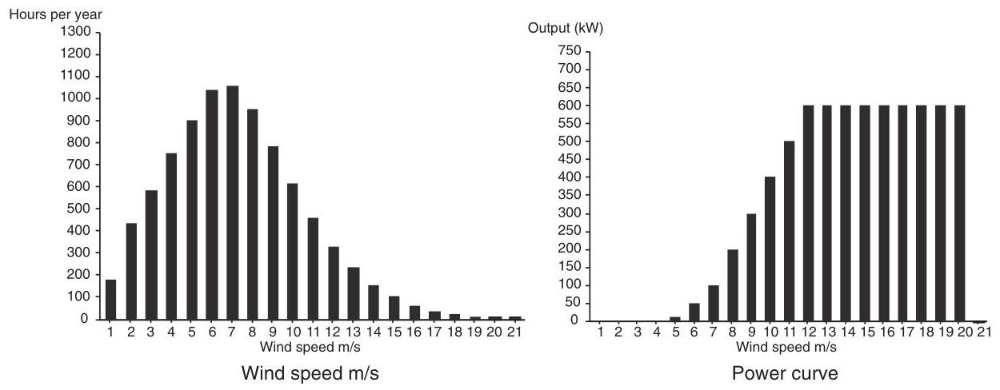

Figure 9.1 Annual energy calculation of a wind turbine

Table 9.2 Typical separation distances for medium sized wind turbines

<table><tr><td>Feature</td><td>Typical separation distances</td></tr><tr><td>Residential property</td><td>350-500 m</td></tr><tr><td>Motorway, trunk road, railway</td><td>Tip of turbine +10%</td></tr><tr><td>Public right-of-way (e.g. footpath)</td><td>${50}\mathrm{\;m}$ - tip of turbine, depending on use of right-of-way</td></tr><tr><td>Electric overhead line</td><td>Tip of turbine +10%</td></tr><tr><td>Turbines</td><td>5-6 rotor diameters in prevailing wind direction   3-4 rotor diameters across prevailing wind direction</td></tr></table>

In addition to the wind resource it is also necessary to confirm that road access is available, or can be developed at reasonable cost, for transporting the turbines and other equipment. Blades of large wind turbines can be up to ${50}\mathrm{\;m}$ in length and so clearly can pose difficulties for transport on minor roads. For a large wind farm, the heaviest piece of equipment is likely to be the main transformer if a substation is located at the site.

The local electricity utility should be able to provide information on the amount of generation which the distribution network can accept, although for a first approximation it may be useful to consider rules-of-thumb as indicated in Table 10.4, Chapter 10. Such rules-of-thumb give an approximate indication only but do serve to highlight those sites where the electrical connection will require long extensions of the power network with associated high cost, environmental impact and delay.

The initial technical assessment will be accompanied by a review of the main environmental considerations. The most important constraints include avoidance of National Parks or other areas designated as being of particular environmental or amenity value and ensuring that no turbine is located so close to domestic dwellings that a nuisance will be caused (e.g. by noise, visual domination or light shadow flicker). Table 9.2 shows some typical separation distances for medium sized wind turbines.

A preliminary assessment of visual effects is also required considering the visibility of the wind farm particularly from important public viewpoints. If, within the wind farm perimeter, there are areas of particular ecological value, due to flora or fauna, then these need to be avoided as well as any locations of particular archaeological or historical interest. Communication systems (e.g. microwave links, TV, radar or radio) may be adversely affected by wind turbines and this needs to be considered at an early stage.

In parallel with the technical and environmental assessments it is normal to open discussion with the local civic or planning/permitting authorities to identify and agree the major potential issues which will need to be addressed in more detail if the project development is to continue. These are recorded in the scoping report of the Environmental Impact Assessment.

### 9.1.2 Project feasibility assessment

Once a potential site has been identified then more detailed, and expensive, investigations are required in order to confirm the feasibility of the project. The wind farm energy output, and hence the financial viability of the scheme, will be very sensitive to the wind speed seen by the turbines over the life of the project. Hence, it is not generally considered acceptable in complex terrain to rely on the estimates of wind speed made during the initial site selection but to use the Measure-Correlate-Predict (MCP) technique to establish a prediction of the long-term wind resource (Derrick, 1993; EWEA, 2009).

### 9.1.3 The Measure-Correlate-Predict (MCP) technique

The MCP approach is based on taking a series of measurements of wind speed at the wind farm site and correlating them with simultaneous wind speed measurements made at a nearby meteorological station. The averaging periods of the measured site data is chosen to be the same as that of the meteorological station data. In its simplest implementation, linear regression is used to establish a relationship between the measured site wind speed and the long-term meteorological wind speed data of the form:

$$
{U}_{\text{ site }} = a + b{U}_{\text{ long-term }} \tag{9.3}
$$

Coefficients are calculated for the twelve ${30}^{ \circ  }$ directional sectors and the correction for the site applied to the long-term data record of the meteorological station. This allows the long-term wind speed record held by the meteorological station to be used to estimate what the wind speed at the wind farm site would have been over the last, say, 20 years. It is then assumed that the site long-term wind speed is represented by this estimate which is used as a prediction of the wind speed during the life of the project. Thus, MCP requires the installation of a mast at the wind farm site on which are mounted anemometers and a wind vane. If possible one anemometer is mounted at the hub height of the proposed wind turbines with others lower to allow wind shear to be measured. Measurements are made over at least a six-month period, although clearly the more data obtained the more confidence there will be in the result, and correlated with the measurements made concurrently at the meteorological station.

There are a number of difficulties of using MCP (Landberg and Mortensen, 1993) including:

- With modern wind turbines, high site meteorological masts are necessary and these may themselves require planning permission.

- There may not be a suitable meteorological station nearby (within say ${50} - {100}\mathrm{\;{km}}$ ) or with a similar exposure and wind climate.

- The data obtained from the meteorological station may not always be of good quality and may include gaps. Therefore, it may be time consuming to ensure that it is properly correlated with the site data.

- It is based on the assumption that the previous long-term record provides a good estimate of the wind resource over the lifetime of the wind farm.

A number of variations in how the MCP method can be applied are described in (EWEA, 2009). If the site and long-term wind speeds are well correlated these different approaches to their correlation are of limited significance. Errors due to the location of the anemometers on the site meteorological mast and difficulties with the long-term record from the meteorological stations(s) are likely to be more important.

### 9.1.4 Micrositing

The MCP technique is now well established and specially designed site data loggers, temporary meteorological masts and software programs for data processing are commercially available. The estimate of the long-term wind speeds obtained from MCP may then be used together with a wind farm design software package to investigate the performance of a number of potential turbine layouts. These sophisticated programs take the wind distribution data and combine it with topographic wind speed variations and the effect of the wakes of the other wind turbines to generate the energy yield of any particular turbine layout. Two models commonly used to calculate the effect of topology and surface roughness of the site and surrounding area are the Wind Atlas Analysis and Application Program (WAsP) and MS-Micro/3 (a development of the MS3DJH/3R model). (Walmesley et al., 1982, 1986). With increasing computer power, the use of computational fluid dynamic techniques to calculate wind flows over a site is becoming more common. Other constraints such as turbine separation, terrain slope, wind turbine noise, radar and land ownership boundaries may also be applied. Optimisation techniques are then used to optimise the layout of the turbines for maximum energy yield of the site taking into account local wind speeds and wake effects. The packages also have visualisation facilities to generate zones of visual impact, views of the wind farm either as wire frames and photomontages and even use 3D virtual reality techniques. Figure 9.2 shows an energy map of a prospective wind farm site created with wind farm design software. The areas on the top of the hills show the highest energy density.

### 9.1.5 Site investigations

At the same time as wind speed data is being collected more detailed investigations of the proposed site may also be undertaken. These include a careful assessment of existing land use and how best the wind farm may be integrated with, for example, agricultural operations. The ground conditions at the site also need to be investigated to ensure that the turbine foundations, access roads and construction areas can be provided at reasonable cost. Local ground conditions may influence the position of turbines in order to reduce foundation costs. It may also be important to undertake a hydrological study to determine whether spring water supplies are taken from the wind farm site and if the proposed foundations or trenches will cause disruption of the ground water flow. More detailed investigations of the site access requirements will include assessment of bend radii, width gradient and any weight restrictions on approach roads. Discussions are also likely to continue with the local electricity utility concerning the connection to the distribution network and the export of the wind farm power.

The planning application will require the preparation of an Environmental Statement and the scope of this is generally agreed, in writing, with the civic authorities during the project feasibility assessment.

### 9.1.6 Public consultation

Prior to the erection of the site anemometer masts the wind farm developer may wish to initiate some form of informal public consultation. This is likely to involve local community organisations, environmental societies and wildlife trusts. It may also be appropriate to keep local politicians informed. Of course, the erection of meteorological masts does not necessarily imply that the wind farm will be constructed but, as they are highly visible structures, careful consultation is required to ensure that unnecessary public concern is allayed.

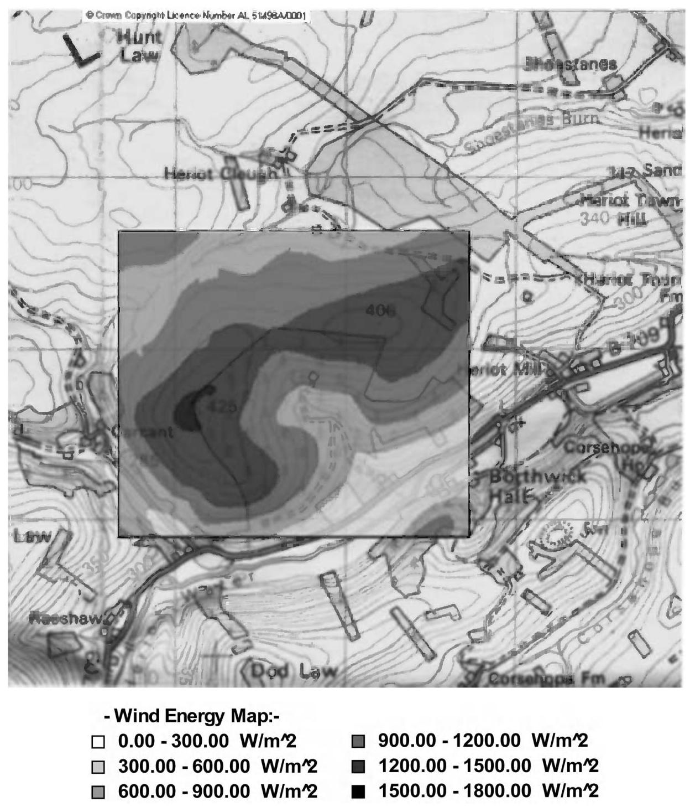

Figure 9.2 Example of Energy Map of a prospective wind farm site created with wind farm design software. Reproduced by permission of GL Garrad Hassan. Based upon the Ordnance Survey mapping (c) Crown Copyright and/or database right. All rights reserved. Licence number 100050309

### 9.1.7 Preparation and submission of the planning application

Wind farms are recognised as having significant environmental impact and it is usual for an Environmental Statement to be required as a major part of the application for planning permission. The preparation of the Environmental Statement is an expensive and time-consuming undertaking and usually requires the assistance of various specialists. The purpose of a wind farm Environmental Statement may be summarised as to:

- Describe the physical characteristics of the wind turbines and their land-use requirements.

- Establish the environmental character of the proposed site and the surrounding area.

- Predict the environmental impact of the wind farm.

- Describe measures which will be taken to mitigates any adverse impact.

- Explain the need for the wind farm and provide details to allow the planning authority and general public to make a decision on the application.

Topics covered in the Environmental Statement will typically include (BWEA, 1994):

Policy framework - the application is placed in the context of national and regional policy.

Site selection - the choice of the particular site that has been selected is justified.

Designated areas - the potential impact of the wind farm on any designated areas (e.g. National Parks) is evaluated.

Visual and landscape assessment - This is generally the most important consideration and is certainly the most open to subjective judgement. Hence, it is usual to employ a professional consultancy to prepare the assessment. The main techniques which will be used include: Zones of Theoretical Visibility ZTV, (known formerly as Zones of Visual Influence, ZVI) to indicate where the wind farm will be visible from, wireframe analysis which shows the location of the turbines from particular views and production of photomontage which are computer generated images overlaid on a photograph of the site.

Noise assessment - After visual impact, noise is likely to be the next most important topic. Hence, predications of the sound produced by the proposed development are required with special attention being paid to the nearest dwellings in each direction. It may be necessary to establish the background noise at the dwellings by a series of measurements so that realistic assessments can be made after the wind farm is in operation.

Ecological assessment - The impact of the wind farm, including its construction, on the local flora and fauna needs to be considered. This may well require site surveys at particular seasons of the year.

Archaeological and historical assessment - This is an extension of the investigation undertaken during the site selection.

Hydrological assessment - Depending on the site it may be necessary to evaluate the impact of the project on water courses and supplies.

Interference with telecommunication systems - Although wind turbines do cause some interference with television transmission this is normally only a local effect and can usually be remedied at modest cost. Any interference with major point-to-point communication facilities (e.g. microwave systems) is likely to be a much more significant issue.

Aircraft safety and interference with radar - The proximity to airfields or military training areas needs to be considered carefully. The effects of wind farms on aircraft radar, both civil and military, has become a most important issue in several countries and requires early attention.

Safety - An assessment is required of the safety of the site including the structural integrity of the turbines. Particular local issues may include highway safety and shadow flicker.

Traffic management and access construction - The Environmental Statement addresses all phases of the project and so both the access tracks and the increase in vehicle movements on the public roads need to be considered.

Electrical connection - There may be significant environmental impact associated with the electrical connection (e.g. the construction of a substation and new circuit). Any requirement to place long high voltage circuits underground will be very expensive.

Economic effects on the local economy, global environmental benefits - It is common to emphasise the benefit that the wind farm will bring both to the local economy and to reduction in gaseous emissions.

Decommissioning - The assessment should also include proposals for the decommissioning of the wind farm and the removal of the turbines at the end of the project. Decommissioning measures are likely to involve the removal of all equipment which is above ground and restoration of the surface of all areas.

Mitigating measures - It is obvious that the wind farm will have an impact on the local environment and so this section details the steps that are proposed to mitigate and adverse effects. This is likely to emphasise the attempts that have been made to minimise visual intrusion and control noise.

Non-technical summary - Finally a non-technical summary is required and this may be widely distributed to local residents.

## 9.2 Landscape and visual impact assessment

Modern wind turbines are large structures, sometimes more than ${100}\mathrm{\;m}$ to the blade tip, and must be sited in exposed locations of high mean wind speed to operate effectively. Within a wind farm, the individual turbines are spaced at up to six rotor diameters and hence large wind farms are extensive. There is generally a trade-off between energy yield and visibility of wind turbines and so landscape and visual impact assessment is a key aspect of the Environmental Statement required for any wind farm development. The assessment of landscape and visual effects of a wind farm is normally undertaken by a professional consultant specialising in such work who will attempt to quantify the impacts but it is generally recognised that a degree of subjective interpretation is required.

The assessment process is, of course, iterative and will influence the design and layout of the wind farm. However, it may be divided roughly into a number of areas:

- Landscape character assessment (including landscape policy and designation).

- Design and mitigation.

- Assessment of impacts (including visibility and viewpoint analysis).

- Shadow flicker.

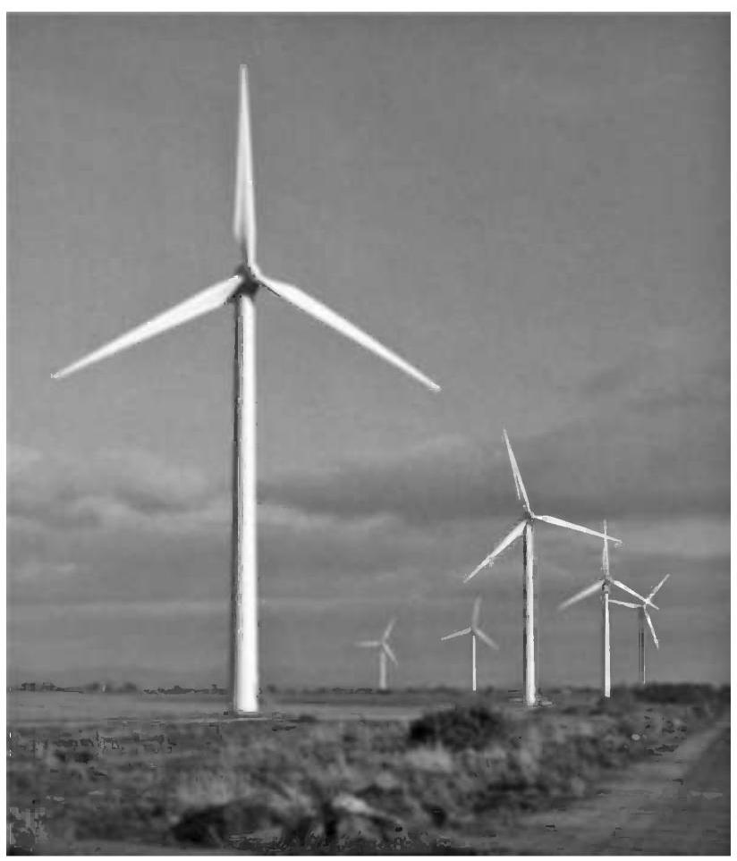

Figure 9.3 Wind farm of six ${660}\mathrm{\;{kW}}$ turbines in flat terrain. Reproduced by permission of Cumbria Wind Farms, Ltd. Paul Carter

The landscapes within which wind farms are constructed vary widely and the turbine layout is chosen to take account of the landscape character as well as wind conditions. Thus, in Figure 9.3 the turbines are located along the field boundaries while linear arrangements are shown in Figures 9.4-9.6 either along ridges or the coast line.

It is also essential to consider the sociological aspects of the development. An individual's perception of a wind farm development will be determined not only by the physical parameters (e.g. wind turbine size, number, colour etc.) but also by his or her opinion of wind energy as part of the energy supply (Taylor and Rand, 1991; Devine-Wright, 2005).

### 9.2.1 Landscape character assessment

The fundamental step in minimising the visual impact of a wind farm is to identify an appropriate site and ensure that the proposed development is in harmony with the location. Many exposed upland areas are likely to be of high amenity and have been designated as areas of significant landscape value or even as National Parks.

Development of wind farms within a National Park is likely to be extremely difficult and it is also important to recognise that any view of the site from inside a specially designated area may be considered to be important by the planning authorities.

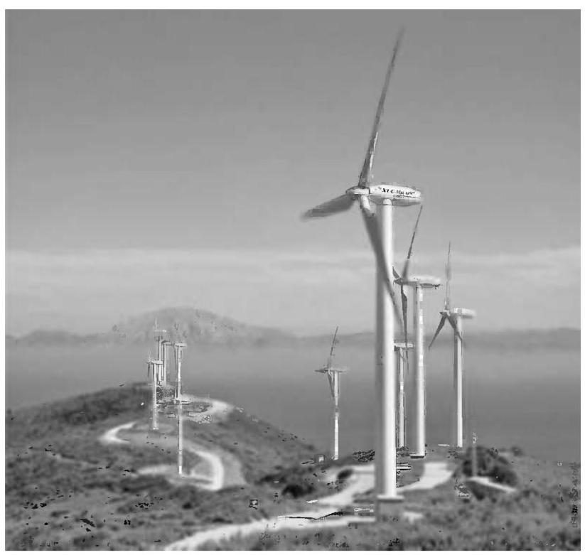

Figure 9.4 Wind farm of ${600}\mathrm{{kW}}$ turbines, Tarifa, Spain. Reproduced by permission of NEG MICON

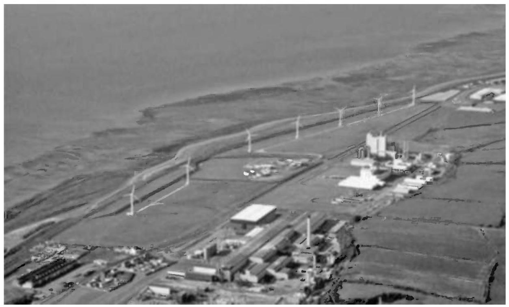

Figure 9.5 Wind farm of ${700}\mathrm{\;{kW}}$ wind turbines located along coast. Reproduced by permission of PowerGen Renewables/Wind Propsect Ltd.

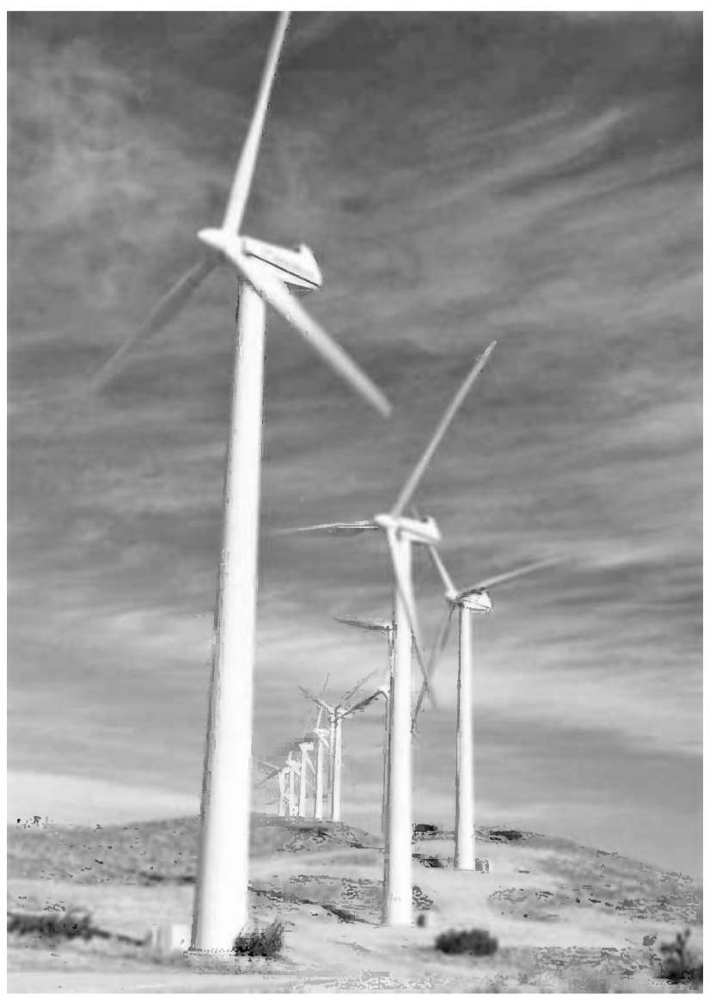

Figure 9.6 Cameron Ridge in California, USA. Reproduced by permission of Renewable Energy Systems Ltd.

Stanton (1994) suggests some characteristics of the wind farm image which are considered to be desirable. The development should be simple, logical and avoid visual confusion. Although one landscape type is no more appropriate for a wind farm development than another this author considers that their suitability for different types of development varies greatly. Five different landscape zones are identified and discussed for the most appropriate type of development. Flat agricultural land is considered suitable for either a small number of wind turbines or large wind farms of similar regularly spaced machines. Coastal areas are considered appropriate for large numbers of wind turbines but the development should relate to the linear quality of the coastal space. There is some opportunity to install a small number of wind turbines in industrial areas. In areas of high aesthetic value, such as mountains and moorland the turbines should be arranged either along ridge lines or as a grid layout within flat land. Finally in areas of variable and rolling relief it is proposed that only small wind turbines or single wind turbines are appropriate. Such views are, of course, open to debate but they do illustrate that it is essential to consider the character of the landscape before a wind farm development is proposed.

Cumulative effects are becoming increasingly important and the impact of more than one wind farm being visible from a viewpoint can be an important consideration. Local features such as buildings and hedges, which restrict views, may mean that a landscape has the capability to accommodate additional wind turbines but detailed investigation is required to establish this.

### 9.2.2 Design and mitigation

Wind turbine designers have recognised for some years that the overall form of the structure of a large wind turbine has to be pleasing and this aspect of industrial design is considered early in the development of a new machine. It is now generally recognised that for aesthetic reasons three-bladed turbines are preferred (see Section 6.5.6, Chapter 6). Two-bladed rotors sometimes give the illusion of varying speed of rotation, which can be disconcerting. In addition, for a similar swept area, a two-bladed rotor will operate faster than one with three blades. There is considerable evidence (Taylor and Rand, 1991; Gipe, 1995) that a slower speed of rotation is more relaxing to the eye. This effect works to the advantage of the large modern wind turbines, which operate typically at less than 30 rpm. There is some speculation that, in the future, very large wind turbines designed specifically for remote offshore installation, where visual impact and blade noise is less important, may revert to two-bladed rotors to realise the engineering benefits of this arrangement.

Lattice steel towers are now rarely used for wind turbines. There are clearly engineering benefits associated with lattice towers particularly in terms of the costs of the foundations (see Section 7.10.4, Chapter 7); although the upper, tapered section of the tower must be such as to provide adequate clearance for the blades. From a distance and in certain light conditions lattice towers can disappear leaving only the rotors visible and this effect is generally thought to be undesirable. In Europe, only solid tubular towers are generally considered to be acceptable. Tower heights can vary greatly in response to both wind conditions and planning constraints. In parts of Germany, very high towers (more than 80-100 m high) are used in order to maximise energy generation. Conversely, in western parts of the UK, which have high mean wind speeds, tower heights have been reduced in order to minimise the area from which the wind farm is visible.

The appearance of the turbines can be influenced to some extent by their colour. In the upland sites of the UK, the turbines will generally be seen against the sky and so an off-white or mid-grey tone is generally considered to be appropriate. Where the wind farm is seen against other backgrounds a colour to blend in with the ground conditions may be more suitable. There is general agreement that the outer gel-coat of the blades should be a matt or semi-matt finish to minimise reflections. In the early development of wind energy in the USA there were wind farms that used a variety of wind turbines sometimes of quite different design (i.e. with differing numbers of blades, direction of rotation, tower types, etc.). It is unlikely that such developments of large wind turbines would now be acceptable.

The layout and design of the wind farm is important in determining if planning consent is to be received. The preliminary wind farm layout may be determined by engineering considerations (e.g. local wind speeds, turbine separation, noise, geo-technical considerations, etc.) but will then be modified to take account of visual and landscape impacts. Usually the developer will wish to maximise the number of turbines on the site, and hence the revenue, within all the environmental constraints. On open, flat land the turbines are often arranged in a regular layout in order to provide a simple and logical visual image with maximum power output. Alternatively on hill sites, or where there are significant hedges or field boundaries, the turbine layout is arranged around these features. When viewed from up to 1-2 km, wind turbines are considered to dominate the field of vision and so it is desirable that views within this distance can be minimised (e.g. by moving turbines to make use of local screening features or by tree planting). When turbines are seen one behind another there is an increase in visual confusion and this 'stacking' effect is considered to be undesirable. Some viewpoints are likely to be particularly important and it may be appropriate to arrange the turbines so that these views of the wind farm are as clear and uncluttered as possible.

In addition to the wind turbines, there are a number of associated ancillary structures required, including the wind farm meteorological mast(s). With smaller wind turbines, the local transformers may be located adjacent to the towers, often in an enclosure to provide protection against the weather and vandalism. However, the towers of many large turbines are wide enough to accommodate the transformers inside and this obviously reduces visual clutter on the wind farm. There is often a requirement for a main wind farm substation and some form of local control building. Engineering considerations would indicate that this substation should be located in the middle of the wind farm but, in order to reduce visual impact, it is often located some distance away where it gives minimal visual intrusion. Within European wind farms all power collection circuits are underground and it may also be appropriate, if rather expensive, to use underground cable to make the final connection to the local utility system. Roads are required within the wind farm for construction and it is a common requirement of the planning consent that the hard surface is removed after commissioning. This of course can lead to very considerable expense if the road has to be reinstated to allow a large crane to be used for maintenance or repair.

### 9.2.3 Assessment of impact

A major part of the Environmental Statement is the assessment of landscape and visual impact. Landscape and visual impact assessment of wind farms is now an important specialist subject with its own specialist practitioners and literature, for example, University of Newcastle (2002), Horner + maclennan and Envision (2006). Two main techniques are used: (1) visibility analysis using Zones of Theoretical Visibility (ZTV) - formerly known as Zones of Visual Influence (ZVI) and (2) viewpoint analysis using wire frames and photomontages.

Zones of theoretical visibility show those areas of the surrounding country, usually up to ${10} - {20}\mathrm{\;{km}}$ radius, from which a wind turbine, or any part of a wind turbine, in a wind farm is visible. The ZTV is generated using computer methods based on a digital terrain model and shows how the local topology will influence the visibility of the wind farm. Usually ZTV techniques ignore local landscape features such as screening from trees and buildings. Also, weather conditions are not considered and clear visibility is assumed. Figure 9.7 shows an example of a ZTV generated using commercially available wind farm design software. The cumulative impact of a number of wind farms may be calculated in a similar manner.

Viewpoint analysis is based on selecting a number of important locations, from which the wind farm is visible and applying professional judgement using quantitative criteria to assess the visual impact. The viewpoints are selected in consultation with the civic planning authorities and for a large wind farm more than 20 locations may be chosen. Although approaches vary, the assessment may involve consideration of two aspects: (1) the sensitivity of the viewpoint and (2) the magnitude of the change of view. Thus, for example, a viewpoint where the land use is residential or has high recreational value (e.g. a scenic viewpoint inside a National Park) may have a 'high' sensitivity. Conversely, a viewpoint, which is used only for employment (e.g. a local industrial estate), might be considered to have a 'low' sensitivity. The magnitude of the impact can described in a similar manner depending, for example, on the number of turbines visible, the distance to the wind farm and the prominence of the development. The overall significance of the impact is then assessed, again using quantitative terminology (such as substantial, moderate, slight, negligible, etc.), combining these factors. Where a substantial impact is identified, acceptability will depend on whether it is considered that the wind farm will have a detrimental effect on the landscape quality.

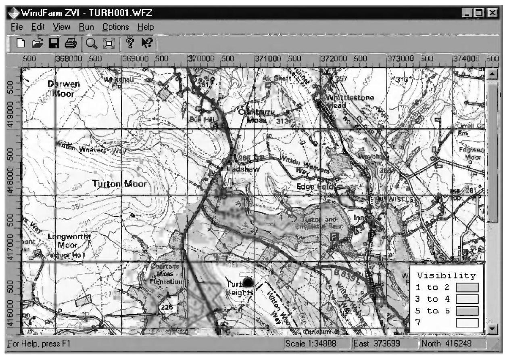

Figure 9.7 Example of Zone of Theoretical Visibility (Zone of Visual Influence) of a wind farm. Reproduced by permission of ReSoft, based upon the Ordinance Survey mapping (c) Crown Copyright and/or database right. All rights reserved. Licence number 100050309

Figure 9.8 shows a wireframe image generated from a viewpoint from which three wind farms are visible. As wind energy develops, the planning authorities are becoming increasingly concerned about such cumulative impacts. Figure 9.9 shows a photomontage. Both of these images were generated using wind farm design software. Wireframe representations provide an accurate impression of turbine position and scale while photomontages are the normal tool used to give an overall impression of the visual effect of a wind farm. Video-montages are used in order to give an impression of the movement of turbine blades as well as 3-D 'virtual reality' techniques.

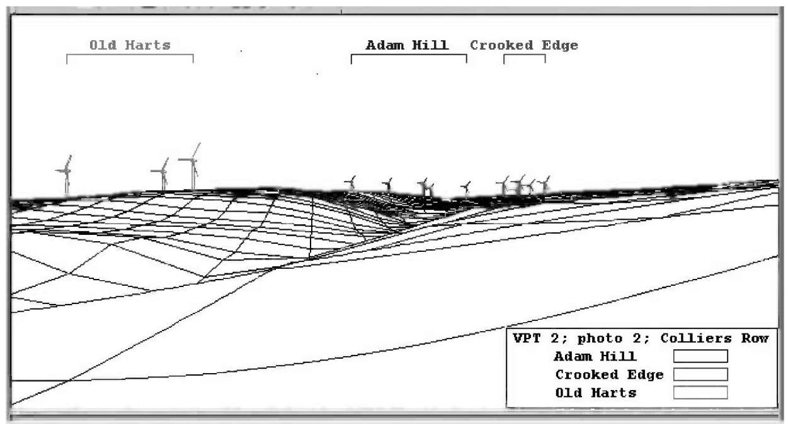

Figure 9.8 Example of wire-frame showing visibility of three wind farms. Reproduced by permission of ReSoft

### 9.2.4 Shadow flicker

Shadow flicker is the term used to describe the stroboscopic effect of the shadows cast by rotating blades of wind turbines when the sun is behind them. The shadow can create a disturbance to people inside buildings exposed to such light passing through a narrow window (EWEA, 2009; AWEA 2008). The frequencies that can cause disturbance are between 2.5-20 Hz.

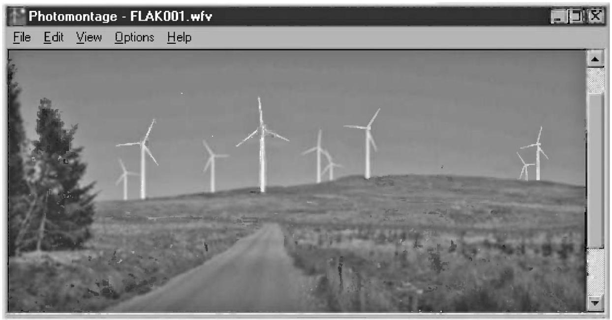

Figure 9.9 Example of photomontage. Reproduced by permission of ReSoft

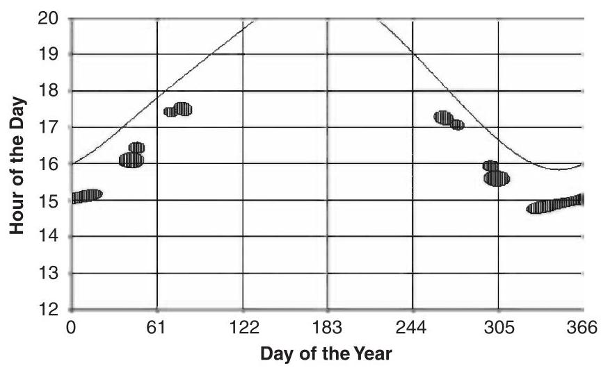

Figure 9.10 Example of shadow flicker prediction - continuous line shows time of sunset. Reproduced by permission of ReSoft

The effect on the human eye-brain is the same as that caused by changes in intensity of an incandescent electric light due to variations in network voltage from a wind turbine (see Section 10.2.1, Chapter 10). In the case of shadow flicker the main concern is variations in light at frequencies of 2.5-3 Hz which have been shown to cause anomalous EEG (electroencephalogram) reactions in some sufferers of epilepsy. Higher frequencies (15-20 Hz) may even lead to epileptic convulsions. Of the general population, some 10% of all adults and 15-30% of children are disturbed to some extent by light variations at these frequencies (Verkuijlen and Westra, 1984).

Large modern three-bladed wind turbines will rotate at less than 30-35 rpm, giving blade-passing frequencies of 1.5-1.75 Hz, which is below the critical frequency of 2.5 Hz. The wind farm SCADA system can be arranged to stop some of the wind turbines temporarily at times that a shadow flicker nuisance may be created. Shadow flicker, noise constraints and avoidance visual domination all need to be addressed when considering how close a turbine should be located to a dwelling. Figure 9.10 shows the calculation of when shadow flicker might cause disturbance in a dwelling close to a wind turbine. It may be seen that this occurs during late afternoon (from around 15:00-17:30 hrs) of the spring and autumn.

### 9.2.5 Sociological aspects

There are a number of computer based tools available for quantifying visual effects and landscape architects and planners have developed techniques to place quantitative measures on visual impact using professional judgement. However, public attitudes, which ultimately determine whether a wind farm may be constructed, are influenced by many more complex factors. Public attitudes to wind farms have been studied on a number of occasions (e.g. ETSU reports W/13/00300/REP, 1993 and W/13/00354/038/REP, 1994) and Gipe discusses this subject in considerable detail. In general, the large majority of people approve of wind farms after they have been constructed although a significant minority remains opposed to them. In particular, there is the difficult issue that some local residents consider they are paying a high cost for a benefit, either financial or environmental, which accrues to others.

The financial benefits may be shared with the community in a number of ways, including by the development of co-operative or community owned wind farms, while the environmental issue has to be addressed by consultation. It is suggested that stationary wind turbines are less acceptable than those rotating and so maintaining high availability with a low cut-in wind speed is likely to improve public perception.

## 9.3 Noise

Noise from wind turbines is often perceived as one of the more significant environmental impacts (Wagner et al., 1996). During the early development of wind energy, in the 1980s, some turbines were rather noisy and this led to justified complaints from those living close to them. However, since then, there has been very considerable development both in techniques for reducing noise from wind turbines and in predicting the noise nuisance a wind farm will create.

It is common for any wind farm Environmental Statement to be accompanied by details of the proposed turbines and predicted noise levels. This is likely to include:

- Predicted noise levels at specific properties close to the wind farm over the most critical range of wind speeds.

- Measured background noise levels at the properties at these wind speeds.

- A scale map showing the proposed wind turbines, the prevailing wind conditions and nearby existing developments.

- Results of independent measurements of noise emission from the proposed wind turbines including the sound power and narrow band frequency spectrum.

IEC 61400-11 (2006) describes how tests to determine the noise emissions from a wind turbine may be conducted and IEC 61400-14 (2005) details how the results of these tests should be declared so that they are likely to be representative of a number of turbines of the same design. These test results are provided by the wind turbine supplier to the wind farm noise consultant to undertake part of the Environmental Impact Assessment. Figure 9.11 shows an example of predicted sound pressure levels from a small wind farm. Noise contours of 40,50 and ${60}\mathrm{{dBA}}$ are superimposed on a map of the wind farm site and adjacent dwellings.

### 9.3.1 Terminology and basic concepts

Two distinctly different measures are used to describe wind turbine noise. These are the sound power level ${L}_{W}$ of the source (i.e. the wind turbine) and the sound pressure level ${L}_{P}$ at a location. Because of the response of the human ear, a logarithmic scale is used based on reference levels that correspond to the limit of hearing. The units of both ${L}_{P}$ and ${L}_{W}$ are the decibel (dB).

A noise source is described in terms of its sound power level, ${L}_{W}$

$$
{L}_{W} = {10}{\log }_{10}\left( \frac{W}{{W}_{0}}\right) \tag{9.4}
$$

where $W$ is the total sound power level emitted from the source (in Watts) and ${W}_{0}$ is a reference value of ${10}^{-{12}}\mathrm{\;W}$ .

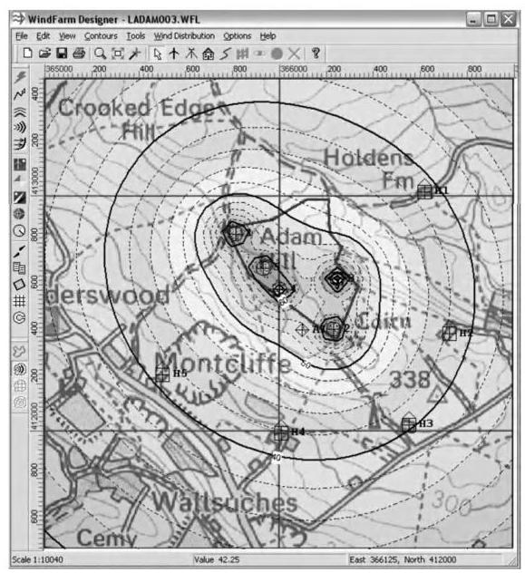

Figure 9.11 Noise contours around a small wind farm. Reproduced by permission of ReSoft, based upon the Ordnance Survey mapping (c) Crown Copyright and/or database right. All rights reserved. Licence number 100050309

The sound pressure level ${L}_{P}$ is defined as

$$
{L}_{P} = {10}{\log }_{10}\left( \frac{{P}^{2}}{{P}_{0}^{2}}\right) \tag{9.5}
$$

where $P$ is the RMS value of the sound pressure and ${P}_{0}$ is a reference value of ${2}^{ * }{10}^{-5}\mathrm{\;{Pa}}$ .

By simple manipulation it may be seen that the addition of $n$ sound pressure levels (expressed in dB) is carried out as shown:

$$
{L}_{Pn} = {10}{\log }_{10}\mathop{\sum }\limits_{{j = 1}}^{{j = n}}{10}^{\frac{{L}_{P\left( j\right) }d}{10}} \tag{9.6}
$$

Thus, adding two sound pressure levels of the same magnitude results in an increase of 3 dB. Sound power levels may be added in a similar manner.

Table 9.3 gives an indication of the typical range of sound pressure levels.

The human ear is capable of detecting sounds between ${20}\mathrm{\;{Hz}} - {20}\mathrm{{kHz}}$ and spectral analysis is typically undertaken over this range. A narrow-band spectrum, with a defined bandwidth of measurement, gives the fullest information of the signal and may be used to detect particular tones. However, it is conventional to use octave and $\frac{1}{3}$ -octave bands for broadband analysis. The upper frequency of an octave band is twice that of the lower frequency while for the $\frac{1}{3}$ -octave band the upper frequency is $\sqrt[3]{2}$ times the lower frequency.

It is common to weight the measurements to reflect the response of the human ear with frequency. This is done by applying the so-called A-weighted filter. Measurements made with this filter are referred to as dBA or dB(A).

Table 9.4 shows the centre frequencies of the octave bands together with the A-weighting in dB. It may be seen that frequencies below ${250}\mathrm{\;{Hz}}$ and above ${16}\mathrm{{kHz}}$ are heavily attenuated.

Table 9.3 Examples of sound pressure levels

<table><tr><td>Example</td><td>Sound pressure level dB(A)</td></tr><tr><td>Threshold of hearing</td><td>0</td></tr><tr><td>Rural night time background</td><td>20-40</td></tr><tr><td>In a busy general office</td><td>60</td></tr><tr><td>Inside a factory</td><td>80-100</td></tr><tr><td>Jet aircraft at ${100}\mathrm{\;m}$</td><td>120</td></tr><tr><td>Wind farm at 350 m</td><td>35-45</td></tr></table>

An equivalent sound pressure level ${L}_{{eq}, T}$ is the value of a continuous steady sound that, within the specified time interval $\left( T\right)$ has the same mean square sound pressure level as the sound under consideration which varies with time

$$
{L}_{{eq}, T} = {10}{\log }_{10}\left( {\frac{1}{T}{\int }_{0}^{T}\frac{{P}^{2}}{{P}_{0}^{2}}{dt}}\right) \tag{9.7}
$$

A similar calculation may be undertaken using A-weighted values to give ${L}_{{Aeq}, T}$

$$
{L}_{{Aeq}, T} = {10}{\log }_{10}\left( {\frac{1}{T}{\int }_{0}^{T}\frac{{P}_{A}^{2}}{{P}_{0}^{2}}{dt}}\right) \tag{9.8}
$$

where ${L}_{\text{ Aeq }, T}$ is the equivalent continuous A-weighted sound pressure level determined over time $T$ and ${P}_{A}$ is the instantaneous A-weighted sound pressure.

The exceedance level, ${L}_{A90}$ , is defined as the A-weighted sound pressure level which is exceeded for ${90}\%$ of the time. Some planning authorities prefer the use of the ${L}_{A90}$ sound pressure level, particularly for measurements of background noise, as the ${L}_{eq}$ measurement may be heavily influenced by short-term effects such as passing aircraft or traffic. A wind farm is a fairly constant source of noise and its contribution to the ${L}_{A90}$ sound pressure level (measured over a ten-minute period) is likely to be some ${1.5} - {2.5}\mathrm{\;{dB}}\left( \mathrm{\;A}\right)$ less than to the ten-minute ${L}_{eq}$ value (ETSU,1997b).

Table 9.4 Centre frequency of octave bands and A-weighting

<table><tr><td>Octave band centre frequency (Hz)</td><td>A-weighting (dB)</td></tr><tr><td>16</td><td>-56.7</td></tr><tr><td>31.5</td><td>-39.4</td></tr><tr><td>63</td><td>-26.2</td></tr><tr><td>125</td><td>-16.1</td></tr><tr><td>250</td><td>-8.6</td></tr><tr><td>500</td><td>- 3.2</td></tr><tr><td>1000</td><td>0.0</td></tr><tr><td>2000</td><td>1.2</td></tr><tr><td>4000</td><td>1.0</td></tr><tr><td>8000</td><td>-1.1</td></tr><tr><td>16000</td><td>-6.6</td></tr></table>

The sound intensity $I$ is the power transmitted through a unit area, $A$ ,

$$
I = \frac{W}{A} \tag{9.9}
$$

and far from the source of sound with a uniform flux

$$
I = \frac{{P}^{2}}{{Z}_{0}} \tag{9.10}
$$

where $P$ is the RMS value of the sound pressure level, and ${Z}_{0}$ is the characteristic acoustic impedance.

Choosing a suitable value for ${I}_{\text{ ref }}\left( {{10}^{-{12}}\mathrm{\;W}/{\mathrm{m}}^{2}}\right)$ , the sound pressure level may be expressed in terms of sound intensity as

$$
{L}_{P} = {10}{\log }_{10}\left( \frac{I}{{I}_{\text{ ref }}}\right) \tag{9.11}
$$

For spherical spreading

$$
I = \frac{W}{{4\pi }{r}^{2}} \tag{9.12}
$$

where $r$ is the distance from the source.

Hence, under conditions of ideal spherical spreading

$$
{L}_{P} = {10}{\log }_{10}\left( \frac{W}{{4\pi }{r}^{2}{10}^{-{12}}}\right)  = {L}_{W} - {10}{\log }_{10}\left( {{4\pi }{r}^{2}}\right) \tag{9.13}
$$

and similarly, if hemi-spherical spreading is assumed

$$
{L}_{P} = {10}{\log }_{10}\left( \frac{W}{{2\pi }{r}^{2}{10}^{-{12}}}\right)  = {L}_{W} - {10}{\log }_{10}\left( {{2\pi }{r}^{2}}\right) \tag{9.14}
$$

Sound pressure level, from a point source, decays with distance according to the inverse square law under both spherical and hemi-spherical spreading assumptions. Hence, for each doubling of distance the sound pressure level is reduced by $6\mathrm{\;{dB}}$ .

For a line source of noise the sound pressure level is given by

$$
{L}_{P} = {10}{\log }_{10}\left( \frac{Lwl}{{2\pi r}{10}^{-{12}}}\right)  = {L}_{wl} - {10}{\log }_{10}\left( {2\pi r}\right) \tag{9.15}
$$

(Lwl is the sound power level per unit length of the source). For cylindrical spreading the decay is only proportional to distance, resulting in a $3\mathrm{\;{dB}}$ reduction of sound pressure level for each doubling of distance perpendicular to the line source.

Table 9.5 Sound power levels of mechanical noise of a 2 MW experimental wind turbine (after Pinder, 1992)

<table><tr><td>Element</td><td>Sound power level dB(A)</td><td>Air-borne or structure-borne</td></tr><tr><td>Gearbox</td><td>97.2</td><td>Structure-borne</td></tr><tr><td>Gearbox</td><td>84.2</td><td>Air-borne</td></tr><tr><td>Generator</td><td>84.2</td><td>Air-borne</td></tr><tr><td>Hub</td><td>89.2</td><td>Structure-borne</td></tr><tr><td>Blades</td><td>91.2</td><td>Structure-borne</td></tr><tr><td>Tower</td><td>71.2</td><td>Structure-borne</td></tr><tr><td>Auxiliaries</td><td>76.2</td><td>Air-borne</td></tr></table>

### 9.3.2 Wind turbine noise

Noise from wind turbines may be divided into

- mechanical; and

- aerodynamic.

Mechanical noise is generated mainly from the rotating machinery in the nacelle, particularly the gearbox and generator although there may also be contributions from cooling fans, auxiliary equipment (such as pumps and compressors) and the yaw system. Mechanical noise is often at an identifiable frequency or tone (e.g. caused by the meshing frequency of a stage of the gearbox). Noise containing discrete tones is more likely to lead to complaints and so attracts a 5 dB penalty in many noise standards. Mechanical noise may be air-borne (e.g. the cooling fan of an air-cooled generator) or transmitted through the structure (e.g. gearbox meshing which is transmitted through the gearbox casing, the nacelle bed-plate, the blades and the tower).

Pinder (1992) gives the values of sound power level shown in Table 9.5 for a 2 MW experimental wind turbine. It may be seen that in this example the gearbox is the dominant noise source through structure borne transmission.

Techniques to reduce the mechanical noise generated from wind turbines include careful design and machining of the gearbox, use of anti-vibration mountings and couplings to limit structure-borne noise, acoustic damping of the nacelle and liquid cooling of the generator. Small changes in the design of gearboxes (e.g. ratio and tooth shape) can have a significant effect on noise generation (IEC 61400-14, 2005).

Aerodynamic noise is due to a number of causes:

- Low frequency noise.

- Inflow turbulence noise.

- Airfoil self noise.

Low frequency noise is caused by changes in the wind speed experienced by the blades due to the presence of the tower or wind shear. Although this effect is very pronounced with downwind turbines it is also significant with upwind machines. The spectrum of the noise is dominated by blade passing frequency (typically up to $3\mathrm{\;{Hz}}$ ) and its harmonics (typically up to ${150}\mathrm{\;{Hz}}$ ). It may be seen from Table 9.4 that the A-weighted filter heavily attenuates these frequencies and so this source does not make a major contribution to audible noise. However, it was reported that experimental, down-wind turbines, constructed in the 1980s excited low frequency vibrations in adjacent buildings. For upwind turbines increasing the clearance between the blades and tower will reduce this effect. Hubbard and Shephard (Spera, 1994) show interesting experimental evidence of low frequency noise from a large ${80}\mathrm{\;m}$ diameter downwind turbine and provide a comparison with a ${90}\mathrm{\;m}$ diameter upwind machine.

Inflow turbulence creates broadband noise as the blades interact with the eddies caused by atmospheric turbulence. It generates frequencies up to ${1000}\mathrm{\;{Hz}}$ which are perceived by an observer as a 'swishing' noise. Turbulent inflow noise is considered to be influenced by the blade velocity, airfoil section and turbulence intensity. Wagner et al. (1996) describe this phenomenon in some detail, remarking that it is not yet fully understood, and quote the results of one field experiment where the sound pressure level actually decreased with increasing turbulence intensity.

Airfoil self-noise is generated by the airfoil itself, even in steady, turbulent-free flow. It is typically broadband although imperfections in the blade surface may generate tonal components. The main types of airfoil self-noise include:

Trailing edge noise. This is perceived as a broadband swishing sound with frequencies in the range 750-2000 Hz. It is due to interaction of the turbulent boundary layer with the trailing edge of the blade. Trailing edge noise is a major source of higher frequency noise on wind turbines.

Tip noise. The literature is not clear as to whether three-dimensional tip effects are a major contributor to wind turbine noise. However, the majority of the blade noise, as well as the turbine power, emanates from the outer 25% of the blade and so there has been very considerable investigation of novel blade tips to reduce noise. Imperfections in the blade shape due to tip-brakes or other control surfaces are another potential source of noise.

Stall effects. Blade stall causes unsteady flow around the airfoil which can give rise to broadband sound radiation.

Blunt trailing edge noise. A blunt trailing edge can give rise to vortex shedding and tonal noise. It can be avoided by sharpening the trailing edge but this has implications for manufacturing and erection.

Surface imperfections. Surface imperfections such as those caused by damage during erection or due to lightning strikes can be a significant source of tonal noise.

The obvious approach to reducing aerodynamic noise is to lower the rotational speed of the rotor, although this may result in some loss of energy.

The ability to reduce noise in low-wind speed conditions is a major benefit of variable-speed or two-speed wind turbines. An informative annex of IEC 61400-14 (2005) gives a relationship between tip speed of a turbine and sound power level as:

$$
{L}_{W} \approx  \left( {{50}\text{ to }{60}}\right) \log {\mathrm{V}}_{\text{ tip }} \tag{9.16}
$$

An alternative technique would be to reduce the angle of attack of the blade although again with a potential loss of energy.

Stiesdal and Kristensen (1993) provide a comprehensive description of noise control methods applied to a ${300}\mathrm{\;{kW}}$ stall regulated wind turbine. The gearbox was identified as an important source of tonal, mechanical noise. Control measures included detailed modifications to the design and manufacture of the gears and an additional insulating covering over the gearbox housing. Air-borne mechanical noise was minimised by total enclosure of the nacelle and careful design of sound baffles in the ventilation openings. Structure-borne noise was reduced by rubber mounting both the gearbox and generator and using a rubber coupling on the high-speed shaft. The long low-speed shaft $\left( {2\mathrm{\;m}}\right)$ reduced the drive train vibrations transmitted to the rotor. Tip noise was minimised by the use of a 'tip torpedo' to control the tip-vortex while trailing edge noise was controlled by specifying a 1-2 mm trailing edge thickness. Stall noise was reduced by using a turbulator strip on the leading edge of the blades near the tip that initiated stall in a controlled manner. Overall these measures resulted in a reduction of the sound power level of 3-4 dB and the elimination of significant tones. The most important noise control methods were considered to be the tip modification, the controlled stall and the gearbox improvements. The measured sound power level of the improved wind turbine was ${96}\mathrm{{dB}}\left( \mathrm{A}\right)$ at a wind speed of $8\mathrm{\;m}/\mathrm{s}$ (measured at ${10}\mathrm{\;m}$ height). This was an impressive improvement as typical sound power levels of a ${600}\mathrm{{kW}}$ wind turbine at that time were up to ${100}\mathrm{\;{dB}}\left( \mathrm{\;A}\right)$ at a wind speed of $8\mathrm{\;m}/\mathrm{s}$ increasing by ${0.5} - 1\mathrm{\;{dB}}\left( \mathrm{\;A}\right)$ per $\mathrm{m}/\mathrm{s}$ .

### 9.3.3 Measurement, prediction and assessment of wind farm noise

The sound power level of a wind turbine is normally determined by field experiments. These were originally specified in the, now superseded, IEA Recommended Practice and are described in international standard (IEC61400-11, 2006). Outdoor experiments are necessary because of the large size of modern wind turbines and the necessity to determine their noise performance during operation. The sound power level cannot be measured directly but is found from a series of measurements of sound pressure levels made around the turbine at various wind speeds from which the background sound pressure levels have been deducted. The method provides the apparent A-weighted sound power levels, one-third octave spectra and tonality of a single wind turbine at wind speeds between $6 - {10}\mathrm{\;m}/\mathrm{s}$ and, optionally, the directivity of the noise source.

The measurements are taken at a distance, ${R}_{0,}$ from the base of the tower

$$
{R}_{0} = H + \frac{D}{2} \tag{9.17}
$$

where $H$ is the hub height and $D$ is the diameter of the rotor. This distance is a compromise to allow an adequate distance from the source but with minimum influence of the terrain, atmospheric conditions or wind-induced noise. The microphones are located on boards at ground level so that the effect of ground interference on tones may be evaluated. The reference microphone is located downwind of the wind turbine under test.

Simultaneous A-weighted sound pressure level measurements (more than 30 measurements each of not less than one minute duration) are taken with wind speed. All wind speeds are corrected to a reference height of ${10}\mathrm{\;m}$ . The preferred method of determining wind speed, when the turbine is operating, is from the electrical power output of the turbine and the power curve. The main measurement sound pressure level measurement is that of the downwind position while the other microphones located around the turbine are used for determining directivity. Measurements are taken with and without the turbine operating over wind speeds between $6 - {10}\mathrm{\;m}/\mathrm{s}$ . A correction for background noise is applied as show in (9.18)

$$
{L}_{P} = {10}{\log }_{10}\left( {{10}^{\frac{{L}_{P + N}}{10}} - {10}^{\frac{{L}_{N}}{10}}}\right) \tag{9.18}
$$

where

${L}_{P}$ is the sound pressure level of the wind turbine.

${L}_{P + N}$ is the sound pressure level of the wind turbine and the background sound.

${L}_{N}$ is the sound pressure level of the background.

At each of the wind speeds, the apparent A-weighted sound power level of the turbine is then calculated from

$$
{L}_{W} = {L}_{PAeq} + {10}{\log }_{10}\left( {{4\pi }{R}_{i}^{2}}\right)  - 6 \tag{9.19}
$$

${R}_{i}$ is the slant distance from the microphone to the wind turbine hub.

It may be seen that the calculation of sound power level assumes spherical radiation of the noise from the hub of the turbine. The subtraction of $6\mathrm{\;{dB}}$ is to determine the free field sound pressure level from the measurements and to correct for the approximate pressure doubling that occurs with the microphone located on a reflecting board at ground level.

One of the Appendices of the, now superceded, IEA document provided a method to estimate the sound pressure level of a single turbine or group of turbines at a distance $R$ provided that they are located in flat and open terrain.

The calculation was based on

$$
{L}_{P}\left( R\right)  = {L}_{W} - {10}{\log }_{10}\left( {{2\pi }{R}^{2}}\right)  - \Delta {L}_{a} \tag{9.20}
$$

The correction $\Delta {L}_{a}$ was for atmospheric absorption and calculated from $\Delta {L}_{a} = {R\alpha }$ where $\alpha$ was a coefficient for sound absorption in each octave band and $R$ the distance to the turbine hub. An alternative approach is to use a similar equation to ${9.20}\mathrm{{but}}$ with $\alpha$ as ${0.005}\mathrm{\;{dB}}/\mathrm{m}$ (as suggested in the Danish Statutory Order on Noise from Windmills) and ${L}_{W}$ specified as a single, broadband sound power level.

If there are several wind turbines which influence the sound pressure level the individual contributions are calculated separately and summed using

$$
{L}_{1 + 2 + \cdots } = {10}{\log }_{10}\left( {{10}^{\frac{{L}_{1}}{10}} + {10}^{\frac{{L}_{2}}{10}} + \cdots }\right) \tag{9.21}
$$

The IEA Method for determining sound pressure levels at a point was based on hemi-spherical spreading with a correction for atmospheric absorption. The assumption of hemi-spherical spreading gives a reduction of $6\mathrm{\;{dB}}$ per doubling of distance. Under some conditions, particularly downwind, this may be an optimistic assumption and a reduction of $3\mathrm{\;{dB}}$ per doubling of distance is more realistic. The IEA method also ignored any effects of meteorological gradients (Wagner et al., 1996). Under normal conditions, air temperature decreases with height and so the sound speed will decrease with increasing height and cause the path of the sound to curve upwards. However, under conditions of temperature inversion, for example as might prevail on cold winter nights, the temperature increases with height causing the sound to curve downwards. Wind speed will have a similar effect. In the downwind direction the sound will be bent downwards while a shadow zone is formed upwind. The effect of the upwind shadow zone is more pronounced at higher frequencies.

Table 9.6 Noise limits for sound pressure levels LAeq, in dBA, in different European countries (after Gipe, 1995)

<table><tr><td>Country</td><td>Commercial</td><td>Mixed</td><td>Residential</td><td>Rural</td></tr><tr><td colspan="5">Germany</td></tr><tr><td>Day</td><td>65</td><td>60</td><td>55</td><td>50</td></tr><tr><td>Night</td><td>50</td><td>45</td><td>40</td><td>35</td></tr><tr><td colspan="5">Netherlands</td></tr><tr><td>Day</td><td></td><td>50</td><td>45</td><td>40</td></tr><tr><td>Night</td><td></td><td>40</td><td>35</td><td>30</td></tr><tr><td>Denmark</td><td></td><td></td><td>40</td><td>45</td></tr></table>

Note the definitions of location vary from country to country. Further details may be found in ETSU (1997b)

A more comprehensive method for calculating the attenuation of sound outdoors is given in ISO 9613-2 (1996). This standard applies generally to outdoor noise propagation, not specifically from wind turbines, and calculates the sound pressure level at a point due to a source taking into account geometrical divergence, atmospheric absorption, ground effect, reflection from surfaces and screening by obstacles. The calculation is undertaken using octave frequency bands.

Permitted noise levels vary widely from country to country and even within countries according to local planning conditions. International practice was reviewed by the UK 'Working Group on Noise from Wind Turbines', (ETSU, 1997b). In Germany, the Netherlands and Denmark the limits are expressed in terms of a maximum permitted value of the sound pressure level at differing locations e.g. Table 9.6.

In contrast, the proposals of the UK Working Group (ETSU, 1997b) was to base the permitted noise level of a wind farm on an increase of $5\mathrm{\;{dB}}\left( \mathrm{\;A}\right)$ of the ${L}_{{A90},{10}\mathrm{\;{min}}}$ sound pressure level above background noise. The $5\mathrm{\;{dB}}\left( \mathrm{\;A}\right)$ limit was selected as being a reasonable compromise between protecting the internal and external environment while not unduly restricting the development of wind energy itself which has other environmental benefits. In addition, it is suggested that a limit of less than 5dB(A) would be difficult to monitor. BS4142 (1997), which is a general standard for industrial noise and may not be directly applicable to wind farms, states that a difference of +10dB or more indicates that complaints are likely while a difference of around +5dB is of marginal significance.

A lower fixed limit of 35-40 dB(A) during daytime and 43 dB(A) during night-time is also applied. The selection of the daytime limit of either 35 or ${40}\mathrm{\;{dB}}\left( \mathrm{\;A}\right)$ is made by considering:

- The number of dwellings in the neighbourhood of the wind farm.

- The effect of noise limits on the number of kWh generated.

- The duration and level of exposure.

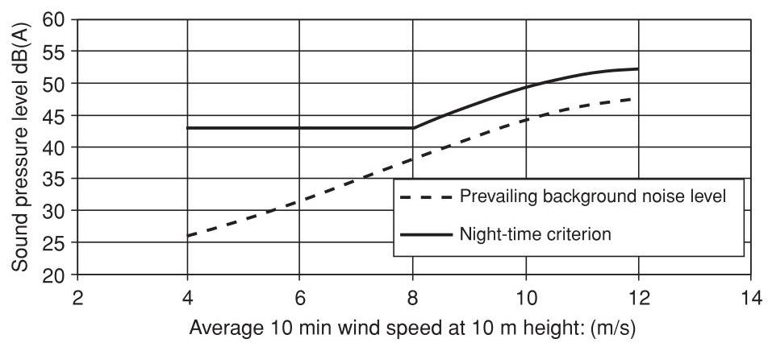

Figure 9.12 Example of noise criterion proposed by the UK Working Group on Noise from Wind Turbines. Night-time criterion (ETSU, 1997b). Reproduced by permission of ETSU on behalf of the DTI

The night-time lower limit of ${43}\mathrm{\;{dB}}\left( \mathrm{\;A}\right)$ is derived from a ${35}\mathrm{\;{dB}}\left( \mathrm{\;A}\right)$ sleep disturbance criterion, an allowance of 10 dB(A) for attenuation through an open window and with 2 dB subtracted for the use of ${L}_{{A90},{10}\min }$ rather than ${L}_{{Aeq},{10}\min }$ . Examples of the noise criteria are shown in Figures 9.12 and 9.13. There is also a penalty for audible tones which rises to a maximum of $5\mathrm{\;{dB}}$ . The UK regulations governing noise from wind turbines are presently under review (2010) and may change in the near future.

## 9.4 Electromagnetic Interference

Wind turbines have the potential to interfere with electromagnetic signals that form part of a wide range of modern communication systems and so their siting requires careful assessment in respect of Electromagnetic Interference (EMI). In particular, wind energy developments often compete with radio systems for hilltops and other open sites that offer high energy outputs from wind farms and good propagation paths for communication signals. The types of system that may be affected by EMI, and their frequency of operation, include VHF radio systems (30 MHz-300MHz), UHF Television broadcasts (300 MHz-3GHz) and Microwave links (1GHz-30GHz). The interaction of wind turbines with defence and civilian radar used for air traffic control is the subject of continuing investigation (ETSU, 2002). Concern over the effect of wind farms on civil and military radar systems has led to major difficulties and delays in a number of wind farms with, at one time, the UK not allowing the development of wind farms within a radius of ${74}\mathrm{\;{km}}$ of any air defence radar site.

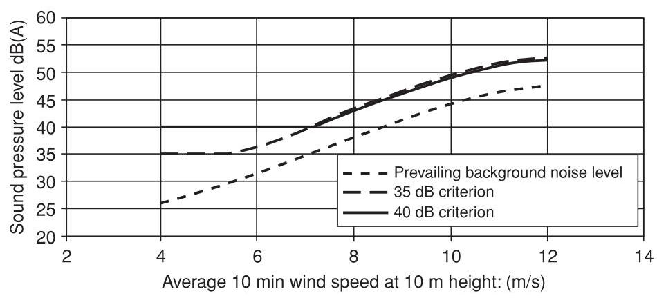

Figure 9.13 Example of noise criterion proposed by the UK Working Group on Noise from Wind Turbines. Daytime criterion (ETSU, 1997b). Reproduced by permission of ETSU on behalf of the DTI

Hall (1992) reported that tests on a fixed speed ${400}\mathrm{\;{kW}}$ wind turbine showed that no radio transmissions attributable to a wind turbine could be detected at ${100}\mathrm{\;m}$ . The electrical generator and associated control gear and electronics can produce radio frequency emissions but these may be minimised by appropriate suppression and screening at the generator. Rather than behave as an aerial the tubular tower had a substantial screening effect on all emissions. If the nacelle is metallic this will also screen the emissions from the nacelle itself. Although additional precautions are necessary with the power electronic converters of variable speed wind turbines, measures to deal with conducted or radiated EMI are standard with any power electronic equipment and electromagnetic emission from wind turbines is not a common problem.

Scattering is, however, an important electromagnetic interference mechanism associated with wind turbines. An object exposed to an electromagnetic wave disperses incident energy in all directions and it is this spatial distribution that is referred to as scattering.

The problem of the interaction of wind turbines and radio communication systems is complex as the scattering mechanisms due to wind turbines are not readily characterised and the signal may be modulated by the rotation of the blades. There is also a large, and increasing, number of types of radio systems with quite different requirements for their effective operation. ETSU, (1997c) indicates that it is expected that the electromagnetic properties of wind turbine rotors will be influenced by:

- rotor diameter and rotational speed;

- rotor surface area, planform and blade orientation including yaw angle;

- hub height;

- structural blade materials and surface finish;

- hub construction;

- surface contamination (including rain and ice); and

- internal metallic components including lightning protection.

ETSU (1997c) includes information of the practices of various radio authorities in determining if a wind farm is likely to give rise to EMI problems. For microwave fixed links it is important that there is a clear line of sight between the transmitter and receiver and that a proportion of the first Fresnel zone must be free from obstructions. The first Fresnel zone is an ellipsoid region of space that makes the major contribution to the signal received and within which component parts of the signal will be in phase (Figure 9.14). At least ${60}\%$ of the first Freznel zone must be free from obstruction in order to ensure 'free space' propagation conditions. The radius of the first Fresnel zone $\left( {R}_{F}\right)$ is given by

$$
{R}_{F} = \sqrt{\frac{\lambda {d}_{1}{d}_{2}}{{d}_{1} + {d}_{2}}} \tag{9.22}
$$

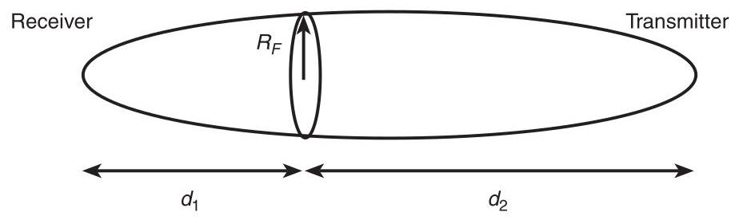

Figure 9.14 Illustration of first Fresnel zone (Fresnel Ellipsoid)

where

${d}_{1}$ and ${d}_{2}$ are the distance from the two microwave terminals to the point of reference is the wavelength

In practice it is usually considered necessary to be completely outside the first Fresnel zone of the link with an additional exclusion zone of either 200 m or ${500}\mathrm{\;m}$ in order to avoid unwanted reflections. These additional allowances for reflections are rather conservative rules-of-thumb and may be reduced following detailed studies.

For UHF television relay links, if the wind farm is outside ${60}^{ \circ  }$ of the relative direction of the receive antenna no major problems are anticipated. If the site is within ${15}^{ \circ  } - {60}^{ \circ  }$ then some problems may be anticipated but may be overcome with a customised antenna. If the site is within ${15}^{ \circ  }$ major problems may be anticipated. Similar considerations apply to domestic TV reception. No problems are anticipated if the wind farm is outside ${60}^{ \circ  }$ of the relative direction of the domestic receive antenna, a good quality antenna being required for ${20}^{ \circ  } - {60}^{ \circ  }$ and a new source required if the wind farm is within ${20}^{ \circ  }$ . It is emphasised by the radio authorities that each wind farm proposal needs to be considered individually.

### 9.4.1 Modelling and prediction of EMI from wind turbines

There are two fundamental interference mechanisms for EMI from wind turbines, backscattering and forward-scattering (Moglia et al., 1996). These are shown in Figure 9.15. Forward-scattering occurs when the wind turbine is located between the transmitter and receiver. The interference mechanism is one of scatter or refraction of the signal by the wind turbine and, for TV signals, it causes fading of the picture at the rotational speed of the blades. Back-scattering occurs when the turbine is located behind the receiver. This results in a time delay between the wanted signal and the reflected interference and gives rise to ghost or double images on a TV screen.

Moglia et al. (1996) (using the earlier work by van Kats and van Rees, 1989) provide an analysis of the electro-magnetic interference caused by a wind turbine.

The useful carrier signal received, $C$ , is given by

$$
C = {P}_{T} - {A}_{TR} + {G}_{TR} \tag{9.23}
$$

where:

${P}_{T}$ is the transmitter power (dB).

${A}_{TR}$ is the attenuation between the transmitter and receiver (dB).

${G}_{TR}$ is the receiver antenna gain in the direction of the required signal (dB).

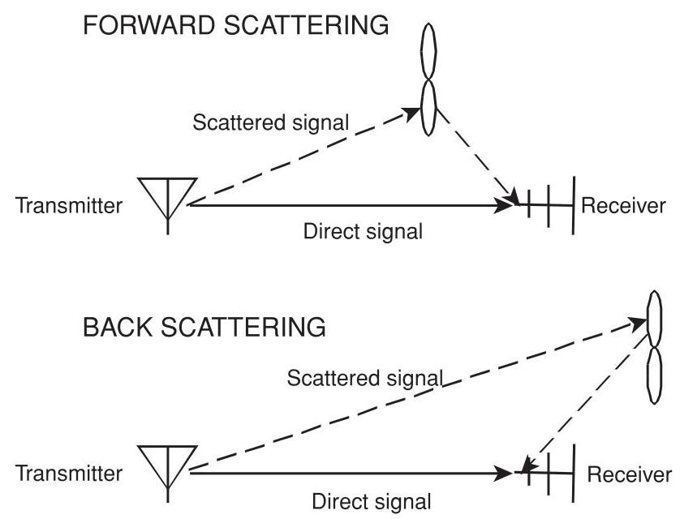

Figure 9.15 Interference mechanisms of wind turbines with radio systems

The interfering signal, $I$ , is given by

$$
I = {P}_{T} - {A}_{TW} + {10}{\log }_{10}\left( \frac{4\pi \sigma }{{\lambda }^{2}}\right)  - {A}_{WR} + {G}_{WR} \tag{9.24}
$$

where ${A}_{TW}$ is the attenuation between the transmitter and wind turbine (dB), ${A}_{WR}$ is the attenuation between the wind turbine and receiver (dB), ${G}_{WR}$ is the receiver antenna gain in the direction of the reflected signal (dB),10 ${\log }_{10}\left( {{4\pi \sigma }/{\lambda }^{2}}\right)$ is the contribution to scattering of the wind turbine, $\sigma$ is the radar cross section and may be understood as the effective area of the wind turbine and $\lambda$ is the wavelength of the signal.

It may be seen that the ratio of useful signal to interference is:

$$
\frac{C}{I} = {A}_{TW} - {10}{\log }_{10}\left( \frac{4\pi \sigma }{{\lambda }^{2}}\right)  + {A}_{WR} - {A}_{TR} + {G}_{TR} - {G}_{WR} \tag{9.25}
$$

Assume the distance between the transmitter and receiver is much greater than the distance of the wind turbine to the receiver denoted as $r$ , then ${A}_{TW} = {A}_{TR}$ . Assume the free space loss is ${A}_{WR} = {20}{\log }_{10}{4\pi r}/\lambda$ and define the antenna discrimination factor as ${\Delta G} = {G}_{TR} - {G}_{WR}$ .

Then $C/I$ reduces to

$$
\frac{C}{I} = {10}{\log }_{10}{4\pi } + {20}{\log }_{10}r - {10}{\log }_{10}\sigma  + {\Delta G} \tag{9.26}
$$

Thus, the ratio of the useful carrier signal to interference may be improved by:

- increasing the distance of the turbine to the receiver, $r$ ;

- reducing the radar cross section, $\sigma$ ;

- improving the discrimination factor of the antenna, ${\Delta G}$ .

The carrier to interference ratio $C/I$ defines the quality of a radio link. For example, a fixed microwave link may have a $C/I$ requirement of ${50} - {70}\mathrm{\;{dB}}$ while for a mobile radio service the requirement may be only ${15} - {30}\mathrm{\;{dB}}$ (ETSU,1997c).

Hence Equation 9.25 may be rearranged to define a 'forbidden zone' within which a wind turbine may not be located if an adequate carrier to interference ratio is to be maintained.

$$
{20}{\log }_{10}r = {\frac{C}{I}}_{\text{ required }} + {10}{\log }_{10}\sigma  - {\Delta G} - {11} \tag{9.27}
$$

It may be seen that the 'forbidden zone' is critically dependent on the radar cross section, $\sigma$ .

Determination of the radar cross section of a wind turbine is not straightforward and a number of approaches are described in the literature. van Kats and van Rees, 1989 undertook a comprehensive series of site measurements on a 45-m diameter wind turbine. They estimated a radar cross section in the back-scatter region of ${24}{\mathrm{{dBm}}}^{2}$ and a worst case value in the forward-scatter region of ${46.5}{\mathrm{{dBm}}}^{2}$ .

Where measured results are not available, simple predictions may be made based on approximating the turbine blades to elementary shapes (Moglia et al., 1996). For example, for a metallic cylinder the radar cross section is given by

$$
\sigma  = \frac{{2\pi a}{L}^{2}}{\lambda } \tag{9.28}
$$

where:

$a$ is the radius of the cylinder.

$L$ is the length of the cylinder.

$\lambda$ is the signal wavelength.

while for a rectangular metallic plate

$$
\sigma  = \frac{{4\pi }{l}^{2}{L}^{2}}{\lambda } \tag{9.29}
$$

where $l$ is the width of the plate.

It is suggested that, in the back-scatter region, reflection is only caused by the metallic parts of the blades and so only these dimensions are used in the simple formulae. However, in the forward-scattering region the entire blades make a contribution although this is reduced because of the blade material (GRP) and shape. Hence, Moglia et al. (1996) apply the simple formulae but with a $5\mathrm{\;{dB}}$ correction for blade material and a ${10}\mathrm{\;{dB}}$ correction for blade shape (when using the rectangular approximation).

Hall (1992) quotes a radar cross section model used by a number of researchers as:

$$
\sigma  = {20}{\log }_{10}\left\lbrack  \frac{{AX}\left( \alpha \right) }{\lambda }\right\rbrack   + {11} - C
$$

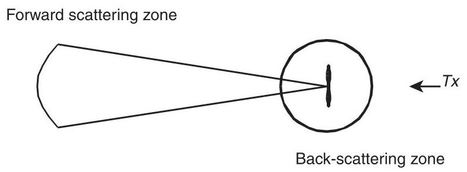

Figure 9.16 Example of simple calculation of interference regions of a wind turbine where:

$A$ is the area of one blade.

$X\left( \alpha \right)$ is a function describing the amplitude of the scattered signal in direction $\alpha$ .

$\lambda$ is the signal wavelength.

$C$ is a calibration constant, which may be assumed to be ${15}\mathrm{\;{dB}}$ .

Dabis and Chignell in (ETSU, 1997c) dispute the use of these simple approaches to the determination of the radar cross-section and suggest that more accurate computation is necessary. Their rather complex model is based on a physical optics formulation and assumes a conducting flat plate representation of the blades. It ignores any effects due to non-metallic blade materials and complex blade shapes. Although Dabis and Chignell provide interesting illustrative results of their method they consider significant further work is required to develop the technique further and to validate it against measured field data.

The simple approaches of Moglia et al. and van Kats and van Rees allow the calculation of forbidden zones as indicated in Figure 9.16.

The back-scattering region (for a given required $C/I$ value) has a much smaller radius than the forward-scattering region. This is because the radar cross section is much smaller (only the metallic parts near the root of the blades were considered) and also it is possible to take advantage of the directivity of the receiving antenna $\left( {\Delta G}\right)$ . Equation 9.26 defines only the radii of the two regions and it is necessary to determine the angle over which the two regions extend. van Kats and van Rees remark that some uncertainty exists as to where the back-scatter region changes into the forward scatter region. Sengupta and Senior (in Spera, 1994) suggest that ${80}\%$ of the region around the turbine should be in the back-scatter zone with the remaining ${20}\%$ in the forward scatter region. However Moglia et al. use the formula

$$
{\Phi }_{\text{ border }} = \pi  - \frac{\lambda }{L}
$$

where

$\lambda$ is the wavelength.

$L$ the blade element radius.

the back-scatter region extends between $0 < \left| \Phi \right|  < {\Phi }_{\text{ border }}$ while the forward-scatter region extends between ${\Phi }_{\text{ border }} < \left| \Phi \right|  < \pi$ .

For the ${45}\mathrm{\;m}$ diameter turbine studied by van Kats and van Rees, back-scatter region radii of ${100}\mathrm{\;m}\left( {C/I\text{ contour of }{27}\mathrm{\;{dB}}}\right)$ and ${200}\mathrm{\;m}\left( {C/I\text{ contour of }{33}\mathrm{\;{dB}}}\right)$ were determined. The forward scattering-region was much larger with radii of ${1.3}\mathrm{\;{km}}\left( {C/I\text{ contour of }{27}\mathrm{\;{dB}}}\right)$ and ${2.7}\mathrm{\;{km}}\left( {C/I\text{ contour of }{33}\mathrm{\;{dB}}}\right)$ . They suggest that a $C/I$ value of ${33}\mathrm{\;{dB}}$ should result in no visible TV interference. Moglia et al. applied their method to medium sized wind turbines (33 m and ${34}\mathrm{\;m}$ diameter) to give a back-scatter radius of approximately ${80}\mathrm{\;m}$ and a forward-scatter radius of ${450}\mathrm{\;m}$ for a ${46}\mathrm{\;{dB}}C/I$ contour. Their calculations were supported by measured site results, which gave reasonable agreement with the predictions. In these two examples back-scattering is unlikely to be a significant problem as other constraints (e.g. noise and visual effects) will ensure that any dwelling is outside the 'forbidden zone'.

In summary, it may be concluded that accurate analytical determination of the way wind turbines may interfere with radio communication systems remains difficult. In particular, techniques to determine the effects of irregular terrain and the details of the blade shape and materials have yet to be developed and validated. The approaches that rely on simplified assumptions to estimate the radar cross section can only be considered approximate. However, they do provide a useful qualitative understanding of the problem. In practice a dialogue with the local telecommunications authorities is required in order to determine if a wind turbine or wind farm development is likely to cause electromagnetic interference.

### 9.4.2 Aviation radar

The potential impact of wind turbines on aviation radar, both civil and military, is of major concern and has resulted in a number of wind farm projects not proceeding (ETSU, 2002). A radar system works by emitting a pulse of electromagnetic energy at radio frequency, receiving and amplifying the reflected signal and then processing it. The distance to the target object is calculated from the time difference between the pulse being emitted and the signal received. A large reflected signal, such as may be caused by the large radar cross-section of a wind turbine, can result in amplitude limiting and distortion within the receiving or signal processing circuits. In addition, aviation primary radars use the Doppler effect to distinguish between fixed and moving objects and can have difficulty in distinguishing between moving wind turbine blades in a wind farm and a moving aircraft.

The main impacts of a wind farm on radar are (ETSU, 2002):

- Masking. Air defence radars operate at high frequency and so require a clear 'line of sight'. Wind turbines can cause shadowing effects and the creation of areas where targets cannot be detected. Masking is also of concern for meteorological radars that look at a very narrow angle just above the ground.

- Radar Clutter. Unwanted radar returns are known a 'clutter' and rotating wind turbines can lead to a large number of, sometime intermittent, returns that may be interpreted by the radar as a moving object.

- Scattering. Scattering occurs when the radar signal is reflected or refracted by rotating wind turbine blades and detected by the emitting radar system. This can lead to multiple false radar returns being displayed or even returns from genuine aircraft being assigned a wrong location.

Figure 9.17 is an example of the calculation of the radar ceiling of three wind farm sites and shows the areas where masking of each of the radars can occur. It uses a digital terrain model with the radar line-of-sight to determine where wind turbines would be likely to mask radar systems. The calculation is based on the radar line-of-sight and so includes the curvature of the earth as well as local topography.

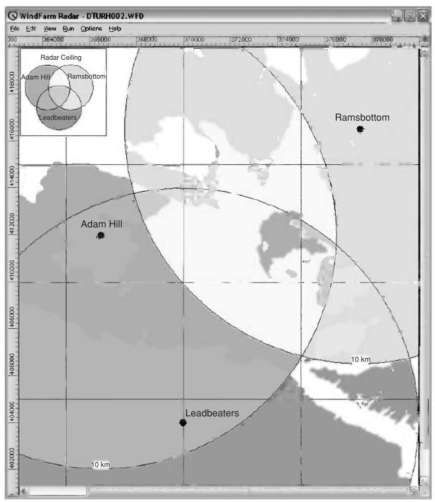

Figure 9.17 Example of radar ceiling calculated for three radar sites. Reproduced by permission of ReSoft

There is continuing interest in reducing the impact of wind farms on aviation radar (ETSU, 2003a, 2003b). Options include modifying the operation of the radar system, changing the geometric layout or location of the wind farm as well as reducing the radar cross section of the wind turbines, particularly the blades. A number of research projects have been undertaken to investigate the use of aircraft stealth technology but to date such approaches have not entered widespread commercial production due to their cost and the increased precision that would be required in the manufacturing process.

## 9.5 Ecological assessment

Wind farms will often be constructed in areas of ecological importance and the Environmental Statement will include a comprehensive assessment of the local ecology, its conservation importance, the impact of the wind farm (during construction and operation) and mitigation measures. A study of the site hydrology is also likely to be included because of its importance for the ecology. It was suggested by English Nature (1994) that when considering the ecological impact of renewable energy schemes the following categories of effects should be considered:

- Immediate damage to wildlife habitats during construction.

- Direct effects on individual species during operation.

- Longer term changes to wildlife habitats as a consequence of construction or because of changed land use management practices.

Thus, the scope of the ecological assessment is likely to include:

- A full botanical survey including identification and mapping of plant species on the site.

- A desk and field survey of existing bird and non-avian fauna.

- An assessment of how the site hydrological conditions relate to the ecology.

- Evaluation of the conservation importance of the ecology of the site.

- Assessment of the potential impact of the wind farm.

- Proposed mitigation measures, including which part(s) of the site should be avoided.

Gipe (1995) suggests that the main impact on plants and wildlife (excluding birds) is from road building and the disturbance of habitat. Direct loss of habitat due to a wind farm construction is small (approx. 3%) and this can be reduced further by reinstating roads and construction areas once the wind farm is built. However, during construction there is likely to be considerable disturbance including frequent traffic of heavy vehicles and it may be necessary to timetable major work to avoid sensitive periods (e.g. breeding seasons).

### 9.5.1 Impact on birds

The impact of wind energy developments on birds was particularly controversial in the 1990s because of concern over raptors colliding with wind turbines in the USA and in the south of Spain at Tarifa. Raptors are rare and long-lived birds and so collisions are of particular concern. Elsewhere in Europe the main concern was not collisions of birds with turbines but issues associated with disturbance and habitat loss (Colson, 1995; ETSU, 1996). Since then, there has been considerable research into the impact of wind farms on birds and it would appear that by careful assessment and monitoring, before construction and during operation of the wind farm, the environmental impact on birds may be managed effectively. Guidance on how surveys to assess the impact of onshore wind farms on birds should be conducted is given in Scottish National Heritage (2005).

The presence of a wind farm may affect bird life in one or more of the following ways:

- collision;

- displacement due to disturbance;

- barrier effect; and

- habitat change and loss.

Drewitt and Langston (2006) conducted an extensive literature survey to assess the impact of wind farms on birds. They found very variable annual collision rates reported varying between 0.01-23 birds/turbine. The higher numbers are corrected for scavenger removal and are from a coastal site and relate to gulls, terns and ducks. They also found that none of the barrier effects identified had resulted in significant impact on bird populations while the studies of displacement due to disturbance were largely inconclusive. Typical habitat loss due to a wind farm was approximately 2-5% of the total development area.

Table 9.7 Bird strikes at wind farms in the UK (Lowther S. in ETSU, 1996)

<table><tr><td>Wind farm</td><td>Number of turbines</td><td>Bird strikes/turbine year</td></tr><tr><td>Burgar Hill, Orkney</td><td>3</td><td>0.15</td></tr><tr><td>Haverigg, Cumbria</td><td>5</td><td>0</td></tr><tr><td>Blyth Harbour, Northumberland</td><td>9</td><td>1.34</td></tr><tr><td>Bryn Titli, Powys</td><td>22</td><td>0</td></tr><tr><td>Cold Northcott, Cornwall</td><td>22</td><td>0</td></tr><tr><td>Mynydd y Cemmaes, Powys</td><td>24</td><td>0.04</td></tr></table>

(Reproduced by permission of ETSU on behalf of the DTI)

Lloyd (ETSU, 1996) states that, because the removal of habitat is comparatively small in a wind farm development, the main issues are the effect on bird behaviour either from construction or operation and direct mortality from birds colliding with wind turbines.

A number of important studies reported collisions of raptors with wind turbines in California (Committee on Environmental Impacts of Wind Energy Projects, 2007). The wind farms of the Altamont pass in the early 1990s were not typical of European projects or more recent developments in the USA. The turbines were very numerous, some ${7000}{\mathrm{{turbine}}}^{2}$ in ${200}{\mathrm{\;{km}}}^{2}$ , rather small in size (typically ${100}\mathrm{\;{kW}}$ ), often on lattice steel towers and with close spacing along the rows facing the prevailing winds. Lloyd (ETSU, 1996) suggests that a number of factors may have led to the high collision rate among raptors. The Altamont turbines were often located on low rises and ridges in the pass to exploit local acceleration of the wind speed. A large number of the collisions appeared to be at the end of the turbine rows where the birds may be attempting to fly around the densely packed turbines. In both Tarifa and Altamont there are few trees and it is suggested that some species used the lattice steel towers as perches and even for nesting.

The bird strike rate for early UK wind farms is quoted by Lowther (ETSU, 1996) and is shown in Table 9.7.

The three experimental turbines on Burgar Hill including a $3\mathrm{{MW}}{60}\mathrm{\;m}$ diameter prototype were adjacent to the habitats of a number of bird populations of national significance, including 4% of the UK breeding population of the hen harrier. Studies were undertaken over a nine-year period and during that time four mortalities (three black-headed gulls and one peregrine) were noted as possibly being the result of turbine strike.

The Blyth Harbour wind farm (Still et al., 1994) consists of nine, 300 kW wind turbines positioned along the breakwater of a harbour which has been designated a site of special scientific interest. As it has the highest density of birds of any UK wind farm site (110 varieties identified with more than 1100 bird movements per day) it was the subject of a monitoring programme. The main species that inhabit the area are the cormorant, eider, purple sandpiper and three types of gull. There was particular concern over the purple sandpiper, which winters in the harbour, and so special measures were taken to improve its roosting habitat by providing additional shelter. Over a three-year period, 31 collision victims were identified. Mortality by collision was mainly in eider and among the gulls. It was calculated not to have a significant adverse impact on the local populations. In common with studies undertaken on Dutch and Danish coastal wind farms it appeared that most species had adapted to the wind turbine structures. With respect to disturbance and habitat loss, the study indicated that there was no significant long-term impact. The purple sandpiper was not adversely affected by the wind farm and, although temporary displacement of cormorant occurred during construction, the population returned to its precious haunts once construction was completed.

The Bryn Titli wind farm is adjacent to a site of special scientific interest that holds important, breeding communities of buzzard, peregrine, red grouse, snipe, curlew and raven. The wind farm was the subject of a bird impact study which showed no statistically significant impact on breeding birds and a bird strike study undertaken in 1994/95 indicated that it is unlikely that there were any collision mortalities during that time.

Clausager (ETSU, 1996) undertook an extensive review of both the American and European literature of the impact of wind turbines on birds. He concluded that, of the mainly coastal locations studied, the risk of death by collision with wind turbine rotors is minor and creates no immediate concern of an impact on the population level of common species. Drawing on 16 studies, and using a multiplier of 2.2 for birds not found, he estimates the highest number of mortalities due to collisions to be six to seven birds/turbine year. With approximately 3500 wind turbines in Denmark this led to the maximum number of birds dying from collision being 20,000-25,000. This number is compared with at least one million birds being killed from traffic in Denmark each year. He dismisses the direct loss of habitat as being small and of minor importance but draws attention to the issues of changes in the area due to the wind farm construction particularly draining of low-lying areas. He also notes that some species of birds temporarily staying in an area may be adversely affected and that an impact has been recorded within a zone of ${250} - {800}\mathrm{\;m}$ , particularly for geese and waders. The need for further studies, particularly for offshore wind farms and developments on uplands, where only limited number of investigations have been reported, is emphasised.

The Committee on Environmental Impacts of Wind Energy Projects (2007) has undertaken a comprehensive review of the literature on the impacts of wind turbines on birds and bats. Although clearly recognizing the limitations of that data they estimated that in 2003 wind turbines accounted for ${0.003}\%$ of bird deaths in the USA. They also quote the results of 14 studies on raptors to give an average fatality rate from wind turbines of 0.03 birds per turbine year.

Both Lloyd (ETSU, 1996) and Colson (1995) propose mitigation measures that may be taken to protect important bird species while allowing wind energy development to continue. These include:

- Baseline studies should be undertaken at every wind farm site to determine. which species are present and how the birds use the site. This should be a mandatory part of the Environmental Statement for all wind turbines.

- Known bird migration corridors and areas of high bird concentrations should be avoided unless site specific investigation indicates otherwise. Where there are significant migration routes the turbines should be arranged to leave suitable gaps, (e.g. by leaving large spaces between groups of wind turbines).

- Microhabitats, including nesting and roosting sites, of rare/sensitive species should be avoided by turbines and auxiliary structures. (It may be noted that meteorological masts as well as wind turbines can pose a hazard for birds.)

- Particular care is necessary during construction and it is proposed that access for contractors should be limited to avoid general disturbance over the entire site. If possible, construction should take place outside the breeding season. If this is not possible then construction should begin before the breeding season to avoid displacing nesting birds.

- Tubular turbine towers are preferred to lattice structures. Consideration should be given to using unguyed meteorological masts.

- Fewer large turbines are preferred to larger numbers of small turbines. Larger turbines with lower rotational speeds are probably more readily visible to birds then smaller machines.

- Within the wind farm the electrical power collection system should be underground.

- Turbines should be laid out so that adequate space is available to allow the birds to fly through them without encountering severe wake interaction. A minimum spacing of ${120}\mathrm{\;m}$ between rotor tips is tentatively suggested as having led to minimum collision mortalities on UK wind farms. Turbines should be set back from ridges and avoid saddles and folds which are used by birds to traverse uplands.

Drewitt and Langston (2006) suggest wind farm development should be avoided where there is

- a high density of waterfowl and waders;

- a high level of raptor activity; or

- a high level of breeding and wintering activity.

It is interesting to note that a ${30}\mathrm{{MW}}$ wind farm development in Scotland was only able to proceed after an extensive study of raptors and the conversion of 450 ha of coniferous forest to heather dominated moorland and the exclusion of sheep from a further 230 ha (Madders and Walker, 1999). It is anticipated that this extension of the moorland habitat will increase the amount of prey away from the wind farm and so reduce the risk of collisions by golden eagles and other raptors.

## References

AWEA (2008) Wind Energy Siting Handbook. American Wind Energy Association, Washington, DC. http://www.awea.org/sitinghandbook/, accessed August 2010.

BS 4142 (1997) Method for rating industrial noise affecting mixed residential and industrial areas. British Standards Institution.

BWEA (1994) Best Practice Guidelines for Wind Energy Development. British Wind Energy Association (now renamed RenewableUK). http://www.bwea.com/ref/bpg.html, accessed August 2010.

Colson, E.W. (1995) Avian interactions with wind energy facilities: a summary. In: Proceedings American Wind Energy Association Conference, Windpower '95, pp. 77-86.

Committee on Environmental Impacts of Wind Energy Projects (2007) National Research Council Environmental Impacts of Wind-Energy Projects. http://www.nap.edu/catalog/11935.html.

Derrick, A. (1993) Development of the Measure-Correlate-Predict strategy for site assessment. In: Proceedings of the European Wind Energy Association Conference, Travemunde (ed. A.D. Garrad, W. Palz and S. Sheller), pp. 681-685.

Devine-Wright, P. (2005) Beyond NIMBYism: towards an integrated framework for understanding public perceptions of wind energy, Wind Energy 8(2), 125-139.

Drewitt, A.L. and Langston, R.H.W. (2006) Assessing the impacts of wind farms on birds, Ibis 148, 29-42.

English Nature (1994) Nature conservation guidelines for renewable energy projects English Nature, Peterborough.

ETSU (1993) 'Attitudes to wind power - A survey of opinion in Cornwall and Devon', Report W/13/00354/038/REP.

ETSU (1994) Cemmaes wind farm sociological impact study - final report. Report W/13/00300/REP.

ETSU (1996) Birds and wind turbines: can they co-exist. Proceedings of a seminar held at the Institute for Terrestrial Ecology, 26 March. Huntingdon.

ETSU (1997a) UK onshore wind energy resource. ETSU Report R-99, F Brocklehurst, http:// www.decc.gov.uk/en/content/cms/what_we_do/uk_supply/energy_mix/renewable/explained/wind/ windsp_databas/windsp_databas.aspx, accessed August 2010.

ETSU (1997b) The assessment and rating of noise from wind farms ETSU-R-97. Final Report of the Working Group on Noise from Wind Turbines http://webarchive.nationalarchives.gov.uk/+/http://www.berr.gov.uk/energy/sources/renewables/explained/wind/onshore-offshore/ page21743.html Accessed August 2010.

ETSU (1997c) Investigation of the interactions between wind turbines and radio systems aimed at establishing co-siting guidelines, Phase 1: Introduction and modelling of wind turbine scatter. Report W/13/00477/REP.

ETSU (2002) Wind energy and aviation interests - interim guidelines. Wind energy defense and civil aviation interests working group. ETSU Report W/14/00626/REP.

ETSU (2003a) Feasibility of mitigating the effects of windfarms on primary radar. M.M. Butler and D.A. Johnson, ETSU Report W/14/00623/REP.

ETSU (2003b) Wind farms impact on radar aviation interests - final report, G.J. Poupart, ETSU Report W/14/00614/REP.

EWEA (2009) Wind Energy the Facts. Earthscan, London.

Gipe, P. (1995) Wind Energy Comes of Age. John Wiley and Sons, Inc. New York.

Hall, H.H. (1992) The assessment and avoidance of electromagnetic interference due to wind farms. Wind Engineering 16(6), 326-337.

Horner + maclennan and Envision (2006) Visual Representation of Windfarms, Good Practice Guidance. Scottish Natural Heritage Commissioned Report FO3 AA 308/2 http://www.snh.gov.uk/docs/A305436.pdf, accessed August 2010

IEC 61400-11 (2006) Wind turbine generator systems - Part 11: Acoustic noise measurement techniques. International Electrotechnical Commission.

IEC 61400-14 (2005) Wind turbines - Part 14: Declaration of apparent sound power level and tonality values. International Electrotechnical Commission.

ISO 9613-2 (1996) Acoustics - Attenuation of sound during propagation outdoors - Part 2: General method of calculation. International Standards Organisation.

Landberg, L. and Mortensen, N.G. (1993) A comparison of physical and statistical methods for estimating the wind resource at a site. In: Proceedings of the 15th British Wind Energy Association Conference, 6-8 October, Stirling, (ed. K.F. Pitcher), pp. 119-125. Mechanical Engineering Publications, London.

Madders, M. and Walker, D.G. (1999) Solutions to raptor-wind farm interactions. In: Proceedings of the 21st British Wind Energy Association Conference, 1-3 September, Cambridge (ed. P. Hinson), pp. 191-195. Mechanical Engineering Publications, London.

Moglia, A., Trusszi, G. and Orsenigo, L. (1996) Evaluation methods for the electromagnetic interferences due to wind farms. In: Proceedings of the Conference on Integration of Wind Power Plants in the Environment and Electric Ssystems, Rome 7-9 October, Paper 4.6.

Pinder, J.N. (1992) Mechanical noise from wind turbines. Wind Engineering 16(3), 158-168.

Scottish National Heritage (2005) Survey methods for use in assessing the impacts of onshore windfarms on bird communities, SNH, http://avifauna.se/apps/file.asp?Path=2&ID= 4943& File=SNH_Guidance+document+on+survey+methods.pdf

Spera, D.A. (1994) Wind Turbine Technology: Fundamental Concepts of Wind Turbine Engineering. ASME Press, New York.

Stanton, C. (1994) The visual impact and design of wind farms in the landscape. In: Proceedings of the British Wind Energy Association Conference, 15-17 June, Sterling, pp. 249-255. Mechanical Engineering Publications, London.

Stiesdal, H. and Kristensen, E. (1993) Noise control on the BONUS 300 kW wind turbine. In: Proceedings of the 15th British Wind Energy Association Conference, York, 6-8 October, pp. 335-340. Mechanical Engineering Publications, London.

Still et al. (1994) The birds of Blyth Harbour. In: Proceedings of the British Wind Energy Association Conference, 15-17 June, Sterling, pp. 241-248. Mechanical Engineering Publications, London.

Taylor, D. and Rand, M. (1991) Planning for wind energy in Dyfed. Energy and Environment Research Unit, Open University, EERU 065.

Troen, I. and Petersen, E.L. (1989) European Wind Atlas. http://www.windatlas.dk/europe/About.html, accessed August 2010. Risø National Laboratory, Roskilde.

University of Newcastle (2002) Visual Assessment of Windfarms Best Practice. Scottish Natural Heritage Commissioned Report F01AA303A. http://www.snh.gov.uk/docs/A305437.pdf.accessed August 2010.

van Kats, P.J. and van Rees, J. (1989) Large wind turbines: a source of interference for TV broadcast reception. In: Wind Energy and the Environment, (ed. D.T. Swift-Hook). IEE Energy Series.

Verkuijlen, E. and Westra, C.A. (1984) Shadow hindrance by wind turbines. In: Proceedings of the European Wind Energy Conference, 22-26 October, pp. 356-361, Hamburg.

Wagner, S., Bareis, R. and Guidati, G. (1996) Wind Turbine Noise. Springer-Verlag, Berlin.

Walmsley, J.L., Salmon, J.R. and Taylor, P.A. (1982) On the Application of a Model of Boundary-Layer Flow over Low Hills to Real Terrain, Boundary-Layer Meteorology, 23, 17-46.

Walmsley, J.L., Taylor, P.A. and Keith, T. (1986) A Simple Model of Neutrally Stratified Boundary-Layer Flow over Complex Terrain with Surface Roughness Modulations - MS3DJH/3R, Boundary-Layer Meteorology, 36, 157-186.

WAsP - www.wasp.dk and Chapter 8 of European Wind Atlas (1989) Risø National Laboratory, Denmark for the Commission of the European Communities. Available from Dept of Meteorology and Wind Energy, Risø National Laboratory, PO Box 49, DK -4000 Roskilde, Denmark and www.windpower.dk.

