# 10 Wind energy and the electric power system

## 10.1 Introduction

As the wind is a diffuse source of energy, wind farms and individual wind turbines are often distributed over wide geographical areas. Hence the public electricity networks, which were originally constructed to supply customer loads from conventional generators (fossil and hydro) are used and extended to gather the electrical energy. Smaller wind farms and individual turbines are connected to the distribution system and are described as distributed generation (Jenkins et al., 2010). Larger wind farms are connected directly to the transmission system and their output displaces energy from conventional central generators.

Traditionally distribution systems have been designed for a uni-directional flow of power from the high voltage transmission network to the customers. Significant generation was not considered in the initial design of the distribution networks and alters the way they operate. Transmission systems were designed for bulk power transfer from fossil or hydro generation to large load centres and the output of wind generation has to be balanced by varying the output of other generators.

In some countries, the output of wind farms now has a significant impact on the technical and commercial operation of central generation. At times of low load and high wind power output, the wholesale market price of electrical energy can drop to a very low value. It may also be necessary to constrain off wind farms in order to allow conventional generation to operate and so provide the ancillary services (e.g. voltage and frequency control) that are necessary for power system operation.

### 10.1.1 The electric power system

Figure 10.1 is a diagrammatic representation of a typical modern electric power system. The electrical power is generated by large central generating sets and is then fed into an interconnected high voltage transmission system. The generating units may be fossil-fuel, nuclear or hydro sets and will have capacities of up to 1000 MW. The generation voltage is rather low (typically around ${20}\mathrm{{kV}}$ ) to reduce the insulation requirements of the machine windings and so each generator has its own transformer to increase the voltage to that of the transmission system. The transmission network is interconnected, or meshed, and so there can be many paths for the electrical power to flow from the generator to the bulk supply transformers.

---

Wind Energy Handbook, Second Edition. Tony Burton, Nick Jenkins, David Sharpe and Ervin Bossanyi.

© 2011 John Wiley & Sons, Ltd. Published 2011 by John Wiley & Sons, Ltd. ISBN: 978-0-470-69975-1

---

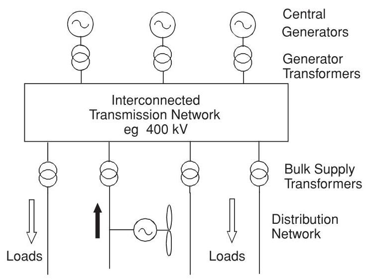

Figure 10.1 Large utility power system

The bulk supply transformers are used to extract power from the transmission network and to provide it to the distribution networks at lower voltages. Practice varies from country to country but primary distribution voltages can be as high as ${150}\mathrm{{kV}}$ . Distribution networks are normally operated as radial networks with a single path between the bulk supply transformers and the loads. In urban areas with high loads the distribution networks use large underground cables and transformers and so have a high capacity. However, in rural areas the customer loads are often small and so the distribution circuits, using overhead lines, have been designed to have only a limited capability to transport power while maintaining the voltage within the required limits. Small wind farms (distributed generation) are often connected to rural, overhead distribution lines. The design of these networks tends to be limited by consideration of voltage drop or rise rather than thermal constraints of the conductors and this severely limits the ability of these circuits to accept wind generation.

### 10.1.2 Electrical distribution networks

The conventional function of an electrical distribution network is to transport electrical energy from a transmission system to customers' loads. This is to be done with minimum electrical losses and with the quality of the electrical voltage maintained. The voltage drop is directly proportional to the current while the series loss in an electrical circuit is proportional to the square of the current. Therefore, the currents must be kept low which implies that the network voltage level must be high. However, high voltage plant (e.g. lines, cables and transformers) is expensive due to the cost of insulation and so the selection of appropriate distribution network voltage levels is an economic choice.

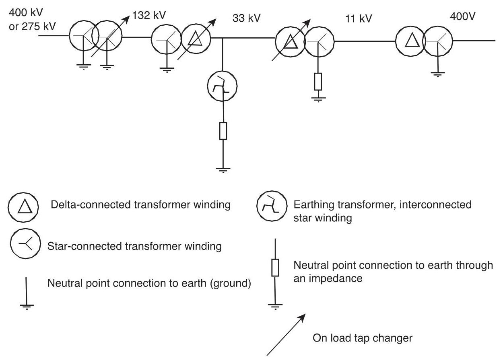

Figure 10.2 Typical UK distribution voltage transformer and earthing arrangements

Figure 10.2 is a schematic representation of a typical UK distribution system although most countries have similar networks. Power is extracted from the interconnected transmission grid and then transformed down to the primary distribution voltage (132kV in this case). The electrical energy is then transported via a series of underground cable and overhead line circuits to the customers. Most domestic or small commercial customers typically receive electrical energy at ${400}\mathrm{\;V}$ (for a three-phase connection) or ${230}\mathrm{\;V}$ (for a single-phase connection). As the power required to be transmitted in a distribution circuit reduces, the circuit voltage level is lowered by transformers.

The majority of distribution circuits are three-phase although in some rural areas, particularly in the USA, long single-phase circuits are used. Only balanced three-phase networks are suitable for the connection of wind generators larger than about ${10}\mathrm{{kW}}$ . Three-phase transformer windings may be connected either in star or in delta and the winding arrangement chosen varies from region to region and generally follows historical precedent. One advantage of the star connection is that the transformer neutral point is directly accessible and so can easily be grounded or earthed. Where a delta winding connection is used an accessible star point may be created by an earthing transformer. UK practice is to earth the neutral points of each voltage level at one point only, although in certain continental European countries some distribution networks are operated with the neutral point isolated.

Current passing through a circuit leads to a change in voltage and this is compensated for by altering the ratio (or taps) of the transformers. The ${11}\mathrm{{kV}}/{400}\mathrm{\;V}$ transformers have fixed taps which can only be changed manually when the transformer is de-energised. However, higher voltage transformers have on load tap changers that can be operated automatically when load current is passing. The simplest control strategy is to use an automatic voltage controller (AVC) to maintain the lower voltage terminals of the transformer close to a set-point (Figure 10.3). The AVC operates by measuring the voltage on the low voltage transformer busbar, comparing it to a set point value and then issuing an instruction to the on load tap changer to alter the ratio of the transformer. Control systems of this type are unaffected by the presence of wind generators on the lower voltage network. Even if the power flow through the transformer is reversed and real or reactive power flows from the lower voltage to the higher voltage network this control system will work satisfactorily. This is because the network source impedance is much less than the equivalent impedance of the wind generators and so the distribution network voltage is controlled predominantly by the transmission network voltage and the tap-changer. Some designs of tap changer have a reduced current rating if power flows from the low voltage side to the high voltage side of the transformer. However, it is rare for distributed wind generation to require the full reverse power flow capacity of a transformer on the distribution network as some of the locally generated power will be taken by local loads.

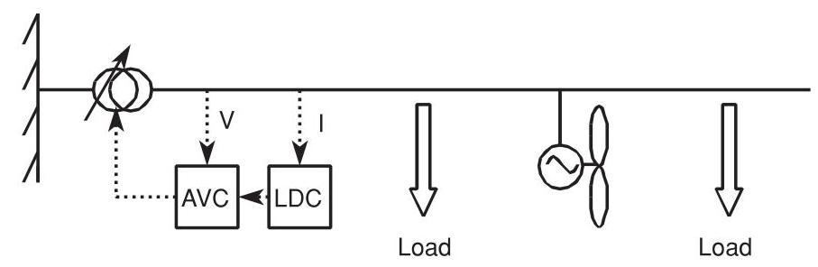

Figure 10.3 Voltage control of a distribution circuit (after Lakervi and Holmes, 1995); AVC - Automatic Voltage Control, LDC - Line Drop Compensation

In some distribution networks, more sophisticated control techniques are used to control the voltage at a remote point along the circuit (Lakervi and Holmes, 1995). This is achieved by adding a signal proportional to the voltage drop on the network to the local voltage input of the AVC relay. This technique is known as line drop compensation (LDC). The LDC element measures the current flowing in the circuit and applies this value to a simple model of the distribution circuit (i.e. the resistance and inductance of the circuit up to the point at which the voltage is to be controlled). The resulting voltage is then subtracted from the local voltage measurement input. If wind generators are connected to the network then the current flow in the circuit will be changed, the effective impedance to the point at which the voltage is to be controlled will alter, and so the LDC technique will no longer work correctly. LDC is sometimes known as positive reactance compounding and another technique, negative reactance compounding, also may not function correctly with wind turbines connected to the distribution circuits (Thomson, 2000).

### 10.1.3 Electrical generation and transmission systems

Electrical transmission systems are used for the transfer of bulk power from generation to loads. They are interconnected grids operating at voltage levels from ${220}\mathrm{{kV}}$ to ${400}\mathrm{{kV}}$ in Europe and up to ${765}\mathrm{\;{kV}}$ in large countries (e.g. USA and China). Because of their strategic importance, transmission grids are normally operated with multiple circuits in parallel so that if an electrical fault occurs and one circuit is isolated, the grid continues to operate satisfactorily. This results in quite low utilization of the circuits during normal operation and so the electrical energy losses within a transmission grid are low, less than 2% of the energy transmitted, while in a distribution network the energy losses are typically 6%. The largest wind farms (greater than, say, 200 MW) are connected to the transmission network directly through wind farm transformers. The voltages within an interconnected transmission grid are determined primarily by the flows of reactive power and so the reactive power output of a large wind farm has to be controlled in response to the requirements of the transmission system operator.

The frequency of an AC power system is determined by the balance of real power being generated and load demanded. If the load demand exceeds the generated power then the frequency will drop while if the power being generated exceeds demand the frequency will rise. The speed with which the frequency changes for a given mismatch of supply and demand power depends on the inertia of all the spinning machines connected to the power system. Some isolated electrical power systems (e.g. Great Britain with a peak demand of around ${50}\mathrm{{GW}}$ ) can be considered effectively as a single node for frequency control but large interconnected systems such as that in mainland Europe and in the USA have considerable restrictions on the flows of power from region to region through their transmission circuits. Thus, within each control area, generation and load must be balanced at all times and as wind generation output varies with wind speed, other forms of generation must change their output to ensure the load is met and major interconnecting circuits not overloaded.

## 10.2 Wind farm power collection systems

Large wind turbines are designed to operate only when they are connected to a stable three-phase AC network. They cannot operate in isolation and the network gives a reference voltage and frequency which is used for control of the turbines and ensures stability of the generator systems. The network also provides power for auxiliaries when the wind speed is low. For fixed speed wind turbines the network provides the reactive power that is necessary for the operation of the induction generators while for variable speed generator systems, the converters are synchronised to the network frequency through their control systems. The wind turbines inject power into the network that varies with wind speed and the stability of the network (both frequency and voltage) is provided mainly by the large conventional (fossil or hydro) generators though the transmission network.

The voltage level chosen for the main power circuits within a wind turbine is usually less than ${1000}\mathrm{\;V}$ and is selected to be one of the internationally standard voltages, in Europe typically 690 V between phases. This voltage is surprisingly low for a large electrical machine and leads to rather high currents. For example a 1.2 MW wind turbine generating at 690 Volts has a current of over 1000 Amps. However, it has been found to be cost-effective to restrict the voltage of the wind turbine generator to less than ${1000}\mathrm{\;V}$ as, in many countries, the safety requirements become very much more severe for voltages above this value and special precautions are required including the provision of dedicated equipment to earth the circuits before work on them is permitted. Further reasons for this low voltage include a wider choice of switchgear and flexible cables for the pendant as well as higher production volumes and hence lower costs of the generators.

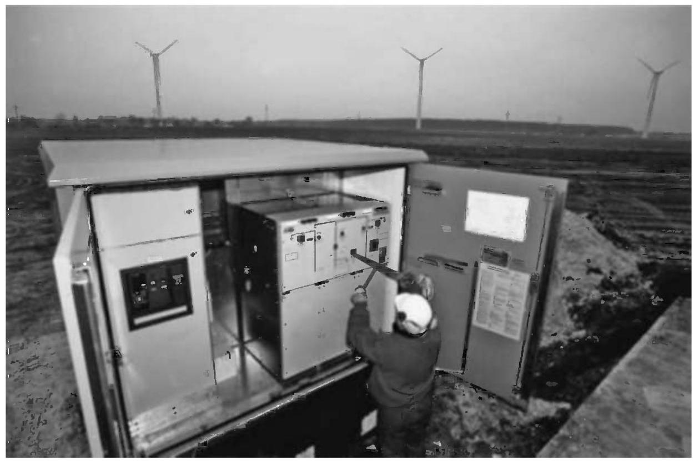

Figure 10.4 Transformer and switchgear of 1.5 MW wind turbine, MV switchgear is on the right LV switchgear on the left. Reproduced by permission of NEG MICON

However, this low generator voltage leads to a requirement for a transformer located either in the nacelle, in the tower base or immediately adjacent to it (Figure 10.4). In some early wind farms a number of small wind turbines were connected to one transformer (Figure 10.5a) but as turbine ratings have increased, with consequently higher currents, this approach leads to excessive voltage variations and electrical losses in the low voltage cables. It is only with rather small wind turbines located close together that the connection of multiple turbines to one transformer is likely to be cost-effective. Hence, larger wind turbines all have one transformer per turbine (Figure 10.5b).

The Point of Connection is defined as the point where the wind farm power collection system joins the utility distribution network. The Point of Common Coupling is the nearest point to the wind farm on the utility network to which other customers are (or can be) connected. In many circumstances these points may coincide but the Point of Connection defines the ownership boundary while the impact of the wind turbines on power quality is evaluated at the Point of Common Coupling.

The layout of the wind turbines within the wind farm is fixed by the wind energy resource, local topography and the requirements of the planning authorities. The power collection network is then designed to transport the power to the local public electricity system.

The choice of medium voltage (MV) level for the wind farm power collection system usually follows the practice of the local distribution utility. In this way cable and switchgear is readily available. Thus, in the UK the choice is generally between ${11}\mathrm{{kV}}$ and ${33}\mathrm{{kV}}$ while in continental Europe wind farm collection circuits are likely to be between 10-30 kV. Larger wind farms may include a transformer (e.g. ${33}/{132}\mathrm{{kV}}$ ) to increase the voltage for onward transport of the power.

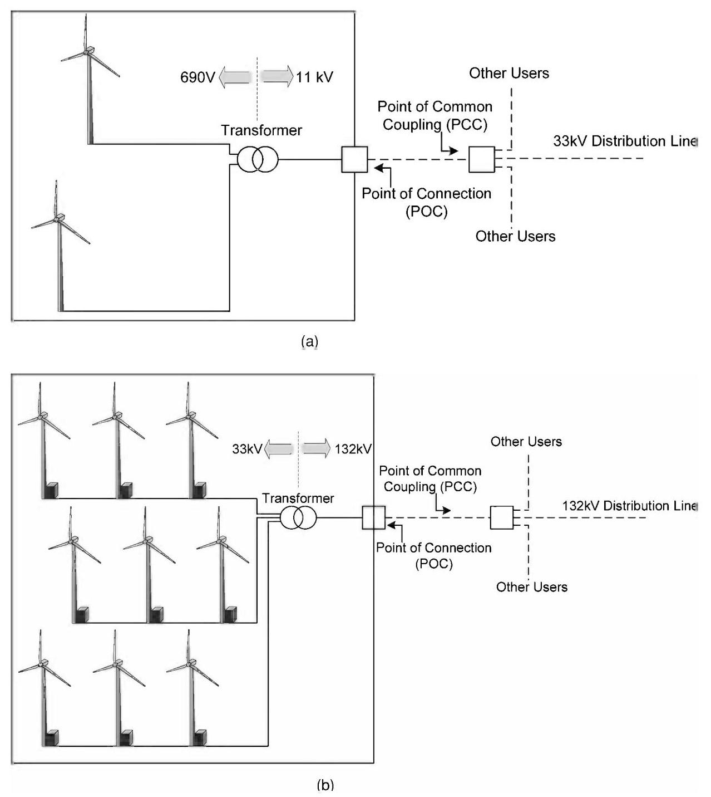

Figure 10.5 (a) Electrical power collection system of small wind turbines. (b) Electrical power collection system of a large wind farm

Local utility practice also influences the choice of the neutral earthing arrangement on the wind farm MV circuits (Figure 10.2). In the UK, 11 kV circuits tend to have their neutral point either solidly earthed, or connected to ground through an impedance typically a low value resistor (often 6.35 ohms to allow 1000 Amps to flow into a phase/ground fault). Solid neutral earthing is cheaper as it requires no extra equipment, but it can lead to high earth fault currents which may cause damage and high step or touch voltages (ANSI/IEEE Std 80-2000). In contrast, on some continental European wind farms the neutral point of the medium voltage system is left unearthed. This allows operation of the wind farm to continue with a single-phase earth fault but with the voltages of the healthy phases raised by a factor of $\sqrt{}3$ .

The design of the power collection is very similar to that of any public utility MV power network but with one or two particular aspects. It is generally not appropriate to provide any redundancy in the circuits to take account of failures of the MV electrical equipment. Both operating experience and reliability calculations have shown that the power collection system of a wind farm is so much more reliable than the individual wind turbines that it is generally not cost-effective to provide any duplicate circuits. This also applies to the single circuit or transformer linking the wind farm to the utility network where duplication cannot usually be justified. If part of the wind power collection circuit does fail then the only consequence is the lost revenue of the energy output of that part of the wind farm. This is easily estimated and is generally modest. In contrast, if a public distribution utility circuit fails then the consequence is that the customers do not have electrical power. The social and commercial value of this loss of supply is difficult to quantify but is generally considered to be several orders of magnitude higher than the price of the electrical energy. Thus, MV public distribution circuits usually have duplicate supplies while wind farm power collection networks tend to consist of simple radial circuits with limited switchgear for isolation and switching. The wind turbine transformers are connected to the radial circuits through simple switchgear.

In Europe almost all power collection circuits within wind farms use underground cable. This is for reasons of visual amenity and for safety as large cranes are required for the erection of the turbines. In some parts of the world, overhead MV lines have sometimes been used within the wind farm to reduce costs. If underground cables are used, then their low series inductive reactance leads to small variations of voltage with current and so the circuits are dimensioned primarily on considerations of current rating and electrical losses. Any wind farm project which reaches the stage of requiring a detailed design of the electrical system should also have a good estimate of the wind resource and hence energy output. Thus, it is straightforward to use this data to calculate the energy losses in the electrical equipment at various wind turbine output powers using a load flow program, sum these over the life of the project and using discounted cash flow techniques choose the optimum cable size and transformer rating. In countries where wind generated electricity attracts a high price then it is likely to be cost-effective to install cables and transformers with a thermal rating in excess of that required at full wind farm output in order to reduce losses. It may also be worthwhile to consider low-loss transformer designs.

## 10.3 Earthing (grounding) of wind farms

The power system neutral points as well as the metallic enclosures and external conducting parts of all electrical equipment require a connection to the general mass of earth in order to:

- Establish a low impedance path for earth fault currents and, hence, satisfactory operation of electrical (over-current) protection.

- Minimise shock hazards to personnel and animals, including control of step and touch potentials.

- Ensure satisfactory discharge of lightning currents and control the associated voltages.

- Prevent large potential differences occurring which are potentially hazardous to both personnel and equipment.

In the UK this subject is referred to as 'earthing' while in the US it is called 'grounding'. The terms are synonymous.

The neutral points of the three-phase power circuit are usually connected to earth at each voltage level to provide a path for earth fault current. Also the metallic enclosures of electrical equipment are earthed to ensure they do not rise in potential if an internal insulation failure occurs. High structures such as wind turbines are earthed to ensure there is a low impedance path for lightning current. These three rather different objectives are usually achieved with a common earthing and bonding system of the wind farm.

Because earthing has obvious safety implications there is considerable guidance available in both national and international standards for conventional electrical plant. For earthing of AC substations, the US standard (ANSI/IEEE 80, 2000) is widely applied and Charlton has written an informative guide (Copper Development Association, 1997) which is mainly focused on UK practice.

Wind farms, however, have rather unusual requirements for earthing. They are often very extensive, stretching over several kilometres, are subject to lightning strikes because of the height of modern wind turbines and are often on high resistivity ground being located on rocky terrain and on the tops of hills. Thus, normal earthing practice tends not to be easily applicable and special consideration is required. IEEE 1094 (1991), which has now been withdrawn, recommended 'that the entire wind-farm installation have a continuous metallic ground system connecting all equipment. This should include, but not be limited to the substation, transformers, towers, wind turbine generators and electronic equipment'. This practice of a single, wind farm wide earthing system for both 50/60 Hz fault currents and lightning protection is recommended by IEC 61400-24 (2010) and is generally implemented with bare conductor being laid in the cable trenches above the power collection cables. These conductors provide both bonding of all parts of the wind farm and a long horizontal electrode to reduce the impedance to ground of the earthing system.

A wind farm earthing system is required to operate effectively for both power frequency ${50}\mathrm{\;{Hz}}$ (60 Hz in the USA) currents and lightning surges which have rise-times typically of less than ten microseconds. Although it is conventional to use the same physical earthing network for power frequency currents and lightning surges the response of the earthing system to the high frequency components of the lighting current is quite different to that at ${50}/{60}\mathrm{\;{Hz}}$ .

The performance of a wind farm earthing system may be understood qualitatively by considering Figure 10.6.

At each wind turbine a local earth is provided typically by placing a ring of bare conductor around the foundation at a depth of about $1\mathrm{\;m}$ (sometimes known as a counterpoise earth) and by driving vertical rods into the ground. It is common to bond the steel reinforcing of the wind turbine foundation as well as the tower into this local earthing network. The purpose of this local earth is to provide equi-potential bonding against the effects of both lightning and power frequency fault currents, and to provide one element of the overall wind farm earthing system. These local turbine earths are shown as ${R}_{\text{ turbine }}$ in Figure 10.6. As the turbine earthing network consists of a ring of only, say, ${20}\mathrm{\;m}$ in diameter and vertically driven rods it may be considered as resistive to ground.

However, the long horizontal electrodes linking one turbine to the next have a more complex behaviour (similar to a transmission line) and are represented in Figure 10.6 as a $\pi$ equivalent circuit. Thus, the resistance to ground is indicated by ${R}_{\text{ shunt }}$ while the series impedance is the combination of ${R}_{\text{ series }}$ and ${L}_{\text{ series }}.{R}_{\text{ series }}$ comes about simply from the longitudinal resistance of the earth wire while ${L}_{\text{ series }}$ is the self-inductance of the earth circuit. On the long earthing networks found on large wind farms this series impedance cannot be ignored. It may be seen immediately that for the high frequency of a lightning strike on a wind turbine the series inductance acts effectively to reduce the earthing network to only the local turbine earth. Even with ${50}\mathrm{\;{Hz}}$ fault current the series impedance leads to significantly higher earthing impedances than would be expected with geographically small earthing systems where series impedance may be neglected. In this discussion shunt capacitance and soil ionisation have been ignored, although these may become significant at high frequencies and currents.

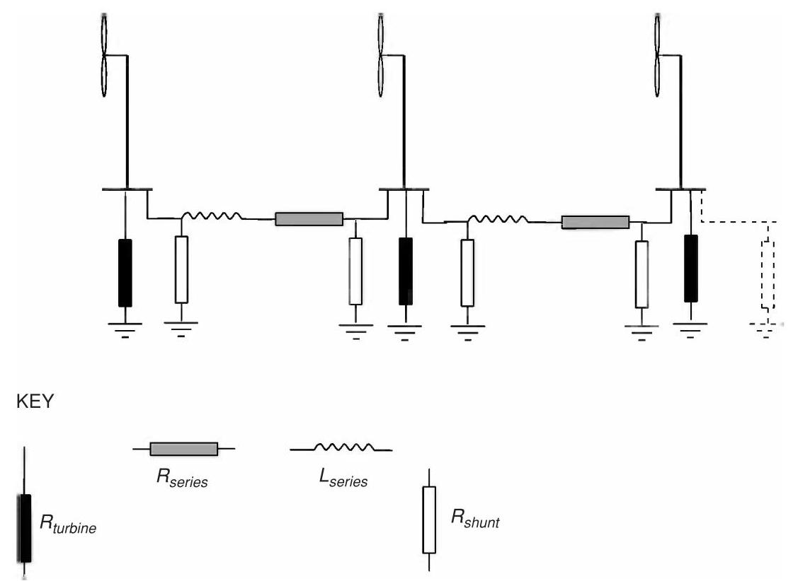

Figure 10.6 Schematic of a wind farm earthing system

This behaviour of wind farm earthing systems has been confirmed by site measurements and Table 10.1 shows the measured values for the earth impedance at the main substations of two UK wind farms.

Table 10.1 Measured earth impedance at substations of two wind farms

<table><tr><td>Capacity of wind farm (MW)</td><td>No. of turbines</td><td>Route length of horizontal earth conductor (km)</td><td>Earth impedance at main substation (ohms at 50 Hz)</td></tr><tr><td>7.2</td><td>24</td><td>6.7</td><td>0.89 + j0.92</td></tr><tr><td>33.6</td><td>56</td><td>17.7</td><td>0.46 + j0.51</td></tr></table>

It may be seen that even at ${50}\mathrm{\;{Hz}}$ the impedance to earth consists of almost equal resistive and inductive parts (i.e. the $X/R$ ratio of the impedance of the earthing system to ground is almost unity). This has important implications for the design and testing of wind farm earthing systems. Simple conventional calculation techniques which were developed for small, fully resistive, earth networks may give optimistic results and the impedance of the long horizontal conductors at lightning frequencies needs to be considered. Sophisticated computer programs to do this are available and these may be used to calculate both ${50}\mathrm{\;{Hz}}$ and lightning surge behaviour. Similarly, simple testing methods such as those developed by Tagg (1964) are only intended to measure resistance to earth and will give optimistic results on large wind farms. An effective measurement method to determine the ${50}\mathrm{\;{Hz}}$ earth impedance of a large wind farm is by a current injection test. In this test a current (typically 10-20 Amps) is injected into the earth electrodes at the wind farm and the potential rise measured with respect to a remote 'true' earth. However, the return path of the injected current must be remote from the wind farm (usually some $5 - {10}\mathrm{\;{km}}$ away) to ensure that it does not affect measurements at the wind farm. Hence, it is conventional to use the de-energised circuit connecting the wind farm to the main power network as the path of the test current. The rise in potential of the wind farm earthing systems is measured against a remote earth which classically is transferred to the site over a metallic telephone circuit. Ideally the route of the telephone circuit should be orthogonal to the power circuit to avoid induced effects. It may be seen that tests of this type are difficult and expensive to undertake as they involve taking the wind farm out of commission and arranging a temporary earth at the remote end of the current injection circuit. Also it is becoming increasingly difficult to use a telephone circuit to provide the remote earth reference as telecommunication companies increasingly use non-metallic media. However, it is very questionable whether simpler tests give useful results on large earthing networks with significant series inductance.

## 10.4 Lightning protection

It is now recognised that lightning is a significant potential hazard to wind turbines and that appropriate protection measures need to be taken. Authoritative guidance on lighting protection of wind turbines is given in IEC 61400-24 (2010).

Some years ago it was thought that if the blades of wind turbines were made from non-conducting material (i.e. glass reinforced plastic (GRP) or wood-epoxy) then it was not necessary to provide explicit protection for these types of blades provided they did not include metallic elements for the operation of devices such as tip brakes. However, there is now a large body of site experience to show that lightning will attach to blades made from non-conducting materials and can cause catastrophic damage if suitable protection systems have not been fitted. If lighting current enters a blade and is not controlled by a metallic lighting conductor the arc may cause an increase in pressure that will damage the blade catastrophically. If carbon fibre, which is conducting but with a rather high resistance, is used to reinforce the structure of the blades then additional precautions are necessary (Cotton et al., 2000; IEC 614200-24, 2010).

Lightning is a complex natural phenomenon often consisting of a series of discharges of current. The term 'lightning flash' is used to describe the sequence of discharges which use the same ionised path and may last up to a second. The individual components of a flash are called 'strokes'.

Table 10.2 Effects of various aspects of lighting on a wind turbine

<table><tr><td>Parameter</td><td>Effect on wind turbine</td></tr><tr><td>Peak current (A)</td><td>Heating of conductors, shock effects, electromagnetic forces</td></tr><tr><td>Specific energy (Joules/ohm)</td><td>Heating of conductors, shock effects</td></tr><tr><td>Rate of rise of current (A/s)</td><td>Induced voltages on wiring, flashovers, shock effects</td></tr><tr><td>Long duration charge transfer (Coulombs)</td><td>Damage at arc attachments point or other arc sites (e.g. bearing damage)</td></tr></table>

Lighting flashes are usually divided into four main categories:

- Downward inception, negative and positive polarity.

- Upward inception, negative and positive and polarity.

Generally flashes which start with a stepped leader from the thunder cloud and transfer negative charge to earth (downward inception - negative polarity) are the most common. Downward negative flashes typically consist of a high amplitude burst of current lasting for a few microseconds followed by continuing current of several hundred Amps. Then, following the extinction of the initial current transfer between cloud and earth there may be a number of re-strikes. However, in some coastal areas there may be a majority of positive flashes of downward inception which consist of a single long duration strike with high charge transfer and specific energy content. Upward inception is normally associated with very high objects (e.g. communication towers and large wind turbines) and the lightning has very different characteristics. Although the maximum peak current is low (some ${15}\mathrm{{kA}}$ ) the charge transfer can be very high and, hence, has significant potential for damage. The top of wind turbine blades can now be over ${100}\mathrm{\;m}$ above ground and so there is growing concern over the effect of upward negative lightning flashes. Upward positive flashes are rare.

Table 10.2 shows the parameters normally used to characterise lighting and some aspects of their potential for damage in wind turbines. The peak current of a single lightning stroke may be over ${200}\mathrm{{kA}}$ but the median value is only approximately ${30}\mathrm{{kA}}$ . Corresponding values for charge transfer are ${400}\mathrm{C}$ (peak), $5\mathrm{C}$ (median) and specific energy ${20}\mathrm{{MJ}}/\mathrm{{ohm}}$ (peak) and ${55}\mathrm{\;{kJ}}/\mathrm{{ohm}}$ (median). The very large range of these parameters implies that the initial step in any consideration of lightning protection of a wind farm or wind turbine is to undertake a risk assessment (IEC 614200-24, 2010). The risk assessment will include consideration of the location of the turbines as the frequency and intensity of lighting varies considerably with geography and topology. On flat terrain a wind turbine is assumed to attract the same frequency of lightning as a circular area with a radius of three times the height of the wind turbine.

Table 10.3 shows some historical data of the frequency of lightning damage (Cotton et al., 2000). Although this must be interpreted with care, as both wind turbine design and lightning protection systems were evolving rapidly during this period, the data does indicate the scale of the problem. A large number of the faults shown in Table 10.3 were due to indirect strokes affecting the wind turbine and wind farm control systems. Generally the number of faults was dominated by incidents affecting the control and electrical systems while blade damage gave the highest repair costs and loss of turbine availability, and hence reduction in wind farm revenue.

Table 10.3 Wind turbine lightning damage frequency

<table><tr><td>Country</td><td>Period</td><td>Turbine years</td><td>Lightning faults</td><td>Faults per 100 turbine years</td></tr><tr><td>Germany</td><td>'91 to '98</td><td>9204</td><td>738</td><td>8.0</td></tr><tr><td>Denmark</td><td>’91 to ’98</td><td>22000</td><td>851</td><td>3.9</td></tr><tr><td>Sweden</td><td>’92 to ’98</td><td>1487</td><td>86</td><td>5.8</td></tr></table>

(Cotton et al., 2000)

Figure 10.7 shows some of the techniques that have been used to protect blades against lightning. The main distinction is whether a limited number of receptors are used to intercept the lightning (Types A and B) or if an attempt is made to protect the entire blade (Types C and D). Type A shows how, using one or two receptors at the tip, the steel control wire of the tip brake may be used as the down conductor. In a blade without a moveable tip (Type B) then an additional conductor is installed. Type C has the down conductor located on the leading and trailing edges although there are considerable practical difficulties in firmly attaching a suitable conducting path to the leading edge. Type D shows the use of a conducting mesh on each side of the blade. The main mechanism of damage is when the lightning current forms an arc in air inside the blade. The pressure shock wave caused by the arc may explode the blade or, less dramatically, cause cracks in the blade structure. Thus, for effective protection it is essential that the lightning attaches directly to the protection system and then is conducted safely down the length of the blade in a metallic conductor of adequate cross-section.

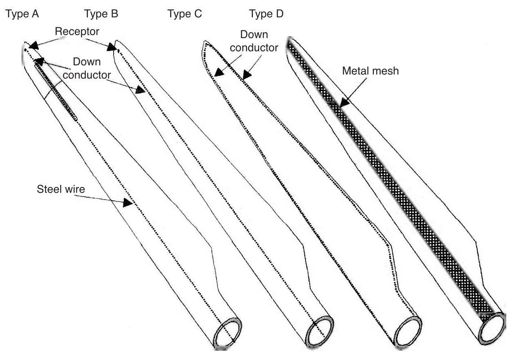

Figure 10.7 Methods of lightning protection for blades. Cotton et al., 2000, by permission of Dr R Sorenson, DEFU

Once the lightning current has been conducted to the root of the blade there remains the problem of ensuring its safe passage to the outside of the tower and, hence, to earth. This is not straightforward as it is necessary for the current to pass across the pitch, shaft and yaw bearings while not damaging the generator and sensitive control equipment in the nacelle. The present understanding of how wind turbine bearings may be damaged by the passage of lightning current is summarised in IEC 614200-24. Generally large heavily loaded bearings are unlikely to be catastrophically damaged although there may be a reduction in their service life. There is, so far, no effective means of shunting lightning current around a large bearing as the bearing itself is the lowest inductance path and so the preferred route for the high frequency current.

The control and electrical systems are protected against lighting by dividing the turbine into zones depending on whether direct attachment of lightning is possible and the magnitude of the current and, hence, electro-magnetic field expected in each zone, the Lightning Protection Zone approach (IEC 614200-24). Within each zone, components are protected to withstand the anticipated effects of lighting. The principal damage mechanisms are direct conduction and magnetic coupling while the main protective measures are good bonding, effective shielding and the use of appropriate surge protection devices at the zone boundaries.

## 10.5 Connection of wind generation to distribution networks

Distribution utilities have an obligation to operate the electrical distribution networks in such a way as to provide power to their customers at an agreed power quality. At present, power quality requirements are based on national standards although a common European position is emerging based on the document (BS) EN 50160 (2007). This document gives the characteristics of the voltage that can be expected across the public distribution network but does not apply to emission limits from network users (i.e. wind turbines and wind farms).

The main impacts of wind turbines on distribution systems are:

- Slow (or steady state) voltage variations.

- Rapid voltage changes (leading to flicker).

- Waveform distortion (i.e. harmonics).

The operation of wind turbines is effected by:

- Voltage Unbalance (negative phase sequence voltage).

- Transient voltage variations (dips and sags).

Consideration of whether a wind generation scheme may be connected to a distribution circuit is based on its impact on other users of the network. Similar considerations apply to the connection of any load. The steady state voltage variations are generally considered assuming conditions of minimum (or zero) network load with maximum wind generation and maximum network load with minimum generation. These are rather onerous and conservative assumptions to ensure that steady state voltage limits will never be violated. However, they do ensure that the wind farm output can always be exported to the network (other than when network faults occur). In some cases, local agreements have been reached between the network and generator operators so that some wind turbines are constrained off at times of low network load or abnormal network conditions. This then allows a larger wind farm to be connected than would otherwise be the case. However, the risk of not being able to generate is then transferred to the wind farm operator.

Table 10.4 Indication of possible connection of wind farms to distribution networks

<table><tr><td>Location of connection</td><td>Maximum capacity of wind farm (MW)</td></tr><tr><td>Out on ${11}\mathrm{{kV}}$ network</td><td>1-2</td></tr><tr><td>At ${11}\mathrm{{kV}}$ busbars</td><td>8-10</td></tr><tr><td>Out on ${33}\mathrm{{kV}}$ network</td><td>12-15</td></tr><tr><td>At ${33}\mathrm{{kV}}$ busbar</td><td>25-30</td></tr><tr><td>Out on ${132}^{ \circ  }\mathrm{{kV}}$ network</td><td>30–60</td></tr></table>

The voltage change permitted in ${11}\mathrm{{kV}}$ circuits is small (typically $\pm  1\%$ or $2\%$ ) as any voltage variation is passed directly through the fixed tap $\left( {{11}/{0.4}\mathrm{{kV}}}\right)$ transformers to the customers. In contrast, ${33}\mathrm{{kV}}$ and ${132}\mathrm{{kV}}$ circuits are allowed to operate over a wider voltage range (e.g. up to $\pm  6\%$ ) as the automatic on-load tap changers supplying the lower voltage networks and, hence, customers can compensate for variations in the higher voltage networks. Therefore, it is common to find that only very limited capacities of wind generation can be connected at ${11}\mathrm{{kV}}$ as the high impedance of the circuits and relatively large currents flowing from the generators result in unacceptable variations in voltage. Determining the size of a wind farm which may be connected to a particular point in the distribution network requires a series of calculations based on the specific project data. However, Table 10.4 gives some indication of the maximum capacities which experience has indicated may be connected. Table 10.4 assumes that the wind farms are made up of a number of turbines and so the connection assessment is driven by voltage rise effects and not by power quality issues due to individual large machines.

For wind farms of relatively large capacity connected to weak distribution networks the calculations required can be involved and use computer based power system studies. The expense of these calculations may not be justified for small wind farms and so some countries have adopted an assessment approach to allowing connection based on the ratio of wind farm capacity (in MW) to symmetrical short-circuit level, without the wind farm connected (in MVA). ${}^{1}$ Typical values chosen range from 2-5% based on studies and on experience (Gardner, 1996). However, such simple rules can be too restrictive and lead to refusal of permission to connect or to excessive reinforcement of the distribution system. Table 10.5 gives data on two large wind farms in successful commercial operation in the UK with much higher ratios of wind farm capacity to short-circuit level. Both wind farms have operated successfully for some years but it should be noted that the number of turbines on each site is large and so the impact of any individual machine is small. Both sites are connected to ${33}\mathrm{{kV}}$ circuits from which other customers are supplied only through transformers fitted with automatic tap-changers.

---

${}^{1}$ The electrical ’strength’ of a circuit is described by its short circuit or fault level. The short circuit level is the product of the pre-fault voltage and the current which would flow if a three-phase symmetrical fault were to occur. Clearly, this combination of current and voltage cannot occur simultaneously but the fault level (expressed in MVA) is a useful parameter which gives an immediate understanding of the capacity of the circuit to deliver fault current and resist voltage variations. In the per unit system the fault level is the inverse of the magnitude of the source impedance (Weedy and Cory, 1998).

---

Table 10.5 Ratio of site capacity to connection short-circuit level for two large (Fixed Speed Induction Generator) wind farms

<table><tr><td>Site capacity MW</td><td>Number of turbines</td><td>Short-circuit level of connection MVA</td><td>Ratio of wind farm capacity to short-circuit level (%)</td></tr><tr><td>21.6</td><td>36</td><td>121</td><td>18</td></tr><tr><td>30.9</td><td>103</td><td>145</td><td>21</td></tr></table>

Figure 10.8 shows the calculated variation of voltage with wind farm output at one site. The generator voltage of the turbines was ${690}\mathrm{\;V}$ and each turbine had a local ${690}/{33}\mathrm{{kV}}$ transformer. The ${33}\mathrm{{kV}}$ curve refers to the voltage at the point of connection of the wind farm to the public distribution network. With zero wind farm output the system voltage is close to nominal as the distribution network is lightly loaded. As the wind farm output increases the voltage rises but, once rated power is reached, then the reactive power drawn by the generators increases rapidly and so the voltage drops. At 140% output power the load flow calculation fails to converge ${}^{2}$ indicating that the network voltage is likely to collapse. Although such overloads are unlikely on wind farms with many turbines, individual (pitch regulated, fixed speed) machines can produce up to 200% of their rated output and so this phenomenon of voltage instability can be significant when considering the connection of large fixed speed induction generator wind turbines to weak networks.

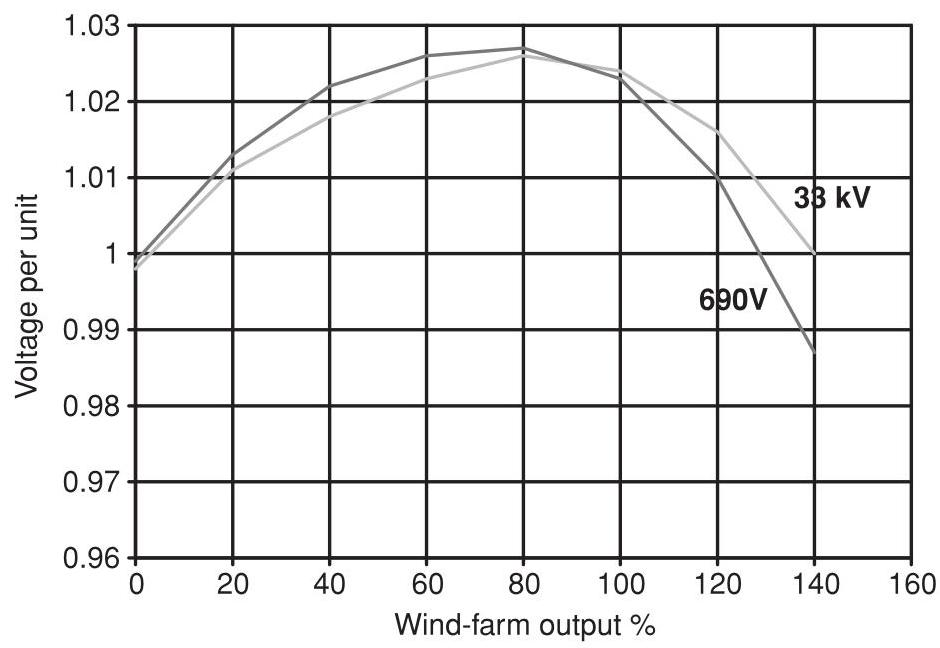

Figure 10.8 Variation of wind farm voltage with output power (generator voltage ${690}\mathrm{\;V}$ , connection voltage ${33}\mathrm{{kV}}$ )

## 10.6 Power system studies

Power system studies are required in order to assess the impact of large wind farms on the network and to ensure that the network conditions are such as to allow the wind generators to operate effectively. In the past simple manual calculations were used but sophisticated computer programs are now available and are always used on large projects.

Load flow (or power flow) programs take as inputs the network topology and impedances of the lines, cables and transformers. The customers' load and generator outputs are then used to calculate the steady state performance of the network in terms of voltages, real and reactive power flows and network losses. Generally a balanced three-phase system is assumed. For wind energy applications it is important that the load flow program includes a good model of the tap-changers on the network transformers and an effective representation of the wind turbine generators. A simple load flow gives the state of the network at a single instant but some commercially available programs allow the use of daily load and generator profiles to repeat the calculations many times (sequential steady state analysis) to show the network performance over a period of time.

Fault calculators calculate the fault currents in the network at one instant. Both balanced and unbalanced faults may be investigated. They use the method of symmetrical components (Wagner and Evans, 1933) to calculate the effect of unbalanced short-circuits on the power system. Fault calculators that are used to examine the connection of wind turbines require good models of the induction generators or power electronic converters. Fault calculators give as output the fault current flows and network voltages at particular times after the fault occurs. Some of the more sophisticated programs use analytical methods to estimate the decay of fault currents with time but the main analysis uses a steady-state technique.

Transient stability programs allow investigation of how wind generators will respond to disturbances on the network. A balanced network is assumed as the calculation is based on an equivalent single-phase representation using fundamental frequency phasors with an integration algorithm to calculate how the network conditions change over time. Traditionally, transient stability programs were used to investigate the angle stability of synchronous generators and a good model of the wind turbine generators is required for useful results.

Electro-magnetic programs are among the more sophisticated tools and unlike the previous programs do not assume perfect, fundamental frequency waveforms. Detailed representation of both the induction generators and power electronic converters is possible. These programs use detailed time-domain simulations which allow reconstruction of the distorted wave forms generated by power electronic converters as well as investigation of high frequency transients such as those due to lightning. They may be used to investigate almost any condition on the power system but at the cost of considerable complexity and computation time. Electromagnetic simulations are not routinely used for wind farm design but only to investigate particular problems.

---

${}^{2}$ The failure of a load flow program to converge does not predict voltage collapse accurately but is an indication that the system may be close to instability.

---

There are of course many more specialised calculation techniques and associated tools including probabilistic power flow, optimal power flow, harmonic load flow and various earthing/grounding codes. However, their use requires specialist knowledge and so they are not in common use for small wind farm projects.

## 10.7 Power quality

Power quality describes how closely the electrical power delivered to customers corresponds to the appropriate standards and so operates their end-use equipment correctly (Dugan et al., 1996). Thus, it is essentially a customer focused measure that is greatly affected by the operation of the distribution and transmission network. Wind turbines, and other forms of distributed generation, can reduce power quality by distorting the voltage supplied to customers but also increase power quality by raising the network short-circuit level and so stabilising the voltage.

There are a large number of ways in which the electrical supply (i.e. voltage or frequency) can deviate from the specified values. These range from transients and short-duration variations (e.g. voltage sags or swells) to long-term waveform distortions (e.g. harmonics or unbalance). Sustained complete interruptions of supply are generally considered an issue of network reliability rather than power quality. The importance of power quality is due to the increasing use of sensitive load equipment including computer based controllers and power electronic converters as well as the awareness of customers of the commercial consequences of equipment mal-operating due to disturbances originating on the power system.

The issues of power quality are of particular importance to distributed wind turbines connected to rural distribution networks. Individual units can be large, up to 2 MW, feeding into distribution circuits with a high source impedance and with customers connected in close electrical proximity. For variable speed wind turbines, which use power electronic converters, harmonic distortion of the network voltage may be important while the connection of fixed speed induction generator turbines to the network needs to be managed carefully if excessive voltage transients are to be avoided.

During normal operation wind turbines produce continuously varying output power. The higher frequency power variations are mainly caused by the effects of turbulence, the wind shear, tower shadow and the operation of the turbine control system. These effects lead to periodic power pulsations at the frequency which the blades pass the tower (typically around $1\mathrm{\;{Hz}}$ for a large turbine), which are superimposed on the slower variations in power caused by changes in wind speed. There may also be power variations (at a few $\mathrm{{Hz}}$ ) caused by the dynamics of the turbine. Variable speed operation of the rotor has the advantage that many of the faster power variations are not transmitted to the network but are smoothed by the flywheel action of the rotor. However, fixed speed operation, using a low slip induction generator, will lead to cyclic variations in output power, at rotor rotational frequency (1P) as well as blade passing frequency (3P), and hence network voltage changes at these frequencies. The connection of large induction generators on to weak networks may also lead to transient voltage changes.

It is essential that wind turbines do not degrade the power quality of the distribution network as otherwise permission for their connection or continued operation will be refused by the distribution utility. In addition to national standards describing the limits of voltage variations that are caused by the connection of any equipment (e.g. Electricity Networks Association, 1989), the particular importance of the influence of wind turbines on power quality has been recognised in the standard 'Measurements and assessment of power quality characteristics of grid connected wind turbines' (IEC 614200-21, 2008). This standard lists the voltage quality indicators that should be provided by the turbine manufacturer to describe the voltage quality of wind turbine power output. It also details the testing procedures required to determine the wind turbine's response to a network voltage drop, as well as the operation of its power control and grid protection systems.

The main aspects considered in IEC 614200-21 are:

## Voltage Fluctuations

- flicker coefficient for continuous operation as a function of network source impedance phase angle and annual average wind speed;

- maximum number of wind turbine starts within 10 minute and 120 minute periods;

- flicker step factor and voltage change factor at start up as a function of network source impedance phase angle.

Current harmonics and inter-harmonics

- harmonic currents, up to the fiftieth, during continuous operation but excluding harmonics during wind turbine start-up.

Response to network voltage drops

Active power control

- maximum output power (ten minute average, 60 second average and 200 minutes average values);

- ramp-rate limitation after wind turbine start-up;

- active power set-point control for network frequency support.

Reactive power capability and set-point control

Grid protection

- settings of under/over voltage and frequency relays and reconnection time.

In general the main power quality issue when connecting wind farms with a large number of generators (more than ten wind turbines) is steady state power flow and voltage rise while for individual large turbines on weak networks the limiting factor is often transient voltage changes. Power quality is an important consideration in the design and development of new large wind turbines and is one factor in the increasing popularity of variable speed operation and active stall control for fixed speed machines as both of these features reduce the transient variations in output power.

Figure 10.9 shows how power quality issues may be viewed with respect to wind generation. Figure 10.9a shows the various effects which may be considered to originate in the transmission and distribution networks and which can affect the voltage to which the wind turbines are connected.

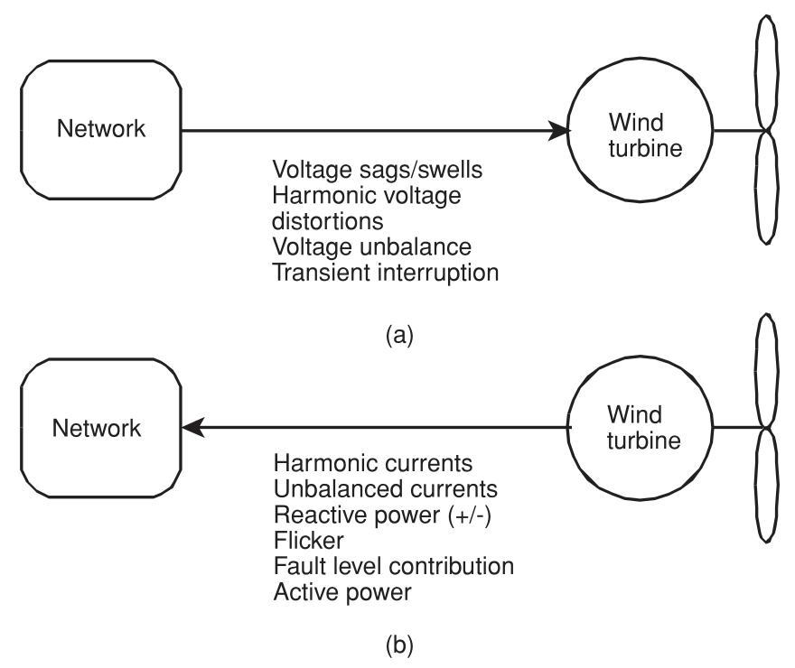

Figure 10.9 Origin of power quality issues

Voltage sags, are a decrease to between 10% and 90% of nominal voltage for a period of up to one minute, usually caused by faults on the transmission or distribution network. They are of particular concern as they will cause fixed speed induction generator wind turbines to over-speed as the load on the generator is removed. This in turn can lead to a high demand for reactive power which further depresses the network voltage. The depressed voltage may also cause contactors to open and voltage sensitive control circuits to operate.

The control systems of variable speed wind turbines may mal-operate during voltage sags as they rely on Phase Locked Loop(s) to synchronise the operation of the power electronic switches with the network voltage. The voltage of the DC links of variable speed wind turbines will rise during network voltage sags as the wind turbine continues to generate power that cannot be injected into the grid due to its low voltage. Solutions include the use of a crow-bar resistor across the DC link of a DFIG wind turbine or allowing the aerodynamic rotor to speed up and store kinetic energy during the voltage sag.

Voltage swells (an increase in voltage over 110%) are less common and tend not to be a major problem for wind turbines. Ambient harmonic voltage distortion is increasing in many power systems, due to proliferation of power supplies of electronic equipment (TVs and PCs) and in the UK it is not uncommon to find levels at some times of the day in excess of that which is considered desirable by network planners (Electricity Association, Engineering Recommendation G5/4-1). Harmonic voltage distortions will lead to increased losses in the generators of wind turbines and may also disturb the operation of the control systems and harmonic current performance of power electronic converters. It is common practice to use power factor correction capacitors with induction generator, fixed speed wind turbines and these will have a low impedance to harmonic currents and the potential for harmonic resonances with the inductive reactance of other items of plant on the network. Transient interruptions (caused by the use of auto-reclosure on distribution networks) can potentially be very damaging due to the possibility of out-of-phase reclosure on to induction generators which are still fluxed, and, hence, developing a voltage. It is usual to apply fast acting loss-of-mains protection against this condition so that the turbine is isolated once the supply is interrupted.

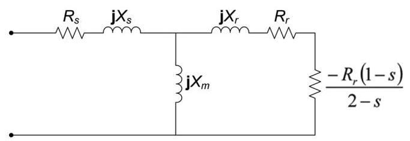

Figure 10.10 Negative phase sequence equivalent circuit of an induction machine. $s =$ slip (negative for generator); ${R}_{s} =$ stator resistance; ${X}_{s} =$ stator reactance; ${X}_{m} =$ magnetising reactance; ${X}_{r} =$ rotor reactance (referred to the stator); ${R}_{r} =$ rotor resistance (referred to the stator); $j$ is the imaginary operator

Network voltage unbalance will affect fixed speed induction generators by increasing losses and introducing torque ripple (Electricity Networks Association, 2005; Engineering Recommendation P29). Voltage unbalance can also cause power converters to inject unexpected harmonic currents into the network unless their design has included consideration of an unbalanced supply. Voltage unbalance is usually described in terms of 'negative phase sequence' voltage. Using the method of symmetrical components (Weedy and Cory, 1998) the three-phase voltage phasors are split into a set describing balanced (positive phase sequence) and unbalanced operation (negative phase sequence).

Figure 10.10 shows the negative phase sequence equivalent circuit of an induction machine (Wagner and Evans, 1933). It may be seen that during normal operation (i.e. when the slip (s) is close to zero) the effective rotor resistance to negative sequence (unbalanced) voltages is only ${R}_{r}/2$ . Thus, any small unbalance in the applied voltage will lead to high unbalanced currents. This has been found to be a particular problem for wind turbines connected to ${11}\mathrm{{kV}}$ distribution networks in the UK. It is common on rural ${11}\mathrm{{kV}}$ public supply networks to connect transformers and small spur lines between two phases only, to supply farms and other small loads. These single-phase connections tend to unbalance the voltages (up to 2% voltage unbalance is not uncommon) and so generate high unbalanced currents (up to 15-20%) in wind turbines connected to ${11}\mathrm{{kV}}$ three-phase circuits. The wind turbine control systems will detect excessive unbalanced current and cause a shut-down. Nuisance tripping often occurs in the night when heating loads in the farms are switched in automatically to take advantage of reduced price electrical energy tariffs.

Unbalance and single-phase voltage distortion can also lead to difficulties with variable speed wind turbines. The network side converters of variable speed generator systems synthesise a three-phase AC voltage from the DC voltage. This three-phase AC voltage is then used to inject current through a coupling reactance connected to the network. Hence, if the network voltage is distorted or all three voltages not balanced, unbalanced currents may be injected and the current waveform distorted. One solution is to use independent devices to detect the network voltages of each phase (i.e. an independent phase locked loop for each phase).

Figure 10.9b indicates how a distributed wind generator might introduce disturbances into the distribution network and so cause a reduction in power quality. Thus, a variable speed turbine using a power electronic converter may inject harmonic currents into the network. Unbalanced operation will lead to negative phase sequence currents being injected into the network which, in turn, will cause network voltage unbalance. Variable speed wind turbine generators can either produce or absorb reactive power while exporting active power and, depending on the details of the network, load and generation, this may lead to undesirable steady state voltage variations. Voltage flicker refers to the effect of dynamic changes in voltage caused by output power variations due to blade passing or other transient effects. Fixed speed wind generators will increase the network fault level and so will affect power quality, often to improve it. There is considerable similarity between the power quality issues of wind turbines and large industrial loads and, in general, the same standards are applied to both.

### 10.7.1 Voltage flicker

Voltage flicker describes dynamic variations in the network voltage which may be caused either by wind turbines or by varying loads (Bossanyi et al., 1998; Tande, 2003; Tande in Ackerman, 2005). The origin of the term is the effect of the voltage fluctuations on the brightness of incandescent lights and the subsequent annoyance to customers (IEC 614000-4-15). Human sensitivity to variations of light intensity is frequency dependent and Figure 10.11 indicates the magnitude of sinusoidal voltage changes which laboratory tests have shown are likely to be perceptible to observers. It may be seen that the eye is most sensitive to voltage variations around ${10}\mathrm{\;{Hz}}$ . The various national and international standards for flicker on networks are based on curves of this type. The use of voltage flicker as an indicator of acceptable dynamic voltage variations on the network is rather unusual as the assessment is based on the experimentally measured effect of changes of the intensity of incandescent lamps on the human eye and brain. Incandescent lamps are now falling into disuse and are being replaced with more efficient types fed through power electronics. However, the flicker standards are generally used to characterise transient voltage variations and are of considerable significance for distributed wind generation which (1) often uses relatively large individual fixed speed induction generator wind turbines, (2) may start and stop frequently and (3) is subject to continuous variations in input power from the fluctuating wind energy source.

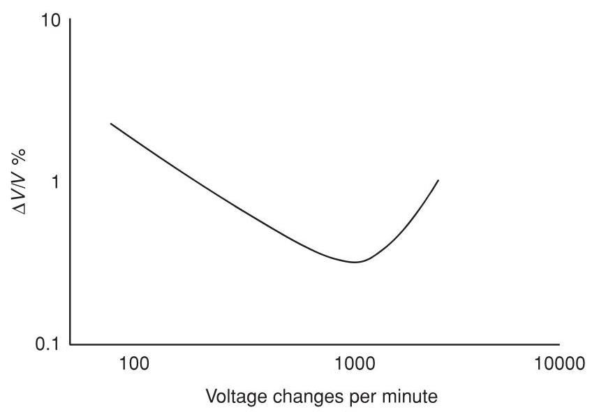

Figure 10.11 Influence of frequency on the human perception of sinusoidal voltage changes

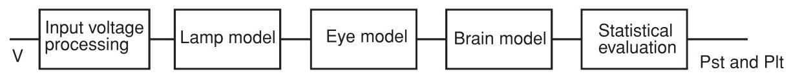

Figure 10.12 Principle of flicker measurement

Flicker is usually evaluated over a ten minute period to give a 'short-term severity value' Pst. The Pst value is obtained from a ten minute time series of measured network voltage using an algorithm based on the nuisance perceived by the human eye in fluctuating light. This is illustrated in Figure 10.12 which indicates how flicker is measured. Pst is linear with respect to the magnitudes of the voltage change but, of course, includes the frequency dependency indicated in Figure 10.11. Twelve Pst values may then be combined using a root of the sum of the cubes calculation to give a 'long-term severity value' Plt over a two hour period (Electricity Association Engineering Recommendation P28) although IEC 614000-21 makes no distinction between Pst and Plt limits.

If a number of wind turbines are subject to uncorrelated variations in torque then their power outputs and effect on network flicker will reduce as

$$
\frac{\Delta P}{P} = \frac{1}{\sqrt{n}}\frac{\Delta p}{p}
$$

where $n$ is the number of generators, $P$ and $p$ are the rated power of the wind farm and wind turbine respectively and ${\Delta P}$ and ${\Delta p}$ are the magnitude of their power fluctuation.

A range of permissible limits for flicker on distribution networks is given in national and international standards. Engineering Recommendation P28 specifies an absolute maximum value of Pst on a network, from all sources, to be 1.0 with a two hour Plt value of 0.6. However, extreme caution is advised if these limits are approached as the risk of complaints increases at between the sixth and eighth power of the change in voltage magnitude once the limits are reached and the approximate assessment method proposed in the same document is based on Pst not exceeding 0.5. BS EN 50160 is significantly less stringent specifying that over a one week period Plt must be less than 1 for 95% of the time. Gardner (1996) describes Pst limits from a number of utilities in the range 0.25-0.5.

### 10.7.2 Harmonics

Only variable speed wind turbines inject significant harmonic currents into the network. Fixed speed wind turbines, particularly those with power factor correction capacitors, alter the harmonic impedance of the distribution network and, in some circumstance, create resonant circuits. This may be important if fixed and variable speed wind turbines are installed in the same wind farm or in close proximity.

Thyristor soft-starts (Figure 10.13) are commonly used to connect the induction generators used on fixed speed wind turbines. Their mode of operation is initially for the thyristors to be fired late in the voltage cycle and then the firing angle advanced (over several seconds) until the entire voltage wave is applied to the generator (Anaya Lara et al., 2009). Thus, the network voltage is applied gradually to the generator and the current drawn by the generators controlled to reduce any voltage variations on the network. When operating, these devices produce varying harmonics as the firing angle of the thyristors is altered. Generally the soft-start units are only used for a few seconds during the connection of the induction generator and for this short period the effect of the harmonics is considered to be harmless and may be ignored (IEC 61400-21). If the anti-parallel thyristors are not bypassed, but left in service, then their harmonic currents need to be assessed. This continuous use of the soft-start unit has been proposed in order to reduce the applied voltage and hence the iron losses in the induction generator at times of low generator output. However, as well as the complication of trying to deal with harmonics which change with the thyristor firing angle there are also potential difficulties with the variation of the applied voltage to the generator altering the mechanical dynamic characteristics of the drive train.

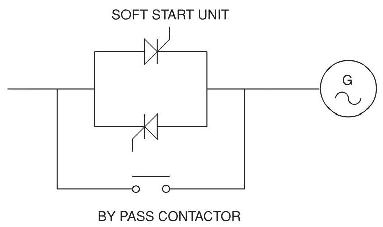

Figure 10.13 Soft-start unit for an induction generator (one phase only shown)

Modern variable speed wind turbines use network side voltage source converters, normally based on the Graetz bridge topology, Figure 10.14. These use Insulated Gate Bipolar Transistors (IGBTs) switching at several $\mathrm{{kHz}}$ to synthesise a sine wave and so eliminate the lower order harmonics. The switching techniques used can vary from rather simple carrier modulated techniques which compare a reference signal with a trigger signal to those based on space-vector theory with some form of two-axis transformation (Anaya-Lara et al., 2009). The rapid switching gives a large reduction in low order harmonic currents compared to the classical line commutated converter but the output current will have significant energy at around the switching frequency of the devices (i.e. in the $1 - 4\mathrm{{kHz}}$ region). Figure 10.15 shows the high frequency harmonics of a PWM inverter. Although these high frequency currents are relatively easy to filter they may influence the selection of the size of the coupling reactance which can be used to form part of the filter to block harmonic currents around the switching frequency.

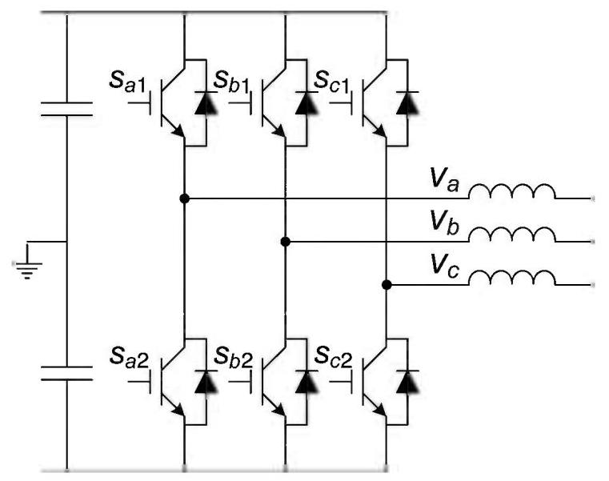

Figure 10.14 Six-pulse two-level IGBT voltage source converter

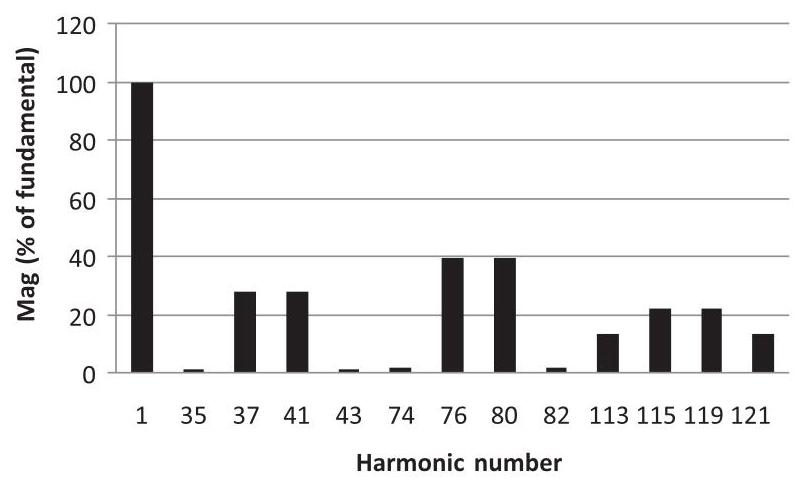

Figure 10.15 Typical harmonic spectrum of three-phase voltage of a PWM inverter. Carrier frequency 1950 Hz ( ${39}^{\text{ th }}$ harmonic). (After Mohan et al.,2003)

### 10.7.3 Measurement and assessment of power quality characteristics of grid connected wind turbines

Determination of the power quality of wind turbines and prediction of their performance in service is not straightforward and IEC 614200-21 provides guidance. There are a number of difficulties when assessing the power quality of wind turbines as their performance will depend on:

- The design of the entire wind turbine (including the aerodynamic rotor and control system).

- The conditions of the electrical network to which it is connected.

- The wind conditions in which it operates.

For example, simple measurement of voltage variations at the terminals of a test turbine is not satisfactory as ambient levels of flicker in the electrical network and the $X/R$ ratio of the source impedance at the test site will obviously have a great impact on the outcome. Hence, for evaluating flicker a procedure has been developed where current measurements are made of the output of a test turbine and used to synthesise the voltage variations which would be caused on distribution networks with defined short-circuit levels and $X/R$ ratios of their source impedance. This is illustrated in Figure 10.16 and is referred to as simulation using a 'fictitious grid'. These synthesised voltage variations are then passed through a flicker algorithm to calculate the flicker which the test turbine would cause on the defined networks. When the installation of the particular turbine is considered at a point on the real distribution network these test results are then scaled to reflect the actual short-circuit level and interpolated for the $X/R$ ratio of the point of connection. A weighting factor, based on an assumed Raleigh distribution of wind speed, is also applied to provide flicker coefficients which may be used on sites with various average annual mean wind speeds.

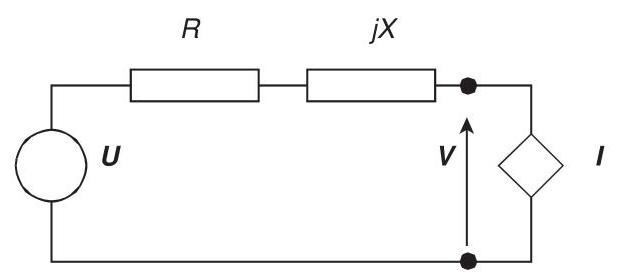

Figure 10.16 Use of 'fictitious grid' to establish voltage variations for various potential networks. $I$ - measured current (complex quantity); $R$ - resistance of fictitious grid; ${jX}$ - inductive reactance of fictitious grid; $U$ - ideal source voltage; $V$ - synthesised voltage $\left| \mathbf{V}\right|$ passed through flicker algorithm

IEC 614200-21 also defines methods to evaluate the impact of wind turbine start-up at cut-in and rated wind speeds and during speed changing of two speed generators. Again currents are measured, combined with the fictitious grid to provide a voltage time series and then passed through a flicker algorithm. For variable speed wind turbines, harmonic currents are measured over ten-minute observation periods.

## 10.8 Electrical protection

All parts of a high voltage power system are protected by relays which detect abnormal conditions and operate circuit breakers which then open to isolate the faulty circuits. Some lower voltage circuits are protected by fuses, as these are cheaper but do not give the degree of control offered by relays and circuit breakers. However, fuses do have the advantage of operating very rapidly (within a half cycle) and so limit the energy transferred into the short-circuit. On a distribution network the protection system is designed primarily to detect excess currents caused by insulation failure in the circuits, known as over-current protection. Failure of insulation, for example, breakdown of air or of solid insulation, leads to excess currents either between phases or between phases and ground. These high currents are only allowed to persist for up to about a second or so in order to limit the hazards which include: (1) risk to life caused by the arc or excess voltages as the high currents flow into the ground impedance, (2) risk to plant caused by the destructive heating and electro-magnetic effects of the high currents and (3) risk to the stability of the power system.

The electrical protection of wind turbines and wind farms follows the same general principles which are applied to any other items of electrical plant (AREVA, 1987) but there are two significant differences. Because wind farms are often connected to the periphery of the power system it is common to find that the fault currents which will flow in the event of insulation failure are rather small. Although this is desirable from the point of view of reducing hazards, this lack of current can pose significant difficulties for the rapid and reliable detection of faults. In particular, some designs of fuses rely on the energy within the arc for their correct operation. Hence, they cannot be relied on to interrupt small fault currents when the arc energy is low. Secondly, fixed speed wind turbines use induction machines and variable speed wind turbines are interfaced to the network through voltage source converters. Neither induction generators nor voltage source converters are a reliable source of fault current and so their fault current contribution cannot be detected reliably using over current protection. Thus, the faulty circuit is isolated using fault current from the network and then voltage or frequency sensing relays are used to detect the subsequent abnormal conditions, a technique known as sequential tripping.

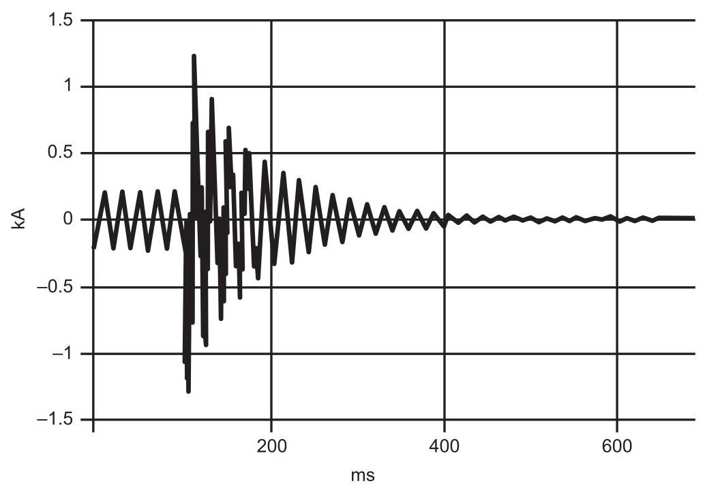

Figure 10.17 Fault current of induction generator with a three-phase fault applied to its terminals (phase shown with minimum DC offset)

Figure 10.17 shows the current of an induction generator with a three-phase fault applied to its terminals. It may be seen that the fault current dies away rapidly as the stored magnetic energy in the electrical machine decays. There is no sustained fault current as an induction generator draws its magnetising current from the network or local capacitors and this is not possible with the voltage collapsed by a three-phase fault at the terminals. Some asymmetrical faults (e.g. two-phase faults) can lead to sustained fault currents of two to three times that of full output, but again these are not usually relied on to operate protective relays. However, it may be necessary to ensure that fault current supplied by wind turbines does not lead to mal-operation of relays on the distribution system by altering the flow of fault current in the network and, in effect, providing local support of the network voltage.

One simple approach to the modelling of fixed speed induction generators for short-circuit calculations is to represent them as a one per unit voltage source in series with the sub-transient reactance. This is a simple approach but may give a slightly low initial current as the internal voltage may be high if the induction machine is generating.

For a simple assessment, the response of a Doubly Fed Induction Generator to a local fault can be divided into two phases (Kanellos and Kabouris, 2009; Morren and de Haan, 2007). During the first phase (approximately two to three cycles), it can be considered to operate as a fixed speed induction generator but with an increased internal voltage particularly if it is operating super-synchronously and exporting power through both the rotor and stator circuits. In the second phase, the current through the rotor-side converter is limited by the control action of the crowbar protection and any rotor resistance that is applied.

In generators using full power converters the short-circuit current into the network is determined by the network side power electronic converter and normally does not significantly exceed 110% of its full load current. The full power converter wind turbine can, therefore, be approximated as a constant current source of approximately rated current, although IEC 60909 (IEC 60909-0:2001) recommends that three times the nominal current is assumed for the fault current contribution of variable speed drives that are able to regenerate.

The fault current contribution of all converter connected generators (DFIG and full power converter types) depends on the detailed design and control system of the converters. Hence test data from the manufacturers showing how the generator system responds to short-circuits and network voltage depressions should be used to construct models for use in fault calculators.

The protection of a wind farm has many similarities to the protection of a large industrial load equipped with machine drives which may back-feed into the network. This is a useful analogy, for the purposes of protection, as a wind farm can be thought of as a collection of large electrical machine drives with torque applied to the machine shafts rather than taken to drive mechanical loads. As in the case of industrial machine drives, the terminal voltages and frequency of the electrical machines are determined by the network. The distribution network provides a reliable source of fault current which can be used to detect insulation failure while there is also the possibility of a fault current contribution from the rotating machines. In addition, with a wind farm there is also the hazard of prolonged generation with abnormal frequency or voltage when the wind farm is disconnected from the rest of the power system. This is known as islanding and is an important consideration for all distributed generation schemes.

### 10.8.1 Wind farm and generator protection

Figure 10.18 shows a typical protection arrangement for a wind farm of fixed speed wind turbines with generator voltages of ${690}\mathrm{\;V}$ and with a collection circuit voltage of ${11}\mathrm{{kV}}$ . The ${11}\mathrm{{kV}}$ circuit is fed from a ${33}/{11}\mathrm{{kV}}$ Delta/Star wound transformer with the ${11}\mathrm{{kV}}$ neutral grounded either directly or through a resistor. The ${11}/{0.69}\mathrm{{kV}}$ transformers are also wound Delta/Star and so the 690 volt neutral points of each circuit may be directly grounded. The neutral points of the generators are not connected to ground.

There are a number of zones of protection. At the base of the wind turbine tower a ${690}\mathrm{\;V}$ circuit breaker (usually a moulded case type) will be fitted to protect the pendant cables and the generator. This is shown as zone D.

Zone C in Figure 10.18 is the ${690}\mathrm{\;V}$ cables running from the turbine transformer to the tower base cabinet. Fuses or another moulded case circuit breaker may be fitted to the ${690}\mathrm{\;V}$ side of the turbine transformer to provide protection of the cables and also a point of isolation so that all the electrical circuits of the turbine may be isolated without switching at ${11}\mathrm{{kV}}$ . In some early designs of wind turbine, the main incoming busbar at the bottom of the electrical cabinet at the tower base consisted of exposed conductors. The electrical protection of this area needs careful consideration as there is the possibility of dropping tools or other equipment on to these busbars. Zone B is the ${11}\mathrm{{kV}}/{690}\mathrm{\;V}$ transformer including the region around its ${690}\mathrm{\;V}$ terminals. This is a particularly difficult zone to protect as the ${11}\mathrm{{kV}}$ fuses must be robust enough to withstand the magnetising inrush current of the transformer while sensitive enough to detect faults on the ${690}\mathrm{\;V}$ terminals when the fault current will be limited by the impedance of the transformer. This problem is common to the ${11}\mathrm{{kV}}/{400}\mathrm{\;V}$ transformers used on the public distribution network and a typical UK solution is to use an ${11}\mathrm{{kV}}$ combination fuse-disconnect (sometimes known as a switch-fuse). Faults on the ${11}\mathrm{{kV}}$ winding of the transformer will lead to high fault currents which are cleared by the ${11}\mathrm{{kV}}$ fuse. However, for faults on the low voltage terminals, the fuse is unable to clear these low fault currents effectively and so, once the fuse operates, a striker pin operates a mechanism to open the disconnect switch to clear all the phases. A more expensive solution adopted on some industrial installations is to use restricted earth fault protection to detect currents leaking to ground from the low voltage winding and terminal area but this requires a, more expensive, ${11}\mathrm{{kV}}$ circuit breaker. There is obvious commercial pressure to reduce the costs of transformer protection on a wind farm as there is a transformer for each wind turbine. However, safety considerations require that all credible faults can be detected and cleared.

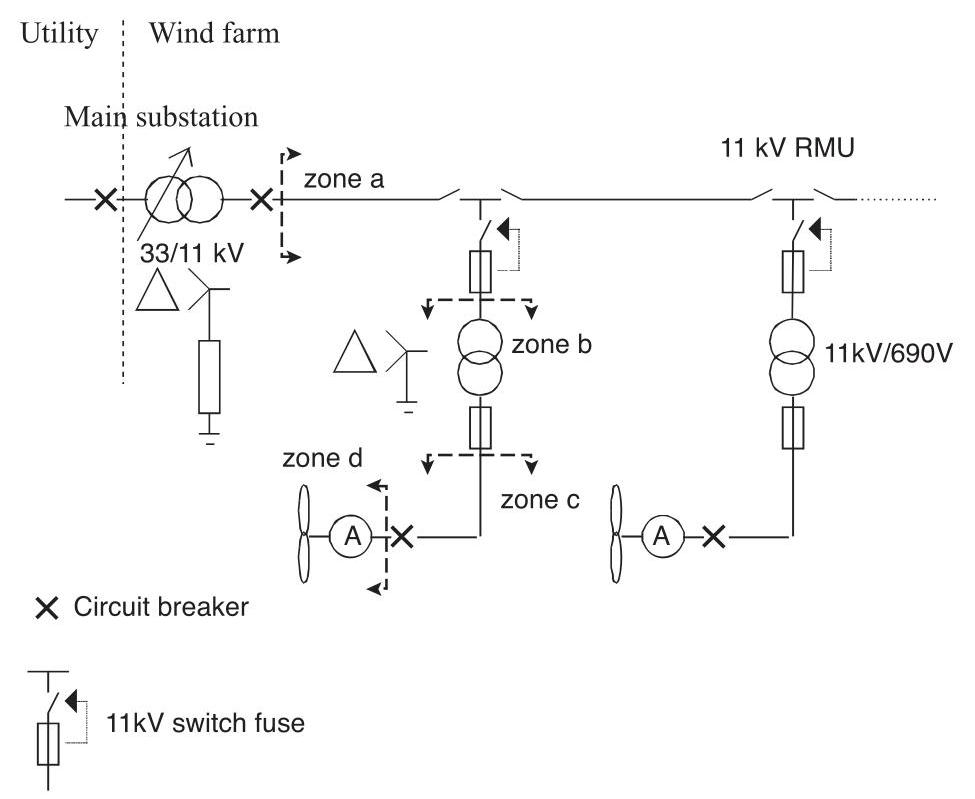

Figure 10.18 Protection of a wind farm with an ${11}\mathrm{{kV}}$ power collection circuit (RMU - Ring Main Unit)

Zone A is the ${11}\mathrm{{kV}}$ cable circuit and this is protected in the conventional fashion by overcurrent and earth fault relays operating an ${11}\mathrm{{kV}}$ circuit breaker. The ${33}/{11}\mathrm{{kV}}$ transformer is protected in a similar manner to a transformer of the same rating used on the public distribution system.

As wind turbine ratings increase and larger wind farms are constructed, ${11}\mathrm{{kV}}$ power collection circuits cease to be cost-effective and so large wind farms are now constructed with a collection voltage of ${33}\mathrm{{kV}}$ (in the UK). This arrangement poses a number of additional difficulties for the electrical protection.

In the arrangement of Figure 10.18 the ${33}/{11}\mathrm{{kV}}$ transformer provides two useful features for electrical protection. Its impedance allows easier grading of over-current relays and, as it blocks the passage of zero-sequence current, fast acting earth fault relays can be applied to the wind farm circuit. With direct connection to the utility circuit these desirable features are not available.

Although ${33}\mathrm{{kV}}$ switch fuses are available it can be difficult to provide comprehensive protection of the ${33}\mathrm{{kV}}/{690}\mathrm{\;V}$ transformer for the full range of prospective fault currents. Effective protection for a single phase to ground fault on the low voltage terminals is particularly difficult and one approach is to use circuit breakers on both the ${33}\mathrm{{kV}}$ and ${690}\mathrm{\;V}$ sides of the transformers.

Electrical protection of wind farms follows conventional distribution engineering practice with the network as the main source of fault current. In the protection of a public supply network it is important to isolate only the faulty section or circuit and so maintain supply to as many customers as possible. This discrimination of the protection is less important in a wind farm as only some additional loss of generation will occur if correct discrimination is not achieved and so simpler and lower cost protection may be appropriate. The difficulty remains, however, of ensuring that effective protection is installed to detect all credible fault conditions, even with limited prospective fault currents, and to be able to identify the faulted section of circuit.

### 10.8.2 Islanding and self-excitation of induction generators

Fixed speed wind turbines use induction generators to provide damping in the drive train and, as there is no direct access to the field of an induction generator, the magnetising current drawn from the stator leads to a requirement for reactive power. In order to reduce the reactive power supplied from the network it is conventional to fit fixed speed wind turbines with local power factor correction (pfc) capacitors. As long as the induction machine is connected to a distribution network its terminal voltage is fixed and so the pfc capacitors merely reduce the reactive power drawn from the network. However, once the induction generator is isolated from the network then there is the possibility of a resonant condition, known as self-excitation, leading to large over-voltages (Hindmarsh, 1984). When the generator is isolated from the network it will tend to accelerate as its load is removed. This increase in rotational speed and consequently of frequency adds to the possibility of self-excitation. There have been a number of cases reported of sections of distribution network, to which wind turbines are connected, becoming isolated and over-voltages resulting in damage customers' equipment.

Figure 7.28 showed the conventional equivalent circuit of an induction machine with the pfc capacitors connected at the terminals (McPherson, 1990). At normal running speed and frequency, the slip (s) is small and so the impedance of the rotor branch is high and, to a first approximation, can be considered an open circuit. As the stator impedance $\left( {{R}_{s} + j{X}_{s}}\right)$ is much smaller than the magnetising reactance $j{X}_{m}$ then the equivalent circuit may be simplified to a simple parallel connection of the pfc capacitors and the magnetising reactance. Thus, the equivalent circuit of Figure 7.28 may be reduced to that of Figure 10.19. This is a conventional LC parallel circuit but in this case ${X}_{m}$ is a non-linear function of voltage due to magnetic saturation. Energy is added to the circuit from the wind turbine. An indication of the likely voltage which will occur as the wind turbine rotor accelerates can be gained by considering the intersection of the capacitive and inductive voltages as the current is identical in each element of this simplified model. This is shown in Figure 10.20. Point $X$ indicates the self-excitation voltage at frequency ${f}_{1}$ , say ${50}\mathrm{\;{Hz}}$ , while point $Y$ illustrates the self-excitation voltage at an increased frequency, say ${55}\mathrm{\;{Hz}}$ . Such simple calculations are indicative only as they are based on a very simple representation of the induction generator and even then it is difficult to obtain reliable data for the saturation characteristic of the machine. However, as self-excitation is a most undesirable condition for grid connected wind turbines, precise calculations of the voltage rise are seldom required.

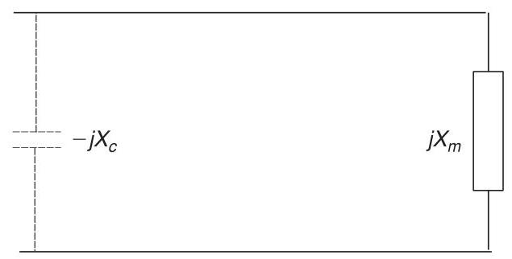

Figure 10.19 Reduced equivalent circuit of an induction generator to illustrate resonance leading to self-excitation

Self-excitation can be avoided by limiting the power factor correction capacitance, including any capacitance of the distribution network, to a value which will not lead to the resonant condition at any credible frequency which will be experienced during overspeed. Alternatively, the potential for this condition must be recognised and fast-acting over-voltage and over-frequency protection arranged to disconnect the capacitors and stop the wind turbine if islanding occurs.

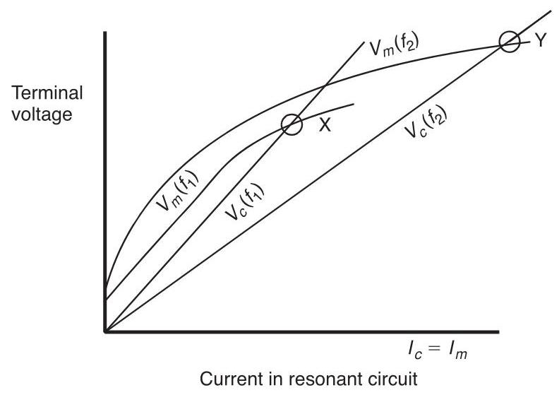

Figure 10.20 Illustration of self-excitation at two frequencies ${f}_{1}$ and ${f}_{2}.{I}_{c}$ - current in capacitors; ${I}_{m}$ - current in magnetising reactance of induction machine

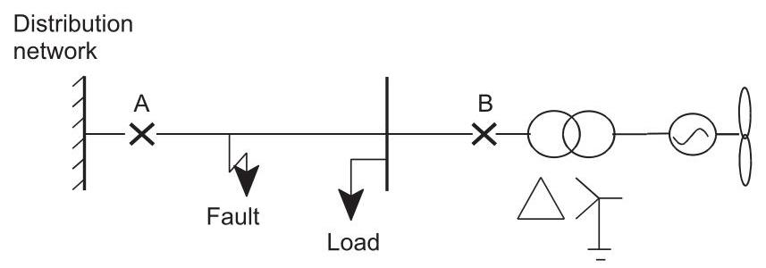

Figure 10.21 Protection of the distribution network from a wind turbine

### 10.8.3 Interface protection for wind turbines connected to distribution networks

Section 10.8.1 considered the protection of the wind turbines from the effects of insulation failure and subsequent high fault currents, which were supplied by the distribution network. However, protection is also required to ensure that a wind farm does not feed into faults on the distribution network or attempt to supply an isolated section of network.

The problem is illustrated in Figure 10.21. For faults on the network, the difficulty is that wind turbines are not a reliable source of fault current and so circuit breaker B may not be opened by over-current protection. Thus, for the fault shown the current operated protection on the network is used to open circuit breaker A. This then isolates the wind turbine which begins to speed up as the wind input remains but it is no longer possible to export power to the network. In fact, this acceleration begins as soon as the fault occurs, and before circuit breaker A trips, as the fault depresses the network voltage and so restricts the export of power. Circuit breaker B is then opened by over-frequency relays which detect the increase in rotational speed of the wind turbine, and hence the increase in frequency of the output, or by under/over-voltage relays which detect that the connection to the network has been lost by monitoring the change in voltage. It is common for the over/under frequency and voltage relays to be time delayed by, for example 500 milliseconds, to reduce spurious operation. Hence in high winds it is possible that the wind turbine will shut down on mechanical over speed protection which is set to limit the speed of the aerodynamic rotor.

This sequential tripping using voltage and frequency sensitive relays which operate once the generator has been isolated is not generally considered to be good practice in the protection of conventional power systems. However, with the use of induction generators or voltage source converters there is little option and so the arrangement is generally accepted for wind farms.

The issue of islanding is the possibility that the output of the wind turbine (in terms of both real and reactive power) matches precisely the local load. In this case even though circuit breaker A opens there will be no change in the voltage or frequency of the wind turbine and so circuit breaker B will not operate. Most distribution utilities are extremely sensitive to possible islanded operation for a number of reasons:

- The possibility that customers may receive supply outside the required limits of frequency and voltage.

- The possibility that part of the network may be operated without adequate neutral earths.

- The danger associated with out-of-phase reclosing.

- That it is against the regulations governing operation of the distribution network.

- The potential danger to staff operating the distribution network.

From the point of view of the wind farm operator the main danger is in out-of-phase reclosing. Many distribution circuits have automatic reclosing to allow transient faults, particularly on overhead lines, to be cleared without prolonged interruption to customers. Thus, circuit breaker A may be arranged to reclose up to a few seconds after opening. If the circuit breaker B is still closed then very high currents and torques will occur as the network voltage is applied out-of-phase to the wind turbine. This is the main technical driver for fast islanding protection as, particularly with wind turbines, it is very unlikely that the required matching of generator output (both real and reactive power) to the load will be sustained for any length of time.

Considerable efforts have been made to devise robust protection systems to detect islanding. However, it may be seen to be very difficult as, by the principal of superposition, if there is no current flowing in circuit breaker A then it makes no difference to the network conditions at the wind turbine whether it is open or closed. The commonly used relays are the so-called rocof (rate of change of frequency) devices or vector-shift relays which measure the jump in the voltage vector when islanding occurs. Both relays rely on some current (and hence real power) flowing in circuit breaker A and can be adjusted to varying levels of sensitivity. However, if they are set too sensitive then they tend to be prone to spurious nuisance tripping due to external disturbances on the power system (e.g. the tripping of a large remote conventional power plant).

A further complication occurs if the fault shown in Figure 10.22 is not between phases but is between a single phase and ground. Faults of this type are particularly common on overhead lines. It can be seen that the turbine transformer (e.g. ${33}/{0.69}\mathrm{{kV}}$ ) has a Delta winding on the High Voltage side. This has no accessible neutral point and no connection to ground is made. Thus, there is no path in which the ground current may flow and so, in principal, the single-phase earth fault will remain indefinitely with no current flowing. In practice some stray capacitive currents will flow but these will not be enough to operate conventional earth fault protection and will, in fact, lead to intermittent arcing. The conventional solution is to use a neutral voltage displacement relay to detect that one phase of the circuit is connected to ground and so the neutral is displaced. The disadvantage of this scheme is its cost as a complex (five limb) voltage transformer is required on the high voltage circuit. Although this can be accommodated for a large wind farm the expense is sometimes difficult to justify for individual wind turbines.

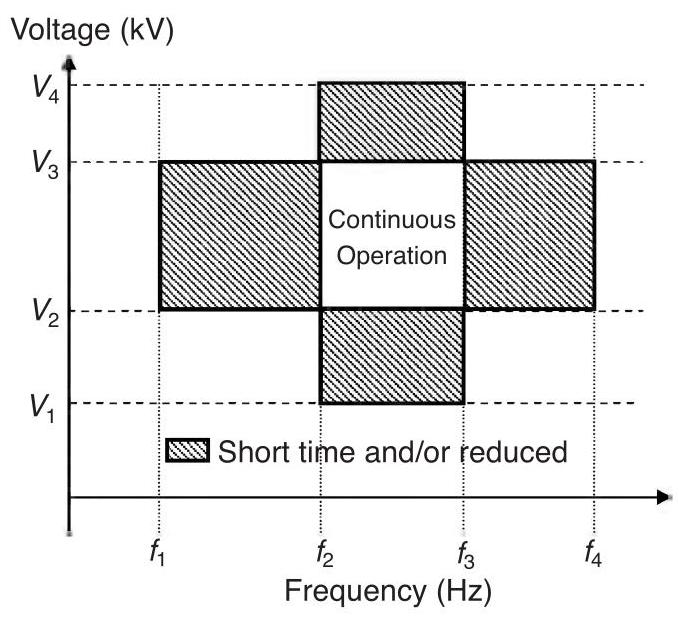

Figure 10.22 Grid Code - continuous operation. Typical shape of continuous and short-time operating regions. (Anaya-Lara, 2009)

The requirements for interface protection vary widely between different countries. Some countries favour the use of transfer tripping whereby when any upstream utility circuit breaker is opened this action is communicated to the wind farm circuit breaker which is then immediately opened. Although this provides a guarantee against islanded operation it can be expensive to implement as communication channels from a number of remote circuit breakers are required. It is interesting to note that in Holland, where almost all the distribution system is underground and so auto-reclose is not used, there is no requirement for loss-of-mains protection. In Denmark, positive phase sequence under-voltage relays are used extensively and appear to be effective in detecting islanded operation. No doubt over time practices will converge but, at present, very considerable national differences remain.

## 10.9 Distributed generation and the Grid Codes

Wind turbines are connected individually and in small groups to the medium voltage distribution network or in large wind farms to the high voltage distribution and transmission network. The connection rules and performance required by the power system operator depend on the size of the wind farms and the voltage of the network to which they are connected.

Individual wind turbines and small wind farms connected to the distribution network come under regulations such as G59/1 in the UK, for generators up to 5 MW and 20 kV, (Electricity Network Association, 1991) and IEEE 1547, for groups of generators up to 10 MVA, in the USA (IEEE, 2003). The philosophy of these regulations is that the wind generation is too small to have any significant impact on the frequency of the main power system. Thus, these regulations require that the wind turbines disconnect if there is any disturbance in the power system or if a section of the network becomes islanded. When the network voltage or frequency is outside the normal operating range the turbines are tripped and not reconnected until normal network conditions are restored. Sensitive loss of mains protection is used to detect islanding.

The thrust of these regulations reflects the concerns of the distribution network operators to avoid islanded operation and to ensure there is no possibility of out of phase re-closure, back feeding sections of the network with the possible safety hazards or operating an ungrounded system. The stability of the power system is provided by the large central generators and all wind turbines falling under these regulations must operate with power factor control taking their voltage from the network. There is no requirement for real power control and the wind turbines make no contribution to maintaining system frequency.

In contrast, larger wind farms fall under a different set of regulations, known as the Grid Codes. These requirements are imposed by the transmission system operators and reflect their concern that larger wind farms have a significant effect on the main power system. Here the philosophy is that rather than disconnect if the voltage and frequency of the power system are outside their normal limits, perhaps because of a system fault or loss of a large generator, the wind farms should stay connected to support the power system. In addition the wind farms are required to have the facility to control their terminal voltage and to be able to provide frequency support. These wind farms are considered large enough to influence the transmission system voltage through their output of reactive power and the network frequency by their generation of real power.

The size of wind farm and voltage level at which these two rather different approaches change reflects the relative significance of wind generation compared to the size of the conventional generation system. Thus, the GB Grid Code applies to wind farms above 50 MW in England but 10 MW in parts of Scotland. In the USA, Texas with its large wind farms has a well developed transmission Grid Code while some other states with limited wind energy at present do not. As wind energy continues to increase, it is likely that versions of the Grid Codes will apply to smaller wind farms to ensure they contribute to the operation of the power system. However, operating practice of distribution networks will then have to be revised.

Many countries have their own national standards for the connection of small distributed generation and their own Grid Codes for large wind farms. These are continually evolving as the importance of wind generation and other forms of distributed generation increase and efforts are continuing to harmonise these regulations. The principles of these documents are discussed with examples that are illustrative only.

### 10.9.1 Grid Code - continuous operation

The Grid Codes follow from similar requirements that apply to the connection of large fossil and hydro central generators. Thus, they do not address individual wind turbines in a wind farm but only the performance of the entire farm at the point it is connected to the transmission network.

Large wind farms are required to be able to operate continuously over the range of frequency and voltage that might be expected on the power system and not to trip during system disturbances. This is to ensure that they continue to provide energy into the power system when the transmission network voltage and frequencies are disturbed. Figure 10.22 shows the typical of the requirements for large wind farms connected to High Voltage networks. The precise values of frequency and voltage vary country by country. There have been recorded examples in both Britain and mainland Europe of a major system frequency drop, caused by the simultaneous loss of central generators or circuits, being made worse by the tripping of distributed generators that were protected against islanded operation by sensitive frequency, voltage or rate of change of frequency relays. Continuous operation over a range of frequencies and voltages ensures that large wind farms contribute to the stability of the power system.

### 10.9.2 Grid Code - voltage and power factor control

The voltages of a transmission network are determined mainly by the flows of reactive power. Large wind farms are required to be able to operate either by controlling their terminal voltage or exchanging a defined level of reactive power with the transmission network. A typical requirement is shown in Figure 10.23. The wind farm is required to be able to operate anywhere within this area as instructed by the transmission system operator.

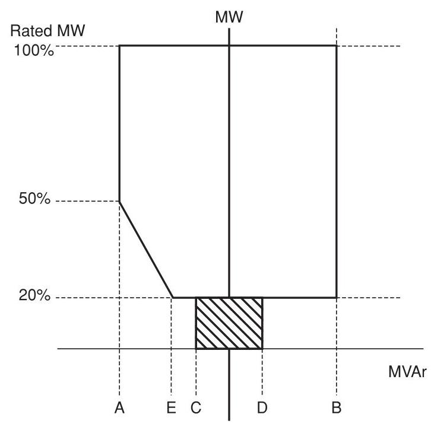

Figure 10.23 Grid Code - voltage and power factor control. Typical reactive power requirement of a grid connected wind farm (National Grid, 2008). Point A is equivalent (in MVAr) to: 0.95 leading Power Factor at Rated MW output; point B is equivalent (in MVAr) to: 0.95 lagging Power Factor at Rated MW output; point C is equivalent (in MVAr) to: -5% of Rated MW output; point D is equivalent (in MVAr) to: +5% of Rated MW output; point E is equivalent (in MVAr) to: -12% of Rated MW output.

Variable speed wind turbines can, in principle, operate at any power factor within the rating of their power electronic equipment. In practice it is difficult to ensure rapid compliance with the requirements for the reactive power output of a large wind farm because of the:

- Difficulty of rapidly coordinating the reactive power generation of a large number of geographically dispersed wind turbines.

- Reactive power drawn by the wind farm transformers which varies with both real and reactive power transmitted.

- Increase in costs of the wind turbines if a large reactive power range is specified.

Hence it is common for additional reactive power compensation equipment (e.g. a STATCOM) to be installed at the point of connection of the wind farm to the network to assist in meeting this Grid Code requirement.

### 10.9.3 Grid Code - frequency response

The frequency of a power system is determined by the instantaneous balance of real power generation and load. If the load exceeds the generation the frequency will drop and if there is an excess of generation the frequency will rise. The rate of change of frequency is determined by the spinning inertia of all generators and spinning loads connected to the power system.

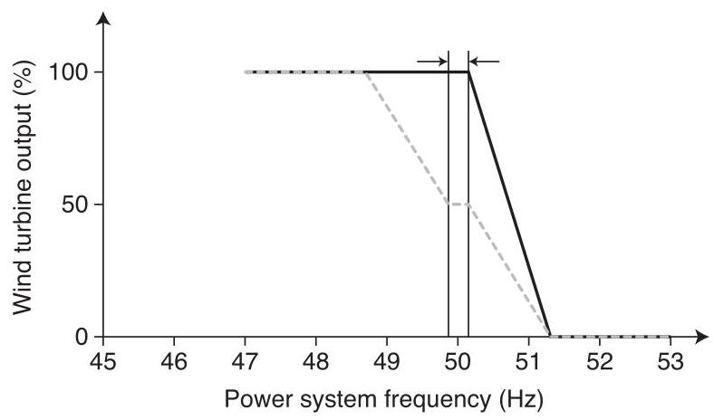

Figure 10.24 Grid Code - frequency response: high frequency response black line, de-loaded turbine grey line

Thus, if the frequency of the power system increases, perhaps because a large load is disconnected, the wind turbines must reduce their real power output (Figure 10.24).

In order to provide low frequency response the wind turbines must be de-loaded either by adjusting their blade pitch angles or by operating at off-optimal rotational speed. Several approaches to active power control including delta control and gradient power control are discussed in Wind Energy - The Facts (European Wind Energy Association, 2009). The requirement for de-loaded operation is specified in many of the Grid Codes but is rarely called on by the power system operator as it results in wind energy being wasted.

### 10.9.4 Grid Code - fault ride through

Short-circuit faults on the transmission network cause the voltage to be depressed over a wide area. Faults are inevitable in any power system, for example due to lightning, and the voltage depressions may extend for hundreds of kilometres. Circuit breakers will clear transmission faults in approximately 100 milliseconds by isolating the faulted section of network and the network voltage then recovers but faults on the lower voltage networks take longer to clear.

A network fault may result in the isolation of a circuit and loss of central generation and it is just at this time that the wind farms should continue to provide energy into the power system. The wind farms should remain stable and connected during any network disturbance and so are required to exhibit an ability to ride through voltage depressions caused by short-circuit faults.

The power that any generator can export is the product of voltage and current and so if its terminal voltage is depressed the generator cannot export its power to the network and will over-speed. The mechanical energy is stored as rotational kinetic energy in the generator and its prime mover. When a fixed speed induction generator wind turbine over-speeds due to a network fault and the voltage is restored it will draw large amounts of reactive power which results in a further voltage depression and possible voltage instability.

A variable speed wind turbine is better able to ride through voltage depressions and a transient reduction in output power by allowing the rotor speed to increase. However, a robust control system is needed to ensure that the converters remain synchronized with the network during the voltage depression.

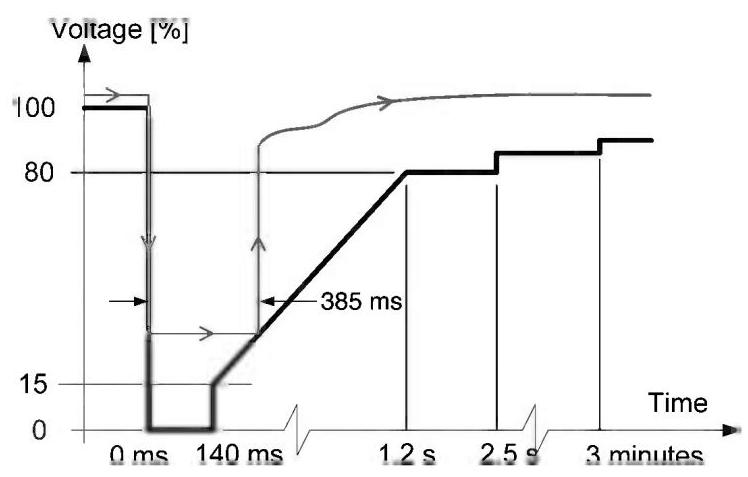

Figure 10.25 Grid Code - fault ride through. Typical fault ride through characteristic

Figure 10.25 shows the voltage time envelope within which a wind farm must continue to operate. The wind farm must withstand a drop to zero volts for 140 milliseconds and a reduction to ${80}\%$ volts for 1.2 seconds. An example of a voltage depression caused by a fault is also shown. In this example, the fault is cleared within ${385}\mathrm{\;{ms}}$ and the wind farm continues to operate through this network fault.

### 10.9.5 Synthetic inertia

The conventional control system of a variable speed wind turbine does not consider the power system frequency. The frequency is used to synchronize the switching of the power electronics of the network side converter but the main control loop measures the rotational speed of the generator and applies a torque so that the wind turbine follows its pre-determined operating characteristic (Figures 6.18 and 6.19). Thus, in the event of a drop in power system frequency, caused, for example by the sudden disconnection of a large central generator, a variable speed wind turbine will not provide any additional energy as the system frequency falls. This is in contrast to a conventional synchronous generator, or a fixed speed induction generator, that will transfer some of its kinetic energy to the power system as the frequency and the speed of rotation of the generator falls.

This lack of response of variable speed wind turbines to a drop in system frequency can be overcome by adding additional control loops as shown in Figure 10.26. The inertia is synthesized by measuring the rate of change of system frequency. The magnitude of the frequency drop may also be used to apply additional torque to the rotor, slow it down and so transfer kinetic energy to the network.

The provision of synthetic inertia is required by some, but not all Grid Codes.

## 10.10 Wind energy and the generation system

Throughout the world, most electricity is generated using large synchronous electrical machines (up to 1000 MW capacity) driven by turbines from fossil, hydro or nuclear energy. Until a few years ago, the amount of wind energy being generated was so small that it acted merely to reduce the electrical load seen by these generators and had no significant impact on either the planning or operation of the generation system. This is now changing rapidly with wind energy becoming significant both for the development (planning) of the generation system and its operation.

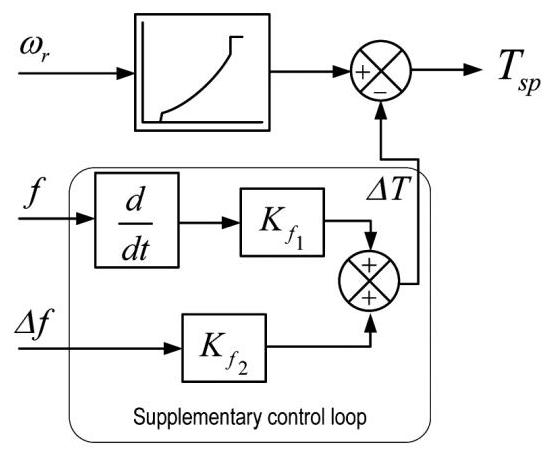

Figure 10.26 Additional control loops to provide synthetic inertia to a variable speed wind turbine ${T}_{sp}$ is the set point of the torque controller of the power electronic converters. (Anaya-Lara, 2009)

In many countries, the electricity system has been liberalized and separated into companies dealing with generation, energy retail, transmission and distribution. Some parts of a liberalized electricity system operate as a market (generation and energy retail) while others are natural monopolies (transmission and distribution) and are regulated by the state for the benefit of customers. Although the market influences the way generators and energy retailers behave in the short term the underlying operation of the electrical power system remains unchanged and the market and regulation can be considered as merely mechanisms to discover the most efficient way for the various actors to behave.

### 10.10.1 Capacity credit

All generating systems (and indeed all aspects of the power system) are designed assuming a probability of failure. All pieces of plant (e.g. generators, transformers, overhead lines and cables) have a finite probability of failure and any design for a completely reliable system would be infinitely expensive. Traditionally the probability that load would exceed the available generation has been defined in terms of generation adequacy. Before liberalisation, the England and Wales generating system was designed to a Loss of Load Probability (LOLP) of 0.09 . This meant electrical demand was expected to exceed available generation on average nine times a century. A LOLP of 0.09 with the mainly coal generating system of England and Wales in the 1980s required a generation planning margin of ${24}\%$ (i.e. the generating capacity built would exceed the peak load by 24%). The French system was designed to a Loss of Load Expectation (LOLE) of three hours per year while the Eire system assumed demand would exceed generation for eight hours per year. In North America a LOLP of 0.1 or LOLE of 2.4 hours/year were common. Similar criteria were used by other major generating utilities.

This principle of planning for a defined level of adequacy is illustrated in Figure 10.27 where the probability distributions of the load and generation are shown. The risk of insufficient generation is shown by the intersection of these probability distributions. All generators have a probability of not being available due to breakdown but wind generation has a higher probability of not generating than fossil generation as it may not generate because of low wind speeds as well as equipment failure. Thus, adding wind energy to the generation portfolio has the effect of widening the probability distribution of generation and, hence, increasing the generation planning margin.

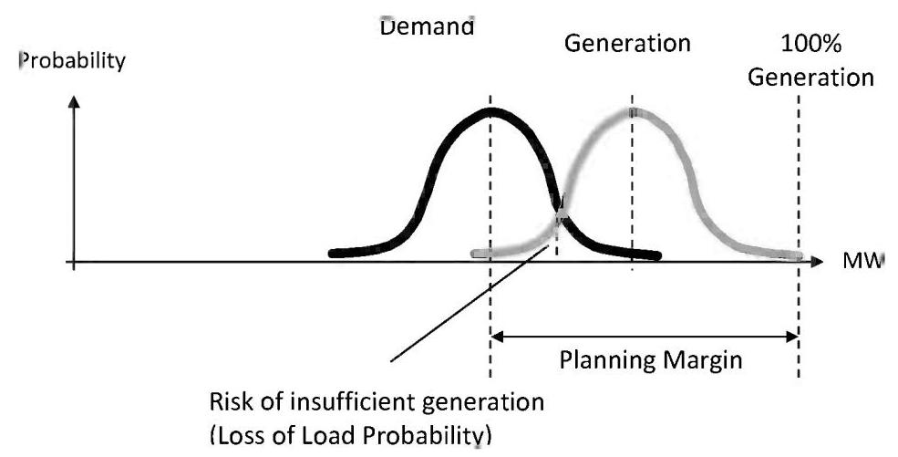

Figure 10.27 Generation adequacy. (Jenkins, Ekanayake and Strbac, 2010)

Calculations to establish the contribution of wind energy to generation adequacy of a power system are undertaken in a similar manner to those for fossil generators (Billinton and Allan, 1996) except that rather than consider only one of two states of a conventional generator (available or not available) wind generators are represented by a number of states to reflect the probability of generation at various wind speeds. These states and their associated probabilities are used to construct a Capacity Outage Probability Table and so calculate the probability of generation being available. As the wind generation is added, conventional generation is removed until the same adequacy is achieved. This approach then allows the capacity value of wind energy to be calculated.

The capacity value of wind generation is described by its capacity credit (Milligan and Parsons, 1999) which is defined as the reduction in the requirement for capacity of conventional plant, made possible by the introduction of wind energy, while maintaining reliable supplies of electricity. The capacity reduction of conventional generation is expressed as percentage of the wind generating capacity in the system. In summary, the capacity credit of wind is assessed through quantification of the generation adequacy of the generation system with and without wind power under a standard reliability criterion (e.g. LOLP or LOLE).

Figure 10.28 shows how the capacity credit of wind energy varies with the penetration of wind energy on the Great Britain power system. It may be seen that at low penetrations the capacity credit is close to the wind energy capacity factors and then reduces with increasing penetration. The benefit of geographical diversity is shown clearly with geographically diverse wind farms giving a higher capacity credit than if they are all located in the same area.

### 10.10.2 Wind power forecasting

The electrical power system is operated by balancing supply and demand on a second-by-second basis. Thus, as well an appropriate capacity of generation being constructed it needs to be operated to meet the load. This is known traditionally as Unit Commitment and is the selection of the optimum (minimum cost or minimum emission) choice of generators to meet the load within constraints. The constraints include the generator operational constraints (e.g. minimum up and down times of thermal generators), network constraints (e.g. loading of circuits) and the requirement to maintain adequate reserves (e.g. partially loaded spinning generators). Once the generators to be connected to the network are selected, their most economic output is determined through Economic Despatch. Unit Commitment and Economic Despatch together are often referred to as generation scheduling.

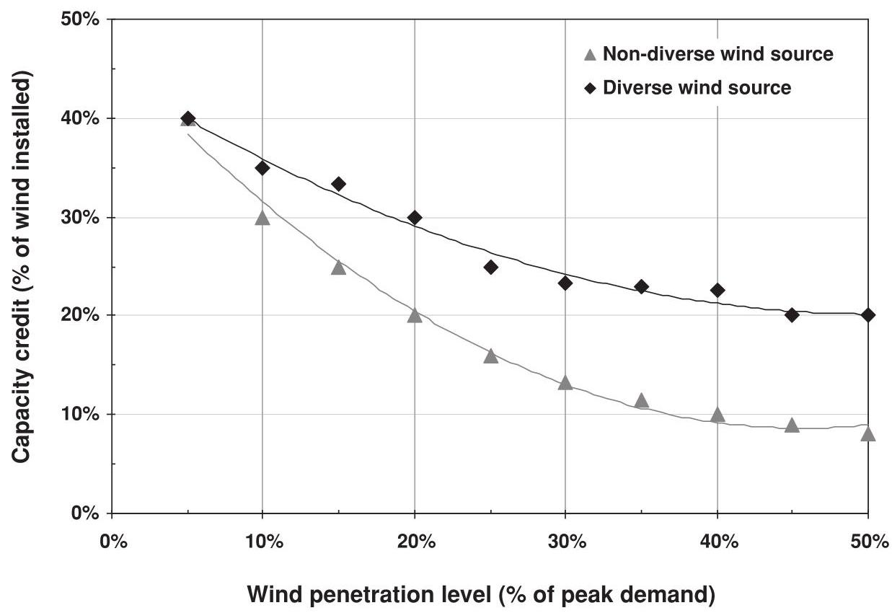

Figure 10.28 The capacity credit of wind generation versus the level of wind penetration in the Great Britain electricity system. (Jenkins, Ekanayake and Strbac, 2010)

In a traditional vertically integrated electricity system, the scheduling of the generation system was optimised centrally by the system operator. In a market based system each generating company will optimise their own portfolio of generators with the objective of meeting the contracts they have struck with energy retailers. However, the principles of having to commit plant, often up to eight hours in advance for large thermal generators, and then optimise its operation remains.

The objective is always to meet the demand at minimum cost (or emissions) and so knowledge of the demand is critical. If historic demand and factors such as ambient temperature and TV programs are taken into account it is possible to forecast electrical load demand with considerable accuracy (typically within 3%). However, the introduction of large quantities of wind energy into the power system significantly increases uncertainty of the level of residual load that will be needed by other generations. Hence, forecasting of wind power output becomes extremely important for power system operation (Boyle, 2009).

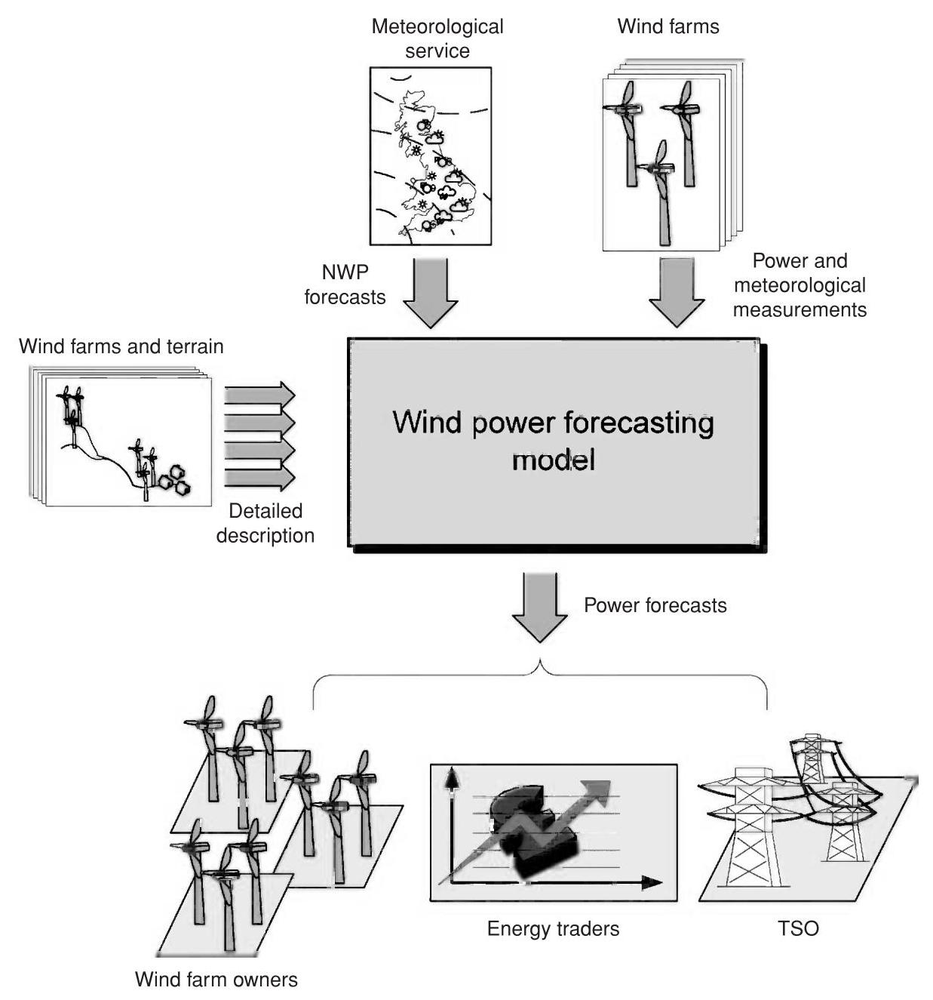

Figure 10.29 Flows of information in a wind power forecasting system. (After, Fox et al., 2007)

Effective forecasting of wind power output is required for:

- The scheduling of generators and balancing supply and demand.

- Determining the reserve generation needed, either part-loaded generators or fast-start gas turbines. This requires a prediction of the accuracy of the forecast.

- Effective operation of the transmission system and managing congestion on circuits.

Forecasts of up to four to six hours ahead may be based on measured data (wind speeds or wind farm power output) using analysis of the previous time series. A large number of techniques have been investigated and modest improvements over persistence can be achieved. The persistence model assumes that the forecast is the same as the last measured value.

All predictions with a longer time horizon are based on Numerical Weather Prediction (NWP) using weather forecasts. Global NWP models are operated by a number of national weather services. They use meteorological observations from weather stations and satellites together with a numerical model to predict the future state of the earth's atmosphere. They are very computationally intensive and so use a rather coarse spatial mesh. Local area NWP models take as their input the results of the global model to provide higher resolution but over only a part of the earth. These local forecasts, which may be purchased from the national weather service, are used as an input of the wind power forecasting model (Figure 10.29).

The wind speed forecasts from the local NWP model are provided on a grid perhaps ${20}\mathrm{\;{km}}$ square, every eight hours over a 48-hour time horizon. These are then translated (downscaled) to the wind farm site at the height of the turbines. In flat terrain this may be done by spatial interpolation but in more complex terrain a meso-scale model is used. Using this site wind speed, the wind farm output is then modelled taking into account local topography and loss of energy in wind turbine wakes. Model Output Statistics (MOS) are then used to refine the model by comparing its outputs with measurements from the wind farms of power output and wind speeds.

## References

AREVA (1987) Network protection and automation guide. AREVA http://www.areva-td.com

ANSI/IEEE (2000) IEEE Guide for safety in AC substation grounding. Standard 80.

Anaya-Lara et al. (2009) Wind Energy Generation; Modelling and Control. John Wiley & Sons, Ltd, Chichester.

Billinton, R. and Allan, R. (1996) Reliability Evaluation of Power Systems, 2nd edition. Plenum Press, New York.

Bossanyi, E., Saad-Saoud, Z. and Jenkins, N. (1998) Prediction of flicker caused by wind turbines, Wind Energy 1(1), 35-50.

Boyle, G. (ed.) (2009) Renewable Electricity and the Grid, the Challenge of Variability. Earthscan, London.

British Standard (2007) Voltage characteristics of electricity supplied by public distribution systems. BS EN 50160.

Copper Development Association (1997) Earthing practice. CDA Publication No 119. Copper Development Association, Potters Bar. http://www.copperinfo.co.uk

Cotton, I. et al. (2000) Lightning protection for wind turbines. In: International Conference on Lightning Protection, pp. 848-853.

Dugan, R.C., McGranaghan, M.F. and Beaty, H.W. (1996) Electrical Power Systems Quality. McGraw-Hill, New York.

Electricity Networks Association (1989) Planning limits for voltage fluctuations caused by industrial, commercial and domestic equipment in the UK. Engineering Recommendation P. 28.

Electricity Networks Association (1990) Planning limits for voltage unbalance in the UK for ${132}\mathrm{{kV}}$ and below. Engineering Recommendation P. 29.

Electricity Networks Association (1991) Recommendations for the connection of embedded generation to the public electricity suppliers distribution networks. Engineering Recommendation G59/1.

Electricity Networks Association (2005) Limits for harmonics in the UK electricity supply system. Engineering Recommendation G5/4-1.

European Wind Energy Association (2009) Wind Energy - The Facts. Earthscan, London.

Fox, B. et al. (2007) Wind Power Integration, Connection and System Operational Aspects. Institution of Engineering and Technology, London.

Gardner, P. (1996) Experience of wind farm electrical issues in Europe and further afield. In: Proceedings of the 18th British Wind Energy Association Conference, pp. 59-64. Mechanical Engineering Publications, Bury St Edmunds.

Heier, S. (2006) Grid Integration of Wind Energy Conversion Systems, 2nd edition . John Wiley & Sons, Ltd, Chichester.

Hindmarsh, J. (1984) Electrical Machines and Their Application. Butterworth Heinemann, London.

IEEE (1991) IEEE Recommended practice for the electrical design and operation of windfarm generating stations. IEEE Std. 1094, (now withdrawn).

IEC 60909-0:2001 (or BS EN 60909-0:2001) Short circuit current calculation in three-phase a.c. systems. International Electromechanical Commission and/or British Standards Institution.

IEEE 1547 (2003) IEEE Standard for Interconnecting Distributed Resources with Electric Power Systems.

IEC (2008) Electromagnetic compatibility (EMC) - Part 4: Testing and measurement techniques - Section 15: Flickermeter - Functional and design specifications. IEC 614000-4-15.

IEC (2008) Measurements and assessment of power quality characteristics of grid connected wind turbines. IEC 61400-21; 2001

IEC (2010) Lightning protection for wind turbines. IEC 61400-24.

Jenkins, N., Ekanayake, J.B. and Strbac, G., (2010) Distributed Generation. Institution of Engineering and Technology, London.

Kanellos, F.D. and Kabouris, J. (2009) Wind farm modeling for short-circuit level calculations in large power systems IEEE Transaction on Power Delivery. 24(3), 1687-1695.

Lakervi, E. and Holmes, E.J. (1995) Electricity Distribution Network Design, 2nd edition. Peter Peregrinus, Bristol.

McPherson, G. (1990) An Introduction to Electrical Machines and Transformers, 2nd Edition. John Wiley & Sons, Inc. New York.

Milligan, M. and Parsons, B. (1999) A comparison and case study of capacity credit algorithms for wind power plants. Wind Engineering, 23(3), 159-166.

Mohan, N., Underland, T.M. and Robbins, W.P. (2003) Power Electronics: Converters, Applications, and Design, John Wiley Sons, Inc. New York.

Morren, J. and de Haan (2007) Short-circuit current of wind turbines with doubly-fed induction generator, IEEE Transaction on Energy Conversion, 22(1), 174-180.

National Grid Company plc (2008) The Grid Code, Issue 3, Revision 25, 1 February.

Tagg, G.F. (1964) Earth Resistances. George Newnes Ltd, London.

Tande, J.O.G. (2003) Grid integration of wind farms, Wind Energy, 6(3), 281-296.

Tande J.O.G. Power quality. (2005) In: T. Ackerman, Wind Power in Power Systems, John Wiley & Sons, Ltd, Chichester.

Thomson, M. (2000) Automatic voltage control relays and embedded generation. IEE Power Engineering Journal, 14(2), 71-76.

Wagner, C.F. and Evans, R.D. (1933) Symmetrical Components. McGraw-Hill, New York.

Weedy, B. and Cory, B. (1998) Electric Power Systems, 4th edition. John Wiley & Sons, Ltd, Chichester.

## Appendix A10 Simple calculations for the connection of wind turbines

## A10.1 The Per-unit system

The per unit system (Weedy and Cory, 1998) is simply a technique used by electrical power engineers to simplify calculation by expressing all values as a ratio of:

- actual value (in any unit);

- base or reference value (in the same unit).

Its advantages include: (1) a reduction in the appearance of $\sqrt{}3$ in the calculations (2) that similar per unit values apply to systems of various sizes and (3) by appropriate choice of voltage bases the solution of networks containing several transformers is facilitated.

For simple calculations, such as those required for assessment of a wind turbine or small wind farm on a simple distribution circuit, all that is required is to:

1. Assume an arbitrary base VA (e.g. 10 MVA for a small wind farm connection).

2. Select voltage bases of each voltage level of the network (e.g. ${33}\mathrm{{kV}}$ and ${11}\mathrm{{kV}}$ ). These voltage bases should be related by the nominal turns ratios of the transformers.

3. Calculate the appropriate real and reactive power flows at the generator terminals in per unit (i.e. for a Power flow of $5\mathrm{{MW}}$ with the base VA chosen as ${10}\mathrm{{MVA}}$ , the per unit value is $P = 5/{10}$ or 0.5 per unit. Similarly for a Reactive Power flow of $1\mathrm{{MVA}}r$ the per unit value is $Q = 1/{10}$ or 0.1 per unit).

4. If necessary transform the impedances of the circuit from ohmic to per unit values using a base impedance of ${Z}_{\text{ base }} = {V}^{2}{}_{\text{ base }}/V{A}_{\text{ base }}$ .

5. The base current at any particular voltage level is calculated from: ${I}_{\text{ base }} = V{A}_{\text{ base }}/ \; \sqrt{}3 \times  {V}_{\text{ base }}$ .

## A10.2 Power flows, slow voltage variations and network losses

If the output from a distributed wind turbine generator is absorbed locally by an adjacent load then the effect on the distribution network voltage and losses is likely to be beneficial. However, if it is necessary to transport the power through the distribution network then increased losses may occur and slow voltage variations may become excessive (Jenkins, Ekanayake and Strbac, 2010).

If the wind generator operates at unity power factor (i.e. Reactive Power $Q = 0$ ), then the voltage rise in a lightly loaded radial circuit (Figure A10.1) is given approximately by:

$$
{\Delta V} = {V}_{1} - {V}_{0} = {PR}/{V}_{0} \tag{A10.1}
$$

Operating the generator at a leading power factor (absorbing reactive power) acts to reduce the voltage rise but at the expense of increased network losses. In this case the voltage rise is given by:

$$
{\Delta V} = {V}_{1} - {V}_{0} = \left( {{PR} - {XQ}}\right) /{V}_{0} \tag{A10.2}
$$

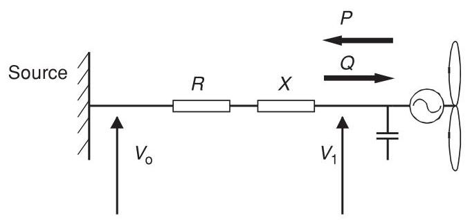

Figure A10.1 Fixed-speed wind turbine on a radial circuit

The impedance of an overhead ${11}\mathrm{{kV}}$ distribution circuit may, typically, have a ratio of inductive reactance to resistance $(X/R$ ratio) of 2 . An uncompensated induction generator at rated output, typically, has a power factor of 0.89 leading, that is, $P =  - {2Q}$ . Thus, under these conditions, there is no apparent voltage rise in the circuit at full power. However, the real power loss $\left( W\right)$ in the circuit is given approximately by:

$$
W = \left( {{P}^{2} + {Q}^{2}}\right) R/{V}_{0}^{2} \tag{A10.3}
$$

The reactive power drawn by the generator acts to limit the voltage rise but higher real power losses are incurred in the connecting circuit.

Equations A10.1-A10.3 for voltage rise and circuit losses are approximate only and do not apply to heavily loaded circuits. A simple but precise calculation for voltage rise in any radial circuit may be carried out using an iterative technique.

Complex quantities are indicated by bold type.

At the generator busbar of Figure 10.9 the apparent power (sometimes known as the complex power) ${S}_{1}$ is given by:

$$
{\mathbf{S}}_{1} = P - {jQ} \tag{A10.4}
$$

(for a generator operating at lagging power factor, exporting VArs, ${\mathbf{S}}_{\mathbf{1}}$ would be given by $P + {jQ})$

By definition $\mathbf{S} = {\mathbf{{VI}}}^{ * }$ . * indicates the complex conjugate (i.e. the sign of the imaginary component of the complex number is reversed).

Therefore, the current flowing in the circuit is given by:

$$
\mathbf{I} = {\mathbf{S}}_{\mathbf{1}}^{ * }/{\mathbf{V}}_{\mathbf{1}}^{ * } = \left( {P + {jQ}}\right) /{\mathbf{V}}_{\mathbf{1}}^{ * } \tag{A10.5}
$$

The voltage rise in the circuit is given by $\mathbf{{IZ}}$ and so:

$$
{\mathbf{V}}_{\mathbf{1}} = {\mathbf{V}}_{\mathbf{0}} + \mathbf{{IZ}} = {\mathbf{V}}_{\mathbf{0}} + \left( {R + {jX}}\right) \left( {P + {jQ}}\right) /{\mathbf{V}}_{\mathbf{1}}^{ * } \tag{A10.6}
$$

It is common for the network voltage ${\mathbf{V}}_{\mathbf{0}}$ to be defined and the generator busbar voltage ${\mathbf{V}}_{\mathbf{1}}$ required. ${\mathbf{V}}_{\mathbf{1}}$ can be obtained using the simple iterative expression:

$$
{\mathbf{V}}_{\mathbf{1}}^{\left( n + 1\right) } = {\mathbf{V}}_{\mathbf{0}} + \left( {R + {jX}}\right) \left( {P + {jQ}}\right) /{\mathbf{V}}_{\mathbf{1}}^{*\left( n\right) } \tag{10.7}
$$

where $n$ is the iteration number.

This is a simple form of the conventional Gauss-Seidel load flow algorithm (Weedy and Cory, 1998). Once the calculation converges an accurate solution is obtained. More complex load flow calculations may be carried out using commercially available power system analysis programs. These include models of transformers, with their tap changers, and can solve large interconnected circuits in only a few iterations using more advanced algorithms.

Example: Calculation of voltage rise in a radial circuit

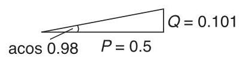

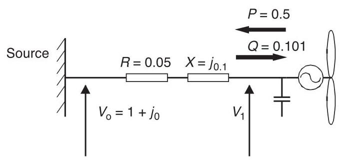

Figure A10.2 Example of calculation of voltage rise on a radial circuit (all values in per unit)

Consider a 5 MW wind farm operating at a power factor of 0.98 leading. The network voltage $\left( {\mathbf{V}}_{\mathbf{0}}\right)$ is $\left( {1 + {j0}}\right)$ per unit and the circuit impedance $\left( \mathbf{Z}\right)$ is $\left( {{0.05} + {j0.1}}\right)$ per unit on a 10 MVA base (Figure A10.2).

A power factor of 0.98 leading implies a reactive power draw of 1.01 MVAr.

Thus, following Equation A10.7 the calculation becomes

$$
{\mathbf{V}}_{\mathbf{1}}^{\left( n + 1\right) } = 1 + \left( {{0.05} + {j0.1}}\right) \left( {{0.5} + {j0.101}}\right) /{\mathbf{V}}_{\mathbf{1}}^{*\left( n\right) }
$$

For the first iteration $\left( {n = 0}\right)$

Assume

$$
{\mathbf{V}}_{\mathbf{1}}^{*\left( 0\right) } = 1 + {j0}
$$

then ${\mathbf{V}}_{\mathbf{1}}^{\left( 1\right) }$ may be calculated to be:

$$
{\mathbf{V}}_{\mathbf{1}}^{\left( 1\right) } = {1.0149} + {j0.0551}
$$

For the second iteration $\left( {n = 1}\right)$

$$
{\mathbf{V}}_{1}^{*\left( 1\right) } = {1.0149} - {j0.0551}\text{ then }
$$

$$
{\mathbf{V}}_{1}^{\left( 2\right) } = {1.0117} + {j0.0549}
$$

For the third iteration $\left( {n = 2}\right)$

$$
{\mathbf{V}}_{1}^{*\left( 2\right) } = {1.0117} - {j0.0.0549}\text{ then }
$$

$$
{\mathbf{V}}_{1}^{\left( 3\right) } = {1.0117} + {j0.0551}
$$

and the procedure has converged.

Therefore ${\mathbf{V}}_{1} = {1.013}$ per unit at an angle of ${3}^{ \circ  }$ , that is, the voltage at the generator terminals is ${1.3}\%$ above that at the source. The angle between the two voltage vectors is small $\left( {3}^{ \circ  }\right)$ .

The approximate calculation $\left( {{V}_{1} = {V}_{0} + \text{ PR-XQ }}\right)$ indicates a voltage ${V}_{1}$ of 1.015 per unit (i.e. a rise of 1.5%). This is confirmed by the results of the first iteration.

The current (I) in the circuit may be calculated from:

$$
\mathbf{I} = {\mathbf{S}}_{1}^{ * }/{\mathbf{V}}_{1}^{ * } = \left( {{0.5} + {j0.101}}\right) /\left( {{1.0117} - {j0.0551}}\right)
$$

$$
= {0.4873} + {j0.1264}\text{ per unit }
$$

$$
\left| \mathbf{I}\right|  = {0.503}\text{ per unit }
$$

With a connection voltage of ${33}\mathrm{{kV}}$ the base current is given by

$$
{I}_{\text{ base }} = V{A}_{\text{ base }}/\sqrt{}3 \times  {V}_{\text{ base }} = 5 \times  {10}^{6}/{1.732} \times  {33} \times  {10}^{3} = {87.5}\text{ Amps }
$$

and so the magnitude of the current flowing in the ${33}\mathrm{{kV}}$ circuit is ${44}\mathrm{{Amps}}$ .

The real power loss in the circuit $\left( W\right) {\text{ is }}^{3}$ :

$$
W = {I}^{2}R = {0.0127}\text{ per unit or }{127}\mathrm{\;{kW}}
$$

The symmetrical short-circuit level at the generator busbar, before connection of the generators is simply:

$$
{S}^{\prime \prime } = 1/\left| \mathbf{Z}\right|  = 1/{\left( {0.05}^{2} + {0.1}^{2}\right) }^{1/2}
$$

$$
{S}^{\prime \prime } = {8.94}\mathrm{{pu}}\text{ or }{89.4}\mathrm{{MVA}}
$$

Once the induction generators of a wind farm are connected then they will make a contribution to the short-circuit current seen by a circuit breaker when it closes on to a fault. This is typically some five times the rating of a directly connected fixed speed induction generator, for example some 25 MVA in this case, giving a total short-circuit level of 115 MVA. However, for a three-phase symmetrical fault the fault current contribution from an induction machine decays rapidly and will make only a small contribution to the fault current which must be interrupted by an opening circuit breaker. Detailed guidance on the calculation of fault currents, including the contribution from induction generators is given in IEC 60909.

---

${}^{3}$ Note when the calculations are carried out using the per-unit system this is the aggregated power loss of all three phases.

---

