# 11 Offshore wind turbines and wind farms

## 11.1 Development of offshore wind energy

Offshore wind energy is developing rapidly (Figure 11.1) with a total installed capacity in 2010 of approximately 3000 MW, some 1.5% of worldwide wind farm capacity. In a number of Northern European countries it is increasingly difficult to obtain permission to construct large wind farms onshore and this has stimulated interest in moving offshore, into the North Sea and Baltic. To meet its greenhouse gas emission targets, the UK has ambitious plans for some 15-20,000 MW of offshore wind farm capacity by 2020 with some projects more than ${100}\mathrm{\;{km}}$ offshore in average water depths of ${50}\mathrm{\;m}$ . The advantages of locating wind farms offshore include:

- Large areas are available for wind farm development with limited environmental impact.

- Mean wind speeds are high and this gives high capacity factors.

- Wind turbulence is low.

- Landfalls of the cables and points of connection to the power network are close to cities and load centres.

Figure 11.1 shows the development of world-wide capacity of offshore wind farms. Until around 2000 the projects were small and located in rather shallow water less than $5\mathrm{\;{km}}$ from shore. Then larger wind farms began to be constructed, in particular the two large Danish wind farms at Horns Rev (160 MW, 2002) and Nysted (166 MW, 2003). Presently a number of wind farms of up to 500 MW are being constructed in Northern Europe, particularly off the UK with smaller installations in the Far East, particularly off the coast of China (Table A11.1).

---

Wind Energy Handbook, Second Edition. Tony Burton, Nick Jenkins, David Sharpe and Ervin Bossanyi.

© 2011 John Wiley & Sons, Ltd. Published 2011 by John Wiley & Sons, Ltd. ISBN: 978-0-470-69975-1

---

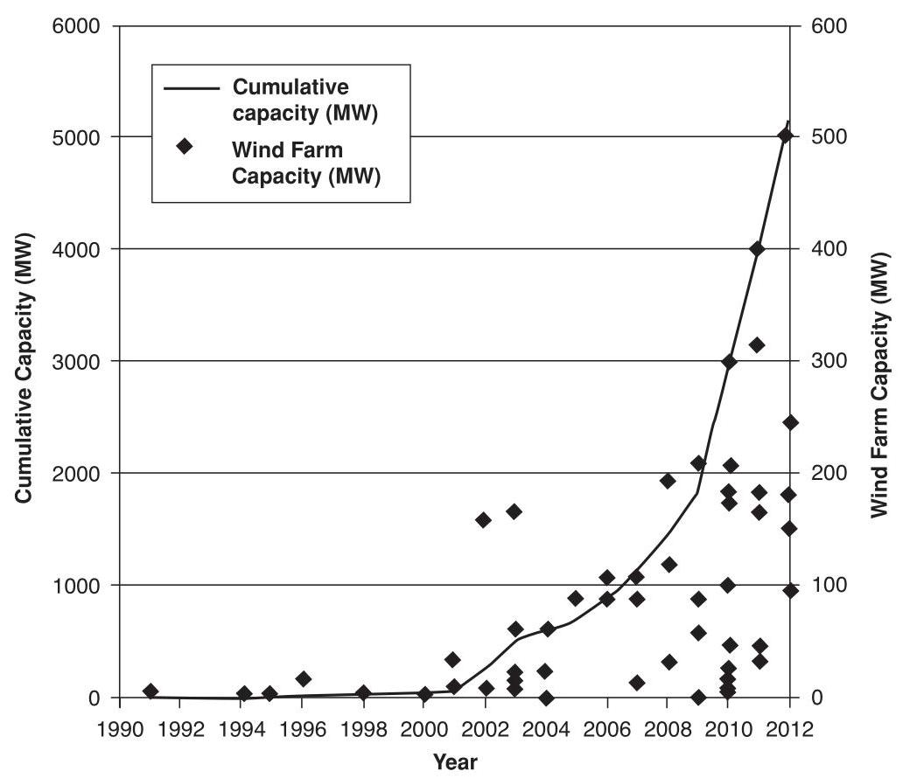

Figure 11.1 Offshore wind farm capacity worldwide (1991-2012)

Offshore installations represent a small fraction of the total wind power market and so the turbines are generally marinised developments of the machines used onshore (rated at up to 3.6 MW) but with some larger turbines (up to 5 MW) used in deep water sites. There is also one installation of two floating wind turbines. In depths of water of up to ${20}\mathrm{\;m}$ , either monopile or gravity foundations have been used while jacket or tripod structures are used for deeper waters. For smaller wind farms close to shore, the wind farm power collection cables at ${30} - {36}\mathrm{{kV}}$ are extended to shore. Larger wind farms use an offshore transformer station while High Voltage Direct Current transmission will be used for very large remote projects. Access for maintenance is generally by boat although helicopters have been used in some projects.

Table 11.1 shows an indicative breakdown of the capital costs of an offshore wind farm project. The turbines make up a rather lower fraction of the costs than for an onshore project with the support structures, cables and electrical connection a greater proportion. Installation of equipment offshore is, of course, a significant cost.

Table 11.1 Typical breakdown of costs for an offshore wind farm (after EWEA, 2009)

<table><tr><td>Element of offshore wind farm</td><td>% of total cost</td></tr><tr><td>Wind turbines</td><td>51</td></tr><tr><td>Support structures</td><td>19</td></tr><tr><td>Cables and network connection (including installation)</td><td>15</td></tr><tr><td>Installation of turbines and support structures</td><td>9</td></tr><tr><td>Other capital costs</td><td>6</td></tr></table>

The disadvantage of installing wind turbines offshore is the higher capital and operating costs and these have shown a considerable increase over the short history of offshore wind power development. This increase in costs has been studied by Gross et al., 2010. From 2002 to 2004, capital costs for UK offshore wind farms were relatively stable at less than $\textsterling {1.5}\mathrm{\;m}/\mathrm{{MW}}$ . However, since then capital costs have doubled to $\textsterling 3\mathrm{\;m}/\mathrm{{MW}}$ with the lev-elised costs of electrical energy increasing from £85/MWh (2004) to £150/MWh (2010). This compares with a capital cost for onshore wind energy of between $\textsterling {1.3}\mathrm{\;m}/\mathrm{{MW}} - \textsterling {1.8}$ m/MW and a levelised cost of energy of £94/MWh (DECC, 2010). The comparable lev-elised cost of electrical energy in the UK from Combined Cycle Gas Turbine generators was £80/MWh (2010).

Thus, although onshore wind energy can be considered the most cost-effective low carbon technology for electricity generation, offshore wind energy is expensive requiring considerable additional support. ${}^{1}$

Gross et al., 2010 considered that the factors that drove the escalation in cost of UK offshore wind farms from the mid-2000s to 2009 have been (in descending order of impact):

1. Materials, commodities and labour costs.

2. Currency movements.

3. Increasing prices for turbines over and above the cost of materials, due to supply chain constraints, market conditions and engineering issues.

4. The increasing depth and distance of more ambitious projects, affecting installation, foundation and operation and maintenance (O & M) costs.

5. Supply chain constraints, notably in vessels and ports.

6. Planning and consenting delays.

There has recently been some evidence of a small drop in capital costs of UK wind farms from £3 m/MW (2009) to £2.9 m/MW (2010) with a best guess of a cost of energy of £115/MWh by the mid-2020s. Some projects in the Baltic in rather shallow, sheltered waters close to shore have reported lower costs. Consideration of costs and other commercial matters is difficult and any analysis dates very quickly. However, it would appear that the early experience of UK offshore wind farms in rather shallow waters often close to shore gave a rather optimistic view of costs and that the later larger wind farms in more demanding exposed, offshore environments will lead to a higher cost of electrical energy unless considerable innovation is employed to reduce both capital and operating costs.

Offshore wind energy is in its infancy and experience is being gained as wind farms are constructed further from the shore and in more demanding environments. A number of books and reports on offshore wind energy are now emerging. Offshore climatology and meteorology are discussed by Barthelmie et al. and access by Dalen and Jakobsson in the comprehensive book on offshore wind power by Twidell and Gaudiosi (2009). Ackerman (2005) addresses offshore electrical systems while Hau (2006) provides an overview of the subject. After a review of offshore wind meteorology, this chapter considers the design loads of offshore wind turbines, which differ significantly from those onshore. The design of support structures is described including fatigue calculations for monopile foundations while particular aspects of offshore power collection systems are also addressed.

---

${}^{1}$ Electricity generated from UK offshore wind farms attracts two Renewable Obligation Certificates or double the support of electricity generated from onshore wind farms.

---

## 11.2 The offshore wind resource

### 11.2.1 The structure of winds offshore

For sites far from shore, and for near-shore sites when the wind is blowing from open sea to land, mean wind speeds are usually higher than on land due to the absence of obstructions to the flow. Similarly, turbulence levels are usually much lower than on land, with low wind shear corresponding to the small surface roughness. However, the surface roughness increases with wave height, so turbulence and wind shear may be much higher during periods of large waves. These are correlated with periods of strong winds, since the waves are generally wind-driven, but there may be a significant time lag, so a wind farm may experience low winds in conjunction with high waves following a storm out at sea. Also the lower frequency swell waves may travel long distances, and may have been caused by high winds elsewhere which may never reach the wind farm. The contribution of the wind to the design loads of offshore turbines is considered in Section 11.3.2.

### 11.2.2 Site wind speed assessment

Quantification of the long-term wind resource at a potential wind farm site plays a central role in determining the economic feasibility of a project. For onshore wind farms this is typically achieved through the collection of wind data from an onsite meteorological mast and/or analysis of energy production data from neighbouring operational projects (Section 9.1.3, Chapter 9) These datasets are typically analysed in conjunction with historical records from a local meteorological station, regional wind index or modelled hindcast source as well as site wind flow models in order to predict the long-term wind climate at the site.

A similar approach may be adopted for offshore wind projects although there are significantly higher costs associated with the erection of meteorological masts at sea. Alternatively, wind resource estimates may be based on secondary sources such as measured wind data obtained from neighbouring sites or publicly funded measurement stations in the region of interest. In such circumstances, the wind analyst must assess the difference in wind climate between the reference mast and the target site, as well as the uncertainty associated with this assessment.

A commonly held assumption has been that the horizontal spatial variation of long-term mean wind speed in the offshore environment is relatively limited (Barthelmie 1993; Coelingh et al., 1996). Therefore, the uncertainty associated with extrapolation of measurements from one physical location to another has often been perceived as relatively limited. However, in the absence of high quality public domain data from several reliable measurement nodes, there is little evidence for this assumption and so wind climate prediction is subject to a significant degree of uncertainty in the absence of a high quality measurement campaign on the site of interest. This can have a significant impact on the outlook for the financing of some projects.

Various methodologies may be applied in order to assess the variation of wind resource across wide areas of the offshore environment. These include conventional computational flow modelling techniques such as WAsP (Mortensen et al., 1993) as well as more sophisticated modelling including Computational Fluid Dynamics (CFD) and Mesoscale methods. The latter is an increasingly applied technique which is based on Numerical Weather Prediction models developed by the meteorological research community. A Global Climate Model is used to find the conditions of the upper atmosphere and these results are then either used as boundary conditions of Regional Climate Models (at a scale typically of ${50}\mathrm{\;{km}} \times  {50}\mathrm{\;{km}}$ ) or with empirically derived relationships with the sea surface parameters, temperature and wind speed (Barthemie et al. in Twidell and Gaudiosi, 2009). The benefit of this approach is the potential for capturing the wide scale synoptic trends as well as more localised thermal and topographic effects through application of a theoretically robust meteorological model, initiated from a large database of historical observations.

Analysis of images recorded by satellite-mounted instrumentation is also becoming a more frequently applied methodology for considering the variation in offshore wind resource. One of the most commonly utilised instruments is a Scatterometer, which is an active microwave device used to derive estimates of wind speed and direction based on returns from a fan beam of short pulses. These returns are received at a variety of incidence angles which respond principally to the surface roughness of the sea. When the wavelength of the incident beam is in phase with the wavelength of the short-crested localised 'wind waves' (taking account of the incident beam angle), resonant signals become present in the backscatter return (Aage et al., 1998). The intensity of the resonant backscatter is proportional to the steepness of the wind waves and hence also to the localised wind speed at the time of observation. The relationship between the magnitude of resonant backscatter and wind speed has been derived empirically and also takes into consideration the incidence angle and the azimuth angle of the satellite observation direction with respect to the wind direction (Aage et al., 1998). Whilst the absolute accuracy of the derived wind speed values is limited by the validity of the empirically-derived relationship applied and the availability of the data is limited due to infrequent spatial and temporal sampling, analytical methods have been developed that allow a robust estimate of the spatial variation of wind resource over domains of several hundred kilometres to be determined (Phillips et al., 2008).

In summary, a wide variety of measurement and computer model-based applications are available to determine the wind resource at any given offshore wind site. The uncertainties associated with the source data and analytical methodology adopted play a significant role in determining the level of confidence that may be ascribed to projections of long-term energy production, which in turn has a substantial influence on the economic viability of any given offshore wind farm development.

### 11.2.3 Wakes and array losses in offshore wind farms

Wake losses in offshore wind farms can lead to a considerable loss of energy particularly at wind speeds below rated. Wake losses are most strongly dependent on wind speed through the turbine thrust coefficient, being high at low wind speeds and then decreasing as wind speeds increase. Above rated wind speed, pitch regulated turbines limit their power production by feathering the blades, which reduces the thrust coefficient and hence the wake losses at downstream turbines, so above a certain wind speed all turbines may be producing rated power despite the wakes. Stall regulated turbines continue to have a high thrust coefficient, which may cause high wake losses at all wind speeds.

The thrust coefficient implies an extraction of momentum from the air flow, but further downstream the momentum is replenished by mixing from the higher-speed flow above the wind farm. Atmospheric boundary layer models can provide ways of calculating the rate of momentum replenishment, from which the efficiency of the wind farm can be calculated (Bossanyi, 1980). However, a more detailed assessment should consider the development of the individual turbine wakes and their interaction with downstream turbines. This means that the wake losses depend significantly on wind direction as well as turbine spacing. With a regular array of turbines, the wake losses will be high in certain narrow wind direction sectors, and the overall average losses will depend on the joint distribution of wind speed and direction.

Array wake losses can be exacerbated by small separation distances of the turbines used in some projects and may be related to the low levels of ambient turbulence of the offshore wind (Barthelmie et al., 2005). For example, the Lillgrund offshore wind farm (Figure 11.2) was built with 48,2.3 MW, ${93.5}\mathrm{\;m}$ diameter turbines (Dahlberg and Thor,2009). It was constructed with rather small separation distances between turbines (3.3 D along each row and 4.4 D between rows). The small separation distances arose as the rotor diameter of the available offshore turbine was increased by the manufacturer during the wind farm permitting process when the base positions had been fixed. An extensive campaign of measurements showed that for wind blowing directly down a row, the second turbine experienced a power deficit wake loss of ${80}\%$ (i.e. it produced only ${20}\%$ of the power of the first turbine over a range of wind speeds below rated). Similarly at a spacing of 4.4 D the power deficit was around 70%.

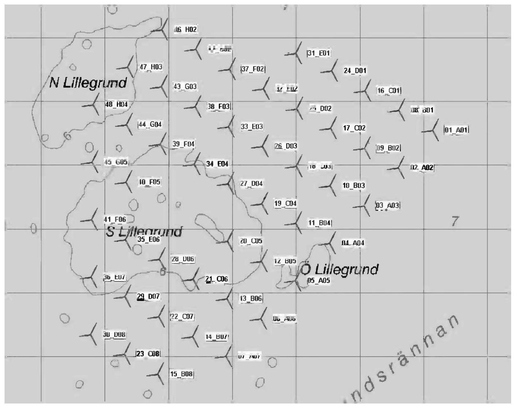

Figure 11.2 Lillgrund wind farm layout. Dahlberg and Thor, 2009. Reproduced by permission of Vattenfall

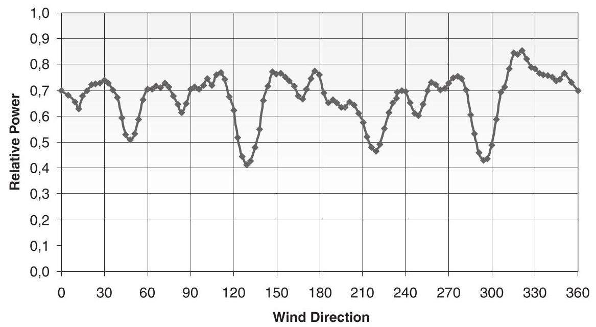

Figure 11.3 Lillgrund wind farm: variation in array efficiency with wind direction for wind speeds below rated. Dahlberg and Thor, 2009. Reproduced by permission of Vattenfall

Figure 11.3 shows how the wind farm array efficiency varies with wind direction for wind speeds below rated. The array efficiency (relative power) is defined as the average array power generation per turbine at a given wind speed divided by the corresponding output of a turbine not suffering from wake losses - that is, one at the windward edge of the array. Pronounced dips when the wind is blowing along the rows are clearly seen. On the assumption of an istropic wind direction probability distribution, the overall array efficiency of the wind farm was estimated to be ${67}\%$ for wind speeds below rated and ${77}\%$ for a site wind speed distribution assumed to be Rayleigh with an annual mean of $8\mathrm{\;m}/\mathrm{s}$ . This implies that the power output of this rather dense offshore wind farm was reduced by approximately 23% compared to what might be expected from a single isolated turbine (Lillgrund Pilot Project, 2008). Wake losses at Middelgrunden (curved single line of turbines, spacing 2.4 D) were reported as around 10% in (Barthelmie et al., 2007).

The Lillgrund wind farm was exceptional in its small spacing between turbines. Horns Rev has spacing of 7 D along its rows and 10 D between rows. Its output has been analysed (Hansen K et al., 2010) to show maximum power deficit wake loss of the second wind turbine in the array of around ${40}\%$ at wind speeds of 5-9 m/s dropping to ${30}\%$ at 11-13 $\mathrm{m}/\mathrm{s}$ for a narrow range of directions. The flow deficit sector generated by each turbine was approximately 25-30°. Overall array losses were reported as 12.4% (Sørensen et al., 2006).

Atmospheric turbulence and stability can have a significant effect on wake losses (Barthelmie and Jensen, 2010). Turbulent mixing causes the velocity deficit in the wake to broaden and weaken as it convects downwind, and with the low levels of turbulence typical of some offshore sites the individual wakes will persist further downstream, but their effects will be felt over a narrower range of wind directions.

A number of approaches have been used to predict offshore array efficiency. Barthelmie et al. (2009) compare six different models. The simplest model uses a simple 'top-hat' wake profile, which is assumed to expand linearly based on a wake decay coefficient. Somewhat more sophisticated is the use of wake models derived from the Reynolds-Averaged Navier-Stokes (RANS) equations together with empirical relationships for the wake-generated turbulence and the superposition of multiple wakes; while two of the models use full Computational Fluid Dynamics (CFD) modelling of the flow through the wind farm, treating the rotor disks as momentum sinks. The Barthelmie et al. paper notes that although most of the accepted wake models appear to give reasonable results for single wakes or small wind farms, wake losses are under-predicted in large offshore arrays. This is thought to be due to inadequate representation of turbulence induced from the upstream turbines and the effect of atmospheric stability. On land such effects tend to be masked by the higher levels of turbulence caused by the topography. The performance of all models can be improved by modified parameterizations (Barthelmie et al., 2010; Cleve et al., 2009; Schlez and Neubert, 2009) although research is continuing to better understand and predict the flow and wakes in offshore wind farms.

On a larger scale, as more offshore wind farms are built the effect of the 'wake' of an entire wind farm on the energy production of another wind farm starts to be of interest, as well as the effect this may have on the total wind energy resource which can be extracted from a given sea area. This is proving difficult to assess, partly due to the lack of measurements. Results summarized in (Frandsen et al., 2009) suggest that a variety of modelling approaches may be appropriate but still need further verification if they are to be used successfully to estimate power output prior to wind farm construction.

## 11.3 Design loads

### 11.3.1 International Standards

National design standards specifying wind and wave loadings on offshore structures were developed as North Sea oil began to be exploited, and were subsequently utilised for the design of the first offshore wind farms. However, offshore wind turbines differ from offshore oil platforms in that the wind loading on wind turbine support structures is a much more significant element of the total loading than is the case for oil platforms, so the desirability of design standards tailored to offshore wind turbines was soon recognised.

The first design standard for offshore wind turbine structures to appear was published by Det Norske Veritas in 2004. Offshore Standard DNV-OS-J101, 'Design of Offshore Wind Turbine Structures', is a comprehensive document, covering marine conditions, design load cases, wave loading and structural design. The design load cases were the same as those set out in IEC 61400-1, but with appropriate wave heights or sea states specified. However, in 2007, a revised edition was published with the load cases modified to be consistent with those in the draft IEC 61400-3 (see below).

Germanischer Lloyd published Guidelines for the Certification of Offshore Wind Turbines in 2005. It covers the rotor and nacelle components as well as the support structure and is structured in the same way as the parallel document for onshore machines, but with individual chapters expanded to include the requirements particular to offshore siting.

The International Electrotechnical Commission standard IEC 61400-3 'Wind Turbines - Part 3: Design requirements for offshore wind turbines' appeared in 2009. Unlike the GL guidelines referred to above, this is not a stand-alone document, but has to be read in conjunction with IEC 61400-1 (see Chapter 5).

The load cases specified in IEC 61400-3 closely correspond to those in IEC 61400-1, with the marine conditions to be taken into account added in each case. Deterministic waves may be considered in conjunction with deterministic gusts in a few load cases, but in most the standard specifies stochastic sea states and turbulent wind, requiring several ten-minute simulations to be run. A minimum of six such simulations is required for each mean hub height wind speed and sea state for each load case, but for some load cases significantly greater numbers are required. The wind and marine conditions specified are considered in the next sections.

Some of the work in developing the IEC 61400-3 guidelines was carried out under the auspices of a European Community supported R & D project 'Recommendation for Design of Offshore Wind Turbines' (contract no ENK5-CT-2000-00322), or RECOFF, and was reported in some 70 papers.

### 11.3.2 Wind conditions

IEC 61400-3 requires the support structure to be designed for site-specific wind conditions, but, in the case of the rotor-nacelle assembly, the alternative approach of designing for one of the wind turbine classes defined in IEC 61400-1 may also be followed.

The following hub height wind parameters are to be determined at the site, preferably by site monitoring:

- the extreme ten-minute mean wind speed with a recurrence period of 50 years, ${U}_{ref}$ ;

- wind speed and direction distributions;

- turbulence intensity for wind speeds over the operating range, and at ${U}_{ref}$ ;

- standard deviation of turbulence intensity at each wind speed;

- wind shear;

- air density.

In the absence of site monitoring, the above parameters may be estimated from local standards, or, in the case of turbulence intensity, from the surface roughness parameter, ${z}_{o}$ . Sea roughness increases with wind speed, and ${z}_{o}$ may be estimated from the Charnock expression:

$$
{z}_{o}\left( \bar{U}\right)  = \frac{{A}_{c}}{g}{\left\lbrack  \frac{\kappa \bar{U}}{\ln \left( {{z}_{\text{ hub }}/{z}_{o}\left( \bar{U}\right) }\right) }\right\rbrack  }^{2} \tag{11.1}
$$

where ${A}_{c}$ is Charnock’s constant, $g$ is the acceleration due to gravity and $\kappa$ is von Karman’s constant (0.4). The standard recommends values of ${A}_{c}$ ranging between 0.011 for open sea and 0.034 for near-coastal locations. The design value of turbulence intensity is taken as the 90% quantile given by the equation:

$$
{I}_{u} = 1/\ln \left( {{z}_{\text{ hub }}/{z}_{o}\left( \bar{U}\right) }\right)  + {1.28}\left( {{1.44}{I}_{15}}\right) /\bar{U} \tag{11.2}
$$

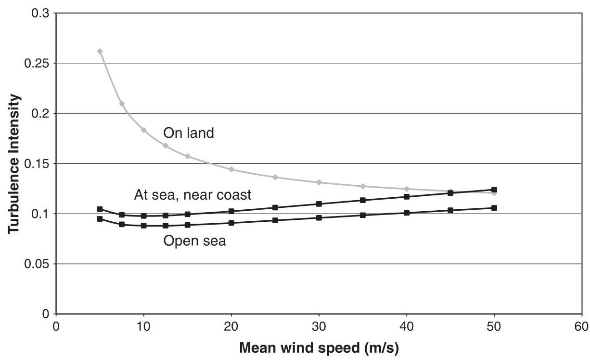

Figure 11.4 Variation of turbulence intensity with wind speed - onshore and offshore

The first term in this expression is an accepted formula for the mean turbulence intensity and the second term represents the additional 1.28 standard deviations of turbulence intensity required for the ${90}\%$ quantile. Accordingly ${I}_{15}$ can be estimated as $1/\ln \left( {{z}_{hub}/{z}_{o}\left( {15}\right) }\right)$ .

The resulting variations in turbulence intensity with wind speed at open sea and near-coastal locations are compared with that at an onshore site with medium turbulence (Category B) in Figure 11.4. It is seen that the turbulence intensity at an offshore coastal location is only slightly higher than over the open sea, but in both cases is significantly less than that onshore throughout the operational speed range of typically $5 - {25}\mathrm{\;m}/\mathrm{s}$ .

### 11.3.3 Marine conditions

The marine conditions relevant to support structure design encompass waves, currents, water level and, where appropriate, scour, seabed movement and sea ice. In the case of the IEC 61400-3 operational load cases which have their counterparts in IEC 61400-1 (i.e. all but load case 1.6), normal marine conditions are specified, with severe marine conditions applicable in load case 1.6 and extreme conditions applicable in a number of non-operational load cases.

The wave climate is most accurately described in terms of a stochastic sea state model but, in view of the non-linearity of wave loading models in storm conditions, it is necessary to introduce deterministic design waves as well. The various sea states defined in IEC 61400-3, and the alternative deterministic design waves, are described in succeeding sections, together with details of the co-existent currents and water levels to be considered. Before moving to these, however, the wave spectra commonly employed in stochastic sea state models will be introduced.

### 11.3.4 Wave spectra

The surface profile of the sea can be considered to be the result of the superposition of a very large number of tiny advancing regular waves of different amplitudes and periods upon one another. This ensemble of waves can, in turn, be described by a frequency spectrum - that is a plot of the spectral density of the square of the deviation of the water surface elevation from mean level against frequency. This spectrum is said to define the sea state, which is usually considered to persist for a period of three hours.

The key parameters of the frequency spectrum are the significant wave height, ${H}_{s}$ , and the frequency corresponding to the peak spectral density, ${f}_{p}$ . The significant wave height is traditionally defined as the average height of the highest one third of waves in a chosen reference period - normally three hours - and corresponds to the height of waves that observers will typically report. The area under the spectrum is equal to the variance of the sea surface elevation, ${\sigma }_{\eta }^{2}$ .

The shape of the frequency spectrum varies according to the fetch and the way wind speeds have varied over the fetch area beforehand. The Pierson-Moskowitz spectrum is a mathematical construct which is considered to provide a good fit to the frequency spectrum of a fully developed sea. In IEC 61400-3, it is specified as:

$$
{S}_{\eta \eta }\left( f\right)  = \frac{5}{16}\frac{{H}_{s}^{2}}{f}{\left( \frac{{f}_{p}}{f}\right) }^{4}\exp \left( {-\frac{5}{4}{\left( \frac{{f}_{p}}{f}\right) }^{4}}\right) \tag{11.3}
$$

This formulation is based on the assumption that the significant wave height, ${H}_{s}$ , is four times the standard deviation of the sea surface elevation, which is correct for a Rayleigh distribution of wave heights. However, although a Rayleigh distribution of wave heights is strictly generated only by a narrow banded frequency spectrum, it is considered to be a reasonable approximation in the case of real wave spectra.

Fully developed sea states only arise if a wind speed is maintained for long enough over a sufficient fetch. In the majority of situations, either the storm duration or the fetch or both are too small, with the result that the frequency spectra display a more exaggerated peak than the Pierson-Moskowitz (PM) spectrum. The JONSWAP (Joint North Sea Wave Project) spectrum, which was developed from wave measurements near the German island of Sylt, is a variant of the PM spectrum which models this peak enhancement. Essentially the PM spectrum is multiplied by a frequency dependent peak enhancement factor (with a maximum between 1 and 5) and by a normalising factor, which ensures that the area under the JONSWAP spectrum is the same as that under the PM spectrum.

The peak enhancement factor, ${\gamma }^{\alpha }$ , is given in terms of the significant wave height, ${H}_{s}$ , measured in metres, the peak spectral period, ${T}_{p} = 1/{f}_{p}$ seconds, and the frequency, $f.\gamma  = \exp \left\{  {{5.75} - {1.15}{T}_{p}/{H}_{s}^{0.5}}\right\}$ for ${T}_{p}/{H}_{s}^{0.5}$ in the range 3.6 to 5, $\alpha  = \exp \left\{  {-{0.5}{\left( f/{f}_{p} - 1\right) }^{2}/{\sigma }^{2}}\right\}  ,\sigma  = {0.07}$ for $f < {f}_{p}$ and $\sigma  = {0.09}$ for $f > {f}_{p}$ , and the normalising factor is $1 - {0.287}\ln \gamma .\gamma  = 5$ when ${T}_{p}/{H}_{s}^{0.5}$ is less than 3.6 and $\gamma  = 1$ when ${T}_{p}/{H}_{s}^{0.5}$ exceeds 5. It is seen that the JONSWAP spectrum is identical to the PM spectrum when ${T}_{p}/{H}_{s}^{0.5}$ exceeds 5.

The Jonswap and Pierson-Moskowitz spectra are compared for a significant wave height of $3\mathrm{\;m}$ and peak period of 7 seconds in Figure 11.5.

Figure 11.6 shows an example time history of water surface elevation from a simulation utilising the above Jonswap spectrum.

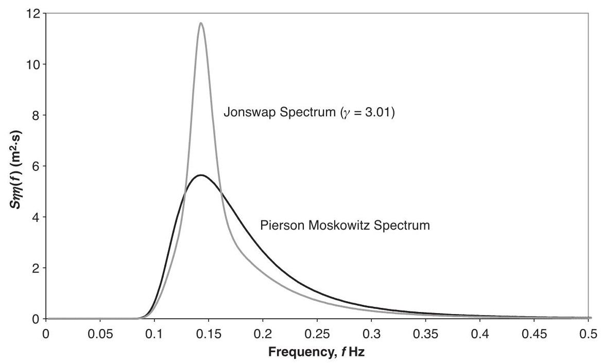

Figure 11.5 Peirson-Moskowitz and Jonswap spectra for ${H}_{s} = 3\mathrm{\;m}$ and ${T}_{p} = 7\mathrm{{sec}}$

### 11.3.5 Ultimate loads: operational load cases and accompanying wave climates

An overview of the IEC 61400-3 ultimate load cases for operational loading is given in Table 11.2, which identifies the equivalent onshore load case in IEC 61400-1 in each case.

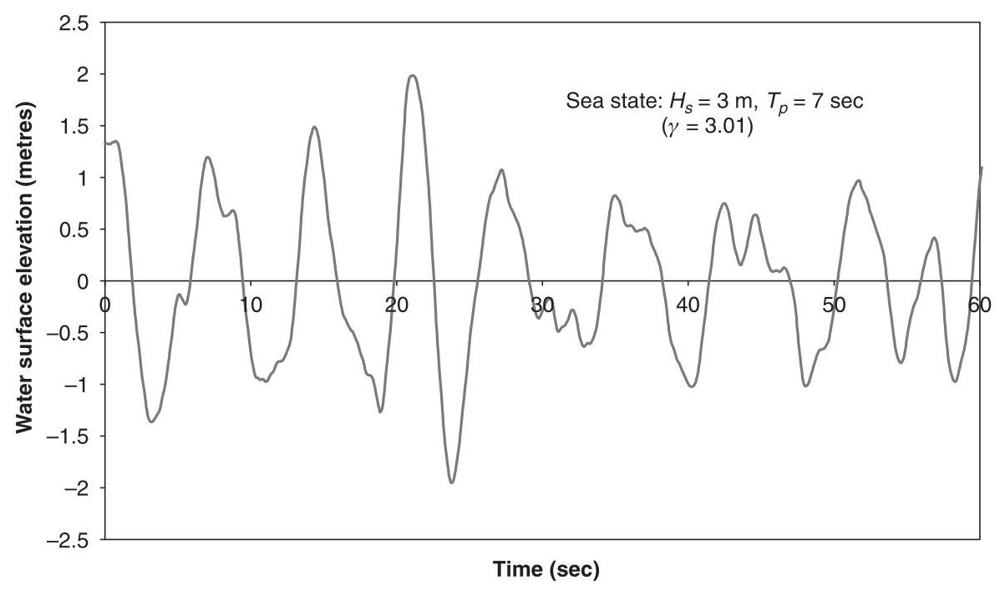

Figure 11.6 Simulated water surface elevation time history based on Jonswap spectrum

Table 11.2 Ultimate load cases during operation

<table><tr><td>M/c State</td><td>Load case no.</td><td>Equiv LC on land</td><td>Wind conditions</td><td>Wind speed range</td><td>Wave conditions</td><td>Water Level</td><td>Grid status; fault type</td><td>Load case type</td></tr><tr><td rowspan="6">Power Production</td><td>1.1</td><td>1.1</td><td>NTM</td><td>Cut-in - Cut-out</td><td>Normal sea state i.e. ${H}_{s} = E\left\lbrack  {{H}_{s} \mid  \bar{U}}\right\rbrack$ Extrapolations required</td><td>Mean</td><td>None</td><td>N</td></tr><tr><td>1.3</td><td>1.3</td><td>ETM</td><td>Cut-in - Cut-out</td><td>Normal sea state</td><td>Mean</td><td>None</td><td>N</td></tr><tr><td>1.4</td><td>1.4</td><td>ECD</td><td>Rated ±2 m/s</td><td>Normal sea state/wave</td><td>Mean</td><td>None</td><td>N</td></tr><tr><td>1.5</td><td>1.5</td><td>EWS</td><td>Cut-in - Cut-out</td><td>Normal sea state/wave</td><td>Mean</td><td>None</td><td>N</td></tr><tr><td>1.6a</td><td>None</td><td>NTM</td><td>Cut-in - Cut-out</td><td>Severe sea state - 50 yr return ${H}_{s}$ conditional on chosen wind speed</td><td>Normal range</td><td>None</td><td>N</td></tr><tr><td>1.6b</td><td>None</td><td>NTM</td><td>Cut-in - Cut-out</td><td>Severe wave height - 50 yr return wave conditional on chosen wind speed</td><td>Normal range</td><td>None</td><td>N</td></tr><tr><td rowspan="3">Power production with occurrence of fault</td><td>2.1</td><td>2.1</td><td>NTM</td><td>Cut-in - Cut-out</td><td>Normal sea state</td><td>Mean</td><td>Control system or grid loss</td><td>N</td></tr><tr><td>2.2</td><td>2.2</td><td>NTM</td><td>Cut-in - Cut-out</td><td>Normal sea state</td><td>Mean</td><td>Protection system or elec. fault</td><td>A</td></tr><tr><td>2.3</td><td>2.3</td><td>EOG</td><td>Rated ±2 m/s</td><td>Normal sea state/wave</td><td>Mean</td><td>Ext or intl. electrical fault</td><td>A</td></tr><tr><td rowspan="2">Start-up</td><td>3.2</td><td>3.2</td><td>EOG</td><td>Cut-in, rated, cut-out</td><td>Normal sea state/wave</td><td>Mean</td><td>None</td><td>N</td></tr><tr><td>3.3</td><td>3.3</td><td>EDC</td><td>Cut-in, rated, cut-out</td><td>Normal sea state/wave</td><td>Mean</td><td>None</td><td>N</td></tr><tr><td>Shut down</td><td>4.2</td><td>4.2</td><td>EOG</td><td>Rated, cut-out</td><td>Normal sea state/wave</td><td>Mean</td><td>None</td><td>N</td></tr><tr><td>Emergency Shut-dn</td><td>5.1</td><td>5.1</td><td>NTM</td><td>Rated, cut-out</td><td>Normal sea state</td><td>Mean</td><td>None</td><td>$\mathrm{N}$</td></tr></table>

Normal and abnormal load cases are indicated by the letters N and A respectively. See Table 5.2, Chapter 5, for the applicable load factors.

The wind conditions denoted by the acronyms in the table above are as follows:

NTM Normal turbulence model

ETM Extreme turbulence model

ECD Extreme coherent gust with direction change

EWS Extreme wind shear

EOG Extreme operating gust

EDC Extreme direction change

A description of each wind condition is given in Chapter 5, Section 5.4.2.

The wave conditions are specified as 'normal sea state' or 'normal wave height' in all load cases, apart from load cases 1.6a and 1.6b, for which the 'severe sea state' and the 'severe wave height' respectively apply. These four wave conditions are described in turn below.

## Normal sea state

IEC 61400-3 defines normal sea states in terms of a stochastic sea state model based on either the Pierson-Moskowitz or Jonswap spectrum as appropriate. For each normal sea state, the significant wave height is to be taken as the expected value at the mean wind speed under consideration, based on analysis of the site-specific metocean database. It is normal to plot the metocean data as a wind-wave scatter diagram, which can be used to derive the expected significant wave height at each wind speed. Typically a two-dimensional wind-wave scatter diagram is presented in the form of a table recording the percentage of time that the mean wind speed and significant wave height lie within different bins in a two-dimensional array. In a three-dimensional scatter diagram, the frequency of occurrence of different peak spectral periods, ${T}_{p}$ , or mean zero-crossing period, ${T}_{z}$ is recorded also. The mean zero-crossing period can be converted to the peak spectral period by means of the relation

$$
{T}_{p} = {T}_{z}\sqrt{\frac{{11} + \gamma }{5 + \gamma }}
$$

with gamma as defined in the preceding section.

Data from a two-dimensional scatter diagram for a site designated NL-1 about ${15}\mathrm{\;{km}}$ off Ijmuiden on the Dutch coast is illustrated in Figure 11.7. This shows the frequency of occurrence of different mean wind speeds for each significant wave height at a ${0.5}\mathrm{\;m}$ interval, with reference to a different horizontal axis in each case.

Account should be taken of the range of peak spectral periods, ${T}_{p}$ , encountered and care taken to investigate values of ${T}_{p}$ close to the support structure natural frequency where appropriate.

Marine conditions are essentially the same for all ultimate operational load cases except load case 1.6, and consist of the normal sea state in conjunction with 'normal' currents and water at mean sea level. 'Normal' currents comprise currents induced by the wind, estimated at 1% of the hourly mean wind speed, and breaking wave induced surf currents (if any). The latter may be estimated from the formula ${U}_{bw} = {2s}\sqrt{g{H}_{B}}$ where $s$ is the sea-floor slope and ${H}_{B}$ the breaking wave height.

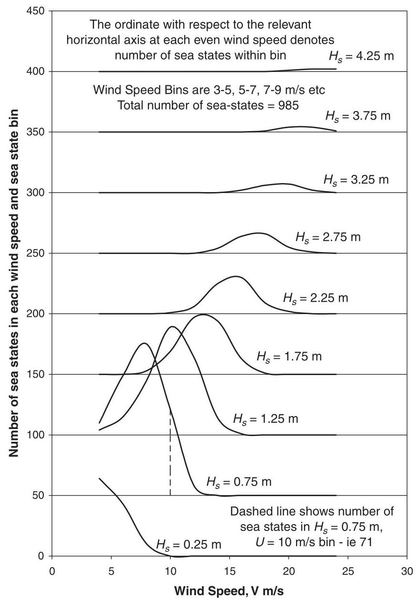

Figure 11.7 Data from wind-wave scatter diagram for site NL-1

## Normal deterministic design wave

The height of the normal deterministic design wave is taken as equal to the expected significant wave height at the mean wind speed under consideration.

## Severe sea state

The IEC 61400-3 severe sea states, which, like the normal sea states, occur during machine operation (load case 1.6a), differ from the normal sea states only in regard to the significant wave height. For each mean wind speed, $\bar{U}$ , the significant wave height, ${H}_{s,{SSS}}\left( \bar{U}\right)$ is to be taken at a value such that its recurrence period in combination with the mean wind speed is 50 years, based on extrapolation of the site-specific metocean database. The subsection entitled 'Environmental contours' at the end of this section outlines how this extrapolation may be carried out. As with the normal sea state, the most adverse anticipated value of the peak spectral period should be considered.

The other marine conditions for load case 1.6, consist of 'normal' currents and water at any level within the 'normal water level range', which may be taken as the range of astronomic tides.

## Severe deterministic design wave

IEC 61400-3 load case 1.6b specifies deterministic design waves derived from the significant wave height for the severe sea state (above) at each mean wind speed. The height of the deterministic design wave, or severe wave height, ${H}_{SWH}\left( \bar{U}\right)$ , is the expected height of the extreme wave in the applicable severe sea state. If the wave heights are Rayleigh distributed, then the probability of an individual wave height exceeding $H$ is

$$
P\left( {h > H}\right)  = \exp \left( {-{0.5}{\left( \frac{H/2}{{\sigma }_{\eta }}\right) }^{2}}\right)  = \exp \left( {-2{\left( \frac{H}{{H}_{s}}\right) }^{2}}\right) \tag{11.4}
$$

and the wave height likely to be exceeded by the highest of $N$ waves is ${H}_{s}\sqrt{{0.5}\ln N}$ . The expected magnitude of the extreme wave is slightly higher than this at ${H}_{s}\left( {\sqrt{{0.5}\ln N} + {0.2886}/\sqrt{2\ln N}}\right)$ .

For a sea state with mean wave period of 10.8 seconds, there will be 1000 waves in the three-hour reference period, so the extreme wave is likely to exceed ${1.86}{\mathrm{H}}_{s}$ and its expected magnitude is ${1.94}{H}_{\mathrm{s}}$ . However, Annex G of IEC 61400-3 permits the height of the deterministic design wave for each severe sea state to be calculated as ${H}_{SWH}\left( \bar{U}\right)  = {1.86}{H}_{s,{SSS}}\left( \overrightarrow{U}\right)$ .

The wave period to be adopted is the value within the range ${11.1}\sqrt{{H}_{s,{SSS}}\left( \bar{U}\right) /g}$ to ${14.3}\sqrt{{H}_{s,{SSS}}\left( \bar{U}\right) /g}$ that results in the highest wave loading.

Load case 1.6b can be omitted if non-linear wave kinematics can be properly modelled in the analysis of load case 1.6a.

## Environmental contours

One of the load cases representing power production, load case 1.6, is concerned with 50-year return combinations of mean wind speed, $\bar{U}$ , and significant wave height, ${H}_{s}$ , which, taken together, can be considered as forming an environmental contour in $\bar{U},{H}_{s}$ space. A method for deriving such a contour using the Inverse First Order Reliability Method (IFORM) is set out in Annex G of IEC 61400-3 and is described in this section.

The probability that a certain combination of mean wind speed and significant wave height will not be exceeded may be written $F\left( {{H}_{s} \mid  \bar{U}}\right)  \cdot  F\left( \bar{U}\right)$ where $F\left( \bar{U}\right)$ is the cumulative distribution function (CDF) of the mean wind speed and $F\left( {{H}_{s} \mid  \bar{U}}\right)$ is the CDF of the significant wave height conditional on the mean wind speed.

For the 50-year return combination, this probability must equate to $1 - 1/N$ , where $N$ is the number of sea states in 50 years - that is, ${50}\left( {365}\right) {24}/3 = {146},{000}$ for a three-hour sea state duration.

The environmental contour may be derived by utilising a transformation from mean wind speed and significant wave height to two uncorrelated normally distributed variables, ${U}_{1}$ and ${U}_{2}$ , so that

$$
F\left( \bar{U}\right)  = \Phi \left( {U}_{1}\right) \;\text{ and }\;F\left( {{H}_{S} \mid  \bar{U}}\right)  = \Phi \left( {U}_{2}\right) \tag{11.5}
$$

$$
\text{ where }\Phi \left( U\right)  = \frac{1}{\sqrt{2\pi }}{\int }_{-\infty }^{U}\exp \left\lbrack  {-{u}^{2}/2}\right\rbrack  {du} \tag{11.6}
$$

The joint probability density function (pdf) of the normally distributed variables ${U}_{1}$ and ${U}_{2}$ is

$$
p\left( {{U}_{1},{U}_{2}}\right)  = \frac{1}{\sqrt{2\pi }}\exp \left\lbrack  {-\frac{{U}_{1}^{2}}{2}}\right\rbrack   \cdot  \frac{1}{\sqrt{2\pi }}\exp \left\lbrack  {-\frac{{U}_{2}^{2}}{2}}\right\rbrack   = \frac{1}{2\pi }\exp \left\lbrack  {-\frac{{U}_{1}^{2} + {U}_{2}^{2}}{2}}\right\rbrack \tag{11.7}
$$

so the joint pdf is axi-symmetric about the origin and points in ${U}_{1},{U}_{2}$ space lying at the same radius from the origin have the same probability density. The joint pdf is illustrated in Figure 11.8.

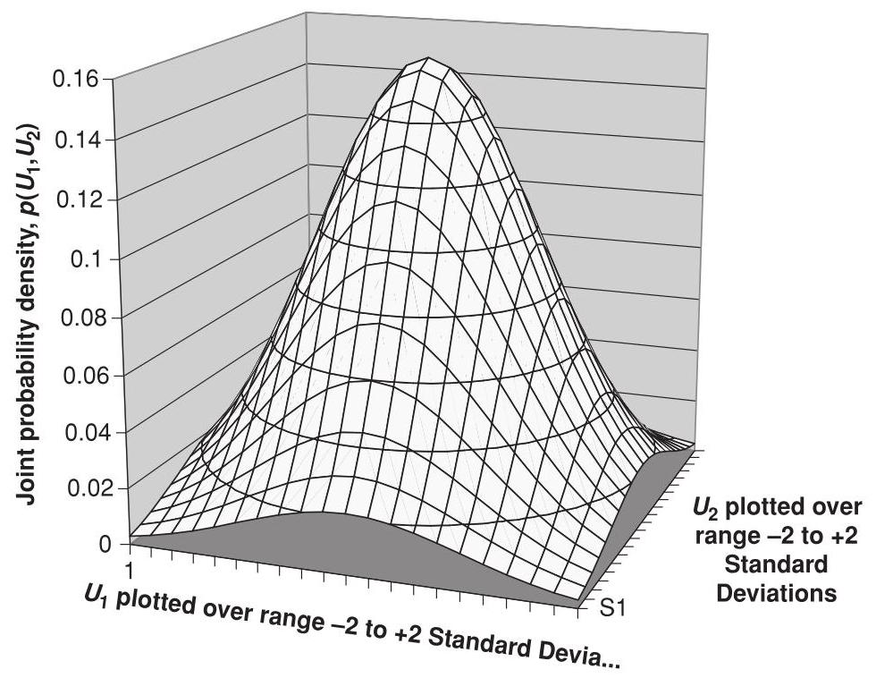

Figure 11.8 Joint probability density of two uncorrelated normally distributed variables

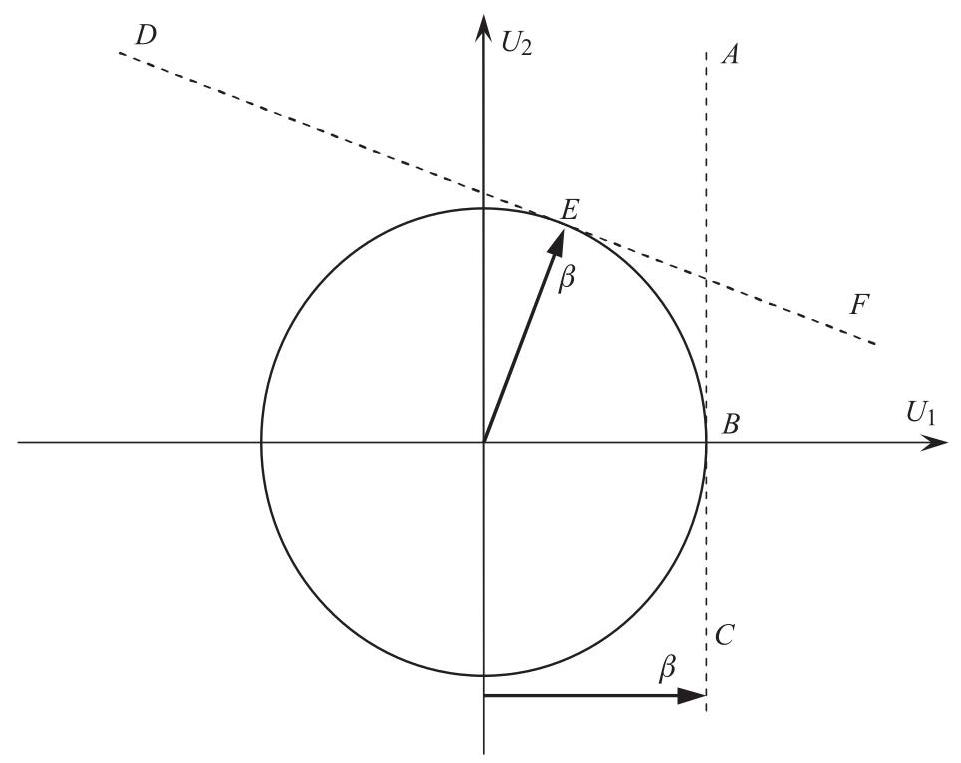

Figure 11.9 Circle of radius $\beta$ in ${U}_{1} \cdot  {U}_{2}$ space, representing environmental contour

Clearly the $N$ year return wind speed, irrespective of significant wave height, is that for which $F\left( \bar{U}\right)  = \Phi \left( {U}_{1}\right)  = 1 - 1/N$ , that is, for which ${U}_{1} = {\Phi }^{-1}\left( {1 - 1/N}\right)$ . In ${U}_{1},{U}_{2}$ space, the probability that the wind exceeds the $N$ year return value is represented by the probability that the point ${U}_{1},{U}_{2}$ lies to the right of the line ABC in Figure 11.9, with $\beta$ set equal to ${\Phi }^{-1}\left( {1 - 1/N}\right)$ .

Given that the volume under the joint probability density function surface (Figure 11.8) lying beyond any tangent to the circle radius $\beta$ is the same, it follows that the probability that a point ${U}_{1},{U}_{2}$ lies beyond the tangent DEF is the same as the probability that a point ${U}_{1},{U}_{2}$ lies beyond the tangent ABC - that is, $1/N$ . Thus, the circle radius $\beta$ is the internal envelope of a family of tangents such that the probability of ${U}_{1},{U}_{2}$ lying outside each one is $1/N$ . In this sense, it represents the $N$ -year environmental contour transformed into two dimensional normal space. Note that the portions of the circle for which ${U}_{1}$ or ${U}_{2}$ is negative represent $N$ -year return minimum values in each case.

A procedure for the practical application of the method to metocean data in the form of a mean wind speed/significant wave height scatter diagram is as follows:

1. (a) Using the scatter diagram, calculate the non-exceedance probability, $F\left( \bar{U}\right)$ , associated with the mean wind speed, $\bar{U}$ , of a particular wind speed bin.

(b) Calculate the corresponding value of the normally distributed variable ${U}_{1} = {\Phi }^{-1}\left( {F\left( \bar{U}\right) }\right) .$

(c) Calculate ${U}_{2} = \sqrt{{\beta }^{2} - {U}_{1}^{2}}$ . (The negative root corresponds to the minimum value of ${H}_{s}$ .)

(d) Calculate the 50 year return significant wave height conditional on $\bar{U}$ as

$$
{H}_{s,{SSS}}\left( \bar{U}\right)  = {\bar{H}}_{s}\left( \bar{U}\right)  + {U}_{2}{\sigma }_{{H}_{S}}\left( \bar{U}\right)
$$

where ${\bar{H}}_{s}\left( \bar{U}\right)$ and ${\sigma }_{{H}_{S}}\left( \bar{U}\right)$ are the mean and standard deviation of the significant wave height conditional on $\bar{U}$ extracted from the scatter diagram, respectively.

2. Repeat step 1. for the other wind speed bins.

3. Plot environmental contour linking the points ${H}_{s,{SSS}}\left( \bar{U}\right) ,\bar{U}$ .

Note that in the above procedure, it is assumed that the significant wave heights conditional on $\bar{U}$ are normally distributed, which may not necessarily be consistent with the data. It is more conservative to assume that the significant wave heights are log-normally distributed. Whichever model is adopted, goodness of fit tests - visual and/or statistical - should be carried out to confirm its suitability.

An example of 50-year return environmental contours derived from the scatter diagram for the NL-1 site (see Figure 11.7) is given in Figure 11.10. One contour is based on a normal distribution of significant wave heights conditional on $\bar{U}$ and the other is based on a lognormal distribution.

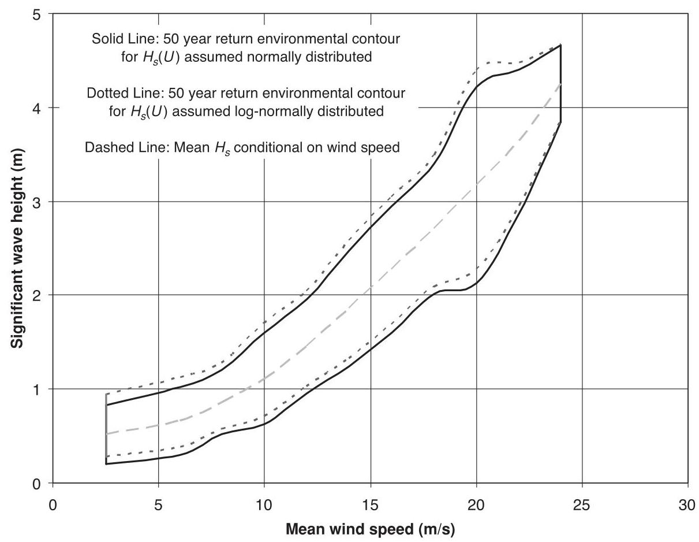

Figure 11.10 50-year significant wave height against mean wind speed environmental contours derived from site NL-1 scatter diagram

### 11.3.6 Ultimate loads: non-operational load cases and accompanying wave climates

An overview of the IEC 61400-3 ultimate load cases for non-operational loading is given in Table 11.3, which identifies the equivalent onshore load case in IEC 61400-1 in each case.

It is seen that for each of the four IEC 61400-1 load cases applicable onshore, IEC 61400-3 specifies two or three sub load cases for use offshore, which are distinguished by suffices $a, b$ and $c$ . These differ as follows:

- Suffix $a$ load cases specify the extreme turbulent wind in conjunction with the extreme stochastic sea state.

Table 11.3 Ultimate non-operational load cases

<table><tr><td>M/c state</td><td>Load case no.</td><td>Equiv LC on land</td><td>Wind conditions</td><td>Wind speed</td><td>Wave conditions</td><td>Water Level</td><td>Grid, yaw and fault status</td><td>Load case type</td></tr><tr><td rowspan="7">Parked (standing still or idling)</td><td>6.1a</td><td>6.1</td><td>50-yr EWM turbulent</td><td>${k}_{1}{U}_{ref}$</td><td>50-yr extreme sea state ${H}_{s} = \; {k}_{2}{H}_{s50}$</td><td>Extreme range</td><td>None</td><td>N</td></tr><tr><td>6.1b</td><td>6.1</td><td>50-yr EWM steady</td><td>${U}_{e50}$</td><td>50-yr reduced wave height $H =  \sim  {0.7}{H}_{50}$</td><td>Extreme range</td><td>None</td><td>N</td></tr><tr><td>6.1c</td><td>None</td><td>50-yr RWM steady</td><td>0.786 ✘ ${U}_{e50}$</td><td>50-yr extreme wave height $H = {H}_{50}$</td><td>Extreme range</td><td>None</td><td>N</td></tr><tr><td>6.2a</td><td>6.2</td><td>50-yr EWM turbulent</td><td>${k}_{1}{U}_{ref}$</td><td>50-yr extreme sea state ${H}_{s} = \; {k}_{2}{H}_{s50}$</td><td>Extreme range</td><td>Grid loss, ${180}^{ \circ  }$ yaw</td><td>A</td></tr><tr><td>6.2b</td><td>6.2</td><td>50-yr EWM steady</td><td>${U}_{e50}$</td><td>50 yr Reduced wave height $H =  \sim  {0.7}{H}_{50}$</td><td>Extreme range</td><td>Grid loss, ${180}^{ \circ  }$ yaw</td><td>A</td></tr><tr><td>6.3a</td><td>6.3</td><td>1-yr EWM turbulent</td><td>0.8 ✘ ${k}_{1}{U}_{ref}$</td><td>1-yr extreme sea state ${H}_{s} = {k}_{2} \; {H}_{s1}$</td><td>Normal range</td><td>Extreme yaw $\left( {20}^{ \circ  }\right)$</td><td>N</td></tr><tr><td>6.3b</td><td>6.3</td><td>1-yr EWM steady</td><td>${U}_{e1}$</td><td>1-yr reduced wave height $H =  \sim  {0.7}{H}_{1}$</td><td>Normal range</td><td>Extreme yaw $\left( {30}^{ \circ  }\right)$</td><td>N</td></tr><tr><td rowspan="3">Parked with fault condition</td><td>7.1a</td><td>7.1</td><td>1-yr EWM turbulent</td><td>${0.8} \times \; {k}_{1}{U}_{ref}$</td><td>1-yr extreme sea state ${H}_{s} = {k}_{2} \; {H}_{s1}$</td><td>Normal range</td><td>Fault condition</td><td>A</td></tr><tr><td>7.1b</td><td>7.1</td><td>1-yr EWM steady</td><td>${U}_{e1}$</td><td>1-yr reduced wave height $H =  \sim  {0.7}{H}_{1}$</td><td>Normal range</td><td>Fault condition</td><td>A</td></tr><tr><td>7.1c</td><td>None</td><td>1-yr RWM steady</td><td>0.786 $\times \; {U}_{e1}$</td><td>1-yr extreme wave height $H = {H}_{1}$</td><td>Normal range</td><td>Fault condition</td><td>A</td></tr></table>

EWM and RWM stand for extreme wind speed model and reduced wind speed model respectively.

- Suffix $b$ load cases specify the extreme steady wind in conjunction with the ’reduced’ deterministic design wave ( ${0.7} \times$ height of extreme deterministic design wave).

- Suffix $c$ load cases specify the ’reduced’ steady wind ( ${1.1}/{1.4} \times$ extreme steady wind) in conjunction with the extreme deterministic design wave.

The designer is given the option of considering either the stochastic load case $a$ or deterministic cases $b$ and $c$ (where included). The wind and wave/sea state return periods are 50 years for 'fault-free' load cases 6.1 and 6.2 and one year for load cases 6.3 and 7.1, which involve extreme yaw and a machine fault respectively. Note that the grid loss load case 6.2 can include a yaw error of up to ${180}^{ \circ  }$ , unless six hours back-up power supply is provided for the control and yaw system.

Note that in the suffix $a$ load cases, it is assumed that the extreme stochastic sea state occurs at the same time as the extreme turbulent wind.

The suffix $b$ and $c$ load cases simplify the investigation of non-linear wave loading, which is computationally demanding for the multiple superposed linear waves forming the stochastic sea state of the suffix $a$ load case. Unfortunately, the suffix $b$ and $c$ load cases cannot capture the dynamic response of the turbine structure to the turbulent wind, although Annex D of the standard describes how the steady wind speed should be increased above the design value to correct for this. Two deterministic load cases are required, because the possibility of the extreme gust and the extreme wave loadings occurring simultaneously is assumed to be negligible and instances of dominant wind and dominant wave loading both have to be catered for. The chosen reduction factors of 0.7 for wave height in the suffix $b$ load cases and ${1.1}/{1.4}\left( { = {0.79}}\right)$ for wind speed in the suffix $c$ load cases are based on work by Tarp-Johansen (2005). This showed that, if the wind and wave loading are treated as Gaussian quantities and the wave loading is drag-dominated, a reduction factor of $\sqrt{0.35} = {0.59}$ for wave height in the suffix $b$ dominant wind load cases and a reduction factor of $\sqrt{0.65} = {0.81}$ for wind speed in the suffix $c$ dominant wave load cases result in the best fit of those load cases to the total loading, regardless of the relative wind and wave load magnitudes.

Consideration of the effect of possible misalignment between wind and wave directions is required for all the non-operational load cases.

## Extreme sea state

The stochastic sea state model for the IEC 61400-3 extreme sea state is the same as for the normal sea state in Section 11.2.5, but the significant wave heights to be considered are those with a 50 year or one year return period, depending on the load case. These may be determined by extrapolation based on the tail of the long-term distribution of significant wave heights. As with the normal sea state, the most adverse anticipated value of the peak spectral period is to be considered.

The other marine conditions consist of extreme currents (including currents generated by tides and storm surges) and water level range with the same recurrence period as the significant wave height combined with storm surge.

As the extreme wind speed ${U}_{\text{ ref }}$ is defined as the ten-minute mean, and the reference period for the significant wave height is normally three hours, a common averaging period for both parameters needs to be adopted for the simulations of extreme wind and wave loading in the suffix $a$ load cases. The standard uses a common averaging period of one hour, defining the hourly mean wind speed as the ten-minute mean multiplied by a factor, ${k}_{1}$ , of 0.95 and the one hour value of the turbulence standard deviation as the ten-minute value plus ${0.2}\mathrm{\;m}/\mathrm{s}$ . Similarly, the significant wave height for a three-hour reference period is multiplied by the factor, ${k}_{2}$ , of 1.09 to convert it to the value appropriate to the shorter, one-hour reference period.

Normally at least six one-hour simulations are required, but shorter simulations are acceptable if it can be demonstrated that this will not reduce the extreme response - for example, by the use of the 'constrained wave' described in Section 11.3.10.

## Extreme deterministic design wave

Two extreme deterministic design waves are specified - with return periods of 50 years and one year.

If the wave heights in the extreme sea states are Rayleigh distributed, then the wave height expected to be exceeded by the highest of $N$ waves is ${H}_{s}\sqrt{{0.5}\ln N}$ . Taking $N = {1000}$ as before results in an extreme wave height with 50-year and one-year return periods of ${H}_{50} = {1.86}{H}_{s50}$ and ${H}_{1} = {1.86}{H}_{s1}$ respectively.

## Modification of wave climate in shallow water

Waves begin to break when the wave height reaches ${78}\%$ of the mean water depth, so the upper tail of the Rayleigh distribution of wave heights becomes curtailed as deep sea waves advance into shallower water, leading to conservatism in the use of the ${1.86}{\mathrm{H}}_{s}$ formula for the wave height exceeded by the largest of 1000 waves. Battjes and Groeneddijk (2000) have developed a model for calculating the modified distribution of wave heights for waves propagating over a uniformly sloping seabed - see Annex C of IEC-61400-3. The model depends on the availability of measured site-specific wave data and is applicable provided the wave direction is within ${30}^{ \circ  }$ of the direction of steepest seabed slope.

### 11.3.7 Fatigue loads

An overview of the IEC 61400-3 fatigue load cases - operational and non-operational - is given in Table 11.4, which identifies the equivalent onshore load case in IEC 61400-1 in each case.

The wind conditions and water levels denoted by the acronyms in the table above are as follows:

NTM Normal turbulence model

NWP Normal wind profile (following a power law with exponent of 0.14), without turbulence

NSS Normal sea state

NWLR Normal water level range

MSL Mean Sea Level

Sea currents are ignored.

A range of significant wave heights and wave periods should be considered at each wind speed, with the duration of each combination of wind speed and sea state extracted from a site specific three-dimensional scatter diagram. In particular ${T}_{p}$ values corresponding to the natural frequency of the support structure should be investigated. However, it is preferable to avoid a very large number of simulations, so it is advantageous to lump load cases together

Table 11.4 Fatigue load cases

<table><tr><td>M/c state</td><td>Load case no.</td><td>Equiv LC on land</td><td>Wind conditions</td><td>Wind speed</td><td>Wave conditions</td><td>Water level</td><td>Grid, yaw and fault status</td></tr><tr><td>Power production</td><td>1.2</td><td>1.2</td><td>NTM</td><td>Cut-in - Cut-out</td><td>NSS Joint prob. distribution of ${H}_{s},{T}_{p},\bar{U}$</td><td>NWLR or ≥MSL</td><td>None</td></tr><tr><td>Power production with fault</td><td>2.4</td><td>2.4</td><td>NTM</td><td>Cut-in - Cut-out</td><td>Normal sea state i.e. ${H}_{s} = \; E\left\lbrack  {{H}_{s} \mid  \bar{U}}\right\rbrack$</td><td>NWLR or ≥MSL</td><td>Fault condition</td></tr><tr><td>Start-up</td><td>3.1</td><td>3.1</td><td>NWP</td><td>Cut-in - Cut-out</td><td>Normal Sea State i.e. ${H}_{s} = \; E\left\lbrack  {{H}_{s} \mid  \bar{U}}\right\rbrack$</td><td>NWLR or ≥MSL</td><td>None</td></tr><tr><td>Normal shut down</td><td>4.1</td><td>4.1</td><td>NWP</td><td>Cut-in - Cut-out</td><td>Normal sea state i.e. ${H}_{s} = \; E\left\lbrack  {{H}_{s} \mid  \bar{U}}\right\rbrack$</td><td>NWLR or ≥MSL</td><td>None</td></tr><tr><td>Parked</td><td>6.4</td><td>6.4</td><td>NTM</td><td>$< {0.7}{U}_{ref}$</td><td>NSS joint prob. distribution of ${H}_{s},{T}_{p},\bar{U}$</td><td>NWLR or ≥MSL</td><td>None</td></tr><tr><td>Parked with fault condition</td><td>7.2</td><td>None</td><td>NTM</td><td>$< {0.56}{U}_{ref}$</td><td>NSS joint prob. distribution of ${H}_{s},{T}_{p},\bar{U}$</td><td>NWLR or ≥MSL</td><td>Fault condition</td></tr></table>

if possible. The errors due to coarsening the wave height and wave period bins can be reduced if the 'damage equivalent mean wave height' and 'damage equivalent mean period' are calculated for each bin. The former is determined as

$$
{H}_{s} = {\left( \frac{1}{N}\mathop{\sum }\limits_{{i = 1}}^{N}{H}_{{s}_{i}}^{m}\right) }^{\frac{1}{m}}
$$

where $m$ is the inverse slope of the $S - N$ curve, and the latter is taken as the reciprocal of the mean wave frequency. In a case study, Evans (2005) showed that, for a wind speed bin width of $2\mathrm{\;m}/\mathrm{s}$ , the error in damage equivalent load resulting from a move from ${0.5}\mathrm{\;m}$ wave height and ${0.5}\mathrm{\;s}$ wave period bin widths to a single wave height/wave period bin with this approach was only a few per cent.

IEC 61400-3 specifies two fatigue load cases for machines that are parked or idling - one without and the other with a fault condition. The latter is absent from IEC 61400-1, but is considered necessary offshore because of the potentially much longer machine down-times and the large reduction in aerodynamic damping when the turbine is shut down.

The maximum wind speed to be considered for fatigue loading on a parked turbine in the absence of a fault (DLC 6.4) is ${0.7}{U}_{ref}$ - a value likely to be exceeded for 0.6 hour per year.

However, for fatigue loading on a parked turbine with a fault condition (DLC 7.2), the upper wind speed to be considered is only ${0.56}{U}_{ref}$ , which is likely to be exceeded for 19 hours per year. No guidance is given on the likely total turbine down time corresponding to DLC 7.2 and clearly this needs to be predicted with great care.

### 11.3.8 Wave theories

Several wave theories exist to describe the fluid motion within regular, periodic, two-dimensional waves, but only three are routinely used for the calculation of loads on offshore structures - Airy, Stokes and Dean's Stream Function Theories.

Airy wave theory is linear and, therefore, allows the water particle kinematics of a real sea state, consisting of a multitude of small waves of varying frequencies and wave lengths, to be modelled by superposition. However, as wave height increases in relation to water depth or wave-length, Airy theory becomes less accurate and non-linear theories such as Stokes and Dean's Stream Function have to be employed instead. However, because of their nonlinearity, these theories can only be applied to single, regular wave trains. Figure 11.11 shows which theories are applicable for different relationships between wave height, water depth and wave period.

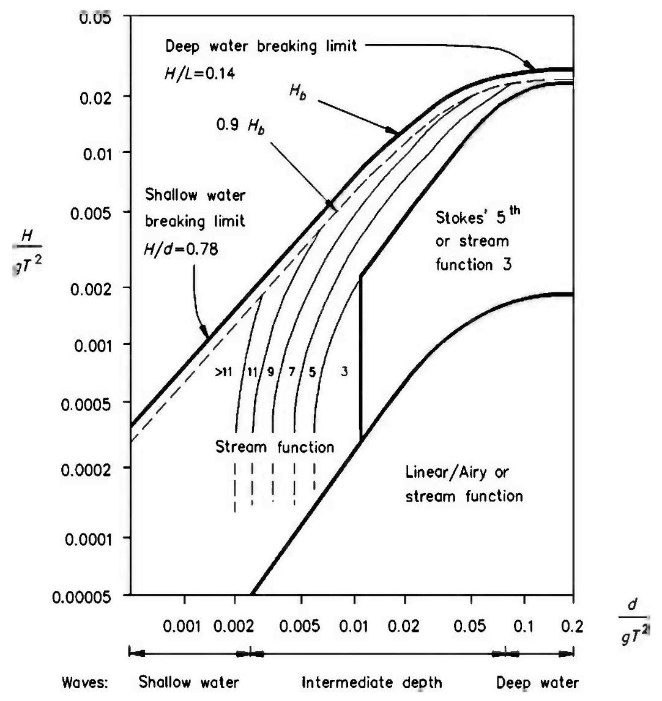

Figure 11.11 Regular wave theory selection diagram: log scales. Barltrop et al., 1990. Reproduced under the Open Government License v1.0

It is apparent from Figure 11.11 that Dean's Stream Function theory can be used for all but near breaking waves. In view of this, and the relative complexity of Stokes Wave Theory, the latter is not discussed further and this section concentrates on the other two theories.

## Airy wave theory

The fluid motion within regular, periodic two-dimensional waves must satisfy the Laplace equation, ${\nabla }^{2}\phi \left( {x, z, t}\right)  = 0$ , where $\phi$ is the velocity potential, defined so that horizontal and vertical particle velocities are given by $u =  - \partial \phi /\partial x$ and $w =  - \partial \phi /\partial z$ respectively. $x$ is the horizontal co-ordinate parallel to the direction of wave motion and $z$ is the vertical co-ordinate measured upwards with respect to mean water level, as shown in Figure 11.12.

The fluid motion must also satisfy five boundary conditions as follows:

1. Zero flow vertical particle velocity, $w$ , at the seabed, which is assumed horizontal.

2. Zero flow perpendicular to the free surface.

3. The unsteady form of the Bernouilli equation at the free surface.

4. The periodic boundary condition in time $- \phi \left( {x, z, t}\right)  = \phi \left( {x, z, t + T}\right)$ , where $T$ is the wave period.

5. The periodic boundary condition in space $- \phi \left( {x, z, t}\right)  = \phi \left( {x + L, z, t}\right)$ , where $L$ is the wave length.

Condition (2) is expressed as:

$$
w = \frac{\partial \eta }{\partial t} + u\frac{\partial \eta }{\partial x} \tag{11.8}
$$

where $\eta$ is the water surface elevation above the mean and $u$ is the horizontal water particle velocity. The atmospheric pressure acting on the free surface of the water is treated as constant, so the unsteady form of the Bernouilli equation in condition (3) becomes:

$$
- \frac{\partial \phi }{\partial t} + \frac{{u}^{2} + {w}^{2}}{2} + {gz} = C\left( t\right) \tag{11.9}
$$

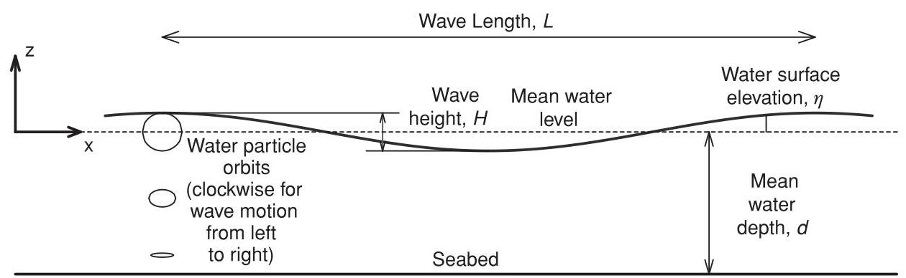

Figure 11.12 Parameter definitions and co-ordinates for regular, periodic, two-dimensional waves

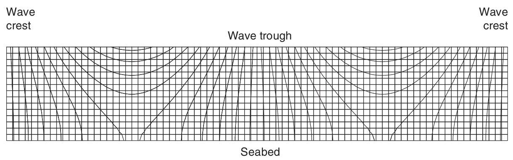

Figure 11.13 Velocity potential contours for Airy wave theory

According to Airy wave theory, the velocity potential at any point in the water is:

$$
\phi  =  - \frac{Hg}{2\omega }\frac{\cosh k\left( {z + d}\right) }{\cosh {kd}}\sin \left( {{kx} - {\omega t}}\right) \tag{11.10}
$$

where $H$ is the wave height, $d$ is the mean water depth, $k = {2\pi }/L$ and $\omega  = {2\pi }/T$ . Figure 11.13 shows the corresponding velocity potential contours over a full wave length for the case of a ${15}\mathrm{\;m}$ water depth and ${80}\mathrm{\;m}$ wave length. Note that the contours are shown as extending only up to still water level, as Airy wave theory only approaches 100% accuracy as the wave height becomes vanishingly small. Assuming the waves are moving from left to right, the maximum velocity potential is at the water surface at the right hand quarter point.

The equation for velocity potential satisfies conditions (1), (4) and (5) above exactly, but only satisfies 'linearised' versions of Equations 11.8 and 11.9.

The 'linearised' version of Equation 11.9 is obtained by expanding the left hand side of the equation with respect to the value at $z = 0$ using a truncated Taylor’s series to give.

$$
{\left( -\frac{\partial \phi }{\partial t} + \frac{{u}^{2} + {w}^{2}}{2} + gz\right) }_{z = \eta } = {\left( -\frac{\partial \phi }{\partial t} + \frac{{u}^{2} + {w}^{2}}{2} + gz\right) }_{z = 0}
$$

$$
+ \eta {\left( -\frac{{\partial }^{2}\phi }{\partial t\partial z} + \frac{\partial }{\partial z}\left( \frac{{u}^{2} + {w}^{2}}{2}\right)  + g\right) }_{z = 0} + \cdots . = C\left( t\right)
$$

(11.11)

Then, assuming all first order terms are small, all second order terms are very small, and can be neglected, giving

$$
{\left( -\frac{\partial \phi }{\partial t}\right) }_{z = 0} + {\eta g} = C\left( t\right) \;\text{ or }\;\eta  = \frac{1}{g}{\left( \frac{\partial \phi }{\partial t}\right) }_{z = 0} + \frac{1}{g}C\left( t\right) \tag{11.12}
$$

Substituting Equation 11.10 in Equation 11.12 and noting that the spatial and temporal means of the water surface elevation are defined as zero yields $C\left( t\right)  = 0$ and

$$
\eta  = \frac{H}{2}\cos \left( {{kx} - {\omega t}}\right) \tag{11.13}
$$

Application of a similar procedure to Equation 11.8 yields $w = \partial \eta /\partial t$ at $z = 0$ , and substitution of

$$
w =  - {\left( \frac{\partial \phi }{\partial z}\right) }_{z = 0} = \frac{Hgk}{2\omega }\frac{\sinh {kd}}{\cosh {kd}}\sin \left( {{kx} - {\omega t}}\right) \tag{11.14}
$$

and ${\left( \partial \eta /\partial t\right) }_{z = 0} = \left( {H/2}\right) \omega \sin \left( {{kx} - {\omega t}}\right)$ results in

$$
L = \frac{g{T}^{2}}{2\pi }\tanh {kd} \tag{11.15}
$$

The horizontal and vertical particle velocities at any depth, $u$ and $w$ , are given by

$$
u =  - \left( \frac{\partial \phi }{\partial x}\right)  = \frac{Hgk}{2\omega }\frac{\cosh k\left( {z + d}\right) }{\cosh {kd}}\cos \left( {{kx} - {\omega t}}\right)  = \frac{H\omega }{2}\frac{\cosh k\left( {z + d}\right) }{\sinh {kd}}\cos \left( {{kx} - {\omega t}}\right)
$$

(11.16)

$$
w =  - \left( \frac{\partial \phi }{\partial z}\right)  = \frac{Hgk}{2\omega }\frac{\sinh k\left( {z + d}\right) }{\cosh {kd}}\sin \left( {{kx} - {\omega t}}\right)  = \frac{H\omega }{2}\frac{\sinh k\left( {z + d}\right) }{\sinh {kd}}\sin \left( {{kx} - {\omega t}}\right)
$$

(11.17)

The particle displacements can be obtained by integrating the above expressions. The water particles follow elliptical orbits with the major axis horizontal, as shown in Figure 11.12.

Figure 11.14 shows the accuracy of Airy wave theory in predicting the horizontal particle velocity at the wave crest by comparison with the more accurate Dean/Stokes ${5}^{\text{ th }}$ theories for different $H/g{T}^{2}$ and $d/g{T}^{2}$ ratios. This Figure is taken from Dynamics of Fixed Marine Structures by Barltrop and Adams (1991), which contains similar Figures applicable to the prediction accuracy for other parameters.

## Dean's stream function theory

Dean's stream function theory (Dean and Dalrymple, 1984) is effectively an extension of Airy wave theory achieved by the addition of a series of harmonic terms to the expression for velocity potential, which enable the theory to satisfy the boundary conditions at the free surface (Equations 11.8 and 11.9) without the need for 'linearisation'. However, rather than use the velocity potential, the theory is developed with reference to the parameter known as the stream function, which is now introduced.

The paths followed by water particles within the waves are termed streamlines, along each of which the stream function parameter has a constant value. The stream function is defined such that its gradient perpendicular to the streamlines is proportional to the local particle velocity, so that

$$
u =  - \frac{\partial \psi }{\partial z}\;\text{ and }\;w = \frac{\partial \psi }{\partial x} \tag{11.18}
$$

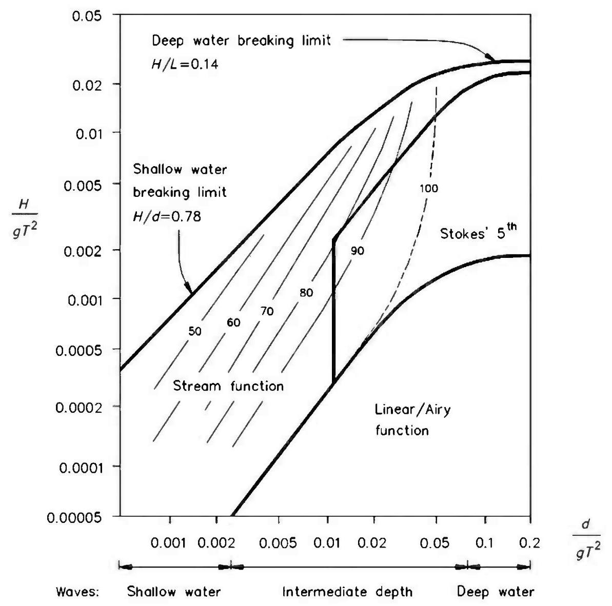

Figure 11.14 Horizontal particle velocity at the wave crest: Airy theory as % of theory shown in Figure 11.11. Barltrop et al., 1990. Reproduced under the Open Government License v1.0

For Airy wave theory, the stream function is

$$
\psi  =  - \frac{Hg}{2\omega }\frac{\sinh k\left( {z + d}\right) }{\cosh {kd}}\cos \left( {{kx} - {\omega t}}\right) \tag{11.19}
$$

The corresponding streamlines are shown over a full wave length in Figure 11.15, for the case of a ${15}\mathrm{\;m}$ water depth and ${80}\mathrm{\;m}$ wave length.

The streamlines in Equation 11.19 and Figure 11.15 are defined with respect to a fixed frame of reference. However, it is perfectly possible to define them with respect to a moving frame of reference which travels at the same speed as the wave crests and troughs - that is, with celerity $C = L/T$ . Then the Airy wave theory stream function becomes

$$
\overline{\psi } = {Cz} - \frac{Hg}{2\omega }\frac{\sinh k\left( {z + d}\right) }{\cosh {kd}}\cos \left( {kx}\right) \tag{11.20}
$$

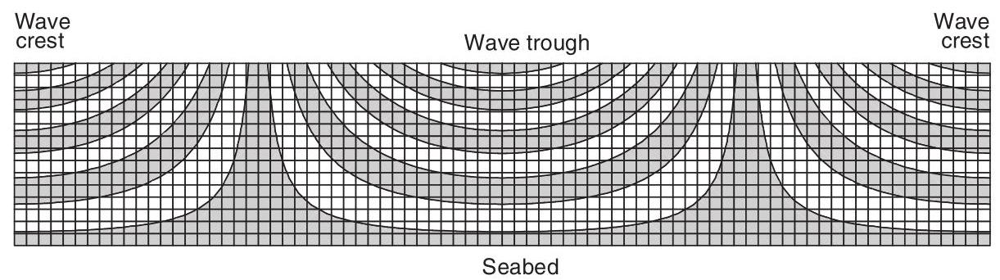

Figure 11.15 Streamlines for Airy wave theory with the frame of reference fixed. Note that, as with the figure illustrating the velocity potential contours, the streamlines are shown as only extending up to still water level, because Airy wave theory only approaches 100% accuracy as the wave height becomes vanishingly small

which has the advantage of being invariant with time. The streamlines corresponding to the moving frame of reference are shown over a full wave length in Figure 11.16, for the same case as above. However, for clarity a relatively large wave height of $4\mathrm{\;m}$ is chosen, for which the Airy solution is inaccurate.

Dean's stream function is defined with respect to the same moving frame of reference, and consists of a harmonic series of terms as follows:

$$
\overline{\psi } = {Cz} + \mathop{\sum }\limits_{{n = 1}}^{N}{X}_{n}\sinh {nk}\left( {z + d}\right) \cos \left( {nkx}\right) \tag{11.21}
$$

For $N = 1$ , Equation 11.21 equates to Equation 11.20, so

$$
{X}_{1} =  - \frac{Hg}{{2\omega }\cosh {kd}} \tag{11.22}
$$

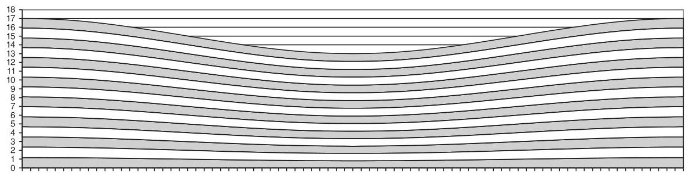

Figure 11.16 Streamlines for Airy wave theory with frame of reference moving with the wave train

The corresponding water particle velocities are:

$$
u =  - \frac{\partial \overline{\psi }}{\partial z} =  - C - \mathop{\sum }\limits_{{n = 1}}^{N}{nk}{X}_{n}\cosh {nk}\left( {z + d}\right) \cos \left( {nkx}\right) \tag{11.23}
$$

$$
w = \frac{\partial \overline{\psi }}{\partial x} =  - \mathop{\sum }\limits_{{n = 1}}^{N}{nk}{X}_{n}\sinh {nk}\left( {z + d}\right) \sin \left( {nkx}\right) \tag{11.24}
$$

The number of terms, $N$ , required increases as the height of the waves approaches the breaking limit. A solution using $N$ terms is described as $N$ th order. Substituting $z = \eta$ at the free surface in Equation 11.21 gives:

$$
\eta  = \frac{{\overline{\psi }}_{0}}{C} - \frac{1}{C}\mathop{\sum }\limits_{{n = 1}}^{N}{X}_{n}\sinh {nk}\left( {\eta  + d}\right) \cos \left( {nkx}\right) ) \tag{11.25}
$$

Given that the spatial average of the water surface elevation, $\eta$ , is zero by definition, we have

$$
{\overline{\psi }}_{0} = \frac{1}{L}{\int }_{0}^{L}\mathop{\sum }\limits_{{n = 1}}^{N}{X}_{n}\sinh {nk}\left( {\eta  + d}\right) \cos \left( {nkx}\right) {dx} \tag{11.26}
$$

(The expression on the right hand side of this equation is non-zero by virtue of the variable weighting of $\cos \left( {nkx}\right)$ by the hyperbolic factor, $\sinh {nk}\left( {\eta  + d}\right)$ .)

The boundary conditions to be satisfied are as follows:

1. Zero flow vertical particle velocity, $w$ , at the seabed, which is assumed horizontal.

2. Zero flow perpendicular to the free surface.

3. The steady form of the Bernouilli equation at the free surface.

4. The periodic boundary condition in space $\overline{\Psi }\left( {x, z}\right)  = \overline{\Psi }\left( {x + L, z}\right)$ , where $L$ is the wave length.

Equations 11.24 and 11.21 satisfy condition (1) and (4) respectively, while condition (2) is satisfied because the free surface is a streamline.

The steady form of the Bernoulli equation at the free surface (condition (3)) is:

$$
\left( \frac{{u}^{2} + {w}^{2}}{2}\right)  + {g\eta } = K \tag{11.27}
$$

If the wave length, the mean water depth and the wave height, $H$ , are the known quantities, the solution to the problem resolves itself into finding of a set of values of the ${X}_{n}$ coefficients combined with a value of celerity, $C$ , such that Equation 11.27 is satisfied as closely as possible at all points along the wave profile subject to the condition ${\eta }_{\max } - {\eta }_{\min } = H$ . The following steps enable a low order solution to be obtained on a spreadsheet:

1. Set ${X}_{2},{X}_{3}\ldots {X}_{N}$ all equal to zero.

2. Set $C = \sqrt{\left( {g/k}\right) \tanh {kd}}$ , the value according to Airy wave theory.

3. Set ${X}_{1}$ somewhat smaller than given by Equation (11.22) - say ${X}_{1} = \; - {0.8}\mathrm{{Hg}}/\left( {{2\omega }\cosh {kd}}\right)$ .

4. Calculate the water level profile at $M$ equally spaced points over a half wave length using repeated iterations of Equations 11.25 and 11.26.

5. Using Equation 11.27, calculate values of ${K}_{1},{K}_{2},\ldots {K}_{m},\ldots {K}_{M}$ at these $M$ points.

6. Calculate the summation $\mathop{\sum }\limits_{{m = 1}}^{M}{\left( {K}_{m} - \bar{K}\right) }^{2}$ , where $\bar{K} = \mathop{\sum }\limits_{{m = 1}}^{M}{K}_{m}/M$ .

7. Minimise the above summation with respect to ${X}_{1}$ and $C$ , subject to the condition ${\eta }_{\max } - {\eta }_{\min } = H$ , to obtain new values of ${X}_{1}$ and $C$ .

8. Repeat steps 4-7 with ${X}_{2}$ allowed to vary as well.

9. Repeat steps 4-7 with ${X}_{2}$ and ${X}_{3}$ allowed to vary as well.

10. Etc., etc.

Streamlines derived from a fifth order solution using this method with an $M$ of 40 are shown over a half wave length in Figure 11.17, for the case of a ${15}\mathrm{\;m}$ water depth, ${100}\mathrm{\;m}$ wave length and ${10}\mathrm{\;m}$ wave height. It is evident that the wave profile is far from sinusoidal, with a narrow crest and a broad trough, so that the crest is much higher above mean sea level than the trough is below it.

Horizontal particle velocities may be calculated from the stream function using Equation 11.23. The profiles of horizontal particle velocities relative to a fixed frame of reference beneath the crest and beneath the trough are shown in Figure 11.18 for the above example.

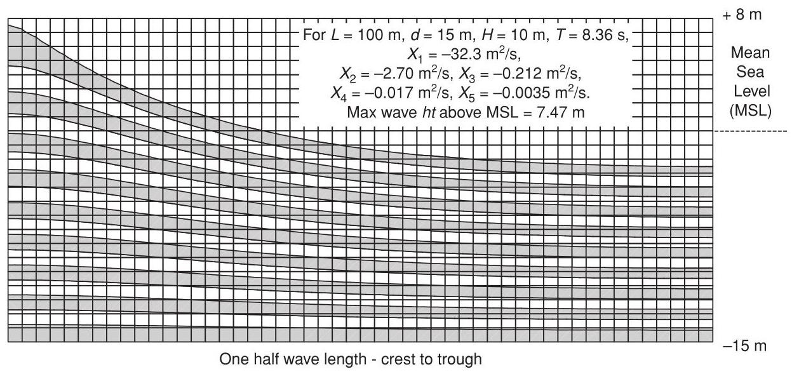

Figure 11.17 Streamlines for Dean stream function wave theory with moving frame of reference

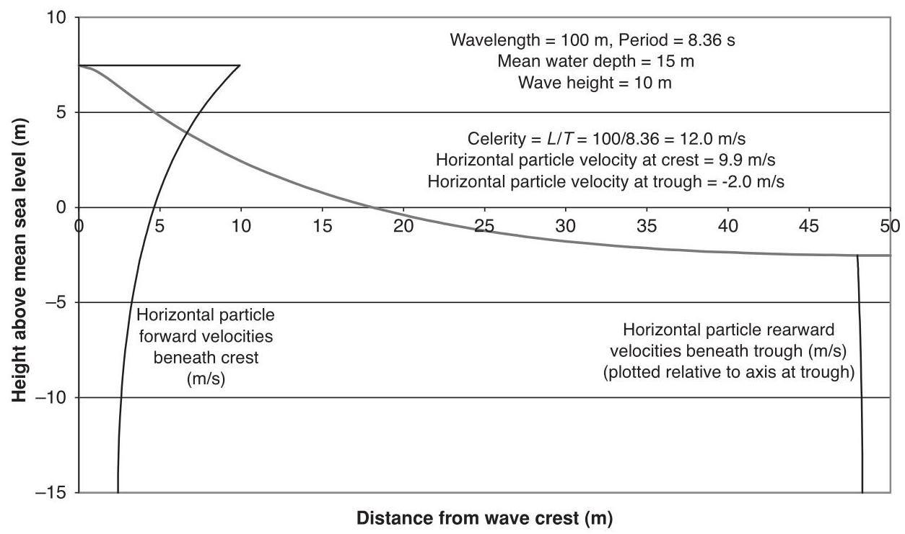

Figure 11.18 Horizontal particle velocity profiles below wave crest and trough. Note the high horizontal particle velocity at the crest, which approaches the wave celerity

A useful on-line resource providing the Dean stream function theory coefficients and the wave profile for user input wave parameters is to be found at http://www.coastal.udel.edu/faculty/rad/streamless.html at the time of writing.

### 11.3.9 Wave loading on support structure

The wave loading on immersed structures depends on their size, shape and surface roughness. For elements that are small compared with the wavelength, the disturbance to wave behaviour caused by the structure can be ignored and the loading based on the undisturbed wave kinematics, using Morison's equation. However, for larger elements, it is necessary to take account of the way the wave pattern is modified. This can be done by means of a diffraction analysis, in which the varying pressures on discrete facets of the structure are calculated by numerical methods.

## Morison's equation

For structural elements with a width less than about one fifth of the wave length, it is normal to describe the loading in terms of separate, additive drag and inertia components, as given by Morison's equation:

$$
F = \frac{1}{2}{C}_{D}{\rho D}\left| u\right| u + {C}_{M}{\rho A}\frac{\partial u}{\partial t} \tag{11.28}
$$

in which $F$ is the force per unit length of the member, $D$ the member width, $A$ its cross-sectional area, ${C}_{D}$ the drag coefficient, and ${C}_{M}$ the inertia coefficient. The water particle velocity, $u$ , and the acceleration are the undisturbed values that would apply at the member centreline. Note that the drag loading given by the first term is non-linear, as it depends on the square of the water particle velocity. It reaches its peak when the wave crest passes the member, whereas the inertia loading reaches its peak beforehand ( $T/4$ beforehand for Airy waves).

Although Morison's equation applies to prismatic members in general, its application to cylindrical members, whether single monopiles or elements of a jacket structure, is of most interest here.

## Values of drag and inertia coefficients

The empirical drag and inertia coefficients are dependent on:

- The Reynolds number, ${uD}/v$ , where $v$ is the kinematic viscosity of seawater $\left( {{1.35} \times  {10}^{-6}{\mathrm{\;m}}^{2}/\mathrm{s}\text{ at }{10}^{ \circ  }\mathrm{C}}\right)$ .

- The relative roughness of the cylinder, $k/D$ , where $k$ is the surface roughness in terms of the peak to valley height.

- The Keulegan-Carpenter number, ${K}_{C} = {u}_{\max }T/D$ , where ${u}_{\max }$ is the maximum water particle velocity (at the water surface, ${u}_{\max } = {H\omega }/2\tanh {kd}$ (Equation 11.16), so ${K}_{C} = \; {\pi H}/D$ tanh ${kd}$ ).

- The ratio of current to the maximum wave-induced water particle velocity.

Influence of Reynolds number In the case of wind turbine support structures, the Reynolds number will correspond to the post-critical regime in all but the calmest seas, with the result that the steady flow drag coefficient, ${C}_{DS}$ , is independent of Reynolds number.

Influence of relative roughness The steady flow drag coefficient increases from about 0.65 for smooth cylinders to about 1.05 for rough cylinders, as illustrated in Figure 11.19. This shows the recommendations of ISO 19902:2007 'Petroleum and natural gas industries - fixed steel offshore structures' and DNV-RP-205 'Environmental conditions and environmental loads' (April 2007), which are fairly similar with respect to ${C}_{DS}$ .

The effect of marine growth on both surface roughness and member diameter must be considered below high tide level. Terminal thicknesses of marine growth of ${200}\mathrm{\;{mm}}$ and 60-100 mm are quoted in HSE Offshore Technology Report 2001/010 'Environmental considerations' and DNV-RP-C105 respectively, but marine growth is very area specific. If it is pessimistically assumed that the surface peak to valley height approximates to the terminal thickness, then the relative roughness of a typical $4\mathrm{\;m}$ diameter wind turbine monopile may be expected to be in the range 0.015-0.05, resulting in a steady flow drag coefficient of 1.05-1.10.

Above high tide level, marine growth will be negligible and the values of surface roughness, $k$ , given in the following Table 11.5 can be used.

Influence of Keulegan-Carpenter number The oscillatory flow associated with progressive waves means that the cylinder wake transfers from one side of the cylinder to the other as the flow reverses. After flow reversal, the volume of water that was previously slow moving in the wake acquires increased velocity in the reverse direction compared to that which would have been obtained in the absence of the cylinder. In calculating the drag coefficient for wave loading, ${C}_{D}$ , this effect is allowed for by multiplying the steady flow drag coefficient, ${C}_{DS}$ , by a wake amplification factor, $\psi$ , dependant on the Keulegan-Carpenter number. Figure 11.20 shows the relationship between $\psi$ and ${K}_{C}$ given in DNV-RP-C105 for rough and smooth cylinders. Those given in ISO 19902:2007 are generally very similar.

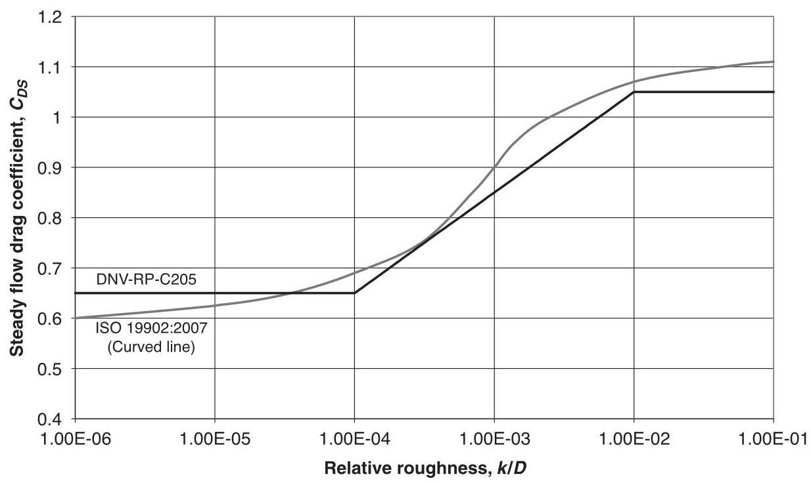

Figure 11.19 Dependence of steady flow drag coefficient on relative roughness

At very low Keulegan-Carpenter numbers, the inertia coefficient may be taken as 2.0, the theoretical value from potential theory in the absence of flow separation. For ${K}_{C} > 3$ it begins to drop with the onset of flow separation, reaching asymptotic values of 1.6 and 1.2 for smooth and rough cylinders respectively. Figure 11.21 shows the relationship between ${C}_{M}$ and ${K}_{C}$ given in DNV-RP-C105 for rough and smooth cylinders. Those given in ISO 19902:2007 are essentially the same.

Influence of current The effect of a steady current is to move the drag coefficient ${C}_{D}$ closer to the steady flow value, ${C}_{DS}$ , regardless of the direction of the current relative to the direction of wave propagation. In the case of an in-line current, ${C}_{D}$ can be taken as equal to ${C}_{DS}$ when the current is greater than 0.4 times the maximum orbital velocity due to wave motion.

Table 11.5 Surface roughnesses (from DNV-RP-C205)

<table><tr><td>Material</td><td>Surface roughness, $k$ (millimetres)</td></tr><tr><td>Steel, new, uncoated</td><td>0.05</td></tr><tr><td>Steel, painted</td><td>0.005</td></tr><tr><td>Steel, highly corroded</td><td>3</td></tr><tr><td>Concrete</td><td>3</td></tr></table>

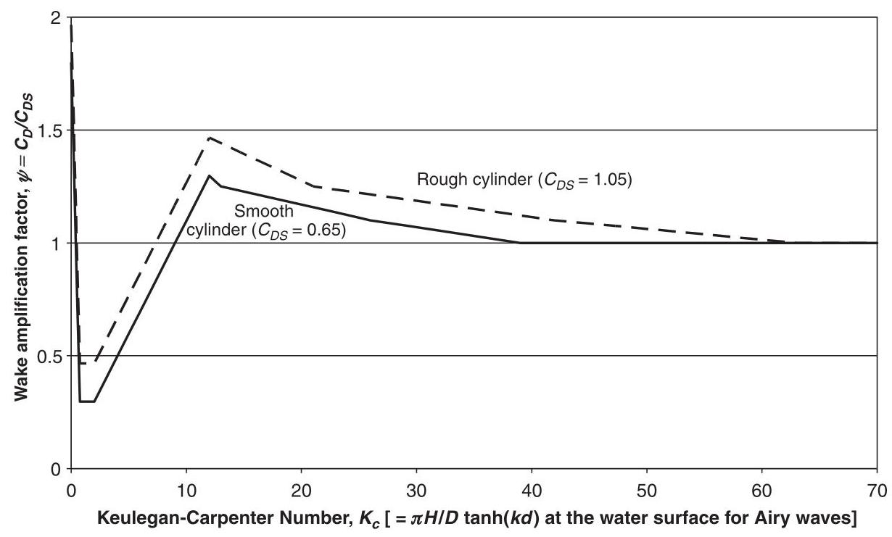

Figure 11.20 Variation of wake amplification factor, $\psi  = {C}_{D}/{C}_{DS}$ with Keulegan-Carpenter number from DNV-RP-C205

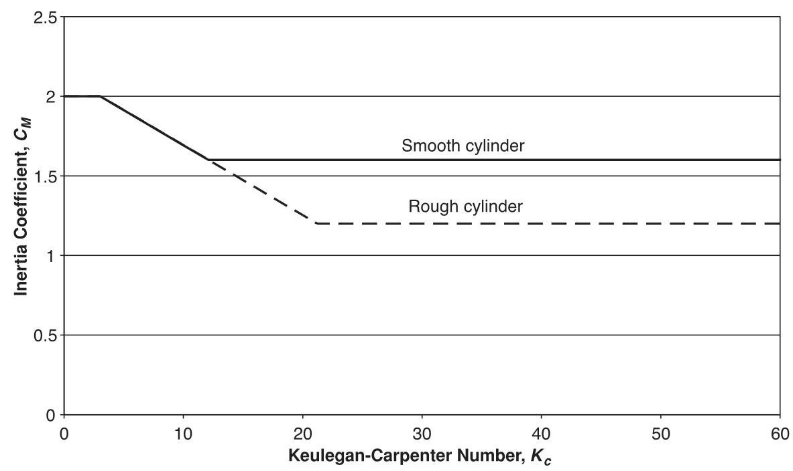

Figure 11.21 Variation of inertia coefficient, ${C}_{M}$ , with Keulegan-Carpenter number from DNV-RP-C205

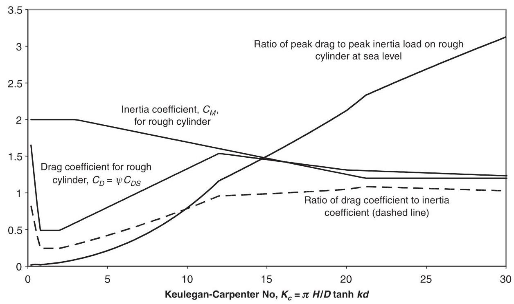

Figure 11.22 Variation of ${C}_{D},{C}_{M},{C}_{D}/{C}_{M}$ and the ratio of maximum drag force to maximum inertia force at sea level with Keulegan-Carpenter number for a rough cylinder

## Ratio of drag force to inertia force

For Airy waves, it can be shown that the ratio of the maximum drag force per unit length to the maximum inertia force per unit length at sea level is:

$$
\frac{{F}_{D.\operatorname{Max}}}{{F}_{M.\operatorname{Max}}} = \frac{{C}_{D}}{{C}_{M}}\frac{H}{\pi D}\frac{1}{\tanh \left( {kd}\right) } = \frac{{C}_{D}}{{C}_{M}}\frac{{K}_{C}}{{\pi }^{2}} \tag{11.29}
$$

Figure 11.22 shows how ${C}_{D}$ and ${C}_{M}$ vary with Keulegan-Carpenter number for a rough cylinder $\left( {{C}_{DS} = {1.05}}\right)$ , based on the recommendations of DNV-RP-C105. The resulting variation in the ratio of maximum drag force to maximum inertia force has been derived from Equation 11.29, and is shown in the same figure.

Drag dominant or inertia dominant regimes can be defined according to which load component is the greater. For a rough cylinder, the transition from the inertia dominated regime to the drag dominated regime occurs when the Keulegan Carpenter number exceeds ${\pi }^{2}{C}_{M}/{C}_{D}$ - that is, approximately ${\pi }^{2}\left( {{1.64}/{1.45}}\right)  = {11.2}$ , so for deep water, with tanh ${kd}$ approaching unity, drag force dominates when the wave height to cylinder diameter ratio exceeds ${11.2}/\pi$ - that is, about 3.5. In shallow water, where tanh ${kd}$ is less than unity, this threshold is reduced in proportion. It can be seen that, for normal sea states, the loading on a monopile of around ${4.0}\mathrm{\;m}$ diameter is likely to be dominated by inertia loading.

## Airy wave loading on cylinder

The cylinder loading from an Airy wave is easily found by inserting the horizontal particle velocity (Equation 11.16) and acceleration into Equation 11.28. However, as Airy wave theory is based on infinitesimal waves, it does not provide velocities and accelerations above still water level. Accordingly it is normal to make the assumption that the kinematics at the instantaneous free surface are the same as those given by Airy theory at still water level, and that at intermediate depths the kinematics are those that would be given by Airy theory after the water column had been compressed or stretched uniformly to a height corresponding to mean water depth. This procedure was proposed by Wheeler (1970) and is known as Wheeler stretching.

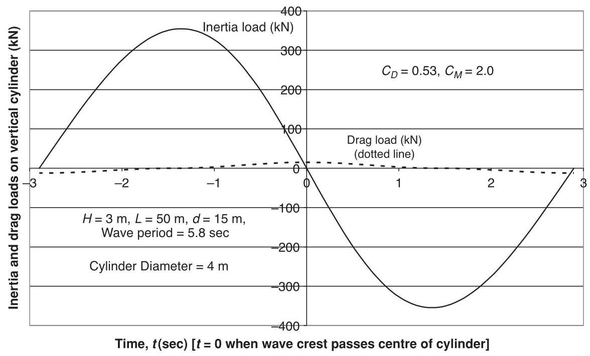

Figure 11.23 Variation of wave loading on a $4\mathrm{\;m}$ diameter vertical cylinder over a complete wave period for a $3\mathrm{\;m}$ Airy wave and ${15}\mathrm{\;m}$ mean water depth

Figure 11.23 illustrates how the drag and inertia loads on a $4\mathrm{\;m}$ diameter vertical cylinder integrated over the full local water depth vary with time for a $3\mathrm{\;m}$ Airy wave. As expected, the drag component is much less than the inertia component. It can be seen that Wheeler stretching displaces the inertia load peak closer to the crest.

Clearly, in this case, the drag load does not contribute to the maximum total load at all. In the general case, the drag load only begins to affect the maximum total load when ${K}_{C}$ exceeds ${0.5}{\pi }^{2}{C}_{M}/{C}_{D}$ .

## Cylinder loading for non-linear waves

In the case of larger, non-linear waves, the water particle velocities and accelerations input into Morison's equation have to be based on a non-linear wave theory. Figure 11.24 shows the variation of drag and inertia loading on a $4\mathrm{\;m}$ diameter vertical cylinder in the case of ${10}\mathrm{\;m}$ regular waves, based on fifth order Dean stream function theory. The drag and inertia coefficients used are based on the recommendations of DNV-RP-C105. The loads are integrated over the full local water depth as before.

It is evident that the drag loading reaches a pronounced peak as the crest passes the cylinder, due to the increased depth and high water particle velocity in the wave crest $- {9.9}\mathrm{\;m}/\mathrm{s}$ compared with the wave celerity of ${12}\mathrm{\;m}/\mathrm{s}$ . Also, the phase lead of the inertia loading maximum is much reduced compared with the $T/4$ applicable in the case of an Airy wave. It is striking that the ratio of the peak drag load to peak inertia load has increased by a factor of 35 compared with the Airy wave example above, although the $\left( {{C}_{D}/{C}_{M}}\right)  \cdot  \left( {H/D}\right)$ ratio has only increased by a factor of 10.4.

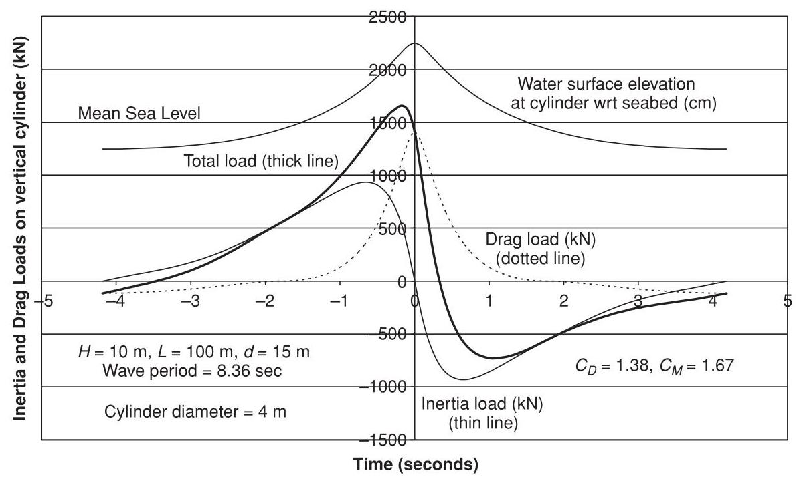

Figure 11.24 Variation of wave loading on a $4\mathrm{\;m}$ diameter vertical cylinder over a complete wave period for a ${10}\mathrm{\;m}$ regular wave and ${15}\mathrm{\;m}$ mean water depth

## Diffraction

Structural elements that are of significant width compared with the wave length modify the wave behaviour, so the transparency assumption implicit in Morison's equation no longer applies. Instead, a diffraction analysis has to be used, in which the modified wave flow around the structure is obtained in terms of a velocity potential distribution that satisfies the extra requirement that there should be no flow perpendicular to the surface of the structure. Note that the diffraction analysis determines the inertia loading on the structure, but not the drag loading. This is normally of little concern as the drag loads on large structures are usually negligible beside the inertia loads. A more significant limitation of diffraction theory is that it is restricted to linear waves, as the velocity potential only satisfies linearised versions of the boundary conditions at the free water surface.

A closed-form analytical solution for the velocity potential in terms of Bessel functions has been developed for the case of a large vertical cylinder projecting above the water surface by MacCamy and Fuchs (1954). The method adopted is to treat the velocity potential as composed of two parts - the first the velocity potential that would exist in the absence of the cylinder and the second one that cancels out the flows across the cylinder surface postulated by the first. The result was used in conjunction with the unsteady Bernouilli equation to calculate the pressure distribution on the cylinder and hence the load per unit length. Figure 11.25 shows how the resulting inertia coefficient varies with the diameter to wave length ratio, $D/L$ . It is seen that after an initial small increase, the inertia coefficient drops rapidly as $D/L$ increases.

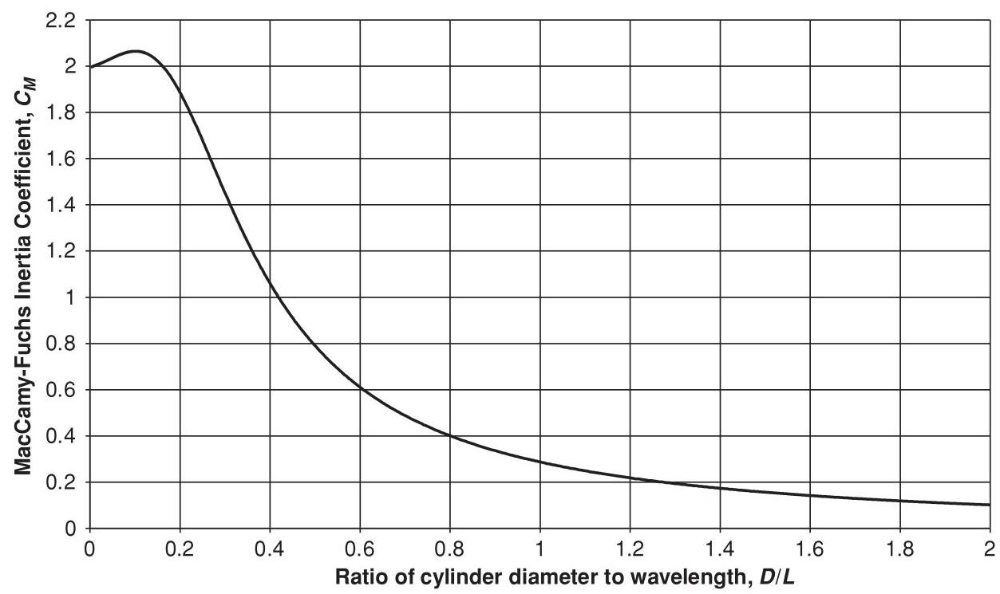

Figure 11.25 Effect of large cylinder diameter on inertia coefficient, based on MacCamy and Fuchs

The derivation of the MacCamy and Fuchs expressions for the velocity potential and cylinder loading is described in Dean and Dalrymple (1984).

In the general case, no closed-form solution will be available and resort has to be made to numerical methods. The method again involves determination of the velocity potential that would exist in the absence of the structure and the derivation of a second velocity potential superposed upon the first that results in zero flow across the structure surface, while satisfying the Laplace equation and the other boundary conditions. The surface of the structure is divided up into $N$ area elements or facets, each with its own oscillating flow source taken as uniformly distributed over the facet, and the second velocity potential is taken as the summation of the velocity potentials resulting from these $N$ oscillating sources. Then application of the zero flow requirement at each facet results in $N$ simultaneous equations for the determination of each source magnitude.

Denoting the source intensity at facet $i$ as ${f}_{i}$ per unit area and the velocity potential due to a unit oscillating source radiating from the centre of facet $i$ as ${\Phi }_{i}\left( {x, y, z, t}\right) /{4\pi }$ , the total potential gradient perpendicular to facet $j$ due to all $N$ oscillating sources becomes:

$$
{\left( \frac{\partial {\phi }_{S}}{\partial n}\right) }_{j} = \frac{1}{4\pi }\left\lbrack  {{\left( \frac{\partial {\Phi }_{1}}{\partial n}\right) }_{j}{f}_{1}{S}_{1} + \cdots  + {\left( \frac{\partial {\Phi }_{i}}{\partial n}\right) }_{j}{f}_{i}{S}_{i} + \cdots  + {\left( \frac{\partial {\Phi }_{N}}{\partial n}\right) }_{j}{f}_{N}{S}_{N}}\right\rbrack
$$

$$
= \frac{1}{4\pi }\mathop{\sum }\limits_{i}{\left( \frac{\partial {\Phi }_{i}}{\partial n}\right) }_{j}{f}_{i}{S}_{i}
$$

where ${S}_{i}$ is the surface area of facet $i$ .

For zero flow across facet $j,{\left( \partial {\phi }_{I}/\partial n\right) }_{j} =  - {\left( \partial {\phi }_{S}/\partial n\right) }_{j}$ , where ${\left( \partial {\phi }_{I}/\partial n\right) }_{j}$ is the potential gradient perpendicular to the facet that would occur in the absence of the structure. This leads to a set of equations

$$
{\left( \frac{\partial {\phi }_{I}}{\partial n}\right) }_{j} =  - \frac{1}{4\pi }\mathop{\sum }\limits_{i}{\left( \frac{\partial {\Phi }_{i}}{\partial n}\right) }_{j}{f}_{i}{S}_{i} \tag{11.30}
$$

which can be solved for the source intensities, ${f}_{i}$ .

Wehausen and Laitone (1960) give an expression for ${\Phi }_{i}\left( {x, y, z, t}\right)$ on page 478 of Surface Waves. In addition to the expected terms $\left( {1/r}\right) \cos {\omega t}$ associated with the point source and $\left( {1/{r}_{2}}\right) \cos {\omega t}$ associated with an imaginary ’mirror’ source beneath the seabed (where $r$ and ${r}_{2}$ are the radii from the point source and ’mirror’ source respectively to the point $x, y, z$ ), there are two other terms involving Bessel functions of the first kind, one in phase and the other ${90}^{ \circ  }$ out-of-phase with the source. These terms are required to satisfy the free surface boundary conditions and the expected decay towards infinity.

As noted above, diffraction theory can only provide an exact solution for linear waves. However, an approximate solution for non-linear waves can be obtained by increasing the load on each facet of the structure surface obtained from the diffraction analysis by the ratio of the non-linear wave particle acceleration to the linear wave particle acceleration at the facet, treating the structure as transparent.

## Breaking waves

Deep water waves break when they reach shallower water such that the wave height to water depth ratio exceeds 0.78 , and can result in short-term loads an order of magnitude greater than those from non-breaking waves.

Breaking waves are normally divided into three different types - spilling, plunging or surging. Muir Wood and Fleming (1981) distinguish them as follows: 'In principle a plunging breaker occurs when the crest velocity exceeds that of the body of the wave, a spilling breaker occurs when the crest velocity remains approximately equal to that of the wave and a surging breaker occurs when the base of the wave surges up the beach before the crest can plunge forward'. Clearly plunging breakers are of greatest concern in relation to wind turbine structures, because the advancing wall of water causes impulsive loads on vertical surfaces.

The hydrodynamics of wave impact on a structure is a complex three-dimensional problem, depending on the form of the structure, the shape of the wave front and the presence of entrained air, so simplifying assumptions are necessary. Figure 11.26 illustrates a plunging breaker striking a vertical cylinder. Although the surface of the front of the wave is typically concave, it is normal to treat it as vertical, with a height $\lambda$ times the wave crest elevation, ${\eta }_{b}$ , and consider the water flow around the cylinder as a two-dimensional problem. $\lambda$ is known as the curling factor.

Various theories for the impulsive loading on the cylinder as the breaking wave envelops it have been proposed, and are summarised in Wienke and Oumeraci (2005). The time histories of the impulsive force per unit length for some of the theories are presented in Figure 11.27.

It can be seen that the magnitude of the initial impulsive force coefficient, $f/\left( {\rho {V}^{2}R}\right)$ , is quite uncertain, ranging from $\pi$ to ${2\pi }$ . The higher value results from allowance being made for the pile-up of water on either side of the cylinder (Figure 11.28).

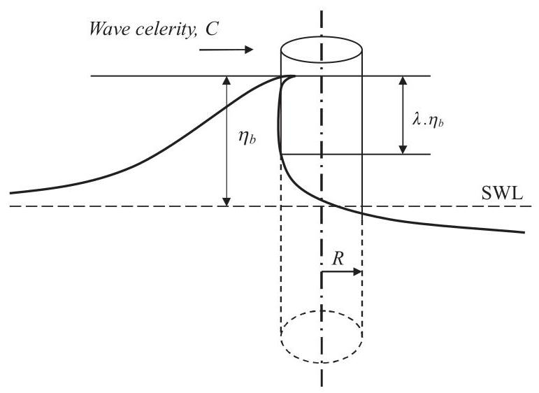

Figure 11.26 Wave breaking at vertical cylinder

The force on the cylinder equates to the integral of the pressure distribution over the immersed surface area, obtained from the unsteady Bernouilli equation

$$
p\left( {x, t}\right)  = \rho \frac{\partial \phi }{\partial t} - \frac{1}{2}\rho \left\lbrack  {{\left( \frac{\partial \phi }{\partial x}\right) }^{2} + {\left( \frac{\partial \phi }{\partial y}\right) }^{2}}\right\rbrack   + C\left( t\right) \tag{11.31}
$$

The gravity term is omitted, as the height is constant.

Velocity potential utilising flat plate idealisation The problem of determining the velocity potential, $\phi$ , is simplified if the instantaneous flow field is assumed to be that which would apply to flow around a flat plate of width equal to the immersed width of the cylinder at that instant (Figure 11.28). The complex potential for the flow around a flat plate perpendicular to the mean flow direction is given by Milne-Thomson (1967) as

$$
w =  - {iV}\sqrt{{z}^{2} - {c}^{2}} \tag{11.32}
$$

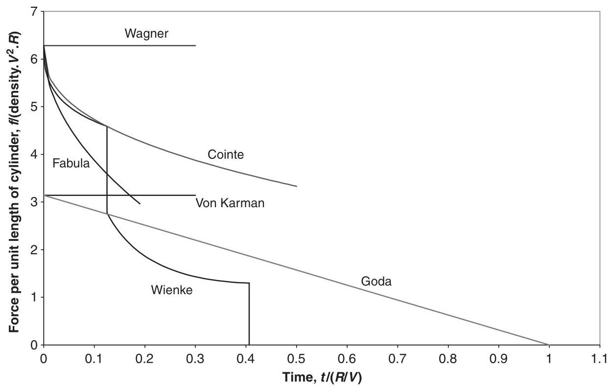

Figure 11.27 Time histories of impulsive force on cylinder according to different theories

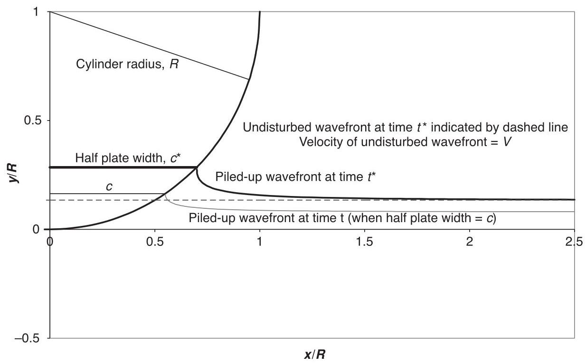

Figure 11.28 Development of water pile-up as wavefront advances around cylinder

where $V$ is the flow velocity remote from the plate in the negative $y$ direction, $z = x + {iy}$ , and the width of the plate is ${2c}$ . The velocity potential is given by the real part of $w$ and equates to $\phi  = V\sqrt{{c}^{2} - {x}^{2}}$ at the upstream surface of the plate.

At a point far upstream of the plate, the fluid pressure, $\partial \phi /\partial t$ and $\partial \phi /\partial x$ are all zero, so $C\left( t\right)  = {0.5\rho }{V}^{2}$ and Equation 11.31 becomes

$$
p\left( {x, t}\right)  = \rho \frac{\partial }{\partial t}\left( {V\sqrt{{c}^{2} - {x}^{2}}}\right)  - \frac{1}{2}\rho {\left( \frac{\partial \phi }{\partial x}\right) }^{2} + \frac{1}{2}\rho {V}^{2}
$$

$$
= \frac{\rho Vc}{\sqrt{{c}^{2} - {x}^{2}}}\frac{dc}{dt} - \frac{1}{2}\rho {V}^{2}\frac{{x}^{2}}{{c}^{2} - {x}^{2}} + \frac{1}{2}\rho {V}^{2} \tag{11.33}
$$

Wavefront pile-up Wagner (1932) set out a method for calculating the accelerated advance of the wavefront around each side of a boat hull impacting a still water surface which can be used to obtain ${dc}/{dt}$ for a wavefront impacting on a cylinder (see Figure 11.28). From

Equation 11.32, it can be shown that the velocity of flow past the notional plate at a point in the plane of the plate is

$$
{\left( \frac{\partial \phi }{\partial y}\right) }_{y = o, x > c} = \frac{V}{\sqrt{1 - {\left( c/x\right) }^{2}}} \tag{11.34}
$$

The integral of this expression with respect to time gives the $y$ co-ordinate of the point $\left( {{c}^{ * }, y}\right)$ where the wavefront meets the cylinder surface at time ${t}^{ * }$

$$
y\left( {t}^{ * }\right)  = {\int }_{0}^{{t}^{ * }}\frac{Vdt}{\sqrt{1 - {\left( c/{c}^{ * }\right) }^{2}}} \tag{11.35}
$$

We now define the quantity $\mu  = V/\left( {{dc}/{dt}}\right)$ , so that ${Vdt} = {\mu dc}$ and

$$
y\left( {t}^{ * }\right)  = {\int }_{0}^{{c}^{ * }}\frac{\mu  \cdot  {dc}}{\sqrt{1 - {\left( c/{c}^{ * }\right) }^{2}}} \tag{11.36}
$$

If we suppose that $\mu  = {\alpha }_{1}c + {\alpha }_{3}{c}^{3} + {\alpha }_{5}{c}^{5} + \cdots$ , the integral can be performed and the values ${\alpha }_{n}$ determined from the requirement that $y\left( {t}^{ * }\right) ,{c}^{ * }$ follow the profile of the cylinder. For example, if $\mu$ is taken as ${\alpha }_{1}c$ .

$$
y\left( {t}^{ * }\right)  = {\int }_{0}^{{c}^{ * }}\frac{{\alpha }_{1}c \cdot  {dc}}{\sqrt{1 - {\left( c/{c}^{ * }\right) }^{2}}} = {\alpha }_{1}{\left\lbrack  -{c}^{*2}\sqrt{1 - {\left( c/{c}^{ * }\right) }^{2}}\right\rbrack  }_{0}^{{c}^{ * }} = {\alpha }_{1}{c}^{*2} \tag{11.37}
$$

Solution for parabolic profile Equating ${\alpha }_{1}{c}^{*2}$ to the parabolic approximation to a circle, $y\left( {t}^{ * }\right)  = {0.5}{c}^{*2}/R$ , yields ${\alpha }_{1} = {0.5}/R$ . Hence $\mu  = {0.5c}/R$ and ${dc}/{dt} = V/\mu  = V \cdot  {2R}/c$ , which can be substituted in Equation 11.33 to give

$$
p\left( {x, t}\right)  = \frac{{2\rho }{V}^{2}R}{\sqrt{{c}^{2} - {x}^{2}}} + \frac{1}{2}\rho {V}^{2} - \frac{1}{2}\rho {V}^{2}\frac{{x}^{2}}{{c}^{2} - {x}^{2}} = \frac{{2\rho }{V}^{2}R}{\sqrt{{c}^{2} - {x}^{2}}} + \frac{1}{2}\rho {V}^{2}\left( {2 - \frac{{c}^{2}}{{c}^{2} - {x}^{2}}}\right)
$$

(11.38)

This expression is integrated over the width of the plate to give the force per unit length on the cylinder

$$
f = {2\rho }{V}^{2}R \cdot  2{\int }_{0}^{c}\frac{dx}{\sqrt{{c}^{2} - {x}^{2}}} + \frac{1}{2}\rho {V}^{2} \cdot  2{\int }_{0}^{c}\left( {2 - \frac{{c}^{2}}{{c}^{2} - {x}^{2}}}\right) {dx}
$$

$$
= {4\rho }{V}^{2}R\arcsin \left( \frac{x}{c}\right)  + \rho {V}^{2}{\int }_{0}^{c}\left( {2 - \frac{{c}^{2}}{{c}^{2} - {x}^{2}}}\right) {dx} = \rho {V}^{2}R\left\{  {{2\pi } + \frac{2c}{R} - \frac{c}{R}{\left\lbrack  {\tanh }^{-1}\left( \frac{x}{c}\right) \right\rbrack  }_{0}^{c}}\right\}
$$

(11.39)

The third term in Equation 11.39 is theoretically infinitely negative because the pressure tends to minus infinity at the edge of the notional flat plate. However, if negative pressures are ignored, a conservative result may be obtained. The initial force per unit length, for $c = 0$ , is ${2\pi \rho }{V}^{2}R$ , which is an order of magnitude greater than the drag force for this velocity.

Two stage solution Wienke (2001) approximates the circular profile by the above parabola for ${c}^{ * }/R < 1/\sqrt{2}$ and by a quartic curve beyond. This results in the stepped force time-history shown in Figure 11.27.

Multi-term solution for near circular profile The circular profile of the cylinder, $y\left( {t}^{ * }\right) /R = 1 - \sqrt{1 - {\left( {c}^{ * }/R\right) }^{2}}$ , can be approximated by the binomial series

$$
y\left( {t}^{ * }\right)  = \frac{1}{2}{\left( \frac{{c}^{ * }}{R}\right) }^{2} + \frac{1}{8}{\left( \frac{{c}^{ * }}{R}\right) }^{4} + \frac{1}{16}{\left( \frac{{c}^{ * }}{R}\right) }^{6} + \frac{5}{128}{\left( \frac{{c}^{ * }}{R}\right) }^{8} + \cdots \tag{11.40}
$$

Substitution in Equation 11.36 with $\mu  = {\alpha }_{1}c + {\alpha }_{3}{c}^{3} + {\alpha }_{5}{c}^{5} + \cdots$ results in

$$
\mu  = \frac{1}{2}\left( \frac{c}{R}\right)  + \frac{3}{16}{\left( \frac{c}{R}\right) }^{3} + \frac{15}{128}{\left( \frac{c}{R}\right) }^{5} + \cdots
$$

$$
+ \frac{\left( {{2n} + 1}\right) \left( {{2n} - 1}\right) \left( {{2n} - 3}\right) \cdots }{{2n}\left( {{2n} - 2}\right) \left( {{2n} - 4}\right) \cdots }\frac{\left( {{2n} - 1}\right) \left( {{2n} - 3}\right) \left( {{2n} - 5}\right) \cdots }{\left( {{2n} + 2}\right) \left( {2n}\right) \left( {{2n} - 2}\right) \cdots }{\left( \frac{c}{R}\right) }^{{2n} + 1}
$$

Although only a few terms of the series (Equation 11.40) are required to represent the profile for ${c}^{ * }/R < {0.8}$ , a large number of terms are required as ${c}^{ * }/R$ approaches unity. Equation 11.33 for the pressure distribution becomes

$$
p\left( {x, t}\right)  = \frac{\rho {V}^{2}c/\mu }{\sqrt{{c}^{2} - {x}^{2}}} + \frac{1}{2}\rho {V}^{2}\left( {2 - \frac{{c}^{2}}{{c}^{2} - {x}^{2}}}\right) \tag{11.41}
$$

The force per unit length is obtained by integrating Equation 11.41 over the immersed width, ignoring negative pressures near the edge of the notional plate as before. Denoting the value of $x$ at which the pressure changes sign as ${c}^{\prime }$ , the force per unit length on the cylinder is then

$$
f = \rho {V}^{2}R\left\{  {\frac{2c}{\mu R}\arcsin \left( \frac{{c}^{\prime }}{c}\right)  + \frac{2{c}^{\prime }}{R} - \frac{c}{R}{\tanh }^{-1}\left( \frac{{c}^{\prime }}{c}\right) }\right\} \tag{11.42}
$$

The relationship between the time elapsed since the wave first hits the cylinder and the immersed width, ${2c}$ , is obtained by integrating the equation ${Vdt} = {\mu dc}$ . Figure 11.29 shows the resulting time history of the force per unit length obtained when 100 terms are used in the series expression for $\mu$ .

Note that the plot becomes inaccurate as $c/R$ approaches unity, because of the inevitable inaccuracy of the series approximation to a circle there. However, this is less of a concern than the fact that the flat plate idealisation becomes unrealistic for large $c/R$ anyway.

Experimental measurements An extensive series of measurements on vertical and inclined cylinders subjected to breaking waves in the wave tank at the Forschungszentrum Küste, Hannover have been reported by Wienke and Oumercaci (2005). Pressure measurements around the cylinder circumference confirmed the validity of the Wagner wavefront pile-up model and measurements of the total loading indicated a maximum value of the curling factors of 0.46 for vertical cylinders. This is in line with the range of 0.4-0.5 given by Goda (1966).

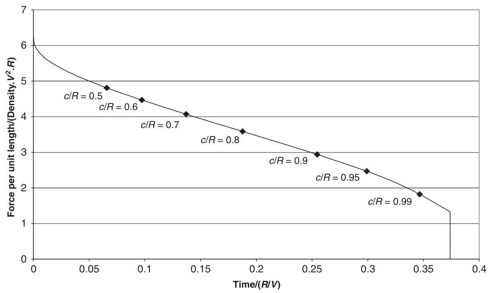

Figure 11.29 Time history of force per unit length on cylinder due to breaking wave using flat plate idealisation

### 11.3.10 Constrained waves

The analysis of structural loading caused by large waves in a random sea is a complex undertaking, because the linear wave theory, which applies to the myriad individual tiny sinusoidal components of the waveform, when each is on its own, breaks down when they are combined together, because of the large resulting wave amplitude. Annex D of IEC 61400-3 suggests several approaches to simplifying the problem, one of which - the constrained wave approach - involves the embedment of a single non-linear regular wave (commencing and ending at a trough) into a series of irregular, linear waves forming a longer simulation.

Clearly, a smooth transition between the simulated waveform and the embedded wave is required in order to preserve a basic similarity between the wave kinematics of the two. Ideally one would find a wave in the simulated waveform of similar magnitude to the specified regular wave and replace the former with the latter. However, many simulations are necessary to find a large enough wave, and the troughs on either side of the crest are unlikely to be of the same height. Furthermore, the crest height above still water level is normally about half the wave height for any simulated wave, instead of about three quarters for the embedded non-linear wave.

In order to circumvent these difficulties, Rainey and Camp (2007) have proposed constraining the elevation and slope of the simulated waveform at three points coinciding with the crest and troughs of the embedded wave. The constrained waveform can be obtained by 'correcting' an initial simulated waveform using New Wave theory (Tromans et al., 1991) so that it satisfies the imposed conditions.

Bierbooms (2006) explains the method as applied to wind simulation, and derives an expression for the time history of a constrained gust. The analogous expression for the time history of water surface elevation constrained to have an extreme value of $A$ at time $t = {t}_{0}$ is as follows:

$$
{\eta }_{c}\left( t\right)  = \eta \left( t\right)  + \kappa \left( {t - {t}_{0}}\right) \left( {A - \eta \left( {t}_{0}\right) }\right)  - \frac{\dot{\kappa }\left( {t - {t}_{0}}\right) }{\ddot{\kappa }\left( 0\right) }\dot{\eta }\left( {t}_{0}\right) \tag{11.43}
$$

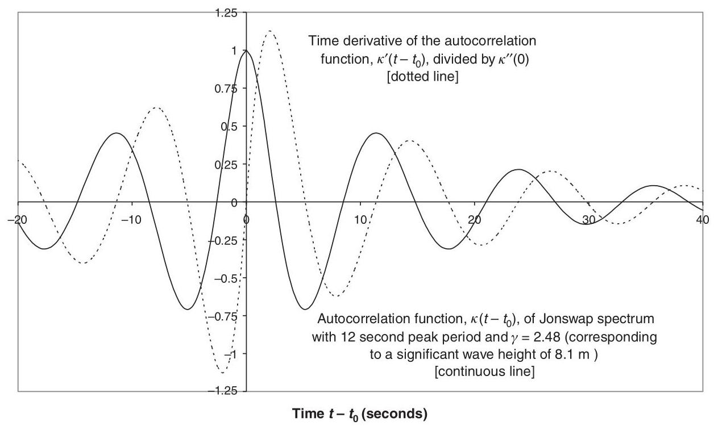

Figure 11.30 Jonswap spectrum autocorrelation function and its time derivative

Here $\eta \left( t\right)$ is the water surface elevation obtained from the initial simulation, $\kappa \left( {t - {t}_{0}}\right)$ is the water surface elevation autocorrelation function, $\dot{\kappa }\left( {t - {t}_{0}}\right)$ is its time derivative and $\ddot{\kappa }\left( 0\right)$ is its second time derivative at time $t = {t}_{0}$ . The autocorrelation function and its time derivative (normalised by $\ddot{\kappa }\left( 0\right)$ ) are plotted out in Figure 11.30, which illustrates how the two correction terms fluctuate at the wave frequency and attenuate as $\left| {t - {t}_{0}}\right|$ increases.

The method can be extended to the imposition of constraints on water surface elevation and slope at three successive points in time. Figure 11.31 shows an example water surface elevation simulated time history and desired constrained elevations of $C$ at the crest (time ${t}_{2}$ ) and $D$ at the preceding and succeeding troughs (times ${t}_{1}$ and ${t}_{3}$ ).

The equation for the simulated time history of water surface elevation with these six constraints is

$$
{\eta }_{c}\left( t\right)  = \eta \left( t\right)  + {a\kappa }\left( {t - {t}_{1}}\right) \left( {D - \eta \left( {t}_{1}\right) }\right)  + b\frac{\dot{\kappa }\left( {t - {t}_{1}}\right) }{\ddot{\kappa }\left( 0\right) }\dot{\eta }\left( {t}_{1}\right)  + {c\kappa }\left( {t - {t}_{2}}\right) \left( {C - \eta \left( {t}_{2}\right) }\right)
$$

$$
+ d\frac{\dot{\kappa }\left( {t - {t}_{2}}\right) }{\ddot{\kappa }\left( 0\right) }\dot{\eta }\left( {t}_{2}\right)  + {e\kappa }\left( {t - {t}_{3}}\right) \left( {D - \eta \left( {t}_{3}\right) }\right)  + f\frac{\dot{\kappa }\left( {t - {t}_{3}}\right) }{\ddot{\kappa }\left( 0\right) }\dot{\eta }\left( {t}_{3}\right) \tag{11.44}
$$

where $a, b, c, d, e$ and $f$ are six unknown coefficients. These can be determined by solving the six simultaneous equations obtained by substituting $t = {t}_{1}, t = {t}_{2}\& t = {t}_{3}$ in turn in

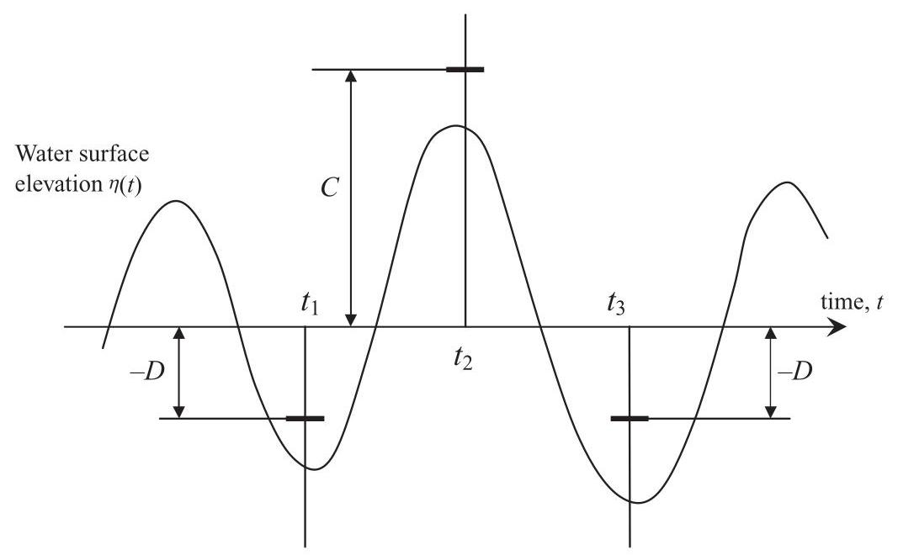

Figure 11.31 Simulated water surface time history and desired constraints at times ${t}_{1},{t}_{2}$ and ${t}_{3}$

Equation 11.44 and in its time derivative, and equating ${\eta }_{c}\left( {t}_{1}\right)$ to $D,{\eta }_{c}\left( {t}_{2}\right)$ to $C,{\eta }_{c}\left( {t}_{3}\right)$ to $D$ and ${\dot{\eta }}_{c}\left( {t}_{1}\right) ,{\dot{\eta }}_{c}\left( {t}_{2}\right)$ and ${\dot{\eta }}_{c}\left( {t}_{3}\right)$ to zero.

Figure 11.32 provides an illustration of a simulated water surface elevation time history constrained to permit the insertion of a ${15}\mathrm{\;m}$ regular wave. A Jonswap spectrum was used for the simulation with a significant wave height of ${8.1}\mathrm{\;m}$ - that is, that expected to yield an extreme wave exceeding ${15}\mathrm{\;m}$ in a three-hour reference period. The wave period corresponding to the spectral peak frequency was 12 seconds.

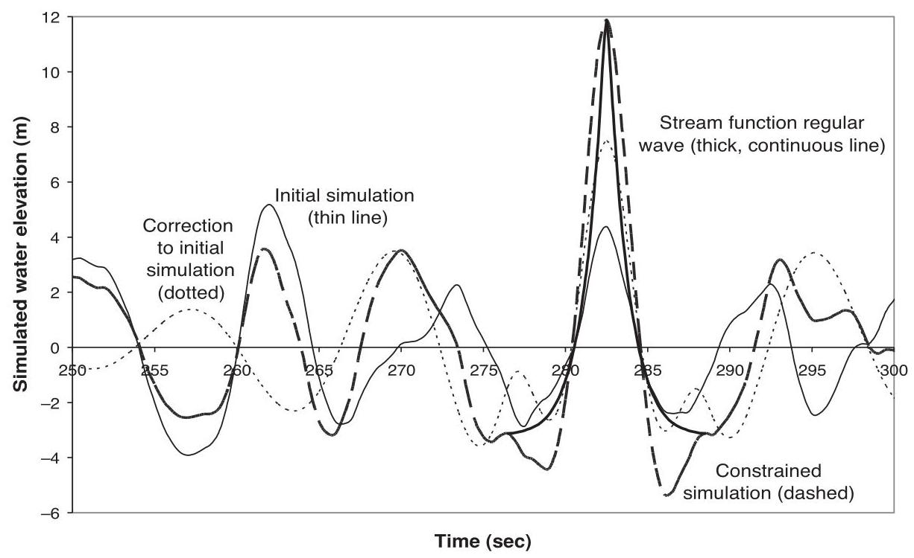

Figure 11.32 Example of a simulated water surface elevation time history constrained to enable the insertion of a ${15}\mathrm{\;m}$ regular wave

The profile of the embedded wave, which replaces that of the constrained simulation over the 12 seconds commencing at 276.5 seconds, is derived from fifth order stream function theory. Rainey and Camp (2007) propose the use of cosine blending functions in the vicinity of each trough to smooth the inevitable discontinuities in the wave kinematics (and hence the wave loading) at the boundary between assumed linear and non-linear behaviour. The water particle velocities and accelerations in the transition regions are then calculated as weighted averages of those derived from the linear and non-linear solutions, with the weighting determined by the blending functions.

Although this does not provide a rigorous solution to the wave equation, it does provide a pragmatic engineering approach in which the background irregular sea state sets the initial dynamic conditions of the structure before the passage of the non-linear extreme wave.

### 11.3.11 Analysis of support structure loads

Loadings on oil and gas offshore structures have customarily been calculated considering deterministic, regular, non-linear waves for extreme loads and exposure to different stochastic sea states for fatigue loads. In the latter case, spectral analysis permits the dynamic behaviour of the structure to be accounted for using a frequency-dependent transfer function relating response to excitation, but depends on the assumption of linear waves and relatively small drag loading, permitting 'linearization' of the drag term in Morison's equation.

The loading on wind turbine support structures differs from that on the typical offshore structure for oil or gas extraction in several ways:

1. Wind turbines are sited in shallower waters, so that non-linearity of wave loading is more important.

2. Wind turbines project much higher above still water level, which, in conjunction with shallow water siting, results in wind loading being much more dominant.

3. The wind loading on the support structure of an operating wind turbine is completely different from that on a oil platform or a parked wind turbine, because of the large thrust loading even in low winds, the pronounced randomly varying periodic loading resulting from gust slicing and the active control of rotor speed and pitch angle.

4. Wind turbines are typically supported on a single column, which is less stiff than the lattice structures normally used for oil or gas platforms.

The randomly varying periodic loads referred to in (3), combined with non-linear aerodynamics above rated wind speed, are the main factors driving the use of multiple simulations in the time domain for the analysis of wind turbine loads. In the case of offshore wind turbines, wave loads have to be input into the simulations as well.

The simulation of wave loads starts with the wave spectrum (Section 11.3.4) defining the sea state under investigation and involves the superposition of many tiny waves of different frequency and random phase, with each wave amplitude determined by the square root of the spectral density at the frequency concerned. This enables time histories of the water surface elevation and the water particle kinematics to be generated, under the key assumption that linear wave theory applies. Finally, wave loads are calculated from the water particle kinematics using Morison's equation.

Although wave loads do not act on the rotor and nacelle directly, tower head accelerations due to support structure wave loading result in inertia loading on the turbine. However, these loads are normally relatively small, to the extent that onshore wind turbine designs can often be used offshore.

The treatment of wave loads in relation to extreme and fatigue load cases are considered separately below.

## Extreme loads

Generally, extreme load cases are specified in terms of a turbulent wind and a stochastic sea state, which requires the assumption of linear wave theory in the calculation of the water particle kinematics and the derivation of the loads. Many of the load cases detailed in sections 11.3.5 and 11.3.6 are principally concerned with extreme wind loading, so the error in the linear wave assumption is not a concern. However, in the case of load cases 1.6a, 6.1a, 6.2a, 6.3a and 7.1a, which involve extreme waves, the standard requires non-linear wave kinematics to be properly represented (e.g. by the inclusion of a constrained wave, or by other methods set out in Annex D). Failing this, alternative load cases with regular, non-linear waves are to be investigated instead.

## Fatigue loads

As set out in Section 5.9.4, Chapter 5, simulations in the time domain are preferred to spectral analysis for the evaluation of fatigue damage due to wind loading, because they account for both non-linear aerodynamics and the combination of deterministic and stochastic load components. In the case of offshore wind turbine structures, simulations in the time domain have the further advantage of directly modelling the aerodynamic damping of wave-induced tower motion and enabling the combined stress fluctuation resulting from the disparate wind and wave loadings to be obtained directly for rain-flow counting of the stress cycles.

The calculation of wave loads is again based on linear wave theory, but the errors introduced by this assumption are relatively minor, because of the smaller waves.

The analysis of fatigue loading in the time domain inevitably involves a large number of simulations, particularly when several turbine sites are being investigated. Although this method is advisable for final design verification, it is demanding of computing time, so fatigue analysis in the frequency domain is preferred for the development of an initial support structure design. This approach is discussed further in relation to monopile support structures in Section 11.5.2.

## 11.4 Machine size optimisation

In principle, the optimum turbine diameter for an offshore site can be estimated using a cost model and appropriate scaling rules in the same way as discussed for land-based machines in Chapter 6. One of the main challenges is to develop a realistic model for the support structure construction and installation cost, which is typically a significantly greater proportion of the total capital cost offshore. The model needs to account for differing water depths and foundation types as well as for different turbine diameters and should ideally be based on cost data from wind farms that have already been constructed, although in practice such information is rarely easy to obtain.

Clearly the establishment of any permanent structure in the sea is a very costly undertaking, as is illustrated by the fact that a ${100}\mathrm{\;m}$ met mast supported on a monopile driven into the seabed can cost anything from €1 to €5 million (Wind Energy - The Facts, 2009). A rough wind turbine cost model can be developed by assuming that the installation costs of offshore wind turbines of different diameters contain a fixed element, dependent on water depth, which is of a similar order of magnitude to the cost of met mast deployment. This has been done by modifying the tentative NREL offshore wind turbine cost model (NREL, 2006), which is an extension of the land-based turbine cost model discussed in Section 6.2.3, Chapter 6, so that the turbine installation cost at a shallow water site comprises a fixed element of \$1 million plus a varying element equal to ${10}\%$ of turbine capital cost. Following the NREL model, turbine capital cost is increased by 13.5% relative to land-based turbines to allow for marinisation.

The other major cost elements specific to offshore are the support structure for the tower and the undersea cable for grid connection. The support structure is assumed to be a steel monopile, weighing (and costing) twice as much as the tower for a ${70}\mathrm{\;m}$ diameter turbine. The length of the monopile is determined principally by water depth and wave height and is, thus, largely independent of turbine diameter, so monopile weight and cost are taken as scaling as turbine diameter squared rather than as diameter cubed. Following NREL, the cost of the grid connection for a given distance to shore is assumed to be proportional to turbine rated power and taken as $\$ {300}/\mathrm{{kW}}$ . The NREL allowances of $\$ {55}/\mathrm{{kW}}$ for scour protection and \$60k/turbine for personnel access equipment are also included.

Figure 11.33 illustrates the resulting variation of cost of energy with turbine diameter.

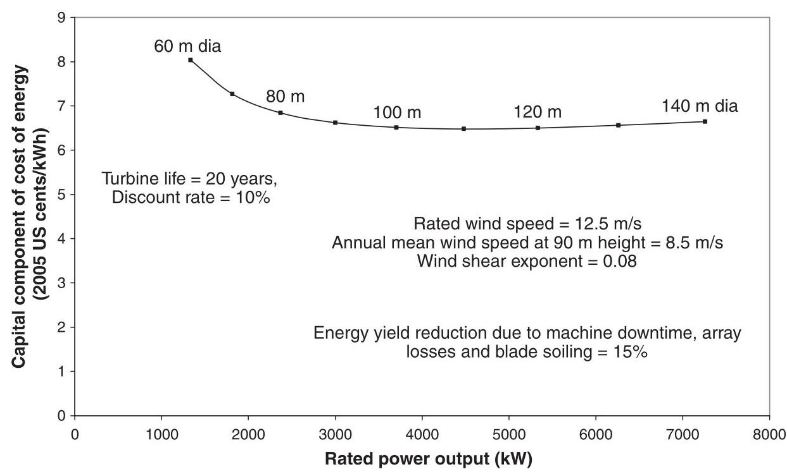

Figure 11.33 Variation of cost of energy with turbine diameter based on modified NREL cost model with a fixed component of turbine installation cost of \$1 million

The figure suggests that the optimum machine rating would be 4.5 MW, corresponding to a machine diameter of ${110}\mathrm{\;m}$ , for the chosen rated wind speed of ${12.5}\mathrm{\;m}/\mathrm{s}$ . However, as set out above, the figure is based on several unsubstantiated assumptions and should, therefore, be treated as illustrative only. It is nevertheless interesting to note that the minimum capital component of the cost of energy of 6.5 US cents/kWh in 2005 shown by Figure 11.33 is almost double the corresponding value for the onshore machine (Figure 6.3 in Chapter 6), despite the increased annual mean wind speed.

At the time of writing the EU funded 'Upwind' project is researching the design challenges of very large wind turbines (8-10 MW). Preliminary findings are that the cost of energy would increase slightly with the move from 5 MW to 10 MW turbines offshore (Hendrix, 2008).

## 11.5 Reliability of offshore wind turbines

Wind turbines are expected to operate at high levels of reliability, whether sited on land or at sea, because any equipment failure is likely to lead to significant downtime while a repair crew is mobilised. Figure 11.34 shows the failure rates for different wind turbine sub-assemblies derived from two large European surveys, together with the downtimes per failure. (WMEP = Wind scientific Monitoring and Evaluation Programme, based at the Fraunhofer Institute of Wind Energy Systems, Kassel and LWK = Landwirtschafts-kammer, Schleswig-Holstein.)

In the case of offshore wind turbines, access is both time consuming and expensive in itself and also extremely weather sensitive, leading to much longer downtimes, so the premium on high reliability is an order of magnitude greater.

Failure Rate and Downtime from 2 Large Surveys of European Wind Turbines over 13 years

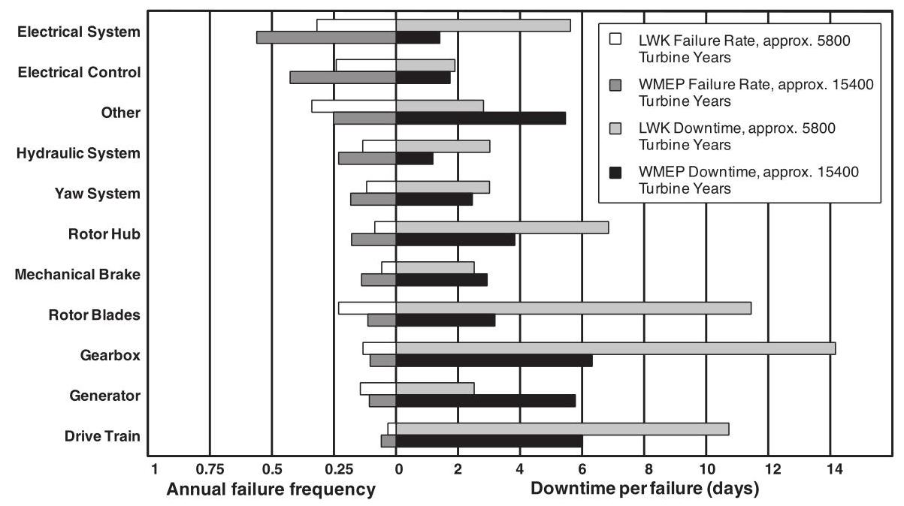

Figure 11.34 Wind turbine sub-assembly failure rates and downtime per failure based on 20,000 turbine years of data from two European surveys. Reproduced with the permission of the University of Durham and the Fraunhofer Institute of Wind Energy Systems

This section briefly considers measures to improve turbine reliability under the following headings - machine architecture, redundancy, protection against corrosion and condition monitoring.

## Machine architecture

Although a wind turbine has an irreducible number of core components, the pursuit of maximum energy yield, grid compatibility and drive train compliance, particularly in the context of large machines, has led to greater complexity and the overwhelming dominance of variable speed, pitch regulated machines offshore. It so happens that the two additional systems required for this type of turbine - namely the frequency convertor and the pitch control mechanism - were found to be the systems responsible for the largest percentages of downtime (20% and 13% respectively) in the Reliawind reliability field study (Wilkinson et al., 2010).

While it has to be accepted that large, fixed speed wind turbines are impractical because power swings are insufficiently damped, the benefit of the pitch control system can be questioned offshore, it being necessary to weigh up whether the extra energy generated justifies the net additional cost, after allowing for the energy lost in extra downtime. Clearly, in the absence of pitch control, an alternative braking system has to be provided - in the form of tip-brakes, for example - and its cost accounted for.

The use of a direct drive generator enables one major component, the gearbox, and its attendant failures to be eliminated. Although gearbox failure rates are relatively low, the resultant downtime was found to be the highest of all sub-assemblies in the WMEP and LWK studies (Figure 11.34). However, research by Spinato et al. (2009) indicates that the aggregate failure rate of generators and converters in direct drive wind turbines is greater than the aggregate failure rate of gearboxes, generators and converters in geared wind turbines, blunting the benefit of gearbox elimination. Nevertheless, the transition to direct drive may still result in improved availability as the downtimes of failed generators and converters are less than those of gearboxes.

## Redundancy

While the provision of redundancy is mandatory for safety critical systems, the duplication of critical components to secure greater operational reliability also merits consideration, particularly offshore. Examples already implemented by some manufacturers include the deployment of two separate systems to measure blade pitch angle and the provision of spare frequency converter modules. A similar philosophy can be extended to the design of mechanical systems such as the pitch mechanism and yaw drive, whereby a reserve of strength is built in to increase the likely service life.

## Component quality

Reliability benefits will justify the use of higher quality components offshore in some cases. For example, double row pitch bearings will be more robust that those with only a single race.

Spinato et al. (2009) observe that the failure rates of wind turbine generators and converters are higher than found in other industries, at least during the initial phases of operation, and recommend that they be subjected to more thorough testing. On the other hand they found the reliability of wind turbine gearboxes to be on a par with that of comparable gearboxes in other industries.

## Protection against corrosion

The concentration of salt particles in the marine atmosphere, which is much augmented by the wind (Gong et al., 1997), means that extra measures must be taken to protect offshore wind turbine components. Besides high-spec surface coatings, these include the use of a sealed generator with an air to air heat exchanger and similar arrangements for other items of electrical equipment, such as the transformer. Air discharged from these heat exchangers helps to maintain the air in the nacelle above the dew point and prevent condensation. In addition, the nacelle and/or hub can be pressurised, to prevent the entry of moist, salty air. In the absence of a partition between the nacelle and hub, this requires the provision of a labyrinth seal between the spinner and nacelle to minimise air leakage.

## Condition monitoring

Clearly reliability can be much improved if incipient defects can be detected by condition monitoring before they result in a systems failure. Traditionally the health of wind turbine systems has been monitored by measures such as:

- Automatic flagging of alarms when parameters such as oil pressures, bearing temperatures and vibration exceed levels short of the trip level.

- Regular inspections - for example, of gear teeth wear and high speed shaft alignment.

- Observation of machine running.

- Regular oil sampling.

These are all examples of condition monitoring, which has been defined as 'the process of monitoring a parameter of condition of machinery, such that a significant change is indicative of a developing failure'.

The expense and difficulty of regular visits to offshore turbines has encouraged the expansion and development of remote or on-line conditioning monitoring techniques, particularly in relation to gear trains and bearings. They require detection of the onset of particular failure mechanisms and the establishment of measurable criteria for determining whether intervention is necessary. The Conmow Final Report entitled 'Condition monitoring for offshore wind farms' (Wiggelinkhuizen et al. 2007) and the Offshore M & R Final Report 'Advanced maintenance and repair for offshore wind farms using fault prediction and condition monitoring techniques' (ISET, 2006) provide helpful surveys of available techniques and their usefulness, together with reports on field trials, while Crabtree (2010) lists condition monitoring systems currently commercially available.

Some of the different condition monitoring techniques are considered below.

## Drive train vibration monitoring

Accelerometers are mounted on the gearbox and generator casings, permitting the vibration signature at each location to be continuously monitored. For fixed speed machines, each signal can be processed using a Fast Fourier Transform (FFT) to compute the vibration spectrum, which will contain spectral peaks corresponding to gear teeth meshing frequencies and shaft rotational speeds of the different gear stages. The behaviour of such vibration signatures over time can then be monitored in order to observe changes due to bearing wear or tooth damage, although this will be more difficult for some components, such as planet bearings, where the indirect vibration transmission path to the accelerometer on the casing makes the spectral peak difficult to detect. Also, in the case of the low speed shaft bearing, the shaft rotational speed is too low for wear detection by accelerometer.

Vibration signatures will vary with power level, wind speed and yaw error, so they should be sorted into different bins accordingly. Irregularities will be more apparent if data is centralised, so that comparisons between different turbines of the same type can be made.

In the case of variable speed machines, the frequencies of the various spectral peaks will be continuously changing, so order tracking techniques must be used to produce spectra in which the frequencies are normalised by the turbine rotational speed. One such method is Synchronous Order Tracking in which a shaft encoder is used to control the signal sampling rate at a fixed number per revolution before FFT analysis. Alternatively a once-per-rev tachometer signal can be fed into the analyser so that its sample rate is varied in proportion to RPM. A simpler option is to restrict vibration monitoring to periods of operation above rated wind speed, when the turbine rotational speed is almost constant.

It is clear from the above that a vibration monitoring system will produce a vast amount of data, which requires dedicated signal processing software programmed to flag up suspect vibration signature changes. Ideally a team of experts would be able to interpret the changes and rule on when action would be necessary, but the Conmow report concluded that, in 2007, there was as yet insufficient experience to permit such predictions, so the usual response to data abnormality was to shut down the machine or increase the frequency of inspections.

## Lubricant oil debris detection

Equipment to measure debris concentrations in lubricating oil can detect the onset of a wear failure, without the need for regular oil sampling and analysis. However, the equipment has to be installed in the lubrication pipe work used when oil is delivered to bearings and gears under pressure, so is not applicable in the case of splash lubricated gearboxes.

## Nacelle vibration monitoring

Nacelle accelerators mounted in the transverse and fore-aft directions can detect rotor mass imbalance and blade pitch errors. Rotor mass imbalance can increase due to water ingress or icing. Special accelerometers, known as static accelerometers, are required, capable of responding to the low blade rotation frequency (ISET, 2006).

## Pitch bearing resistance

In the case of electrical pitch drives, pitch bearing condition can be monitored by measuring the motor current, large peaks in the signal being indicative of jerking movements due to bearings sticking.

## Added value

The benefit of a condition monitoring system is clearly reduced if there are significant numbers of false alarms, which can be due to the over cautious setting of alarm levels or faults with the system itself. Although the Conmow study looked at the factors determining added value, including the level of false alarms, it drew no general conclusions about the overall benefits of installing a condition monitoring system.

## 11.6 Support structures

Support structures for offshore wind turbines are inevitably much more massive than those for onshore turbines, because of the greater hub height relative to the foundation and the additional loading from waves. As a result, they constitute a much higher proportion of offshore turbine installed cost than is the case on land, rendering economic design that much more important.

Most offshore wind turbine designs have evolved from onshore designs, so it has been common practice to utilise the onshore tower design offshore above wave crest level and interpose an additional structure - termed the sub-structure between it and the seabed. Although the term 'support structure' applies to the complete structure supporting the nacelle, this section will concentrate on the sub-structure.

Five different types of sub-structure have been utilised offshore to date - monopiles, jacket structures, tripods, tripiles and gravity bases - but monopiles have proved the most popular, and are considered first.

Fatigue analysis of monopiles in the frequency domain is explored in a separate section (Section 11.6.2).

### 11.6.1 Monopiles

The monopile is a steel cylindrical tube driven into the seabed, with or without the assistance of excavation from within. In soft rock, a socket may be drilled out beforehand to receive the pile. In water depths of up to about ${10}\mathrm{\;m}$ at lowest astronomic tide (LAT), monopile diameters are usually in the range ${4.5} - 5\mathrm{\;m}$ .

## Transition piece

In view of the difficulty in maintaining the monopile accurately vertical during the driving operation, it is normal to introduce an additional cylindrical tube - termed the 'transition piece' - between the monopile and the base of the tower. The tower is then bolted to an integral flange at the top of the transition piece. Figure 11.35 shows a typical arrangement. (Exceptionally, however, at Scroby Sands wind farm, driving conditions were considered sufficiently favourable for the towers to be bolted directly to integral flanges at the top of the monopiles.)

The transition piece is usually sleeved over the monopile, with an overlap length 1.5 times the diameter. A gap of ${50} - {100}\mathrm{\;{mm}}$ between the tubes allows the transition piece to be set vertical, following which the annular space is grouted up. Design of the grouted joint is considered under a separate sub-heading below.

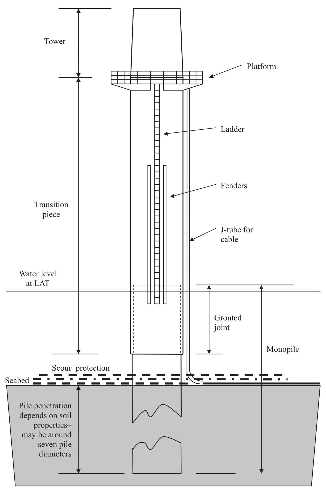

Figure 11.35 Typical arrangement of monopile and transition piece

It is normal to locate an external platform encircling the tower base at the top of the transition piece, to facilitate turbine access. Boat access is by means of a ladder fixed to the outside of the transition piece between a pair of vertical tubes which act as fenders.

The height of the platform, and thus of the top of the transition piece, is normally set so that there is an adequate clearance, known as the air gap, between the platform and the crest of the highest wave, including allowance for tidal range and storm surge. The target air gap may be ${1.5}\mathrm{\;m}$ . If, as is sometimes the case, the top of the monopile is set at ${0.5}\mathrm{\;m}$ above LAT, the length of the transition piece required comes to the sum of the sleeve length, tidal range, the storm surge, and the crest elevation of the 50-year return wave, $\eta {H}_{50}$ , plus $1\mathrm{\;m}$ . In UK waters with significant tidal range, transition pieces over ${25}\mathrm{\;m}$ long may be used, leading to weights approaching 200 tonnes.

In deeper waters, where monopiles $6\mathrm{\;m}$ in diameter and above are required, it may be beneficial to taper the transition piece diameter down above the grouted joint in order to reduce exposure to wave loading and match up with the smaller tower base diameter.

## Cable ducts

The wind turbine power cables are routed through steel protective tubes known as J tubes, which may be located either inside or outside the transition piece/monopile. The J tubes are so called because they incorporate a ${90}^{ \circ  }$ bend at seabed level to enable the cable to exit horizontally.

## Scour

Currents and water motion due to waves will cause significant seabed erosion around a monopile if the seabed is formed of sand or other granular material. Based on a comprehensive set of experiments, Sumer and Fredsoe (2001) concluded that the maximum scour depth occurs under the action of sea current alone, and reaches a depth of 1.3 times the pile diameter, $D$ , on average, with a standard deviation of 0.7D.

Scour of this magnitude would clearly have implications for both foundation stability and support structure natural frequency, so it is normal practice to provide (and maintain) scour protection in the form of rock armour to prevent it. This can be either laid on the seabed soon after installation of the monopile (static scour protection), or after a few weeks, when a scour pit will have developed to receive it (dynamic scour protection). The disadvantage of static scour protection laid over the seabed is that scour can occur at the edges, degrading the rock protection there, but this can be allowed for when the radial extent of protection is determined.

Some of the problems that can arise with scour protection are as follows: possible installation damage to transition piece coating, secondary structures or subsea cables; the need for occasional replenishment and possible increased environmental impact due to increased volumes of material imported to site. Some projects have been designed to accommodate scouring with appropriate allowance in the design for the resulting reductions in overturning resistance and support structure natural frequency.

A design aid for scour hole depth prediction and scour protection design, known as the Opti-Pile Design Tool (den Boom et al., 2004), has been developed and calibrated against model test results and data from existing wind farms. This enables the size of rock that is stable under maximum current conditions to be calculated, together with the radial extent of protection required. As might be expected, the model tests reported by den Boom et al. indicated that larger rock sizes were required when the scour protection was raised proud of the seabed level, as in the static protection, than when it was recessed beneath it.

## Corrosion protection

The approach to corrosion protection varies over the height of the monopile according to the type of exposure. Three zones are defined - the atmospheric zone, the splash zone and the submerged zone, which includes the embedded portion. DNV-OS-J101 requires the steel monopile to be protected by a high quality, multi-layer surface coating in the atmospheric zone. In the splash zone, it requires extra plate thickness to be provided as a corrosion allowance, in addition to a surface coating. Corrosion rates in the range ${0.3} - {0.5}\mathrm{\;{mm}}$ per year may be assumed for structures in the North Sea.

Cathodic protection is to be provided in the submerged zone, together with a $2\mathrm{\;{mm}}$ corrosion allowance in the scour zone. Normally the cathodic protection is in the form of sacrificial anodes, which may weigh about 5 tonnes for the external protection of a $5\mathrm{\;m}$ diameter pile in ${20}\mathrm{\;m}$ water depth, using zinc-based anodes.

Corrosion protection of the internal surface of the monopile is not required, if, as is normal, the internal space is sealed off at the top of the transition piece by a diaphragm (fitted with an air-tight hatch) which has to be designed to absorb pressure differential. Complications may develop in the event of loss of sealing (for example around exit hole of an internal J tube). There is also risk of anaerobic corrosion in sulphur rich seabed environments, which has traditionally been addressed through adding biocide, although this is now less environmentally acceptable.

## Monopile design

The sizing of the monopile is governed by three key factors:

- Resistance to extreme loads.

- Resistance to fatigue loads.

- Tuning of support structure natural frequency to avoid excitation by cyclic loading.

Normally extreme wave loads, being dominated by drag, increase linearly with diameter, whereas fatigue wave loads, being dominated by inertia loading, increase as the diameter squared, like the section modulus. On the other hand, the wind load component of monopile bending moment is virtually unaffected by monopile diameter so it would clearly be beneficial to increase monopile diameter and reduce wall thickness until the decline in buckling resistance stress precludes further reductions in cross sectional area. However, practical considerations such as compatibility with the tower base diameter - assuming a parallel sided transition piece - and manufacturing capability may limit the monopile diameter to a smaller value.

Wave fatigue loads depend on the support structure mode shape (see Equation 11.51), which in turn depends on the stiffness distribution, so design against fatigue loads is inevitably an iterative process. Accordingly it is simpler to develop an initial design based on resistance to extreme loads which can then be used to obtain an initial mode shape and set of fatigue loads. It should be noted that, when wave loading is a significant factor in the design, the extreme load bending moment distribution will exhibit a pronounced knee near wave crest level which may well be absent from the fatigue load bending moment diagram. This is because the fatigue loads usually excite support structure resonance, for which the bending moment distribution is dominated by the tower head mass rather than the wave load itself. Consequently an onshore tower design may be unsuitable for use offshore because of wave-generated fatigue loads, even though the waves do not strike the tower itself. Example extreme and fatigue load bending moment distributions for a 5 MW turbine support structure are shown in Figure 11.36.

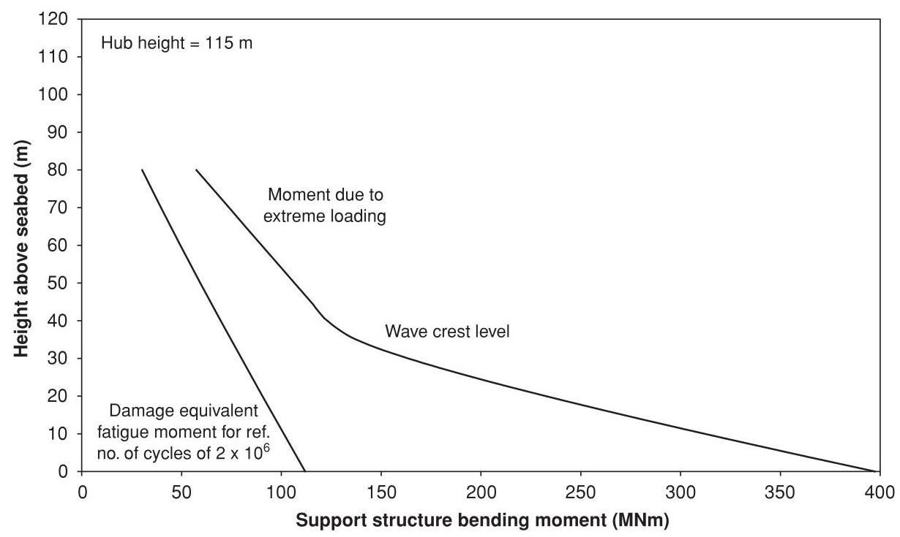

Figure 11.36 Variation of extreme and fatigue moments over height of support structure for 5 MW wind turbine

It is seen that extreme loads are more likely to govern the design at seabed level, whereas fatigue loads are more likely to govern at wave crest level, although, if the critical fatigue detail category is assumed to be category 90, fatigue loads govern down to seabed level in this case. In the general case, a range of factors, including the relative magnitude of extreme and fatigue loads, the critical fatigue detail category and the monopile wall slenderness, will determine whether extreme or fatigue loads govern at different heights. In practice extreme load (which could be operational given low offshore wind turbulence and gusts) tends to govern embedment depth and fatigue tends to govern other dimensions.

The other key design driver is the restriction on support structure natural frequency, and it is often best to address this early on in the process of design iteration.

Wind turbines deployed offshore are substantially larger than most of those deployed on land, and consequently nearly always operate at variable speed, because this allows power fluctuations in the wind to be absorbed by rotor acceleration rather than by rapid fluctuations of electrical power. The ratio of maximum to minimum rotational speed is usually quite wide - from 1.5 to 2.5 - with the result that the band of frequencies available for the tower natural frequency between the maximum rotational frequency and the minimum blade passing frequency is considerably narrowed. This is illustrated for a 5 MW wind turbine in Figure 11.37.

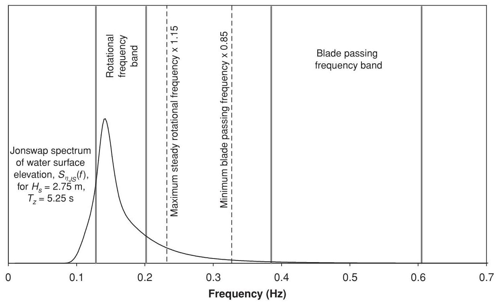

Figure 11.37 Support structure natural frequency exclusion zones for a 5 MW turbine

Given that there needs to be roughly a 15% margin between a turbine exciting frequency and the support structure natural frequency, it can be seen that in this case the range of feasible frequencies is limited to ${0.23} - {0.33}\mathrm{\;{Hz}}$ .

For a $6\mathrm{\;m}$ diameter monopile supporting a $5\mathrm{{MW}}$ turbine in water of about ${20}\mathrm{\;m}$ depth it is found that a design providing adequate strength under extreme and fatigue loading has a natural frequency just above the ${0.23}\mathrm{\;{Hz}}$ lower limit.

Fatigue analysis is considered further in Section 11.6.2.

## Embedment

Except in the case of monopiles inserted into sockets drilled in rock, the soil in which the monopile is embedded has to be treated as a flexible medium which allows lateral movement and flexure of the pile below seabed level. This lowers the depth of effective fixity for the cantilever support structure and can have a decisive impact on natural frequency.

It is normal to analyse the interaction between pile and soil by modelling the soil as a series of non-linear lateral springs, known as p-y springs, acting on the pile over its embedment depth. This model was developed for determining pile ultimate resistance to lateral loads and different suites of $p - y$ curves have been developed for used with clays and sands. Caution needs to be exercised when linearising the $p - y$ curves in order to determine pile head stiffnesses under service loading, particularly in the case of clays, where the usual closed-form curves have infinite initial slopes. Recommended $p - y$ curves and advice on their application are contained in DNV-JS-101 (2007).

## Grouted joint design

The grouted joint between the monopile and transition piece must be capable of supporting the weight above and of resisting the overturning moments and torsional loads. Axial and torsional loads produce shear at the grout/steel interfaces, whereas the overturning moment produces compression, so it is normal to treat the two types of load separately.

a) Overturning moment Moment is transferred between sleeve and pile by compression stresses in the grout, which vary approximately linearly from zero at joint mid-height to maxima at the top and bottom. Assuming the transition piece is sleeved over the monopile, the compression in the upper half of the joint is on the upwind side and the compression in the lower half of the joint is on the downwind side.

The horizontal forces between sleeve and pile generate high shear stresses in the wall of each and these approach the maximum permitted for the recommended grouted joint $L/D$ ratio of 1.5 when the applied moment reaches the sleeve/pile moment capacity. However, the corresponding compression stresses in the grout are relatively low - of the order of 5 or 10 MPa for a fully loaded joint.

b) Axial and torsional loads Shear across the grout/steel interface due to axial and torsional loads can be resisted by the provision of shear keys in the form of weld beads or thin steel bars welded to the steel tube. However, each shear key introduces a fatigue stress raiser, which militates against their use.

In the absence of shear keys, resistance to shear at the steel/grout interfaces depends on sleeve and pile surface irregularities, which are reproduced on the mating grout surfaces. In order for relative movement between pile and sleeve to occur, the sleeve and pile must expand and contract respectively to allow a ridge in the steel to move opposite a ridge in the grout. Hence, for a depth of surface irregularity, $\delta$ , sliding generates a radial pressure of approximately $E\left( {\delta /{2R}}\right) \left( {t/R}\right)$ where $E$ is the Young’s Modulus of steel, $R$ is the joint radius and $t$ is the wall thickness of sleeve and monopile (assumed to be the same). The design shear resistance per unit area is then

$$
{\tau }_{d} = \frac{\mu }{{\gamma }_{m}}E\frac{\delta }{2R}\frac{t}{R} \tag{11.45}
$$

where $\mu$ is the coefficient of friction between grout and steel and ${\gamma }_{m}$ is the partial safety factor for materials strength. DNV-OS-J101 recommends a maximum coefficient of friction of 0.4 and a materials factor of 3.0.

It is apparent from inspection of Equation 11.45 that the result is critically dependent on the magnitude of the surface irregularity, $\delta$ . Traditionally it was assumed that the ratio $\delta /R$ was constant, with the 2007 edition of DNV-JS-101 recommending a value of 0.00037. However, instances of joint slippage in 2009 have led to serious questioning of this assumption and the issue of interim guidance based on a fixed surface irregularity of only ${0.074}\mathrm{\;{mm}}$ , regardless of joint radius. This implies a dramatic reduction in $\delta$ for typical monopile diameters - for example the $\delta /R = {0.00037}$ assumption would have given a $\delta$ of about ${0.9}\mathrm{\;{mm}}$ for a $5\mathrm{\;m}$ pile diameter.

Measures to increase the axial load capacity of grouted joints under consideration include the provision of elastomeric springs at the top or the introduction of a small matching taper on monopile and transition piece.

## Monopiles in deeper water

Wind loads dominate monopile bending moments in shallow waters because wave loads act at a much smaller lever arm, so monopile weight would be expected to simply increase in proportion to monopile length at first. However, in deeper water, wave loading begins to dominate, monopile diameter has to increase and weight increases much more rapidly.

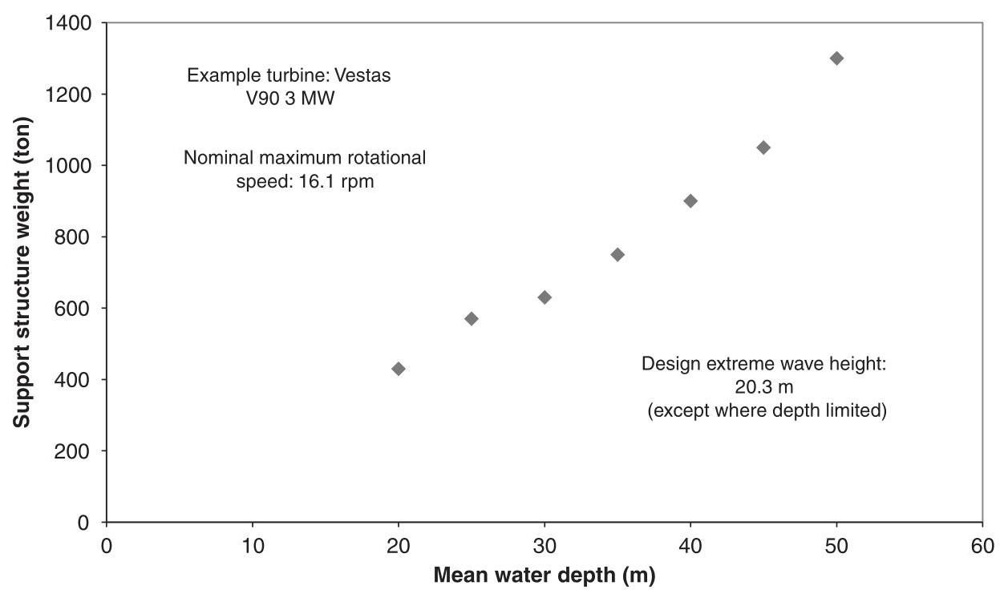

Figure 11.38 Variation of support structure weight with mean water depth. (From Van der Tempel, 2007)

De Vries and Krolis (2007) prepared a family of outline support structures designs for the Vestas V903 MW wind turbine in various water depths between ${20}\mathrm{\;m}$ and ${50}\mathrm{\;m}$ , taking a design extreme wave height of ${20.3}\mathrm{\;m}$ appropriate for a North Sea site ${80}\mathrm{\;{km}}$ from the Dutch coast. The designs were configured to achieve a target natural frequency of ${0.32}\mathrm{\;{Hz}}$ and satisfy buckling strength requirements. Figure 11.38 shows the resulting variation of the weight of the support structure (comprising monopile, transition piece and tower) with water depth.

The weight for ${20}\mathrm{\;m}$ water depth is below the general trendline because, in this case, the extreme wave height is depth limited, so platform height and hub height are both reduced. To put the support structure weights in context, it can be noted that the turbine weight (rotor, hub and nacelle) for the Vestas V90 is only 112 tonnes.

The selected monopile diameters ranged from $4\mathrm{\;m}$ at ${20}\mathrm{\;m}$ water depth to $6\mathrm{\;m}$ at ${50}\mathrm{\;m}$ depth - well within the $8\mathrm{\;m}$ diameter capability of some existing production facilities.

### 11.6.2 Monopile fatigue analysis in the frequency domain

In the short term, wind and wave loading are statistically independent processes, which means that the power spectra of the loads at any cross-section of the support structure from the two sources can simply be added together to obtain the power spectrum of the total load. This section considers the treatment of wave and wind loading fatigue separately to begin with and then the combination of the two.

## Wave loading in the frequency domain

On offshore wind turbine structures, the established method for calculating wave fatigue damage in the frequency domain on oil and gas platforms can be utilised. The attraction of the method is that it is computationally much more efficient than undertaking numerous simulations in the time domain followed by rain-flow cycle counting. The procedure starts with obtaining a stress spectrum for the point under consideration from the wave spectrum for each sea state by means of a transfer function, which relates the stress amplitude to the wave height at each frequency. Each stress spectrum is then converted to a stress range probability distribution (e.g. by means of the Dirlik formula, Section 5.9.3, Chapter 5), which, in combination with the appropriate $S - N$ curve, enables the fatigue damage arising from exposure to each sea state to be derived. Finally, the damages from all the sea states are summed to obtain the total fatigue damage at the point under consideration.

The method depends on a linear relationship between wave loading and wave height. As set out in Section 11.3.9, Morison's equation for wave loading on a cylinder contains two terms - the inertia term which is linear with respect to wave height and the drag term which is not. Fortunately, the non-linear drag term can typically be ignored when calculating fatigue loading, as inertia loading dominates for Keulegan-Carpenter numbers of less than 11 (Figure 11.22), which corresponds to a wave height to cylinder diameter ratio of less than 3.5 in deep water.

This section considers the various stages in the fatigue damage calculation in turn.

## Bending moment and stress transfer functions for a monopile

a) Quasi-static behaviour For a cylindrical monopile support structure with radius $r$ , the expression for the peak quasi-static mudline moment due to wave loading, ${M}_{0}$ , is obtained by integrating Morison's equation over the water depth. Hence:

$$
{M}_{0} = {C}_{M}{\rho \pi }{r}^{2}{\int }_{-d}^{0}{\left( \dot{u}\right) }_{\max }\left( {z + d}\right) {dz} = {C}_{M}{\rho \pi }{r}^{2}\frac{Hgk}{2}{\int }_{-d}^{0}\frac{\cosh k\left( {z + d}\right) }{\cosh {kd}}\left( {z + d}\right) {dz}
$$

$$
= {C}_{M}{\rho \pi }{r}^{2}\frac{Hg}{2}\tanh {kd}\left\{  {d + \frac{1 - \cosh {kd}}{k\sinh {kd}}}\right\} \tag{11.46}
$$

In deep water - that is, for conditions in which $d > {0.08g}{T}^{2}$ - this approximates to

$$
{M}_{0} = {C}_{M}{\rho \pi }{r}^{2}{Hgd}/2 \tag{11.47}
$$

In general, ${M}_{0}$ is frequency dependant, as the wave number, $k\left( { = {2\pi }/L}\right)$ , depends on the wave frequency (see Equation 11.15). The transfer function giving the ratio of peak quasi-static bending moment, ${M}_{0}$ , to wave amplitude for different wave numbers (and hence frequencies, $f$ ) is

$$
{H}_{{M0}/\eta }\left( f\right)  = \frac{{M}_{0}}{H/2} = {C}_{M}{\rho \pi }{r}^{2}g\tanh {kd}\left\{  {d + \frac{1 - \cosh {kd}}{k\sinh {kd}}}\right\} \tag{11.48}
$$

For a monopile wall thickness of $t$ , the bending stress is ${M}_{0}/\pi {r}^{2}t$ , so the ratio of peak bending stress to wave amplitude - the bending stress transfer function - in the absence of dynamic magnification is

$$
{H}_{{\sigma 0}/\eta } = {C}_{M}\rho \frac{g}{t}\tanh {kd}\left\{  {d + \frac{1 - \cosh {kd}}{k\sinh {kd}}}\right\} \tag{11.49}
$$

It is worth noting that the monopile radius does not appear explicitly in this expression, although it may affect the value of the inertia coefficient, ${C}_{M}$ .

b) Resonant behaviour When the wave frequency is close to the natural frequency of the support structure the latter responds dynamically and its response is amplified in an analogous manner to that of a stationary blade described in Appendix A5. If, for simplicity, the seabed is assumed to be rigid, then, by analogy with Equation A5.26, the mudline moment due to wave excitation of the support structure first mode is given by

$$
{M}_{1}\left( t\right)  = {\omega }_{1}^{2}{f}_{1}\left( t\right) {\int }_{0}^{H + d}m\left( y\right) {\mu }_{1}\left( y\right) {ydy} \tag{11.50}
$$

where ${\omega }_{1}$ is the support structure natural frequency in rad/sec, ${f}_{1}\left( t\right)$ is the first mode hub displacement, $m\left( y\right)$ is the mass distribution per unit length, $y\left( { = z + d}\right)$ is the height above the seabed and ${\mu }_{1}\left( y\right)$ is the first mode shape. By analogy with equation A5.3, the hub displacement is given by

$$
{f}_{1}\left( t\right)  = \frac{1}{{k}_{1}}\frac{{\int }_{0}^{H + d}{\mu }_{1}\left( y\right) {q}_{1}\left( y\right) {dy}}{\sqrt{{\left( 1 - {\left( \omega /{\omega }_{1}\right) }^{2}\right) }^{2} + 4{\xi }_{1}^{2}{\left( \omega /{\omega }_{1}\right) }^{2}}}\cos \left( {{\omega t} + \phi }\right) \tag{11.51}
$$

where ${k}_{1} = {m}_{1}{\omega }_{1}^{2},{q}_{1}\left( y\right)$ is the wave loading amplitude and ${\xi }_{1}$ is the first mode damping ratio. ${m}_{1}$ is the generalised mass, ${\int }_{0}^{H + d}m\left( y\right) {\mu }_{1}^{2}\left( y\right) {dy}$ and $\omega$ is the wave angular frequency. Hence,

$$
{M}_{1}\left( t\right)  = {C}_{M}{\rho \pi }{r}^{2}\frac{Hgk}{2}{\int }_{0}^{d}{\mu }_{1}\left( y\right) \frac{\cosh {ky}}{\cosh {kd}}{dy}
$$

$$
\times  \frac{{\int }_{0}^{H + d}m\left( y\right) {\mu }_{1}\left( y\right) {ydy}}{{m}_{1}\sqrt{{\left( 1 - {\left( \omega /{\omega }_{1}\right) }^{2}\right) }^{2} + 4{\xi }_{1}^{2}{\left( \omega /{\omega }_{1}\right) }^{2}}}\cos \left( {{\omega t} + \phi }\right) \tag{11.52}
$$

The generalised mass, ${m}_{1}$ , is usually dominated by the tower head mass, so the ratio ${\int }_{0}^{H + d}m\left( y\right) {\mu }_{1}\left( y\right) {ydy}/{m}_{1}$ approximates to the hub height above the seabed, $H + d$ . Defining an effective hub height above the seabed, ${H}^{\prime } + d$ , as equal to ${\int }_{0}^{H + d}m\left( y\right) {\mu }_{1}\left( y\right) {ydy}/{m}_{1}$ .

Equation 11.52 can be shortened to

$$
{M}_{1}\left( t\right)  = {C}_{M}{\rho \pi }{r}^{2}\frac{Hgk}{2}{\int }_{0}^{d}{\mu }_{1}\left( y\right) \frac{\cosh {ky}}{\cosh {kd}}{dy}\frac{{H}^{\prime } + d}{\sqrt{{\left( 1 - {\left( \omega /{\omega }_{1}\right) }^{2}\right) }^{2} + 4{\xi }_{1}^{2}{\left( \omega /{\omega }_{1}\right) }^{2}}}\cos \left( {{\omega t} + \phi }\right)
$$

(11.53)

Comparing the amplitude of the resonant moment (Equation 11.53) with the quasi-static moment (Equation 11.46), it is seen that the magnification of the mudline moment due to dynamic excitation of the first mode is

$$
\frac{{M}_{1}}{{M}_{0}} = \frac{k{\int }_{0}^{d}{\mu }_{1}\left( y\right) \frac{\cosh {ky}}{\cosh {kd}}{dy}}{\tanh {kd}\left\{  {d + \frac{1 - \cosh {kd}}{k\sinh {kd}}}\right\}  }\frac{{H}^{\prime } + d}{\sqrt{{\left( 1 - {\left( \omega /{\omega }_{1}\right) }^{2}\right) }^{2} + 4{\xi }_{1}^{2}{\left( \omega /{\omega }_{1}\right) }^{2}}}
$$

$$
= \frac{\lambda \left( d\right) }{\sqrt{{\left( 1 - {\left( f/{f}_{1}\right) }^{2}\right) }^{2} + 4{\xi }_{1}^{2}{\left( f/{f}_{1}\right) }^{2}}} \tag{11.54}
$$

where

$$
\lambda \left( d\right)  = \frac{k{\int }_{0}^{d}{\mu }_{1}\left( y\right) \frac{\cosh {ky}}{\cosh {kd}}{dy}}{\tanh {kd}\left\{  {d + \frac{1 - \cosh {kd}}{k\sinh {kd}}}\right\}  }\left( {{H}^{\prime } + d}\right) \tag{11.55}
$$

The ratio $\lambda \left( d\right)$ is a measure of the influence of wave loading near the root of the cantilever on first mode resonance, excluding the dynamic magnification given by the DMR, $1/\sqrt{{\left( 1 - {\left( f/{f}_{1}\right) }^{2}\right) }^{2} + 4{\xi }_{1}^{2}{\left( f/{f}_{1}\right) }^{2}}$ . For deep water waves, the wave loading is concentrated in the region around the mean water level, so the first half of the expression for $\lambda \left( d\right)$ approximates to ${\mu }_{1}\left( d\right) /d$ . Moreover, as noted above, $\left( {{H}^{\prime } + d}\right)$ can be approximated by $\left( {H + d}\right)$ . Combining these two approximations leads to

$$
{\lambda }^{ * }\left( d\right)  = \frac{{\mu }_{1}\left( d\right) \left( {H + d}\right) }{d} \tag{11.56}
$$

where the asterisk indicates an approximate value.

Wave loading is usually applied relatively close to the base of the support structure, so ${\mu }_{1}\left( d\right)$ is much less than the ratio $d/\left( {H + d}\right)  -$ for example about 0.03 for a $d/\left( {H + d}\right)$ of 0.2 and a rigid seabed, giving a ${\lambda }^{ * }\left( d\right)$ of 0.15 . In practice, the seabed can rarely be considered completely rigid, and the effective pile fixity depth below the seabed, $m$ , may be several pile diameters, leading to larger values of ${\mu }_{1}\left( d\right)$ . However, in all cases, the dynamic magnification of the mudline moment due to wave loading is much less than that for the same loading applied at the tower top.

The transfer function giving the ratio of peak bending moment, ${M}_{1}$ , to wave amplitude for different wave frequencies, $f$ , measured in $\mathrm{{Hz}}$ , is:

$$
{H}_{{M1}/\eta }\left( f\right)  = \frac{{M}_{1}}{H/2} = {C}_{M}{\rho \pi }{r}^{2}{gk}{\int }_{0}^{d}{\mu }_{1}\left( y\right) \frac{\cosh {ky}}{\cosh {kd}}{dy}\frac{\left( {H}^{\prime } + d\right) }{\sqrt{{\left( 1 - {\left( f/{f}_{1}\right) }^{2}\right) }^{2} + 4{\xi }_{1}^{2}{\left( f/{f}_{1}\right) }^{2}}}
$$

(11.57)

It is convenient to abbreviate this to:

$$
{H}_{{M1}/\eta }\left( f\right)  = {G}_{{M1}/\eta }\left( f\right) \frac{1}{\sqrt{{\left( 1 - {\left( f/{f}_{1}\right) }^{2}\right) }^{2} + 4{\xi }_{1}^{2}{\left( f/{f}_{1}\right) }^{2}}} = {G}_{{M1}/\eta }\left( f\right)  \cdot  {DMR} \tag{11.58}
$$

where

$$
{G}_{{M1}/\eta }\left( f\right)  = {C}_{M}{\rho \pi }{r}^{2}{gk}{\int }_{0}^{d}{\mu }_{1}\left( y\right) \frac{\cosh {ky}}{\cosh {kd}}{dy}\left( {{H}^{\prime } + d}\right) \tag{11.59}
$$

Then

$$
\lambda \left( d\right)  = \frac{{M}_{1}/{DMR}}{{M}_{0}} = \frac{{H}_{{M1}/\eta }\left( f\right) /{DMR}}{{H}_{{M0}/\eta }\left( f\right) } = \frac{{G}_{{M1}/\eta }\left( f\right) }{{H}_{{M0}/\eta }\left( f\right) } \tag{11.60}
$$

## Example mudline bending moment transfer functions

Figure 11.39 illustrates the support structure for a $5\mathrm{{MW}}$ wind turbine considered in this example. The tower is mounted on a $6\mathrm{\;m}$ diameter monopile driven into the seabed. The soil properties are assumed to be such that the monopile is effectively fixed at a depth, $m$ , of ${20}\mathrm{\;m}$ below the seabed. Hub height above the seabed is ${115}\mathrm{\;m}$ and the mean water depth, $d$ , is ${23}\mathrm{\;m}$ .

The co-ordinate, $y$ , defined as the distance from the cantilever root is now measured from the fixity point at a depth, $m$ , below the seabed. This has no effect on the quasi-static mudline moment, but increases the resonant mudline moment significantly. Equation 11.52 becomes

$$
{M}_{1}\left( t\right)  = {C}_{M}{\rho \pi }{r}^{2}\frac{Hgk}{2}{\int }_{m}^{d + m}{\mu }_{1}\left( y\right) \frac{\cosh {ky}}{\cosh {kd}}{dy}
$$

$$
\times  \frac{{\int }_{0}^{H + d + m}m\left( y\right) {\mu }_{1}\left( y\right) \left( {y - m}\right) {dy}}{{m}_{1}\sqrt{{\left( 1 - {\left( \omega /{\omega }_{1}\right) }^{2}\right) }^{2} + 4{\xi }_{1}^{2}{\left( \omega /{\omega }_{1}\right) }^{2}}}\cos \left( {{\omega t} + \phi }\right) \tag{11.61}
$$

in which ${\int }_{0}^{H + d + m}m\left( y\right) \mu \left( y\right) \left( {y - m}\right) {dy}/{m}_{1}$ can be replaced by $\left( {{H}^{\prime } + d}\right)$ as before.

Determination of the mode shape leads to a normalised deflection at mean water level, ${\mu }_{1}\left( {d + m}\right)$ , of 0.071 and ${\lambda }^{ * }\left( {d + m}\right)  = {\mu }_{1}\left( {d + m}\right) \left( {{H}^{\prime } + d}\right) /d = {0.071}\left( {{115}/{23}}\right)  = {0.355}$ .

The transfer functions for the quasi-static mudline moment, ${H}_{{M0}/\eta }\left( f\right)$ , and for the first mode resonant mudline moment, ${H}_{{M1}/\eta }\left( f\right)$ together with an example Jonswap spectrum (for ${H}_{S} = {2.75}\mathrm{\;m}$ and ${T}_{Z} = {5.25}\mathrm{{sec}}$ ) are shown in Figure 11.40. The support structure natural frequency, ${f}_{1}$ , is ${0.24}\mathrm{\;{Hz}}$ and the damping ratio, $\xi$ , is taken as $5\%$ , giving a peak dynamic magnification ratio of 10.

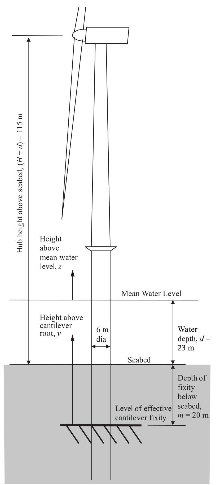

Figure 11.39 Example support structure for 5 MW turbine

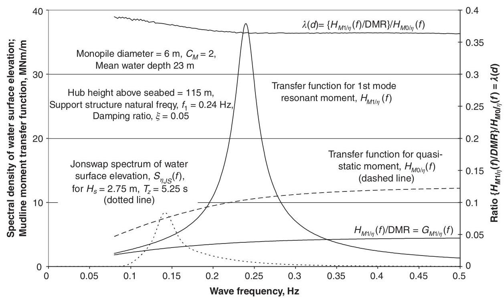

Figure 11.40 Comparison of quasi-static and resonant transfer functions for mudline moment for the example support structure of Figure 11.39

Clearly the damping ratio is of major importance in determining the resonance peak. The principal components of damping - viz aerodynamic, structural and that arising from soil hysteresis - are discussed in later sub-sections within this section.

It is seen that the mudline moment transfer function for quasi static loading increases with wave frequency. Thus, although water motion and, hence, wave loading are increasingly concentrated near the surface as the wave length reduces, increased particle accelerations overcome the effect, resulting in increasing overturning moments for waves of a given amplitude.

Figure 11.40 also shows the first mode resonant mudline moment transfer function divided by the dynamic magnification factor, ${H}_{{M1}/\eta }\left( f\right) /{DMR} = {G}_{{M1}/\eta }\left( f\right)$ . The function, ${G}_{{M1}/\eta }\left( f\right)$ , is very similar in form to the quasi-static transfer function. This is illustrated by the plot of the ratio of the two, $\lambda \left( d\right)  = {G}_{{M1}/\eta }\left( f\right) /{H}_{{M0}/\eta }\left( f\right)$ , which is seen to be insensitive to wave frequency and to be close to the ${\lambda }^{ * }\left( d\right)$ value of 0.355 .

## Effect of diffraction

Section 11.3.9 set out how wave diffraction influences the inertia coefficient when the cylinder diameter is of significant size in relation to the wave length. Diffraction results in a rapid reduction of the inertia coefficient below the nominal value of 2.0 for $D/L$ ratios above about 0.17, as shown in Figure 11.25. In Figure 11.40, the inertia coefficient was assumed to be constant at 2.0 for simplicity, but the effect of diffraction on the transfer function for the quasi-static mudline moment is illustrated in Figure 11.41. Also shown is the Jonswap spectrum for the ${H}_{s} = {2.75}\mathrm{\;m},{T}_{z} = {5.25}\mathrm{\;m}$ sea state.

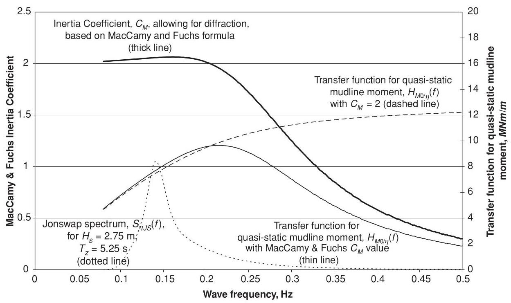

Figure 11.41 Effect of diffraction on the transfer function for quasi-static mudline moment for the example support structure of Figure 11.39

It is apparent that, for the support structure and sea state chosen, the reduction in inertia coefficient only affects the loading due to waves in the upper tail of the wave spectrum. However, as the Mac Camy and Fuchs inertia coefficient reduces to 1.8 at the support structure resonant frequency of ${0.24}\mathrm{\;{Hz}}$ , the resonant moment comes down somewhat when diffraction is allowed for.

## Aerodynamic damping

During turbine operation, aerodynamic damping of the rotor provides significant damping of wave-induced support structure motion in the fore-aft direction. For constant blade pitch, this is easily estimated at each wind speed using the closed-form formula in Equation 5.135, but when the pitch system is active, the aerodynamic damping is heavily dependent on the control strategy and cannot be easily calculated.

Wind turbine simulations in the time domain automatically model support structure aerodynamic damping, but do so implicitly rather than explicitly. However, values of the aerodynamic damping at different wind speeds can be deduced from time domain simulations of transient free vibrations in response to a tower top step loading during turbine operation in a turbulent wind field, including the effects of blade pitching. In each case, it is necessary to subtract the tower top displacement time history from a parallel simulation without the tower top step loading, but with the same seeds, in order to determine the transient tower top displacement response to the step loading on its own. The damping ratio is then calculated from the logarithmic decrement of the first mode free vibrations.

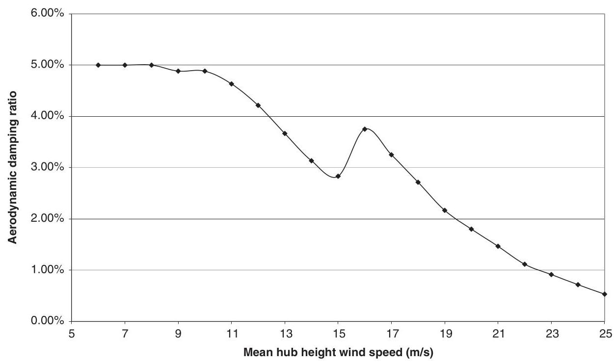

Figure 11.42 Variation of aerodynamic damping with wind speed for fixed speed pitch regulated machine in a turbulent wind

An example plot of the variation of aerodynamic damping with mean wind speed obtained using the above method by Kühn (2001) is shown in Figure 11.42. The reference turbine design investigated was a 3 MW, two-bladed, fixed speed, pitch regulated machine on a soft-soft monopile support structure, with the hub ${80}\mathrm{\;m}$ above the seabed and a water depth of ${21}\mathrm{\;m}$ , which was developed during the Opti-OWECS study.

Figure 11.42 shows reducing damping above ${10}\mathrm{\;m}/\mathrm{s}$ as a result of increasing flow separation over the inner part of the blade until blade pitching above the rated wind speed of 13.7 m/s leads to flow re-attachment and damping recovery. However, above ${16}\mathrm{\;m}/\mathrm{s}$ , increasingly rapid action of the pitch control system in response to tower head oscillatory motion reduces the aerodynamic damping considerably at higher wind speeds. This is because, as the tower top sways into the wind, the blades feather to curb the power increase, reducing the rotor thrust and vice versa.

It is now becoming common practice for the control system to be designed to suppress support structure oscillations at resonant frequency, which can lead to effective aerodynamic damping ratios in excess of the values for fixed pitch operation with attached flow (see Chapter 8).

## Wind wave misalignment

When the wind and wave directions are not in alignment, the aerodynamic damping of wave-induced support structure motion will be reduced, as the aerodynamic damping of turbine side to side motion is very small, and this needs to be accounted for in the fatigue analysis.

## Structural damping

The level of structural damping provided by the monopile and tower is very much less than that due to aerodynamic damping. For example, the Eurocode on wind loading, EN 1991-1-4, gives a logarithmic decrement of structural damping of 0.012 , equivalent to a damping ratio of 0.19% for welded steel chimneys and DNV-RP-C205 'Environmental conditions and environmental loads' gives a damping ratio of 0.15% for steel members in air.

## Soil damping

Tarp-Johansen (2009) has investigated soil damping using a three-dimensional finite-element model of the seabed surrounding a monopile foundation, and concluded that the logarithmic decrement of support structure damping provided by the soil may be in the range 0.035-0.05, equivalent to a damping ratio of ${0.55} - {0.8}\%$ . However, the pile embedment was low (4.25 diameters) resulting in larger motion in the soil and, hence, larger soil damping than would normally be the case.

In view of the difficulties of quantifying soil damping on a site-by-site basis, some designers adopt a conservative approach and simply ignore it altogether.

## Damping during turbine shut-down

When the turbine is shut down, the aerodynamic damping is negligible, and support structure damping will be limited to that provided by the welded structure and the soil foundation, with a small contribution from hydrodynamic damping. The Germanischer Lloyd Guidelines for the Certification of Offshore Wind Turbines (2005) suggests $1\%$ as a rough approximation to the damping ratio in these circumstances. The much reduced damping level during turbine shut-down will result in considerably greater wave excitation of support structure resonance than during turbine operation, so the percentage of machine downtime assumed in the fatigue damage calculations needs to be estimated with care.

## Monopile bending moment spectra

The spectrum of the first mode resonant mudline moment is obtained by multiplying the wave spectrum by the square of the first mode resonant mudline moment transfer function:

$$
{S}_{M1}\left( f\right)  = {S}_{\eta JS}{\left\lbrack  {H}_{{M1}/\eta }\left( f\right) \right\rbrack  }^{2} \tag{11.62}
$$

The transformation of a wave spectrum into support structure bending moment spectra is illustrated in Figure 11.43 for the support structure of Figure 11.39 with the sea state modelled using the Jonswap spectrum. The sea state taken is ${H}_{s} = {2.75}\mathrm{\;m}$ and ${T}_{z} = {5.25}\mathrm{{sec}}$ , for which the peak shape factor, $\gamma$ , is 2.32 and the peak frequency, ${f}_{p}$ , is ${0.141}\mathrm{\;{Hz}}$ . The figure shows the Jonswap spectrum, the square of the transfer function for first mode resonant moment response and the resultant spectrum of first mode resonant mudline moment.

A complete analysis would investigate the dynamic response of the second and higher support structure modes, but excitation of these modes is minimal when inertia loading dominates.

It is evident that in this example the spectrum of the first mode resonant moment response is dominated by the resonance peak, with a much smaller peak occurring at the peak wave frequency. The latter peak is much smaller than the peak of the quasi-static spectrum (Figure 11.44), but good agreement would be expected if the spectra of mudline moment in response to the excitation of higher support structure vibration modes were added to that shown above for the first mode.

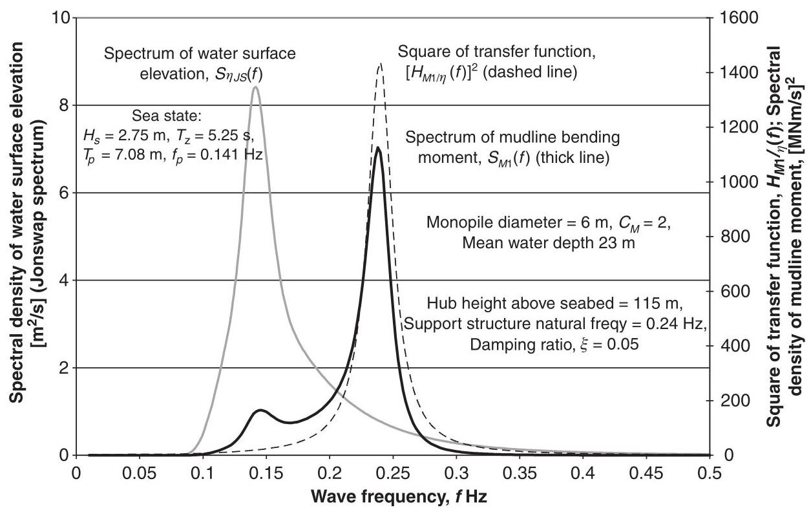

Figure 11.43 Spectra of water surface elevation and resonant mudline bending moment for the example support structure of Figure 11.39 and the ${H}_{s} = {2.75}\mathrm{\;m}/{T}_{z} = {5.25}\mathrm{{sec}}$ sea state

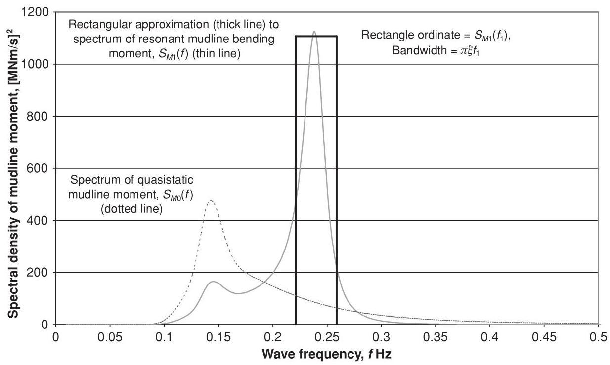

Figure 11.44 Mudline moment spectrum approximation

## Approximate treatment of moment response for fatigue analysis purposes

Given that the first mode resonant response is narrow banded, the resonant moment spectrum may be approximated for fatigue analysis purposes by a rectangle of height ${S}_{M1}\left( {f}_{1}\right)$ and width (the bandwidth) ${\pi \xi }{f}_{1}$ , centred on the first mode resonant frequency, ${f}_{1}\mathrm{{Hz}}$ . This is illustrated in Figure 11.44. The area within the rectangle is

$$
{S}_{M1}\left( {f}_{1}\right) {\pi \xi }{f}_{1} = {S}_{\eta JS}\left( {f}_{1}\right) {\left\lbrack  {H}_{{M1}/\eta }\left( {f}_{1}\right) \right\rbrack  }^{2}{\pi \xi }{f}_{1} \tag{11.63}
$$

As the transfer function is proportional to the dynamic magnification ratio (DMR), which is equal to $1/\left( {2\xi }\right)$ at resonance, it follows that the area within the rectangle is inversely proportional to the damping ratio. The standard deviation of the resonant bending moment, which is equal to the square root of the area of the rectangle, is thus given by

$$
{\sigma }_{M1} = {H}_{{M1}/\eta }\left( {f}_{1}\right) \sqrt{{S}_{\eta }\left( {f}_{1}\right) {\pi \xi }{f}_{1}}
$$

$$
= {C}_{M}{\rho \pi }{r}^{2}{gk}{\int }_{m}^{d + m}{\mu }_{1}\left( y\right) \frac{\cosh {ky}}{\cosh {kd}}{dy}\left( {{H}^{\prime } + d}\right) \sqrt{{S}_{\eta }\left( {f}_{1}\right) {f}_{1}\pi /\left( {4\xi }\right) } \tag{11.64}
$$

Given that the area of overlap between the rectangular approximation to the resonant bending spectrum and the quasi-static spectrum is small, the total moment spectrum can be conservatively approximated by the summation of the two.

A further simplification is to ignore the variation of the quasi-static transfer function with frequency, and equate the quasi-static moment spectrum to the product of the wave spectrum and the square of the quasi-static transfer function at the peak wave frequency. Then

$$
{S}_{M0}\left( f\right)  = {S}_{\eta JS}\left( f\right) {\left\lbrack  {H}_{{M0}/\eta }\left( {f}_{p}\right) \right\rbrack  }^{2} \tag{11.65}
$$

and the standard deviation of the quasi-static bending moment becomes simply

$$
{\sigma }_{M0} = {\sigma }_{\eta }{H}_{{M0}/\eta }\left( {f}_{p}\right)  = \frac{{H}_{s}}{4}{C}_{M}{\rho \pi }{r}^{2}g\tanh {k}_{p}d\left\{  {d + \frac{1 - \cosh {k}_{p}d}{{k}_{p}\sinh {k}_{p}d}}\right\} \tag{11.66}
$$

where ${\sigma }_{\eta }$ is the standard deviation of water surface elevation and ${k}_{d}$ is the wave number corresponding to the peak frequency, ${f}_{p}$ . Finally the standard deviation of the total mudline moment response is obtained as the square root of the sum of the squares of the quasi-static and resonant responses:

$$
{\sigma }_{M}^{2} = {\sigma }_{M0}^{2} + {\sigma }_{M1}^{2} \tag{11.67}
$$

## Derivation of fatigue damage

The method of calculating the fatigue damage from the moment spectrum depends on whether it can be treated as narrow-band (i.e. occurring over a narrow range of frequencies) or not. When the resonant moment dominates, the quasi-static response centred on the peak wave frequency will have little influence and the response can be treated as narrow banded, with all the load cycles occurring at the resonant frequency. It is worth noting that, provided the standard deviation of the quasi-static response is included using equation (11.66), the narrow band assumption is conservative, because allowance for broad-bandedness reduces the calculated fatigue damage.

It can be shown (see Barltrop and Adams, 1991) that the damage equivalent stress range for a reference number of cycles, ${N}_{R}$ , for narrow banded oscillatory loading is given by

$$
\Delta {\sigma }_{eq} = {\sigma }_{\sigma }\sqrt{8}\sqrt[m]{\frac{n}{{N}_{R}}\Gamma \left( \frac{2 + m}{2}\right) } \tag{11.68}
$$

where ${\sigma }_{\sigma }$ is the standard deviation of the fluctuating stress $\left( { = {\sigma }_{M}/\pi {r}^{2}t}\right) , m$ is the inverse slope of the log-log plot of the $S - N$ curve (assumed to be a single straight line, rather than bi-linear) and $n$ is the number of load cycles over the duration of the sea-state. For $m = 4$ and $n = {N}_{R},\Delta {\sigma }_{eq} = {3.363}{\sigma }_{\sigma }$ .

If, on the other hand, the total moment spectrum is broad-banded, then the Dirlik method (Section 5.9.3, Chapter 5) can be used to derive an approximate stress range probability distribution, which is then combined with the $S - N$ curve to obtain the fatigue damage for each sea state.

## Derivation of S-N curve

The derivation of the $S - N$ curve to be used for the damage calculation must take account of the fatigue detail, corrosion, the plate thickness and the partial safety factor for materials strength.

Influence of fatigue detail Unless there are J tube penetrations through the monopile wall or welded attachments, the critical fatigue details are likely to be the transverse butt welds. According to EN 1993-1-9 'Design of steel structures - fatigue', transverse butt welds are detail category 90, provided the weld convexity is less than 10%, or 112 if the welds are ground flush. For weld convexity between 10% and 20%, detail category 80 applies.

ISO 19902:2007 'Petroleum and natural gas industries -fixed steel offshore structures' uses a different set of $S - N$ curves, which are identified by different letters of the alphabet and have their origins in the British Standard for steel bridges, BS 153. In the case of transverse butt welds, the applicable $S - N$ curves are curve $\mathrm{C},\mathrm{D}$ and $\mathrm{E}$ for ground flush welds, welds with low convexity and welds with high convexity respectively. The curves for low weld convexity, ISO 19902 curve D and the EN 1993-1-9 curve for detail category 90 parallel each other fairly closely before the cut-off limit, as shown in Figure 11.45.

Influence of corrosion Fatigue testing of specimens with cathodic protection in seawater indicates reduced fatigue strength for stress range magnitudes corresponding to fatigue lives of less than ${10}^{6}$ cycles, and this is reflected in separate $S - N$ curves for structures in seawater 'with adequate corrosion protection' specified in ISO 19902. The curve D variant for seawater is shown in Figure 11.45.

Influence of plate thickness EN 1993-1-9 requires the fatigue strength to be reduced in the ratio ${\left( {25}/t\right) }^{0.2}$ when the plate thickness, $t$ , exceeds ${25}\mathrm{\;{mm}}$ . Monopile wall thicknesses often reach ${80}\mathrm{\;{mm}}$ , giving a ratio of 0.792 , so this is a significant consideration. The ISO 19902 reduction ratio formula, ${\left( {16}/t\right) }^{0.25}$ , is more conservative.

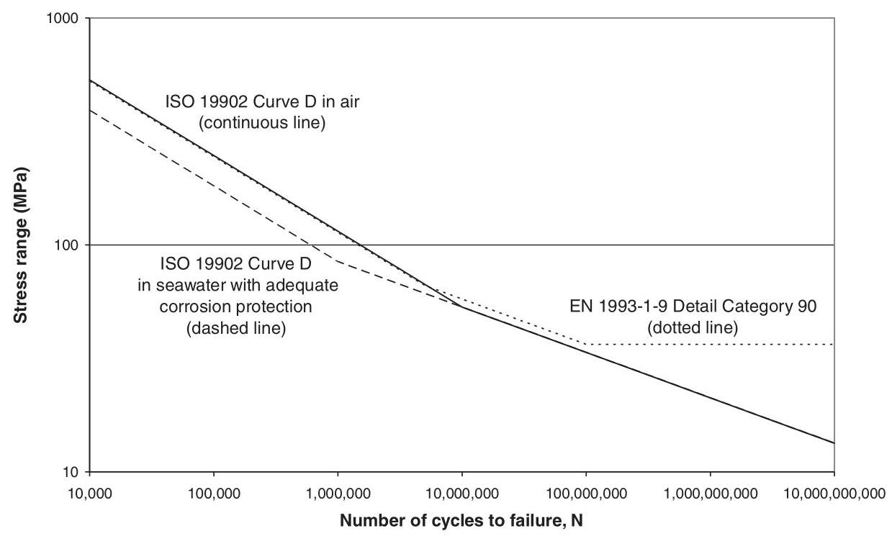

Figure 11.45 Comparison of design $S - N$ curves for transverse butt welds without excessive reinforcement

Partial safety factor for material strength It is generally impracticable to inspect the monopile for fatigue damage, because of marine growth and the hazardous environment, so it must be designed for 'safe-life'. On the basis that the consequence of monopile failure would be high, the partial factor for material strength, ${\gamma }_{m}$ , recommended by EN 1993-1-9 is 1.35. This is higher than the corresponding value of 1.265 in IEC 61400-1, which is the product of a materials factor of 1.1 in the absence of periodic inspections and a consequence of failure factor of 1.15 for high consequence.

In ISO 19902, the partial safety factor for material strength is taken as unity and allowance made for the absence of periodic inspections and high consequence of failure by inflating the calculated fatigue damage sum (which is required to be less than unity as usual) by a fatigue damage design factor of 10 . This is equivalent to a rather high partial safety factor of material strength of 1.58 for an $S - N$ curve inverse slope of $m = 5$ , which reflects the higher safety criticality of oil and gas structures.

DNV-OS-J101 'Design of offshore wind turbine structures' adopts a lower value of fatigue damage design factor of three for uninspectable parts of the structure considered to have low consequence of failure. This corresponds to a ${\gamma }_{m}$ of 1.25 for $m = 5$ . However, no guidance is given for structural elements for which the consequence of failure is high.

## Wind loading in the frequency domain

Dynamic and fatigue analysis of onshore wind turbine support structures in the frequency domain are discussed in Chapter 5, Sections 5.12.5 and 5.12.6 respectively, and similar considerations apply to offshore support structures under wind loading. Given the statistical independence of wind and wave loading, the moment spectrum due to wind loading is simply added to the moment spectrum due to wave loading to obtain the moment spectrum due to the combined loading.

## Wind loading in the time domain

As noted at the end of the preceding section, time domain simulations are preferred to frequency domain analysis for the evaluation of fatigue damage due to wind loading, because they account for both non-linear aerodynamics, non-linear control system behaviour and the combination of deterministic and stochastic load components. Methods of combining wind loading fatigue cycles obtained in the time domain with wave loading fatigue cycles obtained in the frequency domain are discussed below.

## Combination of wind and wave loading fatigue spectra

a) Using simulations and rainflow counting for wind loading fatigue Kuhn (2001) has proposed calculating the fatigue damage due to wind and wave loading separately, using normal wind simulation and spectral fatigue analysis respectively, and then combining the two. The procedure is shown in the schematic below (Figure 11.46).

The damage equivalent stress range referred to in the schematic below is defined as the stress range which, when applied over a specified number of cycles, ${N}_{R}$ , would produce the same fatigue damage as the actual calculated fatigue stress spectrum. ${N}_{R}$ is normally taken as ${10}^{7}$ cycles.

A critical step in the procedure set out in Figure 11.46 is the combination of the wind and wave damage equivalent stress ranges, and the basis for this is set out below.

It has already been noted that the damage equivalent stress range for a reference number of cycles, ${N}_{R}$ , for narrow banded oscillatory loading is given by

$$
\Delta {\sigma }_{eq} = {\sigma }_{\sigma }\sqrt{8}\sqrt[m]{\frac{n}{{N}_{R}}\Gamma \left( \frac{2 + m}{2}\right) } \tag{11.69}
$$

Hancock and Gall (1985) have proposed an empirically based modification to the above formula for the case of broad banded loading, which multiplies it by the $m$ -th root of $\beta$ , the ratio of the mean period between crests and the zero crossing period, ${T}_{c}/{T}_{z}$ . Thus,

$$
\Delta {\sigma }_{eq} = {\sigma }_{\sigma }\sqrt{8}\sqrt[m]{\frac{{T}_{c}}{{T}_{z}}\frac{n}{{N}_{R}}\Gamma \left( \frac{2 + m}{2}\right) } \tag{11.70}
$$

The variance of the combined response, ${\sigma }_{\sigma , c}^{2}$ is equal to the sum of the variances of the responses to aerodynamic and hydrodynamic loading, ${\sigma }_{\sigma , a}^{2} + {\sigma }_{\sigma , h}^{2}$ . Hence, repeated application of Equation 11.70 yields:

$$
\Delta {\sigma }_{{eq}, c} = \sqrt{\Delta {\sigma }_{{eq}, a}^{2}{\left( \frac{{T}_{z, a}}{{T}_{z, c}}\right) }^{\frac{2}{m}} + \Delta {\sigma }_{{eq}, h}^{2}{\left( \frac{{T}_{z, h}}{{T}_{z, c}}\right) }^{\frac{2}{m}}} \tag{11.71}
$$

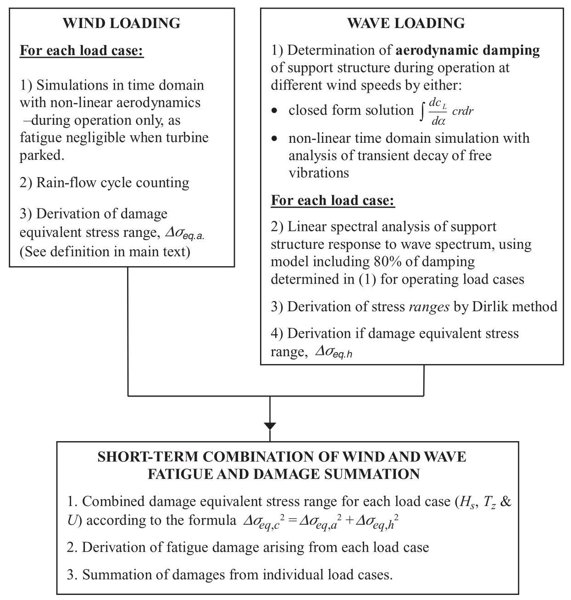

Figure 11.46 Schematic for simplified calculation of fatigue damage

If the zero crossing period weightings are omitted, this becomes simply:

$$
\Delta {\sigma }_{{eq}, c} = \sqrt{\Delta {\sigma }_{{eq}, a}^{2} + \Delta {\sigma }_{{eq}, h}^{2}} \tag{11.72}
$$

Kuhn (2001) reports an investigation of the accuracy of the above simplified method, when applied to the calculation of fatigue damage at cross-sections ${5.5}\mathrm{\;m}$ below the mudline and ${10.6}\mathrm{\;m}$ below the tower top flange for the soft-soft monopile support structure of the reference design referred to above. Equivalent stress ranges obtained from full time-domain simulations of combined wind and wave loading were compared with those derived from the simplified method, using either weighted quadratic superposition, Equation 11.71, or its unweighted equivalent, Equation 11.72, to combine the equivalent stresses from aerodynamic and hydrodynamic loading. Both methods yielded accurate results, but, surprisingly, unweighted quadratic superposition was more accurate, with a maximum error in the equivalent stress of about $3\%$ , compared with about 5% for weighted quadratic superposition.

b) Using simulations to obtain bending stress spectra for wind loading An alternative approach has been proposed by Van Der Tempel (2006), in which time domain simulations are used to obtain bending stress spectra due to wind loading. The key steps are as follows:

1. Carry out a time domain simulation at each mean wind speed with the tower top fixed, and derive a spectrum of the resulting fluctuating load applied to the tower top from its time history.

2. Divide the latter spectrum by the turbulence spectrum of the incoming wind, to obtain the transfer function between the incoming wind fluctuations and the tower top load fluctuations.

3. Obtain values of the aerodynamic damping at different wind speeds - for example, by means of time domain simulations of transient free vibrations in response to a tower top step loading (as described under the aerodynamic damping heading above).

4. Use an FE model of the support structure to derive the transfer functions between tower top loading and the required support structure bending stress for the different values of aerodynamic damping.

5. Multiply the transfer functions derived in steps 2 and 4 together to obtain the transfer function between incoming wind speed and bending stress fluctuations ${H}_{\sigma /U}\left( {f,\bar{U}}\right)$ at each mean wind speed.

6. Multiply the ${H}_{\sigma /U}\left( {f,\bar{U}}\right)$ transfer functions by the spectrum of the incoming wind fluctuations to obtain the spectrum of bending stress fluctuations due to wind loading at each mean wind speed.

An advantage of this approach is that the use of time domain simulations with the tower top fixed means that the results are independent of the support structure used, so do not need to be repeated for different water depths and soil conditions.

Spectra of bending stress due to combined wind and wave loading are obtained by adding the wind loading spectrum to the wave loading spectrum for each combination of mean wind speed and sea state. These combined bending stress spectra can then be used to derive the stress range probability distribution using the Dirlik method and hence the fatigue damage.

### 11.6.3 Gravity bases

The structural action of a gravity base supporting an offshore wind turbine is essentially the same as that of slab foundations used on land (Section 7.10.1, Chapter 7) - that is, it relies on the restoring moment provided by support structure and turbine self weight to resist overturning moments tending to tip it over. However, gravity bases deployed at sea, which are also invariably constructed in reinforced concrete (although steel or steel/concrete composite structures are feasible), are less effective in resisting overturning than those on land, because buoyancy forces reduce their effective self weight. Consequently extra ballast usually has to be added to compensate. It should also be noted that, in the case of bases founded on granular materials, the bearing resistance is less than for the equivalent unsubmerged material on land, because of the reduced particle effective stresses.

Foundation slabs for onshore turbines can be poured in situ, but this option is not available at sea. Instead, the gravity base for an offshore turbine has to be constructed at a quayside, transported by barge to the wind farm site and lowered onto the seabed, which has to be prepared to receive it. Crane lifting capacity places a limit on the weight of gravity base that can be transported, so it is usual to design the structure to be hollow and fill the voids with ballast material once it is in situ.

Floating manufacture, towed transport and installation through controlled submersion are possible (proven in other offshore sectors) and proposals for such concepts exist. The driver for these is efficiency of fabrication and reducing delay risk and cost of installation.

Gravity bases are significantly more massive than alternative concepts so in some situations environmental impact presents a barrier to their use.

## Gravity bases in the Southern Baltic

The relatively benign wave climate and negligible tidal range in the Southern Baltic render seabed preparation and gravity base transportation less challenging activities than in the more hostile conditions prevalent in the North Sea, so gravity bases have been favoured for deployment in shallow water sites close to the coasts of Denmark and Sweden.

Figure 11.47 illustrates the gravity base foundation design used to support 2.3 MW Siemens turbines, 48 in number, at the Lillgrund wind farm in Swedish waters just south of the Öresund bridge. (This information was obtained from the Lillgrund Wind Farm, owned and operated by Vattenfall.) The base consists of a hollow cylindrical shaft rising from a 16.45 m wide hexagonal slab ( ${19}\mathrm{\;m}$ across corners), which is stiffened by six radial walls bracing the shaft to an outer perimeter wall some 2.4 m high. The six-cell ballast tray thus created was backfilled with ballast rock and rock armour after foundation installation. Five variants of the design were constructed with overall heights of ${10.3}\mathrm{\;m},{11.3}\mathrm{\;m},{12.3}\mathrm{\;m},{13.3}\mathrm{\;m}$ and ${14.3}\mathrm{\;m}$ to suit water depths ranging from $4 - 9\mathrm{\;m}$ . (The large inverted cone integral with the top of the cylindrical shaft is provided to reduce ice loads.) The foundations were constructed on barges moored at a quayside at Swinoujscie on the coast of Poland, with each barge accommodating four foundations (Figure 11.48), facilitating eventual transport to the site.

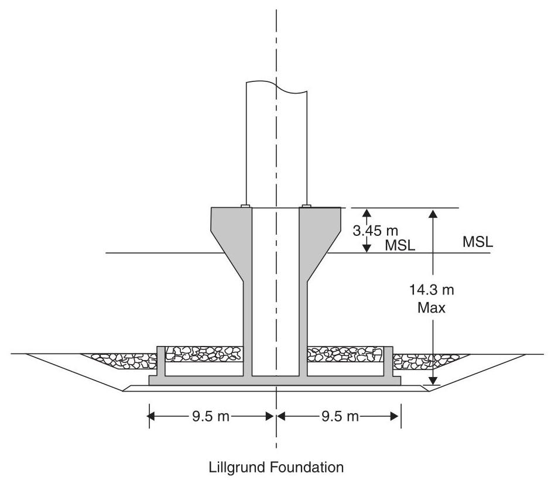

Figure 11.47 Reinforced concrete gravity base design used at Lillgrund wind farm, Sweden

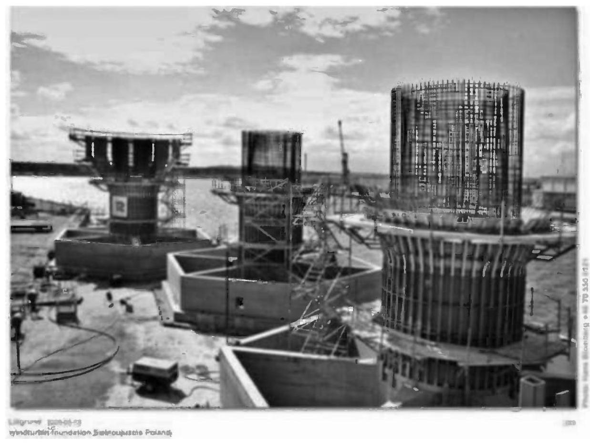

Figure 11.48 Gravity bases for Lillgrund under construction on barge at quayside at Swinou-jscie. (Lillgrund Pilot Project, 2008). Reproduced by permission of Vattenfall. See Plate 4 for the colour figure

The site preparation work consisted of the excavation of a shallow pit in the seabed about ${2.5}\mathrm{\;m}$ in depth, the placing of a steel frame around the perimeter of the excavation, followed by the deposition of a thin layer of crushed rock for the gravity base to rest on. The steel frame was set to level and used by divers to level the rock bed with the aid of a rotating beam mounted on a central support. After installation of each foundation by barge mounted crane (Figure 11.49), the excavation around the foundation was backfilled with filter rock over which rock armour was laid as scour protection. Finally, the void in the cylindrical shaft was filled with ballast material and a concrete slab cast above it. The weight of the tallest foundation was 1375 tonnes without ballast, increasing to 2250 tonnes with ballast.

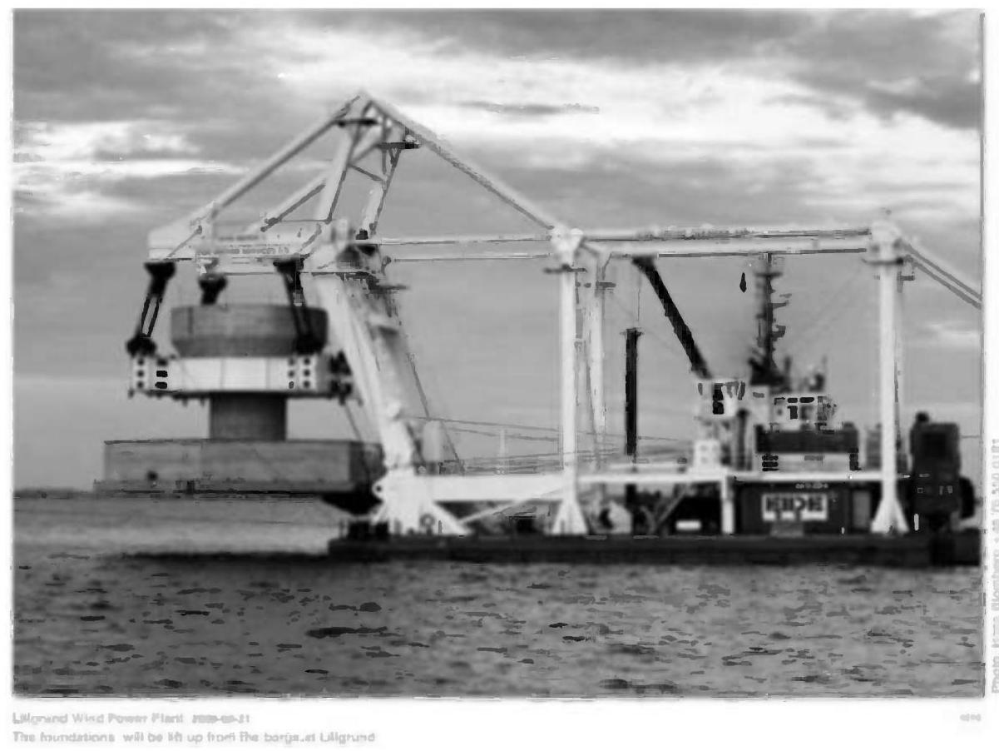

Figure 11.49 Lowering of gravity base by floating crane during installation at Lillgrund wind farm. (Lillgrund Pilot Project, 2008). Reproduced by permission of Vattenfall. See Plate 5 for the colour figure

Similar gravity base designs were used at the other large Baltic wind farms, Rodsand 1 (Nysted) and Rodsand 2, where Siemens 2.3 MW turbines were also deployed. However, in the case of Rodsand 2, the base slab is an octagon with four short sides and four long ones, and the internal walls are arranged in a cruciform. At £350 k per MW installed, the cost of the Rodsand foundations, installed in 2010, is claimed to be half that of UK monopile foundations.

## Gravity bases in the North Sea off Belgium

Until 2008, gravity base foundations had been conspicuous by their absence in the North Sea - presumably for the reasons stated above. However, in that year, six very large gravity bases were installed in deep water on Thornton Bank, ${30}\mathrm{\;{km}}$ off the Belgian coast, to support REpower 5 MW turbines (see Figure 11.50).

In the planning stages of the project, both monopile and gravity base foundations were considered in detail, but the large size of monopile required in the ${23}\mathrm{\;m}$ water depth, the escalation of steel costs and driveability concerns led to the selection of a gravity base. A full description of the gravity base design and its installation is given in Peire et al. (2009).

The gravity base configuration adopted for the deep water at Thornton Bank differs considerably from the shallow water design of the Southern Baltic. In place of a shaft and cantilevered slab, the shaft is mounted on a frustum, which provides an efficient load path to

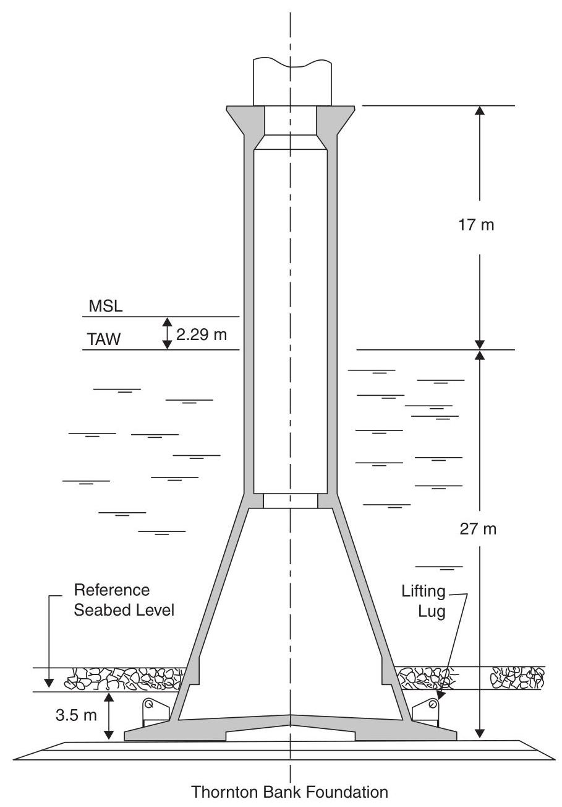

Figure 11.50 Pre-stressed concrete gravity base design used at Thornton Bank wind farm, Belgium

the base slab perimeter, without increased exposure to wave loads near the water line. As usual the weight of the unballasted structure is critical, so the shaft and frustum are pre-stressed to utilise the concrete more efficiently.

The key dimensions are as follows:

- Height (dependent on local sea bed depth): ${44}\mathrm{\;m}$ maximum.

- Shaft diameter: ${6.5}\mathrm{\;m}$ .

- Base slab diameter: ${23.5}\mathrm{\;m}$ .

- Frustum height and base diameter: ${17}\mathrm{\;m}$ .

- Wall thickness of shaft and frustum: ${0.5}\mathrm{\;m}$ .

The gravity bases are founded at a level ${3.5}\mathrm{\;m}$ below the reference seabed level, which is defined as the lowest seabed level that can be guaranteed over 30 years, after allowing for sand wave mobility and natural erosion. The top of the gravity base, which incorporates the access platform, is ${17}\mathrm{\;m}$ above TAW, the Belgian reference level for sea levels, which is 2.29 m below mean sea level.

The bases were constructed on parallel concrete beams about ${1.2}\mathrm{\;m}$ in height, cast on a quay at Ostend. On completion of each base, self propelled multi-axle modular trailers were positioned in the spaces between the concrete beams and their hydraulic suspensions extended to raise the base off the concrete beams. The trailers then transported the base very slowly to the edge of the quay, where the floating crane, Rambiz, was able to lift it clear, using a purpose built lifting frame and four large lifting lugs mounted on the base slab. After the voyage to Thornton Bank, the Rambiz lowered each base into position on a prepared bed and the hoisting cables were released, using a special hydraulically-operated pin release mechanism.

Extensive works on the seabed were necessary at each site in advance of gravity base installation. Foundation pits ${50}\mathrm{\;m}$ wide by ${80}\mathrm{\;m}$ long were dredged to a depth of about $7\mathrm{\;m}$ , with the longer dimension aligned NE/SW, parallel to the prevailing current direction. The final stage of dredging over the final metre depth had to be carried out in relatively calm conditions, in order to achieve a reasonably level surface. The ${1.3}\mathrm{\;m}$ thick foundation bed of gravel - consisting of a finer, filter layer followed by a coarser layer - was then deposited by the 'Seahorse', a dynamically positioned vessel with 18,000 tonne capacity, working in conjunction with a Remotely Operated Vehicle on the seabed equipped with surveying equipment. Finally, the surface was accurately levelled by dragging a purpose-built levelling tool across it. As a result, the inclination of the installed structures to the vertical was remarkably low $- {0.1}^{ \circ  }$ on average.

Following installation, the pits surrounding each gravity base were backfilled with sand retrieved from the areas where the original dredgings had been deposited and the interior of the base was ballasted with the same material. Finally, rock armour was deposited around each base as scour protection.

The weight of the ${44}\mathrm{\;m}$ tall foundation without ballast was 3000 tonnes, and the volume of sand used as ballast was approximately 2000 cubic m.

### 11.6.4 Jacket structures

Jacket structures offer a lighter alternative to either monopiles or gravity bases in deeper waters. The basic design concept, which consists of several near-vertical tubular legs braced together by smaller tubes in each face, originates in the oil and gas industry, but is undergoing a transformation in response to the more demanding economics of the wind industry.

Figure 11.51 illustrates the arrangement of the structures with four bays of diagonal bracing installed in 2009 at the Alpha-Ventus wind farm in the North Sea. The site is located in waters ${30}\mathrm{\;m}$ deep, ${45}\mathrm{\;{km}}$ north of the German island of Borkum, which is close to the Dutch border. The concept was first trialled at the Beatrice Demonstrator Project in 2006, when two taller, five bay structures were deployed in waters ${45}\mathrm{\;m}$ deep in the Moray Firth, Scotland. In 2010, the installation of 30 smaller, three bay versions, but otherwise of similar design, began in waters 17-21 m deep in the Irish Sea at the Ormonde project. The structures support REpower 5 MW wind turbines at all three sites.

Jacket structures can yield considerable weight savings compared with monopiles because the primary loading - the overturning moment - is resisted at much higher lever arms, thanks to the wide separation of the legs. In addition wave inertia loading on the structure, which is critical for fatigue damage, is smaller, because of the reduced total member cross-sectional area. On the other hand, the wave drag loading, which governs extreme loading, is increased, because of the increased total member width.

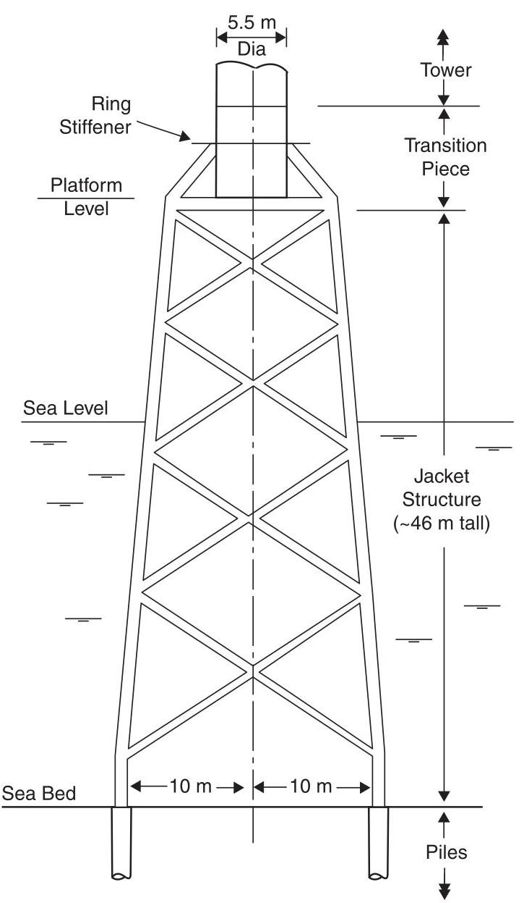

Figure 11.51 Jacket structure to support REpower 5 MW turbine at Alpha Ventus wind farm. (Access ladder, platform handrailing and J tubes omitted for clarity)

On the debit side, the fabrication and welding of the many geometrically complex joints between the bracing members and the legs carry a considerable cost penalty, even before consideration of the extra material requirements arising from the higher stress concentrations and inferior performance of the weld details in fatigue. (See section 7.9.3, Chapter 7, for discussion of fatigue design in relation to tubular towers.) In addition, the step down in width at the top of the jacket from the widely spaced legs to the tower diameter necessitates the provision of a substantial transition section. This consists of a cylindrical tower stub member supported on raking extensions to each jacket leg, horizontal members along the sides of a square connecting the legs together and a platform at the same level integral with the base of the tower stub section. Deformation of the wall of the tower stub section by the horizontal component of the raking jacket leg extensions is prevented by a large horizontal ring stiffener in the projects mentioned above. In the case of the Beatrice support structures, the transition section weighed 163 tonnes - almost half the 360 tonne weight of the jacket itself.

An alternative approach to joint fabrication is the use of cast nodes, which can be welded to the tubes by straightforward circumferential butt welds. Weserwind (Seidel, 2007a) have developed standard cast nodes for the three types of joints in jacket structures:

- X-node for each intersection of diagonals in the faces.

- Double K node for joining the diagonals in two faces to a leg member.

- Double Y node for connecting the top of each leg to two diagonals and to the tower transition section.

In their prototype jacket design, the legs are much closer together at the top, so that they align with the tower transition section, which is a shell of revolution forming a frustum. Structurally this is a much more efficient transition arrangement, but obviously it requires significantly heavier leg members.

## Piling

Jacket structures have to be attached to the sea bed in some way at each corner, in order to resist uplift generated by overturning moments. To date this has been accomplished by piling, although the use of suction buckets is under investigation.

The Beatrice jacket structures were fabricated with a pile sleeve attached to each leg. Following jacket installation, a ${1.83}\mathrm{\;m}$ diameter pile was threaded through each sleeve and driven into the seabed. Each pile and sleeve were then swaged together by expanding the pile under hydraulic pressure, deforming it into circumferential recesses in the sleeve.

A different approach was adopted at Alpha Ventus, where the piles were driven in advance. Instead of using pile sleeves, jacket leg extensions were fitted below the jacket feet and, at jacket installation, these were threaded into the piles (from which the upper part of the soil plug had previously been removed) as the jacket was lowered. With the jacket feet finally resting on the pile tops, the void between the each jacket leg extension (known as the jacket 'Stab-in') and its pile was grouted up to complete the anchoring of the jacket to the seabed. The arrangement is similar to that employed at the Ormonde wind farm, which is illustrated in Figure 11.52.

A critical element in this procedure was the accurate positioning of the piles in the first place, which was achieved by means of a two-part steel template laid on the seabed (Norwind, 2010). The outer element was positioned successively at four positions around a central octagonal element, kept in place by temporary piles. The outer element incorporated a pile guide and, at each position, a fresh pile was inserted and driven home.

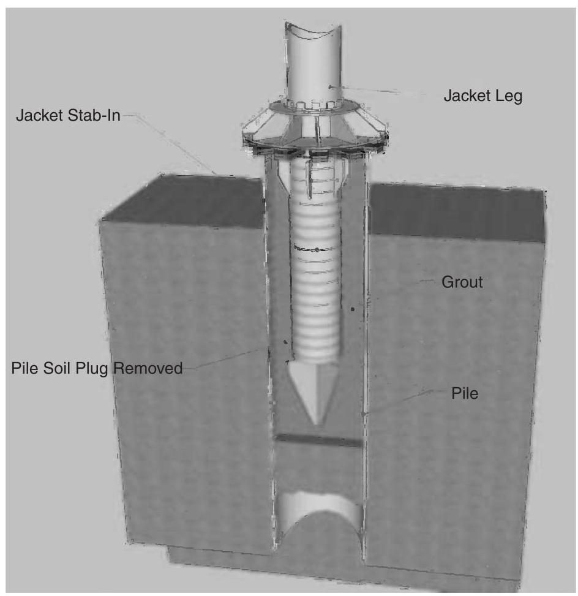

Figure 11.52 Anchorage of jacket leg to pile using concentric jacket stab-in and grouted joint - Ormonde wind farm. Reproduced by permission of Offshore Design Engineering Ltd (ode). See Plate 6 for the colour figure

## Installation methods

Large floating cranes were used to place the jacket structures on the seabed at both Beatrice and Alpha Ventus wind farms. The floating crane was also used to install the pre-assembled rotor, nacelle and tower on each jacket structure at Beatrice (Figure 11.53).

The figure shows the elaborate octagonal temporary interface frames which were attached to the jacket top and tower base to facilitate the mating process. These incorporated hydraulic rams, allowing them to compensate for the relative motion of the floating crane and the jacket structure due to swell and, thus, avoid hard impact. By contrast, a jack-up barge mounted crane was used for the separate installation of tower, nacelle and rotor in the shallower waters at Alpha Ventus.

## Jacket weights

The approximate weights of the jacket structure, secondary elements and piles at Beatrice and Alpha Ventus are given in Table 11.6.

It is apparent that the pile weight accounts for over one third of the total in each case and that at Beatrice the transition section approaches half the weight of the jacket structure.

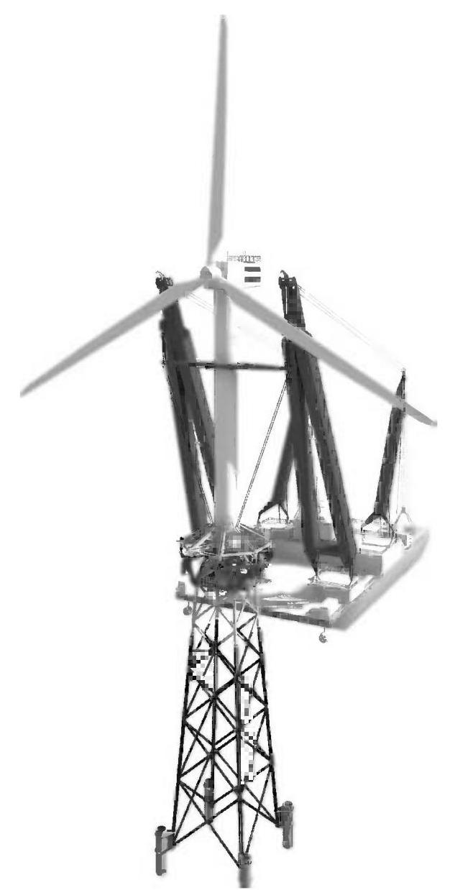

Figure 11.53 Installation of tower, nacelle and rotor assembly by floating crane at Beatrice wind farm. Reproduced by permission of Talisman Energy UK Ltd.

## Comparison with monopile weights

The monopile support structure weights including tower predicted by de Vries and Krolis (2007) for the Vestas V90 3 MW turbine (Section 11.6.1) can be used to estimate the corresponding values for the REpower 5 MW using a scaling rule that preserves the relationship between the support structure natural frequency and the nominal rotational frequency at rated power. Treating the monopile and tower support structure as a uniform weightless cantilever of length $L$ , supporting a tower head mass of $M$ , it can be easily shown that the natural frequency is given by

$$
{\omega }^{2} = \frac{3EI}{M{L}^{3}}\mathrm{{rad}}/\mathrm{{sec}}
$$

Table 11.6 Approximate weights of jacket structure, secondary elements and piles at Beatrice and Alpha Ventus

<table><tr><td>Wind farm site   Water depth</td><td>BEATRICE 45 m</td><td>ALPHA VENTUS 30 m</td></tr><tr><td colspan="3">Component</td></tr><tr><td>Jacket</td><td>360 t</td><td></td></tr><tr><td>Transition section, including platform</td><td>160 t</td><td></td></tr><tr><td>Pile sleeves</td><td>163 t</td><td>Not applicable</td></tr><tr><td>Total for primary structure</td><td>683 t</td><td>425 t</td></tr><tr><td>Boat landings</td><td>68 t</td><td></td></tr><tr><td>Anodes</td><td>52 t</td><td></td></tr><tr><td>Misc (e.g. J-tubes)</td><td>25 t</td><td></td></tr><tr><td>Total for secondary elements</td><td>145 t</td><td>85 t</td></tr><tr><td>Piles</td><td>468 t</td><td>315 t</td></tr><tr><td>Overall total</td><td>1296 t</td><td>825 t</td></tr></table>

(Seidel, 2007a and 2007b)

so that the second moment of area required to obtain a particular natural frequency is

$$
I = \frac{M{L}^{3}{\omega }^{2}}{3E} \tag{11.73}
$$

This formula will also hold true for the required mudline second moment of area of geometrically similar tapering support structures, except that the number in the denominator will be different.

If it is assumed that the wall thicknesses and radii of the monopile and tower design for the V903 MW turbine for a given water depth are all to be scaled up in the same proportion to achieve the larger second moments of area required for the REpower 5MW turbine monopile and tower design at the same water depth, then the cross-sectional area scaling factor is equal to the square root of the second moment of area scaling factor - that is,

$$
{k}_{A} = \frac{{\omega }_{5}}{{\omega }_{3}}\sqrt{\frac{{M}_{5}}{{M}_{3}}\frac{{L}_{5}^{3}}{{L}_{3}^{5}}} = \frac{{\omega }_{5}}{{\omega }_{3}}\sqrt{\frac{{M}_{5}}{{M}_{3}}\frac{{\left( D + {H}_{5}\right) }^{3}}{{\left( D + {H}_{3}\right) }^{3}}} \tag{11.74}
$$

where the ratio ${\omega }_{5}/{\omega }_{3}$ is set equal to the ratio of nominal rotational speeds during operation at rated power, $D$ is the water depth and ${H}_{5},{H}_{3}$ are the respective hub heights of the $5\mathrm{{MW}}$ and 3 MW machines. The weight scaling factor, ${k}_{\mathrm{W}}$ , is obtained by multiplying the cross-sectional area scaling factor by the cantilever length ratio, $\left( {D + {H}_{5}}\right) /\left( {D + {H}_{3}}\right)$ . Table 11.7 gives the parameter values adopted in the above expressions.

The estimated monopile plus tower weights required to support the Vestas V903 MW turbine in different water depths and the scaled up values for the REpower 5 MW turbine are plotted in Figure 11.54, together with the total weight of primary structure, piles and tower

Table 11.7 Turbine parameter values used to derive weight scaling factors at different water depths

<table><tr><td>Turbine</td><td>Vestas V90 3 MW</td><td>REpower 5 MW</td></tr><tr><td>Nominal rotational speed, $\omega$</td><td>16.1 rpm</td><td>12.1 rpm</td></tr><tr><td>Tower top mass, $M$</td><td>112 tonnes</td><td>410 tonnes</td></tr><tr><td>Hub height, $H$</td><td>68.5 m</td><td>87 m</td></tr><tr><td>Monopile + tower weight scaling factor for ${30}\mathrm{\;m}$ water depth</td><td>1</td><td>2.211</td></tr></table>

(taken as 210 tonnes) for the jacket-type support structures at the Beatrice and Alpha Ventus wind farms. It is seen that the weight saving for the jacket structures is significant and more marked at the greater water depth.

## Integrated jacket structure and tower

One means of eliminating the heavy transition section between the jacket structure and tubular tower is the combination of the former with a lattice tower. The lattice tower legs would then be simply continuations of the jacket legs. Lattice towers supporting upwind turbines are usually waisted to provide adequate tip clearance, but in the case of a downwind turbine, the legs could be straight all the way from the seabed to the nacelle. Access from platform level to the nacelle would be by lift, which could be enclosed in a reinforced plastic tube to protect it from the elements.

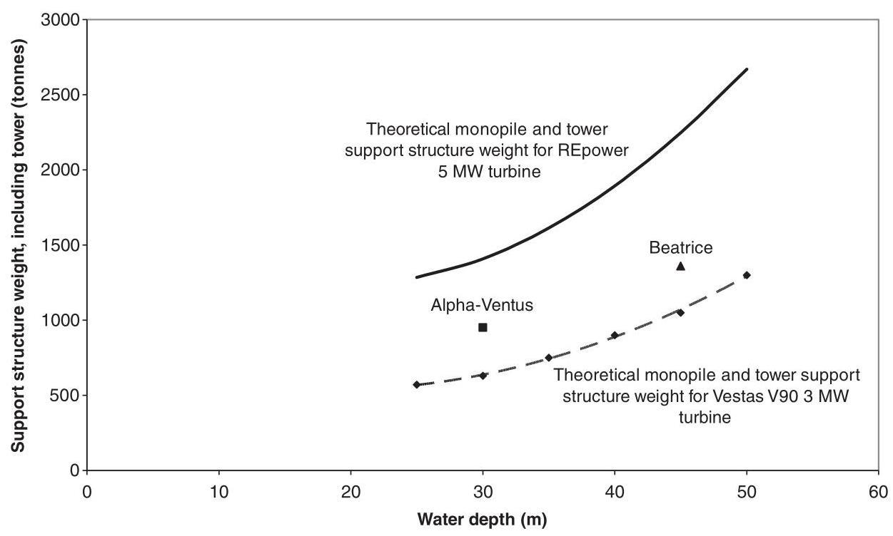

Figure 11.54 Theoretical variation of 5 MW turbine monopile support structure weight with water depth in comparison with Alpha Ventus and Beatrice jacket structure actual weights

### 11.6.5 Tripod structures

The chief advantages of tripod structures are that they are structurally more efficient than monopiles in resisting overturning moments and that wide spacing of the feet can avoid the need for piling if the feet are suitably ballasted. However, unlike the jacket structure, they cannot eliminate rotor thrust induced bending moments from the main members, although these moments are obviously reduced, as they are shared between several members and reduce linearly between the tripod apex and the sea bed.

A number of different forms of tripod structure are possible. The plain tripod design consists of three inclined legs meeting at a short column at the apex, with their feet connected by tie beams forming the sides of an equilateral triangle. The tower is then attached to the top of the short column.

In a variant of this, dubbed the centre column tripod (CCT), the short column is replaced by a long column extending to the seabed, where it is connected to the feet of the inclined legs by radial tie beams, in place of the tie beams between feet.

The number of members in the tripod can be reduced by adopting the flat faced tripod configuration (FFT), in which the column moves to the ${90}^{ \circ  }$ vertex of a right-angled isosceles triangle forming the tripod base. In this case there are only two inclined legs and two tie members tying each foot back to the base of the column.

The structural benefit of the tripod in reducing column bending moments clearly increases with tripod height, but it is advisable to avoid placing the tripod apex at wave crest level to minimise wave loading. However, boat access is potentially more awkward if the apex is placed above wave crest level.

## Alpha Ventus tripod structures

Six tripod structures have been installed in water ${30}\mathrm{\;m}$ deep in the North Sea to support Multibrid M5000 turbines at the Alpha Ventus site (see previous section). These are of the CCT configuration, with the tripod apex located below water level. As a consequence, the tripod base is relatively small and the tripod feet have to be secured against uplift by piling.

Table 11.8 compares an estimated tripod structure weight with that of the jacket structures at the same wind farm, based on Seidel (2007a).

It is seen that the estimated weight of the complete tripod structure including piles is over 50% greater than the corresponding figure for the jacket structure.

It is an open question as to whether larger FFT tripods would prove more economic.

### 11.6.6 Tripile structures

BARD has developed a tripile structure to support their own $5\mathrm{{MW}}$ turbines in water ${25} - {40}\mathrm{\;m}$ in depth. The design consists of three equispaced ${3.35}\mathrm{\;m}$ diameter vertical piles approximately ${20}\mathrm{\;m}$ apart, which are linked together by a three-arm transition structure onto which the tower is mounted. A vertical cylindrical tube projects downwards from the end of each arm and the three tubes are inserted into the tops of the three piles and grouted in the same way as monopile transition pieces. The transition structure arms are of rectangular cross-section, enabling them to be fabricated easily from flat plate.

Table 11.8 Comparison of tripod and jacket structure weights at Alpha Ventus

<table><tr><td>Structure type   Component</td><td>TRIPOD estimated weights</td><td>JACKET weights</td></tr><tr><td>Primary structure, including pile sleeves, platform and transition section (jacket only)</td><td>840 t</td><td>425 t</td></tr><tr><td>Secondary elements (boat landings, J tubes and anodes)</td><td>85 t</td><td>85 t</td></tr><tr><td>Piles</td><td>370 t</td><td>315 t</td></tr><tr><td>Overall total</td><td>1295 t</td><td>825 t</td></tr></table>

Figure 11.55 illustrates a tripile structure after installation.

The weight of the transition structure is 470 tonnes and the piles weigh up to 420 tonnes, so the total weight is comparable with that of the Alpha Ventus jacket structure (825 tonnes).

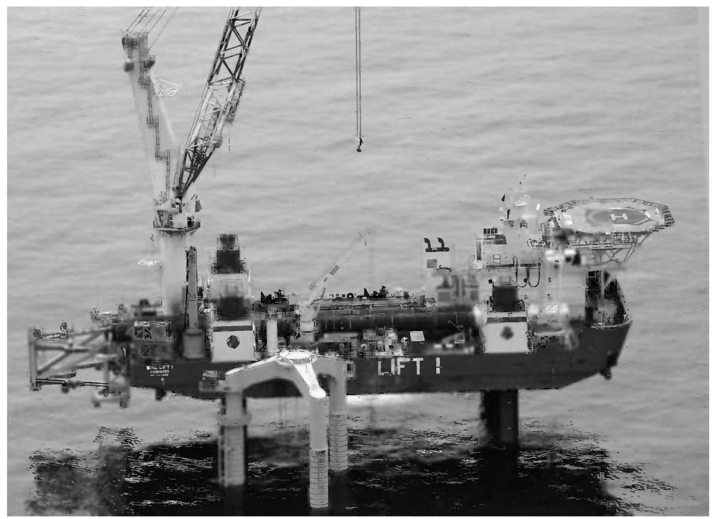

Figure 11.55 Tripile structure after installation. The yellow pile tops, which sport circumferential stripe markings, extend up to platform level with the cylinders above forming part of the three-arm transition structure. Reproduced by permission of BARD Group/Scheer. See Plate 7 for the colour figure

## 11.7 Environmental assessment of offshore wind farms

Offshore wind farms extend over large areas of often environmentally important, shallow waters and have the potential to make a considerable impact on the marine environment. As with any large onshore wind farm project, an Environmental Impact Assessment (EIA) is necessary before an application for consent to construct and operate an offshore wind farm is submitted. In Europe the Environmental Impact Assessment Directive (97/11/EC, 1997) requires an EIA to be undertaken and an Environmental Statement must be submitted with any proposal to develop an offshore wind farm. Detailed guidance on how this requirement is translated into UK legislation is given in CEFAS (2004).

The EIA assesses the environmental impacts of the project at all stages of construction, operation and de-commissioning. It considers measures that can be adopted for avoiding any undesirable impacts or, if this is not possible, mitigating them. The primary readership of the Environmental Statement is the authorities who must give permission for the project to proceed but also the various stakeholders with an interest in the marine environment. Coastal areas are used for a range of purposes, for example fishing, mineral extraction, shipping or recreation, and there are likely to be many groups with a keen interest in any proposed offshore wind farm development. Best practice on how the consultation should be managed is described in BWEA (2002).

The contents of any Environmental Statement are described in 97/11/EC as including a description of the project and the measures proposed to avoid and mitigate significant adverse effects. It will include the data necessary to identify and assess the main effects which the project is likely to have on the environment and an outline of the main alternatives studied by the project developer. The choices made in the development of the project must be justified taking into account the environmental effects. Both a comprehensive technical document and a shorter non-technical summary are required. Before detailed work is undertaken, including data collection and surveys, it is usual to agree a scoping report with the permitting authority that defines the extent of the investigations of the EIA.

In addition to the EIA required for an individual wind farm project, Strategic Environmental Assessments (SEA) are undertaken by national or regional governments to identify those areas where offshore wind farm development is appropriate and to identify where particular emphasis is required in the individual project EIAs (EWEA, 2009; DECC, 2009). For example, the SEA for the second round of UK offshore wind farm development identified three Strategic Areas; Greater Wash, Thames Estuary and off North-West England. It established a number of important principles. Larger wind farms (around 1000 MW) were preferred to smaller inshore projects. Wind turbines were excluded from a coastal strip of $8\mathrm{\;{km}}$ that was extended to ${13}\mathrm{\;{km}}$ in areas of particular landscape sensitivity. Also, wind turbines were not to be installed in areas of less than ${10}\mathrm{\;m}$ water depth due to the particular value of the natural environment of these shallow areas in terms of bird habitat, visual impact and use for recreation and inshore fishing. All three areas were close to electrical load centres and had good access to the electrical transmission system. After publication of the SEA, expressions of interest were received for the development of 7.2 GW of offshore wind energy.

EIAs for offshore wind farms start with a description of the complete proposed development and this will include the wind turbines, their layout and foundations, the array cabling, the offshore substation, the submarine transmission cable to shore, the land cable and any additional works for the land substation. Considerable work is undertaken to gather data of the project area including surveys of the seabed, marine biology, birds and mammals, fish resources, marine traffic, the intertidal area where the power cables come ashore, and archaeology. A baseline survey for landscape and seascape visual assessment is also undertaken. It is common for a period of post-construction and commissioning environmental monitoring to be required.

Particular environmental impacts that need to be considered include:

- Coastal and sedimentary processes - sediment transport, scouring.

- Wave and tidal environment.

- Water quality - turbidity.

- Benthos - the flora and fauna of the seabed.

- Fish resources - migration patterns, nursery areas.

- Commercial fisheries.

- Marine navigation.

- Archaeology.

- Marine mammals - distribution, disturbance, displacement impacts of noise and vibration.

- Birds - distribution, disturbance, displacement, mortality.

- Designated areas (i.e. defined areas considered to be of environmental importance where particular protection policies are in place).

As with onshore wind farms, changes to the landscape and visual impact are likely to be of concern and a possible cause of objections to the wind farm development. DTI, 2005 provides detailed guidance on how Seascape and Visual Impact Assessment (SVIA) of offshore wind energy developments may be undertaken. The extent of the potential visibility of the development is described using Zones of Theoretical Visual influence (ZTV). This technique defines the areas from which one or more wind turbines, or parts of a wind turbine, are visible taking into account topography and curvature of the earth but not making any allowance for atmospheric conditions. Thus, a ZTV indicates the furthest possible extent of visibility. In order to take account of differing atmospheric and lighting conditions, the visual impact of the development is illustrated using wireframes and photomontages from viewpoints that have been agreed during the scoping phase. For large wind farms three-dimensional modelling and video-montages are used increasingly. For wind farms greater than ${24}\mathrm{\;{km}}$ from shore visual impacts are likely to be minor. The SVIA identifies the features of the existing seascape and the changes that the wind farm development would make to its visual character. The judgement is based on an assessment of receptor sensitivity and the capacity of the seascape to accommodate change. From the land, local residents are considered to be the most sensitive receptors with industrial activities, for example ports, the least sensitive. Similarly, out to sea, recreational boating has high sensitivity receptors while oil and gas rigs are less sensitive. The capacity of the seascape to accommodate change is evaluated considering the overall quality and sensitivity of the seascape to the wind farm as well as the value attached to the seascape. DTI, 2005 gives guidance on how these judgements can be made and the results recorded.

Noise, particularly during construction, has been an issue for some offshore wind farms that are close to shore. Installations of mono-pile foundations can be particularly noisy and restrictions may be placed on hours of work. The noise transmitted under water during piling operations can be very loud $\left( {{200}\mathrm{\;{dB}}\text{ at }1\mathrm{\;m}}\right)$ and it is common practice to use a soft-start to piling operations so that fish and marine mammals leave the area.

Local scour around the turbine and substation foundations and cable routes is a common concern and scour protection (e.g. using rock dumping) may be required. This alters the surface of the seabed and can lead to changes in the benthic flora and fauna.

Ships and boats often use simple, low cost pulsed radar rather than the more sophisticated equipment commonly found in aviation radars that use the Doppler effect to distinguish between fixed and moving targets. There is less scope to use advanced digital signal processing techniques to reduce the effect of wind farms on marine radars and trials have indicated that wind farms produce blind areas in which other turbines and vessels could not be detected unless the observing vessel was moving (Howard and Brown, 2004). Also the high wind turbine structures produced large echoes and the radar response was strong enough to produce extraneous multiple and reflected echoes.

The effect of offshore wind farms on birds was considered in four main categories by Drewitt and Langston, 2006; collisions, displacement due to disturbance, barrier effects and habitat loss. Although the evidence was not complete, and a number of the wind farms studied were built away from large concentrations of birds, there was limited evidence of collision mortality. Similarly there was limited evidence of displacement due to disturbance but some barrier effect was reported from Horns Rev and Nysted wind farms. Loss of habitat from onshore installations (substations) and in shallow waters was highlighted as being of particular concern.

A comprehensive environmental monitoring programme was undertaken at the two Danish offshore wind farms at Horns Rev (160 MW, 14-20 km offshore) and Nysted (166 MW, 10 km offshore) between 2000 and 2006 (DONG Energy et al., 2006). Comprehensive environmental monitoring programmes investigated the impact of the wind farms construction and operation on:

- Benthic flora and fauna, and in particular the impact of the foundations and scour protection.

- Distribution of fish around the wind farm and impact of electro-magnetic fields on fish.

- Behaviour of marine mammals and their reaction to the wind farm, including construction.

- The numbers and distribution of feeding and resting birds and the impact on migrating birds including risks of collisions.

The wind farms used hard scour protection on the sandy sediment seabed and this resulted in a more diverse surface and an increase in the biomass of the benthic communities by 50-150 times. There was little evidence of any effect of the wind farm on the local fish population or of electro-magnetic fields on fish. The main impact on marine mammals (seals and porpoises) was from pile driving during the installation of the mono-pile foundations when porpoises left the area. There was evidence that birds avoid the wind farms and migration distances were extended slightly. The modelled collisions rates of eiders at Nysted were low at 0.02% (45 birds). In summary, the monitored environmental effect of these two large wind farms was limited.

An environmental monitoring programme was undertaken at two early UK offshore wind farms, North Hoyle and Scroby Sands. Each consisted of thirty 2 MW turbines directly connected to the ${33}\mathrm{{kV}}$ land-based power system with no offshore substation. North Hoyle wind farm is 4-5 miles off the North Wales coast and Scroby Sands 2 miles off the east coast of England. The environmental monitoring at North Hoyle, two years after commissioning, indicated small-scale changes to marine sediment composition, benthic ecology and bird distribution (DTI, 2006a). The trends could not be attributed to the wind farm and the overall conclusion was that there were no significant environmental effects due to the wind farm's construction and two years of operation.

The monitoring programme at Scroby Sands (DTI, 2006b) included bathymetric surveys and analysis around the turbines and the route of the export cables. There were also surveys of seal and little tern populations. The bathymetric surveys identified scour pits of up to $5\mathrm{\;m}$ depth and ${60}\mathrm{\;m}$ diameter around some wind turbines and these were back-filled with rocks. There was also evidence that the submarine cable depth of laying (initially $3\mathrm{\;m}$ ) was changing with seabed conditions and rock mattresses were placed to protect the export cables from becoming exposed or damaged. The dynamics of scour around mono-pile foundations and scour protection with data from five offshore wind farms is reviewed in DECC (2008).

## 11.8 Offshore power collection and transmission

The first demonstration offshore wind farms were small and used simple, well proven wind turbines typically of ${500} - {600}\mathrm{{kW}}$ rating, often stall regulated with fixed speed induction generators. The power collection voltage was ${10} - {11}\mathrm{{kV}}$ with the submarine power collection cables, a few kilometres in length, directly connected to the on-shore electrical power system. This voltage was increased to ${30} - {36}\mathrm{{kV}}$ with the use of higher rated (e.g. 2 MW) variable speed turbines offshore but the connection to shore was still at the array power collection voltage. Then larger wind farms were constructed that required the use of offshore substations to increase the voltage for transmission to shore (to ${132} - {150}\mathrm{{kV}}$ ). Offshore wind projects continue to increase in size and distance from land with one installation using a ${400}\mathrm{{MW}} \pm  {150}\mathrm{{kV}}$ voltage source converter HVDC link to bring the power from several wind farms some ${200}\mathrm{\;{km}}$ to the grid connection point.

After the very early demonstration offshore wind farms, the electrical systems of offshore wind farms can be considered in three phases, corresponding to the three Rounds of UK offshore wind farm development. The division into three Rounds is due only to the administrative licensing process that was adopted by the UK but does reflect the development of offshore power collection and transmission systems (Figure 11.56).

- In Round 1, the offshore wind farms, each with 30 turbines, were of 60-90 MW capacity and less than ${30}\mathrm{\;{km}}$ from shore. It was then possible to use the wind farm power collection voltage of ${30} - {36}\mathrm{{kV}}$ , to take the power ashore using two or three cables in parallel.

- The Round 2 offshore wind farms were larger (up to 500 MW) but less than ${90}\mathrm{\;{km}}$ from shore. Connection to shore was possible at AC but offshore substations were needed to increase the transmission voltage up to ${132} - {150}\mathrm{{kV}}$ .

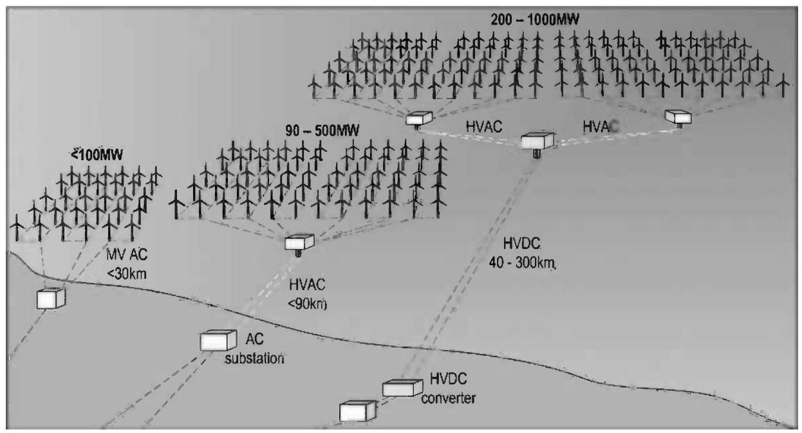

Figure 11.56 Options for offshore wind farm transmission

- Round 3 projects are now being planned and are up to ${1000}\mathrm{{MW}}$ and ${300}\mathrm{\;{km}}$ from shore. These are likely to use AC to collect the power from the wind farms and then multiple HVDC transmission links to bring it to shore.

In all cases a transformer and its associated switchgear is located within each turbine tower to increase the generator voltage of approximately 690 V up to ${30} - {36}\mathrm{{kV}}$ . The power collection array cables enter the offshore wind turbine through a J tube, attached to the transition piece of the monopile support structures, and the temperature of the short length of cable in the J tube determines its rating. The turbine transformer, often dry cast-resin type, is located in the tower together with the turbine ${30} - {36}\mathrm{{kV}}$ switchgear. In some larger turbines the turbine transformer has been located at the top of the tower to reduce the size, weight and losses of the pendant cable. For the largest wind turbines, consideration is also being given to increasing the voltage of the array power collection system to ${72}\mathrm{{kV}}$ and the generator/variable speed equipment to either 3.3 kV or $6\mathrm{{kV}}$ .

### 11.8.1 Offshore wind farm transmission

To obtain the power transfer capacity required, Round 1 UK offshore wind farms used multiple ${33}\mathrm{{kV}}$ cable circuits in parallel each taking up to 30-40 MW (600-800 Amps). ${}^{2}$ The wind turbines were connected in array strings and the three-phase submarine power collection cables extended to the shore where they were joined to land underground cables at a transition joint before entering a ${33}/{132}\mathrm{{kV}}$ substation.

---

${}^{2}$ A small number of the more remote Round 1 offshore wind farms (e.g. Barrow) used an offshore substation but most avoided this cost by using multiple power transmission cables at the power collection voltage.

---

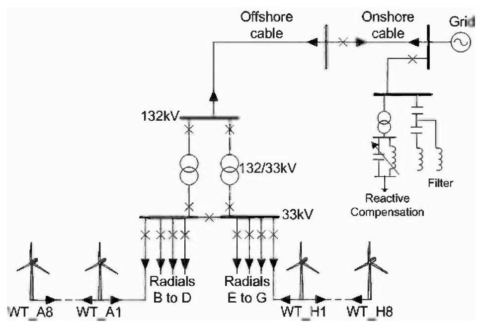

Figure 11.57 Typical UK Round 2 offshore wind farm power collection and transmission

Figure 11.57 shows a typical Round 2 offshore wind farm electrical system. Radial 33 kV ${\mathrm{{XLPE}}}^{3}$ array power collection cables with a capacity of 30-40 MW were used to connect up to eight turbines to an offshore sub-station. The conductor diameter of these cables was often tapered away from the sub-station. The sub-station was used to connect the array cables and transform the collection voltage up from ${33}\mathrm{{kV}}$ to ${132}\mathrm{{kV}}$ for transmission to shore. Substations of up to 90 MVA capacity typically used one offshore transformer. Larger offshore sub-stations had multiple transformers to reduce the weight of individual items of equipment and allow the wind farm to continue to operate (at less than rated output) with one transformer out of service. There was normally an auxiliary diesel generator on the offshore substation platform. The power collection circuits used three-core XLPE cable for ease of laying and to reduce environmental impact.

The transmission circuits to shore also used three-core XLPE cables, usually at ${132} - {150}\mathrm{{kV}}$ but the use of ${220}\mathrm{{kV}}$ has also been considered. Submarine AC cables $\left( {{800}{\mathrm{\;{mm}}}^{2}\mathrm{{Cu}}}\right)$ have capacities of approximately ${200}\mathrm{{MVA}}$ at ${132}\mathrm{{kV}}$ and ${330}\mathrm{{MVA}}$ at ${220}\mathrm{{kV}}$ . Once on land, a transition joint was used to connect the three-core submarine cables to three single-core underground cables. In some cases there was also an overhead line section before the cables connected to an onshore substation. The onshore sub-station was often located tens of kilometres from shore and included reactive compensation and harmonic filters.

Specialist equipment is required for handling and laying offshore cables both within the wind turbine array and for transmission of the power to shore with ${220}\mathrm{{kV}}$ submarine high voltage cable weighing up to ${100}\mathrm{\;{kg}}/\mathrm{m}$ . Figure 11.58 shows the Lillgrund 3 core, ${400}{\mathrm{\;{mm}}}^{2}\mathrm{{Cu}},{130}\mathrm{{kV}}$ offshore transmission cable of length $7\mathrm{\;{km}}$ from the offshore substation (Figure 11.59) to land. Note the fibre optic communications cores within the cable.

---

${}^{3}$ XLPE, Cross Linked Poly Ethylene insulated cables.

---

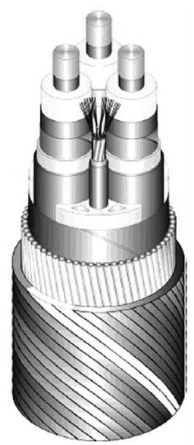

Figure 11.58 130 kV submarine transmission cable used at Lillgrund offshore wind farm. Lillgrund Pilot Project, 2008. Reproduced by permission of Vattenfall; cable manufactured by ABB HVC in Karlskrona, Sweden

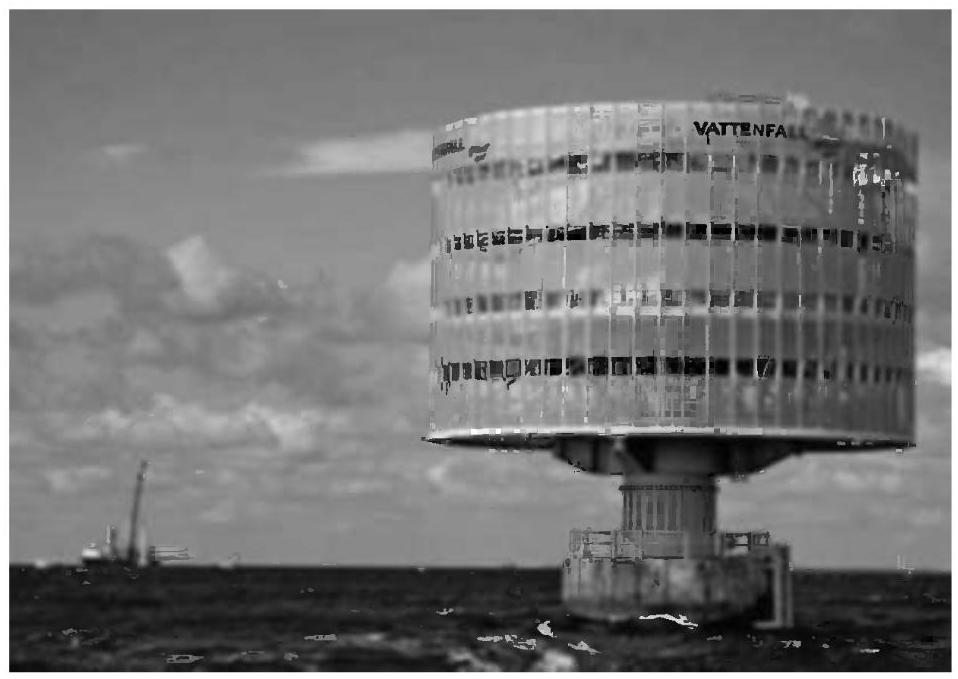

Figure 11.59 Offshore sub-station at Lillgrund. Lillgrund Pilot Project, 2008. Reproduced by permission of Vattenfal. See Plate 8 for the colour figure

Round 3 offshore wind farm projects have yet to be constructed but the largest projects (e.g. Dogger Bank has a total wind turbine capacity of 9000 MW with a cable route length of ${200}\mathrm{\;{km}}$ ) are likely to use HVDC transmission.

Comprehensive electrical system studies are required for the design of wind farm electrical offshore systems. For the Lillgrund project the following studies were undertaken (Lillgrund Pilot Project, 2008): cable sizing, load flow, short circuits. harmonics, grounding, voltage fluctuations, reliability, arc faults, dynamic simulation, protection coordination, insulation coordination, electromagnetic interference, lightning protection.

On land, electrical transmission systems deliver electrical energy to customers, some of whom have very high value loads and so need a reliable supply of power. Redundant circuits are installed to ensure that a single electrical fault, or sometimes two independent faults, does not result in loss of supply. In contrast the function of a wind farm offshore transmission system is to deliver wind generated electricity. The high costs of equipment offshore, particularly of submarine cables, and relatively modest value of the electrical energy mean that, as with onshore wind farms, total redundancy of circuits cannot be justified. Instead, partial redundancy can be provided for components with a high chance and/or a high impact of failure. An example is where two transformers, each of 50 or 70% of the wind farm capacity are installed. In this case, if one transformer fails only a small fraction of the energy is curtailed, as the wind farm will only operate at its full output a small fraction of the year.

A cost-benefit analysis was undertaken to determine the most cost-effective architecture for the connection of UK Round 2 offshore wind farms (Djapic and Strbac, 2008). This study balanced the costs of the offshore transmission system including those of; the submarine transmission cable(s), the offshore platform (including transformers, reactive compensation and switchgear), onshore circuits and capitalised costs of corrective maintenance against the capitalised costs of expected constrained energy due to equipment failures and maintenance as well as the cost of losses over the project life. The results showed that, similarly to land based wind farms, circuits for the transmission of offshore wind energy should be designed without explicit redundancy. Equipment failures in transmission circuits offshore require much longer repair times than those on-shore (e.g. the mean time to repair of an offshore transformer was assumed to be six months) but the cost of offshore equipment is so high that no redundancy in either transformers or submarine cables could be justified. Large offshore wind farms require multiple AC cable circuits due to the limited rating of submarine cables. Also the wind farm will be operating at its full output for only a fraction of the year. Thus, although the transmission link is designed with no redundant capacity its security is quite high. A calculation of a 600 MW offshore wind farm with $3 \times  {132}\mathrm{{kV}}$ submarine cables indicated that failure of one cable would only result in $8\%$ of the annual wind farm energy being curtailed. It may even be cost-effective to choose a transmission link capacity that is slightly lower than the simple summation of the full power ratings of all the wind turbines if they are dispersed over a wide area.

High voltage AC cables have a limited useful route length due to their capacitance and the reactive power they generate. Hence, for the large remote wind farms of Round 3 it becomes more cost effective to use HVDC if the cable route length exceeds ${60} - {90}\mathrm{\;{km}}$ (the precise break-even point when HVDC transmission becomes more cost-effective than AC transmission depends on wind farm rating and commercial factors influencing the price of equipment).

### 11.8.2 Submarine AC cable systems

Large offshore wind farms have very extensive networks of submarine AC cable for power collection and transmission to shore. The ${30} - {36}\mathrm{{kV}}$ power collection circuits as well as the 132-150 kV transmission to shore cables are unusual in being very long and without any significant load connected to them. Similar cable systems are not found in land based public electricity supply systems. The electrical systems of very large, land based wind farms, such as those found in parts of China and the USA, change from underground cable within the wind farm to overhead line as soon as is practicable in order to reduce cost.

The high voltage submarine cables use solid XLPE insulation with a high dielectric value. Hence, they have much higher shunt (parallel) capacitance than overhead lines that use air for their insulation. Thus, offshore wind farm cable circuits are unique and require particular consideration.

At ${50}/{60}\mathrm{\;{Hz}}$ , the high shunt capacitance with the high system voltage results in generation of reactive power (VARs) that reduces the capacity of the circuit to transmit real power and also increases the network voltage. The no-load reactive power generation of a cable is given by:

$$
Q = {2\pi flC}{V}^{2}
$$

where $f$ is the system frequency, $V$ is the rated voltage, and $l$ is the length of cable. $C$ is the capacitance of the cable per unit length.

Figure 11.60 shows the per-phase approximate equivalent circuit of a $1\mathrm{\;{km}}$ length of ${132}\mathrm{{kV}}$ cable. It will generate approximately $1\mathrm{{MVAr}}$ when no power is transmitted through it. This reactive power increases the voltage at the wind farm and also uses part of the thermal rating of the cable. The voltage rise is controlled by reactive power compensation equipment, usually a fixed shunt reactor on the offshore platform and a STATCOM or SVC at the on-shore substation.

In addition to reactive power generation at fundamental frequency (50 or ${60}\mathrm{\;{Hz}}$ ), the shunt capacitance of the large cable networks has important effects at harmonic frequencies.

Figure 11.61 shows the calculated impedance, seen from the ${132}\mathrm{\;{kV}}$ busbar, of the network of Figure 11.62 at harmonic frequencies. There are a number of series and parallel resonances caused by the interaction of the cable capacitance and inductive reactance of the cables and transformer. The resonances appear as low impedances (series resonance) and high impedances (parallel resonance). The harmonic resonant frequencies vary in frequency and magnitude depending on the number of cables and turbines in service (King and Ekanayake, 2010).

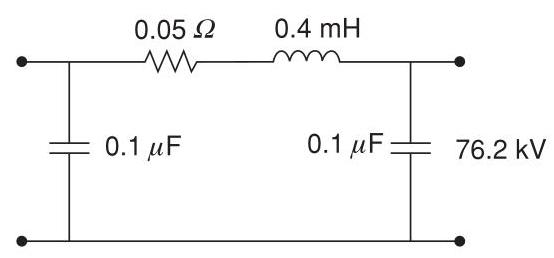

Figure 11.60 Per-phase approximate equivalent circuit of $1\mathrm{\;{km}}$ of ${132}\mathrm{\;{kV}}$ cable

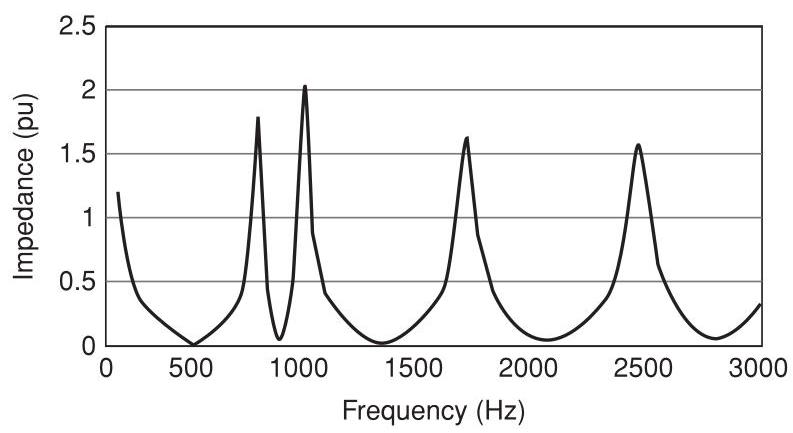

Figure 11.61 Impedance of the network of Figure 11.60 seen from ${132}\mathrm{\;{kV}}$ busbar

The voltage of all land based power systems contains harmonics, caused by the currents drawn by non-linear loads. Hence harmonic filters may be required at the on-shore substation to ensure that harmonic resonances within the wind farm network are not excited by this preexisting distortion. In addition variable speed wind turbines using power electronic converters and power electronic reactive compensation equipment, such as STATCOMs, inject harmonic currents into the cable networks. If these harmonics are amplified they may cause significant voltage stresses in the offshore network and may also create complex interactions with the power electronic control systems causing unpredicted equipment malfunction.

Transient over-voltages in offshore wind farm networks are generally caused by circuit breaker operation unlike in land based overhead line systems where lightning is the main cause (Lars Liljestrand, 2007). Vacuum circuit breakers are often used to control the MV networks in offshore wind farms, due to their high reliability and low maintenance requirements. In some cases vacuum circuit breakers can give multiple pre-strikes and re-ignitions and hence high-frequency transient currents. The extensive cable systems in offshore wind farms combined with a large number of step-up transformers results in many voltage reflections. The surge impedance of cables is less than ${40\Omega }$ , whereas for overhead lines it is typically ${300} - {400\Omega }$ and a lower surge impedance results in a higher rate of rise of the transient over-voltage. Thus, the extensive cable systems of offshore wind farms can lead to high transient over-voltages and demanding requirements for the circuit breakers. It may also be necessary to fit surge arrestors to protect the wind turbine transformers from switching over-voltages.

Figure 11.63 shows a simulation of the voltage of the ${33}\mathrm{{kV}}$ collection cable of an offshore wind farm after it is energised by a vacuum circuit breaker.

Longer lasting temporary over-voltages may occur if the main circuit breaker at the onshore connection point disconnects the wind farm from the rest of the transmission network, so that the operating wind farm and HV cable become isolated (Akhmatov, 2006; Wiechowski, 2008). Depending on the protection system of the wind turbines, they may continue to inject active current into the isolated network, charging its capacitance. Once the turbines disconnect, the energy stored in the long AC cable capacitance and the shunt reactor inductance can oscillate with a low frequency, leading to high overvoltages lasting for several seconds. If this case is considered likely, overvoltage protection which is able to absorb the energy from the cable/reactor system may be required.

Although there are relatively few large offshore wind farms in operation at present, there has been a high rate of transformer failures reported. In two offshore wind farms the turbine transformers were replaced after a large number of failures and in another offshore wind farm, a failure of the main offshore transformer led to a four and a half month outage of the entire wind farm. The reasons for these failures were complex and the transient performance of these very extensive cable systems is still the subject of research. However, it is possible that high frequency, high voltage switching transients made a significant contribution to these insulation failures. Hence, proper coordination of surge-protective devices with the insulation strength of electrical power equipment is essential for protecting the offshore electrical system from over-voltages (IEEE PES Wind Plant Collector System Design Working Group (2009)).

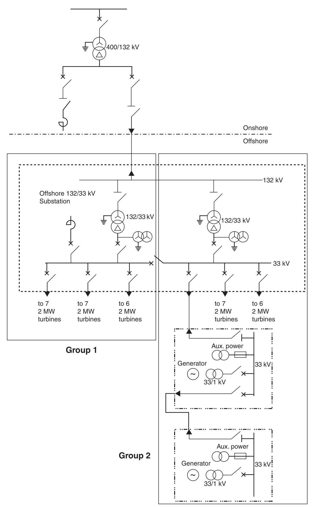

Figure 11.62 Typical offshore wind farm AC connection

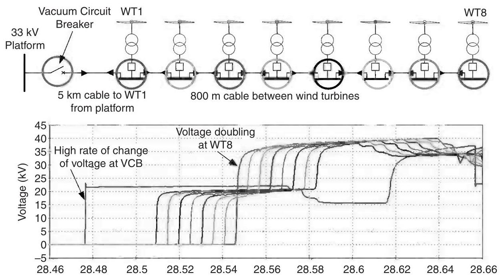

Figure 11.63 Voltage propagating through a wind turbine power collection radial circuit during energisation. Reproduced by permission of R. King

### 11.8.3 HVDC transmission

For cable route lengths above ${50}\mathrm{\;{km}}$ , HVDC transmission becomes a viable option (Koch and Retzmann, 2010). Above around ${100}\mathrm{\;{km}}$ HVDC is the only option since there will be a length limit of HVAC transmission due to the high levels of reactive power generated. For wind farms above around ${200}\mathrm{{MW}}$ in size, HVDC transmission tends to have the lowest number of cables connecting the wind farm to shore.

There are two distinct HVDC technologies, Line-Commutated Current Source Converters (CSC) and Self-Commutated Voltage Source Converters (VSC), Table 11.9. CSC technology is based on line-commutated devices such as thyristors that are switched on by a pulse and switch off when the current flowing through them reduces to zero. The converters have a requirement to be connected to a strong AC system, since the AC system voltage forces the current to commutate from one phase to another. The current must always flow in the same direction through a thyristor which means that in order to change the direction of the power flow the voltage polarity of the converters must be reversed.

Table 11.9 Comparison between HVDC CSC and HVDC VSC

<table><tr><td>HVDC CSC</td><td>HVDC VSC</td></tr><tr><td>Line-Commutated Current-Sourced Converter (LCC/CSC)</td><td>Self-Commutated Voltage-Sourced Converter (SCC/VSC)</td></tr><tr><td>Turn-on capability only (Thyristors)</td><td>Semiconducting switches with Turn-on and Turn-off capability (IGBTs)</td></tr><tr><td>Low switching frequency (50/60 Hz)</td><td>High switching frequency (~1000 Hz)</td></tr><tr><td>Lower losses (~0.8% per terminal at full power)</td><td>Higher losses (~1.8% per terminal at full power)</td></tr><tr><td>Commutation within the converter is driven by the AC voltages (requires a minimum short-circuit power). A STATCOM is required offshore to provide this AC voltage reference if LCC is to be used offshore.</td><td>Do not require a commutating system voltage.</td></tr><tr><td>High space requirements, mainly due to filter requirements (to limit harmonics and to provide reactive power control)</td><td>Low space requirements</td></tr><tr><td>Converters absorb reactive power</td><td>Independent control of Active and Reactive power</td></tr><tr><td>In service since 1954</td><td>In service since 1997</td></tr><tr><td>Installed capacity $>$ 70 GW</td><td>Installed capacity $\sim  1\mathrm{{GW}}$</td></tr><tr><td>Highest voltage; ±800 kV DC</td><td>Highest voltage; ±400 kV DC</td></tr><tr><td>Largest scheme; 6400 MW (overhead line)</td><td>Largest scheme; 400 MVA (cable)</td></tr></table>

HVDC VSC uses semiconductor switches that can be turned on and off in a controlled manner which means that HVDC VSC is able to operate when there is no local generation and it can control the AC system voltage and frequency. The majority of HVDC VSC converters in operation at present switch between two or three voltage levels to create the AC terminal voltage of the converter. However, in order to reduce switching losses, Modular Multilevel Converter (MMC) designs for HVDC VSC are now becoming commercially available.

Whilst conventional CSC HVDC is well developed with lower capital costs and losses compared to the VSC technology, there is a significantly greater foot-print of the harmonic filters. VSC technology offers greater flexibility in terms of real and reactive power control and can be used with variable speed wind turbines (see Figure 11.64). VSC has been used for the only HVDC connection to an offshore wind farm commissioned to date.

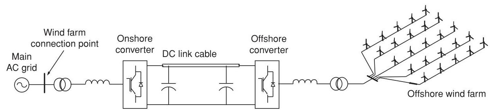

Figure 11.64 VSC HVDC transmission from an offshore wind farm

## 11.9 Operation and access

Access to wind farms offshore and hence maintaining high availability of the turbines is more difficult and expensive than for onshore wind farms. In many onshore wind farms, the tracks that are installed for access by large cranes during construction are maintained for the life of the project. Even if these have to be removed after construction then personnel access to the tower bases using light vehicles is straightforward and the large cranes can be re-mobilised and the access tracks reinstated if that is necessary. In contrast, the construction of offshore wind farms is undertaken using specialist vessels that, once the installation is complete, can be difficult and expensive to re-mobilise. Offshore wind turbines typically contain a light hoist for smaller items within the nacelle and may also include provision for the installation of a larger internal crane for major items of the drive trains. A gearbox or generator can then be replaced without mobilising a crane vessel. Replacing a damaged blade is likely to require a crane vessel (Amec Energy, 2004).

Access by personnel is required for routine maintenance, fault diagnosis and rectification with each wind turbine likely to require 10-20 person access visits per year. In addition to fault rectification, planned visits will be made for six and twelve month servicing of the turbines as well as various inspections for insurance and safety requirements. A minimum of a team of three is required for work to be undertaken on an offshore wind turbine. Twiddell and Gaudiosi (2009) estimate a total number of person access visits to offshore wind farms by 2010 of 200,000 per year. The early experience of the Horns Rev wind farm confirmed the need for frequent personnel access while there were 10,000 transfers between boat and tower during the construction and first two years of operation at North Hoyle wind farm (DTI, 2006a). Such frequent personnel access obviously requires safe and reliable means by which the turbines can be visited.

A number of access techniques have been tried. At Horns Rev frequent use was made of helicopters that did not land but lowered maintenance staff onto the top of the nacelle. More commonly, ladder and boat fender systems are used whereby a boat presses against tubular steel fenders attached to the wind turbine foundation and the technician transfers to and from a ladder. A number of other methods for transfer from the boat to the wind turbine have been investigated including dynamically controlled platforms. Catamarans are used in some wind farms as despite being more expensive than single hull boats they are more stable and have greater deck space.

UK experience indicates that transfers are possible with a significant wave height of up to ${1.5}\mathrm{\;m}$ using a ladder and boat fender system, depending on the wind and sea conditions. This then allows access to the turbines for 50-80% of the year (EWEA, 2009). At Scroby Sands (DTI, 2006b) the number of days when visits to the wind farm were not possible dropped from 143 (39% of the year) in the first year of operation to 76 (21%) in the second year as experience was gained and different access arrangements used. However, access during the winter months of high wind speed and hence revenue generation is limited by the wind and sea conditions and so for many wind farms there are continuing efforts to increase access up to ${90}\%$ of the year, for example through improvement of access systems using catamarans and dynamically controlled transfer platforms. Higher rates of access are likely to be prohibitively expensive and, therefore, there are also continual efforts to improve the availability of the wind turbines through the use of SCADA (Supervisory Control and Data Acquisition) and remote condition monitoring (see Section 11.4). A number of simulation models to assess maintenance strategies of offshore wind farms have been developed. These use probabilistic representations of the weather, and hence access to the turbines, as well as failure of components and repair times.

Table 11.10 Early operation of North Hoyle and Scroby Sands offshore wind farms

<table><tr><td></td><td>North Hoyle</td><td>Scroby Sands</td></tr><tr><td>Capital cost</td><td>£1.35 m/MW</td><td>£1.26 m/MW</td></tr><tr><td>${1}^{\text{ st }}$ year</td><td>July 2004-June 2005</td><td>January 2005-December 2005</td></tr><tr><td>Availability</td><td>84%</td><td>84%</td></tr><tr><td>Output</td><td>188 GWh</td><td>153 GWh</td></tr><tr><td>Capacity factor</td><td>36%</td><td>29%</td></tr><tr><td>${2}^{\text{ nd }}$ year</td><td>July 2005-June 2006</td><td>January 2006-December 2006</td></tr><tr><td>Availability</td><td>91%</td><td>75%</td></tr><tr><td>Output</td><td>179 GWh</td><td>129 GWh</td></tr><tr><td>Capacity factor</td><td>34%</td><td>25%</td></tr></table>

DTI, 2006a and 2006b

Table 11.10 shows the performance of two early UK offshore wind farms during the initial two years of their operation. Both wind farms received a capital grant from the UK Government and so recorded the initial operation of the wind farm as well as undertaking an environmental monitoring programme (DTI, 2006a and 2006b).

Each wind farm of 30 wind turbines was close to shore and personnel access was with a ladder and boat fender system. The capital costs were typical of the rather low costs of offshore wind farms at that time. Subsequently costs of offshore wind farms rose considerably (Gross et al., 2010).

On both sites mono-pile foundations were used. At North Hoyle a drive-drill installation technique was used with the mono-pile driven through the upper sand and clay layer and then a drill into the underlying rock. The sandy seabed conditions at Scroby Sands did not require any drilling. In both wind farms, the piles, towers and nacelles were installed mainly by jack-up vessels that used legs extending to the sea floor to provide a stable platform. The nacelle was installed with two blades attached and the third blade fitted attached to the hub once the nacelle was in position. At Scroby Sands, the assembly of the towers and turbines took approximately 12 hours with two turbines being installed every three-four days.

At both sites the availability was below the level that had been planned. There was a planned three-day grid outage at North Hoyle and at Scroby Sands one of the submarine-land cable joints failed resulting in one of the ${33}\mathrm{{kV}}$ circuits being out of commission for 12 weeks. A number of bearings were replaced in situ on both the generators and gearboxes at North Hoyle while at Scroby Sands all the generators were replaced and replacement of some gearbox bearings was required. At Scroby Sands additional remote monitoring was installed in order to increase availability.

The operation and maintenance costs to the project operators were £10-13 per MWh although as this was during the warranty period a number of costs relating to availability and unscheduled maintenance were borne by the manufacturer (estimated at one third of the operating costs). This agrees with the estimate of the Opti-EWECs project (van Bussel et al., 2010) that operation and maintenance costs of offshore wind farms might be some 25% of the levelised costs of energy.

## References

Aage, C., Allan, T.D., Carter, D.J.T., Lindgren, G. and Olagnon, M. (1998) Oceans from Space: A Textbook for Offshore Engineers and Naval Architects. Ifremer Repéres Océans, France.

Ackerman, T. (ed.) (2005) Wind Power in Power Systems. John Wiley & Sons, Ltd, Chichester.

Akhmatov, V. (2006) Excessive overvoltage in long cables of large offshore wind farms, Wind Engineering, 30(5), 375-383.

Amec Energy (2004) Blythe harbour wind farm - operational aspects, DTI report W35/00563/00/00. http://www.berr.gov.uk/files/file20295.pdf, accessed July 2010.

Assessment of the Lillgrund Windfarm, Power Performance, Wake Effects, Lillgrund Pilot Project September 2009. http://www.vattenfall.se/sv/search.htm, accessed Sept 2010.

Barltrop, N.D.P. Mitchell, G.M. and Atkins, J.B. (1990) "Fluid Loading on Fixed Offshore Structures" (Offshore Technology Report OTH90322), HMSO.

Barltrop, N.D.P. and Adams, A.J. (1991) Dynamics of Fixed Marine Structures. Butterworth-Heinemann, London.

Barthelmie, R.J. (1993) Prospects for Offshore Wind Energy: The State of the Art and Future Opportunities. Offshore Wind Climate and Wind Energy Applications. BWEA/DTI Seminar on Offshore Wind Energy, Harwell, UK.

Barthelmie, R.J. et al. (2009) Modelling and measuring flow and wind turbine wakes in large wind farms offshore, Wind Energy, 12, 431-444.

Barthelmie, R., Hansen, O., Enevoldsen, K., Højstrup, J., Larsen, S., Frandsen, S., Pryor, S., Motta, M. and Sanderhoff, P. (2005) Ten years of meteorological measurements for offshore wind farms, Journal of Solar Energy Engineering, 127(2), 170-176.

Barthelmie, R.J., Frandsen, S.T., Nielsen, N.M., Pryor, S.C., Rethore, P.E. and Jørgensen, H.E. (2007) Modelling and measurements of power losses and turbulence intensity in wind turbine wakes at Middelgrunden offshore wind farm, Wind Energy, 10, 217-228.

Barthelmie, R.J. and Jensen, L.E. (2010) Evaluation of power losses due to wind turbine wakes at the Nysted offshore wind farm, Wind Energy, DOI: 10.1002/we.408.

Barthelmie, R.J., Pryor, S.C., Frandsen, S.T., Hansen, K., Schepers, J.G., Rados, K., Schlez, W., Neubert, A., Jensen, L.E. and Neckelmann, S. (2010) Quantifying the impact of wind turbine wakes on power output at offshore wind farms, Journal of Atmospheric and Oceanic Technology, 27, 1302-1317.

Barthelmie, R.J. et al. (2009) In: Offshore Wind Power (Twidell and Gaudiosi). Earthscan, London.

Battjes, J.A. and Groenendijk, H.W. (2000) Wave height distributions on shallow foreshores, Journal of Coastal Engineering, 40, 161-182.

Bierbooms, W.A.A.M. (2006) Constrained stochastic simulation - generation of time series around some specific event in a normal process, Extremes, 8, 207-224.

den Boom, J.H. et al. (2004) Scour behaviour and scour protection for monopile foundations of offshore wind turbines. EWEC.

Bossanyi et al. (1980) The efficiency of wind turbine clusters, 3rd International Symposium on wind energy systems, August 26-29 1980, Lyngby, Denmark (BHRA).

BWEA (2002) Best practice guidelines: consultation for offshore wind energy developments. http://www.bwea.com/pdf/bwea-bpg-offshore.pdf accessed July 2010.

CEFAS (2004) Offshore wind farms: Guidance note for environmental impact assessment in respect of FEPA and CPA requirements, 2004 http://www.cefas.co.uk/publications/files/windfarm-guidance.pdf, accessed July 2010.

Coelingh et al. (1996) Analysis of wind speed observations over the North Sea, Journal of Wind Engineering and Industrial Aerodynamics, 61, 51-69.

Cleve, J., Grenier, M., Enevoldsen, P., Birkemose, B. and Jensen, L. (2009) Model-based analysis of wake-flow data in the Nysted offshore wind farm, Wind Energy DOI: 10.1002/we.314.

Crabtree, C.J. (2010) Survey of commercially available condition monitoring systems for wind turbines' Supergen wind energy technologies, Consortium/Durham University.

Dahlberg, J.Å. and Thor, S.E. (2009) Power performance and wake effects in the closely spaced Lillgrund offshore wind farm, European Offshore Conference, Stockholm, p. 1.

Dean, R.G. and Dalrymple, R.A. (1984) Water Wave Mechanics for Engineers and Scientists. World Scientific.

DECC (2008) Dynamics of scour pits and scour protection - synthesis report and recommendations, http://www.decc.gov.uk/assets/decc/what%20we%20do/uk%20energy%20supply/energy%20mix/ renewable%20energy/policy/offshore/rag/complete/file50448.pdf accessed July 2010.

DECC (2009) Draft national policy statement for renewable energy infrastructure (EN-3) http://data.energynpsconsultation.decc.gov.uk/documents/npss/EN-3.pdf, accessed July 2010.

DECC (2010) UK electricity generation costs update, Report by Mott McDonald (http://www.decc.gov.uk/assets/decc/Statistics/Projections/71-uk-electricity-generation-costs-update-.pdf).

Djapic, P. and Strbac, G. (2008) Cost benefit methodology for optimal design of offshore transmission systems. Centre for Distributed Generation and Sustainable Electrical Energy, http://www.sedg.ac.uk/.

DNV-OS-J101 (2007) Offshore Standard Design of offshore wind turbine structures. Det Norske Veritas.

DONG Energy et al. (2006) Danish Offshore Wind - key environmental issues http://www.windaction.org/documents/6690, accessed July 2010.

Drewitt, A.L. and Langston, R.H.W. (2006) Assessing the impact of wind farms on birds, Ibis, 148, 29-42.

DTI (2005) Guidance on the assessment of the impact of offshore wind farms, seascape and visual impact report http://www.berr.gov.uk/files/file22852.pdf, accessed July 2010.

DTI (2006a) Capital grants scheme for North Hoyle offshore wind farm, http://www.berr.gov.uk/files/file41542.pdf, accessed July 2010.

DTI (2006b) Capital grants scheme for Scroby Sands offshore wind farm, http://www.berr.gov.uk/files/file41543.pdf, accessed July 2010.

97/11/EC (1997) The Environmental Impact Assessment Directive http://ec.europa.eu/ environment/eia/full-legal-text/9711.htm, accessed July 2010.

EN 1993-1-9 (2005) European Standard 'Eurocode 3: Design of Steel Structures - Part 1-9: Fatigue'.

European Wind Energy Association (2009) Wind Energy - The Facts. European Wind Energy Association, http://windfacts.eu.

Evans, B. (2004) Lumping of Fatigue Load Cases. RECOFF Document No. 16a.

Frandsen S., Barthelmie, R.J., Jorgensen, H.E., Rathmann, O., Badger, J., Hansen, K., Ott, S., Rethore, P., Larsen, S.E. and Jensen, L. (2009) The making of a second-generation wind farm efficiency model-complex, Wind Energy, 12, 431-444.

Germanischer Lloyd (2005) Guideline for the certification of offshore wind turbines.

Goda, Y. et al. (1966) Study on impulsive breaking wave forces on piles, Port and Harbour Technical Research Institute 6(5), 1-30 (in Japanese).

Gong et al. (1997) Modelling sea-salt aerosols in the atmosphere, Journal of Geophysical Research, 102, D3, 3805-3818.

Gross, R., Greenacre, P. and Heptonstall, P. (2010) Great Expectations: The Cost of Offshore Wind in UK Waters, Understanding the Past and Projecting the Future. UK Energy Research Centre, London.

Hancock, J.W. and Gall, D.S. (1985) Fatigue under narrow and broad band stationary loading. Final Report of the Cohesive Programme of RandD into Fatigue of Offshore Structures. Marine Technology Directorate Ltd, UK.

Hansen, K. et al. (2010) Power deficits due to wind turbine wakes at Horns Rev wind farm, TORQUE 2010: The Science of making torque from wind, June 28-30, Crete, Greece.

Hau, E. (2006) Wind Turbine Fundamentals Technologies, Applications and Economics. Springer, London.

Hendriks, H.B. (2008) Upwind Project: Upscaling. Presentation at EWEC 2008: http://www.ewec2008proceedings.info/ewec2008/allfiles/588_EWEC2008presentation.ppt.

Howard, M. and Brown, C. (2004) Results of the electromagnetic investigations and assessment of marine radar, communications and positioning systems undertaken at the North Hoyle wind farms by Qinetiq and Maritime and Coasguard Agency. http://www.mcga.gov.uk/c4mca/ effects_of_offshore_wind_farms_on_marine_systems-2.pdf, accessed July 2010.

IEEE PES Wind Plant Collector System Design Working Group (2009) Wind power plant grounding, overvoltage protection, and insulation coordination, IEEE Power and Energy Society General Meeting, Calgary.

IEC 61400-3 (2009) International Standard 'Wind Turbines - Part 3: Design requirements for offshore wind turbines'. International Electrotechnical Commission.

ISO 19902 (2007) International Standard 'Petroleum and natural gas industries - Fixed steel offshore structures'.

ISET (2006) Advanced maintenance and repair for offshore wind farms using fault prediction and condition monitoring techniques. Offshore M&R Final Report.

King, R. and Ekanayake, J.B., Harmonic modelling of offshore wind farms, IEEE PES Meeting July 2010.

Koch, H. and Retzmann, D. (2010) Connecting large offshore wind farms to the transmission network, Transmission and Distribution Conference and Exposition, 2010 IEEE PES, pp. 1-5, 19-22.

Kuhn, M.J. (2001) Dynamics and design optimisation of offshore wind energy conversion systems. DUWIND, Delft University.

Lars Liljestrand, A.S. (2007) Transients in collection grids of large offshore wind parks. Wind Energy, 11(1), 45-61.

Lillgrund Pilot Project September 2008 Technical Description Lillgrund Wind Power Plant. www.vattenfall.se/lillgrund.

MacCamy, R.C. and Fuchs, R.A. (1954) Wave forces in piles: A diffraction theory. Technical Memorandum No. 69, Beach Erosion Board, US Navy Corps of Engineers.

Milne-Thomson, L.M. (1967) Theoretical Hydrodynamics, fifth edition. Macmillan, Basingstoke.

Mortensen et al (1993): Wind Atlas Analysis and Application Program (WAsP), User's guide, Risø-I- 666-(EN)(v.2), N G Mortensen, L Landberg, I Troen and E L Petersen, Risø National Laboratory, Roskilde, Denmark, 1993.

Muir Wood, A.M. and Fleming, C.A. (1981) Coastal Hydraulics, second edition. Macmillan, Basingstoke.

Norwind (2010) Lessons learned from the first German Offshore Wind Farm -Alpha Ven-tus, by Ivan Østvik, SPE Conference Bergen, 14 April 2010. bergen.spe.no/publish_files/ ODS2010_PG_Oestvik.pdf.

NREL (2006) Wind turbine design cost and scaling model. Technical Report NREL/TP-500-40566 by Fingersh, L., Hand, M. and Laxson, A.

Phillips et al. (2008) Methods for assessing the spatial variation of offshore wind resource: The role of Mesoscale Modelling and Earth Observation data. In: Proceedings of the Global Wind Power Conference, Beijing, 2008 (eds. J L Phillips, D P Bacon, M R F Taylor, E Stavroulia, C A Morgan).

Peire, K., Nonneman, H. and Bosschen, E. (2009) Gravity Base foundations for the Thornton Bank offshore wind farm. Terra et Aqua, No. 115, June 2009.

Rainey and Camp (2007) Constrained non-linear waves for offshore wind turbine design. The Science of making torque from wind: Journal of Physics Conference Series Vol. 75, 012067.

Schlez, W. and Neubert, A. (2009) New developments in large wind farm modelling. In: European Wind Energy Conference, Marseilles, p. 8.

Seidel, M. (2007a) Jacket substructures for the REpower 5M wind turbine. Conference Proceedings European Offshore Wind 2007, Berlin.

Seidel, M. (2007b) Tragstruktur und Installation der REpower 5M in 45 m Wassertiefe, Stahlbau 76, Heft 9.

Sørensen, T., Nielsen, P. and Thøgersen, M.T. (2006) Recalibrating wind turbine wake model parameters - validating the wake model performance for large offshore wind farms. European Wind Energy Conference and Exhibition, p. 6.

Spinato, F. (2009) Reliability of wind turbine subassemblies, IET Renewable Power Generation, 3(4), 387-401.

Sumer, B.M. and Fredsoe, J. (2001) Scour around pile in combined waves and current, Journal of Hydraulic Engineering, 127(5), 403-411.

Tarp-Johansen, N.J. (2004) Partial safety factors and characteristic values for combined extreme wind and wave load effects, RECOFF Document No. 71.

Tarp-Johansen, N.J. et al. (2009) Comparing sources of damping of cross-wind motion, EWEC.

Tromans, P., Anaturk, A. and Hagermeijer, P. (1991) A new model for the kinematics of large ocean waves - application as a design wave. Proceedings of the first International Offshore and Polar Engineering Conference, Edinburgh.

Twidell, J. and Gaudiosi, G. (eds) (2009) Offshore Wind Power. Earthscan, London.

van Bussel et al. (2009) State of the art and technology trends for offshore wind energy: operation and maintenance issues, http://www.offshorewindenergy.org/ca-owee/indexpages/ downloads/Brussels01_OandM.pdf, accessed July 2010.

Van der Tempel, J. (2006) Design of support structures for offshore wind turbines. PhD thesis, Delft University of Technology.

de Vries, W.E. and Krolis, V.D. (2007) Effects of deep water on monopile support structures for offshore wind turbines. EWEC.

Wagner, H. (1932) Über Stoß- und Gleitvorgänge an der Oberfläche von Flüssigkeiten, Zeitschrift für angewandte Mathematik und Mechanic, 12(4), 193-215 (in German).

Wehausen, J.V. and Laitone, E.V. (1960) Surface Waves. Encyclopedia of Physics, Vol IX, Springer-Verlag. Available on-line at the University of California website, www.coe.berkeley.edu .

Wheeler, J.D. (1970) Method of calculating forces produced by irregular waves, Journal of Petroleum Technology, 22, 359-367.

Wiechowski, P.B. (2008) Selected studies on offshore wind farm cable connections - challenges and experience of the Danish TSO. Power and Energy Society General Meeting - Conversion and Delivery of Electrical Energy in the 21st Century, pp. 1-8. Pittsburgh, PA: IEEE.

Wienke, J. (2001) Druckschlagbelastung auf schlanke zylindrische bauwerkr durch brechende Wellen - theoretische unde großmaßstäbliche Laboruntersuchungen. PhD thesis, Braunschweig Technological University, www.biblio.tu-bs.de (in German).

Wienke, J. and Oumeraci, H. (2005) Breaking wave impact force on a vertical and inclined slender pile - theoretical and large-scale model investigations, Journal of Coastal Engineering, 52, 435- 462.

Wiggelinkhuizen et al. (2007) Condition monitoring for offshore wind farms. Conmow Final Report ECN-E-07-044.

Wilkinson et al. (2010) Methodology and results of the Reliawind reliability field study, EWEC.

Appendix A11

Table A11.1 Offshore wind farms from 1991-2010

<table><tr><td>Year of commissioning</td><td>Wind farm Capacity (MW)</td><td>Location</td><td>Offshore Substation</td><td>Distance to shore (km)</td><td>Depth of water</td><td>Wind turbine rating (MW)</td><td>Foundation</td><td>Reference</td></tr><tr><td>1991</td><td>5</td><td>Vindeby, DK</td><td>N</td><td>1.5 to 3</td><td>2–4 m</td><td>0.45 (11 × Siemens Bonus)</td><td>Gravity</td><td>1</td></tr><tr><td>1994</td><td>2</td><td>Lely, NL</td><td>N</td><td>0.8</td><td>3–4 m</td><td>0.5 (4 × Nedwind)</td><td>Monopile</td><td>2</td></tr><tr><td>1995</td><td>5</td><td>Tung Knob, DK</td><td>N</td><td>3</td><td>4–7 m</td><td>0.5 (10 × Vestas)</td><td>Gravity</td><td>2</td></tr><tr><td>1996</td><td>16.8</td><td>Irene Vorrink, NL</td><td>N</td><td>0.8</td><td>2-3 m</td><td>0.6 (28 × Nordtank)</td><td>Monopile</td><td>3</td></tr><tr><td>1998</td><td>2.8</td><td>Bockstigen, SE</td><td>N</td><td>4</td><td>5–6 m</td><td>0.5 (5 × WindWorld)</td><td>Monopile</td><td>2</td></tr><tr><td>2000</td><td>4</td><td>Blyth, UK</td><td>N</td><td>1.6</td><td>5m</td><td>2 (2 × Vestas)</td><td>Monopile</td><td>4</td></tr><tr><td>2001</td><td>40</td><td>Middelgrunden, DK</td><td>N</td><td>2</td><td>3–6 m</td><td>2 (20 × Siemens Bonus)</td><td>Gravity</td><td>5</td></tr><tr><td>2001</td><td>10.5</td><td>Utgrunden, SE</td><td>N</td><td>7</td><td>6–15 m</td><td>1.5 (7 × GE)</td><td>Monopile</td><td>2</td></tr><tr><td>2002</td><td>160</td><td>Horns Rev I, DK</td><td>Y</td><td>14-20</td><td>6–14 m</td><td>2 (80 × Vestas)</td><td>Monopile</td><td>6</td></tr><tr><td>2002</td><td>10</td><td>Yttre Stengrund, SE</td><td>N</td><td>5</td><td>6–8 m</td><td>2 (5 × NEG Micon)</td><td>Monopile</td><td>2</td></tr><tr><td>2003</td><td>10.6</td><td>Frederikshavn, DK</td><td>N</td><td>3.2</td><td>1–4 m</td><td>4 turbines 2.3 to 3 MW (Nordex, Vestas, Bonus)</td><td>Monopile, bucket</td><td>7</td></tr><tr><td>2003</td><td>60</td><td>North Hoyle, UK</td><td>N</td><td>6.5-8</td><td>5–12 m</td><td>2 (30 × Vestas)</td><td>Monopile</td><td>8</td></tr><tr><td>2003</td><td>166</td><td>Rodsand 1, Nysted, DK</td><td>Y</td><td>10</td><td>6–9 m</td><td>2.3 (72 × Siemens Bonus)</td><td>Gravity</td><td>9</td></tr><tr><td>2003</td><td>23</td><td>Samsø, DK</td><td>$\mathrm{N}$</td><td>4</td><td>10-13 m</td><td>2.3 (10 × Siemens Bonus)</td><td>Monopile</td><td>2</td></tr><tr><td>2003</td><td>17</td><td>Rønland, DK</td><td>N</td><td>0.1</td><td>0-2 m</td><td>2 to ${2.3}\left( {4 \times  2\mathrm{{MW}}}\right.$ and 4 × 2.3 MW)</td><td>Monopile</td><td>7</td></tr></table>

(Continued)

Table A11.1 (Continued)

<table><tr><td>Year of commissioning</td><td>Wind farm Capacity (MW)</td><td>Location</td><td>Offshore Substation</td><td>Distance to shore (km)</td><td>Depth of water</td><td>Wind turbine rating (MW)</td><td>Foundation</td><td>Reference</td></tr><tr><td>2004</td><td>25</td><td>Arklow Bank, IE</td><td>N</td><td>10</td><td>1–5 m</td><td>3.6 $\left( {7 \times  \mathrm{{GE}}}\right)$</td><td>Monopile</td><td>10</td></tr><tr><td>2004</td><td>60</td><td>Scroby Sands, UK</td><td>N</td><td>2.5</td><td>0-8 m</td><td>2 (30 × Vestas)</td><td>Monopile</td><td>11</td></tr><tr><td>2004</td><td>1.2</td><td>Setana, JP</td><td>N</td><td>0.7</td><td>10 m</td><td>0.66 (2 × Vestas)</td><td></td><td>2</td></tr><tr><td>2005</td><td>90</td><td>Kentish Flats, UK</td><td>N</td><td>9-10</td><td>3-5 m</td><td>3 (30 × Vestas)</td><td>Monopile</td><td>12</td></tr><tr><td>2006</td><td>90</td><td>Barrow, UK</td><td>Y</td><td>7</td><td>12–16 m</td><td>3 (30 × Vestas)</td><td>Monopile</td><td>13</td></tr><tr><td>2006</td><td>108</td><td>Egmond aan Zee, NL</td><td>N</td><td>10-18</td><td>15–18 m</td><td>3 (36 × Vestas)</td><td>Monopile</td><td>14</td></tr><tr><td>2007</td><td>10</td><td>Beatrice, UK</td><td>N</td><td>25</td><td>35–50 m</td><td>5 (2 × Repower)</td><td>Jacket</td><td>15</td></tr><tr><td>2007</td><td>90</td><td>Burbo Bank, UK</td><td>N</td><td>6.4-7.2</td><td>0-6 m</td><td>3.6 (25 × Siemens)</td><td>Monopile</td><td>16</td></tr><tr><td>2007</td><td>110</td><td>Lillgrund, SE</td><td>Y</td><td>10</td><td>4-13 m</td><td>2.3 (48 × Siemens)</td><td>Gravity</td><td>17</td></tr><tr><td>2008</td><td>30</td><td>Kemi Ajos I + II, FI</td><td>N</td><td>2.6-6</td><td>1-7 m</td><td>3 (10 × WinWinD)</td><td>Gravity</td><td>2</td></tr><tr><td>2008</td><td>194</td><td>Lynn and Inner Dowsing, UK</td><td>N</td><td>5</td><td>6-11 m</td><td>3.6 (54 × Siemens)</td><td>Monopile</td><td>18</td></tr><tr><td>2008</td><td>120</td><td>Princess Amalia, NL</td><td>Y</td><td>23</td><td>19-24 m</td><td>2 (60 × Vestas)</td><td>Monopile</td><td>19</td></tr><tr><td>2008</td><td>30</td><td>Thornton Bank I, BE</td><td>Y</td><td>27-30</td><td>13–19 m</td><td>5 (6 × Repower)</td><td>Gravity</td><td>20</td></tr><tr><td>2009</td><td>60</td><td>Alpha Ventus, DE</td><td>Y</td><td>45</td><td>28–30 m</td><td>5 (6 × Repower, 6 × Multibrid)</td><td>Jacket, Tripod</td><td>21</td></tr><tr><td>2009</td><td>2</td><td>Hywind, NO</td><td>N</td><td>10</td><td>220 m</td><td>2 (Floating wind turbine, ${220}\mathrm{\;m}$ deep water)</td><td>Floating</td><td>22</td></tr></table>

(Continued)

Table A11.1 (Continued)

<table><tr><td>Year of commissioning</td><td>Wind farm Capacity (MW)</td><td>Location</td><td>Offshore Substation</td><td>Distance to shore (km)</td><td>Depth of water</td><td>Wind turbine rating (MW)</td><td>Foundation</td><td>Reference</td></tr><tr><td>2009</td><td>209</td><td>Horns Rev II, DK</td><td>Y (with separate accommodation platform)</td><td>31</td><td>9-17 m</td><td>2.3 (91 × Siemens)</td><td>Monopile</td><td>23</td></tr><tr><td>2009</td><td>90</td><td>Rhyl Flats, UK</td><td>N</td><td>8</td><td>4-11 m</td><td>3.6 (25 × Siemens)</td><td>Monopile</td><td>24</td></tr><tr><td>2010</td><td>180</td><td>Robin Rigg, UK</td><td>Y</td><td>11</td><td>0-12 m</td><td>3 (60 × Vestas)</td><td>Monopile</td><td>25</td></tr><tr><td>2010</td><td>173</td><td>Gunfleet Sands, UK</td><td>Y</td><td>8.5</td><td>2–13 m</td><td>3.6 (48 × Siemens)</td><td>Monopile</td><td>25</td></tr><tr><td>2010</td><td>102</td><td>Shanghai Donghai Bridge, CN</td><td>N</td><td>8-13</td><td>10 m (Average)</td><td>3 (34 × Sinovel)</td><td>Gravity</td><td>26</td></tr><tr><td>2010</td><td>6</td><td>Xianshui Intertidal Project, CN</td><td>N</td><td>3.5</td><td>0-4 m</td><td>2 (3 × Shanghai Electric)</td><td></td><td>26,2</td></tr><tr><td>2010</td><td>7.2</td><td>Avedore Holme, DK</td><td>N</td><td>1.4</td><td>2 m</td><td>3.6 (2 × Siemens)</td><td>Gravity</td><td>2</td></tr><tr><td>2010</td><td>30</td><td>Vindpark Vanern, SE</td><td>N</td><td>3.5</td><td>1-22 m</td><td>3 (10 × WinWinD & Dynawind)</td><td>Gravity</td><td>2</td></tr><tr><td>2010</td><td>21</td><td>Sprogø, DK</td><td>N</td><td>10.6</td><td>6–16 m</td><td>3 (7 × Vestas)</td><td>Gravity base</td><td>2</td></tr><tr><td>2010</td><td>12</td><td>Frederikshavn, DK</td><td>N</td><td>4.5</td><td>1–4 m</td><td>6 (test site)</td><td>Monopile</td><td>27</td></tr><tr><td>2010</td><td>48</td><td>EnBW Baltic 1, DE</td><td></td><td>16</td><td>20–42 m</td><td>2.3 (21 × Siemens)</td><td>Monopile</td><td>2</td></tr><tr><td>2010</td><td>207</td><td>Rødsand II, DK</td><td>Y</td><td>4</td><td>6–12 m</td><td>2.3 (92 × Siemens)</td><td>Gravity</td><td>28</td></tr><tr><td>2010</td><td>300</td><td>Thanet, UK</td><td>Y</td><td>12</td><td>14-23 m</td><td>3 (100 × Vestas)</td><td>Monopile</td><td>29</td></tr><tr><td>2010</td><td>14</td><td>Kamisu, JP</td><td>N</td><td>0.1</td><td>5 m</td><td>2 (7 × Subaru)</td><td>Monopile</td><td>2</td></tr></table>

(Continued)

Table A11.1 (Continued)

<table><tr><td>Year of commissioning</td><td>Wind farm Capacity (MW)</td><td>Location</td><td>Offshore Substation</td><td>Distance to shore (km)</td><td>Depth of water</td><td>Wind turbine rating (MW)</td><td>Foundation</td><td>Reference</td></tr><tr><td>2011</td><td>30</td><td>Rudong Intertidal Project, CN</td><td>N</td><td>3.5</td><td></td><td>1.5 to 3 (3 of 16 turbines -2 × UP82-1500 and 1 × Mingyang - installed by the end of 2009.)</td><td></td><td>26</td></tr><tr><td>2011</td><td>315</td><td>Sheringham Shoal, UK</td><td>Y</td><td>17-23</td><td>14–23 m</td><td>3.6 (88 × Siemens)</td><td>Monopile</td><td>30</td></tr><tr><td>2011</td><td>400</td><td>BARD Offshore 1, DE</td><td>Y (HVDC)</td><td>100 (200km   total export   cable)</td><td>39–41 m</td><td>5 (80 × BARD)</td><td>Tripile</td><td>2</td></tr><tr><td>2011   2011</td><td>184   45</td><td>Walney Phase 1, UK   Weihai Offshore wind farm, phase 1, CN (2)</td><td>Y</td><td>14</td><td>19–23 m 1.5 $\left( {{30} \times  }\right)$</td><td>3.6 (51 × Siemens)</td><td>Monopile</td><td>2   2</td></tr><tr><td>2011</td><td>165</td><td>Belwind, BE</td><td>Y</td><td>45</td><td>16-31 m</td><td>3 (55 × Vestas)</td><td>Monopile</td><td>2</td></tr><tr><td>2012</td><td>500</td><td>Greater Gabbard, UK</td><td>Y (2 - Gabbard and Galloper)</td><td>34</td><td>4-37 m</td><td>3.6 (140 × Siemens)</td><td>Monopile</td><td>31</td></tr><tr><td>2012</td><td>150</td><td>Ormonde, UK</td><td>Y</td><td>10</td><td>17-21 m</td><td>5 (30 × Repower)</td><td>Jacket</td><td>28</td></tr><tr><td>2012</td><td>92</td><td>Tricase, IT</td><td></td><td>20</td><td>92 m</td><td>2.4 and 3.5 (24 × Blue H, floating turbines in 118 m water depth)</td><td>Floating</td><td>33,2</td></tr><tr><td>2012</td><td>184</td><td>Walney Phase 2, UK</td><td>Y</td><td>14</td><td>19-23 m</td><td>3.6 (51 × Siemens)</td><td>Monopile</td><td>2</td></tr><tr><td>2012</td><td>248</td><td>Lincs, UK</td><td>Y</td><td>8</td><td>7-12 m</td><td>3.6 (69 × Siemens)</td><td>Monopile</td><td>2</td></tr></table>

## References for table A11.1

1. DNV, Vindeby, 5MW. [Online] [Cited: 0805, 2010.] http://www.dnv.com/industry/energy/ segments/wind_wave_tidal/offshore_references/vindeby.asp.

2. 4C Offshore. [Online] [Cited: 08 06, 2010.] http://www.4coffshore.com/windfarms/ely-netherlands-nl27.html.

3. Ballast Nedam offshore. [Online] [Cited: 08 06, 2010.] http://www.bnoffshore.com/content/files/ SITE4512/Windfarm_Dronten.pdf.

4. Power-technology.com. [Online] [Cited: 08:06, 2010.] http://www.power-technology.com/projects/ blyth/.

5. [Online] [Cited: 08:06, 2010.] www.middelgrunden.dk.

6. [Online] [Cited: 08:06, 2010.] www.hornsrev.dk.

7. Danish Energy Authority. [Online] 2005. [Cited: 08:06, 2010.] http://193.88.185.141/Graphics/ Publikationer/Havvindmoeller/uk_vindmoeller_okt05/pdf/havvindmoellerapp_GB-udg.pdf.

8. Go Green. npower. [Online] [Cited: 08 06, 2010.] http://www.npower.com/web/At_home/ juice-clean_and_green/Juice-clean_and_green/offshore_wind_farm/index.htm.

9. Nysted offshore windfarm. Dong Energy. [Online] [Cited: 08 06, 2010.] http://www.dongenergy.com/Nysted/EN/Pages/index.aspx.

10. GE Power. [Online] [Cited: 0806, 2010.] http://www.gepower.com/businesses/ge_wind_energy/en/ image_gallery/arklow.htm.

11. E.ON UK. [Online] [Cited: 0806, 2010.] http://www.eon-uk.com/generation/scrobysands.aspx.

12. Kentish Flats offshore wind farm. [Online] [Cited: 08 06, 2010.] www.kentishflats.co.uk.

13. Barrow Offshore Wind Limited 2008. [Online] [Cited: 08 06, 2010.] www.bowind.co.uk.

14. Egmond aan Zee offshore wind farm. [Online] [Cited: 08 06, 2010.] www.noordzeewind.nl.

15. Beatrice Wind Farm Demonstator Project. [Online] [Cited: 08 06, 2010.] www.beatricewind. co.uk.

16. Burbo Offshore Wind Farm. Dong Energy. [Online] [Cited: 08 06, 2010.] http://www.dongenergy.com/burbo/Pages/index.aspx.

17. Lillgrund Offshore Wind Farm. Siemens. [Online] [Cited: 08 06, 2010.] http://www.siemens.com/press/en/presspicture/?press=/en/presspicture/pictures-photonews/2008/pn200826.php.

18. Lynn and Inner Dowsing. Centrica Energy. [Online] [Cited: 08 06, 2010.] http://www.siemens.com/press/en/presspicture/?press=/en/presspicture/pictures-photonews/2008/pn200826.php.

19. Princess Amalia windpark. [Online] [Cited: 08 06, 2010.] http://www.q7wind.nl/en/index.asp.

20. C-Power. [Online] [Cited: 08 06, 2010.] http://www.c-power.be/English/welcome/index.html.

21. Alpha Ventus. [Online] [Cited: 08 06, 2010.] www.alpha-ventus.de.

22. Statoil. [Online] [Cited: 08 06, 2010.] http://www.statoil.com/en/technologyinnovation/newenergy/ renewablepowerproduction/onshore/pages/karmoy.aspx.

23. Horns Rev 2. Dong Energy. [Online] [Cited: 08 06, 2010.] http://www.dongenergy.com/Hornsrev2/ EN/Pages/index.aspx.

24. Rhyl Flats offshore wind farm. RWE npower renewables. [Online] [Cited: 08 06, 2010.] http://www.rwe.com/web/cms/en/310584/rwe-npower-renewables/sites/projects-in-operation/ wind/rhyl-flats/summary/.

25. Gunfleet Sands Offshore Wind Farm. Dong Energy. [Online] [Cited: 08 11, 2010.] www.dongenergy.com/Gunfleetsands.

26. China Wind Power Newsletter. [Online] June 2010. [Cited: 08 11, 2010.] http://www.windpower.org/download/781/China_wind_power_newsletter_June.pdf.

27. EWEA. [Online] [Cited: 08 12, 2010.] http://www.ewea.org/fileadmin/ewea_documents/ documents/statistics/Offshore_Wind_Farms_2008.pdf.

28. EON offshore factbook April 2010. [Online] E.ON. [Cited: 08 12, 2010.] http://www.eon.com/en/downloads/EON_Offshore_Factbook_April_2010_EN.pdf.

29. Thanet Offshore Wind Farm. [Online] Vattenfall. [Cited: 08 12, 2010.] http://www.vattenfall.co.uk/en/thanet-offshore-wind-farm.htm.

30. Sheringham Shoal. [Online] Statoil. [Cited: 08 12, 2010.] http://www.statoil.com/en/ technologyinnovation/newenergy/renewablepowerproduction/offshore/sheringhamshoel/pages/ default.aspx.

31. Greater Gabbard. [Online] [Cited: 08 12, 2010.] http://www.scottish-southern.co.uk/SSEInternet/ index.aspx?rightColHeader=30&id=15836.

32. Ormonde offshore wind farm. Vattenfall. [Online] [Cited: 08 12, 2010.] http://www.vattenfall.co.uk/en/ormonde.htm.

33. [Online] Blue H Group. [Cited: 08 12, 2010.] http://www.bluehgroup.com/sitedevelopment.php.

34. JDR cables. [Online] [Cited: 08 06, 2010.] http://www.jdrcables.com/SubseaPowerCables/ RenewableEnergySolutions/BeatriceOffshoreWindfarm/default.aspx.

## Index

50 year return gust 31, 194, 202-3, 209, 278

50 year return significant wave height 633

A-weighted filter 544

acceleration potential 163 et seq, 175, 188

accelerometer 475, 490-1, 514, 665-6

access 379, 695, 702, 717-18

across-wind turbulence 313-16

active pitch control 349, 356

active power 440, 609

active stall 354, 479, 511

actuator discs 40-8, 50-9, 78-80, 138, 144-9, 164

actuators 475

electric 518-19

hydraulic 352, 518-19

pitch 351-3, 475-6, 484, 491, 496, 504, 506, 509, 511, 518-19

for 'smart' blades 497

torque 475

yaw 475, 505

added mass 177-87

added turbulence 34-6

aerodynamic

braking system 356, 446, 480, 496, 518

damping 207, 247, 281, 286, 409, 479, 490, 492, 635, 661, 681-3, 690

design 384

efficiency 479-80, 484-5

noise 338, 345, 487, 546

aeroelastic instability 266-7

aerofoil 39, 49, 57-73, 93-6, 108

boundary layer 124-6

cambered 134-6

circulation 127-30

data 108, 115, 158, 190, 216

empirical 93, 216, 340, 398

designs 114-20

lift and drag 120-36

stall 130-6

turbulence 125-7

air density 15, 40-1, 108, 110, 199, 385

air-gap 367

Airy wave theory 636-41, 648-9

all-weather access 380

Alpha-Ventus offshore wind farm 695-8, 700-3, 724

anemometer 481, 484, 511

angle of attack

acceleration potential 170-1

blade geometry 70, 72

dynamic stall 189-90

lift and drag 124, 128-35

pitch regulation 106-7

rotor blade theory 57-9, 62

stall delay 92-6

steady yaw 140-4, 151-60

unsteady and quasi-steady flow 182-9

angular momentum

blade geometry and number 73, 85

quasi-steady flow 186

rotor blade theory 60

rotor disc theory 44, 46

steady yaw 153, 156, 157

vortex cylinder model 52-7

annual energy capture 113

annual energy yield 328, 331-45

annual mean wind speed 334

annulus gear 433, 435

ANSI/AGMA curves 431-2

ARMAX model 32

array efficiency 619-20

array losses 617-20, 662

ASME boiler and pressure vessel code method 424

assessment of environmental impacts 532, 704-7

landscape 533

seascape 705

of wind-farm noise 542

assisted stall 106, 479

auto correlation function 204, 227, 658

automatic voltage controller (AVC) 568

average wind speed 109-10

aviation radar 557

axial flow induction factor

actuator discs 41

blade geometry and number 73, 75-80, 85-6

momentum theory 65-6

performance 95, 97

rotor blade theory 57, 60, 63

steady yaw 148, 160

axial induced velocity 46, 50, 75, 139, 144, 159, 170-4

azimuth 218

azimuthal binning 241

back-scattering 553-7

background response 208, 281, 318-19, 322

balance-of-plant 525

ball-screw 351

Baltic 691

band-pass filter 493, 512, 514

BARD offshore wind farm 702-3, 726

Batchelor 228

bearing

distortion 421

friction 504, 519

life 421, 432

Beatrice offshore wind farm 695 et seq, 724

benthos 705

Bernoulli's equation 41, 145, 637, 642, 650, 653

Bessel functions 26, 81, 186-7, 227

Betz limit bilinear or Tutsin approximation 520-1

Biot-Savart 39, 50, 52, 144, 148-9, 153

birch 395, 397, 408

birds, impact on 559, 705-7

blade

chord 337, 384

element theory 57-9, 144, 154, 161, 165, 174-5, 177, 182, 188

feathering 349

see also feather

geometry 66-74, 158, 188, 383

optimum 66-74, 384

parameter 69, 73, 74, 87

loads due to yaw 398-404

mass 329

mass imbalance 378-9

natural frequency see natural frequency

passing

effects 514

frequency 375, 425, 456, 484, 488, 490, 493, 500, 510-11

pitch error loads 378

pitching rate 421

pitching rate 421

see also pitch rate

resonance 409

root 385, 407, 518

bending moment 501-2, 504

fixings 418

load 482, 497-9

sensor 504

skin thickness 329, 333, 337, 387, 408

structure 383, 385-7

twist 72, 384, 412

weight 333, 337

blade-tower clearance 204, 375

bolt fatigue stresses 463

bolt load increment 465

bolted flange joint 463

bound vorticity 53-5, 91

boundary layer

aerofoil 124-6

dynamic stall 190

lift and drag 120, 129-30, 133

rotor blade theory 62-5

stall delay 92-3

turbulence 15-18, 23

vortex cylinder model 56-7

Bragg grating 504

brake

design 450, 453

disc 447-53, 492

temperature rise 448-50

duty 446-7

fail-safe 518

mechanical 358, 446-53

pads 448

parking 358, 446, 496, 518

shaft 475-6, 496, 518

torque 450

two level braking 452-3

yaw 455, 481

see also aerodynamic braking system

braking loads 224, 427, 431

breaking waves 626-7, 637, 652-7

broad range variable speed 362, 441

Brush 1

buckling 387, 407, 414-18, 458-60, 466

cable circuit resonance 712

cables 705, 707-16

calipers 447

cambered aerofoils 134-6

Campbell diagram 253

capacitor power factor correction 438

capacity factor 603-5

capital cost of offshore wind farm 614-15, 661-2, 716,718

carrier to interference ratio (C/I) 554

cathodic protection 670, 686

centrifugal

force 222, 256, 357

loads 222-3, 245

relief 223

stiffening 245-7, 253

stresses 447, 452

certification 193, 292

Charnock's constant 621

chord distribution, optimized 337

circle diagram of induction generator 440

circulation

aerofoil 127-31

blade geometry and number 65-8, 76-9, 81, 83-4, 89, 91

rotor blade theory 62, 65

steady yaw 131, 138, 144, 148, 151-7

unsteady and quasi-steady flow 182, 185-6, 189

vortex cylinder model 49, 51

cladding loads 278

climate models 617

closed loop 476, 507, 512

algorithm 484, 495

control 477-8, 481-2, 484, 494, 506-12

design 481

dynamics 507

poles 508, 510

step response 510

system 507-8, 510

transfer function 508

cluster efficiency see array efficiency

coefficient of performance 341

coherence functions 16, 25-7, 235

combined periodic and random components 239

complex terrain 25-6, 36

compliance 365, 373-5, 489

component cost 326-30, 333-4, 341-3

composites 387-95

properties 390

condition monitoring 664-7

coning 223

constant life diagram 393-4, 398

constant speed 479, 484, 488

operation 74, 102-3

constrained

gust 204

stochastic simulation 204

wave 634, 657-60

contact stress 429

control, supervisory 476-7, 481, 517

control system 197, 475, 477, 506

fault 201

implementation 519

yaw 481

controller

closed-loop 477, 482, 484

gain 479, 506-9, 511

objective 482, 514, 518

Coriolis

effect 17

force 11, 14, 18

parameter 17

cost function 327, 334

in controller 514-18

cost modeling

offshore turbines 662

onshore turbines 326-34, 341-3

of wind farms 526, 614

${C}_{P}$ tracking 485,487

${C}_{P} - \lambda$ performance curve 63,98-100,101,103, 108, 110

${C}_{Q} - \lambda$ performance curve 100-1

critical buckling stress 414, 416-18, 458

critical load case for tower base 279

cross-correlation function

blade dynamic response 261, 313, 318

blade loads 226, 234

gravity loading 276

tower loading 283

turbulence 21, 26

cross-over frequency 510

cross-spectrum 25-6

normalized 234-5, 314

${C}_{T} - \lambda$ performance curve 101

cumulative distribution function 295

currents 622, 626, 628, 633, 669

cut-in wind speed 95, 104, 112, 199

cut-out wind speed 95, 112, 199, 511, 513

cycle counting, fatigue 272

cyclic pitch control 496-7, 501

Damage Equivalent Load 271, 288, 346, 635, 671

damage tolerant method 461

damping 207, 247, 309

aerodynamic 207, 247, 281, 286, 409, 479, 490, 492, 635, 661, 681-3, 690

coefficients 410

induction generator 366

negative 266, 348, 409, 411, 413

non-operational turbine 683

ratio 248-9, 258, 286, 312

soil 683

structural 207, 247, 286, 409, 682

tuned mass 414

Danish wind turbine concept 2

Dean's stream function 636-7, 639-44, 649

deep water sites see sites, deep water

deep water waves see waves, deep water

delay 500, 504

operator 520

Delft aerofoils 117-19

Delta 3 angle 348

Delta 3 coupling 257

delta winding 567

design loads 620

design tip speed ratio 69, 74-5, 87-8, 90, 110

design wave 622

extreme 633-4

normal 627

reduced 633

severe 628

Det Norske Veritas (DNV) Standards

environmental loads 645-9, 683

offshore wind turbines 620, 670, 672-3, 687

deterministic

gust 199, 238

load cases 199

loads 265

aerodynamic 213-22, 274-5

blade fatigue stresses 269

inertia loading 222-5

rotor loads 282

teeter response 258-9

wave 622, 627-8, 633-4

DFT see discrete Fourier transform

diameter, optimum machine 331

diffraction 650-2, 680-1

digital controller 519-20

direct-drive generators 367

directivity 549

Dirlik 269-70, 675, 686, 690

discrete

controller 520

gust 199

state-space form 515

time 519

transfer function 520-1

discrete Fourier transform (DFT) 230

discretisation 520-1

distortion energy method 424

distributed generation 565, 598

diurnal variations 10, 14, 33

doubly-fed induction generator (DFIG) 368, 442-5, 487

downslope winds 11

downtime per failure 663

downwind configuration 376

drag coefficient 58-62, 64, 96, 123-4, 131-4, 155, 158, 205

drag factor 279

drive train 365, 485-6, 492, 506

compliance 365, 373-5

damping 366, 493-4, 497-8

dynamics 427

frequency 373-5, 493, 496, 510

model 364, 427

resonance 373-5, 493, 511, 521

torsional flexibility 375, 487

torsional vibration 492, 496, 504

DS472 19, 193, 206, 248

dynamic analysis

codes 288-94

finite-element method 266, 290

step-by-step 249-53, 256, 264, 271

dynamic factor 279, 282

dynamic magnification 213, 255, 260, 285, 676-7, 680, 685

dynamic response 206 et seq, 241-66, 308, 633, 683

aerodynamic and structural damping 247-9

aeroelastic instability 266-7

centrifugal stiffening 245-7

extreme loads 279-82

frequency domain 283-5

modal analysis 241-4

mode shape 244-6

operational loads 285-7

simulated loads 256

stochastic loads 254-6

teeter 256-61

tower coupling 261-6

dynamic stall 189-90, 413

E-glass 390

earthing 567, 572-5

ecological assessment 559

economies of scale 325

eddy viscosity 34

edgewise bending 222, 407

edgewise blade mode 413

efficiency 433, 437, 446

electric actuator 518-19

electric distribution networks 567, 578

electrical protection 590-8

electrical systems 567

electricity feed-in-tariffs 3

electromagnetic interference (EMI) 553-4

ellipsoidal co-ordinates 165, 178

emergency shut-down 202, 431, 446

emergency stop 477-8

EMI see electromagnetic interference

empirical aerofoil data 93, 216, 340, 398

empirical thrust coefficient 65

endurance limit 429

energy balance 5

capture 75, 90, 98-9, 104, 109, 111-14, 384, 481-4, 488, 505-6

gain 359, 487

kinetic 489

loss 492-4, 504

recovery period 5

yield 328, 331-45, 513

environmental contours 628-31

Environmental Statement (Impact Assessment) 532,704

see also assessment of environmental impacts

epicyclic arrangement 433

epoxy 395

equilibrium wake 182-3, 238, 259

equivalent circuit 585

equivalent load 406

Eurocode 1 (EN 1991-1-4) 21-2, 24-5, 203, 206, 209, 211, 213, 248, 279

Eurocode 3 458, 460

exceedance level, ${L}_{A90}$ 544

extreme gust 31, 506

extreme loads 199-204

blade design 400

closed loop control 504, 506, 513, 517

dynamic response 279-82

extrapolation 294-306

offshore 661

operational loading 238-41

tower 462

tower loading 278-82

turbulence 31-2

extreme values 29-31, 238-9, 241

distributions 200, 296-303

generalised extreme value 299-301

Gumbel 30, 296-302

Log-normal 298-9

three-parameter Weibull 299

local extremes method 304

extreme wind 11, 14, 16, 29-31, 193, 296, 477, 518

conditions 195, 202

FACT database 392

fail-safe pitching 477

failure rate 663

fatigue

analysis 661, 667, 674 et seq

criticality 405, 462

cycle counting 272-3

design

of gear teeth 429

of shafts 432

tower 460

evaluation

by distortion energy method 424

by maximum shear method 424

loading 195, 197, 222, 287-8, 402, 496, 517, 634-5

in-plane 407

reduction 502-5

spectrum 205, 267

wind and wave combination 688-90

partial safety factor, material 673, 686-7

properties 385

of composites 391-5

of wood laminates 397

spectra combination 288

strength 387

stresses 267-73

ranges 271, 287-8

fault 195-7, 200-3, 290

conditions 196, 477

current 581, 591, 612

level 579

feather/feathering 349-54, 356-7, 477, 479, 496, 518

feed in tariffs 3

fibre volume fraction 388, 390-1, 395, 408

fictitious grid 590

fine pitch 351, 483-4, 489, 521

changing or varying 484, 492

finite-element analysis 266, 290, 423, 436, 449, 453

fixed pitch 95, 102-3, 105-6

fixed speed induction generator 437-9

flapwise bending 243, 249, 266, 270, 387-8, 400-2, 405, 407

flexural rigidity 415, 417

flicker 586 shadow 541

floating wind turbines 614

flow separation 64-6, 115

forecasting 32, 604, 606

forward-scattering 554

foundation 466-71

mono-pile 468

piled 468

foundation (Continued)

rotational stiffness 469

slab 467

Fourier transform 28, 226, 230, 233, 237, 269, 291

free yaw 456, 481

frequency converter 364, 441, 480, 519

frequency domain

blade dynamic response 254, 259

blade fatigue stress 267, 269-71

dynamic analysis codes 289

dynamic response 283-5, 309

limitations of analysis 235

offshore 661, 667, 674 et seq, 688

operational loading 225, 238

frequency response 493, 510, 512

function 309

Fresnel zone 553

friction coefficient 448

friction velocity 17-18

frozen turbulence hypothesis 26, 227, 229

frozen wake 176, 226, 238, 258-9

full power conversion 445-6

full-span pitch control 352

fuzzy logic 514, 517

gain margin 510

gain schedule 511

gamma function 12, 109, 227, 299

gear

meshing 435

ratio 425, 429-31, 433-5

optimum 433

stage 433

tooth tip relief 435

volume 434

gearboxes 425-37

bearing and shaft design 432

cost see cost modelling

efficiency 433, 437

gear arrangements 433-5

gear ratios 433-5, 485

integrated 370, 374, 436

lubrication and cooling 436-7

noise 435-6

torque 482, 488, 492-3

Gedser 1

generalised extreme value distribution (GEV) 299-301

generalised load 251, 254, 310, 314

generalised mass 207, 242, 263, 266, 281, 309, 317

generator 437-46

contactors 476

direct-drive 367

doubly-fed induction 368, 442-5, 487

full power conversion 364, 445-6

induction 358, 439, 484, 492

mounting 370

synchronous 365

torque 477, 480, 482, 485-7, 492-5

types of 365

variable slip induction 439, 481, 495

wound rotor induction 480

geographical variation 10

geostrophic drag law 18, 33, 35

geostrophic wind 16, 18

GEV see generalised extreme value distribution

GL (Germanischer Lloyd) rules 17, 19-20, 194, 356, 393-5, 406, 459-60, 467

offshore 620, 683

Glass Fibre Reinforced Plastic (GFRP) 390

glass/epoxy composites 390

glass/polyester composites 390

Glauert's momentum theory 140-3

Goodman diagram 392

Goodman relation 424, 433

Graetz Bridge 441

gravity bases 690-5

gravity loading 213, 222, 276, 292, 407

Grid Codes 5, 597

continuous operation 599

fault ride through 601

frequency response 601

voltage and power factor 599

grid loss 200, 203, 279, 290, 427, 446, 451, 594

grounding 572-5

Guidelines for Wind Energy Development 526

Gumbel distribution 30, 296-302

gust 480, 513

constrained 204

deterministic 199, 238

discrete 199

extreme 197, 209, 279, 506

factor 28-9

loading 197, 199

slicing 197, 226, 253, 269, 283, 349, 355, 405, 427

effect 197

speed 28, 202, 203

gyroscopic loads 223-4

${\mathrm{H}}_{\infty }$ controller 516

harmonic series method 236-8

harmonic voltages 582, 587, 589

harmonics 503, 711 et seq, 713

helical gears 435

helical vortex 49-50, 79, 82

helicoidal vortex sheet 79, 82, 88-9

high-speed shaft 358, 368, 372, 375, 380, 446, 450-2

historical development 1

hollow shaft 348, 351, 357

hub 'dishing' moment 274-6

due to stochastic loading 275

HVDC 707 et seq, 715-16

hydraulic actuator 518-19

hydraulic cylinder 351, 357

hydrological study 530, 532

IEC see International Electro-technical Commission

impact on birds 559-62, 705-7

impact on the generation system 604

imperfections, tower wall 458

in-plane fatigue loads 407

individual pitch control 481-2, 496-505, 517-18

induced velocity, axial 46, 50, 75, 139, 144, 159, 170-4

tangential 52-3, 159

induction factor see axial flow; tangential flow

induction generators 365, 438

inertia loads 222-5

inertia (synthetic) 602

infinite life torque 429-30

inflow angle or flow angle 50, 55, 60, 67, 70, 73-5,85

ingress moisture 395, 397, 438

integral length scale

blade dynamic response 261, 311, 318

operational loading 226-7, 230-4, 237

stationary blade loading 208, 211

tower loading 283-4

turbulence 21, 22-4

integrated gearbox 370, 374, 436

integrator desaturation 483, 521

integrator wind-up 521

interface protection 596-8

International Electro-technical Commission (IEC) 17, 19-28, 31, 36, 193, 195-203, 209, 219, 230, 235, 238, 279, 294, 296, 304-6, 356, 378, 399, 401-6, 408, 446, 459, 462, 577, 586, 589

Offshore wind turbine standard 620-8, 632-5, 657, 687

Inverse First Order Reliability Method (IFORM) 628

islanding 592, 594-8

isotropic turbulence 19, 23, 28, 36, 227, 230

jacket structures 695-702

installation 698

piling 697

weights 698-701

JONSWAP spectrum 623-4, 658, 678, 680-1, 683

Kaimal spectrum 20-5, 27, 198, 211, 235, 311, 406

Kalman filter 490, 514-15, 517

Keulegan-Carpenter number 645-8, 675

Khaya ivorensis 395

Kinner's pressure distribution theory 165-7

${K}_{P} - \lambda$ performance curve 101-3,108

Kutta condition 129

Kutta-Joukowski theorem 39, 52, 55, 68, 77, 127

la Cour, Poul 1

laminate 415

specially orthotropic 415

symmetric 414

Lanchester-Betz limit 43, 63, 88, 92, 98

land and sea breezes 11, 14

landscape assessment 534

Laplace

equation 164

operator 483, 519-20

transforms 507

variable 507-8

lattice steel towers 466-7, 529

Legendre polynomial 166-7, 172, 187

length scales 16, 20-3, 26-7, 36, 201, 240, 276, 285

integral 21-4, 208, 211, 226-7, 230-4, 237, 261, 283-4, 311, 318

Lidar 505

life factor 429

lift coefficient 58-62, 68-73, 92-4, 96, 115-16, 131-5, 183, 206, 216, 225, 241, 247, 266, 384

lift curve slope 409, 411

lift/drag ratio 69-70, 73-5, 90, 95, 133-4

lifting line theory 141, 150

lightning 573-8, 601

damage frequency 576-7

protection 575-8

Lillgrund offshore wind farm 618-19, 691-3, 709-11

limit-state design 195, 395

line-drop compensation (LDC) 568

linear acceleration method 250-3

linear wave theories 636-41

linearised model 506, 511, 520

linearity assumption for aerodynamic loading 225, 239-40, 269

load cases 194-203, 238, 279, 291, 294, 384, 399, 401, 408, 423

offshore (IEC)

deterministic 632-3

fatigue 634

stochastic 632-3

ultimate non-operational 632

ultimate operational 624

load-duration curves 425-6

load paths 423

load sensor 475, 497, 501

local extremes method 304-5

local speed ratio 46, 69, 73-4, 87-8, 96

Loewy wake-spacing function 188

Log-normal distribution 298-9

logarithmic decrement of damping 206-7, 211, 248, 281, 312

longitudinal stiffness modulus 385

low-speed shaft 333, 343, 346-8, 351, 356-8, 369-72, 375-6, 453

torque 327, 428, 434

LQG controller 514-16

McCamy and Fuchs diffraction theory 650-2

machine rating 332-6, 384

machine size optimisation 326, 328, 331, 661-3

marine growth 645

marine mammals 705

mass flow rate 36, 40-1, 46, 79-80, 138, 140-1, 156

mass imbalance - rotor 378

material safety factors 393, 395, 397, 405-6, 461-2

maximum shear method 424

mean strain 392-4

mean stress 391-4, 402, 407, 424

measure-correlate-predict (MCP) 529

mechanical

brake 358, 446-53

damping 414

noise 546

meteorological forecast 32-3

micrositing 530

Miner's rule 393-4, 429, 432

Mod-02

Mod-5B 2

modal analysis 209, 241-4, 248, 251, 261, 266, 290, 309

modal damping coefficient 409, 411, 413

mode shape

blade dynamic response 242, 244-8, 250, 256, 262, 309

offshore 670, 676, 678

purification 244-6

stationary blade loading 207

tower loading 280

moisture

ingress 395, 397, 438

wood 395, 397

momentum theory

acceleration potential 164, 170, 174-6

horizontal axis wind turbines 41, 44-53, 56-7, 62-7, 76, 80-1, 89-90, 92

quasi-steady flow 188

steady yaw 138-44, 154-5, 157

monopile foundations 468

monopiles (offshore) 667 et seq

cable ducts 669

in deeper water 673

design 670

embedment 672

fatigue analysis 661, 674 et seq

fatigue damage 685

fatigue details 686

fatigue loadings 670

grouted joint design 672

natural frequency 669-72, 674, 676, 699-700

S-N curves 675, 686

surface irregularity 673

transition piece 667-8

weights 699-701

Morison's equation 644-5, 649, 660-1, 675

drag coefficient 645-8

inertia coefficient 645-8

mudline moment 675-81, 683-5

spectra 678, 680, 683-5

multi-body dynamics 290

Musgrove 1-2

nacelle bedplate 453

nacelle loading 277-8

narrow range variable speed 360

natural frequency

blade 206-9, 211, 243-6, 253, 255, 309, 390, 409

drive train 373-5

generator 365

monopile 669-72, 674, 676, 699-700

support structure 626, 634

teeter 256-8

tower 265, 280-1, 285-6, 376, 379, 456-8, 462-3, 469-71

near wake region 34-5

negative damping 266, 348, 409, 411, 413

negative phase sequence equivalent circuit 585

negative pitch control 354

network loss 581, 609, 612

neural networks 514, 518

neutral stratification 16

Newmark 250-1

NOABL airflow model 527

noise 359, 542-51

aerodynamic 338, 487, 546

gearboxes 435-6

limits 550, 551

mechanical 546

propagation 549

signal 483, 494, 514

of wind-farm 542-3, 548 et seq

wind-turbine 542, 546-8

non-dimensional time 145-6, 151-2

non-linear gains 512-13

non-linearities 512, 517

normal induced velocity 97, 100-2, 105-21, 132

normal shut-down 427

Normal Turbulence Model 198-9, 201-2, 401-2

normalized co-spectrum 314-15

normalized cross spectrum 235, 314

North Hoyle offshore wind farm 707, 717-18, 723

notch filter 488, 490, 493, 498, 500, 511, 514

NREC aerofoils 114-16

NREL cost model

for turbines on land 329-34, 341

for turbines offshore 662

number of blades 338, 499-500

Numerical Weather Prediction (NWP) 613

observers 514

offshore

access 717-18

cables 708-13

costs 614-15

operation 717-18

table of wind farms 723

transmission 707 et seq

wakes and array losses 617-20

wind farms 614

wind resource assessment 616-17, 620

wind turbines 7

oil-sampling 665-6

on-load tap changer 567-8, 579

open-loop 499, 507-8, 510, 512

optical fibre 504, 709

optimal

blade design 66, 73-4, 384

blade geometry 66-74, 384

chord distribution 336

feedback 514-16

state 490, 514-16

gear ratio 433

machine size 326, 328, 331

offshore 661-3

rated wind speed 334-5

rotational speed 338, 361

tip speed ratio 341, 358, 362, 485, 487, 494

Ormonde offshore wind farm 695, 697-8, 726

orthogonal mode shapes 242, 244, 246

orthogonality condition 242

out-of-plane

bending moment 385, 398-9, 403-4, 423, 455, 501-2

load 488, 490, 501

overspeed 197, 351, 357, 427, 431, 446, 449, 451, 477, 489, 501, 517

pad rubbing speed 447

parallel shaft arrangement 433

parking brake 358, 446, 496, 518

partial safety factor

load 195-7, 201-4

material 393-8, 406, 408, 459, 461

partial-span pitch control 353

passive pitch control 354

passive stall control 349

peak aerodynamic torque 451

peak factor 204, 208-9, 239-40, 319-22, 402

periodic coefficients 264

periodic loading 213, 250-1, 253, 269-70

permitted noise levels 550

persistence forecast 32-3, 606

per-unit system 609

phase advance 512

phase margin 510

photomontage 540

PI controller 483, 487-9, 495, 500-1, 505, 509, 512-13, 516, 521

PID controller 483, 488, 491, 506, 511-12, 519-21

Pierson-Moskowitz spectrum 623-4, 626

piled foundation 468

pitch

actuators 351-3, 475-6, 480, 482, 491, 496, 504, 507, 511, 518-19

angle 58, 63, 68, 70, 75, 103, 105-6, 108, 158, 183

optimum 479, 484, 490

schedules 351, 355

bearing 419, 479, 504, 519

error-effect on loads 378

rate 349, 421, 491-2, 501, 504, 512-13, 519 limits 512-13

regulation 105, 216-17, 239, 275, 279, 282, 341, 349, 353, 368, 377, 400, 402, 404, 419, 446

response 402, 511, 519

pitch control

active 349, 356

closed loop control 478-9, 484, 488-91, 506-8, 510-11

collective 498, 501, 504

cyclic 496-7, 501

full-span 352, 497

horizontal axis wind turbines 105-8, 113, 116

independent 497

individual 481-2, 496-505, 517-18

negative 354

partial-span 353

passive 354

system ${400} - 1,{425},{427}$

pitch-teeter coupling 348

pitching to feather 106-7, 479

pitching to stall 106, 479, 519

Pitt and Peters 171-6, 180

planet carrier 433

planet gears 433

planning applications 531

ply 390, 417

poles 508-10, 512

poplar 395, 397

power

coefficient 6, 42-4, 47-8, 53, 62-3, 66, 74-8, 88, 90, 92, 100, 108, 139, 142, 146-7, 358, 480, 485

collection 571

circuit redundancy 578, 711

offshore 614, 707-9, 712, 715

curve 334, 340, 349, 351

factor control 599

factor correction capacitor 434

flows (load flow) 581-2, 609

fluctuations 426, 586

losses 587, 611

output 3-4

quality 488, 582

spectra containing periodic components 270

spectrum see spectrum

swings 349

system studies 581

transducer 484

versus wind speed curve 103, 107, 111

prediction 540

electromagnetic interference 553 et seq

prediction, noise 548

prediction, shadow flicker 541

prediction, wind speed 529

prediction, weather 607

preloaded flanges 464

preloading 418, 420, 463

pre-pregs 391

pressure drag 62, 64, 92, 119, 121-2, 125, 130, 132, 141,189

pressure drop 43, 47-9, 57, 62, 65-6, 146, 163, 165, 179

pressure-fed lubrication 436

pretensioning 466

pre-warping 521

probability distribution 29-30, 32, 301-4

of wind speeds 12

protection, interface 596-8

prying 463

public consultation 524-5

Pulse Width Modulation (PWM) 442, 589

quasistatic bending moments 208-9, 213, 279, 322

quasistatic response 212, 281-2, 311

quasi-steady aerodynamics 183, 185

R ratio 391

radar 532, 552, 554-8, 706

radial velocity 56-7, 79-80, 82, 90

rainflow method 272

raptors 559

rate of change of frequency 597, 599-600, 602

rated power 106, 114, 327, 341-3, 349, 484, 487-9, 494, 617, 662, 699-700

rated wind speed

above 477, 479-80, 482, 489, 491, 496

below 479, 482, 485, 506

component design 398, 400-4, 425, 446

conceptual design 331-5, 349, 355, 361, 377

controller 484, 487, 518

extreme loads 199-200, 239-40

optimum 334-5

Rayleigh distribution 13

of waves 623, 628, 634

reactive power 5, 436

real power 5, 439

reduced frequency 156, 187

redundancy cable network 572, 711

equipment 664

reliability 663-7

reservoir method 272

resilient mountings 435

resonance

blade 206, 253, 266, 383, 409-14

cable circuit 712

drive train 373-5, 424, 493, 511, 521

monopile 671, 677, 680, 683, 685

tower 279, 285, 376, 379, 456

resonant

bending moment 213

frequency 493, 498, 510, 521

response 310 et seq

root bending moment 316-18

size reduction factor 206, 280, 315

tip displacement 206

return period 193, 195, 201-3, 295

reverse loading 391, 394, 397, 406

Reynolds number 70, 73, 119, 124, 126, 132-5, 191

Reynolds stress 27-8

Rhyl Flats offshore wind farm 7, 725

Richardson number 23

Rise aerofoils 116-18

rock anchors 468

Rodsand offshore wind farm 693, 723

root

bending moment 207-9, 316-19

locus plot 493, 508-10, 512

loss 83-4

vortex 52, 54, 57, 94, 113, 114, 118

rotary transformer 519

rotational sampling 289, 292, 500

rotational speed 332-3, 336-43, 345, 358-62, 477, 485-8, 494, 514

optimum 338

rotationally sampled

cross spectrum 231-4, 254, 259, 283

spectrum 226-31

rotor

blade theory 57-63

disc 39-68, 75, 80-1, 83, 89, 91-2, 137-83

hub 422

locking 380

mass imbalance 378

thrust 277, 282-7, 479, 490-1, 507

loading at blade passing frequency 376-7

power spectrum 289

torque fluctuations 285

standard deviation 285

whirl modes 413

roughness length 16-17, 36, 328

Runge-Kutta method 182

$S - N$ curve 394,397,402-6,421,424,429-32, 460-1,635,675,686-7

safety 379

safety factors 424, 429, 451

partial load 195-7, 201-4

material 393-8, 406, 408, 459, 461

safety system 197, 476, 477-8, 504-5, 519

scarf joints 395

scatter diagram 626-7, 630-1, 634

Scatterometer 617

scour 622, 669-70, 706-7

protection 662, 668-9, 692, 695

Scroby Sands offshore wind farm 667, 707, 717-18, 724

scuffing 436

sea state 620-3, 627-9, 633-4, 636, 660, 675, 681, 683-4, 686, 690

extreme 632-4, 661

normal 625-6, 634-5, 648

severe 626, 627-8

seasonal variations 9, 12-14

section modulus 332, 337-8, 405, 407, 460

self-excitation 594

self-tuning controllers 514

sensors 475, 478, 494, 496-7, 504, 514-17

separation distance 528

shadow flicker 541

shaft

brake 475-6, 496, 518

gravity moment 276

moments 273-6, 501

tilt 218, 275, 277-8, 398-9

shallow water

costs 615, 662

loads 648, 660, 673

see also sites, shallow water; waves, shallow water

shear webs 385-6

shell structure 385-7

short-circuit or fault level 579

shutdown 195, 202, 205, 224, 267, 289, 504-5, 517

signal noise 483, 494, 514

significant wave height 623, 626-31, 633-4, 658-9,717

simulations

wave 621, 633-4, 657, 660-1, 675

wind 198-9, 201, 204, 235-6, 238, 241, 256, 267, 271-2, 285, 289-92, 294-306, 506, 621, 633, 661, 681, 688-90

single-bladed turbines 345

sites

deep water 614, 669, 674, 693

investigation 524

selection 532, 538

shallow water 613, 691, 693, 704, 706

size reduction factor 206, 208, 211-13, 280-1, 315-16, 319

skew angle 144-51, 171, 174

skin thickness, blade 329, 333, 337, 387, 408

slab foundation 467

SLEDGE 357

sleeved joints, tower 463

slip 438

rings 360, 480, 518

speed 434, 440, 480

variable see generator

Smith-Putnam 1

sociological aspects 541

soft-start unit 588

soft towers 379

soil damping 683

solidity 49, 61, 69, 92, 98-102, 115-16, 164, 336

sound power level, LW 542

sound pressure level, LP 543

spanwise variation of bending moment 213

spatial variation 9, 26-7

specially orthotropic laminate 415

specific power 336

spectral analysis 292

spectral gap 10, 15

spectrum of blade root bending moment 255-6

generalized load 254

Kaimal 20-5, 27, 198, 211, 235, 311, 406

of rotor thrust 283

of tip deflection 254-5

van der Hoven 10

von Karman 20-7, 198, 227, 230, 235, 406

speed exclusion zones 488

speed-up factor 36

spheroidal graphite iron 418, 422, 424, 448

splash lubrication 436

splice plates, tower 463

spoilers 357

spur gears 433, 435

square-cube law 325

stable stratification 16-17

stall 39, 62-3, 70, 72, 92-3, 95, 98-103, 106-8, 110, 114-16, 119, 130-6, 189-91

control 480, 494

active 511

passive 349

delay 92, 117, 120, 216

regulation 102-7, 110, 113, 115, 480, 494-5

stall-regulated machines 206, 217-22, 235, 239, 279, 327, 335, 339, 348-9, 357, 359, 384, 398, 403, 405-7, 409, 426, 430-2, 449

star connection 567

start-up 195, 201-2, 205, 224, 267, 289, 476-7, 481

state estimator 490, 514-15

stationary blade loading 205

Statistical Energy Analysis 436

statistical prediction 32

step response 510

step-by-step dynamic analysis 249-53, 256, 264, 271

step-by-step solution 262, 266

stiff towers 379

stochastic

loads 213, 225-35, 240, 254-6, 259-61, 269, 271

aerodynamic 235-8, 275-6

blade fatigue stresses 269

rotor thrust fluctuations 283, 376

tower bending moments 283

Stodola method 244, 246

Stokes wave theory 636

strain gauges 503

strain-life regression lines 392

strategic environmental assessments SEA 704

stream function wave theory 636-7, 639-44, 660

stream-tube 39-43, 65, 78, 158

strength-to-stiffness ratio 408

strength-to-weight ratio 386-8, 390

structural

damping 207, 211, 247-9, 286, 409, 682

loads 482

properties 386, 388, 390

sun gear 433-4

supervisory control 476-7, 481, 517

support mechanisms 4

support structure

loads 660-1

offshore 667-74, 690-703

natural frequency 626, 634

surface roughness 16-18, 22, 25, 35, 328

cylinder 644-6

sea 616-17, 621

swept area 328, 335-6, 340

switch-fuse 593

symmetric laminate 414

synchronous generators 365

synchronous speed 444

synoptic variations 10, 14-15

synthetic inertia 603

tangential flow induction factor 45, 54-5, 73, 80, 82, 97, 158

tangential induced velocity 47-8, 57

Tarifa 559

Taylor's hypothesis 26, 227, 229

teeter

angle extreme value 260

power spectrum 259

end stops 347, 502

excursions 266, 346-8

hinge 343, 345-8

load relief 346

loads 224-5

motion 257-61

natural frequency 256-8

response

to deterministic loads 258-9

to stochastic loads 259-61

stability 348

teetered hub 502

television relay links 552

Theodorsen's function 115, 152-4

Thornton Bank offshore wind farm 693-5, 724

three-bladed machine 339

three-bladed turbine 498, 501-3

thrust (or axial force) coefficient 34-5, 43-4, 56, 64-6, 98, 138, 142, 168, 170, 179

empirical 65

thyristor soft-start unit 588

tilting moment 160-3, 173, 180-1

coefficient 173

time domain 235-8, 688

methods 289

time histories 235, 238, 268-9, 272, 291, 302, 304

tip

blade 353-4, 357, 479-80

deflection 204, 206-7, 243-4, 254-5, 265, 295, 310, 407

deflection power spectrum 254-5

loss 339, 345

relief (gear teeth) 435

speed 326-7, 332, 338, 344-5, 349

speed ratio 46-7, 57, 62-4, 66, 69-70, 74-90, 93, 95-100, 108, 110, 113, 140, 190, 332, 336, 340-3, 358

vortex 76, 150

tip-loss factor 76-7, 80-3, 86, 88-9

tooth bending stress 430-5

torque

coefficient 63, 100, 487

control 480, 482, 492-3, 498

demand 485-9, 492-3, 496, 498, 515, 519

oscillations 375, 428, 492

torque-endurance curves 429-31

torsional oscillations 366

torsional vibration 492, 494, 496, 504

tower 456-67

coupling 261-6

doorways 466

fatigue design 460

height 457

lattice 466-7

loading 278-82

natural frequency 265, 280-1, 285-6, 376, 379, 456-8, 469-71

resonant excitation 279

shadow 120, 219-22, 251-3, 265, 376, 496

soft 379

stiff 379

stiffness 376, 379

tie-down 466

tubular 457-66

vibration 479, 482, 489-91, 505, 508, 510, 513

wall imperfections 458

weight 341, 460-1, 463

tower base

critical load case for 279

fore-aft bending moment 309

load 482, 491

tracking

${C}_{P}{485},{487}$

yaw 477, 481

trade winds 11, 13

transfer function 507-8, 511, 520-1, 660, 675, 690

quasi-static 675-6, 678, 680-1

resonant 678, 680, 683-5

transformer 567, 570

transients, electrical 713-15

transition piece (monopile) 667-70, 672-4, 708

transition section (jacket structure) 696, 698, 700-3

tripile structures 702-3

tripod structures 702-3

tubular towers 457

tuned absorbers 436

tuned mass damper 414

tuning 462, 493, 510, 517

turbine wake 35

turbulence 10, 14-16, 23, 33-5, 40, 64, 125-7, 176-7, 197-8, 206 et seq, 227 et seq, 403-6, 425-7, 455, 487, 493, 497, 513

Extreme Turbulence Model 198, 200

intensity 18-20, 25, 36, 197

offshore 621-2

Mann model 28

Normal Turbulence Model 198-202, 401

offshore 613, 616, 618-20

shear-generated 34-5

spectra 20, 23, 25, 28, 36

TV rebroadcast links (RBL) 553

TV reception 553, 557

two-bladed machine 339, 500

two-bladed turbine 502, 516

two level braking 452-3

two-speed operation 357

ultimate loads 195

unstable stratification 16-17

unsteady flow 176-7, 180, 182, 184-5

upwind configuration 375

Upwind project 663

vacuum bagging 391

variable slip induction generator 358, 436, 439-40, 481,495

variable speed 364, 477, 479-81, 485-8, 492-5, 506-11, 517, 521

broad range 364, 445

operation 66, 108, 361-4, 440-6, 480-1

narrow range 361, 442

wind turbines 361

vector-shift relays 597

Veers 236, 237, 291

velocity deficit 34

velocity potential 637 et seq, 650-1, 654-5

vibration

monitoring 665-6

sensor 475, 478

in stall 409

visual impact 530, 532-4, 537-8, 541

visual appearance 343

voltage

control 599

flicker 586

source converter 438

unbalance 585

von Karman 405

constant 17

spectrum 20-7, 198, 227, 230, 235, 406

vortex cylinder 51, 53, 58, 103, 104, 117

Wagner function 186-7

wake effects 198, 222

or flow, expansion 51-2, 55, 58-9, 103-4, 107-13, 119, 121-2

losses 33, 617-20

mixing 64, 89

rotation 44, 57, 82, 151-6, 175

turbulence intensity 34-6

watchdog timer 478

wave

climate 622, 624 et seq, 632 et seq, 691

constrained 634, 657-60

deep water 648, 652, 675, 677

design see design wave

peak spectral period 623, 626, 628, 633

period 628, 634-5, 637, 649-50

pile-up 652, 654

Rayleigh distribution 623, 628, 634

shallow water 634

spectra 623

wave loading 620, 628, 644 et seq, 661, 669-70, 674 et seq, 687-90

Airy wave loading 648-9

breaking waves 626-7, 637, 652-7

diffraction theory 650-2, 680-1

drag coefficient 645 et seq

extreme 633

fatigue 661, 670-1, 674 et seq

inertia coefficient 645 et seq

Morison's equation 644-5, 649, 660-1, 675

non-linear wave loading 622, 633, 649, 657, 660

superposition 660

wake amplification factor 646-7

Wheeler stretching 649

wave theories

Airy 636-41

Dean's stream function 636-7, 639-44, 649

diffraction see diffraction

linear 636-41, 657, 661

Stokes 636

wavefront pile-up 652 et seq

Weibull distribution 12-14, 29-30

three parameter 299

Weibull function 109

Weibull scale factor 12, 109

Weibull shape factor 12, 110

Wheeler stretching 649

wind atlas 527

wind farms 517, 540

see also individual wind farms

wind power capacity worldwide 3

wind shear 16-19, 28, 33, 158, 199-200, 203, 219, 222, 252, 258, 275-6, 292, 328, 346, 496-7

wind simulation see simulation

wind speed measurement 505

wind and wave fatigue combination 688-90

wind-wave misalignment 682

windmill brake state 66

wire frames 540

WISPER 394

wood laminates

fatigue properties 397

properties 395

wood veneer 395

wound rotor 480

yaw

angle 138-40, 143-7, 158, 162, 170-5, 180-1

brake 455, 481

control 477, 481, 505

drive 347, 355, 374, 453-6

error 195, 455

effect on blade loads 398-404

fixed 455

free 456, 481

friction damped 455

misalignment 203, 275

moment 161-2, 171-6, 180-1, 347, 454, 481, 502,505

offset 404

soft 455

yawed flow 218, 253, 291

yawing moment coefficient 134-5, 146

zero-upcrossing frequency 208, 319

zeros 508, 512

zones of theoretical visibility (ZTV) 538

zones of visual impact (ZVI) 538