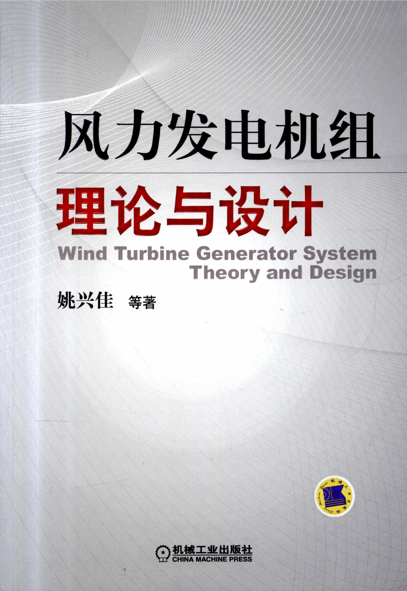
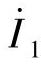
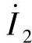
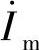

姚兴佳教授、博士生导师，沈阳工业大学风能技术研究所所长，中国可再生能源学会风能专业委员会副主任，国家科技支撑计划“大功率风电机组研制与示范”项目总体专家组组长，海上风力发电技术与检测国家重点实验室学术委员会主任，辽宁省风力发电技术重点实验室主任。获得国务院政府特殊津贴、“全国优秀科技工作者”和“辽宁省优秀专家”等称号。承担并完成国家“863”计划、国家科技支撑计划重大专项及省部级科研课题20余项；获得国家科技进步二等奖1项、辽宁省科技进步一等奖2项；获授权发明专利6项；编制风力发电国家标准3部，发表科研学术论文120余篇，著有《可再生能源及其发电技术》、《风力发电机组原理及应用》、《风力发电测试技术》和《风力发电机组设计与制造》等专业书籍。

本书主要介绍了风力发电机组的理论和设计。在理论方面包括风能捕获理论、能量传递理论和机电能量转换理论，统称为能量转换和传输理论。在设计方面包括风电机组设计基础、载荷、总体设计、风轮、风力发电机、主传动链、塔架与基础、控制系统、状态监测与故障诊断和强度分析。

本书适合于从事风力发电机组设计和研究的科技人员应用，也可作为大学攻读硕士和博士研究生的教材或参考书。

图书在版编目（CIP）数据

风力发电机组理论与设计/姚兴佳等著.—北京：机械工业出版社，2012.12

ISBN 978-7-111-40451-4

Ⅰ.①风… Ⅱ.①姚… Ⅲ.①风力发电机-发电机组-设计 Ⅳ.①TM315

中国版本图书馆CIP数据核字（2012）第274974号

机械工业出版社（北京市百万庄大街22号 邮政编码 100037）

策划编辑：林春泉 责任编辑：吕潇 版式设计：霍永明

责任校对：张晓蓉 责任印制：乔宇

北京机工印刷厂印刷（三河市南杨庄国丰装订厂装订）

2013年1月第1版第1次印刷

184mm×260mm·26印张·662千字

0001—3000册

标准书号：ISBN 978-7-111-40451-4

定价：69.90元

凡购本书，如有缺页、倒页、脱页，由本社发行部调换

电话服务

社服务中心：（010）88361066

销售一部：（010）68326294

销售二部：（010）88379649

读者购书热线：（010）88379203

网络服务

教材网：http://www.cmpedu.com

机工官网：http://www.cmpbook.com

机工官博：http://weibo.com/cmp1952

封面无防伪标均为盗版

# 前言

风力发电是风能利用的主要方式。自20世纪80年代开始，我国风力发电经历了长期的技术研究和项目开发的探索，特别是在《可再生能源法》的推动下，风力发电产业实现了跨越式发展，进入了国际先进行列，风力发电装机容量快速增长，风力发电设备制造能力明显提高，已成为世界上风力发电总装机最多和设备制造能力最强的国家。

中国风力发电产业的惊人增长也付出了代价。经过两年的市场滑坡后，风电行业快速发展过程中的诸多问题和隐患暴露出来，譬如产品研发能力不足，机组运行性能不稳定，并网适应性较差，风电场等效满负荷运行小时数低等等。把种种现象联系起来分析，都关联着核心技术掌握程度这样一条主线。目前，我国正在经历着从“风力发电大国”到“风力发电强国”的转变，从“中国制造”到“中国创造”的转变，从“国内市场”到“国际市场”的转变。在这些转变中，需要大量的风力发电人才储备和风力发电核心技术储备。这就对风力发电理论和风力发电机组设计的研究和创新提出了更高层次的要求。本书围绕着风力发电机组理论和设计做了一些开创性的探索。

风力发电理论是风力发电机组设计的基础。这些理论涉及气象学、流体力学、固体力学、材料力学、电子技术、机械工程、电气工程、海洋工程、环境工程等诸多领域。本书力图将相关的内容结合起来，归纳为风能捕获理论、能量传递理论和机电能量转换理论，统称为能量转换和传输理论。基本理论的研究除了掌握上述专业知识外，还需要概率论与数理统计、线性代数、场论、数值计算方法等方面的工程数学知识。由于篇幅的限制，本书略去了对基本理论繁琐的推证，只给出最后的结论。多数基本理论的原始形式是多维空间的、非线性的、时变的，只能用数值计算的方法求解。但是，在必要和可能的情况下，可以应用相应方法对基本理论进行简化，得出直观的解析形式，这对风力发电机组的设计是十分有益的。

在风力发电机组的设计方面，本书较全面地介绍了目前国内外主导机型的整机和零部件的设计方法。包括风力发电机组设计要求、载荷、总体设计、风轮、风力发电机、主传动链、塔架与基础、控制系统、状态监测与故障诊断、强度分析等。重点是风力机、齿轮箱和发电机的设计。

随着可靠性设计、优化设计、有限元设计等现代设计方法的不断完善和计算机辅助设计的应用，为风力发电机组的设计开拓了更加广泛的空间。国内外已经开发了多种风力发电机组的设计专用软件。本书对部分专用软件进行了介绍，并且在介绍整机和零部件的设计时，注重了一系列先进设计方法的应用。

本书的特点是坚持了理论与实际相结合，突出了典型机型的重点结构，应用了现代设计技术和方法。

本书适合于从事风力发电机组设计和研究的科技人员应用，也可作为高等学校相关专业的教学用书或大学攻读硕士和博士研究生的教材或参考书。

作为本书撰写基础的科研工作，得到了中国科学院院士严陆光、徐建中、胡文瑞，中国工程院院士黄其励、顾国彪、唐任远、朱英浩等的热情关怀和帮助，得到国家科技部、辽宁省科技厅、沈阳市科技局、中国可再生能源学会、中国风能协会、中国农业机械工业协会风能设备分会、中国资源综合利用协会新能源专委会、中国动力工程学会新能源专委会、国家海上风力发电技术与检测重点实验室等单位的大力支持，得到上海玻璃钢研究院、连云港中复联众复合材料集团有限公司、南京高精传动设备制造集团有限公司、重庆齿轮箱有限责任公司、兰州电机股份有限公司、阳光电源股份有限公司、北京科诺伟业有限公司、国网电力科学研究院、中国船级社、北京鉴衡认证中心有限公司、全国风力机械标准化技术委员会、沈阳华创风能有限公司、沈阳华人风电科技有限公司等单位的积极配合。在此一并表示衷心感谢。

本书的创作由姚兴佳主持，主要内容由姚兴佳、宋俊撰写。参加撰写的还有王益全、王海军、赵文辉、单光坤、孙传宗、张明远、刘颖明、王晓东、李科、郭成良。另外，王士荣、刘玥、董丽萍也参与了本书组稿。全书由姚兴佳教授审阅并定稿。

本书在编写过程中，参考了国内外有关文献资料，在此谨向相关文献资料的作者表示诚挚的谢意。由于风力发电技术涉及知识面广，发展速度很快，作者水平有限，书中难免疏漏与错误之处，恳请读者批评指正。

著者

2012年12月

# 目录

前言

主要物理量符号表

第一章 绪论

第一节 风力发电机组理论与设计概述

一、风力发电机组的能量转换和传输

二、风力发电机组基本理论

三、主导机型的设计模式

第二节 风力发电机组设计工作规范

一、设计依据

二、设计内容

三、设计原则

四、设计步骤

第三节 风力发电机组的可靠性和安全性设计

一、整机的可靠性

二、零部件的可靠性

三、劳动安全

第四节 风力发电机组设计软件简介

一、结构分析与设计软件

二、性能分析与仿真软件

第二章 能量转换和传输理论

第一节 风能捕获理论

一、流体力学的基本方程

二、风力机的稳态数学模型

第二节 能量传递理论

一、弹性力学的基本方程

二、传动链数学模型

第三节 机电能量转换理论

一、发电机中的机电能量转换关系

二、感应电动势和电磁转矩

三、基本方程式

第三章 风力发电机组设计要求

第一节 风力发电机组的外部条件

一、风力发电机组等级

二、风况

三、其他环境条件

四、电网条件

第二节 结构设计

一、载荷

二、设计工况和载荷状态

三、载荷计算

四、最大极限状态分析

第三节 海上风力发电机组外部条件

一、海上风力发电机组外部条件的特点

二、海上风力发电机组等级

三、风况

四、海洋状况

五、其他环境条件

六、电网条件

七、载荷计算

第四章 载荷

第一节 载荷概述

一、载荷及其坐标系

二、坐标系的转换

三、载荷分类

四、载荷源

第二节 载荷分析

一、疲劳载荷

二、极限载荷

三、载荷叠加

第三节 载荷的计算

一、建立机组模型

二、工况设定

三、仿真计算

四、后处理

第五章 总体设计

第一节 总体参数设计

一、设计风速

二、风轮转速

三、发电机额定转速和转速范围

四、重要几何尺寸

五、总质量、质心与转动惯量

第二节 总体功能设计

一、基于风力机实现的功率调节

二、基于发电机实现的功率调节

第三节 总体布局设计

一、总体布置原则

二、风力发电机组的典型布局

三、部件的集成化

第四节 模型试验

一、相似条件

二、相似结果

三、模型机试验中的问题

第五节 设计成本模型

第六章 风轮

第一节 风轮设计概述

第二节 翼型介绍

一、NACA翼型系列

二、风轮叶片专用翼型系列

三、翼型的选择

四、翼型的修正

第三节 叶片气动设计

一、图解法

二、简化叶素-动量定理设计法

三、葛劳渥方法

四、维尔森方法

第四节 叶片的结构设计

一、叶片的结构设计要求

二、叶片的常用材料

三、叶片的剖面结构

四、叶片的铺层设计

五、叶片的校核

六、定桨距叶片叶柄结构设计

第五节 叶片优化设计

一、设计变量

二、目标函数

三、约束条件

四、寻优算法

第六节 轮毂

一、轮毂的结构设计

二、轮毂的载荷分析

第七章 风力发电机

第一节 风力发电机的基本工作原理及分类

一、基本工作原理

二、分类

第二节 发电机的设计基础

一、设计的技术要求

二、主要尺寸

三、电机绕组

四、磁场与磁路

五、参数计算

第三节 笼型感应发电机的设计

一、风力发电中应用的笼型感应发电机

二、笼型感应发电机的电磁设计

第四节 双馈感应发电机的设计

一、风力发电中应用的双馈感应发电机

二、电磁设计

第五节 永磁同步发电机的设计特点

一、风力发电中应用的同步发电机

二、电磁设计特点

第六节 计算机辅助电磁设计

一、计算机辅助电磁设计源程序编制中的几个问题

二、计算机辅助电磁设计源程序

第八章 主传动链

第一节 主轴

一、主轴支撑方式

二、主轴材料

三、主轴力学模型及设计载荷

四、主轴强度分析

第二节 主轴承

一、设计载荷

二、额定寿命

三、润滑及密封

第三节 主齿轮箱

一、基本传动形式

二、风电齿轮传动设计标准

三、载荷及齿轮承载能力

四、齿轮传动主要参数的选择及设计实例

五、主要部件的设计与选型

六、传动效率与噪声

七、齿轮箱的润滑、冷却和加热

第四节 联轴器

一、刚性胀套式联轴器

二、膜片联轴器

第五节 机舱

一、底盘

二、机舱罩

第九章 塔架与基础

第一节 塔架的构造设计

一、塔架的结构型式

二、塔架的细部构造

三、塔架的材料

四、塔架的防腐

五、塔架的制造工艺过程

第二节 锥筒式塔架的设计计算

一、塔架的设计内容与要求

二、塔筒设计

三、塔筒屈曲稳定性分析

四、法兰的设计

五、塔架的固有频率计算

六、塔架的计算实例

七、塔架的有限元分析

第三节 基础设计

一、风力发电机组基础的设计内容与要求

二、基础设计载荷

三、扩展基础设计

四、海上风力发电机组的基础

第十章 控制系统

第一节 控制系统概述

一、控制系统的组成

二、控制系统基本功能

三、控制系统设计要求

第二节 制动系统

一、风力发电机组关机过程的规划

二、风力发电机组关机过程的运动方程

三、空气动力制动的设计

四、机械制动的设计

第三节 变桨距系统

一、变桨距系统功能与构成

二、变桨距系统驱动力矩计算

三、变桨距轴承的设计与计算

四、电动变桨距驱动机构设计

五、电动变桨距位置控制

六、后备电源设计

七、液压变桨距系统设计

第四节 偏航系统

一、偏航系统的结构设计

二、偏航设计载荷的确定

三、偏航执行机构设计

四、轴承齿轮副

五、偏航制动

六、偏航系统的控制

第五节 主控系统

一、主控系统设计概述

二、主控系统硬件结构设计

三、主控系统信号采集及处理设计

四、主控系统功能设计

五、主控系统控制策略设计

第六节 安全系统

一、安全系统设计原则

二、安全系统控制功能设计

三、软件的安全保护设计

四、安全链设计

五、防雷功能设计

第十一章 状态监测及故障诊断

第一节 常见故障及诊断方法

一、常见故障

二、状态监测及故障诊断的方法

第二节 在线监测及故障诊断系统设计

一、在线监测系统的功能

二、在线监测系统结构设计

第三节 在线监测系统的工作过程及案例分析

一、故障信息的分析与处理

二、故障诊断规则

三、故障诊断案例分析

第十二章 强度分析

第一节 强度分析概述

一、强度分析的任务和对象

二、强度分析的一般流程

三、强度规范

第二节 静强度分析

一、静强度分析方法

二、实例：1.5MW机组轮毂静强度分析

第三节 模态分析

一、模态分析基础理论

二、模态分析方法

三、实例：1.5MW机组塔筒模态分析

第四节 疲劳强度分析

一、疲劳强度基础理论

二、疲劳强度分析方法

三、实例：1.5MW机组底盘疲劳强度分析

第五节 屈曲稳定性分析

一、屈曲稳定性分析方法

二、实例：1.5MW机组屈曲稳定性分析

附录

附录A 笼型感应发电机计算机辅助电磁设计源程序

附录B 双馈感应发电机计算机辅助电磁设计源程序

参考文献

# 主要物理量符号表

a——轴向气流诱导因子；并联支路数

a′——切向气流诱导因子

a_(k)——应力集中因子

A——（风轮扫掠、叶素、翼型剖面、塔架根部、机舱迎风面）面积；线负荷；电负荷

A₀——制动活塞有效作用面积

A_(h)——液压缸的有效作用面积

A_(m)——永磁体每极截面积

b——（摩擦片、基底面）宽度

b_(k1)——径向通风道宽度

b_(m0)——空载时永磁体表面的磁密标幺值

b_(mN)——负载时永磁体表面的磁密标幺值

B——电机磁通密度；粘性摩擦系数

B_(r)——电机剩磁感应强度

B_(s)——弹性系统阻尼系数

B_(δ)——电机气隙磁密、磁负荷

c——叶片几何弦长；威布尔分布尺度参数

c_(t)——比热容

C——基本额定动载荷

C₀——额定静载荷；轴承的额定静载荷

C_(A)——电机常数

C_(d)——翼型阻力特征系数

C_(f)——峰值指标

C_(l)——翼型升力特征系数

C_(m)——翼型俯仰力矩系数

C_(M)——风轮力矩系数

C_(P)——风能利用系数

C_(T)——风轮推力系数

d——主轴直径；主轴轴肩处小径；胀套的内径

d₁——空心轴内径

d_(b)——内齿圈分度圆直径

dD——空气动力阻力分量

dL——空气动力升力分量

d_(s)——叶片每个截面之间的距离

D——（风轮、主轴轴肩处大端、制动盘）直径；弯曲刚度；疲劳累积损伤值；

D₁——电机定子铁心外径

D₂——电机转子铁心外径

D_(h)——轮毂直径

D_(i1)——电机定子铁心内径

D_(i2)——电机转子铁心内径

D_(r)——轴承轨道直径

D_(yb)——叶根处叶柄的直径

e——单位质量流体的内能；电机瞬时电动势；偏心距

E——弹性模量；升阻比；制动总的能量消耗

E₀——单向层沿叶片轴向的拉伸弹性模量；电机励磁电动势

E₁——复合材料层合板的轴向弹性模量；电机定子感应电动势

E₂——电机转子感应电动势

E_(f)——面板弹性模量

E_(δ)——电机气隙电动势

f——翼型弯度；翼型的中弧线坐标；电机电磁力

f₁——电网频率；电机定子频率

f₂——电机转子频率

f_(ad)——电机每极直轴电枢磁动势标幺值

f_(d)——材料设计值

f_(k)——材料特征值

f_(n)——缺陷齿所在轴的旋转频率

f_(N)——电机额定频率

f_(S)——变桨距轴承静承载能力

f_(z)——齿轮啮合频率

F——力；风轮总的损失系数

F₁——作用在机舱上的空气动力

F_(a)——轴向力；电机每对极磁路中的电枢磁动势

F_(b)——制动器单侧闸体对制动盘的压紧力

F_(c)——离心力；永磁体磁动势源的计算磁动势

F_(d)——总内部载荷或载荷响应的设计值

F_(D)——变桨距驱动力

F_(g)——重力

F_(h)——轮毂损失系数

F_(k)——载荷的特征值

F_(m)——每对极磁路中永磁体两端向外磁路提供的磁动势

F_(N)——机舱的重力

F_(p)——液压驱动力

F_(r)——径向力；

F_(t)——叶尖损失系数

F_(ts)——塔架所受风力

G——剪切弹性模量；重力

G₀——单向层沿叶片轴向的剪切弹性模量

G₁——塔架上方所受总重力

G₁₂——复合材料层合板的剪切弹性模量

G₂——塔架自身所受重力

G_(s)——主轴重力

G_(w)——风轮重力

h——切向干扰因子；轴肩高度；曲柄长度

h₂——叶轮中心到塔架上部的距离

h_(m0)——空载时永磁体去磁磁动势标幺值

h_(mN)——负载时永磁体去磁磁动势标幺值

H——拉伸刚度；塔架高度；液压缸行程

H_(s)——有效波浪高度

i——传动比；瞬时电流

i₁——高速级传动比

i₂——低速级传动比

i_(D)——减速箱传动比

i_(G)——变桨距轴承上齿轮副传动比

I——电流；惯性矩；电机电枢电流；塔架的等效刚度

——电机定子电流

——电机转子电流

I_(d)——电机直轴电枢电流

I_(K)——电机短路电流

——电机励磁电流

I_(N)——电机额定电流

I_(P)——翼型对质心的极惯性矩

I_(q)——电机交轴电枢电流

I_(ref)——湍流强度的期望值

J——转动惯量；折算到机械制动轴上的等效转动惯量J₁、J₂——增速齿轮的转动惯量

J_(C)——叶片对旋转轴的转动惯量

J_(e)——发电机转子的转动惯量

J_(H)——高速轴处的等效转动惯量

J_(L)——低速轴处的等效转动惯量

J_(r)——风轮的转动惯量

J_(W)——偏航轴上的转动惯量

k——导热系数；威布尔分布形状参数；轴向干扰因子

k_(d)——电机绕组分布系数

k_(dp)——电机绕组系数

k_(f)——修弯因子

k_(p)——电机绕组短距系数

k_(δ)——翼型修厚因子

K₁——机舱表面形状系数

K_(A)——齿轮使用系数

K_(d)——级间直径比

K_(f)——有效应力集中系数

K_(Fe)——电机铁心压装系数

K_(s)——弹性系统的刚性系数

K_(δ)——电机卡特系数

l——胀套的内环宽度；（连杆、基底面）长度

l₁——风轮重心到轴计算截面距离

L——长度；电感；载荷周期

L₁——电机定子铁心长度

L₂——电机转子铁心长度

L_(b)——叶片长度

L_(eff)——电机电枢计算长度

m——质量；材料S-N曲线的斜率；电机相数；齿轮模数

M——力矩；弯矩；扭矩；风轮转矩

M₁——小齿轮所需的最大驱动力矩

M₂——低速轴转矩

M_(e)——电机电磁转矩

M_(D)——驱动力矩

M_(G)——回转效应产生的倾覆力矩；变桨距旋转轴上的重力矩

M_(K)——回转效应产生的偏航力矩；按载荷标准组合计算的弯矩

M_(m)——主传动系统的输出转矩

M_(M)——机械制动力矩

M_(R)——摩擦力矩

M_(t)——胀套的额定转矩

M_(T)——塔筒扭矩

M_(w)——叶片变桨距力矩；折算到机械制动轴上的空气动力矩；机舱上的空气动力矩

M_(zs)——叶片承受的扭矩

n——转速；（风轮、主轴、泵）转速；缺口敏感系数

n₀——制动器数

n₁——电机同步转速

n₂——低速轴转速

n_(a)——输出轴转速

n_(eq)——等效循环数

n_(N)——电机额定转速

n_(p)——行星轮个数

N——叶片数；电机每相串联匝数；总循环次数

N₁——叶片上分段总数；循环次数上限

N_(B)——叶素数

N_(D)——拐点循环次数

N_(Leq)——当量循环次数

p——压强；电机绕组极对数

p_(ad)——电机杂散损耗

p_(Cu)——电机铜损耗

p_(f)——电机励磁损耗

p_(Fe)——电机铁损耗

p_(h)——液压系统工作压力

p_(mec)——电机风摩损耗

p_(p)——液压泵的出口压力

P——功率；概率；风轮功率；实测功率

P₀——当量静载荷

P₁——电机输入功率

P₂——电机输出功率

P_(d)——当量动载荷

P_(D)——驱动功率

P_(e)——发电系统的输出功率

P_(em)——电机电磁功率

P_(m)——主传动系统的输出功率

P_(N)——额定功率

P_(P)——液压泵的输出功率

P_(r)——风轮的输出功率

P_(t)——胀套和轴结合面上的压力

P_(W)——风功率

q——电机每极每相槽数；缺口敏感因子

q_(p)——液压泵实际流量

Q₁——电机定子槽数

Q₂——电机转子槽数

r——叶素到风轮中轴的距离；塔筒的内半径

r₀——主轴半径

r_(c)——过渡圆角半径；缺口半径

r_(hub)——轮毂半径

R——风轮半径；剖面的曲率半径；结构构件抗力设计值；

R——气体常数

R₀——制动力臂

R₁——电机定子（电枢）绕组电阻

R₂——电机转子绕组电阻

R′₂——折算到定子侧的转子每相电阻

R_(a)——表面粗糙度

Re——雷诺数

s——异步电机的转差率

S——电机视在功率；载荷效应组合的设计值；疲劳作用应力

S₋₁——疲劳极限

S₀——等效损伤载荷范围

S_(a)——应力幅值

S_(f)——波形指标

S_(m)——平均应力

S_(SN)——从S-N曲线得到的N个载荷周期时的交变剪应力

S_(Su)——最大剪切强度

S_(u)——极限强度

t——时间；零件壁厚

t₁——电机定子齿距

t₂——电机转子齿距

T——作用在叶片上的推力；流场绝对温度；动能

T₀——制动总时间；振动加速度测量周期

T_(e)——电机电磁转矩（第七章）

u——瞬时电压

U——电压

U_(N)——额定电压

U_(f)——电机励磁电压

U₁——定子相电压

U′₂——转子电压折算值

v——线速度

v₁₀——10min的平均风速

v_(∞)——未受扰动的来流速度

v_(ave)——平均风速

v_(cg)——方向改变的极端相关阵风的幅值

v_(d)——风轮处风速

v_(hub)——轮毂高度处的平均风速

v_(in)——切入风速

v_(out)——切出风速

v_(r)——额定风速

v_(ref)——参考风速

V——势能；容积

V_(p)——泵的理论排量

w——相对气流速度

W——能量；抗弯截面模量

W_(e)——电能

W_(m)——磁场能量

W′_(m)——磁共能

W_(mec)——机械能

W_(T)——抗扭断面模量

x_(m)——10min载荷响应最大值

X₁——电机定子（电枢）漏电抗

X₂——电机转子漏电抗

X_(ad)——电机直轴电枢反应电抗

X_(aq)——电机交轴电枢反应电抗

X_(d)——电机直轴电枢电抗

X_(m)——电机主电抗、励磁电抗

X_(p)——振动信号峰值

X_(q)——电机交轴电枢电抗

X_(r)——振动信号方根幅值

X_(rms)——振动信号有效值

y₁——电机线圈节距

z——高度；齿轮齿数

Z₁——电机每槽导体数

z_(a)——太阳轮齿数

z_(b)——内齿圈齿数

z_(c)——行星轮齿数

z_(hub)——轮毂高度

z_(j)——塔架高度

z_(t)——塔顶平面到风轮扫掠面中心的高度

Z_(φ1)——电机每相串联导体数

α——攻角；电机槽距角；应力集中系数

α_(p)——电机极弧系数

α′_(p)——电机计算极弧系数

β——叶素桨距角；安装角；表面影响系数

β₁——空心轴内外径之比

γ——剪应变；安全系数；风轮偏角

γ_(e)——应力集中对极限强度的影响系数

γ_(f)——载荷局部安全系数

γ_(m)——材料局部安全系数

γ_(n)——失效影响安全系数

δ——（翼型、摩擦层、剖面壁）厚度；电机气隙长度

δ——翼型相对厚度

δ_(ef)——电机有效气隙长度

Δ——叶尖的总变形；电流密度

ε——线应变；寿命指数

ε₁——技术尺寸系数

ε₂——几何尺寸系数

η——效率

η_(D)——偏心曲柄滑块机构效率

η_(e)——发电系统的总效率

η_(m)——主传动系统的总效率

η_(P)——液压泵的总效率

η_(q)——泵的容积效率

η_(r)——捕获功率时叶片单元效率

θ——风向的变化量；电机转子转角；电机功率角；制动盘温度

θ_(e)——极端风向变化的幅值

κ——导热率

λ——叶尖速比；膨胀粘性系数；电机主要尺寸比

λ_(d)——电机谐波比漏磁导

λ_(e)——电机端部比漏磁导

λ_(L)——电机槽下部比漏磁导

λ_(n)——电机外磁路合成磁导的标幺值

λ_(N)——额定叶尖速比

λ_(r)——当地速度比（周速比）

λ_(s)——电机槽比漏磁导

λ_(U)——电机槽口比漏磁导

Λ₀——永磁体的内磁导

Λ₁——湍流尺度参数

Λ_(δ)——电机气隙磁导

Λ_(σ)——外磁路的漏磁导

μ——流体的动力黏度；泊松比

μ₀——电机气隙磁导率

μ_(f)——摩擦系数

ν——谐波次数；流体运动黏度

ρ——密度

ρ₁——齿廓分界处曲率半径

ρ_(a)——齿顶处曲率

ρ_(p)——工作齿根处曲率半径

σ——截面的正应力

σ′——有效应力

\[σ\]——材料的许用应力

\[σ_(-1b)\]——对称循环变应力下的许用弯曲应力

σ₀——电机空载漏磁系数

σ₁——纵向湍流标准差

σ_(b)——危险截面上的弯曲应力；材料抗拉强度

\[σ_(b)\]——许用弯曲应力

σ_(f)——失稳临界应力

σ_(F)——齿根弯曲应力

σ_(Flim)——齿根弯曲疲劳极限应力

σ_(H)——齿面接触应力

\[σ_(H)\]——许用接触应力

σ_(Hlim)——齿面接触疲劳极限应力

σ_(m)——10min最大载荷响应的标准偏差

σ_(max)——极限载荷作用下的最大应力

σ_(r)——叶素弦长实度；风轮叶片实度；疲劳极限

σ_(s)——材料屈服极限

σ_(y)——材料极限应力

∑p——电机的总损耗

τ——剪应力；电机极距

\[τ\]——轴的许用剪应力

τ_(a)——交变剪应力

τ_(m)——平均剪应力

φ——电流与电压相量之间的夹角；塔架顶部扭转角；气流倾角

φ_(δ)——电机气隙电动势与电枢电流之间的相位差角

φ₁——变桨距行程角

φ_(d)——齿宽系数

Φ₀——永磁体虚拟内漏磁通

Φ_(m)——永磁体向外磁路提供的每极总磁通

Φ_(m0)——电机空载时永磁体提供的总磁通

Φ_(mN)——电机负载时永磁体提供的总磁通

Φ_(Γ)——永磁体虚拟内禀磁通

Φ_(δ)——电机每极气隙磁通

Φ_(δO)——电机空载时的每极气隙磁通

Φ_(δN)——电机负载时的每极气隙磁通

Φ_(σ)——电机外磁路的漏磁通

Φ_(σO)——电机空载漏磁通

Φ_(σN)——电机负载漏磁通

χ_(a)、χ_(c)——太阳轮、行星轮的变位系数

Ψ——锥形塔架的长度折减系数；电机磁链

Ψ_(N)——电机额定运行时的内功率因数角

ω——叶片外壳蒙皮厚度；电机电角速度；电角频率；机械制动轴转动角速度

ω₁——同步角速度；变桨距小齿轮转动角速度

ω_(a)——机械制动轴初始旋转角速度

ω_(C)——变桨距角速度

ω_(W)——偏航角速度

Ω——风轮旋转角速度；发电机转子机械角速度（第七章）

Ω_(e)——发电机转子机械角速度

Ω_(m)——主传动系统的输出角速度

Ω_(N)——风轮额定旋转角速度

