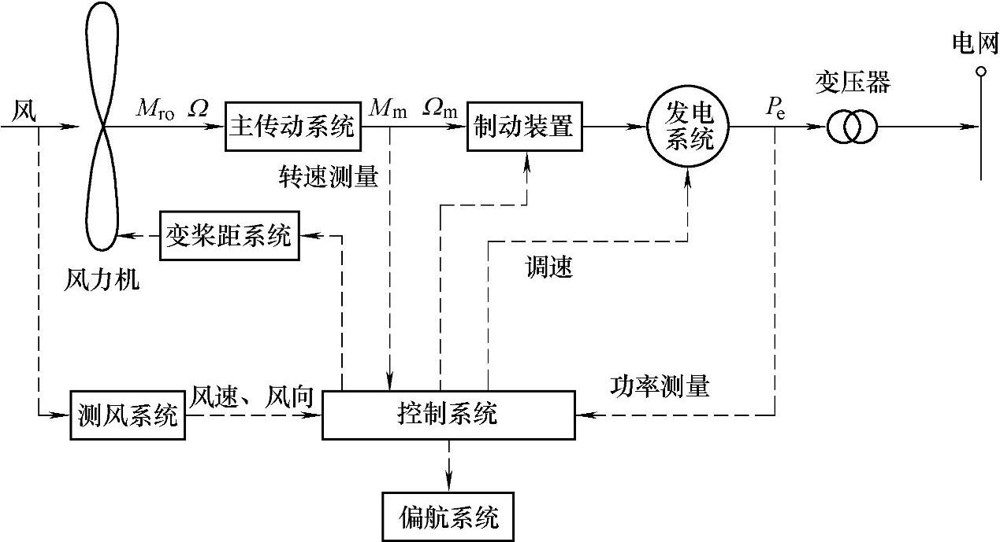
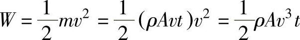
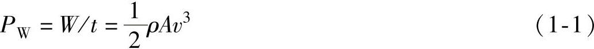
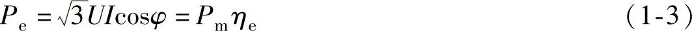
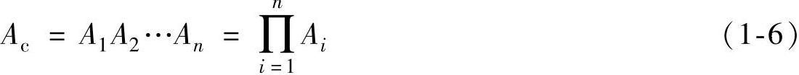
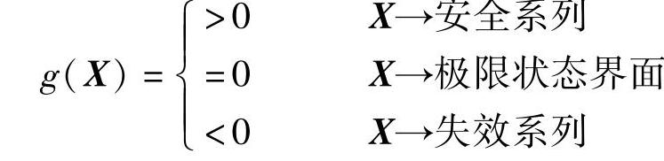

# 1 绪论

本章重点介绍了本书涉及的风力发电（风电）机组理论与设计的基本内容，包括风力发电机组的设计依据、设计内容、设计原则和设计步骤。同时还简要介绍了几种风力发电机组的设计软件。

## 第一节 风力发电机组理论与设计概述

风力发电机组的理论是设计的基础，也是设计人员应该首先掌握的内容。风力发电机组涉及的理论很多，本书对其核心内容进行了归纳，构成了一个较系统的理论体系，称之为能量转换和传输理论。

### 一、风力发电机组的能量转换和传输

图1-1 风力发电机组的能量转换和传输

风力发电机组的能量转换和传输如图1-1所示。风力机所捕获的是风的动能，风的动能大小可以由风功率来表示。风功率是指单位时间内，以速度v垂直流过截面A的气流所具有的动能。因为在t时间内，以速度v垂直流过截面A的气流所具有的动能为

式中 W——风能，单位为J；

ρ——空气密度，单位为kg/m³；

v——来流速度，单位为m/s；

A——面积，单位为m²。

所以风功率

由式（1-1）可见风功率与风速的三次方成正比。当风以一定的速度吹向风力机时，在风轮上产生的力矩驱动风轮转动。将风的动能变成风轮旋转的动能，二者都属于机械能。风轮的输出功率为

P_(r)=M_(ro)Ω

式中 P_(r)——风轮的输出功率，单位为W；

M_(ro)——风轮的输出转矩，单位为N·m；

Ω——风轮的角速度，单位为rad/s。

风轮的输出功率通过主传动系统传递。主传动系统可能使扭矩和转速发生变化，于是有

P_(m)=M_(m)Ω_(m)=M_(r)Ω_(r)η_(m) （1-2）

式中 P_(m)——主传动系统的输出功率，单位为W；

M_(m)——主传动系统的输出转矩，单位为N·m；

Ω_(m)——主传动系统的高速轴角速度，单位为rad/s。

η_(m)——主传动系统的总效率。

主传动系统将动力传递给发电系统，发电系统把机械能变为电能。发电系统的输出功率为

式中 P_(e)——发电系统的输出功率，单位是W；

U——发电系统三相绕组上的输出线电压，单位是V；

I——发电系统三相绕组上的输出线电流，单位是A；

cosφ——功率因数；

η_(e)——发电系统的总效率。

对于并网型风力发电机组，发电系统输出的电能经过变压器升压后，即可输入电网。

### 二、风力发电机组基本理论

风力发电机组基本理论可以概括为能量转换和传输理论，包括风能捕获理论、能量传递理论和机电能量转换理论。

1.风能捕获理论

风能捕获理论为了解决风力机的设计问题。

风能捕获理论包括流体力学的基本方程，即连续方程、运动方程和能量方程。它们是基本物理定律——质量守恒定律、牛顿第二定律和能量守恒定律在流体力学领域的数学描述。应用流体力学的基本方程可以建立风能捕获过程的动态数学模型，通过求解数学模型，能得到风力机周围的速度场和压力场的数值解，进而求得风力机捕获风能的多少以及风力机本身的力学特性。

在风力机的设计实践中，学者们针对风力机的特点，提出了一些简化理论，如制动盘理论、旋转圆盘理论和叶素-动量定理等。应用这些理论可以建立风能捕获过程的静态模型，通过求解数学模型，能得到某些解析表达式，使风力机的设计变得更加直观和方便。

应用上述理论可以研究风力机的空气动力特性；研究变桨距、偏航过程的能量转换规律；研究湍流和阵风对能量转换的影响；研究风暴、盐雾、沙尘、覆冰条件下的能量转换特征。目的是不断改进风力机的设计，最大限度地捕获风能，有效地延长风力发电机组的使用寿命。

经过长期的实践，风力机叶片设计技术已经得到很大的发展。从前期的“先形状后结构”以及“牺牲气动性能换取结构优化”的方法发展到全局寻优的设计方法，同时进行形状和结构优化。实现能量输出最大化和成本最小化。

2.能量传递理论

能量传递理论为了解决主传动系统的设计问题。

能量传递理论包括弹性力学的基本方程，即平衡微分方程、几何方程、物理方程以及相应的边界条件。应用弹性力学的基本方程可以建立柔性传动系统的数学模型，通过求解数学模型，能得到柔性传动系统的数值解，进而求得柔性传动系统动态响应和进行振动模态分析。

在一定条件下，可以部分或全部忽略主传动系统的弹性，建立刚性传动系统的数学模型，从而使设计计算得到简化。

应用上述理论可以分析有齿轮箱和无齿轮箱能量传递特征，定传动比模型和变传动比模型能量传递特征，非功率分流模型和功率分流模型能量传递特征，低速轴制动和高速轴制动能量传递特征。目的是减少冲击和增加能量传递系统的稳定性，提高能量传递效率。

3.机电能量转换理论

机电能量转换理论解决发电系统的设计问题。

机电能量转换理论包括电磁学的基本方程，即电压方程、磁链方程、运动方程和电磁转矩方程。应用电磁学的基本方程可以建立发电系统的数学模型，通过求解数学模型，能得到发电系统输出电流、电压和功率数值解，进而求得发电系统动态响应特性。

应用相量理论或矢量变换方法可以简化发电系统的数学模型，从而使设计计算和发电系统的控制得到简化。

应用上述理论可以分析研究机械能向电能的转换过程。重点研究以双馈发电机为主的异步发电机和以永磁发电机为主的同步发电机能量转换关系；研究用于风力发电的内转子和外转子永磁发电机运行特性；研究优化转差、直流励磁、交流励磁电磁场特性及变速功能；研究各种整流器和逆变器的能量传输功能及其特点。目的是提高供电质量，提高能量传递效率，提高发电系统的可靠性。

### 三、主导机型的设计模式

目前，在风力发电机组的设计和生产中，主导机型是双馈式风力发电机组和直驱式永磁风力发电机组。大容量的机组大多采用这两种结构，下面分别对它们的设计模式加以介绍。

1.双馈式风力发电机组

双馈式风力发电机组就是采用双馈式异步发电机，转子通过变流器并网的一种变速恒频机组。其主要特点是转子采用交流励磁。

图1-2所示为双馈式风力发电机组的内部结构。它由以下基本部分组成：

1）变桨距系统：设在轮毂之中。对于电动变距系统来说，包括变桨距驱动器、变距控制器、后备电源等。

2）发电系统：包括发电机、变流器等。

3）主传动系统：包括主轴及主轴承、齿轮箱、制动器和联轴器等。

4）偏航系统：由偏航电动机、减速器、偏航轴承、制动机构等组成。

5）控制系统：包括传感器、电气设备、计算机控制系统和相应软件。

此外，还设有液压系统，为高速轴上设置的制动装置、偏航制动装置提供液压动力。液压系统包括液压站、输油管和执行机构。为了实现齿轮箱、发电机、变流器的温度控制，设有循环油冷却风扇和加热器。

图1-2 双馈式风力发电机组的内部结构

双馈式风力发电机组风轮将风能转变为机械转动的能量，经过齿轮箱增速驱动双馈式异步发电机，应用励磁变流器励磁而将发电机的定子电能输入电网。如果超过发电机同步转速，转子也处于发电状态，通过变流器向电网馈电。

齿轮箱可以将较低的风轮转速变为较高的发电机转速。同时也使得发电机易于控制，实现稳定的频率和电压输出。

交流励磁变速恒频双馈发电机组的优点是，允许发电机在同步速上下30％转速范围内变速运行；变流器的功率仅是发电机额定容量的一部分，使变频装置体积减小，成本降低，投资减少；可以实现有功、无功功率的独立调节。

交流励磁变速恒频双馈式风力发电机组的缺点是，双馈式风力发电机组必须使用齿轮箱，然而随着发电机组功率的升高，齿轮箱成本变得很高，且易出现故障；发电机转子绕组带有集电环、电刷，增加维护和故障率；控制系统结构较复杂。

2.直驱式永磁风力发电机组

风力发电机组也可以用多极永磁发电机直接连接风力机，从而避免增速箱带来的诸多不利，这就是直驱式永磁风力发电机组。电力电子器件的发展也为直驱式永磁风力发电机的发展开辟了道路。直驱式永磁风力发电机组的结构如图1-3所示。

直驱式永磁风力发电机组的发电机轴直接连接到风轮上，转子的转速随风速而改变，其交流电的频率也随之变化，经过大功率电力电子变换器，将频率不定的交流电整流成直流电，再逆变成与电网同频率的交流电输出。变速恒频控制是在定子电路实现的，因此变频器的容量与系统的额定容量相同。

直驱式永磁风力发电机组相对于传统的异步发电机组优点是，由于传动系统部件的减少，提高了机组的可靠性，降低了噪声；永磁发电技术及变速恒频技术的采用提高了风力发电机组的效率；利用变速恒频技术可以进行无功功率补偿。

虽然直接驱动与采用交-直-交变流器相结合的变速恒频方式有一定的优势，但也存在如下缺点：采用的多极低速永磁同步发电机，电机直径大，制造成本高；随着机组设计容量的增大，给电机设计、加工制造带来困难；定子绕组绝缘等级要求较高；采用全容量逆变装置，功率变换器设备投资大，增加控制系统成本。

图1-3 直驱式永磁风力发电机组结构

## 第二节 风力发电机组设计工作规范

### 一、设计依据

风力发电机组的设计依据是《风力发电机组的设计任务书》。《风力发电机组的设计任务书》是上级部门或用户为设计部门提供的设计条件，这些条件是设计计算的已知条件。一般包括风力发电机组的基本形式、基本参数和外部条件。

1.基本形式

首先应该明确风力发电机组的基本形式。例如，是设计水平轴还是垂直轴的；对于水平轴的风力发电机组是上风向还是下风向的；风力机是两叶片还是三叶片的，是定桨距还是变桨距的；发电系统是恒速恒频还是变速恒频的等。

目前，主流机型是水平轴、上风向、三叶片、变桨距、变速恒频风力发电机组。这一类机组也有不同的机型，主要区别是发电机转速的不同。可以分为应用高转速的双馈式异步发电机的双馈式机组；应用低转速的同步发电机的直驱式机组和应用中转速的同步发电机的混合式（半直驱）机组。

2.基本参数

基本参数主要是风力发电机组的额定功率、转速范围、总效率、设计寿命和生产成本等。

3.外部条件

风力发电机组的外部条件包括运行环境条件、电网条件和风场的地质情况。运行环境条件主要是风资源、湍流和阵风情况、气候情况等。有关风力发电机组的外部条件问题将在本书第三章详述。

### 二、设计内容

风力发电机组的设计内容就是完成设计图样和相关的设计文件。设计图样包括外观图、部件图和零件图等；设计文件包括《设计计算书》、《用户手册》等。

1.外观图

风力发电机组的外观图（见图1-4）描述其整体结构并标注主要尺寸。同时，用文字注明设备的技术特征。如机组类型、功率调节方式、风轮旋转方向、额定功率、额定风速、风轮直径、风轮转速范围、风轮倾角、风轮锥角、变距最大角度、齿轮箱类型、齿轮箱增速比、发电机类型、塔架类型、轮毂中心高和各主要部件重量。

图1-4 外观图示例

2.部件图

部件图是各层次安装工作的指导图样。表示各零件之间的装配关系、配合公差、轮廓尺寸、装配技术条件、标题栏等。

部件可能是多层次的。例如机舱中还设有齿轮箱和发电机等部件。各级部件图以图号相区别。

3.零件图

零件图是生产零件的依据。包括零件的结构和形状、尺寸、粗糙度和形位公差、材料及表面处理、技术条件、标题栏等。

在设计零件时，要进行相应的载荷分析和强度校核。

4.电气图

电气图包括电气系统原理图和连线图等。

5.控制流程图及软件

风力发电机组的控制系统是一个综合性系统。应该在整体优化的基础上编制控制流程图及相应软件。

6.外购件和标准件明细表

外购件和标准件明细表用来说明外购件和标准件名称、规格、型号、数量和生产厂家，供采购部门使用。

7.设计文件

设计文件是与设计相关的文字材料。用于设计部门存档，指导装配和安装，指导用户的维护作业和提供维修人员使用。

### 三、设计原则

风力发电机组的设计所涉及的知识、资料、信息是多方面的。为了保证风力发电机组设计成功，应遵循一定的设计原则。在设计前要确定设计所必须用到的参数及风力发电机组应达到的技术、经济指标。还应掌握国内外当时风力发电机组的水平，立足国情，结合用户需求及风力发电机组安装的地理、自然条件、几年的风速记录等，力争设计的起点高、技术先进、性能优越、成本低，达到国内外领先水平，才能使设计的风力发电机组在市场上具有竞争力。

下面介绍风力发电机组的设计一般应遵循的基本原则。

1.可靠性

如果在预计的服务寿命内得到正确的使用和维护，风力发电机组应该被设计制造成在预计的安全水平下承受假定的载荷并表现出足够的持久性和坚固性。风力发电机组配备了控制和保护系统，它规定了风力机将要经历的所有可能的设计状态。

可靠性表示系统、机器或零件等在规定时间内能够稳定工作的程度或性质。它是风力发电机组的基本质量标志，是产品质量的重要组成部分。可靠性来自设计、制造和使用维护。设计可靠性是影响产品可靠性的重要因素。

风力发电机组可靠性量化指标是机组运行可利用率，可利用率是固有可靠性和使用管理可靠性的综合度量指标。

风力发电机组可利用率A_(s)计算方法如下：

式中 t_(cum)——累积停机时间，单位为h；

t_(p)——计划维修时间，单位为h；

t_(s)——使用维护人员操作失误造成停机时间，单位为h；

t_(t)——总时间，例如1年，单位为h；

t_(ldt)——非维修时间，单位为h。

t_(ldt)=t₁+t₂+t₃ （1-5）

式中 t₁——电网故障的时间；

t₂——不可抗力造成停机的时间，如战争、地震、洪水等；

t₃——气候限制导致停机的时间，如覆冰、气温超过规定的运行极限温度等。

总体设计阶段，对重要零部件和系统应规定可靠性量化指标的要求，可以采用串联模型法，确定有关零部件的可靠性定量要求，即

式中 A_(c)——整机可利用率；

A_(i)——第i个零部件或系统可利用率。

对系统，包括电控系统、安全系统和液压系统等元器件的选择应考虑平均故障间隔时间（Mean Time Between Failure，MTBF）或平均维修间隔时间（Mean Time Between Maintenance，MTBM）和平均维修时间，以满足整机可靠性的要求。

对重要承力零部件，还应规定使用寿命，使用寿命是可靠性要求不可缺少的指标。

风力发电机组配备了控制和保护系统，它规定了风力发电机组将要经历的所有可能的设计状态。为了保证风力发电机组在这个限定的状态之内，保护系统应该提供足够高水平的可靠性，为保护风力发电机组的安全，对重要的安全系统可以采取冗余设计。

预计的安全等级的选择对不同的风力机部件有所不同。风轮通常至少设计成中等安全等级，其他的结构部件，如塔架、基础等经常根据其失效的可能后果确定其安全等级。

限制状态设计用于达到预计的安全水平。常用于确定风力发电机组安全性的限制状态如下：极限限制状态、服务性限制状态、事故限制状态。针对这个目的，设计载荷可以乘以几个部分的安全系数得到，而设计承载能力可以用特征能力除以几个其他部分的安全系数得到。部分安全系数主要考虑载荷和材料强度特征值的不确定性，结构安全性的确认通过保证设计载荷或者设计载荷的组合不超过设计能力来达到。在组合载荷的情况中，应该注意总是用一种极端载荷与一个或几个正常载荷进行组合。两个或几个极端载荷一般不进行组合，除非它们之间有一定的关联。

有关可靠性和安全性的设计问题，将在本章第三节具体介绍。

2.经济性

经济性包括风力发电机组制造企业的制造成本及其经济效益；用户的使用成本及发电成本；风力发电机组使用和制造的社会效益三个方面。

风力发电机组制造成本直接关系到风力发电机组市场的开拓和占有率，反过来又影响企业的经济效益。目前，世界工业发达的国家大型风力发电机组制造成本逐步下降，已接近火电成本。

经济性还包括用户的使用成本、发电成本。为使风力发电机发电低成本，在设计风力发电机组时必须保证风力发电机组技术性能和制造质量，并使风力发电机组的结构简单，维修费用少，安全可靠地运行才能达到低发电成本。

风力发电机组对制造企业来说是产品，在市场销售则是商品。作为商品的风力发电机组，用户购买的动机和目的是它的使用价值，应以为用户创造经济效益为先。在设计时，必须充分考虑风力发电机组的使用价值。

如果用户是风电场，并网发电售电，用户要求风力发电机发电电价至少要和常规电力电价相当。如果风电售价高于常规电价，除非政府支持并给予补贴，否则风电场就要亏损，无法经营。

设计风力发电机组时还必须考虑到它的社会效益。社会效益主要包括对环境的影响，劳动力就业，人民生活的改善和提高等。

总之，设计风力发电机组要考虑它的成本和市场，使之有良好的经济效益，也要有良好的社会效益。

3.先进性

在风力发电机组的设计中技术起点要高，应采用新技术、新材料、新工艺以保证风力发电机组既能达到设计要求的指标，又能兼顾经济性能。还应使风力发电机组结构简单、操作方便、易于维护、运行可靠、寿命长、安全性能好、成本低，各项技术、经济指标得到尽可能完美的实现。

但是，也要注意采取可靠技术，不能采用未经试验证明的不成熟技术，以避免造成损失和失败。

4.工艺性和易维修性

在设计中，应尽可能地使零部件易于加工和组装。整机组装之后，应易于检查和更换零部件，应该为维护和修理预留必要的空间。

注重外形设计，使整机和主要零部件造型美观。

5.标准化

国家有关部门针对风力发电机组提出了一系列标准，包括名词术语、安全要求、技术条件、试验方法、设计要求等，在设计过程中必须严格遵循这些标准。对于国标、部标中尚未涉及的设计内容，可以参照国际上公认的标准执行。

国内并网型风力发电机组部分标准目录如下：

GB/T 2900.53—2001《电工术语 风力发电机组》

GB/T 18451.1—2012《风力发电机组 设计要求》

GB/T 18451.2—2003《风力发电机组 功率特性试验》

GB/T 19960.1—2005《风力发电机组 第1部分：通用技术条件》

GB/T 19960.2—2005《风力发电机组 第2部分：通用试验方法》

GB/T 20319—2006《风力发电机组 验收规范》

GB/T 20320—2006《风力发电机组 电能质量测量和评估方法》

GB/T 19568—2004《风力发电机组 装配和安装规范》

GB/T 19069—2003《风力发电机组 控制器 技术条件》

GB/T 19070—2003《风力发电机组 控制器 试验方法》

GB/T 19071.1—2003《风力发电机组 异步发电机 第1部分：技术条件》

GB/T 19071.2—2003《风力发电机组 异步发电机 第2部分：试验方法》

GB/T 19073—2008《风力发电机组 齿轮箱》

GB/T 19072—2010《风力发电机组 塔架》

JB/T 10300—2001《风力发电机组 设计要求》

JB/T 10194—2000《风力发电机组 风轮叶片》

JB/T 10427—2004《风力发电机组 一般液压系统》

JB/T 10425.1—2004《风力发电机组 偏航系统 第1部分：技术条件》

JB/T 10425.2—2004《风力发电机组 偏航系统 第2部分：试验方法》

JB/T 10426.1—2004《风力发电机组 制动系统 第1部分：技术条件》

JB/T 10426.2—2004《风力发电机组 制动系统 第2部分：试验方法》

JB/T 10705—2007《滚动轴承 风力发电机轴承》

国际电工委员会（IEC）制定的风力发电机组部分标准目录见表1-1。

表1-1 国际电工委员会（IEC）制定的风力发电机组部分标准目录

### 四、设计步骤

一般说来，风力发电机组的设计可以分为三个阶段，即方案设计、技术设计和施工设计。

1.方案设计

首先要确定风力发电机组的主要参数、整体布局和结构形式；对机组的整体载荷及整机重量进行初步估计，选择主要部件的结构，完成机舱布局的计算机设计模型；同时给定控制策略。在此基础上撰写方案设计说明书。

2.技术设计

根据方案设计的资料，进行整机和部件结构设计并确定技术要求；初步选择外购件的型号。在此基础上提供初步设计图样和初步设计说明书。

在技术设计阶段必须多学科相互配合，考虑整体动力响应，有时要进行数次反复修改。

3.施工设计

根据技术设计结果，进行载荷计算，对零部件进行强度和刚度校核及失效分析，对关键零部件进行优化设计；对整机进行可靠性分析和动态分析。修改和审定加工图样和技术文件，填写标准件和外购件明细表，撰写装配和安装说明书及用户维修手册。

## 第三节 风力发电机组的可靠性和安全性设计

### 一、整机的可靠性

1.保护系统

保护系统可以分为机械、电气和气动保护系统。当控制系统失效或者其他失效事件发生时，保护系统被激活，此时风力发电机组已经不在正常的运行范围内了，保护系统将把风力发电机组带回到安全条件并维持在这样的条件内。一般要求保护系统有能力把转子从任何一个运行状态带回到停机或空转状态。

为了确保在有人身安全危险时能够立即将机器停下来，在所有工作位置都必须有紧急制动按钮，它高于功能控制系统和其他保护系统。

保护系统的可靠性可以通过下述方法来保证：整个保护系统是失效安全设计；不能设计成失效安全模式的部件必须是冗余设计；经常检查保护系统的功能，用风险评估决定检查的间隔。

失效安全是设计原则，它通过对结构的冗余或充裕设计，确保在结构失效或电源失效的情况下，风力发电机组能够保持在无风险的状态。

2.制动系统

制动系统是保护系统的执行部分，制动系统包括机械制动、气动制动和发电机制动。

气动制动系统通常包括叶尖的转动部分或者通常看到的主动失速和变桨距控制风力发电机组，使整个叶片沿展向轴转动90°，从而导致气动力矩和转子力矩相互抵消。此外，副翼和降落伞也被用作气动制动。

制动系统的可靠性对于确保系统达到它的目的是极其重要的，基于此，对不同制动之间、不同制动零件之间的关联性应该十分清楚。比如，如果三个叶片都装有叶尖制动，可以预见三个叶尖制动之间有一定的关联，这些制动都具有共同的失效原因，这会影响三个叶尖制动系统抗失效的整体可靠性。

制动及其制动零件必须抗磨损，因此要求进行适时监测和维护。

3.在线监测和故障诊断

在线监测系统是因大型机组发展起来的一门新兴交叉性技术，这缘于近代机械工业向机电一体化方向发展，机械设备高度的自动化、智能化、大型化和复杂化。在许多情况下，都需要确保工作过程的安全运行和高可靠性，因此对其工作状态的监视日显重要。随着大型风力发电机组单机容量的迅猛增加，风力发电机组的机械结构也日趋复杂，不同部件之间的相互联系、耦合也更加紧密。一个部件出现故障，将可能引起整个发电过程中断。在这种环境下，在线监测在风力发电行业得到了飞速的发展。国外在线监测技术发展得比较成熟，有专门用于风力发电机组的监测设备。在监测服务方面，有专门的风力发电机组监测服务公司。

大型风力发电机组的故障主要集中在齿轮箱、发电机、低速轴、高速轴、叶片、电气系统、偏航系统、控制系统等关键部件。这些关键部件若发生故障将造成风力发电机组停机。由于风电场多建于远离城市的偏远地区或近海区域，交通不便，再加上风力发电机组处于空中，故对风力发电机组的维护非常困难；若需吊至地面做故障诊断、维修或更换，则需花费更多的人力和物力。迫于不断降低风力发电机组运行和维护成本的需求，基于在线状态监测系统维修方案的应用越来越广泛。常规的风力发电机组状态监测系统可在风力发电机组运行过程中实时监控各关键部件的运行状态，根据监测数据和状态类型，及时诊断部件存在的问题和隐患，检测非正常工作的零件或分析出现早期故障症状的零件，进而预测将来何时会出现何种故障；根据诊断结果及时采取处理措施，防止造成严重损失，提高风力发电机组运行的可靠性、使用效率和使用寿命。

在风力发电机组的实际状态监测过程中，齿轮箱、轴系、发电机、叶片、电气系统、控制系统、偏航系统和变桨距系统是重点关注的对象。

### 二、零部件的可靠性

1.极限状态

在结构的寿命期内，结构要承受载荷和执行操作。这些载荷可能导致结构从完好无损状态到退化、损伤、失效状态。结构失效可能出现几种模式，它涵盖了所有导致结构损坏的失效可能性。虽然，从完好状态到失效状态的转变是连续的，但通常假定所有失效的特定模式划分成两类，分别是已经失效的状态和没有失效或安全的状态。安全状态和失效状态的边界可以归结为一系列的极限状态。结构可靠性或安全性关注的是：结构是如何达到极限状态从而进入失效状态的。

有几种形式的极限状态，其中两种形式最为常见，即强度极限状态和可靠性极限状态。强度极限状态对应于结构或结构零件承载能力的限制，如塑性屈服、脆断、疲劳断裂、不稳定、屈曲、倾覆。可靠性极限状态是指变形超过了间隙，而承载能力没有超。如裂纹、磨损、腐蚀永久变形及振动。疲劳有时被处理成一个独立的极限状态。还有其他形式的极限状态，如事故极限状态以及积累极限状态。

2.可靠性指标

在结构设计中，结构零件的可靠性根据一种或多种失效模式进行评估。其中一种失效模式假设如下：结构零件由一系列随机变量组成的矢量X来描述，包括强度、刚度、几何形状以及载荷。从拥有自然变化和其他可能的不确定性角度考虑，这些变量都是随机变量，可以根据一些概率分布处理成大小不等的定量值。为了考虑失效模式，可能的X真实值可以分解成对应结构零件是安全的和对应零件将失效两组。安全系列和失效系列之间的界面在基本变量空间中用极限状态界面表示，可靠性问题可以很方便地用所谓的极限状态函数g（X）来描述，它的定义为

对于所考虑的极限状态，极限状态函数通常基于一些数学工程模型，根据背后的物理原理，以控制载荷和抵抗变量来表示。

失效概率是失效系列的概率，即

式中 f_(X)（X）——X的组合概率密度函数，表示控制变量X的不确定度和自然变化。

其余数P_(S)=1-P_(F)定义成可靠度，有时可以表示成生存概率。可靠性用可靠性指标β来表示如下：

β=-Φ⁻¹（P_(F)）

式中 Φ——标准正态分布函数。

失效概率、可靠性、可靠性指标是一套结构安全性的度量指标。

3.安全系数及其确定

结构设计标准中规定了在结构元件设计过程中应遵循的准则。设计标准中的设计准则总体框架就是所谓的标准格式。

在设计中最常用的标准格式是以控制载荷和强度变量的设计值来表示的，这些设计值定义成载荷和强度变量的特征值加上局部安全系数。这样的标准格式来源于简单而经济的设计要求，也就是设计值格式。按照设计值格式得到的设计有时被归结为载荷和强度系数设计（Load and Resistance Factor Design，LRFD）。

在最简单的形式中，标准要求可以表示成以不等式表示的设计规则，即

F_(d)＜f_(d)

式中 F_(d)——总内部载荷或载荷响应的设计值；

f_(d)——材料设计值。

局部安全系数考虑了载荷和材料的不确定性和易变性，分析方法的不确定性以及零件的重要性。载荷局部安全系数γ_(f)和材料局部安全系数γ_(m)的定义参见第三章中的式（3-24）和式（3-25）。

通常，几种不同的载荷必须组合进结果载荷中，一般是几种最大的不同载荷的组合作为设计规程中的载荷。这样的载荷组合例子如重力载荷与风载荷的组合。

特征值通常分别取自载荷及强度分布对应特定分位数的值。特征值常常是对应于死点载荷的名义值，即变化载荷（环境）年度最大值分布98％的分位数，强度分布2％或5％的分位数。标准也规定了用于载荷局部安全系数γ_(f)及材料局部安全系数γ_(m)的值。

4.失效概率的更新

设计过程仅仅是保证结构安全可靠性的一个环节。在制造以及服务过程中，也要引入诸如质量控制、轴对中控制、目测检查、仪器监视与载荷校验这样一些其他安全因素。每一项安全因素都提供了关于结构的信息，除了在设计阶段反映结构信息之外，还可以减少与结构有关的总体不确定度。设计中所用的概率模型可以对照实际情况，借助于这些附加信息进行更新、校验。

在制造和服务中获得的这些附加信息也可以直接作为控制变量的信息，如强度。或者间接通过观察替换变量来得到，此时替换变量是控制变量的函数，如裂纹或变形。

把设计阶段的失效概率更新成反映检查获得附加信息的概率值是很有意义的。经过检验更新的失效概率是建立在条件概率定义基础上的。

令F表示结构失效事件。在设计过程中，根据上述的程序可以对失效概率P_(F)=P\[F\]进行求解。令I表示这样的事件，结构在服役过程中，经过检查得到控制变量或者一个、几个控制变量函数的观测值。更新后的失效概率是以检验事件I发生为条件的失效概率，即

上式中的分子概率可以通过并联系统的可靠性分析求解。一旦定义了合适的限制状态函数，恰当考虑了测量不确定度及探测概率以后，便可以通过上述结构部件可靠性分析求解分母概率。测量不确定度及探测概率是与本章内容有关的不确定度的重要来源。

对于一些极限状态，如裂纹成长以及疲劳失效，失效概率P_(F)作为时间函数随之增加。对于这样的极限状态，以时间为函数的失效概率的预测可以用于预测失效概率超过关键临界点的时间，如最大可接受失效概率。预测的时间点是执行检查自然的选择。像上面概括的那样，根据检查发现及检查后可能进行的维修所带来的改进，失效概率可以被更新。失效概率再一次超过关键临界点从而触发新一轮检查的时间能提前预测，从而形成了检查间隔。上述方法可用于制定检查计划。

一些极限状态，如疲劳极限状态，按规定的时间间隔进行检查，实际上可能是设计寿命期内，维持要求的安全水平的先决条件。

### 三、劳动安全

在设计风力发电机组时，应考虑风力发电机组上或附近工作的人员安全，至少应发布用于运输、安装、运行、维护和修理的程序以及作业指导书。

方便、安全地操作风力发电机组控制杆或按钮是必要的。控制杆和按钮的放置和布置，应该避免由于粗心或错误可能产生的危险误操作。一般地，风力发电机组应该确保不会发生危险状态。

## 第四节 风力发电机组设计软件简介

随着现代设计方法和风电技术的发展，国内外已经开发出一些分析和应用软件，对风力发电机组和风电场设计形成了必不可少的技术支持。除了风电场设计、风资源预测和综合解决方案等专用软件，还需要应用到很多其他的软件，如仿真建模软件和应用于叶片设计的空气动力相关软件等，它们都是风力发电机组设计的应用工具。虽然国外已经开发出不少功能多样的软件，对于我国风电事业来说，仍然应该自行开发出更加适合我国风电领域特色的软件，以快速提升我国风电开发实力。以下是部分常用软件的简介，以供参考。

### 一、结构分析与设计软件

1.CATIA

CATIA是法国Dassault System公司旗下的CAD/CAE/CAM一体化软件，作为PLM协同解决方案的一个重要组成部分，它可以帮助制造厂商设计他们未来的产品，并支持从项目前阶段、具体的设计、分析、模拟、组装到维护在内的全部工业设计流程。模块化的CATIA系列产品旨在满足客户在产品开发活动中的需要，包括风格和外形设计、机械设计、设备与系统工程、管理数字样机、机械加工、分析和模拟。通过使企业能够重用产品设计知识，缩短开发周期，CATIA解决方案加快了企业对市场需求的反应。自1999年以来，市场上广泛采用它的数字样机流程，从而使之成为世界上最常用的产品开发系统。CATIA系列产品已经在七大领域里成为首要的3D设计和模拟解决方案：汽车、航空航天、船舶制造、厂房设计、电力与电子、消费品和通用机械制造。

CATIA软件拥有很强的Shape Design＆Styling曲面设计模块，可以用于风轮、叶片、轮毂等部件的设计，并为下一步的分析、制造提供三维模型。

2.ADAMS

ADAMS（机械系统动力学自动分析）软件是美国MDI公司（Mechanical Dynamics Inc.）开发的虚拟样机分析软件。ADAMS一方面是虚拟样机分析的应用软件，用户可以运用该软件非常方便地对虚拟机械系统进行静力学、运动学和动力学分析。另一方面是虚拟样机分析开发工具，其开放性的程序结构和多种接口可以成为特殊行业用户进行特殊类型虚拟样机分析的二次开发工具平台。ADAMS软件由基本模块、扩展模块、接口模块、专业领域模块及工具箱5类模块组成。用户不仅可以采用通用模块对一般的机械系统进行仿真，而且可以采用专用模块针对特定工业应用领域的问题进行快速有效的建模与仿真分析。

ADAMS软件中的ADAMS/WT模块，专门用于风力发电机组动力学问题的分析，由美国新能源实验室开发。针对叶片和风轮的分析过程，ADAMS/WT模块可模拟风力发电机组的运动过程，得到用户希望的载荷分布描述，并能较直观地展示其运动过程及力学特性。另外，ADAMS软件还包含了用于气动载荷分析的AeroDyn和YawDyn等子模块。

3.ANSYS

ANSYS软件是融结构、流体、电场、磁场、声场分析于一体的大型通用有限元分析软件。它能与多数CAD软件接口，实现数据的共享和交换，是现代产品设计中的高级CAE工具之一。软件主要包括三个部分：前处理模块，分析计算模块和后处理模块。

前处理模块提供了一个强大的实体建模及网格划分工具，用户可以方便地构造有限元模型。

分析计算模块包括结构分析（可进行线性分析、非线性分析和高度非线性分析）、流体动力学分析、电磁场分析、声场分析、压电分析以及多物理场的耦合分析，可模拟多种物理介质的相互作用，具有灵敏度分析及优化分析能力。

后处理模块可将计算结果以彩色等值线显示、梯度显示、矢量显示、粒子流迹显示、立体切片显示、透明及半透明显示（可看到结构内部）等图形方式显示出来，也可将计算结果以图表、曲线形式显示或输出。

在风力发电机组的设计中，可以通过ANSYS软件建立叶片、塔架等部件的结构分析模型，对其运行中的载荷、形变、位移及瞬态动力学特性和模态特性等进行分析。

4.Romax Designer

由英国Romax公司在传动领域积累了20多年经验开发的Romax Designer主要应用于齿轮传动系统虚拟样机的设计和分析，在传动系统设计领域享有盛誉，目前已成为齿轮传动领域事实上的行业标准。

Romax Designer软件作为齿轮传动系统和轴承系统设计开发平台工具。能够适用于平行轴系、相交轴系、行星齿轮传动等多种传动形式的传动系统产品设计与开发，能够完全覆盖系统概念设计，详细设计以及系统验证等阶段；Romax Designer采用系统建模与分析的思想计算传动系统变形及各部件上的载荷情况，进而能够进行齿轮强度，轴承寿命，轴疲劳，齿轮修形，齿轮接触应力，同步器尺寸计算，箱体柔性与强度，齿轮参数优化，系统振动噪声（NVH）预估等方面的设计分析内容。

### 二、性能分析与仿真软件

1.GH Bladed

GH Bladed软件是一款整合的计算仿真工具，它适用于陆上和海上的多种尺寸和型式的水平轴机组，进行设计和认证所需的性能和载荷计算。目前，GH Bladed已被广泛应用于风电领域，用户包括机组及零部件制造商、大学和研究机构、认证机构。Bladed软件主要通过输入参数建立风力发电机组的分析模型，但要求能够提供详尽的风力发电机组各种技术参数。建模过程分为两部分，即风力发电机组建模和外部环境条件建模。

（1）Bladed软件的风力发电机组建模功能

Bladed软件的风力发电机组建模功能内容主要包括风轮模型、叶片模型、主传动链模型、发电机和电气模型、控制模型以及塔架和机舱模型等。

（2）外部环境条件建模

外部环境条件建模是对风力发电机组性能和载荷分析的重要依据。Bladed软件的外部环境条件建模包括风速、海浪/海流、地震模型等。风速模型可以产生稳态风速、IEC标准规定或用户定义的瞬态风速、湍流风速、极端风速模型和地面风剪切模型等；海浪/海流模型包括波浪谱模型、近海面/海面下/近海岸的海流模型、规则或随机的海浪模型、非线性的极端海浪模型等；地震模型是引入非标准的地震定义，产生地表加速度时间历程，用于风力发电机组的仿真。

（3）Bladed软件的计算功能

Bladed软件的计算功能主要有塔架和叶片的模态分析、叶片（风轮）空气动力学、风力发电机组性能参数、功率曲线、平均稳态载荷、风力发电机组各种状态（静止/空转/起动/停机/正常发电/故障）性能和载荷的细节模拟、MATLAB格式的全阶线性化模型、地震载荷模拟等。它可以输出用户感兴趣的部件位置数据，如平动和转动（变形/位移/速度/加速度）、载荷（力和转矩）、电功率、电流、电压等参数。

（4）Bladed软件的结构动力学分析功能

Bladed软件可以进行风力发电机组的动力学初步分析和计算，采用模态分析方法，计算各独立转动部件和非转动部件的模态，然后采用模态合成方法进行整机的模态分析。采用能量守恒原理和拉格朗日方程建立运动方程，方程中考虑了风轮的挥舞、摆振和塔架振动的模态，并包含初期与陀螺相关的非线性和气动弹性的影响，采用四阶变步长龙格-库塔方法求解。

（5）Bladed软件的后处理模块

用于生成项目计算报告、仿真结果处理、自动生成风力发电机组认证报告等。后处理模块可进行的计算主要包括风力发电机组年生产电能、动态功率、部件极端载荷预测、部件周期和随机载荷提取、部件载荷分量概率分布统计、谱分析、交叉谱、应力时间历程、疲劳分析、雨流计数、破坏等效载荷、极端载荷分析、基本统计学分析等。

2.HAWC

HAWC是丹麦RISϕ国家实验室研发的空气弹性仿真工具，计算风力发电机组结构的动态负载，主要应用于风力发电机空气动力学和机械部件的研究。

3.FAST

FAST（Fatigue，Aerodynamics，Structures and Turbulence，疲劳强度、空气动力学、结构和湍流分析）软件由美国国家可再生能源实验室（National renewable Energy Laboratory）和俄勒冈大学合作开发，是一种用于水平轴风轮叶片模型构建和性能分析的软件。

FAST软件包括多个功能模块，通过有关叶片模型构建的数据输入文件，如风况、叶片翼型文件和控制文件等，实现对风力发电机组工作状态的仿真。

FAST软件可以输出叶片各截面的载荷及其运行参数（如转速、叶尖速比、风轮功率、发电机功率等）的关系。一般而论，FAST软件的分析结果比较全面和可靠，但其结果和操作界面多为数据显示，不很直观。为解决此问题，FAST软件提供了可生成用于ADAMS动态分析的输出文件，对其功能是很好的扩展。

4.PROPID

PROPID程序是用于对水平轴风力机叶片进行逆向设计和分析的一种方法。它可以通过迭代相应变量，实现预期的风力机风轮性能和沿叶片展向的气动性能。PROPID耦合了Prandtl尖端损失模型和Corrigan Post-Stall模型，用来修正二维风洞翼型数据，如尖端损失、三维失速延迟模型等。在常速和变速叶轮操作中，PROPID的性能分析结果具有很好的精确性和准确性。

PROPID分析模块主要通过1D—SWEEP和2D—SWEEP命令实现。1D—SWEEP命令用来获得沿叶片展向的气动参数分布，如不同风速下叶片的升阻力系数等。2D—SWEEP命令用来获得整个风轮的气动性能，如功率与风速（包括安装角、转速等）关系，风能利用系数与叶尖速比关系等。PROPID设计模块能够通过自动迭代调整某个指定的变量，实现预期的输出值。对于目标函数为单值情况（如极值风轮功率），通过执行NEWT1—type命令实现；若目标函数为分布函数，则使用NEW T2—type命令。

