# 2 能量转换和传输理论

风力发电机组能量转换和传输理论是风力发电机组设计计算的基础，本章仅介绍其核心部分。包括风能捕获理论、能量传递理论和机电能量转换理论。

## 第一节 风能捕获理论

流体的运动规律遵循物理学三大守恒定律，即质量守恒定律、动量守恒定律和能量守恒定律。流体动力学基本方程组就是这三大定律对运动流体的数学描述。但是，流体力学基本方程组是不封闭的，要使其封闭还需增加补充方程。研究这一方程组具有极其重要的意义，因为实际流体的流动过程遵循这一基本方程组。把风力机流场视为可压缩、有黏性的非定常空气流场。流场的数值解可通过求解流体力学的控制方程组完成。

### 一、流体力学的基本方程

流体所流过的相对于某个坐标系来说是固定不变的任何体积称之为控制体。控制方程可通过对两种“控制体”应用基本物理规律导出，分别为固定在流场空间的控制体和随流体一起运动的控制体。常用的是前一种控制体得到的控制方程。

1.流体力学的控制方程

这里介绍的流体力学控制方程组中物理量符号含义如下：ρ为流体密度；V为流体速度矢量，u、v、w为速度矢量在三个方向的分量；P为压强；τ_(xx)、τ_(yy)、τ_(zz)、τ_(xy)（τ_(yx)）、τ_(yz)（τ_(zy)）、τ_(zx)（τ_(xz)）为切应力（下标规定：第一个下标代表应力所在平面的外法线方向，第二个下标代表应力的方向。例如，τ_(xy)表示作用在与X轴垂直的平面上沿Y方向的切应力）；f为单位质量流体的质量力，f_(x)、f_(y)、f_(z)为单位质量流体的质量力的分量；e为单位质量流体的微观分子运动的动能（内能）；T为流场绝对温度。

（1）连续方程

连续性方程是质量守恒定律在运动流体中的数学表达式。质量守恒定律表述如下：控制体内流体质量的减少量应等于从控制体净流出的流体质量。连续方程的矢量形式为

在直角坐标系中，连续性方程式为

（2）运动方程（纳维-斯托克斯方程）

运动方程是动量守恒定律对于运动流体的表达式。运动方程的矢量形式为

式中 ——质点导数符号，且有，即为质点加速度；

\[τ\]——应力张量，其定义为

在直角坐标系中，运动方程可写成

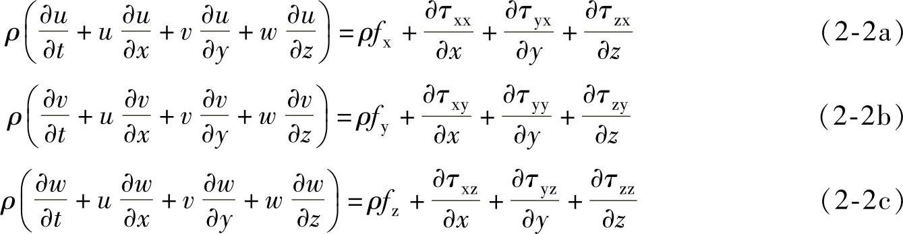

根据广义牛顿定律，有下列关系式：

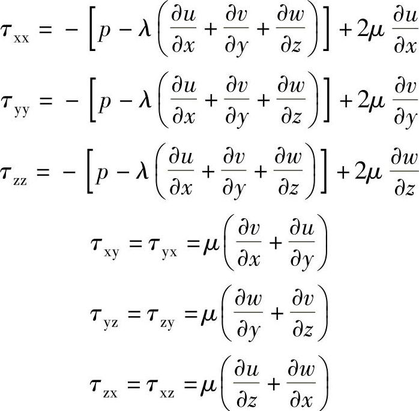

式中 μ——流体动力黏度；

λ——膨胀黏性系数，。

将这些关系式代入式（2-2a）、（2-2b）、和（2-2c），运动方程变为

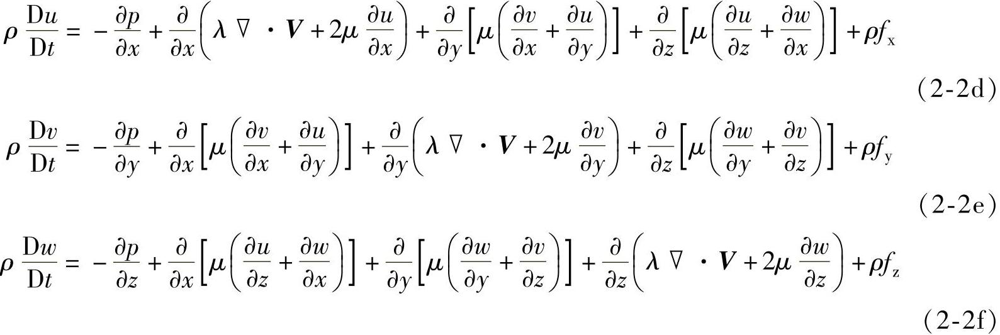

（3）能量方程

能量方程是能量守恒定律对于运动流体的表达式。用内能表示的能量方程的矢量形式为

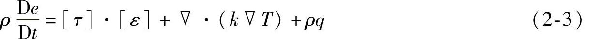

式中 q——由于热幅射或其他原因在单位时间内传入单位质量流体的热量；

k——导热系数。

\[ε\]——变形率张量，其定义为

变形率张量的分量表示变形速度，在直角坐标系中，线变形速度为

剪切变形速度为

式（2-3）的物理意义是：在单位时间内，单位体积流体内能的增加等于单位体积内由于流体变形表面力所做的功\[τ\]·\[ε\]，加上热传导及由于热辐射等其他原因传入的热量\[∇·（k∇T）+ρq\]。

在直角坐标系中，能量方程可写成

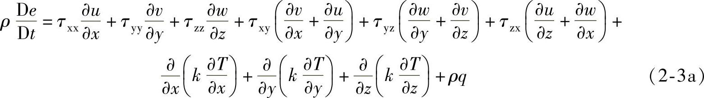

2.补充方程

1）假设气体是完全气体，有状态方程

p=ρRT （2-4）

式中 R——气体常数。

2）流体的状态热力学关系式

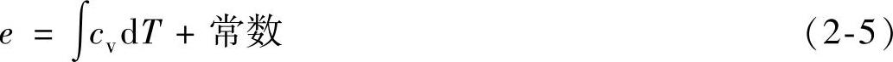

式中 c_(v)——定容比热，且有

c_(v)=c_(v)（T） （2-6）

总之，上述共有7个独立方程（1个连续方程、3个运动方程、1个能量方程、2个补充方程），包含7个流场未知变量，即ρ、p、u、v、w、T、e，给定边界条件和初始条件后方程组有定解。

3.边界条件

如果给定边界条件和初始条件（初值），可以求得控制方程的特解。

（1）黏性流体边界条件

假定物面和气体直接接触表面无相对速度，叫无滑移边界条件。对静止物体有

u=v=w=0（在物面上）

（2）无黏流体边界条件

流动在物面有滑移，在物面上，流动一定与物面相切。

V·n=0（在物面上）

应该指出，为了更具一般性，上述基本方程的推导中把密度ρ视为变量。实际上，在风速范围内，是可以把ρ视为常数的。

4.控制方程组离散和有限差分解

有限差分法被广泛地应用在计算流体力学中。其原理是，用有限差分表达式来代替流体力学控制方程中出现的偏导数，从而生成控制方程的差分方程。用网格离散流场在网格单元应用差分形式的控制方程，最后生成一个与流场离散节点数相等的大型代数方程组（控制方程离散）。给定边界条件和初值条件，解大型代数方程组，就得到离散网格节点上流场变量的数值解。

### 二、风力机的稳态数学模型

1.贝兹极限

贝兹极限是由德国的空气动力学家贝兹（Albert Betz）提出的。假定风轮是理想的，即

1）风轮可以简化成一个平面桨盘，没有轮毂，而叶片数无穷多，这个平面桨盘被称为致动盘；

2）风轮叶片旋转时不受摩擦阻力，是一个不产生损耗的能量转换器；

3）风轮前、风轮扫掠面、风轮后气流都是均匀的定常流，气流流动模型可简化成图2-1所示的流束；

4）风轮前未受扰动的气流静压和风轮后远方的气流静压相等；

5）作用在风轮上的推力是均匀的；

6）不考虑风轮后的尾流旋转。

此时，空气流过致动盘的瞬时能量转换可由图2-1表达。致动盘前部的远方来流通过致动盘时，受风轮阻挡被向外挤压，绕过致动盘的空气能量未被利用。只有通过致动盘截面的气流释放了所携带的部分动能。致动盘上游流束的横截面积比致动盘面积小，而下游的则比致动盘面积大。流束膨胀是因为要保证每处的质量流量相等。

由于风速远小于当地空气的声速，即运动气流的马赫数Ma＜＜1，空气的压缩性可被忽略。

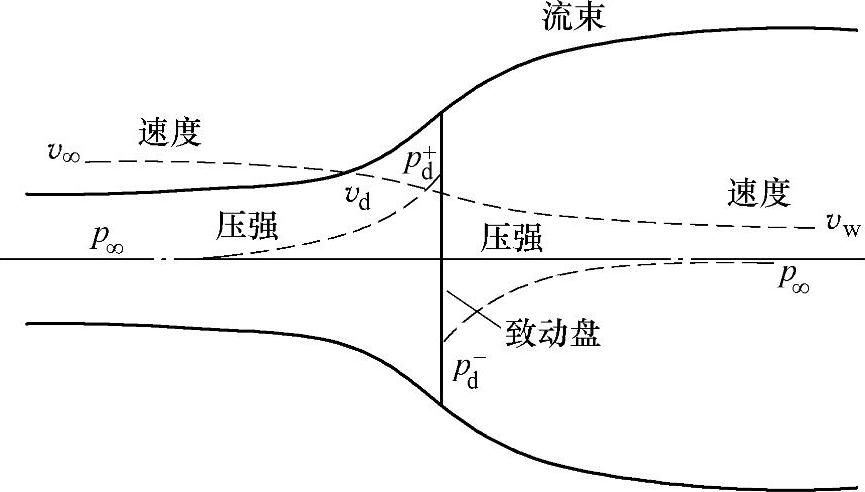

图2-1 流经致动盘的流束

单位时间内通过特定截面的空气质量是ρAv，其中ρ为空气密度（kg/m³），A为横截面积（m²），v为流体速度（m/s）。沿流束方向的质量流量处处相等，可得

ρ^(A)_(∞)v_(∞)=ρA_(d)v_(d)=ρA_(w)v_(w) （2-7）

式中下角标的含义是∞——上游无穷远处的参数；

d——致动盘处的参数；

w——尾流远端的参数。

致动盘导致气流速度发生变化，该速度变化将叠加到自由流速率上。该诱导气流在气流方向的分量为-av_(∞)，其中a为轴向气流诱导因子。所以在致动盘上，气流方向的净速度为

v_(d)=v_(∞)（1-a） （2-8）

由此，在致动盘面处，轴向气流诱导因子

气流在经过致动盘时速度发生变化，总变化量为（v_(∞)-v_(w)），根据动量定理，气流所受的作用力等于动量变化率，动量变化率等于速度的变化乘以质量流量，即

F=（v_(∞)-v_(w)）ρA_(d)v_(d) （2-10）

式中 F——气流所受的作用力，单位为N。

引起动量变化的力完全来自于致动盘前后静压力的改变，所以有：

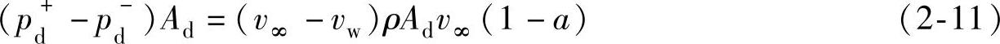

式中 p⁺_(d)——致动盘前气流静压，单位为Pa；

p⁻_(d)——致动盘后气流静压，单位为Pa。

对流束的上风向和下风向分别使用伯努利方程，可以求得压力差。对上风向气流有

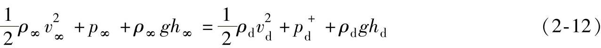

由于假设气体是不可压缩，ρ_(∞)=ρ_(d)，并且流束处于水平方向，高度h_(∞)=h_(d)，那么有

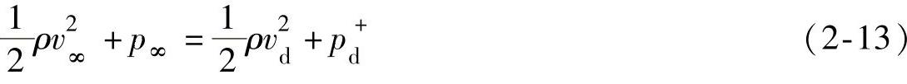

同样下风向气流有

方程（2-13）和方程（2-14）相减得到：

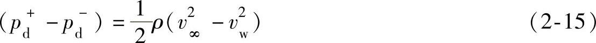

把方程（2-15）代入（2-11）得到：

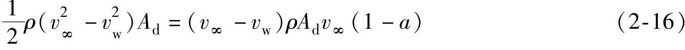

因此

v_(w)=（1-2a）v_(∞) （2-17）致动盘作用在气流上的力，可由方程（2-17）代入方程（2-10）导出：

F=（p⁺_(d)-p⁻_(d)）A_(d)=2ρA_(d)v²_(∞)a（1-a） （2-18）

这个力在数值上等于气流对致动盘的反作用力，因此气体输出功率

P=Fv_(d)=2ρA_(d)v³_(∞)a（1-a）² （2-19）

定义风能利用系数

其中分母表示横截面积为A_(d)的自由流束所具有的风功率。将式（2-19）代入式（2-20）得

C_(P)=4a（1-a）² （2-21）

可以求出，当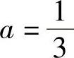时，C_(P)的值最大。将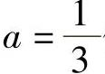代入方程（2-21）得

这个值称为贝兹极限。它是水平轴风机的风能利用系数的最大值。

由压力降产生的作用于致动盘的力T与致动盘作用在气流上的力大小相等，所以T可以由式（2-18）求得。定义无量纲的推力系数

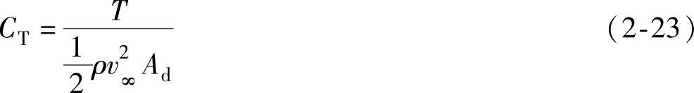

将式（2-18）代入式（2-23），得

C_(T)=4a（1-a） （2-24）

尾流速度为（1-2a）v_(∞)，当a≥1/2时，将出现尾流速度变成零，甚至变成负数的问题。在这种情况下，上述模型将不再适用。

风能利用系数和推力系数随a的变化曲线如图2-2所示。

2.旋转尾流模型

贝兹极限所讨论的气流模型只考虑轴向流动。这里将进一步考虑旋转尾流问题。仍然沿用致动盘的基本假设，但更为具体的将致动盘描述为多个叶片扫过的区域，或称为风轮圆盘。

气流通过风轮圆盘时，圆盘所受转矩与作用在空气上的转矩大小相等、方向相反。反转矩作用的结果会导致空气逆着风轮转向旋转，从而获得角动量，这样会使风轮圆盘尾流的空气微粒在旋转面的切线方向和轴向上都获得了速度分量如图2-3所示。

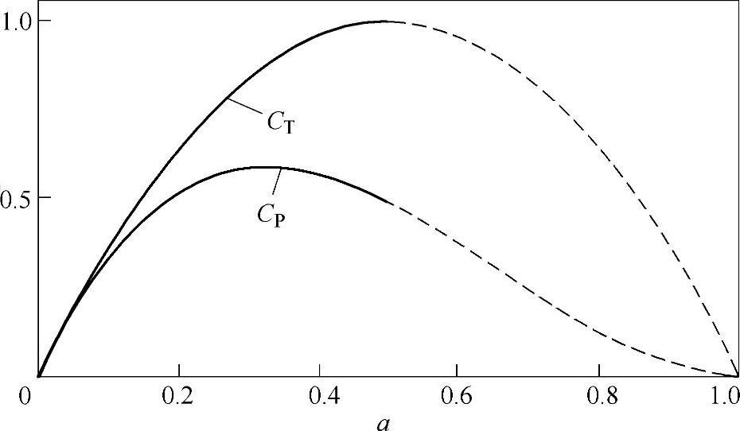

图2-2 C_(P)、C_(T)随a的变化曲线

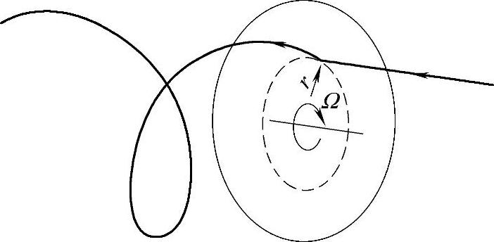

图2-3 空气微粒经过风轮圆盘的运动轨迹

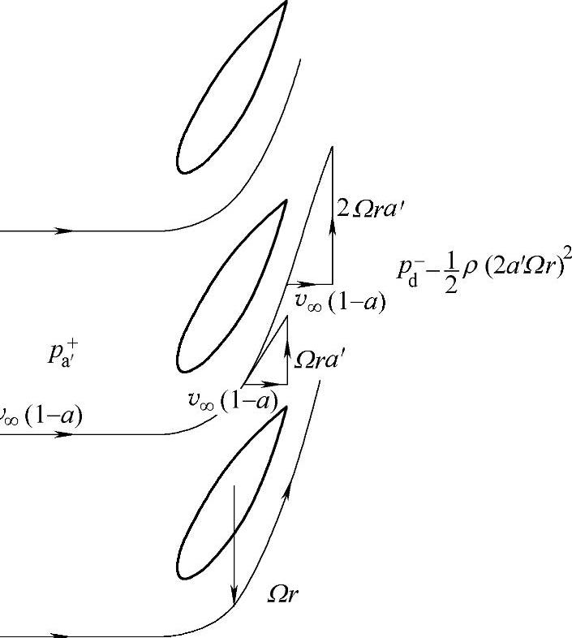

图2-4 气流切向速度在通过圆盘的变化

进入圆盘的气流无任何转动，而离开圆盘的气流是旋转的。转动传递发生在整个圆盘的厚度处，如图2-4所示。切向速度的变化用切向气流诱导因子a′表示。圆盘上游气流的切向速度为零。设风轮旋转角速度为Ω，圆盘下游在距旋转轴径向距离为r的地方气流切向速度为2Ωra′。在圆盘厚度中部，切向诱导速度为Ωra′。

在所有的各个径向位置上，切向速度是不同的，轴向诱导速度也不一样。为了讨论圆盘的动力学特性，截取半径为r、径向宽度为δr的圆环（见图2-5），整个圆盘由多个圆环组成，并且假定每个环的作用力相互独立。

圆环反作用于空气的转矩，将使空气产生切向速度分量，而作用在圆环上的轴向力将会使空气轴向速度降低。

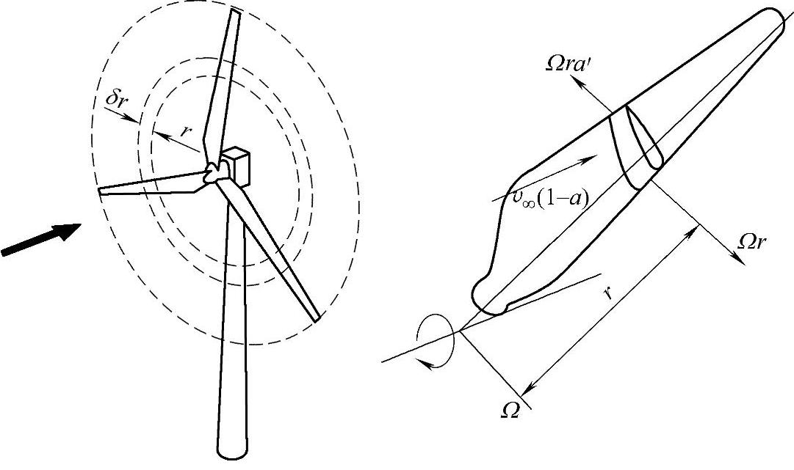

图2-5 叶素扫出的圆环

作用在圆环上的转矩与圆环反作用于空气的转矩大小相等，而作用于空气的转矩等于通过此环形区的空气的角动量的变化率，即

dM=2Ωra′rdṁ

式中 dṁ——单位时间流经圆环上的空气流量。

dṁ=ρv_(∞)（1-a）dA_(d) （2-25）

考虑到圆环的面积dA_(d)=2πrdr，可得作用在圆环上的转矩为

dM=4πρΩv_(∞)（1-a）a′r³dr（ 2-26）

所以风轮转轴输出的功率增量为

dP=ΩdM （2-27）

风速降低所输出的功率由式（2-19）给出。即

dP=2ρv³_(∞)a（1-a）²dA_(d) （2-28）

因此，由式（2-26）、式（2-27）和式（2-28）有

2ρv³_(∞)a（1-a）²dA_(d)=ρv_(∞)（1-a）2Ω²a′r²dA_(d)

和

v²_(∞)a（1-a）=Ω²r²a′ （2-29）

其中，Ωr为旋转圆环的切向速度，所以λ_(r)=Ωr/v_(∞)称为当地速度比。在圆盘r=R的边缘处，λ=ΩR/v_(∞)称为叶尖速度比。因此

a（1-a）=λ²_(r)a′ （2-30）

从式（2-26）、式（2-27）中可以得出：

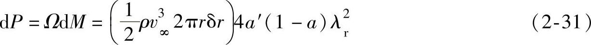

式（2-31）右边括号里的部分表示通过圆环的功率流量，括号外的部分被称为捕获功率时叶片单元效率，即

η_(r)=4a′（1-a）λ²_(r) （2-32）

将式（2-30）代入式（2-32），得

η_(r)=4a（1-a）² （2-33）

风能利用系数变化率可表示为

即

其中，μ=r/R。

如果知道a和a′沿径向的变化规律，那么对于给定的叶尖速度比λ，通过对式（2-34）进行积分可以确定总的风能利用系数。

能提供最大可能效率的a和a′值是通过求式（2-32）对a′的导数，并令其结果等于零而得到的。由此

对于式（2-30）求导也有

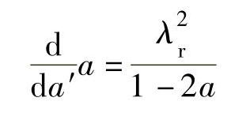

得到

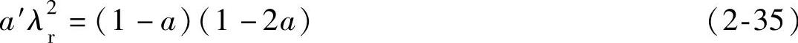

联立式（2-30）和式（2-35），可以求出使风能利用系数最大的a和a′的值为

最大功率输出的轴流诱导因子也与非旋转尾流的情况一样，都是a=1/3，并且在整个圆盘上都是一致的。a′却随着径向位置的变化而变化。

从式（2-34）可以得到最大功率系数为

将式（2-36）代入式（2-37），得

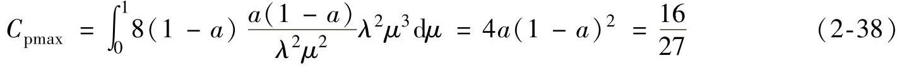

这与非旋转尾流的模型正好相同。

传递给尾流的角动量增加了尾流的动能，但该能量被静压损失所平衡。即

将式（2-36）代入式（2-39），得

3.叶素—动量定理

在叶片上，取半径为r、长度为δr的微元，称为叶素（见图2-5）。在风轮旋转过程中，叶素将扫掠出一个圆环。

对于一个叶片数为N、风轮半径为R、弦长为c、叶素桨距角（叶素几何弦线与风轮旋转面间的夹角）为β的风力机，弦长和桨距角都沿着桨叶轴线变化。令风轮的旋转角速度为Ω，风速为v_(∞)。同时考虑到尾流旋转，圆盘下游在距旋转轴径向距离为r的地方气流以2Ωra′（a′为切向气流诱导因子）的切向速度旋转。叶素的切向速度Ωr与圆盘厚度中部气流的切向速度Ωra′之和为经过叶素的净切向流速度Ωr（1+a′）。图2-6示出了在半径为r处叶素上的速度和作用力。

图2-6 叶素上的速度和作用力

a）速度 b）作用力

从图2-6中得到的叶片上的相对合速度为

相对合速度与旋转面之间的夹角（气流倾角）是φ，则

攻角α由下式给出

α=φ-β （2-43）

每个叶片在顺翼展方向长度为δr的升力

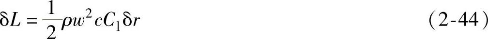

式中 ρ——空气密度，单位为kg/m²；

w——相对风速，单位为m/s；

c——几何弦长，单位为m；

C_(l)——翼型升力特征系数。

平行于w的阻力为

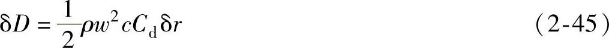

式中 C_(d)——翼型阻力特征系数。

假定作用于叶素上的力仅与通过叶素扫过的圆环的气体的动量变化有关。而通过邻近圆环的气流之间不发生径向相互作用。

N个叶素上的空气动力分量在轴向上分解为

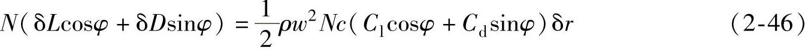

通过扫掠圆环面积的轴向动量变化率为

2av_(∞)ρv_(∞)（1-a）2πrδr=4πρv²_(∞)a（1-a）rδr （2-47）

尾流旋转导致的尾流压力下降等于动力压头的增加，因此在圆环上附加的轴向力为

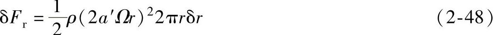

气流对扫掠圆环的作用力数值上等于圆环的反作用力，根据动量定理，这个反作用力等于气流动量的变化率。从式（2-46）、式（2-47）和式（2-48）可得

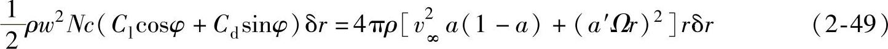

化简为

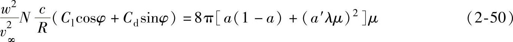

其中，μ=r/R，λ=ΩR/v_(∞)。

N个叶素上空气动力产生的风轮轴向转矩为

通过圆环的空气角动量变化率为

2a′Ωr²ρv_(∞)（1-a）2πrδr=4πρv_(∞)（Ωr）a′（1-a）r²δr （2-52）

根据动量定理，轴向转矩与角动量变化率相等，从式（2-51）和式（2-52）可得

化简为

设

C_(l)cosφ+C_(d)sinφ=C_(n) （2-55）

C_(l)sinφ-C_(d)cosφ=C_(t) （2-56）

由式（2-50）和式（2-54）可以得了气流诱导因子a和a′。利用二维翼型特性求解a和a′是需要有迭代过程的。迭代方程如下：

式中 σ_(r)——弦长实度。定义为给定半径下的总叶片弦长除以该半径的周长。即

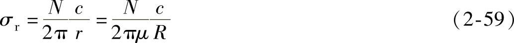

从式（2-52）可以得到展向长度为δr的叶素产生的转矩为

δM=4πρv_(∞)（Ωr）a′（1-a）r²δr （2-60）

因此，整个转子产生的总转矩为

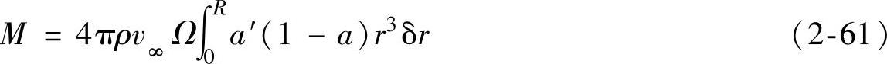

风轮产生的功率P=MΩ，风能利用系数是

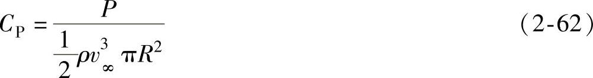

4.风力机转矩计算流程

风力机转矩可以由上述各公式计算获得，其流程如图2-7所示。

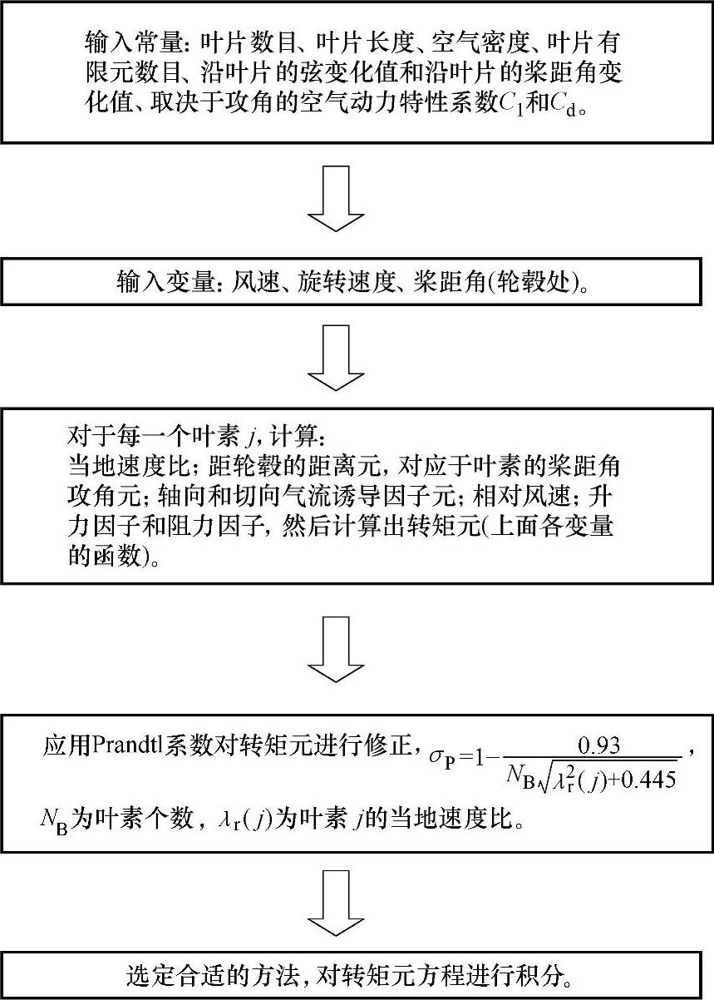

图2-7 风力机转矩计算流程

图2-7中的Prandtl系数σ_(P)是考虑到在计算中叶素的个数是有限的，从而引入的一个修正系数。

## 第二节 能量传递理论

能量传递是由主传动链完成的，主传动链的零部件均为不同程度的弹性机构，其运动规律是由弹性力学的基本方程决定的。

### 一、弹性力学的基本方程

在各向同性线性弹性力学中，为了求得应力、应变和位移，先对构成物体的材料以及物体的变形作了五条基本假设，即：连续性假设、均匀性假设、各向同性假设、完全弹性假设和小变形假设，然后分别从静力学、几何学和物理学方面出发，导得弹性力学的基本方程和边界条件的表达式。下列各式中，σ_(x)、σ_(y)、σ_(z)、τ_(xy)（τ_(yx)）、τ_(yz)（τ_(zy)）、τ_(zx)（τ_(xz)）为应力分量；u、v、w为位移矢量在三个方向的分量；ε_(x)、ε_(y)、ε_(z)、γ_(xy)、γ_(yz)、γ_(zx)分别为正应变和剪应变分量；F_(bx)、F_(by)、F_(bz)单位体积的体力在各方向的分量；μ为泊松比。

1.平衡微分方程

2.几何方程

物体受力后变形，其内部任一点的位移与应变的关系如下：

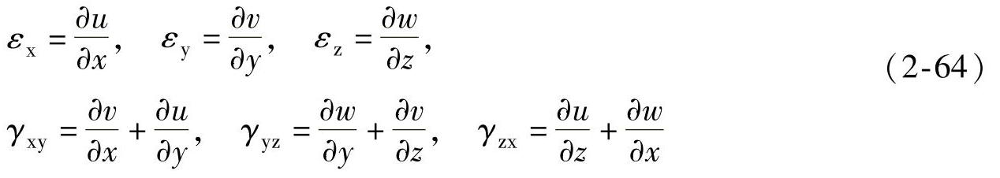

3.物理方程（广义虎克定律）

（1）应力表示应变

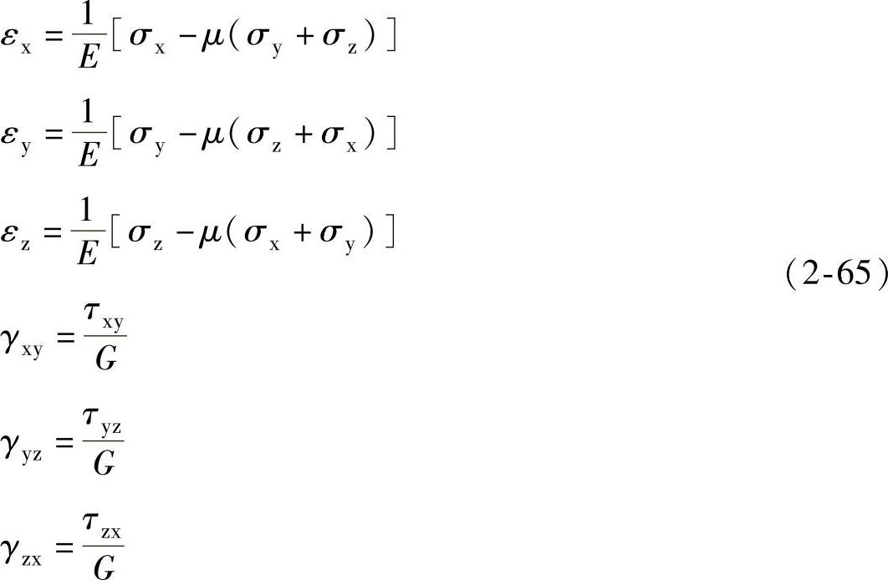

式中 E——拉压弹性模量，简称为弹性模量；

G——剪切弹性模量，简称为刚度模量，且有

（2）应变表示应力

式中 e_(v)——体积应变，e_(v)=ε_(x)+ε_(y)+ε_(z)。

总之，上述共有15个独立方程（3个平衡微分方程、6个几何方程、6个物理方程），包含15个未知变量（3个位移分量u、v、w、6个应力分量σ_(x)、σ_(y)、σ_(z)、τ_(xy)（τ_(yx)）、τ_(yz)（τ_(zy)）、τ_(zx)（τ_(xz)）、6个形变分量ε_(x)、ε_(y)、ε_(z)、γ_(xy)、γ_(yz)、γ_(zx)）。给定边界条件后方程组有定解。

4.边界条件

若物体表面的面力分量为F_(sx)、F_(sy)和F_(sz)已知，则表面力边界条件为

F_(sx)=σ_(x)l+τ_(xy)m+τ_(xz)n

F_(sy)=τ_(xy)l+σym+τ_(zy)n

F_(sz)=τ_(xz)l+τ_(yz)m+σ_(z)n （2-67）

式中 l、m、n——物体表面外法线的三个方向余弦。

若物体表面的位移已知，则位移边界条件为

式中 u_(s)、v_(s)、w_(s)——位移的边界值；

、、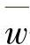——在边界上是坐标的已知函数。

5.基本方程的求解

在求解弹性力学问题时，并不需要同时求解15个基本未知量，可以做必要的简化。为简化求解的难度，仅选取部分未知量作为基本未知量。在给定的边界条件下，求解偏微分方程组的问题，数学上称为偏微分方程的边值问题。

按照不同的边界条件，弹性力学有三类边值问题。

第一类边值问题：已知弹性体内的体力和其表面的面力分量为F_(sx)、F_(sy)和F_(sz)，边界条件为面力边界条件。

第二类边值问题：已知弹性体内的体力分量以及表面的位移分量，边界条件为位移边界条件。

第三类边值问题：已知弹性体内的体力分量，以及物体表面的部分位移分量和部分面力分量，边界条件在面力已知的部分，为面力边界条件，位移已知的部分为位移边界条件，称为混合边界条件。

以上三类边值问题，代表了一些简化的实际工程问题。若不考虑物体的刚体位移，则三类边值问题的解是唯一的。

### 二、传动链数学模型

传动链是机械上连接空气动力子系统和电磁子系统的一套装置。因此风转矩和电磁转矩是输入量，而转速则是输出量。假定在整个变速范围内有着恒定的机械传动效率，可以认为结构特性（例如振动、齿轮种类、齿隙等）对其性能的影响可以忽略不计。

对于典型的风力发电机组来说，组成传动链的部件有风轮、齿轮箱和发电机转子。

增速器将传动链分为两部分：与风轮直接耦合的低速轴和与发电机相连的高速轴。高速轴和低速轴之间的连接部分可以是刚性的也可以是柔性的。刚性传动链模型认为传动系统的扭转刚度足够大，即低速轴、齿轮箱的传动轴、高速轴是刚性的，转子和发电机只有一个旋转自由度，高速轴与低速轴按定传动比变化。发电机和风力机转子的加速来自于气动转矩与发电机响应转矩的不平衡。柔性传动链模型认为低速轴和高速轴是柔性的。允许风力机转子和发电机转子有各自的旋转自由度。风力机转子的加速度依赖于气动转矩和低速轴转矩之间的不平衡。发电机转子的加速度依赖于高速轴扭矩和发电机响应转矩之间的不平衡。在柔性连接中，高速轴与低速轴具有不同的瞬间转速。这种解耦是用来减少由风速或电磁转矩变化而引起的机械应力。由此，它的兼容性和传动的可靠性都大大提高，不容易受暂态负载和机械疲劳的影响。下文将分别讨论刚性模型和柔性模型。

1.刚性模型

风力发电机组主传动链刚性模型如图2-8所示。

图2-8 主传动链刚性模型

刚性传动链模型的主要组成部分是单级耦合增速器，它的传动比为i，效率为η，在这种情况下，由于增速器的作用，发电机转矩减少i倍且速度增加i倍。在上述模型假设下，在高速轴或低速轴下的风能转换系统动态模型可以由下列两个方程表示：

式中 Ω——风轮旋转角速度；

Ω_(e)——发电机转子机械角速度；

M（Ω，v）——空气动力转矩，以风速v作为参数；

M_(e)（Ω_(e)，c）——电磁转矩，一般以c表示的负载变量作为参数；

J_(H)、J_(L)——高速轴和低速轴处的等效转动惯量，计算如下：

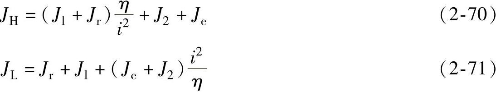

式中 J₁、J₂——增速齿轮的转动惯量；

J_(r)、J_(e)——风轮和发电机转子的转动惯量。

由于传动链是刚性的，空气动力转矩仅由一阶线性转速变量给定。图2-9为转换到高速轴处的运动方程的仿真框图。此方程通常用于电机组传动链单自由度模型。

图2-10给出了当高速轴以Ω_(e)的角速度旋转时，风轮和发电机相互作用稳定运行的示意图。风力发电机组的稳定运行点是风轮和发电机机械特性曲线的交点。

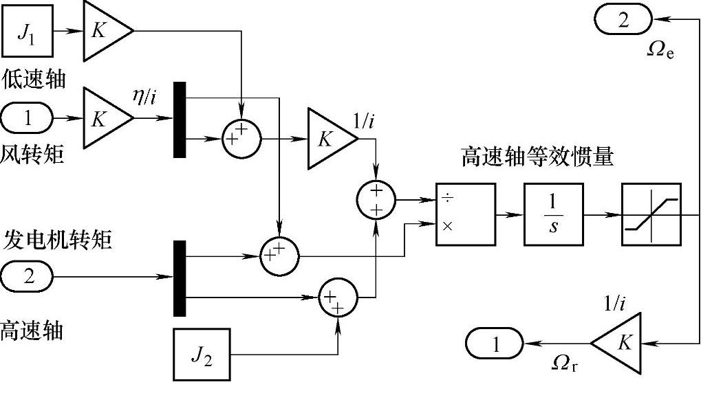

图2-9 运动方程的仿真框图

2.柔性模型

风力发电机组主传动链柔性模型如图2-11所示。

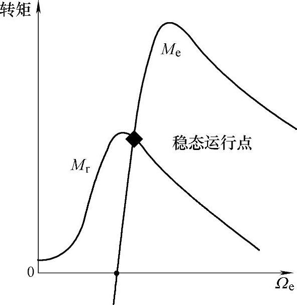

图2-10 风力发电机组稳态曲线

图2-11 主传动链柔性模型

高速轴的B和C两部分以不同的转速旋转，分别是iΩ_(r)和Ω_(e)，这里i是齿轮箱的传动比。弹性能变化量产生一个新的状态变化内转矩M。J_(e)表示C部分的惯量，J_(B)表示B部分的惯量，表达式为

式中 η——传动效率；

J_(r)——低速部分（主要是风力机）的转动惯量。

传动装置柔性模型由B和C部分运动方程和内转矩动态方程构成：

得到一个三阶线性模型，状态变量为x=\[Ω_(r)Ω_(e)M\]^(T)，输入矢量为u=\[MM_(e)\]^(T)，输出矢量为y=\[ΩΩ_(e)\]^(T)，则

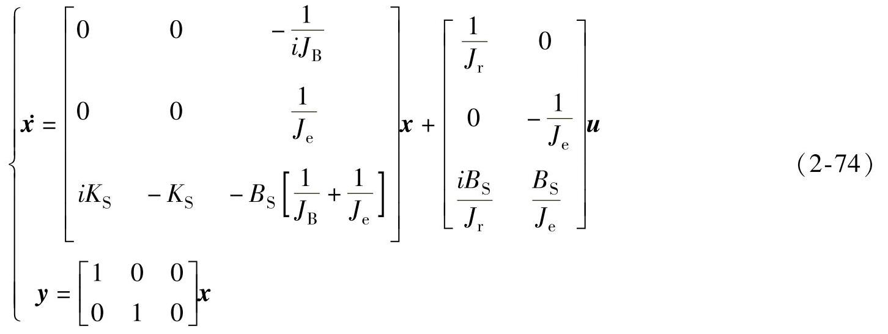

式中 K_(S)、B_(S)——弹性系统的刚性系数和阻尼系数。

上述推导过程也适合于直驱式风力发电机组的传动链，这时，状态方程变为

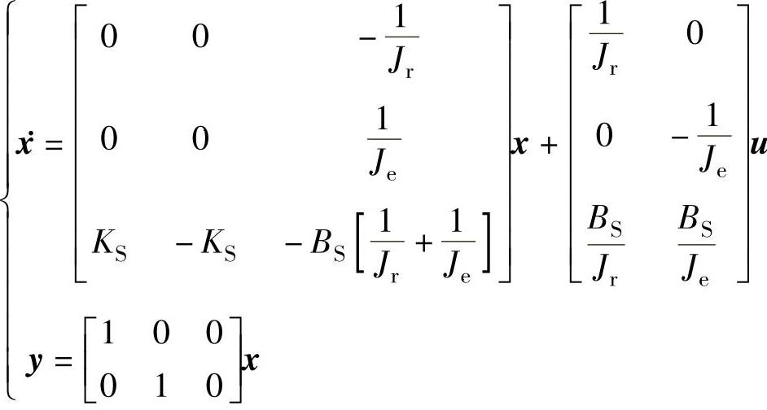

## 第三节 机电能量转换理论

电机是用来实现机电能量转换的电磁机械，由其电系统、机械系统以及把二者联系成有机整体的耦合电磁场构成。定、转子绕组构成了电机的电系统，而各种转矩作用下的转轴则构成了电机的机械系统。电机的机电能量转换就是耦合电磁场和与之相对运动的载流导体之间相互作用的结果。

发电机是把机械能转换成电能的电磁机械。发电机的电系统通过感应电动势与外部电系统相联系，利用感应电动势的作用，向外部电系统输出电功率，这种联系的数学描述就是电压方程式。发电机的机械系统通过电磁转矩与外部机械系统相联系，利用电磁转矩的作用，从外部原动机吸收机械功率，这种联系的数学描述就是转矩方程式。发电机的机械能转换为电能的转换关系则由功率方程式来描述。上述方程式构成了描述发电机内部基本物理关系的基本方程式，是对电机性能进行分析和计算的理论基础。

电机磁场主要是指气隙磁场，电机的磁场能量基本上储存在气隙中。依靠气隙磁场的耦合作用，把电机的电系统和机械系统有机联系在一起，并实现机电能量的转换和传递。因此，电机的气隙虽小，但对电机性能的影响却很大。

本节将对风力发电机实现机电能量转换的基本原理作简要介绍。在对发电机中的基本能量关系和基本电磁关系进行分析的基础上，给出发电机的基本方程式，并对基本方程式在实际问题中的应用作简单介绍。

### 一、发电机中的机电能量转换关系

1.机电能量转换过程中的能量关系

在原动机（例如风力机等）的驱动下，发电机从轴上输入机械功率，扣除耦合电磁场储能的增量和发电机内部的能量损耗后，其余能量转换为电能从电枢绕组的线端输出。发电机中的这种基本能量转换关系可表示成式（2-75）：

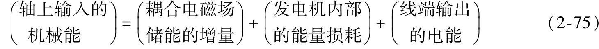

发电机内部的能量损耗可分为三类：一是电系统中通过电流时在绕组电阻上产生的I²R损耗，一般称为铜损耗；二是机械系统中的通风损耗和摩擦损耗，一般统称为风摩损耗（或机械损耗）；三是耦合电磁场的介质损耗，例如交变磁场在铁心中产生的磁滞损耗和涡流损耗，一般统称为铁损耗。

如果把铜损耗归并到电能中，把风摩损耗归并到机械能中，把铁损耗归并到磁场储能中，则式（2-75）可以改写成

式中，等号左边为扣除风摩损耗后发电机输入的总机械能，也可称为发电机可供转换的总机械能。它将转换成等号右边的两项能量，即被耦合电磁场吸收的总能量（包括耦合电磁场储能的增量和介质的能量损耗）和转换成电能的全部能量（包括绕组电阻的铜损耗和线端输出的电能）。

式（2-75）和式（2-76）所描述的发电机机电能量转换过程中的能量关系可用图2-12描述如下：

图中，左侧为发电机的机械系统，右侧为电系统，由耦合场将从原动机（风力机）输入的机械能转换成电能并传递到电系统。把损耗分类并分别归并到机械系统、耦合场和电系统，是对发电机进行的“理想化”处理，目的是使其机电能量转换过程变得单值、可逆，同时突出了耦合场对发电机电系统和机械系统的耦合反应，便于导出机电耦合项。后面将会了解，机电耦合项是机电能量转换原理中最重要的概念之一。

图2-12 发电机机电能量转换中的能量关系

式（2-76）所示能量关系的微分形式如下：

dW_(mec)=dW_(m)+dW_(e) （2-77）

式中 dW_(mec)——在dt时间内输入耦合场的净机械能；

dW_(m)——dt时间内耦合场吸收的总能量；

dW_(e)——在dt时间内转换成电能的总能量。

2.磁场储能

发电机以磁场作为耦合场，因此，在后面的分析中，耦合场储能均指磁场储能。

研究表明，发电机的磁场储能仅与其绕组电流（磁链）的大小以及转子位置有关。对于具有n个绕组的交流发电机，总的磁场储能W_(m)为

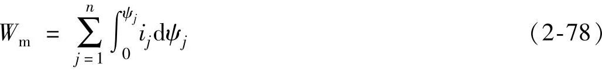

可以看出，第j个绕组的磁场储能（W_(m)）j可以写成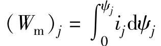，若该磁场的ψ-i曲线如图2-13所示，则面积oabo就代表了第j个绕组的磁场储能（W_(m)）_(j)。若以绕组电流i_(j)为自变量，对磁链ψ_(j)积分，则可得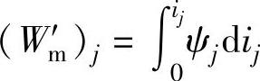。式中，W_(m)′称为磁共能，可用图2-13中的面积oaco表示。在实际应用中，一般说来，利用磁共能进行分析计算较为方便。显然，磁场储能与磁共能之和为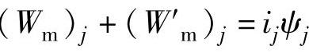。

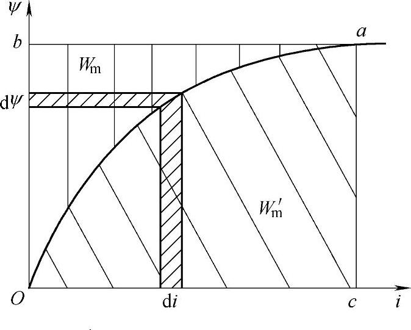

图2-13 磁场储能与磁共能

具有n个绕组的交流发电机，其总的磁共能W_(m)′为

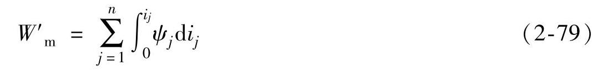

磁场储能与磁共能的和为

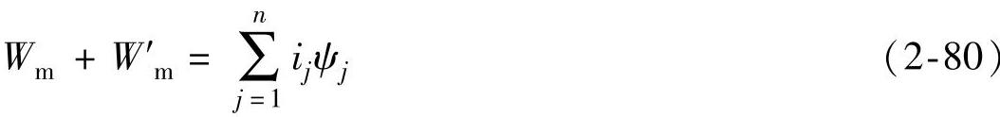

如果所研究的磁场为线性，则其ψ-i曲线为直线，同时考虑到绕组磁链与电流的关系ψ=Li，则磁场储能W_(m)和磁共能W_(m)′可以写成如下形式：

式中 L_(jk)——发电机第j个绕组与第k个绕组之间的互感；

L_(jj)——发电机第j个绕组的自感。

3.磁场储能的变化

前面已经指出，发电机的磁场储能仅与其绕组电流（或磁链）的大小以及转子位置有关，对于具有n个绕组的交流发电机，其总的磁场储能W_(m)和磁共能W′_(m)可以写成如下形式：

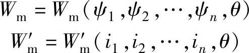

因此，在dt时间内，由绕组磁链和转子转角变化所引起的磁场储能变化dW_(m)应为

考虑到，，…，，上式可改写成

相应地，在dt时间内，由绕组电流和转子转角变化所引起的磁共能变化dW_(m)′应为

考虑到，上式可改写成

对于线性系统，绕组的磁链方程为

可以看出，交流发电机的绕组电感均为转子转角θ的函数，而绕组磁链则既是各绕组电流的函数，又是转子转角θ的函数。把式（2-86）代入式（2-85），则在dt时间内，磁场储能的变化dW_(m)和磁共能的变化dW′_(m)可以改写成如下形式：

式（2-83）、式（2-85）和式（2-87）中，等号右边的前半部分为绕组电流（或磁链）所引起的磁场储能的变化；等号右边的后半部分是由转子的角位移变化使绕组电感变化所引起的磁场能量的变化，从后面的分析可知，这一项磁场能量变化对于发电机来说具有特殊重要的意义。

### 二、感应电动势和电磁转矩

1.感应电动势

根据电磁感应定律并考虑到式（2-86），具有n个绕组的交流发电机的各绕组的感应电动势可表示为

观察上式可以看出，各绕组电动势右边的前n项是由电流变化所引起的电动势，一般称为变压器电动势；而各式的最后一项则是因转子旋转运动和磁链（电感）随转角变化而产生的电动势，通常称为运动电动势。因机械旋转运动而产生运动电动势，是发电机实现机电能量转换的必要条件之一。

对于线性系统，考虑到式（2-86）的关系后，式（2-88）可改写成如下形式：

在dt时间内，发电机转换成电能的总能量dW_(e)为

可见，发电机把机械能转换成电能是通过旋转运动使线圈内磁链发生变化，并在线圈内感应电动势来实现的。

根据基尔霍夫定律，按图2-12中所规定的正方向，可列写出各绕组的电压方程式如下：

2.电磁转矩

交流发电机的电磁转矩是一种电磁起因的转矩，是电机的旋转磁场与载流导体相互作用的结果。发电机利用电磁转矩吸收由原动机提供的机械功率，再通过磁场的耦合作用，把机械功率转换成电功率输出。那么，电磁转矩与磁场能量之间是否有着某种必然的联系呢？下面来分析这一问题。

现将式（2-77）所示的发电机能量关系的微分形式重写如下：

dW_(mec)=dW_(m)+dW_(e) （2-92）

对于具有n个绕组的交流发电机，当在dt时间内转子转过dθ角度时，输入耦合场的净机械能为dW_(mec)=M_(e)dθ（见图2-12）；耦合场吸收的总磁场能量为（见式（2-83））；转换成电能的总能量（见式（2-90）），于是，式（2-92）可改写成

可以看出，当发电机在dt时间内转子转过dθ角度时，输入耦合场的净机械能与耦合场吸收的总磁场能量中转换成电能的那部分能量无关，而只取决于磁场储能（或磁共能）对转子转角的变化率。

因此，以绕组磁链ψ和转子转角θ作为自变量时，发电机的电磁转矩为

当以绕组电流i和转子转角θ作为自变量时，通过类似的推导，可以得到用磁共能W′_(m)表示的电磁转矩公式如下：

以上两式表明，当转子的微小角位移引起发电机的磁场储能（或磁共能）发生变化时，就会产生电磁转矩，电磁转矩的大小等于单位微小角位移时磁场储能（或磁共能）的变化率。至于电磁转矩的方向，式（2-94）表明，在恒磁链下M_(e)的方向与磁场储能增加的方向一致；而式（2-95）则表明在恒电流下，M_(e)的方向与磁共能减小的方向一致，参照图2-13或式（2-80），这一结论是很容易理解的。

前面已经说明，式（2-87）右边最后一项的磁场能量变化对于发电机来说具有特殊重要的意义，这是因为这一项是由转子的角位移所引起的磁场能量变化。由式（2-94）和式（2-95）可知，发电机的电磁转矩恰好是由转子的角位移所引起的磁场能量变化而产生的，其特殊意义就在于此。进一步的分析表明，电磁转矩中应包括两种不同起因的转矩，一部分转矩是由定子电感和转子电感分别随转角θ变化所引起的电磁转矩，实际上，只有气隙磁导（磁阻）随转角变化而变化时，绕组电感才会随之变化，因此常把这部分转矩称为磁阻转矩，一般情况下，在发电机电磁转矩中，磁阻转矩只占很小一部分；另一部分是定、转子电流和定转子互感随转角变化而引起的电磁转矩，称为主电磁转矩，是发电机电磁转矩的主要部分。

对于线性系统，可以将式（2-81）的W_(m)′代入式（2-95），从而得到发电机电磁转矩的完整公式。为了简明起见，电磁转矩以矩阵形式表示如下：

至此，我们导出了发电机的运动电动势和电磁转矩。发电机因机械旋转运动而产生运动电动势，而转子角位移引起磁场能量变化将产生电磁转矩。运动电动势和电磁转矩是发电机系统中最重要的两个物理量，二者构成了发电机的一对机电耦合项。

3.机电能量转换与气隙磁场

现在可以完整地描述发电机中所发生的机电能量转换过程。为此，可仍然借助于式（2-83）来加以说明。根据式（2-83），可画出在时间dt内发电机的微分能量关系，如图2-14所示。

可以看出，磁场储能的增量dW_(m)包括两个分量，其中，由转子的角位移引起的磁场储能变化所引起的磁场储能的增量恰好等于发电机输入的微分净机械能，理想情况下，这部分能量与从风力机输入的机械能相平衡；另一部分由磁链变化所引起的磁场储能增量则恰好等于发电机转换成的微分电能的总能量，理想情况下，这部分能量与发电机的输出电能相平衡。

图2-14 发电机在dt时间内的微分能量关系

从以上分析可知，发电机在机电能量转换过程中，作为耦合场的磁场既可以从机械系统（例如风力机）吸收机械能，又可以向电系统（例如电网）输出电能。实际上，电机的这种机电能量转换过程是可逆的，当把机械能转换成电能时，这是一台发电机；当把电能转换成机械能时，这是一台电动机。二者的区别仅仅在于能量传递的方向不同。在介绍发电机结构时提到，发电机的磁场能量基本上都储存在气隙磁场中，气隙虽小，但对发电机的性能将产生重大影响，也就不足为怪了。这是因为，气隙长度及其在电枢圆周的分布情况的任何变化，都将引起气隙磁场的变化，从而影响机电耦合项（e_(Ω)，M_(e)）的变化，进而影响到发电机的机械能输入和电能输出。发电机设计的目的就在于选择合适的发电机尺寸（包括铁心尺寸、绕组尺寸、气隙尺寸等），优化设计出机电耦合项，从而使发电机获得优良的性能

### 三、基本方程式

在以上分析的基础上，可以写出交流发电机的基本方程式，包括电压方程式、功率方程式和转矩方程式。基本方程式是分析计算发电机性能所依据的基本原理。为了使基本方程式形式简明且具有统一性，这里采用了矩阵形式。

1.电压方程式

根据式（2-89），交流发电机的感应电动势e包括两个分量，即运动电动势分量和变压器电动势分量，因此感应电动势的矩阵形式如下式：

式中 e_(Ω)——运动电动势矩阵，；

——变压器电动势矩阵。具有n个绕组的交流发电机的电压方程式（2-91）可用矩阵表示为

式中u，i——发电机绕组的相电压矩阵和相电流矩阵，即

其中 u_(s)、i_(s)——定子相电压和相电流矩阵，

u_(r)、i_(r)——转子相电压和相电流矩阵；

R——发电机绕组的电阻矩阵，这是一个对角矩阵，即

其中 R_(s)——定子绕组电阻矩阵；

R_(r)——转子绕组电阻矩阵。

L——发电机的绕组电感矩阵，一般说来，绕组电感是转角θ的函数。假定1～m为定子绕组，（m+1）～n为转子绕组，即

其中 L_(ss)——定子绕组电感矩阵；

L_(rr)——转子绕组电感矩阵；

L_(sr)和L_(rs)——定、转子绕组之间的互感矩阵。

2.功率方程式

重新观察图2-12可知，在发电机进行机电能量转换过程中，耦合场在吸收从原动机（风力机）输入的机械能并将其转变为磁场储能的变化之外，还将一部分机械能转换成电能并传递到电系统。下面就来定量讨论这一问题。

将式（2-93）所示的发电机能量关系的微分方程改写成功率方程：

式中Ω——发电机转子的机械角速度，；

e_(j)——第j个绕组的感应电动势，。

将上式改写成矩阵形式，即

由式（2-103）可以看出，发电机从原动机（风力机）吸收的净机械功率M_(e)Ω中，一部分转换成磁场储能功率，即，另一部分则转换成电功率i^(T)e输出，由机械功率直接转换成电功率的这部分功率称为发电机的转换功率。由式（2-103）还可看出，磁场储能功率包括两部分，由角位移的变化（即转子旋转运动）所引起的磁场储能功率恰好等于从原动机（风力机）吸收的净机械功率，即；而由磁链变化所引起的磁场储能功率i^(T)e则恰好等于输出电功率的负值。将式（2-98）等号两边同时乘以电流i的转置矩阵i^(T)，就可以得到发电机电系统的功率方程式，即

式中 i^(T)u——发电机线端输出的电功率；

i^(T)e_(Ω)——被绕组运动电动势吸收的电功率；

——被绕组变压器电动势吸收的电功率；

i^(T)Ri——绕组的电阻损耗。

3.转矩方程式

对于发电机来说，需要从原动机输入机械转矩，并带动发电机转子旋转，当磁场储能随转角发生变化时，发电机将产生电磁转矩，电磁转矩是一种制动性质的转矩。当发电机稳态运行时，电磁转矩将与轴上输入的机械转矩相平衡，维持机组以恒定的转速稳定运行；当发电机动态运行时，发电机的转速将会发生变化，由于旋转系统的惯性，发电机轴上除了承受稳态运行时的输入转矩和电磁转矩之外，还将承受一个动态转矩，转速变化率越大这一动态转矩的值越大。

因此，发电机稳态运行时，其机械系统的转矩方程式为

M₁=M_(e)+M₀ （2-105）

式中 M₁——来自原动机的输入转矩；

M_(e)——发电机的电磁转矩；

M₀——与发电机的风摩损耗相对应的损耗转矩，一般说来，这一损耗转矩是转子机械角速度Ω的函数。

发电机动态运行时的转矩方程式为

式中 J——发电机旋转系统的转动惯量，单位为N·m·s；

Ω——发电机转子旋转的机械角速度，单位为rad/s。显然，当M₁＞（M_(e)+M₀）时，，这时发电机升速；当M₁＜（M_(e)+M₀）时，，这时发电机降速。在风力发电系统中，由于风速变化的随机性，发电机组的转速将随风速的变化而变化，使风力发电机组经常处于动态运行过程中，这是风力发电机组运行的一个特点。试想，如果由于风速的突然变大，使机组出现较大的，这时，机组将出现一个较大的动态转矩，这一转矩可能是发电机额定转矩的几倍以上，可能使风力发电机组的风轮（叶片轮毂等）、传动系统（包括主轴、联轴器、齿轮箱等）以及发电机轴和底脚等受到损伤。因此，进行风力发电机组的机械系统设计时，必须充分考虑到这种动态转矩对机组安全性的影响。

