# 3 风力发电机组设计要求

为了保证所设计的风力发电机组安全可靠，国内外的相关标准都规定了风力发电机组设计的技术要求。这些技术要求是设计中必须遵守的内容，设计人员应该掌握和应用。本章根据IEC 61400-1-2005和IEC 61400-3-2009介绍了风力发电机组的外部条件和结构设计的方法。

上述标准要求采用结构动力学模型，以预测设计载荷。应用本章第一节规定的湍流条件和其他风况条件以及第二节规定的设计工况，这个模型可用来确定风力发电机组在一定风速范围内的载荷。应对外部条件和设计工况的所有相关组合进行分析，本章规定了最少的相关组合作为设计载荷状态。

风力发电机组的全范围试验数据可用来提高预测设计值的可信度，并验证结构动力学模型和设计工况。应通过计算和/或试验来验证设计的合理性。如果用试验结果验证，则试验时的外部条件必须符合上述标准规定的特征值和设计工况。试验条件的选择，包括试验载荷在内，必须考虑相关的安全因素。

## 第一节 风力发电机组的外部条件

设计风力发电机组时，为了保证安全性和可靠性达到一定的水平，应当考虑机组的外部条件。包括环境、电网和地质条件。风力发电机组经受的环境和电网条件，会影响到它的负载和运行状态，进而影响其寿命。环境条件可进一步分为风况和其他外部条件；地质条件关系到风力发电机组的基础设计。

设计之前已知的外部条件应该反映在《风力发电机组的设计任务书》中，风力发电机组对外部条件的要求应在设计文件中加以说明。

每种类型的外部条件又可分为正常外部条件和极端外部条件。正常外部条件通常涉及的是长时期的结构载荷条件。而极端外部条件是少见的，但它可能是临界外部设计条件。设计载荷状态应由这些外部条件与风力发电机组运行模式组合构成。

### 一、风力发电机组等级

设计中要考虑的外部条件由风力发电机组安装场地类型决定。风力发电机组等级是根据风速和湍流参数来划分的。划分等级的目的在于最大限度的利用风能。风速和湍流参数代表了相应风力发电机组安装场地的类型，而不是代表特定风场的详细参数。风力发电机组分级是指根据风速和湍流参数的不同，对风力发电机组安全等级进行一系列的明确定义。表3-1规定了风力发电机组安全等级的基本参数。

如果设计者或客户要求使用特定的条件，如特定风况、其他外部条件或特定安全等级，风力发电机组安全等级进一步划分出S级。风力发电机组S级安全等级的设计值通常由设计者选取，并在设计文件中详细说明（S级风力发电机组的设计参数见IEC 61400-1-2005附录A）。在特定设计中，选取的设计值所反映环境条件的恶劣程度至少要与用户预期使用环境相当。

Ⅰ、Ⅱ、Ⅲ级安全等级对应的特定外部条件中不包括海上环境，也不包括诸如飓风、龙卷风、台风之类热带风暴的风况，这类条件要求风力发电机组按S级设计。

表3-1 风力发电机组安全等级基本参数

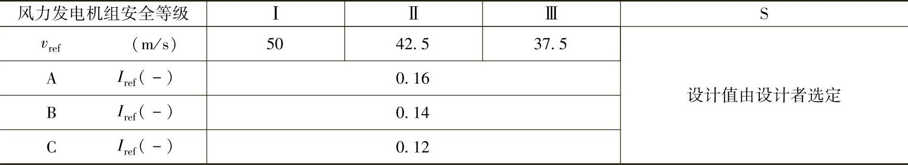

在表3-1中所示参数值对应于轮毂高度。

v_(ref)——10min平均参考风速；

A——表示高湍流特性等级；

B——表示中湍流特性等级；

C——表示低湍流特性等级；

I_(ref)——风速为15m/s时湍流强度的期望值。

除了这些基本参数外，其他一些外部条件参数的确定在风力发电机组设计中也是必不可少的环节，这些参数将在本节后文中详细说明。风力发电机组等级Ⅰ_(A)～Ⅲ_(C)，后面将其称作标准风力发电机组等级，

安全等级Ⅰ到Ⅲ的风力发电机组设计寿命至少为20年。

对于S级安全等级的风力发电机组来说，制造厂应该在设计文件中说明机组设计过程中所使用的模型与设计参数。采用本章所述模型，对其参数要做充分说明。S级安全等级的风力发电机组设计文件应包含相关标准中所列内容。

### 二、风况

风力发电机组应设计成能安全承受对应安全等级的风况。设计文件应对设计风况进行详细规定。

从载荷和安全方面考虑，风况可分为正常风况和极端风况，正常风况指在风力机正常运行期间频繁出现的风况条件，而极端风况是指1年一遇或50年一遇的风况条件。

在多数情况下，风况条件是由稳定的平均气流与变化的可确定的阵风或湍流结合而成。在所有情况下，应考虑平均气流与水平面夹角达8°时的影响。假定这个气流倾斜角不随高度变化。

湍流是指风速矢量相对于10min平均值的随机变化。在使用湍流模型时应该考虑风速、风向和风切变变化的影响，并允许通过变化的风切变旋转采样（旋转采样是指对机组旋转风轮上某一固定点的风速矢量采样）。湍流风速矢量的三个分量定义如下：

——纵向：沿着平均风速方向；

——横向：水平并且与纵向垂直的方向；

——竖向：与纵向和横向均垂直的方向。

对于标准的风力发电机组等级，湍流模型中的随机风速场应该满足以下要求：

1）假定由后文给出的湍流标准偏差σ₁的取值不随高度变化。垂直于主风向的分量应该具备下述最小标准偏差：

——横向分量：σ₂≥0.7σ₁

——竖直分量：σ₃≥0.5σ₁

2）在轮毂高度z_(hub)处纵向湍流尺度参数Λ₁的值为

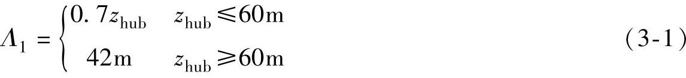

三个正交分量的功率谱密度S₁（f），S₂（f），S₃（f），随着惯性副区（风速湍流谱的频率区间，此区间内涡流经逐步破碎达到均匀化）内频率的增加，渐近于下式：

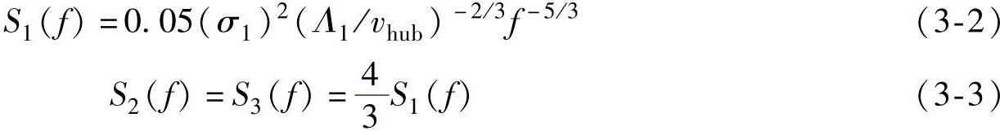

3）应该采用公认的相干模型。该模型定义为联合谱的幅值除以垂直于纵向的平面内、空间离散点上风速矢量纵向分量的自谱。IEC 61400-1-2005附件B推荐的曼恩（Mann）均匀切变湍流模型满足上述条件，同时还给出了另外一种满足上述条件的常用模型。其他模型要慎重使用，因为模型的选择会对载荷产生显著的影响。

1.正常风况

（1）风速分布 风速分布对于风力发电机组的设计有着很大影响，因为它决定着常规设计工况每种载荷状态的出现频率。应假设轮毂高度10min时间周期内平均风速符合下式描述的瑞利（Rayleigh）分布：

P_(R)（v_(hub)）=1-exp\[-π（v_(hub)/2v_(ave)）²\] （3-4）

式中 v_(hub)——轮毂高度处年平均风速，单位为m/s。

在标准风力发电机组等级中，v_(ave)应根据下式选取：

v_(ave)=0.2v_(ref) （3-5）

（2）正常风廓线模型（NWP）风廓线v（z）是地表以上平均风速对垂直高度z的函数。在标准风力发电机组等级下，正常风廓线由指数律公式给出：

v（z）=v_(hub)（z/z_(hub)）^(α) （3-6）

式中 z_(hub)——轮毂高度，单位为m。

假定指数α等于0.2。风廓线是用来确定风轮扫掠面垂直高度风切变的。

（3）正常湍流模型（NTM）对于正常湍流模型，纵向湍流标准差的典型值σ₁应以给定轮毂高度处风速的90％概率的标准差确定。

对于标准风力发电机组等级，此值由下式给定：

σ₁=I_(ref)（0.75v_(hub)+b）；b=5.6m/s （3-7）

图3-1 正常湍流模型（NTM）

a）标准差与风速的关系 b）湍流强度与风速的关系

湍流标准差σ₁和湍流强度σ₁/v_(hub)如图3-1所示。I_(ref)的幅值在表3-1中给出。

2.极端风况

极端风况用于确定风力发电机组的极端风载荷，这些风况包括由暴风及风速和风向的迅速变化造成的风速峰值。

（1）极端风速模型（EWM）极端风速模型含稳态或湍流的风模型。风速模型应该基于参考风速v_(ref)和确定的湍流标准差σ₁。

对于稳态极端风速模型，50年一遇的极端风速v_(e50)和1年一遇的极端风速v_(e1)是高度z的函数，采用下面的公式计算：

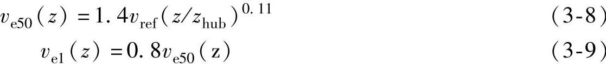

在稳态极端风速模型中，一般假定与平均风向短期偏差为±15°。

对于湍流极端风速模型，50年和1年一遇情况下，10min平均风速为z的函数：

v_(e50)（z）=v_(ref)（z/z_(hub)）^(0.11) （3-10）

v_(e1)（z）=0.8v_(e50)（z） （3-11）

纵向湍流标准差为

σ₁=0.11v_(hub) （3-12）

（2）极端运行阵风（EOG）对于标准风力发电机组等级，轮毂高度处阵风风速v_(gust)由下式给出：

式中 σ₁——在式（3-7）中给出；

Λ₁——湍流尺度参数，见式（3-1）；

D——是风轮直径，单位为m。

风速由下式确定：

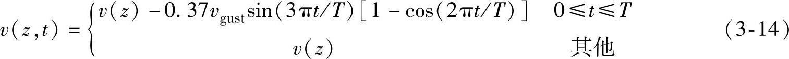

式中v（z）由式（3-6）确定，T为阵风持续时间，取T=10.5s。

【例3-1】 极端运行阵风实例：假设v_(hub)=25m/s，I_(A)级，D=42m。极端运行阵风如图3-2所示。

（3）极端湍流模型（ETM）极端湍流模型采用正常风廓线模型（NWP）和下式给出的纵向分量标准差来确定。

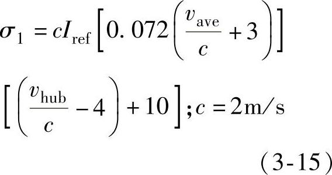

（4）极端风向变化（EDC）极端风向变化的幅值θ_(e)，由式（3-16）计算得出：

图3-2 极端运行阵风实例

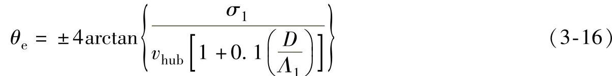

式中 σ₁——正常湍流模型（NTM）中的湍流标准差，见式（3-7）；

Λ₁——湍流尺度参数，单位为m，见式（3-1）；

D——风轮直径，单位为m。

θ_(e)取值范围为±180°。

极端风向变化瞬时值θ（t），由式（3-17）计算得出：

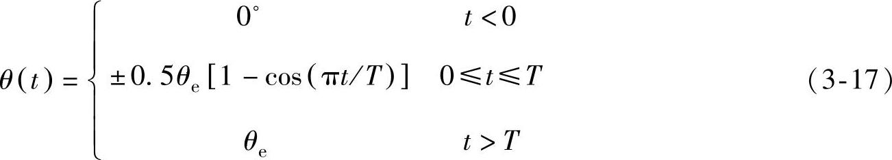

其中，T=6s是极端风向变化持续时间。符号的选择取决于最恶劣瞬时载荷发生情况。风向变化瞬态过程结束时，假定风向保持不变。风速应该按照正常风廓线模型（NWP）确定。

【例3-2】 极端风向变化实例：设D=42m，z_(hub)=30m，湍流类型A的极端风向变化幅值随轮毂风速v_(hub)变化的曲线如图3-3所示；图3-4所示为轮毂风速为v_(hub)=25m/s时对应的极端风向变化曲线。

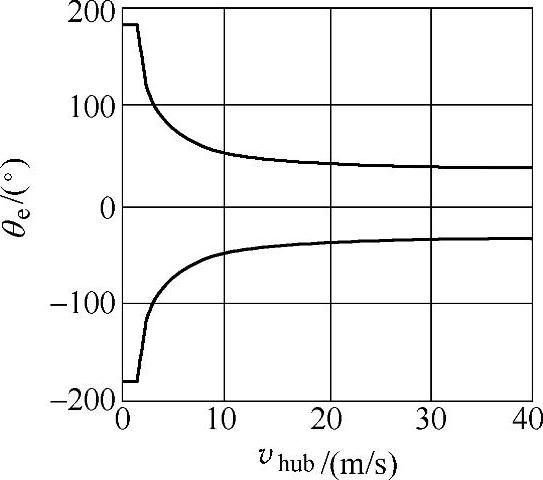

图3-3 极端风向幅值变化

图3-4 极端风向变化

（5）方向改变的极端相关阵风（ECD）方向改变的极端相关阵风的幅值为

v_(cg)=15m/s （3-18）

风速定义式为

其中，T=10s为上升时间，风速v（z）由正常风廓线模型（NWP）给出。

【例3-3】 极端相关阵风期间风速的上升实例：设轮毂风速v_(hub)=25m/s，极端相关阵风期间风速的上升曲线如图3-5所示。

假定风速的上升与风向的变化量θ从0°到θ_(cg)的变化是同时发生的，则变化量θ_(cg)的计算公式为

图3-5 方向改变的极端相关阵风（ECD）曲线

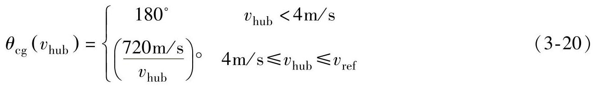

而风向同时变化角由下式给出：

此处上升时间T=10s。

【例3-4】 风向的变化实例：假设v_(hub)=25m/s，风向的变化量θ_(cg)与轮毂高度风速v_(hub)的关系，风向的变化与时间的关系，分别如图3-6和图3-7所示。

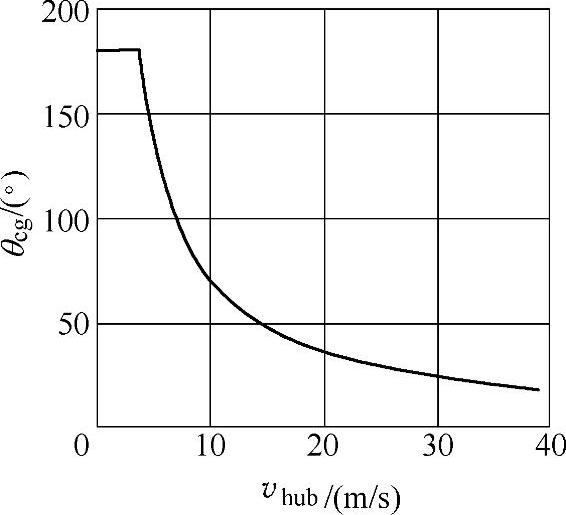

图3-6 ECD风向变化

图3-7 v_(hub)=25m/s时风向随时间的变化

（6）极端风切变（EWS）应用下列两种瞬时风速来计算极端风切变。

1）瞬时竖直方向切变（正向或逆向）

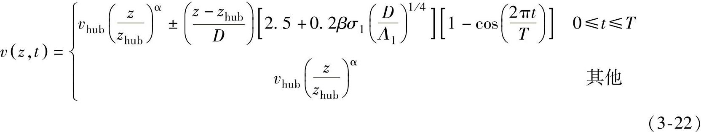

2）瞬时水平切变

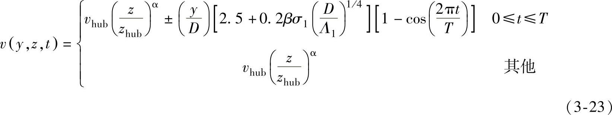

式中 α=0.2，β=6.4，T=12s；

σ₁——正常湍流模型中的湍流标准差，见式（3-7）；

Λ₁——湍流尺度参数，单位为m，见式（3-1）；

D——风轮直径，单位为m。

水平风切变瞬态符号应由最恶劣瞬时载荷发生决定。两个极端风切变不能同时应用。

【例3-5】 极端竖直风切变和风轮顶部和底部风速随时间的变化实例：如果湍流种类为A，z_(hub)=30m，v_(hub)=25m/s，D=42m，极端竖直风切变如图3-8所示。在图3-8中虚线表示的是极端风速发生前（t=0s）的风廓线，实线表示的是最大风切变（t=6s）时的风廓线，点划线表示的是负风切变（t=6s）时的风廓线。在与图3-8同样假设下，风轮顶部和底部风速随时间的变化如图3-9所示。

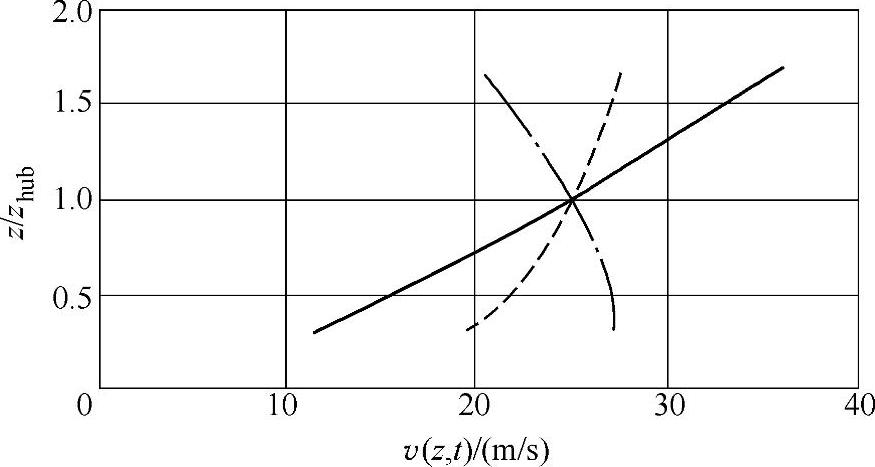

图3-8 极端正负竖直风切变的风廓线，在开始前（t=0，虚线）和最大切变（t=6s，实线）

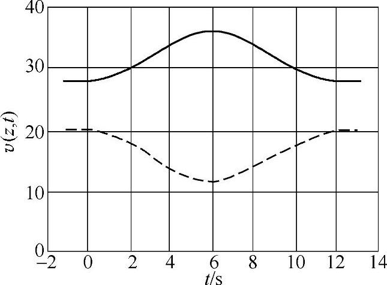

图3-9 风轮顶部及底部风速随时间的变化（瞬时正风切变）

### 三、其他环境条件

除风况之外，其他环境（气候）条件如热、光、腐蚀、机械、电或其他物理作用，都会影响风力发电机组的安全性和整体性能。而且，综合的气候因素更会加剧这种影响。至少还应考虑下列环境条件，并且在设计文件中说明其影响：温度，湿度，空气密度，阳光辐射，雨、冰雹、雪和冰，化学活性物质，机械作用微粒，雷电，地震和盐雾。近海环境需要考虑附加特殊条件。

应根据典型值或气候条件变化范围，确定设计用的气候条件参数。选择设计值时，应考虑几种气候条件同时出现的可能性。一年一遇所对应的正常范围内气候条件的变化不应影响所设计的风力发电机组的正常运行。除非存在着相关性，下面所提到的“其他极端环境条件”应和前文的“正常风况”结合起来考虑。

1.其他正常环境条件

应考虑下列其他正常环境条件参数：机组正常运行环境温度范围-10～+40℃（位于北方的机组，低温为-20℃）；相对湿度不大于95％；大气成分相当于无污染的内陆大气（见IEC 60721-2-1）；阳光辐射强度1000W/m²；空气密度1.225kg/m³。

当由设计者规定附加外部条件参数时，应在设计文件中说明。

2.其他极端环境条件

风力发电机组设计应考虑的其他极端环境条件有温度、雷电、结冰和地震。

（1）温度 风力机必须在一定的温度范围内运行，不同的结构，不同的材料所对应的正常运行温度范围是不同的。对于标准等级的风力发电机组，极端温度范围至少应是-20～+50℃（位于北方的机组，低温为-30℃）。注意，沿海气候的极限温度并不与强风同时发生。

（2）雷电 当雷电击中风力发电机组时，电流必须传导到地面上，电流实际上会通过或绕过所有组件，使它们可能会受到损坏。对于标准等级的风力发电机组，应贯彻相关标准要求的雷电防护措施。

（3）结冰 风力发电机组暴露的外表面，都可能形成30mm厚的冰，冰的密度为700kg/m³。在风轮停止运行的情况下，应考虑风轮叶片在所有的侧面上结冰。在风轮旋转的情况下，也应考虑风轮叶片在所有的侧面上结冰以及除一个叶片外所有叶片的侧面上结冰。

对于海上风力发电机组，海水也可能会结冰，基础就有可能承受冰载荷。在确定冰载荷的幅值和方向时，应该考虑冰的性质、机械性能、冰结构接触面积、结构的形状、冰运动的方向等。由于浮动冰块的生长和破裂，还应该考虑冰载荷的波动特性。

冰载荷不仅由于冰块的横向运动引起，冰块重量引起的载荷以及冰块融化甩出可能造成的冲击载荷，也应该被考虑。在确定风载荷和波浪载荷时，还要考虑结冰引起的面积的增加。

（4）地震 如果风力发电机组被认为会受到可能的地震影响，那么就要对该区域和当地的地质情况进行评估，以确定相对于地质缺陷的位置、震中和焦点的距离、能量释放机理以及能量衰减特征。处于地震多发区的风力发电机组，必须设计为能够承受地震载荷，可以使用以所谓的准响应谱（Pseudo response spectra）表示的响应谱。

### 四、电网条件

风力发电机组适用的正常电网条件如下：

1）电压，标称值±10％；

2）频率，标称值±2％；

3）三相电压不平衡度，电压负序分量的比率不超过2％；

4）自动重合周期，应考虑的自动重和周期为第一次重合时间0.1～5s，第二次重合时间10～90s，自动重合周期是指电网发生故障后，断路器断开到自动重合且线路重新接入电网的周期；

5）断电，假定电网一年内断电20次，一次断电6h为正常条件，断电一周为极端条件。

## 第二节 结构设计

在设计中，应验证风力发电机组承载部件的结构整体性能，并且应确保其具有可接受的安全等级。结构部件的极限强度和疲劳强度应通过计算和/或试验来验证。应以ISO 2394为基础进行结构分析。应采用适当的方法进行计算。设计文件中应提供计算方法的说明。说明应包括计算方法有效性证据或相应验证研究的参考文献。所有强度验证试验中的载荷水平应与本节中适用于特征载荷的安全系数相对应。

应验证风力发电机组的极限状态未超出设计范围。模型试验和样机试验也可以代替计算来验证结构设计的合理性。

### 一、载荷

设计计算应考虑下列载荷。

1.重力和惯性力载荷

重力和惯性力载荷分别是静态和动态载荷，它们是由重力、振动、旋转以及地震作用产生的。

2.空气动力载荷

空气动力载荷也是静态和动态的载荷，它们是由气流作用、气流与风力发电机组的静止部件和运动部件相互作用所引起的。

气流由穿过风轮平面的平均风速和湍流、风轮转速、空气密度、风力发电机组零部件的空气动力外形以及他们之间的相互作用（包括气动弹性作用）确定。

3.驱动载荷

驱动载荷由风力发电机组的运行和控制所产生，它可以分为几类，包括发电机/变流器的转矩控制，偏航和变桨的驱动载荷，以及机械制动载荷。在计算响应和载荷时，考虑有效的驱动力范围是非常重要的，尤其对于机械制动器，在任何制动情况下，检查响应和载荷时都应考虑易受温度和老化影响的摩擦力、弹力或压力的范围。

4.其他载荷

其他载荷，如尾流载荷、冲击载荷、冰载荷都可能发生。这些载荷应适当考虑。

### 二、设计工况和载荷状态

本小节描述了风力发电机组的设计工况和载荷状态，并规定了设计中需考虑的最少载荷状态要求。为了达到设计目的，风力发电机组寿命以风力发电机组可能经历的、包含各重要条件的设计工况来体现。载荷状态应由风力发电机组的运行模式或其他设计工况（如特定的装配、吊装或维护条件）与外部条件的组合确定。应将具有合理发生概率的各相关载荷情况与控制和保护系统动作放在一起考虑。用于验证风力发电机组结构整体性能的设计载荷状态应由下面的组合形式进行计算：正常设计工况和适当的正常或极端的外部条件；故障设计工况和适当的外部条件；运输、安装和维护设计工况和适当的外部条件；如果极端外部条件和故障状态存在相关性，可以将它们组合在一起，作为一种设计载荷状态考虑。

表3-2列出了需要考虑的设计载荷状态（DLC）。

表3-2 设计载荷状态

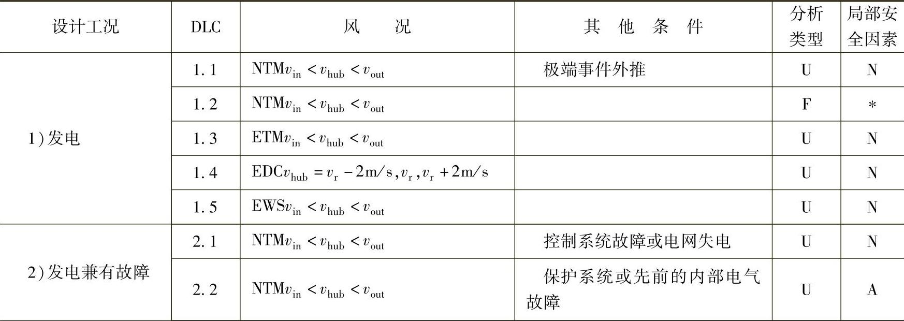

（续）

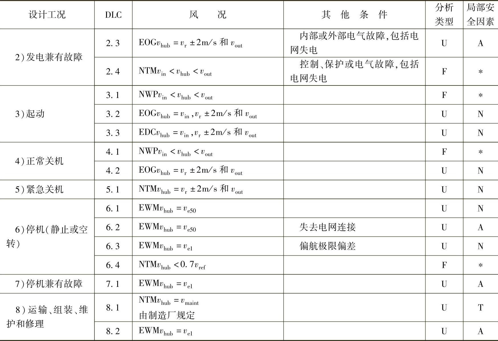

在表3-2中DLC——设计载荷状态；

EDC——极端风向变化；

EOG——极端运行阵风；

EWM——极端风速模型；

EWS——极端风切变；

ETM——极端湍流模型；

NTM——正常湍流模型；

NWP——正常风廓线模型；

F——疲劳载荷分析；

U——极限强度分析；

N——正常；

A——非正常的；

T——运输和安装；

∗——疲劳局部安全系数；

v_(hub)——轮毂高度处的平均风速；

v_(r)——额定风速；

v_(in)——切入风速；

v_(out)——切出风速；

v_(ref)——参考风速；

v_(e50)（z）——50年一遇极端风速；

v_(e1)（z）——1年一遇极端风速；

v_(maint)——维修、保养风速；

v_(r)±2m/s——应分析此风速范围内的所有风速的敏感性。

在每种设计工况中，应考虑几种设计载荷状态。至少应考虑表3-2规定的设计载荷状态。表3-2中，每种设计工况都通过对风况、电气和其他外部条件的描述，规定了设计载荷状态。

如果在有确定性风况模型的设计载荷状态下控制器能使风力发电机组在其达到最大偏航角和/或最大风速前停机，则必须表明在相同确定风况的湍流条件下，风力发电机组也能可靠地关机。

在特定的风力发电机组设计中，还应考虑与结构性能相关的其他设计载荷状态。

对每种设计载荷状态，在表3-2中用F和U规定了相应的分析类型。F表示疲劳载荷分析，用于疲劳强度评估；U表示极限载荷分析，如材料强度分析，叶尖挠度分析和结构稳定性分析等。

标有“U”的设计载荷状态，又分为正常（N），非正常（A），运输和吊装（T）等类别。在风力发电机组正常寿命期内，正常设计载荷状态是要频繁出现的，此时风力发电机组处于正常状态或仅出现短时的异常或轻微的故障。非正常设计载荷状态出现的可能性较小，它的出现往往对应导致系统保护功能起动的严重故障。设计载荷状态的类型N、A或T决定极限载荷使用的局部安全系数γ_(f)。这些安全系数将在表3-3中给出。

表3-2给出的风速范围，应考虑对风力发电机组设计造成最不利条件的风速。风速范围可用一组离散数值表示，为确保计算的精度，该组数据应有足够的分辨率。在确定设计载荷状态时，可参照本章第一节阐述的风况。

对于不同的设计工况，设计计算方法的具体要求概述如下：

1.发电（DLC1.1～1.5）

在此设计工况下，风力发电机组处于运行状态，并有电力负载。机组的总体布局应考虑风轮不平衡的影响。设计计算时应考虑风轮制造中所规定的最大不平衡质量和气动不平衡（如叶片桨距和扭角的偏差）。此外，在运行载荷分析中，应考虑实际运行同理论上最佳运行工况的偏差，如偏航误差和控制系统跟踪误差等。

设计载荷状态（DLC）1.1和1.2体现了由于风力发电机组寿命期内正常运行时由大气湍流所引起的载荷要求（NTM）。DLC1.3体现了极端湍流情况下所造成的极限载荷的要求。DLC1.4和1.5考虑的则是风力发电机组的寿命期内可能出现的危险事件的瞬态情况。

DLC1.1的仿真数据统计分析，至少要包括叶根面内和面外的弯矩以及叶尖挠度的极值计算。如果DLC1.3的极限设计值超出这些参数的极限设计值，DLC1.1的进一步分析可以省略。如果DLC1.3的极限设计值没有超出这些参数的极限设计值，可以增加DLC1.3所使用的极端湍流模型中参数c（见式（3-15）），直到由DLC1.3计算出的极限设计值等于或大于DLC1.1中所推算出的极限设计值。

2.发电兼有故障或电网失电（DLC2.1～2.4）

这种设计工况包括了在风力发电机组发电过程中由于故障或失去电网连接所触发的瞬时事件。控制和保护系统的任何故障或电气系统的内部故障（如发电机短路），对风力发电机组载荷有明显影响，应假设它们在风力发电机组发电期间有可能发生。对于DLC2.1控制功能或电网失电出现的故障可认为是正常事件。对于DLC2.2保护系统或内部电气系统出现的故障可认为是非正常事件。对于DLC2.3潜在的重要风况EOG，与内部或外部的电力系统故障（包括电网失电）的组合，被认为是非正常事件。在这种情况下，这两个事件发生顺序的选择应能得到最不利载荷。如果发生故障或电网失电后未能引起立刻关机，由此产生的载荷可导致严重疲劳损坏，这种情况可能持续的时间和正常湍流条件（NTM）下所造成的疲劳损伤，应在DLC2.4中进行评估。

3.起动（DLC3.1～3.3）

这种设计工况包括风力发电机组从静止或空转状态到发电状态过渡期间产生载荷的所有事件。发生的次数应根据控制系统行为进行估算。

4.正常关机（DLC4.1～4.2）

这种设计工况包括风力发电机组从发电状态到静止或空转状态过渡期间产生载荷的所有事件。发生的次数应根据控制系统的行为进行估算。

5.紧急关机（DLC5.1）

考虑由于紧急关机引起的载荷增量。

6.停机（静止或空转）（DLC6.1～6.2）

在这种设计工况下，风轮处在静止或空转状态。在DLC6.1，6.2和6.3中，考虑极端风速模型（EWM）。对于DLC6.4，考虑正常的湍流模型（NTM）。

对于风况由EWM确定的设计载荷状态，应采用稳态的极端风模型或极端湍流模型。如果采用极端湍流模型，应采用完全动态仿真或准稳态分析对响应结果进行评估，采用准稳态分析时应用ISO 4354中的公式对阵风和动态响应进行适当的修正。如果采用稳态极端风模型，共振响应的影响应采用上述的准稳态分析进行评估。如果共振与背景响应（R/B）之比小于5％，可以采用稳态极端风模型进行静态分析。如果在特征载荷下偏航系统出现滑动，最大可能的不利滑动应加到平均偏航误差中。如果风力发电机组中有偏航系统，并且在该系统中考虑了极端风况下的偏航运动（如自由偏航，被动偏航或半自由偏航），则应采用湍流风模型，并且偏航误差取决于湍流风向的变化和风力发电机组偏航的动态响应。如果随着风速的增加，风力发电机组由正常运行到极端情况的期间遭遇大幅度的偏航运动或平衡变化，这种情况也应纳入分析当中。

在DLC6.1中，对于有主动偏航系统的风力发电机组，如果可以确保偏航系统不产生滑动，那么采用稳定极端风模型时允许最大偏航误差为±15°，或采用极端湍流风模型时允许平均偏航误差为±8°。

在DLC6.2中，应考虑暴风早期阶段极端风况下电网发生断电的情况。除非能为控制和偏航系统提供备用电源，并且具有至少6h的偏航调节能力，否则必须分析风向变化±180°所产生的影响。

在DLC6.3中，1年一遇的极端风况应与极大偏航偏差相结合。采用稳态极端风模型时假定极大偏航偏差为±30°，采用湍流风模型时假定平均偏航偏差为±20°。

在DLC6.4中，对任何部件可能出现严重疲劳损伤（如源于空转叶片的质量）的各种风速条件，应考虑在这些风速所对应的波动载荷下预期的停机时间。

7.停机兼有故障（DLC7.1）

对由于电网或风力发电机组自身故障引起的停机中所出现的不正常现象，应进行分析。如果任何故障（除电网失电外）造成机组的不正常现象，则应分析可能产生的后果。故障状态应与1年一遇的极端风速模型（EWM）结合起来，应带有湍流或具有阵风和动态响应修正的准稳态条件。

对于偏航系统故障，应考虑±180°的偏航偏差。对于任何其他故障，偏航偏差应符合DLC6.1。在DLC7.1中特征载荷条件下，偏航系统里发生滑动，则应考虑可能的最不利滑动。

8.运输、组装、维护和修理（DLC8.1～8.2）

对于DLC8.1，制造厂应说明风力发电机组运输、现场组装、维护和修理中所假定的所有风况和设计工况。如果最大的限定风况在风力发电机组上产生很大的载荷，那么在设计中应考虑最大限定风况。制造厂应在限定风况和设计中所考虑的风况之间留有足够余量。足够的余量可以通过在限定风速上增加5m/s而得到。

此外，DLC8.2中应包括所有持续时间可能超过一周的运输、安装和维修情况。相应地，还包括未吊装完的塔架，或塔架上没有安装机舱以及风力发电机组上缺少一个或多个叶片的情况。可以假设所有的叶片同时安装。应假定在以上任何一种情况下都没有电网连接。应采取一些措施以减少其中任何一种状态下的载荷，只要这些措施不需要电网连接。

锁定装置应能承受由DLC8.1中相关工况引起的载荷，尤其要考虑最大设计驱动力。

### 三、载荷计算

每种设计载荷状态都要考虑本节二中所描述的载荷，同时还要考虑下列情况：由风力发电机组自身引起的风场的微小扰动（尾流诱导速度、塔影效应等）；三维气流对叶片气动特性的影响（如三维失速和叶尖损失）；非定常空气动力影响；结构动力学及振动模态耦合；气动弹性效应；风力发电机组控制系统和保护系统动作。

通常采用结构动力学模型的动态仿真来计算风力发电机组的载荷。某些特定的载荷状态有湍流风输入，在这些情况下，载荷数据的总周期应足够长以确保对特征载荷估算的统计可靠性。在仿真中，对于每个轮毂高度处的平均风速，至少需要6个10min随机（或一个持续60min）风速。对于DLC2.1、2.2和5.1，给定风速下的每种情况则至少进行12次仿真。在仿真的初期，由于动态仿真的初始条件对载荷统计有影响，因此在任何涉及湍流风况输入的分析中，应剔除最初5s（或必要时剔除更长时间）的数据。

在许多情况下，所给风力发电机组的零部件关键位置的局部应变或应力取决于同时作用的多轴载荷。在这种情况下，仿真输出的正交载荷时间序列有时可用于确定设计载荷。当采用该正交载荷分量时间序列计算疲劳和极限载荷时，应将这些载荷分量结合在一起，以保持其相位和幅值。因此，直接的方法是基于时间序列主要应力的推导。极限和疲劳的预测方法则适用于此单个信号，避免了载荷合成的问题。

也可用保守的方法将极限载荷分量结合在一起，即假定各分量的极限值同时达到。

### 四、最大极限状态分析

1.局部安全系数

局部安全系数考虑了载荷和材料的不确定性和易变性，分析方法的不确定性以及零件的重要性。

（1）载荷和材料的局部安全系数

为保证安全设计值，载荷与材料的不确定性和易变性可用式（3-24）与式（3-25）规定的局部安全系数进行补偿。

F_(d)=γ_(f)F_(k) （3-24）

式中 F_(d)——总内部载荷或载荷响应的设计值，它来自于给定的设计载荷状态的不同载荷源的多个同步性载荷分量；

γ_(f)——载荷局部安全系数；

F_(k)——载荷的特征值。

式中 f_(d)——材料设计值；

γ_(m)——材料局部安全系数；

f_(k)——材料特征值。

载荷局部安全系数还要考虑下列因素：载荷特征值出现不利偏差的可能性或不确定性；载荷模型的不确定性。

材料局部安全系数还要考虑下列因素：材料特征值出现不利偏差的可能性或不确定性；零件截面抗力或结构承载能力评估不准确的可能性；几何参数的不确定性；结构材料性能与试验样品所测性能之间的差别；换算误差。

这些不同的不确定性有时可通过单独分项安全系数来考虑，但通常将载荷的相关因素并入系数γ_(f)；材料的相关因素并入系数γ_(m)。

（2）失效影响和零件等级的局部安全系数

引入失效影响安全系数γ_(n)，以便区分以下几类零件：

一类零件：“失效-安全”结构件。结构件的失效不会引起风力发电机组重要零件的失效。例如监控下的可替换轴承；

二类零件：“非失效-安全”结构件。结构件的失效会迅速引起风力发电机组重要零件的失效；

三类零件：“非失效-安全”机械件。机械件把驱动机构和制动机构与主结构连接起来，以执行风力发电机组无冗余的保护功能。

对于风力发电机组的最大极限状态分析内容主要是极限强度分析、疲劳失效分析、稳定性分析（屈曲等）和临界挠度分析（叶片与塔架间机械干涉等）。

每种分析都需用不同的极限状态函数公式，并且通过安全系数的使用来处理不同的产生不确定性的根源。

（3）通用的材料设计规范的应用

在确定风力发电机组部件的结构整体性能时，可采用国内或国际的相关材料的设计规范。当国内或国际规范中的局部安全系数与本节的局部安全系数同时使用时，应特别注意，须确保最终的安全等级不低于本节的安全等级。

当考虑各种类型的不确定性时，如材料强度的固有变化、加工控制范围或加工方法等，不同的规范将材料局部安全系数γ_(m)分为若干材料系数。本节给出的材料系数即所谓“一般材料局部安全系数”仅考虑了强度参数的固有变化。如果规范采用给出的局部安全系数或使用材料特征值的折减安全系数来说明其他不确定性，要认真考虑这些不确定性。

在载荷和材料部件的设计认证时，某个规范可选择不同的局部安全系数的分解因子。这里采用的安全系数是ISO 2394中定义的安全系数。如果选择的安全系数偏离了ISO 2394，应根据本节对规范中的选择安全系数进行必要的调整。

2.极限强度分析

不超出最大极限状态的通用公式为

γ_(n)S（F_(d)）≤R（f_(d)） （3-26）

式中 γ_(n)——失效影响安全系数；

S（F_(d)）——载荷函数；

R（f_(d)）——许用函数。

一般来讲，许用函数R就是材料抗载能力的最大允许设计值，在此，R（f_(d)）=f_(d)。而极限强度分析用的载荷函数S通常定义为结构最大应力值，因此S（F_(d)）=F_(d)。公式（3-26）变为

对于每个风力发电机组部件的评估和表3-2中适用极限强度分析的每种载荷状态，最大极限状态应通过式（3-27）中的极限状态条件基于最小余量的原则确定。

对于包括给定风速范围湍流来流的载荷状态，考虑到本章第一节“二、风况”的“1.正常风况”中的风速分布，应计算特征载荷的超越概率。由于许多载荷计算只是有限持续时间内的随机仿真，根据要求的重现周期所决定的特征载荷可能大于仿真中的任何计算值。IEC 61400-1-2005附件F给出了采用湍流来流计算特征载荷的说明。

DLC 1.1中，载荷的特征值取决于统计的载荷外推值以及相应的超越概率。对于标准设计工况，特征载荷最大值在任意10min内的超越概率小于或等于3.8×10⁻⁷（50年一遇）。具体说明见IEC 61400-1-2005附件F。

对于指定确定性风场的载荷状态，载荷特征值应为最不利情况下计算的瞬时值。除DLC2.1、2.2和5.1外，当使用湍流来流时，载荷特征值应为不同的10min随机的、最不利情况的计算的载荷平均值。在DLC2.1、2.2和5.1中，载荷特征值为最大载荷中降序列前50％的平均值。

（1）载荷局部安全系数

载荷局部安全系数应不小于表3-3中的规定值。

表3-3 载荷局部安全系数γ_(f)

使用表3-3中规定的正常和非正常设计工况下的载荷局部安全系数，需要通过载荷测量验证载荷计算模型。这些测量应在风力发电机组上进行，该风力发电机组应与考虑空气动力学、控制和动态响应时所设计的风力发电机组相似。

（2）无通用设计规范的材料局部安全系数

材料安全系数应根据充分有效的材料性能试验数据确定。应考虑到材料强度的固有可变性。当使用95％置信度及95％存活率的典型材料性能时，一般材料局部安全系数γ_(m)应不小于1.1。

这个值适用于具有柔性特性的零件，这些零件的失效可能导致风力发电机组的重要部件的失效，例如焊接的塔筒、塔架法兰连接、焊接机座或叶片连接。失效模式包括：柔性材料的屈服；在单个螺栓失效后其他螺栓足以提供1/γ_(m)强度的螺栓连接中的螺栓断裂。

对于具有刚性特征的“非失效-安全”机械结构部件，它们的失效会导致风力发电机组的重要部件的迅速失效，通常材料安全系数一般不得少于下列数值：

——对于曲线外形壳体（如塔筒和叶片）的整体屈曲，为1.2；

——对于超过拉伸或压缩强度的断裂，为1.3。

为了从一般系数推导出材料整体安全系数，必须考虑由于外部作用（如紫外线辐射、湿度和通常探测不到的缺陷）所造成的尺度效应、公差和老化。

失效影响局部安全系数：一类零件：γ_(n)=1.0，二类零件：γ_(n)=1.0，三类零件：γ_(n)=1.3。

（3）有通用设计规范的材料安全系数

载荷、材料的安全系数和失效影响安全系数γ_(f)，γ_(m)和γ_(n)的合成局部安全系数应大于或等于本节2.（1）和2.（2）的规定。

3.疲劳失效分析

疲劳损伤应通过适当的疲劳损伤容限计算来评估。例如，根据迈因纳（Miner）准则，累积损伤超过1时达到极限状态。因此，在风力发电机组的寿命期内，累积损伤应小于或等于1。疲劳损伤计算需要考虑一些公式，包括循环范围和平均应变（或应力）水平的影响。为了评估与每个疲劳循环相关的疲劳损伤增加，所有局部安全系数（载荷、材料和失效影响）应适用于循环应变（或应力）范围。IEC 61400-1-2005附件G给出了迈因纳（Miner）准则的示例公式。

（1）载荷局部安全系数

正常和非正常设计工况载荷局部安全系数γ_(f)均为1.0。

（2）无通过设计规范的材料局部安全系数

如果S-N曲线是基于50％的存活率并且变化系数小于15％，那么材料的局部安全系数γ_(m)至少为1.5。对于疲劳强度变化系数大的零件，即变化系数为15％至20％（许多由复合材料制成的零部件，例如钢筋混凝土或纤维复合材料制成的部件），局部安全系数γ_(m)必须相应地增加，至少为1.7。

疲劳强度应从大量试验的统计数据中确定，而特性值的获得要考虑由于外部作用（如紫外线辐射、湿度和通常探测不到的缺陷所造成的尺度效应、公差和老化。

对于焊接的结构钢，传统上S-N曲线以97.7％的存活率为基础。在这种情况下，γ_(m)可取1.1。在有些情况下有可能通过定期检查程序，来检测临界裂纹发展，γ_(m)值可以取得更低。在无论什么情况下，γ_(m)应大于0.9。

对于纤维复合材料，应通过实际的材料测试数据来确定强度分布。S-N曲线以95％的存活率与95％的置信度为基础。在这种情况下，γ_(m)可取1.2。其他材料可采用同样的方法。

失效影响局部安全系数：一类零件：γ_(n)=1.0，二类零件：γ_(n)=1.15，三类零件：γ_(n)=1.3。

（3）有通用设计规范的材料局部安全系数

载荷、材料安全系数和失效影响局部安全系数应不小于（1）和（2）中的规定值。

4.稳定性分析

在设计载荷作用下，“非失效-安全”的承载件不应发生屈曲。对于其他零件在设计载荷下，允许发生弹性变形。在特征载荷下，任何零件都不应发生屈曲。

载荷局部安全系数γ_(f)的最小值应根据表3-3选取。材料局部安全系数应不小于表3-3中的规定值。

5.临界挠度分析

应验证表3-2所列的设计工况下没有产生影响风力发电机组结构整体性能的变形。特别需要验证叶片与塔架之间无机械干涉。

对于表3-2所列载荷状态，应使用特征载荷确定不利方向上的最大弹性变形，并将所得到的变形乘以载荷、材料和失效影响的合成局部安全系数，即得到合成的变形。

载荷局部安全系数γ_(f)的值应从表3-3中选取；材料弹性性能的局部安全系数γ_(m)的值应为1.1，除非通过全尺寸试验已经确定了弹性性能的情况下，γ_(m)的值可以减少到1.0。应特别注意几何形状不确定性和挠度计算方法的准确性。

失效影响安全系数：一类零件：γ_(n)=1.0，二类零件：γ_(n)=1.0，三类零件：γ_(n)=1.3。

应将弹性变形叠加到在最不利方向上不变形的部位，并将其最终位置与无干扰条件进行比较。也可使用直接动态变形分析。在这种情况下，确定特性变形的方法与表3-2中的每个载荷状态下确定特征载荷的方法一致。特征挠度和特征载荷在最不利方向上的超越概率应该相同。然后特征挠度乘以合成局部安全系数，再叠加到上述的不变形的部位上。

6.特殊局部安全系数

由测量或在测量基础上分析确认的载荷值，如果置信度较正常情况高，可以用较低的载荷局部安全系数。使用的所有局部安全系数值应该在设计文件中加以说明。

## 第三节 海上风力发电机组外部条件

本节简要介绍了海上风力发电机组不同于陆上风力发电机组的外部条件。关于海上风力发电机组设计要求的更多内容，可以参阅相关标准。

海上风力发电机组的载荷来源有惯性和重力载荷、空气动力载荷、运行载荷、流体动力载荷、海冰载荷和船舶冲击载荷等。海上风力发电机组的载荷工况标准为IEC 61400-3-2009（Design requirements for offshore wind turbines）。此外，还有Germanischer Lloyd（Guideline forthe certification of offshore wind turbines）和DNV-OS-J101（Design of offshore wind turbinestructures）等标准。

### 一、海上风力发电机组外部条件的特点

图3-10所示为海上风力发电机组的组成。海上风力发电机组和陆上风力发电机组的载荷环境不同，主要为风特性不同，并且有额外的载荷来源。不同的风特性为，更高的年平均风速，更低的湍流，更低的风剪切，低层喷流影响等。额外的载荷来源有波浪、海流、海冰、船舶冲击等。破碎波和海冰载荷存在不确定性，还要考虑风和波浪同时作用时的载荷。

外部条件包括环境、电网和地质条件。环境条件可进一步分为风况、海洋状况（波浪、海流、水平面、海冰、海生物、海床运动和海浪冲刷）和其他环境条件。风况是主要外部条件，其他环境条件，比如控制系统功能，耐久性，腐蚀等，也影响设计。

地质条件包括海床运动，海浪冲刷和其他海床不稳定因素。

与陆上风力发电机组类似，每种类型的外部条件又可分为正常外部条件和极端外部条件。正常外部条件一般涉及的是长时期的结构载荷条件。而极端外部条件是少见的，但它可能是临界外部设计条件。设计载荷状态应由这些外部条件同风力发电机组运行模式组合构成。

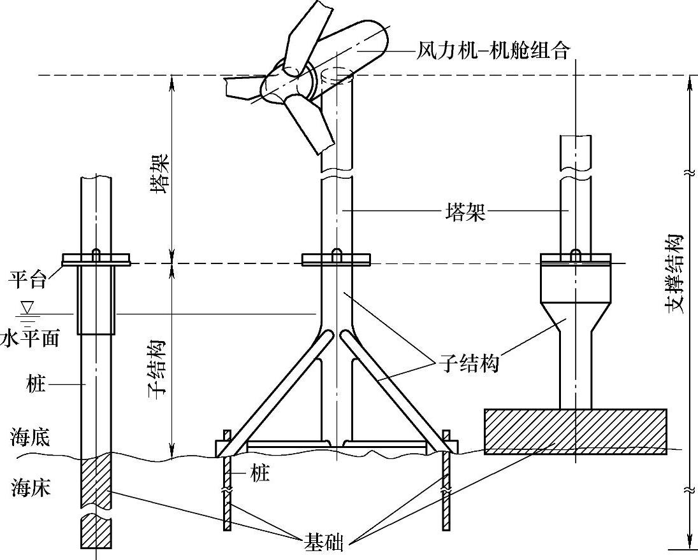

图3-10 海上风力发电机组的组成

### 二、海上风力发电机组等级

在设计中要考虑的外部条件由风力发电机组安装场地类型决定。在IEC 61400-1标准中，风力发电机组等级是根据风速和湍流参数来划分的，这些等级包括了绝大部分陆上应用。对于海上风力发电机组，根据风速和湍流参数分组作为风力机和机舱组合的设计基础仍然是合适的。

如果设计者或客户要求使用特定的条件，如特定风况、其他外部条件或特定安全等级，风力发电机组安全等级进一步划分出S级。S级安全等级的设计值通常由设计者选取。

除了风速和湍流参数，在设计海上风力发电机组时，还要指定其他重要参数，特别是海洋状况。

海上风力发电机组的设计寿命至少为20年。

### 三、风况

海上风力发电机组应设计成能安全承受对应安全等级的风况。

从载荷和安全方面考虑，风况可分为正常风况和极端风况，正常风况指在风力机正常运行期间频繁出现的风况条件，而极端风况是指一年一遇或50年一遇的风况条件。

海上风力发电机组支撑结构的设计要根据典型的安装场地类型决定。对于风力机和机舱组合的设计，风况根据指定场地或IEC 61400-1-2005中的模型和参数假设。

风廓线v（z）是地表以上平均风速对垂直高度z的函数。在标准风力发电机组等级下，正常风廓线由幂指数律公式给出：

v（z）=v_(hub)（z/z_(hub)）^(α)

正常风况下，幂指数α为0.14。

假设极端风速（v_(e50)，v_(e1)）和极端波浪高度（H₅₀，H₁）的发生是非关联的，并且它们的组合是保守的，可以使用减少的极端风速。

v_(red50)（z）=1.1v_(ref)（z/z_(hub)）^(0.11) （3-28）

v_(red1)(z)=0.8v_(red50)(z) （3-29）

### 四、海洋状况

海上风力发电机组支撑结构的设计基于环境状况，包括风力发电场地的海洋状况。海上风力发电机组应设计成能安全承受对应的海洋状况。海洋状况包括波浪、海流、水平面、海冰、海生物、海浪冲刷和海床运动。

设计者要考虑海洋状况对风力机和机舱组合的影响。大多数情况下，风力机和机舱组合并不是针对指定的场地设计，而是针对一定的范围。

从载荷和安全方面考虑，海洋状况可分为正常海洋状况和极端海洋状况，正常海洋状况是指在海上风力发电机组正常运行期间频繁出现的海洋状况，而极端海洋状况是指一年一遇或50年一遇的海洋状况。

1.波浪

波浪没有规则的形状，在传播时高度、长度和速度不时地发生变化，并且可能同时从不同方向靠近海上风力发电机组。通过一个随机的波浪模型能很好地描述波浪的特点。该模型由许多独立的不同频率的部分组成，每一周期的波浪有不同的振幅、频率和方向，各部分的相位关系也是随机的。具体的波浪模型请参考IEC 61400-3-2009附录B。

考虑到风和波浪的不确定性，一定要确保方向数据和风力发电机组技术的可靠性。根据规则波浪和随机海洋状况，IEC 61400-3-2009把波浪模型分为以下八种。

1）正常海洋状态（NSS）；

2）正常波浪高度（NWH）；

3）剧烈海洋状态（SSS）；

4）剧烈波浪高度（SWH）；

5）极端海洋状态（ESS）；

6）极端波浪高度（EWH）；

7）减少的波浪高度（RWH）；

8）破碎波（Breaking waves）。

2.海流

尽管海流大体上随空间和时间变化，但一般把它看作速度和方向恒定，只有深度变化的水平的流场。要考虑海流速度的下列分量：

——由潮汐、暴风雨和大气压力变化引起的水下海流；

——风产生的接近表面的海流；

——近岸的，波浪引起的平行于海岸的海浪流动。

海流的速度是这些分量的和。波浪引起的水粒子速度和流动速度将加快海流速度。波浪长度和周期对海流速度的影响忽略不计。

和波浪引起的水压相比，海流对海上风力发电机组水力疲劳负载的影响可能由于速度低而微不足道，设计者将决定是否忽略海流对特定场地的疲劳载荷计算的影响。

IEC 61400-3-2009中，海流模型分为以下几种。

1）水下海流；

2）风产生的接近表面的海流；

3）破碎波引起的海流；

4）正常海流模型（NCM）；

5）极端海流模型（ECM）。

3.水平面

为了计算海上风力发电机组所受的水力载荷，应该考虑水平面的变化。各种水平面的定义如图3-11所示。

4.海冰

有些地点的风力发电机组受海冰的载荷很严重。海冰载荷可以是坚固的冰层的静态载荷，也可以是风和海流引起的浮冰的动态载荷。长时间的浮冰冲击将对支撑结构产生疲劳载荷。海冰载荷的计算可参考IEC 61400-3-2009附录E。

5.海洋生物

海洋生物影响海上风力发电机组支撑结构的质量、表面形状和表面纹理，从而影响它的水力负载、动态响应和腐蚀性。

6.海床运动和海浪冲刷

设计海上风力发电机组的支撑结构时，要考虑海床运动和海浪冲刷。根据ISO 19901-4，分析海床运动和海浪冲刷，并采取适当的保护。

图3-11 各种水平面的定义

### 五、其他环境条件

除风况和海洋状况之外，其他环境（气候）条件如热、光、腐蚀、机械、电气或其他物理作用，都会影响海上风力发电机组的安全性和完好性。而且，综合的气候因素更会加剧这种影响。至少还应考虑下列环境条件，并且在设计文件中说明其影响：温度，湿度，空气密度，阳光辐射，雨、冰雹、雪和冰，化学活性物质，机械作用微粒，雷电，地震，水密度，水温，交通。

应根据典型值或气候条件变化范围，确定设计用的气候条件参数。选择设计值时，应考虑几种气候条件同时出现的可能性。一年一遇所对应的正常范围内气候条件的变化不应影响所设计的风力发电机组的正常运行。

1.其他正常环境条件

应考虑下列其他正常环境条件参数：机组正常运行环境温度范围-10～+40℃；相对湿度不大于100％；阳光辐射强度1000W/m²；空气密度1.225kg/m³；水温范围0～+35℃。

当由设计者规定附加外部条件参数时，应在设计文件中说明。

2.其他极端环境条件

1）温度：对于标准等级的海上风力发电机组，极端温度范围至少应是-20～+50℃。

2）雷电：贯彻IEC61400-1-2005中相关标准要求的雷电防护措施。

3）结冰：海上风力发电机组的标准安全等级中，没有结冰的最低要求。可以从以下两个方面考虑：

温度低于0℃时，湿气和微粒；

温度低于0℃时，波浪的飞溅。

4）地震：贯彻IEC 61400-1-2005中相关标准要求的地震防护措施。

### 六、电网条件

海上风力发电机组适用正常电网条件与陆上风力发电机组适用的正常电网条件相同。

### 七、载荷计算

与陆上风力发电机组相同，海上风力发电机组也是正常载荷工况、极端载荷工况、特殊载荷工况及运输载荷工况，所不同之处在于，在陆地风机载荷工况基础上多加了海上特定的波浪、海流等工况载荷。

