# 4 载荷

本章介绍了风力发电机组的载荷及其分析计算方法。包括载荷及其坐标系、坐标系的转换、载荷分类、载荷源、疲劳载荷分析、极限载荷分析和载荷叠加等。同时介绍了如何使用载荷计算软件。

## 第一节 载荷概述

### 一、载荷及其坐标系

风力发电机组的载荷是指外部环境和操作系统作用在其部件上的力或力矩。风力发电机组载荷分析计算的目的是为了计算在特定工况下结构的应力和应变，进而进行极限强度校核和疲劳强度校核。大型风力发电机组所受载荷情况非常复杂，目前载荷分析计算需要借助于大型辅助设计软件进行。

风力发电机组的辅助设计软件是应用气体弹性力学来建立数学模型的。气体弹性力学是研究气动特性和弹性变形之间相互作用的学科。载荷计算的气弹模型主要建立在叶素-动量定理的基础上。叶素-动量定理把风流场转换成作用在风力机结构上的载荷。

风力发电机组结构的离散建模常用两种方法。一种是有限元法，另一种是模态分析方法。两种方法都已应用气弹模型编制出相应的应用软件。目前，已经有几种用于风力发电机组载荷及变形预测的软件得到广泛应用，本书前文已做了简要介绍。绝大多数软件提供时域解，少数软件提供频域解。

尽管应用计算机软件可以较为准确地预测风力发电机组的载荷及变形，但是在初步设计时，设计者还是需要一些简易的解析表达式计算结构载荷。本书在本章和以后各章将介绍一些常用关系式，供读者参考。同时，这些简易解析表达式计算结果还可以与应用软件的计算结果相互验证。

一般情况下，风力发电机组各个部件的负载是用不同的坐标系表示的。为了统一负载的表示方法，本书做了如下的规定。

1.塔架坐标系

塔架坐标系（O_(t)，x_(t)，y_(t)，z_(t)）的坐标原点O_(t)位于塔顶中心，x_(t)轴顺风向，z_(t)轴铅垂向上，x_(t)轴与y_(t)、z_(t)轴符合右手定则，如图4-1a所示。

2.机舱坐标系

机舱坐标系（O_(n)，x_(n)，y_(n)，z_(n)）的坐标原点O_(n)位于机舱中心，z_(n)轴与z_(t)轴同向，x_(n)轴与x_(t)轴成夹角γ（偏角），x_(n)轴与y_(n)、z_(n)轴符合右手定则，O_(n)与O_(t)之间的距离为z_(tn)，如图4-1a所示。

3.轮毂坐标系

轮毂坐标系（O_(h)，x_(h)，y_(h)，z_(h)）的坐标原点O_(h)位于轮毂中心，y_(h)轴与y_(n)轴同向，x_(h)轴与x_(n)轴成夹角_(η)（风轮仰角），x_(h)轴与y_(h)、z_(h)轴符合右手定则，O_(h)与O_(n)之间的距离为z_(nh)，如图4-1b所示。

4.风轮坐标系

风轮坐标系（O_(r)，x_(r)，y_(r)，z_(r)）的坐标原点O_(r)与O_(h)重合，x_(r)轴（为风轮旋转轴）与x_(h)轴重合，z_(h)轴与z_(r)轴成夹角ψ（方位角），x_(r)轴与y_(r)、z_(r)轴符合右手定则，风轮坐标系跟着风轮旋转，如图4-1c所示。

5.叶片坐标系

叶片坐标系（O_(b)，x_(b)，y_(b)，zb）的坐标原点O_(b)位于叶片轴线锥角起点处，z_(b)轴沿叶片轴线指向外，y_(b)轴与y_(r)轴同向，x_(b)轴与y_(b)、z_(b)轴符合右手定则，O_(b)与O_(r)之间的距离为z_(rb)，z_(b)轴与z_(r)轴成夹角χ（风轮锥角），叶片坐标系跟着叶片旋转，如图4-1d所示。

6.剖面坐标系

剖面坐标系（O_(s)，x_(s)，y_(s)，z_(s)）的坐标原点O_(s)位于叶片剖面与叶片轴线的交点处，y_(s)轴平行于剖面几何弦线指向后缘，z_(s)轴与z_(b)轴都沿叶片轴线指向外，x_(s)轴在剖面平面内垂直于y_(s)轴，x_(s)轴与y_(s)、z_(s)轴符合右手定则，O_(s)与O_(b)之间的距离为z_(bs)，如图4-1e、f所示。

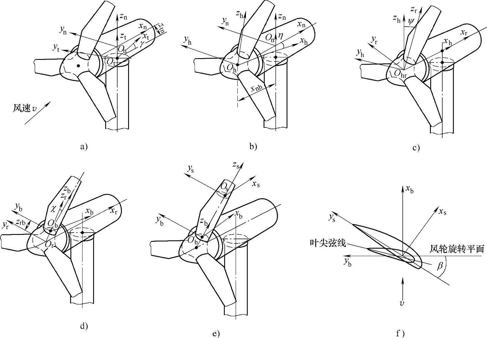

图4-1 风力发电机组载荷坐标系

a）塔架坐标系 b）机舱坐标系 c）轮毂坐标系 d）风轮坐标系 e）叶片坐标系 f）剖面坐标系

力和力矩的表示方法规定：x_(t)方向的力表示为F_(xt)，x_(t)方向的力矩（按右手定则）表示为M_(xt)，以此类推。

### 二、坐标系的转换

1.位移间的转换

塔架坐标系与机舱坐标系的转换为

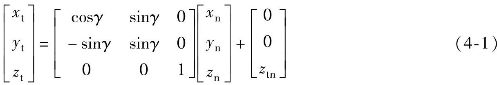

机舱坐标系与轮毂坐标系的转换为

轮毂坐标系与风轮坐标系的转换为

风轮坐标系与叶片坐标系的转换为

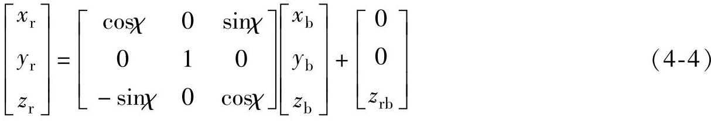

叶片坐标系与剖面坐标系的转换为

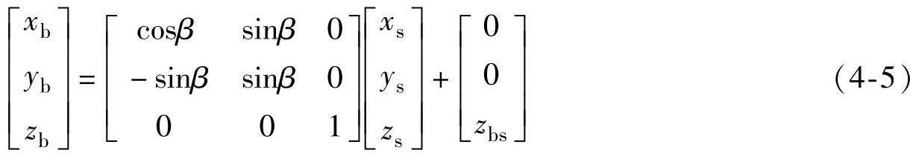

2.速度间的转换

塔架坐标系与机舱坐标系的转换为

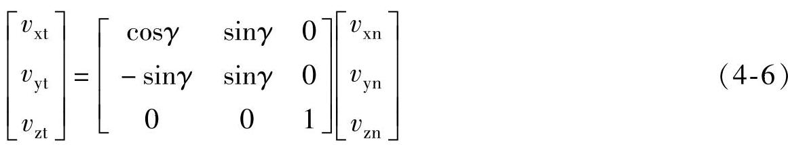

机舱坐标系与轮毂坐标系的转换为

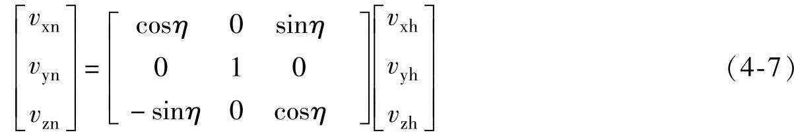

轮毂坐标系与风轮坐标系的转换为

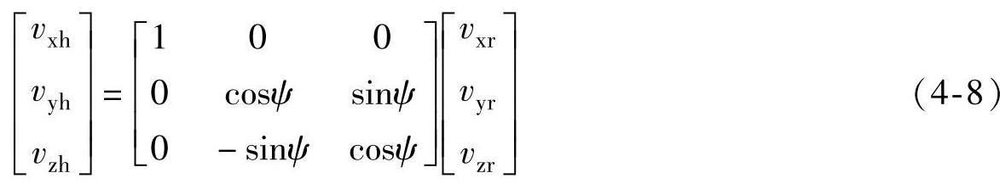

风轮坐标系与叶片坐标系的转换为

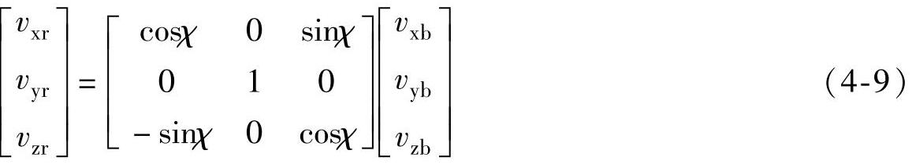

叶片坐标系与剖面坐标系的转换为

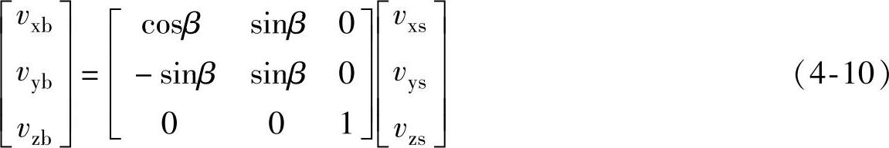

### 三、载荷分类

载荷可以按载荷源、结构设计要求、时变特性等原则进行分类。

1.按载荷源分类

1）空气动力载荷：空气动力为负载的主要来源，它取决于风况、机组的气动特性、结构特性和运行条件等因素。

2）重力载荷。

3）惯性载荷：叶片旋转会产生离心力。叶片旋转时进行偏航会产生回转力矩。

4）操作载荷：来自于控制系统的驱动载荷。如发电机的速度调节、制动、偏航、变桨距等都会引起机组结构和部件上的负载变化。

5）其他载荷：如地震波、波浪、覆冰等。

2.按结构设计要求分类

1）最大极限载荷：风力发电机组可能承受的最大载荷。

2）疲劳载荷：疲劳载荷是作用于风力发电机组的交变循环载荷，它是寿命设计需要考虑的主要因素。

3.按载荷的时变特性分类

1）平稳载荷：指均匀风速、叶片离心力、塔架重力等载荷，包括静载荷。

2）循环载荷：指风剪力、偏角、重力等引起的周期性载荷。

3）随机载荷：如湍流引起的空气动力载荷。

4）瞬变载荷：由阵风、开机、关机、冲击、变桨距等操作引起的载荷。

### 四、载荷源

1.叶片上的载荷

（1）空气动力载荷

作用在叶片上的包括摆振方向的剪力F_(yb)和弯矩M_(xb)、挥舞方向的剪力F_(xb)和弯矩M_(yb)以及变桨距时，与变桨距力矩平衡的叶片俯仰力矩M_(zb)。叶片上的空气动力载荷可根据第二章第一节中的叶素—动量定理计算，计算时先求出轴向诱导因子a和切向诱导因子a′，再求得叶素上的气流速度三角形以及作用在叶素上的法向力dF_(n)和切向力dF_(t)，然后通过积分求出作用在叶片上的空气动力载荷F_(xb)，F_(yb)，M_(xb)和M_(yb)：

式中 R——风轮半径；

r_(hub)——轮毂半径。

且有： C_(n)=C_(l)cosφ+C_(d)sinφ

C_(t)=C_(l)sinφ-C_(d)cosφ

一般翼型空气动力数据都是相对于翼型1/4弦线位置，因此其俯仰力矩可表示为

式中 C_(m)——翼型俯仰力矩系数。

当叶片变桨距轴线位于1/4弦线处时，通过积分得到叶片的变桨距空气动力力矩。当叶片变距轴线不在1/4弦线处时，则叶片变桨距力矩可表示为

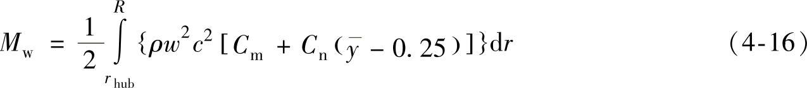

式中 y——变桨距轴线到翼剖面前缘的距离与弦长的比值。

图4-2所示为风轮有/无风剪切和塔影效应时，叶片根部摆振方向变矩和挥舞方向弯矩随叶片方位角的变化曲线。由图可知：由于风剪切和塔影效应的影响，在不同方位角下流经叶片的气流速度发生变化，使风力机叶片承受交变载荷。

图4-2 有/无风剪切和塔影效应时弯矩随叶片方位角的变化

a）摆振方向 b）挥舞方向

图4-3所示为风轮有风剪切和偏角时，叶片根部摆振方向弯矩和挥舞方向弯矩随叶片方位角的变化曲线。由图可知，当风轮偏航时或风向角变化时，垂直于风轮旋转平面上的风速分量发生变化，因此作用在叶片上的空气动力载荷也相应产生变化。

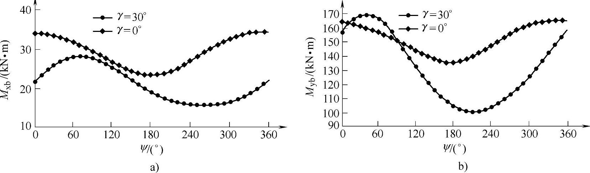

图4-3 有风剪切和偏角时弯矩随叶片方位角的变化

a）摆振方向 b）挥舞方向

（2）重力载荷

作用在叶片上的重力载荷对叶片产生摆振方向的弯矩，它随着叶片方位角的变化呈现周期的变化，是叶片的主要疲劳载荷。

叶片上每个叶素有一个集中质量m_(i)，则由它产生的重力F_(g)为

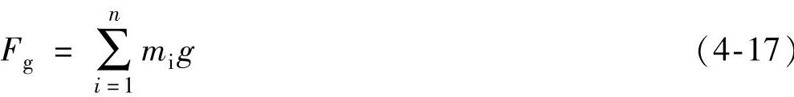

或表示为

式中 A——叶素的面积。

重力载荷方向总是向下，所以可能在叶片上引起拉（压）力、剪力、弯矩和扭矩。

（3）惯性载荷

叶片上的惯性载荷包括离心力和回转力矩。

1）离心力：在叶根处，离心力

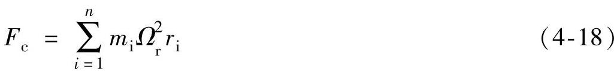

式中 m_(i)——第i个叶素的质量，单位为kg；

Ω_(r)——风轮角速度，单位为rad/s；

r_(i)——第i个叶素的半径，单位为m。

或表示为

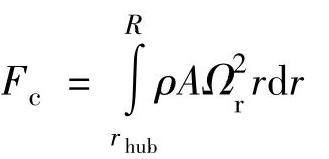

一般说来，叶素的离心力不一定叶片轴共线，所以可能在叶片上引起拉力、剪力、弯矩和转矩。

由于风轮旋转而产生在叶片上的离心力总是与旋转轴垂直向外的。当由于作用在叶片上挥舞方向弯矩使柔性叶片偏离风轮旋转平面时，叶片上的离心力在挥舞方向产生的弯矩可以减小叶片的偏离，称之为离心力刚化叶片效应。

2）回转力矩：当风轮旋转并同时作偏航运动时，将产生垂直轴的偏航力矩M_(K)以及在风轮平面内绕水平轴的倾覆力矩M_(G)。

对三叶片风轮由于回转载荷的影响，偏航力矩的净效果为零，M_(K)=0，而倾覆力矩

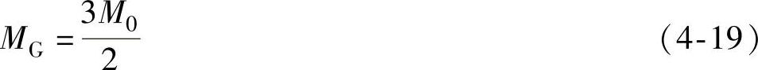

式中 

对二叶片风轮，由于回转载荷的影响导致偏航力矩M_(K)和倾覆力矩M_(G)的周期性变化，即

M_(K)=2M₀cosΩ_(r)tsinΩ_(r)t （4-20）

M_(G)=2M₀cos²Ω_(r)t （4-21）

上述结论是忽略风轮倾角和锥角的前提下得到的。

（4）操纵载荷

作用在风力机上的操纵载荷是由于操纵风力机时，对其部件施加的附加载荷，并由该载荷引起风力机部件加速度响应而诱导产生的惯性载荷。叶片上的操纵载荷主要是在空气动力制动或变桨距时产生的。

2.轮毂上的载荷

作用在轮毂上的载荷包括转矩、轴向力、偏航力矩和俯仰力矩。一般来说，大型风力发电机组轮毂都是安置在整流罩内，因此作用在轮毂上的载荷主要是由叶片的载荷传递到轮毂上。作用在轮毂上的转矩是风轮轴功率的来源，它由叶片摆振力矩M_(xb)合成产生，与叶片挥舞力矩一样随叶片的方位角变化，如图4-4所示。失速型风力机和变速恒频型风力机风轮转矩随风速变化情况不同：在高风速区，失速型风力机靠叶片失速来控制转矩增加；而变速恒频型风力机靠变化叶片桨距角来控制转矩，使得其转矩比失速型风力机更平坦。

作用在轮毂上的轴向力（推力）主要由叶片挥舞方向剪力F_(xb)合成产生。由于风剪切较硬和塔影效应等影响，风轮轴向力（推力）随叶片方位角变化，如图4-5所示。失速型风力机和变速恒频型风力机风轮推力随风速变化情况不同：在高风速区，失速型风力机风轮推力随风速增大而增大；而变速恒频风力机则由于叶片桨距角的变化，使风轮推力随风速增大而减小，如图4-6所示。

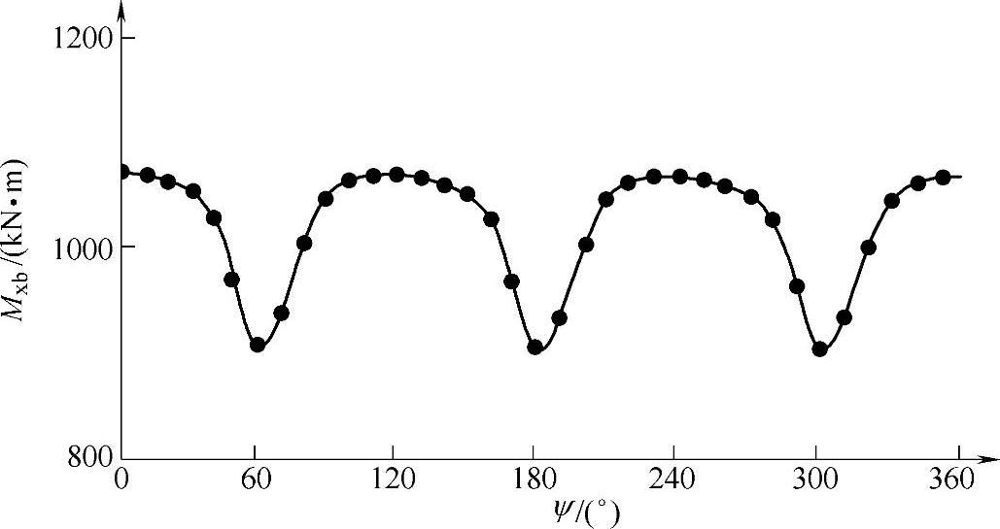

图4-4 转矩随叶片方位角的变化

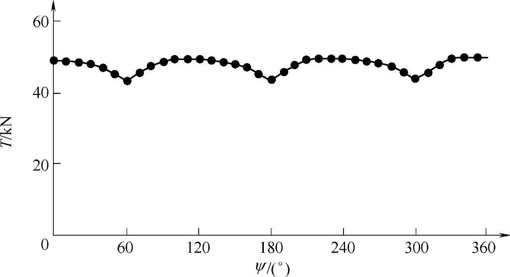

图4-5 轴向力随叶片方位角的变化

作用在轮毂上的偏航力矩和俯仰力矩是由于风力机运行时风轮叶片不对称，叶片在不同方位角时受到不均匀的载荷以及风轮偏航运动和风轮倾角等影响而产生的。图4-7所示为作用在轮毂上的偏航力矩随叶片方位角的变化情况。

3.主轴上的载荷

作用在主轴上的载荷主要是由轮毂上的载荷传递的。它包括转矩和两个方向（水平方向和垂直方向）的弯矩。主轴上的转矩与轮毂上的转矩相等；主轴上的水平方向弯矩与轮毂上的偏航力矩相等；主轴上的垂直方向弯矩由轮毂（风轮）的俯仰力矩与风轮系统的重力矩合成产生。

除上述载荷为，还有机械制动时作用在主轴上的摩擦力和因发电机并网和脱网时作用在主轴上的冲击载荷。

4.机舱上的载荷

机舱上的载荷包括作用在机舱罩上的载荷和作用在机舱底座上的载荷。作用在机舱罩上的载荷主要是空气动力载荷，作用在机舱底座上的载荷除了由风轮系统传递的载荷外，还包括机舱内传动系统传递的载荷。

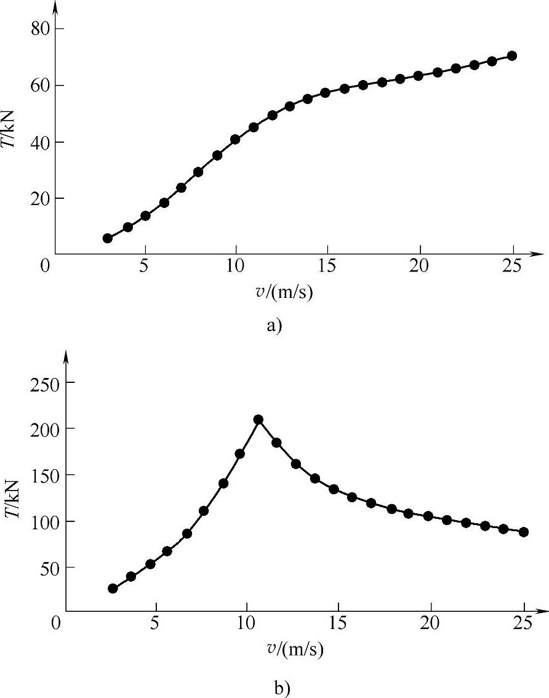

图4-6 轴向力随风速的变化

a）300kW失速型机组 b）1500kW变速恒频机组

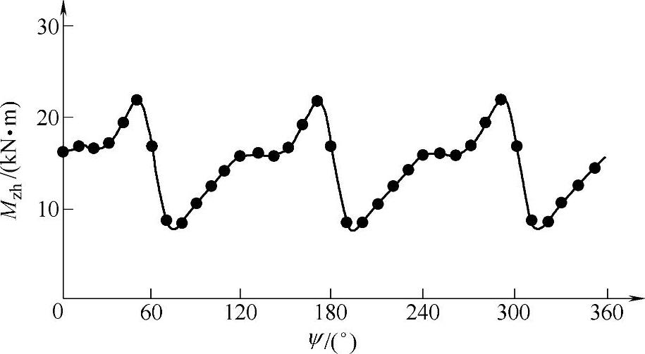

图4-7 偏航力矩随叶片方位角的变化

5.塔架上的载荷

作用在塔架上的载荷包括扭矩和两个方向（轴向和侧向）的弯矩以及塔顶上的重力载荷。塔架上的载荷除了由偏航系统传递的载荷外，还包括直接作用在塔架上的空气动力载荷和塔架自身的重力载荷。

机舱和塔架上的空气动力载荷F_(e)（N）可以由式（4-22）计算：

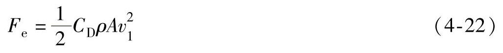

式中 C_(D)——阻力系数；

A——垂直于来流的投影面积，单位为m²；

v₁——来流速度，单位为m/s。

需要指出的是上面所述的风力机载荷计算方法是没有采用风力机气动弹性模型，当考虑风力机气动弹性时，由于风力机的一些部件，如叶片、塔架会产生动力响应，从而产生交变的载荷。目前，已有一些专用软件，可以计算风力机载荷。

## 第二节 载荷分析

风力发电机组的载荷种类多，作用形式复杂。而且多数载荷为随机载荷。本节介绍随机载荷的分析和合成方法。

### 一、疲劳载荷

1.基本概念

在疲劳强度设计中，首先应该解决的问题就是确定作用在风力发电机组上的载荷。实际服役中的风力发电机组所承受的载荷，一般可分成两种：一种是有确定的规律变化的载荷；另一种是不确定的幅值和频率随时间变化而变化的载荷，这种载荷称为随机载荷，如图4-8所示。

风力发电机组承受的载荷，大都是一个连续的随机载荷。载荷的峰值和谷值随时间变化的过程称为“载荷-时间历程”。真实的载荷-时间历程是千变万化的，且容量大、时间长，看起来杂乱无章，但它可用概率和数理统计的方法来描述。

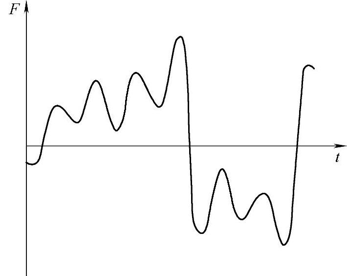

图4-8 随机载荷-时间历程

为了压缩时间，便于进行风力发电机组的疲劳试验和疲劳寿命估算，需要对实测的载荷-时间历程加以简化，简化成能反映真实情况，具有代表性的“典型载荷谱”。通常是将随机载荷简化成按一定程序施加不同幅值的“程序载荷谱”。该谱的每个周期由若干级恒幅载荷循环组成，同一级的载荷循环称为一个“程序块”，每一周期内的程序块按一定规则排列而成。图4-9所示为按低-高-低序列编成的载荷谱。

由实际的载荷-时间历程简化成典型载荷谱的过程，称为“编谱”。编谱时必须遵循损伤等效原则。即能把一个连续的随机载荷对零件所造成的损伤当量定量地反映出来。

由于载荷谱具有典型性、集中性和概括性的特点，因而成为疲劳试验的基础，也是疲劳寿命估算的依据。

载荷谱除了以载荷-时间历程给出外，还常用力矩-时间历程，转矩-时间历程等形式给出。

把载荷-时间历程简化成一系列的全循环或半循环的过程叫“计数法”。其实质是从构成疲劳损伤的角度，研究复杂应力波形中某些量值出现的次数，并对同类量值出现的次数加以累计。实践证明，同一载荷-时间历程，使用不同的计数法，编出的载荷谱差别很大。

图4-9 程序载荷谱

目前，已有十多种计数法，就其所计对象的特征而论，大体上可分为三大类；

1）峰值计数法；

2）穿级计数法；

3）振程计数法。

从统计参数多少，又可分为二大类：即单参数法和双参数法。

单参数法是指只考虑载荷循环中的一个变量，如变程（相邻的峰谷值之差）。双参数法则同时考虑两个变量，如变程和均值，这就把疲劳载荷的固有特性都描述出来了。

2.雨流计数法

当前国内外在处理疲劳载荷中，用得最多的是“雨流计数法”。该法在计数原则上有一定的力学依据，并具有较高的正确性，也易于实现自动化。

如图4-10a所示。对一个实际的载荷-时间历程，取一垂直向下的纵坐标轴表示时间，横坐标轴表示载荷。这样载荷-时间历程形同一座宝塔，雨点以峰值、谷值为起点向下流动，根据雨点向下流动的迹线，确定载荷循环，这就是雨流法（或称塔顶法）名称的由来。其技术规则为：

图4-10 雨流计数法原理

a）计数法 b）应力-应变回线

1）雨流的起点依次在每个峰（谷）值的内侧开始。

2）雨流在下一个峰（谷）值处落下，直到对面有一个比开始时的峰（谷）值更大（更小）值为止。

3）当雨流遇到来自上面屋顶流下的雨时就停止。

4）取出所有的全循环，并记下各自的振程。

5）按正、负斜率取出所有的半循环，并记下各自的振程。

6）把取出的半循环按雨流法第二阶段计数法则处理并计数。

根据上述规则，图4-10a中的第1个雨流应从O点开始，流到a点落下，经b与c之间的a′点继续流到c点落下，最后停止在比谷值O更小的谷值d的对应处。取出一个半循环o-a-a′-c。第2个雨流从峰值a的内侧开始，由b点落下，由于峰值c比a大，故雨流停止于c的对应处，取出半循环a-b。第3个雨流从b点开始流下，由于遇到来自上面的雨流o-a-a′，故止于a′点，取出半循环b-a′。因b-a′与a-b构成闭合的应力-应变回线，则形成一个全循环a′-b-a。一次处理，最后可以得到在图4-9a所示的载荷-时间历程中三个全循环：a′-b-a，d′-c-d，g′-h-g，和三个半循环：o-a-a′-c，c-d-d′-f，f-g-g′-i。

图4-10b所示为该载荷历程作用下的材料应力-应变回线，可见与雨流法计数所得结果是一致的。

一个实际的载荷-时间历程，经过雨流法计数并取出全循环之后，剩下的半循环构成了一个发散-收敛的载荷谱，按上述雨流法规则无法继续计数，借用技术方法既麻烦又增加了误差。如把它改造一下使之变一个收敛-发散谱后，就可继续用雨流法计数，这就是雨流法计数第二阶段。

图4-11a为一发散-收敛谱，从最高峰值a₁或最低谷值b₁处截成两段，使左段起点b_(n)和右段末点a_(n)相连接，构成如图4-10b样的发散-收敛谱，则继续用雨流法计数直到完毕。

图4-11 雨流法第二阶段计数原理

a）改造前 b）改造后

如果用双参数雨流法，其计数结果以矩阵形式给出最为方便和清楚。

图4-12示出了雨流法计数结果，表中峰值和谷值读数各分成11组，组距为2。在组限一栏内只标明了下限0、2、4、…、20。阵内的数值表示循环频数。例如，峰值（组中值）为11，谷值（组中值）为9的载荷循环，共发生45次。方阵内同一条“左上右下”对角线上的数值代表具有相同幅值的循环频数；同一条“左下右上”对角线上的数值，则代表具有相同均值的循环频数。这样，从表中可清楚看出任一幅值和均值发生的频数。一般以幅值和均值作为两个参数，图4-12对此双参数提供了充分的统计资料。

3.载荷谱编制

对随机载荷进行了雨流法统计处理之后，根据得到的幅值频率做出直方图判断属于某种分布，有正态分布、威布尔分布、瑞利分布和极值分布等，其中常用的有正态分布和威布尔分布两种。然后用相应的概率坐标纸检验，最终确定属于的分布形式。

正态频率分布函数形式为

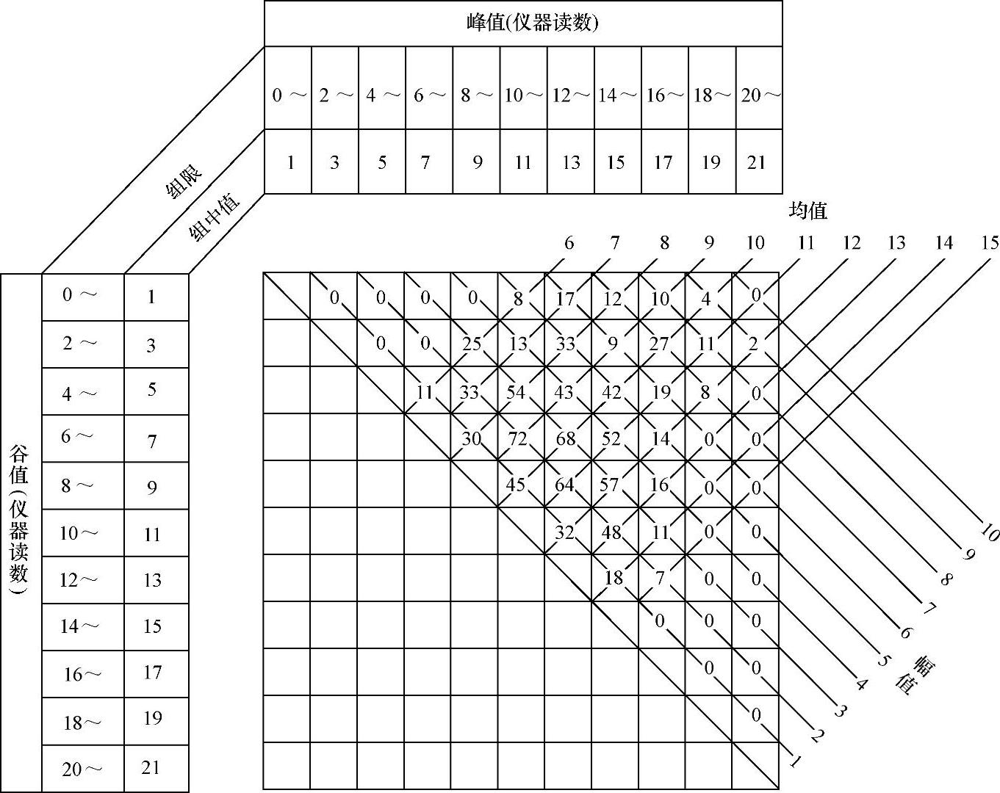

图4-12 雨流法计数结果

式中 A——幅值；

σ——母体标准偏差；

μ——母体均值。

威布尔频率分布函数形式为

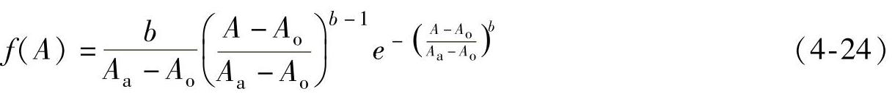

式中 A_(o)——最小幅值；

A_(a)——特征参数；

b——形状参数。

在疲劳研究中，为了便于试验和计算，常将随机载荷统计的结果以累积频数曲线表示。如图4-13中的光滑曲线。

编谱时，首先应该指定一个包括所有状态谱时间T_(s)。即所编典型谱代表多少工作小时。其次，应根据风力发电机组实际使用或计划使用的结果，给出各种载荷状态在整个寿命周期内所占的比例。据此推知在谱时间T_(s)内幅值发生总频数，再乘以对应状态的超值频数频率，即得超值累积频数。然后以幅值为纵坐标，超值累积频数为横坐标（对数坐标），由光滑曲线联结各点，即得累积频数曲线。

在目前所有的计数法中，都未计及载荷循环先后次序的影响。为此，将简化后的程序载荷谱周期取得短一些，则载荷先后次序的影响对试验结果会减至最小程度。表4-1给出了荷兰国家宇航试验室的试验结果。

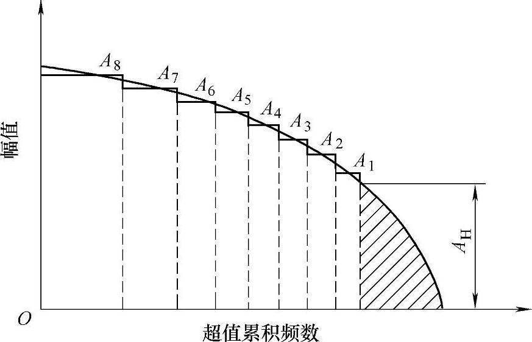

图4-13 累积频数曲线

表4-1 载荷循环先后次序的影响

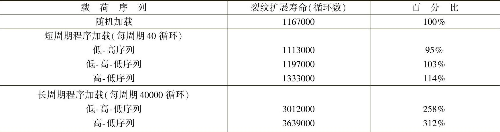

由表4-1可见，在长周期程序加载下，采用低-高-低加载序列，则裂纹扩展寿命为随机加载3倍，而在短周期程序加载下，对寿命扩展影响不大。

试验用程序载荷谱，一般分为8级左右。如图4-13可根据累积频数曲线求得各幅值A₁、A₂、…、A₈的频数n₁、n₂、…、n₈。最后简化成图4-14中的程序块。

图4-14 四种不同加载次序

a）低-高 b）高-低 c）低-高-低 d）高-低-高

正如图4-14所示，加载次序常分为四种，即a）低-高，b）高-低，c）低-高-低，d）高-低-高。试验证明，其中，c及d的加载次序较接近随机载荷情况。为了减少加载次序对试验结果造成的影响，应实行短周期加载，一般在试样寿命周期内重复10～20次。

4.等效载荷

一旦建立了风力机设计寿命期内各种运行模式下的载荷谱，便能方便地定义对应等效循环数n_(eq)的所谓等效损伤载荷范围S₀。这就是导致由各种循环次数n_(i)相应的应力范围S_(i)组成的真实载荷谱同样累积损伤的一个恒定载荷范围S₀。如果选定或规定等效循环数n_(eq)，等效载荷范围S₀可根据下式求得：

式中 m——材料S-N曲线的斜率。

### 二、极限载荷

风力机在进行抗极载荷破坏设计时，需要得出其极限载荷响应，此时的极限载荷分布很有意义。通常考虑如下载荷工况：

1）切出风速附近10min平均风速下的正常运行；

2）50年一遇10min平均风速下的停机状态；

3）保护系统故障、高风速下的故障运行。

对于上述载荷工况，假定通过气弹仿真得到n个10min时间序列载荷响应X。下面的量与从n个时间序列中得到的载荷响应X有关：

1）均值μ；

2）标准偏差σ；

3）偏斜度α₃；

4）峰度α₄；

5）均值μ上的比率ν_(μ)；

6）10min最大值x_(m)。

10min载荷响应X最大值X_(m)不是一个固定值，但有其固有的可变性，可以由一个概率分布来表示。这种固有的可变性用n个仿真时间序列的不同x_(m)值来反应。10min最大载荷响应的均值由μ_(m)表示，标准偏差由σ_(m)表示。对于设计而言，特征载荷响应通常取10min最大载荷响应分布的某个分位数。

有两种不同的基本方法来预测最大载荷响应及其分布的特定分位数：

1）统计模型：它利用了从以n个仿真最大值x_(m)表示的n个仿真时间序列得到的最大载荷响应的信息。

2）半解析模型：基于随机过程理论，它利用了以4个统计矩μ、σ、α₃和α₄以及交叉比率ν_(μ)表示的载荷响应过程的信息。

在随后的内容中将对两种方法及其精度水平进行讨论。

1.统计模型

10min最大载荷响应X_(m)可以假定趋近于冈贝尔分布，即

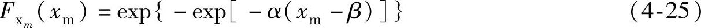

式中 α——尺度参数；

β——位置参数。

n个仿真时间序列有n个最大载荷响应观察值X_(m)。为了估计α和β，n个值X_(m)按照从小到大的顺序排列，即X_(m，1)，…，X_(m，n)。利用这些数据可以计算得到两个系数b₀和b₁，即

而α和β可以由下式估计：

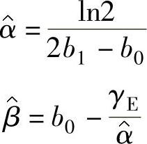

式中 γ_(E)——欧拉常数，γ_(E)=0.57722。

X_(m)的平均值和标准偏差通过下式分别进行估计：

X_(m)分布的θ分位数通过下式进行估计：

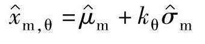

式中

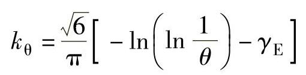

θ分位数估计的标准误差通过下式进行估计：

对于θ分位数由均值μ_(m)取代的特殊情况，上式简化为

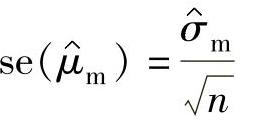

假定θ分位数估计为正态分布，则其1-α置信度下θ分位数的双边置信区间变成

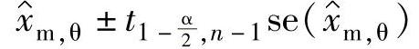

式中 ——具有n-1个自由度的Student’s t分布的1-α/2分位数。

如果目的是得到指定置信度下的特征值，则通常取置信度的上限值，也就是说只考虑单边置信区间。带置信度1-α的特征参数变为

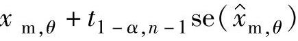

应该注意的是，为了获得足够精确的x_(m)，θ或_(μm)估计值，需要足够多的仿真次数n。

例如，考虑一个载荷响应过程X，它的10min极限值X_(max)根据n=5次的10min仿真时间序列进行估计。关于极值分布的估计如下：

求当分位数θ=95％时，即1-α=95％时的X_(max)估计。给定k_(θ)=1.866。95％分位数下X_(max)的中心估计值为

此估计下的标准误差为

Student’s t分布下的相关分位数t_(1-α/2，n-1)=2.78，x_(m，95％)的双边置信区间变成了4.673±2.78×0.413=4.673±1.148，这表示在中心估计值附近有很宽的区间。如果n由5次变为100次，则区间大大缩小为4.673±0.183。

2.半解析模型

半解析模型是由达文波特（1961）给出的，它利用了n个10min载荷响应时间序列更多的信息，而不仅仅是n个最大响应值x_(m)。载荷响应X可以看作10min序列的随机过程。过程X可以看作母标准高斯过程U的二次变换，即

X=ζ+η（U+εU²）ε＜＜1

下列表达式给出了系数的一阶近似：

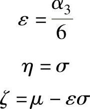

其中用到了载荷响应过程X的均值_(μ)，标准差σ和偏斜度α₃。

X_(m)的均值和标准偏差的估计分别为

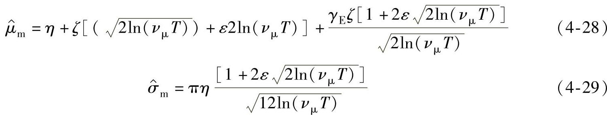

对应地，T表示持续时间，通常指仿真时间序列长度，也就是T=10min。对应地冈贝尔分布参数α和β的估计表示为

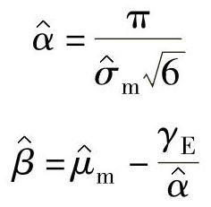

均值的标准误差为

式中 n——样本尺寸，也就是上式中估计_(μm)的10min序列个数。

如果认为通过式（4-29）可以准确确定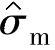，则1-α置信度下μ_(m)的双边置信区间为

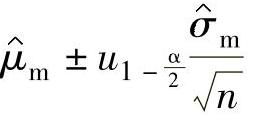

式中 ——标准正态分布函数的1-α/2分位数。

3.两种模型的比较

半解析结果通常可以提供比统计结果更高精度的极值估计，这是因为半解析方法比统计方法利用了更多的信息。换句话说，为了获得同样精度的极值估计，半解析法比统计方法需要更小的采样尺寸n。因此建议，在预测极限载荷时，通常采用基于仿真载荷响应过程统计的半解析法，而不是仅仅采用最大观测值。

两个或更多随机选择的10min仿真时间序列可能给出十分不同的极限值。这就意味着如果只通过少数次仿真，选取平均极限载荷或最大载荷作为破断载荷，而不对极限载荷的统计特性进行恰当的考虑，将不会得到可重复的结果。进一步而言，该结果不能外推得到由分位数确定的特征值，也不能推广到持续时间不同于10min的载荷工况。半解析法考虑了极限载荷的随机特性，为通过载荷响应仿真时间序列对极限载荷进行分析提供了一种基本方法。

4.周期载荷的修正

前面介绍的半解析模型能够对不在运行状态的风力机的极限载荷提供十分准确的预测。对于运行状态下的载荷工况，必须考虑某些载荷其响应均值和标准偏差所具有的周期性。为此，可以采用一种基于方位“分仓（binning）”的方法。利用这种方法，风轮盘被划分为若干个扇区，每个扇区利用其方位角进行区分，当风轮盘被离散成m个等直径等角度的扇区时，载荷响应过程的扇区均值以及标准偏差就可以通过下面的式子建立：

式中 μ，σ——载荷响应X的平均值和标准偏差。

令α和β表示在时间历程T下正则化过程（X-μ）/α最大值的冈贝尔分布的分布参数，他们可以通过上述分析模型确定。时间历程T内所有扇区中X的最大极限值X_(max)的平均值μ_(m)的下限为

时间历程T内所有扇区中X的最大极限值X_(max)的平均值μ_(m)的上限为

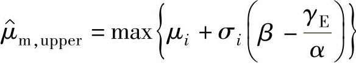

关于此方法的详情参见Madsen等（1999）的相关研究。建议将风轮盘离散成m=36个扇区。

### 三、载荷叠加

当几个载荷进程同时作用时，设计时就必须考虑结构的组合载荷效应。例如，海上风力机的基础结构会受到风载荷和波浪载荷的联合作用，由此所造成的结构响应支配着设计。另外一种可能的组合载荷是风载荷和覆冰载荷的组合以及潮汐载荷与前面提到的任何一种载荷的组合。

下面考虑风载荷与波浪载荷的组合。短期风气候通常用10min平均风速v₁₀来表示，而短期波浪气候通常用有效波浪高度H_(s)来表示。其中v₁₀和H_(s)分别理解为对应的风速强度和海面变化过程的强度。特定位置的风和波浪常常有共同的原因，譬如低气压。风推动波浪并且通常产生在局部地区，与此同时，由于波浪所造成的海平面粗糙度的变换又反过来影响风。海浪越高意味着风越大，反之亦然。

在设计中考虑风和浪同时发生时它们之间这种强烈的关联性是十分重要的。在进行随机分析时，这种相关性可以这样建立：将其中一个环境变量通过边际累积分布函数定义为独立变量，然后利用分布条件将其他变量用独立变量表示。就拿风和浪的例子来说，可以通过浪高的长期边界分布来表示有效波浪高度H_(s)，它是一个典型的威布尔分布，接着利用它来建立10min的平均风速v₁₀。在H_(s)条件下的v₁₀分布可以用一个典型的对数正态分布来表示，即

式中 Φ——标准正态分布函数；

b₁、b₂——有效波浪高度H_(s)的函数，即b₁=b₁（H_(s)），b₂=b₂（H_(s)）。

在某些情况下，其他一些分布形式可能会比对数正态分布更好地表示H_(s)条件下的v₁₀，如威布尔分布。

一旦风气候和波浪气候以特定并行的v₁₀和H_(s)值给定，以v₁₀为条件的风速过程和以H_(s)为条件的波浪过程便可以看成是相互独立的。因此，不能理所当然地认为最大风速和最大波浪高度同时发生。

设计时，合理的做法是考虑那些相对较为罕见的波浪气候和风气候的组合作为特征气候，然后找出这一时间内在该气候条件下发生的最大载荷响应。事实上，譬如可以考虑以50年重现周期的有效波浪高度作为波浪气候与在这个波浪气候下的风气候进行组合，如50年有效波浪高度下v₁₀的期望值或者较高分位数的v₁₀值。以上述罕见的特征波浪气候和风气候为基础，下面将讲述如何对载荷响应进行组合，如可以确定在这样的气候条件下，基础结构某些截面上的水平力。

对于线性载荷组合，Turkstra准则起着核心的作用。该准则指出两个独立随机过程联合作用的最大值发生在其中一个过程达到最大值时。对两个载荷过程的组合中应用Turkstra准则，如波浪载荷与风载荷，意味着当波浪载荷与风载荷之一达到最大时组合载荷便达到最大值。令Q₁和Q₂分别来表示两个载荷过程，则最大组合载荷Q_(max)在时间跨度T内的数字表示式为

Turkstra准则显示了在确定性设计中两个载荷的组合的既定格式，即

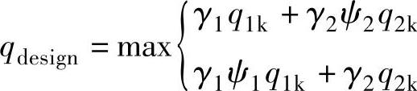

式中 q_(1k)、q_(2k)——Q₁和Q₂的特征值；

γ₁、γ₂——相关的部分安全因子；

ψ——载荷组合系数。

对于风力机结构，通常所用的最大载荷响应并不总是通过载荷的线性组合来给出的。气弹风载荷计算可能是非线性的，因此风载荷响应与波浪载荷响应的组合并不一定来源于单独计算的波浪载荷响应与单独计算的风载荷响应的线性组合。对于这样的非线性情况，组合响应将通过同时处于特征波浪载荷过程和风载荷过程下结构的恰当分析来计算，在计算过程中不考虑任何部分载荷因子。分析得到的最大载荷响应可以认为是特征载荷响应，它反映了波浪载荷和风载荷的组合作用。在这个特征载荷响应基础上采用一个共同的部分安全因子来给出设计值q_(design)，也就是说不再可能将风载荷和波浪载荷下的部分安全因子区分开来。

## 第三节 载荷的计算

在风力发电机组的载荷计算时，需要大量的计算和数据处理工作量，人工计算是无法完成的，必须使用专业的风力发电机组设计软件和载荷计算软件进行计算，尤其是风力发电机组的时域仿真，及后处理过程，专业的软件可以节省很多人力，也可以避免人为失误影响载荷计算结果的可靠性。另外当某些风力发电机组参数或工况参数发生改变时，可以很方便地重新计算。这里以沈阳工业大学开发的“大型风力发电机组设计软件-eWind”为例介绍风力发电机组载荷的计算过程。

“大型风力发电机组设计软件-eWind”是在863课题的基础上开发的针对大型风力发电机组设计领域的应用软件。在该系统中，根据风资源情况和不同类型实时设计风力发电机组整机参数和各个零部件的参数，校验参数是否满足设计模版中的约束条件，并结合整机设计技术参数模型，提供相应的分析计算，对大型风力发电机组系统控制逻辑的模拟仿真，实现了风流场计算、机组结构设计、电控系统设计的过程协同，圆满地解决了机组的结构布局优化、优质高效风电能转换和运行的安全可靠等问题。风流场计算是根据IEC61400.1-2005中规定的风力发电机组设计荷载工况的条件，对风力发电机组进行三维建模分析计算，模拟机组运行时的各种载荷工况需要的环境数据，得到计算数据从而对机组的设计进行校核优化。风轮载荷计算是基于叶素-动量理论编制的风轮功率特性及叶片载荷计算软件，根据叶片气动参数、整机参数和控制算法可以仿真出风轮功率特性和载荷分析。对于机组主要机械零部件根据通过初步校核的参数自动生成三维模型，通过零部件有限元计算分析子软件进行机组主要机械零部件应力和强度等计算分析。该系统主要实现项目管理、风力发电机组设计、零部件导入、参数设置、风流场计算、风轮载荷计算、电控系统设计仿真、主要机械零部件优化分析等功能。eWind软件由如下模块组成：

1）eWind.Design：根据风资源情况和不同类型实时设计风力发电机组整机参数和各个零部件的参数，校验参数是否满足设计模版中的约束条件，并结合整机设计技术参数模型，提供相应的分析计算。

2）eWind.AeroLoads：基于叶素-动量理论及其修正，可以计算风轮的气动特性和叶片各截面载荷，进一步计算叶根、轮毂中心、塔筒载荷。并且，可以结合外部控制程序进行气动特性和载荷的动态模拟计算。

3）eWind.LoadCase：辅助设置工况并生成批处理计算文件，根据工况设计表可以进行独立工况的设置，也可以进行多个工况的设置。对于相同的工况设计表可以使用模板进行工况设置，极大提高了风电机组载荷计算效率。

4）eWind.LoadPost：载荷后处理可以对eWind.AeroLoads软件的计算结果文件进行操作，进行后处理计算。可以输出多个变量随时间变化的图像、极限载荷图表、等效载荷图表，便于查看结果的正确性。

风力发电机组载荷的计算过程见下述。

### 一、建立机组模型

1.数据采集

在载荷计算项目启动时，首先将载荷计算需要的参数输入eWind中，建立项目文件并进行校验。图4-15所示为输入界面。

图4-15 数据采集输入界面

2.模型建立

eWind根据《载荷计算参数采集表》把数据填入相应的模块中，也可以根据已有的项目文件导入，并有针对性的修改，使其与《载荷计算参数采集表》一致。验证不通过的数据，要重新确认并通过。图4-16所示为模型建立和验证数据界面。

3.模型校核

机组建模后生成的项目文件，提交相应人员校对审查，以确保机组模型准确无误。校核步骤如下：

1）对照机组模型参数及机组参数采集表。

2）进行试算，查看机组的性能：叶片的性能曲线，校核机组的最优桨距角；校核机组的功率曲线，查看机组的功率曲线是否平滑，功率大小是否为额定功率，桨距角变化是否平滑，最大风能利用系数的持续风速区间，包含风能分布最大的风速。机组的切入风速时是否有功率产生；校核风力发电机组的模态频率。

4.仿真调试

动态仿真机组参数的确定，主要包括：

（1）额定功率以下运行时的桨距角 利用eWind.AeroLoads软件中的稳态计算项，设置不同的桨距角，对叶片的性能计算。比较各条曲线，选择的桨距角对应的功率曲线应该综合考虑如下条件：最优尖速比在设计尖速比附近；最大风能利用系数在设计风能利用系数附近；在最优尖速比与切出风速对应的尖速比之间的尖速比范围内，当桨距角变大时，风能利用系数应变小。

（2）机械制动力矩 机械制动力矩的确定方法：选择应用机械制动的工况（检验制动器的工况），机械制动应能保证在应用机械制动的情况下，风轮的旋转满足如下条件：在应用机械制动的情况下，发电机转子的旋转速度小于1度/秒的概率大于90％，以确保人可以在大多数情况下可进行插销动作。

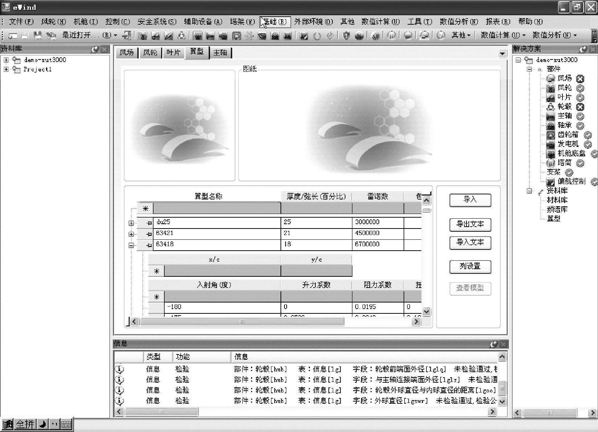

图4-16 模型建立和验证数据界面

（3）应用机械制动时的转速 应能保证在维修时，大部分的时间内都可以进行机械制动，假设应用机械制动时，机组处于空转状态，应能保证有故障的空转状态下，不能使用的机械制动的转速超越概率为一年一遇。

（4）额定转速 如果叶片厂家没有提供叶片的额定转速，利用eWind.AeroLoads软件，计算出机组的稳态功率曲线，然后根据稳态功率曲线结合发电机的转速确定。叶尖最大线速度不大于设计要求。

（5）额定风速 计算出机组的稳态功率曲线，然后根据稳态功率曲线确定额定风速。

（6）变桨距速率 变桨距最大速率的确定：变桨距速率引起的机舱水平方向加速度在限值范围内；变桨距最大速率应能使机组运行在最大转速以下；变桨距速率应满足正常发电时的所需的变桨距速率要求，应大于正常发电时超越概率为一年一遇的变桨距速率。

### 二、工况设定

根据当前采用的载荷计算标准在eWind.LoadCase中选择相应的工况模版（见图4-17），对载荷计算所涉及的工况项目进行规定，以满足设计及认证的需要。具体工况设计依据相应《载荷工况设计表》。

### 三、仿真计算

将eWind.LoadCase生成的项目批处理文件导入到eWind.bath中进行批量仿真计算，根据实际任务量和计算机的资源选择多进程和多台计算机进行计算。

### 四、后处理

载荷计算的后处理，eWind.Loadpost涵盖了目前机组设计及认证对载荷报告的要求内容，对极限工况极限载荷的提取，寿命周期疲劳载荷的统计，以及对机组性能的评估结论。

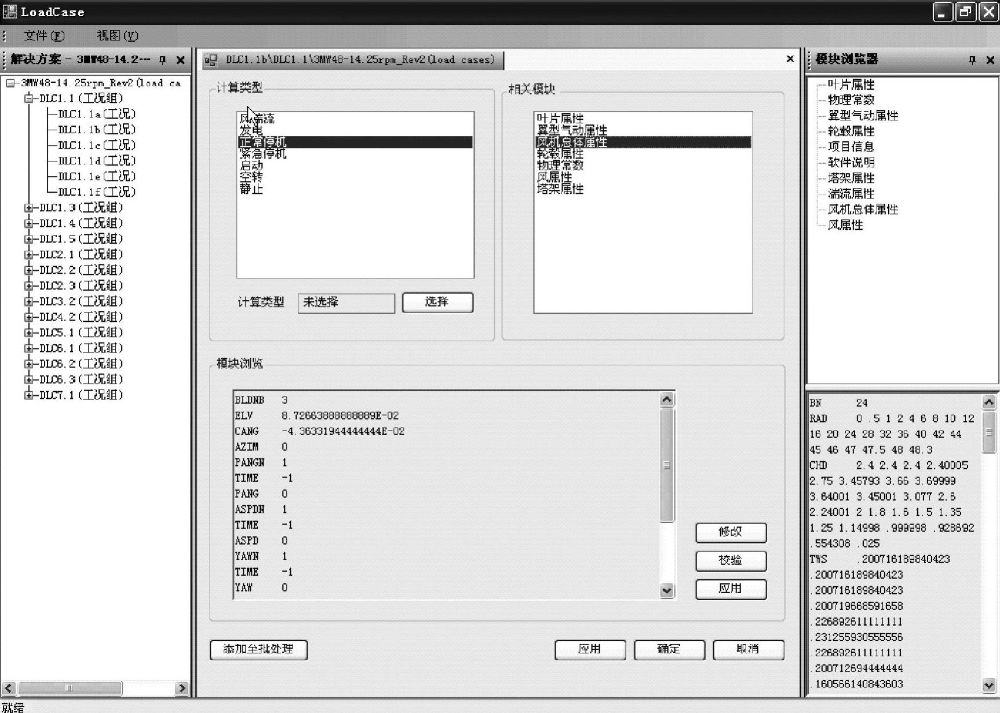

图4-17 工况设定模版

塔架各个截面的极限载荷，塔架焊缝处的等效疲劳载荷，塔架门处、塔顶塔底塔架法兰处的时序载荷谱及疲劳载荷的极值。

1）极限载荷：形式为极限载荷及其同期值表，载荷对比柱状图的生成（见图4-18）；

2）疲劳载荷：内容为等效疲劳载荷，工况频率表，雨流计数图及表格（或马尔科夫矩阵），LDD，工况时序载荷文件；

3）基本统计；可以求出变量的最大值，最小值、平均值、方差；

4）概率统计：可以求出变量的概率分布；

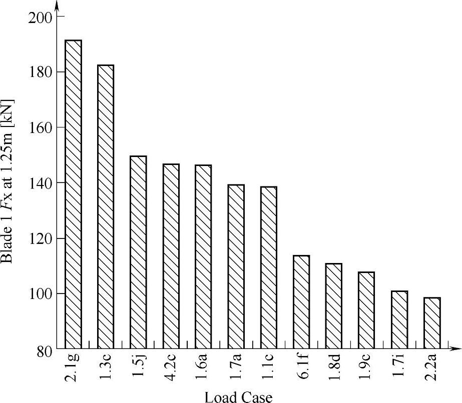

图4-18 在叶根1.25m处载荷Fx

5）性能计算：动态功率曲线，年发电量；

6）动力学分析：整机坎贝尔图分析（塔架模态分析）；

7）其他：控制转矩表，推力系数等图表，净空计算。

