# 5 总体设计

风力发电机组的总体设计是相对于局部设计的一个概念，总体设计是设计内容的一部分。主要包括总体参数设计、总体功能设计、总体布局设计、模型试验和总体成本模型等。

## 第一节 总体参数设计

总体参数是涉及风力发电机组总体结构和功能的基本参数。主要包括设计风速、风轮转速、发电机的额定转速和转速范围、重要几何尺寸、总质量与质心、年发电量等。

在总体参数设计之前，应该仔细阅读《风力发电机组设计任务书》和相关的设计标准，掌握足够的已知条件。如：风力发电机组的安全等级、额定功率、外部条件和设计寿命等。

额定功率是正常工作条件下，风力发电机组的设计要达到的最大连续输出电功率。它是风力发电机组设计最基础数据，单位为kW或MW。风力发电机组安全等级Ⅰ到Ⅲ的设计寿命至少为20年。

### 一、设计风速

风电系统输出的电功率与风力发电机组设计风速密切相关，所谓设计风速一般包括额定风速v_(r)、切入风速v_(in)、切出风速v_(out)。

1.额定风速

额定风速是风力发电机组达到额定功率输出时规定的风速，用v_(r)表示，单位为m/s。大型风力发电机组额定风速一般为10～15m/s。

额定风速是风力发电机组的基本设计参数，且与风力发电机组额定功率相对应，直接影响到风力发电机组的总体构成和成本。

确定合理额定风速的基本原则是使风力发电机组产生尽可能多的有效功率。一般应根据最低单位功率成本来确定，或以单位投资获得最大风能量的原则来选取。

额定风速取决于风力发电机组所在区域的风能资源分布，需要事先掌握平均风速及其出现的频率。可以参照风速条件，按一定的原则评估额定风速。

2.切入风速

切入风速是风力发电机组开始发电时，轮毂高度处的最低风速，用v_(in)表示，单位为m/s。大型风力发电机组切入风速一般为3～4m/s。

3.切出风速

切出风速是风力发电机组达到设计功率时，轮毂高度处的最高风速，用v_(out)表示，单位为m/s。大型风力发电机组切出风速一般为25m/s（海上达30m/s）。风速达到切出风速时，需实施关机以保护风力发电机组。这种情况较少发生，对发电量没有太大影响。

风力发电机组的电功率一般从切入风速开始产生，克服传动系统和发电机的效率损失并产生有效功率。切入风速到额定风速间的电功率输出随风速大致呈指数变化，而在额定风速与切出风速之间的电功率需保持为常数，当风速达到切出风速时风力发电机组将实施制动关机。

4.设计风速的选择原则

实际上，对设计风速参数的分析过程，最重要的是合理选择额定风速，据此参数可以基本决定切入风速，并限定切出风速的范围。风速达到切入风速时风能才足以克服风力发电机组的系统损失，并输出有效电功率。从风力发电机组的利用角度考虑，当然希望切入风速更低些，以获得尽可能多的发电量，但设计还应综合考虑其他因素，比如过低的切入风速会导致风力发电机组相应部件的成本提高。同样，切出风速高，可以更有效地利用风能，但对结构强度和控制系统等方面的设计要求会随之提高，会导致风力发电机组制造成本的增加。因而，除非为了特定的目的取很小的额定风速，一般情况下取v_(out)＜2.5v_(r)。

出于扩大设备的生产规模和降低制造成本的考虑，以往欧美国家的风电制造企业一般选择两种额定风速作为设计值：11m/s，用于平均风速小于6m/s的风场；13或14m/s，用于平均风速较高的风场。此种选择对大批量生产很实用，但有鉴于目前风力发电场大型化的发展趋势，简单的估算和选择风力发电机组额定风速可能对风力发电机组的发电量产生较大影响。额定风速对平均功率往往起到决定性的作用，额定风速取值偏低，风力发电机组将损失掉高于额定风速时的很多额外功率；而过高的额定风速可能会使风力发电机组难以发挥出应有的能力，损失较多的低风速风能。有鉴于风力发电机组的设计目标往往是获得较低的单位发电成本，而不是单纯追求最大的功率输出。过大的额定功率设计取值，可能导致风力发电机组总体及其部件的成本构成不合理。综合来看，从经济性方面考虑，实际的工程设计中通常取稍小于理论可产出最大发电量的风速作为额定设计风速。

5.影响额定风速选择的其他因素

从降低风力发电机组成本角度考虑，偏高的额定风速将使风力发电机组很少能达到额定功率，传动系统、发电机等会经常出现大马拉小车现象，导致单位能量成本的偏高；但若额定风速偏低，则会加大风轮支撑部件的负载范围，使这些部件的成本相对发电量偏高。表5-1列出了额定风速与风力发电机组主要部件成本的统计关系（额定功率1.5MW，D=60m）。可见，风力发电机组额定风速的选择不仅与当地的平均风速有关，还应充分考虑风力发电机组构成形式对设计成本的影响。

设计风速的选择还要考虑到风力发电机组功率调节与控制形式，采用变桨距控制方式运行的风轮功率和相应的载荷较平稳，可选择较低的额定功率，以使风力发电机组能够在较大的风速范围工作；而采用失速方式调节功率的风力发电机组一般选择相对较高的额定风速，以更有效地利用其在失速风速前的额定区间工作。

表5-1 额定风速与风力发电机组主要部件成本的统计关系（额定功率1.5MW，D=60m）

### 二、风轮转速

风轮的输出功率与其转矩和转速有关。由风轮转矩M=9550P_(N)/n可知，当额定功率P_(N)（kW）已选定时，风轮转速n（r/min）与转矩M（N·m）成反比，为降低转矩M，应提高风轮转速，但转速过高对风轮的设计不利。所以应选择一个合适的风轮转速。

1.风轮转速和实度的理想关系

可以推出，当忽略阻力和叶尖损失，且风轮叶片具有最佳性能时，其参数应满足的理想关系为

式中 λ——叶尖速比；

σ_(r)——叶素实度；

C₁——翼型升力系数；

μ=r/R；

R——风轮半径；

r——叶素到风轮中轴的距离。

因为叶片远离叶根的部分提供大部分功率，局部速比λ_(μ)较大，以至于可以近似的取式（5-1）的分母（平方根）为λμ，则式（5-1）变成

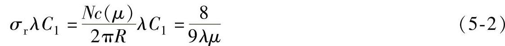

式中 N——叶片数；

c（μ）——半径r处的叶素弦长。

由式（5-2），有

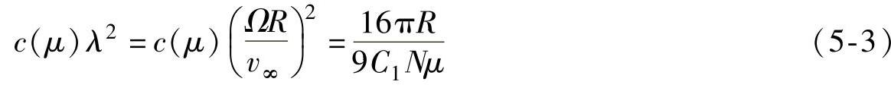

式中 Ω——风轮旋转角速度，单位为1/s；

v_(∞)——风速，单位为m/s。

由式（5-3）可见，若N、R不变，通过变桨距使攻角不变，则升力系数C₁为定值，因此，半径r处的叶素弦长与风轮转速Ω的平方成反比。

应该指出，对于变桨距机组，如果在整个工作范围内发电状态最佳，则式（5-3）不适用。在这种情况下，半径r处的叶素弦长近似的反比于转速而不是转速的平方。

2.转速对于叶片质量的影响

假设叶片设计取决于平面外的疲劳弯矩和正比于风速波动、转速与弦长比例因子乘积的力矩波动。按式（5-3）弦长比例因子反比于转速的平方，故力矩波动的变化恰好与转速的变化成反比。

各个半径处的厚度对弦长的比与弦长变化没有关系，所以在给定的半径下对于平面外弯曲的叶片截面系数Z（r）正比于叶片外壳蒙皮厚度ω（r）以及局部弦长平方的乘积。因此，

Z（r）∝ω（r）\[c（r）\]²∝ω（r）/Ω⁴ （5-4）

为了将疲劳应力变化保持在同一个等级，需要叶片截面系数Z（r）随力矩波动变化，由于力矩波动的变化与转速的变化成反比。因此，Z（r）∝1/Ω所以ω（r）/Ω⁴∝1/Ω并且ω（r）∝Ω³。叶片质量正比于外壳厚度与弦长的乘积，因此它随转速而增加。

3.最佳风轮转速

经过上述分析得出，叶片质量的增加正比于风轮转速。另一方面，根据叶片平面外的疲劳弯矩设计机舱和塔架，而平面外的疲劳弯矩正比于风速波动、转速和弦长的乘积。而弦长和转速的平方成反比，所以转速和弦长的乘积的结果与转速成反比，也就是叶片平面外的疲劳弯矩与转速成反比。因此转速增加导致叶片重量增加、成本增加，同时转速增加导致叶片平面外的疲劳弯矩减小，机舱和塔架成本减少。两者之间的折中方案决定了最佳风轮转速的选择。

4.噪声控制与视觉考虑

风力发电机组产生的气动噪声正比于叶尖速度的5次方。通常将陆基风力发电机组的叶尖速度限制在65m/s左右。近海的海上风力发电机组叶尖速度可大些，例如74m/s。这是为了减小噪声对环境的污染。

另外，多数人认为，风力发电机组风轮转速越快，看起来越不舒服。这也是限制风轮转速的一个理由。

### 三、发电机额定转速和转速范围

发电机额定转速是其在额定功率运行时的转速。用r/min表示。

根据发电机额定转速的不同，风力发电机组可以分为如下几种。

1.应用异步发电机的风力发电机组

如定速、多态定速和双馈等机型，均采用异步发电机。根据电机学的理论，当异步电机接入频率恒定的电网上时，由定子三相绕组中电流产生的旋转磁场的同步转速决定于电网的频率和电机绕组的极对数，三者的关系为

式中 n₁——同步转速，单位为r/min；

f₁——电网频率，单位为Hz；

p——发电机绕组的极对数。

由式（5-5）可求得，4极电机同步转速为1500r/min，6极电机同步转速为1000r/min。异步电机中旋转磁场和转子之间的相对转速为Δn=n₁-n，相对转速与同步转速的比值称为异步电机的转差率，用s表示，即

当异步发电机的转子在风力机的拖动下，以高于同步转速旋转时（n＞n₁），电机运行在发电状态，电机中的电磁转矩为制动转矩，阻碍电机旋转，此时发电机需从外部吸收无功电流建立磁场（如由电容提供无功电流），而将从风力机中获得的机械能转化为电能提供给电网。此时电机的转差率为负值，一般其绝对值在2％～5％之间，并网运行的较大容量异步发电机的转子转速一般在（1～1.05）n₁之间。

定桨距风力发电机组普遍采用双速发电机，分别设计成4极和6极。一般6极发电机的额定功率设计成4极发电机的1/4到1/5。例如1MW风力发电机组设计成6极200kW和4极1MW。

应用“优化转差”异步发电机，转子转速一般在（1±10％）n₁之间变化。

应用双馈式发电机，转子转速一般在（1±30％）n₁之间变化。

2.应用低速发电机的风力发电机组

直驱型风力发电机组应用多极同步风力发电机可以在低速下运行。由于采用全功率变流器，发电机转子变速范围为50％（约为10～20r/min）。

3.应用中速发电机（“半直驱”）的风力发电机组

“半直驱”型风力发电机组齿轮箱增速比约为1∶10，发电机转子变速范围约为40～150r/min。

### 四、重要几何尺寸

1.风轮直径和扫掠面积

风轮直径决定机组能够在多大的范围内获取风中蕴含的能量。风轮直径应当根据不同的风况与额定功率匹配，以获得最大的年发电量和最低的发电成本。可以配置较大直径风轮供低风速区选用，配置较小直径风轮供高风速区选用。

风轮直径计算方法如下：

风力机风轮输出功率P_(r)，由以下公式给出：

式中 P_(r)——输出功率，单位为W；

ρ——空气密度；取ρ=1.225kg/m³；

C_(p)——风能利用系数；

A——风轮扫掠面积（m²），A=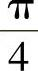D²；

D——风轮直径，单位为m；

v——风速，单位为m/s。发电机额定功率P_(N)（W）

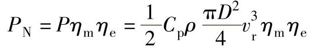

式中 v_(r)——额定风速，单位为m/s；

η_(m)——主传动系统的总效率，在全负载情况下典型值大约为0.95～0.97；

η_(e)——发电系统的总效率，在全负载情况下感应发电机配置大约为0.97～0.98，变流器效率为0.95～0.97。

风轮直径

式中 η=C_(p)η_(m)η_(e)为风力发电机组的总效率。

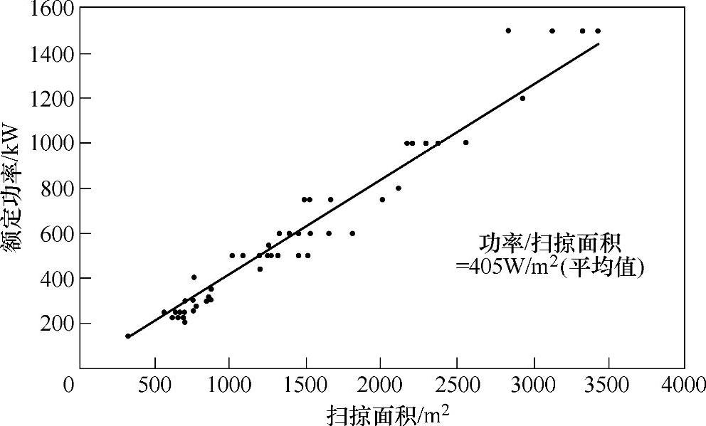

图5-1 风力发电机组额定功率与扫掠面积的关系

风轮的扫掠面积是风轮旋转时叶尖运动所生成的圆在垂直于风矢量平面上的投影面积。风力发电机组的额定功率与风轮的扫掠面积的比值称为风力发电机组的比功率。图5-1所示为实际风力发电机组的额定功率与扫掠面积的关系，由图可见风力发电机组的平均比功率接近一个常数值（约405W/m²）。

【例5-1】 设计风轮直径：假设额定输出功率为3MW，风能利用系数为0.487，额定风速v_(r)为12m/s，主传动系统的总效率η_(m)=0.97，在全负载情况下感应发电机效率为0.97，变流器效率为0.96，则由式（5-8）得

2.轮毂高度

轮毂高度是从地面到风轮扫掠面中心的高度，用z_(hub)表示，单位为m。其求法是

z_(hub)=z_(t)+z_(j)

式中 z_(j)——塔架高度，单位为m；

z_(t)——塔顶平面到风轮扫掠面中心的高度，单位为m。

由于风速的剪切效应影响，大气风速随地面高度的增高而增大，因此普遍希望增高机组的塔架高度，可是增加塔架高度将使其制造费用相应增加，随之也带来技术及吊装的难度，需要进行技术与经济的综合性考虑。

当风力发电机组处于偏离设计风速分布较大的风电场运行时，很有可能难以获得预期的发电效果，在机组的风轮一定的条件下，最佳的弥补方法是改变塔架的高度，使机组能获得满意的风速而运行，为此同一种风力发电机组中，经常配有不同高度的塔筒。

图5-2所示为由统计方法得出的塔架高度与风轮直径的关系。图中表明，风轮直径减小，塔架的相对高度增加。小型风力发电机组受到环境的影响较大，塔架相对高一些，可使它在风速较稳定的高度上运行。25m直径以上的风轮，其轮毂中心高与风轮直径的比基本为1∶1。随着塔架高度的增加，风力发电机组的安装费用会有很大的提高，大型风力发电机组更是如此。

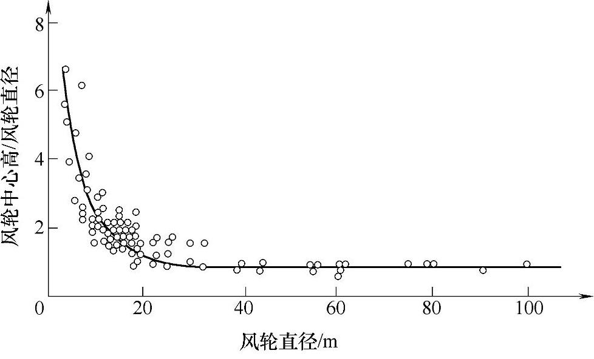

图5-2 塔架高度与风轮直径的关系

### 五、总质量、质心与转动惯量

通常，需要计算机舱（含风轮）的总质量、质心与转动惯量。计算质心的坐标系见第四章图4-1b。

机舱的总质量

m=∑m_(i) （5-9）

式中 m_(i)——第i个部件的质量。

机舱的质心的x轴坐标

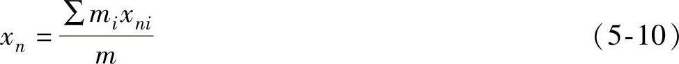

式中 x_(i)——第i个部件质心的x轴坐标。机舱对x轴的转动惯量

类似地，可以求出机舱的质心的y_(n)轴、z_(n)轴坐标以及机舱对y_(n)轴、z_(n)轴的转动惯量。

六、年发电量

风力发电机设计研制中应尽可能多地发出最便宜价格的电能作为衡量其设计好坏的标准。为达此目标，一方面要降低风力发电机的制造成本、运行维护费用；另一方面要在当地风资源的情况下，尽可能使风力发电机的运行工况与风能资源匹配良好，以使风力发电机组获得最大的年度发电量。

已知风力发电机组安装所在地的年风速分布规律及其功率随风速变化的特性，就可方便地计算出该风力机的年度发电量。

1.风速频率的统计特性

风速分布一般均为正偏态分布，风力愈大的地区，分布曲线愈平缓，峰值降低右移。这说明风力大的地区，大风速所占比例也多。由于地理、气候特点的不同，各种风速所占的比例有所不同。

通常用威布尔分布双参数曲线描述风速的分布函数。即

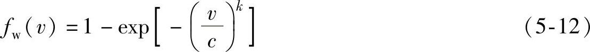

其概率密度函数可表达为

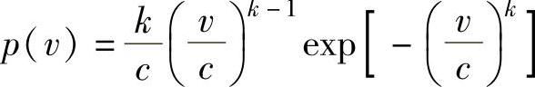

k和c为威布尔分布的两个参数，k称作形状参数，c称作尺度参数。当c=1时，称为标准威布尔分布。形状参数k的改变对分布曲线型式有很大影响。当k=1时，分布呈指数型；k=2时，称为瑞利分布；k=3.5时，威布尔分布实际已很接近于正态分布了，如图5-3所示。

2.风力发电机组的功率曲线

风力发电机组的功率曲线如图5-4所示。曲线①为变速变距风力发电机组的功率曲线；曲线②为变桨距风力发电机组的功率曲线；曲线③为定桨距风力发电机组的功率曲线。

图5-3 威布尔分布双参数曲线

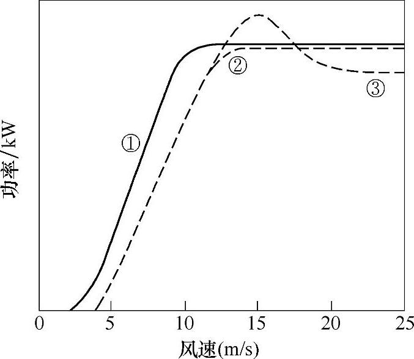

图5-4 风力发电机组的功率曲线

3.年度发电量计算公式

式中 P（u）——功率曲线函数，单位为W；

f_(w)（u）——风速分布函数；

v_(in)——切入风速，单位为m/s；

v_(out)——切出风速，单位为m/s；

N₀=8765h——每年小时数。

【例5-2】 风力发电机组年度发电量的计算：所设计的3MW变桨距风力发电机组，切入风速为4.5m/s，切出风速为25m/s，风速概率曲线如图5-3中的瑞利分布，功率曲线如图5-4中的曲线②所示，则由式（5-13），年发电量

4.图解法（见图5-5）

图5-5的第一象限中给出一台变桨距风力发电机输出功率随风速变化的规律；第四象限中的曲线则描述了各个风速的年累计出现天数；而在第二象限里，曲线的纵坐标仍然是风力发电机组实际发出的不同功率值，其横坐标值是产出对应功率的年统计天数。

所以，第二象限曲线与其横坐标所围成的面积就是该风力发电机组的年度发电量。

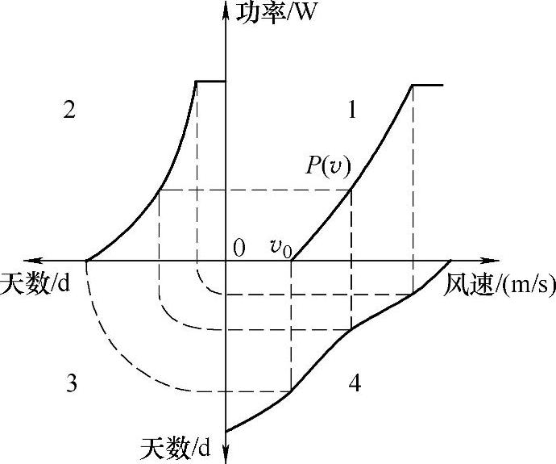

图5-5 年度发电量计算图解

## 第二节 总体功能设计

总体功能设计主要是确定风力发电机组的各种运行功能。如起动和关机功能，并网和脱网功能，功率调节功能，安全保护功能，对风功能等。同一功能可以用不同的方式实现。一个核心问题是功率调节功能设计，它涉及风力机和发电机的选型。

### 一、基于风力机实现的功率调节

基于风力机实现的功率调节主要是在额定风速以上时保持输出功率稳定。基本上有三种方法来进行功率控制：

1）失速控制；

2）变桨控制；

3）主动失速控制。

对于失速控制风力机，叶片是通过螺栓以固定的角度安装在轮毂上的。失速现象用于在风速过高时限制功率输出。原理是通过设计叶片的几何形状来达到，在风速超过选定的临界值时，在叶片的下风向侧产生流动分离。风力机的失速控制要求风轮叶片的正确整形，以及正确设定相对于风轮平面的叶片角度。这种方法的缺点是，低风速时效率太低，并且由于空气密度及电网频率变化，造成不能起动和最大稳定功率状态点的变化。

对于变桨距控制风力机，叶片可以转动，调整叶片几何弦与平行风向的角度。系统随时监测功率输出，一旦太高，就改变叶片桨距角以减少所产生的功率。一旦风速降下来，叶片又被转回来。风力机的变桨距控制要求设计确保叶片被偏转精确的角度，以优化所有风速下的出力。现今，风力机的变桨距控制同风轮的变转速一起采用。这种控制形式的优点是有很好的功率控制，在高风速的情况下，出力的平均值保持在发电机的额定值附近，缺点是变桨距机构自身的复杂性以及在高风速下的功率波动。

主动失速控制风力机类似于变桨距风力机，也有可以变桨距的叶片。低风速时，主动失速控制风力机像变桨距控制风力机那样运行。高风速时，将向变桨控制风力机相反的方向转动叶片，强迫叶片失速。这样可以得到相当准确的出力控制。使得在所有高风速情况下，风力机在额定功率下运行成为可能。这种控制方式还有一个优点，就是可以补偿空气密度的变化。

图5-6所示为一台风力机的等功率曲线族，它是叶片桨距角和平均风速的函数。变桨距控制和主动失速控制的范围是以风轮平面的叶片桨距角为0°进行区分的。在低风速时，风力机的优化运行在0°附近。在高风速时，如果叶片桨距角不相应进行调整，风力机将出现过载。变桨距控制叶片是正向变桨距也就是进气边转向来风，而主动失速控制叶片是负向变桨距也就是出气边转向来风。功率控制，特别是高风速下的功率控制，两种控制方法的理想方式在图5-6中用虚线表示，虚线示出了一台额定功率为400kW的三叶片风力机如何从低风速0°叶片桨距角的运行状态过渡到高风速下沿等功率曲线族的功率限制状态。此例中，额定功率在风速约为12m/s时达到。

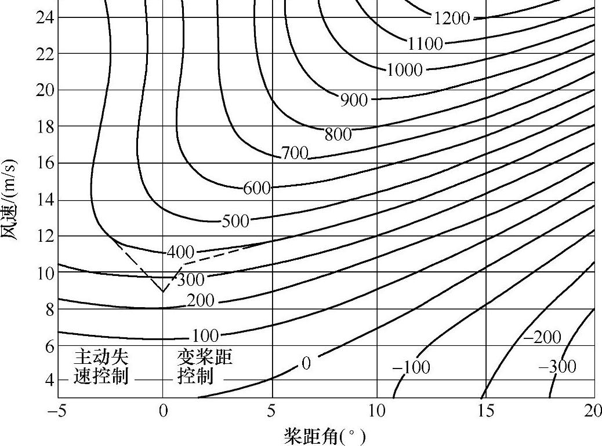

图5-6 风力机在一定转速下的等功率曲线族与桨距角和平均风速的关系

### 二、基于发电机实现的功率调节

发电机主要通过变速实现功率调节功能。有如下几方面作用：

1）额定风速以上时保持输出功率稳定；

2）额定风速以下时使输出功率优化；

3）与变桨距风力机配合，增加功率控制过程的“柔性”。

前文已介绍，可以变速运行的风力发电机，大致有如下几种形式：

1）双速、多速笼型感应发电机，可以分级变速；

2）绕线型感应发电机，可部分变速；

3）电励磁同步发电机加全额变流器，可用于变速风力发电机组；

4）永磁同步发电机加全额变流器，可用于变速的直驱风力发电机组；

5）双馈发电机加部分功率变流器，多用于变桨距、变速的风力发电机组。

变速型机组的功率控制策略为低风速段，恒定C_(p)值运行，保持最佳叶尖速比，最大能量捕获效率，直到转速达到极限，然后按照恒定转速控制，直到功率最大，最后恒功率控制。

【例5-3】 设计1MW变速恒频机组变速运行方式（见图5-7）。对应的风速是

1）无负载区：小风挂机状态，0～4m/s；

2）部分负载区：最大转差低速运行区，4～6m/s；

3）最佳叶尖速比运行区：6～10m/s；

4）额定转速运行区：10～12m/s；

5）全负载区：限制功率输出区，12～25m/s。

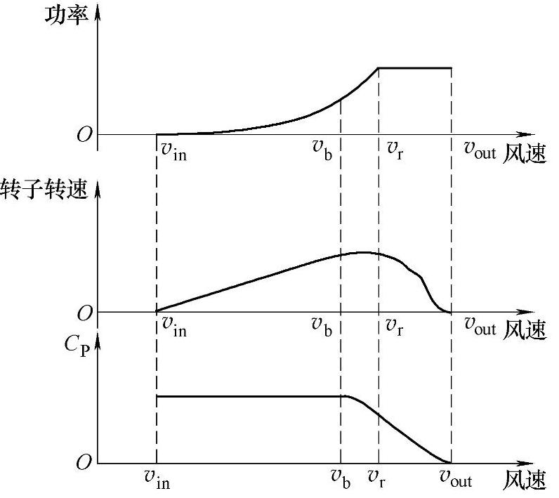

图5-7 变速功率调节

## 第三节 总体布局设计

风力发电机组的总体布局包括整机各部件、各系统、附件和设备等布置。要求综合考虑，布局应合理、协调、紧凑，保证正常工作和便于维护等要求，并考虑有效合理的重心位置。最后绘制整机总体布置图，并编写有关报告和说明书。

### 一、总体布置原则

风力发电机组的总体布置，关系到机组的性能、质量和整机的合理性，也关系到工作的安全和效率。因此，在决定风力发电机组的总体布置时，应注意以下几个问题：

1）保证风力发电机组的强度、刚度、抗震性、平衡和稳定性，支承部件要力求有足够的刚度。

2）整机各部件、各系统、附件和设备等，要考虑布置得合理、协调、紧凑。

3）保证正常工作和便于维护，并考虑有较合理的重心位置。

4）传动系统力求简短，达到结构紧凑、体积小、重量轻。

图5-8 分流式总体布置

1—轮毂 2—主轴 3—制动器 4—联轴器

5—增速箱6—联轴器7—发电机

### 二、风力发电机组的典型布局

1.多态定速风力发电机组的布局

多态定速风力发电机组有两组以上的发电机，一般采用所谓分流的形式，如图5-8所示。

图5-9所示为4组发电机组成的多态定速风力发电机组。

2.双馈型风力发电机组的布局

双馈式风力发电机组总体布置多为一字形结构，一般为图5-10所示的偏置一字形布置。

图5-9 4组发电机组成的多态定速风力发电机组

这种布置形式，是风力发电机组中采用最多的形式，其主要特点是结构简单，对中性好，安装调试方便；其缺点是占轴线长，可能迫使主轴太短，主轴承载荷较大。主轴与发电机轴线间有一定的偏置主要是为了便于变桨距系统的布置。

另外，还有一种回流式布置方案（如图5-11所示），但比较少见。

图5-10 偏置一字形总体布置

1—轮毂 2—主轴 3—联轴器 4—增速箱 5—制动器 6—联轴器 7—发电机

3.直驱型风力发电机组的布局

图5-12所示为直接驱动风力发电机组结构剖面图。

图5-11 回流式总体布置

1—轮毂 2—主轴 3—联轴器 4—增速箱 5—制动器 6—联轴器 7—发电机

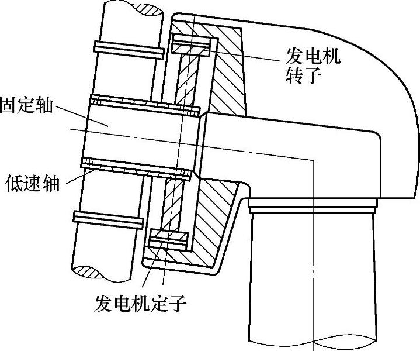

图5-12 直接驱动风力发电机组结构

### 三、部件的集成化

上述只是基本布置形式。具体布置时，考虑经济和技术上的因素，局部布置还可采用组合式和集成式设计方案。所谓组合式的设计，就是采用标准组件的积木化的结构方案。而集成式的设计，就是将部分部件一体化。集成式的设计种类很多，这里仅举几个典型例子。

1.发电机与齿轮箱一体化

图5-13是一个把发电机与齿轮箱一体化的简图。

图5-13中，H—轮毂；RB—风轮轴承；C—联轴器；B—制动器；P行星齿轮；G—发电机。

图5-13 发电机与齿轮箱一体化

也有的集成式布置是将发电机用螺栓固定到齿轮箱后面，这样也可以得到较紧凑的结构，如图5-14所示。配合的表面必须仔细加工以保证同轴，而且要有合适的通道连接发电机和齿轮箱输出轴。

2.主轴与齿轮箱集成

这种集成式布置是将低速轴及前后轴承都集成在齿轮箱内，将其移到机舱前部使风轮悬臂距离最小，并且将齿轮箱外壳的载荷传递到机舱底板上。很明显，这种方法需要更结实的齿轮箱外壳，它不仅要承受风轮载荷，还要不能有削弱其功能的变形，而且必须增加其前后长度以缓和由轴弯矩传来轴承载荷。它的好处在于减小了底盘的面积，并避免了独立的轴承需要的润滑，其主要缺点是变速箱的重新安装需要移动风轮。

图5-15为风力发电机组主轴与齿轮箱集成结构，将主轴与齿轮箱集成为一体，并用前法兰固定在直角形底盘的竖直直角边上。

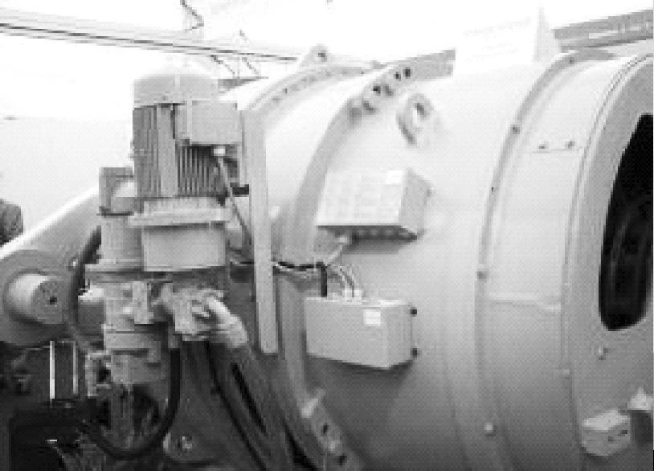

图5-14 发电机与齿轮箱连接

图5-15 风力发电机主轴与齿轮箱集成

a）齿轮箱方向 b）轮毂方向

3.齿轮箱整体集成

齿轮箱整体集成结构是将齿轮箱变成基本的组成部分，其他部件用法兰联结到齿轮箱上（见图5-16），这种设计不需要机架，并且结构紧凑。其缺点是不易安装，并且为了隔离传动链和塔筒之间的噪声，常常采用使机舱与塔筒隔开的方法，齿轮箱变成昂贵的专门的部分，并且风轮主轴的轴承也装入齿轮箱内，因此齿轮箱的外壳需要不同的壁厚。

图5-16中，SG—平行轴齿轮；其他字母含义同图5-13。

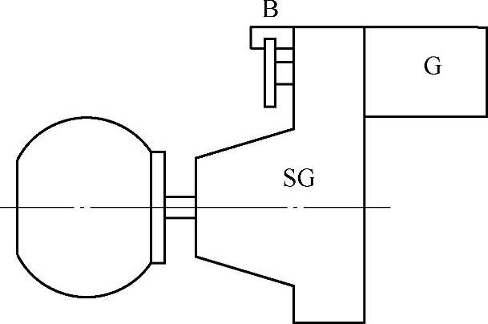

图5-16 齿轮箱整体集成

## 第四节 模型试验

风力发电机组的设计与研制中，相似理论的应用是非常重要的。作用于风轮上的空气动力十分复杂，如叶片相互间的干扰、叶尖与轮毂处气流的旋涡等，为了更确切的了解这些因素的影响，有必要在风洞里对实体模型进行实验（见图5-17）。又如，为了准确预测所研制的大型风力发电机组的特性，有必要在实验室里，以相似的小尺寸模型机进行性能实验。

相似理论主要应用于风力发电机组的相似设计及性能的换算。所谓相似设计，即根据实体研究出来的性能良好、运行可靠的模型来设计与模型相似的新风力发电机组。性能相似换算是用于试验条件不同于设计的现场条件时，将试验条件下的性能利用相似原理换算到设计条件下的性能。以下用风力机的模型试验加以说明。

风力机相似是指风轮与气体的能量传递过程以及气体在风力机内流动过程相似，他们在任一对应点的同名物理量之比保持常数，这些常数叫相似常数（或比例常数）。下面要讨论的是风力机的相似条件及相似结果。

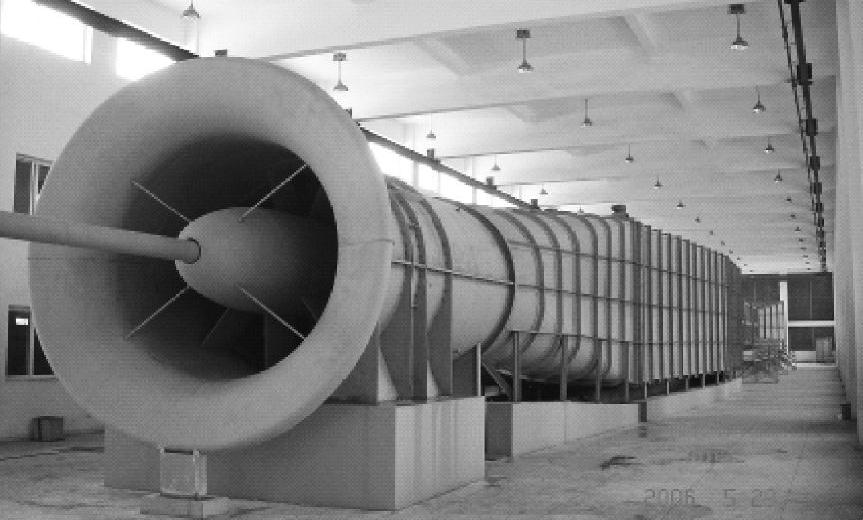

图5-17 风洞实验室

### 一、相似条件

根据相似理论，要保证气体流动过程相似，必须满足几何相似、运动相似、动力相似。

1.几何相似

几何相似是指模型与原型风力机的几何形状相同，对应的线性长度比为一定值。

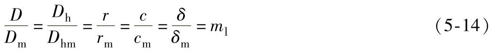

式中 D_(h)——风轮轮毂直径；

D——风轮直径；

r——叶素到风轮中轴的距离；

c——叶素几何弦长；

δ——翼型厚度。

式（5-14）以及后文中，有下角标m的代表模型机，无下角标m的代表原型机。

严格来说，还应保证叶片表面的相对粗糙度相似。相对粗糙度会影响流动损失的大小，但是由于加工条件的限制，在尺寸小的情况下粗糙度成比例缩小是难以保证的，即

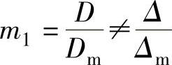

式中 Δ——表面粗糙度。

然而，对风力机来讲，表面粗糙度的相似与否影响不大，故一般不予考虑。

2.运动相似

空气流经几何相似的模型与原型机时，其对应点的速度方向相同、比例保持常数，称为运动相似，即

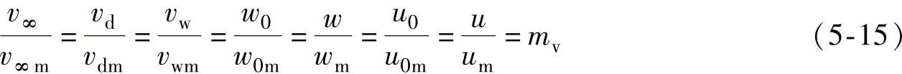

式中 v_(∞)，v_(∞m)——原型机、模型机前方的风速；

v_(d)，v_(dm)——通过风轮时的气流速度；

v_(w)，v_(wm)——风轮后方的气流速度；

w₀，w_(0m)——叶片尖部气流的相对速度；

w，w_(m)——原型机、模型机对应叶素上气流的相对速度；

u₀，u_(0m)——叶尖气流的切向速度；

u，u_(m)——原型机、模型机对应叶素上气流的切向速度。

模型和原型机空间对应点气流速度相似，则对应叶素上对应点的速度三角形相似，对应的气流倾角相等，对应叶素桨距角相等：

φ=φ_(m)β=β_(m)

攻角α是它们的差（α=φ-β），当然也相等，所以对应的C_(l)和C_(d)也具有相同的值。式（5-15）也表明了原型机和模型的叶尖速比λ必须相等。

3.动力相似

动力相似是指满足几何相似、运动相似的模型与原型机上，作用于对应点力的方向相同，大小之比应保持常数。这里所讲的作用于气体的力除了因压力分布形成的推力和切向力之外，还应包括惯性力、黏性力。下面分析满足几何相似、运动相似的惯性力、黏性力是否满足动力相似的条件。

参照叶素上推力dT、切向力dF的表达式：

以上各式中，dA=cdr。

则 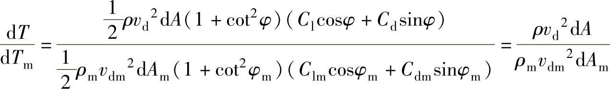

以l表示长度尺寸的量，由于加速度a的尺度等同于v²/l，根据理论力学，惯性力为

所以 

而黏性力F_(μ)，即内摩擦力，可由牛顿内摩擦定律得

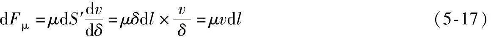

式中 μ——流体的动力黏度；

dS′——内摩擦作用的面积；

δ——摩擦层的厚度；

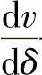——速度梯度。

若模型与原型机的惯性力与黏性力相似，即

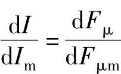

则 

经变换后得 

或 

式中，Re为雷诺数，表示作用于流体上的惯性力与黏性力之比；ν为流体的运动黏度。式（5-18）也说明，只有黏性力相似时，模型与原模型机雷诺数才相等。

### 二、相似结果

前面已经得知，由于两个风力机相似，对应叶素上的φ、α、β、C_(l)和C_(d)值均相等。对于模型和原型机上的对应叶素，下列关系式成立：

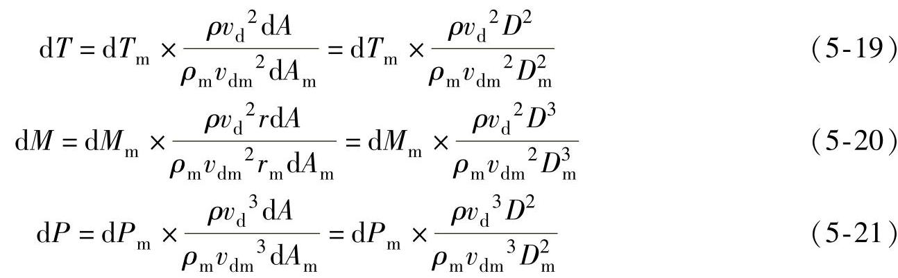

由于风轮总的推力、力矩和功率可以分别由所有叶片（N）各个叶素的推力、力矩和功率的总和得到，所以

式（5-22）可改写为

同理 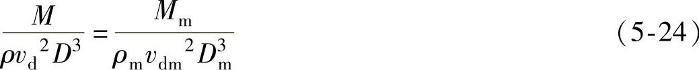

由于风轮的效率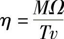，所以

这表明，对于具有相同叶尖速比的相似模型和原型机，它们的效率也相等。这个结果有很大的用处，利用它能够从实验室风洞中试验的相似小风力机的性能推断出大型机的效率。式（5-26）中的叶尖速比λ=u₀/v_(∞)是指风轮的外缘切向速度与风轮前气流速度之比。以下的另外一些结论也以风轮前方的速度v_(∞)来表述，因为该处风速是未受干扰的。

两个风力机相似时，他们具有相同的下述无因次参数：

C_(T)、C_(M)、C_(P)分别为风轮的推力系数、转矩系数和风能利用系数。

式中 v_(∞)——风力机前方5～6倍风轮直径处的风速；

A——风轮扫掠面积；

R——风轮半径。

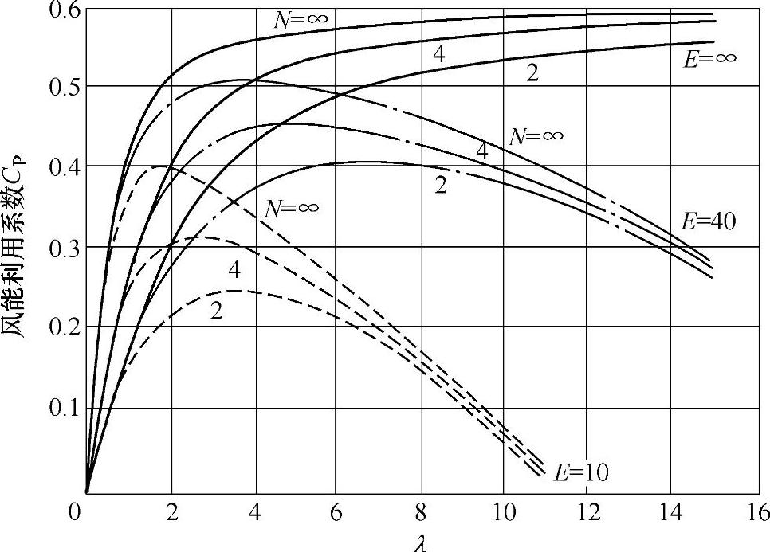

图5-18 风能利用系数C_(P)与叶尖速比λ的关系

这样，就可以在实验室里得到模型的C_(T)=f（λ）、C_(M)=f（λ）、C_(P)=f（λ）的一组特性曲线，模型的特性曲线对于与其相似的原型机或其他相似风轮都适用的。此后就可以利用这些无量纲系数及其f（λ）曲线来给出风轮特性的实验结果。图5-18给出的是不同叶片升阻比E、不同叶片数N条件下风力机风能利用系数C_(P)与叶尖速比λ的关系。

对于已知其特性曲线的风力机，即对应于每个叶尖速比λ的C_(T)、

C_(M)、C_(P)值已知，则该风力机在不同

的风速v_(∞)、不同的工作转速n（对应于u₀）下的T、M和P的值就可求出

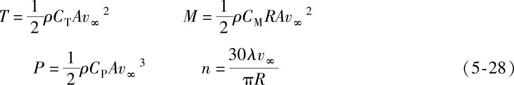

这样就可以绘出风力机的推力、转矩和功率相对于风速v∞、工作转速n的关系曲线。这些性能曲线可用于分析风力机于其负载的特性匹配与否，即在研究用风轮驱动发电机等负载时，将起到非常重要的作用。

### 三、模型机试验中的问题

相似模型和原型机的雷诺数定性尺寸用其直径、速度以风轮前风速代表时，式（5-18）表述为

分析发现，雷诺数相等的条件在大型风力机模化为实验风洞中的相似模型时，一般来说是不容易实现的。事实上，风洞里的模型试验是在普通大气压力和环境下进行的，因此模型和原型机的运动黏度相同，即ν=ν_(m)。即上式可以写成

v_(∞)D=v_(∞m)D_(m) （5-30）

和 uD=u_(m)D_(m) （5-31）

因u=πDn/60，式（5-31）还可写成

nD²=n_(m)D²_(m) （5-32）

式（5-30）说明模型必须在v_(∞m)=v_(∞)D/D_(m)的风速下试验，因而v_(∞m)比v_(∞)高。式（5-32）指出模型机转速必须满足n_(m)=nD²/D²_(m)，n_(m)也比n高。

现在来举例说明这个论断的后果。

【例5-4】 假设用1∶20的比例制作了一个模型机。原型机的主要参数为：风轮直径D=20m，叶尖速比λ=6，在8.7m/s的来流风速下转速为50r/min，求模型机的转速。

为了符合相似情形下雷诺数相等的条件，应有v_(∞m)=v_(∞)D/D_(m)，模型机就必须在风速v_(∞m)=174m/s的条件下做模型机的试验。并且模型机的转速应达到

n_(m)=20²×n=400×50=20000（r/min）

在这样高的风速和转速下，空气的可压缩性就不能被忽略，从而失去与原型机的动力相似性，因为真实尺寸的原型机空气的压缩性是可以被忽略的。

实际上，实验室风洞里试验的模型机风速被控制在比原型机真正的运行风速稍高一点的范围内，以达到模型机上空气的压缩性也可以被忽略的标准。这样一来，模型的雷诺数Re_(m)将比原型机上的Re要低。

由流体力学得知，如果雷诺数的值比临界雷诺数Re_(cr)高，惯性力远大于黏性力，雷诺数不同带来的影响可以被忽略。实验也说明，雷诺数高于Re_(cr)值时，对应的阻力系数变化不大，相同攻角下的模型和原型机的阻力系数相等。所以满足其他相似条件的模型和原型机，仅雷诺数不同，但雷诺数的值比临界雷诺数Re_(cr)高的情况下，由完全相似所获得的所有关系式对它们都是成立的。

另一方面，如果模型试验是在Re低于Re_(cr)的条件下进行的，虽模型和原型机的攻角相同，但由于黏性的影响大，模型上的阻力系数要比原型机的高，这时两机的相似性就差了。

需要注意的是，选择现代风轮叶片的翼型，总是既要效率比较高（即升阻比E=C_(l)/C_(d)值大），而又必须同时满足正常运转时，每个叶素上的雷诺数值都大于临界值Re_(cr)的条件。薄的曲线翼型的Re_(cr)值大约为10⁴，而相对较厚NACA翼型则在10⁵～10⁶范围之内。

## 第五节 设计成本模型

由式（5-8）可见，风轮的功率与风轮直径的平方成正比。而风轮质量与风轮直径的立方成正比。风轮直径越大，成本越高，但获得的能量越多。多大容量的风力发电机组其发电成本最少，这是个值得研究的问题。根据实践，可用一个成本模型来研究成本问题。

首先选一个风力发电机组作为基准，其各部件的成本是已知的，在结构相同的情况下，改变设计参数，则部件尺寸和质量发生变化。部件成本不会简单地与质量变化成正比，通常成本与质量的关系为

式中 C（x）——部件成本；

m（x）——部件质量；

x——设计参数；

C_(B)——成本的基准值；

m_(B)——质量的基准值；

μ_(a)——随质量变化的比例系数。

在产品开发的初期阶段，选择μ_(a)值具有一定局限性，应根据丰富的经验选择μ_(a)值，一般基于相似关系按比例得到，通常可取0.7～0.9。

【例5-5】 选用某风轮直径60m、1.5MW的风力发电机组作为基准机组，估计新开发机组成本，各部件成本占总成本的百分比可参照表5-1。

新开发风力发电机组的结构尺寸是根据基准机型将部件结构尺寸按相同比例缩放得到的（不包括齿轮箱、发电机、电网连接、控制器）。为保证在给定风速v下，叶尖速比λ值不变（λ=πDn/v），因为这时叶片空气动力性能良好，则风轮直径D和风轮转速n成反比例。遵守此反比例关系，则各机组的设计均可在相同额定风速下达到额定功率，因此额定功率正比于风轮直径的平方。

风轮转矩通过低速轴（主轴）传递给齿轮增速箱。齿轮箱根据风轮转矩M（N·m）设计，M=9550P/n，额定功率P的单位为kW，风轮转速n单位为r/min，由叶尖速比公式，当λ、v一定，则要求D·n=定值，故n与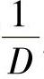成正比，所以风轮转矩M与风轮直径D的立方成正比。也就是主轴以及齿轮箱的质量均与风轮直径的立方成正比。那么，除了发电机、控制器和电网连接以外，风轮直径为D的风力机成本为

式中，C_(T)（60）——基准风力发电机组的总成本。

发电机是根据额定功率设计的，发电机的额定功率和电网连接均与风轮直径的平方成正比例。假设式（5-33）适合这些部件成本的计算，但质量比m（x）/m_(B)可用直径的平方比代换，则发电机和并网设备的成本为

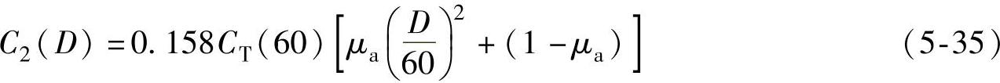

式（5-35）中的0.158是因发电机和并网成本占总成本的15.8％（见表5-1）。

假设控制器的成本仍占总成本的4.2％（见表5-1），则新的风力发电机组的总成本C_(T)（D）是新的风轮直径D的函数，即

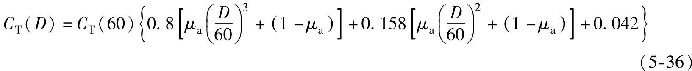

如果取D=90，μ_(a)=0.8，则有C_(T)（D）=2.678C_(T)（60）。

若不考虑机组运行和维护费用，电能成本可用上述的风力发电机组成本除以年发电量表示，即

Q=C_(T)(D)/E_(y) （5-37）

式中 Q——电能成本指数，单位为元/（kW·h/年）；

E_(y)——年发电量，单位为kW·h/年。

