# 6 风轮

风轮是风力机的核心部件，由叶片和轮毂组成。本章介绍风轮的设计问题。包括风轮设计概述、翼型介绍、叶片气动设计、叶片结构设计和轮毂的设计等。

## 第一节 风轮设计概述

风轮的设计关系到风力发电机组的技术、经济指标的全局。风轮的一般设计流程如图6-1所示。

图6-1 风轮的一般设计流程

从图6-1可见，风轮设计的重点是风轮叶片的设计。

风轮叶片（简称叶片）是风力发电机组的重要部件之一，其设计质量对风力发电机组整体及其零部件的性能和寿命有直接影响。随着风力发电机组容量和叶片尺寸的不断增大，叶片外形和结构也更加复杂，且由于叶片精度、性能和刚度要求高等特点，使叶片设计技术显得更为重要。

风轮叶片设计理论与方法是涉及多学科交叉的问题，需要应用空气动力学、机械设计理论、结构静力学与动力学、材料学等多方面的知识。

风轮叶片的主要设计目标包括：

1）良好的空气动力外形，能够充分利用风电场的风资源条件，获得尽可能多的风能；

2）可靠的结构强度，具备足够的承受极限载荷和疲劳载荷能力；

3）合理的叶片刚度、叶尖变形位移，避免叶片与塔架碰撞；

4）良好的结构动力学特性和气动稳定性，避免发生共振和颤振现象，振动和噪声小；

5）耐腐蚀、防雷击性能好，方便维护；

6）在满足上述目标的前提下，优化设计结构，尽可能减轻叶片重量、降低制造成本。

一般而论，叶片设计可分为空气动力学设计（以下简称气动设计）阶段和结构设计阶段。在气动设计阶段需要通过选择叶片几何最佳外形，实现年发电量最大的目标；结构设计阶段需要分析选择叶片材料、结构形式和其他设计参数，实现叶片强度、刚度、稳定性以及动态特性等目标，一般情况下设计需要首先从叶片的气动外形设计展开，然后再根据气动设计要求进行结构设计。

但实际上，这种设计流程并不是绝对的，亦即叶片结构设计不能也不可能完全处于从属地位。从叶片总体设计开始，往往就需要从结构设计角度对气动方案提出修改意见，甚至不得不改变某些截面的气动外形，以获得叶片气动与结构性能的合理匹配。因此，优良的叶片设计是在各种性能关系合理平衡的过程中形成的结果，如图6-2所示。

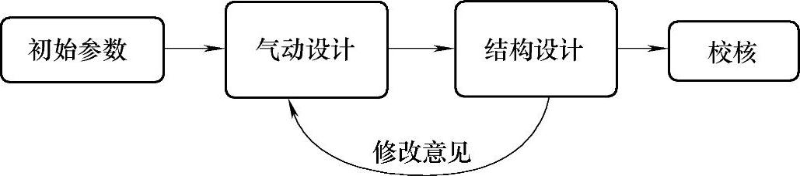

图6-2 叶片的设计流程

在长期的实践中，已经形成了很多种叶片翼型，应用于不同的场合。这些标准翼型可以在叶片设计中进行参照。

## 第二节 翼型介绍

风能转换效率与空气流过叶片翼型产生的升力、阻力有关，因此叶片的翼型性能直接影响风力机的风能转换效率。

叶片翼型也叫叶片剖面，它是指用垂直于叶片长度方向的平面去截叶片而得到的截面形状。翼型的长度趋于无限小，其几何特征如图6-3所示。

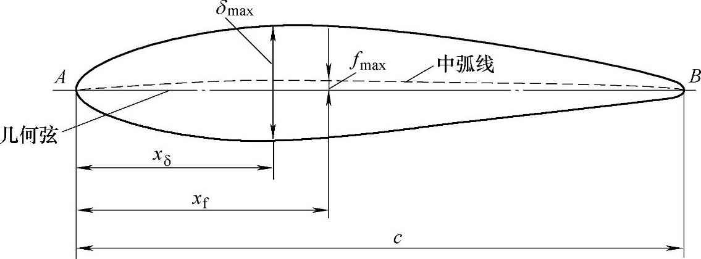

图6-3 叶片翼型的几何定义

1）中弧线：翼型表面内切圆圆心光滑连接起来的曲线（图6-3中的虚线）；

2）前缘：翼型中弧线的最前点（A点）；

3）后缘：翼型中弧线的最后点（B点）；

4）几何弦：连接前缘与后缘的直线。其长度为几何弦长，通常用c表示；

5）厚度：几何弦上各点垂直于几何弦的直线被翼型周线所截取的长度，用δ表示。最大厚度就是厚度最大值δ_(max)，通常以它作为翼型厚度的代表。最大厚度点离前缘的距离用x_(δ)表示，通常采用其相对值；

6）相对厚度：厚度的最大值与几何弦长的比值（）。它通常的取值范围为3％～20％（风轮叶片最常用的相对厚度为10％～15％）；

7）弯度：中弧线到几何弦的距离。显然，它也有一个最大值f_(max)。

传统的风轮叶片翼型多沿用航空翼型，随着风电技术的发展和广泛应用，国外一些研究机构开发了多种风电叶片专用翼型系列。以下作简要介绍。

### 一、NACA翼型系列

NACA翼型系列是以往风轮叶片采用较多的翼型系列，如NACA44、NACA63-2翼型族等，该翼型系列于20世纪前期由美国国家宇航局（NASA）的前身，即国家航空咨询委员会（NACA）提出。NACA翼型系列的资料比较丰富，翼型型号是由其厚度和中弧线叠加而成。NACA翼型系列主要包括下列一些翼型族：

1.NACA 4位数字翼型族

这是最早建立的低速翼型族之一，4位数字翼型表达形式为

NACA XYZZ其中X表示翼型最大相对弯度f_(max)/c的一百倍数值，Y表示翼型最大弯度相对位置x_(f)/c的十倍数值，ZZ表示翼型最大相对厚度δ_(max)/c的一百倍数值，例如：NACA4412翼型最大相对弯度f_(max)/c=4％，最大弯度相对位置x_(f)/c=40％，翼型最大相对厚度δ_(max)/c=12％。

2.NACA 5位数字翼型族

该翼型族是在4位数字翼型族基础上发展而来。5位数字翼型族的中线有两种类型：一类是简单中线，其前端为三次曲线，后端为直线；另一类是S形中线，前后两段都是三次曲线。这族翼型的厚度分布与4位数字翼型族的相同。例如，NACA5位数字翼型表达形式为

NACA XYWZZ其中X同样表示弯度，但不是一个直接的几何参数，而是通过设计升力系数来表达的，这个数乘以3/2就等于设计升力系数的10倍，但第1位数字近似等于最大相对弯度f_(max)/c的一百倍数值；Y表示翼型最大弯度相对位置x_(f)/c的20倍数值；W表示中弧线后段类型：直线取0，其他取1；ZZ表示翼型最大相对厚度δ_(max)/c的一百倍数值，例如：NACA23012翼型升力系数为0.3，f_(max)/c≈2％，x_(f)/c=15％，中弧线后段为直线，δ_(max)/c=12％。

3.NACA4、5位数字修改翼型族

常见的NACA4、5为数字修改翼型族是改变前缘半径和最大厚度的弦向位置而得来的，主要有两组修改翼型。其表达形式为

NACA XXXX-YY或NACA XXXXX-YY其中，X为未修改的NACA4、5为数字翼型的表达式，横线后面的Y表示修改代号，第一个Y表示前缘半径的大小，第二个Y表示最大厚度相对位置x_(δ)/c的10倍数值。

4.NACA6位数字翼型族——层流翼型族

NACA 6位数字翼型族，是一种层流翼型族，其设计特点是使翼面上的最低压力点尽量后移，以增加层流附面层的长度，降低翼型的摩擦阻力。层流翼型的厚度分布和中弧线是分开设计的，最大厚度相对位置有0.35、0.40、0.50等几种。中弧线形状是按载荷分布设计的，从前缘到某点a载荷是常数，从a点到后缘载荷呈线性降低到0，a点位置一般在最大厚度点之后。

NACA层流翼型由6位数字表示，例如NACA653-218翼型，其中第一位数字6表示第6系列；第二位数字5表示在零升力时基本厚度翼型最低压强点位置在0.5弦长处；第三位数字3表示有利升力系数范围为±0.3；第四位数字2表示设计升力系数为0.2；而末两位数字18则表示翼型相对厚度为δ_(max)/c=18％。如图6-4所示。

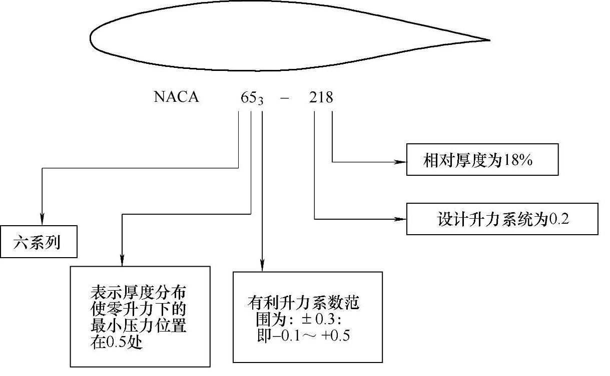

图6-4 NACA 653-218翼型

### 二、风轮叶片专用翼型系列

由于现代风力机发展的早期，尚无合适的翼型可用，故大多借用已经发展起来的航空翼型，如NACA翼型，但是这些航空翼型是为航空应用研制的，它们只是在更高雷诺数（Re），例如10⁷量级以上，才有好的性能，而大型风力机的工作雷诺数一般在10⁶量级，所以直接照搬NACA系列翼型作为风轮叶片翼型不能很好地满足使用要求，因而一些发达国家从20世纪80年代中期开始研究风力发电机组专用新翼型，并发展了一些翼型系列。其中有代表性的包括：美国的NREL翼型系列、丹麦的RISΦ翼型系列、荷兰的DU翼型系列及瑞典的FFA-W翼型系列等。

1.NREL（前身为SERI）翼型系列

NREL翼型系列是美国国家可再生能源实验室（NREL）研制，其前身为SERI，即太阳能研究院，共包括薄翼型族和厚翼型族9个翼型族，包括25个翼型，分别用于大中型叶片。图6-5所示为其中两个翼型族，左边三种为薄翼型族，右边三种为厚翼型族，从上到下分别为用于靠近叶片叶尖部分（95％半径处）、用于叶片主要外部区域（75％半径到叶尖段处）和用于靠近根部部分（40％半径处）的翼型。

图6-5 NREL翼型系列外形

图6-6所示为另一族NREL翼型外形。

NREL系列翼型的特点是具有较高的升阻比和较大的升力系数，对翼型前缘粗糙度不敏感，使得因叶片长期工作造成表面“污染”引起的性能下降大大减少，因而风力机的年发电量显著提高。该系列翼型主要适用于失速调节型的风力机。

2.RISΦ-A翼型系列

RISΦ-A翼型系列由丹麦RISΦ国家实验室设计，包括7种翼型，最大相对厚度为12％～30％，如图6-7所示。

RISΦ-A翼型系列的几何特征，是具有较尖锐的前缘，能够使流体迅速加速并产生负压峰值。气动性能方面，该翼型系列在接近失速时具有最大的升阻比，攻角为10°时的设计升力系数约为1.55，而最大升力系数为1.65。同时，RISΦ-A翼型系列具有对前缘粗糙度的不敏感性。

图6-6 NREL S828/S827/S818翼型外形

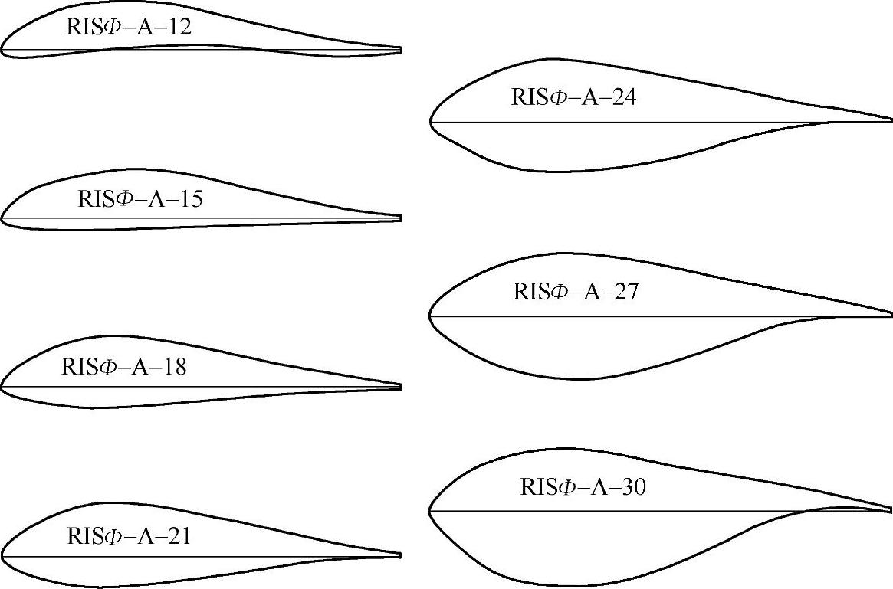

图6-7 RISΦ-A翼型系列外形

3.FFA-W翼型系列

FFA-W翼型系列由瑞典航空研究所研制，具有较高的最大升力系数和升阻比，且在失速工况下具有良好的气动性能。FFA-W包括了3个翼型系列，分别为FFA-W1、FFA-W2和FFA-W3。

FFA-W1系列有6种翼型，相对厚度为12.8％～27.1％。该翼型系列的设计升力系数较高，可以满足低叶尖速比风力发电机组的设计需求。翼型系列中，薄翼型在表面光滑和层流条件下具有高升力阻比，同时对昆虫残骸或制造误差造成的前缘粗糙不敏感；较厚翼型在前缘粗糙情况下具有较高的最大升力系数和较大的升阻比。

FFA-W2翼型系列含2种翼型，相对厚度分别为15.2％和21.1％。该翼型系列与FFA-W1翼型系列的设计要求和设计目标相同，只是设计升力系数稍低，以满足不同的使用要求。

FFA-W3翼型系列包括7种翼型，相对厚度为19.5％～36.0％。图6-8为FFA-W3系列三个典型的翼型外形。

4.DU翼型系列

20世纪90年代，Delft大学先后发展了相对厚度从15％到40％的DU翼型族，该系列包含约15种翼型。DU翼型族使用广泛，风轮直径从29m到100m以上，功率从350kW到3.5MW的风力机上均有使用。DU翼型族的设及注重外侧翼型的高升阻比、高的最大升力系数及和缓的失速特性、气动性能对前缘粗糙度不敏感和低噪声等，另外对内侧翼型也适当满足上述要求，并重点考虑几何兼容性及结构和强度要求，叶展中部的翼型兼顾气动和结构特性。与传统翼型相比，DU翼型族具有限制的上表面厚度、较小的前缘半径和一定的压力面后加载。部分DU系列的几何外形如图6-9所示。

图6-8 FFA-W3翼型外形

a）FFA-W3-211 b）FFA-W3-241 c）FFA-W3-301

图6-9 部分DU系列翼型的几何外形

### 三、翼型的选择

在设计风轮叶片时，必须事先选择好翼型。表6-1给出了几种翼型数据。表中的坐标数据是对弦长的百分比。如果设计者确定了弦长，就可通过简单的计算作出正确的翼型图。

下面以NACN4412翼型为例。因表6-1中的每个数值是对弦长的百分比，假设翼型弦长为100cm，只要将NACN4412的数值乘上100就可得到相应的翼型表面坐标数据。

为了作图，准备好坐标纸。首先在坐标纸的中央画一条等于弦长的水平线。然后，以这条线的左端（前缘）为零点，向右侧标出各点的位置。在每个位置的上面和下面的尺寸是各自距水平线的距离，负值点在中心线的下面。

表6-1最下面一行的L_(R)表示前缘半径，这个值也是对弦长的百分比。对NACA4412翼型，L_(R)为1.58。如弦长为100cm，则前缘半径L_(R)=1.58cm。这样，利用曲线板和圆规就可描出此翼型曲线。

表6-1 几种翼型的位置和纵坐标（％）

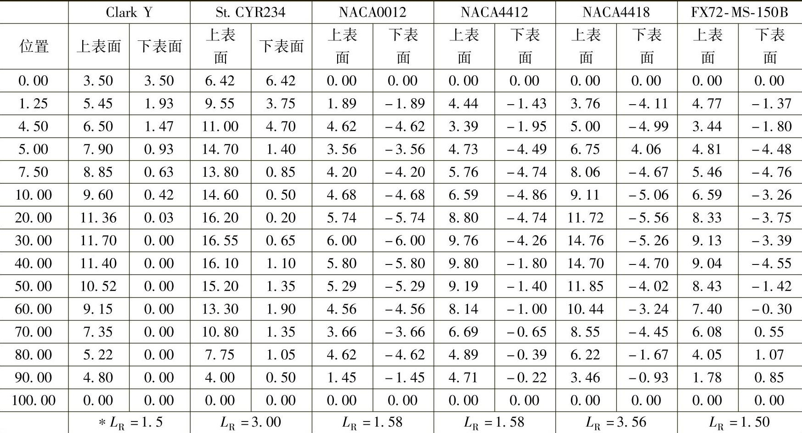

\*L_(R)表示前缘半径

大型风轮叶片很长，且不同半径位置处的翼型工作雷诺数不同，对风力机功率的贡献不同，因此对翼型的气动要求也不同。因此，理论上叶片的各半径处应选择不同的翼型。叶片翼型选择，不仅需要研究相应气动性能，还应考虑相应的功率控制方式等问题。针对目前大型风力发电机组的功率控制方式，以下分别讨论定桨距和变桨距两类风轮叶片的翼型选择问题。

1.定桨距叶片的翼型选择

一般采用被动失速控制的风力发电机组多采用定桨距叶片，即叶片与轮毂为刚性连接，需要利用叶片翼型的失速特性实现对风轮功率的调节与控制。根据被动失速风力发电机组功率控制原理，要求定桨距风力发电机组在额定风速时，叶片的大部分截面应处于大攻角临界流动分离状态下工作。这样，对翼型的失速性能设计提出了较高要求。根据叶片气动特性分析和设计要求，一般在大功率叶片设计中，应优先选择风力发电机组专用翼型，如FFA-W翼型系列等。如果需要选择航空翼型，则应优选NACA等翼型系列中失速性能优异的翼型。

2.变桨距叶片的翼型选择

变桨距叶片是现阶段叶片发展的主流。对于一般要求的叶片设计，可以选择统一翼型方案。如选用气动特性优良的NACA翼型等作为设计翼型系列，并对相应的弦长和扭角进行优化。

一些大功率叶片采取了组合翼型的设计方案。即将叶片按照所处的半径部位分为根部、中部和尖部三部分。根据叶片气动性能和力学结构对不同部分的要求，选用几个不同翼型的组合设计，以使叶片的功率利用性能得到进一步优化。但应注意，针对叶片沿半径的变化，需要分别设计各翼型相应的弦长和扭角，同时需要在两邻接翼型的相接部位确定过渡段，以实现平滑连接。

### 四、翼型的修正

实际应用中通常要根据需要对标准翼型进行修正。例如从气动性能、强度、刚度等方面考虑，在靠近叶根处需要厚度大的翼型，靠近叶尖处需要厚度小的翼型，而中间还需要有许多过渡翼型，既要保证叶片具有较好的气动性能，又要保证叶片具有良好的光滑曲线外形。

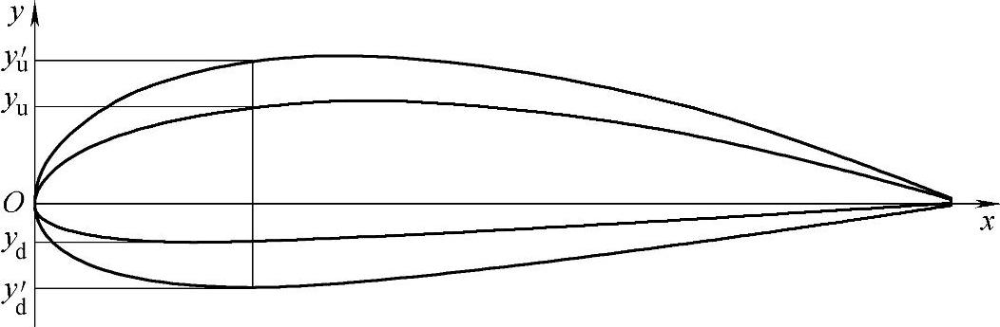

图6-10 叶片翼型的修正

在增加翼型厚度时，采用修厚因子k_(δ)为

式中 δ₁——原有翼型厚度；

δ₂——改后翼型厚度。

在保证中弧线不变时改变厚度，修改后翼型上下表面的坐标为

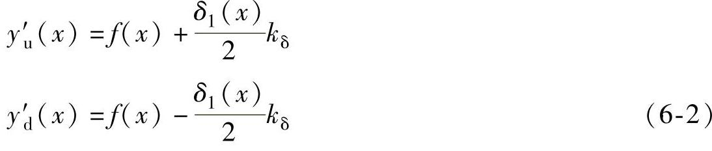

式中 y′_(u)、y′_(d)——修改后翼型的上表面和下表面纵向坐标；

δ₁——翼型的修正前厚度；

f——翼型的中弧线坐标，且有

f（x）=(y_(u)（x）+y_(d)（x）)/2 （6-3）

式中 y_(u)、y_(d)——修改前翼型的上表面和下表面纵向坐标。

如图6-10所示，采用这种方法修正后，中弧线和弯度不变，改后翼型相对原有翼型气动性能变化较小。但是如果修厚因子k_(δ)小于1，即减少翼型厚度时，有时会使翼型出现下凹，对气动性能影响较大。因此，在靠近叶尖处应使翼型厚度和弯度同时减小。做法如下：

设原有翼型的弯度为f₁，修改后翼型的弯度为f₂，则定义修弯因子k_(f)为

修改后中弧线坐标为

f′（x）=k_(f)f（x） （6-5）

修改后翼型上、下表面的坐标为

也就是说，在减小翼型厚度的同时减小弯度，这样对修改后翼型的气动性能产生的影响小，基本可以保留原有翼型的优良性能。

尽管如此，修改翼型后，翼型原有的性能也会有所变化。当翼型的弯度加大后，导致上、下弧的流速差加大，从而使压力差加大，故升力增加；与此同时，上弧的流速加大，摩擦阻力上升，并且由于迎流面积增加，故压差阻力也加大，导致阻力上升。因此在同一攻角时，随着弯度的加大，其升、阻力都会显著增加，最终可能会使升阻比有所下降。

翼型的厚度加大后，其影响与弯度增加类似。同一弯度的翼型。厚度加大后，对应于同一攻角的升力有所提高，但对应于同一升力的阻力也较大，使升阻比有所下降。

## 第三节 叶片气动设计

风轮叶片开发的首要任务是进行气动设计，设计内容主要包括气动外形的设计和气动性能分析计算等。

在确定额定风速（根据风力机预计工作的风电场的风况资料确定）后，叶片的气动设计过程大致如下，首先要根据风力发电机组的总体性能要求（如风力机的功率、各系统的效率等）以及当时的技术水平确定风轮的功率系数C_(P)，再确定叶片的初始参数，包括风轮直径D（叶片长度L_(b)）、叶片数N、风轮转速Ω、叶尖速比λ、选定翼型，并设计叶片翼型的弦长及扭角分布等。

气动设计的主要任务是确定叶片的气动外形，应用空气动力学基础理论并结合叶片的结构和工艺要求，形成沿叶片展向的截面形状。气动设计的基本思想是主要考虑叶片各叶素输出功率最大的外形设计原则。

气动设计通常需要确定以下设计参数或指标：

1）设计风速：设计风速是叶片设计的重要基础，包括额定风速、切入风速、切出风速以及相应的湍流条件等。

2）气动性能指标：气动设计需要确定叶片的气动特性，如风能利用系数C_(P)、推力系数C_(T)、力矩系数C_(M)等指标。

3）外形尺寸：气动设计应提供反映气动外形的结果，如翼型的弦长、扭角及其厚度沿叶片展向的分布，以及所用翼型的基本数据等。

4）气动载荷：根据气动设计结果，需要考虑各种载荷情况的定义，并提供叶片的气动载荷详细分析与计算数据。

5）使用条件：叶片的气动设计应明确规定叶片的适用条件，如风速和功率范围等参数。无论定桨距还是变桨距叶片，都要求其运行风速范围尽可能宽。对于变桨距叶片，还需要给出叶片的变桨距范围。

对于基本确定的叶片气动外形，还需要进行详细的气动性能分析计算。叶片的设计方法很多，以下介绍几种常用的方法。

### 一、图解法

在叶片气动设计中，图解法是相对简单的一种设计方法。利用图解法首先要确定额定风速v_(r)，额定功率P_(N)，风轮半径R，额定叶尖速比λ_(N)，叶片数N等参数。这些参数已在总体设计中给出。图解法的设计步骤如下：

1.等分叶片

设计叶片时需要给定沿叶片展向各个横截面的几何参数，以便于加工制作。显然，截面数越多，设计和加工就越详细、越准确，但是，太多了反而使任务变得烦琐。因此，在设计中要根据实际情况选取截面数。一般来讲，总是把叶片按照一定长度或一定份数进行等分。假设把长度为L_(b)的叶片进行N₁等分，则每个截面之间的距离就是

d_(s)=L_(b)/N₁ （6-7）

如果轮毂半径为r_(hub)，则第i个截面距风轮旋转轴心，即距轮毂轴心的距离r_(i)为

r_(i)=r_(hub)+i×d_(s) （6-8）

式中，i=0，1，…，n₁；当i=0时，表示叶根截面；当i=n₁时，表示叶尖截面。

2.计算各个截面的周速比

周速比（或称当地速比）就是截面处的旋转线速度与风速的比值。第i个截面处的周速比就是

式中 λ_(i)——第i个截面处的周速比；

r_(i)——第i个截面距风轮旋转轴心的距离，即半径，单位为m；

R——风轮半径，单位为m；

n——风轮转速，单位为r/min；

v——风速，单位为m/s；

3.由图6-11找到周速比对应的安装角（即叶素桨距角）β

图6-11中所示的周速比和安装角的对应关系是由日本学者牛山泉总结出的基本规律，说明安装角只和周速比有关系，可以适用于任何叶片的简单设计。

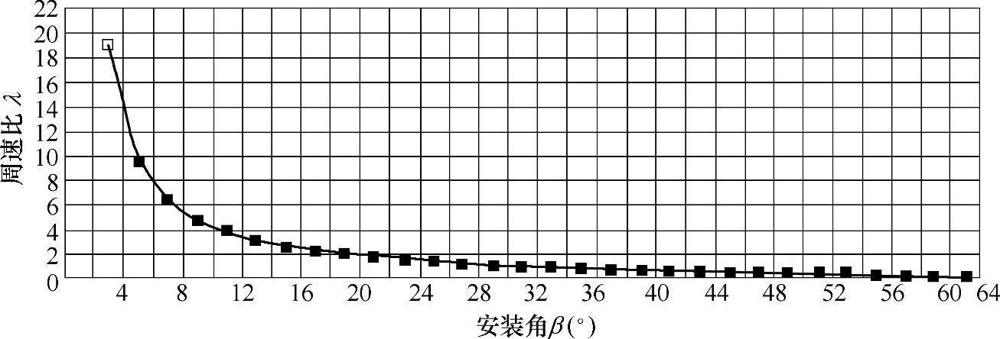

图6-11 周速比与安装角的关系

4.计算倾角φ_(i)

倾角是指风速与风轮叶片旋转平面所夹的角。倾角也称为风向角或流动角。第i个截面的倾角可以由以下简化公式计算得出

φ_(i)=arctan(1/λ_(i)) （6-10）

从而得到各个截面的攻角α_(i)，通常用下式表示

α_(i)=φ_(i)-β_(i) （6-11）

5.计算雷诺数Re

由于各个翼型在不同雷诺数下升阻关系曲线是不同的，因此就需要计算出风轮在风电场运转时的雷诺数。雷诺数是表征流体惯性力和黏性力相对大小的一个无因次相似参数，对叶片翼型的气动性能有重要影响。

计算雷诺数时需要有风电场空气密度，根据实际测量或者按照前面给出计算密度的方法可以得到当地风电场空气密度，再利用关系式

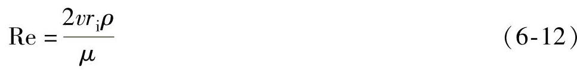

就得到雷诺数。

6.根据所用翼型数据的攻角和升力系数对应关系得到每个截面处翼型的升力系数C_(l)。

7.计算各个截面的弦长

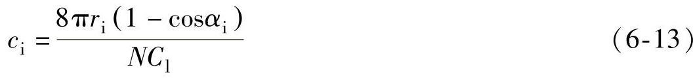

式中 N——叶片数。

把通过上述步骤计算出的各项参数列一个表即得到叶片外形的基本参数了。图解法是一种简单的叶片计算方法，可以初步了解叶片设计中涉及的主要技术参数；但是这种方法中用到的关系式是在特定情况下得到的简单关系，其他对风能转化有影响的参数不能表示出来。

在实际工程设计中，在采用某种理论设计方法进行设计后，还要对设计结果进行修正，直到达到实际需求为止。

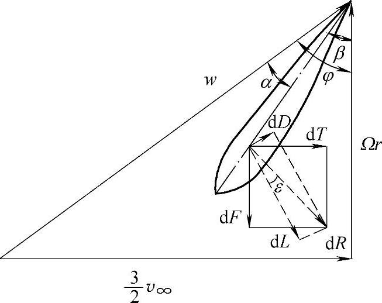

图6-12 简化叶素-动量定理设计法图示

### 二、简化叶素-动量定理设计法

简化叶素-动量定理设计法是从制动盘模型和叶素-动量定理演化而来，它不考虑了尾流的旋转效应（a′=0），并且认为风轮符合制动盘模型假设，运行在最佳条件下（a=1/3）。简化叶素-动量定理设计法的基本思路如下：

将图2-6a改画成图6-12的形式，对于图6-12所示的叶素，在最佳运行条件下，应有，从式（2-18）可以得到，在r～r+dr区间扫掠面上的推力

dF=2ρπrv²_(d)dr （6-14）

另外，长度为dr的叶素上所受的升力和阻力为

其合力为

dR=dL/cosε （6-17）

式中 ε——合力dR与阻力dL之间的夹角；

c——距转轴r处的翼型弦长。

由于w=v_(d)/sinφ，则

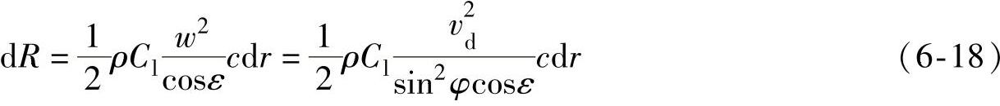

现将dR投影到转轴方向上，计算在r～r+dr区间扫掠面上的推力

式中 N——叶片数。

由式（6-14）和式（6-19）求得的推力应该相同，所以可得：

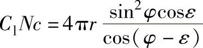

将cos（φ-ε）展开，可得

由图6-12可得

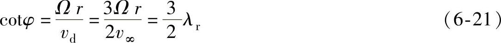

将此结果代入式（6-20），可以得到

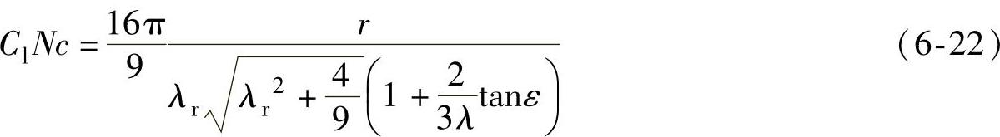

在正常运行时的值一般都很小，对于普通的翼型，攻角接近最佳之时，tanε大约是0.02，忽略tanε后式（6-22）变成：

由于叶尖速比λ和当地速度比λ_(r)的关系为λ_(r)=λr/R，代入式（6-23），可得：

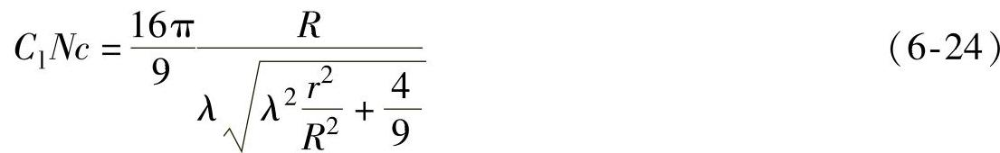

式（6-24）就是叶素在最佳状态运行时的参数关系。

利用简化叶素-动量定理设计法的设计步骤如下：

1）参考图解法等分叶片后，计算各截面的当地速度比。每个截面的半径r_(i)对应的当地

速度比λ_(i)为

λ_(i)=λr_(i)/R

2）参照式（6-21）计算叶素倾角。

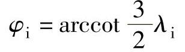

3）按翼型升阻比最大的原则选定攻角，求得相应的升力系数C_(l)。

4）计算安装角（即叶素桨距角）。

β_(i)=φ_(i)-α_(i)

5）计算叶素弦长。

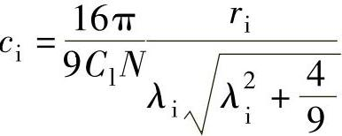

由于风力机一般并不是运行在贝兹极限的风能利用系数之下，这是造成简化叶素-动量定理设计法产生设计误差的原因之一。故此法只用于初步设计。

### 三、葛劳渥方法

葛劳渥（Glauert）方法是从风轮圆盘模型和叶素-动量定理演化而来，它考虑了尾流的旋转效应。葛劳渥方法的基本思路如下：

将图2-6a改画成图6-13的形式，比较两图，有

，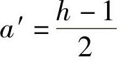此时，式（2-18）变成

dF=ρπrv²_(∞)（1-k²）dr （6-25）式（2-26）变成

dM=ρπv_(∞)Ωr³(1+k)(h-1)dr （6-26）

相应的式（2-31）可写成

dP=ΩdM=ρπv_(∞)Ω²r³(1+k)(h-1)dr （6-27）

从图6-13可得

式中 λ_(r)=Ωr/v∞。

由于升力和阻力为

可知

假设tanε=C_(d)/C_(l)，则有

那么，在叶片上的r～r+dr环域内，气流所产生的轴向推力为

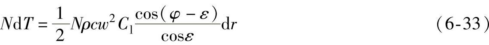

式中 c——叶素弦长；

N——风轮叶片数。

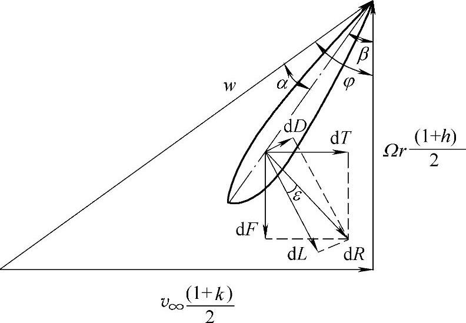

图6-13 叶素受力图

气流所产生的转矩为

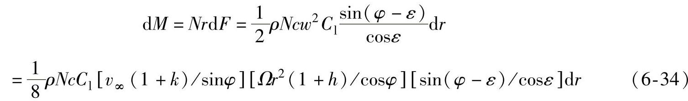

由式（6-25）和（6-33）可有

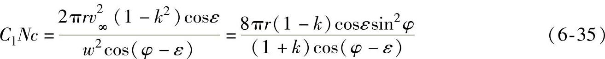

由式（6-26）和（6-34）得

以上两式又可写成

G=（1-k）/（1+k）=\[C_(l)Nccos（φ-ε）\]/\[8πrsin²φcosε\] （6-37）

E=（h-1）/（h+1）=\[C_(l)Ncsin（φ-ε）\]/\[4πrcosεsin2φ\] （6-38）

由以上两式可得

G/E=cot（φ-ε）cotφ（6-39）

与简化叶素-动量定理设计法相同，忽略阻力，即认为ε=0，并且应用式（6-28），

则有

G/E=\[（1-k）（h+1）\]/\[（1+k）（h-1）\]=cot²φ=λ²_(r)\[（h+1）/（1+k）\]² （6-40）

从而得

由式（6-27），风能利用系数为

C_(P)=dP/ρπrv²_(∞)dr=λ²_(r)（1+k）（h-1） （6-43）

将式（6-42）代入式（6-43）则

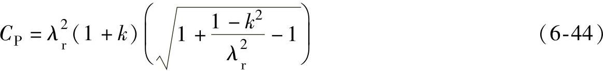

从气动角度来看，最佳叶片应满足在叶片各处C_(P)都达到最大值，亦即对于给定的λ_(r)，使。

对C_(P)求导后可得

4k³-3k（λ²_(r)+1）+λ²_(r)+1=0 （6-45）

为了求解上式，可令

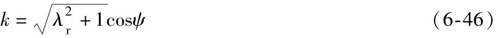

将其代入式（6-45），并将各项除以(λ²_(r)+1)3/2，得

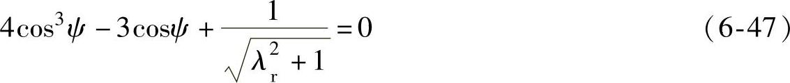

即

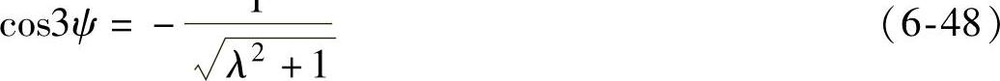

从而可解得

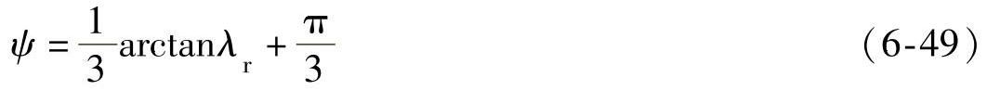

这样，对于理想风轮，若给定叶尖速比λ和攻角沿叶片径向的变化规律α_(i)=α（r_(i)），则可利用上面一些公式进行优化设计。具体步骤如下：

1）给出r_(i)，攻角α_(i)已知，C_(l)也已知；

2）求当地速度比λ_(i)，λ_(i)=λr_(i)/R；

3）由式（6-49）求出ψ_(i)；

4）由式（6-46）求出k_(i)；

5）由式（6-42）求出h_(i)；

6）由式（6-43）求出φ_(i)，

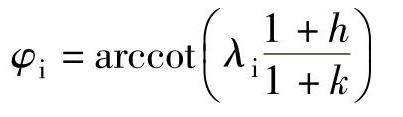

7）求叶素桨距角，β_(i)=φ_(i)-α_(i)；

8）叶素弦长，

表6-2给出不同当地速度比λ_(i)时，计算得到的参数设计结果。

表6-2 随λ_(i)变化的设计参数

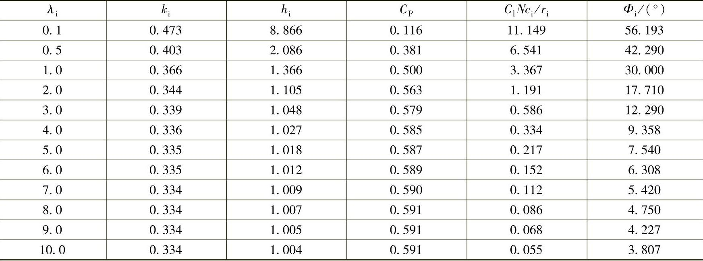

通过以上计算可得到沿叶片各径向位置r上的弦长c和叶素桨距角β，即可完成优化设计。葛劳渥方法是应用较广的方法之一。但要注意两点。一是对接近根部处的过大弦长和安装角要进行修正；二是对所设计的外形应计算其功率特性曲线，然后再根据结果对外形作必要的修正。

葛劳渥方法沿用诱导速度均匀的假设，忽略了叶尖损失和升阻比对叶片性能的影响，是产生设计误差的主要原因。

### 四、维尔森方法

维尔森（Wilson）方法在葛劳渥方法基础上作出了改进，研究了叶尖损失和升阻比对叶片最佳性能的影响，并考虑了风轮在一些非设计工况下的性能，也是目前常用的叶片气动外形设计方法之一。

1.基本关系

与简化叶素-动量定理设计法和葛劳渥方法相同，忽略阻力，即认为ε=0，同时，考虑了叶尖部损失的影响，将式（6-35）改写为式（6-50）的形式：

式中 F_(t)——叶尖损失系数，由下式计算：

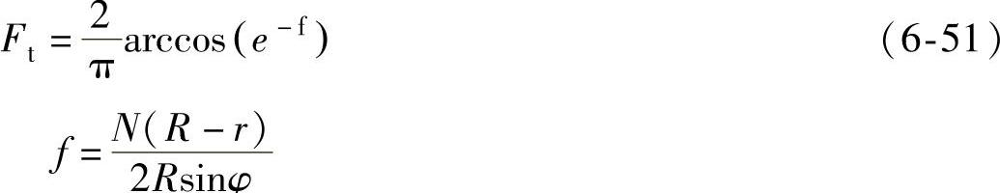

轴向诱导因子的关系：

由上几式可得到能量方程：

a(1-aF_(t))=a′(1+a′)λ²_(r) （6-53）

2.局部最佳分析

考虑叶尖部分损失时，局部风能利用系数可由下式确定：

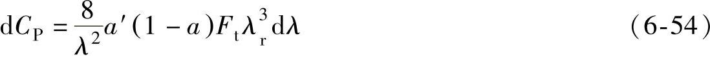

为获得最大的风能利用系数C_(P)，应使各叶素的dC_(P)值达到最大。在满足能量方程式（6-53）的条件下，用迭代法计算出诱导因子a和a′和相应的叶尖损失系数F_(t)代入式（6-50），可得

由上式给出的关系，可得到各叶素剖面的NcC_(l)/r和入流角φ的优化设计值，并可进一步求得各剖面的弦长c和桨距角β。

设计的具体步骤与葛劳渥方法类似。下面进一步介绍考虑到轮毂影响的设计方法。轮毂对风轮设计参数的影响可以用轮毂损失系数来表示，且有其中

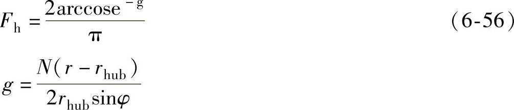

式中 F_(h)——轮毂损失系数；

φ——叶素倾角，单位为（°）；

r_(hub)——轮毂半径，单位为m。

考虑叶尖损失和轮毂损失的影响后，可以得到总的损失系数F

F=F_(t)×F_(h) （6-57）

式中F_(t)——叶尖损失系数。

把Wilson设计法中的叶尖损失系数F_(t)换成这里用叶尖损失系数和轮毂损失乘积得到的损失系数F，其他算法同Wilson设计法一样就可以得到动量-叶素理论设计法的结果。

动量-叶素理论设计法也属于Wilson设计法的改进，在考虑诱导因子的计算时又考虑了叶尖损失系数和轮毂损失系数的影响。相对于Wilson设计法主要加入了轮毂损失系数。对于轮毂半径较小的风轮来讲，两者设计结果几乎相同；但是如果轮毂半径较大，也就是说对于大功率的风力机叶片来讲，设计结果是不同的。

叶片气动设计除上述方法以外，还有等升力系数法、等弦长法等，由于大型风力机设计应用不多，故不赘述。

## 第四节 叶片的结构设计

### 一、叶片的结构设计要求

结构设计的目的是根据叶片所受的各种载荷，并考虑风力发电机组实际运行环境因素的影响，使叶片具有足够的强度和刚度。在规定的使用环境条件下运行时，应保证叶片在使用寿命期内不发生破坏。另外，要求叶片的设计重量尽可能轻，并考虑叶片间的相互平衡措施。

叶片的强度通常需要通过静强度和疲劳强度分析校核，受压结构部分还应进行稳定性校核。强度分析应在足够多的截面上进行，需要分析校核的横截面数目可根据叶片类型和尺寸确定，但至少应分析4个以上的截面结构。同时，在叶片几何形状或材料不连续的位置，应考虑增加必要的附加截面分析。

叶片的强度分析可用相应的应变、应力等力学分析校核方法。对于应力分析，还应额外校验最大载荷点处的应变，以确认设计结构不超过材料破坏极限。

叶片的结构设计结果应通过可靠的分析方法和实验验证，证明所设计叶片能够满足这种设计工况下极限强度、疲劳强度和气动稳定性等方面的要求。

叶片的结构设计的具体要求如下：

1）极限强度要求：复合材料叶片的结构强度，应保证其在承受规定的极端风载情况下不产生破坏，避免由此造成风力发电机组灾难性的后果。

2）刚度要求：除满足风力发电机组的振动、气动弹性不稳定性、机械功能等设计目标的要求外，还应保证叶片在各种极限载荷情况下不产生过度变形。

3）动力学特性要求：叶片设计结构需要通过计算或实测方法确定相应的固有频率，应使叶片固有频率避开风力发电机组系统可能产生激振的频率。在所有设计状态下，应使叶片不产生有害的颤振及其他不稳定行为，并提供反映叶片的动态特性指标的数据或技术文件。

4）疲劳寿命要求：多数设计标准要求的叶片设计使用寿命应大于或等于20年，该要求是结构设计过程需要重点考虑的问题之一。叶片寿命需要通过结构疲劳分析，也可以通过疲劳试验方法确定。

5）可靠性要求：对叶片部件总体及其构件的可靠性要求，应参考相关设计标准，并根据具体风力发电机组的总体设计方案制定。

6）物理特性要求：作为叶片的结构设计结果，应给出下列设计数据或技术资料。

①叶片的质量及质量分布；

②叶片的质心位置；

③叶片的转动惯量；

④叶片的刚度及刚度分布；

⑤叶片的固有频率（包含挥舞、摆振和扭转等方向）。

7）接口尺寸：结构设计应给出同轮毂连接的详细结构与连接要求。

对叶片设计的要求不仅需要参考和选用设计标准，还应考虑风力发电机组的具体安装和使用情况。上述的叶片基本设计要求，主要参考了IEC 61400-1标准和德国GL的《风力发电风力发电机组认证规范》中的有关规定，此外，还应注意以下事项：

1）控制极限变形：由于复合材料的优良特性，大型风力发电机组风轮叶片的设计首先考虑叶片的刚度是否满足使用要求，然后进行强度校核。因此对叶片的极限变形要求极为重要：①避免风力发电机组运行过程中叶片与塔架碰撞，要限制叶片在最大设计风速时的极限变形；②在叶片变桨距时，应考虑气动弹性载荷对变形的影响。

2）叶片的几何位置特性：为保证叶片的气动弹性稳定性，应尽可能使叶片截面的质心接近气动中心。对于变桨距风力发电机组的叶片而言，应尽可能使其叶片各截面的质心、气动中心接近叶片的变桨距轴线（一般在1/4弦长位置处）。

3）防积水：叶片内部可能会产生凝结水，其他水分也可能直接进入叶片内部，对叶片造成危害。为清除叶片内部的水分，可以在叶尖和颈部等部位设计排水孔，并使叶片内部有良好的通风条件。但开孔应尽量小，以避免产生附加的气动噪声。

4）防雷击保护：运行实践表明，叶片的防雷击保护十分重要。需要考虑有效的避雷措施，确保可靠地将叶片受雷击产生的电流通过轮毂引出，避免雷击对叶片的破坏。

### 二、叶片的常用材料

用于制造叶片的材料的选择原则，首先是要求其具有良好的力学、热学、化学特性，包括高强度、高刚度、低密度、长寿命、耐腐蚀等，同时要求性价比高、易于加工且较少产生对环境的污染。

1.叶片的常用材料

叶片的常用材料大致有以下几种。

（1）木材

采用木材制作的叶片，不易制造成扭曲型。此类叶片多由几层木板粘压而成，与轮毂连接用金属板法兰和螺栓形式。采用木制叶片需要用强度好的整体木方作为叶片纵梁，承担叶片在工作时的载荷。叶片肋梁木板与纵梁木板用胶和螺钉可靠地连接，其余叶片空间用轻木或泡沫塑料填充，用玻璃纤维覆面，外涂环氧树脂。木材一般不用于大型风力机叶片。

（2）钢材

一些叶片采用钢管或D型钢做纵梁、钢板做肋梁，内填充泡沫塑料，外覆玻璃钢蒙皮的结构形式。叶片纵梁的钢管及D型钢从叶根至叶尖的截面应逐渐变小，以满足扭曲叶片的要求，并减轻叶片重量。

（3）铝合金

铝合金用于等弦长挤压成形叶片。易于制造，可连续生产，将其截成需要的长度，又可按设计要求进行扭曲加工，叶根和轮毂连接轴及法兰通过焊接或螺栓连接实现。铝合金叶片重量较轻且易于加工，但难以制作从叶根至叶尖渐缩形式的叶片。

（4）玻璃纤维复合材料

玻璃纤维复合材料（Glass Fiber Reinforced Plastic，GFRP），是以环氧树脂、不饱和树脂等塑料为基体，掺入玻璃纤维而做成的增强材料。GFRP材料具有强度高、重量轻、耐老化、可加工性较好等特性，在目前的风轮叶片制造中得到广泛应用。GFRP材料可用于制造叶片的表面和内部结构，叶片的填充部分多为泡沫塑料。GFRP材料的表面还可以通过上浆和涂覆改进质量。

（5）碳纤维复合材料

随着叶片长度的不断增加，叶片刚度成为重要的设计指标。研究表明，碳纤维（CarbonFiber，CF）复合材料叶片刚度是玻璃钢复合材料叶片的2～3倍。目前，由于CF材料的价格因素影响了其在风轮叶片方面的应用，但随着国内外有关研究的进展，CF材料在大型叶片设计和制造方面有很好的应用前景。

目前，一些新型玻璃纤维增强复合材料因其重量轻、比强度高、可设计性强、性价比高等方面的因素，已成为目前大型风轮叶片的主流材料。在大型风轮叶片设计中，木材主要用于叶片内部的夹心结构，而钢材主要用于叶片结构的连接件，很少用于叶片的主体结构。

2.叶片材料的基本特性

表6-3给出了一些常用于叶片制造的材料及其相应的结构特性。为便于比较，表中给出了各种材料的耐压比强度、疲劳强度与比模量等结构特性指标，可供设计参考。

表6-3 各种材料的结构特性比较

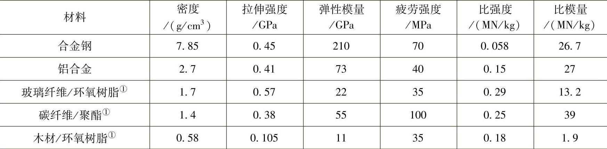

①纤维体积含量为60％。

从表6-3中可以看出，虽然复合材料拉伸强度比金属低，但其比强度、比模量都比较高。表6-4反映了几种长度与不同材料叶片的重量的关系。

表6-4 叶片长度与不同材料叶片重量的关系

从上述分析可以看出，碳纤维复合材料的特性相对具有较多优势，但是由于其价格较高（约为玻璃纤维复合材料的10倍）在叶片制造中应用较少，目前广泛使用的仍是玻璃纤维复合材料。

### 三、叶片的剖面结构

1.剖面的结构形式

在叶片剖面结构设计中，一般根据叶片具体技术要求，选择采用恰当的叶片截面类型。截面类型主要有实心截面、空心截面及空心薄壁复合截面等。当用玻璃钢材料来制造叶片时，必须注意到材料的强度和弹性模量与其他类型材料的差异和工艺上的多样性，并且最好选用较厚的叶型设计成空腹结构。但空腹薄壁结构在受载时容易引起失稳和局部变形过大，因此一般都在空腹内填充硬质泡沫塑料、蜂窝或设置加强肋，以提高叶片总体刚度。

叶片剖面由蒙皮与主梁组成。蒙皮的主要功能是提供叶片的气动外形，同时承担部分弯曲荷载与大部分剪切荷载。蒙皮的层状结构包括胶衣层、玻纤毡增强层、强度层。胶衣层提供光滑的气动表面，以提高叶片的气动性能，玻纤毡增强层提供了表面胶衣与强度层之间的缓冲层，强度层为蒙皮的承载层，由双向玻纤织物增强，以提高蒙皮的剪切强度。蒙皮的后缘部分采用夹层结构，内表层也有双向玻纤织物增强，以提高后缘空腹结构的屈曲失稳能力。主梁承载叶片的大部弯曲荷载，故为主要承力结构。主梁为箱型结构，与上下蒙皮胶接。箱型主梁把叶片剖面分成三室，主梁在中间一室。主梁采用单向程度较高的玻纤织物增强，以提高主梁的强度与刚度。通常可采用70％的单向玻纤织物加30％的双向织物，交替铺放，以加强层板的整体性。主梁的肋采用夹层结构，可提高肋的刚度，并可提高叶片弦向方向的刚度。叶片剖面的结构应根据叶片尺寸大小、荷载情况、制造工艺有所变化。如主梁较宽，主梁的上下缘应采用夹层结构，以免产生屈曲失稳。或主梁宽度设计得较窄，可不采用夹层结构，但要进行屈曲稳定验算。前缘空腹由于曲率较大，抗屈曲失稳能力较强，通常不需要采用夹层结构，但前缘空腹宽度较大时应考虑采用夹层结构。蒙皮的增强层也可采用纤维毡与织物交替铺设。

风力发电机组风轮叶片的结构主要有以下几种结构形式。

1）叶片主体采用硬质泡沫塑料夹芯结构，GFRP结构的大梁作为叶片的主要承载部件，大梁常用D形、O形、矩形和C形等形式，蒙皮GFRP结构较薄，仅2～3mm，主要保持翼型和承受叶片的扭转载荷；这种形式的叶片以丹麦Vestas公司和荷兰CTC公司（NOI制造的叶片）为代表，如图6-14、图6-15所示。其特点是重量轻，对叶片运输要求较高。由于叶片前缘强度和刚度较低，在运输过程中局部易于损坏。同时这种叶片整体刚度较低，运行过程中叶片变形较大，必须选择高性能的结构胶，否则极易造成后缘开裂。

D形、O形和矩形梁在缠绕机上缠绕成型；在模具中成型上、下两个半壳，再用结构胶将梁和两个半壳粘接起来。

图6-14 Vestas叶片剖面结构

另一种方法是先在模具中成型C（或I）形梁，然后在模具中成型上、下两个半壳，利用结构胶将C（或I）形梁和两半壳粘接。

图6-15 CTC叶片剖面结构

2）叶片壳体以GFRP层板为主，厚度在10～20mm之间；为了减轻叶片后缘重量，提高叶片整体刚度，在叶片上下壳体后缘局部采用硬质泡沫夹芯结构，叶片上下壳体是其主要承载结构。大梁设计相对较弱，为硬质泡沫夹芯结构，与壳体粘结后形成盒式结构，共同提供叶片的强度和刚度。这种结构形式叶片以丹麦LM公司为主，如图6-16所示。其优点是叶片整体强度和刚度较大，在运输、使用中安全性好。但这种叶片比较重，比同型号的轻型叶片重20％～30％，制造成本也相对较高。

图6-16 LM叶片剖面结构

C形梁用玻璃纤维夹芯结构，使其承受拉力和弯曲力矩达到最佳。叶片上、下壳体主要以单向增强材料为主，并适当铺设±45°层来承受扭矩，再用结构胶将叶片壳体和大梁牢固地粘接在一起。

在这两种结构中，大梁和壳体的变形是一致的。经过收缩，夹芯结构作为支撑，两半叶片牢固的粘接在一起。在前缘粘接部位常重叠，以便增加粘接面积。在后缘粘接缝，由于粘结角的产生而变坚固了。在有扭曲变形时，粘接部分不会产生剪切损坏。关键问题是叶根的连接，它将承受所有的力，并由叶片传递到轮毂，常用的有多种连接方式。

2.剖面几何特性

叶片剖面结构形式确定后，需要对叶片剖面的几何特性，如面积、质心坐标、质心的极惯性矩等进行计算。由于沿叶展方向各剖面的弦长、相对厚度δ_(max)/c以及截面形状不同，剖面几何特性会相应的发生变化。

参照图6-17所示的翼型剖面，其面积A可按下式计算：

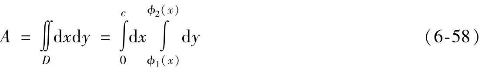

式中 c——叶片剖面的弦长；

ϕ₁（x），ϕ₂（x）——剖面下、上表面y向坐标曲线函数。

图6-17 翼型剖面

剖面的质心坐标通过式（6-59）和式（6-60）计算：

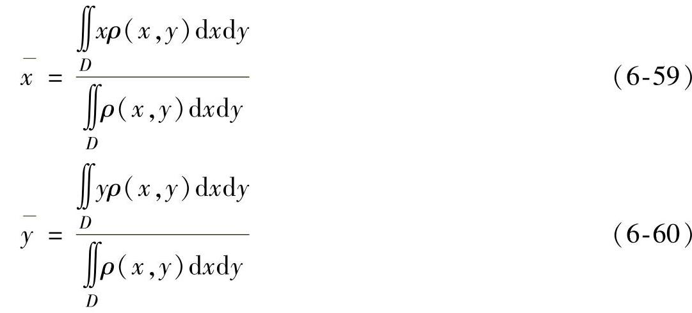

对于实体叶片，设其材质均匀，即密度ρ（x，y）为常数，式（6-59）和式（6-60）可改写为

对质心的极惯性矩计算，如图6-17所示，设坐标原点位于剖面的前缘点，则对应坐标系的轴惯性矩为

对于质心为原点的坐标系（_(η)，O′，ζ）的轴惯性矩为

由式（6-63）～式（6-66），可求得相对质心的极惯性矩为

I_(P)=I_(ζ)+I_(η) （6-67）

### 四、叶片的铺层设计

叶片的铺层的厚度是由叶片所受的外载荷决定的。无论是弯矩、扭矩和离心力都是从叶尖向叶根逐渐递增，所以叶片薄壁结构的壁厚也是从叶尖向叶根逐渐递增。由于玻璃钢材料具有较高的比强度和低弹性模量的特性，叶片除满足强度条件外，还需满足变形条件，特别是长的风力机叶片尤其要注意叶片和塔架之间的机械干扰。叶身设计尽可能按等强度布置，且在叶根部分需要有较大的安全系数。

1.铺层的设计原则

铺层设计原则是

1）均衡对称的铺设原则：铺层对中面对称，若有-45°层，则应用45°层与其平衡。

2）铺层定向原则：铺层方向数应尽可能少，以简化铺层工作量。设计中常采用0°，90°，45°和-45°四种铺层方向，如需设计成各向同性层合板，可用\[0°/45°/90°/-45°\]或\[60°/0°/60°\]。

3）按照内力方向的铺层取向原则：对于承受单轴拉伸或压缩载荷，纤维铺设方向应与载荷方向一致；对于承受双轴向拉伸或压缩载荷，纤维方向按90°或0°方向铺设；对于承受剪切载荷，45°和-45°层成对铺设；对于承受拉伸或压缩和剪切的复合载荷，0°，90°，45°，-45°多向铺设。

4）铺层最小比例原则：所有铺层中，最小铺层百分比应大于或等于6％～10％。

5）铺层顺序原则：应使各定向层尽量沿层合板均匀分布，既要使层合板的单层组数尽量地大，使每一单层数尽量小，一般不超过4层；若层合板中含有±45°层，0°层，90°层，应尽量在45°层和-45°层之间用0°层或90°层隔开；尽量在0°层和90°层之间用45°层或-45°层隔开。

6）抗局部屈曲设计原则：对于局部屈曲为临界设计情况的构件，应把±45°铺层尽量铺设在远离结构中性层的位置上，即两侧表面上。

7）变厚度设计原则：一般依据板件载荷的大小设定铺层厚度，载荷越大，铺层越厚；载荷越小，铺层越薄。

8）冲击载荷区设计原则：足够多的纤维铺设在冲击载荷方向。

2.铺层的设计步骤

在进行铺层设计时，首先假设一个铺层方案，根据这个方案，估算其弹性模量。参照已有叶片数据和积累的设计经验，可以初步假定叶片各剖面的壁厚分布和主要弹性模量E₁（沿叶片轴向）和剪切模量G₁₂，然后根据材料力学组合梁理论，计算各剖面的应力和叶尖最大变形（包括挠度和扭角），经过多次反复，初步符合要求。然后，安排各剖面的布层铺设，并计算其弹性性能使其接近所假定的E₁和G₁₂，然后再计算应力，并按此布层铺设进行强度、刚度校核，再调整布层铺设，直到满意要求为止。整个过程是一个反复迭代、修改的过程。

3.铺设的强度设计

由于叶片剖面尺寸远小于其长度，可将叶片简化为根端固定的悬臂梁考虑。如图6-18所示，在叶片壁取出一个单元体分析，作用在其上的应力包括：沿叶片轴向的正应力σ₁和沿叶片剖面周向的剪切力τ₁₂，考虑到相对σ₁另外两个方向的正应力很小，可以忽略不计。

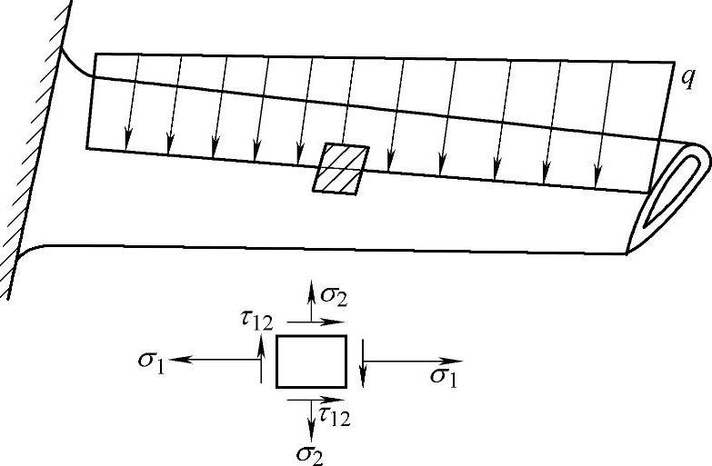

图6-18 叶片应力分析示意图

根据上述铺层设计原则，叶片铺层主要由单向层和±45°层组成。单向层一般选用单向织物或单向纤维铺设，承受轴向应力σ₁；±45°层一般采用经纬纤维量相等平衡型织物铺设，承受剪切力τ₁₂。±45°层多铺设在单向层的外侧，单向层与±45°层纤维用量比例可按正应力与剪切力比例来确定。

由单向层和±45°层组成的复合材料层合板，随±45°层所占的比例增加，层合板的轴向弹性模量将减少，而剪切弹性模量将增大。为了简化设计，忽略单向层和±45°层间的相互影响，亦即假定各层为独立变形，则复合材料层合板的轴向弹性模量E₁及剪切弹性模量G₁₂可表示为

E₁=E₀（1-K）+E₄₅K （6-68）

G₁₂=G₀（1+K）+G₄₅K （6-69）

式中 E₀、G₀——单向层沿叶片轴向的拉伸弹性模量和剪切弹性模量；

E₄₅、G₄₅——45°层沿叶片轴向的拉伸弹性模量和剪切弹性模量；

K——45°层所占的比例。

利用式（6-68）、式（6-69），沿用各向同性材料的计算方法，可以计算叶片的变形和层合板的平均应力。

对于单向层和±45°层中的实际应力，可按正交各向异性层合板理论进行计算。用角标L、T分别表示层合板的径向和纬向，即层合板的主轴，其应力-应变关系为

复合层的应力可分解成如图6-19所示的形式。

图6-19 复合层应力的分解

叶片蒙皮是以层合板的形式出现的，层合板的失效首先从达到破坏应力的某个单层开始。由于该单层的失效，层合板总体的刚度和强度重新分配，在载荷作用下，可能继续导致其他层的破坏，直至层合板单层全部失效。

对于层合板的强度一般有以下两个指标：

1）在外载荷作用下，层合板最先层失效对应的层合板正则化应力，称为最先层的失效强度，一般作为层合板的强度下限，其对应载荷成为最先层的失效载荷。

2）层合板各单层全部失效时的层合板正则化应力，称为层合板的极限强度，一般作为层合板的强度上限，其对应载荷成为极限载荷。

叶片铺层强度设计流程如图6-20所示。

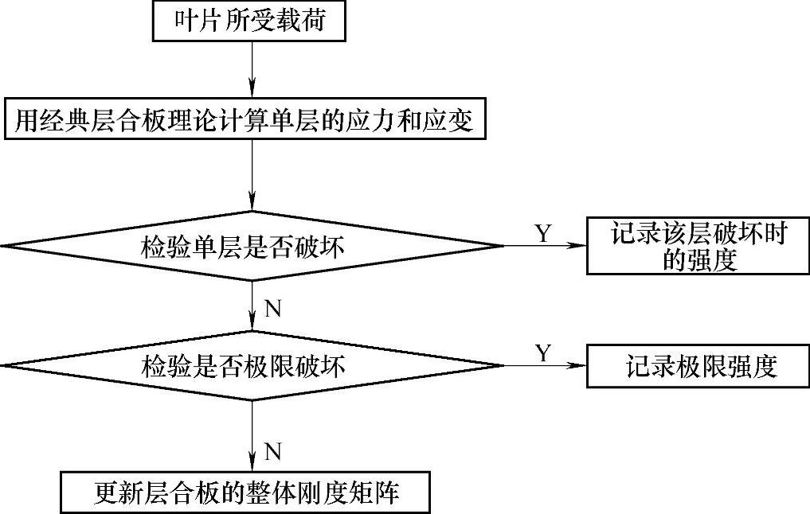

图6-20 叶片铺层强度设计流程

### 五、叶片的校核

为了保证风力发电机组的可靠运行和使用寿命，需要对叶片总体结构性能进行分析，包括对其在极限载荷条件下的强度、变形、稳定性以及疲劳强度等进行校核计算。图6-21所示为叶片总体结构基本分析内容及其步骤。

1.极限强度分析

在校核叶片极限强度时，可将叶片视为一端固定的悬臂梁。将其截面简化为图6-22所示的三个基本的几何形状，图中的矩形代表主梁，半椭圆形和三角形分别代表翼型的前缘和后缘。

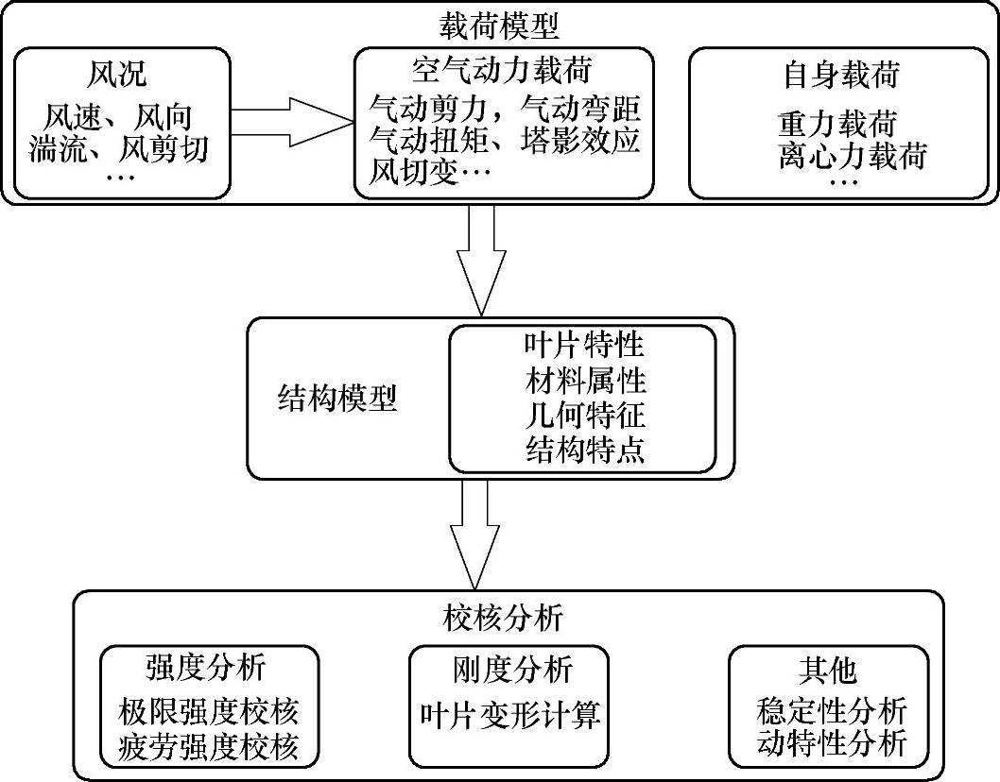

图6-21 叶片总体校核

图6-22 叶片主梁所受应力

为了简化计算，假设横截面对称于y轴，且从叶根到叶尖采用等强度截面设计。将作用在叶片上的载荷转换为截面坐标系上的等效载荷，则截面的应力公式为

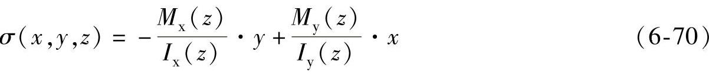

式中 σ（x，y，z）——截面的应力，单位为Pa；

M_(x)（z）、M_(y)（z）——相对于x、y轴的弯曲力矩，单位为N·m；

I_(x)（z）、I_(y)（z）——相对于x、y轴的惯性矩，单位为m⁴。

由式（6-70）可求出叶片危险截面的最大应力，并根据对强度条件进行应力校核，从而判断叶片是否具有足够的静态强度。

强度条件为

γσ_(max)＜\[σ\] （6-71）

式中 \[σ\]——材料的许用应力；

σ_(max)——实际计算出的最大应力；

γ——为安全系数。

2.稳定性分析

大型风轮叶片为空腔结构形式，在弯曲气动载荷作用下，叶片局部受压区域可能发生突然损坏，成为失稳现象。由于叶片后缘空腔较宽，更容易发生失稳。因此，需要对叶片结构进行稳定性分析。

稳定性分析一般采用近似方法。对于O形、D形等主梁结构或空腹壳体，可近似应用曲板的轴压稳定公式：

式中 E——弹性模量；

R——剖面的曲率半径；

b——剖面宽度；

δ——为剖面壁厚。

对于后缘空腔采用泡沫夹层结构，应用相应的失稳临界应力方程：

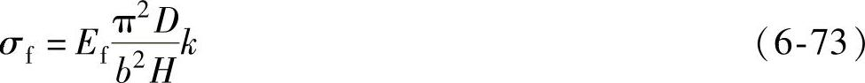

式中 E_(f)——面板模量；

D——弯曲刚度；

H——拉伸刚度；

k——由板的长宽比和弯曲、剪切刚度决定的常数。

临界应力计算受计算方法、材料性能、制造工艺等因素影响，与实际临界应力值有比较大的误差，故需要有较大的安全系数。

通过稳定性分析，得到每一剖面的临界压应力。设计要求叶片的最大压应力低于临界压应力。初步设计计算可满足工程要求，但优化设计应采用有限元方法。

3.变形分析

由于载荷作用，叶片会发生弯曲和扭转变形，叶片越长变形越显著。运行于极端状态的风力发电机组，应避免叶片与塔架之间产生碰撞，相关的风电技术标准对此也有明确的规定。GL准则规定，在极限载荷条件下，叶片最大变形不超过叶尖与塔架间隙的50％。

叶片变形计算可采用如下办法计算。

（1）叶尖变形

在外力作用下，叶片微段dr的变形如图6-23所示。

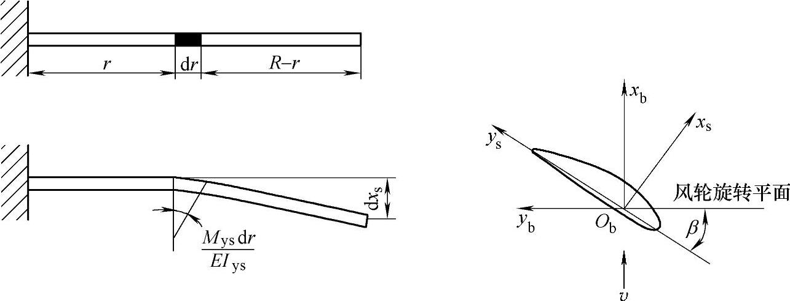

图6-23 叶片微段dr的变形

假定只有dr段是柔性的，其他部分为刚性的，则由于dr段变形引起的叶尖变形可表示为

式中 M_(ys)、M_(xs)——dr段相对y_(s)、x_(s)轴的弯矩。且有：

M_(xs)=M_(xb)cosβ-M_(yb)sinβ

M_(ys)=M_(yb)cosβ+M_(xb)sinβ

式中 β——叶素桨距角。

由于I_(xs)的数值较大，通常可以不计叶片在y_(s)方向的变形。将式（6-74）表述的变形转换到叶片坐标系下，则在x_(b)、y_(b)方向的变形依次为

dx_(b)=dx_(s)cosβ （6-76）

dy_(b)=-dx_(s)sinβ （6-77）

沿叶片展向对式（6-76）、式（6-77）积分，可得到叶尖的位移为

叶尖的总变形：

叶片上任意位置的变形，可将上述积分上限R改为该位置的R_(i)值即可。

（2）叶素桨距角的变化

由z_(s)轴力矩M_(zs)引起的叶素桨距角的变化可采用闭口薄壁杆件的扭转公式计算。叶片的扭转角为

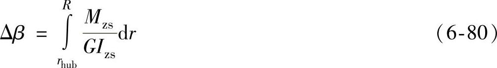

式中 M_(zs)——叶片承受的扭矩，单位为N·m；

G——剪切弹性模量，单位为Pa；

I_(zs)——截面极惯性矩，单位为m⁴。

### 六、定桨距叶片叶柄结构设计

叶柄是风轮中连接叶片和轮毂的构件。叶柄承受的载荷相对很大，叶片所承受的载荷通过叶柄向轮毂传递。由于玻璃纤维复合材料的层间剪切强度较低，所以叶柄结构是叶片设计的关键环节之一。

目前，叶柄结构主要有以下几种形式。

1.法兰式

如图6-24所示，这种叶根连接形式设计为两个带法兰的筒状结构，采用金属材料制造，通过螺栓连接叶根和轮毂。

叶根处的玻璃纤维复合材料仍然主要承受剪切应力，为了提高叶根处的承载能力，叶根附近的铺层应加厚，以扩大承载面积。同时，金属筒与叶根的连接螺孔位置应尽量靠近法兰顶面。

2.螺纹件预埋式

如图6-25所示设计结构，在叶根部位预埋金属连接构件，构件与轮毂连接的端面设有连接螺纹孔。这种叶根结构形式要求螺纹连接件的定位必须准确，但可以避免对玻璃纤维复合结构层的加工损伤，并减轻了连接构件的重量。

3.钻孔组装式

如图6-26所示，此种设计形式在叶片成型后，沿叶根部位周向钻孔，将金属螺纹连接构件装入，再通过叶根端部的通孔装入与金属构件连接的双头螺柱，实现与轮毂的连接。此种设计形式的主要特点是能够大幅度减轻连接构件的重量。但由于要在叶根部的纤维复合结构层上加工多孔，会破坏叶片材料结构的整体性，降低叶根部的结构强度，且螺纹件的垂直度不易保证。

至于变桨距叶片和轮毂连接形式，将在后文详述。

图6-24 法兰式叶柄结构

图6-25 螺纹件预埋式叶柄结构

图6-26 钻孔组装式叶柄结构

## 第五节 叶片优化设计

在叶片优化设计中，可以根据不同的需要，构造出不同的优化设计数学模型。这里仅就外形设计举一个简单的例子。优化设计数学模型包括设计变量、目标函数和约束条件。确定数学模型以后，还要选择适当的寻优方法求解。

### 一、设计变量

叶片的优化设计一般是在选定翼型的基础上进行的。设计变量应该是沿翼展方向翼型的弦长c、扭角θ、相对厚度δ_(max)/c等。

### 二、目标函数

可以取风力发电机组的年发电量为目标函数。由式（5-13）可得目标函数

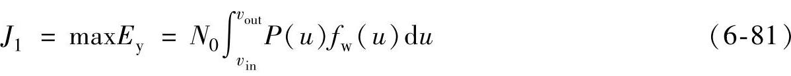

实际上，风力发电机组的年发电量由风电场特点和机组输出功率特性决定。

对于叶片设计而言，还要从叶片的气动性能来评价其优劣。当每个叶素的风能利用系数dC_(P)都最高时，就使得整个风轮的C_(P)值最高。由式（6-54）可得叶片气动参数所要达到的目标函数

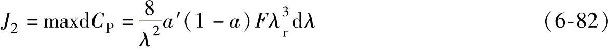

式中 F——总损失系数，见式（6-57）。

从而得到叶片优化设计时要达到的目标函数有式（6-81）和式（6-82）两个函数。

### 三、约束条件

1.风况约束

风电场风况是由自然环境决定的，准确地描述风电场风速分布是计算和评价风力发电机组发电量的基础和前提条件。

对于目标函数式（6-81）中的风速分布函数，常用的有RayLeigh分布和Weibull分布，而实际中主要采用Weibull分布。见式（5-12）。

2.功率控制约束

功率控制约束可以表达为

式中 v——风速，单位为m/s；

v_(in)、v_(out)、v_(r)——切入、切出、额定风速，单位为m/s；P_(N)——额定功率，单位为W；dP可以由式（2-60）推得，即

dP=ΩdM=4πρv_(∞)Ω²a′（1-a）Fr³dr

式中F——总损失系数，见式（6-57）。

3.气动约束

在求解上述气动优化目标时，要求满足式（6-53）所示的能量方程，用总损失系数F代替叶尖损失系数F_(t)，可得

a（1-aF）=a′（1+a′）λ²_(r) （6-84）

此外，气动优化目标函数中的各项参数还应满足如下关系式由图6-13可得

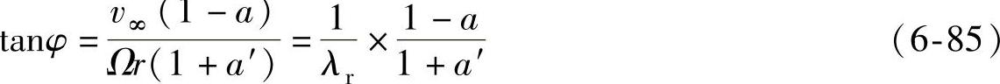

由式（6-55），用总损失系数F代替叶尖损失系数F_(t)得：

由图6-13可见：

β=φ-α （6-87）

4.攻角变化约束

由于叶片具有一定的厚度和宽度，使得轴向和周向速度都会发生改变，尤其在展弦比小、实度大的风力机中影响更大。叶栅理论给出了这种影响导致攻角的改变量：

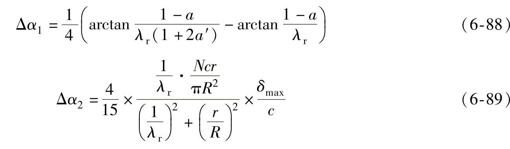

式中 Δα₁、Δα₂——分别是由于宽度和厚度引起的攻角改变量；

δ_(max)——叶素处翼型的最大厚度。

总的攻角改变量

Δα=Δα₁+Δα₂ （6-90）

从式（6-83）到式（6-90）就构成了叶片气动优化设计中的约束条件。

5.修形约束条件

以展弦比为关键约束变量，以气动优化约束条件下得到的外形参数为初值，以一定展弦比要求修正弦长及其他参数。具体约束如下

式中 S_(prmin)、S_(prmax)——指定的最小的和最大展弦比；

β_(root)、β_(tip)、β_(i)——分别为叶根、叶尖和截面i处的安装角；

δ_(tbroot)、δ_(tbtip)、δ_(tbi)——分别为叶根、叶尖和截面i处的厚度；

D_(yb)——叶根处叶柄的直径；

δ_(ti)——第i个截面处满足许用应力要求的最小厚度。

### 四、寻优算法

根据上述数学模型，即可选择适当的算法寻优。作为约束优化问题，可以用复合形算法、罚函数法、遗传算法等优化方法实现。

图6-27所示是某1.5MW风力机弦长、叶素桨距角、相对厚度优化设计结果。

图6-27 1.5MW风力机的叶片参数优化 a）弦长

图6-27 1.5MW风力机的叶片参数优化（续）

b）扭角 c）相对厚度

图6-27 所示优化设计结果的相关参数由表6-5给出。

表6-5 相关参数

## 第六节 轮毂

### 一、轮毂的结构设计

风轮轮毂的作用是将风轮的力和力矩传递到后面的机械结构中去，轮毂承受风作用在叶片上的产生的推力、扭矩、弯矩和回转力矩等。

轮毂多为铸造结构，其材料可以是铸钢，也可以采用高强度球墨铸铁。由于高强度球墨铸铁力学性能好、易成形、应力集中敏感性低、成本较低，得到广泛应用。

一般常用的轮毂形式有以下几种：

1.刚性轮毂

刚性轮毂的制造成本低、维护少、没有磨损，三叶片风轮大部分采用刚性轮毂，也是目前使用最广泛的一种形式。但它要承受所有来自风轮的力和力矩，相对来讲承受风轮载荷高，后面的机械承载较大。

2.铰链式轮毂（柔性轮毂或跷跷板式轮毂）

铰链式轮毂常用于单叶片或二叶片风轮，铰链轴和叶片轴及风轮旋转轴互相垂直，叶片在挥舞方向、摆振方向和扭转方向上都可以自由活动，也可以称为柔性轮毂。由于铰链式轮毂具有活动部件，相对于刚性轮毂来说，制造成本高，可靠性相对较低，维护费用高；它与刚性轮毂比所受力和力矩较小。对于二叶片风轮，两个叶片之间是刚性连接的，可绕联轴节活动。当来流在上下有变化或阵风时，叶片上的载荷可以使叶片离开原风轮旋转平面。

三叶片机组所用的轮毂有三面圆柱体和球体两种。前者包括三个和叶片同轴的圆柱形外壳，它们彼此张开并在交汇的地方结合成一体；后者为一个球壳并在三个叶片安装处有法兰或轴承。这两种类型如图6-28所示。

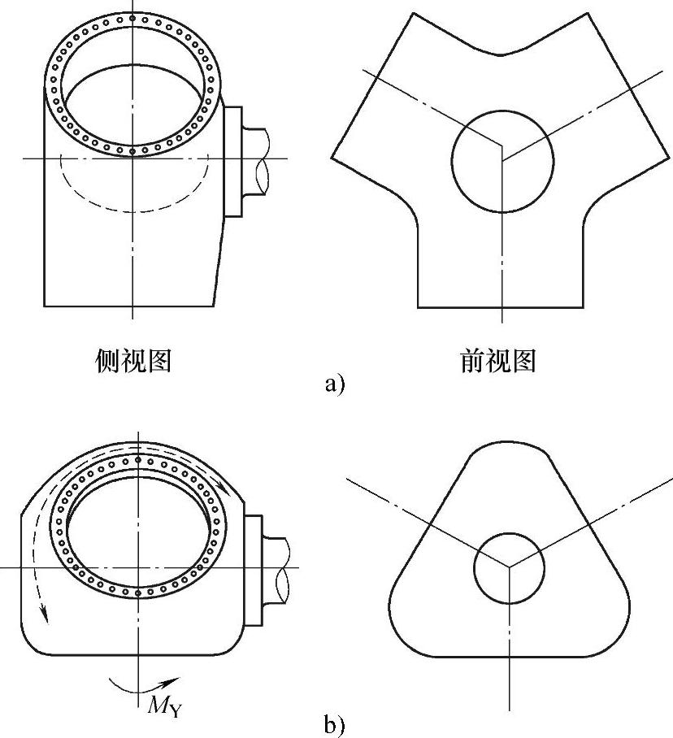

图6-28 轮毂视图

a）三圆柱轮毂 b）球形轮毂

### 二、轮毂的载荷分析

轮毂载荷包括作用于叶片上的气动、重力和惯性载荷，以及来自轴反作用力。

图6-28所示的轮毂抵抗三向载荷的作用力。

（1）对称的风轮推力载荷

对称的风轮推力载荷导致的叶片根部弯矩使轮毂前面靠近风轮轴的地方承受双向的拉力，后面承受双向的压力，而推力本身在轮毂壳体靠近低速轴法兰连接处产生面外的弯曲应力。

（2）一个叶片的推力载荷

这在轮毂壳体后部产生面外的弯曲应力，而在叶片轴承的引风面和远离叶片的低速轴接盘连接部分的弯曲载荷路径上产生面内拉伸应力（图6-28b中的虚线）。合成的横向载荷将引起面外的弯曲。

（3）叶片重力力矩

在三面圆柱体轮毂上，同向的和反向的叶片重力力矩通过圆柱形外壳传送到靠近风轮轴前面和后面的区域内，在那里它们相互抵消。球形轮毂的相应载荷路径就不是很直观，因为面外的弯曲是容易改变的。

后两种载荷的压力状态的复杂程度使对风轮轮毂的有限元分析变得十分必要。最多有六种载荷情况需要进行分析，分别对应于三个轴的转矩和在一个轮毂与叶片接口处的沿着三个轴向的分量。那么不同叶片上的载荷联合在轮毂上形成的应力分布可以通过叠加得到，类似地，一段时间内轮毂应力的波动可以通过输入由风模拟获得的叶片载荷时间历程推导出。

轮毂设计中的关键应力是内表面或外表面的表面应力，由于外壳变形，该应力达到了极限值。在轮毂的任意一个位置，它们都通过三个量在每个表面上进行定义：直角方向上的两个面内线应力和面内剪应力。总的来说，这些应力相互之间不会同时随时间而改变，所以总的应力方向将会改变，从而使疲劳评估复杂化。

因为轴应力波动，所以迄今为止还没有公认的方法来计算积累疲劳损伤。但是下面的方法已经被使用，它们只适合一个或多个系列重复的应力周期，而不适用于湍流载荷引起的随机应力波动。

1）最大剪切法：这里疲劳计算基于最大剪切应力幅，从（σ₁-σ₂）/2、σ₁/2或σ₂/2的时间历程计算得到。平均应力的影响可以使用Goodman关系：

式中 τ_(a)——交变剪应力；

τ_(m)——平均剪应力；

S_(SN)——从S-N曲线得到的N个载荷周期时的交变剪应力；

S_(Su)——最大剪切强度；

γ——安全系数。

利用式（6-94）来决定S_(SN)，此载荷幅的允许周期数可以从S-N曲线得到，从而可以计算出相应的疲劳损伤。

2）ASME锅炉和压力容器规则法：该方法和最大剪切法类似，但是其剪应力幅基于理论主应力，主应力可以通过σ_(x)、σ_(y)、σ_(z)、τ_(xy)、τ_(yz)和τ_(zx)的变化计算得到，以上这些数据可以在某个最大应力周期内取得。平均应力影响不包括在内。

3）变形能法：这种方法的疲劳计算基于应力的有效波动或Von Mises应力。对于轮毂壳体来说，垂直于壳体表面的应力（称之为第三种基本力）为零，所以有效应力为

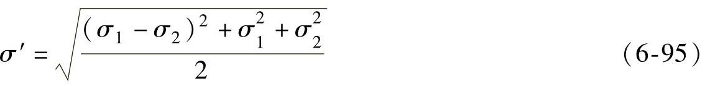

因为有效应力是基于变形能，它是一个标量，所以它需要分配一个符号对应于理论主应力。除了式（6-94）中的应力为线应力而不是剪应力外。平均应力的影响允许像最大剪切法那样考虑。

