# 7 风力发电机

## 第一节 风力发电机的基本工作原理及分类

### 一、基本工作原理

发电机是风力发电机组的重要部件，它把风力机主轴输出的机械能转换成电能并输送给电网（或储存在蓄电池中）。与其他类型电机一样，风力发电机的工作原理基于电磁感应定律和电磁力定律。电磁感应定律指出，导体在磁场中切割磁力线运动时将感生电动势；电磁力定律指出，处于磁场中的载流导体将产生电磁力。正是依靠这两条定律，发电机才能实现机电能量转换。这两条定律的公式如式（7-1）和式（7-2），式中各物理量的正方向如图7-1所示。

图7-1

电磁感应定律 e=BLv （7-1）

电磁力定律 f=BLi （7-2）

式中 e——感应电动势（V）；

f——电磁力（N）；

B——磁感应强度（T）；

L——导体的有效长度（m）；

v——导体运动的线速度（m/s）；

i——导体电流（A）。

由式（7-1）和式（7-2）可以看出，发电机实现机电能量转换的必要条件是必须有磁场（磁极）和导体（绕组），这是构成发电机的物质基础。二者之间相对运动就产生了感应电动势，而一旦电枢导体中在感应电动势的作用下流过电流，就会产生电磁转矩。依靠电磁转矩，发电机从轴上吸收风力机产生的机械能；依靠感应电动势，发电机向电网（负载）输出电能，从而实现从机械能到电能的转换。电机磁场可以由永磁体产生，也可以由励磁绕组通以励磁电流产生，励磁电流可以是直流电流，也可以是交流电流；电机绕组的型式更是多种多样，如直流绕组、交流绕组、励磁绕组、短路绕组等。不同的磁场产生方式和不同的绕组结构型式，就构成了不同类型的发电机。可以说，发电机的工作原理就是有关发电机的磁场、绕组、感应电动势、电磁转矩以及能量转换关系在发电机中相互关联和相互作用的原理。

由以上分析可知，一台电机是由其电系统和机械系统两部分构成的，通过磁场的耦合作用而形成了一个有机的整体。电机的定、转子绕组构成了电机的电系统，而各种转矩作用下的转轴则构成了电机的机械系统。

电机的电系统通过感应电动势与外部电系统相联系，在感应电动势的作用下，向外部电系统输出电功率（发电机）或从电网吸收电功率（电动机）。这种联系的数学描述就是电压平衡方程式。

电机的机械系统通过电磁转矩与外部机械系统相联系，在电磁转矩的作用下，从外部机械系统吸收机械功率（发电机）或向外部机械系统输出机械功率（电动机）。这种联系的数学描述就是转矩平衡方程式。

电机的机械能-电能之间的转换关系则由功率平衡方程式来描述。上述方程式构成了描述电机内部基本物理关系的基本方程式，是对电机性能进行分析和计算的理论基础。

### 二、分类

目前，风力发电机广泛采用笼型感应发电机、双馈感应发电机和同步发电机。由于直流风力发电机的运行可靠性差，维护成本高，已经很少应用，这里不作介绍。发电机的选型与风力机类型以及控制系统的控制方式直接有关。当采用定桨距风力机和恒速恒频控制方式时，应选用感应发电机。为了提高风电转换效率，感应发电机常采用双速型，可以采用双绕组双速型，也可采用单绕组双速型。采用变桨距风力机时，应采用笼型感应发电机或双馈感应发电机。采用变速恒频控制时，应选用双馈感应发电机或同步发电机，近年来也开始选用笼型感应发电机。同步发电机中，可以采用永磁同步发电机（用永磁体产生主磁场），也可采用电励磁同步发电机（在励磁绕组中通以励磁电流产生主磁场）。为了降低控制成本，提高系统的控制性能，人们正在研究混合励磁（既有电励磁、又有永磁）的同步发电机。对于直驱式风力发电机组，一般采用低速（多极）永磁同步发电机。

风力发电机的分类如图7-2所示。

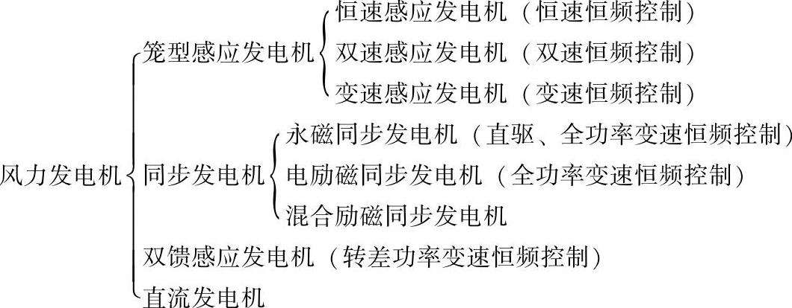

图7-2 风力发电机的分类

不同类型风力发电机的结构特点、所使用的材料以及各主要零部件的作用等一并归纳在表7-1中，供读者对照参考。

表7-1 发电机的结构特点

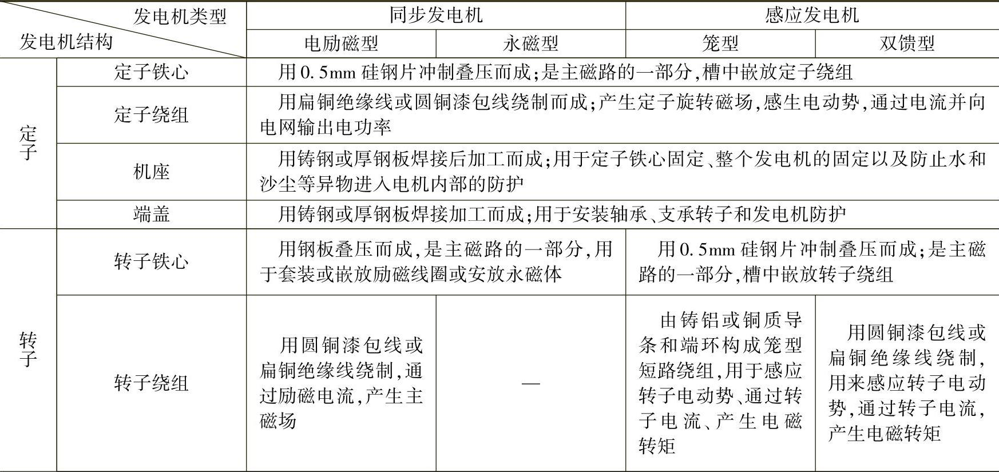

（续）

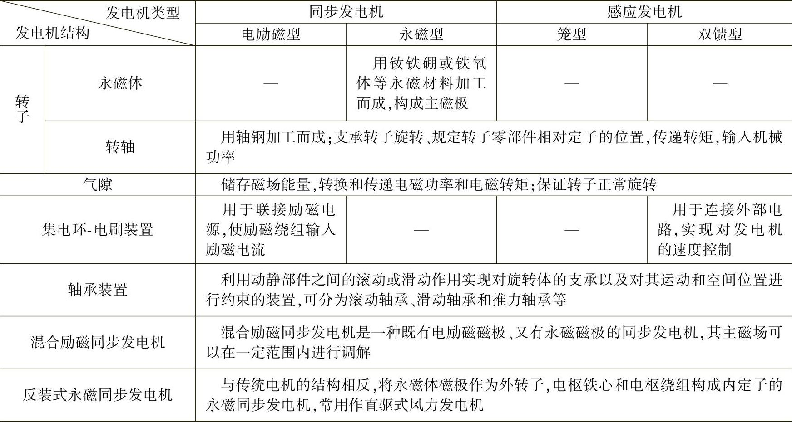

## 第二节 发电机的设计基础

### 一、设计的技术要求

1.设计依据

国家标准是发电机设计的基本依据。发电机设计时，应全面贯彻、执行有关国家标准。

电机的国家标准是国家有关部门在总结电机设计、制造和使用经验的基础上，从当前实际情况出发，并考虑今后的发展需要，对电机产品提出一系列技术要求的具有强制性或推荐性的技术文件。电机技术标准综合考虑了电机产品的实用性、技术上的先进性、经济上的合理性、使用上的可靠性以及生产上的可行性，是电机设计和生产的依据，也是评价电机性能优劣的准则。

电机的技术标准大体上可分为三大类：

（1）对电机提出一般性规定和基本技术要求的通用标准，例如GB 755《旋转电机 定额和性能》中，规定了旋转电机的名词术语、工作制、定额、现场运行条件、电气运行条件、热性能和试验、其他性能和试验、以及铭牌、容差、电磁兼容、安全和其他要求等；又如GB/T 4942.1《旋转电机 整体结构的防护等级（IP代码）分级》中，对各种旋转电机外壳防护结构以及对水和固体微粒进入电机内部的防护等级作出了规定。前者为强制性国家标准，后者为推荐性国家标准。

（2）规范某一类型电机基本技术要求的技术条件。例如GB/T 23479.1《风力发电机组 双馈异步发电机 第1部分：技术条件》中，对双馈异步发电机的名词术语、结构型式和定额、运行条件和技术要求、试验方法和验收规则、安全和警示标记等均作出了明确规定。

（3）电机的试验方法。例如GB/T 23479.2《风力发电机组 双馈异步发电机 第2部分：试验方法》中，对双馈异步发电机的试验要求及试验准备、试验项目及试验方法等均作出了具体规定和详细说明。

在设计和生产发电机时，发电机的电气和机械性能应全面满足有关技术标准的要求。表7-2为风力发电机的有关国家标准。

表7-2 风力发电机的有关国家标准

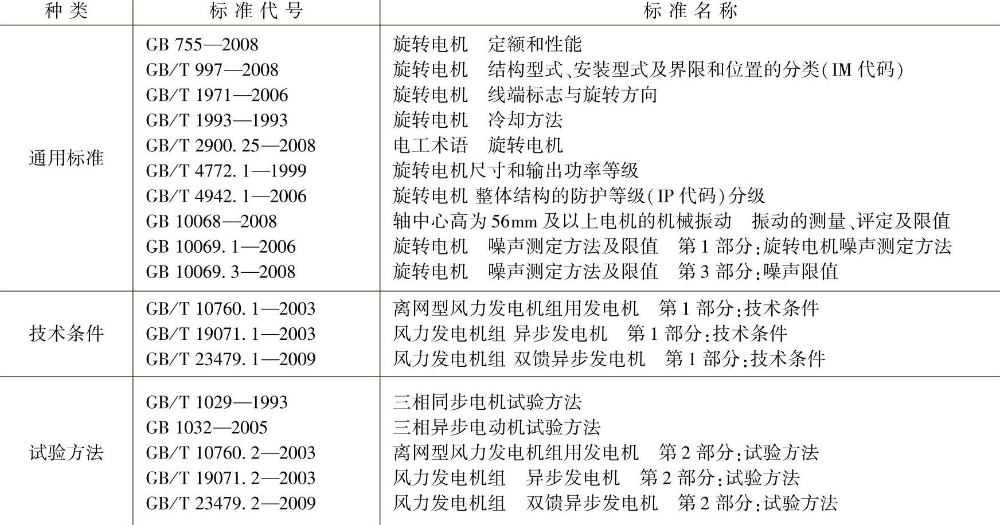

2.设计内容

发电机设计一般分为两个阶段，即电磁设计阶段和结构设计阶段。

电磁设计是根据相关国家标准和设计任务书的规定，选定材料，确定定、转子尺寸和绕组数据，通过磁路计算和参数计算，最终核定电机的电磁性能。电磁设计时，常常需要进行多方案比较，以便从中优选出最佳方案。

结构设计是根据相关国家标准和设计任务书的规定，在电磁设计所确定尺寸的基础上，确定电机的机械结构、零部件尺寸，材料规格、加工工艺等，有时，还需进行必要的机械计算、冷却通风计算和温升计算。

通常情况下，应先进行电磁设计，再进行结构设计，但有时二者也需要平行交叉地进行，以便相互调整。

3.额定数据

额定数据是记载发电机额定运行时的运行状态和主要运行条件的一组数据，也常称为额定值或铭牌数据。发电机按额定数据所规定的状态和条件运行时，称为发电机额定运行。

风力发电机设计时，通常需要给定以下额定数据：

1）额定功率，是指额定运行情况下发电机线端输出的电功率（W、kW、MW）。

2）额定电压，是指额定运行情况下发电机线端输出的线电压（V、kV）。

3）额定电流，是指额定运行情况下发电机电枢绕组（或定子绕组）的线电流（A）。

4）额定频率，是指额定运行情况下发电机电枢侧（或定子侧）的频率（Hz）。

5）额定转速，是指额定运行情况下发电机转子的转速（r/min）。

此外，额定数据中还应包括电机的定额（未标明定额时，则表明是S1工作制和连续工作制定额）、绝缘等级（风力发电机多为F级绝缘或H级绝缘但按F级考核）、A计权声功率级的噪声等级以及电枢绕组（或定子绕组）接法（一般为接法）等。对于同步发电机，还应包括额定励磁电压（V）和额定励磁电流（A）；对于双馈异步发电机，还应包括转子额定电压和转子额定电流。

对于变速运行的发电机，应给出其转速调节范围，依靠变频调速的，还应给出相应的频率调节范围，以便进行电磁设计时，对发电机在相应转速或频率下的运行状态和运行条件进行必要的校核计算，以利于对发电机的电磁性能作出全面评估。

发电机设计时，一般从确定额定数据开始。确定额定数据不能是随意的，而应依据相应的国家标准和相关基本原理来确定。例如，确定额定功率时，应依据国家标准GB/T 4772《旋转电机尺寸和输出功率等级》的规定；确定额定电压时，应依据国家标准GB 156《标准电压》的规定等。

额定同步转速n_(N)（r/min）的确定则严格遵循式（7-3）所确定的关系，

n_(N)=60f_(N)/p （7-3）

式中，f_(N)为额定频率；p为发电机的极对数。例如，当f_(N)=50Hz、p=2时，n_(N)=1500r/min。

额定电流应根据发电机输出的有功功率P_(N)（W）的计算公式来确定，即

P_(N)=mU_(N)I_(N)cosφ_(N) （7-4）

式中，m为发电机的相数；U_(N)为额定相电压（V）；I_(N)为额定相电流（A）；cosφ_(N)为额定功率因数。例如，当P_(N)=1500kW、m=6、U_(N)=690V、cosφ_(N)=1时，I_(N)=362A。

实际上，发电机的额定数据（铭牌数据）常常需要以试验数据为准，也就是说，需要待型式检验完成并合格后才能最后确定。

### 二、主要尺寸

发电机的主要尺寸是指电枢（定子）铁心直径D和铁心轴向长度L。发电机设计时，额定数据确定后，需要首先确定主要尺寸。

经过100多年的发展，电机设计和制造技术已经相当成熟，有大量成功的经验和资料可以借鉴，因此，设计一台新型电机时，工程上经常采用的是所谓“类比法”。电机设计的“类比法”就是参考相同类型、相近规格的已制成电机的结构和尺寸数据，经校核计算，最终确定所设计电机的结构和尺寸。

如果没有相同类型、相近规格电机的数据可供参考时，则可依靠式（7-5）确定发电机的主要尺寸，常称该公式为电机设计的基本方程式。

式中 D——电枢（定子）铁心直径（m）；

L_(eff)——电枢计算长度（m）；

n——发电机转速，一般取额定转速（r/min）；

P′——计算功率（V·A），P′=mEI，对于异步电机，电枢绕组电动势E可用端电压

U代替，对于同步电机，则须利用电动势公式（E=4.44fNK_(dp1)Φ）进行估算，

其中N为每相绕组的串联匝数，Φ为每极磁通量（Wb）；

α′_(p)——计算极弧系数，α′_(p)=B_(δau)/B_(δ)，其中B_(δau)为气隙平均磁密（T）；

K_(Nm)——气隙磁场波形系数，当气隙磁场正弦分布时等于1.11；

K_(dp)——电枢绕组的绕组系数，通常取基波绕组系数K_(dp1)；

A——线负载（A），即电枢圆周单位长度的安培导体数；

B_(δ)——磁负载（T），也就是气隙磁密的最大值，简称气隙磁密。

仔细观察式（7-5），可以得出以下结论：

1）基本方程式的中间部分分母中各量的变化范围都很小，因此中间部分基本上是一个常数C_(A)，称为电机常数。电机常数的倒数K_(A)=1/C_(A)反映了电机有效材料的利用程度，称为电机的利用系数，进行电磁方案比较时，利用系数常常是一个重要的比较指标。

2）D²L_(eff)大体上反映了电机有效部分的体积和有效材料的用量。当D²L_(eff)不变时，转速与计算功率之比（n/P′）基本不变。也就是说，在电机体积相同的情况下，转速低时功率小，转速高时功率大，转速与功率基本上是成比例变化的。或者说，在功率相同的情况下，两台电机的体积可因转速的不同而相差极大（基本上为反比例关系）。例如，两台风力发电机的额定功率均为1500kW，一台的额定转速为1500r/min，另一台为15r/min（直驱式），转速相差100倍，则根据式（7-5），低转速电机的体积将是高转速电机体积的约100倍。

可见，对于直驱式风力发电机，由于额定转速很低，因此体积很大，不仅影响到发电机本身的结构设计（例如可以考虑采用永磁磁极和外转子结构等），也将在很大程度上影响到机舱和轮毂的结构设计。

3）当电机的电枢直径D不变，转速n也不变时，可通过改变铁心的轴向长度L_(eff)来改变电机的额定功率P_(N)。这一原理主要应用于系列电机的设计。系列电机设计时，同一个机座号的机壳，通过改变铁心长度，可以设计出2～3（甚至更多）种不同功率等级的电机，因而，给系列电机的设计和制造带来了很大方便。

4）电、磁负载（A和B_(δ)）的大小不仅直接影响到电机有效材料的用量和电机体积，而且直接影响到电机的热负载以及运行的可靠性和寿命。相同类型电机的电磁负载的变化范围一般都很小，而不同类型、不同工作制、容量等级相差很大电机的电磁负载的选取一般是有一定差别的。例如，短时工作制电机的电负载通常要比连续工作制电机的高些；大容量电机的电磁负载一般要比小容量电机的低些等。

5）D²L_(eff)确定后，还需要分别确定D和L_(eff)的具体大小，才有可能继续进行下一步的设计计算。D大而L_(eff)小，则电机为短粗形，反之为细长形。考虑到转速引起的离心力对电机结构的影响，对于高转速电机（例如双馈异步发电机），应为细长型；对于低转速电机（例如直驱式永磁同步发电机）则应为短粗形。为了反映电机的上述结构上的变化，电机设计中引入了主要尺寸比λ（也常称为细长比）这一概念，即

λ=L_(eff)/τ （7-6）

式中 τ——电机的极距。

由于极距τ与电枢直径D成正比，因此，主要尺寸比λ就反映了电枢长度与电枢直径之间的比例关系。对于同一种类型电机，其主要尺寸比λ的变动范围很小，因此，在根据式（7-5）确定了D²L_(eff)之后，再根据主要尺寸比λ的经验值，即可分别确定D和L_(eff)的大小了。

由于主要尺寸比λ对电机的参数和性能会产生一定的影响，因此，电机设计时，应经过多方案综合比较后，再最终确定之。

### 三、电机绕组

1.电机绕组的分类

绕组构成了电机的电系统，是电机的重要部件。电机绕组可分为磁极绕组（或称为励磁绕组）、换向器绕组、交流绕组以及短路绕组等，如图7-3所示。

图7-3 电机绕组的分类

磁极绕组中通以直流励磁电流即可建立起电机的主极磁场。直流电机和凸极同步电机的磁极绕组为套装在磁极极身上的集中绕组，隐极同步电机的磁极绕组为嵌放在转子槽中的同心式绕组。因磁极绕组负责建立电机的主极磁场，因此常称为励磁绕组。

换向器绕组是一种闭合绕组，它的每一个线圈元件的首端和末端都按一定规律与换向器的换向片相连接，利用电刷将绕组截分成若干条并联支路，并通过电刷与外部电路相连接。直流电机的电枢绕组和交流换向器电机的电枢绕组均为换向器绕组。换向器绕组一般为双层绕组，有叠绕组、波绕组及蛙绕组等几种类型。

单相交流绕组主要用于单相感应电动机的定子绕组。为了解决单相感应电动机的自起动问题，单相交流绕组通常都做成两相绕组，两相绕组可以是对称绕组（正反转运行电机），也常常为不对称绕组。为了改善单相电机的性能，单相交流绕组又常常设计成正弦绕组。

多相交流绕组一般为多相对称绕组，主要是三相对称绕组，主要用于三相感应电机定子绕组和同步电机电枢绕组。多相交流绕组的对称性表现在两个方面，即多相绕组沿电机圆周分布的对称性和每相绕组在相邻磁极下分布的对称性。多相绕组沿电机圆周分布的对称性影响到合成磁场的椭圆度，从而直接影响电机的运行性能；每相绕组在相邻磁极下分布的对称性决定了电机磁场和绕组电动势波形是否满足镜对称特性。对称分布的绕组连同对称分布的磁路一起，构成了电机电磁结构上的对称性。

短路绕组是一种在电机内部被自行短路的绕组。例如，笼型感应电机的转子绕组，其所有导条被前后两个端环短路而构成了笼型短路绕组，笼型绕组导条与气隙磁场相互作用产生电磁转矩；同步电机的阻尼绕组也是短路绕组，其结构与笼型感应电机的转子笼型绕组相似，可用来提高同步电机运行的动态稳定性。

2.电机绕组的基本概念

在学习电机设计理论时，常常会遇到一些有关电机绕组的基本概念，这些基本概念不解决，电机设计理论的学习就会感到困难重重。这里将一些主要概念作了归纳。风力发电中主要使用交流电机，因此这里也主要介绍交流电机绕组的基本概念。

交流绕组可以有很多种。按相数可分为单相绕组和多相绕组；按相带可分为30°相带、60°相带、120°相带以及其他非正规相带绕组；按每极每相槽数可分为整数槽绕组和分数槽绕组；按槽内层数可分为单层绕组、双层绕组以及单双层绕组；按线圈连接方式可分为叠绕组和波绕组以及同心式、链式、交叉式等。

下面把有关交流绕组的一些基本概念作简要介绍。

（1）线圈

线圈是构成交流绕组的基本单元，分为叠绕线圈和波绕线圈，如图7-4所示。二者的主要区别是叠绕线圈的两个相连线圈距离很近（一般相差1个槽），下线时后面的线圈叠在前面的线圈上，而波绕线圈的两个相连线圈距离很远（一般接近2个极距），将其展开后形似波浪，故而得名。

图7-4 交流绕组的线圈

a）叠绕组线圈 b）波绕组线圈

（2）节距

交流绕组的节距分为前节距和后节距，一般用槽数表示。一个线圈的两个线圈边在电枢（定子）圆周所垮的距离称为绕组的前节距y₁；对于相互串联的两个线圈，第一个线圈的后线圈边与第二个线圈的前线圈边在电枢（定子）圆周所垮的距离称为绕组的后节距y₂；相互串联的两个线圈的对应线圈边之间的距离称为合成节距y，显然，合成节距y为前节距y₁与后节距y₂之和，即y=y₁+y₂，如图7-4所示。通常所说的绕组节距一般是指前节距y₁。为了获得较大的感应电动势，线圈节距y₁一般等于或接近一个极距τ，为了改善磁动势和电动势波形，交流电机大多采用短距绕组。

（3）机械角度和电角度

机械角度就是电枢铁心圆周的几何角度，显然，整个铁心圆周为360°机械角度。而电枢导体每经历（切割）了气隙磁场的一对N、S极，导体中的电动势和电流就将变化一个周期，这是360°电角度。电角度又有空间电角度和时间电角度之分。将一对磁极在空间占有的电角度称为360°空间电角度，将电动势或电流随时间变化一个周期所经历的电角度称为360°时间电角度。显然，对于极对数为p的电机，铁心圆周上总共有p360°电角度，因此，电角度是机械角度的p倍。进行电机的理论分析和设计计算时，常使用电角度。

（4）槽距角

两个相邻槽中心线之间所夹的电角度称为槽距角。若铁心的总槽数为Q、极对数为p，则槽距角α按下式计算：

（5）每极每相槽数

电机每极下每相绕组所占的槽数称为每极每相槽数。每极每相槽数q按下式计算：

式中 m——电机的相数。

显然，式（7-8）可能为整数，也可能为分数。当每极每相槽数q为整数时，称为整数槽绕组；每极每相槽数q为分数时，称为分数槽绕组。少极数高转速电机大多采用整数槽绕组，而多极数低转速电机一般采用分数槽绕组。例如，双馈异步发电机（4极、1500r/min）一般为整数槽绕组，而直驱式永磁同步发电机（88极、15r/min）则为分数槽绕组。

（6）相带

相对集中的每相绕组在电机圆周所占的电角度称为相带。电机中常用的相带为60°和120°相带，一般称为正规相带，此外的其他相带则统称为非正规相带。60°相带一般指每极下每相绕组所占的电角度；而120°相带则一般是指每对极下每相绕组所占的电角度。整数槽绕组一般采用60°相带，即qα=60°。采用60°相带绕组可以提高铜线的利用率，即获得较大的感应电动势。

双速笼型感应发电机大多采用4/6变极。做成双绕组双速电机时，4极和6极均可做成60°相带整数槽绕组；但做成单绕组双速电机时，若4极时做成60°相带整数槽绕组，则变为6极时将变成非正规相带绕组（例如变为180°相带）。非正规相带绕组电动势中的谐波成分较多，电动势波形较差。因此，双速笼型感应发电机大多做成双绕组双速电机。

（7）绕组系数

绕组系数k_(dp)是绕组分布系数k_(d)与绕组短距系数k_(p)的乘积。基波绕组系数k_(dp1)是表明绕组铜线利用率的一个参数。相绕组串联匝数N₁与k_(dp1)的乘积（k_(dp1)N₁）称为每相绕组有效串联匝数。显然，总有k_(dp1)≤1。

为了有效削弱绕组磁动势和电动势中的高次谐波，交流绕组一般都设计成分布绕组和短距绕组。绕组基波分布系数k_(d1)与基波短距系数k_(p1)如以下二式：

两个公式的中间部分分别表明了分布系数和短距系数的物理意义，适用于各种型式的绕组，而右侧的计算公式则只适用于60°相带整数槽绕组。

绕组基波分布系数k_(d1)与基波短距系数k_(p1)的乘积即为基波绕组系数，即

k_(dp1)=k_(d1)k_(p1) （7-11）

对于60°相带分数槽绕组，每极每相槽数可表示成如下分数：

式中 q′——等效每极每相槽数，q′=bd+c。

等效槽距角α′可用下式计算

α′=60/q′ （7-13）

60°相带分数槽绕组的基波分布系数仍可用式（7-9）表示，只是其中的q和α需要用q′和α′来代替，即

采用分布、短距绕组是削弱高次谐波，改善电动势和磁动势波形的有效方法。但电机中还存在一种叫做齿谐波的高次谐波，这种齿谐波是不能用分布、短距绕组来削弱的。这是因为齿谐波绕组系数与基波绕组系数相等，因此，在削弱齿谐波的同时，基波也将受到同样的削弱，这是不允许的。工程上常采用斜槽、斜极以及采用分数槽绕组等来抑制齿谐波，收到了很好的效果。

（8）感应电动势

感应电动势是电机中最重要的物理量之一。电动机依靠感应电动势从电网吸收电能，然后转换成机械能输出；发电机则从轴上吸收机械能，依靠感应电动势建立端电压并向负载输出电能。交流电机电枢相绕组基波电动势的有效值E₁为

E₁=4.44f₁N₁k_(dp1)Φ₁ （7-15）

式中 f₁——电动势的频率（Hz）；

N₁——绕组每相串联匝数；

k_(dp1)——基波绕组系数；

Φ₁——每极磁通量（Wb）。

对于60°相带整数槽绕组，可按下式确定每相串联匝数N₁：

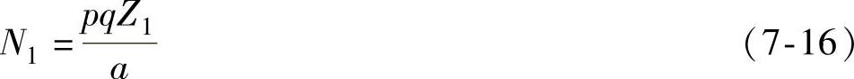

式（7-15）是交流电机的一个重要公式。可以看出，电枢绕组感应电动势的大小与频率、每相有效串联匝数以及每极磁通量等有关。对于变速恒频风力发电机组，随着机组转速的变化，电动势频率成正比变化，电动势的有效值也将成比例变化。因此，发电机设计时，其额定频率的确定常可不必拘泥于某一特定频率，而应全面考虑发电机的综合性能以及经济性，适当加以确定。当发电机的主要尺寸和额定频率确定后，常通过调整每槽导体数（即调节每相串联匝数）来调节电动势的大小，尽管可供调整的范围很有限，而且会引起一系列参数和性能的重新计算。

（9）绝缘结构

绕组是电机的重要部件，也是电机中事故率较高的部件。绕组中最薄弱的部分是绕组的绝缘，人们常说的“电机烧毁”主要指的是绕组绝缘烧毁。实际上，电机的绝缘结构主要是指电机绕组的绝缘结构，主要包括：匝间绝缘、槽绝缘、层间绝缘、相间绝缘、槽楔、端部绑扎、引接线绝缘以及浸漬漆等。电机设计时，合理选择绝缘材料和绝缘结构，可以提高电机运行的可靠性和使用寿命，降低电机的制造成本。

电机的绝缘结构分级见表7-3。我国一般用途中小型电机常采用B级和F级绝缘。对于有特殊要求的电机及高温、频繁起制动、频繁正反转以及冲击性负载等场合使用的电机，多采用F级或H级绝缘。风力发电机的绝缘结构等级一般为F级，为了提高发电机的可靠性和使用寿命，常采用H级绝缘材料，但其温升一般仍按F级考核。

表7-3 绝缘结构分级及空气间接冷却交流绕组温升限值

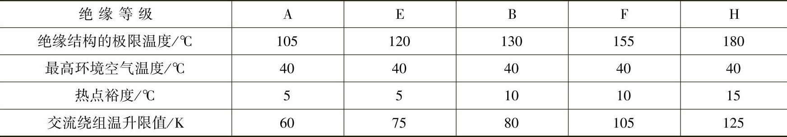

### 四、磁场与磁路

1.电机的磁场

磁场是电机实现机电能量转换的物质基础之一，磁场的波形和大小对电机性能影响极大。磁场是由磁动势产生的，电机绕组中流过电流时就会产生磁动势，因此，也常把磁动势称为安匝（安培匝数）或安导（安培导体数）。绕组中流过直流电流时产生直流绕组磁动势，将建立恒定磁场，恒定磁场的极性不变，磁场轴线与绕组轴线相互重合并且相对静止。交流绕组中流过交流电流时产生交流绕组磁动势，将建立交变磁场，交变磁场的极性随时间交替变化。单相交流绕组产生的是一个沿绕组轴线交变的脉振磁场，而多相交流绕组合成产生的是一个沿气隙圆周交变的旋转磁场。图7-5示出了几种常用电机的空载磁场波形。

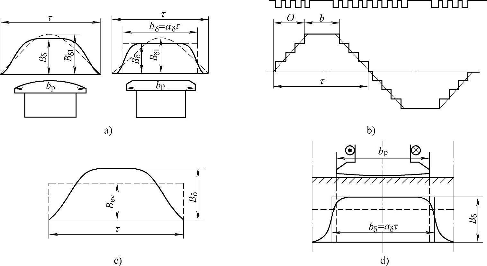

图7-5 几种常用电机的空载磁场波形

a）凸极同步电机 b）隐极同步电机 c）感应电机 d）直流电机

电机中磁场的分布十分复杂，为了简化分析计算，常将电机中的磁场分为主磁场和漏磁场两部分。主磁场通过气隙，同时交链定、转子绕组，并直接参与机电能量转换。交流电机主磁场以同步转速旋转，“切割”电枢（定子）绕组并在其中感应电动势。由基波磁动势产生的基波主磁场的每极基波磁通称为电机的主磁通。

漏磁场一般不通过气隙（谐波漏磁场除外），只与产生漏磁场的绕组本身交链，不参与机电能量转换。交流电机分析计算时，常将漏磁场对电机性能的影响等效成绕组内部产生的一个漏阻抗压降来考虑，而有关漏阻抗的计算将在参数计算中完成。

2.电机的磁路

目前，电机电磁场分析计算的“有限元法”已经相当成熟，对于某些新型电机（例如永磁电机等）的磁场分析，只有借助于“有限元法”才能获得较高的计算精度。然而，大多数交流电机设计计算时，为了方便起见，常将在空间三维分布的磁场计算等效成简单的磁路计算，磁路计算方法与我们熟悉的电路计算十分相似。磁路计算的目的主要有两个，一是校验磁路各部分的磁密分布是否合理，从而校验各部分尺寸的合理性；二是计算励磁磁动势、励磁绕组参数以及电机的空载特性等。

电机设计时的磁路计算是针对主磁路进行的，主磁路就是主磁通所经过的闭合路径。交流电机的主磁路一般选择通过每对磁极中心线的闭合路径。图7-6所示为凸极同步电机主磁路的计算路径。

根据全电流定律，磁场强度沿闭合回路的线积分等于该回路所包围的全电流，即

如果积分路径沿磁场强度矢量取向，则上式左边为磁场强度H沿dl方向的线积分，等式右边为回路所包围的全电流，即为每对极励磁磁动势。这时，式（7-17）所示的线积分可用如下求和式来等效，即

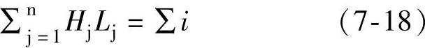

式（7-18）表明，进行磁路计算时，可以将电机主磁路分成若干段，分别计算出各段磁路的磁场强度和磁路计算长度，他们的乘积即为各段磁路所需安匝数，各段磁路所需安匝数之和即为每对极励磁磁动势。

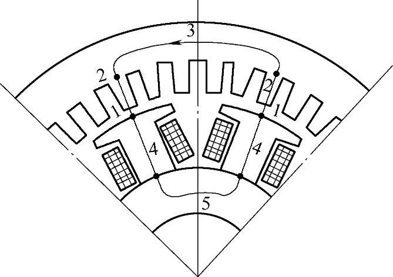

图7-6 凸极同步电机主磁路的计算路径

可根据电机磁路的结构特点，按以下方法进行分段：对于交流电机，应包括两个气隙、两个定子齿、一个定子轭、两个转子极身（或转子齿）、一个转子轭。各段磁路的磁场强度H_(j)可根据计算出的各磁通密度B_(j)，查取相应材料的磁化曲线求得。

由图7-6可以看出，每对极主磁路中，两个极的磁路基本上是以极间中心线为对称的，因此，只需计算闭合回路的一半（即每极磁路）就可以了，当然，计算结果为每极励磁磁动势。

工程实践证明，将复杂的磁场计算简化成简单的磁路计算，用于电机的稳态性能计算时，不会引起很大的误差。

图7-7示出了感应电机的主磁通与漏磁通所经路径的示意图。

图7-7 感应电机的主磁通与漏磁通

a）主磁通 b）槽漏磁和端部漏磁

3.磁路计算的一般步骤

发电机设计时，磁路计算一般按如下步骤进行：

1）假定满载气隙电动势；

2）计算每极磁通量；

3）计算气隙面积、定子齿部截面积、转子极身（或转子齿）部截面积、定子轭部截面积、转子轭部截面积；

4）假定波幅系数和饱和系数；

5）计算气隙磁密、定子齿磁密、转子极身（或齿）磁密、定子轭磁密、转子轭磁密；

6）根据计算出的磁密，查取相应铁心材料的磁化曲线，查得各部分磁路的单位长度所需安匝数（即磁场强度）；

7）计算各部分磁路的计算长度；

8）计算各部分磁路的所需安匝数；

9）计算饱和系数，与（4）不符时，重新假定饱和系数并重新计算有关项。

10）计算总安匝数（即每极（或每对极）励磁磁动势）；

11）计算励磁电流、励磁电抗及空载特性等。

实际上，不同类型发电机的磁路计算步骤不尽相同，应根据实际需要确定计算步骤和具体计算项目。例如，对于永磁同步发电机，除上述步骤（1）～（10）以外，还应计算主磁导和漏磁导等参数，以及确定永磁体的空载工作点等。不同类型发电机的磁路计算请参见第三节～第五节的有关内容。

### 五、参数计算

所谓电机参数，就是电机等效电路中的电阻和电抗参数。电机设计时所涉及的主要是稳态等效电路中的稳态参数的计算。感应电机的稳态参数主要有定子漏阻抗Z₁（包括定子电阻R₁和定子漏电抗X₁）、转子漏阻抗Z₂（包括转子电阻R₁和转子漏电抗X₁）以及励磁阻抗Z_(m)（包括铁耗等值电阻R_(m)和励磁电抗X_(m)）。同步电机的稳态参数主要有交轴同步电抗（包括电枢漏电抗和交轴电枢反应电抗）和直轴同步电抗（包括电枢漏电抗和直轴电枢反应电抗）。同步电机电枢漏电抗的计算与感应电机定子漏电抗计算方法相同；同步电机电枢反应电抗的计算则与感应电机的励磁电抗计算相似，这是由于二者均与多相交流绕组电流在气隙中所产生的基波磁场相对应，也常常因此把二者统称为主电抗。显然，漏电抗也应与相应的漏磁场相对应。

电机参数对电机性能影响极大，对于感应发电机，主要影响其功率因数、短路电流以及过载能力等；对于同步发电机，主要影响电压调整率、稳态短路电流以及静态稳定性等。交流电机设计时，磁路计算和参数计算是基础性的计算，只有磁路计算和参数计算具有较高的精度，电机性能计算的精度才能有保障，按照所设计的方案制作出来的电机的质量也才能有保障。

绕组直流电阻R（Ω）的计算比较简单，可按下式进行：

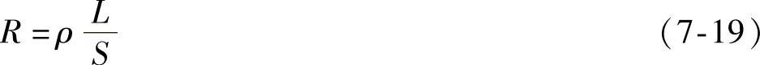

式中 ρ——导体材料的电阻率（Ωm）；

L——绕组导体的长度（m）；

S——绕组导体的截面积（m²）。

电抗计算一般采用所谓“磁链法”。如所周知，线圈的电抗X可以写成如下形式：

X=ωL （7-20）

式中 ω——线圈电流交变的角频率，ω=2πf（rad/s），其中f为电流频率（Hz）；

L——线圈的电感（H）。可见，在电流频率f一定的情况下，电抗X与电感L成正比。

根据电工原理，当线圈媒质的磁导率不随磁场强度变化时，线圈电感L可表示成下式：

可见，电抗X的计算最终可归结为磁链Ψ的计算，这也是“磁链法”名称的由来。

下面采用“磁链法”简要介绍交流电机主电抗和漏电抗的计算。

1.主电抗计算

交流电机电枢（定子）基波磁场的每极基波磁通量Φ₁（Wb）按下式计算：

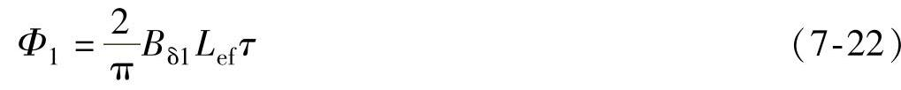

式中 B_(δ1)——电枢基波磁场磁密幅值（T）；

L_(ef)——电枢铁心计算长度（m）；

τ——极距（m）。

因此，电枢基波磁场交链电枢绕组的磁链Ψ₁（Wb）为

Ψ₁=Φ₁K_(dp1)N₁ （7-23）

式中 K_(dp1)N₁——电枢绕组每相有效串联匝数。

将式（7-22）代入式（7-23）并考虑到磁密幅值B_(δ1)的求取，可以导出磁链Ψ₁的计算公式，进而导出主电抗X_(m)的计算公式如下：

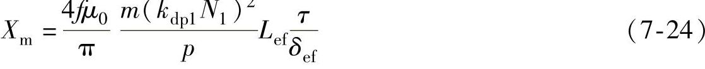

式中 μ₀——气隙磁导率，μ₀=4π×10⁻⁷（H/m）；

m——电机的相数；

p——电机的极对数；

δ_(ef)——有效气隙长度，δ_(ef)=K_(δ)δ（m），其中K_(δ)为卡特系数，δ为气隙长度（m）。

常将式（7-24）改写成如下形式：

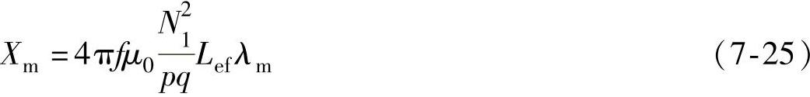

式中λ_(m)——主磁路的比磁导，可表示成下式：

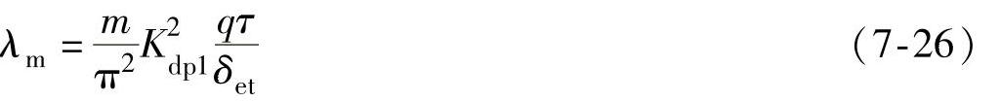

式（7-24）和式（7-25）适用于感应电机励磁电抗X_(m)和隐极同步电机电枢反应电抗X_(a)的计算。对于凸极同步电机，由于其交轴磁导与直轴磁导的差别很大，使交、直轴电枢反应电抗也有很大差别，一般应用双反应理论，将主电抗分为交轴电枢反应电抗X_(aq)和直轴电枢反应电抗X_(ad)分别进行计算，即

X_(aq)=k_(q)X_(m) （7-27）

X_(ad)=k_(d)X_(m) （7-28）

式中的系数k_(q)和k_(d)分别为电枢交、直轴磁场的基波磁密幅值与其磁密最大值之比，即

式中 B_(aq1)——交轴电枢磁场的基波磁密幅值；

B_(aq)——交轴电枢磁场磁密最大值；

B_(ad1)——直轴电枢磁场的基波磁密幅值；

B_(ad)——直轴电枢磁场磁密最大值。

2.漏电抗计算

从原理上说，漏磁场计算时，只需将式（7-22）中的电枢磁场基波磁密改成漏磁场磁密，相应的尺寸也改成漏磁场所经路径的尺寸，就可以计算出漏磁通和漏磁链，进而计算出漏电抗。然而，电机中漏磁场的分布十分复杂，不仅不同部位漏磁场的空间分布情况截然不同，而且，它们所经路径的磁导率也可能相差极大，这些都给漏电抗计算带来了困难。经过长期摸索，人们将电机漏磁场按照分布特点的不同分成了以下几种：槽漏磁、谐波漏磁以及端部漏磁等，对应的漏电抗也分成：槽漏抗、谐波漏抗以及端部漏抗等。分别计算出上述漏电抗后，它们之和即为总漏电抗。采用这种方法计算出来的漏电抗值一般能够满足工程上的精度要求。

漏电抗计算时，也可以写出与式（7-25）相似的形式，即

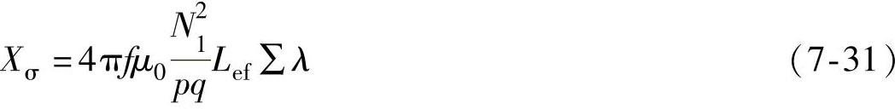

式中 ∑λ=λ_(s)+λ_(e)+λ_(d)，其中，λ_(s)为槽比漏磁导；λ_(e)为端部比漏磁导；λ_(d)为谐波比漏磁导。

从式（7-31）可以看出，交流电机漏电抗参数的计算可以归结为上述各比漏磁导的计算。下面对这几种漏电抗的比漏磁导计算作简要介绍，所介绍的方法适用于定子漏磁导的计算，也适用于转子漏磁导的计算。

（1）槽比漏磁导λ_(s)的计算

槽比漏磁导与槽形有关，电机槽形通常以槽口的形状来定义，大、中型风力发电机常采用开口槽和半开口槽，如图7-8所示，图中槽内的方格部分表示在槽中嵌放的线圈导体。图7-8a中同时示出了开口槽的槽漏磁分布情况。

显然，对于不同槽形来说，槽漏磁的分布情况是不同的，槽比漏磁导也不相同。从图7-8可以看出，槽漏磁的分布可以分成两种情况：在槽口部分的高度h₀范围内所通过的槽漏磁与槽中的全部电流相交链；而在槽下部的高度h_(s)范围内的槽漏磁所交链的槽电流，将随槽高度坐标的变化而变化，这部分槽漏磁的计算需要采用积分运算。因此，应分别计算这两部分的槽比漏磁导，可分别称为槽口比漏磁导λ_(U)和槽下部比漏磁导λ_(L)。

图7-8 风力发电机的常用槽形

a）开口槽 b）半开口槽

槽比漏磁导λ_(s)的计算可按下式进行：

λ_(s)=K_(U)λ_(U)+K_(L)λ_(L) （7-32）

式中 K_(U)、K_(L)——考虑绕组短距对槽口比漏磁导λ_(U)和槽下部比漏磁导λ_(L)的影响而引入的

节距漏抗系数。电机绕组的短距因数β一般都在2/3≤β≤1的范围内，

这时K_(U)和K_(L)可分别表示为

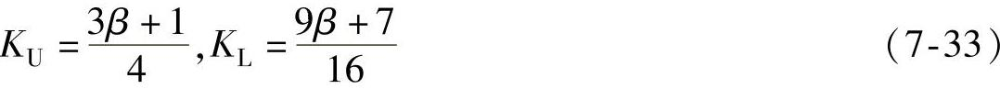

当β=1时，电机绕组为整距绕组，显然，这时有K_(U)=K_(L)=1。

式（7-32）中的槽口比漏磁导λ_(U)和槽下部比漏磁导λ_(L)的计算公式因槽形的不同而不同。对于开口槽：

对于半开口槽：

（2）谐波比漏磁导λ_(d)的计算

电枢电流在电机气隙中除了产生基波磁场外，还将产生一系列谐波磁场。这些谐波磁场所通过的磁路与基波磁场基本一样，因此，谐波比漏磁导λ_(d)的计算公式与主磁路比磁导λ_(m)相似。只是需要考虑到谐波磁场的极对数是基波磁场的v倍，即p_(v)=vp；谐波磁场的极距是基波磁场的1/v，即τ_(v)=τ/v；谐波绕组系数为K_(dpv)；以及谐波磁场在定子绕组中感应电动势的频率等于基波电动势频率，即f_(v)=f₁，即可模仿式（7-26），写出谐波比漏磁导λ_(d)的计算公式如下：

式中 可根据绕组谐波分析求出。

（3）端部比漏磁导λ_(e)的计算

绕组端部漏磁场的分布比较复杂，因此，要想准确计算端部比漏磁导是困难的，一般均采用半经验公式来计算。大、中型风力发电机大多采用双层绕组，其端部比漏磁导λ_(e)的计算公式如下：

式中 d——线圈直线部分伸出铁心的长度（m）；

f_(d)——双层线圈端部轴向投影长度（m）。

六、发电机的性能

1.损耗与效率

效率是电机的重要技术性能之一，效率是指其输出功率P₂与输入功率P₁之比，一般用百分数表示。输入功率P₁又可表示成

P₁=P₂+∑p （7-38）

式中 ∑p——电机的总损耗，即

∑p=p_(Cu)+p_(Fe)+p_(mec)+p_(f)+p_(ad) （7-39）

式中 p_(Cu)——铜损耗；

p_(Fe)——铁损耗；

p_(mec)——风摩损耗；

p_(f)——励磁损耗；

p_(ad)——杂散损耗。

因此，对于发电机，效率可表示如下式：

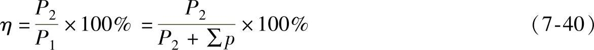

效率特性是指电机效率随输出功率变化的特性，即_(η)=f（P₂），可见，利用式（7-40）可以计算出（或测试出）发电机的效率特性。发电机的输出功率P₂是一个电功率，容易计算（或测试），因此，要想研究发电机的效率特性，关键在于如何准确地计算出（或测试出）发电机的各项损耗。

发电机中的损耗主要有铜损耗、铁损耗、风摩损耗、励磁损耗以及杂散损耗等，这些损耗最终都将变成热能散失到冷却介质中去，同时使发电机温度升高。因此，只有减小发电机内部产生的上述损耗，才能增加线端输出的电功率，提高发电机的效率。

下面对减小各项损耗的方法作简单讨论。

（1）铜损耗

发电机的铜损耗又称I²R损耗，是电流流过电机绕组时，绕组直流电阻产生的电损耗。减小铜损耗可以从以下几方面考虑：

1）在电流I不变的情况下，减小绕组电阻R。由于电阻与导线长度成正比、与导线截面积成反比，因此，减小导线长度或增大导线截面积是减小绕组电阻的有效方法。如果线圈的有效长度不能减小，就应尽量减小其端部长度。增大导线截面积可以明显减小绕组电阻R，但将导致槽面积增加，使齿磁密增大或电机体积增大，也使有效材料的用量增加，电机成本增加。

2）小容量低电压电机可考虑采用薄绝缘，以便提高槽的利用率，对减小铜耗是有利的。

3）电机工作温度对绕组电阻影响很大。绕组电阻具有正温度系数，温度越高，绕组电阻越大。因此，降低绕组温升可以明显减小铜损耗。

4）提高绝缘结构的耐热等级，以便适当提高电机的电负载和热负载能力。

（2）铁损耗

铁损耗是交变磁场在铁心中通过时产生的损耗，包括涡流损耗和磁滞损耗。不同的铁心材料，其单位体积的铁损耗是不同的。铁心材料相同时，铁损耗大体上与磁感应强度B的平方成正比，与磁场交变频率f的1.3～1.6次方成正比，即

P_(Fe)∝B²f^(1.3～1.6) （7-41）

因此，减小铁耗可从以下几方面考虑：

1）适当增大铁心体积，降低磁感应强度，以便减小铁损耗。

2）采用优质冷轧硅钢片，可明显降低铁损耗。表7-4示出了0.5mm厚的不同型号硅钢片的P_(10/50)损耗值。

表7-4 不同型号硅钢片的P_(10/50)损耗值

注：1.DR为热轧硅钢片，DW为冷轧无取向硅钢片。

2.P_(10/50)表示铁心材料在磁感应强度为1T，频率为50Hz时，单位质量的铁损耗（W/kg）

3）调整铁心冲片设计，使铁心齿部和轭部的磁密分布更趋合理，使电机的铁损耗最小化。采用有限元分析法可以解决这一问题。

（3）风摩损耗

风摩损耗是指电机的通风损耗和轴承摩擦损耗，其中通风损耗是主要的。

选择优质电机专用轴承和优质润滑油（脂）以及适当掌握润滑油（脂）的填充量，可以减小轴承摩擦损耗。

通风损耗主要与电机转速有关，大体上与转速的立方成比例变化。电机的转速越高、容量越大，通风损耗在总损耗中的比重越大。要想减小通风损耗，可从以下几方面考虑：

1）如果电机的温升余量较大，可适当减小冷却系统容量，例如，适当减小冷却风扇容量等。

2）作冷却系统优化设计。例如，优化冷却系统的阻尼，提高系统运行效率。

3）提高电机内部热媒的热传导能力和电机表面的散热能力等。

（4）励磁损耗

本质上说，励磁损耗也是一种铜损耗，因此，减小铜损耗的几种方法也适用于励磁损耗。

采用永磁磁极取代电励磁磁极，可以省去励磁损耗，提高电机效率，因此，永磁电机的温升比相同容量电励磁电机要低，较低的温升又进一步减小了电枢绕组的铜损耗，可以使永磁电机的效率进一步得到提高。

随着永磁材料的发展和永磁电机研究的不断深入，永磁电机的应用领域不断拓展，单机容量不断增大。目前，低速永磁同步发电机已经作为主流机种之一，在风力发电中得到广泛应用。

（5）杂散损耗

杂散损耗又称附加损耗，是除上述损耗以外的其他损耗的统称，主要包括电机漏磁场在金属构件中产生的涡流损耗，高次谐波磁场在定、转子铁心表面引起的表面损耗和脉振损耗，以及因趋肤效应使导体有效截面减小、交流电阻增大而在绕组中产生的附加损耗等。如果电机设计不当，可能产生较大的杂散损耗，使电机温升提高、效率降低，因此必须认真对待。

杂散损耗产生的原因比较复杂，准确计算有一定困难，试验测定也不易测准，而且试验结果具有一定的分散性。因此，考核电机效率时，为了简单起见，交流电机额定运行时的杂散损耗一般可按额定功率的0.5％计算，功率不等于额定值时，杂散损耗应按与负载电流的平方成比例来进行修正。

减小杂散损耗的方法主要有以下几种：

1）抑制高次谐波磁场，使气隙磁场尽可能成为正弦形。例如，采用合适的分布、短距绕组，改善凸极式电机的磁极形状等。由于高次谐波磁场也通过气隙，因此，适当增大气隙常是减小杂散损耗的有效措施。

2）注意抑制齿谐波磁场，以减小齿谐波磁场引起的附加损耗。例如，采用转子斜槽或斜极，采用磁性槽楔，以及采用分数槽绕组等。

3）增加线圈并绕根数，以减小因集肤效应而导致的附加损耗。

4）斜槽转子采用绝缘导体，以消除横向电流引起的损耗。

2.电压调整率

电励磁交流发电机的电压调整率是指在保持额定励磁电流和额定转速不变的条件下，调节发电机负载，使之从额定负载变化到空载时，端电压的升高相对额定电压的百分值，即

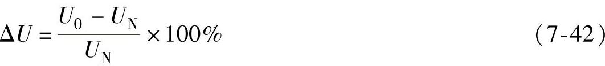

对于电励磁发电机来说，“保持额定励磁电流不变”实际上就是“保持额定励磁磁动势不变”，这一条件容易实现。但是，对于永磁发电机，由于永磁体的空载工作点与负载工作点不同，因此，“保持励磁磁动势不变”这一条件无法实现。为了与电励磁发电机区别起见，对永磁发电机，一般称为固有电压调整率，其计定义式仍为式（7-42）。

电压调整率是交流发电机的性能指标之一。现代风力发电机一般通过并网变流器与电网连接，因此，对电压调整率这一性能指标的要求程度有所放宽，但一般仍应控制在一定范围内。

3.稳态短路电流

交流发电机发生突然短路时，将产生很大的冲击电流，其峰值可达额定电流的十倍以上，因而将在发电机中产生很大的电磁力。如果设计或制造不良，就可能使定子绕组（特别是绕组端部）损坏，也可能使转轴、底脚等发生有害变形，对于永磁发电机，还可能引起永磁体的永久性退磁。发电机突然短路还将对电网的稳定性和正常运行产生不利影响。因此，发电机设计时，应对上述可能产生的冲击电流予以限制，以便将可能发生的损害降至最低。

然而，突然短路电流是一个瞬变电流，分析计算比较复杂。突然短路电流经过短暂的瞬变过程后，将很快衰减并进入稳定短路状态，而稳态短路电流的计算要相对容易些。风力发电机设计时，常常通过稳态短路电流计算，来对其耐短路冲击能力进行评估。稳态短路电流的具体计算方法请参照本章第三节～第五节的有关内容。

## 第三节 笼型感应发电机的设计

本节主要介绍笼型感应发电机电磁设计的原理与方法，编制了发电机的电磁设计程序，并给出了一台4极、额定电压690V、额定功率1500kW的发电机的算例。

### 一、风力发电中应用的笼型感应发电机

20世纪70年代末～90年代初，笼型感应发电机是大中型风力发电机组的主流机型，这是因为当时只有笼型感应发电机组解决了运行的可靠性问题，同时，笼型感应发电机组还具有结构简单、控制方便等一系列优点。近年来，笼型感应发电机也开始在变速恒频风力发电机组中得到了应用。

1.笼型感应发电机的基本结构与运行原理

（1）基本结构

笼型感应发电机的结构与笼型感应电动机基本相同，主要由定子和转子两部分以及其他结构件构成，定子与转子之间有一个不大的气隙。定、转子又分别由各自的铁心和绕组构成。笼型感应发电机的转子绕组为短路绕组，由若干个铜（或铝）制导条和前后两个短路端环组成，由于形状像一个笼子，故而得名。笼型感应发电机的定、转子结构特点及其所起的作用如图7-9所示，笼型绕组与笼型转子结构如图7-10所示。

图7-9 感应发电机的结构特点

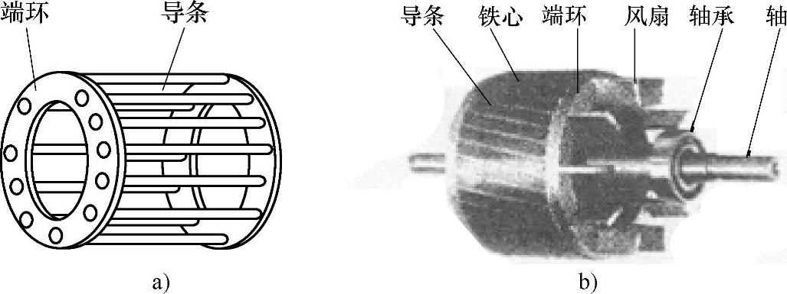

图7-10 笼型感应发电机的转子结构

a）笼型绕组（铜） b）铸铝转子

（2）运行原理

风力发电中使用的大中型感应发电机一般均与电网并联运行，这里只讨论感应发电机并网运行的情况。

由电工原理可知，转差率s是感应电机的一个重要参量，根据它的数值可以判定电机的运行状态。转差率的定义如下式：

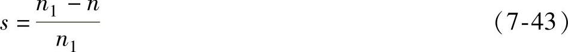

式中 n₁——同步转速（r/min）；

n——电机转子的实际转速（r/min）

当原动机（风力机）驱动感应电机旋转，转速超过同步转速，即n＞n₁，s＜0时，感应电机进入发电机状态，这时，感应发电机把从风力机输入的机械功率转换成电功率输出给电网。同时，发电机产生的制动性质的电磁转矩与风力机驱动性质的机械转矩相平衡，以便维持风力发电机组的稳定运行。

有些风力机的自起动能力较差，这时，首先需要使感应电机作电动机运行，直至机组转速超过同步转速后，才转换为发电机运行。风力感应发电机从电动起动到发电运行的过程与起重机下放重物的过程非常相似。电动起动是指风力发电机组从静止状态起动时，首先把感应发电机当作电动机接到电网上驱动风力机起动旋转。起初，在电动机驱动转矩和风力机的双重作用下，风力发电机组快速起动，在感应电机转速加速到同步转速之前，始终处于电动机运行状态。随着机组转速的升高，感应电机转速很快超过了同步转速，这时，在风力机的作用下，感应电机从电动机状态自动转变为发电机状态。

风力感应发电机的上述基本运行状态归纳在表7-5中。

表7-5 风力感应发电机的基本运行状态

由上表中还可以看出，当发电机转速恰好等于同步转速，即n=n₀，转差率s=0时，由于转子导体与气隙旋转磁场之间相对静止，转子绕组的感应电动势和电流均为0，因此，根据电磁感应定律和电磁力定律，其电磁功率和电磁转矩也都为0，可见，同步运行状态实际上是一个不稳定运行状态。也就是说感应发电机或者因风力较大，使n＞n₁，而运行于发电状态；或者因风力过小，使n＜n₁，因运行于电动状态而使风力发电机组停机。

2.定桨距风力发电机组与笼型感应发电机

（1）定桨距风力发电机组

所谓定桨距就是风力机风轮的叶片与轮毂之间为刚性连接，叶片的迎风角不能随风速的变化而变化。定桨距风力发电机组由于结构简单、控制方便而得到了广泛应用。

定桨距风力发电机组需要配套的发电机具有恒转速特性，并网运行的感应发电机能够满足这一要求。采用感应发电机并网运行有一系列优点：笼型感应发电机的结构简单、价格便宜；不需要严格的并网装置，可以较容易地与电网联接；感应发电机并网运行时，转速近似是恒定的，但允许在一定范围内变化，因此可吸收瞬态阵风能量。

采用感应发电机的主要缺点是需要从电网吸收感性无功电流来励磁，加重了电网对感性无功功率的负担，因此，常需要对感应发电机进行无功补偿。

另外，在低风速运行段，定桨距风力发电机组还面临系统效率低下的问题。这种效率低下反映在两个方面，一方面是定桨距风力机的转速不能随风速的变化而自动调整，使风轮在低风速时的风能-机械能转换效率很低；另一方面，感应发电机轻载时的机械能-电能转换效率也很低，这样一来，使得整个风力发电机组在低风速段的效率十分低下。为了充分利用低风速段的风能，常采用双速感应发电机。双速感应发电机常做成4/6极，在高风速段，发电机在4极下运行；在低风速段，发电机切换成6极下运行。这种发电机变极运行方式不仅使风力机的风能-机械能转换效率大幅度提高，也使发电机效率能够保持在较高水平。

（2）双速感应发电机的结构特点

目前，笼型感应发电机大多采用双速型，可以制成双绕组双速型，也可制成单绕组双速型。所谓双绕组双速就是在定子铁心槽中嵌放两套相互独立的绕组，一套为4极绕组，另一套为6极绕组。在高风速段，4极绕组工作，发电机输出的功率较大；在低风速段，切换到6极绕组工作，发电机输出的功率较小。也就是说，表面上双绕组双速电机是一台发电机，实际上是两台额定功率和额定转速不同的发电机切换运行。显然，对于其中的每一个转速的发电机而言，其有效材料和空间都没有得到充分利用，因此，双绕组双速型感应发电机的经济性较差，也很难获得理想的运行特性。

所谓单绕组双速就是在定子铁心中只嵌放一套绕组，构成了一种极数的感应发电机，但是，当按照一定规律将其中一半线圈反向联结，而线圈在电机槽中的空间位置原封不动，就可以使这套绕组变成另一种极数的发电机。这种将一半线圈反向联结，因而将发电机从4极改变为6极（或反之）的变极方法称为反向法变极，可以方便地通过接触器的触点从外部来改变绕组的接线来实现。与双绕组双速发电机相比，单绕组双速发电机的有效材料利用率高，体积小、重量轻、变速特性良好，得到了广泛应用。单绕组双速感应发电机的缺点是6极时感应电动势的波形稍差，即电动势中的谐波含量稍大，因此供电质量稍差，这里不作详细分析。

下面以一个最简单的4/2变极的感应电机为例，来说明反向法单绕组变极的原理。

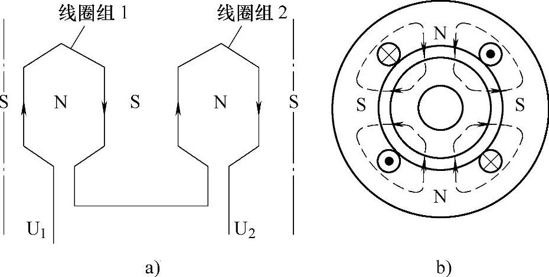

图7-11 4极时的U相绕组及其气隙磁场

a）U相绕组的联接 b）4极气隙磁场

图7-11所示为一台4极感应电机，定子为单层绕组，图中只画出了U相绕组的两个线圈组，为了清楚起见，每个线圈组用一个集中线圈来表示。

可以看出，当两个线圈组顺着电流方向如图7-11a所示串联联接时，在气隙中形成了一个4极磁场，这时，这台电机是4极的。

所有线圈在槽中的位置不变，通过外部接触器的切换，将线圈组2反接，使线圈组2中的电流反向，则气隙中的磁场从4极变成了2极，如图7-12所示。当然，这台感应电机也从4极变成了2极。图7-12中给出了使线圈组2中电流反向的两种接法，其变极效果是完全一样的。

定桨距风力发电机组中的感应发电机常采用的4/6变极，与上面介绍的4/2变极相比，实现单绕组4/6变极要稍微麻烦些，需要按照一定规则对绕组进行仔细排列，由于有关知识的专业性很强，绕组排列过程又比较繁琐，这里就不再一一说明。

双速发电机的转子均为笼型绕组，这是因为笼型绕组的极数是不固定的，能够随定子极数的改变而改变，当定子绕组进行极数切换时，转子的极数也随之自动进行了切换。

（3）运行特性

双速感应发电机的应用较为广泛，性能也更为优良。图7-13示出了双速感应发电机输出功率随风速变化的关系曲线。当发电机采用4/6变极时，图中的“大发电机”是指功率较大的4极发电机，而“小发电机”则是指功率较小的6极发电机。可以看出，根据风速适时进行变极切换，可以使低速段的风-电转换效率明显提高。

3.变速恒频控制的笼型感应发电机组

（1）变速恒频控制

近年来，随着电力电子技术和计算机控制技术的发展，变速恒频控制技术在风力发电中得到了广泛应用。风力发电机组实现变速控制的目的在于使机组获得最大功率输出。要想使风力发电机组实现变速运行，关键在于使发电机与电网解耦，也就是说，使发电机转速与电网频率无关。为此，可在发电机与电网之间接入并网变流器，如图7-14所示。

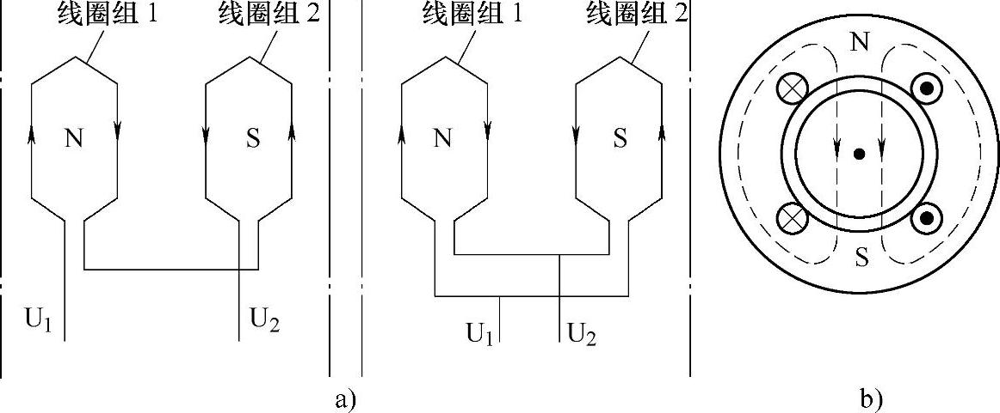

图7-12 2极时的U相绕组及其气隙磁场

a）U相绕组的联结 b）2极气隙磁场

图7-13 双速感应发电机的功率-风速特性

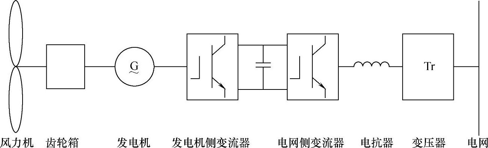

图7-14 变速恒频控制的笼型感应发电机组

由图7-14可见，并网变流器需要由两个变流器以及直流环节构成。发电机侧变流器主要用于发电机的转速控制，以便实现风力发电机组功率的优化控制；电网侧变流器则主要用于恒频恒压控制，以便使风力发电机组能够并网运行。由于连接两个变流器的是中间直流环节，使发电机的转速可以根据功率给定随意调节，而不必受电网频率的约束。

采用变速恒频控制的风力发电机可以采用感应发电机，也可采用同步发电机。如果采用低速多极发电机与风力机直接耦合，还可以取消齿轮箱，使风力发电机组的结构得以简化，运行的可靠性也大大增强。

（2）笼型感应发电机

变速恒频控制风力发电机组采用的笼型感应发电机，在结构上与普通笼型感应电机基本相同，只是发电机设计时，需要注意到变速（变频）运行对发电机性能的影响。

笼型感应发电机的输出电功率与转差率之间的关系如图7-15所示。可以看出，感应发电机的正常运行范围基本上是在OA范围内，在A点附近达到最大值后，随着转差率绝对值的增大，输出功率明显下降，这是因为发电机的无功电流和内部损耗增加得更快，使输出电功率不增反降。

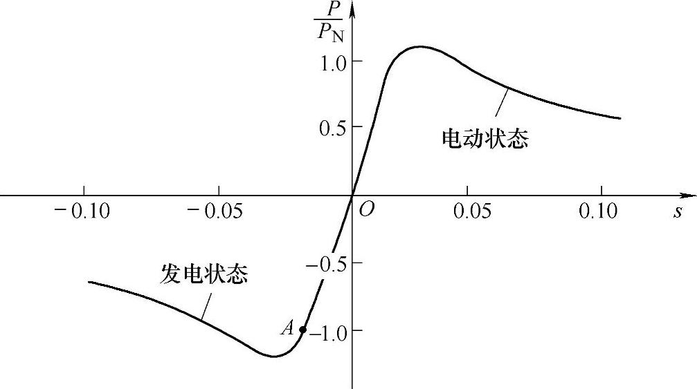

图7-15 感应发电机的功率-转差率特性

### 二、笼型感应发电机的电磁设计

1.电磁设计程序简介

电磁设计是电机设计的关键环节。电机的电磁设计通常是指根据有关国家标准和设计任务书的要求，参照生产实践经验，计算确定电机的主要尺寸、定转子槽配合及铁心冲片槽型尺寸、定转子绕组设计、进行磁路计算、参数计算以及运行性能计算等。一般情况下，只有电磁设计完成后，才能进行电机的结构设计。

（1）电磁设计程序所依据的主要原理

笼型感应发电机进行电磁设计程序编制时，所依据的原理就是感应电机的等效电路，一般依据Г型近似等效电路，如图7-16b所示，图中，C₁=1+X₁/X_(m)。实际上，笼型感应发电机的电磁设计程序就是围绕等效电路编制的。在选定铁心和绕组的基础上，通过磁路计算可以计算出励磁参数；通过参数计算可以计算出定转子漏阻抗参数；然后就可以利用等效电路计算出发电机的性能。与T型等效电路（见图7-16a）相比，利用Г型近似等效电路进行设计计算时，计算工作有了很大简化，转子电流也具有令人满意的精度，但励磁电流和定子电流稍稍偏大。如果励磁电流和定子电流的计算偏差已经明显影响到性能计算精度，则应考虑采用T型等效电路。

图7-16 感应发电机的等效电路

a）T型近似等效电路 b）Г型等效电路

要想根据等效电路计算发电机的性能，需要预先计算确定等效电路中的各个参数。其中励磁电流I_(m)和励磁阻抗Z_(m)=R_(m)+jX_(m)可通过磁路计算求出，定、转子漏阻抗参数Z₁=R₁+jX₁和Z₂=R₂+jX₂可利用磁链法通过参数计算求出。上述参数计算确定后，就可以根据等效电路计算出发电机额定运行情况下的定、转子电流，进而计算出发电机的各项运行性能。

进行定、转子电流计算时，常常首先计算出各电流额定运行时的有功分量和无功分量，然后再分别计算出各电流的实际值。图7-17所示为感应发电机的电流相量图。

图中，U为相绕组端电压；为定子电流；为转子电流；为励磁电流；为转子电流有功分量；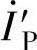为定子电流有功分量；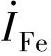为励磁电流铁耗分量；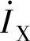为定子电流无功分量；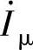为励磁电流磁化分量；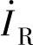为转子电流无功分量。由图7-17可以看出上述电流之间具有如下关系：

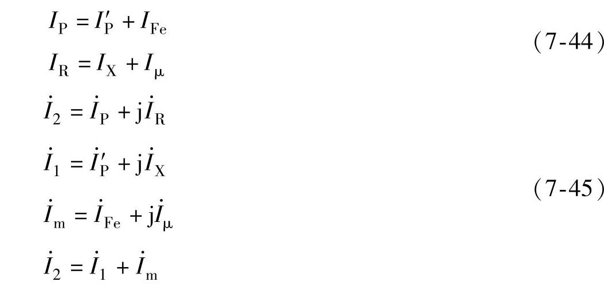

图7-17 感应发电机的电流相量图

发电机磁路计算、参数计算和性能计算的原理请参照本章第二节的有关内容。

（2）电磁设计程序的结构与内容

根据以上原理分析，电磁设计程序应分为以下几个部分，并按以下顺序进行计算：

1）额定数据：可根据有关国家标准和设计任务书确定。包括额定功率、额定电压、频率调节范围和额定频率、转速调节范围和额定转速、绝缘等级、冷却方式、防护型式等。

2）定子铁心和绕组：包括确定主要尺寸、定子槽数和槽形尺寸，确定定子绕组结构、选择和计算线规、电流密度等。

3）转子铁心和绕组：包括确定转子槽数和槽形尺寸，确定转子笼型绕组结构和有关数据等。

4）磁路计算：计算每极磁通量，计算磁路各部分的磁密、空载磁压降、饱和系数，确定空载电流和励磁阻抗等。

5）参数计算：计算确定定、转子电阻和漏电抗参数（包括定、转子槽漏抗、谐波漏抗、端部漏抗等）。

6）性能计算：计算确定定子电动势和额定转差率，计算确定发电机各项损耗和效率、计算稳态短路电流以及电压调整率等。

（3）如何保证计算精度

进行感应发电机的电磁设计时，有些物理量只有计算到一定阶段后才能确定下来，然而，往往在设计计算的初始阶段就需要这些物理量参与运算，这时，常需要根据经验先给出一个假定值，通过返工计算来最后确定之。

本计算程序中设置了三处返工计算，以便保证电磁设计的计算精度。

1）饱和系数的返工计算；

2）满载电动势系数的返工计算；

3）额定效率的返工计算。

2.电磁设计程序和算例

本程序为笼型感应发电机电磁设计程序，共计100项，分为以下4个部分，即额定数据及主要尺寸、磁路计算、参数计算、性能计算。给出了一台4极、额定电压690V、额定功率1500kW的笼型感应发电机的电磁设计算例。本设计程序和算例只用来说明笼型感应发电机的电磁设计方法，并非笼型感应发电机的最佳设计，因此，仅供读者参考。

笼型感应发电机电磁设计程序计算例

（续）

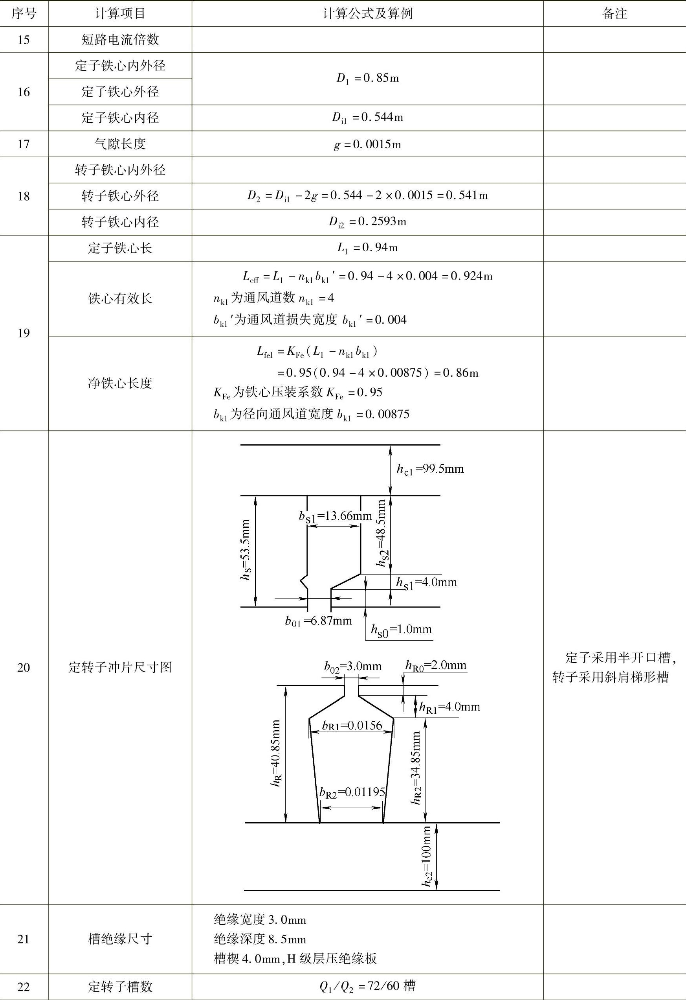

（续）

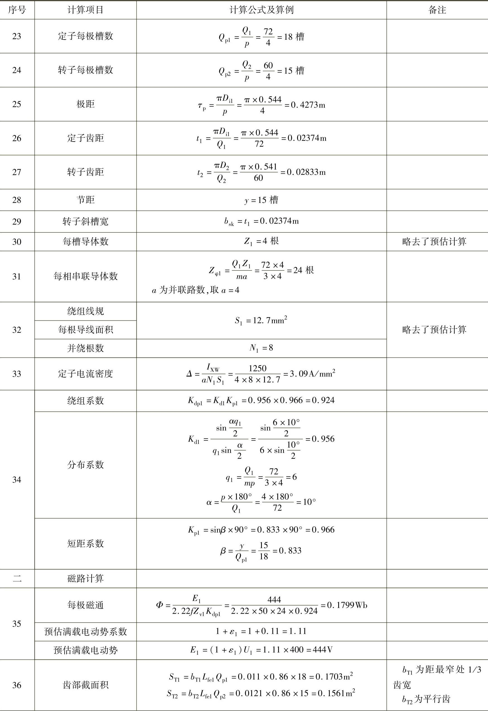

（续）

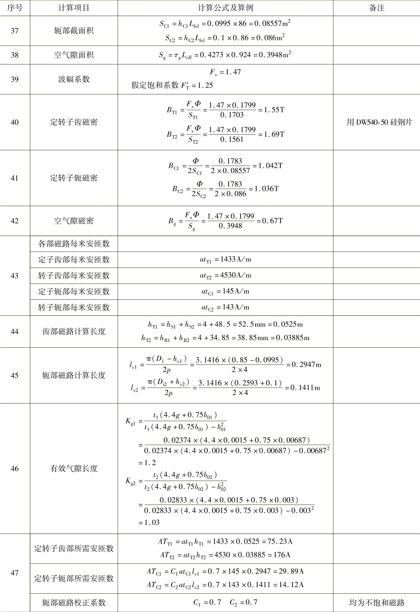

（续）

（续）

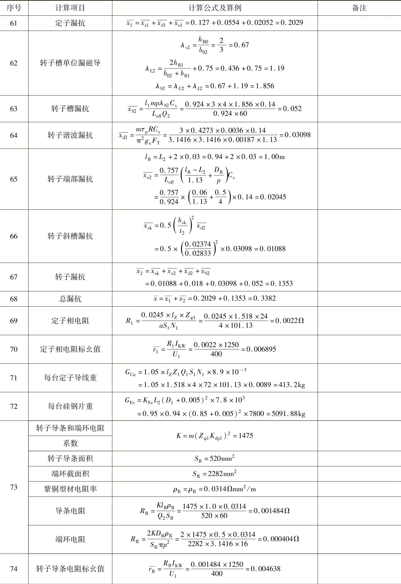

（续）

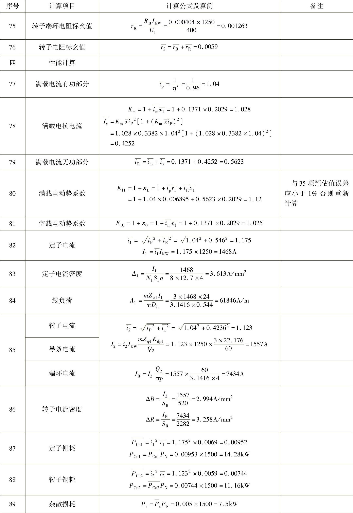

（续）

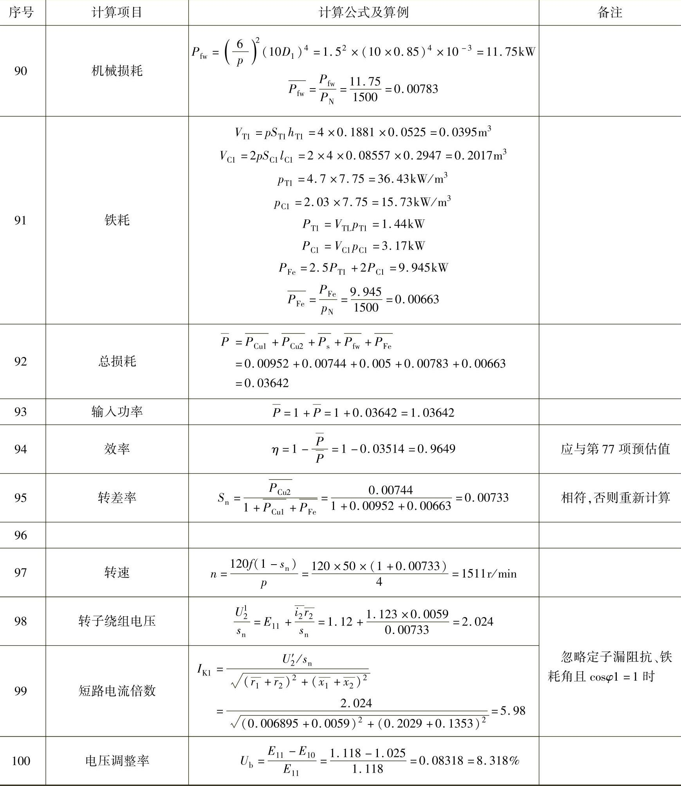

## 第四节 双馈感应发电机的设计

### 一、风力发电中应用的双馈感应发电机

在变速恒频控制的笼型感应发电机组的介绍中已知，为了实现风力发电机组的功率优化控制，必须使机组转速能够快速跟踪风速的变化。为此，只需在发电机与电网之间接入并网变流器，使发电机与电网之间解耦，就允许发电机变速运行了。这时，由于并网变流器通过的是发电机的全部输出功率，因此，变流器的容量较大、成本较高。

当变速恒频风力发电机组不需要大范围的变速运行，而只需要在一定的范围内实现变速控制时，可选择双馈感应发电机。双馈感应发电机的定子绕组直接与电网相连，用于变速恒频控制的变流器接到发电机转子绕组与电网之间。这时，需要对双馈感应发电机实行转数和转矩的四象限控制。采用双馈感应发电机的变速恒频风力发电机组的构成如图7-18所示。

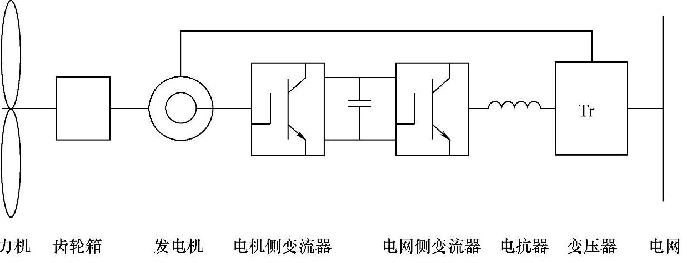

图7-18 变速恒频控制的双馈感应发电机组

1.双馈感应发电机的基本结构

双馈感应发电机的定子结构与笼型感应发电机基本相同，读者请参见图7-9的定子部分。二者在结构上的区别主要表现在转子绕组结构的不同，前者为绕线型转子绕组，后者为笼型短路绕组。绕线型转子绕组的结构与定子绕组没有区别，也是用绝缘导线绕制成线圈后嵌入转子铁心槽中，其相数和极数都与定子绕组相同。为了改善转子的动、静平衡，常采用波绕组，三相绕组大多采用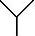接法。

为了使三相转子绕组与外部控制电路（并网变流器等）相连接，需要在非轴伸端的轴上装设三个集电环，将转子绕组的三个出线端分别接到三个集电环上，再通过电刷引出。

双馈感应发电机的基本结构如图7-19所示。双馈感应发电机的定转子绕组的接线示意图如图7-20所示。

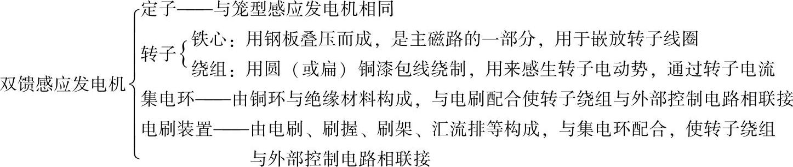

图7-19 双馈（绕线转子）感应发电机的结构特点

图7-20 双馈感应发电机绕组接线示意图

集电环和电刷是双馈感应发电机的薄弱环节，需要经常维护和检修。能否使双馈感应发电机实现无刷化呢？应该说，这是一个令人期待的课题。

2.双馈感应发电机运行原理

双馈（绕线转子）感应发电机的运行原理与笼型感应发电机相似，只是由于转子使用了绕线型绕组，才使之可以实现双馈运行。所谓双馈就是电机的定子和转子都可以馈电的一种运行方式，而馈电一般是指电能的有方向传送。对于双馈感应发电机来说，定、转子的馈电方向都是可逆的，在定子边，当电能的传送方向为电机→电网方向时，电机为发电机运行，反之则为电动机运行；在转子边，在电机侧变流器的控制下，电能传送的方向也是可逆的。因此，双馈感应发电机的运行状态可以用功率传递关系来加以说明，如图7-21所示。图中，P为发电机的输出功率、S为转差率、SP为转差功率，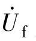为变流器的电机侧电压。为了清楚起见，分析时不计发电机和变流器的损耗。

采用双馈发电机时，需要控制的只是转差功率SP，正常运行时，转差功率一般不超过发电机额定功率的30％，使变速恒频双馈感应发电机组的控制成本大为降低，这也是双馈感应发电机在大型发电机组中的应用日益广泛的主要原因。

图7-21 双馈感应发电机的运行状态和功率传递关系

可以看出，双馈感应发电机并网运行时，可以有5种运行状态。第Ⅰ象限的图①、②为电动机运行状态，其中，图①为亚同步电动机状态，在这种状态下，定子从电网输入电功率P，其中，大部分（1-s）P转换成机械功率从轴上输出，另一部分转差功率sP通过变流器馈入电网；图②为超同步电动机状态，在这种状态下，定子从电网输入电功率P，转子通过变流器从电网输入转差功率sP，二者之和（1+s）P都转换成机械功率从轴上输出。处于电动机运行状态的风力发电机组实际上变成了一台巨大的风扇，需要消耗电网的电能，风力发电机组不应运行在这一状态。

第Ⅱ象限的图③、④为发电机运行状态，其中，图③为超同步发电机状态，在这种状态下，发电机从风力机输入机械功率（1+s）P，其中，大部分转换成电功率P从定子馈入电网，另一部分转差功率sP通过变流器馈入电网；图④为亚同步发电机状态，在这种状态下，发电机从风力机输入机械功率（1-s）P，转子通过变流器从电网输入电功率sP，二者之和P都转换成电功率从定子端口馈入电网。

发电机的电磁制动状态应处于第Ⅳ象限（图中未画出），这种状态时，定子从电网输入电功率P，转子从轴上吸收机械功率（s-1）P，二者之和全部转换成转差功率sP通过变流器馈入电网。由于电磁制动运行时，转差率s＞1，要求变流器容量大于发电机的额定容量，因此，双馈感应发电机不允许运行在这一状态。

3.运行特性

双馈感应发电机的定子绕组直接与电网相连，转子绕组通过集电环、电刷和变流器与电网相连。转子绕组的等效电路如图7-22所示。

根据图7-22，可以写出双馈感应发电机的转子电流I₂的表达式如下：

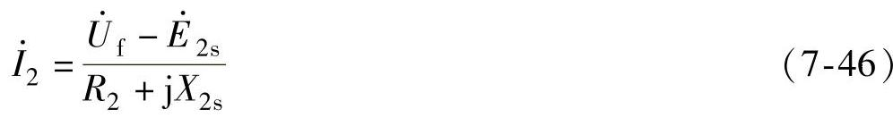

式中 E_(2s)——转子的感应电动势（V），E_(2s)=sE₂，其中s为转差率；

E₂——转子绕组的开路电动势（V）；

R₂——转子绕组每相电阻（Ω）；

X_(2s)——转差率为s时的转子每相绕组漏电抗，X_(2s)=sX₂₀，其中X₂₀为s=1时的转子每

相漏电抗（Ω）。

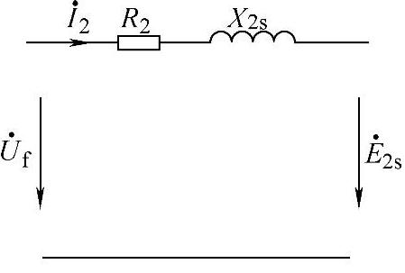

图7-22 转子绕组等效电路

可以看出，转子电流I₂的大小和相位不仅取决于，而且与电机侧变流器提供的励磁电压有关。调节励磁电压的幅值或相位，就可以改变转子电流和电磁转矩，也就调节了发电机的转速，并使双馈发电机工作于任意有功无功组合状态。当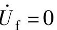时，双馈感应电机的特性与笼型感应电机完全相同，对应的机械特性称为自然特性（参见图7-23的曲线1），转差率s的大小完全取决于负载的大小。作电动机运行时，转差率为正值，在0＜s＜1的范围内变化。若减小电动机负载直至空载时，则空载运行时的转差率为s≈0，转子电流亦为I₂≈0，电机转速近似为同步速，即n≈n₀。这时，如果在电机旋转方向上施加一个外力（例如由风力机施加的机械转矩），电机的转速就会超过同步转速，这时的转差率变为负值，感应电机变为发电机运行。所施加的外力越大（例如风速越大），转差率的绝对值越大，发电机的负载也就越大。下面着重分析电机侧变流器的电压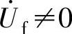时的情况。

电机作电动机运行时，当减小U_(f)而使转子电流I₂减小时（参见式（7-46）），由于电磁转矩减小，电动机的转速将有所下降，由于此时的机械特性曲线低于自然特性曲线，因此电机处于亚同步电动机运行状态（参见图7-23的曲线2）。若减小电动机的负载直至空载，则空载转速n₀′＜n₀（亚同步）。这时，如果在电机旋转方向上施加一个外力（例如由风力机施加的机械转矩），电机的转速就会超过n₀′，虽然这时电机的转差率仍然在0＜s＜1的范围内，但由于机械特性曲线已经进入第Ⅱ象限，电机已经变为发电机运行，即运行于亚同步发电机状态。所施加的外力越大（例如风速越大），转差率越小，发电机的负载也就越大。改变U_(f)就改变了n₀′，也就改变了发电机的转速。U_(f)的幅值越大，则发电机的转速越低。

增大U_(f)而使转子电流I₂增大时，感应电动机的电磁转矩（驱动性质）将随之增大，使机组的转速上升，由于此时的机械特性曲线高于自然特性曲线，因此电机处于超同步电动机运行状态（参见图7-23曲线3）。若减小电动机的负载直至空载，则空载转速n₀″＞n₀（超同步）。这时，如果在电机旋转方向上施加一个外力（例如由风力机施加的机械转矩），电机的转速就会超过n₀″，这时，电机的机械特性曲线进入第Ⅱ象限，电机变为发电机运行，即运行于超同步发电机状态，此时的转差率为负值，即s＜0。所施加的外力越大（例如风速越大），转差率越小（绝对值越大），发电机的负载也就越大。改变U_(f)的幅值，就改变了n₀″，也就改变了发电机的转速。U_(f)的幅值越大，则发电机的转速越高。

显然，若改变变流器电压U_(f)的相位，也同样可以调节发电机转速，这里不再分析。

由于变流器容量（0.3P_(N)）的限制，使双馈感应发电机的转速调节范围受到了限制。然而，s=±0.3的调速范围已经基本满足了变速恒频风力发电机组对转速控制特性的要求，足够充分地体现出变速恒频机组的所有优点，正因如此，使变速恒频双馈感应发电机组的应用日益广泛。

图7-23所示为双馈感应发电机的机械特性曲线，其中，曲线1为自然特性，曲线2为亚同步特性，曲线3为超同步特性。

### 二、电磁设计

1.电磁设计程序简介

（1）电磁设计所依据的基本原理

与笼型感应发电机一样，双馈感应发电机电磁设计所依据的基本原理仍然是其等效电路，如图7-24所示。

图7-23 双馈感应发电机的机械特性

图7-24 双馈感应发电机的等效电路

根据上图所示的等效电路，应用基尔霍夫定律，就可以列写出双馈感应发电机的基本方程式如下。显然二者是完全等效的。

双馈感应发电机的等效电路与笼型感应发电机的T型等效电路（图7-16b）极为相似，只是由于二者转子绕组结构的不同，才引起了等效电路有所不同。笼型感应发电机的转子绕组为笼型短路绕组，因此其输出端的短路电压为0；而双馈感应发电机的绕线型转子绕组与外部变流器相连接，其端电压即为变流器的励磁电压U_(f)。

等效电路中转子边的物理量已经折算到定子边，包括转子频率和转子绕组均已折算到定子边。关于频率折算可利用式（7-46）说明如下。

式（7-46）可改写如下：

将上式右边的分子、分母同时除以转差率s，则上式变为

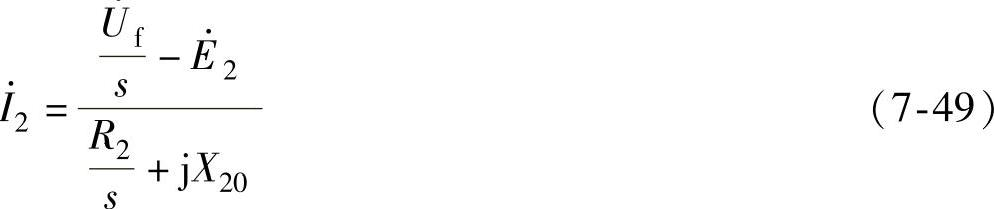

比较式（7-47）和式（7-49）可以看出，从数学上来说，这种变换完全是等效的，然而，从物理概念上来说，变换前后却悄然发生了变化。也就是说，式（7-46）和图7-22中的频率为转差频率，而式（7-49）已经变换成与定子边相同的频率。再将式（7-49）中的各量折算到定子边，该式就与式（7-47）中的第2个公式完全一样了。

图7-24所示等效电路中的参数计算方法与笼型感应发电机完全相同。可通过磁路计算得到定子电动势和励磁阻抗Z_(m)参数，通过绕组设计和参数计算得到定、转子漏阻抗参数，然后，就可以利用图7-24所示的等效电路计算出双馈发电机的各项性能。显然，与笼型感应发电机相比，由于U_(f)的作用，使转子电流的计算变得复杂，也使双馈发电机的性能计算变得复杂了许多。详细情况请参照电磁设计程序的性能计算部分。

（2）电磁设计程序的结构与内容

根据以上原理分析，电磁设计程序应分为以下几个部分，并按以下顺序进行计算：

1）额定数据：可根据有关国家标准和设计任务书确定。包括额定功率、额定电压、频率调节范围和额定频率、转速调节范围和额定转速，额定励磁容量、额定励磁电压、额定励磁电流，绝缘等级、冷却方式、防护型式等。

2）定子铁心和绕组：包括确定主要尺寸、定子槽数和槽形尺寸，确定定子绕组结构、选择和计算线规、电流密度等。

3）转子铁心和绕组：包括确定转子槽数和槽形尺寸，确定转子绕线型绕组的结构和有关数据等。

4）磁路计算：计算每极磁通量，计算磁路各部分的磁密、空载磁压降、饱和系数，确定空载电流和励磁阻抗等。

5）参数计算：计算确定定、转子电阻和漏电抗参数（包括定、转子槽漏抗、谐波漏抗、端部漏抗等）。

6）性能计算：计算确定定子电动势和额定转差率；计算确定额定励磁电压、额定励磁电流和额定励磁容量；确定发电机各项损耗和效率、计算稳态短路电流以及电压调整率等。

（3）如何保证计算精度

进行双馈感应发电机的电磁设计时，同样需要在计算过程中设置若干返工计算来保证设计程序的计算精度。

本计算程序中设置了以下三处返工计算：

1）饱和系数的返工计算；

2）电动势系数的返工计算；

3）额定转差率的返工计算。

（4）设计程序的调试

即使按设计程序一丝不苟地计算下去，也不太可能一帆风顺地一次完成发电机的电磁设计。这是因为在设计过程中，有些物理量无法一次性选定，而是需要事先假定（或预估）一个值，才能使整个计算工作继续下去，待计算工作进行到一定阶段后，即可根据电机学原理计算出该物理量。然而，即使计算过程准确无误，该计算值也未必恰好与假定值相符，有经验的设计师一般经过1～2次返工计算，就可以满足程序规定的误差要求。对于经验不足的设计人员来说，不断积累设计经验，掌握电机的设计原理和设计程序调试规律是十分重要的。即使采用CAD设计，这些经验和调试规律也是非常宝贵的。下面就几种常见的设计程序调试问题作简要说明。

1）磁路计算发现磁密分布不够合理怎么办？

磁路计算的目的之一就是要校核电机磁密分布是否合理。如果发现磁密分布不够合理，显然是磁密过高（或过低）部分的磁路尺寸有问题。下面举例说明。

有一台发电机经磁路计算后，各部分的磁密分布情况如下：

可以看出，其他部分磁路的磁密分布均属正常，只有转子齿磁密有些偏高。显然，转子齿磁密高的原因是转子齿部截面偏小所致。如果增大齿宽，势必要减小槽宽，因此，有必要对槽内导体的尺寸、电流密度、绝缘厚度等重新进行调整，必要时还需调整转子槽深等。

可见，在确定定转子铁心内外径、铁心长度、槽数、槽型及其尺寸时，最好参考已有电机的成功经验，避免走弯路。

现代电机设计时，对磁密分布的合理性分析往往进一步细化，以便进一步提高电机的性能，这时，常采用有限元数值法来求得解答。

2）关于饱和系数和电动势系数的返工计算。

在电机电磁设计计算程序中，饱和系数的返工计算次数最多，这是因为饱和系数的返工计算包含在电动势系数的返工计算之中，不仅需要在饱和系数的小循环中进行迭代计算，当电动势系数需要进行返工计算时，由于每极磁通量的改变，导致气隙磁密和定转子齿磁密随之变化，必然使定转子齿部的饱和程度发生改变，因此，引起饱和系数小循环中的迭代计算将是不可避免的。如果这部分迭代计算的收敛比较困难，可预先设定一个稍大些的允许误差，待计算顺利通过后，再减小允许误差至规定值。

2.电磁设计程序和算例

本程序为双馈型感应发电机电磁设计程序，共计129项，分为以下6个部分，即额定数据、定子铁心与绕组、转子铁心与绕组、磁路计算、参数计算和性能计算等。给出了一台4极、额定电压690V、额定功率1500kW的双馈型感应发电机的电磁设计算例。本设计程序和算例只用来说明双馈型感应发电机的电磁设计方法，并非其最佳设计，因此，仅供读者参考。

双馈型感应发电机电磁设计程序计算例

（续）

（续）

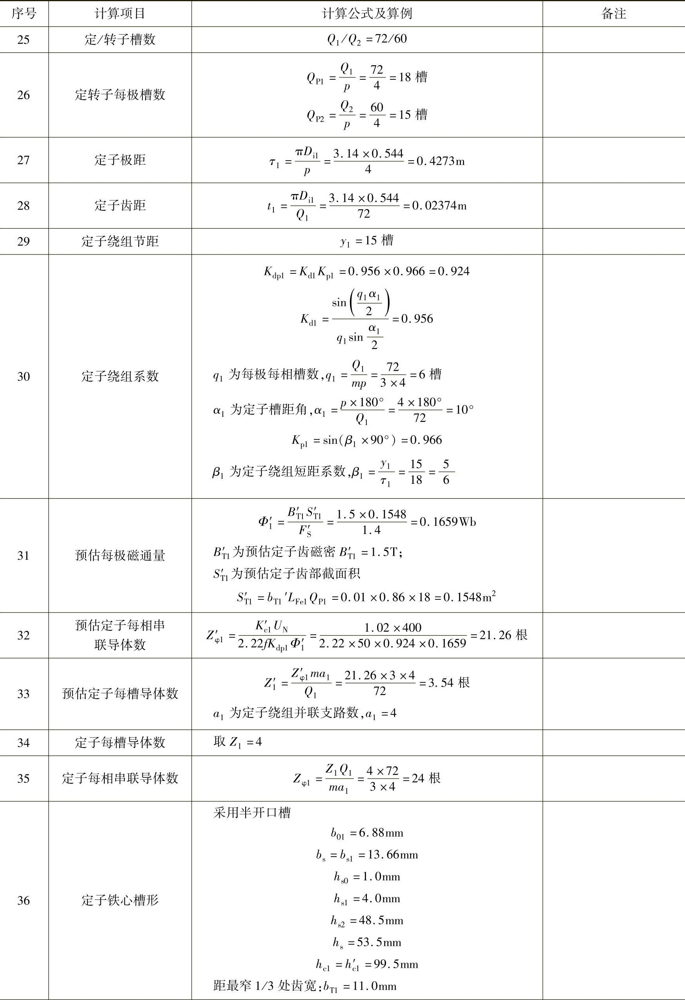

（续）

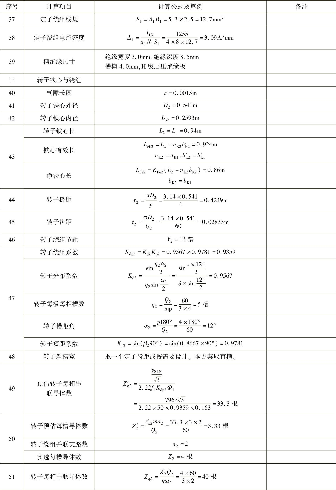

（续）

（续）

（续）

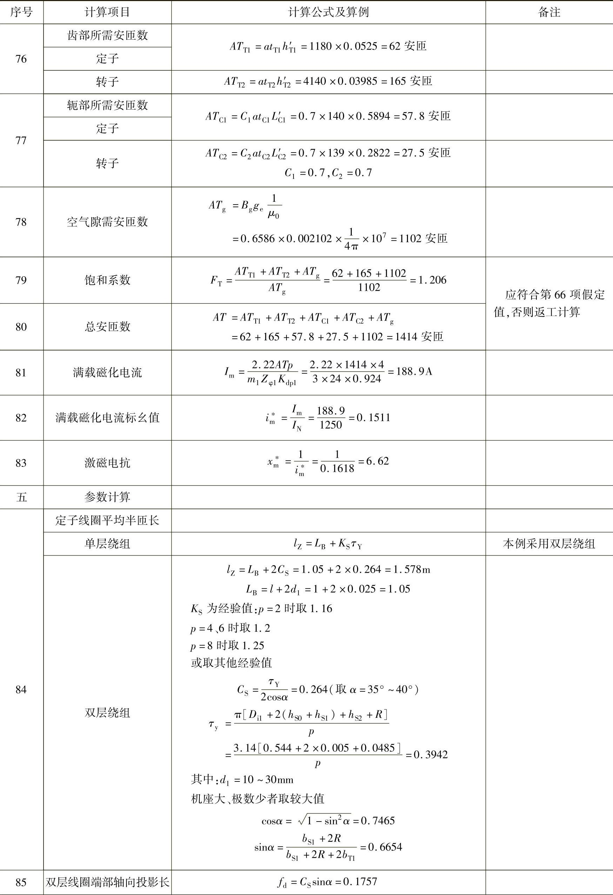

（续）

（续）

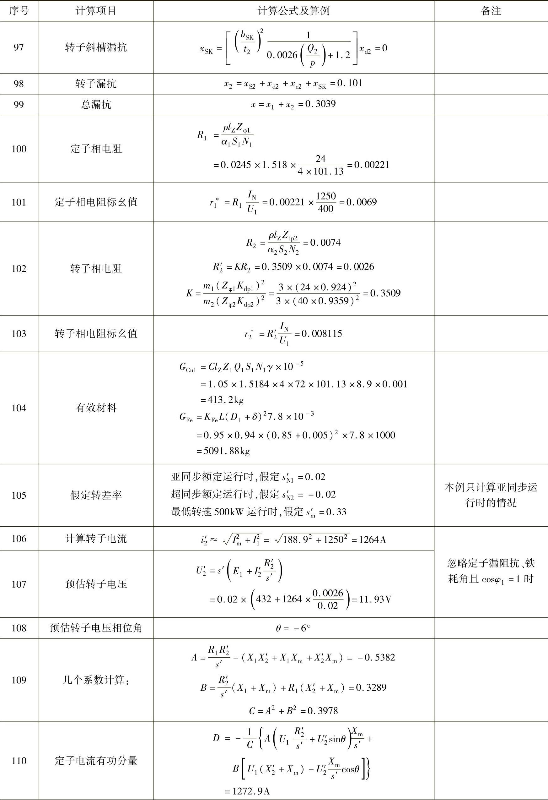

（续）

（续）

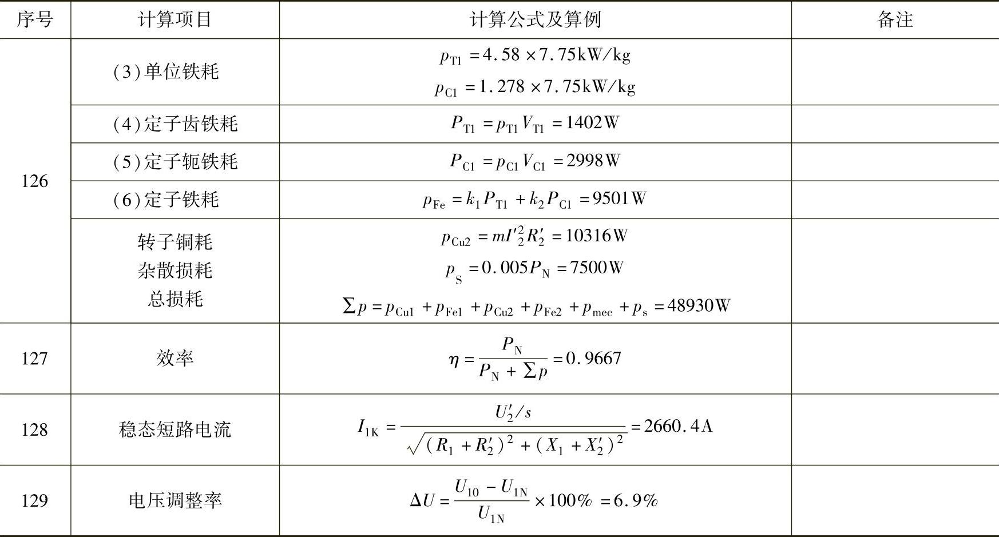

## 第五节 永磁同步发电机的设计特点

### 一、风力发电中应用的同步发电机

1.同步发电机与变速恒频风力发电机组

对于大、中容量的发电机，同步发电机的性能明显优于感应发电机，主要表现在以下几个方面：

1）感应发电机必须从电网吸收感性无功电流来励磁，加重了电网在无功功率上的负担，如果采用电力电容器作功率因数补偿，则需要经过精心的计算，否则存在发生谐振的可能，那是相当危险的；而同步发电机可以通过调节励磁来调节功率因数，功率因数可以等于1，也可以超前，甚至可以专门做调相机使用。

2）感应发电机的效率较低，除了励磁损耗较大（励磁电流占额定电流的20％以上）之外，转差率较大时转子的转差损耗很大（近似与转差率成比例）；而同步发电机的励磁损耗很小（占额定功率的1％～2％左右），特别是采用永磁体励磁时更是省去了励磁损耗，使发电机的效率明显提高。

3）作为并网运行的发电机，感应发电机供电质量的可控性不如同步发电机。例如，感应发电机的励磁电流不能调节，而同步发电机通过调节励磁电流可以实现电压调节、无功功率调节、强励等功能。

同步发电机在水轮发电机、汽轮发电机、核能发电等领域获得了广泛应用。然而，早期应用于风力发电时却并不理想。同步发电机直接并网运行时，转速必须严格保持在同步转速，否则就会引起发电机的电磁振荡甚至失步，同步发电机的并网技术也比感应发电机的要求严格得多。然而，由于风速的随机性，使发电机轴上输入的机械转矩很不稳定，风轮的巨大惯性也使发电机的恒速恒频控制十分困难，不仅并网后经常发生无功振荡和失步等事故，就是并网本身都很难满足并网条件的要求，而常发生较大的冲击甚至并网失败。这就是长时间以来，风力发电中很少应用同步发电机的原因。

近年来，随着电力电子技术和计算机控制技术的快速发展，全功率控制型风力发电机组开始使用同步发电机，特别是直驱式永磁同步发电机的应用日趋广泛。直驱式永磁同步发电机的特点是多极数、低转速，风力发电机组省去了中间变速机构，由风力机直接驱动发电机运行。采用变桨距技术可以使桨叶和风力发电机组的受力情况大为改善，然而，要想使变桨距控制的响应速度能够有效地跟踪风速的变化是困难的。为了使机组转速能够快速跟踪风速的变化，以便实行最佳叶尖速比控制，必须对发电机实施直接转矩控制。与全功率控制的感应发电机组一样，只需在同步发电机与电网之间接入变流器，使发电机与电网之间解耦，就允许发电机变速运行了。变速恒频控制的直驱式永磁同步发电机组的构成如图7-25所示。

图7-25 变速恒频控制的直驱式永磁同步发电机组

2.基本结构

同步发电机的定子结构与感应发电机基本相同，读者请参见第三节图7-9的定子部分。同步发电机的转子结构与感应发电机转子有明显不同，其基本结构如图7-26所示。

图7-26 同步发电机的结构特点

按励磁方式的不同，同步发电机可分为电励磁同步发电机和永磁同步发电机。电励磁同步发电机又可按转子磁极结构的不同分为隐极式和凸极式两类，如图7-27所示。隐极式转子为圆柱形，气隙均匀，励磁绕组为同心式绕组，嵌放在转子铁心槽内，在大齿部分形成磁极。凸极式转子因有明显凸出的磁极而得名，气隙一般不均匀，磁极中心线处的气隙最小，两个极尖处的气隙最大，励磁绕组为集中式绕组，直接套装在磁极铁心的极身上。高转速发电机宜采用隐极式磁极结构，低转速发电机一般采用凸极式磁极结构。

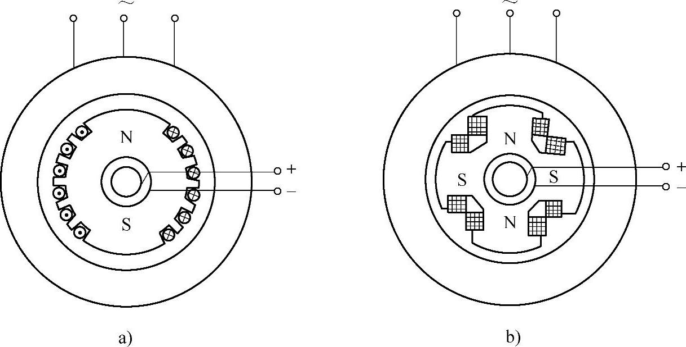

图7-27 电励磁同步发电机的基本磁极结构

a）隐极式 b）凸极式

永磁同步电机的永磁体磁极主要有表面式磁极结构（见图7-28）和内置式磁极结构（见图7-29）两类。所谓“表面式”就是将永磁体贴敷在转子铁心表面，构成磁极，永磁体的磁化方向为径向。所谓“内置式”是指将永磁体置于转子铁心内部预先开好的槽中，并构成磁极，永磁体的磁化方向可以为径向，也可以为切向，还可以采用既有径向、又有切向的所谓混合式磁极结构。表面式磁极结构主要适用于低转速的场合，例如直驱式风力发电机等，当应用于较高转速时，为了保证永磁体在磁力和离心力的作用下足够牢固和不发生位移，需要采取必要的紧固措施，图7-28（c）为加装了非磁性套筒的表面式磁极结构，有时也可采用无纬带绑扎等紧固措施。内置式磁路结构主要适用于高转速的场合，目前主要应用于各种类型的永磁同步电动机。

图7-28 表面式永磁磁极结构

a）凸出式 b）凹入式 c）有非磁性保护套筒

混合励磁同步发电机是一种既有电励磁磁极、又有永磁磁极的同步发电机，可以通过调节励磁电流来调节其主磁场的大小，因此，可以用来调节发电机的无功功率，也在一定程度上提高了发电机的过载能力。混合励磁同步发电机的磁极结构比较复杂，目前仍处于研究阶段。

图7-29 内置式永磁磁极结构

a）径向式 b）切向式 c）混合式 1—转轴 2—空气隔磁槽 3—永磁体 4—阻尼导条

低速永磁同步发电机的极数很多，可以考虑采用反装式结构，将电枢铁心和电枢绕组作为内定子，而永磁体磁极作为外转子。反装式结构可以使永磁磁极的安排空间有了一定程度的缓解。这时，由于电动机轴静止不动，也在一定程度上提高了发电机运行的可靠性。把风轮的轮毂与外转子设计成一体化结构，还可以使风力发电机组的结构更为紧凑合理。

采用低速永磁同步发电机的风力发电机组一般采用全功率变速恒频控制，由于发电机已经与电网解耦，发电机的转速不再受电网频率的约束，这就给发电机的设计增加了很大的自由度。例如，当风力发电机组采用直驱式结构，机组的额定转速为15r/min，如果将永磁同步发电机的额定频率设定为10Hz时，发电机的极数仅为80极，可以说，这是一个在技术上容易通过的方案。

由于低速永磁同步发电机的极数很多，而电枢圆周的尺寸有限，使电枢的槽数受到了限制，因此，低速同步发电机常采用分数槽绕组，即其每极每相槽数q为

式中 Q₁——电枢总槽数；

p——极对数；

m——相数。

3.运行原理与特性

同步发电机与感应发电机结构上的差别是由于他们的工作原理不同。感应电机（也称异步电机）的转子转速总是异于定子旋转磁场转速，这样一来，转子导体才能“切割”旋转磁场，发生电磁感应，产生感应电动势和电磁转矩，实现机电能量转换。这也是“异步电机”名称的由来。

同步电机则不同，为了使转子转速与定子旋转磁场的转速相同（同步），转子磁极必须是与定子具有相同极数的独立磁极。对于电励磁转子，这个磁极由励磁绕组中通入励磁电流产生；对于永磁转子，则直接由永磁体产生。

因此，同步发电机是一种双边激励的发电机。其定子（电枢）绕组接到电网以后，定子（电枢）电流流过定子绕组产生定子磁动势，并建立起定子（电枢）旋转磁场；转子励磁绕组中通入直流励磁电流建立转子主磁场，或者由永磁体直接产生主磁场。由于转子以同步速旋转，转子主磁场也将以同步速旋转。发电机稳定运行时，定、转子旋转磁场均以同步速旋转，二者是相对静止的，依靠定、转子磁极之间的磁拉力产生电磁转矩，传递电磁功率。

定、转子的N、S极之间的磁拉力是定子合成磁场B与转子主磁场B₀之间相互作用产生的。当发电机空载时，B与B₀的轴线重合，电磁功率为0；当发电机负载后，B与B₀的轴线之间就被拉开了一个角度，从而产生了电磁功率。负载越大，B与B₀的轴线之间被拉开的角度越大，同步发电机从机械功率转换成电功率的这部分功率就越大，这部分转换功率称为同步发电机的电磁功率P_(e)，与电磁功率P_(e)对应的转矩称为电磁转矩T_(e)。B与B₀之间的夹角称为功率角θ，是同步发电机的一个重要参数。发电机正常运行时，电磁功率P_(e)随功率角θ的增大而增大。然而，同步发电机电磁功率的增加将有一定的限度，超过了这个限度，发电机的工作就变得不稳定，甚至引起发电机失步。

隐极式同步发电机的等效电路如图7-30所示。与等效电路对应的相量图如图7-31所示。

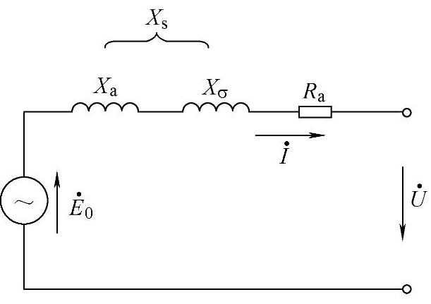

图7-30 同步发电机的等效电路

图7-31 同步发电机的相量图

以上二图中，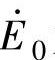为励磁电动势，对永磁发电机也称为永磁电动势，是转子主磁场在电枢绕组中感应的电动势；为发电机的输出相电压；为发电机的输出相电流；X_(s)为同步电抗，是同步发电机的一个重要参数，它综合表征了同步发电机稳态运行时的电枢磁场效应（X_(a)）和电枢漏磁场效应（X_(σ)），并且有X_(s)=X_(a)+X_(σ)；R_(a)为电枢绕组的每相电阻。

前面介绍的电磁功率P_(e)随功率角θ变化的关系称为功角特性，是同步发电机并网运行时的重要特性。隐极式同步发电机的功角特性可表示成式（7-50）。对应的特性曲线如图7-32所示。

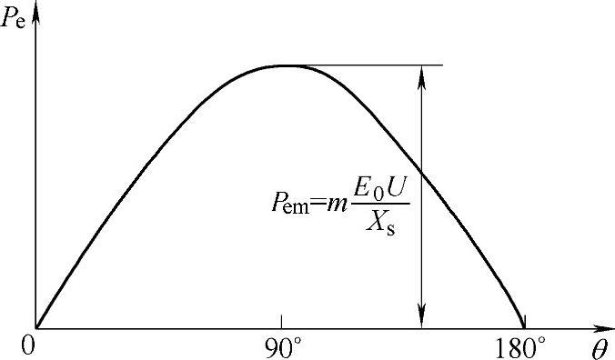

图7-32 隐极同步发电机的功角特性

可以看出，同步发电机的电磁功率P_(e)与功率角θ的正弦成比例变化，在θ=90°时，电磁功率出现最大值P_(em)，显然。进一步的分析可知，当θ＜90°时发电机的运行是稳定的，功率角θ越小，运行越稳定，功率角θ越接近90°，运行的稳定性越差；当θ＞90°时，发电机的运行变得不稳定，可能导致发电机失去同步。为了保证发电机运行的稳定性，一般取额定运行时的功率角约在30°～40°范围内，以便在任何情况下，发电机都能运行在稳定运行区域并具有足够的过载能力。

对于具有图7-28a所示磁极结构的永磁同步发电机，采用钕铁硼永磁材料（磁导率近似等于1）时，从电枢磁场的角度看，相当于隐极式磁极结构；而图7-28b和c则应看作为凸极式磁极结构，由于其交轴磁导大于直轴磁导，因此，交轴电枢反应电抗将大于直轴电枢反应电抗。显然，这种磁极结构上的差异将对发电机的性能产生影响。

### 二、电磁设计特点

这里主要介绍低速永磁同步发电机的电磁设计问题

1.电磁设计所依据的基本原理

（1）等效磁路及永磁体工作点计算

永磁电机内部的磁场分布十分复杂，要想准确计算比较困难。近年来，利用有限元法直接求取电机磁场的数值解已经可以获得较为满意的结果。

为了简化电机磁场的分析计算，工程上也常常采用等效磁路的方法来进行求解。在永磁同步电机的等效磁路中，可以把永磁体等效成恒磁通源，也可等效成恒磁动势源。图7-33分别示出了两种情况下永磁同步发电机的等效磁路。

图7-33 永磁同步发电机的等效磁路

a）恒磁通源等效磁路 b）恒磁动势源等效磁路

图中，Φ_(r)为永磁体虚拟内禀磁通，当永磁体牌号和尺寸给定后，它是一个常数；Φ_(m)为永磁体向外磁路提供的每极总磁通；Φ₀为永磁体的虚拟内漏磁通；Φ_(σ)为外磁路的漏磁通；Φ_(δ)为每极气隙磁通；Λ₀为永磁体的内磁导；Λ_(σ)为外磁路的漏磁导；Λ_(δ)为气隙磁导；F_(m)为每对极磁路中永磁体两端向外磁路提供的磁动势；F_(a)为每对极磁路中的电枢磁动势；F_(c)为永磁体磁动势源的计算磁动势，当永磁体牌号和尺寸给定后，它是一个常数。显然，当电枢磁动势F_(a)=0时，图7-33所示即为永磁同步发电机的空载等效磁路。

根据等效磁路，可以导出永磁体空载工作点和负载工作点的计算公式如下：

空载工作点 

负载工作点

式中的物理量均为标幺值，其中，b_(m0)为空载时永磁体表面的磁密标幺值；φ_(m0)为空载时永磁体向外磁路提供的总磁通标幺值；h_(m0)为空载时永磁体去磁磁动势标幺值；f_(m0)为空载时永磁体向外磁路提供的磁动势标幺值；b_(mN)为负载时永磁体表面的磁密标幺值；φ_(mN)为负载时永磁体向外磁路提供的总磁通标幺值；h_(mN)为负载时永磁体去磁磁动势标幺值；f_(mN)为负载时永磁体向外磁路提供的磁动势标幺值；λ_(n)为外磁路合成磁导的标幺值；f′=f_(ad)/σ₀，其中，σ₀为空载漏磁系数，f_(ad)为每极直轴电枢磁动势标幺值。

实际上，空载工作点的确定是通过返工计算来实现的。在确定永磁体尺寸后，先根据经验假定一个空载工作点，经磁路计算计算出外磁路合成磁导λ_(n)后，利用式（7-52）计算出永磁体空载工作点的计算值，如果该计算值与假定的预估值不一致，则重新预估并按上述步骤返工重算，直至二者之间的误差满足设计要求。

空载时永磁体提供的总磁通：

Φ_(m0)=b_(m)0^(B)r^(A)m （7-54）

空载漏磁通：

Φ_(σ0)=h_(m0)λ_(σ)B_(r)A_(m) （7-55）

空载时的每极气隙磁通：

Φ_(δ0)=（b_(m0)-h_(m0)λ_(σ)）B_(r)A_(m) （7-56）

磁路计算和电枢反应磁动势计算完毕后，即可利用式（7-53）计算出永磁体的负载工作点。负载工作点（b_(mN)，h_(mN)）确定后，可以按以下公式计算出发电机中各个磁通：

负载时永磁体提供的总磁通：

Φ_(mN)=b_(mN)B_(r)A_(m) （7-57）

负载漏磁通：

Φ_(σN)=h_(mN)λ_(σ)B_(r)A_(m) （7-58）

负载时的每极气隙磁通：

Φ_(δN)=（b_(mN)-h_(mN)λ_(σ)）B_(r)A_(m) （7-59）

（2）同步电机的相量图

进行同步电机性能的分析计算时，可以利用同步电机的等效电路，但应用更多的还是相量图，这是因为相量图中各物理量的相位关系和大小关系更为清晰。隐极同步发电机的相量图已在图7-31中示出。然而，永磁同步发电机常常显现出凸极特性，也就是说，其交、直轴磁导一般是不对称的，因此，交轴电枢反应电抗X_(aq)与直轴电枢反应电抗X_(ad)也是不相等的，而且常常是X_(aq)＞X_(ad)，这是永磁同步电机与电励磁凸极同步电机的显著不同之处。凸极式永磁同步发电机的相量图如图7-34所示。

凸极式同步发电机性能计算时，常常需要首先将电枢电流分解成交轴和直轴两个分量，为此，需要首先计算出发电机额定运行时的内功率因数角ψ_(N)。所谓内功率因数角就是励磁电动势与电枢电流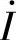之间的相位差角，如图7-34所示。可根据图7-34所示的相量图导出如图7-35所示的相量图，再导出计算ψ_(N)的公式，如式（7-60）所示。

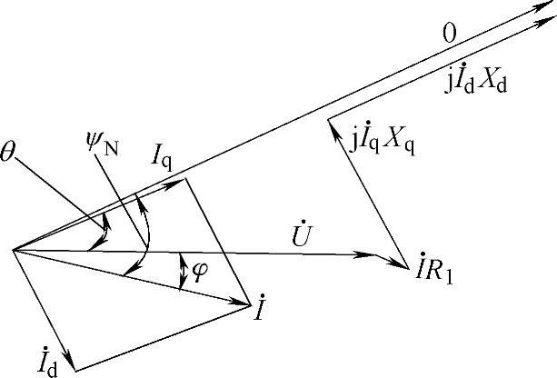

图7-34 凸极式同步发电机的相量图

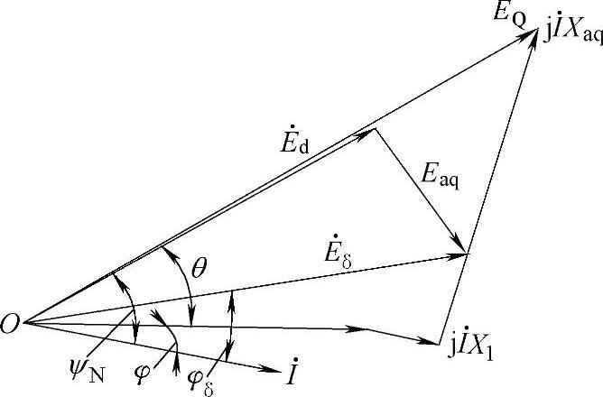

图7-35 用来计算的相量图

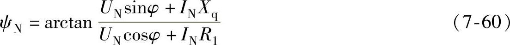

计算出内功率因数角ψ_(N)后，就可以按以下二式计算出电枢电流I_(N)的交轴分量I_(q)和直轴分量I_(d)：

I_(q)=I_(N)cosψ_(N)

I_(d)=I_(N)sinψ_(N) （7-61）

根据图7-35可以计算出发电机的输出电压U

式中 E_(δ)——气隙电动势；

I_(N)——额定电枢电流；

X₁——电枢漏抗；

R₁——电枢电阻；

φ_(δ)——气隙电动势与电枢电流之间的相位差角。气隙电动势E_(δ)可按下式求出：

E_(δ)=4.44fNK_(dp1)Φ_(δN)k_(Φ) （7-63）

式中 Φ_(δN)——发电机额定运行时的每极气隙磁通量。

然后，就可以进一步计算出发电机的各项性能。

（3）发电机的性能计算

发电机的固有电压调整率可按下式计算：

式中 E₀——发电机的空载励磁电动势，可按下式求出：

E₀=4.44fNK_(dp1)Φ_(δ0)k_(Φ0) （7-65）

式中 Φ_(δ0)——发电机空载运行时的每极气隙磁通量；

k_(Φ0)——空载气隙电动势的波形系数。

发电机的短路电流倍数按下式计算：

式中 ψ_(k)——发电机发生稳态短路时的内功率因数角

发电机的永磁体最大去磁工作点校核可按下式计算：

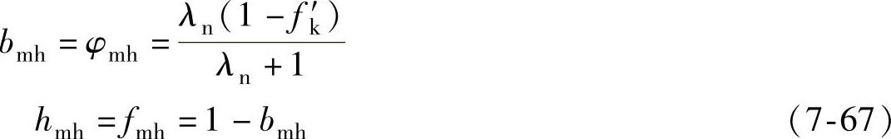

式中 f′_(k)=I^(∗)_(k)f′。

发电机的损耗与效率计算与其他类型发电机相似，不再赘述。

2.电磁设计特点

（1）电磁设计程序的结构与内容

永磁同步发电机的电磁设计程序与电励磁同步发电机有很多相似之处，甚至与感应发电机也有一些相似之处。为了便于读者阅读和对照，与其他交流发电机相似的内容也重复列出，而对不同的内容作了重点说明。低速永磁同步发电机的电磁设计程序分为以下几个部分，并按以下顺序进行计算：

1）额定数据：可根据有关国家标准和设计任务书确定。包括额定功率、额定电压、频率调节范围和额定频率、转速调节范围和额定转速、绝缘等级、冷却方式、防护型式等。

2）永磁转子设计：包括确定主要尺寸、细长比、转子铁心尺寸，极弧系数以及永磁体磁极设计等。

3）定子铁心和绕组设计：包括定子槽数和槽形尺寸，确定定子绕组结构、选择和计算线规、电流密度等。

4）磁路计算：计算每极磁通量，计算磁路各部分的磁密、空载磁压降、漏磁系数，计算确定主磁导、漏磁导、永磁体空载工作点等。

5）参数计算：计算定子电阻和漏电抗参数（包括定、转子槽漏抗、谐波漏抗、端部漏抗、齿顶漏抗等），计算交、直轴电枢反应电抗和交、直轴同步电抗、内功率因数角，计算永磁体负载工作点等。

6）性能计算：计算永磁电动势、额定端电压以及固有电压调整率，计算损耗和效率、计算稳态短路电流以及最大去磁工作点校核计算等。

（2）如何保证计算精度

与感应发电机的电磁设计时一样，低速永磁同步发电机电磁设计时，有些物理量只有计算到一定阶段后才能确定下来，然而，往往在设计计算的初始阶段就需要这些物理量参与运算，这时，常需要根据经验先给出这些物理量的假定值，再通过返工计算来最后确定之。

本计算程序中设置了三处返工计算，以便保证电磁设计的计算精度。

1）空载工作点的返工计算；

2）空载磁通的返工计算；

3）输出电压的返工计算。

## 第六节 计算机辅助电磁设计

从本章第3节和第4节列举的电磁设计程序及算例中可知，电机电磁设计的手工计算是一件复杂而又繁重的工作。不要说首先需要搞清楚设计程序中所反映的发电机内部复杂的电磁关系，仅仅那100多个公式的计算要准确无误，再加上多次反复地查表、查曲线，还有可能让人心烦意乱的几个返工计算，能坚持到最后并计算出合格的电磁设计方案真的是很不容易。这时，人们想到了借助于计算机来完成电机电磁设计的计算工作。进行科学计算恰好是计算机的优势所在，它快速、准确的计算能力无与伦比。

本节将对风力发电机计算机辅助电磁设计源程序编制中的几个问题作简要说明，并给出了两个用Matlab语言编制的计算机辅助设计源程序。

### 一、计算机辅助电磁设计源程序编制中的几个问题

1.程序语言的选择

在对风力发电机组进行系统测试或系统仿真时，需要已知发电机参数。正确的参数是发电机获得良好稳态特性和动态特性的前提。发电机参数可以通过试验测定，也可以通过电磁计算获得。

目前，应用最为广泛的系统仿真语言就是Matlab语言。为了与仿真语言相一致，发电机电磁设计程序采用了Matlab语言。

2.对标识符的处理

为了保证源程序计算结果的正确性，计算机程序必须严格反映手算程序的设计思路和过程，因此，编制计算机程序就是对手算程序的一个翻译过程，这种翻译过程不能照搬照抄手算程序，必须严格按照计算机语言的特点格式进行特殊的处理。设计出的计算机程序严格按照手算程序中的对应关系，并按照MATLAB的要求进行了局部的改动。对标识符的处理遵循了以下原则：

1）源程序中的标识符应尽可能与手算程序中的物理量符号相一致。

2）在MATLAB中，不能够识别希腊字母，必须改用能够识别的英文字母，表7-6中列出了程序中用到的希腊字母与英文标识符的对应关系。

表7-6 对应关系表

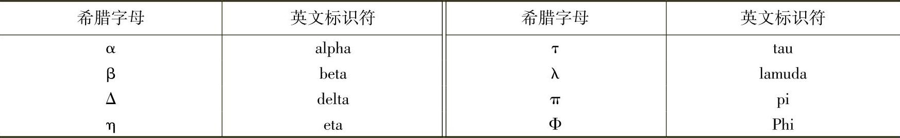

3）物理量的下脚标采用有短线隔开的英文字母或数字，例如：定子铁心内径D_(i1)的标识符为D_i1、气隙磁密B_(δ)的标识符为B_delta等。

3.对图表、曲线的处理

电机设计中所用到图表、曲线大体上可分为两种情况，一种是根据较复杂的计算公式绘制而成，例如：各种槽型的槽下部单位漏磁导λ_(L)，谐波单位漏磁导∑S等；另一种是根据试验数据或经验数据绘制而成，例如：电工钢板的磁化曲线和损耗曲线，永磁材料的退磁曲线等。在手算设计时，设计者可以方便地利用这些图表、曲线，快速准确地查取所需要的数据，因而避免了复杂的公式运算。

然而，在进行计算机辅助电磁设计时，大量的图表、曲线及其查取程序占用了计算机内部的大量资源，也降低了程序的运算速度，因此，需要对图表、曲线进行再处理。这时，一般也分为两种情况，一种情况是尽可能把图表、曲线恢复成原来的公式，例如：槽下部单位漏磁导λ_(L)、节距漏抗系数K_(U)、K_(L)等的计算；对于找不到或无法用数学公式表达的图表、曲线，查取时需要进行插值处理，例如：电工钢板的磁化曲线和损耗曲线等。

所谓插值就是首先把一条已知曲线离散化，用曲线上n个离散点的坐标构造一个多项式，以该多项式来近似代表原来的曲线。若以相邻两个离散点之间的直线来代替原来曲线时，称为一元线性插值；若以相邻三个离散点所构成的抛物线来代替原来曲线时，称为抛物线插值或一元二次插值。本文介绍的发电机电磁设计源程序中主要采用了线性插值。

一元线性插值函数的表达式如下：

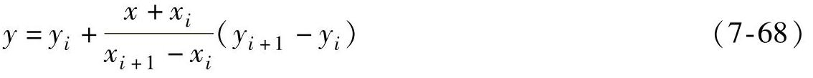

式中 

4.对返工计算的处理

在手算程序中，当需要某些物理量参与运算时，这些物理量却是未知的，因此，需要假定或预估这些物理量的大小。预估的准确程度主要依靠设计者的经验，一般说来，一次搞定的可能性极小，因此，必须设置返工计算来对这些预估物理量进行校核，以便保证设计计算的精度要求。这些返工计算在计算机程序中就表现为循环计算。以下举例说明：

这是for循环开始语句，定义FS为循环变量用来代替bf进入循环。在Matlab中for循环是有限循环，所以必须给定循环次数，这里给定循环次数为10次。

这是循环体结束部分，这里定义计算值与给定值的差值，如果差值与原值的比例大于0.01则重新进入循环，再次进行查表计算，如果差值与原值的比例小于0.01，则可以进行下一步运算。

对于不同类型发电机，需要返工计算的物理量及其起始点并不完全相同，一般情况下，除需要对饱和系数和电动势系数进行返工计算以外，还需要对发电机功率的计算精度进行控制。对功率计算精度的控制也是以返工计算的形式来实现的，但具体形式多种多样，有的程序是直接校核发电机的输出功率，有的则通过发电机效率校核来实现，还有的通过电机转速或转差率的校核来间接实现对功率计算的精度控制。在计算机辅助电磁设计源程序中，上述返工计算都是利用for循环语句来实现的。

图7-36 双馈型发电机计算机辅助电磁设计源程序流程图

### 二、计算机辅助电磁设计源程序

1.程序流程图

这里为读者提供了两个计算机辅助电磁设计源程序，即笼型感应发电机源程序和双馈型感应发电机源程序。由于笼型感应发电机的流程图相对简单些，又与双馈型发电机有很多相似之处，因此，这里只给出了双馈型发电机的源程序流程图，如图7-36所示。可以看出，源程序中设置了三个相互嵌套的返工计算，用来保证计算精度，每一个返工计算的允许计算精度均设定为不大于1％，读者应用时，也可将转差率返工计算的允许精度提高到0.5％，以便保证功率计算具有较高的精度。

2.源程序

这里为读者提供了笼型感应发电机源程序和双馈型感应发电机源程序，采用Matlab语言编制，详细请参见附录A、B。

