# 8 主传动链

本章讨论风力发电机组中传递机械能所需的传动链主要部件设计。包括主轴、主轴承、主齿轮箱、联轴器和机舱。

## 第一节 主轴

主轴把来自风轮的旋转机械能传递给齿轮箱或直接传递给发电机。对于非直驱的风力发电机组，主轴安装在风轮和齿轮箱之间，前端通过螺栓与轮毂刚性连接，后端与齿轮箱低速轴连接；对于直驱的风力发电机组，主轴安装在风轮和发电机之间，前端通过螺栓与轮毂刚性连接，后端与发电机转子连接。

主轴除了承受来自风轮的气动载荷、自重载荷和轴承、齿轮箱的反作用力，还要承受传动链的扭转振动以及较大的瞬态载荷。

图8-1所示为某1.5MW风力发电机组主轴。

主轴通常带有轴向通孔，以使液压、电气的连接线路甚至变桨距调节的机械元件通过。为改善加工和装配工艺，当配合面长度较大时，配合面宜制成阶梯形（如轴头与齿轮箱胀套连接处）。

图8-1 1.5MW风力发电机组主轴

### 一、主轴支撑方式

大型风力发电机组的主轴通常采用下述几种支撑方式。

1.独立轴承支撑

独立轴承支撑的主轴如图8-2所示，这种布局的主轴通过两个独立安装在机舱底盘上的轴承支撑，其中靠近风轮的轴承承受轴向载荷，两轴承都承受径向载荷，并将弯矩传递给机舱底盘和塔架。此种情况下，主轴只传递转矩到齿轮箱。

独立轴承支撑的主轴布局轴向结构较长，制造成本较高；但对于小批量生产而言，这种结构简单，便于采用标准齿轮箱和主轴支撑构件，重量大带来的不利影响可能处于次要地位。

2.三点支撑式

大型风力发电机组广泛采用将主轴后轴承集成在齿轮箱中的支撑形式。此时，由主轴前支撑和位于齿轮箱两侧的扭力臂支撑形成三点支撑布局形式（见图8-3）。

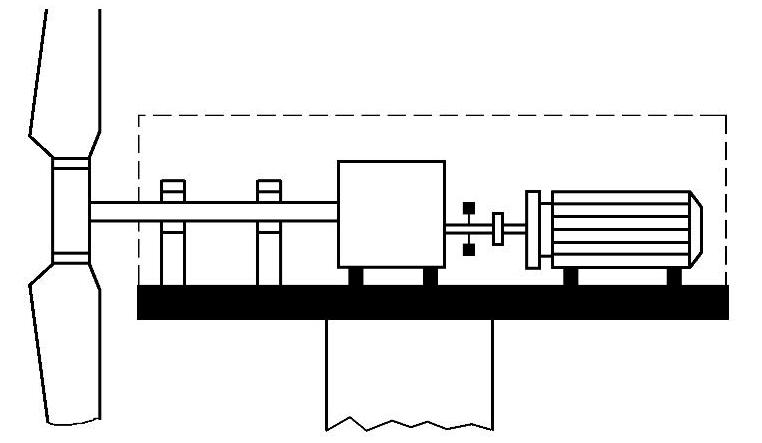

图8-2 独立轴承支撑的主轴

图8-3 三点支撑的主轴

三点支撑布局形式的优点是可以使主轴前后支撑间的结构紧凑，且可使载荷传递到机舱底盘的距离更短些；此外，三点支撑主轴的前轴承和齿轮箱可实现预装配，因而能有效提高机舱部件的安装效率。

3.集成在齿轮箱内

此种主轴集成在齿轮箱内（见图8-4），缩短了传动链长度，整机结构简单，纵向尺寸减小。但此种结构风轮载荷完全由齿轮箱承担，齿轮箱结构复杂，壁厚及尺寸均较大，维护性较差。

### 二、主轴材料

绝大多数情况下采用合金钢作为主轴的材料，这一方面是因为合金钢有较高的强度，另一方面是其具有较好的防腐性能，除此之外，主轴材料还要求具有较好的抗低温性能。常用材料有40Cr、42CrMnTi、34CrNiMo6等，毛坯通常采用锻造工艺。合金钢材料的缺点是对应力集中较为敏感，结构设计时应注意减小应力集中，必要时可设计卸载槽，并对表面质量提出要求。

主轴是风力发电机组结构最为关键的部件之一，必须采用恰当的质量保证措施，确保材料质量得到保证。生产过程要避免导致表面裂纹及造成其他缺陷的扩展，最后要经过一些恰当的无损探伤程序如超声波探伤等对主轴材料的缺陷进行检查。

### 三、主轴力学模型及设计载荷

图8-5给出三支点支撑主轴所受的载荷及反作用力。主要有轴向力、径向力、弯矩、转矩、剪切力以及来自支点的支反力。

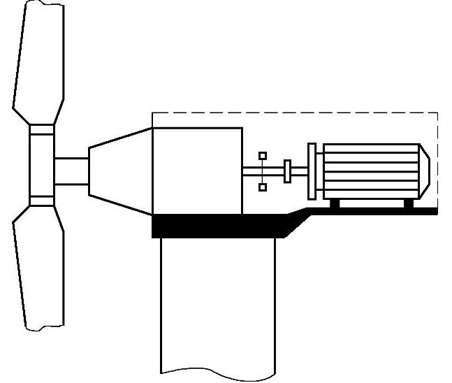

图8-4 集成在齿轮箱内的主轴

图8-5 三支点支撑主轴力学模型

图8-5中：

F_(yr)——风轮上的横向力；

F_(xr)——风轮上的推力；

F_(zr)——风轮上的纵向力；

M_(yr)——风轮上的倾覆力矩；

M_(xr)——风轮上的驱动力矩；

M_(zr)——风轮上的纵向力矩；

G_(s)——主轴重力。

主轴的强度分析必须针对所有的载荷工况进行，应考虑包括结构载荷在内的所有轴载荷，载荷大小应按照既定的载荷谱进行。

疲劳载荷包含了应力幅值的历程。每一个载荷分量都存在一个时间历程。因此疲劳载荷的组合也就意味着应力历程的组合。除非知道各个载荷分量之间的相位差，一个载荷分量的最大应力幅值，必须加上每一个其他载荷分量的最大幅值。第二大的幅值加上其他载荷分量的第二大幅值，以此类推。

### 四、主轴强度分析

1.仅考虑传递扭矩的主轴强度计算

风轮通过主轴将转矩传递给齿轮箱，根据主轴传递的功率要求，首先将功率转化为名义轴向转矩M_(xr)的表述

式中 M_(xr)——名义轴向转矩，单位是N·mm；

P——传递的功率，单位是kW；

n——主轴转速，单位是r/min。

该转矩作用在主轴，将产生扭剪应力τ（MPa），为了使主轴能承载给定转矩，应对其进行校核计算。最大扭剪应力应发生在轴外表面，即r=r₀处。强度条件为

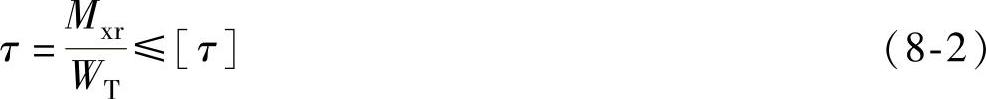

式中 W_(T)——轴抗扭截面模量，单位是mm³，对圆截面轴

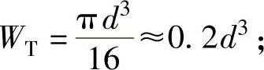

\[τ\]——轴的许用剪切应力，单位是MPa。

2.主轴直径初步估算

由式（8-2）可得轴径初步估算公式

式中 d——主轴直径，单位是mm。

式（8-3）计算结果可作为主轴上只承受转矩部位（如主轴轴头与齿轮箱连接处）的直径。

实际设计中，上述计算通常应考虑一定的安全系数，对不同的材料，一些机械设计手册给出了推荐最大应力。

【例8-1】 某机组主轴设计，已知风轮吸收的额定功率为3000kW，主轴转速为12.5r/min，所选主轴材料许用剪切应力\[τ\]=55MPa，试估算主轴直径。

解：该主轴传递的转矩为

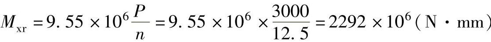

所需主轴最小直径为 

3.考虑综合载荷作用的主轴强度计算

主轴的功用不仅是将转矩传递给齿轮箱，同时还要在轴端支撑巨大的风轮。因此，主轴承受的载荷情况比上述仅承受扭矩作用的情况要复杂得多，通常是在式（8-3）基础上做主轴的结构设计后，再对主轴做精确的强度计算。考虑载荷及主轴上零件的安装情况，主轴结构通常呈轴头处为细端的圆锥形，并且在前主轴承位置承受最大弯矩。在结构允许的条件下，可将主轴尽量设计得保守一些。根据设计实践，考虑全部载荷作用条件下，风轮主轴直径（主轴承处）通常取为风轮直径的1％左右，轴头直径按式（8-3）计算，按此设计参数一般可以保证其强度。

对于一般的轴，在弯扭应力共同作用下，初步设计时，可按第三强度理论计算其强度：

式中 σ_(c)——合成应力，单位是MPa；

σ_(b)——危险截面上的弯曲应力，单位是MPa；

τ——扭剪应力，单位是MPa；

\[σ_(b)\]——许用弯曲应力，单位是MPa。

按照图8-5所示支撑结构，显然主轴在主轴承处承受最大弯矩M，该处所受合成应力为

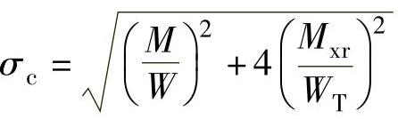

式中 W——抗弯断面模量，，单位是mm³；

W_(T)——抗扭断面模量，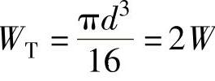，单位是mm³；

M_(xr)——工作转矩，单位是N·mm；

M——前主轴承处主轴所承受的弯矩，M=M_(K)+G_(w)l₁；

G_(w)——风轮重力，单位是N；

l₁——风轮重心到轴计算截面距离，单位是mm；

M_(K)——偏航时风轮的回转力矩，单位是N·mm。

因此，其强度条件为

考虑到弯矩M作用下产生的正应力是对称循环应力，而转矩M_(xr)作用下产生的剪切应力可认为是脉动循环应力，应对上式做以修正

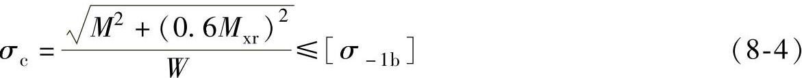

式中 \[σ_(-1b)\]——对称循环变应力下的许用弯曲应力，单位是MPa。

4.空心轴的强度计算

通常主轴都做成空心的，以便通过变桨距控制线缆或通过液压变桨距装置。对于空心主轴，式（8-4）可改写为

式中 β₁——空心轴内、外径之比，β₁=d₁/d。

5.疲劳强度计算

疲劳强度计算应首先确定在一定的应力幅值S下主轴失效的应力循环次数N，即N-S曲线。

N-S曲线可以由实验室小试样实验得出。但是，由于以下因素的影响，应该对小试样实验得出的N-S曲线进行修正。这些因素是技术尺寸效应、几何尺寸效应、表面质量和应力集中等。

（1）技术尺寸效应

试样通常具有较小的尺寸（直径一般为5～10mm），其力学性能通过锻造或轧制减少了横截面积得到提高。技术尺寸效应可以用技术尺寸系数ε₁来考虑（见图8-6）。在图8-6中，d表示所考虑主轴的直径。

（2）几何尺寸效应

不同尺寸的试样具有不同的疲劳性质，可以使用几何尺寸系数ε₂来考虑（见图8-7），如果纯拉压的疲劳强度可以作为计算的基础，其ε₂可以设定成等于1。

图8-6 技术尺寸系数ε₁

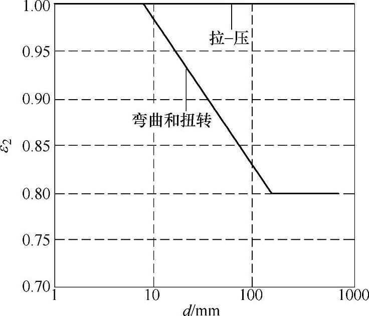

图8-7 几何尺寸系数ε₂

（3）表面质量的影响

疲劳裂纹常起源于不平整的表面或者细小的表面裂纹。试样的表面应该是抛光表面，表面粗糙度R_(a)=0.05～0.1μm，精机械加工的表面粗糙度R_(a)=0.4～16μm。表面质量的影响可用表面影响系数β来考虑（见图8-8），图中，R_(a)为表面粗糙度，σ_(b)为抗拉强度。

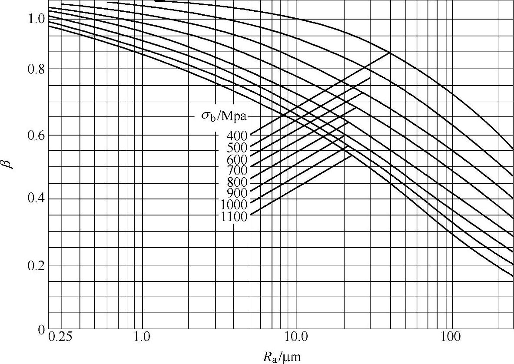

图8-8 表面质量系数β

（4）应力集中的影响

应力集中发生在几何形状发生变化的区域如轴肩、键槽等部位，也可以出现在锁紧盘连接及轴承过盈配合处。

常见的应力集中部位是轴肩等轴截面尺寸发生突变的部位，轴承附近常见结构如图8-9所示。图8-9中几何尺寸的数据见表8-1。

图8-9所示应力集中的影响可用有效应力集中系数（疲劳缺口系数）K_(f)来表示。有效应力集中系数主要取决于理论应力集中系数α，还与材料性质、缺口型式、缺口半径及深度有关。例如图8-10为阶梯轴弯曲的理论应力集中系数α，图中D为主轴轴肩处大径；d为主轴轴肩处小径；h为轴肩高度，h=（D-d）/2；r_(c)为过渡圆角半径。更多缺口型式的理论应力集中系数α参见《机械设计手册》（参考文献\[7\]，后同）。

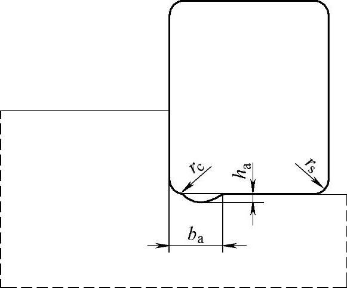

图8-9 轴承附近的主轴结构

表8-1 几何尺寸的数据

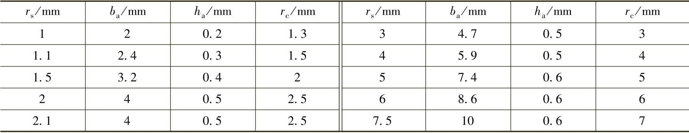

由缺口敏感因子q和理论应力集中系数α可以得出有效应力集中系数K_(f)，即

K_(f)=1+q（α-1） （8-6）

式（8-6）中，缺口敏感因子

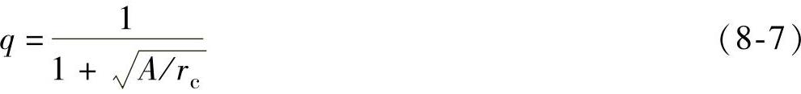

式中 r_(c)——缺口半径；

A——Neuber系数（见图8-11），图8-11中σ_(b)为材料的抗拉强度。

图8-10 理论应力集中系数α

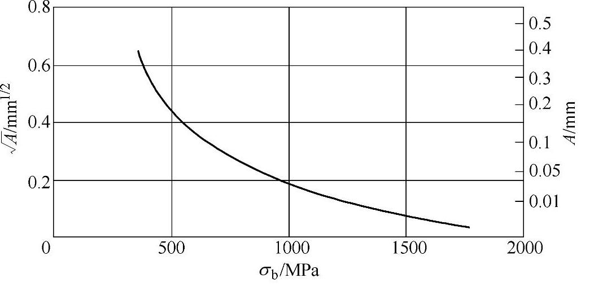

图8-11 Neuber系数

由于轴承紧配合造成的应力集中，可以采用应力集中系数K_(f)=1.1～1.2。

对于胀套联轴器连接，连接处的应力集中系数采用K_(f)=1.7～2.0。

（5）材料的S-N曲线 当缺少实际材料可靠的疲劳性能的试验数据时，可采用人为构造的S-N曲线。人为构造的S-N曲线有多种方法。推荐采用德国劳氏船级社的标准《Guideline for the Certification of Wind Turbines Edition 2003》规范中给定的方法对轮毂的疲劳S-N性能曲线进行拟合。

以下介绍适用于材料为低碳钢或合金钢的小尺寸7～10mm的抛光试件人为构造的S-N曲线的方法。它基于材料的静强度数据结合在旋转及扭转条件下（也可能是拉压）的疲劳极限σ_(r)。如果对实际材料没有σ_(r)，对拉压情况可以采用下面基于50％失效可能性的S-N曲线估算的疲劳极限：

σ_(r50％)=0.436σ_(s)+77

式中 σ_(r50％)——基于50％失效可能性的疲劳极限，单位为MPa；

σ_(s)——材料的屈服强度极限，单位为MPa。

为了得到2.3％失效概率下的疲劳极限，可按下式计算：

σ_(r2.3％)=σ_(r50％)-2s

式中 s——标准偏差，对低碳钢和低合金钢，s可取为σ_(r50％)的6％。

（6）疲劳强度校核 如果以lgS-lgN作为坐标轴，S-N曲线可认为从（10，σ_(b)）到（10⁶，σ_(r)）线性减小。当N＞10⁶时，曲线可视作水平线S=σ_(r)。

主轴各危险截面的疲劳强度可按下式校核：

式中 γ_(f)——载荷安全系数；

γ_(m)——材料安全系数。

安全系数γ_(f)、γ_(m)的数值见本书第三章。

式（8-8）、（8-9）中的K_(f)要分别用弯曲和扭转工况下的有效应力集中系数。

6.极限强度

除了前述强度校核之外，对高强度极限的主轴材料，还应该考虑极限载荷工况同时可能兼有应力集中影响下的极限强度。应力集中对极限强度的影响可用系数γ_(e)来考虑

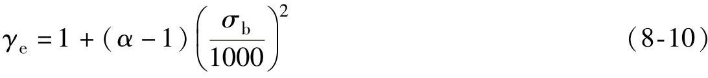

式中 σ_(b)——材料的抗拉强度，单位为MPa；

α——应力集中系数，查图8-10。

则极限强度校核式为

式中 σ_(s)——材料的屈服极限，单位为MPa；

γ_(f)——载荷安全系数；

γ_(m)——材料安全系数。

## 第二节 主轴承

风力发电机组主传动链中的主轴承支撑主轴（见图8-12），并通过轴承座将风轮作用力传递给底盘。主轴承通常采用滚动轴承。由于主轴易产生弯曲变形，同时主轴的轴向位移可能引起轴承的滚子磨损，因而在轴承和轴承座设计时应采取必要措施解决这一问题。

我国风电轴承标准（JB10705Y2007）推荐风轮主轴采用标准的圆柱滚子轴承、调心滚子轴承或深沟球轴承支撑。调心滚子轴承允许内外圈轴线偏斜量可达1.5°～2.5°，这足以补偿由于风轮载荷所导致的主轴、轴承座及底盘的变形，特别是三支点支撑的主轴，应允许风轮、齿轮箱绕主轴承中心摆动，因而这种轴承在风力发电机组中得到广泛的应用。

图8-12 主轴、主轴承和轴承座

### 一、设计载荷

传统三支点支撑主轴受力图参见图8-5。主轴靠近风轮一端由一轴承固定支撑，另一端支撑在齿轮箱行星架上。前端主轴承的载荷可以根据简单的梁理论计算，即

轴向力 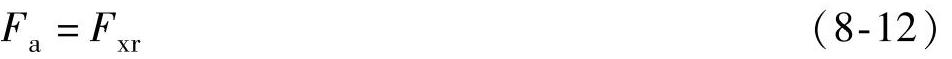

径向力 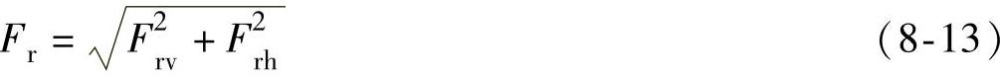

式中 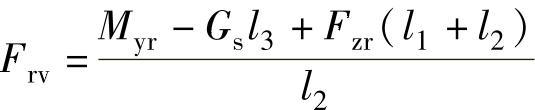

### 二、额定寿命

无论主轴承还是齿轮箱轴承，通常需要计算其基本额定寿命L_(h10)。轴承的使用寿命采用扩展寿命计算方法进行，计算中所用的失效概率一般按10％设定。根据ISO 281标准推荐，L_(h10)以当量载荷、轴转速、轴承额定动态载荷和简化载荷分布为基础，主要考虑滚子轴承的动态载荷的影响，表达式为

式中 L_(h10)——基本额定寿命，单位是h；

n——转速，单位是r/min；

C——根据ISO 281确定的基本额定动载荷，单位是N；

P_(d)——当量动载荷，单位是N，P_(d)=XF_(r)+YF_(a)；

ε——寿命指数，对球轴承取3，对滚子轴承取10/3。

X、Y——与轴承有关的系数，见相关手册或样本。

表8-2给出了轴承最小基本额定寿命L_(h10)的推荐值。

表8-2 轴承最小基本额定寿命L_(h10)

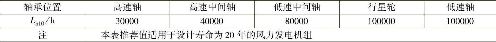

使用实测载荷谱计算时，式（8-14）中当量动载荷P_(d)应以平均当量动载荷P_(m)计算。平均当量动载荷P_(m)计算公式为

式中 P_(m)——平均当量动载荷；

N——总循环次数；

L——载荷周期；

P_(d)——作用于轴承上的当量动载荷。

例如载荷谱中，轴承依次在当量动载荷P₁，P₂，P₃…作用下运转，其相应转速为n₁，n₂，n3，…，在每种工况下运转的时间分别为t₁，t₂，t₃…，则式（8-15）可以简化为下式：

若无实测载荷谱，一般轴承平均当量动载荷可按额定载荷的2/3进行计算。

对于像主轴轴承这样承受很大载荷且转速又不高的轴承，还应按极限载荷工况对其静强度进行验算。

轴承上作用的径向载荷F_(r)和轴向载荷F_(a)，应折合成一个当量静载荷P₀，即

P₀=X₀F_(r)+Y₀F_(a) （8-17）

式中 X₀、Y₀——当量静载荷的径向载荷系数和轴向载荷系数。

设计中应使静强度安全系数C₀/P₀≥4。C₀为额定静载荷。

### 三、润滑及密封

1.主轴承的润滑

润滑的主要目的是为了在滚动部件间形成润滑油膜，避免金属与金属的直接接触，这就可以避免了磨损和滚动轴承的过早疲劳。此外，润滑减少了噪声和磨损的发展，因而改进了轴承的运行特性。另外它还防止了腐蚀，加强了轴承密封件的密封效果。

在选择润滑时，需要考虑的是黏度、运行温度范围，防腐能力和承载能力。

润滑剂中的水会导致腐蚀、润滑的退化，在油添加剂中形成杂质，会影响承载油膜的形成。

主轴承上最常用的润滑剂是油脂。油脂润滑的优点是油膜强度高；油脂粘附性好，不易流失，使用时间长；密封简单，能防止灰尘、水分和其他杂物进入轴承；不必使用昂贵的循环系统。

油脂包含油基稠化剂和可能的添加剂。各种油脂类型如下：

1）矿物油带金属发泡剂作为稠化剂；

2）矿物油带不发泡稠化剂；

3）合成油带不发泡稠化剂。

锂基油脂是防水的，可用于较宽的温度范围，即-35～130℃。

其他还有钠基油脂或钙基油脂。钠基油脂易溶于水，适于干燥、水分较少的工作环境，缺点是太软，很容易被挤出轴承。钙基油脂不易溶于水，适合于潮湿、水分较多的工作环境。

更换油脂类型时应特别注意，如果不相容的油脂混在一起，它们的结构可能彻底改变，油脂可能变得相当柔软。

关于所用油脂的数量，一般的原则是完全充满轴承，同时油池半满。

2.主轴承的密封

轴承需要密封，一则是为了保证润滑，二则是为了防止污染。主轴承通常位于缺少保护、非常靠近外部的地方，这就特别重要，因为杂质和雨水可能很容易进来与轴承接触。

接触式密封包括毛毡密封、皮碗密封等。此种密封装置中，密封件与主轴直接接触，工作中产生摩擦磨损，长期使用毛毡密封可能会把轴磨出沟槽。结构上无论毛毡密封还是皮碗密封都应便于更换，如采用剖分式皮碗密封圈等。

迷宫式密封无摩擦、无磨损，可作为其他密封的良好补充。

## 第三节 主齿轮箱

风力发电机组主传动齿轮箱位于风轮和发电机之间，是一种在无规律变向载荷和瞬间强冲击载荷作用下工作的重载齿轮增速传动装置，传动零件最多，是风力发电机组传动轴系中一个最重要而又是最脆弱的部件。由于机组通常安装在高山、荒野、海滩、海岛等偏远地区，且齿轮箱安装在塔顶的狭小空间内，一旦出现故障，维修将非常困难，故对其可靠性和使用寿命都提出了比一般机械高得多的要求。例如对构件材料的选择，除了常规状态下的机械性能外，还要有较好的抗低温冷脆性能；要保证齿轮箱平稳工作并减小噪声，齿轮要有较高的精度等级等。此外，完善的润滑、冷却和加热、监控系统，也是设计齿轮箱的必要要求，而寿命则一般要求在20年。很显然，在狭小的机舱空间内减小部件的尺寸和减轻重量十分重要，根据机组提供的参数，以最小体积或重量为目标，采用优化设计排定最佳传动方案，也为设计者常常采用。

### 一、基本传动形式

风力发电机组齿轮箱的种类很多，按其传动形式大致可分为平行轴定轴传动、行星传动及它们的组合传动齿轮箱；按传动的级数可分为单级和多级齿轮箱；按布置形式可分为展开式、分流式和同轴式齿轮箱。兆瓦级齿轮箱由于增速比较大，通常采用行星与平行轴组合形式的齿轮传动，表8-3所示为几种常见的传动形式。

平行轴圆柱齿轮传动一般应用在100～500kW标准风力发电机组上。随机组功率的增大，为了节省空间，获得更大的速比，功率超过600kW的机组齿轮箱，通常使用外形更为紧凑的行星齿轮传动或行星与平行轴组合传动的结构。一般有两种传动形式：一级行星+两级平行轴圆柱齿轮传动，两级行星+一级平行轴圆柱齿轮传动。相对于平行轴圆柱齿轮传动，行星传动有以下优点：传动效率高，体积小，重量轻，制造方便，传递功率范围大，使功率分流；共轴线式的传动装置，使轴向尺寸大大缩小；运动平稳、抗冲击和振动能力较强。在具有上述优点同时，行星传动也存在一些缺点：结构形式比定轴齿轮传动复杂；对制造质量要求高；由于体积小、散热面积小容易导致油温升高，故要求可靠的润滑和冷却装置。

表8-3 几种常见的传动形式

图8-13所示为一级行星+二级圆柱（平行轴）齿轮箱，是目前应用较广的机组传动结构。为获得高功率密度和大速比，行星级的行星架将动力多分路分流到多个行星轮，再汇合到太阳轮上传至平行轴齿轮，常用功率在2MW以下。

两级行星和一级平行轴齿轮传动也有较多应用实例，功率可达3～3.6MW。

对于更大功率的机组，为了减小外形尺寸，节省机舱空间，齿轮箱倾向于应用行星、差动和平行轴齿轮组合传动的方式，行星轮常常多于三个，以缩小体积，获取更大的功率密度。

图8-14所示为行星差动和固定轴齿轮组合传动结构，已在国内的大型风力发电机组中得到应用。该结构采用3级齿轮传动：第一级是行星差动齿轮传动；第二级是固定轴齿轮分流传动；第三级是平行轴齿轮传动。

从主轴传来的功率分两路传递：一路经由与第一级行星架直连的第二级内齿圈，通过圆周分布的一组固定轴齿轮传至第二级中心轮，再通过与该中心轮相连的第一级内齿圈回传至行星架；另一路则直接由行星架传递，并在第一级行星轮上与前一路的功率汇合，通过第一级中心轮（太阳轮）传至第三级平行轴齿轮副。

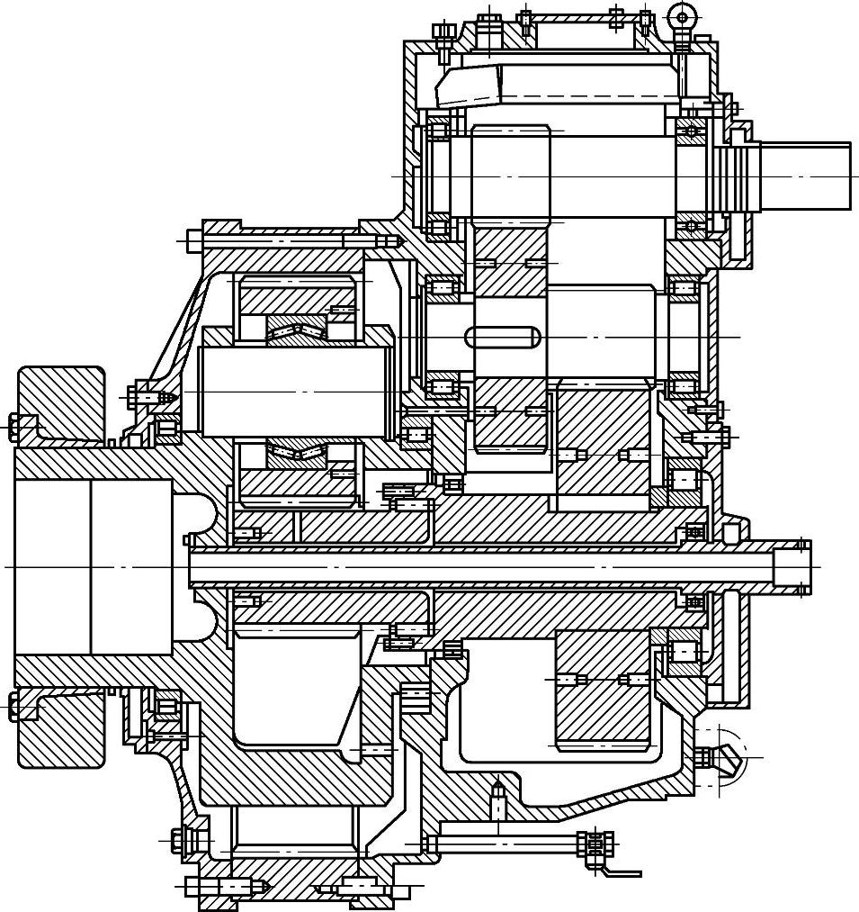

图8-13 采用一级行星+二级定轴圆柱传动方式齿轮箱

采用四级行星差动平行轴传动的结构如图8-15所示。

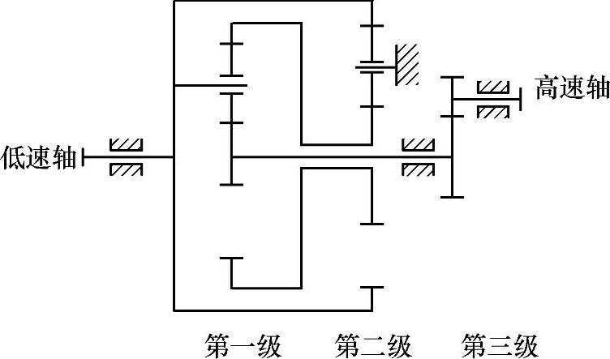

图8-14 行星差动与固定轴齿轮功率分流传动结构

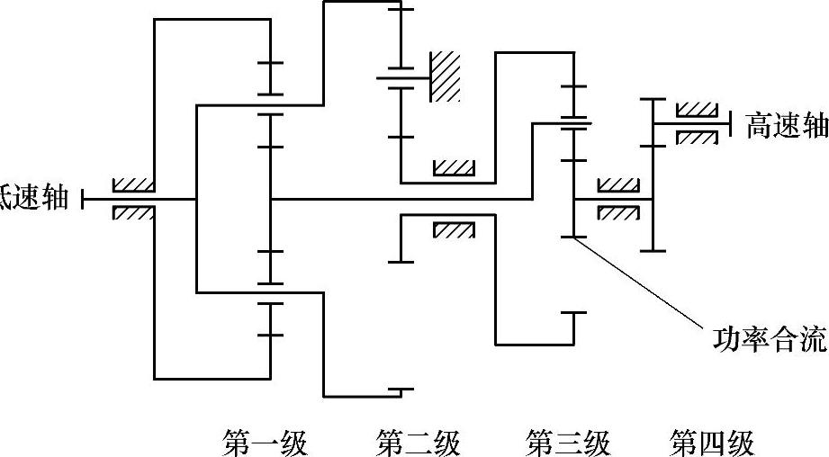

图8-15 四级行星差动平行轴传动

功率分两路传递：齿轮箱的主传动输入级由一级行星齿轮和固定在箱体上的齿圈组成。与传统的齿轮箱功率传递相反，动力并不完全汇合到太阳轮上，而是部分地通过行星架传到第二级旋转的内齿圈上。在第二级传动中，一组齿轮被支撑在箱体上，与相互啮合的内齿圈和太阳轮一起，用作速度分流和改变旋向，扭矩变化则通过太阳轮进行。

在第三级差动行星齿轮级上，来自第一级太阳轮和第二级太阳轮的功率流汇合。第一级的太阳轮驱动行星架，而第二级太阳轮驱动内齿圈。这第三级称为三轴行星差动传动，两路功率流在这里汇合到太阳轮上，再传至第四级平行轴主动齿轮，总增速比可达到200∶1以上，其中一到三级增速比可达40∶1，平行轴级5∶1。

齿轮箱末级传动采用定轴齿轮副，是遵循风力发电机组非同轴线设计的规则，这是为了在中心孔布置管路或电缆，以便控制风轮叶片变桨距。另外，产生必要的中心偏移则可以比较方便地调节不同的发电机速度输出。

### 二、风电齿轮传动设计标准

在风电齿轮箱设计过程中，除通用标准外，还要参照相关的行业标准。

1.齿轮传动通用设计标准

（1）相关的中国国家标准

齿轮传动设计，需要参照通用设计标准GB/T 3480—1997《渐开线圆柱齿轮承载能力计算方法》。GB/T 3480—1997标准与国际标准ISO 6336—1～ISO 6336—3基本对应，主要用于齿轮的齿面点蚀和齿根抗弯承载能力的计算。对于胶合承载能力的计算，需要参照GB/Z6413—2003标准。

（2）相关的其他国家标准 国际标准（ISO）和德国标准（DIN）在齿轮传动设计中起到重要作用。其中有关圆柱齿轮承载能力的主要设计标准源于DIN3990。该标准包括6个子集（见表8-4），与国际标准ISO 6336基本对应。对于齿轮胶合能力计算，相关的参照标准为ISO/TR 13989—2000。

表8-4 齿轮承载能力计算的主要标准

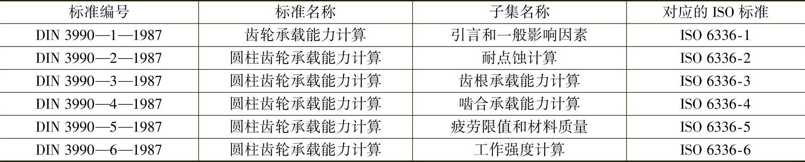

2.风电齿轮箱专用标准

国家标准GB/T 19073—2008《风力发电机组—齿轮箱》（以下简称GB/T 19073国标），对风轮扫掠面积大于等于40m²的风电齿轮箱的技术要求、试验方法、检验规则及标志、包装、运输和储存提出了概括性要求。但由于我国在大型风电齿轮箱的设计技术领域涉足较晚，相关设计标准尚不完善，目前国内大型风电齿轮箱的设计，还需要参考国际标准或欧美标准

2003年10月，美国风能协会（AWEA）与齿轮协会（AGMA）联合制定了新的风电齿轮箱标准，该标准于2004年被确定为美国国家标准，亦即ANSI/AGMA 6006—2004（简称AGMA 6006标准）。

针对40kW～2MW的风电齿轮箱设计、制造与运行，AGMA 6006标准作了比较全面的规定，目前已被许多国家采用，是风电齿轮箱领域影响最大的一个标准。国际标准化组织2005年采用快速程序，直接将该标准作为国际标准（ISO 81400—4—2005）颁布。

### 三、载荷及齿轮承载能力

1.计算载荷的确定

计算载荷的大小是齿轮强度及轴承寿命计算的依据，是齿轮箱整个设计中最重要的参数。设计时应充分注意增速传动与减速传动的区别。行星增速器的结构及性能有下列特点：

1）在传递功率相同情况下，增速传动的机械损耗大于减速传动，随着增速比的加大机械效率降低；

2）增速传动的内部动载荷大于减速传动，振动、噪声略有增加，许用工作功率低于减速传动，在强度计算时通常将使用系数加大10％～15％左右；

3）工作机械载荷的骤变对增速器内部的传动件有较大的冲击作用，尤其是工作载荷突然变小时有失速冲击现象。有些情况下，要经受工作转速2倍以上的“失速考验”，（如发电机突然掉电时），或者较大的突加制动力矩（如发电机出现短路时）等，内部结构方面要考虑对“失速”、冲击的适应能力，内部浮动件尽可能减少。

此外，机组故障（如发电机出现短路以及空气制动完全失效时紧急关机）时较大的突加制动力矩也会对齿轮箱有很大的破坏性。但鉴于这类载荷很少发生，为了降低制造成本，在确定设计载荷时难以考虑，一部分可通过在高速轴端设置具有过载保护功能的柔性联轴器来避免骤变载荷的影响。

AGMA 6006标准强调齿轮的计算应以载荷谱为基础，但由于我国目前缺乏相应的基础数据，往往载荷谱很难得到，因此齿轮的强度计算仍要依据使用系数和额定功率来进行。AGMA 6006标准未明确无实测载荷谱时的计算方法。考虑到机械效率，齿轮箱的额定功率一般为发电机的110％左右。19073标准允许在无载荷谱的情况下，对三叶风力发电机组齿轮强度计算取使用系数K_(A)=1.3。

表8-5给出齿轮强度计算载荷系数及材料安全系数。由于风电齿轮箱载荷的变化十分复杂，而且齿轮箱往往也不是常年连续工作，按GB/T 3480计算时，直接按1.1倍的电机额定功率再乘以K_(A)再乘以增速传动的1.1倍作为强度的计算功率所设计的齿轮箱尺寸往往偏大。因此，齿轮强度计算时应根据现场情况和设计经验，确定一个当量功率来作为强度校核的计算功率。按照K_(A)=1.3和S_(Hlim)=1.3，设计结果可能偏于保守。不过，在没有现场数据和经验支撑时，这样设计会偏于安全。

表8-5 齿轮强度计算载荷系数及材料安全系数

注：GB/T 3480等效采用ISO 6336；AGMA 2001的米制标准为AGMA 2101。

同时，AGMA6006标准规定动载系数K_(v)应不小于1.05，齿向载荷分布系数K_(Hβ)不小于1.15。

当给定载荷谱时，通常按等效载荷作为设计计算的依据。AGMA 6006标准附录H给出了根据载荷谱确定等效载荷的方法。

图8-16所示为某1.5MW齿轮箱正常工作状态下的载荷谱。图中的M_(eq)是按6006标准计算得到的该载荷谱的等效载荷（当量载荷），M_(e)为按额定功率得到的额定载荷（名义载荷）。载荷谱显示，在额定载荷以上工作时间仅占总时间（20年，约16.1万h）的7.8％，大于额定载荷的循环次数仅占总循环次数（13.8×10⁷）的9.3％。显然，按额定载荷设计将偏于保守。根据疲劳损伤累积理论（Minner法则），这种类型设计载荷应按当量载荷确定。

图8-17为以对数坐标的某齿轮的承载能力曲线与其整个工作寿命的载荷图谱，图中M₁、M2、M3…为经整理后的实测的各级载荷，N₁、N₂、N₃…为与M₁、M₂、M₃…相对应的应力循环次数。小于名义载荷M的50％的载荷（如图中M₅），认为对齿轮的疲劳损伤不起作用，故略去不计。则当量循环次数N_(Leq)为

N_(Leq)=N₁+N₂+N₃+N₄ （8-18）

式中 N_(i)——第i级载荷应力循环次数。

当量载荷为

式中 p——材料的试验指数

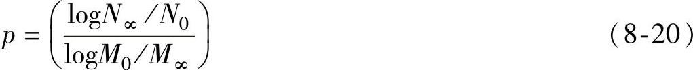

常用齿轮材料的特性数N₀、N∞及p值列于表8-6

图8-16 某1.5MW齿轮箱正常工作状态下的载荷谱

图8-17 承载能力曲线与载荷图谱

表8-6 常用齿轮材料的特性数N₀、N_(∞)及p值

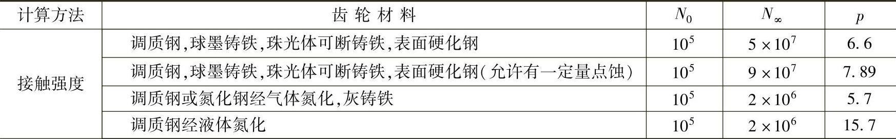

（续）

2.齿轮承载能力计算

1）齿面接触疲劳强度计算：齿面接触疲劳强度条件为

σ_(H)≤σ_(HP) （8-21）

其中

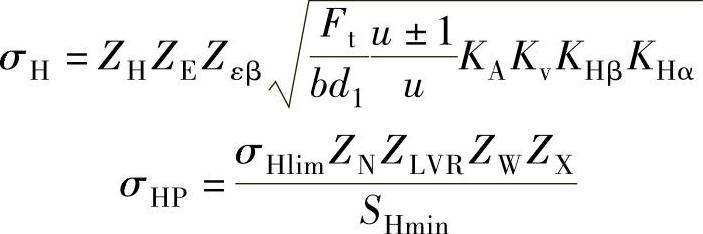

式中各参数详见《机械设计手册》及表8-5。

2）齿根弯曲疲劳强度计算：齿根弯曲疲劳强度条件为

式中各参数详见《机械设计手册》及表8-5。

3）由于风力发电机组齿轮箱在工作中可能出现短时间超过额定载荷的工况，还应进行静强度核算，核算方法详见《机械设计手册》。

### 四、齿轮传动主要参数的选择及设计实例

鉴于风力发电机组齿轮箱行星传动主要采用NGW型，以下内容主要针对NGW型传动。

1.传动比分配

目前兆瓦级风电齿轮箱大多采用或者一级行星加二级平行轴传动方式，或者二级行星加一级平行轴的传动方式，增速比最高可达100左右。

多级传动中，首先要进行的工作是传动比的合理分配。原则是：

1）尽可能获得较小的外形，或在外形尺寸一定的情况下获得较大的安全裕度；

2）各部分强度设计较为均衡，便于采用润滑等必要措施。

一级行星加二级平行轴传动方式每级传动比可按推荐单级传动比确定，但要避免后二级平行轴传动中大齿轮与轴相碰，同时为了减小尺寸，二级平行轴传动采用折叠式传动路线，太阳轮轴与输出轴的中心距要考虑制动盘不要与集电环相碰。

二级行星加一级平行轴的传动方式中，行星传动的传动比的许用范围受结构及强度两方面的影响。在结构方面，最大传动比受邻接条件的限制，即与行星轮的个数n_(p)有关，最小传动比受行星轮最小直径的限制，主要是行星轮的旋转支承即行星轮轴承，一般希望将轴承设置在行星轮轴孔中，因此行星轮采用滚动轴承时，行星轮的直径尽可能不要太小，即传动比不要过小，一般来说，传动比i≥4时，可在行星轮轴孔中放置滚动轴承。而在强度方面，过大的传动比将损失太多的承载能力，有分析表明，当传动比在4.5和5时具有较高的承载能力。因此，单级行星传动传动比一般在3.15～6.3之间。

在没有特殊要求的情况下，当各级传动均为行星传动时，可参照以下经验方法分配传动比：

两级传动低速级传动比：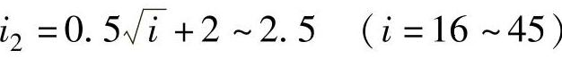

三级传动低速级传动比：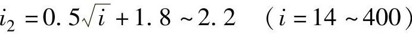

三级传动中间级传动比：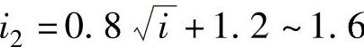

为使行星减（增）速器使用更加合理，在下述传动比范围内，推荐采用派生型结构，即在高速端附加硬齿面平行轴定轴传动：对于单级派生型传动i₂=7.1～18；对于两级派生型传动i₂=40～125。一般情况下，每级的行星轮个数均为n_(p)=3。

在工程设计中，同一齿轮箱中相邻两级内齿圈直径的控制比例范围为：尺寸较大一级与尺寸较小一级的分度圆直径之比一般不大于1.5，通常将这个比例称作相邻齿圈的直径比或简称为级间直径比。相邻齿圈的直径比常用范围为K_(d)=1.2～1.4。

一般情况下低速级的承载能力决定了减（增）速器的额定传递功率，而较高转速一级的承载能力通常会富裕20％～40％。

【例8-2】 试确定某二级行星传动的传动比。已知低速轴转速n₂=14.25r/min，总传动比i=28.2。

解：低速级传动比 i₂=0.5+2～2.5=4.65～5.15

高速级传动比i₁=i/i₂=5.47～6.06

试取i₂=5.15，i₁=5.47，则i=i₁×i₂=28.17

2.齿数、模数、齿形角及变位系数

行星传动中，小齿轮的最大齿数z_(1max)在保证齿轮具有足够的弯曲强度条件下，可按图8-18选取。图8-18是根据接触与弯曲等强度条件推荐的z_(1max)值，图中硬度值是大齿轮的最低硬度，小齿轮的硬度等于或大于大齿轮的硬度，硬度200HBW、300HBW和45HRC是整体热处理硬度，60HRC是轮齿表面硬度。

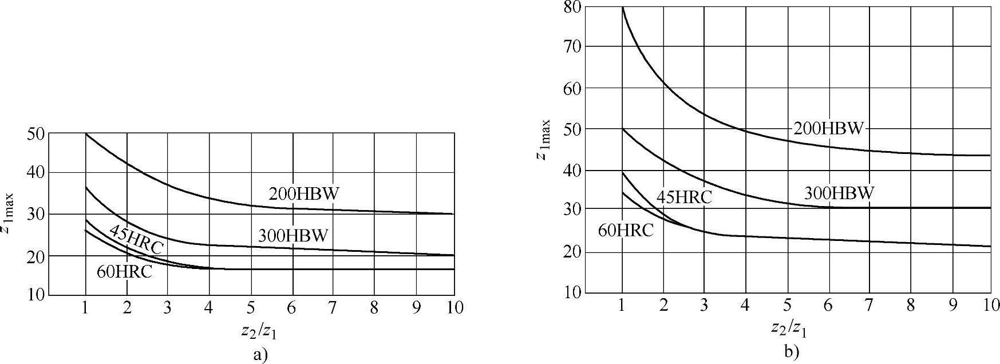

图8-18 小齿轮最大齿数z_(1max)

a）一般齿轮 b）高速齿轮

当齿面硬度≤350HBW时，推荐z_(1min)≥17；当齿面硬度≥350HBW时，推荐z_(1min)≥12

内齿圈的常见齿数范围：70～125；太阳轮的常见齿数范围：16～35；行星轮的常见齿数范围：25～50。模数一般采用标准系列值，齿形角多采用20°。

一般采用变位传动，外啮合总变位系数为0.3～0.8，可参考下式选择太阳轮、行星轮的变位系数χ_(a)、χ_(c)：

式中 z_(a)、z_(g)——分别为太阳轮、行星轮齿数。

变位系数的选择除考虑强度及啮合情况外，还应有利于降低滑差。

初步设计时，下面各式可作为参数取值的参考：

行星传动中太阳轮齿数可按下式估算：

与上式对应的模数表达式为

式中 d_(b)——内齿圈分度圆直径，方案初选时按下式近似计算（行星轮个数为3，且按接触强度计算时），

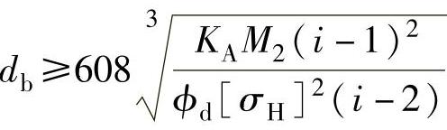；

M₂——低速轴（行星架）工作转矩；

K_(A)——使用系数；

ϕ_(d)——齿宽系数，对增速传动通常0.15≤ϕ_(d)≤0.25，一般情况均可按0.22：

\[σ_(H)\]——许用接触应力。

如各齿轮均为硬齿面，则模数m应由弯曲强度来确定。

参数选择要满足传动比条件、同心条件、邻接条件、装配条件，可根据这些条件编写配齿程序（见图8-19，对于未变位齿轮），根据配齿结果结合以上计算式初定各参数。最终的参数还要满足齿面接触和齿根弯曲强度条件。

【例8-3】 初步确定某发电机用三级行星-平行轴齿轮增速器低速级参数。要求该增速器在额定功率下工作20年，已知低速轴转速为n₂=14.25r/min，输出轴转速为n_(a)=1200r/min，功率P=3300kW，取使用系数K_(A)=1.4。内外齿轮为硬齿面，许用接触应力\[σ_(H)\]=1450MPa。

解：1）确定低速级传动比

本例总传动比为

i=1200/14.25=84.21

采用二级行星加一级平行轴传动方案，综合考虑各种因素后取低速级行星传动减速比为5.31，中间级行星传动减速比为5.32，高速级平行轴传动减速比为2.97。

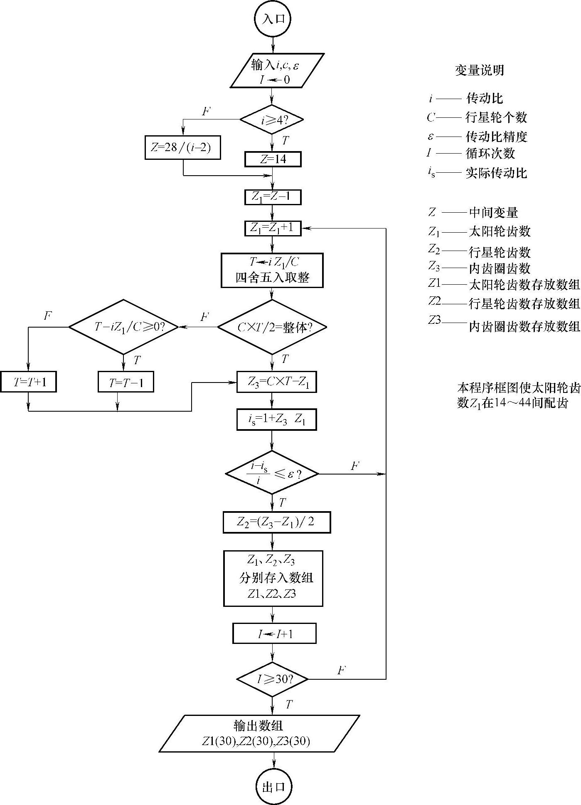

图8-19 NGW型行星传动配齿程序框图

2）传动部分的机械效率在计算工作转矩时予以忽略，则低速轴的名义工作转矩M₂如下

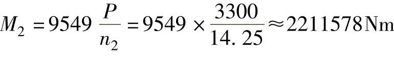

3）内齿圈的规格

取ϕ_(d)=0.22，则

4）模数、齿数

模数m：

取m=20mm

齿数：

z_(b)=2036/20=101.8

另外，由于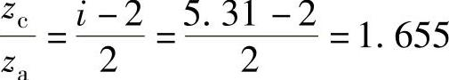，查图8-18得z_(1max)=22左右，试取z_(a)=22，则z_(b)=z_(a)（i-1）=22×（5.31-1）=94.82，取z_(b)=95。不考虑变位时的同心条件为

取z_(c)=36（同心条件由变位后啮合角配凑可以满足）。

装配条件 （为整数，装配条件满足）

实际传动比 （误差不大，传动比条件满足）。

至此，初定低速级齿轮参数为

m=20mm，z_(a)=22，z_(b)=95，z_(c)=36。

通常采用变位齿轮传动，有关变位系数、啮合角及中心距等参数见参考资料。

3.齿轮箱设计实例——1MW风力发电机组齿轮箱行星齿轮副设计

已知条件：为1MW变速恒频风力发电机组配置一台增速箱，共三级传动，低速级为NGW型行星齿轮传动，传动方式如图8-20所示。增速比i_(X)=1∶6，设计功率为1100kW，输入转速为n_(x)=21.11112r/min，输出轴转速为n_(a)=126.6667r/min。要求24h连续工作，寿命为20年。

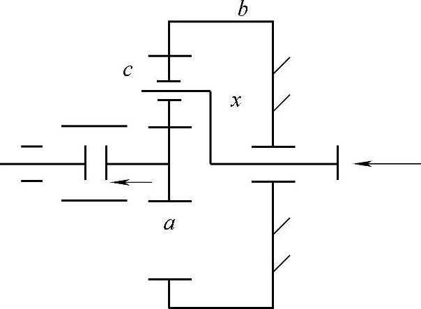

图8-20 传动机构简图

（续）

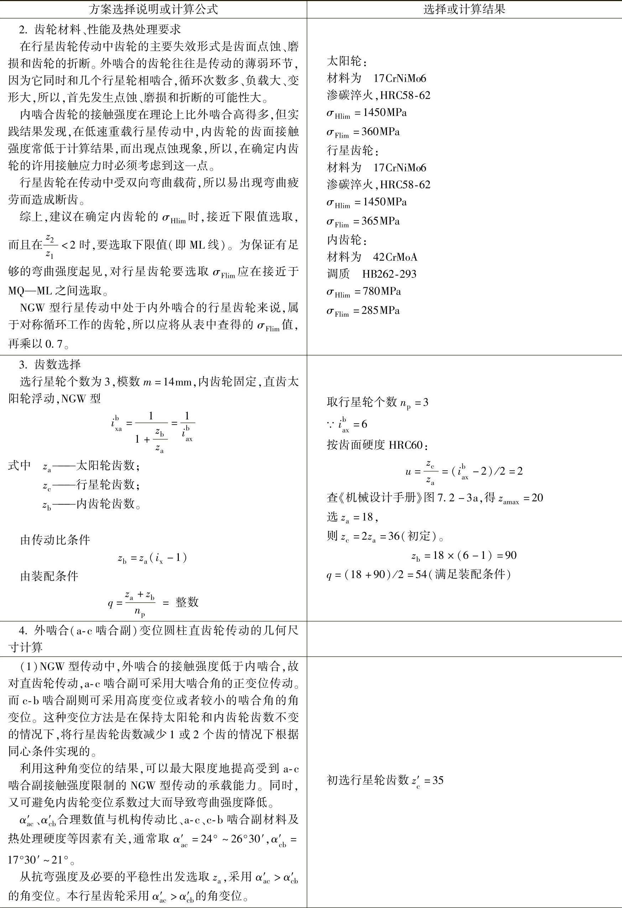

（续）

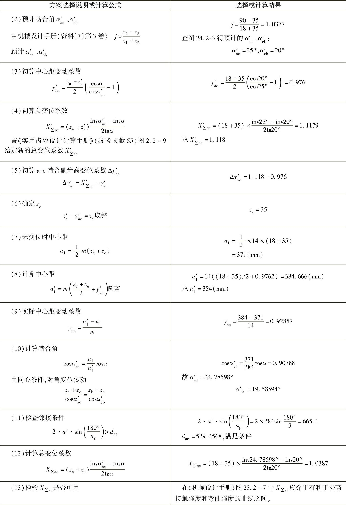

（续）

（续）

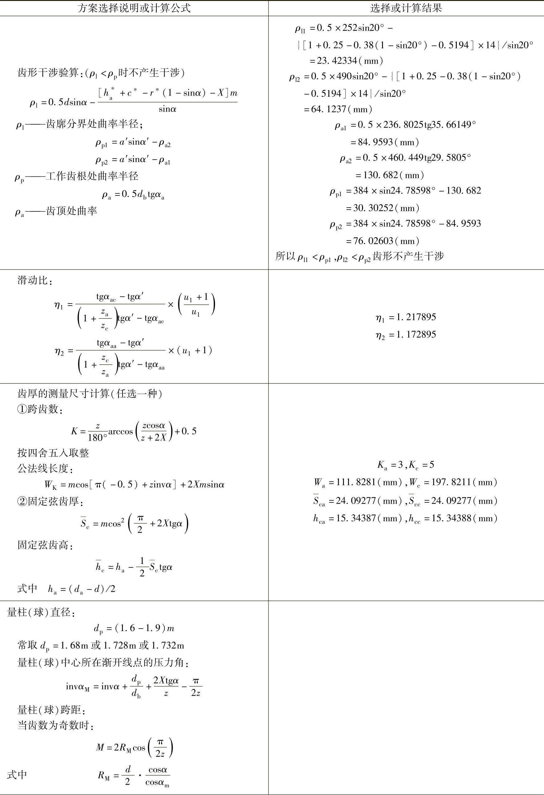

（续）

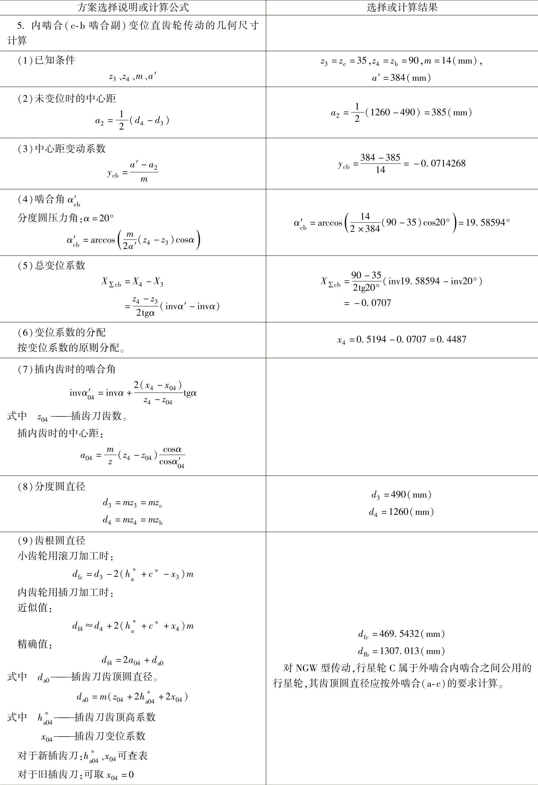

（续）

（续）

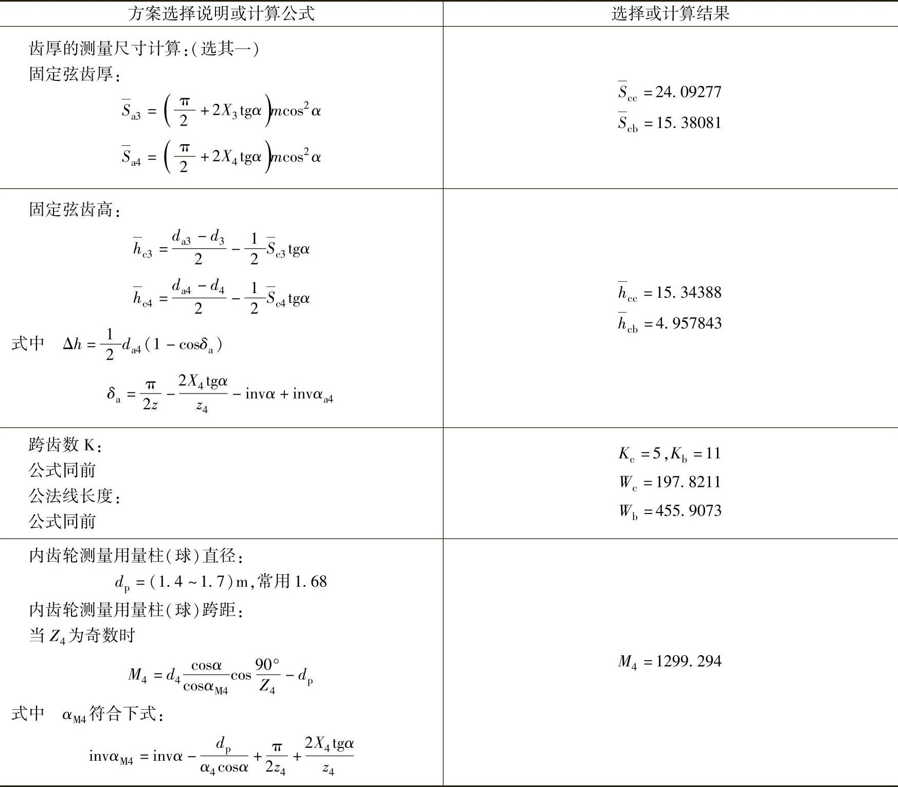

在相关尺寸确定以后，还要按本节第三款的介绍的方法进行强度校核，这里不再赘述。

### 五、主要部件的设计与选型

1.箱体

箱体承受来自风轮的作用力和齿轮传动过程中的各种反力，必须具有足够的强度和刚度，防止变形和损坏，保证传动质量。箱体的设计应按照风力发电机组动力传动的布局、加工和装配、检查以及维护等要求来进行。应注意选取合适的支承结构和壁厚，增设必要的加强筋。一般采用铸铁作为箱体材料，一方面易于成型及切削加工，适于批量生产；另一方面还具有减振性好的优点。常用的材料有球墨铸铁和其他高强度铸铁。铸造箱体结构应尽量避免壁厚突变，减小壁厚差，以免产生缩孔和疏松等缺陷。单件、小批生产时，也可采用焊接或焊接与铸造相结合的箱体。为减小机械加工过程和使用中的变形，防止出现裂纹，无论是铸造或是焊接箱体均应进行退火、时效处理，以消除内应力。为了便于装配和定期检查齿轮的啮合情况，在箱体上应设有观察窗。机座旁一般设有连体吊钩，供起吊整台齿轮箱用。箱体支座的凸缘应具有足够的刚性，尤其是扭力臂结构（见图8-21）的支承座，其支承刚度要作仔细地校核计算。为了减小齿轮箱传到机舱机座的振动，齿轮箱通常安装在弹性减振器上，如图8-22所示。

箱盖上还应设有透气罩、油标或油位指示器。在相应部位设有注油器和放油孔。放油孔周围应留有足够的放油空间。采用强制润滑和冷却的齿轮箱，在箱体的合适部位设置进出油口和相关的液压件的安装位置。在寒冷北方应用的齿轮箱，还应设置油箱加热装置

箱体的应力情况十分复杂，通常要采用数值计算方法（如有限元法），才能较为准确地计算出应力分布的状况。

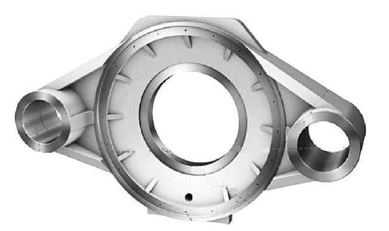

图8-21 扭力臂结构

图8-22 齿轮箱弹性支撑结构

a）矩形支撑 b）圆形支撑

2.行星架

行星架是行星机构中结构较为复杂的零件，当行星架作为基本构件时，它是机构中承受外力矩最大的零件，要求足够的强度与刚度，受载变形要小。大功率增速箱中通常采用整体双壁式结构，这种结构刚性好，因为尺寸较大且形状复杂，常采用铸造方法以得到结构和尺寸接近成品的毛坯，常用材料QT700-2、ZG34CrNiMo、ZG42CrMoA等铸造，应注意消除铸造缺陷和内应力。如行星架与输入轴为一体，且齿轮箱输入轴与主轴经胀套联轴器连接，则材料取合金铸钢为宜，如ZG34CrNiMo等，既有较高的强度、冲击韧性及弹性，又有较好的铸造性能。整体式铸造结构变形小，宜于批量生产。对于单件生产，也可采用焊接式行星架。单壁式行星架轴向尺寸小，刚性差，一般只适用于中小功率的传动。行星架一般需做动、静平衡试验。

整体双壁式行星架的两个侧板通过中间的连接板连接在一起，连接板的数量和尺寸与行星轮个数有关，两侧板壁厚，当不装轴承时可按经验选取：C₁=（0.25～0.3）a′，C₂=（0.2～0.25）a′（字母含义见图8-23）。尺寸L_(c)应比行星轮外径大10mm以上，连接板内圆半径R_(n)按R_(n)/R≤0.85～0.5确定。

图8-24所示为行星架、内齿圈、行星轮装配体。

3.齿轮

（1）材料及热处理

齿轮所用的材料除了要满足机械强度条件外，还应满足极端温差条件下所具有的材料特性，如抗低温冷脆性、冷热温差影响下的尺寸稳定性等。一般采用锻造方法制取毛坯，可获得良好的锻造组织纤维。为了提高承载能力，齿轮一般都采用优质合金钢制造。外齿轮推荐采用20CrMnMo、15CrNi6、17Cr2Ni2A、20CrNi2MoA、17CrNiMo6、17Cr2Ni2MoA等材料。内齿圈按其结构要求，可采用42CrMoA、34Cr2Ni2MoA等材料。合理的热处理工艺，可以保证材料的综合机械性能达到设计要求。一般外齿轮均采用渗碳淬火加磨齿工艺，齿表面硬度可达到HRC60±2。由于国内大型内斜齿制齿加工困难，内齿磨齿成本较高，通常采用直齿加氮化工艺或直齿加渗碳淬火加磨齿工艺。渗碳淬火后获得较理想的表面残余应力，它可以使轮齿最大拉应力区的应力减小，因此加工中对齿根部分通常保留热处理后的表面。表8-7给出齿轮部分材料力学性能。

图8-23 整体双壁式行星架

a）轴与行星架一体 b）轴与行星架为法兰式连接

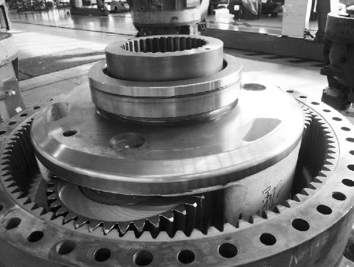

图8-24 行星架、内齿圈、行星轮装配体

表8-7 齿轮部分材料力学性能

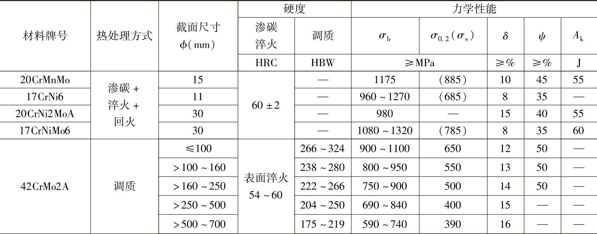

（续）

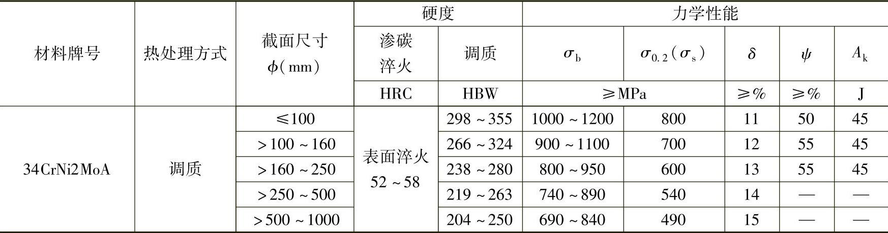

（2）精度等级

提高齿轮精度等级与提高齿轮强度、齿面耐磨性、啮合平稳性、提高润滑油油膜比厚及保持油膜稳定性有密切关系。按啮合速度选用精度等级时，增速传动的精度要求略高于减速传动；或在齿轮精度一定时，增速传动的许用工作速度低于减速传动。一般应将增速传动的许用工作转速降低20％～30％后使用。

较高的齿轮精度等级是相当必要的，对风电增速箱而言，外齿轮一般不低于5级（GB/T10095），内齿圈不低于6级（GB/T 10095）。

（3）必要的技术措施

对渗碳淬火齿轮来说，齿顶及齿端面的棱边倒角是必需的，一般在渗碳前即须做适度的预先倒角（最好是圆角），否则在渗碳过程中极易造成棱边处的氧化和脱碳，在淬火时存在尖角同样是不利的。

4.轴

轴的材料采用碳纲和合金钢。如40、45、50、40Cr、50Cr、42CrMoA等，常用的热处理方法为调质，而在重要部位作淬火处理。要求较高时可采用20CrMnTi、20CrMo、20MnCr5、17CrNi5、16CrNi等优质低碳合金钢，进行渗碳淬火处理，获取较高的表面硬度和心部较高的韧性。

由于制动器一般装于高速端，瞬间制动对高速轴的冲击较大，高速轴故隙频率较高，高速轴设计安全系数应适度加大。同时应考虑高速轴维修方便，以在机舱上能完成维修任务为佳。

轴的设计计算可参阅本章第一节相关内容。

5.滚动轴承

在风力发电机组齿轮箱上常采用的轴承有圆柱滚子轴承、圆锥滚子轴承、调心滚子轴承等。在所有的滚动轴承中，调心滚子轴承的承载能力最大，且能够广泛应用在承受较大负载或者难以避免同轴误差和挠曲较大的支承部位。原则上轴承设计承寿命为13万小时。

中小功率齿轮箱输入端大轴承采用单列满滚子轴承较为普遍，也有采用双列调心滚子轴承的。行星轮中间的轴承以采用短圆柱滚子轴承或双列调心滚子轴承为宜。随着风电齿轮箱向大功率方向发展，单一的双列调心滚子轴承已无法满足承载需要。通常采取单列滚子与四点接触轴承组合方式，四点接触轴承可以承受较大的轴向力。如750kW、1100kW、1300kW风力发电机组增速箱多用这种结构。

轴承基本额定寿命的计算参见本章第二节。

一般推荐在极端载荷下的静承载能力系数f_(s)应不小于2.0。对风力发电机组齿轮箱输入轴轴承的静强度计算时，需计入风轮的附加静负载。

6.均载机构

为补偿不可避免的制造和装配误差，行星轮系一般采用均载机构，以均衡各行星轮传递的载荷，提高齿轮的承载能力、啮合平稳性和可靠性，同时可降低对齿轮的精度要求，降低制造成本。NGW型行星传动常用的均载机构为基本构件浮动的均载机构。它是靠基本构件（太阳轮、内齿圈或行星架）没有固定的径向支撑，在受力不平衡的情况下作径向游动（又称浮动），以使各行星轮均匀分担载荷。由于太阳轮重量小，惯性小，浮动灵敏，结构简单，在风力发电机组增速箱中，常采用太阳轮浮动。太阳轮通过花键与下一级传动输入轴连接，为增加太阳轮的浮动量，配对外花键需加工为鼓形齿。为增加耐磨性，内外花键齿面需有较高的硬度。

### 六、传动效率与噪声

1.传动效率

齿轮箱的效率可通过功率损失计算或在试验中实测得到。功率损失主要包括齿轮啮合、轴承摩擦、润滑油飞溅和搅油损失、风阻损失、其他机件阻尼等。齿轮传动的效率可按下列公式计算：

η=η₁η₂η₃η₄ （8-23）

式中 η₁——齿轮啮合摩擦损失的效率；

η₂——轴承摩擦损失的效率；

η₃——润滑油飞溅和搅油损失的效率；

η₄——其他摩擦损失的效率。

对于行星轮系齿轮机构，计算效率时还应考虑对应于均载机构的摩擦损失。行星齿轮轮系的效率可通用一般《机械设计手册》推荐的公式进行计算，其方法主要有啮合功率法、力矩法和传动比法。啮合功率法是普遍应用的方法。

风力发电机组齿轮箱的专业标准要求齿轮箱的机械效率大于97％，是指在标准条件下应达到的指标。一般情况下，风力发电机组齿轮箱的齿轮传动不超过三级，对于采用滚动轴承支承且精确制造的闭式圆柱齿轮传动，每一级传动的效率可概略定为99％，而行星轮每级约有1％的损失。当传递的功率小于额定功率时，齿轮箱效率会有所下降，这是因为整个齿轮箱的空载损失，即润滑油飞溅和搅动时的能量损失、轴承的摩擦以及密封等的损失，在传递功率减小时所占比重增大的缘故。

图8-25所示为不同类型齿轮箱的传动效率概略值。

图8-26是根据某1.5MW机组2级行星齿轮箱实测的传动效率与功率变化关系，图中P—实测功率；P_(N)—额定功率。

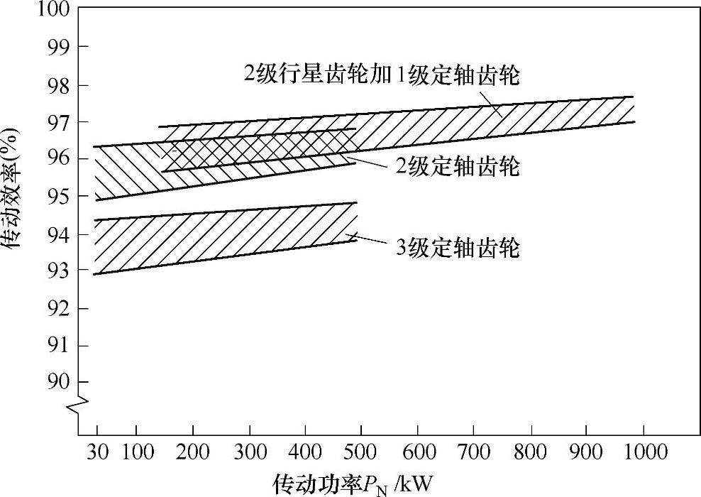

图8-25 齿轮箱效率

2.噪声

相关标准规定，1000kW～3000kW的风力发电机齿轮箱在1m距离测得的噪声应在100dB（A）～105dB（A）。

齿轮箱的噪声主要来自于个别齿之间的啮合以及制造安装质量。轮齿承载时会有轻微变形，如果没对齿形进行修正，轮齿进入啮合时就会产生一系列的撞击。要减小这种撞击，就应该在设计齿轮时对齿廓进行修形，使空载齿廓顶部在额定载荷时能够无侧隙地进入啮合。在齿轮设计计算时，应根据齿轮的弯曲强度和接触强度初步确定轮齿的变形量，再结合考虑轴的弯曲、扭转变形以及轴承和箱体的刚度，绘出齿形和齿向修形曲线，并在磨齿时进行修正。另外，按额定载荷修形的齿，在低于额定功率使用时，又会造成重合度的降低。因此，修形也要考虑一个适当的功率范围，即应该是在噪声影响水平较大且难以掩盖的载荷下进行。

斜齿轮具有平稳的啮合传动特性，经常被应用在平行轴传动上。行星级传动由于制造安装的复杂性，往往采用直齿轮，但由于齿轮较小，线速度较低，其噪声水平也比较小。

行星传动齿圈通常是固定件，可以很方便地与外壳制成一体，但这样很容易将本身啮合噪声通过外壳直接传出来，一种解决办法是将齿圈做成一个独立组件，并利用弹性支撑与机座相连。类似地，齿轮箱的弹性支座，也可以减小齿轮箱传递到机舱结构和塔架的噪声。

有多种途径把齿轮箱的噪声传递到周围环境：

1）从轴上直接传到叶片，这种方式传导效率很高；

2）从齿轮箱的弹性支座传到支撑结构，并由此传至塔架，这种方式在一些环境下传导效率也很高；

3）从齿轮箱的弹性支座传到支撑结构，并由此传到机舱内，再通过结构及空气传导到周围环境。

各种传导路径模态上往往比较密集，难以设计出选定的频率。提高制造质量、齿廓修形及弹性支撑等设计、提高轴和轴承的刚度、合理布置轴系和轮系传动并避免发生共振，是尽量减小噪声源的主要措施；再有就是在噪声传导路径上进行处理，如当叶片是主要传导源时，可在叶片中加入阻尼材料，以及在塔筒壁附加沙石或铺设沥青等。

图8-26 效率与比功率的关系

### 七、齿轮箱的润滑、冷却和加热

除较小功率齿轮箱，如200kW、250kW风电增速箱的润滑采用飞溅润滑方式外，功率大于300kW的齿轮箱均需强制润滑，齿轮箱需外接一套润滑系统。系统需配备一定流量的油泵，冷却器（有风冷式和冷媒式两种），电磁换向阀，还需配备温度传感器、油位传感器等远程控制组件。齿轮箱中各级齿轮及各轴承均需强制润滑。

润滑油在整个预期寿命内都应保持良好的抗磨损和抗胶合性能，为提高齿轮的承载能力和抗冲击能力，可适当添加一些添加剂。油品宜采用美孚齿轮油SHC XM P320，既有较好的低温适应性（倾点为-38℃），有利于低温起动，又有较好的高温稳定性，保持较高的黏度等级，有利于油膜的形成，提高齿轮齿面承载能力。常用的还有MOBIL632，MOBIL630或L-CKC320，L-CKC220 GB5903-95等。

合成油也得到广泛应用。合成油的主要优点是：在极低温度状况下具有较好的流动性；在高温时的化学稳定性好并可抑制黏度降低。不同于普通矿物油，合成油不会出现遇高温会分解而在低温时易于凝结的情况，例如MobilgearXMP和SHC XMP以及德国的科宁EmgardWind 320就是专为风力发电齿轮箱研制的合成油品。

保持油液的清洁十分重要，即使是第一次使用的新油，也要经过过滤，系统中要有完善的滤油装置以确保油液的洁净。

润滑油系统中的散热器常用风冷式的，大型特别海上风力发电机组由于机舱密封的需要，目前较多采用风—水联合冷却方式，由系统中的温度传感器控制，在必要时通过电控旁路阀自动打开冷却回路，使油液先流经散热器散热，再进入齿轮箱。

为解决低温下起动时普通矿物油解冻问题，在高寒地区应给机组设置油加热装置。常见的油加热装置是电热管式的，装在油箱底部。

图8-27所示为一种大功率风机的齿轮箱润滑油净化和温控系统典型结构。

过滤器采用多级过滤精度的混合滤芯，在粗精度滤芯和高精度滤芯之间用单向阀（8）隔开，当油温较低时，由于油液黏度较高，通过高精度滤芯时产生的压降增大，当大于单向阀（8）的开启压力时，油液经过粗精度滤芯过滤后流过过滤器；随着温度的升高，通过高精度滤芯时产生压降逐渐减小，单向阀（8）开口逐渐减小直到完全关闭（大约10℃时），油液完全流过高精度滤芯。采用这种结构的过滤器能够保证在任何情况下，进入齿轮箱的油液都是经过过滤的油液。

油液经过过滤后，由单向阀（9）和（10）来分配其是直接进入齿轮箱或是经过冷却器（13）后进入齿轮箱。当油温较低时，由于黏度较大，通过冷却器的压差增大，当压差大于单向阀（9）的开启压力时，大部分油液通过单向阀（9）直接进入齿轮箱；同时仍有一小部分油液进入冷却器，这部分油液是从齿轮箱里流出的温度逐渐升高的油液，它逐渐将冷却器及连接管路中无法加热的油液替换出来，这就保证了冷却器里无论温度如何始终有油流过，避免了冷却器内冷热油流的突然切换，因为这样会导致冷却器内的压力出现剧烈升高。

润滑油净化和温控系统可以实现自动控制。机组每次起动，在齿轮箱运转前先起动润滑油泵，待各个润滑点都得到润滑后，间隔一段时间方可起动齿轮箱。当环境温度较低时，例如小于10℃，须先接通电热器加热机油，达到预定温度后才投入运行。若油温高于设定温度，如65℃时，机组控制系统将使润滑油进入系统的冷却管路，经冷却器冷却降温后再进入齿轮箱。润滑系统中的压力传感器和油位传感器监控润滑油的正常供应，如发生故障，监控系统立即发出报警信号，使操作者能迅速判定故障并加以排除。

图8-27 润滑油净化和温控系统

1—电动机 2、4—液压泵 3、5、8、9、10—单向阀 6—溢流阀 7—滤油器 11—截止阀 12—放气接头 13—冷却器

## 第四节 联轴器

为实现机组传动链部件间的扭矩传递，传动链的轴系还需要设置必要的连接构件（如联轴器等）。在风力发电机组中，常采用刚性联轴器、挠性联轴器两种方式。刚性联轴器常用于对中性好的二轴的连接，而挠性联轴器则常用于对中性较差的二轴的连接，最重要的是挠性联轴器可以提供一个弹性环节，该环节可以吸收轴系因外部负载的波动而产生的振动。

在风力发电机组中，通常在低速轴端（主轴与齿轮箱低速轴连接处）选用刚性联轴器，一般多选用胀套式联轴器。在高速轴端（发电机与齿轮箱高速轴连接处）选用柔性联轴器，例如膜片式联轴器，以弥补机组运行过程轴系的安装误差，解决主传动链轴系的不对中问题。同时，柔性联轴器还可以增加传动链的系统阻尼，减少振动的传递。除非集成式结构，一般不采用花键连接，因为键连接很难适应变载荷甚至是相反载荷的传递，安装和拆卸也是十分困难的。

齿轮箱与发电机之间的联轴器设计，需要同时考虑对机组的安全保护功能。由于机组运行过程可能产生异常情况下的传动链过载，如发电机短路导致的转矩甚至可以达到额定值的5～6倍，为了降低设计成本，不可能将该转矩值作为传动系统的设计参数。采用在高速轴上安装防止过载的柔性安全联轴器，不仅可以保护重要部件的安全，也可以降低齿轮箱的设计与制造成本。

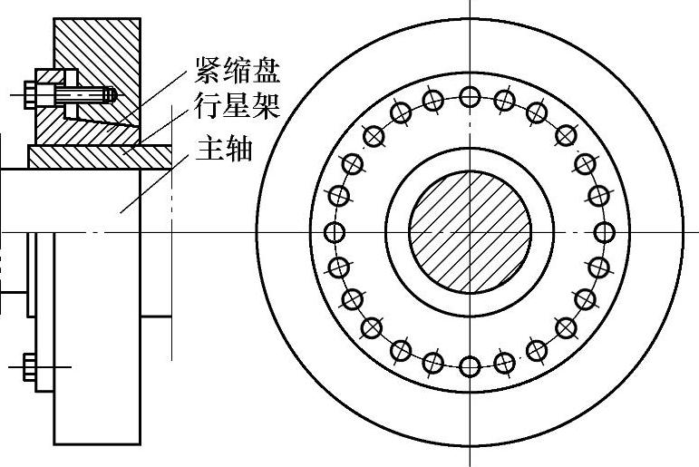

图8-28 胀套式联轴器

### 一、刚性胀套式联轴器

风力发电机组中广泛使用的Z10型胀套式联轴器结构如图8-28所示。它是依靠拧紧螺栓使外锥套楔入刚性较大的内锥套，压迫行星架空心轴套收缩，使轴套和主轴间产生压力及相伴产生的摩擦力来传递负载的一种无键连接方式，可传递转矩、轴向力或两者的复合载荷。胀套联接与一般过盈连接、无键连接相比，具有许多独特的优点：使主机零件制造和安装简单，定心性好，安装胀套的孔和轴的加工不像过盈配合那样要求高精度的制造公差，安装胀套也无需加热、冷却或加压设备，只需将螺栓按规定的扭矩拧紧即可，并且调整方便；有良好的互换性，便于拆卸，胀套的使用寿命长，强度高，因为它是靠摩擦传动，被连接件没有相对运动，工作中不会磨损，对被连接件没有键槽削弱；胀套在胀紧后，接触面紧密贴合，不易锈蚀；胀套在超载时将失去连接作用，可保护设备不受损坏。

1.胀套式联轴器的选用方法

按照负载选择胀套。选择胀套应满足式（8-24）～式（8-27）：

1）传递转矩时：

M_(t)≥M_(xr) （8-24）

式中 M_(t)——胀套的额定转矩，单位为kN·m；

M_(xr)——需传递的转矩，单位为kN·m；

2）承受轴向力时： F_(t)≥F_(xr) （8-25）

3）传递转矩及轴向力联合作用时：

4）承受径向力时：

F_(t)——胀套的额定轴向力，单位为kN；

F_(r)——需承受的径向力，单位为kN；

M_(t)——胀套的额定转矩，单位为kN·m；

d、l——胀套的内径及内环宽度，单位为mm；

P_(t)——胀套和轴结合面上的压力，单位为MPa；

2.胀套式联轴器结合面的公差与表面粗糙度

推荐与胀套结合的轴、孔公差带及表面微观不平度十点高度Rz值可参照表8-8。

表8-8 与胀套结合的轴、孔公差带及表面微观不平度Rz值

表8-9为部分Z10型胀套式联轴器参数。

表8-9 Z10型胀套式联轴器的基本尺寸及参数

（续）

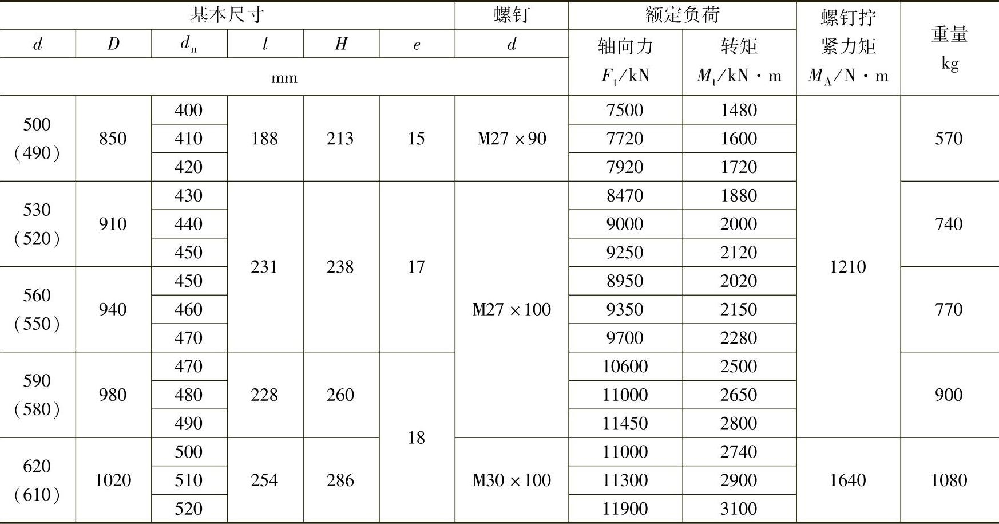

【例8-4】 某风力发电机组单主轴承支撑主轴系设计，已知机组额定功率为1650kW，主轴转速为12.5r/min，所选主轴材料许用剪切应力\[τ\]为55MPa，试选择主轴与齿轮箱联接用胀套式联轴器。

解：该联轴器传递的转矩为

所需主轴最小直径为 

考虑此处主轴同时承受一些弯矩，将最小直径加大4％，因此所需胀套式联轴器的孔径为488.8×1.04=508.3mm。参照上表，选择内径为ϕ510的胀套式联轴器，其参数为：额定轴向力F_(t)=11300kN，额定转矩M_(t)=2900kN·m（远远大于风轮转矩，其他略）。

### 二、膜片联轴器

膜片联轴器采用一种厚度很薄的弹簧件，制成各种形状，用螺栓分别与主、从动轴上的两半联轴器连接，图8-29为一种膜片联轴器的结构，其弹性元件为一叠很薄的多边形的膜片，在膜片的圆周上有若干螺栓孔。为了获得相对位移，常采用中间轴，其两端各有一组膜片组成两个膜片联轴器，分别与主、从动轴连接。采用的膜片有分离连杆形膜片（见图8-30）、连续多边环形膜片（见图8-31）等形式。

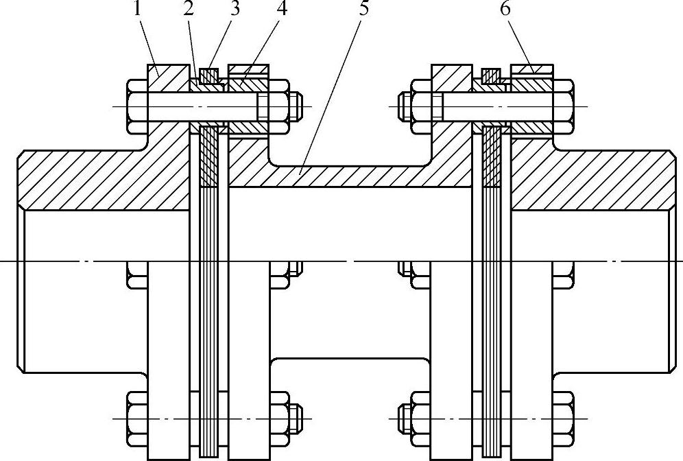

图8-29 多边形膜片式联轴器

1、6—半联轴器 2—衬套 3—膜片 4—垫圈 5—中间体

图8-30 分离连杆形膜片

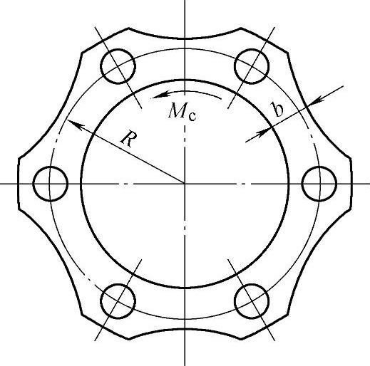

图8-31 连续多边环形膜片

膜片联轴器结构比较简单，弹性元件的连接没有间隙，一般不需润滑，维护方便，平衡容易，重量轻，对环境适应性较强，缺点是扭转弹性较低，缓冲减振性能差。两轴的许用相对位移，轴向位移不超过2.5mm，径向位移与中间轴的长度有关，一般角位移不超过1°。

图8-32所示为德国KTR膜片式联轴器，其中间体采用高强度玻璃纤维材料，采用分离连杆形膜片，内设力矩限制器，可允许1000多次打滑无需维护。其轴向纠偏量可达±8mm，角向纠偏量可达1.5°～2°，可有效实现电绝缘，被广泛应用在风电机组高速轴的连接上。

连接高速轴端广泛应用的还有图8-33所示的连杆式联轴器，其电绝缘结构设计在连杆销处。

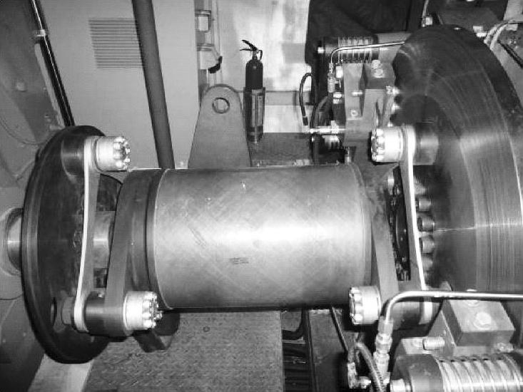

图8-32 KTR膜片式联轴器

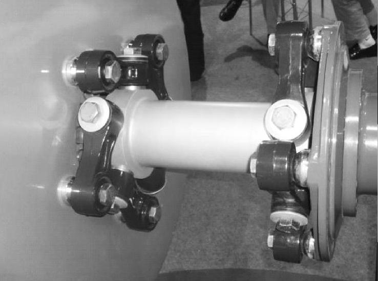

图8-33 连杆式联轴器

## 第五节 机舱

机舱由底盘和机舱罩组成，机舱内部安装几乎所有的机械和电气零部件。为了适应瞬变的风向，机舱通过底盘回转支承与塔架相连。

### 一、底盘

1.底盘的结构

对于双馈式机组，底盘上面布置有风轮、主轴、轴承座、齿轮箱、发电机、偏航驱动、起重机、塔顶控制柜甚至变压器、变流器等部件；对于直驱式机组，带有前法兰的底盘直接支撑发电机及风轮。机组运行过程中产生的大部分动、静载荷都通过机舱底盘平衡并传递给塔架，因此底盘需要有足够的强度、刚度及稳定性。

底盘按制造方法及材料可分为铸造机舱底盘、焊接机舱底盘二类；按结构形状可分为梁式机舱底盘、框架式机舱底盘、箱式机舱底盘等三类。图8-34所示为某1.5MW机舱底盘。

大功率双馈式风力发电机组机舱底盘通常由前后两部分组成，一般前底盘为铸造，后底盘为焊接结构，通过螺栓连接构成一个整体，连接方式如图8-35所示。为减小螺栓载荷，常采用凸台来承受剪切力。更大功率机组的前后底盘则应采用钢结构框架来加固连接。

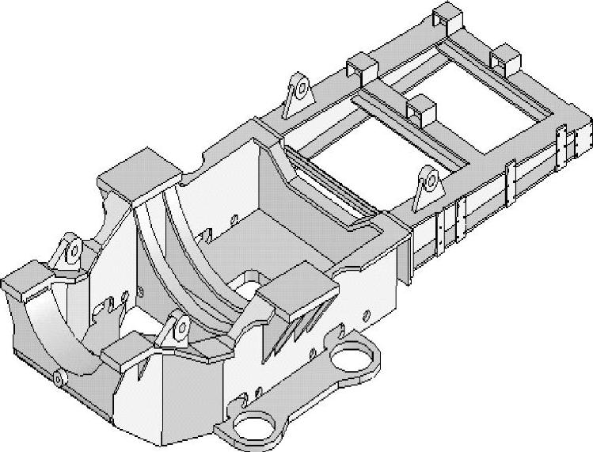

图8-34 底盘

图8-35 前后底盘连接结构

图8-36 直驱式机组的机舱底盘

直驱式机组有的也具有一个较小的后底盘，主要安装塔顶控制柜及冷却装置等，与双馈式机组类似有的则只有一个完整的底盘，结构更为紧凑，如图8-36所示。

2.机舱底盘设计的一般要求

1）在满足强度及刚度的前提下，机舱底盘应尽量重量轻、成本低；

2）抗震性好；

3）结构设计合理，工艺性良好，便于铸造、焊接和机械加工；

4）结构力求便于安装与调整，方便修理和更换零部件；

5）造型好，使之即适用经济，又美观大方。

3.机舱底盘的常用材料及热处理

在风力发电机组中，铸造机舱底盘常用材料为球墨铸铁。例如QT400-15，该材料具有韧性高、低温性能较好的优点，且有一定的耐腐蚀性。铸造机舱底盘用的热处理方法为时效处理，目的是在不降低铸件力学性能的前提下使铸件内应力和机械加工切削应力得到消除或稳定，以减少长期使用中的变形，保证几何精度。

焊接机舱底盘具有强度和刚度高、重量轻、生产周期短以及施工简便等优点，多采用Q345板材，在高寒地区宜采用Q345D板材。为了保持尺寸稳定，焊接后必须进行热处理，第一次热处理安排在焊接完成后，第二次热处理安排在粗加工之后进行。

4.机舱底盘的设计步骤

1）初步确定机舱底盘的形状和尺寸：机舱底盘的结构形状与尺寸，取决于安装在它内部与外部的零件和部件的形状与尺寸、配置情况、安装与拆卸及在机舱底盘内维护及修理等要求。同时也取决于工艺所承受的载荷等情况。然后综合上述情况利用公式或有关资料提供的数据，同时结合设计人员的经验，并参考现有同类型机舱底盘，初步拟定机舱底盘的结构形状和尺寸。

2）底盘强度初步计算：可利用材料力学、弹性力学等固体力学理论和计算公式，对机舱底盘进行强度、刚度和稳定性等方面的初步校核，待结构设计完毕后再进行准确的计算、修改设计，以满足设计要求。

3）有限元静、动态分析和优化设计。

4）制造工艺性和经济性分析。

### 二、机舱罩

为保护机组设备免受外界环境（如阳光、雨雪等）的影响，应在底盘上加装机舱罩（见图8-37）。对于安装在海上的机组，机舱罩还有密闭或舱内正气压的要求。

机舱罩通常支撑在底盘外伸的支架上。图8-38所示为机舱罩内壁上的支点。

图8-37 安装中的机舱罩

图8-38 机舱罩内壁上的支点

机舱罩一般用轻型材料制造，如玻璃钢等复合材料，重量轻，强度高，耐腐蚀，其抗拉及抗弯强度通常不小于230N/mm²，密度约1.7～1.9t/m³。大型机组机舱罩设计的要足够大，以便于设备的吊装和人员操作。通常在机舱罩内侧壁糊制矩形加强筋以提高其强度和刚度。

对中、大型风力发电机组，在下机舱罩的后半部最好要有吊孔，以运送小型零部件和工具等。为便于大型零部件的维修和更换，可在机舱罩盖上设置更大的开孔，大小至少要保证发电机转子和增速器的大齿轮等能由此进出，甚至可利用液压装置将整个机舱罩盖体向上掀开，这一点在机舱设计时务必注意，并设法尽量做到，另外机舱罩盖上还应有透明天窗和人孔以观察和维修窗外设备。

机舱罩后部的上方装有风速和风向传感器，舱壁上有保温隔音和通风装置等，底部开圆孔使塔架通过。

考虑到风力发电机组对环境和视觉的影响，还应对机舱整体进行造型设计。机舱要设计得轻巧、美观并尽量带有流线型，下风向布置的风力发电机组尤其需要这样。

