# 9 塔架与基础

塔架与基础是风力发电机组的主要承载结构，要承受机舱重量、风轮作用力以及风作用在塔筒上的弯矩、剪力、转矩等作用，还要承受风轮引起的振动载荷。塔架的重量占风力发电机组总重的50％左右，其造价占风力发电机组造价的15％～50％。目前，国家已经发布了有关标准，如《GB/T 19072—2010风力发电机组 塔架》、《FD 003—2007风力发电机组地基基础设计规定》等。

本章主要论述塔架和基础的设计方法。

## 第一节 塔架的构造设计

### 一、塔架的结构型式

目前，常见的塔架有锥筒或棱筒式、桁架式、拉索桅杆式、三角式、和混凝土式等几种结构型式，如图9-1所示。下风向布置的风力机多采用桁架式塔架，它由钢管或角钢焊接，其断面为正方形或者多边形。上风向布置的大型风力发电机组通常采用锥筒式塔架。这种形式的塔架由钢板卷制或轧制焊接而成，其形状为上小下大的几段圆筒（或棱筒）或锥筒，一般每段20～30m，中间用法兰连接而成，塔架由底向上直径逐渐减小，整体呈圆台状，因此也称为圆台式塔架。锥筒式塔架相对于桁架式塔架制作工艺简单，安全性能好，而且维修比较方便，所以应用很广泛。现阶段的使用较为广泛的1MW、1.5MW和3MW风力发电机组都采用锥筒式塔架。

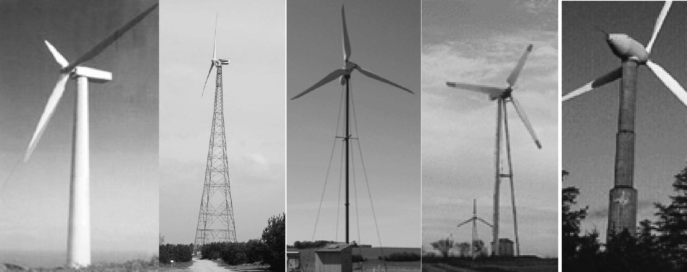

图9-1 风力发电机组塔架的类型

桁架式塔架制造简单、成本低、运输方便，但也存在通向塔顶的上下梯子不好安排、上下时安全性差等缺点。钢筋混凝土塔架在早期风力发电机组中大量被应用，如福建平潭55kW风力发电机组（1980年）、丹麦Tvid 2MW风力发电机组（1980年）。随着风力发电机组大批量生产，被更易于批量生产、预制的钢结构塔架所取代。近年，随着风力发电机组容量的增加，塔架的体积增大，存在超高超大的钢塔架导致运输难、施工难等问题，在结构形式和材料上出现新型的塔架，对于一些更大功率机组的塔架如5MW的塔架采用钢管混凝土式或混合式，混合式的底部采用混凝土结构形式，上部采用钢锥筒式。

### 二、塔架的细部构造

塔架包括塔筒、法兰、塔门部分等。塔筒内部主要包括安装维护用平台、爬梯、电缆固定架、塔底外部走梯、安全绳及固定点（或刚性防坠落导轨）、安全护栏、减振箱、照明灯具、底部电控设备、消防设施、防雷设施、人员（货物）提升设备等。此外还有与塔体焊接的平台支耳、爬梯支耳等，如图9-2所示。

塔筒内部设施的设计必须符合《GB17888.1—2008机械安全 进入机械的固定设施 第1部分：进入两级平面之间的固定设施的选择》、《GB 17888.2—2008机械安全 进入机械的固定设施 第2部分：工作平台和通道》、《GB 17888.3—2008机械安全 进入机械的固定设施 第3部分：楼梯、阶梯和护栏》和《GB 17888.4—2008机械安全 进入机械的固定设施 第4部分：固定式直梯》。

1.平台

为了安装相邻段塔筒、放置部分设备和便于安装维护内部设施，保护设备和人员的安全，塔筒中每层法兰处和必要的地方都需设置安装维护用平台。塔筒连接处平台距离法兰配合面1.4m左右，以方便安装塔筒连接用高强螺栓等操作。在塔筒进门处应该设置一个基础平台如图9-3所示，平台的高度应与塔门底部相等，为达到防滑的目的，平台一般都是由4mm或6mm花纹钢板制成，平台一般都是由4mm或6mm花纹钢板制成，圆板上有相应的电缆固定桥、爬梯或提升设备运行通道，并且每个平台一般不少于3个点通过螺栓与塔壁对应固定座连接。基础平台应设有支撑钢梁，使得各种电气设备能在梁上安全固定。

平台采用花纹钢板做成圆形面板，槽钢、角钢等型钢做支架。具体设计平台时，还须符合以下要求：

1）0.2m×0.2m区域内，承受1.5kN的集中载荷；

2）能够承受3kN/m²的均布载荷，整个平台承载的能力最大为10kN；

3）尺寸偏差不超过整个平台直径的1/200；

4）所有的平台横梁、防滑钢板、拼焊件，焊接螺栓和格栅，材料为Q235B，另外要求按GB 9793—1988的要求进行热镀锌（去除毛刺，镀锌前所有零件必须去油脂和焊渣）；

图9-2 风力发电机组塔架的内部构造

图9-3 塔底平台

5）平台和塔筒内壁间的缝隙最大为20mm；

6）如果平台开口大于0.1m×0.1m，开口周围必须安装平台围板（一般设置高度为50mm）防止东西掉落；

7）当平台开口过大时应设计平台盖板，盖板尺寸应稍大于平台开口尺寸。盖板打开后，应与平台表面夹角超过90°，达到稳定定位的目的；

8）平台盖板的最大总重量不应超过10kg。钢制、铝制或由夹板制作的隔栅和盖板，如有需要，要求安装加强件；

9）为保证维修人员通过的安全，平台开口处不允许有尖锐的边角，必须对边角采取保护措施；

平台盖板铰链安装，要求使用自锁螺母，以应对动载荷。

2.爬梯

攀爬装置如图9-4所示，爬梯采用带两侧主梁的竖直爬梯。用矩形管做主梁（可兼做提升器的导轨）、方形管做踏棍焊接而成，也可采用角钢、扁钢和方钢等型钢焊接，材质一般为Q235，爬梯长度分别与塔筒体各段相对应，在塔筒安装时，通过连接板用螺栓连接成一整体。爬梯须满足以下要求：

1）如果高度落差大于3m，必须安装安全装置；

2）爬梯第一段，应高于底部平台200～280mm；

3）爬梯应当比最高处平台高出1.10m；

4）爬梯和塔筒壁之间最少应保证0.2m的间距，留有一个脚可以自由活动的空间；

5）爬梯及其与筒壁的连接件，应按1.5kN的集中载荷，和1.5kN/m的均布载荷计算；

6）每个横挡踏板长至少需要2×200mm宽度，如安装刚性防坠落导轨还需再加上防坠落导轨的宽度；

7）爬梯踏板横梁间的平行距离为0.25m至0.30m，推荐的距离为0.28m。允许偏差值为15mm；

8）踏脚处表面应有防滑措施；

9）不允许爬梯主梁和踏板横梁存在尖锐边角；

10）爬梯只能选用钢材和铝材中的一种，不允许混合使用。钢质扶梯和其装配处，要求采取有效的防腐保护；

11）如果使用铝制扶梯，要求确保与钢质元件电绝缘，防止电腐蚀；

12）为应对动载荷，所有的螺栓连接要求使用自锁螺母。

3.外部走梯

在塔筒外部需要设置外部走梯如图9-5所示。外部走梯需要满足以下技术条件：

1）台阶距离要求满足以下关系式：0.6m≤g+2h≤0.66m，h指台阶竖直间距，g指台阶水平间距；

图9-4 爬梯

2）要求台阶距离均布，允许距离偏差为15mm；

3）台阶要有防滑面；

4）台阶强度要求能承受3kN/m的均布载荷；

5）楼梯要求有安全扶手，宽度大于或者等于1200mm是应有两个扶手；

6）只要楼梯的上升高度超过500mm就应安装护栏。当斜梁外侧有大于200mm的横向间隙时，为了提供保护，应在具有此间隙的楼梯侧面安装护栏；

7）楼梯上的扶手与梯段踏板前缘的垂直高度应在900mm与1000mm之间，在梯段平台上的垂直高度最小应为1100mm。扶手宜为直径25mm～50mm的圆形截面或便于用手抓握的等效截面；

8）楼梯的护栏应至少包括一根横栏或某一等效装置。扶手到横杆以及横杆到斜梁的净值不应超过500mm；

9）除安装固定支撑的下端面以外，在扶手长度方向上，扶手外廓100mm内应无障碍物；

10）要求楼梯台阶尺寸最小为0.5m×0.2m。

图9-5 外部走梯

### 三、塔架的材料

1.对钢材的性能要求

用作塔架的钢材必须具有下列性能：

1）较高的抗拉强度和屈服点。抗拉强度高可以增加结构的安全储备，提高结构的可靠性。屈服点高可以减小构件截面，减轻结构自重，节约钢材。

2）良好的塑性、韧性及耐疲劳性能。较好的塑性可以使结构在破坏前产生较大的变形，给人以明显的破坏预兆，从而可使人们及时发现和采取补救措施，减少损失。较好的塑性还能调整局部高峰应力，使结构产生内力重分布，使结构或构件中某些原先受力不等部分的应力趋于均匀，提高结构的承载能力。较好的韧性可以使结构在动力冲击载荷作用下破坏时吸收比较多的能量，降低脆性破坏的危险程度。较好的耐疲劳性能可以使结构具有较好的抵抗重复载荷作用的能力。

3）良好的加工性能。良好的加工性能包括冷加工性能、热加工性能和可焊性。建筑钢结构所采用的钢材不但要易于加工成各种形式的结构或构件，而且不致因加工而对结构或构件的强度、塑性、韧性以及耐疲劳性能等造成过大的不利影响。

4）良好的耐久性能。根据结构的具体工作条件，在必要时还应该具有适应低温、高温和腐蚀性环境的能力。

2.钢材的选用

塔架钢材选用的原则是：既能使结构安全可靠地满足使用要求，又要尽最大可能节约钢材，降低造价。筒体、法兰、门框用钢的选择应考虑风电场环境极限温度、材料的焊接性能、塔架的制造工艺以及经济合理性等因素，可按GB/T 700—2006和GB/T 1591—2008选用，推荐选用热轧低合金高强度结构钢，如Q235B、Q235C、Q235D、Q345B、Q345C、Q345D、Q345E等材料；塔架内部附件可选用碳素结构钢等，见表9-1。内件安装所需的与塔体焊接的平台支耳、爬梯支耳、减振箱等用钢也应是与塔体材料相同或者与塔体材料性能相匹配的钢材。焊接材料牌号的选择，宜按表9-2要求选用。

表9-1 塔架部件材料

表9-2 焊接材料牌号

塔架所用紧固件均为钢结构用高强度大六角头螺栓（GB/T 1231—2006），采用达克罗（片状锌铬盐）防护涂层，产品应具备完整的质量证明书和合格证，M20以上高强度螺栓每种规格、每批次须有第三方检测机构出具的高强度螺栓机械性能检测报告，检测项目按GB/T 3098.1—2010标准执行。

### 四、塔架的防腐

1.腐蚀环境

在塔架服役期间需采取一些防腐蚀保护措施，以避免大气、水和盐分对钢结构的腐蚀损坏。钢结构的腐蚀与环境密切相关，根据ISO 12944—1998《色漆和清漆 防护涂料体系对钢结构的防腐保护》，典型的腐蚀环境分类见表9-3。塔架的环境条件等级，一般的按下列原则选用：内陆塔架内外表面分别为C3、C4，沿海地区及海上塔架内外表面分别为C4、C5-M；特殊地区可适当提高防腐类别。

表9-3 ISO 12944-2—1998典型的腐蚀环境分类

2.防腐蚀措施

风力发电机组的设计使用年限一般为20～25年，《设计规定》要求塔架表面防腐必须达到15年以上。塔架的防腐蚀措施要在设计、材料、涂层等几方面考虑。

（1）结构设计

这是防腐第一步，不合理的设计会加速腐蚀的发生。设计时要考虑以下几个方面：

1）排水设计：在户外钢结构上不应出现存水湾，应设计成排水机构，否则积水区域会加快腐蚀速度；

2）边角设计：边角处不应存在利角，应将其打磨平滑，否则此处将最先出现锈蚀；

3）双金属设计：应尽量避免两种不同的金属直接接触，如铁管与铜连接器，由于电位差的存在，铁管会加速腐蚀。同样，应减少铆接，否则也会加速腐蚀；

4）焊接设计：焊接时应满焊，不应点焊，并且应将其表面打磨平滑，除去所有飞溅的焊渣，否则将不可避免的加速腐蚀。

（2）材料防腐

耐候钢的耐腐蚀性能优于一般结构用钢，一般含有磷、铜、镍、铬、钛等金属，使金属表面形成保护层，以提高耐腐蚀性。其低温冲击韧性也比一般的结构用钢好。

（3）涂层防腐

通常情况下涂层体系提供的有效保护期比结构的服役期要短，对海陆不同的环境，涂料体系可按表9-4选用。

1）内陆塔架采用的涂料体系

内表面：C3腐蚀环境：环氧富锌底漆+环氧中涂漆+聚氨酯漆面漆，总膜厚180μm。

外表面：C4腐蚀环境：无机富锌环氧底漆+环氧中涂漆+聚氨酯/聚硅氧烷面漆，总膜厚240μm。

表9-4 塔架采用的涂料体系

2）沿海地区及海上塔架采用的涂料体系

塔架在海洋环境中的腐蚀，因处在不同的区带呈现不同的腐蚀行为。根据腐蚀特征的不同，将海洋环境分为5个区带：海洋大气带、海洋飞溅带、海水潮差带、海水全浸带以及海泥带。在不同区带的腐蚀特点为：在海洋大气带影响腐蚀的主要因素是存在金属表面上的含盐量；飞溅带是海洋环境中一般钢铁材料遭受到腐蚀最严重的区带，影响腐蚀的主要环境因素是含盐粒子最大，因浪花飞溅的干湿交替和温度的相互作用，加之海水中的气泡冲击破坏材料表面及其保护层而加剧腐蚀。因此一般钢铁材料在海洋飞溅带的腐蚀都有一个腐蚀峰值。潮差带的金属表面也经常同充气的海水接触，潮汐、海流运动造成金属表面干湿交替，从而加剧腐蚀。全浸区的腐蚀与海水的含氧量、pH值、温度和盐度有关，海泥区与大陆上的土壤的情况相似，腐蚀比在海水中缓慢，而且由于氧气供应不足而易极化。

内表面：C4腐蚀环境：环氧富锌底漆+环氧中涂漆+聚氨酯/聚硅氧烷面漆，总膜厚200μm。

塔外面：C5-M腐蚀环境：环氧富锌底漆+环氧/云铁环氧中涂漆+聚氨酯/聚硅氧烷面漆，总膜厚300μm。

其他区带：可按表9-4选用。

3.防腐施工

塔架的防腐施工包括：钢材表面处理、底漆、中间漆和面漆施工。

1）表面预处理：要按照GB/T 11373—1989的规定对钢材表面作喷砂粗化处理。喷砂处理后的清洁度应达到GB/T 8923—1988第3章中规定的最高清洁度Sa2.5级，即完全除去氧化皮、锈、污垢和涂层等附着物，表面应显示均匀的金属色泽。粗糙度应达到Rz40～70μm。

2）漆涂饰：喷砂处理完后4小时内立即用相应防锈底漆涂饰。若喷砂完成后的存放过夜或者接触水，在上底漆前必须再次轻度喷砂。底漆用双组分复合环氧树脂漆在锌层上喷封。中间层、面层涂饰的阻抗为50％～75％。涂层的施工要有适当的温度（5°～38℃之间）和湿度（相对湿度不大于85％），涂层的施工环境粉尘要少，构件表面不能有结露。涂装后4小时之内不得淋雨。涂层一般做4～5遍。

### 五、塔架的制造工艺过程

1.筒体

塔架的制作主要是塔身的焊接制作。一般塔身采用钢板卷板焊接分段制作，依据高度分三到四段，每段在20～30m左右，直径4～6m，因为有一定的锥度，所以分段筒体焊接一般采用机械防窜滚轮架托撑。每段筒体又由多节短筒焊接，内纵环缝焊接采用小车埋弧焊，外纵环缝采用十字操作机配埋弧焊焊接。各段连接法兰采用倾斜滚轮架焊接。图9-6所示为筒体制作的一般过程。

图9-6 筒体的制作过程

（1）放样划线

在选定的板材上划线，或编制数控切割程序。需要注意的是，钢板的边缘是倾斜的，如果不这样的话，塔架就不能做成上窄下宽的筒状。

（2）切割下料

用半自动或手动氧乙炔炬切割，也可用数控切割；

（3）小筒节成形

用卷板机卷制成环形，并焊对口纵缝；筒节卷制方向应和钢板的轧制方向一致。筒节卷制前及卷制过程中，应将钢板表面的氧化皮和其他杂物清理干净。卷制过程中板材表面应避免机械损伤，有严重伤痕的部分应修磨，并使其圆滑过度，筒壁最大缺陷深度不得超过公称壁厚的0.1t（t为钢板公称厚度），且不大于1mm。对接施焊前应清理焊缝周围氧化皮等杂物。焊缝两边20～30mm范围内可见板材金属光泽。

筒节卷制成型过程中，要应严格控制圆度、对口的错边量、局部凹凸度和筒节尺寸偏差：

1）环向错口量：对接板材间隙为0.5～2mm为宜，纵向错边量不大于0.1t，环向错口量最大不超出2mm。如图9-7所示。

图9-7 环向错口量和纵向错边量

δ_(b1)、δ_(b2)—环向错口量 δ_(b)—纵向错边量

2）筒节矫圆：筒节应严格控制圆度、棱角度，如图9-8所示。

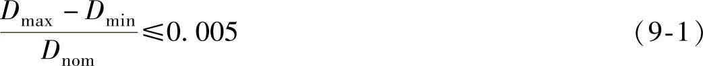

式中 D_(max)——测量出的最大内径；

D_(min)——测量出的最小内径；

D_(nom)——所测量截面的公称内径。

3）筒节纵缝棱角和环向表面局部凹凸度：

钢板厚度t≤30mm时，用弦长L=1/6D_(nom)，且≥400mm的内或外样板检查，如图9-9a、b所示，其凹凸度E值应≤（0.1t+1）mm。

钢板厚度t＞30mm时，用弦长L=1/6D_(nom)，且≥600mm的内或外样板检查，如图9-9a、b所示，其凹凸度E值应≤（0.1t+1）mm。

图9-8 任意截面圆度示意图

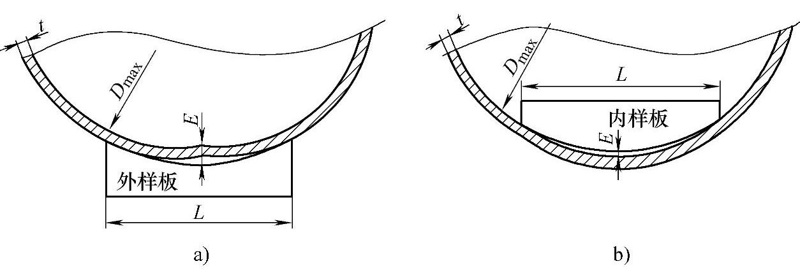

图9-9 纵缝棱角及环向局部凹凸度测量示意图

4）筒节下料的尺寸偏差：大小口弦长偏差不大于±2mm；对角线长度偏差不大于±3mm。

小筒节成型后，如果两端有误差，可用电弧气刨或双面自定心平行切割以使端头平齐。

（4）对接筒体（环缝焊接）

筒节与筒节对接应采用外边对齐。不同厚度筒节对接时，应对较厚的板作削薄处理，削薄长度L按图9-10要求，等于4倍的厚度差，使内壁形成1/4的圆滑过渡。相邻筒节的纵焊缝宜相错180°。若因板材规格不能满足全部要求时，其相错量不得小于90°；基础环筒体的纵焊缝应与塔架底部第一个筒节的纵焊缝尽量相错180°；塔架门框中心线与筒体的纵缝至少相错90°以上。若不能满足，经设计方同意塔架门框中心线与筒体纵缝的间隔可适当放宽，且不得小于800mm。

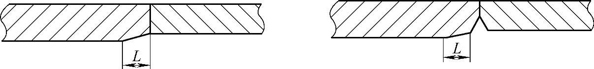

图9-10 不同厚度筒节之间的圆滑过渡

（5）与法兰组对焊接

塔架法兰与筒节组对接时，螺栓孔应跨纵缝对中布置。

（6）无损探伤

2.法兰

1）毛坯成形（辊锻或拼焊）；

2）毛坯退火；

3）无损探伤；

4）车削到成品尺寸；

5）钻孔（钻模或划线钻孔）；

6）与筒体组对焊接；

7）法兰通常是采用钢坯整体锻造的制作工艺，在数控机床上进行连接面和安装孔的加工。因法兰的外形尺寸较大，这种方法存在制作周期长、材料利用率低、锻造和加工成本高等缺点。在对风力发电机组塔架的原材料力学性能、法兰连接的使用工况和承载力综合分析的基础上，提出了拼焊法兰的制作方法，对拼焊法兰的焊接过程、热处理工艺、焊缝和热影响区的力学性能和金相组织进行了分析。结果表明：采用合理的焊接工艺及焊后热处理工艺，拼焊法兰焊接接头的各项力学性能均能达到母材的标准要求。

3.直梯

1）下料（纵梁、横踏撑）；

2）校直；

3）纵梁端头钻连接孔；

4）组焊为成品。

4.平台

1）放线（面板、支撑梁）；

2）下料、去毛刺；

3）支撑梁圈成形；

4）支撑梁钻孔、焊接；

5）组装平台；

6）与筒体组合。

5.附件

1）下料（电缆支架、灯架）；

2）成形、钻孔；

3）焊接成形；

4）与筒体焊接。

6.防腐涂料

1）塔架喷砂；

2）塔架涂（喷）漆。

7.使用设备

在塔筒的制作过程中，主要使用的生产及检验设备包括：

1）卷板机（卷板厚度不小于30mm，宽度不小于2500mm）；

2）刨边机（9m以上）；

3）数控切割机、半自动切割机；

4）手工电弧焊机；

5）CO₂保护自动弧焊机；

6）滚轮架；

7）ϕ40以上摇臂钻床；

8）ϕ5000立式车床；

9）无损探伤设备（X射线探伤、超声波探伤、磁粉探伤）；

10）防腐喷砂设备；

11）喷涂设备。

## 第二节 锥筒式塔架的设计计算

目前，风力发电机组塔架的设计尚没有统一的方法。通常的经验设计法是类比→经验设计→制造样机→性能测试→样机尺寸修改→再制造样机→直至满意。这种方法对设计者经验要求高，且费用高、效率低。本节主要论述常用的锥筒式塔架的设计方法。

### 一、塔架的设计内容与要求

塔架作为支撑结构，应在规定的设计使用年限内，在正常的外部条件、设计工况和载荷情况下稳定的支撑风轮和机舱，以保证风力发电机组安全正常运行。

1.设计内容

在设计中，需要对塔架的承载能力极限状态和正常使用极限状态进行分析。包括：

1）极限强度。塔架的强度分析可采用应力法，可采用传统的应力计算方法，也可采用有限元等数值计算方法。应考虑应力集中，比如门、法兰连接和管壁厚度变化处。

2）疲劳强度。塔架疲劳分析可采用简化疲劳验证法和循环载荷谱的损伤累计法。

3）稳定性。塔架的稳定性分析和力学分析可采用相关标准规定的方法进行。

4）变形限制。塔架变形限制分析可采用传统理论方法，也可采用有限元等数值计算方法。

5）塔架的动力学设计。

2.设计原则

在设计和生产中应坚持以下原则：

1）塔架应具有足够的强度承受作用在风轮和塔架上的静载和动载荷。应保证塔架能承受因运输和安装而引起的外加载荷。

2）应通过计算分析或试验确定塔架的固有特性和阻尼特性，并对塔架进行风轮旋转引起的振动、风引起的顺风向振动和横风向振动进行计算分析，使其在规定的设计工况下满足稳定性和变形限制的要求。

3）应根据安全等级确定载荷局部安全系数和材料局部安全系数。

4）塔架分段应考虑以下因素：运输能力；生产条件和批量；考虑上法兰与短节塔筒焊后进行二次机加工后与塔筒组焊，使法兰平面度提高。

5）通过塔架设计、材料选择和防护措施减少其外部条件对塔架安全性和完整性的影响。

3.设计流程

首先，进行载荷计算。通过计算叶片和机舱传到顶塔筒法兰载荷，将法兰载荷插值到筒壁上。其次，进行塔筒设计。初步确定的塔筒尺寸，根据极限强度确定各段壁厚，进行静强度和刚度校核，屈曲计算（DIN 18800 T4），验算塔筒焊缝疲劳强度；同时，还要考察塔筒门附近静强度和疲劳强度；其三，进行法兰设计。验算法兰螺栓结构的静强度和疲劳强度；塔筒顶部与主机偏航轴承连接部位的静强度和疲劳强度。其四，进行模态计算。考虑叶片-机舱-塔筒-基础的耦合，计算整机模态，并进行共振特性分析。在需要进行抗震设计的地区，还要进行抗震性能分析。还要进行优化设计，一般以塔架顶部直径和壁厚，塔架底部直径和壁厚、中间部位的壁厚为参数，以结构的应力、变形、疲劳、固有频率和经济性为目标，建立有限元模型进行分析，根据结果优化。

4.设计给出的数据

1）筒体尺寸。塔架顶部直径和壁厚，塔架底部直径和壁厚，中间筒节的壁厚，纵向和环向焊缝

2）塔架法兰上的螺栓分布，螺栓规格；力求螺栓受力均匀，而且较小，避免螺栓受附加载荷；同一圆周上的螺栓数目取偶数以便于加工时分度，最好有两个相互垂直的轴便于计算。螺栓应远离对称轴以减少螺栓受力；高强度螺栓连接宜按构件的内力设计值进行。

3）门的尺寸要求。在满足安装作业、维修人员及维护物件搬运要求后，尺寸宜小。门孔处必须足够补强，补强材质应与塔筒材质相同。

### 二、塔筒设计

1.塔筒尺寸的初步设计

（1）塔架的高度

塔架高度的增加可从高空捕获更多风能，降低湍流所造成的影响，并提高年发电量从而为客户创造更多价值。风机的高度每增加一倍，风速增加10％，风能增加33％。相应的，塔架高度增加一倍，为避免塔架的局部屈曲，则塔筒直径和壁厚也要倍增，塔架总重则至少增加到四倍。

因此，塔架高度的选择首先需要考虑风力发电机的规格、风场的风速、安装的具体地理位置和地貌，同时要结合塔架载荷、寿命和制造成本等因素，综合考虑后选定塔架高度。塔架高度一般为叶轮直径的1～1.5倍，如图9-11所示。

综合考虑风力发电机组运作的要求、风场因素、塔架性能及经济方面的因素，塔架的最小高度为

对1MW以下塔架H=h+C+R

对1MW以上塔架H=（1～1.3）D （9-2）

式中 h——为接近风力发电机组的障碍物的高度；

C——为障碍物最高点到风轮扫掠面最低点的距离，一般最小取值1.5m到2.0m；对于MW级机组，叶尖离地距离（h+C）不得低于25m。

R、D——为风轮的半径与直径。

图9-11 塔架高度与风力发电机组功率

（2）塔架的直径

在已有的塔架设计中，根据1MW、1.5MW、2MW和3.0MW塔架的直径与高度的关系分析，高度H与底部直径D之比处于14.8～19.03范围内，见表9-5。

表9-5 高度与直径关系

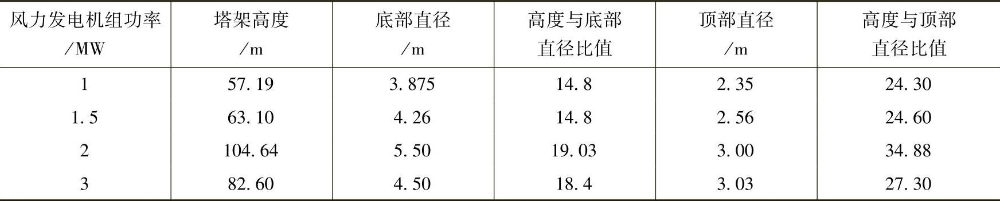

在高耸结构中，如烟囱设计时采用的底部直径D与高度H之比的关系D≥H/20^(\[10\])。通过规范和实际工程实例分析，建议塔架的高度H与底部直径D之比为14～20范围内为宜，当不满足此条件时，塔架底部直径宜扩大。

对于塔架上部直径的确定，主要根据机舱所给定的底部直径来确定。根据以往的经验，高度H与顶部部直径D之比在24～34的范围内。

2.塔架的载荷

塔架的载荷要求在塔架的初步尺寸确定后进行计算。风力机塔架设计载荷包括惯性力和重力、气动载荷、运行载荷和其他载荷（如波动载荷、尾流载荷、冲击载荷、冰载荷等），其设计载荷计算按本书第四章确定，载荷和材料安全系数参见第三章相关内容。

3.塔架静强度计算

塔架静强度计算时，应首先确定危险截面及其截面力。塔架的危险截面一般在塔架的根部。在确定危险截面力时，一般按照刚体假设进行计算。塔架的截面力的计算还应考虑动载荷的影响。

塔架静强度设计时可采用悬臂梁的力学模型。假设受力在材料的弹性范围内，不考虑塔架的塑性变形。对于塔架设计来说首要满足塔架在静力情况下的强度验算，包括正应力、剪应力和扭转应力。

（1）正应力的计算

对于圆锥形塔架，从受到的载荷可以分析得到其应力分布规律是从塔顶到塔底应力逐渐增大，所以塔架最危险截面在塔架的根部。塔架根部的应力公式：

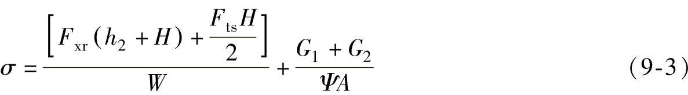

式中 W——塔架根部抗弯截面模量，单位为m³；

F_(xr)——风轮所受气动推力，单位为N；

F_(ts)——塔架所受风力，单位为N；

h₂——叶轮中心到塔架上部的距离，单位为m；

H——塔架的高度，单位为m；

A——塔架根部截面积，单位为m²；

G₁——塔架上方所受总重力，单位为N；

G₂——塔架自身所受重力，单位为N；

Ψ——锥形塔架的长度折减系数。

（2）扭应力的计算

工程中发现扭矩对于塔架顶部的强度和风力发电机组的运转影响很大，当塔架顶部的抗扭强度不足时，将会产生塔架的扭转角度过大而影响风力发电机组效率，严重的还会发生扭转破坏。所以，塔架设计时应该进行塔架顶部的抗扭强度和扭转角度的验算，保证塔架的安全。可以将塔架视为壁薄锥筒形式，采用薄壁圆筒扭转的理论方法计算。对于薄壁圆筒，横截面上各点处的切应力可认为与圆周中心处相同，即不沿径向变化，即认为，薄壁圆筒受扭时横截面上的切应力τ₁处处相等，方向则垂直于相应的半径。若塔筒的厚度用t表示，平均半径为r+t/2，则薄壁圆筒横截面上内力的剪应力的大小为

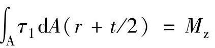

即 

得 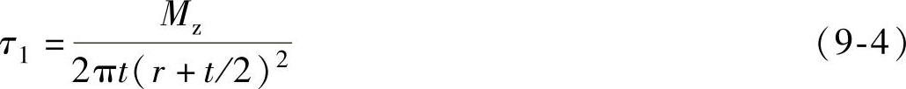

式中 τ₁——扭剪应力，单位为N/mm²；

r——圆筒的内半径，单位为mm；

M_(z)——扭矩，单位为N·mm；

A——圆筒截面面积，单位为mm²；

t——塔筒壁厚，单位为mm。

（3）剪应力的计算

塔架所受的剪力：V=F_(xr)+F_(ts)，塔顶处F_(ts)=0

式中 τ₂——剪应力，单位为N/mm²；

V——剪力，单位为N。

（4）静强度设计

对于塔架的强度验算应分两部分，第一满足抗弯、抗拉压和抗剪扭强度的验算；第二，满足折算应力，通过强度设计可以提出塔架底部及顶部的钢管厚度。

塔架的最大折算应力为

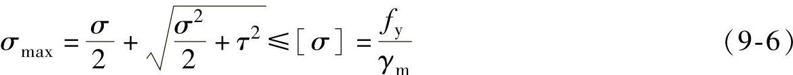

塔架的最大剪应力为

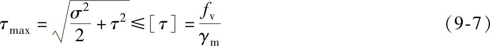

式中 τ——剪应力，单位为N/mm²，τ=τ₁+τ₂；

σ——正应力，单位为N/mm²；

\[τ\]——许用剪应力，单位为N/mm²，根据材料确定；

\[σ\]——许用应力，单位为N/mm²，根据材料确定；

f_(y)——屈服强度，单位为N/mm²，根据材料确定；

f_(v)——剪切强度，单位为N/mm²，根据材料确定；

γ_(m)——材料局部安全系数。

将前面初步确定的塔架底部直径和高度以及顶部直径、载荷带入上式中，便可求到塔架筒壁的厚度。

4.塔架的位移和截面倾角以及扭转的验算

对于塔架不仅要进行强度的计算，还要进行塔架的变形验算。如果变形使结构的整体稳定性受到影响，或出现最不利的情况，则计算时应考虑所有因素所引起的变形，包括塔架的弹性变形和由于土壤的柔性引起的倾斜等。塔架在风载作用下会产生变形，这不仅影响了塔架的工作性能，而且由于变形使得风轮与迎风面形成一定的角度，当角度不断增大，风轮与风的有效接触面积就不断地减小，进而影响风力发电机组的效率。所以，控制塔架的变形包括塔顶的水平位移、扭转角度和倾角。

（1）塔顶的水平位移

塔架受到的风载荷简化如图9-12所示。假设塔架变形在材料的弹性范围内，不考虑塔架的塑性变形。通过材料力学可知塔架的在风载的作用下的任意一点的变形。

塔架的弯矩为

图9-12 塔架的受力简图

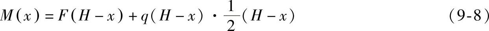

塔架的近似挠度方程试中

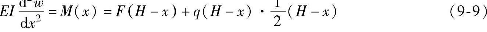

以x为变量进行求解积分得

对于塔架的根部处的边界条件为在x=0=处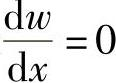，w=0于是得到C₁=0，C₂=0

带入上式得到塔架的挠度

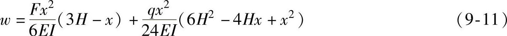

塔架的最大位移出现在塔架的顶部，所以在塔架的变形验算最重要的位置应选择塔架的顶部，将塔架的参数带入上式中整理得到塔架的最大变形如下。

式中 F——风轮及机舱受到的风载荷；

H——塔架的高度；

q——风压；

E——塔架材料的弹性模量；

I——塔架的等效刚度。

对于等效刚度一般采用近似公式：

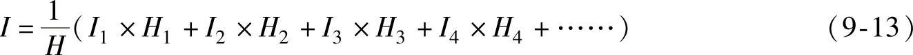

式中 H——塔筒总长；

I₁，I₂，I₃，…，I_(n)——各区段中点的截面的刚度；

H₁，H₂，H₃，…，H_(n)——划分的区段长度。

目前，国内的标准和规范尚没有规定塔架许用刚度条件。《高耸结构设计规范》（GB50135—2006）要求结构最大位移的顶点位移不大于总高的1/75，即1.3％H。根据设计和运行经验，确保风力发电机组正常运行的塔架许用挠度\[w\]一般可控制在（0.5％～0.8％）H的范围内。

（2）倾角

对于塔架来说，当受到风载荷后不但会产生水平的位移，而且还会因为位移造成塔架的横截面与水平方向产生夹角，进而使得风轮与风载荷在水平方向上产生夹角，导致风轮与风的有效接触面积减小，最终影响风力发电机组的效率，所以塔架设计中应该考虑塔架位移产生塔架截面与水平形成夹角造成风轮的有效面积减小，即在设计塔架时，

图9-13 塔架倾角与风力发电机组有效面积的关系

控制塔架的横截面与水平方向的夹角。在图9-13中可以看到塔架截面的水平倾角不断增大，风轮的有效接触面积不断地减小，当夹角达到8°时，风轮的有效面积减少到0.99，说明了塔架的倾角对风力发电机组的有效功率的有一定影响，所以在塔架设计时应控制塔架截面与水平倾角。

塔架受到的主要载荷是风载荷，在图9-12中可以看到塔架主要受到的载荷是塔架本身的均布载荷以及塔架顶端受到的风轮和机舱产生的集中载荷，在这两种载荷作用下利用材料力学可知，截面夹角方程是塔架的位移曲线方程的导数关系，对塔架位移曲线进行求导得到下方程：

将塔架的参数带入上式中整理得到塔架的最大角度如下：

塔架的许用挠度\[w\]控制在（0.5％～0.8％）H范围内，进行倾角换算后叶片的倾角范围为（0.24％～0.38％）H弧度。

（3）塔顶的扭转角度

在风力发电机组运行时，需要控制塔架顶部的扭转角度，因此也需要进行计算以保证塔架的安全。

对于扭转角度与扭转应变的关系如下：

即 

式中 γ——扭转应变；

φ——扭转角，单位为rad；

H——塔筒长度，单位为m；

r——塔筒内半径，单位为m；

t——塔筒壁厚，单位为m。

参考式（9-4），塔架的扭转角度φ计算公式如下：

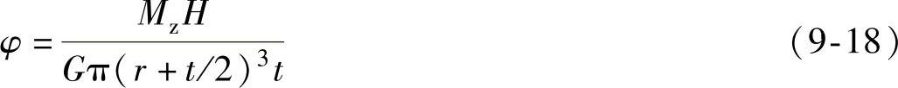

式中 G——剪切弹性模量。

5.焊缝极限强度和疲劳强度验算

（1）筒体焊缝验算

塔架的每个法兰段由多个筒节段焊接组成，需要对焊缝的极限强度和疲劳强度进行计算。塔架所受集中载荷位置与焊缝位置的距离较远，内力可以采用静力等效方法进行计算，主要内力一般有弯矩M_(xy)、压力F_(z)、剪力F_(xy)和扭矩M_(z)，其受力简图见表9-6。

1）极限强度计算：环形焊缝的截面应力可以应用钢结构中的截面应力计算方法。需要分别验算正应力、剪应力和折算应力，如式（9-19）、（9-20）、（9-21）。需要注意的是，当

表9-6 筒体单元的载荷及应力

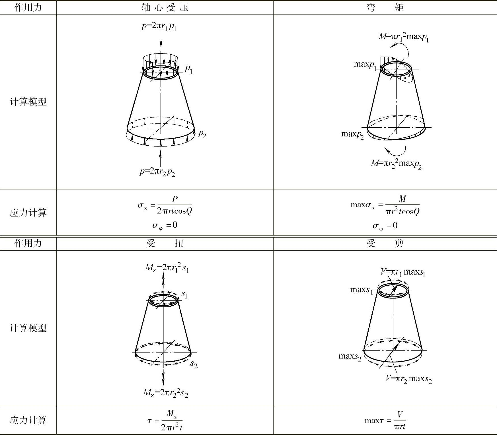

焊缝连接两种不同壁厚的焊接段时，要充分考虑不同截面的应力，需要全部满足强度要求。

式中 P——轴力，单位为N；

M——弯矩，单位为N·mm；

τ——受扭应力，单位为N/mm²；

maxτ——受剪应力，单位为N/mm²；

τ_(wf)——焊缝剪应力，单位为N/mm²，根据材料确定；

σ_(x)——轴力产生的正应力，单位为N/mm²；

maxσ_(x)——弯矩产生的正应力，单位为N/mm²；

σ_(wf)——焊缝正应力，单位为N/mm²，根据材料确定；

f^(w)_(c)——焊缝受压强度，单位为N/mm²，根据材料确定；

f^(w)_(v)——焊缝剪切强度，单位为N/mm²，根据材料确定；

2）疲劳强度验算：对于金属材料的疲劳强度或疲劳寿命的评估采用外加应力S和疲劳寿命N之间关系的曲线叫做S-N曲线，或称为Wohler曲线。对于S-N曲线可分为三部分即低疲劳区、高疲劳区和亚疲劳区。一般高疲劳区和亚疲劳区的S-N曲线按经验方程来取，根据不同的材料、工艺等因素，人们进行了多种多样的疲劳试验，获得了大量的实验数据。根据实验数据，材料的疲劳数据可以绘制出一条S-N曲线，即应力幅值与可循环次数的对数曲线图。当然，每条S-N曲线都有其特定的斜率（m）、疲劳等级（DC）和存活概率（Pu）。

图9-14是对焊缝和法兰螺栓的疲劳强度验算时常用的S-N曲线。为了计算的便捷，在满足德国GL规范要求的那前提下，对S-N曲线进行一定的简化。简化时，要保证简化后的S-N曲线比GL要求更保守，也要求要达到简化计算的目的。

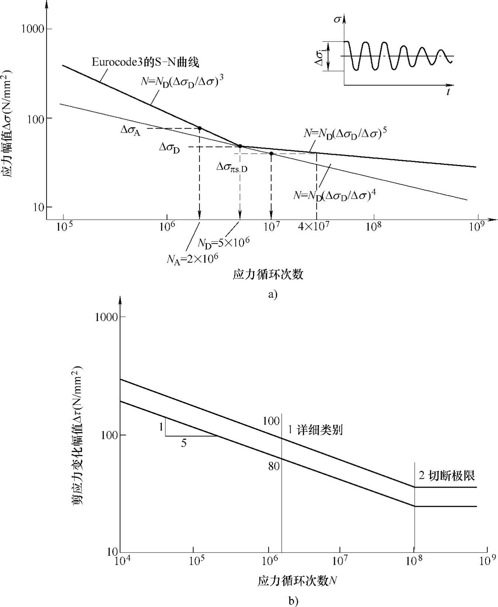

图9-14 焊缝和螺栓正应力和剪应力S-N曲线

a）正应力S-N曲线 b）剪应力S-N曲线

风力发电机组的设计寿命为20年，外载荷对塔架冲击次数约为4.0×10⁷次。因此，焊缝和法兰螺栓的疲劳强度验算时可选重复次数为4.0×10⁷进行验算。这与按修正曲线上重复次数为10⁷的应力范围基本相同。

根据EC31-9的要求，计算焊缝的疲劳时综合考虑焊缝的正应力和切应力，判断焊缝的疲劳损伤：

对焊缝正应力 

对焊缝切应力 

对焊缝综合应力 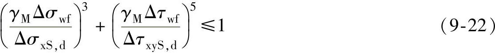

式中 γ_(M)——焊缝的材料安全系数，取1.1；

Δσ_(xS，d)——焊缝的许用疲劳正应力，由焊缝的疲劳等级确定，根据Eurocode 3 part 1，9-Annex B确定焊接等级分别为90，71级；

Δτ_(xyS，d)——焊缝的许用疲劳切应力，由焊缝的疲劳等级确定。

（2）门框焊缝验算

门框焊缝的形状不规则，存在门洞的缺口效应，其应力状态比较复杂，常用有限元方法进行精确分析。

进行门框焊缝的极限强度分析时，如果没有考虑材料非线性的话，由于应力集中，在焊缝位置不可避免的出现很大的Von Mises应力。当最大Von Mises应力大于许用应力\[σ\]时，意味着部分钢进入塑性状态。这时，需要满足以下两个条件：

1）超过\[σ\]区域不能大于壁厚的1/5；

2）这种极端工况必须发生概率极低（如50年一遇）。

进行门框焊缝的疲劳强度分析时，可参考欧洲EC31-9。门框焊缝的疲劳等级为100，工程计算的名义应力不可以继续使用，需要进行焊趾应力计算。焊趾应力外推的计算方法，可以参看国际焊接协会IIW的规定以及EC31-9中的论述。

### 三、塔筒屈曲稳定性分析

塔架一般由2～3个法兰段连接而成，每个法兰段又由多个筒节段焊接组成。随着高度、承受载荷的变化，各个焊接段直径和壁厚也会有变化。一般来说，筒体壁厚随高度的增加而减小；但有两种情况例外：

1）在第三法兰段，可能为了保证顶法兰处需要的强度，而增加此焊接段的壁厚；

2）有时也会为了优化风力发电机组的动力学特性或稳定性而改变壁厚分布。塔架作为薄壁结构，需要进行屈曲稳定性分析。

屈曲稳定性分析时，取一个壁厚相同的法兰段作为分析单元，一个法兰相当于一个径向位移约束。计算作用载荷时，可以采用静力等效方法计算，包括弯矩M_(xy)、压力F_(z)、剪力F_(xy)和扭矩M_(z)等载荷。其受力简图如表9-6所示。

屈曲稳定性的计算方法与塔架焊缝极限强度计算方法一致，区别是破坏准则变为屈曲失稳破坏，许用应力变为许用屈曲应力。其计算过程为：由塔架的理想几何参数计算理想屈曲应力，其次考虑集合缺陷修正为实际屈曲应力，再考虑局部安全系数得到极限屈曲应力。下面以正应力为例予以说明。

1.理想屈曲应力

考虑塔架的锥角影响，正应力计算需要一定的改进。当塔架锥角Q很小时，可以忽略。

当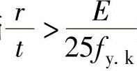时，需要计算筒体屈曲稳定性，其理想屈曲正应力为：

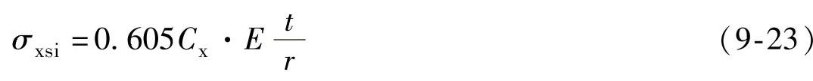

式中 f_(y，k)——钢材的屈服强度；

σ_(xsi)——理想屈曲正应力；

l——法兰段长度；

C_(x)——屈曲稳定系数，按下述方法取值：

当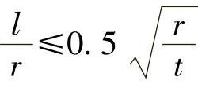时，为中短筒，

当时，为长筒，，且C_(x)≥0.6，η=1。

当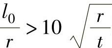时，为超长筒，DIN18800-4不再适用，改用DIN18800-2进行屈曲计算。l₀为计算长度，两端铰支为l，一端固定、一端铰支为0.7l，两端固定为0.5l，一端固定、一端自由为2.0l。

2.实际屈曲应力

考虑实际几何缺陷、结构缺陷、非弹性材料行为，计算实际屈曲应力时，可用下面的修正法。

（1）发生规定范围内的缺陷时的修正

实际缺陷，一般考虑凹陷、圆度和偏心三种：

1）初始凹陷如图9-15所示，规定范围：t_(v)＜l_(mK)×1％

图9-15 初始凹陷示意图

2）圆度如图9-16所示，规定范围：

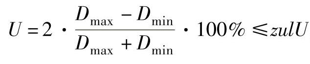，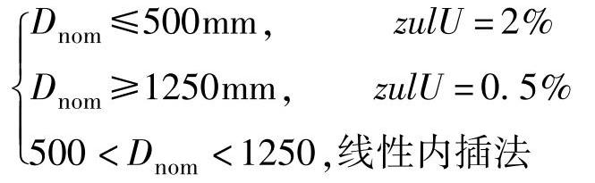

3）偏心量如图9-17所示，规定范围：偏心量e≤0.2t，且不大于3mm

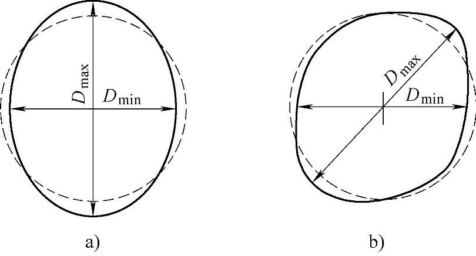

图9-16 圆度缺陷示意图

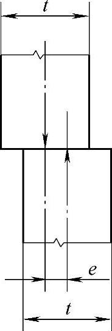

图9-17 偏心缺陷示意图

发生上述范围内的缺陷时，轴向、环向和剪应力分别做如下修正：

轴向应力： σ_(xS，R，k)=x₂f_(y，k) （9-24）

式中 σ_(xS)，R，k——考虑缺陷的实际屈曲正应力；

x₂——实际屈曲正应力修正系数，计算方法如下：

环向应力： σ_(φS，R，k)=x₁f_(y，k) （9-25）

式中 σ_(φS，R，k)——考虑缺陷的实际屈曲环向应力；

σ_(xSi)——理想屈曲正应力；

x₁——实际屈曲环向应力修正系数，计算方法如下：

剪应力： 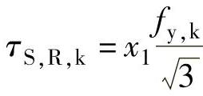， (9-26)

式中 τ_(S，R，k)——考虑缺陷的实际剪应力；

σ_(φSi)——理想屈曲环向应力；

τ_(Si)——理想屈曲剪环向应力；

x₁——计算方法如下：

（2）发生超过（1）规定的缺陷时，可采取措施校正缺陷，或采用修正的x值：

当时，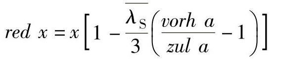

当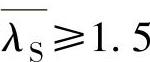时，

3.许用屈曲应力

考虑局部安全系数，计算许用屈曲应力：

许用轴向应力： σ_(xS，R，d)=σ_(xS，R，k)/γ_(M) （9-27）

许用环向应力： σ_(φS，R，d)=σ_(φS，R，k)/γ_(M) （9-28）

许用剪应力： τ_(φ，R，d)=τ_(S，R，k)/γ_(M) （9-29）

对缺陷敏感性一般的圆度和偏心，实际屈曲应力由x₂获得时，材料安全系数γ_(M1)=1.1。

对缺陷敏感性高的凹陷，实际屈曲应力由x₁获得时，

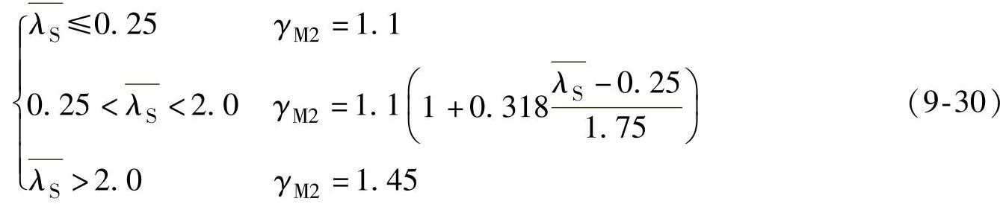

需要注意的是，下段塔架门框开口处的许用屈服应力，因为门框开口形状不规则，存在应力集中效应，应力状态比较复杂，因此，计算时应该考虑其影响进行修正。如图9-18中的开口参数符合条件：筒体的径厚比r/t≤160、门洞的张角δ≤60°、门洞的尺寸h₁/b₁≤3时，可用式（9-31）进行修正：

图9-18 下段塔架门框开口示意图

σ′_(xS，R，d)=C1·σ_(xS，R，d) （9-31）

式中 C₁=A₁-B₁（r/t），A₁、B₁的取值见表9-7，中间值可用线性内插法计算。

表9-7 参数A₁、B₁的取值

4.屈曲稳定性分析准则

塔架处于不同的载荷工况时，屈曲变形不同，所以对所有的载荷工况都要进行屈曲验算。当单元的实际应力小于许用屈曲应力时，就不会发生屈曲破坏。

对承受单一应力的单元，屈服准则为：

对承受组合应力的单元，屈服准则为

### 四、法兰的设计

塔架一般由多个法兰段连接而成，每个法兰段又由多个焊接筒节段组成。法兰的实际受力比较复杂，其内力精确计算可根据板块的支承情况采用有限元法进行。在设计中，要求按照GL德国DIN18800 Part 7进行计算，法兰连接的极限计算可采用Petersen方法，而疲劳计算采用Schmidt-Neuper方法。需要强调的是，塔顶法兰由于主机架结构和偏航轴承的影响，工程计算不再准确。塔底同样有门框的应力集中作用，工程计算应予以修正。

对于塔架的环形法兰螺栓连接，GL要求法兰应按照DIN18800 Part 7进行拧紧装配。在法兰的极限状态分析中，螺栓的预紧力可以不考虑，但是局部的塑性化应予以计算。在法兰连接的疲劳分析中，螺栓的疲劳计算应考虑安装预紧力作用。

1.极限强度计算——Petersen方法

Petersen方法只计算最危险螺栓，如图9-19所示。Petersen方法没有考虑螺栓预紧力作用对变形的影响。螺栓只用弹簧模拟，而且预变形为0，其简化模型如图9-20所示。由于弹簧不承受弯矩作用，自然Petersen

图9-19 Petersen计算方法模型

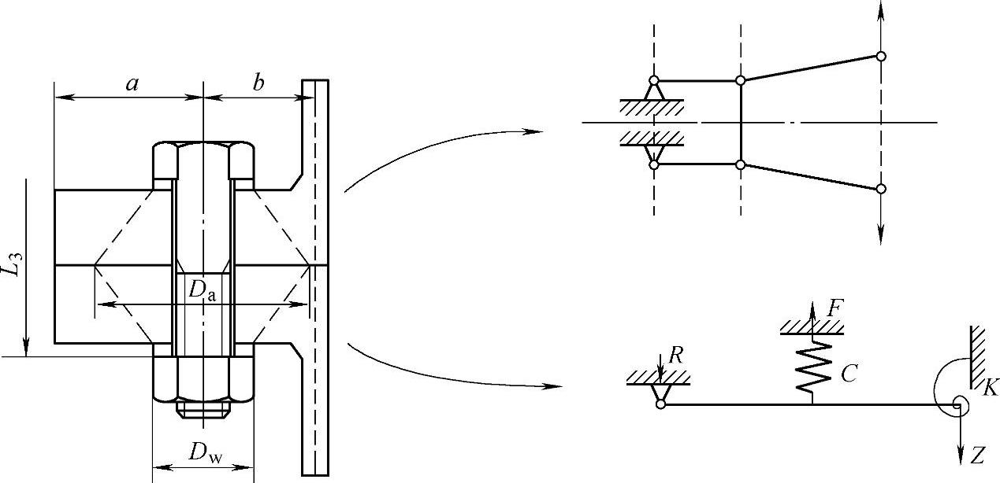

图9-20 Petersen方法的简化模型

方法计算的螺栓没有考虑弯矩的影响，计算模型是不够准确的。但是，Petersen法中对于螺栓采用很大的安全系数，以弥补模型的不足，其计算结果与实验数据基本相符。

（1）弹性设计理论

在Petersen方法中，将法兰假设为梁，采用两条3次曲线模拟法兰的变形挠度曲线，如图9-21所示。

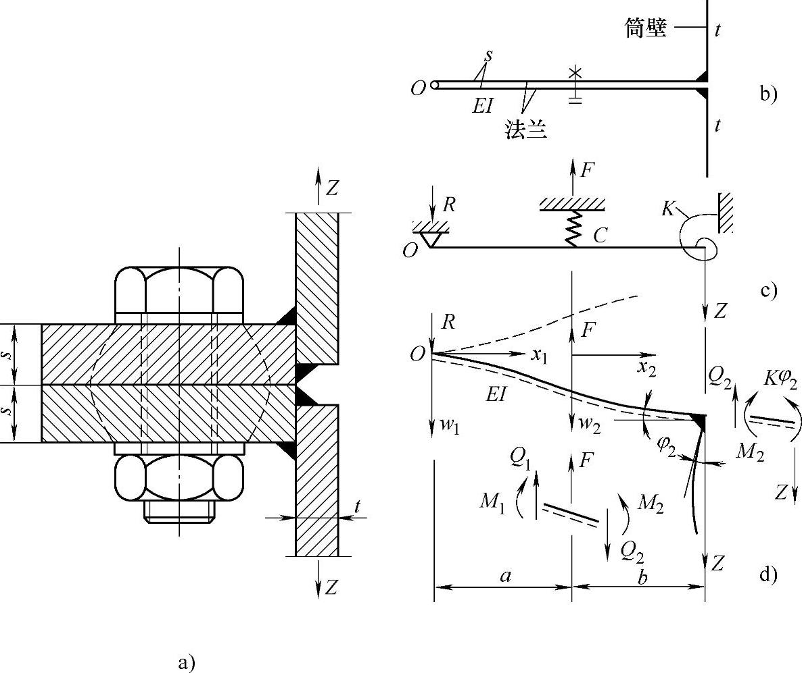

图9-21 法兰的计算模型

其曲线方程如式（9-36）所示。

方程中的8个系数由边界条件决定。

1）o点挠度为0，弯矩为0；即x₁=0，w₁=0；x₁=0，M₁=0

2）连接点弯矩平衡，剪力平衡；即x₂=b，M₂-Kφ₂=0；x₂=b，Q₂-Z=0

3）螺栓点处的边界条件有，

挠度相等：x₁=a，x₂=0，w₁=w₂

角度相等：x₁=a，x₂=0，φ₁=φ₂

弯矩平衡：x₁=a，x₂=0，M₁-M₂=0

剪力平衡：x₁=a，x₂=0，Q₁-Q₂+F=0

将8个边界条件代入方程（9-36）中，联立求解曲线系数。

式中 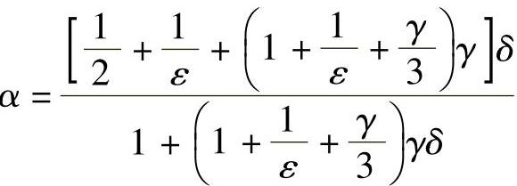；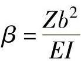；；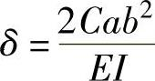；；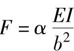

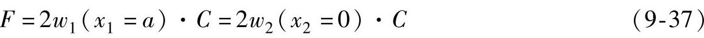

扭转弹簧的弹簧系数K=4EI_(s)/L_(s)，如图9-22所示，原始方法主要用于实验对比，对于塔筒结构不能适用。因此，在Petersen方法中特别的将其替换为式（9-38）。

由此，可以通过简化力学模型、法兰几何尺寸a、b、I、c、k等，求得螺栓、法兰内力值，从而进一步验算极限强度。

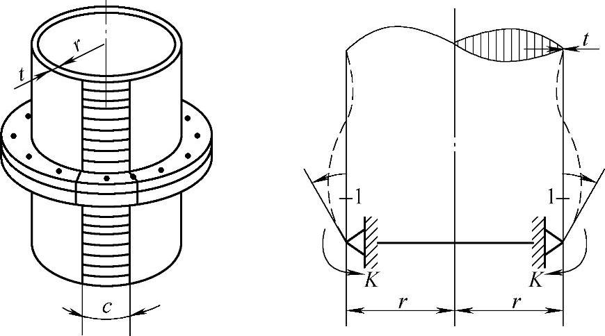

图9-22 弹簧系数

（2）塑性设计理论

上述弹性设计是趋于安全保守的，会造成建造成本的大幅增加。所以，在风力发电机组的设计中法兰连接还可以采用塑性设计原则。

当采用塑性设计时，法兰连接一般有三种破坏方式：螺栓直接拉断；“L”角点发生屈服，螺孔位置与“L”角点同时发生屈服，如图9-23所示。

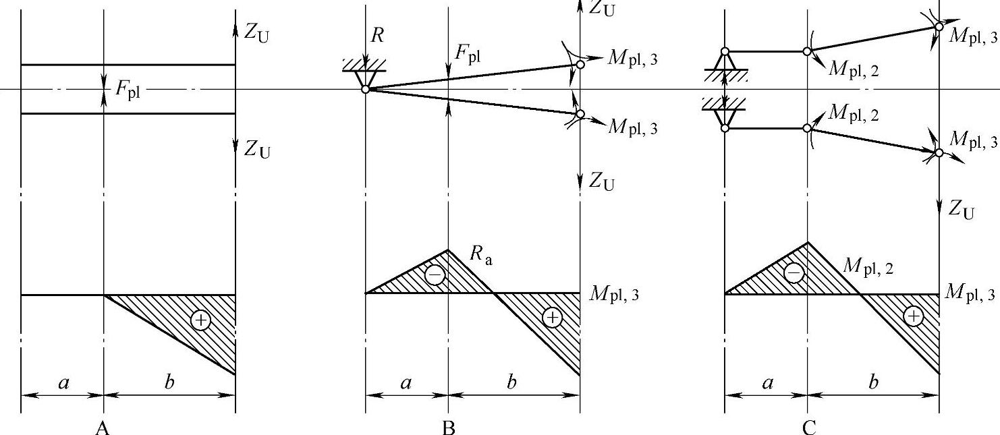

图9-23 法兰的三种破坏形式

可以根据相关截面系数求取截面的塑性承载极限。并根据A、B和C三种破坏方式求取最大承载拉力Z。其中B种破坏方式需要进行收敛计算。

另外，通过等效静力学计算可以得到分度圆弧塔筒上载荷，如式（9-40），与式（9-39）的计算结果基本相同。

（3）计算实例

以图9-24为例具体叙述法兰的计算。螺栓为M16，夹紧长度l_(s)=4.8cm，a=b=3.0cm，垫片内外径分别为d=1.7cm、D=3.0cm，法兰厚度t=2.0cm，垫片厚度S_(s)=0.4cm，筒体壁厚s=1.0cm，分度圆弧长为c=16.0cm，假设固定端长L_(s)=16.0cm，Z=50kN。

图9-24 法兰计算实例

首先，求解螺栓与法兰的弹簧系数C。

第一步：求解螺栓的弹簧系数C_(s)。

第二步：求解法兰的弹簧系数C_(d1)和垫片的弹簧系数C_(d2)。

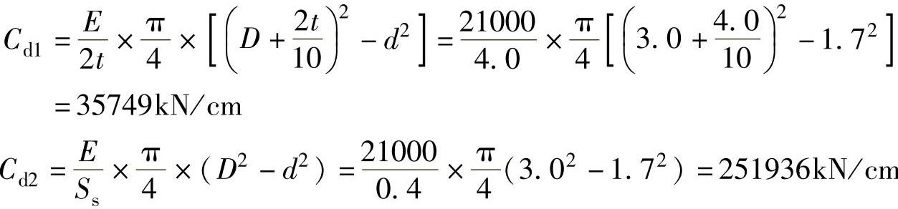

第三步：进行弹簧的串联和并联计算。

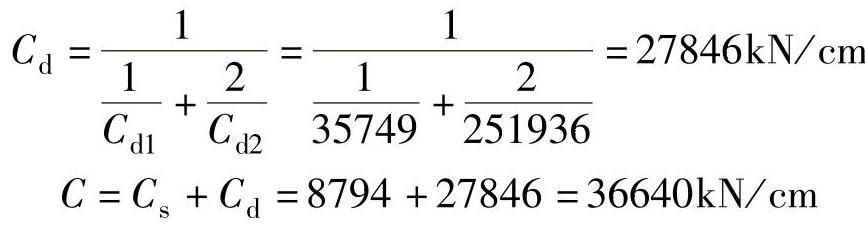

然后，求解扭转弹簧的弹簧系数K。

再次，求解截面惯性矩。

将上述参数代入公式，以法兰连接的几何尺寸参数求解所有的系数。挠度方程也有了明确的数值解。

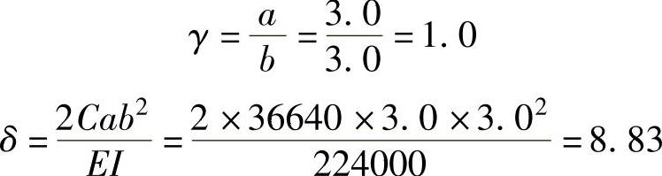

：则

根据弹性理论，求解螺栓的最大拉应力与法兰的最小压应力，要求最大拉应力小于螺栓许用应力，法兰最小压应力应大于0。

求解螺栓孔位置的最大正应力与“L”形角点的最大正应力，要求两者应小于法兰材料的许用应力。

螺栓孔位置处，x₂=0

“L”形角点处，x₂=b

本分圆段筒体的截面积：A=s·L_(s)=1.0×16.0=16cm²

2.螺栓的疲劳计算——Schmidt-Neuper方法

在正常工作状态下，法兰螺栓承受的应力不断变化，由此引发疲劳问题，螺栓的疲劳计算采用Schmidt-Neuper方法，计算简图如图9-25所示。

Schmidt-Neuper方法基于Petersen方法，联合有限元计算分析，并对Petersen方法行了修正。认为螺栓所受载荷F_(s)与筒壁载荷Z是三段线关系，且与预紧力F_(v)有很大关系，如图9-26所示。

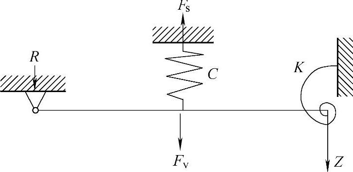

图9-25 螺栓与法兰的简化模型

图9-26 Schmidt-Neuper方法的螺栓应力-载荷曲线

当载荷Z一定时，预紧力F_(v)越小，螺栓受力F_(s)越大，即斜率越高。即当螺栓预紧力很小时，法兰连接容易开口，导致螺栓承受载荷的比例增大。

式中 ，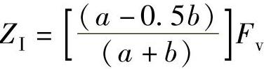，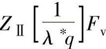

与Petersen方法一样，适用于尺寸（a+b）/t≤3的法兰，且未考虑弯矩对螺栓的影响，因此螺栓要采用一个保守的计算方法。GL规范要求，如果未考虑螺栓所受弯矩影响的话，螺栓疲劳等级应取为36，按照许用疲劳应力验算螺栓的疲劳强度是否满足设计要求。实际设计时，一般采取对S-N曲线进行简化，保证简化后的S-N曲线比GL要求更为保守，如图9-14所示。

3.底法兰连接计算分析

底法兰连接与中间法兰连接计算基本相同，但是要考虑门框对底法兰的应力集中作用，增大法兰的应力。因此载荷Z不能用简单的等效静力学公式（9-39）求解，可以采用有限元计算，获得应力集中系数SCF，代入Petersen方法和Schmidt-Neuper方法进行计算即可。

4.偏航连接强度计算

偏航连接强度计算与变桨距连接强度计算是一致的，两者方法一样。只是主机架刚度对连接螺栓承载情况的影响十分明显，偏航连接强度计算时需要一个完整的主机架（机舱底座）模型参与计算。而轮毂属于厚壁结构，刚度很大，所以计算时可以采用1/3模型进行连接计算。

### 五、塔架的固有频率计算

由风轮转动引起的塔架受迫振动中，既有风轮转子残余的旋转不平衡质量产生的塔架以每秒转数n为频率的振动，也有由塔架影响、不对称空气来流、风剪切、尾流等造成的频率为Bn的振动。恒定转速的风力机应保证塔架-机舱系统固有频率值在转速激励的受迫振动频率之外。一般要求塔架的一阶固有频率与受迫振动频率n、B_(n)的差值必须超过这些值的20％以上，才能避免共振。同时，还应注意避免高阶共振。变转速风电机可在较大的转速范围内变化输出功率，但不容许在风轮发生超速现象时转速的叶片数倍频下的冲击也不得产生对塔架的激励共振。当叶片与轮毂之间采用非刚性连接时，对塔架振动的影响可以减小。尤其在叶片与轮毂采用铰性连接（变锥度）或风轮叶片能在旋转平面前后5°范围内挥舞时，取这样的结构设计能减轻由阵风或风的切变在风轮轴和塔架上引起的振动疲劳，缺点是构造复杂。

1.规范要求

为了避免塔架与机组其他部分的共振，规范要求为

1）应对包括运动部件在内的所有风力机部件组成的扭转系统进行系统扭转振动特性计算，以确定系统扭转振动固有频率。计算时还应考虑基础和系统阻尼的影响。设计计算的固有频率值应比风轮叶片实际转动频率高20％。

2）对于因风轮旋转引起振动的情况，应证实塔架（包括基础）的固有频率f₀充分远离转动风轮的激励频率f_(R)；

对于f_(R)/f₀≤0.3和f_(R)/f₀≥1.4的情况，不必考虑动态放大的影响。

对于0.3＜f_(R)/f₀＜0.95和1.05＜f_(R)/f₀＜1.4的情况，应对塔架进行动态分析，其使用的载荷谱应乘以动态放大系数。动态放大系数的确定按有关规定。

当0.95≤f_(R)/f₀≤1.05时，必须对塔架进行动态分析，并在使用期间定期进行振动进行监控。否则，不允许塔架长期使用。

3）设计时还应对由阵风引起的沿风向的振动和湍流引起的横向振动加以考虑，其振动研究方法按有关规定。

2.经验公式

（1）对于高耸结构来说结构基本自振周期经验公式：

一般情况

T₁=（0.007～0.013）H （9-42）

（2）对于塔架壁厚不大于30mm圆柱或者圆筒基础塔

当H²/D₀＜700时

T₁=0.35+0.85×10⁻³H²/D₀ （9-43）

当H²/D₀≥700时

T₁=0.25+0.99×10⁻³H²/D₀ （9-44）

式中 H——从基础底板或柱基顶面至设备塔顶面的总高度，单位为m；

D₀——塔的外直径，单位为m；对于变直径塔，可以按照各段高度为权，取外直径的加权平均值。

3.固有频率测试

大型风力发电机组的塔架高度一般都在80m以上，动力学问题直接影响风力发电机组的工作性能和可靠性，其中必须考虑塔筒与叶轮是否会发生共振。设计时的频率计算模型与实际结构有一定差距，因此塔架完成后还需要实际测量塔架的频率和模态。

以某研究单位的一个实际工程为例说明测试方法。使用的试验仪器主要有：941B拾振器，INV3018C 24位便携式采集仪，INV1861A应变调理器和DASP V10分析软件。试验方法分别使用振动和应变两种测试方法进行测试，振动信号使用941B拾振器进行测试，传感器分别放置在塔筒的第二层和第三层；应变测试使用应变片进行，塔基均布4个测点，测点布置如图9-27所示，测试现场如图9-28所示。

图9-27 塔架固有频率测试的测点布置

图9-28 塔架固有频率测试现场

图9-29所示为塔架振动频谱分析图，图9-30所示为时域信号局部放大图，比较光滑的是第三层拾振器的信号，另一条为第二层拾振器信号。塔架的一阶固有频在叶轮旋转频率的1～3倍之间，与设计相符，另外，塔架的一阶固有频率与叶轮转频及三倍频的差值也符合要求，无共振隐患。

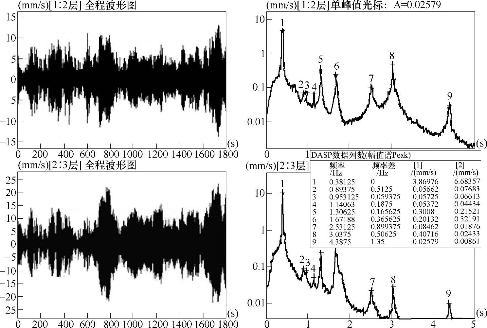

图9-29 塔架振动时域及频谱分析图

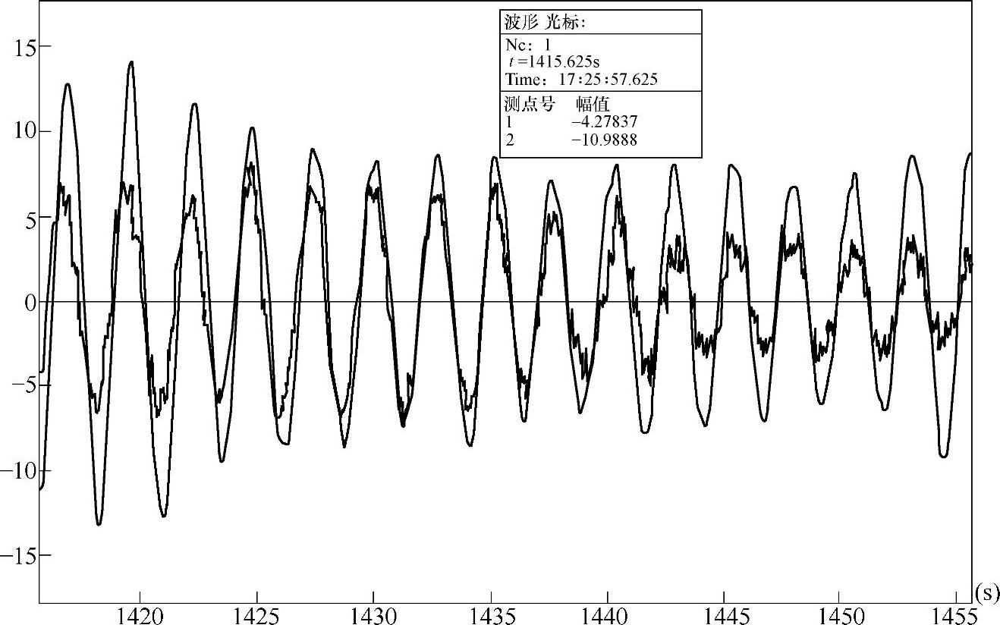

图9-30 塔架振动时域局部放大图

### 六、塔架的计算实例

本文以某S级1.5MW变速恒频风力发电机组塔架为例对塔架进行计算。原始数据如下：风密度ρ=1.225Kg/m³，机舱及风轮重心高度Z_(hub)=64.876m，机舱重心位置（相对于塔架底部中心）：X=-0.61m，Y=0.0366m，Z=64.876m。塔架高度Z_(t)=63.1m，顶部直径d₁=2.56m，底部直径d₂=4.26m，塔筒的投影面积A_(t)=215.17m²。取暴风时最大风速v_(e50)=50m/s，基本风压ω₀=0.55，风轮直径D=70.5m，叶片的投影面积207m²，机舱顺风向迎风面积修正系数K₁=0.91，机舱顺风向迎风面积S₁=12.17×K₁=11.07m²，机舱侧风向迎风面积修正系数K₂=0.95，机舱侧风向迎风面积S₂=28×K₂=26.6m²。

1.在暴风风速时塔筒载荷

塔筒为圆锥体，可近似看作一个剖面形状为圆的二维柱体，筒体绕流阻力系数C_(D)=0.7，载荷集中作用于塔筒高度中心。

2.暴风时机舱气动载荷计算

风为顺风向时，机舱可近似视为一个三维的立方体，阻力系数取C_(D)=1.0，作用点位置为机舱外形顺风向投影的形状的形心。

风为侧向流时，机舱可近似看作一个剖面形状为正方形的二维柱体，阻力系数取C_(D)=2.0，作用点位置（相对于塔架底部中心）：X=1.3m，Y=0，Z=64.876m。

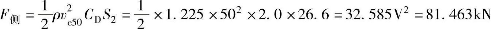

3.风轮产生的载荷

风力发电机正常工作时，切出风速ν_(out)=25m/s，则作用在风轮上的面载荷与风速、风的密度、风压高度变化系数、风载荷体型系数和风振系数有关。按《载荷规范》规定，垂直于结构表面上的风载荷标准值，应按下述公式计算

式中 ω_(k)——风载荷标准值，单位为kN/m²；

μ_(s)——风载荷体型系数；

μ_(z)——风压高度变化系数；

β_(z)——z高度处的风振系数；

C_(T)——推力系数，C_(T)=β_(z)μ_(s)μ_(z)；

ρ——为空气质点密度，单位为t/m³；

v——为风速，单位为m/s。

风能利用系数C_(p)在理论上的最大值为0.593，这个数值称为贝兹极限。传统风车的风能利用系数不到20％，低速风力机约30％，新式的高速风力机可达40％左右，目前最先进的风机的利用系数可达到0.45，风轮的迎风面积S=πD²/4，则作用在风轮上的风力标准值为

在暴风作用下，风轮已停止转动，此时作用在风轮上的风压力按1984年丹麦风电专家彼得森推荐的公式。其中推力系数取C_(T)=1.6，叶片的投影面积A_(b)，叶片数N_(b)取3，则

式中 C_(T)——推力系数，取1.6；

A_(b)——单个叶片的投影面积；

N_(b)——叶片数，一般为3；

γ_(s)——风载分项系数，取1.4；

v_(e50)——50年一遇最大风速；

ρ——叶轮中心处的空气密度。

4.风轮机舱自重

F_(r)=G₁+G₂=170×9.8=1666kN

5.塔架静力验算

F_(xr)=F_(S)+F_(顺)=955.9+16.95=972.85kN

塔架底部的水平剪力

F_(x)=F_(ts)+F_(顺)+F_(s)=230.635+16.95+955.9=1203.48kN

塔架底部的弯矩

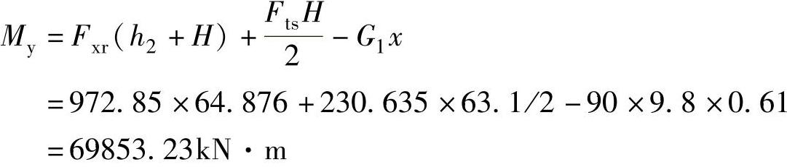

代入公式

塔架的材料为Q345钢材，采用的安全系数为1.1，则许用应力为282MPa。满足要求。塔架的最大位移为

塔架的许用挠度\[w\]控制在（0.5％～0.8％）H，最大位移为0.112m，满足要求。塔架的最大倾角为

塔架的许用挠度\[w\]控制在（0.5％～0.8％）H范围内，进行倾角换算后叶片的倾角范围为（0.24％～0.38％）H弧度，本例的最大转角限制为0.217rad，满足要求。

### 七、塔架的有限元分析

在完成塔架的设计以后，为了验证设计的可靠性、进一步优化结构设计，需要进行塔架的数值分析。这里介绍利用ANSYS有限元软件进行分析的方法和步骤。

1.塔架的静强度分析

建立有限元分析时，塔架需要进行简化处理：

1）不考虑塔架内部的附属结构等构件，可用等效质量代替。

2）在模型中建立法兰模型，但是不考虑法兰上的螺栓以及法兰之间的应力关系。

3）对于机舱、叶片和轮毂的模拟，可采用在塔架顶端创建一个质量单元节点，质量点的位置位于机舱、轮毂和叶片的重心上，质量为机舱、轮毂和叶片的质量并且对质量点三个方向X、Y、Z的转动惯量进行设置，转动惯量的大小为机舱轮毂和叶片的转动惯量在合重心位置。然后通过定义一个无质量刚性梁将质量单元节点与塔架顶部单元节点连接一起，这样可较好地考虑机舱轮毂和叶片质量及转动惯量对塔架模态的影响，塔架模型如图9-31所示。

4）单元的选择。塔筒选用Shell93，门洞选用solid95，无质量刚性梁选用MPC184，风轮和机舱选质量单元Mass21。

5）基础采用固结的方式。

分析在规定的载荷工况下的应力和变形，不超过规定的极限值。

2.塔架的固有频率

采用ANSYS有限元软件进行塔架的固有频率分析时，有限元建模过程与静力分析建模相似，考虑基础的对固有频率的影响时比不考虑基础的影响时要小，一般在5％以内。具体方法如下：

（1）建模

应注意模态分析只有线性行为是有效的，如果指定了非线性单元则应作线性处理。

（2）加载和求解

加载对于模态分析只有零位移约束是唯一有效地载荷。

指定分析类型：执行Main Menu｜Solutionl-Analysis Type-New Analysis，在对话框中选择分析类型为Modal。

模态分析设置：执行Main Menu｜Solutionl-Analysis Type-Analysis Options命令，在对话框中选择分析类型。在Number of modes to extact和Number of modes to expand输入所要提取的模态阶数和扩展模态。

求解：执行Main Menu｜Solution｜Current LS。

（3）扩展模态

执行Main Menu｜Solutionl｜Analysis Type｜ExpasionPass选择ExpasionPass。

执行Main Menu｜Solutionl｜Load step Opts｜ExpasionPass｜Single Expand｜ExpandModes，在对话框中输入扩展模态阶数。选择Calaculate elem results。

执行Main Menu｜Solutionl｜Load step Opts｜Output ctrls｜DB/Results Files，在对话框中选择Every substep。

执行执行Main Menu｜Solution｜Current LS。

（4）查看结果

执行Main Menu｜General Postproc｜Results Summary。

图9-31 塔架模型

3.塔架的抗震验算

抗震验算建议使用地震波瞬态动力分析，具体方法如下：

（1）建立地震波数据文件

按照需要需要分析的波的个数来建立文件个数，文件为（∗.txt）文件，注意文件的格式，可采用（e9.3，e11.3）的格式。第一列为时间，第二列为低着加速度。

（2）读入地震波数据

执行Utility｜Parameters｜Array Parameter｜Define｜Edit，单击“Add”按钮，令Par为文件名，Typ为Array，I，J，K=2，地震加速度个数，0。其他的地震波也按照同样方法输入。

执行Utility｜Parameters｜Array Parameters｜Read From File读取地震波文件，文件格式为（e9.3，e11.3）。

（3）设置分析类型

执行Main Menu｜Solution｜Analysis Type｜New Analysis，在对话框中选择分析类型为transient，在第二个瞬态分析对话框中选择求解方法。

（4）求解，求解按下面命令流

（5）查看结果

执行Main Menu｜TimeHistPostpro｜Variable Viewer，选择需要控制的变量。

4.稳定性分析

ANSYS提供了两种屈曲分析方法，即非线性屈曲分析和特征值屈曲分析方法。特征值屈曲分析是一般的弹性屈曲分析方法，非线性屈曲分析方法比特征值屈曲分析更加精确，但是相对于特征值分析来说费时和计算量大等缺点。特征值屈曲分析的具体方法如下。

1）建立模型。

2）加载获得静力解。对于载荷加载一般施加单位载荷，这样计算出来的特征值就是屈曲临界载荷，如果不这样施加的可以施加一个较大的值，那么临界载荷为施加载荷与特征值的乘积。

3）获得特征值屈曲解。指定分析的类型：执行Main Menu｜Solution｜Analysis Type｜New Analysis，在对话框中选择分析类型为Eigen Buckling。

指定分析的选项：执行Main Menu｜Solution｜Analysis Type｜Anslysis options，选择特征值的提取方法和提取的特征值个数。ANSYS提供了两种方法即Subspace法即子空间迭代法和Block Lanczos法即分块的索兰斯法。一般来说对于子空间迭代法精度高但速度慢，分块的索兰斯法精度低但是速度快。

定义载荷步数：执行Main Menu｜Solution｜Load step Opts｜Output Ctrls｜Solu Printout。

扩展模态执行Main Menu｜Solution｜Load step Opts｜Expansionpass｜Single Expandmodes，选择模态阶数。

4）求解。执行Main Menu｜Solution｜Solve｜Current LS。

5）查看结果。屈曲载荷系数执行Main Menu｜General Postproc｜Result Summary。

显示屈曲模态形状执行Main Menu｜General Postproc｜Plot Result｜Deformed Shape。

5.塔架的疲劳分析

塔架疲劳分析可采用简化疲劳验证法和循环载荷谱的损伤累计法。在ANSYS分析中常应用后者，具体分析方法如下：

1）建模；

2）加载求解；

3）疲劳计算。

输入S-N曲线：执行Main Menu｜General Postproc｜Fatigue｜S-N Table

在对话框中输入循环次数和应力值。

建立位置、事件和载荷：执行Utility Menu｜Parameters｜Scalar Parameters在对话框中输入节点位置。

执行Main Menu｜General Postproc｜Fatigue｜Stress Locations在对话框中输入位置编号和节点名称。

执行Main Menu｜General Postproc｜Fatigue｜Store Stresses｜From rst File在对话框中输入节点名称和事件编号以及位置编号。

执行Main Menu｜General Postproc｜Fatigue｜Store Stresses｜Specifiled Val在对话框中输入节点名称和时间编号和事件位置编号。

设置时间重复次数：执行Main Menu｜General Postproc｜Fatigue｜Assign Events在对话框中输入需要计算的事件个数、循环次数和事件名称。

疲劳计算：执行Main Menu｜General Postproc｜Fatigue｜Calculate Fatig

在计算完每种工况作用下疲劳寿命系数都小于1.0，说明塔架的危险点的疲劳强度满足要求。

## 第三节 基础设计

在我国，风力发电机组基础设计总体上经历了3个阶段。第一阶段为2003年以前，单机容量小，风力发电机组基础主要由国内业主或厂商委托勘测设计单位完成，设计的主要依据为建筑类的地基规范。第二阶段为2003～2007年，属于引进和消化阶段。国外MW级风力发电机组开始大规模进入我国，大部分基础设计都是按照厂商提出的参考图、国内设计院根据风电场地质勘探资料和国内建筑材料的具体情况进行设计调整、最后由国外厂商复核确认。2007年以后为第三阶段，属于MW机组基础的自主设计阶段。我国于2007年9月颁布了FD003—2007《风力发电机组地基基础设计规定》，并同期推出了配套的设计软件。

FD003—2007《风力发电机组地基基础设计规定》中考虑了方形扩展基础，方形承台桩基础，和岩石锚杆基础。除了方形基础外，常用的还有圆形、八边形扩展基础以及圆形、八边形承台桩基础。选用时应根据建设场地地基条件和风力发电机组上部结构对基础的要求确定，必要时需进行试算或技术经济比较。当地基土为软弱土层或高压缩性土层时，宜优先采用桩基础。对塔架基础而言，圆形扩展基础与方形扩展基础的混凝土工程量要十分接近，所以本节主要阐述应用较多的方形扩展基础的设计。

### 一、风力发电机组基础的设计内容与要求

1.风力发电机组基础的设计级别

根据风力发电机组的单机容量、轮毂高度和地基复杂程度，地基基础分为三个设计级别，设计时应根据具体情况，按表9-8选用。

表9-8 地基基础设计级别

注：1.地基基础设计级别按表中指标划分分属不同级别时，按最高级别确定。

2.对1级地基基础，地基条件较好时，经论证基础设计级别可降低一级。

风力发电机组地基基础设计应符合下列规定：

1）所有风力发电机组地基基础，均应满足承载力、变形和稳定性的要求。

2）1级、2级风力发电机组地基基础，均应进行地基变形计算。

3）3级风力发电机组地基基础，一般可不作变形验算，如有下列情况之一时，仍应验算：

①地基承载力特征值小于130kPa或压缩模量小于8MPa；

②软土等特殊性的岩土。

2.基础的埋深

基础的埋深度对机组的安全运行，施工进度和工程造价等均有很大的影响，设计时应按下列因素确定基础埋置深度：

1）基础的形式；

2）作用在基础上的载荷大小和性质；

3）地层结构和地下水埋深；

4）地基土冻胀和融陷的影响；

5）基础的埋置深度应满足地基承载力、变形和稳定性要求。

3.风力发电机组地基基础设计内容

设计时应进行下列计算和验算：

1）地基承载力计算；

2）地基受力层范围内有软弱下卧层时应验算其承载力；

3）基础的抗滑稳定、抗倾覆稳定等计算；

4）基础沉降和倾斜变形计算；

5）基础的裂缝宽度验算，必要时对地基基础的动态刚度进行验算；

6）基础（桩）内力、配筋和材料强度验算；

7）有关基础安全的其他计算，如基础动态刚度和抗浮稳定等；

8）采用桩基础时，其计算和验算除应符合FD003—2007外，还应符合GB 50010和JGJ94等的规定。

9）抗震设防烈度为9度及以上，或参考风速超过50m/s（相当于50年一遇极端风速超过70m/s）的风电场，其地基基础设计应进行专门研究。

### 二、基础设计载荷

1.基础载荷

根据GB 50223《建筑工程抗震设防分类标准》的有关规定，风力发电机组地基基础的抗震设防分类定为丙类，应能抵御对应于基本烈度的地震作用，抗震设防的地震动参数按GB 18306《中国地震动参数区划图》确定。

作用在风力发电机组地基基础上的载荷按随时间的变异可分为三类：

1）永久载荷，如上部结构传来的竖向力F_(zk)、基础自重G₁、回填土重G₂等。

2）可变载荷，如上部结构传来的水平力F_(xk)和F_(yk)、水平力矩M_(xk)和M_(yk)、扭矩M_(zk)，多遇地震作用F_(e1)等。当基础处于潮水位以下时应考虑浪压力对基础的作用。

3）偶然载荷，如罕遇地震作用F_(e2)等。

上部结构传至塔筒底部与基础环交界面的载荷效应宜用载荷标准值表示，为正常运行载荷、极端载荷和疲劳载荷三类。正常运行载荷为风力发电机组正常运行时的最不利载荷效应；极端载荷为GB 18451.1中除运输安装外的其他设计载荷状况（DLC）中的最不利载荷效应；疲劳载荷为GB 18451.1中需进行疲劳分析的所有设计载荷状况（DLC）中对疲劳最不利的载荷效应。对于有地震设防要求的地区，上部结构传至塔筒底部与基础环交界面的载荷还应包括风力发电机组正常运行时分别遭遇该地区多遇地震作用和罕遇地震作用的地震惯性力载荷。

地基基础设计时应将同一工况两个水平方向的力和力矩分别合成为水平合力F_(rk)、水平合力矩M_(rk)，并按单向偏心计算。

2.载荷工况与载荷效应组合

地基基础设计的载荷应根据极端载荷工况、正常运行载荷工况、多遇地震工况、罕遇地震工况和疲劳强度验算工况等进行设计。极端载荷工况为上部结构传来的极端载荷效应加上基础所承受的其他有关载荷；正常运行载荷工况为上部结构传来的正常运行载荷效应加上基础所承受的其他有关载荷；多遇地震工况为上部结构传来的正常运行载荷效应叠加多遇地震作用加上基础所承受的其他有关载荷；罕遇地震工况为上部结构传来的正常运行载荷效应叠加罕遇地震作用加上基础所承受的其他有关载荷；疲劳强度验算工况为上部结构传来的疲劳载荷效应加上基础所承受的其他有关载荷。

在进行承载能力极限状态计算时，应采用载荷效应基本组合：

1）计算基础（桩）内力、确定配筋和验算材料强度时，载荷效应应采用基本组合，上部结构传至塔筒底部与基础环交界面的载荷设计值由载荷标准值乘以相应的载荷分项系数。

2）基础抗倾覆和抗滑稳定的载荷效应应采用基本组合，但其分项系数均为1.0，且上部结构传至塔筒底部与基础环交界面的载荷标准值应采用经载荷修正安全系数（k₀=1.35）修正后的载荷修正标准值。

在进行正常使用极限状态计算时，应采用载荷效应标准组合：

1）按地基承载力确定扩展基础底面积及埋深或按单桩承载力确定桩基础桩数时，载荷效应应采用标准组合，且上部结构传至塔筒底部与基础环交界面的载荷标准值应采用经载荷修正安全系数（k₀=1.35）修正后的载荷修正标准值。扩展基础的地基承载力采用特征值，且可按基础有效埋深和基础实际受压区域宽度进行修正。桩基础单桩承载力采用特征值，并按JGJ 94确定。

2）验算地基变形、基础裂缝宽度和基础疲劳强度时，载荷效应应采用标准组合，上部结构传至塔筒底部与基础环交界面的载荷直接采用载荷标准值。

另外，多遇地震工况地基承载力验算时，载荷效应应采用标准组合；截面抗震验算时，载荷效应应采用基本组合。罕遇地震工况下，抗滑稳定和抗倾覆稳定验算的载荷效应应采用偶然组合。

总结地基基础设计内容、载荷效应组合、载荷工况和主要载荷的选取，可按表9-9采用。

表9-9 地基基础设计内容、载荷效应组合、载荷工况和主要载荷

注：∗多遇地震工况需考虑多遇地震作用；

∗∗仅当多遇地震工况为基础设计的控制载荷工况时才进行该项验算。

3.分项系数

载荷分项系数可按表9-10选用：

1）基础结构安全等级为一级、二级的结构重要性系数分别为1.1和1.0。

2）对于基本组合，载荷效应对结构不利时，永久载荷分项系数为1.2，可变载荷分项系数不小于1.5；载荷效应对结构有利时，永久载荷分项系数为1.0，可变载荷分项系数为0。疲劳载荷和偶然载荷分项系数为1.0。地震作用分项系数按GB 50011规定选取。

3）对于标准组合和偶然组合，载荷分项系数均为1.0。

材料分项系数：混凝土和钢筋的材料性能分项系数分别采用1.4和1.1。承载力抗震调整系数等未规定的其他材料性能分项系数，按所引用的规范采用。验算裂缝宽度时，混凝土抗拉强度和钢筋弹性模量等材料特性指标应采用标准值。

表9-10 主要载荷的分项系数

注：“/”—“载荷效应对结构不利/载荷效应对结构有利”；F_(H)—水平方向惯性力；F_(V)—竖向惯性力。

### 三、扩展基础设计

1.扩展基础的设计步骤

对于扩展基础，设计步骤可分为三大步：

1）根据风力发电机组单机容量、轮毂高度、扫掠面积、风速、载荷大小和地基情况，参考类似经验，初步拟定基础埋深、底板尺寸和高度等。《设计规定》在一般构造要求中也提出了相应的要求。

2）根据《设计规定》和风力发电机组承受的载荷等相关资料，分别计算基础基底反力、基础沉降和倾斜率、基础整体稳定性、基底脱开面积等，分别复核地基承载力是否满足要求、沉降和倾斜率是否满足规范和厂商要求、整体稳定性和基底脱开面积比是否满足规范要求。如果4个条件同时满足要求，则说明拟定的基础底板尺寸合适，可进行下一步计算；如果4个条件不能同时满足要求，则需回到第一步，调整基础外形尺寸。

3）初选钢筋直径，进行截面抗弯计算，抗剪、抗冲切和疲劳强度验算，如果同时满足要求，则底板高度的拟定合适，否则，回到第一步，调整包括底板高度在内的外形尺寸，直至满足第二步和第三步的有关要求。

外形尺寸确定后，根据裂缝宽度验算结果、构造要求等确定配筋布置；如果设有台柱，还需对台柱进行配筋计算和强度验算；对穿越法兰筒和基础环底部的局部配筋进行验算。然后，计算基础的混凝土用量和钢筋用量。

2.地基承载力计算

（1）地基承载力特征值

岩石地基承载力特征值不进行深宽修正。对土质地基来说，当扩展基础宽度大于3m或埋置深度大于0.5m时，需要对特征值进行修正。可由载荷试验或其他原位测试、经验值等方法确定的地基承载力特征值，也可按式（9-45）修正：

f_(a)=f_(ak)+η_(b)γ_(s)（b-3）+η_(d)γ_(m)（h_(m)-0.5） （9-45）

式中 f_(a)——修正后土体的地基承载力特征值，单位为kPa；

f_(ak)——地基承载力特征值，可由载荷试验或其他原位测试、公式计算及结合实践经验等方法综合确定，单位为kPa；

η_(b)、η_(d)——扩展基础宽度和埋深的地基承载力修正系数，按表9-11确定；

γ_(s)——扩展基础底面以下土的重度，地下水位以下取浮重度，单位为kN/m³；

b_(s)——扩展基础底面力矩作用方向受压宽度，当底面受压宽度大于6m时按6m取值；

γ_(m)——扩展基础底面以上土的加权平均重度，地下水位以下取浮重度，单位为kN/m³；

h_(m)——扩展基础埋置深度，单位为m。

表9-11 承载力修正系数表

注：1.全风化岩石可参照所风化成的相应土类取值，其他状态下的岩石不修正。

2.地基承载力特征值按深层平板载荷试验确定时，η_(d)取0，深层平板载荷试验按GB 50007执行。

图9-32 基底面未脱开地基的基底压力示意图

采用上述方法确定地基承载力特征值，在一般地基土和载荷条件下，不仅能保证地基强度，也易于控制地基沉降量。

（2）地基土压力计算

地基土压力是指基础传递给地基持力层顶面处的压力。地基压力是分布力，它取决于地基与底板的相刚度，载荷大小，基础埋深和土的性质等多种因素。塔架基础底板，无论是刚性底板还是柔性的，其刚度均大大超过地基土的刚度，实际工程中，一般把基础看做绝对刚体，地基压力分布简化为线性进行计算。

1）当扩展基础承受轴心载荷和或者在核心区内（e≤b/6）承受偏心载荷，基底面未脱开地基时（见图9-32），扩展基础底面的压力可按式（9-46）～式（9-49）计算：

①矩（方）形扩展基础承受轴心载荷时：

式中 p_(k)——载荷效应标准组合下，扩展基础底面处平均压力，单位为kPa；

N_(k)——载荷效应标准组合下，上部结构传至扩展基础顶面竖向力修正标准值，N_(k)=k₀F_(zk)，单位为kN；

k₀——考虑风力发电机组载荷不确定性和载荷模型偏差等因素的载荷修正安全系数，取1.35；

G_(k)——载荷效应标准组合下，扩展基础自重和扩展基础上覆土重标准值，单位为kN；

A——扩展基础底面积，A=bl，单位为m²；

b、l——基底面宽度、长度，单位为m。

②矩（方）形扩展基础在核心区（e≤b/6）内，承受偏心载荷作用时：

式中 M_(k)——载荷效应标准组合下，上部结构传至扩展基础顶面力矩合力修正标准值，M_(k)=k₀M_(r)k，单位为kN·m；

H_(k)——载荷效应标准组合下，上部结构传至扩展基础顶面水平合力修正标准值，H_(k)=k₀F_(r)k，单位为kN；

p_(kmin)——载荷效应标准组合下，扩展基础底面边缘最小压力值，单位为kPa；

e——合力作用点的偏心距，单位为m；

h_(d)——基础环顶标高至基础底面的高度，单位为m。

2）当扩展基础在核心区（e＞b/6）以外承受偏心载荷，且基底脱开基土面积不大于全部面积的1/4，矩（方）形扩展基础单独承受偏心载荷（图9-33）时，基础底面压力可按下列公式计算：

式中 a——合力作用点至扩展基础底面最大压力边缘的距离，按（b/2）-e或（l/2）-e计算。

图9-33 基底面部分脱开地基的基底压力示意图

（3）地基承载力验算

地基土抗压计算应符合下列要求：

1）当承受轴心载荷时，应满足式（9-52）的要求：

p_(k)≤f_(a) （9-52）

式中 p_(k)——载荷效应标准组合下，扩展基础底面处平均压力，单位为kPa；

f_(a)——修正后地基承载力特征值，单位为kPa。

2）当承受偏心载荷时，除应满足式（9-52）的要求外，尚应满足式（9-53）的要求：

p_(kmax)≤1.2f_(a) （9-53）

式中 p_(kmax)——载荷效应标准组合下，扩展基础底面边缘最大压力值，单位为kPa。

3）当地基受力层范围内有软弱下卧层时，扩展基础宜按式（9-54）和式（9-55）验算软弱下卧层的承载力：

式中 p_(z)——载荷效应标准组合下，软弱下卧层顶面处附加压力，单位为kPa；

p_(cz)——软弱下卧层顶面处土自重压力，单位为kN；

f_(az)——软弱下卧层顶面处经深度等修正后的地基承载力特征值，单位为kPa；

p_(c)——扩展基础底面处土的自重压力，单位为kN；

z——扩展基础底面至软弱下卧层顶面的距离，单位为m；

θ——地基压力扩散线与垂直线的夹角，按表9-12采用。

表9-12 地基压力扩散角θ

注：1.E_(s1)为上层土压缩模量；E_(s2)为下层土压缩模量；

2.z/b＜0.25时取θ=0°，必要时宜由试验确定；z/b＞0.50时θ值不变。

3.地基变形计算

对于塔架基础，不仅承受竖向载荷，其横向载荷也很大。因此，基础变形应同时验算沉降值和倾斜率，保证其计算值不应大于地基变形允许值，见表9-13。

表9-13 地基变形允许值

倾斜率系指基础倾斜方向实际受压区域两边缘的沉降差与其距离的比值，按下式计算：

式中 S₁、S₂——基础倾斜方向实际受压区域两边缘的最终沉降值；

b_(s)——基础倾斜方向实际受压区域的宽度。

1）地基最终沉降量计算

计算地基沉降时，地基内的应力分布，可采用各向同性均质线性变形体理论假定。其最终沉降值可按式（9-56）计算：

式中 s——地基最终沉降值；

s′——按分层总和法计算出的地基沉降值；

n——地基沉降计算深度范围内所划分的土层数（见图9-34）；

φ_(s)——沉降计算经验系数，根据地区

沉降观测资料及经验确定，无地区经验时可采用表9-14的数值；

p_(0k)——载荷效应标准组合下，扩展基础底面处的附加压力，根据基底实际受压面积（A_(s)=b_(s)l）计算；

E_(si)——扩展基础底面下第i层土的压缩模量，应取土自重压力至土的自重压力与附加压力之和的压力段计算；

z_(i)、z_(i-1)——扩展基础底面至第i、i-1层土底面的距离；

扩展基础底面计算点至第i、i-1层土底面范围内平均附加应力系数。

图9-34 扩展基础沉降计算的分层示意图

表9-14 沉降计算经验系数φ_(s)

2）地基沉降计算深度z_(n)

作用于地基土的附加压力随深度的增加而减少，土的压缩量一般也随深度的增加而降低。当到某一深度时土的压缩量就小到可以忽略不计的程度，这个深度称为地基沉降计算深度z_(n)。z_(n)的计算可按沉降比确定。当考虑相邻载荷影响，某深度处符合下列条件时，该深度即为该压缩层的计算深度z_(n)（见图9-48）应符合式（9-58）要求：

式中 ΔS′_(i)——计算深度z_(n)范围内，第i层土的计算沉降值；

ΔS′_(n)——由计算深度向上取厚度为Δz的土层计算沉降值，Δz按表9-15确定。

表9-15 由计算深度z_(n)处向上取厚度Δz值

4.稳定性计算

扩展基础的稳定性应根据工程地质和水文地质条件进行抗滑、抗倾覆计算。抗滑稳定计算应根据地质条件分别进行沿基深层结构面的稳定计算。

（1）罕遇地震工况下的稳定计算

1）抗滑稳定最危险滑动面上的抗滑力与滑动力应满足式（9-59）要求：

式中 F′_(R)——载荷效应偶然组合下的抗滑力；

F′_(S)——载荷效应偶然组合下，滑动力修正值。

2）沿基础底面的抗倾覆稳定计算，其最危险计算工况应满足式（9-60）要求：

式中 M′_(R)——载荷效应偶然组合下的抗倾力矩；

M′_(S)——载荷效应偶然组合下，倾覆力矩修正值。

（2）非罕遇工况下的稳定性计算

1）抗滑稳定最危险滑动面上的抗滑动面上的抗滑力与滑动力应满足式（9-61）要求：

式中 F_(R)——载荷效应基本组合下的抗滑力；

F_(S)——载荷效应基本组合下，滑动力修正值。

2）沿基础底面的抗倾覆稳定计算，其最危险计算工况应满足式（9-62）要求：

式中 M_(R)——载荷效应基本组合下的抗倾力矩；

M_(S)——载荷效应基本组合下，倾覆力矩修正值。

5.抗冲切强度验算

风力发电机组基础是刚性基础，其抗剪强度一般均能满足要求，只需要进行抗冲切强度验算。如果基础的高度不够时，将会沿着塔架边缘或者台柱边缘大致成45°角的斜面发生冲切破坏，如图9-35所示。为保证不发生冲切破坏，必须使冲切力小于冲切面处混凝土的抗冲切强度。因此，基础环与基础交接处以及基础台柱边缘的受冲切承载力应符合下列规定：

式中 F_(l)——载荷效应基本组合下，作用在A_(l)上的地基净反力设计值，单位为kN；

A_(l)——中切验算时取用的部分基底面积（图9-35中的阴影面积ABCDEF），单位为m²；

p_(j)——扣除基础自重及其上土重后相应于载荷效应基本组合时的地基土单位面积净反力，对偏心受压基础可取基础边缘处最大地基土单位面积净反力，单位为kN；

β_(hp)——受冲切承载力截面高度影响系数，当h₀＜800mm时，取1.0；当h₀≥2000mm时，取0.9，其间按线性内插法取用；

f_(t)——混凝土轴心抗拉强度设计值，单位为kPa；

h₀——基础冲切破坏锥体的有效高度，单位为m；

a_(m)——冲切破坏锥体最不利一侧计算长度，单位为m；

a_(t)——受冲切破坏锥体最不利一侧斜截面的上边长，当计算基础环与基础交接处的受冲切承载力时，取基础环直径，当计算基础台柱边缘处的受冲切承载力时，取台柱宽，单位为m；

a_(b)——受冲切破坏锥体最不利一侧斜截面在基础

底面积范围内的下边长，当受冲切破坏锥体的底面落在基础底面以内，计算基础环与基础交接处的受冲切承载力时，取基础环直径加两倍基础有效高度，当计算基础台柱边缘受冲切承载力时，取台柱宽加两倍该处有效高度，单位为m。

图9-35 计算阶形基础的受冲切承载力截面位置

1—冲切破坏锥体最不利一侧的斜截面 2—冲切破坏锥体的底面线

6.基础底板配筋

基础底板的配筋应遵照GB 50010—2010《混凝土结构设计规范》按受弯构件进行计算，如图9-36所示。

（1）正截面承载力计算

1）在轴心载荷或单向偏心载荷作用下，对于方形基础，当台阶的宽高比小于或等于2.5（a₁/h）和偏心矩小于或等于1/6基础宽度时（见图9-36a），任意截面的底板受弯可按简化式（9-66）计算：

式中 M₁——载荷效应基本组合下，任意截面Ⅰ-Ⅰ处的弯矩设计值，单位为kN·m；

p_(max)——载荷效应基本组合下，基础底面边缘最大地基反力设计值，单位为kN；

p——载荷效应基本组合下，在任意截面Ⅰ-Ⅰ处基础底面地基反力设计值，单位为kN；

G——考虑载荷分项系数的基础自重及其上覆的土自重，单位为kN；

a_(I)——任意截面Ⅰ-Ⅰ至基底边缘最大反力处的距离，单位为m；

A——抗弯计算时的投影基底面积，单位为m²；

l——基础底面的边长，单位为m。

2）在单向偏心载荷作用下，对于方形基础，当台阶的宽高比小于或等于2.5（a₁/h）和偏心距大于1/6基础宽度时（见图9-36b），变高截面处的弯矩可按简化公式（9-67）

图9-36 矩形基础底板的计算示意图

a）偏心距小于或等于1/6基础宽度时 b）偏心距大于1/6基础宽度时

计算：

在求出板底弯矩的基础上，按混凝土结构设计规范进行正截面承载力计算和纵筋配置。

（2）斜截面受剪承载力

基础应按不配置箍筋和弯起钢筋的厚板受弯构件，验算斜截面受剪承载力。斜截面受剪承载力应按式（9-68）计算：

式中 V——载荷效应基本组合下，构件斜截面上最大剪力设计值，单位为kN；

β_(h)——受剪截面高度影响系数：当h₀＜800mm时，取h₀=800mm；当h₀＞2000mm时，取h₀=2000mm；

f_(t)——混凝土轴心抗拉强度设计值，单位为kPa；

h₀——截面的有效高度，单位为m；

b——矩形截面的宽度，单位为m。

（3）最大裂缝宽度验算

基础应按所处环境类别和设计工况确定相应的裂缝控制要求及最大裂缝宽度限值：

1）二类和三类环境中，基础混凝土裂缝宽度应满足下列规定：正常运行载荷工况：最大裂缝宽度不得超过0.2mm。极端载荷工况：最大裂缝宽度不得超过0.3mm。

2）四类和五类环境中的基础混凝土，其裂缝控制要求应符合专门标准的有关规定。

对于矩形截面的钢筋混凝土基础，按载荷效应的标准组合并考虑长期作用影响，其最大裂缝宽度w_(max)按下列公式计算

式中 α_(cr)——构件受力特征系数，取1.9；

——裂缝间钢筋应变不均匀系数；计算中，当ψ＜0.2时，取ψ=0.2；当ψ＞1.0时，取ψ=1.0。对直接承受重复载荷的构件，取ψ=1.0；

σ_(sk)——按载荷标准组合计算的构件纵向受拉钢筋应力，；

M_(k)——按载荷标准组合计算的弯矩值；

c——最外层纵向受力钢筋外边缘至受拉区底边的距离，单位为mm，当c＜20mm时，取c=20mm；当c＞65mm时，取c=65mm；

ρ_(te)——按有效受拉混凝土截面面积计算的纵向受拉钢筋配筋率，ρ_(te)=A_(s)/A_(te)。当ρ_(te)＜0.01时，取ρ_(te)=0.01；

A_(s)——纵向受拉钢筋截面面积；

A_(te)——有效受拉混凝土截面面积。对受弯构件，取腹板截面面积的一半，即

A_(te)=0.5bh；

d_(eq)——纵向受拉钢筋的等效直径，单位为mm；

d_(i)——第i种纵向受拉钢筋的直径，单位为mm；

n_(i)——第i种纵向受拉钢筋的根数；

υ_(i)——第i种纵向受拉钢筋的相对粘结特性系数，对带肋钢筋，取1.0；对光面钢筋，取0.7。

### 四、海上风力发电机组的基础

1.海上风力发电机组基础的分类与特点

海上风电场的基础结构型式可分为重力式基础、单桩基础、多桩基础、吸力式基础等。基础的结构选型，需从基础结构特点、适用自然条件、海上施工技术与经验以及经济性方面进行比较。目前，世界上的近海风力发电机组大都采用重力式基础或单桩基础，也有采用多桩基础的，如江苏如东风电场的38台风机中有17台风机采用单桩基础形式，21台采用多桩导管架基础形式。

（1）重力式基础

重力式基础按材料分有混凝土制和钢制的，如图9-37所示。混凝土重力式基础依靠其自身巨大的重量来固定组机。这种基础造价低、安装简便、稳定性好，适合所有海床状况。缺点是需要进行海底准备，受冲刷影响较大，仅适用于浅水区域。钢制重力式基础像混凝土重力式基础一样，也是依靠自身重量固定风力发电机组的，但钢制基础重量较轻，可在基座固定之后，向其内部填充重矿石以增加重量。钢制基础易于安装及运输，但抗腐蚀性较差，需要长期保护。

（2）单桩基础

单桩基础目前已经成为安装海上风力发电机组的“半标准”方法，在Horns Rev、Samsϕ、Utgrunden、Arklow Bank、Scroby Sands及Kentish Flats风电场中有着广泛地应用，如图9-38a所示。目前单桩基础的直径一般为3～5m，适用于浅水及20～25m的中等水深水域。单桩基础的优点是安装简便，利用打桩或喷孔的方法将桩基安装在海底泥面以下一定深度，通过调整片或护套来补偿打桩过程中的微小倾斜，以保证基础的平正。缺点是移动困难，如果安装地点的海床是岩石，还要增加钻孔的费用。

（3）多桩基础

这种基础是由三根或多根单桩组成多支架模式构成的，如图9-38b、c所示，适用于水深30m以上的水域。与单桩基础相比，它更坚固，应用范围广泛，但成本较高，移动性差，并且像单桩基础一样，不太适合软海床。

图9-37 重力式基础

a）混凝土重力式基础 b）钢制重力式基础

图9-38 桩基础

a）单桩基础 b）三脚架基础 c）多桩基础

海上风机组基础与陆上机组基础相比，具有如下特征：

1）海上风机处于海洋环境中，承受波浪、潮流作用，具有海洋结构工程特性；

2）塔架高达几十米，其基础具有高耸结构基础的结构特性；

3）风力发电机组工作时动力学问题突出，其基础具有动力设备基础的结构特性。因此海上机组基础具有海洋工程、高耸结构基础、动力基础等结构特性。

2.基础设计载荷

设计基准期按50年考虑。波浪、水位按50年一遇考虑。建筑物等级按Ⅱ级考虑。设计高水位按高潮累积频率10％的潮位；设计低水位按低潮累积频率90％的潮位；极端高水位按重现期为50年的极值高潮位；极端低水位按重现期为50年的极值低潮位。基础顶高程应从设计水位、设计波高、结构受到的波浪力综合考虑，一般情况下，基础上方塔架与基础结合面，不受海水浸泡和波浪打击但顶面高程过高，不方便维护人员的上下。所以基础顶高程宜为：设计高水位+波浪超高+富裕高度，波浪超高可取50年一遇1％波浪的超高。

（1）设计载荷

永久载荷为结构自重，包括基础自重，上部机组自重。可变载荷包括风载荷、波浪和水流载荷。风载荷包括作用在塔架及风轮上的风载荷。波浪、水流载荷中，波浪力的波浪按重现期为50年，累计频率为1％的波高考虑。水流作用在桩基础、重力式圆形基础上可取垂线平均流速，作用在群桩基础上方墩台取表面流速，可参考《海港水文规范》JTJ213—98。

偶然载荷包括漂流物撞击力、船舶事故撞击、地震载荷。

1）漂流物撞击力：《公路桥涵设计通用规范》JTG D60—2004基于动量公式给出了船只和漂流物的撞击力估算公式：

式中 W——漂流物重量或船舶排水量，单位为kN；

v——水流速度，单位为m/s；

T——撞击持续时间，单位为s，应根据实际资料估计，在无实际资料时可取1s。

2）船舶事故撞击：船舶撞击力的计算目前国内外发展了很多经验公式其中比较常用的经验公式除式（9-71）外，还有《美国路桥规范（AASHTO 1994）》给出的船舶撞击力计算公式：

式中 P_(s)——船舶撞击力，单位为N；

v——船舶撞击速度，单位为m/s；

W_(b)——船舶载重量，单位为ton。

3）地震载荷：海上风力发电机组属于水运工程，在进行抗震计算时应遵守以下原则：

①水运工程建筑物抗震设计属于偶然状况，仅应进行抗震稳定和承载力等承载能力极限状态验算，不应进行正常使用极限状态验算。

②计算地震作用时，建筑物的重力载荷代表值应取结构和构配件自重标准值和各可变载荷组合值之和。

③水平向地震系数K_(H)，设计反应谱应根据场地类别和结构自振周期按《水运工程抗震设计规范》计算。

④海上风电结构建筑物水平向地震作用，应根据建筑物的形式，分别对纵、横两个方向或其中一个方向进行验算。

⑤海上风电结构建筑物的竖向惯性力，可按相应的水平地震惯性力算法，以竖向地震系数K_(V)代替水平向地震系数K_(H)进行计算，K_(V)取2/3K_(H)。对于重力式建筑物，当设计抗震烈度为8度、9度时，需同时计入水平向和竖向地震惯性力。此时竖向地震惯性力应乘以0.5的组合系数。

⑥当建筑物位于海啸易发区时，应考虑海啸对建筑物的作用，可按建筑物所在海域水深所能发生的最大海浪计算。

按照以上原则，当构筑物按多质点体系计算地震作用时，沿构筑物高度质点i的第j振型水平向的地震惯性力P_(ij)应当按下式计算：

P_(ij)=CK_(H)r_(j)φ_(ij)β_(j)W_(i) （9-73）

式中 C——综合影响系数，取0.35～0.5；

K_(H)——平向地震系数；

φ_(ij)——j振型在质点i处的相对水平位移，单位为m；

β_(j)——j振型在自振周期为T_(i)时的相应的动力放大系数；

W_(i)——堆聚在质点i的重量，单位为ton。

r_(j)——结构振型参与系数，按（9-74）式计算：

作用在重力墩式建筑物上总的动水压力，可以按《水运工程抗震设计规范》计算。

（2）载荷组合

1）结构承载能力极限状态，分别按持久组合、短暂组合、偶然组合考虑承载能力极限状态

①持久组合

S_(d)≤R_(d) （9-75）

式中 S_(d)——作用效应设计值R_(d)为结构抗力设计值。

式中 γ₀——结构构件的重要性系数，与安全等级对应，对安全等级为一级或设计使用年限为100年级以上的结构构件不应小于1.1；对安全等级为二级或设计使用年限为50年的结构构件不应小于1.0；对安全等级为三级或设计使用年限为5年的结构构件不应小于0.9；在抗震设计中，不考虑结构构件的重要性系数；

γ_(G)——永久载荷的分项系数，取1.25，当永久载荷对结构有利时，取1.0；

γ_(Qi)——第i个可变载荷分项系数，风载荷、水流力、波浪力、冰载荷等均取1.35；

C_(G)，C_(Q)1，C_(Qi)——永久载荷及可变载荷的作用效应系数；

G_(k)，Q_(1k)，Q_(ik)——永久载荷及可变载荷的标准值；

ψ——可变载荷Q_(ik)的组合值系数，按《港口工程载荷规范》JTS 144-1—2010有关规定，可取0.7；

n——参与组合的可变载荷数。

表9-16 可变载荷分项系数

（续）

注：1.除有关规范另作规定外，作用分项系数均按本表采用；

2.当两上可变作用完全相关时，其非主导可变作用应按主导可变作用考虑；

3.当永久荷载产生的作用效应对结构有利时，分项系数的取值不大于1.0；

4.结构自重、固定设备重力、土重等为主时，分项系数应增大为不小于1.3。

载荷组合为：恒载+风载荷+波浪、水流力。组合系数：考虑风与波浪、水流载荷同时发生，取1.0

②短暂组合

式中 可变载荷分项系数比持久组合时小0.1。

载荷组合为：永久载荷+施工载荷

③偶然组合

永久作用标准值效应与可变作用某种代表值效应、一种偶然作用标准值效应相组合：恒载+地震载荷+水流力；恒载+漂流物撞击+水流力。

式中 R——结构构件承载力设计值；

S——结构构件作用效应设计值；

γ_(RE)——抗震调整系数。

2）正常使用极限状态

对正常使用极限状态，分别按持久状况短期效应（频遇）组合，持久状况长期效应（准永久）组合，短暂状况来考虑：

①持久状况的短期效应（频遇）组合：

载荷组合为：永久载荷、风载荷、波浪、水流力

②持久状况的长期效应（准永久）组合：

载荷组合为：永久载荷、风载荷、波浪、水流力

③短暂状况

短暂状况需要考虑正常使用极限状态时的施工载荷

载荷组合为：永久载荷、施工载荷

目前，海上风力发电机组基础设计可参考国内外相关规范，有《风电机组地基基础设计规定》（FD 003—2007）、《海港水文规范》（JT J214—98）、《建筑桩基技术规程》（JGJ94—94）、《Design of off shore wind turbine structures》（DNV-OS-J101：2004）、《海上固定平台规划、设计和推荐作法工作应力设计法》（SY/T 10030—2004）和《海上钢结构疲劳强度分析推荐作法》（SY/T 10049—2004）等。根据风机设备商提供的基础载荷、基础设计要求分别进行承载极限状态、疲劳极限状态和系统模态计算。

