# 10 控制系统

本章重点介绍风力发电机组控制系统的设计，包括制动机构、变桨距系统、偏航系统、主控系统和安全保障系统等。

## 第一节 控制系统概述

### 一、控制系统的组成

风力发电机组的控制系统是一个综合性系统。尤其是对于并网运行的风力发电机组，控制系统不仅要监视电网、风况和机组运行数据，对机组进行并网与脱网控制，以确保运行过程的安全性和可靠性，还需要根据风速和风向的变化对机组进行优化控制，以提高机组的运行效率和发电质量。这正是风力发电机组控制中的关键技术，现代风力发电机组一般都采用微机控制，图10-1所示为一个大型风力发电机组控制系统的总体结构。

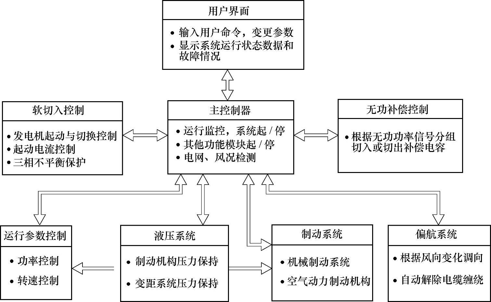

图10-1 控制系统的总体结构

### 二、控制系统基本功能

控制系统基本功能包括基本运行控制、输出功率控制、运行状态监测、故障检测/记录/处理、与中央控制室远程通信和安全保护控制。

1）风力发电机组的基本运行控制：包括待机、起动、并网、脱网、关机、偏航对风、解缆、制动、升/降温、除湿、液压泵起/停、复位、照明等；

2）风力发电机组的输出功率控制：包括变桨距和变速。通过变速实现最大转差运行、最佳叶尖速比运行、恒转速运行；通过变桨距/变速实现恒功率运行；

3）风力发电机组的运行状态监测：包括各子系统的状态、电量参数、部件关键部位的温度、环境/气象参数等；

4）风力发电机组的故障检测/记录/处理：包括及时发现故障、储存规定数量的近期故障并以规定的方式报警；

5）风力发电机组的安全保护控制：包括紧急安全链保护、软件的安全保护和防雷击/接地保护等；

6）风力发电机组应具有与中央控制室上位计算机的远程通信功能，以便中央控制室上位计算机监控机组运行状态、进行参数显示、远程控制、数据存储等。

### 三、控制系统设计要求

控制系统设计的基本要求主要有：

1）控制系统应能从风力发电机组配备的所有传感器获取信息；

2）控制系统通过输入的运行管理程序，对风力发电机组进行控制使其有效、安全地运行，尽可能避免故障，降低机组所承受的应力水平，使机组运行最佳化；

3）控制系统应设计成在规定的所有外部条件下都能使风力发电机组的运行参数保持在正常范围内；

4）控制系统应能检测风力发电机组运行故障（如超速、超功率、过热等），并进而采取适当的措施；

5）控制系统应能起动两套制动系统，当安全保护系统开启制动时，运行控制应自行降至服从地位。

## 第二节 制动系统

本节讨论风力发电机组整机制动系统的设计问题。包括空气动力制动和机械制动。

### 一、风力发电机组关机过程的规划

制动系统用于风力发电机组的关机。在制动系统设计之初，首先应对关机过程进行规划。作为例子，一种1.5MW的变桨距变速风力发电机组的典型关机过程见表10-1。

表10-1 风力发电机组的典型关机过程

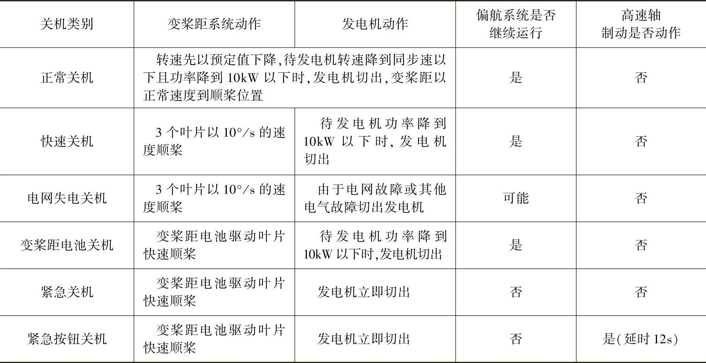

在表10-1的关机类型中，多数情况下以空气动力制动为主，而机械制动的介入，是为了使风轮固定不动。

### 二、风力发电机组关机过程的运动方程

风力发电机组关机过程的运动方程如式（10-1）所示。

式中 M_(W)——折算到机械制动轴上的空气动力矩，单位为N·m；

M_(M)——机械制动力矩，单位为N·m；

M_(E)——折算到机械制动轴上的发电机电磁力矩，单位为N·m；

J——折算到机械制动轴上的等效转动惯量，单位为kg·m²；

ω——机械制动轴转动角速度，单位为rad/s。

式（10-1）中，规定制动力矩为负，驱动力矩为正。实现制动的必要条件为式（10-1）等号左边力矩之和为负值。机械制动力矩M_(M)在投入机械制动后期作用，发电机电磁力矩M_(E)在发电机脱网前起作用。此外，由于摩擦力矩相对较小，并且为制动力矩，故未列在式（10-1）之中。下面对力矩的求法分别加以讨论。

1.空气动力矩

在关机过程中，风力机所受的空气动力矩是时变的。开桨时空气动力矩为正，顺桨时空气动力矩为负。在关机时，随着桨距角的增加，空气动力矩很快由驱动力矩变为制动力矩。

作用在风轮上的空气动力矩可以由式（2-61）求出。

如果是低速轴制动，则

M_(W)=M （10-2a）

如果是高速轴制动，空气动力矩折算到高速轴上有

式中 Ω——风轮转动的角速度，单位为rad/s。

在额定功率下，风轮以额定转速旋转时，作用在风轮上的空气动力矩（N·m）为

式中 P_(N)——额定功率，单位为W；

Ω_(N)——风轮额定旋转角速度，单位为rad/s。

式（10-3）可以给出制动的初始条件。

2.机械制动力矩

M_(M)=-2μ_(f)F_(b)R₀n₀ （10-4）

式中 μ_(f)——摩擦系数，设计计算中一般取μ_(f)=0.4；

F_(b)——制动器单侧闸体对制动盘的压紧力，单位为N；

R₀——制动力臂，单位为m；

n₀——制动器数。

式（10-4）中的制动器单侧闸体对制动盘的压紧力

F_(b)=p_(h)A₀ （10-5）

式中 p_(h)——液压系统工作压力，单位为Pa；

A₀——制动活塞有效作用面积，单位为m²。

式（10-4）中的负号表示制动转矩。

3.发电机电磁力矩

发电机不同，在关机过程中，电磁力矩的变化也不同。对于双馈发电系统，无论转差率是正还是负，发电机电磁力矩都可以是制动力矩。双馈发电机电磁转矩为

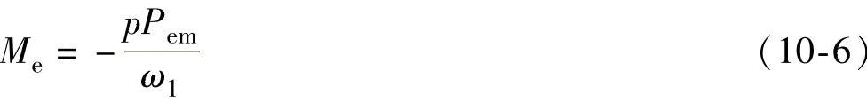

式中 p——电机极对数；

ω₁——同步角速度（电角度），单位为rad/s；

P_(em)——双馈发电机的电磁功率，单位为W，且有

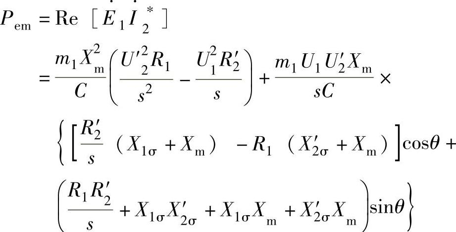

式中 m₁——电机定子相数；

U₁——定子相电压，单位为V；

U′₂——转子电压折算值，单位为V；

s——转差率；

R₁——定子绕组的电阻，单位为Ω；

X₁σ——定子绕组的漏抗，单位为Ω；

R′₂——折算到定子侧的转子每相电阻，单位为Ω；

X′₂σ——折算到定子侧的转子每相漏抗，单位为Ω；

X_(m)——励磁回路电抗，单位为Ω；

θ——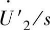与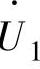相差的电角度，单位为rad/s；且有C=A²+B²

其中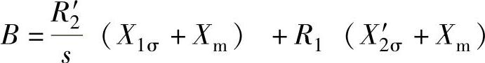。

如果是低速轴制动，空气动力矩折算到低速轴上有

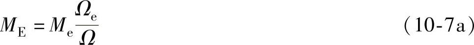

式中 Ω_(e)——发电机转子旋转角速度，单位为rad/s。

如果是高速轴制动，则有

M_(E)=M_(e) （10-7b）

在式（10-1）中，折算到机械制动轴上的等效转动惯量

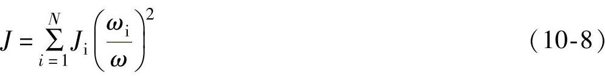

式中 J_(i)——第i个转动体转动惯量，单位为kg·m²；

ω_(i)——第i个转动体旋转角速度，单位为rad/s。

将式（10-2）、（10-4）、（10-7）代入式（10-1），积分可得

式中 ω_(a)——机械制动轴初始旋转角速度，单位为rad/s。

式（10-9）所示的系统是时变的，可以用数值积分的方法求解。

应该指出，式（10-9）为风力发电机组关机过程的一般运动方程，应用时还要考虑具体的机组关机类型。对于兆瓦级风电机组，按表10-1关机类型，在顺桨进行空气动力制动之前，通常不进行强制地机械制动关机，以免损坏齿轮等重要零件，除非发生飞车等严重事故。因此，式（10-9）左端机械制动力矩一项通常只在紧急关机中或机组即将完全停机时涉及。

### 三、空气动力制动的设计

空气动力制动的可靠性与风力发电机组的安全直接相关，所以要注重空气动力制动的可靠性。

1.定桨距机组

定桨距机组空气动力制动主要由叶尖扰流器来实现（见图10-2）。叶尖扰流器一般由液压系统控制。叶尖扰流器的设计目标是扰流段的长度，作用在叶尖扰流器上的力矩可以由叶素-动量定理求出，运动方程服从式（10-1）。为了机组的安全，需要在液压系统中设置“突开阀”，在液压系统发生故障，风轮超过临界转速时，突开阀动作，叶尖扰流器弹开。

2.变桨距机组

变桨距机组空气动力制动主要由顺桨来实现。

在液压控制的统一变桨距系统中，液压系统的设计应该考虑到，即使控制动作失效，叶片也应该在空气动力的作用下自动顺桨，起到保护作用。

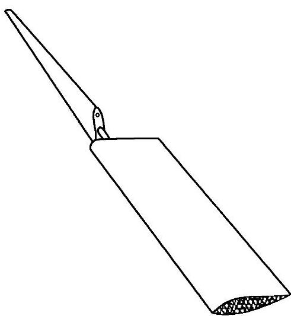

图10-2 叶尖扰流器制动位置

在液压控制的独立变桨距系统中，每个叶片都应具有自动顺桨功能。并且，如果有的叶片变桨距出现故障，只要有一个叶片正常顺桨，就可以避免事故发生。

在电气控制的独立变桨距系统中，出了顺桨的冗余设计外，还要有备用的变桨距蓄电池，以便紧急需要时应用。变桨距系统的设计详见本章第三节。

图10-3 机械制动器构造示意图

### 四、机械制动的设计

对于大型的风力发电机组，机械制动多置于高速轴。原因是高速轴制动要求的制动力矩相对较低。图10-3为机械制动器构造示意图。

设计机械制动机构应考虑如下因素：

（1）离心应力的限制 当采用高速轴制动时，制动盘高速旋转，离心应力应受到限制。应根据材料的不同，进行离心应力校核。有资料表明，用球墨铸铁制造的制动盘安全轮缘速度大约为90m/s。

（2）摩擦速度的限制 一般用单位面积上的能量耗散率Q来限制摩擦速度，相当于摩擦学中的pv值限制。应根据摩擦面材料的不同，进行校核。有标准提出，对于树脂基摩擦片

Q=μ_(f)pv≤11.6MW/m² （10-10）

式中 μ_(f)——摩擦系数；

p——摩擦片上的压强，单位为kN/m²；

v——摩擦速度，单位为m/s。

（3）摩擦片温升的限制 树脂基材料的摩擦片常常选择300℃为温度上限；铜基粉末冶金材料的摩擦片耐热温度为400～600℃。

（4）制动盘温升限制 制动过程中，热量主要流向制动盘。制动盘的温升应该受到限制。否则，会造成摩擦片的损坏以及液压油温的超限。例如：球墨铸铁制造的制动盘温度不应高于600℃。制动盘上各点的温升与制动时间和该点到制动器的距离有关，微分方程如下：

式中 θ——制动盘温度，单位为℃；

t——制动时间，单位为s；

κ——导热率，单位为W/（m·K）；

ρ——密度，单位为kg/m³；

c_(t)——比热容，单位为J/（kg·K）；

x——微元到制动器的距离，单位为m。

方程（10-11）可以用数值积分法求解。

制动盘温升Δθ（℃）可以由经验公式（10-12）进行估算。

式中 E——总的能量消耗，单位为J；

D——制动盘直径，单位为m；

b——摩擦片宽度，单位为m；

T₀——制动总时间，单位为s。

## 第三节 变桨距系统

### 一、变桨距系统功能与构成

变桨距是指安装在轮毂上的叶片绕自身轴线旋转的过程。

变桨距系统用于调节风轮从风中捕获的能量大小。这一过程通过调节叶片翼型上合成气流方向与翼型几何弦的夹角（攻角）来改变风力发电机组获得的空气动力转矩。机组的变桨距系统主要完成以下功能：

1）空气动力制动，保证机组在风速过高或遇到故障时能够安全关机；

2）在各工况下调节风轮捕获的风能大小，保证机组安全、稳定运行；

3）通过机组变桨距控制抑制风轮、塔筒的振动，减小机组的动态载荷；

4）机组起动控制，当风速高于起动风速时，使叶片桨距角变化到预定角度，使叶片转速逐步上升。

变桨距系统一般安装在风力发电机组的轮毂内，由于轮毂形式、变桨驱动类型及变桨距系统的设计差异，其组成和布局在不同的风电机组有明显的不同。按照驱动形式的不同变桨距系统可以分为电动变桨距系统和液压变桨距系统，本节内容均按照目前使用较多的电动变桨距系统讲述，液压变桨距系统将在最后部分介绍。

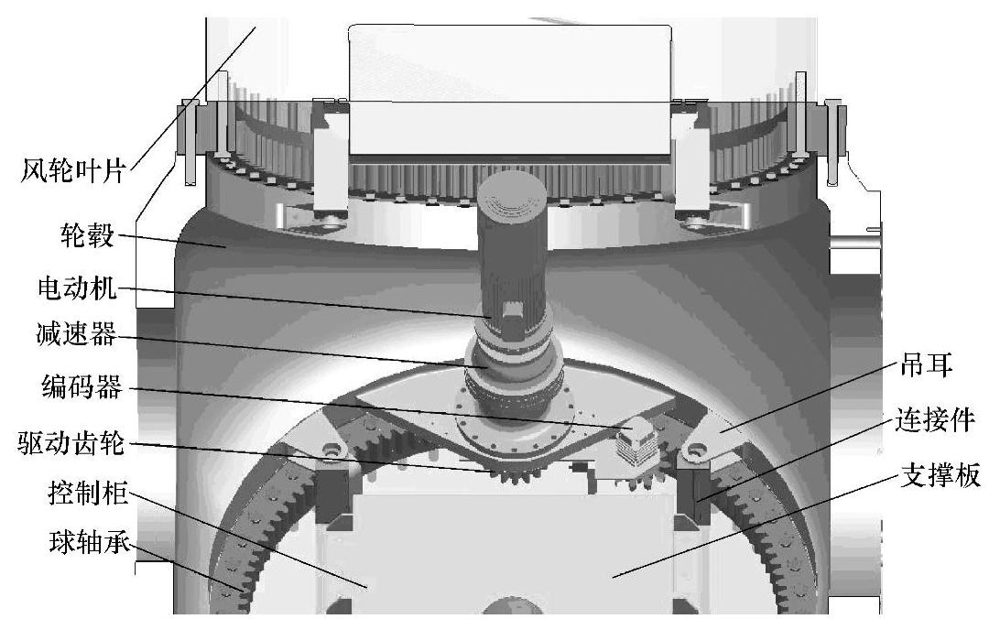

图10-4 变桨距系统的组成

图10-4所示为风轮叶片独立电动变桨距机构的组成，该机构主要由电动机、减速器、驱动齿轮、变桨距球轴承（其内环带内齿圈）、吊耳、连接件、支撑板、控制柜、编码器及蓄电池等构成。变桨距球轴承的内环或外环通过螺纹连接件分别与风轮叶片根部端面或轮毂的凸台相连，同轴的电动机和减速器插入轮毂的支撑件的孔中，通过螺纹连接件固定在该支撑件上，同时在减速器的输出轴端装配驱动齿轮，使其与变桨距球轴承的内齿圈啮合，从而实现调节风轮叶片的桨距角。

变桨距系统设计一般方案如下：

1）每个叶片配备一个独立的驱动装置，变桨距系统在风轮功率调节之外，还作为机组的第一安全制动使用，这一功能涉及机组的安全，所以其可靠性尤为重要。为了提高变桨距系统在安全保护时的可靠性，一般三个叶片配备相互独立的伺服系统控制变桨距电机。

2）为了提高机组可靠性，防止因传感器故障时发生意外，一般在变桨距电动机配备编码器的同时每个叶片配备冗余的位置传感器。

3）要求电池至少能满足一次顺桨过程。电网故障时的关机需要在电池供电的情况下完成桨距角的调节。

4）变桨距系统的设计需要满足风电机组在总装、运输、吊装及调试、运行过程中各种功能的需要。例如，需要考虑在风电机组吊装时需要旋转叶片的需求。

变桨距系统设计主要包括以下内容：

1）变桨距系统驱动力矩计算；

2）变桨距轴承设计与计算；

3）变桨距驱动装置设计与位置控制，包括减速机设计、变桨距电机选型和变桨距控制设计；

4）后备电源设计。

### 二、变桨距系统驱动力矩计算

风力发电机组变桨距过程的运动方程如式（10-13）所示。

式中 M_(D)——驱动力矩，单位为N·m；

M_(W)——旋转轴上的空气动力矩，单位为N·m；

M_(G)——旋转轴上的重力矩，单位为N·m；

M_(R)——旋转轴上的摩擦力矩，单位为N·m；

J_(C)——叶片对旋转轴的转动惯量，单位为kg·m²；

ω_(C)——变桨距角速度，单位为rad/s。

式（10-13）中，规定驱动力矩方向为正，制动力矩为负。实现变桨距的必要条件为式（10-13）等号左边力矩之和为正值。下面对力矩的求法分别加以讨论。

1.空气动力矩

在变桨距过程中，空气动力矩的方向是变化的。一般说来，开桨时空气动力矩为制动力矩，顺桨时空气动力矩为驱动力矩（见图10-5）。

图10-5 变桨距时的空气动力矩

作用在风轮上的空气动力矩

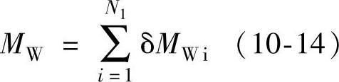

式中 N₁——叶片上分段总数；

δM_(Wi)——展向长度为δr的叶素上产生的空气动力矩，单位为N·m；且有

δM_(Wi)=L_(W)δR （10-15）

式中 L_(W)——空气动力力臂，单位为m；

δR——微元空气动力合力，单位为N，且有：

式（10-16）中各参数见本书第二章第一节，空气动力矩求法另见式（4-15）和式（4-16）

2.重力矩

重力矩也是时变的。它与叶片的位置有关，叶片位于竖直向上或向下位置时，重力矩为零。叶片位于水平位置时，重力矩绝对值最大。重力矩

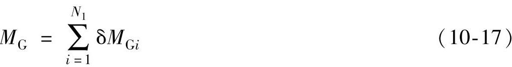

式中 N₁——叶片上分段总数；

δM_(Gi)——展向长度为δr的叶素上产生的重力矩，单位为N·m；且有

δM_(Gi)=L_(Gi)δf_(Gi)

式中 L_(Gi)——重力力臂，单位为m；

δf_(Gi)——微元重力，单位为N。

3.摩擦力矩

摩擦力矩总是制动力矩。摩擦力矩可以分为两部分，一部分为黏性摩擦力矩，它与变桨距转速有关。另一部分为库仑摩擦力矩，它与变桨距转速无关。即

M_(R)=-（Bω_(C)+M_(KL)） （10-18）

式中 B——黏性摩擦系数，单位为（N·m）s；

M_(KL)——库仑摩擦力矩，单位为N·m。

具体参数可由生产厂商提供。

由式10-13可得，变桨距系统驱动力矩为

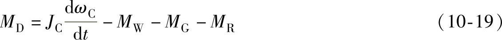

### 三、变桨距轴承的设计与计算

变桨距回转支承的主要功能是能够使叶片旋转，提供控制系统中所要求的不同桨距角；同时能够承受来自叶片的复杂载荷。图10-6所示为变桨距轴承及其安装形式。

在选择变桨距轴承时，主要根据《Guidelinefor the Certification of Wind Turbines Edition 2005》的要求进行设计。

1.变桨距轴承的计算原则与方法

1）轴承尺寸设计的静承载能力和额定寿命要达到最优化。

2）其中静承载能力为极限载荷。

图10-6 变桨距轴承安装形式

3）计算轴承的基本额定寿命应使用当量动载荷，提供载荷谱时，轴承的当量动载荷应为平均当量动载荷。平均当量动载荷P_(m)由式（10-20）计算。

式中 P_(m)——平均当量动载荷；

P_(d)——由设计载荷确定的轴承当量动载荷；

p——寿命指数，对滚子轴承ε=10/3，对球轴承ε=3；

n_(i)——P_(i)作用下的循环次数；

N——总循环次数。

4）变桨距轴承静承载能力f_(s)是指轴承的额定静载荷C₀和当量静载荷P₀的比值，即f_(s)=C₀/P₀；应不小于1.1。

5）变桨距轴承最大点接触应力最小安全系数γ_(m)=1.1。

6）计算轴承基本额定寿命和修正额定寿命可使用简化分析，失效率定为10％。寿命修正系数a_(DIN)应不大于3.8。如果修正系数小于1，则不能使用简化分析。计算得出的修正额定寿命应不小于130000h。

7）计算轴承修正额定寿命时，还需确定下列参数：

①轴承温度；

②润滑油添加剂和黏度；

③保持润滑油质量的措施（润滑油更换时间间隔、润滑油检查等）。

8）为方便数据处理，可按Miner准则对载荷谱进行简化折算，但简化后的载荷等级数不得少于10个，载荷谱折算时所用的寿命指数应与修正额定寿命计算时所用的相同。

9）变载荷下的修正额定寿命，应在载荷分布中的每个载荷等级对应的时间段分别按DIN ISO 281修订4计算轴承综合修正额定寿命。轴承综合修正额定寿命按下式计算

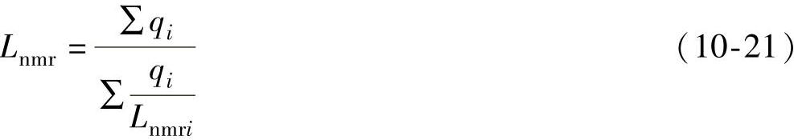

式中 L_(nmr)——轴承综合修正额定寿命，单位为h；

q_(i)——第i载荷等级上的时间份额；

L_(nmri)——第i载荷等级上的轴承修正额定寿命，单位为h。

10）计算轴承额定寿命时，除载荷之外，还要考虑以下影响：

①轴承的内部形貌；

②轴承的工作游隙；

③轴和轴承的变形；

④滚子之间的载荷分布；

⑤沿滚子长度方向的载荷分布，考虑滚子和滚道实际修形量；

⑥实际工作条件下的润滑油黏度和洁净度。

11）计算的轴承综合修正额定寿命应不小于175000小时或不小于风力发电机组的使用寿命。

12）进行轴承额定寿命计算时，若设有滤油系统，则润滑油洁净度按ISO 4406—1999取-/17/14级；若无滤油系统，则应假定润滑油洁净度为-/21/18级。

2.轴承齿轮负载能力计算

1）齿轮的轮齿强度分析依据ISO 6336进行分析；

2）疲劳负载的负载能力的计算根据ISO TR 10495标准来执行。使用Miner法则，并采用表10-2中的安全系数，计算出的疲劳累积损伤率D应满足D≤1。

表10-2 疲劳强度分析的安全系数

3）也可根据载荷/时间分布确定当量载荷（见DIN3990第六章方法三），采用表10-2中的安全系数进行疲劳分析。

4）进行抗齿根断裂、抗齿面点蚀的静强度分析，安全系数按表10-3选取。

表10-3 静态强度分析的安全系数

5）根据ISO TR 10495的要求，要考虑齿轮的交变负荷。

6）叶片轴承的齿轮只是非常小的一部分工作，变桨距系统最大的工作范围一般是90°，疲劳是按照整圆齿轮进行计算的，由此负载的循环周期需要至少乘以因数4。

至于变桨距轴承的具体设计计算方法，可参照本书第八章相关内容。

### 四、电动变桨距驱动机构设计

1.电动变桨距驱动机构方案设计

电动变桨距是用电动机作为变桨距动力，通过伺服驱动器控制电动机驱动叶片进行变桨距。一般情况下，机组运行过程中功率调节桨距角的变化范围为0～30°，机组停机时需要将桨距角调整为90°。

电动变桨距驱动机构包括驱动电机、减速箱，如图10-7所示。主要零部件都安装在轮毂内，并跟随轮毂旋转。变桨距电动机带动减速机的输出轴小齿轮旋转，而且小齿轮与变桨距轴承的内圈（变桨距轴承带内齿）啮合，从而带动变桨距轴承的内圈与叶片一起旋转，实现改变桨距角的目的。由于不断变换方向的重力及离心力等载荷的作用，因此变桨距系统零部件需要更好的强度和可靠性。

2.变桨距驱动机构选型

变桨距电动机采用伺服电动机，实现变桨距角度的精确控制，根据极限工况下的载荷以及一定的安全系数，选用变桨距电动机额定功率。变桨距电动机带电磁制动，以实现叶片在不同桨距角下的制动，制动力矩参考变桨距力矩计算得出。

电动变桨距系统中，可以选择直流电动机或交流电动机。直流方案与交流方案在机械结构上无太大差别，只是所采用的变桨距电机有所不同。前者起动力矩大、低速特性好但电刷维护困难、电机体积较大（在出现问题时不易更换），后者结构简单、维护工作量小，但存在一旦变桨距驱动器全部失效无法进行紧急顺桨的风险。不过，随着矢量控制技术的不断成熟，交流系统的动态控制问题已经得到明显改善，其性能已经达到甚至超越直流系统，而且由于海上风力发电机组的变桨距系统采用“失效—安全”技术，即只要有一个叶片的变桨距驱动器正常工作即可完成整个机组的紧急顺桨动作，使风轮完全制动，而三个变桨距驱动器全部失效的可能性又微乎其微，因此对于更看重可靠性和免维护性的海上风力发电机组来说，选择交流变桨距系统更为合理。下面简述电动变桨距驱动机构设计计算。

（1）驱动功率计算

驱动功率（W）为驱动力矩和变桨距角速度的乘积，并考虑到安全余量。即：

P_(D)=M_(D)γ_(f)ω_(C) （10-22）

式中 γ_(f)——载荷安全系数，典型值为1.35。

（2）电动机的选择

电动机额定功率（W）

P_(N)≥P_(D)/η₃ （10-23）

式中 η₃——传动系统总效率，一般为0.95左右。

（3）确定变桨距轴承上齿轮副传动比

变桨距轴承上齿轮副传动比

图10-7 变桨距驱动机构

i_(G)=ω₁/ω_(C) （10-24）

式中 ω₁——小齿轮转动角速度，单位为rad/s。

通常根据叶片和轮毂的连接尺寸确定齿轮副的传动比，并进行极限强度和疲劳强度的校核。小齿轮所需的最大驱动力矩（N·m）

M₁=P_(N)η₄/ω₁ （10-25）

式中 η₄——减速箱传动效率，一般为0.98左右。

小齿轮所需的最大驱动力矩可以作为设计小齿轮轴的依据。

（4）减速箱基本参数的计算

减速箱传动比

i_(D)=ω_(M)/ω₁ （10-26）

式中 ω_(M)——电动机转子转动角速度，单位为rad/s。

减速箱的额定功率不小于P_(M)。

【例10-1】 设M_(D)=4×10⁴ N·m，最大开桨速度为5°/s，设计电力驱动机构。

解：1）驱动功率计算：变桨距角速度

由式（10-22），驱动功率

P_(D)=M_(D)γ_(f)ω_(C)=4×10⁴×1.35×0.0872=4709（W）

2）计算电动机额定功率

P_(M)≥P_(D)/η₃=4709/0.95=4957（W）

3）确定变桨距轴承上齿轮副传动比 根据叶片和轮毂的连接尺寸以及极限强度和疲劳强度的校核结果，选大齿轮齿数为135，小齿轮齿数为16，由式（10-24）变桨距轴承上齿轮副传动比

i_(G)=ω₁/ω_(C)=135/16=8.44

4）减速箱传动比 设电动机公称转速为1000r/min，则电动机转动角速度为

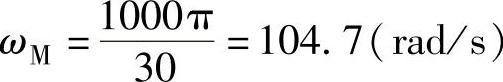

小齿轮转动角速度为

ω₁=ω_(C)i_(G)=0.0872×8.44=0.736（rad/s）

减速箱传动比

i_(D)=ω_(M)/ω₁=104.7/0.736=142.3

3.变桨距减速机设计校核

可以根据GL规范中的要求，对减速机选型及校核主要确定载荷并依据载荷对齿轮、轴及连接件等进行静强度和疲劳校核。

### 五、电动变桨距位置控制

变桨距系统需要参照风力发电机组主控系统给定的信号精确地控制叶片的桨距角（叶片的相对位置）。每个叶片独立的位置控制系统能提高了变桨距系统的安全性和准确性。

1.变桨距位置控制系统的构成

变桨距位置控制系统包括变频器、控制器（或置于变频器内部）、变桨距电机、编码器和冗余叶片位置传感器。在叶片受到强大外部载荷的情况下，通过实时的叶片桨距角反馈和变桨距电动机转速控制组成了闭环控制系统，其结构图如图10-8所示。

图10-8 电动变桨距位置控制机构

（1）角度测量

PID（比例积分微分）控制回路需要输入在叶片上测量出的当前角度信号（见图10-8）。这可以从两个来源获得，或者从角度传感器，或者基于译码器脉冲的计算。使用基于角度的译码器可获得一个高精度相关角度，这个选择可通过键盘来设定，但是如果转换器/译码器或齿轮失效，这个选择将被驳回。

为了降低角度转换器的噪声，角度转换器的信号可以经过滤波器，滤波器可根据需要开启和关闭，它的强度适合范围是0～99％，非常重要的一点是滤波器仅仅应用于稳定时期，当叶片的角度改变时，滤波器不起任何作用，过滤器对PID控制回路也不起作用，PID的参数和过滤器可以独立的进行调整。

（2）限位开关

确切范围取决于每种风力机对MDS控制器的压力校准和极限开关的机械定位。当叶片达到它的使用范围时，机械限制开关将被起动。这可确保不会发生俯仰角超出限度。限位开关的布局位置如图10-9所示，安装效果如图10-10所示。

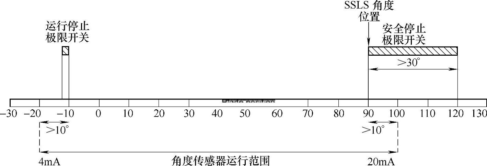

图10-9 限位开关位置示意图

2.通信设计

在变桨距系统运行过程中，变桨距控制器、变频器之间需要实时通信以交换控制信息、实时状态等数据。变桨距系统的通信设计是变桨距系统设计的重要部分。

变桨距控制器以通信方式从风力发电机组主控制器获得控制信号，并和所有的变桨距驱动变频器实时交换数据，以保证变桨距系统及时准确地跟踪主控的变桨距信号，一旦某一个变桨距变频器发现通信中断（规定的时间内不能正确收到数据包），将立即使叶片向安全位置（约90°）移动，这将有效地使风轮停止下来。与此同时变桨距系统控制器将系统置于安全模式，通知所有其他变桨距变频器使各叶片向安全位置移动。

图10-10 限位开关安装效果图

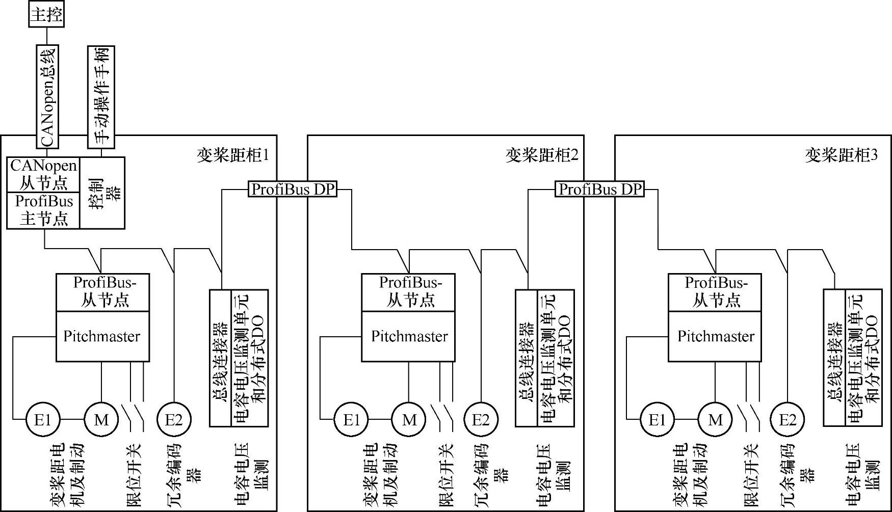

图10-11 电动变桨距系统通信结构

（1）变桨距控制器和主控通信

变桨距系统的通信接口，主要用于实现与主控系统的通信，接口一般采用CANopen或者ProfiBus现场总线方式。下面以CANopen总线为例说明变桨距控制器通信接口机线缆的要求。

1）通信物理接口要求

①通信信号线应采用屏蔽双绞铜缆，插接头应带屏蔽外壳，通信线两端屏蔽层应连接到外壳并接地。

②在总线的两个末端应接120Ω末端电阻，阻止信号反射。

③通信接口应考虑集电环运动对通信可靠性的影响并进行必要的测试，同时设计时对每根通信线应采用滑环双线接入，构成冗余。

④CANopen物理线路采用RS-485，通信线应包括CANH、CANL、GND，总线长度与波特率设置应满足表10-4的规定，其他要求应满足ISO 11898—2003的规定。

表10-4 通信线长与波特率要求

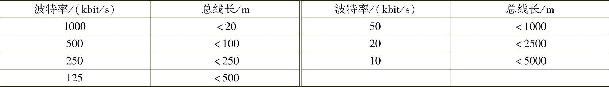

2）与主控系统交互信息要求：

①主控发送至变桨距：叶片的角度设定值或叶片的调节速度；

②主控系统的控制命令，包括心跳、故障复位、模式设定等；

③变桨距反馈回主控的信息，包括3个叶片的当前角度值，3个叶片冗余传感器的当前角度值，3个叶片的当前调节速度，3个叶片的当前调节加速度，3个电动机的转矩/电流，电动机的温度，所有柜体的温度及轮毂温度，系统状态信息。

（2）变桨距控制器和变桨距驱动变频器通信

为了提高安全性，在变桨距系统中变桨距控制器和变桨距驱动变频器的通信采用独立的总线进行，在该总线上可以包括变桨距控制器、三个变桨距驱动变频器，每个设备分配不同的站点号。通信回路可以实时读取变桨距驱动变频器的运行状态数据并给定控制目标，当故障发生时还可以去读变频器的故障信息。具体通信内容根据不同的驱动变频器差异较大。

3.各操作模式下的控制

一般变桨距系统有手动模式、自动模式和安全停止模式。手动模式主要为机组和变桨距系统调试设置，叶片位置、变桨距电动机速度和方向通过人机交互装置手动确定。在自动模式下，变桨距系统根据主控系统给定的目标控制变桨距电动机来调节叶片位置。

（1）手动模式

在人工模式下，变桨距控制器的速度和位置控制目标来自键盘和服务终端，在手动模式下不会进入安全速度模式。如果已处在安全速度，当转变为人工模式时它将停止。任何错误都可使电动机停止在安全状态下。

（2）自动模式

在自动模式下，Pitch Master有两种方法控制MDS控制器，在“Fieldbus Broadcast Posi-tion”模式下，MDS控制器使用设置点向所有节点发出信号，在“Fieldbus Individual Posi-tion”模式下，MDS控制器只向某一节点发出信号。

（3）安全模式

在人工模式下当叶片转动到安全停止的位置，MDS控制器将停止在安全模式下。在人工模式下，当有错误时MDS控制器将会转到安全模式。在安全停止状态下电动机经常停止。当所有错误都重新设置后才可继续运行。然而，在进入运行状态时，需要约200ms的时间来检查是否有错误。如果此时发现错误，MDS控制器将继续处在安全停止模式。

4.PID控制器

在变桨距系统中，桨距角一般根据主控系统给的控制目标采用PID控制器进行闭环控制。PID控制器的输入为桨距角的误差，桨距角误差可以通过来自主控的控制目标和测量所得的当前桨距角计算得到。PID控制器的输出为变桨距电动机的转速。控制器的结构如图10-12所示。

图10-12 变桨距位置PID控制器结构图

PID控制器运行中（无论自动还是手动），在叶片到达期望位置之后，机械制动起动，电动机停止。变桨距控制器持续监测桨距角目标值和实测桨距角误差，通过角度误差和误差时间来确定制动动作。在设定值变化没有超过设定的角度公差时，电动机制动始终保持抱闸状态。当上述任意条件不满足时，电动机制动立即松闸并启动位置控制。

在安全模式时，由于制动故障可能会导致电动机或齿轮锁死，并造成电动机过热。为了防止损坏电动机，变桨距控制器会暂停安全停止模式并停止电动机，避免变桨距电动机损坏，等到电动机温度低于设定值时再重起电机，驱动叶片至安全停机位置。

### 六、后备电源设计

变桨距系统作为保证机组安全的关键零部件，当故障发生时，必须能够在任何情况下将叶片置于安全位置。当电网故障时，需要后备电源为驱动系统供电，以完成顺桨的过程。后备电源的可靠性十分重要，特别考虑到雷击及可能存在的故障，为了使三个叶片变桨距驱动机构能够独立的做到失效安全，必须为每个叶片配备独立的后备电源及供电回路。

变桨距系统中通常每个叶片独立组成一个后备电源柜。由于安装在轮毂内，维护和更换的成本很高，后备电源应该尽可能地选择长寿命和免维护的能量存储装置，一般采用铅酸胶体电池或超级电容。图10-13为变桨距系统的电池柜。相比之下超级电容充电时间短、寿命长、可靠性高，但价格昂贵、存储能量有限，应用范围有限。以下部分的后备电源设计以铅酸电池为例。

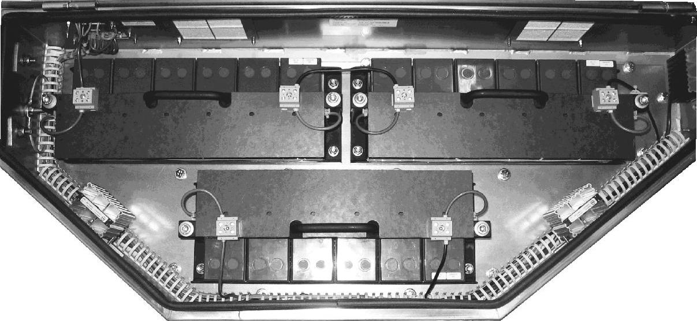

图10-13 变桨距系统电池柜

1.后备电源容量确定

采用铅酸电池，电池容量一般能保证5次以上顺桨动作，考虑到成本，采用超级电容时后备电源容量会小很多，一般只能满足1～2次顺桨动作。顺桨时间的计算按公式：

紧急顺桨时间（s）=90°/紧急顺桨速度（°/s）

2.电池充电

参考电池的充电要求，选择合适的充电电流使充电时间尽量减小，通常充电时间在6～10h。

电动变桨距系统一般具备电池充电及监控的充电控制装置，能够按要求控制要求对电池进行充电，在线监测电池及充电器故障，当出现故障时，能够停止充电，保护电池。

充电一般采用三个电池柜共用充电机轮循方式。充电机（见图10-14）的主要功能是为蓄电池充电并为变桨距系统提供直流电源。

3.电池监控要求

电池的状态监测内容有：过、欠电压、过温、充放电回路完好状态、充电器状态（过温、输出短路、过载、输入电压异常）、单元电池的故障或电压不平衡、电池的容量等。

### 七、液压变桨距系统设计

液压变桨距又称电液伺服变桨距，变桨距系统由液压泵为动力源，液压油为介质，伺服阀/比例阀为控制元件，由推杆和连杆组成的机械机构将液压缸活塞杆的径向运动转变为叶片的圆周运动来实现叶片的变桨距。液压变桨距的结构和布局如图10-15所示。

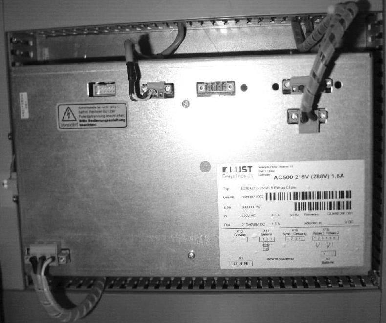

图10-14 电池充电机

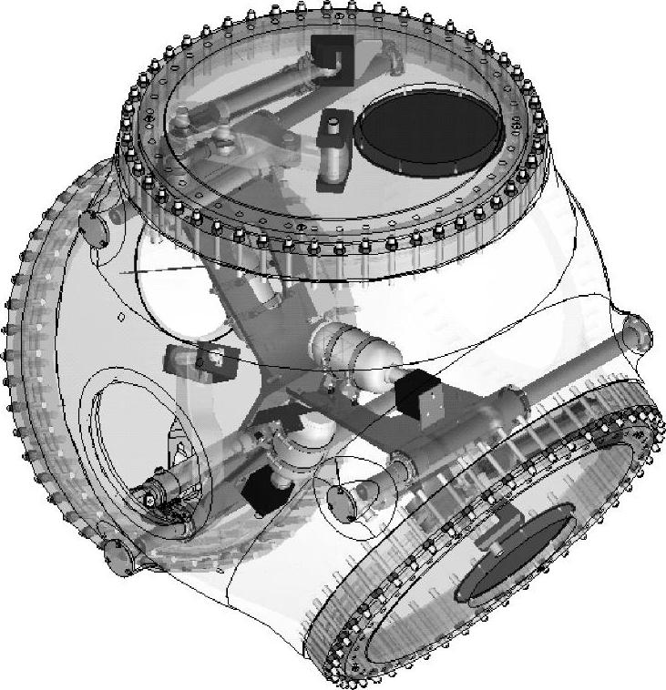

图10-15 液压变桨距系统组成及布局

1.液压变桨距系统的特点

1）液压变桨距系统与电动变桨距系统相比，液压传动的单位体积小、重量轻、动态响应好、扭矩大并且无需变速机构，在失电时将蓄能器作为备用动力源对叶片进行全顺桨作业而无需设计备用电源；

2）节能。液压泵在继电器的控制下保持液压系统压力，泵停止时可以有蓄能器维持系统压力。避免变频器待机等环节产生的能量损耗；

3）可以采用模块化设计，控制元件均可集成在各个阀块中；

4）安全性高。可以配备多个蓄能器起到多重安全冗余保护的作用，当机组出现紧急故障或电网失电时，系统能在蓄能器的作用下完成顺桨过程。

由于叶片是在不断旋转的，必须通过一个旋转接头将机舱内液压站的液压油管路引入旋转中的轮毂，液压油的压力高达20MPa左右，因此制造工艺要求较高，难度较大，管路也容易产生泄漏现象。旋转接头如图10-16所示。

2.液压驱动机构设计

当采用液压缸作为驱动元件时，驱动变桨距机构可以设计成偏心曲柄滑块机构，其工作原理如图10-17所示。

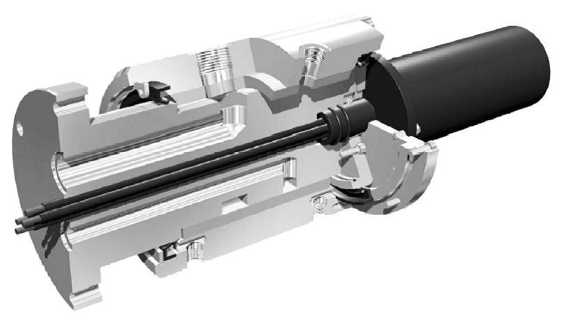

图10-16 旋转接头

图10-17 液压驱动变桨距机构工作原理

图10-17中 h——曲柄长度，单位为m；

l——连杆长度，单位为m；

e——偏心距，单位为m；

ϕ₁——变桨距行程角，单位为（°）；

图10-17所示的机构常用于统一变桨距系统，水平运动的液压缸活塞杆与同步盘连接，同步盘则与三组偏心曲柄滑块机构（图中只画一组）相连，分别驱动三个叶片同步旋转。偏心曲柄滑块机构的尺寸可以根据变桨距的极限角度用作图法或解析法确定。

（1）液压驱动力的计算

根据三个叶片的驱动力矩可以得到变桨距驱动力F_(D)（N）：

F_(D)=3M_(D)/h （10-27）

液压驱动力F_(p)（N）为

F_(p)=F_(D)/η_(D) （10-28）

式中 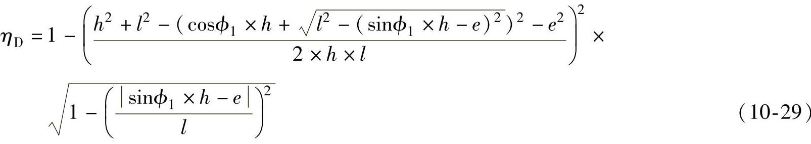

从式（10-29）可见，当偏心曲柄滑块机构确定后，η_(D)是ϕ₁的函数，在式（10-28）中，η_(D)应取最小值。

（2）液压缸的设计

液压缸的有效工作面积（m²）

A_(h)=F_(p)/ph （10-30）

式中 p_(h)——液压系统工作压力，单位为Pa。

液压缸的行程H（m）根据变桨距的极限位置确定。

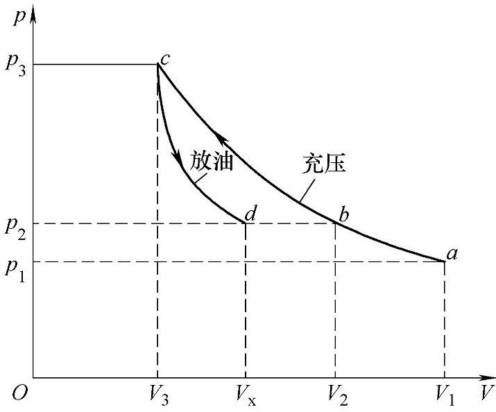

图10-18 蓄能器工作原理

（3）蓄能器的设计

在液压系统中，蓄能器一次收缩所压出的油液至少应该满足液压缸一次满行程的需要。蓄能器工作原理如图5-33所示。

图10-18中曲线abc表示充压过程，cd表示放油过程。a点是气体腔封入时的状态点，p₁为封入压力，即充气压力，V₁为封入容积，即初始充气容积。蓄能器充压时，其内部压力沿abc曲线上升，而气体容积则相应减小。b点是蓄能器参与工作的最低动作点，p₂为最低工作压力，V₂是与p₂相应的气体腔容积。c点是蓄能器参与工作的最高工作点。蓄能器的放油过程是气体腔的膨胀过程，此时，气体腔压力由p₃下降到p₂，容积则相应由V₃膨胀到V_(x)。

从图10-18可见，蓄能器有效输出容积（m³）为

ΔV=V_(x)-V₃ （10-31）

假定充压时状态方程的指数n=α，放油时状态方程的指数n=β，则根据状态方程可以求得

等温变化过程，α=β=1，绝热变化过程，α=β=1.4。变桨距过程可以视为等温过程，则式（10-32）可以写成

蓄能器有效输出容积可以由液压缸的参数决定，即

ΔV=H×A_(h)于是，式（10-33）变为

充气压力p₁推荐为

0.25p₃＜p₁＜0.9p₂

（4）液压泵主要参数 在蓄能器油液压力低到临界值时，液压泵进行供油。假设需要液压泵在Δt（s）时间里完成供油，则液压泵实际流量q_(p)（L/min）为

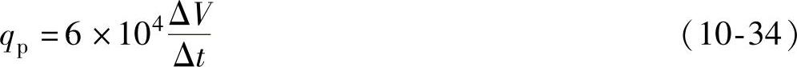

液压泵的额定压力p_(p)应该大于蓄能器最高压力p₃。

液压泵的理论排量（mL/r）

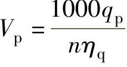

式中 V_(p)——泵的理论排量，单位为mL/r；

n——泵的转速，单位为r/min；

η_(q)——泵的容积效率。

液压泵的驱动功率（kW）

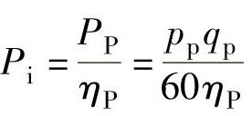

式中 P_(P)——液压泵的输出功率，单位为kW；

η_(P)——液压泵的总效率；

p_(p)——液压泵的出口压力，单位为MPa；

q_(p)——液压泵的实际流量，单位为L/min。

液压泵的驱动功率，即输入功率。也就是带动液压泵的电动机所需的输出功率。

## 第四节 偏航系统

水平轴风力发电机组的机舱绕塔架旋转叫做偏航，风力发电机组的偏航系统一般分为主动偏航系统和被动偏航系统。被动偏航系统指的是依靠风力通过相关机构完成机组对风动作的偏航方式，常见的有尾舵、舵轮和下风向三种；主动偏航指的是采用电力或液压拖动来完成机组对风动作的偏航方式，根据风向仪反馈信息由控制系统自动执行偏航，常见的有齿轮驱动和滑动两种方式。对于大型风力发电机组来说，通常都采用主动偏航的齿轮驱动形式。

### 一、偏航系统的结构设计

偏航系统是一个自动控制系统，其结构如图10-19所示。由图可见偏航系统由控制器、执行机构、偏航计数器、传感器等部分组成。

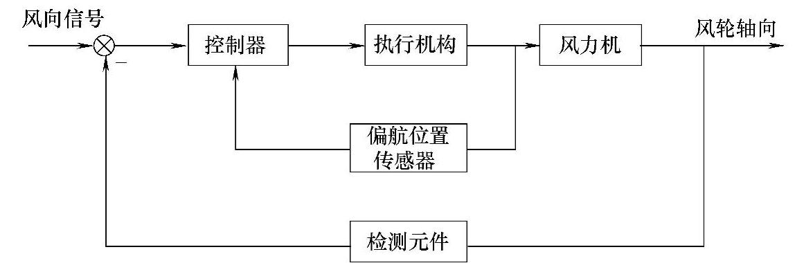

图10-19 偏航系统结构

偏航计数器是记录偏航系统旋转圈数的装置，当偏航系统旋转的圈数达到规定的初级解缆和终极解缆圈数时，计数器则给控制系统发信号使机组自动进行解缆。计数器一般是一个带控制开关的蜗轮蜗杆装置。

风力发电机组无论处于运行状态还是待机状态均能主动对风。在风轮前部或机舱一侧，装有风向仪，当风力发电机组的航向（风轮主轴的方向）与风向仪指向偏离时，计算机开始计时。偏航时间达到一定值时，即认为风向已改变，计算机发出向左或向右调向的指令，直到偏差消除。

当机舱在待机状态已调向720°（根据设定），或在运行状态已调向1080°时，由机舱引入塔架的发电机电缆将处于缠绕状态，这时控制器会报告故障，风力发电机组将关机，并自动进行解缠处理（偏航系统按缠绕的反方向调向720°或l080°），解缠结束后，故障信号消除，控制器自动复位。

偏航系统还设有扭缆保护装置，它是出于失效保护的目的而安装在偏航系统中的。它的作用是在偏航系统的偏航动作失效后，电缆的扭绞达到威胁机组安全运行的程度而触发该装置，使机组进行紧急关机。一般情况下，这个装置是独立于主控系统的，一旦这个装置被触发，则机组必须进行紧急关机。扭缆保护装置一般由控制开关和触点机构组成，控制开关安装在机组的塔架内壁的支架上，触点机构一般安装在机组悬垂部分的电缆上。当机组悬垂部分的电缆扭绞到一定程度后，触点机构被提升或被松开而触发控制开关。

### 二、偏航设计载荷的确定

作用到偏航轴承上的不仅有塔架上方所有设备与附属部件的重量，而且还有风轮作用于偏航轴承本身上的气动推力，因此偏航轴承选用的轴承应该既能承受轴向力又能承受径向力。

风力发电机组在偏航过程中的载荷分布如图10-20所示。

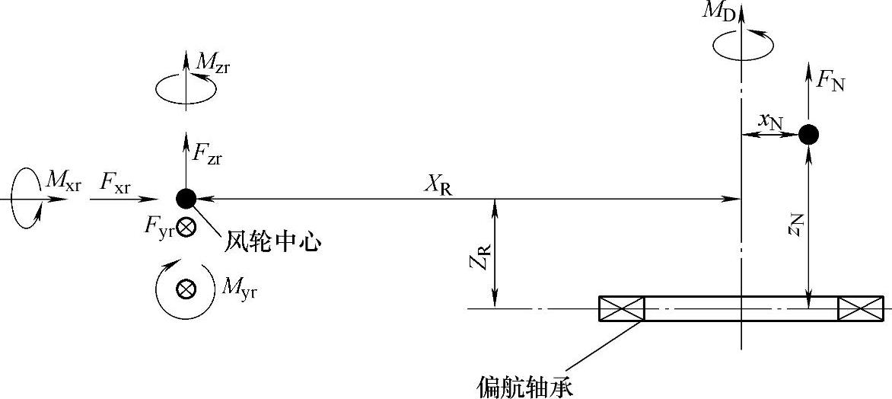

图10-20 偏航过程中的载荷分布

在图10-20中，载荷的方向是根据传统的坐标系画出的，如果实际方向与此相反，则代入负值。

在图10-20中：F_(xr)表示风轮上x轴力，单位为N；F_(yr)表示风轮上y轴力，单位为N；F_(zr)表示风轮上z轴力，单位为N；M_(xr)表示风轮上x轴力矩，单位为N·m；M_(yr)表示风轮上y轴力矩，单位为N·m；M_(zr)表示风轮上z轴力矩，单位为N·m；F_(N)表示机舱的重力，单位为N；x_(N)表示偏航轴到机舱重心的水平距离，单位为m；x_(R)表示偏航轴到风轮重心的水平距离，单位为N；z_(N)表示偏航轴承到机舱重心的垂直距离，单位为m；z_(R)表示偏航轴承到风轮重心的垂直距离，单位为m；M_(D)表示偏航轴上的驱动力矩，单位为N·m。

作用在风轮上的力和力矩可以根据稳定偏航风力机的空气动力学（参见本书第四章）进行计算，也可以应用专用软件求出。

作用在偏航轴承上的倾覆力矩（N·m）

式中 M₁=M_(xr)-F_(yr)z_(R)

M₂=M_(yr)+F_(zr)x_(R)+F_(xr)z_(R)-F_(N)x_(N)作用在偏航轴承上的径向力（N）

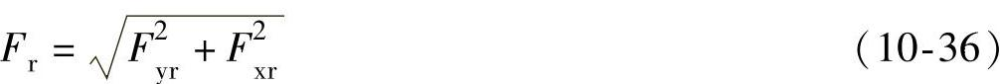

作用在偏航轴承上的轴向力（N）F_(a)=F_(zr)+F_(N) （10-37）

式（10-35）、（10-36）、（10-37）是设计偏航轴承的基础依据。

风力发电机组偏航过程的运动方程如式（10-38）所示。

式中 M_(W)——作用在机舱上的空气动力所产生的力矩，单位为N·m；

M_(M)——机械制动力矩，单位为N·m；

M_(R)——回转轴承上的摩擦力矩，单位为N·m；

M_(K)——回转效应（陀螺效应）所产生的力矩，单位为N·m；

J_(W)——偏航轴上的转动惯量，单位为kg·m²；

ω_(W)——偏航角速度，单位为rad/s。

式（10-38）中，规定偏航轴上的驱动力矩方向为正，制动力矩为负。实现偏航的必要条件为式（10-38）等号左边力矩之和大于零（达到稳态时等于零）。偏航轴上的驱动力矩是风轮偏角和风速的函数。如果偏角和风速增加，驱动力矩也增加。

下面对式（10-38）中的力矩的求法分别加以讨论。

1.作用在机舱上的空气动力矩（见图10-21）

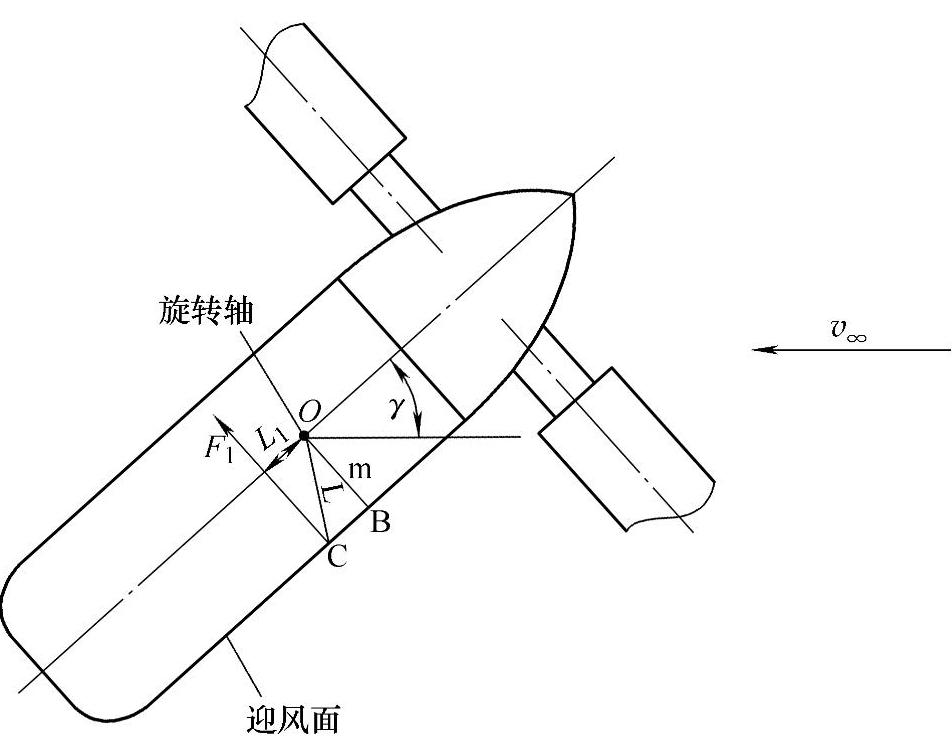

图10-21 作用在机舱上的空气动力

在机组偏航状态下，作用在机舱上的空气动力（N）

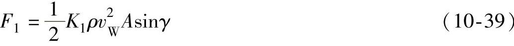

式中 K₁——机舱表面形状系数，平面为1，曲面酌减，典型值为0.7；

ρ——空气密度，单位为kg/m³；

v_(W)——尾流风速，单位为m/s；

A——迎风面的面积，单位为m²；

γ——风轮偏角，单位为（°）。

假设作用在机舱上的空气动力作用点通过迎风面的中心点C，如图10-21所示。可以求出，空气动力的力臂

式中 L——图10-21中旋转轴O到C点的距离，单位为m；

m——旋转轴O到迎风面的距离，单位为m。

于是，作用在机舱上的空气动力矩（N·m）

2.机械制动力矩

机械制动力矩的求法见式（10-4）、（10-5）。由式（10-4）、（10-5）可见机械制动力矩的大小与液压系统工作压力有关。在偏航过程中，机械制动力矩作为阻尼力矩，液压系统工作压力较小；在偏航制动时，要求机械制动力矩足够大，所以，液压系统工作压力较大。

3.回转轴承上的摩擦力矩

不计黏性摩擦力矩，回转轴承上的摩擦力矩可以写成

M_(R)=-μ_(f)（aM_(t)+bF_(a)D_(r)+cF_(r)D_(r)） （10-42）

式中 μ_(f)——摩擦系数；

a、b、c——比例系数；

M_(t)——倾覆力矩，单位为N·m；

F_(r)——作用在偏航轴承上的径向力，单位为N；

F_(a)——作用在偏航轴承上的轴向力，单位为N；

D_(r)——轨道直径，单位为m。

对于4点球轴承，系数可以取：μ_(f)=0.006，a=2.2，b=0.5，c=1.9。

4.回转效应所产生的力矩

求法见第四章第一节。对于大型机组偏航速度一般小于1°/s，此时，回转效应所产生的力矩所占比例较小，可以忽略。对于三叶片风轮，回转效应所产生的偏航力矩为零。

### 三、偏航执行机构设计

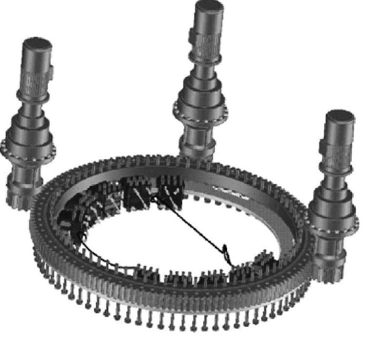

图10-22 偏航系统的执行机构

执行机构一般由偏航轴承、偏航电机、偏航减速机、偏航小齿轮、偏航齿圈、偏航制动器、偏航液压回路等组成。图10-22所示是偏航系统的执行机构。

1.偏航电动机选型

偏航驱动装置的马达可选用电动机或液压马达。偏航电动机的选型计算可以参照本章第三节相关内容。

2.偏航减速机设计

偏航减速机的设计要求：

1）偏航减速机的所有齿轮的齿面接触疲劳强度和弯曲疲劳强度的校核计算应符合GB/T3480—1997《渐开线圆柱齿轮承载能力计算方法》的有关规定。

2）偏航减速机的所有齿轮的静态强度计算应符合GB/T 3480标准的有关规定。

3）偏航减速机内太阳轮和行星轮的精度要求至少应满足GB 10095—2008《圆柱齿轮》所规定的6级，内齿圈及偏航输出齿轮至少应满足GB 10095标准所规定的8级以上。

4）螺纹连接部分的计算应按照GB/T 16823.1—1997《螺纹紧固件应力截面积和承载面积》的有关规定进行，螺栓的强度等级不低于8.8级。

5）对采用的轴承必须根据静态载荷和使用寿命来确定轴承的规格，轴承的计算按GB/T6391—2010《滚动轴承 额定动载荷和额定寿命》的有关规定进行。

偏航减速机的设计参数的选择见表10-5。

表10-5 偏航减速机的设计参数表

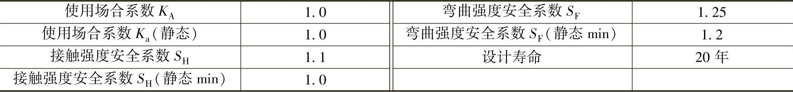

根据目前国内已安装的机型的实际状况，偏航系统的偏航转速的推荐值见表10-6。

表10-6 偏航转速

例如：SUT-3000风力发电机组偏航驱动装置传动比为1000±2％，采用4级行星变速箱。其特点为：结构紧凑、体积小、重量轻、传动比范围大、传动效率高、输入输出轴同轴、可以实现动力的分流和变速等。由于行星齿轮传动结构复杂，对设计、制造和使用维修要求高。在高速端的行星齿轮传动，在均载机构的动态特性、系统的振动特性、零件的结构和制造精度等方面要求更高。

一种由电动机、减速箱和小齿轮组成的偏航驱动机构总成如图10-23所示，与图10-22中的结构差别在于电动机偏置安装。

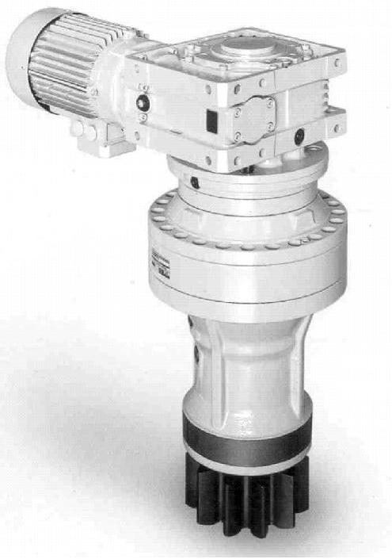

图10-23 偏航驱动机构总成

### 四、轴承齿轮副

1.偏航轴承

偏航轴承由套圈（内圈、外圈、上下圈）、滚动体、隔离块、密封圈和油杯等组成。偏航轴承的选型计算应分别进行齿圈滚道选型计算和轮齿的强度计算。偏航轴承的选型计算方法参照DIN 281或JB/T2300—1999《回转支撑》来进行计算。

偏航轴承所承受的作用力包括：总轴向力F_(a)，总倾覆力矩M_(t)，在力矩作用平面的总径向力F_(r)。选型计算时，静态工况下偏航轴承所承受的作用力F_(a)、M_(t)、F_(r)和动态工况所承受的作用力F_(a)、M_(t)、F_(r)应分别计算。

2.偏航轴承齿圈

偏航齿圈的轮齿强度计算方法参照GB 3480—1997《渐开线圆柱齿轮承载能力计算方法》及GB6413—2003《渐开线圆柱齿轮胶合承载能力计算方法》进行计算。可以作为（JB/T 2300—1999）规定的选型计算的校核计算。

### 五、偏航制动

1.制动器结构设计

偏航制动器一般采用液压拖动的钳盘式制动器（常闭式制动器），其结构如图10-24所示。制动器应在额定负载下，制动力矩稳定，其值应不小于设计值。在机组偏航过程中，制动器提供的阻尼力矩应保持平稳，与设计值的偏差应小于5％，制动过程不得有异常噪声。制动器在额定负载下闭合时，摩擦片和制动盘的贴合面积应不小于设计面积的50％；摩擦片周边与制动器体的配合间隙任一处应不大于0.5mm。制动器应设有自动补偿机构，以便在摩擦片磨损时进行自动补偿，保证制动力矩和偏航阻尼力矩的稳定。在偏航系统中，制动器可以采用常闭式和常开式两种结构形式，常闭式制动器是在有动力的条件下处于松开状态，常开式制动器在有动力的条件下则是处于锁紧状态。

一种偏航制动器的外形见图10-25。

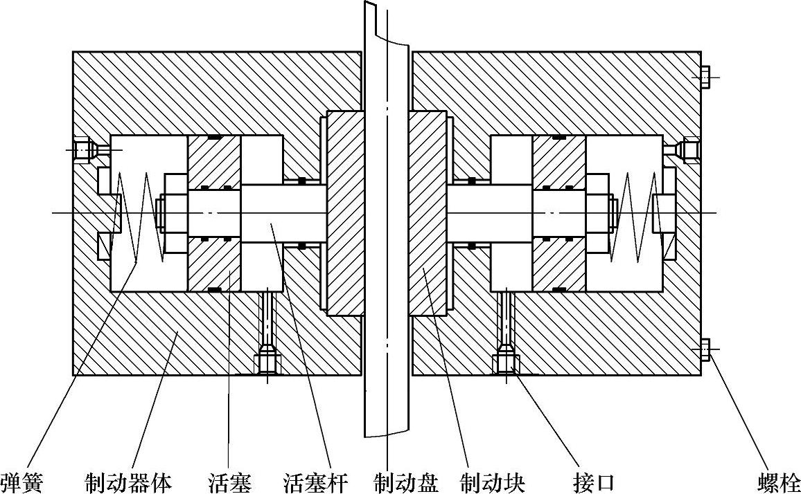

图10-24 钳盘式制动器

2.制动器主要零部件

（1）制动器体

制动器体由可锻铸铁KTH370-12或球墨铸铁QT400-18制造，也有用轻合金制造的，可做成整体的，也可做成两半并由螺栓连接。其外缘留有开口，以便不必拆下制动器便可检查或更换摩擦片。制动器体应有高的强度和刚度。一般多在制动器体中加工出制动液压缸，也有将单独制造的液压缸装嵌入制动器体中的。为了减少传给制动液的热量，多将杯形活塞的开口端顶靠制动块的背板。有的活塞的开口端部切成阶梯状，形成两个相对且在同一平面内的小半圆环形端面。活塞由铸铝合金或钢制造。为了提高耐磨损性能，活塞的工作表面进行镀铬处理。当制动器体由铝合金制造时，减少传给制动液的热量成为必须解决的问题。为此，应减小活塞与制动块背板的接触面积，有时也可采用非金属活塞。

图10-25 偏航制动器外形

（2）制动块

制动块由背板和摩擦片构成，两者直接压嵌在一起。摩擦片多为扇面形，也有矩形、正方形或长椭形的。活塞应能压住尽量多的制动块面积，以免摩擦片发生卷角而引起尖叫声。制动块背板由钢板制成。许多盘式制动器装有摩擦片磨损达极限时的警报装置，以便及时更换摩擦片。

（3）摩擦材料

制动摩擦材料应具有高而稳定的摩擦系数，抗热衰退性能好，不能在温度升到某一数值后摩擦系数突然急剧下降；材料的耐磨性好，吸水率低，有较高的耐挤压和耐冲击性能；制动时不产生噪声和不良气味，应尽量采用少污染和对人体无害的摩擦材料。

目前，在制动器中广泛采用模压材料，它是以石棉纤维为主并与树脂黏合剂、调整摩擦性能的填充剂（由无机粉粒及橡胶、聚合树脂等配成）与噪声消除剂（主要成分为石墨）等混合后，在高温下模压成型的。另一种是编织材料，它是先用长纤维石棉与铜丝或锌丝的合丝编织成布，再浸以树脂黏合剂经干燥后辊压制成。在100～120℃温度下，它具有较高的摩擦系数（μ_(f)=0.4以上），冲击强度比模压材料高4～5倍。但耐热性差，在200℃或250℃以上即不能承受较高的单位压力，磨损加快。

粉末冶金摩擦材料是以铜粉或铁粉为主要成分（占质量的60％～80％），加上石墨、陶瓷粉等非金属粉末作为摩擦系数调整剂，用粉末冶金方法制成。其抗热衰退和抗水衰退性能好，但造价高。

各种摩擦材料摩擦系数的稳定值约为0.3～0.5，少数可达0.7。设计计算制动器时一般取0.3～0.4。选用摩擦材料时应注意，一般说来，摩擦系数愈高的材料其耐磨性愈差。

3.制动盘

制动盘通常位于塔架与偏航轴承中间，一般为环状，制动盘的材质应具有足够的强度和韧性，如果采用焊接连接，材质还应具有比较好的可焊性，此外，在机组寿命期内制动盘不应出现疲劳损坏。制动盘的连接、固定必须可靠牢固。制动盘的主要技术要求是：

1）制造方法和材料按表10-7规定；

表10-7 制动盘的制造方法和材料

2）制动盘的轴孔和键槽型式及尺寸应符合GB/T 3852—2008《联轴器轴孔和联结型式与尺寸》的规定；

3）按表10-7规定制造的制动盘，均应消除内应力。铸造的制动盘应无裂纹、砂眼、气孔等缺陷；

4）摩擦表面的表面粗糙度Ra为3.2μm；

5）对材料为钢的铸造和锻造制动盘进行调质处理时，硬度为273-302HBW。摩擦表面如需淬火，淬硬层深度为2～3mm，硬度为35-45HRC。

4.制动器间隙

制动盘与摩擦片之间在未制动的状态下应有工作间隙，以保证制动盘能自由转动。一般，鼓式制动器的设定间隙为0.2～0.5mm；盘式制动器的为0.1～0.3mm。考虑到在制动过程中摩擦副可能产生机械变形和热变形，因此制动器在冷却状态下应有的间隙应通过试验来确定。另外，制动器在工作过程中会因为摩擦片的磨损而加大，因此制动器必须设有间隙补偿机构。

### 六、偏航系统的控制

偏航系统的控制由控制器来实现。由于风向瞬时波动频繁，但幅度不大，通常设置一定的允许偏差，如±8°，如果在此容差范围内，就可以认为是对风状态。机舱将保持既定方向。

1.偏航状态的转换程序

偏航控制共包含4种状态，分别是手动偏航、自动对风偏航、自动解缆、停止偏航。这4种状态应根据人机界面中的按键状态以及机组所执行的偏航程序进行转换，如图10-26所示。

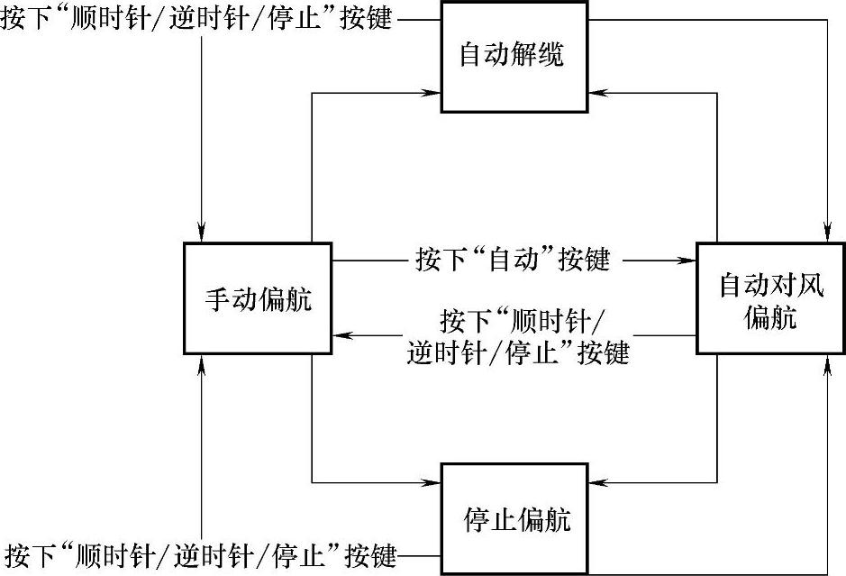

图10-26 偏航状态转换

2.偏航操作控制功能：

（1）偏航初始化

偏航系统上电后，控制器开始初始化，将此时平均偏航误差读入控制器，等待偏航。

（2）偏航等待

偏航系统处于等待状态时，偏航电动机处于停止状态，此时若平均风速大于偏航所要求的最低风速（2.5m/s），而偏航误差大于8°（或小于-8°），则起动偏航电动机，进行偏航跟踪。

（3）自动偏航功能

控制器连续3min时间内检测风向情况，若风向确定，同时机舱不处于对风位置，控制器首先判断机舱位置是否处于0位右边，若是，则左偏航；若不是，则右偏航。控制器松开偏航制动，起动偏航电动机运转，开始偏航对风程序，同时偏航计时器开始工作，根据机舱所要偏转的角度，使风轮轴线方向与风向基本一致，如图10-27所示。

（4）手动偏航功能

手动偏航控制包括顶部机舱控制、面板控制和远程控制偏航3种方式。当有手动偏航请求时，进入手动偏航初始化程序，停止偏航，并取消扭缆报警信号，然后判断偏航方向。同时，控制器会判断风速是否允许手动偏航，若不允许，则停止偏航，等风速允许手动偏航后，并且仍然存在手动偏航请求时，则继续手动偏航；如果此时无手动偏航请求，则退出手动偏航状态，转入偏航等待状态。另外，如果出现偏航标定初始化信号，并且偏航零位开关失效，则进入手动状态下偏航标定。流程图如图10-28所示。

图10-28 手动偏航流程

（5）自动解缆功能

自动解缆功能是偏航控制器通过检测偏航角度、偏航时间及偏航传感器，使发生扭转的电缆自动解开的控制过程。当偏航控制器检测到扭缆达到2.5～3.5圈（可随意设置）时，若风力发电机组在暂停或起动状态，则进行解缆；若正在运行，则中心控制器将不允许解缆，偏航系统继续进行正常偏航对风跟踪。当偏航控制器检测到扭缆达到保护极限3～4圈时，偏航控制器请求中心控制器正常关机，此时中心控制器允许偏航系统强制进行解缆操作。在解缆完成后，偏航系统便发出解缆完成信号。解缆系统的工作流程如图2-29所示。

（6）偏航停止 停止偏航，取消解缆报警信号。

3.传感器

（1）风向仪

风向仪一般有机械旋转式风标或超声波共振风向测量仪，输出信号通常为4～20mA模拟电流信号。机组通常有两套风向仪，正常运行时，主控系统采用其中一套风向仪作为主风向测量源，另一套用于校验测量数据。当风向仪的信号被采集后，数据传输到主控系统，通过程序计算后进行判断是否应偏航。当确定需要偏航后，主控系统发出偏航动作信号驱动顺时针或逆时针偏航继电器，再由继电器驱动接触器吸合，通过偏航电机运行来完成顺时针或逆时针偏航对风，偏航系统的正、反向驱动电路互为闭锁回路。

风向仪所采集的4～20mA模拟电流信号经过处理变为主控系统所需的风向值，具体处理过程如下公式：

其中，最大输出风向=360°，最小输出风向=0°，最大模拟电流=20mA，最小模拟电流=4mA，偏移量=-180°，则

输出风向信号=22.5×（当前输入模拟电流-4）+0+（-180）

例如：当前输入电流为12 mA，则当前风向为0°（即风轮正对风向）。

（2）偏航位置传感器

风力发电机组是靠偏航位置传感器来进行扭缆测量的。这个装置由两个相距半个齿间隔的记数传感器组成，当偏航动作后，由这两个记数传感器记录偏航齿圈上的齿数，由PLC进行数据运算来识别偏航的圈数，并根据条件判断是否进行解缆操作。

例如：SUT3000风力发电机组的偏航系统采用电感式接近开关作为计数器，测量机舱当前位置。将两个接近开关A和B固定在偏航齿圈附近，传感器的探头距离齿圈齿顶面的距离保持在5～8mm，两个传感器之间的水平中心距保持在0.5倍的齿顶宽度（约6mm），而两个传感器之间的直线中心距必须保持在2倍外径以上（36mm左右），具体安装方式如图10-30所示。

主控系统不断接收偏航角度传感器A和B发送的脉冲信号，根据偏航齿圈一周的齿数可以计算出当前偏航的角度，同时以此脉冲信号排列成不同的数组序列，从而判断出机舱偏航方向，具体方法如图10-31所示。

图10-29 自动解缆流程

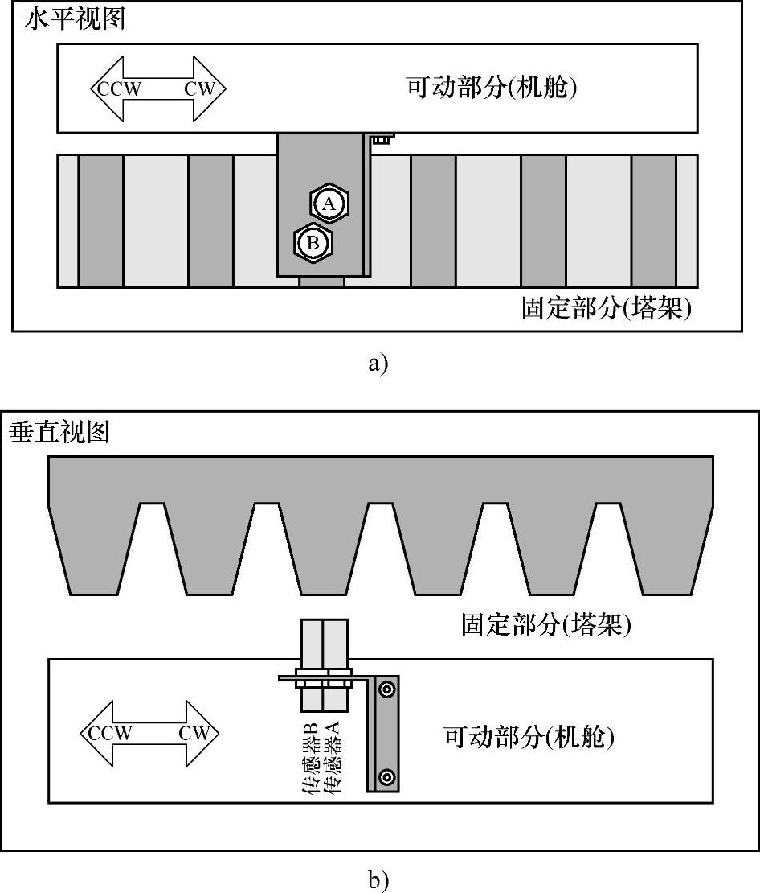

图10-30 偏航角度传感器安装方式

a）水平视图 b）垂直视图

图10-31 偏航传感器输出脉冲序列

由图10-29可知，当机舱顺时针方向偏航时，偏航角度传感器A和B输出为（0，0）、（1，0）、（1，1）、（0，1）；而当机舱逆时针方向偏航时，偏航角度传感器A和B输出为：（0，0）、（0，1）、（1，1）、（1，0）。如果在以上偏航过程中，出现其他数组序列，例如，直接由（0，0）跳变至（1，1），或者直接由（1，0）跳变至（0，1），则说明两个传感器的安装位置有误或者与齿顶的距离不符合要求。

（3）扭缆保护装置

扭缆保护装置（见图10-32）一般由凸轮控制器和扭缆开关组成，凸轮控制器由小齿轮与偏航盘相啮合，在偏航动作的同时也会带动凸轮控制器内部的齿轮转动，当转动一定圈后会触动机械开关动作。计算机接收到后就进行判断，是否需要解缆。一般凸轮控制器有三个开关：顺时针偏航位置开关、中间位置开关、逆时针偏航位置开关。

图10-32 扭缆保护装置

## 第五节 主控系统

### 一、主控系统设计概述

对于大型风力发电机组，主控系统不仅要监视电网、风况、机组运行数据，对机组的并网和脱网控制，以确保机组在运行过程中的安全性和可靠性，还需要根据风速和风向的变化，对机组进行优化控制，以提高机组的运行效率和发电质量。

风力发电机组是一个复杂多变的非线性系统，具有不确定性和多干扰等特点。风力发电机组主控系统的目标主要有四个：保证机组的可靠运行，能量利用率最大，电能质量高，机组寿命长。

为了完成上述控制目标，主控系统必须根据风信号使机组自动进入起动状态、并网或脱网；根据功率及风速大小自动进行转速和功率控制；根据风向信号自动对风；当发生故障时，能确保机组安全平稳的关机；在运行过程中能对运行状态监测和记录，对异常情况作出迅速自行判断并采取相应的保护措施；对于机组的运行性能指标和统计数据，都可以完整的生成，并具有远程通信的能力。

### 二、主控系统硬件结构设计

大型风力发电机组的主控系统硬件结构一般由两部分组成：塔底控制器模块组和机舱控制器模块组。塔底控制器模块组安装在塔底电气控制柜内，机舱控制器模块组安装在机舱电气控制柜内。两组模块之间一般使用多芯多模光纤组成的工业以太网等通信方式进行两个模块组之间的通信，而每组控制器模块之间使用CAN等通信总线协议进行内部通信。

塔底控制器模块组中的控制器模块一般包括：电源/通信模块、主控制器、电网测量模块、输入/输出模块、人机界面模块、现场总线通信接口等模块；机舱控制器模块组的控制器模块一般包括：电源/通信模块、输入/输出模块、人机界面模块、现场总线通信接口等模块。

大型风力发电机组的主控系统的硬件具体结构如图10-33所示。

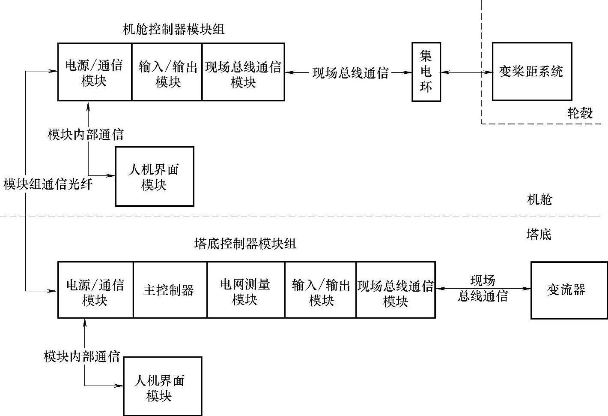

图10-33 主控系统硬件结构示意图

电源/通信模块可以为本组所有模块提供模块内部电源，并提供人机界面（显示屏）或便携式电脑所需的通信接口及模块组之间通信所需的光纤端口。

主控制器是风力发电机组的大脑，作为主控系统的核心部分，负责整个风力发电机组的控制与协调各个部件之间的动作，并可以提供与风场通信的以太网口及监测控制器运行状态的安全继电器节点。

电网测量模块是与相关的电流互感器和电压互感器相连接，测量风力发电机组电网出口端的电压和电流，并经过计算得到所有电网信息，如电网电压、电网电流、有功功率、功率因数、无功功率、发电量等。

输入/输出模块是用于接收风力发电机组中各个数字和模拟信号，包括：风速信号、风向信号、转速脉冲信号、温度信号、压力信号、偏航角度计数脉冲信号、断路器和继电器通断状态信号、开关量信号等，并向所有执行机构控制继电器发出通断命令信号。

现场总线通信模块是以各种现场总线协议为基础，通过通信模块的内部转换单元，把外部部件的现场总线协议转换为主控制器可以识别的模块内部通信协议，这样主控系统就可以和任何现场总线通信协议的设备进行自由的交互数据和信息。例如，主控制器可以通过现场总线通信模块和变流器、变桨距系统进行现场总线通信，这样主控系统可以接收到变流器、变桨距系统的具体信息，也可以把命令发送到变流器、变桨距系统。

### 三、主控系统信号采集及处理设计

1.风速、风向信号

风速信号是由安装在机舱顶部的风速仪传感器采集的信号，风力发电机组一般安装有两套风速仪，而风速仪大致可以分为采用机械旋转式风杯的风速仪和采用超声波共振风速仪两种，两者把瞬时风速转化为模拟信号或脉冲信号，输入到主控系统的输入/输出模块上。

当风力发电机组正常运行时，主控系统有时只采用其中一套风速仪作为风速测量源，只有当这套风速仪被检测出故障时，例如输出信号长时间无变化等，主控系统自动切换另一套风速仪作为风速测量源。

例如，风速仪所采集的4～20mA模拟电流信号经过处理变为主控系统所需的风速值，具体处理过程如公式（10-43）所示：

其中，最大测量风速=50m/s，最小测量风速=0m/s，最大模拟电流=20mA，最小模拟电流=4mA，则

输出风速信号=3.125×（当前输入模拟电流-4）

当前输入电流为8mA，则当前风速为12.5m/s。

风向信号采集及处理见本章第四节。

2.油压信号

在风力发电机组中一般存在两种油压信号：齿轮箱润滑油压力信号和液压站油压力信号。

油压信号是由安装在齿轮箱和液压站等风力发电机组部件上的油压传感器采集的信号，油压传感器把油压信号转化为模拟信号，输入到主控系统的输入/输出模块上。

例如，油压传感器所采集的4～20mA模拟电流信号经过处理变为主控系统所需的油压值，具体处理过程如式（10-44）所示：

其中，最大测量油压=25MPa，最小测量风速=0MPa，最大模拟电流=20mA，最小模拟电流=4mA，则

输出油压信号=15.625×（当前输入模拟电流-4）

当前输入电流为8 mA，则当前油压为62.5MPa。

3.振动加速度信号

在风力发电机组中一般有若干个振动加速度传感器去来测量振动加速度信号。

振动加速度传感器一般安装在机舱中的主要部件和机舱底盘上的不同角度上，并把振动加速度数值输入到主控系统的输入/输出模块上。

例如，安装在机舱底盘后部的传动链轴向振动加速度传感器测量的加速度信号，具体处理过程如公式（10-45）所示：

式中 a_(W)（t）——振动加速度瞬时值；

T₀——振动加速度测量周期；

a_(rms)W₀——周期时间内振动加速度均方根值，加速度信号测量频率范围为0.1～10Hz。

4.转速信号

在风力发电机组中一般有若干个转速测量传感器去来测量转速信号，而且一般采用电感式接近开关作为风轮或发电机的转速测量传感器。

风轮转速测量传感器一般安装在主轴承附近，感应探头正对前轴承螺纹环上的螺栓，且探头与螺栓头表面的距离保持在8mm左右，风轮旋转时依靠上述螺栓使接近开关感应出脉冲信号，再输入到主控系统的输入/输出模块上，即可将脉冲频率转换至风轮转速信号，具体数据处理过程如公式（10-46）所示：

例如，风轮每旋转一周的脉冲数为40个，则

输出转速=输入脉冲频率×1.5

当输入脉冲频率为9Hz，则输出风轮转速为13.5r/min。

发电机转速测量传感器一般安装在齿轮箱高速轴输出端附近，感应探头正对联轴器上预留的凹槽，且探头与凹槽表面的距离保持在8mm左右，发电机旋转时依靠上述凹槽使接近开关感应出脉冲信号，再输入到主控系统的输入/输出模块上，即可将脉冲频率转换至发电机转速信号，具体数据处理过程如公式（10-47）所示：

例如，发电机每旋转一周的脉冲数为3个，则

输出转速=输入脉冲数×20

当输入脉冲频率为60Hz，则输出发电机转速为1200r/min。

5.温度信号

风力发电机组的温度信号是一般是通过安装在机组各种部件不同位置上的温度传感器来测量的，再输入到主控系统的输入/输出模块上。

风力发电机组中采用的温度传感器主要有两种，分别是插入式热电阻和拧入式热电阻。插入式热电阻一般是安装在机舱罩外，可以用来测量户外温度；拧入式热电阻可以安装在主轴承内，用来测量主轴承温度，两种温度传感器的引出线一般都采用三线制。

### 四、主控系统功能设计

1.数据采集与处理

风力发电机组主控系统应提供与控制和故障监测相关的数据信息通道及处理功能，例如：风速、风向、风轮转速、发电机转速、机舱位置、扭缆角度、桨距角、液压系统压力、振动、温度及电气量数据等；对于关键数据信息，例如：风速、风向、转速、关键点温度等，主控系统应提供冗余信息通道，这样就可以保证关键信息不会突然终断。

2.软件程序监视器（看门狗）功能

（1）关键设备看门狗

针对关键设备，如：风速仪、风向仪、转速传感器等，风力发电机组的主控系统应根据其特性启用对应软件看门狗安全监测功能，确保每一个参与机组控制的物理量都能真实反映被监测设备的状态。

（2）通信看门狗

大型风力发电机组的主控系统应能实时监控自身与各个子部件之间的通信状态，通信异常时应能及时形成相应的故障码信息，根据故障码对应的关机程序等级，执行警告或关机程序。

3.数据监视

风力发电机组的主控系统应能采集或生成下述数据信息，并能够通过人机界面或中央监控系统显示：

1）风速、风向、风轮转速、发电机转速、机舱位置、扭缆角度、桨距角；

2）机组当前状态（待机、并网、停机等）；

3）液压系统压力、机舱振动、机舱温度、发电机温度、齿轮箱油温度等；

4）三相电压、三相电流、有功功率、无功功率、功率因数、频率、发电量等电网信息。

5）机组当前的故障码或各个部件的故障情况。

4.故障监测

风力发电机组的主控系统对各个被控对象分单元监测，根据相应单元传感器采集量，经过看门狗功能处理后的物理量信息，形成若干能反映单元状态的故障码，故障码应做到故障信息定位准确、防误动作、维护简单，用户根据操作权限应能通过本地人机界面或远程监控系统启用和禁止任意一个故障码的监测。当其中任意一个故障码激活时，主控系统应能根据故障码属性，准确做出相应警告或关机操作。

5.机组起动

风力发电机组的起动模式应分为自动和手动两种，可以通过主控系统人机界面或远程监控系统自由切换。主控系统重新上电启动后，一般可以是手动模式。当风速过低（小于切入风速）自动脱网关机时，为了避免发生频繁起动和停止机组的现象，平均风速大于切入风速并持续一段时间，才能允许机组自动起动。具体起动功能的设计如下：

（1）自动起动机组功能

当风力发电机组的主控系统运行正常，机组无任何故障和警告产生，平均风速（一般为10min平均风速）大于切入风速且小于切出风速，则机组进入自动起动状态；当主控系统检查温度、油压等机组必备条件完毕并通过以后，通过转速控制，使发电机转速提升至并网允许的转速范围，然后向变流器发出起动并网命令，由变流器完成并网操作；主控系统接着实施转矩控制和变桨距控制，使输出功率平稳上升，达到机组的稳态平衡，这样机组就已经并网发电，同时自动起动功能完成。

（2）手动起动机组功能

当风力发电机组的主控系统运行正常，机组无任何故障和警告、平均风速（一般为10min平均风速）大于切入风速且小于切出风速，技术人员通过主控系统的手动起动按钮进行手动起动操作或者通过监控系统远程手动起动操作；当主控系统接收到上述手动起动命令后，机组进入自动起动机组阶段。

6.关机

风力发电机组的主控系统应采用多个级别关机控制程序，当风力发电机组的故障码激活时，根据故障码所对应的关机程序等级，执行相应的关机程序，在确保风力发电机组安全运行的前提下，尽可能地减小机组关机过程中的载荷，具体不同级别的关机功能设计如下：

（1）正常关机模式1

当主控系统接收到正常关机命令或者较低级别的故障码激活时，主控系统首先协调控制变流器和变桨距系统等相关部件，逐步降低机组的输出功率，降低发电机转速，待功率降至关机允许的功率设定值时，主控系统向变流器发出关机脱网命令，断开与电网的连接，3个叶片以正常关机模式1的变桨距速度顺桨至正常关机模式1的停机位置，风轮自由旋转，机组进入待机状态，正常关机模式1过程完成。

（2）正常关机模式2

当主控系统接收到较低级别的故障码激活并且发生电网故障时，主控系统应立即向变流器发出关机脱网命令，断开与电网的连接，同时协调控制变桨距系统，3个叶片以正常关机模式2的变桨距速度顺桨至正常关机模式2的停机位置，机组进入停机状态，正常关机模式2过程完成。

（3）紧急关机模式1

当主控系统接收到较高级别的故障码激活时，主控系统首先协调控制变流器和变桨距系统等相关部件，逐步降低机组的输出功率，降低发电机转速，待功率降至关机允许的功率设定值时，主控系统向变流器发出关机脱网命令，断开与电网的连接，3个叶片以紧急关机模式1的变桨距速度快速顺桨至紧急关机模式1的停机位置，机组进入停机状态，紧急关机模式1过程完成。

（4）紧急关机模式2

当主控系统接收到较高级别的故障码激活并且发生电网故障时，主控系统应立即向变流器发出关机脱网命令，断开与电网的连接，同时协调控制变桨距系统，3个叶片以紧急关机模式2的变桨距速度快速顺桨至紧急关机模式2的停机位置，机组进入停机状态，紧急关机模式2过程完成。

7.跟踪最大功率功能

风力发电机组在额定风速以下运行时，不能满功率发电，主控系统应能够根据机组控制策略协调控制变桨距系统、变流器等各个相关部件，使风轮转速始终跟踪最佳叶尖速比运行，风速-功率曲线与功率最优曲线保持一致，尽量捕捉最大风能。主控系统在跟踪最大功率的整个控制过程中，应避免传动链的载荷变化过大，并且机舱振动不应超过机组允许范围。

8.恒功率运行控制功能

风力发电机组在额定风速以上且切出风速以下运行时，主控系统应能够根据机组控制策略协调控制变桨距系统、变流器等各个相关部件，使机组输出功率的波动范围大约不超过额定功率的10％。主控系统在恒功率运行控制的整个过程中，应避免整个机组的载荷变化过大，并且机舱振动不应超过机组允许范围。

9.偏航控制

偏航控制功能设计详见本章第四节。

10.机组维护功能

风力发电机组的主控系统中一般应装有维护状态转换开关或按钮。当机组处于待机或停机状态下，维护转换开关切换至维护状态时，主控系统将进入维护模式状态。在机组维护模式下，起动、自动偏航、自动温度调节等自动控制功能一般都应该被禁止，但是主控系统可以实现手动变桨距、手动偏航、手动起动加热器等手动操作机组控制，这样可以保证相关维护人员对于机组进行一系列的维护工作。当维护工作结束时，需要把维护转换开关切换至非维护状态，也就是机组正常操作模式。

11.低电压穿越功能

风力发电机组主控系统一般都需要配合变桨距系统和变流器满足电网对风电场低电压穿越的要求，在低电压穿越期间应能保证机组不停机、不超速、不脱网。

12.有功功率调节功能

风力发电机组主控系统一般都需要通过机组本地或远程控制的方式对机组输出的有功功率进行手动调节，有功功率调节的设定值可以是具体输出有功功率的数值，也可以是机组最大有功功率输出值的百分比。

13.无功功率调节功能

风力发电机组主控系统一般都需要通过机组本地或远程控制的方式对机组输出的无功功率进行手动调节，无功功率调节的设定值可以是具体输出无功功率的数值，也可以是机组最大无功功率输出值的百分比。

14.备用电源功能

在电网失电的情况下，风力发电机组的主控系统配备的备用电源应能独立供电不少于30min，确保主控系统有充足的时间控制变流器和变桨距系统等相关部件，在一定时间内使机组安全关机，并完成相关故障数据的记录工作。

15.温度智能调节

风力发电机组的主控系统应配备有完备的智能温度调节功能，确保在主控制器的工作环境条件下正常运行，包括针对低温环境的自动加热系统控制和针对高温环境的自动散热系统控制。智能温度调节功能可以使主控系统工作在最佳的环境温度范围内，保持最好的工作效率。

16.故障信息记录

风力发电机组的主控系统应能对与故障相关的变量进行一段时间的记录，当故障触发或复位时便将此记录保存。故障触发记录应分为故障前和故障后两个时段，且两个时段的长短及采样间隔皆可进行调整。在信息记录中应该包含故障触发的详细信息，包括故障码，故障级别，故障原因，故障触发时间等信息。故障复位记录应包含故障复位的时间、复位方式、操作级别等信息。

17.时钟

风力发电机组的主控系统应设有硬件时钟电路，在失去电源的情况下，硬件时钟应能正常工作，精度应满足24h误差不大于±5s，并且支持校时功能。

18.人机交互界面

风力发电机组的主控系统应配备有人机交互界面，通过人机交互界面可以实现查看当前机组的运行状态或故障码信息、设置运行参数、手动起/关机组、手动偏航控制等功能，以上功能的操作权限应根据登录用户的等级而定。

19.通信要求

（1）与相关部件的总线通信

大型风力发电机组的主控系统应能提供与变流器、变桨距系统等部件的现场总线通信的CANopen、ProfiBus等接口，且通信周期不能过长，保持数据更新实时性。

（2）与远程监控系统通信

大型风力发电机组的主控系统应能提供与远程监控系统通信的100M/1000M单模光纤以太网等接口，并且支持下述通信协议的一种或多种：

1）IEC 61400-25；

2）IEC 60870-5-104；

3）Modbus TCP；

4）OPC。

### 五、主控系统控制策略设计

图10-34 机组运行区域示意图

在大型风力发电机组主控系统中，控制策略的设计主要体现在：运行风速范围内，确保系统的稳定运行；低风速时，跟踪最佳叶尖速比，获得最大风能；高风速时，限制风能的捕获，保持机组的输出功率为最大值，并保持输出功率稳定；减小阵风引起的转矩波动峰值，减少风轮的机械应力和输出功率的波动，避免共振；减小功率变化对传动链的暂态响应；主控系统响应快速，对一些输入信号过滤，对一些输出信号限幅。

1.机组运行区域设计

在大型风力发电机组的主控系统控制策略设计中，机组的运行区域如图10-34所示，其中发电机转速-转矩轨迹曲线为A—B—C—D—E—F—G。

主控系统控制策略设计需要将曲线改为A—C₁—C—F₁—F—G，这样机组的性能会有很大的改善。由于机组会在很宽的风速范围内运行在最优尖速比附近，比同样最大运行转速时吸收更多的能量，而且也可以防止在机组额定点附近桨距控制器频繁动作。当机组在运行低风速风况时，即刚超过切入风速时，控制策略的设计需要使机组运行在接近恒定的转速状态下，此时机组运行更加平稳。

主控系统设计的大型风力发电机组的运行区域设计可以分为五个区域：启动阶段A—C₁，恒转速Ⅰ阶段C₁—C，最佳叶尖速比阶段C—F₁，恒转速Ⅱ阶段F₁—F，恒功率阶段F—G。

启动阶段A—C₁：这个运行阶段需要通过控制机组变桨距系统对发电机的转速做闭环控制，随着转速的增加，机组从A点运行到C₁点。控制目标是发电机并网转速。

恒转速Ⅰ阶段C₁—C：这个运行阶段是在并网后额定风速以下，通过对发电机转矩的调节控制发电机的转速在保持在C₁点附近，随着转矩的增加，机组从C₁点运行到C点。控制目标是C点发电机转速值，随着风速的变大，使机组运行在最佳叶尖速比曲线上。

最佳叶尖速比阶段C—F₁：这个运行阶段是在在并网后额定风速以下，为了保持机组在最佳叶尖速比下工作，必须根据风速的变化通过控制发电机转矩来调节发电机转速，随着风速的变大，机组从C点运行到F₁点。控制目标是发电机最佳转矩-转速曲线，也就是跟踪最佳叶尖速比，确保风能的最大捕获。

恒转速Ⅱ阶段F₁—F：这个运行阶段是随着风速继续变大，保持发电机转速在F点附近，并且F点转速大于额定转速E点。这是考虑到防止转矩控制器和桨距角控制器相互干扰，造成在额定风速以下桨距角控制器频繁动作的情况。随着转矩的增大，机组从F₁点运行到F点。控制目标是F点转速，随着风速的变大，机组达到额定功率的附近。

恒功率阶段F—G：这个运行阶段是机组达到额定功率以后，通过对发电机转矩和桨距角的双重调节，保持发电机的功率在额定值附近，利用风轮转速的变化，储存或释放部分能量，限制机组获得的风能，提高传动系统的柔性保证发电机输出功率平稳，避免变桨距频繁动作，获得更多的动态特性。

根据上面的主控系统运行区域的设计，五个阶段之间的转换条件依据图10-35所示的运行区域转换逻辑图：

2.转矩控制器和变桨距控制器设计

根据风力发电机组运行区域的五个阶段的设计，转矩控制器和变桨距控制器需要根据不同运行区域分别来设计。

当机组运行在起动阶段A—C₁时，不需要控制转矩，所以不用激活转矩控制器；对于变桨距控制器的设计，输入的是发电机转速反馈值和并网转速的差值，输出是桨距角的设定值。

当机组运行在恒转速Ⅰ阶段C₁—C时，对于转矩控制器的设计，输入的是发电机转速反馈值和C点转速差值，输出是发电机转矩的设定值；对于变桨距控制器的设计，桨距角设定值应当为机组运行最小桨距角。

当机组运行在最佳叶尖速比阶段C—F₁时，对于转矩控制器的设计，输入的是发电机转速反馈值，输出的是发电机转矩的设定值；对于变桨距控制器的设计，桨距角设定值应当为机组运行最小桨距角。

当机组运行在恒转速Ⅱ阶段F₁—F时，对于转矩控制器的设计，输入的是发电机转速反馈值和F点转速的差值，输出的是发电机转矩的设定值；对于变桨距控制器的设计，桨距角设定值应当为机组运行最小桨距角。

当机组运行在恒功率阶段F—G时，对于转矩控制器的设计，输入的是发电机转速反馈值，输出的是发电机转矩的设定值；对于变桨距控制器的设计，输入的是发电机转速反馈值和F点转速的差值，输出的是桨距角设定值。

综上所述，大型风力发电机组的主控系统控制策略的核心设计，可以由转矩控制器的设计和变桨距控制器的设计充分体现。

因此，主控系统控制策略的设计针对最佳叶尖速比阶段C—F₁运行区域时，转速-转矩最优增益K如式（10-48）所示：

K=πρR⁵C_(p)（λ）/2λ³i³ （10-48）

式中 ρ——空气密度；

R——风轮半径；

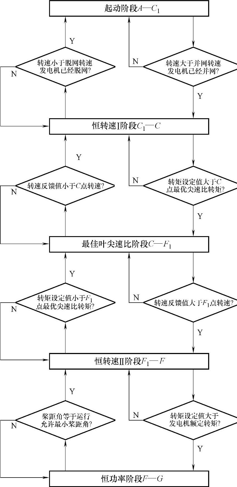

图10-35 运行区域转换逻辑图

λ——期望的叶尖速比；

C_(p)（λ）——此叶尖速比时的风能利用系数；

i——齿轮箱速比。

由式（10-52）就可以得出转速和转矩的对应关系，得到转矩的设定值。变桨距控制在额定风速以下主要是维持最大风能的捕捉。

除了上面提到的最佳叶尖速比阶段C—F₁，主控系统控制策略的设计主要是通过变化的转矩设定值来响应发电机转速的波动，PI控制器被用来用这种方法维持目标转速。变桨距控制器应用一个双PI控制器来调节变桨距动作。风力发电机组主控系统的控制策略框图如图10-36所示。

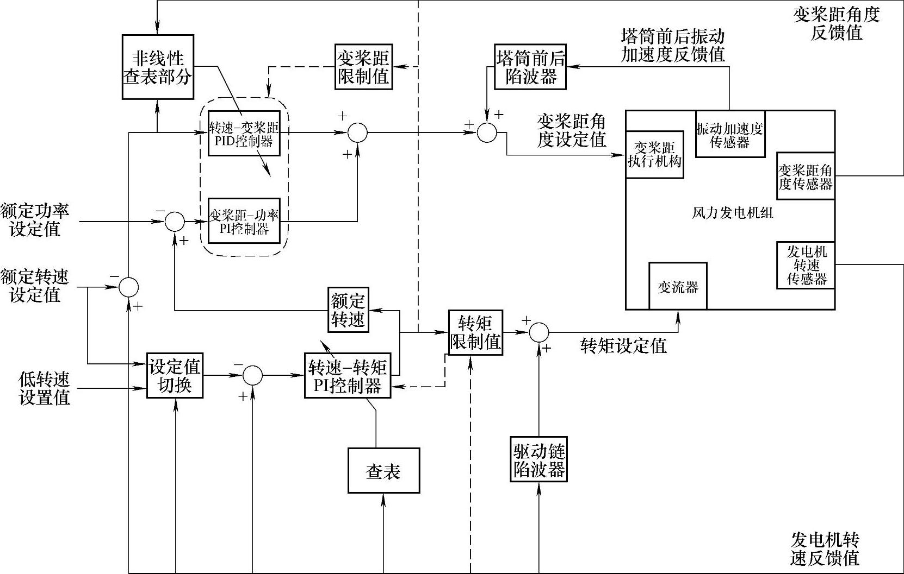

图10-36 风力发电机组主控系统控制策略框图

如果机组运行在不同的区域中，主控系统的参数随着区域和阶段的不同也在变化。

## 第六节 安全系统

### 一、安全系统设计原则

1）由于风力发电机组的内部或外部发生故障，或监控的参数超过极限值而出现危险情况，或主控系统失效，风力发电机组不能保持在其正常运行范围内，则激活安全系统，使风力发电机组维持在安全状态。

2）安全系统的触发值不超过风力发电机组的设计极限值。

3）安全系统的设计以失效-安全（Fail-Safe）为原则，当安全系统内部电源或者非安全寿命部件发生单一失效或者其他故障时，安全系统能保护风力发电机组的安全不受这些故障的影响。

4）安全系统包含一套制动系统（气动制动），从而能够使风轮静止或者由运行状态变为空转状态，该制动系统直接作用于风轮。制动系统能够在小于一年一遇极端风速的任何风况下，使风轮由空转状态变为完全静止状态。

5）安全系统与主控系统相互独立，如果安全系统功能与主控系统功能发生冲突，就要以安全系统功能为前提。

6）如果安全系统已经触发，必须等待相关技术人员完成必要的维护并排除故障之后，才能让风力发电机组重新投入运行。任何与安全系统相关的故障都不能自动复位，也不能自动重新起动风力发电机组。

### 二、安全系统控制功能设计

风力发电机组的运行管理一般由主控系统执行，其控制逻辑保证风力发电机组在规定的条件下安全、有效的运行。当主控系统不能使机组保持在正常运行范围内，或者超过有关安全系统设置的极限值时，将由安全系统执行安全保护方案。安全系统和主控系统控制功能关系如图10-37所示。

图10-37 安全系统和主控系统控制功能关系

### 三、软件的安全保护设计

1.任务协调设计

多任务系统中，由于同时有多个任务工作，且任务间的进程是有相关性的。如果没有协调控制就容易造成任务间逻辑的冲突。设计风力发电机组控制软件时，一些重要任务的控制循环中都加入状态查询，以防止因其他任务执行相关操作而造成混乱。

多任务系统中资源同时只能被一个任务控制作为资源。在风力发电机组控制中，部分输出口属于临界资源，它们如果被多个任务同时控制，就可能出现故障或造成器件损坏。因此软件中应采用控制许可方式，通过一些状态参数的设置和判别，以保证所有临界资源在一个时刻只被一个任务控制。

2.容错性设计

为了防止用户误操作引起损失，在风力发电机组的任何状态下，非法的键盘及按键输入都应不被承认，或导致安全关机。

风力发电机组的运行参数多数是可以修改的。用户修改时，可能出现错误，还可能造成运行参数的破坏。软件应提供一份缺省参数，以备用户进行参数复位。

3.软件权限设计

软件权限设计中，风力发电机组控制软件提供三层权限限制：

最低的用户层权限供风电场值班人员使用，允许查询风力发电机组的状态参数、故障记录、运行参数累计值等，可以控制风力发电机组的起动，关机和左右偏航等。

高一级的维护层权限提供给风力发电机组维护人员使用，需要输入密码。它除了具有用户层的权限外，还可以修改风力发电机组运行参数。

最高层权限是设计层，它仅提供给设计人员使用，需要输入设计层密码，这样可以防止用户程序被非法修改，保护软件的版权。

4.提供软件本身的可靠性

软件本身的可靠性在很大程度上取决于设计人员的素质。为了提高软件的可靠性，具体可从下列方面来考虑：

1）认真进行软件规范设计，遵守软件编制的设计规范；

2）使用结构化、模块化的程序设计方法；

3）选择合适的程序设计语言；

4）细心编程，仔细地使用子程序、堆栈及中断系统；

5）提高软件设计人员的素质；

6）多使用，多实践，剔除错误，去除干扰。

图10-38 安全链控制流程图

### 四、安全链设计

安全系统中最重要的部分是安全链，它是一个单信号触发即动作的控制系统，当风力发电机组触发安全链中的任何一个信号，安全链立即动作，使风力发电机组安全关机。

在风力发电机组中，安全链一般由紧急关机开关，主断路器结点，机舱振动开关，风轮超速开关，发电机超速开关，变流器结点，主控程序结点，变桨距系统结点等部分组成。

例如在风轮超速时，安全链中的超速开关触发，导致一级安全链断开，变桨距系统执行紧急关机程序，将叶片快速顺桨至安全停机位置，利用空气动力制动使风力发电机组关机，以保护机组的安全。安全链的控制流程如图10-38所示。

图10-39为某机组安全链逻辑框图。

安全链由四部分组成：紧急关机安全链、一级安全链和二级安全链，安全链控制继电器。

紧急关机安全链包含机舱柜紧急关机按钮、机舱紧急关机按钮、塔底柜紧急关机按钮、控制器紧急关机等四部分。

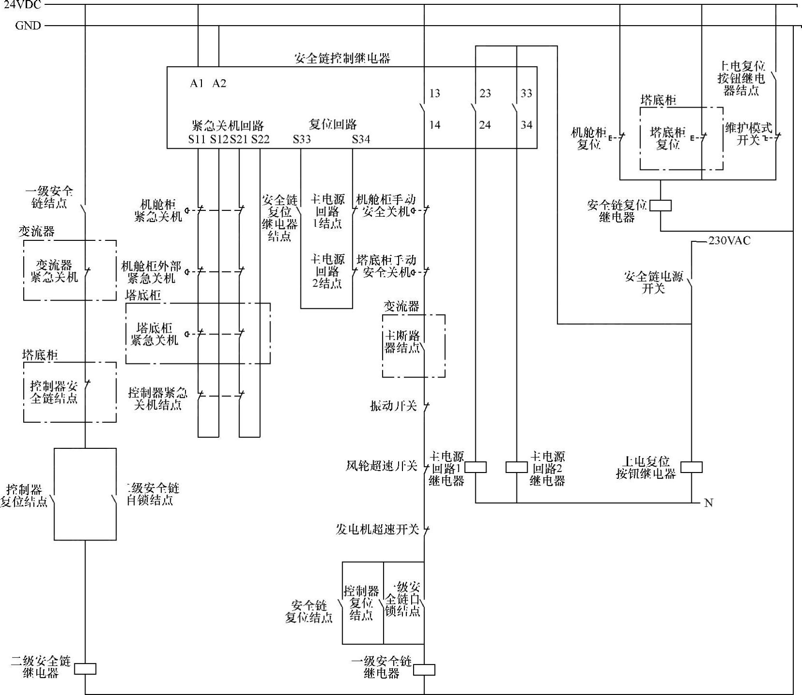

图10-39 安全链控制逻辑框图

一级安全链包含紧急关机安全链继电器、机舱柜手动安全关机按钮、塔底柜手动安全关机按钮、主电路断路器状态信号、机舱振动开关、风轮超速开关、发电机超速开关等七部分。

二级安全链包含一级安全链继电器、变流器安全链反馈信号、控制器安全链结点等三部分。

安全链控制继电器是用来控制和协调其他三条安全链的通断和安全功能的控制单元。通过安全链控制继电器的操作，其他三条安全链的优先级由高至低分别是紧急关机安全链、一级安全链和二级安全链，它们之间环环相扣，只有当紧急关机安全链、一级安全链和二级安全链中所有环节全部闭合时，即所有安全链监测部件均处于正常状态时，二级安全链继电器才能使能，从而使风力发电机组的执行机构才能正常工作。当在安全系统中存在任何安全问题时，安全链就会断开，主控系统和安全系统就会采取相应的安全措施，从而使风力发电机组安全关机。

### 五、防雷功能设计

风力发电机组安全系统中防雷功能设计是指用于对需要防雷的空间作防雷电效应的系统，该系统由外部防雷系统和内部防雷系统两部分组成。其中，外部防雷系统包括接闪器、引下线和接地装置等防雷设备，其目的在于通过接闪器直接接受雷击，并将雷电流引至接地装置并最终流散入大地。除了上述防雷设备外的所有附加部件和措施均属于内部防雷系统，其目的在于减小雷电流在需要防雷的空间内所产生的电磁效应。

1.防雷等级（LPL）及其雷电流

根据相关规范中的要求，大型风力发电机组及其各个部件都应按照防雷等级Ⅰ（LPLⅠ）进行雷电保护。具体雷电流参数见表10-8和表10-9。

表10-8 根据LPLⅠ的雷电流参数最大值

表10-9 根据LPLⅠ的雷电流参数最小值及相应滚球半径

2.防雷区域（LPZ）

依据相关标准所规定的原则，将大型风力发电机组需要保护的空间划分为不同的防雷区域，分别是LPZ 0A、LPZ 0B、LPZ 1、LPZ 2等。各个防雷区域的具体定义详见表10-10。

表10-10 防雷区域定义

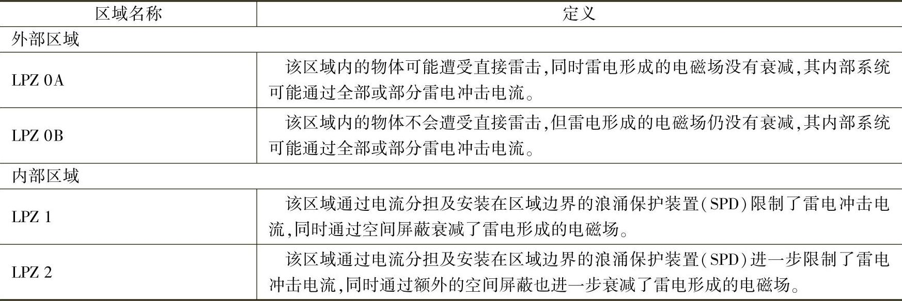

注1.总之，防雷区域的数字越大，其电磁场环境参数越低；

2.通过电流分担来限制电流指的是由于将初始雷电流分布到多个导体上，从而使防雷系统中单个导体的电流负载降低。

对于大型风力发电机组，防雷区域LPZ 0A和LPZ 0B通常包含以下区域：

1）风轮叶片，包括风轮轮毂导流罩及其内部设备，如传感器、驱动器等；

2）机舱罩外部部件；

3）在无金属外壳（金属网或金属梁）机舱罩内部的全部设备，如发电机、辅助传动设备、电缆、传感器和驱动器，金属开关柜的外部部件，非金属开关柜的内部部件；

4）风速、风向传感器；

5）塔架内部；

6）风力发电机组与监控室或升压站之间没有屏蔽措施的地埋电缆或架空电缆。

防雷区域LPZ 1通常包含以下区域：

1）采取有效的引雷、屏蔽及防浪涌措施的风轮轮毂内部；

2）完全金属外壳的机舱罩内部，或配有相应引雷措施和浪涌保护设备的金属屏蔽网内部；

3）所有装配金属外壳的设备内部，且这些设备都通过适当方式连接到等电位连接系统和浪涌保护装置，例如将机座作为等电位基准；

4）屏蔽电缆或敷设在金属管中的电缆，且屏蔽网或金属管的两端都连接在LPZ 1的等电位连接上；

5）安装有防雷笼或避雷针的测风装置，且金属屏蔽的两端都连接到机组接地系统或浪涌保护装置；

6）钢制塔筒或混凝土塔筒内部，塔筒应根据相应标准进行设计，且钢制塔筒或混凝土塔筒内部钢筋应连接至接地体或等电位连接上，或通过浪涌保护装置进行保护。

防雷区域LPZ 2包含安装在防雷区域LPZ 1内部的设备，且采取额外的保护措施进一步衰减了电磁场和过电压的影响。

在不同的保护区的交界处，必须通过SPD（防雷及电涌保护器）对有源线路（包括电源线、数据线、测控线、天线等）进行等电位连接，确保保护圈内的电子设备处在较为安全的范围内。其中在LPZ 0区和LPZ 1区的交界处，需采用通过Ⅰ类测试的B级SPD，将通过电流、电感耦合和电容耦合三种方式侵入到系统内部的大能量的雷电流（10/350μs波形）泄放，并将残压控制小于4kV的范围；而对于LPZ 1区与LPZ 2的交界处，需采用通过Ⅱ类测试的C级SPD并将残压控制在小于2.5kV的范围。

3.接地原则

在进行机组电气接地时应遵循以下原则：

1）机组的接地电阻值应不大于4Ω。

2）与机组结合在一起的所有金属件都应等电位连接在一起，并与防雷装置相连。

3）接地系统有直通大地的连接，等电位连接网不应设单独的接地装置。

4）防雷接地、交流工作接地、直流工作接地、安全保护接地、防静电接地共用一组接地装置。

5）接地装置应利用机组的自然接地体，当自然接地体的接地电阻达不到要求时必须增加人工接地体。

6）接地电缆的敷设应平直、整齐。若需要弯转时，弯曲半径应大于导线直径的10倍。

7）接地设计必须遵循国际标准和规范。

4.机组防雷功能设计举例

根据前面提到的对防雷区域的划分要求，某风力发电机组防雷功能设计总体结构如图10-40所示。

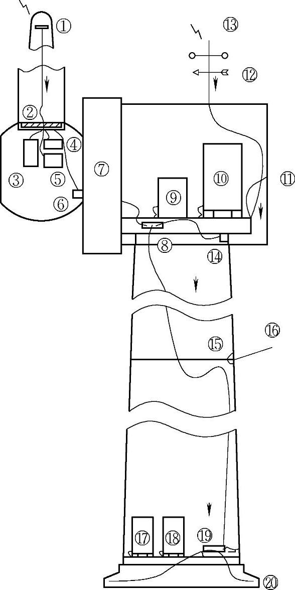

图10-40 机组防雷功能设计总体结构示意图

1—叶尖接闪器 2—变桨距轴承防雷电刷 3—变桨距电动机、减速机 4—变桨距电池柜 5—变桨距控制柜 6—发电机轴承防雷电刷 7—发电机 8—机舱等电位母线排 9—偏航发电机、液压站等执行机构 10—机舱柜 11—机舱罩屏蔽网 12—测风装置及换热器 13—机舱尾部引雷装置 14—偏航轴承防雷电刷 15—法兰跨接接地电缆 16—塔筒连接法兰 17—塔底柜 18—变流器 19—塔底等电位母线排 20—基础接地环

